# COASTAL DIVERSITY (Part I)

Chapter 2 EM 1110-2-1100 30 April 2002

# Table of Contents

- I-2-1. Introduction Page I-2-1
- I-2-2. Coastal Areas I-2-1 a. Atlantic North: Glaciated coast b. Atlantic Central and South: Barrier and drowned valley coasts c. The Atlantic and Gulf of Mexico: Coral and mangrove coasts d. Gulf of Mexico East: Wetland mangrove, and barrier coasts e. Gulf of Mexico West: Barrier coast f. Pacific: Sea cliffs and terraced coasts g. The Bering and Chukchi Seas: Arctic coastal plains and barriers h. The Beaufort Sea: Deltaic coast i. Pacific: Volcanic islands j. Great Lakes of North America I-2-1 I-2-2 I-2-4 I-2-4 I-2-6 I-2-7 I-2-8 I-2-9 I-2-9 I-2-11
- I-2-3. Stability I-2-13
- I-2-4. Erosion I-2-14
- I-2-5. Solutions I-2-16
- I-2-6. References I-2-24
- I-2-7. Acknowledgments I-2-26

## List of Figures

- Page
- Figure I-2-1. Atlantic coast characteristics I-2-2
- Figure I-2-2. Atlantic coast tide and wave characteristics I-2-3
- Figure I-2-3. Barrier Island and bay complex, southern Rhode Island I-2-4
- Figure I-2-4. New York Harbor, 1940s I-2-5
- Figure I-2-5. Length of barrier islands and spits in the United States I-2-6
- Figure I-2-6. Cape Hatteras, North Carolina I-2-7
- Figure I-2-7. Hallandale Beach I-2-8
- Figure I-2-8. Gulf of Mexico coastal characteristics I-2-9
- Figure I-2-9. Gulf of Mexico tide and wave characteristics I-2-10
- Figure I-2-10. East Pass Inlet, Florida I-2-11
- Figure I-2-11. Morgan Peninsula, Alabama I-2-12
- Figure I-2-12. Dulac, Louisiana I-2-13
- Figure I-2-13. Pacific coast characteristics I-2-14
- Figure I-2-14. Pacific coast tide and wave characteristics I-2-15
- Figure I-2-15. Pocket beach just north of Laguna Beach, southern California I-2-16
- Figure I-2-16. Mouth of the Siuslaw River, southern Oregon near the town of Florence I-2-17
- Figure I-2-17. Seattle, located in sheltered Puget Sound I-2-18
- Figure I-2-18. Alaska coastal characteristics I-2-19
- Figure I-2-19. Hawaiian Islands wave characteristics I-2-20
- Figure I-2-20. Great Lakes shoreline characteristics I-2-21
- Figure I-2-21. Minnesota Point, photographed from Duluty, Minnesota, looking south I-2-22
- Figure I-2-22. Calumet Harbor, Indiana I-2-22
- Figure I-2-23. Duluth Canal, Minnesota I-2-23
- Figure I-2-24. Bluffs about 1 km north of St. Joseph Harbor, eastern Lake Michigan I-2-24 I-2-ii Coastal Diversity

# List of Tables

Table I-2-1. Age and Sandy Shores of the Major Hawaiian Islands I-2-12

## Chapter I-2 Coastal Diversity

### I-2-1. Introduction

The coasts, or shores, of the world are the margins separating the 29 per cent of the earth that is land from the 71 percent that is water. By reworking and often eroding the margins of the land, the seas aid streams, subsurface water, glaciers, and the wind in wearing down the continents. Sediments derived from the land are often transient along the coasts, temporarily forming beaches, bars or islands before coming to rest on the sea floor. There is significant natural diversity in shore types throughout the United States and even greater diversity throughout the world (see Part IV for details). Consequently, engineering, development, and policy strategies need to be tailored for each unique region and need to be flexible to changes in the local condition. Coastal engineers, managers, and planners need to be aware of coastal diversity for a number of reasons:
- a. The coast is dynamic and constantly evolving to a new condition.
- b. The balance and interaction of processes are different in different areas understanding diversity provides clues to the critical factors that may affect a particular study site.
- c. Different settings imply different erosion and accretion sediment patterns.
- d. Analytical tools and procedures may be suitable for a particular setting but totally inappropriate for another.
- e. Similarly, engineering solutions may only be appropriate for certain settings where they will function properly.
Shorelines are subject to a broad range of processes, geology, morphology, and land usages. Although winds, waves, water levels, tides, and currents affect all coasts, they vary in intensity and relative significance from one location to another. Variations in sediment supply and geological setting add to this coastal diversity. A more detailed discussion and analysis of the processes at work along the United States coasts is given by Francis P. Shepard and Harold R. Wanless in their book Our Changing Coastline (1971).

#### I-2-2. Coastal Areas

The popular image of a long, straight, sandy beach with a sandy backshore and foreshore, vegetated sand dunes, and gently sloping near shore zone with rhythmic plunging breakers may be the ideal image of the zone where the land meets the sea, but is not the norm along most coasts. Not all coastal areas are sandy, nor are all shores dominated by wave action. Some coastal areas have scenic clay bluffs or rocky headlands. Others are shallow mud flats or lush wetlands. For some shores, tidal currents or river discharge dominate sediment transport and the shore character. For other shores, the effects of glaciers, marine life (coral), or volcanoes may control the geomorphology. Shore materials include transportable muds, silts, sands, shells, gravels, and cobbles, and insitu rock formations or bedrock (erosive and non-erosive). In portions of the United States, the coastal area is sinking and gradually becoming permanently inundated; in other areas, new lands are accreting or even rising out of the sea.
a. Atlantic North: Glaciated coast (Figures I-2-1, I-2-2) . These coasts are normally deeply indented and bordered by numerous rocky islands. The embayments usually have straight sides and deep water as a

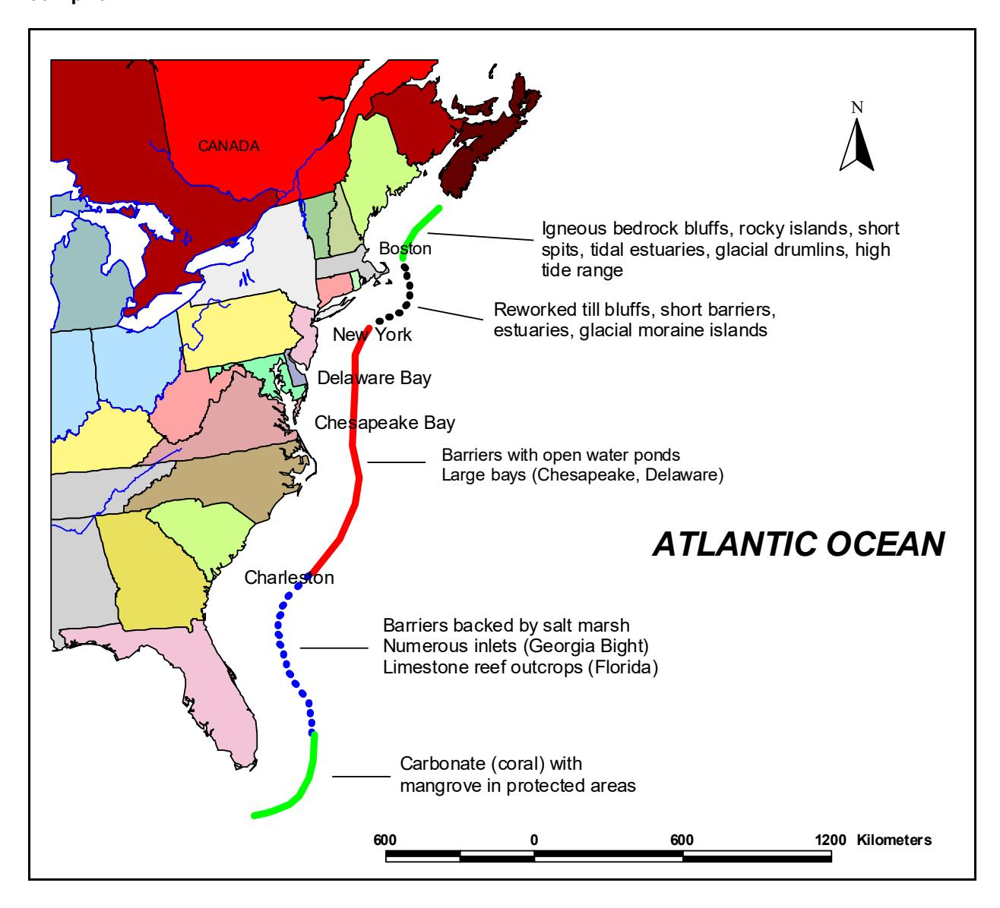

*Figure I-2-1. Atlantic coast characteristics*

result of erosion by the glaciers. Uplifted terraces may be common along these coasts that were formerly weighted down by ice. Abrupt changes in coastal character occur where glacial deposits and particularly glacial outwash play a dominant role, while in some rocky areas, few glacial erosion forms can be found. Moraines, drumlins, and sand dunes, the result of reworking outwash deposits, are common features. Glaciated coasts in North America extend from the New York City area north to the Canadian Arctic (Figures I-2-3, I-2-4, IV-2-8, and IV-2-9), on the west coast, from Seattle, Washington, north to the Aleutian Islands, and in the Great Lakes. (Figure IV-2-20) (Shepard 1982).
b. Atlantic Central and South: Barrier and drowned valley coasts. South of the glacial areas begins the coastal Atlantic plain, featuring almost continuous barriers interrupted by inlets and by large embayments with dendritic drowned river valleys, the largest being Delaware and Chesapeake Bays. The North American coastline is reported to include over 10,000 km of barriers, about 33 percent of all barrier coast of the world (Berryhill, Dixon, and Holmes 1969). The United States alone has a total length of 4,900 km of barriers and spits, the longest extent for a single nation (Figure I-2-5 and Table IV-2-3). Extensive wetlands and marshes
I-2-2 Coastal Diversity

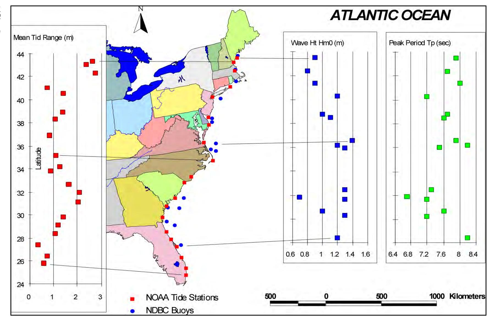

*I-2-3 Figure I-2-2. Tide and wave characteristics of the Atlantic coasts. Wave data summarized from National Data Buoy Center buoys. $H^{m}O$ and Tp averaged from hourly statistics over total period of record from statistics computed by National data Buoy Center. Tide range for indicated stations from statistics presented in NOAA Tide Tables*

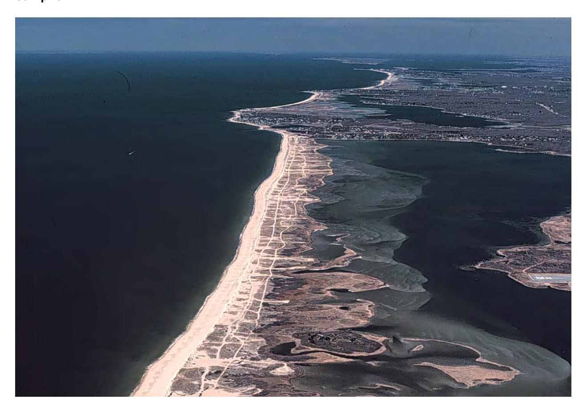

*Figure I-2-3. Barrier Island and bay complex, southern Rhode Island. View looking west toward Quonochontaug Point, a rocky headland with bedrock outcrops. The barrier in the foreground is East Beach, with Block Island Sound to the left and Ninigret Pond to the right. Prominent overwash fans can be seen in the shallow waters of the pond (April 1977)*

mark much of the coast, where sediment and marsh vegetation have partly filled the lagoons behind the barriers. Some coasts have inland ridges of old barrier islands, formed during interglacial epochs, separated from the modern barrier islands by low marshes or lagoons. The best exhibit of cuspate forelands in the world extends from the mouth of Chesapeake Bay to Cape Romain, South Carolina (Figure I-2-6). The coast is much straighter south of Cape Romain and the only cuspate foreland is that of Cape Canaveral, Florida. Barrier Islands and drowned valleys continue south to Miami, Florida (Figure I-2-7), except for a brief length of coast in the Myrtle Beach, South Carolina, area where the barriers are attached to the coastal plain. Much of the southeast coast of Florida was extensively filled, dredged, and reshaped in the early $20^{th}$ century to support development (Len č ek and Bosher 1998). From Miami around the tip of Florida through Alabama, Mississippi and eastern Louisiana, coastal characteristics alternate between swampy coast and white sand barriers (Shepard 1982).
c. The Atlantic and Gulf of Mexico: Coral and mangrove coasts. The barrier islands change from quartz sand south of Miami to carbonate-dominated sand, eventually transforming into coral keys and mangrove forest. The Florida Keys are remnants of coral reefs developed during a higher sea level stage of the last interglacial period. Live reefs now grow along the east and south side of the keys and the shallows of Florida Bay studded with mangrove islands extending north and west into the Everglades and the Ten Thousand Islands area that comprises the lower Florida Gulf of Mexico coast (Shepard 1982).
I-2-4 Coastal Diversity

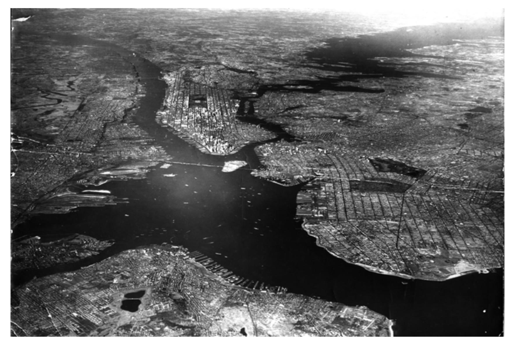

*I-2-5 Figure I-2-4. New York Harbor, late 1930s. This drowned river valley system, partly sculpted by glaciers, is one of the world's finest natural harbors. The USACE has an active role dredging, clearing debris, and maintaining navigability of this great port. View looking north, with Manhattan in the center and Brooklyn to the right. Photograph from Beach Erosion Board archives*

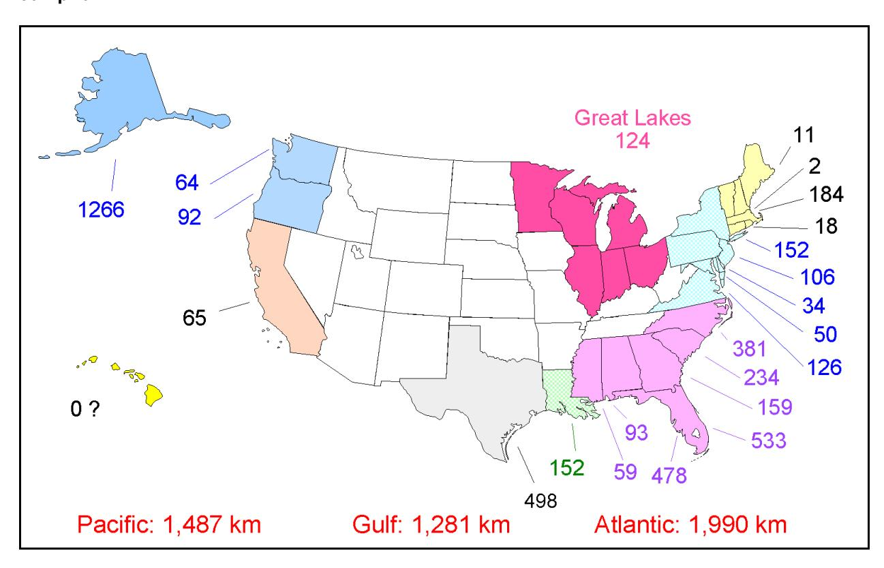

*Figure I-2-5. Length (in km) of barrier islands and spits in the United States. Data measured from U.S. Geological Survey topographic maps (see Table IV-2-3 for details)*

d. Gulf of Mexico East: Wetland mangrove, and barrier coasts (Figures I-2-8, I-2-9). On Florida's Gulf of Mexico coast, barrier islands begin at Cape Romano and extend north as far as Cedar Keys. Enclosed bays usually have an abundance of mangrove islands and the topography is low with many lakes and marshes. North of Cedar Keys, the barrier islands end. They are replaced by a vast marsh doted with small vegetated islands. The rock strata in this area are limestone, which, along with the low river gradients and numerous ponds or sinkholes, accounts for the absence of sand in the region. Due to its location and the large shallow water area offshore, little wave energy is present except during rare hurricanes. Some 130 km to the northwest, the swamp coast ends. Here the coastal trend changes direction from north-south to east-west, and Ochlockonee Bay, with drainage from the southern Appalachian Mountains, provides quartz sand for redevelopment of barrier islands. These sandy islands, with their various openings for access to the lowland port cities, continue westward as far as the Mississippi River delta (Figures I-2-10 and I-2-11).
Studies of the Mississippi delta indicate that the river has built a series of deltas into the Gulf of Mexico during postglacial times and that the Balize Delta (bird foot) is the latest, with an age of about 1500 years. The Bird Foot delta is southeast of New Orleans, lying among a series of old passes that extend for 300 km (186 miles) along the coast. Most of the greater Mississippi delta is marshland and mud flats, with numerous shallow lakes and intertwining channels (Figures I-2-12 and IV-3-9). The principal rivers have built natural levees along their course. These natural levees are about a meter above the normal water level, but many of them have been artificially raised to provide protection to towns and cities from floods. Aquatic plants cover the marshland, which is remarkable for the huge population of waterfowl it supports. In the areas of old delta lobes, subsidence has left only the natural levees above water in some instances.
e. Gulf of Mexico West: Barrier coast. From western Louisiana, west of the Mississippi Delta marsh coast, toward the southwest, barrier islands become the dominant coastal features. Some of the longest
I-2-6 Coastal Diversity

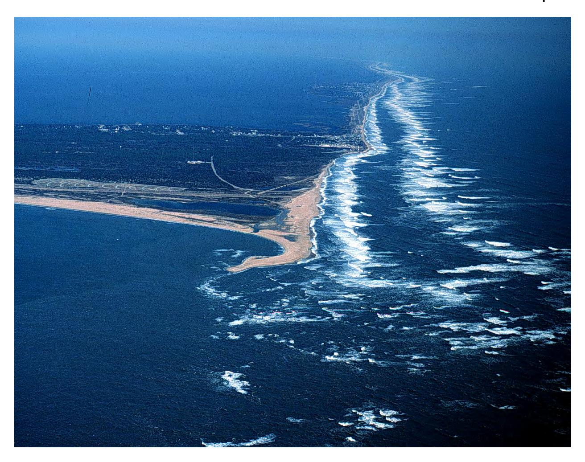

*Figure I-2-6. Cape Hatteras, North Carolina, view north. The Atlantic Ocean is to the right, and the bay to the left of the barrier is Pamlico Sound. The rough water in the foreground is the infamous Diamond Shoals, known as the "Graveyard of the Atlantic." The bump in the shoreline is the location of the Cape Hatteras lighthouse, which was recently moved inland away from the receding shore. A mature maritime forest has grown on the beach ridges in the central portion of the barrier. The forest indicates that this portion of the island has been stable for several hundred years. Photograph taken February 28, 1993, during the waning stage of an extratropical storm*

barrier islands in the world are located along the Texas coast. Padre Island and Mustang Island, combined, extend for 208 km and feature extensive dune fields behind the broad beaches. The dunes rarely rise more than 10 m in height, and many marshy wash-over deltas have extended into the large lagoons behind the barriers. The lagoons and estuaries decrease in depth toward Mexico. A large part of Laguna Madre is only inundated during flood periods or when the wind blows water from Corpus Christi Bay onto the flats. River deltas are responsible for much of this infilling, resulting in large differences between recent chart depths and those of 100 years ago (Shepard 1982).
f. Pacific: Sea cliffs and terraced coasts (Figures I-2-13, I-2-14) . Low sea cliffs bordered by terraces and a few coastal plains and deltas compose the coasts of southern California. Blocks form projections into the sea and feature a series of raised terraces such as those at Point Loma, Soledad Mountain, and the San Pedro Hills in the Los Angeles area. North of Los Angeles, the Santa Monica Mountains follow the coast. Sea cliffs in this area are actively eroding, particularly in areas where they have been cut into alluvium (Figure I-2-15). At Point Conception, the coast trends north-northwest and a different

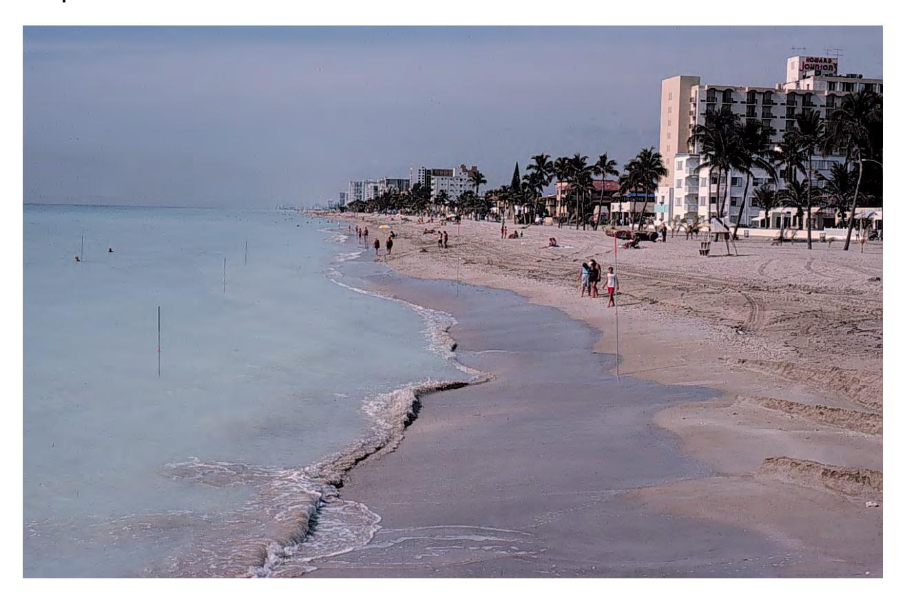

*Figure I-2-7. Hallandale Beach, an example of a popular recreation beach in an urban area on the Atlantic coast of southeast Florida. Photograph taken June 27, 1991, after the beach had been renourished using sand hydraulically pumped from an offshore source. Stakes in the beach were used as survey markers*

geomorphology is evident. Despite the presence of a series of regional mountain ranges that cut across the coast, the rugged central and northern California coast is one of the straightest in the world. This area has high cliffs with raised marine terraces. A few broad river valleys interrupt the mountainous coast. Here, river sediments have been returned by the waves to the beaches and carried inland by westerly winds to form some unusually large dune fields. Monterey and San Francisco Bays, the two largest embayments, are at the mouths of the Salinas and the San Joaquin-Sacramento rivers respectively; the latter drains the great central valley of California. North of Cape Mendocino, the coast trends almost directly north, through Oregon and Washington, to the Strait of Juan de Fuca. Along this coast, lowland valleys at the mouths of large rivers alternate with short, relatively low mountainous tracts. Barriers or spits have formed at river mouths, as have large dune fields (Figure I-2-16). Many of the rivers, including the great Columbia, discharge into estuaries. This indicates that the rivers have not yet been able to fill drowned valleys created by the sea level rise when the great Pleistocene continental glaciers melted (Shepard 1982).
Because of the North Pacific Ocean's harsh wave climate, all of the major cities in Oregon and Washington were founded in sheltered water bodies. For example, Vancouver, Washington, and Portland, Oregon, are on the Columbia River. Puget Sound, a deep, sheltered, fjord-like water body in western Washington State, provides safe access for ships steaming to Tacoma, Bellingham, Everett, and Seattle (Figure I-2-17).
g. The Bering and Chukchi Seas: Arctic coastal plains and barriers (Figure I-2-18) . The volcanic Aleutian Mountains trend southwest from Anchorage, Alaska, to form the Alaska Peninsula and the Aleutian Islands that extend some 2200 km (1370 miles) forming the border between the Pacific Ocean and the Bering Sea (Figure I-2-14). Beyond the Alaska Peninsula and bordering the Bering Sea, extensive coastal plains
I-2-8 Coastal Diversity

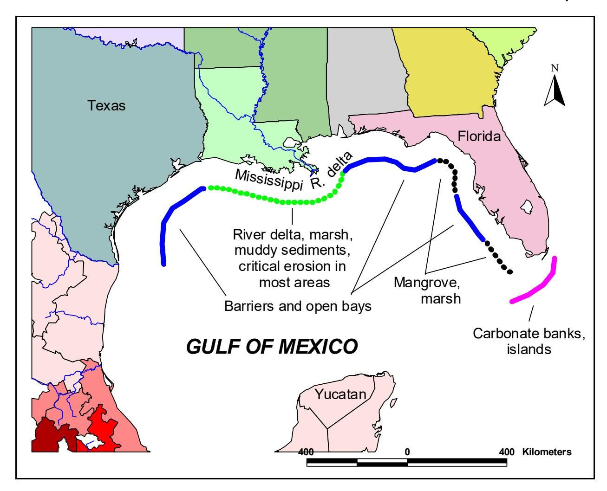

*Figure I-2-8. Gulf of Mexico coastal characteristics*

are found with numerous lakes and meandering streams. Only a few mountain ranges extend as points into the sea. The Yukon River has formed a large delta with many old lobes that form a vast plain connecting small, elevated tracts. The oldest is located in the now drowned mouth of the Kuskokwim River. One reason this coast differs from the glaciated southern coast of Alaska, is because it was largely ice- free during the Pleistocene era. Permafrost becomes more important to the north where it greatly increases the number of surface depressions in the summer when it melts forming thaw lakes. Rising above the coastal plain with mountains over 1,000 m, the Seward Peninsula with Norton Sound and the Bering Sea to the south and Kotzebbue Sound and the Chukchi Sea to the north provides a great contrast to the adjoining coasts. North of Kotzebue Sound, barriers and cuspate forelands similar to those of North Carolina border the coast. The first cuspate foreland is the unusual Point Hope. Three more cuspate forelands extend along the coast terminating with Point Barrow, the most northern point of Alaska (Shepard 1982).
h. The Beaufort Sea: Deltaic coast. East of Point Barrow, the coast is dominated by river deltas. Rivers draining the Brooks Range and father east the Mackenzie, draining the northern Canadian Rockies, built these deltas even though the rivers flow only a short period each year. Where the deltas are not actively building into the sea, extensive barrier islands can be found (Shepard 1982). One of the dominant processes in shaping beaches in Alaska is the ride-up of shore ice (Kovacs 1983).

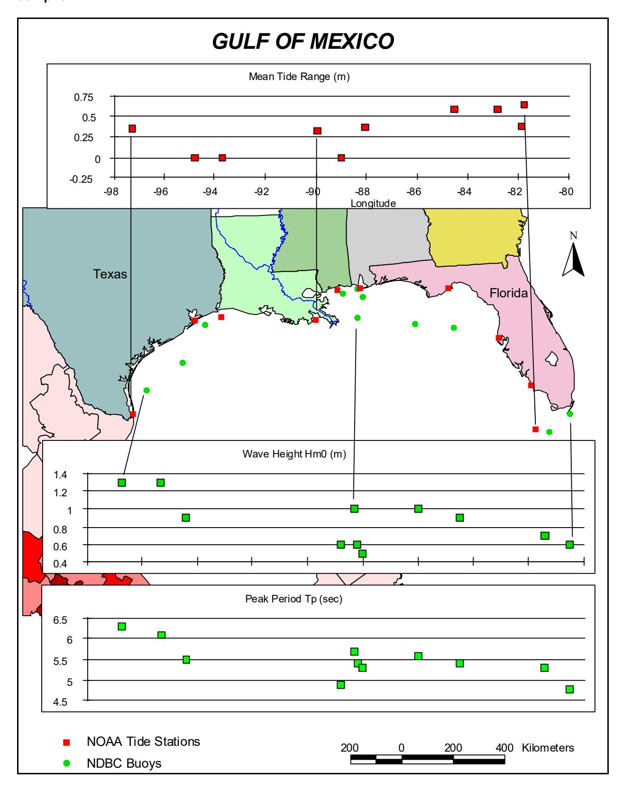

*Figure I-2-9. Tide and wave characteristics of the Gulf Coast*

I-2-10 Coastal Diversity

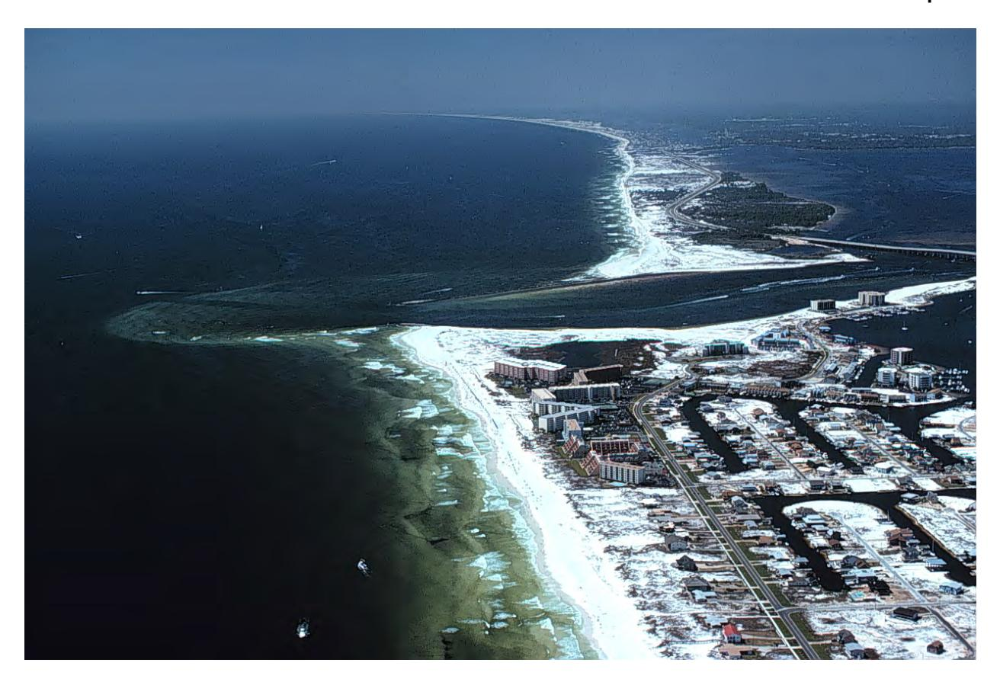

*Figure I-2-10. East Pass Inlet, Florida, View looking west towards Santa Rosa Island, with the Gulf of Mexico on the left and Choctawhatchee Bay to the right. The barrier island immediately beyond the inlet is part of Eglin Air Force Base and has remained undeveloped. The beach in the foreground is Holiday Isle, which has been heavily commercialized. This area of Florida is noted for its brilliant white quartz sand and excellent fishing. The inlet is a Federal navigation project with converging rubble-mound jetties. Photograph taken March 1991*

i. Pacific: Volcanic islands (Figure I-2-19) . The Hawaiian archipelago extends from the large island of Hawaii across the central Pacific Ocean northwest to tiny Kure Atoll, 2450 km away. The eight main islands of the state of Hawaii, at the southeast end of the archipelago comprise 99 percent of the land area. About 20 percent of the 1,650 km of shore on the main islands is sandy beach (USACE 1971). Aside from manmade structures, the remainder of the shore consists primarily of outcrops or boulders of lava, but also includes muddy shores, gravel beaches, beach rock, raised reefs, and lithified sand dunes. Elevations of the rocky shores vary from 1-2 m high raised reefs to 600 m sea cliffs along the Napali coast of Kauai. The Hawaiian Islands are the tops of volcanic mountains rising above the ocean floor about five km below the water surface. These volcanoes formed over a localized hot spot of magma generation. As the older volcanoes formed great shields and died, the movement of the ocean floor and crust moved them to the northwest. A higher percentage of sand shores are found on the older islands, see Table I-2-1. Beaches on Hawaiian Islands are smaller than those on the continental shores, because of the young age of the islands, the absence of large rivers to supply sediment, and the shape and exposure of the island beaches to the wave systems that affect the islands. The sand on the beaches is also different in that it is primarily calcareous and of biologic origin. The calcareous sand originates as shells and test of animals or algae that live on the fringing reefs or shallow waters adjacent to the islands. Two exceptions are some beaches near stream mouths are detritus basalt sand, and a few beaches on the island of Hawaii are black volcanic glass sand generated by the steam explosions that occur when hot lava flows into the ocean (Moberly and Chamberlain

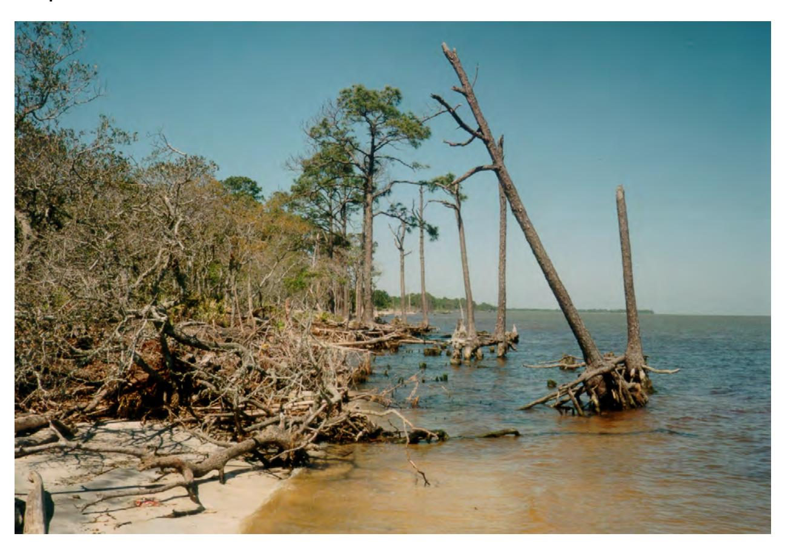

*Figure I-2-11. Morgan Peninsula, Alabama, about 10 km east of the mouth of Mobile Bay (21 April 1998). This is the back side of the barrier island, with Mobile Bay in the right side of the photograph. The dead trees clearly show that the shore has retreated within the last few years. In this portion of the Alabama shore, erosion on the back side of the barrier is a more serious threat than on the ocean side*

*Table I-2-1 Age and Sandy Shores of the Major Hawaiian Islands*

**Table I-2-1. Age and Sandy Shores of the Major Hawaiian Islands**

| Island | Age | (million years) | Total Shoreline (km) | Sandy Shoreline (km) | Percent Sandy Shoreline |
| --- | --- | --- | --- | --- | --- |
| Kauai | 5.1 |  | 182 | 80 | 44 |
| Oahu | 3.7 to | 2.6 | 319 | 90 | 28 |
| Molokai | 1.5 to | 1.9 | 170 | 40 | 24 |
| Lanai | NA |  | 84 | 29 | 35 |
| Maui | 1.3 to | 0.9 | 256 | 54 | 21 |
| Hawaii | Active |  | 492 | 35 | 7 |
| Based on Campbell | & | Moberly 1985. |  |  | I-2-12 Coastal Diversity |

Based on Campbell & Moberly 1985.
I-2-12 Coastal Diversity

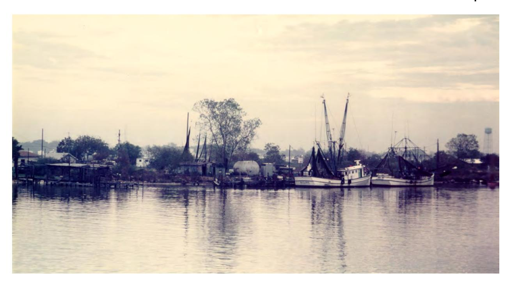

*Figure I-2-12. Dulac, Louisiana (March 1981). Located near the Gulf of Mexico entrance to the Houma Navigation Channel, many residents of Dulac and other towns in the Acadian parishes of southern Louisiana depend on the water for their livelihoods - shrimping, fishing, and servicing the offshore petroleum industry. Although about 25 km from the Gulf, Dulac, at an elevation of 1-2 m above sea level, is highly vulnerable to hurricanes and flooding*

1964). The coastal geology of each island is derived from the erosion of the island shield and subsequent volcanic activity (Campbell and Moberly 1985).
j. Great Lakes of North America. The five Great Lakes, Ontario, Erie, Huron, Michigan, and Superior, are located along the Canadian and U.S. boundary, except that Lake Michigan is totally within the United States (Figure I-2-20). They have a combined surface area of 245,300 $km^{2}$ (94,700 $miles^{2}),$ making them the largest freshwater body in the world. Together with the Saint Lawrence Seaway, they form a major shipping artery that is navigable inland for 3,770 km from the Atlantic by ocean-going vessels, except from about December through April when shipping is blocked by ice (Figures I-2-21, I-2-22, and I-2-23). The lakes range in elevation from about 183 m for Lake Superior (International Great Lakes Datum 1985) to about 75 m for Lake Ontario, with the largest drop in elevation, 51 m between Lakes Erie and Ontario at Niagara Falls (CCEE 1994). Geologically, the Great Lakes are relatively young, having been formed by glacial action during the Pleistocene period. Prior to the glacial age, the area occupied by Lake Superior was a broad valley and the area occupied by the other lakes was a spreading plain. During the ice period, glaciers deepened the bed of Lake Superior and gouged deep depressions forming the beds of the other lakes. As the ice sheet retreated, fingers of ice remained in the depressions, rimmed by glacial moraines and outwash plains. Lakes were formed when the ice melted. Successive advances and retreats of the ice caps changed the drainage of the lake region until about 10,000 years ago. Then, the northern part of the area up warped or rebounded causing the lakes to drain into the St. Lawrence through what is now the Niagara River.
The shores of the Great Lakes and other freshwater lakes in the United States and throughout the world are as diverse as the ocean shores, featuring high and low erosive and non-erosive cliffs and bluffs, low plains, sandy beaches, dunes, barriers and wetlands (Figure I-2-24).

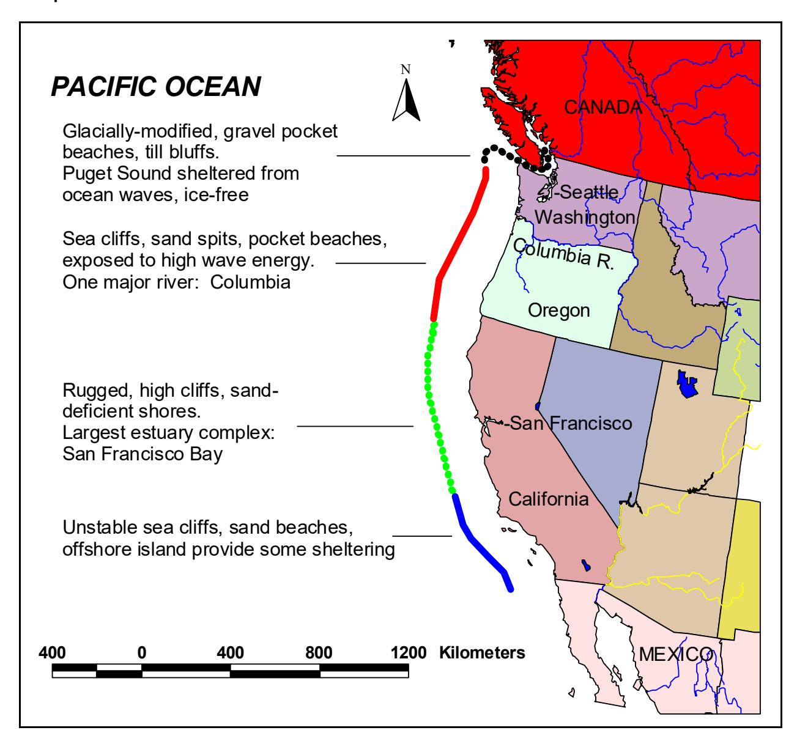

*Figure I-2-13. Pacific coastal characteristics*

#### I-2-3. Stability

Not all shores are in equilibrium with the present littoral processes. Shores with a character inherited from previous non-littoral processes (i.e., glacial or river deposited materials) maybe doomed to significant rates of erosion under present conditions, such as the Mississippi delta of Louisiana and portions of the Great Lakes. Some shores exhibit short-term seasonal or episodic event-driven cyclic patterns of erosion and accretion (e.g., the southern U.S. Atlantic coast). Other shores demonstrate long-term stability due to balanced sediment supply and little relative sea level rise influence, such as the west coast of Florida. For some shores, very little beach-building material is available, and what little is available may be prone to rapid transport, either alongshore or offshore (e.g., the Great Lakes). Shores that have been heavily modified by man's activities usually require a continuing commitment to retain the status quo. Prime examples are New Jersey, which was extensively modified during the $20^{th}$ century and is now undergoing several major
I-2-14 Coastal Diversity

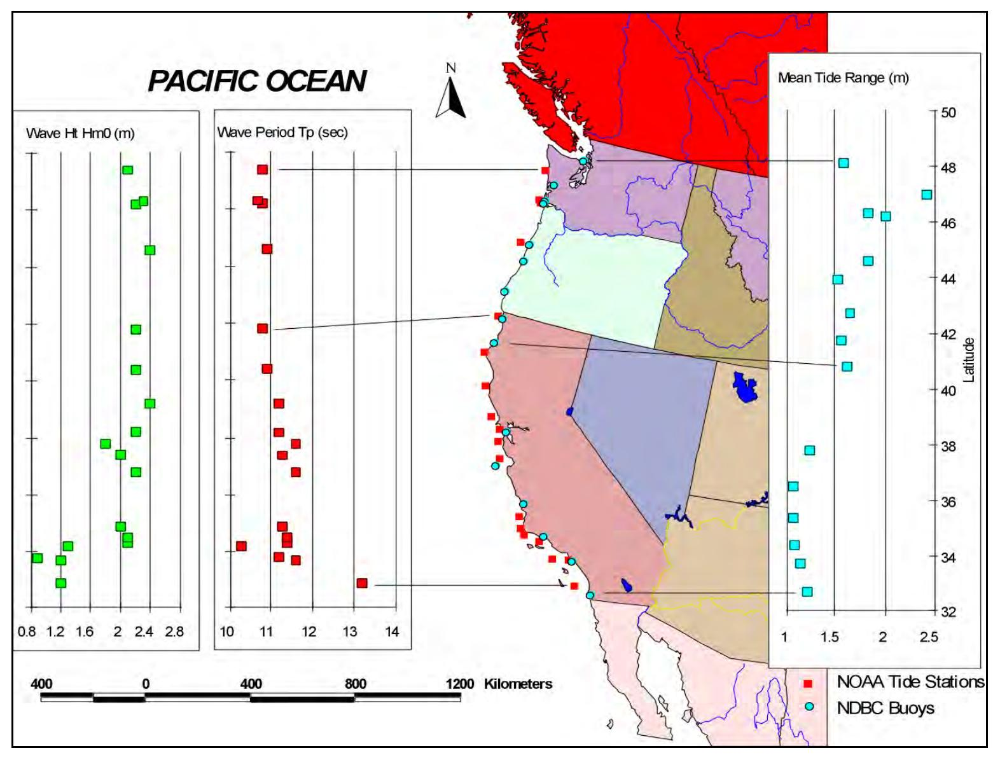

*I-2-15 Figure I-2-14. Pacific coast tide and wave characteristics. The southernmost buoy shows high wave period because of the influence of swell waves and sheltering from wind waves provided by offshore islands*

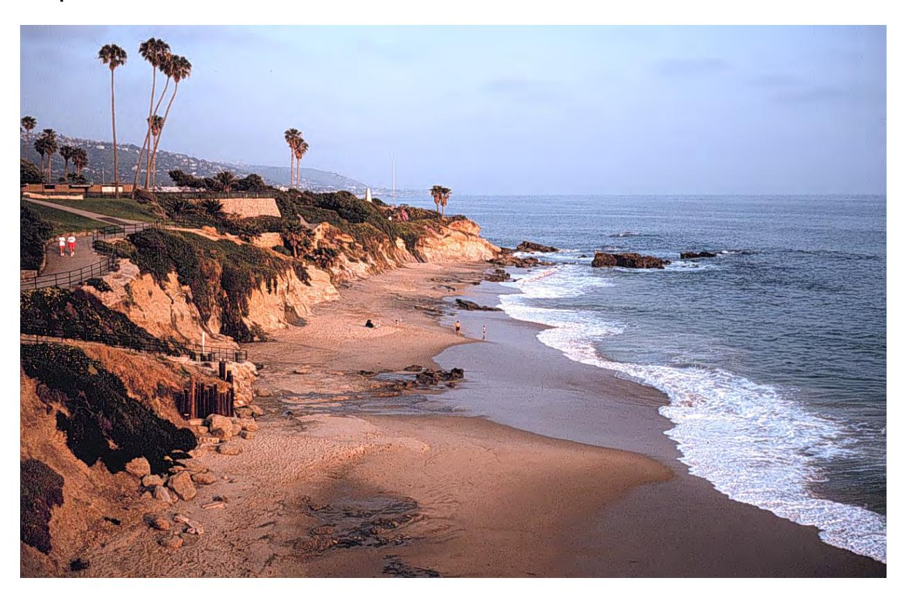

*Figure I-2-15. Pocket beach just north of Laguna Beach, southern California (April 1993). Poorly consolidated sandstone and conglomerate bluffs in this area are highly vulnerable to erosion, jeopardizing exclusive residential properties. Erosion is caused by storm waves and groundwater runoff*

beach fills, and numerous urban areas around the country (Los Angeles, New York, Galveston, Chicago, Miami, Palm Beach).

# I-2-4. Erosion

In order for one shore to accrete, often some other shore must erode. Erosion is a natural response to the water and wind processes at the shore, but erosion is only a problem when human development is at risk. Sometimes, man-made alterations to the littoral system, including modifications to sediment sources or sinks, may contribute to the eroded condition. The National Shoreline Study (DOA 1971) found that 24 percent of the entire United States shore of 135,000 km (84,000 miles) is undergoing significant erosion where human development was threatened. If Alaska, with its 24,800 km. (15,400 miles) of shore is removed from the statistic, 42 percent of the United States shore is experiencing significant erosion!

#### I-2-5. Solutions

There are no absolute rules, nor absolute solutions to the problem of coastal erosion given the dynamic and the diverse character of the shoreline. No single set of regulations, or single land use management philosophy, is appropriate for all coastal situations or settings. The diversity of the coasts requires consideration of a variety of solutions when addressing problems in a particular area. Solutions can be classified into five broad functional classes of engineering or management, as listed in Table I-2-2. These options are explored in detail in Part V of the CEM.
I-2-16 Coastal Diversity

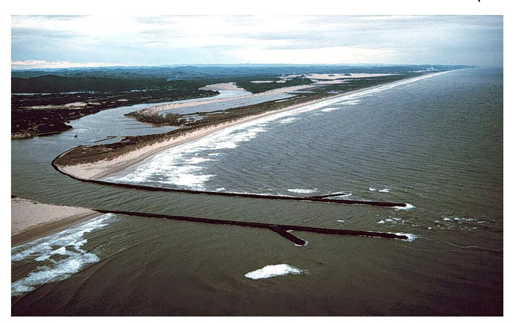

*Figure I-2-16. Mouth of the Siuslaw River, southern Oregon near the town of Florence (December 1994; view looking south). This and other Federal navigation projects on the Oregon and Washington coasts are difficult and expensive to maintain because of high wave energy and a short construction season. The scale of these Pacific projects is difficult to appreciate from aerial photographs: the Siulslaw rubble-mound jetties, first built in 1917, are 180 m apart and the north jetty is 2300 m long. The shore in this area consists of long barrier spits interrupted with rocky headlands*

| Functional Class | Approach Type |
| --- | --- |
| 1. Armoring structures | Seawall |
|  | Bulkhead |
|  | Revetment - revetment |
| 2. Beach stabilization structures and facilities | Breakwaters (including artificial headlands) |
|  | Groins |
|  | Sills |
|  | vegetation |
|  | Groundwater drainage |
| 3. Beach restoration | Beach nourishment |
|  | Sand passing |
| 4. Adaptation and accommodation | Flood proofing |
|  | Zoning |
|  | Retreat |
| 5. Combinations | Structural and restoration |
|  | Structural and restoration and adaptation |
| 6. Do nothing | (no intervention) |

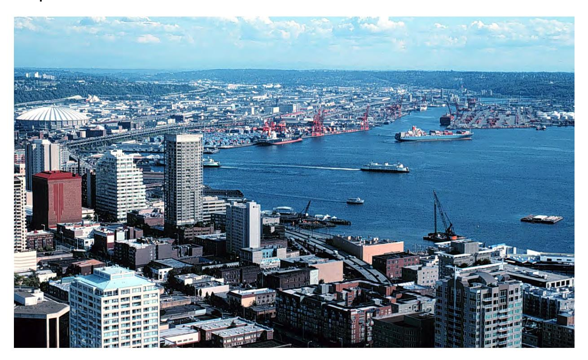

*Figure I-2-17. Seattle, located in sheltered Puget Sound, is one of the world's great natural anchorages. In the 1800s Seattle was a timber town and point of embarkation for Alaska and the Orient. During the 1980s and 1990s, the port has prospered with container traffic and the export of grain and other agricultural products. Areas of the harbor need regular dredging. (Photograph July 1995)*

Sometimes the solutions require the use of "hard" static structures built of rock, steel, or concrete, and sometimes the solutions involve "soft" dynamic approaches, such as adding littoral material or modifying the vegetation. Chapter V-3, "Shore Protection Projects" provides a more detailed discussion of the options and limitations available to the coastal engineer.
I-2-18 Coastal Diversity

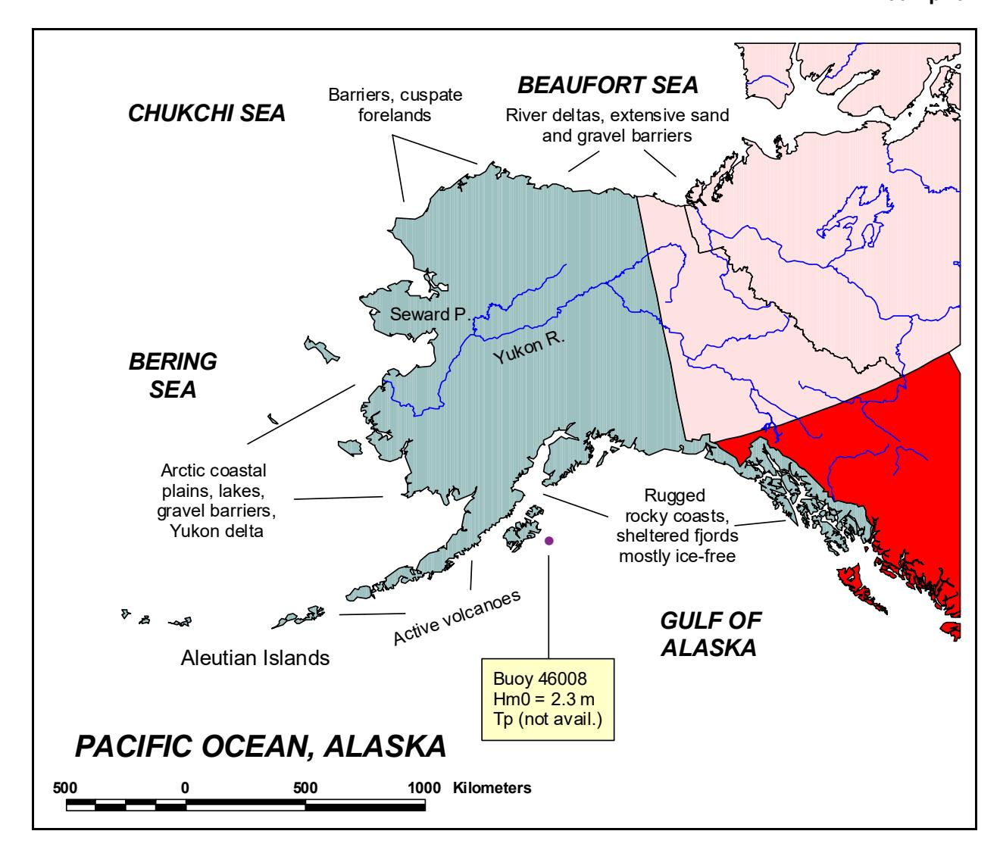

*Figure I-2-18. Alaska coastal characteristics*

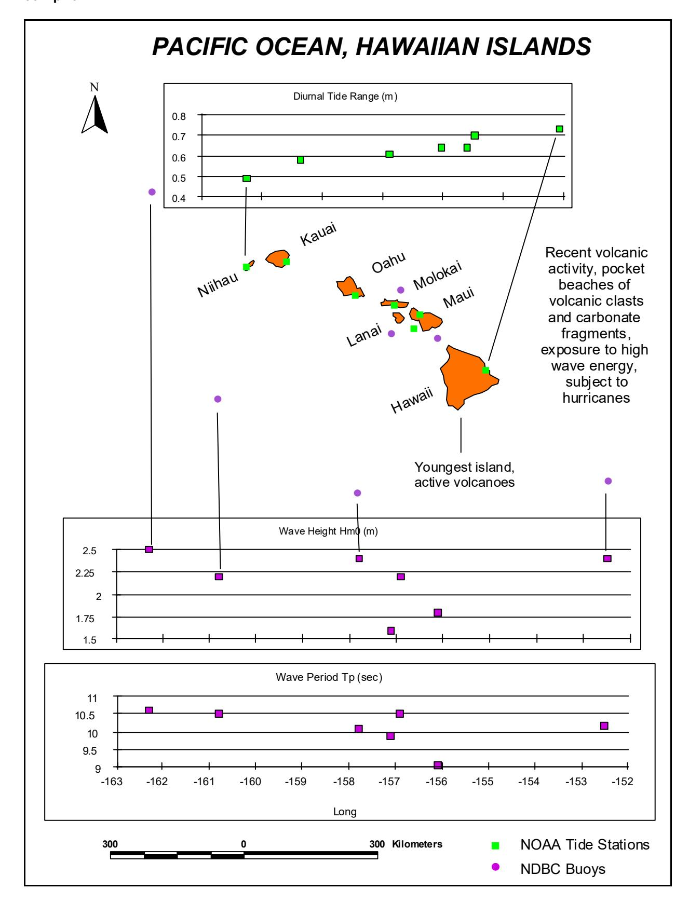

*Figure I-2-19. Hawaiian Islands wave characteristics*

I-2-20 Coastal Diversity

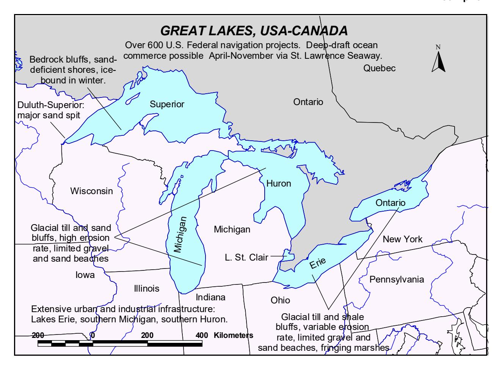

*Figure I-2-20. Great Lakes shoreline characteristics*

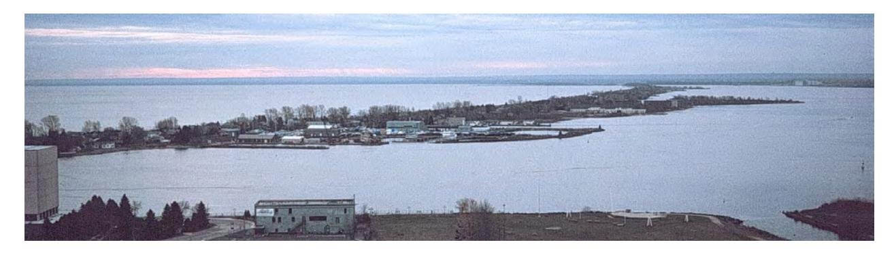

*Figure I-2-21. Minnesota Point, photographed from Duluth, Minnesota, looking south (November 1994). This bay mouth sand spit is reputed to be the largest fresh water barrier in the world. It extends from the Wisconsin shore near Superior to the Minnesota shore at Duluth. St. Louis Bay, to the right, needs regular dredging because of silt and sand supplied by the St. Louis River. The northern part of Minnesota Point is developed with residential property. Nearby Duluth and Superior are both major industrial centers, accessible by ocean-going ships*

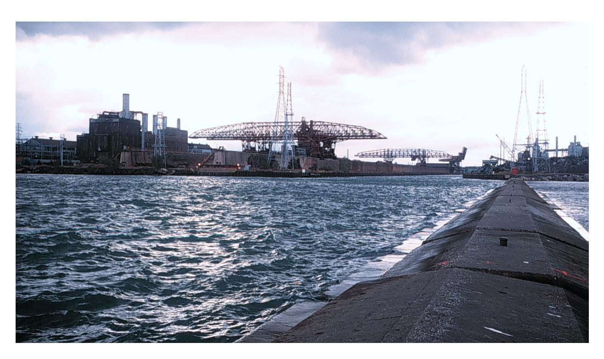

*Figure I-2-22. Calumet Harbor, Indiana (September 1985). This is an example of the industrial infrastructure found in many of the Great Lakes cities that thrived from the 1800s until the 1970s. Many of these steel mills are now closed, but some of the sites are being redeveloped for other purposes. Calumet is a Federal navigation project. The concrete cap on the breakwater in the foreground has shifted, indicating some damage to the underlying wood crib (originally built in the 1890s)*

I-2-22 Coastal Diversity

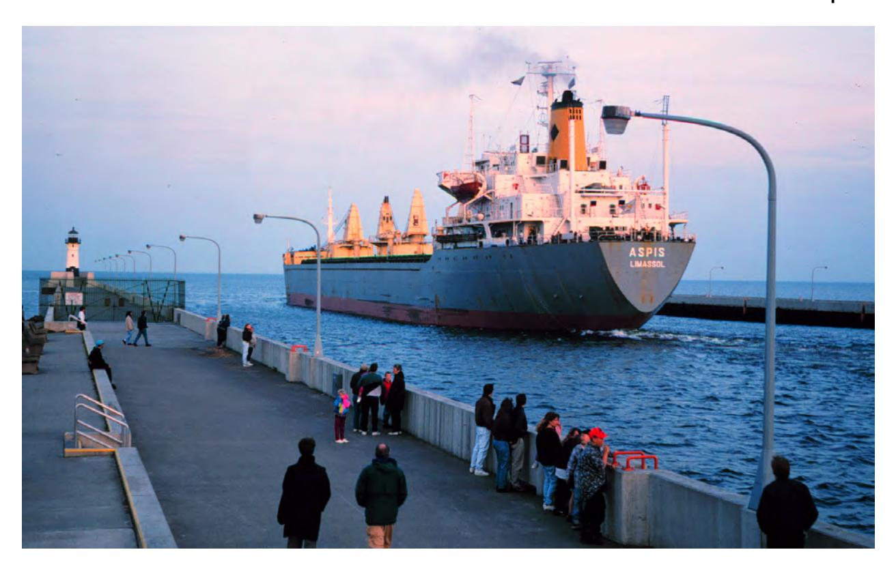

*Figure I-2-23. Duluth Canal, Minnesota (November 1994). Thanks to the St. Lawrence Seaway and a network of locks, rivers, and canals, deep-draft ocean-going freighters can ship bulk commodities and goods throughout the Great Lakes. This vessel is taking iron ore from the nearby Mesabe Iron Range to some distant port. The Duluth Canal, excavated privately in 1871, is now a Federal project maintained by the USACE.*

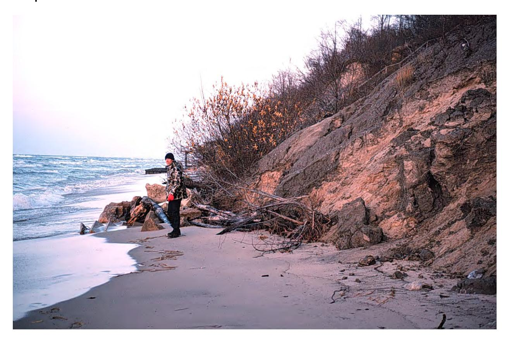

*Figure I-2-24. Bluffs about 1 km north of St. Joseph Harbor, eastern Lake Michigan (November 1993). In this area, the sand and clay bluffs are receding at an average rate of between 0.3 and 0.4 m per year. They are highly vulnerable to ground water seepage and, during periods of high lake level, to wave attack. Freshly-slumped clay blocks can be seen on the bluff face in the right side of the image*

## I-2-6. References

#### Berryhill, Dickinson, and Holmes 1969

Berryhill, H. L., Dickinson, K. A., and Holmes, C. W. 1969. "Criteria for Recognizing Ancient Barrier Coastlines," American Association of Petroleum Geologist Bulletin 53, pp 703-707

## Campbell and Moberly 1985

Campbell, J. F., and Moberly, R. 1985. "130. Hawaii," Bird, E. C. F., and Schwartz, M. L., eds., The World's Coastline, Van Nostrand Reinhold, New York, NY., p 1011-1022.

# CCEE 1994

Concise Columbia Electronic Encyclopedia (CCEE). 1994. Columbia University Press, Encyclopedia.com— Results for Great Lakes.

## DOA 1971

Department of the Army, Corps of Engineers. 1971. Report on the National Shoreline Study, Washington, DC. 20314, August 1971, 59 p.
I-2-24 Coastal Diversity

#### Kovacs 1983

Kovacs, A. 1983. Shore ice rid-up and pile-up features, Part I: Alaska's Beaufort sea coast, CRREL Report CR-83-9-PT-1, U.S. Army Cold Regions Research and Engineering Laboratory,Hanover, NH.

## Len č ek and Bosker 1998

Lenček and Bosker. 1998. The Beach: The History of Paradise on Earth. Viking New York, 310 p.

#### Moberly and Chamberlain 1964

Moberly, R. and Chamberlain, T. 1964. "Hawaiian Beach Systems," Hawaii Institute of Geophysics Report 64-2, University of Hawaii.

#### Shepard and Wanless 1971

Shepard, Francis P., and Wanless, Harold R. 1971. Our Changing Coastlines, McGraw-Hill, New York, NY., 579 p.

## Shepard 1982

Shepard, Francis P. 1982. "North America, Coastal Morphology." Encyclopedia of Beaches and Coastal Environments, Encyclopedia of Earth Sciences, Volume XV, Schwartz, Maurice L. Editor, Hutchinson Ross Publishing Co., 940 p, pp 593-603.

#### EM 1110-2-1100 (Part I) 30 Apr 02

## I-2-7. Acknowledgments

Authors of Chapter I-2, "Coastal Diversity:"
John H. Lockhart., Jr., Headquarters, U.S. Army Corps of Engineers, Washington, DC, (retired). Andrew Morang, Ph.D., Coastal and Hydraulics Laboratory (CHL), Engineer Research and Development Center, Vicksburg, Mississippi.
Reviewer:
Joan Pope, CHL
I-2-26 Coastal Diversity
