# Chapter 3 EM 1110-2-1100 HISTORY OF COASTAL ENGINEERING (Part I)

30 April 2002

# Table of Contents

- I-3-1. Ancient World Page I-3-1
- I-3-2. Pre-Roman Times I-3-1
- I-3-3. Roman Times I-3-3
- I-3-4. Modern Age I-3-4
- I-3-5. Civil Engineer Era I-3-5
- I-3-6. United States Army Corps of Engineers I-3-6
- I-3-7. Coastal Engineering in the United States I-3-10 a. Nineteenth century projects b. Nineteenth century coastal engineering c. Early coastal development and shore protection d. Early 20th century beach development and the Engineering Advisory Board on Coastal Erosion e. American Shore and Beach Preservation Association f. The Board on Sand Movement and Beach Erosion g. The Beach Erosion Board h. BEB focus on basic research i. Dalecarlia reservation and World War II j. BEB accomplishments k. Evolution of shore protection and the shift from structures to beach nourishment l. The Coastal Engineering Research Center and the Coastal Engineering Research Board (1) Early years (2) Fort Belvoir (3) Field Research Facility (4) Shore Protection Manual (5) Waterways Experiment Station (6) The Coastal and Hydraulics Laboratory I-3-10 I-3-11 I-3-12 I-3-13 I-3-13 I-3-15 I-3-15 I-3-16 I-3-19 I-3-20 I-3-21 I-3-22 I-3-22 I-3-22 I-3-23 I-3-23 I-3-23 I-3-23
- I-3-8. Coastal Engineering in the Military I-3-23 a. Amphibious operations b. Expedient harbors c. Military coastal engineering studies d. Port operations, Republic of Korea e. Port operations, Republic of Vietnam I-3-23 I-3-24 I-3-24 I-3-25 I-3-25 History of Coastal Engineering I-3-i (1) Vung Ro I-3-26 (2) Da Rang River I-3-26 f. Temporary wharfs I-3-26 g. Rapidly Installed Breakwater System I-3-27
- I-3-9. Summary I-3-28
- I-3-10. References I-3-29
- I-3-11. Acknowledgments I-3-36

# List of Figures

- Page
- Figure I-3-1. Fiscal year 1997 dredging by the U.S. Army Corps of Engineers at coastal projects I-3-9
- Figure I-3-2. Federally maintained deep-draft and small boat harbors with structures I-3-9
- Figure I-3-3. Federal shore protection and beach erosion control projects I-3-10
- Figure I-3-4. Converging jetty system designed by James B. Eads I-3-12
- Figure I-3-5. Wood crib design of Great Lakes breakwaters I-3-14
- Figure I-3-6. Construction of Fire Island jetty, 1940 I-3-15
- Figure I-3-7. Jetty construction, Rockaway Inlet, New York, 1932 I-3-16
- Figure I-3-8. Hurricane storm damage, Atlantic City, NJ, 1944 I-3-17
- Figure I-3-9. Construction of Manasquan Inlet jetties I-3-18
- Figure I-3-10. Coney Island in 1941, on the eve of World War II I-3-19
- Figure I-3-11. Jones Island State Park on July 4th holiday I-3-20
- Figure I-3-12. Grass planting, beach restoration, 1930s I-3-21
- Figure I-3-13. The shift from fixed structures to beach restoration and nourishment I-3-22
- Figure I-3-14. Aerial photograph of the Mulberry "B" Harbor at Arromanches, France, June 1944 I-3-25
- Figure I-3-15. Operation MIKI, Waianae, Oahu, HI, October 1949 I-3-26

# Chapter 1-3 History of Coastal Engineering

#### I-3-1. Ancient World

The history of coastal engineering reaches back to the ancient world bordering the Mediterranean Sea, the Red Sea, and the Persian Gulf. Coastal engineering, as it relates to harbors, starts with the development of maritime traffic, perhaps before 3500 B.C. Shipping was fundamental to culture and the growth of civilization, and the expansion of navigation and communication in turn drove the practice of coastal engineering. The availability of a large slave labor force during this era meant that docks, breakwaters, and other harbor works were built by hand and often in a grand scale similar to their monumental contemporaries, pyramids, temples, and palaces. Some of the harbor works are still visible today, while others have recently been explored by archaeologists. Most of the grander ancient harbor works disappeared following the fall of the Roman Empire. Earthquakes have buried some of the works, others have been submerged by subsidence, landlocked by silting, or lost through lack of maintenance. Recently, archaeologists, using modern survey techniques, excavations, and old documents, have revealed some of the sophisticated engineering in these old harbors. Technically interesting features have shown up and are now reappearing in modern port designs. Common to most ancient ports was a well-planned and effectively located seawall or breakwater for protection and a quay or mole for loading vessels, features frequently included in modern ports (Quinn 1972).
Most ancient coastal efforts were directed to port structures, with the exception of a few places where life depended on coastline protection. Venice and its lagoon is one such case. Here, sea defenses (hydraulic and military) were necessary for the survival of the narrow coastal strips, and impressive shore protection works built by the Venetians are still admired. Very few written reports on the ancient design and construction of coastal structures have survived. A classic treatise by Vitruvius (27 B.C.) relating the Roman engineering experience, has survived (Pollio, Rowland, and Howe 1999). Greek and Latin literature by Herodotus, Josephs, Suetonius, Pliny, Appian, Polibus, Strabo, and others provide limited descriptions of the ancient coastal works. They show the ancients' ability to understand and handle various complex physical phenomena with limited empirical data and simple computational tools. They understood such phenomena as the Mediterranean currents and wind patterns and the wind-wave cause-effect link. The Romans are credited with first introducing wind roses (Franco 1996).

#### I-3-2. Pre-Roman Times

Most early harbors were natural anchorages in favorable geographical conditions such as sheltered bays behind capes or peninsulas, behind coastal islands, at river mouths, inside lagoons, or in deep coves. Short breakwaters were eventually added to supplement the natural protection. The harbors, used for refuge, unloading of goods, and access to fresh water, were closely spaced to accommodate the safe day-to-day transfer of the shallow draft wooden vessels which sailed coastwise at speeds of only 3-5 knots.
Ancient ports can be divided into three groups according to their structural patterns and the development of engineering skill (Frost 1963).
a. The earliest were rock cut, in that natural features like offshore reefs were adapted to give shelter to craft riding at anchor.
- b. In the second group, vertical walls were built on convenient shallows to serve as breakwaters and moles. Harbors of this type were in protected bays, and often the walls connected with the defenses of a walled town (for example, ancient Tyre on the Lebanese coast). Often these basins were closeable to traffic using chains to prevent the entry of enemy ships (Franco 1996).
- c. The third group were harbors that were imposed on even unpromising coasts by use of Roman innovations such as the arch and improved hydraulic cement. Projects like this required the engineering, construction, and financing resources of a major empire.
All ancient ports had one thing in common: they had to be kept clear of silt at a time when mechanical dredging was unknown. This was accomplished by various means. One was by designing the outer parts of the harbor so that they deflected silt-bearing currents. The second was by allowing a controlled current to flow through the port or by flushing it out when necessary by means of channels. For example, at Sidon, a series of tanks (like swimming pools) were cut into the harbor side of a natural rock reef. The tanks filled with clear water that was held in place with sluice gates. When the gates were opened, currents of clear water would flush the inner harbor. Documentary and archaeological evidence show that both Tyre and Sidon were flourishing and powerful ports from the Bronze Age through the Roman era and must therefore have been kept clear of silt for over a thousand years (Frost 1963). Another method of preventing silt consisted of diverting rivers through canals so that during part or much of the year, the flow would enter the sea at location well away from the harbor.
The origins of breakwaters are unknown. The ancient Egyptians built boat basins with breakwaters on the Nile River at Zoser's (Djoser) step pyramid (ca. 2500 B.C.) (Inman 2001). The Minoans constructed a breakwater at Nirou Khani on Crete long before the explosion of Santorini (Thera) in ca. 1500 B.C. The breakwater was small and constructed of material taken from nearby dune rock quarries (Inman 1974, Figure 4). In the Mediterranean, size and sophistication of breakwaters increased over time as the Egyptian, Phoenician, Greco-Macedonian, and Roman civilizations developed and evolved. Breakwaters were built in China but generally at a later date than in the Mediterranean.
Probably the most sophisticated man-made harbor of this era was the first harbor of Alexandria, Egypt, built west of Pharos Island about 1800 B.C. by the Minoans. The main basin, built to accommodate 400 ships about 35 m in length, was 2,300 m long, 300 m wide and 6-10 m deep. Large stone blocks were used in the many breakwaters and docks in the harbor. Alexander the Great and his Greek successors rebuilt the harbor (300-100 B.C.) in monumental scale. The Island of Pharos was joined to the mainland by a 1.5 km breakwater with two openings dividing two basins with an area of 368 hectares (910 acres) and 15 km of quay front. Alexandria is probably best known for the 130m-high lighthouse tower used to guide ships on a featureless coast to the port from 50 km at sea. The multi-storied building was built with solid blocks of stone cemented together with melted lead and lined with white stone slabs. Considered one of the Wonders of the Ancient World, it eventually collapsed due to earthquakes between 1326 and 1349 (Franco 1996, Empereur 1997).
Another feature of the Greek harbors was the use of colossal statues to mark the entrances. Colossal statues of King Ptolemy, which stood at the base of the lighthouse, have been found with the lighthouse debris. Historians report the most famous harbor statue was the 30 m high Colossus of Rhodes, which stood on the breakwater heads. Three ancient windmill towers are still surviving upon the Rhodes breakwater (Franco 1996). Frost (1963) notes that the Greeks had used hydraulic cement long before the Romans.

# I-3-3. Roman Times

The Romans introduced many revolutionary innovations in harbor design. They learned to build walls underwater and constructed solid breakwaters to protect exposed harbors. They used metal joints and clamps to fasten neighboring blocks together and are often credited with discovering hydraulic cement made with pozzolanic ash obtained from the volcanic region near Naples, which hardens underwater. Frost (1963) notes that the Greeks had used hydraulic cement long before the Romans. The Romans replaced many of the Greek rubble mound breakwaters with vertical and composite concrete walls. These monolithic coastal structures could be built rapidly and required little maintenance. In some cases wave reflection may have been used to prevent silting. In most cases, rubble or large stone slabs were placed in front of the walls to protect against toe scour. The Romans developed cranes and pile drivers and used them extensively in their construction. This technology also led them to develop dredges. Another advanced technique used for deepwater applications was the watertight floating cellular caisson, precursor of the modern day monolithic breakwater. They also used low, water-surface breakwaters to trip the waves before they reached the main breakwater. The peculiar feature of the vertical wall breakwater at Thapsus (Rass Dimas, Tunisia) was the presence of vents through the wall to reduce wave impact forces. This idea is used today in the construction of perforated caisson breakwaters (Franco 1996).
Using some of these techniques, the Romans built sophisticated breakwaters at Aquileia, Italy (ca. 180 B.C.), and at Caesarea, Israel (ca. 20 B.C.). The southwestern breakwater at Caesarea contained a "forebreakwater" that acted as a submerged reef that "trips" the wave causing it to break and dissipate energy before encountering the main breakwater (Inman 2001).
The largest manmade harbor complex was the imperial port of Rome; the maritime town at the mouth of the Tiber River was named Portus (The Port). It is now some four km from the sea, partly buried under Rome-Fiumicino airport. Despite its importance to the capital of the empire, (300,000 tons/year of wheat from Egypt and France), the harbor always suffered siltation from the river. Trajan, who also built the ports of Terracina and Centumcellae, built Portus' inner hexagonal basin. The port of Centumcellae was built just to serve his villa at a site with favorable rocky morphology. A grandiose engineering project between 107- 106 B.C. created a sheltered bathing and boating retreat. Slaves from all parts of the empire excavated a harbor and hauled in massive stones to create an artificial harbor to dampen the force of the waves. After the decline of Portus, it became, and remains, the Port of Rome. After remaining unchanged for over 1,000 years, the inner Roman Basin, which was dredged from rock (200,000 m3 or 260,000 yd3 ), is still in use. Roman engineers also constructed harbors in northern Europe along the main waterways of the Rhine and Danube and in Lake Geneva. They became the first dredgers in the Netherlands to maintain the harbor at Velsen. Silting problems here were solved when the previously sealed solid piers were replaced with new "open" piled jetties. In general, the Romans spread their technology throughout the western world. Their harbors became independent infrastructures, with their own buildings and storage sheds as opposed to the pre-Roman fortified city-enclosed harbors. They developed and properly used a variety of design concepts and construction techniques at different coastal cites to suit the local hydraulic and morphological conditions and available materials (Franco 1996).
The Romans also introduced to the world the concept of the holiday at the coast. The ingredients for beach holidays were in place: high population density coupled with a relatively high standard of living, a wellestablished economic and social elite, and a superb infrastructure of roads. From the end of the republic to the middle of the second century of the empire, resorts thrived along the shores of Latium and Capania, and an unbroken string of villas extended along the coast from the seashore near Rome to the white cliffs of Terracina. Fine roads connected these resorts to the capital, allowing both the upper crust and the masses to descend from sultry and vapor-ridden Rome to the sea. For five hundred years, the sybaritic town of Baiae reigned as the greatest fashionable beach resort of the ancient world. Seneca the Younger called Baiae a
"vortex of luxury and a harbor of vice," an alluring combination that Romans found irresistible (Lenček and Bosker 1998).

# I-3-4. Modern Age

After the fall of the Western Roman Empire, a long hiatus in coastal technology and engineering prevailed throughout most of the European world with a few exceptions. Little is recorded on civil engineering achievements during the Dark and Middle Ages. The threat of attack from the sea caused many coastal towns and their harbors to be abandoned. Many harbors were lost due to natural causes such as rapid silting, shoreline advance or retreat, etc. The Venice lagoon was one of the few populated coastal areas with continuous prosperity and development where written reports document the evolution of coastal protection works, ranging from the use of wicker faggots to reinforce the dunes to timber piles and stones, often combined in a sort of crib work. Protection from the sea was so vital to the Venetians, that laws from 1282 to 1339 did not allow anyone to cut or burn trees from coastal woods, pick out mussels from the rock revetments, let cattle upon the dikes, remove sand or vegetation from the beaches or dunes, or export materials used for shore protection (Franco 1996).
In England, coastal engineering works date back to the Romans, who recognized the danger of floods and sea inundation of low-lying lands. On the Medway, for example, embankments built by the Romans as sea defense remained in use until the 18th century (Palmer and Tritton Limited 1996). The low-lying lands, consisting of recently-deposited alluvial material, were exceeding fertile but were also vulnerable to flooding from both runoff and storm surges. In the Middle Ages, the Church became instrumental in reclaiming and protecting many marshes, and monks reclaimed portions of the Fylde and Humber estuaries. In 1225, Henry III constituted by Charter a body of persons to deal with the question of drainage (Keay 1942).
Across the North Sea, the Friesland area of the Netherlands had a large and wealthy population in the period 500 - 1000 A. D., and increasing need for agricultural land led to building of sea dikes to reclaim land that previously was used for grazing (Bijker 1996). Water boards developed in response to the need for a mutual means to coordinate and enforce dike maintenance. These boards represent some of the earliest democratic institutions in the Netherlands.
Engineering and scientific skills remained alive in the east, in Byzantium, where the Eastern Roman empire survived for six hundred years while Western Rome decayed. Of necessity, Byzantium had become a sea power, sending forth fleets of merchant ships and multi-oared dromonds (swift war vessels) throughout the Black Sea and Mediterranean. When the weary soldiers of the first crusades reached Byzantium's capital city, Constantinople, in 1097, they were amazed and awed by its magnificence, sophistication, and scientific achievements. Constantinople was built on the hills overlooking the Golden Horn, a natural bay extending north of the Bosporus. Marble docks lined the waterfront, over which passed the spices, furs, timber, grain, and the treasures of an empire. A great chain could be pulled across the mouth of the Golden Horn to prevent intrusion by enemy fleets. A series of watch towers extended along the length of the Sea of Marmara, the Bosphoros, and the south shore of the Black Sea, and the approach of an enemy fleet could be signaled to the emperor within hours by an ingenious code using mirrors by day and signal fires by night (Lamb 1930).
The Renaissance era (about XV - XVI centuries) was a period of scientific and technologic reawakening, including the field of coastal engineering. While the standards for design and construction remained those developed primarily by the Romans, a great leap in technology was achieved through the development of mechanical equipment and the birth of the hydraulic sciences including maritime hydraulics (Franco 1996). "The Italian School of Hydraulics was the first to be formed and the only one to exist before the middle of the 17th century" (Rouse and Ince 1963). Leonardo da Vinci (1465-1519), with his well-known experimental method, based on the systematic observation of natural phenomenon supported by intellectual reasoning and
a creative intuition, could be considered the precursor of hydrodynamics, offering ideas and solutions often more than three centuries ahead of their common acceptance. Some of his descriptions of water movement are qualitative, but often so correct, that some of his drawings could be usefully included in a modern coastal hydrodynamics text. The quantitative definition and mathematical formulation of the results were far beyond the scientific capabilities of the era. Even so, da Vinci was probably the first to describe and test several experimental techniques now employed in most modern hydraulic laboratories. To visualize the flow field, he used suspended particles and dyes, glass-walled tanks, and movable bed models, both in water and in air. The movement from kinematics to dynamics proved impossible until the correct theory of gravitation was developed, some two centuries latter by Sir Issac Newton (Fasso 1987). The variety of hydro kinematics problems dealt with in da Vinci's notebooks is so vast that it is not possible to enumerate them all in this brief review. In the 36 folios (sheets) of the Codex Leicester (1510), he describes most phenomena related to maritime hydraulics. Richter (1970) provides an English translation of da Vinci's notebooks (Franco 1996). The scientific ideas of the Italian Renaissance soon moved beyond the confines of that country, to the European countries north of the Alps.

# I-3-5. Military and Civil Engineer Era

After the Renaissance, although great strides were made in the general scientific arena, little improvement was made beyond the Roman approach to harbor construction. Ships became more sea-worthy and global navigation became more common. With global navigation came the European discovery of the Americas, Australia, New Zealand, Indonesia, and other areas of the world, soon followed by migration and colonization. Trade developed with previously unreachable countries and new colonies. France developed as the leader in scientific knowledge. The French "G'enie" officers, who, along with their military task, were also entrusted with civilian public works, are reportedly the direct ancestors of modern civil engineers. S'ebastien le Prestre de Vauban (1633-1707) was a builder of numerous fortresses and perfected the system of polygonal and star shaped fortifications. His most eminent public works project was the conversion of Dunkirk into an impregnable coastal fortress. Apart from the construction of several forts, there were extensive harbor and coastal works, including the excavation of canals and harbor basins, the construction of two long jetties flanking the entrance channel, and the erection of storehouses and workshops. A great lock, a masterpiece of civil engineering, was built at the entrance to the Inner Harbor. Vauban himself designed and supervised the lock construction. Unfortunately, no more than 30 years after its completion, the fortress was destroyed as a consequence of the Spanish War of Succession. Vauban's projects provide a good example of engineering methods and lucidity. They consisted of an explanatory memorandum, several drawings, and a covering letter. The memorandum had four sections: (1) general background of the scheme; (2) detailed descriptions of the different parts, with references to the drawings; (3) cost estimates; (4) features and advantages of the work. It was during this time that the term "Ingenieur" was first used in France, as a professional title for a scientifically-trained technician in public service.
While France enjoyed a leading position in Europe with regard to exact sciences and their applications to technical problems, a social and economic revolution later known as the "Industrial Revolution" was taking place in England. The riding-horse and the packhorse gave way to the coach, the wagon and the barge. Hard roads and canals replaced the centuries old soft roads and trails, dusty in dry weather and mud-bound during rains (Straub 1964). Steam power allowed industry to be concentrated in factories that required continuous supply of raw materials and export of manufactured goods.
In the 18th and 19th centuries, advances in navigation and mathematics, the advent of the steam engine, the search for new lands and trade routes, the expansion of the British Empire through her colonies, and other influences, all contributed to the revitalization of sea trade and a renewed interest in port works. As the volume of shipping grew, more vessels were needed and as the dimensions of the new vessels became larger,
increased port facilities were necessary. Ports of the world experienced growing pains for the first time since the Roman era, and, except for the interruption caused by two world wars, port needs continue to grow (Quinn 1972).

# I-3-6. United States Army Corps of Engineers

Since the formation of the United States, Army engineers and the Corps of Engineers have been responsible for or intimately associated with a wide variety of civil projects and improvements to waterways, ports, and navigation systems. The following paragraphs summarize the history of the U.S. Army Corps of Engineers (USACE) and outline some of the Corps' early efforts in coastal and navigation improvements.
The origins of the USACE date to June of 1775, at the beginning of the American War of Independence, when the Second Continental Congress authorized General Washington to assign a "chief engineer" for the "grand army" (Parkman 1978). General Washington selected Colonel Richard Gridley, a seasoned artilleryman, who had been preparing a line of fortifications around Boston during the early weeks of the war. Military operations during the war underscored the need for an efficient body of engineers, and in March of 1779, the Continental Congress finally authorized a separate and distinct "corps of engineers," to be commanded by Louis LeBègue Du Portail, an officer recruited by the American mission in France. The corps was a vital unit of the Continental Army until disbanded in November 1783 with the arrival of peace. When war between France and England broke out in the 1790s Congress authorized President Washington to begin construction of a system of fortifications along the coast. In 1802, in anticipation of the European belligerents signing a treaty of peace, Congress cut back and reorganized the army and created a separate corps of engineers, limited at that time to sixteen officers (Parkman 1978). The Act of March 16, 1802 had other far-reaching consequences, as it provided further that the Corps was to constitute the personnel of a military academy at West Point. Congress had recognized the almost complete absence of trained military and civil engineers in the United States, and, in effect, established a national college of engineering. West Point was the only school in the country to graduate engineers until 1824, when Rensselaer Polytechnic Institute was formed. Quickly becoming the growing nation's primary source of engineering expertise, the Corps first concentrated on constructing and maintaining strategically-placed coastal fortifications to repel naval attacks. But soon it became concerned with civil functions as it planned and executed the national internal improvement program initiated in the 1820s (Maass 1951).
Until the early 1800s, little maintenance or improvement was done to harbors or rivers, and maintaining navigability of waterways was considered the responsibility of the states or private interests. What little the Federal government had done was carried out by the Treasury Department, which had assisted navigation by erecting lighthouses, beacons, buoys, and public piers. In 1818, John C. Calhoun, then Secretary of War, recommended that the Corps of Engineers be directed to improve waterways navigation and other transportation systems because these civil works would facilitate the movement of the Army and its materials while contributing to national economic development (USACE 1978). Congress accepted Calhoun's recommendations and passed the landmark General Survey Act, which President James Monroe signed into law on April 30, 1824. It directed the President to use Army engineers to survey roads and canals. By the mid-1820s Corps of Engineers officers were busy surveying the Ohio and lower Mississippi Rivers and the Great Lakes, identifying navigation impediments, and proposing improvements and new routes.
Only a month later, on May 24, 1824, President Monroe signed the first Rivers and Harbors Act, which authorized the President to appropriate Federal monies to improve navigation on the Ohio and Mississippi Rivers. By 1829, Army engineers were using steam-powered snagboats to remove snags and floating trees and to dig out sandbars that impeded river traffic. Subsequent acts authorized a wide variety of internal improvements and assigned Army engineers to direct and manage these projects. Work soon began on a number of challenging locations that were deemed critical for the growth of a growing nation.
Hazardous navigation conditions on the Great Lakes also called for the rapid improvement of harbors. With the passage of the Rivers and Harbors Act, Congress voted a $20,000 appropriation for deepening the channel at the harbor of Presque Isle (at Erie, Pennsylvania) on Lake Erie (Drescher 1982). Signaling the beginning of federal involvement in the development of harbors on the Great Lakes, the USACE now maintains over 600 navigation projects throughout these waterways.
One of the USACE's first civil projects on an ocean coast was repairing Long Beach at Plymouth, Massachusetts. The beach was a long, narrow sand spit that formed the town's harbor. Constantly endangered by waves and wind, it had been a subject of concern to the citizens of the town as early as 1702, when they made it a crime to fell its trees or fire the grass. The congressional appropriation of $20,000 on May 26, 1824, "to repair Plymouth Beach in the state of Massachusetts, and thereby prevent the harbour at that place from being destroyed" initiated the Corps' civil works mission in New England. Corps officers supervised local agents, who built a cribwork breakwater along the beach's outer shore and erected brush fences and planted grass to stabilize the sand. Similar projects were undertaken at nearby Duxbury and other beaches in New England (Parkman 1978). The pattern whereby Corps specialists supervise local contractors has continued to this day for most civil works projects.
Over the succeeding century and a half, the USACE's role in civil works grew dramatically, in step with the growth of the nation's population and economy. To adequately cover this interesting story in the CEM would risk doubling its size, so readers are referred to a series of books that document the history of each district (Table I-3-1).
Presently, USACE officers and a large contingent of non-military government employees maintain a navigation system of more than 40,000 km (25,000 miles) and 219 locks and dams connecting large regions of the country. Of the nation's top 50 ports active in foreign waterborne commerce, over 90 percent require regular dredging (Waterborne Commerce Statistics Center 1999). Over 300 million cubic meters of dredged material are removed from navigation channels each year. In 1997, the USACE contracted for the dredging of about half this total (157 million m3 , see Figure I-3-1) at coastal sites only. This does not include inland waterways (Hillyer 1996).
Most inlets and harbors used for commercial navigation in the United States are protected and stabilized by hard structures. The USACE built most of the structures and is responsible for maintaining even a larger number since the Federal Government assumed responsibility for some state and local projects. Figure I-3-2 summarizes the locations of the Federal projects (Hillyer 1996).
Many U.S. coastal urban and recreational centers are protected by erosion control and storm damage reduction projects constructed cooperatively by the USACE, state, and local governments (Figure I-3-3). Although most of the 83 Congressionally authorized shore protection projects are in densely developed areas, some were constructed primarily for recreation and are associated with public or park beaches (Sudar et al. 1995).

*Table I-3-1 Selected Bibliography of USACE History*

**Table I-3-1. Selected Bibliography of USACE History**

| Region | Reference |
| --- | --- |
| General history of USACE | USACE 1998 |
| Alaska District | Jacobs 1976 |
| Atchafalaya Basin | Reuss 1998 |
| Baltimore District | Kanarek 1978 |
| Buffalo District | Drescher 1982 |
| Charleston District | Moore 1981 |
| Chicago District | Larson 1979 |
| Detroit District | Larson 1981 |
| Galveston District | Alperin 1977 |
| Honolulu District | van Hoften 1970 |
| Jacksonville District | Buker 1981 |
| Little Rock District | Rathbun 1990 |
| Los Angeles District | Turhollow 1975 |
| Mobile District | Davis 1975 |
| New England Division | Parkman 1986 |

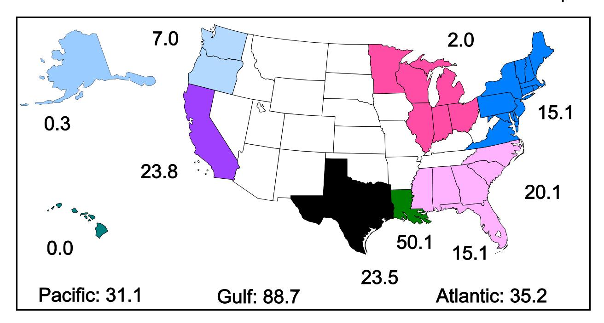

*Figure I-3-1. Fiscal year 1997 dredging by the U.S. Army Corps of Engineers at coastal projects (million m3 ). These totals do not include dredging of inland waterways and rivers, but do include Great Lakes ports (from Hillyer 1996)*

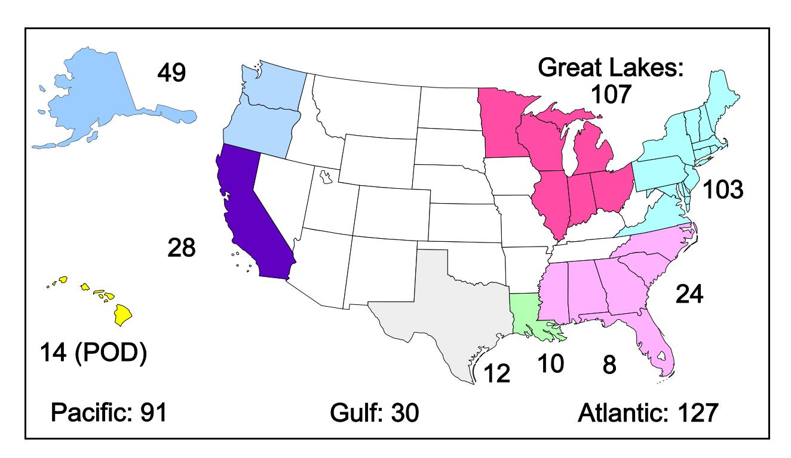

*Figure I-3-2. Federally maintained deep-draft and small boat harbors with structures (from Hillyer 1996)*

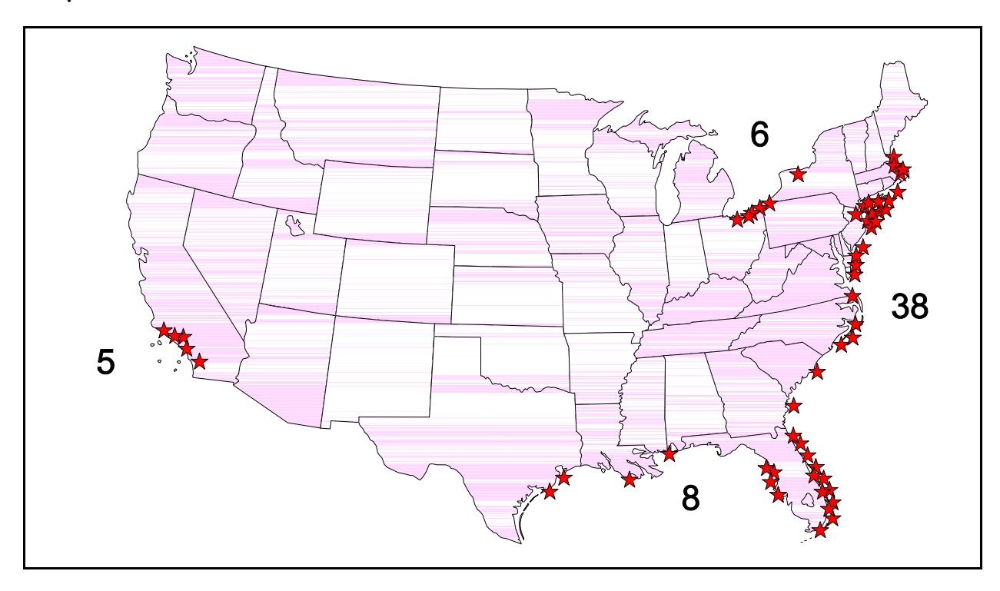

*Figure I-3-3. Location of 57 large Congressionally authorized shore protection and beach erosion control projects. Some 26 small projects with limited scope and low cost (less than a few hundred thousand dollars) are not shown (from Hillyer 1996)*

# I-3-7. Coastal Engineering in the United States1

- a. Nineteenth century projects. From the birth of the United States through the 18th century, local and Federal coastal projects were designed to accommodate and facilitate growth. Harbors that were usable in their natural setting in the 18th century had to be improved during the industrial age to service the 19th centuryís larger, steam powered, ocean-going vessels. Though the Corpsí attention focused on navigationrelated improvements, its coastal activities ranged from beach reconstruction to blasting better shipping channels to building new ports and lighthouses. Some of the early projects are summarized below:
- (1) Currents sweeping by Sullivanís Island, South Carolina, caused substantial erosion that threatened Fort Moultrie in the 1820s. A major reclamation program was started by the USACE under its authority to solve the erosion problems of existing fortifications (Moore 1982).
- (2) Congress appropriated funds in 1826 for the Corps to combat erosion of valuable sand spits protecting Duxbury and Provincetown Harbors in Massachusetts and to construct jetties at Warren River and Marthaís Vineyard to prevent sand from being carried by currents into the harbors (Parkman 1978).
- (3) Attention of the United States Government was first directed to Erie Harbor at the close of the War of 1812. In 1823, the Board of Engineers presented an elaborate plan for improvement of the harborís entrance. In May of 1824, Congress authorized improvements and protection of the vulnerable Presque Isle Peninsula (Goreki and Pope 1993). Engineering work continues at Presque Isle to this day (Figure V-3-10).

*1 One of the most detailed discussions of the history of coastal engineering in the United States is Weigel and Saville 1996.*

- (4) In 1830, Army Engineers surveyed and made recommendations for the improvement of Baltimore Harbor, Maryland. A prolonged program of channel improvement began in 1852, and by the summer of 1872, as many as 13 dredges were engaged in the excavation of the waterway. By the time of the Spanish-American war in 1898, Baltimore had become one of the world's major ports (Kanarek 1976 pp. 41-59).
- (5) Buffalo, New York, and Cleveland, Ohio, grew from frontier villages to manufacturing and commercial centers in a little over a century because of their locations at the terminus of water and rail routes connecting the grain-rich areas of the west to the eastern urban centers. The economic lives of the two cities depended on the construction and maintenance of harbor facilities such as seawalls, jetties, breakwaters, and dredged channels. As a result of successive harbor improvement projects, they have become major cities on the Great Lakes (Drescher 1982). Much of the 19th century development of the mid-West and the Great Lakes occurred as European immigrants traveled through the port of New York, along the Erie Barge Canal through Buffalo, and on to points further west.
- (6) Hell Gate, a one-mile section of the East River that connected Long Island Sound with New York Harbor, had very strong currents that sliced around rocks and islands and ran back and forth because the tides in the harbor and sound did not coincide. In 1845, New York city began an effort to open the East River to navigation and in 1852, the Corps tackled the immensely difficult task of developing new technology for underwater excavation and blasting that would be required to clear Hell Gate for navigation. The project was completed 30 years later (Klawonn 1977 pp. 69-93).
- (7) In 1868, Congress responded to request for assistance from California that resulted in a long productive period of Federal, State, and local cooperation. The development of the California coast with rail connections to modern, deepwater ports at San Diego, Los Angeles, San Francisco, and Oakland was the ultimate result (Turhollow 1975 pp. 20-48).
- (8) Following the devastating 1900 hurricane at Galveston, Texas, which drowned over 6,000 of its citizens, the city assigned three civilian engineers the task of developing the safest and most efficient means to protect the city from similar future floods. Based on their study, the city constructed a 5,360-meter (17,600-foot) curved face concrete seawall, (Figure V-3-5). The city was elevated several meters using sand pumped from Galveston Bay onto the beach behind the seawall. At the same time, Congress authorized a connecting seawall to protect the port and military reservation at Fort Crockett. The 4,900-ft extension was constructed from 1904 to 1905 (Alperin 1977, pp. 237-244).
- b. Nineteenth century coastal engineering. In 19th century United States, most engineering in the coastal area consisted of the application of principles well known to engineers accustomed to dealing with rivers. There was little concern about the unique nature of the coast, and studies of the effects of wind and waves upon the shore were sporadic, desultory, and unscientific. Trial and error, frequently accompanied by innovation was the teaching tool of the day. Improvement of the St. Johns River mouth at Jacksonville, Florida provides a good example. A continuously shifting sinuous channel through the bar made navigation difficult, so in the 1850s, a citizens group petitioned the USACE for help in dealing with the sandbar problem. One solution proposed was to put the scouring power of the current to work by constructing jetties. The USACE engineers preferred to try clearing the channel by frequent dredging and raking during the strongest phase of the ebb. These attempts failed, and in 1878 influential citizens hired Captain James B. Eads to study the problem. The 1878 Eads report recommended constructing two converging jetties to create a stable deep channel out to sea. His report contained principles of seacoast engineering, sketches of the tidal prism, and estimates of the area that could be maintained. The sophisticated technology to confirm Eads' findings would not be available well into the 20th century. Largely as a result of Eads' success constructing the jetties at the mouth of the Mississippi River, the USACE adopted a modified version of his jetty plan for improving the St. Johns River entrance (Buker 1981, pp. 69-82) (Figure I-3-4).

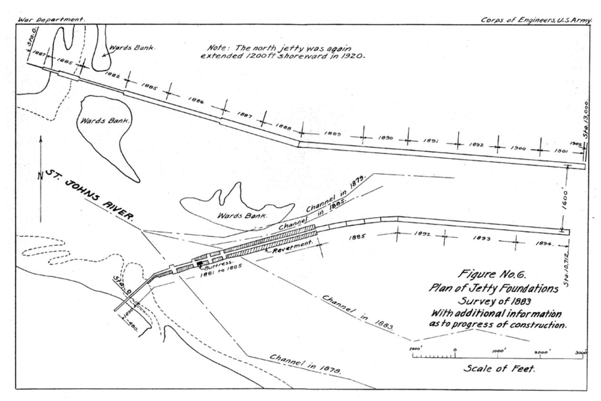

*Figure I-3-4. Converging jetty system designed by James Buchanan Eads for the mouth of the St. Johns River, Florida. Figure courtesy of USAED, Jacksonville*

Colonel Quincy Gillmore, familiar with Eads' plan for Jacksonville, used a similar plan to construct the jetties at Charleston Harbor, South Carolina, between 1878 and 1893. From the barrier islands on each side of the harbor entrance, the USACE constructed two converging jetties followed by a parallel section. The near shore portion of the jetties was constructed to just below the low tide water surface, thereby serving as a weir and allowing the flood tide to come in normally. During the ebb tide, the bottom currents were channeled through the parallel section (constructed higher, with the seaward quarter above high tide) toward the bar and this scouring action kept the new channel clear (Moore 1982). A similar plan was used at the mouth of the St. Mary's River at the Florida-Georgia border. Major George L. Gillespie, District Engineer in Portland, OR, submitted a plan for a dike at the mouth of the Columbia River to concentrate river currents and tides to scour a deep channel. Construction commenced on the south jetty in 1884, a project that had to overcome fierce winter storms and hazardous working conditions (Willingham 1983).
c. Early coastal development and shore protection. From the early days of settlement to the present, Americans have built in the coastal area. During the 1600 and 1700s, the original colonies owed their prosperity largely to the availability of good natural harbors, rich nearby fishing grounds, and active trade with the Caribbean and Europe. As the giant continent was explored and settled in the 1800s, rivers and the Great Lakes became the prime mode of moving goods and people to and from distant towns. In the 20th century, a new social phenomena arose that resulted in an ever-increasing interest in the coastal zone: more and more Americans achieved the economic means and leisure time to enjoy the beach for recreational purposes. Even before beaches became popular vacation destinations, engineers constructed structures to aid navigation, to halt erosion, and to protect shore front development from storm surge. They designed bulkheads, revetments, and seawalls to hold the shoreline in place. Generally, these designs were successful, with Galveston, Texas, and San Francisco, California, being two examples of early seawall construction. Other structures, such as groins and jetties, impeded longshore transport of sand. Groins are intended to
protect a finite beach section, while jetties keep sand out of the navigation channel between the jetties, define and maintains the harbor entrance channel, and provide calm water access to the harbor facilities (Figures I-3-5, I-3-6). For jetties built along uninhabited coastal areas in the 19th and early 20th centuries, the buildup of sand on the up-drift beach and the loss of sand on the downdrift beach was considered a minor consequence compared to the major benefits of ocean navigation trade (Figure I-3-7). In nearly every instance, these harbor structures interrupted the alongshore movement of sand and starved nearby downdrift beaches (USACE 1971), but it was not until the shore was developed in the later 20th century that this interruption of sand transport was regarded as a problem.
d. Early 20th century beach development and the Engineering Advisory Board on Coastal Erosion. As urbanization and congestion increased, the more affluent escaped to the seashore, where resorts arose to accommodate them. Until the age of the automobile, these resorts remained small isolated coastal enclaves tied to the hinterland by rails. The technical revolution brought electric trains, automobiles, gasoline-powered pleasure boats, labor-saving devices for the home, and a new era of leisure to a prospering nation (USACE 1971; Morison and Commager 1962). Electricity provided convenient power to energy-poor barriers. Changing morals allowed people to sunbathe and enjoy the hedonism of the beach experience. And with the growing use of the automobile, beach-goers in increasing numbers followed newly-built roads to the coast. Concern about shore erosion grew as more people acquired property and built homes and businesses, assuming a stable shoreline.
The New Jersey shore, close to the New York and Philadelphia urban areas, was one of the first highly developed shorelines (Figures I-3-8 and I-3-9). During the period 1915 to 1921, three hurricanes and four tropical storms battered the Jersey shore, causing severe beach erosion. In New Jersey, millions of dollars were spent on uncoordinated and sometimes totally inappropriate erosion control structures which often produced results that were only minimally effective, and, in some cases, counterproductive (Hillyer 1996). Engineers and city managers soon realized that individual property owners were incapable of dealing with coastal erosion and that a broader approach was necessary. In 1922, because of rapidly eroding shorelines and revenue losses to the coastal communities, the State funded and appointed an Engineering Advisory Board on Coastal Erosion. Its only recommendation was that further research was needed (Moore and Moore 1983).
In contrast to the haphazard development of the Jersey shore, some of the early large-scale coastal projects proved to be remarkably successful social and engineering accomplishments. America's first large engineered beach fill was the boardwalk and recreational beach on Coney Island in 1922 - 1923 (Farley 1923). With the completion of the project, immigrants and factory workers could escape the sweatshops of the sweltering city and enjoy a (crowded) Sunday at the beach for only a nickel subway ride (Figure I-3-10; Stanton 1999). This was followed by the ambitious construction of the Jones Beach Parkway by Robert Moses and the Long Island State Park Commission in 1926 - 1929, during which more than 30 million m3 of sand were pumped to create Jones Island (DeWan 1999; Kana 1999) (Figure I-3-11). In Chicago, the entire waterfront was reshaped between 1920 and 1940 with the addition of over 14.2 square km of fill, resulting in one of America's premier urban parks (Chrzastowski 1999). These were city- and state-sponsored projects, with minimal input by the Federal Government.
e. American Shore and Beach Preservation Association. Delegates (85) representing 16 states met at Asbury Park, New Jersey, in 1926, to discuss their growing coastal zone problems. After the first meeting, two more, following shortly thereafter, led to the formation of the American Shore and Beach Preservation Association (ASBPA). The Association brings together a cross section of engineers, public officials, State and Federal personnel, and coastal property owners. Their aim is that "Man must come to the rescue of the beaches." Members see themselves as leaders and teachers in a conservation movement to fight shore and beach erosion (Patton 1934). Their influence in State and Federal governments and continued interest in coastal zone issues is responsible for many of the laws and actions to protect the U. S. shores and beaches.

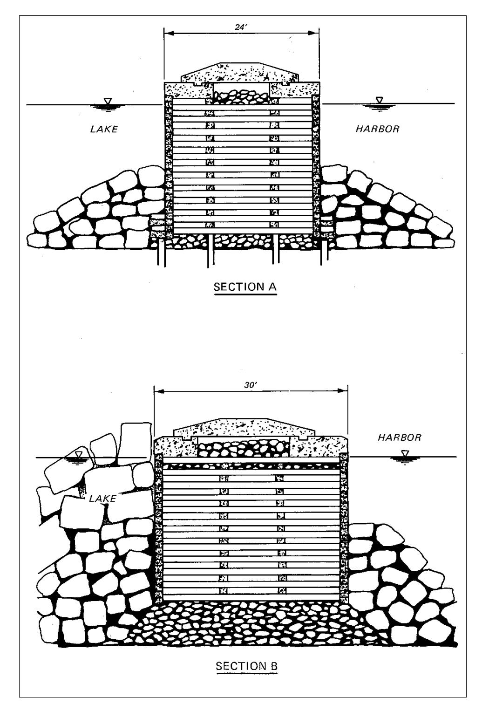

*Figure I-3-5. Example of wood crib breakwater typical of the construction technique used in the Great Lakes during the late 1800's, in this case from Calumet Harbor, Illinois. Skilled wood craftsmen built the cribs on land or on a barge, floated them into place, and sank them using rock and gravel fill. Almost 1,000 of these breakwaters were built around the Great Lakes, and many of them, now a century old, need rehabilitation.*

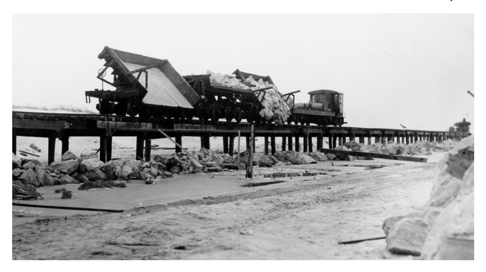

*Figure I-3-6. Construction of Fire Island jetty on Democrat Point, at the west end of Fire Island, Long Island, New York. Many early USACE jetties were built from the land moving seaward using materials brought in by train. Photograph taken 3 Jan 1940, from Beach Erosion Board Archives.*

f. The Board on Sand Movement and Beach Erosion. On January 29, 1929, Major General Edgar Jadwin, Chief of Engineers, USACE, issued a Special Order creating a four-officer board "to investigate and report on the subject of sand movement and beach erosion at such localities as may be designated by the Chief of Engineers." The Chief of Engineers designated Jamaica Bay, New York, and Cold Springs Inlet, New Jersey, as the first two projects for investigation by the "Sand Board" as it became familiarly known. The board employed two consultants, Dr. Douglas W. Johnson of Columbia University and Professor Thorndike Saville of the University of North Carolina. With their advice and assistance, a list of field experiments was prepared. The northern coast of New Jersey, with its area of active erosion and numerous shore protection installations was selected for conducting the experiments. Lieutenant Leland K. Hewitt was assigned to the board in April 1929, to conduct the experiments. Morrough P. O'Brien, recently returned from Freeman Scholarship studies in Europe, was borrowed from the University of California to provide expert assistance in the studies. Hewitt and O'Brien set up their headquarters in Long Branch, New Jersey, and began assembling equipment and personnel to carry out their task. Thus began a USACE research program destined to have far-reaching effects (Wilson and Eaton 1960)
g. The Beach Erosion Board. During this period, the ASBPA, under the leadership of J. Spencer Smith, its persuasive president, was engaged in a campaign to bring combined Federal, State and local effort to bear upon the U. S. beach preservation problems. After two years of Congressional hearings, Section 2 of the River and Harbor Act of 1930, authorized and directed the Chief of Engineers "to cause investigations and studies to be made in cooperation with appropriate agencies of the various states on the Atlantic, Pacific, and Gulf coasts and on the Great Lakes, and Territories, with a view of devising effective means of preventing erosion of the shores of coastal and lake waters by waves and currents . . ." The new law also provided for the creation of the Beach Erosion Board (BEB) by the provision "that there shall be organized under the Chief of Engineers, United States Army, by detail from time to time from the Corps of Engineers and from the engineers of state agencies charged with beach erosion and shore protection, a board of seven members,

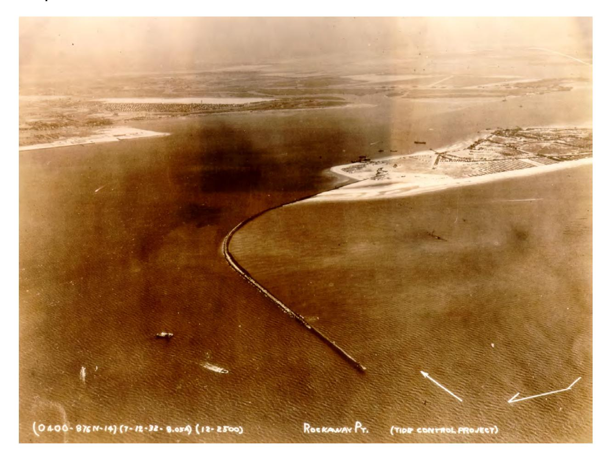

*Figure I-3-7. Construction of the jetty on the east side of Rockaway Inlet, Long Island, New York, 12 July 1932. The urban area on the opposite side of the inlet is the east end of Coney Island, and Jamaica Bay is in the distance. In seven decades, the fillet has filled with sand to approximately the end of the jetty seen in this image. Photograph from Beach Erosion Board Archives.*

of whom four shall be officers of the Corps of Engineers and three shall be selected with regard to their special fitness by the Chief of Engineers from among the state agencies cooperating with the War Department. The board will furnish such technical assistance as may be directed by the Chief of Engineers in the conduct of such studies as may be undertaken and will review the reports of investigation made . . ." Obviously, reconsideration of the mission and need for the original Board on Sand Movement and Beach Erosion was required. Since the new law defined the functions of the BEB as being related to cooperative studies with the states, It was decided to create two boards, one known as the Shore Protection Board (SPB), that would conduct investigations and report upon problems concerning federal property shore protection and the other, the BEB to have similar responsibilities with respect to cooperative studies. Members of the SPB consisted of the military members of the BEB plus the District Engineer for the concerned locality. For the next sixteen years the two boards shared the same staff and headquarters until the SPB was abolished and its duties transferred to the BEB. (Wilson and Eaton 1960)
h. BEB focus on basic research (Willingham 1983). The Corps had, historically, not favored expenditure of Federal funds to protect private property, whether in river basins or coastal flood plains. During the 1930's, however, attitudes began to change, and Congress expanded Federal

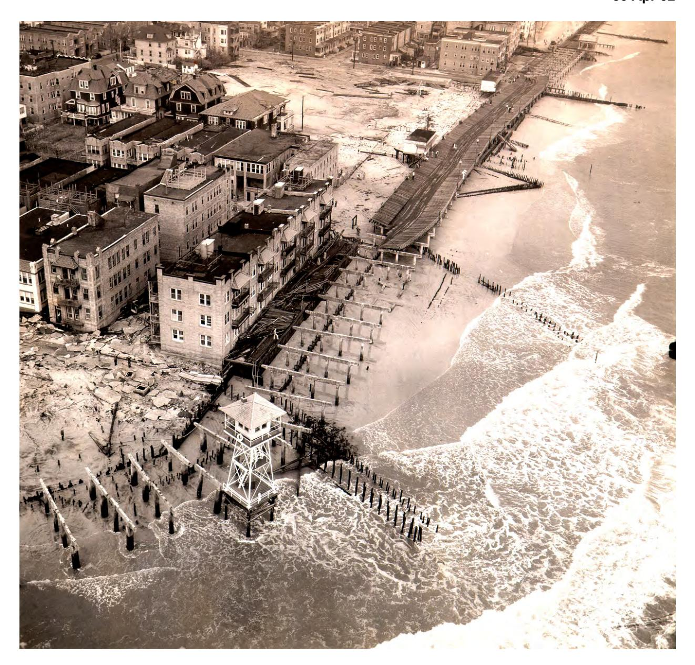

*Figure I-3-8. Atlantic City, New Jersey, at the mouth of Absecon Inlet, 15 September 1944. This is one of a series of images taken after the hurricane of 14 September, a Category 3 storm that caused 390 deaths in the northeast U.S. This photograph illustrates the degree of urban development along this coast. Photograph taken from a blimp from the U.S. Naval Air Station, Lakehurst, NJ. Official U.S. Navy Photograph (from Beach Erosion Board Archives)*

participation in coastal protection. A significant legislative event was the passage in 1936 of an Act wherein it was declared the policy of the United States "... to assist in the construction where Federal interests are involved, but not the maintenance, of works for the improvement and protection of the beaches along the shores of the United States, and to prevent erosion due to the action of waves, tides, and currents, with the purpose of preventing damage to property along the shores of the United States, and promoting and encouraging the healthful recreation of the people..." The Act further authorized the Board "to publish from time to time such useful data and information concerning the protection of beaches as the Board may deem to be of value to the people of the United States..." The act also required that the Board "in making its report on any work or project relating to shore protection shall,

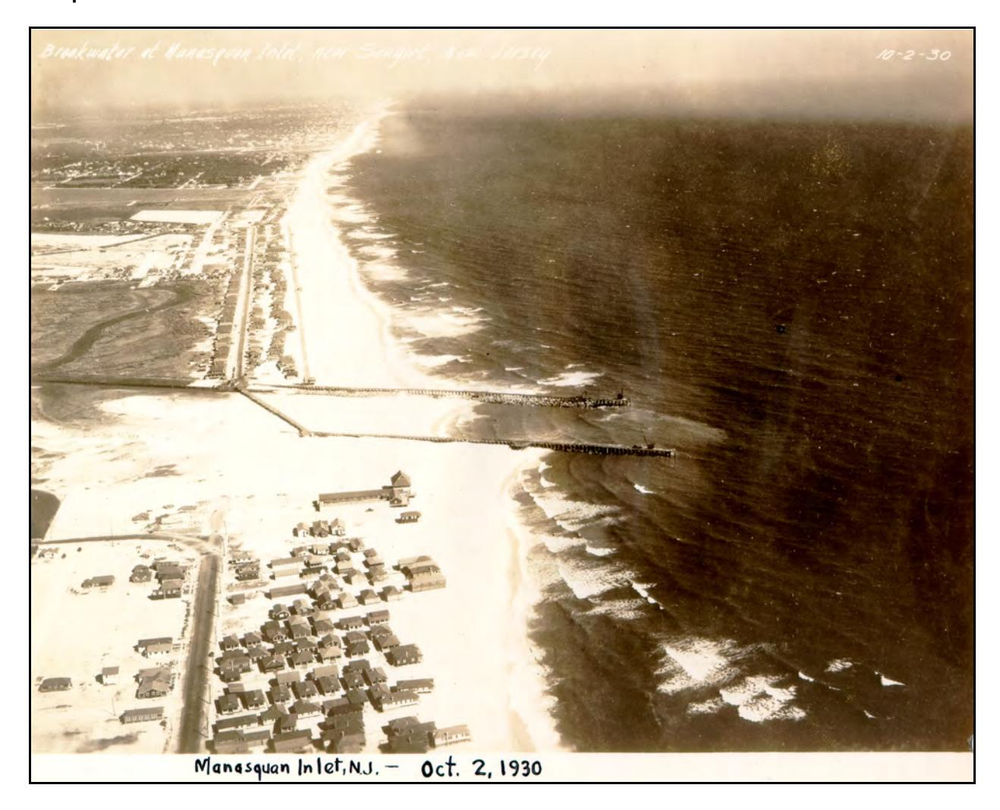

*Figure I-3-9. Construction of Manasquan Inlet jetties, New Jersey, October 2, 1930, view looking north. Material for the jetties was supplied via an elevated roadway that extended out to sea from the land. Note that sand is already accumulating on the south (lower) side of the south jetty. The shoreline is continuous, and at this site the inlet was dredged after the jetties were completed. Other man-made openings that are now Federal navigation projects include Panama City Inlet, Florida, Duluth Cut, Minnesota, and Aransas Pass, Texas. (Photograph from Beach Erosion Board archives)*

in addition to any other matters upon which it may be required to report, state its opinion as to the advisability of adopting the project; what Federal interest, if any, is involved in the proposed improvement; and what share of the expense, if any, should be borne by the United States." (Cited in Wilson and Eaton 1960).
Although there was substantial support in Congress for federal aid in coastal protection, much difficulty was encountered in determining the proper extent of such aid. The BEB, lacking more specific instructions from Congress, interpreted "federal interest" as pertaining only to the interest of the United States as a landowner of shore property. This resulted in practically no recommendations for federal aid by the BEB during the 1930s. Other Federal agencies were concerned with putting people to work during the depression and interpreted the 1936 Act differently. The Works Progress Administration built revetments, dikes, retaining walls, and jetties on North Carolina's Outer Banks at a cost more than $4 million. The Corps held back on coastal construction projects because of uncertainties about predicting conditions at individual coastal sites revealed by board survey reports. The BEB, driven by professional curiosity, undertook

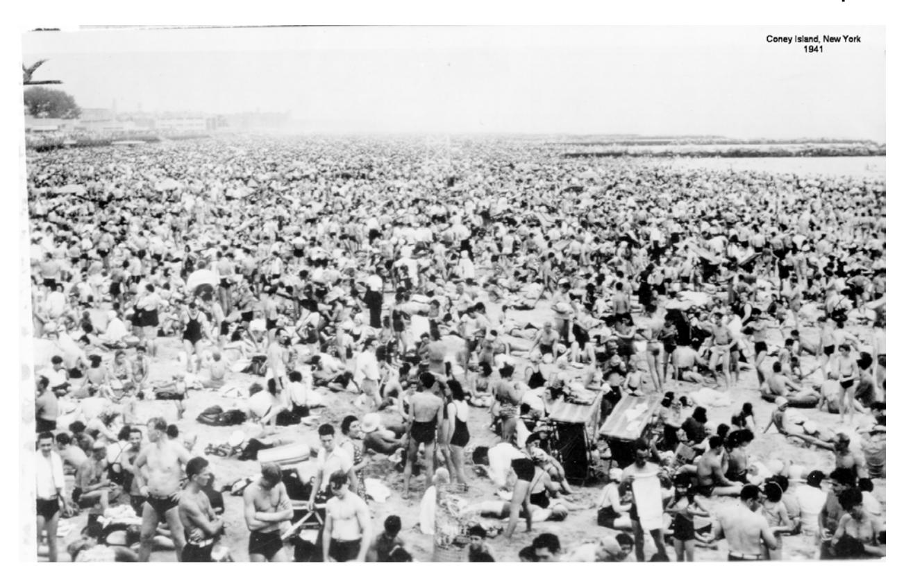

*Figure I-3-10. Coney Island in 1941, on the eve of World War II. For only a 5-cent subway ride, workers from the sweltering city could relax at the beach (from Beach Erosion Board archives)*

scientific investigations into coastal processes despite the lack of authorization in either the 1930 or 1936 acts. By the beginning of World War II, the BEB was publishing technical reports and memoranda on its research results (Moore and Moore 1991).
i. Dalecarlia reservation and World War II. Expansion of military activities prior to our entry into World War II required the removal of the Washington Engineering District and the BEB from the Navy Building on Constitution Ave. in Washington, D.C. to a small office building on the Dalecarlia reservation in Washington. The new site was adequate for expansion of facilities, which was to follow, and admirably served the BEB's needs. Upon our entry in the war, need soon arose for intelligence to meet amphibious operations requirements and research to explore means of providing expedient harbor facilities. Logically, the Chief of Engineers called on the BEB staff for assistance on these problems. In addition, the BEB was tasked to train intelligence teams to staff the various military commands. Although these activities were directed toward military requirements, they provided much additional data and knowledge for later use in the Board's peacetime mission. Interest and activity in Congress to clarify the problem of federal aid for shore protection resumed as the war drew to a close. Public Law 166, enacted on July 31, 1945, substituted "public interest" for "Federal interest" as previously used in the 1936 Act, and a year later, Public Law 727 spelled out the conditions and limitations for federal aid for shore protection works. Only publicly owned shores were eligible and the Federal contribution could not exceed one-third of the first cost of protective works with no contribution toward maintenance cost. During the Korean War, most of the Board's staff was again diverted to military efforts. During this lull in preparation of cooperative studies, Technical Report No. 4, Shore Protection Planning and Design , was produced. The report was a manual of coastal engineering that summarized the knowledge gained by the BEB and representing its current technical doctrine. Cooperative studies resumed at an accelerated pace with the end of the Korean War. Congress

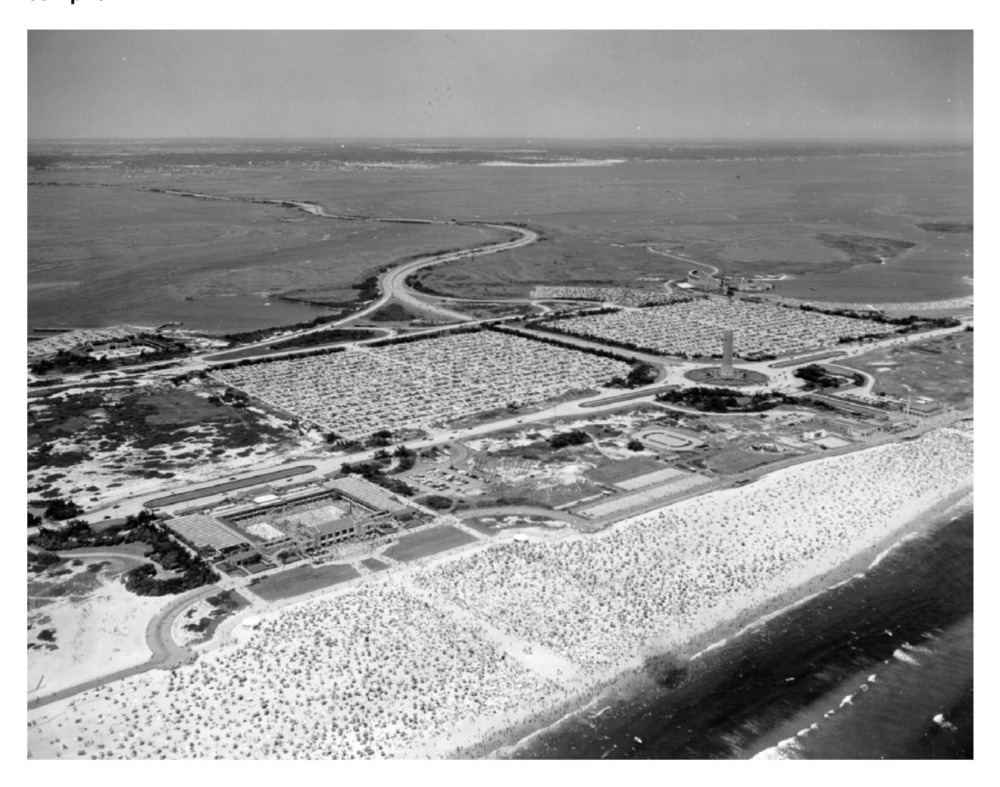

*Figure I-3-11. Jones Island State Park, Long Island, New York, 4 July, 1958. One of the nation's premier urban beaches, Jones Beach is only 45 km from Manhattan, but traffic can be problematic on some days. The legend on the photograph states that there are 11,117 cars in the parking lots. From Beach Erosion Board archives*

amended the law to permit Federal aid to privately owned shores when a public benefit resulted and to permit aid toward periodic beach nourishment costs. The 1954 and 1955 River and Harbor Acts authorized sixtytwo federal aid projects, a significant increase over the five projects authorized up to that date (Wilson and Eaton 1960).
j. BEB accomplishments. In summary, the BEB made substantial progress toward establishing sound coastal engineering techniques and established a research impetus in coastal processes. It commenced the collection of a permanent record of pertinent data and provided a manual on the best techniques to address specific shore erosion problems. The presence of Murrough P. O'Brien and Thorndike Saville on the Beach Erosion Board for such an extended period provided a continuity of objective and effort unique in public service (Wilson and Eaton 1960). During its 33-year existence, the BEB reviewed 149 cooperative study reports and two Federal surveys of beach erosion problems. The BEB reviewed 114 of the cooperative studies following the 1946 legislation allowing Federal participation in construction cost and recommended 72 as Federal projects. The BEB published 135 technical memoranda and four technical reports, 130 of which were published after the 1946 legislation authorizing the BEB to make general investigations and publish technical reports (Moore and Moore 1991).

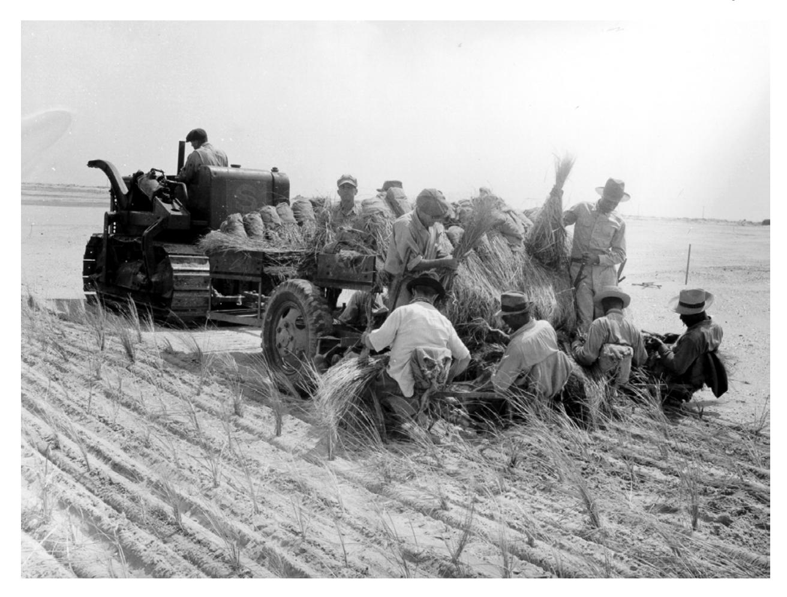

*Figure I-3-12. Workers planting grass on a beach restoration project. The date and location of this image were not recorded, but the scene is likely the Outer Banks. Many dune and beach restoration efforts, sponsored by the National Park Service and other agencies during the late 1930s, also served as work relief efforts for a nation trying to recover from the Great Depression. Photograph from the Beach Erosion Board Archives*

k. Evolution of shore protection and the shift from structures to beach nourishment. Prior to the 1950s, the general practice was to use hard structures to protect against beach erosion or storm damages. These structures were usually coastal armoring such as seawalls and revetments or sand-trapping structures such as groins. During the 1920s and '30s, private or local community interests protected many areas of the shore using these techniques in a rather ad hoc manner. In certain resort areas, structures had proliferated to such an extent that the protection actually impeded the recreational use of the beaches. Erosion of the sand continued, but the fixed back-beach line remained, resulting in a loss of beach area. The obtrusiveness and cost of these structures led the USACE in the late 1940s and early 1950s, to move toward a new, more dynamic, method. USACE projects no longer relied solely on hard coastal defense structures as techniques were developed which replicated the protective characteristics of natural beach and dune systems. The resultant use of artificial beaches and stabilized dunes as an engineering approach was an economically viable and more environmentally friendly means for dissipating wave energy and protecting coastal developments. Artificial beaches also had more aesthetic and recreational value then structured shores. The transition from hard structures to beach fill approaches is depicted in Figure I-3-13, which compares the percentage of Federal shore protection funds spent on beach nourishment and on coastal protection structures per decade. Since the 1970s, 90 percent of the Federal appropriation for shore protection has been for beach nourishment (Hillyer 1996).

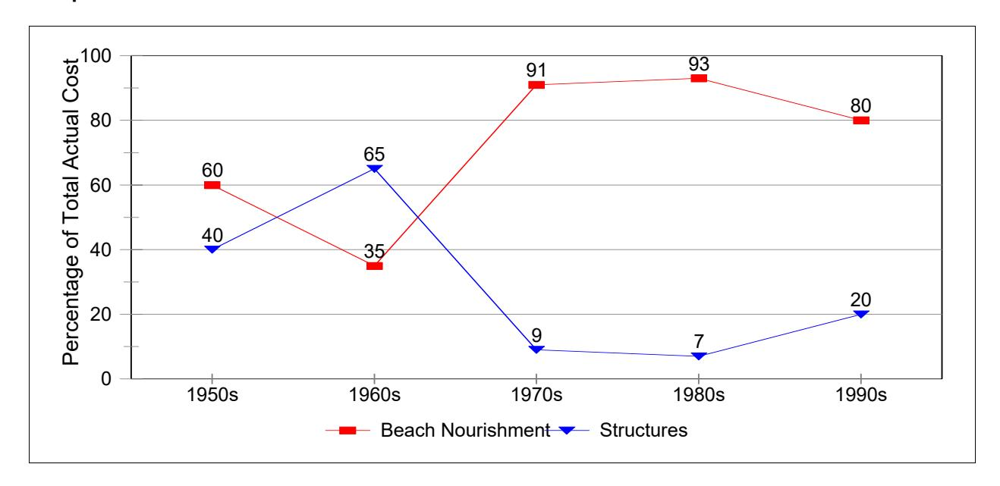

*Figure I-3-13. The shift from fixed structures to beach restoration and nourishment (from Hillyer 1996)*

- l. The Coastal Engineering Research Center and the Coastal Engineering Research Board. In 1962, the USACE studied the merits of strengthening its coastal engineering research capabilities and the benefits from having the evaluation and reporting of coastal projects follow the same procedures as river, harbor, and flood control investigations. Responding to the recommendations of the Corps' internal study board, Congress, by approving Public Law 172 on November 7,1963, abolished the BEB and established the Coastal Engineering Research Center (CERC). CERC had the same mission as the BEB less its review function, but retained an advisory system in a "Board on Coastal Engineering Research, constituted by the Chief of Engineers in the same manner as the present Beach Erosion Board" (Moore and Moore 1991).
- (1) Early years. The Coastal Engineering Research Board (CERB) and CERC followed the lead of their predecessor, the BEB, in pursuing field measurements and basic coastal processes research. The argument was that more research would produce more data, provide for more sound coastal engineering approaches, and lead to greater savings. Spurred by both increasing development and environmental awareness, CERC planned programs to quantify phenomena that previously had been only understood qualitatively. The Marine Science Council, created by the Marine Resources and Engineering Development Act of 1966, appointed the USACE as coordinating agency in a multidisciplinary, interagency effort to identify the effects of construction on the coastal zone. That same year, USACE Headquarters (HQUSACE) asked CERC to draft a program covering the Corps' long range needs in coastal engineering. This triggered a reevaluation and a program increase between 1964 and 1969 (Moore and Moore 1991).
- (2) Fort Belvoir. As CERC assumed new missions, its most critical needs were office space and a shelter for the Shore Processes Test Basin (SPTB). Weather conditions limited the open-air SPTB use to the period April through October. A HQUSACE command inspection of CERC in December, 1967, concluded that there was not enough space at the Dalecarlia site for the future CERC. A plan was developed to build a research and development complex in the northwest corner of Fort Belvoir on 182 hectares (450 acres). Several USACE and Department of Army agencies would be located at the complex. CERC, the Board of Engineers for Rivers and Harbors, and the Institute for Water Resources would be located in the Kingman Building. CERC was allocated 40.5 hectares (100 acres) for the replacement of existing test facilities and future expansion.
- (3) Field Research Facility. Prior to its move to Fort Belvoir, CERC had planned and budgeted to construct a Field Research Facility (FRF) to evaluate and examine coastal phenomena on prototype (full-size) scale. CERC learned that the U.S. Navy was preparing to surplus a bombing range at Duck, North Carolina, and acquired the property in 1973. On 29 August 1980, the 50th Anniversary of the creation of the Beach Erosion Board, the FRF was officially opened. The 73.7-hectare (182-acre) FRF stretches from ocean to sound, contains a 589-m (1800-foot) pier and laboratory facilities and is used for physical and biological studies (Mason 1979). Meteorological, topographical and oceanographic data are continuously recorded, and the staff conduct research projects at the site and frequently host large field experiments involving other Federal, state and local agencies, plus U.S. and foreign universities. The FRF's advantages of ocean location, research pier, sophisticated infrastructure, synoptic and continuing hydrodynamic and process database, and experienced staff are unique in the United States. Data are accessible on the Internet at the FRF's Web page: http://www.frf.usace.army.mil/frf.html
- (4) Shore Protection Manual. When first established, CERC was the only Federal agency with a mission in coastal engineering and almost alone in funding studies of waves and their effects. The research programs at CERC, with their field and laboratory testing and data collection, had an immense practical value. CERC's first combined volume containing guidance on coastal science and engineering was Shore Protection, Planning, and Design , Technical Report No. 4 (TR-4), first issued in 1954. The USACE District and Division staffs had a need to apply the data and research results reported by CERC into useful design tools, and they often relied on TR-4 and some related Engineering Manuals published by HQUSACE for design guidance. The Shore Protection Manual (SPM) was first published by CERC in 1973 as the updated replacement for TR-4. CERC used the SPM as its primary technology transfer mechanism for many years, with a second edition printed in 1975, a third in 1977, and a fourth and final edition in 1984.
- (5) Waterways Experiment Station. A number of events and policy changes in the early 1980's shifted CERC's emphasis into more applied research and moved the laboratory to the Waterways Experiment Station (WES) in Vicksburg, Mississippi. Despite disruptions caused by the 1983 relocation and declining research budgets, CERC prospered in Vicksburg. Reimbursable project work more than compensated for the decline. Mathematical modeling, sophisticated wave tanks and basins (part of the reason for the move), and a closer, more responsive relation with the USACE District and Division staffs all contributed to increased workload.
- (6) The Coastal and Hydraulics Laboratory. In the early 1990s, due to political and policy changes, Federal funding for the beach erosion control and flood control projects was severely curtailed and closely regulated. This resulted in reduced research funding and a decrease in the number of new beach erosion control and flood control studies at CERC and the Hydraulics Laboratory. During 1996, both laboratories were combined into one new entity, the Coastal and Hydraulics Laboratory (CHL). CERC's traditional functions such as coastal engineering research, design guidance development such as this manual, and design assistance are still provided by the CHL with the advice of the CERB and a field review group of Division and District staff engineers.

#### I-3-8 Coastal Engineering in the Military

a. Amphibious operations. Amphibious military operations are not new. Herodotus (1992, translation) describes, in The Histories , how Xerxes constructed and used a floating causeway across the Hellespont (the Dardanelles) in 480 B.C. The first amphibious operation in the Americas was the 49-day siege of the French Fortress of Louisburg on Cape Breton Island, Nova Scotia, Canada, in 1745. The Chief Engineer of the operation was Richard Gridley who published that same year the first map in America, a "Plan of the City and Fortifications of Louisburg," and who later became the first Chief Engineer under Commander-in-Chief George Washington in 1775. Many amphibious operations were conducted in North Africa, Italy, France, and the Pacific during World War (W.W.) II. These exercises taught us that for a successful over-the-beach
assault, details and forecasts of changes must be acquired of coastal type, beach configuration, morphodynamics, profiles, wave conditions, tides, beach material, beach trafficability, and nearshore and offshore bottom-holding capacity for moorings and anchored ships. At the start of the war, many charts were available showing areas safe for deep-draft navigation and details of land topography, but hardly any of the nearshore areas where assault troops and supplies could be landed. Much of this type of information was collected and evaluated during the war. Of prime importance to military amphibious operations are the wave conditions that can be anticipated. Correlations among wind strength, duration, fetch, and wave height and period were developed in the United States and in the United Kingdom (U.K.) for wave forecast for planning and for operations. The state-of-the-art in military coastal engineering at the end of W.W. II was documented in the Manual on Amphibious Oceanography , (University of California at Berkley (UCB), Institute of Engineering Research (IER) 1952) (Wiegel 1999).
- b. Expedient harbors. Expedient harbor design for the invasion of Normandy also required substantial coastal engineering effort. The design of the two Mulberry harbors ("A" at St. Laurent (Omaha Beach) and "B" at Arromanches) required information on wave and tide prediction (design tide range was 7.3 meters (24 feet)), wave diffraction, wave induced forces, bottom conditions, and placement of structures and their foundations. Wave-diffraction theory (wave transmission about the tip or through a gap between breakwaters) was developed for this project. The Mulberry Harbor was designed in two parts. The portion closest to shore, in shallow water, had a breakwater of vertical reinforced-concrete caissons (code name "Phoenix") and sunken ships protecting it, while the seaward portion was protected by moored floating breakwaters ("Bombardon"). The Bombardon had a cross section similar to a Maltese cross in shape; each unit was 61 meters (200 feet) in length, 7.6 meters (25 feet) in beam and depth with 5.8 meters (19 feet) draft. They were deployed in pairs with a 15.2 meters gap between pairs. Located inside the shallow water sheltered area were pier heads and mile-long pontoon-supported flexible bridges (causeways code named "whales"). After initial construction, a storm along the Normandy coast with gale winds blowing from the northeast generated sea conditions larger than project design waves. Operations were disrupted and delayed, with great damage to the artificial harbors, craft and ships. Mulberry "A" suffered damage beyond repair. Shown in Figure I-3-14 Is Mulberry "B" after being repaired. The Civil Engineer in War, A Symposium of Papers on Wartime Engineering Problems, Volume 2, Docks and Harbors (Institute of Civil Engineers 1948) provides details on the design, installation, and performance of the Mulberry Harbors (Wiegel 1999).
- c. Military coastal engineering studies. After W.W. II, UCB contracted with the Office of Naval Research (ONR) to review amphibious operations reports from the war. As expected, many landing-craft and amphibious-vehicle casualties were due to enemy action, but many were related to problems with waves and currents causing capsizing, swamping, broaching, getting stuck on bars and, when the ramps were down, filling with water and sand. Another major problem was beach trafficability. Vehicles were frequently stuck in the sand. A trafficability study of beach sand characteristics, beach slope, water level, and vehicle type was made. It was observed that saturated sand near the water's edge would liquefy due to vibrations produced by the vehicular traffic. Several full-scale amphibious assault-training exercises were observed in detail and reports prepared on the observations and findings.
During the 25 October, 1949, exercise across three west coast beaches at the Waianae-Pokai Bay region of Oahu, Hawaii, long-period waves surging up the steep beach face caused substantial landing craft casualties on two of the beaches. Many of the craft broached and were shoved onto the steep beach by the surging breakers (see Figure I-3-15). Of the 20 landing craft sent ashore in 3 "waves" in the first 15 minutes of the amphibious exercise, 7 retracted and 8 were lost, some filling with water and sand when the ramps were lowered. The exercise was quickly halted and five of the craft later salvaged. Because of the problems experienced moving personnel, equipment and supplies through the surf and over the beach, the Department of Defense began the development of helicopters and air cushion vehicles (Wiegel 1999).

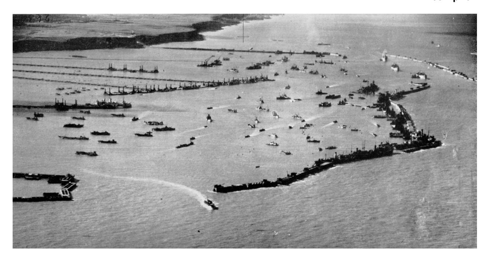

*Figure I-3-14. Aerial photograph of the Mulberry "B" Harbor at Arromanches, France, June 1944 (from Institution of Civil Engineers, London, England, 1948, p. 242)*

- d. Port operations, Republic of Korea. One of the major amphibious operations in the Republic of Korea (ROK) was the invasion at Inchon Harbor. The east coast of the ROK is generally rocky sea cliffs, while the south and west coasts are extensive mud flats with many small conical islands. During low tide at Inchon, the tidal flats extend at least 50 km offshore and the only approach to the port is a narrow channel 1 to 2 meters deep at zero tide. Extreme tides, ranging from -0.6 meters to +9.8 meters, provided many engineers their first experience with a sea of water quickly changing into a sea of mud. After the 15 September 1950 amphibious assault, General MacArthur said ". . . conception of the Inchon landing would have been impossible without the assurance of success afforded by the use of the Seabee pontoon causeways and piers." The tidal basin and other facilities were relatively intact at the time of the invasion. However, during the U.S. evacuation in January 1951, the lock gates to the tidal basin were demolished, then rebuilt after return of the U.S. forces in February 1951 (Wiegel 1999).
- e. Port operations, Republic of Vietnam. In Vietnam, the U.S. Navy Officer in Charge of Construction was responsible for Saigon-Newport and DaNang deep-water ports. Data were collected on coastal sediments, storms, tides, and waves to plan the dredging of these ports and seven other sites. The Army port construction section used these data and the Beach Erosion Board's Technical Report No. 4, Shore Protection Planning and Design , to prepare detailed design of port facilities. The DeLong Corporation's installation of piers, prefabricated causeway components, and use of self elevating barges also contributed to successful port facility operations. The sand on many of the Vietnamese beaches was of such character that over-theshore operations were almost impossible. Rock, concrete, articulators, pierced-steel planking and other means attempted to stabilize the sand were serviceable for very limited periods ranging from days to two weeks. Waves on the foreshore undermined the stabilizing structures and decreased the bearing capacity, resulting in the structures sinking out of sight. Engineers, drawing on their W.W. II and subsequent experience, used draglines and blasting to dig nearby coral, crush it, and then place it in compacted layers where the foreshore had been previously excavated for the purpose. This installation lasted several months with only minor repair and was judged very satisfactory (Wiegel 1999).

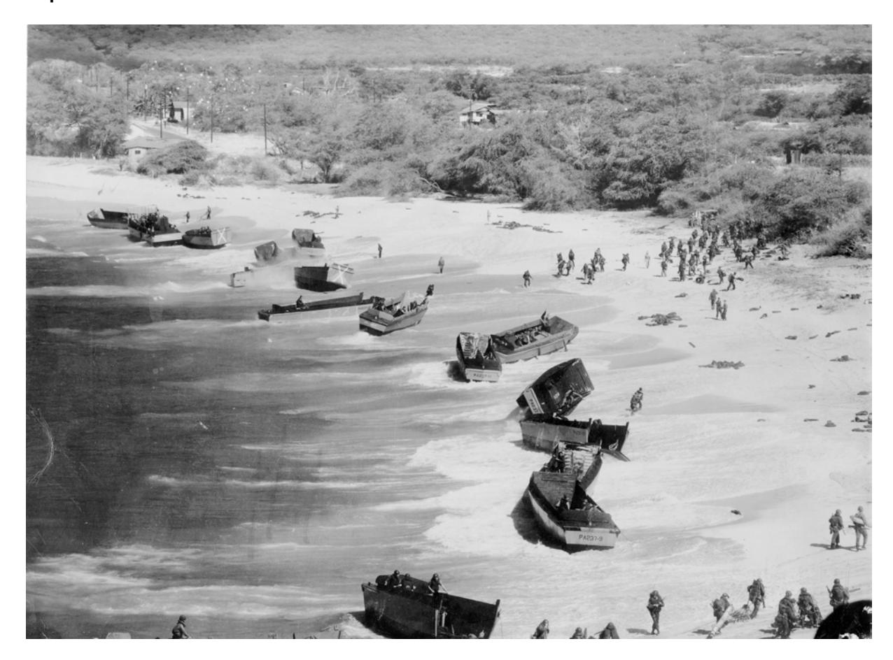

*Figure I-3-15. Operation MIKI, Waianae, Oahu, HI, October 1949, (Many landing craft broached and were shoved onto the beach by surging breakers) (from Wiegel and Kimberly 1949)*

- (1) Vung Ro. For the construction of the port of Vung Ro to support the major air base at Tuy Hoa, estimates of typhoon and monsoon waves were made and wave refraction studies used to plan the port. Port development included landing-craft ramps, a floating pontoon cube barge dock, two DeLong barge piers (183 x 24.4-meters) (600 x 80-feet) with two girder spans off a 120-meter (394-foot) rock fill causeway, tanker mooring facilities and a pipeline connecting to the tank farm south of Tuy Hoa airstrip about 15.5 km (9.6 miles) distance. Seven months after the port was completed the facilities were struck by a typhoon, but survived wave conditions exceeding the design wave criteria (Wiegel 1999).
- (2) Da Rang River. The U.S. Air Force wanted a harbor closer to the air base that would be located at the mouth of the Da Rang River. The river brings a great amount of sand to the coast in this area. The USACE had recommended, based on studies by CERC and WES, a site several miles south where the 3 fathom line was much closer to shore. The Navy had funded hydraulic model studies of the entrance and jetties at the southern site. However, the Air Force pressed on at the river mouth site with a "turnkey project" contractor. After several months of pilot channel dredging, the contractor conceded that construction of a harbor at the Da Rang River mouth was impractical and the project was abandoned (Wiegel 1999).
- f. Temporary wharfs. The Army has two sizes of self-elevating pier systems, known as DeLong barges. These units are honeycomb-like, welded-steel, box-girder structures consisting of plates and stiffeners that are towed to a site where a temporary harbor is being built or an existing port rehabilitated. The units are anchored on pneumatic caissons that are forced into the sea bed with air jacks. The units can
be used on noncohesive beds but are unsuitable for rock, organic materials, or wet clays and silts. The units can be installed in a variety of configurations at the site (Figure I-3-16) (Department of the Army 1990).

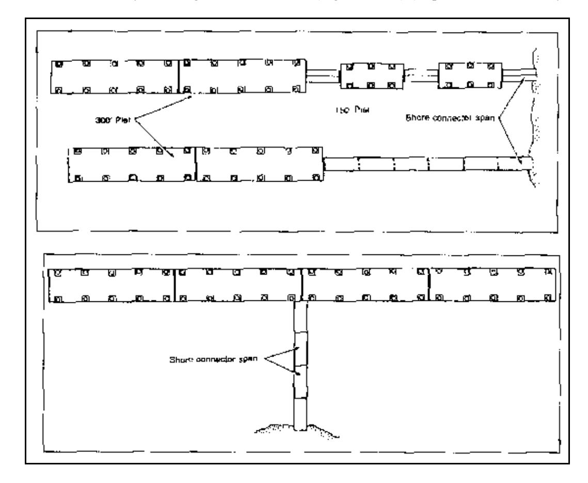

*Figure I-3-16. DeLong self-elevating barge piers. Upper figure shows finger piers, lower a T-type marginal wharf (from Department of the Army 1990)*

g. Rapidly Installed Breakwater System. Engineers and scientists at CHL are developing a Rapidly Installed Breakwater (RIB) system to address problems encountered by the U.S. armed forces while offloading ships during Logistics Over The Shore operations. When seas become sufficiently energetic during offloading, the capabilities of ship-based crane operators and stevedore crews are severely restricted. The RIB system, consisting of a series of floating breakwater units that are assembled in a "V" orientation, is designed to create a "pool" of calmer water where the crews will be able to continue to unload vessels even during storms. For many years, CHL had been involved with the design and deployment of floating breakwaters, primarily for application within bays or estuaries which are semi-protected from large waves. But, these structures were intended to attenuate waves with heights not exceeding 4 ft and periods not exceeding 4 sec, while in an oceanic environment, waves with heights up to 10 ft are common during storms, with associated periods up to 10 sec. To date, research efforts have concentrated on military applications for the RIB system. Potential civil applications include rescue and recovery operations, temporary small vessel shelter from energetic seas, and to protect exposed dredging and marine operations (e.g., bridge repair, rubble-mound breakwater construction),.

# I-3-9. Summary

For most of the nation's history, the U.S. Army Corps of Engineers has played an active role in the coastal zone. To the mid-1800s, this role was largely confined to coastal defense and some harbor protection. But, in the mid-1800s, the USACE's mission expanded to include developing civil works projects in support of a growing nation. These responsibltiies included harbor construction, dredging and clearing waterways, building canals and channels, and protecting coastal areas threatened by erosion ( e.g. , Presque Isle). During the second half of the 20th century, the USACE's role further expanded to include environmental restoration and preservation of threatened coastal areas. Since the 1930s, coastal-related research and development have been conducted to advance the technical foundations and basis for conducting coastal civil works.
The 20th century was witness to a large-scale evolution in the development of, use of, and interest in the coastal zone. National defense, agriculture, navigation, economic development, recreation, and environmental worth all contribute to the definition of coastal policy and action. During the early years of the 21st century there will be continuing development pressure in the coastal zone . Coastal engineers and scientists will undoubtedly be asked to play an increasing role in planning, designing, and maintaining infrastructure projects, in coastal management and environmental mitigation, and will continue their more traditional missions of navigation and flood protection.
In fiscal year 1998, the USACE and contractor-owned dredges removed 182 million cubic meters of material from Federally-constructed and maintained channels at a cost of $713 million. Dredged material is a valuable resource with numerous potential benefits, including construction of protective dunes and beaches, maintenance of beaches through bypassing to reestablish natural sediment-transport paths, and restoration and creation of wetlands and coastal habitat. Demand for dredged material usage is increasing, but environmental concerns and constraints present new engineering challenges that must be addressed.
Erosion and flooding threaten an estimated $3 trillion of development along the coast, with 80 to 90 percent of the nation's sandy beaches eroding (Hillyer 1996). Shore protection and restoration throughout the developed areas of the coast will increase, especially if the growing value of coastal property and recreation benefits are factored into the cost benefit calculations.
Because of the age of many harbor structures, improving and rebuilding jetties and breakwaters will be a major mission area. Wetlands restoration should also be growth areas, and already the USACE is involved in major restoration projects in the Everglades, in south Louisiana, and along many stretches of the intracoastal waterway.
Emergency coastal response work is also likely to be a growth area for the USACE. Many of the recent arrivals to the coastal zone have not personally experienced a major disaster like the Galveston hurricane of 1900, the 1962 Ash Wednesday storm, or the Great New England Hurricane of 1938. Much of the population is ignorant of the hazards that exist and is not prepared to respond to the aftermath of a catastrophic storm. The USACE has actively participated in disaster emergency and recovery efforts in Puerto Rico and other Caribbean islands, and many of these skills are applicable to mainland disasters.

# I-3-10. References

#### Alperin 1977

Alperin, L. M. 1977. Custodians of the Coast: History of the United States Army Engineers at Galveston . Galveston District, U.S. Army Corps of Engineers, Galveston, TX, 318 p.

#### Barber 1989

Barber, H. E. 1989. A History of the Savannah District, U.S. Army Corps of Engineers. Savannah District, U.S. Army Corps of Engineers, Savannah, GA, 554 p.

#### Becker 1984

Becker, W. H. 1984. From the Atlantic to the Great Lakes, a history of the U.S. Army Corps of Engineers and the St. Lawrence Seaway. Office of the Chief of Engineers, Washington, DC. 179 p.

### Bijker 1996

Bijker, E. W. 1996. History and Heritage in Coastal Engineering in the Netherlands. History and Heritage of Coastal Engineering, N. C. Kraus, ed., Coastal Engineering Research Council, American Society of Civil Engineers, Reston, VA, pp. 390 - 412.

#### Birkemeier, Dolan, Fisher 1984

Birkemeier, W. A., Dolan, R., and Fisher, N. 1984. The Evolution of a Barrier Island: 1930-1980. Shore and Beach , Vol. 52, No. 2, pp 2-12.

#### Buker 1981

Buker G. E. 1981. Sun, Sand and Water: a History of the Jacksonville District U.S. Army Corps of Engineers, 1821-1975. U.S. Government Printing Office, Washington, DC., 288 p.

#### Chambers 1980

Chambers, J. W., II. 1980. The North Atlantic Engineers : a History of the North Atlantic Division and its Predecessors in the U.S. Army Corps of Engineers, 1775-1975. North Atlantic Division, U.S. Army Corps of Engineers, New York, NY, 167 p.

### Chrzastowski 1999

Chrzastowski, M. J. 1999. Geology of the Chicago Lakeshore, Shaping the Chicago Shoreline, poster produced by the Department of Natural Resources, Illinois State Geological Survey, Champaign, IL.

#### Cowdrey 1977

Cowdrey, A. E. 1977. Land's End: a History of the New Orleans District, U. S. Army Corps of Engineers, and its Lifelong Battle with the Lower Mississippi and Other Rivers Wending Their Way to the Sea. New Orleans District, U.S. Army Corps of Engineers, New Orleans, LA, 118 p.

# Davis 1975

Davis, V. S. 1975. A History of the Mobile District 1815 to 1971. Mobile District, U.S. Army Corps of Engineers, Mobile, AL, 109 p.

#### Department of the Army 1990

Department of the Army. 1990. Port Construction and Repair. Field Manual FM 5-480, Headquarters, Department of the Army, Washington, DC.

#### DeWan 1999

DeWan, G. 1999. "The Master Builder, How planner Robert Moses transformed Long Island for the 20th Century and Beyond." Long Island, Our Story. http://www.lihistory.com/ (18 May 2000).

#### Dobney 1978

Dobney, F. J. 1978. River Engineers on the Middle Mississippi: a History of the St. Louis District, U.S. Army Corps of Engineers. U.S. Government Printing Office, Washington, DC., 177 p.

## Drescher 1982

Drescher, N. M. 1982. Engineers for the Public Good, A History of the Buffalo District, U.S. Army Corps of Engineers, U. S. Army Corps of Engineers, Buffalo, NY, pp 155-173, 203-235.

#### Empereur 1997

Empereur, J. Y. 1997. "The Riches of Alexandria." Transcript of a 1997 Interview on NOVA Online, http://www.pbs.org/wgbh/nova/sunken/empereur.html (28 Aug 2000).

#### Farley 1923

Farley, P. P. 1923. Coney Island public beach and boardwalk improvement. The Municipal Engineers Journal , Vol. 9, Paper 136, pp 136.1-136.32.

### Fasso 1987

Fasso, C. A. 1987. "Birth of hydraulics during the Renaissance period," Hydraulics and Hydraulic Research; a Historical Review, IAHR, G. Garbrecht Editor, Balkema, pp 55-79

#### Franco 1996

Franco, Leopold. 1996. "History of Coastal Engineering in Italy," History and Heritage of Coastal Engineering, American Society of Civil Engineers, New York, NY. pp 275-335.

#### Frost 1963

Frost, H. 1963. Under the Mediterranean, Marine Antiquities . Prentice-Hall, Englewood Cliffs, N.J. p 278.

## Goreki and Pope 1993

Goreki, R. J., and Pope, J. 1993. Coastal Geologic and Engineering History of Presque Isle Peninsula, Pennyslvania. Miscellaneous Paper CERC-93-8, U.S. Army Engineer Waterways Experiment Station, Vicksburg, MS.

#### Hagwood 1982

Hagwood, J. J., Jr. 1982. Engineers at the Golden Gate: a History of the San Francisco District, U.S. Army Corps of Engineers, 1866-1980. San Francisco District, U.S. Army Corps of Engineers, San Francisco, CA, 453 p.

# Hartzer 1984

Hartzer, R. B. 1984. To Great and Useful Purpose: a History of the Wilmington District U.S. Army Corps of Engineers, Wilmington District, U.S. Army Corps of Engineers, Wilmington, NC, 172 p.

#### Herodotus 1992

Herodotus. 1992. The Histories, Written in the middle of the 5th century B.C., translation by George Rawlinson and introduction by Hugh Bowden, J. M. Dent & Sons Ltd.,London.

## Hillyer 1996

Hillyer, T. M. 1996. Shoreline Protection and Beach Erosion Control Study, Final Report: An Analysis of the U.S. Army Corps of Engineers Shore Protection Program. IWR Report 96-PS-1, Shoreline Protection and Beach Erosion Control Task Force, Water Resources Support Center, Institute for Water Resources, U.S. Army Corps of Engineers, Alexandria, VA (prepared for the Office of Management and Budget, Washington, DC.)

# Inman 1974

Inman, D. L. 1974. Ancient and Modern Harbors: a Repeating Phylogeny. Proceedings of the 14th Coastal Engineering Conference, Copenhagen, Denmark, June 1974, American Society of Civil Engineers, Reston, VA, pp. 2049-2067.

#### Inman 2001

Inman, D. L. 2001. History of Early Breakwaters. Association of Coastal Engineers Newsletter , Alexandria, VA.

#### Institute of Civil Engineers 1948

Institution of Civil Engineers. 1948. The Civil Engineer in War. A Symposium of Papers on War-time Engineering Problems. Vol. 2, Docks and Harbors. Papers and discussions, published by The Institution of Civil Engineers, London, United Kingdom.

#### Jacobs 1976

Jacobs W. A. 1976. The Alaska District, United States Army, Corps of Engineers, 1946-1974: a History. From a manuscript researched and compiled by Lyman L. Woodman, Alaska District, U.S. Army Corps of Engineers, Elmendorf AFB, Alaska, 145 p.

# Johnson 1979

Johnson, L. R. 1979. The Headwaters District: a History of the Pittsburgh District, U.S. Army Corps of Engineers. Pittsburgh District, U.S. Army Corps of Engineers, Pittsburgh, PA, 380 p.

#### Johnson 1992

Johnson, L. R. 1992. The Ohio River Division, U.S. Army Corps of Engineers, the History of a Central Command . Ohio River Division, U.S. Army Corps of Engineers, Cincinnati, OH, 484 p.

#### Kana 1999

Kana. T. 1999. Long Island's South Shore Beaches, A Century of Dynamic Sediment Management. Coastal Sediments '99, Kraus, N. C., and McDougal, W. G. (eds.), American Society of Civil Engineers, Reston, VA, pp.1584-1596.

#### Karanek 1978

Kanarek, H. K. 1978. The mid-Atlantic engineers: a History of the Baltimore District, U.S. Army Corps of Engineers, 1774-1974. U.S. Government Printing Office, Washington, DC., 196 p.

#### Keay 1942

Keay, T. B. 1942. Coast Erosion in Great Britain, General Question of Erosion and Prevention of Damage; and the Drainage of Low-Lying Lands. Shore and Beach, Vol. 10, No. 2, pp. 66 - 68.

#### Klawonn 1977

Klawonn, Marion J. 1977. Cradle of the Corps, A History of the New York District, U.S. Army Corps of Engineers, 1975-1975, New York District, U.S. Army Corps of Engineers, New York, NY, 310 p.

#### Lamb 1930

Lamb, H. 1930. The Crusades, Iron Men and Saints, Doubleday, Doran & Co., Garden City, NY.

#### Larson 1979

Larson, J. W. 1979. Those Army Engineers: a History of the Chicago District, U.S. Army Corps of Engineers, Chicago District, U.S. Army Corps of Engineers, Chicago, IL, 307 p.

# Larson 1981

Larson, J. W. 1981. Essayons: a History of the Detroit District, U.S. Army Corps of Engineers. Detroit District, U.S. Army Corps of Engineers, Detroit, MI, 215 p.

#### Len č ek and Bosker 1998

Lenček, L., and Bosker, G. 1998. The Beach: The History of Paradise on Earth. Viking, New York, 310 p.

#### Maass 1951

Maass, A. 1951. Muddy Waters, the Army Engineers and the Nation's Rivers. Harvard University Press, Cambridge, MA, 306 p.

#### Mason 1979

Mason, Curtis. 1979. "The Coastal Engineering Research Center's Field Research Facility at Duck, North Carolina," Shore & Beach, Journal of the American Shore and Beach Preservation Association, Vol. 47, No. 2, pp 13-16.

#### Merritt 1979

Merritt, R. H. 1979. Creativity, Conflict & Controversy : a History of the St. Paul District, U.S. Army Corps of Engineers. U.S. Government Printing Office, Washington, DC., 461 p.

#### Moore 1981

Moore, 1981. The Lowcountry Engineers: Military Missions and Economic Development in the Charleston District, U.S. Army Corps of Engineers. U.S. Government Printing Office, Washington, DC., 140 p.

#### Moore and Moore 1982

Moore, Jamie W., and Moore, Dorthy P. 1982. The Lowcountry Engineers, Military Missions and Economic Development in the Charleston District, U.S. Army Corps of Engineers (Atlanta, GA: Government Printing Office), pp16-21

#### Moore and Moore 1983

Moore, Jamie W., and Moore, Dorthy P. 1983. The Corps of Engineers and Coastal Engineering, A 50 Year Retrospective,? Orville T. Magoon, ed., Coastal Zone 83 III, New York: ASCE, 1983, pp 1627-1639

### Moore and Moore 1991

Moore, Jamie W. and Moore, Dorthy P. 1991. History of the Coastal Engineering Research Center, 1963- 1983, U. S. Army Engineer Waterways Experiment Station, Vicksburg, MS

#### Morison and Commager 1962

Morison, S. E., and Commager, H. S. 1962. The Growth of the American Republic. Fifth Ed., Oxford University Press, New York.

## Palmer and Tritton., eds. 1996

Palmer, R., and Tritton Limited (eds.). 1996. History of Coastal Engineering in Great Britain. History and Heritage of Coastal Engineering, N. C. Kraus, ed., Coastal Engineering Research Council, American Society of Civil Engineers, Reston, VA, pp. 214 - 274.

#### Parkman 1978

Parkman, Aubrey. 1978. Army Engineers in New England, The Military and Civil Works of the Corps of Engineers, 1775-1975, Waltham, MA, U.S. Army Engineer Division, 1978, pp34-38.

#### Parker 1980

Parker 1980. "Structures in the Beach Zone-To Be or Not to Be," paper presented at the American Soc. Of Civil Engineers Convention and Exposition, Florida, 27-1 Oct, 1980, ASCE Reprint No.80-648.

#### Patton 1934

Patton, R. S. 1934. "The Purpose of the American Shore and Beach Preservation Association," Shore and Beach II, Journal of the American Shore and Beach Preservation Association Oct. 1934, pp132-136.

#### Quinn 1972

Quinn, Alonzo DeF. 1972. Design and Construction of Ports and Marine Structures, Second Edition, Mc Graw-Hill Book Company, New York, N.Y., 611p.

#### Rathburn 1990

Rathbun, M. Y. 1990. Castle on the Rock, 1881-1985: the History of the Little Rock District, U.S. Army Corps of Engineers. Little Rock District, U.S. Army Corps of Engineers, Little Rock, AK, 192 p.

# Reuss 1998

Reuss, M. 1998. Designing the Bayous: the Control of Water in the Atchafalaya Basin: 1800-1995. Office of History, U.S. Army Corps of Engineers, Alexandria, VA, 474 p.

#### Richter 1970

Richter, J. P. 1970. The Notebooks of Leonardo da Vinci, Dover Publishing, New York, NY.

### Rouse and Ince 1963

Rouse, H. and Ince, S. 1963. History of Hydraulics, Dover, NY.

#### Seattle District 1969

Seattle District. 1969. History of the Seattle District, 1896-1968 : United States Army, Corps of Engineers : 72 Years in Peace and War. Seattle District, U.S. Army Corps of Engineers, Seattle, WA, 222 p.

#### Shore Protection Manual 1984

Shore Protection Manual . 1984. 4th ed., 2 Vol., U.S. Army Engineer Waterways Experiment Station, U.S. Government Printing Office, Washington, DC.

#### Shore Protection, Planning, and Design 1954

Shore Protection, Planning, and Design. 1954. Technical Report No. 4, U.S. Beach Erosion Board, Washington, DC, 393 p.

## Snyder and Guss 1974

Snyder, F. E. and Guss, B. H. 1974. The District; a History of the Philadelphia District, U.S. Army Corps of Engineers, 1866-1971, U.S. Army Engineer District, Philadelphia, PA, 263 p.

#### Stanton 1999

Stanton, J. 1999. "Coney Island - Nickel Empire (1920's-1930's)." Coney Island History Site. North American Integration & Development Center, School of Public Policy and Social Research, University of California, Los Angeles, CA, http://naid.sppsr.ucla.edu/coneyisland/ (16 May 2000).

# Straub 1964

Straub, Hans. 1964. A History of Civil Engineering, English Translation by Erwin Rockwell, The M.I.T. Press, Massachusetts Institute of Technology, Cambridge, Massachusetts, 258 p.

### Sudar, Pope, Hillyer, and Crumm 1995

Sudar, R. A., Pope, J., Hillyer, T., and Crumm, J. 1995. "Shore Protection Projects of the U.S. Army Corps of Engineers." Shore and Beach . Journal of the American Shore and Beach Preservation Association, Vol. 63, No. 2, pp. 3-16.

#### Thompson 1981

Thompson, E. N. 1981. Pacific Ocean Engineers-History of the U.S. Army Corps of Engineers in the Pacific, 1905-1980. U.S. Army Engineer Division, Pacific Ocean, Honolulu pp 460.

#### Turhollow 1975

Turhollow, Anthony F. 1975. A History of the Los Angeles District, U. S. Army Corps of Engineers, 1898- 1965, Los Angeles, CA, U. S. Army Engineer District, pp 20-48.

#### UCB, IER 1952

University of California, Berkeley, Institute of Engineering Research. 1952. Manual on Amphibious Oceanography, R. L. Wiegel, Project Engineer and Editor, under contract with Office of Naval Research, Amphibious Branch, Contract N7-29535, Project No. NR 252-003, Pentagon Press, July 1952, 2 volumes.

### USACE 1971

U.S. Army Corps of Engineers. 1971. National Shoreline Study: Shore Protection Guidelines. Department of the Army, Corps of Engineers, Washington, DC.

#### USACE 1980

U.S. Army Corps of Engineers. Army 1980. Annual Report of Civil Works Activities of the Chief of Engineers for FY 1979, Volume 1, Summary/Highlights, Department of the, Office of the Chief of Engineers, Washington, DC. 12 August 80, pp 44-47.

# U.S. Army Corps of Engineers 1998

U.S. Army Corps of Engineers. 1998. The History of the US Army Corps of Engineers. Engineer Pamphlet EP 360-1-21, Washington, DC.

#### Waterborne Commerce Statistics Center 1999

Waterborne Commerce Statistics Center, Water Resources Support Center, Navigation Data Center, U.S. Army Corps of Engineers, Alexandria, VA. http://www.wrsc.usace.army.mil/ndc/ (6 Dec 1999).

#### Wilson and Eaton 1960

Wilson, MG Walter K., Jr. and Eaton, Richard O. 1960. "A History of the Beach Erosion Board," Shore and Beach, Journal of the American Shore and Beach Preservation Association, Volume Twenty-eight, Number one, April 1960, pp 4-9.

## Wiegel 1999

Wiegel, Robert L. 1999. Military Examples of Coastal Engineering, Miscellaneous Paper CHL-99-3, September 1999, Prepared for Coastal Engineering Research Board, U.S. Army Corps of Engineers Research and Development Center, Vicksburg, MS 39180-6199.

#### Wiegel and Kimberly 1949

Wiegel, Robert L., and Kimberly, H. L. 1949. Operation MIKI, Hawaiian amphibious phase (ground coverage), University of California, Berkley, Inst. Engrg. Res., Series 29, Issue 14.

#### Wiegel and Saville 1996

Wiegel, R. L., and Saville, T., Jr. 1996. History of Coastal Engineering in the United States. History and Heritage of Coastal Engineering, N. C. Kraus, ed., Coastal Engineering Research Council, American Society of Civil Engineers, Reston, VA, pp. 214 - 274.

#### Willingham 1983

Willingham, W. F. 1983. Army Engineers and the Development of Oregon, a History of the Portland District U.S. Army Corps of Engineers. Portland District, U.S. Army Corps of Engineers, Portland, OR.

#### van Hoften 1970

van Hoften, E. 1970. History of the Honolulu Engineer District, 1905-1965. U.S. Army Engineer District, Honolulu, pp 133.

#### Vitruvius, Rowland, and Howe, eds. 1999

Vitruvius, P., Rowland, I. D., and Howe, T. N. eds. 1999. Vitrivius: Ten Books on Architecture. Cambridge University Press, Cambridge, MA.

# I-3-11. Acknowledgments

Authors of Chapter I-3, "History of Coastal Engineering:"
John H. Lockhart. Jr., Headquarters, U.S. Army Corps of Engineers, Washington, DC, (retired). Andrew Morang, Ph.D., Coastal and Hydraulics Laboratory (CHL), Engineer Research and Development Center, Vicksburg, Mississippi.
Reviewers:
Joan Pope, CHL
Martin A. Reuss, Ph.D., Office of History, U.S. Army Corps of Engineers, Alexandria, Virginia.
