Chapter 1 EM 1110-2-1100 WATER WAVE MECHANICS (Part II) 1 August 2008 (Change 2)

# Table of Contents

Page II-1-1. Introduction II-1-1 II-1-2. Regular Waves a. Introduction b. Definition of wave parameters c. Linear wave theory (1) Introduction (2) Wave celerity, length, and period (3) The sinusoidal wave profile (4) Some useful functions (5) Local fluid velocities and accelerations (6) Water particle displacements (7) Subsurface pressure (8) Group velocity (9) Wave energy and power (10) Summary of linear wave theory d. Nonlinear wave theories (1) Introduction (2) Stokes finite-amplitude wave theory (3) Subsurface pressure (4) Maximum wave steepness e. Other wave theories (1) Introduction (2) Nonlinear shallow-water wave theories (3) Korteweg and de Vries and Boussinesq wave theories (4) Cnoidal wave theory (5) Solitary wave theory (6) Stream-function wave theory (7) Fourier approximation Fenton's theory f. Wave breaking g. Validity of wave theories II-1-3 II-1-3 II-1-4 II-1-5 II-1-5 II-1-6 II-1-9 II-1-9 II-1-12 II-1-13 II-1-21 II-1-22 II-1-26 II-1-29 II-1-30 II-1-30 II-1-32 II-1-34 II-1-35 II-1-36 II-1-36 II-1-36 II-1-36 II-1-37 II-1-41 II-1-50 II-1-50 II-1-56 II-1-56 II-1-3. Irregular Waves a. Introduction b. Wave train (wave-by-wave) analysis (1) Introduction (2) Zero-crossing method (3) Definition of wave parameters (4) Significant wave height Short-term random sea state parameters (5) II-1-59 II-1-59 II-1-65 II-1-65 II-1-65 II-1-66 II-1-68 II-1-68 (6) Probability distributions for a sea state (7) Wave height distribution II-1-70 II-1-74
(8) Wave period distribution II-1-75 (9) Joint distribution of wave heights and periods II-1-76 c. Spectral analysis II-1-77 (1) Introduction II-1-77 (2) Description of wave spectral analysis II-1-80 (3) Examples of frequency spectra II-1-85 (4) Wave spectrum and its parameters II-1-85 (5) Relationship between H1/3, Hs and Hm0 in shallow water II-1-88 (6) Parametric spectrum models II-1-88 (7) Directional spectra II-1-93 (8) Wave groups and groupiness factors II-1-95 (9) Random wave simulation II-1-97 (10) Kinematics and dynamics of irregular waves II-1-98 II-1-4. References and Bibliography II-1-99 II-1-5. Definitions of Symbols II-1-116 II-1-6. Acknowledgments II-1-121
II-1-ii Water Wave Mechanics

# List of Tables

Page Table II-1-1. Classification of Water Waves II-1-8 Table II-1-2. Boundary Value Problem of Water Wave Theories (Dean 1968) II-1-50

# List of Figures

Page Figure II-1-1. Definition of terms - elementary, sinusoidal, progressive wave II-1-4 Figure II-1-2. Local fluid velocities and accelerations II-1-13 Figure II-1-3. Profiles of particle velocity and acceleration by Airy theory in relation to the surface elevation II-1-14 Figure II-1-4. Water particle displacements from mean position for shallow-water and deepwater waves II-1-17 Figure II-1-5. Variation of wave parameters with d/L0 (Dean and Dalrymple 1991) II-1-23 Figure II-1-6. Characteristics of a wave group formed by the addition of sinusoids with different periods II-1-25 Figure II-1-7. Variation of the ratios of group and phase velocities to deepwater phase speed using linear theory (Sarpkaya and Isaacson 1981) II-1-27 Figure II-1-8. Variation of shoaling coefficient with wave steepness (Sakai and Battjes 1980) II-1-30 Figure II-1-9. Summary of linear (Airy) wave theory - wave characteristics II-1-31 Figure II-1-10. Wave profile shape of different progressive gravity waves II-1-34 Figure II-1-11. Normalized surface profile of the cnoidal wave (Wiegel 1960). For definition of variables see Part II-1-2.e.(3) II-1-40 Figure II-1-12. Normalized surface profile of the cnoidal wave for higher values of k2 and X/L (Wiegel 1960) II-1-40 Figure II-1-13. versus T%&g &/ &d and H/d (Wiegel 1960) k2 versus L2 H/d3 , and k2 II-1-41 Figure II-1-14. Relationship among L2 H/d3 and the square of the elliptic modulus (k2 ), yc/H, yt /H, and K(k) (Wiegel 1960) II-1-42 Figure II-1-15. Relationships among T%&g &/ &d , L2 H/d3 , and H/d (Wiegel 1960) II-1-43 Figure II-1-16. Relationship between cnoidal wave velocity and L2 H/d3 (Wiegel 1960) II-1-44 Figure II-1-17. Functions M and N in solitary wave theory (Munk 1949) II-1-49 Figure II-1-18. Surface elevation, horizontal velocity and pressure in 10-m depth (using Fenton's theory in ACES) II-1-55
II-1-iv Water Wave Mechanics
Figure II-1-19. Influence of a uniform current on the maximum wave height (Dalrymple and Dean 1975) II-1-57 Figure II-1-20. Ranges of suitability of various wave theories (Le Méhauté 1976) II-1-58 Figure II-1-21. Grouping of wind waves based on universal parameter and limiting height for steep waves II-1-59 Figure II-1-22. Radar image of the sea surface in the entrance to San Francisco Bay II-1-61 Figure II-1-23. Measured sea surface velocity in the entrance to San Francisco Bay II-1-62 Figure II-1-24. Representations of an ocean wave II-1-63 Figure II-1-25. Wave profile of irregular sea state from site measurements II-1-63 Figure II-1-26. Definition of wave parameters for a random sea state II-1-64 Figure II-1-27. Definition sketch of a random wave process (Ochi 1973) II-1-64 Figure II-1-28. Gaussian probability density and cumulative probability distribution II-1-71 Figure II-1-29. Rayleigh probability density and cumulative probability distribution (x = " corresponds to the mode) II-1-71 Figure II-1-30. Histograms of the normalized (a) wave heights and (b) wave periods with theoretical distributions (Chakrabarti 1987) II-1-73 Figure II-1-31. Surface elevation time series of a regular wave and its spectrum (Briggs et al. 1993) II-1-79 Figure II-1-32. Surface elevation time series of an irregular wave and its spectrum (Briggs et al. 1993) II-1-80 Figure II-1-33. Schematic for a two-dimensional wave spectrum E(f,2) II-1-81 Figure II-1-34. Directional spectrum and its frequency and direction spectrum (Briggs et al. 1993) II-1-82 Figure II-1-35. Sketches of wave spectral energy and energy density (Chakrabarti 1987) II-1-84 Figure II-1-36. Definitions of one- and two-sided wave spectra (Chakrabarti 1987) II-1-85 Figure II-1-37. Energy density and frequency relationship (Chakrabarti 1987) II-1-86 Figure II-1-38. Comparison of the PM and JONSWAP spectra (Chakrabarti 1987) II-1-87 Figure II-1-39. Definition sketch for Ochi-Hubble spectrum (Ochi and Hubble 1976) II-1-90
Figure II-1-40. Variation of Hs/Hmo as a function of relative depth 6d and significant steepness (Thompson and Vincent 1985) II-1-91 Figure II-1-41. Identification and description of wave groups through ordered statistics (Goda 1976) II-1-96
II-1-vi Water Wave Mechanics

# Chapter II-1 Water Wave Mechanics

#### II-1-1. Introduction

- a. Waves on the surface of the ocean with periods of 3 to 25 sec are primarily generated by winds and are a fundamental feature of coastal regions of the world. Other wave motions exist on the ocean including internal waves, tides, and edge waves. For the remainder of this chapter, unless otherwise indicated, the term waves will apply only to surface gravity waves in the wind wave range of 3 to 25 sec.
- b. Knowledge of these waves and the forces they generate is essential for the design of coastal projects since they are the major factor that determines the geometry of beaches, the planning and design of marinas, waterways, shore protection measures, hydraulic structures, and other civil and military coastal works. Estimates of wave conditions are needed in almost all coastal engineering studies. The purpose of this chapter is to give engineers theories and mathematical formulae for describing ocean surface waves and the forces, accelerations, and velocities due to them. This chapter is organized into two sections: Regular Waves and Irregular Waves .
- c. In the Regular Waves section, the objective is to provide a detailed understanding of the mechanics of a wave field through examination of waves of constant height and period. In the Irregular Waves section, the objective is to describe statistical methods for analyzing irregular waves (wave systems where successive waves may have differing periods and heights) which are more descriptive of the waves seen in nature.
- d. In looking at the sea surface, it is typically irregular and three-dimensional (3-D). The sea surface changes in time, and thus, it is unsteady. At this time, this complex, time-varying 3-D surface cannot be adequately described in its full complexity; neither can the velocities, pressures, and accelerations of the underlying water required for engineering calculations. In order to arrive at estimates of the required parameters, a number of simplifying assumptions must be made to make the problems tractable, reliable and helpful through comparison to experiments and observations. Some of the assumptions and approximations that are made to describe the 3-D, time-dependent complex sea surface in a simpler fashion for engineering works may be unrealistic, but necessary for mathematical reasons.
- e. The Regular Waves section of this chapter begins with the simplest mathematical representation assuming ocean waves are two-dimensional (2-D), small in amplitude, sinusoidal, and progressively definable by their wave height and period in a given water depth. In this simplest representation of ocean waves, wave motions and displacements, kinematics (that is, wave velocities and accelerations), and dynamics (that is, wave pressures and resulting forces and moments) will be determined for engineering design estimates. When wave height becomes larger, the simple treatment may not be adequate. The next part of the Regular Waves section considers 2-D approximation of the ocean surface to deviate from a pure sinusoid. This representation requires using more mathematically complicated theories. These theories become nonlinear and allow formulation of waves that are not of purely sinusoidal in shape; for example, waves having the flatter troughs and peaked crests typically seen in shallow coastal waters when waves are relatively high.
- f. The Irregular Waves section of this chapter is devoted to an alternative description of ocean waves. Statistical methods for describing the natural time-dependent three-dimensional characteristics of real wave systems are presented. A complete 3-D representation of ocean waves requires considering the sea surface as an irregular wave train with random characteristics. To quantify this randomness of ocean waves, the Irregular Waves section employs statistical and probabilistic theories. Even with this approach, simplifications are required. One approach is to transform the sea surface using Fourier theory into summation of simple sine waves and then to define a wave's characteristics in terms of its spectrum. This
allows treatment of the variability of waves with respect to period and direction of travel. The second approach is to describe a wave record at a point as a sequence of individual waves with different heights and periods and then to consider the variability of the wave field in terms of the probability of individual waves.
- g. At the present time, practicing coastal engineers must use a combination of these approaches to obtain information for design. For example, information from the Irregular Waves section will be used to determine the expected range of wave conditions and directional distributions of wave energy in order to select an individual wave height and period for the problem under study. Then procedures from the Regular Waves section will be used to characterize the kinematics and dynamics that might be expected. However, it should be noted that the procedures for selecting and using irregular wave conditions remain an area of some uncertainty.
- h. The major generating force for waves is the wind acting on the air-sea interface. A significant amount of wave energy is dissipated in the nearshore region and on beaches. Wave energy forms beaches; sorts bottom sediments on the shore face; transports bottom materials onshore, offshore, and alongshore; and exerts forces upon coastal structures. A basic understanding of the fundamental physical processes in the generation and propagation of surface waves must precede any attempt to understand complex water motion in seas, lakes and waterways. The Regular Waves section of this chapter outlines the fundamental principles governing the mechanics of wave motion essential in the planning and design of coastal works. The Irregular Waves section of this chapter discusses the applicable statistical and probabilistic theories.
- i. Detailed descriptions of the basic equations for water mechanics are available in several textbooks (see for example, Kinsman 1965; Stoker 1957; Ippen 1966; Le Méhauté 1976; Phillips 1977; Crapper 1984; Mei 1991; Dean and Dalrymple 1991). The Regular Waves section of this chapter provides only an introduction to wave mechanics, and it focuses on simple water wave theories for coastal engineers. Methods are discussed for estimating wave surface profiles, water particle motion, wave energy, and wave transformations due to interaction with the bottom and with structures.
- j. The simplest wave theory is the first-order, small-amplitude , or Airy wave theory which will hereafter be called linear theory . Many engineering problems can be handled with ease and reasonable accuracy by this theory. For convenience, prediction methods in coastal engineering generally have been based on simple waves. For some situations, simple theories provide acceptable estimates of wave conditions.
- k. When waves become large or travel toward shore into shallow water, higher-order wave theories are often required to describe wave phenomena. These theories represent nonlinear waves . The linear theory that is valid when waves are infinitesimally small and their motion is small also provides some insight for finite-amplitude periodic waves (nonlinear). However, the linear theory cannot account for the fact that wave crests are higher above the mean water line than the troughs are below the mean water line. Results obtained from the various theories should be carefully interpreted for use in the design of coastal projects or for the description of coastal environment.
- l. Any basic physical description of a water wave involves both its surface form and the water motion beneath the surface. A wave that can be described in simple mathematical terms is called a simple wave . Waves comprised of several components and difficult to describe in form or motion are termed wave trains or complex waves . Sinusoidal or monochromatic waves are examples of simple waves, since their surface profile can be described by a single sine or cosine function. A wave is periodic if its motion and surface profile recur in equal intervals of time termed the wave period . A wave form that moves horizontally relative to a fixed point is called a progressive wave and the direction in which it moves is termed the direction of wave propagation . A progressive wave is called wave of permanent form if it propagates without experiencing any change in shape.
II-1-2 Water Wave Mechanics
- m. Water waves are considered oscillatory or nearly oscillatory if the motion described by the water particles is circular orbits that are closed or nearly closed for each wave period. The linear theory represents pure oscillatory waves. Waves defined by finite-amplitude wave theories are not pure oscillatory waves but still periodic since the fluid is moved in the direction of wave advance by each successive wave. This motion is termed masstransport of the waves. When water particles advance with the wave and do not return to their original position, the wave is called a wave of translation . A solitary wave is an example of a wave of translation.
- n. It is important in coastal practice to differentiate between two types of surface waves. These are seas and swells . Seas refer to short-period waves still being created by winds. Swells refer to waves that have moved out of the generating area. In general, swells are more regular waves with well-defined long crests and relatively long periods.
- o. The growth of wind-generated oceanic waves is not indefinite. The point when waves stop growing is termed a fully developed sea condition. Wind energy is imparted to the water leading to the growth of waves; however, after a point, the energy imparted to the waters is dissipated by wave breaking. Seas are short-crested and irregular and their periods are within the 3- to 25- sec range. Seas usually have shorter periods and lengths, and their surface appears much more disturbed than for swells. Waves assume a more orderly state with the appearance of definite crests and troughs when they are no longer under the influence of winds (swell).
- p. To an observer at a large distance from a storm, swells originating in a storm area will appear to be almost unidirectional (i.e., they propagate in a predominant direction) and long-crested (i.e., they have welldefined and distinctly separated crests). Although waves of different periods existed originally together in the generation area (seas), in time the various wave components in the sea separate from one another. Longer period waves move faster and reach distant sites first. Shorter period components may reach the site several days later. In the wave generation area, energy is transferred from shorter period waves to the longer waves. Waves can travel hundreds or thousands of kilometers without much loss of energy. However, some wave energy is dissipated internally within the fluid, by interaction with the air above, by turbulence upon breaking, and by percolation and friction with the seabed. Short-period components lose their energy more readily than long-period components. As a consequence of these processes, the periods of swell waves tend to be somewhat longer than seas. Swells typically have periods greater than 10 sec.

#### II-1-2. Regular Waves

a. Introduction . Wave theories are approximations to reality. They may describe some phenomena well under certain conditions that satisfy the assumptions made in their derivation. They may fail to describe other phenomena that violate those assumptions. In adopting a theory, care must be taken to ensure that the wave phenomenon of interest is described reasonably well by the theory adopted, since shore protection design depends on the ability to predict wave surface profiles and water motion, and on the accuracy of such predictions.
- b. Definition of wave parameters .
- (1) A progressive wave may be represented by the variables x (spatial) and t (temporal) or by their combination (phase), defined as 2 = kx - T t , where k and T are described in the following paragraphs. The values of 2 vary between 0 and 2B. Since the 2-representation is a simple and compact notation, it will be used in this chapter. Figure II-1-1 depicts parameters that define a simple, progressive wave as it passes a fixed point in the ocean. A simple, periodic wave of permanent form propagating over a horizontal bottom may be completely characterized by the wave height H wavelength L and water depth d .

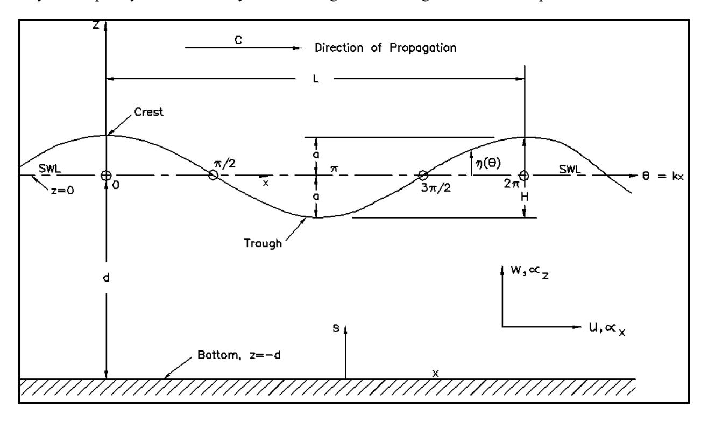

*Figure II-1-1. Definition of terms - elementary, sinusoidal, progressive wave*

- (2) As shown in Figure II-1-1, the highest point of the wave is the crest and the lowest point is the trough . For linear or small-amplitude waves, the height of the crest above the still-water level (SWL) and the distance of the trough below the SWL are each equal to the wave amplitude a . Therefore a = H/2 , where H = the wave height . The time interval between the passage of two successive wave crests or troughs at a given point is the wave period T . The wavelength L is the horizontal distance between two identical points on two successive wave crests or two successive wave troughs.
- (3) Other wave parameters include T = 2B/T the angular or radian frequency , the wave number k = 2 B /L , the phase velocity or wave celerity C = L/T = T /k , the wave steepness , = H/L , the relative depth d/L , and the relative wave height H/d . These are the most common parameters encountered in coastal practice. Wave motion can be defined in terms of dimensionless parameters H/L, H/d , and d/L ; these are often used in practice. The dimensionless parameters ka and kd , preferred in research works, can be substituted for H/L and d/L , respectively, since these differ only by a constant factor 2B from those preferred by engineers.
II-1-4 Water Wave Mechanics
- c. Linear wave theory .
- (1) Introduction.
- (a) The most elementary wave theory is the small-amplitude or linear wave theory . This theory, developed by Airy (1845), is easy to apply, and gives a reasonable approximation of wave characteristics for a wide range of wave parameters. A more complete theoretical description of waves may be obtained as the sum of many successive approximations, where each additional term in the series is a correction to preceding terms. For some situations, waves are better described by these higher-order theories, which are usually referred to as finite-amplitude wave theories (Mei 1991, Dean and Dalrymple 1991). Although there are limitations to its applicability, linear theory can still be useful provided the assumptions made in developing this simple theory are not grossly violated. (b) The assumptions made in developing the linear wave theory are: ! The fluid is homogeneous and incompressible; therefore, the density D is a constant. ! Surface tension can be neglected. ! Coriolis effect due to the earth's rotation can be neglected. ! Pressure at the free surface is uniform and constant. ! The fluid is ideal or inviscid (lacks viscosity). ! The particular wave being considered does not interact with any other water motions. The flow is irrotational so that water particles do not rotate (only normal forces are important and shearing forces are negligible). ! The bed is a horizontal, fixed, impermeable boundary, which implies that the vertical velocity at the bed is zero. ! The wave amplitude is small and the waveform is invariant in time and space. ! Waves are plane or long-crested (two-dimensional).
- (c) The first three assumptions are valid for virtually all coastal engineering problems. It is necessary to relax the fourth, fifth, and sixth assumptions for some specialized problems not considered in this manual. Relaxing the three final assumptions is essential in many problems, and is considered later in this chapter.
- (d) The assumption of irrotationality stated as the sixth assumption above allows the use of a mathematical function termed the velocity potential M. The velocity potential is a scaler function whose gradient (i.e., the rate of change of M relative to the x-and z-coordinates in two dimensions where x = horizontal, z = vertical) at any point in fluid is the velocity vector. Thus,

```math
u = \frac{\partial \Phi}{\partial x} \tag{II-1-1}
```

is the fluid velocity in the x-direction, and

```math
w = \frac{\partial \Phi}{\partial z} \tag{II-1-2}
```

is the fluid velocity in the z-direction. M has the units of length squared divided by time. Consequently, if M(x, z, t) is known over the flow field, then fluid particle velocity components u and w can be found.
(e) The incompressible assumption (a) above implies that there is another mathematical function termed the stream function Q. Some wave theories are formulated in terms of the stream function Q, which is orthogonal to the potential function M. Lines of constant values of the potential function (equipotential lines) and lines of constant values of the stream function are mutually perpendicular or orthogonal. Consequently, if M is known, Q can be found, or vice versa, using the equations

```math
\frac{\partial \Phi}{\partial x} = \frac{\partial \Psi}{\partial z} \tag{II-1-3}
```

```math
\frac { \partial \Phi } { \partial z } \, = \, - \frac { \partial \Psi } { \partial x } \tag{II-1-4}
```

termed the Cauchy-Riemann conditions (Whitham 1974; Milne-Thompson 1976). Both M and Q satisfy the Laplace equation which governs the flow of an ideal fluid (inviscid and incompressible fluid). Thus, under the assumptions outlined above, the Laplace equation governs the flow beneath waves. The Laplace equation in two dimensions with x = horizontal, and z = vertical axes in terms of velocity potential M is given by

```math
\frac{\partial^2 \Phi}{\partial x^2} + \frac{\partial^2 \Phi}{\partial z^2} = 0 \tag{II-1-5}
```

(f) In terms of the stream function, Q, Laplace's equation becomes

```math
\frac{\partial^2 \Psi}{\partial x^2} + \frac{\partial^2 \Psi}{\partial z^2} = 0 \tag{II-1-6}
```

(g) The linear theory formulation is usually developed in terms of the potential function, M.
In applying the seventh assumption to waves in water of varying depth (encountered when waves approach a beach), the local depth is usually used. This can be justified, but not without difficulty, for most practical cases in which the bottom slope is flatter than about 1 on 10. A progressive wave moving into shallow water will change its shape significantly. Effects due to the wave transformations are addressed in Parts II-3 and II-4.
- (h) The most fundamental description of a simple sinusoidal oscillatory wave is by its length L (the horizontal distance between corresponding points on two successive waves), height H (the vertical distance to its crest from the preceding trough), period T (the time for two successive crests to pass a given point), and depth d (the distance from the bed to SWL).
- (i) Figure II-1-1 shows a two-dimensional, simple progressive wave propagating in the positive xdirection, using the symbols presented above. The symbol 0 denotes the displacement of the water surface relative to the SWL and is a function of x and time t . At the wave crest, 0 is equal to the amplitude of the wave a , or one-half the wave height H/2 . (2) Wave celerity, length, and period.
- (a) The speed at which a wave form propagates is termed the phase velocity or wave celerity C . Since the distance traveled by a wave during one wave period is equal to one wavelength, wave celerity can be related to the wave period and length by
II-1-6 Water Wave Mechanics

```math
C = \frac{L}{T} \tag{II-1-7}
```

(b) An expression relating wave celerity to wavelength and water depth is given by

```math
C = \sqrt{\frac{gL}{2\pi}} \tanh\left(\frac{2\pi d}{L}\right) \tag{II-1-8}
```

(c) Equation II-1-8 is termed the dispersion relation since it indicates that waves with different periods travel at different speeds. For a situation where more than one wave is present, the longer period wave will travel faster. From Equation II-1-7, it is seen that Equation II-1-8 can be written as

```math
C = { \frac { g T } { 2 \pi } } \ \mathrm { t a n h } \left( { \frac { 2 \pi d } { L } } \right) \tag{II-1-9}
```

(d) The values 2 B /L and 2 B /T are called the wave number k and the wave angular frequency T , respectively. From Equation II-1-7 and II-1-9, an expression for wavelength as a function of depth and wave period may be obtained as

```math
L = \frac{gT^2}{2\pi} \tanh\left(\frac{2\pi d}{L}\right) = \frac{gT}{\omega} \tanh\left(kd\right) \tag{II-1-10}
```

(e) Use of Equation II-1-10 involves some difficulty since the unknown L appears on both sides of the equation. Tabulated values of d/L and d/L0 (SPM 1984) where L0 is the deepwater wavelength may be used to simplify the solution of Equation II-1-10. Eckart (1952) gives an approximate expression for Equation II-1-10, which is correct to within about 10 percent. This expression is given by

```math
L \approx \frac{gT^2}{2\pi} \sqrt{\tanh\left(\frac{4\pi^2}{T^2}\frac{d}{g}\right)} \tag{II-1-11}
```

- (f) Equation II-1-11 explicitly gives L in terms of wave period T and is sufficiently accurate for many engineering calculations. The maximum error 10 percent occurs when d/L . 1/2. There are several other approximations for solving Equation II-1-10 (Hunt 1979; Venezian and Demirbilek 1979; Wu and Thornton 1986; Fenton and McKee 1990).
- (g) Gravity waves may also be classified by the water depth in which they travel. The following classifications are made according to the magnitude of d/L and the resulting limiting values taken by the function tanh (2 B d/L) . Note that as the argument of the hyperbolic tangent kd = 2Bd/L gets large, the tanh (kd) approaches 1, and for small values of kd, tanh (kd) . kd. (h) Water waves are classified in Table II-1-1 based on the relative depth criterion d/L .

*Table II-1-1 Classification of Water Waves*

**Table II-1-1. Classification of Water Waves**

| Classification | d/L | kd | tanh (kd) |
| --- | --- | --- | --- |
| Deep water | 1/2 to 4 | B to 4 | .1 |
| Transitional | 1/20 to 1/2 | B/10 to B | tanh (kd) |
| Shallow water | 0 to 1/20 | 0 to B/10 | . kd |

(i) In deep water, tanh (kd) approaches unity, Equations II-1-7 and II-1-8 reduce to

```math
C _ { 0 } \ = \ \sqrt { \frac { g L _ { 0 } } { 2 \pi } } \ = \ \frac { L _ { 0 } } { T } \tag{II-1-12}
```

and Equation II-1-9 becomes

```math
C _ { 0 } = \frac { g T } { 2 \pi } \tag{II-1-13}
```

- (j) Although deep water actually occurs at an infinite depth, tanh (kd) , for most practical purposes, approaches unity at a much smaller d/L . For a relative depth of one-half (i.e., when the depth is one-half the wavelength), tanh (2B d/L ) = 0.9964.
- (k) When the relative depth d/L is greater than one-half, the wave characteristics are virtually independent of depth. Deepwater conditions are indicated by the subscript 0 as in Lo and Co except that the period T remains constant and independent of depth for oscillatory waves, and therefore, the subscript for wave period is omitted (Ippen 1966). In the SI system (System International or metric system of units) where units of meters and seconds are used, the constant g/2 B is equal to 1.56 m/s2 , and

```math
C _ { 0 } \ = \ { \frac { g T } { 2 \pi } } \ = \ { \frac { 9 . 8 } { 2 \pi } } \ T \ = \ 1 . 5 6 T \ m / s \tag{II-1-14}
```

and

```math
L _ { 0 } \ = \ { \frac { g T ^ { 2 } } { 2 \pi } } \ = \ { \frac { 9 . 8 } { 2 \pi } } \ T ^ { 2 } \ = \ 1 . 5 6 T ^ { 2 } \ m \tag{II-1-15}
```

(l) If units of feet and seconds are specified, the constant g/2 B is equal to 5.12 ft/s2 , and

```math
C _ { 0 } \ = \ \frac { g T } { 2 \pi } \ = \ 5 . 1 2 T \ : \mathcal { H } / s \tag{II-1-16}
```

and

```math
L_0 = \frac{gT^2}{2\pi} = 5.12T^2 ft \tag{II-1-17}
```

(m) If Equations II-1-14 and II-1-15 are used to compute wave celerity when the relative depth is d/L = 0.25, the resulting error will be about 9 percent. It is evident that a relative depth of 0.5 is a satisfactory boundary separating deepwater waves from waves in water of transitional depth . If a wave is traveling in transitional depths, Equations II-1-8 and II-1-9 must be used without simplification. As a rule of thumb, Equation II-1-8 and II-1-9 must be used when the relative depth is between 0.5 and 0.04.
II-1-8 Water Wave Mechanics
(n) When the relative water depth becomes shallow, i.e., 2B d/L < 1/4 or d/L < 1/25, Equation II-1-8 can be simplified to

```math
C \ = \ { \sqrt { g d } } \tag{II-1-18}
```

- (o) Waves sufficiently long such that Equation II-1-18 may be applied are termed long waves. This relation is attributed to Lagrange. Thus, when a wave travels in shallow water, wave celerity depends only on water depth.
- (p) In summary, as a wind wave passes from deep water to the beach its speed and length are first only a function of its period (or frequency); then as the depth becomes shallower relative to its length, the length and speed are dependent upon both depth and period; and finally the wave reaches a point where its length and speed are dependent only on depth (and not frequency).
- (3) The sinusoidal wave profile. The equation describing the free surface as a function of time t and horizontal distance x for a simple sinusoidal wave can be shown to be

```math
\eta \, = \, a \, \cos { \left( k x \, - \, \omega t \right) } \, = \, \frac { H } { 2 } \, \cos { \left( \frac { 2 \pi x } { L } \, - \, \frac { 2 \pi t } { T } \right) } \, = \, a \, \cos { \theta } \tag{II-1-19}
```

where 0 is the elevation of the water surface relative to the SWL, and H/2 is one-half the wave height equal to the wave amplitude a . This expression represents a periodic, sinusoidal, progressive wave traveling in the positive x-direction. For a wave moving in the negative x-direction, the minus sign before 2Bt/T is replaced with a plus sign. When 2 = (2 B x/L - 2 B t/T) equals 0, B/2, B, 3B/2, the corresponding values of 0 are H/2, 0, -H/2, and 0, respectively (Figure II-1-1).
- (4) Some useful functions.
- (a) Dividing Equation II-1-9 by Equation II-1-13, and Equation II-1-10 by Equation II-1-15 yields,

```math
\frac { C } { C _ { 0 } } \ = \ \frac { L } { L _ { 0 } } \ = \ \operatorname { t a n h } \ \left( \frac { 2 \pi d } { L } \right) \ = \ \operatorname { t a n h } \ k d \tag{II-1-20}
```

(b) If both sides of Equation II-1-20 are multiplied by d/L, it becomes

```math
\frac{d}{L_0} = \frac{d}{L} \tanh\left(\frac{2\pi d}{L}\right) = \frac{d}{L} \tanh kd \tag{II-1-21}
```

(c) The terms d/Lo and d/L and other useful functions such as kd = 2 B d/L and tanh (kd) have been tabulated by Wiegel (1954) as a function of d/Lo (see also SPM 1984, Appendix C, Tables C-1 and C-2). These functions simplify the solution of wave problems described by the linear theory and are summarized in Figure II-1-5. An example problem illustrating the use of linear wave theory equations and the figures and tables mentioned follows.

#### EXAMPLE PROBLEM II-1-1

FIND:
The wave celerities C and lengths L corresponding to depths d = 200 meters (656 ft) and d = 3 m (9.8 ft).
GIVEN:
A wave with a period T = 10 seconds is propagated shoreward over a uniformly sloping shelf from a depth d = 200 m (656 ft) to a depth d = 3 m (9.8 ft).
SOLUTION:
Using Equation II-1-15,

```math
L _ { 0 } \, = \, \frac { g T ^ { 2 } } { 2 \pi } \, = \, \frac { 9 . 8 \, T ^ { 2 } } { 2 \pi } \, = \, 1 . 5 6 \, T ^ { 2 } \, m \, ( 5 . 1 2 \, T ^ { 2 } \, f t )
```

```math
L_0 = 1.56T^2 = 1.56(10)^2 = 156 \ m \ (512 \ ft)
```

For d = 200 m

```math
\frac { d } { L _ { 0 } } \, = \, \frac { 2 0 0 } { 1 5 6 } \, = \, 1 . 2 8 2 1
```

Note that for values of

```math
\frac { d } { L _ { 0 } } > 1 . 0
```

```math
{ \frac { d } { L _ { 0 } } } \ = \ { \frac { d } { L } }
```

therefore,

```math
L = L_0 = 156 \text{ m } (512 \text{ ft}) \text{ (deepwater wave, since } \frac{d}{L} > \frac{1}{2})
```

which is in agreement with Figure II-1-5.
By Equation II-1-7

```math
C = \frac{L}{T} = \frac{156}{T}
```

```math
C = \frac{156}{10} = 15.6 \text{ m/s} (51.2 \text{ ft/s})
```

For d = 3 m

```math
\frac { d } { L _ { 0 } } \ = \ \frac { 3 } { 1 5 6 } \ = \ 0 . 0 1 9 2
```

Example Problem II-1-1 (Continued)
II-1-10 Water Wave Mechanics
Example Problem II-1-1 (Concluded)
By trial-and-error solution (Equation II-1-21) with d/Lo it is found that

```math
\frac { d } { L } \ = \ 0 . 0 5 6 4 1
```

hence

```math
L = \frac{3}{0.05641} = 53.2 \ m \ (174 \ ft) \left( \text{transitional depth, since} \frac{1}{25} < \frac{d}{L} < \frac{1}{2} \right)
```

```math
C = \frac{L}{T} = \frac{53.2}{10} = 5.32 \text{ m/s} (17.4 \text{ ft/s})
```

An approximate value of L can also be found by using Equation II-1-11

```math
L \approx \frac{gT^2}{2\pi} \sqrt{\tanh\left(\frac{4\pi^2}{T^2}\frac{d}{g}\right)}
```

which can be written in terms of Lo as

```math
L \approx L_0 \sqrt{\tanh\left(\frac{2\pi d}{L_0}\right)}
```

therefore

```math
L \approx 156 \sqrt{\tanh\left(\frac{2\pi(3)}{156}\right)}
```

```math
L \approx 156 \sqrt{\tanh(0.1208)}
```

```math
L \simeq \ : 1 5 6 \ : \sqrt { 0 . 1 2 0 2 } \ : = \ : 5 4 . 1 \ : m \ : ( 1 7 7 . 5 \ : f t )
```

which compares with L = 53.3 m obtained using Equations II-1-8, II-1-9, or II-1-21. The error in this case is 1.5 percent. Note that Figure II-1-5 or Plate C-1 (SPM 1984) could also have been used to determine d/L .
- (5) Local fluid velocities and accelerations.
- (a) In wave force studies, the local fluid velocities and accelerations for various values of z and t during the passage of a wave must often be found. The horizontal component u and the vertical component w of the local fluid velocity are given by the following equations (with 2, x , and t as defined in Figure II-1-1):

```math
u \, = \frac { H } { 2 } \, \frac { g T } { L } \, \frac { \cosh [ 2 \pi ( z + d ) / L ] } { \cosh ( 2 \pi d / L ) } \, \cos \ \Theta \tag{II-1-22}
```

```math
w = \frac{H gT}{2} \frac{\sinh[2\pi(z + d)/L]}{\cosh(2\pi d/L)} \sin \theta \tag{II-1-23}
```

- (b) These equations express the local fluid velocity components any distance ( z + d ) above the bottom. The velocities are periodic in both x and t . For a given value of the phase angle 2 = (2 B x/L -2 B t/T) , the hyperbolic functions cosh and sinh , as functions of z result in an approximate exponential decay of the magnitude of velocity components with increasing distance below the free surface. The maximum positive horizontal velocity occurs when 2 = 0, 2B, etc., while the maximum horizontal velocity in the negative direction occurs when 2 = B, 3B, etc. On the other hand, the maximum positive vertical velocity occurs when 2 = B/2, 5B/2, etc., and the maximum vertical velocity in the negative direction occurs when 2 = 3B/2, 7B/2, etc. Fluid particle velocities under a wave train are shown in Figure II-1-2.
- (c) The local fluid particle accelerations are obtained from Equations II-1-22 and II-1-23 by differentiating each equation with respect to t . Thus,

```math
\alpha _ { x } \ = \ \frac { g \pi H } { L } \ \frac { \cosh [ 2 \pi ( z \ + \ d ) / L ] } { \cosh ( 2 \pi d / L ) } \ \sin \ \theta \ = \ \frac { \partial u } { \partial t } \tag{II-1-24}
```

```math
\alpha _ { z } \, = \, - \, \frac { g \pi H } { L } \, \frac { \sinh [ 2 \pi ( z + d ) / L ] } { \cosh ( 2 \pi d / L ) } \, \cos \, \theta \, = \, \frac { \partial w } { \partial t } \tag{II-1-25}
```

- (d) Positive and negative values of the horizontal and vertical fluid accelerations for various values of 2 are shown in Figure II-1-2.
- (e) Figure II-1-2, a sketch of the local fluid motion, indicates that the fluid under the crest moves in the direction of wave propagation and returns during passage of the trough. Linear theory does not predict any net mass transport; hence, the sketch shows only an oscillatory fluid motion. Figure II-1-3 depicts profiles of the surface elevation, particle velocities, and accelerations by the linear wave theory. The following problem illustrates the computations required to determine local fluid velocities and accelerations resulting from wave motions.
II-1-12 Water Wave Mechanics

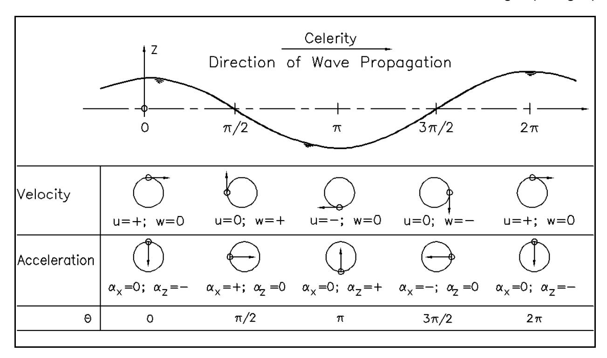

*Figure II-1-2. Local fluid velocities and accelerations*

- (6) Water particle displacements.
- (a) Another important aspect of linear wave theory deals with the displacement of individual water particles within the wave. Water particles generally move in elliptical paths in shallow or transitional depth water and in circular paths in deep water (Figure II-1-4). If the mean particle position is considered to be at the center of the ellipse or circle, then vertical particle displacement with respect to the mean position cannot exceed one-half the wave height. Thus, since the wave height is assumed to be small, the displacement of any fluid particle from its mean position must be small. Integration of Equations II-1-22 and II-1-23 gives the horizontal and vertical particle displacements from the mean position, respectively (Figure II-1-4). (b) Fluid particle displacements are

```math
\xi = -\frac{HgT^2}{4\pi L} \cdot \frac{\cosh\left(\frac{2\pi(z+d)}{L}\right)}{\cosh\left(\frac{2\pi d}{L}\right)} \sin \theta \tag{II-1-26}
```

```math
\zeta \, = \, + \, { \frac { H g T ^ { 2 } } { 4 \pi L } } \, { \frac { \sinh \left( \, { \frac { 2 \pi ( z \, + \, d ) } { L } } \right) } { \cosh \left( \, { \frac { 2 \pi d } { L } } \right) } } \, \cos \, \Theta \tag{II-1-27}
```

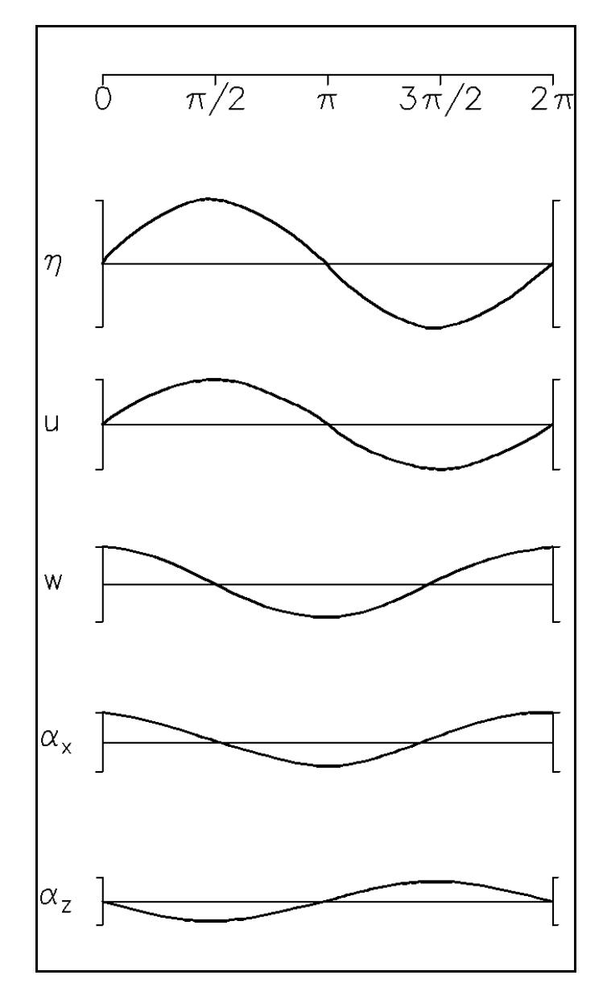

*Figure II-1-3. Profiles of particle velocity and acceleration by Airy theory in relation to the surface elevation*

where > is the horizontal displacement of the water particle from its mean position and . is the vertical displacement from its mean position (Figure II-1-4). The above equations can be simplified by using the relationship

```math
\left(\frac{2\pi}{T}\right)^2 = \frac{2\pi g}{L} \tanh \frac{2\pi d}{L} \tag{II-1-28}
```

II-1-14 Water Wave Mechanics

#### EXAMPLE PROBLEM II-1-2

FIND:
The local horizontal and vertical velocities u and w , and accelerations "x and "z at an elevation z = -5 m (or z = -16.4 ft) below the SWL when 2 = 2B x/L - 2B t/T = B/3 (or 600 ).
GIVEN:
A wave with a period T = 8 sec, in a water depth d = 15 m (49 ft), and a height H = 5.5 m (18.0 ft).
SOLUTION:
Calculate

```math
L_0 = 1.56T^2 = 1.56(8)^2 = 99.8 \ m \ (327 \ ft)
```

```math
\frac { d } { L _ { 0 } } \ = \ \frac { 1 5 } { 9 9 . 8 } \ = \ 0 . 1 5 0 3
```

By trial-and-error solution or using Figure II-1-5 for d/L0 = 0.1503, we find

```math
\frac { d } { L } \ = \ 0 . 1 8 3 5
```

and

```math
\cosh { \frac { 2 \pi d } { L } } \ = \ 1 . 7 4 2
```

hence

```math
L \, = \, { \frac { 1 5 } { 0 . 1 8 3 5 } } \, = \, 8 1 . 7 \, m \, ( 2 6 8 \, \# )
```

Evaluation of the constant terms in Equations II-1-22 to II-1-25 gives

```math
\frac { H g T } { 2 L } \, \frac { 1 } { \cosh ( 2 \pi d / L ) } \, = \, \frac { 5 . 5 \, ( 9 . 8 ) ( 8 ) } { 2 \, ( 8 1 . 7 ) } \, \frac { 1 } { 1 . 7 4 2 } \, = \, 1 . 5 1 5
```

```math
\frac { H g \pi } { L } \frac { 1 } { \cosh ( 2 \pi d / L ) } = \frac { 5 . 5 \, ( 9 . 8 ) ( 3 . 1 4 1 6 ) } { 8 1 . 7 } \frac { 1 } { 1 . 7 4 2 } \, = \, 1 . 1 9 0
```

Substitution into Equation II-1-22 gives

```math
u \, = \, 1 . 5 1 5 \, \cosh \, \left[ { \frac { 2 \pi ( 1 5 \, - \, 5 ) } { 8 1 . 7 } } \right] \, [ \cos \, 6 0 ^ { 0 } ]
```

Example Problem II-1-2 (Continued)
Example Problem II-1-2 (Concluded)
From the above known information, we find

```math
\frac { 2 \pi d } { L } \ = \ 0 . 7 6 9 1
```

and values of hyperbolic functions become

```math
\cosh ( 0 . 7 6 9 1 ) \, = \, 1 . 3 1 0 6
```

and

```math
\sinh ( 0 . 7 6 9 1 ) \, = \, 0 . 8 4 7 2
```

Therefore, fluid particle velocities are

```math
u = 1.515(1.1306)(0.500) = 0.99 \text{ m/s} (3.26 \text{ ft/s})
```

```math
w = 1.515(0.8472)(0.866) = 1.11 \text{ m/s} (3.65 \text{ ft/s})
```

and fluid particle accelerations are

```math
\alpha_x = 1.190(1.3106)(0.866) = 1.35 \text{ m/s}^2 (4.43 \text{ ft/s}^2)
```

```math
\alpha_z = -1.190(0.8472)(0.500) = -0.50 \text{ m/s}^2 (1.65 \text{ ft/s}^2)
```

(c) Thus,

```math
\xi = -\frac{H}{2} \frac{\cosh\left(\frac{2\pi(z+d)}{L}\right)}{\sinh\left(\frac{2\pi d}{L}\right)} \sin \theta \tag{II-1-29}
```

```math
\zeta = + \frac{H}{2} \frac{\sinh\left(\frac{2\pi(z+d)}{L}\right)}{\sinh\left(\frac{2\pi d}{L}\right)} \cos \theta \tag{II-1-30}
```

II-1-16 Water Wave Mechanics

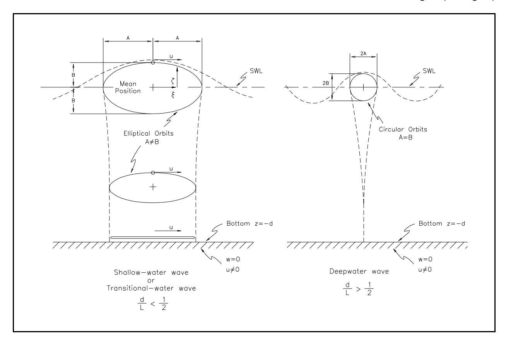

*Figure II-1-4. Water particle displacements from mean position for shallow-water and deepwater waves*

(d) Writing Equations II-1-29 and II-1-30 in the forms,

```math
\sin ^ { 2 } { \theta } { \theta } = \left[ \frac { \xi } { a } \ \frac { \sinh \left( \displaystyle \frac { 2 \pi d } { L } \right) } { \cosh \left( \displaystyle \frac { 2 \pi ( z + d ) } { L } \right) } \right] ^ { 2 } \tag{II-1-31}
```

```math
\cos^2 \theta = \left[ \frac{\zeta}{a} \frac{\sinh\left(\frac{2\pi d}{L}\right)}{\sinh\left(\frac{2\pi (z+d)}{L}\right)} \right]^2 \tag{II-1-32}
```

and adding gives

```math
\frac{\xi^2}{A^2} + \frac{\zeta^2}{B^2} = 1 \tag{II-1-33}
```

in which A and B are

```math
A = { \frac { H } { 2 } } \ { \frac { \cosh \left( { \frac { 2 \pi ( z \ + \ d ) } { L } } \right) } { \sinh \left( { \frac { 2 \pi d } { L } } \right) } } \tag{II-1-34}
```

```math
B = \frac{H}{2} \frac{\sinh\left(\frac{2\pi(z+d)}{L}\right)}{\sinh\left(\frac{2\pi d}{L}\right)} \tag{II-1-35}
```

- (e) Equation II-1-33 is the equation of an ellipse with a major- (horizontal) semi-axis equal to A and a minor (vertical) semi-axis equal to B . The lengths of A and B are measures of the horizontal and vertical displacements of the water particles (see Figure II-1-4). Thus, the water particles are predicted to move in closed orbits by linear wave theory; i.e., a fluid particle returns to its initial position after each wave cycle. Comparing laboratory measurements of particle orbits with this theory shows that particle orbits are not completely closed. This difference between linear theory and observations is due to the mass transport phenomenon, which is discussed later in this chapter. It shows that linear theory is inadequate to explain wave motion completely.
- (f) Examination of Equations II-1-34 and II-1-35 shows that for deepwater conditions, A and B are equal and particle paths are circular (Figure II-1-4). These equations become

```math
A = B = \frac{H}{2} e^{\left(\frac{2\pi z}{L}\right)} \tag{II-1-36}
```

(g) For shallow-water conditions (d/L < 1/25), the equations become

```math
A = \frac{H}{2} \frac{L}{2\pi d} \tag{II-1-37}
```

and

```math
B \, = \, { \frac { H } { 2 } } \left( 1 \, + \, { \frac { z } { d } } \right) \tag{II-1-38}
```

II-1-18 Water Wave Mechanics

#### EXAMPLE PROBLEM II-1-3

FIND:
- (a) The maximum horizontal and vertical displacement of a water particle from its mean position when z = 0 and z = -d.
- (b) The maximum water particle displacement at an elevation z = -7.5 m (-24.6 ft) when the wave is in infinitely deep water.
- (c) For the deepwater conditions of (b) above, show that the particle displacements are small relative to the wave height when z = - L0 /2.
GIVEN:
A wave in a depth d = 12 m (39.4 ft), height H = 3 m (9.8 ft), and a period T = 10 sec. The corresponding deepwater wave height is H0 = 3.13 m (10.27 ft).
SOLUTION:
(a)

```math
L_0 = 1.56T^2 = 1.56(10)^2 = 156 \ m \ (512 \ ft)
```

```math
\frac { d } { L _ { 0 } } \ = \ \frac { 1 2 } { 1 5 6 } \ = \ 0 . 0 7 6 9
```

From hand calculators, we find

```math
\sinh \left( \frac { 2 \pi d } { L } \right) \, = \, 0 . 8 3 0 6
```

```math
\operatorname { t a n h } \left( { \frac { 2 \pi d } { L } } \right) \ = \ 0 . 6 3 8 9
```

When z = 0, Equation II-1-34 reduces to

```math
A = \frac{H}{2} \frac{1}{\tanh\left(\frac{2\pi d}{L}\right)}
```

and Equation II-1-35 reduces to

```math
B = \frac{H}{2}
```

Thus

```math
A \ = \ { \frac { 3 } { 2 } } \ { \frac { 1 } { ( 0 . 6 3 8 9 ) } } \ = \ 2 . 3 5 \ m \ ( 7 . 7 0 \ f t )
```

```math
B \, = \, \frac { H } { 2 } \, = \, \frac { 3 } { 2 } \, = \, 1 . 5 \, m \, ( 4 . 9 2 \, f t )
```

Example Problem II-1-3 (Continued)
Example Problem II-1-3 (Concluded)
When z = -d,

```math
A = \frac{H}{2 \sinh\left(\frac{2\pi d}{L}\right)} = \frac{3}{2(0.8306)} = 1.81 \ m \ (5.92 \ ft)
```

and B = 0.
(b) With H0 = 3.13 m and z = -7.5 m (-24.6 ft), evaluate the exponent of e for use in Equation II-1-36, noting that L = L0 ,

```math
\frac { 2 \pi z } { L } \ = \ \frac { 2 \pi ( - 7 . 5 ) } { 1 5 6 } \ = \ - 0 . 3 0 2
```

thus,

```math
e^{-0.302} = 0.739
```

Therefore,

```math
A = B = \frac{H_0}{2}e^{\left(\frac{2\pi z}{L}\right)} = \frac{3.13}{2}(0.739) = 1.16 \ m \ (3.79 \ ft)
```

The maximum displacement or diameter of the orbit circle would be 2(1.16) = 2.32 m (7.61 ft) when z = -7.5 m.
(c) At a depth corresponding to the half wavelength from the MWL, we have

```math
z = -\frac{L_0}{2} = \frac{-156}{2} = -78.0 \ m \ (255.9 \ ft)
```

```math
\frac{2\pi z}{L} = \frac{2\pi(-78)}{156} = -3.142
```

Therefore

```math
e^{-3.142} = 0.043
```

and

```math
A = B = \frac{H_0}{2} e^{\left(\frac{2\pi z}{L}\right)} = \frac{3.13}{2} (0.043) = 0.067 \ m (0.221 \ ft)
```

Thus, the maximum displacement of the particle is 0.067 m, which is small when compared with the deepwater height, H0 = 3.13 m (10.45 ft).
II-1-20 Water Wave Mechanics
- (h) Thus, in deep water, the water particle orbits are circular as indicated by Equation II-1-36 (see Figure II-1-4). Equations II-1-37 and II-1-38 show that in transitional and shallow water, the orbits are elliptical. The more shallow the water, the flatter the ellipse. The amplitude of the water particle displacement decreases exponentially with depth and in deepwater regions becomes small relative to the wave height at a depth equal to one-half the wavelength below the free surface; i.e., when z = L_0/2 .
- (i) Water particle displacements and orbits based on linear theory are illustrated in Figure II-1-4. For shallow regions, horizontal particle displacement near the bottom can be large. In fact, this is apparent in offshore regions seaward of the breaker zone where wave action and turbulence lift bottom sediments into suspension. The vertical displacement of water particles varies from a minimum of zero at the bottom to a maximum equal to one-half the wave height at the surface. (7) Subsurface pressure.
- (a) Subsurface pressure under a wave is the sum of two contributing components, dynamic and static pressures, and is given by

```math
p' = \frac{\rho g H \cosh\left[\frac{2\pi(z+d)}{L}\right]}{2\cosh\left(\frac{2\pi d}{L}\right)} \cos \theta - \rho g z + p_a \tag{II-1-39}
```

where p is the total or absolute pressure, p_a is the atmospheric pressure, and \rho is the mass density of water (for salt water, \rho = 1,025 kg/m³ or 2.0 slugs/ft³, for fresh water, \rho = 1,000 kg/m³ or 1.94 slugs/ft³). The first term of Equation II-1-39 represents a dynamic component due to acceleration, while the second term is the static component of pressure. For convenience, the pressure is usually taken as the gauge pressure defined as

```math
p = p' - p_a = \frac{\rho g H \cosh\left[\frac{2\pi (z + d)}{L}\right]}{2\cosh\left(\frac{2\pi d}{L}\right)} \cos \theta - \rho g z \tag{II-1-40}
```

(b) Equation II-1-40 can be written as

```math
p = \rho g \eta \frac{\cosh\left[\frac{2\pi(z+d)}{L}\right]}{\cosh\left(\frac{2\pi d}{L}\right)} - \rho g z \tag{II-1-41}
```

since

```math
\eta = \frac{H}{2}\cos\left(\frac{2\pi x}{L} - \frac{2\pi t}{T}\right) = \frac{H}{2}\cos\theta \tag{II-1-42}
```

(c) The ratio

```math
K_{z} = \frac{\cosh\left[\frac{2\pi(z+d)}{L}\right]}{\cosh\left(\frac{2\pi d}{L}\right)} \tag{II-1-43}
```

is termed the pressure response factor . Hence, Equation II-1-41 can be written as

```math
p \, = \, \mathsf { p } g ( \mathsf { \eta } K _ { z } \, - \, z ) \tag{II-1-44}
```

(d) The pressure response factor K for the pressure at the bottom when z = -d,

```math
K_z = K = \frac{1}{\cosh\left(\frac{2\pi d}{L}\right)} \tag{II-1-45}
```

is presented as function of d/L0 in the tables (SPM 1984); see also Figure II-1-5. This figure is a convenient graphic means to determine intermediate and shallow-water values of the bottom pressure response factor K , the ratio C/C0 (= L/L0 = k0 /k ), and a number of other variables commonly occurring in water wave calculations.
(e) It is often necessary to determine the height of surface waves based on subsurface measurements of pressure. For this purpose, it is convenient to rewrite Equation II-1-44 as

```math
\eta \ = \ \frac { N ( p \ + \ p g z ) } { \ p g K _ { z } } \tag{II-1-46}
```

where z is the depth below the SWL of the pressure gauge, and N a correction factor equal to unity if the linear theory applies.
- (f) Chakrabarti (1987) presents measurements that correlate measured dynamic pressure in the water column ( s in his notation is the elevation above the seabed) with linear wave theory. These laboratory measurements include a number of water depths, wave periods, and wave heights. The best agreement between the theory and these measurements occurs in deep water. Shallow-water pressure measurements for steep water waves deviate significantly from the linear wave theory predictions. The example problem hereafter illustrates the use of pertinent equations for finding wave heights from pressure measurements based on linear theory. (8) Group velocity.
- (a) It is desirable to know how fast wave energy is moving. One way to determine this is to look at the speed of wave groups that represents propagation of wave energy in space and time. The speed a group of
II-1-22 Water Wave Mechanics

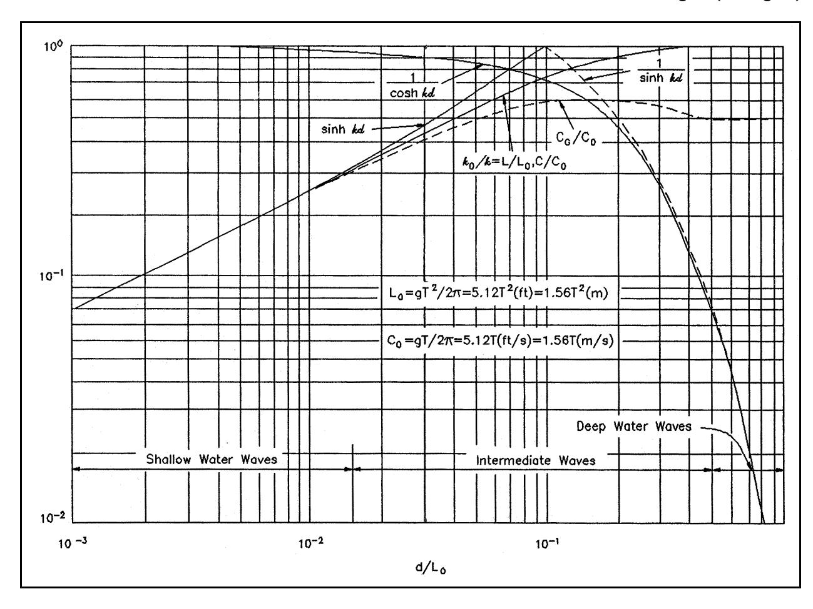

*Figure II-1-5. Variation of wave parameters with d/L0 (Dean and Dalrymple 1991)*

waves or a wave train travels is generally not identical to the speed with which individual waves within the group travel. The group speed is termed the group velocity Cg ; the individual wave speed is the phase velocity or wave celerity given by Equations II-1-8 or II-1-9. For waves propagating in deep or transitional water with gravity as the primary restoring force, the group velocity will be less than the phase velocity. For those waves, propagated primarily under the influence of surface tension (i.e., capillary waves), the group velocity may exceed the velocity of an individual wave.
(b) The concept of group velocity can be described by considering the interaction of two sinusoidal wave trains moving in the same direction with slightly different wavelengths and periods. The equation of the water surface is given by

```math
\eta = \eta_1 + \eta_2 = \frac{H}{2} \cos \left( \frac{2\pi x}{L_1} - \frac{2\pi t}{T_1} \right) + \frac{H}{2} \cos \left( \frac{2\pi x}{L_2} - \frac{2\pi t}{T_2} \right) \tag{II-1-47}
```

where 0 1 and 0 2 are the two components. They may be summed since superposition of solutions is permissible when the linear wave theory is used. For simplicity, the heights of both wave components have been assumed equal. Since the wavelengths of the two component waves, L1 and L2, have been assumed slightly different for some values of x at a given time, the two components will be in phase and the wave height observed will be 2H; for some other values of x, the two waves will be completely out of phase and

#### EXAMPLE PROBLEM II-1-4

FIND:
The height of the wave H assuming that linear theory applies and the average frequency corresponds to the average wave amplitude.

#### GIVEN:

An average maximum pressure p = 124 kilonewtons per square meter is measured by a subsurface pressure gauge located in salt water 0.6 meter (1.97 ft) above the bed in depth d = 12 m (39 ft). The average frequency f = 0.06666 cycles per second (Hertz).
SOLUTION:

```math
T = { \frac { 1 } { f } } = { \frac { 1 } { ( 0 . 0 6 6 6 ) } } \approx 1 5 s
```

```math
L_0 = 1.56T^2 = 1.56(15)^2 = 351 \ m \ (1152 \ ft)
```

```math
\frac { d } { L _ { 0 } } \ = \ \frac { 1 2 } { 3 5 1 } \ \approx \ 0 . 0 3 4 2
```

From Figure II-1-5, entering with d/L0 ,

```math
\frac { d } { L } \ = \ 0 . 0 7 6 5 1
```

hence,

```math
L \ = \ { \frac { 1 2 } { ( 0 . 0 7 6 5 1 ) } } \ = \ 1 5 6 . 8 \ m \ ( 5 1 5 \ f t )
```

and

```math
\cosh \ \left( { \frac { 2 \pi d } { L } } \right) \ = \ 1 . 1 1 7 8
```

Therefore, from Equation II-1-43

```math
K_{z} = \frac{\cosh\left[\frac{2\pi(z+d)}{L}\right]}{\cosh\left(\frac{2\pi d}{L}\right)} = \frac{\cosh\left[\frac{2\pi(-11.4+12)}{156.8}\right]}{1.1178} = 0.8949
```

Since 0 = a = H/2 when the pressure is maximum (under the wave crest), and N = 1.0 since linear theory is assumed valid,

```math
\frac{H}{2} = \frac{N(p + \rho gz)}{\rho gK_z} = \frac{1.0 [124 + (10.06)(-11.4)]}{(10.06)(0.8949)} = 1.04\,m\,(3.44\,ft)
```

Therefore,

```math
H = 2 ( 1 . 0 4 ) \ = \ 2 . 0 8 \ m \ ( 6 . 3 \ f t )
```

Note that the value of K in Figure II-1-5 or SPM (1984) could not be used since the pressure was not measured at the bottom.
II-1-24 Water Wave Mechanics
the resultant wave height will be zero. The surface profile made up of the sum of the two sinusoidal waves is given by Equation II-1-47 and is shown in Figure II-1-6. The waves shown in Figure II-1-6 appear to be traveling in groups described by the equation of the envelope curves

```math
\eta_{envelope} = \pm H \cos \left[ \pi \left( \frac{L_2 - L_1}{L_1 L_2} \right) x - \pi \left( \frac{T_2 - T_1}{T_1 T_2} \right) t \right] \tag{II-1-48}
```

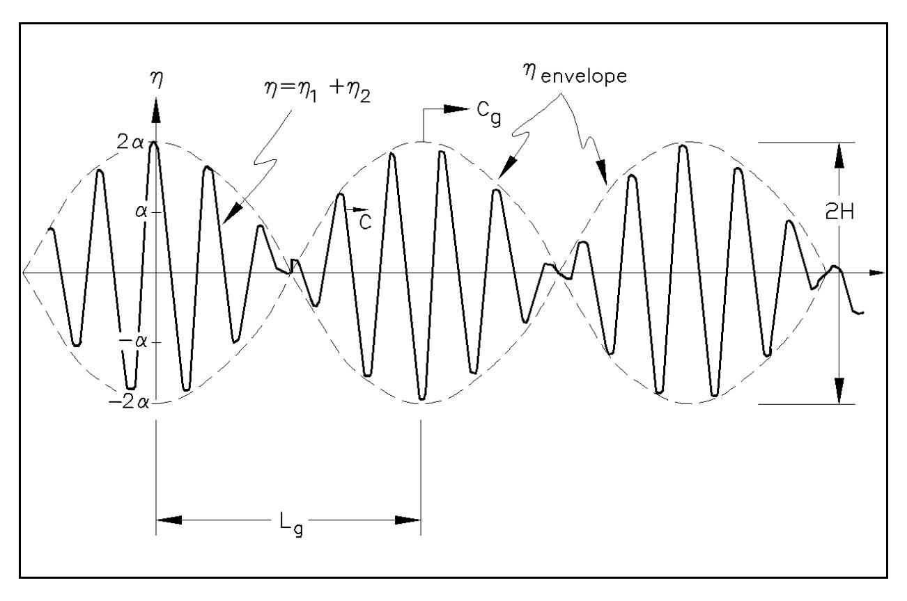

*Figure II-1-6. Characteristics of a wave group formed by the addition of sinusoids with different periods*

(c) It is the speed of these groups (i.e., the velocity of propagation of the envelope curves) defined in Equation II-1-48 that represents the group velocity. The limiting speed of the wave groups as they become large (i.e., as the wavelength L1 approaches L2 and consequently the wave period T1 approaches T2 ) is the group velocity and can be shown to be equal to

```math
C_g = \frac{1}{2} \frac{L}{T} \left[ 1 + \frac{\frac{4\pi d}{L}}{\sinh\left(\frac{4\pi d}{L}\right)} \right] = nC \tag{II-1-49}
```

where

```math
n = \frac{1}{2} \left[ 1 + \frac{\frac{4\pi d}{L}}{\sinh\left(\frac{4\pi d}{L}\right)} \right] \tag{II-1-50}
```

(d) In deep water, the term (4Bd/L)/sinh(4Bd/L) is approximately zero and n = 1/2, giving

```math
C_{g_0} = \frac{1}{2} \frac{L_0}{T} = \frac{1}{2} C_0 \text{ (deep water)} \tag{II-1-51}
```

or the group velocity is one-half the phase velocity.
(e) In shallow water, sinh(4Bd/L . 4Bd/L) and

```math
C_{g_s} = \frac{L}{T} = C \approx \sqrt{gd} \tag{II-1-52}
```

hence, the group and phase velocities are equal. Thus, in shallow water, because wave celerity is determined by the depth, all component waves in a wave train will travel at the same speed precluding the alternate reinforcing and canceling of components. In deep and transitional water, wave celerity depends on wavelength; hence, slightly longer waves travel slightly faster and produce the small phase differences resulting in wave groups. These waves are said to be dispersive or propagating in a dispersive medium ; i.e., in a medium where their celerity is dependent on wavelength.
- (f) The variation of the ratios of group and phase velocities to the deepwater phase velocity Cg/C0 and C/C0 , respectively are given as a function of the depth relative to the deep water wavelength d/L0 in Figure II-1-7. The two curves merge together for small values of depth and Cg reaches a maximum before tending asymptotically toward C /2.
- (g) Outside of shallow water, the phase velocity of gravity waves is greater than the group velocity. An observer that follows a group of waves at group velocity will see waves that originate at the rear of the group move forward through the group traveling at the phase velocity and disappear at the front of the wave group.
- (h) Group velocity is important because it is with this velocity that wave energy is propagated. Although mathematically the group velocity can be shown rigorously from the interference of two or more waves (Lamb 1945), the physical significance is not as obvious as it is in the method based on the consideration of wave energy. Therefore an additional explanation of group velocity is provided on wave energy and energy transmission. (9) Wave energy and power.
- (a) The total energy of a wave system is the sum of its kinetic energy and its potential energy. The kinetic energy is that part of the total energy due to water particle velocities associated with wave motion. The kinetic energy per unit length of wave crest for a wave defined with the linear theory can be found from

```math
\bar{E}_k = \int_x^{x+L} \int_{-d}^{\eta} \rho \frac{u^2 + w^2}{2} dz dx \tag{II-1-53}
```

II-1-26 Water Wave Mechanics

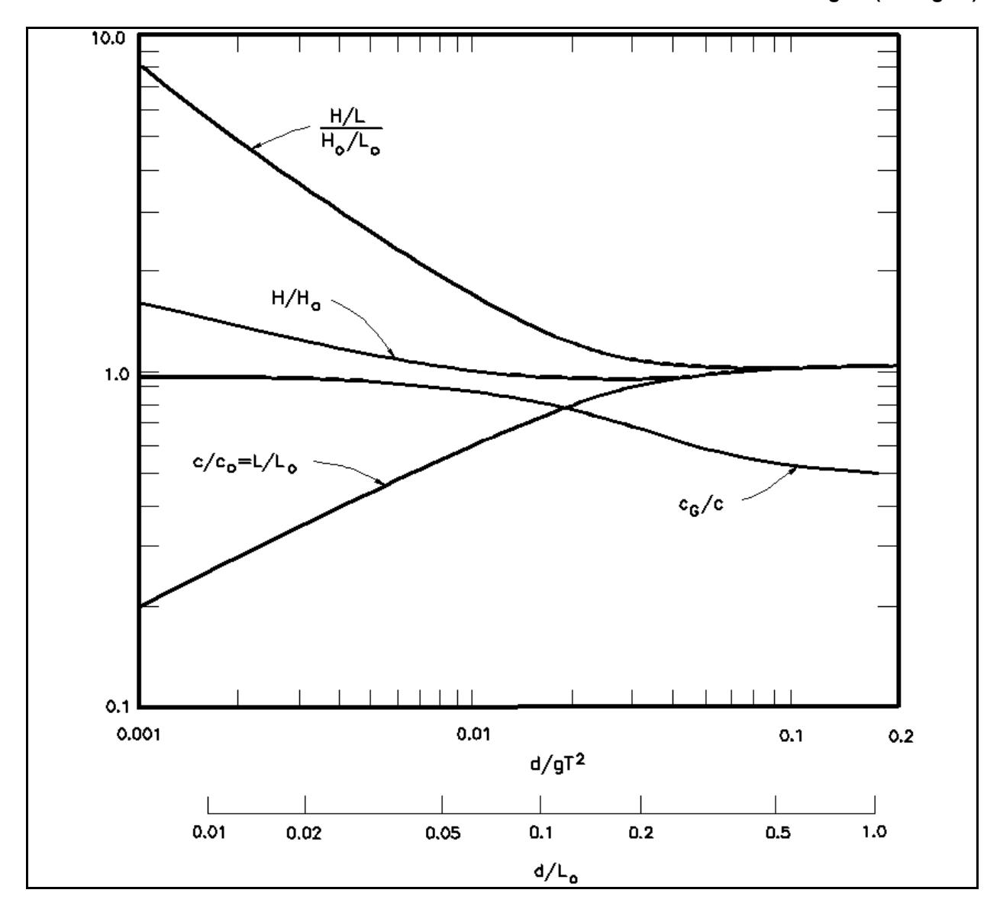

*Figure II-1-7. Variation of the ratios of group and phase velocities to deepwater phase speed using linear theory (Sarpkaya and Isaacson 1981)*

which, upon integration, gives

```math
\overline { { E } } _ { k } \ = \ \frac { 1 } { 1 6 } \ \rho \ g \ H ^ { 2 } \ L \tag{II-1-54}
```

(b) Potential energy is that part of the energy resulting from part of the fluid mass being above the trough: the wave crest. The potential energy per unit length of wave crest for a linear wave is given by

```math
\bar{E}_p = \int_x^{x+L} \rho \ g \left[ \frac{(\eta + d)^2}{2} - \frac{d^2}{2} \right] dx \tag{II-1-55}
```

which, upon integration, gives

```math
\overline { { E } } _ { p } \ = \ \frac { 1 } { 1 6 } \ \rho \ g \ H ^ { 2 } \ L \tag{II-1-56}
```

(c) According to the Airy theory, if the potential energy is determined relative to SWL, and all waves are propagated in the same direction, potential and kinetic energy components are equal, and the total wave energy in one wavelength per unit crest width is given by

```math
E \ = \ E _ { k } \ + \ E _ { p } \ = \ { \frac { \rho g H ^ { 2 } L } { 1 6 } } \ + \ { \frac { \rho g H ^ { 2 } L } { 1 6 } } \ = \ { \frac { \rho g H ^ { 2 } L } { 8 } } \tag{II-1-57}
```

where subscripts k and p refer to kinetic and potential energies. Total average wave energy per unit surface area, termed the specific energy or energy density , is given by

```math
\overline { { { E } } } \ = \ \frac { E } { L } \ = \ \frac { \rho g H ^ { 2 } } { 8 } \tag{II-1-58}
```

(d) Wave energy flux is the rate at which energy is transmitted in the direction of wave propagation across a vertical plan perpendicular to the direction of wave advance and extending down the entire depth. Assuming linear theory holds, the average energy flux per unit wave crest width transmitted across a vertical plane perpendicular to the direction of wave advance is

```math
\bar{P} = \frac{1}{T} \int_{t}^{t+r} \int_{-d}^{\eta} p \ u \ dz \ dt \tag{II-1-59}
```

which, upon integration, gives

```math
\overline { { P } } \, = \, \overline { { E } } n C \, = \, \overline { { E } } C _ { g } \tag{II-1-60}
```

where P6 is frequently called wave power , and the variable n has been defined earlier in Equation II-1-50.
- (e) If a vertical plane is taken other than perpendicular to the direction of wave advance, P6 = E Cg sin 2, where 2 is the angle between the plane across which the energy is being transmitted and the direction of wave advance. (f) For deep and shallow water, Equation II-1-60 becomes

```math
\overline { { { P } } } _ { 0 } = \frac { 1 } { 2 } \ : \overline { { { E } } } _ { 0 } \ : \mathcal{C } _ { o } \ : \ : ( \mathrm { d e e p \ : \ : \ w a t e r } ) \tag{II-1-61}
```

```math
\bar{P} = \bar{E}C_{\sigma} = \bar{E}C \tag{II-1-62}
```

(g) An energy balance for a region through which waves are passing will reveal that, for steady state, the amount of energy entering the region will equal the amount leaving the region provided no energy is added or removed. Therefore, when the waves are moving so that their crests are parallel to the bottom contours

```math
\overline { { { E } } } _ { 0 } \ n _ { 0 } \ C _ { 0 } \ = \ \overline { { { E } } } n C \tag{II-1-63}
```

or since
II-1-28 Water Wave Mechanics

```math
n_0 = \frac{1}{2} \tag{II-1-64}
```

```math
\frac { 1 } { 2 } \ : \overline { { { E } } } _ { 0 } \ : C _ { 0 } = \overline { { { E } } } n C \tag{II-1-65}
```

- (h) When the wave crests are not parallel to the bottom contours, some parts of the wave will be traveling at different speeds and the wave will be refracted; in this case Equation II-1-65 does not apply (see Parts II-3 and II-4). The rate of energy transmission is important for coastal design, and it requires knowledge of Cg to determine how fast waves move toward shore. The mean rate of energy transmission associated with waves propagating into an area of calm water provides a different physical description of the concept of group velocity.
- (i) Equation II-1-65 establishes a relationship between the ratio of the wave height at some arbitrary depth and the deepwater wave height. This ratio, known as the shoaling coefficient (see Part II-3 for detail derivation), is dependent on the wave steepness. The variation of shoaling coefficient with wave steepness as a function of relative water depth d/L0 is shown in Figure II-1-8. Wave shoaling and other related nearshore processes are described in detail in Parts II-3 and II-4. (10) Summary of linear wave theory.
- (a) Equations describing water surface profile particle velocities, particle accelerations, and particle displacements for linear (Airy) theory are summarized in Figure II-1-9. The Corps of Engineers' microcomputer package of computer programs (ACES; Leenknecht et al. 1992) include several software applications for calculating the linear wave theory and associated parameters. Detailed descriptions of the ACES and CMS software to the linear wave theory may be found in the ACES and CMS documentation.
- (b) Other wave phenomena can be explained using linear wave theory. For example, observed decreases and increases in the mean water level, termed wave setdown and wave setup, are in essence nonlinear quantities since they are proportional to wave height squared. These nonlinear quantities may be explained using the concept of radiation stresses obtained from linear theory. Maximum wave setdown occurs just seaward of the breaker line. Wave setup occurs between the breaker line and the shoreline and can increase the mean water level significantly. Wave setdown and setup and their estimation are discussed in Part II-4.
- (c) Radiation stresses are the forces per unit area that arise because of the excess momentum flux due to the presence of waves. In simple terms, there is more momentum flow in the direction of wave advance because the velocity U is in the direction of wave propagation under the wave crest when the instantaneous water surface is high (wave crest) and in the opposite direction when the water surface is low (wave trough). Also, the pressure stress acting under the wave crest is greater than the pressure stress under the wave trough leading to a net stress over a wave period. Radiation stresses arise because of the finite amplitude (height) of the waves. Interestingly, small-amplitude (linear) wave theory can be used to reasonably approximate radiation stresses and explain effects such as wave set down, wave setup, and the generation of longshore currents.

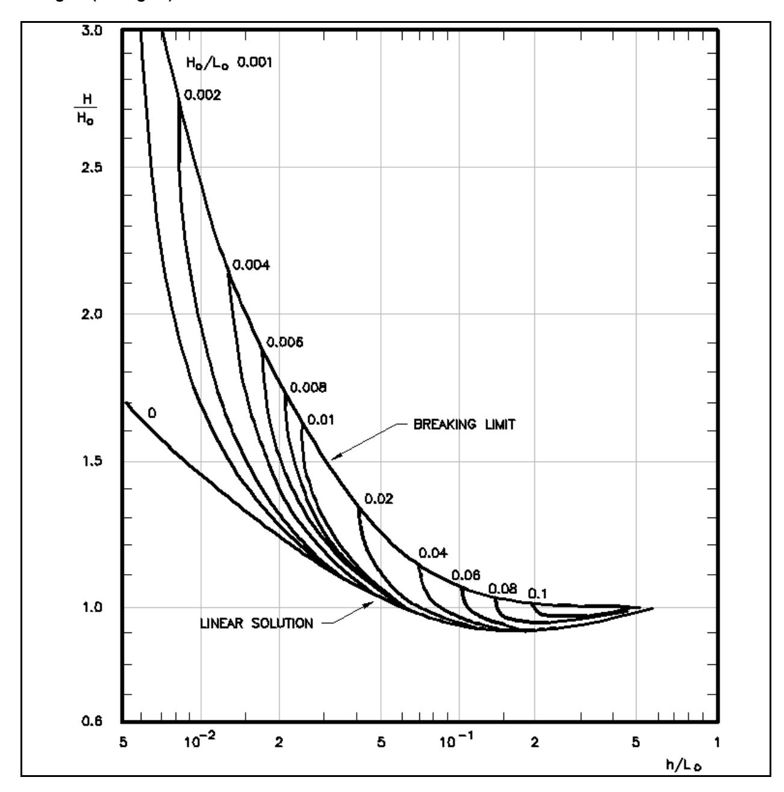

*Figure II-1-8. Variation of shoaling coefficient with wave steepness (Sakai and Battjes 1980)*

- d. Nonlinear wave theories .
- (1) Introduction.
- (a) Linear waves as well as finite-amplitude waves may be described by specifying two dimensionless parameters, the wave steepness H/L and the relative water depth d/L . The relative water depth has been discussed extensively earlier in this chapter with regard to linear waves. The Relative depth determines whether waves are dispersive or nondispersive and whether the celerity, length, and height are influenced by water depth. Wave steepness is a measure of how large a wave is relative to its height and whether the linear wave assumption is valid. Large values of the wave steepness suggest that the small-amplitude
II-1-30 Water Wave Mechanics

| Relative Depth | Shallow Water | Transitional Water | Deep Water |
| --- | --- | --- | --- |
|  |  |  |  |
|  |  |  |  |
|  |  |  |  |
| 1. Wave profile | Same As > |  | < Same As |
| 2. Wave celerity |  |  |  |
| 3. Wavelength |  |  |  |
| 4. Group velocity |  |  |  |
| 5. Water particle velocity |  |  |  |
| (a) Horizontal |  |  |  |
| (b) Vertical |  |  |  |
| 6. Water particle accelerations |  |  |  |
| (a) Horizontal |  |  |  |
| (b) Vertical |  |  |  |
| 7. Water particle displacements |  |  |  |
| (a) Horizontal |  |  |  |
| (b) Vertical |  |  |  |
| 8. Subsurface pressure |  |  |  |

*Figure II-1-9. Summary of linear (Airy) wave theory - wave characteristics*

assumption may be questionable. A third dimensionless parameter, which may be used to replace either the wave steepness or relative water depth, may be defined as the ratio of wave steepness to relative water depth. Thus,

```math
{ \frac { H / L } { d / L } } \ = \ { \frac { H } { d } } \tag{II-1-66}
```

which is termed the relative wave height . Like the wave steepness, large values of the relative wave height indicate that the small-amplitude assumption may not be valid. A fourth dimensionless parameter often used to assess the relevance of various wave theories is termed the Ursell number . The Ursell number is given by

```math
U_R = \left(\frac{L}{d}\right)^2 \frac{H}{d} = \frac{L^2 H}{d^3} \tag{II-1-67}
```

- (b) The value of the Ursell number is often used to select a wave theory to describe a wave with given L and H (or T and H ) in a given water depth d . High values of UR indicate large, finite-amplitude, long waves in shallow water that may necessitate the use of nonlinear wave theory, to be discussed next.
- (c) The linear or small-amplitude wave theory described in the preceding sections provides a useful first approximation to the wave motion. Ocean waves are generally not small in amplitude. In fact, from an engineering point of view it is usually the large waves that are of interest since they result in the largest forces and greatest sediment movement. In order to approach the complete solution of ocean waves more closely, a perturbation solution using successive approximations may be developed to improve the linear theory solution of the hydrodynamic equations for gravity waves. Each order wave theory in the perturbation expansion serves as a correction and the net result is often a better agreement between theoretical and observed waves. The extended theories can also describe phenomena such as mass transport where there is a small net forward movement of the water during the passage of a wave. These higher-order or extended solutions for gravity waves are often called nonlinear wave theories .
- (d) Development of the nonlinear wave theories has evolved for a better description of surface gravity waves. These include cnoidal , solitary , and Stokes theories. However, the development of a Fourier-series approximation by Fenton in recent years has superseded the previous historical developments. Since earlier theories are still frequently referenced, these will first be summarized in this section, but Fenton's theory is recommended for regular waves in all coastal applications. (2) Stokes finite-amplitude wave theory.
- (a) Since the pioneering work of Stokes (1847, 1880) most extension studies (De 1955; Bretschneider 1960; Skjelbreia and Hendrickson 1961; Laitone 1960, 1962, 1965; Chappelear 1962; Fenton 1985) in wave perturbation theory have assumed the wave slope ka is small where k is the wave number and a the amplitude of the wave. The perturbation solution, developed as a power series in terms of , = ka , is expected to converge as more and more terms are considered in the expansion. Convergence does not occur for steep waves unless a different perturbation parameter from that of Stokes is chosen (Schwartz 1974; Cokelet 1977; Williams 1981, 1985).
- (b) The fifth-order Stokes finite-amplitude wave theory is widely used in practical applications both in deep- and shallow-water wave studies. A formulation of Stokes fifth-order theory with good convergence properties has recently been provided (Fenton 1985). Fenton's fifth-order Stokes theory is computationally efficient, and includes closed-form asymptotic expressions for both deep- and shallow-water limits. Kinematics and pressure predictions obtained from this theory compare with laboratory and field measurements better than other nonlinear theories. (c) In general, the perturbation expansion for velocity potential M may be written as

```math
\mathbf{\Phi} = \mathbf{\epsilon} \mathbf{\Phi}_1 + \mathbf{\epsilon}^2 \mathbf{\Phi}_2 + \dots \tag{II-1-68}
```

II-1-32 Water Wave Mechanics
in which , = ka is the perturbation expansion parameter . Each term in the series is smaller than the preceding term by a factor of order ka . In this expansion, M 1 is the first-order theory (linear theory), M 2 is the second-order theory, and so on.
- (d) Substituting Equation II-1-68 and similar expressions for other wave variables (i.e., surface elevation 0, velocities u and w , pressure p , etc.) into the appropriate governing equations and boundary conditions describing the wave motion yields a series of higher-order solutions for ocean waves. Equating the coefficients of equal powers of ka gives recurrence relations for each order solution. A characteristic of the perturbation expansion is that each order theory is expressed in terms of the preceding lower order theories (Phillips 1977; Dean and Dalrymple 1991; Mei 1991). The first-order Stokes theory is the linear (Airy) theory.
- (e) The Stokes expansion method is formally valid under the conditions that H/d n (kd)2 for kd < 1 and H/L n 1 (Peregrine 1972). In terms of the Ursell number UR these requirements can be met only for UR <79 . This condition restricts the wave heights in shallow water and the Stokes theory is not generally applicable to shallow water. For example, the maximum wave height in shallow water allowed by the second-order Stokes theory is about one-half of the water depth (Fenton 1985). The mathematics of higher-order Stokes theories is cumbersome and is not presented here. See Ippen (1966) for a detailed derivation of the Stokes second-order theory.
- (f) In the higher-order Stokes solutions, superharmonic components (i.e., higher frequency components at two, three, four, etc. times the fundamental frequency) arise. These are superposed on the fundamental component predicted by linear theory. Hence, wave crests are steeper and troughs are flatter than the sinusoidal profile (Figure II-1-10). The fifth-order Stokes expansion shows a secondary crest in the wave trough for high-amplitude waves (Peregrine 1972; Fenton 1985). In addition, particle paths for Stokes waves are no longer closed orbits and there is a drift or mass transport in the direction of wave propagation.
- (g) The linear dispersion relation is still valid to second order, and both wavelength and celerity are independent of wave height to this order. At third and higher orders, wave celerity and wavelength depend on wave height, and therefore, for a given wave period, celerity and length are greater for higher waves. Some limitations are imposed on the finite-amplitude Stokes theory in shallow water both by the water depth and amplitude nonlinearities. For steeper waves in shallow water, higher-order terms in Stokes expansion may increase in magnitude to become comparable or larger than the fundamental frequency component (Fenton 1985; Chakrabarti 1987). When this occurs, the Stokes perturbation becomes invalid.
- (h) Higher-order Stokes theories include aperiodic (i.e., not periodic) terms in the expressions for water particle displacements. These terms arise from the product of time and a constant depending on the wave period and depth, and give rise to a continuously increasing net particle displacement in the direction of wave propagation. The distance a particle is displaced during one wave period when divided by the wave period gives a mean drift velocity â(z), called the mass transport velocity . To second-order, the mass transport velocity is

```math
\overline { { { U } } } ( z ) \, = \, \left( \frac { \pi H } { L } \right) ^ { 2 } \, \frac { C } { 2 } \frac { \cosh \, [ 4 \pi ( z \, + \, d ) / L ] } { \sinh ^ { 2 } \, ( 2 \pi d / L ) } \tag{II-1-69}
```

indicating that there is a net transport of fluid by waves in the direction of wave propagation. If the mass transport leads to an accumulation of mass in any region, the free surface must rise, thus generating a pressure gradient. A current, formed in response to this pressure gradient, will reestablish the distribution of mass.

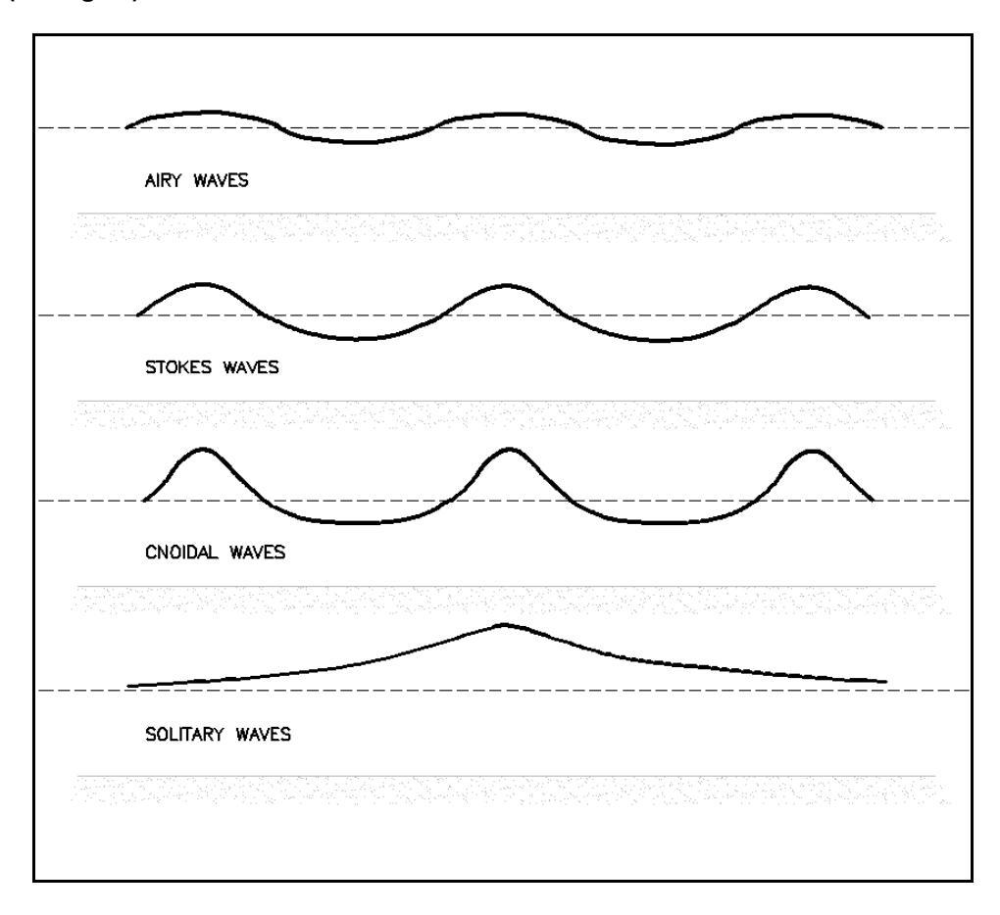

*Figure II-1-10. Wave profile shape of different progressive gravity waves*

- (i) Following Stokes, using higher-order wave theories, both theoretical and experimental studies of mass transport have been conducted (Miche 1944; Ursell 1953; Longuet-Higgins 1953; Russell and Osorio 1958; Isaacson 1978). Results of two-dimensional wave tank experiments where a return flow existed in these studies show that the vertical distribution of the mass transport velocity is modified so that the net transport of water across a vertical plane is zero. For additional information on mass transport, see Dean and Dalrymple (1991). (3) Subsurface pressure.
- (a) Higher-order Stokes theories introduce corrections to the linear wave theory, and often provide more accurate estimates of the wave kinematics and dynamics. For example, the second-order Stokes theory gives the pressure at any distance below the fluid surface as
II-1-34 Water Wave Mechanics

```math
p = \rho g \frac{H}{2} \frac{\cosh[2\pi(z+d)/L]}{\cosh(2\pi d/L)} \cos\theta - \rho gz + \frac{3}{8}\rho g \frac{\pi H^2}{L} \frac{\tanh(2\pi d/L)}{\sinh^2(2\pi d/L)} \left(\frac{\cosh[4\pi(z+d)/L]}{\sinh^2(2\pi d/L)} - \frac{1}{3}\right) \cos 2\theta - \frac{1}{8} \rho g \frac{\pi H^2}{L} \frac{\tanh(2\pi d/L)}{\sinh^2(2\pi d/L)} \left(\cosh\frac{4\pi(z+d)}{L} - 1\right) \tag{II-1-70}
```

- (b) The terms proportional to the wave height squared in the above equation represent corrections by the second-order theory to the pressure from the linear wave theory. The third term is the steady component of pressure that corresponds to time-independent terms mentioned earlier.
- (c) A direct byproduct of the high-order Stokes expansion is that it provides means for comparing different orders of resulting theories, all of which are approximations. Such comparison is useful to obtain insight about the choice of a theory for a particular problem. Nonetheless, it should be kept in mind that linear (or first-order) theory applies to a wave that is symmetrical about the SWL and has water particles that move in closed orbits. On the other hand, Stokes' higher-order theories predict a wave form that is asymmetrical about the SWL but still symmetrical about a vertical line through the crest and has water particle orbits that are open (Figure II-1-10). (4) Maximum wave steepness.
- (a) A progressive gravity wave is physically limited in height by depth and wavelength. The upper limit or breaking wave height in deep water is a function of the wavelength and, in shallow and transitional water, is a function of both depth and wavelength.
- (b) Stokes (1880) predicted theoretically that a wave would remain stable only if the water particle velocity at the crest was less than the wave celerity or phase velocity. If the wave height were to become so large that the water particle velocity at the crest exceeded the wave celerity, the wave would become unstable and break. Stokes found that a wave having a crest angle less than 120 deg would break (angle between two lines tangent to the surface profile at the wave crest). The possibility of the existence of a wave having a crest angle equal to 120 deg is known (Lamb 1945). Michell (1893) found that in deep water the theoretical limit for wave steepness is

```math
\left(\frac{H_0}{L_0}\right)_{\text{max}} = 0.142 \approx \frac{1}{7} \tag{II-1-71}
```

Havelock (1918) confirmed Michell's finding.
(c) Miche (1944) gives the limiting steepness for waves traveling in depths less than L0/2 without a change in form as

```math
\left(\frac{H}{L}\right)_{\max} = \left(\frac{H_0}{L_0}\right)_{\max} \tanh\left(\frac{2\pi d}{L}\right) = 0.142 \tanh\left(\frac{2\pi d}{L}\right) \tag{II-1-72}
```

Laboratory measurements indicate that Equation II-1-72 is in agreement with an envelope curve to laboratory observations (Dean and Dalrymple 1991).
- e. Other wave theories .
- (1) Introduction.
- (a) Extension of the Stokes theory to higher orders has become common with computers, but the mathematics involved is still tedious. Variations of the Stokes theory have been developed in the last three decades oriented toward computer implementation. For example, Dean (1965) used the stream function in place of the velocity potential to develop the stream function theory. Dean (1974) did a limited comparison of measured horizontal particle velocity in a wave tank with the tenth-order stream function theory and several other theories. Forty cases were tabulated in dimensionless form to facilitate application of this theory.
- (b) Others (Dalrymple 1974a; Chaplin 1980; Reinecker and Fenton 1981) developed variations of the stream function theory using different numerical methods. Their studies included currents. For near-breaking waves, Cokelet (1977) extended the method of Schwartz (1974) for steep waves for the full range of water depth and wave heights. Using a 110th-order theory for waves up to breaking, Cokelet successfully computed the wave profile, wave celerity, and various integral properties of waves, including the mean momentum, momentum flux, kinetic and potential energy, and radiation stress. (2) Nonlinear shallow-water wave theories.
- (a) Stokes' finite amplitude wave theory is applicable when the depth to wavelength ratio d/L is greater than about 1/8 or kd > 0.78 or Ur < 79. For longer waves a different theory must be used (Peregrine 1976). As waves move into shallow water, portions of the wave travel faster because of amplitude dispersion or waves travel faster because they are in deeper water. Waves also feel the effects of frequency dispersion less in shallow water, e.g., their speed is less and less influenced by water depth.
- (b) For the mathematical representation of waves in shallow water, a different perturbation parameter should be used to account for the combined influence of amplitude and frequency dispersion (Whitham 1974; Miles 1981; Mei 1991). This can be achieved by constructing two perturbation parameters whose ratio is equivalent to the Ursell parameters (Peregrine 1972). The set of equations obtained in this manner are termed the nonlinear shallow-water wave equations . Some common wave theories based on these equations are briefly described in the following sections. (3) Korteweg and de Vries and Boussinesq wave theories.
- (a) Various shallow-water equations can be derived by assuming the pressure to be hydrostatic so that vertical water particle accelerations are small and imposing a horizontal velocity on the flow to make it steady with respect to the moving reference frame. The horizontal velocity might be the velocity at the SWL, at the bottom, or the velocity averaged over the depth. If equations are written in terms of depth-averaged velocity u 6 they become:

```math
\frac { \partial \eta } { \partial t } \ + \ \frac { \partial } { \partial x } \ ( d \ + \ \eta ) \overline { { { u } } } = 0
```

```math
\frac { \partial \overline { { u } } } { \partial t } \ + \ \overline { { u } } \frac { \partial \overline { { u } } } { \partial x } \ + \ g \frac { \partial \eta } { \partial x } \ = \ \frac { 1 } { 3 } d ^ { 2 } \frac { \partial ^ { 3 } \overline { { u } } } { \partial x ^ { 2 } \partial t } \tag{II-1-73}
```

II-1-36 Water Wave Mechanics
which are termed the Boussinesq equations (Whitham 1967; Peregrine 1972; Mei 1991). Originally, Boussinesq used the horizontal velocity at the bottom. Eliminating \bar{\mathbf{u}} yields (Miles 1979, 1980, 1981)

```math
\frac{\partial^2 \mathbf{\eta}}{\partial t^2} - g d \frac{\partial^2 \mathbf{\eta}}{\partial x^2} = g d \frac{\partial^2}{\partial x^2} \left( \frac{3}{2} \frac{\mathbf{\eta}^2}{d} + \frac{1}{3} d^2 \frac{\partial^2 \mathbf{\eta}}{\partial x^2} \right) \tag{II-1-74}
```

A periodic solution to Equation II-1-74 is of the form

```math
\eta = a e^{i(kx - \omega t)} = a \cos \theta,
\quad
\bar{u} = U_0 e^{i(kx - \omega t)} = U_0 \cos \theta. \tag{II-1-75}
```

which has a dispersion relation and an approximation to it given by

```math
C = \frac{C_s}{\left[1 + \frac{1}{3}(kd)^2\right]^{1/2}} \approx C_s \left[1 - \frac{1}{3}(kd)^2 + \dots\right] \tag{II-1-76}
```

The term 1/3 (kd)^2 in Equation II-1-76 represents the dispersion of wave motion.
- (b) The most elementary solution of the Boussinesq equation is the solitary wave (Russell 1844; Fenton 1972; Miles 1980). A solitary wave is a wave with only crest and a surface profile lying entirely above the SWL. Fenton's solution gives the maximum solitary wave height, H_{max} = 0.85 d and maximum propagation speed C_{max}^2 = 1.7 gd. Earlier research studies using the solitary waves obtained H_{max} = 0.78 d and C_{max}^2 = 1.56 gd. The maximum solitary-amplitude wave is frequently used to calculate the height of breaking waves in shallow water. However, subsequent research has shown that the highest solitary wave is not necessarily the most energetic (Longuet-Higgins and Fenton 1974). (4) Cnoidal wave theory.
- (a) Korteweg and de Vries (1895) developed a wave theory termed the cnoidal theory . The cnoidal theory is applicable to finite-amplitude shallow-water waves and includes both nonlinearity and dispersion effects. Cnoidal theory is based on the Boussinesq, but is restricted to waves progressing in only one direction. The theory is defined in terms of the Jacobian elliptic function , cn , hence the name cnoidal. Cnoidal waves are periodic with sharp crests separated by wide flat troughs (Figure II-1-10).
- (b) The approximate range of validity of the cnoidal theory is d/L < 1/8 when the Ursell number U_R > 20 . As wavelength becomes long and approaches infinity, cnoidal wave theory reduces to the solitary wave theory, which is described in the next section. Also, as the ratio of wave height to water depth becomes small (infinitesimal wave height), the wave profile approaches the sinusoidal profile predicted by the linear theory.
- (c) Cnoidal waves have been studied extensively by many investigators (Keulegan and Patterson 1940; Keller 1948; Laitone 1962) who developed first- through third-order approximations to the cnoidal wave theory. Wiegel (1960) summarized the principal results in a more usable form by presenting such wave characteristics as length, celerity, and period in tabular and graphical form to facilitate application of cnoidal theory.
- (d) Wiegel (1964) further simplified the earlier works for engineering applications. Recent additional improvements to the theory have been made (Miles 1981; Fenton 1972, 1979). Using a Rayleigh-Boussinesq
series, Fenton (1979) developed a generalized recursion relationship for the KdV solution of any order. Fenton's fifth- and ninth-order approximations are frequently used in practice. A summary of formulas of the cnoidal wave theory are provided below. See Fenton (1979), Fenton and McKee 1990), and Miles (1981) for a more comprehensive theoretical presentation.
- (e) Long, finite-amplitude waves of permanent form propagating in shallow water may be described by cnoidal wave theory. The existence in shallow water of such long waves of permanent form may have first been recognized by Boussinesq (1871). However, the theory was originally developed by Korteweg and de Vries (1895).
- (f) Because local particle velocities, local particle accelerations, wave energy, and wave power for cnoidal waves are difficult to describe such descriptions are not included here, but can be obtained in graphical form from Wiegel (1960, 1964). Wave characteristics are described in parametric form in terms of the modules k of the elliptic integrals . While k itself has no physical significance, it is used to express the relationships between various wave parameters. Tabular presentations of the elliptic integrals and other important functions can be obtained from the above references. The ordinate of the water surface ys measured above the bottom is given by

```math
y_s = y_t + H cn^2 \left[ 2K(k) \left( \frac{x}{L} - \frac{t}{T} \right) , k \right] \tag{II-1-77}
```

where
yt = distance from the bottom to the wave trough
H = trough to crest wave height
cn = elliptic cosine function
K ( k ) = complete elliptic integral of the first kind
k = modulus of the elliptic integrals
(g) The argument of cn2 is frequently denoted simply by ( ); thus, Equation II-1-77 above can be written as

```math
y _ { s } = y _ { t } + H c n ^ { 2 } ( \mathbf { \Sigma } ) \tag{II-1-78}
```

- (h) The elliptic cosine is a periodic function where cn2 [2K(k) ((x/L) - (t/T)] has a maximum amplitude equal to unity. The modulus k is defined over the range 0 and 1. When k = 0, the wave profile becomes a sinusoid, as in the linear theory; when k = 1, the wave profile becomes that of a solitary wave.
- (i) The distance from the bottom to the wave trough yt , as used in Equations II-1-77 and II-1-78, is given by

```math
\frac { y _ { t } } { d } \ = \ \frac { y _ { c } } { d } \ - \ \frac { H } { d } \ = \ \frac { 1 6 d ^ { 2 } } { 3 L ^ { 2 } } \ K ( k ) \ [ K ( k ) \ - \ E ( k ) ] \ + \ 1 \ - \ \frac { H } { d } \tag{II-1-79}
```

where yc is the distance from the bottom to the crest, and E(k) the complete elliptic integral of the second kind. Wavelength is given by
II-1-38 Water Wave Mechanics

```math
L = \sqrt{\frac{16d^3}{3H}} \ k \ K(k) \tag{II-1-80}
```

and wave period by

```math
T\sqrt{\frac{g}{d}} = \sqrt{\frac{16y_t}{3H}} \frac{d}{y_t} \left[ \frac{k \ K(k)}{1 + \frac{H}{y_t \ k^2} \left( \frac{1}{2} - \frac{E(k)}{K(k)} \right)} \right] \tag{II-1-81}
```

Note that cnoidal waves are periodic and of permanent form; thus L = CT (see Figure II-1-10).
(j) Pressure under a cnoidal wave at any elevation y above the bottom depends on the local fluid velocity, and is therefore complex. However, it may be approximated in a hydrostatic form as

```math
p \ = \ \mathsf { p } g \ ( y _ { s } \ - \ y ) \tag{II-1-82}
```

i.e., the pressure distribution may be assumed to vary linearly from D gys at the bed to zero at the surface.
- (k) Wave profiles obtained from different wave theories are sketched in Figure II-1-10 for comparison. The linear profile is symmetric about the SWL. The Stokes wave has higher more peaked crests and shorter, flatter troughs. The cnoidal wave crests are higher above the SWL than the troughs are below the SWL. Cnoidal troughs are longer and flatter and crests are sharper and steeper than Stokes waves. The solitary wave, a form of the cnoidal wave described in the next section, has all of its profile above the SWL.
- (l) Figures II-1-11 and II-1-12 show the dimensionless cnoidal wave surface profiles for various values of the square of the modulus of the elliptic integrals k2 , while Figures II-1-13 to II-1-16 present dimensionless plots of the parameters which characterize cnoidal waves. The ordinates of Figures II-1-13 and II-1-14 should be read with care, since values of k2 are extremely close to 1.0 (k2 = 1 - 10-1 = 1 - 0.1 = 0.90). It is the exponent " of k2 = 1 - 10-" that varies along the vertical axis of Figures II-1-13 and II-1-14.
- (m) Ideally, shoaling computations might be performed using a higher-order cnoidal wave theory since this theory is able to describe wave motion in relatively shallow water. Simple, completely satisfactory procedures for applying cnoidal wave theory are not available. Although linear wave theory is often used, cnoidal theory may be applied for practical situations using Figures such as II-1-11 to II-1-16. The following problem illustrates the use of these figures.
- (n) There are two limits to the cnoidal wave theory. The first occurs when the period of the function cn is infinite when k = 1 . This corresponds to a solitary wave. As the wavelength becomes infinite, the cnoidal theory approaches the solitary wave theory. The second limit occurs for k = 0 where the cnoidal wave approaches the sinusoidal wave. This happens when the wave height is small compared to water depth and the cnoidal theory reduces to the linear theory.

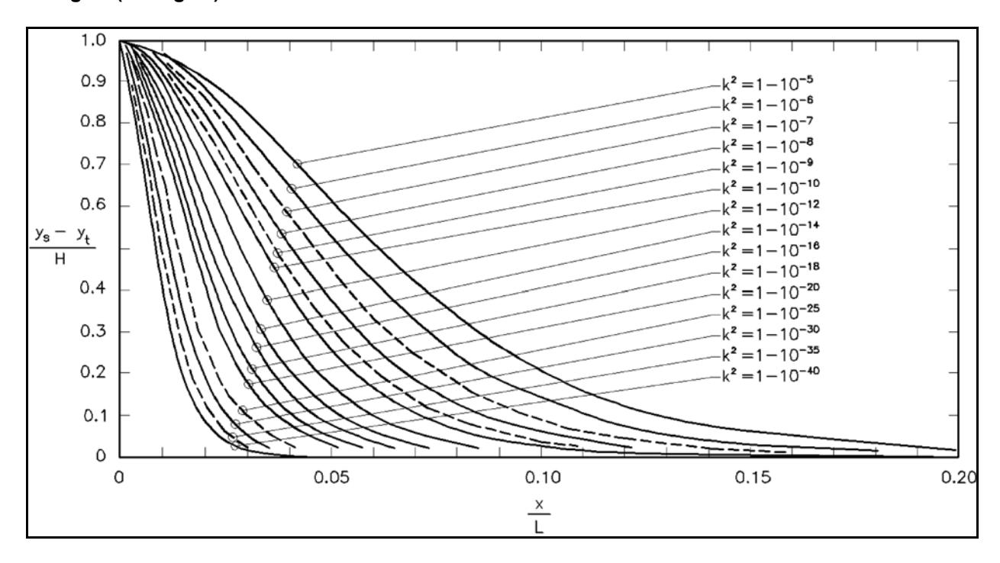

*Figure II-1-11. Normalized surface profile of the cnoidal wave (Wiegel 1960). For definition of variables see Part II-1-2.e.(3)*

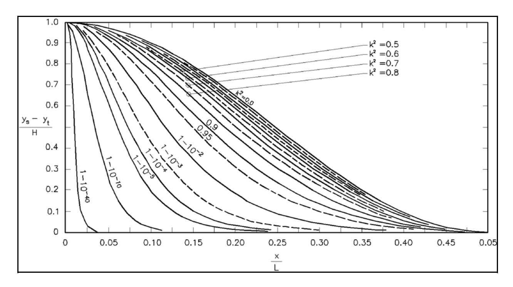

*Figure II-1-12. Normalized surface profile of the cnoidal wave for higher values of k2 and X/L (Wiegel 1960)*

II-1-40 Water Wave Mechanics

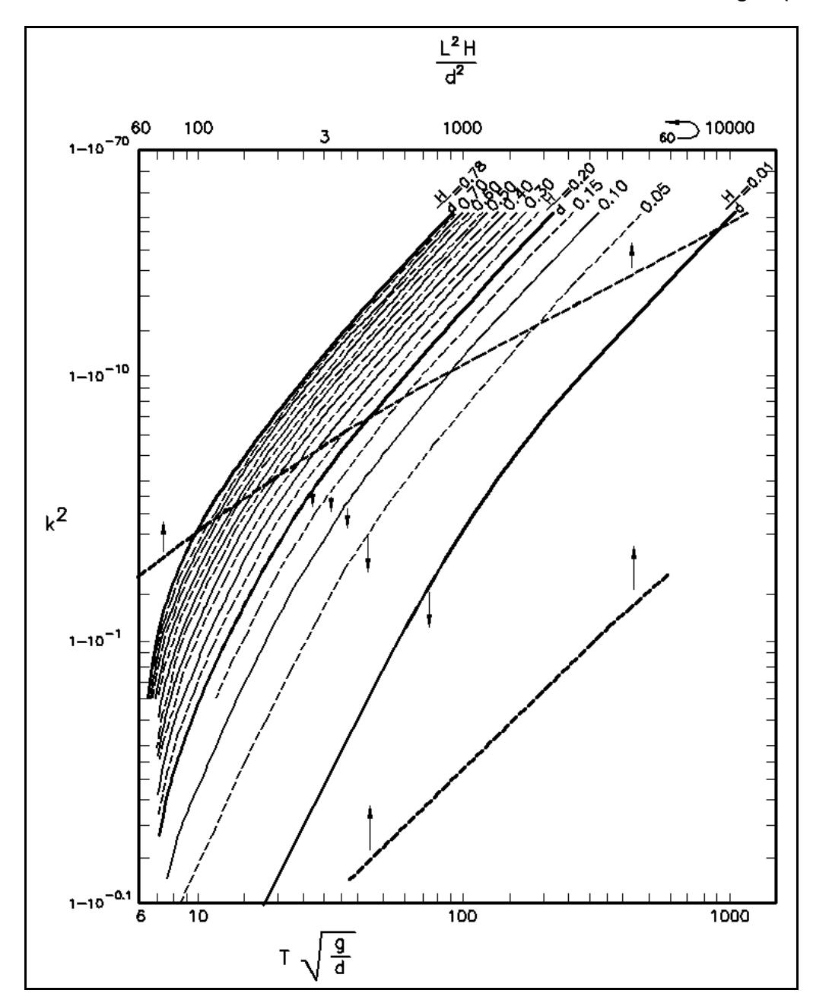

*Figure II-1-13. k2 versus L2 H/d3 , and k2 versus T %& g & / & d and H/d (Wiegel 1960)*

- (5) Solitary wave theory.
- (a) Waves considered in the previous sections were oscillatory or nearly oscillatory waves. The water particles move backward and forward with the passage of each wave, and a distinct wave crest and wave trough are evident. A solitary wave is neither oscillatory nor does it exhibit a trough. In the pure sense, the solitary wave form lies entirely above the still-water level. The solitary wave is a wave of translation because the water particles are displaced a distance in the direction of wave propagation as the wave passes.
- (b) The solitary wave was discovered by Russell (1844). Boussinesq (1871), Rayleigh (1876), Keller (1948), and Munk (1949) performed pioneering theoretical studies of solitary waves. More recent analyses

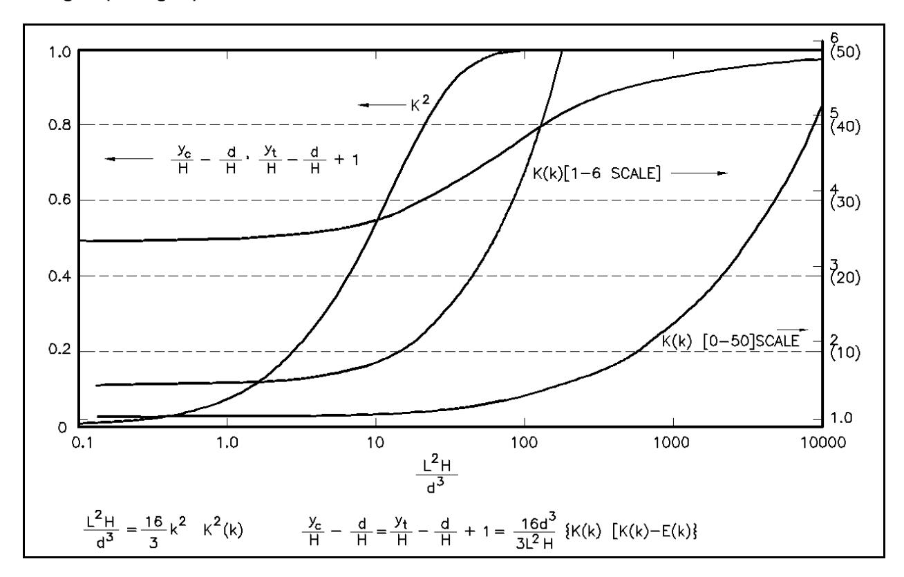

*Figure II-1-14. Relationship among L2 H/d3 and the square of the elliptic modulus (k2 ), yc/H, yt /H, and K(k) (Wiegel 1960)*

of solitary waves were performed by Fenton (1972), Longuet-Higgins and Fenton (1974), and Byatt-Smith and Longuet-Higgins (1976). The first systematic observations and experiments on solitary waves can probably be attributed to Russell (1838, 1844), who first recognized the existence of a solitary wave.
- (c) In nature it is difficult to form a truly solitary wave, because at the trailing edge of the wave there are usually small dispersive waves. However, long waves such as tsunamis and waves resulting from large displacements of water caused by such phenomena as landslides and earthquakes sometimes behave approximately like solitary waves. When an oscillatory wave moves into shallow water, it may often be approximated by a solitary wave (Munk 1949). As an oscillatory wave moves into shoaling water, the wave amplitude becomes progressively higher, the crests become shorter and more pointed, and the trough becomes longer and flatter.
- (d) Because both wavelength and period of solitary waves are infinite, only one parameter H/d is needed to specify a wave. To lowest order, the solitary wave profile varies as sech2 q (Wiegel 1964), where q = (3H/d)1/2 (x-Ct)/2d and the free-surface elevation, particle velocities, and pressure may be expressed as

```math
\frac{\eta}{H} = \frac{u}{\sqrt{gd} \frac{H}{d}} \tag{II-1-83}
```

```math
\frac { u } { \sqrt { g d } } \, \frac { H } { d } \, = \, \frac { \Delta p } { \rho g H } \tag{II-1-84}
```

II-1-42 Water Wave Mechanics

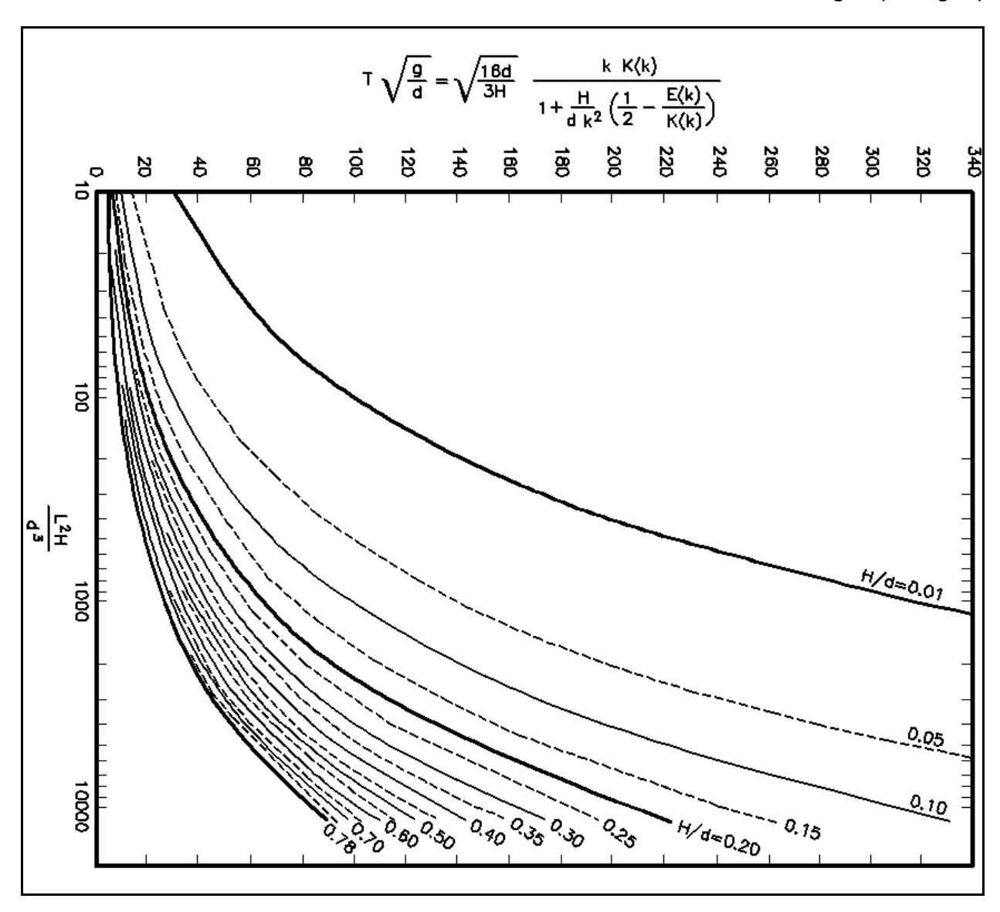

*Figure II-1-15. Relationships among T %& g & / & d, L2 H/d3 , and H/d (Wiegel 1960)*

```math
{ \frac { \Delta p } { \rho g H } } = s e c h ^ { 2 } \, q \tag{II-1-85}
```

where ) p is the difference in pressure at a point due to the presence of the solitary wave.
(e) To second approximation (Fenton 1972), this difference is given by

```math
\frac { \Delta p } { \rho g H } \ = \ 1 \ - \ \frac { 3 } { 4 } \ \frac { H } { d } \left[ 1 \ - \ \left( \frac { Y _ { s } } { d } \right) ^ { 2 } \right] \tag{II-1-86}
```

where ys = the height of the surface profile above the bottom. The wave height H required to produce ) p on the seabed can be estimated from

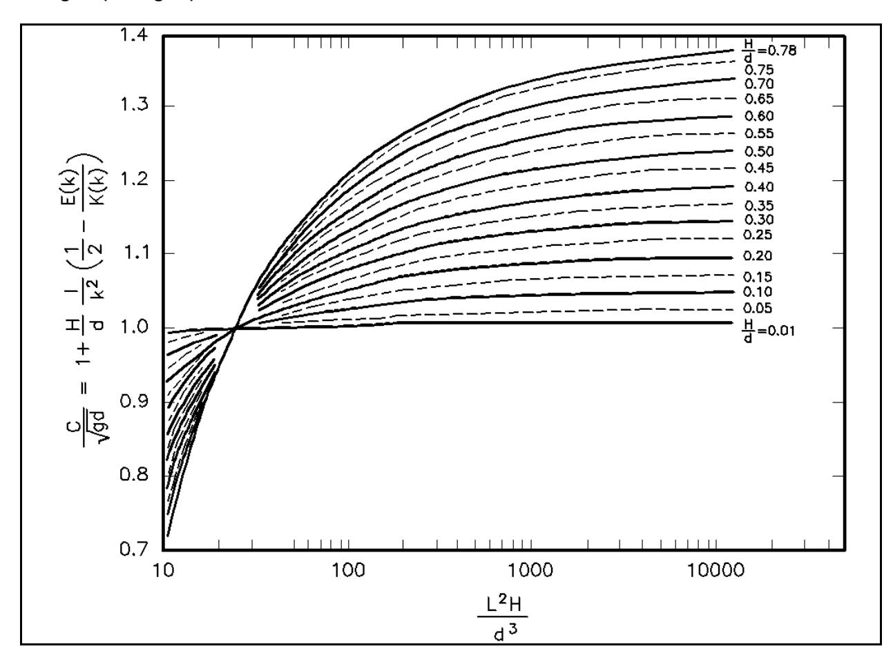

*Figure II-1-16. Relationship between cnoidal wave velocity and L2 H/d3 (Wiegel 1960)*

```math
\frac{\Delta p}{\rho g H} = \frac{1}{2} + \frac{1}{2} \sqrt{1 - \frac{3\Delta p}{\rho g d}} \tag{II-1-87}
```

- (f) Since the solitary wave has horizontal particle velocities only in the direction of wave advance, there is a net displacement of fluid in the direction of wave propagation.
- (g) The solitary wave is a limiting case of the cnoidal wave. When k2 = 1, K(k) = K(1) = 4, and the elliptic cosine reduces to the hyperbolic secant function and the water surface ys measured above the bottom reduces to

```math
y _ { s } = d \ + \ H \ s e c h ^ { 2 } \left[ \sqrt { \frac { 3 } { 4 } \ \frac { H } { d ^ { 3 } } } \ ( x \ - \ C t ) \right] \tag{II-1-88}
```

(h) The free surface is given by

```math
\eta \ = \ H \ s e c h ^ { 2 } \left[ \sqrt { \frac { 3 } { 4 } \ \frac { H } { d ^ { 3 } } } \ ( x \ - \ C t ) \right] \tag{II-1-89}
```

II-1-44 Water Wave Mechanics

#### EXAMPLE PROBLEM II-1-5

FIND:
- (a) Using cnoidal wave theory, find the wavelength L and compare this length with the length determined using Airy theory. (b) Determine the celerity C. Compare this celerity with the celerity determined using Airy theory. (c) Determine the distance above the bottom of the wave crest yc and wave trough yt . (d) Determine the wave profile.
GIVEN:
A wave traveling in water depth d = 3 m (9.84 ft), with a period T = 15 sec, and a height H = 1.0 m (3.3 ft).
SOLUTION:
(a) Calculate

```math
\frac{H}{d} = \frac{1}{3} = 0.33
```

and

```math
T\sqrt{\frac{g}{d}} = 15\sqrt{\frac{9.8}{3}} = 27.11
```

From Figure II-1-13, enter H/d and T to determine the square of the modulus of the complete elliptical integrals, k2 :

```math
k^2 = 1 - 10^{-5}
```

Entering both Figures II-1-13 and II-1-14 with the value of k2 gives

```math
\frac{L^2H}{d^3} = 290
```

or

```math
L \ = \ \sqrt { \frac { 2 9 0 \ d ^ { 3 } } { H } } \ = \ \sqrt { \frac { 2 9 0 \ ( 3 ) ^ { 3 } } { 1 } }
```

Example Problem II-1-5 (Continued)
Example Problem II-1-5 (Continued)
which gives L = 88.5 m (290.3 ft). The wavelength from the linear (Airy) theory is

```math
L \ = \ { \frac { g T ^ { 2 } } { 2 \pi } } \ \operatorname { t a n h } \ \left( { \frac { 2 \pi d } { L } } \right) \ = \ 8 0 . 6 \ m \ ( 2 6 4 . 5 \ f t )
```

To check whether the wave conditions are in the range for which cnoidal wave theory is valid, calculate d/L and the Ursell number = L2 H/d3 :

```math
\frac{d}{L} = \frac{3}{88.5} = 0.0339 < \frac{1}{8} \qquad 0.K.
```

```math
\frac{L^2H}{d^3} = \frac{1}{\left(\frac{d}{L}\right)^2} \left(\frac{H}{d}\right) = 290 > 26
```

Therefore, cnoidal theory is applicable.
(b) Wave celerity is given by

```math
C = { \frac { L } { T } } = { \frac { 8 8 . 5 } { 1 5 } } = 5 . 9 0 \, m / s \, ( 1 9 . 3 6 \, f t / s )
```

while the linear theory predicts

```math
C = \frac{L}{T} = \frac{80.6}{15} = 5.37 \text{ m/s } (17.63 \text{ ft/s})
```

Thus, if it is assumed that the wave period is the same for cnoidal and Airy theories, then

```math
\frac{C_{cnoidal}}{C_{Airy}} = \frac{L_{cnoidal}}{L_{Airy}} \approx 1
```

(c) The percentage of the wave height above the SWL may be determined from Figure II-1-11 or II-1-12. Entering these figures with L2 H/D3 = 290, the value of (yc -d)/H is found to be 0.865, or 86.5 percent. Therefore,

```math
y_c = 0.865 H + d
```

```math
y _ { c } = 0 . 8 6 5 ( 1 ) \ + \ 3 \ = \ 0 . 8 6 5 \ + \ 3 \ = \ 3 . 8 6 5 \ m \ ( 1 2 . 6 8 \ f { t } )
```

Example Problem II-1-5 (Continued)
II-1-46 Water Wave Mechanics
Example Problem II-1-5 (Concluded)
Also from Figure II-1-11 or II-1-12,

```math
\frac{(y_t - d)}{H} + 1 = 0.865
```

thus,

```math
y_t = (0.865 - 1)(1) + 3 = 2.865 m (9.40 ft)
```

(d) The dimensionless wave profile is given in Figures II-1-11 and II-1-12 for k2 = 1 - 10-5. The results obtained in (c) above can also be checked by using Figures II-1-11 and II-1-12. For the wave profile obtained with k2 = 1 - 10-5, the SWL is approximately 0.14H above the wave trough or 0.86H below the wave crest.
The results for the wave celerity determined under (b) above can now be checked with the aid of Figure II-1-16. Calculate

```math
\frac { H } { y _ { t } } \ = \ \frac { ( 1 ) } { 2 . 8 6 5 } \ = \ 0 . 3 4 9
```

Entering Figure II-1-16 with

```math
\frac{L^2H}{d^3} = \frac{(1)}{2.865} = 0.349
```

and

```math
\frac { H } { y _ { t } } \, = \, 0 . 3 4 9
```

it is found that

```math
\frac { C } { \sqrt { g \ y _ { t } } } \ = \ 1 . 1 2 6
```

Therefore,

```math
C = 1 . 1 2 6 \, \sqrt { ( 9 . 8 ) ( 2 . 8 6 5 ) } \, = \, 5 . 9 7 \, m / s \, ( 1 9 . 5 7 \, f t / s )
```

The differences between this number and the 5.90 m /sec (18.38 ft/s) calculated under (b) above is the result of small errors in reading the curves.
where the origin of x is at the wave crest. The volume of water within the wave above the still-water level per unit crest width is

```math
V = \left[\frac{16}{3} \ d^3 \ H\right]^{\frac{1}{2}} \tag{II-1-90}
```

(i) An equal amount of water per unit crest length is transported forward past a vertical plane that is perpendicular to the direction of wave advance. Several relations have been presented to determine the celerity of a solitary wave; these equations differ depending on the degree of approximation. Laboratory measurements suggest that the simple expression

```math
C = \sqrt{g(H + d)} \tag{II-1-91}
```

gives a reasonably accurate approximation to the celerity of solitary wave.
(j) The water particle velocities for a solitary wave (Munk 1949), are

```math
u \, = \, C N \, { \frac { 1 \, + \, \cos ( M y / d ) \, \cosh ( M x / d ) } { [ \cos ( M y / d ) \, + \, \cosh ( M x / D ) ] ^ { 2 } } } \tag{II-1-92}
```

```math
w \ = \ C N \ \frac { \sin ( M y / d ) \ \sinh ( M x / d ) } { [ \cos ( M y / d ) \ + \ \cosh ( M x / D ) ] ^ { 2 } } \tag{II-1-93}
```

where M and N are the functions of H/d shown in Figure II-1-17, and y is measured from the bottom. The expression for horizontal velocity u is often used to predict wave forces on marine structures situated in shallow water. The maximum velocity umax occurs when x and t are both equal to zero; hence,

```math
u _ { \mathrm { m a x } } \, = \, { \frac { C N } { 1 \, + \, \cos ( M y / d ) } } \tag{II-1-94}
```

(k) Total energy in a solitary wave is about evenly divided between kinetic and potential energy. Total wave energy per unit crest width is

```math
E = \frac{8}{3\sqrt{3}} \rho g H^{\frac{3}{2}} d^{\frac{3}{2}} \tag{II-1-95}
```

and the pressure beneath a solitary wave depends on the local fluid velocity, as does the pressure under a cnoidal wave; however, it may be approximated by

```math
p \ = \ \mathsf { p } g \ ( y _ { s } \ - \ y ) \tag{II-1-96}
```

- (l) Equation II-1-96 is identical to that used to approximate the pressure beneath a cnoidal wave.
- (m) As a solitary wave moves into shoaling water it eventually becomes unstable and breaks. A solitary wave breaks when the water particle velocity at the wave crest becomes equal to the wave celerity. This occurs when (Miles 1980, 1981)
II-1-48 Water Wave Mechanics

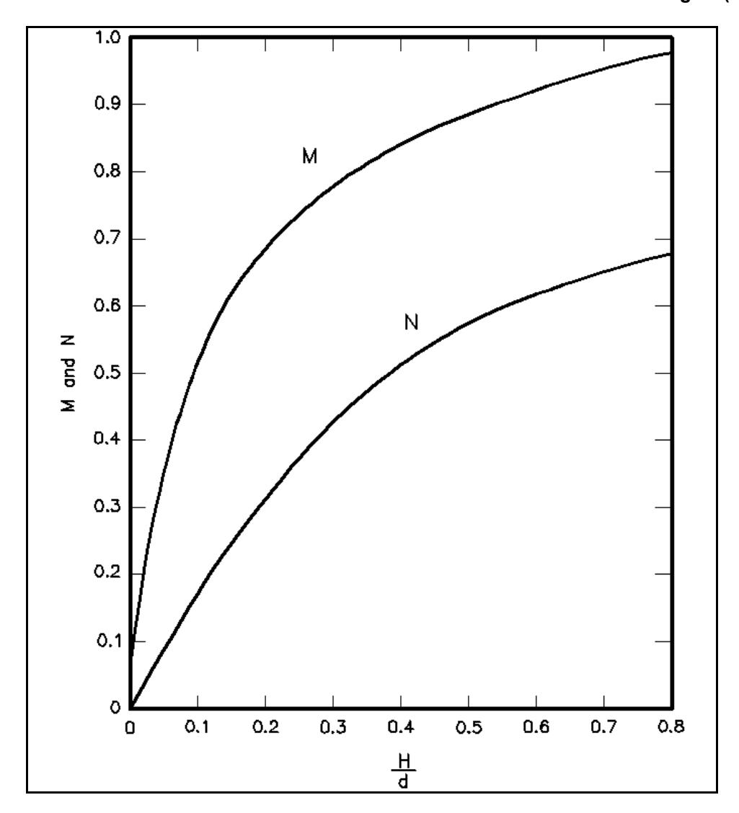

*Figure II-1-17. Functions M and N in solitary wave theory (Munk 1949)*

```math
\left( \frac { H } { d } \right) _ { \mathrm { { m a x } } } \ = \ 0 . 7 8 \tag{II-1-97}
```

(n) Laboratory studies have shown that the value of (H/d)max = 0.78 agrees better with observations for oscillatory waves than for solitary waves and that the nearshore slope has a substantial effect on this ratio. Other factors such as bottom roughness may also be involved. Tests of periodic waves with periods from 1 to 6 sec on slopes of m = 0.0, 0.05, 0.10, and 0.20 have shown (SPM 1984) that Hb/db ratios are approximately equal to 0.83, 1.05, 1.19, and 1.32, respectively. Tests of single solitary waves on slopes from m = 0.01 to m = 0.20 (SPM 1984) indicate an empirical relationship between the slope and the breaker height-to-water depth ratio given by

```math
{ \frac { H _ { b } } { d _ { b } } } \ = \ 0 . 7 5 \ + \ 2 5 m \ - \ 1 1 2 m ^ { 2 } \ + \ 3 8 7 0 m ^ { 3 } \tag{II-1-98}
```

in which waves did not break when the slope m was greater than about 0.18 and that as the slope increased the breaking position moved closer to the shoreline. This accounts for the large values of Hb/db for large slopes; i.e., as db 6 0. For some conditions, Equations II-1-97 and II-1-98 are unsatisfactory for predicting breaking depth. Further discussion of the breaking of waves with experimental results is provided in Part II-4.
(6) Stream-function wave theory. Numerical approximations to solutions of hydrodynamic equations describing wave motion have been proposed and developed. Some common theories and associated equations are listed in Table II-1-2. The approach by Dean (1965, 1974), termed a symmetric, stream-function theory , is a nonlinear wave theory that is similar to higher order Stokes' theories. Both are constructed of sums of sine or cosine functions that satisfy the original differential equation (Laplace equation). The theory, however, determines the coefficient of each higher order term so that a best fit, in the least squares sense, is obtained to the theoretically posed, dynamic, free-surface boundary condition. Assumptions made in the theory are identical to those made in the development of the higher order Stokes' solutions. Consequently, some of the same limitations are inherent in the stream-function theory, and it represents an alternative solution to the equations used to approximate the wave phenomena. However, the stream-function representation had successfully predicted the wave phenomena observed in some laboratory wave studies (Dean and Dalrymple 1991), and thus it may possibly describe naturally occurring wave phenomena.

*Table II-1-2 Boundary Value Problem of Water Wave Theories (Dean 1968)*

**Table II-1-2. Boundary Value Problem of Water Wave Theories (Dean 1968)**

| Theory | Exactly Satisfies |  |  |  |  |
| --- | --- | --- | --- | --- | --- |
| DE | BBC KFSBC | DFSBC |  |  |  |
| Linear wave theory |  | X | X | - | - |
| Third-order Stokes |  | X | X | - | - |
| Fifth-order Stokes |  | X | X | - | - |
| First-order cnoidal | - | X | - | - |  |
| Second-order cnoidal | - | X | - | - |  |
| Stream function theory | numerical wave | X | X | X |  |

DE = Differential equation.
BBC = Bottom boundary condition.
KFSBC = Kinematic free surface boundary condition.
DFSBC = Dynamic free surface boundary condition.
X = Exactly satisfies.
- (7) Fourier approximation -- Fenton's theory.
- (a) Fenton's Fourier series theory, another theory developed in recent years (Fenton 1988), is somewhat similar to Dean's stream function theory, but it appears to describe oceanic waves at all water depths better than all previous similar theories.
- (b) The long, tedious computations involved in evaluating the terms of the series expansions that make up the higher order stream-function theory of Dean had in the past limited its use to either tabular or graphical presentations of the solutions. These tables, their use, and their range of validity may be found elsewhere (Dean 1974).
- (c) Stokes and cnoidal wave theories yield good approximations for waves over a wide range of depths if high-order expansions are employed. Engineering practice has relied on the Stokes fifth-order theory (Skjelbreia and Hendrickson 1961), and the stream function theory (Dean 1974). These theories are
II-1-50 Water Wave Mechanics
applicable to deepwater applications. An accurate steady wave theory may be developed by numerically solving the full nonlinear equations with results that are applicable for short waves (deep water) and for long waves (shallow water). This is the Fourier approximation method. The method is termed Fenton's theory here. Any periodic function can be approximated by Fourier series, provided the coefficients of the series can be found. In principal, the coefficients are found numerically. Using this approach, Chappelear (1961) developed a Fourier series solution by adopting the velocity potential as the primary field variable. Dean (1965, 1974) developed the stream function theory. The solutions by both Chappelear and Dean successively correct an initial estimate to minimize errors in the nonlinear free-surface boundary conditions.
- (d) A simple Fourier approximation wave theory was introduced by Rienecker and Fenton (1981) and was subsequently improved by Fenton (1985, 1988; Fenton and McKee 1990). It is an improved numerical theory that has a range of applicability broader than the Stokes and cnoidal theories. Details of the theory are given by Reinecker and Fenton (1981) and Fenton (1985, 1988; Fenton and McKee 1990). Sobey et al. (1987) recasted Fenton's work into a standardized format including currents in the formulation up to fifth order. The theory has been implemented to calculate wave kinematics and the loading of offshore structures (Demirbilek 1985). For coastal applications, a PC-based computer code of Fenton's theory is available in the Automated Coastal Engineering System (ACES) (Leenknecht, Szuwalski, and Sherlock 1992). A brief description of Fenton's theory is given here; details are provided in ACES.
- (e) Fenton's Fourier approximation wave theory satisfies field equations and boundary conditions to a specified level of accuracy. The hydrodynamic equations governing the problem are identical to those used in Stokes' theory (Table II-1-2). Various approximations introduced in earlier developments are indicated in the table. Like other theories, Fenton's theory adopts the same field equation and boundary conditions. There are three major differences between Fenton's theory and the others. First, Fenton's theory is valid for deep- and shallow-water depths, and any of the two quantities' wave height, period or energy flux can be specified to obtain a solution. Second, the Fourier coefficients are computed numerically with efficient algorithms. Third, the expansion parameter for the Fourier coefficients is 0 = kH/2 rather than 0 = ka , which is used in Stokes theories. The coefficients are found numerically from simultaneous algebraic equations by satisfying two nonlinear free-surface boundary conditions and the dispersion relationship. Finding the coefficients requires that wave height, wave period, water depth, and either the Eulerian current or the depthaveraged mass transport velocity be specified.
- (f) In Fenton's theory, the governing field equation describing wave motion is the two-dimensional (x,z in the Cartesian frame) Laplace's equation, which in essence is an expression of the conservation of mass:

```math
\nabla^2 \Psi = \frac{\partial^2 \Psi}{\partial x^2} + \frac{\partial^2 \Psi}{\partial z^2} = 0 \tag{II-1-99}
```

where Q is the stream function. Q is a periodic function that describes wave motion in space and time, which also relates to the flow rate.
(g) Wave motion is a boundary-value problem, and its solution requires specifying realistic boundary conditions. These boundary conditions are usually imposed at the free surface and sea bottom. Since the seabed is often impermeable, flow rate through the sea bottom must be zero. Therefore, the bottom boundary condition may be stated in terms of Q as

```math
\Psi(x,-d) = 0 \tag{II-1-100}
```

(h) Two boundary conditions, kinematic and dynamic , are needed at the free surface. The kinematic condition states that water particles on the free surface remain there, and consequently, flow rate through the surface boundary must be zero. The net flow Q between the sea surface and seabed may be specified as

```math
\Psi(x,\eta) = -Q \quad \text{at } z = \eta \tag{II-1-101}
```

where 0 is the sea surface elevation. The dynamic free-surface boundary condition is an expression of specifying the pressure at the free surface that is constant and equal to the atmospheric pressure. In terms of the stream function Q this condition may be stated as

```math
\frac{1}{2} \left\{ \left( \frac{\partial \Psi}{\partial x} \right)^2 + \left( \frac{\partial \Psi}{\partial z} \right)^2 \right\} + g \eta = R \quad \text{at } z = \eta \tag{II-1-102}
```

in which R is the Bernoulli constant.
- (i) The boundary-value problem for wave motion as formulated above is complete. The timedependency may be removed from the problem formulation by simply adapting a coordinate system that moves with the same velocity as the wave phase speed (Fenton 1988; Fenton and McKee 1990; Sobey et al. 1987). This is equivalent to introducing an underlying current relative to which the wave motion is measured. The current (also called Stokes' drift velocity or Eulerian current ) causes a Doppler shift of the apparent wave period measured relative to a stationary observer or gauge. The underlying current velocity must therefore also be known in order to solve the wave problem in the steady (moving) reference frame.
- (j) Fenton's solution method uses the Fourier cosine series in kx to the governing equations. It is clearly an approximation, but very accurate, since results of this theory appear not to be restricted to any water depths. 0 = kH/2 is the expansion parameter replacing ka in the Stokes wave theory. The dependent variable is the stream function Q represented by a Fourier cosine series in kx, expressed up to the Nth order as

```math
\Psi(x,z) = -\overline{u}(z+d) + \left(\frac{g}{k^3}\right)^{\frac{1}{2}} \sum_{j=1}^{N} B_j \frac{\sinh jk(z+d)}{\cosh jkd} \cos jkx \tag{II-1-103}
```

where the Bj are dimensionless Fourier coefficients. The truncation limit of the series N determines the order of the theory. The nonlinear free-surface boundary conditions are satisfied at each of M+1 equi-spaced points on the surface. Wave height, wave period, water depth, and either the mean Eulerian velocity or the Stokes drift velocity must be specified to obtain a solution.
- (k) The solution is obtained by numerically computing the N Fourier coefficients that satisfy a system of simultaneous equations. The numerical solution solves a set of 2M+6 algebraic equations to find unknown Fourier coefficients. The problem is uniquely specified when M = N and overspecified when M > N . Earlier wave theories based on stream function consider the overspecified case and used a least-squares method to find the coefficients. Fenton was the first to consider the uniquely specified case and used the collocation method to produce the most accurate and computationally efficient solution valid for any water depth.
- (l) An initial estimate is required to determine the M+N+6 variables. The linear theory provides this initial estimate for deep water. In relatively shallow water, additional Fourier components are introduced. An alternative method is used in the shallow-water case by increasing the wave height in a number of steps. Smaller heights are used as starting solutions for subsequent higher wave heights. This approach eliminates the triple-crested waves reported by others (Huang and Hudspeth 1984; Dalrymple and Solana 1986).
- (m) Sobey et al. (1987) compared several numerical methods for steady water wave problems, including Fenton's. Their comparison indicated that accurate results may be obtained with Fourier series of 10 to 20 terms, even for waves close to breaking. Comparisons with other numerical methods and experimental data (Fenton and McKee 1990; Sobey 1990) showed that results from Fenton's theory and experiments agree
II-1-52 Water Wave Mechanics
consistently and better than results from other theories for a wide range of wave height, wave period, and water depth. Based on these comparisons, Fenton and McKee (1990) define the regions of validity of Stokes and cnoidal wave theory as

```math
\frac{L}{d} = 21.5 \ e^{\left(-1.87 \frac{H}{d}\right)} \tag{II-1-104}
```

- (n) The cnoidal theory should be used for wavelengths longer than those defined in this equation. For shorter waves, Stokes' theory is applicable. Fenton's theory can be used over the entire range, including obtaining realistic solutions for waves near breaking.
- (o) In water of finite depth, the greatest (unbroken) wave that could prevail as a function of both wavelength and depth is determined by Fenton and McKee (1990) as

```math
\frac{H}{d} = \frac{0.141063 \frac{L}{d} + 0.0095721 \left(\frac{L}{d}\right)^2 + 0.0077829 \left(\frac{L}{d}\right)^3}{1.0 + 0.078834 \frac{L}{d} + 0.0317567 \left(\frac{L}{d}\right)^2 + 0.0093407 \left(\frac{L}{d}\right)^3} a \tag{II-1-105}
```

- (p) The leading term in the numerator of this equation is the familiar steepness limit for short waves in deep water. For large values of L/d (i.e., shallow-water waves), the ratio of cubic terms in the above equation approaches the familiar 0.8 value, a limit for depth-induced breaking of the solitary waves. Therefore, the above equation may also be used as a guide to delineate unrealistic waves in a given water depth.
- (q) The formulas for wave kinematics, dynamics, and wave integral properties for Fenton's theory have been derived and summarized (Sobey et al.1987; Klopman 1990). Only the engineering quantities of interest including water particle velocities, accelerations, pressure, and water surface elevation defined relative to a Eulerian reference frame are provided here. (r) The horizontal and vertical components of the fluid particle velocity are

```math
u(x,z) = \frac{\partial \Psi}{\partial z} = -\overline{u} + \left(\frac{g}{k}\right)^{\frac{1}{2}} \sum_{j=1}^{N} jB_j \frac{\cosh jk(z+d)}{\cosh jkd} \cos jkx \tag{II-1-106}
```

```math
w(x,z) = -\frac{\partial \Psi}{\partial x} = \left(\frac{g}{k}\right)^{\frac{1}{2}} \sum_{j=1}^{N} jB_j \frac{\sinh jk(z+d)}{\cosh jkd} \sin jkx \tag{II-1-107}
```

(s) Fluid particle accelerations in the horizontal and vertical directions are found by differentiating the velocities and using the continuity equation. These component accelerations are

```math
a_{x}(x,z) = \frac{Du}{Dt} = u\frac{\partial u}{\partial x} + w\frac{\partial u}{\partial z} \tag{II-1-108}
```

```math
a_z(x,z) = \frac{Dw}{Dt} = u\frac{\partial w}{\partial x} + w\frac{\partial w}{\partial z} = u\frac{\partial u}{\partial z} - w\frac{\partial u}{\partial x}
```

where

```math
\frac{\partial u}{\partial x} = -\left(\frac{g}{k}\right)^{\frac{1}{2}} \sum_{j=1}^{N} j^2 B_j \frac{\cosh jk(z+d)}{\cosh jkd} \sin jkx \tag{II-1-109}
```

```math
\frac{\partial u}{\partial z} = \left(\frac{g}{k}\right)^{\frac{1}{2}} \sum_{j=1}^{N} j^2 B_j \frac{\sinh jk(z+d)}{\cosh jkd} \cos jkx \tag{II-1-110}
```

(t) The instantaneous water surface elevation 0(x) and water particle pressure are given by

```math
\eta ( x ) \ = \ \frac { 1 } { 2 } a _ { N } \cos N k x + \ \sum _ { j = 1 } ^ { N - 1 } \ a _ { j } \cos j k x \tag{II-1-111}
```

```math
p ( x , z ) \, = \, \ p ( R - g d - g z ) \, - \, \frac { 1 } { 2 } \ p ( u ^ { 2 } \, + \, w ^ { 2 } )
```

- (u) Integral properties of periodic gravity waves, including wave potential and kinetic energy, wave momentum and impulse, wave energy flux and wave power, and wave radiation stresses obtained by Klopman (1990) and Sobey et al. (1987) are listed in the Leenknecht, Szuwalski, and Sherlock (1992) documentation.
- (v) A computer program developed by Fenton (1988) has recently been implemented in the ACES package. The ACES implementation facilitates use of Fenton's theory to applications in deep water and finite-depth water. It uses Fourier series of up to 25 terms to describe a wave train and provides information about various wave quantities. The output includes wave estimates for common engineering parameters including water surface elevation, wave particle kinematics, and wave integral properties as functions of wave height, period, water depth, and position in the wave form.
- (w) The wave is assumed to co-exist on a uniform co-flowing current, taken either as the mean Eulerian current or mean mass transport velocity. At a given point in the water column, wave kinematics are tabulated over two wavelengths, and vertical distribution of the selected kinematics under the wave crest are graphically displayed. ACES implementation of Fenton's theory and its input/output requirements, computations, and examples are described in detail in the ACES documentation manual (Leenknecht, Szuwalski, and Sherlock 1992).
- (x) Figure II-1-18 illustrates the application of Fenton's theory. This case represents shallow-water (10-m) conditions and wave height and period of 5 m and 10 sec, respectively. Surface elevation, horizontal velocity, and pressure over two wavelengths is shown graphically in Figure II-1-18. The ACES documentation includes guidance on proper use of Fenton's theory.
II-1-54 Water Wave Mechanics

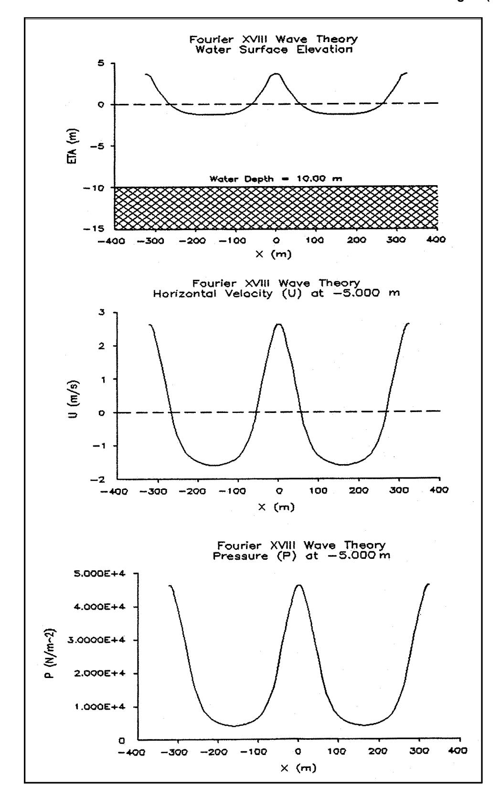

*Figure II-1-18. Surface elevation, horizontal velocity, and pressure in 10-m depth (using Fenton's theory in ACES)*

## f. Wave breaking .

- (1) Wave height is limited by both depth and wavelength. For a given water depth and wave period, there is a maximum height limit above which the wave becomes unstable and breaks. This upper limit of wave height, called breaking wave height , is in deep water a function of the wavelength. In shallow and transitional water it is a function of both depth and wavelength. Wave breaking is a complex phenomenon and it is one of the areas in wave mechanics that has been investigated extensively both experimentally and numerically.
- (2) Researchers have made some progress over the last three decades in the numerical modeling of waves close to breaking (Longuet-Higgins and Fenton 1974; Longuet-Higgins 1974; 1976; Schwartz 1974; Dalrymple and Dean 1975; Byatt-Smith and Longuet-Higgins 1976; Peregrine 1976; Cokelet 1977; Longuet-Higgins and Fox 1977; Longuet-Higgins 1985; Williams 1981; 1985). These studies suggest the limiting wave steepness to be H/L = 0.141 in deep water and H/d = 0.83 for solitary waves in shallow water with a corresponding solitary wave celerity of c/(gd)1/2 = 1.29.
- (3) Dalrymple and Dean (1975) investigated the maximum wave height in the presence of a steady uniform current using the stream function theory. Figure II-1-19 shows the influence of a uniform current on the maximum wave height where Tc is the wave period in a fixed reference frame and U is the current speed.
- (4) The treatment of wave breaking in the propagation of waves is discussed in Part II-3. Information about wave breaking in deep and shoaling water and its relation to nearshore processes is provided in Part II-4. g. Validity of wave theories .
- (1) To ensure their proper use, the range of validity for various wave theories described in this chapter must be established. Very high-order Stokes theories provide a reference against which the accuracy of various theories may be tested. Nonlinear wave theories better describe mass transport, wave breaking, shoaling, reflection, transmission, and other nonlinear characteristics. Therefore, the usage of the linear theory has to be carefully evaluated for final design estimates in coastal practice. It is often imperative in coastal projects to use nonlinear wave theories.
- (2) Wave amplitude and period may sometimes be estimated from empirical data. When data are lacking or inadequate, uncertainty in wave height and period estimates can give rise to a greater uncertainty in the ultimate answer than does neglecting the effect of nonlinear processes. The additional effort necessary for using nonlinear theories may not be justified when large uncertainties exist in the wave data used for design. Otherwise, nonlinear wave theories usually provide safer and more accurate estimates.
- (3) Dean (1968, 1974) presented an analysis by defining the regions of validity of wave theories in terms of parameters H/T 2 and d/T 2 since T 2 is proportional to the wavelength. Le Méhauté (1976) presented a slightly different analysis (Figure II-1-20) to illustrate the approximate limits of validity for several wave theories, including the third- and fourth-order theories of Stokes. In Figure II-1-20, the fourth-order Stokes theory may be replaced with more popular fifth-order theory, since the latter is often used in applications. Both Le Méhauté and Dean recommend cnoidal theory for shallow-water waves of low steepness, and Stokes' higher order theories for steep waves in deep water. Linear theory is recommended for small steepness H/T 2 and small U R values. For low steepness waves in transitional and deep water, linear theory is adequate but other wave theories may also be used in this region. Fenton's theory is appropriate for most of the wave parameter domain. For given values of H , d , and T , Figure II-1-20 should be used as a guide to select an appropriate wave theory.
II-1-56 Water Wave Mechanics

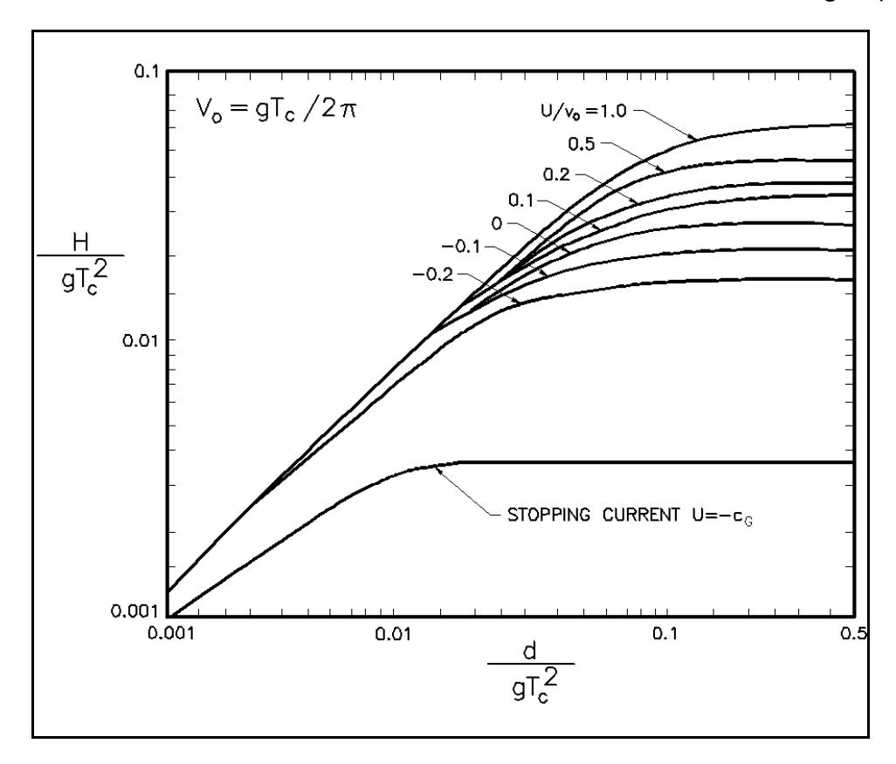

*Figure II-1-19. Influence of a uniform current on the maximum wave height (Dalrymple and Dean 1975)*

(4) It is necessary to know the limiting value of wave heights and wave steepness at different water depths to establish range of validity of any wave theory that uses a Stokes-type expansion. This is customarily done by comparing the magnitude of each successive term in the expansion. Each should be smaller than the term preceding it. For example, if the second term is to be less than 1 percent of the first term in the Stokes second-order theory, the limiting wave steepness is

```math
\frac{H}{L} \le \frac{1}{80} \frac{\sinh^3 kd}{\cosh kd (3 + 2 \sinh^2 kd)} \tag{II-1-112}
```

(5) If the third-order term is to be less than 1 percent of the second-order term, the limiting wave steepness is

```math
{ \frac { H } { L } } \leq { \frac { 1 } { 7 } } { \frac { \sinh ^ { 3 } k d } { \sqrt { 1 + 8 \cosh ^ { 3 } k d } } } \tag{II-1-113}
```

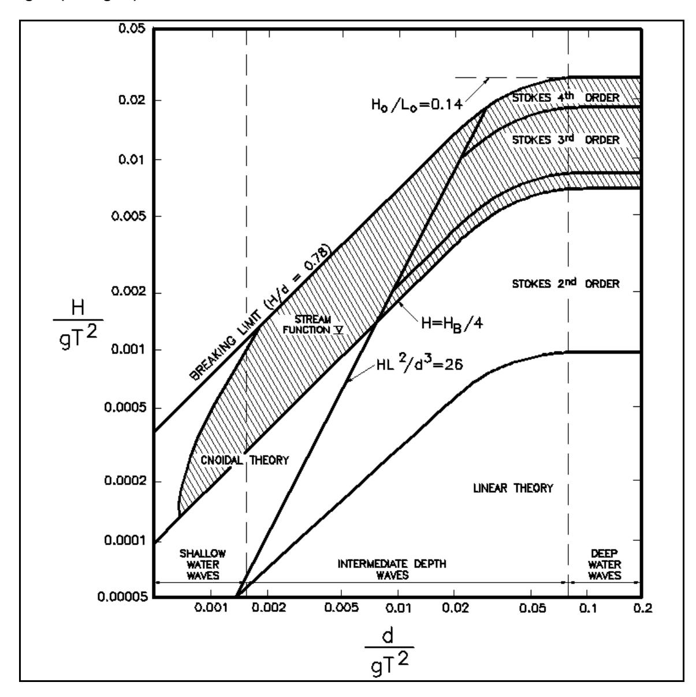

*Figure II-1-20. Ranges of suitability of various wave theories (Le Méhauté 1976)*

- (6) Similarly, using the fifth-order expansion, the asymptotes to Stokes third-order theory are H/L0 < 0.1 and H/d < 3/4(kd)2 for deep water and shallow water, respectively. This allows the range of Stokes' theory to be expanded by adding successively smaller areas to the domain of linear theory in Figure II-1-20 until the breaking limit is reached. The fifth-order Stokes theory gets close enough to the breaking limit, and higher order solutions may not be warranted. Laitone (1962) suggests a shallow-water limit on Stokes' theory by setting the Ursell number UR equal to 20. For an Ursell number of approximately 20, Stokes' theory approaches the cnoidal theory.
- (7) The magnitude of the Ursell number UR (sometimes also called the Stokes number ) shown in Figure II-1-20 may be used to establish the boundaries of regions where a particular wave theory should be used. Stokes (1847) noted that this parameter should be small for long waves. An alternative, named the Universal parameter (Up), has recently been suggested (Goda 1983) for classification of wave theories.
II-1-58 Water Wave Mechanics
(8) Limits of validity of the nonlinear (higher-order) wave theories established by Cokelet (1977) and Williams (1981), are shown in Figure II-1-21. Regions where Stokes waves (short waves) and cnoidal and solitary waves (long waves) are valid are also shown in this figure. The breaking limit for solitary waves Hb W = 0.833 established by Williams (1981) and the limiting height designated as Hb F determined by Cokelet (1977) are also shown on Figure II-1-21. The line between short and long waves corresponds to a value of the Ursell number UR . 79. This theoretical partition agrees with data from Van Dorn (1966).

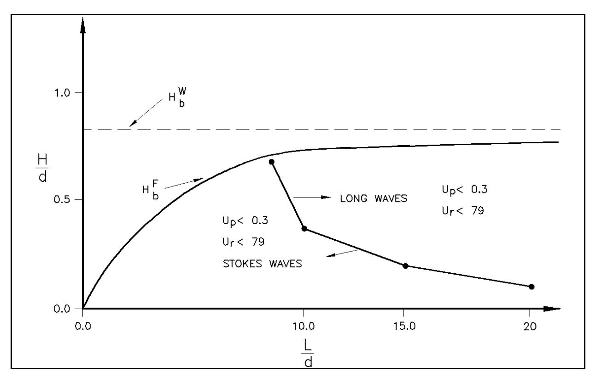

*Figure II-1-21. Grouping of wind waves based on universal parameter and limiting height for steep waves*

#### II-1-3. Irregular Waves

#### a. Introduction .

(1) In the first part of this chapter, waves on the sea surface were assumed to be nearly sinusoidal with constant height, period and direction (i.e., monochromatic waves). Visual observation of the sea surface (as in the radar image of the entrance to San Francisco Bay in Figure II-1-22) and measurements (such as in Figure II-1-23) indicate that the sea surface is composed of waves of varying heights and periods moving in differing directions. In the first part of this chapter, wave height, period, and direction could be treated as deterministic quantities. Once we recognize the fundamental variability of the sea surface, it becomes necessary to treat the characteristics of the sea surface in statistical terms. This complicates the analysis but more realistically describes the sea surface. The term irregular waves will be used to denote natural sea states in which the wave characteristics are expected to have a statistical variability in contrast to monochromatic waves , where the properties may be assumed constant. Monochromatic waves may be generated in the laboratory but are rare in nature. "Swell" describes the natural waves that appear most like monochromatic waves in deep water, but swell, too, is fundamentally irregular in nature. We note that the sea state in nature during a storm is always short-crested and irregular. Waves that have travelled far from

#### EXAMPLE PROBLEM II-1-6

FIND:
Applicable wave theory for waves in (a) and (b). Which of these waves is a long wave?
GIVEN:

```math
\text{(a). } d = 15 \text{ m}, H = 12.2 \text{ m}, T = 12 \text{ sec}; \quad \text{(b). } d = 150 \text{ m}, H = 30 \text{ m}, T = 16 \text{ sec}.
```

SOLUTION:
(a) Calculate dimensionless parameters necessary for using Figure II-1-20. These are

```math
\frac{d}{gT^2} \approx 0.01
```

```math
\frac { H } { g T ^ { 2 } } \approx 0 . 0 0 9
```

```math
{ \frac { H } { d } } \ = \ 0 . 8
```

```math
{ \sqrt { g d } } \approx 1 2 \, { \frac { m } { \sec } }
```

```math
U_R \approx 55
```

From Figure II-1-20, the applicable theory is cnoidal.
(b) In a similar fashion, compute

```math
\frac { d } { g T ^ { 2 } } \approx 0 . 0 6
```

```math
\frac { H } { g T ^ { 2 } } \approx 0 . 0 1
```

```math
\frac { H } { d } \ = \ 0 . 2
```

```math
\sqrt { g d } \approx 4 0 \, \frac { m } { \mathrm { s e c } }
```

```math
U_R \approx 1.5
```

With these values, Figure II-1-20 indicates the applicable theory is Stokes third- or fifth-order. It is noted that the linear theory is also applicable.
Based on the values of Ursell parameter, neither wave (a) or (b) is a true long wave. Wave (a) may be considered a long wave in comparison to wave (b).
II-1-60 Water Wave Mechanics

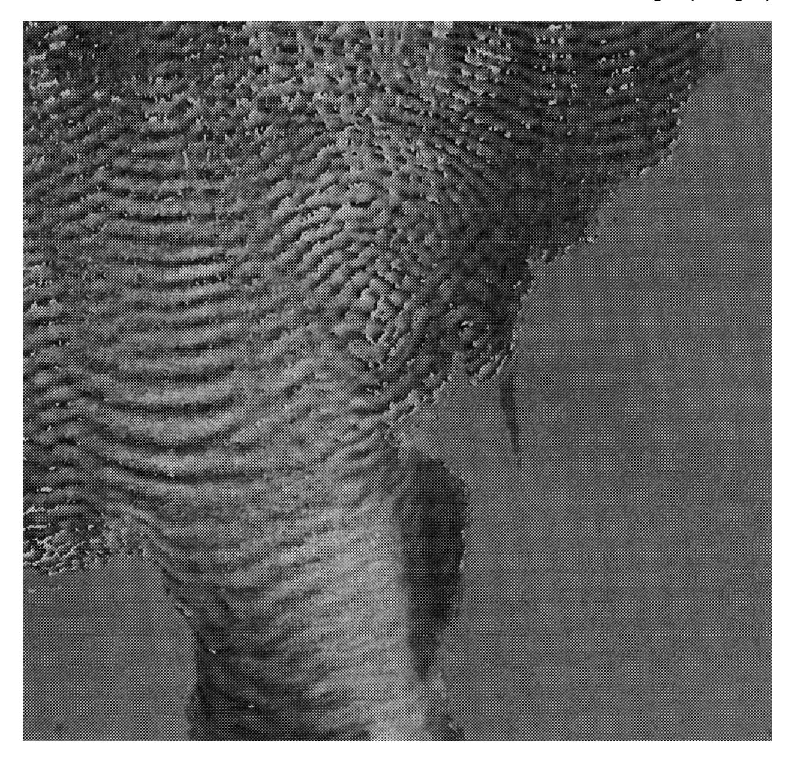

*Figure II-1-22. Radar image of the sea surface in the entrance to San Francisco Bay*

the region of generation are called swells . These waves have a much more limited range of variability, sometimes appearing almost monochromatic and long-crested.
- (2) When the wind is blowing and the waves are growing in response, the sea surface tends to be confused: a wide range of heights and periods is observed and the length of individual wave crests may only be a wave length or two in extent (short-crested). Such waves are called wind seas, or often, just sea. Longperiod waves that have traveled far from their region of origin tend to be more uniform in height, period, and direction and have long individual crests, often many wave lengths in extent (i.e., long-crested). These are termed swell. A sea state may consist of just sea or just swell or may be a combination of both.
- (3) The ocean surface is often a combination of many wave components. These individual components were generated by the wind in different regions of the ocean and have propagated to the point of observation.

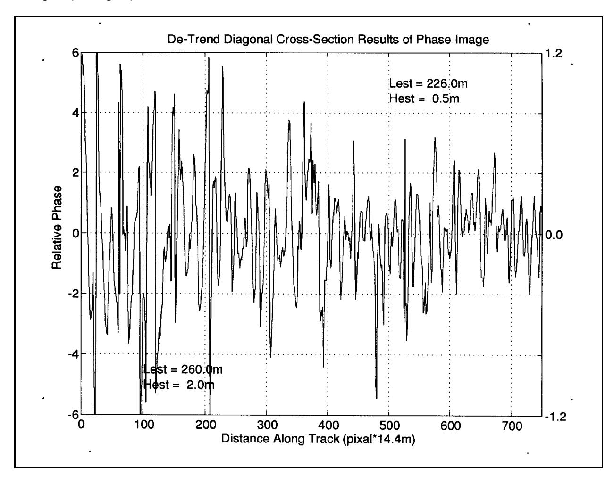

*Figure II-1-23. Measured sea surface velocity in the entrance to San Francisco Bay*

If a recorder were to measure waves at a fixed location on the ocean, a non-repeating wave profile would be seen and the wave surface record would be rather irregular and random (Figure II-1-23). Although individual waves can be identified, there is significant variability in height and period from wave to wave. Consequently, definitions of wave height, period, and duration must be statistical and simply indicate the severity of wave conditions.
- (4) Wave profiles are depicted in Figure II-1-24 for different sea conditions. Figure II-1-25 shows a typical wave surface elevation time series measured for an irregular sea state. Important features of the fieldrecorded waves and wave parameters to be used in describing irregular waves later in this section are defined in Figures II-1-26 and II-1-27. We note that the sea state in nature during a storm is always short-crested and irregular. Waves that have traveled far from the region of generation are called swells . These waves have much more limited range of variability sometimes appearing monochromatic and long-crested.
- (5) This part of Part II-1 will develop methods for describing and analyzing natural sea states. The concept of significant wave height , which has been found to be a very useful index to characterize the heights of the waves on the sea surface, will be introduced. Peak period and mean wave direction which characterize the dominant periodicity and direction of the waves, will be defined. However, these parameterizations of the sea surface in some sense only index how big some of the waves are. When using irregular wave heights in engineering, the engineer must always recognize that larger and smaller (also longer and shorter) waves
II-1-62 Water Wave Mechanics

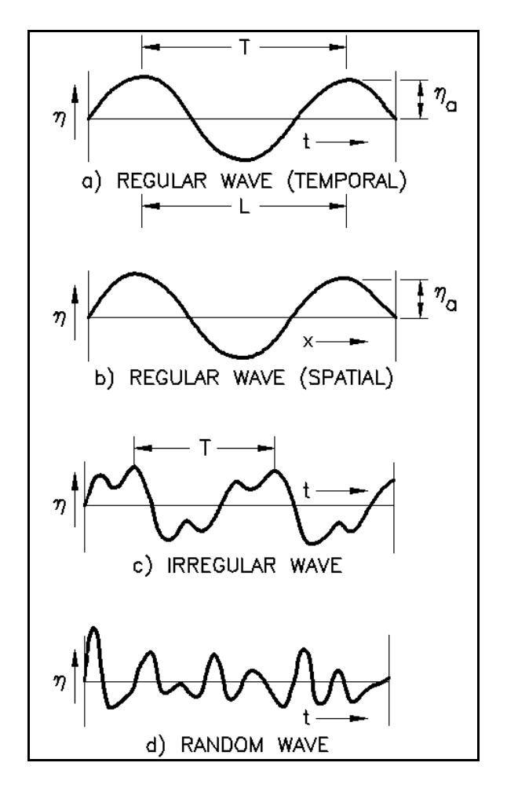

*Figure II-1-24. Representations of an ocean wave*

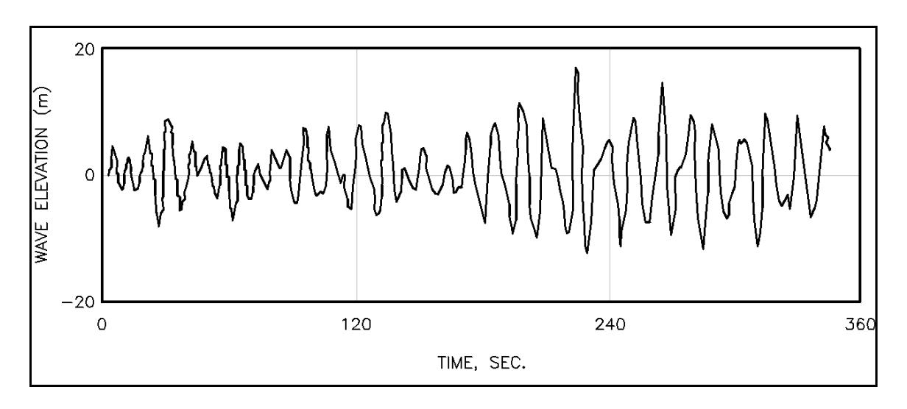

*Figure II-1-25. Wave profile of irregular sea state from site measurements*

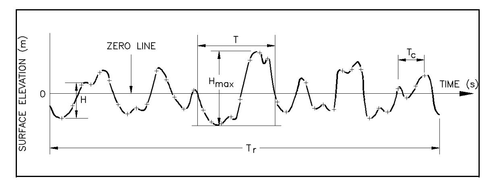

*Figure II-1-26. Definition of wave parameters for a random sea state*

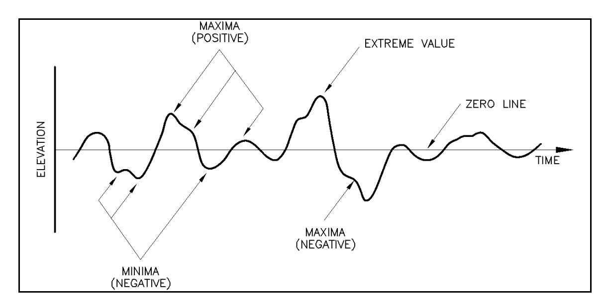

*Figure II-1-27. Definition sketch of a random wave process (Ochi 1973)*

are present. The monochromatic wave theories described in the first part of this chapter will be seen to have two major uses. One use is to estimate the kinematics and dynamics associated with a wave with the significant wave height, peak period, and direction. The other is when an individual wave has been isolated in a wave record to estimate the velocities, accelerations, forces, etc., associated with that individual wave event. The engineer must recognize that the implication of the statistical nature of irregular waves implies that the kinematics and dynamics likewise require statistical treatment. IAHR (1986) provides a detailed description of parameters and terminology used with irregular waves.
(6) Two approaches exist for treating irregular waves: spectral methods and wave-by-wave (wave train) analysis . Spectral approaches are based on the Fourier Transform of the sea surface. Indeed this is currently the most mathematically appropriate approach for analyzing a time-dependent, three-dimensional sea surface record. Unfortunately, it is exceedingly complex and at present few measurements are available that could fully tap the potential of this method. However, simplified forms of this approach have been proven to be very useful. The other approach used is wave-by-wave analysis. In this analysis method, a time-history of the sea surface at a point is used, the undulations are identified as waves, and statistics of the record are
II-1-64 Water Wave Mechanics
developed. This is a very natural introduction to irregular waves and will be presented first before the more complicated spectral approach is presented. The primary drawback to the wave-by-wave analysis is that it cannot tell anything about the direction of the waves. Indeed, what appears to be a single wave at a point may actually be the local superposition of two smaller waves from different directions that happen to be intersecting at that time. Disadvantages of the spectral approach are the fact that it is linear and can distort the representation of nonlinear waves.
- b. Wave train (wave-by-wave) analysis .
- (1) Introduction.
- (a) Wave train analysis requires direct measurements of irregular seas. A typical irregular wave record obtained from a wave-measuring device is shown in Figure II-1-25. The recorded wave traces have to be of finite length with the sea surface sampled at a set interval (typically every second). The time-history of sea surface elevation at a point is a random-appearing signal exhibiting many maxima and minima (Figures II-1- 26 and II-1-27). It is necessary to develop a criterion for identifying individual waves in the record.
- (b) In a wave-by-wave analysis, undulation in the time-history of the surface must be divided into a series of segments, which will then be considered as individual waves. The height and period of each wave will be measured. Once this is done for every segment of the record, statistical characteristics of the record can be estimated, and the statistics of the record are compiled.
- (c) Knowing the statistics of one record can be useful in itself, particularly if the record is important (such as the observation of waves at a site when a structure failed). However, it would be helpful to know whether the statistical characteristics of individual wave records followed any consistent pattern. Statistics of the sea state could be predicted knowing only a little about the wave conditions. It would be very useful if the distribution of wave characteristics in a wave record followed a known statistical distribution. After defining characteristics of individual records, the larger statistical question will be addressed.
- (d) In the time-domain analysis of irregular or random seas, wave height and period, wavelength, wave crest, and trough have to be carefully defined for the analysis to be performed. The definitions provided earlier in the regular wave section of this chapter assumed that the crest of a wave is any maximum in the wave record, while the trough can be any minimum. However, these definitions may fail when two crests occur within an intervening trough lying below the mean water line. Also, there is not a unique definition for wave period, since it can be taken as the time interval between either two neighboring wave troughs or two crests. Other more common definitions of wave period are the time interval between successive crossings of the mean water level by the water surface in a downward direction called zero down-crossing period or zero up-crossing period for the period deduced from successive up-crossings. (2) Zero-crossing method.
- (a) The adopted engineering procedure is the zero-crossing technique, where a wave is defined when the surface elevation crosses the zero-line or the mean water level (MWL) upward and continues until the next crossing point. This is the zero-upcrossing method. When a wave is defined by the downward crossing of the zero-line by the surface elevation, the method is the zero-downcrossing .
- (b) The zero-crossing wave height is the difference in water surface elevation of the highest crest and lowest trough between successive zero-crossings. The definition of wave height depends on the choice of trough occurring before or after the crest. Here, a wave will be identified as an event between two successive zero-upcrossings and wave periods and heights are defined accordingly. Note that there can be differences
between the definitions of wave parameters obtained by the zero up- and down-crossing methods for description of irregular sea states.
- (c) Both methods usually yield statistically similar mean values of wave parameters. There seems to be some preference for the zero-downcrossing method (IAHR 1986). The downcrossing method may be preferred due to the definition of wave height used in this method (the vertical distance from a wave trough to the following crest). It has been suggested that this definition of wave height may be better suited for extreme waves (IAHR 1986).
- (d) Using these definitions of wave parameters for an irregular sea state, it is seen in Figures II-1-26 and II-1-27 that, unlike the regular (monochromatic) sinusoidal waves, the periods and heights of irregular waves are not constant with time, changing from wave to wave. Wave-by-wave analysis determines wave properties by finding average statistical quantities (i.e., heights and periods) of the individual wave components present in the wave record. Wave records must be of sufficient length to contain several hundred waves for the calculated statistics to be reliable.
- (e) Wave train analysis is essentially a manual process of identifying the heights and periods of the individual wave components followed by a simple counting of zero-crossings and wave crests in the wave record. The process begins by dissecting the entire record into a series of subsets for which individual wave heights and periods are then noted for every zero down-crossing or up-crossing, depending on the method selected. In the interest of reducing manual effort, it is customary to define wave height as the vertical distance between the highest and lowest points, while wave period is defined as the horizontal distance between two successive zero-crossing points (Figures II-1-26 and II-1-27). In this analysis, all local maxima and minima not crossing the zero-line have to be discarded. From this information, several wave statistical parameters are subsequently calculated. Computer programs are available to do this (IAHR 1986). (3) Definition of wave parameters.
- (a) Determination of wave statistics involves the actual processing of wave information using the principles of statistical theory. A highly desirable goal is to produce some statistical estimates from the analyzed time-series data to describe an irregular sea state in a simple parametric form. For engineering, it is necessary to have a few simple parameters that in some sense tell us how severe the sea state is and a way to estimate or predict what the statistical characteristics of a wave record might be had it been measured and saved. Fortunately, millions of wave records have been observed and a theoretical/empirical basis has evolved to describe the behavior of the statistics of individual records.
- (b) For parameterization, there are many short-term candidate parameters which may be used to define statistics of irregular sea states. Two of the most important parameters necessary for adequately quantifying a given sea state are characteristic height H and characteristic period T . Other parameters related to the combined characteristics of H and T , may also be used in the parametric representation of irregular seas.
- (c) Characteristic wave height for an irregular sea state may be defined in several ways. These include the mean height , the root-mean-square height , and the mean height of the highest one-third of all waves known as the significant height . Among these, the most commonly used is the significant height, denoted as Hs or H1/3 . Significant wave height has been found to be very similar to the estimated visual height by an experienced observer (Kinsman 1965). The characteristic period could be the mean period , or average zero crossing period , etc.
- (d) Other statistical quantities are commonly ascribed to sea states in the related literature and practice. For example, the mean of all the measured wave heights in the entire record analyzed is called the mean wave height H 6. The largest wave height in the record is the maximum wave height Hmax . The root-mean-square of
II-1-66 Water Wave Mechanics
all the measured wave heights is the rms wave height Hrms . The average height of the largest 1/n of all waves in the record is the H1/n where n = 10, 11, 12, 13,..., 99, 100 are common values. For instance, H1/10 is the mean height of the highest one-tenth waves. In coastal projects, engineers are faced with designing for the maximum expected, the highest possible waves, or some other equivalent wave height. From one wave record measured at a point, these heights may be estimated by ordering waves from the largest to the smallest and assigning to them a number from 1 to N . The significant wave height H1/3 or Hs will be the average of the first (highest) N/3 waves.
(e) The probability that a wave height is greater (less) than or equal to a design wave height Hd may be found from

```math
P(H > H_d) = \frac{m}{N} \tag{II-1-114}
```

where m is the number of waves higher than Hd . For an individual observed wave record the probability distribution P(H > Hd) can be formulated in tabular form and possibly fitted by some well-known distribution. The root-mean-square wave height Hrms may be computed as

```math
H_{rms} = \sqrt{\frac{1}{N} \sum_{j=1}^{N} H_j^2} \tag{II-1-115}
```

in which Hj denote the ordered individual wave heights in the record.
- (f) Probability distributions discussed in the irregular wave section of the CEM refer to short term wave statistics. This subject concerns the probability that a wave of a given height will occur given that we know the statistics of the sea surface over a 16- to 60-min period. A short-term wave statistics question might be, for example, "If we have measured the waves for 15 min and found that Hs is 2m, what is the chance that a wave of 4 m may occur?" This must be contrasted to long-term wave statistics. To obtain long-term wave statistics, a 15-min record may have been recorded (and statistics of each record computed) every 3 hr for 10 years (about 29,000 records) and the statistics of the set of 29,000 significant wave heights compiled. A longterm wave statistics question might be, "If the mean significant wave height may be 2m with a standard deviation of 0.75m, what is the chance that once in 10 years the significant wave height will exceed 4 m?" These are two entirely different statistical questions and must be treated differently.
- (g) A similar approach can be used for the wave period. The mean zero-crossing period is called the zero-crossing period Tz . The average wave period between two neighboring wave crests is the wave crest period Tc . Therefore, in the time domain wave record analysis, the average wave period may also be obtained from the total length of record length Tr either using Tz or Tc (Tucker 1963). These periods are related to Tr by

```math
T_{z} = \frac{T_{r}}{N_{z}} \tag{II-1-116}
```

where Nz and Nc are the number of zero-upcrossings and crests in the wave record, respectively. We emphasize that in Tucker's method of wave train analysis, crests are defined by zero-crossing. Note also by definition of these periods that Tc # Tz .
(h) The list of definitions stated above is not all-inclusive, and several other statistical quantities may be obtained from a wave train analysis (Ochi 1973; IAHR 1986). For example, the rms surface elevation 0 rms (described later in the short-term sea states section) (F in IAHR list) defines the standard deviation of the surface elevation, and the significant wave height Hs is related to 0 rms by

```math
H_s = 3.8 \, \eta_{rms} \approx 4 \, \eta_{rms} \tag{II-1-117}
```

- (4) Significant wave height.
- (a) The significant wave height Hs (or H1/3 ) is the most important quantity used describing a sea state and thus, is discussed further here for completeness. The concept of significant wave height was first introduced by Sverdrup and Munk (1947). It may be determined directly from a wave record in a number of ways. The most frequently used approach in wave-by-wave analysis is to rank waves in a wave record and then choose the highest one-third waves. The average of the chosen waves defines the significant wave height as

```math
H _ { s } \ = \ { \frac { 1 } { \frac { N } { 3 } } } \sum _ { i = 1 } ^ { N / 3 } \ H _ { i } \tag{II-1-118}
```

where N is the number of individual wave heights Hi in a record ranked highest to lowest.
- (b) Sverdrup and Munk (1947) defined significant wave height in this fashion because they were attempting to correlate what sailors reported to what was measured. Hence, this is an empirically driven definition. Today, when wave measuring is generally automated, some other parameter might be appropriate, but significant wave height remains in recognition of its historical precedence and because it has a fairly tangible connection to what observers report when they try to reduce the complexity of the sea surface to one number. It is important to recognize that it is a statistical construct based only on the height distribution. Knowing the significant height from a record tells us nothing about period or direction. (5) Short-term random sea state parameters.
- (a) It is well-known that any periodic signal 0 (t) with a zero mean value can be separated into its frequency components using the standard Fourier analysis . Periodic wave records may generally be treated as random processes governed by laws of the probability theory. If the wave record is a random signal, the term used is random waves . For a great many purposes, ocean wave records may be considered random (Rice 1944-1945, Kinsman 1965, Phillips 1977, Price and Bishop 1974).
- (b) The statistical properties of a random signal like the wave surface profile may be obtained from a set of many simultaneous observations called an ensemble or set of signals {0 1(t), 0 2(t), 0 3(t) ,...}, but not from a single observation. A single observation even infinitely long may not be sufficient for determining the spatial variability of wave statistics. An ensemble consists of different realizations or measurements of the process 0 (t) at some known locations. To determine wave properties from the process 0 (t) , certain assumptions related to its time and spatial variation must be made.
II-1-68 Water Wave Mechanics
- (c) First, it would be necessary to assume that the process described by the wave record (i.e., a sea state), say \eta(t) , is stationary , which means that the statistical properties of \eta(t) are independent of the origin of time measurement. Since the statistics of stationary processes are time-invariant, there is no drift with time in the statistical behavior of \eta(t) . The stationarity requirement is necessary as we shall see later for developing a probability distribution for waves, which is the fraction or percentage of time an event or process (say, the sea state depicted in time series of the wave surface profile) is not exceeded. The probability distribution may be obtained by taking \eta_1(t_1) , \eta_2(t_1) , \eta_3(t_1) ,..., as variables, independent of the instant t_1 . If in addition, \eta(t) can be measured at different locations and the properties of \eta(t) are invariant or do not depend on location of measurements, the process may then be assumed homogenous . In reality, \eta(t) may be assumed stationary and homogenous only for a limited duration at the location data are gathered. Wind waves may be considered approximately stationary for only a few hours (3 hr or less), beyond which their properties are expected to change.
- (d) Second, the process \eta(t) is assumed to be ergodic, which means that any measured record of the process say \eta_I(t) is typical of all other possible realizations, and therefore, the average of a single record in an ensemble is the same as the average across the ensemble. For an ergodic process, the sample mean from the ensemble approaches the real mean \mu , and the sample variance approaches the variance \sigma of the process (sea state). The ergodicity of \eta(t) implies that the measured realization of \eta(t) , say \eta_I(t_I) is typical of all other possible realizations \eta_2(t_I) , \eta_3(t_I) , ...., all measured at one instant t_I . The concept of ergodicity permits derivation of various useful statistical information from a single record, eliminating the need for multiple recordings at different sites. The assumptions of stationarity and ergodicity are the backbones of developing wave statistics from wave measurements. It is implicitly assumed that such hypotheses exist in reality, and are valid, particularly for the sea state.
- (e) To apply these concepts to ocean waves, consider an ensemble of records representing the sea state by \eta(t) over a finite time T. The mean or expected value of the sea state, denoted by \overline{\eta} , or \mu_{\eta r} or E[\eta] , is defined as

```math
\mu_{\eta} = E[\eta(t)] = \frac{1}{\tau} \int_{-\frac{\tau}{2}}^{\frac{\tau}{2}} \eta(t) dt \tag{II-1-119}
```

where the symbol E denotes the expected value of \eta(t) . Similarly, the mean-square of \eta corresponds to the second moment of \eta , denoted by E[\eta^2] . The standard deviation \sigma_{\eta} or the root-mean-square value of the process is the square root of this. The variance of \eta , represented by \sigma_{\eta}^2 may be expressed in terms of the variance of the process V as

```math
\sigma_{\eta}^2 = V[\eta(t)] = E[\eta^2] - \mu_{\eta}^2 \tag{II-1-120}
```

- (f) The standard deviation \sigma_{\eta} is the square root of the variance, also called the second central moment of \eta(t) . The standard deviation characterizes the spread in the values of \eta(t) about its mean.
- (g) The autocorrelation or autocovariance function of the sea state is denoted by R_{\eta \tau} relating the value of \eta at time t to its value at a later time t+\tau . This is defined as

```math
R _ { \mathfrak { n } } ( t , t + \tau ) \ = \ E [ \eta ( t ) \ \eta ( t + \tau ) ] \tag{II-1-121}
```

(h) The value of R_{\eta} gives an indication of the correlation of the signal with itself for various time lags \tau , and so it is a measure of the temporal variation of \eta(t) with time. If the signal is perfectly correlated with itself for zero lag \tau , its autocorrelation coefficient, defined as

```math
\rho_{\eta} = \frac{E[\eta(t) \ \eta(t+\tau)]}{E[\eta^2]} = \frac{R_{\eta}}{E[\eta^2]} \tag{II-1-122}
```

will be equal to 1.
(i) For two different random signals 0 1 and 0 2 , the cross-correlation coefficient R may be defined as

```math
R = E[\eta_1(t) \ \eta_2(t+\delta t)] = \frac{1}{\tau} \int_{-\frac{\tau}{2}}^{\frac{\tau}{2}} \eta_1(t) \ \eta_2(t+\delta t) \ dt \tag{II-1-123}
```

which measures the degree of correlation between two signals. This concept is useful for example in relating wave velocities and pressures obtained at two separate locations during wave gauge measurements in coastal projects. Note that the process 0 (t) is stationary if :0 and F 0 are constant for all values of t , and that R is a function only of J = t2 - t1 .
- (j) Assuming that the water surface elevation 0 (t) is a stationary random process, representing a sea state over the duration of several hours, we will next focus our attention on defining the probabilistic properties of ocean waves. The probabilistic representation of sea state is useful in practice for two reasons. First, it allows the designer to choose wave parameters within a limit that will yield an acceptable level of risk. Second, a probabilistic-based design criterion may result in substantial cost savings by considering uncertainties in the wave estimates. Therefore, an overview of the probability laws and distributions for ocean waves follows. (6) Probability distributions for a sea state.
- (a) As noted earlier, irregular sea states are random signals. For engineers to effectively use irregular waves in design, properties of the individual wave records must follow some probability laws so that wave statistics can readily be obtained analytically. Rice (1944-1945) developed the statistical theory of random signals for electrical noise analysis. Longuet-Higgins (1952) applied this theory to the random water surface elevation of ocean waves to describe their statistics using certain simplified assumptions. Longuet-Higgins found that the parameters of a random wave signal follow known probability laws.
- (b) The probability distribution P(x) is the fraction of events that a particular event is not exceeded. It can be obtained directly from a plot of the proportion of values less than a particular value versus the particular value of the variable x0 , and is given by

```math
P(x) = prob\left\{x \le x_0\right\} \tag{II-1-124}
```

- (c) The probability density p(x) is the fraction of events that a particular event is expected to occur and thus, it represents the rate of change of a distribution and may be obtained by simply differentiating P(x) with respect to its argument x .
- (d) The two most commonly used probability distributions in the study of random ocean waves are the Gaussian (Figure II-1-28) and Rayleigh distributions (Figure II-1-29). The Gaussian distribution is particularly suited for describing the short-term probabilities of the sea surface elevation 0. Its probability density is given by
II-1-70 Water Wave Mechanics

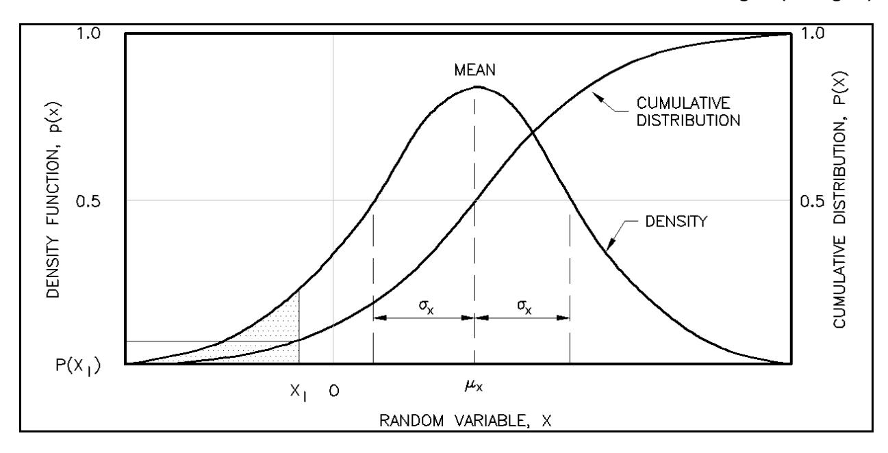

*Figure II-1-28. The Gaussian probability density and cumulative probability distribution*

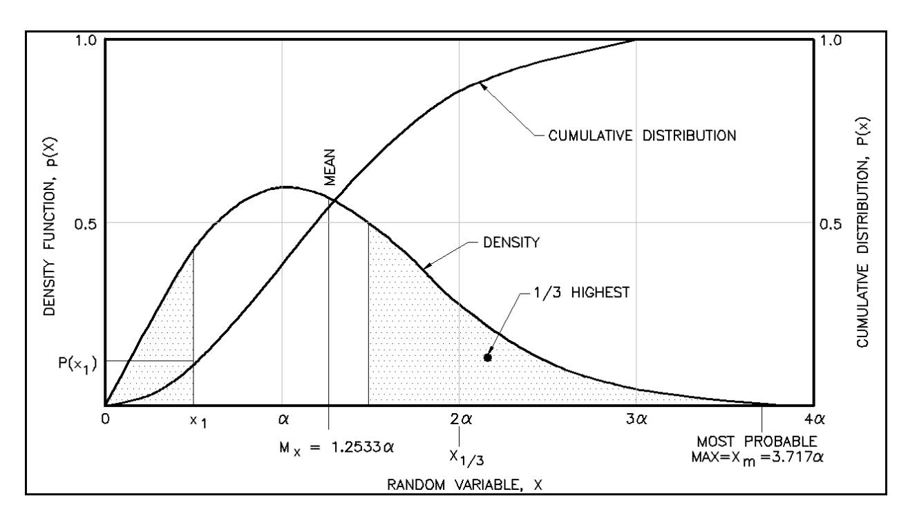

*Figure II-1-29. The Rayleigh probability density and cumulative probability distribution (x = " corresponds to the mode)*

```math
p(x) = \frac{1}{\sigma_x \sqrt{2\pi}} e^{-\left(\frac{(x - \mu_x)^2}{2\sigma_x^2}\right)} \tag{II-1-125}
```

where : x is the mean of x and F x is the standard deviation. The Gaussian cumulative probability or probability distribution denoted by P(x) in Figure II-1-28, is the integral of p(x). A closed form of this integral is not possible. Therefore, Gaussian distribution is often tabulated as the normal distribution with the mean : x and standard deviation F x in handbooks (e.g., Abramowitz and Stegun (1965)), and is written as

```math
p ( x ) \ = \ N ( \mu _ { x } , \sigma _ { x } ) \qquad P ( x ) \ = \ \Phi \left[ \frac { x \ - \ \mu _ { x } } { \sigma _ { x } } \right] \tag{II-1-126}
```

For zero mean (: x = 0) and unit standard deviation ( F x = 1), the Gaussian probability density and distributions reduce to

```math
p(x) = \frac{1}{\sqrt{2\pi}} e^{\left(-\frac{x^2}{2}\right)} \tag{II-1-127}
```

where the last integral is the error function .
(e) The probability of exceedence Q(x) may be expressed in terms of the probability of non-exceedence P(x) as

```math
Q[x(t)>x_1] = 1 - P[x(t)< x_1] = 1 - \Phi\left[\frac{x - \mu_{x_1}}{\sigma_x}\right] \tag{II-1-128}
```

- (f) This is the probability that x will exceed x1 over the time period t , and is shown as the shaded area in the bottom lower end of Figure II-1-28. The probability of exceedence is an important design parameter in risk-based design.
- (g) In engineering practice, we are normally concerned with wave height rather than surface elevation. However, to define wave height distribution, we only need to examine the statistics of the slowly varying envelope of the surface elevation 0 (t) . With this approach, Longuet-Higgins (1952) found from statistical theory that both wave amplitudes and heights follow the Rayleigh distribution shown in Figure II-1-29. Note that this distribution can never be negative, it decays asymptotically to zero for large x , but never reaches zero. The probability density function of the Rayleigh distribution and its cumulative probability are given by
II-1-72 Water Wave Mechanics

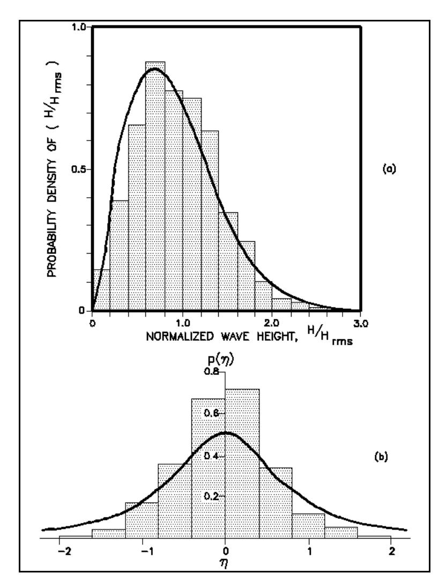

*Figure II-1-30. Histograms of the normalized (a) wave heights, and (b) wave periods with theoretical distributions (Chakrabarti 1987)*

```math
p(x) = 
\begin{cases} 
\frac{\pi x}{2 \mu_x^2} e^{-\frac{\pi}{4}\left(\frac{x}{\mu_x}\right)^2} & \text{for } x \geq 0 \\
1 - e^{-\frac{\pi}{4}\left(\frac{x}{\mu_x}\right)^2} & \text{for } x \geq 0 
\end{cases} \tag{II-1-129}
```

where : x is the mean. These are displayed in Figure II-1-29 in which the density function is offset to the right and has only positive values. The distributions used for wave heights, wave periods, and their joint relations are described next.
- (7) Wave height distribution.
- (a) The heights of individual waves may be regarded as a stochastic variable represented by a probability distribution function. From an observed wave record, such a function can be obtained from a histogram of wave heights normalized with the mean heights in several wave records measured at a point (Figure II-1-30). Thompson (1977) indicated how well coastal wave records follow the Rayleigh distribution. If wave energy is concentrated in a very narrow range of wave period, the maxima of the wave profile will coincide with the wave crests and the minima with the troughs. This is termed a narrow-band condition . Under the narrow-band condition, wave heights are represented by the following Rayleigh distribution (Longuet-Higgins 1952, 1975b, 1983)

```math
p(H) = \frac{2H}{H_{rms}^2} \exp\left[-\frac{H^2}{H_{rms}^2}\right] \tag{II-1-130}
```

```math
P ( H ) \ = \ 1 \ - \ \exp \left[ - \ \frac { H ^ { 2 } } { H _ { r m s } ^ { 2 } } \right]
```

(b) The significant wave height H1/3 is the centroid of the area for H $ H* under the density function where H > H* corresponds to waves in the highest one-third range as shown in Figure II-1-29, that is

```math
P(H_*) = 1 - \frac{1}{3} = 1 - e^{\left(-\frac{H_*^2}{H_{rms}^2}\right)} \tag{II-1-131}
```

from which we find H* = 1.05Hrms . Various estimates of wave heights may then be obtained upon integration of the above equation using certain mathematical properties of the Error function (Abramowitz and Stegun 1965). We find

```math
H_{1/3} \approx 4.00 \sqrt{m_0} = 1.416 H_{rms}, \quad H_{1/10} = 1.27 H_{1/3} = 1.80 H_{rms} = 5.091 \sqrt{m_0}, \quad H_{1/100} = 1.67 H_{1/3} = 2.36 H_{rms} = 6.672 \sqrt{m_0}, \quad H_{\max} = 1.86 H_{1/3} \text{ (for } 1000 \text{ wave cycles in the record)} \tag{II-1-132}
```

(c) The most probable maximum wave height in a record containing N waves is related to the rms wave height (Longuet-Higgins 1952) by

```math
H_{\max} = \left[ \sqrt{\log N} + \frac{0.2886}{\sqrt{\log N}} - \frac{0.247}{(\log N)^{3/2}} \right] H_{rms} \tag{II-1-133}
```

(d) The value of Hmax obtained in this manner can be projected to a longer period of time by adjusting the value of N based on the mean zero-upcrossing period (Tucker 1963).
II-1-74 Water Wave Mechanics
- (e) The fact that the statistics of wave height for wave records in general follows a Rayleigh distribution is of great significance in coastal engineering. For instance, an engineer may have information from a hindcast (see Part II-2) that the significant height for a storm is 10 m. Assuming that the Rayleigh distribution describes the wave record, the engineer can estimate that the 10-percent wave will be 12.7 m and that the Hmax (assuming 1,000 waves in the record) will be 18.6 m. Often measured ocean wave records are analyzed spectrally (see "Spectral Analysis" section later in this chapter) by the instrument package and only condensed information is reported via satellite to a data bank, with no other information retained. The inherent assumption made is that the Rayleigh distribution is adequate.
- (f) Theoretical relationships derived from the Rayleigh distribution generally agree well with the values determined directly from the records. The Rayleigh probability distribution density function is compared with a histogram of the measured deepwater wave heights in Figure II-1-30 (Chakrabarti 1987). Clearly the Rayleigh distribution fits this data well, even though the frequency spectra of ocean waves may not always be narrow-banded as assumed in the Rayleigh distribution. Field measurements sometimes deviate from the Rayleigh distribution, and the deviation appears to increase with increasing wave heights, and decrease as the wave spectrum becomes sharply peaked. The effect of bandwidth on wave height distribution has been accounted for theoretically (Tayfun 1983).
- (g) Deepwater wave height measurements from different oceans have been found to closely obey a Rayleigh distribution (Tayfun 1983a,b; Forristall 1984; Myrhaug and Kjeldsen 1986). This is not true for shallow-water waves, which are strongly modulated by the bathymetric effects combined with the amplitude nonlinearities. The wave energy spectrum of the shallow-water waves is not narrow-banded and may substantially deviate from the Rayleigh distribution especially for high frequencies. In general, the Rayleigh distribution tends to overpredict the larger wave heights in all depths.
- (h) In summary, the Rayleigh distribution is generally adequate, except for near-coastal wave records in which it may overestimate the number of large waves. Investigations of shallow-water wave records from numerous studies indicate that the distribution deviates from the Rayleigh, and other distributions have been shown to fit individual observations better (SPM 1984). The primary cause for the deviation is that the large waves suggested in the Rayleigh distribution break in shallow water. Unfortunately, there is no universally accepted distribution for waves in shallow water. As a result, the Rayleigh is frequently used with the knowledge that the large waves are not likely. (8) Wave period distribution.
- (a) Longuet-Higgins (1962) and Bretschneider (1969) derived the wave period distribution function assuming the wave period squared follows a Rayleigh distribution. This distribution is very similar to the normal distribution with a mean period given by

```math
T _ { 0 , 1 } \ = \ \frac { m _ { 0 } } { m _ { 1 } } \tag{II-1-134}
```

where the moments are defined in terms of cyclic frequency (i.e., Hertz). The probability density of wave period T is given by (Bretschneider 1969)

```math
p(T) = 2.7 \frac{T^3}{\bar{T}} \exp \left[-0.675\tau^4\right] \tag{II-1-135}
```

```math
\bar { \tau } \, = \, \frac { T } { \bar { \bar { T } } }
```

(b) A different probability density distribution of the wave period has been derived by Longuet-Higgins (1962). This is given by

```math
p ( \tau ) \ = \ \frac { 1 } { 2 ( 1 \ + \ \tau ^ { 2 } ) ^ { 3 / 2 } }
```

```math
\tau \ = \ \frac { T \ - \ T _ { 0 , 1 } } { \upsilon T _ { 0 , 1 } } \quad \ ; \quad \nu \ = \ \frac { m _ { 0 } m _ { 2 } \ - \ m _ { 1 } ^ { 2 } } { m _ { 1 } ^ { 2 } } \tag{II-1-136}
```

where < is the spectral width parameter and m0 , m1 , and m2 are moments of the wave spectrum, which will be defined later. This probability density function is symmetric about J = 0 where it is maximum, and is similar to the normal distribution with a mean equal to T0,1 . This distribution fits field measurements reasonably well, and is often used in offshore design. In general, probability density for the wave period is narrower than that of wave height, and the spread lies mainly in the range 0.5 to 2.0 times the mean wave period.
(c) Various characteristic wave periods are related. This relationship may be stated in a general way as

```math
T_{\text{max}} \approx T_{1/3} \approx C\overline{T} \tag{II-1-137}
```

where the coefficient C varies between 1.1 and 1.3.
- (9) Joint distribution of wave heights and periods.
- (a) If there were no relation between wave height and wave period, then the joint distribution between wave height and wave period can simply be obtained from the individual probability distributions of the height and period by

```math
p ( H , T ) \ = \ p ( H ) \ p ( T ) \tag{II-1-138}
```

- (b) The distribution p(H,T) so obtained is inappropriate for ocean waves, since their heights and periods are correlated. For the joint distribution of wave height-period pairs, Longuet-Higgins (1975b) considered wave heights and periods also representable by a narrow-band spectrum. He derived the joint distribution assuming wave heights and periods are correlated, a more suitable assumption for real sea states.
- (c) The probability density function of wave period may be obtained directly from the joint distribution, provided that a measure of the spectrum width is included in the latter. Under this condition, the distribution of wave period is simply the marginal probability density function of the joint distribution of H and T . This is done by integrating p(H,T) for the full range of H from 0 to 4. Likewise, the distribution for wave heights may be obtained by integrating p(H,T) for the full range of periods. The joint distribution derived by Longuet-Higgins (1975b) was later modified (Longuet-Higgins 1983), and is given by
II-1-76 Water Wave Mechanics

```math
p(H,T) = \frac{\pi f(v)}{4} \left(\frac{H_*}{T_*}\right)^2 \exp\left\{-\frac{\pi H^2}{4} \left[1 + \frac{1 - \sqrt{1 + v^2}}{v^2}\right]\right\} \tag{II-1-139}
```

with < as the spectral width parameter. The period T 6 z is the mean zero-upcrossing period and its relation to the mean wave period 6 T and mean crest period 6 Tc defined in terms of moments of spectrum is as follows:

```math
\overline { { { T } } } _ { z } \ = \ 2 \pi \ \sqrt { \frac { m _ { 0 } } { m _ { 2 } } } ;
```

```math
\overline { { { T } } } \, = \, 2 \pi \, \frac { m _ { 0 } } { m _ { 1 } } \, ; \, \overline { { { T } } } _ { c } \, = \, 2 \pi \, \sqrt { \frac { m _ { 2 } } { m _ { 4 } } }
```

(d) The most probable maximum period associated with any given H* is

```math
T_*^{\max} = \frac{2\sqrt{1+v^2}}{1+\sqrt{1+\frac{16v^2}{\pi H_*^2}}} \tag{II-1-141}
```

- (e) Chakrabarti and Cooley (1977) investigated the applicability of the joint distribution and determined that it fits field data provided the spectrum is narrow-banded and has a single peak. A different theoretical model has been suggested by Cavanie et al. (1978), and it also compares well with the field data. c. Spectral analysis . (1) Introduction.
- (a) In the period 1950-1960, Rice's (1944-1945) work on signal processing was extended to ocean waves (Kinsman 1965; Phillips 1977). In pinciple, the time-history of surface elevation (such as in Figures II-1-31 and II-1-32) was recognized to be similar to a noise record. By assuming that it is a discrete sample of a continuous process, the principles of Fourier analysis could be extended to describe the record. The power of Fourier representation is such that given a series of time snapshots of measurements of a three-dimensional surface, a full mathematical representation of the surface and its history may be obtained. Unfortunately, this is a lot of information. As an example, the image in Figure II-1-22 of the entrance to San Francisco Bay is one snapshot of the surface current field and represents nearly 1 million sample points. To understand the time variation of the field it would be reasonable to do this every 2 sec or so for an hour. The result is about 1.8 billion sample points that would need to be Fourier transformed. Although, this is computationally feasible such a measurement cannot be made on a routine basis and it is not clear how the information could be condensed into a form for practical engineering. However, the utility of the spectral analysis approach is that it uses a reduced dimensional approach that is powerful and useful. This section will discuss the
underlying approach to using spectral representations in engineering, discuss the basic approach for the simplified spectral approaches, and describe how the spectral information can be used. However, the underlying statistical theory and assumptions will only be touched upon and details of the derivations will only be referenced.
- (b) The easiest place to begin is with a nonrigorous discussion of what a spectral analysis of a singlepoint measurement of the surface can produce and then generalize it to the case of a sea surface. The following sections would then describe of the procedure.
- (c) Considering a single-point time-history of surface elevation such as in Figures II-1-25, II-1-31, and II-1-32, spectral analysis proceeds from viewing the record as the variation of the surface from the mean and recognizes that this variation consists of several periodicities. In contrast to the wave-by-wave approach, which seeks to define individual waves, the spectral analysis seeks to describe the distribution of the variance with respect to the frequency of the signal. By convention, the distribution of the variance with frequency is written as E(f) or S(f) with the underlying assumption that the function is continuous in frequency space. The reason for this assumption is that all observations are discretely sampled in time, and thus, the analysis should produce estimates as discrete frequencies which are then statistically smoothed to estimate a continuum. Although E(f) is actually a measurement of variance, it is often called the one-dimensional or frequency energy spectrum because (assuming linear wave theory) the energy of the wave field may be estimated by multiplying E(f) by D g .
- (d) Figures II-1-31 (a regular wave) and II-1-32 (an irregular wave) provide two wave records and their spectrum. One immediate value of the spectral approach is that it tells the engineer what frequencies have significant energy content and thus acts somewhat analogous to the height-period diagram. The primary disadvantage of spectral analysis is that information on individual waves is lost. If a specific record is analyzed, it is possible to retain information about the phases of the record (derived by the analysis), which allows reconstruction of waves. But this is not routinely done.
- (e) The surface can be envisioned not as individual waves but as a three-dimensional surface, which represents a displacement from the mean and the variance to be periodic in time and space. The simplest spectral representation is to consider E(f, 2 ) , which represents how the variance is distributed in frequency f and direction 2 (Figure II-1-33). E(f, 2 ) is called the 2-D or directional energy spectrum because it can be multiplied by D g to obtain wave energy. The advantage of this representation is that it tells the engineer about the direction in which the wave energy is moving. A directional spectrum is displayed in Figure II-1-34 with its frequency and direction spectrums.
- (f) The power of spectral analysis of waves comes from three major factors. First, the approach is easily implemented on a microchip and packaged with the gauging instrument. Second, the principal successful theories for describing wave generation by the wind and for modelling the evolution of naturalsea states in coastal regions are based on spectral theory. Third, it is currently the only widely used approach for measuring wave direction. A final factor is that Fourier or spectral analysis of wave-like phenomena has an enormous technical literature and statistical basis that can be readily drawn upon.
II-1-78 Water Wave Mechanics

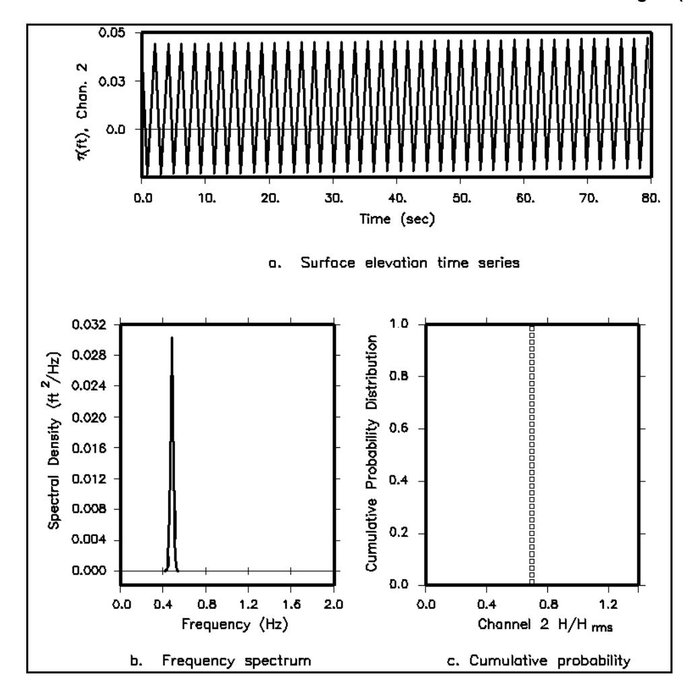

*Figure II-1-31. Surface elevation time series of a regular wave and its spectrum (Briggs et al. 1993)*

- (g) Before proceeding to the details of how a wave spectrum is derived from a record, it is important to touch upon some statistical assumptions that are important in analyzing a wave record spectrally. Many of these assumptions also hold for making a wave-by-wave analysis useful as well. First of all, wave records are finite in length (typically 17-68 min long) and are made up of samples of surface elevation at a discrete sampling interval (typically 0.5-2.0 sec). For the wave records to be of general use, the general characteristics of the record should not be expected to change much if the record was a little shorter or longer, if the sampling was started some fraction of time earlier or later, or if the records were collected a short distance away. In addition, it is desirable that there not be any underlying trend in the data.
- (h) If the above assumptions are not reasonably valid, it implies that the underlying process is unstable and may not be characterized by a simple statistical approach. Fortunately, most of the time in ocean and coastal areas, the underlying processes are not changing too fast and these assumptions reasonably hold. In principal the statistical goal is to assume that there is some underlying statistical process for which we have obtained an observation. The observation is processed in such a way that the statistics of the underlying process are obtained.

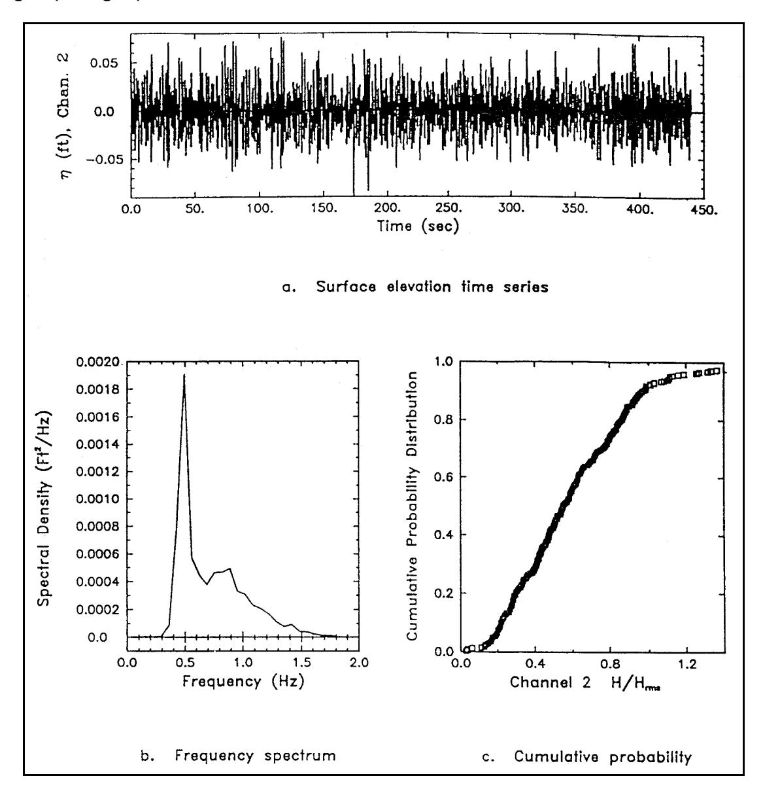

*Figure II-1-32. Surface elevation time series of an irregular wave and its spectrum (Briggs et al. 1993)*

- (2) Description of wave spectral analysis.
- (a) Unlike the wave train or wave-by-wave analysis, the spectral analysis method determines the distribution of wave energy and average statistics for each wave frequency by converting time series of the wave record into a wave spectrum. This is essentially a transformation from time-domain to the frequencydomain, and is accomplished most conveniently using a mathematical tool known as the Fast Fourier Transform (FFT) technique (Cooley and Tukey 1965). Here we will treat analysis of the time recording ofthe surface at a point, in order to obtain a frequency spectrum of the record. In a later section, we will describe how to obtain a frequency-directional spectrum.
- (b) The wave energy spectral density E(f) or simply the wave spectrum may be obtained directly from a continuous time series of the surface 0 (t) with the aid of the Fourier analysis. Using a Fourier analysis, the
II-1-80 Water Wave Mechanics

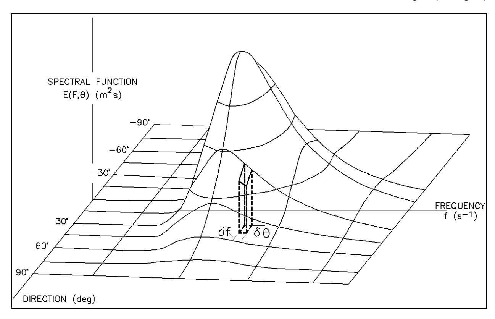

*Figure II-1-33. A schematic for a two-dimensional wave spectrum E(f, 2 )*

wave profile time trace can be written as an infinite sum of sinusoids of amplitude An , frequency T n , and relative phase , n , that is

```math
\eta(t) = \sum_{n=0}^{\infty} A_n \cos(\omega_n t - \epsilon_n) \tag{II-1-142}
```

- (c) The coefficients an and bn in the above equation may be determined explicitly from the orthogonality properties of circular functions. Note that a0 is the mean of the record. Because real observations are of finite length, the finite Fourier transform is used and the number of terms in the sum n is a finite value.
- (d) The covariance of 0 (t) is related to the wave energy spectrum. This is defined in terms of the squares of component amplitudes as

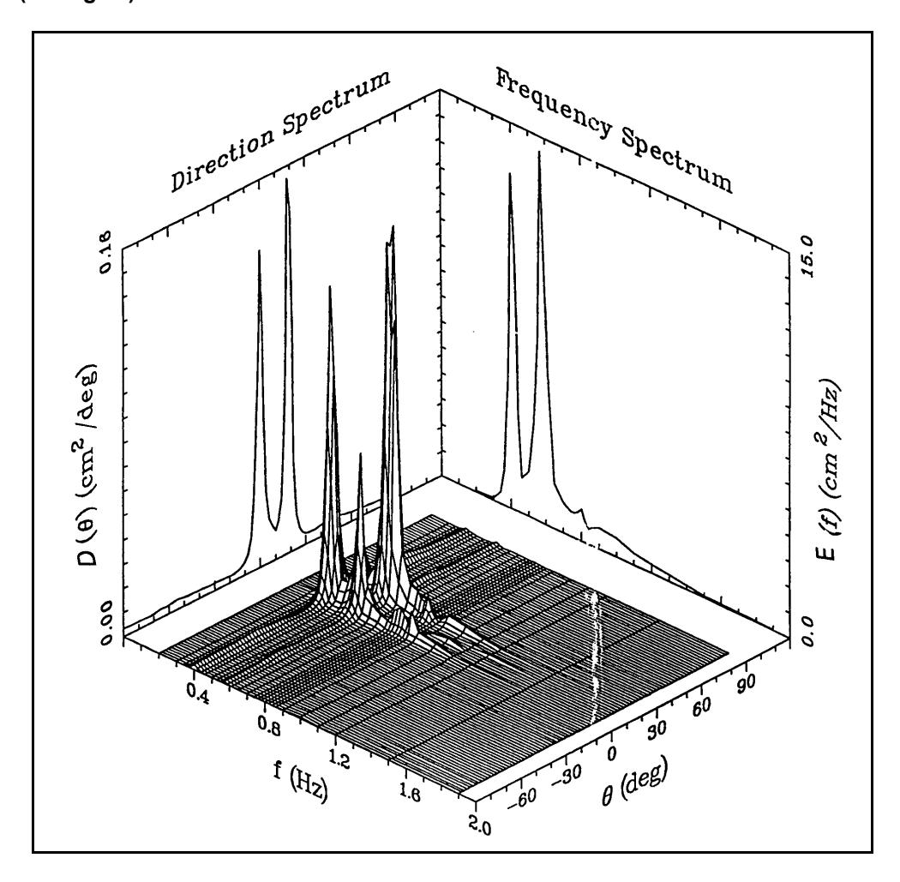

*Figure II-1-34. A directional spectrum and its frequency and direction spectrum (Briggs et al 1993)*

```math
\overline{\eta}^{2}(t) = \sum_{0}^{\infty} A_{n}^{2} \Delta f
```

```math
\mathcal{A } _ { n } ^ { 2 } \ = \ \frac { 1 } { 2 } \sqrt { a _ { n } ^ { 2 } + b _ { n } ^ { 2 } } \tag{II-1-143}
```

```math
\epsilon _ { n } = \tan ^ { - 1 } { \frac { b _ { n } } { a _ { n } } }
```

(e) By induction, an estimate of the continued energy spectrum of 0 (t) may be obtained by

```math
E ( f ) \ = \ \frac { 1 } { T _ { r } } \left[ \sum _ { n = 0 } ^ { N } \bar { \eta } ( n \Delta t ) \ e ^ { 2 \pi i f ( n \Delta t ) } \ \Delta t \right] ^ { 2 } \tag{II-1-144}
```

where Tr is the record length and ) t is the sampling interval .
II-1-82 Water Wave Mechanics
- (f) There are numerous intricacies involved in the application of these discrete formulas, ranging from the length of time series necessary to digitizing frequency and many others. For unfamiliar users, most computer library systems now have FFT (Finite Fourier Transform) algorithms available to perform the above computations. Part VII-3 of the CEM provides a discussion of the methods. Some general guidelines are provided next.
- (g) In actual practice, the total data length is divided into M smaller segments with equal number of data points N . By letting N be a power of 2 for computational efficiency, the result then is averaged over the M sections. In an FFT, the variables M , N , and ) t have to be independently selected, though Tr and ) t are fixed for a given record so that the total number of data points can be obtained from these values. Therefore, the only choice that has to be made is the number of sections M . Traditionally, the most common values of N used range from 512 to 2,048 , while the value of M is usually 8 or greater. Since Tr is dependent on N , M , and ) t as Tr = M N ) t , then higher N and M values in general yield better resolution and high confidence in the estimate of spectra. The larger the N , the more spiky or irregular the spectrum, and the smaller the N , the smoother the spectrum (Cooley and Tukey 1965; Chakrabarti 1987).
- (h) To better understand the wave spectrum by the FFT method, consider first the wave surface profile of a single-amplitude and frequency wave given by a sinusoidal function as

```math
\boldsymbol { \mathfrak { n } } ( t ) \ = \ a \ \sin \ \omega t \tag{II-1-145}
```

where a and T are the amplitude and frequency of the sine wave. The variance of this wave over the wave period of 2 B is

```math
\sigma^2 = \frac{1}{2\pi} \int_0^{2\pi} a^2 \sin^2 2\pi ft \, d(2\pi ft) = \frac{a^2}{2} = 2 \int_0^\infty E^1(f) \, df = \int_{-\infty}^\infty E^2(f) \, df \tag{II-1-146}
```

- (i) Thus the quantity a2 /2 represents the contribution to the variance F 2 associated with the component frequency T = 2 B f (Figure II-1-35). The connection between the variance, wave energy, and the wave energy spectrum is now more obvious since these all are proportional to the wave amplitude (or height) squared. For consistency of units, an equality between these quantities requires that the wave spectrum not include the D g term.
- (j) The difference between a two-sided spectrum E2 and a one-sided spectrum E1 as illustrated in Figure II-1-36 is quite important. Note that the two-sided spectrum is symmetric about the origin, covering both negative and positive frequencies to account for all wave energy from -4 to +4. But, it is customary in ocean engineering to present the spectrum as a one-sided spectrum. This requires that the spectral density ordinates of E2 be doubled in value if only the positive frequencies are considered. This is the reason for introducing a factor of two in Equation II-1-146. This definition will be used subsequently throughout Part II-1; thus, it is henceforth understood that E(f) refers to E1 (Figures II-1-35 and II-1-36).
- (k) By an intuitive extension of this simple wave, the variance of a random signal with zero mean may be considered to be made up of contributions with all possible frequencies. For a random signal using the above equations, we find

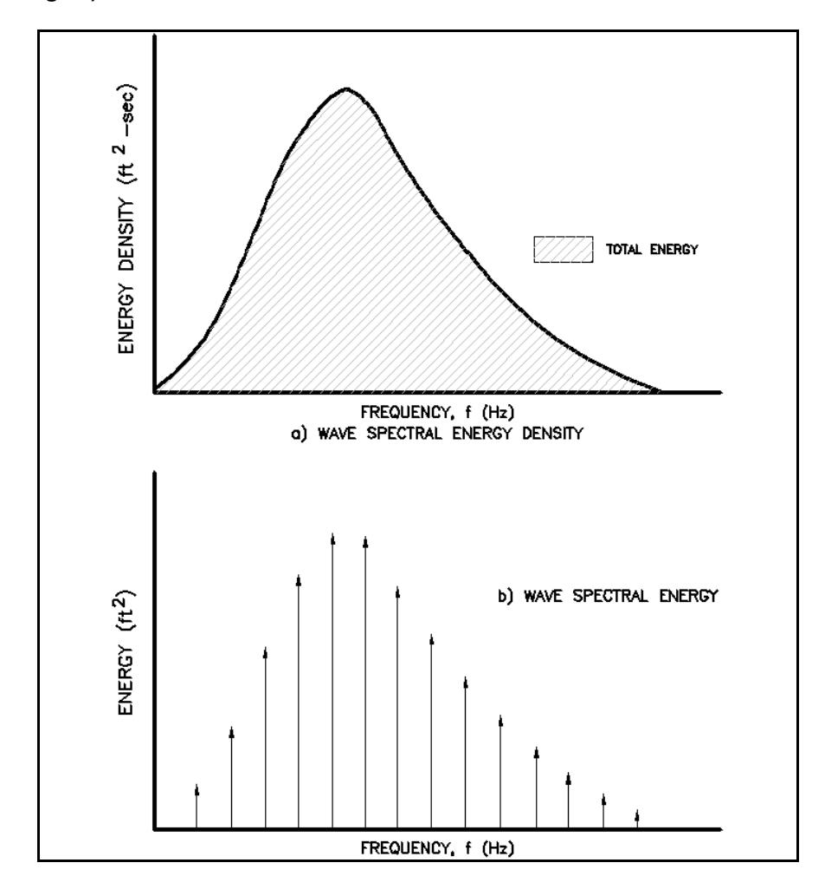

*Figure II-1-35. Sketches of wave spectral energy and energy density (Chakrabarti 1987)*

```math
\sigma_{\eta}^2 = \sum_{n=1}^{\infty} \frac{a_n^2}{2} = \int_0^{\infty} E(f) df = m_0 \tag{II-1-147}
```

where m0 is the zero-th moment of the spectrum. Physically, m0 represents the area under the curve of E(f) . The area under the spectral density represents the variance of a random signal whether the one-sided or twosided spectrum is used.
(l) The moments of a spectrum can be obtained by

```math
m_i = \int_0^\infty f^i E(t) df \tag{II-1-148}
```

(m) We now use the above definition of the variance of a random signal to provide a third definition of the significant wave height. As stated earlier, this gives an estimate of the significant wave height by the wave spectrum. For Rayleigh distributed wave heights, Hs may be approximated (Longuet-Higgins 1952) by
II-1-84 Water Wave Mechanics

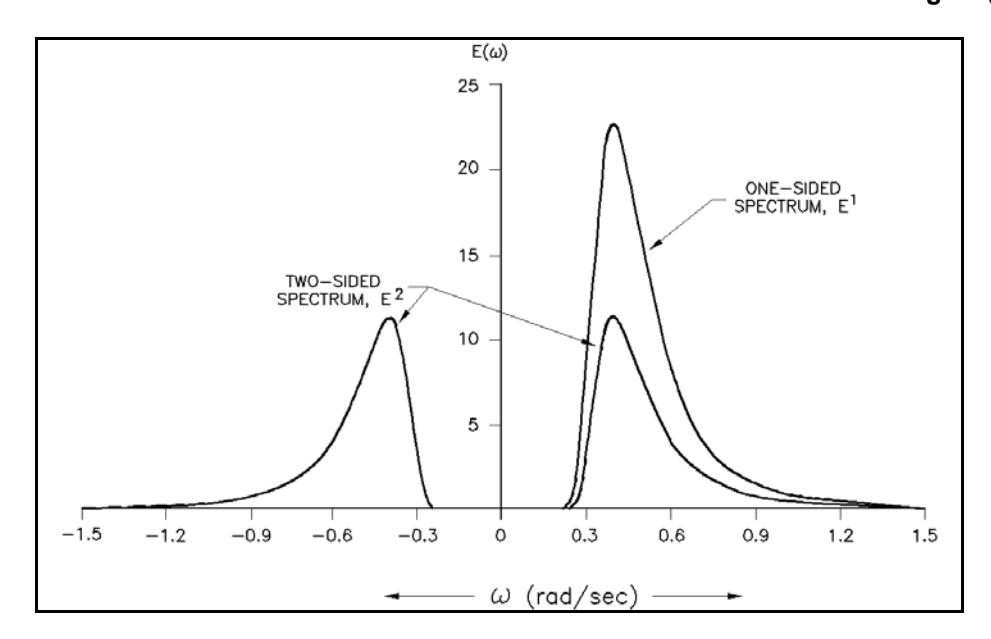

*Figure II-1-36. Definition of one- and two-side wave spectrum (Chakrabarti 1987)*

```math
H _ { s } = 3 . 8 \ \sqrt { m _ { 0 } } \approx 4 \ \sqrt { m _ { 0 } } \tag{II-1-149}
```

- (n) Therefore, the zero-th moment m0 , which is the total area under the wave energy density spectrum, defines the significant wave height for a given E(f) (Figure II-1-37).
- (3) Examples of frequency spectra. The frequency spectrum is normally plotted as energy density on the ordinate versus frequency on the abscissa (Figures II-1-31 through II-1-37). In principal, the form of E(f) can be quite variable. However, some generalizations are possible. First of all, during strong wind events, the spectrum tends to have a strong central peak and a fairly predictable shape. For swell that has propagated a long distance from the source of generation, waves tend to have a single sharp peak. Waves in shallow water near breaking tend to have a sharp peak at the peak frequency fp and have a series of smaller peaks at frequencies 2 fp, 3 fp , etc., which are harmonics of the main wave. The presence of harmonics indicates that the wave has the sharp crest and flat trough of highly nonsinusoidal waves often found near breaking. To complicate matters, Thompson (1977) has shown that about two-thirds of U.S. coastal wave records have more than one peak, indicating the presence of multiple wave trains. These wave trains most likely originated from different areas and have different directions of propagation. Moreover, it is possible to have a singlepeak spectrum, which consists of two trains of waves of about the same frequency but different directions of propagation. In order to sort these issues out, observations of the directional spectrum are required. Figures II-1-31, II-1-32, and II-1-35 include examples of different frequency spectra providing some indication of their range of variability. (4) Wave spectrum and its parameters.
- (a) Two parameters are frequently used in the probability distribution for waves. These are the s pectral width < and the spectral bandwidth ,, and are used to determine the narrowness of a wave spectra. These parameters range from 0 to 1, and may be approximated in terms of spectral moments by

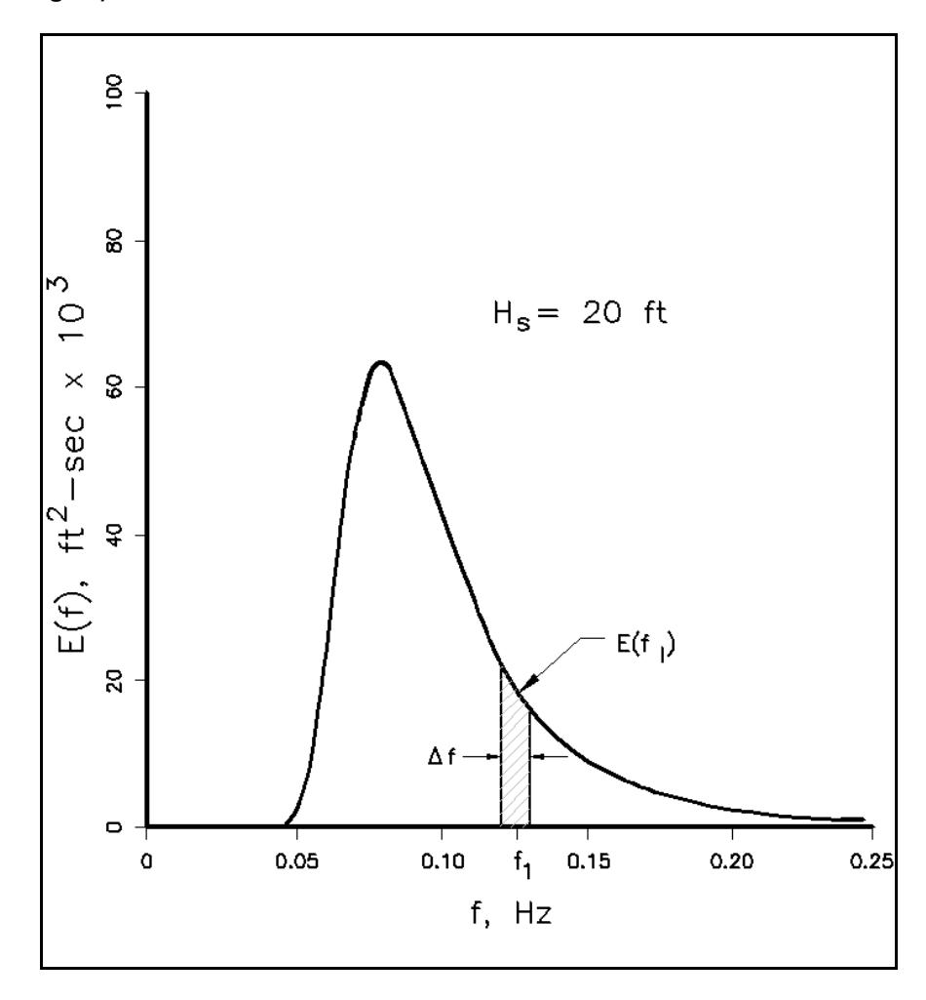

*Figure II-1-37. Energy density and frequency relationship (Chakrabarti 1987)*

```math
v = \sqrt{\frac{m_0 m_2}{m_1^2} - 1}
```

```math
\epsilon \ = \ \sqrt { 1 \ - \ \frac { m _ { 2 } ^ { 2 } } { m _ { 0 } m _ { 4 } } }
```

- (b) For a narrow-band spectrum, both < and , must be close to 0 (Figure II-1-38). For example, for the two most common empirical spectra, the Pierson-Moskowitz (PM) spectrum (Pierson and Moskowitz 1964) and the JONSWAP spectrum (Hasselmann et al. 1973), which are discussed in the next section, < = 0.425 and 0.389, respectively, with , = 1 for both. Natural ocean waves, therefore, have a broad-banded spectrum.
- (c) The values of , obtained from a wave energy spectrum are generally not considered as the sole indication of how broad the spectra are. This is due to the amplification of the noise present in the wave energy spectral density at higher frequencies that enters into the calculation of the higher moments m2 and m4 in the above equation for ,. Goda (1974) proposed a spectral peakedness parameter called Qp defined as
II-1-86 Water Wave Mechanics

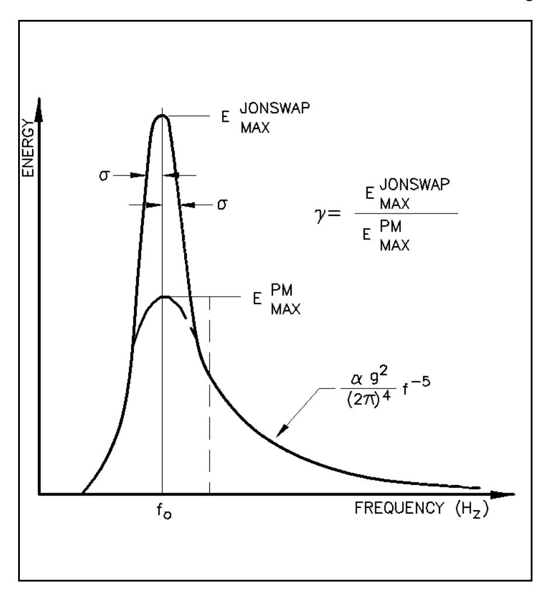

*Figure II-1-38. Comparison of the PM and JONSWAP spectra (Chakrabarti 1987)*

```math
Q_p = \frac{2}{m_0^2} \int_0^\infty f E^2(f) df \tag{II-1-151}
```

which depends only on the first moment of the energy density spectrum, and is not directly related to ,. In general, a small , implies that Qp is large, and a large , means Qp is small.
(d) Approximate relations for most common wave parameters by the statistical analysis are

```math
H _ { S } = 4 . 0 \ \sqrt { m _ { 0 } } \qquad ; \qquad H _ { 1 / 1 0 } = 5 . 1 \ \sqrt { m _ { 0 } }
```

```math
T _ { z } \ = \ \sqrt { \frac { m _ { 0 } } { m _ { 2 } } } \qquad ; \qquad T _ { c } \ = \ \sqrt { \frac { m _ { 2 } } { m _ { 4 } } } \tag{II-1-152}
```

```math
\overline { { { \mathfrak { n } } } } \, = \, \sqrt { m _ { 0 } } \qquad ; \qquad \in \, = \, \sqrt { 1 \, - \, \frac { m _ { 2 } ^ { 2 } } { m _ { 0 } m _ { 4 } } }
```

- (e) In deep and intermediate water depths, the significant wave height obtained by the spectral analysis using the above equation is usually greater than that from the wave train analysis. The zero-crossing period from the spectral method is only an approximation, while the period associated with the largest wave energy known as the peak period Tp , can only be obtained via the spectral analysis. In the spectral representation of swell waves, there is a single value of the peak period and wave energy decays at frequencies to either side. The spectra for storm waves is sometimes multi-peaked. One peak (not always the highest) corresponds to the swell occurring at lower frequencies. One and sometimes more peaks are associated with storm waves occurring at comparatively higher frequencies. In a double-peaked spectra for storm waves, the zero-crossing period generally occurs at higher frequencies than the peak period. In a multi-peaked spectrum, the zerocrossing period is not a measure of the frequency where peak energy occurs. (5) Relationships among H1/3, Hs, and Hm0 in shallow water.
- (a) By conception, significant height is the average height of the third-highest waves in a record of time period. By tradition, wave height is defined as the distance from crest to trough. Significant wave height Hs can be estimated from a wave-by-wave analysis in which case it is denoted H1/3, but more often is estimated from the variance of the record or the integral of the variance in the spectrum in which case it is denoted Hm0. Therefore, Hs in Equation II-1-152 should be replaced with Hm0 when the latter definition of Hs is implied. While H1/3 is a direct measure of Hs, Hm0 is only an estimate of the significant wave height which under many circumstances is accurate. In general in deep water H1/3 and Hm0 are very close in value and are both considered good estimates of Hs. All modern wave forecast models predict Hm0 and the standard output of most wave gauge records is Hm0. Few routine field gauging programs actually compute and report H1/3 and report as Hs with no indication of how it was derived. Where H1/3 and Hs are equivalent, this is of little concern.
- (b) Thompson and Vincent (1985) investigated how H1/3 and Hm0 vary in very shallow water near breaking. They found that the ratio H1/3/Hm0 varied systematically across the surf zone, approaching a maximum near breaking. Thompson and Vincent displayed the results in terms of a nomogram (Figure II-1- 40). For steep waves, H1/3/Hm0 increased from 1 to about 1.1, then decreased to less than 1 after breaking. For low steepness waves, the ratio increased from 1 before breaking to as much as 1.3-1.4 at breaking, then decreased afterwards. Thompson and Vincent explained this systematic variation in the following way. As low steepness waves shoal prior to breaking, the wave shape systematically changes from being near sinusoidal to a wave shape that has a very flat trough with a very pronounced crest. Although the shape of the wave is significantly different from the sine wave in shallow water, the variance of the surface elevation is about the same, it is just arranged over the wave length differently from a sine wave. After breaking, the wave is more like a bore, and as a result the H1/3 can be smaller (by about 10 percent) than Hm0.
- (c) The critical importance of this research is in interpreting wave data near the surf zone. It is of fundamental importance for the engineer to understand what estimate of significant height he is using and what estimate is needed. As an example, if the data from a gauge is actually Hm0 and the waves are near breaking, the proper estimate of Hs is given by H1/3. Given the steepness and relative depth, H1/3 may be estimated from Hm0 by Figure II-1-40. Numerically modelled waves near the surf zone are frequently equivalent to Hm0. In this case, Hs will be closer to H1/3 and the nomogram should be used to estimate Hs. (6) Parametric spectrum models.
- (a) In general, the spectrum of the sea surface does not follow any specific mathematical form. However, under certain wind conditions the spectrum does have a specific shape. A series of empirical expressions have been found which can be fit to the spectrum of the sea surface elevation. These are called parametric spectrum models , and are useful for routine engineering applications. A brief description of these follows.
II-1-88 Water Wave Mechanics
(b) There are many forms of wave energy spectra used in practice, which are based on one or more parameters such as wind speed, significant wave height, wave period, shape factors, etc. Phillips (1958) developed an equation for the equilibrium range of the spectrum for a fully-developed sea in deep water, which became the basis of most subsequent developments. Phillips' equilibrium range is often written in terms of the angular frequency T and is of the form

```math
E(\omega) = \alpha g^2 \omega^{-5} \tag{II-1-153}
```

where " is the Phillips' constant (= .0081) and g the gravitational acceleration.
- (c) One commonly used spectrum in wave hindcasting and forecasting projects is the single-parameter spectrum of Pierson-Moskowitz PM (Pierson and Moskowitz 1964). An extension of the PM spectrum is the JONSWAP spectrum (Hasselmann et al. 1973, 1976); this is a five-parameter spectrum, although three of these parameters are usually held constant. The relationship between PM and JONSWAP spectra is shown in Figure II-1-38. Other commonly used two-parameter wave spectra forms, including those proposed by Bretschneider (1959), ISSC (1964), Scott (1965), ITTC (1966), Liu (1971), Mitsuyasu (1972), Goda (1985a), and Bouws et al. (1985) are essentially derivatives of the PM and JONSWAP spectra. A six-parameter wave spectrum has been developed by Ochi and Hubble (1976). The utility of this spectrum is that it is capable of describing multi-peaks in the energy spectrum in a sea state mixed with swell (Figure II-1-39). Only the parametric wave spectra forms most often used in coastal engineering will be briefly discussed here.
- (d) The equilibrium form of the PM spectrum for fully-developed seas may be expressed in terms of wave frequency f and wind speed Uw as

```math
E(f) = \frac{0.0081g^2}{(2\pi)^4 f^5} \exp\left(-0.74 \left[\frac{2\pi U_w f}{g}\right]^{-4}\right) \tag{II-1-154}
```

where Uw is the wind speed at 19.5 m above mean sea level. The PM spectrum describes a fully-developed sea with one parameter, the wind speed, and assumes that both the fetch and duration are infinite. This idealization is justified when wind blows over a large area at a constant speed without substantial change in its direction for tens of hours.
(e) The JONSWAP spectrum for fetch-limited seas was obtained from the Joint North Sea Wave Project - JONSWAP (Hasselmann et al. 1973) and may be expressed as

```math
E(f) = \frac{\alpha g^2}{(2\pi)^4 f^5} \exp\left[-1.25\left(\frac{f}{f_p}\right)^{-4}\right] \gamma \exp\left[-\frac{\left(\frac{f}{f_p}-1\right)^2}{2\sigma^2}\right] \tag{II-1-155}
```

```math
f_p = 3.5\left[\frac{g^2F}{U_{10}^3}\right]^{-0.33}; \quad \alpha = 0.076\left[\frac{gF}{U_{10}^2}\right]^{-0.22}; \quad 1 \leq \gamma \leq 7
```

```math
\sigma = 0.07 \text{ for } f \leq f_p \quad \text{and} \quad \sigma = 0.09 \text{ for } f > f_p
```

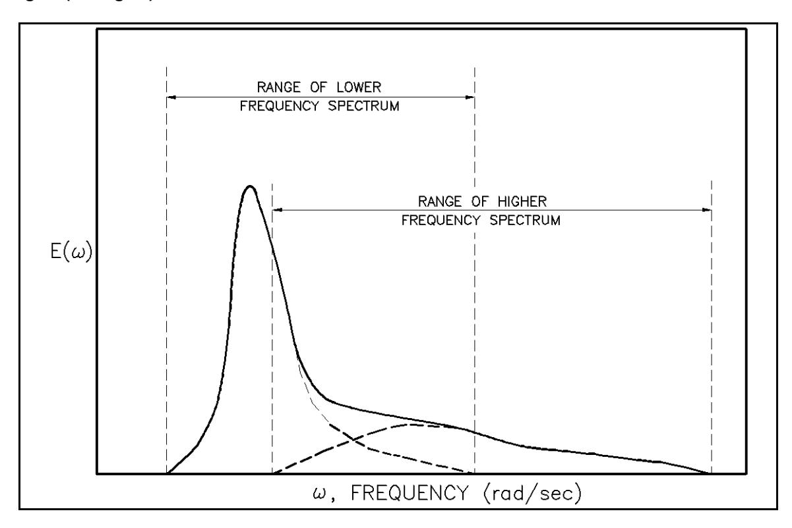

*Figure II-1-39. Definition sketch for Ochi-Hubble spectrum (Ochi and Hubble 1976)*

- (f) In this equation, \alpha is the scaling parameter, \gamma the peak enhancement factor, f_p the frequency at the spectral peak, U_{10} the wind speed at the elevation 10 m above the sea surface, F the fetch length. Figure II-1-38 qualitatively illustrates the relationship between JONSWAP and PM spectra. The JONSWAP spectrum can also be fitted mathematically to observed spectra by iteratively solving for d, \gamma , f_m , and \sigma .
- (g) A six-parameter spectrum developed by Ochi and Hubble (1976) is the only wave spectrum which exhibits two peaks (Figure II-1-39), one associated with underlying swell (lower frequency components) and the other with locally generated waves (higher frequency components). It is defined as

```math
E(\omega) = \frac{1}{4} \sum_{j=1}^{2} \frac{\left(\frac{4\lambda_{j} + 1}{4}\omega_{0j}^{4}\right)^{\lambda_{j}}}{\Gamma(\lambda_{j})} \frac{H_{sj}^{2}}{\omega^{4\lambda_{j}+1}} \exp\left[-\frac{4\lambda_{j}+1}{4}\left(\frac{\omega_{0j}}{\omega}\right)^{4}\right] \tag{II-1-156}
```

where H_{sI} , \omega_{0I} , and \lambda_I are the significant wave height, modal frequency, and shape factor for the lower-frequency components while H_{s2} , \omega_{02} , and \lambda_2 correspond to the higher frequency components (Figure II-1-39). The value of \lambda_I is usually much higher than \lambda_2 . For the most probable value of \omega_{0I} , it can be shown that \lambda_I = 2.72 , while \lambda_2 is related to H_s in feet as

```math
\lambda_2 = 1.82 \ e^{(-0.027H_s)} \tag{II-1-157}
```

II-1-90 Water Wave Mechanics

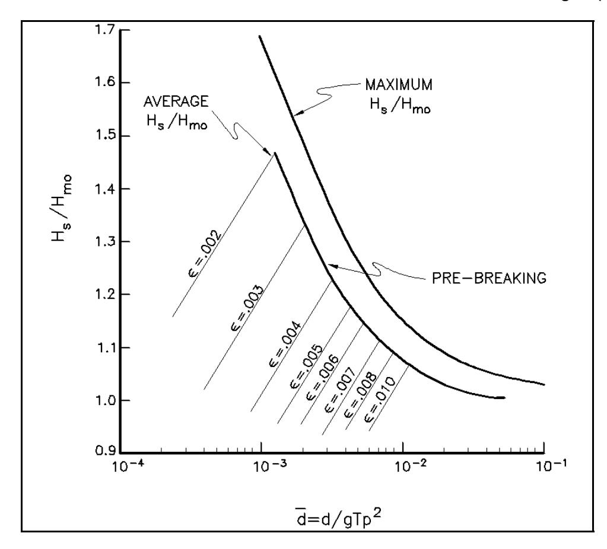

*Figure II-1-40. Variation of Hs/Hmo as a function of relative depth 6 d and significant steepness (Thompson and Vincent 1985)*

(h) The parameters 8 j control the shape and the sharpness of the spectral peak of the Ochi-Hubble spectral model if in either spectral component (i.e., sea or swell) the values of Hsj and T 0j are held constant. Therefore, 8 1 and 8 2 are called the spectral shape parameters . On the assumption of a narrow-bandedness of the entire Ochi-Hubble spectrum, an equivalent significant wave height may be calculated by

```math
H_s = \sqrt{H_{sl}^2 + H_{s2}^2} \tag{II-1-158}
```

Note that for 8 1 = 1 and 8 2 = 0, the PM spectra may be recovered from this equation.
(i) In shallow water, the wave spectrum deviates from the standard spectra forms presented so far, and at frequencies above the peak, the spectrum no longer decays as f -5 . Kitaigorodoskii et al. (1975) showed that the equilibrium range is proportional to -3 power of the wave number, and thus, the form of the spectrum is of f -3 in the high-frequency range. This change is attributed to the effect of water depth on wave spectrum and to the interaction between spectral components. Bouws et al. (1984) proposed a variation to the JONSWAP energy spectrum for representing wave spectra in finite-depth water. The spectrum so obtained, the product of JONSWAP and the Kitaigorodoskii depth function accounting for the influence of the water depth, is called the TMA spectrum after the names of three sources of data used in its development (Texel, Marsen, and Arsloe).
(j) Kitaigorodoskii et al. (1975) obtained the form of depth dependence as

```math
\Phi(\omega, d) = \frac{\left[k^{-3} \frac{\partial k}{\partial \omega}\right]_{d=finite}}{\left[k^{-3} \frac{\partial k}{\partial \omega}\right]_{d=\infty}} s \tag{II-1-159}
```

(k) Thus, M is a weighing factor of the quantity in the bracket, which is determined from the ratio of the quantity evaluated for finite and infinite water depth cases. Using the linear wave theory, the above equation has been approximated by Kitaigorodoskii et. al. (1975) as

```math
\Phi(\omega^*, d) \approx 
\begin{cases} 
\frac{1}{2}\omega^{* 2} & \text{for } \omega^* \leq 1 \\
1 - \frac{1}{2}(2 - \omega^*)^2 & \text{for } \omega^* > 1
\end{cases} \tag{II-1-160}
```

(l) The TMA spectrum was intended for wave hindcasting and forecasting in water of finite depth. This spectrum is a modification of the JONSWAP spectrum simply by substituting Kitaigorodoskii's expression for effects of the finite depth equilibrium function. By using the linear wave theory, we find the following complete form of the TMA spectrum:

```math
S_{TMA}(\omega,d) = S_{JONSWAP}(\omega)\,\Phi(\omega^*,d),\quad\Phi(\omega^*,d)=\frac{1}{[f(\omega^*)]^{\frac{1}{2}}}\left[1+\frac{K}{\sinh K}\right]^{-1};\quad \omega^*=\omega\sqrt{\frac{d}{g}},\quad f(\omega^*)=\tanh^{-1}[k(\omega^*)d];\quad K=2\omega^{*2}f(\omega^*) \tag{II-1-161}
```

- (m) In effect, this substitution transforms the decay or slope of the spectral density function of the JONSWAP spectrum in the high-frequency side from T -5 to T -3 type dependence during the shoaling process approximated by linear wave theory. Bouws et. al (1984) present equations for ", (, and F. As with the JONSWAP, the equation may be iteratively fit to an observed spectrum and ", (, fm , and F may be estimated.
- (n) The PM , JONSWAP , and TMA spectra can be estimated if something about the wind, depth and fetch are known. Furthermore, these spectral equations can be used as target spectra whose parameters can be varied to fit observed spectra which may have been measured. In the first situation, the value of the parameterization is in making an educated guess at what the spectrum may have looked like. The value in the second case is for ease of analytical representation. However, very often today engineering analyses are made on the basis of numerical simulations of a specific event by use of a numerical model (see Part II-2). In this case, the model estimates the spectrum and a parametric form is not required.
II-1-92 Water Wave Mechanics
- (7) Directional spectra.
- (a) The wave spectra described so far have been one-dimensional frequency spectra. Wave direction does not appear in these representations, and thus variation of wave energy with wave direction was not considered. However, the sea surface is often composed of many waves coming from different directions. In addition to wave frequency, the mathematical form of the sea state spectrum corresponding to this situation should therefore include the wave direction 2. Each wave frequency may then consist of waves from different directions 2. The wave spectra so obtained are two-dimensional , and are denoted by E(f, 2 ) . Figures II-1-33 and II-1-34 display directional spectra.
- (b) Measurement of a directional spectrum typically involves measurement of either the same hydrodynamic parameter (such as surface elevation or pressure) at a series of nearby locations (within one to tens of meters) or different parameters (such as pressure and two components of horizontal velocity) at the same point. These records are then cross-correlated through a cross-spectral analysis and a directional spectrum is estimated. In general, the more parameters or more locations involved, the higher the quality of the directional spectrum obtained. The procedures for converting measurements into estimates of the directional spectrum are outside the scope of this chapter. Part VII-3 of the CEM and Dean and Dalrymple (1991) provide some additional details on this subject.
- (c) The major systems routinely employed at the present time for measuring directional spectra include directional buoys, arrays of pressure or velocity gauges, and the p-U-V technique. With directional buoys, pitch-roll-and-heave or heave-and-tilt methods are used. Most directional buoys are emplaced in deeper water. Arrays of pressure gauges or velocity gauges arranged in a variety of shapes (linear, cross, star, pentagon, triangle, rectangle, etc.) are also used, but these are usually restricted to shallower water. The p-U-V technique uses a pressure gauge and a horizontal component current meter almost co-located to measure the wave field. This can be used in shallow or in deeper water if there is something to attach it to near the surface. Other techniques include arrays of surface-piercing wires, triaxial current meters, acoustic doppler current meters, and radars.
- (d) A mathematical description of the directional sea `state is feasible by assuming that the sea state can be considered as a superposition of a large number of regular sinusoidal wave components with different frequencies and directions. With this assumption, the representation of a spectrum in frequency and direction becomes a direct extension of the frequency spectrum alone, allowing the use of FFT method. It is often convenient to express the wave spectrum E(F, 2 ) describing the angular distribution of wave energy at respective frequencies by

```math
E ( f , \Theta ) \ = \ E ( f ) \ G ( f , \Theta ) \tag{II-1-162}
```

where the function G(f, 2 ) is a dimensionless quantity, and is known as the directional spreading function . Other acronyms for G(f, 2 ) are the spreading function , angular distribution function , and the directional distribution .
(e) The one-dimensional spectra may be obtained by integrating the associated directional spectra over 2 as

```math
E ( f ) \ = \ \int _ { - \pi } ^ { \pi } E ( f , \Theta ) \ d \Theta \tag{II-1-163}
```

(f) It therefore follows from the above last two equations that G(f, 2 ) must satisfy

```math
\int_{-\pi}^{\pi} G(f,\theta) \ d\theta = 1 \tag{II-1-164}
```

(g) The functional form of G(f, 2 ) has no universal shape and several proposed formulas are available. In the most convenient simplification of G(f, 2 ) , it is customary to consider G to be independent of frequency f such that we have

```math
G(\theta) = \frac{2}{\pi} \cos^2 \theta \quad \text{for} \quad |\theta| < 90^{\circ} \tag{II-1-165}
```

(h) This cosine-squared distribution is due to St. Denis and Pierson (1953), and testing with field data shows that it reproduces the directional distribution of wave energy. Longuet-Higgins (1962) found the cosine-power form

```math
G ( \Theta ) \, = \, C ( s ) \cos ^ { 2 s } { \frac { \Theta \, - \, \overline { { { \Theta } } } \, } { 2 } }
```

```math
C(s) = \frac{\sqrt{\pi}}{2\pi} \frac{\Gamma(s+1)}{\Gamma\left(s+\frac{1}{2}\right)} \tag{II-1-166}
```

where 2 is the principal (central) direction for the spectrum, s is a controlling parameter for the angular distribution that determines the peakedness of the directional spreading, C(s) is a constant satisfying the normalization condition, 2 is a counterclockwise measured angle from the principal wave direction, and ' is the Gamma function.
(i) Mitsuyasu et al. (1975), Goda and Suzuki (1976), and Holthuijsen (1983) have shown that for wind waves, the parameter s varies with wave frequency and is related to the stage of wave development (i.e., wind speed and fetch) by

```math
s = 
\begin{cases} 
s_{\max}\left(\frac{f}{f_p}\right)^5 & \text{for } f \leq f_p \\
s_{\max}\left(\frac{f}{f_p}\right)^{-2.5} & \text{for } f > f_p
\end{cases} \tag{II-1-167}
```

where smax and fp are defined as

```math
s_{\text{max}} = 11.5 \left( \frac{2\pi f_p U}{g} \right)^{-2.5}
```

```math
\frac{2\pi f_p U}{g} = 18.8 \left(\frac{gF}{U^2}\right)^{-0.33}
```

(j) In the above equations, U is the wind speed at the 10-m elevation above the sea surface and F is the fetch length. These equations remain to be validated with field data for wind waves. The parameter s for shallow-water waves may also vary spatially during wave transformation. This is due to refraction. A large value greater that 50, may be necessary if dependence of smax on refraction is of concern. For deepwater
II-1-94 Water Wave Mechanics
applications where wind waves are jointly present with swells in deep water, Goda and Suzuki (1976) proposed the following values for smax : 10 for wind waves, and 25 for swells present with wind waves of relatively large steepness, and 75 for swells with wind waves of small steepness. Under simple wind wave conditions, the spreading function may be approximated by the equations provided. They are typical of deepwater wind seas for which the wind has been constant. If the wind has shifted in direction, if there is significant swell, or if the waves are in shallow water, the directional distribution may be different than the shape functions presented.
- (8) Wave groups and groupiness factors.
- (a) Measurements of waves usually show a tendency of grouping between waves that is; high waves; often seem to be grouped together. Examination of the sea surface profile records indicates that wave heights are not uniform and they occur in successive groups of higher or lower waves. The interest in wave groups is stimulated by the fact that wave grouping and associated nonlinear effects play an important role in the long-period oscillation of moored vessels (Demirbilek 1988, 1989; Faltinsen and Demirbilek 1989), surf beats, irregular wave runup, resonant interaction between structures (Demirbilek and Halvorsen 1985; Demirbilek, Moe, and Yttervoil 1987;), and other irregular fluctuations of the mean water level nearshore (Goda 1985b; 1987). Unfortunately there is no way to predict grouping.
- (b) Wave grouping is an important research topic and there are several ways to quantify wave grouping. These include the smoothed instantaneous wave energy history analysis (Funke and Mansard 1980), the concept of the run of wave heights (Goda 1976), and the Hilbert transform. A short exposition of the wave grouping analysis is provided here.
- (c) The length of wave grouping can be described by counting the number of waves exceeding a specified value of the wave height which could be the significant, mean, or other wave height. The succession of high wave heights is called a run or a run length with an associated wave number j1 . The definition sketch for two wave groups is shown in Figure II-1-41 with the threshold wave height limit set at H = Hc . The recurrence interval or repetition length above the threshold value of wave height is called the total run denoted by j2 .
- (d) The group occurrence for N waves with k number of lags between waves in a sequence in a record may be defined in terms of a correlation coefficient. The correlation coefficient RH so defined will describe the correlation between wave heights as a function of the mean : and standard deviation F and is given by

```math
R_{H} = \frac{1}{\sigma_{0}} \frac{1}{N-k} \sum_{i=1}^{N-k} (H_{i} - \mu)(H_{i+k} - \mu) \tag{II-1-169}
```

(e) Thus, RH varies with the number of lags k between waves. If the succeeding waves are uncorrelated, then RH v 0 as N v 4 . Real wave data indicate that RH(1) . 0.20 to 0.40 while RH(k) . 0 for k > 1. Furthermore, a positive value of RH suggests that large waves tend to be succeeded by large waves, and small waves by other small waves.

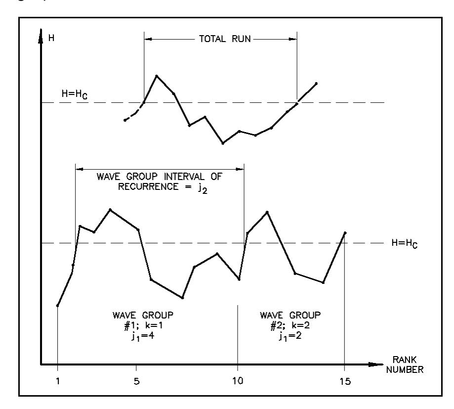

*Figure II-1-41. Identification and description of wave groups through ordered statistics (Goda 1976)*

(f) Assuming that successive wave heights are uncorrelated, the probability of a run length j1 is (Goda 1976)

```math
P(j_1) = p^{(j_1-1)} (1-p) \tag{II-1-170}
```

in which p is the occurrence probability for H > Hc . The mean and standard deviation of j1 are

```math
\mu_{j_1} = \frac{1}{q} \quad ; \quad q = 1 - p \quad ; \quad \sigma_{j_1} = \frac{\sqrt{1 - q}}{q} \tag{II-1-171}
```

(g) The probability of a total run with the length j2 can be derived by mathematical induction as

```math
\mu_{j_2} = \frac{1}{p} + \frac{1}{q} \quad ; \quad \sigma_{j_2} = \sqrt{\frac{p}{q^2} + \frac{q}{p^2}} \tag{II-1-172}
```

where it has been assumed that successive wave heights are uncorrelated. Successive wave heights of the real ocean waves are mutually correlated, and the degree of correlation depends on the sharpness of the spectral peak. The effect of spectral bandwidth on wave height distribution has been considered by Kimura (1980), Tayfun (1983a), and Longuet-Higgins (1984). Tayfun has shown that the parameter that best describes the
II-1-96 Water Wave Mechanics
spectral peakedness is the correlation coefficient of the wave envelope, relating wave height variation between successive wave heights. This coefficient RHH may be calculated as (Tayfun 1983)

```math
R_{HH} = \frac{E(\lambda) - (1-\lambda^2)\dfrac{K(\lambda)}{2}-\dfrac{\pi}{4}}{1-\dfrac{\pi}{4}}, \quad \lambda(\overline{T})=\dfrac{1}{m_0}\sqrt{A^2+B^2}, \quad A = \int_{0}^{\infty}E(f)\cos 2\pi f\overline{T}\,df,\quad B = \int_{0}^{\infty}E(f)\sin 2\pi f\overline{T}\,df \tag{II-1-173}
```

- (h) By further assuming that Rayleigh distribution is suitable for the consecutive wave heights, the joint probability density function p(H1, H2) for two successive wave heights H1 and H2 in the wave group may then be established. See Tayfun (1983) for details.
- (i) The correlation coefficient RHH takes a value of about 0.2 for wind waves and 0.6 or greater for swells (Goda 1976), a clear indication that wind waves rarely develop significant grouping of high waves. Su (1984) has shown that the wave group containing the highest wave in a record is often longer than the ordinary groups of high waves, and that the extreme wave usually consists of three high waves with the highest greater than the significant wave height. Wave groups and their characteristics have been investigated by analyzing the successive wave groups (Goda 1976 and Kimura 1980).
- (j) Wave grouping and its consequences are of significant concern, but there is little guidance and few practical formulae for use in practical engineering. The engineer needs to be aware of its existence and, for designs that would be sensitive to grouping-related phenomena, attempt to evaluate its importance to the problem of concern. This may involve performing numerical simulations or physical model simulations in which a wide variety of wave conditions are tested and are designed to include those with high levels of groupiness. The procedures for this lie beyond the scope of the CEM. (9) Random wave simulation.
- (a) Given a one-dimensional parametric spectrum model or an actual wave energy density spectrum, it is sometimes necessary to use these quantities to calculate the height, period, and phase angle of a wave at a particular frequency. Such an approach for simulating random waves from a known wave spectra is sometimes termed the deterministic spectral amplitude method , since individual wave components in this superposition method are deterministic (Borgman 1967). The method is also called the random phase method because the phases of individual components are randomly chosen (Borgman 1969). Random waves simulated by this approach may not satisfy the condition of a Gaussian sea unless N 6 4 in the limit. In practice, for 200 # N # 1200 components, the spectrum can be duplicated accurately.
- (b) The wave profile generated by simulation methods is used in a number of engineering applications in spite of requiring a large number of components and considerable computer time. For example, random wave simulation is frequently used during modeling studies in a wave tank for duplicating a required target wave energy density spectrum. Random wave profiles are also extensively used in numerical models for calculating structural loads and responses due to a random sea. The simulation method permits direct prediction of the wave particle kinematics at any location in a specified water depth for given wave heightperiod pair and random phase angle. The ARMA algorithms (Spanos 1983) and digital simulation methods
(Hudspeth and Chen 1979) are two alternatives for simulating random waves from a given one-dimensional spectrum.
(c) There are two ways for simulating wave surface profiles from known wave spectra; deterministic and non-deterministic spectral amplitude methods. In the deterministic spectral simulation method, the wave height, period, and phase angle associated with a frequency f1 whose corresponding energy density is E(f1) may be obtained from

```math
H(f_1) = H|_{f_1} = 2\sqrt{2E(f_1)\Delta f}, \quad T(f_1) = T|_{f_1} = \frac{1}{f_1}, \quad \epsilon(f_1) = \epsilon|_{f_1} = 2\pi r_N \tag{II-1-174}
```

where the phase angle , is arbitrary since rN is a random number between zero and one. The time series of the wave profile at a point x and time t may be computed by (Tucker et al. 1984)

```math
\eta(x,t) = \sum_{n=1}^{N} H(n) \cos [k(n)x - 2\pi f(n)t + \epsilon(n)] \tag{II-1-175}
```

where k(n) = 2 B /L(n) , and L(n) is the wavelength corresponding to the nth frequency f(n) ; N the total number of frequency bands of width ) f . It is not required to divide the spectrum curve equally, except that doing so greatly facilitates computations. The value of wave height is sensitive to the choice of ) f , but as long as ) f is small, this method produces a satisfactory random wave profile. The use of the equal increments, ) f , requires N to be greater than 50 to assure randomness and duplicating the spectrum accurately.
(d) In the non-deterministic spectral amplitude method, the wave surface profile is represented in terms of two independent Fourier coefficients. These Gaussian distributed random variables an and bn with zero mean and variance of E(f) ) f are then obtained from

```math
\eta(x,t) = \sum_{n=1}^{N} a_n \cos[k(n)x - 2\pi f(n)t] + \sum_{n=1}^{N} b_n \sin[k(n)x - 2\pi f(n)t] \tag{II-1-176}
```

- (e) In essence, an amplitude and a phase for individual components are replaced by two amplitudes, the coefficients of cosine and sine terms in the wave profile. This random coefficient scheme may yield a realistic representation of a Gaussian sea, provided that N is large for a true random sea. This method differs from the deterministic spectral amplitude approach by ensuring that sea state is Gaussian. Elgar et al. (1985) have considered simultaneous simulation of both narrow and broad-banded spectra using more than 1000 Fourier components, and concluded that both simulation methods yield similar statistics. These approaches may be extended to the two-dimensional case. This is beyond the scope of the CEM.
- (10) Kinematics and dynamics of irregular waves. In the above sections of the CEM we have considered definition of irregular wave parameters and development of methods to measure them and use them analytically. Velocities, pressures, accelerations, and forces under irregular waves are estimated analytically in three ways. In the first, an individual wave is measured by either a wave-by-wave analysis or constructed synthetically (such as choosing, Hs , Tz , and a direction) and monochromatic theory is used to estimate the
II-1-98 Water Wave Mechanics
desired quantities at a given wave phase (Faltinsen and Demirbilek 1989). In the second, pressure, velocity, and acceleration spectra are estimated by applying linear theory to translate the surface elevation spectra to the desired parameter (Dean and Dalrymple 1991). Finally, the random wave simulation technique may be used to synthetically generate a surface time history and corresponding kinematic and dynamic properties (Borgman 1990). Of the three methods, the last may provide the most realistic results, but it is also the most complex approach. These methods lie beyond the CEM and generally require the assistance of a knowledgeable oceanographic engineer.

## II-1-4. References and Bibliography

#### Abramowitz and Stegun 1965

Abramowitz, M. and Stegun, I. A. 1965. Handbook of Mathematical Functions , Dover Pub., New York.

#### Airy 1845

Airy, G. B. 1845. Tides and Waves , Encyc. Metrop., Article 192, pp 241-396.

#### Barthel et al. 1983

Barthel, V. et al. 1983. "Group Bounded Long Waves in Physical Models," Intl. Jour. Ocean Engr., Vol 10, pp 261-294.

# Battjes 1970

Battjes, J. A. 1970. "Long-Term Wave Height Distribution at Seven Stations Around the British Isles," Rep. No.A44, Natl. Inst. Ocean., Godalming, U.K.

## Battjes 1972

Battjes, J. A. 1972. "Set-Up due to Irregular Waves," Proceedings of the 13th Coastal Engineering Conference , American Society of Civil Engineers, pp 1993-2004.

# Bendat and Piersol 1971

Bendat, J. S. and Piersol, A. G. 1971. Random Data: Analysis and Measurement Procedures , Wiley-Interscience.

#### Borgman 1963

Borgman, L. E. 1963. "Risk Criteria," ASCE Jour. Waterw., Port, Coastal and Ocean Engr., Vol 89, pp 1-35.

#### Borgman 1967

Borgman, L. E. 1967. "Spectral Analysis of Ocean Wave Forces on Piling," ASCE Jour. Waterw., Port, Coastal and Ocean Engr., Vol 93, pp 129-156.

#### Borgman 1969

Borgman, L. E. 1969. "Ocean wave Simulation for Engineering Design," ASCE Jour. Waterw., Port, Coastal and Ocean Engr., Vol 95, pp 557-583.

#### Borgman 1975

Borgman, L. E. 1975. "Extremal Statistics in Ocean Engineering," Proc. Civil Engr. in the Oceans, Vol 1, pp 117-133.

## Borgman 1990

Borgman, L. E. 1990. "Irregular Ocean waves: Kinematics and Forces," The Sea , B. Le Méhauté and D. M. Hanes, ed., Part A, Vol 9, pp 121-168.

## Boussinesq 1871

Boussinesq, J. 1871. "Theorie de L'intumescence Liquide Appelee Onde Solitaire ou de Translation se Propageant dans un Canal Rectangulaire," Comptes Rendus Acad. Sci. Paris, Vol 72, pp 755-759.

# Bouws, Gunther, Rorenthal, and Vincent 1984

Bouws, E., Gunther, H., Rorenthal, W., and Vincent, C. L. 1984. "Similarity of the Wind Wave Spectrum in Finite Depth Water, Part I-Spectral Form," Jour. Geophys. Res., Vol 89, No. C1, pp 975-986.

## Bouws, Gunther, and Vincent 1985

Bouws, E., Gunther, H., and Vincent, C. L. 1985. "Similarity of the wind wave spectrum in finite-depth water, Part I-Spectral form," J. Geophys. Res., Vol 85, No. C3, pp 1524-1530.

#### Bowen 1969

Bowen, A. J. 1969. "The Generation of Longshore Currents on a Plain Beach," Jour. Marine Res., Vol 27, pp 206-215.

#### Bretschneider 1959

Bretschneider, C. L. 1959. "Wave Variability and Wave Spectra for Wind-Generated Gravity Waves," U.S. Army Corps of Engrs., Beach Erosion Board, Tech. Memo. No. 118.

#### Bretschneider 1961

Bretschneider, C. L. 1961. "One-Dimensional Gravity Wave Spectrum," Ocean Wave Spectra , Prentice-Hall, Englewood Cliffs, NJ.

# Bretschneider 1960

Bretschneider, C. L. 1960. "A Theory for Waves of Finite Height," Proc. 7th Coastal Engr. Conf., Vol 1, pp 146-183.

#### Bretschneider 1969

Bretschneider, C. L. 1969. "Wave Forecasting," Chapter 11 in Handbook of Ocean and Underwater Engineering , J. J. Myers et al., eds., McGraw-Hill Book Co., New York.

#### Briggs et al. 1993

Briggs, M. J., Thompson, E. F., Green, D. R., and Lillycrop, L. S. 1993. "Laboratory Description of Harbor Idealized Tests," Vol 1, U.S. Army Engineer Waterways Experiment Station, CERC-93-1, Vicksburg, MS.

# Byatt-Smith and Longuet-Higgins 1976

Byatt-Smith, J. G. B., and Longuet-Higgins, M. S. 1976. "On the Speed and Profile of Steep Solitary Waves," Proc. Roy. Soc. London, Series A, Vol 350, pp 175-189.

#### Cartwright and Longuet-Higgins 1956

Cartwright, D. E., and Longuet-Higgins, M. S. 1956. "The Statistical Distribution of the Maxima of a Random Function," Proc. Roy. Soc. London, Series A, Vol 237, pp 212-232.
II-1-100 Water Wave Mechanics

#### Cavanie et al. 1978

Cavanie, A. et al. 1978. "A Statistical Relationship Between Individual Heights and Periods of Storm Waves," Proc. BOSS'76 Conf., Vol 2, pp 354-360.

#### Chakrabarti 1987

Chakrabarti, S. K. 1987. "Hydrodynamics of Offshore Structures," WIT Press, Southampton, UK.

## Chakrabarti and Cooley 1977

Chakrabarti, S. K. and Cooley, R. P. 1977. "Statistical Distribution of Periods and Heights of Ocean Waves," Jour. Gephys. Res., Vol 82, pp 1363-1368.

#### Challenor and Srokosz 1984

Challenor, P. G., and Srokosz, M. A. 1984. "Extraction of Wave Period from Altimeter Data," Proc. Workshop on Radar Alti. Data, Vol 1, pp 121-124.

# Chaplin 1980

Chaplin, J. R. 1980. "Developments of Stream-Function Wave Theory," Coastal Engr., Vol 3, pp 179-205.

## Chappelear 1961

Chappelear, J. E. 1961. "Direct Numerical Calculation of Wave Properties," Journal of Geophysical Research , Vol 66, pp 501-508.

## Chappelear 1962

Chappelear, J. E. 1962. "Shallow Water Waves," Journal of Geophysical Research , Vol 67, pp 4693-4704.

# Cialone et al. 1991

Cialone, M. A., Mark, D. J., Chou, L. W., Leenknecht, D. A., Davis, J. A., Lillycrop. L. S., Jensen, R.E., Thompson, Gravens, M. B., Rosati, J. D., Wise, R. A., Kraus, N. C., and Larson, P. M. 1991. "Coastal Modeling System (CMS) User's Manual." Instruction Report CERC-91-1, U.S. Army Engineer Waterways Experiment Station, Coastal Engineering Research Center, Vicksburg, MS.

#### Cokelet 1977

Cokelet, E. D. 1977. "Steep Gravity Waves in Water of Arbitrary Uniform Depth," Phil. Trans. Roy. Soc. London, Series A, Vol 286, pp 183-230.

#### Collins 1970

Collins, J. I. 1970. "Probabilities of Breaking Wave Characteristics," Proceedings of the 12th Coastal Engineering Conference , American Society of Civil Engineers, pp 399-412.

#### Collins 1972

Collins, J. I. 1972. "Prediction of Shallow-Water Wave Spectra," Journal of Geophysical Research , Vol 77, pp 2693-2707.

#### Cooley and Tukey 1965

Cooley, J. W. and Tukey, J. W. 1965. "An Algorithm for the Machine Computation of Complex Fourier Series," Math. Comp., Vol 19, pp 297-301.

#### Crapper 1984

Crapper, G. D. 1984. Introduction to Water Waves , John Wiley & Sons, New York.

# Dalrymple 1974a

Dalrymple, R. A. 1974. "A Finite Amplitude Wave on a Linear Shear Current," Journal of Geophysical Research , Vol 79, pp 4498-4504.

#### Dalrymple 1974b

Dalrymple, R. A. 1974. "Models for Nonlinear Water Waves in Shear Currents," Proc. 6th Offshore Tech. Conf., Paper No. 2114.

# Dalrymple and Dean 1975

Dalrymple, R. A. and Dean R. G. 1975. "Waves of Maximum Height on Uniform Currents," ASCE Jour. Waterw., Port, coastal and Ocean Engr., Vol 101, pp 259-268.

#### Dalrymple and Solana 1986

Dalrymple, R. A., and Solana, P. 1986. "Nonuniqueness in stream function wave theory, J. Waterway, Port, Coastal and Ocean Engr., ASCE, Vol 112, pp 333-337.

#### De 1955

De, S. C. 1955. "Contribution to the Theory of Stokes Waves," Proc. Phil. Soc., Vol 51, pp 713-736.

#### Dean 1965

Dean, R. G. 1965. "Stream Function Representation of Nonlinear Ocean Waves," Journal of Geophysical Research , Vol 70, pp 4561-4572.

#### Dean 1968

Dean, R. G. 1968. "Relative Validity of Water Wave Theories," Proc. Civil Engr. in Ocean, ASCE, Vol 1, pp1-30.

#### Dean 1974

Dean, R. G. 1974. Evaluation and Development of Water Wave Theories for Engineering Applications , Coastal Engineering Research Center, U.S. Army Engineer Waterways Experiment Station, Special Report No.1.

#### Dean and Dalrymple 1991

Dean, R. G. and Dalrymple, R. A. 1991. Water Wave Mechanics for Engineers and Scientists , World Scientific Pub. Co., Teaneck, NJ.

#### Demirbilek 1977

Demirbilek, Z. 1977. "Transverse Oscillations of a Circular Cylinder in Uniform Flow," Thesis Rept., Naval Postgraduate School, Monterey, Calif.

#### Demirbilek 1985

Demirbilek, Z. 1985. "A Computer Program for Wave Kinematics by Fenton's Theory," Proprietary of Conoco Inc., prepared for the Jolliet Project. Also in Conoco's Riser and Mooring Systems Analysis Programs, Houston, TX.

#### Demirbilek 1988

Demirbilek, Z. 1988. "Forces on Marine Risers in a Coexisting Environment," J. Waterway, Port, Coastal, and Ocean Engineering, Vol 114, No. 3, pp 346-362.
II-1-102 Water Wave Mechanics

## Demirbilek 1989

Demirbilek, Z. 1989. Tension Leg Platform: A State-Of-The-Art Review , New York, pp 335.

## Demirbilek and Halvorsen 1985

Demirbilek, Z. and Halvorsen, T. 1985. "Hydrodynamic Forces on Multitube Production Risers Exposed to Currents and Waves," Trans. ASME, J. Energy Resources Technology, Vol 107, No. 2, pp 226-234.

# Demirbilek, Moe, and Yttervoll 1987

Demirbilek, Z., Moe, G., and Yttervoll, P. 1987. "Morison's Formula: Relative Velocity versus Independent Flow Fields Formulations for a Case Representing Fluid Damping," Proc. Intl. Symposium on Offshore Mech. and Arctic Engineering, Vol II, pp 25-32, Houston, TX.

#### Eckart 1952

Eckart, C. 1952. "The Propagation of Gravity Waves From Deep to Shallow Water," Natl. Bur. Standards, Circular 521, Washington, DC, pp 165-173.

#### Elgar et al. 1985

Elgar, S. et al. 1985. "Wave Group Statistics from Numerical Simulation of a Random Sea," Jour. Applied Ocean Res., Vol 7, pp 93-96.

#### Faltinsen 1990

Faltinsen, O. M. 1990. Sea Loads on Ships and Offshore Structures , Cambridge Press, New York, p 328.

#### Faltinsen and Demirbilek 1989

Faltinsen, O. M., and Demirbilek, Z. 1989. "Hydrodynamics of Tension Leg Platforms - TLP's," Tension Leg Platform: A State-of-the-art Review , Z. Demirbilek, ed., ASCE Publ., New York.

#### Fenton 1972

Fenton, J. D. 1972. "A Ninth-Order Solution for Solitary Waves," Jour. Fluid Mech., Vol 53, pp 257-271.

#### Fenton 1979

Fenton, J. D. 1979. "A Higher-Order Cnoidal Wave Theory," Jour. Fluid Mech., Vol 94, pp 129-161.

# Fenton 1985

Fenton, J. D. 1985. "A Fifth-Order Stokes Theory for Steady Waves," ASCE Jour. Waterw., Port, Coastal and Ocean Engr., Vol 111, pp 216-234.

#### Fenton 1988

Fenton, J. D. 1988. "The Numerical solution of Steady Water Wave Problem," Jour. Comp. and Geo., Vol 14, pp 357-368.

# Fenton and McKee 1990

Fenton, J. D. and McKee, W. D. 1990. "On Calculating the Lengths of Water Waves," Coastal Engr., Vol 14, pp 499-513.

#### Forristall 1984

Forristall, G. Z. 1984. "The Distribution of Measured and Simulated Wave Heights as a Function of Spectral Shape," Journal of Geophysical Research , Vol 89, No. C6, pp 10547-10552.

#### Funke and Mansard 1980

Funke, E. R. and Mansard, E. P. D. 1980. "On the Synthesis of Realistic Sea State," Proc. 17th Coastal Engr. Conf., Vol 2, pp 2974-2991.

## Goda 1974

Goda, Y. 1974. "Estimation of wave Statistics from Spectra Information," Proc. Intl. Symp. on Ocean Wave Meas. and Anal., ASCE, Vol 1, pp 320-337.

#### Goda 1975

Goda, Y. 1975. "Irregular Wave Deformation in the Surf Zone," Coastal Engineering in Japan , Vol 18, pp 13-26.

#### Goda 1976

Goda, Y. 1976. "On Wave Groups," Proc. BOSS'76, Vol 1, pp 115-128.

#### Goda 1978

Goda, Y. 1978. "The Observed Joint Distribution of Periods and Heights of Sea Waves," Proc. 16th Coastal Engr. Conf., Vol 2, pp 227-246.

#### Goda 1983

Goda, Y. 1983. "A Unified Nonlinearity Parameter of Water Waves," Rept. Port and Harbor Res. Inst. of Japan, Vol 22, No. 3, pp 3-30.

#### Goda 1985a

Goda, Y. 1985a. "Numerical Examination of Several Statistical Parameters of Sea Waves," Rept. Port and Harbor Res. Inst., Vol 24, No. 4, pp 65-102.

#### Goda 1985b

Goda, Y. 1985b. Random Seas and Design of Maritime Structures , Univ. of Tokyo Press, Tokyo, Japan.

#### Goda 1987

Goda, Y. 1987. "Statistical Variability of Sea State Parameters as a Function of Wave Spectrum," Proc. IAHR Seminar on Wave Anal. and Gen. in Lab. Basins, Lausanne, Switzerland.

# Goda and Suzuki 1976

Goda, Y. and Suzuki, Y. 1976. "Estimation of Incident and Reflected Waves in Random Wave Experiments," Proc. 15th Coastal Engr. Conf., Vol 1, pp 828-845.

#### Gumbel 1958

Gumbel, E. J. 1958. Statistics of Extremes , Columbia Univ. Press, New York.

# Hasselmann et al. 1973

Hasselmann et al. 1973. "Measurements of Wind-Wave Growth and Swell Decay During the Joing North Sea Wave Project (JONSWAP)," Deutsche Hydrograph . Zeit., Erganzungsheft Reihe A (80 ), No. 12.

#### Hasselmann et al. 1976

Hasselmann, K. et al. 1976. "A Parametric Wave Prediction Model," Jour. Phys. Ocean., Vol 6, pp 200-228.
II-1-104 Water Wave Mechanics

#### Havelock 1918

Havelock, T. H. 1918. "Periodic Irrotational Waves of Finite Height," Trans. Royal Soc. of London, Vol 95 series A, pp 37-51.

#### Hedges 1981

Hedges, T. S. 1981. "Some Effects of Currents on Wave Spectra," Proc., 1st Indian Conf. on Ocean Engr., Vol 1, pp 30-35.

# Hedges 1987

Hedges, T. S. 1987. "Combinations of Waves and Currents: An Introduction," Proc. Inst. Civil Engrs., Vol 82, pp 567-585.

#### Hoffman and Walden 1977

Hoffman, D., and Walden, D. A. 1977. "Environmental Wave Data for Determining Hull Structural Loadings," SSC-268, Final Tech. rep., Ship Struc. Comm., U.S. Coast Guard, Washington, DC.

#### Holthuijsen 1983

Holthuijsen, L. H. 1983. "Observation of the Directional Distribution of Ocean-Wave Energy in Fetch-Limited Conditions," Jour. Phys. Ocean., Vol 13, No. 2, pp 191-207.

#### Horikawa and Kuo 1966

Horikawa, K., and Kuo, C. T. 1966. "A Study of Wave Transformation Inside Surf Zone," Proc. 10th Coastal Engr. Conf., Vol 1, pp 217-233.

#### Huang et al. 1981

Huang, N. E., et al. 1981. "A Unified Two-Parameter Wave Spectral Model for a General Sea State," Jour. Fluid Mech., Vol 112, pp 203-224.

#### Huang and Hudspeth 1984

Huang, M-C., and Hudspeth, R. T. 1984. "Stream Function Solutions for Steady Water Waves," Continental Shelf Res., Vol 3, pp 175-190.

#### Huang and Long 1980

Huang, N. E., and Long, S. R. 1980. "An Experimental Study of the Surface Elevation Probability Distribution and Statistics of Wind-Generated Waves," Jour. Fluid Mech., Vol 101, pp 179-200.

#### Hudspeth and Chen 1979

Hudspeth, R. T., and Chen, M. C. 1979. "Digital Simulation of Nonlinear Random Waves," ASCE Jour. Waterw., Port, Coastal and Ocean Engr., Vol 105, pp 67-85.

#### Hughes and Borgman 1987

Hughes, S. A., and Borgman, L. E. 1987. "Beta-Rayleigh Probability Distribution for Shallow Water Wave Heights," Coastal Hydro., R. A. Dalrymple, ed., Vol 1, pp 17-31.

# Hunt 1979

Hunt, J. N. 1979. "Direct Solution of Wave Dispersion Equation," ASCE Jour. Waterw., Port, Coastal and Ocean Engr., Vol 105, pp 457-459.

#### IAHR 1986

IAHR 1986. List of Sea State Parameters , Intl. Assoc. Hydr. Res., Suppl. to Bull. No. 52, Brussels.

# Ippen 1966

Ippen, A.T., 1966. Estuary and Coastline Hydrodynamics, McGraw-Hill Book Company, Inc, New York.

#### Isaacson 1978

Isaacson, M. de St. Q. 1978. "Mass Transport in Shallow Water Waves," ASCE Jour. Waterw., Port, Coastal and Ocean Engr., Vol 104, No. 2, pp 215-225.

#### ISSC 1964

ISSC 1964. Proceedings of the Second International Ship Structures Congress , Delft, The Netherlands.

## ITTC 1966

ITTC 1966. "Recommendations of the 11th International Towing Tank Conference," Proc. 11th ITTC, Tokyo, Japan.

#### Jasper 1956

Jasper, N. H. 1956. "Statistical Distribution Patterns of Ocean Waves and Wave-Induced Ship Stress and Motions with Engineering Applications," Trans. SNAME, Vol 64.

# Jonsson 1990

Jonsson, I. G. 1990. "Wave-Current Interactions," The Sea , B. Le Méhauté and D. M. Hanes, eds., Part A, Vol 9, pp 65-120.

#### Kadono et al. 1986

Kadono, T., et al. 1986. "An Observation of Nonlinear Coastal Waves," Proc. 33rd Japanese Coastal Engr. Conf., Vol 1, pp 149-153.

# Keller 1948

Keller, J. B. 1948. "The Solitary Wave and Periodic Waves in Shallow Water," Commun. Appl. Math., Vol 1, pp 323-339.

#### Keulegan and Patterson 1940

Keulegan, G. H. and Patterson, G. W. 1940. "Mathematical Theory of Irrotational Translation Waves," Res. Jour. Natl. Bur. Stand., Vol 24, pp 47-101.

#### Kimura 1980

Kimura, A. 1980. "Statistical Properties of Random Wave Groups," Proc. 1th Coastal Engr. Conf., Vol 2, pp 2955-2973.

#### Kinsman 1965

Kinsman, B. 1965. Wind Waves , Prentice-Hall, Englewood Cliffs, NJ.

#### Kitaigorodoskii et al. 1975

Kitaigorodoskii, S. A. et al. 1975. "On Phillips' Theory of equilibrium Range in the Spectra of Wind-Generated Gravity Waves," Jour. Phys. Ocean., Vol 5, No. 3, pp 410-420.

#### Klopman 1990

Klopman, G. 1990. "A note on integral properties of periodic gravity waves int eh case of non-zero mean Eulerian velocity," J. Fluid Mech, Vol 211, pp 609-615.
II-1-106 Water Wave Mechanics

# Korteweg and de Vries 1895

Korteweg, D. J. and de Vries, G. 1895. "On the Change of Form of Long Waves Advancing in a Rectangular Canal, and on a New Type of Stationary Waves," Phil. Mag., 5th Series, Vol 39, pp 422-443.

#### Kuo and Kuo 1974

Kuo, C. T., and Kuo, S. T. 1974. "Effect of Wave Breaking on Statistical Distribution of Wave Heights," Proceedings of Civil Engineering Oceans , pp 1211-1231.

#### Laitone 1960

Laitone, E. V. 1960. "The Second Approximation to Cnoidal and Solitary Waves," Jour. Fluid Mech., Vol 9, pp 430-444.

#### Laitone 1962

Laitone, E. V. 1962. "Limiting Conditions for Cnoidal and Stokes Waves," Journal of Geophysical Research , Vol 67, pp 1555-1564.

#### Laitone 1965

Laitone, E. V. 1965. "Series Solutions for Shallow Water Waves," Journal of Geophysical Research , Vol 70, pp 995-998.

#### Lamb 1945

Lamb, H. 1945. Hydrodynamics , 6th ed., Dover, New York.

#### Le Méhauté 1976

Le Méhauté, B. 1976. Introduction to Hydrodynamics and Water Waves , Springer-Verlag, New York.

# Le Méhauté and Webb 1964

Le Méhauté, B., and Webb, L. M. 1964. "Periodic Gravity Waves Over a Gentle Slope at a Third Order of Approximation," Proc. 10th Coastal Engr. Conf., Vol 1, pp 23-40.

#### Leenknecht, Szuwalski, and Sherlock 1992

Leenknecht, D. A., Szuwalski, A. and Sherlock, A. R. 1992. "Automated Coastal Engineering System, User Guide and Technical Reference, Version 1.07," Coastal Engineering Research Center, U.S. Army Engineer Waterways Experiment Station, Vicksburg, MS 39180.

# Liu 1971

Liu, P. C. 1971. "Normalized and Equilibrium Spectra of Wind-Wave in Lake Michigan," Jour. Phys. Ocean., Vol 1 No. 4, pp 249-257.

#### Liu 1984

Liu, P.-L. F. 1984. "Wave-Current Interactions on a Slowly Varying Topography," Journal of Geophysical Research , Vol 88, pp 4421-4426.

#### Liu and Dalrymple 1978

Liu, P.-L. F., and Dalrymple, R. A. 1978. "Bottom Friction Stresses and Longshore Currents due to Waves with Large Angles of Incidence," Jour. Marine Res., Vol 36, pp 357-375.

# Longuet-Higgins 1952

Longuet-Higgins, M.S. 1952. "On the Statistical Distribution of the Wave Heights of Sea Waves," Jour. Marine Res., Vol 11, pp 245-266.

#### Longuet-Higgins 1953

Longuet-Higgins, M. S. 1953. "Mass Transport in Waves," Phil. Trans. Roy. Soc. London, Series A, Vol 245, pp 535-581.

# Longuet-Higgins 1957

Longuet-Higgins, M.S. 1957. "Statistical Analysis of a Random, Moving Surface," Phil Trans. Roy. Soc. London, Series A, Vol 249, pp 321-387.

# Longuet-Higgins 1962

Longuet-Higgins, M.S. 1962. "The Distribution of Intervals Between Zeros of Random Function," Phil. Trans. Roy. Soc. London, Series A, Vol 254, pp 557-599.

#### Longuet-Higgins 1970

Longuet-Higgins, M. S. 1970. "Longshore Currents Generated by Obliquely Incident Sea Waves," Journal of Geophysical Research , Vol 75, pp 6778-6789.

#### Longuet-Higgins 1974

Longuet-Higgins, M. S. 1974. "On the Mass, Momentum, Energy, and Circulation of a Solitary Wave," Proc. Roy. Soc. London, Series A, Vol 337, pp 1-13.

#### Longuet-Higgins 1975a

Longuet-Higgins, M. S. 1975a. "Longshore Currents Generated by Obliquely Incident Sea Waves," Journal of Geophysical Research , Vol 75, pp 6778-6789.

#### Longuet-Higgins 1975b

Longuet-Higgins, M. S. 1975b. "On the Joint Distribution of the Periods and Amplitudes of Sea Waves," Journal of Geophysical Research , Vol 80, pp 2688-2694.

#### Longuet-Higgins 1976

Longuet-Higgins, M. S. 1976. "Recent Developments in the Study of Breaking Waves," Proc. 15th Coastal Engr. Conf., Vol 1, pp 441-460.

#### Longuet-Higgins 1980

Longuet-Higgins, M. S. 1980. "On the Joint Distribution of Heights of Sea Waves: Some Effects of Nonlinearity and Finite Band Width," Journal of Geophysical Research , Vol 85, pp 1519-1523.

#### Longuet-Higgins 1983

Longuet-Higgins, M. S. 1983. "On the Joint Distribution of Wave Period and Amplitudes in a Random Wave Field," Proc. Roy. Soc. London, Series A, Vol 389, pp 241-258.

#### Longuet-Higgins 1984

Longuet-Higgins, M. S. 1984. "Statistical Properties of Wave Groups in a Random Sea State," Phil. Trans. Roy. Soc. London, Series A, Vol 310, pp 219-250.
II-1-108 Water Wave Mechanics

#### Longuet-Higgins 1985

Longuet-Higgins, M. S. 1985. "A New Way to Calculate Steep Gravity Waves," The Ocean Surface , Y. Toba and H. Mitsuyasu, eds., Univ. of Tokyo Press, pp 1-15.

#### Longuet-Higgins and Fenton 1974

Longuet-Higgins, M. S., and Fenton, J. D. 1974. "On Mass, Momentum, Energy, and Calculation of a Solitary Wave," Proc. Roy. Soc. London, Series A, Vol 340, pp 471-493.

# Longuet-Higgins and Fox 1977

Longuet-Higgins, M. S., and Fox, M. J. H. 1977. "Theory of the Almost Highest Wave: the Inner Solution," Jour. Fluid Mech., Vol 80, pp 721-741.

#### Longuet-Higgins and Stewart 1962

Longuet-Higgins, M. S., and Stewart, R. W. 1962. "Radiation Stress and Mass Transport in Gravity Waves, with Application to 'Surf Beats'," Journal of Fluid Mechanics , Vol 13, No. 4, pp 481-504.

#### Longuet-Higgins and Stewart 1964

Longuet-Higgins, M. S., and Stewart, R. W. 1964. "Radiation Stresses in Water Waves: A Physical Discussion with Applications," Deep Sea Research , Vol 11, pp 529-562.

#### Mei 1991

Mei, C. C. 1991. The Applied Dynamics of Ocean Surface Waves , World Scientific Pub. Co., Teaneck, NJ.

#### Miche 1944

Miche, R. 1944. "Mouvements Ondulatoires des Mers en Profondeur Constante on Decroisante," Annales des Ponts et Chaussees, pp 25-78, 131-164, 270-292, 369-406.

# Michell 1893

Michell, J. H. 1893. "On the Highest Wave in Water," Phil. Mag., Vol 36, pp 430-435.

#### Miles 1979

Miles, J. W. 1979. "On the Korteweg de Vries Equation for Gradually Varying Channel," Jour. Fluid Mech., Vol 91, pp 181-190.

# Miles 1980

Miles, J. W. 1980. "Solitary Waves," Annual Rev. Fluid Mech., Vol 12, pp 11-43.

#### Miles 1981

Miles, J. W. 1981. "The Korteweg de Vries Equation: A Historical Essay," Jour. Fluid Mech., Vol 106, pp 131-147.

# Milne-Thompson 1976

Milne-Thompson, L. M. 1976. Theoretical Hydrodynamics , The MacMillan Press Ltd., London.

#### Mitsuyasu 1971

Mitsuyasu, H. 1971. "On the Form of Fetch-Limited Wave Spectrum," Coastal Engr. in Japan, Vol 14, pp 7-14.

# Mitsuyasu 1972

Mitsuyasu, H. 1972. "The One-Dimensional Wave Spectra at Limited Fetch," Proc. 13th Coastal Engr. Conf., Vol 1, pp 289-306.

#### Mitsuyasu et al. 1975

Mitsuyasu, H. et al. 1975. "Observations of the Directional spectrum of Ocean Waves Using a Cloverleaf Buoy," Jour. Phys. Ocean., Vol 5, pp 750-760.

#### Morison et al. 1950

Morison, J. R., et al. 1950. "The Forces Exerted by Surface Waves on Piles," Petroleum Trans. AIME, Vol 189, pp 149-157.

#### Munk 1949

Munk, W. H. 1949. "The Solitary Wave Theory and Its Application to Surf Problems," Annals New York Acad. Sci., Vol 51, pp 376-423.

#### Myrhaug and Kjeldsen 1986

Myrhaug, D. and Kjeldsen, S. P. 1986. "Steepness and Asymmetry of Extreme Waves and the Highest Waves in Deep Water," Intl. Jour. Ocean Engr., Vol 13, pp 549-568.

#### Nishimura et al. 1977

Nishimura, H., et al. 1977. "Higher Order Solutions of Stokes and Cnoidal Waves," Jour. Faculty Engr. Univ. of Tokyo, Series B, Vol 34, pp 267-293.

#### Ochi 1973

Ochi, M. K. 1973. "On Prediction of Extreme Values," Jour. Ship Res., Vol 1, pp 29-37.

#### Ochi 1982

Ochi, M. K. 1982. "Stochastic Analysis and Probabilistic Prediction of Random Seas," Advances in Hydrosci,, V. T. Chow, ed., Academic Press, Vol 13, pp 217-375.

#### Ochi and Hubble 1976

Ochi, M. K. and Hubble, E. N. 1976. "Six Parameter Wave Spectra," Proc. 15th Coastal Engr. Conf., Vol 1, pp 301-328.

#### Ottesen-Hansen 1980

Ottesen-Hansen, N.-E. 1980. "Correct Reproduction of Group-Induced Long Waves," Proc. 17th Coastal Engr. Conf., Vol 1, pp 784-800.

# Peregrine 1972

Peregrine, D. H. 1972. "Equations for Water Waves and the Approximation Behind Them," Waves on Beaches and Resulting Sediment Transport , R. E. Meyer, ed., Academic Press, pp 95-121.

#### Peregrine 1976

Peregrine, D. H. 1976. "Interaction of Water Waves and Currents," Advances in Applied Mechanics , Academic Press, New York, Vol 16, pp 9-117.

#### Phillips 1958

Phillips, O. M. 1958. "On the Generation of Waves by Turbulent Wind," Jour. Fluid Mech., Vol 2, pp 417- 445.
II-1-110 Water Wave Mechanics

# Phillips 1977

Phillips, O. M. 1977. The Dynamics of the Upper Ocean , 2nd ed., Cambridge University Press.

## Pierson and Moskowitz 1964

Pierson, W. J., and Moskowitz, L. 1964. "A Proposed Spectral Form for Fully-Developed Wind Sea Based on the Similarity Law of S. A. Kitaigorodoskii," Journal of Geophysical Research , Vol 69, pp 5181-5203.

#### Price and Bishop 1974

Price, W. G., and Bishop, R. E. D. 1974. Probabilistic Theory of Ship Dynamics , Chapman and Hall, London.

#### Rayleigh 1876

Rayleigh, L. 1876. "On Waves," Phil. Mag., Vol 1, pp 257-279.

# Rice 1944-1945

Rice, S. O. 1944-1945. "Mathematical Analysis of Random Noise," Bell System Tech. Jour., Vol 23, pp 282- 332.; Vol 24, pp 45-156.

#### Rienecker and Fenton 1981

Rienecker, M. M. and Fenton, J. D. 1981. "A Fourier Representation Method for Steady Water Waves," Jour. Fluid Mech., Vol 104, pp 119-137.

#### Russel and Osorio 1958

Russel, R. C. H., and Osorio, J. D. C. 1958. "An Experimental Investigation of Drift Profiles in a Closed Channel," Proc. 6th Coastal Engr. Conf., Vol 1, pp 171-193.

# Russell 1838

Russell, J. S. 1838. "Report of the Committee on Waves," Rep. Meet. British Assoc. Adv. Sci 7th, Liverpool, 1837, John Murray, London, pp 417-496.

#### Russell 1844

Russell, J. S. 1844. "Report on Waves," 14th Meeting Brit. Assoc. Adv. Sci., pp 311-390.

#### Sakai and Battjes 1980

Sakai, T., and Battjes, J. A. 1980. "Wave Shoaling Calculated from Cokelet's Theory," Coastal Engr., Vol 4, pp 65-84.

#### Sand 1982

Sand, S. S. 1982. "Long Wave Problems in Laboratory Models," ASCE Jour. Waterw., Port, Coastal and Ocean Engr., Vol 108, pp 492-503.

# Sarpkaya and Isaacson 1981

Sarpkaya, T. and Isaacson, M. 1981. Mechanics of Wave Forces on Offshore Structures , Van Nostrand Reinhold Co., New York.

# Schwartz 1974

Schwartz, L. W. 1974. "Computer Extension and Analytic Continuation of Stokes' Expansion for Gravity Waves," Jour. Fluid Mech., Vol 62, pp 553-578.

#### Scott 1965

Scott, J. R. 1965. "A Sea Spectrum for Model Tests and Long-Term Ship Prediction," Jour. Ship Res., Vol 9, pp 145-152.

# Shore Protection Manual 1984

Shore Protection Manual. 1984. 4th ed., 2 Vol. U.S. Army Engineer Waterways Experiment Station, U.S. Government Printing Office, Washington, DC.

# Silvester 1974

Silvester, R. 1974. Coastal Engineering , Vols I & II, Elsevier, Amsterdam.

## Skjelbreia and Hendrickson 1961

Skjelbreia, L., and Hendrickson, J. 1961. "Fifth Order Gravity Wave Theory," Proc. 7th Coastal Engr. Conf., Vol 1, pp 184-196.

#### Sobey 1990

Sobey, R. J. 1990. "Wave Theory Predictions of Crest Kinematics," Water Wave Kinematics , A. Torum and O. T. Gudmestad, eds., Kluwer Acad. Pub, The Netherlands, pp 215-231.

#### Sobey et al. 1987

Sobey, R. J., et al. 1987. "Application of Stokes, Cnoidal, and Fourier Wave Theories," ASCE Jour. Waterw., Port, Coastal and Ocean Engr., Vol 113, pp 565-587.

#### Spanos 1983

Spanos, P. D. 1983. "ARMA Algorithms for Ocean Wave Modeling," ASME Jour. Energy Resources Tech., Vol 105, pp 300-309.

#### St. Denis and Pierson 1953

St. Denis, M., and Pierson, W. J. 1953. "On the Motion of Ships in Confused Seas," Trans. SNAME, Vol 61, pp 280-357.

#### Stoker 1957

Stoker, J. J. 1957. Water Waves, The Mathematical Theory with Applications , Interscience, New York.

#### Stokes 1846

Stokes, G. G. 1846. "Report on Recent Research in Hydrodynamics," Mathematical and Physical Paper (1880), Vol 1, pp 167-187, Cambridge University Press.

#### Stokes 1847

Stokes, G. G. 1847. "On the Theory of Oscillatory Waves," Trans. Camb. Phil. Soc., Vol 8, pp 441-455.

# Stokes 1880

Stokes, G. G. 1880. Math. Phys. Papers , Vol 1, Camb. Univ. Press.

#### Su 1984

Su, M.-Y. 1984. "Characteristics of Extreme Wave Groups," Oceans'84 Conf., Washington, DC.

#### Sverdrup and Munk 1947

Sverdrup, H. U., and Munk, W. H. 1947. Wind, Sea and Swell: Theory of Relations for Forecasting , U.S. Navy Hydro. Office, Publication No. 601.
II-1-112 Water Wave Mechanics

## Tayfun 1981

Tayfun, A. 1981. "Distribution of Crest-to-Trough Wave height," ASCE Jour. Waterw., Port, Coastal and Ocean Engr., Vol 107, pp 149-158.

## Tayfun 1983a

Tayfun, A. 1983a. "Effects of Spectrum Bandwidth on the Distribution of Wave Heights and Periods," Intl. Jour. Ocean Engr., Vol 10, pp 107-118.

# Tayfun 1983b

Tayfun, A. 1983b. "Nonlinear Effects on the Distribution of Crest-to-Trough Wave Heights," Intl. Jour. Ocean Engr., Vol 10, pp 97-106.

#### Tayfun, Dalrymple, and Yang 1976

Tayfun, A., Dalrymple, R. A. and Yang, C. Y. 1976. "Random Wave-Current Interaction in Water of Varying Depth," Ocean Engr., Vol 3, pp 403-420.

#### Thom 1961

Thom, H. C. S. 1961. "Distribution of Extreme Winds in the United States," Trans ASCE, Vol 126, Part II.

#### Thom 1973

Thom, H. C. S. 1973. "Distribution of Extreme Winds Over Ocean," and "Extreme Wave Height Distribution Over Oceans," ASCE Jour. Waterw., Port, Coastal and Ocean Engr., Vol 99, pp 1-17 and 355- 374.

#### Thompson 1977

Thompson, E. F. 1977. "Wave Climate at Selected Locations Along U.S. Coasts," Technical Report TR 77-1, U. S. Army Engineer Waterways Experiment Station, Vicksburg, MS.

#### Thompson and Vincent 1985

Thompson, E. F., and Vincent, C. L. 1985. "Significant wave Height for Shallow Water Design," ASCE Jour. Waterw., Port, Coastal and Ocean Engr., Vol 111, pp 828-842.

## Thornton and Guza 1983

Thornton, E. B., and Guza, R. T. 1983. "Transformation of Wave Height Distribution," Journal of Geophysical Research , Vol 88, No. C10, pp 5925-5938.

# Tucker 1963

Tucker, M. J. 1963. "Analysis of Records of Sea Waves," Proc. Inst. Civil Engrs., Vol 26, pp 305-316.

#### Tucker et al. 1984

Tucker, M. J., et al. 1984. "Numerical Simulation of a Random Sea: A Common Error and Its Effect Upon Wave Group Statistics," Jour. Applied Ocean Res., Vol 6, pp 118-122.

#### Tung and Huang 1976

Tung, C. C. and Huang, N. E. 1976. "Interaction Between Waves and Currents and Their Influence on Fluid Forces," Proc. BOSS'76, Vol 1, pp 129-143.

#### Ursell 1953

Ursell, F. 1953. "The Long Wave Paradox in the Theory of Gravity Waves," Proc. Camb. Philos. Soc., Vol 49, pp 685-694.

#### Van Dorn 1965

Van Dorn, W. G. 1965. "Source Mechanism of the Tsunami of March 28, 1964 in Alaska," Proc. 9th Coastal Engr. Conf., ASCE, pp 166-190.

#### Venezian 1980

Venezian, G. 1980. Discussion of "Direct Solution of Wave Dispersion Equation," by J.N. Hunt, ASCE Jour. Waterw., Port, Coastal and Ocean Engr., Vol 106, pp 501-502.

#### Venezian and Demirbilek 1979

Venezian, G., and Demirbilek, Z. 1979. "Pade Approximants for Water Waves," Texas Engr. and Exp. Station Research Center Notes, College Station, Texas.

#### Vincent 1984

Vincent, C. L. 1984. "Shallow Water Waves: A Spectral Approach," Proc. 19th Coastal Engr. Conf., Vol 1, pp 370-382.

#### Vincent 1985

Vincent, C. L. 1985. "Depth-Controlled Wave Height," ASCE Jour. Waterw., Port, Coastal and Ocean Engr., Vol 111, pp 459-475.

#### Vincent and Hughes 1985

Vincent, C. L. and Hughes, S. A. 1985. "Wind Wave Growth in Shallow Water," ASCE Jour. Waterw., Port, Coastal and Ocean Engr., Vol 111, pp 765-770.

## Wang 1985

Wang, W. C. 1985. "Non-Gaussian Characteristics of Waves in Finite Water Depth," Rept. No.85-009, Univ. of Florida, Gainesville, FL.

#### Wehausen and Laitone 1960

Wehausen, J. V., and Laitone, E. V. 1960. "Surface Waves," Handbuch der Physik, S. Flugge, ed., Springer-Verlag, Berlin, Vol IX, pp 446-778.

#### Whitham 1967

Whitham, G. B. 1967. "Variational Methods and Applications to Water Waves," Proc. Roy. Soc. London, Series A , Vol 299, pp 6-25.

# Whitham 1974

Whitham, G. B. 1974. Linear and Nonlinear Waves, Wiley Interscience, New York.

#### Wiegel 1954

Wiegel, R. L. 1954. Gravity Waves, Tables of Functions , Univ. of Calif., Council on Wave Res., The Engr. Found., Berkeley, CA.

#### Wiegel 1960

Wiegel, R. L. 1960. "A Presentation of Cnoidal Wave Theory for Practical Application," Jour. Fluid Mech., Vol 7, pp 273-286.

#### Wiegel 1964

Wiegel, R. L. 1964. Oceanographical Engineering , Prentice-Hall, Englewood Cliffs, NJ.
II-1-114 Water Wave Mechanics

## Williams 1981

Williams, J. M. 1981. "Limiting Gravity Waves in Water of Finite Depth," Phil. Trans. Roy. Soc. London, Series A, Vol 302, pp 139-188.

## Williams 1985

Williams, J. M. 1985. Tables of Progressive Gravity Waves , Pitman, Boston.

## Wirsching 1986

Wirsching, P. 1986. "Reliability Methods in Mechanical and Structural Design," Lecture Notes on Short Course for Conoco R&D Dept., Ponca City, OK.

# Wu and Liu 1984

Wu, C-S., and Liu, P.-L. F. 1984. "Effects of Nonlinear Inertial Forces on Nearshore Currents," Coastal Engr., Vol 8, pp 15-32.

#### Wu and Thornton 1986

Wu, C-S., and Thornton, E. B. 1986. "Wave Numbers of Linear Progressive Waves," ASCE Jour. Waterw., Port, Coastal and Ocean Engr., Vol 112, pp 536-540.

#### Yu 1952

Yu, Y.-Y. 1952. "Breaking of Waves by an Opposing Current," Trans. Amer. Geophys. Union, Vol 33, No.1, pp 39-41.

## II-1-5. Definitions of Symbols

| Symbol | Definition |
|---|---|
| "x | , "z Fluid particle accelerations [length/time2] |
| )p | Difference in pressure at a point due to the presence of the solitary wave [force/length2] |
| )t | Sampling interval (Equation II-1-144) [time] |
| 0(t) | Sea state depicted in time series of the wave profile [length] |
| 0(x,t) | Time series of the wave profile at a point x and time t (Equation II-1-175) [length] |
| 0& | Mean or expected value of the sea state (Equation II-1-119) [length] |
| 0envelope | Envelope wave form of two or more superimposed wave trains (Equation II-1-48) [length] |
| 0rms | Root-mean-square surface elevation [length] |
| 81,2 | Spectral shape parameters controlling the shape and the sharpness of the spectral peak of the Ochi-Hubble spectral model |
| :0 | Mean or expected value of the sea state (Equation II-1-119) [length] |
| D | Mass density of water (salt water = 1,025 kg/m3 or 2.0 slugs/ft3; fresh water = 1,000kg/m3 or 1.94 slugs/ft3) [force-time2/length4] |
| D0 | Autocorrelation coefficient (Equation II-1-122) |
| F0 | Standard deviation or square root of the variance |
| M | Velocity potential [length2/time] |
| M | Weighing factor (Equation II-1-159) |
| Q | Stream function |
| T | Wave angular or radian frequency (= 2B/T) [time-1] |
| a | Wave amplitude [length] |
| A, | B Major- (horizontal) and minor- (vertical) ellipse semi-axis of wave particle motion (Equations II-1-34 and II-1-35) [length]. The lengths of A and B are measures of the horizontal and vertical displacements of the water particles (Figure II-1-4). |
| Bj | Dimensionless Fourier coefficients (Equation II-1-103) |
| C | Phase velocity or wave celerity ( = L/T = T/k) [length/time] |
| C(s) | Dimensionless constant satisfying the normalization condition |
| Cg | Wave group velocity [length/time] |
| cn | Jacobian elliptic cosine function |
| d | Water depth [length] |
| E | Total wave energy in one wavelength per unit crest width [length-force/length2] |
| E(T) | Phillips’ equilibrium range of the spectrum for a fully-developed sea in deep water (Equation II-1-153) |
| E(f) | One-dimensional spectrum or frequency energy spectrum or wave energy spectral density (Equation II-1-144) |
| E& | Total average wave energy per unit surface area or specific energy or energy density (Equation II-1-58) [length-force/length2] |
| E&k | Kinetic energy per unit length of wave crest for a linear wave (Equation II-1-53) [length-force/length2] |
| E&p | Potential energy per unit length of wave crest for a linear wave (Equation II-1-55) [length-force/length2] |
| E[0] | Mean or expected value of the sea state (Equation II-1-119) [length] |
| F | Fetch length [length] |
| fp | Frequency of the spectral peak used in the JONSWAP spectrum for fetch-limited seas [time-1] |
| Water | Wave Mechanics II-1-117 |
| g | Gravitational acceleration [length/time2] |
| G(f,2) | Dimensionless directional spreading function |
| H | Wave height [length] |
| H& | Mean wave height [length] |
| H1/3 | Significant wave height [length] |
| H1/n | The average height of the largest 1/n of all waves in a record [length] |
| Hd | Design wave height [length] |
| Hj | Ordered individual wave heights in a record (Equation II-1-115) [length] |
| Hmax | Maximum wave height [length] |
| Hrms | Root-mean-square of all measured wave heights [length] |
| Hs | Significant wave height [length] |
| k | Modulus of the elliptic integrals |
| k | Number of lags between waves in a sequence in a record (Equation II-1-169) |
| k | Wave number (= 2B/L = 2B/CT) [length-1] |
| K(k) | Complete elliptic integral of the first kind |
| Kz | Pressure response factor (Equation II-1-43) [dimensionless] |
| L | Wave length [length] |
| M | Dimensionless parameter which is a function of H/d used in calculating water particle velocities for a solitary wave (Equations II-1-92 & II-1-93) (Figure II-1- 17). |
| m0,1,2,4 | Moments of the wave spectrum |
| N | Dimensionless correction factor in determination of 0 from subsurface pressure (Equation II-1-46) |
| N | Dimensionless parameter which is a function of H/d used in calculating water particle velocities for a solitary wave (Equations II-1-92 & II-1-93) (Figure II-1- 17). |
| N | Number of waves in a record |
| Nc | Number of crests in the wave record |
| Nz | Number of zero-upcrossings in the wave record |
| -O | The subscript 0 denotes deepwater conditions |
| p | Pressure at any distance below the fluid surface [force/length2] |
| P | Probability |
| p(x) | Probability density |
| P(x) | Probability distribution function - fraction of events that a particular event is not exceeded (Equation II-1-124) |
| P& | Wave power or average energy flux per unit wave crest width transmitted across a vertical plane perpendicular to the direction of wave advance (Equation II-1-59) [length-force/time-length] |
| pa | Atmospheric pressure [force/length2] |
| p! | Total or absolute subsurface pressure -- includes dynamic, static, and atmospheric pressures (Equation II-1-39) [force/length2] |
| Q(x) | Probability of exceedence (Equation II-1-128) |
| Qp | Spectral peakedness parameter proposed by Goda (1974) (Equation II-1-151) |
| R | Bernoulli constant (Equation II-1-102) |
| R | Cross-correlation coefficient - measures the degree of correlation between two signals (Equation II-1-123) |
| R0 | Autocorrelation or autocovariance function of the sea state (Equation II-1-121) |
| RH | Correlation coefficient describing the correlation between wave heights as a function of : and standard deviation F (Equation II-1-169) |
| RHH | Correlation coefficient of the wave envelope, relating wave height variation between successive wave heights (Equation II-1-173) |
| s | Dimensionless controlling parameter for the angular distribution that determines the peakedness of the directional spreading |
| T | Wave period [time] |
| T& | Mean wave period [time] |
| T&c | Mean crest period [time] |
| T&z | Mean zero-upcrossing wave period [time] |
| Tc | Average wave period between two neighboring wave crests (Equation II-1-116) [time] |
| Tp | Wave period associated with the largest wave energy [time] |
| Tr | Sampling record length [time] |
| Tr | Total wave record length [time] |
| Tz | Zero-crossing wave period (Equation II-1-116) [time] |
| T( | max Most probable maximum wave period (Equation II-1-141) [time] |
| u | Fluid velocity (water particle velocity) in the x-direction [length/time] |
| Water | Wave Mechanics II-1-119 |
| U | Current speed [length/time] |
| U | Wind speed at the 10-m elevation above the sea surface [length/time] Mass transport velocity (Equation II-1-69) [length/time] |
| umax | Maximum fluid velocity in the horizontal direction [length/time] |
| UP | Universal parameter for classification of wave theories |
| UR | Dimensionless Ursell number (Equation II-1-67) |
| Uw | Wind speed at 19.5 m above mean sea level (Equation II-1-155) [length/time] |
| V | Volume of water within the wave above the still-water level per unit crest (Equation |
| w | Fluid velocity (water particle velocity) in the z-direction [length/time] |
| yc | Vertical distance from seabed to the wave crest (Equation II-1-79) [length] |
| ys | Vertical distance from seabed to the water surface (Equation II-1-77) [length] |
| yt | Vertical distance from seabed to the wave trough [length] |
| z | Water depth below the SWL (Figure II-1-1) [length] |

# II-1-6. Acknowledgments

Authors of Chapter II-1, "Water Wave Mechanics:"
Zeki Demirbilek, Ph.D., Coastal and Hydraulics Laboratory (CHL), Engineer Research and Development Center, Vicksburg, Mississippi.
C. Linwood Vincent, Ph.D., Office of Naval Research, Arlington, Virginia.

#### Reviewers:

Robert A Dalrymple, Ph.D., Center for Applied Coastal Research, University of Delaware, Newark, Delaware.
Yoshimi Goda, Ph.D., Yokohama National University, Yokohama, Japan (emeritus).
Lee E. Harris, Ph.D., Department of Marine and Environmental Systems, Florida Institute of Technology, Melbourne, Florida.
Bernard LeMéhauté, Ph.D., University of Miami, Miami, Florida, (deceased).
Philip L.-F. Liu, Ph.D., School of Civil and Environmental Engineering, Cornell University, Ithaka, New York.
J. Richard Weggel, Ph.D., Dept. of Civil and Architectural Engineering, Drexel University, Philadelphia, Pennsylvania.
Robert L. Wiegel, University of California at Berkeley, Berkeley, California, (emeritus).
