# DEPARTMENT OF THE ARMY EM 1110-2-1100

Washington, DC 20314-1000
U.S. Army Corps of Engineers (Part II)
Manual Change 4 No. 1110-2-1100 30 Sep 15

# Chapter 2 METEOROLOGY AND WAVE CLIMATE

### TABLE OF CONTENTS

- 2-1. Meteorology Introduction
- 2-1.a II-2-1 General structure of winds in the atmosphere
- 2-1.b II-2-6 Winds in coastal and marine areas
- 2-1.c II-2-8 Characteristics of the atmospheric boundary layer
- 2-1.d II-2-9 Characteristics of near-surface winds
- 2-1.e II-2-10 Estimating marine and coastal winds
- 2-1.f II-2-12 Meteorological systems and characteristic waves
- 2-1.g II-2-25 Winds in hurricanes
- 2-1.h II-2-26 Step-by-step procedure for simplified estimate of winds for wave prediction
- 2-1.i II-2-35
- 2-2. Wave Hindcasting and Forecasting Introduction
- 2-2.a II-2-39 Wave prediction in simple situations
- 2-2.b II-2-46 Parametric prediction of waves in hurricanes
- 2-2.c II-2-52
- 2-3. Coastal Wave Climates in the United States Introduction
- 2-3.a II-2-53 Atlantic coast
- 2-3.b II-2-56 Gulf of Mexico
- 2-3.c II-2-60 Pacific coast
- 2-3.d II-2-61 Great Lakes
- 2-3.e II-2-65
- 2-4. Additional Example Problem II-2-65
- 2-5. References II-2-67
- 2-6. Definitions of Symbols II-2-74
- 2-7. Acknowledgements II-2-77

### List of Figures

- Figure II-2-1. Ratio of wind speed of any duration $U_{t}$ to the 1-hr wind speed U3600
- Figure II-2-2. Duration of the fastest-mile wind speed $U_{f}$ as a function of wind speed (for open terrain conditions)
- Figure II-2-3. Equivalent duration for wave generation as a function of fetch and wind speed
- Figure II-2-4. Wind profile in atmospheric boundary layer
- Figure II-2-5. Coefficient of drag versus wind speed
- Figure II-2-6. Ratio of wind speed at any height to the wind speed at the 10-m height as a function of measurement height for selected values of air-sea temperature difference and wind speed: (a) ΔT=+3 °C; (b) ΔT=0 °C; (c) ΔT=-3 °C. Plots generated with following conditions: duration of observed and final wind = 3 hrs; latitude = 30° N; fetch = 42 km; wind observation type: over water; fetch conditions: deep open water
- Figure II-2-7. Ratio $R_{L}$ of windspeed over water $U_{W}$ to windspeed over land $U_{L}$ as a function of windspeed over land $U_{L}$ (Resio and Vincent 1977)
- Figure II-2-8. Amplification $R_{T}$ ratio of $W_{c}$ (wind speed accounting for effects of air-sea temperature difference) to $W_{w}$ (wind speed over water without temperature effects)
- Figure II-2-9. Surface synoptic chart for 0030Z, 27 October 1950
- Figure II-2-10. Surface synoptic weather charts for the Halloween storm of 1991
- Figure II-2-11. Key to plotted weather report
- Figure II-2-12. Geostrophic (free air) wind scale (Bretschneider 1952)
- Figure II-2-13. Ratio of wind speed at a 10-m level to wind speed at the top of the boundary layer as a function of wind speed at the top of the boundary layer, for selected values of air-sea temperature difference
- Figure II-2-14. Ratio of $U_{*}/U_{g}$ as a function of $U_{g}$ for selected values of air-sea temperature difference
- Figure II-2-15. Common wind direction conventions
- Figure II-2-16. Climatological variation in Holland’s “B” factor (Holland 1980)
- Figure II-2-17. Relationship of estimated maximum wind speed in a hurricane at 10-m elevation as a function of central pressure and forward speed of storm (based on latitude of 30 deg, $R_{max}=30$ km, 15- to 30-min averaging period)
- Figure II-2-18. Definition of four radial angles relative to direction of storm movement ..
- Figure II-2-19. Horizontal distribution of wind speed along Radial 1 for a storm with forward velocity $V_{F}$ of (a) 2.5 m/sec; (b) 5 m/sec; (c) 7.5 m/sec
- Figure II-2-20. Logic diagram for determining wind speed for use in wave hindcasting and forecasting models
- Figure II-2-21. Phillips’ constant versus fetch scaled according to Kitaigorodskii. Small-fetch data are obtained from wind-wave tanks. Capillary-wave data were excluded where possible (Hasselmann et al. 1973)
- Figure II-2-22. Definition of JONSWAP parameters for spectral shape
- Figure II-2-23. Fetch-limited wave heights
- Figure II-2-24. Fetch-limited wave periods (wind speeds are plotted in increments of 5 m/sec)
- Figure II-2-25. Duration-limited wave heights (wind speeds are plotted in increments of 5 m/sec)
- Figure II-2-26. Duration-limited wave periods
- Figure II-2-27. Maximum value of $H_{mo}$ in a hurricane as a function of $V_{max}$ and forward velocity of storm (Young 1987)
- Figure II-2-28. Values of $H_{mo}/H_{mo}$ max plotted relative to center of hurricane (0, 0)
- Figure II-2-29. Reference locations for Tables through

### List of Tables

- Table II-2-1. Ranges of Values for the Various Scales of Organized Atmospheric Motions
- Table II-2-2. Local Seas Generated by Various Meteorological Phenomena
- Table II-2-3. Wave Statistics in the Atlantic Ocean
- Table II-2-4. Wave Statistics in the Gulf of Mexico
- Table II-2-5. Wave Statistics in the Pacific Ocean
- Table II-2-6. Wave Statistics in the Great Lakes

### CHAPTER 2

## Meteorology and Wave Climate

### 2-1. Meteorology.

a. Introduction. This chapter is intended to provide a simplified foundation for the estimation of meteorological and oceanographic factors affecting design of structures in coastal areas. It is not a replacement for more rigorous computer modeling, but attempts to show how these estimates can be obtained from a combination of simple formulae and nomograms (as given in this chapter), simple parametric-type models (such as ACES), and complete sets of detailed model runs.

### (1) Background.

- (a) A basic understanding of marine and coastal meteorology is an important component in coastal and offshore design and planning. Perhaps the most important meteorological consideration relates to the dominant role of winds in wave generation. However, many other meteorological processes (e.g., direct wind forces on structures, precipitation, wind-driven coastal currents and surges, the role of winds in dune formation, and atmospheric circulations of pollution and salt) are also important environmental factors to consider in man's interactions with nature in this sometimes fragile, sometimes harsh environment.
- (b) The primary driving mechanisms for atmospheric motions are related either directly or indirectly to solar heating and the rotation of the earth. Vertical motions are typically driven by instabilities created by direct surface heating (e.g., air mass thunderstorms and land-sea breeze circulations), by advection of air into a region of different ambient air density, by topographic effects, or by compensatory motions related to mass conservation. Horizontal motions tend to be driven by gradients in near-surface air densities created by differential heating (for example north-south variations in incoming solar radiation, called insolation, and differences in the thermal response of ocean and continental areas), and by compensatory motions related to conservation of mass. The general structure and circulation of the earth's atmosphere is described in many excellent textbooks (Hess 1959).
- (c) The rotation of the earth influences all motions in the earth's coordinate system. The net effect of the earth's rotation is to deflect all motion to the right in the Northern Hemisphere and to the left in the Southern Hemisphere. The strength of this deflection (termed Coriolis acceleration) is proportional to the sine of the latitude. Hence Coriolis effects are strongest in polar regions and vanish at the equator. Coriolis effects become significant when the trajectory of an individual fluid/gas particle moves over a distance of the same order as the Rossby radius of deformation, defined as:
EM 1110-2-1100 (Part II) Change 4 30 Sep 15

```math
R_O = \frac{c}{f} \tag{II-2-1}
```

where
- R_o = Rossby radius of deformation
- f= Coriolis parameter defined as 1.458 \times 10^{-4} \sin \varphi , where \varphi is latitude (note f here is in sec<sup>-1</sup>) c = characteristic velocity of the particle
For a velocity of 10 m/sec at a latitude of 45 deg, R_o is about 100 km. This suggests that scales of motion with this velocity and with particle excursions of about 10 km and greater will begin to be affected significantly by Coriolis force at this latitude.
- (2) Organized scales of motion in the atmosphere.
- (a) Table II-2-1 presents ranges of values for the various scales of organized atmospheric motions. This table should be regarded only as approximate spatial and temporal magnitudes of typical motions characteristic of these scales, and not as any specific limits of these scales. As can be seen in this table, the smallest scale of motion involves the transfer of momentum via molecular-scale interactions. This scale of motion is extremely ineffective for momentum transport within the earth's atmosphere and can usually be neglected at all but the slowest wind speeds and/or extremely small portions of some boundary layers. The next larger scale is that of turbulent momentum transfer. Turbulence is the primary transfer mechanism for momentum passing from the atmosphere into the sea; consequently, it is of extreme importance to most scientists and engineers. The next larger scale is that of organized convective motions. These motions are responsible for individual thunderstorm cells, usually associated with unstable air masses.

*Table II-2-1. Ranges of Values for the Various Scales of Organized Atmospheric Motions*

**Table II-2-1. Ranges of Values for the Various Scales of Organized Atmospheric Motions**

| Transfer Mechanism | Typical Length Scale, meters | Typical Time Scale, sec |
| --- | --- | --- |
| Molecular | $10^{-7}$ - $10^{-2}$ | 10-1 |
| Turbulent | 10^{-2} - 10^3 | 10^{1} |
| Convective | 10^3 - 10^4 | 10^3 |
| Meso-scale | 10^4 - 10^5 | 10^{4} |
| Synoptic-scale | 10^5 - 10^6 | 10^5 |
| Large | > 10 6 | 10^{6} |

(b) The next larger scale is termed the meso-scale. Meso-scale motions such as land-sea breeze circulations, coastal fronts, and katabatic winds (winds caused by cold air flowing down slopes due to gravitational acceleration) are important components of winds in near-coastal areas. Important organized meso-scale motions also exist in frontal regions of extratropical storms, within the spiral bands of tropical storms, and within tropical cloud clusters. An important distinction between meso-scale motions and smaller-scale motions is the relative importance of Coriolis accelerations. In meso-scale motions, the lengths of trajectories are sufficient to allow Coriolis effects to become important, whereas the trajectory lengths at smaller scales are too small
to allow for significant Coriolis effects. Consequently, the first signs of trajectory curvature are found in meso-scale motions. For example, the land-breeze/sea-breeze system in most coastal areas of the United States does not simply blow from sea to land during the day and from land to sea at night. Instead, the wind direction tends to rotate clockwise throughout the day, with the largest rotation rates occurring during the transition periods when one system gives way to the next.
- (c) The next larger scale of atmospheric motion is termed the synoptic scale. To many engineers and scientists, the synoptic scale is synonymous with the term storm scale, since the major storms in ocean areas occupy this niche in the hierarchy of scales. Storms that originate outside of tropical areas (extratropical storms) take their energy from horizontal instabilities created by spatial gradients in air density. Storms originating in tropical regions gain their energy from vertical fluxes of sensible and latent heat. Both extratropical (or frontal) storms and tropical storms form closed or semi-closed trajectory motions around their circulation centers, due to the importance of Coriolis effects at this scale.
- (d) The next larger scale of atmospheric motions is termed large scale. This scale of motion is more strongly influenced by thermodynamic factors than by dynamic factors. Persistent surface temperature differentials over large regions of the globe produce motions that can persist for very long time periods. Examples of such phenomena are found in subtropical high pressure systems, which are found in all oceanic areas and in seasonal monsoonal circulations developed in certain regions of the world.
- (e) Scales of motion larger than large scale can be termed interannual scale, and beyond that, climatic scale. El Nino~ Southern Oscillation (ENSO) episodes, variations in year-to-year weather, changes in storm patterns and/or storm intensity, and long-term (secular) climatic variations are all examples of these longer-term scales of motion. The effects of these phenomena on engineering and planning considerations are very poorly understood at present. This is compounded by the fact that there does not even exist any real consensus among atmospheric scientists as to what mechanism or mechanisms control these variations. This may not diminish the importance of climatic variability, but certainly detracts from the ability to treat it objectively. As better information is collected over longer time intervals, these scales of motion will be better understood.
- (3) Temporal variability of wind speeds.
- (a) Winds at any point on the earth represent a superposition of various atmospheric scales of motion, all interacting to produce local weather phenomena. Each scale plays a specific role in the transfer of momentum in the atmosphere. Due to the combination of different scales of motion, winds are rarely, if ever, constant for any prolonged interval of time. Because of this, it is important to recognize the averaging interval (explicit or implicit) of any data used in applications. For example, some winds represent "fastest mile" estimates, some winds represent averages over small, fixed time intervals (typically from 1- to 30-min), and some estimates (such as those derived from synoptic pressure fields) can even represent average winds over intervals of several hours. Design and planning considerations require different averages for different purposes. Individual
EM 1110-2-1100 (Part II) Change 4 30 Sep 15
gusts may contribute to the failure mode of some small structures or of certain structural elements on larger structures. For other structures, 1-min (or even longer) average wind speeds may be more related to critical structural forces.
- (b) When dealing with wave generation in water bodies of differing sizes, different averaging intervals may also be appropriate. In small lakes and reservoirs or in riverine areas, a 1- to 5-min wind speed may be all that is required to attain a fetch-limited condition. In this case, the fastest 1- to 5-min wind speed will produce the largest waves, and thus be the appropriate choice for design and planning considerations. In large lakes and oceanic regions, the wave generation process tends to respond to average winds over a 15- to 30-min interval. Consequently, it is important in all applications to be aware of and use the proper averaging interval for all wind information.
- (c) Figure II-2-1 shows the estimated ratio of winds of various durations to 1-hr average wind speeds. The proper application of Figure II-2-1 would be in converting extremal estimates of wind speeds from one averaging interval to another. For example, this graph shows that a 100-sec extreme wind speed is expected to be 1.2 times as high as a 1-hr extreme wind speed. This means that the highest average wind speed in 36 samples of 100-sec duration is expected to be 1.2 times higher than the average for all 36 samples added together.

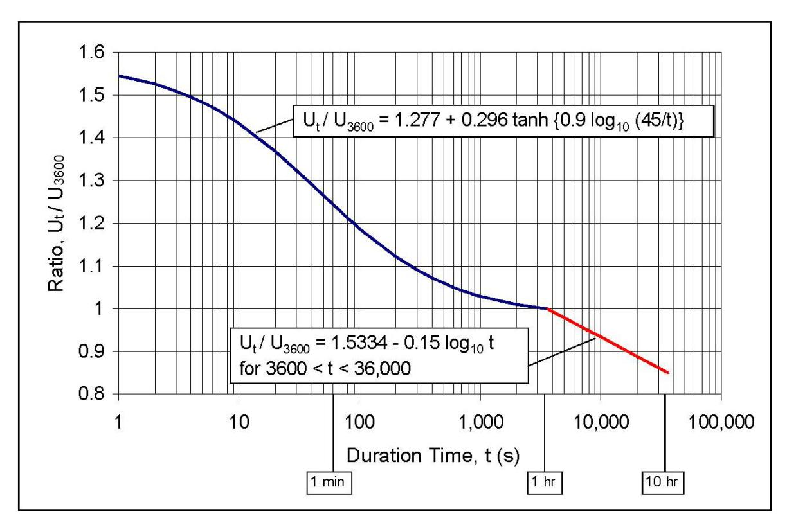

*Figure II-2-1. Ratio of wind speed of any duration $U_{t}$ to the 1-hr wind speed $U_{3600}.$*

(d) Occasionally, wind measurements are reported as fastest-mile wind speeds. The averaging time is the time required for the wind to travel a distance of 1 mile. The averaging time,
which varies with wind speed, can be estimated from Figure II-2-2. Note that two axis are provided, for metric and English units.
(e) Figure II-2-3 shows the estimated time to achieve fetch-limited conditions as a function of wind speed and fetch length, based on the calculations of Resio and Vincent (1982). The proper averaging time for design and planning considerations varies dramatically as a function of these parameters. At first, it might not seem intuitive that the duration required to achieve fetch-limited conditions should be a function of wind speed; however, this comes about naturally due to the nonlinear coupling among waves in a wind-generated wave spectrum. The importance of nonlinear coupling is discussed further in the wave prediction section of this chapter. The examples are intended to illustrate the correct usage of figures and tables. Numerical values given in the solution of the examples were read from figures as approximate values or rounded off from the equations. Users need to use their own estimates and professional judgement when applying figures or equations to their particular engineering conditions or projects.

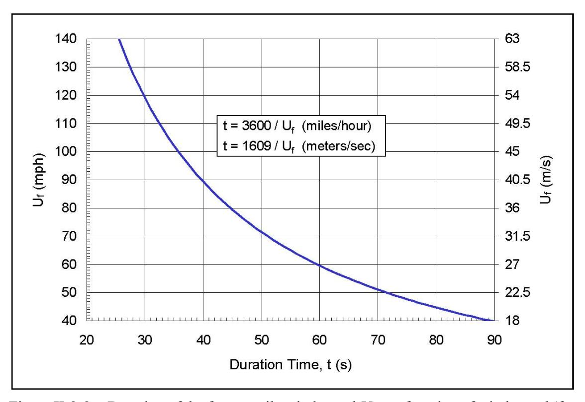

*Figure II-2-2. Duration of the fastest-mile wind speed $U_{f}$ as a function of wind speed (for open terrain conditions).*

#### EXAMPLE PROBLEM II-2-1

#### FIND:

1-hr average winds for wave prediction

### GIVEN:

10-, 50-, and 100-year values of observed winds at a buoy located in the center of a large lake $(U_{10}$ = 20.3 m/sec, $U_{50}$ = 24.8 m/sec, $U_{100}$ = 28.2 m/sec). It is also known that the averaging interval for the buoy winds is 5-min.

#### SOLUTION:

Using Figure II-2-1, the ratio of the fastest 5-min wind speed to the average 1-hr wind speed is approximately 1.09. Using this as a constant conversion factor, the 10-, 50-, and 100-year, 1-hr wind speeds are estimated as U '10=18.6 m/sec, U '50=22.8 m/sec, and U '100=25.9 m/sec.
- b. General structure of winds in the atmosphere.
- (1) The earth's atmosphere extends to heights in excess of 100 km. Considerable layering in the vertical structure of the atmosphere occurs away from the earth's surface. The layering is primarily due to the absorption of specific bands of radiation in vertically localized regions. Absorbed radiation creates substantial warming in these regions which, in turn, produces inversion layers that inhibit local mixing. Processes essential to coastal engineering occur in the troposphere , which extends from the earth's surface up to an average altitude of 11 km. Most of the meteorological information used in estimating surface winds in marine areas falls within the troposphere. The lower portion of the troposphere is called the atmospheric or planetary boundary layer, within which winds are influenced by the presence of the earth's surface. The boundary layer typically reaches up to an altitude of two (2) km or less.
- (2) Figure II-2-4 shows an idealized relationship for an extended wind profile in a spatially homogeneous marine area (i.e., away from any land). The lowest portion is sometimes termed the constant stress layer, since there is essentially a constant flux of momentum through this layer. In this bottom layer, the time scale of momentum transfer is so short that there is little or no Coriolis effect; hence, the wind direction remains approximately constant. Above this layer is a region that is sometimes termed the Ekman layer. In this region, the influence of Coriolis effects becomes more pronounced and wind direction can vary significantly with height. This results in wind directions at the top of the boundary layer which typically deviate about 10 to 15 deg to the right of near-surface wind directions over water and about 25 to 35 deg to the right of near-surface winds over land. Above the Ekman layer, the so-called geostrophic level is (asymptotically) approached. Winds in this level are assumed to be outside of the influence of the planetary surface; consequently, variations in winds above the Ekman layer are produced by different mechanisms than those that exist in the atmospheric boundary layer.

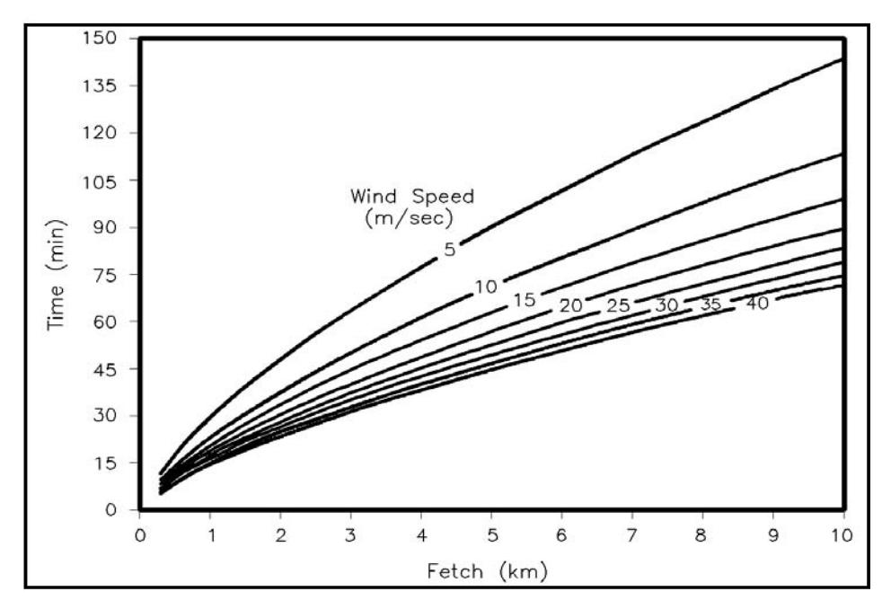

*Figure II-2-3. Equivalent duration for wave generation as a function of fetch and wind speed.*

### EXAMPLE PROBLEM II-2-2

### FIND:

The appropriate 100-year wind speed for a basin with a fetch length of 10 km.

#### GIVEN:

A 100-year wind speed of 19.9 m/sec, derived from 3-hr synoptic charts.

#### SOLUTION:

Figure II-2-3 requires knowledge of both wind speed and fetch distance; however, reasonable accuracy is gained by simply using the original wind speed and the appropriate fetch. In this case from Figure II-2-3, the appropriate wind-averaging interval is approximately 90 min. Using information from Figure II-2-1, the ratio of the highest 90-min wind speed to the highest 3-hr wind speed is given by the relationship
$U_{5400}/U_{10800}$ = [-0.15 $\log_{10}$ (5400) + 1.5334] / [-0.15 $\log_{10}$ (10800) + 1.5334] = 0.9735/0.9284 = 1.048
Thus, the appropriate wind speed should be 1.048 times 19.9 m/sec, or 20.8 m/sec.

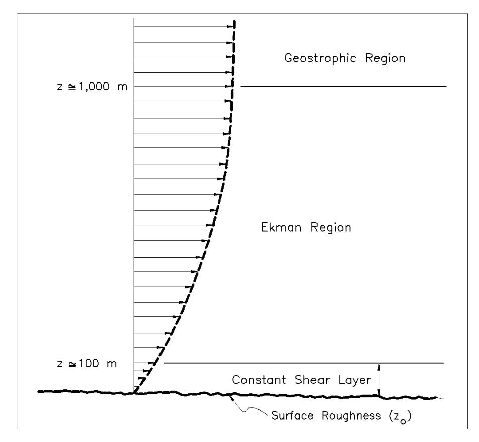

*Figure II-2-4. Wind profile in atmospheric boundary layer.*

- (3) Estimates of near-surface winds for wave prediction have historically been based primarily on two methods: direct interpolation/extrapolation/transformation of local near-surface measurements and transformation of surface winds from estimates of winds at the geostrophic level. The former method has mainly been applied to winds in coastal areas or to winds over large lakes. The latter method has been the main tool for estimating winds over large oceanic areas. A third method, termed "kinematic analysis", has received little attention in the engineering literature. All three of these methods will be discussed following a brief treatment of the general characteristics of winds within the atmospheric boundary layer.
- c. Winds in coastal and marine areas.
- (1) Background.
- (a) Winds in marine and coastal areas are influenced by a wide range of factors operating at different space and time scales. Two potentially important local effects in the coastal zone, caused by the presence of land, are orographic effects and the sea breeze effect. Orographic effects are the deflection, channeling, or blocking of air flow by land forms such as mountains, cliffs, and high islands. A rule of thumb for blocking of low-level air flow perpendicular to a land barrier is given by the following:

```math
\frac{U}{h_m} \left\{
 \begin{array}{ll}
 <0.1 & \Rightarrow \text{blocked} \\
 >0.1 & \Rightarrow \text{no blocking}
 \end{array}
\right. \tag{II-2-2}
```

where
U =wind speed h_m = height of the land barrier (in units consistent with U)
- (b) An elevation of only 100 m will cause blocking of wind speeds less than about 10 m/sec, which includes most onshore winds (Overland 1992). The horizontal scale of these effects is on the order of 50-150 km. Another orographic effect called katabatic wind is caused by gravitational flow of cold air off higher ground such as a mountain pass. Since katabatic winds require cold air, they are more frequent and strongest in high latitudes. These winds can have a significant impact on local coastal areas and are very site-specific (horizontal scale on the order of 25 km).
- (c) Another local process, the sea breeze effect, is air flow caused by the differences in surface temperature and heat flux between land and water. Land temperatures change on a daily cycle while water temperatures remain relatively constant. This results in a sea breeze with a diurnal cycle. The on/offshore extent of the sea breeze is about 10-20 km with wind speeds less than 10 m/sec.
- (d) Although understanding of atmospheric flows in complicated areas is still somewhat limited, considerable progress has been made in understanding and quantifying flow characteristics in simple, idealized situations. In particular, synoptic-scale winds in open-water areas (more than 20 km or so from land) are known to follow relatively straightforward relationships within the atmospheric boundary layer. The flow can be considered as a horizontally homogeneous, near-equilibrium boundary layer regime. As described in Tennekes (1973), Wyngaard (1973, 1988), and Holt and Raman (1988), present-day boundary layer parameterizations appear to provide a relatively accurate depiction of flows within the homogeneous, near-equilibrium atmospheric boundary layers. Since these boundary-layer parameterizations have a substantial basis in physics, it is recommended that they should be used in preference of older, less-verified methods. d. Characteristics of the atmospheric boundary layer.
- (1) Since the 1960's, evidence from field and laboratory studies (Clarke 1970; Businger et al. 1971; Willis and Deardorff 1974; and Smith 1988) and from theoretical arguments (Deardorff 1968; Tennekes 1973; and Wyngaard 1973, 1988) has supported the existence of a self-similar flow regime within a homogeneous, near-equilibrium boundary layer in the atmosphere. In the absence of buoyancy effects (due to vertical gradients in potential temperature) and if no significant horizontal variations in density (baroclinic effects) exist, the atmospheric boundary layer can be considered as a neutral, barotropic flow. In this case, all flow characteristics can be shown to depend only on the speed of the flow at the upper edge of the boundary layer, roughness of the surface at the bottom of the boundary layer, and local latitude (because of the influence of the earth's rotation on the boundary-layer flow). Significantly for engineers and scientists, this
EM 1110-2-1100 (Part II) Change 4 30 Sep 15
theory predicts that wind speed at a fixed elevation above the surface cannot have a constant ratio of proportionality to wind speed at the top of the boundary layer.
- (2) Deardorff (1968), Businger et al. (1971), and Wyngaard (1988) established clearly that flow characteristics within the atmospheric boundary layer are very much influenced by thermal stratification and horizontal density gradients (baroclinic effects). Thus, various relationships can exist between flows at the top of the boundary layer and near-surface flows. This additional level of complication is not negligible in many applications; therefore, stability effects should be included in wind estimates in important applications. e. Characteristics of near-surface winds.
- (1) Winds very close to a marine surface (within the constant-stress layer) generally follow some form of the "law-of-the-wall" for near-boundary flows. At wind speeds above about 5.0 m/sec (at a 10-m reference level), turbulent transfers, rather than molecular processes, dominate air-sea interaction processes. Given a neutrally stable atmosphere, the wind speed close to the surface follows a logarithmic profile of the form:

```math
U_Z = \frac{U_*}{k} \ln \left( \frac{z}{z_0} \right) \tag{II-2-3}
```

where
- U_z = wind speed at height z above the surface
- U_* = friction velocity
- k = von Kármán's constant (approximately equal to 0.4)
- z_o = roughness height of the surface
(2) In this case, the rate of momentum transfer into a water column (of unit surface area) from the atmosphere can be written in the parametric form:

```math
\tau = \rho_a U_z^2 = \rho_a C_{Dz} U_z^2 \tag{II-2-4}
```

where
- \tau = wind stress
- \rho_a = density of air
- \rho_w = density of water
- C_{D_{z}} = coefficient of drag for winds measured at level z.
(3) The international standard reference height for winds is now taken to be 10 m above the surface. If winds are taken from this level, the z is usually dropped from the subscript notation and the momentum transfer is represented as:

```math
\tau = \rho_a C_D U^2 \tag{II-2-5}
```

where
C_D specifically refers now to a 10-m reference level.
- (4) Extensive evidence shows that the coefficient of drag over water depends on wind speed (Garratt 1977; Large and Pond 1981; and Smith 1988).
- (5) When surfaces (land or water) are significantly warmer or cooler than the overlying air, thermal stability effects tend to modify the logarithmic profile in Equation II-2-3. If the underlying surface is colder than the air, the atmosphere becomes stably stratified and turbulent transfers are suppressed. If the surface is warmer than the air, the atmosphere becomes unstably stratified and turbulent transfers are enhanced. In this more general case, the form of the near-surface wind profile can be approximated as:

```math
U_{z} = \frac{U_{*}}{k} \left[ \ln \left( \frac{z}{z_{o}} \right) - \phi \left( \frac{z}{L} \right) \right] \tag{II-2-6}
```

where
\phi = universal similarity function characterizing the effects of thermal stratification L = parameter with dimensions of length that represent the relative strength of thermal stratification effects (Obukov stability length).
- (6) L is positive for stable stratification, negative for unstable stratification, and infinite for neutral stratification. Algebraic forms for \phi and additional details on the specification of near-surface flow characteristics can be found in Resio and Vincent (1977), Hsu (1988), and the ACES Technical Reference (Leenknecht et al. 1992; Section 1-1).
- (7) Transfer of momentum into water from the atmosphere can be influenced markedly by stability effects. For example, at the 10-m reference level, Equations II-2-4 through II-2-6 give:
EM 1110-2-1100 (Part II) Change 4 30 Sep 15

```math
C_D = \left( \frac{U_*}{U} \right)^2 = \left[ \frac{k}{\ln\left(\frac{z}{z_o}\right) - \phi\left(\frac{z}{L}\right)} \right]^2 \tag{II-2-7}
```

- (8) The system of equations representing the boundary layer is readily solved via a number of numerical techniques. However, a relationship between z_0 and U_* must also be specified.
- (9) Since \phi is negative for stable conditions and positive for unstable conditions, stratification clearly reduces the coefficient of drag for stable conditions and increases the coefficient of drag for unstable conditions (Figure II-2-5). Consequently, for the same wind speed at a reference level, the momentum transfer rate is lower in a stable atmosphere than in an unstable atmosphere. It should be noted that the range of values for the coefficient of drag in this figure exceed the values for which the coefficient of drag might be limited by physical constraints of the type found in Powell et al. (2003). In that study, for cases with the wind and wave directions moving in roughly the same directions, the limiting values for the coefficient of drag were found to lie in the range 0.0021 to 0.0025.
- (10) Studies by Hsu (1974), Geernaert et al. (1986), Huang et al. (1986), Janssen (1989, 1991), and Geernaert (1990) suggest that the coefficient of drag depends not only on wind speed but also on the stage of wave development. The physical mechanism responsible for this appears to be related to the phase speed of the waves in the vicinity of the spectral peak relative to the wind speed. At present, there does not appear to be sufficient information to establish this behavior definitively. Future studies may shed more light on these effects and their importance to marine and coastal winds. f. Estimating marine and coastal winds.
- (1) Wind estimates based on near-surface observations. Three methods are commonly used to estimate surface marine wind fields. The first of these, estimation of winds from nearby measurements, has the appeal of simplicity and has been shown to work well for water bodies up through the size of the Great Lakes. To use this method, it is often necessary to transfer the measurements to different locations (e.g., from overland to overwater) and different elevations. Such complications necessitate consideration of the factors given below.

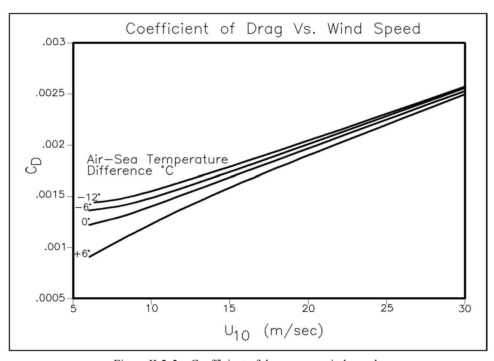

*Figure II-2-5. Coefficient of drag versus wind speed.*

(a) Elevation correction of wind speed. Often winds taken from observations of opportunity (ships, oil rigs, offshore structures, buoys, aircraft, etc.) do not coincide with the standard 10-m reference level. They must be converted to the 10-m reference level for predicting waves, currents, surges, and other wind-generated phenomena. Failure to do so can produce extremely large errors. For the case of winds taken in near-neutral conditions at a level near the 10-m level (within the elevation range of about 8-12 m), the "1/7" rule can be applied. This simple approximation, where z is measured in meters, is given as:

```math
U_{10} = U_z \left(\frac{10}{z}\right)^{\frac{1}{7}} \tag{II-2-8}
```

(b) Elevation and stability corrections of wind speed. Figure II-2-6 provides a more comprehensive method to accomplish the above transformation, including both elevation and stability effects. The "1/7" rule is given as a special case. In Figure II-2-6, the ratio of the wind speed at any height to the wind speed at the 10-m height is given as a function of measurement height for selected values of air-sea temperature difference and wind speed. Air-sea temperature difference is defined as:
EM 1110-2-1100 (Part II) Change 4 30 Sep 15

```math
\Delta T = T_a - T_s \tag{II-2-9}
```

where
Δ T = air-sea temperature difference, in deg C
- Ta = air temperature, in deg C
- Ts = water temperature, in deg C.
As can be seen in Figure II-2-6, the "1/7" rule should not be used as a general method for transforming wind speeds from one level to another in marine areas. The ACES software package (Leenknecht et al. 1992) contains algorithms, based on planetary boundary layer physics, which compute the values shown in Figure II-2-6; so, it is recommended that ACES should be used if at all possible for individual situations. It should also be noted here that, although both ACES and the computer code used to generate Figure II-2-6 are accurate within the bounds of the data which were used to formulate the boundary layer functions, they do not give the same exact answers because their boundary layer functions are not equivalent.
- (c) Simplified estimation of overwater wind speeds from land measurements. Because of the behavior of water roughness as a function of wind speed, the ratio of overwater winds at a fixed level to overland wind speeds at a fixed level is not constant, but varies nonlinearly as a function of wind speed. Figure II-2-7 provides guidance for the form of this variation. The specific values shown in this figure are from a study of winds in the Great Lakes and care should be taken in applying them to other areas. Figure II-2-8 indicates the expected variation with air-sea temperature difference (calculated with ACES). Although air-sea temperature difference can affect light and moderate winds significantly, it has only a small impact (five percent or less) on high wind speeds typical of design. If at all possible, it is advisable to use locally collected data to respecify the exact form of Figures II-2-7 and II-2-8 for a particular project. One concern here would be the use of wind measurements from aboveground elevations that are markedly different from those used in the Resio and Vincent study (9.1 m or 30 ft).
- (d) Wind speed variation with fetch. When winds pass over a discontinuity in roughness (e.g., a land-sea interface), an internal boundary layer is generated. The height of such a boundary layer forms a slope in the neighborhood of 1:30 in the downwind direction from the roughness discontinuity. This complication can make it difficult to use winds from certain locations at which winds from some directions fall within the marine boundary layer and winds from other directions fall within a land boundary layer. In areas such as this, a land-to-sea transform (similar to that shown in Figures II-2-7 and II-2-8) can be used for all angles coming from the land. Depending on the distance to the water and the elevation of the measurement site, winds coming from the direction of open water may or may not still be representative of a marine boundary layer. Guidance for determining the effects of fetch on wind speed modifications can be found in Resio and Vincent (1977) and Smith (1983). These studies indicate that fetch affects wind speeds significantly only within about 16 km (10 miles) of shore.

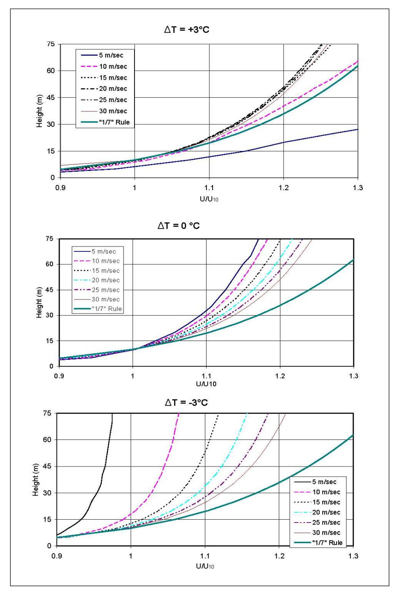

*Figure II-2-6. Ratio of wind speed at any height to the wind speed at the 10-m height as a function of measurement height for selected values of air-sea temperature difference and wind speed: (a) ΔT=+3°C; (b) ΔT=0°C; (c) ΔT=-3°C. Plots generated with following conditions: duration of observed and final wind = 3 hrs; latitude = 30° N; fetch = 42 km; wind observation type: over water; fetch conditions: deep open water.*

#### EXAMPLE PROBLEM II-2-3

### FIND:

The estimated wind speed at a height of 10 m.

### GIVEN:

The wind speed at a height of 25 m is 20 m/sec and the air-sea temperature difference is +3C.

#### SOLUTION:

From Figure II-2-6 (a), the ratio $U/U_{10}$ is about 1.18 for a 20-m/sec wind at a height of 25 m. So the estimated wind speed at a 10-m height $U_{10}$ is equal to U at 25 m (20 m/sec) divided by $U/U_{10}$ (1.18), which gives $U_{10}$ = 16.9 m/sec.

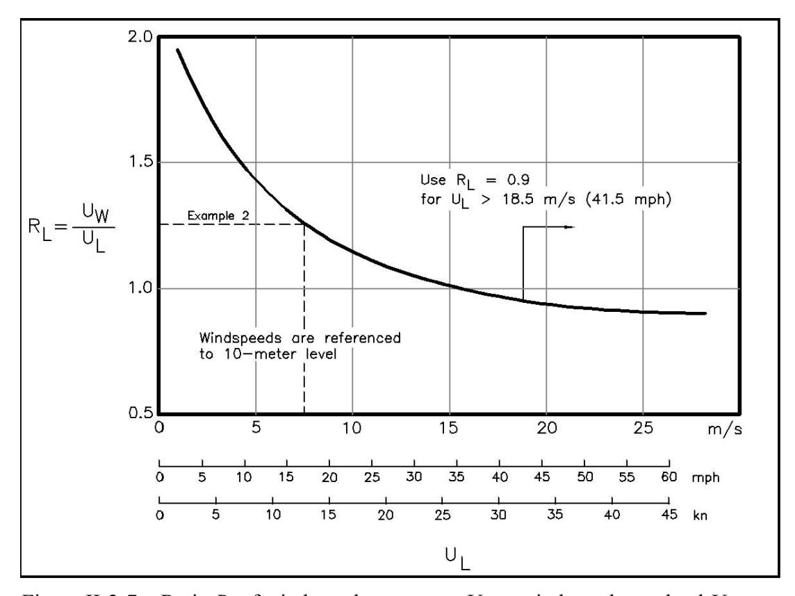

*Figure II-2-7. Ratio $R_{L}$ of windspeed over water $U_{W}$ to windspeed over land $U_{L}$ as a function of windspeed over land $U_{L}$ (Resio and Vincent 1977).*

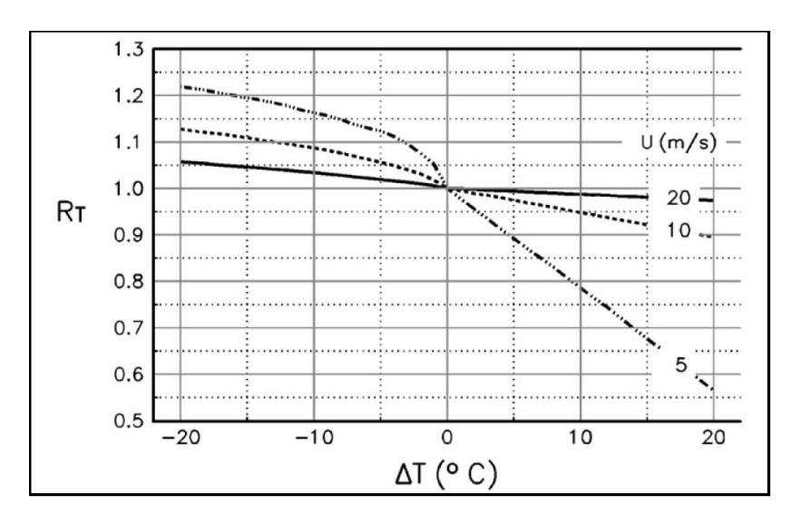

*Figure II-2-8. Amplification $R_{T}$ ratio of $W_{c}$ (wind speed accounting for effects of air-sea temperature difference) to $W_{w}$ (wind speed over water without temperature effects).*

- (e) Wind speed transition from land to water. The net effect of wind speed variation with fetch is to provide a smooth transition from the (generally lower) wind speed over land to the (generally higher) wind speed over water. Thus, wind speeds tend to increase with fetch over the first 10 miles or so after a transition from a land surface. The exact magnitude and characteristics of this transition depend on the roughness characteristics of the terrain and vegetation and on the stability of the air flow. A very simplistic approximation to this wind speed variation for the Resio and Vincent curves used here could be obtained by fitting a logarithmic curve to the asymptotic overland and overwater wind speed values. However, for most design and engineering purposes, it is probably adequate to simply use the long-fetch values with the recognition that they are somewhat conservative. The one situation that should cause some concern would be if overwater wind speed measurements are taken near the upwind end of a fetch. These winds could be considerably lower than wind speeds at the end of the fetch and underconservative values for wave conditions could result from the use of such (uncorrected) winds in a predictive scheme.
- (f) Empirical relationship. A rough empirical relationship between overwater wind speeds and land measurements is discussed in Part III-4-2-b. This highly simplified relationship is based on several restrictive assumptions including land measurements over flat, open terrain near the coast; and wind direction is within 45 deg of shore-normal. The approach may be helpful where wind measurements are available over both land and sea at a site, but the specific relationship of Equation III-4-12 is not recommended for general hydrodynamic applications.
- (2) Wind estimates based on information from pressure fields and weather maps. A primary driving force of synoptic-scale winds above the boundary layer is produced by horizontal pressure gradients. Figure II-2-9 is a simplified surface chart for the north Pacific Ocean. The area labeled L in the left center of the chart and the area labeled H in the lower right corner of the chart are lowand high-pressure areas. The pressures increase moving outward from L (isobars 972, 975, etc.)

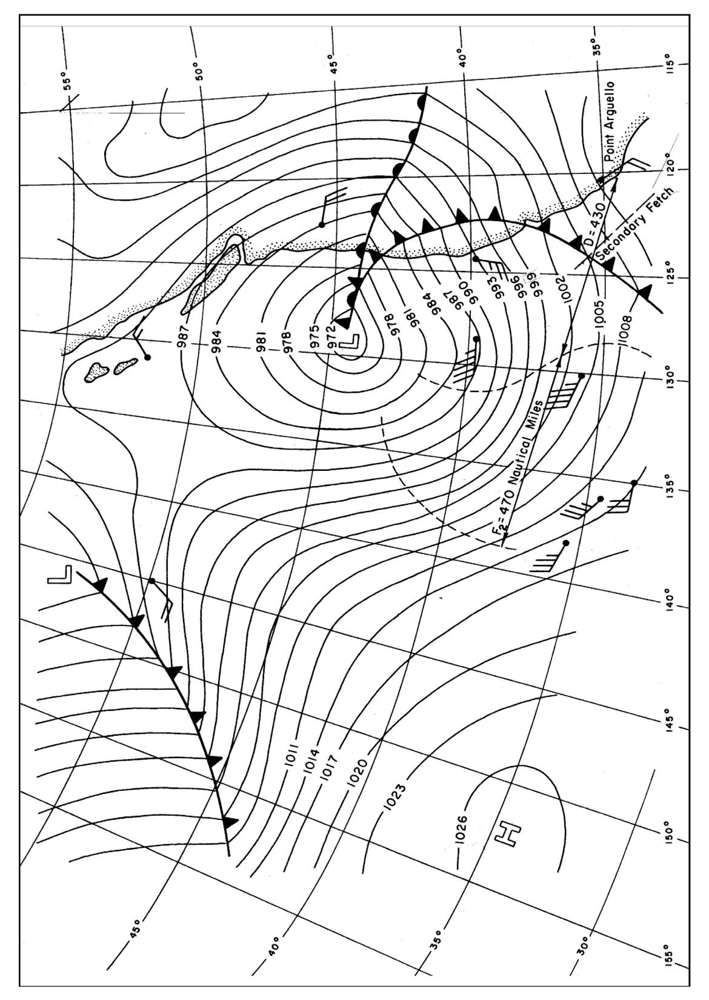

*Figure II-2-9. Surface synoptic chart for 0030Z, 27 October 1950.*

and decrease moving outward from H (isobars 1026, 1023, etc.). Synoptic-scale winds at latitudes above about 20 deg tend to blow parallel to the isobars, with the magnitude of the wind speed being inversely proportional to the spacing between the isobars. Scattered about the chart are small arrow shafts with a varying number of feathers. The direction of a shaft shows the direction of the wind, with each one-half feather representing a unit of 5.0 kt (2.5 m/sec) in wind speed.
- (a) Figure II-2-10 shows a sequence of weather maps with isobars (lines of equal pressure) for the Halloween Storm of 1991. An intense extratropical storm (extratropical cyclone) is located off the coast of Nova Scotia. Other information available on this weather map besides observed wind speeds and directions includes air temperatures, cloud cover, precipitation, and many other parameters that may be of interest. Figure II-2-11 provides a key to decode the information.
- (b) Historical pressure charts are available for many oceanic areas back to the end of the 1800s. This is a valuable source of wind information when the pressure fields and available wind observations can be used to create marine wind fields. However, the approach for linking pressure fields to winds can be complex, as will be discussed in the following paragraphs.
- (c) Synoptic-scale winds in nonequatorial regions are usually close to a geostrophic balance, given that the isobars are nearly straight (i.e., the radius of curvature is large). For this balance to be valid, the flow must be steady state or very nearly steady state. Furthermore, frictional effects, advective effects, and horizontal and vertical mixing must all be negligible. In this case, the Navier-Stokes equation for atmospheric motions reduces to the geostrophic balance equation given by:

```math
U_g = \frac{1}{p_a f} \frac{dp}{dn} \tag{II-2-10}
```

where
U_g = geostrophic wind speed (located at the top of the atmospheric boundary layer) dp/dn = gradient of atmospheric pressure orthogonal to the isobars.
Wind direction at the geostrophic level is taken to be parallel to the local isobars. Hence, purely geostrophic winds in a large storm would move around the center of circulation, without converging on or diverging from the center.
(d) Figure II-2-12 may be used for simple estimates of geostrophic wind speed. The distance between isobars on a chart is measured in degrees of latitude (an average spacing over a fetch is ordinarily used), and the latitude position of the fetch is determined. Using the spacing as ordinate and location as abscissa, the plotted, or interpolated, slant line at the intersection of these two values gives the geostrophic wind speed. For example, in Figure II-2-9, a chart with 3-mb isobar spacing, the average isobar spacing (measured normal to the isobars) over fetch F_2 located at 37 deg N. latitude, is 0.70 deg latitude. Scales on the bottom and left side of Figure II-2-12 are used to find a geostrophic wind of 34.5 m/sec (67 kt).

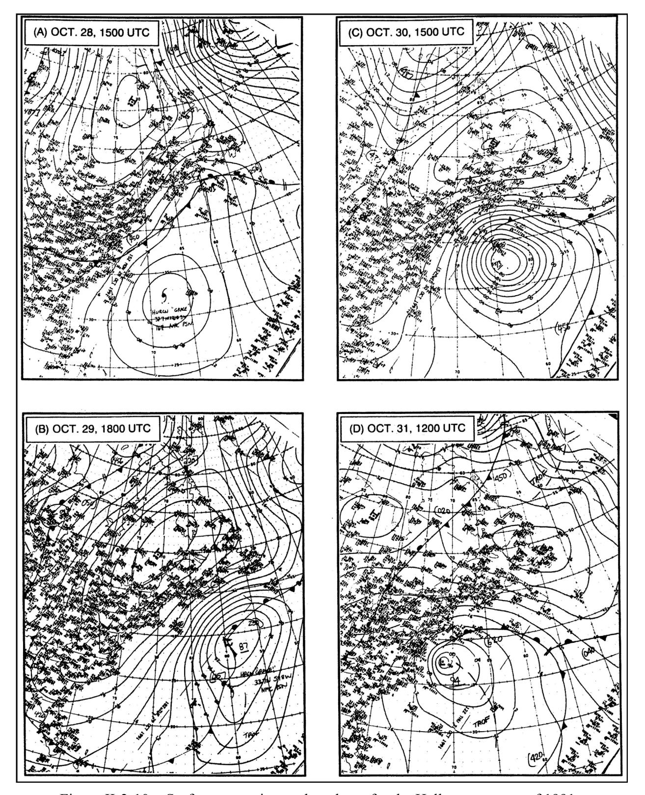

*Figure II-2-10. Surface synoptic weather charts for the Halloween storm of 1991.*

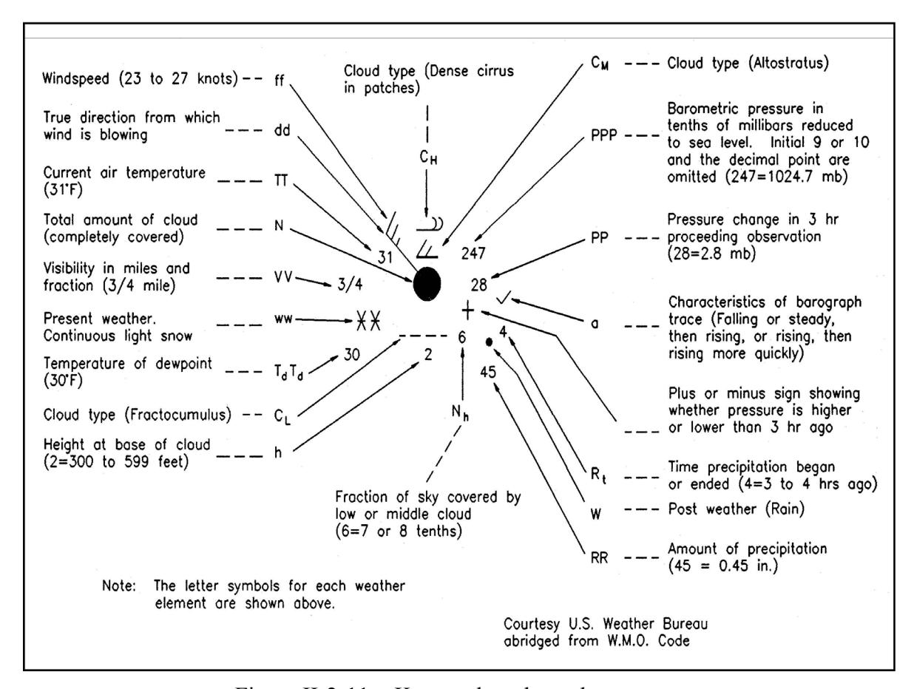

*Figure II-2-11. Key to plotted weather report.*

#### EXAMPLE PROBLEM II-2-4

#### FIND:

The estimated overwater wind speed at a site over 10 miles from shore, given that the air-sea temperature difference is near zero (∆T0).

#### GIVEN:

A wind speed of 7.5 m/sec at an airport location well inland (at the airport standard of 30 ft above ground elevation).

#### SOLUTION:

From Figure II-2-7 the ratio of overwater wind to overland wind is about 1.25. In the absence of information to calibrate a local relationship, multiply the 7.5-m/sec wind speed by 1.25 to obtain an estimated overwater wind speed of 9.4 m/sec. It should be recognized that the 90-percent confidence interval for this estimate is approximately 15 percent. It may be desirable to include this factor of conservatism in some calculations. However, at this short fetch, there is already conservatism due to the lack of consideration of wind speed variations with fetch.

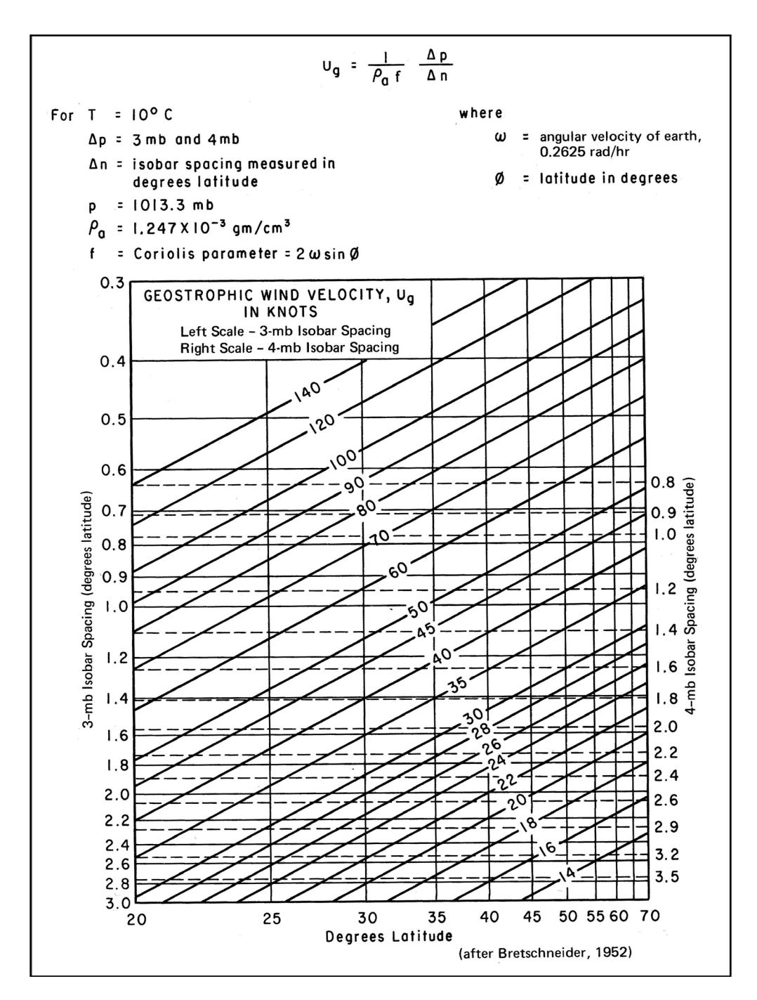

*Figure II-2-12. Geostrophic (free air) wind scale (Bretschneider 1952).*

(e) If isobars exhibit significant curvature, centrifugal effects can become comparable or larger than Coriolis accelerations. In this situation, a simple geostrophic balance must be replaced by the more general gradient balance. The equation for this motion is:

```math
U_{gr} = \frac{1}{p_{a}f} \frac{dp}{dn} + \frac{U_{gr}^{2}}{fr_{c}} \tag{II-2-11}
```

where
- U_{gr} = gradient wind speed
- r_c = radius of curvature of the isobars.
Winds near the centers of small extratropical storms and most tropical storms can be significantly affected and even at times dominated by centrifugal effects, so the more general gradient wind approximation is usually preferred to the geostrophic approximation. Gradient winds tend to form a small convergent angle (about 5.0 deg to 10 deg) relative to the isobars.
- (f) An additional complication results when the center of a storm is not stationary. In this case, the steady-state approximation used in both the geostrophic and gradient approximations must be modified to include non-steady-state effects. The additional wind component due to the changing pressure fields is termed the isallobaric wind. In certain situations, the isallobaric wind can attain magnitudes nearly equal to those of geostrophic wind.
- (g) Due to the factors discussed above, winds at the geostrophic level can be quite complicated. Therefore, it is recommended that these calculations should be performed with numerical computer codes rather than manual methods.
- (h) Once the wind vector is estimated at a level above the surface boundary layer, it is necessary to relate this wind estimate to wind conditions at the 10-m reference level. In some past studies, a constant proportionality was assumed between the wind speeds aloft and the 10-m wind speeds. Whereas this might suffice for a narrow range of wind speeds if the atmospheric boundary layer were near neutral and no horizontal temperature gradients existed, it is not a very accurate representation of the actual relationship between surface winds and winds aloft. Use of a single constant of proportionality to convert wind speeds at the top of the boundary layer to 10-m wind speeds is not recommended.
- (i) Over land, the height of the atmospheric boundary layer is usually controlled by a low-level inversion layer. This typically is not the case in marine areas where, in general, the height of boundary layer (in non-equatorial regions) is a function of the friction velocity at the surface and the Coriolis parameter, i.e.:

```math
h = \lambda \frac{U_*}{f} \tag{II-2-12}
```

where
\lambda = dimensionless constant.
EM 1110-2-1100 (Part II) Change 4 30 Sep 15
(j) Researchers have shown that, within the boundary layer, the wind profile depends on latitude (via the Coriolis parameter), surface roughness, geostrophic/gradient wind velocity, and density gradients in the vertical (stability effects) and horizontal (baroclinic effects). Over large water bodies, if the effects of wave development on surface roughness are neglected, the boundary-layer problem can be solved directly from specification of these factors. Figure II-2-13 shows the ratio of the wind at a 10-m level to the wind speed at the top of the boundary layer (denoted by the general term $U_{g}$ here) as a function of wind speed at the top of the boundary layer, for selected values of air-sea temperature difference. Figure II-2-14 shows the ratio of friction velocity at the water's surface to the wind speed at the upper edge of the boundary layer as a function of these same parameters. It might be noted from Figure II-2-14 that a simple approximation for U * in neutral stratification as a function of $U_{g}$ is given by:

```math
U_* \approx 0.0275 U_g \tag{II-2-13}
```

This approximation is accurate within 10 percent for the entire range of values shown in Figure II-2-14.
(k) Measured wind directions are generally expressed in terms of azimuth angle from which winds come. This convention is known as a meteorological coordinate system . Sometimes (particularly in relation to winds calculated from synoptic information), a mathematical vector coordinate or Cartesian coordinate system is used (Figure II-2-15). Conversion from the vector Cartesian to meteorological convention is accomplished by:

```math
\theta_{met} = 270 - \theta \tag{II-2-14}
```

where
θ met = direction in standard meteorological terms
θ vec = direction in a Cartesian coordinate system with the zero angle wind blowing toward the east.
(l) Wind estimates based on kinematic analyses of wind fields. In several careful studies, it has been shown that one method of obtaining very accurate wind fields is through the application of "kinematic analysis" (Cardone 1992). In this technique, a trained meteorological analyst uses available information from weather charts and other sources to construct detailed pressure fields and frontal positions. Using concepts of continuity along with this information, the analyst then constructs streamlines and isotachs over the entire analysis region. Unfortunately, this procedure is very labor-intensive; consequently, most analysts combine kinematic analyses of small subregions within their region with numerical estimates over the entire region. This method is sometimes referred to as a man-machine mix.
- g. Meteorological systems and characteristic waves.
- (1) Many engineers and scientists working in marine areas do not have a firm understanding of wave conditions expected from different wind systems. Such an understanding is helpful not only for improving confidence in design conditions, but also for establishing guidelines for day-to-day operations. Two problems that can arise directly from this lack of experience are 1) specification of design conditions with a major meteorological component missing, and 2) underestimation of the wave generation potential of particular situations.

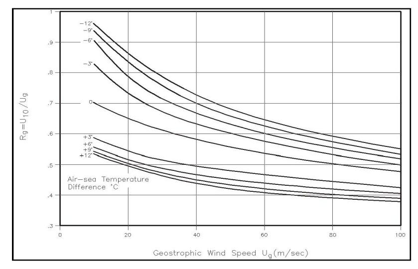

*Figure II-2-13. Ratio of wind speed at a 10-m level to wind speed at the top of the boundary layer as a function of wind speed at the top of the boundary layer, for selected values of air-sea temperature difference.*

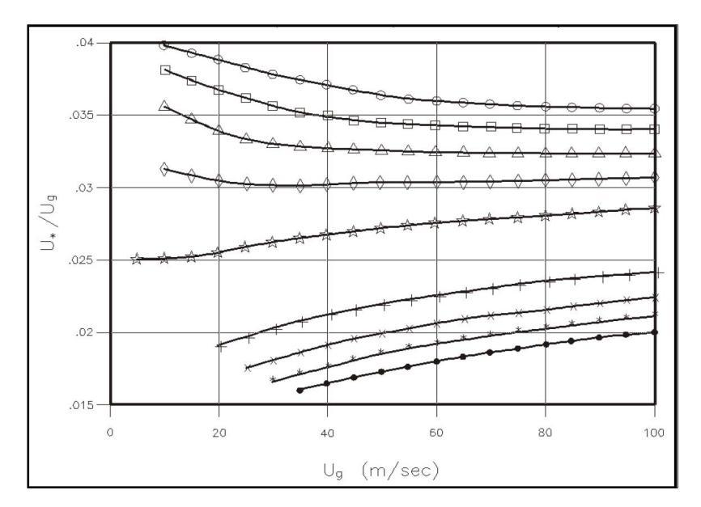

*Figure II-2-14. Ratio of $U_{*}/U_{g}$ as a function of $U_{g}$ for selected values of air-sea temperature difference.*

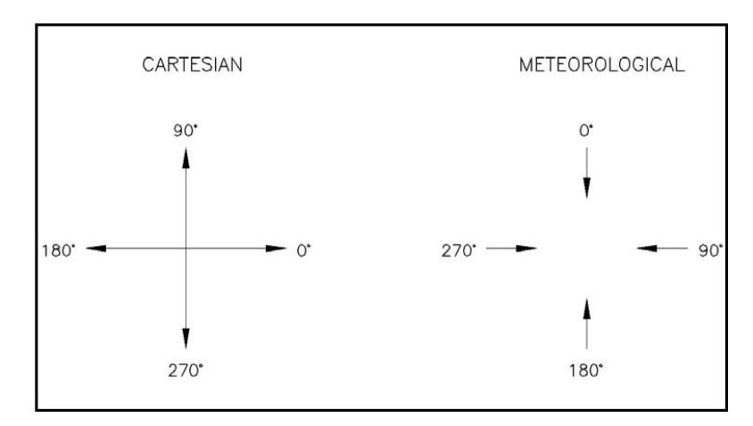

*Figure II-2-15. Common wind direction conventions.*

- (2) An example of the former situation might be the neglect of extratropical waves in an area believed to be dominated by tropical storms. For example, in the southern part of the Bay of Campeche along the coast of Mexico, one might expect that hurricanes dominate the extreme wave climate. However, outbursts of cold air termed "northers" actually contribute to and even control some of the extreme wave climate in this region. An example of the second situation can be found in decisions to operate a boat or ship in a region where storm waves can endanger life and property.
- (3) Table II-2-2 assists users of this manual in understanding such problems. Potentially threatening wind and wave conditions from various scales of the meteorological system are categorized.

### h. Winds in hurricanes.

(1) In tropical and in some subtropical areas, organized cloud clusters form in response to perturbations in the regional flow. If a cloud cluster forms in an area sufficiently removed from the Equator, then Coriolis accelerations are not negligible and an organized, closed circulation can form. A tropical system with a developed circulation but with wind speeds less than 17.4 m/sec (39 mph) is termed a tropical depression. Given that conditions are favorable for continued development (basically warm surface waters, little or no wind shear, and a high pressure area aloft), this circulation can intensify to the point where sustained wind speeds exceed 17.4 m/sec, at which time it is termed a tropical storm. If development continues to the point where the maximum sustained wind speed equals or exceeds 33.5 m/sec (75 mph), the storm is termed a hurricane. If such a storm forms west of the International Date Line, it is called a typhoon. In this section, the generic term hurricane includes hurricanes and typhoons, since the primary distinction between them is their point of origin. Tropical storms will also follow some of the wind models given in this section; but since these storms are weaker, they tend to be more poorly organized.

#### EXAMPLE PROBLEM II-2-5

#### FIND:

The 10-m wind speed, the wind direction, and the coefficient of drag.

### GIVEN:

A pressure gradient of 5 mb in 100 km, an air-sea temperature difference of -5°C ( i.e ., the water is warmer than the air, as is typical in autumn months), the latitude of the location of interest (equal to $45^{\circ}$ N), and the geographic orientation of the isobars.

#### SOLUTION:

Option 1 - From Equation II-2-10, wind speed is calculated (in cgs units) as

```math
U_g = 1/(1.2\times10^{-3} \times 1.03\times10^{-4}) \times (dp/dn)(a) = 1/1.236\times10^{-7} \times (5 \times 1000)/(100 \times 100,000) = 4045\text{ cm/s} = 40.45\text{ m/s}
```

= 40.45 m/s

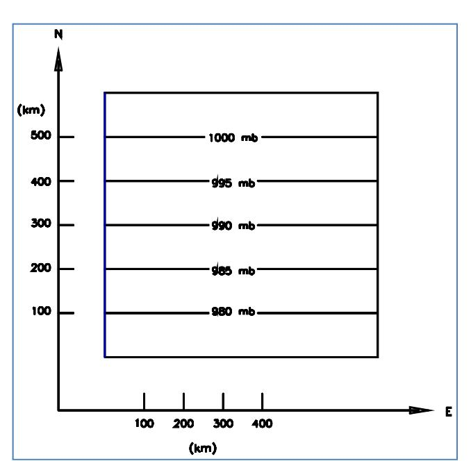

The above sketch shows idealized atmospheric pressure distribution over a 400 × 500 km domain. Over the domain, barometric pressure is spatially constant east-west but increases south to north.
The $1.2x10^{-3}$ factor in step (a) is air density in $g/cm^{3}.$
The underlined 1000 factor in step (b) converts mb to $dynes/cm^{2}.$ The 100,000 factor in step (b) converts km to cm. From $U_{g}$ and Δ T and Figure II-2-13

```math
U_{10}/U_g = 0.68
```

From Figure II-2-5
CD = 0.0024
Wind Direction: Parallel to isobars, counterclockwise circulation around low, therefore the direction is west
Option 2 - Use Figure II-2-12, though it requires pressure gradient information in a different form than given in this example.

*Table II-2-2. Local Seas Generated by Various Meteorological Phenomena*

**Table II-2-2. Local Seas Generated by Various Meteorological Phenomena**

|  |  |  |
| --- | --- | --- |
| Type of Wind System Wave Characteristics | Characteristic | Height and Period |
| Individual thunderstorm | Very steep waves | H 0.5 – 1.5 m T 1.5 – 3.0 sec |
| No significant horizontal rotation | Waves can become relatively large if storm speed and group velocity of spectral peak are nearly equal. |  |
| Size, 1-10 km | Can be a threat to some operations in open-ocean, coastal, and inland waters. |  |
| Supercell thunderstorms | Very steep waves. | H 2 - 3 m T 3 - 6 sec |
| Begins to exhibit some rotation. | Waves can become relatively large if storm speed and group velocity of spectral peak are nearly equal. |  |
| Size, 5-20 km | Can pose a serious threat to some operations in open-ocean, coastal, and inland waters. |  |
| Sea breeze | Waves of intermediate steepness. | H 0.5 - 1.5 m T 3 - 5 sec |
| Thermally driven near-coast winds. | Can modify local wave conditions when superposed on synoptic systems. | 1 3 3 300 |
| Size, 10-100 km | Can affect some coastal operations. |  |
| Coastal fronts | Can modify local wave conditions near coasts. | H 0.5 - 1.0 m T 3 - 4 sec |
| Results from juxtaposition of cold air and warm water. | Minimal effects on wave conditions due to orientation of winds and fetches. |  |
| Size, 10 km across and 100 km long Lee waves | Generates waves that can deviate significantly in direction from synoptic conditions. | H 0.5 - 1.5 m T 2 - 5 sec |
| "Spin-off" eddies due to interactions between synoptic winds and coastal topography. | Can affect coastal wave climates. |  |
| Size, 10's of km |  | *** |
| Frontal squall lines | Can create severe hazards to coastal and offshore operations. | H 1 - 5 m T 4 - 7 sec |
| Organized lines of thunderstorms moving within a frontal area. | Can generate extreme wave conditions for inland waters. |  |
| Size, 100's of km long and 10 km across | Waves can become quite large if frontal area becomes stationary or if rate of frontal movement matches wave velocity of spectral peak. |  |
|  | Can create significant addition to existing synoptic scale waves. |  |
| Mesoscale Convective Complex (MCC) | Important in interior regions of U.S. | H fetch-limited T fetch-limited |
| Large, almost circular system of thunderstorms with rotation around a central point (2-3 form in the U.S. per year). | Can generate extreme waves for short-fetch and intermediate-fetch inland areas. | U ≈ 20 m/s |
| Size, 100-400 km in diameter |  |  |
| Tropical depression Weakly circulating tropical system with winds under 45 mph. | Squall lines superposed on background winds can produce confused, steep waves. | H 1 - 4 m T 4 - 8 sec |

*Table II-2-2. (Continued)*

**Table II-2-2. (Continued)**

| Type of Wind System Wave Characteristics | Characteristic | Height and Period |
| --- | --- | --- |
| Tropical storm | Very steep seas. | H 5 - 8 m T 5 - 9 sec |
| Circulating tropical system with winds over 45 mph and less than 75 mph. | Highest waves in squall lines. |  |
| Hurricane Intense circulating storm of tropical origin with wind speeds over 75 mph. Shape is usually roughly circular. | Can produce large wave heights. Directions near storm center are very short-crested and confused. Highest waves are typically found in the right rear quadrant of a storm. Wave conditions are primarily affected by storm intensity, size, and forward speed, and in weaker storms by interactions with other synoptic scale and large-scale features. | Saffir Simpson Hurricane Scale SS H(m) T(sec) 1 4-8 7-11 2 6-10 9-12 3 8-12 11-13 4 10-14 12-15 5 12-17 13-17 (see Table IV-1-4) |
| Extratropical cyclones | Extreme waves in most open-ocean areas north of 35° are produced by these systems. | Weak: H 3-5m T 5-10 sec |
| Low pressure system formed outside of tropics. | Large waves tend to lie in region of storm with winds parallel to direction of storm movement. | Moderate: H 5-8m T 9-13 sec |
| Shapes are variable for weak and moderate strength storms, with intense storms tending to be elliptical or circular. | Predominant source of swell for most U.S. east coast and west coast areas. | Intense: H 8-12m T 12-17sec Extreme: H 13-18m T 15-20sec |
| Migratory highs Slowly moving high-pressure systems. | Produce moderate storm conditions along U.S. east coast south of 30° latitude when pressure gradients become steep. | H 1 - 4 m T 4 - 10 sec |
| Stationary highs | Produce low swell-like waves due to long fetches. | H 1 - 3 m T 5 - 10 sec |
| Permanent systems located in subtropical ocean areas. | Can interact with synoptic-scale and large-scale weather systems to produce moderately intense wave generation. |  |
| Southern portions constitute the trade winds. | Very persistent wave regime. |  |
| Monsoonal winds | Episodic wave generation can generate large wave conditions. | H 4 - 7 m T 6 - 11 sec |
| Biannual outbursts of air from continental land masses. | Very important in the Indian Ocean, part of the Gulf of Mexico, and some U.S. east coast areas. |  |
| Long-wave generation | Long waves can be generated by moving pressure/wind anomalies (such as can be associated with fronts and squall lines) and can resonate with long waves if the speed of frontal or squall line motion is approximately ඥ݃݀. Examples of this phenomenon have been linked to inundations of piers and beach areas in Lake Michigan and Daytona Beach in recent years. |  |
| Gap winds Wind acceleration due to local topographic | These winds may be extremely important in generating waves in many U.S. west coast areas not exposed to open-ocean waves. | U ≈40 m/s |
| funneling. |  |  |

EM 1110-2-1100 (Part II) Change 4 30 Sep 15
- (2) Although it might be theoretically feasible to model a hurricane with a primitive equation approach (i.e., to solve the coupled dynamic and thermodynamic equations directly), information to drive such a model is generally lacking, and the roles of all of the interacting elements within a hurricane are not well-known. Consequently, practical hurricane wind models for most applications are driven by a set of parameters that characterize the size, shape, rate of movement, and intensity of the storm, along with some parametric representation of the large-scale flow in which the hurricane is imbedded. Myers (1954); Collins and Viehmann (1971); Schwerdt et al. (1979); Holland (1980); and Bretschneider (1990) all describe and justify various parametric approaches to wind-field specification in tropical storms. Cardone et al. (1992) use a modified form of Chow's (1971) moving vortex model to specify winds with a gridded numerical model. However, since this numerical solution is driven only by a small set of parameters and assumes steady-state conditions, it produces results similar to those of parametric models (Cooper 1988). Cardone et al. (1994) and Thompson and Cardone (1996) describe a more general model version that can approximate irregularities in the radial wind profile such as the double maxima observed in some hurricanes.
- (3) All of the above models have been shown to work relatively well in applications; however, the Holland (1980) model appears to provide a better fit to observed wind fields in early stages of rapidly developing storms and appears to work as well as other models in mature storms. Consequently, this model will be described in some detail here. In presently available hurricane models, wind fields are assumed to have no memory and thus can be determined by only a small set of parameters at a given instant. (4) In the Holland model, hurricane pressure profiles are normalized via the relationship:

```math
\beta = \frac{p - p_c}{p_n - p_c} \tag{II-2-15}
```

where
- p = pressure at radius r r = arbitrary radius
- p_c = central pressure in the storm
- p_n = ambient pressure at the periphery of the storm.
(5) Holland showed that the family of \beta -curves for a number of storms resembled a family of rectangular hyperbolas and could be represented as:

```math
r^B \ln(\beta^{-1}) = A \quad \text{or} \quad \beta^{-1} = \exp\left(\frac{A}{r^B}\right) \tag{II-2-16}
```

```math
\beta = \exp\left(\frac{-A}{r^B}\right)
```

where
- A = scaling parameter with units of length
- B = dimensionless parameter that controls the peakedness of the wind speed distribution.
(6) This leads to a representation for the pressure profile as:

```math
p = p_c + (p_n - p_c) \exp(\frac{-A}{r^B}) \tag{II-2-17}
```

which then leads to a gradient wind approximation of the form:

```math
U_{gr} = \left[ \frac{AB(p_n - p_c)exp(\frac{-A}{r^B})}{\rho_a r^B} + \frac{r^2 f^2}{4} \right]^{\frac{1}{2}} - \frac{rf}{2} \tag{II-2-18}
```

where
U_{gr} = gradient approximation to the wind speed.
(7) In the intense portion of the storm, Equation II-2-18 reduces to a cyclostrophic approximation given by:

```math
U_c = \left[ \frac{AB(p_n - p_c) \exp\left( \frac{-A}{r^B} \right)}{\rho_a r^B} \right]^{1/2} \tag{II-2-19}
```

where
U_c = cyclostrophic approximation to the wind speed
which yields explicit forms for the radius to maximum winds as:

```math
R _ { m a x } = A ^ { \frac { 1 } { B } } \tag{II-2-20}
```

EM 1110-2-1100 (Part II) Change 4 30 Sep 15
where
R_{max} = distance from the center of the storm circulation to the location of maximum wind speed
(8) The maximum wind speed can then be approximated as:

```math
U_{max} = \left(\frac{B}{\rho_a e}\right)^{\frac{1}{2}} (p_n - p_c)^{\frac{1}{2}} \tag{II-2-21}
```

where
U_{max} = maximum velocity in the storm e = base of natural logarithms, 2.718.
- (9) Rosendal and Shaw (1982) showed that pressure profiles and wind estimates from the Holland model appeared to fit observed typhoon characteristics in the central North Pacific. If B is equal to one (1) in this model, the pressure profile and wind characteristics become similar to results of Myers (1954); Collins and Viehmann (1971); Schwerdt et al. (1979); and Cardone et al. (1992). In the case of the Cardone et al. model, this similarity would exist only for the case of a storm with no significant background pressure gradient.
- (10) Holland argues that (B=1) is actually the lower limit for B and that, in most storms, the value is likely to be more in the range of 1.5 to 2.5. As shown in Figure II-2-16, this argument is supported by the data from Atkinson and Holliday (1977) and Dvorak (1975), taken from studies of Pacific typhoons. The effect of a higher value of B is to produce a more peaked wind distribution in the Holland model than exists in models with B set to a value of (1). According to Holland (1980), use of a wind field model with (B=1) will underestimate winds in many tropical storms. In applications, the choices of A and B can either be based on the best two-parameter fit to observed pressure profiles or on the combination of an R_{max} value with the data shown in Figure II-2-16. It is worth noting here that the Holland model is similar to several other parametric models, except that it uses two parameters rather than one in describing the shape of the wind profile. This second parameter allows the Holland model to represent a range of peakedness rather than only a single peakedness in applications.
- (11) As a final element in application of the Holland wind model, it is necessary to consider the effects of storm movement on the surface wind field. Since a hurricane moves most of its mass along with it (unlike an extratropical storm), this step is a necessary adjustment to the storm wind field and can create a marked asymmetry in the storm wind field, particularly for the case of weak or moderate storms. Hughes' (1952) composite wind fields from moving hurricanes indicated that the highest wind speeds occurred in the right rear quadrant of the storm. This supports the interpretation that the total wind in a hurricane can be obtained by adding a wind vector for storm motion to the estimated winds for a stationary storm. On the other hand, Chow's (1971) numerical
results suggest that winds in the front right and front left quadrants are more likely to contain the maximum wind speeds in a moving hurricane. These contradictory results have made it difficult to treat the effects of storm movement of surface wind fields in a completely satisfactory fashion. Various researchers have either ignored the problem or suggested that, at least in simple parametric models, the effects of storm movement can be adequately approximated by adding a constant vector representative of the forward storm motion to the estimated wind for a stationary storm. In light of the overall lack of definitive information on this topic, the latter approach is considered sufficient.

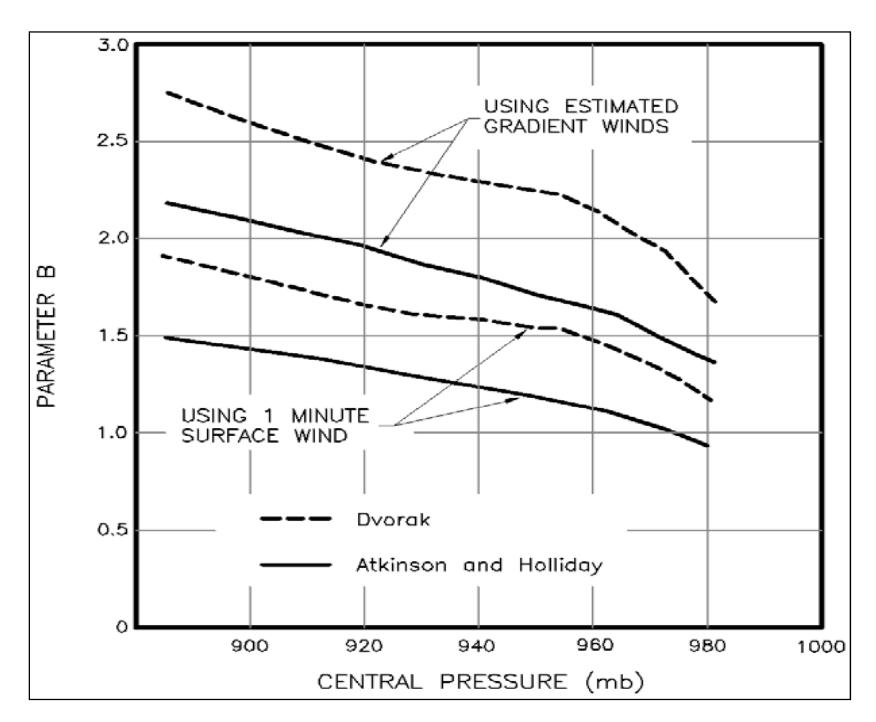

*Figure II-2-16. Climatological variation in Holland's "B" factor (Holland 1980).*

- (12) At this point, it should be stressed that Equations II-2-18, 19, and 21 and superposition of the storm motion vector are only applicable to winds above the surface boundary layer. To convert these winds to winds at a 10-m reference level, it is necessary to apply a model of the type described in Part II-2-1-c-(3)(b). As shown in that section, it is not advisable to use a constant ratio between winds at the top of the boundary layer and winds at a 10-m level. If a complete wind field is required for a particular application, the use of a planetary-boundary-layer (PBL) model combined with either a moving vortex formulation or a numerical version of a parametric model is recommended.
- (13) To provide some guidance regarding maximum sustained wind speeds at a 10-m reference level, Figure II-2-17 shows representative curves of maximum sustained wind speed versus central pressure for selected values of forward storm movement. It should be noted that maximum winds at the top of the boundary layer are relatively independent of latitude, since the wind balance equation is dominated by the cyclostrophic term; however, there is a weak dependence on latitude through the boundary-layer scaling, which is latitude-dependent. This dependence and dependence of the maximum wind speed on the radius to maximum wind were
EM 1110-2-1100 (Part II) Change 4 30 Sep 15
both found to be rather small; consequently, only fixed values of latitude and $R_{max}$ have been treated here. From the methods used in deriving these estimates, winds given here can be regarded as typical values for about a 15- to 30-min averaging period. Thus, winds from this model are appropriate for use in wave models and surge models, but must be transformed to shorter averaging times for most structural applications.
(14) Values for wind speeds in Figure II-2-17 may appear low to people who recall reports of maximum wind speeds for many hurricanes in the range of 130-160 mph (about 58-72 m/sec). First, it should be recognized that very few good measurements of hurricane wind speed exist today. Where such measurements exist, they give support to the values presented in Figure II-2-17. Second, the values reported as sustained wind speeds often come from airplane measurements, so they tend to be considerably higher than corresponding values at 10 m. Third, winds at airports and other land stations often use only a 1-min averaging time in their wind speed measurements. These winds are subsequently reported as sustained wind speeds. An idea of the magnitude that some of these effects can have on wind estimates may be gained via the following example. The central pressure of Hurricane Camille, as it moved onshore at a speed of about 6.0 m/sec in 1969, was about 912 mb. From Figure II-2-17, the 15- to 30-min average wind speed is estimated to be 52.5 m/sec. Converting this to a 1-min wind speed in miles per hour yields approximately 150 mph, which is in very reasonable agreement with the measured and estimated winds in this storm. It is important to recognize though that these higher wind speeds are not appropriate for applications in surge and wave models.

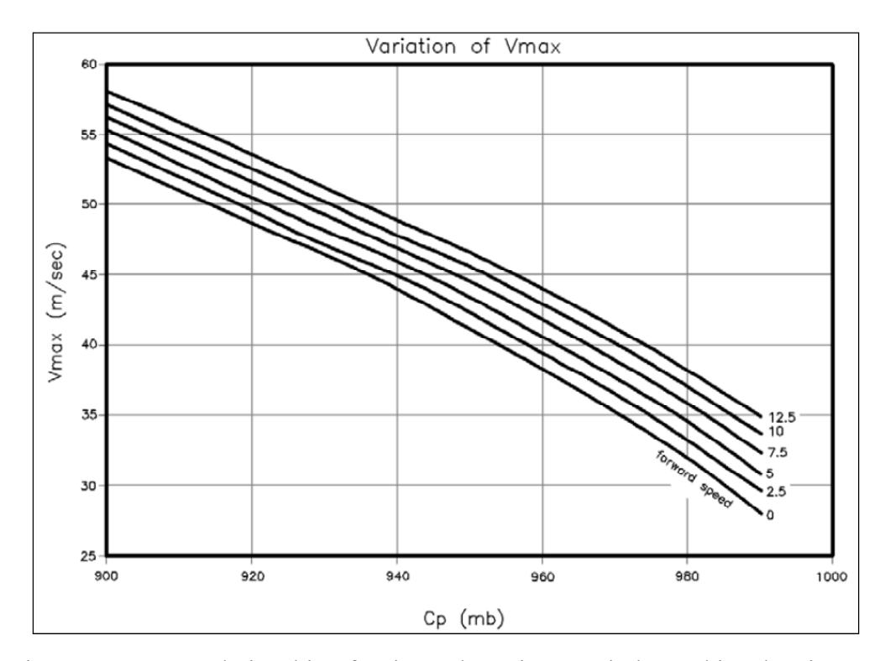

*Figure II-2-17. Relationship of estimated maximum wind speed in a hurricane at 10-m elevation as a function of central pressure and forward speed of storm (based on latitude of 30 deg, $R_{max}$ =30 km, 15- to 30-min averaging period).*

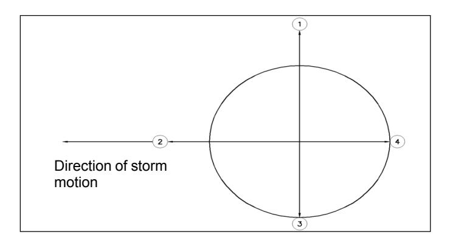

*Figure II-2-18. Definition of four radial angles relative to direction of storm movement.*

- (15) Figures II-2-18 and II-2-19 are examples of the output from the hurricane model presented here. Figure II-2-18 shows the four radials. Figure II-2-19 shows wind speed along Radials 1 and 3, as a function of dimensionless distance along the radial $(r/R_{max})$ for a central pressure $p_{c}$ of 930 mb and forward speeds of 2.5 m/sec, 5.0 m/sec, and 7.5 m/sec. The inflow angle along these radii (not shown) can be quite variable. The behavior of this angle is a function of several factors and is still the subject of some debate.
- i. Step-by-step procedure for simplified estimate of winds for wave prediction.
- (1) Introduction. This section presents simplified, step-by-step methods for estimating winds to be used in wave prediction. The methods include the key assumption that wind fields are well-organized and can be adequately represented as an average wind speed and direction over the entire fetch. Most engineers can use such convenient computer-based wind estimation tools as ACES, and such tools should be used in preference to the corresponding methods in this section. The simplified methods provide an approximation to the processes described earlier in this chapter. The methods embody graphs presented earlier, some of which were generated with ACES. The simplified methods are particularly useful when quick, low-cost estimates are needed. They are reasonably accurate for simple situations where local effects are small.
- (2) Wind measurements. Winds can be estimated using direct measurements or synoptic weather charts. For preliminary design, extreme winds derived from regional records may also be useful (Part II-9-6). Actual wind records from the site of interest are preferred so that local effects such as orographic influences and sea breeze are included. If wind measurements at the site are not available and cannot be collected, measurements at a nearby location or synoptic weather charts may be helpful. Wind speeds must be adjusted properly to avoid introducing bias into wave predictions.
- (3) Procedure for adjusting observed winds. When ACES is unavailable, the following procedure can be used to adjust observed winds with some known level, location (over water or land), and averaging time. A logic diagram (Figure II-2-20) outlines the steps in adjusting wind speeds for application in wave growth models.

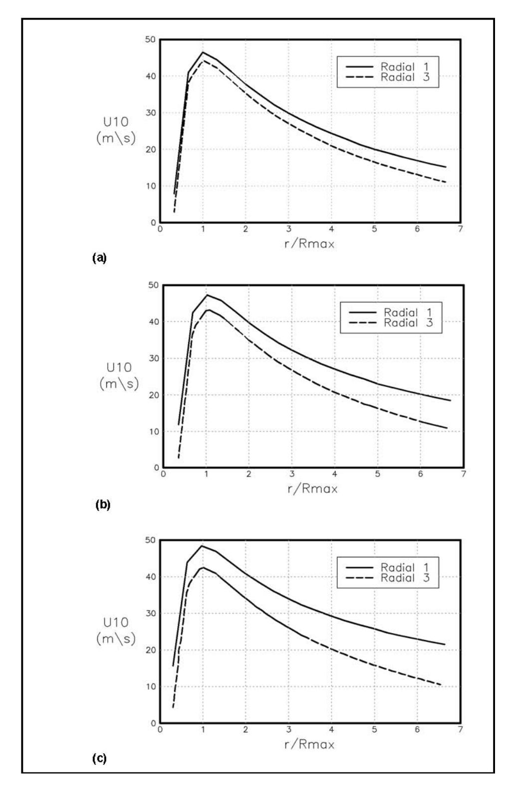

*Figure II-2-19. Horizontal distribution of wind speed along Radial 1 for a storm with forward velocity $V_{F}$ of (a) 2.5 m/sec; (b) 5 m/sec; (c) 7.5 m/sec.*

#### EXAMPLE PROBLEM II-2-6

#### FIND:

The expected maximum sustained wind speed for this storm for surge and/or wave prediction and the maximum 1-min wind speed.

#### GIVEN:

A hurricane located at a latitude of 28° with a central pressure of 935 mb and a forward velocity of 10 m/sec.

### SOLUTION:

Using Figure II-2-17, the maximum wind speed in a moving storm with the parameters given here is approximately 47.3 m/sec for a 15- to 30-min average at the 10-m level. From Figure II-2-1, the ratio of a 30-min wind (chosen here to give a conservative approximation) to a 1-min wind is approximately 1.23. Multiplying this factor times 47.3 yields a 1-min wind speed of 58.2 m/sec (130 mph).
- (a) Level. If the wind speed is observed at any level other than 10 m, it should be adjusted to 10 m using Figure II-2-6 (see Example Problem II-2-3).
- (b) Duration. If extreme winds are being considered, wind speed should be adjusted from the averaging time of the observation (fastest mile, 5-min average, 10-min average, etc.) to an averaging time appropriate for wave prediction using Figure II-2-1 (see Example Problem II-2-1). Typically, several different averaging times should be considered for wave prediction to ensure that the maximum wave growth scenario has been identified. When the fetch is limited, Figure II-2-3 can be used to estimate the maximum averaging time to be considered. When the observed wind is given in terms of the fastest mile, Figure II-2-2 can be used to convert to an equivalent averaging time.
- (c) Overland or overwater. When the observation was collected overwater (within the marine boundary layer), this adjustment is not needed. When the observation was collected overland and the fetch is long enough for full development of a marine boundary layer (longer than about 16 km or 10 miles), the observed wind speed should be adjusted to an overwater wind speed using Figure II-2-7 (see Example Problem II-2-4). Otherwise (for overland winds and fetches less than 16 km), wave growth occurs in a transitional atmospheric boundary layer, which has not fully adjusted to the overwater regime. In this case, wind speeds observed overland must be increased to better represent overwater wind speeds. A factor of 1.2 is suggested here, but no simple method can represent this complex case accurately. In relation to all of these adjustments, the term overland implies a measurement site that is predominantly characterized as inland. If a measurement site is directly adjacent to the water body, it may, for some wind directions, be equivalent to overwater.

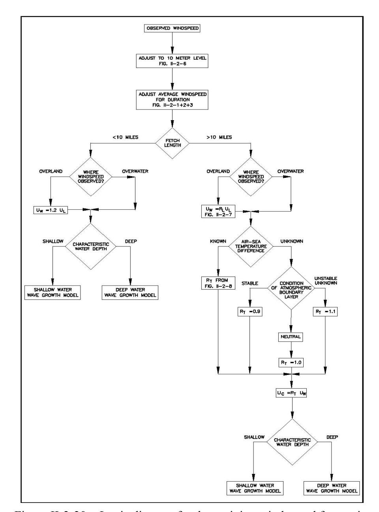

*Figure II-2-20. Logic diagram for determining wind speed for use in wave hindcasting and forecasting models.*

- (d) Stability. For fetches longer than 16 km, an adjustment for stability of the boundary layer may also be needed. If the air-sea temperature difference is known, Figure II-2-8 can be used to make the adjustment. When only general knowledge of the condition of the atmospheric boundary layer is available, it should be categorized as stable, neutral, or unstable according to the following: Stable when the air is warmer than the water, the water cools air just above it and decreases mixing in the air column $(R_{T}$ = 0.9).
- Neutral when the air and water have the same temperature, the water temperature does not affect mixing in the air column $(R_{T}$ = 1.0).
- Unstable when the air is colder than the water, the water warms the air, causing air near the water surface to rise, increasing mixing in the air column $(R_{T}$ = 1.1).
When the boundary layer condition is unknown, an unstable condition, $R_{T}$ = 1.1, should be assumed.
- (4) Procedure for adjusting winds from synoptic weather charts. As discussed earlier, synoptic weather charts are maps depicting isobars at sea level. The free air, or geostrophic, wind speed is estimated from these sea level pressure charts. Adjustments or corrections are then made to the geostrophic wind speed. Pressure chart estimations should be used only for large areas, and the estimated values should be compared with observations, if possible, to verify their accuracy.
- (a) Geostrophic wind speed. To estimate geostrophic wind speed, Equation II-2-10 or Figure II-2-12 should be used (see Example Problem II-2-5).
- (b) Level and stability. Wind speed at the 10-m level should be estimated from the geostrophic wind speed using Figure II-2-13. The resulting speed should then be adjusted for stability effects as needed using Figure II-2-8.
- (c) Duration. Wind duration estimates are also needed. Since synoptic weather charts are prepared only at 6-hr intervals, it may be necessary to use interpolation to determine duration. Linear interpolation is adequate for most cases. Interpolation should not be used if short-duration phenomena, such as frontal passages or thunderstorms, are present.
- (5) Procedure for estimating fetch. Fetch is defined as a region in which the wind speed and direction are reasonably constant. Fetch should be defined so that wind direction variations do not exceed 15 deg and wind speed variations do not exceed 2.5 m/sec (5.0 knots) from the mean. A coastline upwind from the point of interest always limits the fetch. An upwind limit to the fetch may also be provided by curvature, or spreading, of the isobars or by a definite shift in wind direction. Frequently the discontinuity at a weather front will limit fetch.

### 2-2. Wave Hindcasting and Forecasting.

### a. Introduction.

(1) The theory of wave generation has had a long and rich history. Beginning with some classic works of Kelvin (1887) and Helmholtz (1888), many scientists, engineers, and mathematicians have addressed various forms of water wave motions and interactions with the wind. In the early 1900s, the work of Jeffreys (1924, 1925) hypothesized that waves created a "sheltering effect" and hence created a positive feedback mechanism for transfer of momentum into the wave field from the wind. However, it was not until World War II that organized wave predictions began in earnest. During the 1940s, large bodies of wave observations were collated
EM 1110-2-1100 (Part II) Change 4 30 Sep 15
and the bases for empirical wave predictions were formulated. Sverdrup and Munk (1947, 1950) presented the first documented relationships among various wave-generation parameters and resulting wave conditions. Bretschneider (1952) revised these relationships based on additional evidence; methods derived from these exemplary pioneer works are still in active use today.
(2) The basic tenet of the empirical prediction method is that interrelationships among dimensionless wave parameters will be governed by universal laws. Perhaps the most fundamental of these laws is the fetch-growth law. Given a constant wind speed and direction over a fixed fetch, it is expected that waves will reach a stationary fetch-limited state of development. In this situation, wave heights will remain constant (in a statistical sense) through time but will vary along the fetch. If dimensionless wave height is taken as:

```math
\hat{H} = \frac{gH}{u_*^2} \tag{II-2-22}
```

where
- H = characteristic wave height, originally taken as the significant wave height but more recently taken as the energy-based wave height H_{m0}
- u_* = friction velocity
and dimensionless fetch is defined as:

```math
\hat { X } = \frac { g X } { u _ { * } ^ { 2 } } \tag{II-2-23}
```

where
X =straight line distance over which the wind blows
then idealized, fetch-limited wave heights are expected to follow a relationship of the form:

```math
\hat{H} = \lambda_1 \, \hat{X}^{m_1} \tag{II-2-24}
```

where
\lambda_1 = dimensionless coefficient m_I = dimensionless exponent
(3) If dimensionless wave frequency (defined simply as one over the spectral peak wave period) is defined as:

```math
\hat{f}_p = \frac{u_* f_p}{g} \tag{II-2-25}
```

where
f_p = frequency of the spectral peak
then a stationary wave field also implies a fixed relationship between wave frequency and fetch of the form

```math
\hat { \ b f } _ { p } = \lambda _ { 2 } \hat { X } ^ { \hat { m } _ { 2 } } \tag{II-2-26}
```

where
\lambda_2 and m_2 are more empirical coefficients.
- (4) Since u_* scales the effective rate of momentum transfer from the atmosphere into the waves, all empirical coefficients in these wave generation laws are expected to be universal values. Unfortunately, there is still some ambiguity in these values; however, in lieu of any demonstrated improvements over values from the Shore Protection Manual (1984), those values for fetch-limited wave growth will be adopted here.
- (5) From basic conservation laws and the dispersion relationship, it is anticipated that any law governing the rate of growth of waves along a fetch will also form a unique constraint on the rate of growth of waves through time. If we define dimensionless time as:

```math
\hat{t} = \frac{g t}{u_*} \tag{II-2-27}
```

where
t = time
additional relationships governing the duration-growth of waves will be

```math
\hat { H } = \lambda _ { 3 } \hat { t } ^ { m _ { 3 } } \tag{II-2-28}
```

and

```math
\hat{f}_p = \lambda_4 \hat{t}^{m_4} \tag{II-2-29}
```

where
\lambda_4 and m_4 are more "universal" coefficients to be determined empirically.
(6) The form of Equations II-2-26 and II-2-27 imply that waves will continue to grow as long as fetch and time continue to increase. This concept was observed to be incorrect in the early compendiums of data (Sverdrup and Munk 1947; Bretschneider 1952), which suggested that a
EM 1110-2-1100 (Part II) Change 4 30 Sep 15
"fully developed" wave height would evolve under the action of the wind. Available data indicated that this fully developed wave height could be represented as:

```math
H_{\infty} = \frac{\lambda_5 u^2}{g} \tag{II-2-30}
```

where
- H_{\infty} = fully developed wave height
- \lambda_5 = dimensionless coefficient (approximately equal to 0.27)
- u = wind speed
Wave heights defined by Equation II-2-30 are usually taken as representing an upper limit to wave growth for any wind speed.
- (7) In the 1950s, researchers began to recognize that the wave generation process was best described as a spectral phenomenon (e.g., Pierson et al. 1955). Theoreticians then began to reexamine their ideas on the wave-generation process, with regard to how a turbulent wind field could interact with a random sea surface. Following along these lines, Phillips (1958) and Miles (1957) advanced two theories that formed the cornerstone of the understanding of wave generation physics for many years. Phillips' concept involved the resonant interactions of turbulent pressure fluctuations with waves propagating at the same speed. Miles' concept centered on the mean flux of momentum from a "matched layer" above the wave field into waves travelling at the same speed. Phillips' theory predicted linear wave growth and was believed to control the early stages of wave growth. Miles' theory predicted an exponential growth and was believed to control the major portion of wave growth observed in nature. Direct measurements of the Phillips' resonance mechanism indicated that the measured turbulent fluctuations were too small by about an order of magnitude to explain the observed early growth in waves; however, it was still adopted as a plausible concept. Subsequent field efforts by Snyder and Cox (1966) and Snyder et al. (1981) have supported at least the functional form of Miles' theory for the transfer of energy into the wave field from winds.
- (8) From basic concepts of energy conservation and the fact that waves do attain limiting fully developed wave heights, it is obvious that wave generation physics cannot consist of only wind source terms. There must be some physical mechanism or mechanisms that lead to a balance of wave growth and dissipation for the case of fully developed conditions. Phillips (1958) postulated that one such mechanism in waves would be wave breaking. Based on dimensional considerations and the knowledge that wave breaking has a very strong local effect on waves, Phillips argued that energy densities within a spectrum would always have a universal limiting value given by:

```math
E(f) = \frac{\propto g^2 f^{-5}}{(2\pi)^4} \tag{II-2-31}
```

where E(f) is the spectral energy density in units of length squared per hertz and \alpha was understood to be a universal (dimensionless) constant approximately equal to 0.0081. It should be noted here that energy densities in this equation are proportional to f^5 (as can be deduced from dimensional arguments) and that they are independent of wind speed. Phillips hypothesized that local wave breaking would be so strong that wind effects could not affect this universal level. In this context, a saturated region of spectral energy densities is assumed to exist in some region from near the spectral peak to frequencies sufficiently high that viscous effects would begin to be significant. This region of saturated energy densities is termed the equilibrium range of the spectrum.
(9) Kitaigorodskii (1962) extended the similarity arguments of Phillips to distinct regions throughout the entire spectrum where different mechanisms might be of dominant importance. Pierson and Moskowitz (1964) followed the dimensional arguments of Phillips and supplemented these arguments, with relationships derived from measurements at sea. They extended the form of Phillips spectrum to the classical Pierson-Moskowitz spectrum:

```math
E(f)=\frac{\infty g^2 f^{-5}}{(2\pi)^4}\exp\left[-0.74\left(\frac{f}{f_u}\right)^{-4}\right] \tag{II-2-32}
```

where
f_u = limiting frequency for a fully developed wave spectrum (assumed to be a function only of wind speed).
(10) Based on these concepts of spectral wave growth due to wind inputs via Miles-Phillips mechanisms and a universal limiting form for spectral densities, first-generation (1-G) wave models in the United States were born (Inoue 1967; Bunting 1970). It should be pointed out here that the first model of this type was actually developed in France (Gelci et al. 1957); however, that model did not incorporate the limiting Pierson-Moskowitz spectral form, as did models in the United States. In these models, it was recognized that waves in nature are not only made up of an infinite (continuous) sum of infinitesimal wave components at different frequencies but that each frequency component is made up of an infinite (continuous) sum of wave components travelling in different directions. Thus, when waves travel outward from a storm, a single "wave train" moving in one direction does not emerge. Instead, directional wave spectra spread out in different directions and disperse due to differing group velocities associated with different frequencies. This behavior cannot be modeled properly in parametric (significant wave height) models and understanding of this behavior formed the basic motivation to model all wave components in a spectrum individually. The term discrete-spectral model has since been employed to describe models that include calculations of each separate (frequency-direction) wave component. The equation governing the energy balance in such models is sometimes termed the radiative transfer equation and can be written as:

```math
\frac{\partial E(f,\theta,x,y,t)}{\partial t} = -c_{\vec{G}} \vec{\nabla} E(f,\theta,x,y,t) + \sum_{k=1}^{K} S(f,\theta,x,y,t)_{k} \tag{II-2-33}
```

EM 1110-2-1100 (Part II) Change 4 30 Sep 15
where
E(f, \theta, x, y, t) = spectral energy density as a function of frequency (f), propagation direction (\theta) , two horizontal spatial coordinates (x and y) and time (t) S(f, \theta, x, y, t)_k = the k^{th} source term, which exists in the same five dimensions as the energy density.
The first term on the right side of this equation represents the effects of wave propagation on the wave field. The second term represents the effects of all processes that add energy to or remove energy from a particular frequency and direction component at a fixed point at a given time.
- (11) In the late 1960s evidence of spectral behavior began to emerge which suggested that the equilibrium range in wave spectra did not have a universal value for \alpha . Instead, it was observed that \alpha varied as a function of nondimensional fetch (Mitsuyasu 1968). This presented a problem to the "first-generation" interpretation of wave generation physics, since it implied that energies within the equilibrium range are not controlled by wave breaking. Fortunately, a theoretical foundation already existed to help explain this discrepancy. This foundation had been established in 1961 in an exceptional theoretical formulation by Klaus Hasselmann in Germany. In this formulation, Hasselmann, using relatively minimal assumptions, showed that waves in nature should interact with each other in such a way as to spread energy throughout a spectrum. This theory of wave-wave interactions predicted that energy near the spectral peak region should be spread to regions on either side of the spectral peak.
- (12) Hasselmann et al. (1973) collected an extensive data set in the Joint North Sea Wave Project (JONSWAP). Careful analysis of these data confirmed the earlier findings of Mitsuyasu and revealed a clear relationship between Phillips' α and nondimensional fetch (Figure II-2-21). This finding and certain other spectral phenomena, such as the tendency of wave spectra to be more peaked than the Pierson-Moskowitz spectrum during active generation, could not be explained in terms of "first-generation" concepts; however, they could be explained in terms of a nonlinear interaction among wave components. This pointed out the necessity of incorporating wave-wave interactions into wave prediction models, and led to the development of second-generation (2-G) wave models. The modified spectral shape which came out of the JONSWAP experiment has come to bear the name of that experiment; hence, we now have the JONSWAP spectrum, which can be written as:

```math
E(f)=\frac{\infty g^2}{(2\pi)^4 f^5}exp\left[-1.25\left(\frac{f}{f_p}\right)^{-4}\right]\gamma^{exp\left[-\frac{\left(\frac{f}{f_p}-1\right)^2}{2\sigma^2}\right]} \tag{II-2-34}
```

where
- \alpha = equilibrium coefficient
- \sigma = \text{dimensionless spectral width parameter, with value } \sigma_a \text{ for } f \leq f_n \text{ and value } \sigma_b \text{ for } f \geq f_n

### γ = peakedness parameter

The average values of the σ and γ parameters in the JONSWAP data set were found to be γ = 3.3, σ a = 0.07, and $f_{b}$ = 0.09. Figure II-2-22 compares this spectrum to the Pierson-Moskowitz spectrum.

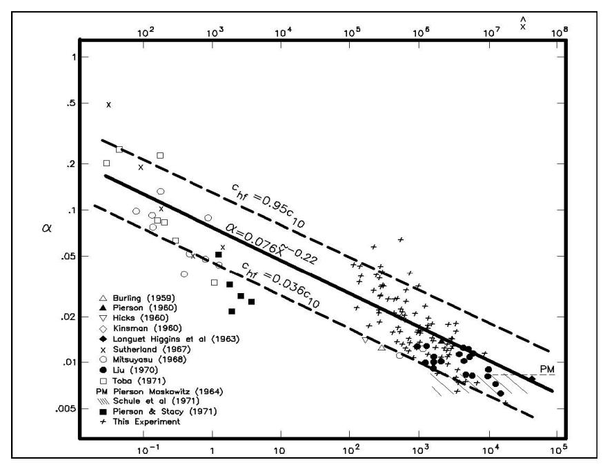

*Figure II-2-21. Phillips' constant versus fetch scaled according to Kitaigorodskii. Small-fetch data are obtained from wind-wave tanks. Capillary-wave data were excluded where possible (Hasselmann et al. 1973).*

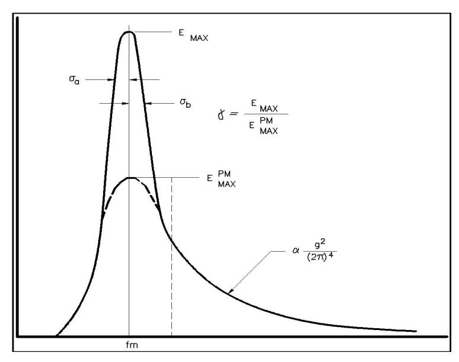

*Figure II-2-22. Definition of JONSWAP parameters for spectral shape.*

EM 1110-2-1100 (Part II) Change 4 30 Sep 15
- (13) Early second-generation models (Barnett 1968, Resio 1981) followed an f^5 equilibrium-range formulation since prior research had been formulated with that spectral form. Toba (1978) was the first researcher to present data suggesting that the equilibrium range in spectra might be better fit by an f^4 dependence. Following his work, Forristall et al. (1978); Kahma (1981); and Donelan et al. (1982) all presented evidence from independent field measurements supporting the tendency of equilibrium ranges to follow an f^4 dependence. Kitaigorodskii (1983); Resio (1987, 1988); and Resio and Perrie (1989) have all presented theoretical analyses showing how this behavior can be explained by the nature of nonlinear fluxes of energy through a spectrum. Subsequently, Resio and Perrie (1989) determined that, although certain spectral growth characteristics were somewhat different between the f^4 and f^5 formulations, the basic energy-growth equations were quite similar for the two formulations. The f^4 formulation is incorporated into CERC's WAVAD model, and is used in its hindcast studies.
- (14) Since the early 1980s, a new class of wave model has come into existence (Hasselmann et al. 1985). This new class has been termed a third-generation wave model (3-G). The distinction between second-generation and third-generation wave models is the method of solution used in these models. Second-generation wave models combine relatively broad-scale parameterizations of the nonlinear wave-wave interaction source term combined with constraints on the overall spectral shape to simulate wave growth. Third-generation models use a more detailed parameterization of the nonlinear wave-wave interaction source terms and relax most of the constraints on spectral shape in simulating wave growth. Various third-generation models are used around the world today; however, the third-generation model is probably the WAM model.
- (15) Part of the motivation to use third-generation models is related to the hope that future simulations of directional spectra can be made more accurate via the direct solution of the detailed source-term balance. This is expected to be particularly important in complex wave generation scenarios where second-generation models might not be able to handle the general source term balance. However, recent research by Van Vledder and Holthuisen (1993) has demonstrated rather convincingly that the "detailed balance" equations in the WAM (WAMDI Group 1988) model at this time still cannot simulate waves in rapidly turning winds accurately. Hence, there remains much work to be done before the performance of third-generation models can be considered to be totally satisfactory.
- (16) First-generation models that have been modified to allow the Phillips equilibrium coefficient to vary dynamically (Cardone 1992), second-generation models (Resio 1981; NORSWAM 1977; Hubertz 1992), and third-generation models (Hasselmann et al. 1985) have all been shown to produce very good predictions and hindcasts of wave conditions for a wide range of meteorological situations. These models are recommended in developing wave conditions for design and planning situations having serious economic or safety implications, and should be properly verified with local wave data, wherever feasible. This is not meant to imply that wave models can supplant wave measurements, but rather that in most circumstances, these models should be used instead of parametric models.
- b. Wave prediction in simple situations. In some situations, it is desirable to estimate wave conditions for preliminary considerations in project designs or even for final design in cases
where total project costs are minimal. In the past, nomograms have played an important role in providing such wave information. However, with today's proliferation of user-friendly computer software such as the ACES Program, reliance on nomograms is discouraged. ACES will assist a user in his or her calculations, will facilitate most applications, and will help avoid most potential pitfalls related to misuse of wave prediction schemes. In spite of this warning and advice to use ACES, conventional prediction methods will be discussed here to provide such information for appropriate applications.
- (1) Assumptions in simplified wave predictions.
- (a) Deep water. There are three situations in which simplified wave predictions can provide accurate estimates of wave conditions (Szabados 1982). The first of these occurs when a wind blows, with essentially constant direction, over a fetch for sufficient time to achieve steady-state, fetch-limited values. The second idealized situation occurs when a wind increases very quickly through time in an area removed from any close boundaries. In this situation, the wave growth can be termed duration-limited. It should be recognized that this condition is <u>rarely</u> met in nature; consequently, this prediction technique should only be used with great caution. Open-ocean winds rarely can be categorized in such a manner to permit a simple duration-growth scenario. The third situation that may be treated via simplified prediction methods is that of a fully developed wave height. Knowledge of the fully developed wave height can provide valuable upper limits for some design considerations; however, open-ocean waves rarely attain a limiting wave height for wind speeds above 50 knots or so. Equation II-2-30 provides an easy means to estimate this limiting wave height.
- (b) Wave growth with fetch. In this section, SI units should be used in formulas and figures. Figure II-2-3 shows the time required to accomplish fetch-limited wave development for short fetches. The general equation for this can be derived by combining the JONSWAP growth law for peak frequency, an equation for the fully developed frequency, and the assumption that a local wave field propagates at a group velocity approximately equal to 0.85 times the group velocity of the spectral peak. This factor accounts for both frequency distribution of energy in a JONSWAP spectrum and angular spreading which yields:

```math
t_{x,u} = 77.23 \frac{X^{0.67}}{u^{0.34} g^{0.33}} \tag{II-2-35}
```

where
t_{x,u} = time required for waves crossing a fetch of length x under a wind of velocity u to become fetch-limited.
Equation II-2-35 can be used to determine whether or not waves in a particular situation can be categorized as fetch-limited. The equations governing wave growth with fetch are:
EM 1110-2-1100 (Part II) Change 4 30 Sep 15

```math
\frac{gH_{m_0}}{u_*^2} = 4.13 \times 10^{-2*} \left(\frac{gX}{u_*^2}\right)^{\frac{1}{2}}
```

and

```math
\frac{gT_p}{u_*} = 0.651 \left(\frac{gX}{u_*^2}\right)^{\frac{1}{3}} \tag{II-2-36}
```

```math
C _ { D } = \frac { u _ { * } ^ { 2 } } { U _ { 1 0 } ^ { 2 } }
```

```math
C _ { D } = 0 . 0 0 1 { \left( 1 . 1 + 0 . 0 3 5 U _ { _ { 1 0 } } \right) }
```

where
X =straight line fetch distance over which the wind blows (units of m)
- H_{m0} = energy-based significant wave height (m)
- C_D = drag coefficient
- U_{10} = \text{wind speed at } 10 \text{ m elevation (m/sec)}
- u^* = friction velocity (m/sec)
See Demirbilek et al. (1993) for more details.
Fully developed wave conditions in these equations are given by

```math
\frac{gH_{m_*}}{u_*^2} = 2.115 \times 10^2 \tag{II-2-37}
```

and

```math
\frac { g T _ { p } } { u _ { * } } { = 2 . 3 9 8 \times 1 0 ^ { 2 } }
```

Equations governing wave growth with wind duration can be obtained by converting duration into an equivalent fetch given by

```math
\frac{gX}{u_*^2} = 5.23 \times 10^{-3} \left(\frac{gt}{u_*}\right)^{\frac{3}{2}} \tag{II-2-38}
```

where t in this equation is the wind duration. The fetch estimated from this equation can then be substituted into the fetch-growth equations to obtain duration-limited estimates of wave height and period. An example demonstrating these procedures is provided at the end of this chapter.
- (c) Narrow fetches. Data sets showing a clear relationship between fetch width and "effective fetch" for wave prediction are relatively limited. Effective fetch is independent of the wind speed, and can be approximated as the weighted distances measured along a line 45 deg to the left of the shore normal, along the shore normal and along a line 45 deg to the right of the shore normal. The Shore Protection Manual (1977) has an illustration (Figure 3-13) for calculating the weighted effective fetch. Many processes act at different scales in wave generation within complex geometries. Early wave prediction nomograms included modifications to predicted wave conditions based on a sort of aspect ratio for a fetch area, based on the ratio of fetch width to fetch length. Subsequent investigations (Resio and Vincent 1979) suggested that wave conditions in fetch areas were actually relatively insensitive to the width of a fetch; consequently, it is recommended here that fetch width not be used to estimate an effective fetch for use in nomograms or the ACES Program. Instead, it is recommended that either the straight-line fetch should be used to define fetch length for applications for conservatism or a simple application of a code such as STWAVE should be applied.
- (d) Shallow water. Many studies suggest that water depth acts to modify wave growth. Bottom friction and percolation (Putnam 1949; Putnam and Johnson 1949; Bretschneider and Reid 1953) have been postulated as significant processes that diminish wave heights in shallow water; however, recent studies in shallow water (Janssen 1989 and 1991) indicate that fetch-limited wave growth in shallow water appears to follow growth laws that are quite close to deepwater wave growth for the same wind speeds, up to a point where an asymptotic depth-dependent wave height is attained. In light of this evidence, it seems prudent to disregard bottom friction effects on wave growth in shallow water. Also, evidence from Bouws et al. (1985) indicates that wave spectra in shallow water do not appear to have a noticeable dependence on variations in bottom sediments. Consequently, it is recommended that deepwater wave growth formulae should be used for all depths, with the constraint that no wave period can grow past a limiting value as shown by Vincent (1985). This limiting wave period is simply approximated by the relationship:

```math
T_p \approx 9.78 \left(\frac{d}{g}\right)^{\frac{1}{2}} \tag{II-2-39}
```

In cases with extreme amounts of material in the water column (for example sediment, vegetation, man-made structures, etc.), it is likely that the dissipation rate of wave energy will become very large. In such cases, Camfield's (1977) work may be used as a guideline for estimating frictional effects on wave growth and dissipation; however, it should be recognized that little experimental evidence exists to confirm the exact values of these dissipation rates.
(e) Prediction of deepwater waves from nomograms. Figures II-2-23 through II-2-26 are wave prediction nomograms under fetch-limited and duration-limited conditions. The curves in these nomograms are based on Equations II-2-30 and II-2-36 through II-2-38 presented previously in this section. The asymptotic upper limits in both cases provide information on the fully developed wave heights as a function of wind speed. The same information can be obtained more expediently via the ACES Program.

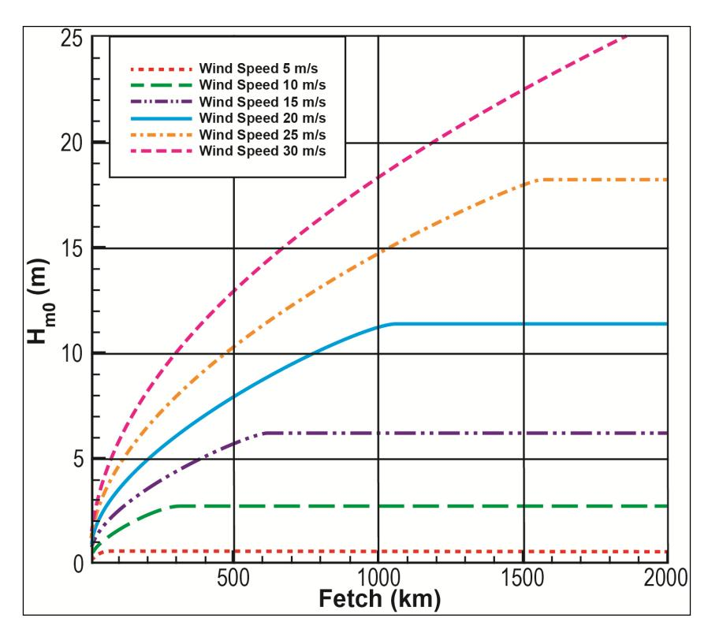

*Figure II-2-23. Fetch-limited wave heights.*

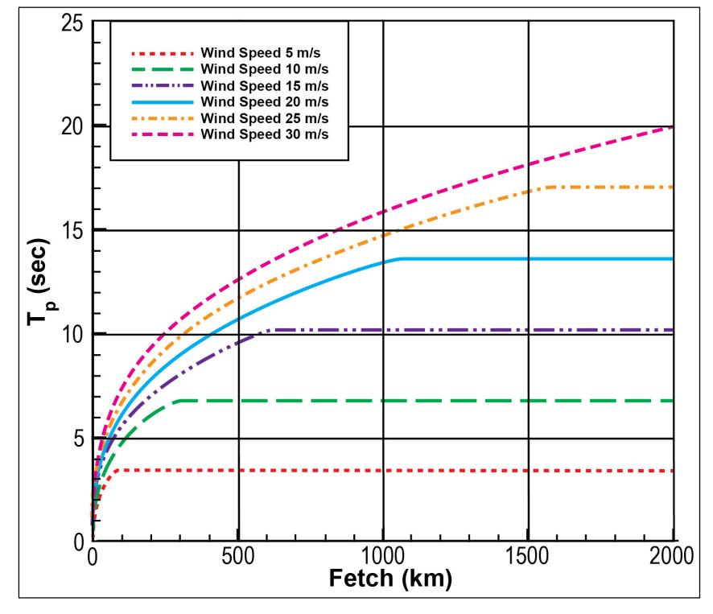

*Figure II-2-24. Fetch-limited wave periods.*

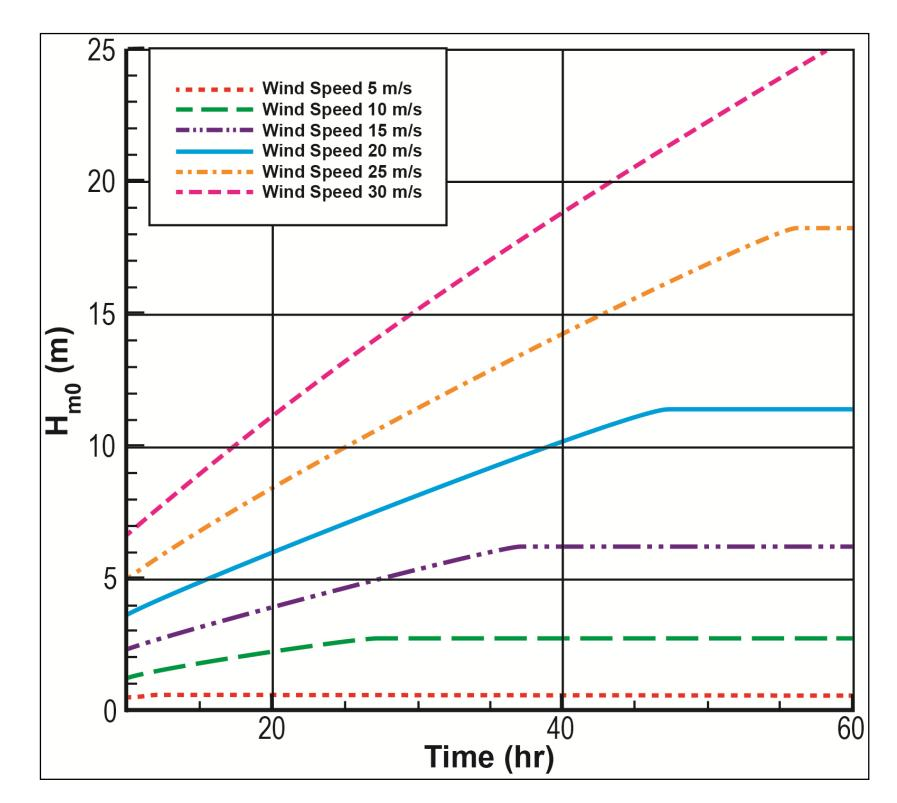

*Figure II-2-25. Duration-limited wave heights.*

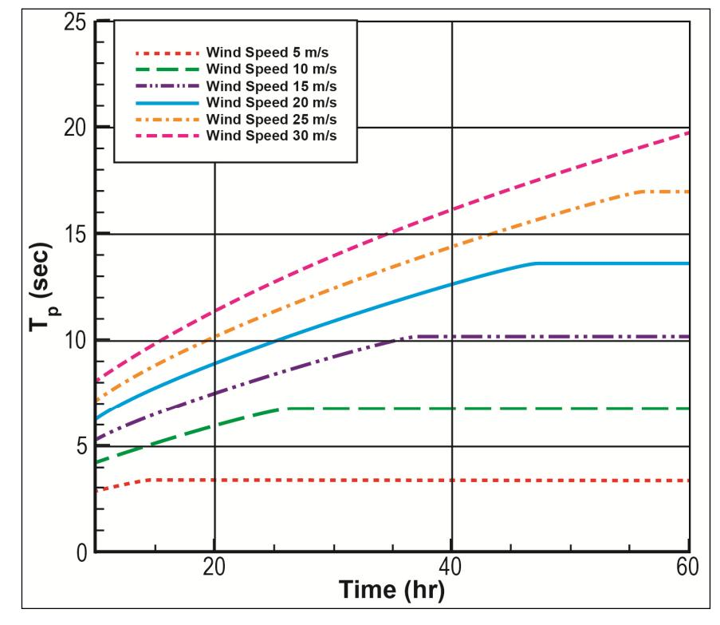

*Figure II-2-26. Duration-limited wave periods.*

- (f) Prediction of shallow-water waves. Rather than providing separate nomograms for shallow-water wave generation, the following procedure is recommended for estimating waves in shallow basins: Step 1: Determine the straight-line fetch and over-water wind speed. Step 2: Using the fetch and wind speed from (1), estimate the wave height and period from the deepwater nomograms. Step 3: Compare the predicted peak wave period from (2) to the shallow-water limit given in Equation II-2-39. If that wave period is greater than the limiting value, then reduce the predicted wave period to this value. The wave height may be found by noting the dimensionless fetch associated with the limiting wave period and substituting this fetch for the actual fetch in the wave growth calculation. Step 4: If the predicted wave period is less than the limiting value, then retain the deepwater values from (2). Step 5: If wave height exceeds 0.6 times the depth, wave height should be limited to 0.6 times the depth.
- c. Parametric prediction of waves in hurricanes.
- (1) As shown in Table II-2-2, waves from tropical storms, hurricanes, and typhoons represent a dominant threat to coastal and offshore structures and activities in many areas of the world. In this section, the generic term "hurricane" refers to all of these classes of storms. As pointed out previously in this chapter, the only distinction between tropical storms and hurricanes/typhoons is storm intensity (and somewhat the storm's degree of organization). The only distinction between hurricanes and typhoons is the point of origin of the storm.
- (2) Spectral models have been shown to provide accurate estimates of hurricane wave conditions, when driven by good wind field information (Ward et al. 1977; Corson et al. 1982; Szabados 1982; Cardone 1992; Hubertz 1992). Numerical spectral models can be run on most available PCs today, so there is little motivation to not use such models in any application with significant economic and/or safety implications. However, certain situations remain in which a parametric hurricane wave model may still play an important role in offshore and coastal applications. Therefore, some documentation of parametric models is still included in this manual.
- (3) In general, parametric prediction methods tend to work well when applied to phenomena that have little or no dependence on previous states (i.e., systems with little or no memory). A good example of such a physical system is a hurricane wind field. It has been demonstrated (Ward et al. 1977) that hurricane wind fields can be well-represented by a small number of parameters, because winds in a hurricane tend always to remain very close to a dynamic balance with certain driving mechanisms. On the other hand, waves depend not only on the present wind field but also on earlier
wind fields, bathymetric effects, pre-existing waves from other wind systems, and in general on the entire wave-generation process over the last to 12- to 24-hr. Thus, parametric models do not work well for all hurricanes, but do provide accurate results when the following criteria are met for an interval of about 12- to 18-hr prior to the application of a parametric model:
- Hurricane intensity (maximum velocity) is relatively constant.
- Hurricane track is relatively straight.
- Hurricane forward speed is relatively constant.
- Hurricane is not affected by land or bathymetric effects.
- No strong secondary wind and/or wave systems affect conditions in the area of interest.
- (4) In certain situations, where there is a lack of detail on the actual characteristics of a hurricane (such as in hurricane forecasts, older historical storms, hurricanes in some regions of the world where meteorological data are sparse), parametric models may provide accuracies equal to those of spectral models, provided that land effects and bathymetric effects are minimal. However, even when these criteria are met, situations where secondary wind and/or wave systems can seriously affect wave conditions in an area should be avoided. Examples of this occur when large-scale pressure gradients (monsoonal or extratropical) significantly affect the shape and/or wind distribution of a hurricane. Winds and waves in such a storm will not be distributed in a manner consistent with the assumptions made in this section.
- (5) Young (1987) developed a parametric wave model based on results from simulations with a numerical spectral model. His results show that there is a strong dependence of wave height on the relative values of maximum wind speed and forward storm velocity (Figure II-2-27). These results can be used to estimate the maximum value of $H_{m0}$ in a hurricane. The distribution of wave heights within a hurricane is also affected by the ratio of maximum wind speed to forward storm velocity; however, in an effort to simplify applications here, only one chart is presented (Figure II-2-28). This chart is characteristic of storms with strong winds (maximum wind speed greater than 40 m/sec) and slow-to-moderate forward velocities $(V_{f}$ less than 12 m/sec).

### 2-3. Coastal Wave Climates in the United States.

# a. Introduction.

(1) Coastal wave climates around U.S. coastlines are extremely varied. Past studies such as that by Thompson (1977) have relied primarily on measured wave conditions in coastal areas to specify nearshore wave climates. However, we now know that coastal wave heights can vary markedly as a function of distance offshore, degree of coastal sheltering, and various wave transformation factors. This means that measured waves in nearshore areas represent site-specific data. Also, even though measurements in U.S. waters have proliferated, they still do not offer comprehensive coverage. Because of these inherent difficulties in using measurements for a
EM 1110-2-1100 (Part II) Change 4 30 Sep 15
national climatology, hindcast information is used in this section to describe a general coastal wave climate. This is not meant to be interpreted that such models produce information that is as accurate as wave gauges or in any other way superior to wave measurements; but merely that they represent a consistent, comprehensive database for examining regional variations. In the near future, data assimilation methods will combine measurements and hindcasts into a unified database.
- (2) In this section, typical wave conditions and storm waves for each of four general coastal areas will be described, along with some of the important meteorological systems that produce these waves. The areas covered here include all coastal areas within the United States, except for Alaska and Hawaii. The wave information presented in Tables II-2-3 through II-2-6 is based on numerical hindcast data provided by the USACE Engineer Research and Development Center's Coastal and Hydraulics Laboratory's Wave Information Study (WIS).
- (3) WIS has undergone significant changes since its inception. The original wave estimates were documented in a WIS Report Series. This method has been replaced with posting the long-term wave estimates on the WIS Website (http://wis.usace.army.mil/). The WIS effort strives to provide high-quality, long-term wave estimates for all US coastlines including the Great Lakes. It allows incremental and large-scale changes to the data base. Wind field generation techniques, wave models, computational platforms continue to improve, and WIS takes advantage of these improvements. In so doing the hindcast estimates will periodically change, whether in the length of record, implementation of new wave models, or faster computational resources that allow the use of increased grid resolutions. In order to retain a consistent hindcast, entire domains (e.g. Atlantic, Gulf of Mexico, Pacific or any of the Great Lakes) are re-generated, not just a part of one. However, to ensure continuity in the long-term hindcast record, incremental extensions (1 to 2 years) use identically derived wind fields and the same wave modeling technology as used in the hindcast being extended. At the present time the WIS effort has replaced the original Atlantic, Gulf of Mexico, Pacific, and Great Lakes hindcasts from 1979/1980 through 2010 (with plans to extend through 2012 for all domains). Posting the WIS hindcast assures users access to the most recent wave estimates and standard products to conduct their individual studies. The WIS hindcast of the Alaska coast north of the Aleutian Islands extending to 65-deg north has been incrementally extended through 2011. The Hawaiian Islands region was also recently resolved in the WIS hindcast study. A recent WIS Pacific Ocean Hindcast update (2011) used a higher resolution (0.25-deg) grid system surrounding the island chain, which improved the wave estimates because it accounts for the smaller scale islands in the domain. Both sets of wave estimates can be accessed from the WIS Web site. No discussion of the Alaska or Hawaii data is given.
- (4) It should be noted that this information is very generalized. Waves at a specific site can vary from these estimates due to many site-specific factors, such as: variations in exposure to waves from different directions (primarily related to offshore islands and coastal orientation), bathymetric effects (refraction, shoaling, wave breaking, diffraction, etc.), interactions with currents near inlets or river mouths, and variations in fetches for wave generation.
- (5) Figure II-2-29 provides the locations of reference sites along U.S. coastlines that will be used in subsequent parts of this section. A nominal depth of 20 m is assumed for these sites.
Note that the data in Tables II-2-3 through II-2-6 came from an older WIS database and are shown for example only.

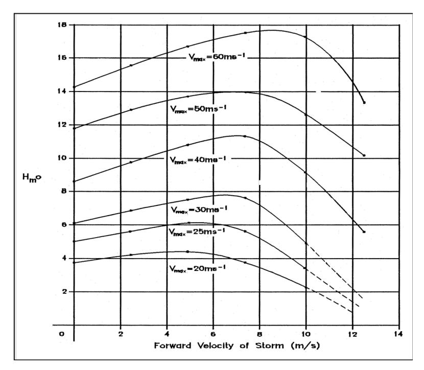

*Figure II-2-27. Maximum value of $H_{m0}$ in a hurricane as a function of $V_{max}$ and forward velocity of storm (Young 1987).*

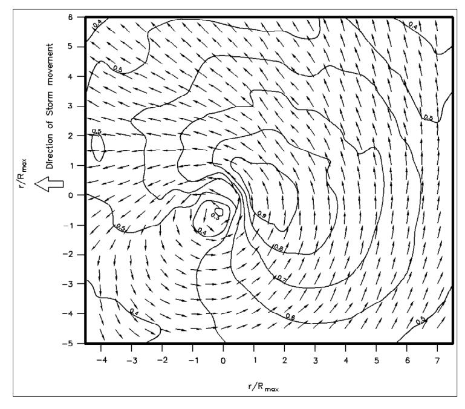

*Figure II-2-28. Values of $H_{m0}/H_{m0}$ max plotted relative to center of hurricane (0, 0).*

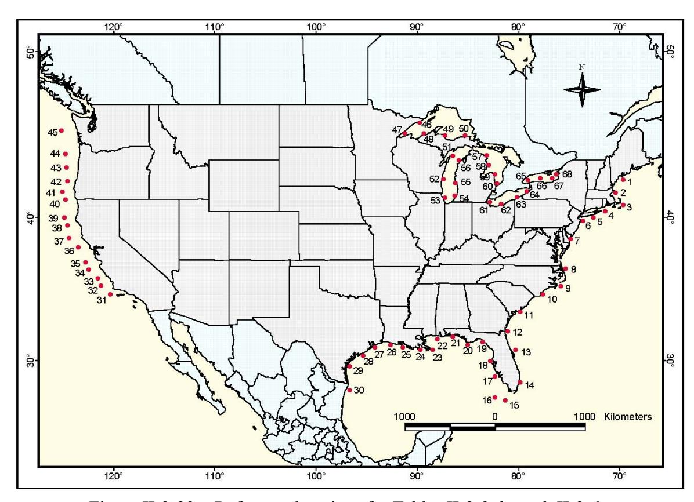

*Figure II-2-29. Reference locations for Tables II-2-3 through II-2-6.*

# b. Atlantic coast.

(1) Table II-2-3 provides wave information for the Atlantic coast. Mean wave heights are fairly consistent along the entire Atlantic coast (0.7 to 1.3 m); however, the overall distribution suggests a subtle multi-peak pattern with maxima at Cape Cod (1.3 m) and Cape Hatteras (1.2 m) and possibly a third peak in the vicinity of Cape Canaveral (1.1 m). These peaks are superimposed on a pattern of slight overall decreasing wave heights and as one, moves from north to south. Mean wave periods exhibit a relatively high degree of consistency along the entire Atlantic coast, varying only between 6.4 and 7.4 sec, except along the extreme southern part of Florida. The modal direction of the waves is taken here as the 22.5-deg direction class with the highest probability and appears to be primarily a function of coastal exposure.

*Table II-2-3. Wave Statistics in the Atlantic Ocean*

**Table II-2-3. Wave Statistics in the Atlantic Ocean**

| Map ID | Station WIS | (deg) Lat | Long (deg) | Depth (m) | (m) Hs | (sec) Td | (deg) HD | Hs90 (m) | (sec) Td 90 | (deg) Hd 90 | Hs 5yr (m) | Td 5yr (sec) | Hd 5yr (deg) |
| --- | --- | --- | --- | --- | --- | --- | --- | --- | --- | --- | --- | --- | --- |
| 1 | au2100 | 43.50 | -69.75 | 110 | 1.4 | 7.5 | 160 | 2.6 | 8.8 | 165 | 11.6 | 13.8 | 131 |
| 2 | au2095 | 42.50 | -70.50 | 55 | 1.2 | 7.2 | 80 | 2.3 | 8.2 | 79 | 9.5 | 14.8 | 80 |
| 3 | au2090 | 41.50 | -69.75 | 18 | 1.5 | 7.8 | 118 | 2.7 | 9.2 | 113 | 8.4 | 14.0 | 52 |
| 4 | au2082 | 41.00 | -71.50 | 46 | 1.4 | 7.2 | 167 | 2.5 | 8.3 | 169 | 8.7 | 12.6 | 159 |
| 5 | au2077 | 40.50 | -72.75 | 37 | 1.4 | 7.2 | 162 | 2.5 | 8.1 | 170 | 8.2 | 12.7 | 147 |
| 6 | au2072 | 40.25 | -73.75 | 27 | 1.2 | 7.1 | 132 | 2.2 | 7.9 | 128 | 7.2 | 12.8 | 129 |
| 7 | au2066 | 38.75 | -75.00 | 18 | 1.0 | 7.2 | 124 | 1.9 | 7.9 | 126 | 5.7 | 12.8 | 124 |
| 8 | au2056 | 36.25 | -75.50 | 27 | 1.2 | 8.1 | 59 | 2.3 | 8.8 | 46 | 7.7 | 13.7 | 70 |
| 9 | au2049 | 34.75 | -76.00 | 35 | 1.3 | 7.5 | 139 | 2.3 | 8.1 | 142 | 8.1 | 14.0 | 129 |
| 10 | au2042 | 34.00 | -77.75 | 9 | 1.1 | 8.1 | 124 | 3.0 | 8.8 | 124 | 6.0 | 15.2 | 126 |
| 11 | au2035 | 32.50 | -80.00 | 9 | 1.0 | 7.5 | 122 | 1.7 | 8.2 | 122 | 5.1 | 14.2 | 132 |
| 12 | au2028 | 30.75 | -81.25 | 11 | 1.1 | 8.9 | 94 | 1.8 | 9.3 | 91 | 5.7 | 15.7 | 95 |
| 13 | au2021 | 29.00 | -80.50 | 18 | 1.2 | 9.4 | 65 | 2.1 | 10.0 | 61 | 6.5 | 15.4 | 65 |
| 14 | au2009 | 26.00 | -80.00 | 220 | 0.9 | 7.3 | 62 | 1.8 | 7.6 | 64 | 6.1 | 10.8 | 44 |
|  | For location, refer to Figure II-2-29. |  |  | Statistics computed from time-series hindcast covering 1976 - 1995 period. |  |  |  |  |  |  |  |  |  |

### EXAMPLE PROBLEM II-2-7

#### FIND:

The significant wave height at the end of this fetch, assuming that the duration of the wind is sufficient to generate fetch-limited waves (from Figure II-2-3, this is found to be greater than about 1.25 hr).

### GIVEN:

A constant wind speed of 15 m/sec over a fetch of 10 km in a basin with a constant depth of 3 m. (Note: as pointed out in the previous section on winds, wind speeds tend to increase with fetch over a fetch of this size, so care should be taken in estimating this wind speed).

#### SOLUTION:

OPTION 1 - Use ACES
OPTION 2 - From Figure II-2-24 the fetch-limited peak wave period is about 2.7 sec, from Equation II-2-39, the limiting wave period in 3 m is 5.4 sec; therefore, $T_{p}$ = 2.7 sec and $H_{m0}$ = 1.0 m (deepwater values).

#### EXAMPLE PROBLEM II-2-8

#### FIND:

The significant wave height at the end of this fetch.

#### GIVEN:

A constant wind speed of 25 m/sec over a fetch of 50 km in a basin with a constant depth of 1.6 m.

#### SOLUTION:

OPTION 1 - Use ACES
OPTION 2 - From Figure II-2-24, the fetch-limited peak wave period is about 5.8 sec, from Equation II-2-39, the limiting wave period in 1.6 m is 4.0 sec; therefore, the waves stopped growing at this limit. This corresponds to a fetch of 20 km at this wind speed; thus, the final values of $T_{p}$ and $H_{m0}$ are 4.0 sec and 2.1 m (using the 20-km fetch and 25-m/sec wind speed in Figure II-2-23). However, this value exceeds 0.6 times the depth, so the final answer should be 0.8 m. The wave height is limited in this example to be half the water depth. In shallow depths, this is a reasonable approximation.
- (2) These results appear consistent with the mean storminess expected in these Atlantic coastal regions. In the northern portion of the Atlantic coast, the primary source of large waves is migratory extratropical cyclones. Between storm intervals in this region, waves come primarily from swell propagating from storms moving away from the coast. Due to this direction of storm movement, the swell from these storms is usually not very large (less than 2.0 m). As one moves southward past Cape Hatteras, waves from high-pressure systems (both migratory and semipermanent) begin to become dominant in the wave population. Once south of Jacksonville, the wave climate is typically dominated by easterly winds from high pressure systems, with a secondary source of swell from northeasters. Farther south, as one approaches Miami, the Bahamas provide considerable shelter for waves approaching from the east. In coastal areas without significant swell, sea breeze winds can play a significant role in producing coastal waves during afternoon periods. This situation occurs over much of the U.S. east coast during intervals of the year.
- (3) The $90^{th}$ percentile wave heights can be considered as representative of typical large wave conditions. As can be seen here, this wave height varies from 1.9 to 2.4 m along the New England region down to 1.4 to 1.9 m along the Florida coast. As was seen in the distribution of mean wave heights, the overall pattern appears to have maxima at Cape Cod (2.4 m), Cape Hatteras (2.1 m), and Cape Canaveral (1.9 m). The associated periods are very consistent along most of the Atlantic coast (8.5 to 9.9 sec) except for the southern half of Florida, where the periods are somewhat lower (6.2 to 7.7 sec). Directions of the $90^{th}$ percentile wave reflect the general coastal orientation.
- (4) Extreme waves along the Atlantic coast are often produced by both intense extratropical storms and tropical storms. Table II-2-3 does not provide any information that extends into the return period domain dominated by tropical storms; consequently, this table can be regarded as actually providing information only on extratropical storms. Since this table is not intended to be used directly for any coastal design considerations, information on large-return-period storms is specifically excluded.
- (5) The 5-year wave heights presented in Table II-2-3 can be considered as representing typical large storms that might affect short-term projects (beach nourishment, dredging operations, sand bypassing, etc.). Values of the 5-year wave height range from generally greater than 6.0 m north of Long Island to only 4.2 m in the Florida Keys. Again, north to south decreasing maxima appear in the regions of Cape Cod (6.7 m), Cape Hatteras (5.9 m), and Cape Canaveral (4.9 m). Associated wave periods are generally in the range of 11 to 13 sec, except for the Florida Keys site, where this period is only 9.5 sec.
- (6) Various types of extratropical storms have wreaked havoc along different coastal areas. These storms range from "bombs" (small, intense, rapidly developing storms) to large almost-stationary storms (developing typically after a change in the large-scale global circulation). Bombs produce higher wind speeds (sustained winds can exceed 70 knots) but due to fetch and duration considerations, the larger, slower-moving storms produce larger wave heights (a measured Hm 0 greater than 17 m south of Nova Scotia in the Halloween Storm 1991). Other examples of classic storms along the U.S. east coast include the Ash Wednesday Storm of 1962 (affecting mainly the mid-Atlantic region), the Blizzard of 1978 (affecting mainly the northeastern states), and the
EM 1110-2-1100 (Part II) Change 4 30 Sep 15
Storm of March 1993, which affected most of the U.S east coast. This last storm has been called the "Storm of the Century" by some; however, it is by no means the worst storm in terms of waves for most areas along the east coast in this century. In fact, along much of the Atlantic coast, the wind direction was toward offshore; consequently, there was almost no wave action at the coast in many locations. Farther offshore the situation was considerably different and many ships and boats were lost.
(7) Hurricanes can also produce extreme wave conditions along the coast. Particularly at the coast itself where storm surges of 10 ft or more can accompany waves, hurricane waves represent an extreme threat to both life and property. An excellent source of hurricane information is the HURDAT database available from the National Oceanic and Atmospheric Administration (NOAA) website. This database contains storm tracks, maximum wind speeds, central pressures, and other parameters of interest for all hurricanes affecting the United States since 1876. The effects of Hurricanes Hugo in 1988 and Andrew in 1992 have shown the tremendous potential for coastal destruction that can accompany these storm systems in southern reaches of the Atlantic coast. The effects of the Hurricane of 1933 in New England and Hurricane Bob in 1990 show that even farther north, the risk of hurricanes cannot be neglected.

### c. Gulf of Mexico.

- (1) Table II-2-4 shows the same information for the U.S. Gulf coast as was given in Table II-2-3 for the Atlantic coast. Mean wave heights for this coast are often considered to be considerably lower than those on the Atlantic coast; however, as can be seen in this table, this is not evident in the wave data. In fact, mean wave heights near Brownsville are larger than anywhere on the Atlantic coast. The reason for this is that the mean wind direction in this location is directed toward land, whereas, along the Atlantic coast the mean wind direction is directed away from land except for areas south of Jacksonville, FL. Mean wave heights generally decrease eastward to the Appalachicola area and then remain fairly constant southward to the Florida Keys.
- (2) Many of the larger waves in the Gulf of Mexico are generated by storms centered well to the north over land. Thus, large waves can be experienced at offshore sites even when conditions along the coast are quite calm. Typical day-to-day wave conditions in many coastal areas are produced by a combination of relatively small synoptic-scale winds and sea-breeze circulations. As noted in Table II-2-2 in this section, these waves are rarely very large. At times, the Gulf of Mexico comes under the influence of large-scale high pressure systems, with winds blowing from east to west across much of the Gulf. These winds are primarily responsible for the higher wave conditions in the western Gulf. Due to the lack of strong storms centered within the Gulf, there is little or no swell reaching Gulf shorelines, with the notable exception being swell from remote tropical systems. Consequently, except for the extreme western Gulf of Mexico, mean wave periods tend to be somewhat smaller than those along the Atlantic coast (4.0 to 6.0 sec).
- (3) The $90^{th}$ percentile wave heights indicate that typical large wave conditions along the coast are only about 50 percent larger than the mean wave heights (compared to about a 100-percent factor for the Atlantic coast). This is consistent with the idea that the Gulf of Mexico is, in fact, a
calmer basin than the Atlantic. These wave heights in the Gulf vary from a maximum of 1.5 m near Brownsville to 1.2 m along Florida's west coast. Associated wave periods range from 6.0 to 8.0 sec.
- (4) Values of the 5-year wave heights in the Gulf of Mexico vary from 3.2 m along the west coast of Florida to 4.6 m near Brownsville. Associated wave periods vary between 9.0 and 10.5 sec. Some of the higher non-tropical waves in the Gulf of Mexico are generated by wind systems called "Northers." Because these winds blow out of the north, they typically do not create problems at the coast itself, but can produce large waves offshore. Occasionally an extratropical cyclone will develop within the Gulf. One example, the intense storm of 10-13 March 1993 (the so-called "Storm of the Century"), produced high surges and large waves along extensive portions of Florida's west coast. Damages and loss of life from this storm demonstrated that, although rare, strong extratropical storms can still be a threat to Gulf coastal areas.
- (5) The primary source of extreme waves in the Gulf of Mexico is hurricanes. Hurricanes Betsy (1965), Camille (1969), Carmen (1975), Frederick (1979), Alicia (1985), Andrew (1992), Katrina (2005) and Rita (2005) have clearly shown the devastating potential of these storms in the Gulf of Mexico. Even though shallow-water effects may diminish coastal wave heights from the values listed in Table II-2-2, wave conditions are still sufficient to control design and planning considerations for most coastal and offshore structures/facilities in the Gulf.

### d. Pacific coast.

- (1) Table II-2-5 provides information for the Pacific coast that is comparable to that presented in Tables II-2-3 and II-2-4 for the Atlantic and Gulf of Mexico coasts, respectively. The Pacific coast is very different from the east coast in that wave-producing storms within the Pacific Ocean are travelling toward this coast. This means that the west coast typically has a much richer source of swell waves than do other U.S. coastal areas. As can be seen by comparison to the Atlantic coast results (Table II-2-3), this results in higher wave conditions along the Pacific coast, with mean wave heights ranging from 2.5 m near the Mexican border to 3.2 m near the Canadian border. This difference is also reflected in the mean periods along these coasts, which vary from 9.6 to 12.1 sec. During (Northern Hemisphere) summer months, storm tracks usually move far to the north and storms are less intense. Consequently, swell from mid-latitude storms in the Northern Hemisphere diminish in size and frequency, allowing swell from tropical storms spawned off the west coast of Mexico and from large winter storms in the Southern Hemisphere to become important elements in the summer wave climate.
- (2) Typical winter storm tracks move storm centers inland in the region from northern California to the Canadian border. Hence, large waves in these regions frequently come in the form of local seas. South of San Francisco, local storms strike the coast with less frequency; thus, many of the large waves in this area arrive in the form of swell. Many notable exceptions to this general rule of thumb can be found in the late 1970s and 1980s, however. In particular, the storm of January 1989 moved across the California coast in the vicinity of Los Angeles and caused much damage to southern California coastal areas.
EM 1110-2-1100 (Part II) Change 4 30 Sep 15
(3) The $90^{th}$ percentile wave heights along the Pacific coast are about twice their Atlantic coast counterparts. In the southern California region, these values are typically in the 3.9- to

*Table II-2-4. Wave Statistics in the Gulf of Mexico*

**Table II-2-4. Wave Statistics in the Gulf of Mexico**

| Map | WIS | Lat | Long | Depth | Hs | Td | Hd | Hs90 | Td90 | Hd90 | Hs 5yr | Td 5yr | Hd 5yr |
| --- | --- | --- | --- | --- | --- | --- | --- | --- | --- | --- | --- | --- | --- |
| ID | Station | (Deg) | (Deg) | (m) | (m) | (sec) | (deg) | (m) | (sec) | (deg) | (m) | (sec) | (deg) |
| 15 | gu1002 | 24.25 | -81.50 | 451 | 0.8 | 4.4 | 83 | 1.5 | 5.7 | 77 | 4.8 | 9.9 | 140 |
| 16 | gu1006 | 24.50 | -82.50 | 14 | 0.7 | 4.3 | 48 | 1.4 | 5.8 | 37 | 3.9 | 9.3 | 202 |
| 17 | gu1017 | 26.50 | -82.50 | 18 | 0.4 | 3.9 | 270 | 0.9 | 5.1 | 303 | 4.5 | 10.5 | 219 |
| 18 | gu1023 | 28.00 | -83.00 | 11 | 0.4 | 3.9 | 264 | 0.8 | 5.2 | 274 | 4.6 | 12.2 | 244 |
| 19 | gu1030 | 29.75 | -83.75 | 5 | 0.4 | 3.8 | 224 | 0.8 | 4.8 | 252 | 3.1 | 10.6 | 210 |
| 20 | gu1036 | 29.50 | -85.25 | 19 | 0.7 | 4.2 | 170 | 1.3 | 5.4 | 113 | 5.5 | 11.8 | 183 |
| 21 | gu1042 | 30.25 | -86.75 | 14 | 0.6 | 4.2 | 153 | 1.1 | 5.3 | 149 | 5.5 | 11.9 | 174 |
| 22 | gu1048 | 30.00 | -88.25 | 29 | 0.7 | 4.4 | 135 | 1.3 | 5.7 | 135 | 5.6 | 10.6 | 128 |
| 23 | gu1054 | 29.00 | -88.75 | 209 | 0.9 | 4.9 | 98 | 1.8 | 6.6 | 89 | 6.8 | 11.7 | 136 |
| 24 | gu1059 | 29.00 | -90.00 | 25 | 0.8 | 4.7 | 138 | 1.5 | 6.0 | 138 | 5.4 | 11.4 | 167 |
| 25 | gu1066 | 29.25 | -91.75 | 7 | 0.7 | 4.6 | 162 | 1.3 | 6.0 | 164 | 4.0 | 11.3 | 190 |
| 26 | gu1071 | 29.50 | -93.00 | 12 | 0.8 | 4.7 | 150 | 1.4 | 6.1 | 153 | 4.2 | 11.1 | 167 |
| 27 | gu1077 | 29.25 | -94.50 | 15 | 0.8 | 5.1 | 140 | 1.5 | 6.5 | 142 | 4.5 | 11.9 | 145 |
| 28 | gu1082 | 28.50 | -95.75 | 20 | 0.9 | 5.4 | 137 | 1.5 | 6.8 | 143 | 4.5 | 11.7 | 132 |
| 29 | gu1088 | 27.50 | -97.00 | 27 | 0.9 | 5.8 | 119 | 1.5 | 7.0 | 123 | 5.3 | 11.2 | 108 |
| 30 | gu1102 | 25.25 | -97.00 | 48 | 1.1 | 6.0 | 100 | 1.7 | 7.2 | 102 | 5.8 | 9.9 | 73 |
|  | For location, refer to Figure II-2-29. |  |  |  |  | Statistics computed from time-series hindcast covering 1976 - 1995 period. |  |  |  |  |  |  |  |

4.2-m range. As one moves northward, the $90^{th}$ percentile wave height increases to a maximum of about 5.4 m along the coast of Washington. Periods associated with these waves tend to be quite long, ranging between 11 and 14 sec.

*Table II-2-5 Wave Statistics in the Pacific Ocean*

**Table II-2-5. Wave Statistics in the Pacific Ocean**

| Map | WIS | Lat | Long | Depth | Hs | Td | Hd | Hs90 | Td90 | Hd90 | Hs 5yr | Td 5yr | Hd 5yr |
| --- | --- | --- | --- | --- | --- | --- | --- | --- | --- | --- | --- | --- | --- |
| ID | Station | (Deg) | (Deg) | (m) | (m) | (sec) | (deg) | (m) | (sec) | (deg) | (m) | (sec) | (deg) |
| 31 | p2008 | 34.01 | -120.92 | 1650 | 2.7 | 10.3 | 293 | 4.1 | 12.5 | 290 | 7.0 | 15.4 | 285 |
| 32 | p2011 | 34.82 | -121.82 | 2122 | 2.8 | 10.3 | 294 | 4.2 | 12.5 | 291 | 7.5 | 15.7 | 283 |
| 33 | p2013 | 35.41 | -122.16 | 2944 | 2.8 | 10.3 | 292 | 4.2 | 12.5 | 287 | 7.8 | 15.8 | 279 |
| 34 | p2016 | 36.22 | -123.06 | 3365 | 2.9 | 10.4 | 295 | 4.3 | 12.5 | 290 | 7.9 | 15.1 | 264 |
| 35 | p2018 | 36.82 | -123.41 | 3387 | 3.0 | 10.5 | 294 | 4.4 | 12.6 | 289 | 8.2 | 14.8 | 250 |
| 36 | p2022 | 38.04 | -124.11 | 3655 | 3.1 | 10.8 | 292 | 4.6 | 12.9 | 285 | 8.5 | 14.6 | 245 |
| 37 | p2025 | 38.85 | -125.05 | 3435 | 3.2 | 10.7 | 287 | 4.9 | 12.7 | 281 | 9.3 | 14.3 | 242 |
| 38 | p2028 | 39.87 | -125.17 | 2471 | 3.2 | 10.7 | 286 | 4.8 | 12.7 | 278 | 9.4 | 13.8 | 235 |
| 39 | p2030 | 40.49 | -125.53 | 2702 | 3.2 | 10.7 | 284 | 4.9 | 12.6 | 275 | 9.7 | 14.0 | 219 |
| 40 | p2034 | 41.93 | -125.39 | 3151 | 3.2 | 10.7 | 274 | 5.2 | 12.9 | 265 | 10.4 | 14.1 | 235 |
| 41 | p2036 | 42.55 | -125.74 | 2993 | 3.3 | 10.7 | 271 | 5.4 | 12.9 | 262 | 10.8 | 13.6 | 224 |
| 42 | p2038 | 43.37 | -125.21 | 1783 | 3.3 | 10.9 | 271 | 5.4 | 13.0 | 263 | 10.4 | 14.1 | 238 |
| 43 | p2041 | 44.41 | -125.29 | 2227 | 3.0 | 10.9 | 271 | 4.9 | 13.0 | 264 | 9.2 | 14.0 | 219 |
| 44 | p2044 | 45.45 | -125.36 | 2033 | 3.0 | 10.9 | 266 | 4.8 | 12.9 | 259 | 9.5 | 14.3 | 213 |
| 45 | p2049 | 47.14 | -125.77 | 1630 | 3.2 | 10.7 | 257 | 5.4 | 12.7 | 250 | 10.5 | 14.4 | 224 |
|  | For location, refer to Figure II-2-29. |  |  | Statistics computed from time-series hindcast covering 1956 - 1975 period. |  |  |  |  |  |  |  |  |  |

*Table II-2-6. Wave Statistics in the Great Lakes*

**Table II-2-6. Wave Statistics in the Great Lakes**

| Map ID | Station WIS | (Deg) Lat | (Deg) Long | Depth (m) | (m) Hs | (sec) Td | (deg) Hd | Hs90 (m) | Td90 (sec) | Hd90 (deg) | Hs 5yr (m) | Td 5yr (sec) | Hd 5yr (deg) |
| --- | --- | --- | --- | --- | --- | --- | --- | --- | --- | --- | --- | --- | --- |
| 46 | s0004 | 47.67 | -90.07 | 174 | 0.8 | 3.9 | 255 | 1.6 | 5.2 | 279 | 7.4 | 11.1 | 88 |
| 47 | s0014 | 46.95 | -91.57 | 154 | 0.7 | 3.6 | 27 | 1.3 | 4.6 | 325 | 6.0 | 10.2 | 56 |
| 48 | s0028 | 46.95 | -89.63 | 101 | 0.8 | 4.0 | 318 | 1.8 | 5.7 | 313 | 5.9 | 9.7 | 17 |
| 49 | s0046 | 46.80 | -87.50 | 55 | 1.0 | 4.2 | 2 | 2.0 | 5.7 | 351 | 7.7 | 10.2 | 10 |
| 50 | s0055 | 46.80 | -85.57 | 119 | 1.1 | 4.6 | 322 | 2.2 | 6.3 | 328 | 7.0 | 10.3 | 310 |
| 51 | mu0025 | 45.27 | -86.75 | 55 | 0.9 | 4.4 | 172 | 1.7 | 5.9 | 164 | 4.9 | 8.4 | 194 |
| 52 | mu0013 | 43.55 | -87.67 | 64 | 0.8 | 4.3 | 98 | 1.6 | 5.6 | 109 | 4.6 | 8.4 | 54 |
| 53 | mu0003 | 42.10 | -87.55 | 24 | 0.9 | 4.1 | 22 | 1.6 | 5.5 | 23 | 5.4 | 9.3 | 11 |
| 54 | mu0058 | 42.22 | -86.58 | 36 | 1.0 | 4.5 | 308 | 1.8 | 6.2 | 302 | 5.1 | 8.8 | 342 |
| 55 | mu0051 | 43.23 | -86.50 | 73 | 1.0 | 4.4 | 256 | 1.9 | 6.3 | 259 | 5.3 | 8.6 | 238 |
| 56 | mu0039 | 44.95 | -86.17 | 36 | 0.9 | 4.4 | 286 | 1.8 | 6.0 | 291 | 5.2 | 9.0 | 222 |
| 57 | h0020 | 45.35 | -83.32 | 30 | 0.8 | 4.0 | 5 | 1.7 | 5.3 | 360 | 5.8 | 9.1 | 83 |
| 58 | h0015 | 44.63 | -83.12 | 20 | 0.9 | 4.2 | 83 | 1.9 | 5.6 | 301 | 6.7 | 9.4 | 52 |
| 59 | h0007 | 43.90 | -82.52 | 30 | 0.8 | 4.2 | 346 | 1.7 | 5.6 | 335 | 6.1 | 9.4 | 12 |
| 60 | h0002 | 43.18 | -82.32 | 14 | 0.9 | 4.0 | 334 | 1.7 | 5.2 | 322 | 6.8 | 9.8 | 356 |
| 611 | e0002 | 41.73 | -83.08 | 9 | 0.6 | 3.5 | 285 | 1.1 | 4.4 | 299 | 2.4 | 5.5 | 14 |
| 62 | e0009 | 41.58 | -81.90 | 17 | 0.9 | 3.9 | 280 | 1.7 | 5.3 | 292 | 4.0 | 7.6 | 339 |
| 63 | e0017 | 42.15 | -80.35 | 20 | 1.0 | 4.3 | 263 | 2.0 | 5.9 | 272 | 4.8 | 8.5 | 271 |
| 64 | e0022 | 42.58 | -79.37 | 30 | 0.9 | 4.0 | 253 | 1.8 | 5.5 | 255 | 5.2 | 8.8 | 252 |
| 652 | o0037 | 43.45 | -79.25 | 128 | 0.4 | 3.0 | 271 | 0.9 | 3.9 | 273 | 3.5 | 6.6 | 236 |
| 66 | o0040 | 43.60 | -78.05 | 185 | 0.4 | 3.2 | 262 | 1.0 | 4.5 | 266 | 4.8 | 8.2 | 260 |
| 67 | o0043 | 43.60 | -76.85 | 174 | 0.4 | 3.3 | 266 | 1.0 | 4.7 | 266 | 5.5 | 9.4 | 265 |
| 68 | o0020 | 43.88 | -76.45 | 24 | 0.4 | 3.2 | 243 | 0.9 | 4.2 | 247 | 5.1 | 8.7 | 243 |
|  | 2 Station o0037 reflects west-to-east weather patterns. 1 Station e0002 is sheltered from the east by islands. For location, refer to Figure II-2-29. |  |  |  |  |  |  |  |  |  | Statistics computed from time-series hindcast covering 1956 - 1987 period. |  |  |

(4) The 5-year wave heights in the southern California region are comparable to those found along the New England coast on the Atlantic (6.8-6.9 m compared to 6.7 m). However, associated periods are considerably longer (16.8 sec compared to 12-13 sec). As one moves northward, these wave heights increase to levels greater than 10 m along much of the coast north of the California-Oregon border. Periods of these large waves tend to fall in the 14- to 16-sec range.
(5) Although many studies have dismissed the importance of tropical storms to the extreme wave climate along the Pacific coast, at least one tropical storm has moved into the Los Angeles
basin during the $20^{th}$ century, suggesting that this threat is not negligible. Given the curvature of the coast and the water temperatures north of Point Conception, it is unlikely that tropical storms can produce a significant threat at coastal sites north of this point; however, south of this point it is important to include tropical storms in any design and planning considerations.

### e. Great Lakes.

- (1) Table II-2-6 provides comparable information for the Great Lakes as provided for previous coastal areas in Tables II-2-3 through II-2-5. Wave conditions within the Great Lakes are strongly influenced by fetches aligned with the dominant directions of storm winds. These winds are mainly produced by extratropical storms moving across the Great Lakes region. Table II-2-6 compares the largest 50-year (return period) wave heights for each lake. Because strong storms are infrequent in late spring through early autumn, this interval is usually relatively calm along most shores. During the period from mid-autumn until ice reduces wave generation, the largest waves are generated. Again in the spring, after the ice has thawed, large waves (although usually significantly smaller than waves in autumn) can be generated and can affect coastal areas.
- (2) Mean lake level is an issue of critical concern in the Great Lakes. These levels have fluctuated considerably through recorded history in response to periods of low and high precipitation in the general geographic area. Critical design criteria for many Great Lakes coastal areas are defined by the superposition of high waves (generated by extratropical storms) on top of high mean lake levels and storm surges.

### 2-4. Additional Example Problem.

(1) Example problem II-2-9 demonstrates use of assumptions in simplified wave predictions.

#### EXAMPLE PROBLEM II-2-9

FIND:
The significant wave height and spectral peak wave period generated by a mean wind speed of 30 m/sec over a fetch of 50 km. (Work the problem in metric units.)

#### SOLUTION:

Step 1. Check required wind duration. Given that x is the fetch in meters, g is the acceleration due to gravity in meters/second-squared, u_{10} is the wind speed in meters/second, we have

```math
t_{x,u} = 77.23 \frac{x^{0.67}}{u_{10}^{0.34} g^{0.33}} = 77.23 \frac{(50,000)^{0.67}}{30^{0.34} 9.82^{0.33}} = 16,087s = 4.47 hr
```

If the wind duration is equal to or longer than this than a fetch-limited situation exists.
Step 2. Estimate friction velocity. First, estimate the coefficient of drag as

```math
C_D \approx 0.001(1.1 + 0.035u_{10});
```

Then, estimate the friction velocity as

```math
u_* = \sqrt{C_D} u_{10} = \sqrt{0.00215} \times 30 = 1.39 m / s
```

Step 3. Estimate Significant Wave Height. Estimate nondimensional fetch as

```math
\hat{x} = \frac{gx}{u_*^2} = 9.82 \times \frac{50,000}{(1.39)^2} = 2.54 \, x \, 10^5
```

Estimate nondimensional wave height as

```math
\hat{H}_{m0} = \lambda_1 \hat{x}^{m_1};
```

```math
\lambda _ { 1 } = 0 . 0 4 1 3 ;
```

```math
m _ { 1 } = \frac { 1 } { 2 } ;
```

```math
\hat { H } _ { m 0 } = 0 . 0 4 1 3 \times \left( 2 . 5 4 \times 1 0 ^ { 5 } \right) ^ { \frac { 1 } { 2 } } = 2 0 . 8 ;
```

```math
H _ { m 0 } = \hat { H } _ { m 0 } \times { \frac { u _ { * } ^ { 2 } } { g } } = 2 0 . 8 \times { \frac { \left( 1 . 3 9 \right) ^ { 2 } } { 9 . 8 2 } } = 4 . 1 \mathrm { { m } }
```

Step 4. Estimate Spectral Peak Period. Since we already have calculated the nondimensional fetch in Step 3, we can proceed to estimate the nondimensional spectral peak period:

```math
\hat{T}_{P} = \frac{gT_{P}}{u_{*}} = \hat{\lambda}_{2} \hat{X}^{m_{2}}
```

```math
\lambda _ { 2 } = 0 . 7 5 1
```

```math
m _ { 2 } = \frac { 1 } { 3 }
```

```math
\hat { T } _ { P } = 0 . 7 5 1 { \times } \big ( 2 . 5 4 { \times } 1 0 ^ { 5 } \big ) ^ { \frac { 1 } { 3 } } = 4 7 . 5
```

```math
T _ { P } = \hat { T } _ { P } { \frac { u _ { * } } { g } } { = } \frac { 4 7 . 5 { \times } 1 . 3 9 } { 9 . 8 2 } { = } 6 . 7 \mathrm { s }
```

### 2-5. References.

#### Atkinson and Holliday 1977

Atkinson, G. D., and Holliday, C. R. 1977. "Tropical Cyclone Minimum Sea Level Pressure/Maximum Sustained Wind Relationship for the Western Northern Pacific," Mon. Wea. Rev., Vol 105, pp 421-427.

### Barnett 1968

Barnett, T. P. 1968. "On the Generation, Dissipation, and Prediction of Ocean Wind Waves," J. Geophys. Res., Vol 2, pp 531-534.

#### Bouws et al. 1985

Bouws, E., Gunther, H., and Vincent, C. L. 1985. "Similarity of Wind Wave Spectrum in Finite-Depth Water, Part I: Spectral Form," J. Geophys. Res. , Vol 85, No. C3, pp 1524-1530.

#### Bretschneider 1952

Bretschneider, C. 1952. "Revised Wave Forecasting Relationships," Proceedings of the 2nd Coastal Engineering Conference , American Society of Civil Engineers, pp 1-5.

#### Bretschneider 1990

Bretschneider, C. 1990. "Tropical Cyclones," Handbook of Coastal and Ocean Engineering, Vol 1, J. B. Herbich, ed., pp 249-270.

#### Bretschneider and Reid 1953

Bretschneider, C., and Reid, R. O. 1953. "Change in Wave Height Due to Bottom Friction, Percolation and Refraction," 34 th Annual Meeting of American Geophysical Union.

#### Bunting 1970

Bunting, D. C. 1970. "Evaluating Forecasts of Ocean-Wave Spectra," Journal of Geophysical Research , Vol 75, No. 21, pp 4131-4143.

#### Businger et al. 1971

Businger, J. A., Wyngaard, J. C., Izumi, Y., and Bradley, E. F. 1971. "Flux-Profile Relationships in the Atmospheric Surface Layer," J. Atmos. Sci., Vol 25, pp 1021-1025.

#### Camfield 1977

Camfield, F. E. 1977. "Wind-Wave Propagation Over Flooded, Vegetated Land," Technical Paper No. 77-12, Coastal Engineering Research Center, U.S. Army Engineer Waterways Experiment Station, Vicksburg, MS.

### Cardone 1992

Cardone, V. J. 1992. "On the Structure of the Marine Surface Wind Field," 3rd International Workshop of Wave Hindcasting and Forecasting, Montreal, Quebec, May 19-22, pp 54-66.

#### Cardone et al. 1994

Cardone, V. J., Cox, A. T., Greenwood, J. A., and Thompson, E. F. 1994. "Upgrade of the Tropical Cyclone Surface Wind Field Model," Miscellaneous Paper CERC-94-14, U.S. Army Engineer Waterways Experiment Station, Vicksburg, MS.
EM 1110-2-1100 (Part II)
Change 4
30 Sep 15

#### Cardone et al. 1992

Cardone, V. J., Greenwood, C. V., and Greenwood, J. A. 1992. "Unified Program for the Specification of Hurricane Boundary Layer Winds over Surfaces of Specified Roughness," Contract Report CERC-92-1, U.S. Army Engineer Waterways Experiment Station, Vicksburg, MS.

#### Chow 1971

Chow, S. 1971. "A Study of the Wind Field in the Planetary Boundary Layer of a Moving Tropical Cyclone," M. S. thesis, New York University.

#### Clarke 1970

Clarke, R. H. 1970. "Observational Studies of the Atmospheric Boundary Layer," Quart. J. Roy. Meteor. Soc, Vol 96, pp 91-114.

#### Collins and Viehmann 1971

Collins, J. I., and Viehmann, M. J. 1971. "A Simplified Model for Hurricane Wind Fields," Paper 1346, Offshore Technology Conference, Houston, TX.

#### Cooper 1988

Cooper, C. K. 1988. Parametric Models of Hurricane-Generated Winds, Waves, and Currents in Deep Water," Proc. Offshore Tech. Conf. , Paper 5738, Houston, TX.

#### Corson et al. 1982

Corson, W. D., Resio, D. T., Brooks, R. M., Ebersole, B. A., Jensen, R. E., Ragsdale, D. S., and Tracy, B. A. 1982. "Atlantic Coast Hindcast Phase II, Significant Wave Information," WIS Report 6, U.S. Army Engineer Waterways Experiment Station, Vicksburg, MS.

#### Deardorff 1968

Deardorff, J. W. 1968. "Dependence of Air-Sea Transfer Coefficients on Bulk Stability," J. Geophys. Res, Vol 73, pp 2549-2557.

#### Demirbilek et al. 1993

Demirbilek, Z., Bratos, S. M., and Thompson, E. F. 1993. "Wind Products for Use in Coastal Wave and Surge Models,"Miscellaneous Paper CERC-93-7, U.S. Army Engineer Waterways Experiment Station, Vicksburg, MS.

### Donelan et al. 1982

Donelan, M. A., Hamilton, J., and Hu, W. H. 1982. "Directions Spectra of Wind-Generated Waves," Unpublished manuscript, Canada Centre for Inland Waters.

#### Dvorak 1975

Dvorak, V. F. 1975. "Tropical Cyclone Intensity Analysis and Forecasting from Satellite Imagery," Mon. Wea. Rev., Vol 105, pp 369-375.

#### Forristall et al. 1978

Forristall, G. Z., Ward, E. G., Cardone, V. J., and Borgman, L. E. 1978. "The Directional Spectra and Kinematics of Surface Gravity Waves in Tropical Storm Delia," J. Pmys. Oceanogr., Vol 8, pp 888-909.

#### Garratt 1977

Garratt, J. R. 1977. "Review of Drag Coefficients Over Oceans and Continents," Mon. Wea. Rev., Vol 105, pp 915-929.

#### Geernaert 1990

Geernaert, G. L. 1990. " Bulk Parameterizations for the Wind Stress and Heat Fluxes," Surface and Fluxes: Theory and Remote Sensing; Vol 1: Current Theory. G. L. Geernaert and W. J. Plant, ed., Kluwer Academic Publisher, Worwell, MA, pp 91-172.

#### Geernaert et al. 1986

Geernaert, G. L., Katsaros, K. B., and Richter, K. 1986. "Variation of the Drag Coefficient and its Dependence on Sea State," J. Geophys. Res., Vol 91, pp 7667-7679.

#### Gelci et al. 1957

Gelci, R., Cazale, H., and Vassel, J. 1957. "Prevision de la Houle," La Methode des Densites Spectroangularies, Bull. Infor., Comite Central Oceangr. d' Etude Cotes, Vol 9, pp 416-435.

#### Hasselmann et al. 1973

Hasselmann, K., Barnett, T. P., Bouws, E., Carlson, H., Cartwright, D. E., Enke K., Weing, J. A., Gienapp, H., Hasselmann, D. E., Kruseman, P., Meerburg, A., Muller, P., Olbers, K. J., Richter, K., Sell, W., and Walden, W. H. 1973. "Measurements of Wind-Wave Growth and Swell Decay During the Joint North Sea Wave Project (JONSWAP)," Deutsche Hydrograph, Zeit., Erganzung-self Reihe, A 8(12).

#### Hasselmann et al. 1985

Hasselmann, S., Hasselmann, K., Allender, J. H., and Barnett, T. P. 1985. "Computations and Parameterizations of Nonlinear Energy Transfer in a Gravity-wave Spectrum; Part II: Parameterization of Nonlinear Transfer for Application in Wave Models," J. Phys. Oceanogr., Vol 15, pp 1378-1391.

#### Helmholtz 1888

Helmholtz, H. 1888. "Uber Atmospharische Bewwgungen," S. Ber. Preuss. Akad. Wiss. Berlin, Mathem . Physik Kl.

#### Hess 1959

Hess, S. L. 1959. Introduction to Theoretical Meteorology. Holt, New York.

### Holland 1980

Holland, G. J. 1980. "An Analytic Model of the Wind and Pressure Profiles in Hurricanes," Mon. Wea. Rev., Vol 108, pp 1212-1218.

#### Holt and Raman 1988

Holt, T., and Raman, S. 1988. "A Review and Comparative Evaluation of Multilevel Boundary Layer Parameterizations for First-Order and Turbulent Kinetic Energy Closure Schemes," Rev. Geophys., Vol 26, pp 761-780.

### Hsu 1974

Hsu, S. A. 1974. "A Dynamic Roughness Equation and its Application to Wind Stress Determination at the Air-Sea Interface," J. Phys. Oceanogr., Vol 4, pp 116-120.
EM 1110-2-1100 (Part II)
Change 4
30 Sep 15
Hsu 1988
Hsu S.A. 1988. Coastal Meteorology, Academic Press, New York.
Huang et al 1986
Huang, N. E., Bliven, L. F., Long, S. R., and DeLeonibus, P. S. 1986. "A Study of the Relationship Among Wind Speed, Sea State, and the Drag Coefficient for a Developing Wave Field," J. Geophys. Res., Vol 91, No. C6, pp 7733-7742.
Hughes 1952
Hughes L. A. 1952. "On the Low-Level Wind Structure of Tropical Storms," J. of Meteorol., Vol 9, pp 422-428.
Hubertz 1992
Hubertz, J. M. 1992. "User's Guide to the Wave Information Studies (WIS) Wave Model, Version 2.0," WIS Report 27, U.S. Army Engineer Waterways Experiment Station, Vicksburg, MS.
Hydraulics Research Station 1977
Hydraulics Research Station. 1977. "Numerical Wave Climate Study for the North Sea (NORSWAM)," Report EX 775, Wallingford, England.
Inoue 1967
Inoue, T. 1967. "On the Growth of the Spectrum of a Wind Generated Sea According to a Modified Miles-Phillips Mechanism and Its Application to Wave Forecasting," Geophysical Sciences Laboratory Report No. TR-67-5, Department of Meteorology and Oceanography, New York University.
Janssen 1989
Janssen, P. A. E. M. 1989. "BAR Wave-Induced Stress and the Drag of Air Flow Over Sea Waves," J. Phys. Oceanogr., Vol 19, pp 745-754.
Janssen 1991
Janssen, P. A. E. M. 1991. "Quasi-linear Theory of Wind wave generation Applied to Wave Forecasting," J. Phys. Oceanogr., Vol 21, pp 745-754.
Jeffreys 1924
Jeffreys, H. 1924. "On the Formation of Waves by Wind," Proc. Roy. Soc. Lond. , Vol 107, pp 189-206.
Jeffreys 1925
Jeffreys, H. 1925. "On the Formation of Waves by Wind," Proc. Roy. Soc. Lond ., Ser. A., Vol 110, pp 341-347.
Kahma 1981
Kahma, K. K. 1981. "A Study of the Growth of the Wave Spectrum with Fetch," Journal of Physical Oceanography , Vol 11, Nov., pp 1503-15.
Kelvin 1887
Kelvin, Lord, 1887. "On the Waves Produced by a Single Impulse in Water of Any Depth or in a Dispersive Medium," Mathematical and Physical Papers, Vol IV, London, Cambridge University Press, 1910, pp 303-306.

#### Kitaigorodskii 1962

Kitaigorodskii, S. A. 1962. "Application of the Theory of Similarity to the Analysis of Wind Generated Wave Motion as a Stochastic Process," Bull. Acad. Sci. , USSR Ser. Geophys., Vol 1, No.1, pp 105-117.

#### Kitaigorodskii 1983

Kitaigorodskii, S. A. 1983. "On the Theory of the Equilibrium Range in the Spectrum of Wind-Generated Gravity Waves," J. Phys. Oceanogr., Vol 13, pp 816-827.

#### Large and Pond 1981

Large, W. G., and Pond, S. 1981. "Open Ocean Momentum Flux Measurements in Moderate to Strong Winds," J. Phys. Oceanogr., Vol 11, pp 324-336.

#### Leenknecht et al. 1992

Leenknecht, D. A., Szuwalski, A., and Sherlock, A. R. 1992. "Automated Coastal Engineering System Technical Reference, Version 1.07, Coastal Engineering Research Center, U.S. Army Engineer Waterways Experiment Station, Vicksburg, MS.

#### Miles 1957

Miles, J. W. 1957. "On the Generation of Surface Waves by Shear Flows," Journal of Fluid Mechanics , Vol 3, pp185-204.

#### Mitsuyasu 1968

Mitsuyasu, H. 1968. "On the Growth of the Spectrum of Wind-Generated Waves (I).," Reports of the Research Institute of Applied Mechanics, Kyushu University, Fukuoka, Japan, Vol 16, No. 55, pp 459 482.

#### Myers 1954

Myers, V. A. 1954. "Characteristics of United States Hurricanes Pertinent to Levee Design for Lake Okeechobee, Florida," Hydromet. Rep. No. 32., U.S. Weather Bureau, Washington, DC.

#### Phillips 1958

Phillips, O. M. 1958. "The Equilibrium Range in the Spectrum of Wind-Generated Waves," Journal of Fluid Mechanics , Vol 4, pp 426-434.

#### Pierson and Moskowitz 1964

Pierson, W. J., and Moskowitz, L. 1964. "A Proposed Spectral Form for Fully Developed Wind Seas Based in the Similarity Theory of S. A. Kitiagorodskii," J Geophys. Res., Vol 9, pp 5181-5190.

#### Pierson et al. 1955

Pierson, W. J., Neuman, G., and James, R. W. 1955. "Observing and Forecasting Oceanwaves by Means of Wave Spectra and Statistics," U.S. Navy Hydrographic Office Pub. No. 60.

#### Powell et al. 2003

Powell, M. D., Vickery, P. J., and Reinhold, T. A., 2003. "Reduced Drag Coefficients for High Wind Speeds in Tropical Cyclones," Nature Vol 422, pp 279-283.

### Putnam 1949

Putnam, J. A. 1949. "Loss of Wave Energy Due to Percolation in a Permeable Sea Bottom," Transactions of the American Geophysical Union , Vol 30, No. 3, pp 349-357.
EM 1110-2-1100 (Part II)
Change 4
30 Sep 15

#### Putnam and Johnson 1949

Putnam, J. A., and Johnson, J. W. 1949. "The Dissipation of Wave Energy by Bottom Friction," Transactions of the American Geophysical Union , Vol 30, No. 1, pp 67-74.

#### Resio 1981

Resio, D. T. 1981. "The Estimation of a Wind Wave Spectrum in a Discrete Spectral Model," J. Phys. Oceanogr., Vol 11, pp 510-525.

#### Resio 1987

Resio, D. T. 1987. "Shallow Water Waves; Part I: Theory," J. Waterway, Port, Coastal and Ocean Eng., Vol 113, pp 264-281.

#### Resio 1988

Resio, D. T. 1988. "Shallow Water Waves; Part II: Data Comparisons," J. Waterway, Port, Coastal and Ocean Eng., Vol 114, pp 50-65.

#### Resio and Perrie 1989

Resio, D. T., and Perrie, W. 1989. "Implications d and f Equilibrium Range for Wind-Generated Waves," J. Phys. Oceanogr., Vol 19, pp 193-204.

#### Resio and Vincent 1977

Resio, D. T., and Vincent, C. L. 1977. "Estimation of Winds Over the Great Lakes," J. Waterways Harbors and Coastal Div., American Society of Civil Engineers, Vol 102, pp 263-282.

#### Resio and Vincent 1979

Resio, D. T., and Vincent, C. L. 1979. "A Comparison of Various Numerical Wave Prediction Techniques," Proceedings of the 11th Annual Ocean Technology Conference , Houston, TX, p 2471.

#### Resio and Vincent 1982

Resio, D. T., and Vincent, C. L. 1982. "A Comparison of Various Numerical Wave Prediction Techniques," Proc. 11th Annual Offshore Technology Conf., Houston, TX, pp 2471-2485.

#### Rosendal and Shaw 1982

Rosendal, H., and Shaw, S. L. 1982. "Relationship of Maximum Sustained Wind to Minimum Sea Level Pressure in Central North Pacific Tropical Cyclones," NOAA Tech. Memo. NWSTM PR24.

#### Schwerdt et al. 1979

Schwerdt, R. W., Ho, F. P., and Watkins, R. R. 1979. "Meteorological Criteria for Standard Project Hurricane and Probable Maximum Hurricane Windfields, Gulf and East Coasts of the United States," Tech. Rep. NOAA-TR-NWS-23, National Oceanic and Atmospheric Administration.

#### Shore Protection Manual 1977

Shore Protection Manual. 1977. $3^{rd}$ ed., 3 Vol, U.S. Army Coastal Engineering Research Center, U.S. Government Printing Office, Washington, DC.

#### Shore Protection Manual 1984

Shore Protection Manual. 1984. $4^{th}$ ed., 2 Vol, U.S. Army Engineer Waterways Experiment Station, U.S. Government Printing Office, Washington, DC.

#### Smith 1988

Smith, S. D. 1988. "Coefficients for Sea Surface Wind Stress, Heat Flux, and Wind Profiles as a Function of Wind Speed and Temperature," J. Geophys. Res., Vol 93, pp 467-47.

#### Snyder and Cox 1966

Snyder, R. L., and Cox, C. S. 1966. "A Field Study of the Wind Generation of Ocean Waves," J. Mar. Res., Vol 24, p 141.

#### Snyder et al. 1981

Snyder, R., Dobson, F. W., Elliott, J. A., and Long, R. B. 1981. "Array Measurements of Atmospheric Pressure Fluctuations Above Surface Gravity Waves," Journal of Fluid Mechanics , Vol 102, pp 1-59.

#### Sverdrup and Munk 1947

Sverdrup, H. U., and Munk, W. H. 1947. "Wind, Sea, and Swell: Theory of Relations for Forecasting." Pub. No. 601, U.S. Navy Hydrographic Office, Washington, DC.

#### Sverdrup and Munk 1950.

On the wind-driven ocean circulation. J. Meteorology 7: 79–93.

#### Szabados 1982

Szabados, M. W. 1982. Intercomparsion of the Offshore Wave Measurements During ARSLOE. Proceedings OCEANS 82 Conference , pp 876-881.

#### Tennekes 1973

Tennekes, H. 1973. "Similarity Laws and Scale Relations in Planetary Boundary Layers," Workshop on Micrometeorology, D. A. Haugen, ed., American Meteorology Society, pp 177-216.

#### Thompson 1977

Thompson, E. F. 1977. "Wave Climate at Selected Locations Along U.S. Coasts," TR 77-1, Coastal Engineering Research Center, U.S. Army Engineer Waterways Experiment Station, Vicksburg, MS.

#### Thompson and Cardone 1996

Thompson, E. F., and Cardone, V. J. 1996. "Practical Modeling of Hurricane Surface Wind Fields," Journal of Waterway, Port, Coastal, and Ocean Engineering , Vol 122, No. 4, pp 195-205.

### Toba 1978

Toba, Y. 1978. "Stochastic Form of the Growth of Wind Waves in a Single Parameter Representation with Physical Implications," Journal of Physical Oceanography , Vol 8, pp 494-507.

#### Van Vledder and Holthuijsen 1993

Van Vledder, G. P., and Holthuijsen, L. H. 1993. "The Directional Response of Ocean Waves to Turning Winds," J. Phys. Oceanogr., Vol 23, pp 177-192.

#### Vincent 1985

Vincent, C. L. 1985. "Depth-Controlled Wave Height," J. Waterway, Port, Coastal and Ocean Eng., Vol 111, No. 3, pp 459-475.
EM 1110-2-1100 (Part II) Change 4
30 Sep 15

### WAMDI Group 1988

WAMDI Group. 1988. "The WAM Model - a Third Generation Wave Prediction Model," Journal of Physical Oceanography, Vol 18, 1775-1810.
Ward et al. 1977
Ward, E. G., Evans, D. J., and Pompa, J. A. 1977. "Extreme Wave Heights Along the Atlantic Coast of the United States. Offshore Technology Conference , OTC 2846, pp 315-324.

### Willis and Deardorff 1974

Willis, G. E., and Deardorff, J. W. 1974. "A Laboratory Model of The Unstable Planetary Boundary Layer," J. Atmos. Sci., Vol 31, pp 1297-1307.
Wyngaard 1973
Wyngaard, J. C. 1973. "On Surface-Layer Turbulence," Workshop on Micrometeorology, D. A. Haugen, ed., American Meteorology Society, Boston, pp 101-149.

### Wyngaard 1988

Wyngaard, J. C. 1988. "Structure of the PBL," Lectures on Air Pollution Modeling. A. Venkatram and J. Wyngaard, ed., American Meteorological Society, Boston.

#### Young 1987

Young, I. R. 1987. "Validation of the Spectral Wave Model ADFA1," Res. Rep. 17, Dep. Civ. Eng., Augt. Defense Force Acad., Canberra, Australia.

### 2-6. Definitions of Symbols.

| Symbol | Definition |
|---|---|
| WAMDI | Group 1988 |
| WAMDI | Group. 1988. “The WAM Model - a Third Generation Wave Prediction Model,” Journal of |
| Physical | Oceanography, Vol 18, 1775-1810. |
| Ward | et al. 1977 |
| Ward, | E. G., Evans, D. J., and Pompa, J. A. 1977. “Extreme Wave Heights Along the Atlantic Coast of |
| the | United States. Offshore Technology Conference , OTC 2846, pp 315-324. |
| Willis | and Deardorff 1974 |
| Willis, | G. E., and Deardorff, J. W. 1974. “A Laboratory Model of The Unstable Planetary Boundary |
| Layer,” | J. Atmos. Sci., Vol 31, pp 1297-1307. |
| Wyngaard | 1973 |
| Wyngaard, | J. C. 1973. “On Surface-Layer Turbulence,” Workshop on Micrometeorology, D. A. Haugen, |
| ed., | American Meteorology Society, Boston, pp 101-149. |
| Wyngaard | 1988 |
| Wyngaard, | J. C. 1988. “Structure of the PBL,” Lectures on Air Pollution Modeling. A. Venkatram and J. |
| Wyngaard, | ed., American Meteorological Society, Boston. |
| Young | 1987 |
| Young, | I. R. 1987. “Validation of the Spectral Wave Model ADFA1,” Res. Rep. 17, Dep. Civ. Eng., Augt. |
| Defense | Force Acad., Canberra, Australia. |
| 2-6. | Definitions of Symbols. |
| α | = Equilibrium coefficient |
| γ | = Peak enhancement factor used in the JONSWAP spectrum for fetch-limited seas) |
| Δ | T = Air-sea temperature difference [deg °C] |
| θ | met = Measured wind direction in standard meteorological terms (Equation II-2-14) [deg] |
| θ | vec = Measured wind direction in a Cartesian system with the zero angle wind blowing toward the east (Equation II-2-14) [deg] |
| λ | = Dimensionless constant in determining the height of the atmospheric boundary layer (Equation II-2-12) |
| λ | 1-5 = Dimensionless empirical coefficients used in empirical wave predictions |
| ρ | a = Mass density of air [force-time2/length4] |
| ρ | w = Mass density of water (salt water = 1,025 kg/m3 or 2.0 slugs/ft3; fresh water = 1,000kg/m3 or 1.94 slugs/ft3) [force-time2/length4] |
| σ | = Dimensionless spectral width parameter |
| τ | = Wind stress [force/length ] |
| φ | = Dimensionless universal function characterizing the effects of thermal stratification |
| ω | = Angular velocity of the earth (= 0.2625 rad/hr = 7.292x10-5 red/sec) |
| A | = Scaling parameter in the Holland wind model [length] |
| B | = Dimensionless parameter that controls the peakedness of the wind speed distribution in the Holland wind model |
| c | = Particle velocity [length/time] |
| C | D /c d = Coefficient of drag for winds measured at 10-m [dimensionless] |
| C | Dz = Coefficient of drag for winds measured at level z [dimensionless] |
| e | = Base of natural logarithms (= 2.718) |
| E(f) | = Spectral energy density [length/hertz] |
| f | = Coriolis parameter (= 2 T sin N = 1.458 x 10-4 sin N), where N is geographical latitude [sec -1 ]. Also, f = frequency [Hz] = |
| f | p = Peak frequency of the spectral peak |
| f | u = Limiting frequency for a fully developed wave spectrum (Equation II-2-32) |
| g | = Gravitational acceleration [length/time2] |
| h | = Height of the boundary layer (Equation II-2-12) [length] |
| ܪ | ෡ = Dimensionless wave height (Equation II-2-22) |
| h | m = Height of the land barrier [length] |
| H | m0 = Energy-based significant wave height [length] |
| H | stable = Stable wave height (Equation II-4-14) [length] |
| ܪ | ஶ = Fully developed wave height (Equation II-2-30) [length] |
| k | = Dimensionless von Kármán’s constant (approximately equal to 0.4). Also, k = wave number [length-1] defined as = where L = wave length [length] |
| L | = Parameter that represents the relative strength of thermal stratification effects [length] |
| m | 1- 5 = Dimensionless empirical exponents used in empirical wave predictions |
| p | = Pressure at radius r of a storm [force/length2] |
| p | c = Central pressure in the storm [force/length2] |
| p | n = Ambient pressure at the periphery of the storm [force/length2] |
| r | = Arbitrary radius [length] |
| r | c = Radius of curvature of the isobars [length] |
| R | L = Ratio of over water windspeed, UW to over land windspeed, UL as a function of over land windspeed (Figure II-2-7) |
| R | max = Distance from the center of the storm circulation to the location of maximum wind speed (Equation II-2-20) [length] |
| R | O = Rossby radius of deformation (Equation II-2-1) [length] |
| R | T = Amplification ratio (Figure II-2-8), ratio of wind speed accounting for effects of airsea temperature difference to wind speed over water without temperature effects |
| t | = Duration [time] |
| T | a = Air temperature [deg C] |
| T | p = Limiting wave period (Equation II-2-39) [time] |
| T | s = Water temperature [deg C] |
| t | x,u = Time required for waves crossing a fetch (Equation II-2-35) [time] |
| u | = Wind speed [length/time] |
| U’ | t = Estimated wind speed of any duration [length/time] |
| U | c = Cyclostrophic approximation to the wind speed [length/time] |
| U | f = Fastest mile wind speed [length/time] |
| U | g = Geostrophic wind speed (Equation II-2-10) [length/time] |
| U | gr = Gradient wind speed (Equations II-2-11 and II-2-18) [length/time] |
| U | L = Wind speed over land [length/time] |
| U | max = Maximum velocity in the storm (Equation II-2-21) [length/time] |
| U | t = Wind speed of any duration [length/time] |
| U | W = Wind speed over water [length/time] |
| U | z = Wind speed at height z above the surface (Equation II-2-3) [length/time] |
| u | * / U * = Wind friction velocity [length/time] |
| W | C = Wind speed accounting for effects of air-sea temperature difference [length/time] |
| W | W = Wind speed over water without temperature effects [length/time] |
| X | = Straight line distance over which the wind blows [length] |
| z | 0 = Roughness height of the surface [length] |
| 2-7. | Acknowledgments. |
| Authors | of Chapter II-2, “Meteorology and Wave Climate:” |
| Donald | T. Resio, Ph.D., Coastal and Hydraulics Laboratory (CHL), U.S. Army Engineer Research |
| and | Development Center, Vicksburg, MS (retired) |
| Steven | M. Bratos, U.S. Army Engineer District, Jacksonville, Jacksonville, FL |
| Edward | F. Thompson, Ph.D., CHL (retired) |
| Reviewers: |  |
| Lee | E. Harris, Ph.D., Department of Marine and Environmental Systems, Florida Institute of |
| Technology, | Melbourne, FL (deceased) |
| Robert | O. Reid, Ph.D., Texas A. & M. University, College Station, TX (deceased) |
| J. | Richard Weggel, Ph.D., Dept. of Civil and Architectural Engineering, Drexel University, |
| Philadelphia, | PA |
| Zeki | Demirbilek, Ph.D., CHL |
| H. | Lee Butler, CHL (retired) |

### 2-7. Acknowledgments.

Authors of Chapter II-2, "Meteorology and Wave Climate:"
Donald T. Resio, Ph.D., Coastal and Hydraulics Laboratory (CHL), U.S. Army Engineer Research and Development Center, Vicksburg, MS (retired)
Steven M. Bratos, U.S. Army Engineer District, Jacksonville, Jacksonville, FL
Edward F. Thompson, Ph.D., CHL (retired)

### Reviewers:

Lee E. Harris, Ph.D., Department of Marine and Environmental Systems, Florida Institute of Technology, Melbourne, FL (deceased)
Robert O. Reid, Ph.D., Texas A. & M. University, College Station, TX (deceased)
J. Richard Weggel, Ph.D., Dept. of Civil and Architectural Engineering, Drexel University, Philadelphia, PA
Zeki Demirbilek, Ph.D., CHL
H. Lee Butler, CHL (retired)
EM 1110-2-1100 (Part II) Change 4 30 Sep 15
THIS PAGE INTENTIONALLY LEFT BLANK.
