# Chapter 3 EM 1110-2-1100 ESTIMATION OF NEARSHORE WAVES (Part II)

30 April 2002

# Table of Contents

- II-3-1. Introduction II-3-1 a. Background II-3-1 b. Practical limitations II-3-1 c. Importance of water level II-3-2 d. Role of gauging II-3-3 e. Physical modeling II-3-3
- II-3-2. Principles of Wave Transformation II-3-4 a. Introduction II-3-4 b. Wave transformation equation II-3-4 c. Types of wave transformation II-3-5
- II-3-3. Refraction and Shoaling II-3-6 a. Wave rays II-3-6 b. Straight and parallel contours II-3-7 c. Realistic bathymetry II-3-11 d. Problems in ray approach II-3-15 e. Wave diffraction II-3-16 f. Reflection II-3-16 g. Refraction and shoaling of wave spectra II-3-17 h. Alternate formulations II-3-17 (1) Mild slope equation II-3-17 (2) Boussinesq equations II-3-17
- II-3-4. Transformation of Irregular Waves II-3-18
- II-3-5. Advanced Propagation Methods II-3-19 a. Introduction II-3-19 b. RCPWAVE II-3-20 (1) Introduction II-3-20 (2) Examples of RCPWAVE results II-3-21 (3) Data requirements for RCPWAVE II-3-24 c. REFDIF II-3-24 (1) Introduction II-3-24 (2) Wave breaking II-3-25 (3) Wave damping mechanisms II-3-25 (4) Wave nonlinearity II-3-25 (5) Numerical noise filter II-3-25 (6) Examples of REF/DIF1 results laboratory verification II-3-26 (7) Data requirements for REFDIF II-3-26 d. STWAVE II-3-26 (1) Introduction II-3-26 (2) Examples of STWAVE results II-3-29 (a) Spectral versus monochromatic calculations II-3-29 (b) Effects of coupled source terms II-3-29 (c) Wind effects II-3-29 (3) Data requirements for STWAVE e. Limitations II-3-30 II-3-30
- II-3-6. Guidance for Performing Wave Transformation Studies II-3-31 a. Introduction II-3-31 b. Problem formulation II-3-32 c. Site analysis II-3-32 d. Selection of input data site II-3-33 e. Selection of wave transformation method II-3-33 f. Calibration/verification II-3-33 g. Post-processing II-3-34
- II-3-7. References II-3-34
- II-3-8. Definitions of Symbols II-3-40
- II-3-9. Acknowledgments II-3-41 II-3-ii Estimation of Nearshore Waves

# List of Tables

- Page
- Table II-3-1. Example Problem II-3-1 Refraction and Shoaling Results II-3-14
- Table II-3-2. Guidance for Selection of Wave Transformation Methods II-3-33

# List of Figures

- Page
- Figure II-3-1. Waves propagating through shallow water influenced by the underlying bathymetry and currents II-3-2
- Figure II-3-2. Amplification of wave height behind a shoal for waves with different spreads of energy in frequency and direction II-3-3
- Figure II-3-3. Straight shore with all depth contours evenly spaced and parallel to the shoreline II-3-7
- Figure II-3-4. Idealized plots of wave rays II-3-8
- Figure II-3-5. Wave-height variation along a wave ray II-3-10
- Figure II-3-6. Solution nomogram II-3-12
- Figure II-3-7. Highly regular bathymetry but undulatory contours II-3-16
- Figure II-3-8. Typical RCPWAVE application, bathymetry II-3-22
- Figure II-3-9. Typical RCPWAVE application, wave height II-3-23
- Figure II-3-10. Bathymetry input to REF/DIF1 for a simulation of wave propagations at Revere Beach, MA II-3-27
- Figure II-3-11. Wave heights calculated by REF/DIF 1 II-3-28
- Figure II-3-12. Spectral model results compared to laboratory measurements for broad directional spectrum II-3-30
- Figure II-3-13. STWAVE results for a 1:30 sloping beach II-3-31
- Figure II-3-14. STWAVE results for CHL's Field Research Facility at Duck, NC II-3-32 II-3-iv Estimation of Nearshore Waves

# Chapter II-3 Estimation of Nearshore Waves

#### II-3-1. Introduction

#### a. Background.

- (1) Coastal engineering considers problems near the shoreline normally in water depths of less than 20 m. Project designs usually require knowledge of the wave field over an area of 1-10 $km^{2}$ in which the depth may vary significantly. Additionally, study of shoreline change and beach protection frequently requires analysis of coastal processes over entire littoral cells, which may span 10-100 km in length. Wave data are generally not available at the site or depths required. Often a coastal engineer will find that data have been collected or hindcast at sites offshore in deeper water or nearby in similar water depths. This chapter provides procedures for transforming waves from offshore or nearby locations to nearshore locations needed by the engineer.
- (2) Understanding the processes that affect coastal waves is essential to coastal engineering. Waves propagating through shallow water are strongly influenced by the underlying bathymetry and currents (Figure II-3-1). A sloping or undulating bottom, or a bottom characterized by shoals or underwater canyons, can cause large changes in wave height and direction of travel. Shoals can focus waves, in some cases more than doubling wave height behind the shoal. Other bathymetric features can reduce wave heights. The magnitude of these changes is particularly sensitive to wave period and direction and how the wave energy is spread in frequency and direction (Figure II-3-2). In addition, wave interaction with the bottom can cause wave attenuation. The influence of bathymetry on local wave conditions cannot be overstated as a critical factor in coastal engineering design.
- (3) Wave height is often the most significant factor influencing a project. Designing with a wave height that is overly conservative can greatly increase the cost of a project and may make it uneconomical. Conversely, underestimating wave height could result in catastrophic failure of a project or significant maintenance costs. Approaches for transforming waves are numerous and differ in complexity and accuracy. Consequently transformation studies require careful analysis. They are but one part of selecting project design criteria, which will be treated in Part II-9.
- (4) Wave transformation across irregular bathymetry is complex. Simplifying assumptions admit valid and useful approximations for estimating nearshore waves. After this introduction, a basic principles section provides an overview of the theoretical basis for wave transformation analyses, followed by development of a simple method for refraction and shoaling estimates. Transformation of irregular waves is then discussed. Next, advanced wave transformation models currently used by the Corps of Engineers are discussed. A final section provides guidance on selecting the approach used in calculating wave transformation. This chapter is primarily directed at open coast wave problems excluding structures such as breakwaters or jetties. Analyses involving structures are provided in Part II-7.

# b. Practical limitations .

(1) The purpose of this chapter is to provide methods for estimating waves at one site given information at another. The assumption made is that the wave information used as input to the analysis is characteristic of the waves that would propagate to the site . In each case, the engineer should assure that there is no limitation of fetch, sheltering of waves, or oddness of bathymetry that would make selection of the input site inappropriate.

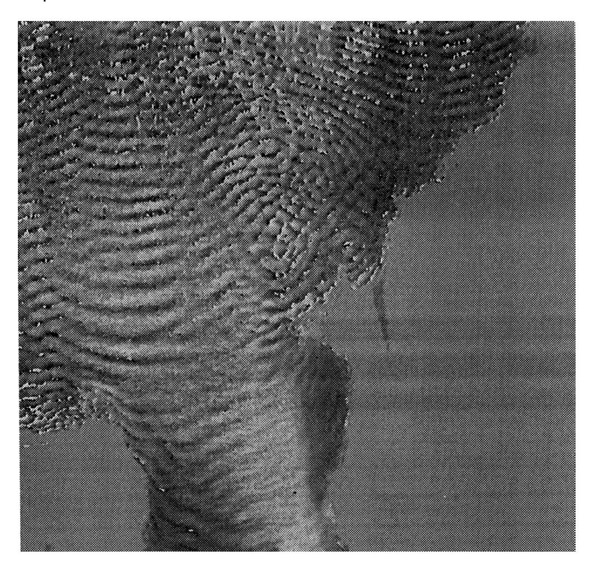

*Figure II-3-1. Waves propagating through shallow water influenced by the underlying bathymetry and currents*

- (2) For most of the open U.S. coastline, Wave Information Study data or data from gauges provide adequate spacing of sites along the coast to give estimates of the wave climate that can be used as input to nearshore transformation studies. In other places or for simulation of a specific event, a special hindcast of the deepwater wave climate may be required to provide input for a transformation analysis.
- c. Importance of water level . Near the coast, variable water depths can produce major variations in wave conditions over short distances. The important physical parameter is the depth of the water on which the surface waves are traveling. In nature, water depth is not a constant: it varies with tide stage, hurricane or extratropical storm surge, or for a variety of other reasons (Part II-5). These variations in water level influence wave breaking. Hence, any study of wave transformation must account for expected water levels for the site and the situation of interest.
II-3-2 Estimation of Nearshore Waves

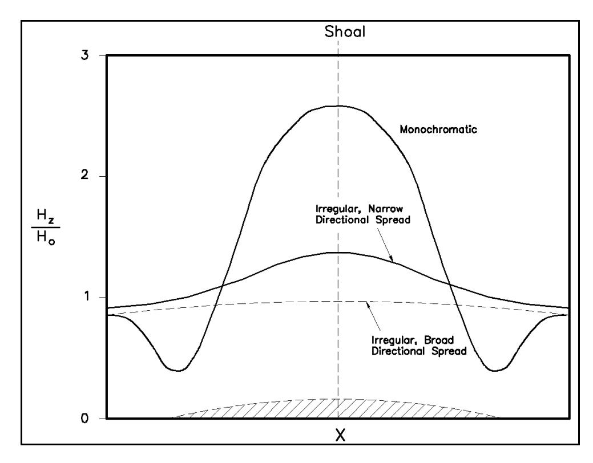

*Figure II-3-2. Amplification of wave height behind a shoal for waves with different spreads of energy in frequency and direction*

- d. Role of gauging . The procedures described here are needed because long-term site-specific data often do not exist. If time and funding are available, a short-term gauging program should be considered. A gauging program can help in two ways: (1) It may provide a simple statistically based transformation procedure. (2) It can be used to validate/calibrate a numerical model as a transformation procedure for the project.
Even a few months of gauge data can be a significant complement to any wave-transformation analysis. Short-term gauging is generally not useful in providing, by itself, a design-wave height.
e. Physical modeling . This chapter emphasizes calculation procedures for estimating nearshore waves. However, some sites are so complicated that a physical model of the site may be required to determine the wave conditions. Physical modeling is a well-established procedure for analysis of wave propagation and breaking effects and is particularly useful in analysis of the effects of structures on the wave field. Physical modeling is not useful for evaluating bottom friction or percolation effects or inclusion of wind inputs. Because of scaling limitations and costs, physical models are generally used for small areas (a few square kilometers or less). If strong currents transverse to a wave field are present, such as at a tidal inlet, a physical model may be the only dependable method for estimating the wave field.

# II-3-2. Principles of Wave Transformation

- a. Introduction.
- (1) In this section, the scientific principles governing the transformation of waves from deep water to shallow will be presented in sufficient detail to highlight critical assumptions and simplifications. Unfortunately, the problem is so complex that detailed computations require use of complicated numerical models whose background and implementation are beyond the scope of the Coastal Engineering Manual. This chapter provides the principles of wave transformation, a simplified approach, and an introduction to three numerical models used by the Corps of Engineers. (2) Processes that can affect a wave as it propagates from deep into shallow water include: (a) Refraction. (b) Shoaling. (c) Diffraction. (d) Dissipation due to friction. (e) Dissipation due to percolation. (f) Breaking. (g) Additional growth due to the wind. (h) Wave-current interaction. (i) Wave-wave interactions
The first three effects are propagation effects because they result from convergence or divergence of waves caused by the shape of the bottom topography, which influences the direction of wave travel and causes wave energy to be concentrated or spread out. Diffraction also occurs due to structures that interrupt wave propagation. The second three effects are sink mechanisms because they remove energy from the wave field through dissipation. The wind is a source mechanism because it represents the addition of wave energy if wind is present. The presence of a large-scale current field can affect wave propagation and dissipation. Wave-wave interactions result from nonlinear coupling of wave components and result in transfer of energy from some waves to others. The procedures presented will stop just seaward of the surf zone, which is treated in Part II-4, "Surf Zone Hydrodynamics."
- b. Wave transformation equation .
- (1) The general problem of wave transformation will be introduced in terms of the concept of directional wave spectra discussed in Part II-1 and II-2. Adopting the notation of Part II-2, consider a directional spectrum E(x,y,t,f, θ ) where f, θ represents a particular frequency-direction component, x,y represents a location in geographic space, and t represents time. The waves are propagating over a region with varying water depths with no current. Water level will not be time-dependent in the following analyses. Structures are not considered. The general equation used to estimate wave transformation is the radiative transfer equation introduced in Part II-2.

```math
\frac{\partial E(x,y,t,f,\theta)}{\partial t} + \nabla \cdot \left[ C_g(x,y,f) \ E(x,y,t,f,\theta) \right] = S_w + S_n + S_D + S_F + S_P \tag{II-3-1}
```

II-3-4 Estimation of Nearshore Waves
- (2) Although multidimensional, this equation is fundamentally simple. Term A represents the temporal rate of change of the spectrum, term B represents the propagation of wave energy, term C represents inputs from the wind, term D represents the redistribution of wave energy between different wave components that arise from nonlinearities of the waves, term E represents dissipation due to breaking, term F represents losses due to bottom friction, and term G represents losses due to percolation. Many different algebraic forms have been suggested for the various $S_{i};$ three references that provide examples are WAMDI (1988), Sobey and Young (1986), and Young (1988). Since they are complicated and cannot be used in manual computations, their algebraic form is not provided here. More detailed discussion of spectral wave mechanics may be found in Leblond and Mysak (1978), Hasselmann (1962, 1963a, 1963b), Hasselmann et al. (1973), Barnett (1968), Phillips (1977), Resio (1981), WAMDI (1988), and in Parts II-1 and II-2.
- (3) Surface wave motions produce a velocity field that extends to some depth in the water column. This depth for a deepwater wave is L /2 where L is the deepwater wave length. If the water depth is less than L /2, the motion extends to the bottom. In cases where the wave motion interacts with the bottom, several physical changes occur as shown in Part II-1: the celerity C and group velocity $C_{g}$ are changed, as is the wavelength. If the waves are propagating in a region in which the depths are variable (and sufficiently shallow so that the wave interacts with the bottom), the changes in wave speed change the direction of wave travel and change the amplitude of the wave ( refraction and shoaling ). If the patterns of wave propagation lead to strong focusing of waves, wave energy may be radiated away from the convergence by diffraction (Penny and Price 1944; Berkhoff 1972). The interaction of the wave with the bottom produces a boundary layer, which will result in the loss of wave energy to the bed due to bottom friction (Term F ) resulting from bottom materials and bed forms (Bagnold 1946). If the bed is reasonably porous, the pressure field associated with the passing wave can induce flow into and out of the bed (Bretschneider and Reid 1953), resulting in energy losses due to percolation (Term G ). If the bed is muddy or visco-elastic other losses may occur (Forristall and Reece 1985). Typically, only one of the bottom loss mechanisms is dominant at one locality although in a large, complicated area a variety of bottom types may exist with differing mechanisms important at different sites along the path of wave travel. However, the bottom-loss terms are often not applied because inadequate information is available on bottom-material composition to allow their proper use.
- (4) Wind input, interwave transfers, and breaking follow the principles outlined in Part II-2, though modified due to depth effects. Of the three, wave breaking is most affected by depth. If shoals exist, depth-induced breaking may be significant even though it is outside of the surf zone. Surf zone wave breaking is treated in Part II-4. The effect of sporadic breaking of large waves on shoals or other depthrelated features outside the surf zone is not negligible in high sea states. Even in deep water, waves break through whitecapping or oversteepening due to superposition of large waves. The interaction of waves and an underlying current can result in refraction of the waves and wave breaking (Jonsson 1978; Peregrine 1976). c. Types of wave transformation . (1) Three classic cases of wave transformation describe most situations found in coastal engineering:
- (a) A large storm generates deepwater waves that propagate across shallower water while the waves continue to grow due to wind.
- (b) A large storm generates winds in an area remote from the site of interest and as waves cross shallower water with negligible wind, they propagate to the site as swell.
- (c) Wind blows over an area of shallow water generating waves that grow so large as to interact with the bottom (no propagation of waves from deeper water into the site).

# EM 1110-2-1100 (Part II) 30 Apr 02

- (2) All cases are important, but the first and third are relatively complex and require a numerical model for reasonable treatment. The second case, swell propagating across a shallow region, is a classic building block that has served as a basis for many coastal engineering studies. Often the swell is approximated by a monochromatic wave, and simple refraction and shoaling methods are used to make nearshore-wave estimates. Since the process of refraction and shoaling is important in coastal engineering, the next section is devoted to deriving some simple approaches to illustrate the need for more complex approaches.
- (3) Often it is necessary for engineers to make a steady-state assumption: i.e., wave properties along the outer boundary of the region of interest and other external forcing are assumed not to vary with time. This is appropriate if the rate of variation of the wave field in time is very slow compared to the time required for the waves to pass from the outer boundary to the shore. If this is not the case, then a time-dependent model is required. Cases (a) and (c) would more typically require a time-dependent model. Time-dependent models are not discussed here due to their complexity. Examples are described by Resio (1981), Jensen et al. (1987), WAMDI (1988), Young (1988), SWAMP Group (1985), SWIM Group (1985), and Demirbilek and Webster (1992a,b).

# II-3-3. Refraction and Shoaling

In order to understand wave refraction and shoaling, consider the case of a steady-state, monochromatic (and thereby long-crested) wave propagating across a region in which there is a straight shoreline with all depth contours evenly spaced and parallel to the shoreline (Figure II-3-3). In addition, no current is present. If a wave crest initially has some angle of approach to the shore other than 0 deg, part of the wave (point A) will be in shallower water than another part (point B). Because the depth at A, h_A , is less than the depth at B, h_B , the speed of the wave at A will be slower than that at B because

```math
C_A = \frac{g}{\omega} \tanh k h_A < \frac{g}{\omega} \tanh k h_B = C_B \tag{II-3-2}
```

The speed differential along the wave crest causes the crest to turn more parallel to shore. The propagation problem becomes one of plotting the direction of wave approach and calculating its height as the wave propagates from deep to shallow water. For the case of monochromatic waves, wave period remains constant (Part II-1). In the case of an irregular wave train, the transformation process may affect waves at each frequency differently; consequently, the peak period of the wave field may shift.
- a. Wave rays.
- (1) The wave-propagation problem can often be readily visualized by construction of wave rays. If a point on a wave crest is selected and a wave crest orthogonal is drawn, the path traced out by the orthogonal as the wave crest propagates onshore is called a ray. Hence, a group of wave rays map the path of travel of the wave crest. For simple bathymetry, a group of rays can be constructed by hand to show the wave transformation, although it is a tedious procedure. Graphical computer programs also exist to automate this process (Harrison and Wilson 1964, Dobson 1967, Noda et al. 1974), but to a large degree such approaches have been superseded by the numerical methods discussed in Part II, Section 3-5. Refraction and shoaling analyses typically try to specify the wave height and direction along a ray.
II-3-6 Estimation of Nearshore Waves

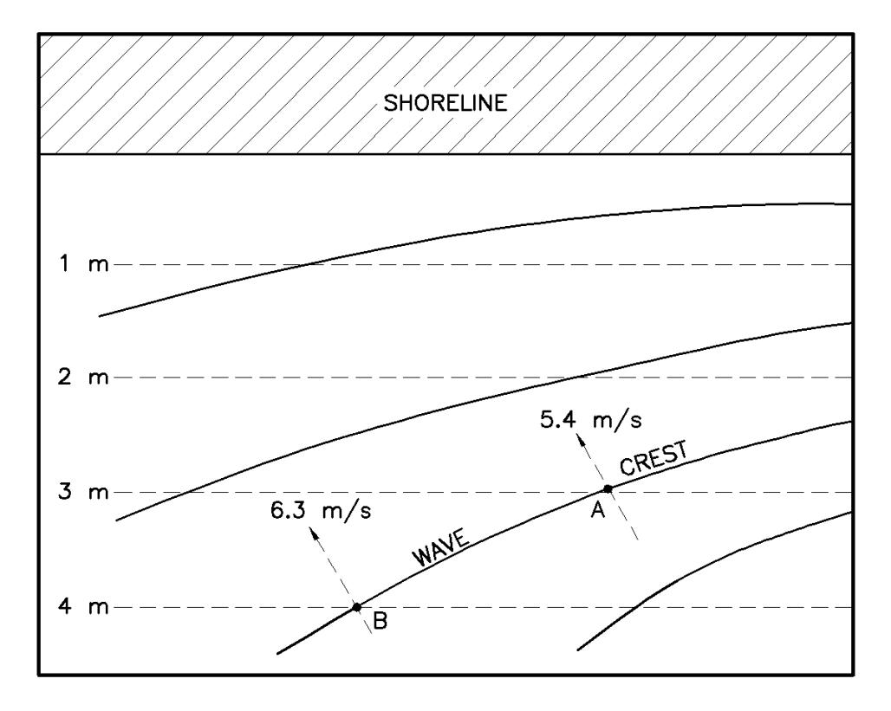

*Figure II-3-3. Straight shore with all depth contours evenly spaced and parallel to the shoreline*

- (2) Figure II-3-4 provides idealized plots of wave rays for several typical types of bathymetry. Simple parallel contours tend to reduce the energy of waves inshore if they approach at an angle. Shoals tend to focus rays onto the shoals and spread energy out to either side. Canyons tend to focus energy to either side and reduce energy over the head of the canyon. The amount of reduction or amplification will depend not only on bathymetry, but on the initial angle of approach and period of the waves. For natural sea states that have energy spread over a range of frequencies and directions, reduction and amplification are also dependent upon the directional spread of energy (Vincent and Briggs 1989).
- (3) Refraction and shoaling have been derived and treated widely. The following presentation follows that of Dean and Dalrymple (1991) very closely. Other explanations are provided in Ippen (1966), the Shore Protection Manual (1984), and Herbich (1990). b. Straight and parallel contours .
- (1) First, the equation for specifying how wave angle changes along the ray is developed, followed by the equation for wave height. The derivation is only for parallel and straight contours with no currents present. The x-component of the coordinate system will be taken to be orthogonal to the shoreline; the ycoordinate is taken to be shore-parallel. The straight and shore-parallel contours assumption will imply that any derivative in the y-direction is zero because dh/dy is zero.

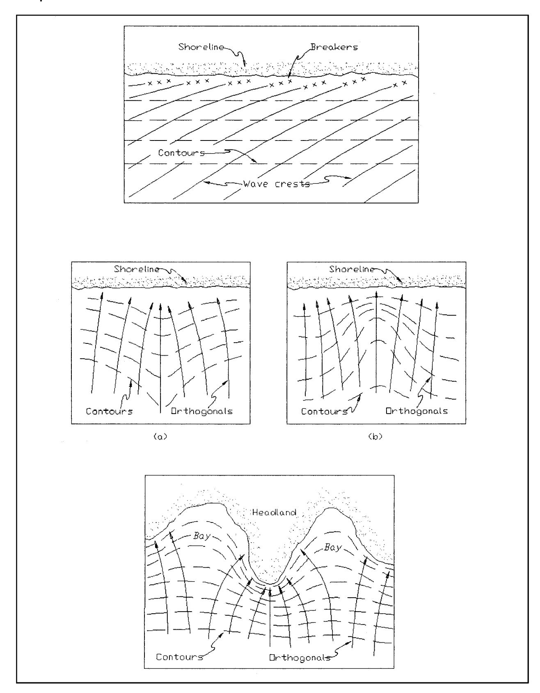

*Figure II-3-4. Idealized plots of wave rays*

II-3-8 Estimation of Nearshore Waves
(2) For a monochromatic wave, the wave phase function

```math
\Omega (x,y,t) = (k \cos\theta + k \sin\theta - \omega t) \tag{II-3-3}
```

can be used to define the wave number vector k by

```math
\vec{k} = \nabla \Omega \tag{II-3-4}
```

(3) Since k is a vector, one can take the curl of k

```math
\nabla \times \vec{k} = 0 \tag{II-3-5}
```

which is zero because k by definition is the gradient of a scaler and the curl of a gradient is zero.
(4) Substituting the components of K, Equation II-3-5 yields

```math
\frac{\partial (k \sin \theta)}{\partial x} - \frac{\partial (k \cos \theta)}{\partial y} = 0 \tag{II-3-6}
```

(5) Since the problem is defined to have straight and parallel contours, derivatives in the y direction are zero and using the dispersion relation linking k and C (and noting that k = 2\pi/CT and wave period is constant) Equation II-3-6 simplifies to

```math
\frac{d}{dx}\left(\frac{\sin\theta}{C}\right) = 0 \tag{II-3-7}
```

or

```math
\frac{\sin \theta}{C} = constant \tag{II-3-8}
```

(6) Let C_0 be the deepwater celerity of the wave. In deep water, \sin (\theta_0)/c_0 is known if the angle of the wave is known, so Equation II-3-8 yields

```math
\frac{\sin \theta}{C} = \frac{\sin \theta_0}{C_0} \tag{II-3-9}
```

along a ray. This identity is the equivalent of Snell's law in optics. The equation can be readily solved by starting with a point on the wave crest in deep water and incrementally estimating the change in C because of changes in depth. The direction \ominus of wave travel is then estimated plotting the path traced by the ray. The size of increment is selected to provide a smooth estimate of the ray.
(7) The wave-height variation along the ray can be estimated by considering two rays closely spaced together (Figure II-3-5). In deep water, the energy flux (EC_n) , which is also EC_g , across the wave crest distance b_0 can be estimated by (ECn)_0b_0 . Considering a location a short distance along the ray, the energy flux is (ECn)_1b_1 . Since the rays are orthogonal to the wave crest, there should be no transfer of energy across the rays and conservation principles give

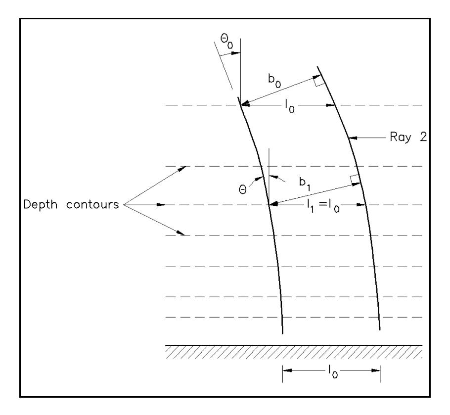

*Figure II-3-5. Wave-height variation along a wave ray*

```math
(ECn)_0 b_0 = (ECn)_1 b_1 \tag{II-3-10}
```

(8) From Part II-1, the height and energy of a monochromatic wave are given by

```math
E = \frac{1}{8} \rho g H^2 \tag{II-3-11}
```

and the wave height at location 1 is thus related to the wave height in deep water by

```math
H_1 = H_0 \sqrt{\frac{C_{g_0}}{C_{g_1}}} \sqrt{\frac{b_0}{b_1}} \tag{II-3-12}
```

(9) This equation is usually written as

```math
H_1 = H_0 K_s K_r \tag{II-3-13}
```

where K_s is called the shoaling coefficient and K_r is the refraction coefficient. From the case of simple, straight, and parallel contours, the value at b_1 can be found from b_0

```math
K_{r} = \left(\frac{b_{o}}{b_{1}}\right)^{\frac{1}{2}} = \left(\frac{\cos \theta_{0}}{\cos \theta_{1}}\right)^{\frac{1}{2}} = \left(\frac{1 - \sin^{2} \theta_{0}}{1 - \sin^{2} \theta_{1}}\right)^{\frac{1}{4}} \tag{II-3-14}
```

II-3-10 Estimation of Nearshore Waves
by noting that ray 2 is essentially ray 1 shifted downcoast. For straight and parallel contours, Figure II-3-6 is a solution nomogram. This is automated in the ACES program (Leenknecht, Szuwalski, and Sherlock 1992) and the program NMLONG (Kraus 1991). Figure II-3-6 provides the local wave angle K_R and K_RK_S in terms of initial deepwater wave angle and d/gT^2 . Although the bathymetry of most coasts is more complicated than this, these procedures provide a quick way of estimating approximate wave approach angles.

#### c. Realistic bathymetry.

(1) The previous discussion was for the case of straight and parallel contours. If the topography has variations in the y direction, then the full equation must be used. Dean and Dalrymple (1991) show the derivation in detail for ray theory in this case. Basically, the (x,y) coordinate system is transformed to (s,n) coordinates where s is a coordinate along a ray and n is a coordinate orthogonal to it. Algebraically, the equation for wave angle can be derived in the ray-based coordinate system

```math
\frac{\partial \theta}{\partial s} = \frac{1}{k} \frac{\partial k}{\partial n} = -\frac{1}{C} \frac{\partial C}{\partial n} \tag{II-3-15}
```

and the ray path defined by

```math
\frac{ds}{dt} = C \tag{II-3-16}
```

```math
\frac{dx}{dt} = C \cos \theta \tag{II-3-17}
```

```math
\frac{dy}{dt} = C \sin\theta \tag{II-3-18}
```

(2) Equation II-3-15 represents the discussion at the beginning of this section; the rate at which the wave turns depends upon the local gradient in wave speed along the wave crest. Munk and Arthur's computation for the refraction coefficient is more complicated: defining

```math
K_r = \left(\frac{1}{\beta}\right)^{\frac{1}{2}} \tag{II-3-19}
```

where \beta = b/b_0 then

```math
\frac{d^2\beta}{ds^2} + p \frac{d\beta}{ds} + q\beta = 0 \tag{II-3-20}
```

with

```math
p(s) = -\frac{\cos\theta}{C} \frac{\partial C}{\partial x} - \frac{\sin\theta}{C} \frac{\partial C}{\partial y} \tag{II-3-21}
```

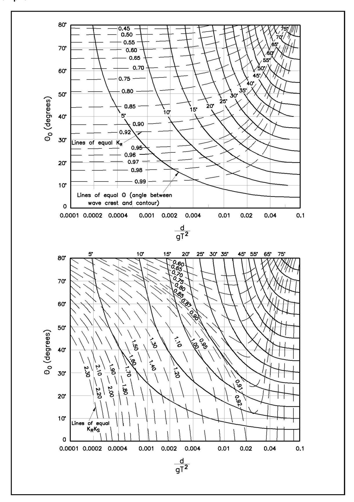

*Figure II-3-6. Solution nomogram*

II-3-12 Estimation of Nearshore Waves

#### EXAMPLE PROBLEM II-3-1

FIND:
Wave height H and angle \theta at water depths of 200, 100, 90, 80, 70, 60, 50, 40, 30, 20, 10, 16, 14, 12, 10, 8, 6, and 4 m for deepwater wave angles of 0^{\circ} , 15^{\circ} , and 45^{\circ} .

#### GIVEN

A wave 1 m high and 15-sec period in 500 m of water, with a plane, sloping beach.

#### SOLUTION:

Routine solutions for a plane beach can be obtained using the ACES wave transformation code, by direct calculation, or graphically using Figure II-3-6.
Table II-3-1 provides the results obtained by directly using the ACES code. On a personal computer with a 486-level microprocessor, the results may be obtained in seconds.
For a wave with a depth of 10 m and an initial wave angle of 45 deg, wave height and angle are calculated as follows:
Since the deepwater wave length of a 15-sec wave is

```math
L_0 = 1.56 \ T^2 = 1.56 \ (15)^2 = 351 \ m
```

and since 500 m is greater than L_0/2 , the given initial wave is a deepwater condition. The wave length of the wave in 10 m must be estimated from

```math
L = \frac{g T^2}{2 \pi} \tanh \left( \frac{2 \pi d}{L} \right)
```

and is 144 m (see Problem II-1-1).
The shoaling coefficient K_s can be estimated from

```math
K_s = \left( \frac{C_{g0}}{C_{gl}} \right)^{\frac{1}{2}}
```

In deep water C_{g0} for a 15-sec wave is

```math
\frac{1}{2} C_0 = \frac{1}{2} (1.56 \ T) = \frac{23.4}{2} = 11.7 \ \text{m/s}
```

The group velocity is given by

```math
C_g = nC = \frac{1}{2} \left( 1 + \frac{4\pi d/L}{\sinh(4\pi d/L)} \right) \frac{gT}{2\pi} \tanh\left(\frac{2\pi d}{L}\right)
```

Substitution of d = 10 m, L = 144 m, T = 15 sec, and g = 9.8 m/sec<sup>2</sup> yields 9.05 m/s.

```math
K_s = \left(\frac{11.70}{9.05}\right)^{\frac{1}{2}} = 1.14
```

Solution for K_r involves

```math
K_r = \left(\frac{1 - \sin^2 \theta_0}{1 - \sin^2 \theta_1}\right)^{\frac{1}{4}}
```

(Continued)
Example Problem II-3-1 (Concluded)
In deep water, \theta is 45 deg. From Equation II-3-9,

```math
\sin \theta = \frac{C_1 \sin \theta_0}{C_0}
```

In deep water C_0 = 1.56 T = 23.4 m/s. In 10 m of water, C_1 = L_1/T = 144 m/15<sub>s</sub> = 9.60 m/s.

```math
\sin \theta = \frac{9.6 \sin (45^0)}{23.4} = \frac{9.6 (7.07)}{23.4} = 0.29
```

```math
K_r = \left(\frac{1 - \sin^2\theta_0}{1 - \sin^2\theta}\right)^{\frac{1}{4}} = \left(\frac{1 - (0.707)^2}{1 - (0.29)^2}\right)^{\frac{1}{4}} = \left(\frac{0.50}{0.91}\right)^{\frac{1}{4}} = 0.86
```

Therefore: H_i = H_0 K_s K_r = 1(1.14) (0.86) = 0.98 \text{ m}.
The angle of approach is arc \sin{(\sin{\theta})} = 16.8^{\circ} . Thus, the l-m, 15-sec wave has changed 2 percent in height by 28.2 deg in angle of approach.
The largest differences caused by refraction and shoaling will be seen at the shallowest depths. From Table II-3-1 at the 4-m depth, the wave height for a 45-deg initial angle is 1.18 m compared to 1.39 m for a wave with initial angle of 0 deg. If the initial angle had been 70 deg, K_r , K_s would be about 0.8.

**Table II-3-1. at the 4-m depth, the wave height for a 45-deg initial angle is 1.18 m compared to 1.39 m for a wave with initial angle of 0 deg. If the initial angle had been 70 deg, K_r , K_s would be about 0.8.**

| Depth | θo = 0o θ | H | θo = 15o θ | H | θo = 45o θ | H |
| --- | --- | --- | --- | --- | --- | --- |
| 500 | 0 | 1.00 | 15.0 | 1.00 | 45.0 | 1.00 |
| 400 | 0 | 1.00 | 15.0 | 1.00 | 45.0 | 1.00 |
| 300 | 0 | 1.00 | 15.0 | 1.00 | 45.0 | 1.00 |
| 200 | 0 | 1.00 | 15.0 | 1.00 | 45.0 | 1.00 |
| 100 | 0 | 0.94 | 14.3 | 0.94 | 42.4 | 0.92 |
| 90 | 0 | 0.93 | 14.0 | 0.93 | 41.2 | 0.91 |
| 80 | 0 | 0.93 | 13.7 | 0.92 | 30.4 | 0.89 |
| 70 | 0 | 0.92 | 13.2 | 0.91 | 38.9 | 0.88 |
| 60 | 0 | 0.91 | 12.7 | 0.91 | 37.0 | 0.86 |
| 50 | 0 | 0.91 | 12.0 | 0.91 | 34.5 | 0.85 |
| 40 | 0 | 0.92 | 11.1 | 0.92 | 31.8 | 0.84 |
| 30 | 0 | 0.95 | 9.9 | 0.94 | 28.1 | 0.85 |
| 20 | 0 | 1.00 | 8.4 | 0.99 | 23.4 | 0.88 |
| 18 | 0 | 1.02 | 8.0 | 1.01 | 22.3 | 0.89 |
| 16 | 0 | 1.04 | 7.8 | 1.03 | 21.1 | 0.91 |
| 14 | 0 | 1.07 | 7.1 | 1.05 | 19.8 | 0.92 |
| 12 | 0 | 1.10 | 6.6 | 1.08 | 18.4 | 0.95 |
| 10 | 0 | 1.14 | 6.1 | 1.12 | 16.8 | 0.98 |
| 8 | 0 | 1.19 | 5.5 | 1.17 | 15.1 | 1.02 |
| 6 | 0 | 1.27 | 4.8 | 1.25 | 13.15 | 1.08 |
| 4 | 0 | 1.39 | 3.9 | 1.37 | 10.8 | 1.18 |

II-3-14
and

```math
q(s) = \frac{\sin^2 \theta}{C} \frac{\partial^2 C}{\partial x^2} - 2 \frac{\sin \theta \cos \theta}{C} \frac{\partial^2 C}{\partial x \partial y} + \cos^2 \theta \frac{\partial^2 C}{\partial y^2} \tag{II-3-22}
```

(3) These equations are solved for a set of rays for each wave component of interest (typically combinations of periods and directions). Since this analysis is linear, often a unit wave height is applied for the offshore wave height, which yields a series of refraction and shoaling coefficients at sites of interest. Then the wave transformation for any non-unit initial wave height is obtained by multiplication. This is permissible as long as wave breaking does not occur along a wave ray.

#### d. Problems in ray approach.

- (1) Estimating wave propagation patterns with wave rays is intuitively and visually satisfying, and often very useful. The engineer obtains a good picture of how a wave propagates to a site. However, the procedure has several drawbacks when applied to even mildly irregular bathymetry. One problem is ray convergence/crossing; another is bathymetry inadequacy on ray paths.
- (2) An example calculation from Noda et al. (1974) illustrates the basic problem. Bathymetry is highly regular, but has undulatory contours (Figure II-3-7). From the ray pattern, convergence and divergence of adjacent rays are apparent as the waves sweep over the undulations in bathymetry. However, in shallow water near the shore, the rays are sufficiently perturbed by the bathymetry that several converge, with the ray spacing going to zero (in some ray programs the rays actually are computed to cross). Remembering the conservation of wave energy argument used to define the refraction coefficient, the flux across an orthogonal between the rays remains constant. As the spacing between rays approaches zero, the energy flux becomes infinite. Practically, if strong wave convergence occurs, breaking either due to depth constraints (Part II-4) or steepness constraints (Part II-1) naturally limits the wave height. However, situations which generate strong gradients or discontinuities in wave height along a wave crest give rise to diffraction effects, which can reduce the wave height and keep it below the breaking value.
- (3) The second problem with ray theory is the sensitivity of the wave ray calculations. In most locations, the bathymetry is not well-known. Discretizations of the bathymetry can produce sharper local gradients in the computational depth field than may exist locally or, conversely, may reduce local gradients. Most wave ray calculation schemes calculate each wave ray uncoupled from all others. Ray paths are very sensitive to gradients in bathymetry. The smoothing algorithms that are used to numerically compute the required derivatives can alter the ray field significantly. Since the ray calculations are uncoupled, adjacent rays may take radically different paths due to how the bathymetry was discretized or smoothed. Also, if the ray calculations were started at slightly different spatial locations, the resulting patterns may be significantly different for the same reason. In the cases where ray patterns are unstable with respect to perturbations of initial positions or where adjacent rays show unusual divergences and crossings, the coastal engineer must carefully assess whether the propagation is indeed that unusual (in which case ray theory results may not be accurate) or decide that more careful analysis of the bathymetry and smoothing is needed.
- (4) Wave propagation discussion has centered on the concept of waves traveling from deep water to shallow. At some locations, the bathymetry is such that waves propagating from offshore towards a beach may initially propagate from deeper to shallow water, then propagate across a zone where the water becomes deeper again. In the region where the wave is propagating at an angle to the progressively shallower depths, the process of refraction previously described occurs: the waves turn more shore-normal. Once the depth gradient reverses, the wave turns in the opposite direction (because of the reversed depth gradient, the part

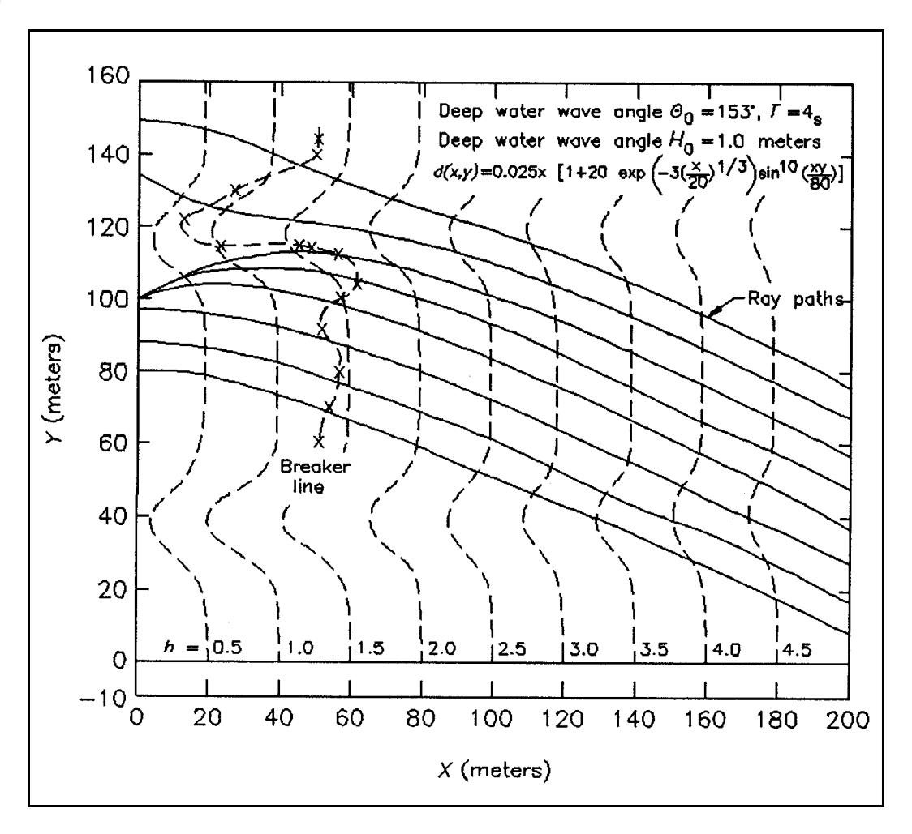

*Figure II-3-7. Highly regular bathymetry but undulatory contours*

of the wave crest nearer shore is in deeper water than the part of the wave offshore and is hence moving faster). If the combination of wave angle of approach to the bathymetry and wave period is correct, the wave will turn back and go offshore, giving the appearance of a reflected wave. Calculation of wave heights where waves crook or bend backwards is not treated here.
- e Wave diffraction . Wave diffraction is a process of wave propagation that can be as important as refraction and shoaling. The classical introduction to diffraction treats a wave propagating past the tip of a breakwater. Since diffraction theory is most often applied to the interaction of waves with harbor structures, derivation of wave diffraction is deferred until Part II-7 (Harbor Hydrodynamics). Any process that produces an abrupt or very large gradient in wave height along a wave crest also produces diffracted waves that tend to move energy away from higher waves to the area of lower waves. So initial wave energy is reduced as diffracted waves are produced. However, if the rate of convergence is too great, the wave may still break.
- f. Reflection . Waves that propagate into a solid object such as a breakwater, a seawall, a cliff, or a sloping beach may reflect. In the case of a vertical, hard structure, the fraction of wave energy reflected can be large. For permeable structures or gentle slopes, the reflection will be much less. For nearshore wave propagation problems, reflections are usually ignored because the reflected wave may often be less than 10 percent of the incident wave.
II-3-16 Estimation of Nearshore Waves
g. Refraction and shoaling of wave spectra. The previous discussion of refraction and shoaling was for a single wave component. However, wave propagation was introduced in Equation II-3-1 through the concept of spectral components. In principle, refraction and shoaling of a wave field in terms of its spectral components simply requires computing the refraction and shoaling coefficient for each frequency-direction (f,\theta) component and computing the transformed sum:

```math
E(f,\theta) = \sum_{s} K_s^2(f,\theta) \quad K_r^2(f,\theta) \quad E_o(f,\theta) \quad \Delta f \Delta \theta \tag{II-3-23}
```

where E_o(f,\theta) is the offshore directional spectrum. This is possible as long as no breaking or other loss or gain occurs along the propagation path of the individual waves. If it does occur, most advanced spectral models compute the wave transformation locally. In this approach, the area of interest is covered by a discrete series of computation points and the ray path for each (f,\theta) component in the spectrum is computed for each grid point only by tracing the ray back to the grid cell boundary defined by adjacent grid points. This approximation, called backward ray tracing, is adequate as long as the wave energy and bathymetry vary smoothly and gently over the domain.

#### h. Alternate formulations.

(1) Mild slope equation. The refraction and shoaling analyses presented above were based on linear wave theory and a ray approach equivalent to geometrical optics. This works well for simple cases, but once the bathymetry becomes even moderately undulatory, the ray approach runs into difficulty. Berkhoff (1972) formulated a more advanced approach for wave propagation that includes refraction, shoaling, and diffraction simultaneously and can incorporate structures. Berkhoff developed what is termed the mild-slope equation given by

```math
\nabla \left( CC_g \Phi \right) + \omega^2 \left( \frac{C_g}{C} \right) \Phi = 0 \tag{II-3-24}
```

with

```math
\varphi(x,y,z) = \Phi \frac{\cosh k(h+z)}{\cosh kh} \tag{II-3-25}
```

where

```math
\nabla = \left(\frac{\partial}{\partial x_i}, \frac{\partial}{\partial y_j}\right) \tag{II-3-26}
```

which provides a solution \varphi for amplitude and phase of the waves in the horizontal plane. To obtain the equation, Berkhoff assumed that the bottom slope was mild (no abrupt steps, shoals, or trenches). Often slopes of interest violate this assumption, but the models based on the mild-slope equation perform better than the ray approach. Many approaches have been taken to computationally solve this equation. Berkhoff's approach solves the velocity potential of the wave in the horizontal, which can require 5-10 computational grid points per wave length. This is impractical for many cases. Another approach, developed by Radder (1979), is to use a parabolic approximation, which is far more computationally efficient (but subsequently adds more limitations).
(2) Boussinesq equations. Another approach for wave propagation problems close to the coast and in harbors is the use of vertically integrated shallow-water equations in which a Boussinesq (Part II-1) approximation has been made. The numerical models (e.g., Abbott, Peterson, and Skovgaard 1978) resulting from this approach require 10-20 grid points per wave length but have the advantage of being time-dependent

#### EM 1110-2-1100 (Part II) 30 Apr 02

so that the pattern of wave propagation can be directly visualized. Wave crests evolve during the shoaling process to have nonsinusoidal shapes characteristic of shallow-water waves. Currents may be applied directly. Wave breaking, however, is simulated empirically.

# II-3-4. Transformation of Irregular Waves

- a. The preceding discussion emphasized the refraction and shoaling of monochromatic waves. When this process is applied to an initial significant wave height and period, it is called a significant wave analysis. For many conditions where propagation is the dominant factor (as opposed to additional wave growth or bottom dissipation) the significant wave analysis provides a reasonable and generally conservative approximation. The significant wave analysis may be inadequate when wave conditions have spectra characterized by wide directional spreads or broad (frequency) spectral widths or multiple spectral peaks. Cases where the significant wave analysis is adequate primarily involve narrow band swell. This section outlines differences that may be expected between the application of significant wave analyses and application of an irregular wave approach.
- b. Rrefraction and shoaling for monochromatic waves may be applied to the individual frequency and direction components of the spectrum of an irregular wave system. Two factors become important: directional spreading and spectral wave mechanics. Directional spreading is important whenever it is present. Spectral wave dynamics are most important in high-energy, high-steepness wave cases, and negligible for low-energy, low-steepness cases.
- c. Directional spreading is important for two reasons. First, laboratory tests (Berkhoff, Boij, and Radder 1982; Vincent and Briggs 1989) with unidirectional waves indicate that shoals concentrate wave energy immediately behind the shoal and reduce it on the flanks. The increase behind the shoal can be nearly 250 percent of the initial wave height; the reduction to either side can be about 50 percent. However, laboratory tests with wave spectra having significant directional spread (Vincent and Briggs 1989) show only a 110- to 140-percent increase behind the shoal and only a 10- to 15-percent reduction on the sides. Numerical models incorporating directional spread also replicate this (Panchang et al. 1990). In the case with directional spread, the shoal focusses each frequency-direction component at a different location behind the shoal rather than at one spot as in the unidirectional case. Consequently some of the high- and low-energy regions overlap and cancel each other out. Secondly, if the mean angle of wave approach is not directly onshore, one consequence of directional spreading is that some fraction of the wave energy is heading parallel to shore or offshore. In the case of a wave system with symmetric directional spread (i.e., 50 percent to the left and right of the mean direction), if the mean direction were parallel to a straight shoreline (and the measurement were made in deep water), half of the energy would be moving in directions that could not refract towards shore. So even for angles up to 30 deg offshore-parallel, significant amounts of energy are not propagating shoreward. In a significant wave analysis, all the energy would propagate shoreward. If the shoreline, fetch, or bathymetry is complicated, the fraction of energy that propagates towards shore is more difficult to define.
- d. Spectral dynamics arise because waves of different lengths and steepness are propagating through and with other waves. According to Equation II-3-1, these waves can exchange energy between each other (nonlinear transfers) and superposition of waves can lead to dissipation due to breaking. Analysis of thousands of wave records (Bouws et al. 1987; Bouws, Gunther, and Vincent 1985; Miller and Vincent 1990) indicates that higher energy wind sea spectra achieve a characteristic shape that is different from that obtained simply by shoaling. As a result, the energy level for shoaling irregular wave tends to be less than that predicted from linear monochromatic shoaling of the wave components, especially near the surf zone. Smith and Vincent (1992) also indicate that the shoaling and breaking of irregular waves with two spectral peaks can substantially differ from the monochromatic (and even single peak spectral) case. Moreover, the wave spectrum after refraction and shoaling can have a substantially different peak period. Although a satisfactory
II-3-18 Estimation of Nearshore Waves
explanation of these phenomena is not available, their impact is significant, with differences up to 30-40 percent from the significant wave approach.
- e. Treatment of spectral wave mechanics in any detail requires use of a numerical model. However, in using a significant wave approach, it can generally be assumed that: (1) It may overestimate wave focussing effects.
- (2) Careful estimates of the fraction of wave energy heading shoreward should be made for oblique angles cases. (3) Shoaling calculations may overestimate wave heights in high energy conditions.
- f. Shifts in wave period may also occur. As a result, significant wave analysis tends to be conservative; this may be why it has been an acceptable approach for design. However, for cost-sensitive projects, a more complicated approach may be warranted.
- g. The following precautions are suggested. In a significant wave analysis, if regions of highly focussed wave energy occur with corresponding lobes of low energy, the regions of low energy should be carefully considered. In the field, natural wave systems generally have significant directional spread, so calculated values in the low energy lobes may significantly underestimate wave heights. In cases where irregular waves are modeled spectrally, typically only the wave height $H_{s}$ is estimated. In shallow water, larger waves do occur $(H_{1/10},$ etc.) and combinations of individual wave height, period, and bottom depth can result in individual waves or groups of waves significantly larger than $H_{s}$ (see Part II-2).

## II-3-5. Advanced Propagation Methods

- a. Introduction.
- (1) As indicated in Part II-3-2, as waves propagate, they may continue to grow due to the continued action of the wind or may lose energy due to breaking, bottom friction, or percolation. These effects cannot be realistically incorporated through manual calculations. The preceding discussion indicates that computations involving rays are tedious by hand and subject to many inaccuracies. Advances have been made in computing wave transformation; they were briefly indicated in the preceding sections. Many of these procedures may run efficiently on a personal computer or a work station and do not require a large mainframe or supercomputer. Hence they can be applied readily by most engineers (ACES 1992).
- (2) This section describes three computer programs that are available and in use by the Corps of Engineers. Each program is briefly described and a reference indicates where the program can be obtained. Each program is complicated and requires some effort to use properly. A short description is provided here to indicate to the engineer the potentials of these codes. The three have been selected to provide a cross section of the types of technology available. Other computer programs can be obtained and may be as suitable for use as those described here.
- (3) Examples of technology available to practicing engineers is provided. The Corps of Engineers does not endorse the codes discussed or certify their accuracy. Indeed, the suitability and accuracy of any of these codes depend upon the problem under study and the way in which the code is applied. With the exception of very simple bathymetry, it is recommended that nearshore wave transformation studies use a numerical code capable of handling the complexities required. However, the particular numerical approach selected depends upon the problem.

#### EM 1110-2-1100 (Part II) 30 Apr 02

- (4) The three models discussed below are all steady-state models. Time-dependent, shallow-water models are available (Jensen et al. 1987; Demirbilek and Webster 1992a, 1992b). They are not discussed here because they require extensive sets of meteorological data and cannot be easily applied. The basic characteristics of the three models discussed are as follows:
- (a) (RCPWAVE) RCPWAVE is a steady-state, linear-wave model based on the mild-slope equation and includes wave breaking. It is applicable for open coast areas without structures. It is basically a monochromatic-wave approach.
- (b) (REFDIF1) REFDIF is a steady-state model based on the parabolic approximation solution to the mild-slope equation. The model includes wave breaking, wave damping, and some nonlinear effects. Although primarily used as a monochromatic wave model, a spectral version is available. The model can simulate aspects of propagation associated with simple currents and can include structures.
- (c) (STWAVE) STWAVE is a steady-state, linear wave model that computes the evolution of the directional spectrum over space (Equation II-3-1). The model includes breaking, bottom friction, percolation, and wind input and solves for the nonlinear transfers of energy within the wave spectrum. It has two modes for handling diffraction of wave energy and the computational domain may include simple structures. The models can handle aspects of propagation associated with simple currents.
- (5) The three models are theoretically complicated and computationally demanding. All can be effectively used on a powerful PC-type computer or work station. Each model has considerable strengths and each can be an appropriate choice for wave transformation. However, none can be considered universally applicable and the results from all can be inaccurate if the assumptions made in model development are significantly violated. Users of any of the models must become thoroughly familiar with the model, its assumptions, and limitations.

#### b. RCPWAVE .

- (1) Introduction.
- (a) The RCPWAVE model (Ebersole 1985; Ebersole, Cialone, and Prater 1986) was developed in the early 1980's as an engineering tool for calculating the properties of waves as they propagate into shallow water and eventually break. The theoretical basis for the model (linear-wave theory) and the types of information generated by the model (wave height, period, and direction as a function of location) are consistent with current theories and equations used by the engineering community to calculate potential longshore sand-transport rates and shoreline and beach change. The model was designed to operate efficiently for coastal regions that may be tens of kilometers in length, and to overcome deficiencies of previously developed refraction models that could be applied on a regional scale. The wave ray refraction models of Harrison and Wilson (1964), Dobson (1967), Noda et al. (1974), and others "failed" in regions of strong wave convergence and divergence (i.e., highly irregular bathymetry), leaving users with no wave solutions and little guidance for interpreting results in these regions. Berkhoff (1972, 1976) derived an elliptic equation that approximately represented the complete transformation process for linear waves over arbitrary bathymetry, where the bathymetry was only constrained to have mild slopes. Numerical solution of this equation requires discretization of the spatial domain and subsequent computations with grid resolutions that are a fraction of the wave lengths being considered (typically one tenth or smaller). This requirement limits the utility of the approach for large regions of coastline.
- (b) RCPWAVE is based on the mild-slope equation. An assumed form for the velocity potential associated with only the forward scattered wave field is used with the mild slope equation to develop two equations, one describing the conservation of wave energy (assuming a constant wave frequency) and the
II-3-20 Estimation of Nearshore Waves
other defining the magnitude of the wave phase gradient as a function of the wave number and the spatial variability in wave amplitude. The finite difference forms of these two equations and a third equation defining the irrotationality of the wave phase function gradient are solved for the wave height, direction, and phase gradient. A forward-marching (in the direction of wave propagation) solution scheme is used, and solutions are obtained at the center of each rectangular grid cell of the discretized model domain. RCPWAVE differs from the complete solution of the mild-slope equation by neglecting reflections of waves by structures and bathymetry. This allows RCPWAVE to use a grid resolution only sufficient to resolve bathymetric gradients, permitting RCPWAVE to cover larger spatial regions than those usually covered in full solutions to the mild-slope equation.
(c) Wave breaking is also treated in the model. The occurrence of wave breaking is first considered by comparing the computed local wave height with a limiting wave height calculated using the method of Weggel (1972). If the computed wave height exceeds the limiting value, then energy is dissipated according to the breaker decay model of Dally, Dean, and Dalrymple (1984). When the calculated local wave height falls below the stable value proposed by Dally, Dean, and Dalrymple, energy dissipation is again set to zero. The influence of wave height variability on wave phase is neglected in the surf zone. Details of the RCPWAVE model derivation and solution scheme can be found in Ebersole, Cialone and Prater (1986).

## (2) Examples of RCPWAVE results.

- (a) Figures II-3-8 and II-3-9 show results from a typical application of RCPWAVE. The model domain is the region offshore of Homer Spit, Alaska. The section of coast being considered is approximately 33 km in length. A rectangular grid mesh was constructed within the domain, with grid resolution of approximately 130 m in the on-offshore direction and 250 m in the alongshore direction. Figure II-3-8 shows bathymetric contours in the model domain. The nearshore region is characterized by a fairly broad shelf with depths of 20 m or less, and offshore the depths increase to 200 ft and greater in the lower right-hand corner of the domain. The shallow-water region is characterized by irregular contours, with extensive shoals at locations A and B in Figure II-3-8.
- (b) Figure II-3-9 shows the wave height field (shaded contours) throughout the model domain for an incident deepwater wave with the characteristics shown. Note the areas of wave convergence and divergence and the resulting variation in wave height observed along the coast (darker shades indicate convergence and lighter shades indicate divergence). The shoals cause wave convergence, which is evidenced by zones of higher wave height in the lee of the shoals. Wave heights are lower in divergent zones that are created as waves attempt to align their propagation direction to be perpendicular to bathymetric contours and propagate toward the shoals. A plot of wave direction vectors would also indicate zones of wave convergence and divergence. Also note the position of the breaker line (indicated by the seawardmost pattern of dots), as it follows the shallower bathymetric contours. Shoals can cause the focussed incident wave to break at a greater distance from shore than elsewhere in the region. Information that can be obtained using the model includes wave height and direction variability at many locations along the coast under different incident wave conditions, variability of inshore wave conditions with changing water levels, and zones of potentially high and low longshore sand transport.

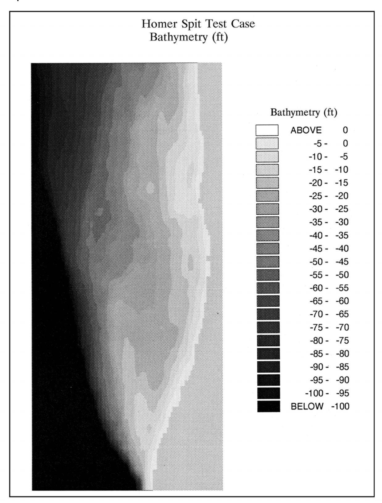

*Figure II-3-8. Typical RCPWAVE application, bathymetry*

II-3-22 Estimation of Nearshore Waves

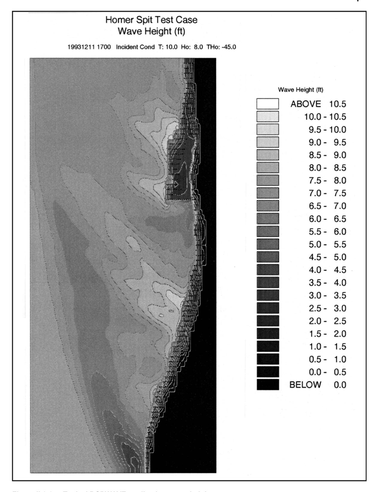

*Figure II-3-9. Typical RCPWAVE application, wave height*

# EM 1110-2-1100 (Part II) 30 Apr 02

- (3) Data requirements for RCPWAVE.
- (a) Primary input to the RCPWAVE model includes the following: parameters describing the domain to be modeled, such as the number of computational grid cells in each direction and the cell dimensions; definition of the water depth at each cell; and definition of the incident wave height, period, and direction along the offshore domain boundary for each wave condition to be simulated. Model output includes wave height, period, and direction at each cell of the computational domain, and an indication of whether or not the wave is calculated to be a broken wave.
- (b) Typically the first step in the model application process is to discretize the model domain into a rectangular mesh. The grid mesh that is created can be overlaid on a bathymetric chart, assuming the grid and chart are plotted to the same horizontal scale, and depths at each cell can be digitized for use as model input. A constant correction to the depths, representing a datum change or a specific water level change, can be included in the input data set. An arbitrary number of wave conditions, each defined by a unique combination of height, period and direction, can be simulated. Wave conditions to be simulated are usually defined after a statistical analysis of the wave climate in the region being studied. Bathymetry specification and incident wave conditions comprise the bulk of the effort to create the input data set. c. REFDIF.
- (1) Introduction. The model REF/DIF 1, which has been developed for practical application, is based on the mild-slope, wave-current model equation developed by Kirby (1984), which may be written as

```math
\frac{D^2 \varphi}{Dt^2} + \nabla \cdot U \frac{D \varphi}{Dt} - \nabla \cdot (C C_g \nabla \varphi) + (\sigma^2 - k^2 C C_g) \varphi = 0 \tag{II-3-27}
```

where \varphi is the velocity potential at the free surface, and where

```math
\frac{D}{Dt} = \frac{\partial}{\partial t} + U \cdot \nabla \tag{II-3-28}
```

```math
\nabla = \left(\frac{\partial}{\partial x} , \frac{\partial}{\partial y}\right) \tag{II-3-29}
```

```math
U = (U(x,y), V(x,y)) = \text{ambient current vector} \tag{II-3-30}
```

```math
\sigma = \omega - k \cdot U \tag{II-3-31}
```

```math
C = \frac{\sigma}{k} \tag{II-3-32}
```

```math
C_g = \frac{\partial \sigma}{\partial k} \tag{II-3-33}
```

```math
\sigma^2 = gk \tanh(kh) \tag{II-3-34}
```

Several additional features are included in the model in order to increase its range of application and accuracy.
II-3-24 Estimation of Nearshore Waves
- (2) Wave breaking. The model tests whether the local wave height has exceeded a fixed threshold, which is set at h /d = 0.78. For local wave heights exceeding this value, a breaking wave energy flux decay model is started in order to remove energy from the wave train. The model used is described in Dally, Dean, and Dalrymple (1985). The reader is referred to Kirby and Dalrymple (1986a) for further details. (3) Wave damping mechanisms.
- (a) In addition to the strong wave breaking mechanism described above, REF/DIF 1 also provides the user with three selectable bottom damping mechanisms. These are: laminar bottom boundary layer damping, sand-bed percolation damping, and turbulent bottom boundary layer damping.
- (b) At present, no laboratory or field data sets clearly point to the need for including bottom damping effects in model simulations. Laboratory experiments usually include too short a propagation distance for damping effects to accumulate significantly. In the field, damping due to bottom effects may be balanced or overshadowed by wave growth resulting from wind-wave interaction, and so one should not be considered in the absence of the other. At present, it is recommended that these user-selectable damping mechanisms not be included in model simulations. (4) Wave nonlinearity.
- (a) Wave nonlinearity has a strong effect on the phase speed of waves and thus can significantly modify both refraction and diffraction effects. For example, waves shoaling on a plane beach refract more slowly than predicted by linear theory, since the increase in wave height with decreasing water depth speeds up the waves, in opposition to the direct, linear-theory effect decreasing depth, which slows them. Diffraction effects are typically enhanced. Phase speed is greater in a high-amplitude, illuminated area than in a lowamplitude, shadowed area; this causes refractive bending of waves into the shadow area, causing an increase in wave height in the shadow zone relative to the predictions of linear theory.
- (b) REF/DIF 1, designed to predict the propagation of a monochromatic wave in intermediate water depth, includes the effects of nonlinearity as predicted by third-order Stokes wave theory (Kirby and Dalrymple 1983). Since the model is often used to predict wave-height distributions into the surf zone and up to dry land boundaries, the model must also be corrected to avoid the singularities arising from the invalidity of Stokes theory in shallow water. In order to provide a smooth correction to the model results in the shallow-water limit, Kirby and Dalrymple (1986b) provided an algorithm that gives a smooth patch between Stokes theory and an empirical modification to linear theory developed by Hedges (1976). The approximate theory does not cause any degradation in solution accuracy in comparison to the Stokes theory alone for intermediate depth experiments; see Kirby and Dalrymple (1986b) for relevant documentation.
- (5) Numerical noise filter. Higher-order forms of the parabolic approximation have the undesirable effect of allowing high-wave number noise (i.e., noise with rapid lateral variation) to propagate rapidly across the computational grid. This effect has been described in detail by Kirby (1986a), and is usually found in association with the start of surf zones around complicated planforms such as island shores. The resulting noise component may be damped by the application of various types of smoothing filters. The three-point moving average filter described by Kirby (1986a) has been found to be heavy-handed in practical applications, and has been replaced in present versions of the REF/DIF 1 model by a damping filter included in the governing differential equation, whose effect is centered around the lateral wave number, which spread rapidly in the undamped model. A full description of the damping method and a range of tests may be found in Kirby (1993).
- (6) Examples of REF/DIF1 results laboratory verification. REF/DIF 1 (and the parabolic approximation model in general) are capable of providing a detailed picture of the water surface in the region of study if the

#### EM 1110-2-1100 (Part II) 30 Apr 02

grid resolution is sufficiently high. This picture includes the geometry of crests and troughs as well as the location of regions of high or low wave height resulting from short-crestedness of the wave field. Since irregular waves in the field usually lead to a fairly smooth spatial variation in wave height estimates (after statistical averaging), a more stringent test of model accuracy is provided by comparison to laboratory tests with monochromatic waves. Parabolic models have been tested against data of this type in a number of studies, including Berkhoff, Booij, and Radder (1982); Tsay and Liu (1982); Kirby and Dalrymple (1984), Panchang et al. (1990), and Demirbilek (1994). The results showed that the higher-order parabolic approximation, together with nonlinear correction to the wave phase speed, can correctly predict the distribution of wave heights and nodal points in the evolving wave field. Figure II-3-10 shows the bathymetry input to REF/DIF1 for a simulation of wave propagations at Revere Beach, MA. Figure II-3-11 shows the wave heights calculated by the models.
- (7) Data requirements for REFDIF.
- (a) REF/DIF 1 computes a grid-based wave evolution over an arbitrary bathymetry and current field. To run the model, the user must provide, at minimum, an array of depth values h on a grid with regular spacing in x and y . The model always assumes that x is the preferred direction, or the direction in which the computation marches. No provision is made at present for relating the model coordinate system to a global coordinate system. If the user wishes to include the effects of tidal currents in the model study, then arrays of velocity components U and V must also be provided for the same regular grid used to specify h values. This information establishes the geometry for the model run.
- (b) The user must also specify the form of the wave train at the offshore boundary. This may be done by specifying a combination of one or more monochromatic waves at the offshore boundary, or the offshore wave field may be specified at the first grid row by means of input data. The user's manual provided in Kirby and Dalrymple (1992) should be consulted for more details about the input data.
- (c) The model provides the user with a grid of computed wave heights and directions on the same geometric grid used for input. In addition, the complex amplitude values are provided and may be used to reconstruct plots of the computed wave field, if these are desired and if the grid resolution is fine enough to permit it. For larger-scaled model areas, this last step is often not feasible, as it requires 5 to 6 grid points per modeled wave length in the input bathymetry grid. A version of REF/DIF capable of simulating wave spectra has recently been released. d. STWAVE . (1) Introduction.
- (a) STWAVE is a steady-state spectral model for predicting wave conditions in coastal areas. It solves the complete radiative transfer equation (Equation II-3-1) including both propagation effects (refraction, shoaling, diffraction, and wave-current interactions) and source-term effects (wave breaking, wind inputs, and nonlinear wave-wave interactions). STWAVE was developed under the premise that waves in nature should be treated as nonlinearly interacting stochastic wave components rather than as deterministic nonlinear waves. This is particularly relevant when dealing with wave transformations over distances of hundreds of thousands of wavelengths (typical of many coastal wave transformation studies). At much shorter distances a deterministic, long-crested approximation can provide an appropriate framework for understanding and interpreting wave behavior. At longer distances, theoretical and empirical evidence
II-3-26 Estimation of Nearshore Waves

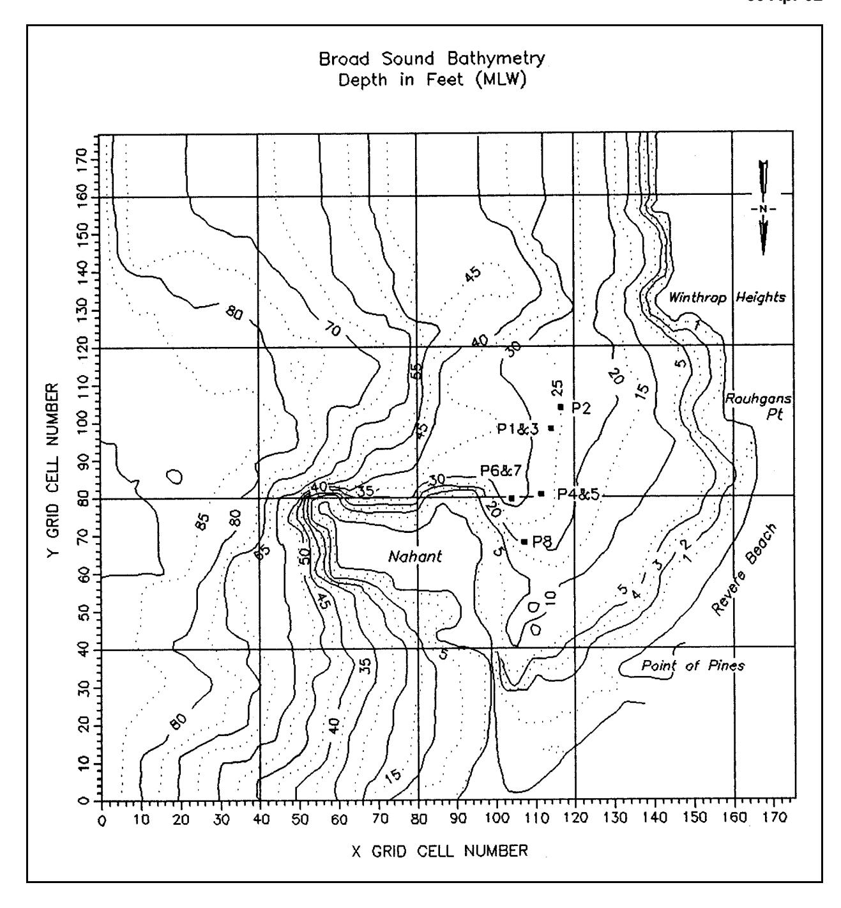

*Figure II-3-10. Bathymetry input to REF/DIF1 for a simulation of wave propagations at Revere Beach, MA*

strongly supports a stochastic approximation for wave phenomena (West 1981). Over small distances, near discontinuities in a wave field (such as breakwaters), STWAVE can incorporate wave phase information into its solution; otherwise, it uses a random-phase approximation for its diffraction and combined refractiondiffraction (CRD) calculations. Theoretical details of STWAVE can be found in Resio (1993).

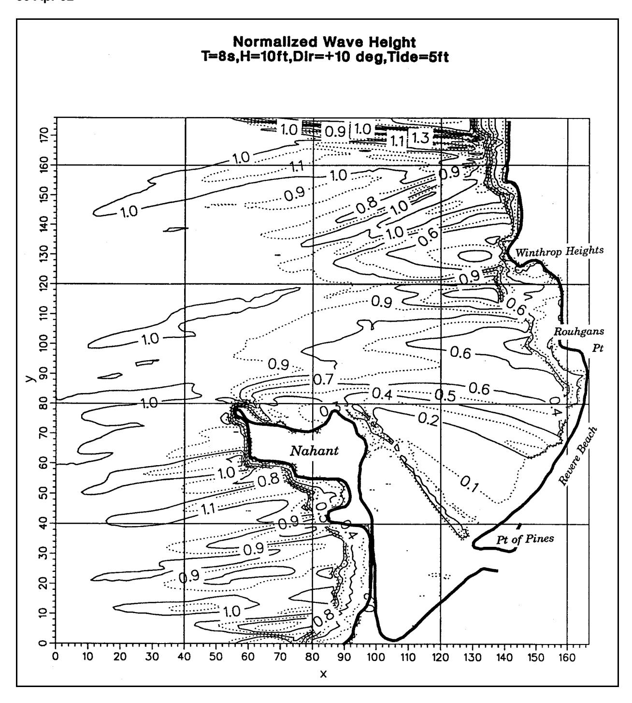

*Figure II-3-11. Wave heights calculated by REF/DIF 1*

- (b) The following two assumptions have been inherent in essentially all previous steady-state models for predicting nearshore wave transformations: ! Predictions based on unidirectional, monochromatic wave theories can provide solutions that are equivalent to the behavior of naturally occurring directional wave spectra.
II-3-28 Estimation of Nearshore Waves
- ! Nearshore transformations are dominated by conservative processes (refraction, shoaling, and diffraction) and hence nonconservative effects (energy sinks and sources) can be neglected as a first approximation.
- (c) A corollary to the first assumption above is that increased accuracy in deterministic propagation estimates translates into commensurate increases in accuracy in real-world applications. Unfortunately, laboratory studies by Thompson and Vincent (1984) and Vincent and Briggs (1989) have clearly demonstrated that the first assumption is not valid unless the wave field is narrow-banded in both frequency and direction. Thus, for most coastal wave predictions to be accurate, they must solve all wave components and not just a hypothetical "dominant" component. This presents significant problems for wave models that solve only one wave component at a time, since wave energy traveling in one direction can be "scattered" into another direction via diffraction. Hence, diffraction causes wave components in a spectrum to interact and attempts to solve the CRD equation on a component-by-component basis have difficulty properly accounting for this effect. STWAVE overcomes this problem by using a piecewise solution method that simulates the propagation of all wave components simultaneously.
- (d) Returning to the second assumption above, field and laboratory data presented in Bouws, Gunther, and Vincent (1985) and Resio (1988) show that nonconservative effects, rather than conservative propagation effects, dominate wave transformations in many coastal areas, particularly during storm conditions. Moreover, the form of many of the source terms affecting shallow-water wave transformations is such that they depend on energy content within the entire wave spectrum. Methods that solve for each component of the spectrum independently cannot provide suitable estimates of coupled source terms. STWAVE is formulated in a manner that permits straightforward solution of these processes.
- (2) Examples of STWAVE results. The following comparisons are intended to demonstrate the importance of various terms in coastal wave transformations and the ability of STWAVE to handle these terms.
- (a) Spectral versus monochromatic calculations. Figure II-3-12 compares predicted wave heights behind a shoal using STWAVE, for a unidirectional, monochromatic wave and for a JONSWAP spectrum with a spectral peak frequency of 0.1 Hz and a $\cos^{4}$ angular distribution of energy. Monochromatic calculations from the laboratory study of Vincent and Briggs (1989), while mathematically accurate, do not reasonably represent propagation effects in a wave spectrum with natural frequency and direction energy spreads.
- (b) Effects of coupled source terms. Figure II-3-13 compares spectral transformation over 1:30, 1:100, and 1:500 slopes for the same JONSWAP spectrum as above with a mean approach angle to the coast of 30 deg, for the case of no source terms and for the case of wave breaking and nonlinear wave-wave interaction source terms included. This comparison suggests that CRD effects account for only about 5 percent of the total energy variations in coastal waves passing over moderate to shallow slopes. This finding is consistent with those of Resio (1988) and helps to explain why nearshore wave spectra tend strongly toward self-similar forms during local storms (Bouws, Gunther, and Vincent 1985; Resio 1987; Miller and Vincent 1990).
- (c) Wind effects. Figure II-3-14 shows the differences in wave transformations with and without a 20-m/sec onshore wind over an offshore profile typical of the U.S. east coast. In this example, waves at the seaward boundary are set to the same JONSWAP spectrum as Examples 1 and 2. These results show a marked difference between the two cases. This difference is consistent with theoretically expected wind input and indicates that, particularly during storm conditions, neglecting wind input can lead to significant misestimations of wave conditions.

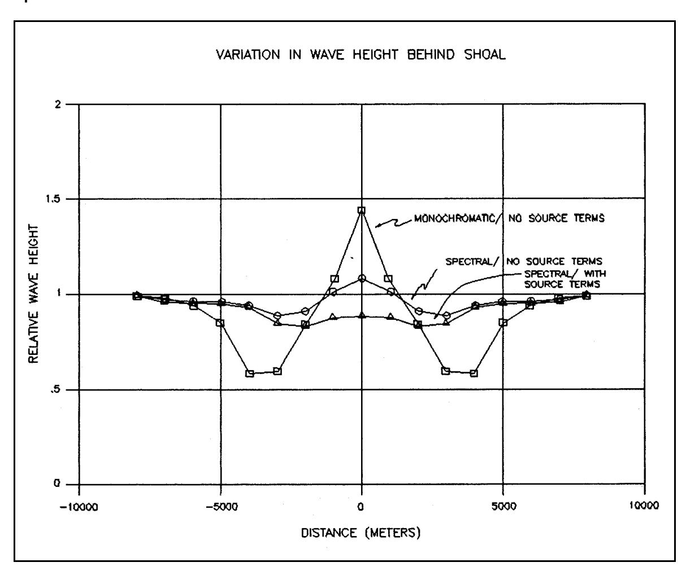

*Figure II-3-12. Spectral model results compared to laboratory measurements for broad directional spectrum*

(3) Data requirements for STWAVE. In STWAVE, a square grid mesh covers the computational domain. Water depth must be supplied at each node. If currents are included, a current must be supplied at each point. Wave characteristics are computed at each of these grid points. The model requires an input directional spectrum for the outer boundary and information about wind speed and direction and bottom friction coefficients.

#### e. Limitations .

- (1) Each model has natural limitations reflecting its theoretical basis. The references provided discuss these in some detail. If strictly interpreted, each model has a narrow range over which it is valid. Almost all of these models are regularly used to simulate conditions outside a strict interpretation of limits, with the results often effectively accurate. Considerable judgement and experience are required to determine if the simulation is valid.
- (2) The following limitations indicate where the model may or may not be useful. RCPWAVE may be inaccurate for waves crossing behind shoals, or in the vicinity of structures. Wave approach directions should not be too oblique relative to the offshore boundary. REF/DIF1 can allow for some structures and islands but again should not use waves with highly oblique wave angles (In both RCPWAVE and REF/DIF1,
II-3-30 Estimation of Nearshore Waves

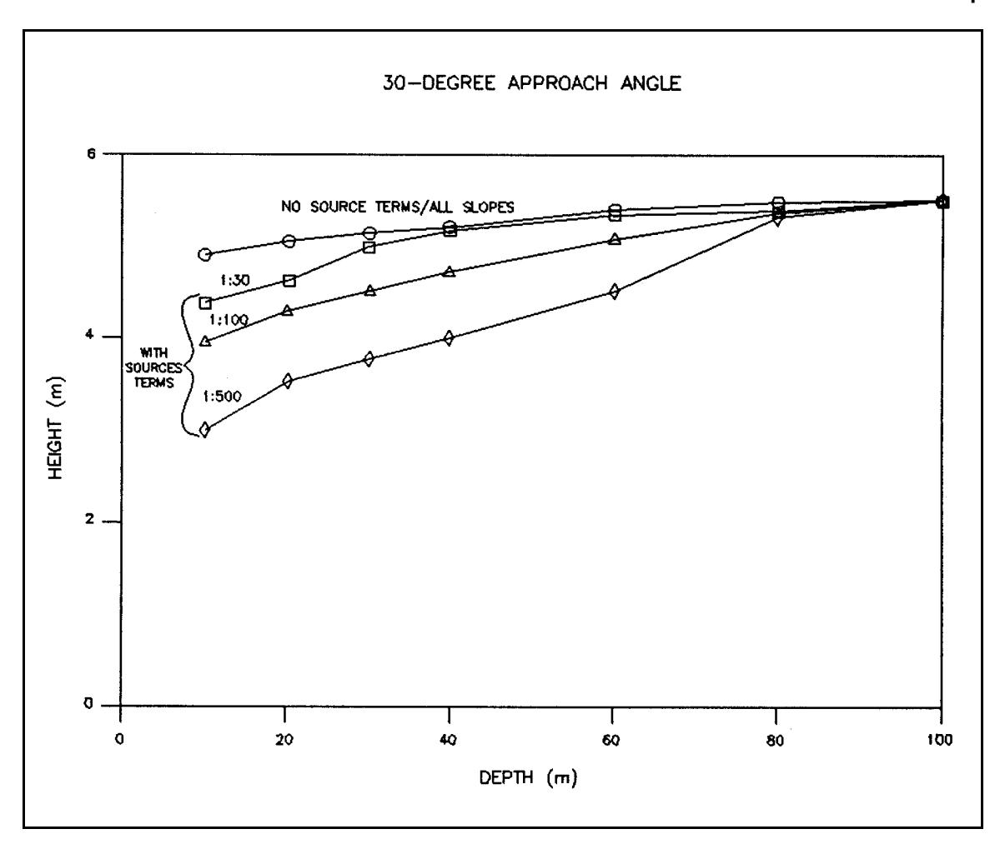

*Figure II-3-13. STWAVE results for a 1:30 sloping beach*

the oblique angle dilemma often can be resolved by using a different grid). STWAVE may underrepresent wave focussing for very narrow swell.

#### II-3-6. Guidance for Performing Wave Transformation Studies

## a. Introduction.

- (1) The preceding parts of this chapter provide the engineer with an understanding and some techniques for taking a wave condition offshore of a project or nearby and transforming it to the site of interest. In practice, an engineer will typically consider a suite of wave conditions perhaps representing different storms, different seasonal characteristics, and different water levels (particularly in shallow water or at the beach if there is a high tide or storm surge to be considered). Selection of the conditions for project design studies is a very important component of any coastal engineering study and Part II-2 and Part II-3 both treat this problem.
- (2) Transformation analyses are needed because there is often a lack of site-specific data. In some instances, a cursory transformation analysis may be required to help decide whether an offshore or nearby site is adequate for determining offshore boundary conditions. Typically this may be approached by setting up one of the transformation procedures described and running a small set of wave conditions that might span

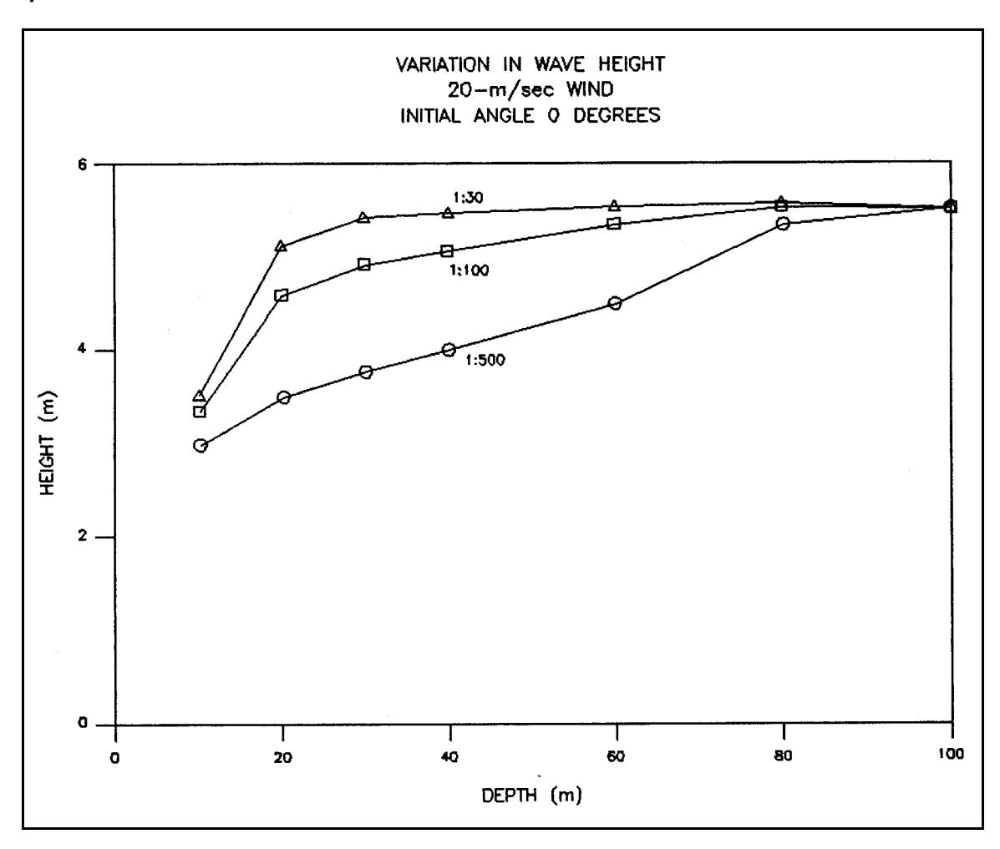

*Figure II-3-14. STWAVE results for CHL's Field Research Facility at Duck, NC*

the final set to be studied. As an example, waves of a certain period or direction offshore may not propagate to the site, and the engineer can thus ignore such wave conditions in a more detailed study.
- (3) Some of the decisions and actions an engineer will need to make in performing a wave transformation analysis follow.
- b. Problem formulation. At the initiation of the study, the engineer should clearly understand what wave information must be produced for the site, how it will be used, and the accuracy required. The engineer should gather all pertinent bathymetry data, water level data, and nearby wave data. Aerial photography of the site can be very useful by providing the engineer with indications of wave propagation patterns, areas of offshore breaking, etc., that a transformation procedure should properly simulate. Short-term gauge records can be used in checking the procedure. Again, a short-term gauging program is desirable.
- c. Site analysis . The physical characteristics of the site and any ancillary information should be carefully scrutinized so that the engineer can understand how irregular the bathymetry is, the presence of significant currents, shoals, canyons, islands, structures, etc., that would be important in selecting the offshore or nearby site for a source of data input, for selecting the transformation procedure used, and in understanding what problems may arise in the analysis. Usually this type of knowledge is gained through experience, and a consultant may be required to assist someone unexperienced in such analyses. If time permits, one of the
II-3-32 Estimation of Nearshore Waves
advanced models could be set up and run in an exploratory mode to help the engineer understand possible problems.
- d. Selection of input data site . Based on project formulation and site analysis, offshore/nearby sites are evaluated in terms of any feature that would preclude their use (see Part II-3-1d). In particular, the use of nearby sites in similar depths of water must be evaluated in terms of whether waves reaching the site have broken. As an example, if waves at a nearshore site have propagated over a shoal where breaking can occur, there is no way to "unbreak" the waves. So they cannot be used to eliminate offshore wave conditions. In general the offshore data site will need as a minimum information on wave height, period, and direction. If adequate data are not available, methods for hindcasting, as described in Part II-2, may be used to simulate the information required. The methods of Parts II-2 and 3 should be used to develop the wave information to be transformed.
- e. Selection of wave transformation method . Table II-3-2 provides guidance on the applicability of the various methods described in this chapter. It does not provide guidelines for all cases. With some skill, the models described can be pushed somewhat beyond their inherent limitations (but such results must be carefully scrutinized and used conservatively). In very complicated cases or in cases in which a timedependent model is required, use of an expert consultant to provide assistance is recommended. In some complicated cases, a physical model may be required.

**Table II-3-2. provides guidance on the applicability of the various methods described in this chapter. It does not provide guidelines for all cases. With some skill, the models described can be pushed somewhat beyond their inherent limitations (but such results must be carefully scrutinized and used conservatively). In very complicated cases or in cases in which a timedependent model is required, use of an expert consultant to provide assistance is recommended. In some complicated cases, a physical model may be required.**

| Case |  | Fig.II-3-6 or | ACES | NMLONG | RCPWAVE | REFDIF1 | STWAVE |
| --- | --- | --- | --- | --- | --- | --- | --- |
| Planar topography | (no shoals, etc) | yes | Highly Irregular | yes Bathymetry | yes | yes | yes |
| Swell, no | structures | no |  | no | yes | yes | yes |
| Swell, structures |  | no |  | no | no | yes | yes |
| Complicated | directional | no |  | no | no | yes | yes |
| Spectra, | but narrow |  |  |  |  |  |  |
| frequency | spectra |  |  |  |  |  |  |
| High winds or | broad band | no |  | no | no | no | yes |
| frequency | spectra Irregular | Bathymetry, | High resolution | Computations | Near Structure |  |  |
| Swell |  | no |  | no | no | yes | no |

f. Calibration/verification . After the method is set up, it is important to check the calculations with observations if at all possible. If measured wave data are not available, then aerial photographs can be helpful in deciding if the model reproduces observed wave patterns. If no wave data or photographs are available, the method should be applied to a range of heights, periods, and directions and the results should be carefully scrutinized for odd or unstable results. If the calculations are overly sensitive to small variations in input data, a careful decision should be made as to whether the technique should be applied. A physical model may be appropriate in situations with very irregular bathymetry, complicated or multiple structures, reefs, and where currents are important.

#### EM 1110-2-1100 (Part II) 30 Apr 02

- g. Post-processing .
- (1) Plotted results should be carefully examined for any signs of computational instability. These typically are unreasonable variations in height or direction over short distances.
- (2) The techniques provided in this chapter, if used carefully by an experienced engineer, can provide very useful information in a wide range of cases. However, there are some cases where they simply will not work. Anyone who applies these techniques should understand the limitations of the techniques, and be versed in understanding when they have been used inappropriately. The user should be aware that the models can provide realistic-looking answers that unfortunately are just wrong.

#### II-3-7. References

## Abbott, Peterson, and Skovgaard 1978

Abbot, M. B., Peterson, H. M., and Skovgaard, O. 1978. "On the Numerical Modelling of Short Waves in Shallow Water," Journal Hydraulic Research , Vol 16, No. 3, pp 173-203.

#### Bagnold 1946

Bagnold, R. A. 1946. "Motion of Waves in Shallow Water - Interaction Between Waves and Sand Bottoms," Royal Society of London , Vol 187, pp 1-18.

#### Barnett 1968

Barnett, T. P. 1968. "On the Generation, Dissipation, and Prediction of Wind Waves," Journal of Geophysical Research, Vol 73, pp 6879-6885.

#### Berkhoff 1972

Berkhoff, J. C. W. 1972. "Computation of Combined Refraction - Diffraction," Proceedings, 13th International Conference on Coastal Engineering, American Society of Civil Engineers, Vol 1, pp 471-490.

# Berkhoff 1976

Berkhoff, J. C. W. 1976. "Mathematical Models for Simple Harmonic Linear Water Waves, Wave Diffraction and Refraction," Publication 1963, Delft Hydraulics Laboratory, Delft, The Netherlands, April.

#### Berkhoff, Booij, and Radder 1982.

Berkhoff, J. C., Booij, N., and Radder, A. C. 1982. "Verification of Numerical Wave Propagation Models for Simple Harmonic Linear Water Waves," Coastal Engineering, Vol 6, pp 255-279.

#### Bouws et al. 1987

Bouws et al. 1987. "Similarity of the Wind Wave Spectrum in Finite Depth Water; Part 2: Statistical Relations Between Shape and Growth Stage," Deutsche Hydogr. Z., Vol 40, pp 1-24.

#### Bouws, Gunther, and Vincent 1985

Bouws, E, Gunther, H., and Vincent, C. L. 1985. "Similarity of Wind Wave Spectrum in Finite-Depth Water, Part I - Spectral Form," Journal of Geophysical Research , Vol 85, No. C3, pp 1524-1530.

#### Bretschneider and Reid 1953

Bretschneider, C. L., and Reid, R. O. 1953. "Change in Wave Height Due to Bottom Friction, Percolation and Refraction," 34th Annual Meeting of American Geophysical Union.
II-3-34 Estimation of Nearshore Waves

# Dally, Dean, and Dalrymple 1984

Dally, W. R., Dean, R. G., and Dalrymple, R. A. 1984. "Modeling Wave Transformation in the Surf Zone," Miscellaneous Paper CERC-84-8, U.S. Army Engineer Waterways Experiment Station, Vicksburg, MS.

# Dean and Dalrymple 1991

Dean, R. G., and Dalrymple, R. A. 1991. Water Wave Mechanics for Engineers and Scientists , World Scientific Pub. Co., Teaneck, NJ.

# Demirbilek 1994

Demirbilek, Z. 1994. "Comparison of REFDIF Model and CERC Elliptical Shoal Laboratory Data," Memorandum for Record, dated 18 June 1994, for the Coastal Inlets Research Program, Coastal Engineering Research Center, Vicksburg, MS.

## Demirbilek and Webster 1992a

Demirbilek, Z., and Webster, W. C. 1992a. "Application of the Green-Naghdi Theory of Fluid Sheets to Shallow-Water Wave Problems; Report 1: Model Development," Technical Report CERC-92-11, U.S. Army Engineer Waterways Experiment Station, Vicksburg, MS.

# Demirbilek and Webster 1992b

Demirbilek, Z., and Webster, W.C. 1992b. "User's Manual and Examples for GNWAVE, Final Report," Technical Report CERC-92-13, U.S. Army Engineer Waterways Experiment Station, Vicksburg, MS.

## Dobson 1967

Dobson, R. S. 1967. "Some Applications of a Digital Computer to Hydraulic Engineering Problems," Technical Report No. 80, Department of Civil Engineering, Stanford University, Stanford, CA.

# Ebersole 1985

Ebersole, B. A. 1985. "Refraction-Diffraction Model for Linear Water Waves," Journal of Waterways, Port, Coastal, and Ocean Engineering , American Society of Civil Engineers, Vol III, No. WW6, pp 939-953.

#### Ebersole, Cialone, and Prater 1986

Ebersole, B. A., Cialone, M. A., and Prater, M. D. 1986. "RCPWAVE - A Linear Wave Propagation Model for Engineering Use," Technical Report CERC-86-4, U.S. Army Engineer Waterways Experiment Station, Vicksburg, MS.

# Forristall and Reece 1985

Forristall, G. Z., and Reece, A. M. 1985. "Measurements of Wave Attenuation Due to a Soft Bottom: The SWAMP Experiment," Journal of Geophysical Researc h, Vol 90, No. C2, pp 3367-3380.

#### Harrison and Wilson 1964

Harrison, W., and Wilson, W. S. 1964. "Development of a Method for Numerical Calculation of Wave Refraction," Technical Memorandum No. 6, Coastal Engineering Research Center, U.S. Army Engineer Waterways Experiment Station, Vicksburg, MS.

#### Hasselmann 1962

Hasselmann, K. 1962. "On the Non-Linear Energy Transfer In A Gravity-Wave Spectrum - General Theory," J. Fluid Mech ., Vol 12, pp 481-500.

#### EM 1110-2-1100 (Part II) 30 Apr 02

#### Hasselmann 1963a

Hasselmann, K. 1963a. "On the Non-Linear Energy Transfer In A Gravity-Wave Spectrum - Part 2," J. Fluid Mech ., Vol 15, pp 273-281.

## Hasselmann 1963b

Hasselmann, K. 1963b. "On the Non-Linear Energy Transfer In A Gravity-Wave Spectrum - Part 3," J. Fluid Mech ., Vol 15, pp 385 - 398.

#### Hasselmann et al. 1973

Hasselmann et al. 1973. "Measurements of Wind-Wave Growth and Swell Decay During the Joint North Sea Wave Project (JONSWAP)," Deutsche Hydrograph . Zeit., Erganzungsheft Reihe A $(8^{\circ}),$ No. 12.

# Hedges 1976

Hedges, T. S. 1976. "An Empirical Modification to Linear Wave Theory," Proc. Inst. Civ. Engrs ., Vol 61, pp 575-579.

#### Jensen et al. 1987

Jensen, R. E., et al. 1987. "SHALWV - Hurricane Wave Modeling and Verification; User's Guide to SHALWV: Numerical Model for Simulation of Shallow-Water Wave Growth, Propagation, and Decay," Instruction Report CERC-86-2, No. 2, U.S. Army Engineer Waterways Experiment Station, Coastal Engineering Research Center, Vicksburg, MS.

#### Jonsson 1978

Jonsson, I. G. 1978. "Combinations of Waves and Currents," Stability of Tidal Inlets , Per Bruun, ed., Amsterdam, Elsenir, pp 162-203.

#### Kirby 1984

Kirby, J. T. 1984. "A Note on Linear Surface Wave-Current Interaction Over Slowly Varying Topography," Journal of Geophysical Research , Vol 89, pp 745-747.

#### Kirby 1986a

Kirby, J. T. 1986a. "Higher-Order Approximations in the Parabolic Equation Method for Water Waves," Journal of Geophysical Research , Vol 91, pp 933-952.

#### Kirby and Dalrymple 1983

Kirby, J. T., and Dalrymple, R. A. 1983. "A Parabolic Equation for the Combined Refraction-Diffraction of Stokes Waves by Mildly Varying Topography," J. Fluid Mech ., Vol 136, pp 453-466.

#### Kirby and Dalrymple 1984

Kirby, J. T., and Dalrymple, R. A. 1984. "Verification of a Parabolic Equation for Propagation of Weakly-Nonlinear Waves," Coastal Engineering , Vol 8, pp 219-232.

#### Kirby and Dalrymple 1986a

Kirby, J. T., and Dalrymple, R. A. 1986a. "Modeling Waves in Surfzones and Around Islands," J. Waterways, Port, Coastal and Ocean Engrg ., Vol 112, pp 78 -93.

#### Kirby and Dalrymple 1986b

Kirby, J. T., and Dalrymple, R. A. 1986b. "An Approximate Model for Nonlinear Dispersion in Monochromatic Wave Propagation Models," Coastal Engineering , Vol 9, pp 545-561.
II-3-36 Estimation of Nearshore Waves

# Kirby and Dalrymple 1992

Kirby, J. T., and Dalrymple, R. A. 1992. "Combined Refraction/Diffraction Model REF/DIF 1, Version 2.4.; Documentation and User's Manual," Research Report CACR-92-04, Center for Applied Coastal Research, University of Delaware.

# Kraus 1991

Kraus, N. C. 1991. "NMLONG: Numerical Model for Simulating the Longshore Current," U.S. Army Engineer Waterways Experiment Station, Vicksburg, MS.

#### Leblond and Mysak 1978

Leblond, P. H., and Mysak, L. A. 1978. " Waves in the Ocean ," Elsevier Scientific Pub. Co., Amsterdam-Oxford, NY.

#### Leenknecht, Szuwalski, and Sherlock 1992

Leenknecht, D. A., Szuwalski, A., and Sherlock, A. R. 1992. "Automated Coastal Engineering System; User Guide and Technical Reference, Version 1.07," U.S. Army Engineer Waterways Experiment Station, Vicksburg, MS.

## Miller and Vincent 1990

Miller, H. C., and Vincent, C.L. 1990. "FRF Spectrum: TMA with Kitaigoredskii's F4 Scaling," Journal of Waterway, Port, Coastal, and Ocean Engineering , Vol 116, No. 1, pp 57-78.

#### Noda 1974

Noda, E. K. 1974. "Wave-Induced Nearshore Circulation," Journal of Geophysical Research , Vol 79, No. 27, pp 4097-4106.

# Noda et al. 1974

Noda, E. K., et al. 1974. "Nearshore Circulations Under Sea Breeze Conditions and Wave-Current Interactions in the Surf Zone," Technical Report No. 4, Tetra Tech, Inc., Pasadena, CA.

#### Panchang et al. 1990

Panchang, V. G., Pearce, B. R., Wei, G., and Briggs, M. J. 1990. "Numerical Simulation of Irregular Wave Propagation Over Shoal," J. Waterway, Port, Coastal, and Ocean Engrg ., Vol 116, pp 324-340.

#### Penny and Price 1944

Penny, W. G., and Price, A. T. 1944. "Diffraction of Waves by Breakwaters," Directorate of Miscellaneous Weapons Development History No. 20 - Artificial Harbors, Sec 3D.

#### Peregrine 1976

Peregrine, D. H. 1976. "Interaction of Water Waves and Currents," Advances in Applied Mechanics , Academic Press, New York, Vol 16, pp 9-117.

# Phillips 1977

Phillips, O. M. 1977. The Dynamics of The Upper Ocean , 2nd ed., Cambridge University Press.

#### Radder 1979

Radder, A. C. 1979. "On the Parabolic Equation Method for Water-Wave Propagation," Journal of Fluid Mechanics , Vol 95, Part 1, pp 159-176.

#### EM 1110-2-1100 (Part II) 30 Apr 02

#### Resio 1981

Resio, D. T. 1981. "The Estimation of Wind-Wave Generation in a Discrete Spectral Model," Journal of Geophysical Research , Vol 11, pp 510 - 525.

## Resio 1987

Resio, D. T. 1987. "Shallow Water Waves. I - Theory," J. Waterway, Port, Coastal and Ocean Engr ., American Society of Civil Engineers, Vol 113, pp 264-281.

## Resio 1988

Resio, D. T. 1988. "Shallow Water Waves II - Data Comparisons," J. Waterway, Port, Coastal and Ocean Engr ., Vol 114, pp 50-65.

#### Resio 1993

Resio, D. T. 1993. "STWAVE: Wave Propagation Simulation Theory, Testing and Application," Department of Oceanography, Ocean Engineering, and Environmental Science, Florida Institute of Technology.

#### Shore Protection Manual 1984

Shore Protection Manual . 1984. 4th ed., 2 Vol, U. S. Army Engineer Waterways Experiment Station, U.S. Government Printing Office, Washington, DC.

#### Smith and Vincent 1992

Smith, J. M., and Vincent, C. L. 1992. "Shoaling and Decay of Two Wave Trains on a Beach," J. Waterways, Port, Coastal and Ocean Engr., Vol 118, No. 5, pp 517-533.

#### Sobey and Young 1986

Sobey, R. J., and Young, I. R. 1986. "Hurricane Wind Waves - A Discrete Spectral Model," J. Waterway, Port, Coastal and Ocean Engineering , Vol 112, No. 3, pp 370-389.

#### SWAMP Group 1985

SWAMP Group. 1985. " The Sea Wave Modeling Project (SWAMP): Principal Results and Conclusion ," Plenum, New York, p 256.

#### SWIM Group 1985

SWIM Group. 1985. "A Shallow Water Intercomparison of Three Numerical Prediction Models (SWIM)," Quarterly Journal of the Royal Meteorological Society , Vol 111, pp 1087-1112.

#### Thompson and Vincent 1984

Thompson, E. F., and Vincent, C. L. 1984. "Shallow-Water Wave Height Parameters," J. Waterway, Port, Coastal and Ocean Engr ., American Society of Civil Engineers, Vol 110, No. 2, pp 293-299.

# Tsay and Liu 1982

Tsay, T. K., and Liu, P. L. -F. 1982. "Numerical Solution of Water-Wave Refraction and Diffraction Problems in the Parabolic Approximation," Journal of Geophysical Research , Vol 87, pp 7932-7940.

#### Vincent and Briggs 1989

Vincent, C. L., and Briggs, M. J. 1989. "Refraction-Diffraction of Irregular Waves Over A Mound," J. Waterway, Port, Coastal and Ocean Engrg , American Society of Civil Engineers, Vol 115, No. 2, pp 269- 284.
II-3-38 Estimation of Nearshore Waves

## WAMDI 1988

WAMDI. 1988. "The WAM Model - A Third Generation Ocean Wave Prediction Model," Journal of Physical Oceanography , Vol 18, pp 1775-1810.

#### Weggel 1972

Weggel, J. R. 1972. "Maximum Breaker Height," Journal of the Waterways, Harbors, and Coastal Engineering Division , Vol 98, No. WW4, pp 529-548.

## West 1981

West, B. J. 1981. "On the Simpler Aspects of Nonlinear Fluctuating Gravity Wave (Weak Interaction Theory)," Lecture Notes in Physics 146 , Springer-Verlag, New York.

## Young 1988

Young, L. R. 1988. "A Shallow Water Spectral Wave Model," Journal of Geophysical Research , Vol 93, No. C5, pp 5113-5129.

# II-3-8. Definitions of Symbols

| Symbol | Definition |
|---|---|
| P | k Wave number vector (Equation II-3-4) |
| θ | Angle between the plane across which energy is being transmitted and the direction of wave advance [deg] |
| ρ | Mass density of water (salt water = 1,025 $kg/m^{3}$ or 2.0 $slugs/ft^{3};$ fresh water = \$1,000kg/m^{3}$ or 1.94 slugs/ft 3 ) [force-time 2 /length 4 ] |
| φ | Velocity potential at the free surface $[length^{2}/time]$ |
| ω | Wave angular or radian frequency (= 2 π/T ) [time -1 ] |
| Ω | Wave phase function (Equation II-3-3) |
| C | Wave celerity [length/time] |
| C | g Wave group velocity [length/time] |
| d | Water depth [length] |
| E | Total wave energy in one wavelength per unit crest width $[length-force/length^{2}]$ |
| E(x,y,t,f,θ) | Directional spectrum where x,y represents a location in geographic space, t represents time, and f,θ represents a particular frequency-direction component |
| h | Water depth [length] |
| H | Wave height [length] |
| k | Wave number (= 2 π/L = 2 π/CT ) [length -1 ] |
| K | r Refraction coefficient [dimensionless] |
| K | s Shoaling coefficient [dimensionless] |
| L | Wave length [length] |
| T | Wave period [time] |
| U | Ambient current vector (Equation II-3-30) [length/time] |
| φ | Velocity potential at the free surface $[length^{2}/time]$ |

# II-3-9. Acknowledgments

Authors of Chapter II-3, "Estimation of Nearshore Waves:"
- C. Linwood Vincent, Ph.D., Office of Naval Research, Arlington, Virginia.
- Zeki Demirbilek, Ph.D., Coastal and Hydraulics Laboratory, Engineer Research and Development Center, Vicksburg, Mississippi.
- J. Richard Weggel, Ph.D., Dept. of Civil and Architectural Engineering, Drexel University, Philadelphia, Pennsylvania.

#### Reviewers:

- Robert A Dalrymple, Ph.D., Center for Applied Coastal Research, University of Delaware, Newark, Delaware.
- Lee E. Harris, Ph.D., Department of Marine and Environmental Systems, Florida Institute of Technology, Melbourne, Florida.
- Philip L.-F. Liu, Ph.D., School of Civil and Environmental Engineering, Cornell University, Ithaca, New York.
