## Chapter 5 EM 1110-2-1100 WATER LEVELS AND LONG WAVES (Part II)

1 August 2008 (Change 2)

## Table of Contents

Page II-5-1. Introduction II-5-1 a. Purpose II-5-1 b. Applicability II-5-1 c. Scope of manual II-5-1 II-5-2. Classification of Water Waves II-5-2 a. Wave classification II-5-2 b. Discussion II-5-5 II-5-3. Astronomical Tides II-5-5 a. Description of tides II-5-5 (1) Introduction II-5-5 (2) Tide-producing forces II-5-6 (3) Spring/neap cycle II-5-8 (4) Diurnal inequality II-5-9 b. Tidal time series analysis II-5-11 (1) Introduction II-5-11 (2) Harmonic constituents II-5-11 (3) Harmonic reconstruction II-5-18 (4) Tidal envelope classification II-5-23 c. Glossary of tide elevation terms II-5-25 II-5-4. Water Surface Elevation Datums II-5-27 a. Introduction II-5-27 b. Tidal-observation-based datums II-5-27 c. 1929 NGVD datum II-5-28 d. Great Lakes datums II-5-32 e. Long-term variations in datums II-5-32 f. Tidal datums II-5-32 g. Changes in lake level datums II-5-37 h. Design considerations II-5-38 II-5-5. Storm Surge II-5-38 a. Storm types II-5-38 (1) Tropical storms II-5-39 (2) Extratropical storms II-5-42 (3) Surge interaction with tidal elevations II-5-43 b. Storm event frequency-of-occurrence relationships II-5-43 (1) Introduction II-5-43 (2) Historical method II-5-46 (3) Synthetic method II-5-47 (4) Empirical simulation technique II-5-47
Water Levels and Long Waves II-5-i
(a) Introduction (b) EST - tropical storm application (c) EST - extratropical storm application II-5-47 II-5-47 II-5-49 II-5-6. Seiches II-5-51 II-5-7. Numerical Modeling of Long-Wave Hydrodynamics a. Long-wave modeling b. Physical models c. Numerical models (1) Introduction (2) Example - tidal circulation modeling (3) Example - storm surge modeling II-5-54 II-5-54 II-5-54 II-5-55 II-5-55 II-5-56 II-5-57 II-5-8. References II-5-64 II-5-9. Definitions of Symbols II-5-69 II-5-10. Acknowledgments II-5-71

# List of Tables

Page Table II-5-1. Wave Classification (Ippen 1966) II-5-3 Table II-5-2. Hyperbolic Function Asymptotes II-5-4 Table II-5-3. NOS Tidal Constituents and Arguments II-5-16 Table II-5-4. Node Factors for 1970 through 1999 (Schureman 1924) II-5-17 Table II-5-5. Equilibrium Argument for Beginning of Years 2001 through 2010 (Schureman 1924) II-5-19 Table II-5-6. Summary of Harmonic Arguments for Sandy Hook, NJ (1 January 1984 at 0000 hr) II-5-23 Table II-5-7. Datums for Reference Tide Stations (Harris 1981) II-5-29 Table II-5-8. Low Water (chart) Datum for IGLD 1955 and IGLD 1985 II-5-35

# List of Figures

Page Figure II-5-1. Long wave geometry (Milne-Thompson 1960) II-5-3 Figure II-5-2. Variation of particle velocity with depth (Ippen 1966) II-5-4 Figure II-5-3. Schematic representation of water particle trajectories (Ippen 1966) II-5-5 Figure II-5-4. Schematic diagram of tidal potential (Dronkers 1964) II-5-7 Figure II-5-5. Tide predictions for Boston, MA (Harris 1981) II-5-9 Figure II-5-6. Spring and neap tides (Shalowitz 1964) II-5-10 Figure II-5-7. The daily inequality (Dronkers 1964) II-5-11 Figure II-5-8. Typical tide curves along the Atlantic and Gulf coasts (Shore Protection Manual 1984) II-5-12 Figure II-5-9. Typical tide curves along Pacific coasts of the United States (Shore Protection Manual 1984) II-5-13 Figure II-5-10. Tidal phase relationships II-5-18 Figure II-5-11. Phase angle argument relationship II-5-20 Figure II-5-12. NOS harmonic analysis for Sandy Hook, NJ II-5-21 Figure II-5-13. Tide tables for Sandy Hook, NJ (NOAA 1984) II-5-22 Figure II-5-14. Reconstructed tidal envelope for Sandy Hook, NJ II-5-24 Figure II-5-15. Areal extent of tidal types (Harris 1981) II-5-25 Figure II-5-16. Types of tides (Shore Protection Manual 1984) II-5-26 Figure II-5-17. Reference and comparative tide stations, Atlantic, Gulf, and Pacific coasts (Harris 1981) II-5-31 Figure II-5-18. Locations of tide stations used in establishing the National Geodetic Vertical Datum (NGVD) of 1929 (Harris 1981 (after Rappleye (1932)) II-5-33 Figure II-5-19. Sample NOS description of tidal bench marks (Harris 1981) II-5-34 Figure II-5-20. Vertical and horizontal relationships for the IGLD 1985 II-5-35 Figure II-5-21. Sample NOS tabulation of tide parameters (Harris 1981) II-5-39
Figure II-5-22. Variations in annual MSL (Harris 1981) II-5-40 Figure II-5-23. Schematic diagram of storm parameters (U.S. Army Corps of Engineers 1986) II-5-41 Figure II-5-24. Hurricane Gloria track from 17 September to 2 October 1985 (Jarvinen and Gebert 1986) II-5-44 Figure II-5-25. Hurricane Gloria track offshore of Delaware and New Jersey (Jarvinen and Gebert 1986) II-5-45 Figure II-5-26. Example phasing of storm surge and tide (Jarvinen and Gebert 1986) II-5-46 Figure II-5-27. Stage-frequency relationship - coast of Delaware II-5-50 Figure II-5-28. Sediment transport magnitude-frequency relationship - December 1992 Northeaster II-5-51 Figure II-5-29. Atlantic tropical storm tracks during the period 1886-1980 II-5-52 Figure II-5-30. Long wave surface profiles (Shore Protection Manual 1984) II-5-53 Figure II-5-31. First, second, and third normal modes of oscillation for Lake Ontario (Rao and Schwab 1976) II-5-54 Figure II-5-32. Computational grid for the New York Bight II-5-58 Figure II-5-33. Model and prototype tidal elevation comparison at the Battery II-5-59 Figure II-5-34. Wind-induced circulation pattern II-5-60 Figure II-5-35. Global limits of ADCIRC computational grid II-5-61 Figure II-5-36. Blow-up of ADCIRC grid along Delaware coast II-5-62 Figure II-5-37. Model-to-prototype tidal comparison at Lewes, DE II-5-63 Figure II-5-38. Model-to-prototype surge comparison at Lewes, DE II-5-64

# Chapter II-5 Water Levels and Long Waves

# II-5-1. Introduction

- a. Purpose .
- (1) This chapter describes water levels and the various long wave components that contribute to a total water surface elevation. Vertical datums are also described to define some of the more commonly used reference datums.
- (2) The following sections provide project engineers with sufficient guidance to develop a preliminary study approach and design procedure to analyze engineering projects that require consideration of water level elevations. References are provided from existing Engineer Manuals that describe generic design-criteria formulae for use in preliminary analyses. Additional references and approaches to problem solving are provided for complex projects that require detailed surface elevation and current input data for design. These data are generally provided by numerical models.
- b. Applicability . Information contained in this chapter is directly applicable to any project requiring local water levels or currents as a primary design consideration. Applications include the design of coastal structures intended to provide protection against some pre-defined water surface elevation, specified according to an appropriate economic analysis and evaluation. Determining acceptable design elevations may require developing local stage relationships as opposed to frequency-of-occurrence relationships. This information can be generated through historical records or numerical modeling techniques to simulate the propagation of historical storm events. Additional examples of water surface and current variability include circumstances where tidal circulation patterns and surface elevations change as a result of structural or bathymetric modifications to existing coastal inlets or navigable waterways. These circulation-dominated problems can be addressed using either numerical or physical models.

## c. Scope of manual .

- (1) Water wave classification is used to describe the behavior of long waves and to distinguish between intermediate waves and short waves (described in Part II-2). This allows the reader to select which chapter of this manual is appropriate for the intended application. If long waves are appropriate, this chapter will provide a means of approximating basic wave characteristics such as celerity, current magnitudes, and surface elevation.
- (2) The speed of propagation, surface profile, and vertical velocity distribution of long waves are different from those of short waves described in Part II-2. Because these properties of waves represent important design criteria, it is important to make a distinction between long and short waves. Therefore, Part II-5-2 reviews wave classification criteria and summarizes long wave properties.
- (3) Tides are the most common and visible example of long wave propagation. Part II-5-3 summarizes tidal hydrodynamics and describes characteristic tidally induced long wave variability. This section includes a background description of the forces responsible for generating tides, gives examples of the variability of tides, and presents a methodology for harmonic reconstruction of tides.
- (4) Many of the concepts described by tidal records are used as a basis for defining tidal datums. Part II-5-4 describes reference elevation datums commonly in use in the United States. Attention is also paid
to the change in coastal datums that may result from sea (or lake) level rise and/or land subsidence or rebound.
- (5) Parts II-5-5 through II-5-7 describe nontidal variability in water surfaces. These fluctuations can be storm-generated, as in the case of tropical and extratropical storms; atmospheric- and geometry-related, as in the case of seiches or tidal bores; or be due to responses stemming from earthquake-generated tsunamis or other rapid changes in the environment.
- (6) The primary goal of this chapter is to define tidal and storm-generated fluctuations in the water surface and describe the datums to which they are referenced. Seiches will only be briefly discussed and tsunamis are not addressed because a special report on tsumanis has been prepared by the Coastal and Hydraulics Laboratory (CHL) (Camfield 1980). In addition to Camfield, Engineer Manual 1110-2-1414, "Water Levels and Wave Heights for Coastal Engineering Design," addresses the propagation of tsunamis. However, because both seiches and tsunamis are classified as long waves, the numerical modeling techniques discussed in Part II-5-7 are an appropriate means of analysis.

## II-5-2. Classification of Water Waves

- a. Wave classification .
- (1) The long wave descriptions that follow are based on small-amplitude wave theory solutions to the governing equations. This theory places certain criteria on the physical shape of the wave. For example, from Figure II-5-1, the amplitude is assumed small with respect to the depth (i.e., 0/ h ratio is small, and the surface slope d 0 /dx is assumed small).
- (2) Although wave amplitude is assumed small with respect to depth, the manner in which the wave propagates is a function of just how small this ratio is. The propagation of small-amplitude waves in water can now be described as a function of the wave length and the depth of water in which the wave is propagating. In fact, waves can be classified according to a parameter referred to as the "relative depth," defined as the ratio of water depth h to wave length L . When this ratio is less than approximately 1/20, waves can be classified as long waves or "shallow-water waves." Figure II-5-1 shows typical long wave geometry for a wave whose length L is large with respect to the depth of water h.
- (3) Astronomical tides represent one important example of long waves. In Chesapeake Bay, for example, the M2 primary lunar tidal constituent is contained completely within the Bay at a given instant in time, producing a wavelength of approximately 300 km. The mean depth of flow in the Bay is approximately 10 m; therefore, the relative depth is 3.3 × 10-5. Long waves are not limited to what is normally considered shallow water because the relative depth is a function of wavelength. In fact, most tides are long waves over the entire ocean because their wavelengths are on the order of 1,000 km and depths are on the order of kilometers. Similarly, seismic-forced phenomena such as tsunamis propagate across the Pacific Ocean in depths of up to 20 km but have wavelengths on the order of hundreds of kilometers.
- (4) Waves are classified as short waves, also referred to as "deepwater waves," when the relative depth is greater than approximately 1/2. Coastal waves described in Part II-2 are generally of this class. The geometry of short waves implies wave steepness great enough to cause them to break. The class of waves between short (deep) and long (shallow) are referred to as "intermediate waves." Table II-5-1 (Ippen

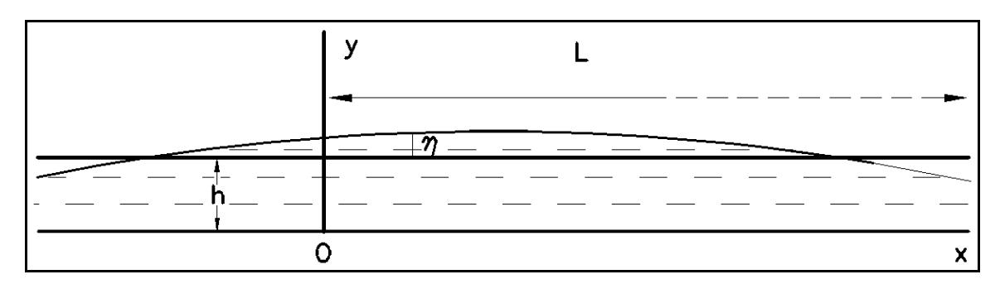

*Figure II-5-1. Long wave geometry (Milne-Thompson 1960)*

*Table II-5-1 Wave Classification (Ippen 1966)*

**Table II-5-1. Wave Classification (Ippen 1966)**

| Range of h/L | Range of kh=2Bh/L | Types of waves |
| --- | --- | --- |
| 0 to 1/20 | 0 to B/10 | Long waves (shallow-water wave) |
| 1/20 to 1/2 | B/10 to B | Intermediate waves |
| 1/2 to 4 | B to 4 | Short waves (deepwater waves) |

1966) summarizes wave classification criteria according to relative depth and the wave parameter kh defined below.
(5) Applying the relative depth and wave number parameter to the characteristics of long waves can be seen in the simplification to progressive small-amplitude wave theory solutions. For example, from Part II-1, the wave celerity, wave length, horizontal (x-direction) and vertical velocities can be written as

```math
C ^ { 2 } \ = \ { \frac { g } { k } } \ \operatorname { t a n h } ( k h ) \tag{II-5-1}
```

```math
L \ = \ { \frac { g T ^ { 2 } } { 2 \pi } } \ \operatorname { t a n h } \ ( k h ) \tag{II-5-2}
```

```math
u \, = \, { \frac { a g k } { \sigma } } \, { \frac { \cosh \, k ( h + z ) } { \cosh k h } } \, \sin ( k x - \sigma t ) \tag{II-5-3}
```

```math
w \ = \ - \ \frac { a g k } { \sigma } \ \frac { \sinh \ k ( h + z ) } { \cosh k h } \ \cos ( k x - \sigma t ) \tag{II-5-4}
```

where k is the wave number (2B/ L ), F is the angular frequency (2B/ T where T is the period of the wave), a is the amplitude of the wave, g the acceleration of gravity, h is the total depth, and z is the depth measured downward from the quiescent fluid surface. A schematic diagram of the variation of velocity as a function of depth is shown in Figure II-5-2.

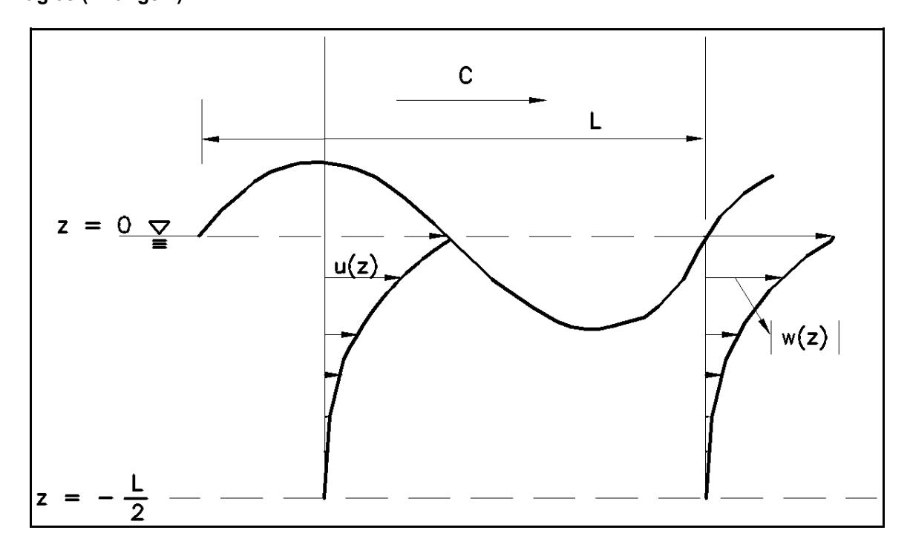

*Figure II-5-2. Variation of particle velocity with depth (Ippen 1966)*

(6) Certain simplifications to Equations II-5-1 through II-5-4 result from the asymptotic values of the hyperbolic functions. For example, Table II-5-2 (Ippen 1966) presents the hyperbolic functions contained in the long- and short-wave representations, as well as their asymptotes. No simplification results for intermediate waves.

**Table II-5-2. (Ippen 1966) presents the hyperbolic functions contained in the long- and short-wave representations, as well as their asymptotes. No simplification results for intermediate waves.**

| Function | Long waves | Short waves |
| --- | --- | --- |
| sinh kh | kh | ekh/2 |
| cosh kh | 1 | ekh/2 |
| tanh kh | kh | 1 |

**Table II-5-2. (Ippen 1966) presents the hyperbolic functions contained in the long- and short-wave representations, as well as their asymptotes. No simplification results for intermediate waves.**

| Function | Long waves | Short waves |
| --- | --- | --- |
| sinh kh | kh | ekh/2 |
| cosh kh | 1 | ekh/2 |
| tanh kh | kh | 1 |

(7) The resulting long wave simplification for celerities and wave lengths is shown below.

```math
C = \sqrt{gh} \tag{II-5-5}
```

```math
L \ = \ T \sqrt { g h } \tag{II-5-6}
```

(8) Therefore, long waves propagate as the square root of gh . This relationship will be shown to be useful in analyzing and interpreting long-wave phase propagation data, because wave celerity is predictable for a given depth.
(9) Additionally, one important difference between long waves and short waves can be seen in the computed orbital velocities. Figure II-5-3 shows water particle trajectories for long, short, and intermediate waves as a function of depth. As can be seen, and computed from Equations II-5-3 and II-5-4, the horizontal velocity of a long wave is maintained throughout the water column, from the surface to the bottom. In the case of short waves, the strength of the horizontal and vertical component decreases with depth to the point that waves do not induce bottom currents. The fact that long waves affect the bottom is important in that bottom sediments can be eroded and transported by tidal and other long-wave currents. For example, tidal flood and ebb currents contribute to the transport of sediments to form ebb and flood shoals. Potential erosion and deposition considerations will be discussed in Part 3 of this manual.

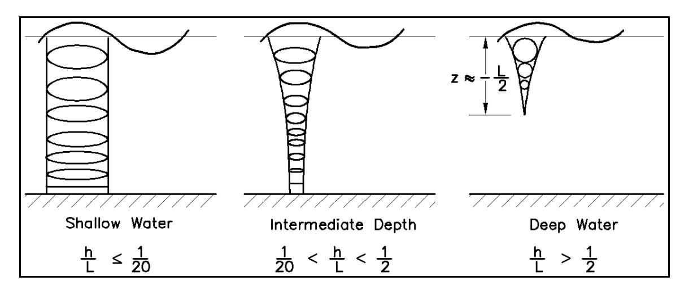

*Figure II-5-3. Schematic representation of water particle trajectories (Ippen 1966)*

b. Discussion . Short waves impact nearshore water surface elevations by creating the wave setup condition. Details of wave setup and associated setdown are described in Part II-4. Including setup can be critical in developing water surface design criteria, as setup can create an elevated surface on which tide and storm surge propagate. Because the interactions of these components of the water surface are not linear, and because they are of different time scales (Part II-1), they are generally considered separately in the development of total water level design criteria. Methods for computing and combining these effects are given in Part II-3 and 4. The following sections concentrate on tidal and storm surge elevations.

## II-5-3. Astronomical Tides

- a. Description of tides .
- (1) Introduction.
- (a) Astronomical tides are observable as the periodic rising and falling of the surface of major water bodies on the earth. Tides are produced in response to the gravitational attraction of the moon, sun, and (to a considerably smaller extent) all other celestial bodies. Because of its relative closeness to the earth, the moon induces the strongest effect on the tides. Tidal currents are produced in response to differences in the water surface elevation.
- (b) Tidal height, or the vertical distance between the maximum and successive minimum water surface elevation, is a function of the relative position of the moon and sun with respect to the earth, and varies from location to location. Typically, the dominant tidal cycle is related to the passage of the moon over a fixed
meridian. This occurs an average of 50 min later each succeeding day. This passage of the moon produces approximately two tides per solar day (referred to as semidiurnal), with a maximum tide occurring approximately every 12 hr 25 min. However, differences in the relationship of the moon and sun in conjunction with local conditions can result in tides that exhibit only one tidal cycle per day. These are referred to as diurnal tides. Mixed tides exhibit characteristics of both semidiurnal and diurnal tides. At certain times in the lunar month, two peaks per day are produced, while at other times the tide is diurnal. The distinction is explained in the following paragraphs.
- (c) The description of typical tidal variability begins with a brief background description of tide-producing forces, those gravitational forces responsible for tidal motion, and the descriptive tidal envelope that results from those forces. This sub-section will be followed by more qualitative descriptions of how the tidal envelope is influenced by the position of the moon and sun. Once this basic pattern is established, measured tidal elevations can, in part, be shown to be a function of the influence of the continental shelf and the coastal boundary on the propagating tide. (2) Tide-producing forces.
- (a) The law of universal gravitation was first published by Newton in 1686. Newton's law of gravitation states that every particle of matter in the universe attracts every other particle with a force that is directly proportional to the product of the masses of the particles and inversely proportional to the square of the distance between them (Sears and Zemansky 1963). Quantitative aspects of the law of gravitational attraction between two bodies of mass m_1 and m_2 can be written as follows:

```math
F_g = f \frac{m_1 \ m_2}{r^2} \tag{II-5-7}
```

where F_g is the gravitational force on either particle, r is separation of distance between the centers of mass of the two bodies, and f is the universal constant with a value of 6.67 \times 10^{-8} cm<sup>3</sup>/gm sec<sup>2</sup>. The gravitational force of the earth on particle m_I can be determined from Equation II-5-7. Let F_g = m_I g where g is the acceleration of gravity (980.6 cm/sec<sup>2</sup>) on the surface of the earth, and m_2 equal the mass of the earth E. By substitution, an expression for the gravitational constant can be written in terms of the radius of the earth a and the acceleration of gravity g.

```math
f = g \frac{a^2}{E} \tag{II-5-8}
```

- (b) Development of the tidal potential follows directly from the above relationship. The following variables are referenced to Figure II-5-4 (although Figure II-5-4 refers to the moon, an analogous figure can be drawn for the sun). Let M and S be the mass of the moon and sun, respectively. r_m and r_s are the distances from the center of the earth O to the center of the moon and sun. Let r_{mx} and r_{sx} be the distances of a point X(x,y,z) located on the surface of the earth to the center of the moon and sun. The following relationships define the tidal potential at some arbitrary point X as a function of the relative position of the moon and sun. (c) The attractive force potentials per unit mass for the moon and sun can be written as

```math
V _ { M } = \frac { f M } { r _ { M X } } \qquad , \qquad V _ { S } = \frac { f S } { r _ { S X } } \tag{II-5-9}
```

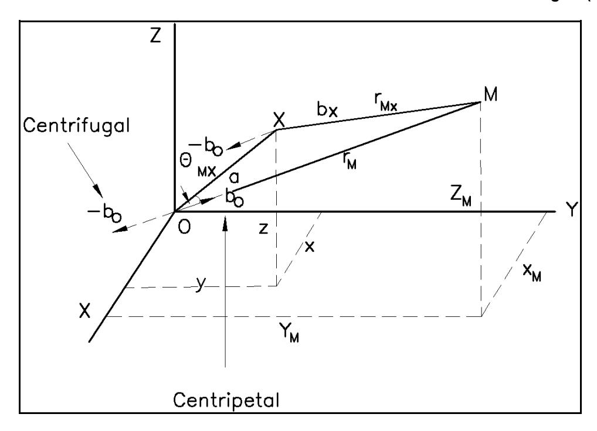

*Figure II-5-4. Schematic diagram of tidal potential (Dronkers 1964)*

where the separation distance rMX = [( xm - x ) 2 + ( ym - y ) 2 + ( zm - z ) ] 1/2 with an equivalent expression for rSX.
(d) The attractive force of the moon and sun at any point X is defined as

```math
\vec{b}_X = \nabla \left[ V_M(X) + V_S(X) \right] \tag{II-5-10}
```

where L is the vector gradient operator defined as

```math
\vec{\nabla} = (\partial_{\overline{\partial x}} + \partial_{\overline{\partial y}} + \partial_{\overline{\partial z}}) \tag{II-5-11}
```

- (e) From Figure II-5-4, the attractive force at the center of the earth (centripetal) bO is balanced by the centrifugal force -bO (i.e., equal in magnitude but opposite in direction). Because any point on the earth experiences the same centrifugal force as that at O , the resultant force at any point X will be equal to bX - bO. This resultant force difference is the tide generating force, the force that causes the oceans to deform in order to balance the sum of external forces. Therefore, the difference between the tidal potential at point O and at point X becomes the tidal potential responsible for the tide-producing forces. (f) The moon's tide-generating potential can be written as

```math
V_{M} = fM \left[ \frac{1}{r_{MX}} - \frac{1}{r_{M}} - \frac{a \cos \theta_{MX}}{r_{M}^{2}} \right] \tag{II-5-12}
```

with the tide potential for the sun written as

```math
V_{S} = fS \left[ \frac{1}{r_{SX}} - \frac{1}{r_{S}} - \frac{a\cos\theta_{SX}}{r_{S}^{2}} \right] \tag{II-5-13}
```

where a is the mean radius of the earth. Various geometric relationships are used to write Equations II-5-12 and II-5-13 in the following forms:

```math
V_{M} = fM \left(\frac{a^{2}}{r_{M}^{3}}\right) P_{M} \tag{II-5-14}
```

```math
V_S = fS\left(\frac{a^2}{r_S^3}\right) P_S \tag{II-5-15}
```

where the terms PM and PS represent harmonic polynomial expansion terms that collectively describe the relative positions of the earth, moon, and sun. Note that in both cases, the tidal potential term is written as an inverse function of the distance between the earth and the moon or sun. Both Dronkers (1964) and Schureman (1924) present detailed derivations of the terms of Equations II-5-14 and II-5-15. For the purpose of this manual, however, the tidal potential terms shown here are adequate to describe the two most important features of a tidal record, the spring/neap cycle and the diurnal inequality.
- (3) Spring/neap cycle.
- (a) The semidiurnal rise and fall of tide can be described as nearly sinusoidal in shape, reaching a peak value every 12 hr and 25 min. This period represents one-half of the lunar day. Two tides are generally experienced per lunar day because tides represent a response to the increased gravitational attraction from the (primarily) moon on one side of the earth, balanced by a centrifugal force on the opposite side of the earth. These forces create a "bulge" or outward deflection in the water surface on the two opposing sides of the earth.
- (b) The magnitude of tidal deflection is partially a function of the distance between the moon and earth. When the moon is in perigee, i.e., closest to the earth, the tide range is greater than when it is furthest from the earth, in apogee. For example, the potential terms in Equation II-5-14 contain the multiplier 1 /rM, describing the distance of the moon from the earth. When the moon is closest to the earth, rM is a minimum value and the tidal potential term is maximum. Conversely, when the moon is in apogee, the potential term is at a minimum value. This difference may be as large as 20 percent.
- (c) The maximum water surface deflection of semidiurnal tides changes as the relative position of the moon and sun changes. The amplitude envelope connecting any two successive high tides (and low tides) gradually increases from some minimum height to a maximum value, and then decreases back to a minimum. Periods of maximum amplitude are referred to as spring tides, times of minimum amplitude are neap tides. This envelope of spring to neap occurs twice over a period of approximately 29 days. An example tidal signal for Boston, MA, is shown in Figure II-5-5 (Harris 1981) in which the normalized tidal signal exhibits two amplitude envelopes during the total time series.
- (d) Spring tides occur when the sun and moon are in alignment. This occurs at either a new moon, when the sun and moon are on the same side of the earth, or at full moon, when they are on opposite sides of the earth. Neap tides occur at the intermediate points, the moon's first and third quarters. Figure II-5-6 is a schematic representation of these predominant tidal phases. Lunar quarters are indicated in the tidal time

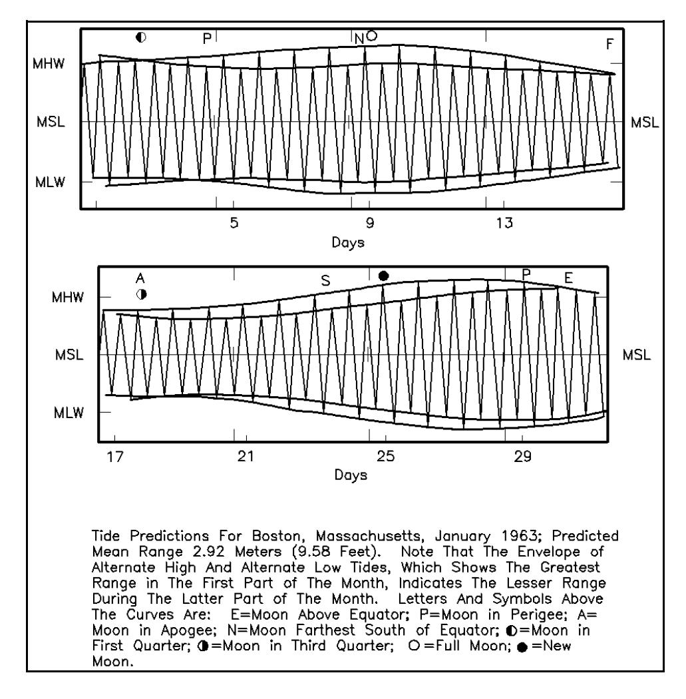

*Figure II-5-5. Tide predictions for Boston, MA (Harris 1981)*

series shown in Figure II-5-5. Note that in Figure II-5-5, the envelope that connects higher-high tide values for the first spring tide during the first 14.5 days becomes an envelope of the lower-high tide values during the second spring tide.

## (4) Diurnal inequality.

(a) In the above example, the envelope of two successive high or low tides defines spring and neap conditions. Alternate tides were used because the ranges of two successive tides at a given location are generally not identical, but exhibit differences in height. Examples are evident in Figure II-5-5. These differences are referred to as the diurnal inequality of the tide and result from the relative position of the sun and moon as well as the specific location of an observer on the earth.

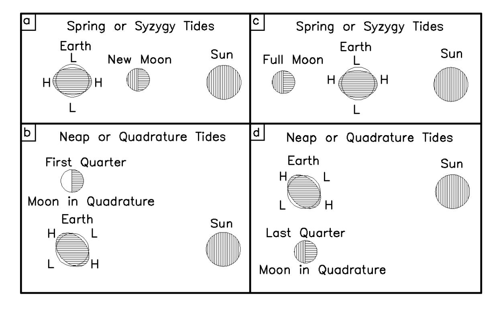

*Figure II-5-6. Spring and neap tides (Shalowitz 1964)*

- (b) Diurnal inequality can be explained as follows. The tidal bulge is centered along a line from the center of the moon or sun to the center of the earth. The tidal bulge at a given sublunar or subsolar (location on the earth nearest the moon or sun) location has an equivalent bulge on the opposite side of the earth, i.e., on a line drawn from the sublunar or subsolar point through the center of the earth on the opposite side of the equator. If the sublunar or subsolar point appears at a given north latitude, the peak of the corresponding tidal bulge on the opposite side of the equator will appear at a corresponding south latitude. Thus, a point on the same north latitude but 180 deg in longitude from the sublunar or subsolar point will show a reduced amplitude.
- (c) A schematic example of the daily inequality is presented by Dronkers (1964) for the simple case of an earth-moon system. Referring to Figure II-5-7, the moon is located in the direction M and earth is rotating about the polar axis P . The deformed water surface resulting in response to the tide-producing forces is shown in the figure. Four locations (I - IV) are indicated to demonstrate the effect of location on the diurnal inequality. The fluctuating tide can be seen as the deviation in the deformed surface from a line at constant latitude on the undeformed spherical surface corresponding to each location. Location I corresponds to an observer on the equator. In this case, it can be seen that the tidal deformations from static conditions are equal; therefore, there is no diurnal inequality, each high tide is equal. However, at locations II and III, the inequality is evident with the second tide being substantially lower than the first. In the extreme case, location IV exhibits a diurnal tide only due to its location with respect to the deformed water surface.
- (d) The combinations of astronomical forcing that define spring and neap cycles and diurnal inequalities is further modified by local bathymetry and shoreline boundary influences. All of these factors combine to produce tidal envelopes that vary from location to location. The result is site-specific tidal signatures, which can be classified as semidiurnal, diurnal, or mixed. Examples of these classes of tides are shown in Figures II-5-8 and II-5-9. Tides along the Atlantic coast are generally semidiurnal with a small diurnal inequality. Typical east coast envelopes for Boston, MA; New York, NY; Hampton Roads, (Hampton), VA;

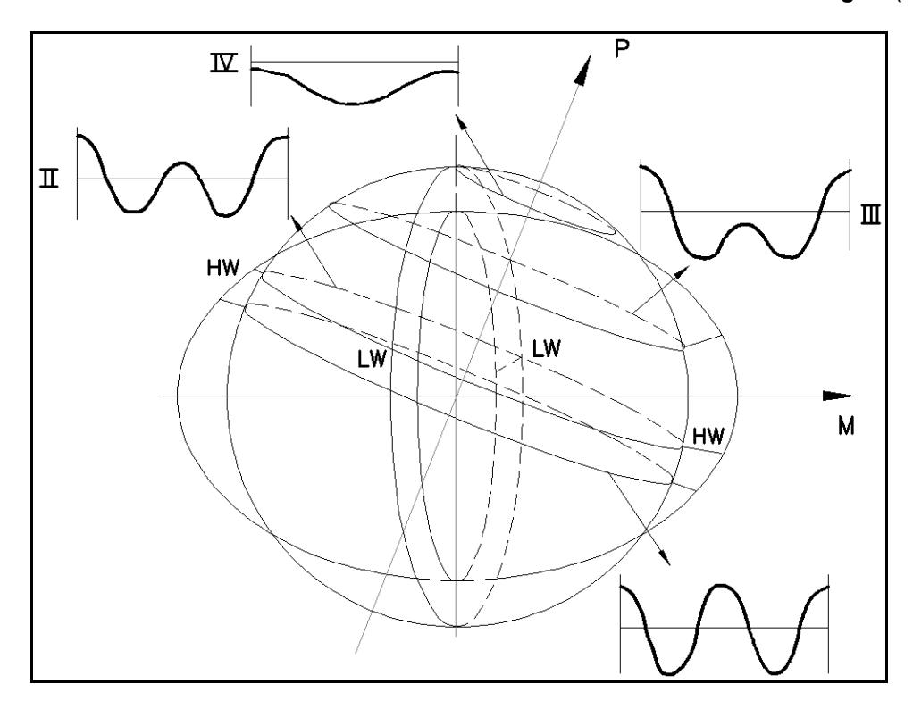

*Figure II-5-7. The daily inequality (Dronkers 1964)*

and the entrance to the Savannah River at Savannah, GA, are shown in the figure. Each time series exhibits two distinct and nearly equal tides per day. As one moves to Key West, FL, the character of the tide begins to change with a noticeable diurnal inequality. Tides inside the Gulf of Mexico range from semidiurnal at Key West, FL, to diurnal at Pensacola, FL, to mixed at Galveston, TX. Note that the Galveston data progresses from a diurnal tide during the first third of the record to a semidiurnal tide. Tides in the Gulf of Mexico are more complex than open ocean stations because astronomical forcing is modified by geometrically forced nodes and antinodes. These seiche-related phenomena are discussed in Part II-5-6. Pacific coast tides, shown in Figure II-5-9, are generally of larger amplitude than Atlantic and Gulf coast tides and often have a decided diurnal inequality.

## b. Tidal time series analysis .

(1) Introduction. The equilibrium theory of tides is a hypothesis that the waters of the earth respond instantaneously to the tide-producing forces of the sun and moon. For example, high water occurs directly beneath the moon and sun, i.e., at the sublunar and subsolar points. This tide is referred to as an equilibrium tide. Part II-5-3 a (1), states that tide-producing forces are written in a polynomial expansion approximation for the exact solution of Equations II-5-12 and II-5-13. These expansion terms involve astronomical arguments describing the location of the sun and moon as well as the location of the observer on the earth. Although several variational forms of the series expansion have been published, the development presented in Schureman (1924) is given below. Alternate forms of expansion are discussed in Dronkers (1964).

## (2) Harmonic constituents.

(a) According to equilibrium theory, the theoretical tide can be predicted at any location on the earth as a sum of a number of harmonic terms contained in the polynomial expansion representation of the

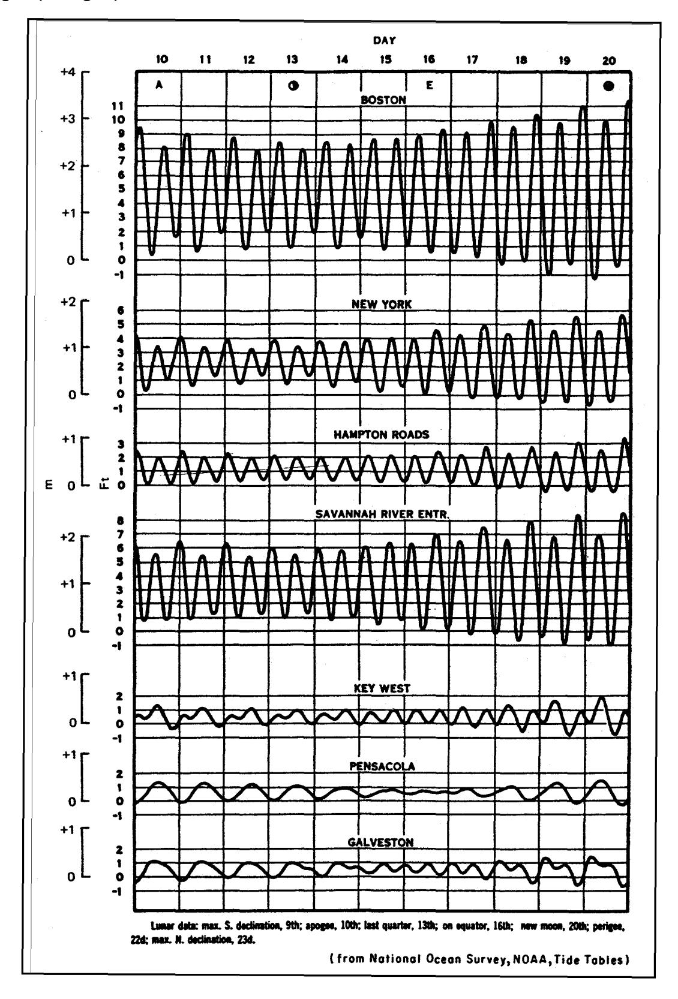

*Figure II-5-8. Typical tide curves along the Atlantic and Gulf coasts (Shore Protection Manual 1984)*

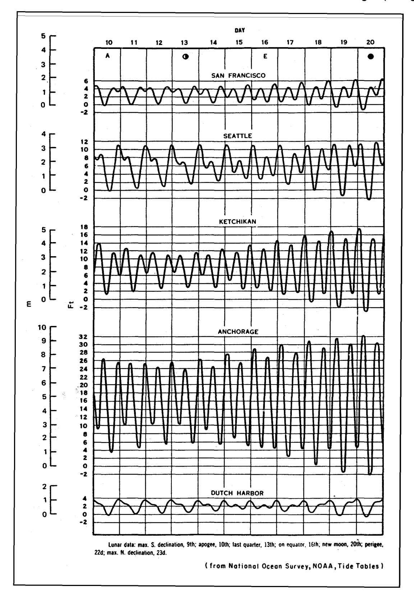

*Figure II-5-9. Typical tide curves along Pacific coast of the United States (Shore Protection Manual 1984)*

tide-producing forces. However, the actual tide does not conform to this theoretical value because of friction and inertia as well as differences in the depth and distribution of land masses of the earth.
- (b) Because of the above complexities, it is impossible to exactly predict the tide at any place on the earth based on a purely theoretical approach. However, the tide-producing forces (and their expansion component terms) are harmonic; i.e., they can be expressed as a cosine function whose argument increases linearly with time according to known speed criteria. If the expansion terms of the tide-producing forces are combined according to terms of identical period (speed), then the tide can be represented as a sum of a relatively small number of harmonic constituents. Each set of constituents of common period are in the form of a product of an amplitude coefficient and the cosine of an argument of known period with phase adjustments based on time of observation and location. Observational data at a specific time and location are then used to determine the coefficient multipliers and phase arguments for each constituent, the sum of which are used to reconstruct the tide at that location for any time. This concept represents the basis of the harmonic analysis, i.e., to use observational data to develop site-specific coefficients that can be used to reconstruct a tidal series as a linear sum of individual terms of known speed. The following presentation briefly describes the use of harmonic constants to predict tides.
- (c) Tidal height at any location and time can be written as a function of harmonic constituents according the following general relationship

```math
H(t) = H_0 + \sum_{n=1}^{N} f_n H_n \cos \left[ a_n t + (V_0 + u)_n - \kappa_n \right] \tag{II-5-16}
```

where
H ( t ) = height of the tide at any time t
H0 = mean water level above some defined datum such as mean sea level
Hn = mean amplitude of tidal constituent n
fn = factor for adjusting mean amplitude Hn values for specific times
an = speed of constituent n in degrees/unit time
t = time measured from some initial epoch or time, i.e., t = 0 at t0
( V0 + u ) = value of the equilibrium argument for constituent n at some location and when t = 0
6 n = epoch of constituent n , i.e., phase shift from tide-producing force to high tide from t0
(d) In the above formula, tide is represented as the sum of a coefficient multiplied by the cosine of its respective arguments. A finite number of constituents are used in the reconstruction of a tidal signal. Values for the site-specific arguments ( H0, Hn, and 6 n ) are computed from observed tidal time series data, usually from a least squares analysis. The National Oceanic and Atmospheric Administration's (NOAA) National Ocean Survey (NOS) generally provides 37 constituents in their published harmonic analyses (generally based on an analysis of a minimum of 1 year of prototype data). The NOS constituents, along with the corresponding period and speed of each, are listed in Table II-5-3. The time-specific arguments ( fn and V0 + u ) are determined from formulas or tables as will be discussed below or through application of programs
available through the Automated Coastal Engineering System (ACES) (Leenknecht, Szuwalski, and Sherlock 1992).
- (e) Most of the constituents listed in Table II-5-3 are associated with a subscript indicating the approximate number of cycles per solar day (24 hr). Constituents with subscripts of 2 are semidiurnal constituents and produce a tidal contribution of approximately two high tides per day. Diurnal constituents occur approximately once a day and have a subscript of 1. Symbols with no subscript are termed long-period constituents and have periods greater than a day; for example, the Solar Annual constituent Sa has a period of approximately 1 year.
- (f) In most harmonic analyses of tidal data in the continental United States, the majority of constituents shown above have amplitude contributions that are negligible with respect to the magnitude of the full tide. For example, in the Gulf of Mexico and east coast of the United States, well over 90 percent of the tidal energy can be represented by the amplitudes of the M2, S2, N2, and K2 semidiurnal and K1, O1, P1, and Q1 diurnal constituents. In other locations, many more tidal constituents are needed to adequately represent the tide. For example, over 100 constituents are needed for Anchorage, AK. (g) Two categories of tidal constituents are necessary to reconstruct a tidal signal: ! Those that represent the elevation of the water surface. ! Those that specify a time and the phase shift associated with that time.
For example, the value for Hn in Equation II-5-16 is the mean constituent amplitude and is a function of both location and variations arising from changes in the latitude of the moon's node. The nodal effect of the moon is reflected by the introduction of the node factor fn , which modifies each constituent amplitude to correspond to a specific time period. Mid-year values are usually specified for reconstructed time series because node factors vary slowly in time. Mid-year values for each constituent listed in Table II-5-3 are presented in Shureman (1924) for the years 1850 through 1999. An example is shown in Table II-5-4 for the years 1970 through 1999. Equations for computing fn are given by Schureman.
- (h) The second category of arguments specifies the phasing of high water for each constituent with respect to both time and location. These arguments are based on the fact that phases of the constituents of the observed tide do not coincide with the phases of the corresponding constituents of the equilibrium tide. For example, a high tide does not occur directly beneath the moon. There is a lag between the location of the tide-producing force (i.e., location of the moon) and the observed time of high water. This lag, due to frictional and inertial forces acting on the propagating tide, is referred to as the epoch of the constituent and is denoted by 6 n in Equation II-5-16.
- (i) The relationship between the constituent arguments and high tide is shown in the schematic Figure II-5-10. In this figure, the cosine curve represents the surface elevation in the y-direction as a function of time or degrees of phase (maximum at 0 and 360 deg). For the M2 tidal constituent, the cosine curve has a period of 12.42 hr (other constituent periods are indicated in Table II-5-3). Therefore, in Figure II-5-10, the horizontal axis represents either time or phase, both increasing to the right. The value of 6 represents the actual phase lag required for the water surface to reach high water (HW) following the passing of the tideproducing force. In the case of the semidiurnal constituents, this force is the crossing of the moon.

**Table II-5-3. ). Therefore, in Figure II-5-10, the horizontal axis represents either time or phase, both increasing to the right. The value of 6 represents the actual phase lag required for the water surface to reach high water (HW) following the passing of the tideproducing force. In the case of the semidiurnal constituents, this force is the crossing of the moon.**

| Symbol Speed, | deg/hr | Period, hr | Symbol | Speed, deg/hr | Period, hr |
| --- | --- | --- | --- | --- | --- |
| M2 | 28.984 | 12.421 | Mm | 0.544 | 661.765 |
| S2 | 30.000 | 12.000 | Ssa | 0.082 | 4390.244 |
| N2 | 28.439 | 12.659 | Sa | 0.041 | 8780.488 |
| K1 | 15.041 | 23.935 | Msf | 1.015 | 354.680 |
| M4 | 57.968 | 6.2103 | Mf | 1.098 | 327.869 |
| O1 | 13.943 | 25.819 | D1 | 13.471 | 26.724 |
| M6 | 86.952 | 4.140 | Q1 | 13.398 | 26.870 |
| (MK)3 | 44.025 | 8.177 | T2 | 29.958 | 12.017 |
| S4 | 60.000 | 6.000 | R2 | 30.041 | 11.984 |
| (MN)4 | 57.423 | 6.269 | (2Q)1 | 12.854 | 28.007 |
| <2 | 28.512 | 12.626 | P1 | 14.958 | 24.067 |
| S6 | 90.000 | 4.000 | (2SM)2 | 31.015 | 11.607 |
| :2 | 27.968 | 12.872 | M3 | 43.476 | 8.280 |
| (2N)2 | 27.895 | 12.906 | L2 | 29.528 | 12.192 |
| (OO)1 | 16.139 | 22.306 | (2MK)3 | 42.927 | 8.386 |
| 82 | 29.455 | 12.222 | K2 | 30.082 | 11.967 |
| S1 | 15.000 | 24.000 | M8 | 115.936 | 3.105 |
| M1 | 14.496 | 24.834 | (MS)4 | 58.984 | 6.103 |
| J1 | 15.585 | 23.099 |  |  |  |

**Table II-5-3. ). Therefore, in Figure II-5-10, the horizontal axis represents either time or phase, both increasing to the right. The value of 6 represents the actual phase lag required for the water surface to reach high water (HW) following the passing of the tideproducing force. In the case of the semidiurnal constituents, this force is the crossing of the moon.**

| Symbol Speed, | deg/hr | Period, hr | Symbol | Speed, deg/hr | Period, hr |
| --- | --- | --- | --- | --- | --- |
| M2 | 28.984 | 12.421 | Mm | 0.544 | 661.765 |
| S2 | 30.000 | 12.000 | Ssa | 0.082 | 4390.244 |
| N2 | 28.439 | 12.659 | Sa | 0.041 | 8780.488 |
| K1 | 15.041 | 23.935 | Msf | 1.015 | 354.680 |
| M4 | 57.968 | 6.2103 | Mf | 1.098 | 327.869 |
| O1 | 13.943 | 25.819 | D1 | 13.471 | 26.724 |
| M6 | 86.952 | 4.140 | Q1 | 13.398 | 26.870 |
| (MK)3 | 44.025 | 8.177 | T2 | 29.958 | 12.017 |
| S4 | 60.000 | 6.000 | R2 | 30.041 | 11.984 |
| (MN)4 | 57.423 | 6.269 | (2Q)1 | 12.854 | 28.007 |
| <2 | 28.512 | 12.626 | P1 | 14.958 | 24.067 |
| S6 | 90.000 | 4.000 | (2SM)2 | 31.015 | 11.607 |
| :2 | 27.968 | 12.872 | M3 | 43.476 | 8.280 |
| (2N)2 | 27.895 | 12.906 | L2 | 29.528 | 12.192 |
| (OO)1 | 16.139 | 22.306 | (2MK)3 | 42.927 | 8.386 |
| 82 | 29.455 | 12.222 | K2 | 30.082 | 11.967 |
| S1 | 15.000 | 24.000 | M8 | 115.936 | 3.105 |
| M1 | 14.496 | 24.834 | (MS)4 | 58.984 | 6.103 |
| J1 | 15.585 | 23.099 |  |  |  |

- (j) The value 6 is approximately constant at every location in the world because it represents the actual lag between the passing of the tide-producing force (i.e., moon) at a specific location and the following hightide contribution of that force at that same location. It is computed as the sum of the theoretical phase or time lead of the tide-producing force relative to the observer at some fixed time and the measured phase lag . from the observer at that fixed time to the following high water. The theoretical location of the tide-producing force is referred to as the equilibrium argument ( V0 + u ). In Figure II-5-10, the tide-producing force and corresponding equilibrium tide at location M are located ( V0 + u ) degrees ahead of point T. Conversely, the equilibrium tide will be located at point T if shifted ( V0 + u ) degrees. The value of . represents the phase lag from point T to HW .
- (k) The equilibrium argument ( V0 + u ) is computed from equations defining the time-varying relationship between the earth, moon, and sun. The value of . is computed from observed tidal time series data. As stated, the sum of these two values is approximately constant for any fixed location at any time.
- (l) Values of the equilibrium argument for the constituents of Table II-5-3 relative to the passing of the tidal potential force at the Greenwich meridian for each calendar year from 1850 through 2000 are tabulated in Schureman (1924). An example is shown in Table II-5-5 for the years 1990 to 2000. Monthly and daily adjustment tables are also presented. Each of the values is computed according to the respective constituent speeds shown in Table II-5-3. The equilibrium arguments tabulated in Schureman are referenced to the meridian of Greenwich; therefore, the argument ( V0 + u ) represents the phase difference in degrees between the location of the tidal potential term (moon or sun) and Greenwich relative to some specific time.

**Table II-5-3. relative to the passing of the tidal potential force at the Greenwich meridian for each calendar year from 1850 through 2000 are tabulated in Schureman (1924). An example is shown in Table II-5-5 for the years 1990 to 2000. Monthly and daily adjustment tables are also presented. Each of the values is computed according to the respective constituent speeds shown in Table II-5-3. The equilibrium arguments tabulated in Schureman are referenced to the meridian of Greenwich; therefore, the argument ( V0 + u ) represents the phase difference in degrees between the location of the tidal potential term (moon or sun) and Greenwich relative to some specific time.**

| Symbol Speed, | deg/hr | Period, hr | Symbol | Speed, deg/hr | Period, hr |
| --- | --- | --- | --- | --- | --- |
| M2 | 28.984 | 12.421 | Mm | 0.544 | 661.765 |
| S2 | 30.000 | 12.000 | Ssa | 0.082 | 4390.244 |
| N2 | 28.439 | 12.659 | Sa | 0.041 | 8780.488 |
| K1 | 15.041 | 23.935 | Msf | 1.015 | 354.680 |
| M4 | 57.968 | 6.2103 | Mf | 1.098 | 327.869 |
| O1 | 13.943 | 25.819 | D1 | 13.471 | 26.724 |
| M6 | 86.952 | 4.140 | Q1 | 13.398 | 26.870 |
| (MK)3 | 44.025 | 8.177 | T2 | 29.958 | 12.017 |
| S4 | 60.000 | 6.000 | R2 | 30.041 | 11.984 |
| (MN)4 | 57.423 | 6.269 | (2Q)1 | 12.854 | 28.007 |
| <2 | 28.512 | 12.626 | P1 | 14.958 | 24.067 |
| S6 | 90.000 | 4.000 | (2SM)2 | 31.015 | 11.607 |
| :2 | 27.968 | 12.872 | M3 | 43.476 | 8.280 |
| (2N)2 | 27.895 | 12.906 | L2 | 29.528 | 12.192 |
| (OO)1 | 16.139 | 22.306 | (2MK)3 | 42.927 | 8.386 |
| 82 | 29.455 | 12.222 | K2 | 30.082 | 11.967 |
| S1 | 15.000 | 24.000 | M8 | 115.936 | 3.105 |
| M1 | 14.496 | 24.834 | (MS)4 | 58.984 | 6.103 |
| J1 | 15.585 | 23.099 |  |  |  |

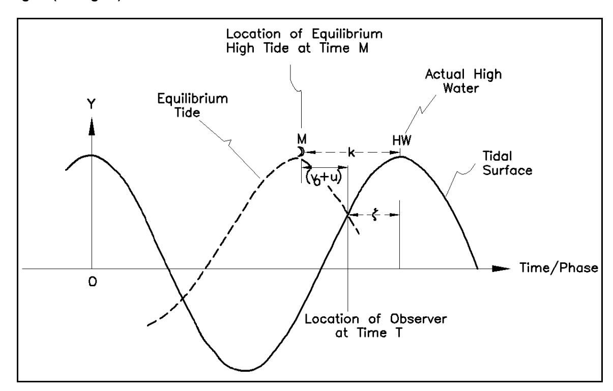

*Figure II-5-10. Tidal phase relationships*

(m) A tidal simulation computer program is available in ACES (Leenknecht, Szuwalski, and Sherlock 1992) to compute nodal factors and local (or Greenwich) equilibrium argument values for any time period and generate the corresponding water surface time series as a function of input constituent amplitudes. Formulas for computing the equilibrium arguments are found in Shureman (1924), but are too lengthy for this manual.

## (3) Harmonic reconstruction.

- (a) In order to reconstruct a tidal series for a specific time and location, the various phase arguments of Equation II-5-16 must be defined according to local conditions. Generally, local values of 6 n, H0, and Hn are available from NOS harmonic analyses. Because the values of the nodal factors fn are slowly varying, the yearly values determined according to Schureman are sufficiently accurate for the particular time of interest throughout the world. However, local values of ( V0 + u ) n vary with the speed of the constituent and have to be determined for the location and time of interest. This information can be computed from tabulated equilibrium arguments relative to Greenwich such as those presented in Schureman or computed with programs developed for that purpose such as those contained in ACES.
- (b) Values of the local equilibrium arguments, i.e., local ( V0 + u ) n , represent the instantaneous value of each of the equilibrium tide-producing force constituents (in degrees) with respect to some specific point on the earth; for example, the time-varying location of the moon and sun with respect to some location on the earth. Referring to Figure II-5-11, the horizontal axis represents distance with the point G representing Greenwich, England, and O representing an observer located at some point west of Greenwich. The location of the moon with respect to Greenwich at longitude 0o at Greenwich time t0 is indicated by the Greenwich equilibrium argument presented in Shureman, denoted as Greenwich ( V0 + u ), for time Greenwich t0.

*Table II-5-5
Equilibrium Argument for Beginning of Years 2001 through 2010*

**Table II-5-5. Equilibrium Argument for Beginning of Years 2001 through 2010**

| Constituent |  | 2001 | 2002 | 2003 | 2004 | 2005 | 2006 | 2007 | 2008 | 2009 | 2010 |
| --- | --- | --- | --- | --- | --- | --- | --- | --- | --- | --- | --- |
| J1 |  | 227.9 | 316.9 | 47.0 | 138.0 | 243.7 | 335.7 | 67.8 | 159.8 | 265.5 | 356.5 |
| K1 |  | 1.9 | 1.8 | 2.6 | 4.1 | 7.1 | 9.3 | 11.7 | 13.9 | 1 6.8 | 18.3 |
| K2 |  | 184.0 | 183.3 | 184.6 | 187.6 | 193.7 | 198.5 | 203.5 | 208.2 | 214.3 | 217.1 |
| L2 |  | 269.1 | 105.4 | 267.4 | 94.8 | 295.2 | 141.6 | 297.3 | 121.4 | 321.6 | 165.8 |
| M1 |  | 145.4 | 52.1 | 303.7 | 204.7 | 139.6 | 58.2 | 311.4 | 210.3 | 141.0 | 64.7 |
| M2 |  | 210.8 | 311.4 | 52.4 | 153.5 | 230.4 | 331.9 | 73.4 | 174.8 | 251.7 | 352.9 |
| M3 |  | 316.1 | 287.1 | 258.5 | 230.2 | 165.7 | 137.8 | 110.0 | 82.2 | 17.6 | 349.3 |
| M4 |  | 61.5 | 262.9 | 104.7 | 307.0 | 100.9 | 303.8 | 146.7 | 349.6 | 143.5 | 345.7 |
| M6 |  | 272.3 | 214.3 | 157.1 | 100.5 | 331.3 | 275.6 | 220.1 | 164.4 | 35.2 | 338.6 |
| M8 |  | 123.1 | 165.7 | 209.4 | 254.0 | 201.7 | 247.5 | 293.4 | 339.2 | 286.9 | 331.4 |
| N2 |  | 340.5 | 353.5 | 4.7 | 17.1 | 352.3 | 5.0 | 17.7 | 30.4 | 5.6 | 18.0 |
| 2N |  | 110.3 | 33.5 | 317.0 | 240.7 | 114.1 | 38.1 | 322.1 | 246.1 | 119.5 | 43.1 |
| O1 |  | 213.0 | 313.5 | 53.0 | 151.8 | 224.9 | 323.0 | 61.2 | 159.3 | 232.4 | 331.3 |
| OO |  | 322.4 | 222.3 | 125.6 | 31.5 | 326.3 | 234.6 | 143.3 | 51.6 | 346.3 | 251.9 |
| P1 |  | 349.3 | 349.5 | 349.8 | 350.0 | 349.3 | 349.5 | 349.7 | 350.0 | 349.2 | 349.5 |
| Q1 |  | 342.8 | 354.6 | 5.3 | 15.5 | 346.7 | 356.1 | 5.5 | 15.0 | 346.3 | 356.4 |
| 2Q |  | 112.6 | 35.6 | 317.7 | 239.0 | 108.5 | 29.2 | 309.9 | 230.6 | 100.1 | 21.5 |
| R2 |  | 177.8 | 177.5 | 177.3 | 177.0 | 177.7 | 177.5 | 177.2 | 177.0 | 177.7 | 177.4 |
| S1 |  | 180.0 | 180.0 | 180.0 | 180.0 | 180.0 | 180.0 | 180.0 | 180.0 | 180.0 | 180.0 |
| S2,4,6 | 0.0 | 0.0 | 0.0 | 0.0 | 0.0 | 0.0 | 0.0 | 0.0 | 0.0 | 0.0 |  |
| T2 |  | 2.2 | 2.5 | 2.7 | 3.0 | 2.3 | 2.5 | 2.8 | 3.0 | 2.3 | 2.6 |
| 82 | 307.7 | 218.9 | 130.3 | 42.0 | 300.8 | 212.8 | 124.8 | 36.7 | 295.5 | 207.1 |  |
| :2 |  | 63.6 | 265.0 | 106.7 | 308.6 | 101.9 | 304.1 | 146.3 | 348.5 | 141.8 | 343.7 |
| <2 |  | 293.8 | 224.0 | 154.4 | 85.0 | 340.1 | 271.0 | 202.0 | 132.9 | 28.0 | 318.6 |
| D1 |  | 296.1 | 226.1 | 155.0 | 83.3 | 334.5 | 262.2 | 189.7 | 117.4 | 8.6 | 297.0 |
| MK |  | 212.6 | 313.2 | 54.9 | 157.6 | 237.5 | 341.2 | 85.0 | 188.7 | 268.6 | 11.1 |
| 2MK | 59.6 | 261.1 | 102.1 | 302.9 | 93.8 | 294.4 | 135.1 | 335.7 | 126.6 | 327.4 |  |
| MN |  | 191.3 | 303.9 | 57.0 | 170.6 | 222.7 | 336.9 | 91.1 | 205.2 | 257.3 | 10.9 |
| MS |  | 210.8 | 311.4 | 52.4 | 153.5 | 230.4 | 331.9 | 73.4 | 174.8 | 251.7 | 352.9 |
| 2SM | 149.2 | 48.6 | 307.6 | 206.5 | 129.6 | 28.1 | 286.6 | 185.2 | 108.3 | 7.1 |  |
| Mf |  | 324.7 | 224.4 | 126.3 | 29.8 | 320.7 | 225.8 | 131.0 | 36.1 | 326.9 | 230.3 |
| MSf |  | 147.2 | 46.4 | 305.7 | 204.9 | 128.5 | 27.8 | 287.0 | 186.3 | 109.9 | 9.2 |
| Mm |  | 230.2 | 318.9 | 47.7 | 136.4 | 238.2 | 326.9 | 55.6 | 144.3 | 246.1 | 334.9 |
| Sa |  | 280.7 | 280.5 | 280.2 | 280.0 | 280.8 | 280.5 | 280.3 | 280.0 | 280.8 | 280.5 |
| Ssa |  | 201.4 | 201.0 | 200.5 | 200.0 | 201.5 | 201.0 | 200.5 | 200.1 | 201.6 | 201.1 |
| Methodology based | on Schureman | 1924. | Values | computed | May 2001. |  |  |  |  |  |  |

- (c) The location of the moon at Greenwich time t_0 is different for an observer at some point O located at longitude L^o than it is for the observer located at Greenwich. For each constituent, the observer is located pL deg from Greenwich; therefore, the local equilibrium argument must be adjusted by -pL to account for the difference in location between the point of interest (i.e., point O) and Greenwich.
- (d) The -pL adjustment provides the necessary equilibrium argument correction for differences in location between some point and Greenwich, i.e., a local equilibrium argument corresponding to an observer at location O. However, the value of the equilibrium argument Greenwich (V_0 + u) was specified with respect to Greenwich t_0 . Therefore, Greenwich time must be written with respect to local time. Because local time for the observer located west of Greenwich is earlier than local time in Greenwich (t_0) , the following adjustment is made to convert local time to Greenwich time.

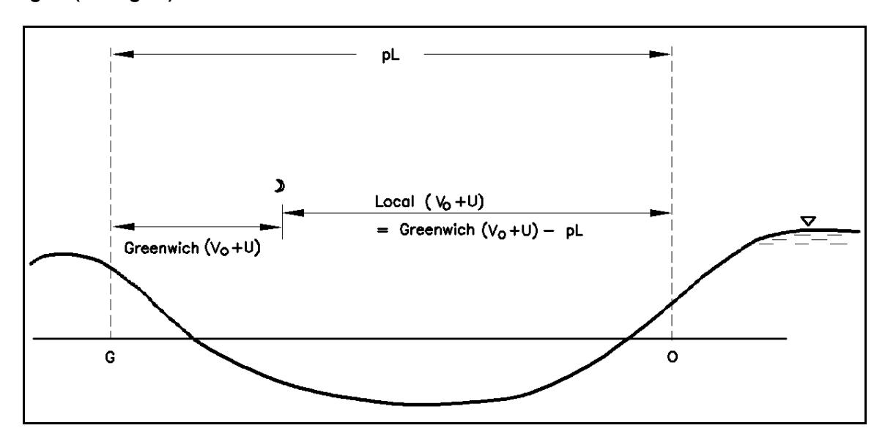

*Figure II-5-11. Phase angle argument relationship*

```math
(t_0) = local(t_0) + \frac{S}{15} \tag{II-5-17}
```

where S is the local time meridian (shown on NOS analyses) and the number 15 indicates a time change of 1 hr per 15 deg longitude.
(e) The speed of the time argument ( ant in Equation II-5-16) in degrees with respect to time is equal to the speed of the constituent an multiplied by Equation II-5-17. Therefore, the final relationship between local and Greenwich phase arguments that account for both differences in location ( -pL ) and local time ( aS /15) can be written as:

```math
\mathrm { l o c a l } \ \left( V _ { 0 } \ + \ u \right) \ = \ \mathrm { G r e e n w i c h } \ \left( V _ { 0 } \ + \ u \right) \ - \ p L \tag{II-5-18}
```

Therefore, a tide at any arbitrary location is computed as

```math
H(t)_{local} = H_0 + \sum_{n=1}^{N} f_n H_n \cos \left[ a_n t + \text{Greenwich } V_0 + u \right) - pL + \frac{a_n S}{15} - \kappa_n \tag{II-5-19}
```

(f) A reconstructed tidal time series of a published NOS harmonic analysis is presented for Sandy Hook, NJ. The NOS analysis is shown in Figure II-5-12. As can be seen by the reported amplitudes, the M2, S2, N2, K1, Sa, O1, < 2, and K2 constituents contain the majority of the tidal energy. These constituents are used to generate a 15-day tidal signal beginning on 1 January 1984 at 0000 hr Eastern Standard Time. Computed values are compared to the high and low tide predictions published in the Tide Tables for 1984 (NOAA 1984) shown in Figure II-5-13. Because all 37 constituents are not used in the reconstruction, the match is not perfect; however, it demonstrates the degree of accuracy that can be achieved by using only major constituents.
TATION Sano dy Hoi 2K.,N. ***** Long. 74° 0'7.
Long. 74° 0'7.
Long. 74° 0' Сомго- наит H Analitods EPOCE e j A. Kady XII 360°−€′ D REMARKS м, n. m. 219.1 +31 n. H. 2.237 . -222.2 Time meridian 75°W = +5 S, 0.448 246.0 - 2.0 0.466 + -244.0 Extreme mage N, 0.473. + 5.8 0.492 + -2099 Dial K. 0.319 102.2 - 1.2 0.332 + -/01.0 Marigram gear M, 0.036. 347.4 + 62 0.037 + -353,6 Marigram scale Ο, 0.1.72. 98.4 + 43 .Q.1.7.9. + -102.7 Permanent current M 4 0.048 356.4 + 9.3 0.050 + - 5.7 The DATUM is a plane MLLU _ (MK), + _ -below mean { low nater springs | lower low water, S, 0.032 61.4. - 40 0.033 .+ .=.57.4 - water, (MN)4 0.109 .191.1 + 55 0.113 + -196.6 First used for 1947 Toble S 243.7 102 2 47/ + -2519 (madified 1966) (2N), 189.1 -197.6 *************************************** 7.4.7.2.7 . DU.D. (00) i 231.6) 4 4 7 + -232.3 B 1.4 1 1 1 + ? S 1 .621.61 .56.2 + - 55.2 M, 100.3 + -101.8 constituents increased 4 J, ` , 0.015 + -100.2 Mm 1.4.7:1.1 .907.3 + - New 1960-78 Zo first used Sea 0.067 38.3 -0.4 0.067 + - 379 10 1985 T.T. (2:26) Sa 0.254 128.7 - 0.2 0.254 + -128.5 MSf + _ 2 - 7 - 7 М + Zo= 2,56 + 1989 TT * Q. 104.5 + -111.5 DATUM = MLLM Tı ( 0.026 246.0) - 18 0.027 t . -244 .2 *************************************** R, (2Q), + *************************************** L *************************************** Pı 0.096 105.7 - 0.8 0.100 .+ -1049 *************************************** (2SM), M, 0022 198.6 1 2/7 A A 2.3 + -242 - L, 205.5 -203,2 -205.9 (2MK), - W. W. V. L. ./#/79/ *************************************** K 1 0.221 251.9 -24 0 124 + -249.5 *************************************** м, - M. 1. 1. 1. 1. 1. 1. 1. 1. 1. 1. 1. 1. 1. - sta =2. /.: . U .1.114.42. + _ (MS). + _

*Figure II-5-12. NOS harmonic analysis for Sandy Hook, NJ*

|  |  |  |  | 4 O V |  |  |  |  |  |  | FEBR | LADV |  |  |  |  |  |  | MAF | ru |  |  |  |
| --- | --- | --- | --- | --- | --- | --- | --- | --- | --- | --- | --- | --- | --- | --- | --- | --- | --- | --- | --- | --- | --- | --- | --- |
|  | Time | Hei | JANUARY Height Time | Hei | ght | Time | Hei |  |  | Height |  | Time | He 1 |  |  | Time | Height |  |  |  |  |  |  |
| ay | h m | ft | m | Day | h m | ft |  | Day | h m | ft | as | Day | h m | ft | m | Day | h m | ft | m . | Day | h m | ft | я |
| u | 0619 1242 1840 | -0.5 | -0.2 | M | 0542 1213 1813 |  | -0.2 | × | 0112 0722 1349 1944 | 4.8 -0.4 | 1.5 | Th | 0050 0705 1335 1935 | 5.6 -1.2 | 1.7 -0.4 | Th | 0052 0701 1322 1922 | 4.7 -0.3 | -0.1 | F | 0035 0646 1310 1915 | 5.6 -1.1 | 1.7 |
| Ħ | 0042 0701 1328 1924 | 5.1 -0.5 | 1.6 -0.2 | Tu | 0009 0632 1306 1903 | 5.4 -0.8 | 1.6 | 2 Th | 0154 0759 1429 2022 | 4.8 | 1.5 | F | 0145 0754 1424 2024 | 5.7 -1.4 | 1.7 | F | 0134 0738 1400 1957 | 4.7 | 1.4 | Sa | 0129 0735 1359 2002 | 5.7 -1.3 | 1.7 |
| u | 0128 0741 1411 2001 | 5.0 -0.5 | 1.5 | W | 0105 0721 1356 1951 | 5.6 | 1.7 |  | 0235 0838 1504 2058 | 4.7 | 1.4 | Sa | 0235 0843 1510 2113 | 5.6 -1.4 | 1.7 |  | 0214 0812 1436 2031 | 4.7 | 1.4 | Su | 0220 0822 1445 2049 | 5.6 -1.3 | 1.7 -0.4 |
| W | 0213 0819 1452 2042 | 4.9 | 1.5 -0.2 | Th | 0158 0808 1446 2043 | 5.6 -1.3 | 1.7 | Sa | 0312 0914 1539 2135 | 4.5 | 1.4 | Su | 0326 0932 1555 2205 | 5.4 -1.3 | 1.6 | Su | 0250 0848 1507 2104 | 4.6 | 1.4 | М | 0309 0910 1529 2138 | 5.3 -1.1 5.6 | 1.6 -0.3 1.7 |
| ſħ | 0254 0859 1531 2124 | 4.7 | 1.4 | F | 0250 0859 1533 2134 | 5.6 -1.3 | 1.7 -0.4 | Su | 0347 0949 1611 2211 | -0.2 | 1.3 | М | 0416 1024 1642 2256 | 5.1 -1.0 | 1.6 | Ħ | 0325 0923 1539 2136 | 4.4 | -0.1 |  | 0367 0958 1612 2229 | -0.8 5.4 | 1.6 |
| F | 0331 0939 1607 2205 | -0.3 | 1.4 | Şa | 0341 0951 1619 2229 | 5.4 -1.2 | 1.6 |  | 0419 1027 1642 2250 | -0.1 | 0.0 1.2 0.0 1.2 | Tu | 0508 1116 1730 2349 | 4.7 | 1.4 | Tu | 0355 0955 1605 2211 | 4.2 0.0 4.3 | 0.0 1.3 0.0 1.3 | ¥ | 0445 1049 1658 2317 | 4.5 -0.4 5.1 | 1.4 -0.1 1.6 |
| Şa | 0408 1019 1645 2248 | 4.3 | 1.3 | Su | 0432 1045 1709 2322 | 5.1 | 1.6 |  | 0456 1104 1713 2327 | 0.3 3.9 0.1 3.9 | 1.2 | ¥ | 0604 1209 1824 | 4.2 | 1.3 |  | 0429 1032 1632 2248 | 0.1 4.0 0.1 4.3 |  | Th | 0538 1143 1749 | 4.1 | 1.2 |
| ริย | 0445 1100 1721 2330 | 0.4 4.1 0.0 3.5 | 0.1 1.2 0.0 1.1 | × | 0529 1139 1802 | 4.7 | 1.4 | W | 0535 1146 1750 |  |  | Th | 0041 0705 1303 1923 | 0.0 | 1.4 0.0 1.2 0.0 |  |  | 0.3 3.8 0.2 4.3 |  | F | 0010 0636 1236 1847 | 0.1 3.8 | 0.0 |
| M | 0530 1141 1802 | 0.6 3.9 0.2 |  | Tu | 0018 0630 1234 1858 | -0.3 4.3 | -0.1 1.3 | 9 Th | 0010 0630 1232 1839 | 3.9 0.6 3.5 0.3 | 0.2 |  | 0138 0810 1401 2027 | 4.5 0.2 3.5 0.2 | 0.1 |  | 0554 1159 1749 | 0.5 3.6 0.4 | 0.2 1.1 0.1 | Sa | 0105 0740 1336 1956 | 4.5 0.4 3.5 0.7 | 1.4 0.1 1.1 0.2 |
| Tu | 0012 0620 1227 1849 | 3.6 0.7 3.7 0.2 | 1.1 0.2 1.1 0.1 | ¥ | 0114 0735 1330 1959 | -0.1 4.0 | 0.0 |  | 0100 0742 1327 1941 | 4.0 0.6 3.4 0.3 |  |  | 0240 0915 1509 2127 | 4.3 0.2 3.3 0.3 | 0.1 |  | 0023 0703 1257 1857 | 4.3 0.6 3.4 0.5 | 1.3 0.2 1.0 0.2 | Su | 0204 0845 1440 2059 | 4.2 0.5 3.4 0.8 | 1.3 0.2 1.0 0.2 |
|  | 0100 0726 1316 1943 | 3.6 0.7 3.5 0.2 | 1.1 0.2 1.1 0.1 | Th | 0212 0840 1432 2057 | 3.7 | 0.0 |  | 0200 0852 1432 2051 | 3.3 | 0.1 | 26 Su | 0343 1014 1617 2223 | 4.2 0.2 3.3 0.3 | 0.1 | 11 Su | 0125 0821 1407 2021 | 4.3 0.5 3.4 0.5 | 1.3 0.2 1.0 0.2 | Ħ | 0308 0942 1548 2158 |  | 1.2 0.1 1.0 0.2 |
|  | 0150 0831 1412 2039 | 3.8 0.6 3.4 0.2 | 1.2 0.2 1.0 0.1 | F | 0311 0942 1535 2153 | 0.0 3.5 | 0.0 |  | 0306 0956 1548 2153 | 3.4 | 0.1 |  | 0446 1106 1715 2315 | 4.3 0.1 3.5 0.2 | 0.0 | N | 0235 0929 1524 2135 | 4.4 0.2 3.6 0.2 |  | Tu | 2251 | 3.7 0.5 | 1.1 |
|  |  |  | 0.1 1.0 |  | 0414 1038 1639 2245 | -0.1 3.5 | 0.0 |  |  | -0.2 | -0.1 1.1 |  | 1156 | 0.0 | 1.4 0.0 1.2 |  | 0350 1031 1636 2238 |  | 0.0 | ¥ | 0507 1120 1736 2343 | 0.1 | 0.0 |
| 14 Sa | 1621 | 0.1 | 0.0 \\ 1.1 | 29 Su | 0510 1131 1736 2336 | -0.2 3.6 | 1.4 -0.1 1.1 0.0 |  | 0520 1150 1753 2352 | -0.5 4.1 |  |  | 0621 1239 | 4.6 | 0.0 1.4 -0.1 1.2 | Ä | 2336 | -0.5 4.5 -0.5 | -0.2 1.4 -0.2 | Th | 0552 1204 1816 | 0.0 4.3 | 0.0 |
| 15 Su | 1120 1720 | 4.6 -0.2 3.7 -0.4 | 1.4 -0.1 1.1 -0.1 | 30 M | 0558 1221 1822 | 4.7 -0.3 3.7 | 1.4 -0.1 1.1 | 15 W | 0613 1245 1845 | 5.3 -0.9 4.5 | 1.6 -0.3 1.4 |  |  |  |  | 15 Th | 0555 1219 1827 | 5.3 -0.8 5.0 | -0.2 | F | 1853 | 4.6 -0.1 4.5 | 1.4 0.0 1.4 |
|  |  |  |  | 31 Tu |  | 4.8 | -0.1 1.5 -0.1 1.2 |  |  |  |  |  |  |  |  |  |  |  |  | 31 Sa | 0109 0712 1325 1927 | 4.7 | 0.0 1.4 -0.1 1.4 |

*Figure II-5-13. Tide tables for Sandy Hook, NJ (NOAA 1984)*

(g) Reconstruction of the tide involves determining the equilibrium arguments, node factors, longitude and time adjustment for each constituent, and using the published values for 6, Hn, and H0 in the NOS harmonic analysis. Table II-5-6 summarizes all necessary quantities.

**Table II-5-6. summarizes all necessary quantities.**

| Symbol | G(V0+ u) | pL | aS/15 | 6 | f | H |
| --- | --- | --- | --- | --- | --- | --- |
| M2 | 60.0 | 148.0 | 144.92 | 219.1 | 0.99 | 2.151 |
| S2 | 0.0 | 148.0 | 150.00 | 246.0 | 1.00 | 0.448 |
| N2 | 323.4 | 148.0 | 142.20 | 204.1 | 0.99 | 0.473 |
| K1 | 2.4 | 74.0 | 75.20 | 102.2 | 1.04 | 0.319 |
| Sa | 279.8 | 0.0 | 0.20 | 128.7 | 1.00 | 0.254 |
| O1 | 60.8 | 74.0 | 69.71 | 98.4 | 1.07 | 0.172 |
| <2 | 148.0 | 148.0 | 142.56 | 191.1 | 0.99 | 0.109 |
| K2 | 184.2 | 148.0 | 150.41 | 251.9 | 1.09 | 0.121 |

**Table II-5-6. summarizes all necessary quantities.**

| Symbol | G(V0+ u) | pL | aS/15 | 6 | f | H |
| --- | --- | --- | --- | --- | --- | --- |
| M2 | 60.0 | 148.0 | 144.92 | 219.1 | 0.99 | 2.151 |
| S2 | 0.0 | 148.0 | 150.00 | 246.0 | 1.00 | 0.448 |
| N2 | 323.4 | 148.0 | 142.20 | 204.1 | 0.99 | 0.473 |
| K1 | 2.4 | 74.0 | 75.20 | 102.2 | 1.04 | 0.319 |
| Sa | 279.8 | 0.0 | 0.20 | 128.7 | 1.00 | 0.254 |
| O1 | 60.8 | 74.0 | 69.71 | 98.4 | 1.07 | 0.172 |
| <2 | 148.0 | 148.0 | 142.56 | 191.1 | 0.99 | 0.109 |
| K2 | 184.2 | 148.0 | 150.41 | 251.9 | 1.09 | 0.121 |

- (h) The NOS harmonic analysis indicates that a multiplier of 1.04 should be used for all short-period constituents and that the value of H0 is 2.36 MSL. Also indicated on the analysis is the time meridian of 75° west longitude for use in computing the time zone compensation term aS /15. The 15-day tidal envelope is shown in Figure II-5-14. The open circles shown in the figure represent high- and low-water level predictions extracted from the tide tables in Figure II-5-13. As stated, the comparison is not exact because only eight constituents were used in the reconstruction. The match is, however, adequate for the majority of design applications.
- (i) The phase lag 6 in Equation II-5-19 is called the local epoch in order to distinguish it from other forms of epochs (see Schureman (1924)). Some harmonic analyses use a modified form of the epoch that automatically accounts for the longitude and time meridian corrections. This modification is designated as 6' and is defined as shown below

```math
\kappa' = \kappa + pL - \frac{aS}{15} \tag{II-5-20}
```

(j) This modified form is usually included on NOS harmonic analyses as indicated on Figure II-5-12. Use of this form of epoch in the reconstruction of tides is as shown below

```math
H(t)_{local} = H_0 + \sum_{n=1}^{N} f_n H_n \cos [a_n t + \text{Greenwich} (V_0 + u) - \kappa_n] \tag{II-5-21}
```

- (4) Tidal envelope classification.
- (a) Semidiurnal, diurnal, and mixed tidal classifications were described in Part II-5-3a. Equation II-5-22 is a more quantitative delineation of tide types.

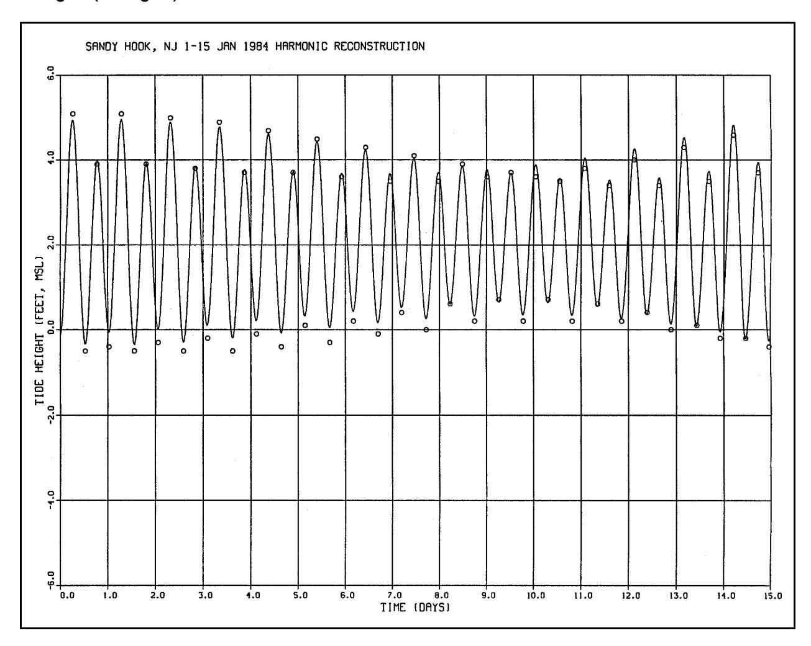

*Figure II-5-14. Reconstructed tidal envelope for Sandy Hook, NJ*

```math
R = \frac{A(K_1) + A(O_1)}{A(M_2) + A(s_2)} \tag{II-5-22}
```

where A(K1), A(O1), A(M2), and A(S2) represent the amplitudes of the corresponding constituents. A general classification of tides can be separated according to the following criteria:

| R # 0.25 | Semidiurnal |
| --- | --- |
| 0.25 < R # 1.50 | Mixed |
| 1.50 < R | Diurnal |

(b) The tidal classification for the Sandy Hook, NJ, example can be computed as shown below:

```math
R \ = \ \frac { A ( K _ { 1 } ) \ + \ A ( O _ { 1 } ) } { A ( M _ { 2 } ) \ + \ A ( s _ { 2 } ) } \ = \ \frac { 0 . 3 1 9 \ + \ 0 . 1 7 2 } { 2 . 1 5 1 \ + \ 0 . 4 4 8 } \ = \ 0 . 1 8 9 \tag{II-5-23}
```

(c) According to the classification criteria, the tides at Sandy Hook are semidiurnal. In fact, most tides along the northern east coast of the United States are semidiurnal. Tides in the lower east coast and Gulf of Mexico begin to change from semidiurnal, to mixed, to diurnal as shown in Figure II-5-15.


*Figure II-5-15. Areal extent of tidal types (Harris 1981)*

- c. Glossary of tide elevation terms .
- (1) The differences in tidal envelopes have given rise to certain terminologies regarding the high and low crests of the tide. The following list of terms, reprinted from the "Glossary of Terms" of the Shore Protection Manual (1984), describes specific aspects of typical tidal records. Each term is referenced to Figure II-5-16.
- (2) DATUM. A base elevation from which vertical heights or depths are referenced. The reference elevation is locally defined; therefore, a list of commonly used datums is presented in Part II-5-4. (3) DIURNAL TIDE. A tide with one high water and one low water in a tidal day.
- (4) EBB CURRENT. The tidal current away from shore or down a tidal stream; usually associated with the decrease in height of a tide, associated with a falling tide. (5) EBB TIDE. The period of tide between high water and the succeeding low water: a falling tide.
- (6) FLOOD CURRENT. The tidal current toward shore or up a tidal stream, usually associated with the increase in height of the tide associated with a rising tide. (7) FLOOD TIDE. The period of tide between low water and the succeeding high water; a rising tide.

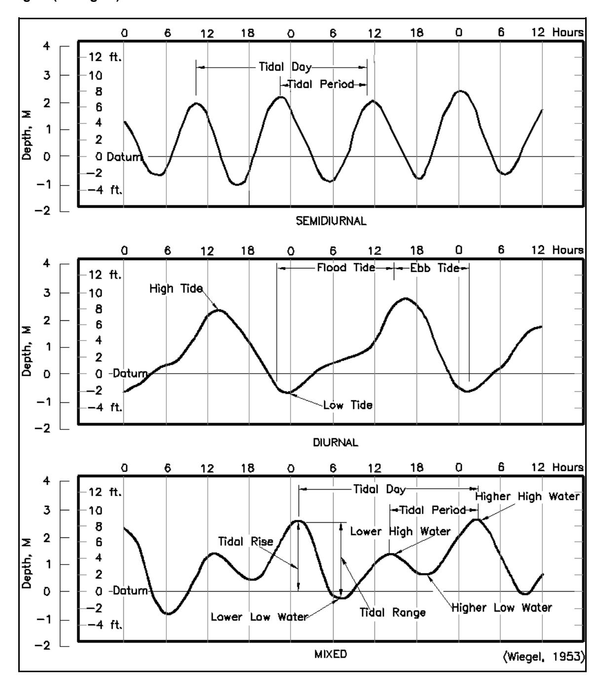

*Figure II-5-16. Types of tides ( Shore Protection Manual 1984)*

- (8) HIGHER HIGH WATER (HHW). The higher of the two high waters of any tidal day. The single high water occurring daily during periods when the tide is diurnal is considered to be a higher high water. (9) HIGHER LOW WATER (HLW). The higher of two low waters of any tidal day. (10) HIGH TIDE, HIGH WATER (HW). The maximum elevation reached by each rising tide. (11) LOW TIDE, LOW WATER (LW). The minimum elevation reached by each falling tide. (12) LOWER HIGH WATER (LHW). The lower of the two high waters of any tidal day.
- (13) LOWER LOW WATER (LLW). The lower of the two low waters of any tidal day. The single low water occurring daily during periods when the tide is diurnal is considered to be a lower low water.
- (14) MIXED TIDE. A tide in which the presence of a diurnal wave is conspicuous due to a large inequality in either the high or low water heights, with two high waters and two low waters usually occurring each tidal day. In strictness, all tides are mixed, but the name is usually applied without definite limits to the tide intermediate to those predominantly semidiurnal and those diurnal.
- (15) SEMIDIURNAL TIDE. A tide with two high and two low waters in a tidal day with comparatively little diurnal inequality.
- (16) TIDAL DAY. The time of the rotation of the earth with respect to the moon, or the interval between two successive upper transits of the moon over the meridian of a place, approximately 24.84 solar hours (24 hr and 50 min) or 1.035 times per solar day. Also called a lunar day. (17) TIDAL PERIOD. The interval of time between two consecutive, like phases of the tide.
- (18) TIDAL RANGE. The difference in height between consecutive high and low (or higher high and lower low) waters. (19) TIDAL RISE. The height of the tide as referenced to the datum of a chart.

## II-5-4. Water Surface Elevation Datums

- a. Introduction. Water level and its change with respect to time have to be measured relative to some specified elevation or datum in order to have a physical significance. In the fields of coastal engineering and oceanography this datum represents a critical design parameter because reported water levels provide an indication of minimum navigational depths or maximum surface elevations at which protective levees or berms are overtopped. It is therefore necessary that coastal datums represent some reference point which is universally understood and meaningful, both onshore and offshore. Ideally, two criteria should be expected of a datum: 1) that it provides local depth of water information, and 2) that it is fixed regardless of location such that elevations at different locations can be compared. These two criteria are not necessarily compatible. The following list of datums represents those commonly in use in the United States. b. Tidal-observation-based datums.
- (1) Tidal-observation-based datums are computed from measured time series of tidal elevations. As such, they vary with geographical location and exposure. Geographic variability of tide records can be seen in Figures II-5-8 and II-5-9. Although datums based on tidal series do indicate site-specific conditions, they
may not be comparable with similar measurements at other geographic locations because of the difficulty of assigning a comparable gauge zero. The most widely accepted of the datums computed from time series are described below.
- (2) Mean sea level (MSL) was widely adopted as a primary datum on the assumption that it could be accurately computed from tidal elevation records measured at any well-exposed tide gauge. MSL determinations are based on the arithmetic average of hourly water surface elevations observed over a long period of time. The ideal length of record is approximately 19 years, a period that accounts for the 18- to 19 year long-term cycle in tides and is sufficient to remove most meteorological effects. In order to fix the datum in time for a specific location, a common 19-year period is selected for computing MSL. The specific 19-year cycle was adopted by the National Ocean Survey as the official time segment for use in computing mean values for tidal datums. The 19-year period, called the National Tidal Datum Epoch, is updated approximately every 25 years.
- (3) When estimates of MSL are required, but less than 19 years of data are available, computations should be based on an integral number of tidal cycles, for example, an integral number of years or 29-day spring/neap cycles. For gauges where hourly data are not available, or their use is impractical, MSL can be approximated as the tidal datum midway between MHW and MLW. This datum, referred to as Mean Tide Level (MTL), may differ from MSL depending on the local relative importance of the diurnal components of the tide.
- (4) Alternate tidal datums are based on low water tidal elevations. These datums provide minimum depth information for navigational needs. Two commonly used low-water datums in the United States are the Mean Low Water (MLW) for the Atlantic Coast and the Mean Lower Low Water (MLLW) for the Pacific coast. The MLLW datum is currently being adopted to several locations along the Atlantic coast. Both datums are defined as the average tidal height at low water or lower low water during the 19-year period. Additional datums, applicable to specific locations or purposes, include Mean High Water (MHW) and Mean Higher High Water (MHHW). These are derived in a manner similar to MLW and MLLW. For areas of primarily semidiurnal tides, the difference between MHW and MLW is called the mean tidal range. The difference between MHHW and MLLW gives a corresponding diurnal range or the great diurnal range of the tide. Both numbers provide an estimate of the magnitude of the local tidal range. An example of the variability of the above datums is given by Harris (1981) and reproduced in Table II-5-7. Reference tide stations used in the preparation of Table II-5-7 are shown in Figure II-5-17.

## c. 1929 NGVD datum.

- (1) One difficulty with using any of the observation-based datums described above is that they vary considerably with location, as evidenced in Table II-5-7. Also, because each datum can be computed independently, there is little or no connectivity between datum locations. This lack of a reference elevation for areas near the coast where no tide observations are available and at interior locations where tide observations are difficult to obtain led to the establishment of a national fixed datum. This datum does not account for spatial variability in sea level. The following paragraphs describe the development of the 1929 National Geodetic Vertical Datum (NGVD).
- (2) First-order leveling lines established in the mid-1920's provided survey connections between the Atlantic and Pacific coasts. These surveys indicated that sea levels were higher on the Pacific coast than on the Atlantic coast and were also higher in the north than in the south on both coasts. The goal of developing a fixed reference datum was accomplished by defining a geodetic leveling-based datum whose "zero" coincided with local MSL at locations at which both MSL and geodetic leveling elevations were known.

*Table II-5-7 Datums for Reference Tide Stations (Harris 1981)*

**Table II-5-7. Datums for Reference Tide Stations (Harris 1981)**

|  |  | Normalizing |  |  |  |  |  | of | Record | Interval for Establishing |
| --- | --- | --- | --- | --- | --- | --- | --- | --- | --- | --- |
| Station |  | Factor2 | MSL | MTL | NGVD MLLW Atlantic and Gulf | MLW Coasts | MHW MHHW | Highest | Lowest | of Datum |
| Eastport, Maine |  | M | 9.2 | 9.10 | 9.00 --3 | 0.00 | 18.20 --3 | 23.1 | -4.4 | 1941-61 |
| Portland, Maine |  | M | 4.5 | 4.50 | 4.28 | 0.00 | 9.00 | 13.9 | -3.7 | 1941-59 |
| Boston, Mass. |  | M | 5.2 | 5.05 | 4.89 | 0.304 | 9.80 | 14.2 | -3.5 | 1941-59 |
| Newport, R.I. |  | M | 1.6 | 1.75 | 1.37 | 0.00 | 3.50 | 13.5 | -2.9 | 1941-59 |
| New London, | Conn. | M | 1.4 | 1.30 | 0.97 | 0.00 | 2.60 | 10.75 | -3.4 | 1941-59 |
| Bridgeport, | Conn. | M | 3.4 | 3.35 | 2.86 | 0.00 | 6.70 | 12.4 | -3.55 | 1967 (1 yr) |
| Willets Point, | N.Y. | M | 3.6 | 3.55 | 3.02 | 0.00 | 7.10 | 16.7 | -4.1 | 1941-59 |
| New York, N.Y. |  |  |  |  |  |  |  |  |  |  |
| (The Battery) |  | M | 2.3 | 2.25 | 1.81 | 0.00 | 4.50 | 10.2 | -4.2 | 1941-59 |
| Albany, N.Y. |  | M | 2.5 | 2.5 | --6 | 0.00 | 4.60 | --6 | --6 | 1941-59 |
| Sandy Hook, | N.J. | M | 2.3 | 2.30 | 1.79 | 0.00 | 4.60 | 10.3 | -4.4 | 1941-59 |
| Breakwater |  |  |  |  |  |  |  |  |  |  |
| Harbor, Del. |  | M | 2.1 | 2.05 | 1.69 | 0.00 | 4.10 | 9.5 | -3.9 | 1953-61 |
| Reedy Point, | Del. | M | 2.8 | 2.75 | 2.45 | 0.00 | 5.50 | 10.05 | -6.3 | 1957-61 |
| Philadelphia, | Pa. | M | 3.2 | 3.10 | 2.14 | 0.00 | 6.197 | 10.7 | -6.6 | 1941-59 |
| Baltimore, Md. |  | M | 1.0 | 0.97 | 0.57 | 0.428 | 1.52 | 8.3 | -4.5 | 1941-59 |
| Washington, | D.C. | M | 1.97 | 1.97 | 1.43 | 0.529 | 3.42 | 11.9 | -4.2 | 1941-59 |
| Hampton | Roads, |  |  |  |  |  |  |  |  |  |
| Va. (Sewells | Point) | M | 1.3 | 1.25 | 1.28 | 0.00 | 2.50 | 8.5 | -3.1 | 1941-59 Jan. 1969 |
| Wilmington, | N.C. | M | 1.9 | 2.10 | 1.52 | 0.00 | 4.20 | 8.2 | -1.7 | to Nov. 1973 |
| Charleston, | S.C. | M | 2.7 | 2.91 | 2.65 | 0.3110 | 5.51 | 10.7 | -3.3 | 1941-59 |
| Savannah | River |  |  |  |  |  |  |  |  |  |
| Entrance, Ga. |  |  |  |  |  |  |  |  |  |  |
| (Ft. Pulaski) |  | M | 3.6 | 3.45 | 3.32 | 0.00 | 6.90 | 11.1 | -4.4 | 1941-59 |
| Savannah, Ga. |  | M | 4.0 | 3.7 | --6 | 0.00 | 7.40 | --6 | --6 | 1941-59 |
| Mayport, Fla. |  | M | 2.3 | 2.25 | 2.00 | 0.00 | 4.50 | 7.4 | -3.2 | 1941-59 |
| Miami Harbor |  |  |  |  |  |  |  |  |  |  |
| Entrance, Fla. |  | M | 1.3 | 1.25 | 0.96 | 0.00 | 2.50 | 6.4 | -1.6 | 1941-59 |
| Key West, Fla. |  | M | 0.6 | 0.65 | 0.42 | 0.00 | 1.30 | 3.8 | -1.6 | 1941-59 |
| St. Petersburg, | Fla. | D | 1.2 | 1.15 | 0.83 | 0.00 | 2.30 | 5.3 | -2.55 | 1941-59 |
| 1 Except as | footnoted, | chart datum is | MLW for | the Atlantic | and gulf coasts | and MLLW | for the Pacific | coast. |  |  |
| 2 D = diurnal; | M = mean. |  |  |  |  |  |  |  |  |  |

*Except as footnoted, chart datum is MLW for the Atlantic and gulf coasts and MLLW for the Pacific coast.*

#### (Continued)

*D = diurnal; M = mean.*

*MLLW and MHHW were not routinely derived for Atlantic and gulf coast stations for the 1941-59 epoch used for establishing most of the datums.*

*4 Boston Low Water Datum (adopted about 1927).*

*Estimated value.*

*Data unavailable at the time of compilation.*

*Datums and the mean range for Philadelphia were revised in July 1979 based on observations for the period 1969-77.*

*Baltimore Low Water Datum (adopted 1922 by NOS and COE based on observations 1903-1921).*

*Mean River Level.*

*10 Charleston Low Water Datum (used since 1905 by NOS, and by COE in May 1929).*

*11 Low Water Datum at the Presidio, Golden Gate, San Francisco, is based on miscellaneous observations before 1907.*

|  |  |  |  |  |  |  |  |  |  | Extremes of Record |  |
| --- | --- | --- | --- | --- | --- | --- | --- | --- | --- | --- | --- |
| Station | Normalizing Factor2 | MSL | MTL | NGVD | MLLW | MLW | MHW | MHHW | Highest | Lowest | Interval for Establishing of Datum |
|  |  |  |  |  | Atlantic and Gulf Coasts (Continued) |  |  |  |  |  |  |
|  |  |  |  |  |  |  |  |  |  |  |  |
| St. Marks River Entrance, Fla. | D | 1.8 | 1.8 | 6 |  | 0.00 | 2.40 |  | 8.0 | -3.5 | 1941-59 |
| Pensacola, Fla. | D | 0.6 | 0.65 | 0.33 |  | 0.00 | 1.30 |  | 8.9 | -2.2 | 1941-59 |
| Mobile, Ala. | D | 0.8 | 0.75 | 6 |  | 0.00 | 1.50 |  | 9.05 | -3.05 | 1941-59 |
| Galveston, Tex. (Ship channel) | D | 0.8 | 0.70 | 0.70 |  | 0.00 | 1.40 |  | 11.4 | -5.3 | 1941-59 |
|  |  |  |  |  |  |  |  |  |  |  | Apr. 1962 |
| San Juan, P.R. | D | 0.6 | 0.55 | 6 | Pacific Coast | 0.00 | 1.10 |  | 2.4 | -1.1 | to Dec. 1963 |
| San Diego, Calif. | D | 3.0 | 2.95 | 2.79 | 0.00 | 0.90 | 5.00 | 5.70 | 8.3 | -2.8 | 1941-59 |
| Los Angeles, Calif. (Outer Harbor) | D | 2.8 | 2.80 | 2.72 | 0.00 | 0.90 | 4.70 | 5.40 | 7.8 | -2.6 | 1941-59 |
| San Francisco, Calif. (Golden Gate) | D | 3.0 | 3.30 | 3.06 | 0.2011 | 1.30 | 5.30 | 5.90 | 8.6 | -2.5 | 1941-59 |
| Humboldt Bay, Calif | D | 3.4 | 3.75 |  | 0.00 | 1.20 | 5.70 | 6.40 | 9.55 | -3.05 | 1962 |
| Astoria, Oreg. (Tongue Point)9 | D | 4.3 | 4.35 | 3.05 | 0.00 | 1.10 | 7.60 | 8.30 | 12.1 | -2.8 | 1941-59 |
| Aberdeen, Wash. | D | 5.5 | 5.45 |  | 0.00 | 1.50 | 9.40 | 10.10 | 14.9 | -2.9 | 1955, 1956 |
| Port Townsend, Wash. | D | 4.8 | 5.10 |  | 0.00 | 2.50 | 7.70 | 8.40 | 12.05 | -4.55 | 1972-74 |
| Seattle, Wash. | D | 6.6 | 6.60 | 6.25 | 0.00 | 2.80 | 10.40 | 11.30 | 14.8 | -4.7 | 1941-59 |
| Ketchikan, Alaska | D | 8.0 | 7.95 |  | 0.00 | 1.50 | 14.40 | 15.30 | 21.2 | -5.2 | 1941-59 |
| Juneau, Alaska | D | 8.6 | 8.50 |  | 0.00 | 1.60 | 15.40 | 16.40 | 23.2 | -5.2 | 1966-72 |
| Sitka, Alaska | D | 5.2 | 5.30 |  | 0.00 | 1.40 | 9.10 | 9.90 | 14.6 | -3.8 | 1941-59 |
| Cordova, Alaska | D | 6.6 | 6.45 |  | 0.00 | 1.40 | 11.50 | 12.40 | 16.8 | -4.9 | 1965-74 |
| Seldovia, Alaska | D | 9.4 | 9.35 |  | 0.00 | 1.60 | 17.00 | 17.80 | 24.3 | -6.2 | 1971-74 |
| Anchorage, Alaska | D | 16.8 | 15.25 |  | 0.00 | 2.20 | 28.30 | 29.00 | 35.55 | -6.55 | 1964-68 |
| Kodiak, Alaska | D | 4.3 | 4.30 |  | 0.00 | 1.00 | 7.60 | 8.50 | 13.05 | -4.05 | 1935-36 |
| Dutch Harbor, Alaska | D | 2.2 | 1.30 |  | 0.00 | 1.20 | 3.40 | 3.70 | 6.6 | -2.7 | 1935-38 |
| Sweeper Cove, Alaska (Adak Island) | D | 2.1 | 1.85 |  | 0.00 |  |  | 3.70 | 7.05 | -3.3 | 1958-60; 1944, 1949 |
| Massacre Bay, Alaska (Attu Island) | D | 1.9 | 1.65 |  | 0.00 |  |  | 3.30 | 7.05 | -3.05 | 1950, 1952, 1960 |
| Nashagak Bay, Alaska (Clarks Pt) | D | 10.3 | 10.15 |  | 0.00 | 2.50 | 17.80 | 19.50 | 24.5 | -5.0 | 1958 |
| St. Michael, Alaska | D | 2.0 |  |  |  |  |  |  |  |  |  |
| Honolulu, Hawaii | D | 0.8 | 0.80 |  | 0.00 | 0.20 | 1.40 | 1.90 | 3.5 | -1.3 | 1941-59 |

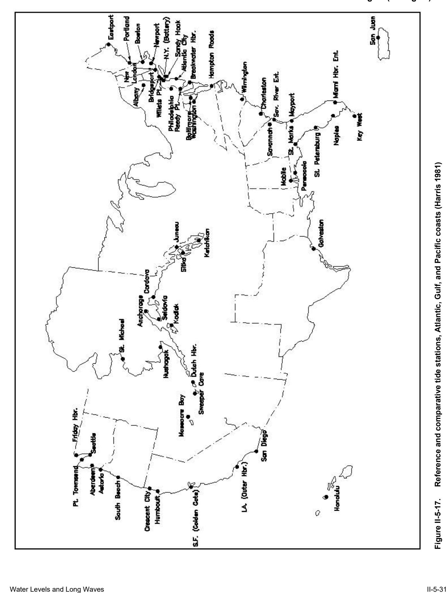

Thus, a general adjustment was made in 1929 in which it was assumed that the geodetic and local sea levels were equal to zero at 26 selected tide gauges in the United States and Canada (Rappleye 1932). The differences previously computed were treated as errors and were distributed over the network of observation points (Harris 1981). The tide gauge locations used in this computation are shown in Figure II-5-18. The datum, originally called the "Sea Level Datum of 1929," was officially renamed the "National Geodetic Vertical Datum (NGVD) of 1929" in 1963.
- (3) Index maps of tidal benchmarks and lists of established references between the 1929 NGVD and the local MSL are available for each coastal state through the NOS. An NOS tidal benchmark sheet is shown in Figure II-5-19. These sheets often describe several benchmarks established in the vicinity of each tidal observation point and describe the relationship between the various datums common to the area. NGVD and tidal benchmarks are discussed more thoroughly in Harris (1981).
- (4) The primary distinction between the NGVD and all other tidal datums is that the NGVD is defined as a fixed surface whose elevation does not change with time. Therefore, the procedure adopted to account for recognized changes in relative mean sea level is to compute updated MSL (or other) datum relationships. Relative changes in sea level will be discussed in the following section.

## d. Great Lakes datums.

- (1) A separate water surface elevation datum was established for the Great Lakes basin and St. Lawrence River. The datum was originally established by an international coordination committee composed of representatives of the U.S. Army Corps of Engineers, the National Oceanic and Atmospheric Administration, and the Department of the Environment, Canada. This first datum was called the International Great Lakes Datum (IGLD) of 1955. The "zero" of the datum was established as the average of all hourly water surface water level readings at Pointe-au-Pere, Quebec, located on the Gulf of St. Lawrence for the period between 1941 and 1956.
- (2) First-order leveling lines from Pointe-au-Pere were used to systematically define datums for Lake Ontario, Lake Erie, Lakes Michigan and Huron, and Lake Superior. Lakes Michigan and Huron are assumed to have the same elevation because of the deep and wide connection of both lakes at the Straits of Mackinac. The IGLD of 1955 was replaced by the IGLD of 1985 to reflect certain corrections to the elevations assigned to the various lakes. Elevations of the IGLD of 1955 and IGLD of 1985 are given in Table II-5-8. This revision was implemented in January 1992. The zero reference of the IGLD 1985 has been specified to be Rimouski, Quebec. Revised lake elevations are shown in Figure II-5-20.
- e. Long-term variations in datums . Water level observation based datums such as MSL or IGLD vary over time periods much longer than a tidal cycle. These variations can be seasonal or of much longer duration. Long-term changes are often described as a relative change in sea level and necessitate the 25-year interval updating of the 19-year tidal datum period. In the following section, some of the contributing factors to sea level change are discussed. In the final section, factors contributing to long-term elevation changes in the Great Lake are presented.

## f. Tidal datums.

(1) The apparent rise in worldwide sea level has been of great concern to the United States, as well as other countries, for several years. Much of this concern stems from the claims of some climatologists and oceanographers that the rise will accelerate in the future due to warming of the atmosphere associated with the "greenhouse effect," a global warming produced by increased levels of carbon dioxide and other gasses in the atmosphere. Because of the potential consequences associated with sea level rise, a Committee on

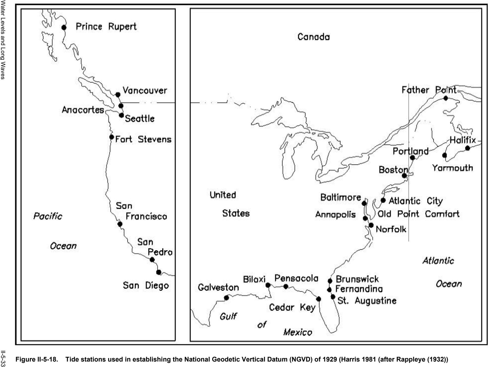

#### FLORIDA - I - 74

#### U.S. DEPARTMENT OF COMMERCE NATIONAL OCEANIC AND ATMOSPHERIC ADMINISTRATION NATIONAL OCEAN SURVEY

#### TIDAL BENCH MARKS

Miami Beach (City Pier) Lat. 25° 46N.1; Long 80° 07N.9
BENCH MARK 4 (1928) is a standard disk, stamped "NO 4 1928", set vertically in the south face of the south post in the northsouth fence line around a large city water tank. It is about 66 feet north of the extended centerline of Commerce Street, 36 feet west of the centerline of Jefferson Avenue, and 1/2 foot above ground level. Elevation: 5.62 feet above mean low water.
BENCH MARK 6 (1931) is a standard Corps of Engineers disk, stamped "BM NO 6," set in top of a 2-inch pipe surrounded at top with a 12-inch by 18-inch manhole frame with a removable cast iron cover, directly in centerline of a blacktop driveway which parallels Government Cut. It is at the U.S. Government Reservation on the north side of Government Cut, about 186 feet east of U.S. Engineers flagpole and 13 1/2 feet west of the center of a road junction. Elevation: 7.13 feet above mean low water.
BENCH MARK 7 (1937) is a standard disk, stamped "7 1937," set in the top of the northwest side of the concrete base to the east post of entrance gate to drive to the Corps of Engineers Office Building. It is about 100 yards south of intersection of Washington Avenue and Biscayne Street, 8 feet east of the extended centerline of the Avenue and 1/2 foot above ground level. Elevation: 5.03 feet above mean low water.
BENCH MARK 9 (1955) is a standard disk, stamped "9 1955," set in top of concrete deck along north edge of City Pier near the east end of Biscayne Street. It is about 122 yards east of the west end of pier, 39 feet northwest of the northeast corner of the ladies rest room and 1/2 foot south of south face of north guardrail. Elevation: 11.29 feet above mean low water.
BENCH MARK 10 (1956) is a standard disk, stamped "NO 10 1956," set on top of the northwest corner of the concrete base of light pole No. 166D6 about 68 yards west of the junction of Biscayne Street and Alton Road. It is near the northwest corner of the South Shore Recreation Park about 62 feet east of the west edge of the bulkhead on the water front and 9 1/2 feet northeast of the east edge of the north entrance to the Recreation Building. Elevation: 5.23 feet above mean low water.
BENCH MARK 11 (1956) is a standard disk, stamped "NO 11 1956," set in top of north corner of a concrete base which supports a 6 inch metal post near the City of Miami Beach Warehouse. It is near the intersection of Alton Road and First Street about 21 1/2 feet southwest of the southwest curb of Alton Road and 9 feet northwest of the northwest corner of the warehouse building. Elevation: 4.92 feet above mean low water.
Mean low water at Miami Beach is based on 19 years of records, 1941-1959. Elevations of other tide planes referred to this datum are as follows:

|  | Feet |
| --- | --- |
| Highest tide (observed) |  |
| September 8, 1965 | 6.4 |
| Mean high water | 2.50 |
| Mean tide level | 1.25 |
| NGVD, 1929 | 0.96 |
| Mean low water | 0.00 |
| Lowest tide observed |  |
| (March 24, 1936) | -1.6 |

*Figure II-5-19. Sample NOS description of tidal benchmarks (Harris 1981)*

*Table II-5-8 Low Water (chart) Datum for IGLD 1955 and IGLD 1985*

**Table II-5-8. Low Water (chart) Datum for IGLD 1955 and IGLD 1985**

| Location |  | IGLD 55 | IGLD 85 |
| --- | --- | --- | --- |
| Lake Superior |  | 182.9 | 183.2 |
| Lake Michigan |  | 175.8 | 176.0 |
| Lake Huron |  | 175.8 | 176.0 |
| Lake St. Clair |  | 174.2 | 174.4 |
| Lake Erie |  | 173.3 | 173.5 |
| Lake Ontario |  | 74.0 | 74.2 |
| Lake St. Lawrence | at Long Sault Dam, Ontario | 72.4 | 72.5 |
| Lake St. Francis at | Summerstown, Ontario | 46.1 | 46.2 |
| Lake St. Louis at | Pointe Claire, Quebec | 20.3 | 20.4 |
| Montreal Harbour at | Jetty Number 1 | 5.5 | 5.6 |

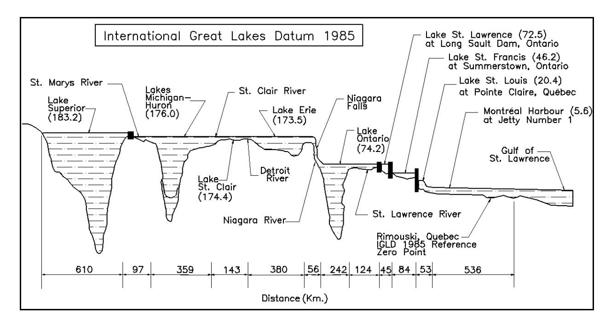

*Figure II-5-20. Vertical and horizontal relationships for the IGLD of 1985 (Coordinating Committee on Great Lakes Basic Hydraulic and Hydrologic Data 1992)*

Engineering Implications of Changes in Relative Mean Sea Level (CCMSL) was formed to examine existing knowledge concerning sea level change, to document existing relative rise rates, and to provide recommendations concerning their conclusions.
- (2) Relative mean sea level change can be defined as the difference between local changes in land elevation and global sea level changes. These changes result from a variety of processes, several of which can occur simultaneously. The following six processes can contribute to long-term relative mean sea level change; however, all processes do not necessarily apply to all geographic locations:
- (a) Eustatic rise. Refers to a global change in the oceanic water level. Examples of eustatic rise include melting of land-based glaciers and the expansion of near-surface ocean water due to global ocean warming.
- (b) Crustal subsidence or uplift from tectonic uplifting or downwarping of the earth's crust. These changes can result from uplifting or cooling of coastal belts, sediment loading and consolidation, or subsidence due to volcanic eruption loading. (c) Seismic subsidence. Caused by sudden and irregular incidence of earthquakes.
- (d) Auto-subsidence. Due to compaction or consolidation of soft underlying sediments such as mud or peat.
- (e) Climatic fluctuations. May also create changes in sea level; for example, surface changes produced by El Niño due to changes in the size and location of high pressure cells.
- (3) The above processes have been evaluated with respect to their historical and potential contribution to sea level change on U.S. coasts. The Committee report assesses changes in sea level as well as the affected hydrodynamic processes and the effect on the coastal zone. The report also investigates feasible response strategies that could be used to mitigate the effects of sea level change. Although it is beyond the scope of this chapter to reproduce the contents of the report, conclusions relevant to this chapter are reproduced below.
- (a) Relative mean sea level, on statistical average, is rising at the majority of tide gauge stations situated on continental coasts around the world. Relative mean sea level is generally falling near geological plate boundaries and in formerly glaciated areas such as Alaska, Canada, Scandinavia, and Scotland. Relative mean sea level is not rising in limited areas of the continental United States, including portions of the Pacific Coast.
- (b) The contrasting signals concerning relative mean sea level behavior in different parts of the United States (and the world in general) are interpreted as due to differing rates of vertical motion of the land surfaces. Subsidence and glacial rebound are significant contributors to vertical land displacements.
- (c) Large, short-term (2- to 7-year) fluctuations worldwide are related to meteorological phenomena, notably shifts in the mean jet-stream path and the El Niño-Southern Oscillation mechanisms, which lead to atmospheric pressure anomalies and temperature changes that may cause rise or fall of mean sea level by 15- 30 cm over a few years.
- (d) Studies of a very small number of tide gauge records dating more than 100 years (the oldest being Amsterdam, started in 1682) show that after removal of the subsidence factor where known, mean sea level has been fluctuating through a range of not more than 40-150 cm (in long-term fluctuations) for at least 300 years.
- (e) The geological record over the last 6,000 years or so indicates that there has been a general, longterm rise (with short-term fluctuations) probably not exceeding 200 cm during the last 1,500 years.
- (f) Monitoring of relative mean sea level behavior is at present inadequate for measuring the possible global result of future climate warming due to rising greenhouse gases.
- (g) The risk of accelerated mean sea level rise is sufficiently established to warrant consideration in the planning and design of coastal facilities. Although there is substantial local variability and statistical uncertainty, average relative sea level over the past century appears to have risen about 30 cm relative to the east coast of the United States and 11 cm along the west coast, excluding Alaska, where glacial rebound has resulted in a lowering of relative sea level. Rates of relative sea level rise along the Gulf Coast are highly variable, ranging from a high of more than 100 cm/century in parts of the Mississippi delta plain to a low of less than 20 cm/century along Florida's west coast.
- (h) Accelerated sea level rise would clearly contribute toward a tendency for exacerbated beach erosion. However, in some areas, poor sand management practices or navigational modification at channel entrances has resulted in augmented erosion rates that are clearly much greater than would naturally occur. Thus, for some years into the future, sea level rise may play a secondary role in these areas.
- (i) As noted previously, the two response options to sea level rise are stabilization and retreat. Retreat is most appropriate in areas with a low degree of development. Given that a "proper" choice exists for each location, selecting an incorrect response alternative could be unduly expensive.
- (j) There does not now appear to be reason for emergency action regarding engineering structures to mitigate the effects of anticipated increases in future eustatic sea level rise. Sea level change during the design service life should be considered along with other factors, but it does not present such essentially new problems as to require new techniques of analysis. The effects of sea level rise can be accommodated during maintenance periods or upon redesign and replacement of most existing structures and facilities. There are very limited geographic areas where current subsidence rates may require near-term action as has been the case in Japan and Terminal Island, California.
- (4) The above conclusions represent the state of knowledge on the subject of relative sea level change. For additional information, the reader is referred to the Committee report. It presents a complete and comprehensive investigation of the subject based on known facts and engineering and scientific principles.
- (5) For the purposes of this report, the primary conclusion is that, with some regional exceptions, sea level is not rising at a rate to cause undue concern. Results of the report indicate an average sea level rise over the past century of approximately 30 cm/century on the east coast, and 11 cm/century on the west coast, and a range along the Gulf of Mexico coast of less than 20 cm/century along the west coast of Florida to more than 100 cm/century in parts of the Mississippi delta plain. The above summary remarks lead to the conclusion that normal design criteria should be followed in which the design life of a project should consider the possible local relative sea level rise rates shown above.
- g. Changes in lake level datums. As with long-term change in the relative mean sea level of the oceans, lake levels also change in time. Although lake levels are subject to the same tectonic types of relative movement, the primary form of change is due to shorter-term phenomena. For example, lake levels are subject to seasonal and annual variations in precipitation and freshwater inflow resulting from regulated reservoirs. These hydrologically related effects produce water surface elevations in the Great Lakes that vary irregularly from one year to the next. The annual cycle consists of water surfaces that consistently fall in elevation to their lowest stage during winter. Falling stages are due to the fact that the majority of precipitation is in the form of snow or rainfall that freezes before becoming spring runoff into streams that empty into the lakes. Lake levels then begin to rise in the spring as the snow and ice melt into runoff. Lake levels generally reach their maximum during the summer. These long-term changes were the basis of the revised IGLD of 1985 described in the previous section.

## h. Design considerations .

- (1) The datums described above and the reported variability of those datums represent design criteria considerations that directly impact the expected lifetime of a project. If, for example, a coastal project is to be situated in an area of known subsidence, then design elevations need to reflect additional freeboard as a factor-of-safety consideration. For example, if levee systems are to be situated in an area of known subsidence (i.e., the Gulf coast) and a crest elevation level of 20 ft NGVD is considered a minimum level of protection, the subsidence rate should be included in the design calculations to provide adequate protection for the life of the project. For example, if the relative sea level change is 1 cm/year, then the levee will subside by approximately 1 ft in 30 years. This rate of change should be accounted for in the design of projects expected to provide some predetermined level of protection. In this case, the levee should be designed with a 21-ft NGVD crest elevation if it is intended to provide a minimum of 20 ft MSL (present time) protection for 30 years.
- (2) If a design project needs to consider the possibility of long-term water level change, then accurate sources of data must be obtained for use in the design evaluation. The NOS continuously summarizes monthly MSL values, the mean and extreme high and low waters of the month, and many other tidal statistics. These records can be obtained from NOS in the form of either photocopies or magnetic media. Figure II-5-21 is a sample of NOS tide and sea level data. If data are available for a specific project location for a long period of time (i.e., 30-50 years), then relative sea level change rates for project design can be estimated. For example, plotted variations in annual sea level for several locations are shown in Figure II-5-22. These data can be used to indicate relative sea level change.
- (3) Although relative water surface elevations and datum changes are important over the life of a project, it is usually the short-term changes in water surface elevations that are responsible for project failure (although sudden elevation changes due to tectonic influence can be catastrophic). These short-term changes to elevation are the subject of the following sections.

## II-5-5. Storm Surge

a. Storm types . Storms are atmospheric disturbances characterized by low pressures and high winds. A storm surge represents the water surface response to wind-induced surface shear stress and pressure fields. Storm-induced surges can produce short-term increases in water level that rise to an elevation considerably above mean water levels. This is especially true when the storm front coincides with a local high spring tide. There are two types of storms that impact coastal regions. Storms that originate in the tropics are referred to as "tropical storms." These events primarily impact the east coast and gulf coast of the United States, the Caribbean Sea, and islands in the Pacific Ocean. Although infrequent, tropical events can also impact the western coast of Mexico and southern coast of California.

|  | Ed. August Statio | ON MER COMMER IC SURVEY 1933 | 4/ami | tos 1 | Bau E | • • |  |  |  |  |  |  |  | t 54 Longitude |  | ************ |  |
| --- | --- | --- | --- | --- | --- | --- | --- | --- | --- | --- | --- | --- | --- | --- | --- | --- | --- |
|  | Observ | cations b | egin |  | July4 | /253 |  |  | ( | )bscrvati | ons end | ^********* |  | ********* |  |  |  |
|  | Datur | n is |  |  |  |  |  |  | t |  |  |  |  |  |  | X B |  |
| ***** | Linca | r quanti promover | ties in fe | et |  |  |  |  |  | Time in |  |  |  |  |  |  |  |
|  | YEAR | JAN. | FEB. | Man. | Aru. | May | June | Juny | Ava. | Sert. | Ocr. | Nov. | DEC. | FOR Y |  | TOT |  |
|  | 1953 |  |  |  |  |  |  |  | 4.49 | 4.59 | 4.53 | 4.50 | 4.38 | Sum | MEAN | SUM | Mean |
| , . | (1) 1954 (2) 1355 | 4.36 4.19 | 4.34 | 4.19 | 4:12 4:14 | 4.48 | 4.68 | 4.66 | 4.60 | 4.64 | 440 430 | 4.48 | 4.40 | 53.37 52.19 | 4.45 4.35 | 8.80 | 4.40 |
|  | (3) 1956 | 4.18 | 4.24 | 414 | 4.24 | 4.28 | 4.5% | 4.58 | 4.71 | 4.63 | 4.50 | 4.52 | 4.50 | 53.06 | 4.42 | 13.22 | 441 |
|  | (b) 1757 (b) 1758 | 4.38 | 4.36 | 4.24 | 4.27 | 445 | 4.66 | 4.86 | 4.87 | 5.00 | 5.08 | 4.76 | 4.86 | 55.28 | 4.61 | 17.83 | 146 |
|  | (6) 1959 | 4.75 | 4.68 | 4.50 | 4.50 | 4.48 | 4.66 | 4.78 | 4.92 | 5.01 | 5.07 | 4.72 | 4.94 | 57.01 | 4.75 | 27.30 | 4.50 |
| - | (7) 1960 (8) 1961 | 4.57 | 4.28 | 4.44 | 4.38 | 4.44 | 4.56 | 4.72 | 4.76 | 4.86 | 469 | 458 | 4.66 | 54.97 | 4.52 | 31.88 | 455 |
| , | (0) 1962 | 4.61 | 4.63 | 4.23 | 4.36 | 4.43 | 4.51 | 4.61 | 4.78 | 4.89 | 489 | 4.61 | 4.62 | 55.17 | 4.60 | 41.08 | V.5% |
| Ċ | 11) | 4.5,6 | 4.55 | 4.37 | 4.30 | 4.47 | 4.75 | 4.89 | 4.99 | 5.15 0= | 4.91 | 4.84 | 4.83 | 56.61 | 4.72 | 45.80 | 4.58 |
|  | 12) 196 L 13) 1965 | 4.74 | 4.42 | 4.40 |  | 4.28 | 4.44 | 4.64 Y. 79 |  | 4.85 | (4.54) | 4.58 | 4.58 | 54.81 |  |  | 4.58 |
|  | 14) 1966 | 4.89 | **** | 1.07 | 2 7.00 | 7.47 | 7.00 | 1. 77 | 5.07 |  | ¥.97 | 4.96 | (3.08) | 57.66 | 7.30 | 2311 | 4. 6 d |
| - | 15) 1953 16) 1954 | 436 |  |  |  |  |  |  | 4.49 | 4.57 | 4.49 | 4.45 | 4.33 |  |  |  |  |
| ( | 17) 1955 | 4.27 | 4.29 4.23 | 4:19 4:28 | 4.09 | 4.43 | 4.62 | 442 | 4.58 | 4.60 4.57 | 4.28 | 4.19 | 4.14 | 57.88 | 4.41 | 8.73 | 1.36 |
|  | 18) 1956 19) 1957 | 4.17 | 4.24 | 4.13 | 4.21 | 4.25 | 4.63 | 459 | 469 | 4.61 | 4.49 | (4,49) | (4.47) | 52.86 | 4.40 | 12.13 | 438 |
|  | 20) 1958 | 4.71 | 4.60 | 4.49 | 4.51 | 4.46 | 453 | 4.65 | 485 | 474 499 | 4.78 5.04 | 4.95 | 4.85 | 55.03 56.39 | 4.59 | 22.42 | 448 |
| - | 21) (959 | 4.74 | 4.68 | 4.49 | 4,48 | 4.48 | 4.64 | 4.78 | 4.94 | 5.00 | 5.04 | 4.71 | 4.92 | 56.90 | 4.74 | 27.16 | 453 |
| Ċ | 23) 1961 | 4.52 | 4.57 | 437 | 4,37 | 4.43 | 4.52 | 4.71 | 4.69 | 4.84 | 4.65 | 4.58 | 4.69 | 54.66 | 4.55 | 31.71 | 453 |
|  | 21) 1962 | 4.60 | 4.62 | 4. 12 | 4,34 | 4.40 | 4.47 | 4.60 | 478 | 4.93 | 486 | 4.57 | 4.59 | 54.78 | 458 | 40.90 | 4.54 |
|  | 26) 1943 | 4.56 | 4.56 | 4.37 | 4.30 | 4.48 | 4.74 | 4.88 | 4.97 | 200 | 111.00 | 4.85 |  | 56.50 | 4.71 | 45.61 | 4.56 |
|  | 27) 1964 |  | 4.40 |  | 4.24 |  | 4.41 |  | 4.63 | 4.63 | (4.7) | 4.51 | 4.54 | 57.26 | 4.54 | 50.15 |  |
|  | 20) 1966 | 4.86 | 4.66 | 4.59 | (4.64) | 4.41 | 4.63 | y. 75 | 5.06 | 5.14 | 4.94 | 4.92 | (S:OY) | 57.26 | y.77 | 54.92 | Y.58 |

*Figure II-5-21. Sample NOS tabulation of tide parameters (Harris 1981)*

Storms that result from the interaction of a warm front and a cold front are called "extratropical storms" and are often referred to as Northeasters. Extratropical events impact the east and west coasts of the United States as well as Alaska and the Great Lakes, but storm-generated surges are most significant along the upper east coast. Characteristics of both storm types and sources of detailed description follow.
- (1) Tropical storms.
- (a) Tropical storms are classified according to their intensity, the most severe of which is referred to as a hurricane. These storms have maximum sustained winds in excess of 74 mph. Similar storms in the Pacific ocean, west of the International Date Line, are referred to as typhoons. Storms in the Southern Hemisphere are called tropical cyclones. In order to indicate hurricane intensity, and associated potential damage, the NOAA National Hurricane Center has adopted the Saffir/Simpson (Saffir 1977, NOAA 1977) Hurricane Scale. This scale, based partially on maximum wind speeds shown below, ranges from category 1 through the most severe category 5 event. Associated damage, storm surge levels, and evacuation limits are described in the NOAA publication on tropical cyclones (NOAA 1981).

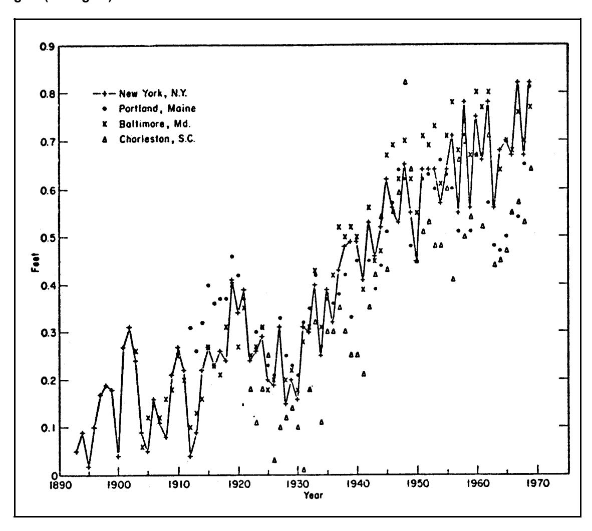

*Figure II-5-22. Variations in annual MSL (Harris 1981)*

Category 1 - Winds of 74 - 95 mph
Category 2 - Winds of 96 - 110 mph
Category 3 - Winds of 111 - 130 mph
Category 4 - Winds of 131 - 155 mph
Category 5 - Winds over 155 mph
- (b) Hurricanes are characterized by circular wind patterns that rotate in a counterclockwise direction in the Northern Hemisphere and clockwise in the Southern Hemisphere. The direction of rotation is a consequence of the Coriolis effect induced by the rotation of the earth (see Part II-1).
- (c) Unlike extratropical storm events such as northeasters, tropical storms are well-organized with respect to their wind and pressure patterns. As a result, they can be reasonably well-described by several descriptive parameters listed below and shown on Figure II-5-23. Note that these parameters have been identified as descriptive of average events; precise modeling of some tropical events may require more detailed information.

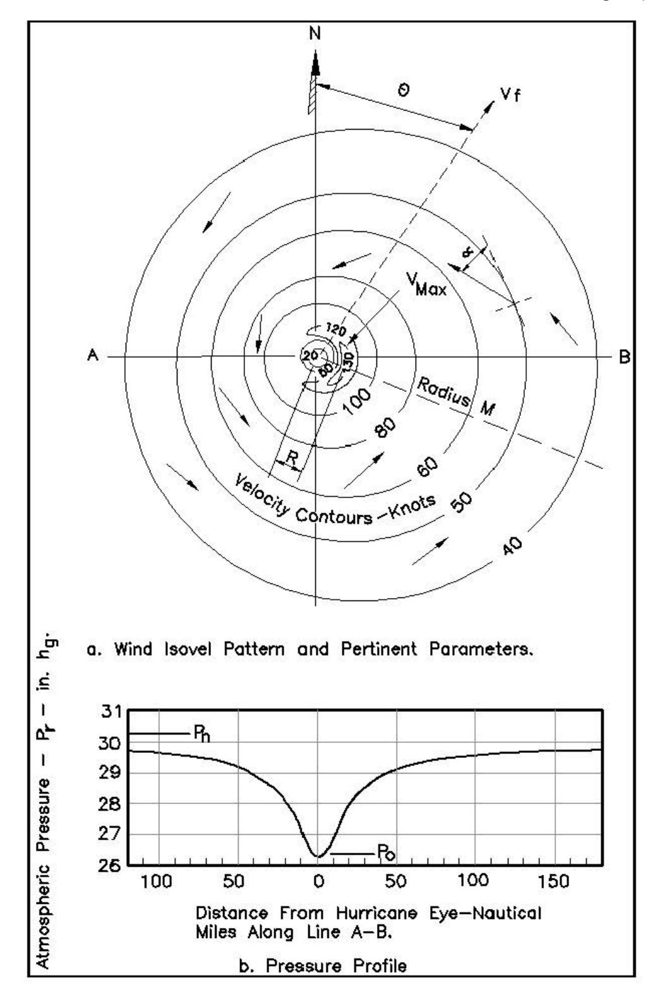

*Figure II-5-23. Schematic diagram of storm parameters (U.S. Army Corps of Engineers 1986)*

R = radius to maximum wind
V = maximum wind
Vf = forward speed of the eye of the storm
p0 = central pressure of the eye of the storm
pn = peripheral or far-field pressure
2 = angle of storm propagation
" = inflow angle
- (d) The Corps presently uses two approaches to model tropical storm wind fields. The first is the Standard Project Hurricane (SPH) model. The SPH is defined as a hurricane having a severe combination of storm parameters that will produce a storm with high sustained wind speeds that are reasonably characteristic of the particular location. Guidance on the selection of site-specific storm parameters is given in National Hurricane Research Project Report No. 33 (Graham and Nunn 1959) and NOAA Technical Report NWS 38 (Ho et al. 1987). The SPH model is an empirical model that produces steady-state hypothetical wind and atmospheric pressure fields as a function of the above parameters. The SPH model and its use are thoroughly described in the Coastal Modeling System (CMS) user's manual (Cialone et al. 1991).
- (e) The second approach to hurricane modeling is the Planetary Boundary Layer (PBL) model. The PBL model is based on the equations of motion for a vertically integrated boundary layer. The PBL model is currently supported by CHL for all tropical storm surge studies. This selection is due to the fact that the PBL model is based on the equations of motion and boundary layer physics. As such, the model is more flexible in its ability to incorporate a variety of land/sea boundary conditions to represent spatially variable wind and pressure fields that cannot be properly represented by the empirical SPH model.
- (f) Input to the PBL model is the time-varying location of the storm and all of the parameters given above, except maximum wind. Maximum winds are computed by the PBL model as a function of the above parameters. The model has provisions to account for spatial asymmetry of parameters as mentioned above. The PBL model is also supported by the CMS and the model, input, and application are described in detail by Cialone et al. (1991). (2) Extratropical storms.
- (a) Unlike hurricanes, which can severely impact local regions (typically less than 50 miles) for less than a day, extratropical storms such as northeasters can impose high winds with accompanying surges over large geographical areas (hundreds of miles) for extended periods of time, i.e., several days or more. Generally, extratropical events have lower wind magnitudes and generate smaller maximum surge elevations than hurricanes. Although lower storm surge elevations are associated with northeasters than with hurricanes, they can cause substantial damage because of their large area of influence and extended period of duration.
- (b) An additional design consideration for extratropical events is that they generally occur with a much greater frequency than hurricanes. For example, a hurricane with a peak storm surge elevation of 6 ft at Sandy Hook, NJ, has a return period of 10 years. A northeaster with a 6-ft surge has a return period of approximately 2 years (Gravens, Scheffner, and Hubertz 1989).
- (c) Extratropical events cannot be parameterized in the same manner as hurricanes. Therefore, the development of stage-frequency relationships based on the Joint Probability Method (to be discussed in the following section) is not a viable approach for assigning frequency-of-occurrence relationships to extratropical events. As an alternative approach, frequency indexing is now established through application of a new statistical procedure called the empirical simulation technique. This approach will be discussed in the following section.
- (d) Because a large number of extratropical storm events have impacted coastal areas of the United States, the 20- to 30-year database of hindcast storms of the Wave Information Study (WIS) is adequate for representing the historical population of storms along the coasts of the United States. Wind fields produced by the storms of this database are input to numerical hydrodynamic long-wave models to produce storm surges as a function of historically hindcast wind fields contained in the WIS database. Because of the frequency of events and large area of impact, this database is considered adequate for determining stagefrequency relationships for design use. (3) Surge interaction with tidal elevations.
- (a) A final consideration on the specification of tropical and extratropical storm surge elevations relates to the time of occurrence. The timing of storm events with respect to the phase of the astronomical tide cannot be overemphasized. When a storm surge coincides with a spring high tide, the resulting total surge can be many times more devastating than the surge alone. For example, a moderate event at low tide can become the storm surge of record at high tide. An example situation is shown for Hurricane Gloria, which moved along the Delaware and New Jersey coasts, making landfall on Long Island, NY, at 1100 EST on 27 September 1985. The total storm track is shown on Figure II-5-24, and a more detailed plot of the track in the vicinity of Long Island is shown on Figure II-5-25 (Jarvinen and Gebert 1986).
- (b) The significance of timing between the surge peak and the tide phase can be seen in Figure II-5-26. The observed storm surge at Sandy Hook, NJ, had a peak value of 7.5 ft and occurred near low tide (1.0 ft). As a result, the total measured water level was 8.5 ft, corresponding to just 3.5 ft above normal high tide. If the storm surge had occurred 4.5 hr earlier to coincide with high tide (5.0 ft), the peak surge value would have been 12.5 ft. The differences in levels of damage resulting from an 8.5-ft versus a 12.5-ft surge level can be considerable, and the only difference between the two scenarios is a 4.5-hr difference in time of occurrence. As shown in this example, the phasing of the storm and tide impacts both the design of the structure and the probability analysis of the design. b. Storm event frequency-of-occurrence relationships . (1) Introduction.
- (a) The majority of coastal structures are designed to provide some specific level of protection to the beach and its surrounding population and supporting structures. This level of protection is generally based on the frequency of occurrence of a storm surge of some specified maximum elevation selected by assessing the risks of structural failure or consequences of overtopping versus the economics of the cost of the design project. Therefore, one important aspect of coastal design criteria is the development of stage-frequency or frequency-of-occurrence relationships for the design area.

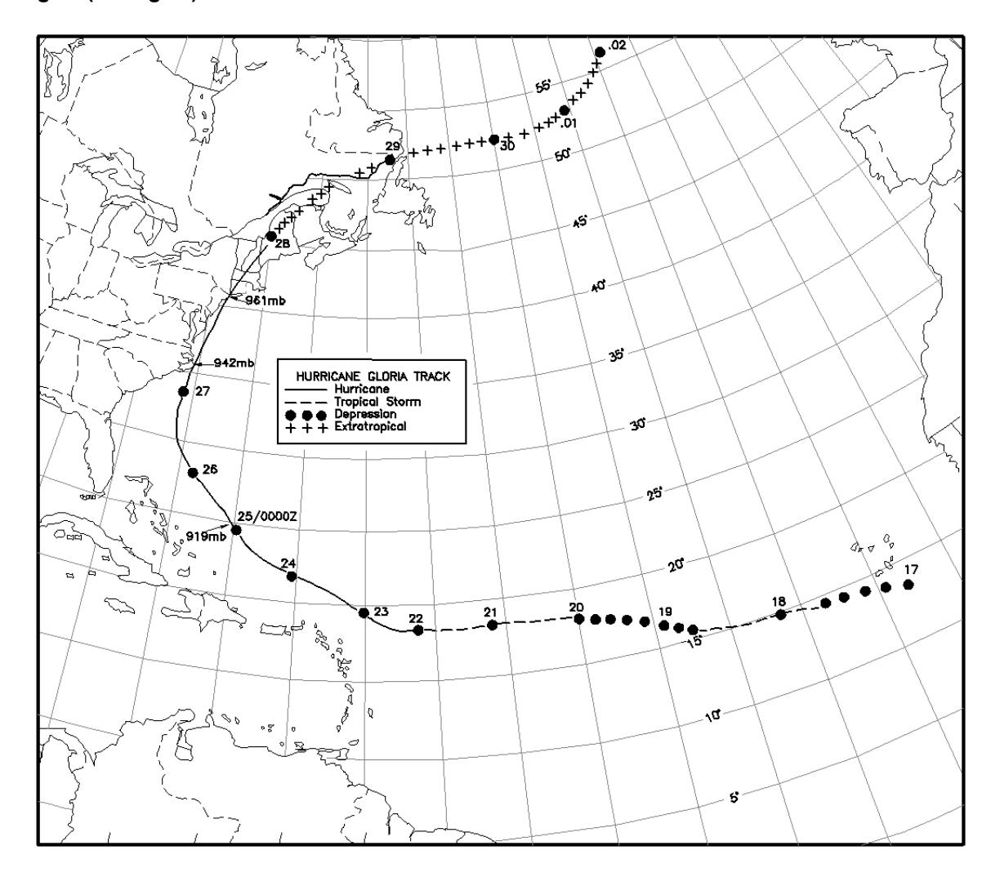

*Figure II-5-24. Hurricane Gloria track from 17 September to 2 October 1985 (Jarvinen and Gebert 1986)*

- (b) Three approaches are commonly used for developing site-specific frequency relationships. These are based on: 1) historical data, 2) synthetic data, and 3) empirical simulation technique (EST) approaches. The historical approach assumes that a database of historical storm events and their respective surge elevations is available for the study area. It is further assumed that the available database provides a representative sample of all possible events for that particular site. Many coastal locations do not have adequate historical data from which frequency-of-occurrence relationships can be developed. Even if a reasonable number of years of data are available, there is no assurance that the data represent a full population of possible storm events. Therefore, it is usually the case that historical data are insufficient for generating a reliable frequency-of-occurrence relationship. For this reason, synthetic or empirically based approaches are generally preferred.
- (c) The synthetic approach is based on the construction of a large number of hypothetical storm events based on assumed probability laws dictating the intensity of the storms and their associated frequency relationships. A more recent approach to the developing frequency-of-occurrence relationships is through the statistical approach known as the empirical simulation technique. This approach is a resampling or "bootstrap" scheme in which the probability relationships of a historical database are used to develop frequency relationships.

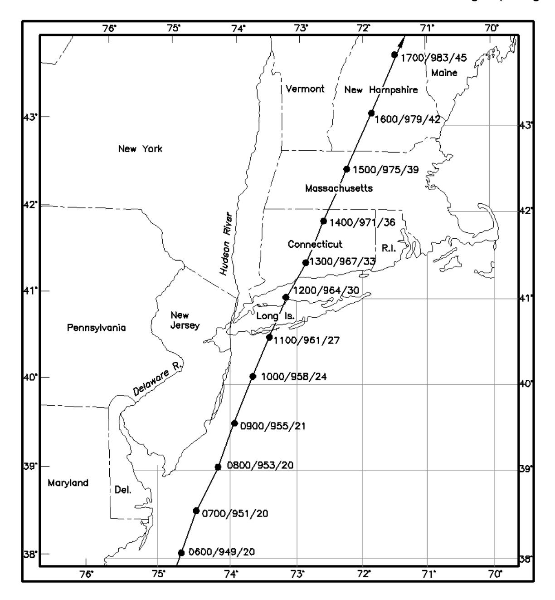

*Figure II-5-25. Hurricane Gloria track offshore of Delaware and New Jersey (Jarvinen and Gebert 1986)*

(d) CHL recommends the empirical simulation technique and uses this statistically based method for all frequency-related studies. This technique has been adopted because it generates multiple data sets of events from historical data and then generates not only frequency-of-occurrence relationships, but also error bands associated with those determinations. When computer facilities are not available for application of the EST, the other approaches can be successfully used; however, each has limitations which should be considered. All three approaches are briefly discussed in the following paragraphs.

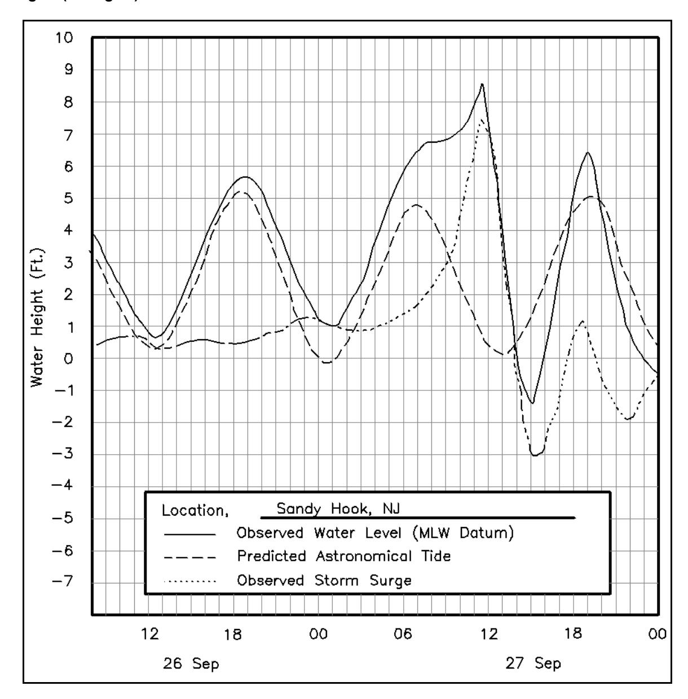

*Figure II-5-26. Example phasing of storm surge and tide (Jarvinen and Gebert 1986)*

- (2) Historical method.
- (a) There are two basic approaches to the use of historical data for generating recurrence interval relationships. The first is the graphical method, the second makes use of analytical formulas to describe the behavior of the frequency relationship.
- (b) The graphical method involves construction of a cumulative probability density function (or probability distribution function) in which the magnitude of the event is plotted against percent probability of exceedance.
- (c) In addition to the graphical approach of developing a pdf, a variety of analytical methods exist for estimating these functions. Selection of a specific form depends on the behavior of the historical data and
the purpose of the study. One function, the Pearson Type III distribution, is presented in detail in many texts on probability and statistics.
- (3) Synthetic method.
- (a) The synthetic method is based on the assumption that a particular event can be characterized by several descriptive (component) parameters, and that the probability associated with each of those parameters can be used to determine the joint probability of the total event. For example, tropical storm events were described by parameters such as radius to maximum wind, maximum wind, pressure deficit, etc. It is assumed that the frequency of the event can be described by the frequencies associated with each parameter.
- (b) The most commonly used form of the synthetic approach is the Joint Probability Method (JPM). The assumption basic to the JPM is that the probability of occurrence of a given storm event can be written as the product of the probabilities corresponding to each storm parameter and that the probabilities for each parameter are independent. For example, a common assumption is that the storm can be described by five storm parameters. If the parameters are statistically independent, then the joint probability density function for the five-dimensional set is the product of the individual probability density functions, i.e.,

```math
f = f _ { D } f _ { R } f _ { \theta } f _ { \nu } f _ { L } \tag{II-5-24}
```

where fD, fR, etc., represent the pdf for the central pressure deficit D (far-field pressure pn less central pressure p0 ), radius to maximum R , azimuth of the storm track 2, forward speed V , and closest distance to landfall (with respect to some specified location) of the eye of the storm L . The JPM has been widely used in the past for storm surge analyses. Details are well-documented in USACE (1986) and the reader is referred to that document for a more detailed description.
- (4) Empirical simulation technique.
- (a) Introduction. Few locations have an adequate historical database of storm events from which to develop reliable stage-frequency relationships. The JPM is subject to error because it is based on simplifying assumptions of parameter independence, and specifying the pdf of each parameter according to parametrically based relationships. The empirical simulation technique (EST) is a statistical resampling scheme that uses historical data to develop joint probability relationships among the various storm parameters. These relationships are based on data derived from actual storm events. There are no simplifying assumptions concerning the pdf's; the interdependence of parameters is computed directly from the respective parameter interdependencies contained in the historic data. In this manner, probabilities are site-specific, do not depend on fixed parametric relationships, and do not assume parameter independence. Thus, the EST is "distributionfree" and nonparametric. There are presently two approaches to applying the EST. The first approach is a multi-parameter simulation approach developed for application to tropical events. The second is a singleparameter approach developed for use in extratropical events. EST applications for tropical and extratropical events are discussed briefly below. (b) EST tropical storm application.
- (1) The multi-parameter EST Program (Scheffner et al. 1999) utilizes historic data to generate a large number of multi-year simulations of possible future hurricane storm events for a specific location. The approach is based on resampling and interpolation of data contained in a database of events derived from historic events. The ensemble of simulations is consistent with the statistics and correlations of past storm activity at the site, but allows for random deviations in behavior that are likely to occur in the future.
- (2) The simulation approach is based on the selection of a set of historic "training storms" extending over the range of storms that actually occurred at the site location. The training events are selected from the data set of historic storms as well as from storms that could occur, such as a historic event with a slightly shifted track. The descriptive storm parameters for each of these events (pressure deficit, radius to maximum wind, maximum wind, forward speed, angle of propagation, and tidal phase) are computed and referred to as input vectors describing each storm event.
- (3) These input vectors define the multi-vector space of input parameters associated with each storm event. These parameters are input to the PBL storm model to produce a time-varying spatial distribution of wind and pressure fields subsequently used as input to a numerical hydrodynamic model for computing storm surge hydrographs over the computational domain. (Examples of numerical modeling of storm surge and tidal circulation are presented in Part II-5-7.) The maximum storm surge elevation reached at specified gauge locations is defined as the response vector of the storm at that location.
- (4) Other output vectors such as maximum shoreline erosion, maximum dune recession, or maximum wave height can be described. The output vector(s) represents the environmental response to the storm. This response is defined at location X and is a direct consequence of the storm via the storm parameter values defined at the point of nearest proximity of the storm eye to point X . For the case of stage-frequency analyses, maximum surge is assumed to occur when the eye of the storm is nearest location X .
- (5) Input to the EST model is the training set database of storm input and response vector(s) for a specific location. An example storm surge analysis for the coast of Delaware (Scheffner, Borgman, and Mark 1993) identified 33 tropical events that impacted the study region during the 104-year period of 1886 through 1989. Of these events, 15 were selected to be representative of the full set. All events were extracted from the NOAA (1981) database of historic storms. These data were used to develop input to the PBL model to generate input data to a hydrodynamic long-wave model. Storm surge hydrographs were computed for each of the 15 storm events. This preliminary analysis generated a set of input and response vectors for 15 storm events for input to the EST.
- (6) Each storm surge is computed independent of the local tidal phase. Each event has an equal probability of occurring at high tide, MSL after flood, low tide, or MSL after ebb. Each of the computed surge elevations were linearly combined with the four phases of the tide to generate an expanded training set of 60 events, which included tidal elevation.
- (7) A cumulative pdf for the 60 storm events is developed based on the assumption that each of the 60 events has an equal probability of occurrence, and that the number of hurricanes along the coast of Delaware is defined by the number of historical events, i.e., 33 events in 104 years. Each storm is considered a point event in time with each storm occurring independently. The empirical simulation technique utilizes a resampling scheme in which a random number seed from 0.0 to 1.0 is used to select a historic event from the training set. Each selected event is described according to its respective input vectors and the maximum surge elevation response vector.
- (8) Input vectors corresponding to the randomly selected event are used to define a new set of input vectors, based on the initial selected storm values but weighted to reflect the value of the "nearest neighbor" parameter contained in a vector space representing parameters corresponding to all events in the 60-storm database. In this manner, a new storm is defined according to a new set of parameters that is similar to those defining the selected event but adjusted to reflect the parameter interrelationships of the full database. Multivector interpolation schemes use the new event input parameters to estimate a new response parameter - the peak storm surge at point X.
(9) The EST simulation approach is to perform N-repetitions of M-years of simulation; for example, 100 simulations of a 200-year sequence of storms. Details of the EST are given in Borgman and Scheffner (1991). The number of storms simulated per year is specified according to a Poisson probability law of the form:

```math
P[N=n] = \frac{e^{-\lambda T}(\lambda T)^n}{n!} \tag{II-5-25}
```

for n = 0,1,2,3,  —  Equation II-5-25 defines the probability of having N storm events in T years. The variable 8 defines the mean frequency of observed events per time period. For the example shown for the coast of Delaware, the value of 8 was chosen to be 0.32 events per year, computed as the ratio of 33 observed events above some selected threshold intensity over a 104-year period.
- (10) A 10,000-element array is initialized to the above Poisson distribution. The number corresponding to 0 storms per year from Equation II-5-25 is 0.7234; thus, if a random number selection is less than or equal to 0.7234 on an interval of 0.0 to 1.0, then no hurricanes would occur during that year of simulation. If the random number is between 0.7234 and 0.7234 + P [ N =1] = 0.7234 + 0.2343 = 0.9577, one event is selected. Two events for 0.9577 + 0.0379 = 0.9956, etc. When one or more storms are indicated for a given year, they are randomly selected from the expanded training set. In this manner, a randomly selected number of storms per year is computed for each year to generate a 200-year simulation.
- (11) Each 200-year sequence is rank ordered, a cumulative pdf computed, and a frequency-of-occurrence relationship developed according to the approach described above. However, in the EST, tail functions (Borgman and Scheffner 1991) are used to define probabilities for events larger than the largest the 200-year simulation.
- (12) This computation is repeated 100 times, resulting in 100 individual pdfs from which 100 stagefrequency relationships are computed. This family of curves is averaged and the standard deviation computed, resulting in the generation of a stage-frequency relationship containing a measure of variability of data spread about the mean. This variation is well-suited to the development of design criteria requiring the quantification of the element of risk associated with the frequency predictions. A computed stagefrequency relationship for a coastal station in the Delaware study is shown in Figure II-5-27. (c) EST extratropical storm application.
- (1) Extratropical events cannot be easily parameterized; therefore, the multi-parameter application of the EST is not appropriate for events such as northeasters. An alternate small-parameter application of the EST (Palermo et al. 1998) was used for this class of events. Northeasters have a much greater frequency of occurrence than hurricanes. For example, several northeasters impact large regions of the east coast every year. The existing WIS database of northeasters represents an adequate population of storms from which frequency-of-occurrence relationships can be computed.
- (2) The extratropical EST approach is conceptually simpler than the multi-parameter version used for hurricanes because parameters such as tidal phase, wave height, and wave period are specified as input vectors. In this approach, a database of extratropical events is assembled and respective surge elevations computed for each storm in the training set using numerical modeling techniques. If 20-30 years of reliable storm surge elevation data are available for a particular location, the numerical modeling phase may not be necessary. The extratropical analogy to the tropical implementation is that there are fewer input vectors. The database of response vectors is combined with tide, rank ordered, and a pdf is computed.

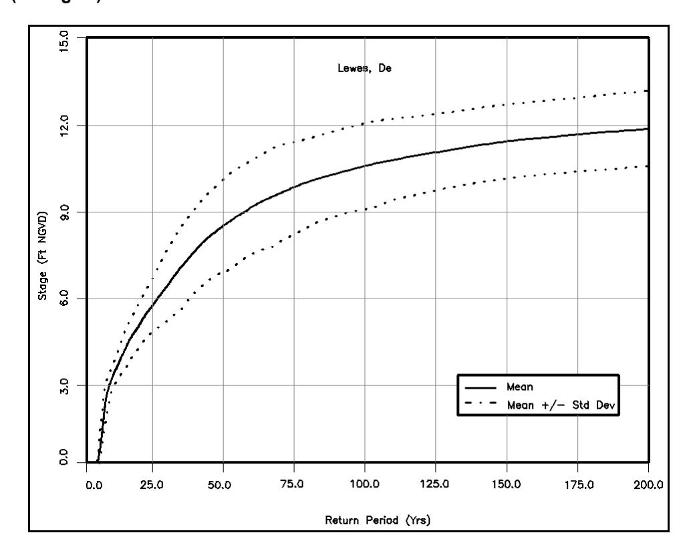

*Figure II-5-27. Stage-frequency relationship - coast of Delaware*

- (3) The extratropical application of the EST can be used to develop recurrence relationships for any parameter if the database of parameters is sufficiently large to define the full population of possible events. A sample application was made to a dredged disposal site located in the New York Bight, on the east coast of the United States. The goal was to determine the recurrence interval of bottom erosion resulting from the 11 December 1992 extratropical storm event. An existing database of severe extratropical storms that impacted the Bight was available with corresponding wave conditions, maximum storm surge elevation, and tidal phase for each storm of the set. These data were used to define a database of peak sediment transport magnitudes, computed as a function of wave height, current (computed from surge elevations), depth, and grain size (Scheffner 1992). These data were input to the EST specifying only one input vector, the peak sediment transport magnitude (QX), to generate 1,000 repetitions of a 500-year simulation. For each 500-year simulation, a transport versus frequency-of-occurrence relationship was computed. As described above, an average curve was computed, which included variability. Results of the analysis are shown in the transport-frequency curve of Figure II-5-28 in which transport is given in ft3 /sec/ft-width × 10-4.
- (4) Historical data on storms in and around the coasts of the United States have been recorded and published in detail since the late 1800's. For example, NOAA publishes an atlas of tropical storms (NOAA 1981) that is continuously updated to reflect recent events. The distribution of east coast tropical events over the period of 1886-1980 is shown in Figure II-5-29, in which the tracks of the 793 Atlantic tropical cyclones reaching at least tropical storm intensity are shown. The Wave Information Study (WIS) of CHL has hindcast data for extratropical storms covering over 30 years.
- (5) Recent advances in numerical modeling techniques make it possible to use these very large databases of storm event track, wind, and pressure to simulate storm surges associated with each event. These sources provide data used to develop storm surge versus frequency-of-occurrence relationships.

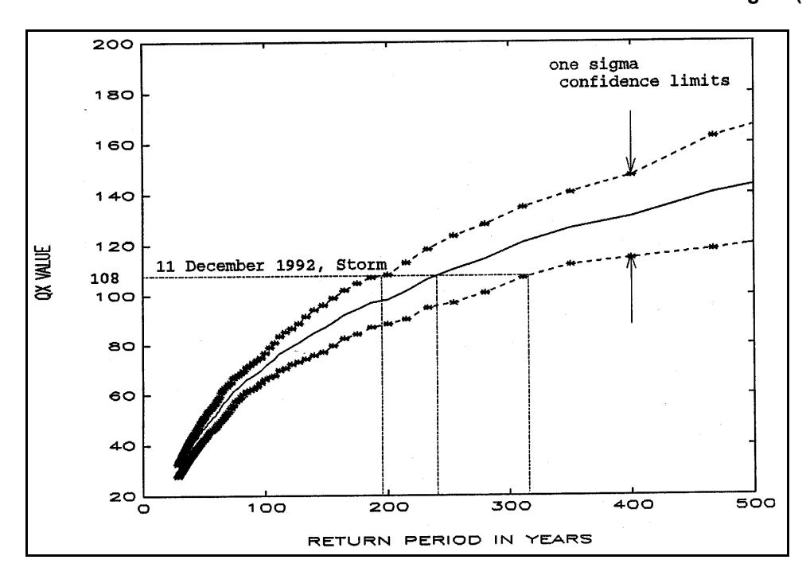

*Figure II-5-28. Sediment transport magnitude-frequency relationship - December 1992 northeaster*

## II-5-6. Seiches

- a. Seiches are standing waves or oscillations of the free surface of a body of water in a closed or semiclosed basin. These oscillations are of relatively long period, extending from minutes in harbors and bays to over 10 hr in the Great Lakes. Any external perturbation to the lake or embayment can force an oscillation. In harbors, the forcing can be the result of short waves and wave groups at the harbor entrance. Examples include 30- to 400-sec wave-forced oscillations in the Los Angeles-Long Beach harbor (Seabergh 1985). Dominant long-period seiche conditions on the Great Lakes have resonant modes with periods varying from 2 to 12 hr. These oscillations result primarily from changes in atmospheric pressure and the resultant wind conditions and occur over the entire basin. The frequency of oscillation is a function of the forcing, together with geometry and bathymetry, of the system.
- b. In areas of simple geometry, modes of oscillation can be predicted from the shape of the basin. For example, Figure II-5-30 shows surface profiles for various simple geometric configurations.
- c. For the one-dimensional case of a closed rectangular basin with vertical walls and uniform depth (Figure II-5-30b), the natural free oscillating period Tn can be written as

```math
T _ { n } \, = \, { \frac { 2 l _ { B } } { n { \sqrt { g h } } } } \tag{II-5-26}
```

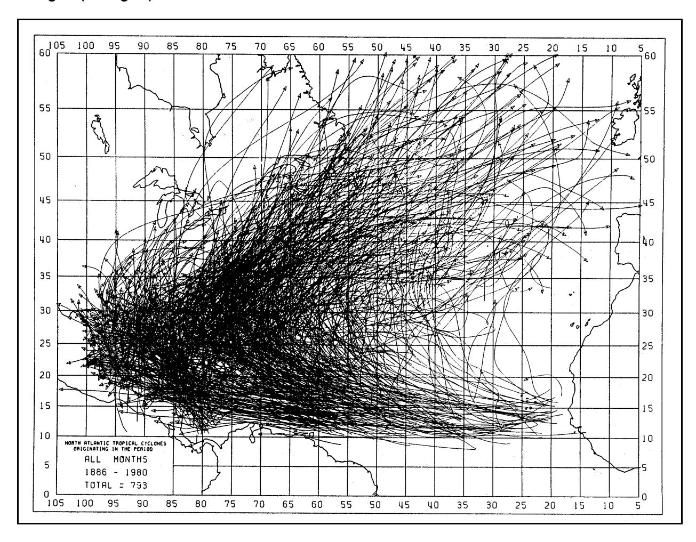

*Figure II-5-29. Atlantic tropical storm tracks during the period 1886-1980*

where n is the number of nodes along the axis of the basin, h is the water depth, and lB is the length of the basin. The fundamental and maximum period corresponds to Tn for n = 1. As shown in Figure II-5-30b, nodes (locations of no vertical deflection) are located at interior points and antinodes (locations of maximum deflection) are located on the boundaries of the basin. Longitudinal seiches oscillate from end to end, while transverse seiches oscillate from side to side in the basin.
d. For an open rectangular basin (Figure II-5-30c), the free oscillation period is written as follows:

```math
T _ { n } \, = \, { \frac { 4 l _ { B } } { \left( 1 \, + \, 2 n \right) { \sqrt { g h } } } } \tag{II-5-27}
```

e. The fundamental mode corresponds to n =0. As shown in Figure II-5-30c, the node is located on the opening with an antinode on the opposite end.

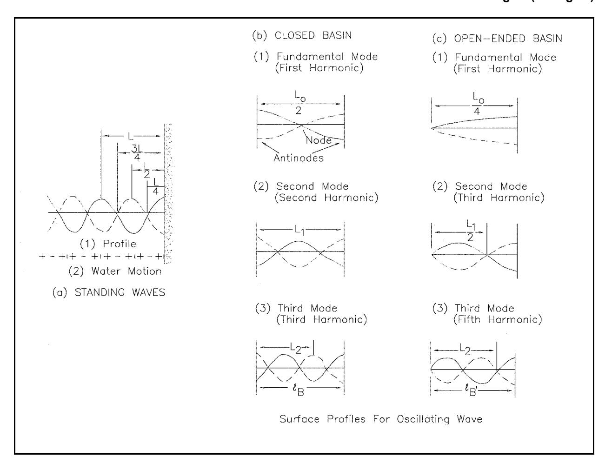

*Figure II-5-30. Long wave surface profiles ( Shore Protection Manual 1984)*

f. Methods are available to estimate free oscillations in long narrow lakes of variable width and depth (Defant 1961); however, seiche periods and node/antinode locations are determined most accurately through long-wave modeling. For this class of problem, numerical solutions of the governing equations are necessary. An example is presented in Rao and Schwab (1976), in which a numerical model is used to investigate the normal modes of oscillation in an arbitrary enclosed basin on a rotating earth. Applications are made to Lakes Ontario and Superior. Rao and Schwab describe two distinct types of free oscillations, gravitational modes and rotational modes. Gravitational modes result from undulations of the free surface and are independent of the rotation of the earth. Rotational modes are a function of gravity via the Coriolis parameter. Figure II-5-31 represents the first, second, and third normal modes of oscillation for Lake Ontario. The periods of the computed six lowest modes in Lake Ontario are 5.11, 3.11, 2.13, 1.87, 1.78, and 1.46 hr for modes 1 through 6. The complexity of the nodal points and lines of phase demonstrate that idealized solutions such as those shown in Figure II-5-30 are often not adequate to explain natural phenomena. For applications requiring detailed information on maximum seiche elevations and nodal distributions, numerical models such as those described in the following section are the only viable approach to developing reliable solutions.

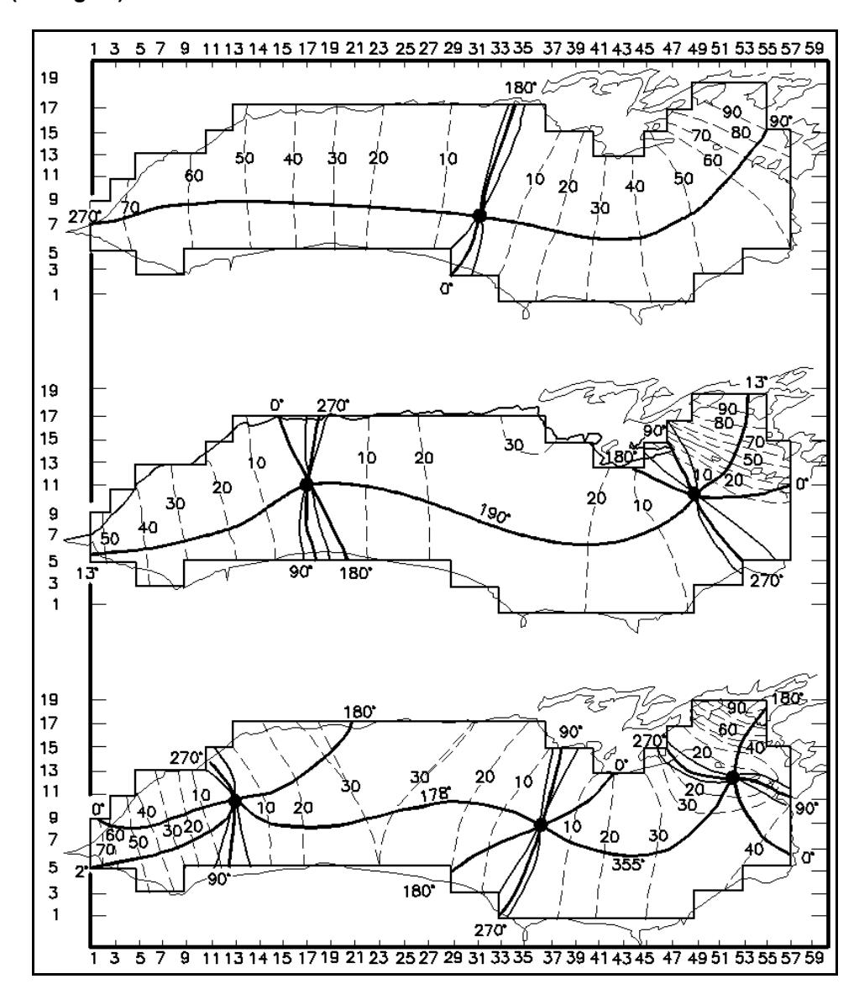

*Figure II-5-31. First, second, and third normal modes of oscillation for Lake Ontario (Rao and Schwab 1976)*

## II-5-7. Numerical Modeling of Long-Wave Hydrodynamics

- a. Long wave modeling . Most natural flow systems are extremely complex. They have variable bathymetry and irregular shorelines and are driven by a combination of tidal, wind, and pressure forcing, as well as temperature- and salinity-driven density gradient forcing. If a realistic approximation of flow hydrodynamics is necessary for the formulation of design criteria or testing of design alternatives (for example), numerical long-wave hydrodynamic models should be used. Although these models are generally not easy to apply and require mainframe computers, they provide the most accurate flow field approximation.
- b. Physical models . Prior to describing example applications of numerical models, physical models may provide a viable alternative to numerical approaches if the problem of concern is not wind-dominated. For example, if a physical model of a particular estuary exists, and the problem of interest is of tidal origin,
then a physical model may be cost-effective. A substantial amount of literature on physical models and modeling is available. An extremely comprehensive source of information is Hudson et al. (1979).
- c. Numerical models .
- (1) Introduction.
- (a) Numerical hydrodynamic models generally fall into two solution scheme categories, finite difference and finite element. Finite difference models use a rectangular orthogonal grid, although grid transformation schemes permit the mapping of the grid to conform to curvilinear boundaries. Finite element models use a variable-size, either triangular or rectangular, unstructured computational grid. The ability to define elements of variable size gives the finite element method an advantage over finite difference schemes for accurately representing areas of very complex geometry. However, both modeling techniques produce accurate results when applied correctly. Both models are in common use, as is demonstrated in the following two examples of numerical model applications to specific coastal and estuarine applications. These examples are intended to demonstrate the capability and accuracy of numerical models to reproduce natural hydrodynamic systems and generate an appreciation for the difficulty involved with applying them to specific flow-field situations.
- (b) In addition to differences in computational schemes, hydrodynamic models are also categorized as 1-, 2-, and 3-dimensional. One-dimensional models provide a cross-sectional average solution to the governing equations. This class of solution is well-suited to pipeline or river flow problems, but not coastal/estuarine problems. Therefore, 1-D models are not addressed in this chapter because their solutions provide little detailed flow-field information that cannot be computed from the formulas given in Part II-1, "Water Wave Mechanics."
- (c) Two-dimensional models are generally depth-integrated (depth-averaged); they provide a single velocity vector corresponding to each horizontal cell of a computational domain representing large areas of surface flow. Currents are defined at nodes or on cell faces, depending on the computational scheme used. Two-dimensional models are generally used in situations where the modeled system is well-mixed, i.e., currents are approximately uniform throughout the water column. These models are appropriate for studies in which changes in surface elevation are the primary concern. Typical examples include storm surge or lake seiche studies.
- (d) An additional class of two-dimensional models is the laterally averaged model. In this case, instead of depth-averaged governing equations, a width-averaged set of equations is defined. In this form of solution, currents are defined at multiple locations through the water column; however, no horizontal distribution information is given. Laterally averaged models are generally used in conjunction with river flow, reservoir operation, and/or salinity intrusion applications and these models are not described in this manual.
- (e) Three-dimensional applications are used when the vertical structure of currents is not uniform and the vertical distribution of currents is an important aspect of the study. Example applications include areas exhibiting flow reversal situations where surface currents and bottom currents flow in opposite directions. Included in this class of problems are cases in which vertical temperature and salinity gradients create densitydriven flows. Although these non-tidal flows can be small in comparison to the tidal ebb and flood currents, they can contribute to residual circulation patterns that may affect the transport and dispersion of certain water quality parameters such as dissolved oxygen. An additional example may include channel-deepening effects on salinity intrusion.
- (f) Before presenting example applications of models, it is stressed that all models are not equal with respect to computational speed and accuracy. Depending on how the governing equations are written and solved and how and what boundary conditions are defined and used to drive the models, any two finiteelement or finite-difference models can produce different results. Therefore, for some applications, one model may produce accurate results while another formulation will be unstable and produce totally unrealistic simulations. For this reason, any application of a numerical model should begin with a calibration and verification procedure in which the model is run to reproduce the hydrodynamic flow field corresponding to a specific time period during which prototype data (i.e., surface elevations and currents) have been collected. Additional data comparisons may include hydrodynamically driven parameters such as temperatures and salinities.
- (g) In the calibration phase, model parameters such as the friction factor distribution or depth resolution are adjusted to optimize the comparison of model-generated data to measured prototype data. Comparisons are generally made to surface elevations and velocities, but may include reproduction of temperature and salinity. In the verification procedure, the model is used to simulate an alternate time period containing additional prototype data. Model coefficients are not adjusted in the verification phase. An acceptable calibration and verification demonstrates that the model is capable of simulating the total flow regime over the entire computational domain. This ability is basic and necessary to the use of numerical models to quantify the flow-field response to proposed or existing changes in flow-field boundaries.
- (h) If data are available or can be collected, the calibration and verification procedures represent a minimum criterion required of a model before it can be applied to any specific problem. If these two steps are not performed in a satisfactory manner, model results can only be considered qualitative. Situations do exist where prototype data are not available and cannot be obtained within the time and cost limits of the budget. In these cases, models can be used to generate qualitative trends; however, unverified model results should not be the basis for quantitative decision making unless some data are available, even at a minimum level, to demonstrate that the model is producing realistic results. This aspect of modeling may be vital to a particular project because decisions based on unverified model results can be legally challenged and shown to be invalid. (2) Example tidal circulation modeling.
- (a) The New York Bight project (Scheffner et al. 1993) is an excellent example of tidal circulation modeling. The goal of the study was to develop a hydrodynamic simulation tool that could be used to address questions concerning how certain modifications to the New York Bight may affect the local or global hydrodynamics of the system and how the computed flow fields affected the transport of certain water quality parameters. The model was therefore required to be capable of simulating the flow-field hydrodynamics, temperature, and salinity distribution over a large computational domain.
- (b) The model selected for this study was the CH3D (Curvilinear Hydrodynamics in Three (3) Dimensions) (Johnson et al. 1991) model, a three-dimensional, finite difference formulation model with boundary-fitted coordinates. The modeled area represents the region extending offshore from Cape May, NJ, and Nantucket Shoals to beyond the continental shelf, including Long Island Sound, the Hudson and East Rivers, and New York Harbor. Depths vary from less than 10 m to more than 2,000 m. The geographical boundaries are shown in Figure II-5-32a. The computational grid used to represent this area of interest is shown in Figure II-5-32b. The grid contains 76 cells in the alongshore direction and 45 cells in the cross-shore direction. There are 2,641 active computational cells in the horizontal and 10 in the vertical.
- (c) The model was preliminarily tested to demonstrate steady-state response to long-term circulation patterns, wind-induced circulation, and Hudson River inflow-induced circulation. Non-steady testing included modeling of the dynamic response to tidal constituents, both to the M2 semidiurnal tide and to mixed tides. Calibration and verification were performed for the periods of April 1976 and May 1976, respectively.
- (d) Model results were compared to MESA project prototype data collected during the period from mid-September 1975 to mid-August 1976. Figure II-5-33 compares model-to-prototype tidal elevations at the Battery. A global circulation pattern of wind-field-induced circulation is shown in Figure II-5-34. (3) Example storm surge modeling.
- (a) The coast of Delaware study (Mark, Scheffner, and Borgman 1993) provides an excellent example of storm surge modeling over very large computational domains. Goals of the effort were to generate stagefrequency relationships at a variety of locations along the open coast of Delaware and inside Delaware Bay. The study required tidal calibration and verification to demonstrate that the model could successfully reproduce tidal circulation. In addition to tide, the model was verified for storm surge by reproducing the storm surge hydrograph produced by Hurricane Gloria.
- (b) Storm track and pressure information for Hurricane Gloria was extracted from the National Hurricane Center's (NOAA 1981) database and used to generate input to the PBL model. The model selected for the hydrodynamic effort was the two-dimensional depth-integrated version of the Three-Dimensional AD vanced CIRC ulation (ADCIRC) finite-element model (Luettich, Westerink, and Scheffner 1993). This application demonstrates a very large-domain modeling capability (Luettich, Westerink, and Scheffner 1993), developed for the Dredging Research Program (DRP) to compute tidal and storm surge simulations along the open coast.
- (c) The DRP computational grid covers the east coast of the United States, Gulf of Mexico, and Caribbean Sea on the landward boundary. The offshore boundary is located in the mid-Atlantic Ocean, extending from Novia Scotia to Venezuela along the 60-deg west longitude line. "Continental-scale" computational domains are used in the model to minimize difficulties in specifying offshore and lateral boundary conditions.
- (d) The DRP computational grid was modified to provide increased resolution in Delaware Bay and within several small bays between the entrances of the Chesapeake and Delaware Bays. Figure II-5-35 shows the global limits of the 12,000-node grid. A blow-up of the coast of Delaware and Delaware Bay areas is shown in Figure II-5-36.
- (e) The ADCIRC model was verified to several locations at which NOAA tidal constituents were available. An example model-to-prototype (constituent) comparison to Lewes, DE, is shown in Figure II-5- 38. Model-to-prototype data for the storm surge produced by Hurricane Gloria are also compared at Lewes, as shown in Figure II-5-39.

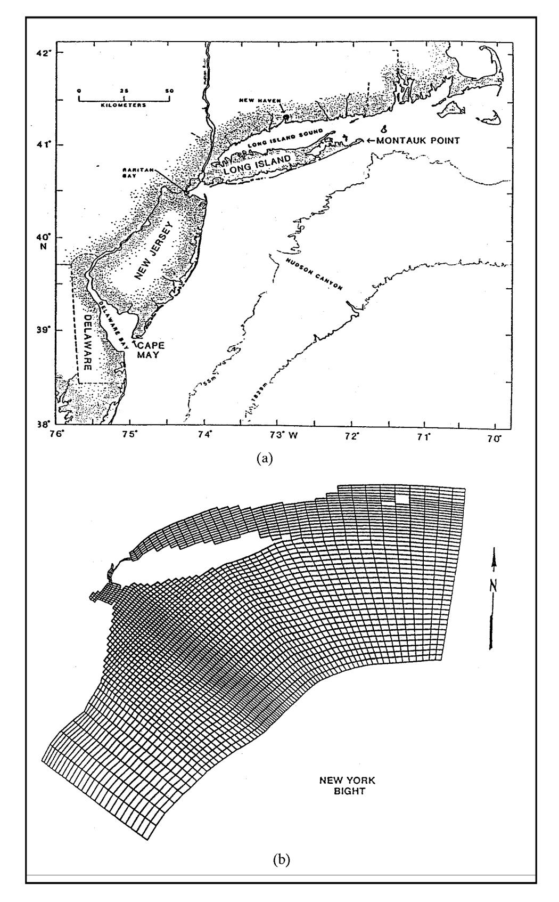

*Figure II-5-32. Computational grid for the New York Bight*

*Figure II-5-33. Model and prototype tidal elevation comparison at the Battery*

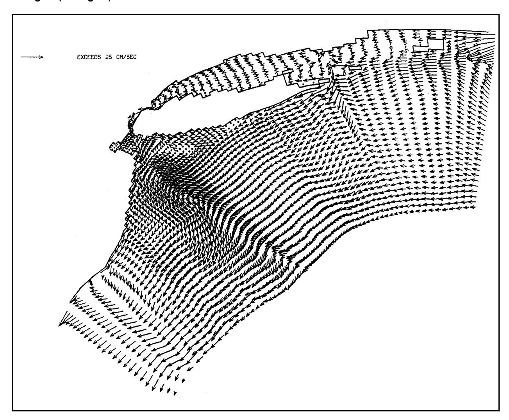

*Figure II-5-34. Wind-induced circulation pattern*

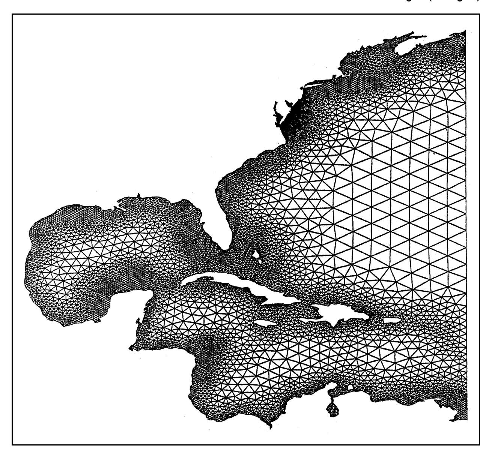

*Figure II-5-35. Global limits of ADCIRC computational grid*

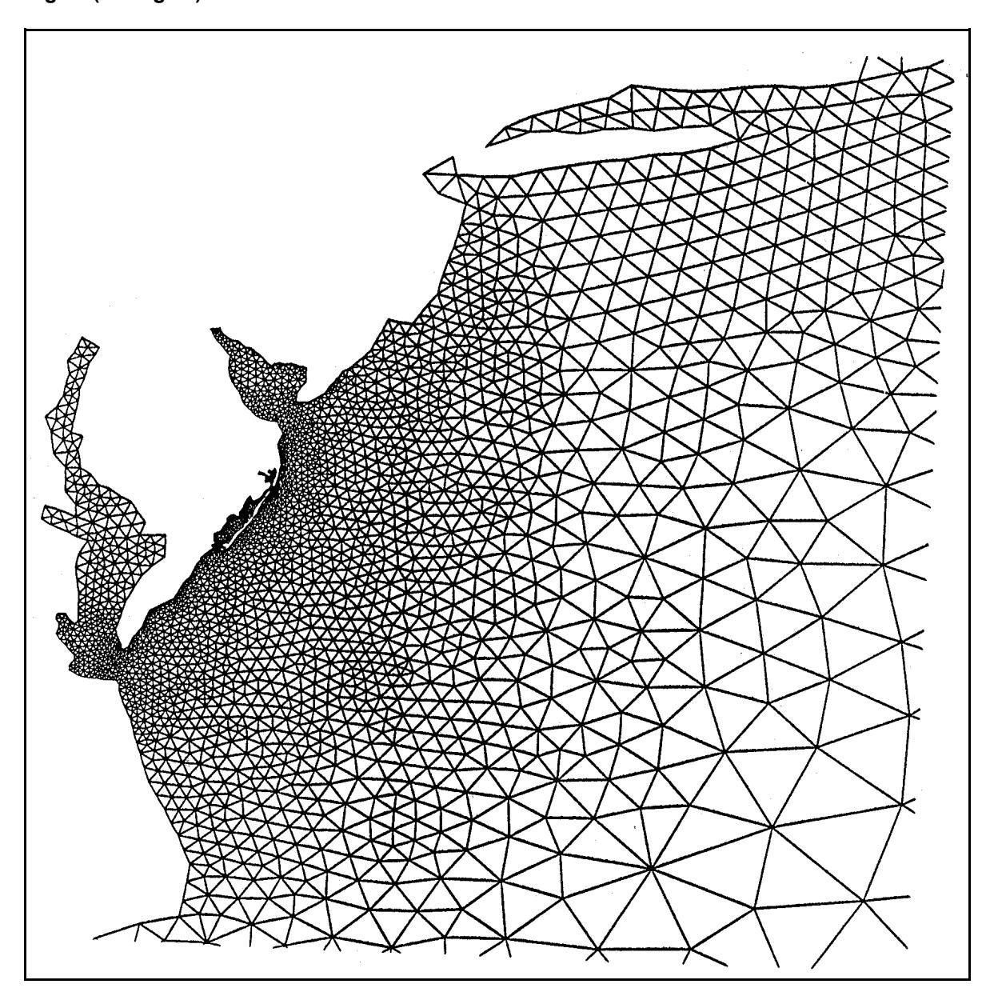

*Figure II-5-36. Blow-up of ADCIRC grid along Delaware coast*

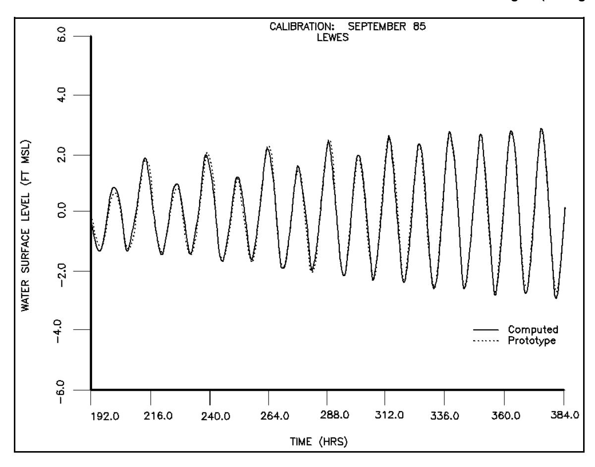

*Figure II-5-37. Model-to-prototype tidal comparison at Lewes, DE*

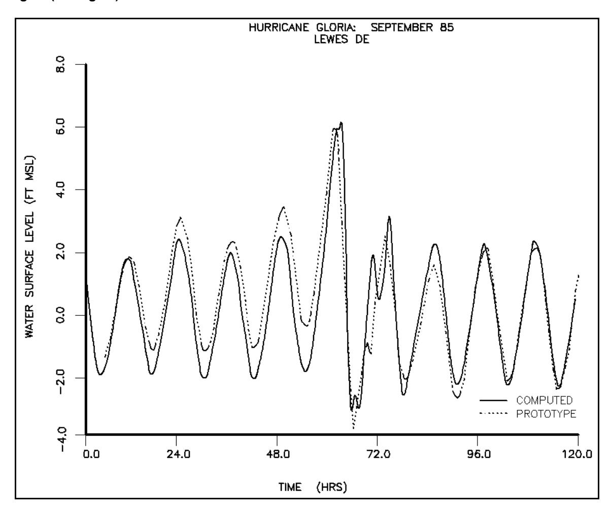

*Figure II-5-38. Model-to-prototype surge comparison at Lewes, DE*

# II-5-8. References

## EM 1110-2-1415

Hydrologic Frequency Analysis

## Borgman and Resio 1982

Borgman, L. E., and Resio, D. T. 1982. "Extremal Statistics in Wave Climatology," Topics in Ocean Physics , A. Osborne and P. M. Rizzoli, ed., Italian Physical Society, Bologna, Italy, pp 439-471.

## Borgman and Scheffner 1991

Borgman, L. E., and Scheffner, N. W. 1991. "The Simulation of Time Sequences of Wave Height, Period, and Direction," Technical Report TR-DRP-91-2, U.S. Army Engineer Waterways Experiment Station, Vicksburg, MS.

## Camfield 1980

Camfield, F. E. 1980. "Tsunami Engineering," Special Report No. 6, U.S. Army Engineer Waterways Experiment Station, Vicksburg, MS.

## CCCMSL 1987

Committee on Engineering Implications of Changes in Relative Mean Sea Level. 1987. "Responding to Changes in Sea Level Engineering Implications," Marine Board, Commission on Engineering and Technical Systems, National Research Council. National Academy Press, Washington, DC, 148 p.

## Cialone et al. 1991

Cialone, M. A., Mark, D. J., Chou, L. W., Leenknecht, D. A., Davis, J. A., Lillycrop. L. S., Jensen, R. E., Thompson, E. F., Gravens, M. B., Rosati, J. D., Wise, R. A., Kraus, N. C., and Larson, P. M. 1991. "Coastal Modeling System (CMS) User's Manual," Instruction Report CERC-91-1, U.S. Army Engineer Waterways Experiment Station, Vicksburg, MS.

## Coordinating Committee on Great Lakes Basin Hydraulic and Hydrologic Data 1992

Coordinating Committee on Great Lakes Basin Hydraulic and Hydrologic Data. 1992. Brochure on the International Great Lakes Datum 1985, U.S. Government Printing Office, 1992-644-640.

## Defant 1961

Defant, A. 1961. Physical Oceanography , Vol II, Pergamon Press, New York.

## Dronkers 1964

Dronkers, J. J. 1964. "Tidal Computations in Rivers and Coastal Waters," North-Holland Publishing Company - Amsterdam, John Wiley & Sons, Inc., New York.

## Graham and Nunn 1959

Graham, H. E., and Nunn, D. E. 1959. "Meteorological Considerations Pertinent to Standard Project Hurricane, Atlantic and Gulf Coasts of the United States," National Hurricane Research Project, Report No. 33, Department of Commerce, Washington, DC.

## Gravens, Scheffner, and Hubertz 1989

Gravens, M. B., Scheffner, N. W., and Hubertz, J. M. 1989. "Coastal Processes from Asbury Park to Manasquan, New Jersey," Miscellaneous Paper CERC-89-11, U.S. Army Engineer Waterways Experiment Station, Vicksburg, MS.

## Gumbel 1954

Gumbel, E. J. 1954. "Statistical Theory of Extreme Value and Some Practical Application," National Bureau of Standards Applied Math. Series 33, U.S. Gov. Publication, Washington, DC.

# Harris 1981

Harris, D. L. 1981. "Tides and Tidal Datums in the United States," Special Report No. 7, U.S. Army Corps of Engineers, Fort Belvoir, VA., U.S. Government Printing Office (GPO Stock No. 008-022-00161-1).

## Ho et al. 1987

Ho, F. P., Su, J. C., Hanevich, K. L., Smith, R. J., and Richards, F. P. 1987. "Hurricane Climatology for the Atlantic and Gulf Coasts of the United States," NOAA Technical Report NWS 38.

## Hubertz et al. 1993

Hubertz, J. M., Brooks, R. M., Brandon, W. A., and Tracy, B. A. 1993. "Hindcast Wave Information for the U.S. Atlantic Coast," WIS Report 30, U.S. Army Engineer Waterways Experiment Station, Vicksburg, MS.

## Hudson et al. 1979

Hudson, R. Y., Herrmann, F. A., Sager, R. A., Whalin, R. W., Keulegan, G. H., Chatham, C. E., and Hales, L. Z. 1979. "Coastal Hydraulic Models," Special Report No. 5, Coastal Engineering Research Center, U.S. Army Engineer Waterways Experiment Station, Vicksburg, MS.

## Ippen 1966

Ippen, A. T. 1966. Estuary and Coastline Hydrodynamics . McGraw-Hill Book Company, Inc., New York.

## Jarvinen and Gebert 1986

Jarvinen, B., and Gebert, J. 1986. "Comparison of Observed Versus Slosh Model Computed Storm Surge Hydrographs along the Delaware and New Jersey Shorelines for Hurricane Gloria, September 1985," NOAA Technical Memorandum NWS NHC 32, National Hurricane Center, Coral Gables, FL.

## Johnson et al. 1991

Johnson, B. H., Heath, R. E., Hsieh, H. H., Kim, K. W., and Butler, H. L. 1991. "Development and Verification of a Three-Dimensional Numerical Hydrodynamic, Salinity, and Temperature Model of Chesapeake Bay; Volume I, Main Text and Appendix D," Technical Report HL-91-7, U.S. Army Engineer Waterways Experiment Station, Vicksburg, MS.

## Leenknecht, Szuwalski, and Sherlock 1992

Leenknecht, D. A., Szuwalski, A., and Sherlock, A. R. 1992. "Automated Coastal Engineering System User Guide and Technical Reference, Version 1.07," U.S. Army Engineer Waterways Experiment Station, Vicksburg, MS.

## Luettich, Westerink, and Scheffner 1993

Luettich, R. A., Westerink, J. J., and Scheffner, N. W. 1993. "ADCIRC: An Advanced Three-Dimensional Circulation Model for Shelves, Coasts and Estuaries; Report 1: Theory and Methodology of ADCIRC-2DDI and ADCIRC-3DL," Technical Report DRP-92-6, U.S. Army Engineer Waterways Experiment Station, Vicksburg, MS.

## Mark and Scheffner 1997

Mark, D. J., and Scheffner, N. W. 1997. "Coast of Delaware Hurricane Stage-Frequency Analysis," Miscellaneous Paper CHL-97-1, U.S. Army Engineer Waterways Experiment Station, Vicksburg, MS.

## Milne-Thompson 1960

Milne-Thompson, L. M. 1960. Theoretical Hydrodynamics . The MacMillan Company, New York.

## Morang, Mossa, and Larson 1993

Morang, A., Mossa, J., and Larson, R. J. 1993. "Technologies for Assessing the Geologic and Geomorphic History of Coasts," Technical Report CERC-93-5, U.S. Army Engineer Waterways Experiment Station, Vicksburg, MS.

## National Oceanic and Atmospheric Administration 1977

National Oceanic and Atmospheric Administration. 1977. "NOAA Federal Coordinator for Meteorological Services and Supporting Research, 1977: National Hurricane Operations Plan, MO 77-2."

## National Oceanic and Atmospheric Administration 1981

National Oceanic and Atmospheric Administration. 1981. "Tropical Cyclones of the North Atlantic Ocean 1971-1980," U.S. Government Printing Office, Washington, DC.

## National Oceanic and Atmospheric Administration 1984

National Oceanic and Atmospheric Administration. 1984. "Tide Tables 1984 High and Low Water Predictions, East Coast of North and South America, Including Greenland," National Ocean Service, Rockville, MD.

## Palermo et al. 1998

Palermo, M. R., Clausner, J. E., Rollings, M. P., Williams, G. L., Myers, T. E., Fredette, T. J., and Randall, R. E. 1998. "Guidance for Subaqueous Dredged Material Capping," Technical Report DOER-1, U.S. Army Engineer Waterways Experiment Station, Vicksburg, MS.

## Rao and Schwab 1976

Rao, D. B., and Schwab, D. J. 1976. "Two Dimensional Normal Modes in Arbitrary Enclosed Basins on a Rotating Earth: Application to Lakes Ontario and Superior," Philosophical Transactions of the Royal Society of London , Vol 281, pp 63-96.

## Rappleye 1932

Rappleye, H. S. 1932. "The 1929 Adjustment of the Level Net," The Military Engineer , Vol 24, No. 138, pp 576-578.

## Saffir 1977

Saffir, H. S. 1977. "Design and Construction Requirements for Hurricane Resistant Construction," American Society of Civil Engineers, Reprint Number 2830, New York.

## Scheffner 1992

Scheffner, N. W. 1992. "A Numerical Simulation Approach to Estimating Disposal Site Stability," 1992 National Conference on Hydraulic Engineering, Baltimore, MD.

## Scheffner, Borgman, and Mark 1993

Scheffner, N. W., Borgman, L. E., and Mark, D.J. 1993. "Applications of Large Domain Hydrodynamic Models to Generate Frequency-of-Occurrence Relationships," 3rd International Conference on Estuarine and Coastal Modeling, Chicago, IL.

## Scheffner et al. 1994

Scheffner, N. W., Vemulakonda, S. R., Kim, K. W., Mark, D. J., and Butler, H. L. 1994. "New York Bight Study; Report 1: Hydrodynamic Modeling," Technical Report CERC-94-4, U.S. Army Engineer Waterways Experiment Station, Vicksburg, MS.

## Scheffner et al. 1999

Scheffner, N. W., Clausner, J. E., Militello, A., Borgman, L. E., Edge, B. L., and Grace, P. E. 1999. Use and Application of the Empirical Simulation Technique: Users Guide, Technical Report CHL-99-21, U.S. Army Engineer Waterways Experiment Station, Vicksburg, MS.

## Seabergh 1985

Seabergh, W. C. 1985. "Los Angeles and Long Beach Harbors Model Study, Deep-Draft Dry Bulk Export Terminal, Alternative No. 6: Resonant Response and Tidal Circulation Studies," Miscellaneous Paper CERC-85-8, U.S. Army Engineer Waterways Experiment Station, Vicksburg, MS.

## Sears and Zemansky 1963

Sears, F. W., and Zemansky, M. W. 1963. University Physics . Addison-Wesley Publishing Company, Inc., Reading, MA.

## Shalowitz 1964

Shalowitz, A. L. 1964. "Shore and Sea Boundaries," Vol 2, Publication 10-1, U.S. Coast and Geodetic Survey, Washington, DC.

## Shore Protection Manual 1984

Shore Protection Manual . 1984. 4th ed., 2 Vol, U. S. Army Engineer Waterways Experiment Station, U.S. Government Printing Office, Washington, DC.

## Scheffner et al. 1999

Scheffner, N. W., Clausner, J. E., Militello, A., Borgman, L. E., Edge, B. L., and Grace, P. E. 1999. Use and Application of the Empirical Simulation Technique: Users Guide, Technical Report CHL-99-21, U.S. Army Engineer Waterways Experiment Station, Vicksburg, MS.

## Schureman 1924

Schureman, P. 1924. "Manual of Harmonic Analysis and Prediction of Tides," Special Publication No. 98, U.S. Department of Commerce, Coast and Geodetic Survey, U.S. Government Printing Office, Washington, DC.

# II-5-9. Definitions of Symbols

| Symbol | Definition |
|---|---|
| «P | Vector gradient operator (Equation II-5-11) |
| 6n | Epoch of constituent n, i.e., phase shift from tide-producing force to high tide from t0 [deg] |
| 6! | Modified form of the epoch that automatically accounts for the longitude and time meridian corrections (Equation II-5-20) [deg] |
| F | Angular frequency (= 2B/T) [time-1] |
| a | Wave amplitude [length] |
| an | Speed of tide constituent n [degrees/time] |
| bPX | Attractive force of the moon and sun at any point X (Equation II-5-10) |
| C | Wave celerity [length/time] |
| f | Universal constant (= 6.67 × 10-8 cm3/ gm sec2) |
| Fg | Gravitational force (Equation II-5-7) [force-length/time2] |
| fn | Factor for adjusting mean tidal amplitude Hn values for specific times |
| g | Gravitational acceleration [length/time2] |
| h | Water depth [length] |
| H(t) | Height of the tide at any time t (Equation II-5-16) [length] |
| H0 | Mean water level above some defined datum [length] |
| Hn | Mean amplitude of tidal constituent n [length] |
| k | Wave number (= 2B/L = 2B/CT) [length-1] |
| L | Wave length [length] |
| lB | Length of a basin [length] |
| M | Mass of the moon |
| n | Number of nodes along the axis of a basin |
| N | Number of storm events used in the Poisson probability law (Equation II-5-25) |
| -O | The subscript 0 denotes deepwater conditions |
| Water | Levels and Long Waves II-5-69 |
| p0 | Central pressure of the eye of the storm (tropical storm parameter) [force/length2] |
| PM | , PS Harmonic polynomial expansion terms that collectively describe the relative positions of the earth, moon, and sun (Equations II-5-14 and II-5-15) |
| pn | Peripheral or far-field pressure (tropical storm parameter) [force/length2] |
| P[N=n] | Poisson probability law (Equation II-5-25) |
| r | Distance between the centers of mass of two bodies (Equation II-5-7) [length] |
| R | Radius to maximum wind (tropical storm parameter) [length] |
| R | Tide classification parameter (Equation II-5-22) [dimensionless] |
| rm | Distance from the center of the earth to the center of the moon [length] |
| rmx | Distance of a point located on the surface of the earth to the center of the moon [length] |
| rs | Distance from the center of the earth to the center of the sun [length] |
| rsx | Distance of a point located on the surface of the earth to the center of the sun [length] |
| S | Local time meridian (Equation II-5-17) |
| S | Mass of the sun |
| t | Time measured from some initial epoch or time |
| T | Number of years used in the Poisson probability law (Equation II-5-25) |
| T | Wave period [time] |
| Tn | Natural free oscillating period of a basin (Equation II-5-26) [time] |
| u | Fluid velocity (water particle velocity) in the x-direction [length/time] |
| V | Maximum wind (tropical storm parameter) [length/time] |
| Vf | Forward speed of the eye of the storm (tropical storm parameter) [length/time] |
| VM | , VS Attractive force potentials per unit mass for the moon and sun (Equation II-5-9) |
| w | Fluid velocity (water particle velocity) in the z-direction [length/time] |
| z | Water depth below the SWL [length] |
