Chapter 7 EM 1110-2-1100 HARBOR HYDRODYNAMICS (Part II) 1 August 2008 (Change 2)

# Table of Contents

Page II-7-1. Introduction II-7-1 II-7-2. Wave Diffraction a. Definition of diffraction b. Diffraction analysis c. Diffraction at a harbor entrance (1) Waves passing a single structure (2) Waves passing through a structure gap d. Irregular wave diffraction e. Combined refraction-diffraction in harbors f. Combined diffraction - reflection in harbors II-7-3 II-7-3 II-7-3 II-7-3 II-7-3 II-7-6 II-7-9 II-7-12 II-7-13 II-7-3. Wave Transmission a. Definition of transmission b. Transmission over/through structures (1) Rubble-mound structures-subaerial (2) Rubble-mound structures-submerged (3) Permeable rubble-mound structures (4) Floating breakwaters (5) Wave barriers II-7-19 II-7-19 II-7-19 II-7-19 II-7-20 II-7-21 II-7-23 II-7-24 II-7-4. Wave Reflection a. Definition of reflection b. Reflection from structures c. Reflection from beaches d. Reflection patterns in harbors e. Reflection problems at harbor entrances II-7-26 II-7-26 II-7-28 II-7-29 II-7-29 II-7-30 II-7-5. Harbor Oscillations a. Introduction b. Mechanical analogy c. Closed basins d. Open basins - general e. Open basins - simple shapes f. Open basins - complex shapes g. Open basins - Helmholtz resonance II-7-31 II-7-31 II-7-33 II-7-34 II-7-36 II-7-36 II-7-40 II-7-44
II-7-6. Flushing/Circulation a. Statement of importance b. Flushing/circulation processes (1) Tidal action (2) Wind effects (3) River discharge c. Predicting of flushing/circulation (1) Numerical models (2) Physical model studies (3) Field studies II-7-48 II-7-48 II-7-48 II-7-48 II-7-49 II-7-51 II-7-51 II-7-51 II-7-52 II-7-53 II-7-7. Vessel Interactions a. Vessel-generated waves b. Vessel motions (1) Response to waves (2) Response to currents (3) Wave-current interaction (4) Vessel sinkage and trim (5) Ship maneuverability in restricted waterways c. Mooring (1) Wave forcing mechanism (2) Mooring configurations (3) Mooring lines (4) Fenders (5) Surge natural period (6) Mooring forces II-7-54 II-7-54 II-7-57 II-7-57 II-7-58 II-7-58 II-7-59 II-7-62 II-7-64 II-7-64 II-7-64 II-7-65 II-7-65 II-7-65 II-7-67 II-7-8. References II-7-73 II-7-9. Definitions of Symbols II-7-87 II-7-10. Acknowledgments II-7-91 II-7-11. Note to Users, Vessel Buoyancy II-7-91
II-7-ii Harbor Hydrodynamics

# List of Tables

Page Table II-7-1. Wave Reflection Equation Coefficient Values Structure II-7-28 Table II-7-2. Harbor Oscillation Characteristics II-7-32 Table II-7-3. Flushing Characteristics of Small-Boat Harbors II-7-50 Table II-7-4. Advantages of Physical and Numerical Models II-7-53 Table II-7-5. Selected Vessel-Generated Wave Heights II-7-57 Table II-7-6. Drag Coefficients for Wind Force II-7-70

# List of Figures

Page Figure II-7-1. Harbor siting classifications II-7-2 Figure II-7-2. Wave diffraction, definition of terms II-7-4 Figure II-7-3. Wave diffraction diagram - 600 wave angle II-7-5 Figure II-7-4. Wave diffraction through a gap II-7-6 Figure II-7-5. Contours of equal diffraction coefficient gap width = 0.5 wavelength (B/L = 0.5) II-7-7 Figure II-7-6. Wave incidence oblique to breakwater gap II-7-8 Figure II-7-7. Diffraction for a breakwater gap of one wavelength width where N = 0 deg II-7-8 Figure II-7-8. Diffraction for a breakwater gap of one wavelength width where N = 15 deg II-7-9 Figure II-7-9. Diffraction for a breakwater gap of one wavelength width where N = 30 deg II-7-10 Figure II-7-10. Diffraction for a breakwater gap of one wavelength width where N = 45 deg II-7-11 Figure II-7-11. Diffraction for a breakwater gap of one wavelength width where N = 60 deg II-7-12 Figure II-7-12. Diffraction for a breakwater gap of one wavelength width where N = 75 deg II-7-13 Figure II-7-13. Diffraction diagram of a semi-infinite breakwater for directional random waves of normal incidence II-7-14 Figure II-7-14. Diffraction diagrams of a breakwater gap with B/L = 1.0 for directional random waves of normal incidence II-7-15 Figure II-7-15. Diffraction diagrams of a breakwater gap with B/L = 2.0 for directional random waves of normal incidence II-7-16 Figure II-7-16. Diffraction diagrams of a breakwater gap with B/L = 4.0 for directional random waves of normal incidence II-7-17 Figure II-7-17. Diffraction diagrams of a breakwater gap with B/L = 8.0 for directional random waves of normal incidence II-7-18 Figure II-7-18. Schematic breakwater profile and definition of terms II-7-20
II-7-iv Harbor Hydrodynamics
Figure II-7-19. Wave transmission for a low-crested breakwater (modified from Van der Meer and Angremond (1992)) II-7-22 Figure II-7-20. Common types of floating breakwaters II-7-24 Figure II-7-21. Wave transmission coefficient for selected floating breakwaters (Giles and Sorensen 1979; Hales 1981) II-7-25 Figure II-7-22. Wave transmission coefficient for vertical wall and vertical thin-wall breakwaters where 0.0157 # ds lgt2 # 0.0793 II-7-25 Figure II-7-23. Complete and partial reflection II-7-27 Figure II-7-24. Reflected wave crest pattern II-7-30 Figure II-7-25. Reflection of a diffracted wave II-7-31 Figure II-7-26. Surface profiles for oscillating waves (Carr 1953) II-7-33 Figure II-7-27. Behavior of an oscillating system with one degree of freedom II-7-34 Figure II-7-28. Behavior of an oscillating system with one degree of freedom II-7-36 Figure II-7-29. Motions in a standing wave II-7-37 Figure II-7-30. Theoretical response curves of symmetrical, narrow, rectangular harbor (Raichlen 1968) II-7-38 Figure II-7-31. Resonant length and amplification factor of symmetrical rectangular harbor (from Raichlen and Lee (1992); after Ippen and Goda (1963)) II-7-39 Figure II-7-32. Node locations for a dominant mode of oscillation in a square harbor: a) fully open; b) asymmetric, constricted entrance II-7-41 Figure II-7-33. Response curves for rectangular harbor with flat and sloping bottom (Zelt 1986) II-7-42 Figure II-7-34. Resonant response of idealized harbors with different geometry (Zelt 1986) II-7-43 Figure II-7-35. Photograph of physical model, Barbers Point Harbor, HI (Briggs et al. 1994) II-7-44 Figure II-7-36. Numerical model grid for Barbers Point Harbor, HI (Briggs et al. 1994) II-7-45 Figure II-7-37. Amplification factors for five resonant periods, Barbers Point Harbor, HI (Briggs et al. 1994) II-7-46 Figure II-7-38. Phases for five resonant periods, Barbers Point Harbor, HI (Briggs et al. 1994) II-7-47
Figure II-7-39. Exchange coefficients - rectangular harbor, TRP = 0.4 (modified from Falconer (1980)) II-7-50 Figure II-7-40. Wave crest pattern generated at a vessel bow moving over deep water II-7-54 Figure II-7-41. Typical vessel-generated wave record II-7-56 Figure II-7-42. Definition of terms, vessel drawdown II-7-60 Figure II-7-43. Vessel sinkage prediction II-7-61 Figure II-7-44. Pressure fields for moving vessels (vessels moving left to right) II-7-63 Figure II-7-45. Mooring fiber rope elongation curves II-7-67
II-7-vi Harbor Hydrodynamics

# Chapter II-7 Harbor Hydrodynamics

#### II-7-1. Introduction

- a. A harbor is a sheltered part of a body of water deep enough to provide anchorage for ships or a place of shelter; refuge. The purpose of a harbor is to provide safety for boats and ships at mooring or anchor and to provide a place where upland activities can interface with waterborne activities. Harbors range in complexity from the basic harbor of refuge, consisting of minimal or no upland support and only moderate protective anchorage from storm waves to the most complex, consisting of commercial port facilities, recreational marinas, and fuel docks linked to the sea through extensive navigation channels and protective navigation structures. Key features of all harbors include shelter from both long- and short-period open ocean waves, easy and safe access to the ocean in all types of weather, adequate depth and maneuvering room within the harbor, shelter from storm winds, and minimal navigation channel dredging.
- b. Harbors can be classified according to location relative to the shoreline or coast. Figure II-7-1 illustrates six harbor classifications. The inland basin and offshore basin require considerable construction, including protective navigation structures and harbor and channel dredging to provide adequate protection. They are usually constructed where no natural features exist but where a facility is required. Examples of such harbors are Port Canaveral, Florida, Marina del Rey, California (inland basin), and Gulfport, Mississippi.
- c. The natural geography can provide partial protection or headlands that can be augmented to construct a protective harbor. This approach may reduce the initial costs of construction. Examples of such harbors are Half Moon Bay Harbor, California; and Barcelona Harbor, New York (bay indentation); Crescent City Harbor, California; and Palm Beach Harbor, Florida (offshore island).
- d. In some locations, the land can provide protective harbors requiring minimal modification. Examples include inside estuaries and up rivers such as at Panama City Harbor, Florida; Kings Bay, Georgia, (natural harbor); Port of Portland, Oregon; and New Orleans, Louisiana (river harbor).
- e. The U.S. Army Corps of Engineers has constructed hundreds of harbor projects that include protective structures such as breakwaters, jetties, and navigation channels. Projects are classified by depth and range from deep-draft projects with navigation channel depths greater than -45 ft, to intermediate-depth projects with depths between -20 ft and -45 ft, to shallow-draft projects with depths less than -20 ft. Currently, USACE operates and maintains over 25,000 miles of navigation channels in association with hundreds of harbor projects.
- f. This chapter covers basic harbor hydrodynamics. Harbor design is covered in Part V. The chapter covers wave diffraction, wave transmission and reflection, harbor oscillations, flushing and circulation, and vessel interactions. These are important elements that must be understood in order to design a safe harbor that is operationally efficient.

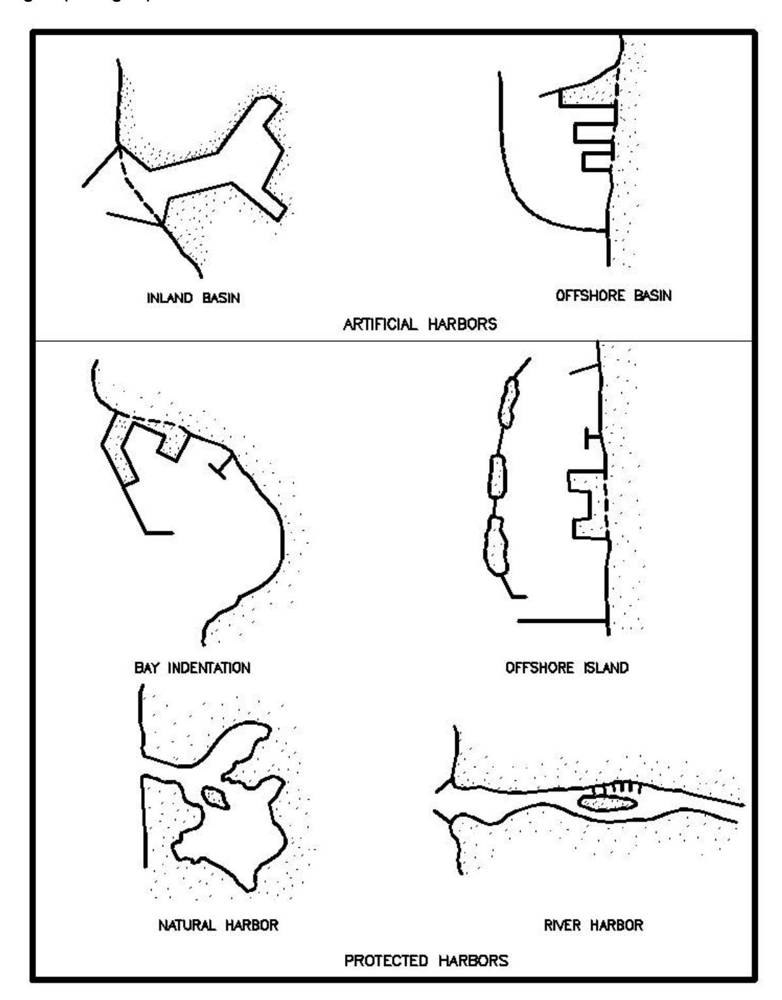

*Figure II-7-1. Harbor siting classifications*

II-7-2 Harbor Hydrodynamics

# II-7-2. Wave Diffraction

- a. Definition of diffraction.
- (1) Consider a long-crested wave that has a variable height along its crest. As this wave propagates forward, there will be a lateral transfer of wave energy along the crest (perpendicular to the direction of wave propagation). The energy transfer will be from points of greater to lesser wave height. This process is known as wave diffraction.
- (2) Nearshore wave refraction will cause concentrations of wave energy at points where wave orthogonals converge. Diffraction will lessen this refraction-induced energy concentration by causing wave energy to transfer across the orthogonals away from the region of concentration. Consequently, wave diffraction can have a small effect on the resulting heights of waves that approach harbor entrances.
- (3) Diffraction has a particularly significant effect on wave conditions inside a harbor. When waves propagate past the end of a breakwater, diffraction causes the wave crests to spread into the shadow zone in the lee of the breakwater. The wave crest orientations and wave heights in the shadow zone are significantly altered. b. Diffraction analysis.
- (1) Much of the material developed for wave diffraction analysis employs monochromatic waves. Ideally, an analysis should employ the directional spectral conditions. But, for a preliminary design analysis, one or a set of monochromatic wave diffraction analyses is often used to represent the more complex result that occurs when a directional spectrum of waves diffracts at a harbor.
- (2) In the material presented below, monochromatic results are presented first. Then, some of the available results for diffraction of irregular waves are presented. These results are based on the superposition of several monochromatic waves having a range of representative frequencies and directions. This type of analysis requires significant effort, but it can be carried out where the situation so requires. Also, physical model tests employing a directional wave spectrum can be used for a harbor diffraction analysis.
- c. Diffraction at a harbor entrance. A major concern in the planning and design of coastal harbors is the analysis of wave conditions (height and direction) that occur inside the harbor for selected incident design waves. These waves may shoal and refract after they pass through the harbor entrance; but, the dominant process affecting interior wave conditions is usually wave diffraction. Two generic types of conditions are most commonly encountered: wave diffraction past the tip of a single long breakwater and wave diffraction through a relatively small gap in a breakwater. (1) Waves passing a single structure.
- (a) Figure II-7-2 shows a long-crested monochromatic wave approaching a semi-infinite breakwater in a region where the water depth is constant (i.e. no wave refraction or shoaling). A portion of the wave will hit the breakwater where it will be partially dissipated and partially reflected. The portion of the wave that passes the breakwater tip will diffract into the breakwater lee. The diffracted wave crests will essentially form concentric circular arcs with the wave height decreasing along the crest of each wave. The region where wave heights are affected by diffraction will extend out to the dashed line in Figure II-7-2.

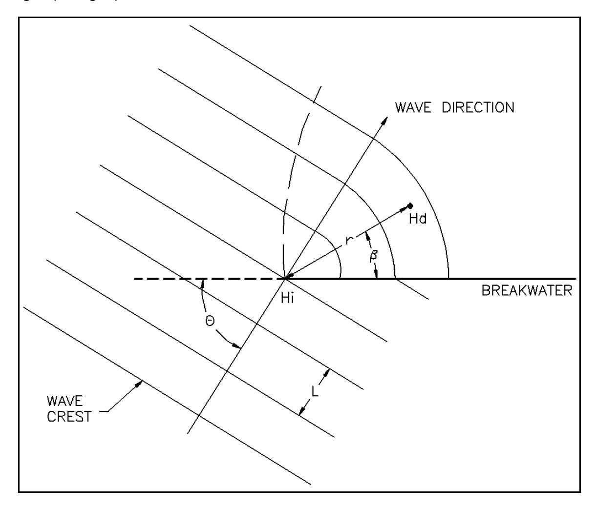

*Figure II-7-2. Wave diffraction, definition of terms*

- (b) The reflected wave crests (not shown in the figure) would also diffract to form concentric wave crests that curl around the breakwater tip into the lee. These waves are typically much lower than the incident waves and are more affected by diffraction when they reach the breakwater lee, so they typically have a very small height in the lee of the breakwater.
- (c) A diffraction coefficient K N = Hd/Hi can be defined where Hd is the diffracted wave height at a point in the lee of the breakwater and Hi is the incident wave height at the breakwater tip. If r is the radial distance from the breakwater tip to the point where KN is to be determined and $ is the angle between the breakwater and this radial, then K N = fcn(r/L, $ , 2 ) where 2 defines the incident wave direction (see Figure II-7-2) and L is the wave length. Consequently, for a given location in the lee of the breakwater, the diffraction coefficient is a function of the incident wave period and direction of approach. So, for a spectrum of incident waves, each frequency component in the wave spectrum would have a different diffraction coefficient at a given location in the breakwater lee.
- (d) The general problem depicted in Figure II-7-2 was originally solved by Sommerfeld (1896) for the diffraction of light passing the edge of a semi-infinite screen. Penny and Price (1952) showed that the same solution applies to the diffraction of linear surface waves on water of constant depth that propagate past the end of a semi-infinite thin, vertical-faced, rigid, impermeable barrier. Thus, the diffraction coefficients in the structure lee include the effects of the diffracted incident wave and the much smaller diffracted wave that
II-7-4 Harbor Hydrodynamics
reflects completely from the structure. Wiegel (1962) summarizes the Penny and Price (1952) solution and tabulates results of this solution ( K N = fct(r/L, $ , 2 ) for selected values of r/L , $ and 2. Figure II-7-3 shows Wiegel's (1962) results for an approach angle 2 of 60 deg. Plots of approach angles 2 varying by 15-deg intervals from 15 to 180 deg can be found in Wiegel (1962) and the Shore Protection Manual (1984).
(e) An interesting feature demonstrated by Figure II-7-3 is that for this approach angle, the value of the diffraction coefficient along a line in the lee of the breakwater that extends from the breakwater tip in the direction of the approaching wave is approximately 0.5. This is true not only for the approach angle of 60 deg, but for any approach angle. Note also that for a given location in the lee of a breakwater, a onedimensional spectrum of waves that comes from the same direction will undergo a greater decrease in height(energy density) for successively higher frequency waves in the spectrum. Increasing frequencies mean shorter wavelengths and consequently larger values of r/L (for given values of $ and 2). Thus the diffracted spectrum will have a shift in energy density towards the lower frequency portion of the spectrum.

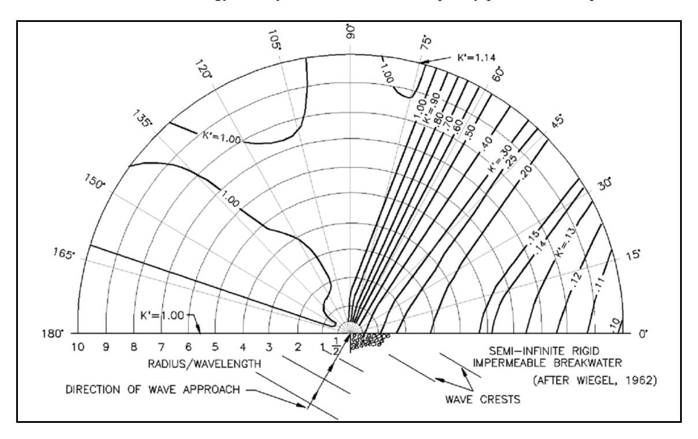

*Figure II-7-3. Wave diffraction diagram - 600 wave angle*

(f) Wave tank measurements of diffracted heights for waves passing a semi-infinite barrier were made by Putnam and Arthur (1948). They considered six approach directions for each of two incident wave periods. Their measurements generally confirm the diffraction theory. But, the diffraction theory assumes small-amplitude waves and Putnam and Arthur (1948) employed relatively small-amplitude waves in their experiments. For steeper waves, finite amplitude effects would cause the results to differ somewhat from the diffraction theory based on small-amplitude waves.

#### EXAMPLE PROBLEM II-7-1

#### FIND:

The wave height in the lee of the breakwater at a point specified by $ = 30 deg and r = 100 m.

# GIVEN:

A train of 6-sec-period 2-m-high waves is approaching a breakwater at an angle 2 = 60 deg. The water depth in the lee of the breakwater is 10 m.

#### SOLUTION:

From the linear wave theory for a period of 6 sec and a water depth of 10 m, the wave length can be calculated to be 48.3 m. Thus, r/L = 100/48.3 = 2.07. From Figure II-7-3 at $ = 30 deg and r/L = 2.07, K N = 0.28. This yields a diffracted wave height = (0.28)2 = 0.56 m.
The diffracted wave would be propagating in the direction $ = 30 deg and would have a continually diminishing wave height as indicated by Figure II-7-3. If the breakwater has a reflection coefficient that is less than one, the above result would still be reasonable, since the diffracted height of the reflected wave would be very small at the point of interest.
- (2) Waves passing through a structure gap.
- (a) When waves pass through a gap in a breakwater, diffraction occurs in the lee of the breakwater on both sides of the gap. As the waves propagate further into the harbor, the zone affected by diffraction grows toward the center line of the gap until the two diffraction zones interact (see Figure II-7-4). The wider the gap, the further into the harbor this interaction point occurs. For typical harbor conditions and gap widths greater than about five wavelengths, Johnson (1952) suggests that the diffraction patterns at each side of the gap opening will be independent of each other and Wiegel (1962) may be referenced for diffraction analysis. For smaller gap widths, an analysis employing the gap geometry must be used.

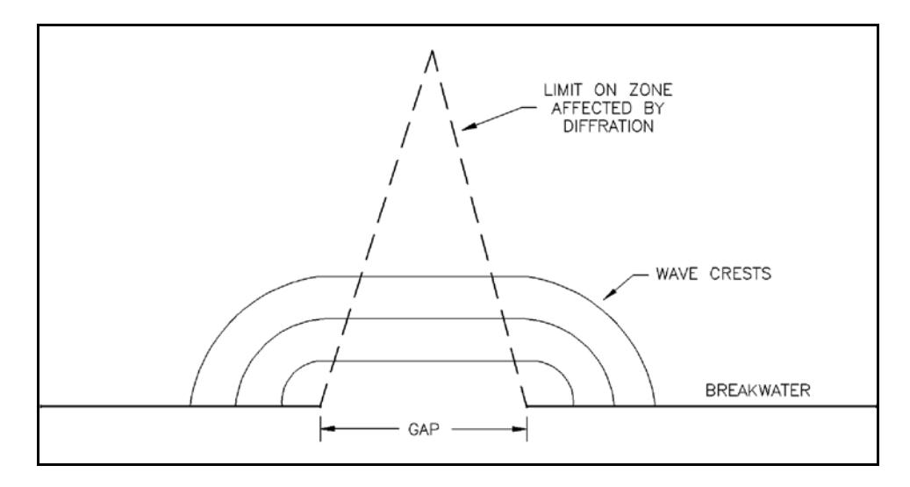

*Figure II-7-4. Wave diffraction through a gap*

II-7-6 Harbor Hydrodynamics
(b) Penny and Price (1952) developed a solution for the diffraction of normally incident waves passing through a structure gap by superimposing the solutions for two mirror image semi-infinite breakwaters. Johnson (1952) employed their solution to develop diagrams that give diffraction coefficients for gap widths ( B ) that are between one half and five times the incident wavelength. The lateral coordinates ( x , y ) are again nondimensionalized by dividing by the wavelength. Figure II-7-5 is an example of one of the diagrams Johnson (1952) developed. Only one half of the pattern is shown; the other half would be a mirror image. The reader is referred to Johnson (1952) and the Shore Protection Manual (1984) when dealing with gap widths other than 0.5 wavelength.

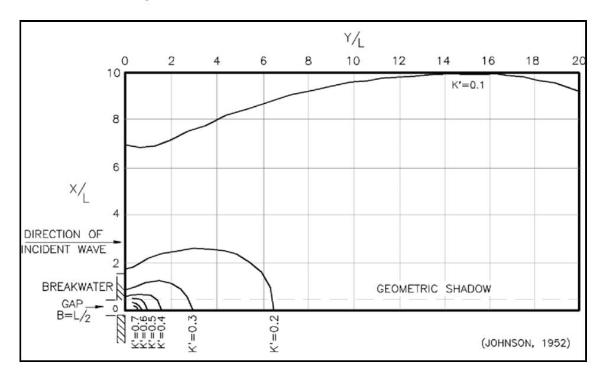

*Figure II-7-5. Contours of equal diffraction coefficient gap width = 0.5 wavelength (B/L = 0.5)*

- (c) It may be necessary to know the wave crest orientation in the diffraction zone. Up to about six wavelengths beyond the gap, it is recommended ( Shore Protection Manual 1984) that the wave crest position be approximated by two arcs that are centered on the two breakwater tips (as for a semi-infinite breakwater) and that the arcs be connected by a smooth curve that is approximately a circular arc centered on the midpoint of the gap. Beyond eight wavelengths, the crest position may be approximated by a single circular arc centered on the gap midpoint.
- (d) The waves approaching a breakwater gap will usually not approach in a direction normal to the gap. Johnson (1952) found that the results presented above for normally incident waves can be used as an approximation for oblique waves by employing an imaginary equivalent gap having an orientation and width B' as defined in Figure II-7-6. Carr and Stelzriede (1952) employed a different analytical approach than that developed by Sommerfeld (1896) and also developed diffraction pattern solutions for barrier gaps that are small compared to the incident wavelength. Johnson (1952) used their approach to develop diffraction coefficient diagrams for a range of wave approach angles and a gap width equal to one wavelength. These are shown in Figures II-7-7 through II-7-12 for approach angles between 0 and 75 deg.
- (e) Often, harbor entrance geometries will be different from the semi-infinite and gap geometries presented above. Still, approximate but useful results can be achieved by applying these solutions with some ingenuity in bracketing the encountered entrance geometry and interpolating results.

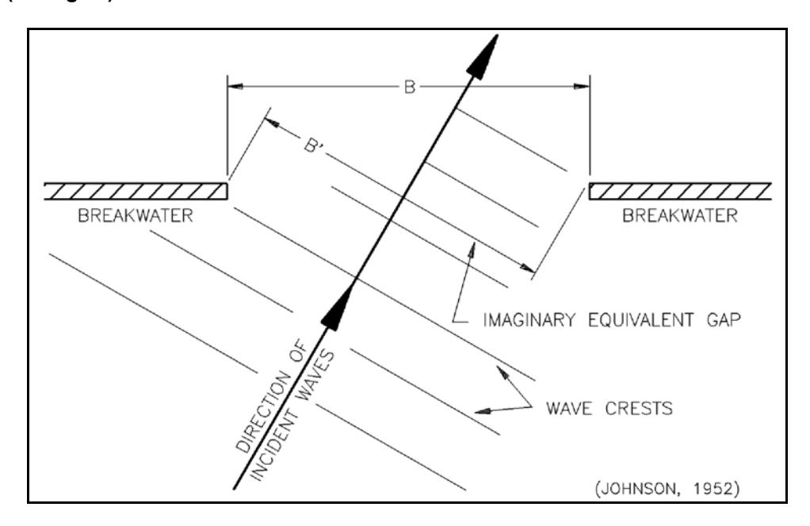

*Figure II-7-6. Wave incidence oblique to breakwater gap*

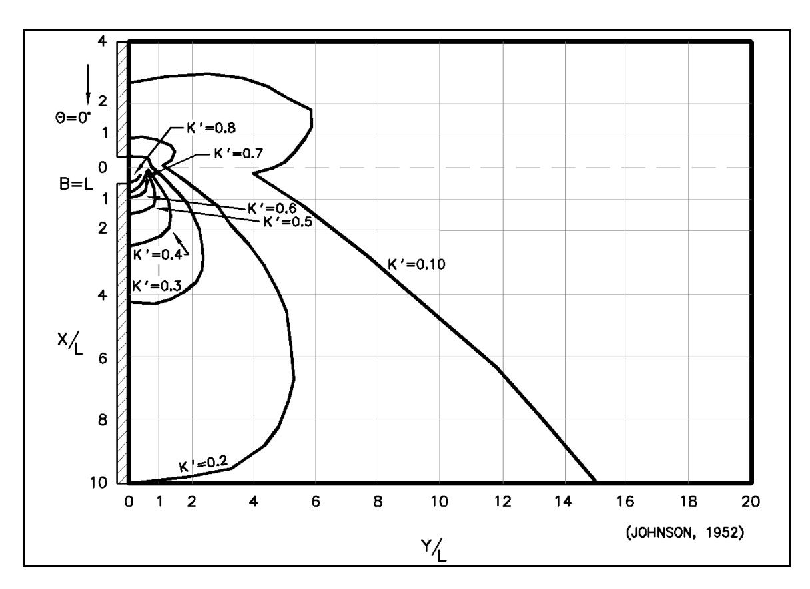

*Figure II-7-7. Diffraction for a breakwater gap of one wavelength width where N = 0 deg*

II-7-8 Harbor Hydrodynamics

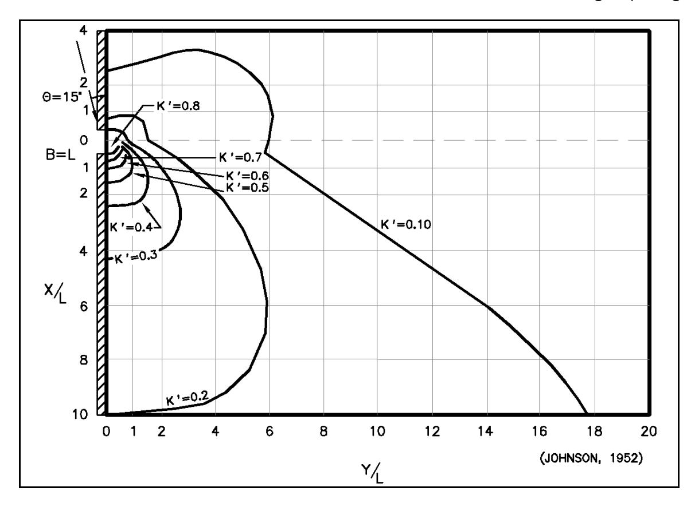

*Figure II-7-8. Diffraction for a breakwater gap of one wavelength width where N = 15 deg*

- (f) Bowers and Welsby (1982) conducted a physical model study of wave diffraction through a gap between two breakwaters whose axes are angled (rather than being collinear, i.e. 180 deg). Breakwater interior angles of 90 deg and 120 deg were employed. As would be expected, angling the breakwaters increased the heights behind the breakwater compared with the results for collinear breakwaters. But the increases were relatively small - up to 15 percent for 120-deg interior angles and up to 20 percent for 90-deg interior angles, when gap widths were in excess of half a wavelength.
- (g) Memos (1976, 1980a, 1980b, 1980c) developed an approximate analytical solution for diffraction through a gap formed at the intersection of two breakwaters having axes that are not collinear but intersect at an angle. The point of intersection of the breakwater axes coincides with the tip of one of the breakwaters. Memos' solution can be developed for various angles of wave approach. d. Irregular wave diffraction.
- (1) The preceding discussion of wave diffraction was concerned with monochromatic waves. The effects of wave diffraction on an individual wave depend on the incident wave frequency and direction. Thus, each component of a directional wave spectrum will be affected differently by wave diffraction and have a different K N value at a particular point in the lee of a breakwater.

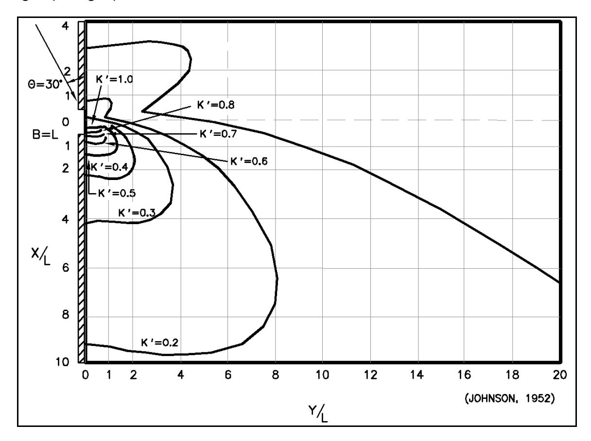

*Figure II-7-9. Diffraction for a breakwater gap of one wavelength width where \phi = 30 deg*

(2) To evaluate the effect of diffraction on a directional wave spectrum, Goda, Takayama, and Suzuki (1978) calculated diffraction coefficients for a semi-infinite breakwater and a breakwater gap by breaking the spectrum into number of frequency (10) and direction (20 to 36) components and combining the result at points in the breakwater lee. This produced an effective diffraction coefficient defined by

```math
K_e' = \left[ \frac{1}{M_o} \int_0^\infty \int_{\theta_{\text{min}}}^{\theta_{\text{max}}} S(f,\theta) (K')^2 \, d\theta \, df \right]^{\frac{1}{2}} \tag{II-7-1}
```

where K' is the diffraction coefficient for each frequency/direction component when acting as a monochromatic wave, M_0 is the zero moment of the spectrum, df and d\theta are the frequency and direction ranges represented by each component of the spectrum, \theta_{max} and \theta_{min} are the limits of the spectral wave component directions, and S(f,\theta) is the spectral energy density for the individual components. The spectral frequency distribution they employed was similar to most typical storm spectra such as the JONSWAP spectrum. The directional spread of the spectrum was characterized by a directional concentration parameter S_{max} , which equals 10 for widely spread wind waves and 75 for swell with a long decay distance, so the directional spread is quite limited.
II-7-10 Harbor Hydrodynamics

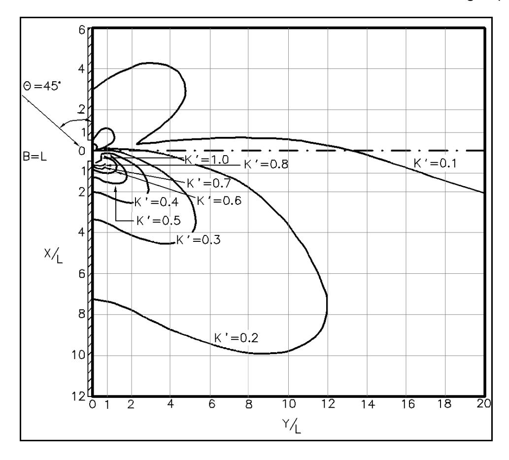

*Figure II-7-10. Diffraction for a breakwater gap of one wavelength width where N = 45 deg*

- (3) The results for waves approaching perpendicular to a semi-infinite breakwater are shown in Figure II-7-13 where the solid lines define values of KNe and the dashed lines are the ratio of peak spectral period for the diffracted to incident waves. The results for waves approaching normal to a breakwater gap are shown in Figures II-7-14 to II-7-17, where the ratio of gap width to incident wavelength varies from 1 to 8. Note that these diagrams are normalized by dividing by both the gap width and the wavelength, so two different horizontal scales are given for each case. Also, the left-hand side gives the peak period ratio and the right-hand side gives values of K N e .
- (4) The spectral diffraction diagrams for the semi-infinite breakwater show a small change in the peak period ratio as the waves extend into the breakwater lee. (For monochromatic waves the wave period would not change.) The same holds for the breakwater gap. For the semi-infinite breakwater the values of K N e are generally higher than the equivalent values of K Nfor monochromatic waves. For a breakwater gap, the spatial variation of K N e values is smoothed out by the directional spread of the incident waves. That is, there is less variation in K N e values for the spectral case than in K N for the monochromatic case. For waves approaching a breakwater gap at some oblique angle, the imaginary equivalent gap approach depicted in Figure II-7-6 can be used.
- (5) Thus, if the one-dimensional or directional spectrum for the design waves is known at a harbor entrance, Equation II-7-1 can be used with the monochromatic wave diffraction diagrams to more effectively evaluate wave diffraction in the harbor. The spectrum can be broken into a number of direction and/or frequency components, each component can be analyzed as a diffracting monochromatic wave, and the results can be recombined using Equation II-7-1.

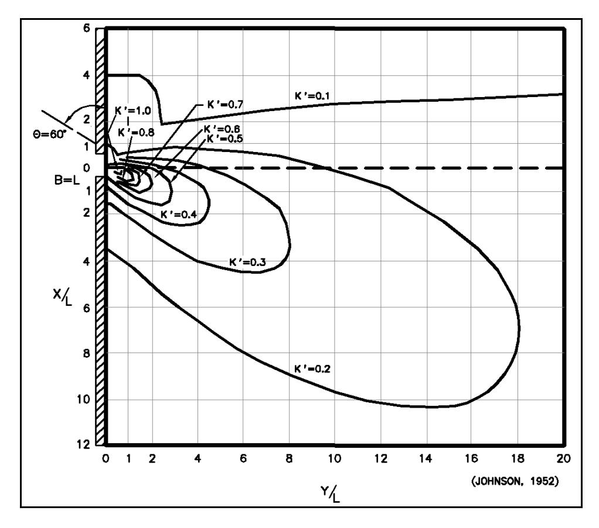

*Figure II-7-11. Diffraction for a breakwater gap of one wavelength width where N = 60 deg*

- e. Combined refraction-diffraction in harbors.
- (1) In most harbors, the depth is relatively constant so the diffraction analyses discussed above are adequate to define the resulting wave conditions. However, if the depth changes significantly, then wave amplitudes will change because of shoaling effects. If the harbor bottom contours are not essentially parallel to the diffracting wave crests, then wave amplitudes and crest orientations will be affected by refraction.
- (2) Where depth changes in a harbor are sufficient for combined refraction and diffraction effects to be significant, the resulting wave height and direction changes can be investigated by either a numerical or a physical model study. For examples of numerical model studies of combined refraction-diffraction in the lee of a structure, see Liu and Lozano (1979), Lozano and Liu (1980), and Liu (1982). Physical models that investigate the combined effects of refraction and diffraction are routinely conducted (see Hudson et al. 1979). The one major limitation on these models for wind wave conditions is that the model cannot have a distorted scale (i.e., horizontal and vertical scale ratios must be the same). Sometimes, lateral space limitations or the need to maintain an adequate model depth to avoid viscous and surface tension scale effects make a distorted scale model desirable. But such a model cannot effectively investigate combined refractiondiffraction problems.
- (3) In many cases, the depth near the entrance to a harbor is relatively constant with the significant depth changes occurring further from the entrance (in the vicinity of the shoreline). Then an approximate (but often adequate) analysis can be carried out using the techniques discussed herein. The diffraction analysis would be carried out from near the harbor entrance to the point inside the harbor where significant
II-7-12 Harbor Hydrodynamics

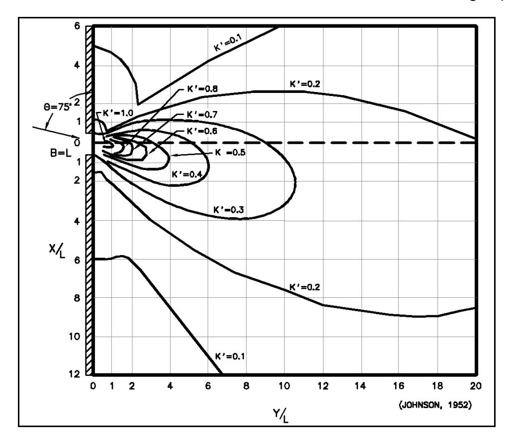

*Figure II-7-12. Diffraction for a breakwater gap of one wavelength width where N = 75 deg*

depth changes commence. Hopefully, this will be a distance of at least three or four wavelengths from the entrance. This diffraction analysis will define the wave heights and crest orientation at the point where significant shoaling-refraction effects commence. From this point landward, a refraction-shoaling analysis using the procedures described in Part II-3 can be used to carry the wave to the point of breaking or interaction with a land boundary.
- f. Combined diffraction reflection in harbors.
- (1) A computer program for dealing with combined diffraction and reflection by a vertical wedge has been developed by Seelig (1979, 1980) and is available in the Automated Coastal Engineering System (ACES) (Leenknecht et al. 1992). This package estimates wave height modifications due to combined diffraction and reflection caused by a structure. It has the ability to simulate a single straight, semi-infinite breakwater, corners of docks, and rocky headlands. Assumptions include monochromatic, linear waves, and constant water depth.
- (2) The user has the ability to vary the wedge angle from 0 to 180 deg, where 0 deg would represent the case of a single straight, semi-infinite breakwater and 90 deg, the corner of a dock.
- (3) The required input includes incident wave height, wave period, water depth, wave angle, wedge angle, and X and Y coordinates (location of desired calculation). The range of X and Y should be limited to plus or minus 10 wavelengths.

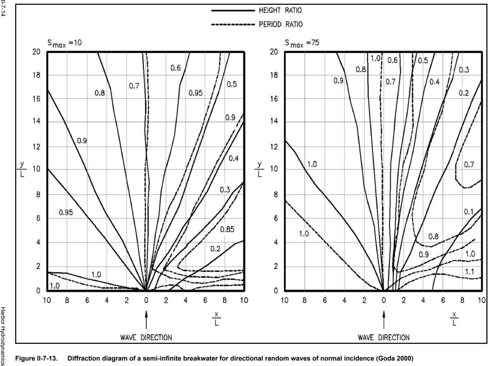

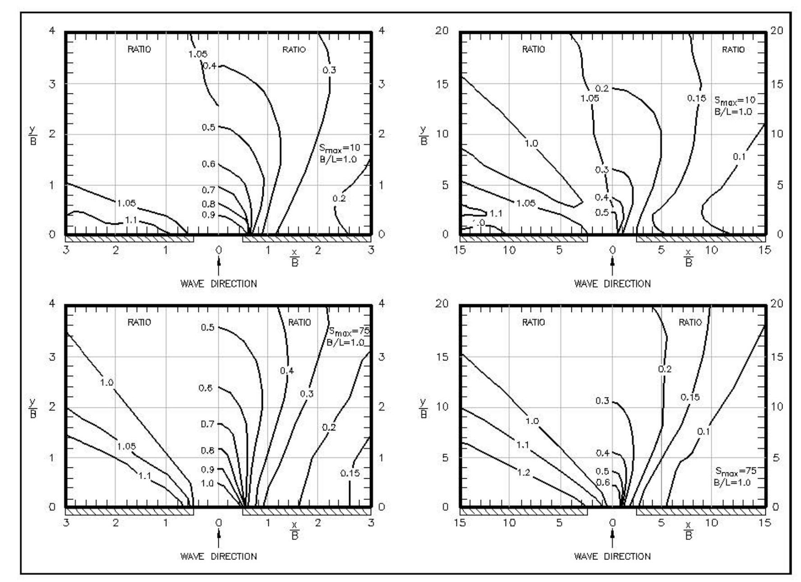

*Figure II-7-14. Diffraction diagrams of a breakwater gap with B/L = 1.0 for directional random waves of normal incidence (Goda 2000)*

*Figure II-7-15. Diffraction diagrams of a breakwater gap with B/L = 2.0 for directional random waves of normal incidence (Goda 2000)*

Harbor Hydrodynamics

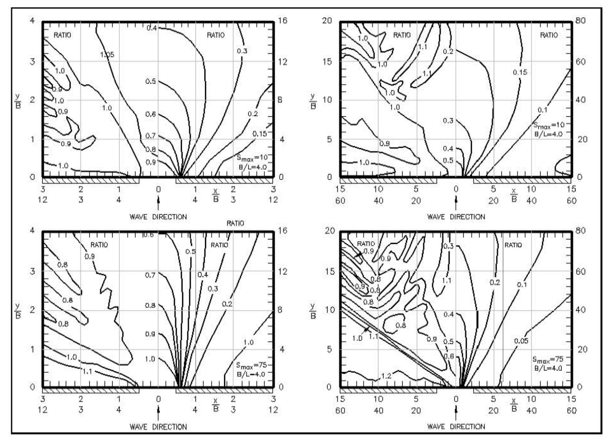

*Figure II-7-16. Diffraction diagrams of a breakwater gap with B/L = 4.0 for directional random waves of normal incidence (Goda 2000)*

20

*Figure II-7-17. Diffraction diagrams of a breakwater gap with B/L = 8.0 for directional random waves of normal incidence (Goda 2000)*

Harbor Hydrodynamics
(4) The wavelength, ratio of calculated wave height to incident wave height, wave phase, and modified wave height are given as output data. For further information on the ACES system, the reader is referred to Leenknecht et al. (1992).

# II-7-3. Wave Transmission

- a. Definition of transmission .
- (1) When waves interact with a structure, a portion of their energy will be dissipated, a portion will be reflected and, depending on the geometry of the structure, a portion of the energy may be transmitted past the structure. If the crest of the structure is submerged, the wave will simply transmit over the structure. However, if the crest of the structure is above the waterline, the wave may generate a flow of water over the structure which, in turn, regenerates waves in the lee of the structure. Also, if the structure is sufficiently permeable, wave energy may transmit through the structure. When designing structures to protect the interior of a harbor from wave attack, as little wave transmission as possible should be allowed, while optimizing the cost versus performance of the structure.
- (2) Transmitted wave height will be less than incident wave height, and wave period will usually not be identical for transmitted and incident waves. Laboratory experiments conducted with monochromatic waves typically show that the transmitted wave has much of its energy at the same frequency as the incident wave, but a portion of the transmitted energy has shifted to the higher harmonic frequencies of the incident wave. For a given incident wave spectrum, there would be a commensurate shift in the transmitted wave spectrum to higher frequencies.
- (3) The degree of wave transmission that occurs is commonly defined by a wave transmission coefficient Ct = Ht /Hi where Ht and Hi are the transmitted and incident wave heights, respectively. When employing irregular waves, the transmission coefficient might be defined as the ratio of the transmitted and incident significant wave heights or some other indication of the incident and transmitted wave energy levels.
- (4) Most quantitative information on wave transmission past various structure types has necessarily been developed from laboratory wave flume studies. Historically, most of the early studies employed monochromatic waves; but, during the past two decades there has been a significant growth in information based on studies with irregular waves. b. Transmission over/through structures. (1) Rubble-mound structures-subaerial.
- (a) Figure II-7-18 is a schematic cross section of a typical rubble-mound structure. The freeboard F is equal to the structure crest elevation h minus the water depth at the toe of the structure ds (i.e., F = h - ds ). Also shown is the wave runup above the mean water level R that would occur if the structure crest elevation was sufficient to support the entire runup. When F < R , wave overtopping and transmission will occur. The parameter F / R is a strong indicator of the amount of wave transmission that will occur. Procedures for determining wave runup are presented elsewhere in the CEM.
- (b) A number of laboratory studies of wave transmission by overtopping of subaerial structures have been conducted (see Shore Protection Manual (1984)). The most recent and comprehensive of these studies was conducted by Seelig (1980), who also studied submerged breakwaters.

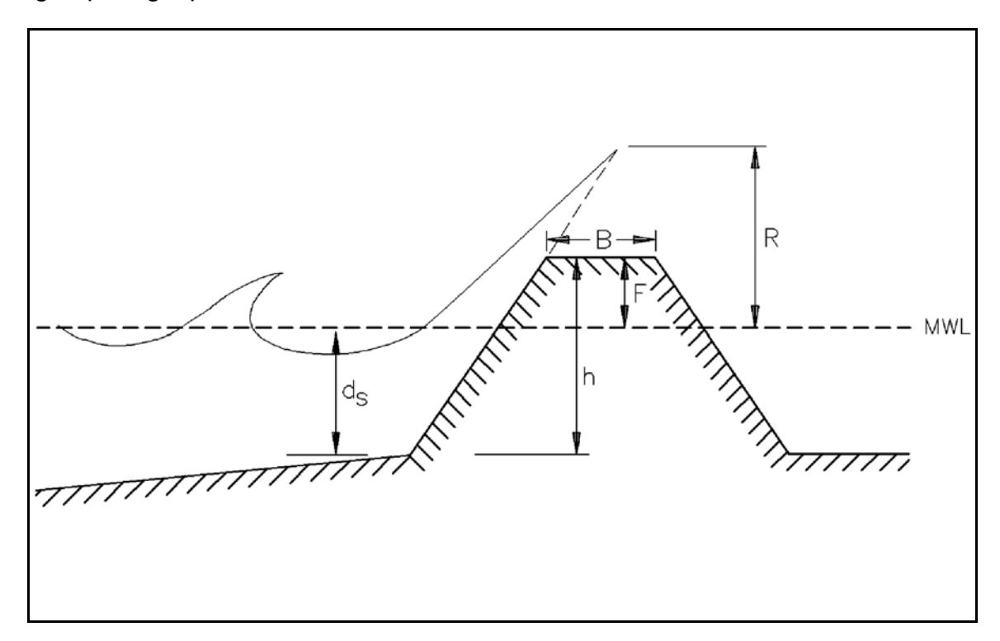

*Figure II-7-18. Schematic breakwater profile and definition of terms*

(c) Seelig presented a simple formula for estimating the wave transmission coefficient for subaerial stone mound breakwaters, which is valid for both monochromatic and irregular waves:

```math
C_t = C\left(1 - \frac{F}{R}\right) \tag{II-7-2}
```

(d) The coefficient C is given by

```math
C = 0 . 5 1 \, - \, \frac { 0 . 1 1 B } { h } \tag{II-7-3}
```

where B is the structure crest width and h is the crest elevation above the bottom (see Figure II-7-18). It is recommended that Equation II-7-2 be applied to the relative depth ( ds/gT 2 ) range of 0.03 to 0.006 and Equation II-7-3 to the range of B/h between 0 and 3.2, because these are the ranges of experimental data employed to develop the equations.
- (e) The report by Seelig (1980) contains laboratory results for 19 different breakwater cross-section geometries. Specific results for one or more of these geometries may closely relate to the prototype structure being analyzed. For irregular waves, the wave transmission coefficients were defined in terms of the incident and transmitted spectral energies. (2) Rubble-mound structures-submerged.
- (a) Rubble-mound structures having their crest at or below the mean water level have seen increasing use recently. Often, they simply consist of a homogeneous wide-graded mass of stone. A functional
II-7-20 Harbor Hydrodynamics
advantage for these lower-cost structures is that they may have a relatively high transmission coefficient for everyday lower waves, but as the height of the incident waves increases, the transmission coefficient will generally decrease. For harbor installations, they have been used in tandem with a conventional subareal breakwater placed in their lee - the combined cost of the two structures being less than a single structure with the same operational criteria (Cox and Clark 1992). A number of laboratory experiments on wave transmission past submerged rubble-mound structures have been conducted. Results are summarized in Seelig (1980) and Van der Meer and Angremond (1992).
- (b) Van der Meer and Angremond (1992) summarized the available data plus some of their own data to present a comprehensive procedure for predicting wave transmission for low-crested breakwaters. For irregular waves they defined the transmission coefficient as the ratio of incident and transmitted significant wave heights. They correlated Ct with F/Hi where F would have positive values for low subaerial breakwaters and negative values for breakwaters with a submerged crest. Correlations with parameters that also included the incident wave period did not improve results. Figure II-7-19 gives Ct versus F/Hi .
- (c) Van der Meer and Angremond (1992) were able to improve the correlations based on experimental data by introducing the median diameter D50 of the armor stone used to build the structure. (There is a relationship between D50 and the design wave height for a stable structure.) They then correlated Ct with F/D50 and secondary factors Hs/gTp 2 , Hi / D50, and B /D50. These relationships are presented in the form of somewhat complex formulas. (3) Permeable rubble-mound structures.
- (a) Wave energy may transmit through a rubble-mound structure, particularly if it is constructed solely of a homogeneous mass of large diameter stone. If the structure contains a number of stone layers including a core of fine stones, the wave transmission will be much less. Also, wave energy transmission through a stone mound structure would be significant for long-period, low waves, but much less for shorter-period waves (e.g. the tide would only be slightly reduced by a rubble-mound structure, but steep, wind-generated waves would have negligible transmission through the structure).

#### EXAMPLE PROBLEM II-7-2

# FIND:

The transmission coefficients and the transmitted wave heights for incident wave heights of 0.5, 1.0, 2.0 and 4.0 m.

## GIVEN:

A submerged offshore breakwater situated where the bottom is 4.0 m below the design still-water level. The structure crest elevation is 3.0 m above the bottom.

#### SOLUTION:

The breakwater freeboard F is 3.0 - 4.0 = -1.0 m. Employing Figure II-7-19 we have:

| Hi(m) | F/Hi | Ct | Ht(M) |
| --- | --- | --- | --- |
| 0.5 | -2.0 | 0.82 | 0.41 |
| 1.0 | -1.0 | 0.74 | 0.74 |
| 2.0 | -0.5 | 0.60 | 1.20 |
| 4.0 | -0.25 | 0.52 | 2.10 |

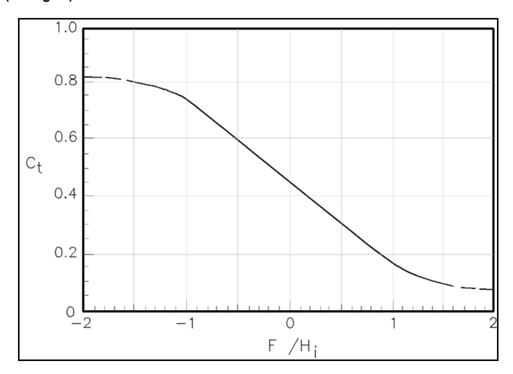

*Figure II-7-19. Wave transmission for a low-crested breakwater (modified from Van der Meer and Angremond (1992))*

(b) When a porous rubble-mound structure suffers wave transmission caused by wave overtopping and by wave propagation through the structure, the resulting combined transmission coefficient would be

```math
C_t = \sqrt{C_{tt}^2 + C_{t0}^2} \tag{II-7-4}
```

where Ctt is the coefficient for wave transmission through the structure and Ct0 is the coefficient for wave transmission by flow over the structure.
- (c) Potential scale effects make it difficult to conduct scaled laboratory experiments to measure wave transmission through rubble-mound structures. (Wave motion requires Froude similitude, while flow through porous media requires Reynolds similitude, but the two are incompatible.) Consequently, the best procedure for determining Ctt for a rubble-mound structure is a numerical procedure developed by Madsen and White (1976). A computer program for applying this procedure has been developed by Seelig (1979,1980) and is available in the ACES system (Leenknecht et al. 1992).
- (d) The procedure developed by Madsen and White (1976) first calculates the amount of wave dissipation caused by wave runup/rundown on the seaward face of the structure. (It is assumed that the wave does not break - a good assumption for longer waves.) Wave reflection from the structure is also determined. The remaining energy propagates into the structure and is partially dissipated by turbulent action. The procedure then determines this rate of turbulent energy dissipation assuming a rectangular homogeneous breakwater cross section that is hydraulically equivalent to the actual layered breakwater. This leads to the transmitted wave height and Ct t . Application of this procedure requires a knowledge of the incident wave height and period, the water depth, the breakwater layer geometry, and the stone sizes and porosities for each layer. Seelig (1980) found that this procedure could be applied to irregular waves by using the mean wave height and spectral peak period of the incident waves in the calculation.
II-7-22 Harbor Hydrodynamics

#### EXAMPLE PROBLEM II-7-3

#### FIND:

The transmission coefficient for incident waves having periods of 2 and 5 sec.

#### GIVEN:

The catamaran breakwater whose performance is depicted in Figure II-7-21.

#### SOLUTION:

For a water depth of 7.6 m, using the linear wave theory, wavelengths would be calculated to be 6.24 m (for T = 2 sec) and 34.4 m (for T = 5 sec). For a width W of 6.4 m, this yields W / L = 1.03 and 0.186, respectively. From Figure II-7-21, this yields Ct = 0.2 (extrapolating) for the 2-sec wave and Ct = 0.8 for the 5-sec wave. Thus, this catamaran is quite effective for the 2-sec wave but quite ineffective for the 5-sec wave.

#### (4) Floating breakwaters.

- (a) Moored floating breakwaters have some distinct advantages for harbor installations. They are more adaptable to the water level changes that occur at harbors that are built on reservoirs and in coastal areas having a large tidal range. They are usually more economical than fixed breakwaters for deep-water sites, and they interfere less with water circulation and fish migration. But they also have some significant limitations. Since they are articulating structures, they are prone to damage at connecting points between individual breakwater units and between these units and mooring lines. And, their performance is very dependent on the period of the incident waves. This last factor will establish relatively severe limits on where floating breakwaters can effectively be deployed.
- (b) Several different types of floating breakwaters have been proposed. Hales (1981) presents a survey of these various types and their performance. Most of the floating breakwaters in use are of three generic types - prism, catamaran, and scrap tire assembly (see Figure II-7-20). Figure II-7-21 plots the wave transmission coefficients for a typical representative of each of these three types. The transmission coefficient is plotted versus the breakwater's characteristic dimension in the direction of wave propagation W divided by the incident wave length L at the breakwater. The data plotted in Figure II-7-21 are all derived from laboratory experiments. The prism results are for a concrete box having a 4.88-m width ( W ), a draft of 1.07 m, and a water depth of 7.6 m (Hales 1981). The catamaran (Hales 1981) has two pontoons that are 1.07 m wide with a draft of 1.42 m and a total width ( W ) of 6.4 m. The water depth was 7.6 m. The tire assembly (Giles and Sorensen 1979) had a width of 12.8 m ( W ), a nominal draft of one tire diameter, and was tested in water 3.96 m deep. The three breakwaters were all moored fore and aft; other mooring arrangements would somewhat alter the transmission coefficient.
- (c) Example Problem II-7-3 demonstrates a major limitation of floating breakwaters. For typical breakwater sizes (i.e., W equals 5 to 10 m) the incident wave period must not exceed 2-3 sec for the breakwater to be very effective. Thus, for typical design wind speeds, the fetch generating the waves to which the structure is exposed cannot be very large. Sorensen (1990) conducted an analysis to determine general wind speed, fetch, and duration guidelines for the three floating breakwaters from Figure II-7-20. He assumed an allowable transmitted wave height of 2 ft (0.61 m). For example, for a wind speed of 60 mph (26.8 m/sec) having a duration of 20-30 min, the fetch must not exceed 2-3 miles (3.2-4.8 km) if the transmitted wave height is to be less than 2 ft.

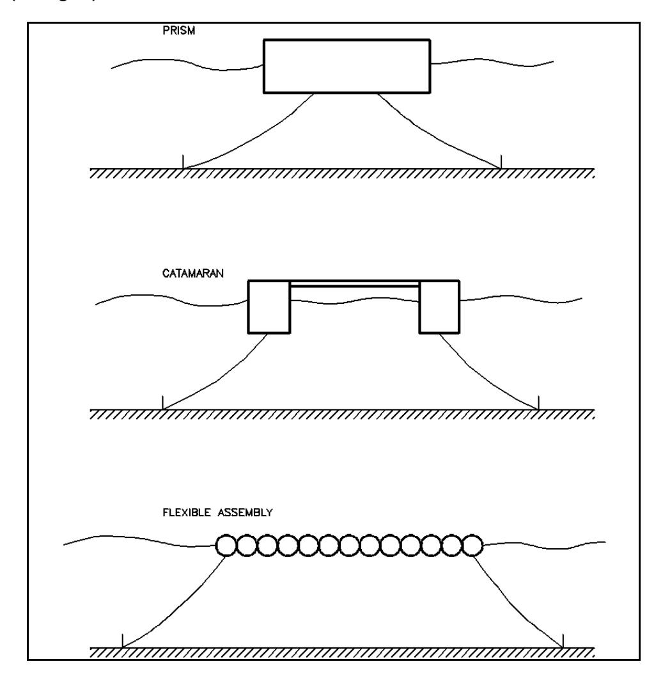

*Figure II-7-20. Common types of floating breakwaters*

(d) The wave-induced loading on the floating breakwater's mooring/anchor system is also an important design concern. Hales (1981) and Harms et al. (1982) present mooring load data for various types of floating breakwaters. The peak mooring load that develops for a given breakwater geometry and mooring arrangement depends primarily on the incident wave height and increases significantly as the wave height increases; the wave period or length is only of secondary importance in determining the mooring load. If the mooring load cannot be adequately estimated from published information on similar breakwaters, physical model tests may be required to determine these loads for the anticipated design wave conditions.

#### (5) Wave barriers.

(a) Vertical thin semirigid barriers are used as breakwaters at some harbors, particularly where wave loading is relatively small and wave reflection would not be a problem. For some small-craft harbor installations, the barrier is open at the bottom, which allows water to circulate in and out of the harbor and reduces structure costs (see Gilman and Nottingham (1992) and Lott and Hurtienne (1992). If the incident wave period is relatively short ( d / L relatively large), wave action is focused near the surface and wave transmission would be relatively small.
II-7-24 Harbor Hydrodynamics

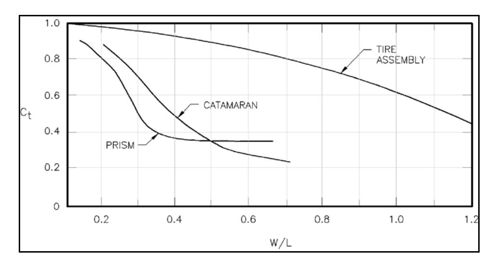

*Figure II-7-21. Wave transmission coefficient for selected floating breakwaters (Giles and Sorensen 1979; Hales 1981)*

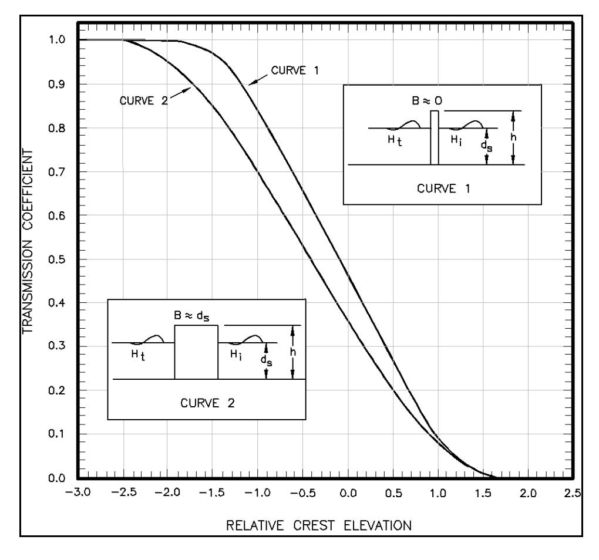

*Figure II-7-22. Wave transmission coefficient for vertical wall and vertical thin-wall breakwaters where 0.0157 # ds lgt2 # 0.0793 (based on Goda 2000)*

- (b) Wave transmission coefficients for a thin and a relatively wide vertical barrier that has its crest above or below the water surface were determined from experiments by Goda (1969). The results, which are for monochromatic waves, are shown in Figure II-7-22. Later tests with irregular waves, where the transmission coefficient is defined in terms of the incident and transmitted significant wave heights, showed that Figure II-7-22 can also be used for irregular wave conditions (Goda 2000). As would be expected, a portion of thetransmitted wave energy shifted to higher frequencies so that the transmitted significant wave period was less than the incident significant period.
- (c) Wiegel (1960) developed a simple analytical formulation for wave transmission past a thin rigid vertical barrier that does not extend to the bottom. For monochromatic waves and no overtopping, the resulting transmission coefficient is given by

```math
C_{t} = \left[ \frac{\frac{2k(d-y)}{\sinh 2kd} + \frac{\sinh 2k(d-y)}{\sinh 2kd}}{1 + \frac{2kd}{\sinh 2kd}} \right]^{\frac{1}{2}} \tag{II-7-5}
```

where d is the water depth, y is the vertical extent of the barrier below the still-water surface, and k = 2B/ L. In developing Equation II-7-5, Wiegel assumed that the portion of the wave power in the water column below the lower edge of the barrier transmits past the barrier. He used the linear wave theory in this analysis and neglected energy dissipation caused by flow separation at the barrier edge. Limited monochromatic wave tests by Wiegel (1960) and irregular wave tests by Gilman and Nottingham (1992) indicate that Equation II-7- 5 can be used for preliminary design calculations.

#### II-7-4. Wave Reflection

- a. Definition of reflection.
- (1) If there is a change in water depth as a wave propagates forward, a portion of the wave's energy will be reflected. When a wave hits a vertical, impermeable, rigid surface-piercing wall, essentially all of the wave energy will reflect from the wall. On the other hand, when a wave propagates over a small bottom slope, only a very small portion of the energy will be reflected. The degree of wave reflection is defined by the reflection coefficient Cr = Hr/Hi where Hr and Hi are the reflected and incident wave heights, respectively.
- (2) Wave energy that enters a harbor must eventually be dissipated. This dissipation primarily occurs at the harbor interior boundaries. Thus, it is necessary to know the reflection coefficients of the interior boundaries to fully define wave conditions inside a harbor. It may also be necessary, because of excessive wave reflection, to decrease the reflection of certain boundary structures in order to keep interior wave agitation at acceptable levels.
- (3) The reflection coefficient for a surface-piercing sloped plane will depend on the slope angle, surface roughness, and porosity. It will also depend on the incident wave steepness Hi /L . Consequently, for a given slope roughness and porosity, the wave reflection will depend on a parameter known as the surf similarity number or Iribarren number (Battjes 1974)

```math
I_r = \frac{\tan\alpha}{\sqrt{\frac{H_i}{L_o}}} \tag{II-7-6}
```

II-7-26 Harbor Hydrodynamics

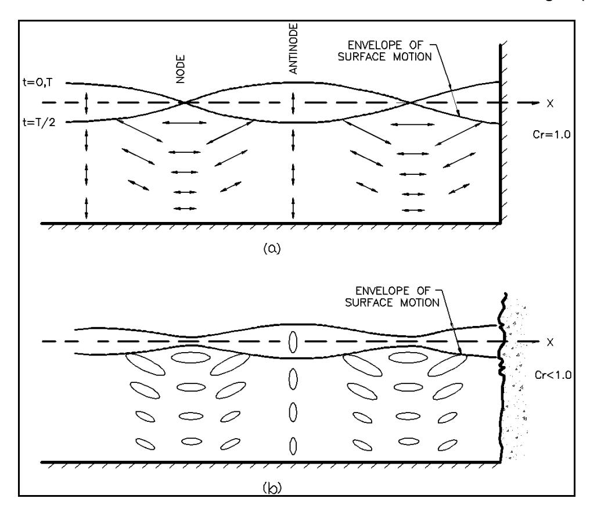

*Figure II-7-23. Complete and partial reflection*

where " is the angle the slope forms with the horizontal and L0 is the length of the incident wave in deep water.
(4) Figure II-7-23a is a profile view of the water surface envelope positions for a wave reflecting from a wall that has a reflection coefficient equal to unity (i.e., Hi = Hr ). The water surface amplitude is given by

```math
N = H _ { i } \cos { \frac { 2 \pi x } { L } } \cos { \frac { 2 \pi t } { T } } \tag{II-7-7}
```

where L and T are the incident and reflected wave length and period respectively, x is the horizontal ordinate and t is the time elapsed. The figure also shows the water particle paths at key points. At nodal points, water particle motions are horizontal and at antinodes, water particle motions are vertical. At t = 0, T /2, and T , the water is instantaneously still and all of the wave energy is potential energy. At t = T /4 and 3 T /4, the water surface is horizontal and all of the energy is kinetic energy.
(5) When the wall reflection coefficient is less than unity, the water surface envelope positions and particle paths are as depicted in Figure II-7-23b. As the reflection coefficient decreases toward zero, the water surface profile and water particle path changes toward the form of a normal progressive wave.
- b. Reflection from structures.
- (1) Most of the interior boundaries of many harbors are lined with structures such as bulkheads or reveted slopes. Recent laboratory investigations (Seelig and Ahrens 1981; Seelig 1983; Allsop and Hettiarachchi 1988) indicate that the reflection coefficients for most structure forms can be given by the following

```math
C_r = \frac{aI_r^2}{b + I_r^2} \tag{II-7-8}
```

where the values of coefficients a and b depend primarily on the structure geometry and to a smaller extent on whether waves are monochromatic or irregular. The Iribarren number employs the structure slope and the wave height at the toe of the structure.
(2) Table II-7-1 presents values for the coefficients a and b collected from the above references.

**Table II-7-1. presents values for the coefficients a and b collected from the above references.**

| Structure |  | a | b |
| --- | --- | --- | --- |
| Plane slope-monochromatic | waves | 1.0 | 5.5 |
| Plane slope-irregular waves |  | 1.1 | 5.7 |
| Rubble-mound breakwaters1 |  | 0.6 | 6.6 |
| Dolos-armored breakwaters | - monochromatic waves | 0.56 | 10.0 |
| Tetrapod-armored breakwaters | - irregular waves | 0.48 | 9.6 |

**Table II-7-1. presents values for the coefficients a and b collected from the above references.**

| Structure |  | a | b |
| --- | --- | --- | --- |
| Plane slope-monochromatic | waves | 1.0 | 5.5 |
| Plane slope-irregular waves |  | 1.1 | 5.7 |
| Rubble-mound breakwaters1 |  | 0.6 | 6.6 |
| Dolos-armored breakwaters | - monochromatic waves | 0.56 | 10.0 |
| Tetrapod-armored breakwaters | - irregular waves | 0.48 | 9.6 |

*This is an average conservative value. Seelig and Ahrens (1981) recommend a range of values for a and b that depend on the number of stone layers, the relative water depth ( d / L ), and the ratio of incident wave height to breaker height.*

#### EXAMPLE PROBLEM II-7-4

# FIND:

The height of the reflected wave.

# GIVEN:

A wave in deep water has a height of 1.8 m and a period of 6 sec. It propagates toward shore without refracting or diffracting to reflect from a rubble-mound breakwater located in water 5 m deep. The breakwater front slope is 1:1.75 (29.7 deg).

### SOLUTION:

From linear wave theory shoaling calculations (Part II-1) the wave height at the structure would be 1.70 m (this is Hi ). From the linear wave theory, the deepwater wave length is L0 = 56.2 m. Then, from Equation II-7-6, the Iribarren number is

```math
I _ { r } = { \frac { \tan 2 9 . 7 ^ { o } } { \sqrt { 1 . 7 0 / 5 6 . 2 } } } = 3 . 2 8
```

For the coefficient values a = 0.6 and b = 6.6 (from Table II-7-1), Equation II-7-8 yields

```math
C _ { r } \ = \ { \frac { 0 . 6 ( 3 . 2 8 ) ^ { 2 } } { 6 . 6 \ + \ ( 3 . 2 8 ) ^ { 2 } } } \ = \ 0 . 3 7
```

Thus, the reflected wave height Hr = CrHi = 0.37(1.70) = 0.63 m.
II-7-28 Harbor Hydrodynamics
(3) Note that Equation II-7-8 indicates that Cr approaches the value of a at higher values of the Iribarren number. Thus, the highest reflection coefficients for stone and concrete unit armored structures are around 0.5. As expected, vertical plane slopes (infinite Iribarren number) would have a reflection coefficient near unity. For typical rigid vertical bulkheads, owing to the irregularity of the facing surface, a value of Cr = 0.9 might be used.

#### c. Reflection from beaches.

- (1) When the reflecting slope becomes very flat, the incident wave will break on the slope, causing an increase in energy dissipation and commensurate decrease in the reflection coefficient. Thus, beaches are generally very efficient wave absorbers, particularly for shorter period wind-generated waves. An added complexity is that as the incident wave conditions change, the beach profile geometry will change, in turn changing the reflection coefficient somewhat. Laboratory measurements of wave reflection from beaches suffer from scale effects in trying to replicate the prototype beach profile, surface roughness, and porosity. Also, it is harder to select a beach slope angle for the Iribarren number owing to the complexity of beach profiles. Thus, data plots follow the form of Equation II-7-8, but with significant scatter in the data points. Seelig and Ahrens (1981) suggest that a = 0.5 and b = 5.5 be used for beaches. Since the slope angles are small, the Iribarren number will be relatively small, yielding relatively low reflection coefficients.
- (2) An interesting phenomenon (known as Bragg reflections after a similar phenomenon in optics) occurs when the shallow nearshore seabed has uniformly spaced bottom undulations. A resonance develops between the incident surface waves of certain periods and the bottom undulations, causing a reflection of a portion of the incident wave energy (see Davies and Heathershaw (1984), Mei (1985), Kirby (1987)). Resonance and reflection are maximum for that portion of the incident wave spectrum having a wavelength that is twice the length of the bottom undulations. There is an approximately linear increase in the reflection coefficient with the increase in the number of bottom undulations. Reflection also increases if the amplitude of the bottom undulations increases or the water depth over the undulations decreases. For appropriate undulation geometries and water depths, reflection coefficients in excess of 0.5 are possible.
- (3) It has been suggested (Mei 1985) that Bragg reflections that develop on a nearshore bar system will set up a standing wave pattern seaward of the bar system which, in turn, causes the bar system to extend in the seaward direction. Theoretical, laboratory, and field studies indicate that it is possible to build a series of shore-parallel submerged bars tuned to the dominant incoming wave periods, that will act as a shore protection device. The feasibility of building these bar systems and their economics need to be studied further. d. Reflection patterns in harbors.
- (1) Figure II-7-24 depicts the plan view of a wave crest approaching and reflecting from a barrier that has a reflection coefficient Cr . The incident wave crest is curved owing to refraction and possibly to diffraction. The actual bottom contours in front of the barrier are as shown. The reflected wave crest pattern can be constructed by: (a) Constructing imaginary mirror image hydrography on the other side of the barrier.
- (b) Constructing the wave crest pattern that would develop as the wave propagates over this imaginary hydrography (this would involve the use of refraction and diffraction analyses as described in previous sections). (c) Constructing the mirror image of the imaginary wave crest pattern to define the real reflected wave.

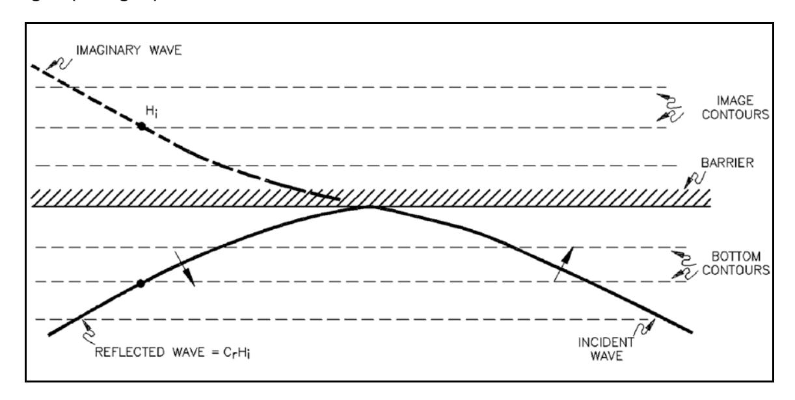

*Figure II-7-24. Reflected wave crest pattern*

- (2) The reflected wave height at any point would be the height at the corresponding point in the imaginary area multiplied by the reflection coefficient at the point on the barrier where that segment of the wave reflected.
- (3) Figure II-7-25 shows a wave diffracting in the lee of a breakwater and then reflecting off a wall ( Cr > 0). The inner end of the reflected wave then hits a beach where it is effectively dissipated; the outer end of the reflected wave diffracts around the breakwater tip and escapes the harbor. The height the reflected wave would have at point A would equal the diffracted height at A' times the reflection coefficient of the wall. By applying the concepts demonstrated in Figures II-7-24 and II-7-25, one can develop the reflection patterns and resulting wave heights for more complex harbor situations (see Carr (1952) and Ippen (1966)). e. Reflection problems at harbor entrances.
- (1) Generally speaking, wave energy that penetrates a harbor entrance should be dissipated as soon as possible, to prevent its subsequent reflection and propagation further into and about the harbor. A number of mechanisms for doing so are discussed in Bruun (1956, 1989). One mechanism is to construct sections of beach, stone mounds or other specially designed wave dissipating structures having low reflection coefficients at appropriate positions just inside the harbor entrance. Another mechanism is to construct resonance chambers at the entrance that are tuned to the dominant frequencies of the incident wave spectrum to set up oscillations that dissipate the penetrating wave energy. Often the general layout of the harbor can be designed to minimize the amount of wave energy that penetrates through the entrance and reflects and rereflects around the harbor.
- (2) When significant wave reflection occurs in the vicinity of a harbor entrance (either inside or outside) the incident and reflected waves cross to form a complex "diamond-shaped" wave pattern. Hsu (1990) presents an extensive discussion of the kinematics of the resulting short-crested waves. This form of wave action can cause navigation difficulties and unusual sediment transport and scour patterns (see Silvester and Hsu (1993)).
II-7-30 Harbor Hydrodynamics

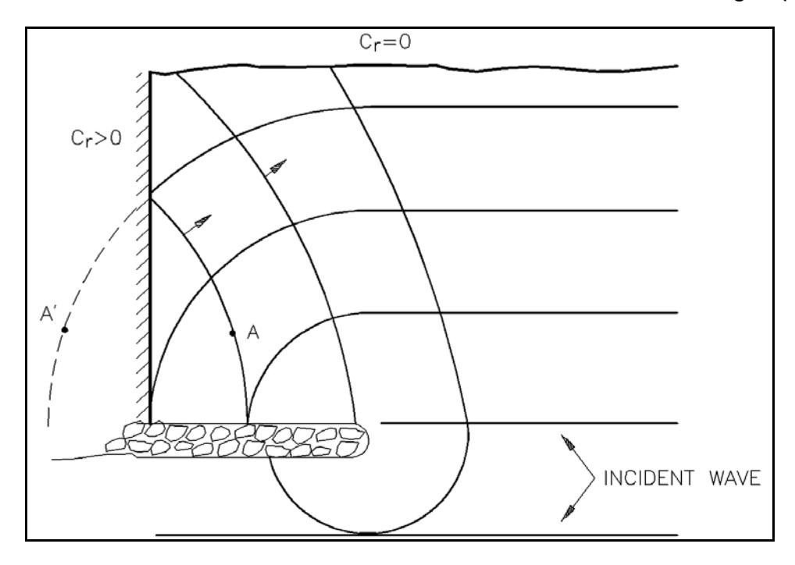

*Figure II-7-25. Reflection of a diffracted wave*

#### II-7-5. Harbor Oscillations

- a. Introduction.
- (1) Harbor oscillations are long-period wave motions that sometimes disrupt harbor activities. The oscillations are standing waves with typical periods between 30 sec and 10 min. Vertical motions are generally small, but horizontal motions can be large. Oscillation characteristics are generally controlled by basin size, shape, and water depth. Oscillations are most damaging when the period coincides with a natural resonant period of the harbor. The phenomenon is also referred to as harbor resonance, surging, seiching, and resonant oscillations.
- (2) Harbor oscillations can be a significant problem for inner harbor components and moored vessels within a harbor basin. Resonant periods characteristic of moored vessels often fall into the same range of periods as harbor oscillations. Thus, harbor oscillations can create dangerous mooring conditions including breaking of mooring lines, damage to fender systems, vessel collisions, and delays of loading and unloading operations at port facilities.
- (3) Processes and estimation procedures for harbor oscillations are discussed in this section. Discussion of harbor oscillations is generally presented in terms of the characteristics in Table II-7-2.

**Table II-7-2. **

| Description | Alternatives |  |
| --- | --- | --- |
| Basin boundaries | Closed | Open |
| External forcing | Free | Forced |
| Dimensionality | 2-dimensional | 3-dimensional |
| Basin planform | Simple | Complex |
| (4) Characteristics are defined as | follows: |  |
| (a) Closed basin - basin is completely | enclosed. |  |

**Table II-7-2. **

| Description | Alternatives |  |
| --- | --- | --- |
| Basin boundaries | Closed | Open |
| External forcing | Free | Forced |
| Dimensionality | 2-dimensional | 3-dimensional |
| Basin planform | Simple | Complex |
| (4) Characteristics are defined as | follows: |  |
| (a) Closed basin - basin is completely | enclosed. |  |

- (4) Characteristics are defined as follows:
- (a) Closed basin basin is completely enclosed.
- (b) Open basin basin is semi-enclosed, but open to a larger water body along at least part of one side.
- (c) Free oscillations oscillations that occur without external forcing (although some external forcing was applied earlier to initiate the oscillations).
- (d) Forced oscillations oscillations in response to external forcing.
- (e) 2-dimensional oscillations are independent of one horizontal dimension.
- (f) 3-dimensional oscillations vary in both horizontal dimensions.
- (g) Simple basin planform is a simple geometrical shape, such as a square, rectangle, or circle.
- (h) Complex basin planform is an irregular shape.
- (5) A harbor basin generally has several modes of oscillation with corresponding natural resonant frequencies (or periods) and harmonics. Figure II-7-26 illustrates the fundamental, second, and third harmonic modes of oscillation in idealized, perfectly reflecting, closed and open two-dimensional basins.
- (6) Following this introduction, the process of resonance is discussed in terms of a more intuitive, but analogous, mechanical system. Closed basins are covered next, mainly in terms of free oscillations and simple shapes. Although they are not closed basins, harbors or parts of harbors can behave much like closed basins under some conditions. The presentation is also applicable to enclosed water bodies such as lakes and reservoirs.
- (7) The last parts of the section are devoted to open basins. Open basins are susceptible to oscillations forced across the open boundary. Because of the limited size of harbors, other types of forcing, such as meteorological forcing in the harbor, are generally not considered. Both simple and complex shapes are presented. The final part describes Helmholtz resonance, a very long-period, non-standing wave phenomenon that causes water levels over the entire harbor to oscillate up and down in unison. Practical consequences of harbor oscillation, such as vessel motions, mooring line forces, and fender forces, are not presented in this section. Motions of small boats moored in resonant conditions and possible mitigation measures have been investigated by Raichlen (1968). Comprehensive reviews of harbor oscillations are given by Raichlen and Lee (1992) and Wilson (1972).
II-7-32 Harbor Hydrodynamics

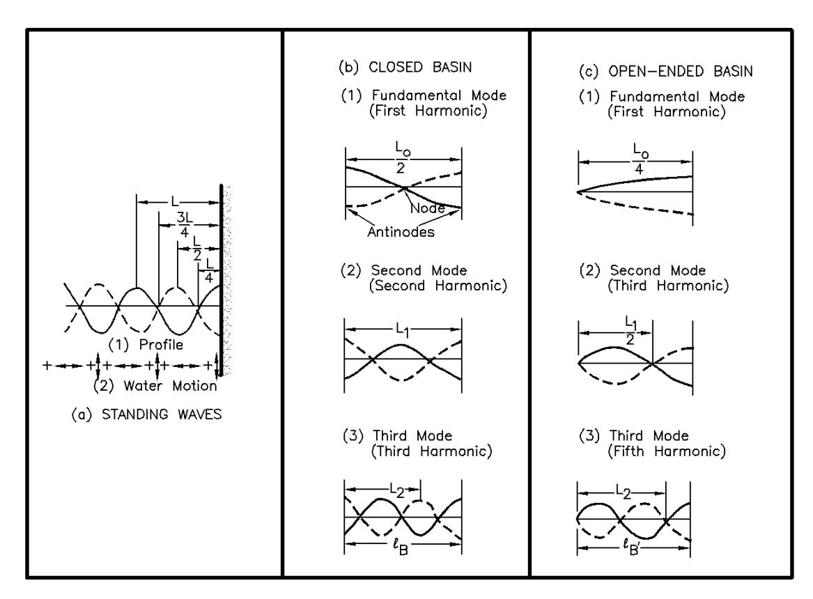

*Figure II-7-26. Surface profiles for oscillating waves (Carr 1953)*

- b. Mechanical analogy.
- (1) The basic theory for basin oscillations is similar to that of free and forced oscillations experienced by some mechanical, acoustical, and other fluid systems. Certain systems respond to a disturbance by developing a restoring force that reestablishes equilibrium in the system. A pendulum is a good example of such a system. A free oscillation at the system's natural period or frequency is initiated if the system is carried by inertia beyond the equilibrium condition. If the forces responsible for the initial disturbance are not sustained, free oscillations at the natural frequency will continue, but their amplitude decays exponentially due to friction. The system eventually comes to rest. Forced oscillations can occur at non-natural frequencies if cyclic energy is applied to a system at non-natural frequencies. Continuous excitation at frequencies at or near the natural frequency of a system generally causes an amplified response. The response magnitude depends on the proximity of the excitation to the natural frequency and the frictional characteristics of the system.
- (2) The response of a linearly damped, vibrating spring-mass system with one degree of freedom provides a good illustration (Figure II-7-27). Terms are defined as follows: A = amplification factor (ratio of mass displacement to excitation displacement); T = excitation (and response) period; Tn = natural period of the mass-spring system; and N = phase angle by which the mass displacement lags the excitation displacement. The mass responds directly to the excitation if the excitation period is much greater than the natural period of the system; that is, A = 1 and N = 0° when Tn/T << 1. The harbor equivalence to this case is the harbor response to astronomical tides. The mass responds very little and out of phase with the excitation if the excitation period is much shorter than the natural period of the system; that is, A << 1 and N • 180° when Tn/T >> 1. The mass response is amplified and a phase lag develops as the excitation period approaches the natural period of the system. The ratio Tn/T determines the degree of amplification and phase

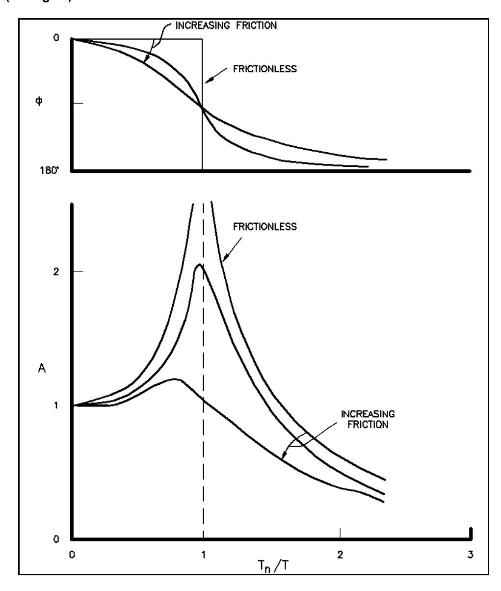

*Figure II-7-27. Behavior of an oscillating system with one degree of freedom*

lag. The greatest amplification occurs when Tn/T = 1 and N = 90 deg. With a cyclic excitation at period Tn , the amplification factor increases with time until the rate of energy input equals the rate of energy dissipation by friction. When energy input is stopped, the response amplitude decreases exponentially with time as a result of friction. Amplification due to resonance in a mass-spring system and the respective phase relationships are further developed and discussed in Raichlen (1968), Meirovitch (1975), Sorensen (1986), and Wilson (1972).

#### c. Closed basins .

(1) Enclosed basins can experience oscillations due to a variety of causes. Lake oscillations are usually the result of a sudden change, or a series of intermittent-periodic changes, in atmospheric pressure or wind velocity. Oscillations in canals can be initiated by suddenly adding or subtracting large quantities of water. Harbor oscillations are usually initiated by forcing through the entrance; hence, they deviate from a true closed basin. Local seismic activity can also create oscillations in an enclosed basin.
II-7-34 Harbor Hydrodynamics
(2) Basins are generally shallow relative to their length. Hence, basin oscillations involve standing waves in shallow water. The simplest basin geometry is a narrow rectangular basin with vertical sides and uniform depth. The natural free oscillating period for this simple case, assuming water is inviscid and incompressible, is given by

```math
T _ { n } \ = \ { \frac { 2 \ l _ { B } } { n \ { \sqrt { g d } } } } \tag{II-7-9}
```

where
Tn = natural free oscillation period
n = number of nodes along the long basin axis (Figure II-7-46)
R B = basin length along the axis
g = acceleration due to gravity
d = water depth
(3) This equation is often referred to as Merian's formula. The maximum oscillation period T1 corresponding to the fundamental mode is given by setting n = 1 as

```math
T _ { 1 } \quad = \quad \frac { 2 \ l _ { B } } { \sqrt { g d } } \tag{II-7-10}
```

(4) If the rectangular basin has significant width as well as length (Figure II-7-28), both horizontal dimensions affect the natural period, given by

```math
T_{n,m} = \frac{2}{\sqrt{gd}} \left[ \left( \frac{n}{\ell_1} \right)^2 + \left( \frac{m}{\ell_2} \right)^2 \right]^{\left( -\frac{1}{2} \right)} \tag{II-7-11}
```

where
Tn,m = natural free oscillation period
n,m = number of nodes along the x- and y-axes of basin
R 1, R 2 = basin dimensions along the x- and y-axes
(5) Equation II-7-11 reduces to Equation II-7-9 for the case of a long narrow basin, in which m = 0. Further discussion is provided in Raichlen and Lee (1992) and Sorensen (1993). Closed basins of more complex shape require other estimation procedures. Raichlen and Lee (1992) present procedures for a circular basin and approximate solution methods for more arbitrary basin shapes. Defant (1961) outlines a method to determine the possible periods for two-dimensional free oscillations in long narrow lakes of variable width and depth. Locations of nodes and antinodes can also be determined. Usually numerical models are used to properly estimate the response of complex basins.

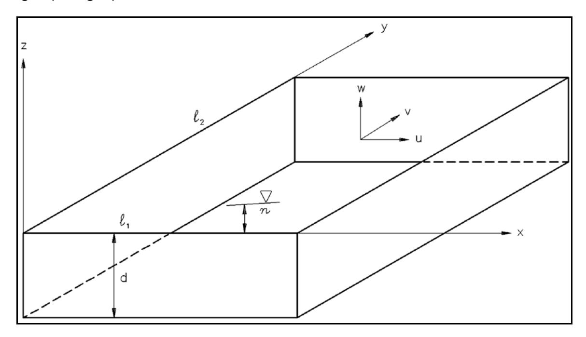

*Figure II-7-28. Behavior of an oscillating system with one degree of freedom*

(6) Forced oscillations of closed basins can be a concern when the basin is large enough to be affected by moving pressure gradients or strong surface winds, which is generally not true for harbors. Winds can be especially important in large shallow basins, such as Lake Erie. The subject of forced oscillations of closed basins is discussed by Raichlen and Lee (1992).

#### d. Open basins - general.

- (1) Open basins, typically harbors or bays, are most susceptible to oscillations forced across the open boundary. Typical forcing mechanisms include infragravity waves, eddies generated by currents moving past a harbor entrance, and tsunamis (Sorensen 1986). Local seismic activity can also generate oscillations within the basin. Meteorological forces (changes in atmospheric pressure and wind) can initiate oscillations in large bays, but they are not usually a concern over areas the size of a harbor.
- (2) The period of a true forced oscillation is the same as the period of the exciting force. However, forced oscillations are usually generated by intermittent external forces, and the period of oscillation is greatly influenced by the basin dimensions and mode of oscillation. e. Open basins simple shapes.
- (1) In many cases, the geometry of a harbor can be approximated by an idealized, simple shape such as a rectangle or circle. Then the approximate response characteristics can often be determined from guidance based on analytic solutions. Simple harbors are also very helpful for developing an understanding of the general behavior of an open basin.
- (2) As with closed basins, the simplest, classical case is a narrow, rectangular basin with uniform depth. The basin has vertical walls on three sides and is fully open at one end. The fundamental mode of resonant oscillation occurs when there is one-quarter of a wave in the basin (Figure II-7-26). The general expression for the free oscillation period in this case is
II-7-36 Harbor Hydrodynamics

```math
T_n = \frac{4 \ell_B}{(1 + 2n) \sqrt{gd}} \qquad \text{Open basin} \tag{II-7-12}
```

(3) The number of nodes in the basin n does not include the node at the entrance. The period for the fundamental mode ( n = 0) is

```math
T _ { 0 } \, = \, { \frac { 4 \, \ell _ { B } } { \sqrt { g d } } } \tag{II-7-13}
```

(4) Maximum horizontal velocities and particle excursions in a standing wave occur at the nodes. Thus there is potential for troublesome harbor conditions in the vicinity of nodes. Some additional useful relationships for standing waves are as follows (Figure II-7-29) (see Sorensen (1986) for details)

```math
V _ { \mathrm { m a x } } \ = \ { \frac { H } { 2 } } \ { \sqrt { \frac { g } { d } } } \tag{II-7-14}
```

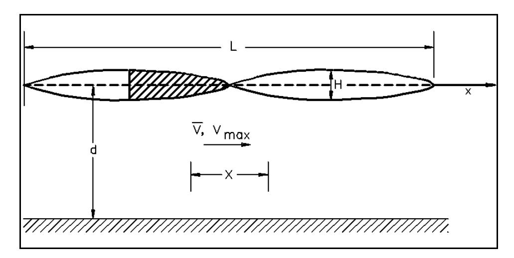

*Figure II-7-29. Motions in a standing wave*

where
Vmax = maximum horizontal velocity at a node
H = standing wave height

```math
X = \frac{H T_n}{2\pi} \sqrt{\frac{g}{d}} \tag{II-7-15}
```

where X = maximum horizontal particle excursion at a node

```math
\overline{V} = \frac{HL}{\pi d T_n} \tag{II-7-16}
```

where V = average horizontal velocity at a node
- (5) For example, when H = 1 ft, T1 = 200 sec, and d = 30 ft, the maximum horizontal velocity and particle excursion are Vmax = 0.5 ft/sec and X = 33 ft.
- (6) The resonant response of the simple rectangular harbor, presented by Ippen and Goda (1963) in terms of the amplification factor A (assuming no viscous dissipation) and the relative harbor length k R, where k = 2 B /L , illustrates other important aspects of harbor oscillation. The amplification factor for harbor oscillations is traditionally defined as the ratio of wave height along the back wall of the harbor to standing wave height along a straight coastline (which is twice the incident wave height). The response curve for a long, narrow harbor is given in Figure II-7-30. The left portion of the curve resembles that for the mechanical analogy in Figure II-7-26. Resonant peaks for higher order modes are also shown. The three curves correspond to a fully open harbor and two partially open harbors with different degrees of closure. The k R value at resonance decreases as the relative opening width decreases. It is bounded by the value for a closed basin, also shown in the figure. Amplification factors for the inviscid model are upper bounds on those experienced in a real harbor. Because amplification factor decreases at each successive higher order mode, simple analysis methods often focus only on the lowest order modes.

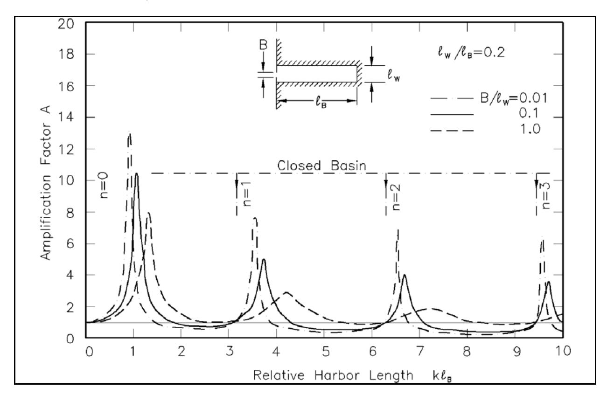

*Figure II-7-30. Theoretical response curves of symmetrical, narrow, rectangular harbor (Raichlen (1968); after Ippen and Goda (1963))*

(7) Practical guidance for assessing the strength and period of the first two resonant modes in a partially enclosed rectangular harbor with a symmetric entrance is given in Figure II-7-31. A wide range of relative harbor widths (aspect ratios, b/ R) and relative entrance widths ( d/b ) is represented. The k R values can be converted to resonant periods by
II-7-38 Harbor Hydrodynamics

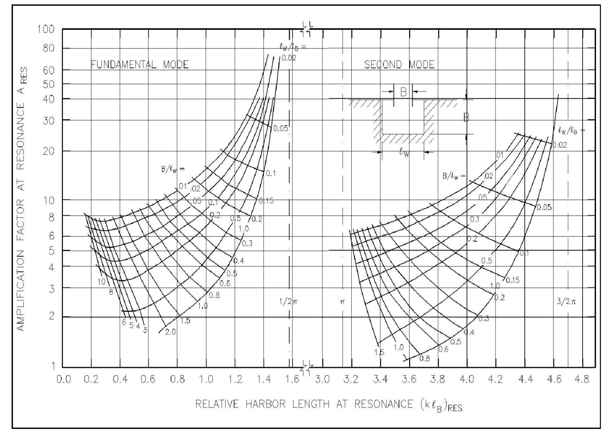

*Figure II-7-31. Resonant length and amplification factor of symmetrical rectangular harbor (from Raichlen and Lee (1992); after Ippen and Goda (1963))*

```math
T = \left(\frac{2\pi \ell}{\sqrt{gd}}\right) \left(\frac{1}{k\ell}\right) \tag{II-7-17}
```

- (8) It is interesting to note that the resonant period increases as the aspect ratio increases, even for the fully open harbor. The change is due to the effect of the confluence of the entrance and the open sea. Resonant periods estimated from Figure II-7-30 generally differ from the simple approximation in Equation II-7-12.
- (9) The simple guidance has some important limitations relative to real harbors. Amplification factors are upper bounds, since no frictional losses were modelled. Harbors that are not narrow experience transverse oscillation modes that are not represented in the simple guidance. Harbors with asymmetric entrances experience additional transverse modes of oscillation and possible increases in amplification factor (Ippen and Goda 1963). In addition to introducing new resonant frequencies and modified amplification, transverse oscillations change the locations of nodes, as illustrated in Figure II-7-32 based on numerical model calculations.
- (10) Harbor oscillation information is available for some other simple harbor shapes. Circular harbors were investigated by Lee (1969) and reviewed by Raichlen and Lee (1992). Zelt (1986) and Zelt and Raichlen (1990) developed a theory to predict the response of arbitrary shaped harbors with interior sloping boundaries, including runup. The dramatic effect of a sloping rather than flat bottom on the behavior of a rectangular harbor is illustrated in Figure II-7-33. The sloping bottom greatly increases A and greatly reduces k R values at resonance. For example, k R for the second resonant peak drops from 4.2 for the flat bottom case to 2.6 for the sloping bottom case. The first two resonant modes for six symmetric, fully open configurations are given in Figure II-7-34. The A for the first mode is much more affected by the sloping bottom than by the harbor planform. Details are available in Zelt (1986). f. Open basins complex shapes.
- (1) Real harbors never precisely match the simple shapes; usually they differ significantly. Complex harbors can be analyzed with physical and numerical models. These modeling tools should be applied even for relatively simple harbor shapes when the study has large economic consequences and accurate results are essential. A combination of physical and numerical modeling is usually preferred for investigating the full range of wave conditions in a harbor (Lillycrop et al. 1993).
- (2) Physical models generally represent the shorter-period harbor oscillations more accurately. The harbor and immediately surrounding coastal areas are sculpted in cement in a three-dimensional model basin (Figure II-7-35). Breakwaters and other structures that transmit significant amounts of long-wave energy are properly scaled in the model for size and permeability. Currents can be introduced when needed to represent field conditions. Limitations to physical modeling include cost, no direct simulation of frictional dissipation, and the inherent difficulties in working with long waves in an enclosed basin. Special care is required to properly generate long waves. Once generated, they tend to produce undesirable reflections from basin walls.
- (3) Numerical models are most useful for very long-period investigations, initial studies, comparative studies of harbor alternatives, and revisiting harbors documented previously with field and/or physical model data. They are also most useful when unusually large areas and/or very long waves are to be studied. For example, numerical models have been used effectively to select locations for field wave gauges (to avoid nodes) and to identify from many alternatives the few most promising harbor modification plans for fine tuning in physical model tests. Lillycrop et al. (1993) suggested that numerical modeling is preferable to
II-7-40 Harbor Hydrodynamics

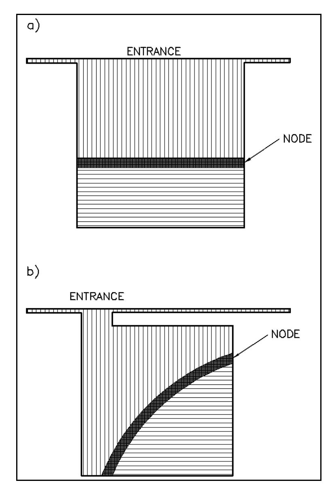

*Figure II-7-32. Node locations for a dominant mode of oscillation in a square harbor: a) fully open; b) asymmetric, constricted entrance*

physical modeling for periods longer than 400 sec. Both modeling tools can be used effectively for the shorter-period oscillations.
(4) Numerical models can reproduce the geometry and bathymetry of a harbor area reasonably well and estimate harbor response to long waves. Figure II-7-36 is an example numerical model grid. This grid is finer than would normally be required for harbor oscillation studies because it was designed for both wind waves and long waves. Numerical models can be used to generate harbor response curves as in Figure II-7-33 at various points in the harbor. Results for resonance conditions of particular interest can be displayed over the whole harbor to show oscillation patterns. For example, amplification factors and phases calculated with the example grid are presented for five wave periods, corresponding to resonant peaks in the main harbor basin (Figures II-7-37 and II-7-38). Phases are relative to the incident wave. Phase plots are useful because phases in a pure standing wave are constant up to a node and then change 180 deg across the

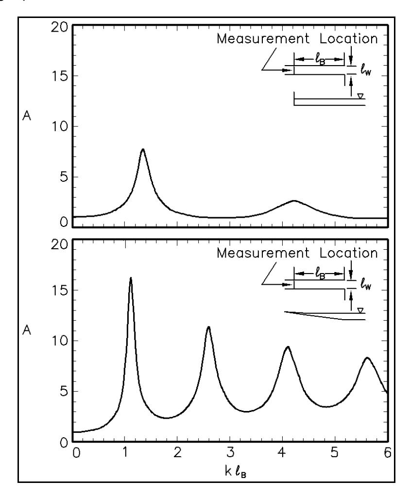

*Figure II-7-33. Response curves for rectangular harbor with flat and sloping bottom (Zelt 1986)*

node. Thus, phase contour lines cluster together at node locations. Since regions of similar phase, plotted with similar gray shades (or colors on a computer screen), move up and down together, the resonant modes of oscillation can be much more easily visualized. This information about node locations and behavior of resonant modes is quite useful in analyzing harbor oscillations.
- (5) Limitations to numerical models relate to approximations in formulating the following items: incident wave conditions, wave evolution during propagation over irregular bathymetry, wave interaction with structures, and harbor boundary features. Numerical model technology is reviewed by Raichlen and Lee (1992) and Abbott and Madsen (1990).
- (6) The Corps of Engineers has traditionally used a steady-state, hybrid-element model based on the mild slope equation (Chen 1986; Chen and Houston 1987; Cialone et al. 1991). Variable boundary reflection and bottom friction are included. The seaward boundary is a semicircle outside the harbor entrance. Monochromatic waves are incident along the semicircle boundary. Since the model is linear, results from multiple monochromatic wave runs can be recombined to simulate a spectral response. The model does not account for entrance losses (Thompson, Chen, and Hadley 1993).
II-7-42 Harbor Hydrodynamics

|  | First Resonant Mode | Second R | esonant Mode |  |
| --- | --- | --- | --- | --- |
| Harbor Geometry | k ℓ B | A RES | k 🖁 B | A RES |
|  | 1.089 | 16.43 | 2.565 | 11. 4 5 |
|  | 1.229 | 10.96 | 3.177 | 7.61 |
|  | 1.315 | 7.81 | 4.182 | 2.68 |
|  | 1.696 | 8.12 | 4.559 | 4.32 |
|  | 1.757 | 21.85 | 3.280 | 32.18 |
|  | 2.050 | 8.50 | 4.926 | 6.19 |

*Figure II-7-34. Resonant response of idealized harbors with different geometry (Zelt 1986)*

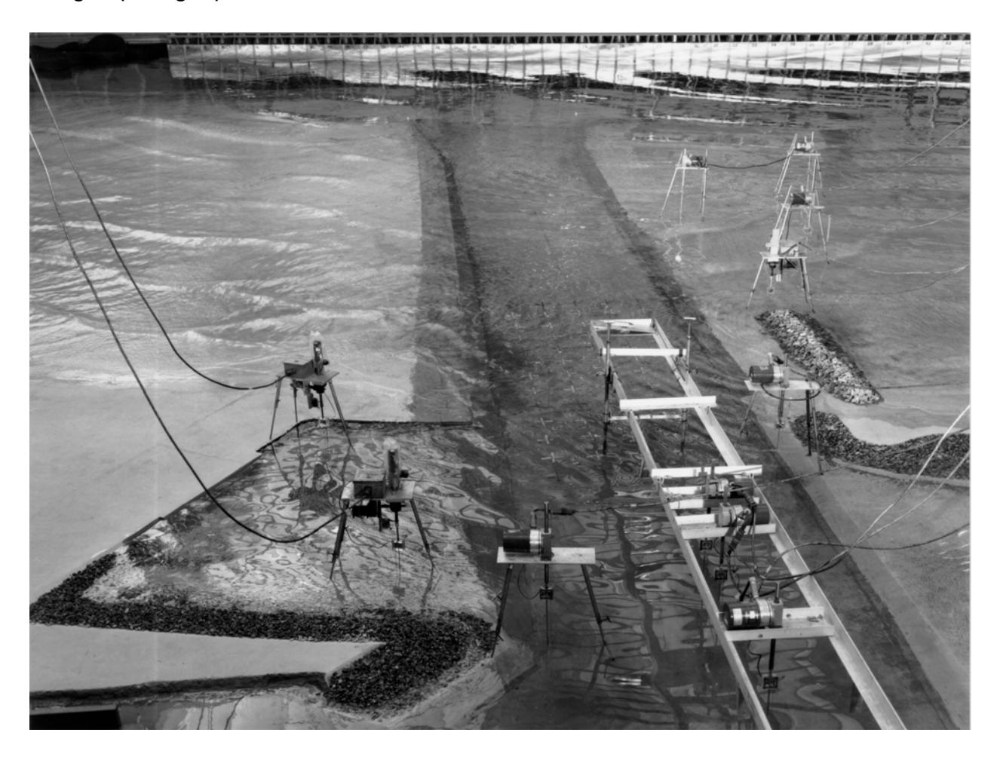

*Figure II-7-35. Photograph of physical model, Barbers Point Harbor, HI (Briggs et al. 1994)*

- g. Open basins Helmholtz resonance.
- (1) A harbor basin open to the sea through an inlet can resonate in a mode referred to as the Helmholtz or grave mode (Sorensen 1986b). This very long period mode appears to be particularly significant for harbors responding to tsunami energy and for several harbors on the Great Lakes that respond to long-wave energy spectra generated by storms (Miles 1974; Sorensen 1986; Sorensen and Seelig 1976).
- (2) Water motion characterizing the Helmholtz mode is like that of a Helmholtz resonator in acoustics. It is analogous to the spring-mass system with one degree of freedom, discussed earlier in this section, where the spring is similar to the basin water surface and the mass represents water in the inlet channel. During Helmholtz resonance, the basin water surface uniformly rises and falls while the inlet channel water oscillates in and out. The period of this mode is greater than the fundamental mode. The resonant period is given by (Carrier et al. 1971).
II-7-44 Harbor Hydrodynamics

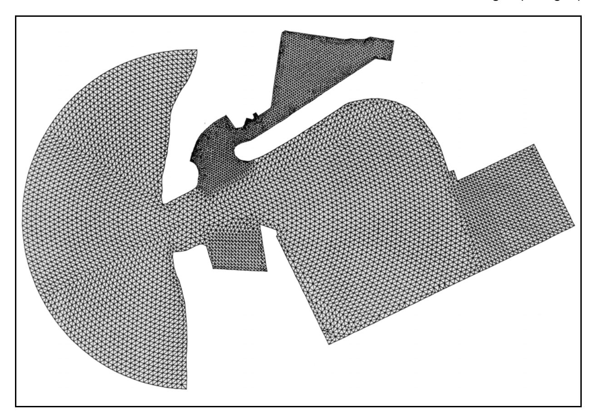

*Figure II-7-36. Numerical model grid for Barbers Point Harbor, HI (Briggs et al. 1994)*

```math
T_H = 2\pi \sqrt{\frac{(\ell_c + \ell'_c) A_b}{g A_c}} \tag{II-7-18}
```

where
TH = resonant period for Helmholtz mode
R c = channel length
R r c = additional length to account for mass outside each end of the channel
Ab = basin surface area
Ac = channel cross-sectional area

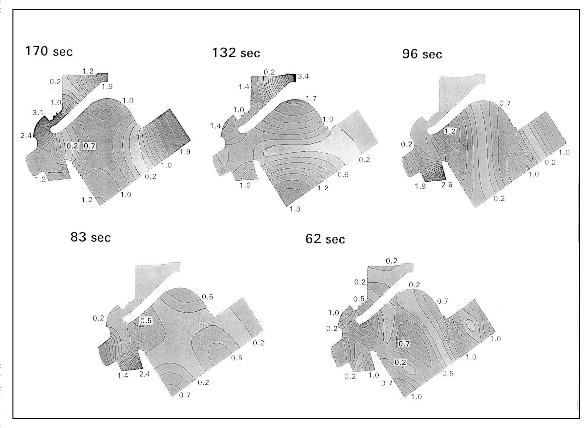

*Figure II-7-37. Amplification factors for five resonant periods, Barbers Point Harbor, HI (Briggs et al. 1994)*

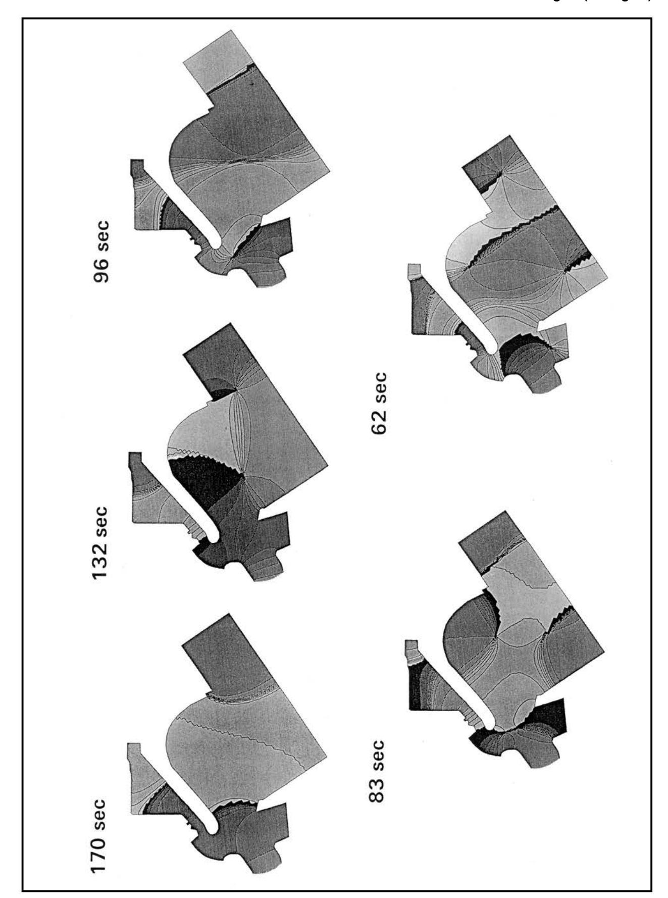

*Figure II-7-38. Phases for five resonant periods, Barbers Point Harbor, HI (Briggs et al. 1994)*

(3) The added length is given by (Sorensen 1986, adopted from Miles (1948))

```math
\ell'_c = \frac{-W}{\pi} \ln \left( \frac{\pi W}{\sqrt{g d_c} T_H} \right) \tag{II-7-19}
```

where
W = channel width
dc = channel depth

# II-7-6. Flushing/Circulation

- a. Statement of importance.
- (1) An important aspect of harbor design is the water circulation that occurs within the harbor and between the harbor and the surrounding water body. Water exchange with the surrounding water body will produce a flushing action in the harbor. Flushing is important to reduce the level of chemical, biological, and floating solids pollution in the harbor. Typically, a criterion such as the exchange of X percent of the water in the harbor within a certain time period or, alternatively, exchange of Y percent of the water in the harbor each tidal cycle might be set as a design goal.
- (2) Circulation patterns within a harbor should eliminate areas of stagnant water where pollution levels will rise and fine sediment deposition may occur. This can occur, for example, in closed-end channels such as pier slips and residential canals. Strong circulation is desired as long as adverse high-velocity currents are not generated. (3) Natural harbor circulation and flushing should be optimized. This can be accomplished by: (a) Siting the harbor to make use of ambient currents that will pass the harbor entrance. (b) Considering water circulation when determining the number, size, and placement of harbor entrances.
- (c) Establishing the harbor planform and internal structure locations so that circulation is optimized and potential pollution sources are located in areas of strong water circulation.
- (d) Employing (where incident wave action allows) harbor protective structures such as floating breakwaters and vertical barriers with bottom openings that permit flow into and out of the harbor.
- (e) Installing culvert pipes through more massive harbor protective structures. This natural flushing can be supplemented by installing pumping systems that bring exterior water into dead areas of the harbor or remove polluted water from these areas. b. Flushing/circulation processes. (1) Tidal action.
- (a) As the tide rises, ambient water will enter a harbor and mix with the water in the harbor. On the subsequent falling tide, a portion of this ambient/harbor mixture will leave the harbor. The net result is the exchange of some harbor water with water from outside the harbor. The efficiency of this exchange depends primarily on two factors. One factor is the ratio of the volume of water that enters on one tidal cycle (the tidal prism) to the total volume of water in the harbor. This ratio, in turn, will depend on the tide range, the
II-7-48 Harbor Hydrodynamics
hydraulic efficiency of the harbor entrance, and the water depths in the harbor. Generally, the larger the value of this ratio, the more exchange that will occur. The other factor is the momentum of the incoming jet of water on the rising tide, and the consequent amount of penetration of this jet and its resulting angular momentum as it establishes a rotating gyre inside the harbor. The strength of this jet is related to the amount of flushing that will occur and the strength of the tidally induced circulation in the harbor.
(b) The most commonly used factor for defining the effectiveness of tidally induced harbor flushing is the average per cycle exchange coefficient E (Nece and Richey 1975) given by

```math
E = 1 - \left(\frac{C_i}{C_o}\right)^{\frac{1}{i}} \tag{II-7-20}
```

where Co is the initial concentration of some substance in the harbor water and Ci is the concentration of this substance after i tidal cycles. E may be defined at a point in the harbor by using concentration values at that point or may be defined for the entire harbor by using spatially average concentration values for the entire harbor. E is the fraction of harbor water removed each tidal cycle. Equation II-7-20 assumes essentially repetitive identical tides and no further addition of the marker substance to the harbor.
- (c) As an example of the use of the exchange coefficient, consider Figure II-7-39, which is modified from Falconer (1980) and based on physical and numerical model results. Figure II-7-39 shows the spatial average exchange coefficient for a rectangular harbor having the dimensions L and B shown in the insert. Note where the harbor entrance is located. E has a peak value of about 0.5 when L / B is near unity (i.e. a square harbor). For L / B values outside the range of 0.3 to 3, the flushing of the harbor is much less effective. The tidal prism ratio ( TPR ), defined as the tidal prism divided by the total harbor volume at high tide, was 0.4 for the results shown in Figure II-7-39.
- (d) Another factor used to define the amount of flushing is the "flushing efficiency," defined as the exchange coefficient divided by the tidal prism ratio (i.e. E / TPR ) expressed as a percentage (Nece, Falconer, and Tsutumi 1976). Flushing efficiency compares the actual water exchange in one cycle with the volume of exchange that would occur if the incoming tidal prism completely mixed with the harbor water on each cycle. Table II-7-3 shows some results for five small-boat harbors in the state of Washington. These results are based on model tests (Nece, Smith, and Richey 1980).
- (e) Note that the exchange coefficients are all around 0.2, which is below the value for the more idealized rectangular harbors (Figure II-7-39). And, for relatively consistent exchange coefficients, the flushing efficiency showed a much greater range of values. For the rectangular harbor in Figure II-7-39 where the TPR is 0.4, the flushing efficiency would vary from 0 up to about 125 percent. The desirable exchange coefficient or flushing efficiency for a given harbor would depend on the level of pollution in the harbor versus the desired harbor water quality. Although higher exchange coefficients and flushing efficiencies generally indicate better harbor flushing by tidal action, there may still be small pockets of stagnant water in a generally well-flushed harbor. (2) Wind effects.
- (a) Wind acting on the water surface will generate a surface current that, in water depths typically found in harbors, will essentially be in the direction of the wind. Owing to Coriolis effects, the current will be a few degrees to the right of the wind in the Northern Hemisphere; e.g., see Neumann and Pierson (1966) or Bowden (1983). If the distance over which the wind blows and the wind duration are sufficient, the surface

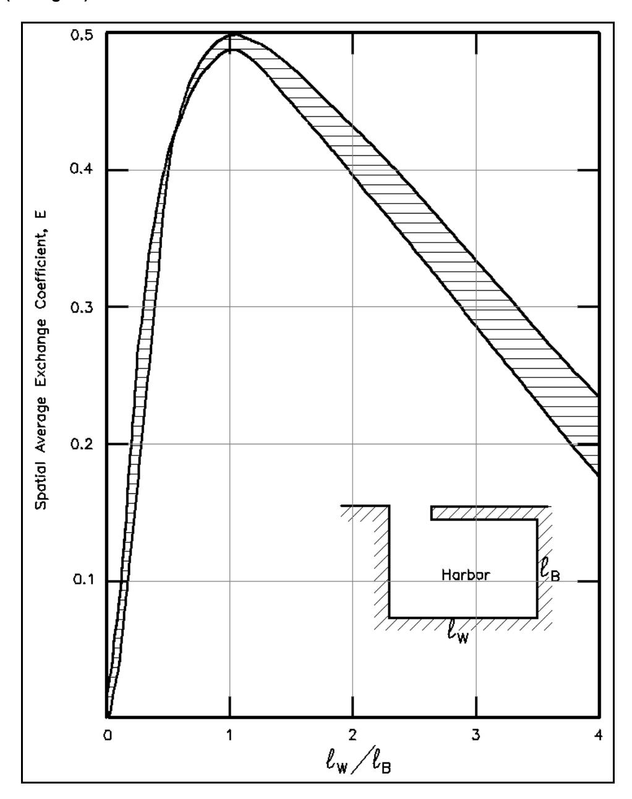

*Figure II-7-39. Exchange coefficients - rectangular harbor, TRP = 0.4 (modified from Falconer (1980))*

| Table II-7-3 Flushing Characteristics of Small-Boat Harbors |  |  |  |
| --- | --- | --- | --- |
| Harbor | Tide Range (m) | Exchange Coefficient | Flushing Efficiency (%) |
| Des Moines | 1.07 | 0.22 | 123 |
| Edmonds | 0.82 | 0.14 | 100 |
| Lagoon Point | 0.91 | 0.16 | 63 |
| Penn Cove | 1.22 | 0.19 | 75 |
| Lake Crockett | 1.83 | 0.22 | 78 |

II-7-50 Harbor Hydrodynamics
current will approach a velocity equal to 2 to 3 percent of the wind speed. But, given the lengths of open water found in most harbors, it is likely that the resulting current velocity will be less than this magnitude.
(b) The wind-induced surface current would cause a lateral or bottom return flow to develop, resulting in some circulation in a harbor under sustained winds. The resulting current pattern would be very dependent on the wind direction and the harbor geometry. Some flow in or out of the harbor entrance could develop. Also, the surface current will skim floating materials to the down-wind areas of the harbor. Generally, wind-induced circulation and flushing will be much less effective than circulation and flushing induced by tidal action.

# (3) River discharge.

- (a) Fresh water may enter a harbor from the land side as surface runoff or as concentrated flow in rivers that enter the harbor. Surface runoff will generally contribute more to the harbor pollution load because of the agricultural or urban pollutants in the water than it will to alleviating pollution by contributing to harbor flushing.
- (b) Likewise, the efficacy of river discharge in easing harbor pollution will depend on the quality of the river water. If there are lower chemical and biological pollution loads in the river water than in the harbor, the flushing effect will be positive. But this could be counterbalanced if the river has a suspended silt load that will deposit in the slower moving harbor water. Silt suspension is a particular problem inside sections of the harbor such as pier slips. The silt-laden water may set up a turbidity current that will force bottom water having higher silt concentrations into a dead area, where it then deposits (Lin, Lott, and Mehta 1986). The silt load in a river may be relatively low during periods of normal river flow, but the concentration of suspended sediment may increase by orders of magnitude during storms.
- (c) Some harbors are built inland from the coast along river/estuary systems. River flow past the harbor entrance can have conflicting effects. The flow past the entrance can generate a rotary flow system at the entrance that produces some flushing of the harbor. But, if the river silt load is significant, there can be a net deposition of sediment in the harbor near the entrance.
- c. Predicting of flushing/circulation. Harbor flushing rates and circulation patterns can be predicted by numerical and physical models and by field studies. Often, some combination of these efforts is the most effective approach. Numerical and physical models benefit from the collection of field data that is usually required to calibrate and verify the models.

#### (1) Numerical models.

- (a) A numerical model of the hydrodynamics of a harbor can be developed by employing finite difference solutions of the equation of mass balance and the two horizontal component momentum equations. With the appropriate boundary conditions at the fixed boundaries of the harbor and the tide as a forcing function at the harbor entrance, one can compute the time-dependent water flow velocities and water surface elevations at selected grid points in the harbor. If so desired, the surface wind stress on the water can also be employed as a forcing function. And river flow into the harbor can be specified at points along the harbor boundary. From the computed time-dependent grid of flow velocities, the resulting circulation patterns in the harbor can be defined.
- (b) Commonly, the two-dimensional depth-integrated forms of the equations are used. That is, the horizontal flow velocities are averaged over the water depth and it is assumed that the water column is well mixed so there is no vertical density stratification. Also, it is assumed that vertical flow accelerations are small compared to the acceleration of gravity, so the pressure is hydrostatic and vertical components of flow
velocity may be ignored. This latter limitation would require that there be no abrupt significant depth changes in the harbor. These equations are known as the long-wave equations (see Part II-5). Harris and Bodine (1977) present a derivation of these equations and discuss their formulation for numerical solution.
- (c) If the solute advection-diffusion equation is added to the numerical hydrodynamic model, the movement and distribution of pollutants in the harbor can be computed. From this, the harbor exchange coefficients and flushing efficiency can be determined. An interesting application of numerical modeling to investigate harbor circulation, flushing, and variations in dissolved oxygen has been carried out by the Waterways Experiment Station for Los Angeles and Long Beach Harbor in California (Vemulakonda, Chou, and Hall 1991). Typical two-dimensional and a quasi-three-dimensional numerical model investigations studied the impact of deepening channels and constructing landfills in the harbor.
- (d) Chiang and Lee (1982), Spaulding (1984), and Falconer (1980, 1984, 1985) provide other examples of applying the long-wave equations to calculate harbor hydrodynamics and adding the solute transport equation to determine the flushing characteristics of harbors.
- (e) These numerical models have a number of advantages they are flexible in that it is easy to adjust input tide and wind conditions as well as harbor bottom and lateral boundary conditions, and they do not have some of the scale/distortion problems found in physical models. But they also have disadvantages - they are a two-dimensional representation of the flow field in the harbor, and since calculations are done for a grid, flow details that are smaller than the grid dimension are not represented. This latter disadvantage makes it difficult to investigate, for example, the eddies generated by flow separation at the harbor entrance or at internal structures. It can be overcome to some extent by decreasing the grid point spacing in key segments of the harbor such as around the harbor entrance (Falconer and Mardapitta-Hadjipandeli 1986).
- (f) Numerical models require that a number of empirical coefficients (e.g. surface wind stress and bottom stress, eddy viscosity, and component diffusion coefficients) be defined in order to run the model. Thus, confidence in the model can be significantly increased if field data are available to calibrate the model and verify subsequent model results. (2) Physical model studies.
- (a) Physical model studies have been conducted to investigate flushing and circulation patterns for existing and proposed harbors (Nece and Richey 1972, Schluchter and Slotta 1978, Nece 1985, Nece and Layton 1989) and for basic planform patterns of idealized harbors (Nece, Falconer, and Tsutumi 1976; Jiang and Falconer 1985).
- (b) Physical models of harbors are designed to investigate tidal flushing, so they are based on Froude similitude (Hudson et al. 1979). They typically have a distorted scale, with the vertical scale being larger than the horizontal scale. Common model scale ratios that have been used are 1:30 to 1:50 for the vertical scale and 1:300 to 1:500 for the horizontal scale. It is assumed that wind effects are negligible and that the water column has no density stratification. Also, the effects of Coriolis acceleration are not modeled. Most harbors are sufficiently small that Coriolis effects can be neglected.
- (c) For models using water and having the typical harbor model/prototype scale ratios, Froude and Reynolds similitude are incompatible. Consequently, model Reynolds numbers are underscaled. Thus, inertial effects are scaled but turbulent diffusion is not scaled. To minimize these effects, some experimenters have installed roughness strips at the model harbor entrance to generate turbulence. Thus, local diffusiondispersion of solutes is not accurately replicated but advective transport of solutes is replicated. The latter typically dominates. Fine details of the internal flow circulation are not replicated, but gross circulation patterns are.
II-7-52 Harbor Hydrodynamics
- (d) Circulation patterns are typically measured by photographing the movement of floats. Model exchange coefficients and flushing efficiencies are measured by adding dye to the water at the start of tests and then measuring the decrease of the dye concentration during subsequent tidal cycles. While exchange coefficient values from the model and model circulation patterns do not precisely equate to prototype conditions, these harbor model studies can provide a basis for comparing alternative design features for a proposed harbor or guidance in modifying an existing harbor.
- (e) Table II-7-4 lists, for ease of comparison, the relative advantages of physical and numerical models for harbor flushing and circulation studies. The table gives a general comparison, but for a specific application, modelling experts should be consulted before deciding whether to use a numerical or physical model or some combination of both.

#### Table II-7-4 Advantages of Physical and Numerical Models

#### Physical Models

Provide good visual demonstration of flow patterns Some three-dimensional effects can be represented relatively easily Intricate harbor boundaries can be easily simulated

#### Numerical Models

Wind stress and Coriolis effects can be simulated Lower model development and maintenance costs Easy to store model for future use Easy to adjust or expand model boundary conditions Extensive output data can easily be obtained
- (3) Field studies.
- (a) Limited field studies at an existing harbor may be conducted to obtain sufficient data to calibrate a numerical model of that harbor so the model can be run to investigate a range of other tide and wind conditions. This would provide a detailed look at the flushing and circulation characteristics of the harbor and some insight into possible remedial efforts that may be necessary. Or the model may then be run to evaluate proposed modifications of the harbor.
- (b) An alternative is to run more extensive field studies as the sole effort to evaluate conditions at a harbor. This would generally be more costly than the hybrid field-model approach, but it may provide some detail that cannot be achieved from model studies alone.
- (c) Also, field studies have been done to support the general development of physical and numerical modelling techniques for the study of harbor flushing and circulation.
- (d) Field measurements include those that define the hydrodynamics of a harbor and supplementary measurements to quantify harbor flushing. The former include measurements of tide levels inside and outside the harbor, current velocity measurements at the entrance to quantify flow rates into and out of the harbor, and flow velocity measurements throughout the harbor and/or drogue studies to define circulation patterns in the harbor. If tidal flushing is the primary concern, these measurements would be conducted on days when the wind velocity is low. Otherwise, a directional anemometer would also be used to measure the wind speed and direction.
- (e) To determine exchange coefficients throughout the harbor and the harbor's flushing efficiency, the harbor would be uniformly seeded with a harmless detectable solute such as a fluorescent dye and then
sampled periodically at several points in the harbor for a period of several tidal cycles. Initial and subsequent dye concentrations (see Equation II-7-20) can be measured in situ by a standard fluorometer. The dye Rhodamine WT has been used in a number of harbor flushing studies (see Callaway (1981) and Schwartz and Imberger (1988)).

#### II-7-7. Vessel Interactions

- a. Vessel-generated waves.
- (1) As a vessel travels across the water surface, a variable pressure distribution develops along the vessel hull. The pressure rises at the bow and stern and drops along the midsection. These pressure gradients, in turn, generate a set of waves that propagate out from the vessel bow and another generally lower set of waves that propagate out from the vessel stern. The heights of the resulting waves depend on the vessel speed, the bow and stern geometry, and the amount of clearance between the vessel hull and channel bottom and sides. The period and direction of the resulting waves depend only on the vessel speed and the water depth. For a detailed discussion of the vessel wave-generating process and the resulting wave characteristics, see Robb (1952), Sorensen (1973a, 1973b), and Newman (1978).
- (2) The pattern of wave crests generated at the bow of a vessel that is moving at a constant speed over deep water is depicted in Figure II-7-40. There are symmetrical sets of diverging waves that move obliquely out from the vessel's sailing line and a set of transverse waves that propagate along the sailing line. The transverse and diverging waves meet along the cusp locus lines that form an angle of 19°28' with the sailing line. The largest wave heights are found where the transverse and diverging waves meet. If the speed of the vessel is increased, this wave crest pattern retains the same geometric form, but expands in size as the individual wave lengths (and periods) increase.

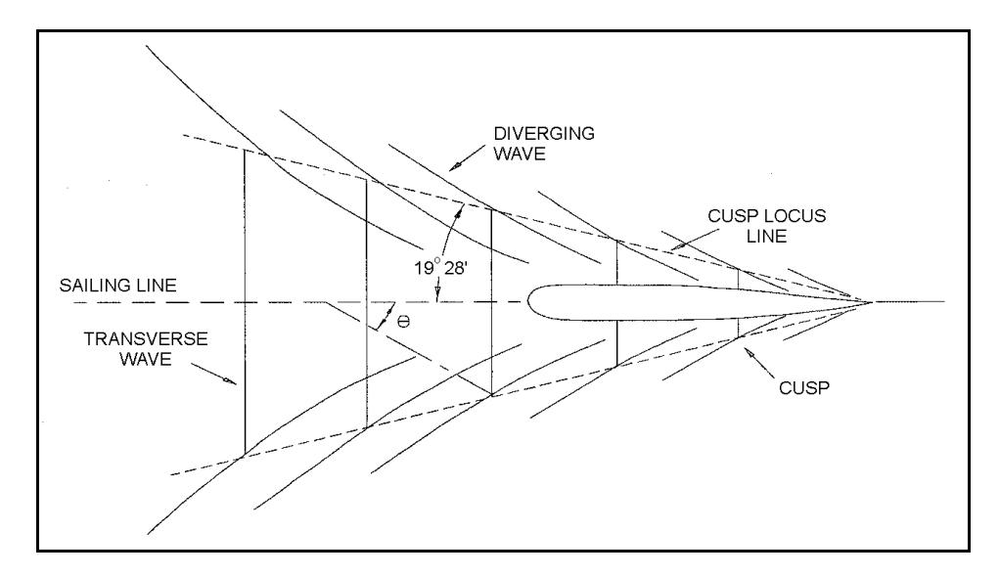

*Figure II-7-40. Wave crest pattern generated at a vessel bow moving over deep water*

(3) The fixed pattern of wave crests requires that individual wave celerities C be related to the vessel speed Vs by

```math
C = V _ { s } \cos \theta \tag{II-7-21}
```

II-7-54 Harbor Hydrodynamics
where 2 is the angle between the sailing line and the direction of wave propagation (Figure II-7-40). Thus, the transverse waves travel at the same speed as the vessel and, in deep water, 2 has a value of 35°16' for the diverging waves.
- (4) At increasing distances from the vessel, diffraction causes the wave crest lengths to continually increase and the resulting wave heights to continually decrease. It can be shown (Havelock 1908) that the wave heights at the cusp points decrease at a rate that is inversely proportional to the cube root of the distance from the vessel's bow (or stern). Transverse wave heights at the sailing line decrease at a rate proportional to the square root of the distance aft of the bow (or stern). Consequently, the diverging waves become more pronounced with distance from the vessel.
- (5) The above discussion applies to deep water, i.e. water depths where the particle motion in the vesselgenerated waves does not reach to the bottom. This condition holds for a Froude number less than approximately 0.7, where the Froude number F is defined by

```math
F = \frac{V_s}{\sqrt{gd}} \tag{II-7-22}
```

- (6) As the Froude number increases from 0.7 to 1.0, wave motion is affected by the water depth and the wave crest pattern changes. The cusp locus line angle increases from 19°28' to 90° at a Froude number of one. The diverging wave heights increase more slowly than do the transverse wave heights, so the latter become more prominent as the Froude number approaches unity. At a Froude number of one, the transverse and diverging waves have coalesced and are oriented with their crest perpendicular to the sailing line. Most of the wave energy is concentrated in a single large wave at the bow. Owing to propulsion limits (Schofield 1974), most self-propelled vessels can only operate at maximum Froude numbers of about 0.9. Also, as a vessel's speed increases, if the vessel is sufficiently light (i.e. has a shallow draft), hydrodynamic lift may cause the vessel to plane so that there is no significant increase in the height of generated waves for vessel speeds in excess of the speed when planing commences.
- (7) For harbor design purposes, one would like to know the direction, period, and height of the waves generated by a design vessel moving at the design speed. For Froude numbers up to unity, Weggel and Sorensen (1986) show that the direction of wave propagation 2 (in degrees) is given by

```math
\theta = 35.27 (1 - e^{12(F-1)}) \tag{II-7-23}
```

- (8) Then, from Equation II-7-21, the diverging wave celerity can be calculated, and the wave period can be determined from the linear wave theory dispersion equation.
- (9) Figure II-7-41 is a typical wave record produced by a moving vessel. Most field and laboratory investigations of vessel-generated waves (Sorensen and Weggel 1984; Weggel and Sorensen 1986) report the maximum wave height ( Hm , see Figure II-7-41) as a function of vessel speed and type, water depth, and distance from the sailing line to where the wave measurement was made. Table II-7-5 (from Sorensen (1973b)) tabulates selected Hm values for a range of vessel characteristics and speeds at different distances from the sailing line. These data indicate the range of typical wave heights that might occur for common vessels and show that vessel speed is more important than vessel dimensions in determining the height of the wave generated.

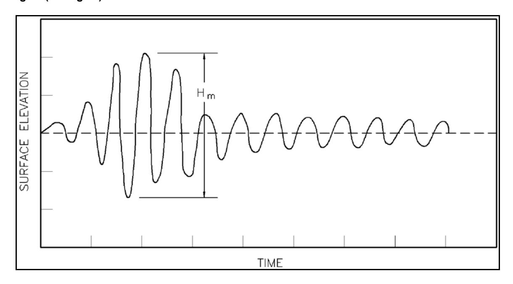

*Figure II-7-41. Typical vessel-generated wave record*

#### EXAMPLE PROBLEM II-7-5

FIND:
The period of the diverging waves generated by the vessel.
GIVEN:
A vessel is moving at a speed of 10 knots (5.157 m/sec) over water 5 m deep.
SOLUTION:
The vessel Froude number is

```math
F = \frac{5.157}{\sqrt{9.81 (5)}} = 0.73
```

so Equation II-7-23 gives a direction of propagation

```math
\theta = 35.27 \left[1 - e^{12(0.73-1)}\right] = 33.88^{\circ}
```

and Equation II-7-21 gives a wave celerity

```math
C = 5 . 1 5 7 \cos ( 3 3 . 8 8 ^ { \circ } ) = 4 . 2 8 \mathrm { m / s }
```

The linear wave dispersion equation can be written

```math
C = \frac{gT}{2\pi} \tanh \frac{2\pi d}{CT}
```

Inserting known values for C , g , and d into the dispersion equation leads to a trial solution for T of 2.8 sec. This is a typical period for vessel-generated waves and demonstrates why floating breakwaters are usually effective in protecting against vessel waves.
II-7-56 Harbor Hydrodynamics
(10) A number of quasi-empirical procedures for predicting vessel-generated wave heights have been published (see Sorensen (1986) and Sorensen (1989) for a summary). Most procedures are restricted to a certain class or classes of vessels and specific channel conditions. A comparison (Sorensen 1989) of predicted H_m values for selected vessel speeds and water depths showed significant variation among the results predicted by the various procedures. The best approach for design analyses appears to be to review the published vessel wave measurement data to compare with the vessel, vessel speed, and channel conditions that most closely approach the design condition and select a conservative value of H_m from these data. If this is not possible, then the values in Table II-7-5 can be used as rough estimates for the different types of vessels.

**Table II-7-5. can be used as rough estimates for the different types of vessels.**

| Table II-7-5 |  |
| --- | --- |
| Salacted Vessel-Generated Wave | Haights (Saransan 1973h) |

**Table II-7-5. can be used as rough estimates for the different types of vessels.**

| Vessel | Speed (m/s) | H m (m) at 30 m | H m (m) at 150 m |  |
| --- | --- | --- | --- | --- |
| Cabin Cruiser length-7.0 m beam-2.5 m draft-0.5 m | 3.1 5.1 | 0.2 0.4 | 0.1 0.2 |  |
| Coast Guard Cutter length-12.2 m beam-3.0 m draft-1.1 m | 3.1 5.1 7.2 1 | 0.2 0.5 0.7 | 0.3 |  |
| Tugboat length-13.7 m beam-4.0 m draft-1.8 m | 3.1 5.1 | 0.2 0.5 | 0.1 0.3 |  |
| Air-Sea Rescue Vessel length-19.5 m beam-3.9 m draft-0.9 m | 3.1 5.1 7.2 1 | 0.1 0.4 0.6 | 0.2 0.3 |  |
| Fireboat length-30.5 m beam-8.5 m draft-3.4 m | 3.1 5.1 7.2 | 0.1 0.5 0.9 | 0.1 0.3 0.8 |  |
| Tanker length-153.6 m beam-20.1 m draft-8.5 m | 7.2 9.3 |  | 0.5 1.6 |  |

Note: The above data are from tests conducted at water depths ranging from 11.9 to 12.8 m. <sup>1</sup> Denotes that the vessel was starting to plane.

#### b. Vessel motions.

- (1) Response to waves.
- (a) Wave action will excite a floating vessel to oscillate in one or more of six components of motion or degrees of freedom. These are translated in the three coordinate directions (surge, sway, and heave) and rotation around the three principal axes (roll, pitch, and yaw). Which of these motion components is excited and to what extent depends primarily on the direction of wave incidence relative to the primary vessel axes and on the incident wave frequency spectrum compared to the resonant frequencies of the six motion components (Wehausen 1971). If the vessel is moored, the arrangement of the mooring lines and their taughtness will influence the resonant periods and the response amplitudes of the vessel motions. If the vessel is moving, the effective or encounter period of wave agitation is the wave period relative to the ship rather than to a fixed observation point. Wave mass transport will also cause a slow drift of the vessel in the direction of wave propagation.
- (b) Small vessels, such as the recreational vessels found in marinas, will commonly respond to shorter wind-wave periods. An analytical study, coupled with some field measurements for seven small boats
(Raichlen 1968), indicated that the periods of free oscillation were less than 10 sec. Larger seagoing deepdraft vessels, depending on the oscillation mode being excited, will respond to the entire range of wind-wave periods. Field measurements by van Wyk (1982) on ships having lengths between 250 and 300 m and beams of about 40 m found maximum roll and pitch responses at encounter periods between 10 and 12 sec. By properly designing the mooring system, the periods and amplitudes of vessel motion can be significantly modified.
- (c) The wave-induced lateral and vertical motions of the design vessel will affect the required channel horizontal and depth dimensions, respectively. The problem of wave-induced vessel oscillations has been addressed by analytical/numerical means (Andersen 1979; Madsen, Svendsen, and Michaelsen 1980; Isaacson and Mercer 1982). These efforts usually employ small-amplitude, monochromatic waves and some limitations on vessel geometry and the incident wave directions relative to the vessel.
- (d) Some field measurement programs yield valuable design information. Wang and Noble (1982) describe an investigation of vessels entering the Columbia River channel. Pitch, roll, heave, yaw, and horizontal position were measured for selected vessels as they traversed the channel. The data were analyzed statistically to define extreme limits of vessel motion for various wave and other conditions (Noble 1982). van Wyk (1982) reports on a field study of vessel response to wave action at two South African ports. The data were analyzed statistically so extreme motion probabilities could be evaluated. Other field studies of moving large vessels have been reported by Greenstreet (1982) and Zwamborn and Cox (1982). Raichlen (1968) and Northwest Hydraulic Consultants (1980) discuss field measurements of small moored vessels in marinas.
- (e) Most of the major coastal engineering labs have also conducted model studies of vessel response to wave motion. Some of these tests are discussed in Mansard and Pratte (1982), Isaacson and Mercer (1982), Zwamborn and Cox (1982), and Briggs et al. (1994). (2) Response to currents.
- (a) There are several possible causes for currents in harbors and in the vicinity of harbor entrances. Wind, wave-induced radiation stress, rivers, and tides can all generate currents in the vicinity of a coastal harbor entrance. Flow from a river that enters a harbor or flows past the entrance to a harbor located in an estuary can generate significant currents. Ebb and flood tide can generate strong reversing currents through a harbor entrance. Tidally induced longshore currents around islands can cause navigation problems at harbor entrances. Long-wave resonant oscillations in harbors can generate noticeable currents at nodal points, which can seriously affect moored vessels and create hazardous navigation conditions if this location is at a place where the flow is constricted.
- (b) Currents will directly affect vessel operation, particularly when they act oblique to the sailing line of the vessel. These currents are particularly troublesome when the vessel speed is low and vessel maneuverability is commensurately reduced. The situation is made even more difficult when there are strong winds acting from a different direction than the currents. Physical model studies and numerical simulations of vessel motion have been used to predict vessel paths under various wind and current conditions, particularly as vessels enter a harbor (Bruun 1989, Briggs et al. 1994). Currents can increase vessel sinkage and trim in restricted channels (see next section). (3) Wave-current interaction.
- (a) At harbor entrances, currents can also exert an indirect effect on vessel navigation through their effect on waves. Ebb currents will steepen incoming waves, making the waves more hazardous to the stability of
II-7-58 Harbor Hydrodynamics
small vessels in particular. The ebb currents may be of sufficient strength to induce wave breaking and turbulence in the entrance, a condition that is particularly hazardous to vessel operation.
- (b) Bruun (1978) summarizes earlier literature and discusses the problem of sediment transport. Mehta and Özsöy (1978) found that the effects of bottom friction are important in the hydrodynamics of twodimensional turbulent jets because it increases the rate of spreading of the jet, which has a significant effect on incident wave characteristics. Sakai and Saeki (1984) measured the effect of opposing currents on wave height transformation over a 1:30 sloping beach for a range of wave periods and steepness. They found an increase in wave height and decay rate in the presence of the opposing current. Willis (1988) conducted monochromatic wave and ebb current tests in a 1-m-wide rectangular entrance channel cut in a 1:30 sloping beach. Current measurements were averaged over 3 min to obtain a quantitative picture of the mean currents. They experienced major problems with the stability of the current field due to large-scale meandering motions.
- (c) Lai, Long, and Huang (1989) conducted flume tests of kinematics of wave-current interactions for strong interactions with waves propagating with and against the current. They found the influence of the waves on the mean current profiles was small, although opposing waves would give a slightly lower current. They observed a drastic change in the spectral shape, especially higher harmonics, following wave breaking in the presence of opposing currents. Their experiments confirmed blockage of waves by a current when the ratio of depth-averaged current velocity to wave celerity without currents approaches -0.25.
- (d) Raichlen (1993) conducted a laboratory investigation of waves propagating on an adverse jet to simulate the effect of ebb currents on incoming waves at a tidal inlet. He tested regular waves (depth-towavelength ratios from 0.086 to 0.496) for a range of relative channel entrance velocities to wave celerity for locations both upstream (20 channel widths) and downstream (15 channel widths) of the channel entrance. Wave height increased by a factor of 2.5 near the channel entrance in the presence of a current that was only 7 percent of the phase speed, primarily caused by wave refraction. He also found that the wave height decreases significantly as waves propagate up the entrance channel. Refraction and entrainment of the still fluid by the ebb current jet produces a lateral variation in the wave height across the channel width downstream of the entrance.
- (e) Briggs and Green (1992) and Briggs and Liu (1993) conducted three-dimensional laboratory experiments of the interaction of regular waves with ebb currents offshore of a tidal entrance channel (6 channel widths) on a 1:30 plane beach. Current velocity to wave celerity ratios ranged from 0.06 to 0.34. Under the influence of ebb currents, waves experienced increases in steepness and corresponding wave height up to a factor of nearly 2 for currents that were 20 to 30 percent of the phase speed. As waves shoal and break, higher harmonics are formed as the wave becomes more nonlinear. Energy is transferred from the fundamental mode due to nonlinear coupling between frequencies. Briggs and Liu found that ebb currents also promote the nonlinear growth of the fundamental frequency, higher harmonics, and subharmonics of the incident wave. This shift in energy can change the response characteristics of vessels in the entrance channel. (4) Vessel sinkage and trim.
- (a) The pressure distribution that develops around the hull of a moving vessel results in an above-average pressure at the bow and stern and a below-average pressure at the midsection of the vessel. The reduced pressure at the midsection dominates and causes a net sinkage of the vessel. The vessel sinkage is also referred to as squat. Since there is usually an imbalance of upward forces between the bow and stern, the vessel will often also trim by the bow (i.e. the vessel bow is lowered relative to the stern) or by the stern.
- (b) Sinkage and trim of a vessel in a navigation channel depend on the factors that control the pressure distribution along the vessel hull. Primarily, these are the vessel speed, the ratio of the channel cross section
area to the vessel wetted cross section area (known as the section coefficient), and the ratio of the water depth to the vessel draft. Other factors that might affect sinkage and trim include the vessel hull geometry, the atrest trim of the vessel, the cross-section geometry of the channel, the sailing line of the vessel relative to the centerline of the channel, vessel acceleration or deceleration, the presence of currents in the channel, and the passing of other vessels in the channel.
- (c) A wide variety of analytical, quasi-analytical, and empirical methods for predicting vessel sinkage and a few for predicting vessel trim have been published (Garthune et al. 1948, Constantine 1960, Tuck 1966, Tothill 1967, Sharp and Fenton 1968, Dand and Furgeson 1973, McNown 1976, Beck 1977, Gates and Herbich 1977, Eryuzlu and Hausser 1978, Blauuw and van der Knapp 1983, Ferguson and McGregor 1986). The earliest and most basic approach to predicting vessel sinkage employs the one-dimensional energy and continuity equations. This approach gives generally acceptable results for uniform channels and vessel hull geometries that are not too irregular. The continuity and energy equations are written between a point ahead of the vessel and a point at the vessel midsection. The water surface drawdown is thus calculated and assumed equal to the vessel sinkage. The results for a rectangular channel cross section are presented below; for a trapezoidal channel cross section see Tothill (1967) and for a parabolic channel cross section, see McNown (1976).
- (d) Consider a vessel in a channel with the relevant dimensions as defined in Figure II-7-42 where b is the channel width, Am is the vessel's midsection wetted cross-section area, the undisturbed water depth is d , and the vessel drawdown is ) d . Vs and g are the vessel speed and the acceleration of gravity as defined earlier. The continuity and energy equations in terms of the Froude number F , dimensionless drawdown D , and vessel blockage ratio S are solved by

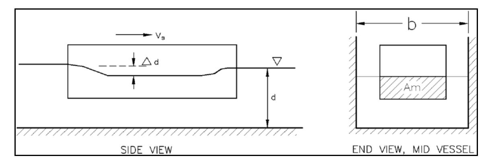

*Figure II-7-42. Definition of terms, vessel drawdown*

```math
F = \sqrt{\frac{2D(1-D-S)^2}{1-(1-D-S)^2}} \tag{II-7-24}
```

where

```math
F = \frac{V_S}{\sqrt{gd}} \qquad \qquad D = \frac{\Delta d}{d} \qquad \qquad S = \frac{A_n}{bd}
```

(e) Figure II-7-43 plots F versus D for selected values of S . Given the channel cross-section dimensions, the water depth, the vessel speed, and the midsection wetted cross-section area of the vessel, D can be determined from the figure. This, in turn, yields the water surface drawdown ) d , which is taken as the vessel sinkage.
II-7-60 Harbor Hydrodynamics

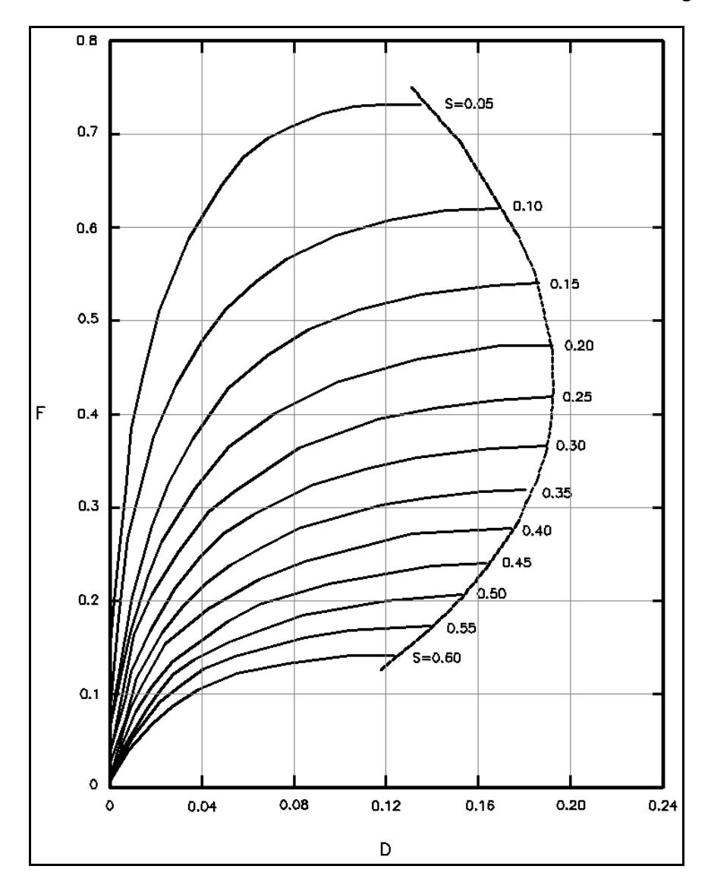

*Figure II-7-43. Vessel sinkage prediction*

- (f) Design of safe channel depths is a function of the loaded draft of the ship, vessel sinkage, minimum underkeel clearance, and effect of pitch and roll in outer channels exposed to wave and current conditions (Herbich 1992).
- (g) A self-propelled vessel cannot exceed the critical speed (see Constantine (1960)). However, a vessel can be towed faster than the critical speed, the result being the generation of a bore wave that propagates ahead of the vessel. Before reaching the critical speed, the vessel sinkage increases rapidly. If the initial vessel under-keel clearance is small, the vessel may hit bottom before coming close to the critical speed. Also, near the critical speed, there is a sharp increase in the power required to propel the vessel.

#### EXAMPLE PROBLEM II-7-6

#### FIND:

The vessel sinkage and return flow velocity between the vessel hull and the channel bottom and sides.

# GIVEN:

A C9 containership has a length of 262 m, a beam of 32 m, and a fully loaded draft of 12 m. The C9 containership with a midsection wetted cross section area of 384 m2 is moving at a speed of 6 knots (3.09 m/s) in a channel 137 m wide and 15 m deep. This is a typical scenario for deep-draft vessels entering a harbor through a one-way entrance channel.

#### SOLUTION:

The vessel Froude number is

```math
F = \frac{3.09}{\sqrt{9.81 \ (15)}} = 0.26
```

and the blockage ratio is

```math
S = \frac{384}{137(15)} = 0.19
```

From Figure II-7-43 at the intersection of F = 0.26 and S = 0.19, the dimensionless drawdown is approximately D = 0.02. The vessel sinkage is then given by

```math
\Delta d = 15(0.02) = 0.30 \,\mathrm{m}
```

The return velocity is calculated from Equation II-7-25 as

```math
V_r = 3.09 \left[ \frac{137(15)}{137(15 - 0.3) - 384} - 1 \right] = 0.81 \text{ m/s}
```

Thus, channel depths must include additional clearance to accommodate the vessel drawdown and a substantial return velocity flow can lead to scour along the channel banks.
(h) As a vessel travels in a channel, continuity of flow causes a return flow velocity to develop between the vessel hull and the channel bottom and sides. This return flow velocity Vr can be calculated for a rectangular channel and vessel cross section (as depicted in Figure II-7-42) from

```math
V _ { r } \ = \ V _ { s } \left[ \frac { b d } { b \left( d \ - \ \Delta d \right) \ - \ A _ { m } } \ - \ 1 \right] \tag{II-7-25}
```

- (i) Particularly for vessel/channel conditions that produce a large blockage ratio ( S ) and for high vessel speeds, a substantial return flow velocity can develop. Channel bottom scour and damage to reveted channel sides may result. (5) Ship maneuverability in restricted waterways.
- (a) The pressure distribution along the hull of a vessel will also cause lateral forces and horizontal moments to act on the vessel when it passes another vessel or moves in close proximity to a channel bank or other large structure. These effects affect all sizes of ships, but are particularly dangerous for larger vessels. Figure II-7-44 shows a pressure field for moving vessels, where the plus and minus signs indicate the relative pressures along the side of the hull.
II-7-62 Harbor Hydrodynamics

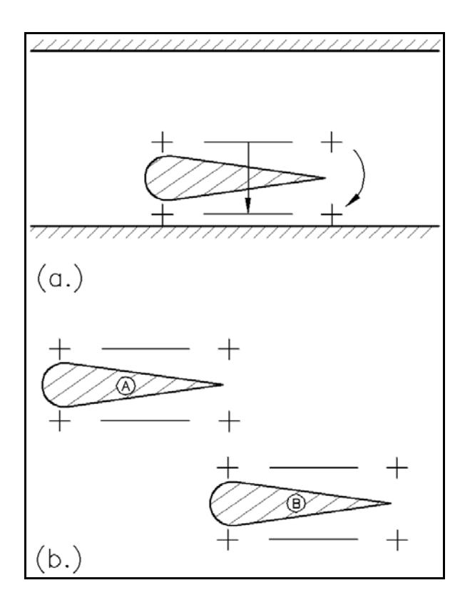

*Figure II-7-44. Pressure fields for moving vessels (vessels moving left to right)*

- (b) Figure II-7-44a shows a vessel sailing close to a channel bank. Owing to the "Bernoulli effect," larger positive and negative pressures occur on the side closest to the channel bank, with the negative pressure dominating to draw the vessel toward the bank and the larger bow pressure than stern pressure causing the bow to rotate (yaw) away from the bank. Lateral force and yawing moment increase as the vessel sails closer to the bank and they are approximately a function of the vessel speed squared. Manipulation of the ship's rudder can correct for these forces, but it is difficult to travel close to a channel bank for any long period of time (Kray 1970).
- (c) Figure II-7-44b shows two similar vessels, with vessel A passing vessel B in unrestricted water. For the positions shown, the bow of vessel A and the stern of vessel B would deflect outward because of the positive pressures at both bow and stern. When the ships are even, they would be drawn together because of the negative pressures midships, and their bows would be deflected slightly apart because of the positive pressures at the bows. And as vessel A completes passing vessel B, the stern of B and the bow of A would be deflected outward. Thus, the interacting forces and moments are complex, continually changing while the ships are in the proximity of each other, and dependent on hull sizes and geometries; vessel speeds, directions, and lateral separation; and water depth. Vessel interaction effects are more significant for vessels that have a large cross-section area relative to the channel cross-section area and for higher vessel speeds.
- (d) The effects of vessel interaction have been studied for specific conditions by carrying out model studies (e.g. Taylor 1909, Robb 1949, Garthune et al. 1948, Delft Hydraulics Laboratory 1965, Moody 1970, Dand 1976). Some analytical studies that allow calculation of the resulting forces and moments, but not the vessel response, were conducted by Silverstein (1958), Hooft (1973), Tuck and Newman (1974), and Dand (1976).
- (e) Vessel interactions with other vessels and with the channel bank must be accounted for in determining required navigation channel widths. For example, guidance given in Engineer Manual (EM) 1110-2-1613, which specifies channel width as a function of the design vessel beam dimension for various channel conditions, includes these effects. The total channel width consists of a maneuvering lane, bank clearance, and ship clearance, if two-way traffic is involved. This specification is based on model studies of large vessels in deep-draft navigation channels and discussions with ship pilots (Garthune et al. 1948). c. Mooring. (1) Wave forcing mechanism.
- (a) Infragravity waves (wave periods typically between 25 and 300 sec) force long-period oscillations or seiche in harbors. If the natural period of the ship corresponds to a harbor resonance mode and they are moored in the vicinity of the node, excessive ship motion can prevent loading and unloading of the ship for a number of days. In some cases, extensive damage to the ship and pier can result if the mooring lines fail.
- (b) Infragravity energy can be divided into bound and free wave energy. Bound or forced infragravity waves are nonlinearly coupled to wave groups, traveling at the group velocity of the wind waves, and phase locked to sea and swell waves. Free infragravity waves radiate to and from deep water after being reflected from the shoreline or are generated by nonlinear interactions and wave breaking of incident wind waves and are refractively trapped in shallow water, propagating in the longshore direction. According to numerous investigators (Herbers et al. 1992; Elgar et al. 1992; Okihiro, Guza, and Seymour 1992), bound and free wave energies increase with increasing swell energy and decreasing water depth. Bound wave contributions are usually more significant when energetic swell conditions exist, but free waves dominate when more moderate conditions prevail. (2) Mooring configurations.
- (a) A vessel moored in a harbor or at some point offshore commonly has one of three types of mooring arrangements: C A single-point mooring where the vessel is tied to a buoy by a single line from the bow and is thus free to rotate around the buoy (i.e. weathervane) in response to environmental forces. C A multiple- point mooring where the ship is tied by several fore and aft lines to anchors or buoys. C A conventional pier anchorage, where the vessel is tied fore and aft to the pier and separated from the pier by a fendering system.
- (b) For a deep-draft vessel at a pier, the mooring line system will typically consist of 8 to 12 lines in a symmetrical pattern, half from the bow and half from the stern of the ship. One to two breast lines are positioned on both bow and stern. The breast line(s) is perpendicular to the ship and dock and presses the ship against the dock and fenders. Two head lines make an angle of 60-70 deg to the breast line and go forward from the bow. Two stern lines are analogous to the head lines, but originate from the stern of the ship. These four lines are on the order of 100 ft long between ship and dock attachment points. Finally, two or four spring lines make an angle of 85 deg to the breast line and go toward midships. These lines can vary in length from 100 to 200 ft. The spring lines, in combination with the breast lines, provide the most efficient ship mooring. The deck of the vessel is typically 3 to 8 m above the pier, with the bow being higher than the stern.
II-7-64 Harbor Hydrodynamics
- (3) Mooring lines.
- (a) Mooring lines are made from steel, natural fibers, and synthetic materials. Steel ropes may be made of different strength grades and galvanized for protection against corrosion. Natural fibers include manilla, sisal, and coir. Commonly used synthetic materials are nylon, dacron, polypropylene, Kevlar, and Karastan (Herbich 1992).
- (b) Synthetic lines are easy to handle, do not corrode, and have excellent strength-to-weight ratios. Different construction types include stranded, plaited, braided, and parallel yarns. Stranded is the least satisfactory for mooring lines because it tends to unlay under free end conditions. Each has different mechanical properties that make it appropriate for different applications. These include strength, weight, stretch, endurance, and resistance to abrasion and cuts.
- (c) Care should be taken not to mix different materials and lengths in mooring arrangements (Oil Companies International Marine Forum (OCIMF) 1978). Elasticity is a measure of a mooring line's ability to stretch under load. It is a function of material, diameter, and length. The ultimate breaking strength has been related to the square of the nominal rope diameter (Wilson 1967). If two lines of different elasticity but similar lengths and orientations are combined at the same point, the stiffer one will assume more of the load. Also, lines of different length will carry different amounts of the total load. Thus, one of the lines may be near breaking while the other one is carrying almost no load.
- (4) Fenders. Fenders are like bumpers on cars, designed to protect vessels and piers during berthing and mooring against forces due to winds, waves, and currents. They are designed to absorb impact energy of the vessel through deflection and dissipation. Some respond very fast and violently and others more slowly. The latter are the more desirable because they produce smaller fender forces. Highly elastic, recoiling type fenders should be replaced with the non-recoiling type if possible. Fenders can be continuous or placed in certain areas where vessels land. The mooring system should be designed based on the combined response of mooring lines and fenders to ensure that resonance effects with the environmental forces are minimized. The interested reader should consult Bruun (1989) for additional information on types, materials, characteristics, selection, forces, deformation, and energy absorption of fenders. (5) Surge natural period.
- (a) For moored vessels at a dock or quay, surge is one of the most important parameters to consider. Ranges of allowable movements for different vessels have been given by Bruun (1989).
- (b) The motion of a moored ship in surge can be described by the motion of a linear system with a single degree of freedom. Restoring or reaction forces due to the change in position, velocity, and acceleration of the ship from equilibrium are assumed linear. The exciting force is due to the drag force of the water flowing past the ship. The motion of the ship in surge is assumed to be independent of other directions of motion. Damping is assumed to be small for the low-frequency motions of a ship in surge. Solving for the undamped natural period in surge Ts

```math
T _ { n } \, = \, 2 \, \pi \, \sqrt { \frac { m _ { \nu } } { k _ { t o t } } } \tag{II-7-26}
```

(c) The virtual mass of the ship mv is the sum of the actual mass or displacement of the ship m and the added mass ma due to inertial effects of the water entrained with the ship. For a ship in surge, ma is approximately 15 percent of the actual mass m , which is based on the ship's displacement

```math
m _ { \nu } = m \ + \ m _ { _ a } = \ 1 . 1 5 \ : \mathrm { m } \tag{II-7-27}
```

(d) A mooring system is composed of many lines, but only those in tension contribute to the stiffness or effective spring constant ktot given by

```math
k_{tot} = \sum_{n} k_n \sin \theta_n \cos \phi_n \tag{II-7-28}
```

where the index n sums over all head, stern, and spring lines in tension during surge motion (breast lines are conservatively assumed to provide no restoring force in surge), 2n is the angle the line makes in the horizontal plane with the perpendicular to the ship, and Nn is the angle the line makes in the vertical plane between the ship and the dock.
(e) For a taut mooring line in which sag is negligible and deflections are small, the individual stiffness kn is defined by

```math
k_n = \frac{T_n}{\Delta l_n} \tag{II-7-29}
```

where Tn is the axial tension or load and ) ln is the elongation in the mooring line. The elastic behavior of fiber ropes is difficult to ascertain since it is a function of material, construction, size, load and load history, time, and environmental conditions. Typically, manufacturers supply elongation curves based on experimental data, which show percent elongation g n as a function of load as a percent of the breaking strength of the mooring line (Figure II-7-45). A new rope undergoes construction stretch or permanent strain, which occurs when initial loading places the fibers in paths different from their initial construction. Elastic stretch occurs for subsequent loading and is repeatable each time the rope is loaded. Under high loads for a long time, the rope may undergo cold flow of the fibers and eventually break. Thus, previously elongated rope does not stretch as much as new rope and separate elongation curves may be provided. Percent elongation is related to ) ln by

```math
\varepsilon_n = 100 \left( \frac{\Delta l_n}{l_n} \right) \tag{II-7-30}
```

where ln is the length of the mooring line. This formulation assumes that cable dynamics can be neglected, and that the natural frequency of the mooring line in longitudinal and transverse vibration is much higher than the surge frequency of the ship.
(f) Therefore, the natural period of a moored ship in surge is a function of displacement, and number, type, length, size, and tension of the mooring lines. As the ship is off-loaded, displacement of the ship will decrease and this will change the ship response characteristics. Proper ballasting can be used to prevent surge conditions from developing. If this is not possible, other remedies can be sought. The natural period of the moored ship can be adjusted by changing the mooring line configuration or tension. Increased tension will make the moored ship stiffer and will reduce its resonant period of oscillation. A decrease in the mooring line tension will make the moored ship less prone to shorter-period resonant modes. If this is not practical, the number and type of mooring lines can be changed to affect the response of the moored ship.
II-7-66 Harbor Hydrodynamics

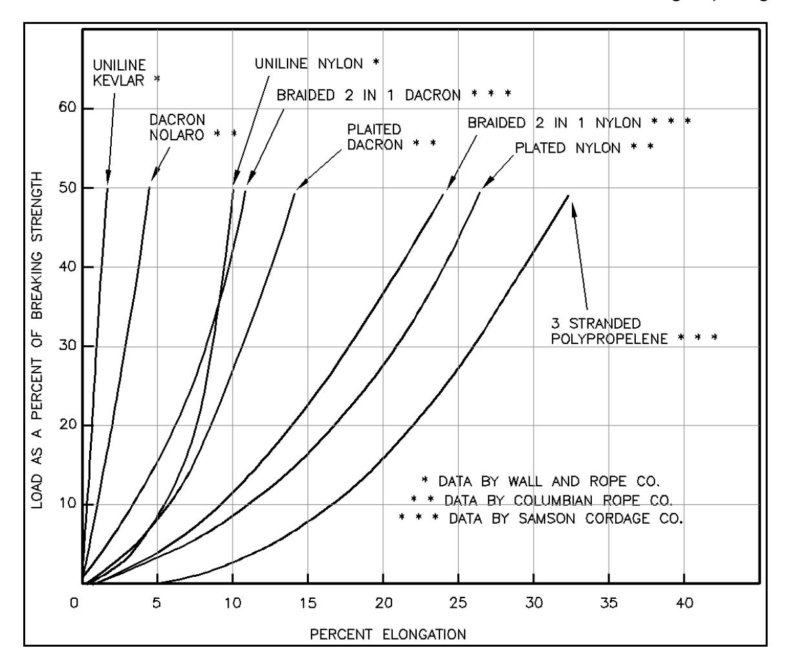

*Figure II-7-45. Mooring fiber rope elongation curves*

- (6) Mooring forces.
- (a) Design of any of these systems requires that the primary hydrodynamic loads on the vessel caused by the wind, currents, and waves be determined, usually on a probabilistic basis. Other loads that may be important in certain situations are ice forces and forces induced by passing vessels. The appropriate forces are employed in a dynamic analysis of the mooring system to determine expected loads in the mooring lines and on the fender systems. This analysis can be done by a physical model study or by a computer simulation of the system dynamics equations (see Bruun (1989) and Gaythwaite (1990)). Detailed discussions of the primary vessel mooring forces, those caused by the wind, currents, and waves, can be found in Tsinker (1986), Bruun (1989), and Gaythwaite (1990). (b) The wind load is determined from the usual drag equation

```math
F_{w} = \frac{1}{2} \rho_{a} C_{D} A V_{10}^{2} \tag{II-7-31}
```

where Fw is the drag force due to the wind, Da is the air density, CD is a drag coefficient, A is the projected area of the vessel above the waterline, and V10 is the wind speed at the standard elevation of 10 m above the water's surface.

#### EXAMPLE PROBLEM II-7-7

#### FIND:

The natural period of the vessel in surge for used mooring lines in good condition.

# GIVEN:

A C9 containership is moored at a pier in Barbers Point Harbor, Oahu, Hawaii. Its fully-loaded displacement is 54,978 long tons (55,860,231 kg). Karat Estalon fiber ropes with a 7-1/2-in. circumference (6.3-cm-diam) are used for the two head, two stern, and two spring lines. Head and stern lines are 30.5 m long and make an angle of 70 deg with the perpendicular breast lines. The spring lines are 45.7 m long and form an angle of 85 deg with the breast lines. The tension in these lines is maintained at 20 tons (177,900 N). The deck of the C9 is assumed to be 7 m above the dock at the bow and 4.5 m at the stern.

#### SOLUTION:

Virtual mass is calculated from Equation II-7-27

```math
m _ { \nu } \ = \ 1 . 1 5 ( 5 5 , 8 6 0 , 2 0 0 ) \ = \ 6 4 , 2 3 9 , 2 0 0 \mathrm { k g }
```

The next step is to calculate the effective spring constant. Karat lines are manufactured by Columbian Rope Company, Guntown, MS, under license from Akzo, Holland. Estalon is a fiber that is a copolymer of polyester and polypropylene. According to manufacturer's literature, the breaking strength for Karat ropes is 526,000 N. The load as a percent of breaking strength is

```math
Load = 100 \left[ \frac{177,900}{526,000} \right] = 33.8\%
```

From the elongation chart for Karat lines (not shown), the percent elongation is 8.7 percent. The elongation for the head and stern lines is the same and is calculated from Equation II-7-30

```math
\Delta l_{Hd} = \Delta l_{St} = \frac{8.7(30.5)}{100} = 2.7 \text{ m}
```

Likewise, the elongation for the spring lines is given by

```math
\Delta l_{Sp} = \frac{8.7(45.7)}{100} = 4.0 \text{ m}
```

Example Problem II-7-7 (Continued)
II-7-68 Harbor Hydrodynamics
Example Problem II-7-7 (Concluded)
Individual stiffness for the head and stern lines is calculated from Equation II-7-29

```math
k_{Hd} = k_{St} = \frac{177,900}{2.7} = 65,900 \text{ N/m}
```

Similarly, the stiffness for individual spring lines is

```math
k _ { S p } = \frac { 1 7 7 , 9 0 0 } { 4 . 0 } = 4 4 , 5 0 0 \mathrm { N / m }
```

The vertical angles from the bow, stern, and spring lines are

```math
\Phi_{Hd} = \arcsin\left[\frac{7.0}{30.5}\right] = 13^{\circ}
```

```math
\phi_{St} = \arcsin\left[\frac{4.5}{30.5}\right] = 8^{\circ}
```

```math
\phi_{Sp} = \arcsin\left[\frac{4.5}{45.7}\right] = 6^{\circ}
```

When the ship surges forward, the two stern lines and a spring line provide restoring forces. Similarly, when the surge is in reverse, two head lines and a spring line provide the restoring forces. The effective spring constant is calculated both ways and averaged from Equation II-7-28

```math
k_{tot} = 2(65,900) \sin70^\circ \cos8^\circ + 44,500 \sin85^\circ \cos6^\circ = 122,600 + 44,100 = 166,700 \text{ N/m}
```

```math
k_{tot} = 2(65,900) \sin 70^\circ \cos 13^\circ + 44,500 \sin 85^\circ \cos 6^\circ = 120,700 + 44,100 = 164,800 \text{ N/m}
```

```math
k_{tot} = \frac{166,700 + 164,800}{2} = 165,750 \,\text{N/m}
```

Finally, the natural period in surge is calculated from Equation II-7-26

```math
T _ { s } \ = \ 2 ( 3 . 1 4 ) \sqrt { \frac { 6 4 , 2 3 9 , 2 0 0 } { 1 6 5 , 7 5 0 } } \ = \ 1 2 4 \mathrm { s e c }
```

If the rope had been new, the percent elongation would have been higher at 10.7 percent. This would have resulted in a slightly higher surge natural period of approximately 136 sec.
- (c) During a storm, it is likely that some water will be entrained in the air. This would significantly increase the air density. Some investigators have argued that the entrained water will also slow down the air so there would be no net increase in wind drag. This issue is still unresolved. Current practice is to neglect entrained water when specifying the air density in the wind drag calculation.
- (d) Values for the drag coefficient depend on the vessel geometry and orientation to the wind, and have been determined from wind tunnel tests. CD values show significant variation, so reference should be made to Benham et al. (1977), Gaythwaite (1990), Isherwood (1973), Naval Facilities Engineering Command (1968), Owens and Palo (1981), and Palo (1983) for information on drag coefficients for a variety of vessels. These references also give some information on projected areas for common types of vessels. Table II-7-6 lists drag coefficients for wind (Bruun 1989).

**Table II-7-6. lists drag coefficients for wind (Bruun 1989).**

| Direction | Max. | Min. | Mean |
| --- | --- | --- | --- |
| Crosswise | 1.40 | 0.80 | 1.11 |
| Bow | 1.04 | 0.62 | 0.82 |
| Stern | 1.02 | 0.64 | 0.77 |

(e) The wind speed at the standard elevation (10 m) is commonly used because this would be a good reference elevation for most larger vessels. If the center of pressure of the vessel is at a significantly different elevation than 10 m, the 1/7th power velocity profile law may be used to correct the wind velocity. It is defined by

```math
V_z = V_{10} \left(\frac{z}{10}\right)^{0.11} \tag{II-7-32}
```

where Vz is the velocity at the desired elevation z . Typically, a 50-year return period wind speed is used or the limiting wind speed for which a vessel might remain moored would be used.
- (f) The gustiness of the wind must also be considered; i.e., what duration wind gust is sufficient to envelop the vessel. To account for gustiness, the drag coefficient is often increased by a factor of about 1.4 (Tsinker 1986).
- (g) Commonly, current drag forces are determined with less certainty than wind drag forces. Current speeds and directions at the mooring site may be difficult to predict, particularly in a harbor having a complex layout. Currents may be continually shifting if dominated by the tide or river flow. The Reynolds number for currents acting on a vessel is usually in the fully turbulent region, but often close to the transition point where drag coefficients show a wider range of scatter. The vessel draft and resulting bottom clearance can also have a significant impact on the resulting drag force. Gaythwaite (1990) presents several sources for current drag coefficient and vessel projected area information. Seelig, Kreibel, and Headland (1992) have published a recent analysis of new scale-model drag studies and other data collected over the past five decades.
II-7-70 Harbor Hydrodynamics

#### EXAMPLE PROBLEM II-7-8

#### FIND:

The wind drag for a Beaufort 5 fresh breeze of 20 knots (10.31 m/s) at an angle of 30 deg to the wind. Assume gustiness can be accounted for by applying a factor of 1.20 to the wind speed. Beaufort 5 is usually the limiting wind for port operations of loading and unloading.

#### GIVEN:

A C9 containership is moored at a pier with an asymmetrical container distribution of 5 high in the bow half of the vessel and none in the aft portion. The useable length of the ship for cargo handling is 246 m. The height above the water is 10.9 m. The containers are 2.7 m tall.

#### SOLUTION:

The forward and aft areas exposed to the wind are

```math
A_{aft} = \frac{246}{2} 10.9 = 1,340 \,\mathrm{m}^2
```

```math
A_{forward} = 123[10.9 + 5(2.7)] = 3,000 \,\mathrm{m}^2
```

The net effective area is then

```math
A_{eff} = [1,340 + 3,000] \sin 30^{\circ} = 2,170 \,\mathrm{m}^2
```

The wind speed, including a gustiness factor, is

```math
V _ { w } \, = \, 1 . 2 0 ( 1 0 . 3 1 ) \, = \, 1 2 . 4 \mathrm { m / s }
```

Substituting these values into Equation II-7-31, we get

```math
F _ { w } \ = \ { \frac { 1 } { 2 } } ( 1 . 2 ) ( 1 . 0 ) ( 2 , 1 7 0 ) ( 1 2 . 4 ) ^ { 2 } \ = \ 2 0 0 \mathrm { k N }
```

where we have assumed Da = 1.2 kg/m3 at 20 ° C and CD = 1.0 as a reasonable value since the mean drag coefficient for bow and transverse winds varies between 0.82 to 1.11.
(h) Longitudinal current loads on ships are taken from procedures by NAVFAC Design Manual DM26.5. The total longitudinal current load Fc,tot is composed of form drag Fc,form , skin friction Fc,fric , and propeller Fc,prop drag components. All three components have similar equations.

```math
F_{c,tot} = F_{c,fric} + F_{c,fric} + F_{c,prop} \tag{II-7-33}
```

(i) Form drag is due to the flow of water past the vessel's cross-sectional area and is defined as

```math
F_{c,form} = -\frac{1}{2} \rho_w C_{c,form} B T V_c^2 \cos \theta_c \tag{II-7-34}
```

where \rho_w is the water density, C_{c,form} is the form drag coefficient = 0.1, B is the vessel beam, T is the vessel draft, V_c is the average current speed, and \theta_c is the angle of the current relative to the longitudinal axis of the vessel. Skin friction drag is due to the flow of water over the wetted surface area of the vessel and is given by

```math
F_{c,fric} = -\frac{1}{2} \rho_w C_{c,fric} S V_c^2 \cos \theta_c \tag{II-7-35}
```

where C_{c,fric} is the skin friction coefficient and S is the wetter surface area of the vessel. The skin friction coefficient is a function of the Reynolds number R_n

```math
C_{c,friction} = \frac{0.075}{(\log_{10} R_n - 2)^2} \tag{II-7-36}
```

```math
R_n = \frac{V_c L_{wl} \cos \theta_c}{v} \tag{II-7-37}
```

where L_{wl} is the waterline length of the vessel and v is the kinematic viscosity of water. The wetted surface area is defined as

```math
S = \left( 1 . 7 T L _ { w l } \right) \mathrm { \, + \, } \frac { D } { T \gamma _ { w } } \tag{II-7-38}
```

where D is the displacement of the vessel in Long Tons (=2240 lb = 1016.0 kg), and \gamma_w = 1.01 Long Tons / m<sup>3</sup> (LT/m<sup>3</sup>).
(j) Finally, the propeller drag is due to the form drag of the propeller with a locked shaft and is given by

```math
F_{c,prop} = -\frac{1}{2} \rho_w C_{c,prop} A_p V_c^2 \cos \theta_c \tag{II-7-39}
```

where C_{c,prop} is the propeller drag coefficient = 1 and A_p is the expanded or developed blade area of the propeller defined as

```math
A_{p} = \frac{L_{wl}B}{0.838 A_{r}} \tag{II-7-40}
```

- (k) The area ratio A_r is the ratio of the waterline length times the beam to the total projected propeller area. Typical values range between 100 for a destroyer and 270 for a tanker.
- (l) Thus, to calculate current loads, the following input parameters are needed: the vessel's beam, draft, waterline length, displacement, and propeller area ratio; and average current speed and direction.
- (m) It is difficult to evaluate wave loadings on a moored vessel. Both wind-wave and long-period waves are oscillatory; so there is a complex interaction with the mooring system dynamics. This interaction depends on the incident wave frequencies, the vessel added mass and drag characteristics, and the elastic characteristics of the mooring lines and fender system. The vessel can respond in one or more of the six modes of oscillation (see above). Rather than an analytical treatment of the problem in which actual wave loads are determined, scale model testing is often employed. In the latter, the system response in terms of
II-7-72 Harbor Hydrodynamics
mooring line loads, fender loads, and vessel response modes are directly determined for given incident wave spectra. Sarpkaya and Isaacson (1981) and Gaythwaite (1990) discuss this further.

# II-7-8. References

# EM 1110-2-1613

Hydraulic Design of Deep-Draft Navigation Projects

#### Abbott and Madsen 1990

Abbott, M. B., and Madsen, P. A. 1990. "Modelling of Wave Agitation in Harbors," The Sea, Volume 9, Part B, B. Le Méhauté and D. M. Hanes, ed., John Wiley & Sons, New York.

## Allsop and Hettiarachchi 1988

Allsop, N. W. H., and Hettiarachchi, S. S. L. 1988. "Reflections from Coastal Structures," Proceedings, 21st International Conference on Coastal Engineering , American Society of Civil Engineers, pp 782-794.

#### Andersen 1979

Andersen, P. 1979. "Ship Motions and Sea Loads in Restricted Water Depth," Ocean Engineering , Vol 6, pp 557-569.

#### Bailard et al. 1990

Bailard, J. A., DeVries, J., Kirby, J. T., and Guza, R. T. 1990. "Bragg Reflection Breakwater: A New Shore Protection Method?" Proceedings, 22nd International Conference on Coastal Engineering , American Society of Civil Engineers, Delft, The Netherlands, pp 1702-1715.

# Bailard et al. 1992

Bailard, J. A., DeVries, J. W., and Kirby, J. T. 1992. "Considerations in Using Bragg Reflection from Storm Erosion Protection," Journal, Waterway, Port, Coastal and Ocean Eng. Division, American Society of Civil Engineers, Jan/Feb, pp 62-74.

#### Battjes 1974

Battjes, J. A. 1974. "A Computation of Set-Up, Longshore Currents, Run-Up and Overtopping Due to Wind-Generated Waves," Ph.D. diss., Delft University of Technology, The Netherlands.

# Beck 1977

Beck, R. F. 1977. "Forces and Moments on a Ship in a Shallow Channel," Journal of Ship Research , June.

#### Benham et al. 1977

Benham, F. A., et al. 1977. "Wind and Current Shape Coefficients for Very Large Crude Carriers," Proceedings , Offshore Technology Conference, Paper 2739.

# Blaauw and van der Knapp 1983

Blaauw, H. G., and van der Knapp, F. M. C. 1983. "Prediction of Squat of Ships Sailing in Restricted Water," Proceedings , 8th International Harbor Conference , Antwerp, June.

#### Bowden 1983

Bowden, K. F. 1983. Physical Oceanography of Coastal Waters , John Wiley, New York.

# Bowers and Welsby 1982

Bowers, E. C., and Welsby, J. 1982. "Experimental Study of Diffraction through a Breakwater Gap," Report IT 229, Hydraulics Research Station, Wallingford, U.K.

## Briggs and Green 1992

Briggs, M. J., and Green, D. R. 1992. "Experimental Study of Monochromatic Wave-Ebb Current Interaction," Technical Report CERC-92-9, U.S. Army Engineer Waterways Experiment Station, Vicksburg, MS, p 91.

#### Briggs and Liu 1993

Briggs, M. J., and Liu, P. L-F. 1993. "Experimental Study of Monochromatic Wave-Ebb Current Interaction," Proceedings , Waves '93 Conference, American Society of Civil Engineers, New Orleans, LA.

#### Briggs et al. 1994

Briggs, M. J., Lillycrop, L. S., Harkins, G. S., Thompson, E. F., and Green, D. R. 1994. "Physical and Numerical Model Studies of Barbers Point Harbor, Oahu, Hawaii," Technical Report CERC-94-14, U.S. Army Engineer Waterways Experiment Station, Vicksburg, MS.

### Bruun 1956

Bruun, P. 1956. "Destruction of Wave Energy by Vertical Walls," Journal, Waterways and Harbors Division , American Society of Civil Engineers, WW1, pp 1-13.

## Bruun 1978

Bruun, P. 1978. "Stability of Tidal Inlets, Theory and Engineering," Developments in Geotechnical Engineering 23 , Elsevier Scientific Publishing, Amsterdam, The Netherlands.

# Bruun 1989

Bruun, P. 1989. Port Engineering , 4th ed., Vol 1, Gulf Publishing Company, Houston, TX.

#### Callaway 1981

Callaway, R. J. 1981. "Flushing Study of South Beach Marina, Oregon," Journal, Waterway, Port, Coastal and Ocean Division , American Society of Civil Engineers, WW2, pp 47-58.

# Carr 1952

Carr, J. H. 1952. "Wave Protection Aspects of Harbor Design," Report E-11, Hydrodynamics Laboratory, California Institute of Technology.

#### Carr and Stelzriede 1952

Carr, J. H., and Stelzriede, M. E. 1952. "Diffraction of Water Waves by Breakwaters," Gravity Waves , Circular 521, National Bureau of Standards, Washington, DC, pp 109-125.

# Carrier 1971

Carrier, G. F., Shaw, R. P., and Miyata, M. 1971. "The Response of Narrow-Mouthed Harbors in a Straight Coastline to Periodic Incident Waves," J. Appl. Mech., Vol 38, Series E, Nov 2, 1971.

#### Chen 1986

Chen, H. S. 1986. "Effects of Bottom Friction and Boundary Absorption on Water Wave Scattering," Applied Ocean Research , Vol 8, No. 2, pp 99-104.
II-7-74 Harbor Hydrodynamics

#### Chen and Houston 1987

Chen, H. S., and Houston, J. R. 1987. "Calculation of Water Oscillation in Coastal Harbors; HARBS and HARBD User's Manual," Instruction Report CERC-87-2, U.S. Army Engineer Waterways Experiment Station, Vicksburg, MS.

#### Chiang and Lee 1982

Chiang, W.-L., and Lee, J.-J. 1982. "Simulation of Large-scale Circulation in Harbors," Journal, Waterway, Port, Coastal and Ocean Division , American Society of Civil Engineers, WW1, pp 17-31.

### Cialone et al. 1991

Cialone, M. A., Mark, D. J., Chou, L. W., Leenknecht, D. A., Davis, J. A., Lillycrop. L. S., Jensen, R. E., Thompson, Gravens, M. B., Rosati, J. D., Wise, R. A., Kraus, N. C., and Larson, P. M. 1991. "Coastal Modeling System (CMS) User's Manual." Instruction Report CERC-91-1, U.S. Army Engineer Waterways Experiment Station, Vicksburg, MS.

#### Constantine 1960

Constantine, T. 1960. "On the Movement of Ships in Restricted Waterways," Journal of Fluid Mechanics , Vol 9, pp 247-256.

#### Cox and Clark 1992

Cox, J. C., and Clark, G. R. 1992. "Design Development of a Tandem Breakwater System for Hammond Indiana," Coastal Structures and Breakwaters , Institution of Civil Engineers, Thomas Telford, London, pp 111-121.

#### Dand 1976

Dand, I. W. 1976. "Ship-Ship Interaction in Shallow Water," 11th Symposium on Naval Hydrodynamics , University College, London, April.

#### Dand and Furgeson 1973

Dand, I. W., and Furgeson, A. M. 1973. "The Squat of Full Ships in Shallow Water," Transactions, Royal Institute of Naval Architects , April.

#### Davies and Heathershaw 1984

Davies, A. G., and Heathershaw, A. D. 1984. "Surface-Wave Propagation over Sinusoidally Varying Topography," Journal of Fluid Mechanics , Vol 144, pp 419-443.

#### Defant 1961

Defant, A. 1961. Physical Oceanography , Vol II, Pergamon Press, New York.

#### Delft Hydraulics Laboratory 1965

Delft Hydraulics Laboratory. 1965. "Report on Model Tests, North Sea Canal, Part III," Delft, The Netherlands.

#### Elgar et al. 1992

Elgar, S., Herbers, T. C., Okihiro, M., Oltman-Shay, J., and Guza, R. T. 1992. "Observations of Infragravity Waves," Journal of Geophysical Research , Vol 97, No. C10, pp 15573-15577.

# Eryuzlu and Hausser 1978

Eryuzlu, N. E., and Hausser, R. 1978. "Experimental Investigation Into Some Aspects of Large Vessel Navigation in Restricted Waterways," Proceedings, Symposium on Aspects of Navigability , Delft, The Netherlands.

#### Falconer 1980

Falconer, R. A. 1980. "Modelling of Planform Influence on Circulation in Harbors," Proceedings, 17th International Conference on Coastal Engineering , American Society of Civil Engineers, pp 2726-2744.

#### Falconer 1984

Falconer, R. A. 1984. "A Mathematical Model Study of the Flushing Characteristics of a Shallow Tidal Bay," Proceedings, Institution of Civil Engineers , Vol 77, pp 311-332.

## Falconer 1985

Falconer, R. A. 1985. "Application of Numerical Models in the Hydraulic Design of Four U.K. Harbors," Proceedings, Conference on Numerical and Hydraulic Modelling of Ports and Harbors , British Hydraulic Research Association, pp 1-11.

#### Falconer and Mardapitta-Hadjipandeli 1986

Falconer, R. A., and Mardapitta-Hadjipandeli, L. 1986. "Application of a Nested Numerical Model to Idealized Rectangular Harbors," Proceedings, 20th International Conference on Coastal Engineering , American Society of Civil Engineers, pp 176-192.

### Ferguson and McGregor 1986

Ferguson, A. M., and McGregor, R. C. 1986. "On the Squatting of Ships in Shallow and Restricted Water," Proceedings, 20th International Conference on Coastal Engineering , American Society of Civil Engineers.

# Garthune et al. 1948

Garthune, R. S., Rosenberg, B., Cafiero, D., and Olson, C.R. 1948. "The Performance of Model Ships in Restricted Channels in Relation to the Design of a Ship Canal," Report 601, U.S. Navy David Taylor Model Basin, Washington, DC.

#### Gates and Herbich 1977

Gates, E. T., and Herbich, J. B. 1977. "The Squat Phenomenon and Related Effects of Channel Geometry," Proceedings, Hydraulics in the Coastal Zone Conference , American Society of Civil Engineers.

#### Gaythwaite 1990

Gaythwaite, J. W. 1990. Design of Marine Facilities-For the Berthing, Mooring and Repair of Vessels , Von Nostrand Reinhold, New York.

#### Giles and Sorensen 1979

Giles, M. L., and Sorensen, R. M. 1979. "Determination of Mooring Loads and Wave Transmission for a Floating Tire Breakwater," Proceedings, Coastal Structures '79 Conference , American Society of Civil Engineers, pp 1069-1085.

#### Gilman and Nottingham 1992

Gilman, J. F., and Nottingham, D. 1992. "Wave Barriers: An Environmentally Benign Alternative," Proceedings, Coastal Engineering Practice'92 Conference , American Society of Civil Engineers, pp 479-486.

## Goda 1969

II-7-76 Harbor Hydrodynamics
Goda, Y. 1969. "Reanalysis of Laboratory Data on Wave Transmission Over Breakwaters," Port and Harbor Research Institute Report, Vol 8, No. 3, pp 3-18.

#### Goda 2000

Goda, Y. 2000. Random Seas and Design of Maritime Structures , 2nd ed., World Scientific Pub. Co., Teaneck, NJ.

#### Goda, Takayama, and Suzuki 1978

Goda, Y., Takayama, T., and Suzuki, Y. 1978. "Diffraction Diagrams for Directional Random Waves," Proceedings, 16th International Conference on Coastal Engineering , American Society of Civil Engineers, pp 628-650.

#### Greenstreet 1982

Greenstreet, G. 1982. "Study of Ships Track and Motions at Port Taranaki," Proceedings, 18th International Conference on Coastal Engineering , American Society of Civil Engineers, pp 2763-2772.

#### Hales 1981

Hales, L. Z. 1981. "Floating Breakwaters: State-of-the-Art Literature Review," Technical Report 81-1, U.S. Army Engineer Waterways Experiment Station, Vicksburg, MS.

#### Harms et al. 1982

Harms, V. W., Westerink, J. J., Sorensen, R. M., and McTamany, J. E. 1982. "Wave Transmission and Mooring Force Characteristics of Pipe-Tire Floating Breakwaters," Technical Paper 82-4, U.S. Army Engineer Waterways Experiment Station, Vicksburg, MS.

#### Harris and Bodine 1977

Harris, D. L., and Bodine, B. R. 1977. "Comparison of Numerical and Physical Hydraulic Models, Masonboro Inlet, North Carolina," GITI Report 6, General Investigation of Tidal Inlets, U.S. Army Engineer Waterways Experiment Station, Vicksburg, MS.

#### Havelock 1908

Havelock, T. H. 1908. "The Propagation of Groups of Waves in Dispersive Media, with Application to Waves on Water Produced by a Travelling Disturbance," Proceedings, Royal Society of London , Series A.

# Herbers et al. 1992

Herbers, T. C., Elgar, S., Guza, R. T., and O'Reilly, W. C. 1992. "Infragravity-Frequency (0.005-0.05 Hz) Motions on the Shelf," Proceedings of 23rd International Conference on Coastal Engineering (ICCE) .

#### Herbich 1992

Herbich, J. B. 1992. "Harbors, Navigational Channels, Estuaries, Environmental Effects," Handbook of Coastal and Ocean Engineering, Vol 3, Gulf Publishing Company, Houston, TX, p 1340.

# Hooft 1973

Hooft, J. P. 1973. "Maneuvering Large Ships in Shallow Water," Journal of Navigation , Vol 26.

#### Hsu 1990

Hsu, J. R. C. 1990. "Short-Crested Waves," Handbook of Coastal and Ocean Engineering,Vol 1 , J. B. Herbich, ed., Gulf Publishing Company, Houston, TX.

## Hudson et al. 1979

Hudson, R. Y., Herrmann, F. A., Sager, R. A., Whalin, R. W., Keulegan, G. H., Chatham, C. E., and Hales, L. Z. 1979. "Coastal Hydraulic Models," Special Report No. 5, U.S. Army Engineer Waterways Experiment Station, Vicksburg, MS.

#### Ippen 1966

Ippen, A. T. 1966. " Estuary and Coastline Hydrodynamics , McGraw-Hill Book Company, Inc., New York.

#### Ippen and Goda 1963

Ippen, A. T., and Goda, Y. 1963. "Wave Induced Oscillations in Harbors: The Solution for a Rectangular Harbor Connected to the Open-sea," Report 59, Hydrodynamics Lab., Mass. Inst. Technology, Cambridge, MA.

#### Isaacson and Mercer 1982

Isaacson, M., and Mercer, A. G. 1982. "The Response of Small Craft to Wave Action," Proceedings, 18th International Conference on Coastal Engineering , American Society of Civil Engineers, pp 2723-2742.

#### Isherwood 1973

Isherwood, R. M. 1973, "Wind Resistance of Merchant Ships," Transactions, Royal Institute of Naval Architects , pp 327-338.

#### Jiang and Falconer 1985

Jiang, J. X., and Falconer, R. A. 1985. "The Influence of Entrance Conditions and Longshore Currents on Tidal Flushing and Circulation in Model Rectangular Harbors," Proceedings, International Conference on Numerical and Hydraulic Modelling of Ports and Harbors , British Hydraulic Research Association, pp 65-74.

#### Johnson 1952

Johnson, J. W. 1952. "Generalized Wave Diffraction Diagrams," Proceedings, Second Conference on Coastal Engineering , The Council on Wave Research, Berkeley, CA, pp 6-23.

#### Kirby 1987

Kirby, J. T. 1987. "A Program for Calculating the Reflectivity of Beach Profiles," Report UFL/COEL-87/004, University of Florida, Gainesville.

#### Kray 1970

Kray, C. J. 1970. "Supership Effect on Waterway Depth and Alignment," Journal, Waterways and Harbors Division , American Society of Civil Engineers.

#### Lai, Long, and Huang 1989

Lai, R. J., Long, S. R., and Huang, N. E. 1989. "Laboratory Studies of Wave-Current Interaction: Kinematics of the Strong Interaction," Journal of Geophysical Research , Vol 94, No. C11, November, pp 16,201-16,214.

#### Lee 1969

Lee, J. J. 1969. "Wave Induced Oscillations in Harbors of Arbitrary Shape," Report No. KH-R-20, W. M. Keck Lab. of Hydraulics and Water Resources, Calif. Inst. of Technology, Pasadena, CA.
II-7-78 Harbor Hydrodynamics

# Leenknecht, Szuwalski, and Sherlock 1992

Leenknecht, D. A., Szuwalski, A., and Sherlock, A. R. 1992. "Automated Coastal Engineering System, User Guide and Technical Reference, Version 1.07," U.S. Army Engineer Waterways Experiment Station, Vicksburg, MS.

# Lillycrop et al. 1993

Lillycrop, L. S., Briggs, M. J., Harkins, G. S., Boc, S. J., and Okihiro, M. S. 1993. "Barbers Point Harbor, Oahu, HI, Monitoring Study," Technical Report CERC-93-18, U.S. Army Engineer Waterways Experiment Station, Vicksburg, MS.

# Lin, Lott, and Mehta 1986

Lin, C.-P., Lott, J. W., and Mehta, A. J. 1986. "Turbidity-Sedimentation in Closed-End Channels," Proceedings, 20th International Conference on Coastal Engineering , American Society of Civil Engineers, pp 1336-1350.

#### Liu 1982

Liu, P. L-F. 1982. "Combined Refraction and Diffraction: Comparison Between Theory and Experiments," Journal of Geophysical Research , Vol 87, No. C8, pp 5723-5730.

#### Liu and Lozano 1979

Liu, P. L-F., and Lozano, C . 1979. "Combined Wave Refraction and Diffraction," Proceedings, Coastal Structures 79 Conference , American Society of Civil Engineers, pp 978-997.

#### Lott and Hurtienne 1992

Lott, J. W., and Hurtienne, A. M. 1992. "Design, Construction and Performance of a Baffled Breakwater," Proceedings, Coastal Engineering Practice '92 Conference , American Society of Civil Engineers, pp 487- 502.

# Lozano and Liu 1980

Lozano, C., and Liu, P.L-F. 1980. "Refraction-Diffraction Model for Linear Surface Waves," Journal of Fluid Mechanics , Vol 101, Pt. 4.

#### Madsen and White 1976

Madsen, O. S., and White, S. M. 1976. "Reflection and Transmission Characteristics of Porous Rubble Mound Breakwaters," Miscellaneous Report 76-5, U.S. Army Engineer Waterways Experiment Station, Vicksburg, MS.

#### Madsen, Svendsen, and Michaelsen 1980

Madsen, P. A., Svendsen, I. A., and Michaelsen, C. 1980. "Some Recent Results for Wave-Induced Motions of a Ship in Shallow Water," Proceedings, 17th International Conference on Coastal Engineering , American Society of Civil Engineers, pp 3043-3062.

# Mansard and Pratte 1982

Mansard, E. P. D., and Pratte, B. D. 1982. "Moored Ship Response in Irregular Waves," Proceedings, 18th International Conference on Coastal Engineering , American Society of Civil Engineers, pp 2621-2640.

# McNown 1976

McNown, J. S. 1976. "Sinkage and Resistance for Ships in Channels," Journal, Waterways, Harbors and Coastal Engineering Division , American Society of Civil Engineers.

# Mehta and Özsöy 1978

Mehta, A. J., and Özsöy, E. 1978. Chapter 3, "Inlet Hydraulics," Stability of Tidal Inlets: Theory and Engineering , P. Bruun, ed., Elseveir Scientific Publishing Co., Amsterdam, The Netherlands, pp 83-161.

## Mei 1985

Mei, C. C. 1985. "Resonant Reflection of Surface Water Waves by Periodic Sand Bars," Journal of Fluid Mechanics , Vol 152, pp 315-335.

#### Memos 1976

Memos, C. D. 1976. "Diffraction of Waves Through a Gap Between Two Inclined Breakwaters," Ph.D. diss., University of London.

#### Memos 1980a

Memos, C. D. 1980a. "An Extended Approach to Wave Scattering Through a Harbor Entrance," Bulletin, Permanent International Association of Navigation Congresses , Vol 1, No. 35, pp 20-26.

#### Memos 1980b

Memos, C. D. 1980b. "Energy Transmission by Surface Waves Through an Opening," Journal of Fluid Mechanics , Vol 97, Pt. 3, pp 557-568.

#### Memos 1980c

Memos, C. D. 1980c. "Water Waves Diffracted by Two Breakwaters," Journal of Hydraulic Research , Vol 18, No. 4, pp 343-357.

#### Meirovitch 1975

Meirovitch, L. 1975. Elements of Vibration Analysis, McGraw-Hill, Inc.

# Miles 1948

Miles, J. W. 1948. "Coupling of a Cylindrical Tube to a Half Space," Journal, Acoustic Society of America, pp 652-664.

#### Miles 1974

Miles, J. W. 1974. "Harbor Seiching," Annual Review of Fluid Mechanics, Vol 6, pp 17-35.

#### Moody 1970

Moody, C. G. 1970. "Study of the Performance of Large Bulk-Cargo Ships in a Proposed Interoceanic Canal," Report 374-H-01, U.S. Naval Ship Research and Development Center, Carderock, MD.

#### Naval Facilities Engineering Command 1968

Naval Facilities Engineering Command. 1968. Harbors and Coastal Facilities , Design Manual-26, Alexandria, VA.

# Nece 1985

Nece, R. E. 1985. "Physical Modeling of Tidal Exchange in Small-Boat Harbors," Proceedings, International Conference on Numerical and Hydraulic Modelling of Ports and Harbors , British Hydraulic Research Association, pp 33-41.
II-7-80 Harbor Hydrodynamics

# Nece and Layton 1989

Nece, R. E., and Layton, J. A. 1989. "Mitigating Marina Environmental Impacts Through Hydraulic Design," Proceedings, International Conference on Marinas , Computational Mechanics Institute, pp 435-449.

# Nece and Richey 1972

Nece, R.E., and Richey, E.P. 1972. "Flushing Characteristics of Small-Boat Marinas," Proceedings, 13th International Conference on Coastal Engineering , American Society of Civil Engineers, pp 2499-2512.

# Nece and Richey 1975

Nece, R. E., and Richey, E. P. 1975. "Application of Physical Tidal Models in Harbor and Marina Design," Proceedings, Symposium on Modelling Techniques , American Society of Civil Engineers, pp 783-801.

# Nece, Falconer, and Tsutumi 1976

Nece, R. E., Falconer, R. A., and Tsutumi, T. 1976. "Planform Influence on Flushing and Circulation in Small Harbors," Proceedings, 15th International Conference on Coastal Engineering , American Society of Civil Engineers, pp 3471-3486.

# Nece, Smith, and Richey 1980

Nece, R. E., Smith, H. N. and Richey, E. P. 1980. "Tidal Circulation and Flushing in Five Western Washington Marinas," Technical Report 63, Harris Hydraulics Laboratory, University of Washington, Seattle.

#### Neumann and Pierson 1966

Neumann, G., and Pierson, W. J. 1966. Principles of Physical Oceanography , Prentice-Hall, Englewood Cliffs, NJ.

# Newman 1978

Newman, J. N. 1978. Marine Hydrodynamics , MIT Press, Cambridge, MA.

#### Noble 1982

Noble, S. 1982. "Ship Motions Related to Deep Draft Channel Design," Proceedings, 18th International Conference on Coastal Engineering , American Society of Civil Engineers, pp 2662-2680.

#### Northwest Hydraulic Consultants 1980

Northwest Hydraulic Consultants. 1980. "Study to Determine Acceptable Wave Climate in Small Craft Harbors," Report to Department of Fisheries and Oceans Government of Canada, Ottawa.

#### Oil Companies International Marine Forum 1978

Oil Companies International Marine Forum. 1978. "Guidelines and Recommendations for the Safe Mooring of Large Ships at Pier and Sea Island," Witherby and Co. Ltd., London.

#### Okihiro, Guza, and Seymour 1992

Okihiro, M., Guza, R. T., and Seymour, R. J. 1992. "Bound Infragravity Waves," Journal of Geophysical Research , Vol 97, No. C7, pp 11453-11469.

#### Owens and Palo 1981

Owens, R., and Palo, P. A. 1981. "Wind-Induced Steady Loads on Moored Ships," Technical Memo M-44- 81-7, Navy Civil Engineering Laboratory, Pt Hueneme, CA.

#### Palo 1983

Palo, P. A. 1983. Steady Wind and Current Induced Loads on Moored Vessels," Proceedings, Offshore Technology Conference , Paper 4530.

#### Penny and Price 1952

Penny, W. G., and Price, A. T. 1952. "The Diffraction Theory of Sea Waves by Breakwaters, and the Shelter Afforded by Breakwaters," Philosophical Transactions , Royal Society of London, Series A, Vol 244, pp 236- 253.

#### Putnam and Arthur 1948

Putnam, J. A., and Arthur, R.S. 1948. "Diffraction of Water Waves by Breakwaters," Transactions, American Geophysical Union , Vol 29, No. 4, pp 481-490.

#### Raichlen 1968

Raichlen, F. 1968. "The Motions of Small Boats in Standing Waves," Proceedings, 11th Conference on Coastal Engineering , American Society of Civil Engineers, pp 1531 -1554.

#### Raichlen 1993

Raichlen, F. 1993. "Waves Propagating on an Adverse Jet," Proceedings, Waves '93 Conference , American Society of Civil Engineers, New Orleans, LA.

#### Raichlen and Lee 1992

Raichlen, F., and Lee, J.J. 1992. "Oscillation of Bays, Harbors and Lakes," Handbook of Coastal and Ocean Engineering, Vol 3, J. B. Herbich, ed., Gulf Publishing Company, Houston, TX.

#### Robb 1949

Robb, A. M. 1949. "Interaction Between Ships," Transactions, Institute of Naval Architects , Vol 91.

# Robb 1952

Robb, A. M. 1952. Theory of Naval Architecture , Charles Griffen and Co., London.

#### Sakai and Saeki 1984

Sakai, S., and Saeki, H. 1984. "Effects of Opposing Current on Wave Transformation on a Sloping Bed," Proc. 19th Conf. on Coastal Engineering , American Society of Civil Engineers, Vol 1, pp 1132-1148.

#### Sarpkaya and Isaacson 1981

Sarpkaya, T., and Isaacson, M. 1981. Mechanics of Wave Forces on Offshore Structures , Van Nostrand Reinhold Co., New York.

#### Schluchter and Slotta 1978

Schluchter, S. S., and Slotta, L. 1978. "Flushing Studies of Marinas," Proceedings, Coastal Zone '78 Conference , American Society of Civil Engineers, pp 1878-1896.

# Schofield 1974

Schofield, R. B. 1974. "Speed of Ships in Restricted Navigation Channels," Journal, Waterways,Harbors and Coastal Engineering Division , American Society of Civil Engineers, May.

#### Schwartz and Imberger 1988

Schwartz, R. A., and Imberger, J. 1988. "Flushing Behavior of a Coastal Marina," Proceedings, 21st International Conference on Coastal Engineering , American Society of Civil Engineers, pp 2626-2640.
II-7-82 Harbor Hydrodynamics

#### Seelig 1979

Seelig, W. N. 1979. "Estimation of Wave Transmission Coefficients for Permeable Breakwaters," CETA 79-6, U.S. Army Engineer Waterways Experiment Station, Vicksburg, MS.

## Seelig 1980

Seelig, W. N. 1980. "Two-dimensional Tests of Wave Transmission and Reflection Characteristics of Laboratory Breakwaters," Technical Report 80-1, U.S. Army Engineer Waterways Experiment Station, Vicksburg, MS.

# Seelig 1983

Seelig, W. N. 1983. "Wave Reflection from Coastal Structures," Proceedings, Coastal Structures '83 , American Society of Civil Engineers, pp 961-973.

#### Seelig and Ahrens 1981

Seelig, W. N., and Ahrens, J. P. 1981. "Estimation of Wave Reflection and Energy Dissipation Coefficients for Beaches, Revetments and Breakwaters," Technical Paper 81-1, U.S. Army Engineer Waterways Experiment Station, Vicksburg, MS.

#### Seelig, Kreibel, and Headland 1992

Seelig, W. N., Kreibel, D., and Headland, J. 1992. "Broadside Current Forces on Moored Ships," Proceedings, Civil Engineering in the Oceans V Conference , American Society of Civil Engineers, pp 326- 340.

### Sharp and Fenton 1968

Sharp, B. B., and Fenton, J. D. 1968. "A Model Investigation of Squat," The Dock and Harbor Authority , November.

# Shore Protection Manual 1984

Shore Protection Manual . 1984. 4th ed., 2 Vol, U. S. Army Engineer Waterways Experiment Station, U.S. Government Printing Office, Washington, DC.

#### Silverstein 1958

Silverstein, B. L. 1958. "Linearized Theory of the Interaction of Ships," Institute of Engineering Research, University of California, Berkeley.

# Silvester and Hsu 1993

Silvester, R., and Hsu, J.R.C. 1993. Coastal Stabilization-Innovative Concepts , Prentice-Hall, Englewood Cliffs, NJ.

#### Sommerfeld 1896

Sommerfeld, A. 1896. "Mathematische Theorie der Diffraction," Mathematische Annalen , Vol 47, pp 317- 374.

# Sorensen 1973a

Sorensen, R. M. 1973a. "Ship-Generated Waves," Advances in Hydroscience , Academic Press, New York, Vol 9, pp 49-83.

#### Sorensen 1973b

Sorensen, R. M. 1973b. "Water Waves Produced by Ships," Journal, Waterways,Harbors and Coastal Engineering Division , American Society of Civil Engineers.

### Sorensen 1976

Sorensen, R. M., and Seelig, W. N. 1976. "Hydraulics of Great Lakes Inlet-Harbor Systems," Proceedings, Fifteenth Conference on Coastal Engineering, American Society Civil Engineers, Honolulu, p 20.

#### Sorensen 1986

Sorensen, R. M. 1986. "Bank Protection for Vessel-Generated Waves," Report IHL-117-86, Lehigh University, prepared for U.S. Army Engineer Waterways Experiment Station, Vicksburg, MS.

# Sorensen 1989

Sorensen, R. M. 1989. "Port and Channel Bank Protection from Ship Waves," Proceedings, Ports '89 Conference , American Society of Civil Engineers.

#### Sorensen 1990

Sorensen, R. M. 1990. "The Deployment of Floating Breakwaters: Design Guidance," Proceedings, 12th Coastal Society Conference , San Antonio, TX.

#### Sorensen 1993

Sorensen, R. M. 1993. Basic Wave Mechanics , John Wiley & Sons, New York.

#### Sorensen and Weggel 1984

Sorensen, R. M., and Weggel, J. R. 1984. "Development of Ship Wave Design Information," Proceedings, 19th International Conference on Coastal Engineering , American Society of Civil Engineers.

#### Spaulding 1984

Spaulding, M. L. 1984. "A Vertically Averaged Circulation Model Using Boundary-Fitted Coordinates," Journal of Physical Oceanography , American Meteorological Society, Vol 14, pp 973-982.

#### Taylor 1909

Taylor, D. W. 1909. "Some Model Experiments on Suction of Vessels," Society of Naval Architects and Marine Engineers , Vol 17.

#### Thompson, Chen and Hadley 1993

Thompson, E. F., Chen, H. S., and Hadley, L. L. 1993. "Numerical Modeling of Waves in Harbors," Proceedings, WAVES 93 , American Society of Civil Engineers, New Orleans, LA.

# Tothill 1967

Tothill, J. T. 1967. "Ships in Restricted Channels- A Correlation of Model Tests, Field Measurements, and Theory," Marine Technology , April.

#### Tsinker 1986

Tsinker, G. P. 1986. Floating Ports-Design and Construction Practices , Gulf Publishing, Houston, TX.

#### Tuck 1966

Tuck, E. O. 1966. "Shallow-Water Flow Past Slender Bodies," Journal of Fluid Mechanics , Vol 26, pp 81- 96.

#### Tuck and Newman 1974

Tuck, E. O., and Newman, J. N. 1974. "Hydrodynamic Interactions Between Ships," 10th Naval Hydrodynamics Symposium , Massachusetts Institute of Technology, Cambridge.
II-7-84 Harbor Hydrodynamics

### van Wyk 1982

van Wyk, A. C. 1982. "Wave-induced Ship Motions in Harbor Entrances - A Field Study," Proceedings, 18th International Conference on Coastal Engineering , American Society of Civil Engineers, pp 2681-2699.

# Van der Meer and Angremond 1992

Van der Meer, J. W., and Angremond, K. 1992. "Wave Transmission at Low-Crested Structures," Coastal Structures and Breakwaters , Institution of Civil Engineers, Thomas Telford, London, pp 25-41.

## Vemulakonda, Chou, and Hall 1991

Vemulakonda, S. R., Chou, L. W., and Hall, R. W. 1991. "Los Angeles and Long Beach Harbors Additional Plan Testing - Numerical Modeling of Tidal Circulation and Water Quality," Technical Report CERC-91-2, U.S. Army Engineer Waterways Experiment Station, Vicksburg, MS.

#### Wang and Noble 1982

Wang, S., and Noble, S. 1982. "Columbia River Entrance Channel Ship Motion Study," Journal, Waterways, Port, Coastal and Ocean Division , American Society of Civil Engineers, pp 291-305.

# Weggel and Sorensen 1986

Weggel, J. R., and Sorensen, R. M. 1986. "Ship Wave Prediction for Port and Channel Design," Proceedings, Ports '86 Conference , American Society of Civil Engineers.

#### Wehausen 1971

Wehausen, J. V. 1971. "The Motion of Floating Bodies," Annual Review of Fluid Mechanics , Annual Reviews, Palo Alto, Vol 3, pp 237-268.

## Wiegel 1960

Wiegel, R. L. 1960. "Transmission of Waves Past a Rigid Vertical Thin Barrier," Journal, Waterways and Harbors Division , American Society of Civil Engineers, pp 1-12.

#### Wiegel 1962

Wiegel, R. L. 1962. "Diffraction of Waves by Semi-infinite Breakwater," Journal of the Hydraulics Division , American Society of Civil Engineers, Vol 88, No. HY1, pp 27-44.

# Willis 1988

Willis, D. H. 1988. "Experimental and Theoretical Studies of Wave-Current Systems," Technical Report, Hydraulics Laboratory, National Research Council of Canada, Ottawa, Ontario, Canada.

#### Wilson 1967

Wilson, B. W. 1967. "Elastic Characteristics of Moorings," ASCE Journal of the Waterways and Harbors Division , Vol 93, No. WW4, pp 27-56.

# Wilson 1972

Wilson, B. W. 1972. "Seiches," Advances in Hydroscience, Academic Press, New York, Vol 8, pp 1-94.

#### Zelt 1986

Zelt, J. A. 1986. "Tsunamis: The Response of Harbors with Sloping Boundaries to Long Wave Excitation," Report KH-R-47, W.M. Keck Lab. of Hydraulics and Water Resources, Calif. Inst. of Technology, Pasadena, CA.

#### Zelt and Raichlen 1990

Zelt, J. A., and Raichlen, F. 1990. "A Lagrangian Model for Wave-Induced Harbor Oscillations," Journal of Fluid Mechanics , Vol 213.

## Zwamborn and Cox 1982

Zwamborn, J. A., and Cox, P. J. 1982. "Operational Procedures-Richards Bay Harbor," Proceedings, 18th International Conference on Coastal Engineering , American Society of Civil Engineers, pp 2700-2722.
II-7-86 Harbor Hydrodynamics

# II-7-9. Definitions of Symbols

| Symbol | Definition |
|---|---|
| )d | Vessel drawdown [length] |
| )ln | Elongation in the mooring line [length] |
| ,n | Percent elongation in a mooring line |
| 2c | Angle of the current relative to the longitudinal axis of the vessel [deg] |
| 2n | Angle a mooring line makes in the horizontal plane with the perpendicular to the vessel [deg] |
| Da | Mass density of air [force-time2/length4] |
| Dw | Mass density of water (salt water = 1,025 kg/m3 or 2.0 slugs/ft3; fresh water = 1,000kg/m3 or 1.94 slugs/ft3) [force-time2/length4] |
| N | Angle a mooring line makes in the vertical plane between the vessel and the dock [deg] |
| N | Phase angle by which a mass displacement lags the excitation displacement [deg] |
| A | Amplification factor (ratio of mass displacement to excitation displacement) [dimensionless] |
| A | Projected area of a vessel above the waterline [length2] |
| Ab | Surface area of a bay or basin [length2] |
| Ac | Channel cross-sectional flow area of an inlet [length2] |
| Am | Vessel’s midsection wetted cross-sectional area [length2] |
| Ap | Expanded or developed blade area of a propeller (Equation II-7-40) [length2] |
| Ar | Dimensionless ratio of the waterline length times the beam to the total projected propeller area |
| b | Channel width [length] |
| B | Breakwater gap (Figure II-7-6} [length] |
| B | Structure crest width [length] |
| B | Vessel beam [length] |
| B! | Imaginary breakwater gap [length] (Figure II-7-6) |
| Harbor | Hydrodynamics II-7-87 |
| C | Dimensionless coefficient in the Seelig equation (Equation II-7-2) for the wave transmission coefficient (Equation II-7-3) |
| C | Individual wave celerities created by a moving vessel (Equation II-7-21) [length/time] |
| Cc | , form Form drag coefficient [dimensionless] |
| Cc | , prop Propeller drag coefficient [dimensionless] |
| Cc | , fric Skin friction coefficient [dimensionless] |
| CD | Coefficient of drag for winds measured at 10-m [dimensionless] |
| Co | , Ci Initial concentration of some substance in the harbor water and concentration of the substance after i tidal cycles (Equation II-7-20) |
| Cr | Reflection coefficient [dimensionless] |
| Ct | Wave transmission coefficient [dimensionless] |
| Ct0 | Coefficient for wave transmission by flow over the structure [dimensionless] |
| Ctt | Coefficient for wave transmission through the structure [dimensionless] |
| d | Water depth [length] |
| D | Dimensionless drawdown |
| D | Displacement of a vessel [length3] |
| D50 | Median diameter of armor stone [length] |
| dc | Channel depth [length] |
| ds | Water depth at the toe of the structure [length] |
| E | Dimensionless average per cycle exchange coefficient, a factor for defining the effectiveness of tidally induced harbor flushing (Equation II-7-20) |
| F | Freeboard [length] |
| F | Froude number |
| Fc, | form Form drag of a vessel (Equation II-7-34) [force] |
| Fc, | fric Skin friction of a vessel (Equation II-7-35) [force] |
| Fc, | prop Vessel propeller drag (Equation II-7-39) [force] |
| Fc, | tot Total longitudinal current load on a vessel (Equation II-7--33) [force] |
| Fw | Drag force due to wind (Equation II-7-31) [force] |
| g | Gravitational acceleration [length/time2] |
| h | Structure crest elevation [length] |
| H | Standing wave height [length] |
| Hd | Diffracted wave height at a point in the lee of a breakwater [length] |
| Hi | Incident wave height [length] |
| Hr | Reflected wave height [length] |
| Ht | Transmitted wave height [length] |
| Ir | Surf similarity number or Iribarren number (Equation II-7-6) [dimensionless] |
| kn | Individual stiffness of a mooring line (Equation II-7-29) [force/length] |
| ktot | Effective spring constant (Equation II-7-28) [force/length] |
| K! | Diffraction coefficient [dimensionless] |
| K!e | Effective diffraction coefficient (Equation II-7-1) [dimensionless] |
| L | Wave length [length] |
| RB | Basin length along the axis B [length] |
| Rc | Channel length [length] |
| R!c | Additional length to account for mass outside each end of the channel [length] |
| ln | Length of a mooring line [length] |
| Lwl | Waterline length of a vessel [length] |
| m | Mass of a vessel [force] |
| M0 | Zero moment of the spectrum |
| ma | Mass of a vessel due to inertial effects of the water entrained with the vessel [force] |
| mv | Virtual mass of a vessel (Equation II-7-27) [force] |
| N | Water surface amplitude (Equation II-7-7) [length] |
| -O | The subscript 0 denotes deepwater conditions |
| r | Radial distance from the breakwater tip to the point where the diffraction coefficient (K!) is to be determined (Figure II-7-2) [length] |
| R | Wave runup above the mean water level [length] |
| Rn | Reynolds number |
| S | Vessel blockage ratio [dimensionless] |
| S | Wetted surface area of a vessel [length2] |
| Smax | Directional concentration parameter characterizing the directional spread of the wave spectrum [dimensionless] |
| Harbor | Hydrodynamics II-7-89 |
| T | Excitation (and response) period [time] |
| T | Vessel draft [length] |
| T | Wave period [time] |
| TH | Resonant period for Helmholtz mode (Equation II-7-18)[time] |
| Tn | Axial tension or load on a mooring line [force] |
| Tn | , m Natural free oscillating period (n, m is the number of nodes along the x- and y-axes of a basin [time] |
| Tn | Undamped natural period of a vessel (Equation II-7-26) [time] |
| V& | Average horizontal velocity at a node (Equation II-7-16) [length/time] |
| V10 | Wind speed at the standard elevation of 10 m above the water surface [length/time] |
| Vc | Average current speed [length/time] |
| Vmax | Maximum horizontal velocity at a node [length/time] |
| Vr | Return flow velocity (Equation II-7-25), velocity that develops between the vessel hull and the channel bottom and sides [length/time] |
| Vs | Vessel speed [length/time] |
| Vz | Wind speed at elevation z [length/time] |
| W | Breakwater’s characteristic dimension in the direction of wave propagation [length] |
| W | Channel width [length] |
| X | Maximum horizontal particle excursion at a node in a standing wave (Equation II-7- 15) [length] |
| y | Vertical extent of the barrier below the still-water surface [length] |
