# Chapter 8 HYDRODYNAMIC ANALYSIS AND EM 1110-2-1100 DESIGN CONDITIONS (Part II)

30 April 2002

# Table of Contents

Page II-8-1. Overview of Chapter a. Objectives II-8-1 II-8-1 b. Contents II-8-1 c. Relationship to other chapters and parts II-8-1 II-8-2. Identifying Meteorological and Hydrodynamic Processes Impacting Design II-8-1 a. Brief review of processes II-8-1 b. Identifying relevant processes II-8-2 c. Interaction between processes II-8-2 II-8-3. Acquiring Information II-8-2 a. Identifying available information II-8-2 b. Consideration of collecting field measurements II-8-2 c. Numerical and physical modeling possibilities II-8-2 II-8-4. Statistical Methods - Short-term II-8-3 a. Introduction II-8-3 b. Probability distribution functions II-8-3 c. Statistical parameters II-8-4 II-8-5. Statistical Methods - Long-term II-8-4 a. Introduction II-8-4 b. Stochastic time history II-8-6 c. Extremal probability distribution functions II-8-6 d. Empirical simulation technique II-8-6 e. Methods for fitting distributions to data II-8-6 (1) Data selection II-8-6 (2) Estimating parameters in extremal distribution functions II-8-9 (3) Approaches to estimating parameters II-8-10 (4) Outliers II-8-11 (5) Choosing an extremal distribution function II-8-12 (6) Confidence intervals II-8-12 f. Return period and encounter probability II-8-12 g. Extrapolation of data II-8-13
II-8-6. Analysis of Key Meteorological and Hydrodynamic Processes in Design II-8-13 a. Introduction II-8-13 b. Wind II-8-14 (1) Design importance II-8-14 (2) General climate II-8-14 (3) Storms II-8-14 c. Extreme waves II-8-20 (1) Design importance II-8-20 (2) Deep water II-8-20 (3) Intermediate-depth water II-8-25 (4) Shallow water (depth-limited) II-8-25 (5) Extreme individual wave characteristics II-8-26 d. Wave climate II-8-28 (1) Design importance II-8-28 (2) General climate II-8-28 (3) Storms II-8-30 (4) Persistence of high and low wave conditions II-8-31 e. Long waves II-8-31 (1) Tsunamis II-8-31 (2) Seiche II-8-32 (3) Infragravity waves II-8-32 f. Extreme water level II-8-32 (1) Design importance II-8-32 (2) Estimation procedures II-8-32 g. Water level climate II-8-32 (1) Design importance II-8-33 (2) Estimation procedures II-8-33 (3) Long-term changes II-8-33 h. Currents II-8-33 (1) Design importance II-8-33 (a) Nearshore shelf II-8-33 (b) Surf zone II-8-33 (c) Inlets II-8-33 (d) Harbors II-8-33 (2) Estimation procedures II-8-33 i. Design example II-8-34 II-8-7. Interdependence of Processes During Severe Events II-8-57 a. Design importance II-8-57 b. Procedures for estimating realistic design events, probabilities and return periods II-8-57 II-8-8. References II-8-57 II-8-9. Definition of Symbols II-8-61 II-8-10. Acknowledgments II-8-62

# List of Tables

Page Table II-8-1. Definition of Short-Term and Long-Term Statistics II-8-4 Table II-8-2. Parameters in Extremal Distribution Functions II-8-9 Table II-8-3. Percent Chance for Hs Equaling or Exceeding Return Period Hs II-8-13 Table II-8-4. Probability Distribution Functions for Meteorological and Hydrodynamic Processes II-8-14 Table II-8-5. Standard Deviation and Confidence Interval Relationships II-8-16 Table II-8-6. Return Period Adjustment Factor II-8-19 Table II-8-7. Conversion of Extreme Wind Speeds from Fastest-Mile to 1-hr Average II-8-19 Table II-8-8. Averaging Time Adjustments for Extreme Wind Speeds II-8-20 Table II-8-9. Maximum Wind Speed by Month, in m/s II-8-21 Table II-8-10. Wind Speed Statistics II-8-23 Table II-8-11. Wind Speed at 25- and 50-year Return Period II-8-24 Table II-8-12. Tidal Datum Information II-8-35 Table II-8-13. Significant Storm Events II-8-40 Table II-8-14. Tidal Water Levels for Jetty Design II-8-43 Table II-8-15. Calculation of dijetty for Storm Event 1 II-8-44 Table II-8-16. Calculation of djetty for Storm Event 1 II-8-45 Table II-8-17. Calculation of Hsjetty for Storm Event 1 II-8-46 Table II-8-18. Calculation of Upper Bound Hsjetty Based on Maximum Tide Level II-8-49 Table II-8-19. Calculation of Upper Bound Hsjetty Based on Maximum During Shoaling II-8-50 Table II-8-20. Design Significant Wave Heights at Jetty Head II-8-51 Table II-8-21. Calculation of Hstoe for Storm Event 1 at Jetty Head II-8-52 Table II-8-22. Calculation of Wave Height Modification by Currents II-8-53

## List of Figures

Page Figure II-8-1. Probability distribution functions for short-term statistics II-8-5 Figure II-8-2. Probability distribution functions for long-term statistics II-8-7 Figure II-8-3. Probability distribution functions for long-term statistics II-8-9 Figure II-8-4. Selection of extreme values for a partial duration series II-8-10 Figure II-8-5. Plotting position formulas II-8-11 Figure II-8-6. Example wind rose (Leffler et al. 1990) II-8-15 Figure II-8-7. Extreme fastest-mile wind speeds with 50-year return period across the U.S. at 10-m elevation (ASCE 1993) II-8-17 Figure II-8-8. Milepost map for use with Figure II-8-9; coastal distance intervals marked in nautical miles (1 nautical mile = 1.9 km) II-8-18 Figure II-8-9. Extreme fastest-mile hurricane wind speeds blowing from any direction at 10 m above ground in open terrain near the coastline for various return periods (after National Bureau of Standards (1980)) II-8-19 Figure II-8-10. Example Problem II-8-1 probability distribution of wind speeds II-8-22 Figure II-8-11. Probability distribution of Hs on shallow water II-8-26 Figure II-8-12. Maximum value of Hs in the surf zone (Goda 1985) II-8-27 Figure II-8-13. Water depth at which Hs is maximum in the surf zone (Goda 1985) II-8-28 Figure II-8-14. Crest elevation at the 2-percent probability level of exceedance (Seelig, Ahrens, and Grosskopf 1983) II-8-29 Figure II-8-15. Wave climate summary (Hubertz et al. 1993) II-8-30 Figure II-8-16. Persistence of storm waves II-8-31 Figure II-8-17. Example of short and long-term surf zone current data (Leffler et al. 1990) II-8-34 Figure II-8-18. Jetty plan II-8-35 Figure II-8-19. Probability distribution of astronomical tide levels II-8-36 Figure II-8-20. Probability distribution of storm surge II-8-37 Figure II-8-21. Probability distribution of high tides and combined tide and storm surge II-8-38
Figure II-8-22. Estimation of shoaling coefficient (Goda 1985) II-8-41 Figure II-8-23. Astronomical tide probability referenced to MSL II-8-42 Figure II-8-24. Estimation of wave setup (Goda 1985) II-8-43 Figure II-8-25. Estimation of wave height at the jetty (Goda 1985) II-8-46 Figure II-8-26. Identification of surf zone conditions II-8-47 Figure II-8-27. Return period wave heights, 165 events, jetty head II-8-48 Figure II-8-28. Return period wave heights, HN 0 II-8-49 Figure II-8-29. Return period wave heights, 165 events including upper bounds, jetty head II-8-50 Figure II-8-30. Return period wave heights, toe design, jetty head II-8-52 Figure II-8-31. Wave height modification by currents II-8-54 Figure II-8-32. Joint distribution of Hsjetty and Tp from 33 storm events, jetty head II-8-55 Figure II-8-33. Example storm event (Leffler et al. 1990) II-8-56

# Chapter II-8 Hydrodynamic Analysis and Design Conditions

#### II-8-1. Overview of Chapter

- a. Objectives . Previous chapters in Part II provide detailed descriptions of the various processes involved in coastal hydrodynamics. The purpose of this chapter is to draw together the key aspects of these processes for design.
- b. Contents. The following section gives a brief review of hydrodynamic processes covered in earlier chapters and their relative importance to design. Part II-8-3 summarizes approaches to acquiring information needed for design. Statistical methods needed for design analysis of short-term (single sea state) and longterm information are discussed in Part II-8-4 and 8-5. Design aspects of key meteorological and hydrodynamic processes are discussed in detail in Part II-8-6. Two design-related example problems are included. Finally, the interdependence of processes during severe events, which often subjects a project to extreme conditions of multiple processes (for example, extreme winds, waves, and water levels may occur simultaneously in a very severe storm), is discussed in Part II-8-7. References are given in Part II-8-8. c. Relationship to other chapters and parts .
- (1) Earlier chapters in Part II generally present descriptions, statistics, and probability distribution functions for short-term hydrodynamic processes. For example, the statistics of individual wave heights in a sea state, a statistical definition of significant wave height , and the Rayleigh distribution are given in Part II-1. The short-term variability of hydrodynamic processes can be important in design and results of earlier chapters are briefly summarized in this chapter.
- (2) The primary concern for design is long-term variation of processes, particularly extreme occurrences over long time periods. For example, the highest significant wave height to be expected over a 25-year time period (or other long-term time period) is often a critical design parameter. Long-term extremes are the main focus of this chapter. This subject is generally not addressed in earlier chapters, with the notable exception of Part II-5. Long-term water level analysis procedures presented in Part II-5 are referenced and briefly summarized in the general hydrodynamic design framework given in this chapter.
- (3) This chapter provides information on the hydrodynamic aspects of design, which are part of the more comprehensive design process and procedures of Parts V and VI. The treatment of hydrodynamics in this chapter is fairly general, whereas Parts V and VI develop more specific hydrodynamic design applications for particular types of projects. This chapter provides necessary background for the material in Parts V and VI. Also, broad design considerations, which encompass more than just the hydrodynamics, are deferred to Part V.

#### II-8-2. Identifying Meteorological and Hydrodynamic Processes Impacting Design

- a. Brief review of processes . The first step in hydrodynamic analysis for design is to identify the meteorological and hydrodynamic processes that are likely to be important for design. The candidate processes, discussed in previous chapters of Part II, are briefly reviewed here with emphasis on design applications. The introduction to Part II-3 also provides perspective on processes.
- b. Identifying relevant processes . In any particular design application, some (but not all) of the meteorological and hydrodynamic processes will be relevant for analysis. These processes are identified by
a combination of general understanding of coastal behavior and insight into the design needs of the specific project. Some processes are almost always a concern for certain project types. For example, circulation and flushing are generally evaluated in a harbor project.
- c. Interaction between processes . It is important to remember that although meteorological and hydrodynamic processes are often discussed individually , they impact a project in combination . This combination of processes leads to two strong implications for design:
- (1) Processes mutually interact and cannot always be treated as being independent of each other. For example, water level affects waves by influencing shallow-water transformation and breaking.
- (2) Extreme occurrences of one process often coincide with strong or extreme occurrences of some other processes. For example, strong winds, large waves, and elevated water levels often occur together during a severe storm.

#### II-8-3. Acquiring Information

- a . Identifying available information . The available meteorological and hydrodynamic information for coastal design is rarely adequate for direct use. Typically all reasonable information sources on relevant processes are identified. Then the information is modified and carefully interpreted in various ways to arrive at the required design conditions. Part II-8 provides a guide to available sources of wind, wave, water level, and current information.
- b. Consideration of collecting field measurements . Field measurements can be very helpful at a project site, especially if the information already available is seriously limited in quality and representativeness. Often the needs and scope of coastal projects justify some level of field study. Field measurements must be carefully planned so that the project schedule can accommodate the time and cost required for collecting and analyzing data. Measuring any extreme storm events during the life of a project level study is a matter of chance, but at least some routine storm events are typically recorded. Field measurement options are discussed in Part VII-3. Field measurements have the following potential advantages: (1) Direct documentation of processes at the project site.
- (2) On-site data can be correlated with a better documented, related location (such as a point for which long-term measurements or hindcasts are available). (3) Onsite data for calibration and validation in model studies.
- c. Numerical and physical modeling possibilities . Numerical and physical models offer powerful tools to assist in design analysis. They are used for evaluating existing conditions at a site and various alternative modifications. Both modeling tools are discussed in Part VII. In terms of meteorology and hydrodynamics, numerical models are typically used for: (1) Extending the length of record. (2) Hindcasting extreme events not included in the available information.
- (3) Synthesizing hypothetical, but possible, extreme events (such as historical hurricanes with modified tracks). (4) Transferring information from a related, better documented location to the project site.
(5) Providing a more comprehensive assessment of processes over an area than is generally possible with point measurements.
Physical models, properly scaled, often provide a helpful representation of the hydrodynamics of a complex project site, including wave shoaling, wave breaking, wave reflection, and wave-current interaction. They are typically considered for:
- (1) Transformation of waves, tides, and/or currents from offshore to a complex project site.
- (2) Design forces and overtopping of breakwaters (Part VI).

#### II-8-4. Statistical Methods - Short-Term

- a. Introduction .
- (1) Hydrodynamic conditions in a coastal area at any instant in time may be viewed as a sea state , that is, a state in which conditions are relatively constant over some short time period. That time period is typically from 1 to 6 hr before the sea transitions to some significantly different state of waves and, in the nearshore area, water level and currents. Since waves are typically the most intensely varying factor outside the nearshore area, the term sea state is often intended to mean waves. Sea states change in response to changing local and offshore winds, tides, and other factors. Thus wave measurement and hindcasting programs often gather wave conditions at 1-hr to 6-hr intervals to adequately sample the range of sea states.
The constancy of a sea state is best defined in statistical terms because components of the sea state, particularly wind waves and swell, have strong variations over time periods of seconds. By contrast, wave theories and many physical model tests performed more than about 10 years ago represent a sea state as a regular wave (e.g., Part II-1). This deterministic representation masks some important aspects of wave behavior.
- (2) Most design is based on long-term hydrodynamic statistics representing many years of record. However, statistical variations within a sea state , referred to as short-term variations, can also be critical for design applications in which damage is a highly sensitive response to individual extreme waves rather than an integrated response to the overall sea state. For example, damage to a pier or platform deck will occur only if a wave crest is high enough to hit it. Damage in this example results from a combination of extremes in long-term statistics (extreme combination of Hs and water level) and short-term statistics (extreme value of individual wave height). Another example in which both long and short-term statistics are important is the case of waves overtopping a seawall. Only the individual waves that run up over the seawall crest will cause damage behind the wall. Distinctions between short-term and long-term statistics are summarized in Table II-8-1.
- b. Probability distribution functions . Short-term statistics are discussed in earlier chapters of Part II. Rayleigh, Gaussian, and normal distribution functions are useful tools. The normal distribution is a normalized version of the Gaussian distribution in which the mean is zero and the standard deviation is one. Characteristics of distribution functions for various short-term statistics are summarized in Figure II-8-1.

*Table II-8-1 Definition of Short-Term and Long-Term Statistics*

**Table II-8-1. Definition of Short-Term and Long-Term Statistics**

| Statistics | Processes Represented | Typical Time Period |
| --- | --- | --- |
| Short-Term | Variations within an individual sea state | 1 hr |
| Long-Term | Variations over a long-term collection of sea states | 20 yr |

c. Statistical parameters . For most design applications, it is sufficient to represent a sea state by a few parameters. A mean value usually suffices for most processes, such as water level, current, wind speed, and direction. Wave parameters require special consideration (see Part II-1). Typically the parameters Hm0 , Tp , and θ p are used to represent either the total sea state or each major wave component in the sea state, which may include a locally generated sea and several independent swell components. It is especially important to note in shallow water design applications that the energy-based parameter Hm0 and the height-based parameter H1/3 may differ substantially (see Part II-1). Wave height is often the most critical design parameter and the choice of parameter must be consistent with the particular design application. For example, Hm0 is appropriate for sediment transport and beach erosion applications, but H1/3 , H10 , or H1 may be preferred for estimating wave forces on a pier.

#### II-8-5. Statistical Methods - Long-term

#### a. Introduction .

- (1) Statistical methods for analyzing long-term information covering many years are an integral part of most design applications. These methods deal with the various values assumed by selected statistical parameters representing short-term information. Typically the largest parameter values are the primary design concern. For example, the largest value of the statistical parameter Hm0 to be expected over a 25-year time interval might be needed.
- (2) Extreme events are often highly variable in terms of intensity and sequencing. By definition, they are rare. Thus, long-term statistical methods must deal with the problem of using a small, variable sample to estimate parameters that often have a major impact on design. Engineers are continually reminded that events such as the 100-year extreme storm can by chance occur during a much shorter data collection effort. Conversely, a 10-year record may not contain any events that equal or exceed the long-term 10-year extreme. Long-term statistical methods typically address the following two, related problems:
- (a) How to extend available information to a longer time period; e.g., how to use 10 years of data to estimate the 25-year extreme.
- (b) How to use a small sample of extreme events to get unbiased extreme estimates and some measure of confidence or variability that can be expected in the estimates.
- (3) In some applications, the preferred approach is to extend the available information base to longer time periods by generating additional realizations of the process and ensuring that the realizations are statistically consistent with known information. One adaptation of this approach is described in the following section on stochastic time histories.

|  |  |  |  |
| --- | --- | --- | --- |
|  |  |  |  |
| GH RAYLEI | AN USSI A G | AL M NOR | Probability distribution functions for short-term statistics Figure II-8-1. |

- b. Stochastic time history .
- (1) Applications such as long-term shoreline evolution depend partially on major storm events and partially on a wide variety of day-to-day conditions that also influence sediment movement. Further, the sequencing of wave and water level conditions is important in progressive beach erosion and recovery. Thus attention must be focussed on the long-term time history of conditions.
- (2) A statistical framework is available for using a limited, but multi-year wave information base to define statistical characteristics at the location and then synthesize an unlimited number of additional years of information (Scheffner and Borgman 1992). The synthesized information matches the known information in a statistical sense but includes random variability also present in the process.
- c. Extremal probability distribution functions . Many design applications focus only on extreme conditions. Because these conditions are typically difficult to estimate accurately and they often have large economic implications, a number of different probability distribution functions have been used to find a best fit to available data (Figures II-8-2 and II-8-3). The Fisher-Tippett Type I and II (FT-I and FT-II) distributions were derived from statistical theory of extremes, and hence are true extremal distributions. The Weibull distribution with k =2 is equivalent to the Rayleigh distribution. The parameters A, B, and k are known as the scale, location, and shape parameters, respectively (Table II-8-2). Typical values for the shape parameter in coastal engineering applications (e.g. Goda 1988) are given along with the general distribution functions. Expressions for the mean and standard deviation in terms of the distribution function parameters and vice-versa are also included if they can be written in compact form. Of the distributions shown in Figure II-8-3, choosing the Weibull distribution with k =0.75 clearly leads to the highest extremal estimates. Choosing the Weibull distribution with k =2.0 leads to the lowest estimates. The FT-I distribution gives estimates intermediate to the Weibull with k values of 1.0 and 1.4.
- d. Empirical simulation technique . The Empirical Simulation Technique (EST) offers a powerful tool for estimating extreme responses, especially when multiple input parameters are important and the linkages between inputs and response are complex. This technique makes use of relationships embedded in the input information. There is no requirement for selecting distribution functions or assuming that input parameters are mutually independent. The EST is described in Part II-5-5-b-(3) in relation to storm surge estimation. In addition to providing the traditional stage-frequency relationship, the method gives valuable information on variability about the mean relationship. The information can be used to assess the level of risk associated with surge heights selected for design within the limits of the range of events simulated. The EST can be extended to design applications besides storm surge, such as beach erosion caused by tropical storms (Farrar et al. 1994).
- e. Methods for fitting distributions to data . Selecting data for extremal analysis, estimating parameters in the distribution function, and choosing an extremal distribution function must be done carefully. Each of these choices can significantly influence the estimated extreme values, especially those for very rare events. (1) Data selection.
- (a) Data used for extreme analysis should be taken only from significant events in the recorded time history. Further, each data value should be from a different event to ensure statistical independence between values. The events should be representative of the type of events (though of lesser intensity) expected to cause the extremes of design concern. It is assumed that the statistics of extreme events are stationary over the period of record and in the future (e.g. no systematic increase in number and severity of extreme storms due to such possible effects as global warming). A full climatological data set (such as observations every 3 hr over 20 years) is not recommended for extreme analysis. Such data sets include multiple data values from each major storm, and one or several very severe storms can dominate the extremes.

| Distribution Function | Mathematical Expression | Mean & Standard Deviation | Parameters |
| --- | --- | --- | --- |
| Fisher-Tippett I (FT-I) or Gumbel | F(x) = e^{-e^{-\left(\frac{x-B}{A}\right)}} | \overline{x} = B + 0.5772A \sigma = 1.283A | A = 0.779 \sigma_x B = \overline{x} - 0.4500 \sigma_x |
|  | F(x) = 1 - e^{-\left(\frac{x-B}{A}\right)^k} general | \overline{x} = B + A \Gamma \left( 1 + \frac{1}{k} \right) \sigma_x = A \sqrt{\Gamma \left( 1 + \frac{2}{k} \right) - \Gamma^2 \left( 1 + \frac{1}{k} \right)} |  |
| Weibull | k = 0.75 | \overline{x} = B + 1.191A \sigma_x = 1.611A | A = 0.621 \sigma_x B = \overline{x} - 0.740 \sigma_x |
|  | k = 1.0 | \overline{x} = B + A \sigma_x = A | A = \sigma_x B = \overline{x} - \sigma_x |
|  | k = 1.4 | \overline{x} = B + 0.911A \sigma_x = 0.660A | A = 1.515 \sigma_x B = \overline{x} - 1.380 \sigma_x |
|  | k = 2.0 | \overline{x} = B + 0.886A \sigma_x = 0.463A | A = 2.160 \sigma_x B = \overline{x} - 1.914 \sigma_x |
|  | F(x) = e^{-\left(\frac{x}{A}\right)^{k}} general k = 2.5 | \overline{x} = A \Gamma \left( 1 - \frac{1}{k} \right) |  |
| Fisher-Tippett II (FT-II) or Frechet | k = 3.3 | \sigma_x = A\sqrt{\Gamma\left(1 - \frac{2}{k}\right) - \Gamma^2\left(1 - \frac{1}{k}\right)} |  |
|  | k = 5.0 |  |  |
|  | k = 10.0 |  |  |

*Figure II-8-2. Probability distribution functions for long-term statistics - Part 1 (Continued)*

| Distribution Function | Mathematical Expression | Mean & Standard Deviation | Parameters |
| --- | --- | --- | --- |
| Log-Normal | 2 & lnx & B 1 A f(x) ' e Ax π | B % 1 A 2 2 x¯ ' e (2B % A 2 A 2 ) σx ' e (e & 1) |  |
| Log Pearson Type III (Kite 1978) | & lnx&B k&1 1 lnx&B A f(x)' e AxΓ(k) A | lnx¯ ' B % Ak σlnx ' A k | k ' skew of ln x corrected for bias σlnx A ' k B lnx σlnx k ' & |
| Pearson Type III | & x & B k & 1 1 x & B A f(x) ' e AΓ(k) A | x¯ ' B % Ak σx ' A k | 2 2 k ' G G skew coefficient ' σx A ' k B ' x¯ & σx k |
| Binomial (discrete) | N! x N & x f(x) ' p 1 & p x! N & x ! | x¯ ' N p σx ' N p(1 & p) |  |
| Poisson (discrete) | λx e &λ f(x) ' x! | x¯ ' λ σx ' λ |  |

*Figure II-8-2. Probability distribution functions for long-term statistics - Part 2 (concluded)*

*Table II-8-2 Parameters in Extremal Distribution Functions*

**Table II-8-2. Parameters in Extremal Distribution Functions**

| Symbol | Name |
| --- | --- |
| A | Scale |
| B | Location |
| k | Shape |
| Figure II-8-3. Probability distribution | functions for long-term statistics |

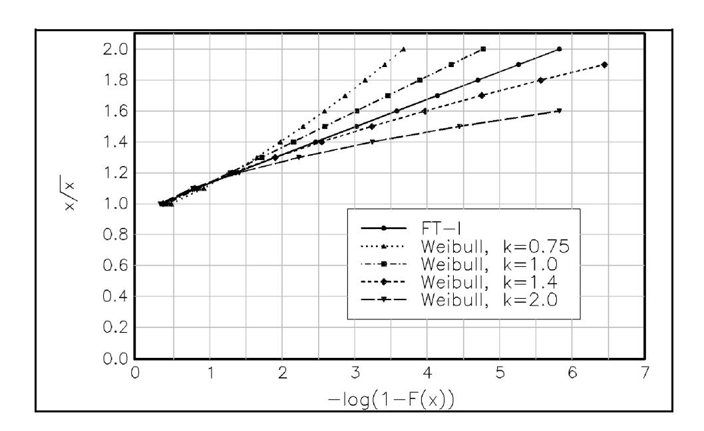

*Figure II-8-3. Probability distribution functions for long-term statistics*

- (b) The preferred approach to data selection is to take the maximum value from each event to create a partial duration series of extreme values. Typically, the events are storms, ranging from small, weak events to the most severe storms of record. Small events can be difficult to identify. Further, they are of little interest if an adequate number of bigger storms is available in the record. Often the partial duration series will be censored to exclude data values less than some threshold value (Figure II-8-4). Thus the extremal analysis can focus on a smaller series representing truly significant events. The threshold is often chosen so that the number of data values in the series is greater than the number of years of record (generally 1-3 times the number of years of record).
- (c) Another accepted approach is to take the maximum value from each year of record to form an annual maximum series . A record length on the order of 20 years or more (yielding at least 20 data values) is needed for this approach. In coastal engineering, record lengths are often shorter than this requirement. Another drawback to the annual maximum series arises from the possibility of multiple severe storms occurring in the same year, as in El Nino~/Southern Oscillation events, which sporadically distort winter storm seasons along the U.S. Pacific Coast (see Part II-2). Only the maximum event in each year is considered. Other storms, which may be bigger than the maximum event in many other years, will be ignored. (2) Estimating parameters in extremal distribution functions.
- (a) Generally an extreme data value series (either partial duration series or annual maximum series) is treated as a sample from a process that follows one of the extremal distribution functions presented in

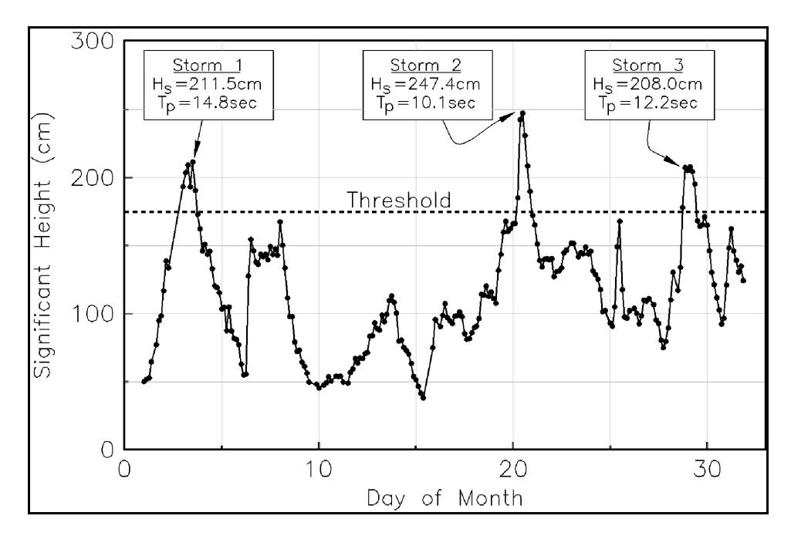

*Figure II-8-4. Selection of extreme values for a partial duration series*

- Part II-8-5-c. There is no strong theoretical reason for preferring one distribution function over another. The single sample cannot be expected to fit the true distribution function exactly, especially for the few largest events. For some processes, such as water levels, one particular distribution function is generally accepted for all applications. For other processes, such as significant wave heights, a best-fitting distribution function is often chosen from among several candidates.
- (b) Typically, extreme data values are sorted into descending order. A nonexceedance probability must be assigned to each extreme data value. These plotting positions should be chosen so that the distribution function can be accurately estimated. Figure II-8-5 gives the commonly used traditional plotting position formula. The figure also gives formulas developed to remove bias and minimize rms errors when fitting to specific distribution functions (Goda 1988, Goda and Kobune 1990).
- (3) Approaches to estimating parameters. The following approaches can be used to determine parameters for each candidate distribution function:
- (a) Graphical approach. Traditionally, the goodness of fit was determined visually by plotting the data along with candidate distribution functions. By scaling the plotting axes to make a candidate distribution appear as a straight line, the parameters of a visually optimum distribution function can more easily be determined.
- (b) Computational approach. An automated computational approach is more objective (though not necessarily more accurate) and often easier to apply than the relatively tedious graphical approach. Three alternatives are the least squares method, the maximum likelihood method, and the method of moments. The least squares method is simplest and, with two-parameter distribution functions, it is often used. It is included in the ACES software package. One caution with this approach is that it is sensitive to even one or two extreme points that deviate greatly from the general trend of the data ( outliers ). The maximum likelihood method has the advantage of being less likely to produce erratic results when the data contain outliers or differ somewhat from the distribution function (Mathiesen et al. 1994). More information on computational approaches is also available from Goda (1988, 1990). Regardless of the method used, it is

| Application of Formula | Plotting Position Formula |
| --- | --- |
| Traditional (Gumbel 1958) | m Fˆ 1 m ' & N % 1 |
| Fisher-Tippett I (FT-I) (Gringorten 1963) | m & 0.44 Fˆ m ' 1 & N % 0.12 |
| Weibull Distribution Function (Goda 1988) | 0.27 m & 0.20 & k Fˆ m ' 1 & 0.23 N % 0.20 % k |
| Fisher Tippett II (FT-II) or Frechet Distribution Function (Goda and Kobune 1990) | 0.52 m & 0.11 & k Fˆ m ' 1 & 0.11 N % 0.12 & k |
| Log-Normal Distribution Function (Blom 1958) | m & 0.375 Fˆ m ' 1 & N % 0.25 |

## Parameter definitions:

Fˆ = probability that the mth highest data value will not be exceeded
m = rank of data value in descending order ( m = 1 for largest, etc.)
N = number of events1
k = parameter in Weibull distribution function

*Figure II-8-5. Plotting position formulas*

prudent to plot the computed distribution function and data together and ensure that the fit is consistent with good engineering judgement.
- (4) Outliers. Outliers are retained in the data, but they should receive special scrutiny, as follows:
- (a) Ensure accuracy. Each outlier should be checked to ensure that it is a valid data value, rather than a measurement or modeling error.
- (b) Examine each event that produces a high outlier. Typical causes are very severe winter storms or direct impact of an intense hurricane. If extreme events at the site are produced by distinctly different natural processes (different statistical populations ), it may be preferable to divide the data values into several series, one for each process, and analyze each series separately (e.g. Goda 1988). For example, winter storms and hurricanes should not necessarily be expected to produce extremes that follow the same extremal probability distribution function. Extreme data values can be analyzed as separate populations only if sufficient data values are available in each population.

*1 For censored data, N should represent the total number of events over the time interval considered (not just the number of censored events)*

- (c) Consider whether an adjustment to the probability assigned to a high outlier data value can be justified. Often a high outlier is due to a storm event and extreme hydrodynamic response which are much more severe than would normally be expected over the length of hydrodynamic record. Meteorological records generally cover a much longer historical time period than hydrodynamic records. By carefully analyzing storm probabilities and longer-term records from nearby sites if available, it may be possible to assign a more realistic (lower) probability to the hydrodynamic outlier. Then a more valid distribution function fit can be obtained.
- (5) Choosing an extremal distribution function. When several candidate distribution functions are under consideration, usually one is selected as a best fit to the data. The selection criteria can range from visual inspection of plotted results and simple statistics such as the correlation between data and model (e.g., Leenknecht, Szuwalski, and Sherlock 1992) to more elaborate statistical tests (Mathiesen et al. 1994). An objective approach to selecting a distribution function for significant wave heights is given by Goda and Kobune (1990).
- (6) Confidence intervals. Confidence intervals associated with the chosen distribution function should also be estimated, preferably with a computer program (Leenknecht, Szuwalski, and Sherlock 1992; Goda 1988; Goda 1990; Mathiesen et al. 1994). They depend on the distribution function and number of data values. Confidence in computed values can also be influenced by random and systematic errors in the data and physical site characteristics such as long-term variability of water level and climate, possible extreme events not represented in the recorded population, and physical limits on extremes (such as the depth-imposed limit on wave height in shallow water). f Return period and encounter probability.
- (1) Extreme conditions in coastal engineering are often described in terms of return values and return periods . The return period is the average time interval between successive events of the design wave being equalled or exceeded. For example, a 25-year significant wave height is that height that is equalled or exceeded an average of once during a 25-year time period. Return period is expressed as

```math
T_r = \frac{t}{1 - P(\hat{H}_s)} \tag{II-8-1}
```

where
T_r = return period, in years
t =time interval associated with each data point, in years
P(\hat{H}_s) = cumulative probability that H_s \leq \hat{H}_s
\hat{H}_s = design significant wave height
(2) A related concept, encounter probability , gives the probability that waves with H_s equal to or greater than \hat{H}_s will occur during the design life or other time period. It is given by

```math
P_e = 1 - \left(1 - \frac{t}{T_r}\right)^{\frac{L}{t}} \tag{II-8-2}
```

where
Pe = encounter probability
L = desired time period, in years
(3) Values of Pe expressed in percent for some typical coastal engineering concerns are given in Table II-8-3.

*Table II-8-3 Percent Chance for Hs Equaling or Exceeding Return Period Hs*

**Table II-8-3. Percent Chance for Hs Equaling or Exceeding Return Period Hs**

| Percent Chance for Hs Equaling | or Exceeding | Return Period Hs | Desired Time | Period (year) |  |  |
| --- | --- | --- | --- | --- | --- | --- |
| Return Period | 2 | 5 | 10 | 25 | 50 | 100 |
| 2 | 75 | 97 | 100 | 100 | 100 | 100 |
| 5 | 36 | 67 | 89 | 100 | 100 | 100 |
| 10 | 19 | 41 | 65 | 93 | 99 | 100 |
| 25 | 8 | 18 | 34 | 64 | 87 | 98 |
| 50 | 4 | 10 | 18 | 40 | 64 | 87 |
| 100 | 2 | 5 | 10 | 22 | 39 | 63 |

g. Extrapolation of data . The main objective in determining an appropriate extremal distribution function is to get the best possible estimates of extreme conditions at desired return periods. Often the data must be extrapolated to probabilities beyond the record length to match design return periods. Extrapolation beyond 2-3 times the data record length should be avoided if possible. For example, 10 years of data should be used for estimating return values of 20-30 years or less.

#### II-8-6. Analysis of Key Meteorological and Hydrodynamic Processes in Design

- a. Introduction.
- (1) Key processes in design are reviewed in this chapter. Applicable chapters of Part II are cited. The design importance of each process is briefly stated. Critical design concerns are discussed, including two design-related examples.
- (2) Statistical information about the processes is summarized in Table II-8-4. For each process (as applicable and available), the table includes representative statistical distribution functions and general expressions for parameters of the distribution function.
- (3) It is important to bear in mind that the most extreme event of record may not merely be an intensified version of lesser extreme events. Most experienced coastal and ocean engineers and scientists can remember at least one catastrophic event that was distinctly different from typical storm events. Often the catastrophic event arises from an unusual interaction between several major weather features. The "Halloween Storm" that occurred in the northwestern Atlantic Ocean in October 1991 is a good example (U.S. Department of Commerce 1992). Three significant meteorological systems, including a hurricane and an intense winter storm, combined to create very strong winds over an extremely long fetch, which lasted for a period of days. This type of event is difficult to anticipate, but it should be recognized that such things can occur. They may appear as outliers in extreme data distributions.

*Table II-8-4 Probability Distribution Functions for Meteorological and Hydrodynamic Processes*

**Table II-8-4. Probability Distribution Functions for Meteorological and Hydrodynamic Processes**

| Parameter | Representative | Distribution Short-term | Functions Statistics |
| --- | --- | --- | --- |
| Surface elevations | Gaussian |  |  |
| Individual wave heights | Rayleigh: x=H; | α=1/Hrms 2 |  |
| Individual wave periods | Rayleigh: x=T 2; | α=1/T¯ 4 |  |
| Wave runup | Rayleigh | Long-term | Statistics |
| Extreme wind | FT-I |  |  |
| Hs | Weibull: A= standard | deviation | of Hs; B= minimum value of Hs; k=1 |
| Tp | Weibull: B= minimum | value of | Tp; A, k estimated from data |
| Extreme Hs | FT-I; Weibull |  |  |
| Water level | Log-Pearson Type | III |  |
| b. Wind. Wind is discussed | in detail in | Part II-2. |  |

- b. Wind. Wind is discussed in detail in Part II-2.
- (1) Design importance. Wind at a design site may be important for local wave generation, nearshore current generation both inside and outside the surf zone, modification of nearshore breaking waves, nearshore water level, nearshore sediment transport, subaerial sediment transport, intensification of runup, overtopping, and flooding, sail forces on moored and moving boats, and harbor circulation and flushing.
- (2) General climate. Winds at a coastal site are determined by some combination of large-scale weather systems, smaller-scale systems, land-sea breeze circulations, land/water roughness differences, and orographic effects. Winds can vary greatly over short distances along a coast. Thus, local measurements at the project site are very helpful in establishing the climate. As with waves, 2-3 years of data are generally sufficient for climatological purposes (i.e. annual or monthly mean and standard deviation of wind speed). Even one month of data can be useful, though certainly not ideal, for estimating relationships between the project site and winds at a long-term measurement station within the same region. Often wind climate information is summarized in the form of wind roses , which can represent months, seasons, or years (Figure II-8-6).
- (3) Storms. Storms are a natural part of the wind climate at a site. They can vary greatly in size and intensity. Frequency of occurrence and intensity of storms are important concerns for functional design. The occurrence of extreme storms is a necessary concern for structural design. The distribution of extreme wind speeds has been modeled with FT-I, FT-II, and Weibull distribution functions (Figure II-8-2). The FT-I distribution function seems to be the preferred choice, especially when the annual extremes do not include rare, unusually powerful events arising from distinctly different meteorology (such as hurricanes) (Simiu and Scanlan 1986).

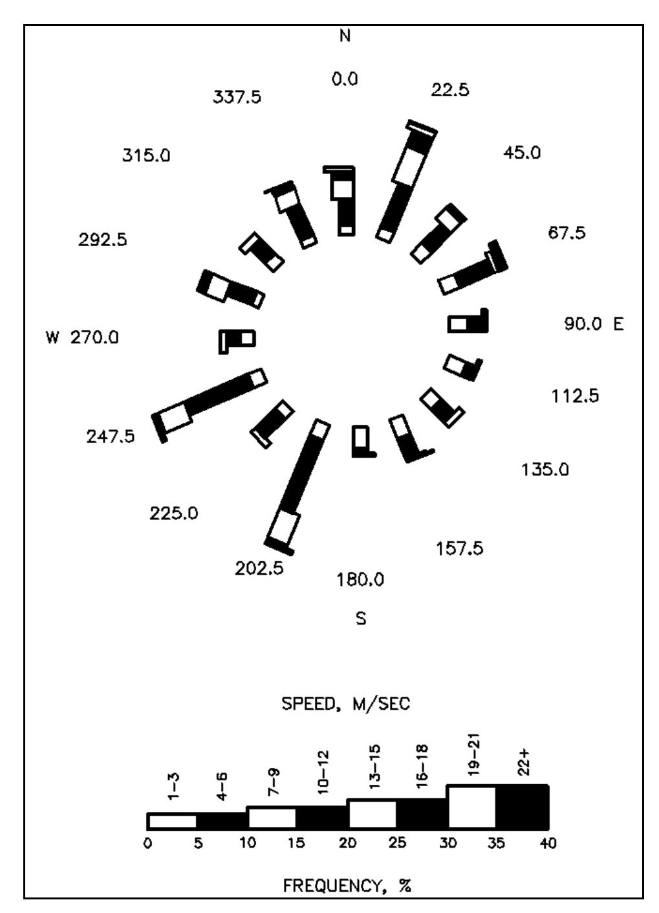

*Figure II-8-6. Example wind rose (Leffler et al. 1990)*

(a) Extreme wind speeds can conveniently be analyzed with the ACES extremal significant wave height analysis application (using wind speeds in place of wave heights) or with more traditional graphical methods. However, wind records at project sites often cover a very limited time period, and extrapolation to rare events may be difficult. Extreme records from any nearby, long-term wind stations may be transferrable to the project site with due consideration of differences between locations. Also, a simple approach using monthly extreme wind speeds may be helpful in conjunction with limited data sets (Simiu and Scanlan 1986). By this approach, based on the assumption that extreme wind speeds follow the FT-I distribution function,

```math
U_r = \overline{U}_m + 0.78 \,\sigma_m \,[\ln (12T_r) - 0.577] \tag{II-8-3}
```

where
U_r = wind speed with r-year return period
\overline{U}_{\rm m} = mean value of maximum monthly wind speeds
\sigma_m = standard deviation of maximum monthly wind speeds
and

```math
\sigma_{rm} = \sqrt{0.49 + 0.89 \ln (12 \bar{U}_m) + 0.67 [\ln (12 \bar{U}_m) - 0.577]^2} \cdot \frac{\sigma_m}{\sqrt{N_m}} \tag{II-8-4}
```

where
\sigma_{rm} = standard deviation of the sampling error in estimating U_r
N_m = number of months of data
(b) The parameter \sigma_{rm} can be related to confidence intervals using Table II-8-5. An integral number of years of data covering at least 3 years (36 months) is needed for this simple approach. Only populations of extreme events that are well-represented in the data can be effectively included in the long-term extreme estimates (e.g., if hurricane events do not appear or are sparsely represented in the data sample, they will not be effectively represented in the extreme estimates).

*Table II-8-5
Standard Deviation and Confidence Interval Relationships*

**Table II-8-5. Standard Deviation and Confidence Interval Relationships**

| Confidence Level, % | Confidence Interval Bounds Around Ur | Probability of Exceeding Upper Bounds, % |
| --- | --- | --- |
| 80 | ±1.28σrm | 10.0 |
| 85 | ±1.44σrm | 7.5 |
| 90 | ±1.65σrm | 5.0 |
| 95 | ±1.96σrm | 2.5 |
| 99 | ±2.58σrm | 0.5 |

(c) If data are unavailable, extreme wind speed can be estimated for various return periods with Figures II-8-7 through II-8-9. These figures were developed to estimate maximum wind loads for building design and are expected to be conservative for coastal engineering applications. Figure II-8-7 gives extreme fastest mile wind velocity data with a 50-year return period (annual probability of 0.02 that the wind speed is exceeded). Wind speed information was prepared from data collected at 129 weather stations (Simiu, Changery, and Filliben 1979), representing a 10-m elevation. Data were statistically reduced using extreme value analysis based on Fisher-Tippett Type-I distributions. Wind speed contours of Alaska are based primarily on data collected in open areas (Thom 1968-69). Wind speed contours in the hurricane-prone region, Atlantic and Gulf of Mexico coastlines, are based on Monte Carlo simulations of hurricane storms striking the coastal region (Batts, Russell, and Simiu 1980). Recurrence intervals for 25 and 100 years may be estimated by multiplying wind speed from Figure II-8-7 with the appropriate adjustment factor in Table II-8-6.

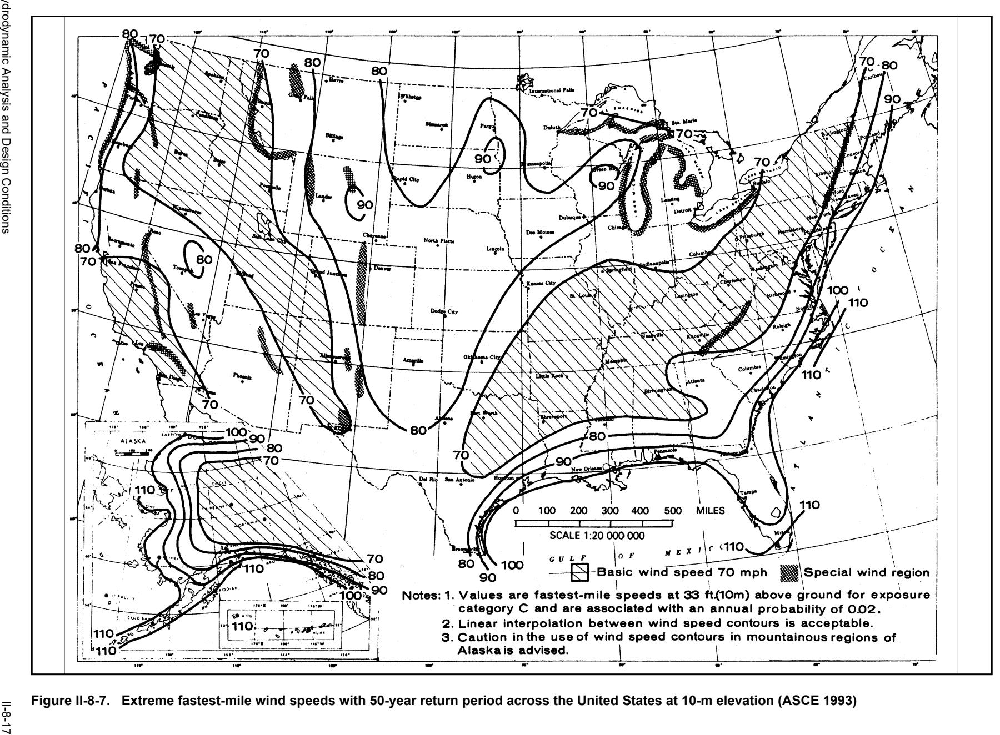

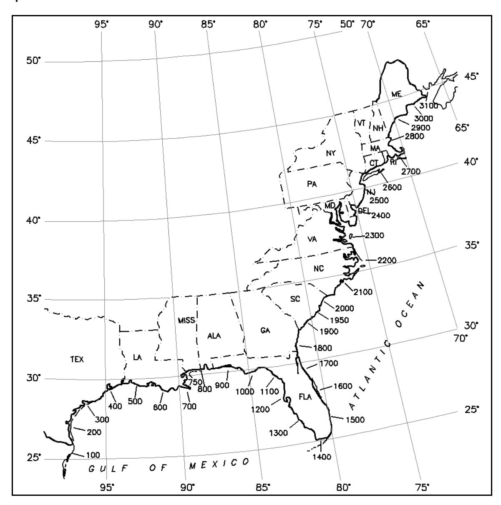

*Figure II-8-8. Milepost map for use with Figure II-8-9; coastal distance intervals marked in nautical miles (1 nautical mile = 1.9 km)*

(d) The adjustment factor at the hurricane-prone oceanline reflects the difference in probability distributions of hurricane wind speeds and wind speeds in other regions. Hurricane wind effects are assumed to be negligible at distances of more than 100 miles inland from the oceanline. The adjustment factor can be linearly interpolated between the oceanline and 100 miles inland. Some special wind regions are indicated in Figure II-8-7. These regions could have considerably higher wind speeds than indicated in the figure. All mountainous terrain and ocean promontories should be examined for unusual wind conditions. Figures II-8-8 and II-8-9 relate specifically to hurricane winds and are preferable for that application (Batts, Russell, and Simui 1980). It is important to recognize that extreme wind speeds from these figures must be converted from fastest mile to appropriate averaging time. Table II-8-7 provides relationships between fastest mile and 1-hr average wind speeds (also in Figure II-2-2). Averaging time adjustments, including conversion from 1-hr average to other averaging time, can be done using Table II-8-8, Figure II-2-1, or ACES.

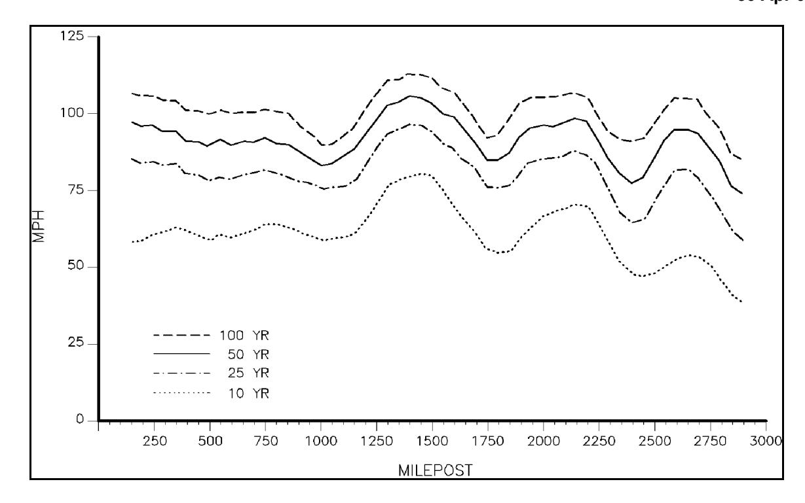

*Figure II-8-9. Extreme fastest-mile hurricane wind speeds blowing from any direction at 10 m above ground in open terrain near the coastline for various return periods (after National Bureau of Standards (1980))*

*Table II-8-6 Return Period Adjustment Factor*

**Table II-8-6. Return Period Adjustment Factor**

|  |  | Adjustment Factor |
| --- | --- | --- |
| Return Period, years | Other Regions | Hurricane Region (Gulf & Atlantic) |
| 25 | 0.95 | 1.00 |
| 50 | 1.00 | 1.05 |
| 100 | 1.07 | 1.11 |

*Table II-8-7 Conversion of Extreme Wind Speeds from Fastest-Mile to 1-hr Average*

**Table II-8-7. Conversion of Extreme Wind Speeds from Fastest-Mile to 1-hr Average**

| 50 | 41.0 | 0.82 |
| --- | --- | --- |
| 80 | 62.4 | 0.78 |
| 100 | 77.0 | 0.77 |
| 120 | 91.2 | 0.76 |
| 150 | 111.0 | 0.74 |
| 1 U1hr = (factor) × (fastest mile U) |  |  |
| Hydrodynamic Analysis and Design Conditions |  | II-8-19 |

*Table II-8-8 Averaging Time Adjustments for Extreme Wind Speeds 1*

**Table II-8-8. Averaging Time Adjustments for Extreme Wind Speeds 1**

| tgiven | 1 min | 5 min | 10 min | 1 hr | 3 hr | 6 hr |
| --- | --- | --- | --- | --- | --- | --- |
| 1 min | 1.00 | 0.88 | 0.84 | 0.80 | 0.75 | 0.71 |
| 5 min | 1.14 | 1.00 | 0.96 | 0.92 | 0.85 | 0.81 |
| 10 min | 1.18 | 1.04 | 1.00 | 0.95 | 0.88 | 0.84 |
| 1 hr | 1.24 | 1.09 | 1.05 | 1.00 | 0.93 | 0.88 |
| 3 hr | 1.34 | 1.17 | 1.13 | 1.08 | 1.00 | 0.95 |
| 6 hr | 1.41 | 1.23 | 1.19 | 1.13 | 1.05 | 1.00 |
| 1 Ut,find = (factor from | table) × Ut,given |  |  |  |  |  |

- c. Extreme waves . Part II-1 and II-4 discuss some aspects of extreme waves. Further information is provided in this chapter.
- (1) Design importance. Extreme wave conditions are almost always a major design concern in coastal engineering projects. Extreme significant wave heights are usually the most critical concern, but wave period, wave direction, and spectral shape (both frequency and direction) can be important as well. Possible secondary wave systems, an integral part of wave climate at exposed ocean sites, are generally not important in conjunction with an extreme event. Energetic extreme waves are usually a key factor causing coastal structure damage, vessel damage, beach erosion, channel sedimentation, and coastal flooding. Extreme waves may be generated by a winter storm, a tropical storm, or some combination of storms (see Part II-8-7).

# (2) Deep water.

- (a) Extreme values of Hs and associated Tp are usually obtained from measurements or hindcasts. Values of Hs , typically in the form of a partial duration series (see Part II-8-5-e-(1)), can be expected to give a reasonable fit to the FT-I, Weibull, FT-II, or log-normal distribution function (Figure II-8-2), from which design values of Hs can be estimated. FT-I or a form of the Weibull distribution function is generally preferred. Some of the following considerations may also apply: ! If extreme values are generated by more than one population of extreme events (e.g. winter storms and hurricanes) and if sufficient data are available from each population, it may be desirable to fit each population separately. ! If the largest value or several values deviate significantly from the general trend of the data, these outliers should be given special consideration as discussed in Part II-8-5-e-(2). ! Maximum Hs might be limited by sheltering or fetch constraints due to geography or consistent storm characteristics. ! Extreme wave measurements, observations, and hindcasts are often subject to larger errors than would normally be expected. For example, gauges can be affected by large, steep waves, breaking waves, severe winds, and ice accumulation. A floating accelerometer buoy gauge may tilt severely, stretch the mooring lines, or even break loose from the mooring. Wave height estimates may be modified in ways that are difficult to predict. Data loss from gauges, due to equipment damage or loss of power, is more likely during severe storms than during normal conditions.

#### EXAMPLE PROBLEM II-8-1

FIND:
Wind speed with 25- and 50-year return period (10-min average at 10-m elevation).
GIVEN:
Maximum wind speed by month (10-min average measurement at 10-m elevation) in Table II-8-9.

*Table II-8-9 Maximum Wind Speed by Month, in m/s*

**Table II-8-9. Maximum Wind Speed by Month, in m/s**

| Year | Jan | Feb | Mar | Apr | May | Jun | Jul | Aug | Sep | Oct | Nov | Dec |
| --- | --- | --- | --- | --- | --- | --- | --- | --- | --- | --- | --- | --- |
| 1969 | --- | --- | 20 | 19 | 17 | 11 | 15 | 13 | 15 | 14 | 18 | 18 |
| 1970 | 22 | 16 | 18 | 18 | 12 | 14 | 12 | 13 | 11 | 21 | 19 | 22 |
| 1971 | 24 | 18 | 24 | 18 | 17 | 16 | 11 | 14 | 16 | 22 | 21 | 20 |
| 1972 | 20 | 19 | 18 | 20 | 16 | 15 | 14 | 14 | 20 | 15 | 17 | 23 |
| 1973 | 18 | 15 | 18 | 14 | 15 | 13 | 15 | 12 | 19 | 17 | 22 | 20 |
| 1974 | 24 | 18 | 23 | 15 | 12 | 17 | 20 | 10 | 11 | 12 | 16 | 22 |
| 1975 | 21 | 25 | 22 | 14 | 18 | 12 | 13 | 12 | 12 | 20 | 20 | 22 |
| 1976 | 18 | 19 | 22 | 13 | 12 | 13 | 13 | 10 | 11 | 13 | 11 | 13 |
| 1977 | 10 | 18 | 19 | 10 | 14 | 13 | 10 | 13 | 12 | 12 | 16 | 23 |
| 1978 | 21 | 13 | 11 | 15 | 14 | 10 | 10 | 10 | 10 | 9 | 13 | 15 |
| 1979 | 16 | 22 | 15 | 16 | 15 | 11 | 14 | 11 | 14 | 18 | 14 | 18 |
| 1980 | 20 | 15 | 23 | 15 | 11 | 11 | 15 | 10 | 11 | 13 | 20 | 21 |
| 1981 | 12 | 19 | 15 | 13 | 12 | 14 | 13 | 8 | 12 | 15 | 18 | 20 |
| 1982 | 14 | 13 | 7 | 10 | 11 | 10 | 12 | 9 | 11 | 17 | 14 | 21 |

#### SOLUTION:

Three options are presented on the following pages.
(Sheet 1 of 4)
Option 1: (use ACES; this option is generally preferred)
A series of annual maximum wind speeds is taken from the table of data. The data include 13 complete years (1970-1982) and two partial years (1969 and 1983). Combining January and February from 1982 with the March -December 1969 data gives another full year for analysis. The annual maximum series with 14 values is then:

```math
20, 22, 24, 23, 22, 24, 25, 22, 23, 21, 22, 23, 20, 21 m/s
```

These values are entered as significant heights into the ACES extremal significant wave height analysis application. Appropriately, ACES provides a warning that a 14-year sample is too short to give a reliable estimate of the 50-year event. The FT-I distribution function is found to provide a good fit (Figure II-8-10). The corresponding 25- and 50-year wind speeds are

```math
U_{25} = 25.5\ \text{m/s}\quad (10-\text{min average})
```

```math
U_{50} = 26.3\ \text{m/s}\quad (10-\text{min average})
```

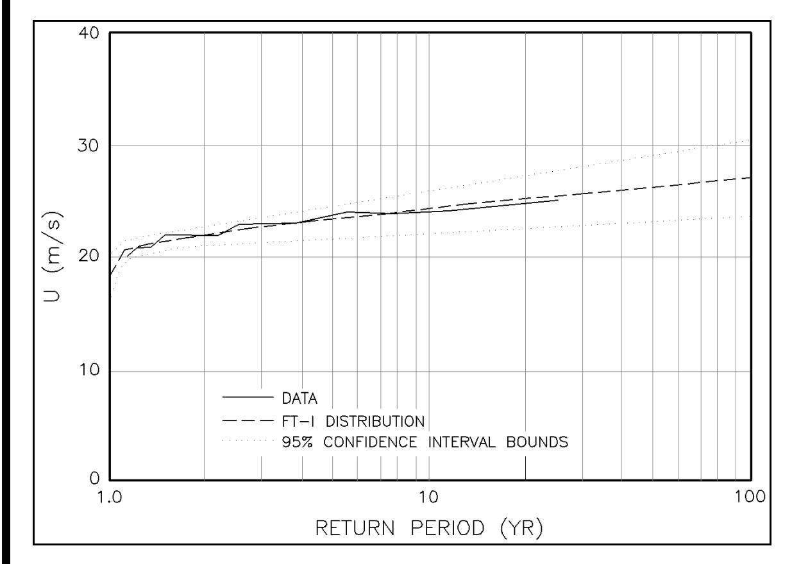

*Figure II-8-10. Example Problem II-8-1 probability distribution of wind speeds*

(Sheet 2 of 4)
Option 2: (use Equation II-8-3)
Equation II-8-3 can be applied to 3 or more complete years of data. Up to 14 years of data are available in this example. Normally, all full years would be used together. For illustration, the following solution treats four 3-year samples from the full record as well as the 14-year sample extending from March 1969 through February 1983. Means and standard deviations of maximum monthly wind speeds are given in Table II-8-10.

*Table II-8-10
Wind Speed Statistics*

**Table II-8-10. Wind Speed Statistics**

| Years |  |  | U¯ m , m/s |  |  |  | σm , m/s |
| --- | --- | --- | --- | --- | --- | --- | --- |
| 1971-73 |  |  | 17.50 |  |  |  | 3.32 |
| 1974-76 |  |  | 16.08 |  |  |  | 4.58 |
| 1977-79 |  |  | 14.03 |  |  |  | 3.62 |
| 1980-82 |  |  | 14.03 |  |  |  | 4.02 |
| Mar 69 - Feb 83 |  |  | 15.53 |  |  |  | 4.06 |
| U25 is calculated from Equation | II-8-3 | for | the years |  | 1971-73 as |  |  |
| U25 | ' ¯Um | % | 0.78 | σm | [ ln(12×25) | & | 0.577 ] |
| ' ¯Um | % 4.00 σm |  | ' 17.50 |  | % 4.00×3.32 | ' | 30.8 m/s |
| Similarly, U50 is calculated | from Equation |  | II-8-3 | for | the years | 1971-73 | as |
| U50 | ' ¯Um | % | 0.78 | σm | [ ln(12×50) | & | 0.577 ] |
| ' ¯Um | % 4.54 σm |  | ' 17.50 |  | % 4.54×3.32 | ' | 32.6 m/s |

U_{25} is calculated from Equation II-8-3 for the years 1971-73 as

```math
U_{25} = \bar{U}_m + 0.78\sigma_m[\ln(12\times25) - 0.577] = \bar{U}_m + 4.00\sigma_m = 17.50 + 4.00 \times 3.32 = 30.8 \text{ m/s}
```

Similarly, U_{50} is calculated from Equation II-8-3 for the years 1971-73 as

```math
U_{50} = \bar{U}_m + 0.78\sigma_m[\ln(12\times50) - 0.577] = \bar{U}_m + 4.54\sigma_m = 17.50 + 4.54 \times 3.32 = 32.6 \text{ m/s}
```

The standard deviation of the sampling error in estimating U_r for the years 1971-73 may be calculated from Equation II-8-4 as

```math
\sigma_{rm} = \sqrt{0.49 + 0.89 \ln(12\overline{U}_m) + 0.67 \left[\ln(12\overline{U}_m) - 0.577\right]^2} \left(\frac{\sigma_m}{\sqrt{36}}\right)
```

```math
= \sqrt{0.49 + 0.89 \ln(12 \times 17.50) + 0.67 [\ln(12 \times 17.50) - 0.577]^2} \left(\frac{3.32}{\sqrt{36}}\right)
```

```math
=\sqrt{0.49+0.89\times5.347+0.67\times[5.347-0.577]^2}\left(\frac{3.32}{6}\right)=\sqrt{20.49}\times0.553=2.5\,\text{m/s}
```

(Sheet 3 of 4)

#### Example Problem II-8-1 (Concluded)

These results and those calculated for the other samples are summarized in Table II-8-11.

*Table II-8-11 Wind Speed at 25- and 50-year Return Period*

**Table II-8-11. Wind Speed at 25- and 50-year Return Period**

| Years | U25 , m/s | U50 , m/s | σrm , m/s |
| --- | --- | --- | --- |
| 1971-73 | 30.8 | 32.6 | 2.5 |
| 1974-76 | 34.4 | 36.9 | 3.4 |
| 1977-79 | 28.5 | 30.5 | 2.6 |
| 1980-82 | 30.1 | 32.3 | 2.9 |
| Mar 69 - Feb 83 | 31.8 | 34.0 | 1.4 |
| Option 3: (use Figure II-8-7) |  |  |  |

Option 3: (use Figure II-8-7)
Figure II-8-7 is the least desirable option, since it does not make use of the available measurements at the site. However, it provides a reference to regional behavior against which the data analyses can be interpreted. For this example, the figure indicates that

```math
U _ { 5 0 } \approx 8 0 \mathrm { { m p h } = 3 5 . 8 \mathrm { { m / s } \qquad ( f a s t e s t \mathrm { { m i l e } ) } } }
```

From Table II-8-6,

```math
U_{25} = 0.95 \times 35.8 = 34.0 \text{ m/s}
```

These wind speeds are converted from fastest mile to 1-hr averages using Table II-8-7:

```math
U_{25} = 0.78 \times 34.0 = 26.5 \text{ m/s}
```

```math
U_{50} = 0.78 \times 35.8 = 27.9 \text{ m/s}
```

Finally, the 1-hr averages are converted to 10-min averages to be comparable to the results of Options 1 and 2. Using Table II-8-8,

```math
U_{25} = 1.05 \times 26.5 = 27.8 \text{ m/s}
```

```math
U_{50} = 1.05 \times 27.9 = 29.3 \text{ m/s}
```

Discussion: Option 1, which is generally preferred, gives the smallest values for U25 and U50 . Option 3 gives wind speeds about 10 percent higher and Option 2 over 20 percent higher than Option 1. Use of Option 1 with a partial duration series of wind speed maxima, which is recommended in practice rather than the annual maximum series, could be expected to give more realistic estimates.
(Sheet 4 of 4)
- ! The effect of errors on extreme wave height estimates can be significant. Errors can be expected to increase the width of confidence intervals and induce a systematic, artificial increase in Hs values at return periods of interest (Earle and Baer 1982). Errors can be as important as the finite number of years of record in limiting the reliability of extreme wave height estimates (Le Méhauté and Wang 1984).
- (b) Design wave period is a period representative of extreme wave conditions. Along coasts exposed to the ocean, the design Tp is usually an intermediate period between the limits of mild local sea and long swell periods. At locations exposed to large swell, a design Tp representative of long-period swell conditions may be required. At sites sheltered from ocean swell or enclosed water bodies the size of the Great Lakes or smaller, the largest values of Tp can be associated with the largest values of Hs . At many locations, it may be reasonable to estimate design Tp with a scatter plot of peak storm Hs and associated Tp values. A regression line relating Hs and Tp is computed and then used to estimate Tp for any given Hs (e.g., Goda (1990)).
- (c) In using a design Tp , it is assumed that this wave period is representative of the irregular or regular wave period needed in follow-on design calculations. Often this assumption is realistic, as high-energy wave events tend to be dominated by a single spectral peak. However, it may be preferable in some applications to consider more than one spectral peak or even a full design spectrum if follow-on calculations can make use of the information.
- (d) Design wave direction is estimated based on measurements, hindcasts, and/or knowledge of extreme storm characteristics. (3) Intermediate-depth water.
- (a) When a coastal project is in intermediate water depth (that is, waves are affected by the bottom but depth-induced breaking has not begun), nearshore processes such as refraction and shoaling must be considered to transform from the measurement or hindcast site to the project site (Part II-3). Figure II-3-6 provides the simplest methodology. A more comprehensive approach would be to represent each wave condition as a TMA spectrum with appropriate energy, peak period, and direction, and compute transformation over straight, parallel bottom contours. More typically, a full numerical model representation of bathymetry and wave conditions is used, as discussed in Part II-3.
- (b) Values of Hs , Tp , and wave direction in intermediate-depth water can be analyzed for design using the same procedures as for deepwater waves. The Hs and wave direction values are modified from the deepwater values because of nearshore bottom effects. Values of Tp are usually considered to be unchanged from the deepwater values by the transformation process. However, some spectral transformation techniques can predict changes in Tp . These changes are usually quite small. (4) Shallow water (depth-limited).
- (a) Extreme wave heights in coastal engineering applications are often limited by shallow-water depths. Thus, depending on the local water depth and wave climate, the distribution for significant wave heights can be expected to follow one of the appropriate functional forms in Figure II-8-2 up to a significant height of about 0.6 times the water depth (Equation II-4-10) and then increase more slowly beyond that point (Figure II-8-11). The probability at which the curve flattens depends on the local water depth and wave climate. The flattened curve can be expected to continue rising slowly, but in this region increases in significant height depend on other parameters such as wave steepness and water level rather than incident significant height. Water level can be expected to be the main controlling factor. The probability distribution for significant heights in this region may be essentially equivalent to the probability distribution of local water levels.

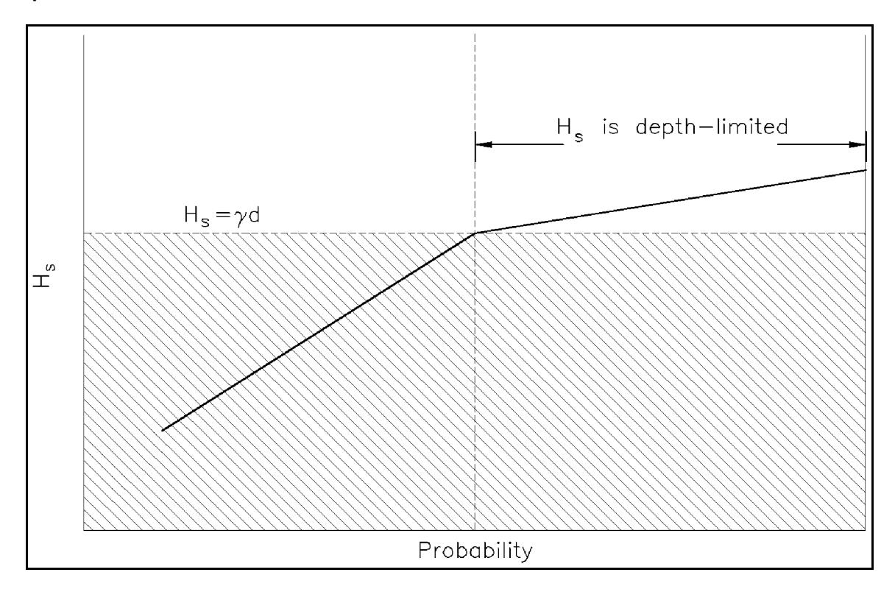

*Figure II-8-11. Probability distribution of Hs on shallow water*

- (b) Often extreme shallow-water waves are estimated with wave information from an offshore source. Extreme waves in shallow water are typically greatly transformed from incident (often deepwater) waves due to a variety of processes discussed in Part II-3 and 4. Consequently, the most extreme incident waves are not necessarily design conditions when transformed to the shallow-water site. A sufficient range of incident wave cases must be analyzed to ensure that the most extreme shallow-water cases are identified.
- (c) In shallow water, the competing processes of shoaling (tending to increase wave height) and breaking (decreases wave height in the surf zone) often create a point at which significant height reaches a maximum value in the outer surf zone. That maximum value can be estimated from Figure II-8-12. It should be noted that these values are H1/3 rather than the energy-based significant height Hm0 (Part II-1). The water depth at which the maximum occurs is shown in Figure II-8-13.
- (d) Design wave period can be estimated as a representative value for extreme wave conditions, as with waves in deeper water. However, allowances must be made for a range of wave periods accompanying a relatively fixed, depth-limited design Hs . In this case, it may be advisable to consider several design Tp values to adequately represent the range of possibilities impacting design.
- (e) Design wave direction is estimated based on measurements, hindcasts, or knowledge of extreme storm characteristics. Due consideration must be given to shallow-water effects on wave direction (Part II-3). (5) Extreme individual wave characteristics.
- (a) Extreme individual waves can have heights on the order of 2 Hs . The Rayleigh distribution function (Part II-1) is usually sufficient for describing individual wave heights in coastal engineering applications, even in extreme (but nondepth-limited) conditions. With the Rayleigh distribution function for individual

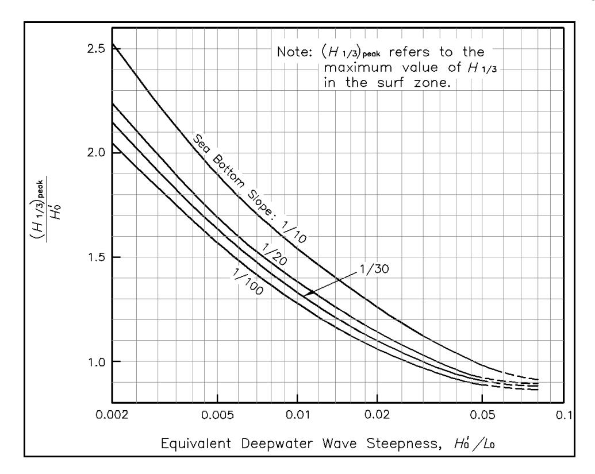

*Figure II-8-12. Maximum value of H_s in the surf zone (Goda 1985)*

wave heights in a given sea state (a given H_s ) and a known joint distribution of H_s and T_p or T_z , an overall probability distribution of individual wave heights can be computed by a straightforward approach (Goda (1990), referring to Battjes (1972)).
(b) Extreme individual wave heights are strongly affected by depth-induced breaking. In the surf zone, the Rayleigh distribution can be expected to overestimate the higher individual wave heights. Practical approximations for extreme individual wave heights in this case are given by the Construction Industry Research and Information Association (CIRIA) (1991) as

```math
H_{1} = \frac{1.517 \ H_{1/3}}{\left(1 + \frac{H_{1/3}}{d}\right)^{\frac{1}{3}}}
```

```math
H _ { 0 . 1 } \ = \ { \frac { 1 . 8 5 9 \ H _ { 1 / 3 } } { \left( 1 \ + \ { \frac { H _ { 1 / 3 } } { d } } \right) ^ { \frac { 1 } { 2 } } } }
```

where H_{1/3} and d are the local significant height and water depth.
(c) Extreme wave crest heights are sometimes a design consideration. Coastal field measurements indicate that maximum crest height above the local mean water level can be up to 80 percent of the maximum wave height (Goda 1985). Figure II-8-14, based on a combination of irregular wave tests in the laboratory

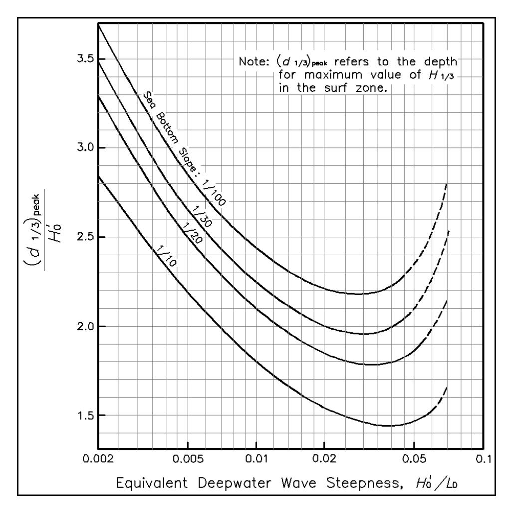

*Figure II-8-13. Water depth at which Hs is maximum in the surf zone (Goda 1985)*

and stream function wave theory, can be used to estimate (with small conservatism) crest heights at the 2-percent probability level of exceedance.
- (d) Grouping of individual high waves can influence functional design (e.g. runup and overtopping of a breakwater or revetment) and structural design. The recommended way to account for this effect is through physical model tests. The tests should ensure that design alternatives that may be prone to damage by wave groups include a realistic sampling of grouping in the incident waves. d. Wave climate . Wave climate is discussed in Part II-2.
- (1) Design importance. Wave climate affects functional performance of a project and operational activities. Its impact includes longshore and cross-shore sediment transport, harbor agitation, navigation, dredging, and surveying. (2) General climate.
- (a) General wave climate is the probabilistic mix of sea states occurring at a site. Key components of a sea state typically include Hs , Tp , and θ p for each major wave system (such as a sea and one or more swell systems). Sea states along U.S. Atlantic, Pacific, and Gulf of Mexico coasts can be expected to include more

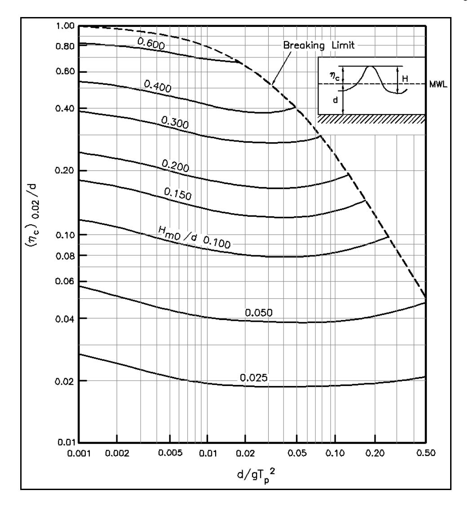

*Figure II-8-14. Crest elevation at the 2-percent probability level of exceedance (Seelig, Ahrens, and Grosskopf 1983)*

than one major wave system about two-thirds of the time (Thompson 1980). Wave climate can vary greatly between seasons of the year, but variations between years are usually small. At least three full years of data are desirable for a stable estimate of wave climate. Figure II-8-15 is a typical table of wave climate information (from one directional sector) from the Wave Information Studies.
(b) The mean Hs and distribution of Hs are always of interest in describing wave climate. Both Weibull and log-normal distribution functions have been used to represent the distribution of Hs . However, the actual data usually provide a sufficiently stable estimate and the formal distribution functions are unnecessary. Means and distributions of Tp and θ p are vital for some applications. Joint occurrence probabilities of Hs , Tp , and θ p give a fairly complete representation of wave climate, which is needed in applications such as nonlinear refraction modeling. When these standard statistical summaries are formed, information about the simultaneous occurrence of more than one wave system is lost.

|  |  |  | WIS ATLANTIC REVISION 1956 - 1975 LAT: 36.00 N, LONG: 75.25 W, DEPTH: 37M |  |  |  |  |  |  |  |  |
| --- | --- | --- | --- | --- | --- | --- | --- | --- | --- | --- | --- |
| OCCURRENCES OF WAVE HEIGHT AND PEAK PERIOD FOR 45-DEG DIRECTION BANDS |  |  |  |  |  |  |  |  |  |  |  |
|  |  |  |  |  |  |  | STATION: 55 |  |  | ( 67.50 - 112.49) 90.0 DEG |  |
|  |  |  |  |  |  |  | Tp (sec) |  |  |  |  |
| Hmo (m) |  |  |  |  |  |  |  |  |  |  | TOTAL |
|  | 3.0- | 5.0- | 7.0- | 9.0- | 11.0- | 13.0- | 15.0- | 17. 0- | 19. 0- | 21.0- |  |
|  | 4.9 | 6.9 | 8.9 | 10.9 | 12.9 | 14.9 | 16.9 | 18.9 | 20.9 | LONGER |  |
| 0.00 - 0.99 | 381 | 784 | 2655 | 1809 | 667 | 267 | 46 | 11 | 4 |  | 6624 |
| 1.00 - 1.99 | 58 | 1344 | 1327 | 1197 | 990 | 347 | 48 | 8 | 1 |  | 5320 |
| 2.00 - 2.99 |  | 44 | 429 | 180 | 161 | 67 |  |  |  |  | 881 |
| 3.00 - 3.99 |  |  | 55 | 156 | 54 | 30 | 5 |  |  |  | 300 |
| 4.00 - 4.99 |  |  | 3 | 64 | 33 | 9 | 5 |  |  |  | 114 |
| 5.00 - 5.99 |  |  |  | 6 | 21 | 4 | 2 |  |  |  | 33 |
| 6.00 - 6.99 |  |  |  |  | 6 | 5 |  | 1 |  |  | 12 |
| 7.00 - 7.99 |  |  |  |  |  | 3 | 2 |  |  |  | 5 |
| 8.00 - 8.99 |  |  |  |  |  | 7 | 3 |  |  |  | 10 |
| 9.00-GREATER |  |  |  |  |  |  |  |  |  |  | 0 |
| Total | 439 | 2172 | 4469 | 3412 | 1932 | 739 | 111 | 20 | 5 | 0 | 13299 |

*Figure II-8-15. Wave climate summary (Hubertz et al. 1993)*

- (3) Storms.
- (a) Storms are a natural part of the wave climate at a site. On the order of 20-50 storm events can be expected at a site during a year of record. The upper portion of the distribution of Hs is due to storms, either local or distant. Much of the storm wave climate is fairly consistent from year to year. Three years of data usually suffice for a reasonable representation of the storm portion of wave climate (excluding extreme events). Large storm events usually dominate any secondary wave systems present, and the sea state can be well-represented by one Hs , Tp , and θ p parameter set. Tropical storms are generally a concern only in the extreme portion of wave climate, if at all, since even the more exposed sites are rarely affected by them.
- (b) Some areas can experience changes in climate that systematically affect the incidence and intensity of severe storm waves over a time period of months or years. The reasons for climate change are not always easily understood. Short-term climate variation can be related to deviations from characteristic upper air flow patterns or large-scale ocean current patterns that persist over at least one storm season. One documented example is the influence of the El Nino~-Southern Oscillation climatic anomaly on the occurrence of extreme waves along the California coast (Seymour et al. 1984). Both tropical and winter storms are affected. Longterm systematic climate changes can be generated by factors such as local subsidence and global temperature change. An example of long-term change is the increasing trend in annual mean significant wave height off the southwest tip of England as measured over a 25-year period at Seven Stones Light Vessel (Carter and Draper 1988). (4) Persistence of high and low wave conditions.
(a) The duration of storm events is another important component of the wave climate. Storm duration in this context is usually defined as the length of time Hs persists above some fixed threshold value (Figure II-8-16). Storms with long duration are likely to be more damaging than storms with short duration, in part because they are likely to encompass one or more highs in astronomical tide. Storm duration decreases as threshold increases, but it appears to be fairly independent of storm intensity (Smith 1988). The choice of threshold value is based on the application. Smith (1987) suggested using an Hs value that is exceeded by 6 percent of the observations, which gave mean durations of about 25 hr at U.S. east and west coast hindcast locations. Thus these events can be expected to encompass two high tides along the U.S. east coast and one higher high water along the U.S. west coast.

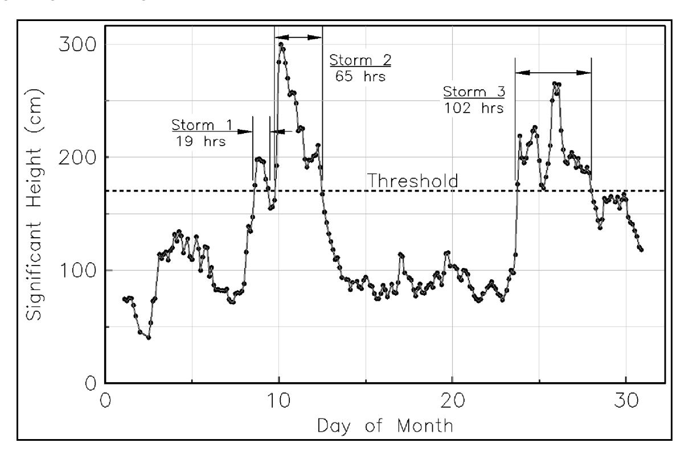

*Figure II-8-16. Persistence of storm waves*

- (b) Persistence of wave conditions below a threshold Hs can be an important operational concern, since it provides information on operational windows of low wave activity. It can also be a consideration in functional design of some coastal projects.
- e. Long waves . Wave phenomena with periods between those of swell and tides are collectively termed long waves . In most coastal engineering applications, they have a limited role in design. Occasionally they can be a major design concern (e.g. harbor oscillations).
- (1) Tsunamis. Tsunamis are briefly discussed in Part II-5. They are sufficiently rare and unpredictable that they become a concern for design return periods of about 100 years or longer. Since most coastal engineering works are designed for return periods of 50 years or less, tsunamis can generally be omitted from the design.
- (2) Seiche. Seiche is discussed in Part II-7. It can be an important concern in harbor design or modification. Harbors in areas where energetic, long-period swell can occur are especially prone to seiching
problems. In such areas (e.g. the U.S. Pacific coast and Hawaii), seiche should be routinely considered in design.
(3) Infragravity waves. Infragravity waves are discussed in Part II-4-5. They can be an important component of surf zone processes, particularly during storms, and they are a forcing mechanism for harbor oscillations and other seiching phenomena. Methods for estimating infragravity waves and incorporating them into design are relatively immature at present. Infragravity waves can be considered in design by conducting physical model tests with irregular waves if long waves can be sufficiently controlled, a demanding task. They may also be estimated with some confidence from wind wave/swell conditions using theory, numerical modeling, and/or empiricism. For example, Bowers (1992) considered long waves at three coastal sites in intermediate depths typical of harbor entrances. He used theory to estimate a bound long wave H_s and empiricism to estimate a free long wave H_s (including both edge waves and leaky waves described in Part II-4-5). His general expression for free waves is

```math
H_s\left(\text{free long waves}\right) = K \frac{H_s^\alpha T_p^\beta}{d^\gamma} \tag{II-9-6}
```

For his three sites, K ranged from 0.0041 to 0.0066 and overall best-fit values for \alpha , \beta , and \gamma were 1.11, 1.25, and 0.25, respectively. Bowers observed that bound long waves increasingly dominate free long waves as wind wave/swell H_s increases. For a 10-year return period in the 12-m to 13-m depth, Bowers estimated total long wave H_s values of about 12 percent of the wind wave/swell H_s .
- f. Extreme water level. Extreme water levels are discussed in Part II-5.
- (1) Design importance. Extreme high water levels cause flooding. They also facilitate wave damage by raising the base level for runup and overtopping, by allowing increased depth-limited wave heights, and by shifting the zone of wave attack further shoreward such that waves can damage dunes and coastal structures. At some locations, extreme high-water levels can lead to pollution and health hazards when sewage treatment ponds or other containment areas are breached.
- (2) Estimation procedures. Extreme water levels are caused by some combination of astronomical tides, storm surge (high wind stress, low atmospheric pressure, rainfall/runoff in enclosed or semi-enclosed areas), and wave setup. Probabilities must be estimated as a joint probability of the various combinations that can occur. Procedures for developing storm water level frequency-of-occurrence relationships are reviewed in Part II-5-5.b, including the historical method, synthetic method, and empirical simulation technique (EST). The EST is convenient for development of water level design criteria requiring the quantification of risk and uncertainty associated with the frequency predictions. Traditionally, the distribution of extreme water levels has been fitted to either a Pearson Type III (Engineer Manual (EM) 1110-2-1412) or log-Pearson Type III (U.S. Water Resources Council 1976) distribution function. The EST approach does not require a theoretical distribution function. g. Water level climate. Water level climate is discussed in Part II-5.
- (1) Design importance. The general water level climate at a site impacts navigation channel depths, harbor depths, currents, harbor flushing, and physical and biological processes in the intertidal zone, including marsh areas.
- (2) Estimation procedures. The principal component of water level climate at most coastal sites is astronomical tide (Part II-5-3). In areas with little or no tide, particularly very shallow areas, wind,
atmospheric pressure, and rainfall can be the primary components of water level climate (Part II-5-5). In lakes, seasonal fluctuations in water level can be dominant, as in the Great Lakes (Part II-5-4.b.(2)).
- (3) Long-term changes. Long-term changes in relative water level can be caused by climatological effects and secular fluctuations (such as melting of the polar ice caps, large-scale isostatic adjustments of the earth's crust, and local subsidence). These long-term changes, which operate on time scales ranging from semiannual to decades, may sufficiently shift the water level datum relative to project features to merit consideration in design.
- h. Currents . Surf zone currents are discussed in Part II-4-6. Currents at inlets and harbors are treated in Part II-6 and 7, respectively. (1) Design importance.
- (a) Nearshore shelf. Currents over the continental shelf are important relative to rate and direction of transport of fluids and solids, such as river discharge into the ocean, sewer outfall discharge, movement of sediment from offshore dredge disposal sites, and movement of civic waste material from ocean dump sites. They may also be important for their effect on navigation into harbors, particularly for large vessels subjected to currents moving across the entrance channel. Currents are driven mainly by tides and winds, but temperature and salinity gradients, Coriolis effect, river discharges, and organized current systems (such as the Gulf Stream) can also be important. Currents can vary greatly between the surface and bottom.
- (b) Surf zone. Surf zone currents are the driving force transporting sediments in both the longshore and cross-shore directions. As such, they are the key factor in beach erosion and accretion. They may also be important relative to scour and stability of breakwaters and revetments. Surf zone currents are driven by breaking waves and nearshore winds. Currents are very sensitive to wave direction. The magnitude of longshore transport can vary greatly over a time period of days, months, and even from year to year in response to natural variations in wind and wave climate (Figure II-8-17). At many sites, even the dominant direction during a single year (upcoast or downcoast) can deviate from the normal pattern. Thus an adequate sample of years is necessary for stable design estimates. Surf zone currents are discussed in detail in Part II-4-6. Nearshore sediment transport is covered in Part III.
- (c) Inlets. Currents through inlets are the primary process affecting exchange of water and sediments between the bay and ocean. They impact water quality, bay ecology, and erosion and shoaling patterns. They can impede navigation by creating steepened, breaking waves when a strong ebb current opposes energetic ocean waves. They may cause scour along jetties and other inlet structures and affect structure stability. Tides, wind, and density differences are typical driving forces. Inlet currents are a necessary consideration in design of projects at inlets.
- (d) Harbors. Currents through harbor entrances are generally important in terms of circulation and flushing of the harbor to maintain water quality and, in some cases, to reduce maintenance dredging. They can be driven by tides, winds, and river discharge within the harbor. Additional detail is given in Part II-7-6. (2) Estimation procedures.
- (a) Currents are estimated in terms of time-averaged mean speed and direction and, often, some measure of maximum current speed. For tidal currents, it is helpful to distinguish between ebb and flood tide maxima.

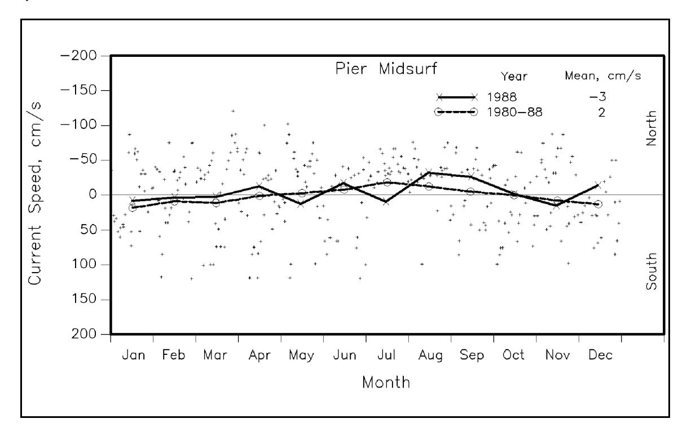

*Figure II-8-17. Example of short- and long-term surf zone current data (Leffler et al. 1990)*

Currents can vary significantly over short distances, especially around inlets, and some knowledge of the spatial current field can be useful for design.
- (b) Currents are best estimated from measurements, numerical modeling, or physical modeling. A combination of both measurement and modeling typically yields the best estimates. Measurements provide boundary conditions and calibration/validation data for the model. The model provides full spatial current fields and a capability for estimating design conditions well beyond any measured events.
- (c) More approximate information on currents can be obtained from several sources. Published tidal current tables for use by mariners are available for many U.S. areas important to navigation (Part II-8-7). As with winds, currents at one location can sometimes be transferred to another nearby location, with due consideration of differences between locations. A short measurement record from the desired location can be very helpful in estimating transfer relationships. ACES includes a simplified model for inlet hydraulics. Time-varying inlet currents can be calculated for given time-dependent sea level fluctuation.

#### i. Design example .

(1) This section contains a detailed example of estimating hydrodynamic parameters for design. Because of the complexities and many variations of design environment possible in coastal engineering (for example, inner surf zone versus outer surf zone versus outside the surf zone), the example is more an illustration than a blueprint for coastal design. Data used in the example are more extensive than would typically be available. When measurements are lacking, the information on water levels and waves must be estimated from some combination of experience, nearby measurements, hindcasts/forecasts, and other physical and numerical modeling. Information must be properly transformed to the project site.

#### EXAMPLE PROBLEM II-8-2

FIND: Hydrodynamic parameters for design of the north jetty. The intended design life is 25 years.
GIVEN: Two jetties are being designed at a site exposed to energetic waves and currents (Figure II-8-18). The jetties extend from shore to a depth of -10 m MLLW. A representative bottom slope is 1/100. Water level and wave measurements near the site are available at 6-hr intervals over a period of 17 years.
Note: This period of measurement is unusually long for coastal engineering project sites. Typically information on water levels and waves must be generated by numerical modeling to supplement limited measurements. The level of confidence in any calculated results depends highly on the quality of available water level and wave information. The level of detail and refinement of calculations should be consistent with the quality of available information and project needs.

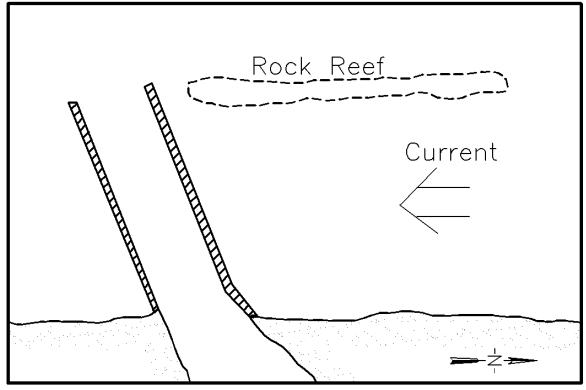

*Figure II-8-18. Jetty plan*

#### SOLUTION:

#### WATER LEVEL:

Assume all storm populations that could affect design are well-represented (both number and intensity of events) in the data.
Note: At sites exposed to tropical storms, the assumption that storms are well-represented in the historical record at the site is often not justified. In such cases, a numerical model study is required to adequately represent the range of possibilities (Part II-5).
Datums. Datum information for the site (obtained from NOS tidal benchmark sheet; see Part II-8) is listed in Table II-8-12.

**Table II-8-12. **

| Datum |  | Abbreviation | Level (m) |
| --- | --- | --- | --- |
| Mean higher | high water | MHHW | 2.55 |
| Mean high | water | MHW | 2.34 |
| Mean tide | level | MTL | 1.38 |
| Mean sea | level | MSL | 1.36 |
| National | Geodetic Vertical Datum | NGVD | 1.26 |
| Mean low | water | MLW | 0.42 |
| Mean lower | low water Example Problem II-9-2 (Sheet | MLLW 1 of 21) | 0.00 |
| Design | Conditions |  | Hydrodynamic Analysis and II-8-35 |

Example Problem II-9-2 (Sheet 1 of 21)
Astronomical tide. A probability distribution of astronomical tide levels (Figure II-8-19) can be obtained from: (1) Harris (1981) for selected tide stations; (2) harmonic reconstruction of a tidal series (Part II-5); or, (3) to a good approximation over all but the more extreme ends, statistical summarization of long-term water level measurements.

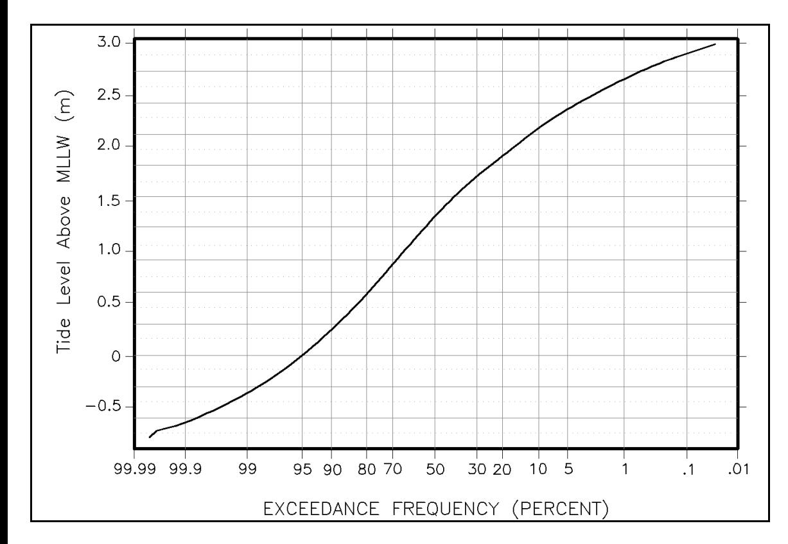

*Figure II-8-19. Probability distribution of astronomical tide levels*

Storm surge. Storm surge water levels (Figure II-8-20) can be estimated by the following steps:
- (1) Develop criteria for identifying storm events, such as events with Hs $ 5 m and separated from each other by 5 or more days.
- (2) Identify all cases in the water level measurement record that meet the criteria in (1).
Example Problem II-9-2 (Sheet 2 of 21)
- (3) For each selected event, subtract the predicted astronomical tide and wave setup from measured water levels. The maximum difference during the event is considered the peak surge. Details of calculating wave setup are omitted here but discussed later in conjunction with wave analysis.
- (4) Organize peak surges into a probability distribution. The ACES Extremal Significant Wave Height Analysis (using water levels in place of significant heights) may be a helpful tool for this and the following step.
- (5) Fit a probability distribution function to the data to extrapolate to lower probabilities as needed.

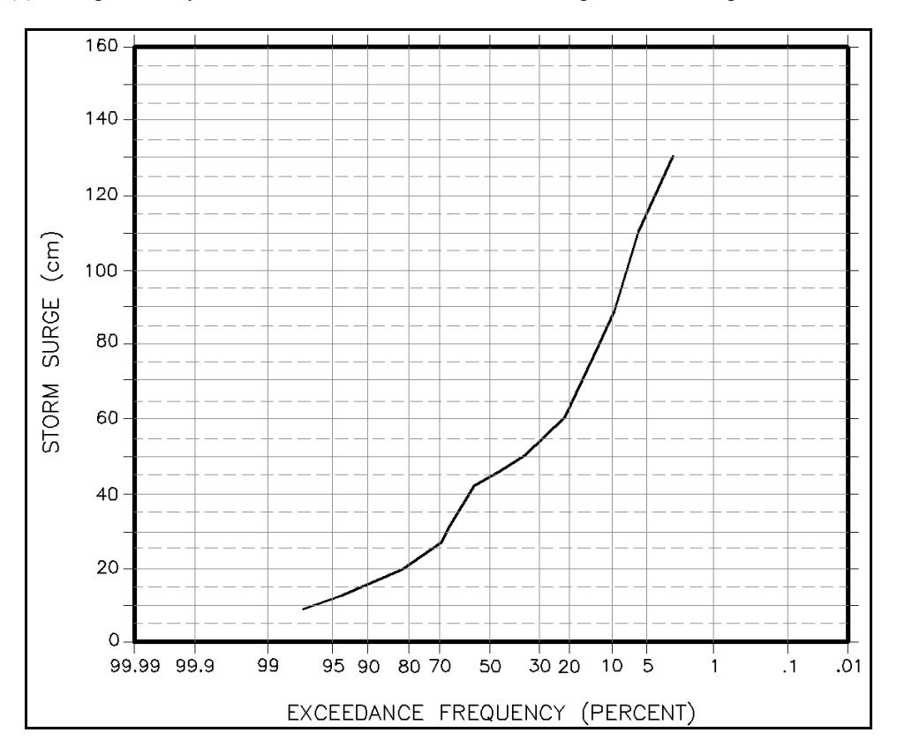

*Figure II-8-20. Probability distribution of storm surge*

Combined tide and storm surge . A simplified analysis is used here to generate probabilities for combined tide and storm surge. With consideration of general knowledge about the duration of storms, typical storm surge hydrographs, and tidal variations at the site, it is reasonable (but somewhat conservative) to assume that peak water level events can be represented as the measured peak surges coinciding with a high tide.
Example Problem II-9-2 (Sheet 3 of 21)
The distribution of high water tide elevations above mean sea level is given by Harris (1981) for a nearby location with similar tidal response (Figure II-8-21). For this example, the traditional joint probability method (as described by Harris (1981)) was used to combine high-water tide frequencies with storm surge probability expressed as frequency of occurrence per year . Combined tide and storm surge probabilities for design return periods are included in Figure II-8-21.

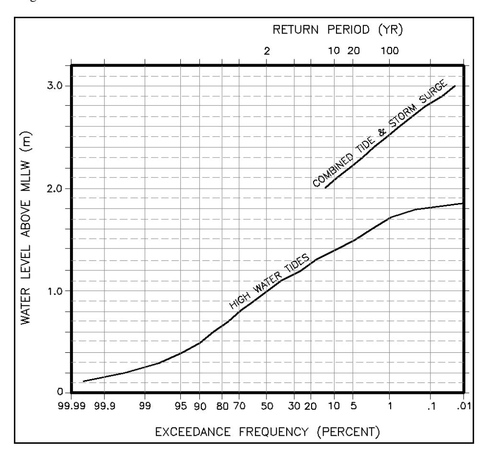

*Figure II-8-21. Probability distribution of high tides and combined tide and storm surge*

## CURRENTS:

The north jetty will deflect a strong longshore current seaward. Therefore strong offshore-directed currents can be expected along the north side of the jetty. Because of the local bathymetry, principally a rocky reef parallel to shore, the current is expected to affect only the area near the jetty head. Local currents can be estimated based on experience at similar sites (if any exist), physical modeling, and, possibly, numerical modeling. For this example, moderate current speed is taken as 1.5 m/s and design current as 3.0 m/s. Tidal currents can also be significant, since the tide range is fairly large. Tidal currents will affect navigation in the entrance, but are not expected to influence jetty structural design.
Example Problem II-9-2 (Sheet 4 of 21)
WAVES:
Measurements. Measurements are available over a period of 17 years from a wave gauge located in -15.2-m depth MLLW. Events with H_s >6.1 m were selected for design analysis, a total of 33 cases. The maximum H_s during each event and the corresponding T_p , storm surge, and water depth at the gauge are given in Table II-8-13.
The data record represented in the table is quite long, and it is considered statistically representative of storm events to which the site is exposed. It is used as the basis for design. Measured values of T_p can be taken as representative of both the gauge and jetty locations. Measured values of H_s must be transformed between the gauge location and jetty. Also, the design water level at the jetty must be estimated because it strongly affects calculations of H_s .
Estimation of H_0 . The equivalent deepwater wave height H_0 is calculated as an intermediate step in estimating wave height at the jetty. Refraction between gauge and jetty locations is assumed to be negligible in this example, and values of H_0 estimated from gauge data are also applicable to the jetty location. Steps in estimating H_0 are listed below and calculation results are given in Table II-8-13. The ACES application "Irregular Wave Transformation" (Goda's Method) could be used to assist in these and subsequent calculations. It is advisable to spot-check any ACES calculations with some manual calculations.
- (1) Calculate L_0 from known values of T_p , L_0 = (gT_p^2)/(2\pi) = 1.56gT_p^2 ( L_0 in m).
- (2) Calculate d_{gauge}/L_0 .
- (3) Calculate H_s/L_0 as an initial estimate of H_0/L_0 (needed for using the curves in step (4)).
- (4) Get shoaling coefficient K<sub>s</sub> from Figure II-8-22.
- (5) Calculate H_0 from significant height at the gauge H_{seauge} (Table II-8-13) as

```math
H_0' = \frac{H_{sgauge}}{K_s} \tag{II-9-7}
```

(6) Calculate H_0/L_0 to ensure that K_s from step (4) is valid. It may be necessary to repeat steps (4)-(6) to arrive at a final value of H_0 .
Example Problem II-8-2 (Sheet 5 of 21)

*Example Problem II-8-2 (Continued)*

*Table II-8-13 Significant Storm Events*

**Table II-8-13. Significant Storm Events**

|  |  |  | Measurements |  |  |  |  | Calculations |  |  |
| --- | --- | --- | --- | --- | --- | --- | --- | --- | --- | --- |
| Date |  | Hs(cm) | Tp(sec) | Surge(cm) | dgauge 1(m) | L0(m) | dgauge/L0 | Ks | H0'(cm) | H0'/L0 |
| Feb | 78 | 613 | 13.5 | 73 | 17.3 | 284 | 0.0609 | 1.00 | 613 | 0.0216 |
| Jan | 81 | 625 | 17.4 | 12 | 15.1 | 472 | 0.0320 | 1.18 | 530 | 0.0112 |
| Nov | 81 | 646 | 13.6 | 131 | 17.6 | 289 | 0.0609 | 1.00 | 646 | 0.0224 |
| Dec | 81 | 619 | 15.4 | 30 | 14.9 | 370 | 0.0403 | 1.11 | 558 | 0.0151 |
| Dec | 82 | 884 | 15.0 | 88 | 17.9 | 351 | 0.0510 | 1.08 | 819 | 0.0233 |
| Jan | 83 | 713 | 16.9 | 110 | 16.9 | 446 | 0.0379 | 1.15 | 620 | 0.0139 |
| Feb | 83 | 622 | 15.8 | 46 | 17.6 | 389 | 0.0452 | 1.07 | 581 | 0.0149 |
| Apr | 83 | 631 | 15.2 | 43 | 17.9 | 360 | 0.0497 | 1.04 | 607 | 0.0169 |
| Feb | 84 | 707 | 15.2 | 79 | 17.7 | 360 | 0.0492 | 1.05 | 673 | 0.0187 |
| Nov | 84 | 634 | 14.0 | 61 | 16.9 | 306 | 0.0552 | 1.01 | 628 | 0.0205 |
| Dec | 85 | 613 | 17.6 | 43 | 16.7 | 483 | 0.0346 | 1.13 | 542 | 0.0112 |
| Feb | 86 | 686 | 17.1 | 49 | 18.1 | 456 | 0.0397 | 1.10 | 624 | 0.0137 |
| Mar | 86 | 610 | 16.4 | 46 | 18.0 | 420 | 0.0429 | 1.08 | 565 | 0.0135 |
| Apr | 86 | 680 | 15.6 | 12 | 16.2 | 380 | 0.0426 | 1.10 | 618 | 0.0163 |
| Apr | 86 | 631 | 14.5 | 27 | 16.8 | 328 | 0.0512 | 1.03 | 613 | 0.0187 |
| May | 86 | 619 | 14.5 | 30 | 17.0 | 328 | 0.0518 | 1.03 | 601 | 0.0183 |
| Sep | 86 | 689 | 15.4 | 46 | 17.5 | 370 | 0.0473 | 1.06 | 650 | 0.0176 |
| Nov | 86 | 652 | 16.9 | 49 | 17.1 | 446 | 0.0383 | 1.12 | 582 | 0.0130 |
| Jan | 87 | 695 | 16.0 | 55 | 17.5 | 399 | 0.0439 | 1.09 | 638 | 0.0160 |
| Feb | 87 | 631 | 13.0 | 40 | 17.3 | 264 | 0.0655 | 0.98 | 644 | 0.0244 |

*& lt;sup>1</sup> Water depth at gauge including combined tide and storm surge.*

Example Problem II-8-2 (Sheet 6 of 21)

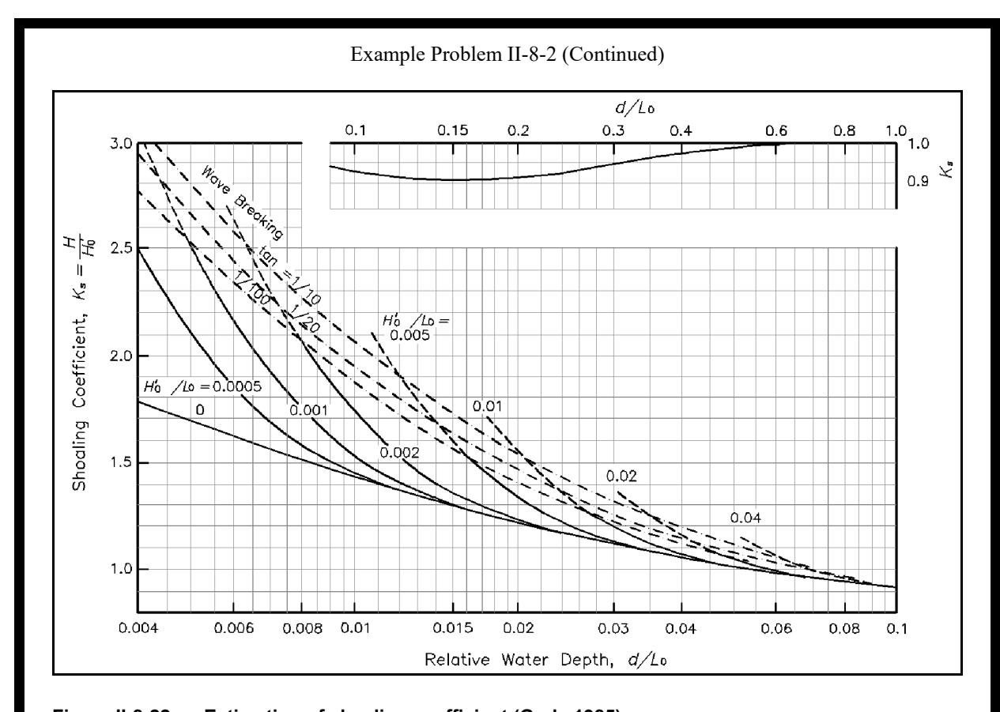

*Figure II-8-22. Estimation of shoaling coefficient (Goda 1985)*

Combined tide and storm surge for design wave analysis at jetty. For design wave analysis, extreme combinations of tide, storm surge, and waves must be considered. Since extreme storm surge and waves are often highly correlated (both can be produced by intense storms), they should not be treated as independent processes. The relationship between storm surge and waves is embodied in the available measurements to an extreme occurrence of approximately once in 17 years.
For this example problem, combined tide, storm surge, and waves for design analysis are derived by the following approach. Each measured wave and surge event (represented by H0', Tp , and storm surge height) is coupled with N high tide levels taken from the probability distribution of high tides (see Table B-37b in Harris (1981)). (Figure II-8-23 is a partial extraction of Table B-37b for use in this example). As before, it is assumed that the duration of extreme storm surge events is long enough that peak surge will coincide with a high tide, and high tide level is independent of storm surge level. The N high tide levels are determined by dividing the probability distribution of high tides into N equal probability increments and taking the tide level for the mid-probability of each increment. The number N should be large enough that the combined probability of the highest tide level and the most severe surge/wave event is lower than the design probability.
Example Problem II-8-2 (Sheet 7 of 21)
Example Problem II-8-2 (Continued)

| Lower Limit of Class Interval Shown, All Heights are Normalized by |
| --- |
| Half the Diurnal Range 1.274 m |
| [Extracted from Table B-37b (Harris 1981)] |

|  | High Water |  |
| --- | --- | --- |
| Lower Limit | Frequency | Cumulative Frequency |
| 1.4547 | .0001 | .0001 |
|  |  |  |
|  |  |  |
| 1.1018 | .0110 | .0989 |
| 1.0877 | .0105 | .1094 |
|  |  |  |
|  |  |  |
| 0.9183 | 0.0206 | 0.2891 |
| 0.9043 | 0.0229 | 0.3120 |
|  |  |  |
|  |  |  |
| 0.7771 | 0.0213 | 0.4919 |
| 0.7630 | 0.0187 | 0.5106 |
|  |  |  |
|  |  |  |
| 0.6218 | 0.0185 | 0.6923 |
| 0.6077 | 0.0156 | 0.7079 |
|  |  |  |
|  |  |  |
| 0.4101 | 0.0077 | 0.8896 |
| 0.3960 | 0.0108 | 0.9004 |

*Figure II-8-23. Astronomical tide probability referenced to MSL*

A value of N = 5, corresponding to probability increments of 0.2, was used for this problem. The midprobabilities are 0.1, 0.3, 0.5, 0.7, and 0.9. High tide levels matching these probabilities, determined from Figure II-8-24, are in Table II-8-14. The probability of the most severe surge/wave event is the reciprocal of the number of possible measurements (at 6-hr intervals or 4 observations per day) during 17 years:

```math
\frac{1}{(4/day) \times (365 \ days/yr) \times (17 \ yr)} = 0.000040
```

Similarly, the probability corresponding to the design life of 25 years is:

```math
\frac{1}{(4/day) \times (365 \ days/yr) \times (25 \ yr)} = 0.000027
```

Example Problem II-8-2 (Sheet 8 of 21)

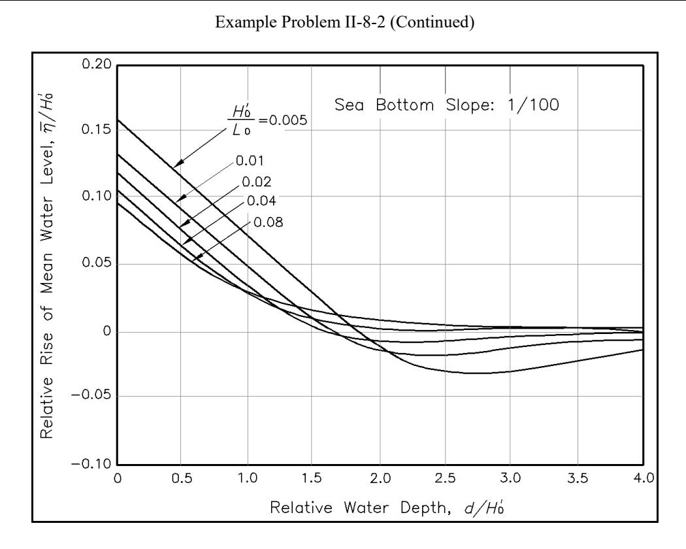

*Figure II-8-24. Estimation of wave setup (Goda 1985)*

A 1-in-17-year event coupled with a 0.1 probability high tide level corresponds to a combined probability of 0.000040 × 0.1=0.000004. Since this probability is well below the 25-year design probability, the number of tide increments is sufficient for illustration.
The jetty is divided into three design segments with bottom levels of -10 m MLLW (representing the jetty head), -6 m MLLW and -2 m MLLW (representing sections along the jetty trunk). Tidal water levels at the five probability levels (expressed as exceedance frequencies in percent) are summarized in Table II-8-14. Information in Table II-8-12 is used to convert from MSL to MLLW datum.

**Table II-8-14. Information in Table II-8-12 is used to convert from MSL to MLLW datum.**

|  |  |  |  | Exceedance | Frequency | (percent) |  |  |
| --- | --- | --- | --- | --- | --- | --- | --- | --- |
| Water | Level |  |  | 90 | 70 | 50 | 30 | 10 |
| High tide | level, | in m MSL |  | +0.51 | +0.78 | +0.98 | +1.16 | +1.40 |
| High tide | level, | in m MLLW |  | +1.87 | +2.14 | +2.34 | +2.52 | +2.76 |
| Tidal water | depth | (m) |  |  |  |  |  |  |
| Bottom at | -10 m | MLLW | (jetty head) | 11.9 | 12.1 | 12.3 | 12.5 | 12.8 |
| Bottom at | -6 m | MLLW | (jetty trunk) | 7.9 | 8.1 | 8.3 | 8.5 | 8.8 |
| Bottom at | -2 m | MLLW | (jetty trunk) Example Problem | 3.9 II-8-2 (Sheet | 4.1 9 of 21) | 4.3 | 4.5 | 4.8 |
| Analysis | and | Design | Conditions |  |  |  |  | Hydrodynamic II-8-43 |

Example Problem II-8-2 (Sheet 9 of 21)
The combined effect of tide and storm surge for the first event (excluding wave setup) at the jetty head and nearshore (shallowest) trunk segment are given in Table II-8-15. These initial depth estimates are referenced as dijettyA for the head and dijettyC for the nearshore trunk segment. Similarly, combined tide and storm surge levels are computed for each of the 33 storm events at the three jetty design segments.

**Table II-8-15. These initial depth estimates are referenced as dijettyA for the head and dijettyC for the nearshore trunk segment. Similarly, combined tide and storm surge levels are computed for each of the 33 storm events at the three jetty design segments.**

|  |  | Water | Level Exceedance | Frequency | (percent) |  |
| --- | --- | --- | --- | --- | --- | --- |
| Level |  | 90 | 70 | 50 | 30 | Water 10 |
| Storm | surge (m) | 0.7 Jetty | 0.7 Head | 0.7 | 0.7 | 0.7 |
| water | depth (m) | 11.9 | 12.1 | 12.3 | 12.5 | Tidal 12.8 |
| dijettyA | (m) | 12.6 Nearshore | 12.8 Jetty Trunk | 13.0 | 13.2 | 13.5 |
| water | depth (m) | 3.9 | 4.1 | 4.3 | 4.5 | Tidal 4.8 |
| dijettyC | (m) | 4.6 | 4.8 | 5.0 | 5.2 | 5.5 |

Inclusion of wave setup. The effect of wave setup on water levels at the jetty can now be considered. Calculation steps are listed below and results for Event 1 at the jetty head and nearshore jetty trunk segment are given in Table II-8-16.
- (1) Retrieve H0 /L0 from Table II-8-13.
- (2) Calculate dijetty/H0' .
- (3) Estimate ratio of wave setup η¯ to H0' from Figure II-8-24.
- (4) Calculate η¯ from ratio in step (3). If η¯ is less than zero, a value of zero should be used for prudent design.
- (5) Calculate a final djetty as the sum of ¯ and the previous η dijetty , which included only tide and storm surge. If η¯ is large, it may be necessary to return to step (1) using djetty in place of dijetty and repeat steps (1) through (5).
Example Problem II-8-2 (Sheet 10 of 21)
Example Problem II-8-2 (Continued)

| Table II-8-16 |  |
| --- | --- |
| Calculation of djetty for Storm Event 1 |  |

|  |  |  | Water Level Exceedance Frequency (percent) |  |  |
| --- | --- | --- | --- | --- | --- |
|  | 90 | 70 | 50 | 30 | 10 |
| H0'/L0 | 0.0216 | 0.0216 | 0.0216 | 0.0216 | 0.0216 |
|  |  | Jetty head |  |  |  |
| dijettyA (m) | 12.6 | 12.8 | 13.0 | 13.2 | 13.5 |
| dijettyA/H0' | 2.06 | 2.09 | 2.12 | 2.15 | 2.20 |
| η¯/H0' | <0 | <0 | <0 | <0 | <0 |
| η¯ (m) | 0 | 0 | 0 | 0 | 0 |
| djettyA (m) | 12.6 | 12.8 | 13.0 | 13.2 | 13.5 |
|  |  | Nearshore jetty trunk |  |  |  |
| dijettyC (m) | 4.6 | 4.8 | 5.0 | 5.2 | 5.5 |
| dijettyC/H0' | 0.75 | 0.78 | 0.82 | 0.85 | 0.90 |
| η¯/H0' | 0.053 | 0.050 | 0.046 | 0.043 | 0.040 |
| η¯ (m) | 0.3 | 0.3 | 0.3 | 0.3 | 0.2 |
| djettyC (m) | 4.9 | 5.1 | 5.3 | 5.5 | 5.7 |

Estimation of H1/3 at Jetty. Now significant wave heights at the jetty Hsjetty can be estimated. Calculation steps are listed below and results for Event 1 at the jetty head and nearshore trunk segment are given in Table II-8-17.
- (1) Calculate djetty/H0 , where djetty is the combined tide, storm surge, and wave setup water level at the jetty (Table II-8-16). (2) Estimate ratio of H1/3 at the jetty Hsjetty to H0 from Figure II-8-25.
- (3) Calculate Hsjetty from ratio in step (2). Note in this example that this is a breaking wave. Also note that the higher H0 values lead to higher H1/3 values in the breaker zone, if d and H0 /L0 are held constant (because of the gentle slope of the lines in the left portion of Figure II-8-25). Thus the extreme measured Hs values selected for design analysis can be expected to give extreme nearshore wave heights in the surf zone.
After these calculations are completed for all 33 storm events and 5 water levels, there are a total of 33 × 5 = 165 event values of Hsjetty at the jetty head and at each of the two trunk sections.
Example Problem II-8-2 (Sheet 11 of 21)

*Example Problem II-8-2 (Continued)*

*Table II-8-17 Calculation of Hsjetty for Storm Event 1*

**Table II-8-17. Calculation of Hsjetty for Storm Event 1**

|  |  | Water 90 | Level 70 Jetty | Exceedance Head | Frequency 50 | (percent) 30 | 10 |
| --- | --- | --- | --- | --- | --- | --- | --- |
| djettyA/H0' |  | 2.06 | 2.09 |  | 2.12 | 2.15 | 2.20 |
| HsjettyA/H0' |  | 1.05 | 1.06 |  | 1.07 | 1.07 | 1.07 |
| HsjettyA | (cm) | 644 Nearshore | 650 | Jetty | 656 Trunk | 656 | 656 |
| djettyC/H0' |  | 0.80 | 0.83 |  | 0.86 | 0.90 | 0.93 |
| HsjettyC/H0' |  | 0.57 | 0.59 |  | 0.60 | 0.62 | 0.63 |
| HsjettyC | (cm) | 349 | 362 |  | 368 | 380 | 386 |

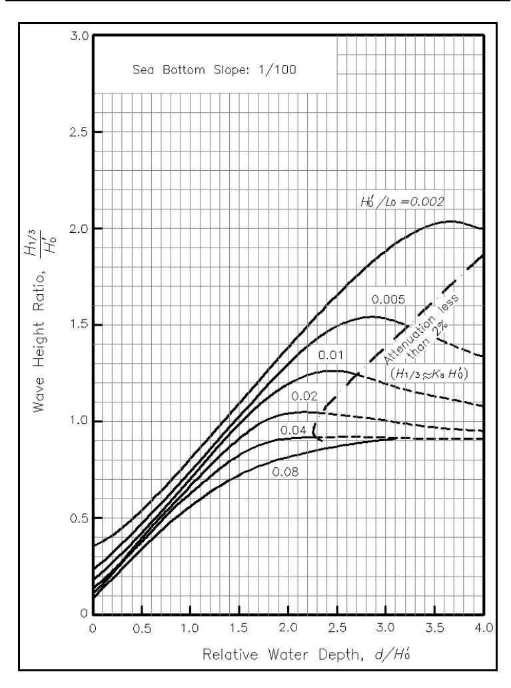

*Figure II-8-25. Estimation of wave height at the jetty (Goda 1985)*

Example Problem II-8-2 (Sheet 12 of 21)
Importance of wave breaking . In estimating design wave conditions, it is important to know whether waves are breaking. Event values of H0'/L0 from Table II-8-13 plotted with the curve from Figure II-8-13 with bottom slope of 1/100 show that all values of djetty at the jetty head are very near or smaller than the depth at which Hsjetty reaches a maximum value during shoaling and breaking (Figure II-8-26). Thus, the jetty head can be considered as inside the surf zone and subject to breaking waves for all of the storm events. Since the jetty trunk is in shallower water than the head, it too will be subject to breaking waves for design.
Relationship to Hm0. The significant wave height analysis used in this example is based on statistics of crest-totrough wave heights in a train of irregular waves. This wave height parameter can differ significantly from the energy-based significant wave height parameter Hm0 , especially for low-steepness waves in shallow water. Some design applications may require Hm0 instead of Hsjetty . If so, the event values of Hsjetty may be converted by the procedure described in Part II-1.
Extremal wave height analysis at the jetty. Extremal wave height analysis is presented here only for the jetty head. Similar analyses would be needed for jetty trunk sections, but they are omitted for brevity. Since the design waves are inside the surf zone, water level can be expected to be a key parameter in determining design wave heights. The equivalent deepwater wave steepness H0'/L0 and H0' also influence Hsjetty . Design wave estimates should include due consideration of the influence of all three of these parameters: djetty , H0'/L0 , and H0' .
The ACES "Extremal Significant Wave Height Analysis" application was applied to the 165 event values of Hsjetty and the FT-I distribution function was selected as a good fit (Figure II-8-27). Confidence intervals of 95 percent were also computed, which is approximately equivalent to ±2 standard deviations.

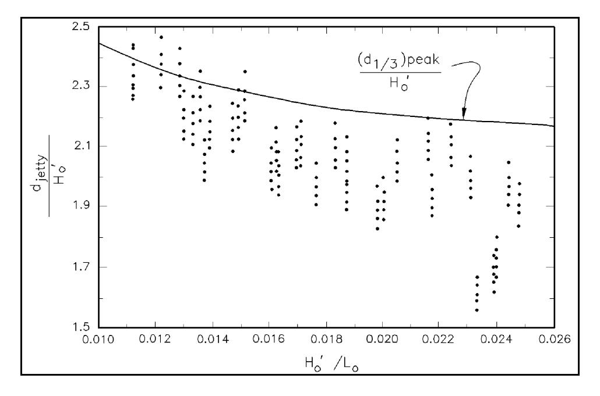

*Figure II-8-26. Identification of surf zone conditions*

Example Problem II-8-2 (Sheet 13 of 21)

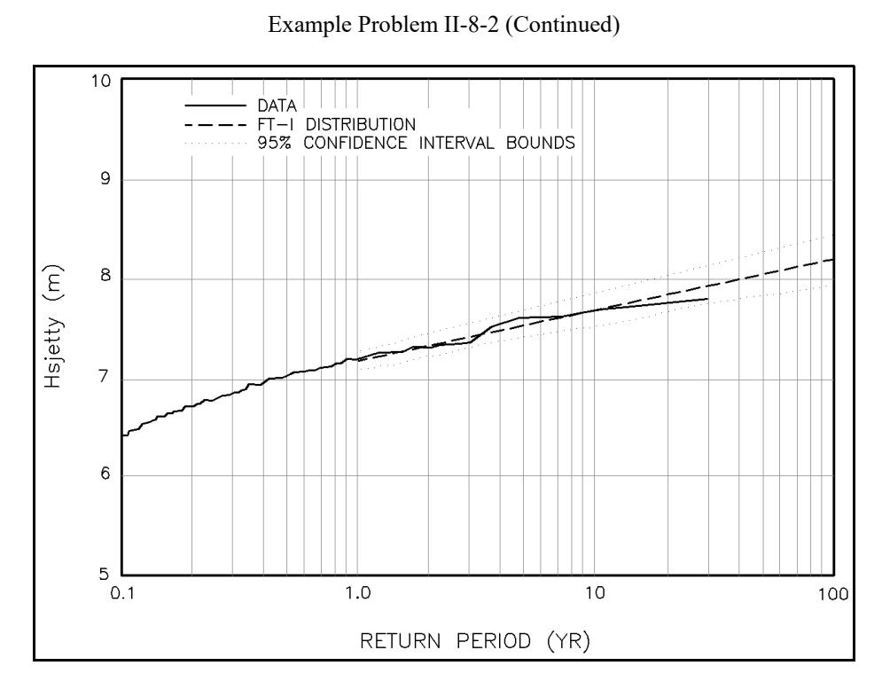

#### Figure II-8-27. Return period wave heights, 165 events, jetty head

Significant heights in Figure II-8-27 are representative of the extrapolated observed events, but they may have some important limitations. Extreme values of Hsjetty are strongly dependent on water depth, and the highest tide level considered in any of the 165 event cases was only at the 10-percent exceedance frequency. (This limit in the tide levels considered was a practical consequence of the manual method being used. If the analysis were done by computer, a much greater range of tide levels could have been included.) For longer return periods, the probability of an event coinciding with a tide level higher than the 10-percent exceedance frequency increases. This concern applies more to the jetty trunk, which is well inside the surf zone for design events, than the jetty head.
It is important in design to be aware of the maximum values of Hsjetty which might be encountered. Estimates of the upper bound value of Hsjetty were computed by the following two approaches:

#### (a) Parameters were determined as:

Tide level = maximum from Harris (1981) (Figure II-8-23) 
= 1.4547×1.274 m 
= +1.85 m MSL 
= +1.85+1.36 m MLLW (using Table II-8-12) . +3.2 m MLLW
Storm surge = value estimated from extremal analysis of event storm surges for each Tr (Figure II-8-20)
H0'/L0 = 0.01 (lower bound on event values in Table II-8-13)
Example Problem II-8-2 (Sheet 14 of 21)
H0' = value estimated from extremal analysis of H0' event values (Table II-8-13) for each Tr (Figure II-8-28)
Parameters and calculations of Hsjetty are summarized in Table II-8-18.

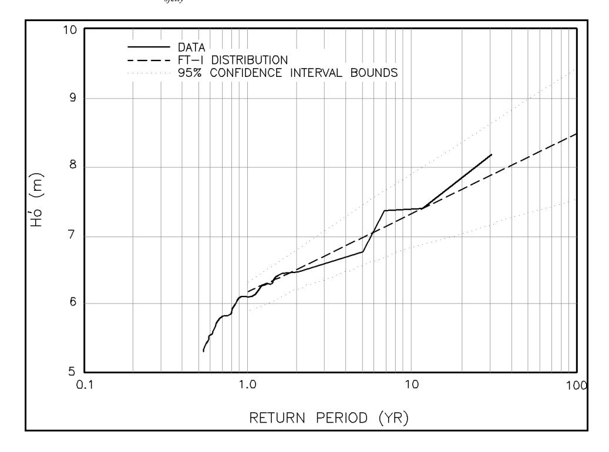

*Figure II-8-28. Return period wave heights, H N 0*

*Table II-8-18 Calculation of Upper Bound Hsjetty Based on Maximum Tide Level*

**Table II-8-18. Calculation of Upper Bound Hsjetty Based on Maximum Tide Level**

| Tr | H0' Storm | Surge Total | Water Level 1 | djetty | djetty/H0' | Hsjetty/H0' | Hsjetty |
| --- | --- | --- | --- | --- | --- | --- | --- |
| (yr) | (cm) | (m) (m | MLLW) | (m) |  |  | (cm) |
| 2 | 653 | 0.7 | 3.9 | 13.9 | 2.13 | 1.24 | 810 |
| 5 | 702 | 0.9 | 4.1 | 14.1 | 2.01 | 1.21 | 849 |
| 10 | 737 | 1.0 | 4.2 | 14.2 | 1.93 | 1.18 | 870 |
| 25 | 782 | 1.2 | 4.4 | 14.4 | 1.84 | 1.14 | 891 |
| 50 | 816 | 1.3 | 4.5 | 14.5 | 1.78 | 1.12 | 914 |
| 100 | 850 | 1.4 | 4.6 | 14.6 | 1.72 | 1.10 | 935 |
| Combined | maximum tide level | (+3.2 m) and storm surge Example Problem | II-8-2 (Sheet 15 | of 21) |  |  | 1 |
| Analysis | and Design Conditions |  |  |  |  |  | Hydrodynamic II-8-49 |

*Combined maximum tide level (+3.2 m) and storm surge*

Example Problem II-8-2 (Sheet 15 of 21)
(b) As a more conservative check on (a), the peak possible value of Hs during the shoaling/breaking process between deepwater and shore for given values of bottom slope H0'/L0 and H0' was estimated from Figure II-8-12 using the same values of H0'/L0 and H0' as in (a). Results are summarized in Table II-8-19.

*Table II-8-19 Calculation of Upper Bound Hsjetty Based on Maximum During Shoaling*

**Table II-8-19. Calculation of Upper Bound Hsjetty Based on Maximum During Shoaling**

| Tr | H0' | Hsjetty/H0' 1 | Hsjetty |
| --- | --- | --- | --- |
| (yr) | (cm) |  | (cm) |
| 2 | 653 | 1.27 | 829 |
| 5 | 702 | 1.27 | 892 |
| 10 | 737 | 1.27 | 936 |
| 25 | 782 | 1.27 | 993 |
| 50 | 816 | 1.27 | 1036 |
| 100 | 850 | 1.27 | 1080 |
| II-8-12 using bottom | slope = 1/100 and H0’/L0 | = 0.01. | 1 From Figure |

*1 From Figure II-8-12 using bottom slope = 1/100 and H0' / L0 = 0.01.*

Final design wave heights excluding current effects. Upper bound estimates of Hsjetty (Tables II-8-18 and II-8-19) are plotted relative to the 165 cases derived from the measured storm events (Figure II-8-29). The return period curve based on the 165 events is taken as the design curve for this example (Table II-8-20).

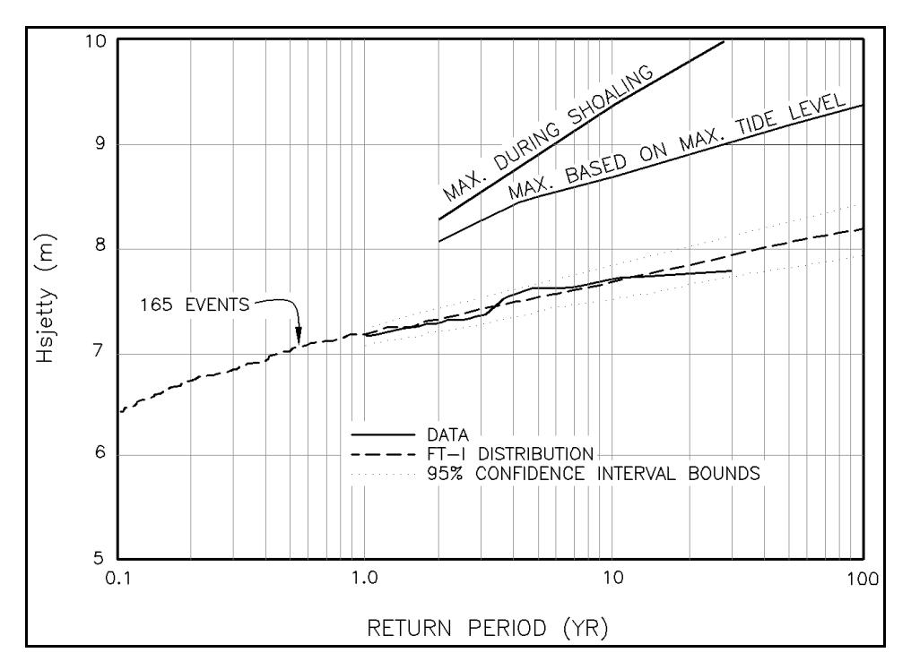

*Figure II-8-29. Return period wave heights, 165 events including upper bounds, jetty head*

Example Problem II-8-2 (Sheet 16 of 21)

*Example Problem II-8-2 (Continued)*

*Table II-8-20 Design Significant Wave Heights at Jetty Head*

**Table II-8-20. Design Significant Wave Heights at Jetty Head**

| Jetty | Design Toe | Design |
| --- | --- | --- |
| Tr |  |  |
| (yr) | Hsjetty (cm) | Hstoe (cm) |
| 2 | 732 | 612 |
| 5 | 753 | 622 |
| 10 | 768 | 628 |
| 25 | 789 | 637 |
| 50 | 804 | 644 |
| 100 | 819 | 650 |

If a design life longer than 25 years were needed, values of Hsjetty approaching the maximum based on maximum tide level might need to be considered. This maximum represents an increase of about 1 m in Hsjetty at any selected return period, which would significantly influence jetty design. There is some chance of the maximum occurring even in a 25-year design life. That possibility should be considered if risks are analyzed. Also it should be recognized that the great hydrodynamic energy associated with design events can significantly change nearshore bottom elevations. Storm-induced scour could subject the jetty to increased wave heights, possibly approaching the maximum during shoaling at the jetty head. This effect should also be considered in risk analysis.
Design wave heights - jetty toe. Past physical model studies of some jetty cross sections have shown that waves attacking at water levels of around MLLW are most likely to cause damage to the underwater portion of the structure, including the toe. Similar behavior is assumed in this example. Since this jetty is in a high wave energy environment with fairly large tide range, it is worthwhile to estimate extreme wave heights at MLLW. The lower wave heights (because of reduced depth) can be assessed relative to the lower stability of underwater armor units (due to less precise placement).
Values of H0' and H0'/L0 for each of the observed events (Table II-8-13) are used with a water depth of 10 m (corresponding to MLLW at the jetty head), and bottom slope of 1/100 to estimate a significant wave height for toe design Hstoe for each event (illustrated in Table II-8-21 for one event). These 33 values of Hstoe were subjected to extremal analysis (Figure II-8-30). The shallow depth greatly limits wave heights, and Hstoe values are confined to a very narrow range between 5.8 m and 6.5 m. The Weibull distribution function with k = 2.0, which best simulates the shape of a capped distribution function (Figure II-8-3), provides the best fit. Hstoe values for design are summarized in Table II-8-20.
Example Problem II-8-2 (Sheet 17 of 21)

**Table II-8-13. ) are used with a water depth of 10 m (corresponding to MLLW at the jetty head), and bottom slope of 1/100 to estimate a significant wave height for toe design Hstoe for each event (illustrated in Table II-8-21 for one event). These 33 values of Hstoe were subjected to extremal analysis (Figure II-8-30). The shallow depth greatly limits wave heights, and Hstoe values are confined to a very narrow range between 5.8 m and 6.5 m. The Weibull distribution function with k = 2.0, which best simulates the shape of a capped distribution function (Figure II-8-3), provides the best fit. Hstoe values for design are summarized in Table II-8-20.**

|  |  |  | Measurements |  |  |  |  | Calculations |  |  |
| --- | --- | --- | --- | --- | --- | --- | --- | --- | --- | --- |
| Date |  | Hs(cm) | Tp(sec) | Surge(cm) | dgauge 1(m) | L0(m) | dgauge/L0 | Ks | H0'(cm) | H0'/L0 |
| Feb | 78 | 613 | 13.5 | 73 | 17.3 | 284 | 0.0609 | 1.00 | 613 | 0.0216 |
| Jan | 81 | 625 | 17.4 | 12 | 15.1 | 472 | 0.0320 | 1.18 | 530 | 0.0112 |
| Nov | 81 | 646 | 13.6 | 131 | 17.6 | 289 | 0.0609 | 1.00 | 646 | 0.0224 |
| Dec | 81 | 619 | 15.4 | 30 | 14.9 | 370 | 0.0403 | 1.11 | 558 | 0.0151 |
| Dec | 82 | 884 | 15.0 | 88 | 17.9 | 351 | 0.0510 | 1.08 | 819 | 0.0233 |
| Jan | 83 | 713 | 16.9 | 110 | 16.9 | 446 | 0.0379 | 1.15 | 620 | 0.0139 |
| Feb | 83 | 622 | 15.8 | 46 | 17.6 | 389 | 0.0452 | 1.07 | 581 | 0.0149 |
| Apr | 83 | 631 | 15.2 | 43 | 17.9 | 360 | 0.0497 | 1.04 | 607 | 0.0169 |
| Feb | 84 | 707 | 15.2 | 79 | 17.7 | 360 | 0.0492 | 1.05 | 673 | 0.0187 |
| Nov | 84 | 634 | 14.0 | 61 | 16.9 | 306 | 0.0552 | 1.01 | 628 | 0.0205 |
| Dec | 85 | 613 | 17.6 | 43 | 16.7 | 483 | 0.0346 | 1.13 | 542 | 0.0112 |
| Feb | 86 | 686 | 17.1 | 49 | 18.1 | 456 | 0.0397 | 1.10 | 624 | 0.0137 |
| Mar | 86 | 610 | 16.4 | 46 | 18.0 | 420 | 0.0429 | 1.08 | 565 | 0.0135 |
| Apr | 86 | 680 | 15.6 | 12 | 16.2 | 380 | 0.0426 | 1.10 | 618 | 0.0163 |
| Apr | 86 | 631 | 14.5 | 27 | 16.8 | 328 | 0.0512 | 1.03 | 613 | 0.0187 |
| May | 86 | 619 | 14.5 | 30 | 17.0 | 328 | 0.0518 | 1.03 | 601 | 0.0183 |
| Sep | 86 | 689 | 15.4 | 46 | 17.5 | 370 | 0.0473 | 1.06 | 650 | 0.0176 |
| Nov | 86 | 652 | 16.9 | 49 | 17.1 | 446 | 0.0383 | 1.12 | 582 | 0.0130 |
| Jan | 87 | 695 | 16.0 | 55 | 17.5 | 399 | 0.0439 | 1.09 | 638 | 0.0160 |
| Feb | 87 | 631 | 13.0 | 40 | 17.3 | 264 | 0.0655 | 0.98 | 644 | 0.0244 |

**Table II-8-13. ) are used with a water depth of 10 m (corresponding to MLLW at the jetty head), and bottom slope of 1/100 to estimate a significant wave height for toe design Hstoe for each event (illustrated in Table II-8-21 for one event). These 33 values of Hstoe were subjected to extremal analysis (Figure II-8-30). The shallow depth greatly limits wave heights, and Hstoe values are confined to a very narrow range between 5.8 m and 6.5 m. The Weibull distribution function with k = 2.0, which best simulates the shape of a capped distribution function (Figure II-8-3), provides the best fit. Hstoe values for design are summarized in Table II-8-20.**

|  |  |  | Measurements |  |  |  |  | Calculations |  |  |
| --- | --- | --- | --- | --- | --- | --- | --- | --- | --- | --- |
| Date |  | Hs(cm) | Tp(sec) | Surge(cm) | dgauge 1(m) | L0(m) | dgauge/L0 | Ks | H0'(cm) | H0'/L0 |
| Feb | 78 | 613 | 13.5 | 73 | 17.3 | 284 | 0.0609 | 1.00 | 613 | 0.0216 |
| Jan | 81 | 625 | 17.4 | 12 | 15.1 | 472 | 0.0320 | 1.18 | 530 | 0.0112 |
| Nov | 81 | 646 | 13.6 | 131 | 17.6 | 289 | 0.0609 | 1.00 | 646 | 0.0224 |
| Dec | 81 | 619 | 15.4 | 30 | 14.9 | 370 | 0.0403 | 1.11 | 558 | 0.0151 |
| Dec | 82 | 884 | 15.0 | 88 | 17.9 | 351 | 0.0510 | 1.08 | 819 | 0.0233 |
| Jan | 83 | 713 | 16.9 | 110 | 16.9 | 446 | 0.0379 | 1.15 | 620 | 0.0139 |
| Feb | 83 | 622 | 15.8 | 46 | 17.6 | 389 | 0.0452 | 1.07 | 581 | 0.0149 |
| Apr | 83 | 631 | 15.2 | 43 | 17.9 | 360 | 0.0497 | 1.04 | 607 | 0.0169 |
| Feb | 84 | 707 | 15.2 | 79 | 17.7 | 360 | 0.0492 | 1.05 | 673 | 0.0187 |
| Nov | 84 | 634 | 14.0 | 61 | 16.9 | 306 | 0.0552 | 1.01 | 628 | 0.0205 |
| Dec | 85 | 613 | 17.6 | 43 | 16.7 | 483 | 0.0346 | 1.13 | 542 | 0.0112 |
| Feb | 86 | 686 | 17.1 | 49 | 18.1 | 456 | 0.0397 | 1.10 | 624 | 0.0137 |
| Mar | 86 | 610 | 16.4 | 46 | 18.0 | 420 | 0.0429 | 1.08 | 565 | 0.0135 |
| Apr | 86 | 680 | 15.6 | 12 | 16.2 | 380 | 0.0426 | 1.10 | 618 | 0.0163 |
| Apr | 86 | 631 | 14.5 | 27 | 16.8 | 328 | 0.0512 | 1.03 | 613 | 0.0187 |
| May | 86 | 619 | 14.5 | 30 | 17.0 | 328 | 0.0518 | 1.03 | 601 | 0.0183 |
| Sep | 86 | 689 | 15.4 | 46 | 17.5 | 370 | 0.0473 | 1.06 | 650 | 0.0176 |
| Nov | 86 | 652 | 16.9 | 49 | 17.1 | 446 | 0.0383 | 1.12 | 582 | 0.0130 |
| Jan | 87 | 695 | 16.0 | 55 | 17.5 | 399 | 0.0439 | 1.09 | 638 | 0.0160 |
| Feb | 87 | 631 | 13.0 | 40 | 17.3 | 264 | 0.0655 | 0.98 | 644 | 0.0244 |

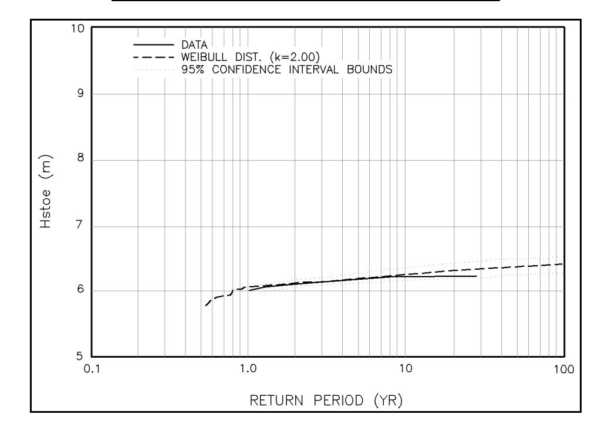

*Figure II-8-30. Return period wave heights, toe design, jetty head*

Effect of currents on waves. Information on currents around the jetty head is not precise but indicates that strong currents of up to 3 m/s may be experienced during design storms. The currents must be considered in design for two reasons: 1) direct impact on bottom and jetty material stability; and 2) effect on waves. Part II-6-2.l provides a simple method for estimating a factor for wave height modification by currents RH . The following nondimensional parameters are required:

```math
F = \frac{V \cos \theta}{\sqrt{gd}} \tag{II-8-8}
```

```math
\Omega = \left(\frac{2\pi}{T}\right)\left(\frac{\sqrt{gd}}{g}\right)^{1/2}
```

where V is the current speed and θ is the angle between the current and a wave orthogonal. For this design problem, V = 3 m/s and θ is taken as -180 deg (current directly opposing the waves).
Example Problem II-8-2 (Sheet 18 of 21)
Appropriate values for d and T are more subjective. An opposing current amplifies wave height. The amount of amplification increases as \Omega increases (Figure II-8-31). A value for T can be determined by considering that any wave period consistent with the observed events is a likely possibility. Thus the smallest reasonable T_p (designated T_{pmin} ), giving the largest likely value of \Omega can be used. The largest observed equivalent deepwater wave steepness, 0.025 (Table II-8-13), can be used to estimate T_{pmin} as follows:

```math
0.025 = \left(\frac{H_0'}{L_0}\right)_{\text{max}} = \frac{2\pi H_0'}{g T_{pmin}^2}
```

```math
T_{p\min} = \sqrt{\frac{2\pi}{0.025g}} H_0' = 0.506 \sqrt{H_0'} \quad (H_0' \text{ in cm})
```

Return period values of H_0 ' are given in Tables II-8-18 and II-8-19. For each return period, a maximum depth (d_{jetty}) from Table II-8-18 and a minimum depth (10 m), corresponding to MLLW) were used for calculation, as summarized in Table II-8-22. Maximum depth cases relate to jetty design and minimum depth cases to toe design.
Values of R_H ranging from 1.13 to 1.23 indicate that currents could increase wave heights at the jetty head by between 13 percent and 23 percent. A wave height increase of this magnitude has a major impact on design. Since available estimates of current speed are speculative and the methods used to assess their impact are highly simplified (uniform current field, waves coming in opposite direction from current, etc.), a site-specific physical model study would be required in practice to complete the hydrodynamic design.

*Table II-8-22
Calculation of Wave Height Modification by Currents*

**Table II-8-22. Calculation of Wave Height Modification by Currents**

|  |  |  |  | Jetty Design |  |  | Toe Design | (djetty=10 | m) |
| --- | --- | --- | --- | --- | --- | --- | --- | --- | --- |
| Tr | H0' | Tpmin |  |  |  |  |  |  |  |
| (yr) | (cm) | (sec) | djetty (m) | F | Ω | RH | F | Ω | RH |
| 2 | 653 | 12.9 | 13.9 | -0.26 | 0.58 | 1.23 | -0.30 | 0.49 | 1.18 |
| 5 | 702 | 13.4 | 14.1 | -0.26 | 0.56 | 1.19 | -0.30 | 0.47 | 1.17 |
| 10 | 737 | 13.7 | 14.2 | -0.25 | 0.55 | 1.17 | -0.30 | 0.46 | 1.16 |
| 25 | 782 | 14.1 | 14.4 | -0.25 | 0.54 | 1.15 | -0.30 | 0.45 | 1.15 |
| 50 | 816 | 14.5 | 14.5 | -0.25 | 0.53 | 1.14 | -0.30 | 0.44 | 1.14 |
| 100 | 850 | 14.8 | 14.6 Example | -0.25 Problem II-8-2 | 0.52 (Sheet 19 | 1.13 of 21) | -0.30 | 0.43 | 1.13 |

Example Problem II-8-2 (Sheet 19 of 21)

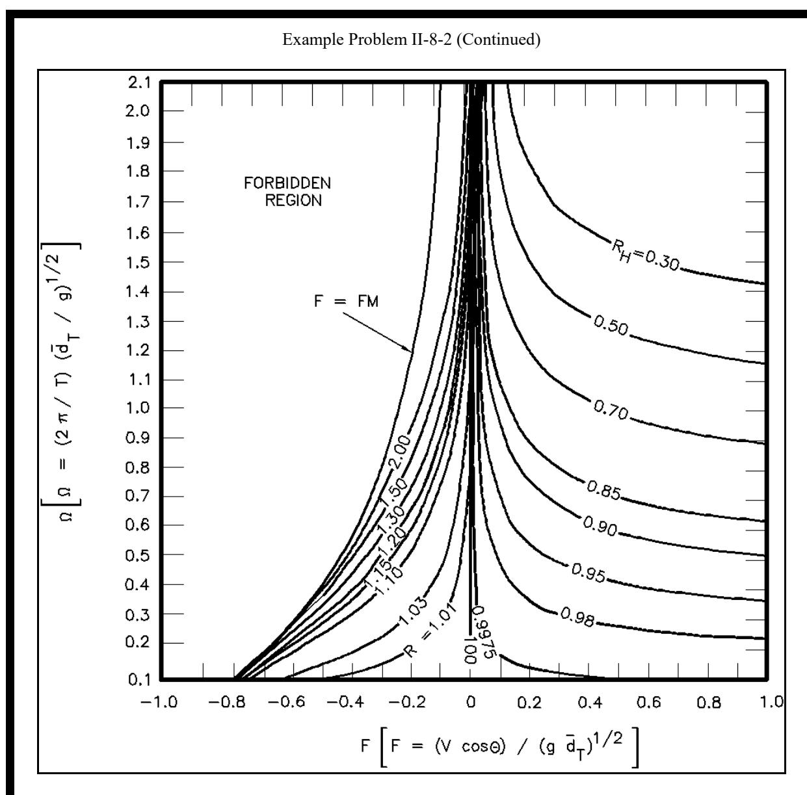

*Figure 31. Wave height modification by currents*

Example Problem II-8-2 (Sheet 20 of 21)
Design wave period. Design wave periods can be estimated from measured values of Tp (Table II-8-13). A scatter plot of Tp versus Hsjetty gives perspective on how wave periods are related to extreme wave heights (Figure II-8-32). Values of Hsjetty in the figure are for only the highest of the five tide levels used in conjunction with the 33 storm events. The figure indicates that the design wave period range of 14-18 sec is representative of the higher wave conditions of interest in design.
Confidence intervals. Confidence intervals or uncertainties in hydrodynamic design estimates should always be considered. Confidence intervals associated with statistical aspects of extremal analysis are included in this example. However, there are other sources of uncertainty. For example, the quality of available information is an important concern. Wave information may be from accurate, well-maintained gauges, lower quality measurements, hindcasts (which can vary in quality), or observations. Such concerns are not addressed in this example, but they are given some attention in Parts V and VI.

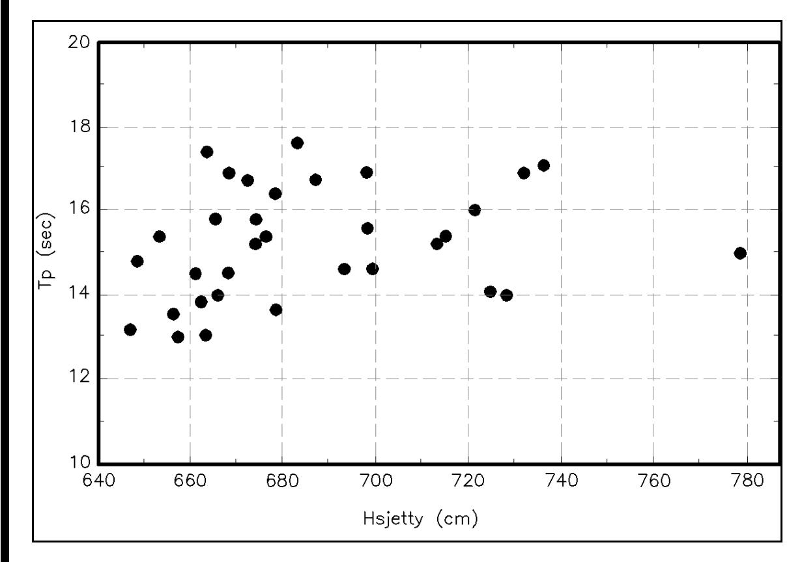

*Figure II-8-32. Joint distribution of Hsjetty and Tp from 33 storm events, jetty head*

Final design conditions. In final design of a jetty or any comparable major coastal engineering project, the complexity of variable bathymetry, breaking waves, currents, interaction between waves, currents, and structures, etc., cannot be adequately represented with the procedures used in this example. Even comprehensive numerical models are limited in their capabilities for reproducing the full design conditions. Standard practice is to construct a three-dimensional physical model and use it to determine the final project design.
Example Problem II-8-2 (Sheet 21 of 21)

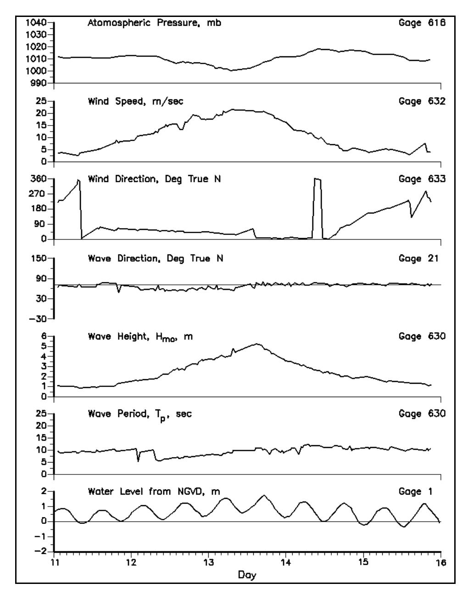

*Figure II-8-33. Example storm event (Leffler et al. 1990)*

(2) In standard coastal engineering practice, problems such as the one presented here are usually solved with the help of computer programs. However, the example problem solution relies mainly on graphical methods. The graphical approach has two advantages here: 1) it helps convey an intuitive understanding of the solution (one can see in the graphs how parameters are interrelated); and 2) it provides a self-contained methodology independent of complex computer programs. Some graphical tools must be introduced in the example because earlier chapters in Part II relating to this problem presuppose the use of computers in practical work. Most graphical tools are taken from Goda (1985).

## II-8-7. Interdependence of Processes During Severe Events

- a. Design importance .
- (1) The interdependence of processes during severe events is a critical consideration for design. For example, an extreme wave event is usually caused by a severe storm which also typically generates extreme occurrences of wind, water level, infragravity waves, and currents (Figure II-8-33). The true probability of occurrence of the combined extremes is higher than would be expected if each of these processes were analyzed separately and treated as independent of each other.
- (2) Without knowledge of the interdependence of processes, designs would be based on a chosen nonexceedance probability for each process critical to the design. This design condition tends to be conservatively high, since extremes at the design level of occurrence are unlikely to all occur together.
- b. Procedures for estimating realistic design events, probabilities, and return periods . The approach used in Example Problem II-8-2 illustrates one approach by which data may be used to consider both water levels and wave heights in design. Another simplified approach which considers wind, surge level, and Hs is presented in CIRIA/CUR (1991) (pp 223-225). The EST provides a convenient, and more comprehensive, method for taking advantage of historical information to estimate realistic design events. It is often important to consider storm duration in estimating design events.

#### II-8-8. References

#### American Society of Civil Engineers 1993

American Society of Civil Engineers. 1993. ASCE Standard, Minimum Design Loads for Buildings and Other Structures , ASCE 7-93, a revision of ANSI/ASCE 7-88, American Society of Civil Engineers, New York.

#### Battjes 1972

Battjes, J. A. 1972. "Long-Term Wave Height Distribution at Seven Stations around the British Isles," Peutchen Hydr. Zeit, Band 25, Hefty, pp 179-189.

#### Batts, Russell, and Simiu 1980

Batts, M. E., Russell, L. R., and Simiu, E. 1980. "Hurricane Wind Speeds in the United States," J. Struct. Div. , American Society of Civil Engineers, Vol 100, No. STIO, pp 2001-2015.

## Blom 1958

Blom, G. 1958. Statistical Estimates and Transformed Beta-Variables , Wiley, New York.

#### Bowers 1992

Bowers, E. C. 1992. "Low Frequency Waves in Intermediate Water Depths," Proceedings of the 23rd International Conference on Coastal Engineering , American Society of Civil Engineers, pp 832-845.

## Carter and Draper 1988

Carter, D. J. T., and Draper, L. 1988. "Has the North-East Atlantic Become Rougher?" Nature , Vol 332, No. 7, p 494.

## Construction Industry Research and Information Association (CIRIA)

CIRIA. 1991. "Manual on the Use of Rock in Coastal and Shoreline Engineering," Construction Industry Research and Information Association Special Publication 83, London, UK (also published as: Centre for Civil Engineering Research and Codes Report 154, Gouda, The Netherlands).

## Earle and Baer 1982

Earle, M. D., and Baer, L. 1982. "Effects of Uncertainties on Extreme Wave Heights," Journal of Waterway, Port, Coastal, and Ocean Engineering , Vol 108, No. WW4, pp 456-478.

#### Farrar et al. 1994

Farrar, P. D., Borgman, L. E., Glover, L. B., Reinhard, R. D., Pope, J., Swain, A., and Ebersole, B. A. 1994. "Storm Impact Assessment for Beaches at Panama City, Florida," Technical Report CERC-94-11, U.S. Army Engineer Waterways Experiment Station, Vicksburg, MS.

## Goda 1985

Goda, Y. 1985. Random Seas and Design of Maritime Structures , University of Tokyo Press, Tokyo, Japan.

#### Goda 1988

Goda, Y. 1988. "On the Methodology of Selecting Design Wave Height," Proceedings of the 21st International Conference on Coastal Engineering , American Society of Civil Engineers, pp 899-913.

#### Goda 1990

Goda, Y. 1990. "Distribution of Sea State Parameters and Data Fitting," Handbook of Coastal and Ocean Engineering , Vol 1, Gulf Publishing Co., pp 371-408.

## Goda and Kobune 1990

Goda, Y., and Kobune, K. 1990. "Distribution Function Fitting for Storm Wave Data," Proceedings of the 22nd International Conference on Coastal Engineering , American Society of Civil Engineers, pp 18-31.

#### Gringorten 1963

Gringorten, I. I. 1963. "A Plotting Rule for Extreme Probability Paper," Journal of Geophysical Research , Vol 68, No. 3, pp 813-814.

## Gumbel 1958

Gumbel, E. J. 1958. Statistics of Extremes , Columbia University Press, New York.

#### Harris 1981

Harris, D. L. 1981. "Tides and Tidal Datums in the United States," Special Report No. 7, U.S. Army Corps of Engineers, Fort Belvoir, VA., U.S. Government Printing Office (GPO Stock No. 008-022-00161-1).

#### Hubertz et al. 1993

Hubertz, J. M., Brooks, R. M., Brandon, W. A., and Tracy, B. A. 1993. "Hindcast Wave Information for the U.S. Atlantic Coast," WIS Report 30, U.S. Army Engineer Waterways Experiment Station, Vicksburg, MS.

#### Kite 1978

Kite, G. W. 1978. Frequency and Risk Analysis in Hydrology , Water Resources Publications, Fort Collins, CO.

#### Leffler et al. 1990

Leffler, M. W., Hathaway, K. K., Scarborough, B. L., Baron, C. F., and Miller, H. C. 1990. "Annual Data Summary for 1988, CERC Field Research Facility," Technical Report CERC-90-13, U.S. Army Engineer Waterways Experiment Station, Vicksburg, MS.

## Le Méhauté and Wang 1984

Le Méhauté, B., and Wang, S. 1984. "Effects of Measurement Error on Long-Term Wave Statistics," Proceedings of the 19th International Conference on Coastal Engineering , American Society of Civil Engineers, pp 345-361.

## Mathiesen et al. 1994

Mathiesen, M., Goda, Y., Hawkes, P. J., Mansard, E., Martin, M. J., Peltier, E., Thompson, E. F., and Van Vledder, G. 1994. "Recommended Practice for Extreme Eave Analysis," Journal of Hydraulic Research , Vol 32, No. 6, pp 803-814.

#### National Bureau of Standards 1980

National Bureau of Standards. 1980. "Hurricane Wind Speeds in the United States," Building Science Series 124 , Gaithersburg, MD.

## Scheffner and Borgman 1992

Scheffner, N. W., and Borgman, L. E. 1992. "Stochastic Time-Series Representation of Wave Data," Journal of Waterway, Port, Coastal, and Ocean Engineering , Vol 118, No. 4, pp 337-351.

## Seelig, Ahrens, and Grosskopf 1983

Seelig, W. N., Ahrens, J. P., and Grosskopf, W. G. 1983. "The Elevation and Duration of Wave Crests," Miscellaneous Report 83-1, U.S. Army Engineer Waterways Experiment Station, Vicksburg, MS.

#### Seymour, Strange, Cayan, and Nathan 1984

Seymour, R. J., Strange, R. R., Cayan, D. R., and Nathan, R. A. 1984. "Influence of El Ninos on California's Wave Climate," Proceedings of the 19th International Conference on Coastal Engineering , American Society of Civil Engineers, pp 577-592.

#### Simiu and Scanlan 1986

Simiu, E., and Scanlan, R. H. 1986. Wind Effects on Structures, An Introduction to Wind Engineering , Wiley, New York.

#### Simiu, Changery, and Filliben 1979

Simiu, E., Changery, M. J., and Filliben, J. J. 1979. "Extreme Windspeeds at 129 Stations in the Contiguous United States," NBS BSS 118, National Bureau of Standards, U.S. Dept. of Commerce, Washington, DC.

#### Smith 1987

Smith, O. 1987. "Duration of Extreme Wave Conditions," Miscellaneous Paper CERC-87-12, U.S. Army Engineer Waterways Experiment Station, Vicksburg, MS.

# Smith 1988

Smith, O. 1988. "Duration of Extreme Wave Conditions," Journal of Waterway, Port, Coastal, and Ocean Engineering , Vol 114, No. 1, pp 1-17.

#### Thom 1968-69

Thom, H.C.S. 1968-69. "New Distribution of Extreme Winds in the United States," J. Sruct. Div. , American Society of Civil Engineers, Vol 94, No. ST7, pp 1787-1801, July 1968; and Vol 95, No. ST8, pp 1769-1770, Aug. 1969.

#### Thompson 1980

Thompson, E. F. 1980. "Energy Spectra in Shallow U.S. Coastal Waters," Technical Paper 80-2, U.S. Army Engineer Waterways Experiment Station, Vicksburg, MS.

## U.S. Department of Commerce 1992

U.S. Department of Commerce. 1992. "The Halloween Nor'easter of 1991," Natural Disaster Survey Report, National Oceanic and Atmospheric Administration, National Weather Service, Silver Spring, MD.

## U.S. Water Resources Council 1976

U.S. Water Resources Council. 1976. "Guidelines for Determining Flood Flow Frequency," Bulletin No. 17 of the Hydrology Committee, Washington, DC.

# II-8-9. Definitions of Symbols

| Symbol | Definition |
|---|---|
| σ | Standard deviation |
| σ | m Standard deviation of maximum monthly wind speeds [length/time] |
| σ | rm Standard deviation of the sampling error in estimating U r (Equation II-8-4) [length/time] |
| d | Water depth [length] |
| F | Probability that the m th highest data value will not be exceeded (Figure II-8-5) |
| f(x) | Probability distribution function |
| G | Skew coefficient in the Pearson Type III distribution function (Figure II-8-2) [dimensionless] |
| s | Design significant wave height [length] |
| H | 1/3 Significant wave height [length] |
| k | Parameter in the Weibull distribution function (Figure II-8-5) [dimensionless] |
| k | Skew of ln x corrected for bias in the Log Pearson Type III distribution function (Figure II-8-2) [dimensionless] |
| L | Desired time period used in the encounter probability formula (Equation II-8-2) [years] |
| m | Rank of data value in descending order (= 1 for largest) in distribution function formulas (Figure II-8-5) |
| N | Number of events |
| N | m Number of months of data used in computing the standard deviation of the sampling error in estimating U r (Equation II-8-4) |
| P | ( s ) Cumulative probability that H s # s |
| P | e Encounter probability (Equation II-8-2) |
| t | Time interval associated with each data point [years] |
| T | p Design wave period [time] |
| T | Return period (Equation II-8-1) [years] |
| r |  |
| U | m Mean value of maximum monthly wind speeds [length/time] |
| U | r Wind speed with r -year return period (Equation II-8-3) [length/time] |
| Hydrodynamic | Analysis and Design Conditions II-8-61 |
