# Chapter 2 EM 1110-2-1100 LONGSHORE SEDIMENT TRANSPORT (Part III)

30 April 2002

## Table of Contents

- III-2-1. Introduction a. Overview b. Scope of chapter III-2-1 III-2-1 III-2-1
- III-2-2. Longshore Sediment Transport Processes a. Definitions b. Modes of sediment transport c. Field identification of longshore sediment transport (1) Experimental measurement (2) Qualitative indicators of longshore transport magnitude and direction (3) Quantitative indicators of longshore transport magnitude (4) Longshore sediment transport estimations in the United States III-2-1 III-2-1 III-2-3 III-2-3 III-2-3 III-2-5 III-2-6 III-2-7
- III-2-3. Predicting Potential Longshore Sediment Transport a. Energy flux method (1) Historical background (2) Description (3) Variation of K with median grain size (4) Variation of K with surf similarity b. Longshore current method c. Using hindcast wave data (1) Wave transformation procedure (2) Wave conditions d. Deviation from potential longshore sediment transport rates (1) Temporal variations and persistence (2) Wave data accuracy (3) Sand supply availability e. Littoral drift roses f. Cross-shore distribution of longshore sediment transport g. Application of longshore sediment transport calculations (1) Littoral budgets (2) Variations in longshore sediment transport along the coast h. Three-dimensionality of shoreline features i. Empirical shoreline models j. Analytical longshore sand transport shoreline change models III-2-7 III-2-10 III-2-10 III-2-10 III-2-13 III-2-14 III-2-15 III-2-21 III-2-21 III-2-22 III-2-26 III-2-26 III-2-31 III-2-32 III-2-33 III-2-36 III-2-43 III-2-43 III-2-48 III-2-49 III-2-54 III-2-56
- III-2-4. Numerical Longshore Sand Transport Beach Change Models III-2-78 a. Types of longshore transport models III-2-78 (1) Fully three-dimensional models III-2-78 (2) Schematic three-dimensional models III-2-78 (3) One-line (two-dimensional) models III-2-79 b. Shoreline Change Model GENESIS III-2-80 (1) Overview III-2-80 (2) Input data requirements and model output III-2-81 (3) Capabilities and limitations III-2-81 (4) Example application - Bolsa Chica, California III-2-82
- III-2-5. References III-2-90
- III-2-6. Definition of Symbols III-2-110
- III-2-7. Acknowledgments III-2-111

## List of Tables

- Page
- Table III-2-1 Longshore Transport Rates from U.S. Coasts (SPM 1984) III-2-9
- Table III-2-2 Occurrence of Wave Height and Period for Direction Band 112.5E - 157.49E RAL2 Station 72 III-2-22
- Table III-2-3 List of Authors Postulating Theories for Cusp Development III-2-51

## List of Figures

- Page
- Figure III-2-1. Impoundment of longshore sediment transport at Indian River Inlet, Delaware III-2-2
- Figure III-2-2. Cross-shore distribution of the longshore sand transport rate mea sured with traps at Duck, North Carolina (Kraus, Gingerich, and Rosati 1989) III-2-5
- Figure III-2-3. Estimated annual net longshore transport rates and directions along the east coast of the United States based on data from Johnson (1956, 1957) and Komar (1976) III-2-8
- Figure III-2-4. Field data relating $I_{R}$ and PR III-2-12
- Figure III-2-5. Measured and predicted K coefficients using Bailard's (1984) equation III-2-14
- Figure III-2-6. Coefficient K versus median grain size $D_{50}$ (del Valle, Medina, and Losada 1993) III-2-15
- Figure III-2-7. Longshore transport definitions III-2-27
- Figure III-2-8. Time plot of annual longshore energy flux factor at three east-coast sites (after Douglass (1985)) III-2-28
- Figure III-2-9. Time plot of monthly longshore energy flux factor time series for 1956-1975 at three east-coast sites (after Douglass (1985)) III-2-29
- Figure III-2-10. Probability plot for monthly average $P_{ls}$ series (Walton and Douglass 1985) III-2-30
- Figure III-2-11. Probability plot for weekly average $P_{ls}$ series (Walton and Douglass 1985) III-2-30
- Figure III-2-12. Autocorrelation of monthly $P_{ls}$ series (Walton and Douglass 1985) III-2-31
- Figure III-2-13. Autocorrelation of weekly average Pls series (Walton and Douglass 1985) III-2-32
- Figure III-2-14. Azimuth of normal to shoreline at Ponte Vedra Beach, Florida (Walton 1972) III-2-34
- Figure III-2-15. Net and total littoral drift at Ponte Vedra Beach, Florida (Walton 1972) III-2-35
- Figure III-2-16. Ideal case of an unstable null point (Walton 1972) III-2-36
- Figure III-2-17. Instability-formed capes in Santa Rosa Sound (Walton 1972) III-2-37
- Figure III-2-18. Ideal case of a stable null point (Walton 1972) III-2-38
- Figure III-2-19. Distribution of tracer density across the surf zone, 20 October 1961 Goleta Point, California, experiment (Ingle 1966) III-2-39
- Figure III-2-20. Distribution of mean sediment concentration at 10 cm above the bed, relative to wave breakpoint (Kana 1978) III-2-40
- Figure III-2-21. Cross-shore distribution of longshore sediment transport as measured by Bodge and Dean (Bodge 1986, Bodge and Dean 1987a, 1987b) at Duck, North Carolina, and in the laboratory III-2-41
- Figure III-2-22. Example III-2-7, predicted cross-shore distribution of longshore sand transport, wave height, and longshore current speed III-2-45
- Figure III-2-23. Beach cusps on a sandy beach in Mexico (photograph by Paul Komar) III-2-50
- Figure III-2-24. Shoreline fluctuations in plan view at Tokai Beach, Japan III-2-51
- Figure III-2-25. Rhythmic shoreline features associated with the presence of crescen tic bars welded to the shoreline III-2-52
- Figure III-2-26. Cusp rhythmic features in conjunction with rip currents under wave action approaching shoreline obliquely (Sonu 1973) III-2-52
- Figure III-2-27. Spiral bay geometry: (a) definition sketch, and (b) coefficients describing parabolic shoreline shape (Silvester and Hsu 1993) III-2-55
- Figure III-2-28. Elemental volume on equilibrium beach profile III-2-56
- Figure III-2-29. Definition of local breaker angle III-2-57
- Figure III-2-30. Structure placed perpendicular to shore III-2-60
- Figure III-2-31. Nondimensionalized solution graphs (at different scales) for the condition of no sand transport at the structure location III-2-61
- Figure III-2-32. Error function III-2-62
- Figure III-2-33. Complementary error function III-2-62
- Figure III-2-34. Nondimensional solution curve for plan view of sediment accumula tion at a coastal structure after natural bypassing initiated III-2-64
- Figure III-2-35. Rectangular beach fill (t=0) III-2-67
- Figure III-2-36. Nondimensional solution curves for rectangular initial plan view fill area III-2-67
- Figure III-2-37. Proportion of fill p(t) remaining within limits of rectangular plan view fill area III-2-68
- Figure III-2-38. Triangular beach fill (t=0) III-2-69
- Figure III-2-39. Nondimensional solution curves for triangular initial plan view fill area III-2-71
- Figure III-2-40. Long fill project with a gap (t=0) III-2-71
- Figure III-2-41. Nondimensional solution curve for long fill with gap in plan view fill area III-2-72
- Figure III-2-42. Semi-infinite beach fill (t=0) III-2-72
- Figure III-2-43. Nondimensional solution curve for semi-infinite plan view fill area III-2-73
- Figure III-2-44. Beach fill placed with groins (t=0) III-2-74
- Figure III-2-45. Nondimensional solution curve for plan view of rectangular fill area between coastal structures (w/l = 0.25; tan $α_{b}$ = 0.1) III-2-74
- Figure III-2-46. Width of maintained beach (x III-2-75
- Figure III-2-47. Bolsa Chica, California, study area (Gravens 1990a) III-2-83
- Figure III-2-48. Wave transformation hindcast to RCPWAVE grid (Gravens 1990a) III-2-84
- Figure III-2-49. Total littoral drift rose, Anaheim to Santa Ana River (Gravens 1990a) III-2-85
- Figure III-2-50. Model calibration results, Bolsa Chica (Gravens 1990a) III-2-86
- Figure III-2-51. Model verification results, Bolsa Chica (Gravens 1990a) III-2-87
- Figure III-2-52. Sand management alternative with feeder beach (Gravens 1990a) III-2-89
- Figure III-2-53. Predicted shoreline change from 1983 shoreline position with sand management alternative and feeder beach (Gravens 1990a) III-2-90

# Chapter III-2 Longshore Sediment Transport

#### III-2-1. Introduction

- a. Overview .
- (1) The breaking waves and surf in the nearshore combine with various horizontal and vertical patterns of nearshore currents to transport beach sediments. Sometimes this transport results only in a local rearrangement of sand into bars and troughs, or into a series of rhythmic embayments cut into the beach. At other times there are extensive longshore displacements of sediments, possibly moving hundreds of thousands of cubic meters of sand along the coast each year. The objective of this chapter is to examine techniques that have been developed to evaluate the longshore sediment transport rate, which is defined to occur primarily within the surf zone, directed parallel to the coast. This transport is among the most important nearshore processes that control the beach morphology, and determines in large part whether shores erode, accrete, or remain stable. An understanding of longshore sediment transport is essential to sound coastal engineering design practice.
- (2) Currents associated with nearshore cell circulation generally act to produce only a local rearrangement of beach sediments. The rip currents of the circulation can be important in the cross-shore transport of sand, but there is minimal net displacement of beach sediments along the coast. More important to the longshore movement of sediments are waves breaking obliquely to the coast and the longshore currents they generate, which may flow along an extended length of beach (Part II-4). The resulting movement of beach sediment along the coast is referred to as littoral transport or longshore sediment transport, whereas the actual volumes of sand involved in the transport are termed the littoral drift. This longshore movement of beach sediments is of particular importance in that the transport can either be interrupted by the construction of jetties and breakwaters (structures which block all or a portion of the longshore sediment transport), or can be captured by inlets and submarine canyons. In the case of a jetty, the result is a buildup of the beach along the updrift side of the structure and an erosion of the beach downdrift of the structure. The impacts pose problems to the adjacent beach communities, as well as threaten the usefulness of the adjacent navigable waterways (channels, harbors, etc.) (Figure III-2-1).
- (3) Littoral transport can also result from the currents generated by alongshore gradients in breaking wave height, commonly called diffraction currents (Part II-4). This transport is manifest as a movement of beach sediments toward the structures which create these diffraction currents (such as jetties, long groins, and headlands). The result is transport in the "upwave" direction on the downdrift side of the structure. This, in turn, can create a buildup of sediment on the immediate, downdrift side of the structure or contribute to the creation of a crenulate-shaped shoreline on the downdrift side of a headland.
- b. Scope of chapter . This chapter defines terms associated with the longshore transport of littoral material, presents relationships for the longshore sediment transport rate as a function of breaking waves and longshore currents, discusses the dependence of longshore transport relationships on sediment grain size, presents a method for calculating the cross-shore distribution of longshore sand transport, and overviews analytical and numerical models for shoreline changes which include longshore sediment transport relationships.

#### III-2-2. Longshore Sediment Transport Processes

a. Definitions . On most coasts, waves reach the beach from different quadrants, producing day-to-day and seasonal reversals in transport direction. At a particular beach site, transport may be to the right (looking

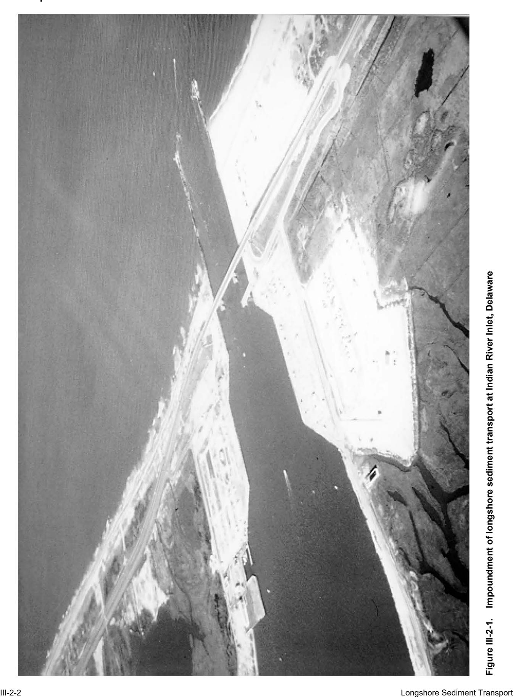

seaward) during part of the year and to the left during the remainder of the year. If the left and right transports are denoted respectively $Q_{R}$ L and Q R R , with $Q_{R}$ R being assigned a positive quantity and $Q_{R}$ L assigned a negative value for transport direction clarification purposes, then the net annual transport is defined as $Q_{R}$ NET = $Q_{R}$ R + Q R L . The net longshore sediment transport rate is therefore directed right and positive if $Q_{R}$ R > Q R L , and to the left and negative if $Q_{R}$ R < * $Q_{R}$ L *. The net annual transport can range from essentially zero to a large magnitude, estimated at a million cubic meters of sand per year for some coastal sites. The gross annual longshore transport is defined as $Q_{R}$ GROSS = $Q_{R}$ R + * $Q_{R}$ L *, the sum of the temporal magnitudes of littoral transport irrespective of direction. It is possible to have a very large gross longshore transport at a beach site while the net transport is effectively zero. These two contrasting assessments of longshore sediment movements have different engineering applications. For example, the gross longshore transport may be utilized in predicting shoaling rates in navigation channels and uncontrolled inlets, whereas the net longshore transport more often relates to the deposition versus erosion rates of beaches on opposite sides of jetties or breakwaters. (It is noted, however, that the latter may capture the gross transport rate in some cases.)

#### b. Modes of sediment transport .

- (1) A distinction is made between two modes of sediment transport: suspended sediment transport, in which sediment is carried above the bottom by the turbulent eddies of the water, and bed-load sediment transport, in which the grains remain close to the bed and move by rolling and saltating. Although this distinction may be made conceptually, it is difficult to separately measure these two modes of transport on prototype beaches. Considerable uncertainty remains and differences of opinion exist on their relative contributions to the total transport rate.
- (2) Because it is more readily measured than the bed-load transport, suspended load transport has been the subject of considerable study. It has been demonstrated that suspension concentrations decrease with height above the bottom (Kraus, Gingerich, and Rosati 1988, 1989). The highest concentrations typically are found in the breaker and swash zones, with lower concentrations at midsurf positions. On reflective beaches, at which a portion of the wave energy is reflected back to sea, individual suspension events are correlated with the incident breaking wave period. In contrast, on dissipative beaches, at which effectively all of the arriving wave energy is dissipated in the nearshore, long-period water motions have been found to account for significant sediment suspension. For dissipative beaches, the suspension concentrations due to long-period (low-frequency) waves have been measured as 3 to 4 times larger than those associated with the short-period high-frequency incident waves (Beach and Sternberg 1987).
- c. Field identification of longshore sediment transport . Emphasis is placed herein upon field, or prototype, measurement and identification of littoral transport. Laboratory measurement of longshore sediment transport is generally thought to underestimate prototype transport rates, primarily because of scale effects. Laboratory measurements are also complicated by the need to establish a continuous updrift sediment supply in the model.

#### (1) Experimental measurement.

(a) Longshore sediment transport relationships are typically based on data measured by surveying impoundments of littoral drift at a jetty, breakwater, spit, or deposition basin; bypassing impounded material (e.g., at an inlet); or measuring short-term sand tracer transport rates. Other techniques focus upon measurement of only the suspended load transport. Longshore sediment transport estimates using impoundment are believed to come closest to yielding total quantities (i.e., the bed load plus suspended load transport), and typically represent longer-term measures (i.e., weeks to years). It is these longer-term, total transport quantities that are of central importance to practical coastal engineering design. Impoundment techniques are discussed below in Part III-2-2.c.(2).
- (b) Measurement of sand tracer transport rates involves tagging the natural beach sediment with a coating of fluorescent dye or low-level radioactivity. Tracers are injected into the surf zone, and the beach material is sampled on a grid to determine the subsequent tracer distribution. The longshore displacement of the center of mass of the tracer on the beach between injection and sampling provides a measure of the mean transport distance. The sand advection velocity is obtained by dividing this distance by the elapsed time. The time between tracer injection and sampling is usually an hour to a few hours, so the measurement is basically the instantaneous longshore sand transport under a fixed set of wave conditions. The technique, therefore, provides measurements that are particularly suitable for correlations with causative waves and longshore currents, as in time-dependent numerical models of longshore transport rates and beach change, but is not particularly useful in determining long-term net transport rates or directions. Identification of the appropriate sediment mixing depth also limits the technique's quantitative accuracy. Numerous studies have used sand tracers to determine sand transport rates; examples include Komar and Inman (1970), Knoth and Nummedal (1977), Duane and James (1980), Inman et al. (1980), Kraus et al. (1982), White (1987), and many others. Tracer techniques can also be used in conjunction with geologically distinct materials, such as naturally occurring mineral sediments. These methods, which generally involve larger quantities of material and larger scales of measurement, are potentially more useful for determining longer-term rates and directions and are discussed below.
- (c) Measurements of suspended load transport have been the focus of numerous studies. One approach has been to pump water containing suspended sand from the surf zone, a technique which has the advantage that large quantities can be processed, leading to some confidence that the samples are representative of sediment concentrations found in the surf (Watts 1953b; Fairchild 1972, 1977; Coakley and Skafel 1982). These measurements, combined with simultaneous measurements of alongshore current velocity, yield estimates of the longshore sediment transport suspended load. The disadvantages of the approach are that one cannot investigate time variations in sediment concentrations at different phases of wave motions, and the sampling has often been undertaken from piers which may disturb the water and sediment motion. Recent studies of suspended load transport have employed optical and acoustic techniques (Brenninkmeyer 1976; Thornton and Morris 1977; Katoh, Tanaka, and Irie 1984; Downing 1984; Sternberg, Shi, and Downing 1984; Beach and Sternberg 1987; Hanes et al. 1988). These approaches yield continuous measurements of the instantaneous suspended sediment concentrations. Arrays of instruments can be employed to document variations across the surf zone and vertically through the water column.
- (d) Another method for measuring suspension concentrations is with traps, usually consisting of a vertical array of sample bins which collect sediment but allow water to pass, and so can be used to examine the vertical distribution of suspended sediments and can be positioned at any location across the surf zone (e.g., Hom-ma, Horikawa, and Kajima 1965; Kana 1977, 1978; Inman et al. 1980; Kraus, Gingerich, and Rosati 1988). Figure III-2-2 shows vertical distributions of the longshore sediment flux (transport rate per unit area) through the water column obtained in a 5-min sampling interval by traps arranged across the surf zone at Duck, North Carolina (Kraus, Gingerich, and Rosati 1989). The steep decrease in transport with elevation above the bed is apparent; such considerations are important in groin and weir design. The sharp decrease in transport at the trap located seaward of the breaker line indicates that the main portion of longshore sediment transport takes place in the surf and swash zones.
- (e) The only method presently suitable for distinct measurement of bed load transport is bed-load traps. These are bins which are open-ended or dug into the seabed into which the bed-load transport is to settle. There are questions as to sampling efficiency when used in the nearshore because of the potential for scour (Thornton 1972; Walton, Thomas, and Dickey 1985; Rosati and Kraus 1989).

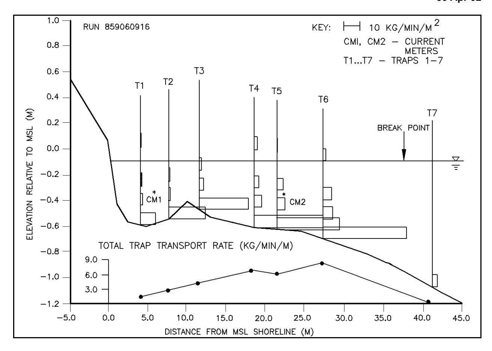

*Figure III-2-2. Cross-shore distribution of the longshore sand transport rate measured with traps at Duck, North Carolina (Kraus, Gingerich, and Rosati 1989)*

- (2) Qualitative indicators of longshore transport magnitude and direction.
- (a) The ability to assess directions of longshore sediment transport is central to successful studies of coastal erosion and the design of harbor structures and shore protection projects. It is equally important to evaluate quantities of that transport as a function of wave and current conditions.
- (b) Multiple lines of evidence have been used to discern directions of longshore sediment transport. Most of these are related to the net transport; i.e., the long-term resultant of many individual transport events. Blockage by major structures such as jetties can provide the clearest indication of the long-term net transport direction (see Figure III-2-1). Sand entrapment by groins is similar, but generally involves smaller volumes and responds to the shorter-term reversals in transport directions; therefore, groins do not always provide a definitive indication of the net annual transport direction. Other geomorphologic indicators of transport direction include the deflection of streams or tidal inlets by the longshore sand movements, shoreline displacements at headlands similar to that at jetties, the longshore growth of sand spits and barrier islands, and the pattern of upland depositional features such as beach ridges. Grain sizes and composition of the beach sediments have also been used to determine transport direction as well as sources of the sediments. It is often believed that a longshore decrease in the grain size of beach sediment provides an indication of the direction of the net transport. This is sometimes the case, but grain size changes can also be the product of alongcoast variations in wave energy levels and/or sediment sources and sinks that have no relation to sediment transport directions.
- (c) Identification of unique minerals within the sand has also been used to deduce transport paths. By using the heavy mineral augite as a tracer of longshore sand movements, Trask (1952, 1955) demonstrated that the sand filling the harbor at Santa Barbara, California, originates more than 160 km up the coast. The augite was derived from volcanic rocks in the Morro Bay area north of Santa Barbara. Likewise, Bowen and Inman (1966) estimated the directions and magnitudes of the net transport along the California coast by studying the progressive dilution of beach sand augite by addition of sand from other sources. In other examples, Meisburger (1989) utilized oolitic carbonate as a natural mineral tracer to deduce transport paths along Florida's east coast. Johnson (1992) noted the net transport paths along parts of the Lake Michigan coastline by examining the movement of gravel placed as beach restoration.
- (d) Many of the geomorphic and sedimentological indicators of longshore sediment transport directions are not absolute, and too strong a reliance upon them can lead to misinterpretations. It is best to examine all potential evidence that might relate to transport direction, and consider the relative reliabilities of the indicators. (3) Quantitative indicators of longshore transport magnitude.
- (a) Some of the qualitative indicators of longshore transport discussed above can also be used to estimate the quantities involved in the process. Repeated surveys over a number of years and analyses of aerial photographs of the longshore growth of sand spits have been used to establish approximate rates of sediment transport. For the estimates to be reasonable, it is typically necessary that such surveys span a decade or longer, so the results represent a long-term net sediment transport rate.
- (b) The blockage of longshore sediment transport by jetties and breakwaters and the resulting growth and erosion patterns of the adjacent beaches have yielded reasonable evaluations of the net (and sometimes gross) transport rates at many coastal sites. Sand bypassing plants have been constructed at some jetties and breakwaters as a practical measure to reduce the accretion/erosion patterns adjacent to the structures. The first measurements obtained relating sand transport rates to causative wave conditions were collected by Watts (1953a) at Lake Worth Inlet, Florida, using measured quantities of sand pumped past the jetties. The best correlation was obtained using month-long net sand volumes. A number of subsequent studies have similarly employed sand blockage by jetties and breakwaters to obtain data relating transport rates to wave conditions. Caldwell (1956) estimated the longshore sand transport from erosion rates of the beach downdrift of the jetties at Anaheim Bay, California. Bruno and Gable (1976); Bruno, Dean, and Gable (1980); Bruno et al. (1981); and Walton and Bruno (1989) measured transport rates by repeatedly surveying the accumulating blocked sand at Channel Islands Harbor, California; Dean et al. (1982) measured sand accumulations in the spit growing across the breakwater opening at Santa Barbara, California; and Dean et al. (1987) collected data from the weir jetty at Rudee Inlet, Virginia. All of these studies yielded measurements of longshore sediment transport rates that are used in correlations with wave energy flux estimates. Errors are introduced with the use of jetties and breakwaters to measure sediment transport rates, the foremost being the local effects of the structure on waves and currents, and the long-term nature of the determinations. In some cases it takes a month or longer of sand accumulation to have a volume that is large enough to be outside the range of possible survey error, during which time the waves and currents are continuously changing. Therefore, a correlation between a given wave condition and the resulting sediment transport rate due solely to that particular wave condition cannot be obtained; rather, wave parameters occurring during the interval of interest are integrated and then correlated with the total accumulated volume. Nevertheless, rates determined by impoundment and erosion are very valuable as they are closely related to gross quantities involved in the design of projects, such as the amount of sediment required to be bypassed at an inlet.
- (c) As discussed above, sand tracer has been used to make short-term estimates of longshore sand transport. Other techniques that have been used to measure sediment movements on beaches include various sand traps, pumps, and optical devices. However, such sampling schemes are also short-term measures and may be related to specific modes of transport, either the bed load or suspended load, rather than yielding total quantities of the long-term littoral sediment transport. Generally, it is the latter quantity which is of importance to engineering design. (4) Longshore sediment transport estimation in the United States.
- (a) Early attempts to estimate the direction and magnitude of net longshore sediment transport along the U.S. coastline centered chiefly upon examination of sand impoundment and bypassing volumes at jetties and breakwaters. Johnson (1956, 1957) compiled data of this type for many shorelines and found net transport rates ranging up to approximately 1 million $m^{3}$ (MCM) of sand per year in some locations. Based on Johnson's work, estimated patterns of littoral drift for a portion of the east coast of the United States are shown in Figure III-2-3. Table III-2-1 lists representative net longshore transport rates for selected U.S. coasts (SPM 1984). Transport rate magnitudes are clearly related to the general wave climate as energetic (west coast), intermediate (east coast and parts of the Gulf of Mexico shoreline), and low (Great Lakes and parts of the Gulf of Mexico shoreline).
- (b) Since these early estimates of the transport rates, numerous investigations have yielded refined values at specific sites along the U.S. coastlines. These values are not generally archived in a single source, and must therefore be found through a literature search of various site-specific reports and articles. Estimates of both the net and gross transport rates along any particular portion of the coastline may also be developed using hindcast wave data (see Part III-2-2.d.(3) of this chapter below).

## III-2-3. Predicting Potential Longshore Sediment Transport

In engineering applications, the longshore sediment transport rate is expressed as the volume transport rate Q R having units such as cubic meters per day or cubic yards per year. This is the total volume as would be measured by survey of an impoundment at a jetty and includes about 40 percent void space between the particles as well as the 60-percent solid grains. Another representation of the longshore sediment transport rate is an immersed weight transport rate $I_{R}$ related to the volume transport rate by

```math
I_{\ell} = (\rho_s - \rho) g (1 - n) Q_{\ell} \tag{III-2-1a}
```

or

```math
Q_{\ell} = \frac{I_{\ell}}{(\rho_s - \rho) g (1 - n)} \tag{III-2-1b}
```

where
ρ s = mass density of the sediment grains
ρ = mass density of water

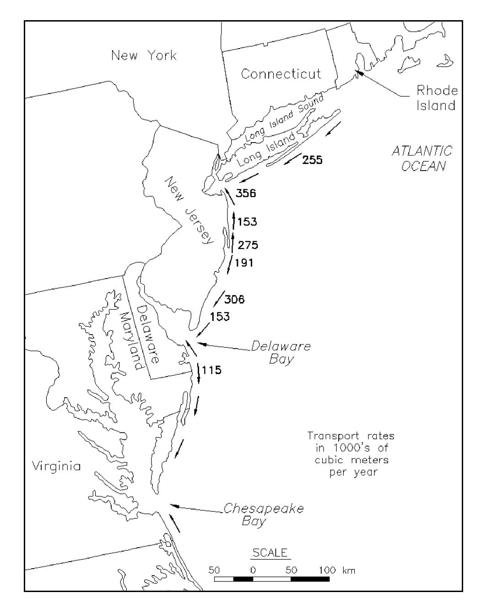

*Figure III-2-3. Estimated annual net longshore transport rates and directions along the east coast of the United States based on data from Johnson (1956, 1957) and Komar (1976)*

*Table III-2-1 Longshore Transport Rates from U.S. Coasts (SPM $1984)^{1}$*

**Table III-2-1. Longshore Transport Rates from U.S. Coasts (SPM $1984)^{1}$**

|  |  | Direction of | Longshore2 |  |  |  |  |  |
| --- | --- | --- | --- | --- | --- | --- | --- | --- |
| Location |  | Transport | Transport, Atlantic | cu m/yr Coast | Date of Record | Reference |  |  |
| Suffolk County, | NY | W | 153,000 |  | 1946-55 | New York District |  | (1955) |
| Sandy Hook, | NJ | N | 377,000 |  | 1885-1933 | New York District |  | (1954) |
| Sandy Hook, | NJ | N | 333,000 |  | 1933-51 | New York District |  | (1954) |
| Asbury Park, | NJ | N | 153,000 |  | 1922-25 | New York District |  | (1954) |
| Shark River, | NJ | N | 229,000 |  | 1947-53 | New York District |  | (1954) |
| Manasquan, | NJ | N | 275,000 |  | 1930-31 | New York District |  | (1954) |
| Barnegat Inlet, | NJ | S | 191,000 |  | 1939-41 | New York District |  | (1954) |
| Absecon Inlet, | NJ | S | 306,000 |  | 1935-46 | New York District |  | (1954) |
| Ocean City, | NJ | S | 306,000 |  | 1935-46 | U.S. Congress |  | (1953a) |
| Cold Spring | Inlet, NJ | S | 153,000 |  | --- | U.S. Congress |  | (1953b) |
| Ocean City, | MD | S | 115,000 |  | 1934-36 | Baltimore District |  | (1948) |
| Atlantic Beach, | NC | E | 22,500 |  | 1850-1908 | U.S. Congress |  | (1948) |
| Hillsboro Inlet, | FL | S | 57,000 |  | 1850-1908 | U.S. Army (1955b) |  |  |
| Palm Beach, | FL | S | 115,000 to 175,000 Gulf of | Mexico | 1925-30 | BEB (1947) |  |  |
| Pinellas County, | FL | S | 38,000 |  | 1922-50 | U.S. Congress |  | (1954a) |
| Perdido Pass, | AL | W | 153,000 Pacific | Coast | 1934-53 | Mobile District |  | (1954) |
| Santa Barbara, | CA | E | 214,000 |  | 1932-51 | Johnson (1953) |  |  |
| Oxnard Plain | Shore, CA | S | 765,000 |  | 1938-48 | U.S. Congress |  | (1953c) |
| Port Hueneme, | CA | S | 382,000 |  | --- | U.S. Congress |  | (1954b) |
| Santa Monica, | CA | S | 206,000 |  | 1936-40 | U.S. Army (1948b) |  |  |
| El Segundo, | CA | S | 124,000 |  | 1936-40 | U.S. Army (1948b) |  |  |
| Redondo | Beach, CA | S | 23,000 |  | --- | U.S. Army (1948b) |  |  |
| Anaheim Bay, | CA | E | 115,000 |  | 1937-48 | U.S. Congress |  | (1954c) |
| Camp Pendleton, | CA | S | 76,000 Great | Lakes | 1950-52 | Los Angeles | District | (1953) |
| Milwaukee | County, WI | S | 6,000 |  | 1894-1912 | U.S. Congress |  | (1946) |
| Racine County, | WI | S | 31,000 |  | 1912-49 | U.S. Congress |  | (1953d) |
| Kenosha, WI |  | S | 11,000 |  | 1872-1909 | U.S. Army (1953b) |  |  |
| IL State Line | to Waukegan | S | 69,000 |  | --- | U.S. Congress |  | (1953e) |
| Waukegan to | Evanston, IL | S | 44,000 |  | --- | U.S. Congress |  | (1953e) |
| South of | Evanston, IL | S | 31,000 | Hawaii | --- | U.S. Congress |  | (1953e) |
| Waikiki Beach |  | -- | 8,000 |  | --- | U.S. Congress |  | (1953f) |

*Method of measurement is by accretion except for Absecon Inlet and Ocean City, NJ, and Anaheim Bay, CA, which were measured by erosion, and Waikiki Beach, HI, which was measured according to suspended load samples.*

- g = acceleration due to gravity
- n = in-place sediment porosity ( n . 0.4)
The parameter n is a pore-space factor such that (1 - n ) Q R is the volume transport of solids alone. One advantage of using $I_{R}$ is that this immersed weight transport rate incorporates effects of the density of the sediment grains. The factor $(ρ_{s}$ - ρ) accounts for the buoyancy of the particles in water. The term "potential" sediment transport rate is used, because calculations of the quantity imply that sediment is available in sufficient quantity for transport, and that obstructions (such as groins, jetties, breakwaters, submarine canyons, etc.) do not slow or stop transport of sediment alongshore.

*Transport rates are estimated net transport rates $Q_{N}.$ In some cases, these approximate the gross transport rates Qg.*

- a. Energy flux method.
- (1) Historical background. An extensive discussion of the evolution of energy-based longshore transport formulae is presented by Sayao (1982), in his dissertation. The following is a summary of Sayao's discussion, focusing on evolution of the so-called "CERC" formula.
Munch-Peterson, a Danish engineer, first related the rate of littoral sand transport to deepwater wave energy in conjunction with harbor studies on the Danish coast (Munch-Peterson 1938). Because of a lack of wave data, Munch-Peterson used wind data in practical applications, which gave preliminary estimations of the littoral drift direction. In the United States, use of a formula to predict longshore sediment transport based on wave energy was suggested by the Scripps Institute of Oceanography (1947), and applied by the U.S. Army Corps of Engineers, Los Angeles District to the California coast (Eaton 1950). Watts (1953a) and Caldwell (1956) made the earliest documented measurements of longshore sediment transport (at South Lake Worth, Florida, and Anaheim Bay, California, respectively) and related transport rates to wave energy, resulting in modifications to the existing formulae. Savage (1962) summarized the available data from field and laboratory studies and developed an equation which was later adopted by the U.S. Army Corps of Engineers in a 1966 coastal design manual (U.S. Army Corps of Engineers 1966), which became known as the "CERC formula." Inman and Bagnold (1963), based on Bagnold's earlier work on wind-blown sand transport and on sand transport in rivers, suggested use of an immersed weight longshore transport rate, rather than a volumetric rate. An immersed weight sediment transport equation was calibrated by Komar and Inman (1970) based on the available field data including their tracer-based measurements at Silver Strand, California, and El Moreno, Mexico. Based on Komar and Inman's (1970) transport relationship and other available field data, the CERC formula for littoral sand transport was updated from its 1966 version, and has been presented as such in the previous editions of the Shore Protection Manual (1977, 1984).
- (2) Description.
- (a) The potential longshore sediment transport rate, dependent on an available quantity of littoral material, is most commonly correlated with the so-called longshore component of wave energy flux or power,

```math
P_{\ell} = (EC_g)_b \sin \alpha_b \cos \alpha_b \tag{III-2-2}
```

where E_b is the wave energy evaluated at the breaker line,

```math
E_b = \frac{\rho g H_b^2}{8} \tag{III-2-3}
```

and C_{gb} is the wave group speed at the breaker line,

```math
C_{gb} = \sqrt{gd_b} = \left(g \frac{H_b}{\kappa}\right)^{\frac{1}{2}} \tag{III-2-4}
```

where \kappa is the breaker index H_b / d_b . The term (EC_g)_b is the "wave energy flux" evaluated at the breaker zone, and \alpha_b is the wave breaker angle relative to the shoreline. The immersed weight transport rate I_l has the same units as P_l (i.e., N/sec or lbf/sec), so that the relationship

```math
I_{\ell} = KP_{\ell} \tag{III-2-5}
```

is homogeneous, that is, the empirical proportionality coefficient K is dimensionless. This is another advantage in using I_{\ell} rather than the Q_{\ell} volume transport rate. Equation 2-5 is commonly referred to as the "CERC formula."
(b) Equation 2-5 may be written

```math
I_{\ell} = KP_{\ell} = K(EC_g)_b \sin \alpha_b \cos \alpha_b \tag{III-2-6a}
```

which, on assuming shallow water breaking, gives

```math
I_{\ell} = K \left( \frac{\rho g H_b^2}{8} \right) \left( \frac{g H_b}{\kappa} \right)^{\frac{1}{2}} \sin \alpha_b \cos \alpha_b \tag{III-2-6b}
```

```math
I_{\ell} = K \left( \frac{\rho g^{3/2}}{8 \kappa^{1/2}} \right) H_b^{5/2} \sin \alpha_b \cos \alpha_b \tag{III-2-6c}
```

```math
I_{\ell} = K \left( \frac{\rho g^{\frac{3}{2}}}{16 \kappa^{\frac{1}{2}}} \right) H_b^{\frac{5}{2}} \sin(2\alpha_b) \tag{III-2-6d}
```

(c) By using Equation 2-1b, the relationships for I_{l} can be converted to a volume transport rate:

```math
Q_{\ell} = \frac{K}{(\rho_s - \rho)g(1 - n)} P_{\ell} \tag{III-2-7a}
```

```math
Q_{\ell} = K \left( \frac{\rho \sqrt{g}}{16 \kappa^{\frac{1}{2}} (\rho_s - \rho) (1 - n)} \right) H_b^{\frac{5}{2}} \sin(2\alpha_b) \tag{III-2-7b}
```

(d) Field data relating I_{\ell} and P_{\ell} are plotted in Figure III-2-4, for which the calculations of the wave power are based on the root-mean-square (rms) wave height at breaking H_{b rms} . Data presented in Figure III-2-4 include those measured by: (1) sand accumulation at jetties and breakwaters (South Lake Worth Inlet, Florida (Watts 1953a); Anaheim Bay (Caldwell 1956), Santa Barbara (Dean et al. 1987), and Channel Islands (Bruno et al. 1981, Walton and Bruno 1989), California; Rudee Inlet, Virginia (Dean et al. 1987); Cape Thompson, Alaska (Moore and Cole 1960); and Point Sapin, Canada (Kamphuis 1991)); (2) sand tracer at Silver Strand, California (Komar and Inman 1970); El Moreno, Mexico (Komar and Inman 1970); Torrey Pines, California (Inman et al. 1980); and Ajiguara, Japan (Kraus et al. 1982)); and (3) sediment traps at Kewaunee County, Wisconsin (Lee 1975); and Duck, North Carolina (Kana and Ward 1980)). Because of questions in methodologies and trapping efficiencies, probably the data sets most appropriate for engineering application are those based upon category 1 above, sand accumulation (impoundment) at jetties and breakwaters.

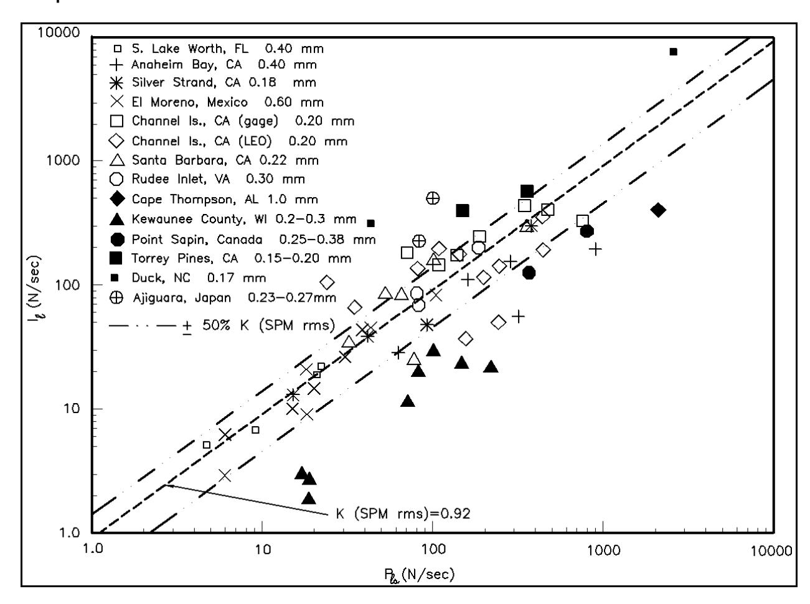

*Figure III-2-4. Field data relating I_i and P_i*

- (e) The K coefficient defined here is based on utilizing the rms breaking wave height H_{b\,rms} . The Shore Protection Manual (1984) presented a dimensionless coefficient K_{SPM\,sig}=(0.39) based on computations utilizing the significant wave height. The value of this SPM coefficient corresponding to the rms wave height H_{b\,rms} is K_{SPM\,rms}=0.92 , which is indicated in Figure III-2-4 with a dashed line for reference. Judgement is required in applying Equation 2-7. Although the data follow a definite trend, the scatter is obvious, even on the log-log plot. The dash-double-dot lines represent a \pm 50 percent interval around the SPM reference line ( K_{SPM\,rms}=0.92 ).
- (f) An early design value of the K coefficient was introduced for use with rms breaking wave height by Komar and Inman (1970); K_{K\&I rms} = 0.77 . This value is commonly seen in many longshore transport rate computations.
- (g) Values of the other parameters for use in the sediment transport equations are: \rho_s = 2,650 \text{ kg/m}^3 (5.14 slugs/ft³) for quartz-density sand; \rho = 1,025 \text{ kg/m}^3 (1.99 slug/ft³) for 33 parts per thousand (ppt) salt water; and \rho = 1,000 \text{ kg/m}^3 (1.94 slug/ft³) for fresh water; g = 9.81 \text{ m/sec}^2 (32.2 ft/sec²); and n = 0.4. The breaker index ( \kappa ) is \approx 0.78 for flat beaches and increases to more than 1.0 depending on beach slope (Weggel 1972).
- (3) Variation of K with median grain size.
- (a) Longshore sand transport data presented in Figure III-2-4 represent beaches with quartz-density grain sizes ranging from ~0.2 mm to 1.0 mm, and wave heights ranging from 0.5 to 2.0 m. Bailard (1981, 1984) developed an energy-based model, which presents K as a function of the breaker angle and the ratio of the orbital velocity magnitude and the sediment fall speed, also based on the rms wave height at breaking. Bailard calibrated the model using eight field and two laboratory data sets, and developed the following equation:

```math
K = 0.05 + 2.6 \sin^2(2\alpha_b) + 0.007 \frac{u_{mb}}{w_f} \tag{III-2-8}
```

where $u_{mb}$ is the maximum oscillatory velocity magnitude, obtained from shallow-water wave theory as

```math
u_{mb} = \frac{\kappa}{2} \sqrt{g d_b} \tag{III-2-9}
```

and $w_{f}$ is the fall speed of the sediment, either calculated using the relationships described in Part III-1, or, if the spherical grain assumption cannot be applied to the material, measured experimentally. Bailard developed his relationship using the following data ranges: 2.5 # $w_{f}$ # 20.5 cm/sec; $0.2^{\circ}$ # $α_{b}$ # $15^{\circ};$ and 33 # $u_{mb}$ # 283 cm/sec. A comparison of observed and predicted K coefficients using Bailard's Equation 2-8 is presented in Figure III-2-5, using the data sets on which Bailard based his calibration. Because Bailard's relationship is based on a limited data set, predicted K coefficients may be highly variable. Bailard's relationship for K is similar to a relationship presented by Walton (1979) and Walton and Chiu (1979), which was compared to limited laboratory data.
- (b) Others have proposed empirically based relationships for increasing K with decreasing grain size (or equivalently, fall speed) (Bruno, Dean, and Gable 1980; Dean et al. 1982; Kamphuis et al. 1986; Dean 1987). Komar (1988), after reexamining available field data, suggested that the previous relationships resulted from two data sets with K values based on erroneous or questionable field data. Revising these K values, Komar (1988) concluded that existing data suggests little dependence of the empirical K coefficient on sediment grain sizes, at least for the range of sediments in the data set. Data from shingle beaches, however, indicated a smaller K , but the data were too limited to establish a correlation. Komar stressed that K should depend on sediment grain size, and the absence of such a trend in his analysis must result from the imperfect quality of the data.
- (c) Recently, del Valle, Medina, and Losada (1993) have presented an empirically based relationship for the K parameter, adding sediment transport data representing a range in median sediment grain sizes (0.40 mm to 1.5 mm) from the Adra River Delta, Spain to the available database as modified by Komar (1988). Del Valle, Medina, and Losada obtained wave parameters from buoy and visual observations, and sediment transport rates were evaluated from aerial photographs documenting a 30-year period of shoreline evolution for five locations along the delta. Results of their analysis reinforce a decreasing trend in the empirical coefficient K with sediment grain size. Their empirical fit based on the corrections to the database as suggested by Komar (1988) is shown in Figure III-2-6 and given in Equation III-2-10. The empirically based relationship is to be applied with rms breaking wave height,

```math
K = 1.4 \ e^{(-2.5 \ D_{50})} \tag{III-2-10}
```

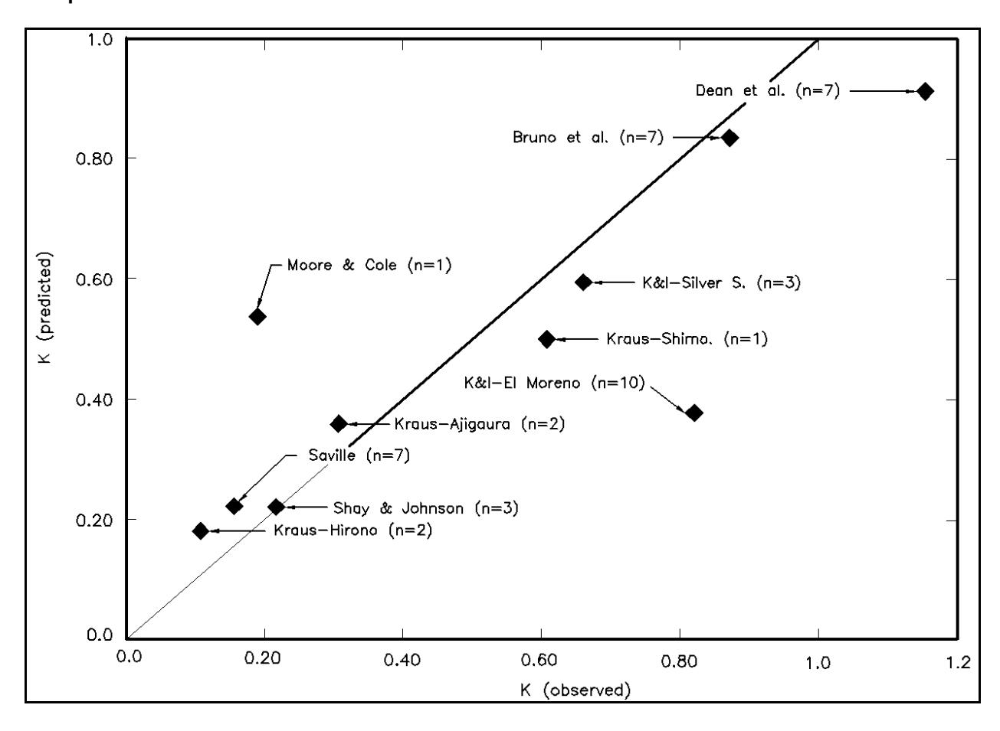

*Figure III-2-5. Measured and predicted K coefficients using Bailard's (1984) equation*

where $D_{50}$ is the median grain size of the beach sediment in millimeters. This relationship is based on limited data and depends strongly on the data from the Adra River Delta.
- (d) While it is generally thought that the K coefficient should decrease with increasing grain size, the nature of this relationship is not well understood at present. Again, because of the limited data set and inherent variability in measuring longshore sediment transport rates, predicted K coefficients may vary considerably from appropriate values for any particular site. (4) Variation of K with surf similarity.
- (a) From laboratory data, a relationship between K and the surf similarity parameter $ξ_{b}$ = m / $(H_{b}/L_{o})^{1/2}$ has also been observed (Kamphuis and Readshaw 1978). These data suggest that the value of K increases with increasing value of the surf similarity parameter (i.e. as the breaking waves tend from spilling to collapsing condition).
- (b) Numerous other relationships for predicting longshore sediment transport rates exist (e.g., Watts (1953a), Kamphuis and Reashaw (1978), Kraus et al. (1982), Kamphuis et al. (1986), Kamphuis (1991)). A promising empirical relationship based principally upon laboratory results is that developed by Kamphuis (1991) which correlates well with laboratory and field data sets. However, for application to field studies, the use of a physically based relationship based solely on field data, such as the one presented herein (often called the CERC formula) is preferred.

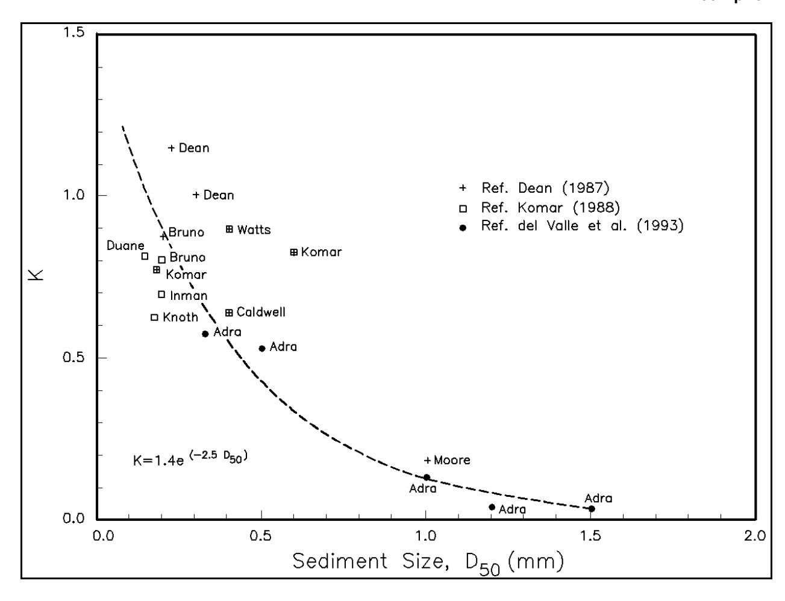

*Figure III-2-6. Coefficient K versus median grain size D_{50} (del Valle, Medina, and Losada 1993)*

- (c) Researchers at CHL (unpublished) used sand tracer data from Santa Barbara and Torrey Pines, California, and profile and dredging records from Santa Barbara Harbor, California, to compare 20 longshore sediment transport models. They concluded that the CERC equation performed as well or better than the other models. Of the six models including effects of grain size evaluated (they did not evaluate del Valle, Medina, and Losada's (1993) relationship), they concluded that Bailard's (1984) relationship (given in Equation 2-8) performed the best. However, the data set used for comparison only represented grain sizes in the range 0.15 to 0.25 mm, and therefore was not particularly suited for testing the dependence of longshore sediment transport relationships on grain size outside this limited range.
- b. Longshore current method. Early workers such as Grant (1943) stressed that sand transport in the nearshore results from the combined effects of waves and currents; i.e., the waves placing sand in motion and the longshore currents producing a net sand advection. Walton (1980, 1982) proposed a longshore sediment transport calculation method using the breaking-wave-driven longshore current model of Longuet-Higgins (1970) from which the longshore energy flux factor becomes

```math
P_{\ell} = \frac{\rho g H_b W V_{\ell} C_f}{\left(\frac{5\pi}{2}\right) \left(\frac{V}{V_o}\right)} \tag{III-2-11}
```

FIND:
Determine the K parameter for use at a site using Bailard's (1984) and del Valle, Medina, and Losada's (1993) relationships, then calculate the potential volumetric longshore transport rate along the beach using each K value.

#### GIVEN:

Waves having an rms wave height of 2.0 m (6.7 ft) break on a quartz sand beach with median grain size, D_{50} = 1.0 mm at a wave breaking angle \alpha_b = 4.5^\circ . The temperature of the seawater is 20°C and w_f = fall velocity = 13.1 cm/sec. Assume \kappa = 1.0 for this problem.

#### SOLUTION:

w_f = 13.1 cm/sec (0.43 ft/sec), which is within Bailard's data range.
The maximum oscillatory velocity magnitude is calculated from Equation 2-9 as

```math
u_{mb} = \frac{\kappa (g d_b)^{1/2}}{2} = \frac{1 (9.81 \times 2.0)^{1/2}}{2}
```

u_{\rm mb} = 2.21 m/sec, which is within Bailard's (1984) data range.
Therefore, Equation 2-8 may be used, and the coefficient to apply in the longshore sediment transport equation is,

```math
K = 0.05 + 2.6\sin^2(2\alpha_b) + 0.007\frac{u_{mb}}{w_f} = 0.05 + 2.6\sin^2(2(4.5^\circ)) + 0.007\left(\frac{2.21}{0.131}\right) \Rightarrow K = 0.23
```

Applying del Valle, Medina, and Losada's relationship, Equation 2-10,

```math
K = 1.4 e^{(-2.5 D_{50})} = 0.12
```

(Continued)
Example Problem III-2-1 (Concluded)
Using Equation 2-7b with K = 0.23,

```math
Q_{\ell} = K \left( \frac{\rho \sqrt{g}}{16 \kappa^{1/2} (\rho_s - \rho)(1 - n)} \right) H_{b rms}^{5/2} \sin(2\alpha_b)
```

```math
Q _ { \ell } \ = \ 0 . 2 3 \ \frac { \left( 1 0 2 5 \right) \ \left( 9 . 8 1 \right) ^ { 1 / 2 } } { 1 6 \ \mathrm { ( 1 ) } \ \left( 2 6 5 0 \ - \ 1 0 2 5 \right) \ \mathrm { ( 1 \ - \ 0 . 4 ) } } \ \left( 2 . 0 \right) ^ { 5 / 2 } \ \sin \ ( 2 \times 4 . 5 ^ { o } )
```

```math
Q_{\ell} = (0.042 \text{ m}^3/\text{sec}) (3600 \text{ sec/hr}) (24 \text{ hr/day})
```

Q R = 3.6 x 103 $m^{3}/day$ (4.7 x 103 $yd^{3}/day)$ using Bailard's methodology.
Using del Valle, Medina, and Losada's relationship ( K = 0.12)

```math
Q _ { \ell } \ = \ 0 . 1 2 \ \frac { ( 1 0 2 5 ) \ ( 9 . 8 1 ) ^ { 1 / 2 } } { 1 6 \ ( 2 6 5 0 \ - \ 1 0 2 5 ) \ ( 1 \ - \ 0 . 4 ) } \ ( 2 . 0 ) ^ { 5 / 2 } \ \sin \ ( 2 \times 4 . 5 ^ { o } )
```

```math
Q_{\ell} = (0.021 \text{ m}^3/\text{sec}) \times (3600 \text{ sec/hr}) \times (24 \text{ hr/day})
```

```math
Q_{\ell} = 1.9 \times 10^3 \text{ m}^3/\text{day} (2.5 \times 10^3 \text{ yd}^3/\text{day})
```

It is noted that the estimates of the transport rate developed from the two relationships for K , Equations 2-8 and 2-10, differ by a factor of almost 1.9. This serves to highlight the uncertainty associated with selection of the appropriate K coefficient for a given site, and the resulting uncertainty in the prediction of the longshore transport rate's value. The grain size used in this problem is much larger than that typically found on U.S. beaches, and the K coefficient found is correspondingly smaller than that recommended in Shore Protection Manual (1984).

#### FIND:

Calculate the potential immersed-weight and volumetric longshore sand transport rates.

#### GIVEN:

The same conditions as in Example Problem III-2-1, except assume a median grain size D_{50} corresponding to a K coefficient = 0.60. Assume \kappa = 1 for simplicity.

#### SOLUTION:

With H_{b \ rms} = 2.0 \ \text{m} (6.6 ft), \rho = 1,025 \ \text{kg/m}^3 (1.99 slug/ft³), \rho_s = 2,650 \ \text{kg/m}^3 (5.14 slug/ft³), g = 9.8 \ \text{m/sec}^2 (32.2 ft/sec²) and \alpha_b = 4.5 \, ^\circ , Equation 2-6d gives

```math
I_{\ell} = K \left( \frac{\rho g^{\frac{3}{2}}}{16 \kappa^{\frac{1}{2}}} \right) H_{b rms}^{\frac{5}{2}} \sin(2\alpha_b)
```

```math
0.60 \frac{(1025) (9.81)^{\frac{3}{2}}}{16 (1)} (2.0)^{\frac{5}{2}} \sin(2 \times 4.5^{\circ}) \approx 1050 \text{ N/sec } (236 \text{ lbf/sec})
```

This potential immersed-weight transport rate may be converted to a potential volumetric rate by using Equation 2-7b

```math
Q_{\ell} = K \left( \frac{\rho \sqrt{g}}{16 \kappa^{\frac{1}{2}} (\rho_s - \rho)(1 - n)} \right) H_{b rms}^{\frac{5}{2}} \sin(2\alpha_b)
```

```math
Q _ { \ell } \ = \ 0 . 6 0 \ \frac { \left( 1 0 2 5 \right) \ \left( 9 . 8 1 \right) ^ { \frac { 1 } { 2 } } } { 1 6 \ \mathrm { ( 1 ) } \ \left( 2 6 5 0 \ - \ 1 0 2 5 \right) \ \mathrm { ( 1 \ - \ 0 . 4 ) } } \ \left( 2 . 0 \right) ^ { \frac { 5 } { 2 } } \ \sin ( 2 \times 4 . 5 ^ { o } )
```

```math
Q_{\ell} = (0.109 \text{ m}^3/\text{sec}) (3600 \text{ sec/hr}) (24 \text{ hr/day})
```

```math
Q_{\ell} = 9.4 \text{ x } 10^3 \text{ m}^3/\text{day} (12.3 \text{ x } 10^3 \text{ yd}^3/\text{day})
```

FIND:
Calculate the potential volumetric longshore sand transport rate along the beach.

# GIVEN:

Spectral analysis of wave measurements at an offshore buoy in deep water yields a wave energy density $E_{o}$ of 2.1 x 103 N /m (144 lbf/ft), with a single peak centered at a period T = 9.4 sec. At the measurement site, the waves make an angle of $α_{o}$ = 7.5E with the trend of the coast, but after undergoing refraction, the waves break on a sandy beach with an angle of $α_{b}$ = 3.0E. Assume that the K coefficient is 0.60.

#### SOLUTION:

The group speed of the waves in deep water is given in Part II-1 as

```math
C_{go} = gT/4\pi = 9.8 (9.4) / (4\pi) = 7.3 \text{ m/sec } (24.0 \text{ ft/sec})
```

The energy flux per unit shoreline length in deep water is

```math
(EC_g)_o \cos \alpha_o = (2.1 \times 10^3)(7.3)\cos(7.5^\circ) = 1.5 \times 10^4 \text{ N/sec} (3.4 \times 10^3 \text{ lbf/sec})
```

The conservation of wave energy flux allows the substitution

```math
(EC_g)_b \cos \alpha_b = (EC_g)_o \cos \alpha_o
```

where bottom friction and other energy losses are assumed to be negligible, Equation 2-2 for the longshore component of the energy flux at the shoreline then becomes

```math
P_{\ell} = (EC_g)_b \sin\alpha_b \cos\alpha_b = [(EC_g)_o \cos\alpha_o] \sin\alpha_b = (1.5 \times 10^4) \sin(3.0^\circ)
```

```math
P_{\ell} = 800 \ N/\text{sec} \ (180 \ \text{lbf/sec})
```

Spectra yield wave parameters equivalent to rms conditions, and therefore K = 0.60 may be used in Equation 2-7a to calculate the potential volumetric sand transport rate. This gives

```math
Q_{\ell} = \frac{K}{(\rho_s - \rho) g (1 - n)} P_{\ell}
```

```math
Q_{\ell} = \frac{0.60}{(2650 - 1025) (9.81) (1 - 0.4)} 800
```

QR = 0.050 $m^{3}/sec$ x 3600 sec/hr x 24 hr/day

```math
Q_{\ell} = 4.3 \times 10^3 \text{ m}^3/\text{day} (5.7 \times 10^3 \text{ yd}^3/\text{day})
```

#### FIND:

Calculate the resulting volumetric longshore transport of sand using measured surf zone velocity.

#### GIVEN:

Breaking waves have an rms height of 1.8 m (5.9 ft) and there is a persistent longshore current in the surf zone with mean velocity 0.25 m/sec (0.82 ft/sec) as measured at approximately the mid-surf position. The width of the surf zone is approximately 75 m (246 ft). Assume the K coefficient was calculated as 0.60.

#### SOLUTION:

```math
H_{b\,\mathrm{rms}} = 1.8\, \text{m} (5.9\, \text{ft}) \quad \text{and} \quad V_\ell = 0.25\, \text{m/sec} (0.82\, \text{ft/sec}),
```

```math
V/V_o = 0.2(37.5/75) - 0.714(37.5/75)\ln{(37.5/75)} = 0.35
```

and Equation 2-11 gives

```math
P_{\ell} = [(1025)(9.81)(1.8)(75)(0.25)(0.01)]/[(5\pi/2)(0.35)] = 1234 \text{ N/sec } (277 \text{ lbf/sec})
```

From Equation 2-7a,

```math
Q_{I} = (0.60)(1234)/[(2650-1025)(9.81)(1-0.4)]
```

```math
Q_{\bullet} = 0.077 \text{ m}^3/\text{sec} = 6.7 \text{ x } 10^3 \text{ m}^3/\text{day} (8.8 \text{ x } 10^3 \text{ yd}^3/\text{day})
```

in which W is the width of the surf zone, V_{\ell} is the measured longshore current at a point in the surf zone, C_f is a friction coefficient dependent on Reynolds' number and bottom roughness, and V_o is the theoretical longshore velocity at breaking for the no-lateral-mixing case. A theoretical velocity distribution for a linear beach profile that best fits Longuet-Higgins nondimensionalized data is chosen

```math
\left(\frac{V}{V_o}\right) = 0.2 \left(\frac{Y}{W}\right) - 0.714 \left(\frac{Y}{W}\right) \ln\left(\frac{Y}{W}\right) \tag{III-2-12}
```

in which Y equals the distance to the measured current from the shoreline, and V/V_o equals Longuet-Higgins dimensionless longshore current velocity for an assumed mixing coefficient equal to 0.4, which agrees reasonably well with laboratory data. Values of the friction factor C_f in Equation 2-11 were shown by Longuet-Higgins to be approximately 0.01, based on laboratory data. Thornton and Guza (1981) calculated the friction factor using field data measured at Torrey Pines Beach, San Diego, California, and a mean value of the parameter, averaged over four selected days, was 0.01 with a standard deviation of 0.01. Using Equations 2-11 and 2-12 with knowledge of breaking wave height, width of the surf zone, longshore velocity (at some point within the surf zone), distance to the measured longshore velocity, and an assumed friction factor, the longshore sand transport rate may then be calculated. From a practical standpoint, it is often easier
and more accurate to measure the longshore current V_{\ell} than it is to determine the breaker angle \alpha_b needed in the P_{\ell} formulation. In either method, calculations of longshore sediment transport may be very different than actual values. Formulations for the longshore current distribution across nonplanar, concave-up beach profiles are presented by McDougal and Hudspeth (1983a, 1983b, and 1989) and by Bodge (1988).
- c. Using hindcast wave data. Potential longshore sand transport rates can be calculated using Wave Information Study (WIS) hindcast wave estimates (see Part II-2). First, refraction and shoaling of incident linear waves are calculated using Snell's law and the conservation of wave energy flux. The shallow-water wave breaking criterion then defines wave properties at the break point, and potential longshore sand transport rates are calculated by means of the energy flux method.
- (1) Wave transformation procedure. To calculate the potential longshore sand transport rate using Equation 2-7b, the breaking wave height and incident angle with respect to the shoreline are required. WIS hindcast estimates, however, are given for intermediate to deepwater depths (Hubertz et al. 1993). Refraction and shoaling transformation of the WIS hindcast wave estimates to breaking conditions are therefore necessary and can be accomplished using linear wave theory for coastlines having reasonably straight and parallel bottom contour lines. Assuming that offshore depth contours are straight and parallel to the trend of the shoreline and neglecting energy dissipation prior to breaking, the wave height and angle at breaking can be computed from the coupled equations

```math
H_b = H_1^{\frac{4}{5}} \left[ \frac{C_{gl} \cos \alpha_1}{\sqrt{\frac{g}{\kappa} \cos \alpha_b}} \right]^{\frac{2}{5}} \tag{III-2-13}
```

```math
\sin \alpha_b = \sqrt{g \frac{H_b}{\kappa}} \frac{\sin \alpha_1}{C_1} \tag{III-2-14}
```

where the subscript "1" refers to offshore (WIS) conditions. Equations 2-13 and 2-14 are derived from energy conservation and Snell's Law. Where it is assumed that wave breaking occurs for shallow-water wave conditions; i.e.,

```math
C_b = C_{gb} = \sqrt{g \ d_b} = \sqrt{g \ \frac{H_b}{\kappa}} \tag{III-2-15}
```

Employing the identity sin^2\alpha_b = 1 - cos^2\alpha_b , Equations 2-13 and 2-14 can be combined as

```math
H_b = H_1^{\frac{4}{5}} (C_{gI} \cos \alpha_1)^{\frac{2}{5}} \left[ \frac{g}{\kappa} - \frac{H_b g^2 \sin^2(\alpha_1)}{\kappa^2 C_1^2} \right]^{-\frac{1}{5}} \tag{III-2-16}
```

and solved iteratively for H_b . The angle \alpha_b can then be found using Equation 2-14. In application of Equations 2-14 and 2-16, the offshore wave angle \alpha_I should be transformed relative to the shoreline-perpendicular as described below.
- (2) Wave conditions.
- (a) As discussed in Part II-2, WIS hindcast wave estimates are compiled in intermediate to deepwater depths. The examples presented herein use Revised Atlantic Level 2 (RAL2) WIS data, which are presented in 45-deg wave angle bands. Angles reported for RAL2 WIS Phase III stations \alpha_{WIS} are measured in degrees "from" in a compass sense, for which due north equals zero and other angles are measured clockwise from north. For calculation of longshore sand transport, a right-handed coordinate system is more convenient, in which waves approaching normal to the shoreline are given an angle of 0 deg. Looking seaward, waves approaching from the right are associated with negative angles, and waves approaching from the left are associated with positive angles such that transport directed to the right is given a positive value and transport directed to the left is given a negative value in accord with sign convention discussed earlier. WIS angles may be converted to angles associated with transport calculations \alpha by means of the following relationship:

```math
\alpha = \theta_n - WIS \ angle \tag{III-2-17}
```

where \theta_n is the azimuth angle of the outward normal to the shoreline. Angles of \alpha over \pm 90° would be excluded from calculations. The WIS angle is the azimuth angle the waves are coming from.
- (b) RAL2 WIS wave data for one particular wave-angle band are summarized in Table III-2-2. The number of occurrences are listed for specific wave height and period bands, with the total number of occurrences listed in the right column (for each wave band) and bottom row (for each period band). The header gives the time period for the data record (1956 1975), location of the station in latitude and longitude, water depth, and angle band represented by the tabulated data.
- (c) Data given in WIS statistical tables may be used in several ways to calculate the potential longshore sand transport rate. Two examples using the data in Table III-2-2 are given below. In Example III-2-5, the potential longshore sand transport rate is estimated with the average significant wave height for the given

*Table III-2-2
Occurrence of Wave Height and Period for Direction Band 112.5° - 157.49° RAL2 Station 72*

WIS ATLANTIC REVISION 1956 - 1975

LAT: 40.25 N LONG: 73.75 W, DEPTH = 27 M

OCCURRENCES OF WAVE HEIGHT AND PEAK PERIOD

FOR 45-DEG DIRECTION BAND

STATION 72
(112.50° to 157.49°) mean = 135.0°

**Table III-2-2. Occurrence of Wave Height and Period for Direction Band 112.5° - 157.49° RAL2 Station 72**

|  |  | LAT: OCCURRENCES | WIS | ATLANTIC 40.25 N OF FOR | LONG: WAVE 45-DEG | REVISION 1956 73.75 W, DEPTH HEIGHT AND DIRECTION BAND STATION 72 Tp, seconds | - 1975 = 27 M PEAK PERIOD |  | $(112.50^{\circ}$ to 157.490) | mean | = $135.0^{\circ}$ |
| --- | --- | --- | --- | --- | --- | --- | --- | --- | --- | --- | --- |
| Hmo(m) 3.0-4.9 | 5.0-6.9 | 7.0-8.9 |  |  | 9.0-10.9 | 11.0-12.9 | 13.0-14.9 | 15.0-16.9 | 17.0-18.9 |  | Total |
| 0.00-0.99 | 1,022 1,509 |  | 6,018 |  | 3,261 | 918 | 120 | 10 |  | . | 12,858 |
| 1.00-1.99 | 124 1,380 |  | 1,437 |  | 1,095 | 610 | 127 | 4 |  | . | 4,777 |
| 2.00-2.99 | . | 66 | 440 |  | 384 | 183 | 60 |  | . | . | 1,133 |
| 3.00-3.99 | . | . | 56 |  | 140 | 76 | 16 |  | . | . | 288 |
| 4.00-4.99 | . | . | . |  | 17 | 22 | 6 |  | . | . | 45 |
| 5.00-5.99 | . | . | . |  | 1 | 2 | . |  | . | . | 3 |
| 6.00-6.99 | . | . | . |  | . | 1 | 1 |  | . | . | 2 |
| 7.00-7.99 | . | . | . |  | . | . | . |  | . | . | 0 |
| 8.00-8.99 | . | . | . |  | . | . | . |  | . | . | 0 |
| 9.00-Greater | . | . | . |  | . | . | . |  | . | . | 0 |
| Total | 1,146 2,955 |  | 7,951 |  | 4,898 | 1,812 | 330 | 14 | 0 Longshore |  | 19,106 III-2-22 Sediment Transport |

#### FIND:

Calculate (a) the average (over the directional band) wave height $H_{mo}$ and determine an equivalent significant wave height $H_{sig},$ (b) wave approach angle in the sediment transport coordinate system, (c) percentage of the total wave data represented by this wave directional angle band, (d) average peak spectral wave period $T_{p},$ (e) breaking wave height $H_{b}$ and angle $α_{b},$ and (f) potential longshore sand transport rate.

#### GIVEN:

Wave statistics presented in Table III-2-2. The water depth at which the wave statistics were developed is 27 m. The azimuth angle (from north) of the outward normal to the beach of interest is approximately $102^{\circ}.$ The sediment is quartz-density sand, and $K_{sig}$ = 0.39. Assume κ = 1.0 for simplicity.

#### SOLUTION:

(a) Weighting the average wave height in each wave height band with the total number of observations in that band, calculate an average wave height, $H_{mo}$ = 0.93 m; that is:

```math
H_{mo} = \left[\frac{(0.5)(12858) + (1.5)(4777) + (2.5)(1133) + (3.5)(288) + (4.5)(45) + (5.5)(3) + (6.5)(2)}{19106}\right] = 0.93 \text{ m}
```

As discussed in Part II-1, $H_{s}$ and $H_{mo}$ are approximately equal when irregular wave profiles are sinusoidal in shape. However, as depth decreases and waves shoal prior to breaking, they become nonlinear and peaked in shape rather than sinusoidal. According to Part II-1, the two parameters are within 10 percent of each other if the depth (in meters) is greater than or equal to 0.0975 Tp 2 . In the example, 27 m is greater than 0.0975 (8.5 $sec)^{2}$ = 7.1 m; therefore, the average significant wave $H_{sig}$ may be said to be approximately equal to $H_{mo}.$
- (b) The data in Table III-2-2 represent the angle band that is centered around WIS angle = $135^{\circ}.$ However, the shoreline outward normal angle is $102^{\circ}$ (from north), which means that the angle associated with transport calculations α = $102^{\circ}$ - $135^{\circ}$ = $-33^{\circ}.$
- (c) WIS RAL2 data are presented every 3 hr for a 20-year time period, totalling 58,440 data points for each station (in all wave direction angle bands). The total number of occurrences listed in Table III-2-2 for the $45^{\circ}$ direction band centered around $135^{\circ}$ equals 19,106, which means that the percentage of the total data represented by this angle band equals 19,106/58,440 x 100 percent = 32.7 percent. Scanning the other data for this station (Hubertz et al. 1993, p. A-288 - A-289), this angle band constitutes the dominant wave direction in terms of number of occurrences for station 72.
(Continued)

#### Example Problem III-2-5 (Concluded)

(d) A weighting procedure using wave period bands similar to that used for the wave height bands can be used to calculate an average peak spectral wave period $T_{p}$ = 8.4 sec; that is,

```math
T_{p} = [(4)(1146) + (6)(2955) + (8)(7951) + (10)(4898) + (12)(1812) + (14)(330) + (16)(14)] / 19106 = 8.4
```

(e) Compute the wave celerity $C_{1}$ and group celerity $C_{g1}$ for the offshore wave data in water depth d = 27 m and for the wave period $T_{p}$ = 8.4 sec; and find $C_{1}$ = 12.2 m/s and $C_{g1}$ = 7.6 m/s. Use Newton-Raphson iteration (or a similar technique) to solve Equation 2-16 for the breaking wave height Hb using the offshore wave height value $H_{1}$ = 0.93 m and angle $α_{1}$ = $-33^{\circ},$ and find

```math
H_b \cong 1.2 \text{ m } (3.9 \text{ ft})
```

The breaking wave angle is then computed from Equation 2-14:

```math
\alpha_b = -8.8 \deg
```

(f) Compute the potential longshore sediment transport rate for $K_{sig}$ = 0.39 using Equation 2-7b:

```math
\mathrm { Q } = ( 0 . 3 9 ) \left[ \left( 1 0 2 5 \right) \left( 9 . 8 1 \right) ^ { 0 . 5 } / \left( 1 6 \right) \left( 2 6 5 0 - 1 0 2 5 \right) \left( 1 - 0 . 4 \right) \right] \left( 1 . 2 \right) ^ { 5 / 2 } \sin ( 2 \left( - 8 . 8 \right) ) = - 0 . 0 3 8 \mathrm { m } ^ { 3 } / \mathrm { s } ^ { 2 }
```

Convert the result to annual equivalent transport and multiply by the percent annual occurrence of this event, 32.7%:

```math
Q = (-0.038 \text{ m}^3/\text{sec}) (3600 \text{ sec/hr}) (24 \text{ hr/day}) (365.25 \text{ day/yr}) (0.327) = -393,000 \text{ m}^3/\text{yr} (-514,000 \text{ cy/yr}) (\text{directed to the left})
```

Note that a similar approach can be utilized to find an answer using the CEDRS database (see Part II, Chapter 8) which provides "percent" occurrences (rather than number of observations) in 22.5E energy bands.

#### FIND:

Calculate the potential longshore transport rate using each of the seven wave height bands given in Table III-2-2.

#### GIVEN:

Data in Table III-2-2, and information in Example III-2-5.

## SOLUTION:

For each wave height band in Table III-2-2, the associated weighted average peak wave period $T_{p}$ is calculated. Using the criteria discussed previously, the wave data are checked to ensure that $H_{sig}$ ~ $H_{mo}.$ The percent occurrence for that wave condition is determined by dividing the total number of occurrences in the wave height band in the given $45^{\circ}$ directional band by the total number of records (58,440) in all directional bands. The results are shown in the table below as the "input" conditions. The breaking conditions may be computed directly by the program WISTRT or by Equations 2-14 and 2-16 in the same manner as described in Example 5, above. The potential longshore sediment transport from the $45^{\circ}$ direction band centered approximately $33^{\circ}$ to the right of shore-normal (looking seaward) was calculated to be -1,014,200 $m^{3}/year$ (-1,325,500 $yd^{3}/year)$ (directed to the left) for RAL2 Station 72.

**Table III-2-2. , the associated weighted average peak wave period $T_{p}$ is calculated. Using the criteria discussed previously, the wave data are checked to ensure that $H_{sig}$ ~ $H_{mo}.$ The percent occurrence for that wave condition is determined by dividing the total number of occurrences in the wave height band in the given $45^{\circ}$ directional band by the total number of records (58,440) in all directional bands. The results are shown in the table below as the "input" conditions. The breaking conditions may be computed directly by the program WISTRT or by Equations 2-14 and 2-16 in the same manner as described in Example 5, above. The potential longshore sediment transport from the 45o direction band centered approximately $33^{\circ}$ to the right of shore-normal (looking seaward) was calculated to be -1,014,200 $m^{3}/year$ (-1,325,500 $yd^{3}/year)$ (directed to the left) for RAL2 Station 72.**

|  |  | LAT: OCCURRENCES | WIS | ATLANTIC 40.25 N OF FOR | LONG: WAVE 45-DEG | REVISION 1956 73.75 W, DEPTH HEIGHT AND DIRECTION BAND STATION 72 Tp, seconds | - 1975 = 27 M PEAK PERIOD |  | $(112.50^{\circ}$ to 157.490) | mean | = $135.0^{\circ}$ |
| --- | --- | --- | --- | --- | --- | --- | --- | --- | --- | --- | --- |
| Hmo(m) 3.0-4.9 | 5.0-6.9 | 7.0-8.9 |  |  | 9.0-10.9 | 11.0-12.9 | 13.0-14.9 | 15.0-16.9 | 17.0-18.9 |  | Total |
| 0.00-0.99 | 1,022 1,509 |  | 6,018 |  | 3,261 | 918 | 120 | 10 |  | . | 12,858 |
| 1.00-1.99 | 124 1,380 |  | 1,437 |  | 1,095 | 610 | 127 | 4 |  | . | 4,777 |
| 2.00-2.99 | . | 66 | 440 |  | 384 | 183 | 60 |  | . | . | 1,133 |
| 3.00-3.99 | . | . | 56 |  | 140 | 76 | 16 |  | . | . | 288 |
| 4.00-4.99 | . | . | . |  | 17 | 22 | 6 |  | . | . | 45 |
| 5.00-5.99 | . | . | . |  | 1 | 2 | . |  | . | . | 3 |
| 6.00-6.99 | . | . | . |  | . | 1 | 1 |  | . | . | 2 |
| 7.00-7.99 | . | . | . |  | . | . | . |  | . | . | 0 |
| 8.00-8.99 | . | . | . |  | . | . | . |  | . | . | 0 |
| 9.00-Greater | . | . | . |  | . | . | . |  | . | . | 0 |
| Total | 1,146 2,955 |  | 7,951 |  | 4,898 | 1,812 | 330 | 14 | 0 Longshore |  | 19,106 III-2-22 Sediment Transport |

Note that a similar approach can be utilized to find an answer using the CEDRS database (see Part II, Chapter 8) which provides "percent" occurrences (rather than number of observations) in 22.5E energy bands. Note that engineering judgment must be utilized when assessing actual transport rates. Values of longshore sand transport calculated with Equations 2-14 and 2-16 are based on a limitless supply of sand available for transport, which is often not the case (e.g., if structures are present, geologic features control sand movement, or sediments other than sand are in the transport region). In addition, longshore transport rates calculated using WIS data have been found to be larger than accepted rates (Bodge and Kraus 1991).
For this example calculated using waves offshore of the New Jersey coast, generally-accepted transport rates might be used to adjust the calculated values. Inspection of Figure III-2-3 indicates that net longshore transport rates are between 153,000 and 275,000 cu m/year for this portion of the New Jersey shore. This "calibration" implies that longshore sand transport rates calculated with WIS data and Equations 2-14 and 2-16 might be reduced from 15 to 27 percent of their calculated values to have application for this part of the coastline. Future calculations using WIS data for this portion of the coast could use this calibration for adjustment.
directional band. In Example III-2-6, wave data are more accurately represented by calculating a representative wave period for each of the given wave height bands for the given directional band. Each example requires the transformation of offshore wave data to breaking conditions, and subsequent computation of the associated longshore transport rate. The former can be accomplished using Equations 2-14 and 2-16 or using the program WISTRT (Gravens 1989). Both require knowledge or input of the offshore wave height H_1 (WISTRT requires the significant wave height H_{sig} ), associated period T, angle relative to the shoreline \alpha , and water depth associated with wave data. The longshore transport rate can then be computed directly by Equation 2-7b. The program WISTRT uses a K value and a breaker wave height-todepth ratio different than those used here. It also requires the percent occurrence associated with the given wave condition. The ACES program "Longshore Sediment Transport" (Leenknecht, Szuwalski, and Sherlock 1992) also provides a method for calculation of potential longshore sediment transport rates under the action of waves. Again, different constants K and K are utilized than those presented here. Both WISTRT and the ACES programs use individual wave events as input, rather than an extended time series of wave information. A program for processing the WIS time series to obtain values of sediment transport is presented in Gravens, Kraus, and Hanson (1991).
- (d) Note that both Examples III-2-5 and III-2-6 employed the same wave data, but Example III-2-6 computed the transport for discrete wave height bands whereas Example III-2-5 computed the transport for a single, band-averaged wave height. The transport computed in Example III-2-6 is more than double that in Example III-2-5. This difference is due to the nonlinear dependence of the transport equation on breaking wave height. If, for example, wave heights are Rayleigh distributed and the waves are all of uniform period, the transport rate computed using the distribution of wave heights will be about 1.53 times larger than that computed using only the band-averaged wave height.
- (e) Bodge and Kraus (1991) and others (e.g., Kraus and Harikai 1983; Gravens, Scheffner, and Hubertz 1989; Gravens 1990a) have observed that use of the CERC formula (with the K_{SPM} coefficient) and WIS hindcast wave data have yielded potential longshore sand transport magnitudes that are two to five times larger than values for the region as estimated from dredging records, bypassing rates, or volumetric change. The longshore sand transport rate determined in Example III-2-6 represents the potential longshore transport rate, which depends on an available supply of littoral material. Consideration of the availability of littoral material; location, type, and condition of coastal structures; and sheltering specific to the project shoreline may contribute to a lower actual longshore transport rate. It is recommended when using hindcast wave data to predict potential longshore sand transport rates that other independent measures or estimates of longshore transport be used to supplement the potential transport estimate. d. Deviation from potential longshore sediment transport rates. (1) Temporal variations and persistence.
- (a) Longshore sediment transport is a fluctuating quantity which can be depicted as shown in Figure III-2-7 where positive sediment transport is defined as positive in value if toward the right for an observer looking seaward from the beach, and negative in value if sediment transport is toward the left as noted previously and consistent with notation utilized by Walton (1972), Walton and Dean (1973), Dean (1987), and others. In terms of "Q<sub>t</sub>," on Figure III-2-7 the net longshore sediment transport rate is the "time average" transport given by

```math
Q_{\ell NET} = \overline{Q}_{\ell} = \frac{1}{T_o} \int_{o}^{T_o} Q_{\ell}(t) dt \tag{III-2-18}
```

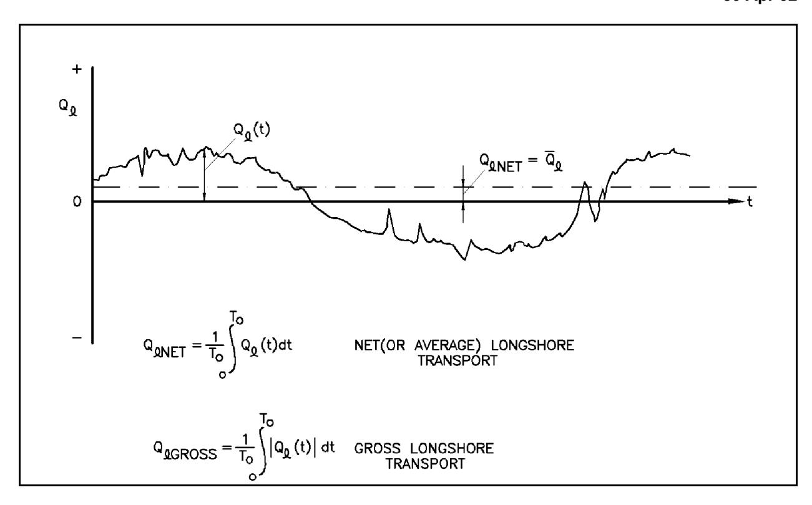

*Figure III-2-7. Longshore transport definitions*

(b) The gross longshore sediment transport rate is given by

```math
Q_{\ell GROSS} = \frac{1}{T_o} \int_{0}^{T_o} |Q_{\ell}(t)| dt \tag{III-2-19}
```

where T_o is the length of record, often taken to be greater than 1 year, and |Q_l| is the absolute magnitude of the longshore sediment transport rate. The gross longshore sediment transport rate is always defined positive. When the gross longshore sediment transport rate is multiplied by the time period, the derived quantity represents the total volume of sediment passing through a plane perpendicular to the shoreline regardless of the direction. The net longshore sediment transport rate may be either positive or negative.
(c) Although net and gross longshore sediment transport rates are often the most meaningful quantities for use in engineering design, the variability of the longshore sediment transport on much shorter time intervals is often of critical concern. As an example, if a channel is to be maintained clear of sediment, the pump(s) necessary to dredge the channel would need to be sufficiently large to handle the instantaneous maximum rate of longshore rate of sediment transport (that is projected to reach the channel). Typically, sizing for the maximum instantaneous rate of sediment transport would be economically unfeasible, and therefore some type of temporary sediment storage would be provided to allow for reduced pump sizing. Optimizing of the pump size and the provided sediment storage structures (possibly a groin, a breakwater, or some combination of both) will require knowledge of the fluctuating longshore sediment transport rates. Figure III-2-8 provides an example of the variability of annual rates of (net) longshore energy flux factor (which is proportional to the longshore sediment transport rate as given in Equation 2-2) for three locations on the East Coast of the United States as computed using 20 years of hindcast wave climate.

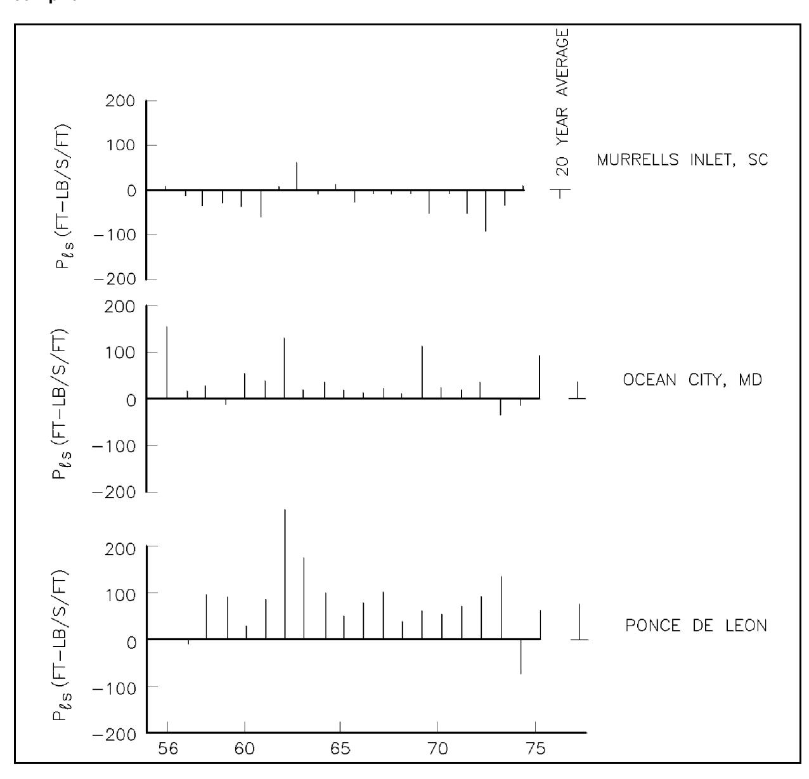

*Figure III-2-8. Time plot of annual longshore energy flux factor at three east coast sites (after Douglass (1985))*

Figure III-2-9 provides an example of the variability of the monthly (net) longshore energy flux factor for the same three locations. Figures III-2-8 and III-2-9 show that as the averaging period gets shorter, the variability of the sediment transport rate increases due to the fact that integration is a smoothing process and reduces the variance in the data. For design purposes, an assessment of the uncertainty in the sediment transport climate can be addressed via simulation of the sediment transport rates. Walton and Douglass (1985) have provided an approach to such simulation for the case of monthly sand transport rates which, for the locations assessed, appeared to be in reasonable conformance with a normal distribution assumption. Figure III-2-10 from Walton and Douglass (1985) shows the distribution of monthly averages of longshore energy flux factor for a coastal location in South Carolina. The data are reasonably represented by a normal distribution, as shown by the fit of the solid line to the data. Figure III-2-11, also from Walton and Douglass (1985), is for the same location but with weekly averages. In this case, the weekly averages vary considerably from a normal probability distribution.

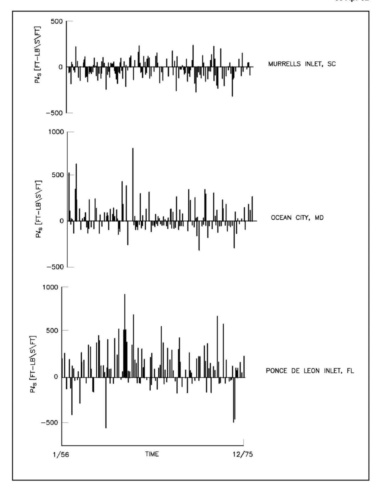

*Figure III-2-9. Time plot of monthly longshore energy flux factor time series for 1956-1975 at three east coast sites (after Douglass (1985))*

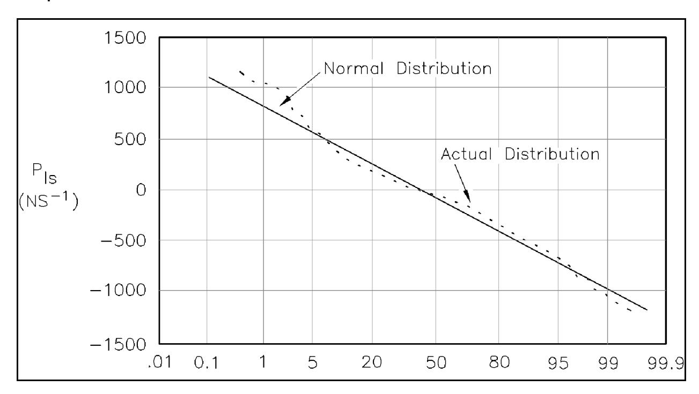

*Figure III-2-10. Probability plot for monthly average Pls series (Walton and Douglass 1985)*

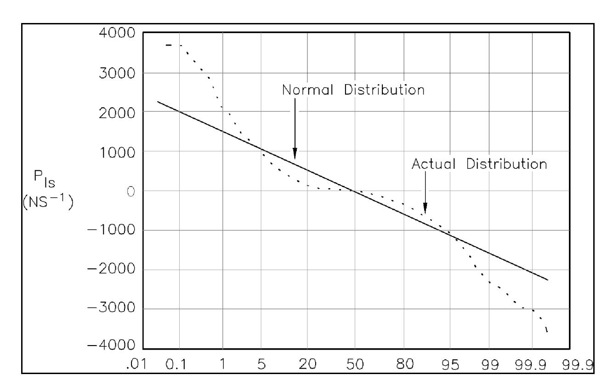

*Figure III-2-11. Probability plot for weekly average Pls series (Walton and Douglass 1985)*

- (d) Weggel and Perlin (1988) demonstrated that unidirectional annual transport variability may be described by a log-normal distribution. Thieke and Harris (1993) described similar results and noted that shorter-term (daily) dominant transports were better described by a Weibull distribution. These results apply only to statistics of transport in a single (positive or negative) direction and bidirectional distributions of transport are necessary to assess the true nature of the transport statistics for proper simulation (Walton 1989).
- (e) When assessing various design alternatives, the proper distribution of the sediment transport rate must often be modeled as well as the natural persistence inherent in the data. Persistence is the measure of correlation for data closely spaced in time, i.e., large persistence means high sediment transport rates follow high sediment transport rates and low sediment transport rates follow low sediment transport rates in adjacent timeaveraging intervals. Persistence is typically measured via the autocorrelation coefficient (see, for example, Box and Jenkins (1976)). Autocorrelations for monthly and weekly longshore energy flux factors at the same South Carolina site are shown in Figures III-2-12 and III-2-13 (Walton and Douglass (1985)). Data exceeding the dotted lines suggest that persistence is evident in the data. Nonstationary and non-normal types of data may be simulated via an approach provided in Walton and Borgman (1991).

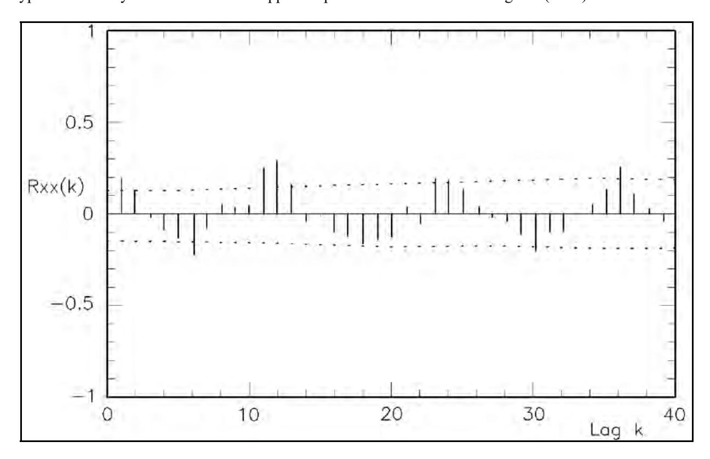

*Figure III-2-12. Autocorrelation of monthly $P_{ls}$ series (Walton and Douglass 1985)*

- (f) The significance of "episodic" transport to annual conditions is not well understood. It is thought that storm-related or other episodic events may cause the bulk of longshore sediment transport observed at some locations in the long term. Douglass (1985) suggested that 70 percent of the gross transport occurred during only 10 percent of the time at many sites via analysis of wave hindcast data.
- (2) Wave data accuracy. The accuracy of wave data used to calculate potential transport rates also leads to uncertainty in predictions. Wave measurements and observations have associated uncertainties based on

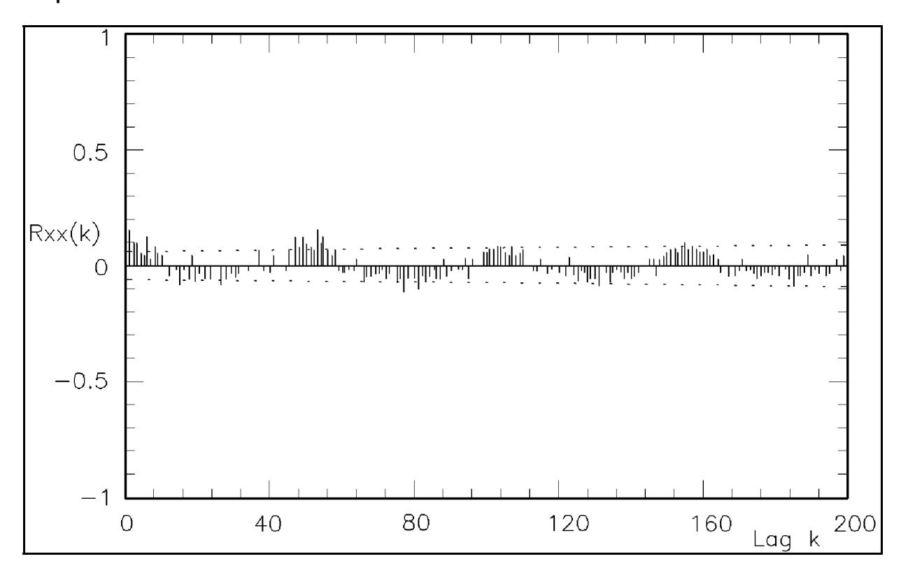

*Figure III-2-13. Autocorrelation of weekly average Pls series (Walton and Douglass 1985)*

instrumentation accuracy and observer bias. Given that there are breaking wave height and wave angle uncertainty values $∆H_{b}$ and $∆α_{b},$ respectively, an associated longshore transport uncertainty $∆Q_{R}$ can be calculated. From Equation 2-7b, we see that $Q_{R}$ ~ Hb 5/2 sin $2α_{b}.$ Uncertainty in the longshore transport rate can be estimated by including the uncertainties in breaking wave height and angle:

```math
Q_{\ell} \pm \Delta Q_{\ell} \sim (H_b \pm \Delta H_b)^{\frac{5}{2}} \sin 2(\alpha_b \pm \Delta \alpha_b) \tag{III-2-20}
```

Assuming that the wave angle at breaking is small, and using the first two terms of a Taylor series expansion of Equation 2-20, the uncertainty in the longshore transport rate is estimated as

```math
\Delta Q_{\ell} \sim \pm Q_{\ell} \left( \frac{\Delta \alpha_b}{\alpha_b} + \frac{5}{2} \frac{\Delta H_b}{H_b} \right) \tag{III-2-21}
```

Thus, a 15-percent uncertainty in wave height and 15 percent uncertainty in wave angle result in 37.5- and 15-percent uncertainty contributions for height and angle, respectively, totaling a 52.5-percent uncertainty in Q R .
(3) Sand supply availability. Application of the potential longshore sand transport equations presented herein results in an estimate of transport that implies the availability of an unlimited supply of sand. If sand availability is limited, such as on a rocky or reef coastline, or interrupted such as in the vicinity of groins, jetties, or breakwaters, the actual longshore sand transport rate will be less than the calculated rate.

## e. Littoral drift roses .

- (1) The littoral drift rose is a potentially useful tool for interpreting littoral drift trends along a section of shoreline where the shoreline curvature is mild and bottom contours are reasonably parallel to the shoreline (Walton 1972, Walton and Dean 1973). The littoral drift rose shows how the littoral drift changes with change in shoreline orientation relative to prevailing wave climatology. The drift rose is constructed using standard prediction techniques for calculating littoral drift given that the shoreline is oriented in a direction sn, where $s_{n}$ is the azimuth angle of the perpendicular to the shoreline in the seaward direction (see Figure III-2-14 for an example measurement of $s_{n}$ at Ponte Vedra Beach, FL). The principle behind the littoral drift rose is that a range of shoreline orientations is considered. These orientations correspond to the range that exists at the study site. For each possible shoreline orientation, as described by $s_{n},$ the total positive and negative littoral drifts along the shoreline are calculated for a given time-averaging interval (i.e., 20 years, annual, monthly, etc.). These calculated drift values are plotted in a polar plot, as shown in Figure III-2-15 for the Ponte Vedra Beach, FL area. From the plots, the littoral transport rate for any given shoreline orientation can be determined by entering the plot with the seaward directed normal of the shoreline orientation "sn" and reading off the total positive, total negative, and net littoral drift values. As the littoral drift for a given wave angle is proportional to sin $(2α_{b}),$ the net drift rose average for a real wave climatology has lobes that cause the magnitude to vary in a similar manner as sin $(2s_{n}).$
- (2) Littoral drift roses so constructed may be utilized in helping to identify tendencies of the shoreline toward stability or instability. As an example, for a long shoreline with variations of shoreline orientation, it is possible that there is a null (also termed nodal) point along the shoreline, which is defined as the location for which the averaged positive and negative littoral transport have the same magnitudes, yielding zero net drift. The littoral drift rose can be utilized in helping to identify this null (nodal) point. On the littoral drift rose, this null (nodal) point is reflected as a crossing of the positive and negative littoral drifts on the total littoral drift rose, or, as the point at which the net drift is zero on a net drift rose. Walton (1972) and Walton and Dean (1976) identified potential null points on barrier islands along the Florida coastline using the littoral drift rose and by integrating the longshore sand transport equation using changes in historical shorelines along with a known boundary condition of sediment accumulation at the end of the islands. Along the East Coast of the United States, there are several well-documented null points, such as just north of the Delaware-Maryland state boundaries and in New Jersey near Barnegat Inlet. At both of these locations the shoreline orientation changes significantly near the sites of the null (nodal) points and the net drift is to the south, south of the null (nodal) points, and to the north, north of the nodal points. Mann and Dalrymple (1986) examined the location of a null point along the Delaware coastline and concluded that there was a significant variation in its annual location, corresponding to the variation in the annual littoral drift rates. Such a shifting should be reflected in littoral drift roses for different averaging periods.
- (3) Walton (1972) and Walton and Dean (1973) examined the stability of many shorelines using the littoral drift rose concept. Figure III-2-16 shows an "unstable" littoral drift rose and a barrier island orientation such that the initial island is oriented at the angle of the "unstable" null (nodal) point. Applying this rose to the island in the figure, it can be seen that if a negative perturbation (recession of shoreline due to mining, barrier overwash, etc.) is initiated on the island (away from the ends of the island where the transport scenario would not conform to the assumptions of the calculated littoral drift), the induced transport is away from the null point resulting in an erosional feature growth and potential island breakthrough (hence the term "unstable"). In a similar manner, for the "unstable" littoral drift rose an induced transport response to a positive shoreline perturbation in the same location (perhaps due to dredge spoil placement) would induce further transport of sand toward the perturbation, causing the perturbation to grow (a self-sustaining "positive" feedback mechanism). Walton (1972) has postulated that cuspate features such as shown in Figure III-2-17 (often found in bays, rivers, etc.) may be the result of "unstable" littoral drift roses for those sites due to the wave climatology experienced in long narrow fetch-enclosed locations.

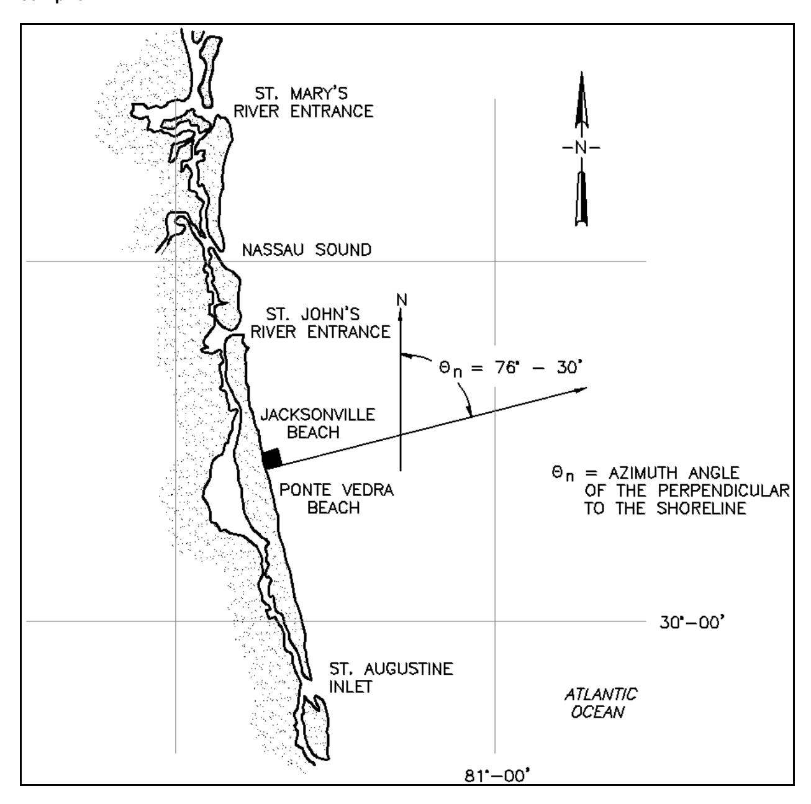

*Figure III-2-14. Azimuth of normal to shoreline at Ponte Vedra Beach, Florida (Walton 1972)*

(4) Another possibility is that the littoral drift rose along a shoreline is as shown in Figure III-2-18. In this case the null (nodal) point is stable. Perturbations in the shoreline, positive (accretions) or negative (recessions), now result in transport which tends to reduce rather than accentuate the perturbation (a "negative" feedback mechanism). In this case there is not a self-sustaining tendency toward island breaching Walton (1972) noted that the east coast of Florida is characterized by this type of littoral drift rose and, in fact, there are relatively few natural inlets along this coastline and a historical tendency of those inlets that are opened by man to close (unless closure is prevented via coastal structures such as jetties).

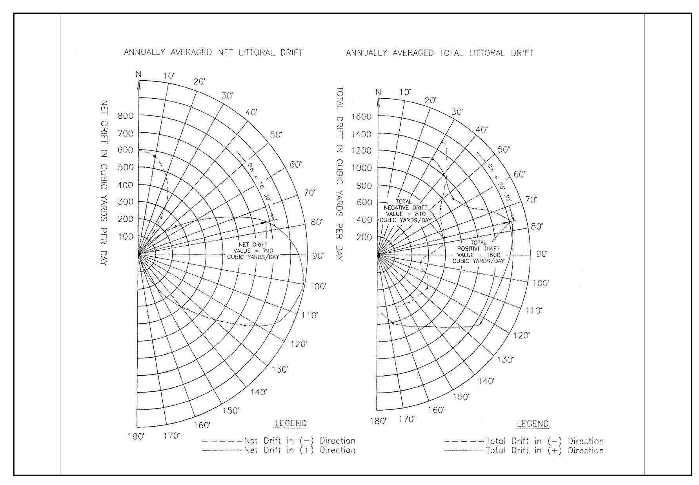

*Figure III-2-15. Net and total littoral drift at Ponte Vedra Beach, Florida (Walton 1972)*

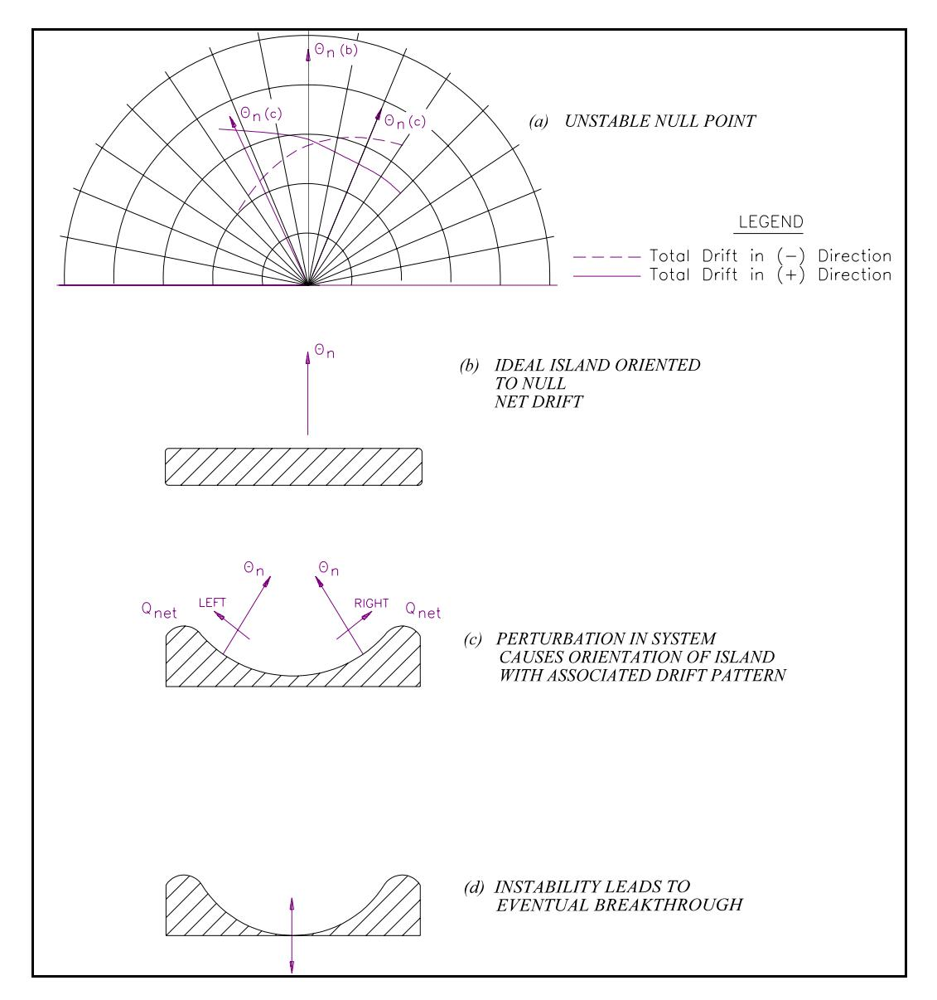

*Figure III-2-16. Ideal case of an unstable null point (Walton 1972)*

- f. Cross-shore distribution of longshore sediment transport .
- (1) The relationships given herein yield rates of total longshore sediment transport. Some applications require evaluations of the cross-shore distribution of the transport; e.g., for the effective design of groins, jetties, and sand weirs for weir jetties. In addition, a description of the cross-shore transport distribution is required in many computer simulation models.
- (2) Bodge (1986) presents a literature review of the data and models which describe the cross-shore distribution of the longshore sediment transport. The collection of field data regarding this topic is difficult. The earliest approach was to use sand tracers (e.g., Zenkovitch 1960; Ingle 1966; Inman, Komar, and Bowen 1968; Inman, Tait, and Nordstrom 1971; Inman et al. 1980; Kraus et al. 1982, White 1987). As an example, Zenkovitch (1960) determined distributions at a coastal site by averaging a large number of tracer observations and found three maxima for the sand transport: two over longshore bars and a third in the swash

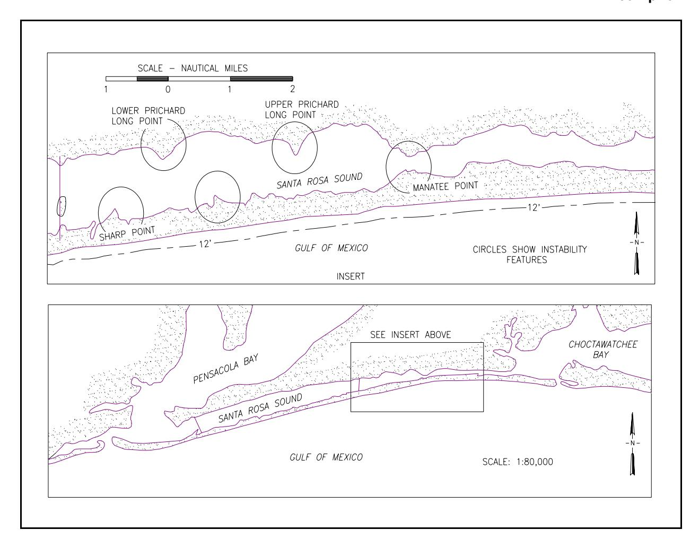

*Figure III-2-17. Instability-formed capes in Santa Rosa Sound (Walton 1972)*

zone. Ingle (1966) used fluorescent-dyed sediment at five test sites along the California coast to investigate the longshore rate of tracer dispersion, as well as its cross-shore distribution. An example of the cross-shore distribution of tracer density measured at Goleta Point in October 1961 is shown at three measurement intervals for two surf zone cross-sections in Figure III-2-19. Cross-section A represents conditions 46 m (150 ft) downdrift of the release line, and cross-section B is 46 m (150 ft) downdrift of cross-section A. The distributions indicate that the most rapid tracer dispersal took place at the edge of the swash zone, while the greatest tracer transport took place at the breaker zone.
(3) Using sediment traps operated from a Florida pier across the outer portion of the surf zone, Thornton (1972) found that longshore transport was a maximum on the seaward side of the longshore bar where waves were breaking. Sawaragi and Deguchi (1978) placed round sediment traps divided into pie-shaped sections into the beach and found three basic longshore transport distribution profiles: (1) maximum in the swash zone or near the shoreline, (2) maximum at the breaker line, and (3) bimodal with maxima at the shore and breaker lines. From a field study using fluorescent tracers, Kraus et al. (1982) likewise observed similar results in addition to a generally uniform cross-shore distribution. Berek and Dean (1982) inferred longshore transport distribution from measurements of contour rotation in a pocket beach at Santa Barbara, California, and found from their data that the transport was greatest across the inner surf zone. Kraus and Dean (1987) and Kraus, Gingerich, and Rosati (1989) give general examples of vertical and cross-shore distributions of longshore sediment flux measured with portable traps (see Figure III-2-2).

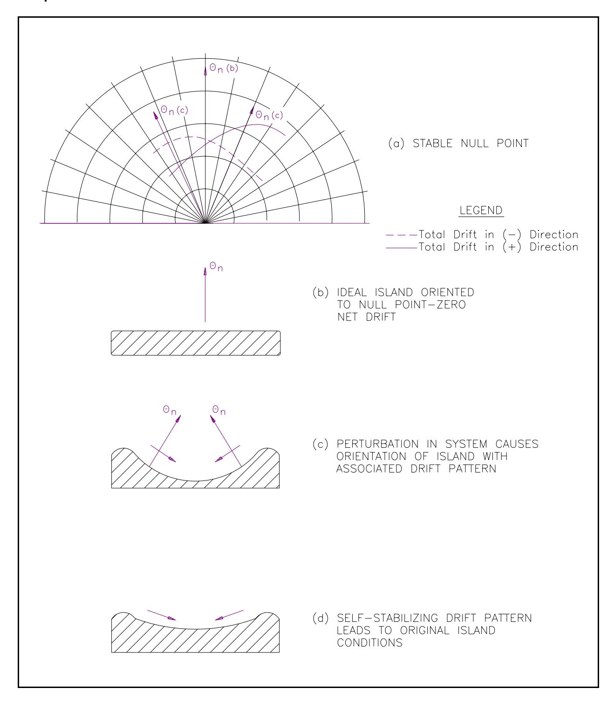

*Figure III-2-18. Ideal case of a stable null point (Walton 1972)*

(4) Kana (1978) measured the vertical suspended sediment concentration at locations across the surf zone, and longshore current velocity at a mid-surf position. His measurements indicated that, for spilling waves, sediment concentration rapidly increased inside the breakpoint, then remained relatively constant under the bore as it propagated towards the beach. For plunging waves, sediment concentration peaked

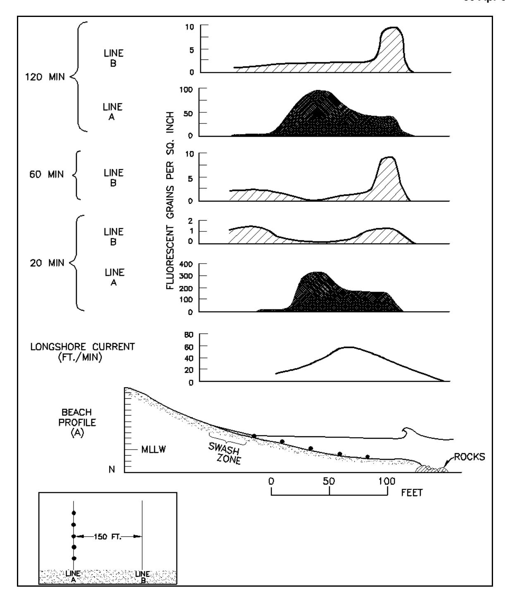

*Figure III-2-19. Distribution of tracer density across the surf zone, 20 October 1961 Goleta Point, California, experiment (Ingle 1966)*

within a few meters of the breakpoint, then decreased gradually towards shore (see Figure III-2-20). Downing (1984) and Sternberg, Shi, and Downing (1984) likewise measured vertical sediment concentration profiles simultaneously with the longshore current, and found maximum transport at about the mid-surf-zone location. The measurements did not include the inshore portion of the surf zone and did not account for bedload transport.

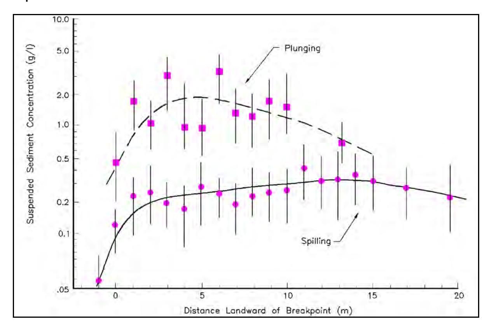

*Figure III-2-20. Distribution of mean sediment concentration at 10 cm above the bed, relative to wave breakpoint (Kana 1978)*

Bodge and Dean (Bodge 1986; Bodge and Dean 1987a, 1987b) utilized a short-term sediment impoundment scheme in the field and laboratory, consisting of the rapid deployment of a low profile, shore-perpendicular barrier. Beach profile changes in the vicinity of the barrier were determined from repeated surveys over short intervals of time, simultaneously with measurements of surf zone wave heights and currents. Four separate field experiments were undertaken at the CHL Field Research Facility at Duck, North Carolina. Two crossshore distribution profiles from the field experiments are shown by the light lines in Figures III-2-21a and III-2-21b, indicating the presence of a maxima in the outer surf zone just shoreward of the breaker zone, and a second maxima in the swash zone. Light lines in Figures III-2-21c through III-2-21g show laboratory results for wave types including spilling, plunging, and collapsing. The plunging/spilling laboratory conditions (Figure III-2-21d) were modeled after the surf zone conditions of the field experiment in Figure III-2-21a. The error bars on the light lines indicate the most probable range of the local longshore transport contribution at each location across the surf zone, reflecting uncertainties in the assessed local magnitude of cross-shore transport, updrift limit of impoundment, and/or the degree of groin bypassing. The data suggest that the transport distribution is generally bimodal with peaks at the shoreline and at the midouter surf zone. The relative significance of the peaks was seen to shift from the near-breakpoint peak to the near-shoreline peak as the breaking wave condition varied from spilling to collapsing. Longshore transport seaward of the breakpoint represented about 10 to 20 percent of the total. Swash zone transport accounted for at least 5 to 60 percent of the total for spilling to collapsing conditions, respectively.
(5) In general, the field (and laboratory) studies of longshore transport indicate that (1) significant levels of transport may occur at and above the shoreline, (2) about 10 to 30 percent of the total transport occurs seaward of the breaker line, (3) maximum local transport has been noted within the shoreward half of the surf zone as often as within the seaward half, and (4) greater transport is often associated with shallower depths

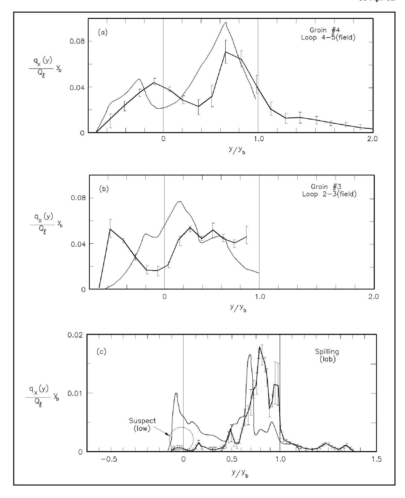

*Figure III-2-21. Cross-shore distribution of longshore sediment transport as measured by Bodge and Dean (Bodge 1986, Bodge and Dean 1987a, 1987b) at Duck, North Carolina, and in the laboratory (Continued)*

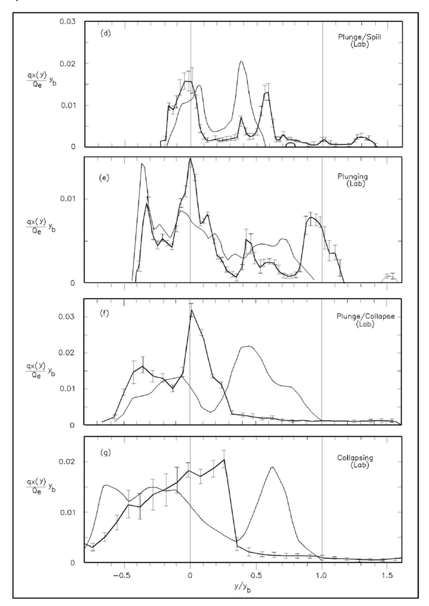

*Figure III-2-21. (Concluded)*

and breaking waves (i.e., breakpoint bars and the shoreline). Overall, field measurements demonstrate great variability in the shape of the longshore transport distribution profile across shore.
(6) Stresses exerted by waves vary in the cross-shore direction, generally decreasing from the breaker zone to the shoreline, but not necessarily in a uniform manner due to the presence of bars and troughs on the beach profile. The longshore current also has a characteristic profile, and because sand transport is a result of the combined waves and currents, its distribution will be related to their distributions. Theoretical relationships for the cross-shore distribution of longshore sediment transport have been postulated (e.g., Bagnold 1963, Komar 1977, Walton 1979, McDougal and Hudspeth 1981, Bailard and Inman 1981); however, they have not been shown to reproduce field measurements well. Using data from their field and laboratory experiments, Bodge and Dean tested five existing cross-shore distribution relationships, which were concluded to give from fair to poor correlation with measurements. Bodge and Dean based on the work of Bagnold (1963) also proposed a relationship for the cross-shore distribution of longshore sediment transport which assumes that sediment is mobilized in proportion to the local rate of wave energy dissipation per unit volume, and transported alongshore by an ongoing current

```math
q_x(y) = k_q \frac{1}{d} \frac{\partial}{\partial x} (E C_g) V_{\ell} \tag{III-2-22}
```

where q_x(y) is the local longshore transport per unit width offshore, y represents the cross-shore coordinate, k_q is a dimensional normalizing constant, d is the local water depth in the surf zone (including wave-induced setup), E represents the local wave energy density, C_g is the local wave group celerity, and V_{\ell} is the local longshore current speed. Equation 2-22 can be expanded by assuming shallow water conditions, small angles of wave incidence, and assuming a nonlinear value for C_g = (g(H+d))^{1/2}

```math
q_x(y) = k_q \frac{1}{8} \rho g^{\frac{3}{2}} \frac{H}{\sqrt{H+d}} \left[ 2\frac{dH}{dy} + \frac{H}{2(H+d)} \frac{d}{dy} (H+d) \right] V_{\ell} \tag{III-2-23}
```

in which H is the local wave height in the surf zone. Equation 2-23 represents conditions landward of the breakpoint; seaward of the breakpoint, q_x(y) = 0 under the assumption that no energy dissipation occurs. In application of Bodge and Dean's relationship, the dimensional constant k_q may be determined by integrating the distribution q_x(y) across the surf zone, and equating this quantity to the total longshore sand transport rate Q_{\ell}
- (7) The model (solid lines in Figure III-2-21) was compared with field data, and predicted the general trend of the measured transport distribution fairly well for one case (Figure III-2-21a), but shifted the cross-shore distribution slightly shoreward relative to the measured data for the second case (Figure III-2-21b). Comparison of the model with laboratory data indicated that the model generally overpredicted transport in the mid-surf zone (especially for the plunging/collapsing and collapsing cases) and modeled the near-shoreline transport distribution to a more reasonable degree than previous approaches. g. Application of longshore sediment transport calculations. (1) Littoral budgets.
- (a) A littoral sediment budget reflects an application of the principle of continuity or conservation of mass to coastal sediment. The time rate of change of sediment within a system is dependent upon the rate at which material is brought into a control volume versus the rate at which sediment leaves the same volume. The budget involves assessing the sedimentary contributions and losses and equating these to the net balance of sediment in a coastal compartment. Any process that results in a net increase in sediment in a control

#### FIND:

Cross-shore distribution of longshore sediment transport using Equation 2-23.

#### GIVEN:

Waves in 10-m (32.8-ft) depth have an rms wave height of 2.0 m (6.6 ft), angle of 10 deg to the shoreline, and wave period 8.5 sec. The beach profile is as given below. Assume the wave height to water depth ratio for incipient breaking κ = 1.0, the stable wave height to water depth ratio for wave re-formation $Γ_{stb}$ = 0.40, the energy flux dissipation rate γ = 0.15, the lateral mixing coefficient $Λ_{mix}$ = 0.30, and bottom friction coefficient $C_{f}$ = 0.01. The K parameter (for use in longshore transport relationships) was calculated as 0.60.

|  | Beach profile for Example III-2-7 |  |
| --- | --- | --- |
| No. | Distance Offshore (m) | Depth (m) |
| 1 | 100.0 | -0.60 |
| 2 | 111.0 | 0.10 |
| 3 | 132.0 | 1.00 |
| 4 | 145.0 | 1.50 |
| 5 | 156.0 | 1.70 |
| 6 | 169.0 | 1.90 |
| 7 | 173.0 | 1.95 |
| 8 | 186.0 | 1.85 |
| 9 | 190.0 | 1.80 |
| 10 | 195.0 | 1.70 |
| 11 | 199.0 | 1.75 |
| 12 | 207.0 | 1.81 |
| 13 | 214.0 | 2.00 |
| 14 | 246.0 | 3.10 |
| 15 | 340.0 | 4.00 |

#### SOLUTION:

Part II-3 presents relationships for nearshore wave transformation and Part II-4 discusses the cross-shore distribution of nearshore currents. Alternately, the PC-based numerical model NMLONG (see Part II-4 for a complete description) may be used to calculate the cross-shore distribution of total water depth and longshore current speed over an irregular bottom profile (Kraus and Larson 1991), which can be used in application of Equation 2-23. Entering the given data set, with 100 computation points, a cross-shore spacing of 2.0 m (6.6 ft), no wind, and a tidal reference elevation of 0.0, the cross-shore distribution of waves and currents as shown in Figure III-2-22b is obtained. A reduced listing of the NMLONG output, chosen to represent the peaks and minima of the wave height and longshore current distributions, is presented in the first four columns of the following table. The predicted $q_{x}(y)/k_{q}$ is shown in the last column and in Figure III-2-22a.
99Example Problem III-2-7 (Sheet 1 of 4)

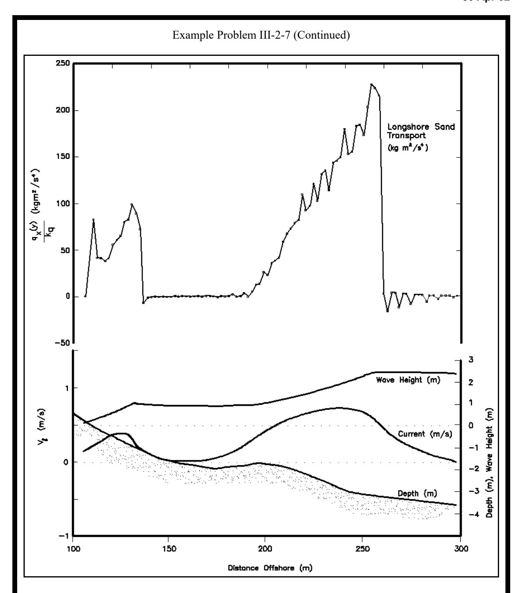

*Figure III-2-22. Example III-2-7, predicted cross-shore distribution of longshore sand transport, wave height, and longshore current speed*

Example Problem III-2-7 (Sheet 2 of 4)
Example Problem III-2-7 ( Continued)

| Output from NMLONG and Calculation of Cross-shore Distribution of Longs | shore |
| --- | --- |
| Transport for Example Problem III-2-7 |  |

| Cross-shore Coordinate | Depth d | Wave Height | Longshore current speed | q_x(y)/k_q |
| --- | --- | --- | --- | --- |
| (m) | (m) | H (m) | (m/sec) | (kg m²/sec 4 ) |
| 110 | 0.09 | 0.20 | 0.20 | 83.3 |
| 112 | -0.04 | 0.26 | 0.22 | 41.6 |
| 114 | -0.14 | 0.32 | 0.25 | 40.8 |
| 126 | -0.66 | 0.67 | 0.39 | 80.4 |
| 128 | -0.74 | 0.74 | 0.39 | 82.9 |
| 130 | -0.83 | 0.82 | 0.39 | 99.1 |
| 132 | -0.91 | 0.90 | 0.34 | 89.4 |
| 134 | -1.00 | 0.98 | 0.26 | 72.0 |
| 136 | -1.08 | 0.96 | 0.20 | - 6.9 |
| 148 | -1.52 | 0.90 | 0.05 | - 0.6 |
| 150 | -1.55 | 0.89 | 0.04 | - 0.7 |
| 152 | -1.59 | 0.89 | 0.03 | 0.2 |
| 160 | -1.73 | 0.87 | 0.02 | - 0.4 |
| 162 | -1.76 | 0.87 | 0.02 | 0.10 |
| 164 | -1.79 | 0.87 | 0.02 | 0.10 |
| 178 | -1.93 | 0.85 | 0.07 | - 0.4 |
| 180 | -1.91 | 0.85 | 0.08 | - 0.3 |
| 182 | -1.90 | 0.86 | 0.10 | 2.0 |
| 204 | -1.80 | 1.10 | 0.51 | 37.5 |
| 210 | -1.84 | 1.14 | 0.54 | 67.0 |
| 212 | -1.89 | 1.18 | 0.56 | 72.2 |
| 238 | -2.76 | 1.77 | 0.74 | 149.5 |
| 240 | -2.83 | 1.83 | 0.74 | 179.7 |
| 242 | -2.89 | 1.88 | 0.74 | 152.6 |
| 256 | -3.18 | 2.34 | 0.63 | 223.8 |
| 258 | -3.20 | 2.42 | 0.59 | 215.2 |
| 260 | -3.21 | 2.42 | 0.53 | 2.3 |
| 278 | -3.39 | 2.39 | 0.19 | 1.5 |
| 280 | -3.41 | 2.39 | 0.17 | 1.4 |
| 282 | -3.43 | 2.38 | 0.15 | - 5.2 |

Example Problem III-2-7 (Sheet 3 of 4)

#### Example Problem III-2-7 (Concluded)

For some applications, such as weir design, only the percentage of longshore transport in a given region of the surf zone is of interest, and determination of the dimensional normalizing constant k_q may not be necessary. However, k_q may be calculated by integrating q_x(y)/k_q across the surf zone, determined here by calculating the area below the points in Figure III-2-22b

```math
\int_{y_s}^{y_b}\frac{q_x(y)}{k_q}\ dy = \frac{1}{k_q}\int_{106}^{260} q_x(y)\ dy \approx \frac{9300}{k_q}\ \frac{\text{kg m}^2}{\sec^4}
```

where y_s is the cross-shore coordinate at the start of the surf zone, (approximately 106 m) and y_b is the cross-shore coordinate at the breaker line (the breaking wave height of 2.42 m occurs at 260 m). Next, the total longshore sand transport rate is calculated. The offshore wave celerity may be calculated using linear wave theory as C_{gl} = 9.0 m/sec. Breaking wave angle may be calculated using Snell's Law (Equation 6-13) with input wave conditions ( \alpha_l = 10^\circ , d_l = 10 m) and a depth at breaking = 3.2 m

```math
\frac{\sin \alpha_1}{C_{gl}} = \frac{\sin \alpha_b}{C_{gb}}
```

```math
\frac{\sin 10^o}{9.0} = \frac{\sin \alpha_b}{(9.81 (3.2))^{\frac{1}{2}}}
```

```math
\alpha_b = 6.2^o
```

The total longshore transport rate may be calculated using Equation 2-7b where K = 0.60

```math
Q_{\ell} = K \left( \frac{\rho \sqrt{g}}{16 \kappa (\rho_{s} - \rho)(1 - n)} \right) H_{b rms}^{\frac{5}{2}} \sin(2\alpha_{b})
```

```math
Q _ { \ell } \ = \ 0 . 6 0 \ \frac { \left( 1 0 2 5 \right) \left( 9 . 8 1 \right) ^ { \frac { 1 } { 2 } } } { 1 6 \ \mathrm { ( 1 ) } \ ( 2 6 5 0 \ - \ 1 0 2 5 ) \ \mathrm { ( 1 \ - \ 0 . 4 ) } } \ \left( 2 . 4 2 \right) ^ { \frac { 5 } { 2 } } \ \sin ( 2 \mathrm { ( 6 . 2 ^ { \circ } ) } )
```

```math
Q_{\ell} = (0.242 \text{ m}^3/\text{sec}) (3600 \text{ sec/hr}) (24 \text{ hr/day})
```

```math
Q_{\ell} = 20.9 \times 10^3 \text{ m}^3/\text{day} (27.3 \times 10^3 \text{ yd}^3/\text{day})
```

The value of k_q may be calculated

```math
\frac { 9 3 0 0 } { k _ { q } } \frac { k g \ m ^ { 2 } } { \sec ^ { 4 } } = 0 . 2 4 2 \frac { m ^ { 3 } } { \sec }
```

Therefore, k_q \sim 38,000 \text{ sec}^3/\text{kg} , and the transport rates in Figure III-2-22b and the table can be converted to values of q_x(y) (units m<sup>3</sup>/sec/m), if desired.
Example Problem III-2-7 (Sheet 4 of 4)
volume is called a source . Alternately, any process that results in a net loss of sediment from a control volume is considered a sink . Some processes can function as sources and sinks for the same control volume (e.g., longshore sediment transport). The balance of sediment between losses and gains is reflected in localized erosion and deposition. In general, longshore movement of sediment into a coastal compartment, onshore transport of sediment, additions from fluvial transport, and dune/bluff/cliff erosion provide the major sources of sediment. Longshore movement of sediment out of a coastal compartment, offshore transport of sediment, and aeolian transport and washover that increase beach/island elevation produce losses from a control volume. Sediment budgets, including the types and importance of sources and sinks, are discussed in detail in Part IV-5.
- (b) The appropriate level of detail for a littoral budget is a function of the intended uses of the littoral budget, and the available resources to complete the project. The essential components of a littoral budget include a site description, background, and examination of previous analyses. Past and present conditions, and the results of other studies, must be examined before initiating a new budget analysis.
- (c) The longshore sediment transport rate must be determined next. This requires data on wave conditions over as long a time period as possible. These waves are propagated to and transformed in the surf zone. Appropriate sediment transport equations must be applied, ideally using historical shoreline positions and wave conditions for the same time period to, in effect, "calibrate" the transport equations for the study site. Very often, shoreline change models, which use the sediment transport equations, are applied. Boundary conditions defined at the start of the analysis are changed, so that sensitivity of the budget to these conditions may be evaluated.
- (d) The actual sediment budget may then be determined. Usually there are poorly quantified components remaining in the analysis, such as offshore gains and losses. These must be estimated using any available data, engineering judgment, and the requirement that the budget close. Although a significant effort goes into the development of a littoral budget, it must be remembered that it is an estimate and may easily be in error. In addition, the budget is usually calibrated with shoreline positions over a number of years, and therefore indicates long-term average rates of change. It may not be indicative of the changes in any one year. (2) Variations in longshore sediment transport along the coast.
- (a) As described in the next section, noncohesive shorelines are not typically straight. The shoreline orientation and the degree to which waves refract, shoal, and converge or diverge along the shoreline determine variations in the potential transport rate along the coast. These variations are important determinants to shoreline change along the coast. For a nonuniform coastline, the potential longshore sediment transport rate is computed at discrete points along the coastline using values of the local breaking wave height and angle, where the latter is expressed relative to the local shoreline orientation. A ray-tracing or grid-based wave refraction analysis is typically employed to determine these values.
- (b) Shoreline change may be related to the computed gradients in transport rate along the coast. For example, areas of convergent transport may correspond to a sediment sink (or deposition). Areas of divergent transport may correspond to a sediment source (or erosion if the area is not a source). As long as there is an unlimited sediment source, a shoreline's response to longshore sediment transport should be dependent on gradients in transport along the coast rather than magnitudes of transport.
- h. Three-dimensionality of shoreline features .
- (1) The three-dimensionality of noncohesive shoreline shape and its corresponding underwater expression are important to various aspects of engineering design. Dunes are more susceptible to breakthrough where the beach width fronting the dune is narrow due to the diminished protection afforded by the berm. Noncohesive shorelines are typically neither straight nor of smooth curvature. They often have isolated "bumps" or more regularly spaced shoreline features. Migration of such shoreline features can undercut or flank the landward ends of coastal structures such as seawalls or groins. For this reason any regularly spaced (rhythmic) topographic features inherent in the beach/shoreline structure as reflected in its planform shape may be of importance to the engineer for consideration of risk factors in evaluation of projects. Little is known about these features from a quantitative standpoint, although considerable qualitative descriptions of the features are documented.
- (2) Typically, shoreline rhythmic features are classified by their planform (longshore) spacing or approximate wavelength if they are of reasonably regular form and hence are often referred to as "sand waves" by many authors. The term "sand wave" in this context should not be confused with underwater sand waves that are ubiquitous in most marine environments. Planform amplitude or height of the shoreline features (defined as cross-shore distance from embayment to cusp point) often is correlated with the wavelength. That is, longer shoreline planform wavelength (or alongshore spacing) suggests larger planform amplitudes (Sonu 1969). Along most shorelines, a spectrum of rhythmic shapes and sizes is present, making the underlying shoreline planform characteristics somewhat confusing. Due to the continuous range of scale in observed shoreline rhythmic features it is impossible to completely separate discussion of the various features by size since the physics governing the various length scales may be similar.
- (3) At the small end of the scale of rhythmic shoreline features (and consequently of lesser engineering significance) are "beach cusps." Figure III-2-23 is an example of a beach with developed beach cusps. Russell and McIntire (1965) compile observational statistics on beach cusps from a number of ocean beaches and show cusp planform wavelengths (or longshore spacing) from 6 to 67 m. Numerous authors have postulated theories for the conditions of formation as well as spacing and amplitude of these smaller-scale features.
- (4) At present, though, an explanation that would encompass all the numerous small-scale rhythmic features noted along the shoreline is lacking. Extended discussion on these smaller-scale shoreline features can be found in Komar (1976).
- (5) As an example of larger-scale rhythmic topography, Figure III-2-24 shows a shoreline from Tokai Beach, Japan (Mogi 1960), in which two predominant wavelength scales of rhythmic sinuous topography dominate over a 3-month period of study. The shorter planform wavelengths in this example are on the order of 250 m while the longer planform wavelengths are on the order of 2.5 km. Although phasing changes are evident, the rhythmic feature length scales appear to have prevailed throughout the different survey periods. Lippmann and Holman (1990) have documented the conditions for rhythmic bars along one section of the North Carolina shoreline (Duck, NC). They found that rhythmic bars were a predominant feature observed in 68 percent of video imaging records and noted that during the strongest wave activity the rhythmic features were destroyed but that the features returned 5-16 days following peak wave events.
- (6) Along beaches in Japan, Hom-ma and Sonu (1963) observed that under certain conditions crescentic bars with a regular alongshore spacing would weld to the shoreline with consequent large cusps formed at the attachment points (see Figure III-2-25). Sonu (1973) notes a second type of rhythmic topography in which rhythmic shoreline features are associated with the presence of rip current cell circulation (see Figure III-2-26). Sonu (1973) noted that both types of rhythmic topography could be present independently

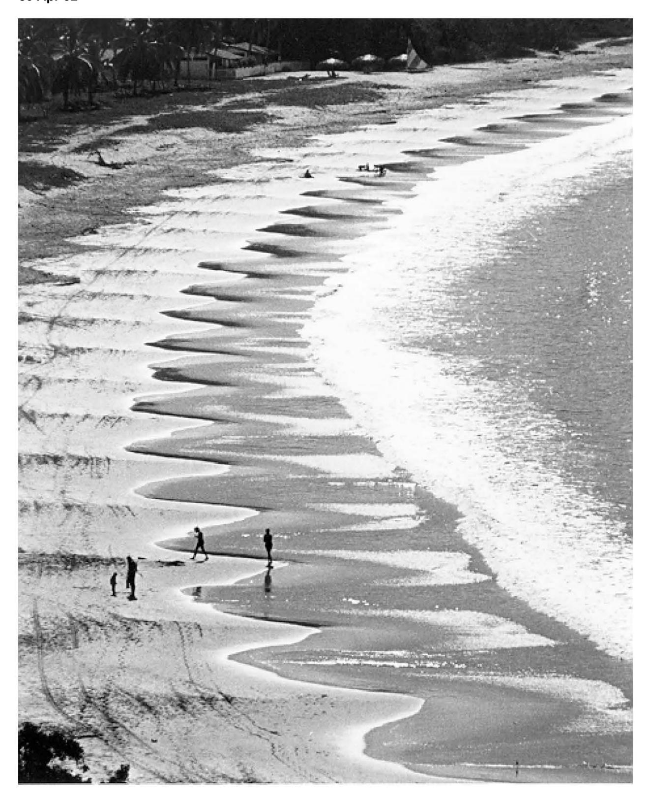

*Figure III-2-23. Beach cusps on a sandy beach in Mexico (photograph courtesy of Paul Komar)*

| Table III-2-3 List of Authors Postulating Theories for Cusp Development |  |
| --- | --- |
| Johnson (1910, 1919) | Dalrymple and Lanan (1976) |
| Dolan and Ferm (1968) | Dubois (1978) |
| Escher (1937) | Shepard (1973) |
| Longuet-Higgins and Parkin (1962) | Dolan, Vincent, and Hayden (1974) |
| Russell and McIntire (1965) | Flemming (1964) |
| Bagnold (1940) | Krumbein (1944b) |
| Williams (1973) | Komar (1973) |
| Kuenen (1948) | Zenkovitch (1964) |
| Sonu (1972, 1973) | Otvos (1964) |
| Sonu and Russell (1967) | Sonu, McCloy, and McArthur (1967) |
| Bowen (1973) | Bowen and Inman (1969) |
| Guza and Bowen (1981) | Guza and Inman (1975) |
| Sallanger (1979) | Seymour and Aubrey (1985) |
| Holman and Bowen (1979, 1982) | Darbyshire (1977) |
| Darbyshire and Pritchard (1978) | Dean and Maurmeyer (1980) |

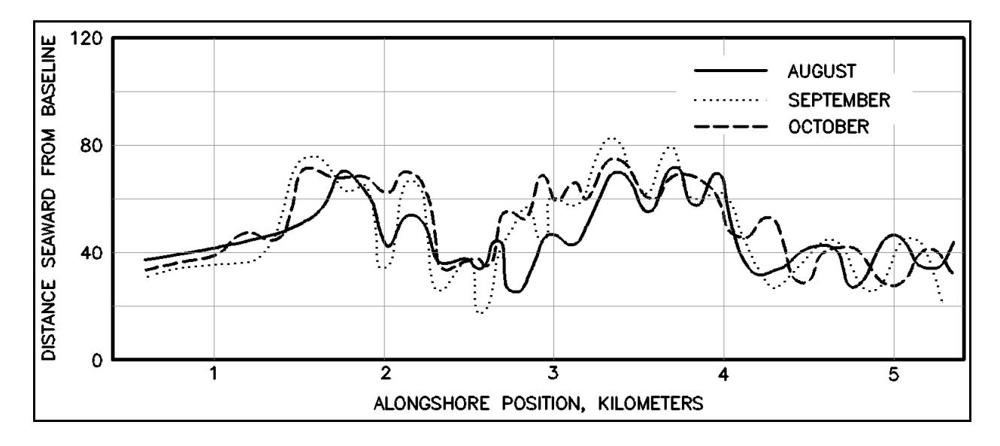

*Figure III-2-24. Shoreline fluctuations in plan view at Tokai Beach, Japan (after Mogi (1960))*

along a shoreline, and that the crescentic bar type of feature is typically at larger scales than the features associated with rip current cell circulation.
(7) Sonu (1973) details numerous examples of world coastlines with rhythmic shoreline/nearshore features, and notes the ubiquitous nature of these features via their existence on long uninterrupted coastlines as well as embayment shorelines between headlands, in tideless seas as well as coasts with tidal ranges up to 4 m, and on beaches with grain size ranging from sand to gravel. Observations of the planform wavelength (or alongshore spacing) of the features varies markedly, including 100 to 300 m along the east coast of Florida (Bruun and Manohar 1963); 64 to 218 m between transverse bars on the low-energy sheltered coast

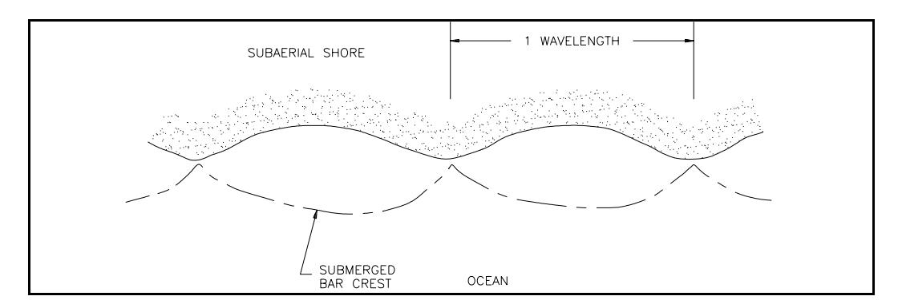

*Figure III-2-25. Rhythmic shoreline features associated with the presence of crescentic bars welded to the shoreline*

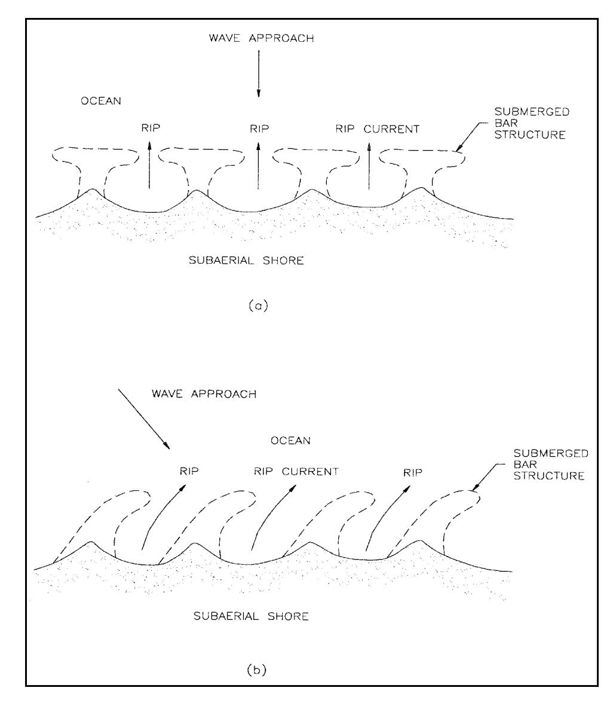

*Figure III-2-26. Cusp rhythmic features in conjunction with rip currents under wave action approaching shoreline obliquely (adapted from Sonu (1973))*

- of St. James Island, Florida (Niedoroda and Tanner 1970); 100 to several thousand meters in the case of the example shown in Figure III-2-25 (Sonu 1973); up to 1,500 m for giant cusps noted along various beaches (Shepard 1952, 1973); and on the order of hundreds of meters along the Atlantic bluff shoreline of Cape Cod, Massachusetts (Aubrey 1980). Sonu and Russell (1967) noted, and later Dolan (1971) measured shoreline rhythmic features along the North Carolina coast with alongshore spacing ranging from 150 to 1,000 m with the predominant spacing about 500 to 600 m. In the same study, Dolan (1971) measure planform amplitudes from 15 to 25 m with large sand waves reaching amplitudes of 40 m. Numerous, welldocumented surveys of sand wave/giant cusp rhythmic beach planforms also exist along the Danish and Dutch coasts (van Bendegom 1949, Brunn 1954, Verhagen 1989).
- (8) Migration rates of rhythmic features vary widely with some studies reporting short-term fluctuations in position but no net long-term migration. Van Bendegom (1949) documents the monitoring over an 80-year period of large sand waves with amplitudes up to 200 m along the Dutch coast, and discusses the corresponding cycle of beach erosion and accretion as these waves migrate along the coastline with an average speed of 200 m/year. Dolan (1971) noted migration velocities of large sand waves along the North Carolina coast ranging from 100 to 200 m/month during heavy weather seasons. Verhagen (1989) has documented sand waves along the Dutch coast with amplitudes from 25 to 2,500 m and longshore speeds ranging from 45 to 310 m/year. Sonu (1969) has suggested that migration velocities of such shoreline features are inversely proportional to some power of the feature's alongshore spacing (i.e., the larger the feature, the slower the movement).
- (9) Edge waves and rip currents are often cited as the main contributing forcing functions to the formation of rhythmic topography at various scales. A discussion of edge wave generation and hypothesized effects on beaches can be found in Guza and Inman (1975), Huntley and Bowen (1973, 1975a, 1975b, 1979), Huntley (1976), Holman and Bowen (1979, 1982), Wright et al. (1979), Guza and Bowen (1981), and Bowen and Inman (1971). A discussion of rip current formation and its effects on beaches can be found in Bowen (1969), Bowen and Inman (1969), Hino (1974), Dalrymple (1975), Dalrymple and Lanan (1976), Dolan (1971), Komar (1971), Komar and Rea (1976), and Komar (1978). Conclusive evidence proving the mechanisms for the formation of the many types of rhythmic topography is lacking.
- (10) From an engineering standpoint the importance of rhythmic shoreline features (especially larger ones) and their potential for migration should not be overlooked in planning engineering structures or in analysis of design dune width for storm protection. For example, van Bendegom (1949) documents the structural failure of a groin due to the erosion produced by a large, migrating sand wave along the Dutch coast. Brunn (1954) described migrating sand waves along the Danish North Sea coast with observed planform spacings on the order of 300 to 2,000 m and amplitudes on the order of 60 to 80 m in areas where seasonal beach change was only 20 m/year and long-term shoreline recession only 2 m/year. In this regard, Brunn (1954) also cites a case of a sand wave of 900 m wavelength and 60 m amplitude with a migration speed of 700 m/year, and notes the difficulty of drawing definitive conclusions on average shoreline movements in such areas. Dolan (1971) noted that the regular spacing of dune breaching on Bodie Island, North Carolina, during the Ash Wednesday storm of 7 March 1962 correlated well with the rhythmic topography seen in the shoreline. Dolan (1971) also documented erosion along the Cape Hatteras, North Carolina, shoreline corresponding to embayments of rhythmic topography and suggested that when analyzing beach variability for specific sites, in addition to the seasonal recession-progradation cycle, additional variation (about 20 percent along the Outer Banks) should be considered to account for migration of the rhythmic topographic features.
- (11) In practice, aerial photography at a reasonable scale (1 in. = 100 m or larger) or shoreline surveys are necessary to document the existence of rhythmic shoreline features. Sets of such aerial photographs/shoreline surveys with common control points and interspersed over long periods of time should
be useful in detailing both the potential existence and characteristics of such features for consideration in engineering planning.
- i. Empirical shoreline models .
- (1) In nature, many sections of coastline which are situated in the lee of a natural or artificial headland feature a curved shoreline geometry. Where sections of coastline are situated between two headlands, and particularly when there is a single, dominant wave direction, the shoreline may likewise assume a curved or "scalloped" shape (see Figure III-2-27a). In both cases, the curved portion of the shoreline related to the headland(s) is termed a crenulate or "spiral bay." Because of their geometries, these shorelines are also sometimes termed "parabolic," "zeta-bay," or "log-spiral" shorelines. The shape results from longshore transport processes which move sediment in the downdrift direction along the down-wave section of the shoreline, and from processes associated with wave diffraction which move sediment in the opposite direction in the immediate lee of the up-wave headland.
- (2) Krumbein (1944b) and Yasso (1965) were among the first investigators to suggest that many "static" shorelines in the vicinity of rocky or erosion-resistant headlands could be fit to a log-spiral curve. Silvester (1970); Silvester and Ho (1972); Silvester, Tsuchiya, and Shibano (1980); and Hsu and Evans (1989) utilized the concept to develop empirical guidance for maximum coastal indentation between two headlands or coastal structures (such as seawalls or breakwaters) based on one dominant wave direction. Practical application of the approach requires identification of a predominant wave direction and the proper origin of the log-spiral curve. In a more theoretical effort, LeBlond (1972, 1979) derived equations for an equilibrium shoreline shape in the shadow zone of an upcoast headland based upon many simplifying assumptions concerning refraction and diffraction and found the resulting shoreline to be very similar to the log spiral shape. Rea and Komar (1975), Parker and Quigley (1980), and Finkelstein (1982) have also noted the similarity of bay shoreline shapes to log spiral curves. Walton (1977) and Walton and Chiu (1977) demonstrated that the log spiral curve is robust in the sense that most smooth curves found in nature can be fit to a log spiral if fortuitous values of its parameters are chosen. Walton (1977) presents a simplified procedure for evaluating a dynamic progression of static equilibrium shorelines downcoast from headlandtype features using the concept of the littoral energy rose.
- (3) Using shoreline data from prototype bays considered to be in static equilibrium and from physical models, Hsu, Silvester, and Xia (1987, 1989a, 1989b) presented an alternate expression to approximate the shoreline in the lee of headland-type features:

```math
\frac{R}{R_o} = C_o + C_1 \left(\frac{\beta}{\theta}\right) + C_2 \left(\frac{\beta}{\theta}\right)^2 \tag{III-2-24}
```

where the geometric parameters R, Ro, β , and θ are as shown in Figure III-2-27a, and values for the coefficients C0 , C1 , and $C_{2}$ are shown in Figure III-2-27b. The distance $R_{o}$ corresponds to a control line drawn between the ends of the headlands that define a given section of shoreline. In the case of a single, upcoast headland, the distance $R_{o}$ is the length of a control line drawn from the end of the headland to the nearest point on the downcoast shoreline at which the shoreline is parallel with the predominant wave crest. The distance R , measured from the end of the upcoast headland, defines the location of the shoreline at angles θ measured from the predominant wave crest. The angle β is that between the predominant wave direction and the control line Ro .
(4) The tidal shoreline which Equation 2-24 represents is not clear, but might be interpreted to represent the mean water shoreline. The data upon which Equation 2-24 is based are principally limited to β > 22E.

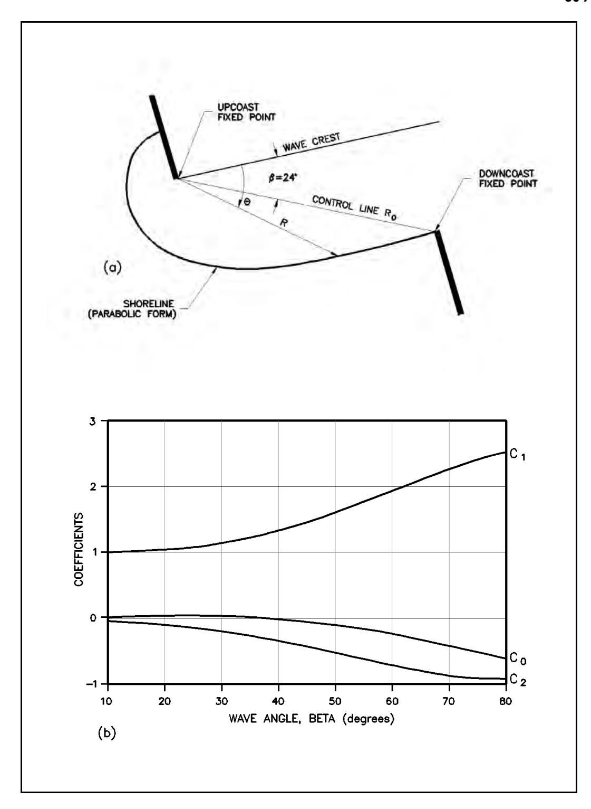

*Figure III-2-27. Spiral bay geometry: (a) definition sketch and (b) coefficients describing parabolic shoreline shape (Silvester and Hsu 1993)*

Additionally, Equation 2-24 is intended for application for β # θ # 180E, and assumes that a predominant wave direction exists at the site of interest. The latter is often not the case in nature, and so engineering judgement must be utilized in practical application of this method. For θ > 180E, the distance R may be assumed to be constant and equal to the value of R computed at θ = 180E.
- (5) Additional empirical guidance on shoreline change at seawalls is provided in Walton and Sensabaugh (1979) where additional localized recession at a seawall under a storm condition (hurricane Eloise along the Florida panhandle), is provided. Similar guidance for other storms and other locations is not available, although McDougal, Sturtevant, and Komar (1987) and Komar and McDougal (1988), have reported similar findings at laboratory scales.
- (6) The approach(es) outlined above may be useful for rough, preliminary calculations and estimates of "static" shoreline equilibriums when the assumptions necessary for application of the approaches are fulfilled, where detailed dynamics of the changing shoreline are not sought, and where time and/or budget constraints preclude a more detailed approach. For detailed prediction of shoreline change due to longshore gradients in sand transport or otherwise complicated geometries, a preferred approach would be to utilize a physical model and/or a numerical model, as appropriate to the scale of the study area. j. Analytical longshore sand transport shoreline change models.
- (1) If the angle of the shoreline is small with respect to the x axis and simple relationships describe the waves, analytical solutions for shoreline change may be developed. As an example, utilizing the expression provided in Equation 2-7b for longshore sediment transport along with the assumption that the breaking wave angle $α_{b}$ is small, the following planform shoreline change equation can be derived utilizing the coordinate system given in Figures III-2-28 and III-2-29:

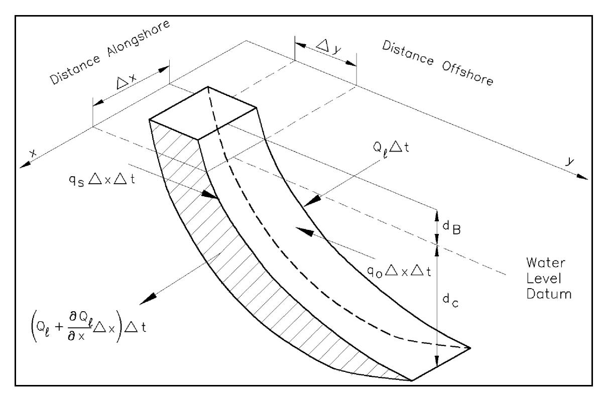

*Figure III-2-28. Elemental volume on equilibrium beach profile*

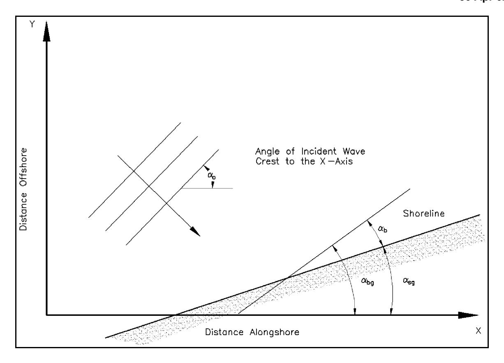

*Figure III-2-29. Definition of local breaker angle*

```math
\varepsilon \frac{\partial^2 y}{\partial x^2} = \frac{\partial y}{\partial t} \tag{III-2-25}
```

where

```math
\varepsilon = \frac{KH_b^2 C_{gb}}{8} \left(\frac{\rho}{\rho_s - \rho}\right) \left(\frac{1}{1 - n}\right) \left(\frac{1}{d_B + d_c}\right) \tag{III-2-26}
```

and where d_{\rm B} = beach berm height above still-water level; d_{\rm c} = depth of appreciable sand transport as measured from still-water level. Equation 2-25 is a partial differential equation, as it is dependent on both space (variable x) and time (variable t). A number of researchers have employed this equation or slight variations of it to provide analytical solutions to shoreline change under certain assumptions (the boundary conditions and initial conditions of the problem). Pelnard-Considére (1956) first presented an analytical solution to this simplified shoreline change equation for the case of an impermeable groin or jetty impounding the longshore sand transport on the updrift side of the structure under a stationary (constant) wave climate. Pelnard-Considére also verified its applicability with laboratory experiments and derived analytical solutions of the linearized shoreline change equation for two other boundary conditions: shoreline evolution updrift of an impermeable groin (with bypassing) and release of an instantaneous plane source of sand on the beach.

# FIND:

Compute the shoreline geometry of a crenulate bay located between two rock headlands for a shoreline where one dominant wave direction exists.

#### GIVEN:

The distance between the ends of the headlands is 175 m. The incident wave crests make an angle of 30 deg with a line drawn between the two headlands.

#### SOLUTION:

From Figure III-2-27b, the values of the coefficients for the wave angle β = 30 deg are approximately $C_{0}$ = 0.05, $C_{1}$ = 1.14, and $C_{2}$ = -0.19. The location of the shoreline may be predicted by plotting the distance R, measured from the end of the upwave headland, at angles θ measured from the line drawn between the headlands. The values $R/R_{o}$ for various arbitrary angles between the wave angle, 30 deg, and a maximum angle, 180 deg, are computed from Equation 2-24. The corresponding dimensional values of R are then computed by multiplying $R/R_{o}$ by the distance between the headlands Ro = 175 m. Representative examples are given below:

```math
\mathrm { F o r \, } \theta = 3 0 \, \mathrm { d e g } ; \, \mathrm { R } = [ \, 0 . 0 5 + 1 . 1 4 ( 3 0 / 3 0 ) - 0 . 1 9 ( 3 0 / 3 0 ) ^ { 2 } \, ] \, ( 1 7 5 \mathrm { m } \, ) = 1 7 5 \mathrm { m }
```

```math
\mathrm { F o r \, } \theta = 7 5 \mathrm { \, d e g } \colon \mathrm { \, R = } [ \mathrm { \, } 0 . 0 5 + 1 . 1 4 ( 3 0 / 7 5 ) - 0 . 1 9 ( 3 0 / 7 5 ) ^ { 2 } \mathrm { \, J \, } ( 1 7 5 \mathrm { \, m \, } ) = 8 3 \mathrm { \, m \, }
```

```math
R = [0.05 + 1.14(30/180) - 0.19(30/180)^2](175\text{ m}) = 41\text{ m}
```

For θ > 180E, the distance R may be assumed to be constant and equal to the value of R computed at θ = 180E.
- (2) Le Méhauté and Brebner (1961) discuss solutions for shoreline change at groins, with and without bypassing of sand, and the effect of sudden dumping of material at a given point. They also present solutions for the decay of an undulating shoreline, and the equilibrium shape of the shoreline between two headlands.
- (3) Bakker and Edelman (1965) modified the longshore sand transport rate equation to allow for an analytical treatment without linearization. The sand transport rate is divided into two different cases:

```math
Q_{\ell} = Q_o K_a \tan(\alpha_b) \quad \text{for} \quad 0 \leq \tan \alpha_b \leq 1.23 \tag{III-2-27a}
```

and

```math
Q _ { \ell } = Q _ { o } { \frac { K _ { b } } { \tan { ( \alpha _ { b } ) } } } \quad { \mathrm { f o r } } \quad 1 . 2 3 < \tan { ( \alpha _ { b } ) } \tag{III-2-27b}
```

where $K_{a}$ and $K_{b}$ are constants. The growth of river deltas was studied with these equations.
- (4) Bakker (1968) extended a one-line shoreline change theory to include the shoreline and an additional offshore depth contour to describe beach planform change. Bakker hypothesized that the two-line theory provides a better description of sand movement downdrift of a long groin since it describes representative changes in the contours seaward of the groin head. Near structures such as groins, offshore contours may have a different shape from the shoreline. The two lines in the model are represented by a system of two differential equations which are coupled through a term describing cross-shore transport. According to Bakker (1968), the cross-shore transport rate depends on the steepness of the beach profile; a steep profile implies offshore sand transport; and a gently sloping profile implies onshore sand transport. Additional complex solutions of cases with groins under very simplistic assumptions are discussed in Bakker, Klein-Breteler, and Roos (1971). Le Méhauté and Soldate (1977) provide an analytical solution of the linearized shoreline change equation for the spread of a rectangular beach fill. Walton (1994) has extended this case to the fill case with tapered ends.
- (5) Walton and Chiu (1979) present two derivations of the linearized shoreline change equation. The difference between the two approaches, which both arrive at the same partial differential equation, is that one uses the so-called "CERC Formula" (see Equation 2-5) for describing the longshore sand transport rate by wave action and the other a formula derived by Dean (1973) based on the assumption that the major sand transport occurs as suspended load. Walton and Chiu (1979) also present solutions for beach fill in a triangular shape, a rectangular gap in a beach, and a semi-infinite rectangular fill, and present previous analytical solutions in the literature in a nondimensionalized graphical solution form.
- (6) Dean (1984) gives a brief survey of some analytical shoreline change solutions applicable to beach nourishment calculations, especially in the form of characteristic quantities describing loss percentages. One solution describes the shoreline change between two groins initially filled with sand. Larson, Hanson, and Kraus (1987) provide a review of a number of analytical solutions to the one-line model as well as additional solutions where the amplitude of the longshore sand transport rate is a discontinuous function of x , the shoreline coordinate in the longshore direction.
- (7) Analytical solutions presented here are in the nondimensionalized form of Walton and Chiu (1979) and easily adaptable to solving simple scenarios. More difficult scenarios are best handled by a numerical model. In arriving at all solutions, it is tacitly assumed that sand is always available for transport unless explicitly restricted by boundary and/or initial conditions.
- (8) The first case to be considered is that of a structure trapping sediment. This formulation can be applied to the prediction of the shoreline updrift and downdrift of a littoral barrier extending perpendicular to the initially straight and uniform shoreline. At the barrier, all sediment is assumed to be trapped by the barrier (no bypassing). This boundary condition requires that the shoreline at the structure be parallel to the incoming wave crests. Figure III-2-30 shows the resulting shoreline evolution with increasing time updrift (accretion) and downdrift (erosion). Figures III-2-31a, III-2-31b, and III-2-31c are nondimensionalized solution graphs (at different scales) for the condition of no sand transport at the structure location ( x = 0),

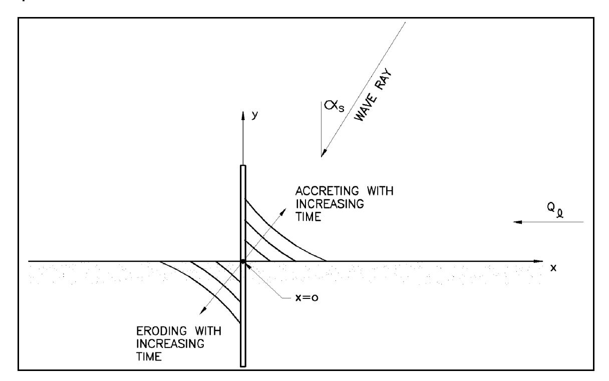

*Figure III-2-30. Structure placed perpendicular to shore*

with the boundary condition at the structure being \tan \alpha_b = dy/dx , and the boundary condition at x = \infty being y = 0 for all times. The initial condition for this solution is that y = 0 for t = 0. This particular solution graph can be utilized to estimate planform shapes on the updrift side of coastal structures where bypassing does not take place.
(9) The dimensionalized solution for these conditions is given by Pelnard-Considére (1956) to be

```math
y = 2\sqrt{\varepsilon t} \tan(\alpha_b) \left\{ \frac{1}{\sqrt{\pi}} \exp\left[ -\left(\frac{x}{2\sqrt{\varepsilon t}}\right)^2 \right] - \frac{x}{2\sqrt{\varepsilon t}} \operatorname{erfc}\left(\frac{x}{2\sqrt{\varepsilon t}}\right) \right\}, \text{ for } t < t_f \tag{III-2-28}
```

where t_f is the time at which the structure fills to its capacity via this solution and where erfc() is the complementary error function defined as erfc() = 1 - erf() where erf() is the error function and

```math
\operatorname{erf}(x) = \frac{2}{\sqrt{\pi}} \int_0^x e^{-z^2} dz
```

Both erfc() and erf() are tabulated in various mathematical handbooks. Figures III-2-32 and III-2-33 provide graphs of erfc() and erf().
(10) The time required for the structure to fill to capacity t = t_f can be found from the previous solution with ordinate x = 0; i.e.,

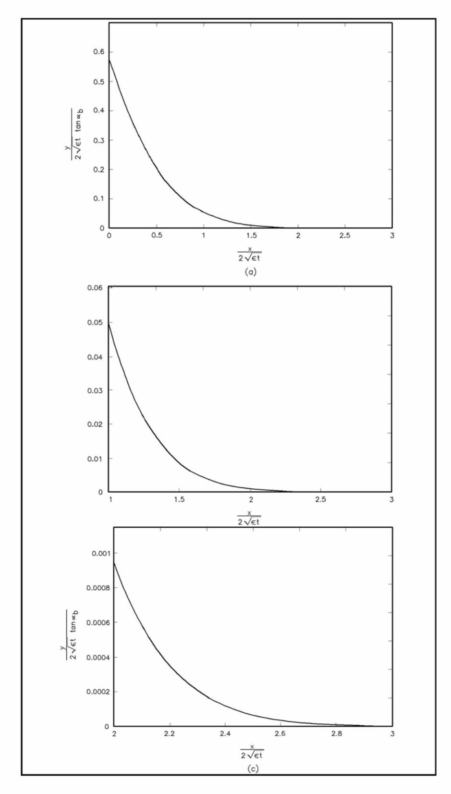

*Figure III-2-31. Nondimensionalized solution graphs (at different scales) for the condition of no sand transport at the structure location*

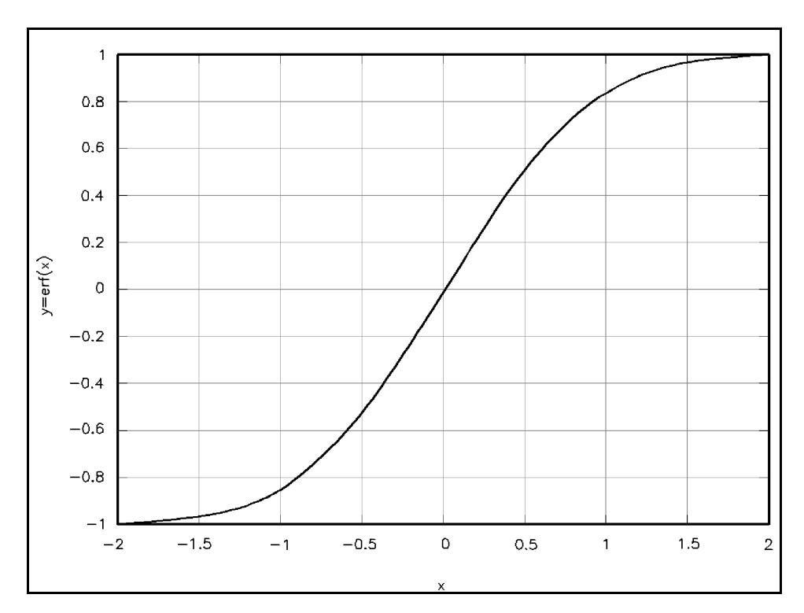

*Figure III-2-32. Error function*

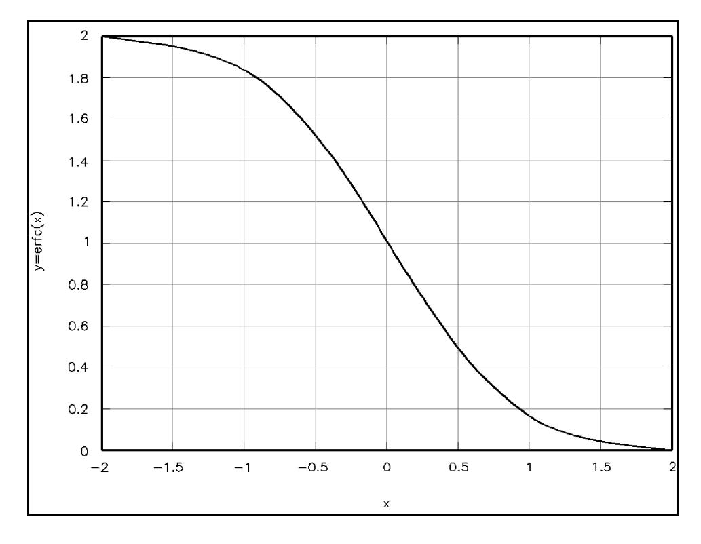

*Figure III-2-33. Complementary error function*

```math
t_f = \frac{Y^2 \pi}{4 \epsilon \tan^2(\alpha_b)} \tag{III-2-29}
```

where Y = length of structure.
(11) Pelnard-Considére (1956) also provides a second solution for times after the structure has filled to capacity and bypassing of sediment begins to occur naturally. The boundary conditions for his second solution are that y = Y at x = 0 and y = 0 at x = \infty for all t > 0. The initial conditions are as in the previous solution y = 0 at t = 0 for x > 0. The solution to these specific boundary conditions is as follows:

```math
y = Y \operatorname{erfc}\left(\frac{x}{2\sqrt{\varepsilon t_2}}\right) , t > t_f \tag{III-2-30}
```

which can be made dimensionless by dividing the above equation by the length of structure Y. The dimensionless solution is presented graphically in Figures III-2-34a, III-2-34b, and III-2-34c (at different scales). Pelnard-Considére (1956) used a time = t_2 in Equation 2-30 such that areas of shoreline above the x axis would be equal at the time t = t_f when the structure is just filled to capacity (Equation 2-29), i.e., matched solution plan areas. In this manner t_2 was found to be t_2 = t - 0.38t_f , where t is the initial solution time at which the structure begins to trap sand. Although the planforms do not match at time t = t_f for the two solutions of Pelnard-Considére, the formulations are still useful for conceptual preliminary design and evolution of projects.
- (12) The solution of Pelnard-Considére prior to bypassing (as given by Equation 2-28 and Figure III-2-31) may also be utilized for the situation in which erosion occurs on the sand-starved beach downdrift of an impermeable coastal structure that has no bypassing (natural or man-made). In this specific instance the solution would provide shoreline recession values as opposed to shoreline progradation values. In this scenario the solution should only be utilized far enough downdrift of the structure (i.e., beyond the immediate "shadow" of the structure) such that diffraction and refraction effects due to the structure do not influence the wave field and shoreline geometry.
- (13) When applied in this scenario, the solution of Pelnard-Considére suggests that the ultimate downdrift extent of erosion caused by the structure is infinite. In practice, Equations III-2-28 and III-2-29 may be applied to estimate the theoretical downdrift extent of erosion, prior to bypassing, in terms of the structure length Y. That is, the distance downdrift of a structure at which the shoreline recession is less than or equal to some fraction of the structure's length (i.e., y / Y) can be expressed as a multiple of the structure's length (i.e., x / Y). Example III-2-10, below, illustrates this application. It is important to note that this solution is idealized and assumes that the breaking wave angle \alpha_b can be approximated as an average, quasi-steady value. At present, the actual downdrift extent of erosion associated with a structure or other sediment sink is not well understood.
- (14) The second case to be considered is that of a rectangular beach fill as shown in Figure III-2-35. Figure III-2-36 is a nondimensionalized solution graph that can be utilized in estimating plan area change for the rectangular beach nourishment fill on an initially straight reach of beach. Fill exists from -a < x < +a and extends Y distance seaward from the original beach. The solution for this specific case is as follows:

```math
y = \frac{Y}{2} \left\{ erf \left[ \left( \frac{a}{2\sqrt{\epsilon t}} \right) \left( 1 - \frac{x}{a} \right) \right] + erf \left[ \left( \frac{a}{2\sqrt{\epsilon t}} \right) \left( 1 + \frac{x}{a} \right) \right] \right\} \tag{III-2-31}
```

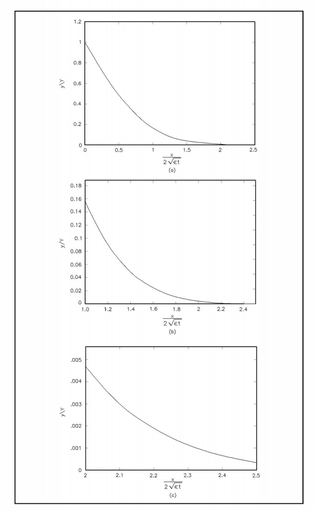

*Figure III-2-34. Nondimensional solution curve for plan view of sediment accumulation at a coastal structure after natural bypassing initiated*

#### FIND:

- (a) The time it will take for the structure to fill to half its length, if its length is 600 m.
- (b) The distance seaward the shoreline will extend at the structure (y at x = 0) after 1 week (t = 604,800 sec) of continuous wave activity, and;
- (c) the distance seaward the shoreline will extend at 500 m updrift from the structure (y at x = 500 m) after 1 week (t = 604,800 sec) of continuous wave climate.

#### GIVEN:

A long terminal groin extending a few surf zone widths at the end of a project reach adjacent to an inlet has been built to prevent sand from being lost from the beach into the inlet shoal system. Waves approach the inlet from the updrift side with a breaking angle \alpha_b = 5 deg. Breaking wave height H_b = 2m , and wave period T = 10 sec. The structure is initially expected to block all sediment (i.e., no bypassing). Sediment density to water density ratio \rho_s/\rho = 2.65 , and porosity n = 0.4. Assume d_B + d_c = 6 m, K = 0.77, and K = 1.

#### SOLUTION:

Equation 2-26 gives

```math
\varepsilon = \frac{0.77 (2)^2 \sqrt{9.81 \cdot 2}}{8} \cdot \left(\frac{1}{2.65 - 1}\right) \cdot \frac{1}{(1 - 0.4)} \left(\frac{1}{6}\right) = 0.287 \frac{m^2}{\text{sec}}
```

(a) Express Equation 2-28 for the shoreline location y at the structure x = 0:

```math
\frac{y}{2\sqrt{\varepsilon t} \tan (\alpha_b)} = \frac{1}{\sqrt{\pi}} \approx 0.564
```

and solve for y = 1/2 the length of the structure = 300 m, where \alpha_b = 5 deg:

```math
\frac{300}{2\sqrt{0.287 t} \tan{(5^0)}} \approx 0.564
```

Solve this expression for time t and find t = 3.22 \times 10^7 \text{ sec } (372 \text{ days}) .
(b) Use the expression for Equation 2-28 at the shoreline x = 0, and compute y for t = 1 week:

```math
\frac{y}{2\sqrt{0.287(604800)}\tan(5^0)} = \frac{1}{\sqrt{\pi}}
```

and find y = 41.1 m (at x = 0).
(c) Solve Equation 2-28 for x = 500 m and t = 1 week.

```math
\frac{x}{2\sqrt{\epsilon t}} = \frac{500}{2\sqrt{0.287(604800)}} = 0.60 \quad ; \quad 2\sqrt{\epsilon t} \tan(\alpha_b) = 72.9 \text{ m}
```

From Figure III-2-33, erfc(0.60) \approx 0.42 , so that Equation 2-28 is solved directly (or by Figure III-2-31) as

```math
\frac{y}{2\sqrt{\varepsilon t}\tan(\alpha_b)} \cong \left[\frac{1}{\sqrt{\pi}}\exp(-0.6^2) - 0.6(0.42)\right] = 0.14
```

and

```math
y = (0.14) (72.9 \text{ m}) = 10.2 \text{ m}
```

FIND:
The distance downdrift of a structure at which the shoreline recession is less than or equal to 10 percent of the structure's length before sand begins to naturally bypass the structure.
GIVEN:
A long groin extending a few surf zone widths has been built with no artificial sand fill on either side. The groin's length, measured from the original shoreline, is Y. Assume that the wave activity is continuous with breaking angle \alpha_b = 5 deg.

#### SOLUTION:

The structure becomes filled to capacity at time t_f . Substitution of Equation 2-29 for t_f into Equation 2-28 yields:

```math
\frac{y}{y} = \left[ \exp(-u^2) - \sqrt{\pi} \ u \ erfc(u) \right]
```

where

```math
u = \frac{x}{2\sqrt{\varepsilon t_f}} = \frac{x}{Y} \frac{1}{\sqrt{\pi}} \tan(\alpha_b)
```

Determine the value u (graphically or by iteration), for which y/Y = 0.10. Find u = 0.96. Determine the downdrift distance x (relative to the structure's length Y) using this value for u and using \alpha_b = 5 deg:

```math
\frac{x}{Y} = u \frac{\sqrt{\pi}}{\tan(\alpha_b)} = 0.96 \frac{\sqrt{\pi}}{\tan(5^0)} = 19.4
```

That is, the shoreline recession is equal to or less than 10 percent of the structure's length beyond approximately 19.4 structure-lengths downdrift. If, for instance, the structure's length was Y = 200 m, the downdrift location at which the shoreline recession is less than 20 m (at the time the structure is filled to capacity) is (19.4)(200) = 3,880 m downdrift of the structure.

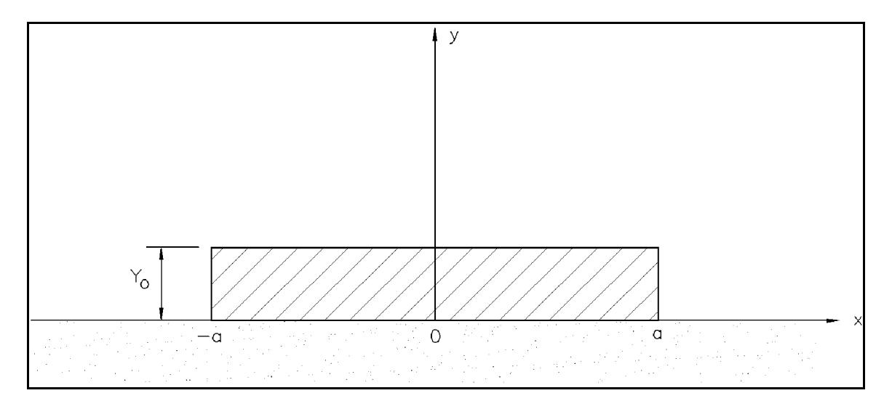

*Figure III-2-35. Rectangular beach fill ( t =0)*

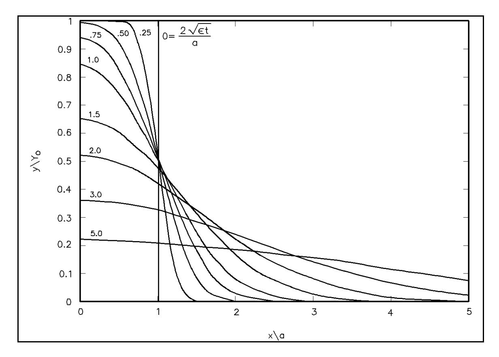

*Figure III-2-36. Nondimensional solution curves for rectangular initial plan view fill area*

Only the portion of the solution graph for x $ 0 is presented, as the solution is symmetric for values of x less than zero. The situation where tapered sections are included at the ends of the project is presented in Walton (1994).
(15) This equation may be integrated over the project limits to allow estimation of the proportion p ( t ) of fill left within the project boundaries at a given time after project initiation to give:

```math
p(t) = \frac{1}{\sqrt{\pi}} \left( \frac{\sqrt{\varepsilon t}}{a} \right) \left\{ \exp \left( -\left( \frac{a}{\sqrt{\varepsilon t}} \right)^2 \right) - 1 \right\} + erf\left( \frac{a}{\sqrt{\varepsilon t}} \right) \tag{III-2-32}
```

which is plotted in Figure III-2-37 as a function of the inverse of the nondimensionalized beach half length parameter a 2 ε t

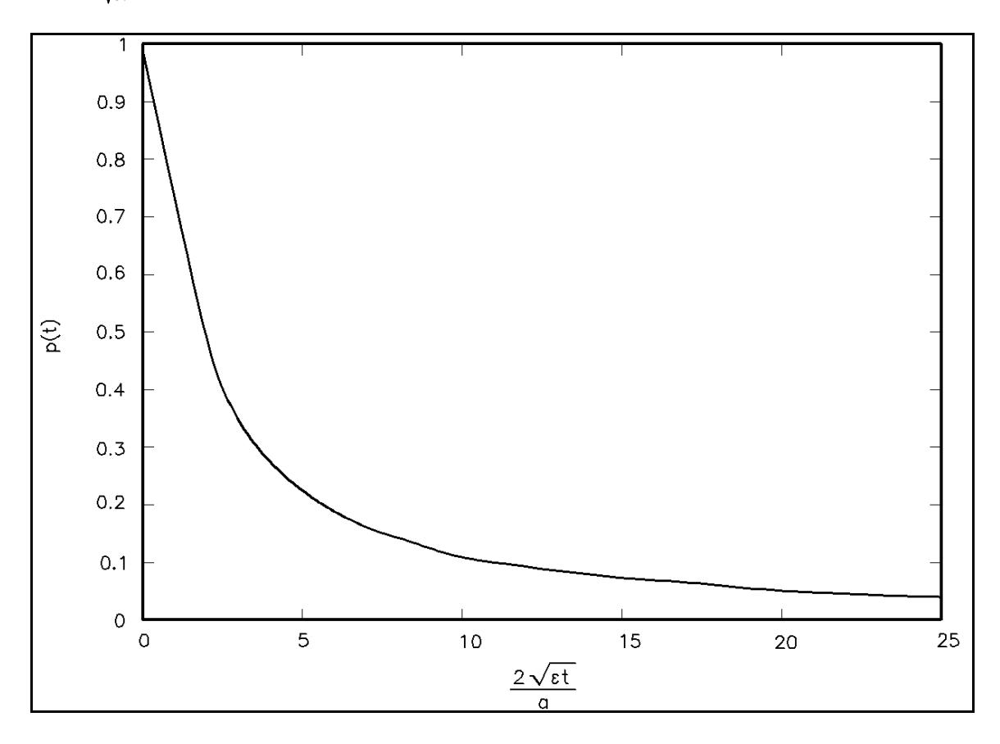

*Figure III-2-37. Proportion of fill p(t) remaining within limits of rectangular plan view fill area*

(16) A third case to be considered is that of a triangular beach fill as shown in Figure III-2-38. A triangular planform beach nourishment might exist at a location where either a truck dumping of sand occurs or where drag scraping of sand from the offshore occurs. The solution for this specific case (where the original fill has been assumed triangular in shape) is:

```math
y = \frac{Y_o}{2} \left\{ (1-X) \ erf (U(1-X)) + (1+X) \ erf (U (1+X)) -2 \ Xerf (UX) + \frac{1}{\sqrt{\pi}U} \left( e^{-U^2 (1+X)^2} + e^{-U^2 (1-X)^2} - 2e^{-(UX)^2} \right) \right\} \tag{III-2-33}
```

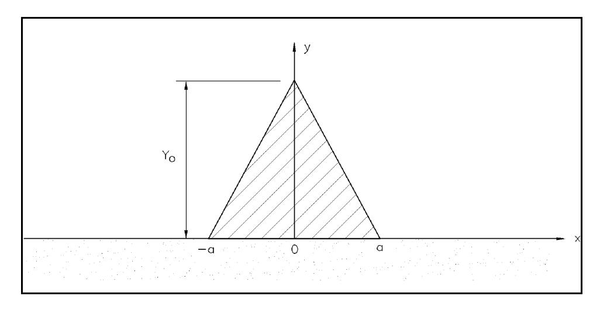

*Figure III-2-38. Triangular beach fill (t=0)*

where

```math
X = { \frac { x } { a } } \qquad a n d \qquad U = { \frac { a } { 2 \ { \sqrt { \varepsilon t } } } }
```

- (17) Figure III-2-39 is a nondimensionalized solution graph for the case of a triangular planform beach nourishment. Only the portion of the solution graph for x \ge 0 is presented, as the solution is symmetric for values of x less than zero.
- (18) A fourth case to be considered is that of a long fill project with a gap as shown in Figure III-2-40. For the case in which a beach nourishment has been placed on an existing beach but a gap has been left in the beach nourishment project (such as occurred in a beach nourishment project on Jupiter Island, Florida, in 1974), the following solution would apply:

```math
y = \frac{Y}{2} \left\{ erfc \left[ \left( \frac{a}{2\sqrt{\varepsilon t}} \right) \left( 1 - \frac{x}{a} \right) \right] + erfc \left[ \left( \frac{a}{2\sqrt{\varepsilon t}} \right) \left( 1 + \frac{x}{a} \right) \right] \right\} \tag{III-2-34}
```

The nondimensionalized solution graph for this particular planform of beach nourishment is provided in Figure III-2-41. Only the portion of the solution graph for x \ge 0 is presented, as the solution is symmetric for values of x less than 0.
(19) A fifth case to be considered is that of the end of a rectangular fill on a long beach nourishment project as shown in Figure III-2-42. The nondimensional solution graph for the case of a semi-infinite beach fill where the fill is contained within the area x > 0 is given in Figure III-2-43. This semi-infinite beach fill case can be utilized to provide the shape of the end of a long beach fill and the extent of the fill as it progresses down the coast with time. The solution for this specific case is

```math
y = \frac{Y_o}{2} \left\{ 1 + erf\left(\frac{x}{2\sqrt{\varepsilon t}}\right) \right\} \tag{III-2-35}
```

FIND:
The width of the beach at the ends of the fill after 3 days and after 12 weeks of design wave action on the beach fill.

#### GIVEN:

A beach nourishment 5,000 m in length is placed on a reasonably stable shoreline to widen the beach as a protective measure for upland construction during storms. The new beach width is to be 50 m and is to be placed at the same berm elevation as the natural beach d_{\rm B} = 3 m. Depth of appreciable sand transport as estimated from historical profiles in the region is assumed d_c = 7 m. A design wave for the area is estimated to be H_b = 3 m , T = 12 sec, \alpha_b = 10 \text{ deg} . The sediment size of the natural beach is the same size as the fill sediment size and ratio of sediment density to water density (i.e., specific gravity) is 2.65. The porosity of beach is n = 0.4. The K factor is assumed = 0.77, and \kappa is assumed = 1.

#### SOLUTION:

```math
\mathrm { a } = 5 , 0 0 0 / 2 = 2 , 5 0 0 \mathrm { m } ; \mathrm { Y } _ { \mathrm { o } } = 5 0 \mathrm { m }
```

At fill ends x/a = 1.0
From Equation 2-26

```math
\varepsilon = \frac{0.77 (3)^2 \sqrt{9.81 \cdot 3}}{8} \left(\frac{1}{2.65 - 1}\right) \left(\frac{1}{1 - 0.4}\right) \left(\frac{1}{3 + 7}\right)
```

```math
(t = 259,200 \text{ sec})
```

```math
\frac { a } { 2 \sqrt { \varepsilon t } } \ = \ \frac { 2 , 5 0 0 } { 2 \sqrt { 0 . 4 7 \ ( 2 5 9 , 2 0 0 ) } } \ = \ 3 . 5 8
```

From Figure III-2-36, for

```math
{ \frac { x } { a } } \ = \ 1 . 0 \qquad { \frac { y } { Y _ { o } } } \ = \ 0 . 5 6 \quad { \mathrm { h e n c e } } , \ y \ = \ 0 . 5 6 \ ( 5 0 ) \ = \ 2 8 \ { \mathrm { m } }
```

```math
\frac { a } { 2 \sqrt { \varepsilon t } } \ = \ \frac { 2 , 5 0 0 } { 2 \sqrt { 0 . 4 7 \ ( 7 , 2 5 7 , 6 0 0 ) } } \ = \ 0 . 6 8
```

From Figure III-2-36, for

```math
{ \frac { x } { a } } \ = \ 1 . 0 \qquad { \frac { y } { Y _ { 0 } } } \ = \ 0 . 4 6 \quad { \mathrm { h e n c e , } } \quad y \ = \ 0 . 4 6 \ ( 5 0 ) \ = \ 2 3 \ { \mathrm { m } }
```

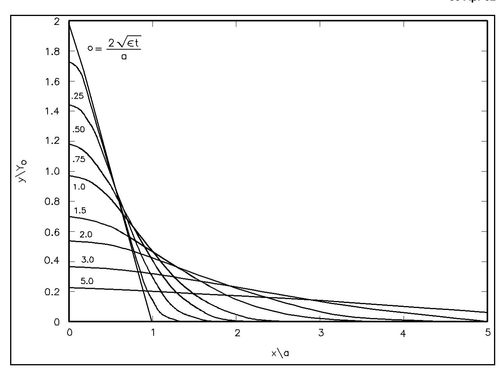

*Figure III-2-39. Nondimensional solution curves for triangular initial plan view fill area*

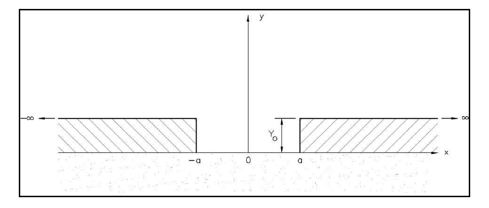

*Figure III-2-40. Long fill project with a gap ( t =0)*

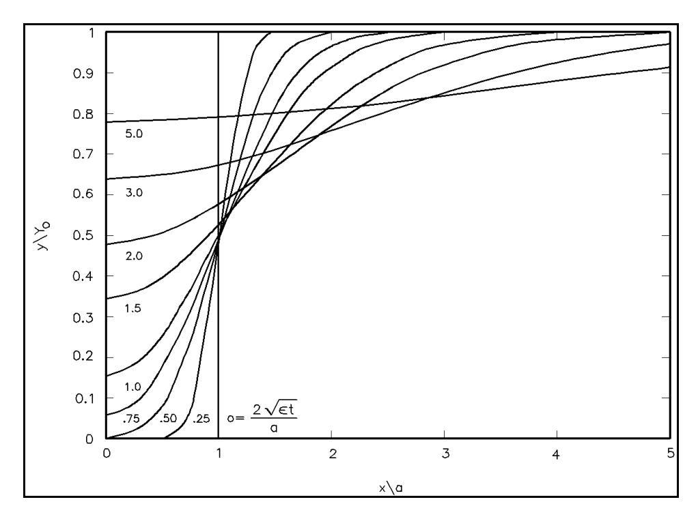

*Figure III-2-41. Nondimensional solution curve for long fill with gap in plan view fill area*

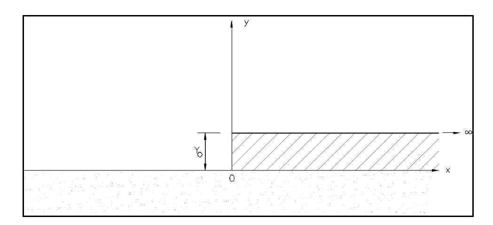

*Figure III-2-42. Semi-infinite beach fill ( t =0)*

- (20) For the situation in which the fill is in area x < 0, the graph can be utilized by flipping the solution presented around the y axis.
- (21) A sixth case to be considered is the nourishment fill initially placed in the area ( x > 0) and maintained at the initial beach width Y within the project area. The solution for the planform beach adjacent to the fill ( x # 0) is given by

```math
y = Y_o \left( 1 + erf \left( \frac{x}{2\sqrt{\varepsilon t}} \right) \right) \tag{III-2-36}
```

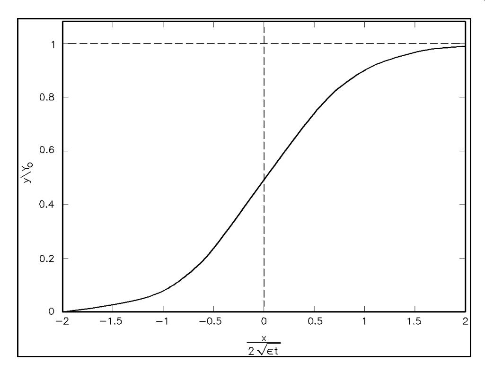

*Figure III-2-43. Nondimensional solution curve for semi-infinite plan view fill area*

(22) For the analogous case to the above instance where the planform fill is placed in the area (x < 0) and maintained at the initial beach width Y in the project area, the solution (for x \ge 0 ) is:

```math
y = Y_o \ erfc \left( \frac{x}{2\sqrt{\varepsilon} t} \right) \tag{III-2-37}
```

where the nondimensionalized solution graph has the same nondimensionalized solution as provided earlier in Figure III-2-34.
(23) A final case is presented for the situation in which groins and fill are implemented together as in Figure III-2-44. Where the initial fill is placed to the end of the groin, the solution is given by Dean (1984) as:

```math
y = w - l\left(1-\frac{x}{l}\right)\tan(\alpha_b) + \frac{2\tan(\alpha_b)}{l} \sum_{n=0}^{\infty} \left[\frac{2l}{(2n+1)\pi}\right]^2 \exp\left\{-\varepsilon\frac{(2n+1)^2\pi^2t}{4l^2}\right\} \cos\left[\frac{(2n+1)\pi x}{2l}\right] \tag{III-2-38}
```

The nondimensionalized shoreline solution graph for this situation is provided in Figure III-2-45 for the parameters W/L = 0.25 and tan (\alpha_b) = 0.1.

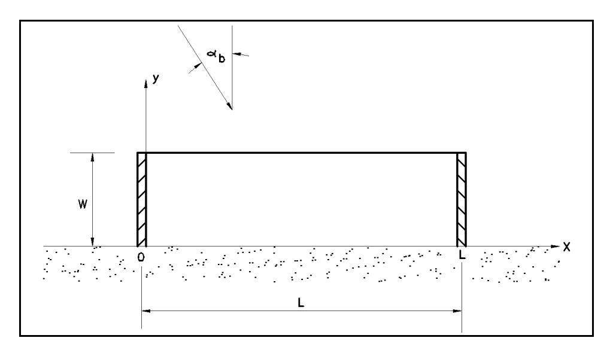

*Figure III-2-44. Beach fill placed with groins ( t =0)*

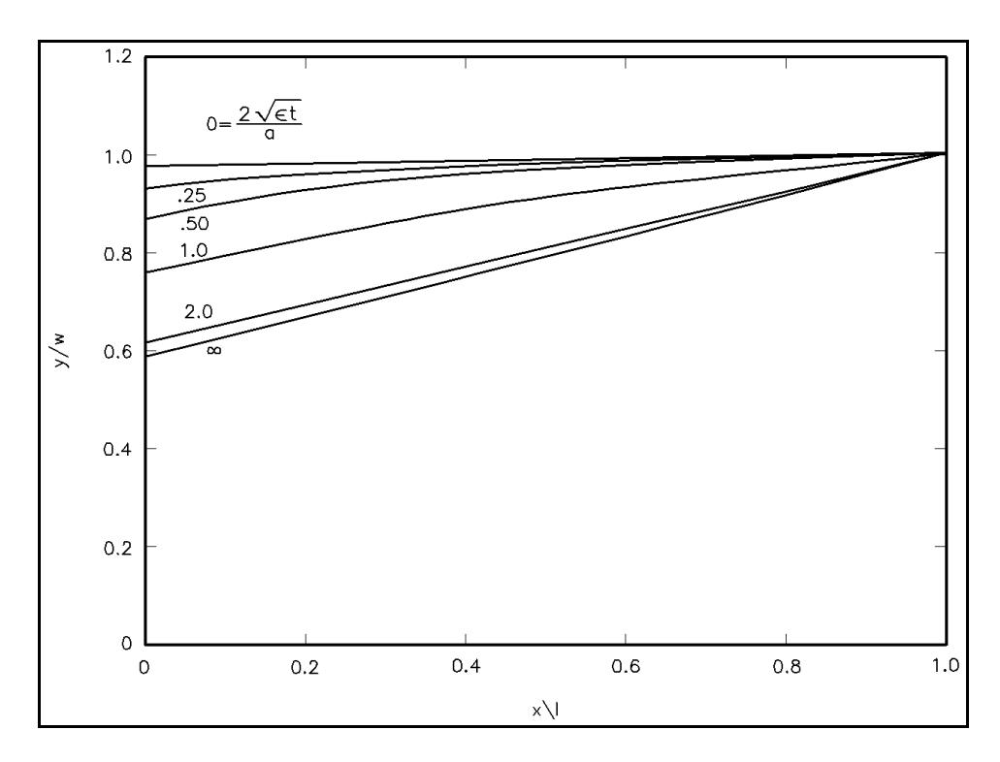

*Figure III-2-45. Nondimensional solution curve for plan view of rectangular fill area between coastal structures ( w / l = 0.25; tan $α_{b}$ = 0.1)*

(24) Since Equation 2-24 is linear, the above solutions can be combined to address more complex situations than those presented. As an example, consider the case in which staged construction of a beach nourishment project takes place over a long length of beach and the fill area of the beach is to be confined in the reach x < 0 and maintained at its fill width. Equation 2-37 could be utilized for solving this particular example in the case that the entire fill was placed at time t = 0. Instead, consider that the fill is placed in
stages with the plan view dimension of the fill as a function of time given in Figure III-2-46. For this particular scenario, the solution (at time t ) analogous to Equation 2-37 only with the planform beach built in staged increments (as per Figure III-2-46) is:

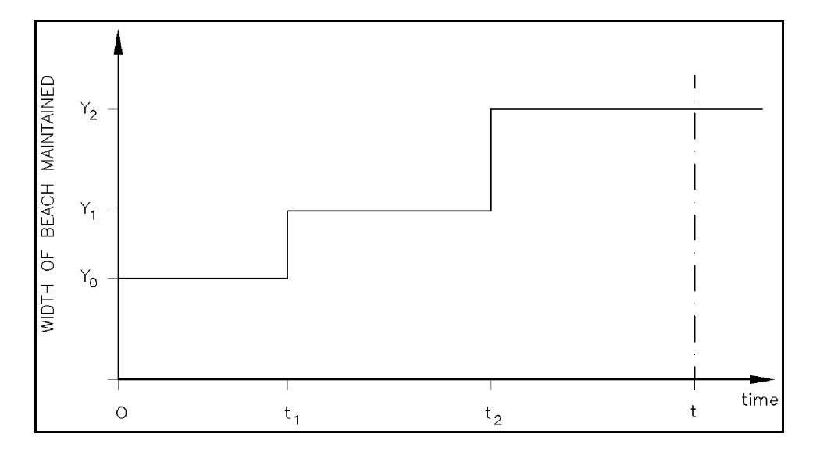

*Figure III-2-46. Width of maintained beach (x < 0) as a function of time*

```math
y = Y_o \ erfc \left(\frac{x}{2\sqrt{\varepsilon t}}\right) + \left(Y_1 - Y_o\right) \ erfc \left(\frac{x}{2\sqrt{\varepsilon(t - t_1)}}\right) + \left(Y_2 - Y_1\right) \ erfc \left(\frac{x}{2\sqrt{\varepsilon(t - t_2)}}\right) \tag{III-2-39}
```

which can be nondimensionalized and solved utilizing the nondimensionalized solution graph provided by the simpler case of Equation 2-37 given in Figure III-2-34.
- (25) It should be recognized that the linearized form of shoreline solution will produce a higher rate of shoreline change by overestimating the longshore transport rate because 2\alpha_b > \sin(2\alpha_b) in the linearized sand transport solution. Thus, under properly estimated parameters for idealized conditions, a higher rate of attenuation of beach fills will be obtained than is expected to occur in reality, thus providing a conservative answer to project losses.
- (26) As a final point, it is noted that when wave angles are very large and the difference between the wave direction and shoreline orientation exceeds 45 deg, the true form of the shoreline diffusivity constant based on the nonlinear \sin(2\alpha) term in the sand transport equation will be negative, which totally changes the characteristics of the shoreline change model equation. In these cases, the shoreline evolves in an unstable manner equivalent to running the previous stable solution forms backwards through time. In other words, a shoreline having a perturbation placed on it (such as a beach fill) would see a growth of the perturbation toward an elongated cuspate feature as time progresses rather than seeing the smoothing out of the perturbation as given in solutions of the preceding paragraphs. This type of shoreline instability may possibly explain certain shoreline features such as cuspate forelands which are ubiquitous on elongated bays where the dominant wave action is along the major axis of the bay and at large angles to the prevailing shoreline trends (Walton 1972).

#### FIND:

The level of protection (i.e., width of beach) afforded to a historical lighthouse as a consequence of the nourishment project at the end of 3, 6, 8, 9, and 12 months after initial fill placement. The lighthouse is situated at the shoreline 1 mile (. 1,609 m) south of the south end of the proposed beach at the initiation of the project fill.

## GIVEN:

A long beach fill is placed along a north-south directed stretch of shoreline along the east coast of the United States (i.e., the azimuth of the offshore direction is 90 deg). The project is to be constructed and maintained continuously to design project width throughout the project fill area. The project will be constructed in two stages; Stage 1 will provide a fill width of 50 m, and Stage 2 (to be placed 3 months after initial placement) will add another 50 m of beach width, making the total finished project width = 100 m. Assume that: $H_{b}$ = 1 m; T = 10 sec; $α_{b}$ = 5 deg (from the north) K is assumed = 0.77, and κ = 1.0. Sediment density to water density ratio (i.e., specific gravity) = $ρ_{s}/ρ$ = 2.65; porosity n = 0.4; $d_{B}$ + $d_{c}$ = 6 m. Note that except for breaking wave height $H_{b},$ these are the same wave and sediment parameters as given in Example III-2-8.

#### SOLUTION:

For $H_{b}$ = 1 m, with other parameters the same as the previous problem;

```math
\varepsilon = \frac{0.77 (1)^2 \sqrt{9.81 \cdot 1}}{8} \left(\frac{1}{2.65 - 1}\right) \left(\frac{1}{1 - 0.4}\right) \left(\frac{1}{6}\right)
```

```math
\approx 0.0508 \frac{\text{m}^2}{\text{sec}}
```

At the end of the first 3 months, the solution of Equation 2-37 (graphical solution provided by Figure III-2-34) can be utilized with t = 3 months . 7.78 × $10^{6}$ sec, and x = 1 mile . 1,609 m:

```math
y(1\text{ mile}, 3\text{ months}) = 50 \cdot erfc\left(\frac{1609}{2\sqrt{0.0508 \cdot 7.78 \times 10^6}}\right)
```

```math
\approx 50 \cdot \operatorname{erfc}(1.28)
```

```math
\approx \, 5 0 \left( 0 . 0 7 \right) \, \cong \, 3 . 5 \mathrm { \, m \, }
```

(Continued)

## Example Problem III-2-12 (Concluded)

For times beyond the 3-month initial fill placement and maintenance, a solution of the form of Equation 2-39 must be utilized. In this particular case, the solution would be of the form (where Y o = 50 m, $Y_{1}$ - $Y_{o}$ = 50 m, and $t_{1}$ = 3 months):

```math
y(x, t) = Y_o \cdot erfc\left(\frac{x}{2\sqrt{\varepsilon t}}\right) + (Y_1 - Y_o) \cdot erfc\left(\frac{x}{2\sqrt{\varepsilon(t - t_1)}}\right)
```

which can be reformulated to be:

```math
y(x,t) = 50 \cdot \text{erfc}\left(\frac{x}{2\sqrt{\varepsilon t}}\right) + 50 \, \text{erfc}\left(\frac{x}{2\sqrt{\varepsilon t}} \cdot \sqrt{1 - \frac{t_1}{t}}\right) = \text{term 1} + \text{term 2}
```

The solution is provided in the table below:

| (1) t | (2) x 2 ε t | (3) &1/2 t 1 (2) @ 1& t | (4) erfc((2)) | (5) erfc((3)) | (6) term 1 | (7) term 2 | (8) y |
| --- | --- | --- | --- | --- | --- | --- | --- |
| 6 mo. = 15.8 × $10^{6}$ sec. | 0.90 | 0.90 (1.414) = 1.27 | 0.20 | 0.07 | 10.0 | 3.5 | 13.5 m |
| 9 mo. = 23.7 × $10^{6}$ sec. | 0.73 | 0.73 (1.225) = 0.89 | 0.30 | 0.21 | 15.0 | 10.5 | 25.5 m |
| 12 mo. = 31.6 × 106 sec. | 0.63 | 0.63 (1.155) = 0.73 | 0.37 | 0.30 | 18.5 | 15.0 | 33.5 m |

Note that the solution form assumes that the fill is constantly maintained at its design width. This would probably not be achievable in practice, and solutions would have to be modified in accord with good engineering judgment.

# III-2-4. Numerical Longshore Sand Transport Beach Change Models

As opposed to analytical solutions of shoreline change, which simplify the equations used to predict beach evolution, mathematical modeling facilitates generalization of these equations so that input parameters may vary in time and in the longshore, and possibly cross-shore, dimensions. Also, numerical models become necessary where difficult boundary conditions are encountered (say at groins or offshore breakwaters) because of shoreline morphology or wave transformation. Numerical models of beach change perform best when a perturbation is introduced to a system that is in equilibrium. The perturbation to the system might be an introduction or removal of littoral material (e.g., beach fill, sand mining, release of sediment due to a flooded river or landslide) or placement of a hardened structure (e.g., groins, detached breakwaters, seawalls, revetments). Historical trends of beach change and knowledge of the littoral budget are typically used to calibrate and verify the controlling equations, then forecasts may be simulated as a function of various engineering alternatives and/or wave climate scenarios. Therefore, beach response as a function of complex coastal processes may be readily examined in detail with mathematical models. However, the limitations inherent in the controlling equations, and assumptions implied in developing "representative" parameters require that model results be carefully interpreted, ideally within the context of other coastal engineering analyses.
- a. Types of longshore transport models
- (1) Fully three-dimensional models.
- (a) In nature, nearshore beach change due to waves, circulation patterns, and longshore currents varies with time and location; therefore, equations to fully describe effects of these processes on beach evolution must be three-dimensional and time-dependent. Development of these equations is still an area of active research, and fully three-dimensional models are not available for routine engineering design.
- (b) The intent of three-dimensional models is to describe bottom elevation changes which may vary in the cross-shore and longshore directions. These models provide insight into wave transformations and circulation for complicated bathymetry and in the vicinity of nearshore structures. However, they are less useful for making long-term shoreline evolution calculations because they are computationally intensive. These models also involve poorly known empirical coefficients such as those related to bottom friction, turbulent mixing, and sediment transport. Integrating the calculated local distributions of sediment transport over the cross-shore and for long time periods may lead to erroneous results because small local inaccuracies will be amplified over a long simulation. Because of their intent to predict local process parameters (e.g., waves, currents, sediment transport), they require a detailed data set for calibration, verification, and sensitivity testing, perhaps from a companion physical model study or field data collection.
- (2) Schematic three-dimensional models. Schematic three-dimensional models simplify the controlling equations of fully three-dimensional models by, for example, restricting the shape of the profile or calculating global rather than point transport rates. Bakker (1968) has developed a two-line model which allows the evolution of two contours to be independently simulated. From this model, Perlin and Dean (1983) developed an n-line model that allows an arbitrary number of contour lines to represent the beach profile. Most schematic multi-line models developed to date are restricted to monotomic profile representations. For models that represent the profile by more than one contour, it is necessary to specify a relationship for crossshore sediment transport. Schematic three-dimensional models have not yet reached the stage of wide application due to their complexity, requirement for considerable computational resources, and need for expertise in operational applications.
- (3) One-line (two-dimensional) models.
- (a) The Large Scale Sediment Processes Committee at the Nearshore Processes Workshop in St. Petersburg in 1989 concluded that long-term simulations of beach change are more reasonably formulated on the basis of total or bulk transport models such as Equation 2-7. These models have fewer coefficients than three-dimensional models and provide no details of the sediment transport profile. However, they may be calibrated and verified to include the integrated effect of all of the local processes on the total transport.
- (b) The shoreline change models developed from bulk transport models are often referred to as one-line models. One-line models assume that the beach profile is a constant shape; thus, the controlling equations may be solved for one contour line only (usually taken as the shoreline). Many shoreline change models have been developed and applied (e.g., Komar 1973a; LeMéhauté and Soldate 1977; Walton, Liu, and Hands 1988; and many others). Documented nonproprietary, one-line models that are also presently available include a model developed at the University of Florida (Dean and Grant 1989, Dean and Yoo 1992, 1994), and the computer model GENESIS (GENEralized model for SImulating Shoreline change) (Hanson 1987; Hanson and Kraus 1989; Gravens, Kraus, and Hanson 1991).
- (c) One-line models used to estimate longshore sand transport rates and long-term shoreline changes generally assume that the profile is displaced parallel to itself in the cross-shore direction. The profile may include bars and other features but is assumed to always maintain the same shape. This assumption is best satisfied if the profile is in equilibrium. The one-line model is formulated on the conservation equation of sediment in a control volume or shoreline reach, and a bulk longshore sand transport equation. It is assumed that there is an offshore closure depth d_C at which there are no significant changes in the profile, and the upper end of the active profile is at the berm crest elevation d_B . The constant profile shape moves in the cross-shore direction between these two limits. This implies that sediment transport is uniformly distributed over the active portion of the profile. The incremental volume of sediment in a reach is simply (d_B + d_C)\Delta x\Delta y , where \Delta x is the reach of shoreline segment, and \Delta y is the cross-shore displacement of the profile. Conservation of sediment volume may be written as

```math
\frac{\Delta y}{\Delta t} + \frac{1}{d_B + d_C} \left( \frac{\Delta Q_{\ell}}{\Delta x} \pm q \right) = 0 \tag{III-2-40}
```

in which Q_l is the longshore transport rate, q is a line source or sink of sediment along the reach, and t is time (Figure III-2-28). As examples, line sources of sediment may be rivers and coastal cliffs, and sinks may be produced by sand mining or dredging.
(d) The longshore transport rate is evaluated using equations similar to Equation 2-7. These require measurement or calculation of the breaking wave angle relative to the beach. The local wave angle relative to the beach is the difference between the wave angle relative to a model baseline and the shoreline angle relative to the model baseline (Figure III-2-29),

```math
\alpha_b = \alpha_{bg} - \alpha_{sg} = \alpha_{bg} - \tan^{-1}\left(\frac{dy}{dx}\right) \tag{III-2-41}
```

where x is the distance alongshore, and y is the distance offshore.
(e) If the angle of the shoreline is small with respect to the x axis and simple relationships describe the waves, analytical solutions for shoreline change may be developed, as discussed in the previous section. For
more complex conditions, such as time-varying wave conditions, large shoreline angles, variable longshore wave height (perhaps due to diffraction), multiple structures, etc., numerical models can be used in many instances.
- b. Shoreline Change Model GENESIS.
- (1) Overview.
- (a) The numerical model GENESIS (Hanson 1987; Hanson and Kraus 1989; Gravens, Kraus, and Hanson 1991) is an example of a one-line shoreline change model that is supported for use both on personal computer and mainframe systems (see Cialone et al. (1992)) and has a companion system of support programs (Gravens 1992). GENESIS has been applied to numerous coastal engineering projects, and it calculates shoreline change due to spatial and temporal differences in longshore transport as produced by breaking waves. GENESIS is used in conjunction with grid-based wave transformation models that develop values of breaking wave height and angle for various representative wave periods and approach azimuths along the coast. Shoreline change at grid cells along the coastline is computed in the time domain as a function of these computed values of the breaking wave height and angle.
- (b) As discussed by Hanson (1987) and Hanson and Kraus (1989), the empirical predictive formula for the longshore sand transport rate used in GENESIS is

```math
Q_{\ell} = H_{b \ sig}^2 \ C_{gb} \left( a_1 \ sin2\alpha_b - a_2 \cos\alpha_b \frac{dH_{b \ sig}}{dx} \right) \tag{III-2-42}
```

The nondimensional parameters a_1 and a_2 are given by

```math
a_1 = \frac{K_1}{16\left(\frac{\rho_s}{\rho} - 1\right) (1 - n) (1.416)^{\frac{5}{2}}} \tag{III-2-43}
```

and

```math
a_2 = \frac{K_2}{8\left(\frac{\rho_s}{\rho} - 1\right) (1 - n) \ m \ (1.416)^{\frac{7}{2}}} \tag{III-2-44}
```

where K_1 and K_2 are empirical coefficients, treated as calibration parameters, and m is the average bottom slope from the shoreline to the depth of active longshore sand transport. The factors involving 1.416 are used to convert the K_1 and K_2 coefficients from use with rms wave height to use with significant wave height (which is the statistical wave height required by GENESIS). That is, Equation 2-43 is presented such that K_1 is equivalent to K_{rms} (as opposed to K_{sig} ) in Equation 2-7. Nonetheless, both longshore sand transport coefficients K_1 and K_2 should be viewed as calibration parameters that are to be adjusted to match measured positions of shoreline change (Hanson and Kraus 1989).
(c) The first term in Equation 2-42 corresponds to Equation 2-7, and accounts for longshore sand transport produced by obliquely incident breaking waves. The second term in Equation 2-42 is used to describe the effect of another generating mechanism for longshore sand transport, the longshore gradient in breaking wave height. The contribution arising from the longshore gradient in wave height is usually much
smaller than that from oblique wave incidence in an open-coast situation. However, in the vicinity of structures, where diffraction produces a substantial change in breaking wave height over a considerable length of beach, inclusion of the second term provides an improved modeling result, accounting for diffraction effects.
- (d) The boundary conditions at the ends of a study area in a shoreline change modeling project must be specified. There are three common boundary conditions: no sand transport $(Q_{R}$ = 0), free sand transport $(dQ_{R}/dx$ = 0), and partial sand transport $(Q_{R}$ … 0). The locations of the study area ends should be selected with these options in mind. Large headlands or jetties which completely block the longshore transport are good choices for model boundaries. At these locations $Q_{R}$ = 0. Points where the position of the shoreline has not changed for many years are also good locations for boundaries. At these points, the gradient in longshore transport is small so that a free transport condition can be specified $(dQ_{R}/dx$ = 0). At some locations, the longshore transport rate is known and can be used as a boundary condition (i.e., artificial sand bypassing at a jetty). If none of these "good" locations exist, engineering judgment must be used.
- (e) In all cases, results should be calibrated and verified using known shoreline positions and wave conditions for the longest period possible. The modeler also attempts to use wave data applicable to the period between the dates of the calibration shorelines. The GENESIS technical reference (Hanson and Kraus 1989) discusses in full the operation of shoreline change numerical simulation models. (2) Input data requirements and model output.
- (a) As discussed by Gravens (1991, 1992), preparation and analysis of the input and output data files occupy a substantial portion, perhaps the majority, of the time spent on a detailed shoreline change modeling project. Gravens (1991, 1992) stresses that the data gathering organization and analysis process cannot be overemphasized because (1) it forms the first necessary level in understanding coastal processes at the project site, and (2) the simulation results must be interpreted within the context of regional and local coastal processes, and the natural variability of the coastal system. Success in modeling shoreline change depends, to a large extent, on preparation and analysis of the input data.
- (b) General input information required by GENESIS includes the spatial and temporal ranges of the simulation, structure and beach fill configurations (if any), values of model calibration parameters, and simulated times when output is desired. Initial and measured (if available) shoreline positions as referenced to a baseline established for the simulation are also required. Offshore and nearshore (if available) wave information and associated reference depths are used to calculate longshore sand transport rates. Output information produced by GENESIS includes intermediate and final calculated shoreline positions, and net and gross longshore sand transport rates. (3) Capabilities and limitations.
- (a) GENESIS was designed to predict long-term trends of the beach plan shape in its evolution from one given initial condition. This change is usually caused by a notable perturbation; for example, by beach fill placement, sand mining, sand discharge from a river, construction of a detached breakwater, or jetties constructed at a harbor or inlet. In engineering applications and tests of GENESIS, modeled shoreline reaches have ranged from about 2 to 35 km with a grid resolution of 15 to 90 m, and simulation periods have spanned from approximately 6 months to 20 years, with wave data typically entered at simulated time intervals in the range of 30 min to 6 hr (Gravens, Kraus, and Hanson 1991).
- (b) Hanson and Kraus (1989) and Gravens, Kraus, and Hanson (1991) discuss the capabilities and limitations of GENESIS. The model allows an almost arbitrary number and combination of groins, jetties,
detached breakwaters, beach fills, and seawalls, with a primary limitation in this regard being the size and speed of the computer and the maximum number of grid cells that can be accommodated by the program. Compound structures (such as T-shaped, Y-shaped, and spur groins) may be simulated with varying degrees of realism. At least five grid cells are required to reasonably model the shoreline behind and between structures. Sand bypassing around and transmission through groins and jetties may be simulated, as well as diffraction at detached breakwaters, jetties, and groins. Transmission through detached breakwaters may be simulated. GENESIS allows multiple wave trains to be input (such as from independent wave sources), and the wave information may include arbitrary values of wave height, period, and direction. As presented in Equation 2-42, sand transport is calculated due to oblique wave incidence and a longshore gradient in wave height.
- (c) GENESIS is not applicable to simulating a randomly fluctuating beach system in which no trend in evolution of the shoreline is evident. In particular, GENESIS is not applicable to calculating shoreline change in the following situations which involve beach change that is not related to coastal structures, boundary conditions, or spatial differences in wave-induced longshore sand transport: beach change inside inlets or in areas dominated by tidal flow; beach change produced by wind-generated currents; storm-induced beach erosion in which cross-shore sediment transport processes are dominant; and scour at structures. GENESIS also does not include wave reflection from structures; cannot reliably simulate tombolo or salient development at a detached breakwater; and there is no direct provision for changing tide level. In addition, the basic assumptions in the development of shoreline change modeling theory apply. (4) Example application Bolsa Chica, California.
- (a) As discussed by Hanson and Kraus (1989) and Gravens (1990b), GENESIS (either its predecessor, Version 1, or the current Version 2) has been applied at numerous project sites, including locations in Alaska (Chu et al. 1987); California (Gravens 1990a); Louisiana (Hanson, Kraus, and Nakashima 1989; Gravens 1994); New Jersey (Gravens, Scheffner, and Hubertz 1989); New York (Cialone et al. 1994); Florida (by the U.S. Army Engineers District, Jacksonville); and outside the United States (Hanson and Kraus 1986; Kraus 1988). Application of the model to assess a proposed structured inlet system at Bolsa Chica, California, is summarized below (Gravens 1990a) to illustrate model use in coastal project evaluation and refinement.
- (b) GENESIS was applied to an approximately 10-mile-long shoreline reach from Anaheim Bay to the Santa Ana River, California (Figure III-2-47) as part of a comprehensive multi-tasked engineering investigation for the California State Lands Commission (SLC). The shoreline change modeling effort was directed towards quantifying the potential long-term impacts of the proposed entrance on adjacent shorelines, and to investigate mitigation of any adverse impacts induced by the entrance. Three major components were involved in the shoreline modeling effort: (1) a preliminary shoreline response study, in which available wave and shoreline data were used to provide preliminary estimates of the introduction of a littoral barrier in the local littoral cell; (2) a comprehensive wave hindcast of locally generated wind sea and North Pacific swell conditions from 1956 to 1975 at 3-hr intervals, and an 18-month hindcast of South Pacific swell; and (3) comprehensive shoreline response modeling using the hindcast wave data to predict response of the project area to various design alternatives. Discussion herein is focussed on this third component, including preparation of input data sets and analysis of model output, as they pertain to application of GENESIS. For a more complete description of the project, the reader is directed to Gravens (1990a).

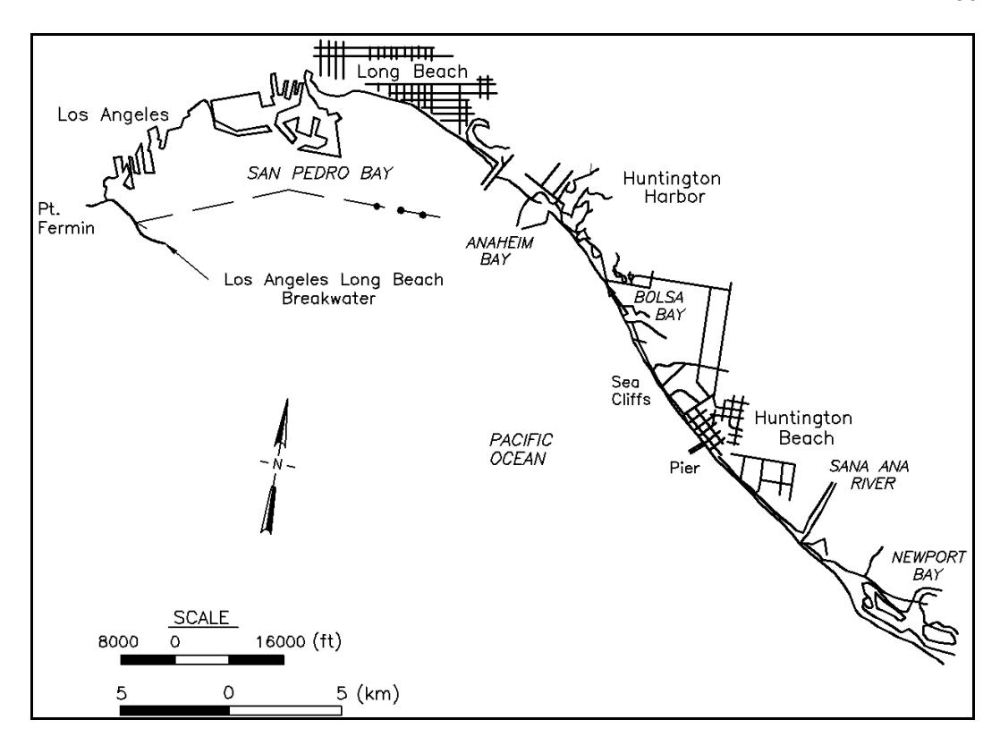

*Figure III-2-47. Bolsa Chica, California, study area (Gravens 1990a)*

- (c) The modeled reach from Anaheim Bay to the Santa Ana River forms a littoral cell, including a complete barrier to littoral transport at Anaheim Bay, and a submarine canyon offshore of Newport Beach (Figure III-2-47). Coastal structures and features of importance within the model reach include the east Anaheim jetty, the sea cliffs at Huntington Beach, the Huntington Beach pier, and the north jetty at the mouth of the Santa Ana River. Each of these features influences the evolution of adjacent shoreline and was represented in the shoreline change model. The sea cliffs at Huntington Beach serve to pin the shoreline between the cliffs and Anaheim Bay to the northwest and the Santa Ana River to the southeast. The Huntington Pier and the east Anaheim Bay jetty modify the local breaking wave pattern and produce a local shoreline signature unique to these structures. Beaches between Anaheim Bay and the Santa Ana River have accreted an average of 1.3 m/year (4.4 ft/year) between 1934 and 1983.
- (d) Ten shoreline position data sets dating from 1878 and 1983 were analyzed to determine historical and representative shoreline change trends. As a result of this analysis, the 1963, 1970, and 1983 shorelines were determined to be representative, and were summarized at 61-m (200-ft) intervals for model calibration (1963 to 1970) and verification (1970 to 1983).
- (e) For the comprehensive shoreline response study, hindcast wave estimates at stations located near the lateral boundaries of the modeled shoreline reach were transformed from the hindcast stations to the offshore boundary of the GENESIS grid using the linear wave propagation model RCPWAVE (Regional Coastal Processes Wave Model; Ebersole 1985; Ebersole, Cialone, and Prater 1986) (Figure III-2-48). Use of two hindcast stations allowed systematic variations in the incident waves (alongshore wave height and angle) to be accounted for in RCPWAVE and ultimately in GENESIS.

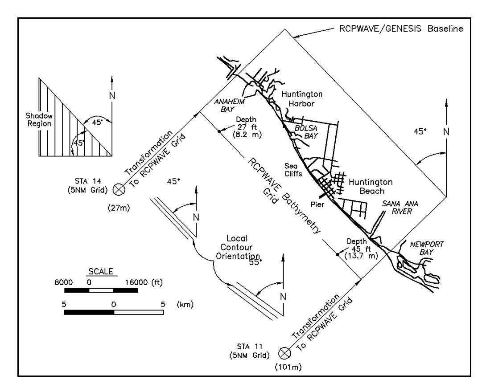

*Figure III-2-48. Wave transformation hindcast to RCPWAVE grid (Gravens 1990a)*

- (f) Potential longshore sand transport rates were calculated using the transformed wave estimates and relationships similar to Equation 2-7 for the various shoreline orientations within the project reach. These potential transport rates are presented in the form of a total littoral drift rose (Walton 1972, Walton and Dean 1973) (Figure III-2-49). The curve with the circular symbols in Figure III-2-49 represents the average downcoast littoral drift for the 20-year Northern Hemisphere hindcast of sea and swell wave conditions. The curves with "x" symbols and "«" symbols in Figure III-2-49 represent the average upcoast littoral drift for the available 2 years of Southern Hemisphere swell wave estimates. It is interesting to note that there is a reversal in the direction of the average net longshore littoral drift and that this reversal occurs at different shoreline orientations depending on the time series of southern swell wave conditions used in the calculation.
- (g) The results of the final model calibration simulation, 1963 to 1970, are presented in Figure III-2-50. In model calibration, the calibration parameters $K_{1}$ and $K_{2}$ ranged between 0.8 and 0.2; values of these parameters that best estimated gross and net longshore sand transport rates and reproduced observed shoreline change were determined to be $K_{1}$ = 0.45 and $K_{2}$ = 0.4. Calibration results lead to three general observations. First, in the Anaheim Bay entrance area (between alongshore coordinates 220 and 260), there are significant differences between the calculated and measured shoreline positions. These differences are due in part to the reflection of waves from the east Anaheim Bay jetty (a process which was not modeled) and to a massive (4 million-cu-yd) renourishment of the Surfside-Sunset feeder beach in 1964. The percentage of fine material contained in the beach fill is unknown; consequently, the initial losses of fill material could not be estimated or accounted for in the model. Model results in this region should be viewed with caution.

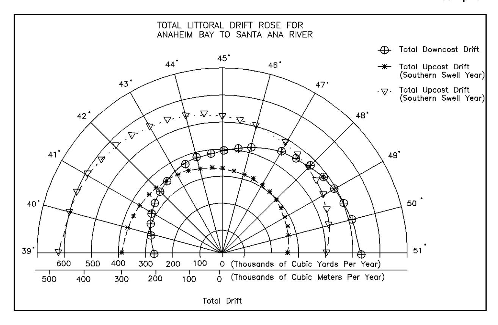

*Figure III-2-49. Total littoral drift rose, Anaheim to Santa Ana River (Gravens 1990a)*

- (h) Secondly, in the vicinity of the Huntington Pier (between alongshore coordinates 80 and 90), it is noted that the predicted shoreline positions do not agree well with the survey. The lack of agreement is due to limitations in the groin boundary condition used to simulate the effects of the pier. The imposed boundary condition at the pier was investigated in detail, and the conclusion was that the boundary condition imposed at the Huntington Pier had no significant effect on the model results northeast of the sea cliffs over the modeling interval.
- (i) Finally, in the vicinity of the proposed entrance system (between alongshore coordinates 155 and 220), the predicted and measured shoreline positions are in very good agreement. Model results for this region are considered to have high reliability.
- (j) The next step was to verify the model by performing a simulation using the same calibration parameters for a different time period. The verification time period (1970 to 1983) included two beach fill projects at the Surfside-Sunset feeder beach, the first in 1971 (2.3 million cu yd) and the second in 1979 (1.66 million cu yd). The results of the model verification are shown in Figure III-2-51. Although the agreement between the calculated and measured shoreline positions is not as close for the verification as it was for calibration, overall measured change in shoreline position was reproduced and was considered acceptable. The largest discrepancies between measured and predicted shorelines occur adjacent to the Anaheim Bay jetty, where initial losses of fine-grained beach fill to the offshore may have contributed to the differences.

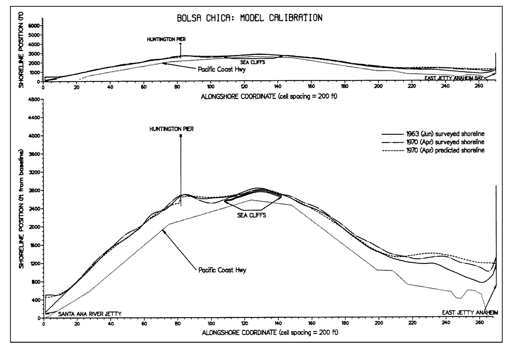

*Figure III-2-50. Model calibration results, Bolsa Chica (Gravens 1990a)*

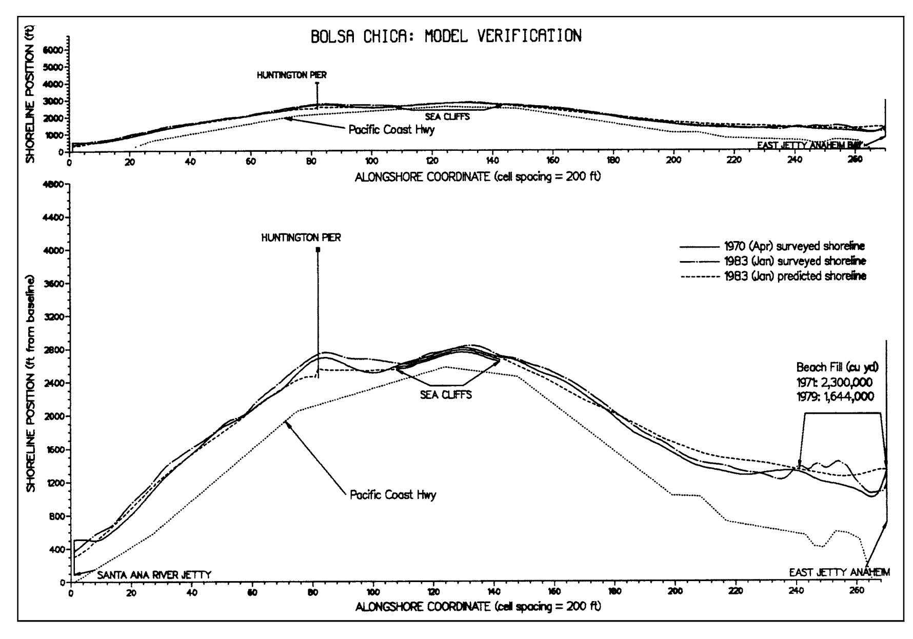

*Figure III-2-51. Model verification results, Bolsa Chica (Gravens 1990a)*

- (k) After model calibration and verification, eight conceptual design alternatives were modeled, and several simulation variations were performed for each alternative. The intent of the simulations was to quantify the shoreline impacts of the proposed Bolsa Chica navigable ocean entrance system. In the simulation of Alternatives 1 and 3, no beach fill was included along the modeled reach. For Alternatives 2, 4, 5, 6, and 8, renourishment of the Surfside-Sunset feeder beach was specified at 1 million cu yd every 5 years. Alternatives 7 and 8 modeled impact mitigation sand management techniques. The 1983 shoreline was used as the initial shoreline, and all model tests were performed for 5- and 10-year simulation (prediction) periods using a randomly selected 10-year time history of Northern Hemisphere sea and swell conditions. The Southern Hemisphere swell component of the incident wave climate was varied from alternating available southern swell wave conditions, low-intensity southern swell, and high-intensity southern swell to predict a range of influence.
- (l) Model results and analysis from 24 production simulations are documented by Gravens (1990a); only results from one alternative are presented here for illustrative purposes. Predicted changes in 10-year post-project shoreline position with Alternative 8 are shown in Figure III-2-52. Alternative 8 includes two shore-perpendicular jetties spaced 245 m apart and extending approximately 425 m offshore, a detached breakwater composed of three sections located offshore of the entrance channel, a feeder beach at Surfside-Sunset, and impact mitigation sand management. The impacts of this entrance system with the specified sand management plan as compared to a without-project 10-year projection are shown in Figure III-2-53. This alternative satisfied the criteria established by the SLC for successful impact mitigation. The SLC specified that only sand accumulating within 460 m of the entrance jetties may be used by sand bypassing/backpassing, and that a successful sand management plan would predict more accretive, or equal or less erosive, conditions than would occur without the project in place. (m) Conclusions from shoreline change modeling of Bolsa Chica Bay were as follows: The proposed site of the new entrance system is located in a region of converging longshore sand transport. Locating the entrance system approximately 1.6 km up- or downcoast from the proposed site would not significantly change the predicted shoreline response. Implementation of a sand management plan would allow for the mitigation of adverse shoreline impacts. The Surfside-Sunset feeder beach nourishment program must be continued in order to maintain the shoreline within 3.2 km of the Anaheim Bay entrance. However, the proposed entrance system would neither aggravate nor improve the situation.

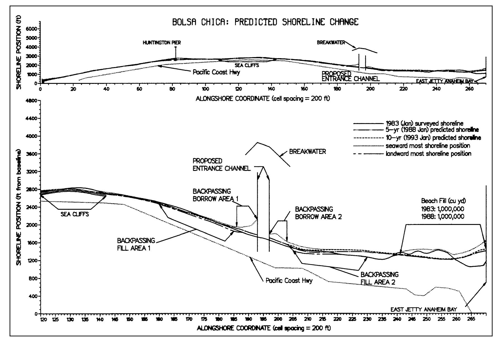

*Figure III-2-52. Sand management alternative with feeder beach (Gravens 1990a)*

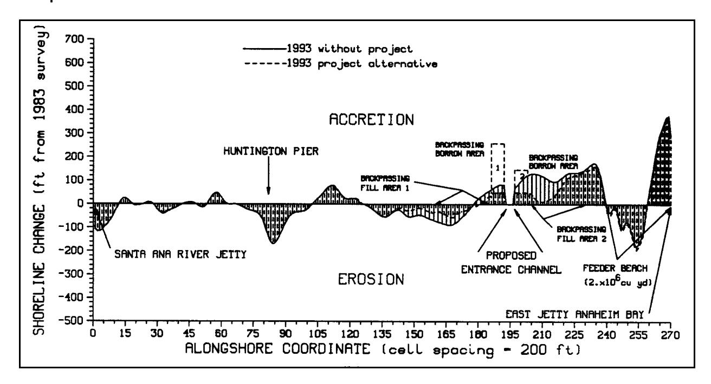

*Figure III-2-53. Predicted shoreline change from 1983 shoreline position with sand management alternative and feeder beach (Gravens 1990a)*

#### III-2-3. References

#### Aubrey 1980

Aubrey, D. G. 1980. "Our Dynamic Coastline," Oceanus , Vol 23, No. 4, pp 4-13.

#### Bagnold 1940

Bagnold, R. A. 1940. "Beach Formation by Waves: Some Model Experiments in a Wave Tank," Journal Inst. Civil Engineering , Vol 15, pp 27-52.

#### Bagnold 1963

Bagnold, R. A. 1963. "Beach and Nearshore Processes; Part I: Mechanics of Marine Sedimentation," The Sea: Ideas and Observations , Vol 3, M. N. Hill, ed., Interscience, New York, pp 507-528.

## Bailard 1981

Bailard, J. A. 1981. "An Energetics Total Load Sediment Transport Model for a Plane Sloping Beach," Journal of Geophysical Research , Vol 86, No. C11, pp 10938-10954.

# Bailard 1984

Bailard, J. A. 1984. "A Simplified Model for Longshore Sediment Transport," Proceedings, 19th International Coastal Engineering Conference , American Society of Civil Engineers, New York, pp 1454- 1470.

# Bailard and Inman 1981

Bailard, J. A., and Inman, D. L. 1981. "An Energetics Bedload Model for a Plane Sloping Beach: Local Transport," Journal of Geophysical Research , Vol 86, pp 2035-2043.

#### Bakker 1968

Bakker, W. T. 1968. "The Dynamics of a Coast with a Groin System," Proceedings of the 11th Coastal Engineering Conference , American Society of Civil Engineers, pp 492-517.

## Bakker and Edelman 1965

Bakker, W. T., and Edelman, T. 1965. "The Coastline of River Deltas," Proceedings of the 9th Coastal Engineering Conference , American Society of Civil Engineers, pp 199-218.

## Bakker, Klein-Breteler, and Roos 1971

Bakker, W. T., Klein-Breteler, E. H. J., and Roos, A. 1971. "The Dynamics of a Coast with a Groin System," Proceedings of the 12th Coastal Engineering Conference , American Society of Civil Engineers, pp 1001-1020.

#### Beach and Sternberg 1987

Beach, R. A., and Sternberg, R. W. 1987. "The Influence of Infragravity Motions on Suspended Sediment Transport in the Inner Surf Zone," Proceedings of Coastal Sediments '87 , American Society of Civil Engineers, pp 913-928.

## Bendat and Piersol 1971

Bendat, J. S., and Piersol, A. G. 1971. Random Data: Analysis and Measurement Procedures , Wiley-Interscience, New York.

#### Berek and Dean 1982

Berek, E. P., and Dean, R. G. 1982. "Field Investigation of Longshore Transport Distribution," Proceedings, 18th International Conference on Coastal Engineering , American Society of Civil Engineers, pp 1620-1639.

#### Bodge 1986

Bodge, K. R. 1986. "Short-Term Impoundment of Longshore Sediment Transport," Ph.D. diss., Department of Coastal and Oceanographic Engineering, University of Florida, Gainesville.

#### Bodge 1988

Bodge, K. R. 1988. "Longshore Current and Transport Across Non-Singular Equilibrium Beach Profiles," Proceedings, 21st International Conf. on Coastal Engineering , American Society of Civil Engineers, pp 1396-1410.

#### Bodge and Dean 1987a

Bodge, K. R., and Dean, R. G. 1987a. "Short-Term Impoundment of Longshore Transport," Proceedings of Coastal Sediments '87 , American Society of Civil Engineers, pp 468-483.

## Bodge and Dean 1987b

Bodge, K. R., and Dean, R. G. 1987b. "Short-Term Impoundment of Longshore Sediment Transport," Miscellaneous Paper CERC-87-7, U.S. Army Engineer Waterways Experiment Station, Vicksburg, MS.

#### Bodge and Kraus 1991

Bodge, K. R., and Kraus, N. C. 1991. "Critical Examination of Longshore Transport Rate Magnitude," Proceedings , Coastal Sediments '91 , American Society of Civil Engineers, pp 139-155.

#### Bowen 1969

Bowen, A. J. 1969. "Rip Currents: 1. Theoretical Investigations," Journal of Geophysical Research , Vol 74, pp 5467-78.

#### Bowen 1973

Bowen, A. J. 1973. "Edge Waves and the Littoral Environment," Proceedings 13th Conf. on Coast. Eng. , American Society of Civil Engineers, pp 1313-20.

## Bowen and Guza 1978

Bowen, A. J., and Guza, R. T. 1978. "Edge Waves and Surf Beat," Journal Geophysical Research , Vol 83, pp 1913-20.

## Bowen and Inman 1966

Bowen, A. J., and Inman, D. L. 1966. "Budget of Littoral Sands in the Vicinity of Port Arguello, California," Technical Memorandum No. 19, Coastal Engineering Research Center, U.S. Army Corps Engineer Waterways Experiment Station, Vicksburg, MS.

#### Bowen and Inman 1969

Bowen, A. J., and Inman, D. L. 1969. "Rip Currents: 2. Laboratory and Field Observations," Journal of Geophysical Research , Vol 74, pp 5478-90.

#### Bowen and Inman 1971

Bowen, A. J., and Inman, D. L. 1971. "Edge Waves and Crescentic Bars," Journal of Geophysical Research , Vol 76, No. 76, pp 8662-71.

#### Box and Jenkins 1976

Box, G. E. P., and Jenkins, G. M. 1976. "Time Series Analysis, Forecasting, and Control," Holden-Day, San Francisco, CA, p 575.

#### Brenninkmeyer 1976

Brenninkmeyer, B. M. 1976. "In Situ Measurements of Rapidly Fluctuating, High Sediment Concentrations," Marine Geology , Vol 20, pp 117-128.

#### Brunn 1954

Brunn, P. 1954. "Migrating Sand Waves and Sand Humps, with Special Reference to Investigations Carried out on the Danish North Sea Coast," Proceedings 5th Conf. on Coast. Eng. , pp 269-95.

## Bruno and Gable 1976

Bruno, R. O., and Gable, C. G. 1976. "Longshore Transport at a Total Littoral Barrier," Proceedings of the 15th International Conference on Coastal Engineering , American Society of Civil Engineers, pp 1203-1222.

#### Bruno, Dean and Gable 1980

Bruno, R. O., Dean, R. G., and Gable, C. G. 1980. "Littoral Transport Evaluations at a Detached Breakwater," Proceedings of the 17th International Conference on Coastal Engineering , American Society of Civil Engineers, pp 1453-1475.

## Bruno, Dean, Gable, and Walton 1981

Bruno, R. O., Dean, R. G., Gable, C. G., and Walton, T. L. 1981. "Longshore Sand Transport Study at Channel Island Harbor, California," Technical Paper No. 81-2, Coastal Engineering Research Center, U.S. Army Engineer Waterways Experiment Station, Vicksburg, MS.

#### Bruun and Manohar 1963

Bruun, P., and Manohar, M. 1963. "Coastal Protection for Florida," Florida Engineering and Industrial Experiment Station Bulletin No. 113, University of Florida, Gainesville.

## Caldwell 1956

Caldwell, J. M. 1956. "Wave Action and Sand Movement Near Anaheim Bay, California," U.S. Army Corps of Engineers, Beach Erosion Board, Technical Memorandum No. 68.

#### Chu, Gravens, Smith, Gorman and Chen 1987

Chu, Y., Gravens, M. B., Smith, J. M., Gorman, L. T., and Chen, H. S. 1987. "Beach Erosion Control Study, Homer Spit, Alaska," Miscellaneous Paper CERC-87-15, U.S. Army Engineer Waterways Experiment Station, Vicksburg, MS.

#### Cialone et al. 1992

Cialone, M. A., Mark, D. J., Chou, L. W., Leenknecht, D. A., Davis, J. E., Lillycrop, L. S., and Jensen, R. E. 1992. "Coastal Modeling System (CMS) User's Manual," Instruction Report CERC-91-1, U.S. Army Engineer Waterways Experiment Station, Vicksburg, MS.

#### Cialone, Neilans, Carson, and Smith (in preparation)

Cialone, M. A., Neilans, P. J., Carson, F. C., and Smith, J. M. "Long-term Shoreline Response Modeling at Westhampton Beach, New York," in preparation, U.S. Army Engineer Waterways Experiment Station, Vicksburg, MS.

#### Coakley and Skafel 1982

Coakley, J. P., and Skafel, M. G. 1982. "Suspended Sediment Discharge on a Non-Tidal Coast," Proceedings of the 18th International Conference on Coastal Engineering , American Society of Civil Engineers, pp 1288-1304.

#### Dalrymple 1975

Dalrymple, R. A. 1975. "A Mechanism for Rip Current Generation on an Open Coast," Journal of Geophysical Research , Vol 80, No. 24, pp 3485-3487.

#### Dalrymple and Lanan 1976

Dalrymple, R. A., and Lanan, G. A. 1976. "Beach Cusps Formed by Intersecting Waves," Bull. Geo. Soc. Am. , Vol 87, pp 57-60.

#### Darbyshire 1977

Darbyshire, J. 1977. "An Investigation of Beach Cusps in Hells Mouth Bay," A Voyage of Discovery (George Deacon 70th Anniversary Volume), M. Angel, ed., Pergamon, Oxford, pp 405-27.

#### Darbyshire and Pritchard 1978

Darbyshire, J., and Pritchard, E. 1978. Riv. Ital. Geofisc. Sci. Affi , Vol 5, pp 73-80.

## Dean 1973

Dean, R. G. 1973. "Heuristic Models of Sand Transport in the Surf Zone," Proceedings, Conference on Engineering Dynamics in the Surf Zone, Sydney, Australia.

#### Dean 1984

Dean, R. G. 1984. "Principles of Beach Nourishment," Chapter 11, CRC Handbook of Coastal Processes and Erosion , P. D. Komar, ed., CRC Press, Inc., Boca Raton, FL, pp 217-232.

#### Dean 1987

Dean, R. G. 1987. "Measuring Longshore Transport with Traps," Nearshore Sediment Transport , Richard J. Seymour, ed., Plenum Press, New York.

#### Dean and Grant 1989

Dean, R. G., and Grant, J. 1989. "Development of Methodology for Thirty-Year Shoreline Projection in the Vicinity of Beach Nourishment Projects," University of Florida Report UFP/COEL-89/026, University of Florida, Gainesville.

#### Dean and Maurmeyer 1980

Dean, R. G., and Maurmeyer, E. M. 1980. "Beach Cusps at Point Reyes and Drakes Bay Beaches, CA," Proceedings 17th Coastal Engineering Conference , American Society of Civil Engineers, pp 863-884.

#### Dean and Yoo 1992

Dean, R. G., and Yoo, C. 1992. "Beach-Nourishment Performance Predictions," Journal of Waterway, Port, Coastal, and Ocean Engineering , Vol 118, No. 6, November/December, pp 567-586.

#### Dean and Yoo 1994

Dean, R. G., and Yoo, C. 1994. "Beach Nourishment in Presence of Seawall," Journal of Waterway, Port, Coastal, and Ocean Engineering , Vol 120, No. 3, May/June, pp 302-316.

#### Dean, Berek, Bodge, and Gable 1987

Dean, R. G., Berek, E. P., Bodge, K. R., and Gable, C. G. 1987. "NSTS Measurements of Total Longshore Transport," Proceedings of Coastal Sediments '87 , American Society of Civil Engineers, pp 652-667.

#### Dean, Berek, Gable, and Seymour 1982

Dean, R. G., Berek, E. P., Gable, C. G., and Seymour, R. J. 1982. "Longshore Transport Determined by an Efficient Trap," Proceedings of the 18th International Conference on Coastal Engineering , American Society of Civil Engineers, pp 954-968.

#### del Valle, Medina, and Losada 1993

del Valle, R., Medina, R., and Losada, M. A. 1993. "Dependence of Coefficient K on Grain Size," Technical Note No. 3062, Journal of Waterway, Port, Coastal, and Ocean Engineering , Vol 119, No. 5, September/ October, pp 568-574.

#### Dolan 1971

Dolan, R. 1971. "Coastal Landforms: Crescentic and Rhythmic," Geol. Soc. Am. Bull. , Vol 82, pp 177-80.

## Dolan and Ferm 1968

Dolan, R., and Ferm, J. C. 1968. "Conentric Landforms along the Atlantic Coast of the United States," Science , Vol 1959, pp 627-69.

#### Dolan, Vincent, and Hayden 1974

Dolan, R., Vincent, L., and Hayden, B. 1974. "Crescentic Coastal Landforms," Zeitschr. fur Geomorph. , Vol 18, pp 1-12.a.

## Douglass 1985

Douglass, S. L. 1985. "Longshore Sand Transport Statistics," M.S. thesis, Mississippi State University, Starkville, MS.

#### Downing 1984

Downing, J. P. 1984. "Suspended Sand Transport on a Dissipative Beach," Proceedings of the 19th International Conference on Coastal Engineering , American Society of Civil Engineers, pp 1765-1781.

#### Duane and James 1980

Duane, D. B., and James, W. R. 1980. "Littoral Transport in the Surf Zone Elucidated by an Eulerian Sediment Tracer Experiment," Journal of Sedimentary Petrology , Vol 50, pp 929-942.

## Dubois 1978

Dubois, R. 1978. Geol. Soc. Am. Bull. , Vol 89, pp 1133-1139.

## Eaton 1950

Eaton, R. O. 1950. "Littoral Processes on Sandy Coasts," Proceedings, First Coastal Engineering Conference , Long Beach, California, Council on Wave Research, Chapter 15, pp 140-154.

#### Ebersole 1985

Ebersole, B. A. 1985. "Refraction-Diffraction Model for Linear Water Waves," Journal of Waterways, Port, Coastal, and Ocean Engineering , American Society of Civil Engineers, Vol III (No. WW6) pp 939-953.

#### Ebersole, Cialone, and Prater 1986

Ebersole, B. A., Cialone, M. A., and Prater, M. D. 1986. "RCPWAVE - A Linear Wave Propagation Model for Engineering Use," Technical Report CERC-86-4, U.S. Army Engineer Waterways Experiment Station, Vicksburg, MS.

#### Escher 1937

Escher, B. G. 1937. "Experiments on the Formation of Beach Cusps," Leidse Geologische Mededlingen , Vol 9, pp 70-104.

#### Evans 1938

Evans, O. F. 1938. "Classification and Origin of Beach Cusps," J. Geol. , Vol 46, pp 615-627.

#### Fairchild 1972

Fairchild, J. C. 1972. "Longshore Transport of Suspended Sediment," Proceedings of the 13th International Conference on Coastal Engineering , American Society of Civil Engineers, pp 1069-1088.

#### Fairchild 1977

Fairchild, J. C. 1977. "Suspended Sediment in the Littoral Zone at Vetnor, New Jersey, and Nags Head, North Carolina," Technical Paper No. 77-5, U.S. Army Engineer Waterways Experiment Station, Vicksburg, MS.

#### Finkelstein 1982

Finkelstein, K. 1982. "Morphological Variations and Sediment Transport in Crenulate-Bay Beaches; Kodiak Island, Alaska," Marine Geology , Vol 47, pp 261-81.

#### Flemming 1964

Flemming, N. C. 1964. "Tank Experiments on the Sorting of Beach Material During Cusp Formation," Journal Sediment. Petrol. , Vol 34, pp 112-22.

#### Grant 1943

Grant, U. S. 1943. "Waves as a Transporting Agent," American Journal of Science , Vol 241, pp 117-123.

#### Gravens 1989

Gravens, M. B. 1989. "Estimating Potential Longshore Sand Transport Rates Using WIS Data," CETN-II-19, U.S. Army Engineer Waterways Experiment Station, Vicksburg, MS.

#### Gravens 1990a

Gravens, M. B. 1990a. "Bolsa Bay, California, Proposed Ocean Entrance System Study; Report 2, Comprehensive Shoreline Response Computer Simulation, Bolsa Bay, California," Miscellaneous Paper CERC-89-17, U.S. Army Engineer Waterways Experiment Station, Vicksburg, MS.

## Gravens 1990b

Gravens, M. B. 1990b. "Computer Program: GENESIS Version 2," CETN-II-21, U.S. Army Engineer Waterways Experiment Station, Vicksburg, MS.

## Gravens 1991

Gravens, M. B. 1991. "Development of an Input Data Set for Shoreline Change Modeling," Proceedings, Coastal Sediments '91 , American Society of Civil Engineers, pp 1800-1813.

#### Gravens 1992

Gravens, M. B. 1992. "User's Guide to the Shoreline Modeling System (SMS)," Instruction Report CERC-92-1, U.S. Army Engineer Waterways Experiment Station, Vicksburg, MS.

#### Gravens (in preparation)

Gravens, M. B. "Shoreline Change Modeling At Grande Isle, Louisiana," in preparation, U.S. Army Engineer Waterways Experiment Station, Vicksburg, MS.

#### Gravens, Kraus, and Hanson 1991

Gravens, M. B., Kraus, N. C., and Hanson, H. 1991. "GENESIS: Generalized Model for Simulating Shoreline Change," Instruction Report CERC-89-19, U.S. Army Engineer Waterways Experiment Station, Vicksburg, MS.

#### Gravens, Scheffner, and Hubertz 1989

Gravens, M. B., Scheffner, N. W., and Hubertz, J. M. 1989. "Coastal Processes form Asbury Park to Manasquan, New Jersey," Miscellaneous Paper CERC-89-11, U.S. Army Engineer Waterways Experiment Station, Vicksburg, MS.

#### Guza and Bowen 1981

Guza, R. T., and Bowen, A. J. 1981. "On the Amplitude of Beach Cusps," Journal Geophys Research , Vol 86, pp 4125-4132.

# Guza and Inman 1975

Guza, R. T., and Inman, D. L. 1975. "Edge Waves and Beach Cusps," Journal Geophysical Research , Vol 80, No. 21, pp 2997-3012.

#### Hanes, Vincent, Huntley, and Clarke 1988

Hanes, D. M., Vincent, C. E., Huntley, D. A., and Clarke, T. L. 1988. "Acoustic Measurements of Suspended Sand Concentration in the $C^{2}S^{2}$ Experiment at Stanhope Lane, Prince Edward Island," Marine Geology , Vol 81, pp 185-196.

# Hanson 1987

Hanson, H. 1987. "GENESIS - A Generalized Shoreline Change Numerical Model for Engineering Use," Report No. 1007, Department of Water Resources Engineering, University of Lund, Lund, Sweden.

#### Hanson and Kraus 1986

Hanson, H., and Kraus, N. C. 1986. "Forecast of Shoreline Change Behind Multiple Coastal Structures," Coastal Engineering in Japan , Vol 29, pp 195-213.

## Hanson and Kraus 1989

Hanson, H., and Kraus, N. C. 1989. "GENESIS: Generalized Numerical Modeling System for Simulating Shoreline Change; Report 1, Technical Reference Manual," Technical Report CERC-89-19, U.S. Army Engineer Waterways Experiment Station, Vicksburg, MS.

## Hanson, Kraus and Nakashima 1989

Hanson, H., Kraus, N. C., and Nakashima, L. D. 1989. "Shoreline Change Behind Transmissive Detached Breakwaters," Proceedings, Coastal Zone '89 , American Society of Civil Engineers, pp 568-582.

## Hino 1974

Hino, M. 1974. "Theory on Formation of Rip-Current and Cuspidal Coast," Proceedings of the 14th Coastal Engineering Conference , American Society of Civil Engineers, pp 901-919.

#### Holman and Bowen 1979

Holman, R. A., and Bowen, A. J. 1979. "Edge Waves on Complex Beach Profiles," Journal Geophysical Research , Vol 84, pp 6339-46.

#### Holman and Bowen 1982

Holman, R. A., and Bowen, A. J. 1982. "Bars, Bumps, and Holes: Models for the Generation of Complex Beach Topography," Journal Geophysical Research , Vol 87, pp 457-468.

## Hom-ma and Sonu 1963

Hom-ma, M., and Sonu, C. J. 1963. "Rhythmic Patterns of Longshore Bars Related to Sediment Characteristics," Proceedings 8th Conf. on Coast. Eng. , American Society of Civil Engineers, pp 248-78.

#### Hom-ma, Horikawa and Kajima 1965

Hom-ma, M., Horikawa, K., and Kajima, R. 1965. "A Study of Suspended Sediment Due to Wave Action," Coastal Engineering in Japan, Vol 3, pp 101-122.

## Hsu and Evans 1989

Hsu, J. R. C., and Evans, C. 1989. "Parabolic Bay Shapes and Applications," Proceedings, Instn. Civil Engrs. , Vol 87, pp 557-70.

#### Hsu, Silvester and Xia 1987

Hsu, J. R. C., Silvester, R., and Xia, Y. M. 1987. "New Characteristics of Equilibrium Shaped Bays," Proceedings, 8th Aust. Conference on Coastal and Ocean Eng. , pp 140-44.

## Hsu, Silvester and Xia 1989a

Hsu, J. R. C., Silvester, R., and Xia, Y. M. 1989. "Static Equilibrium Bays: New Relationships," Journal Waterways, Port, Coastal and Ocean Engineering , American Society of Civil Engineers, Vol 115, No. 3, pp 285-98.

#### Hsu, Silvester and Xia 1989b

Hsu, J. R. C., Silvester, R., and Xia, Y. M. 1989. "Generalities on Static Equilibrium Bays," Journal Coastal Engineering , Vol 12, pp 353-369.

#### Hubertz, Brooks, Brandon, and Tracy 1993

Hubertz, J. M., Brooks, R. M., Brandon, W. A., and Tracy, B. A. 1993. "Hindcast Wave Information for the U.S. Atlantic Coast," Wave Information Study Report 30, U.S. Army Engineer Waterways Experiment Station, Vicksburg, MS.

## Huntley 1976

Huntley, D. A. 1976. "Long-Period Waves on a Natural Beach," Journal of Geophysical Research , Vol 81, No. 36, pp 6441-6449.

#### Huntley and Bowen 1973

Huntley, D. A., and Bowen, A. J. 1973. "Field Observations of Edge Waves," Nature , Vol 243, pp 160-1, Copyright© 1973 Macmillan Journals Ltd.

#### Huntley and Bowen 1975a

Huntley, D. A., and Bowen, A. J. (1975a). "Comparison of the Hydrodynamics of Steep and Shallow Beaches," Nearshore Sediment Dynamics and Sedimentation , J. R. Hails and A. Carr, ed., John Wiley, London, pp 69-109.

#### Huntley and Bowen 1975b

Huntley, D. A., and Bowen, A. J. (1975b). "Field Observations of Edge Waves and Their Effect on Beach Materials," Quarterly Journal of the Geological Society (London) , Vol 131, pp 68-81.

#### Huntley and Bowen 1979

Huntley, D. A., and Bowen, A. J. 1979. "Beach Cusps and Edge Waves," Proceedings 16th Conf. Coastal Engineering. , American Society of Civil Engineers, pp 1378-1393.

#### Ingle 1966

Ingle, J. C. 1966. "The Movement of Beach Sand; An Analysis using Fluorescent Grains," Department of Geology, University of Southern California, Los Angeles, California, Elsevier Publishing Company, New York.

#### Inman and Bagnold 1963

Inman, D. L., and Bagnold, R. A. 1963. "Beach and Nearshore Processes; Part II: Littoral Processes," contribution to The Sea , Vol 3, M. N. Hille, ed., John Wiley and Sons, pp 529-553.

# Inman et al. 1980

Inman, D. L., Zampol, J. A., White, T. E., Hanes, D. M., Waldorf, B. W., and Kastens, K. A. 1980. "Field Measurements of Sand Motion in the Surf Zone," Proceedings of the 17th International Conference on Coastal Engineering , American Society of Civil Engineers, pp 1215-1234.

#### Inman, Komar, and Bowen 1968

Inman, D. L., Komar, P. D., and Bowen. 1968. "Longshore Transport of Sand," Proceedings of the 11th International Conference on Coastal Engineering , American Society of Civil Engineers, pp 248-306.

#### Inman, Tait, and Nordstrom 1971

Inman, D. L., Tait, and Nordstrom, 1971. "Mixing in the Surf Zone," Journal of Geophysical Research , Vol 76, pp 3493-3514.

#### Johnson 1910

Johnson, D. W. 1910. "Beach Cusps," Geol. Soc. Am. Bull. , Vol 21, pp 604-24.

## Johnson 1919

Johnson, D. W. 1919. Shore Processes and Shoreline Development , 1965 facsimile, Hafner, New York.

## Johnson 1956

Johnson, J. W. 1956. "Dynamics of Nearshore Sediment Movement," Bulletin of the American Society of Petroleum Geologists , Vol 40, pp 2211-2232.

## Johnson 1957

Johnson, J. W. 1957. "The Littoral Drift Problem at Shoreline Harbors," Journal of the Waterways and Harbors Division , American Society of Civil Engineers, Vol 83, pp 1-37.

#### Johnson 1992

Johnson, C. N. 1992. "Mitigation of Harbor Caused Shore Erosion with Beach Nourishment, St. Joseph Harbor, MI," Proceedings, Coastal Engineering Practice '92, American Society of Civil Engineers, pp 137- 153.

#### Kamphuis 1991

Kamphuis, J. W. 1991. "Alongshore Sediment Transport Rate," Journal of Waterway, Port, Coastal, and Ocean Engineering , Vol 117, No. 6, pp 624-640.

#### Kamphuis and Readshaw 1978

Kamphuis, J. W., and Readshaw, J. S. 1978. "A Model Study of Alongshore Sediment Transport Rate," Proceedings, 16th International Coastal Engineering Conference , American Society of Civil Engineers, pp 1656-1674.

## Kamphuis and Sayao 1982

Kamphuis, J. W., and Sayao, O. 1982. "Model Tests on Littoral Sand Transport Rate," Proceedings, 16th International Conference on Coastal Engineering, American Society of Civil Engineers, pp 1305-1325.

#### Kamphuis, Davies, Nairn and Sayao 1986

Kamphuis, J. E., Davies, M. H., Nairn, R. B., and Sayao, O. J. 1986. "Calculation of Littoral Sand Transport Rate," Journal Coastal Engineering Conference , Vol 10, No. 1, pp 1-21.

## Kana 1977

Kana, T. W. 1977. "Suspended Sediment Transport at Price Inlet, S.C.," Proceedings of Coastal Sediments '77 , American Society of Civil Engineers, pp 366-382.

#### Kana 1978

Kana, T. W. 1978. "Surf Zone Measurements of Suspended Sediment," Proceedings of the 16th International Conference on Coastal Engineering , American Society of Civil Engineers, pp 1725-1743.

## Kana and Ward 1980

Kana, T. W., and Ward, L. G. 1980. "Nearshore Suspended Sediment Load During Storms and Post-Storm Conditions," Proceedings, 17th International Conference on Coastal Engineering , pp 1158-1171.

#### Katoh, Tanaka and Irie 1984

Katoh, K., Tanaka, N., and Irie, I. 1984. "Field Observation on Suspended-Load in the Surf Zone," Proceedings of the 19th International Conference on Coastal Engineering , American Society of Civil Engineers, pp 1846-1862.

## Knoth and Nummedal 1977

Knoth, J. S., and Nummedal, D. 1977. "Longshore Sediment Transport Using Fluorescent Tracer," Proceedings of Coastal Sediments '77 , American Society of Civil Engineers, pp 383-398.

## Komar 1971

Komar, P. D. 1971. "Nearshore Cell Circulation and the Formation of Giant Cusps," Geol. Soc. Am. Bull. , Vol 81, pp 2643-50.

#### Komar 1973a

Komar, P. D. 1973a. "Computer Models of Delta Growth Due to Sediment Input from Waves and Longshore Currents," Geological Society of America Bulletin , Vol 84, pp 2217-2226.

#### Komar 1973b

Komar, P. D. 1973b. "Observations of Beach Cusps at Mono Lake, California," Geol. Soc. Am. Bull. , Vol 84, pp 3593-600.

#### Komar 1976

Komar, P. D. 1976. Beach Processes and Sedimentation , Prentice-Hall, Inc., Englewood Cliffs, NJ.

#### Komar 1977

Komar, P. D. 1977. "Beach Sand Transport: Distribution and Total Drift," Journal of the Waterway, Port, Coastal and Ocean Engineering Division , American Society of Civil Engineers, Vol 103, pp 225-239.

#### Komar 1978

Komar, P. D. 1978. "Wave Conditions on the Oregon Coast During the Winter of 1977-78 and the Resulting Erosion of Nestucca Spit," Shore and Beach , Vol 46, pp 3-8.

# Komar 1983

Komar, P. D. 1983. "Rhythmic Shoreline Features and their Origins," Mega-Geomorphology , R. Garnder and H.G. Scoging, eds., Claredon Press, Oxford, U.K., pp 92-112.

#### Komar 1988

Komar, P. D. 1988. "Environmental Controls on Littoral Sand Transport," 21st International Coastal Engineering Conference , American Society of Civil Engineers, pp 1238-1252.

# Komar and Inman 1970

Komar, P. D., and Inman, D. L. 1970. "Longshore Sand Transport on Beaches," Journal of Geophysical Research , Vol 75, No. 30, pp 5914-5927.

## Komar and McDougal 1988

Komar, P.D., and McDougal, W. G. 1988. "Coastal Erosion and Engineering Structures: The Oregon Experience," Journal Coastal Research , Vol 4, pp 77-92.

#### Komar and Rea 1976

Komar, P. D., and Rea, C. C. 1976. "Erosion of Siletz Spit, Oregon," Shore and Beach , Vol 44, pp 9-15.

## Kraus 1988

Kraus, N. C. 1988. "Part IV: Prediction Models of Shoreline Change," Chapter 6, "Case Studies of Application of the Shoreline Change Model," Nearshore Dynamics and Coastal Processes: Theory, Measurement, and Predictive Models , K. Horikawa, ed., University of Tokyo Press, Tokyo, Japan, pp 355- 366.

#### Kraus and Dean 1987

Kraus, N. C., and Dean, J. L. 1987. "Longshore Sand Transport Rate Distributions Measured by Trap," Proceedings, Coastal Sediments '87 , N. C. Kraus, ed., American Society of Civil Engineers, pp 881-896.

## Kraus and Harikai 1983

Kraus, N. C., and Harikai, S. 1983. "Numerical Model of the Shoreline Change at Oarai Beach," Coastal Engineering , Vol 7, pp 1-28.

#### Kraus and Larson 1991

Kraus, N. C., and Larson, M. 1991. "NMLONG: Numerical Model for Simulating the Longshore Current; Report 1: Model Development and Tests," Technical Report DRP-91-1, U.S. Army Engineer Waterways Experiment Station, Vicksburg, MS.

#### Kraus et al. 1982

Kraus, N. C., Isobe, M., Igarashi, H., Sasaki, T. O., and Horikawa, K. 1982. "Field Experiments on Longshore Sand Transport in the Surf Zone," Proceedings, 18th International Conference on Coastal Engineering , American Society of Civil Engineers, pp 969-988.

#### Kraus, Gingerich, and Rosati 1988

Kraus, N. C., Gingerich, K. J., and Rosati, J. D. 1988. "Toward an Improved Empirical Formula for Longshore Sand Transport," Proceedings of the 21st International Conference on Coastal Engineering , American Society of Civil Engineers, pp 1182-1196.

#### Kraus, Gingerich and Rosati 1989

Kraus, N. C., Gingerich, K. J., and Rosati, J. D. 1989. "DUCK85 Surf Zone Sand Transport Experiment," Technical Report CERC-89-5, U.S. Army Engineer Waterways Experiment Station, Vicksburg, MS.

## Krumbein 1944a

Krumbein, W. C. 1944a. "Shore Currents and Sand Movement on a Model Beach," Beach Erosion Board Tech. Memo. No. 7, U.S. Army Engineer Waterways Experiment Station, Vicksburg, MS.

#### Krumbein 1944b

Krumbein, W. C. 1944b. "Shore Processes and Beach Characteristics," Beach Erosion Board Tech. Memo. No. 37, U.S. Army Engineer Waterways Experiment Station, Vicksburg, MS.

## Kuenen 1948

Kuenen, Ph.H. 1948. "The Formation of Beach Cusps," Journal Geol. , Vol 56, pp 34-40.

#### Larson, Hanson and Kraus 1987

Larson, M., Hanson, H., and Kraus, N. C. 1987. "Analytical Solutions of the One-Line Model of Shoreline Change," Technical Report CERC-87-15, U.S. Army Engineer Waterways Experiment Station, Vicksburg, MS.

## LeBlond 1972

LeBlond, P. H. 1972. "On the Formation of Spiral beaches," Proceedings 13th Int. Conf. on Coastal Engineering , American Society of Civil Engineers, pp 1331-45.

#### LeBlond 1979

LeBlond, P. H. 1979. "An Explanation of the Logarithmic Spiral Plan Shape of Headland Bay Beaches," Journal Sedimentary Petrology , Vol 49, No. 4, pp 1093-1100.

## Lee 1975

Lee, K. K. 1975. "Longshore Currents and Sediment Transport in West Shore of Lake Michigan," Water Resources Research , Vol 11, pp 1029-1032.

## Leenknecht, Szuwalski, and Sherlock 1992

Leenknecht, D. A., Szuwalski, A., and Sherlock, A. R. 1992. "Automated Coastal Engineering System, User Guide and Technical Reference, Version 1.07," U.S. Army Engineer Waterways Experiment Station, Vicksburg, MS.

#### LeMéhauté and Brebner 1961

LeMéhauté, B., and Brebner, A. 1961. "An Introduction to Coastal Morphology and Littoral Processes," Report No. 14, Civil Engineering Department, Queens University at Kingston, Ontario, Canada.

#### LeMéhauté and Soldate 1977

LeMéhauté, B., and Soldate, M. 1977. "Mathematical Modeling of Shoreline Evolution," Miscellaneous Report 77-10, U.S. Army Engineer Waterways Experiment Station, Vicksburg, MS.

## Lippman and Holman 1990

Lippman, T. C., and Holman, R. A. 1990. "Spatial and Temporal Variability of Sand Bar Morphology," Journal of Geophysical Research, Vol 95, No. C7, pp 11575-11590.

#### Longuet-Higgins 1970

Longuet-Higgins, M. S. 1970. "Longshore Currents Generated by Obliquely Incident Sea Waves, Parts 1 and 2," Journal of Geophysical Research , Vol 75, No. 33, November, pp 6778-6801.

## Longuet-Higgins and Parkin 1962

Longuet-Higgins, M. S., and Parkin, D. W. 1962. "Sea Waves and Beach Cusps," Geog. J. , Vol 128, pp 194- 201.

#### Mann and Dalrymple 1986

Mann, D. W., and Dalrymple, R. A. 1986. "A Quantitative Approach to Delaware's Nodal Point," Shore and Beach, Vol 54, No. 2, pp 13-16.

## McDougal and Hudspeth 1981

McDougal, W. G., and Hudspeth, R. T. 1981. "Wave Induced Setup/Setdown and Longshore Current; Non-Planar Beaches: Sediment Transport," Proceedings, Oceans , IEEE, pp 834-846.

#### McDougal and Hudspeth 1983a

McDougal, W. G., and Hudspeth, R. T. 1983a. "Wave Setup/Setdown and Longshore Current on Non-Planar Beaches," Journal Coastal Engineering , Vol 7, pp 103-117.

## McDougal and Hudspeth 1983b

McDougal, W. G., and Hudspeth, R. T. 1983b. "Longshore Sediment Transport on Non-Planar Beaches," Journal Coastal Engineering, Vol 7, pp 119-131.

#### McDougal and Hudspeth 1989

McDougal, W. G., and Hudspeth, R. T. 1989. "Longshore Current and Sediment Transport on Composite Beach Profiles," Journal Coastal Engineering , Vol 12, pp 315-338.

## McDougal, Sturtevant, and Komar 1987

McDougal, W. G., Sturtevant, M. A., and Komar, P. D. 1987. "Laboratory and Field Investigations of the Impact of Shoreline Stabilization Structures on Adjacent Properties," Proceedings, Coastal Sediments '87 , American Society of Civil Engineers, pp. 961-73.

#### Meisburger 1989

Meisburger, E. P. 1989. "Oolites as a Natural Tracer in Beaches of Southeastern Florida," Miscellaneous Paper CERC-89-10, U.S. Army Engineer Waterways Experiment Station, Vicksburg, MS.

#### Mogi 1960

Mogi, A. 1960. "On the Topographical Change of the Beach at Tokai, Japan," Japan Geographical Review , 398-411.

#### Moore and Cole 1960

Moore, G. W., and Cole, J. Y. 1960. "Coastal Processes in the Vicinity of Cape Thompson, Alaska; Geologic Investigations in Support of Project Chariot in the Vicinity of Cape Thompson, Northwestern Alaska - Preliminary Report," U.S. Geological Survey Trace Elements Investigation Report 753.

#### Munch-Peterson 1938

Munch-Peterson, J. 1938. "Littoral Drift Formula," Beach Erosion Board Bulletin, U.S. Army Engineer Waterways Experiment Station, Vicksburg, MS, Vol 4, No. 4, pp 1-31.

#### Niedoroda and Tanner 1970

Niedoroda, A. W., and Tanner, W. F. 1970. "Preliminary Study of Transverse Bars," Mar. Geol. , Vol 9, pp 41-62.

#### Otvos 1964

Otvos, E. G. 1964. "Observations of Beach Cusps and Pebble Ridge Formation on the Long Island Sound," Journal Sediment. Petrol. , Vol 34, pp 554-60.

#### Ozhan 1982

Ozhan, E. 1982. "Laboratory Study of Breaker Type Effect on Longshore Sand Transport," Proceedings, Euromech 156, Mechanics of Sediment Transport, Istanbul, A. Balkema Publishers.

#### Parker and Quigley 1980

Parker, G. F., and Quigley, R. M. 1980. "Shoreline Embayment Growth Between Two Headlands at Port Stanley, Ontario," Proceedings, Canadian Coastal Conference , pp 380-93.

#### Pelnard-Considere 1956

Pelnard-Considere, R. 1956. "Essai de theorie de l'Evolution des Forms de Rivages en Plage de Sable et de Galets," 4th Journees de l'Hydralique , les energies de la Mer, Question III, Repport No. 1, pp 289-298.

#### Perlin and Dean 1983

Perlin, M., and Dean, R. G. 1983. "A Numerical Model to Simulate Sediment Transport in the Vicinity of Coastal Structures," Miscellaneous Report No. 83-10, Coastal Engineering Research Center, U.S. Army Engineer Waterways Experiment Station, Vicksburg, MS.

#### Rea and Komar 1975

Rea, C. C., and Komar, P. D. 1975. "Computer Simulation Models of a Hooked Beach Shoreline Configuration," Journal Sedimentary Petrology , Vol 45, pp 866-72.

#### Rosati and Kraus 1989

Rosati, J. D., and Kraus, N. C. 1989. "Development of a Portable Sand Trap for Use in the Nearshore," Technical Report CERC-89-11, U.S. Army Engineer Waterways Experiment Station, Vicksburg, MS.

#### Russell and McIntire 1965

Russell, R. J., and McIntire, W. G. 1965. "Beach Cusps," Geol. Soc. Am. Bull. , Vol 76, pp 307-20.

#### Sallanger 1979

Sallanger, A. H., Jr. 1979. "Beach Cusp Formation," Marine Geology , Vol 29, pp 23-37.

#### Savage 1962

Savage, R. P. 1962. "Laboratory Determination of Littoral Transport Rates," Journal of the Waterway, Port, Coastal, and Ocean Division , American Society of Civil Engineers, No. WW2, pp 69-92.

#### Sawaragi and Deguchi 1978

Sawaragi, T., and Deguchi, I., 1978. "Distribution of Sand Transport Rate Acros a Surf Zone," Proceedings, 16th International Conference on Coastal Engineering , American Society of Civil Engineers, pp 1596-1613.

#### Sayao 1982

Sayao, O. 1982. "Beach Profiles and Littoral Sand Transport," Ph.D. diss., Department of Civil Engineering, Queen's University, Kingston, Ontario, Canada.

#### Scripps Institute of Oceanography 1947

Scripps Institute of Oceanography. 1947. "A Statistical Study of Wave Conditions at Five Locations along the California Coast," Wave Report No. 68, University of California, San Diego.

#### Seymour and Aubrey 1985

Seymour, R. J., and Aubrey, D. G. 1985. Marine Geology , Vol 65, pp 289-304.

#### Shepard 1952

Shepard, F. P. 1952. "Revised Nomenclature for Depositional Ccoastal Features," Bull. Am. Assoc. Petrol Geol. , Vol 36, pp 1902-12.

# Shepard 1973

Shepard, F. P. 1973. Submarine Geology, 3rd ed., Harper & Row, New York.

#### Shore Protection Manual 1977

Shore Protection Manual . 1977. 3rd ed., 2 Vol, U. S. Army Engineer Waterways Experiment Station, U. S. Government Printing Office, Washington, DC.

## Shore Protection Manual 1984

Shore Protection Manual . 1984. 4th ed., 2 Vol, U. S. Army Engineer Waterways Experiment Station, U. S. Government Printing Office, Washington, DC.

#### Silvester 1970

Silvester, R. 1970. "Development of Crenulate Shaped Bays to Equilibrium," Journal Waterways and Harbors Div. , American Society of Civil Engineers, Vol 96(WW2), pp 275-87.

## Silvester and Ho 1972

Silvester, R., and Ho, S. K. 1972. "Use of Crenulate-Shaped Bays to Stabilize Coasts," Proceedings, 13th Int. Conf. on Coastal Engineering , American Society of Civil Engineers, pp 1347-65.

#### Silvester and Hsu 1993

Silvester, R., and Hsu, J. R. C. 1993. Coastal Stabilization: Innovative Concepts , Prentice Hall, Inc., Englewood Cliffs, NJ.

#### Silvester, Tsuchiya, and Shibano 1980

Silvester, R., Tsuchiya, T., and Shibano, T. 1980. "Zeta Bays, Pocket Beaches and Headland Control," Proceedings, 17th Int. Conf. on Coastal Eng. , American Society of Civil Engineers, pp 1306-19.

#### Sonu 1969

Sonu, C. J. 1969. "Collective Movement of Sediment in Littoral Environment," Proceedings 11th Conf. on Coast. Eng. , American Society of Civil Engineers, pp 373-400.

#### Sonu 1972

Sonu, C. J. 1972. "Edge Wave and Crescentic Bars," Comments on paper by A. J. Bowen and D. L. Inman, Journal Geophysical Research , No. 33, pp 6629-31.

# Sonu 1973

Sonu, C. J. 1973. "Three-dimensional Beach Changes," Journal Geol. , Vol 81, pp 42-64.

#### Sonu and Russell 1967

Sonu, C. J., and Russell, R. J. 1967. "Topographic Changes in the Surf Zone Profile," Proceedings 10th Conf. on Coast Eng. , American Society of Civil Engineers, pp 502-24.

#### Sonu and van Beek 1971

Sonu, C. J., and van Beek, J. L. 1971. "Systematic Beach Changes on the Outer Banks, North Carolina," Journal Geol. Vol 79, pp 416-25.

#### Sonu, McCloy, and McArthur 1967

Sonu, C. J., McCloy, J. M., and McArthur, D. S. 1967. "Longshore Currents and Nearshore Topographies," Proc. 10th Conf. on Coast Eng. , American Society of Civil Engineers, pp 5255-49.

#### Sternberg, Shi, and Downing 1984

Sternberg, R. W., Shi, N. C., and Downing, J. P. 1984. "Field Investigation of Suspended Sediment Transport in the Nearshore Zone," Proceedings of the 19th International Conference on Coastal Engineering , American Society of Civil Engineers, pp 1782-1798.

#### Thieke and Harris 1993

Thieke, R. J., and Harris, P. S. 1993. "Application of Longshore Transport Statistics to the Evaluation of Sand Transfer Alternatives at Inlets," Journal of Coastal Research, Vol 18, pp 125-145.

## Thornton 1972

Thornton, E. B. 1972. "Distribution of Sediment Transport Across the Surf Zone," Proceedings of the 13th International Conference on Coastal Engineering , American Society of Civil Engineers, pp 1049-1068.

#### Thornton and Guza 1981

Thornton, E. B., and Guza, R. T. 1981. "Longshore Currents and Bed Shear Stress," Proceedings of the Conference on Directional Wave Spectra Applications , R. L. Weigel, ed., University of California, Berkeley.

#### Thornton and Morris 1977

Thornton, E. B., and Morris, W. D. 1977. "Suspended Sediments Measured Within the Surf Zone," Proceedings of Coastal Sediments '77 , American Society of Civil Engineers, pp 655-668.

#### Trask 1952

Trask, P. D. 1952. "Source of Beach Sand at Santa Barbara, California, as Indicated by Mineral Grain Studies," Beach Erosion Board Tech. Memo. No. 28, U.S. Army Engineer Waterways Experiment Station, Vicksburg, MS.

#### Trask 1955

Trask, P. D. 1955. "Movement of Sand Around Southern California Promontories," Beach Erosion Board Tech. Memo. No. 76, U.S. Army Engineer Waterways Experiment Station, Vicksburg, MS.

#### U.S. Army Corps of Engineers 1966

U.S. Army Corps of Engineers. 1966. Shore Protection, Planning, and Design , Technical Report No. 4, 3rd ed., Coastal Engineering Research Center, U.S. Army Engineer Waterways Experiment Station, Vicksburg, MS.

#### van Bendegom 1949

van Bendegom, L. 1949. "Consideration of the Fundamentals of Coastal Protection," Ph.D. diss., Technical University, Delft, The Netherlands [in Dutch].

#### Verhagen 1989

Verhagen, H. J. 1989. "Sand Waves Along the Dutch Coast," Coastal Engineering, Vol 13, pp 129-147.

#### Vitale 1981

Vitale, P. 1981. "Moveable-Bed Laboratory Experiments Comparing Radiation Stress and Energy Flux Factor as Predictors of Longshore Transport Rate," Miscellaneous Report No. 81-4, U.S. Army Engineer Waterways Experiment Station, Coastal Engineering Research Center, Vicksburg, MS.

## Walton 1972

Walton, T. L., Jr. 1972. "Littoral Drift Computations Along the Coast of Florida by Means of Ship Wave Observations," Technical Report No. 15, Coastal and Oceanographic Engineering Laboratory, University of Florida, Gainesville.

#### Walton 1976

Walton, T. L., Jr. 1976. "Uses of Outer Bars of Inlets as Sources of Beach Nourishment Material," Shore and Beach, Vol 44, No. 2.

## Walton 1977

Walton, T. L., Jr. 1977. "Equilibrium Shores and Coastal Design," Proceedings, Coastal Sediments '77 , American Society of Civil Engineers.

#### Walton 1979

Walton, T. L. 1979. "Littoral Sand Transport on Beaches," Ph.D. diss., University of Florida, Gainesville.

## Walton 1980

Walton, T. L. 1980. "Littoral Sand Transport from Longshore Currents," Technical Note, Journal of the Waterway, Port, Coastal, and Ocean Division , American Society of Civil Engineers, Vol 106, No. WW4, November, pp 483-487.

#### Walton 1982

Walton, T. L. 1982. "Hand-held Calculator Algorithms for Coastal Engineering; Second Series," CETA 82- 4, Coastal Engineering Research Center, U.S. Army Engineer Waterways Experiment Station, Vicksburg, MS.

#### Walton 1989

Walton, T. L., Jr. 1989. "Discussion of Sand Bypassing Simulation Using Synthetic Longshore Transport Data," Journal Waterway, Port, Coastal and Ocean Division , American Society of Civil Engineers, Vol 115, No. 4, pp 576-557.

#### Walton 1994

Walton, T. L., Jr. 1994. "Shoreline Solution for Tapered Beach Fill," Journal Waterway, Port, Coastal and Ocean Engineering , Vol 120, No. 6, pp 1-5.

#### Walton and Borgman 1991

Walton, T. L., Jr., and Borgman, L. B. 1991. "Simulation of Nonstationary, Non-Gaussion Water Levels on Great Lakes," Journal of Waterway, Port, Coastal, and Ocean Engineering , Vol 116, No. 6, American Society of Civil Engineers, New York.

#### Walton and Bruno 1989

Walton, T. L., and Bruno, R. O. 1989. "Longshore Transport at a Detached Breakwater, Phase II," Journal of Coastal Research , Vol 5, No. 4, pp 679-691.

# Walton and Chiu 1977

Walton, T., and Chiu, T. 1977. "Sheltered Shorelines in Florida," Shore and Beach , Vol 45, No. 4.

#### Walton and Chiu 1979

Walton, T., and Chiu, T. 1979. "A Review of Analytical Techniques to Solve the Sand Transport Equation and Some Simplified Solutions," Proceedings of Coastal Structures '79 , American Society of Civil Engineers, pp 809-837.

# Walton and Dean 1973

Walton, T. L., Jr., and Dean, R. G. 1973. "Application of Littoral Drift Roses to Coastal Engineering Problems," Proceedings, First Australian Conference on Coastal Engineering , National Committee on Coastal and Ocean Engineering Institution of Engineers, Australia.

#### Walton and Dean 1976

Walton, T. L., Jr., and Dean, R. G. 1976. "Use of Outer Bars of Inlets as Sources of Beach Nourishment Material," Shore and Beach , Vol 44, No. 2.

## Walton and Douglass 1985

Walton, T. L., Jr., and Douglass, S. L. 1985. "Stochastic Sand Transport Using ARIMA Modeling," Proceedings 21st Congress, International Association for Hydraulic Research , Melbourne, Australia, Vol 4, pp 166-172.

## Walton and Sensabaugh 1979

Walton, T. L., and Sensabaugh, W. 1979. "Seawall Design on the Open Coast," Sea Grant Report No. 29, University of Florida, Gainesville.

#### Walton, Liu and Hands 1988

Walton, T. L., Liu, P. L-F., and Hands, E. B. 1988. "Shoreline at a Jetty Due to Cyclic and Random Waves," Proceedings, 21st International Conference on Coastal Engineering , American Society of Civil Engineers, pp 1911-1921.

#### Walton, Thomas and Dickey 1985

Walton, T. L., Thomas, J. L., and Dickey, M. D. 1985. "Cross-shore Distribution of Sediment Transport at a Weir Jetty," Australasian Conference on Coastal and Ocean Engineering, Christchurch, New Zealand, 2-6 December, pp 525-535.

#### Watts 1953a

Watts, G. M. 1953a. "A Study of Sand Movement at South Lake Worth Inlet, Florida," Beach Erosion Board Tech. Memo. No. 42, U.S. Army Engineer Waterways Experiment Station, Vicksburg, MS.

# Watts 1953b

Watts, G. M. 1953b. "Development and Field Test of a Sampler for Suspended Sediment in Wave Action," Beach Erosion Board Tech. Memo. No. 34, U.S. Army Engineer Waterways Experiment Station, Vicksburg, MS.

#### Weggel 1972

Weggel, J. R. 1972. "Maximum Breaker Height," Journal of the Waterways, Ports, and Coastal Engineering Division , Vol 98, ww 4, pp 529-548.

#### Weggel and Perlin 1988

Weggel, J. R., and Perlin, M. 1988. "Statistical Description of Longshore Transport Environment." Journal Waterway, Port, Coastal and Ocean Engineering , American Society of Civil Engineers, Vol 114, No. 2, pp 125-145.

## White 1987

White, T. E. 1987. "Nearshore Sand Transport," Ph.D. diss., University of California, San Diego.

#### Williams 1973

Williams, A. T. 1973. "The Problem of Beach Cusp Development," Journal Sediment Petrol. , Vol 43, pp 857-66.

## Wright et al. 1979

Wright, L. D., Chappell, J., Thorn, B. G., Bradshaw, M. P., and Cowell, P. 1979. "Morphodynamics of Reflective and Dissipative Beach and Inshore Systems: Southeastern Australia," Marine Geology , Vol 32, pp 105-40.

# Yasso 1965

Yasso, W. E. 1965. "Plan Geometry of Headland Bay Beaches," Journal Geology , Vol 73, pp 702-14.

## Zenkovitch 1960

Zenkovitch, V. P. 1960. "Fluorescent Substances as Tracers for Studying the Movement of Sand on the Sea Bed, Experiments Conducted in the U.S.S.R.," Dock and Harbor Authority , Vol 40, pp 280-283.

#### Zenkovitch 1964

Zenkovitch, V. P. 1964. "Cyclic Cuspate Sand Spits and Sediment Transport Efficiency," discussion, Journal Geol. , Vol 72, pp 879-80.

# III-2-6. Definition of Symbols

| Symbol | Definition |
|---|---|
| α | Wave crest angle relative to bottom contours [deg] |
| αb | Wave breaker angle relative to the shoreline [deg] |
| β | Geometric parameter in the expression to approximate the shoreline in the lee of headland-type features (Equation III-2-24 III-2-24 and Figure III-2-27) [deg] |
| γ | Energy flux dissipation rate [dimensionless] |
| Γstb | Stable wave height to water depth ratio for wave re-formation |
| g | Shoreline diffusivity parameter (Equation III-2-26) $[length^{2}/time]$ |
| θ | Geometric parameter in the expression to approximate the shoreline in the lee of headland-type features (Equation III-2-24 and Figure III-2-27) [deg] |
| θn | Azimuth angle of the outward normal to the shoreline (Equation III-2-17) [deg] |
| κ | Breaker index $H_{b}/d_{b}$ [dimensionless] |
| Λmix | Lateral mixing coefficient [dimensionless] |
| ξb | Surf similarity parameter [dimensionless] |
| ρ | Mass density of water (salt water = 1,025 $kg/m^{3}$ or 2.0 $slugs/ft^{3};$ fresh water = \$1,000kg/m^{3}$ or 1.94 $slugs/ft^{3})$ [force-time2/length4] |
| ρs | Mass density of sediment grains (2,650 $kg/m^{3}$ or 5.14 $slugs/ft^{3}$ for quartz-density sand) $[force-time^{2}/length^{4}]$ |
| a1, | a2 Dimensionless parameters used in the GENESIS empirical predictive formula for longshore sand transport rate (Equation III-2-42) |
| C0, | C1, C2 Coefficients in expression to approximate the shoreline in the lee of headland-type features (Equation III-2-24) |
| Cb | Wave group speed at the breaker line [length/time] |
| Cf | Friction coefficient |
| Cg | Wave group speed [length/time] |
| Cg0 | Wave group speed in deep water [length/time] |
| Cgb | Wave group speed at the breaker line [length/time] |
| d | Water depth in the surf zone, including wave-induced setup [length] |
| db | Water depth at the breaker line [length] |
| dB | Berm crest elevation or beach berm height above still-water [length] |
| dc | Depth of appreciable sand transport as measured from still-water level [length] |
| dC | Offshore closure depth [length] |
| E | Total wave energy in one wavelength per unit crest width $[length-force/length^{2}]$ |
| Eb | Wave energy at the breaker line per unit crest width [length-force/length] |
| erf( | ) Error function |
| erfc( | ) Complementary error function |
| g | Gravitational acceleration (32.17 $ft/sec^{2},$ 9.807m/sec2) $[length/time^{2}]$ |
| H | Wave height in the surf zone [length] |
| Hb | Wave height at breaking [length] |
| Hmo | Average wave height [length] |
| Hsig | Significant wave height [length] |
| IR | Immersed weight transport rate [force/sec] |
| K | Empirical proportionality coefficient [dimensionless] |
| K1, | K2 Empirical coefficients, treated as calibration parameters, used in the GENESIS empirical predictive formula for longshore sand transport rate (Equation III-2-42) |
| Ka,b | Constants [dimensionless] |
| kq | Dimensional normalizing constant $[time^{3}/force]$ |
| m | Average bottom slope from the shoreline to the depth of active longshore sand transport [length-rise/length-run] |
| n | In-place sediment porosity (. 0.4) [dimensionless] |
| p(t) | Proportion of fill left within project boundaries at a given time after project initiation (Equation III-2-32) |
| PR | Potential longshore sediment transport rate [force/time] |
| q | Line source or sink of sediment |
| Q | Potential volumetric longshore transport rate $[length^{3}/time]$ |
| qx(y) | Local longshore transport per unit width offshore $[length^{3}/time/length]$ |
| QR | R Annual longshore transport to the right (looking seaward) $[length^{3}/time]$ |
| QR | NET Net annual longshore transport $[length^{3}/time]$ |
| QR | L Annual longshore transport to the left (looking seaward) $[length^{3}/time]$ |
| QR | GROSS Gross annual longshore transport $[length^{3}/time]$ |
| QR | Volume longshore transport rate $[length^{3}/time]$ |
| Longshore | Sediment Transport III-2-111 |
| R | Geometric parameter in the expression to approximate the shoreline in the lee of headland-type features (Equation III-2-24 and Figure III-2-27) [length] |
| R0 | Distance between the ends of headlands that define a given section of shoreline (Equation III-2-24 and Figure III-2-27) [length] |
| T | Wave period [time] |
| T0 | Length of a wane record [time] |
| tf | Time required for structure to fill to capacity (Equation III-2-29) |
| Tp | Average peak spectral wave period [time] |
| umb | Maximum oscillatory velocity magnitude (Equation III-2-9) [length/time] |
| V0 | Theoretical longshore velocity at breaking point for the no-lateral-mixing case [length/time] |
| VR | Longshore current speed [length/time] |
| W | Width of the surf zone [length] |
| wf | Sediment fall velocity [length/time] |
| y | Distance seaward the shoreline will extend at a structure [length] |
| Y | Distance to the measured current from the shoreline (Equation III-2-12) [length] |
| Y | Length of structure (Equation III-2-29) [length] |

# III-2-7. Acknowledgments

Authors of Chapter III-2, "Longshore Sediment Transport:"
Julie D. Rosati, Coastal and Hydraulics Laboratory (CHL), Engineer Research and Development Center (ERDC), Vicksburg, Mississippi.
Todd L. Walton, Ph.D., CHL
Kevin Bodge, Ph.D., Olsen Associates, Jacksonville, Florida.

#### Reviewers:

James Bailard, Ph.D., Private consultant
James R. Houston, Ph.D., ERDC
David L. Kriebel, Ph.D., Department of Ocean Engineering, United States Naval Academy, Annapolis, Maryland.
Paul A. Work, Ph.D., School of Civil and Environmental Engineering, Georgia Institute of Technology, Atlanta, Georgia.
