# Chapter 4 EM 1110-2-1100 WIND-BLOWN SEDIMENT TRANSPORT (Part III)

30 April 2002

# Table of Contents

Page III-4-1. Introduction III-4-1 III-4-2. Wind Regime of U.S. Coastal Areas a. Introduction b. Sample wind environments c. Wind direction (1) Basic concepts (2) Measurement of wind speed and direction (3) Effects of vegetation, dunes, and buildings III-4-1 III-4-1 III-4-1 III-4-1 III-4-2 III-4-12 III-4-15 III-4-3. Transport Rates a. Processes of sand transport by wind b. Sand transport rate prediction formulas c. Initiation of sand transport III-4-16 III-4-16 III-4-18 III-4-21 III-4-4. Procedures for Calculating Wind-Blown Sand Transport III-4-21 III-4-5. Wind-Blown Sand Transport and Coastal Dunes a. Dunes and dune processes b. Factors affecting dune growth rates c. Dune sediment budget d. Procedure to estimate dune "trapping factor" e. Continuity equation for wind transport of beach sand f. Limited source due to gradation armoring III-4-39 III-4-39 III-4-51 III-4-54 III-4-55 III-4-59 III-4-61 III-4-6. References III-4-72 III-4-7. Definition of Symbols III-4-76 III-4-8. Acknowledgments III-4-77

# List of Tables

Page Table III-4-1 Monthly Mean Wind Speeds Near Westhampton Beach, Long Island, NY - Based on Simultaneous Measurements at C-MAN Station ALSN6 and Offshore Buoy 44025 III-4-15 Table III-4-2 Predictive Capability of Sand Transport Equations (Chapman 1990) III-4-19 Table III-4-3 Hourly Wind Data, Westhampton Beach, Long Island, NY III-4-33 Table III-4-4 Hourly Transport Analysis under Dry Conditions, Westhampton Beach, Long Island, NY III-4-34 Table III-4-5 Hourly Transport Analysis Under Wet Conditions, Westhampton Beach, Long Island, NY III-4-38 Table III-4-6 Monthly Sand Transport at Westhampton Beach, Long Island, NY (All Data Considered) (Hsu 1994) III-4-41 Table III-4-7 Monthly Sand Transport at Westhampton Beach, Long Island, NY (Snow Days Excluded) (Hsu 1994) III-4-41 Table III-4-8 Monthly Sand Transport at Westhampton Beach, Long Island, NY (Snow Days and Wet Days Excluded) (Hsu 1994) III-4-41 Table III-4-9 Wind Rose Data, Atlantic City, NJ (Wind Data, 1936 to 1952) III-4-44 Table III-4-10 Wind Rose Data Analysis, Atlantic City, NJ (Anemometer at Standard 10-m Height) III-4-44 Table III-4-11 Wind-Blown Sand Transport Analysis, Wind Rose Data Atlantic City, NJ (Wind Data, 1936 to 1952) III-4-45 Table III-4-12 Estimated Annual Dune Growth at Atlantic City, NJ III-4-50 Table III-4-13 Measured Dune Growth Rates (adapted from SPM 1984) III-4-52
Table III-4-14 Typical Beach and Dune Sand Phi Diameters and Dune Trapping Factors Calculated from Beach and Dune Sand Samples at Various U. S. Beaches III-4-59 Table III-4-15 Size Distribution, Threshold Wind Speeds, and Volumetric Transport Coefficients for Beach Sand Size Intervals, Atlantic City, NJ III-4-63 Table III-4-16 Wind Speeds for Atlantic City Wind Rose Intervals III-4-63 Table III-4-17 Transport Rates for Size Intervals at Atlantic City Wind Rose Speed Intervals III-4-64 Table III-4-18 Wind Transport of Size Intervals for Winds from North Weighted by Fraction of Year Wind was Within Given Speed and Direction Interval III-4-65 Table III-4-19 Summary of Transports for Eight Compass Directions III-4-66 Table III-4-20 Computation of Dune Growth Rate III-4-67 Table III-4-21 Calculated Dune Sand Size Distribution III-4-68 Table III-4-22 Comparison of Calculated Dune Sand Size Distribution and Actual Dune Sand Size Distribution III-4-70 Table III-4-23 Corrected Transport Rates for Size Intervals and Corrected Dune Growth Rate III-4-71

# List of Figures

Page Figure III-4-1. Air masses and fronts over the coastal areas III-4-2 Figure III-4-2. Example wind regime areas (Solid circles denote example wind regime areas. Open circles are nearby buoys used to construct wind roses) III-4-3 Figure III-4-3. Wind roses based on hourly data nearby: (a) Newport, OR, (b) Aransas Pass, TX, (c) Westhampton Beach, Long Island, NY, and (d) New Buffalo, MI III-4-4 Figure III-4-4. Example logarithmic wind profile at Isles Dernieres, LA (adopted from Hsu and Blanchard 1991) III-4-6 Figure III-4-5. Aerodynamic roughness element lengths Z0 and relationship between shear velocity u* and wind speed at the 2-m height U2m in coastal environments (adopted from Hsu (1977)) III-4-10 Figure III-4-6. Variation of Usea with Uland. (Hsu 1986) III-4-14 Figure III-4-7. Temperature correction factor RT as a function of air-sea temperature difference (Resio and Vincent 1977) III-4-14 Figure III-4-8. Wind field in the vicinity of a coastal sand dune (q is the local resultant mean velocity and v is the reference velocity in the uniform stream above the dune) (Hsu 1988) III-4-16 Figure III-4-9. Wind-blown sand transport coefficient as a function of mean sand grain diameter (adopted from Hsu (1977)) III-4-20 Figure III-4-10. Westhampton Beach, Long Island, NY (Hsu 1994) III-4-22 Figure III-4-11. Threshold (critical) wind speed as a function of median sand-grain diameter and the anemometer height at which wind speed is measured III-4-27 Figure III-4-12. Mass transport rate coefficient K* as a function of median sand-grain diameter and the anemometer height at which wind speed is measured III-4-29 Figure III-4-13. Volume transport rate coefficient K* V as a function of median sand-grain diameter and the anemometer height at which wind speed is measured (assumes sediment density = 2.65 gm/cm3 and porosity = 0.4) III-4-31 Figure III-4-14. Wet sand transport rate coefficient as a function of median sand-grain diameter and the anemometer height at which wind speed is measured III-4-36 Figure III-4-15. Wind-blown sand transport rose at Westhampton Beach, Long Island, NY, for 1989 (Hsu 1994) III-4-40

#### EM 1110-2-1100 (Part III) 30 Apr 02

Figure III-4-16. Wind rose for Atlantic City, NJ (data from 1936 to 1952) III-4-43 Figure III-4-17. Net sand transport at an angle α with the wind direction III-4-47 Figure III-4-18. Shoreline orientation with respect to compass directions at Atlantic City, NJ III-4-48 Figure III-4-19. Sand transport efficiency for winds blowing from dunes toward beach as a function of the angle between wind direction and shoreline III-4-49 Figure III-4-20. Definition of angle ß, between wind and shoreline III-4-49 Figure III-4-21. Schematic views of sorted sand deposits: (a) well-sorted (poorly graded); (b) poorly sorted (well-graded); (c) poorly sorted after fines have been removed by wind erosion III-4-53 Figure III-4-22. Definition of terms, dune sediment budget III-4-54 Figure III-4-23. Dune sand trapping factor Tf III-4-56 Figure III-4-24. Sand conservation equations for a beach showing deflation area, equilibrium area, and deposition area III-4-60 Figure III-4-25. Beach and dune and size gradations for Atlantic City, NJ III-4-62 Figure III-4-26. Actual and calculated dune sand size gradation at Atlantic City, NJ III-4-69 Figure III-4-27. Comparison of actual dune sand size gradation with corrected, calculated gradation III-4-71

# Chapter III-4 Wind-Blown Sediment Transport

#### III-4-1. Introduction

From an engineering perspective, the transport of sand by wind is often an important component in the coastal sediment budget. Wind transport can lead to the removal of sand or its redistribution within the littoral zone. Onshore winds carry sand from the beach and deposit it in backshore marshes, in developed backshore areas, or in natural or man-made dunes. Offshore winds carry sand from the beach into the sea or lake. In some areas, wind-blown sand is a nuisance and must be controlled. In other areas, the natural growth of protective dunes is limited by the amount of sand transported to them by wind. Wind transport of sand is a continual, natural process that is often significant in bringing about beach changes. It is important to be able to quantitatively predict how much sand will be transported by wind at a given coastal site, the direction in which that sand will be transported, and where it will be deposited. This chapter discusses wind transport prediction in coastal areas by describing the driving force (the wind) and the transport mechanisms. The overall wind regime of U.S. coastal areas, modifications to the wind field brought about by its proximity to the ground (the atmospheric boundary layer), initiation of sediment motion under wind, processes involved in sand transport by wind, and the quantitative prediction of transport rates are described.

# III-4-2. Wind Regime of U.S. Coastal Areas

- a. Introduction. In the Northern Hemisphere, between the equator and latitude 30E N, winds generally blow from the east (the trade winds), while between 30E N and 60E N, winds blow generally from the west (the prevailing westerlies). From autumn to spring, however, cold fronts frequently pass over the United States. During these events the normal wind regime is different. Ahead of these fronts, winds are generally southerly, while behind the fronts, winds are northerly. Southerly winds ahead of the front transport warmer tropical air northward while behind the front, northerly winds transport cold polar air southward (see Figure III-4-1).
- b. Example wind environments. Four coastal areas are considered herein as example wind environments (see Figure III-4-2). The sites are: Newport, OR; Aransas Pass, TX; Westhampton Beach, NY; and New Buffalo, MI on Lake Michigan. The four sites represent a broad range of geographical parameters. Wind roses for each area are given in Figure III-4-3. Since sand transport generally occurs for wind speeds greater than about 5-m/s (approximately 10 knots), the 5 m/s wind speed is used to separate the winds into two regimes.
- c. Wind direction. Winds at Newport, OR, have a major north-south component because the Cascade Range immediately behind the shoreline has a north-south orientation and because of the north-south orientation of the shoreline. Occasionally, winds may blow from land toward the sea. In Port Aransas, TX, winds come mostly from the southeast because of the influence of Bermuda high pressure systems. At Westhampton Beach, NY, winds blow mainly from the southwest around through the northwest. At New Buffalo, MI, in the Lake Michigan region, winds blow generally in the north-south direction because of the west-to-east passage of fronts. These wind conditions are in general agreement with the air mass and cold front influences shown in Figure III-4-1.

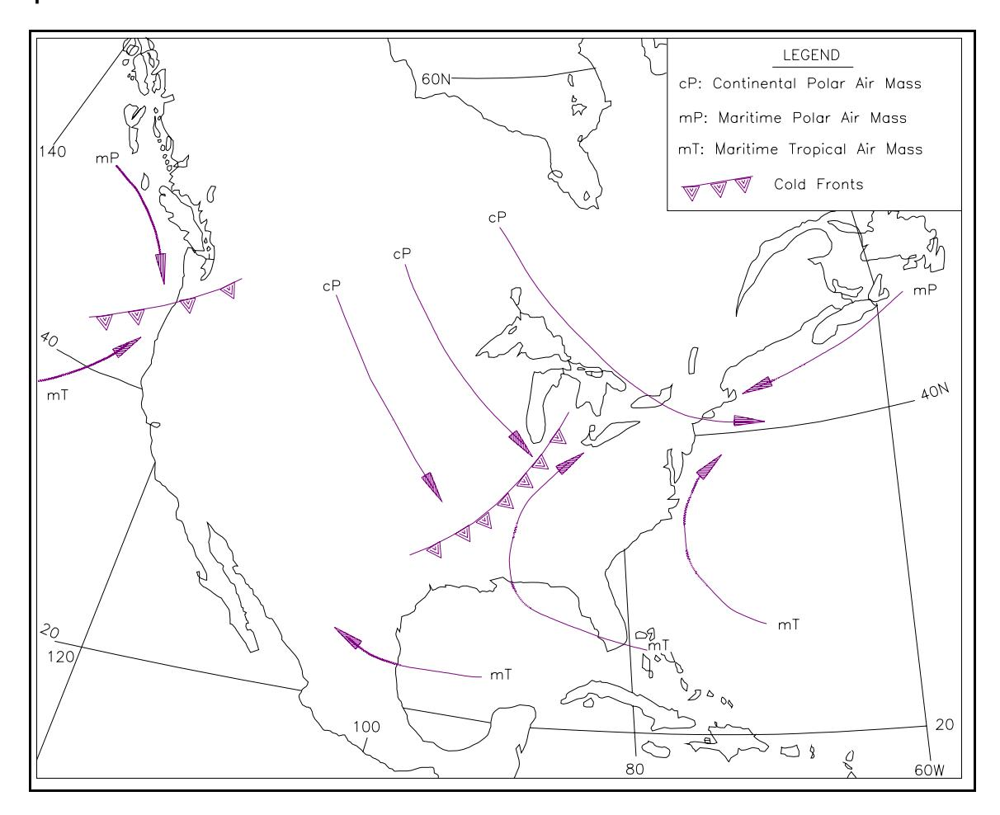

*Figure III-4-1. Air masses and fronts over the coastal areas*

- (1) Basic concepts.
- (a) Wind velocity and the vertical gradient of wind speed near the ground are important factors in determining how much sediment will be transported by wind. In addition, sediment characteristics such as size, size distribution, packing, and moisture content play important roles. The vertical gradient of wind speed results in shearing forces within the air and eventually on the ground surface. When vegetation is present, sheer can be transferred into the uppermost soil layers. The steeper the gradient, the greater the shear stress. The velocity gradient is significantly influenced by local topography, vegetation, and land use. These factors contribute to the "roughness" of the ground surface. In the case of wind transport in coastal areas, local perturbations in the wind field may also be important in determining the eventual erosion and deposition patterns of wind-blown sand.
- (b) The vertical distribution of wind speed the velocity profile generally follows a logarithmic distribution. An important parameter in this representation is the shear velocity defined by

```math
u_* = \sqrt{\frac{\tau}{\rho_a}} \tag{III-4-1}
```

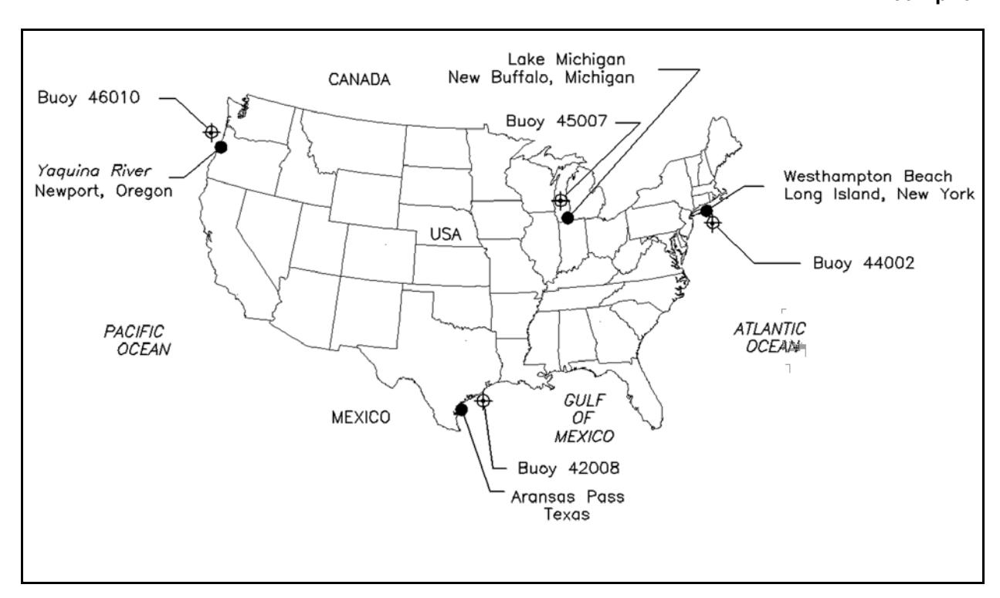

*Figure III-4-2. Example wind regime areas (Solid circles denote example wind regime areas. Open circles are nearby buoys used to construct wind roses)*

in which u * = the shear or friction velocity, τ = the boundary shear stress (force per unit surface area), and ρa = the density of the air. The logarithmic distribution of wind velocity is given by

```math
U_z = \frac{u_*}{\kappa} \ln \left( \frac{Z_o + Z}{Z_o} \right) \tag{III-4-2}
```

in which Uz = the average wind speed as a function of height above ground level, u* = the shear velocity, Z = the height above ground level, Zo = the height of a roughness element characterizing the surface over which the wind is blowing, and κ = von Karman's constant (κ = 0.4). Wind speed measurements are usually averaged over a period of several minutes to smooth out fluctuations due to gusts. Averaging time can vary depending on how the measurements are made. If readings are taken from an anemometer dial rather than from a recording, the observer may visually average the speed by observing the needle over a period of several minutes. Wind speeds are occasionally reported as the fastest mile of wind speed where the averaging time is the time it would take the wind to travel the distance of 1 mile; thus, the averaging time for a 60-mph wind would be 1 min; the averaging time for a 30-mph wind would be 2 min, etc.
(c) Since the height of a roughness element Zo is usually small compared with Z , Equation 4-2 can be approximated by

```math
U_z \approx \frac{u_*}{\kappa} \ln \left( \frac{Z}{Z_o} \right) \tag{III-4-3}
```

or

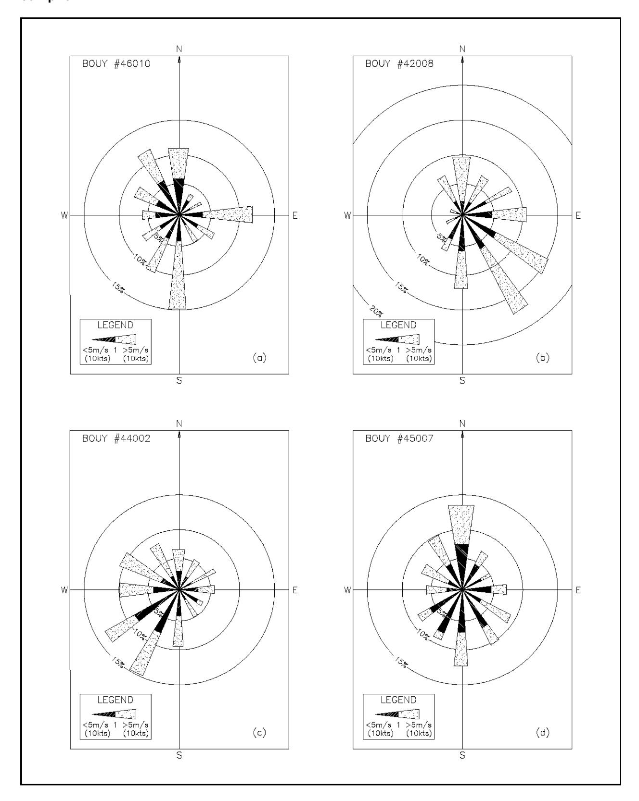

*Figure III-4-3. Wind roses based on hourly data nearby: (a) Newport, OR, (b) Aransas Pass, TX, (c) Westhampton Beach, Long Island, NY, and (d) New Buffalo, MI*

```math
\ln Z = \ln Z_o + \left(\frac{\kappa}{u_*}\right) U_z
```

which is of the form

```math
Y = a_o + a_1 X
```

where Y = l n Z and

```math
a _ { o } \ = \ \ln Z _ { o } \mathrm { o r } , Z _ { o } \ = \ e ^ { a _ { o } }
```

and

```math
a _ { 1 } \, = \, \frac { \kappa } { u _ { * } } \, \mathrm { o r } , \, u _ { * } \, = \, \frac { \kappa } { a _ { 1 } }
```

- (d) A logarithmic velocity distribution as fit by linear regression techniques is given in Figure III-4-4 for Isle Dernieres, LA.
- (e) The concept of a drag coefficient is sometimes used in wind transport calculations, where the drag coefficient is defined as

```math
C_z = \left(\frac{u_*}{U_z}\right)^2 \tag{III-4-4}
```

in which Cz = the drag coefficient at height Z . Often Cz is considered a constant for a given Z ; however, computations by Hsu and Blanchard (1991) for C 10 showed a variation of from 0.5 × 10-3 to 5.0 × 10-3, an order of magnitude. In fact, Cz varies with season and wind direction and cannot be considered constant. It is evident that the roughness characteristics of the fetch over which the wind blows depend on wind direction, particularly in coastal regions where onshore and offshore winds experience significantly different fetches. Onshore winds usually experience less friction than offshore winds because of the relative smoothness of the water surface when compared with the rougher land surface. On the other hand, shear stresses on the beach due to onshore winds will be greater than shear stresses due to offshore winds of the same speed.
(f) Because the appropriate height of a roughness element is not known a priori, it must be found by the simultaneous solution of Equation 4-2 applied at two heights above the ground. However, if Zo is small, and the wind speed is not measured very close to the ground (well outside of the roughness elements), Equation 4- 3 can be used to estimate the wind speed distribution without first finding Zo. Equation 4-3 can be applied at two heights, Z 1 and Z 2 so that

```math
\ln Z_1 = \ln Z_o + \left(\frac{\kappa}{u_*}\right) U_{z1} \tag{III-4-5}
```

and

```math
\ln Z_2 = \ln Z_o + \left(\frac{\kappa}{u_*}\right) U_{z2} \tag{III-4-6}
```

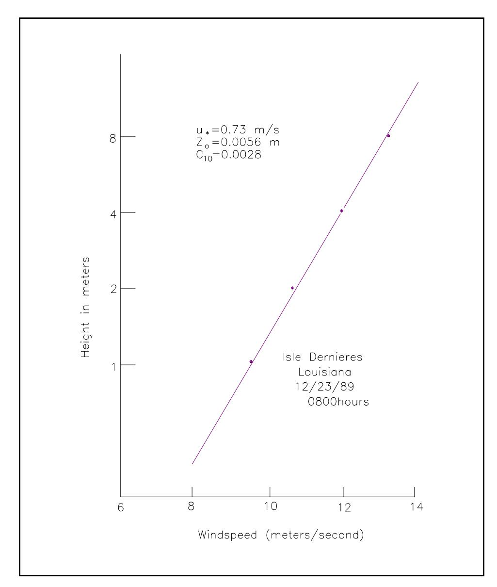

*Figure III-4-4. Example logarithmic wind profile at Isles Dernieres, LA (adopted from Hsu and Blanchard (1991))*

where Z 1 is below Z 2 so that UZ 1 is less than UZ 2.
(g) Eliminating Zo from Equations 4-5 and 4-6 gives

```math
u_* = \frac{\kappa(U_{z2} - U_{z1})}{\ln\left(\frac{Z_2}{Z_1}\right)} \tag{III-4-7}
```

(h) Consequently, the shear velocity u * can be determined from Equation 4-7 without first finding Zo by measuring the wind velocity at two elevations. For wind transport studies, wind velocity sensors used to determine u * should be spaced vertically as far apart as practical, say a minimum of 3 to 4 m, but preferably more.

# EXAMPLE PROBLEM III-4-1

Find:
The shear velocity u* and the height of a characteristic roughness element Zo . What is the magnitude of the shear stress acting on the ground surface?
Given:
Wind speed is measured at two elevations above the ground. At 10 m height, the average wind speed is 11.3 m/s; at 4 m, it is 9.36 m/s.
Solution:
The velocity distribution is logarithmic as given by Equation 4-2. Since there are two unknowns, Zo and u *, the equation must be solved at the two elevations. Substituting into the equation with κ = 0.4

```math
1 1 . 3 \ = \ \frac { u _ { * } } { 0 . 4 } \ \ln \left( \frac { 1 0 \ + \ Z _ { o } } { Z _ { o } } \right)
```

and

```math
9.36 = \frac{u_*}{0.4} \ln \left( \frac{4 + Z_o}{Z_o} \right)
```

Solving for each equation for u * and equating

```math
\frac{9.36 (0.4)}{\ln\left(\frac{4+Z_o}{Z_o}\right)} = \frac{11.3 (0.4)}{\ln\left(\frac{10+Z_o}{Z_o}\right)}
```

or

```math
\ln\left(\frac{10 + Z_o}{Z_o}\right) = 1.207 \ln\left(\frac{4 + Z_o}{Z_o}\right)
```

```math
ln(Z_o + 10) - lnZ_o = 1.207 [ln(Z_o + 4) - lnZ_o]
```

```math
\ln(10 + Z_o) = 1.207 \ln(4 + Z_o) - 0.207 \ln Z_o
```

Assuming that Zo is small with respect to the height at which the wind speeds are measured, a first approximation to Zo can be obtained,
(Sheet 1 of 3)
Example Problem III-4-1 (Continued)

```math
ln(10) = 1.207 ln(4) - 0.207 ln Z_o
```

```math
2 . 3 0 3 \ = \ 1 . 6 7 3 \ - \ 0 . 2 0 7 \ \ln Z _ { o }
```

```math
\ln Z_{o} = -3.042
```

```math
Z _ { o } \, = \, 0 . 0 4 7 7 \quad \mathrm { m }
```

A second improved approximation can be found by substituting Z_0 = 0.0477 into,

```math
\ln(10 + 0.0477) = 1.207 \ln(4 + 0.0477) - 0.207 \ln Z_{o}
```

Solving for Z_o

```math
Z _ { o } \, = \, 0 . 0 5 \mathrm { \, m \, }
```

Then, substituting back into one of the wind speed equations

```math
u_* = \frac{U_z \kappa}{\ln\left(\frac{Z + Z_o}{Z_o}\right)}
```

for the wind speed observation at 10 m

```math
u_* = \frac{(11.3)(0.4)}{\ln\left(\frac{10 + 0.05}{0.05}\right)} = 0.852 \text{ m/s}
```

The assumption that Z_o is small with respect to the height at which wind speeds are measured could have been made at the outset by using Equation 4-3. Then

```math
U_z = \frac{u_*}{0.4} \ln \left( \frac{Z}{Z_o} \right)
```

and

```math
11.3 = \frac{u_*}{0.4} \ln \left( \frac{10}{Z_o} \right)
```

(Sheet 2 of 3)
Example Problem III-4-1 (Concluded)
with

```math
9.36 = \frac{u_*}{0.4} \ln \left( \frac{4}{Z_o} \right)
```

or

```math
(11.3)(0.4) = u_* \left[ \ln(10) - \ln Z_o \right]
```

and

```math
(9.36)(0.4) = u_* \left[ \ln(4) - \ln Z_o \right]
```

Subtracting

```math
0.776 = u_* \ln\left(\frac{10}{4}\right)
```

```math
u_* = 0.847 \text{ m/s}
```

On substituting this value for u * back into one of the above equations and solving for Z0 gives

```math
Z_0 = 0.048 \text{ m}
```

These are the same as the first approximations found above.
The shear stress can be found from Equation 4-1, the definition of u*

```math
u_* = \sqrt{\frac{\tau}{\rho_a}}
```

or

```math
\tau = \rho_a u_*^2
```

where ρa = 0.00122 gm/cm3 and u * = 0.852 m/sec. Substituting

```math
\tau = 0.00122(85.2)^2 = 8.86 \text{ dynes/cm}^2
```

The reader may wish to verify the shear velocity and characteristic roughness element height for the wind speed observation at Isle Dernieres given in Figure III-4-4.
(Sheet 3 of 3)

#### EM 1110-2-1100 (Part III) 30 Apr 02

(i) In most sand transport studies, two-level or multilevel wind velocity measurements are rarely available and the wind speed climatology must be measured at two or more levels to establish u *. Based on measurements at six beaches, Hsu (1977) established a relationship for u * in terms of U 2m, the wind speed at the 2-m height (see Figure III-4-5). His relationship for the dry beach area is given by

```math
u_* = 0.044 \ U_{2m} \tag{III-4-8}
```

in which U2m = the average wind speed at the 2-m height. Equations for u * on tidal flats, dunes, etc. are also given by Hsu (1977) (see Figure III-4-5). Note that the coefficient in this equation depends critically on the height of a roughness element so that Equation 4-8 is valid only for beaches with roughness conditions similar to those for which the equation was developed.

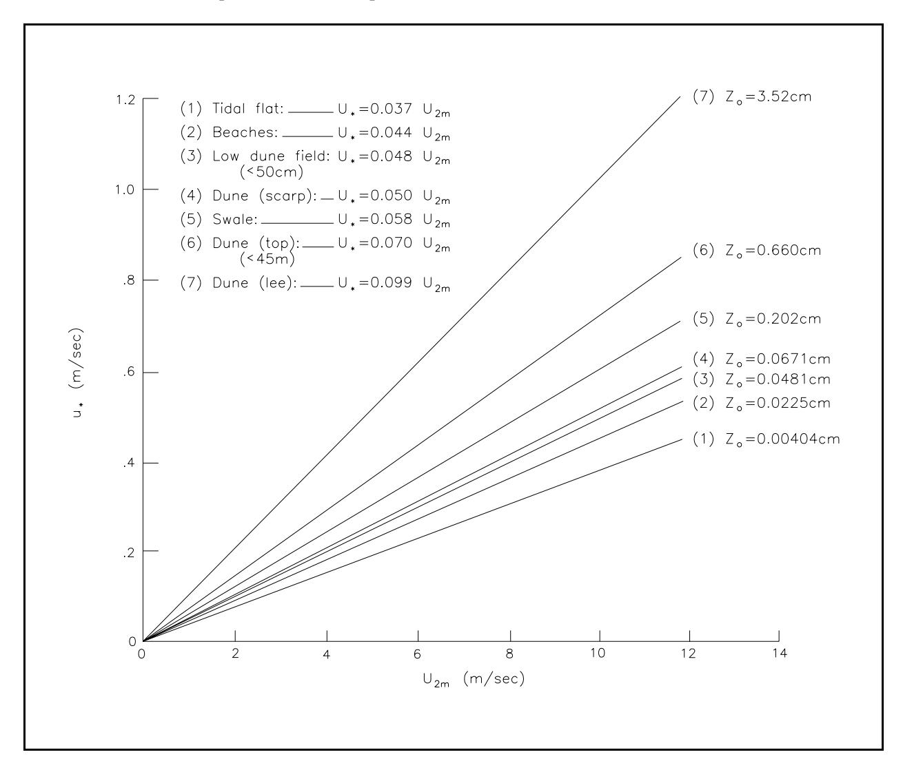

*Figure III-4-5. Aerodynamic roughness element lengths Z0 and relationship between shear velocity u * and wind speed at the 2-m height U 2m in coastal environments (adopted from Hsu (1977))*

#### EXAMPLE PROBLEM III-4-2

Find:
The drag coefficient at the 10-m, 4-m, and 2-m heights using the shear velocity calculated in the preceding problem, then estimate the shear velocity using the wind speed determined for the 2-m height. Compare the shear velocity with the value determined in the preceding example problem.
Given:
The wind speed measurements from the previous example problem.
Solution:
The definition of the drag coefficient is given by Equation 4-4. Thus, for the 10-m height,

```math
C_{10m} = \left[\frac{u_*}{U_{10m}}\right]^2
```

```math
C_{10m} = \left[ \frac{0.852}{11.3} \right]^2 = 0.00568
```

For the 4-m height C4m = (0.852/9.36)2 = 0.00829. The wind speed at the 2-m height must be found from Equation 4-2 (or Equation 4-3 if the roughness element height can be assumed small). Thus,

```math
U_{2m} = \frac{(0.852)}{(0.4)} \ln \left( \frac{2 + 0.05}{0.05} \right)
```

```math
U _ { 2 m } \, = \, 7 . 9 1 \mathrm { m / s }
```

and

```math
C_{2m} = \left[ \frac{0.852}{7.91} \right]^2 = 0.0116
```

Using this wind speed at the 2-m height to estimate the shear velocity u * in Equation 4-8 gives

```math
u_* = 0.044 \, U_{2m}
```

```math
u _ { \ast \mathrm { \, \scriptsize \, = \, } 0 . 0 4 4 ( 7 . 9 1 ) \, = \, } 0 . 3 4 8 \, \mathrm { \ m / s }
```

This result is significantly lower than the u * = 0.852 value found from the wind speed distribution because the example wind speed distribution is somewhat unusual for a beach. The characteristic roughness length for the example is larger than what is typically found on beaches. A value of Zo typical for beaches is 0.000225 m (0.0225 cm); however, based on measurements by Hsu (1977), Zo can be much larger in the lee of dune areas. See Figure III-4-5 for some typical values of Zo in various coastal environments.

# EM 1110-2-1100 (Part III) 30 Apr 02

- (2) Measurement of wind speed and direction.
- (a) Wind speed is measured with an anemometer. Two types of anemometers are typically used, cuptype or propeller-type anemometers. Wind direction is measured using a vane that indicates the direction from which the wind is blowing. When wind speed measurements are made with a cup-type anemometer, a separate vane is needed. Propeller-type anemometers have a built-in vane that keeps the propeller directed into the wind. Wind speed measurements are usually obtained at or corrected to a standard anemometer height of 10 m above ground level, although anemometers may be mounted at other heights. The wind record from an anemometer depends significantly on the physical conditions of the surrounding terrain. The surrounding terrain determines the boundary roughness and thus the rate at which wind speed increases with height above the ground. Consequently, physical conditions characterizing the surrounding fetches determine the wind environment at a site. At coastal sites, the fetch seaward of the beach is over water and is generally characterized by relatively low roughness. The fetch landward of the beach can vary significantly from site to site since it depends on the type of vegetation, terrain, etc.
- (b) Differences exist between onshore and offshore wind speeds due to differences in friction conditions over the fetch. The differences are most marked in the observed wind speeds (see Hsu (1988)). Hsu (1986) derived an equation to estimate the difference in overwater and overland wind speeds. The ratio of wind speed overwater to the wind speed overland is given by

```math
\frac{U_{sea}}{U_{land}} = \left[ \frac{H_{sea} C_{D, land}}{H_{land} C_{D, sea}} \right]^{\frac{1}{2}} \tag{III-4-9}
```

where
U_{sea} and U_{land} = the wind speed over sea and land, respectively
H_{sea} and H_{land} = the height of the planetary boundary layer over the sea and land
C_{D.sea} and C_{D.land} = the drag coefficients over sea and land
- (c) Equation 4-9 should apply for both onshore and offshore winds assuming that the geostrophic wind above the boundary layer does not change appreciably. For a given climatological area, the parameters on the right side of Equation 4-9 are generally known. Holzworth (1972) and SethuRaman and Raynor (1980) found H_{sea} = 620 \text{ m} , H_{land} = 1014 \text{ m} , C_{D,sea} 0.0017, and C_{D,land} = 0.0083 , leading to U_{sea}/U_{land} = 1.7 for this area. C_{D,sea} and C_{D,land} were measured at the 8-m level.
- (d) If the direction between either onshore near-surface winds or offshore near-surface winds is within 45 deg of shore-normal, Equation 4-9 will be valid regardless of whether the wind blows from land to sea or vice versa (Hsu (1988), pp 184-186). Equation 4-9 may, therefore, be applicable to weather systems such as land breezes, sea breezes, hurricanes near landfall, and other synoptic-scale phenomena such as cyclones (low pressure cells), anti-cyclones (high pressure cells), and monsoons. This is not the case for the passage of frontal systems and squall lines, however, since their winds do not usually blow within 45 deg of shorenormal. Typically, winds associated with the passage of fronts and squall lines do not persist for long periods of time.
- (e) An empirical relationship between overland wind speed and overwater wind speed can be estimated from measured wind speeds at land and water sites by

```math
U_{sea} = A + BU_{land} \tag{III-4-10}
```

where A and B are empirical constants.
(f) If the air-water temperature difference is small, say less than 5 °C, and if the aggregate wind estimation error at airports is less than 10 percent (Wieringa 1980), then an estimate is given by Liu, Schwab, and Bennett (1984) as

```math
U_{sea} = 1.85 \text{ (m/s)} + 1.2 U_{land} \tag{III-4-11}
```

where U_{sea} and U_{land} are measured in m/s.
(g) Based on many pairs of measurements of overland and overwater wind speeds, the U_{sea} was correlated with U_{land} for synoptic-scale weather systems (Hsu 1981; Powell 1982). Wind speeds used by Hsu (1981) were less than 18 m/s while Powell's (1982) data included hurricane-force wind speeds obtained during Hurricane Frederic in Alabama in 1979. The correlation between U_{sea} and U_{land} is shown in Figure III-4-6. The best-fit equation by linear regression methods is given by

```math
U_{sea} = 1.62 \text{ (m/s)} + 1.17 U_{land} \tag{III-4-12}
```

- (h) Equation 4-11 is also plotted in Figure III-4-6. The difference between Equations 4-11 and 4-12 is not significant even though the correlation on which Equation 4-12 is based did not consider air-sea temperature differences. Equation 4-12 is recommended for use in coastal wind-blown sand transport studies where the air water temperature difference is small (|Ta Ts| < 5 °C).
- (i) For air-sea temperature differences exceeding 5 °C, a correction can be applied. A temperature correction applied to wind speed as given by Resio and Vincent (1977) is

```math
U'_{10m} = R_T U_{10m} \tag{III-4-13}
```

where U'_{10m} is the wind speed corrected for the air-sea temperature difference and R_T is the correction factor applied to the overwater wind speed at the 10-m height. The correction factor R_T is shown in Figure III-4-7 and given by the equation

```math
R_T = 1 - 0.06878 |T_a - T_s|^{0.3811} sign(T_a - T_s) \tag{III-4-14}
```

where T_a = the air temperature in degrees Celsius and T_s = the sea temperature in degrees Celsius.
(j) For wind-blown sand transport studies, wind measurement stations should be close to the study site and preferably on the beach. Land-based wind measurements at airports are generally not useful indicators of nearshore wind conditions and should not be used for coastal sand transport studies. Unfortunately, wind measurements are often not available near coastal study sites and data from nearby Coastal Marine Automated Network (C-MAN) and offshore meteorological buoys must be used. Table III-4-1 compares wind measurements at a C-MAN station (ALSN6), at an offshore buoy 44025, and at Islip Airport on central Long Island. (Wind speeds have been corrected to the standard 10-m elevation using a power-law relation. This correction is discussed below.) Wind speed measurements at Islip Airport are consistently lower than measurements at the coast. On average, U_{44025}/U_{Islip} = 1.6 , which is consistent with the U_{sed}/U_{land} found earlier for the New York-Massachusetts area (Holzworth 1972, SethuRaman and Raynor 1980). Also, measurements at the offshore buoy are more variable than those at the C-MAN station, making the C-MAN station data preferable in this case.

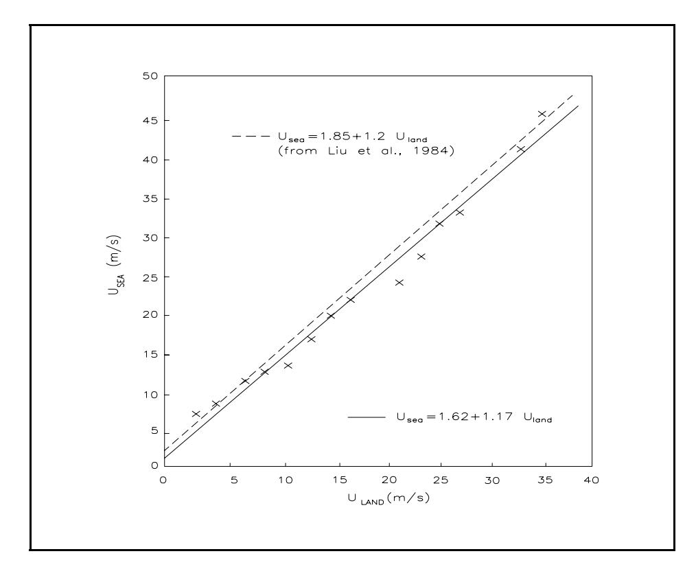

*Figure III-4-6. Variation of Usea with Uland. (Hsu 1986)*

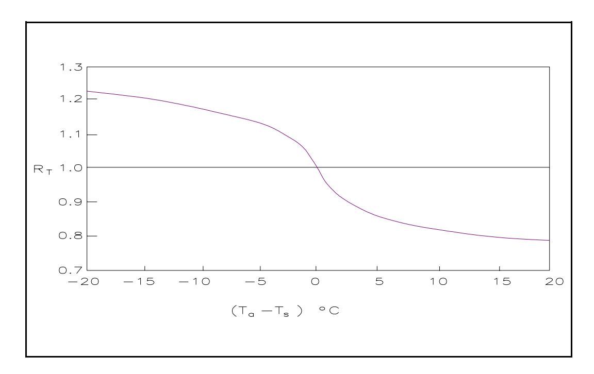

*Figure III-4-7. Temperature correction factor RT as a function of air-sea temperature difference (Resio and Vincent 1977)*

*Table III-4-1
Monthly Mean Wind Speeds Near Westhampton Beach, Long Island NY - Based on Simultaneous Measurements at C-MAN Station ALSN6 and Offshore Buoy 44025*

**Table III-4-1. Monthly Mean Wind Speeds Near Westhampton Beach, Long Island NY - Based on Simultaneous Measurements at C-MAN Station ALSN6 and Offshore Buoy 44025**

| Station ALSN6 | and Offshore | Buoy 44025 Wind Speeds C-MAN ALSN6 | in meters/sec BUOY 44025 | C-MAN ALSN6 | BUOY 44025 | C-MAN ISLIP AIRPORT |
| --- | --- | --- | --- | --- | --- | --- |
| YEAR | MONTH | @4.9 m | @ 4.9 m | @ 10 m | @ 10 m | @ 10 m |
| 1991 | May Jun Jul Aug Sep Oct | 7.30 6.70 6.00 6.80 6.60 7.60 | 4.70 5.40 4.70 5.00 5.80 6.30 | 6.20 5.70 5.10 5.80 5.60 6.50 | 5.00 5.80 5.00 5.40 6.20 6.70 | 2.60 2.90 2.40 2.80 3.80 4.50 |
| 1992 | Nov Dec Jan Feb Mar Apr May Jun | 7.70 8.80 8.10 8.70 9.00 7.00 6.80 7.10 | 7.10 7.90 N/A 7.30 7.30 5.40 5.10 4.80 | 6.50 7.50 6.90 7.40 7.70 6.00 5.80 6.00 | 7.60 8.50 N/A 7.80 7.80 5.80 5.50 5.10 | 4.60 4.70 4.70 5.10 5.30 4.50 4.60 4.70 |
| AVG = |  | 7.44 | 5.91 | 6.34 | 6.32 | 4.09 |
| STD DEV | = | 0.91 | 1.14 | 0.79 | 1.22 | 0.99 |

(k) Wind speeds are often adjusted to a standard anemometer height by using a power-law relation. The standard anemometer height is usually 10 m above the ground. The power-law adjustment equation is given by

```math
U_{ZR} = U_{ZM} \left(\frac{Z_R}{Z_M}\right)^n \tag{III-4-15}
```

in which Z_M = the anemometer height, Z_R = the reference height (usually 10 m), U_{ZM} = the wind speed at the anemometer height, U_{ZR} = the wind speed at the reference height, and n = an empirically determined exponent, ranging from 1/11 to 1/7. The following example details the calculation of this exponent as well as wind speed correction factors for air sea temperature differences.
- (3) Effects of vegetation, dunes, and buildings.
- (a) Air flow over a flat beach differs from air flow over dunes. There are at least three distinct wind transport zones resulting from the presence of dunes on the backbeach (Hsu 1988). Dunes produce both a stagnation zone on their windward side and a wake zone on their leeward side within which wind patterns are disturbed and no longer exhibit the typical logarithmic distribution with height above the ground. Wind blowing offshore results in a stagnation zone landward of the dune that extends landward approximately two to four times the height of the dune. In this zone, wind speeds are lower than the free stream wind speed (region of underspeed); in fact, near the ground they may even blow in the direction opposite to that of the
free stream. A wake region (cavity) may extend 10 dune heights seaward of the dune. Within the wake cavity, wind speeds are also reduced and may reverse direction near ground level. Over the dune crest, wind speeds are higher than the free stream speed because the streamlines are compressed and the flow is accelerated (region of overspeed) (see Figure III-4-8).

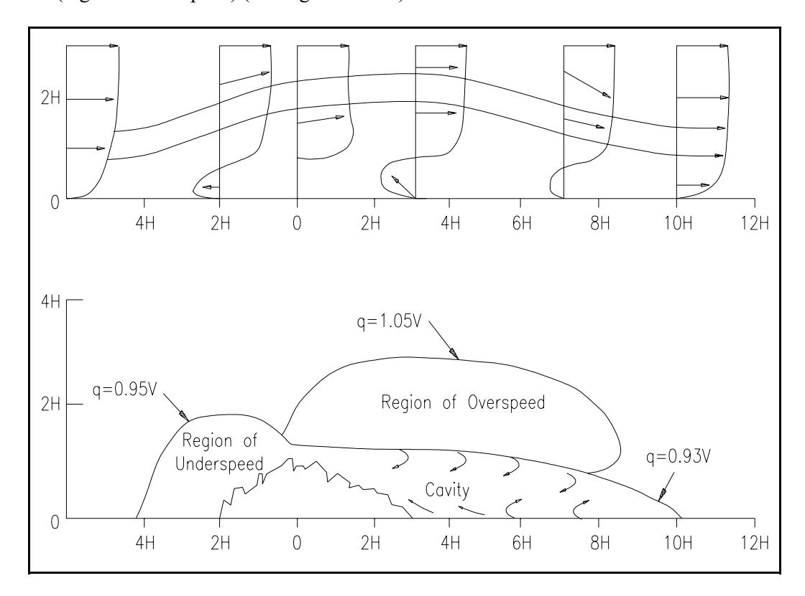

*Figure III-4-8. Wind field in the vicinity of a coastal sand dune ( q is the local resultant mean velocity and v is the reference velocity in the uniform stream above the dune) (Hsu 1988)*

(b) Buildings and vegetation also locally modify the air flow. Generally, buildings will produce a wake in their lee. Air flow patterns near buildings will be complex, will depend on the specific building geometry, and on the presence of any surrounding buildings. Generalized air flow patterns cannot be established for the numerous building/construction configurations encountered in practice. The effect of vegetation depends on the type of vegetation, its location relative to any dunes, and how far it projects into the near-ground boundary layer. Trees usually have more effect on wind patterns than do shrubs or grasses but, depending on their location, may be less significant than shorter vegetation in affecting sand transport rates and sediment deposition patterns. Most sand transport takes place within a few centimeters of the ground and anything that modifies the air flow in this region will have some effect.

#### III-4-3. Transport Rates

- a. Processes of sand transport by wind .
- (1) The processes involved in transporting sand by wind are summarized by Raudkivi (1976). Sand grains move by bouncing along the surface, a process termed saltation, and by surface creep. Sand grains,

#### EXAMPLE PROBLEM III-4-3

Find:
Determine the overwater wind speed and correct the wind speed due to the air-sea temperature difference. Estimate the exponent in Equation 4-15 using the overwater wind speeds.
Given:
The winds given in Example Problem III-4-1 measured over land on a day when the air temperature is 15 °C and the water temperature is 5 °C.
Solution:
The air-sea temperature difference is (15^{\circ}-5^{\circ}) = 10^{\circ} C and the correction R_T is given by Equation 4-14

```math
R_T = 1 - 0.06878 | 15 - 5|^{0.3811} (+) = 0.8346
```

This correction is applied to the wind speed at the 10-m height. Therefore, from Example Problem III-4-1, U_{10m} = 11.3 m/s and the corrected 10-m wind speed is

```math
U_{10m} = 0.8346(11.3) = 9.43 \text{ m/s}
```

Assuming that the height of the roughness elements are Z_o = 0.05 as found in Example Problem III-4-1, the shear velocity can be found from Equation 4-2

```math
U_z = \frac{u_*}{\kappa} \ln \left( \frac{Z + Z_o}{Z_o} \right)
```

```math
u _ { \scriptscriptstyle * } \, = \, 0 . 7 1 1 3 \, \mathrm { \, \ m / s \, }
```

The wind speed at the 8-m height is then calculated as

```math
U_{8m} = \frac{0.7113}{0.4} \ln \left( \frac{8 + 0.05}{0.05} \right) = 9.036 \text{ m/s}
```

Using these two wind speeds to estimate the exponent in Equation 4-15

```math
\frac{U_{10m}}{U_{8m}} = \left(\frac{10}{8}\right)^n \qquad \frac{9.43}{9.036} = (1.25)^n
```

```math
n = \frac{\ln(1.0436)}{\ln(1.25)} = 0.1913 = \frac{1}{5.23}
```

# EM 1110-2-1100 (Part III) 30 Apr 02

once dislodged, are carried up into the moving air by turbulence; they acquire energy from the moving air, and they settle through the air column due to their weight and impact on the ground. The saltating grains impact on the ground surface at a flat angle and transmit a portion of their energy to the grains on the ground. Some of the grains on the surface are dislodged and are carried upward into the flow where they continue the process of saltation; others are moved forward on the surface by the horizontal momentum of the impacting, saltating grains. This latter forward movement of sand on the ground surface is termed surface creep. Saltating grains are capable of moving much larger surface grains by surface creep due to their impact. On beaches, saltation is the more important of the two processes.
- (2) The presence of sand in the air column near ground level also leads to a reduction in the wind speed near the ground and a modification of the wind speed distribution.
- (3) Because saltating sand grains impact the ground surface at a relatively flat angle which ranges from about 10 to 16 deg with the horizontal, there is a tendency for small depressions in the ground surface to lead to the formation of sand ripples. Saltating sand grains have a greater tendency to impact the back face of a small depression because of the flat angle of incidence. This preferential movement on the back face of the depression moves sand up the back face to form a mound or ripple. Once small ripples are established they may grow until they reach a limiting height which is determined by the prevailing wind speed.
- (4) On beaches, the most important sand features frequently present are sand dunes. Dunes are much larger than the sand features described above. They are large enough to significantly alter wind patterns and to shelter the area on their leeward side. Once established, dunes cause wind pattern changes which lead to dune growth. b. Sand transport rate prediction formulas.
- (1) Many equations have been proposed to predict sand transport by wind; e.g., see Horikawa (1988) and Sarre (1988). Several example sand transport equations follow:

```math
G \, = \, 0 . 0 3 6 \, { U _ { 5 f t } } ^ { 3 } \qquad \mathrm { ( O ^ { \prime } B r i e n \, a n d \, R i n d l a u b \, 1 9 3 6 ) }
```

in which G = the dry weight transport rate in pounds per foot per day and U_{5ft} = the wind speed at the 5-ft elevation in feet per second ( U_{5ft} > 13.4 feet per second);

```math
q = B_{Bagnold} \frac{\rho_a}{g} \sqrt{\frac{D}{d}} u_*^3
```

in which q = the mass transport rate in gm/cm-s, B_{Bagnold} = a coefficient, \rho_a = the mass density of the air = 0.001226 gm/cm<sup>3</sup>, d = a standard grain size = 0.25 mm, D = grain size in mm, and u_* = the shear velocity in cm/sec;

```math
q = Z_{Zingg} \frac{\rho_a}{g} \left[ \frac{D}{d} \right]^{\frac{3}{4}} u_*^3 \quad \text{(Zingg 1953)}
```

in which Z_{Zingg} = a coefficient, and q, D, d, \rho_{a^{\prime}} and u_* are as in the previous expression.
(2) Chapman (1990) provides an evaluation of these and several other equations. The predictive capability of the seven equations investigated by Chapman (1990), as gauged by the coefficient of determination, ranged from r^2 = 0.63 to r^2 = 0.87 (see Table III-4-2).

**Table III-4-2. ).**

| Equation Value | of r2 |
| --- | --- |
| Bagnold (1941) | 0.63 |
| Horikawa & Shen (1960) | 0.84 |
| Hsu (1973) | 0.87 |
| Kadib (1964) | 0.65 |
| O'Brien & Rindlaub (1936) | 0.80 |
| Williams (1964) | 0.80 |
| Zingg (1953) | 0.78 |

(3) In Chapman's evaluation, Hsu's (1986) equation, which like Bagnold's (1941) is based on considerations of the turbulent kinetic energy relationship, had an r = 0.87. Hsu's equation is given by

```math
q = K \left[ \frac{u_*}{\sqrt{gD}} \right]^3 \tag{III-4-16}
```

where
q = sand transport rate in gm/cm-s
u * = shear velocity
g = acceleration of gravity
D = mean sand grain diameter
K = dimensional eolian sand transport coefficient
(4) The term in square brackets in Equation 4-16 is a dimensionless Froude number, which can be computed using any consistent units. The dimensions of K are the same as those of q ; in this case, grams per centimeter per second. Values of K as a function of sand grain diameter can be obtained from Figure III-4-9. A regression equation ( r = 0.87) fitted to both laboratory and field data is given by

```math
\ln K = -9.63 + 4.91D \tag{III-4-17a}
```

or

```math
K \ = \ e ^ { - 9 . 6 3 \ + \ 4 . 9 1 D } \tag{III-4-17b}
```

where D is in millimeters and K in grams per centimeter per second, which plots as a straight line on semilogarithmic graph paper (see Figure III-4-9).
(5) Equations 4-16 and 4-17a can be used to estimate sand transport rates for given wind speeds and mean sand-grain diameters within the range of empirical observations from which the equations were developed. Equation 4-17a is based on the data in Figure III-4-9, which include transport data for mean sand grain diameters up to 1.0 mm; consequently, the equations should not be used to estimate transport on beaches with mean grain diameters greater than about 1.0 mm.

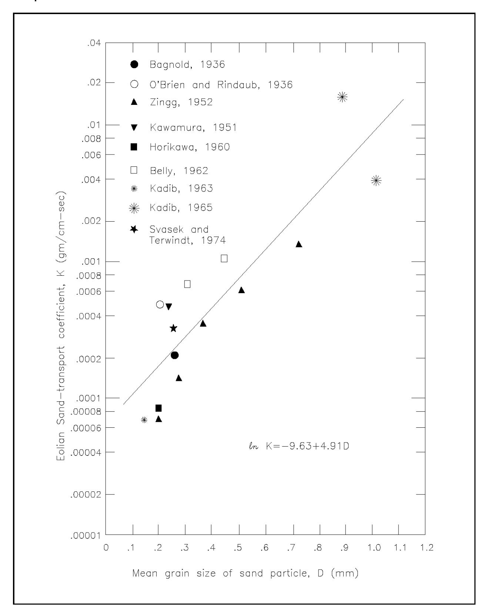

*Figure III-4-9. Wind-blown sand transport coefficient as a function of mean sand-grain diameter (adopted from Hsu (1977)*

(6) Equation 4-16 can be recast into a dimensionless form, which allows it to be used with any consistent set of units. The revised equation is given by

```math
\frac{q}{v_a \rho_a} = K' \left[ \frac{u_*}{\sqrt{gD}} \right]^3 \tag{III-4-18}
```

in which ν a = the kinematic viscosity of the air and ρ a = the mass density of the air. The dimensionless coefficient K ' is given by

```math
K' = e^{-1.00 + 4.91D} \tag{III-4-19}
```

in which D = the median grain diameter in millimeters . Equation 4-18 reduces to Equation 4-16 when ν a = 0.147 cm2 /sec and ρ a = 0.00122 gm/cm3 are substituted into it.
c. Initiation of sand transport . Before sand will be transported by wind, the boundary shear stress must be increased above some critical or threshold value. The critical shear stress, in terms of the shear velocity, is given by Bagnold (1941)

```math
u_{*t} = A_t \sqrt{\frac{(\rho_s - \rho_a)gD}{\rho_a}} \tag{III-4-20}
```

in which ρ s = the mass density of the sediment, ρ a = the mass density of the air, and At = a dimensionless constant ( At = 0.118). The effect of soil moisture that increases the critical shear stress is not considered in Equation 4-20.

### III-4-4. Procedures for Calculating Wind-Blown Sand Transport

The steps for calculating wind-blown sand transport on beaches follow.
- a. Obtain hourly average wind speed and direction data. (Wind data tabulated at intervals less frequent than 1 hr may be used in lieu of hourly data; however, hourly data are preferable.)
- b. Obtain daily precipitation data and monthly evaporation records from a nearby National Weather Service (NWS) station. (These data are available in "Climatological Data" summaries published monthly for each state by the National Climatic Data Center (NCDC), Asheville, NC). c. Obtain the density and median grain size of the beach sand at the study site. d. Compute the critical shear velocity u*t for the mean grain diameter using Equation 4-20.
- e. Compute the critical wind speed at the 2-m height U2mt using Equation 4-8 with the value of u*t computed under Step 4 above. (This is the wind speed measured at the 2-m height that can initiate sand transport.)
- f. Shear velocity u* is relatively independent of height up to a height of about 50 m above ground level; therefore, Equation 4-7 can be used to compute the critical wind speed at any height above the ground using the U2mt and u*t. (For example, let Z 1 = 2 m, Uz 1 = U 2 mt , Z2 = the height at which the available wind

#### EXAMPLE PROBLEM III-4-4

#### Find:

Determine the volume of sand being transported per meter of beach width by the wind if the sand is dry.

#### Given:

The median sand-grain diameter at Westhampton Beach, Long Island, NY, is 0.26 mm. The wind velocity is measured by an anemometer located 8 m above the beach and found to be 21 m/s (see Figure III-4-10 for site location).

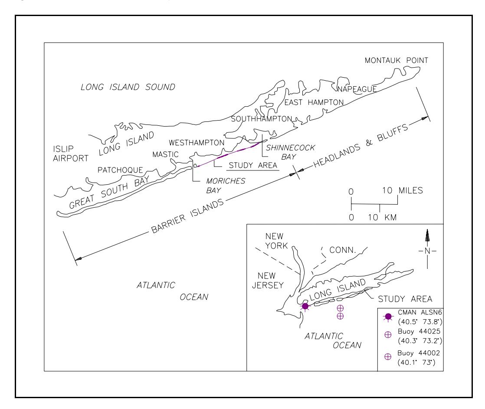

*Figure III-4-10. Westhampton Beach, Long Island, NY (Hsu 1994)*

# Solution:

The first step is to compute the threshold wind speed that will just initiate sand transport. This is obtained from Equation 4-20

```math
u_{*t} = A_t \sqrt{\frac{(\rho_s - \rho_a)gD}{\rho_a}}
```

#### Example Problem III-4-4 (Continued)

where A_t = 0.118 , g = acceleration of gravity, D = sand-grain diameter, \rho_a = density of air, and \rho_s = density of the sediment. At 18 °C, \rho_a = 1.22 \times 10^{-3} gm/cm<sup>3</sup>; \rho_s = 2.65 gm/cm<sup>3</sup>, g = 980 cm/sec<sup>2</sup>, and D = 0.026 cm. Note that Equation 4-20 is valid for any consistent set of units. Substituting into the equation

```math
u_{*t} = 0.118 \sqrt{\frac{(2.65 - 0.00122)(980)(0.026)}{(0.00122)}} = 27.75 \text{ cm/s} \quad (0.2775 \text{ m/s})
```

Next compute the threshold wind speed at the 2-m height. Using Equation 4-8 and the threshold shear velocity determined above

```math
u_* = 0.044 U_{2m}
```

where u_* = the shear velocity and U_{2m} = the wind velocity at the 2-m height. For threshold conditions

```math
u_{*t} = 0.044 U_{2mt}
```

where U_{2mt} is the threshold wind speed at a height of 2 m. Thus

```math
U_{2mt} = 630.8 \text{ cm/sec} \quad (6.308 \text{ m/s})
```

This is the wind speed measured at the 2-m height that will initiate sand transport. Only average wind speeds that exceed 630.8 cm/s at the 2-m elevation will transport sand.
Because the wind speed is measured at the 8-m height, the threshold wind speed at that height must be determined. Equation 4-7 is given by

```math
u_* = \frac{\kappa (U_{Z2} - U_{Z1})}{\ln (Z_2/Z_1)}
```

in which u_* is taken equal to u_* , since the shear velocity is independent of height above the ground.
Then, letting U_{Z2} = U_{8m\nu} U_{Z1} = U_{2m\nu} Z_2 = 8 m, Z_1 = 2 m, and noting that u_{2t} = 630.8 cm/s,

```math
2 7 . 7 5 \ = \ { \frac { 0 . 4 ( U _ { 8 m t } \ ^ { \textrm { -- } \ 6 3 0 . 8 ) } } { \ln ( 8 / 2 ) } }
```

Solving for U_{8mt} gives U_{8mt} = 727.0 cm/s (7.27 m/s). Consequently, winds speeds that exceed 727.0 cm/s at the 8-m height are capable of transporting sand, while wind speeds less than 727.0 cm/s can be ignored in any wind-blown sediment transport study at this site.
(Sheet 2 of 5)

# Example Problem III-4-4 (Continued)

Alternatively, Figure III-4-11a or III-4-11b can be used to find the threshold velocity for wind speed measurements at the 8-m height. The curves on Figures III-4-11a and III-4-11b were calculated using the preceding procedure. Enter the figure with the median sand-grain diameter of 0.26 mm and read from the curve for an anemometer height of 8 m. This gives U8mt = 730 cm/s. (Figure III-4-11b is an enlargement of Figure III-4-11a for median sand sizes up to 0.25 mm.)
The amount of sediment being transported by the 21-m/s wind speed can now be calculated from Equation 4-16 or 4-18.

```math
q = K \left[ \frac{u_*}{\sqrt{gD}} \right]^3
```

where K = an empirical coefficient given by Equation 4-17a or 4-17b. The term in the square brackets is a dimensionless number having the form of a Froude number. Since this term is dimensionless, variables in any consistent set of units can be used to evaluate it. Equation 4-17b is

```math
K \ = \ e ^ { - 9 . 6 3 \ + \ 4 . 9 1 D } ( \mathrm { g m / c m - s ) }
```

in which D must be in millimeters. Equation 4-17a yields K in units of gm/cm-s; consequently, when used in Equation 4-16, the resulting mass transport q also will be in units of gm/cm-s. For the example,

```math
K = e^{-9.63 + 4.91(0.26)} = e^{-8.354}
```

hence

```math
K \ = \ e ^ { - 8 . 3 5 4 } \mathrm { o r } K \ = \ 2 . 3 5 5 \ x \ 1 0 ^ { - 4 } \ { \mathrm { g m / c m - s } }
```

Then

```math
q \text{ (gm/cm-s)} = (2.355 \text{ x } 10^{-4}) \left[ \frac{u_* \text{ (cm/s)}}{\sqrt{(980)(0.026)}} \right]^3
```

in which u * must be specified in cm/s since g is in centimeters per second squared and D is provided in centimeter units for dimensional consistency. Then

```math
q = (1.831 \times 10^{-6}) u_*^3
```

The shear velocity u * must now be expressed in terms of the wind speed at the 8-m height. Equation 4-7 is used again, noting that u * = 0.044 U2m, or U2m = 22.73 u *

```math
u_* = \frac{0.4(U_{8m} - 22.73u_*)}{\ln(8/2)}
```

(Sheet 3 of 5)
Example Problem III-4-4 (Continued)
solving for u *

```math
u_* = 0.0382 \, U_{8m}
```

and

```math
q = (1.019 \ x \ 10^{-10}) \ U_{8m}^3
```

in which q is in grams per centimeter-second and U8m is in centimeters per second.
For the given wind speed at the 8-m height, U8m = 2,100 cm/s and

```math
q = 0.9433 \frac{\text{gm}}{\text{cm-s}}
```

Equation 4-16 can be rewritten simply as

```math
q = K^*(D, Z_M) U_{zM}^3
```

where K * ( D,ZM ) = a coefficient in units of grams-seconds squared per centimeter to the fourth power which depends on the mean grain diameter D and the height at which the wind speed is measured ZM . Values of K * can be obtained from Figure III-4-12a or III-4-12b. Entering the figure with a sandgrain diameter of 0.26 mm and reading from the curve for an anemometer height of 8 m, K * = 1.01 × 10-10 gm-s2 /cm4 , so that

```math
q = 1.01 \times 10^{-10} U_{8m}^3 \frac{\text{gm}}{\text{cm-s}}
```

as above (where UZ must be specified in centimeters per second). Figure III-4-12b is an enlargement of Figure III-4-12a for sand-grain diameters up to 0.25 mm.
Figure III-4-12a indicates that transport rates decrease as the mean grain diameter increases for grain diameters up to about 0.3 mm. For larger grain diameters, transport rates increase with increasing grain diameter. Equation 4-17a, on which Figure III-4-12a is based, was derived empirically for mean grain diameters up to 1.0 mm; consequently, Figure III-4-12a is believed to be valid for grain diameters up to 1.0 mm; however, the relationships should not be used for grain diameters greater than 1.0 mm (i.e., outside the range of data utilized to develop the empirical relationship).
The volumetric sand transport rate can be obtained from the mass transport rate from

```math
q_v = \frac{q}{\rho_s(1-p)}
```

(Sheet 4 of 5)

# Example Problem III-4-4 (Concluded)

in which ρ s = the mass density of the sand and p = the porosity (the fraction of the in situ sand deposit which is pore space). Assuming a typical porosity of 0.4 for the in situ sand and using ρ s = 2.65 gm/cm3 , the volume rate of dry sand transport per unit width is

```math
q_{v} = \frac{(0.9433)}{(2.65)(1 - 0.4)} \quad \text{or} \quad q_{v} = 0.5933 \, \mathrm{cm^3/cm-s}
```

Therefore

```math
q_v = 5.933 \times 10^{-5} \text{ m}^3/\text{m}-\text{s}
```

An equation for the volume sand transport rate can be written

```math
q_{v} = K_{v}^{*}(D,Z_{M}) U_{zM}^{3}
```

in which Kv * = a coefficient in units of m2 - sec2 /cm3 which depends on the mean sand-grain diameter D and the height at which the wind speed is measured ZM. The coefficient Kv * can be obtained from Figure III-4-13 which is based on the assumption that the sediment has a mass density of ρs = 2.65 gm/cm2 and an in situ porosity of 0.4. Entering Figure III-4-13 with the grain diameter of 0.26 mm and reading from the curve for an anemometer height of 8 m gives

```math
q_v = 6.3 \times 10^{-15} U_{8m}^{3}
```

in which qv = the volume transport rate in cubic meters per meter-second and U8m is in centimeters per second. Therefore

```math
q_v = 6.3 \times 10^{-15} (2{,}100)^3 = 5.83 \times 10^{-5} \text{ m}^3/\text{m}-\text{s}
```

which is approximately the same result obtained earlier. Note that the wind speed is specified in centimeters per second and the resulting volume transport is in cubic meters per meter-second.
While the foregoing involves a lot of computation, repeated application of the equations to wind speed and direction data is much simplified, since the equations for the given site reduce to

```math
U_{8mt} = 727.0 \text{ cm/s}
```

the threshold wind velocity at the 8-m height, and

```math
q \ = \ ( 1 . 0 1 9 \times 1 0 ^ { - 1 0 } ) \ U _ { 8 m } ^ { 3 } \mathrm { g m / c m ^ { - } s }
```

the mass transport rate per unit width where U8m is in centimeters per second. These equations will be used in a subsequent example.
(Sheet 5 of 5)

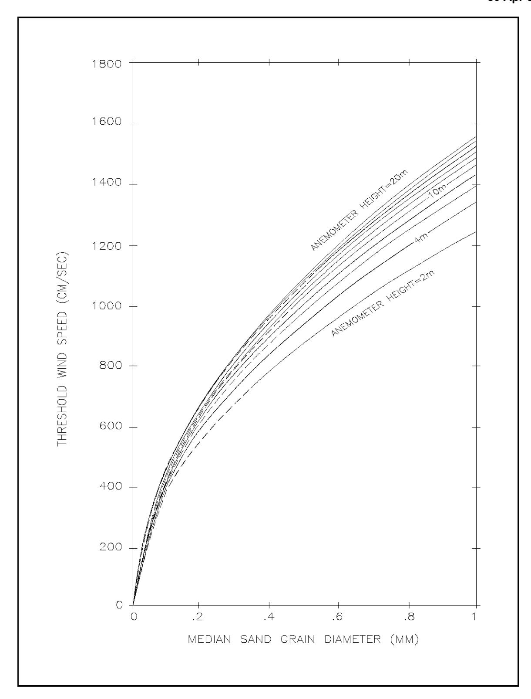

*Figure III-4-11a. Threshold (critical) wind speed as a function of median sand-grain diameter and the anemometer height at which wind speed is measured (Continued)*

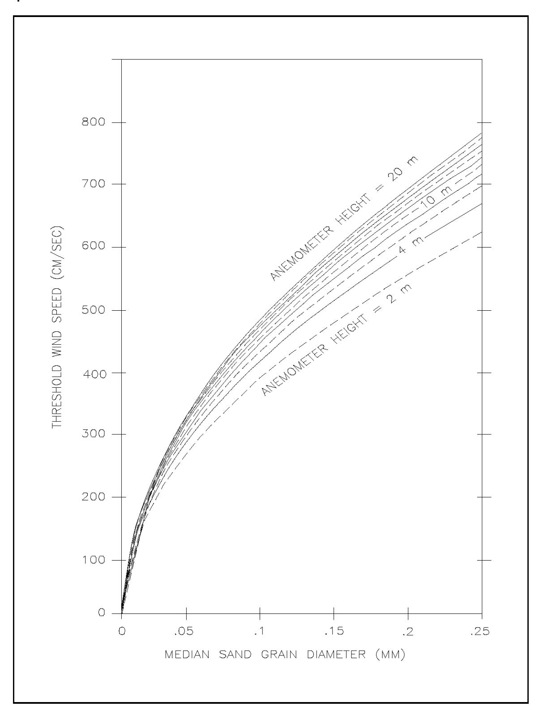

*Figure III-4-11b. (Concluded)*

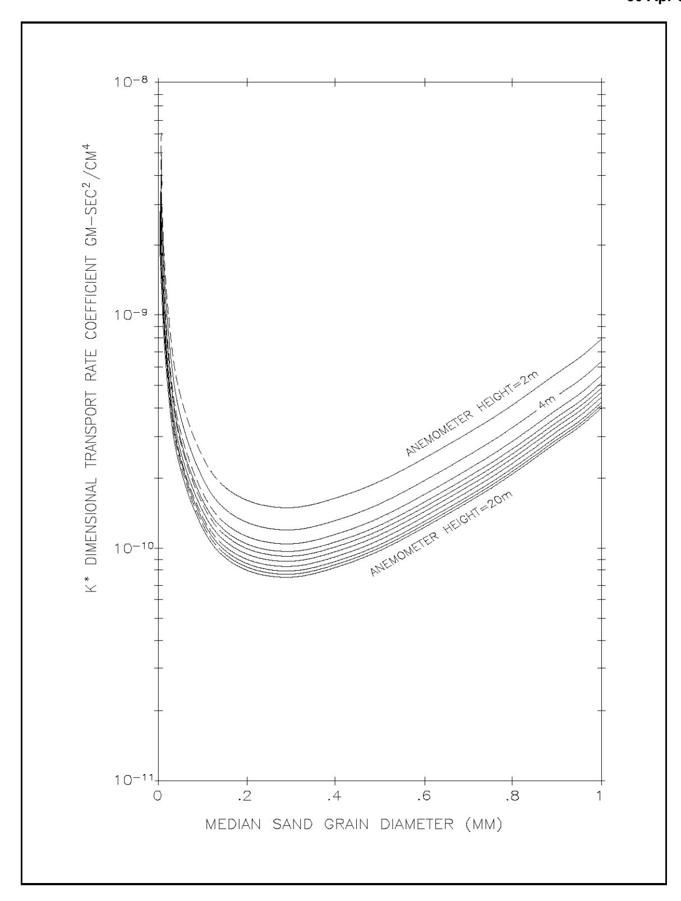

*Figure III-4-12a. Mass transport rate coefficient K as a function of median sand-grain diameter and the anemometer height at which wind speed is measured (Continued)*

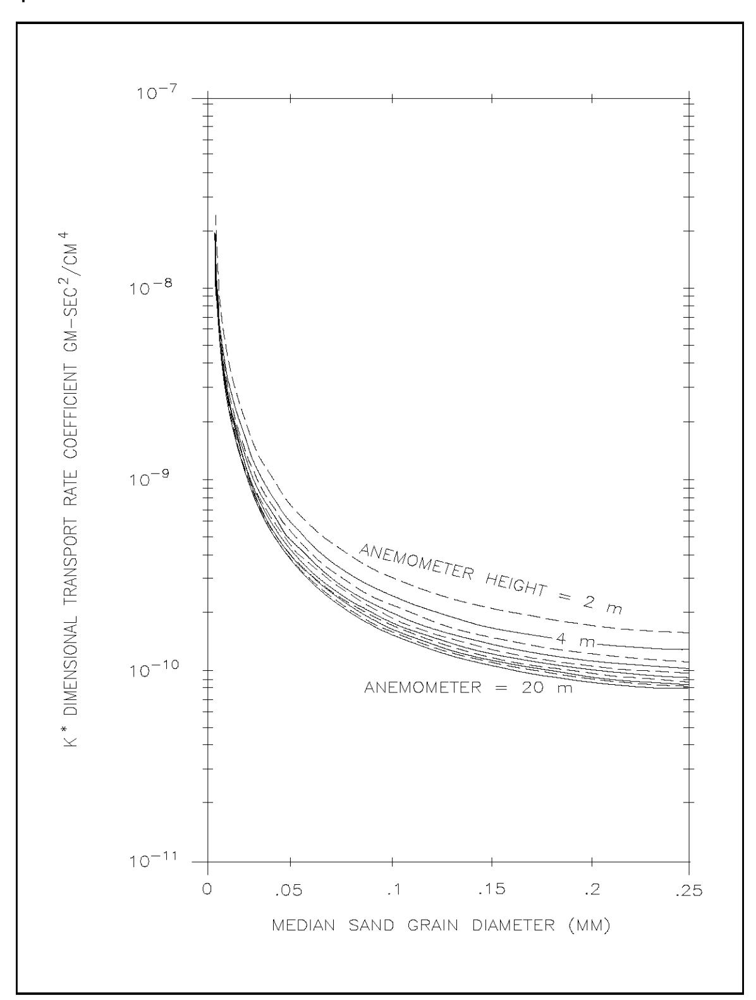

*Figure III-4-12b. (Concluded)*

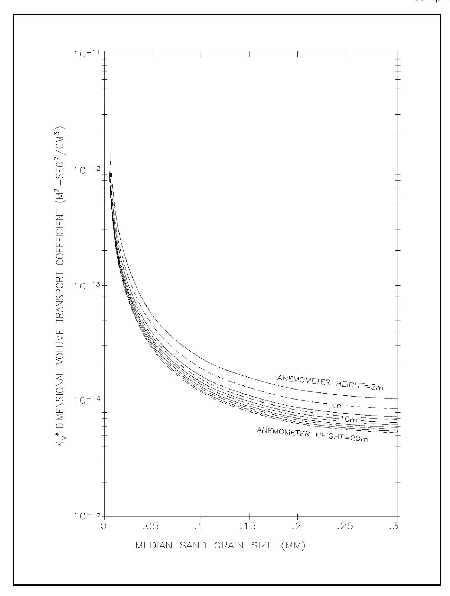

*Figure III-4-13. Volume transport rate coefficient \vec{K}_{v} as a function of median sand-grain diameter and the anemometer height at which wind speed is measured (assumes sediment density = 2.65 gm/cm<sup>3</sup> and porosity = 0.4)*

#### EXAMPLE PROBLEM III-4-5

Find:
The total amount of sand transported by the wind during the given day and the total transported in each of the 16 point compass directions.
Given:
Hourly wind speed and direction data given in Table III-4-3 for Westhampton Beach, Long Island, NY, were measured by an anemometer located 8 m above the ground. The median sand-grain diameter at Westhampton Beach is 0.26 mm.
Solution:
The solution is given in Table III-4-4. The preceding example problem shows that for a sand-grain diameter of 0.26 mm, the threshold wind speed at the 8-m height is 7.27 m/s. Winds less than 7.27 m/s will not transport sand. Columns 1, 2, and 3 in Table III-4-4 are the given data. (Note that wind directions are the direction from which the wind is blowing.) Column 4 is constructed from column 3 and indicates the direction in which the sand will move rather than the direction from which the wind is blowing. The given winds are essentially from the south and will transport sand northward. Column 5 gives the effective winds. Winds less than the threshold value of 7.27 m/sec have been set to zero. Column 6 is computed from column 5 using the equation

```math
q = (1.019 \times 10^{-10}) \ U_{8m}^{3}
```

in which U8m is the wind speed at the 8-m height in centimeters per second; this equation gives q in grams per centimeter-seconds. Column 7 is obtained from column 6 by dividing by the density of the sand, 2.65 gm/cm3 , and the packing factor, (1 - 0.4) = 0.6. The total volume transported during each hour between observations (column 8) is 3,600 s/hr times the average transport rate during each hour. The total sand transport during the day is 0.5994 m3 /m. Transport in each compass direction is given at the bottom of the table.

*Table III-4-3 Hourly Wind Data, Westhampton Beach, Long Island, NY*

**Table III-4-3. Hourly Wind Data, Westhampton Beach, Long Island, NY**

|  |  | Wind | Transport |
| --- | --- | --- | --- |
| Wind | Speed | Direction | Direction |
| Time (hr) | (m/sec) | (Azimuth) | (Compass) |
| (1) | (2) | (3) | (4)* |
| Midnight | 12.0 | 175 | N |
| 1 | 8.0 | 170 | N |
| 2 | 9.0 | 175 | N |
| 3 | 11.0 | 150 | NNW |
| 4 | 9.0 | 175 | N |
| 5 | 9.0 | 190 | N |
| 6 | 10.0 | 170 | N |
| 7 | 9.0 | 185 | N |
| 8 | 6.0 | 165 | NNW |
| 9 | 5.0 | 155 | NNW |
| 1 | 4.0 | 170 | N |
| 1 | 5.0 | 195 | NNE |

** Direction of transport (opposite of wind direction).*

*Table III-4-4 Hourly Transport Analysis Under Dry Conditions, Westhampton Beach, Long Island, NY*

**Table III-4-4. Hourly Transport Analysis Under Dry Conditions, Westhampton Beach, Long Island, NY**

| Time |  | Speed | Direction Azimuth | Direction Compass |  | Effective Winds | Rate | Rate | Volume |
| --- | --- | --- | --- | --- | --- | --- | --- | --- | --- |
| (hr) |  | (cm/sec) |  |  |  | (cm/sec) | (g/cm-sec) | (m3/m-sec) | (m3/m) |
| (1) |  | (2) | (3) | (4) |  | (5) | (6) | (7) | (8) |
| 1 am |  | 800 | 170 | N |  | 800 | 0.0522 | 3.281e-06 | 0.0258 |
| 2 |  | 900 | 175 | N |  | 900 | 0.0743 | 4.672e-06 | 0.0143 |
| 3 |  | 1100 | 150 | NNW |  | 1100 | 0.1356 | 8.530e-06 | 0.0238 |
| 4 |  | 900 | 175 | N |  | 900 | 0.0743 | 4.672e-06 | 0.0238 |
| 5 |  | 900 | 190 | N |  | 900 | 0.0743 | 4.672e-06 | 0.0168 |
| 6 |  | 1000 | 170 | N |  | 1000 | 0.1019 | 6.409e-06 | 0.0199 |
| 7 |  | 900 | 185 | N |  | 900 | 0.0743 | 4.672e-06 | 0.0199 |
| 8 |  | 600 | 165 | NNW |  | 0 | 0 | 0.000e+00 | 0 |
| 9 |  | 500 | 155 | NNW |  | 0 | 0 | 0.000e+00 | 0 |
| 10 |  | 400 | 170 | N |  | 0 | 0 | 0.000e+00 | 0 |
| 11 |  | 500 | 195 | NNE |  | 0 | 0 | 0.000e+00 | 0 |
| Noon |  | 900 | 215 | NE |  | 900 | 0.0743 | 4.672e-06 | 0.0084 |
| 1 pm |  | 1400 | 200 | NNE |  | 1400 | 0.2796 | 1.759e-05 | 0.0401 |

#### EXAMPLE PROBLEM III-4-6

Find:
If the amount of precipitation on the given day exceeds the amount of evaporation, determine the total amount of sand transported by wind and the amount of transport in each of the 16 compass directions.
Given:
The hourly wind speeds and directions in the preceding example problem (Table III-4-3) for Westhampton Beach, Long Island.
Solution:
Because the amount of precipitation exceeds the amount of evaporation, the sand can be assumed to be wet and the threshold velocity will be greater than the threshold velocity for dry sand. The threshold velocity for wet sand is given by Equation 4-22b

```math
u _ { \ast t w } \, = \, u _ { \ast t } \, + \, 1 8 . 7 5 \, \mathrm { c m / s }
```

in which u*tw and u*t are in centimeters per second. From the preceding example, u*t = 27.75 cm/s. Thus

```math
u _ { \ast t w } = 2 7 . 7 5 \, + \, 1 8 . 7 5 \, = \, 4 6 . 5 \, \mathrm { c m / s }
```

The corresponding wind speed at the 2-m height is

```math
u_{*tw} = 0.044 \, U_{2mtw}
```

or

```math
U_{2mtw} = \frac{46.5}{0.044} = 1057 \quad \text{cm/s}
```

For winds measured at the 8-m height, as before

```math
u_* = \frac{\kappa(U_{Z2} - U_{Z1})}{\ln(Z_2/Z_1)}
```

and

```math
4 6 . 5 \ = \ \frac { 0 . 4 ( U _ { 8 m t w } \ ^ { } - \ 1 0 5 7 ) } { \ln ( 8 / 2 ) } \qquad \mathrm { T h e r e f o r e } \qquad U _ { 8 m t w } \ = \ 1 , 2 1 8 \ \mathrm { c m / s }
```

The wind speed measured at the 8-m height must exceed 1,218 cm/s in order to transport sand. Winds less than 1,218 cm/s in the record are not considered in the computations. The wet sand threshold velocity can also be found from Figures III-4-14a or III-4-14b. Entering with a grain diameter of 0.26 mm, read the curve for and anemometer height of 8 m to find the threshold velocity of U8mtw = 1,220 cm/s. Figure III-4-14b is an enlargement of Figure III-4-14a. Table III-4-5 gives the results of the transport analysis. Wet conditions reduce the total transport from 0.5994 m3 /m to 0.2718 m3 /m.
(Sheet 1 of 4)

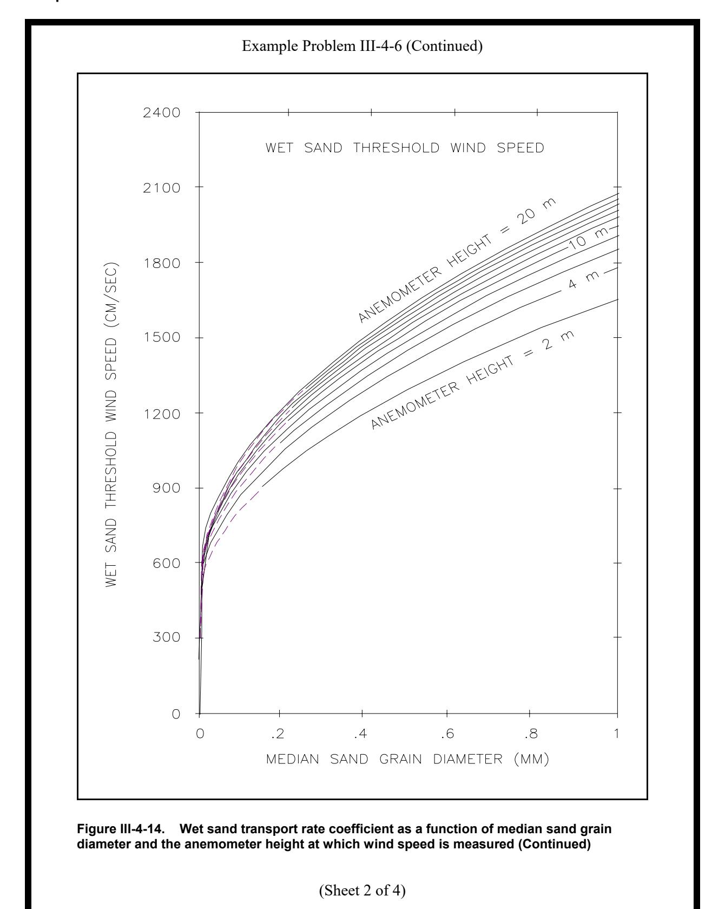

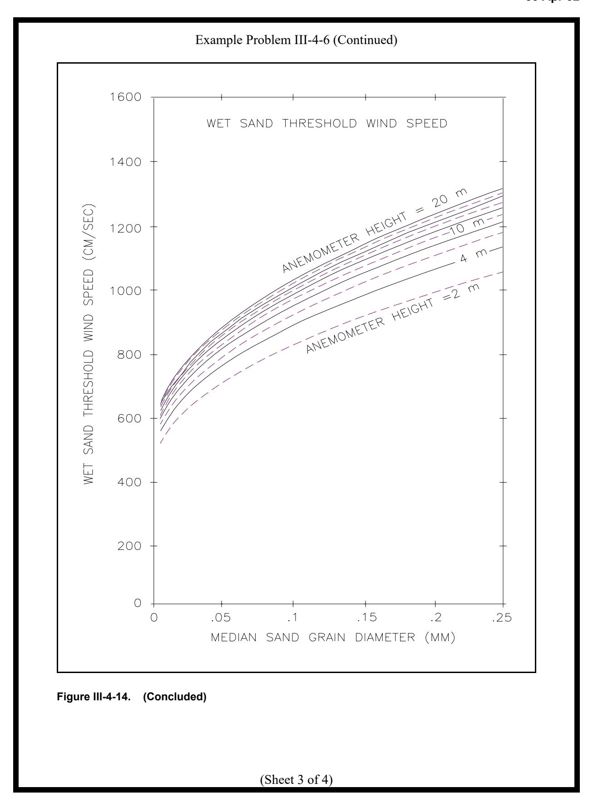

*Example Problem III-4-6 (Concluded)*

| Table III-4-5 |  |
| --- | --- |
| Hourly Transport Analysis Under Wet Conditions, Westhampton Beach, Long Island, NY. |  |

| Time | Speed | Direction Azimuth | Direction Compass | Effective Winds | Rate | Rate | Volume |
| --- | --- | --- | --- | --- | --- | --- | --- |
| (hr) (1) | (cm/sec) (2) | (3) | (4) | (cm/sec) (5) | (g/cm sec) (6) | (m3 /m-sec) (7) | (m3 /m) (8) |
| 1 am | 800 | 170 | N | 0 | 0 | 0.000e+00 | 0 |
| 2 | 900 | 175 | N | 0 | 0 | 0.000e+00 | 0 |
| 3 | 1100 | 150 | NNW | 0 | 0 | 0.000e+00 | 0 |
| 4 | 900 | 175 | N | 0 | 0 | 0.000e+00 | 0 |
| 5 | 900 | 190 | N | 0 | 0 | 0.000e+00 | 0 |
| 6 | 1000 | 170 | N | 0 | 0 | 0.000e+00 | 0 |
| 7 | 900 | 185 | N | 0 | 0 | 0.000e+00 | 0 |
| 8 | 600 | 165 | NNW | 0 | 0 | 0.000e+00 | 0 |
| 9 | 500 | 155 | NNW | 0 | 0 | 0.000e+00 | 0 |
| 10 | 400 | 170 | N | 0 | 0 | 0.000e+00 | 0 |
| 11 | 500 | 195 | NNE | 0 | 0 | 0.000e+00 | 0 |
| Noon | 900 | 215 | NE | 0 | 0 | 0.000e+00 | 0 |
| 1 pm | 1400 | 200 | NNE | 1400 | 0.2796 | 1.759e-05 | 0.0317 |
| 2 | 1200 | 215 | NE | 0 | 0 | 0.000e+00 | 0 |
| 3 | 1300 | 190 | N | 1300 | 0.2239 | 1.408e-05 | 0.0253 |
| 4 | 1100 | 180 | N | 0 | 0 | 0.000e+00 | 0 |
| 5 | 1000 | 160 | NNW | 0 | 0 | 0.000e+00 | 0 |
| 6 | 700 | 180 | N | 0 | 0 | 0.000e+00 | 0 |
| 7 | 1100 | 170 | N | 0 | 0 | 0.000e+00 | 0 |
| 8 | 1600 | 175 | N | 1600 | 0.4174 | 2.625e-05 | 0.0473 |
| 9 | 1400 | 175 | N | 1400 | 0.2796 | 1.759e-05 | 0.0789 |
| 10 | 900 | 175 | N | 0 | 0 | 0.000e+00 | 0 |
| 11 | 900 | 150 | NNW | 0 | 0 | 0.000e+00 | 0 |
| Midnight | 700 | 145 | NW | 0 | 0 | 0.000e+00 | 0 |
| TOTAL |  |  |  |  |  |  | 0.1832 |
| TOTAL NW |  |  |  |  |  |  | 0 |
| TOTAL NNW |  |  |  |  |  |  | 0 |
| TOTAL N |  |  |  |  |  |  | 0.1515 |
| TOTAL NNE |  |  |  |  |  |  | 0.0317 |
| TOTAL NE |  |  |  |  |  |  | 0 |

(Sheet 4 of 4)
measurements were taken, and solve for Uz 2 t = the critical wind velocity at the Z 2 height.) Only wind speeds in excess of the computed Uz 2 t will result in sand transport.
- g. If wind speeds exceed the critical value and there was no precipitation on a given day, compute the potential sand transport rate using Equation 4-16 or Equation 4-18.
- h. If there was precipitation on a given day, the amount of precipitation should be compared with the amount of evaporation. If evaporation exceeds precipitation, compute the potential sand transport rate using Equation 4-16 or 4-18. (If daily evaporation data are not available, daily evaporation can be estimated by dividing monthly evaporation by the number of days in the month.) i. If precipitation exceeds evaporation, the critical shear velocity can be computed by

```math
u_{*tw} = u_{*t} + 7.5 W \tag{III-4-21}
```

in which W = the fraction water content in the upper 5 mm of the sand (Hotta et al. 1985). Based on measurements in Holland made with a radioactive moisture probe, Svasek and Terwindt (1974) found that W < 0.025 (2.5 percent). Consequently

```math
u _ { \ast t w } = u _ { \ast t } + 0 . 1 8 7 5 \mathrm { ( m / s ) } \tag{III-4-22a}
```

or

```math
u _ { \ast t w } = u _ { \ast t } + 1 8 . 7 5 \mathrm { ( c m / s ) } \tag{III-4-22b}
```

may be used in the absence of detailed soil moisture data. For days when precipitation exceeds evaporation, u*tw is used as the critical shear velocity rather than u*t. The computations then proceed as above.
- j. If precipitation is in the form of snow, there will be no sand transport until the snow cover has melted. In the computations, days with snow and days known to have snow cover are excluded from the record. Data on snow cover are included in "Local Climatological Data" for all major National Weather Service (NWS) stations.
- k. The results of a comprehensive study of potential sand transport by wind at Westhampton Beach by Hsu (1994) are shown in the form of a transport rose in Figure III-4-15. The rose gives the direction from which the sand is transported with the most being transported northward or northwestward. Wind data were obtained from C_MAN Station ALSN6 for 1989. The results of the analysis are tabulated in Tables III-4-6 through III-4-8. Table III-4-6 presents the results obtained by not considering snow cover or moisture conditions. The total potential transport for the year is 71.2 m3 /m-yr. The table also shows that most transport at Westhampton Beach occurs during the winter months, with the most transport during November and December. Table III-4-7 corrects for days of snow cover. The total transport is reduced to 64.6 m3 /m-yr. When the data are also corrected for moisture conditions (Table III-4-8), the total transport is further reduced to 53.2 m3 /m-yr, about 75 percent of the uncorrected value of 71.2 m3 /m-yr.

#### III-4-5. Wind-Blown Sand Transport and Coastal Dunes

- a. Dunes and dune processes .
- (1) Sand dunes are important coastal features that are created, enlarged, and altered by wind-blown sand. In the absence of dunes, the beach landward of the active shoreface and berm is often characterized by a

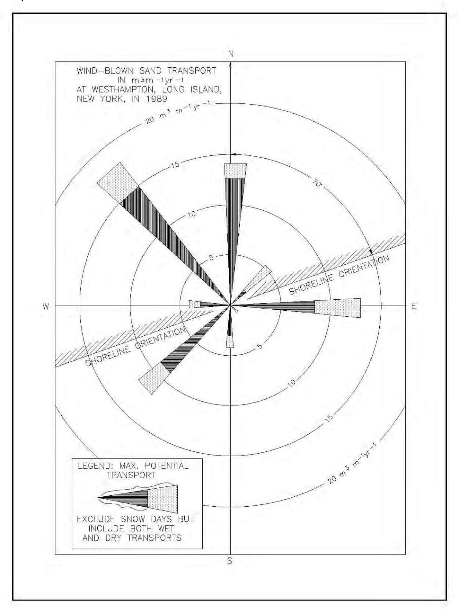

*Figure III-4-15. Wind-blown sand transport rose at Westhampton Beach, Long Island, NY, for 1989 (Hsu 1994)*

*Table III-4-6 Monthly Sand Transport at Westhampton Beach, Long Island, NY (All Data Considered) (Hsu 1994)*

**Table III-4-6. Monthly Sand Transport at Westhampton Beach, Long Island, NY (All Data Considered) (Hsu 1994)**

|  |  |  |  |  | Volume, | Cubic Meters | Per | Meter |  |  |  |  |  |
| --- | --- | --- | --- | --- | --- | --- | --- | --- | --- | --- | --- | --- | --- |
| Direction | Jan | Feb | Mar | Apr | May | Jun | Jul | Aug | Sep | Oct | Nov | Dec | Total |
| N | 2.66 | 1.06 | 0.80 | 0.91 | 0.33 | 0.16 | 0.07 | 0.09 | 0.85 | 0.69 | 2.88 | 3.37 | 13.88 |
| NE | 0.14 | 1.45 | 1.12 | 0.38 | 0.12 | 0.03 | 0.15 | 0.14 | 0.10 | 0.24 | 0.34 | 0.86 | 5.07 |
| E | 0.92 | 0.63 | 3.94 | 0.13 | 1.83 | 0.33 | 0.23 | 0.60 | 1.63 | 2.41 | 0.04 | 0.33 | 13.01 |
| SE | 0.10 | 0.00 | 0.16 | 0.09 | 0.05 | 0.01 | 0.18 | 0.06 | 0.14 | 0.20 | 0.03 | 0.00 | 1.03 |
| S | 0.33 | 0.47 | 0.08 | 0.19 | 0.56 | 0.09 | 0.03 | 0.01 | 0.52 | 0.53 | 1.20 | 0.30 | 4.32 |
| SW | 0.47 | 0.95 | 1.68 | 2.09 | 1.54 | 0.58 | 0.28 | 0.12 | 1.53 | 0.58 | 1.67 | 0.33 | 11.82 |
| W | 0.33 | 0.30 | 0.20 | 0.10 | 0.24 | 0.02 | 0.16 | 0.08 | 0.18 | 0.42 | 1.85 | 0.34 | 4.23 |
| NW | 1.65 | 1.43 | 0.54 | 1.04 | 0.44 | 0.34 | 0.01 | 0.11 | 0.08 | 1.17 | 4.55 | 6.46 | 17.82 |
| Total | 6.62 | 6.29 | 8.53 | 4.94 | 5.11 | 1.55 | 1.10 | 1.22 | 5.03 | 6.24 | 12.56 | 11.99 | 71.18 |
| Table III-4-7 |  |  |  |  |  |  |  |  |  |  |  |  |  |

*Table III-4-7 Monthly Sand Transport at Westhampton Beach, Long Island, NY (Snow Days Excluded) (Hsu 1994)*

**Table III-4-7. Monthly Sand Transport at Westhampton Beach, Long Island, NY (Snow Days Excluded) (Hsu 1994)**

|  |  |  |  |  | Volume, | Cubic Meters | Per | Meter |  |  |  |  |  |
| --- | --- | --- | --- | --- | --- | --- | --- | --- | --- | --- | --- | --- | --- |
| Direction | Jan | Feb | Mar | Apr | May | Jun | Jul | Aug | Sep | Oct | Nov | Dec | Total |
| N | 2.66 | 0.76 | 0.78 | 0.91 | 0.33 | 0.16 | 0.07 | 0.09 | 0.85 | 0.69 | 2.80 | 3.12 | 13.24 |
| NE | 0.11 | 0.28 | 0.26 | 0.38 | 0.12 | 0.03 | 0.15 | 0.14 | 0.10 | 0.24 | 0.00 | 0.85 | 2.66 |
| E | 0.22 | 0.60 | 3.35 | 0.13 | 1.83 | 0.33 | 0.23 | 0.60 | 1.63 | 2.41 | 0.04 | 0.07 | 11.45 |
| SE | 0.10 | 0.00 | 0.16 | 0.09 | 0.05 | 0.01 | 0.18 | 0.06 | 0.14 | 0.20 | 0.03 | 0.00 | 1.03 |
| S | 0.33 | 0.47 | 0.08 | 0.19 | 0.56 | 0.09 | 0.03 | 0.01 | 0.52 | 0.53 | 1.20 | 0.30 | 4.32 |
| SW | 0.47 | 0.95 | 1.68 | 2.09 | 1.54 | 0.58 | 0.28 | 0.12 | 1.53 | 0.58 | 1.62 | 0.33 | 11.77 |
| W | 0.33 | 0.30 | 0.20 | 0.10 | 0.24 | 0.02 | 0.16 | 0.08 | 0.18 | 0.42 | 1.68 | 0.16 | 3.88 |
| NW | 1.65 | 1.18 | 0.54 | 1.04 | 0.44 | 0.34 | 0.01 | 0.11 | 0.08 | 1.17 | 4.27 | 5.40 | 16.23 |
| Total | 5.90 | 4.54 | 7.06 | 4.94 | 5.11 | 1.55 | 1.10 | 1.22 | 5.03 | 6.24 | 11.64 | 10.23 | 64.58 |
| Table III-4-8 |  |  |  |  |  |  |  |  |  |  |  |  |  |

*Table III-4-8 Monthly Sand Transport at Westhampton Beach, Long Island, NY (Snow Days and Wet Days Excluded) (Hsu 1994)*

**Table III-4-8. Monthly Sand Transport at Westhampton Beach, Long Island, NY (Snow Days and Wet Days Excluded) (Hsu 1994)**

|  |  |  |  | Volume, | Cubic Meters | Per | Meter |  |  |  |  |
| --- | --- | --- | --- | --- | --- | --- | --- | --- | --- | --- | --- |
| Direction | Jan Feb | Mar | Apr | May | Jun | Jul | Aug | Sep Oct | Nov | Dec | Total |
| N | 2.54 0.64 | 0.59 | 0.73 | 0.25 | 0.16 | 0.07 | 0.08 | 0.77 0.69 | 2.72 | 3.12 | 12.36 |
| NE | 0.11 0.27 | 0.19 | 0.19 | 0.00 | 0.03 | 0.05 | 0.08 | 0.08 0.00 | 0.00 | 0.85 | 1.85 |
| E | 0.22 0.49 | 2.89 | 0.00 | 1.00 | 0.02 | 0.04 | 0.49 | 1.00 2.14 | 0.00 | 0.07 | 8.37 |
| SE | 0.02 0.00 | 0.11 | 0.01 | 0.01 | 0.01 | 0.15 | 0.06 | 0.14 0.04 | 0.00 | 0.00 | 0.55 |
| S | 0.08 0.31 | 0.08 | 0.09 | 0.33 | 0.00 | 0.02 | 0.01 | 0.46 0.25 | 1.15 | 0.27 | 3.06 |
| SW | 0.44 0.70 | 1.30 | 1.86 | 1.44 | 0.23 | 0.28 | 0.10 | 1.19 0.32 | 0.83 | 0.24 | 8.93 |
| W | 0.23 0.28 | 0.20 | 0.09 | 0.22 | 0.01 | 0.06 | 0.08 | 0.18 0.30 | 1.24 | 0.13 | 3.03 |
| NW | 1.53 1.18 | 0.52 | 0.91 | 0.32 | 0.30 | 0.01 | 0.09 | 0.08 1.06 | 3.74 | 5.26 | 15.00 |
| Total | 5.17 3.87 | 5.89 | 3.88 | 3.56 | 0.76 | 0.67 | 1.00 | 3.90 4.81 | 9.69 | 9.95 | 53.15 |
| Wind-Blown Sediment | Transport |  |  |  |  |  |  |  |  |  | III-4-41 |

#### EXAMPLE PROBLEM III-4-7

#### Find:

Estimate the sand transport in each of the eight compass directions. (Note that the results of this analysis will only be approximate since no information on moisture conditions and/or snow cover is available. Also, the data are daily average wind speeds rather than hourly values.) Ideally, this type of analysis would be performed with several years of hourly wind data; however, a rough estimate can be obtained from wind rose data.

#### Given:

The wind rose for Atlantic City, NJ, in Figure III-4-16 and the median sand grain diameter of 0.25 mm. The winds have been corrected to offshore conditions and the standard anemometer height of 10 m.

#### Solution:

Data from the wind rose (Figure III-4-16) are tabulated in Table III-4-9. The transport rates at the wind speed interval boundaries are computed in Table III-4-10. An upper bound of 35 mph was selected to determine the average transport rate over the interval. This upper bound is somewhat arbitrary and was selected only 6 mph above the 29 mph lower bound since it is likely that on those days with average winds exceeding 29 mph, the speed will not exceed 29 mph by much. Column 3 of Table III-4-10 gives the threshold wind speed at the 10-m height for a median sand-grain diameter of 0.25 mm. The transport coefficient in column 4 is from Figure III-4-12b. Column 5 is the transport rate and column 6 is the average transport rate over the interval. (Note that it is important to use average transport rates rather than average wind speeds since transport rate varies with the cube of the wind speed.) For example, the average transport rate over the interval between wind speeds of 29 mph and 35 mph is 0.2944 gm/cm-s. The amounts of sand transported are computed in Table III-4-11.
The threshold velocity of 7.25 m/s is greater than the 6.26 m/s corresponding to the 6.3 m/s (14 mph) interval boundary; therefore, the number of days that the wind speed was between 7.25 m/s and 12.96 m/s (29 mph) was calculated assuming that wind speeds are uniformly distributed over the interval. Adjusted days/year were computed as (12.96 - 7.25)/(12.96 - 6.26) = 0.852 times the total number of days in the 6.3 m/s (14 mph) < U < 13.0 m/s (29 mph) interval. Column 5 is from Table III-4-10. The mass transport (column 6) is column 5 x number of days x number of seconds/day. Column 7 is the volume transport equal to column 6 divided by (0.6) x 2.65 gm/cm3 and converted to cubic meters per meter. The total amount of sand transported in all directions is 146.1 m3 /m.

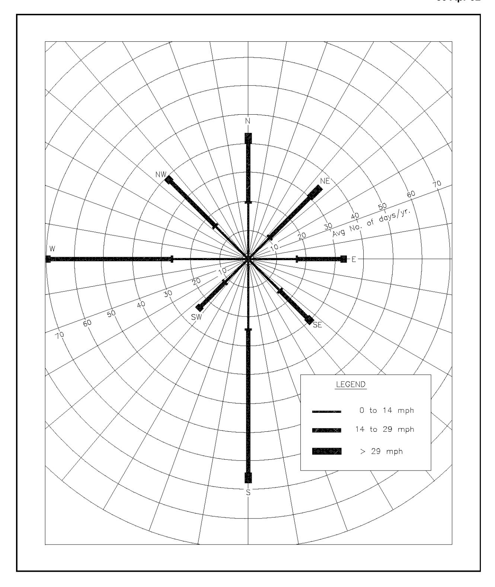

*Figure III-4-16. Wind Rose for Atlantic City, NJ (data from 1936 to 1952)*

# EM 1110-2-1100 (Part III) 30 Apr 02

*Table III-4-9 Wind Rose Data, Atlantic City, NJ (Wind Data, 1936 to 1952)*

**Table III-4-9. Wind Rose Data, Atlantic City, NJ (Wind Data, 1936 to 1952)**

| Direction | Wind | Speed |  |  |  | Interval | Days/Year |
| --- | --- | --- | --- | --- | --- | --- | --- |
| N | 29 mph | < | U |  |  |  | 3 |
| N | 14 mph | < | U | < | 29 | mph | 20 |
| N | 0 mph | < | U | < | 14 | mph | 20 |
| NE | 29 mph | < | U |  |  |  | 5 |
| NE | 14 mph | < | U | < | 29 | mph | 19 |
| NE | 0 mph | < | U | < | 14 | mph | 11 |
| E | 29 mph | < | U |  |  |  | 2 |
| E | 14 mph | < | U | < | 29 | mph | 15 |
| E | 0 mph | < | U | < | 14 | mph | 17 |
| SE | 29 mph | < | U |  |  |  | 2 |
| SE | 14 mph | < | U | < | 29 | mph | 13 |
| SE | 0 mph | < | U | < | 14 | mph | 16 |
| S | 29 mph | < | U |  |  |  | 3 |
| S | 14 mph | < | U | < | 29 | mph | 49 |
| S | 0 mph | < | U | < | 14 | mph | 25 |
| SW | 29 mph | < | U |  |  |  | 1 |
| SW | 14 mph | < | U | < | 29 | mph | 23 |
| SW | 0 mph | < | U | < | 14 | mph | 12 |

*Table III-4-10 Wind Rose Data Analysis, Atlantic City, NJ (Anemometer at Standard 10-m Height)*

**Table III-4-10. Wind Rose Data Analysis, Atlantic City, NJ (Anemometer at Standard 10-m Height)**

| Wind | Wind | Threshold | Transport | Transport | Average Rate |
| --- | --- | --- | --- | --- | --- |
| Speed | Speed | Wind Speed * | Coef. * | Rate | Over Interval |
| (mph) | (m/sec) | (m/sec) | (gm-s2/cm4) | (gm/cm-sec) | (gm/cm-sec) |
| (1) | (2) | (3) | (4) | (5) | (6) |
| 35 | 15.64 | 7.25 | 9.8000e-11 | 0.3753 | 0.2944 |
| 29 | 12.96 | 7.25 | 9.8000e-11 | 0.2135 | 0.1254 |
| 14 | 6.26 | 7.25 | 9.8000e-11 | 0.0373 ** | 0 *** |
| 0 | 0 | 7.25 | 9.8000e-11 | 0 |  |
| Based on median | grain size of 0.25 | mm |  |  | * |
| Calculated for | threshold wind speed | of 7.25 m/s. |  |  | ** |
| Wind speed in | interval does not exceed | threshold wind speed. |  | Wind-Blown | *** III-4-44 Sediment Transport |

** Based on median grain size of 0.25 mm*

*** Calculated for threshold wind speed of 7.25 m/s.

*** Wind speed in interval does not exceed threshold wind speed.*

|  |  |  |  | Transport | Mass | Volume | Direction in which sand is |
| --- | --- | --- | --- | --- | --- | --- | --- |
| Direction Wind | Wind Speed Interval | Days/Year | Adjustment Days/Year | (gm/cm-sec) Rate | (gm/cm-yr) Transport | Transport (m3/m-yr) | transported (m3/m) |
| (1) | (2) | (3) | (4) | (5) | (6) | (7) | (8) |
| N | 13 m/s < U | 3 | 3 | 0.2944 | 76,308 | 4.80 |  |
| N | m/s 6.3 m/s < U < 13 | 20 | 17* | 0.1254 | 184,621 | 11.61 | Total S = 16.41 |
| N | 0 m/s < U < 6.3 m/s | 20 | 0 | 0 | 0 | 0 |  |
| NE | 13 m/s < U | 5 | 5 | 0.2944 | 127,181 | 8.00 |  |
| NE | m/s 6.3 m/s < U < 13 | 19 | 16* | 0.1254 | 175,390 | 11.03 | Total SW = 19.03 |
| NE | 0 m/s < U < 6.3 m/s | 11 | 0 | 0 | 0 | 0 |  |
| E | 13 m/s < U | 2 | 2 | 0.2944 | 50,872 | 3.20 |  |
| E | m/s 6.3 m/s < U < 13 | 15 | 13* | 0.1254 | 138,466 | 8.71 | Total W = 11.91 |
| E | 0 m/s < U < 6.3 m/s | 17 | 0 | 0 | 0 | 0 |  |
| SE | 13 m/s < U | 2 | 2 | 0.2944 | 50,872 | 3.20 |  |
| SE | m/s 6.3 m/s < U < 13 | 13 | 11* | 0.1254 | 120,004 | 7.55 | W = 10.75 Total N |
| SE | 0 m/s < U < 6.3 m/s | 16 | 0 | 0 | 0 | 0 |  |
| S | 13 m/s < U | 3 | 3 | 0.2944 | 76,308 | 4.80 |  |
| S | m/s 6.3 m/s < U < 13 | 49 | 42* | 0.1254 | 452,321 | 28.45 | Total N = 33.25 |
| S | 0 m/s < U < 6.3 m/s | 25 | 0 | 0 | 0 | 0 |  |
| SW | 13 m/s < U | 1 | 1 | 0.2944 | 25,436 | 1.60 |  |
| SW | m/s 6.3 m/s < U < 13 | 23 | 20* | 0.1254 | 212,314 | 13.35 | Total NE = 14.95 |
| SW | 0 m/s < U < 6.3 m/s | 12 | 0 | 0 | 0 | 0 |  |
| W | 13 m/s < U | 1 | 1 | 0.2944 | 25,436 | 1.60 |  |
| W | m/s 6.3 m/s < U < 13 | 42 | 36* | 0.1254 | 387,704 | 24.38 | Total E = 25.98 |
| W | 0 m/s < U < 6.3 m/s | 27 | 0 | 0 | 0 | 0 |  |
| W N | 13 m/s < U | 1 | 1 | 0.2944 | 25,436 | 1.60 |  |
| W N | m/s 6.3 m/s < U < 13 | 21 | 18* | 0.1254 | 193,852 | 12.19 | Total SE = 13.79 |
| W N | 0 m/s < U < 6.3 m/s | 17 | 0 | 0 | 0 | 0 |  |
| Total |  | 365 | 190 |  |  | 146.07 |  |

#### EM 1110-2-1100 (Part III) 30 Apr 02

"deflation plain" from which sand is removed and the profile lowered by wind. The presence of vegetation or other obstructions to the wind results in sand being trapped and leads to the creation of sand dunes. Foredunes are the first line of dunes landward of the shoreline. These dunes often result from the natural accumulation of wind-blown sand originating on the beach face; however, they may also be man-made. Whether natural or man-made, they are subject to continued growth, alteration, and movement due to natural wind transport processes. When present and if sufficiently large, foredunes can provide protection from coastal flooding, shoreline erosion, and wave damage. Dunes can also shelter the area landward of them from wind-blown sand by providing an area within which wind-blown sand accumulates. This can be an important function of stabilized dunes, since wind-blown sand is often a nuisance that must be controlled.
- (2) A line of dunes can provide protection from flooding due to high-water levels and wave overtopping. Sand stored in dunes is also available as a sacrificial contribution to the increased longshore and offshore sand transport during storms. Dunes, by contributing their volume to the sand in transport, reduce the landward movement of the shoreline during storms. Dunes can also reduce wave damage in developed landward areas by limiting wave heights by causing waves to break as they propagate over the dunes. On undeveloped barrier islands, dunes provide a source of sand for overwash processes. During storms with elevated water levels, waves overtopping the dunes carry sand into the bay or lagoon behind a barrier island. Over a period of time, this natural process results in landward migration of the island.
- (3) Dunes can be constructed artificially by: (a) beach nourishment, (b) grading existing sand available on the dry beach, or (c) "beach scraping" - removing sand from below the high-water line during low tide and using it to construct a protective dune. In areas where there is sufficient sand and the beach is wide, dunes can be encouraged to develop by natural accumulation by planting dune grass or other vegetation, or by installing sand fences to trap the landward-blowing sand. The rate at which dunes grow depends on the rate at which sand is transported to the dune from the fronting beach and on the effectiveness of the vegetation, fencing, and/or the dune itself in retaining sand. Because of the effect of the dune on the wind field (see Figure III-4-8) and the absence of a mobile sand supply on the landward side of coastal dunes, there is little transport from the dune to the beach, even during periods when winds blow seaward. Coastal dunes generally grow by trapping and accumulating sand on their seaward side; thus, they grow toward the source of sand the fronting beach. If more than one line of foredunes is to be developed by natural accumulation, the landward line of dunes must be constructed before the line closest to the shoreline is constructed, otherwise the line closest to the shoreline will trap sand and keep it from reaching the more landward line.
- (4) When designing a dune system intended to accumulate sand by natural wind transport processes, the dunes should be set back from the shoreline so that there is sufficient dry beach to provide a source of sand. A distance of 60 m between the toe of the dune and the high-water line has been recommended ( Shore Protection Manual 1984). This expanse of sand is often not available on many beaches so that lesser distances must be accepted. At the very least, the toe of the foredune should be landward of the normal seasonal fluctuation of the shoreline. Narrow beaches are less effective sand sources and dune growth will be slower. Typical rates of sand accumulation in dunes are about 2.5 to 7.5 m3 /m-yr; however, rates as high as 25 m3 /m-yr have been measured (Woodhouse 1978). Savage (1963) measured accumulations of 4.5 to 6 m3 /m over a period of 7 to 8 months using a single row of sand fencing. Savage and Woodhouse (1968) measured accumulations of 39 m3 /m over a 3-year period in a multiple-fence experiment. This is an average of 13 m3 /m-yr; however, accumulation rates must have been higher than this average rate during portions of the 3-year period.
- (5) Dunes that are intended to provide protection against flooding and erosion must be stabilized to prevent their deflation and/or landward migration. Stabilization is also necessary to control the landward movement of wind-blown sand into developed areas. Stabilization can be achieved using vegetation or sand fencing. Guidelines for dune creation and stabilization using vegetation are given by U.S. Army Corps of

#### EXAMPLE PROBLEM III-4-8

#### Find:

If the shoreline azimuth at Atlantic City is θ = 50 deg (angle between north and the shoreline), estimate the rate at which sand might accumulate in a dune field behind the beach. (As in the preceding example, this type of analysis ideally should be done with hourly wind data.)

# Given:

The transport computations from the preceding Example Problem III-4-7 based on the wind rose at Atlantic City, NJ.

#### Solution:

The transport rate in a given direction is the transport rate times the cosine of the angle between the wind direction and the given direction. See Figure III-4-17. For Atlantic City, shoreline alignment and compass directions are shown in Figure III-4-18. For example, an easterly wind will transport sand perpendicular to the shoreline q z E = qE cos 50E where q z E is the transport perpendicular to the shoreline into the dunes. For a southeasterly wind, the transport perpendicular to the shoreline is q z SE = qSE cos 5 deg. In general,

```math
q_{\perp} = q \cos \alpha
```

where α = angle between wind direction and offshore, directed normal to the shoreline. For the example

```math
q_{\perp E} = q_E \cos(50^\circ)
```

```math
q_{\perp E} = q_E \cos(50^\circ), \quad q_{\perp SE} = q_{SE} \cos(5^\circ), \quad a = a \cos(40^\circ)
```

```math
q_{\perp SE} = q_{SE}\cos(5^\circ)
```

```math
q_{\perp S} = q_S \cos(40^\circ) \quad q_{\perp SW} = q_{SW} \cos(85^\circ)
```

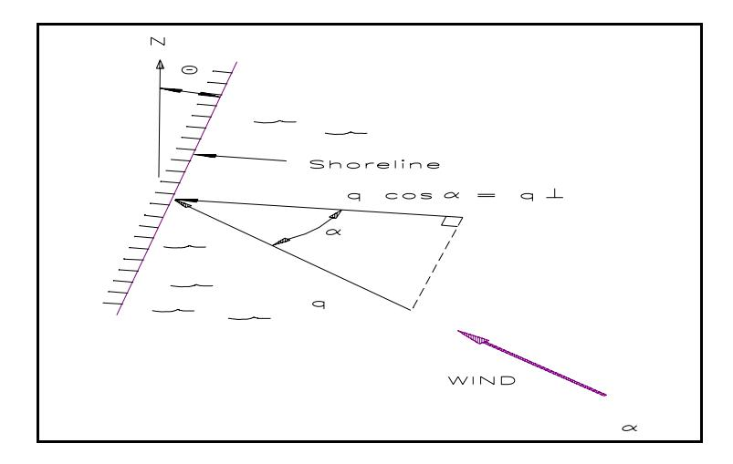

*Figure III-4-17. Net sand transport at an angle α with the wind direction*

(Sheet 1 of 4)
Example Problem III-4-8 (Continued)

#### Figure III-4-18. Shoreline orientation with respect to compass directions at Atlantic City, NJ

Winds blowing generally from the dunes or backbeach towards the shoreline are not as efficient in transporting sand as are winds blowing generally onshore. This is because of sheltering provided by the dune itself and stabilization by vegetation on the dune, and because there is often only a limited supply of sand landward of the dunes. This latter condition prevails at Atlantic City, where much of the area landward of the beach is paved or developed. Figure III-4-8 also shows that in the lee of a dune, winds near ground level may be in the direction opposite of the wind direction at a higher elevation. Winds blowing seaward from the dunes are not very efficient in transporting sand from the dunes back onto the beach. Sand transport efficiency, proportional to the square of the cosine of the angle between the wind direction and a vector perpendicular to the shoreline, is assumed. See Figure III-4-19 for the efficiency factor as a function of β, the angle between the shoreline and wind direction. Figure III-4-20 gives the definition of β.
Sand transport rates in the offshore direction, perpendicular to the general orientation of the dune toe, are given by

```math
q_{\perp} = q \cos \alpha \cos^2 \beta, \quad 180^\circ < \beta < 360^\circ
```

where β is the angle the wind makes with the shoreline and α is the angle the wind makes with a vector perpendicular to the shoreline. Therefore, α = β - 90E and

```math
\cos(\alpha) = \cos(\beta - 90^{\circ}) = -\sin(\beta)
```

(Sheet 2 of 4)
Example Problem III-4-8 (Continued)
Therefore,

```math
q_{\perp} = -q \sin\beta \cos^2\beta, \quad 180^\circ < \beta < 360^\circ
```

The sin β term in the equation corrects the transport from the wind direction to a direction perpendicular to the shore, while the cos2 β term is the efficiency term introduced to consider the sheltering effects of the dune.

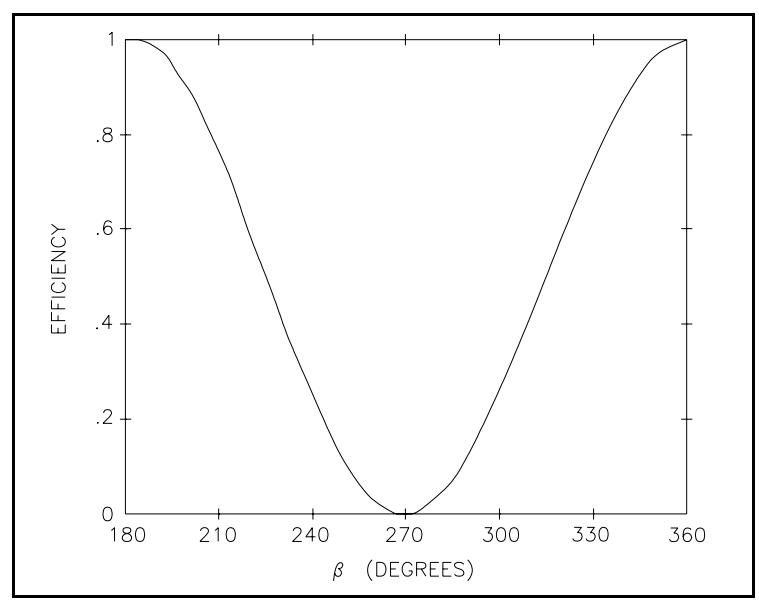

*Figure III-4-19. Sand transport efficiency for winds blowing from dunes toward beach as a function of the angle between wind direction and shoreline*

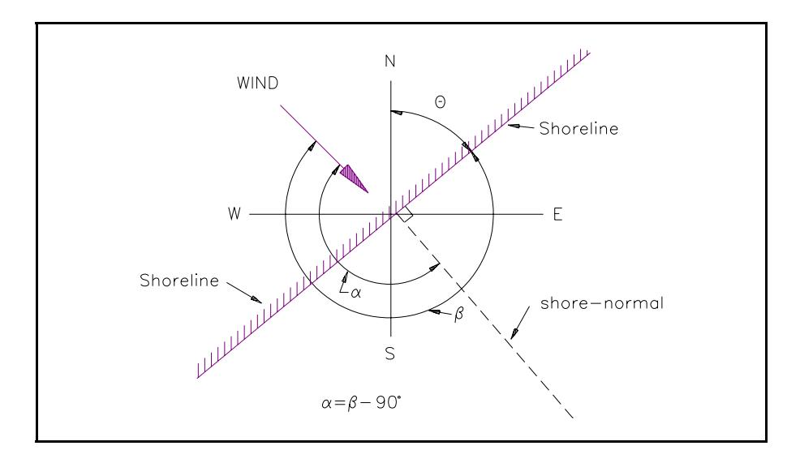

*Figure III-4-20. Definition of angle ß, between wind and shoreline*

(Sheet 3 of 4)

# Example Problem III-4-8 (Concluded)

Results of the analysis are given in Table III-4-12. Columns 1 and 2 are obtained from Table III-4-11. Column 3 is the angle β between the given wind directions and the shoreline azimuth of θ = 50E at Atlantic City. Column 4 is sin(β) and column 5 is the offshore wind transport efficiency, cos2 (β). The efficiency is assumed equal to 1.0 for onshore winds. Column 6, the rate of dune growth due to winds from the given direction, is the product of columns 2, 4, and 5. The estimated total potential dune growth rate is 27.2 m3 /m-yr. This estimate represents a potential growth rate which depends on the sand supply. The analysis does not consider the effects of snow cover and moisture to reduce transport. Woodhouse (1978) reports on a 30-year average dune accumulation rate of 13.7 m3 /m-yr on the Clatsop Plains, Oregon, and suggests that higher accumulation rates probably prevailed in the early years.

*Table III-4-12 Estimated Annual Dune Growth at Atlantic City, NJ*

**Table III-4-12. Estimated Annual Dune Growth at Atlantic City, NJ**

|  | Annual | Wind | COS(α) |  | Dune |
| --- | --- | --- | --- | --- | --- |
| Wind | Transport | Angle (β) | or | Efficiency | Growth |
| Direction | (m3/m) | (degrees) | SIN(ß) | COS²(ß) | (m3/m/yr) |
| (1) | (2) | (3) | (4) | (5) | (6) |
| N | 15.79 | 310 | -0.7660 | 0.4132 | -5.00 |
| NE | 18.44 | 355 | -0.0872 | 0.9924 | -1.60 |
| E | 11.44 | 40 | 0.6428 | 1.00001 | 7.35 |
| SE | 10.34 | 85 | 0.9962 | 1.00001 | 10.30 |
| S | 31.73 | 130 | 0.7660 | 1.00001 | 24.31 |
| SW | 14.24 | 175 | 0.0872 | 1.00001 | 1.24 |
| W | 24.68 | 220 | -0.6428 | 0.5868 | -9.31 |
| NW | 13.14 | 265 | -0.9962 | 0.0076 | -0.10 |
| TOTAL |  |  |  |  | 27.20 m3/m/yr 1 |

*1 Transport efficiency = 1.0 for angles between 0 and 180 deg.*

(Sheet 4 of 4)
Engineers (1978) and Woodhouse (1978). The best type of stabilizing vegetation varies with geographical area, location on the dune, exposure of the site, whether the water body is salt or fresh water, etc. Typical plants used for dune stabilization include European beach grass ( Ammophila arenaria ) and, less frequently, American dunegrass ( Elymus mollis ) along the Pacific Northwest and California coasts; American beach grass ( Ammophila breviligulita ) along the mid- and upper-Atlantic and Great Lakes coasts; sea oats ( Uniola paniculata ) along the South Atlantic and gulf coasts, and panic grasses ( Panicum amarum or P. amarulum ) along the Atlantic and gulf coasts.
- (6) Guidelines for dune creation and stabilization with fencing are given in the Shore Protection Manual (1984) and Woodhouse (1978). Typical sand fencing is either wooden-slat fencing of the type used to control snow along highways or geosynthetic fabric fencing. A wooden-slat fence is typically 1.2 m high with 3.8 cm-wide slats wired together to provide about 50 percent porosity. Stabilization by fencing requires periodic inspection of the installation, replacement of damaged or vandalized fencing, and installation of new fencing to continue the stabilization process as the dune grows. The size and shape of a dune can be controlled by stategically installing subsequent lines of fencing to encourage the dune to grow higher or wider. Most fence installations fill within 1 year of construction. Dune growth is most often limited by the available sand supply rather than by the capacity of the fence installation. Dunes created by fencing must also subsequently be planted to stabilize them for when the fencing eventually deteriorates.
- (7) Stabilization by vegetation has the advantage that it is capable of growing up through the accumulating dune and of repairing itself if damaged, provided the damage is not too extensive. After planting and for a year or two thereafter, vegetation requires fertilization to establish healthy plants. Traffic through vegetated dunes must also be controlled to prevent damage to plants by excluding any pedestrians and vehicles or by providing dune walk-over structures. Dune areas with barren areas in an otherwise healthy vegetated dune, will be subject to "blowouts," local areas of deflation. Blowouts reduce a dune's capability to protect an area from flooding.
- (8) An example of estimating the rate of dune growth follows. Example III-4-8 assumes that all of the sand transported to the dune is trapped by vegetation and/or sand fencing and that the fronting beach is sufficiently wide to supply sand at the potential transport rate for a given wind speed, i.e., dune growth is not limited by sand supply. Subsequent examples consider the effects of armoring and a limited sand supply. b. Factors affecting dune growth rates .
- (1) The dune growth rates presented in the preceding section and Example III-4-8 are "potential" rates, since they consider only the accumulation of sand in the dunes and not any of the processes that remove sand from the dunes. Furthermore, the trapping process is assumed to be nearly perfect, i.e., little sand is removed from the dunes when wind direction reverses and blows offshore and no sand is blown landward of the dunes. In some developed coastal communities, sand is often removed from the area landward of the dunes; hence, the rate of dune growth often underestimates wind-blown sand transport rates or, vice versa, calculated transport rates overestimate the rate of dune growth. Some typical measured dune growth rates are given in Table III-4-13.
- (2) On relatively narrow beaches backed by dunes, the dunes are occasionally eroded by waves during storms having elevated water levels. The storms often leave a nearly vertical scarp with the height of the scarp and the amount of erosion depending on the severity of the storm; i.e., the height of the waves and storm surge. Less frequently, during unusual storms, the dune may be completely destroyed. Dunes erode during storms only to be rebuilt during the period between storms with sand transported by winds having an onshore component. The net rate of dune growth, therefore, is only a fraction of what would be predicted if only rates of accumulation are considered and sand losses are ignored. Dune growth rates can be estimated

*Table III-4-13 Measured Dune Growth Rates (Field experiments conducted by Coastal Engineering Research Center in 1960s and 1970s)*

**Table III-4-13. Measured Dune Growth Rates (Field experiments conducted by Coastal Engineering Research Center in 1960s and 1970s)**

| Site |  | Padre Island, TX |  |  | Padre Island, TX |  |  | Ocracoke Island, NC |  |
| --- | --- | --- | --- | --- | --- | --- | --- | --- | --- |
| Type |  | Wood fencing (3 fences, 3 lifts) |  |  | Wood fencing (4 fences, 3 lifts) |  |  | American Beachgrass |  |
| Beach |  | 60 - 90 m |  |  | 60 - 90 m |  |  | 180 - 210 m |  |
| Growth Rates | ∆t (mos) | ∆V (m3 /m) | Rate (m3 /m-yr) | ∆t (mos) | ∆V (m3 /m) | Rate (m3 /m-yr) | ∆t (mos) | ∆V (m3 /m) | Rate (m3 /m-yr) |
|  | 12 | 8.5 | 8.53 | 12 | 6.0 | 6.02 | 24 | 12.8 | 6.40 |
|  | 12 | 6.8 | 6.77 | 12 | 10.3 | 10.28 | 27 | 9.8 | 4.35 |
|  | 12 | 10.8 | 10.79 | 12 | 6.5 | 6.52 | 29 | 16.6 | 6.85 |
| Avg Rate |  |  | 8.70 |  |  | 7.61 |  |  | 5.86 |
| Site |  | Core Banks, NC |  |  | Padre Island, TX |  |  | Core Banks, NC |  |
| Type |  | American Beachgrass and fence |  |  | Sea oats |  |  | Sea oats |  |
| Beach |  | 120 - 150 m | 60 - 90 m |  |  | 90 m |  |  |  |
| Growth Rates | ∆t (mos) | ∆V (m3 /m) | Rate (m3 /m-yr) | ∆t (mos) | ∆V (m3 /m) | Rate (m3 /m-yr) | ∆t (mos) | ∆V (m3 /m) | Rate (m3 /m-yr) |
|  | 32 | 11.7 | 4.42 | 36 | 29.6 | 9.87 | 22 | 5.0 | 2.74 |
|  | 22 | 11.0 | 4.98 | 60 | 42.6 | 8.53 | 14 | 2.8 | 2.37 |
|  | 26 | 10.8 | 4.98 |  |  |  | 19 | 6.3 | 3.96 |
| Avg Rate |  |  | 5.14 |  |  | 9.20 |  |  | 3.02 |
| Site |  | Clatsop Spit, OR |  |  |  |  |  |  |  |
| Type |  | European beachgrass |  |  |  |  |  |  |  |
| Beach |  | 180 m |  |  |  |  |  |  |  |
| Growth Rates | ∆t (mos) | ∆V (m3 /m) | Rate (m3 /m-yr) |  |  |  |  |  |  |
|  | 360 | 384 | 12.79 |  |  |  |  |  |  |
| Avg Rate |  |  | 12.79 |  |  |  |  |  |  |

by constructing a sediment budget for the dune that balances rates of accumulation against rates of erosion. However, estimating the occurrence and volume of dune erosion is difficult. Estimating how much sand is actually trapped by the dune is also difficult.
(3) The rate at which sand is supplied to a dune depends also on the availability of a sand source upwind of the dunes. A wide beach usually provides an adequate source. However, if the beach is narrow, there may not be a sufficient upwind supply in the sense that the over-sand fetch is insufficient for the transport rate to reach an equilibrium (Nordstrom and Jackson 1992; Gillette et al. 1996). Consequently, calculated transport rates overestimate actual transport rates.
(4) The size gradation of the beach sand also has an influence on transport rates. Sand transport analyses based on a single sand-grain diameter fail to recognize that beach sands are comprised of a gradation of sizes each of which has a different threshold wind speed that initiates motion. Grains finer than the median size are more easily transported and may be moved by lower wind speeds while coarser grains are left behind. Basing transport rates on only the median grain size fails to recognize that finer grains on the surface can be transported even when wind speeds are relatively low. Ideally, each grain size should be considered separately. In addition, as fines are removed from the beach sand surface, the remaining larger size fraction armors the surface, making it difficult to transport additional sand. Figure III-4-21(a) shows a relatively uniform distribution of sand grains where almost all grains have about the same threshold speed. Figure III-4- 21(b) shows a well-graded sand prior to wind erosion, while Figure III-4-21(c) shows the same well-graded sand after the fines have been removed leaving behind the coarse fraction on the surface. Higher wind speeds are required to continue the transport process after the fine surficial materials are removed. Alternatively, processes that break up the beach surface to expose additional fine sediments to wind will reestablish the transport of fines. Such processes include pedestrian and vehicular traffic and beach raking.

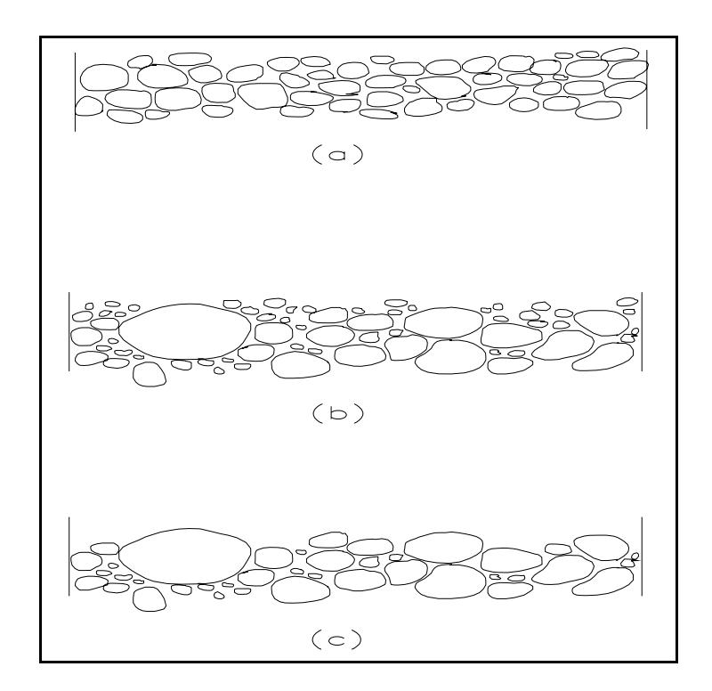

*Figure III-4-21. Schematic views of sorted sand deposits: (a) well-sorted (poorly graded); (b) poorly sorted (well-graded); (c) poorly sorted after fines have been removed by wind erosion*

(5) The formation of a salt crust on the beach surface by the evaporation of seawater also increases threshold wind speeds and reduces transport (Nickling and Egglestone 1981). Sand below the high tide line is most affected by this process; however, occasional saturation of the beach above the usual high tide level by storm tides will expand the affected beach area inland. Additionally, salt spray carried inland by wind can further expand the affected area. Processes that break up the crust to restore usual threshold wind speeds include pedestrian and vehicular traffic.

#### EM 1110-2-1100 (Part III) 30 Apr 02

- c. Dune sediment budget .
- (1) Sand gains and losses by a typical dune are illustrated in Figure III-4-22. Sand is transported by onshore winds to the dune where vegetation, sand fencing, or the dune itself alter the wind field and allow the sand to accumulate. If the trapping is incomplete, the same onshore winds may transport sand inland from the dune.

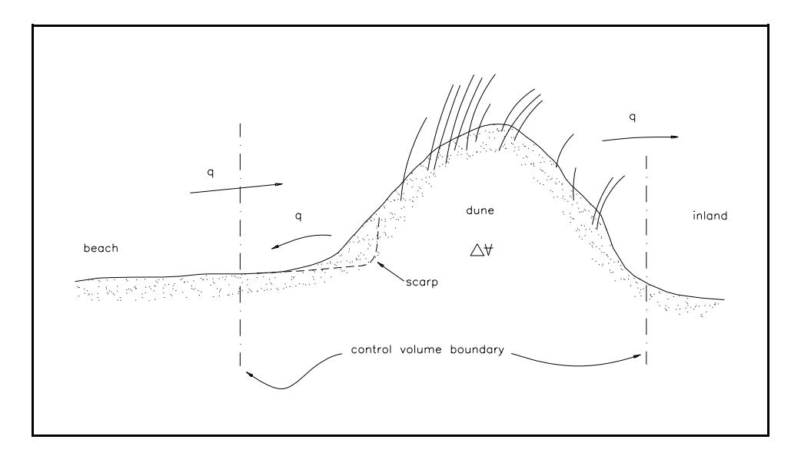

*Figure III-4-22. Definition of terms, dune sediment budget*

(2) If sand accumulates at the dune*s seaward side and erodes from its landward side, the dune will migrate seaward. Occasional high water levels during storms may allow waves to erode the base of the dune to create a scarp. Sand eroded from the dune by waves becomes a part of the littoral transport. Following the storm, onshore winds again rebuild the dune*s seaward side. During periods of offshore winds, some sand from the dune will be blown back onto the beach. Similarly, if there is an unstabilized source of sand landward of the dune, it will contribute to building the dune. The sand budget equation for the dune is given by

```math
q - q_s - q_i = \rho (1-p) \frac{\Delta A}{\Delta t} \tag{III-4-23}
```

in which q = wind-borne sand transport rate (mass per unit time per unit length of beach), qs = dune erosion by waves (mass per unit time per unit length of beach), qi = the sand blown inland from the dune, ∆œ = the volume change per unit length of beach, ρ = mass density of the sand, p = the porosity of the in situ dune sand, and t = time. Note that q and qi include both sand gains and losses depending on their sign. In fact, q and qi should each be multiplied by transport efficiency terms, which depend on wind direction and dune conditions such as the presence of vegetation and sand fencing. For example, onshore winds can efficiently transport sand, while offshore winds, which would carry sand out of the dunes, are less efficient if vegetation and fencing are present. The calculations in Example Problem III-4-8 consider only q with a transport efficiency between 0 and 1 depending on the wind direction relative to the axis of the dune. Net dune losses embodied in qs and qi are not included. Equation 4-23 might be rewritten

```math
\eta\ q - q_s - \eta_i\ q_i = \rho(1-p)\frac{\Delta V}{\Delta t} \tag{III-4-24}
```

in which η = the transport efficiency for winds at the seaward side of the dune and η i = the transport efficiency for winds at the landward side of the dune. For the calculations in Example Problem III-4-8, η was assumed to be a function of wind direction ( η = 1 for winds with an onshore component and 0 < η < 1 for winds with an offshore component), and η i was assumed zero (no inland sand losses and no inland sand source). Note that η was assumed to vary as cos2 β with 180 deg < β < 360 deg, where β = the angle between the wind and the dune axis (the dunes are usually parallel with the shoreline) so that β = 270 deg represents wind blowing from the back of the dune.
- d. Procedure to estimate dune "trapping factor."
- (1) Unfortunately, the preceding discussion assumes knowledge of quantities that are most typically unknown and a simple approach must be taken. A "dune trapping factor" can be computed to correct predicted "potential" dune growth rates in order to obtain better estimates of actual rates. The trapping factor Tf is based on the difference between the sand grain size distribution on the dune and the size distribution on the beach in front of the dune. If Rt = a theoretical growth rate based on calculations of sand transport and Ra = the actual growth rate, the relationship is given by

```math
R_a = T_f R_t \tag{III-4-25}
```

(2) The value of Tf can be found using the procedure suggested by Krumbein and James (1965) to compare the characteristics of potential beach nourishment sand with native beach sand characteristics. While the Krumbein and James (1965) procedure has been superseded by better methods to estimate beach nourishment overfill ratios, in principle it presents a way to estimate what volume of sand with a given gradation is needed to produce a unit volume of sand having a different gradation. The procedure is based on the assumption that the gradations of the sand on the beach and the sand in the dunes are both log-normally distributed and can be described by their phi-mean µφ and phi-standard deviation σφ . These parameters can be estimated using the relationships

```math
\mu_{\varphi} = \frac{\varphi_{16} + \varphi_{84}}{2} \tag{III-4-26}
```

and

```math
\sigma_{\varphi} = \frac{\varphi_{16} - \varphi_{84}}{2} \tag{III-4-27}
```

in which φ 16 = the phi diameter of the 16th percentile (16 percent of the grains are finer) and φ 84 = the phi diameter of the 84th percentile. The phi diameter is given by

```math
\varphi = -\log_2 d_{mm}
```

```math
\varphi = -3.3219 \log_{10} d_{mm}
```

in which φ = the diameter in phi units and dmm = the grain diameter in millimeters . The phi-mean and phistandard deviation are calculated for sand taken from the dune, F φ D and σφ D , and for sand from the beach in front of the dune, F φ B and σφ B , and the following parameters are calculated

```math
\frac{\sigma_{\varphi D}}{\sigma_{\varphi B}} \tag{III-4-29}
```

and

```math
\frac{\mu_{\phi D} - \mu_{\phi B}}{\sigma_{\phi B}} \tag{III-4-30}
```

and used with Figure III-4-23 to determine how much beach sand is needed to produce a unit volume of dune sand. Figure III-4-23 is derived from the equation

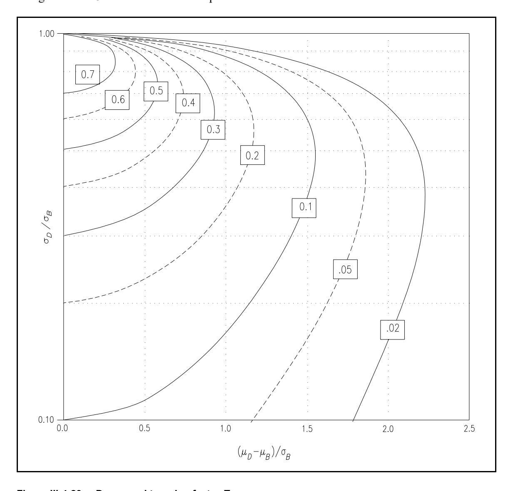

*Figure III-4-23. Dune sand trapping factor Tf*

# EXAMPLE PROBLEM III-4-9

Find:
Determine the dune trapping factor and estimate the rate of dune growth for the sands from the beach and dune in Atlantic City with the size characteristics given below.
Given:
The dune growth rate from Example Problem III-4-8 based on the transport rates of Example Problem III-4-7 and the following data from a sand size analysis of the beach and dune sands at Atlantic City.
Beach sand: d16 = 0.159 mm d84 = 0.664 mm
Dune sand: d16 = 0.173 mm d84 = 0.403 mm
Solution:
To use the relationships for F φ and σ n, the phi diameter must be calculated for each of the above percentiles using Equation 4-28.
For the beach sand

```math
\varphi = -\log_2 d_{mm}
```

or equivalently

```math
\varphi = -3.3219 \log_{10} d_{mm}
```

and, therefore

```math
\varphi_{16} = -3.3219 \log_{10} (0.159) = 2.65
```

Similarly

```math
\varphi_{84} = 0.59
```

For the dune sand

```math
\Phi _ { 1 6 } \, = \, 2 . 5 3 \qquad \mathrm { a n d } \qquad \Phi _ { 8 4 } \, = \, 1 . 3 1
```

From Equation III-4-26 and III-4-27

```math
\mu _ { \ L _ { \varphi B } } \ = \ \frac { 2 . 6 5 \ \mathrm { \, + \, } 0 . 5 9 } { 2 } \ = \ 1 . 6 2
```

(Continued)
Example Problem III-4-9 (Concluded)
and

```math
\sigma_{\phi B} = \frac{2.65 - 0.59}{2} = 1.03
```

Similarly, for the dune sand

```math
\mu _ { \phi D } \ = \ 1 . 9 2 \qquad \mathrm { a n d } \qquad \sigma _ { \phi D } \ = \ 0 . 6 1
```

Substituting these values into Equation 4-31 gives

```math
T_f = \left(\frac{0.61}{1.03}\right) \exp \left[\frac{(1.92 - 1.62)^2}{2(0.61^2 - 1.03^2)}\right] \approx 0.55
```

The trapping factor T_f can also be found from Figure III-4-23.
Consequently, the transport rate found in example problem III-4-8 should be multiplied by 0.55. The transport rate is therefore

```math
R_a = 0.55 R_t
```

or

```math
R_a = 0.55 (27.2) \approx 15.0 \frac{\text{m}^3}{\text{m-yr}}
```

```math
T_f = \left(\frac{\sigma_{\phi D}}{\sigma_{\phi B}}\right) \exp\left[\frac{(\mu_{\phi D} - \mu_{\phi B})^2}{2(\sigma_{\phi D}^2 - \sigma_{\phi B}^2)}\right] \tag{III-4-31}
```

which is based on a comparison of the log-normal distributions of dune and beach sands. The procedure is valid only if the dune sand is finer than the beach sand and more narrowly graded (better sorted). This is generally the case since the dune sand is almost always derived from the sand on the beach in front of the dune.
(3) Some example values of the various parameters for typical beach and dune sands along with calculated dune trapping factors are given in Table III-4-14.

*Table III-4-14 Typical Beach and Dune Sand Phi Diameters and Dune Trapping Factors Calculated from Beach and Dune Sand Samples at Various U. S. Beaches*

**Table III-4-14. Typical Beach and Dune Sand Phi Diameters and Dune Trapping Factors Calculated from Beach and Dune Sand Samples at Various U. S. Beaches**

| Location | φ16 (dune) | φ84 (dune) | φ16 (beach) | φ84 (beach) | FφB | FφD | σφB | σφD | Tf |
| --- | --- | --- | --- | --- | --- | --- | --- | --- | --- |
| North Street Ocean City, NJ | 2.48 | 1.88 | 2.61 | 1.72 | 2.17 | 2.18 | 0.45 | 0.30 | 0.67 |
| 9th Street Ocean City, NJ | 2.59 | 0.79 | 2.49 | 0.19 | 1.34 | 1.69 | 1.15 | 0.90 | 0.69 |
| 29th Street Ocean City, NJ | 2.64 | 1.98 | 2.69 | 1.41 | 2.05 | 2.31 | 0.64 | 0.33 | 0.46 |
| 36th Street Ocean City, NJ | 2.53 | 1.31 | 2.65 | 0.59 | 1.62 | 1.92 | 1.03 | 0.61 | 0.55 |
| Cape May, NJ Location 1 | 1.86 | 0.60 | 2.06 | 0.20 | 1.13 | 1.23 | 0.93 | 0.63 | 0.67 |
| Cape May, NJ Location 2 | 1.62 | 0.58 | 1.71 | 0.39 | 1.05 | 1.10 | 0.66 | 0.52 | 0.78 |
| CERC FRF Duck, NC |  |  |  |  | 0.76 | 1.08 | 1.00 | 0.77 | 0.68 |
| Clearwater Beach, FL | 2.87 | 2.09 | 2.66 | 1.41 | 2.04 | 2.48 | 0.63 | 0.39 | 0.41 |

- e. Continuity equation for wind transport of beach sand .
- (1) The continuity equation for the beach sand transported by an onshore wind is developed in Figure III-4-24.
- (2) At the upwind end of the fetch, the ocean and/or saturated sand precludes any wind transport. Further shoreward, the sand is dry and transportable by the prevailing wind; however, the amount in transport has not reached its potential rate predicted by the equations. In this region the wind is deflating the beach. The amount of sand leaving the ∆ x -long control volume exceeds the amount entering and the difference is comprised of sand eroded from the beach. Downwind along the fetch, the sand transport rate has reached equilibrium and the amount of sand entering the control volume equals the amount leaving. Here the beach is not deflating; rather the amount of sand eroded is balanced by the amount deposited. Further along the fetch, near the base of the dune, the amount of sand entering the control volume is less than the amount removed by the wind, and sand accumulates to build the dune. The change in transport rate is often due to a decrease in local wind speed induced by vegetation, sand fencing, or by the dune itself. Writing a sediment balance for the ∆ x control volume yields the equation

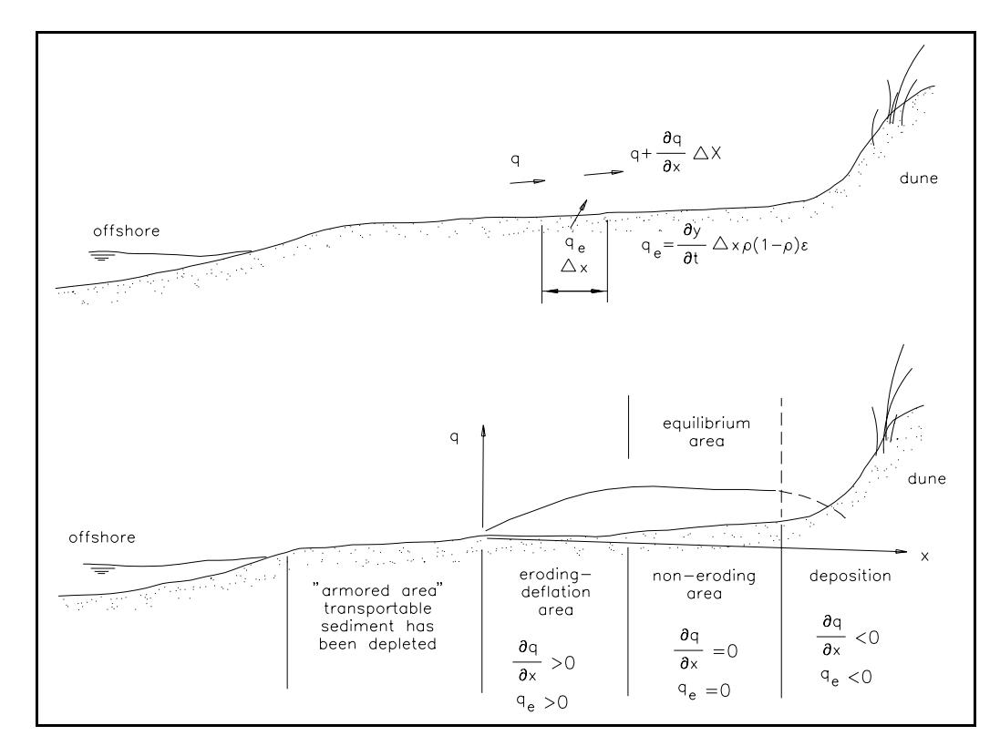

*Figure III-4-24. Sand conservation equations for a beach showing deflation area, equilibrium area, and deposition area*

```math
q + q_e - \left(q + \frac{\partial q}{\partial x} \Delta x\right) = 0 \tag{III-4-32}
```

in which q equals the wind-blown transport into the control volume (mass per unit time per unit length perpendicular to the direction of transport), q_e equals the amount contributed to the control volume by erosion from the beach (mass per unit time per unit length), and \Delta x equals the width of the control volume in the direction of transport. The first two terms are the sand influx to the control volume while the term in brackets is the efflux. Simplifying Equation 4-32 gives

```math
\frac{\partial q}{\partial x} = \frac{q_e}{\Delta x} \tag{III-4-33}
```

(3) The contribution from the beach q_e can be expressed as a deflation rate times the beach surface area

```math
q_e = \frac{\partial y}{\partial t} \Delta x \ \rho (1 - p) \ \epsilon \tag{III-4-34}
```

in which y equals the height of the beach surface above some datum, \rho equals the mass density of the sand, p equals the porosity of the in-situ beach sand, and \varepsilon equals a dimensionless "erodibility factor" related to the beach sand that is potentially transportable. \varepsilon is related to the sand size gradation as well as to any conditions that increase the threshold wind speed such as soil moisture content, salt crust formation, etc. Equation III-4-33 becomes

```math
\frac{\partial q}{\partial x} = \frac{\partial y}{\partial t} \rho (1 - p) \varepsilon \tag{III-4-35}
```

- (4) The upwind boundary condition, q = 0 at x = 0, is applied where the sand is first transportable, i.e., at the shoreline or the point where the sand is no longer wet. Since different size fractions are transported at different rates by a given wind speed, Equation 4-35 must be applied to each range of sizes present on the beach. Unfortunately, the relationship between the size gradation parameters and the amount of surficial, transportable sand is not known. Therefore, it is not possible to establish limit depths of erosion for a given wind speed blowing over sand with a given size distribution.
- (5) The amount of sand available for transport at a given wind speed depends on the gradation as well as the mean or median grain size. For a fine, poorly graded sand, once transport is initiated, there is a nearly continuous supply of sizes that can be transported. For a well-graded sand subjected to winds capable of transporting the finer fractions, fine sediments are eventually removed from the surface leaving behind the coarse fraction. See Figure III-4-21. In order to continue the transport process, higher wind speeds must occur or fine sediments must be exposed at the surface again.
- f. Limited source due to gradation armoring. Beach sands generally are not uniform in size but have a gradation that is often log-normally distributed. The finer fraction at the beach surface is more easily transported than the coarser fraction. Finer sand in the gradation also has the potential to be transported at a greater rate by lower wind speeds while larger sand is transported at a slower rate, if at all. However, as finer sands are depleted from the surface layer of the beach, the remaining larger particles shelter the underlying fines and armor the beach. Then, at the upwind end of the fetch, transport of fine sand ceases and, unless the wind speed increases to remove and transport the coarser fraction, transport will cease. Further downwind, the fines leaving the control volume balance the fines entering so that transport continues. Consequently, there is a moving, upwind boundary between that portion of beach where the fines have been removed and transport has ceased, and where transport of fines continues. Each size fraction has its own boundary. As fines are removed and the coarser fraction remains behind to armor the surface, the notransport boundary moves downwind. Note that for sand with a uniform size gradation, this armoring process does not occur while for a well-graded sand it does. Other armoring processes may occur for uniformly graded sands. Figure III-4-24 shows the location of the upwind boundary separating the armored area from the area where transport processes continue.

#### EXAMPLE PROBLEM III-4-10

# Find:

The wind transport rate for each fraction of the sand at Atlantic City having the distribution given in Figure III-4-25. Determine the total transport by summing the transport of all fractions using the beach sand size distribution as a weight function.

#### Given:

The wind rose data from Atlantic City in Table III-4-9 and the beach and dune sand size distributions in Figure III-4-25.

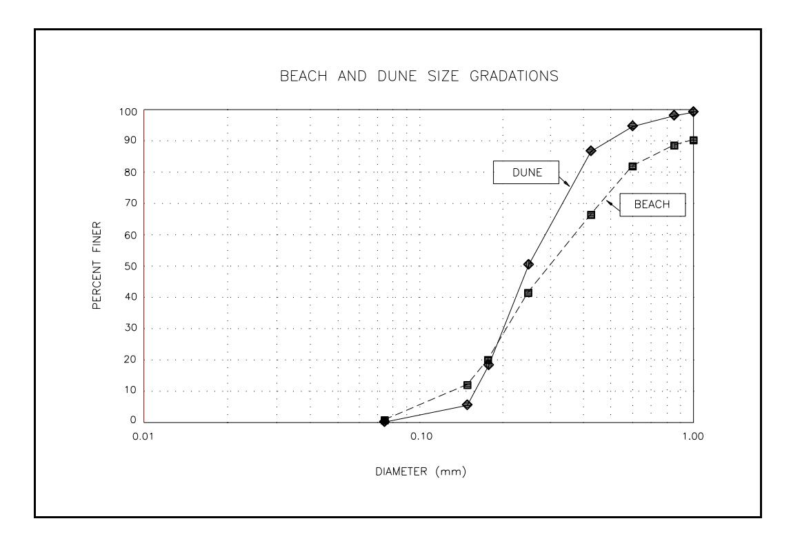

*Figure III-4-25. Beach and dune and size gradations for Atlantic City, NJ*

#### Solution:

The first step is to divide the size distribution for the beach sand into discrete increments and to determine the threshold wind speed for the upper limit of each size interval. See Table III-4-15. The volumetric transport coefficient is obtained from Figure III-4-13 entering with the appropriate sand grain diameter and elevation at which the wind speeds are measured (in this example assumed to be 10 m). The wind speeds in both miles per hour (mph) and in centimeters per second at the wind rose interval boundaries are given in Table III-4-16.
(Sheet 1 of 6)

*Example Problem III-4-10 (Continued)*

*Table III-4-15
Size Distribution, Threshold Wind Speeds and Volumetric Transport Coefficients for Beach Sand Size Intervals, Atlantic City, NJ*

**Table III-4-15. Size Distribution, Threshold Wind Speeds and Volumetric Transport Coefficients for Beach Sand Size Intervals, Atlantic City, NJ**

| Beach Sand Size | Intervals, Atlantic City, | NJ |  | Volumetric Transport |
| --- | --- | --- | --- | --- |
| d | Fraction Fraction | Within | uthresh | Coefficient K*v |
| (mm) | Finer | Interval | (cm/sec) | (m2-sec2/cm3) |
| 0.08 | 0.02 | 0.020 | 420 | 1.80e-14 |
| 0.10 | 0.05 | 0.030 | 450 | 1.50e-14 |
| 0.20 | 0.14 | 0.090 | 555 | 1.00e-14 |
| 0.25 | 0.28 | 0.140 | 650 | 8.00e-15 |
| 0.30 | 1.42 | 0.140 | 725 | 5.90e-15 |
| 0.35 | 0.51 | 0.090 | 800 | 5.35e-15 |
| 0.40 | 0.65 | 0.140 | 910 | 3.36e-15 |
| 0.50 | 0.75 | 0.100 | 1020 | 9.43e-15 |
| 0.60 | 0.83 | 0.080 | 1120 | 1.23e-14 |
| 0.70 | 0.87 | 0.040 | 1210 | 1.57e-14 |
| 0.80 | 0.89 | 0.015 | 1310 | 2.20e-14 |
| 0.90 | 0.90 | 0.015 | 1395 | 3.02e-14 |

Table III-4-17 gives the potential sand transport at the wind rose interval boundaries for each of the grain size intervals. Column 4 of the table gives the potential transport for each of the size intervals in cubic meters per meter-second. For those cases where the threshold wind speed exceeds the actual wind speed (the coarser fraction), the transport is zero. Column 5 gives the potential transport values in cubic meters per meter-year while column 6 gives the potential transport weighted by the fraction of sand within the given size interval. For example, for a wind speed of 14 mph (626 cm/sec) 77.4 m<sup>3</sup>/m-yr of sand with a diameter of 0.2 mm could be transported. However, only 9 percent of the sand is within this size interval so that the weighted transport rate is 0.09(77.4) = 6.96 \text{ m}^3/\text{m-yr} . Note that for a wind speed of 14 mph (626 cm/sec), only sand with a diameter less than about 0.2 mm will be transported. For a wind speed of 29 mph, sand with a diameter less than 0.70 mm is transported.
Table III-4-16
Wind Speeds for Atlantic City
Wind Rose Intervals

**Table III-4-16. Wind Speeds for Atlantic City**

|  |  |  |  |  | Wind | Speeds for Atlantic | City |
| --- | --- | --- | --- | --- | --- | --- | --- |
| rose interval | boundaries | for | each of the | grain size | intervals. Wind | Rose Intervals |  |
| Column 4 | of the table | gives | the potential | transport | for each | Wind Speed |  |
| of the size | intervals in | cubic | meters per | meter-second. | For |  |  |
| those cases | where the | threshold | wind | speed | exceeds the |  |  |
| actual wind | speed (the | coarser | fraction), | the | transport is | (mph) | (cm/sec) |
| zero. | Column 5 gives | the | potential | transport | values in |  |  |
| cubic meters | per | meter-year | while | column 6 | gives the |  |  |
| potential | transport | weighted | by the fraction | of sand | within | 0 | 0 |
| the given | size interval. | For | example, for | a wind | speed of 14 |  |  |
| mph (626 | cm/sec) 77.4 | m3/m-yr | of sand | with a | diameter of | 14 | 626 |
| 0.2 mm | could be | transported. | However, | only 9 | percent of |  |  |
| the sand is | within this | size | interval so | that the | weighted |  |  |
| transport | rate is 0.09(77.4) | = | 6.96 m3/m-yr. | Note | that for a | 29 | 1,296 |
| wind speed | of 14 mph | (626 | cm/sec), | only sand | with a |  |  |
| diameter | less than about | 0.2 | mm will be | transported. | For a | 35 | 1,565 |
| wind speed | of 29 mph, | sand | with a | diameter less | than 0.70 |  |  |
| mm is | transported. |  |  | (Sheet | 2 of 6) |  |  |

**Table III-4-16. Wind Speeds for Atlantic City**

|  |  |  |  |  | Wind | Speeds for Atlantic | City |
| --- | --- | --- | --- | --- | --- | --- | --- |
| rose interval | boundaries | for | each of the | grain size | intervals. Wind | Rose Intervals |  |
| Column 4 | of the table | gives | the potential | transport | for each | Wind Speed |  |
| of the size | intervals in | cubic | meters per | meter-second. | For |  |  |
| those cases | where the | threshold | wind | speed | exceeds the |  |  |
| actual wind | speed (the | coarser | fraction), | the | transport is | (mph) | (cm/sec) |
| zero. | Column 5 gives | the | potential | transport | values in |  |  |
| cubic meters | per | meter-year | while | column 6 | gives the |  |  |
| potential | transport | weighted | by the fraction | of sand | within | 0 | 0 |
| the given | size interval. | For | example, for | a wind | speed of 14 |  |  |
| mph (626 | cm/sec) 77.4 | m3/m-yr | of sand | with a | diameter of | 14 | 626 |
| 0.2 mm | could be | transported. | However, | only 9 | percent of |  |  |
| the sand is | within this | size | interval so | that the | weighted |  |  |
| transport | rate is 0.09(77.4) | = | 6.96 m3/m-yr. | Note | that for a | 29 | 1,296 |
| wind speed | of 14 mph | (626 | cm/sec), | only sand | with a |  |  |
| diameter | less than about | 0.2 | mm will be | transported. | For a | 35 | 1,565 |
| wind speed | of 29 mph, | sand | with a | diameter less | than 0.70 |  |  |
| mm is | transported. |  |  | (Sheet | 2 of 6) |  |  |

(Sheet 2 of 6)

| d | Fraction Within | Wind Speed | Potential Transport | Potential Transport | Transport Weighted by Sand Fraction Within Interval |
| --- | --- | --- | --- | --- | --- |
| (mm) 0.08 | Interval 0.020 | (cm/sec) 626 | (m3 /m-sec) 4.413e-6 | (m3 /m-yr) 139.3 | (m3 /m-yr) 2.79 |
|  |  |  |  |  |  |
| 0.10 | 0.030 | 626 | 3.677e-6 | 116.0 | 3.48 |
| 0.20 | 0.090 | 626 | 2.451e-6 | 77.4 | 6.96 |
| 0.25 | 0.140 | 626 | 01 | 01 | 01 |
| 0.30 | 0.140 | 626 | 0 | 0 | 0 |
| 0.35 | 0.090 | 626 | 0 | 0 | 0 |
| 0.40 | 0.140 | 626 | 0 | 0 | 0 |
| 0.50 | 0.100 | 626 | 0 | 0 | 0 |
| 0.60 | 0.080 | 626 | 0 | 0 | 0 |
| 0.70 | 0.040 | 626 | 0 | 0 | 0 |
| 0.80 | 0.015 | 626 | 0 | 0 | 0 |
| 0.90 | 0.015 | 626 | 0 | 0 | 0 |
| 0.08 | 0.020 | 1296 | 3.922e-5 | 1237.7 | 24.75 |
| 0.10 | 0.030 | 1296 | 3.268e-5 | 1031.4 | 30.94 |
| 0.20 | 0.090 | 1296 | 2.179e-5 | 687.6 | 61.88 |
| 0.25 | 0.140 | 1296 | 1.743e-5 | 550.1 | 77.01 |
| 0.30 | 0.140 | 1296 | 1.286e-5 | 405.7 | 56.80 |
| 0.35 | 0.090 | 1296 | 1.166e-5 | 367.9 | 33.11 |
| 0.40 | 0.140 | 1296 | 7.321e-6 | 231.0 | 32.34 |
| 0.50 | 0.100 | 1296 | 2.055e-5 | 648.4 | 64.84 |
| 0.60 | 0.080 | 1296 | 2.680e-5 | 845.7 | 67.66 |
| 0.70 | 0.040 | 1296 | 3.421e-5 | 1079.5 | 43.18 |
| 0.80 | 0.015 | 1296 | 01 | 01 | 01 |
| 0.90 | 0.015 | 1296 | 0 | 0 | 0 |
| 0.08 | 0.020 | 1565 | 6.895e-5 | 2175.8 | 43.52 |
| 0.10 | 0.030 | 1565 | 5.746e-5 | 1813.2 | 54.40 |
| 0.20 | 0.090 | 1565 | 3.830e-5 | 1208.8 | 108.79 |
| 0.25 | 0.140 | 1565 | 3.064e-5 | 967.0 | 135.38 |
| 0.30 | 0.140 | 1565 | 2.260e-5 | 713.2 | 99.85 |
| 0.35 | 0.090 | 1565 | 2.049e-5 | 646.7 | 58.20 |
| 0.40 | 0.140 | 1565 | 1.287e-5 | 406.2 | 56.86 |
| 0.50 | 0.100 | 1565 | 3.612e-5 | 1139.9 | 113.99 |
| 0.60 | 0.080 | 1565 | 4.711e-5 | 1486.8 | 118.94 |
| 0.70 | 0.040 | 1565 | 6.014e-5 | 1897.8 | 75.91 |
| 0.80 | 0.015 | 1565 | 8.427e-5 | 2659.3 | 39.89 |
| 0.90 | 0.015 | 1565 | 1.157e-4 | 3650.5 | 54.76 |

# Example Problem III-4-10 (Continued)

Table III-4-18 is constructed from Table III-4-17 and the wind rose data. Table III-4-18 is only for winds from the north. The values in columns 2, 3, and 4 are the average transport values over the wind speed interval; hence, for example, the first value in column 3 is the average transport over the wind speed interval 14 mph < U < 29 mph, or (2.79 + 24.75)/2 = 13.77 m3 /m-yr. Similarly, the first value in column 4 is the average over the interval 29 mph < U < 35 mph, or (24.75 + 43.52)/2 = 34.14 m3 /m-sec. The values in column 5 are the weighted sums of the values across each row with the number of days that the wind was within the given speed interval used as the weight factor. Hence, the value in the first row is given by (1.395)(20/365) + (13.77)(20/365) + (34.14)(0/365) = 0.831 m3 /m-yr. Consequently, the total amount of sand transported northward is 14.218 m3 /m-yr. Table III-4-18 is for winds from the north only. Similar analyses must be done for the remaining seven compass directions. The results of the analyses for all eight compass directions are summarized in Table III-4-19 where, for example, column 2 is derived from column 5 of Table III-4-18. (Calculations for the remaining compass directions are omitted for brevity.)

*Table III-4-18 Wind Transport of Size Intervals for Winds from North Weighted by Fraction of Year Wind was within Given Speed and Direction Interval*

(Similar tables must be constructed for the other seven compass directions)
Wind From North

**Table III-4-18. Wind Transport of Size Intervals for Winds from North Weighted by Fraction of Year Wind was within Given Speed and Direction Interval**

| Speed and Direction | Interval |  |  | Given |
| --- | --- | --- | --- | --- |
| (Similar tables | must be constructed Wind | for the other seven From North | compass directions) | Sum of |
| Avg. | Transport Over Avg. Interval | Transport Over Avg. Interval | Transport Over Interval | Transports Weighted by |
| d | 0<U<14 | 14<U<29 | 29<U<35 | No. of Days |
| (mm) No. | Days = 20 No. | Days = 20 No. | Days = 0 | (m3/m-yr) |
| 0.08 | 1.395 | 13.77 | 34.14 | 0.831 |
| 0.10 | 1.740 | 17.21 | 42.67 | 1.038 |
| 0.20 | 3.480 | 34.42 | 85.33 | 2.077 |
| 0.25 | 0 | 38.5 | 106.20 | 2.110 |
| 0.30 | 0 | 28.4 | 78.33 | 1.556 |
| 0.35 | 0 | 16.55 | 45.66 | 0.907 |
| 0.40 | 0 | 16.17 | 44.60 | 0.886 |
| 0.50 | 0 | 32.42 | 89.42 | 1.776 |
| 0.60 | 0 | 33.83 | 93.30 | 1.854 |
| 0.70 | 0 | 21.59 | 59.55 | 1.183 |

(Sheet 4 of 6)

*Example Problem III-4-10 (Continued)*

*Table III-4-19 Summary of Transports for Eight Compass Directions*

**Table III-4-19. Summary of Transports for Eight Compass Directions**

| (mm) | N | NE | E | Transport SE | (m2/yr) S | SW | W | NW |
| --- | --- | --- | --- | --- | --- | --- | --- | --- |
| 0.08 | 0.831 | 1.226 | 0.818 | 0.739 | 2.225 | 1.007 | 1.781 | 0.951 |
| 0.10 | 1.038 | 1.533 | 1.022 | 0.923 | 2.780 | 1.259 | 2.226 | 1.188 |
| 0.20 | 2.077 | 3.066 | 2.044 | 1.846 | 5.560 | 2.517 | 4.452 | 2.376 |
| 0.25 | 2.110 | 3.456 | 2.164 | 1.953 | 6.041 | 2.717 | 4.721 | 2.506 |
| 0.30 | 1.556 | 2.551 | 1.596 | 1.441 | 4.456 | 2.004 | 3.483 | 1.849 |
| 0.35 | 0.907 | 1.487 | 0.930 | 0.840 | 2.597 | 1.168 | 2.029 | 1.077 |
| 0.40 | 0.886 | 1.453 | 0.909 | 0.820 | 2.537 | 1.141 | 1.983 | 1.053 |
| 0.50 | 1.776 | 2.912 | 1.822 | 1.645 | 5.087 | 2.288 | 3.975 | 2.110 |
| 0.60 | 1.854 | 3.039 | 1.902 | 1.716 | 5.308 | 2.387 | 4.148 | 2.202 |
| 0.70 | 1.183 | 1.940 | 1.214 | 1.095 | 3.388 | 1.524 | 2.647 | 1.405 |
| 0.80 | 0 | 0.273 | 0.109 | 0.109 | 0.164 | 0.055 | 0.055 | 0.055 |
| 0.90 | 0 | 0.375 | 0.150 | 0.150 | 0.225 | 0.075 | 0.075 | 0.075 |
| TOTAL | 14.218 | 23.314 | 14.680 | 13.277 | 40.307 | 18.142 | 31.576 | 16.847 |

Dune growth depends on the wind direction relative to the dune axis and the assumptions made regarding the ability of the dune to trap and hold sand. The procedures presented in Example Problem III-4-8 are applied to each individual grain size interval and the values summed to estimate the amount of sand trapped by the dune. Transport in each direction is multiplied by sin β , the angle between the dune axis and the direction from which the wind is blowing, and cos2 β , the dune trapping efficiency. These values are given at the bottom of Table III-4-20. The values in Table III-4-20 are the net contribution to dune growth by winds from the indicated directions. For example, winds from the north remove sand from the dunes since values in column 2 are negative (the wind is blowing from the dune toward the beach). For this site, most dune growth is due to southerly winds and, to a lesser extent, to southeasterly winds.
(Sheet 5 of 6)

# Example Problem III-4-10 (Concluded)

For the example, the total dune growth rate is 38.63 m3 /m-yr. This represents a high rate of growth and most certainly overestimates dune growth at Atlantic City since the example assumes an unlimited supply of sand in all size intervals available for transport. As in Example Problem III-4-9, the calculated dune growth rate can be adjusted by using the trapping efficiency based on a comparison of the beach sand with the dune sand. From the preceding example, Tf = 0.55; hence, the estimated dune growth rate is Ra = 0.55(38.63) = 21.4 m3 /m-yr. An alternative procedure to adjust dune growth rates based on comparing the dune sand distribution with the beach sand distribution is given in Example Problem III-4-11, which follows.

| Table III-4-20 |  |
| --- | --- |
| Computation of Dune Growth Rate |  |

| d |  |  |  |  | Dune Growth (m2 | /yr) |  |  |  |
| --- | --- | --- | --- | --- | --- | --- | --- | --- | --- |
| (mm) | N | NE | E | SE | S | SW | W | NW | Total |
| 0.08 | -0.263 | -0.106 | 0.526 | 0.736 | 1.704 | 0.088 | -0.672 | -0.007 | 2.110 |
| 0.10 | -0.329 | -0.133 | 0.657 | 0.919 | 2.130 | 0.110 | -0.840 | -0.009 | 2.639 |
| 0.20 | -0.657 | -0.265 | 1.314 | 1.839 | 4.260 | 0.219 | -1.679 | -0.018 | 5.277 |
| 0.25 | -0.668 | -0.299 | 1.391 | 1.946 | 4.628 | 0.237 | -1.781 | -0.019 | 5.734 |
| 0.30 | -0.493 | -0.221 | 1.026 | 1.435 | 3.144 | 0.175 | -1.314 | -0.014 | 4.230 |
| 0.35 | -0.287 | -0.129 | 0.598 | 0.836 | 1.989 | 0.102 | -0.766 | -0.008 | 2.465 |
| 0.40 | -0.280 | -0.126 | 0.584 | 0.817 | 1.944 | 0.100 | -0.748 | -0.008 | 2.408 |
| 0.50 | -0.562 | -0.252 | 1.171 | 1.638 | 3.897 | 0.199 | -1.500 | -0.016 | 2.828 |
| 0.60 | -0.587 | -0.263 | 1.222 | 1.710 | 4.066 | 0.208 | -1.565 | -0.011 | 5.038 |
| 0.70 | -0.374 | -0.168 | 0.780 | 1.091 | 2.595 | 0.133 | -0.999 | -0.010 | 3.215 |
| 0.80 | 0 | -0.024 | 0.070 | 0.109 | 0.126 | 0.005 | -0.021 | -0.000 | 0.288 |
| 0.90 | 0 | -0.032 | 0.096 | 0.150 | 0.172 | 0.007 | -0.028 | -0.001 | 0.396 |
| TOTAL | -4.500 | -2.017 | 9.436 | 13.226 | 30.925 | 1.581 | -11.911 | -0.127 |  |
| sinβ | -0.7660 | -0.0872 | 0.6428 | 0.9962 | 0.7660 | 0.0872 | -0.6428 | -0.9962 |  |
| cos2 β | 0.4132 | 0.9924 | 1.0000 | 1.0000 | 1.0000 | 1.0000 | 0.5868 | 0.0076 |  |

TOTAL DUNE GROWTH RATE = 38.631 m3 /m-yr
(Sheet 6 of 6)

# EXAMPLE PROBLEM III-4-11

#### Find:

The trapping efficiency for natural dune building in Atlantic City and the dune grain size distribution calculated from the results of Example Problem III-4-10 given the measured and calculated grain-size distributions for the dune sand at Atlantic City.

#### Given:

The dune growth rates based on the individual grain size intervals as calculated in Example Problem III-4-10 and the actual dune sand size distributions given in Figure III-4-25.

#### Solution:

The calculated amounts of sand trapped in the dune from each size interval are given in Table III-4-21. The values in column 2 of Table III-4-21 are found by summing across the rows in Table III-4-20. Thus, 2.111 m3 /m-yr of sand with a diameter less than 0.08 mm is trapped by the dunes. Similarly, 2.639 m3 /m-yr of sand with a diameter between 0.08 mm and 0.10 mm is trapped. The calculated size distribution of the dune sand is determined by normalizing the values in column 2 by dividing each value in column 2 by the sum of column 2. The resulting values are given in column 3, which represents the fraction of the sand in the dune within the given size interval. For example, 0.0547 or 5.47 percent of the dune sand is finer than d = 0.08 mm and 6.83 percent is between d = 0.10 mm and d = 0.08 mm, etc. Column 4 of Table III-4-21 gives the cumulative distribution.

**Table III-4-21. The values in column 2 of Table III-4-21 are found by summing across the rows in Table III-4-20. Thus, 2.111 m3 /m-yr of sand with a diameter less than 0.08 mm is trapped by the dunes. Similarly, 2.639 m3 /m-yr of sand with a diameter between 0.08 mm and 0.10 mm is trapped. The calculated size distribution of the dune sand is determined by normalizing the values in column 2 by dividing each value in column 2 by the sum of column 2. The resulting values are given in column 3, which represents the fraction of the sand in the dune within the given size interval. For example, 0.0547 or 5.47 percent of the dune sand is finer than d = 0.08 mm and 6.83 percent is between d = 0.10 mm and d = 0.08 mm, etc. Column 4 of Table III-4-21 gives the cumulative distribution.**

|  | Amount Trapped |  | Cumulative Size |
| --- | --- | --- | --- |
| d | in Dune Normalized | Amount | Distribution |
| (mm) | (m3/m-yr) Trapped | in Dune | in Dune |
| 0.08 | 2.111 | 0.0547 | 0.0547 |
| 0.10 | 2.639 | 0.0683 | 0.1230 |
| 0.20 | 5.277 | 0.1366 | 0.2596 |
| 0.25 | 5.732 | 0.1484 | 0.4080 |
| 0.30 | 4.230 | 0.1095 | 0.5175 |
| 0.35 | 2.465 | 0.0638 | 0.5813 |
| 0.40 | 2.408 | 0.0623 | 0.6436 |
| 0.50 | 4.828 | 0.1250 | 0.7686 |
| 0.60 | 5.038 | 0.1304 | 0.8990 |
| 0.70 | 3.215 | 0.0832 | 0.9823 |
| 0.80 | 0.288 | 0.0075 | 0.9898 |
| 0.90 | 0.396 | 0.0102 | 1.0000 |
| TOTAL | 38.631 (Sheet 1 of 4) | 1.0000 |  |

(Sheet 1 of 4)

# Example Problem III-4-11 (Continued)

Figure III-4-26 shows the calculated sand size distribution in the dune along with the actual dune size distribution. The actual distribution differs from the calculated distribution because not all of the sand present on the beach is available for transport due to processes like gradation armoring, crust formation, etc. Some fines might be confined between larger grains and once the surficial fines are removed, the remaining fines are not available for transport. Also, the coarser fraction can only be transported by the less frequent high wind speeds.

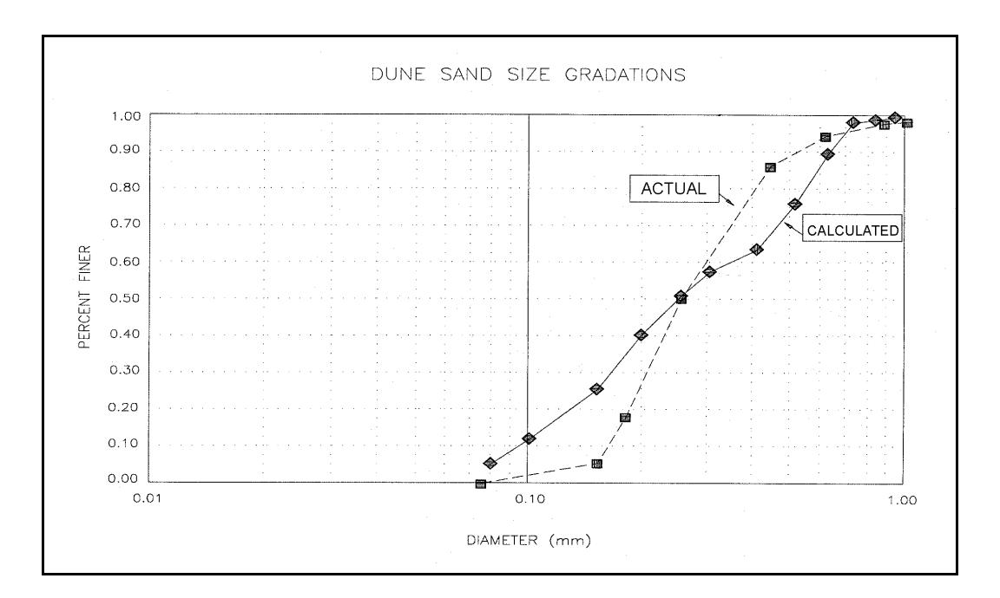

*Figure III-4-26. Actual and calculated dune sand size gradation at Atlantic City, NJ*

The transport rates calculated for each size interval are potential transport rates. Comparison of the calculated size distribution with the actual distribution allows a correction factor to be calculated for each size fraction. Columns 2 and 3 of Table III-4-22 present the calculated and actual size distributions, respectively. Column 4 is a calculated correction factor equal to the actual interval fraction divided by the calculated interval fraction. For example, the correction factor 0.1818 in the first row equals 0.0100/0.0547, the ratio of column 3 over column 2. Thus column 4 gives the numbers by which calculated values must be multiplied in order to obtain actual values. The amount of sand available for transport in each size interval is limited, so, in order to calculate the amount actually transported in each size interval, the correction factor values in column 4 must be normalized by dividing through by the largest value. (Column 4 would suggest that 300 percent of the amount of sand between 0.35 mm and 0.40 mm is needed to produce the observed distribution. Clearly, no more than 100 percent can be available.) The values in column 5 result. These values can be considered to be transport correction factors for each size interval. They are the values by which the transport rate in each size interval must be multiplied in order to produce the measured dune size distribution.
(Sheet 2 of 4)

#### Example Problem III-4-11 (Continued)

*Table III-4-22 Comparison of Calculated Dune Sand Size Distribution and Actual Dune Sand Size Distribution*

**Table III-4-22. Comparison of Calculated Dune Sand Size Distribution and Actual Dune Sand Size Distribution**

| d | Sand Size | Sand | Size | Correction = | Normalized |
| --- | --- | --- | --- | --- | --- |
| (mm) | Distribution | Distribution |  | Actual/Calculated | Correction |
| 0.08 | 0.0547 | 0.0100 |  | 0.1818 | 0.0604 |
| 0.10 | 0.0683 | 0.0470 |  | 0.6912 | 0.2297 |
| 0.20 | 0.1366 | 0.1355 |  | 0.9891 | 0.3286 |
| 0.25 | 0.1484 | 0.0908 |  | 0.6135 | 0.2039 |
| 0.30 | 0.1095 | 0.2250 |  | 2.0455 | 0.6797 |
| 0.35 | 0.0638 | 0.1334 |  | 2.1175 | 0.7036 |
| 0.40 | 0.0623 | 0.1896 |  | 3.0095 | 1.0000 |
| 0.50 | 0.1250 | 0.0832 |  | 0.6656 | 0.2212 |
| 0.60 | 0.1304 | 0.0397 |  | 0.3054 | 0.1015 |
| 0.70 | 0.0832 | 0.0125 |  | 0.1506 | 0.0500 |
| 0.80 | 0.0075 | 0.0125 |  | 1.6026 | 0.5325 |
| 0.90 | 0.0102 | 0.0100 |  | 0.9804 | 0.3258 |
| TOTAL | 1.0000 | 1.0000 |  |  |  |

Table III-4-23 gives the corrected transport rates for each size interval. Column 2 is the calculated amount in each size interval trapped in the dune. (See column 2, Table III-4-21.) Column 3 is the normalized correction factor (see column 5, Table III-4-22) and column 4 is the corrected dune growth rate for sand within the given size fraction. The sum of the values in column 4 gives the corrected dune growth rate. For the given example, the corrected dune growth rate is 12.7 m3 /m-yr. This procedure is similar to the procedure used to derive the trapping factor Tf but by matching the calculated and actual dune size distributions and without assuming that the distributions are log-normal. The value of Tf can be calculated for this example by taking the ratio of the value of the total from column 4 in Table III-4-23 to the total in column 2. This ratio is Tf = 12.68/38.63 = 0.33, which can be computed with the value of Tf = 0.57 calculated in Example Problem III-4-9.
Figure III-4-27 compares the actual dune size distribution with the calculated distribution after the correction has been applied.
(Sheet 3 of 4)

**Table III-4-23. gives the corrected transport rates for each size interval. Column 2 is the calculated amount in each size interval trapped in the dune. (See column 2, Table III-4-21.) Column 3 is the normalized correction factor (see column 5, Table III-4-22) and column 4 is the corrected dune growth rate for sand within the given size fraction. The sum of the values in column 4 gives the corrected dune growth rate. For the given example, the corrected dune growth rate is 12.7 m3 /m-yr. This procedure is similar to the procedure used to derive the trapping factor Tf but by matching the calculated and actual dune size distributions and without assuming that the distributions are log-normal. The value of Tf can be calculated for this example by taking the ratio of the value of the total from column 4 in Table III-4-23 to the total in column 2. This ratio is Tf = 12.68/38.63 = 0.33, which can be computed with the value of Tf = 0.57 calculated in Example Problem III-4-9.**

| d | Calculated | Normalized | Corrected |
| --- | --- | --- | --- |
| (mm) | Transport Rates (m3/m-yr) | Correction Factor | Transport Rates (m3/m-yr) |
| 0.08 | 2.111 | 0.0604 | 0.1275 |
| 0.10 | 2.639 | 0.2297 | 0.6062 |
| 0.20 | 5.277 | 0.3286 | 1.7340 |
| 0.25 | 5.732 | 0.2039 | 1.1688 |
| 0.30 | 4.230 | 0.6797 | 2.8751 |
| 0.35 | 2.465 | 0.7036 | 1.7344 |
| 0.40 | 2.408 | 1.0000 | 2.4080 |
| 0.50 | 4.828 | 0.2212 | 1.0680 |
| 0.60 | 5.038 | 0.1015 | 0.5114 |
| 0.70 | 3.215 | 0.0500 | 0.1608 |
| 0.80 | 0.288 | 0.5325 | 0.1534 |
| 0.90 | 0.396 | 0.3258 | 0.1290 |
| TOTAL = | 38.627 |  | 12.6766 |

*Table III-4-23 Corrected Transport Rates for Size Intervals and Corrected Dune Growth Rate*

**Table III-4-23. Corrected Transport Rates for Size Intervals and Corrected Dune Growth Rate**

| d | Calculated | Normalized | Corrected |
| --- | --- | --- | --- |
| (mm) | Transport Rates (m3/m-yr) | Correction Factor | Transport Rates (m3/m-yr) |
| 0.08 | 2.111 | 0.0604 | 0.1275 |
| 0.10 | 2.639 | 0.2297 | 0.6062 |
| 0.20 | 5.277 | 0.3286 | 1.7340 |
| 0.25 | 5.732 | 0.2039 | 1.1688 |
| 0.30 | 4.230 | 0.6797 | 2.8751 |
| 0.35 | 2.465 | 0.7036 | 1.7344 |
| 0.40 | 2.408 | 1.0000 | 2.4080 |
| 0.50 | 4.828 | 0.2212 | 1.0680 |
| 0.60 | 5.038 | 0.1015 | 0.5114 |
| 0.70 | 3.215 | 0.0500 | 0.1608 |
| 0.80 | 0.288 | 0.5325 | 0.1534 |
| 0.90 | 0.396 | 0.3258 | 0.1290 |
| TOTAL = | 38.627 |  | 12.6766 |

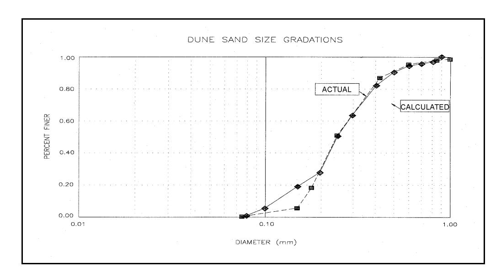

*Figure III-4-27. Comparison of actual dune sand size gradation with corrected, calculated gradation*

(Sheet 4 of 4)

#### EM 1110-2-1100 (Part III) 30 Apr 02

# III-4-6. References

#### EM 1110-2-5003

Planting Guidelines for Dune Creation and Stabilization

#### Bagnold 1936

Bagnold, R. A. 1936. "The Movement of Desert Sand," Proceedings Royal Society of London , Series A, Vol 157, pp 94-620.

#### Bagnold 1941

Bagnold, R. A. 1941. The Physics of Blown Sand and Desert Dunes , Morrow, New York, (republished in 1954 by Methuen, London).

#### Belly 1962

Belly, P. Y. 1962. "Sand Movement by Wind," Technical Memorandum, TM-1, Coastal and Hydraulics Laboratory, U.S. Army Engineer Waterways Experiment Station, Vicksburg, MS.

#### Chapman 1990

Chapman, D. M. 1990. "Aeolian Sand Transport - An Optimized Model," Earth Surface Processes and Landforms , Vol 15, pp 751-760.

#### Gillette, Herbert, Stockton, and Owen 1996

Gillette, D. A., Herbert, G., Stockton, P. H., and Owen, P. R. 1996. " Causes of the Fetch Effect in Wind Erosion," Earth Surface Processes and Landforms , Vol 21, pp 641-659.

# Holzworth 1972

Holzworth 1972. "Mixing Heights, Wind Speeds, and Potential for Urban Air Pollution Throughout the Contiguous United States," Office of Air Programs, Publication No. AP-101, Environmental Protection Agency, Research Triangle Park, North Carolina.

#### Horikawa 1988

Horikawa, K. (Editor). 1988. Nearshore Dynamics and Coastal Processes , University of Tokyo Press, Tokyo, Japan.

# Horikawa and Shen 1960

Horikawa, K., and Shen, H. W. 1960. "Sand Movement by Wind Action - on the Characteristics of Sand Traps," Technical Memorandum 119, Coastal and Hydraulics Laboratory, U.S. Army Engineer Waterways Experiment Station, Vicksburg, MS.

#### Hotta, Kubota, Katori, and Horikawa 1985

Hotta, S., Kubota, S., Katori, S., and Horikawa, K. 1985. "Sand Transport by Wind on a Wet Sand Surface," Proceedings, 19th International Conference on Coastal Engineering, American Society of Civil Engineers, pp 1265-1281.

# Hsu 1973

Hsu, S. A. 1973. "Computing Eolian Sand Transport from Shear Velocity Measurements," Journal of Geology , Vol 81, pp 739-743.

#### Hsu 1977

Hsu, S. A. 1977. "Boundary Layer Meteorological Research in the Coastal Zone," Geoscience and Man , H. J. Walker, ed., School of Geoscience, Louisiana State University, Baton Rouge, LA, Vol 18, pp 99-111.

#### Hsu 1981

Hsu, S. A. 1981. "Models for Estimating Offshore Winds from Onshore Meteorological Measurements," Boundary Layer Meteorology , Vol 20, pp 341-351.

## Hsu 1986

Hsu, S. A. 1986. "Correction of Land-Based Wind Data for Offshore Applications: A Further Evaluation," Journal of Physical Oceanography , Vol 16, pp 390-394.

#### Hsu 1988

Hsu, S. A. 1988. Coastal Meteorology , Academic Press, San Diego, CA.

#### Hsu 1994

Hsu, S. A. 1994. Personal communication, Coastal Studies Institute, Louisiana State University, Baton Rouge, LA.

#### Hsu and Blanchard 1991

Hsu, S. A., and Blanchard, B. W. 1991. "Shear Velocity and Eolian Sand Transport on a Barrier Island," Proceedings, Coastal Sediments '91, American Society of Civil Engineers, New York, Vol 1, pp 220-234.

#### Kadib 1964

Kadib, A. 1964. "Calculation Procedure for Sand Transport on Natural Beaches," Miscellaneous Paper 2-64, Coastal and Hydraulics Laboratory, U.S. Army Engineer Waterways Experiment Station, Vicksburg, MS.

# Kadib 1966

Kadib, A. 1966. "Mechanics of Sand Movement on Coastal Dunes," Journal of the Waterways and Harbors Division , American Society of Civil Engineers, WW2, pp 27-44.

#### Kawamura 1951

Kawamura, R. 1951. "Study on Sand Movement by Wind," Report, Institute of Science and Technology, University of Tokyo. (translation, University of California, Berkeley, Hydraulic Engineering Laboratory Research Report, HEL-2-9, Berkeley, CA, 1964, pp 1-64).

#### Krumbein and James 1965

Krumbein, W. C., and James, W. R. 1965. "A Lognormal Size Distribution Model for Estimating Stability of Beach Fill Material," TM-16, Coastal and Hydraulics Laboratory, U.S. Army Engineer Waterways Experiment Station, Vicksburg, MS.

# Liu, Schwab, and Bennett 1984

Liu, P. C., Schwab, D. J., and Bennett, J. R. 1984. "Comparison of a Two Dimensional Wave Prediction Model with Synoptic Measurements in Lake Michigan," Journal of Physical Oceanography , Vol 14, pp 1514-1518.

#### EM 1110-2-1100 (Part III) 30 Apr 02

# Nickling and Egglestone 1981

Nickling, W. G., and Egglestone, M. 1981. "The Effects of Soluble Salts on the Threshold Shear Velocity of Fine Sand," Sedimentology , Vol 28, pp 505-510.

#### Nordstrom and Jackson 1992

Nordstrom, K. F., and Jackson, N. L. 1992. "Effect of Source Width and Tidal Elevation Changes on Aeolian Transport on an Estuarine Beach," Sedimentology , Vol 39, pp 769-778.

#### O'Brien and Rindlaub 1936

O'Brien, M. P., and Rindlaub, B. D. 1936. "The Transport of Sand by Wind," Civil Engineering, Vol 6, pp 325-327.

#### Powell 1982

Powell, M. D. 1982. "The Transition of the Hurricane Frederic Boundary-Layer Wind Field from the Open Gulf of Mexico to Landfall," Monthly Weather Review , Vol 110, pp 1912-1932.

#### Raudkivi 1976

Raudkivi, A. J. 1976. Loose Boundary Hydraulics , 2nd ed., Pergamon Press, New York.

#### Resio and Vincent 1977

Resio, D.T., and Vincent, C. L. 1977. "Estimation of Winds Over the Great Lakes," Journal of the Waterway, Port, Coastal and Ocean Engineering Division , American Society of Civil Engineers, Vol 103, No. WW2.

#### Sarre 1988

Sarre, R. D. 1988. "Evaluation of Eolian Transport Equations Using Intertidal Zone Measurements: Saunton Sands, England," Sedimentology , Vol 35, pp 671-679.

#### Savage 1963

Savage, R. P. 1963. "Experimental Study of Dune Building with Sand Fences," Proceedings, International Conference on Coastal Engineering , 1963, pp 380-396.

#### Savage and Woodhouse 1968

Savage, R. P., and Woodhouse, W. W., Jr. 1968. "Creation and Stabilization of Coastal Barrier Dunes," Proceedings, 11th International Conference on Coastal Engineering , Vol 1, 1968, pp 671-700.

#### SethuRaman and Raynor 1980

SethuRaman, S., and Raynor, G. S. 1980. "Comparison of Mean Wind Speeds and Turbulence at a Coastal Site and Offshore Location," Journal of Applied Meteorology , Vol 19, pp 15-21.

#### Shore Protection Manual 1984

Shore Protection Manual. 1984. 4th ed., 2 Vol, U.S. Army Engineer Waterways Experiment Station, U.S. Government Printing Office, Washington, DC.

#### Svasek and Terwindt 1974

Svasek, J.N., and Terwindt, J. H. J. 1974. "Measurements of Sand Transport by Wind on a Natural Beach," Sedimentology , Vol 21, pp 311-322.

# Wieringa 1980

Wieringa, J. 1980. "Representativeness of Wind Observation at Airports," Bulletin, American Meteorological Society, Vol 61, pp 962-971

#### Williams 1964

Williams, G. 1964. "Some Aspects of the Aeolian Saltation Load," Sedimentology , Vol 3, pp 257-287.

# Woodhouse 1978

Woodhouse, Jr. 1978. "Dune Building and Stabilization with Vegetation," Special Report No. 3, Coastal and Hydraulics Laboratory, U.S. Army Engineer Waterways Experiment Station, Vicksburg, MS.

#### Zingg 1953

Zingg, A. W. 1953. "Wind Tunnel Studies of the Movement of Sedimentary Material," Proceedings, 5th Hydraulic Conference , State University of Iowa, Studies in Engineering, Bulletin, Vol 34, pp 111-135.

# III-4-7. Definition of Symbols

| Symbol | Definition |
|---|---|
| ∆œ | Volume change per unit length of beach [length3/length] |
| g | Erodibility factor related to beach sand that is potentially transportable [dimensionless] |
| η | Transport efficiency for winds at the seaward side of a dune |
| ηi | Transport efficiency for winds at the landward side of a dune |
| κ | von Karman’s constant (= 0.4) |
| µn | Mean of a sediment sample [phi units] |
| µnD | or B Mean of a sediment sample taken from the dune or beach [phi units] |
| νa | Kinematic viscosity of air [length2/time] |
| ρ | Mass density of sediment grains [force-time2/length4] |
| ρa | Mass density of air [force-time2/length4] |
| σn | Standard deviation of a sediment sample [phi units] |
| σnD | or B Standard deviation of a sediment sample taken from the dune or beach [phi units] |
| τ | Boundary shear stress [force/length2] |
| n | Sediment grain diameter in phi units (n = -log2 dmm, where dmm is the grain diameter in millimeters) |
| nx | Sediment grain diameter of the x-percentile of a sample (x-percent of the grains are finer) [phi units] |
| A | Empirical constant (Equation III-4-10) [dimensionless] |
| At | Dimensionless constant ( = 0.118) used in calculating the critical shear stress, u*t , for sand transport by wind (Equation III-4-20) |
| B | Empirical constant (Equation III-4-10) [dimensionless] |
| BBagnold | Bagnold coefficient [dimensionless] |
| CD,land | Drag coefficients over land [dimensionless] |
| CD,sea | Drag coefficient over sea [dimensionless] |
| Cz | Wind drag coefficient at height Z (Equation III-4-4) [dimensionless] |
| d | Standard grain size ( = 0.25mm) |
| D | Median sediment grain diameter [length - generally millimeters] |
| D | Mean sediment grain diameter [length - generally millimeters] |
| dmm | Sediment grain diameter in millimeters |
| dx | Sediment grain diameter of the x-percentile of a sample (x-percent of the grains are finer) [length] |
| e | Base of natural logarithms |
| g | Gravitational acceleration (32.17 ft/sec2, 9.807m/sec2) [length/time2] |
| G | Dry weight sand transport rate [force/length/time] |
| Hland | Height of the planetary boundary layer over the land [length] |
| Hsea | Height of the planetary boundary layer over the sea [length] |
| K | Empirical dimensional eolian sand transport coefficient (Equation III-4-17) [force/length/time] |
| KN | Eolian sand transport coefficient (Equation III-4-19) [dimensionless] |
| n | Empirically determined exponent (ranging from 1/11 to 1/17) (Equation III-4-15) [dimensionless] |
| p | Porosity of the in situ dune sand [percent] |
| q | Wind-borne sand transport rate [mass/time/length] |
| qi | Sand blown inland from the dune [mass/time/length] |
| qs | Dune erosion by waves [mass/time/length] |
| qv | Volumetric sand transport rate [length3/length/time] |
| Ra | Actual dune growth rate [length3/length-time] |
| Rt | Theoretical dune growth rate [length3/length-time] |
| RT | Temperature correction factor applied to wind speed at the 10-m height (Figure III- 4-7) [dimensionless] |
| t | Time |
| Ta | Air temperature [degrees Celsius] |
| Tf | Dune trapping factor [dimensionless] |
| Ts | Sea temperature [degrees Celsius] |
| u* | Wind shear or friction velocity [length/time] |
| u*t | Critical or threshold velocity for sand transport by wind (Equation III-4-20) [length/time] |
| u*tw | Critical or threshold velocity for wet sand transport by wind (Equation III-4-20) [length/time] |
| Uland | Wind speed over land [length/time] |
| Usea | Wind speed over sea [length/time] |
| Wind-Blown | Sediment Transport III-4-77 |
| Ux | Average wind speed at x-elevation [length/time] |
| Uz | Average wind velocity as a function of height above ground level [length] |
| UZM | Wind speed at the anemometer height [length/time] |
| U!10m | Wind speed at the 10-meter height corrected for the air-sea temperature difference [length/time] |
| W | Fraction of water content in the upper 5mm of the sand [percent] |
| Z | Height at which wind speed is measured [length] |
| Z0 | Height of a roughness element characterizing the surface over which the wind is blowing [length] |
| ZM | Anemometer height [length] |
| ZR | Reference height [length] |
| ZZingg | Zingg Coefficient [dimensionless] |

# III-4-8. Acknowledgments

Authors of Chapter III-4, "Wind-Blown Sediment Transport:"
- S. A. Hsu, Ph.D., Coastal Studies Institute, School of Geosciences, Louisiana State University, Baton Rouge, Louisiana.
- J. Richard Weggel, Ph.D., Dept. of Civil and Architectural Engineering, Drexel University, Philadelphia, Pennsylvania.

#### Reviewers:

Robert G. Dean, Ph.D., Coastal & Oceanographic Engineering, University of Florida, Gainesville, Florida.
Scott Douglass, Ph.D., Dept. of Civil Engineering, University of South Alabama, Mobile, Alabama.
James R. Houston, Ph.D., Engineer Research and Development Center, Vicksburg, Mississippi.
David B. King, Ph.D., Coastal and Hydraulics Laboratory (CHL), Engineer Research and Development Center, Vicksburg, Mississippi.
Joon Rhee, Ph.D., CHL
Todd L. Walton, Ph.D., CHL
