## Chapter 5 EROSION, TRANSPORT, AND DEPOSITION EM 1110-2-1100 OF COHESIVE SEDIMENTS (Part III)

30 April 2002

## Table of Contents

Page III-5-1. Introduction III-5-1 III-5-2. Consolidated and Unconsolidated Shores a. Consolidated shore b. Mud shore (1) Mud flat (2) Coastal wetland (3) Mangrove (4) Mud 'beach' III-5-2 III-5-2 III-5-6 III-5-6 III-5-6 III-5-8 III-5-8 III-5-3. Erosion Processes on Consolidated Shores III-5-8 III-5-4. Physical and Numerical Modeling III-5-10 III-5-5. Geomorphology of Consolidated Shores a. Controlling factors (1) Lag deposits (2) Different stratigraphic units (3) Quantity and mobility of sand cover (4) Local wave and water level conditions b. Profile types III-5-11 III-5-11 III-5-11 III-5-11 III-5-13 III-5-16 III-5-16 III-5-6. Sediment Properties and Measurement Techniques a. Introduction b. Consolidated shore erosion (1) Field sampling and geotechnical analyses (2) Laboratory erodibility experiments (3) Field techniques for assessing surface and subsurface conditions c. Erosion, transport, and deposition of mud (1) Cohesion (2) Critical shear for erosion (3) Erosion rate at twice critical shear (4) Critical shear for deposition (5) Sediment, fluid mud, and water densities (6) Grain size and settling velocity (7) Degree of consolidation (8) Field measurement techniques (9) Laboratory measurement techniques (10) Calibration techniques III-5-17 III-5-17 III-5-17 III-5-18 III-5-18 III-5-20 III-5-21 III-5-21 III-5-21 III-5-21 III-5-22 III-5-22 III-5-22 III-5-23 III-5-23 III-5-24 III-5-26 III-5-7. Erosion Processes III-5-26
a. Shear stress III-5-26 b. Erodibility of consolidated sediments III-5-26 c. Subaqueous erosion of consolidated sediments III-5-30 d. Subaqueous erosion of mud III-5-33 e. Fluid mud III-5-33 f. Subaerial erosion processes III-5-34 III-5-8. Transport Processes III-5-38 a. Advection and dispersion III-5-38 b. Fluid mud III-5-38 III-5-9. Deposition Processes III-5-38 a. Flocculation III-5-38 b. Shear stress III-5-39 c. Krone equation III-5-39 d. Fluid mud III-5-39 III-5-10. Consolidation III-5-39 a. Strength versus consolidation III-5-39 b. Degree of consolidation III-5-40 III-5-11. Wave Propagation III-5-40 a. Roughness and shear III-5-40 b. Fluid mud III-5-40 III-5-12. Numerical Modeling III-5-44 a. Introduction III-5-44 b. Simulating erosion of consolidated sediment III-5-46 c. Simulating erosion and deposition of mud III-5-48 III-5-13. Engineering and Management Implications III-5-48 a. Setbacks and cliff stablilization III-5-48 b. Vegetation III-5-48 c. Interruption to sediment supply and downdrift impacts III-5-49 d. Remedial measures for cohesive shore erosion III-5-49 e. Foundations III-5-50 III-5-14. References III-5-53 III-5-15. Definition of Symbols III-5-60 III-5-16. Acknowledgments III-5-61

# List of Tables

Page Table III-5-1 Cohesive Sediment Density III-5-2 Table III-5-2 Example Problem III-5-1, "Annular Flume Test Results" III-5-41 Table III-5-3 Erodibility Coefficients (from Penner (1993)) III-5-47

## List of Figures

Page Figure III-5-1. Outline of cohesive shore processes III-5-2 Figure III-5-2. Peat exposed on a beach along the Keta shoreline in Ghana, West Africa III-5-4 Figure III-5-3. Pieces of eroded clay (and some rubble) scattered on a beach along the Keta shoreline in Ghana, West Africa III-5-4 Figure III-5-4. Springs flowing over the beach surface along the Keta shoreline in Ghana, West Africa III-5-5 Figure III-5-5. Discolored water from erosion of exposed cohesive sediment along the Keta shoreline in Ghana, West Africa III-5-6 Figure III-5-6. Permanent undulations in the Keta shoreline in Ghana, West Africa III-5-7 Figure III-5-7. Mud flat in Cumberland Basin, Bay of Fundy, showing drainage gullies . III-5-7 Figure III-5-8. A mud 'beach' backed with eroding salt marsh at Annapolis Royal, in the Annapolis Basin of the Bay of Fundy. Basalt revetment at top of salt marsh is an attempt to halt the erosion III-5-8 Figure III-5-9. Sand beach disappearing into mangrove on the island of Borneo. Sediment within the mangrove is cohesive mud III-5-9 Figure III-5-10. A convex consolidated cohesive profile with a shelf protected by lag deposits located near Goderich, Ontario, on Lake Huron III-5-12 Figure III-5-11. Plan and cross section of East Point along the Scarborough Bluffs (located east of Toronto on Lake Ontario) showing the influence of the erosion-resistant leaside (or northern) till on the local geomorphology III-5-13 Figure III-5-12. Plan and cross section of the Port Burwell area on the north central shore of Lake Erie showing the influence of a fillet beach and stratigraphy changes on the geomorphology of a cohesive shore III-5-14 Figure III-5-13. Bluff erosion along the Holderness coast of the North Sea. The underlying cohesive profile is exposed at low tide in a trough (referred to as an "Ord") between the upper beach and first bar III-5-15
Figure III-5-14. Close-up of the exposed cohesive profile on the Holderness coast (see Figure III-5-13). A rock-capped pedestal of cohesive sediment, about 10 cm in height, has developed through erosion of the adjacent seabed III-5-15 Figure III-5-15. Distinctions between concave and convex consolidated cohesive profiles III-5-16 Figure III-5-16. Laser doppler velocimeter (LDV) used to determine shear stress exerted on the till bed in a unidirectional flow flume test. This test features sand in the flow acting as an abrasive III-5-19 Figure III-5-17. Prototype direct shear device, the annular flume III-5-25 Figure III-5-18. Clear-water erosion rates from unidirectional flow flume and tunnel tests for various materials III-5-28 Figure III-5-19. Sand in flow erosion rates from unidirectional flow flume and tunnel tests for various materials III-5-29 Figure III-5-20. Bluff retreat and profile downcutting over a 37-year period at Scarborough Bluffs, located east of Toronto on Lake Ontario III-5-32 Figure III-5-21. A rotational bluff failure along the north central shore of Lake Erie III-5-35 Figure III-5-22. Gully erosion of a bluff along the north central shore of Lake Erie III-5-36 Figure III-5-23. An eroding shale bluff along the west Lake Ontario shoreline III-5-36 Figure III-5-24. Shore protection consisting of a wide berm protected by a revetment along the base of the Scarborough Bluffs located east of Toronto on Lake Ontario III-5-37 Figure III-5-25. Plot of erosion rate versus shear for example problem III-5-43 Figure III-5-26. Mud beach processes (after Lee (1995)) III-5-45 Figure III-5-27. A toppled concrete seawall along the Lake Michigan coast of Berrien County. Failure probably resulted from undermining of the underlying glacial till foundation III-5-51 Figure III-5-28. A steel sheet-pile wall and groin field has been ineffective at protecting this section of cohesive shore along the Berrien County shoreline of Lake Michigan III-5-51

# Chapter III-5 Erosion, Transport, and Deposition of Cohesive Sediments

## III-5-1. Introduction

- a. Cohesive sediments are those in which the attractive forces, predominantly electrochemical, between sediment grains are stronger than the force of gravity drawing each to the bed. Individual grains are small to minimize mass and gravitational attraction, and are generally taken to be in the silt (<70 F) to clay (<4 F) range. The strength of the cohesive bond is a function of the grain mineralogy and water chemistry, particularly salinity. Thus, a coarse silt behaves like noncohesive fine sand in fresh water, but is cohesive in an ocean environment. Similarly, a fine sand exhibits cohesion in salt water. In other words, it is easier to define cohesive sediment by behavior than by size.
- b. Grain size and shape nevertheless play a significant role in the lack of permeability of cohesive sediment. As grain size decreases, so does the size of the interstitial pore spaces while drainage path length increases. The small pores result in greater resistance to flow, exacerbating the effects of the long drainage path. Clay minerals tend to form flake-shaped platelets, rather than spherical particles. These platelets deposit with the smallest dimension vertical, further reducing pores and increasing vertical drainage paths. For this reason, clay is often used as an impermeable layer in hydraulic earthworks such as dikes and channels.
- c. In coastal engineering terms, the principal indicator of cohesive sediment behavior is a critical shear for erosion of bed sediment τc, which is significantly greater than the critical shear for deposition τs. In other words, once the sediment has been deposited on the bed, the cohesive bond with other bed particles makes it more difficult to remove than particle mass alone would suggest.
- d. The processes and states of coastal cohesive sediment listed below are shown schematically in Figure III-5-1 and Table III-5-1.
- (1) Consolidated. Stiff or hard cohesive sediment that has had centuries to drain, probably compressed beneath glaciers or other overburden. (2) Suspension. Individual grains or flocs dispersed in the water column and transported with the water.
- (3) Fluid Mud. A static or moving intermediate state between suspension and deposition, analogous to bed-load transport of noncohesive sand, that can move in the direction of flow supported by the bed. Fluid mud is the result of excess pore pressure, built up by hindered settling or wave action. Water cannot escape from the sediment deposit, and builds up the excess interstitial pore pressure necessary to support the weight of sediment above it. The whole mass of sediment and trapped water behaves like a uniform dense viscous fluid, flowing downhill or in the direction of the water flow. Fluid mud layers can often be seen on echo soundings as a false bottom in depressions in the seabed.
- (4) Mud. Unconsolidated cohesive sediment that has been recently deposited. 'Recently' may be a matter of a few hours to several years.
- e. Processes and states in Figure III-5-1 may be skipped. For example: most coastal mud, even fluid mud, is eroded before it has undergone sufficient consolidation to be defined as 'consolidated'; many cohesive sediments do not form fluid mud, but deposit directly as stationary mud. Differences between mud and consolidated sediments occur during erosion. Transport, deposition, and consolidation are the same for both mud and consolidated cohesive sediments.

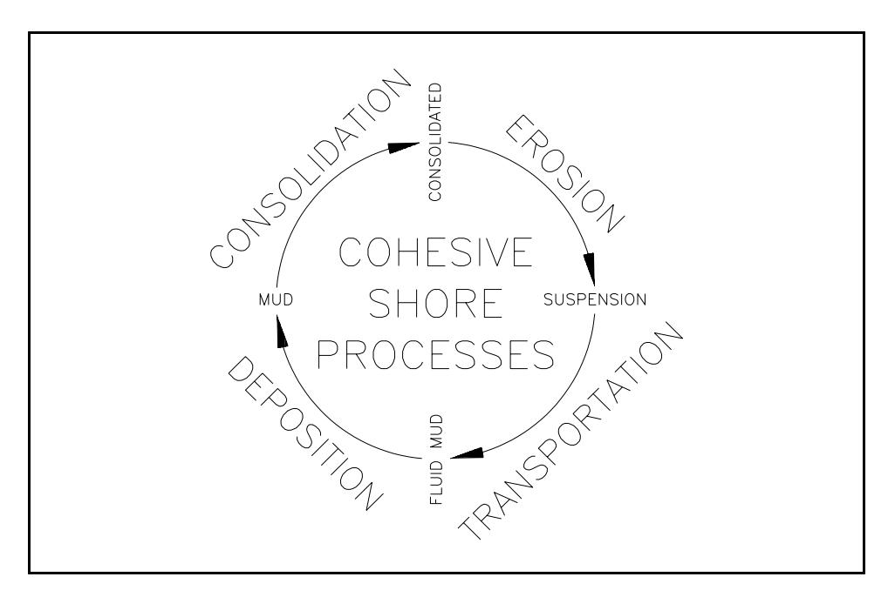

*Figure III-5-1. Outline of cohesive shore processes — Any process or state may be bypassed, for example, fluid mud may be eroded without passing through (further) deposition and consolidation*

|  |  | Typical Saturated Bulk Density |
| --- | --- | --- |
| Soil Description | kg/m3 | lb/ft3 |
| Suspension | 1,020 | 64 |
| Fluid Mud | 1,100 | 70 |
| Freshly Deposited Mud | 1,300 | 80 |
| Very Soft Consolidated | 1,500 | 90 |
| Soft Consolidated | 1,600 | 100 |
| Medium Consolidated | 1,800 | 110 |
| Stiff Consolidated | 1,900 | 120 |
| Very Stiff Consolidated | 2,100 | 130 |
| Hard Consolidated | 2,200 | 140 |

## III-5-2. Consolidated and Unconsolidated Shores

## a. Consolidated shore .

(1) A shore is defined as consolidated cohesive when the erosion process is directly related to the irreversible removal of a cohesive sediment substratum (such as glacial deposits, ancient lagoon peats, tidal flat muds, valley and bay fill muds, lacustrine clays, flood deltas consisting of fine sediments, soft rock or other consolidated or over-consolidated deposits). Even when sand beaches are present, under the sand beach there lies an erodible surface that plays the most important role in determining how these shores erode, and ultimately, how they evolve in the long term. This differs fundamentally from sandy shores where erosion (or deposition) is directly related to the net loss (or gain) of noncohesive sediment from a given surface area.
Erosion on a sandy shore is a potentially reversible process (i.e., due to natural processes), while erosion on a consolidated cohesive shore is irreversible.
- (2) Consolidated shores consist of consolidated or partially consolidated cohesive sediments which are usually covered by a thin veneer of sand and gravel, sometimes forming a beach at the shore (Part III-5-3 describes the techniques available for determining the properties of cohesive sediment). In essence, these shores are defined by an insufficient supply of littoral sand and gravel (i.e., noncohesive sediments). Consolidated shorelines may be associated with an eroding bluff or cliff face, or they may consist of a transgressive barrier beach perched over older sediments. The sand veneer often disguises the underlying cohesive substratum, and therefore, at many locations consolidated shores are incorrectly assumed to behave as sandy shores. The veneer thickness is usually in the range of a few centimeters to 2 or 3 m.
- (3) Consolidated cohesive shores compose a large part of the Great Lakes, Arctic, Atlantic, Pacific, and U.S. Gulf coasts, a large part of the North Sea coast of England, and sections of the Baltic and Black Seas. Examples along the U.S. Atlantic coast include many of the barrier islands that are perched over older consolidated sediment; Riggs, Cleary, and Snyder (1995) estimate that 50 percent of the North Carolina coast is underlain by older estuarine peats and clays. Other examples along the U.S. east coast include the shores of Chesapeake and Delaware Bays. In many instances, the erosion of the shores associated with the Mississippi Delta and the transgressive barrier islands along the Texas coast is the result of cohesive processes. Cliff erosion along the South California coast and along large parts of the Beaufort Sea coast of Alaska are related to an insufficient supply of littoral sand, the hallmark of consolidated cohesive shores. Many other examples throughout the world, including erodible rocky coasts, are cited by Sunamura (1992). As awareness of the importance of the distinction of this shore type grows, and as sub-bottom investigations become more prevalent, more examples are identified. As Riggs, Cleary, and Snyder (1995) note, in many cases the shore is not just a 'thick pile of sand.'
- (4) Consolidated cohesive shores are often difficult to identify owing to the presence of a sand beach at the shore. The existence of an eroding bluff or cliff at the shore, featuring consolidated or cohesive sediment of some form, is a sure sign of a consolidated shore. However, in many cases, cohesive shores do not feature eroding bluffs. Examples include many of the barriers along the Atlantic and U.S. Gulf coasts.
- (5) There are at least six ways of visually identifying the presence of underlying consolidated cohesive sediment, which would distinguish a consolidated cohesive shore from a sandy shore. A series of photos of a transgressive shoreline along the east coast of Ghana in West Africa provide examples of the different types of evidence which may indicate the presence of cohesive sediment under a sand beach. Long-term recession rates along this 7-km section of the Ghanaian coast are in the range of 2 to 8 m/year. The six distinguishing features are:
- (a) The most straightforward evidence is the presence of exposed cohesive sediment on the beach. Figure III-5-2 shows a large expanse of peat exposed on the beach in Ghana. Such exposures may be infrequent and result from severe erosion events (where the overlying sand is stripped and carried offshore) or may appear between large alongshore sand waves.
- (b) Pieces of clay or peat on the beach. Figure III-5-3 shows some angular clay blocks that have been removed from the seabed and transported towards the shore, along with some pieces of rubble from old buildings that have been destroyed by erosion. In many locations, clay balls can be found along the shoreline. The more rounded clay pieces probably result from transport over a greater distance, i.e., the exposed cohesive sediment may not be located in the immediate vicinity of where the clay balls are found.

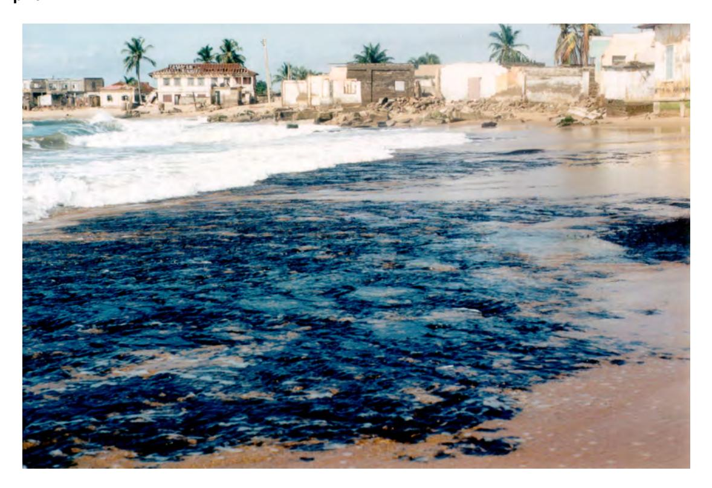

*Figure III-5-2. Peat exposed on a beach along the Keta shoreline in Ghana, West Africa, May 1996*

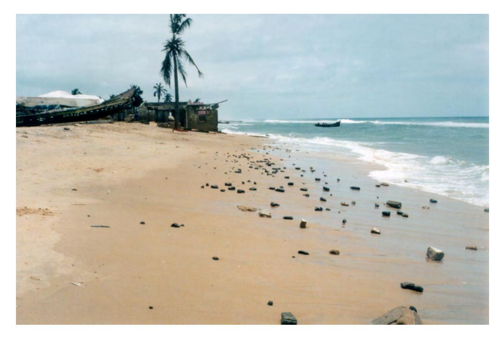

*Figure III-5-3. Pieces of eroded clay (and some rubble) scattered on a beach along the Keta shoreline in Ghana, West Africa, September 1996*

(c) Springs or surface runoff across a beach. Figure III-5-4 shows springs near the waterline along the beach in Ghana which result from groundwater flow over the impervious underlying clay and peat sediments. In this case, the groundwater flow gradient is driven by the presence of an enclosed lagoon with water levels higher than mean sea levels on the other side of the washover terrace.

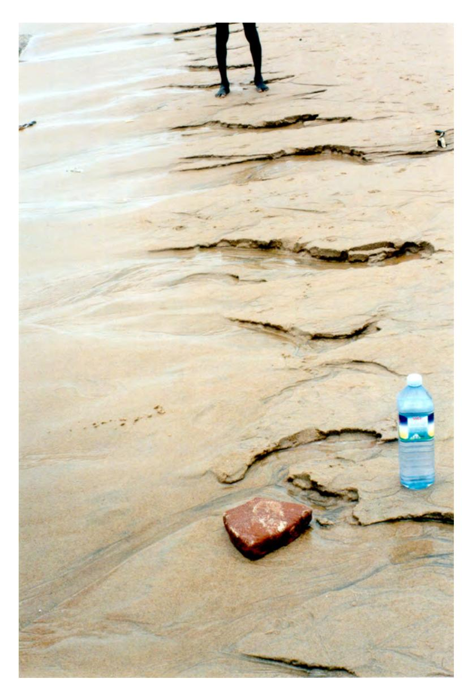

*Figure III-5-4. Springs flowing over the beach surface along the Keta shoreline in Ghana, West Africa, September 1996*

- (d) Discoloration of water in the nearshore zone. Along eroding bluff shorelines, the water takes on the color of the bluff sediment in response to wave attack. Figure III-5-5 shows discoloration of the seawater near the shoreline caused by erosion of underlying lagoon sediments along the Ghana shoreline. At this location, this was the first evidence that easily erodible cohesive sediments existed in the nearshore zone.
- (e) Permanent undulations in the shoreline planform may also signify the presence of cohesive or consolidated sediments in the nearshore zone with alongshore variability in erosion resistance. These features are best identified through oblique or overhead aerial photographs. An example along the Ghana

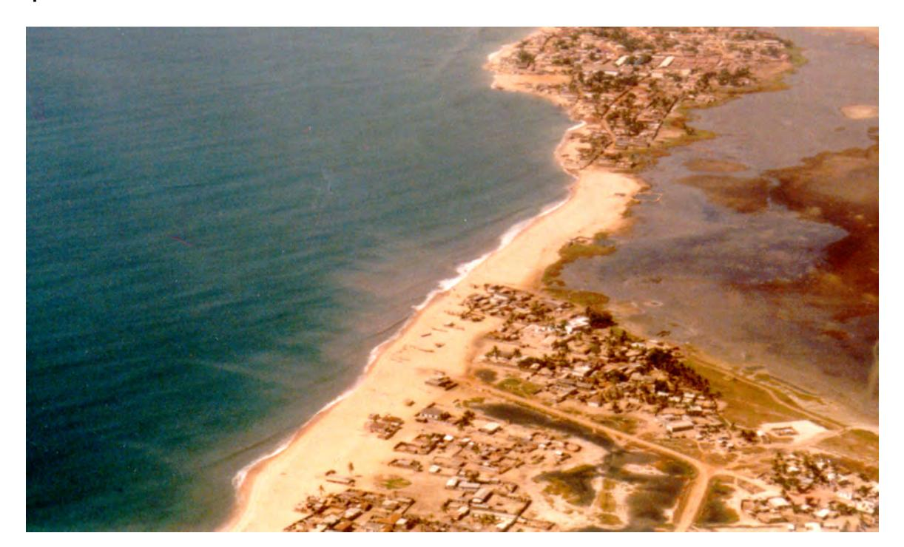

*Figure III-5-5. Discolored water from erosion of exposed cohesive sediment along the Keta shoreline in Ghana, West Africa, July 1996*

coast is shown in Figure III-5-6. These same undulations could be seen at the same location in several aerial photos taken over a 35-year period. Therefore, these features are distinguished from migrating alongshore sand waves which also occur here. Subsurface investigations at this location have subsequently revealed considerable alongshore variability in the stratigraphy of the underlying sediments, possibly relating to the presence of old channels into the lagoon inshore of the present beach.
- (f) Finally, exposed cohesive sediments can often be identified in the troughs between offshore bars through a swimming or diving survey.
- (6) At the site in Ghana, subsequent to the initial visual observations of evidence of the presence of underlying cohesive sediments, a series of subsurface investigations was completed to define these conditions. These included augers, boreholes, vibracores and sub-bottom profiling. Use of more detailed subsurface investigations to confirm visual observations and provide more detailed information is discussed in Part III-5- 6.
- b. Mud shore . Unconsolidated mud coasts are generally the result of more recent deposition of cohesive sediment. Deposition requires quiet or calm hydrodynamic conditions, where large waves are rare. Muddy shore naturally occurs as mud flats and coastal wetlands in protected waters, such as estuaries and other embayments with short fetches. (1) Mud flat. Generally without vegetation, lying below high water in tidal areas (Figure III-5-7).
- (2) Coastal Wetland. Salt marsh in saltwater, stabilized by vegetation, generally above low water in tidal areas, often above mud flats (Figure III-5-8) and mangrove. Marsh vegetation stabilizes the mud bed and provides shelter in which more sediment can deposit.

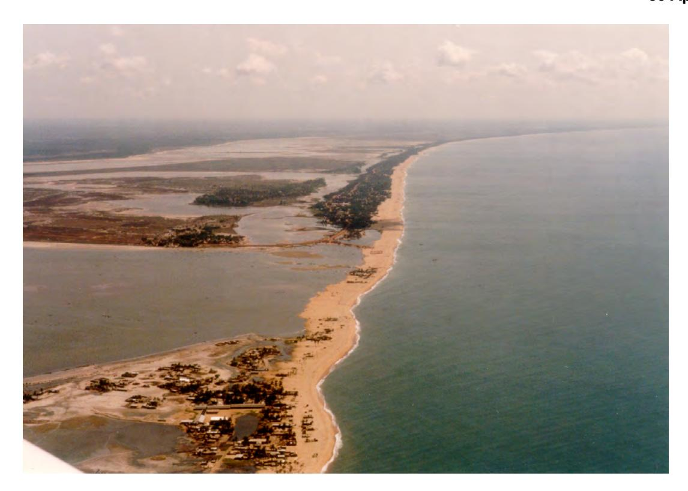

*Figure III-5-6. Permanent undulations in the Keta shoreline in Ghana, West Africa, July 1996*

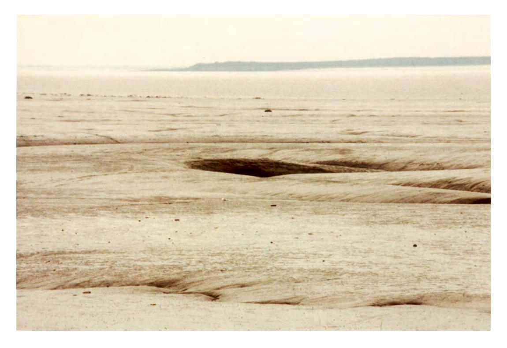

*Figure III-5-7. Mud flat in Cumberland Basin, Bay of Fundy, Canada, showing drainage gullies*

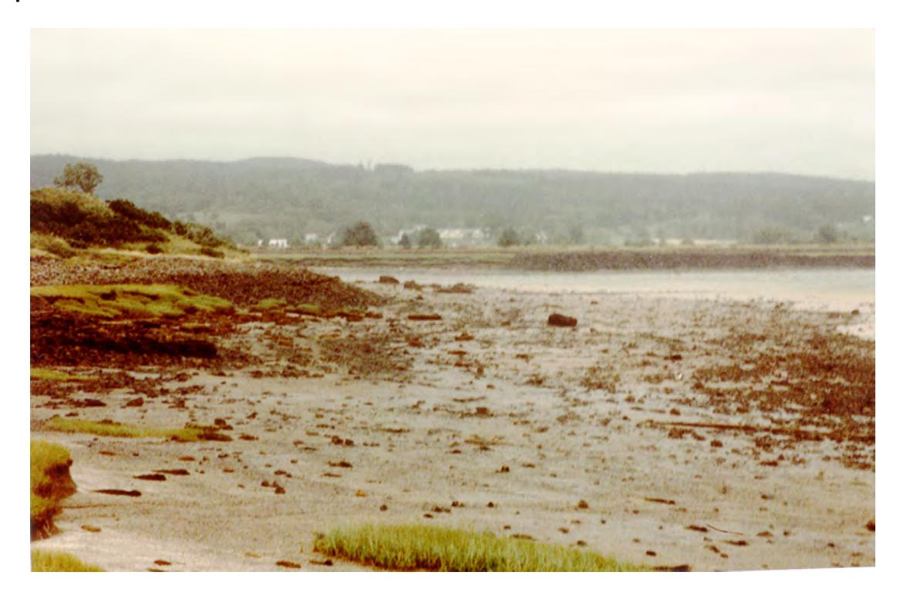

*Figure III-5-8. A mud 'beach' backed with eroding salt marsh at Annapolis Royal, in the Annapolis Bay of the Bay of Fundy. Basalt revetment at top of salt marsh is an attempt to halt the erosion*

- (3) Mangrove. Tropical coastal wetland where the vegetation, in the form of trees, can withstand relatively severe wave attack (Figure III-5-9). Depth-limited waves will penetrate a mangrove, eroding mud from around the root system in extreme storms, and endangering individual trees. Mangrove can be found between mud flats and salt marsh, and can transmit waves, which erode the adjacent salt marsh behind it.
- (4) Mud 'beach.' A sloping mud shore, exposed to wave attack often following the destruction of mangrove or other wetland vegetation (Figure III-5-8). The usual cause of wetland or mangrove destruction is property developers, municipal agencies, and individuals wishing to 'reclaim' the shore. Natural destruction occurs from the seaward edge, through undermining of the root system by waves and currents.

## III-5-3. Erosion Processes on Consolidated Shores

a. Erosion processes on cohesive shores are distinctly different from those on sandy shores. There are also differences between consolidated and mud cohesive shores. On consolidated shores, the erosion process is irreversible because, once eroded, the cohesive sediment (e.g., glacial till, glacio-lacustrine deposits, ice bonded sediments, soft rock or other consolidated deposits) cannot be reconstituted in their consolidated form in the energetic coastal environment. Furthermore, since the sand and gravel content is low in these deposits (often less than 20 percent), erosion is not balanced by an equal volume of deposition within the littoral zone. The eroded fine sediments (silt and clay) are winnowed, carried offshore, and deposited in deep water in contrast to the sand fraction, which usually remains in the littoral zone.

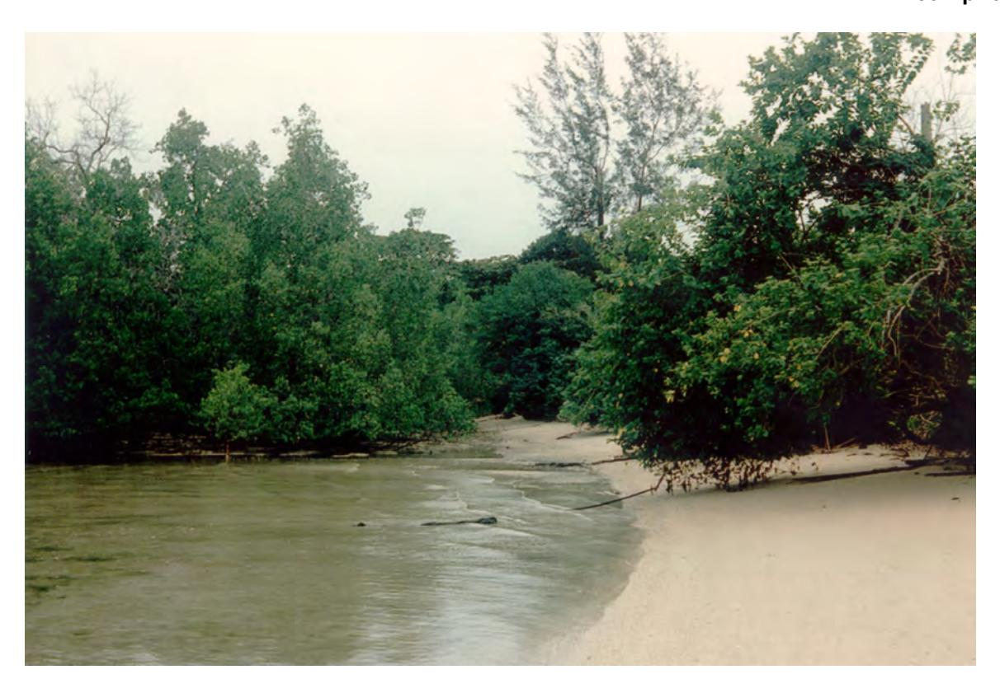

*Figure III-5-9. Sand beach disappearing into mangrove on the island of Borneo. Sediment within the mangrove is cohesive mud*

- b. Consolidated cohesive sediment is eroded by at least four mechanisms:
- (1) Through abrasion by sand particles moved by waves and low currents.
- (2) Through pressure fluctuations associated with turbulence generated at various scales such as wavebreaking-induced turbulence that reaches the lake or seabed and large-scale eddies that may develop in the surf zone. (3) Through chemical and biological influences. (4) Through wet/dry and freeze/thaw cycles where exposed to the atmosphere.
- c. Sand can also provide a protective cover to the underlying cohesive substratum. However, only when the sand cover is sufficient to protect the cohesive substratum at all times will the shore revert to a sandy classification (i.e., truly a 'thick pile of sand').
- d. On consolidated cohesive shores, the rate of lake or seabed downcutting determines the long-term rate at which the bluff or cliff retreats at the shoreline. In other words, while subaerial geotechnical processes may dictate when and where a slope failure will occur, the frequency of failures over the long term is determined by the rate at which the nearshore profile is eroded (i.e. the downcutting rate). Subaqueous and subaerial erosion processes on cohesive shores are discussed in detail in Part III-5-7. In addition, the geomorphology of cohesive shores and the relationship to erosion processes is the topic of Part III-5-5.

## III-5-4. Physical and Numerical Modeling

- a. Laboratory or physical model experiments have been used in two ways: (1) to improve the understanding of the fundamental principles of cohesive shore erosion processes, and (2) to develop a measure of the erodibility of specific samples of cohesive sediment.
- b. In the former category, scale model tests have been performed in wave flumes as described by Sunamura (1975, 1976 and 1992) for erodible rocky coasts similar to consolidated cohesive behavior, by Nairn (1986) for a section of the Lake Erie shoreline using an artificial clay, and by Skafel and Bishop (1994) and Skafel (1995) using intact samples of till removed from the Lake Erie shoreline. The tests described by Skafel and Bishop (1994) included an assessment of the relationship between wave properties (e.g., wave height, orbital velocity, type and fraction of broken waves) and local erosion rate and the relationship between sand cover and erosion rates. Laboratory experiments on erosion and deposition of mud are described in Part III-5-6c(9). The annular flume, used in both the laboratory and the field (e.g., Amos et al. 1992, Krishnappan 1993) may be regarded as a full-scale model of the response of a mud bed to shear.
- c. The primary difficulty in the use of physical model experiments of cohesive shores is the scaling of the cohesive material. At present, it is not possible to accurately scale cohesive sediment with respect to its erosion resistance properties. Therefore, model tests must be interpreted qualitatively, or full-scale tests must be conducted using low wave energy conditions. Nevertheless, the noted tests have been extremely valuable in advancing the understanding of cohesive shore erosion processes both inside and outside the surf zone.
- d. A technique of assessing the erodibility of intact samples of consolidated cohesive sediment in unidirectional flow conditions has been developed and applied by Kamphuis (1990), and, more recently, for the assessment of cohesive sediment samples removed from the southeast shoreline of Lake Michigan (Parson, Morang, and Nairn 1996). These tests are typically performed for both clear water and sand in flow conditions to elucidate the importance of sand as an abrasive agent. This approach for defining the erodibility of cohesive sediment samples is discussed in more detail in Part III-5-7b.
- e. The development and application of numerical models for describing erosion processes on cohesive shores is not far advanced owing to the complexity of the processes involved. Most numerical models may be described as little more than numerical frameworks for interpolating or extrapolating observed behavior of cohesive sediments in water. Essentially, a numerical model of cohesive shore erosion must define the near-bed flow conditions within the surf zone, the movement of any overlying noncohesive sediment cover, as well as the erosion resistance properties of the cohesive sediment (which change with time due to exposure of sediment layers and subaerial drying). Numerical modeling of cohesive shores is summarized in Part III-5-12.
- f. The best 3-D numerical mud models (e.g. Le Hir 1994) treat the water column as a continuum: from stationary consolidating bed, through fluid mud, to sediment maintained in suspension by turbulence. There are nevertheless bed sediment 'modules,' which use the equations presented in Parts III-5-7, 9, and 10 to calculate erosion and deposition, supplying sediment and new bathymetry to numerical hydrodynamic models that transport the sediment by advection and dispersion (Part III-5-8a).
- g. All mud models need to track sediment layering the composition and state of each sediment layer at each grid point in the model — more a bookkeeping function than numerical modeling.
h. Part III-5-13 provides some detailed guidance on the specific coastal engineering and management issues associated with cohesive shores. The success of engineering and management techniques on cohesive shores is dependent on a recognition of the fundamental differences between sandy and cohesive shore processes. Engineering techniques that may have been successful on the more familiar sandy shores, may be unsuitable or inappropriate along cohesive shores.

## III-5-5. Geomorphology of Consolidated Shores

This section provides a review of the geomorphology of cohesive shores and the relationship between the land forms and the erosion processes discussed in the previous sections. The discussion is subdivided under two headings: "Controlling Factors" and "Profile Types." This section focuses on the geomorphology of consolidated cohesive sediment shores. For more detail on erosion processes along rocky coasts, refer to Sunamura (1992).
- a. Controlling factors . The primary controlling factors discussed in the following paragraphs influence the geomorphology of cohesive shores: (1) Lag deposits.
- (a) Some consolidated cohesive sediment units have cobbles or boulders within their composition. For example, along the Great Lakes, glacial till may be either fine-grained or stony (i.e., containing gravel and cobbles). During the evolution of stony till shores, the cobbles and boulders that are left behind after the removal of the finer clay, silt, and sand build up to form a protective armor for the underlying till. In these cases, an erosion-resistant nearshore shelf will usually have formed. The depth of the shelf at any location is such that the lag deposit remains immobile, and therefore the depth is determined by the local wave climate and the grain size of the lag deposit. Generally, for the Great Lakes, the depth of this shelf is approximately 2 m below low water datum. Along sea and ocean coasts with large tidal ranges and longer waves, lag deposits may occur at much greater depths (e.g., lag deposits over clay have been found in water depths of 10 m below datum along the North Sea coast of England). The shelf creates what has been referred to as a convex profile, in contrast to the concave profile associated with situations where lags are not present.
- (b) The armored shelf acts to dissipate wave energy, and therefore reduce or even prevent bluff erosion. Boyd (1992) gives several examples where a bluff is protected from erosion by a nearshore shelf and notes that the reduced wave energy may also allow a stable beach to exist at the shore, providing additional protection to the bluff toe. Natural headlands along an eroding cohesive shoreline often owe their existence to the presence of a lag-protected nearshore shelf.
- (c) An example of a site where a lag deposit has resulted in an erosion-resistant foreshore and a stable shoreline is located near the town of Goderich on the Canadian shore of Lake Huron. A nearshore profile for this site is shown in Figure III-5-10. The cobble-protected shelf has a depth of 1.75 m and is about 200 m wide. The stratigraphy at the site consists of a stony till unit below the average lake level and a fine-grained till unit above the average lake level. At nearby sites where the fine-grained till unit dips below the average lake level to depths of greater than 2 m, and the nearshore shelf is no longer present, the bluff recession rates range from 0.3 m/year to over 1 m/year. (2) Different stratigraphic units.
- (a) Along most cohesive shores, 3-D variations in contact surfaces between stratigraphic units are common. This results from the complex geomorphologic conditions that formed the underlying geology, which, depending on the location, may include some combination of: glacial, lacustrine, estuarine, or fluvial

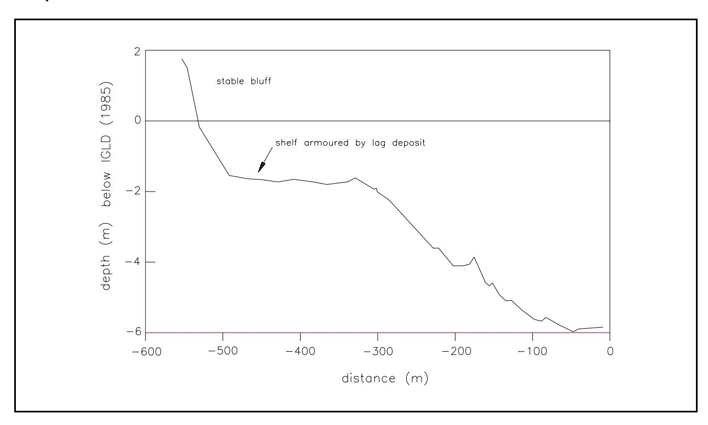

*Figure III-5-10. A convex consolidated cohesive profile with a shelf protected by lag deposits located near Goderich, Ontario, on Lake Huron*

processes. Therefore, as the shore erodes in time, the recession rates can change, as either more or less erosion resistant, units are encountered further inland. One example of the influence of erosion resistance is East Point located along the Scarborough Bluffs east of Toronto on Lake Ontario. The plan and stratigraphy cross section of this feature are shown in Figure III-5-11. Clearly, East Point is an expression of the more erosion-resistant Leaside (or northern) till unit, which dips below the average lake level at this location. Leaside till is relatively hard and includes boulder pavements (Boyce, Eyles, and Pugin 1995). Along the neighboring shore, the less erosion-resistant Scarborough clay unit exists below the lake level.
- (b) Recognition of the variation in erosion resistance of different till units resulted in an unlikely finding during the investigation of the influence of a harbor structure at Port Burwell on downdrift erosion along the north central shore of Lake Erie (Figure III-5-12). A long harbor jetty here intercepts almost all of the sand moving along the shore from west to east, therefore depriving the downdrift shore of sediment. On a sandy shore, this would be a clear case of downdrift erosion due to sediment supply starvation. However, the investigation described by Philpott (1984) revealed that cohesive shores along the north central shore of Lake Erie seldom have (and probably never had) enough sand to halt the downcutting of the underlying till. Updrift of the harbor, the trapping of large quantities of sand eventually halted the nearshore profile downcutting, and the bluff position was stabilized. However, this still did not fully explain why recession rates updrift of the harbor fillet beach were generally lower (about 1 m/year) than those on the downdrift shoreline to the east (in the range of 2 to 4 m/year).
- (c) Figure III-5-12 also describes the bluff face stratigraphy at Port Burwell. There is a change in the subaqueous stratigraphic unit at the harbor mouth, where Port Stanley till exists below the lake level on the updrift side and Waterlain till forms the nearshore profile on the downdrift side. Based on a comprehensive investigation, including laboratory testing of the erodibility of the different till units, it was concluded that Waterlain till was less erosion-resistant than the Port Stanley till. It is not coincidental that the change in till

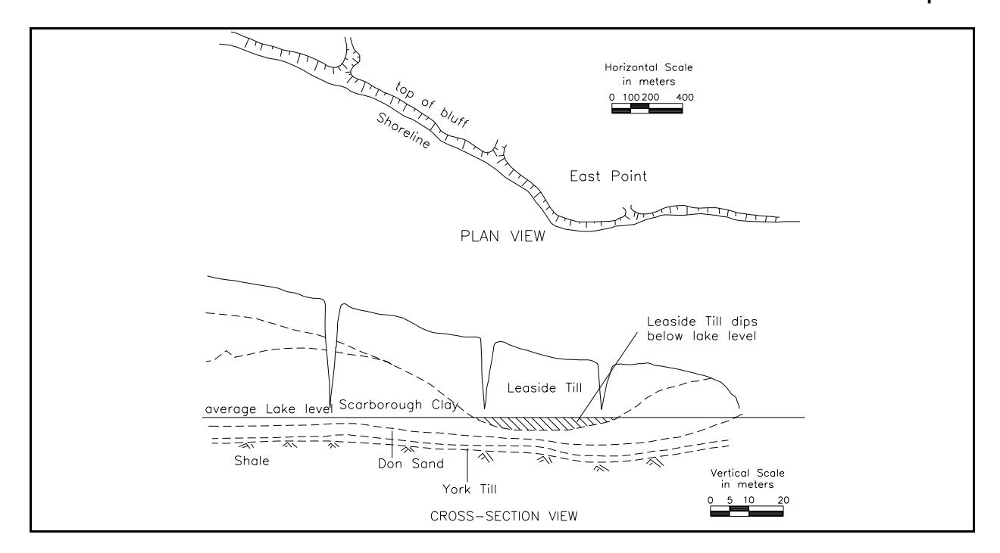

*Figure III-5-11. Plan and cross section of East Point along the Scarborough Bluffs (located east of Toronto on Lake Ontario) showing the influence of the erosion-resistant leaside (or northern) till on the local geomorphology*

occurred at the harbor mouth, as often creeks or rivers follow the interface between different stratigraphic units.
- (d) Riggs, Cleary, and Snyder (1995) provide several examples of both headlands (local areas of slowly retreating or stable shoreline) and local sections of rapidly retreating shoreline, that are a direct result of variability in the erosion resistance of different stratigraphic units that make up the shoreface. They found that headlands result from the presence in the nearshore of more erosion-resistant Pleistocene or older sediments. In contrast, rapidly retreating sections of shore consisted of sand-poor, valley-fill sediment or compact peats and clays deposited in modern estuarine environments. (3) Quantity and mobility of sand cover.
- (a) In natural situations, a protective sand cover can build up over an erodible substrate and protect it from further erosion. Investigations of Great Lakes sites have shown that approximately 200 m3 /m of sand cover (measured from the top of the beach out to the 4-m contour) is required to halt the downcutting process (Nairn 1992). However, even half as much as this quantity can afford at least some protection to the underlying cohesive substratum.
- (b) Another important factor is the volatility or mobility of sand cover. If the overlying noncohesive bed forms are rapidly and frequently changing position, the underlying cohesive substratum will be exposed to erosive situations more frequently. Nairn and Parson (1995) have indicated that on the Great Lakes, the shift of bar position in response to changing lake levels has an important influence on the exposure of the underlying till (in the troughs between the bars) to erosion. On an eroding cohesive bluff shore along the North Sea coast of England, Pringle (1985) identified alongshore migrating areas of reduced beach cover and exposed glacial till called 'Ords.' These Ords have an important role in exposing the underlying glacial till to erosion. Figure III-5-13 shows an Ord on the Holderness coast at low tide with glacial till exposed (partly

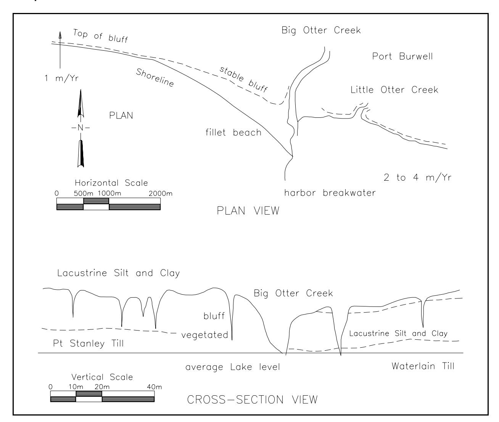

*Figure III-5-12. Plan and cross section of the Port Burwell area on the north central shore of Lake Erie showing the influence of a fillet beach and stratigraphy changes on the geomorphology of a cohesive shore*

covered with cobbles) between the upper coarse sand beach and a bar consisting of finer sand. The closeup photo of the Ord (Figure III-5-14) shows erosion of the exposed till around a 10-cm-high pedestal protected by a rock cap. Pringle (1985) found that the migration rate for these features was approximately 500 m/year, which is similar to the rate of migration for large sand waves or rhythmic features along Long Island, NY (Thevenot and Kraus 1995). An Ord could be defined as the area between two migrating sand waves. In summary, both cross-shore and alongshore variations in sand cover thickness resulting from migration of bars and sand waves or Ords, respectively, have an important influence on the rate of cohesive sediment erosion in the nearshore zone.
(c) Deposition of large quantities of sand over a cohesive substrate can occur at a change in shoreline orientation where the potential alongshore sediment transport rate rapidly decreases, or at a natural obstruction to alongshore transport, such as at a rock headland. Other instances where sand may eventually build up to protect a profile include sites where the alongshore transport of sediment is intercepted at a harbor jetty. The Port Burwell fillet beach shown in Figure III-5-6, as discussed above, protects the nearshore cohesive substratum and has stopped the bluff recession behind the fillet beach.

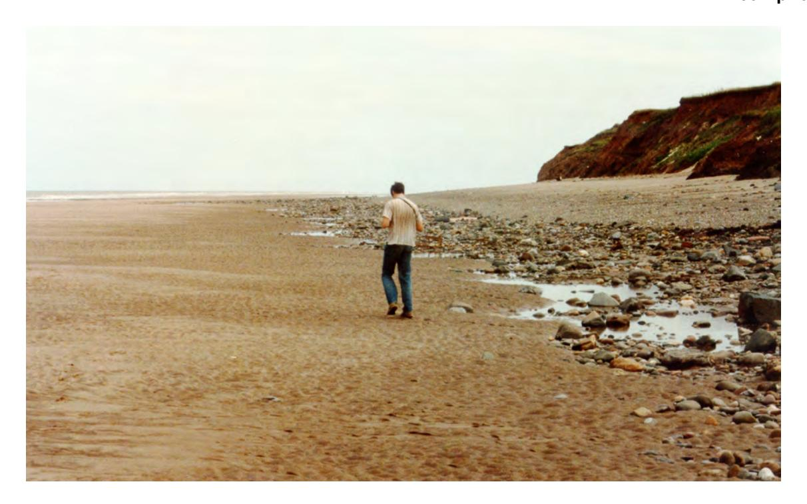

*Figure III-5-13. Bluff erosion along the Holderness coast of the North Sea. The underlying cohesive profile is exposed at low tide in a trough (referred to as an "Ord") between the upper beach and first bar*

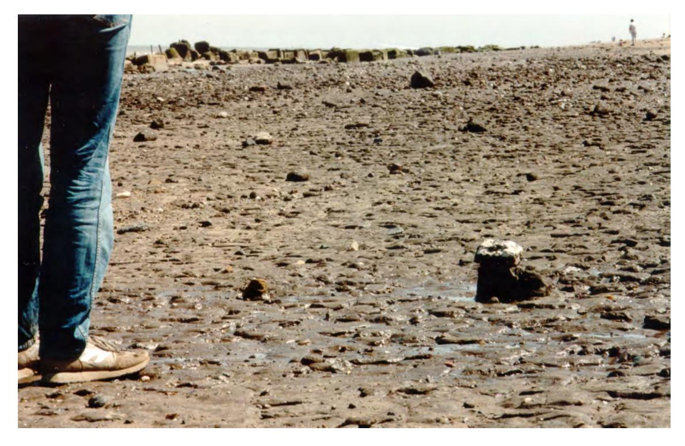

*Figure III-5-14. Close-up of the exposed cohesive profile on the Holderness coast (Figure III-5-13). A rock-capped pedestal of cohesive sediment, about 10 cm in height, has developed through erosion of the adjacent seabed*

- (d) Many areas along the Great Lakes shores that once had sufficient sand cover to protect an underlying cohesive substratum from downcutting are now coming under attack as the sediment supply has been reduced through human influences. Reductions to the sediment supply occur through entrapment of sediment at structures which protrude into the lake (including harbor jetties and land reclamation projects that have been created for many purposes, such as power plants, marinas, and docking facilities) as well as through protection of previously eroding sections of shoreline. Shabica and Pranschke (1994) describe one such area north of Chicago on Lake Michigan where the sand cover has decreased from 560 m3 /m in 1975 to 190 m3 /m in 1989. If the depletion of sediment cover continues at this site, the previously very low rates of shoreline recession (less than 0.2 m/year, or 8 in./year) may accelerate.
- (4) Local wave and water level conditions. The characteristics of the local wave and water level conditions represent the fourth controlling factor on the geomorphology of consolidated cohesive coasts. Both the intensity and the directionality of the waves can influence the rate of erosion at a particular shore site. Other factors being equal, greater wave energy translates to higher downcutting rates and more rapid shoreline erosion. Directionality of the waves can have a secondary influence on downcutting rates by affecting the mobility of the sand cover over the underlying till. Large swings in wave direction can result in a more dynamic system with respect to the sediment cover. Fluctuations in water level also have an important role in cohesive shore erosion processes as explained by Stewart and Pope (1993) and Fuller (1995). While direct erosion at the bluff toe may be accelerated during high-water conditions, low water leads to acceleration of the nearshore downcutting process (which in turn allows more waves to reach the bluff toe).
- b. Profile types . Boyd (1981, 1992) completed an extensive review of nearshore profile shapes for consolidated cohesive shores on the Great Lakes. These essentially fall into two categories: concave profiles and convex profiles. Figure III-5-15 provides a schematic description of these two profile types.

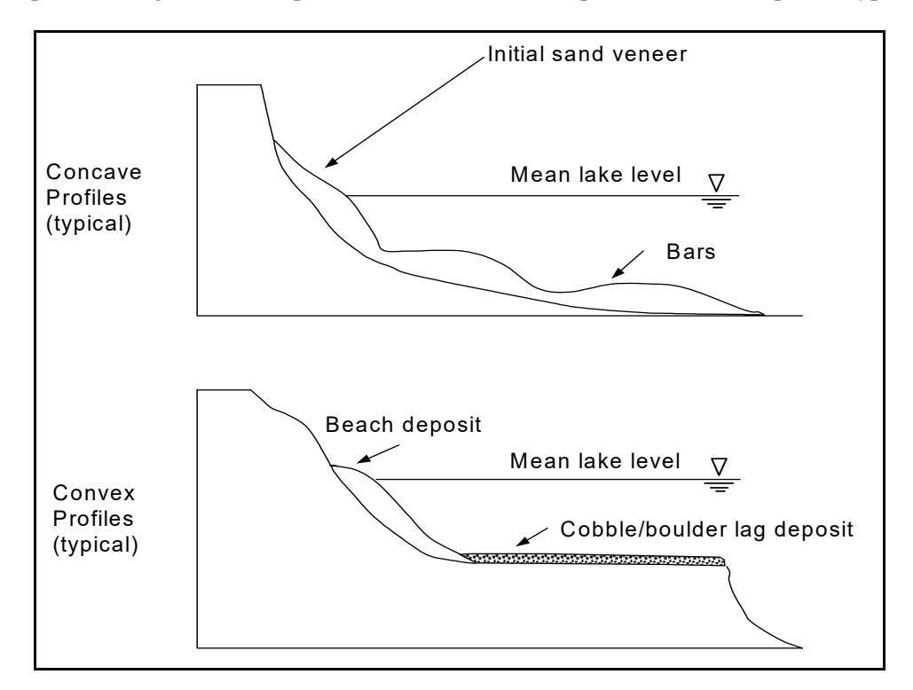

*Figure III-5-15. Distinctions between concave and convex consolidated cohesive profiles*

- (1) Concave profiles. Concave profiles develop in fine-grained sediment with a relatively uniform erosion resistance from the closure point up to the top of the bluff or cliff. These profiles have an exponential form similar to sandy shore profiles described by Dean (1977). Sand cover over these cohesive profiles can range from perhaps as little as 25 to over 200 m3 /m measured between the bluff toe and the 4-m depth contour. The sand cover can be in the form of bars, and, in areas with a sand cover in the high end of the range, a substantial beach at the shore. Stewart and Pope (1993) found that a reduction in the range of water level fluctuations would not reduce the long-term erosion rates for cohesive shores with concave profiles. As explained above, lower water levels result in accelerated lowering of the nearshore profile, which essentially has the same effect as high water levels — allowing waves to reach the bluff toe.
- (2) Convex profiles. As noted above, convex profiles develop at locations where potential lag deposits exist within the eroding material. These profiles are characterized by a nearshore shelf, which on the Great Lakes has a depth approximately 2 m below low water datum. At other locations, this depth will be determined by the median grain size of the lag deposit, the wave climate, and the range of water level fluctuations. Long-term erosion rates along these shores are less than rates for concave cohesive shores (having limited sand cover) with the same wave exposure. With the exception of high-water periods, the erosion-resistant nearshore shelf acts to dissipate wave energy before it reaches the shoreline. However, during high water periods, these shorelines are more vulnerable to erosion when waves are able to attack the bluff toe. Therefore, in contrast to cohesive shores with concave profiles, shores with convex profiles would benefit from a reduction in the range of water level fluctuations (Stewart and Pope 1993). Finally, the fish habitat function of cohesive shores with a convex profile shape is much more important owing to the surficial substrate (cobbles and boulders with limited sand cover) and the proximity to a deepwater drop-off at the edge of the shelf.

## III-5-6. Sediment Properties and Measurement Techniques

- a. Introduction.
- (1) In the case of noncohesive sand and gravel, sediment mobility can be estimated just by knowing the grain size and shape, specific gravities of the sediment and water, and the viscosity or temperature of the water (i.e., physical properties). The mobility of cohesive sediment is a more complex phenomenon. Cohesion (particle attraction) is governed by the electrochemistry of the sediment mineral and water; its state of consolidation; and in many cases, by the presence of organisms like diatoms, which can bind the sediment particles together with mucus.
- (2) The extent of data requirements will vary depending on the nature of the coastal engineering problem and the nature of the shore. This section presents an overview of the range of possible field and laboratory investigations that can be used to characterize the conditions associated with erosion, transport, deposition, and consolidation on a cohesive shore. This discussion focuses on a characterization of the specific geologic conditions related to the cohesive shore. For the measurement of environmental conditions (e.g., waves and water levels), refer to Part II-3.
- b. Consolidated shore erosion . Developing an understanding of consolidated shore erosion requires information on profile shape (beach and nearshore profile techniques are summarized in Part III-3-2), presence or absence of lag deposits, bluff and nearshore stratigraphy, erodibility of the one or more cohesive units in the active nearshore erosion zone (i.e., between high water and the depth of closure), and the sand cover thickness and stability. Available techniques to assess the characteristics listed above are as follows:
- (1) Field sampling and geotechnical analyses.
- (a) Testing may be performed in situ or in a laboratory on samples extracted from the field. Extraction techniques for seabed or lake bed cohesive sediments include: dredging; coring; box coring; and cutting samples (the latter using a chainsaw with a trenching chain). As noted in Part III-5-6, it is important to retrieve intact samples that, to the extent possible, preserve the natural structure of the cohesive sediment.
- (b) None of the available standard geotechnical test procedures provide a direct measure of the erosion resistance of a cohesive sediment in the coastal environment. Nevertheless, the more important characteristics that provide an indirect assessment of erodibility include: grain size analysis (including clay content); liquid and plastic limits; water content; undrained shear strength; bulk density; and consolidation pressure. Techniques for establishing these parameters are presented in the USACE Engineering Manual "Laboratory Soils Testing" (EM 1110-2-1906). Undrained shear strength can be determined in the field using a cone penetrometer or a vane shear apparatus.
- (c) Borehole information can be valuable for assessing variations in stratigraphy both above and below the water level. (2) Laboratory erodibility experiments.
- (a) There are no standard and accepted approaches for establishing the erodibility of cohesive sediment in the coastal environment based on geotechnical properties. Therefore, to quantify the relationship between erodibility and shear stress applied under a given flow condition, it is usually necessary to perform laboratory experiments. Experiments may not be required where direct techniques have been applied to determine the erodibility of similar sediment. It is advisable that these experiments be performed with intact, and to the extent possible, undisturbed samples of cohesive sediment in order to preserve the natural structure of the soil.
- (b) Four laboratory techniques for assessing erodibility are briefly reviewed in this section. These provide an example of the range of techniques that are available.
- (c) Arulanandan, Loganatham, and Krone (1975), and more recently Zeman (1986), describe the use of a rotating cylinder apparatus to assess the erodibility of intact and undisturbed samples of cohesive sediment. This technique is also mentioned for testing the erodibility of mud. In this approach, a long cylindrical sample is mounted inside a larger transparent cell. The cell is then filled with water and rotated. During rotation, the torque transmitted to the inside stationary cylinder is measured to quantify the shear stress applied to the sample. At the end of the test, erosion rates are determined by the loss in mass of the sample. A disadvantage of this approach is the inability to introduce sand to the flow to assess the important influence of sand abrasion.
- (d) Another small-scale laboratory technique for testing intact and undisturbed samples is described by Rohan et al. (1986). This procedure is based on an adaptation of the standard pinhole test. Water is circulated through a hole drilled through the axis of a cylindrical sample. The head loss caused by friction in the sample is measured using differential manometers in order to assess the shear stress applied to the soil by the flow. Depending on the size of the hole bored in the sample, it is possible that this technique could be adapted to assess the influence on erosion of sand in the flow.
- (e) At a larger scale, intact and undisturbed cohesive sediment samples can be placed in a drop section in the floor of a unidirectional flow flume or tunnel. The sample is then exposed to different flow conditions with and without the presence of sand, and the erosion of the sample surface is surveyed intermittently to determine erosion rates for the different conditions. This technique is also frequently used for mud. Kamphuis (1990) describes the use of a tilting tunnel in which Pitot tubes were used to determine a velocity
profile upstream and downstream of the sample in order to determine the shear stress applied to the sample by the flow. Cornett, Sigouin, and Davies (1994) describe a similar approach using a tilting flume for the analysis of samples extracted from the bed of Lake Michigan near St. Joseph Harbor (Parson, Morang, and Nairn 1996). In this case, a laser doppler velocimeter measured the velocity profile near the bed in order to establish the shear stress applied to the sample by the flow (Figure III-5-16). This figure shows a sand veneer migrating over the till sample in the unidirectional flow flume. In both the Kamphuis (1990) and the Cornett, Sigouin, and Davies (1994) tests, the maximum flows generated were in the range of 3 to 3.5 m/sec (10 to 12 ft/sec). Results from experiments using this technique to estimate erodibility are presented in Part III-5-7b.

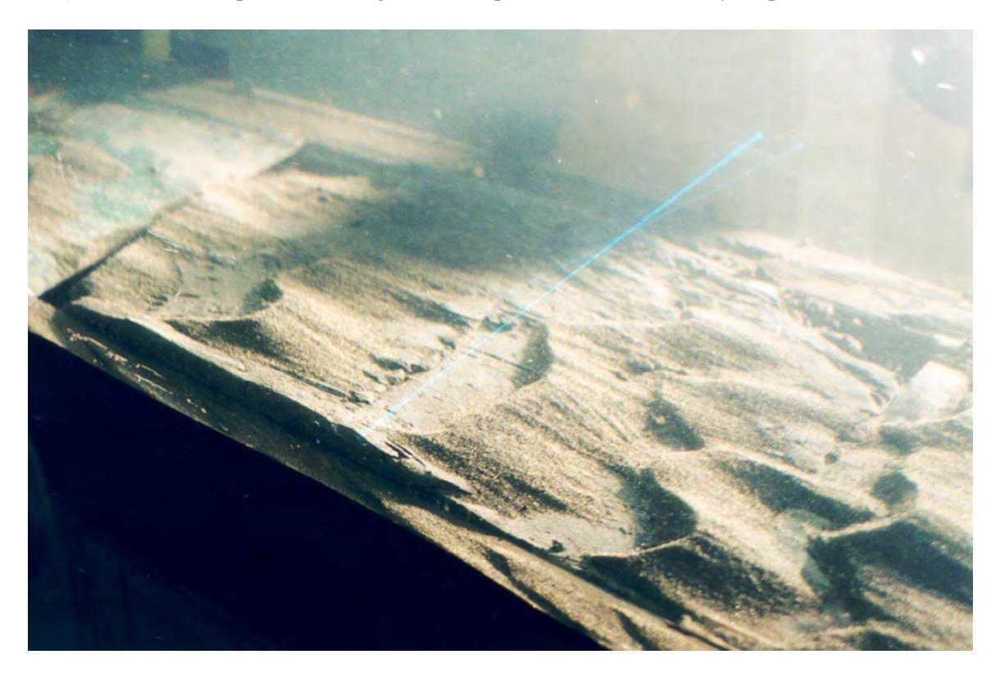

*Figure III-5-16. Laser doppler velocimeter (LDV) used to determine shear stress exerted on the till bed in a unidirectional flow flume test. This test features sand in the flow acting as an abrasive*

(f) The most realistic approach that can be taken to assess erodibility in a laboratory setting is to create a nearshore profile with intact and undisturbed cohesive sediment samples in a wave flume or basin. This approach was used by Skafel and Bishop (1994) to complete important research into the erosion processes on cohesive shores. Intact samples, measuring 1 m by 0.35 m by 0.45 m, encased in an open-ended steel box were extracted from the top of a bluff on Lake Erie and placed directly in a wave flume. The open-ended steel box was pushed slowly into the till by a 20-ton hydraulic ram and the till at the inner end of the box was cut away using a chainsaw with a trenching chain. The box was then removed with a crane. The till boxes were installed in the flume to create the desired profile shape. In these tests, the effects of sand cover in the form of migrating bars or a patchy veneer were tested. Also, the influence of breaking waves on the erosion of the cohesive sediment was assessed.
- (3) Field techniques for assessing surface and subsurface conditions.
- (a) One of the most important pieces of information in characterizing a cohesive shore profile is the sand cover thickness across the underlying cohesive profile (i.e., measured from the bluff toe out to a depth of at least 4 m). In addition, where the cohesive profile is exposed, it is also important to determine whether or not a protective lag deposit exists. As with any coastal engineering site investigation, beach and nearshore profiles are essential information. In this section, a variety of techniques for characterizing the surface and subsurface conditions, with particular focus on the sand cover thickness, are presented, ranging from the simplest to the most sophisticated.
- (b) The simplest technique of estimating the thickness of the sand cover across the profile involves the following tasks:
- Complete a beach and nearshore profile from the toe of the bluff out to the depth of closure (between the 5- and 10-m water depth).
- Through the use of a steel probe or test pits, attempt to determine the thickness of sand cover near the waterline.
- Estimate the shape of the underlying cohesive profile (as a smooth exponential form) joining points between the toe of the bluff, the position of the till at the waterline (if determinable), and the troughs between the bars on the profile. Typically, the till will be exposed or only thinly covered in the troughs. If repeated profiles are available at a site, these may provide additional information on the position of the underlying till if the position of the troughs between bars shifts between surveys.
- (c) In order to complement the simple technique described above, a diving inspection could be completed across the profile. The diver could use an underwater video to document conditions, and a steel probe to estimate sand cover thickness at different locations. Depending on the extent of sand cover, the till may be exposed in some areas. Alternatively, a frame-mounted video camera lowered from a boat or a remotely operated vehicle with video could be used. Video is also valuable in assessing whether or not a lag deposit exists where the cohesive layer is exposed.
- (d) In place of a simple steel probe, a jet probe could be used to survey the thickness of the sand cover on the land and underwater. A jet of either water or air can be used to penetrate the sand cover (the latter is only applicable underwater). Shabica and Pranschke (1994) describe the use of a hydraulic probe consisting of an extendible 20 mm diameter pipe through which water is pumped at 2.8 kg/cm2 (40 psi).
- (e) A technique based on electrical resistivity has been used to establish the sand thickness across the subaerial section of beach for sections of the Holderness shoreline. This method is particularly useful at locations with large tidal ranges that allow for significant sections of the profile to be surveyed at low tide.
- (f) Ground-penetrating radar was used to survey the thickness of the sand cover for several profiles downdrift of St. Joseph Harbor (Parson, Morang, and Nairn 1996). The limitation of this technique is that it can only be used in a freshwater environment.
- (g) Sub-bottom profiling, or high-frequency seismic imaging, is another geophysical technique that is capable of establishing the thickness of sand cover over an underlying cohesive profile. Side-scan sonar is an acoustic technique that provides an image of the seabed or lake bed surficial conditions. While this procedure would not be capable of determining the thickness of sand cover, it could provide useful surficial information such as the extent of exposed gravel and cobble lag deposits. These methods are described in Part IV-5 in greater detail.
- c. Erosion, transport, and deposition of mud. In the case of mud, it is useful first to examine the following hydrodynamic sediment properties that will be required by the equations presented later:
- (1) Cohesion. The cohesive bond is predominantly electrochemical, increasing with the electrical conductivity of the ambient water and proximity of the particles. Conductivity increases with salinity. The bond between particles may be enhanced, particularly at rest on the bed, by biological 'glues' such as the mucus excreted by diatoms, worm tubes, and feces (Paterson 1994). (2) Critical shear for erosion.
- (a) As water flows over the mud bed, as either steady flow or oscillatory flow under tides and waves, it exerts a shear stress τ on the bed due to viscosity and turbulence (described in greater detail in Part III-6). Not only is shear a real physical stress on the bed sediment, but it also serves as empirical shorthand for the level of turbulence in the flow. Thus, it is a useful parameter in describing suspended load sediment transport; as well as fluid mud (bed load), erosion, and deposition.
- (b) At the level of a stationary particle on the bed, shear forces are balanced by the forces of gravity, interparticle friction, and cohesion. Shear is augmented by lift and drag, making the force balance

```math
SHEAR + LIFT + DRAG < GRAVITY + FRICTION + COHESION
```

a vector sum, the same as that for noncohesive sand and gravel, but with the addition of cohesion. As flow increases, the left-hand side of this balance increases approximately as the square of velocity, until

```math
SHEAR + LIFT + DRAG = GRAVITY + FRICTION + COHESION
```

and the formerly stationary particle leaves the bed and begins to move. The shear stress at which this occurs is known as the critical shear for erosion or erosion threshold τc. τc is still shorthand for the entire left-hand side of the balance, not shear alone.
- (c) The sediment 'particle' may be an individual grain; but more likely a floc, made up of several grains held together by cohesion. Cohesion plays the major role in the right-hand side of the force balance, and failure (erosion) will occur where cohesion is weakest.
- (d) Critical shear τ c is not a particularly useful concept in fluid mud. At the water/fluid mud interface, the applied shear stress is balanced by a shear strain (flow) of the fluid mud, rather than GRAVITY + FRICTION + COHESION. Also, the fluid mud is essentially a thick, viscous, laminar, boundary layer, protecting the stationary bed from any SHEAR + LIFT + DRAG approaching τc. Erosion of fluid mud is better described by densimetric Froude Number entrainment between two fluids (Part III-5-7e).
- (3) Erosion rate at twice critical shear. Both the Parthenaides and Krone Equations (Parts III-5-7d and III-5-9c) are 'excess shear' fits to observed erosion and deposition, respectively. For example, the Parthenaides Equation (Part III-5-7d) correlates observed erosion rates with

```math
\mathrm { D i m e n s i o n l e s s \, E x c e s s \, S h e a r } = \left( \tau _ { \mathrm { c } } - \tau \right) / \ \tau _ { \mathrm { c } } ; \mathrm { n e g a t i v e } \ \left( \tau _ { \mathrm { c } } < \tau \right) \mathrm { f o r \, e r o s i o n }
```

The Parthenaides coefficient Mp (in units of kg/m2 /sec) (see Equation III-5-1), is the correlation coefficient between erosion rate and excess shear, when dimensionless excess shear = -1; that is, when τ = 2τc.
- (4) Critical shear for deposition.
- (a) A critical shear stress for deposition τ s Pa (lbf/ft2 ) is not obvious at first glance. In noncohesive sediment, the critical shear for deposition is only slightly less than that for erosion: a noncohesive particle
will come to rest almost as soon as the shear is too small to move it. But the process of deposition of cohesive sediment flocs is quite different; \tau_s is generally on the order of one fourth of \tau_c
- (b) High shear near the bed breaks up large flocs before they can settle. Then, the resulting smaller flocs and individual particles are resuspended. The critical shear for deposition \tau_s is that through which large flocs can pass without being broken up. Note that \tau_s is not shorthand for something more; \tau_s really is the shear stress in the bottom boundary layer which cannot overcome cohesion in the settling flocs. (5) Sediment, fluid mud, and water densities. (a) Important densities and specific gravities: \rho_w = specific gravity (mass density) of water 1,000 kg/m³ (62.4 lb/ft³) in fresh water, up to 1,030 kg/m³ (64.3 lb/ft³) in seawater \rho_s = specific gravity (mass density) of sediment mineral (no voids): generally 2,000 kg/m<sup>3</sup> (125 lb/ft<sup>3</sup>) to 2,700 kg/m<sup>3</sup> (170 lb/ft<sup>3</sup>) depending on mineral (b) Bulk sediment density voids filled with ambient water: Of freshly deposited flocs (may be fluid mud if < 1,100 to 1,200 kg/m³ (70 to 75 lb/ft³), corresponding to a mass concentration in excess of about 20 kg/m³ (20 ppt)). Of existing bed surface, and layers, e.g., 1,400 kg/m<sup>3</sup> (90 lb/ft<sup>3</sup>). Of fully consolidated sediment, generally < 2,000 kg/m<sup>3</sup> (125 lb/ft<sup>3</sup>). (6) Grain size and settling velocity.
- (a) Settling velocity is a more important hydrodynamic property of cohesive sediment than grain size. Settling velocity is a measure of the sediment's behavior in suspension; grain size only allows us to guess the settling velocity.
- (b) The first thing to know about cohesive sediment grain size is that it is not a measurable physical constant. True, the size of individual dispersed grains may be inferred from measurements of their settling velocities in distilled (free of dissolved chemicals) water: generally on the order of 10-μ or less. The settling velocity of a 10-μ sphere, 2,500 kg/m<sup>3</sup> (156 lb/ft<sup>3</sup>), in water of 20 °C (68 °F) is 0.06 mm/sec (0.002 in./sec).
- (c) But cohesive sediment of this size in natural, often salt, water does not stay dispersed for long. Grains stick together when they come close enough for the cohesive forces to overcome the fluid shear and gravity keeping them apart. Aggregations of cohesive sediment grains are called 'flocs.' Flocs are larger than individual grains, of course, but because of water trapped within the floc, they are also less dense than
the pure mineral. Depending on the relationships among floc size, shape, and density, the result is a floc settling velocity that may be more or less than that of individual grains. The settling velocity must be determined with the natural sediment in the natural water.
- (d) Mud may also be biologically cohesive (Paterson 1994), for example, due to mucus excreted by diatoms. Biological cohesion is even more difficult to predict than electrochemical, providing yet another reason for using natural sediment and natural water in determining floc size and settling velocities. (7) Degree of consolidation.
- (a) The degree of consolidation u is defined as the ratio of the bulk density of the sediment to the bulk density of the 'fully consolidated' sediment, measured under Part III-5-6b(5). Consolidation of cohesive sediment is the compaction of the soil mass accompanied by drainage of the interstitial water, just as with noncohesive sediment. The principal difference is the length and cross-sectional area of the drainage path. In cohesive sediments, the path length is long and the area is small (i.e., low permeability); slowing down drainage and consolidation. Drainage is through the bed surface, into the ambient water, so that a good relative measure of the length of the drainage path P is the depth of burial below the surface. Cross-sectional area of the drainage path must be inferred from measurements of permeability.
- (b) Overburden speeds up consolidation but increases the length of the drainage path, especially when the overburden is also cohesive. Nevertheless, consolidation starts at the bottom of a sediment layer and follows the draining water upward, giving even a freshly deposited layer a density gradient, denser at the bottom to less dense at the surface, until the entire layer is fully consolidated. The strength of the sediment represented by the critical shear for erosion τc increases with density and consolidation.
- (8) Field measurement techniques. Many of the cohesive sediment field and laboratory measurement techniques are the same as those for noncohesive sediment (Part III-1). Nevertheless, some accommodation must be made for mud:
- (a) Bed sampling. Much depends on knowledge of the composition and density of surficial sediments, which can be gained from laboratory analysis of surface samples obtained in the field. It is unreasonable to expect that undisturbed mud samples can be collected. In fact, it is difficult to contain most surficial mud in the commonly used Shipek or Ponar grab samplers because the samples leak out. Underwater samples may have to be obtained by divers, and all samples that include entrapped water should be transported in sealed jars and stored at 4 EC (39 EF).
- (b) Boreholes and cores. The techniques give information on subsurface sediment layers. Blow counts and cone penetration tests give a relative measure of the strength and density of the layers (but not of the critical shears for erosion and deposition of mud, see below), and cores taken from the layers are as close to undisturbed samples as is possible in cohesive sediment. Boreholes should extend to bedrock or similar hard, impenetrable layers, with cores and cone penetration tests in each major layer.
- (c) Suspended sediment sampling. This type of testing is needed to determine composition and quantity of sediment in suspension. Generally, the technique is to pump and filter 4 L of suspension and transport the filter and contents to the laboratory for subsequent analysis. Alternatively, 1 L of suspension may be sealed in jars and transported to the laboratory for filtering and analysis there; this liter may be obtained by pumping or from any of the proprietary suspension samplers. Filters should be no larger than 10 microns. Sampling should be carried out at a minimum of four elevations over the depth, with special attention to the near-bed or fluid mud layer.
- (d) Settling tube. Field settling tubes, e.g., the 'Owen Tube' (Eisma, Dyer, and van Leussen 1994) measure the settling velocity of cohesive sediment flocs in 'live' natural water, even in a natural level of turbulence. Typically an undisturbed sample of sediment-water suspension is captured in a horizontal tube. The tube is immediately turned into the vertical position, and the settling velocity of the flocs is determined from density changes that occur in the suspension at various depths in the tube and over various times.
- (e) Piezometers. These instruments measure rate of drainage of excess pore pressure from natural muds, and thus permeability and rates of consolidation. Lancelot (Christian, Heffler, and Davis 1993) is a piezometer that first creates excess pore pressure on its insertion in the mud bed, and then measures the rate of decay or drainage.
- (f) Optical techniques. These techniques are primarily used as a substitute for suspended sediment sampling. Two basic techniques are used: measuring light transmitted through a known illuminated volume of suspension in a turbidity meter or transmissometer (e.g. Bartz, Zaneveld, and Pak 1978); or measuring light reflected from the suspension by an 'Optical Backscatterance (sic) Sensor' or OBS (e.g. Sternberg, Shi, and Downing 1989). Both require calibration against natural sediment in known concentrations in natural water.
- (g) Acoustic techniques. Many novel applications are still under development, mostly in the highfrequency (MHz) range, where for example, suspended sediment concentration and grain size profiles can be measured (e.g. Hay and Sheng 1992). At lower frequencies, echo sounding detects the elevation of the bed and of the surface of fluid mud; and in the side-scan mode, detects bed forms such as ripples and dunes, and their orientation (Hay and Wilson 1994). At still lower (seismic) frequencies, sound penetrates the bed and detects the interfaces between sediment layers of different densities, creating sub-bottom profiles.
- (h) Radioactivity techniques. In these techniques, Gamma rays or X-rays are passed through a sediment/water suspension or bed layer (e.g. Sills 1994). The energy passing can be related by calibration to the mass density of the suspension or layer. These techniques are particularly useful in characterizing fluid mud layers, as and where they occur. Radioactivity techniques are also used in laboratory consolidation columns.
- (i) Direct shear techniques. There are several field devices that apply a variable shear stress to the surface of a cohesive sediment bed (Gust 1994), and measure the variable rate of erosion (increase in suspended sediment in the water column) and deposition (decrease in suspended sediment in the water column). Results can be used directly in the Parthenaides and Krone equations (Equations 5-1 and 5-4) respectively. The prototype for all such devices is the annular flume, described under Part III-5-6b(9) "Laboratory Measurement Techniques," and sketched in Figure III-5-17. The Sea Carousel described by Amos et al. (1992) is an example of field adaptation of the annular flume.
- (j) Correlation with shear strength. Although the critical shear for erosion τc would seem to be a function of the shear strength of soft cohesive soil (measured by vane, cone, or penetrometer), the form of that function is not yet known and certainly not linear. Even measuring mechanical surface shear directly on tidal mud flats (Faas et al. 1992) produces mechanical yield stress an order of magnitude larger than the hydrodynamic τc. (9) Laboratory measurement techniques.
- (a) Grain size analysis. Standard ASTM D422 laboratory techniques should be applied to determine the physical size of individual grains in bed, core, and suspended sediment samples. Although no ASTM standard has been published, the pipette technique (removing a known volume of suspension from a known

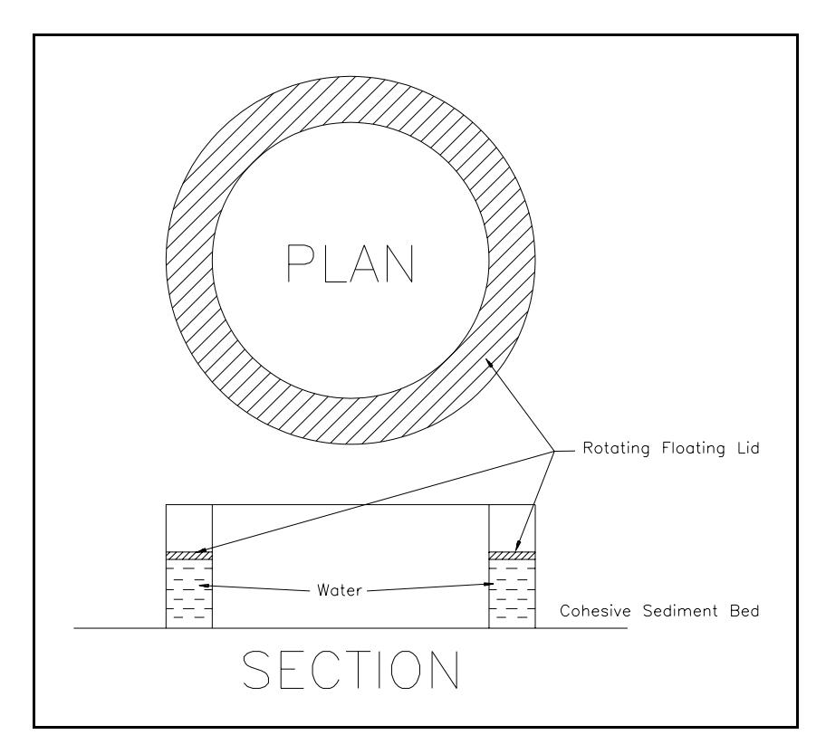

*Figure III-5-17. Prototype direct shear device, the annular flume*

elevation in the settling column, and filtering or drying to determine sediment concentration), is an alternative to the hydrometer technique. Total dry weight of suspended samples is also required to give field concentration in mg/l (ppm). Both hydrometer and pipette techniques measure settling velocity, and infer grain size from it. The settling column also measures settling velocity in the manner of a large-scale (typically greater than 1 m (40 in.) deep, 0.3 m (12 in.) diameter) hydrometer or pipette test (Gibbs 1972). Sensitive differential pressure transducers record the variations in suspended sediment concentration with depth and time, from which settling velocity distribution in the sample can be computed. Like the consolidation column below, settling columns need to be well-isolated from vibration and temperature changes to prevent artificial flocculation of the settling particles. For clay particules (<4 m), it will be necessary to use a nonstandard particle counter, e.g., Coulter counter. Nonstandard (natural water) hydrometer, pipette, or settling column tests should be used to estimate settling velocity of the flocs and bulk density of deposited sediment.
- (b) Consolidation column. A consolidation column is a cylinder containing 2 to 3 m of natural sediment and natural water in a vibration-free environment to ensure natural rates of consolidation (Sills 1994). Variations in pore pressure with time and depth (overburden) are measured with piezometers, and in density, with gamma ray or observed volume. Estimates of permeability (length and diameter of drainage paths, and variation with bulk density) come out of the same measurements, using Equation 5-6, for example.
- (c) Direct shear techniques. There are several laboratory devices that apply a variable shear stress to the surface of a cohesive sediment bed and measure the variable rate of erosion (increase in suspended sediment in the water column) and deposition (decrease in suspended sediment in the water column). Results can be used directly in the Parthenaides and Krone Equations of Parts III-5-7d and III-5-9c, respectively. The prototype for all such devices is the annular flume (e.g., Krishnappan 1993), sketched in Figure III-5-17. An annular flume is simply an endless channel in which the shear or velocity of rotation of the lid can be varied
and the changes in the mud bed can be inferred from changes in suspended sediment concentration, measured using one of the techniques described above. The shear force driving the circulation can be measured directly as the force needed to rotate the lid. Laboratory annular flumes generally rotate the flume and the lid in opposite directions, to minimize secondary radial circulation of the water, and to obtain a more uniform distribution of shear on the mud bed. An increase in suspended sediment corresponds to a decrease in the mass of sediment on the bed m and a decrease in suspended sediment to an increase in the mass of the bed. It is then possible to extrapolate these measured shear stresses to τc and τs, at which erosion or deposition ceases; and to interpolate the Parthenaides coefficient Mp and fall velocity w (Example Problem III-5-1).
(10) Calibration techniques. Ideally, one should be able to measure all the hydrodynamic properties of a cohesive sediment, and proceed directly to a model of the shore. The model, however, will always need calibration and verification against measurements of erosion and deposition, to fine tune measurements and confirm that the model represents the shore. With some of the hydrodynamic properties unknown, the model can be used to choose between high and low values of the unknown properties, using "design of experiments" techniques (Willis and Crookshank 1994). This still requires intelligent estimates of high and low values of the unknown properties and good field measurements of erosion, deposition, or transport.

## III-5-7. Erosion Processes

- a. Shear stress .
- (1) The formulae for predicting the movement of cohesive sediment predict rates of erosion and deposition, not transport. Try putting a typical cohesive floc size into a noncohesive sediment transport formula (Part III-6) and you will predict virtually infinite transport rates, in which the predicted density of 'sediment in suspension' may exceed its real density on the bed. Noncohesive sediment formulae are generally based on transport limitations: assuming there is a sediment supply to match the transport potential. Cohesive sediment formulae are generally based on supply limitations, and assume the flow can transport all eroded sediment. They define the sediment exchange between the bed and the water column.
- (2) The cohesive sediment formulae are also less theoretically based. They form a simple numerical framework for interpolating and extrapolating observed hydrodynamic behavior of cohesive sediment. Generally erosion or deposition is correlated with the excess shear stress. b. Erodibility of consolidated sediments .
- (1) There have been many studies of the erosion resistance of cohesive soils to flowing water. Very few of these investigations have considered the much more complex flow conditions encountered in the coastal zone. Nevertheless, a basic understanding, such as it is, of the complex process of erosion of consolidated cohesive soil provides a basis for assessing the erosion resistance of cohesive soils in the coastal environment.
- (2) The erodibility of cohesive soils is controlled by the bonds between cohesive particles. Many tests of remolded cohesive sediments have found that the most important parameters in describing the erodibility of cohesive sediments include consolidation and physio-chemical conditions, both of which influence the degree of bonding between particles. Aside from the difficulty of obtaining intact cohesive samples, the reason for testing remolded and reconsolidated samples is to establish the erodibility of recompacted clays, used as construction materials. Extensive investigations into the relationships between the properties of these 'homogenous' cohesive sediments (e.g., consolidation and other geotechnical parameters), and the physio-chemical properties of the fluid (including temperature, pH, and salt or cation content) have found a direct relationship between these parameters and erodibility (Croad 1981; Arulanandan, Loganatham, and Krone 1975).
- (3) More recent investigations of intact consolidated sediment samples have found that the natural structure of the material, including the presence of fissures, fractures, and seams of noncohesive materials such as silt and fine sand, is the most important factor in determining erodibility (Lefebvre, Rohan, and Douville 1985; Hutchinson 1986). The natural structure is uniquely defined by the environmental conditions during the original deposition and subsequent weathering of the sediment (including overconsolidation during glacial periods for some sediments). Conventional geotechnical parameters such as clay content and shear strength do not provide a direct measure of the influence of the natural structure of consolidated sediments as it relates to erodibility. Nevertheless, Kamphuis (1987) suggested that the presence of fissures in samples may be indirectly reflected in the undrained shear strength, consolidation pressure, and clay content.
- (4) A technique for assessing the hydraulic erodibility of natural and engineered earth materials including both soil and rock is described by Annandale (1996). This empirical method, which provides a relationship between threshold stream power for erosion and an erodibility index, was developed from field observations of spillway performance downstream of dams. The erodibility index is determined as a scalar product of indices representing the following material properties: (1) mass strength, (2) block/particle size, (3) discontinuity/interparticle bond shear strength, and (4) shape of the material units and their orientation relative to the flow velocity.
- (5) For clay materials as for mud, the erodibility index is primarily a function of the shear strength of the soil. Stream power is calculated as the product of near-bed velocity and shear stress. This approach was applied to the scour of weak rock in the presence of waves and currents to investigate scour potential around bridge piers (Anglin et al. 1996).
- (6) In summary, in the absence of a reliable and standardized technique for assessing the natural structure of consolidated cohesive sediment, as it relates to erodibility in the coastal environment, more empirical approaches must be followed, such as establishing erodibility coefficients from laboratory tests or field data.
- (7) One such example of a direct empirical technique for estimating erodibility is described by Kamphuis (1990) and Parson, Morang, and Nairn (1996). In these tests, intact (undisturbed) samples of consolidated sediment were placed in a drop section of the floor of a high-velocity unidirectional flow flume or tunnel with transparent walls or windows. The shear stress over the samples was determined indirectly by measuring the vertical profile of velocity just above the bed. The average erosion rate was then determined by measuring the volumetric erosion experienced on the surface of a sample within a test period. Rates were determined for velocities in the range of 0.5 to 3 m/sec. Further details on this test procedure are presented in Part III-5-6a. All results determined by using this technique for various types of consolidated sediment (including mudstone, till, and lacustrine clay) are summarized in Figure III-5-18 (from Parson, Morang, and Nairn (1996)). It was found that shear stresses in the range of 0 to 18 Pa resulted in erosion rates in the range of 0 to 8 mm/hr.
- (8) In a further extension of this type of testing, Kamphuis (1990) found that the erosion rate increased dramatically when sand was added to the flow. The results of all of the erodibility tests using this technique with sand in flow are presented in Figure III-5-19 (from Parson, Morang, and Nairn (1996)). A comparison of the clear water erosion results of Figure III-5-18 and the sand in flow results of Figure III-5-19, indicates that for the same shear stress and sediment sample, the erosion rate is increased by a factor of 3 to 8 when

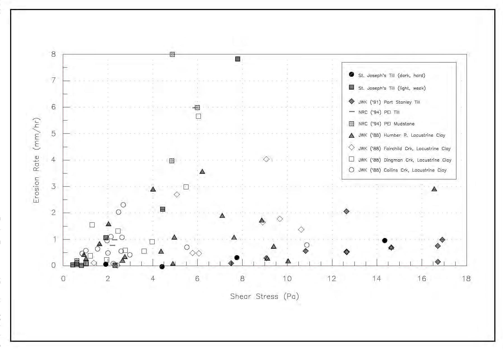

*Figure III-5-18. Clear-water erosion rates from unidirectional flow flume and tunnel tests for various materials*

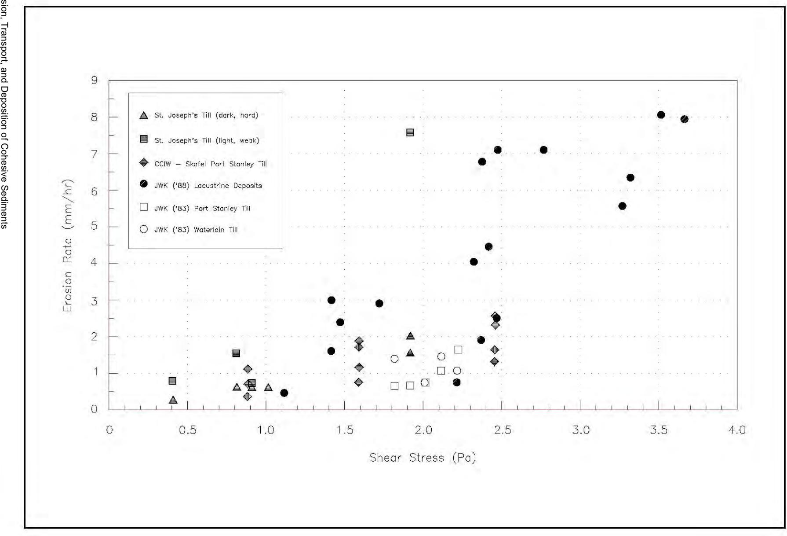

*III-5-29 Figure III-5-19. Sand in flow erosion rates from unidirectional flow flume and tunnel tests for various materials*

sand is introduced into the flow. It should be noted that the sand-grain size was selected so that sand transport occurred in a saltating (bed load) manner in the tests.
- (9) A close review of the results presented in Figure III-5-18 reveals two populations of erosion response. The less erosion-resistant group consists of soft cohesive sediments as well as sediments characterized with a high degree of fracturing and/or the presence of silt seams. In contrast, the more erosionresistant group consisted of firm, homogenous cohesive sediments. The shear strengths for the material tested ranged from 50 to 200 kPa.
- (10) Some of the most recent research into the erodibility of cohesive sediments in the coastal environment has focused on the potential for softening of the exposed surface layer. Davidson-Arnott and Langham (1995) report that at the western end of Lake Ontario, previously overconsolidated till featured shear strengths in the range of 10 to 100 kPa. The softer sediment (10- to 20-kPa shear strength range) was associated with deeper water areas where the till was always exposed (i.e., the noncohesive sediment cover was insignificant) and where the frequency of erosion events was low. In contrast, in shallower areas (depths less than 3 m or 10 ft), the shear strengths were found to be in the range of 30 to 80 kPa. In the shallower depths, the lake bed is exposed to erosion events more frequently and sand cover thicknesses were greater. Using an adapted micro shear vane for a location in a water depth of 3.5 m, they found that the shear strength was lower in the upper 0.1 m of the lake bed and much lower in a 10-mm-thick surface layer. In fresh water, the softening process may be a result of cyclic loading by wave action, whereas in a seawater environment, factors such as salinity and biological activity (such as burrowing organisms) may also be important (Hutchinson 1986).
- (11) Finally, an indirect approach to determining the erodibility of consolidated sediment at a specific site is through the use of numerical models to 'back-calculate' the erodibility coefficient through an analysis of environmental conditions (wave action and water levels) and the observed shoreline or lake bed erosion over a given period of time. This approach is discussed in more detail in Part III-5-12. c. Subaqueous erosion of consolidated sediments .
- (1) In this section, the underwater erosion process is described. In the previous section, we explained that the erosion of hard cohesive soils consists of the destruction of bonds between clay particles and the natural structure or framework created through consolidation of the soil matrix. Erosion of consolidated sediment is irreversible. Once the sediment, which often consists of 80 to 90 percent fines, is eroded, it cannot be reconstituted in its consolidated form in the littoral zone. The eroded fines (silt and clay) are winnowed, carried offshore, and deposited in deep water in contrast to the small fraction of sand and gravel, which remains in the littoral zone. Therefore, the erosion of cohesive sediment is fundamentally different from the erosion of noncohesive sediment. In the latter case, for every volume of eroded sand, a large portion of that material will be deposited somewhere in the littoral zone (in some specific instances, onshore or offshore losses of sand from beaches can occur). Therefore, on sandy shores, the process of erosion is reversible.
- (2) An extensive study of nearshore profiles on the north central shore of Lake Erie described by Philpott (1984) revealed that the profile shape remained relatively constant over an 80-year interval despite dramatic shore recession. This led Philpott (1984) to conclude that the controlling process in bluff or cliff recession on cohesive shores is not restricted to wave action at the toe (as proposed by Sunamura (1992) for eroding rocky coasts) but by the erosion of the nearshore profile by waves. Boyd (1992) cites many earlier references that also suggest that the nearshore has a controlling influence on shoreline recession. The shoreward shift of the dynamic equilibrium profile implies that erosion or downcutting is proportional to the gradient of the nearshore profile and is, thus, greatest close to shore. Davidson-Arnott (1986) describes field measurements of downcutting for a till profile (through the deployment of micro-erosion meters across a
transect) at a site near Grimsby on Lake Ontario. The results confirm the hypothesis on downcutting, i.e., the rates increase towards the shore in a manner related to the local bed slope, thus allowing for the preservation of the profile shape as it shifts shoreward with time. The downcutting hypothesis has now been confirmed by many other field investigations including 9 years of profile retreat data at Maumee Bay State Park in Ohio (Fuller 1995). Hutchinson (1986) and Sunamura (1992) also note that the rate of lowering or downwasting of the intertidal platform on erodible rocky coasts probably determines the long-term rate of cliff retreat in most instances.
- (3) In general, it has also been shown that the underlying cohesive profile, for cases where the properties of the cohesive sediment are uniform along the profile, follows an equilibrium profile shape as defined by Dean (1977). Kamphuis (1990) went on to show that the specific exponential shape of the equilibrium profile at a cohesive shore site was related to the grain size of the overlying noncohesive sediment. In other words, the profile shape could be determined using the grain size of the sand veneer to define the sediment scale parameter A (see Equation 3-15). The shape of the profile can also be influenced by other factors such as variable stratigraphy and the presence of lag deposits as discussed in Part III-5-5. In these cases, a smooth equilibrium profile with an exponential shape will not exist, at least not over the full profile. Riggs, Cleary, and Snyder (1995) note that in most instances along the North Carolina coasts, the complexity of the underlying stratigraphy is such that the profile rarely resembles the equilibrium form found on truly sandy shores.
- (4) The downcutting process is illustrated in Figure III-5-20 for a cohesive shore site located east of Toronto along the Scarborough Bluffs. The bluff face has retreated approximately 30 m (100 ft) in a 37-year period. The underlying cohesive profile shape in 1952 is very similar to that in 1989; it has simply shifted shoreward by 30 m. Therefore, the long-term bluff or cliff retreat rate is equivalent to the profile retreat rate. This figure also shows that there can be a significant quantity of sand covering an underlying cohesive profile. The position of the underlying cohesive profile shown in Figure III-5-20 was estimated based on observations that the cohesive sediment is usually exposed or very thinly covered in the troughs between the bars. Also, it is known that the till is exposed at the toe of the bluff (i.e., at the back of the beach).
- (5) Figure III-5-20 demonstrates that there is not a cross-shore balance of erosion and deposition. All of the eroded material from the cohesive profile and the bluff is either winnowed offshore (clay and silt fractions) or transported alongshore (sand and gravel fractions).
- (6) The profile retreat model for cohesive shores implies that: the amount that the driving forces for erosion exceed the resisting forces is inversely proportional to the water depth. In other words, the most active subaqueous erosion occurs at the shoreline. In general, it may be assumed that the erosion resistance of the cohesive sediment is consistent across the profile (if anything, the sediment may be less erosionresistant in deeper water due to the increased role of softening). Therefore, the driving force for erosion must increase in the shoreward direction. These observations provide important evidence on the nature of the driving forces for cohesive profile erosion.
- (7) Coakley, Rukavina, and Zeman (1986) proposed that outside the surf zone, the downcutting process is driven by shear stresses generated by the orbital motion under waves. Outside the surf zone, this driving force is inversely proportional to water depth. However, considering that wave heights and the related orbital velocity decreases in the surf zone, this mechanism cannot explain the inverse relationship between depth and driving force in this zone. Nairn, Pinchin, and Philpott (1986) proposed that the complex combination of driving forces in the surf zone may be represented by the rate of energy dissipation (described by the rate of wave height decay). Using a model of wave energy dissipation for random waves, it was shown that the rate of energy dissipation was directly proportional to the rate of downcutting in the surf zone. In the surf

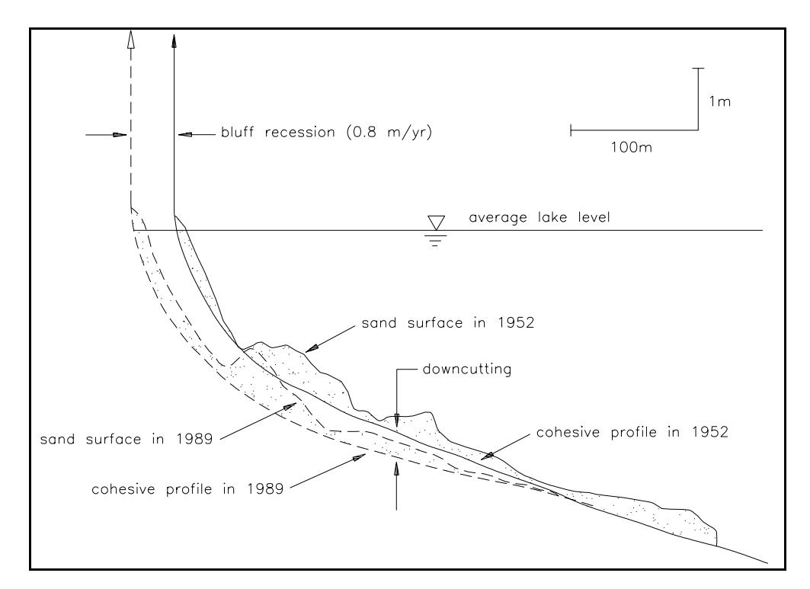

*Figure III-5-20. Bluff retreat and profile downcutting over a 37-year period at Scarborough Bluffs, located east of Toronto on Lake Ontario*

zone, the rate of energy dissipation provides a good indicator of the possible driving forces such as intensity of flows (e.g., undertow and alongshore currents) as well as the intensity of near-bed turbulence (i.e., plunging breakers, which generate high near-bed turbulence, are associated with rapid wave decay). The erosive nature of plunging breakers (and the associated near-bed turbulence) on cohesive profile erosion was demonstrated through laboratory experiments performed in a wave flume with intact cohesive samples (Skafel 1995).
- (8) Sand acts as an abrasive agent in the erosion of consolidated shores. Referring to Figure III-5-20, it is also likely that the presence of alongshore bars can have the opposite effect of protecting the underlying cohesive sediment from exposure and subsequent downcutting. As these bars migrate with changing wave and water level conditions, different areas of the underlying cohesive profile become exposed in the troughs between the bars. The influence of the quantity and mobility of sand cover over a cohesive profile is explored in greater detail in Part III-5-2.
- (9) At the boundary between the action of subaqueous and subaerial erosion processes, the bluff or cliff toe can in some instances experience notching. This notching typically occurs in more competent materials such as rock, frozen sediments, and harder cohesive sediments, (i.e., in materials that are capable of withstanding failure when undercut). (10) In summary, the fundamental principles of consolidated cohesive shore erosion are: (a) The erosion of consolidated cohesive sediment is irreversible.
- (b) The long-term rate of shoreline retreat is directly related to the rate of nearshore downcutting and the associated profile retreat.
- (c) The local rate of downcutting is proportional to the gradient of the nearshore slope at any location across the profile.
- (d) In addition to acting as an abrasive agent that accelerates consolidated cohesive sediment erosion, sand can also serve to protect an underlying cohesive profile from erosion.
- d. Subaqueous erosion of mud. The Parthenaides Equation for mud erosion (Parthenaides 1962, Mehta et al. 1989) is an excess shear equation describing the erosion rate of a cohesive sediment:

```math
\frac{dm}{dt} = M_p \frac{(\tau_c - \tau)}{\tau_c} \tag{III-5-1}
```

where
m = \text{mass of sediment on the bed, kg/m}^2 (lb/ft^2)
t = time, sec
\tau = \text{bed shear}, \text{Pa } (\text{lbf/ft}^2)
\tau_c = critical shear for erosion, Pa (psf) (lbf/ft<sup>2</sup>)
M_p = 'Parthenaides Coefficient,' erosion rate at twice \tau_c , kg/m²/sec (lb/ft²/sec)
- e. Fluid mud.
- (1) This assumes a well-defined interface between bed and water column: sediment on the bed remains at rest; while that in the water column moves with the water. Often, cohesive sediment forms an intermediate layer of fluid mud (denser than water; less dense than the bed; still capable of motion, but slower than the ambient flow). Fluid mud layers are frequently found near the shoreline, where wave activity can 'pump up' excess pore pressures within the fluid mud mass, slowing down drainage and consolidation. Hydrographers generally define fluid mud as having a density of less than 1,100 to 1,200 kg/m³ (70 to 75 lb/ft³).
- (2) Erosion processes in fluid mud are similar to mixing processes at a salt-wedge interface. A layer of lighter fluid (water with suspended sediment) flowing above the denser fluid mud eventually induces waves in the interface when a critical Richardson Number or densimetric Froude Number is exceeded. Wind-wave activity in the upper layer increases the interfacial waves, diverting energy from the surface waves. As the difference in flow rates increases, the interfacial wave energy increases until breaking occurs, putting some fluid mud back in suspension and entraining clearer water in the fluid mud. (3) The densimetric Froude Number is defined as:

```math
F_{r} = \sqrt{\frac{(V_{w} - V_{fm})^{2} \rho_{fm}}{g h_{fm} (\rho_{fm} - \rho_{w})}} \tag{III-5-2}
```

where
Vw = mean velocity in the water layer, m/sec (fps), above
Vfm = mean velocity in the fluid mud layer, m/sec (fps)
ρw = density of the water layer, kg/m3
 (lb/ft3
 )
ρfm = density of the fluid mud layer, kg/m3
 (lb/ft3
 )
 g = acceleration due to gravity, m/sec2
 (ft/sec2
 )
hfm = thickness (depth) of fluid mud layer, m (ft)
- (4) This reduces to the more familiar Froude Number at the water surface, where the upper layer is air of relatively negligible density and the lower fluid mud layer is the water. It defines the ratio of the velocity differential at the interface ( Vw - Vfm ) to the celerity of a small gravity wave in the interface. When that ratio is unity, the equivalent of a hydraulic jump (breaking wave) may be expected in the interface, with resultant entrainment of fluid mud in the water (erosion of the fluid mud) balanced by entrainment of water in the fluid mud.
- (5) At the interface between the fluid mud and the bed, the fluid mud protects the bed from erosion. Shear that develops between the mud and the bed is generally too low to entrain stationary particles. The processes at this interface are entirely deposition, as water drains from the fluid mud. f. Subaerial erosion processes .
- (1) Subaerial erosion processes on cohesive shores do not necessarily have anything to do with the air or wind, although strengthening of mud flats has been noted by Amos et al. (1992) due to evaporation at low water in the macrotidal Bay of Fundy. On consolidated shores, the primary subaerial erosion process is slumping of oversteep bluffs or cliffs.
- (2) As stated earlier, the long-term bluff or cliff retreat rate is determined by the rate of profile downcutting. In a review of shoreline erosion data from the Lake Erie shoreline, Kamphuis (1987) points out that cliff height does not exert much influence on the process (in fact, a distinct lack of correlation was noted) because erosional debris from a shore cliff is quickly swept away, winnowed offshore, and deposited in deep water. Exceptions to this generalization include locations where the debris is not easily removed from the toe of the cliff (e.g., in the case of eroded rock cliffs or blocks of frozen sediment along Arctic shores). The primary reason for slope failures along a cohesive shore is the oversteepened nature of the slope owing to the ongoing profile and toe erosion. Nevertheless, even though subaerial processes do not determine the long-term rate of shoreline recession on cohesive shores (i.e., the frequency of slope failures), these processes are critical in determining when and where a failure will occur.
- (3) Slope stability is a function of the balance between the downward force of gravity and the strength of the geologic materials in a bluff or cliff. The strength of the geologic materials depends on the cohesion of particles and the presence or absence of groundwater. The stratigraphy of a bluff or cliff can have a significant influence on slope stability. Weak clay layers can provide slip planes for slope failures or serve to confine groundwater flows, which may appear as springs at the bluff face. Where groundwater exits the bluff face, seepage erosion can occur. Also, depending on the sequence of layering, groundwater flows can act to increase pressures within the slope and contribute to instability. This will often occur when seepage pathways at the bluff face are blocked by talus from a slide further up the slope. In some instances, the
combination of surface runoff and seepage can lead to the development of large gullies. Slope failures may be classified as: falls and topples; rotational (i.e., circular) and translational slides; and, spreads and flows. The type of failure is a function of the geologic conditions at the site. There are a variety of methods for assessing slope stability.
(4) Figures III-5-21 to III-5-23 show some examples of eroding bluffs along the Great Lakes. Recent rotational failures are evident in Figure III-5-21 along the north central shore of Lake Erie. The development of a gulley is shown in Figure III-5-22 from another location on the north central shore of Lake Erie. Figure III-5-23 shows an eroding shale bluff along the western Lake Ontario shoreline.

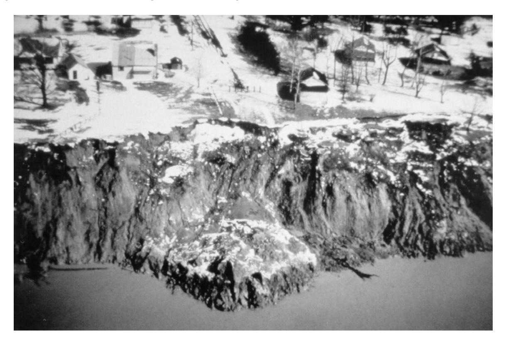

*Figure III-5-21. A rotational bluff failure along the north central shore of Lake Erie*

- (5) In addition to slope stability, surface erosion of the cliff or bluff face can have a secondary influence on the overall erosion of the feature. Surface erosion results from runoff, seepage, rain, and spray from wave action. This would be one of the key processes leading to the erosion of the shale bluff shown in Figure III-5- 23.
- (6) Edil and Bosscher (1988) present a Great Lakes perspective overview of forces and resistance influencing cohesive shore slope erosion which result in mass movement (including sliding, flow, and creep) and particle movement (including wave, wind, ice, rill and sheet erosion and sapping through seepage flow).
- (7) Kuhn and Osborne (1987) investigated the recession of cohesive cliffs on the California coast. The short-term cliff recession is partly related to subaerial processes such as drainage of precipitation and the effects of urbanization at the cliff top. At these locations the cliff base is well protected by a substantial beach deposit which restricts the downcutting of the subaqueous profile. Notably, almost all of the sand at these sites is supplied by nearby rivers and not by cliff recession. This is in contrast to the Great Lakes and barrier islands on the U.S. east coast, where very little sand is supplied by rivers in most areas.

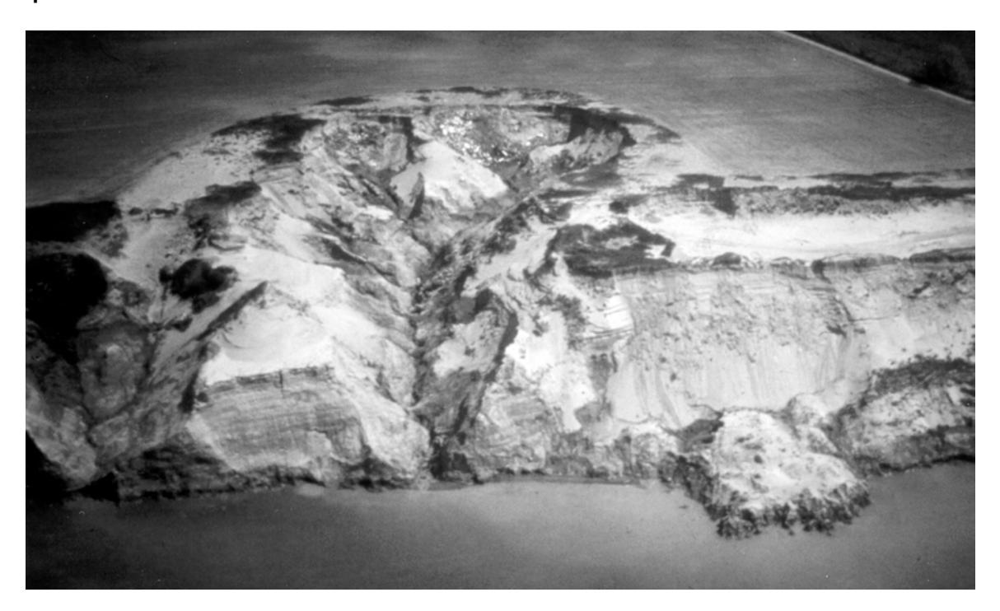

*Figure III-5-22. Gully erosion of a bluff along the north central shore of Lake Erie*

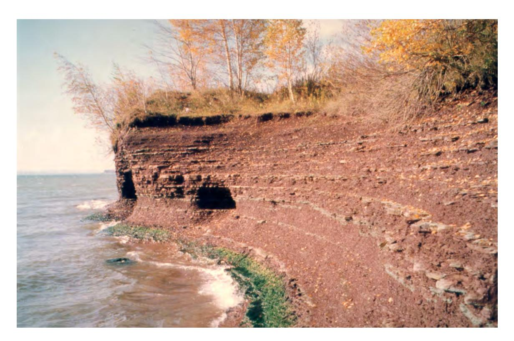

*Figure III-5-23. An eroding shale bluff along the west Lake Ontario shoreline*

(8) A cliff stabilization project for the Scarborough Bluffs (east of Toronto on Lake Ontario) is discussed by Parker, Matich, and Denney (1986) (Figure III-5-24). It has been recognized that arresting the foreshore downcutting at the base of the bluffs is not sufficient on its own to control the erosion of an oversteep slope; proper drainage systems must be implemented to prevent gullies from developing and to address the problem of piping through sand and silt lenses. Parker, Matich, and Denney (1986) also note that the toe of the bluff must be surcharged in some locations to prevent large slip failures from occurring. One function of the land base created at the toe of the slope in Figure III-5-24 is to provide sufficient area to construct a surcharge berm. The surcharge provided by extensive shingle beaches along the south coast of England is known to contribute to the stability of cliffs that rise behind the beaches (Fleming and Summers 1986).

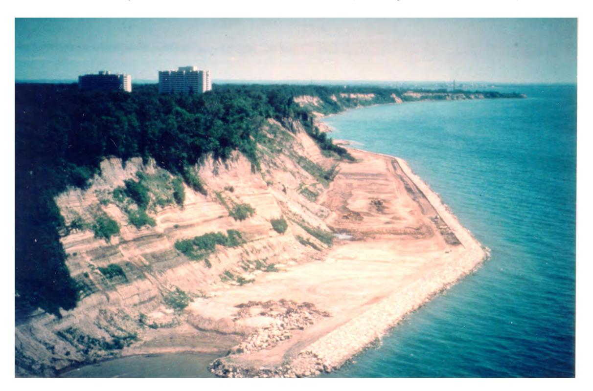

*Figure III-5-24. Shore protection consisting of a wide berm protected by a revetment along the base of the Scarborough Bluffs located east of Toronto on Lake Ontario*

Bioegineering, which consists of promoting the growth of vegetation (e.g., through the placement of mats consisting of bundled twigs to enhance rooting), may also help to stabilize an oversteep slope.
(9) Another extensive review of subaerial processes was made by Hutchinson (1986); other processes that he identified included: freeze/thaw cycles; alternate wetting and drying; and mechanical and hydrodynamic effects of micro-geological features such as erratic cobbles and boring organisms. Hutchinson (1986) provides sample test results indicating that seawater penetrated the pores of glacial tills from the Holderness coast of England (along the North Sea) to depths of at least 0.85 m. He goes on to suggest that an increase in the concentration of NaCl in the pore water from the intrusion of the seawater may increase the net attractive forces between clay particles and increase the degree of aggregation. The degree to which this effect will occur will depend on the clay content and the chemical properties of the cohesive sediment. Hutchinson (1986) concludes that the opposite effect may occur along freshwater shores, where the intrusion of fresh water may dilute the salt or cation content, thus decreasing the net attractive forces between clay particles, and increasing the susceptibility to erosion.

## III-5-8. Transport Processes

- a. Advection and dispersion .
- (1) Cohesive sediments are not transported as bed load, except in the form of fluid mud (see Part III-5-8b below). They almost always are transported in suspension: advected (carried with the ambient water at the flow velocity) and dispersed (moved from areas of high sediment concentration to low by mixing, such as turbulence). Advection and dispersion are described in Part II-6-2.
- (2) But sediment, even a floc, is denser than the ambient water and hence settles as it is being advected and dispersed. This results in a downward bias of the vertical dispersion relation

```math
S - Cw = -D_z \frac{dC}{dz} \tag{III-5-3}
```

where
S = vertical (upward) dispersion of sediment, kg/m2 /sec (lb/ft2 /sec)
w = settling velocity of floc, m/sec (ft/sec)
Dz = vertical dispersion coefficient, m2 /s (ft2 /sec)
C = suspended sediment concentration, kg/m3 (lb/ft3 )
z = vertical dimension, m (ft)
b. Fluid mud . Fluid mud, as its name suggests, flows and is a mechanism for transport of cohesive sediment. It flows down slopes by gravity, sometimes referred to as a 'turbidity current,' which is why fluid mud is often found in the bottoms of dredged cuts. Fluid mud is also dragged along by the shear of the water flowing above it. How it flows is determined by its rheology; which in turn, must be measured for each fluid mud combination of sediment and water. Fluid mud may have an apparent yield point, remaining stable until a critical slope or shear is exceeded. More likely, its flow velocity will vary in a nonlinear way with slope or shear, from stiffest at lowest shear to most fluid at highest shear.

## III-5-9. Deposition Processes

- a. Flocculation .
- (1) Cohesive sediments rarely settle as individual grains in nature. Collisions between sediment grains are encouraged by differences in settling velocity, turbulence, Brownian motion, and electrochemical attraction or cohesion.
- (2) When cohesive grains collide they tend to stick together, or cohere. To determine settling velocity in the laboratory, cohesive grains can be kept apart in distilled water containing a dispersing agent to neutralize the electrochemical bond.
- (3) The process by which individual cohesive particles agglomerate while settling is called flocculation ; and the resulting large particles with entrapped water, flocs . The settling velocity of a floc is a function of its size, shape, and relative density. A floc usually settles faster than its constituent particles; but because of
the entrapped water, its density is less than that of the sediment mineral, and the settling velocity of the floc may actually be slower than that of an individual clay particle. The size and shape of flocs, and their settling velocity, are hydrodynamic sediment properties which must be measured or determined by model calibration as described in Part III-5-3.
- b. Shear stress. The principle of excess shear is also used for correlating observed rates of cohesive sediment deposition with flow. But for deposition, 'excess' is the amount by which the shear \tau is less than a critical shear for deposition \tau_s .
- c. Krone Equation. The Krone Equation for mud deposition (Krone 1962, Mehta et al. 1989) is as follows:

```math
\frac{dm}{dt} = Cw \frac{(\tau_s - \tau)}{\tau_s} \tag{III-5-4}
```

where
m = \text{mass of sediment on the bed, kg/m}^2 (lb/ft^2)
t = time, sec
\tau = \text{bed shear}, \text{Pa } (\text{lbf/ft}^2)
\tau_s = critical shear for deposition, Pa (lbf/ft<sup>2</sup>)
C = suspended sediment concentration above the bed, kg/m<sup>3</sup> (lb/ft<sup>3</sup>)
w = settling velocity of sediment floc, m/sec (ft/sec)
Comparison of the Krone and Parthenaides Equations (Part III-5-4d) suggests that the Krone Equation may be less empirical, more theoretical. There is no obvious empirical coefficient to match the Parthenaides coefficient M_p , but the unknown coefficient hidden in the Krone Equation is w, the settling velocity of the flocs.
d. Fluid mud. Deposition takes place at both interfaces: that between water and fluid mud; and also that between fluid mud and the stationary bed. At the water/fluid mud interface, the process can still be predicted by the Krone Equation, except the density of the deposited sediment is less than 1,100 to 1,200 kg/m³ (70 to 75 lb/ft³). At the fluid mud/bed interface, the deposition process is one of consolidation: as the fluid mud drains, it consolidates to the point where it is too dense to remain fluid.

#### III-5-10. Consolidation

- a. Strength versus consolidation.
- (1) The critical shear for erosion \tau_c is a function of the consolidation or density of the bed. Think of the cohesion between sediment particles varying inversely, like the force of gravity, with distance between particles. The closer the particles are to each other, the stronger the cohesive bond and the greater the shear force needed to separate them.
(2) The Migniot Equation expresses the exponential relationship between mud density and critical shear for erosion as:

```math
\tau_c = N\rho_s^M \tag{III-5-5}
```

where
ρ s = bulk density of sediment on the surface of the bed, kg/m3 (lb/ft3 )
M, N = constants to be determined for the sediment and water. M is dimensionless and tends to be less than 1; N equals 10-1 or 10-2 in the SI system of units.
b. Degree of consolidation . The Terzaghi consolidation relation, developed for building settlement calculations, also serves to illustrate the consolidation of coastal cohesive sediment.

```math
u = 0.964 \left(\frac{tC_{v}}{P^{2}}\right)^{0.415} \tag{III-5-6}
```

where
u = degree of consolidation, dimensionless ratio
Cv = a consolidation coefficient to be determined, m2 /sec (ft2 /sec) (values on the order of 1 x 10-5 m2 /sec are not uncommon)
P = length of the drainage path, m (ft) (generally depth of burial)

## III-5-11. Wave Propagation

- a. Roughness and shear .
- (1) The predominant nearshore wave transformation associated with muddy beds is wave energy dissipation or attenuation. Refraction, diffraction, and reflection all pretty much obey the rules set out in Part II-3-3, but wave attenuation is generally much greater over mud beaches than over sand and gravel. As more wave energy is absorbed by the mud, less reaches the breaker line.
- (2) This energy dissipation can only partially be accounted for through the traditional mechanisms of bed roughness and friction. In fact, a mud bed is usually smoother (less rough) than sand. b. Fluid mud .
- (1) The predominant mechanism of wave attenuation is in the thick, viscous boundary layer of fluid mud (Lee 1995, Lee and Mehta 1994). Part of the wave energy goes to 'pumping up' excess pore pressures maintaining the mud in a fluid state. But more is converted to work done in moving the fluid mud against viscous shear.

## Example Problem III-5-1

## FIND:

Apply the Parthenaides and Krone Equations to the annular flume test results in the table, to determine values of:
Mp = Parthenaides coefficient for this combination of sediment and water
τ c = Critical shear for erosion at this sediment density
w = Settling velocity of sediment flocs for this combination of sediment and water
τ s = Critical shear for deposition for this combination of sediment and water
For the purposes of this example, ignore changes in bed elevation and water depth due to erosion and deposition.

## GIVEN:

| Table III-5-2 |  |  |  |
| --- | --- | --- | --- |
|  |  | Example Problem III-5-1, "Annular Flume Test Results" |  |
| Applied Shear (Pa) | Duration (sec) | Starting Concentration (kg/m3 ) | End Concentration (kg/m3 ) |
| 0 | 600 | 0 | 0 |
| 0.2 | 600 | 0 | 0 |
| 0.4 | 600 | 0 | 0 |
| 0.6 | 600 | 0 | 1 |
| 0.8 | 600 | 1 | 3.33 |
| 1.0 | 600 | 3.33 | 7 |
| 0.8 | 600 | 7 | 7 |
| 0.6 | 600 | 7 | 7 |
| 0.4 | 600 | 7 | 7 |
| 0.2 | 600 | 7 | 1 |
| 0 | 50 | 1 | 0 |

Bulk (dry) density of sediment on the bed = 1,500 kg/m3
Water density = 1,020 kg/m3
Area of annular flume bed = 1 m2
Water depth = 0.2 m
Total water volume, therefore = 0.2 m3
(Sheet 1 of 3)

#### Example Problem III-5-1 (Continued)

#### SOLUTION:

Since the bed area of the annular flume has been carefully chosen to be 1 \text{m}^2 , the rate of change of total sediment suspension will directly give us the quantity dm_b/dt . Otherwise, we would have had to multiply both sides of both equations by the area of the bed.
Our results are not given as total sediment in suspension, but as concentration in kg/m<sup>3</sup>. We need to multiply them by the volume of water in the annular flume, 0.2 m<sup>3</sup>, to get total sediment numbers equivalent to dm/dt on the bed.
So, for example, when the applied shear was 0.6 Pa

```math
\frac{\mathrm{d}m}{\mathrm{d}t} = \left(\mathrm{V}\times\Delta C\right) / \left(\mathrm{A}\times\Delta T\right) = (0.2\,\mathrm{m^3}\times-1\,\mathrm{kg/m^3}) / (1\,\mathrm{m^2}\times600\,\mathrm{sec}) = -3.33 \times 10^{-4}\,\mathrm{kg/m^2\cdot sec}
```

Similarly for 0.8 Pa, -7.77 x 10^{-4} kg/m<sup>2</sup>/sec, and for 1.0 Pa, -1.22 x 10^{-3} kg/m<sup>2</sup>-sec.
This concludes the erosion data for the Parthenaides Equation. By plotting erosion rate versus shear (Figure III-5-25), we can extrapolate back to the shear at which the erosion rate is zero, \tau_c = 0.45 Pa. From the same plot we can read M_p , the erosion rate at 2\tau_c = 0.9 Pa, = 10^{-3} kg/m²-sec.
In the same way, the deposition results can be used as shear is reduced, with the Krone Equation for

```math
0.2 \text{ Pa and } C_{avg} = 4.0 \text{ kg/m}^3, \text{ dm/dt} = 2 \text{ x } 10^{-3} \text{ kg/m}^2\text{-sec}
```

Note that we can use the mean sediment concentration C_{avg} , since deposition rate is a linear function of concentration. In high concentration, settling velocity also becomes an inverse function of concentration.
The result at 0.0 Pa gives the floc settling velocity directly

```math
w = \left( dm/dt \right) / \left( C_\mathrm{avg} \; x \; \tau_\mathrm{s} / \; \tau_\mathrm{s} \right) = \left( 4 \; x \; 10^{\text{-3}} \; kg/m^2\text{-sec} \right) / \left( 0.5 \; kg/m^3 \right) = 8 \; x \; 10^{\text{-3}} \; m/\text{sec}
```

Substituting this in the Krone Equation at 0.2 Pa, yields

```math
\tau_s = \frac{(0.2 \text{ Pa} \times 4.0 \text{ kg/m}^3 \times 8 \times 10^{-3} \text{ m/sec})}{(4.0 \text{ kg/m}^3 \times 8 \times 10^{-3} \text{ m/sec} - 2 \times 10^{-3} \text{ kg/m}^2\text{-sec})} = 0.21 \text{ Pa}
```

A real set of data, whether from field or laboratory annular flume, will be more difficult to work with. Complications to be expected are:
The variation of erosion rate with bed shear will not be linear, but will require some judgment and nonlinear regression to determine \tau_o .
(Sheet 2 of 3)

## Example Problem III-5-1 (Concluded)

You will never again have the luxury of somebody timing the settlement of the last floc, giving w directly. Instead, you will have to solve two or more equations with two or more unknowns, one of which is w .
Bed sediment density, and hence τc, varies with depth of erosion due to consolidation.
A natural bed will be layered, with discontinuities in consolidation and sedimentology over depth.
Water volume and depth vary with depth of erosion.
Direct measurement of bed shear is often difficult, particularly in the field laboratory where rotation of the lid of the annular flume is resisted by fluid shear, both in the flume and on the upper surface.
The area of the bed in the direct shear device (annular flume in this example) is seldom a convenient 1 m2 or 1 ft2 .

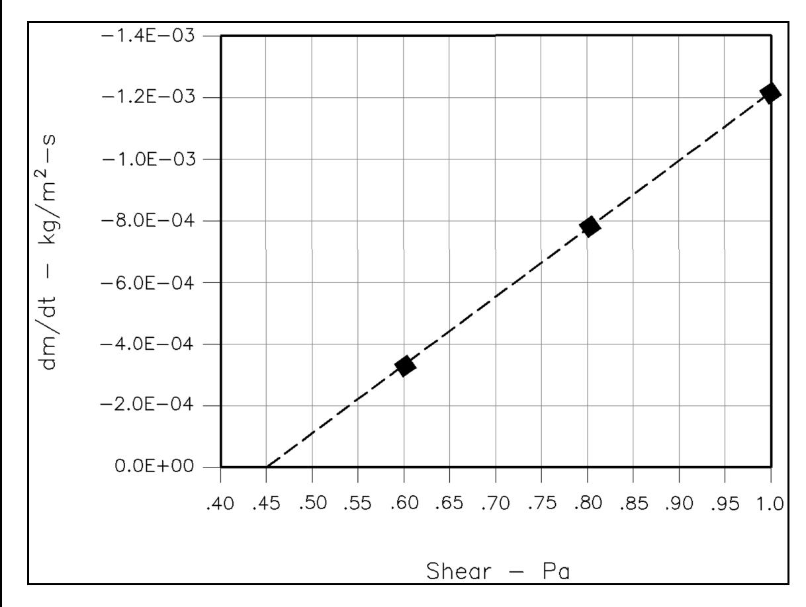

*Figure III-5-25. Plot of erosion rate versus shear for example problem*

(Sheet 3 of 3)
Figure III-5-26 (Lee 1995) summarizes the interactions between a mud shore and waves:
- (a) At low water or under calm seas, the profile formed by the previous wave condition consolidates.
- (b) Breaking waves result in mass erosion at the breaker line, with high turbidity in the surf zone; lower turbidity and surface erosion occur seaward of the breaker line, to the point where bed shear is less than the critical shear for erosion.
- (c) Turbidity in the surf zone reaches that of fluid mud, flowing generally downhill offshore and collecting in troughs, under the influence of the wave orbital motion within the fluid mud. (d) Return to (1), consolidation of the new profile under calm seas or at low water.
- (3) Lee (1995) and Lee and Mehta (1994) found that wave height decays exponentially across the profile, i.e.

```math
H _ { y } = H _ { 0 } e ^ { - k _ { i } y } \tag{III-5-7}
```

where
y = distance along wave ray, m (ft), positive towards shore
H0 = incident wave height at y = 0, m (ft)
Hy = wave height at y , m (ft)
ki = wave height attenuation coefficient, m-1 (ft-1)
(4) The wave height attenuation coefficient ki characterizes the fluidization potential of the mud. It is obviously a function of the rheology of the bed; and also probably of the wave period T and incident wave height H0 . Lee (1995) and Lee and Mehta (1994) believe ki to be a function of the local wave height, and talk of a spatial mean ¯ki across the profile. In practice, ¯ki is another calibration coefficient, like the Parthenaides coefficient, to be determined by fitting to observations of wave attenuation and profile development. A high ¯ki indicates a thick fluid mud layer, which Lee (1995) and Lee and Mehta (1994) associate with offshore flow on an eroding profile; a low ¯ki , with an accreting profile. Lee (1995) quotes values of ¯ki in the range 0.0001 # ki # 0.05.

## III-5-12. Numerical Modeling

- a. Introduction.
- (1) In this section, the role of numerical modeling is discussed both as an engineering tool and a planning tool. The development of numerical modeling of cohesive shore erosion is not far advanced. Nevertheless, approaches that have been utilized are briefly summarized. Numerical models are generally applied to simulate a future outcome given a known set of input conditions. For cohesive shore applications, there are at least four possibilities where numerical models can provide valuable information as follows:

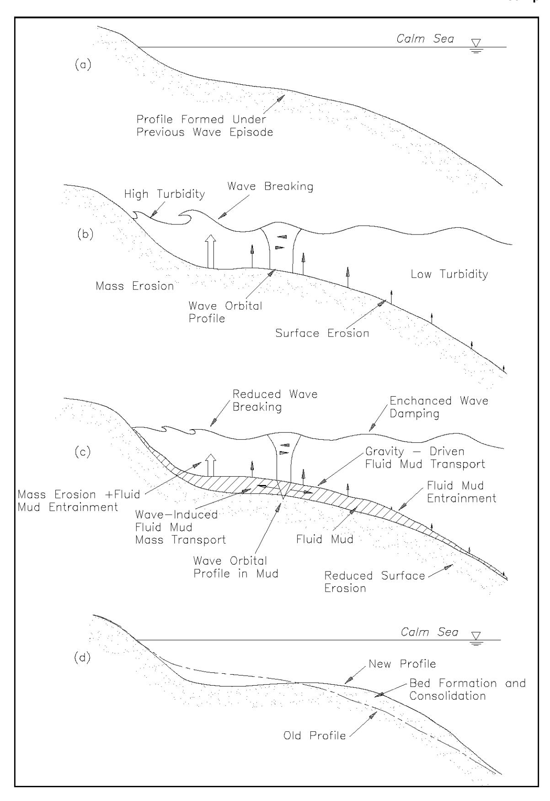

*Figure III-5-26. Mud beach processes (after Lee (1995))*

- (a) To forecast long-term erosion rates (i.e., on the order of 50 years for developing shorelines). 'Developing shorelines' refer to areas where the evolution of a shore profile is at an early stage (e.g., newly created reservoirs). In these cases, the future rate of shoreline recession will probably differ from that experienced in the past owing to the evolving shape of the nearshore profile. Future erosion rates are required to plan setbacks and development around the new water bodies. In addition, the changing nature of the littoral zone (slopes and surficial substrate) may be important to the management of fish habitat.
- (b) To forecast long-term erosion rates where either the environmental or the geologic conditions are changing due to natural or human causes. Natural influences that may change include increased storminess, sea level rise, changes to sand supply, or the changing geology encountered as the shoreline erodes. Human influences may include changes to water level fluctuations by water level regulation and reduction in the sand cover over the cohesive profile due to interruptions or reduction in sand supply to the littoral zone.
- (c) To forecast the performance and potential impacts of coastal engineering works. For example, downcutting will continue offshore of the toe of a revetment constructed on a cohesive shore, and this outcome must be forecast and addressed in the design of the structure.
- (d) Based on known historic recession rates and environmental conditions, numerical models can be applied to 'back-calculate' erodibility coefficients to describe the erosion resistance of a particular type of cohesive sediment. In turn, this can be used to assess future erosion rates at another site with the same sediment type but with different environmental conditions (i.e., the wave and water level climate).
- (2) Therefore, there are many situations where numerical modeling would serve as an important tool for coastal engineering and coastal zone planning in cohesive shore environments. b. Simulating erosion of consolidated sediment .
- (1) Two approaches to modeling consolidated cohesive shore erosion are described in this section. Both rely on a significant degree of empiricism.
- (2) The first approach is described by Penner (1993) for estimating future bank recession rates on Western Canadian lakes and reservoirs. This procedure consists of using a wave hindcast to determine the amount of wave energy that reaches a bluff face (accounting for losses over the nearshore profile). From this information and a knowledge of an erodibility coefficient, the future rate of shore recession can be determined. The erodibility coefficient relates volumetric erosion to the wave energy that reaches the bluff toe. This coefficient may be determined through back-calculation, or model calibration, for a location with known history of erosion (with the wave climate calculated by a wind-wave hindcast) or it may be estimated based on published values by others who have used this technique in the past (e.g., Penner 1993, Mollard 1986; Kachugin 1970; Newbury and McCullough 1984).
- (3) Since this method essentially ignores the role of profile downcutting, it is primarily applicable to profiles that are at an early stage of development (i.e., with a very steep profile and narrow nearshore zone). In these cases, most of the wave energy is dissipated at the bluff face, in contrast to the more developed shoreline profiles on the Great Lakes and ocean coasts where the majority of wave energy is dissipated across the profile.
- (4) This method has been applied to estimate the future shoreline position around new reservoirs in order to establish setback and ownership requirements. It has been refined to consider variations in erodibility of the materials encountered through time as the shoreline recedes. A table of erodibility coefficients from Penner (1993) is reproduced in Table III-5-3 below. The empirical coefficients relate wave energy that reaches the bluff toe to the weight of eroded sediment.
(5) Table III-5-3 reveals some interesting comparisons to the previous discussions of erosion processes. The high erodibility coefficient for the case of sand cover over the till confirms the importance of sand as an abrasive agent. For cases with a sand or gravel overlay, the erodibility coefficient is 2-10 times higher than the coefficients for soft and hard till. This compares well with the results of the laboratory experiments where erosion rates were increased by a factor of 3 to 8 with the introduction of sand to the flow for a range of hard and soft consolidated cohesive sediments (Part III-5-4b). Also, the category of a till bluff with a lag-protected nearshore corresponds to the slowly eroding convex profile type discussed above.

**Table III-5-3. reveals some interesting comparisons to the previous discussions of erosion processes. The high erodibility coefficient for the case of sand cover over the till confirms the importance of sand as an abrasive agent. For cases with a sand or gravel overlay, the erodibility coefficient is 2-10 times higher than the coefficients for soft and hard till. This compares well with the results of the laboratory experiments where erosion rates were increased by a factor of 3 to 8 with the introduction of sand to the flow for a range of hard and soft consolidated cohesive sediments (Part III-5-4b). Also, the category of a till bluff with a lag-protected nearshore corresponds to the slowly eroding convex profile type discussed above.**

| Material Type | (m2/tonne) |
| --- | --- |
| Till with sand or gravel surficial overlay | 0.0004 |
| Soft till | 0.0002 |
| Hard till | 0.00004 |
| Till with a dense cover of surficial boulders | 0.00002 |
| Sandstone, siltstone, or shale covered with till | 0.00005 to 0.0002 |

- (6) A second approach to the numerical modeling of cohesive shore erosion is based on the conceptual model proposed by Nairn, Pinekin, and Philpott (1986). This approach relates downcutting to the shear stress generated by orbital velocities under unbroken waves and to the rate of wave energy dissipation for broken waves. The predicted downcutting determines the profile retreat rate which is assumed to determine the bluff or cliff retreat rate above water. A numerical model of coastal processes (Nairn and Southgate 1993) is used to determine the orbital velocity, the rate of wave energy dissipation, and the fraction of broken waves at locations across a nearshore profile. Erodibility coefficients relating downcutting rates to the conditions associated with broken and unbroken waves are determined in one of two ways. First, these coefficients can be back-calculated or calibrated based on a known profile retreat rate and the associated environmental conditions (i.e., the wave and water level conditions corresponding to the period of known profile retreat).
- (7) Alternatively, intact cohesive sediment samples can be extracted from the study site and tested in a unidirectional flow flume as discussed in Part III-5-6a. The erodibility coefficients can then be determined based on known coefficients for sediments with a similar laboratory response. However, the latter approach is only valid for locations with similar sand cover conditions. The reason for this is that in long-term applications, the model ignores the presence of sand cover, and therefore the erodibility coefficient also accounts for the mobility and quantity of sand cover.
- (8) A more detailed version of the model described in Nairn and Southgate (1993) has been developed to assess short-term erosion on cohesive profiles (i.e., over a period of weeks). This model accounts for the movement of limited quantities of sand over a hard surface. Erosion is activated in the model only where sediment transport occurs over an exposed segment of cohesive sediment. This model has been successfully tested against the laboratory wave flume data of Skafel and Bishop (1994) on cohesive profile erosion (Nairn and Southgate 1993).
- (9) The numerical model described in Nairn and Southgate (1993) has been applied to assess the influence on erosion of modifications to the water level regulation on the Great Lakes. Stewart and Pope (1993) determined the potential future long-term (i.e., 50 to 100 years) profile retreat (and the associated shoreline erosion) rates for several different test sites. At each of these sites, the model was calibrated against a known profile retreat rate to determine the erodibility coefficients. These test sites featured a variety of wave exposures and profile types. For a potential lake level regulation scenario with a reduced range of water
level fluctuations (i.e., lower highs and higher lows), the long-term erosion on cohesive shores with convex profiles was found to be reduced, but the long-term erosion on concave profiles was unchanged.
- c. Simulating erosion and deposition of mud .
- (1) The numerical models described in a. above may also be used for erosion of mud shore, given a suitable choice of erodibility coefficient or critical shear for erosion. Nevertheless, these do not handle the other cohesive shore processes (transport, deposition, and consolidation), for which a full hydrodynamic model is required.
- (2) Willis and Crookshank (1994) describe a bed sediment 'module' designed to be called as a subroutine to a full 1-, 2-, or 3-D model of wave and current hydrodynamics on the shore. This module applies the equations presented in this chapter to compute the exchange of sediment between the bed and the water column, at each grid point in the model, at each time-step. Because of its 'add-on' nature, it cannot deal with the intermediate state of fluid mud, for which an integrated water-sediment 3-D model is required (e.g. Le Hir 1994).

## III-5-13. Engineering and Management Implications

The differences between processes on sandy and cohesive shores are fundamental to successful planning and engineering on cohesive shores. This section provides a discussion of some of the important issues.
- a. Setbacks and cliff stablilization .
- (1) The two most important issues in the planning and management of cohesive shores relate to implementing setbacks for development and to managing human influences on the sediment supply. Successful coastal management can sometimes avoid the need for costly shore protection structures.
- (2) Many jurisdictions along U.S. shorelines impose a setback for new development consisting of some multiple of the average annual recession rate (e.g., 30 to 100 times the average annual recession rate). The purpose of the setback is to avoid the need for shore protection within the life of the new development, recognizing the irreversible and inevitable erosion that occurs along cohesive shores (and some sandy shores as well). However, this procedure may not be fully reliable, for several reasons. Most importantly, the environmental and geologic conditions that determine the recession rate can change through time both naturally (e.g., increased storminess, higher water levels, changes in erodibility as the shore erodes) and through human influences (e.g., by reducing the sand supply to the littoral zone).

## b. Vegetation .

(1) Where possible, every effort should be made to replace vegetation (salt marsh, grass, mangrove) whose loss might have triggered or allowed mud shore instability (Part III-5-1b). The root system provides fiber reinforcement to the soil. Above the bed, the body of the vegetation protects the mud from shear due to currents and waves and creates a calm layer close to the bed to encourage deposition and settlement.
- (2) Vegetation is required to halt mud erosion, but most vegetation cannot germinate and establish itself on an eroding or unstable shore. Some less natural form of shore protection is needed to create the conditions necessary for the vegetation to establish. This may be as simple as geotextile or willow mats imitating the root system until the natural roots can develop. But (temporary) bunds may be required to protect an area of germinating vegetation, at least until the plants can withstand currents and waves.
- (3) Vegetation is also useful on consolidated cohesive shores. Brambles, for example, can help stabilize an eroding bluff or cliff against subaerial erosion while discouraging at least human traffic. However, this type of solution will only be effective in the long term if seabed or lake bed downcutting is halted. c. Interruption to sediment supply and downdrift impacts .
- (1) Another important planning requirement on cohesive shores is the management of sediment budget; specifically, human influences on sand supply. The erosion of cohesive shores results in a contribution of noncohesive sediment to the littoral sediment budget. This contribution consists of the sand and gravel-size fraction of the bluff and nearshore bottom material. There are three human influences that can reduce the sand supply:
- (a) The construction of shore protection eliminates the contribution of the noncohesive fraction from the erosion of the bluff (and possibly part of the nearshore) for the protected reach of shore. On an individualproject basis, this reduction in the total supply to the littoral sediment budget may be small. However, the cumulative impact of many shore protection projects along many kilometers may be significant (as explained below).
- (b) The construction of harbors, lakefills, or other projects which protrude into the lake result in large quantities of sand being trapped (in fillet beaches) and diverted offshore (once the fillet beaches have reached full capacity). Often, this sand is permanently lost from the active littoral system.
- (c) Dredging or sand mining. Dredging is often required at harbor structures where sediment has been diverted offshore and deposited in navigation channels. The sand-sized portion of the dredged sediment is lost from the littoral system if it is placed outside the littoral zone (i.e., offshore, on land, or in a confined disposal facility).
It is also important to note here that sand supply can be reduced or increased through natural changes. For example, as the shore retreats, stratigraphic units containing more or less sand may be exposed to erosion.
- (2) The impact of reducing the sand supply depends on the type and characteristics of the downdrift shore. Depending on the quantity of the natural sand cover along the downdrift cohesive shore, the reduction in sand supply may or may not increase the erosion rate. If the sand quantity is high (greater than approximately 150 m3 /m), the erosion rate will be increased. On the other hand, if the sand cover is already low (less than approximately 50 m3 /m), the erosion rate will probably be unaffected. Invariably, at the downdrift end of a reach of eroding consolidated shore, there is an accreting or stable sand beach deposit that receives the noncohesive fraction eroded from the bluffs. The cutoff or reduction in sand supply to this beach may trigger the onset of its erosion. d. Remedial measures for cohesive shore erosion .
- (1) In order to arrest shoreline recession on a consolidated cohesive shore, it is necessary to stop the downcutting across the profile out to a depth where the future rate of downcutting will not adversely affect the coastal protection system. Three examples of how this can be achieved are as follows:
- (a) Through beach nourishment (possibly in conjunction with retaining structures such as detached breakwaters) to increase the sand cover volume to a level sufficient to protect the underlying cohesive profile under most conditions (this volume is approximately 200 m3 /m for Great Lakes shorelines). (b) Through the construction of offshore breakwaters.
- (c) Through the construction of revetment with the toe excavated a sufficient distance into the lake bed or seabed. As an alternative to excavating the toe, a toe protection berm could be placed with sufficient thickness and width to accommodate settling through erosion offshore of the toe of the berm. In most cases, this approach will lead to the eventual disappearance of beaches due to ongoing downcutting offshore of the toe of the revetment and the related steepening of the profile to an extent where sand beaches cannot be maintained naturally. Another critical issue affecting the future performance of revetments on consolidated cohesive shores is the flanking erosion of adjacent unprotected shores. The ends of the revetment may have to be periodically extended back to the shore to address flanking.
- (2) One key constraint that must be considered in the design of coastal structures on consolidated cohesive shores is that the nearshore profile will continue to erode offshore of the structure. This has two potentially adverse implications for the stability and performance of the structure:
- (a) The toe of the structure may be destabilized if it has not been designed to accommodate ongoing downcutting.
- (b) With the deepening of the nearshore profile, the structure will be exposed to larger waves in the future. Both of these outcomes should be considered in design.
- (3) Figures III-5-27 and III-5-28 demonstrate the consequences of inappropriate shore protection structures along consolidated shores. The cohesive foundations of the gravity seawall in Figure III-5-27 were undermined, causing the wall to topple. Figure III-5-28 shows that the sheet-pile wall and groin system were ineffective at preventing downcutting and arresting bluff retreat.
- (4) For design purposes, the rate of foreshore lowering at any point on the profile can be determined using the profile retreat model. The required information is the approximate shape of the underlying cohesive profile and the shoreline retreat rate. Caution should be applied in using this technique since both the profile shape and the retreat rate could change in the future due to: changing stratigraphy in the foreshore, increased storminess, changes in water levels, and changes to the overlying sand cover.

## e. Foundations .

- (1) The foundation of structures on cohesive coasts should be assessed with respect to the stability of the underlying cohesive sediment. For locations with high bluffs or cliffs, presumably the loading associated with the structure will be much less than that associated with the bluff itself (i.e., prior to erosion).
- (2) Protection of the toe of the bluff and the nearshore profile, on its own, may not be sufficient to stabilize an oversteepened bluff face. The bluff or cliff will usually be in an oversteepened condition prior to the implementation of protection (except in the case where a slope failure has recently occurred). One or more of the following three actions could be taken to address this problem:
- (a) Allow the slope to naturally stabilize through surface erosion and failures, and to eventually be colonized by natural vegetation.

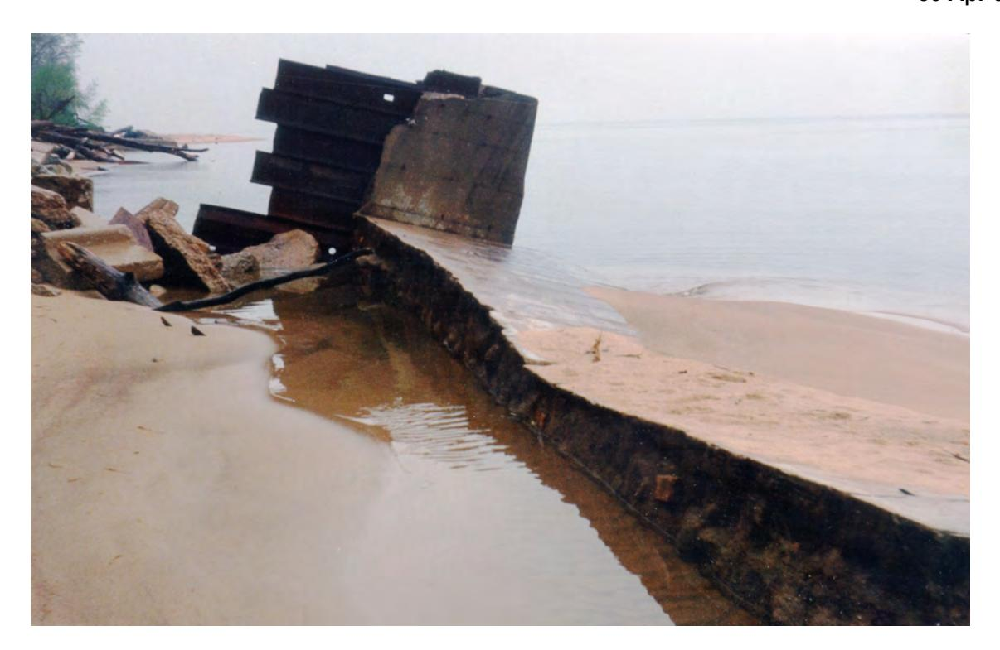

*Figure III-5-27. A toppled concrete seawall along the Lake Michigan coast of Berrien County. Failure probably resulted from undermining of the underlying glacial till foundation, April 1991*

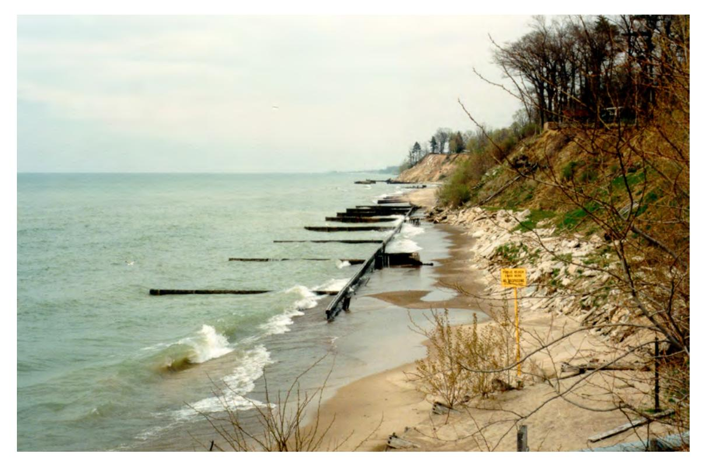

*Figure III-5-28. A steel sheet-pile wall and groin field has been ineffective at protecting this section of cohesive shore along the Berrien County shore of Lake Michigan, south of the town of St. Joseph, April 1994*

## Example Problem III-5-2

## FIND:

A revetment is being designed to protect an eroding bluff. Find the total downcutting expected over a period of 25 years at the toe of a shore protection structure placed at a water depth of 2 m below low water on a cohesive profile.

## Given:

The following information is available:
- (1) The long-term bluff retreat rate is 1.0 m/year.
- (2) The median grain size of the sand overlying the till is 0.2 mm, 200 F.

## Procedure:

The following steps are taken to develop a solution:
- (1) Determine the shape of the underlying cohesive profile. In the absence of direct field information, the cohesive profile shape may be assumed to follow the equilibrium profile for the overlying sand as suggested by Kamphuis (1990) (Part III-5-5a).
- (2) Determine the distance offshore to the toe of the revetment (i.e., at the 2-m depth contour) based on the equilibrium profile.
- (3) Considering that the bluff retreat rate is equivalent to the profile retreat rate, find the depth of water for the distance determined in step 2 plus 25 m (i.e., 25 years at 1 m/year).
- (4) Expected downcutting is the difference between the initial 2-m depth and the depth determined in step 3 above.

## Solution:

(1) Using the information provided in Part III-3-3 and Figure III-3-17, the relationship between distance offshore ( y ) and depth of water ( h ) for a grain size of 0.2 mm is described by:

```math
h = A y^{2/3}
```

(2) Therefore, y = (h/A)1.5 = (2/0.1)1.5 = 89 m
The toe of the revetment is located 89 m seaward of the shoreline after construction.
(3) After 25 years, the profile will have shifted inshore by a distance of 25 m. Of course, the erosion inshore of the revetment associated with this shift will be prevented by the presence of the revetment. However, offshore of the toe, the downcutting will continue at the historic rate. Therefore, the new depth at the toe will be the depth associated with a distance of 89 + 25 m from the shoreline (i.e., the distance from shore to the toe of the revetment had the revetment not been constructed). The new depth is calculated as follows:

```math
h = A y^{0.67} = (0.1) 114^{0.67} = 2.39 m
```

(Continued)

## Example Problem III-5-2 (Concluded)

(4) Therefore, the expected downcutting over a 25-year period at the toe of the revetment in a water depth of 2 m is 0.39 m (i.e., 2.39 - 2.0).
In reality there are factors that may make this either a conservative (high) or nonconservative (low) estimate. If the revetment is located along a shore with steady sand transport, it is possible that the revetment toe may be protected from downcutting most of the time by the presence of a bar at the base of the revetment (this outcome depends very much on the site conditions, including: grain size, profile shape, and wave climate). If this is the case, the 0.39 m of lowering over 25 years may be an overestimate. On the other hand, if the cohesive sediment at the toe of the revetment is not protected by a sandbar, local scour could occur in addition to the erosion associated with profile lowering. Local scour could easily exceed 0.39 m. It is important to note that with the lowering of the offshore profile through the downcutting process, the local scour will increase with time as larger waves are able to reach the revetment. Also, this solution assumed that the nearshore profile was well described by an equilibrium profile shape. This may not be the case if the nearshore stratigraphy consists of geologic units with different erosion resistances.
The lowering at the toe of a shore protection structure built on a cohesive shore should also be considered in the design of the structure. Specifically, armor unit stability and overtopping potential should be estimated for the expected future depths associated with the design life of the structure.
- (b) Accelerate the stabilization process by constructing a drainage system and through bioengineering to encourage and promote colonization of the slope by native vegetation. (c) Control the local groundwater flows to minimize destabilizing factors at the bluff face.
- (3) In some cases, the natural stable slope, with its toe at the back of the shore protection, may not be acceptable due to the proximity of development to the top of the bluff or cliff. In these cases, additional measures may be taken to achieve a steeper stable slope either through buttressing at the toe, through the implementation of drainage systems in the slope, or other measures to address the potential causes of slope failures at the site.
- (4) What size of seawall can soft mud support? Even an earth dike a couple of meters high can result in an overnight slip circle failure through the 'beach' foundation, and longer-term subsidence will need to be compensated for in the design. Geotechnical considerations are of prime importance in the design of shore protection on soft shores; not just bearing (compressive) strength, but shear strength and consolidation rates as well (Part VI-5). Mud might not be able even to support heavy, land-based construction equipment. On many soft shores, mud has built up over centuries to thicknesses in excess of 30 m (100 ft), so that trenching to firm foundation may be uneconomical.

## III-5-14. References

## Amos et al. 1992

Amos, C. L., Daborn, G. R., Christian, H. A., Atkinson, A., and Robertson, A. 1992. "In-situ Erosion Measurements on Fine-Grained Sediments from the Bay of Fundy," Marine Geology , Vol 108, pp 175-196.

## Anglin et al. 1996

Anglin, C. D., Nairn, R. B., Cornett, A., Dunaszegi, L., and Doucette, D. 1996. "Bridge Pier Scour Assessment for the Northumberland Strait Crossing, Canada," Proceedings of the 25th International Conference on Coastal Engineering , American Society of Civil Engineers, Orlando, FL.

## Annandale 1995

Annandale, G. W. 1995. "Erodibility," Journal of Hydraulic Research, IAHR, Vol 33, No. 4, pp 471-494.

## Arulanandan, Loganatham, and Krone 1975

Arulanandan, K., Loganathan, P., and Krone, R. B. 1975. "Pore and Eroding Fluid Influences on Surface Erosion of Soil," Journal of Geotechnical Engineering , American Society of Civil Engineers, Vol 101(GGT1), pp 51-66.

## Bartz, Zaneveld, and Pak 1978

Bartz, R., Zaneveld, J. R. V., and Pak, H. 1978. "A Transmissometer for Profiling and Moored Observations in Water," Photo-Optical Instrumentation Engineering , Ocean Optics V, pp 102-108.

## Boyce, Eyles, and Pugin 1995

Boyce, J. I., Eyles, N., and Pugin, A. 1995. "Seismic Reflection, Borehole and Outcrop Geometry of Late Wisconsin Tills at a Proposed Landfill Near Toronto, Ontario," Canadian Journal of Earth Sciences, Vol 32, pp 1331-1349.

## Boyd 1981

Boyd, G. L. 1981. "Canada/Ontario Great Lakes Monitoring Programme Final Report," Department of Fisheries and Oceans Canada, Ocean and Aquatic Sciences Manuscript Report No 12.

## Boyd 1992

Boyd, G. L. 1992. "A Descriptive Model of Shoreline Development Showing Nearshore Control of Coastal Landform Change: Late Wisconsinan to Present, Lake Huron, Canada," unpublished Ph.D. diss., Department of Geography, University of Waterloo, Ontario, Canada.

## Christian, Heffler, and Davis 1993

Christian, H. A., Heffler, D. E., and Davis, E. E. 1993. "Lancelot — An in-situ Piezometer for Soft Marine Sediments," Deep-Sea Research , Vol 40, No. 7, pp 1509-1520.

## Christie et al. 1995

Christie, M. C., Dyer, K. R., Fennessy, M. J., and Huntley, D. A. 1995. "Field Measurements of Erosion across a Shallow Water Mudflat," Proceedings Coastal Dynamics '95 , American Society of Civil Engineers, pp 759-770.

## Coakley, Rukavina, and Zeman 1986

Coakley, J. P., Rukavina, N. A., and Zeman, A. J. 1986. "Wave-Induced Subaqueous Erosion of Cohesive Tills: Preliminary Results," Proceedings of the Symposium on Cohesive Shores , National Research Council Canada, Associate Committee on Shorelines, pp 120-136.

## Cornett, Sigouin, and Davies 1994

Cornett, C., Sigouin, N., and Davies, M. H. 1994. "Erosive Response of Northumberland Strait Till and Sedimentary Rock to Fluid Flow," Technical Report TR-1994-22, Institute for Marine Dynamics, National Research Council Canada.

## Croad 1981

Croad, R. N. 1981. "Physics of Erosion of Cohesive Soils," Department of Civil Engineering, University of Auckland, New Zealand, Report 247.

## Davidson-Arnott 1986

Davidson-Arnott, R. G. D. 1986. "Rates of Erosion of Till in the Nearshore Zone," Earth Processes and Landforms, Vol 11, pp 53-58.

## Davidson-Arnott and Langham 1995

Davidson-Arnott, R. G. D., and Langham, D. R. J. 1995. "The Role of Softening in Erosion of a Nearshore Profile on a Cohesive Coast," Proceedings of the Canadian Coastal Conference , Canadian Coastal Science and Engineering Association, Vol 1, pp 215-224.

## Dean 1977

Dean, R. G. 1977. "Equilibrium Profiles, U.S. Atlantic and Gulf Coasts," University of Delaware, Ocean Engineering Report No 12.

## Edil and Bosscher 1988

Edil, T. B., and Bosscher, P. J. 1988. "Lake Shore Erosion Processes and Control," Proceedings of the 19th Annual Conference of the International Erosion Control Association , New Orleans, LA.

## Eisma, Dyer, and van Leussen 1994

Eisma, D., Dyer, K. R., and van Leussen, W. 1994. "The In-situ Determination of the Settling Velocities of Suspended Fine-grained Sediment — A Review," Proceedings of INTERCOH '94, 4th Nearshore and Estuarine Cohesive Sediment Transport Conference , John Wiley & Sons, Paper No. 2.

## Faas et al. 1992

Faas, R. W., Christian, H. A., Daborn, G. R., and Brylinsky, M. 1992. "Biological Control of Mass Properties of Surficial Sediments: An Example from Starrs Point Tidal Flat, Minas Basin, Bay of Fundy," Nearshore and Estuarine Cohesive Sediment Transport , A. J. Mehta, ed., Coastal and Estuarine Sciences No. 42, American Geophysical Union, pp 360-377.

## Fleming and Summers 1986

Fleming, C. A., and Summers, L. 1986. "Artificial Headlands on the Clay Cliff," Proceedings, Symposium on Cohesive Shores , National Research Council Canada, Associate Committee on Shorelines, pp 262-276.

# Fuller 1995

Fuller, J. A. 1995. "Shore and Lakebed Erosion: Response to Changing Levels of Lake Erie at Maumee Bay State Park, Ohio," Ohio Department of Natural Resources, Division of Geological Survey, Open-File Report 95-662.

## Gibbs 1972

Gibbs, R. J. 1972. "The Accuracy of Particle Size Analysis Utilizing Settling Tubes," Journal of Sedimentary Petrology , Vol 42, No. 1, March, pp 141-145.

## Gust 1994

Gust, G. 1994. "Interfacial Hydrodynamics and Entrainment Functions of Currently Used Erosion Devices," Proceedings of INTERCOH '94, 4th Nearshore and Estuarine Cohesive Sediment Transport Conference , John Wiley & Sons, Paper No. 15.

## Hay and Sheng 1992

Hay, A. E., and Sheng, J. 1992. "Vertical Profiles of Suspended Sand Concentration and Size from Multifrequency Acoustic Backscatter," Journal of Geophysical Research , Vol 97, No. C10, October, pp 15,661-15,677.

## Hay and Wilson 1994

Hay, A. E., and Wilson, D. J. 1994. "Rotary Sidescan Images of Nearshore Bedform Evolution During a Storm," Marine Geology , Vol 119, pp 57-65.

## Hutchinson 1986

Hutchinson, J. 1986. "Behavior of Cohesive Shores," Keynote Paper, Proceedings Symposium on Cohesive Shores , National Research Council Canada, Associate Committee on Shorelines, pp 1-44.

## Jiang and Mehta 1996

Jiang, F., and Mehta, A. J. 1996. "Mudbanks of the Southwest Coast of India; V: Wave Attenuation," Journal of Coastal Research , Vol 12, No. 4, pp 890-897.

## Kachugin 1970

Kachugin, E.G. 1970. "Studying the Effect of Water Reservoirs on Slope Processes and their Shores," U.S. Army Cold Regions Research and Engineering Laboratory, Draft Translation 732, p 1980.

## Kamphuis 1987

Kamphuis, J. W. 1987. "Recession Rate of Glacial Till Bluffs," Journal of Waterway, Port, Coastal and Ocean Engineering , American Society of Civil Engineers, Vol 13, No. 1, pp 60-73.

## Kamphuis 1990

Kamphuis, J. W. 1990. "Influence of Sand or Gravel on the Erosion of Cohesive Sediment," Journal of Hydraulic Research , Vol 28, No. 1, pp 43-53.

## Krishnappan 1993

Krishnappan, B. G. 1993. "Rotating Circular Flume," Journal of Hydraulic Engineering , American Society of Civil Engineers, Vol 119, No. 6, pp 758-767.

## Krishnappan 1995

Krishnappan, B. G. 1995. "Cohesive Sediment Transport," Preliminary Proceedings of 'Issues and Directions in Hydraulics,' Iowa Institute of Hydraulic Research.

## Krone 1962

Krone, R. B. 1962. "Flume Studies of the Transport of Sediment in Estuarial Shoaling Processes," University of California, Hydraulic Engineering Laboratory and Sanitary Engineering Research Laboratory.

## Kuhn and Osborne 1987

Kuhn, G. G., and Osborne, R. H. 1987. 'Sea Cliff Erosion in San Diego County, California,' Proceedings of Coastal Sediments '87 , American Society of Civil Engineers, pp 1839-1853.

# Lee 1995

Lee, S.-C. 1995. "Response of Mud Shore Profiles to Waves," unpublished Ph.D. diss., University of Florida, Coastal and Ocean Engineering.

## Lee and Mehta 1994

Lee, S.-C., and Mehta, A. J. 1994. "Equilibrium Hypsometry of Fine Grained Shore Profiles," Proceedings of INTERCOH '94, 4th Nearshore and Estuarine Cohesive Sediment Transport Conference , John Wiley and Sons, Paper No. 41.

## Lefebvre, Rohan, and Douville 1985

Lefebvre, G., Rohan, K., and Douville, S. 1985. "Erosivity of Natural Intact Structured Clays: Evaluation," Canadian Geotechnical Journal , Vol 22, No. 4, pp 508-517.

## Le Hir 1994

Le Hir, P. 1994. "Fluid and Sediment 'Integrated' Modelling: Application to Fluid Mud Flow in Estuaries," Proceedings of INTERCOH '94, 4th Nearshore and Estuarine Cohesive Sediment Transport Conference , John Wiley and Sons, Paper No. 40.

## Mehta et al. 1989

Mehta, A. J., Carey, W. P., Hayter, E. J., Heltzel, S. B., Krone, R. B., McAnally, W. H., Jr., Parker, W. R., Schoellhamer, D., and Teeter, A. M. 1989. "Cohesive Sediment Transport: Part 1, Process Description; Part 2, Application," Journal of Hydraulic Engineering , American Society of Civil Engineers, August, Vol 115, No. 8, pp 1076-1112.

## Mollard 1986

Mollard, J. D. 1986. "Shoreline Erosion and Slumping Studies on Prairie Lakes and Reservoirs," Proceedings, Symposium on Cohesive Shores , National Research Council Canada, Associate Committee on Shorelines, pp 277-291.

## Nairn 1986

Nairn, R. 1986. "Physical Modeling of Wave Erosion on Cohesive Profiles," Proceedings from the Symposium on Cohesive Shores, Associate Committee for Research on Shoreline Erosion and Sedimentation, pp 210-225.

## Nairn 1992

Nairn, R. B. 1992. "Designing for Cohesive Shores," Proceedings Coastal Engineering in Canada . J. W. Kamphuis, ed., Department of Civil Engineering, Queen's University, Kingston, Canada.

## Nairn, Pinchin, and Philpott 1986

Nairn, R. B., Pinchin, B. M., and Philpott, K. L. 1986. "A Cohesive Coast Development Model," Proceedings, Symposium on Cohesive Shores , National Research Council Canada, Associate Committee on Shorelines, pp 246-261.

## Nairn and Parson 1995

Nairn, R. B., and Parson, L. E. 1995. "Coastal Evolution Downdrift of St. Joseph Harbor on Lake Michigan," Proceedings of Coastal Dynamics '95 , American Society of Civil Engineers, pp 903-914.

## Nairn and Southgate 1993

Nairn, R. B., and Southgate, H. N. 1993. "Deterministic Profile Modelling of Nearshore Processes: Part II, Sediment Transport Processes and Beach Profile Development," Coastal Engineering , Vol 19, pp 57-96.

## Newbury and McCullough 1984

Newbury, R. W., and McCullough, G. K. 1984. "Shoreline Erosion and Restabilization in the Southern Indian Lake Reservoir," Canadian Journal of Fisheries and Aquatic Sciences, Vol 41, pp 558-566.

## Parker, Matich, and Denney 1986

Parker, G. F., Matich, M. A. J., and Denney, B. E. 1986. "Stabilization Studies — South Marine Drive Sector, Scarborough Bluffs," Proceedings, Symposium on Cohesive Shores , National Research Council Canada, Associate Committee on Shorelines, pp 356-377.

## Parson, Morang, and Nairn 1996

Parson, L. E., Morang, A., and Nairn, R. B. 1996. "Geologic Effects on Behavior of Beach Fill and Shoreline Stability for Southeast Lake Michigan," Technical Report CERC-96-10, U.S. Army Engineer Waterways Experiment Station, Vicksburg, MS.

## Parthenaides 1962

Parthenaides, E. 1962. "A Study of Erosion and Deposition of Cohesive Soils in Salt Water," unpublished Ph.D. diss., University of California, CITY.

## Paterson 1994

Paterson, D. M. 1994. "Biological Mediation of Sediment Erodibility: Ecology and Physical Dynamics," Proceedings of INTERCOH '94, 4th Nearshore and Estuarine Cohesive Sediment Transport Conference , John Wiley and Sons, Paper No. 17.

## Penner 1993

Penner, L. A. 1993. "Shore Erosion and Slumping on Western Canadian Lakes and Reservoirs — A Methodology for Estimating Future Bank Recession Rates," Environment Canada, Regina, Saskatchewan.

## Philpott 1984

Philpott, K. L. 1984. "Comparison of Cohesive Coasts and Beach Coasts," Proceedings, Coastal Engineering in Canada , J. W. Kamphuis, ed., Queen's University, Kingston, Ontario.

## Pringle 1985

Pringle, A. 1985. "Holderness Coast Erosion and the Significance of Ords," Earth Surface Processes and Landforms , Vol 10, pp 107-124.

## Riggs, Cleary, and Snyder 1995

Riggs, S. R., Cleary, W. J., and Snyder, S. W. 1995. "Influence of Inherited Geologic Framework on Barrier Shoreface Morphology and Dynamics," Marine Geology , Vol 126, No. 1/4, pp 213-234.

## Rohan et al. 1986

Rohan, K., Lefebvre, G., Douville, S., and Milette, J. P. 1986. "A New Technique to Evaluate Erosivity of Cohesive Material," Geotechnical Testing Journal , Vol 9, No. 2.

## Schiereck and Booij 1995

Schiereck, G. J., and Booij, N. 1995. "Wave Transmission in Mangrove Forests," Proceedings International Conference on Coastal and Port Engineering in Developing Countries (COPEDEC) , Rio de Janeiro, September, pp 1969-1983.

## Shabica and Pranschke 1994

Shabica, C., and Pranschke, F. 1994. "Survey of Littoral Drift Sand Deposits along the Illinois and Indiana Shores of Lake Michigan," Journal of Great Lakes Research , Vol 20, No. 1, pp 61-72.

## Sills 1994

Sills, G. C. 1994. "Hindered Settling and Consolidation in Cohesive Sediments," Proceedings of INTERCOH '94 , 4th Nearshore and Estuarine Cohesive Sediment Transport Conference, John Wiley and Sons, Paper No. 10.

## Skafel 1995

Skafel, M. G. 1995. "Laboratory Measurement of Nearshore Velocities and Erosion of Cohesive Sediment (Till) Shorelines," Coastal Engineering , Vol 24, pp 343-349.

## Skafel and Bishop 1994

Skafel, M. G., and Bishop, C. T. 1994. "Flume Experiments on the Erosion of Till Shores by Waves," Coastal Engineering , Vol 23, pp 329-348.

## Sternberg, Shi, and Downing 1989

Sternberg, R. W., Shi, N. C., and Downing, J. P. 1989. "Suspended Sediment Measurements," Nearshore Sediment Transport, R. J. Seymour, ed., Plenum, pp 231-257.

## Stewart and Pope 1993

Stewart, C. J., and Pope, J. (1993). "Erosion Processes Task Group Report," Working Committee 2, Land Use and Management. International Joint Commission, Great Lakes Water Level Reference Study.

## Sunamura 1975

Sunamura, T. 1975. "A Laboratory Study of Wave-Cut Platform Formation," Jour. Geology , Vol 83, pp 389-397.

## Sunamura 1976

Sunamura, T. 1976. "Feedback Relationship in Wave Erosion of Laboratory Rocky Coast," Jour. Geology , Vol 84, pp 427-37.

## Sunamura 1992

Sunamura, T. 1992. Geomorphology of Rocky Coasts . John Wiley and Sons, England.

## Thevenot and Kraus 1995

Thevenot, M. M., and Kraus, N. C. 1995. "Alongshore Sand Waves at Southampton Beach, New York: Observation and Numerical Simulation of Their Movement," Marine Geology , Vol 126, No. 1/4, pp 249-270.

## Willis and Crookshank 1994

Willis, D. H., and Crookshank, N. L. 1994. "Modelling Multiphase Sediment Transport in Estuaries," Proceedings of INTERCOH '94 , 4th Nearshore and Estuarine Cohesive Sediment Transport Conference, John Wiley and Sons, Paper No. 37.

## Zeman 1986

Zeman, A. J. 1986. "Erodibility of Lake Erie Undisturbed Tills," Proceedings, Symposium on Cohesive Shores , National Research Council Canada, Associate Committee on Shorelines, pp 150-169.

# III-5-15. Definition of Symbols

|  |
| --- |
| Density of the fluid mud layer [force/length 3 ] |
| Mass density of sediment grains [force-time 2 /length 4 ] |
| Mass density of water (salt water = 1,025 \text{ kg/m}^3 or 2.0 \text{ slugs/ft}^3 ; fresh water = 1,000 \text{kg/m}^3 or 1.94 \text{ slugs/ft}^3 ) [force-time 2 /length 4 ] |
| Bed shear [force/length 2 ] |
| Critical shear for erosion or erosion threshold [force/length 2 ] |
| Critical shear stress for deposition [force/length 2 ] |
| Suspended sediment concentration [force/length 3 ] |
| Consolidation coefficient [length 2 /time] |
| Vertical dispersion coefficient [length 2 /sec] |
| Densimetric Froude number (Equation III-5-2) |
| Gravitational acceleration (32.17 ft/sec 2 , 9.807m/sec 2 ) [length/time 2 ] |
| Equilibrium beach profile depth (Equation III-3-13) [length] |
| Incident wave height [length] |
| Thickness of fluid mud layer [length] |
| Wave height at location y [length] |
| Spatial mean wave attenuation coefficient [length-1] |
| Wave height attenuation coefficient [length -1 ] |
| Mass of sediment on the bed [force/length 2 ] |
| Constant in the Mignoit equation (Equation III-5-5) which expresses the exponential relationship between mud density and critical shear for erosion [dimensionless] |
| Parthenaides coefficient [force/length²/time] |
| Constant in the Mignoit equation (Equation III-5-5) which expresses the exponential relationship between mud density and critical shear for erosion [dimensionless] |
| Length of the drainage path [length] |
| Vertical (upward) dispersion of sediment (Equation III-5-3) [force/length²/time] |
| Time |
| Wave period [time] |
|  |

| u | Degree of consolidation, ratio of bulk density of a sediment to bulk density of a fully consolidated sediment [dimensionless] |
| --- | --- |
| Vfm | Mean velocity in the fluid mud layer [length/time] |
| Vw | Mean velocity in the water layer [length/time] |
| w | Sediment fall velocity [length/time] |
| y | Distance along wave ray [length] |
| y | Equilibrium beach profile distance offshore (Equation III-3-13) [length] |
| z | Vertical dimension [length] |

## III-5-16. Acknowledgments

Authors of Chapter III-5, "Erosion, Transport, and Deposition of Cohesive Sediments:"
Robert B. Nairn, Ph.D., Baird and Associates, Oakville, Ontario, Canada. David H. Willis, Ph.D., David H. Willis and Associates Ltd., Ottawa, Ontario, Canada.

## Reviewers:

James R. Houston, Ph.D., Engineer Research and Development Center, Vicksburg, Mississippi. Andrew Morang, Ph.D., Coastal and Hydraulics Laboratory (CHL), Engineer Research and Development Center, Vicksburg, Mississippi.
Todd L. Walton, Ph.D., CHL
