# Chapter 6 SEDIMENT TRANSPORT OUTSIDE EM 1110-2-1100 THE SURF ZONE (Part III)

30 April 2002

# Table of Contents

Page III-6-1. Introduction III-6-1 III-6-2. Combined Wave and Current Bottom Boundary Layer Flow III-6-2 a. Introduction III-6-2 b. Current boundary layer III-6-4 c. Wave boundary layer III-6-9 (1) Introduction III-6-9 (2) Evaluation of the wave friction factor III-6-10 (3) Wave boundary layer thickness III-6-12 (4) The velocity profile III-6-12 (5) Extension to spectral waves III-6-12 (6) Dissipation III-6-17 d. Combined wave-current boundary layers III-6-17 (1) Introduction III-6-17 (2) Combined wave-current velocity profile III-6-18 (3) Combined wave-current bottom shear stress III-6-19 (4) Methodology for the solution of a combined wave-current problem III-6-20 III-6-3. Fluid-Sediment Interaction III-6-27 a. Introduction III-6-27 b. The Shields parameter III-6-28 c. Initiation of motion III-6-29 (1) Introduction III-6-29 (2) Modified Shields diagram III-6-29 (3) Modified Shields criterion III-6-31 d. Bottom roughness and ripple generation III-6-34 (1) The skin friction concept III-6-34 (2) Field data on geometry of wave-generated ripples III-6-35 (3) Prediction of ripple geometry under field conditions III-6-36 e. Moveable bed roughness III-6-36 III-6-4. Bed-load Transport III-6-37 a. Introduction III-6-37 b. Pure waves on sloping bottom III-6-42 c. Combined wave-current flows III-6-42 d. Combined current and bottom slope effect III-6-42 e. Extension to spectral waves III-6-43 f. Extension to sediment mixtures III-6-43

#### EM 1110-2-1100 (Part III) 30 Apr 02

III-6-5. Suspended Load Transport III-6-43 a. Introduction III-6-43 b. Sediment fall velocity III-6-46 c. Reference concentration for suspended sediments III-6-47 (1) Introduction III-6-47 (2) Mean reference concentration III-6-50 (3) Wave reference concentration III-6-50 d. Concentration distribution of suspended sediment III-6-51 (1) Mean concentration distribution III-6-51 (2) Wave-associated concentration distribution III-6-51 e. Suspended load transport III-6-52 (1) Mean suspended load transport III-6-52 (2) Mean wave-associated suspended load transport III-6-53 (3) Computation of total suspended load transport for combined wave-current flows III-6-59 f. Extensions of methodology for the computation of suspended load III-6-59 (1) Extension to spectral waves III-6-59 (2) Extension to sediment mixtures III-6-59 III-6-6. Summary of Computational Procedures III-6-59 a. Problem specification III-6-59 b. Model parameters III-6-60 c. Computational procedures III-6-60 III-6-7. References III-6-63 III-6-8. Definition of Symbols III-6-66 III-6-9. Acknowledgments III-6-67

# List of Figures

Page Figure III-6-1. Turbulent boundary layer structure and mean velocity profile III-6-3 Figure III-6-2. Measured turbulent velocity profile for flow over artificial two dimensional roughness elements (Mathisen 1993) III-6-6 Figure III-6-3. Wave friction factor diagram (a), and bottom friction phase angle (b) III-6-11 Figure III-6-4. Comparison of present model's prediction of wave orbital velocity within the wave boundary-layer with measurements by Jonsson and Carlson (1976, Test No. 1) III-6-13 Figure III-6-5. Comparison of current profile in the presence of waves predicted by present model III-6-19 Figure III-6-6. Sketch of turbulent flow with logarithmic profile over a granular bed III-6-27 Figure III-6-7. Shields diagram for initiation of motion in steady turbulent flow (from Raudkivi (1976)) III-6-30 Figure III-6-8. Modified Shields diagram (Madsen and Grant 1976) III-6-31 Figure III-6-9. Comparison of Shields curve with data on initiation of motion in oscillatory turbulent flows (Madsen and Grant 1976) III-6-32 Figure III-6-10. Conceptualization of pressure drag τOb , skin friction τb N, total shear stress τb N+τOb , for turbulent flow over a rippled bed III-6-34 Figure III-6-11. Nondimensional fall velocity for spherical particles versus the sediment fluid parameter (Madsen and Grant 1976) III-6-47 Figure III-6-12. Definition sketch of coordinates, angles, and bottom slope III-6-61

# Chapter III-6 Sediment Transport Outside the Surf Zone

## III-6-1. Introduction

- a. Coastal engineers often regard the seaward boundary of the surf zone as the deepwater limit of significant wave and current effect. From the outer break point shoreward to the beach, waves and their associated currents are recognized as major sources of sediment resuspension and transport. Seaward of this point there is a region from roughly 2 to 3 m depth to approximately 20 to 30 m depth within which the importance of waves and currents on sediment transport processes is not well understood. Sediment transport within this region, usually referred to as the inner shelf, is the central focus of this chapter.
- b. During severe coastal storms some material removed from the beach is carried offshore and deposited on the inner shelf in depths at which, under normal wave conditions, it is not resuspended. The fate of this material has, for some time, provided a troublesome set of questions for coastal engineers. Will this sediment be returned to the surf zone and perhaps even the beach or will it be carried further offshore to the deeper waters of the continental shelf? Furthermore, what are the time scales of these sediment motions, regardless of their directionality? Similar questions are relevant for sediment deposited on the inner shelf from human activities e.g., "what is the fate and transport of dredged material from inlets or navigation channels as well as contaminated sediment resulting from discharge of sewage?"). In order to answer these and similar questions related to sedimentary processes in inner shelf waters, it is necessary to establish a quantitative framework for the analysis and prediction of sediment transport processes outside the surf zone.
- c. To fully appreciate the complexity of this problem it is necessary to recognize that sediment transport has been extensively studied for decades and yet it is still not possible to predict transport rates with any degree of certainty. A majority of these studies have been carried out in laboratory flumes under highly idealized conditions of steady two-dimensional flow over uniform noncohesive sand. Few studies have addressed the added complications of bed form drag, sediment concentration influence on flow, and cohesive sediment movement. On the inner shelf, as on most of the active seabed, sediment transport is a nonlinear, turbulent, two-phase flow problem complicated by bed forms, bottom material characteristics, current variability, and by the superposition of waves. In addition, transport can be comprised of bed load as well as suspended load, the quantitative separation of which is of considerable complexity.
- d. The fundamental approach to predicting sediment transport is to relate the frictional force exerted by the fluid and consequent bed shear stress τb to the sediment transport rate q . There are two ways to address prediction of sediment transport. Empirical approaches use measurements of fluid velocity and depth as well as bottom roughness and grain size to determine proportionality relationships over a wide variety of conditions. Theoretical approaches attempt to use turbulent flow dynamics to determine the proportionality values directly. A predictive theory of turbulent flow does not exist and stochastic analysis, though useful, cannot provide an understanding of sediment transport mechanics in turbulent flows. Validating experiments must therefore be used to determine coefficients arising from assumptions incorporated into any theoretical prediction formulations. A major difficulty encountered by either the empirical or theoretical approach is the inability to adequately measure sediment transport rates. Consequently, existing formulations for predicting sediment transport rates show large discrepancies, even when they are applied to the same data (White, Milli, and Crabbe 1975; Heathershaw 1981; Dyer and Soulsby 1988).
- e. The purpose of this chapter is to present an approach to the quantitative analysis and prediction of sediment transport outside the surf zone. This approach will incorporate hydrodynamics of wave-current boundary layer flow, fluid-sediment interaction near the bottom, and sediment transport mechanics.

## III-6-2. Combined Wave and Current Bottom Boundary Layer Flow

## a. Introduction.

- (1) In inner shelf waters and over the entire continental shelf during extreme storm events, near-bottom flow will be determined by the nonlinear interaction of waves and slowly varying currents. This superposition of flows of different time scales and hence different boundary layer scales results in the wave bottom boundary layer being nested within the current boundary layer. The high turbulence intensities within the thin wave bottom boundary layer cause the current to experience a higher bottom resistance in the presence of waves than it would if waves were absent. Conversely, the wave bottom boundary layer flow will also be affected by the presence of currents, although far less so than the current is affected by the presence of waves.
- (2) A 10-s wave 1 m in height produces a near-bottom orbital velocity exceeding 0.15 m/s in depths less than 30 m. Due to the oscillatory nature of the wave orbital velocity, the bottom boundary layer has only a limited time, approximately half a wave period, to grow. This results in the development of a thin layer, a few centimeters in thickness, immediately above the bottom, called the wave bottom boundary layer, within which the fluid velocity changes from its free stream value to zero at the bottom boundary. The high-velocity shear within the wave bottom boundary layer produces high levels of turbulence intensities and large bottom shear stresses.
- (3) In contrast to the wave motion, a current, wind-driven or tidal, will vary over a much longer time scale, on the order of several hours. Hence, even if the current is slowly varying, the current bottom boundary layer will have a far greater vertical scale, on the order of several meters, than the wave bottom boundary layer. Consequently the velocity shear, turbulence intensities, and bottom shear stress will be much lower for a current than for wave motion of comparable velocity.
- (4) The simple eddy viscosity model proposed by Grant and Madsen (1986) is adopted throughout most of this chapter in order to obtain simple closed-form, analytical expressions for combined wave-current bottom boundary layer flows and associated sediment transport. A review of alternative models, employing more sophisticated turbulence closure schemes is given in Madsen and Wikramanayake (1991). Alternative wave-current interaction theories applicable to sediment transport are: prescribed mixing length distribution (Bijker 1967), momentum deficit integral (Fredsoe 1984), and turbulent kinetic energy closure (Davies et al. 1988). All four theories are compared in Dyer and Soulsby (1988). A detailed discussion of the eddy viscosity model approach is given in Madsen (1993).
- (5) Although limitations of analyses will be pointed out in each section, some major limitations applicable throughout this chapter are stated here. (a) The hydrodynamic environment is limited to nonbreaking wave conditions described by linear wave theory and near-bottom unidirectional steady currents. The former limitation places the applicability of results derived in this chapter well outside the surf zone, whereas the latter precludes the use of formulas presented here for flows exhibiting appreciable turning of the current velocity vector with height above the bottom. (b) Only sediment that can be characterized as cohesionless is considered.
- (6) Most flows that transport sediment are turbulent boundary layer shear flows and the forces exerted on the sediment bed are governed by the turbulence characteristics. Over a horizontal bottom, these flows are characterized by their large scale of variation in the horizontal plane relative to the scale of variation in the vertical plane. This disparity in length scales makes it possible to neglect vertical acceleration within the boundary layer (Schlichting 1960). Figure III-6-1 shows the turbulent boundary layer structure and mean velocity profile for a two-dimensional horizontal flow in the xz -plane, x being horizontal and z vertical. The turbulent boundary layer is made up of three sublayers; the viscous sublayer, the turbulence generation layer,

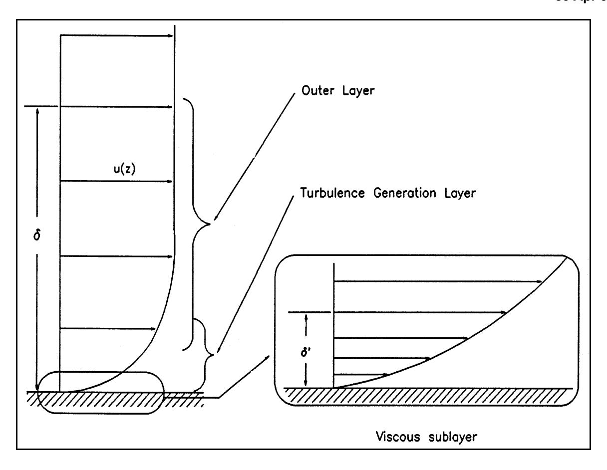

*Figure III-6-1. Turbulent boundary layer structure and mean velocity profile*

and the outer layer. In the viscous sublayer, turbulent fluctuations in velocity are present, but velocity fluctuations normal to the boundary must tend towards zero as the bottom is approached. Consequently, molecular transport of fluid momentum dominates turbulent transport very near the bottom and the shear stress τ can be modeled approximately by the laminar boundary layer relationship

```math
\tau = \rho \ v \ \frac{\partial u}{\partial z} \tag{III-6-1}
```

where ρ is fluid density, ν the kinematic viscosity of the fluid, and u is horizontal velocity.
- (7) The turbulence generation layer is characterized by very energetic small-scale turbulence and high fluid shear. Turbulent eddies produced in this region are carried outward and inward toward the viscous sublayer. If the bottom roughness elements (sediment grains and/or bed forms) have a height greater than the viscous sublayer, the turbulence generation layer extends all the way to the bottom.
- (8) The outer layer makes up most of the turbulent boundary layer and is characterized by much larger eddies, which are more efficient at transporting momentum. This high efficiency of momentum transport produces a mean velocity profile that is much gentler than in the turbulence generation layer, Figure III-6-1.

## EM 1110-2-1100 (Part III) 30 Apr 02

(9) Turbulent boundary layer shear flow models can be simply developed by artificially choosing a constant ν T (called the eddy viscosity), which is much larger than its laminar (molecular) value and that reflects the size of the eddy structure associated with the turbulent flow. This assumption results in a simple conceptual eddy viscosity model for turbulent shear stress that may be expressed as

```math
\tau = \rho \ V_T \frac{\partial u}{\partial z} \tag{III-6-2a}
```

with the turbulent eddy viscosity

```math
\nu _ { T } = \kappa \ u _ { \ast } \ z \tag{III-6-2b}
```

where κ is known as von Karman's constant and u * = (τb/ρ) 1/2 is called the shear velocity, where τb is the shear stress at the bed (z = 0). A complete derivation of this model is given in Madsen (1993).
- (10) Experimental determinations have shown relatively little variation of κ, leading to von Karman's "universal" constant assumed to have the value 0.4. b. Current boundary layer .
- (1) Currents on the inner shelf can be considered to flow at a steady velocity compared to the orbital velocity of waves. Defining the shear stress due to currents τ c , the current velocity profile can be expressed as

```math
u_c = \frac{u_{*c}}{\kappa} \ln \frac{z}{z_o} \tag{III-6-3}
```

where u*c = (τc /ρ) 1/2 denotes the current shear velocity. Equation 6-3 is the classic logarithmic velocity profile expressed in terms of zo , the value of z at which the logarithmic velocity profile predicts a velocity of zero. For a smooth bottom zo = z = 0, but for a rough bottom, the actual location of the boundary is not a single value of z . Hence z = 0 becomes a somewhat ambiguous definition of the "theoretical" location of the bottom with some portions of the boundary actually located at z > 0 and others at z < 0. Therefore, application of Equation 6-3 in the immediate vicinity of a solid bottom is purely formal and its prediction of uc = 0 at z = z o is of no physical significance.
(2) From the extensive experiments by Nikuradse (1933), the value of zo is obtained as

```math
z_0 = \begin{cases} \frac{v}{9u_*} & \text{for smooth turbulent flow} \\ \frac{k_n}{30} & \text{for fully rough turbulent flow} \end{cases} \tag{III-6-4}
```

in which kn is the equivalent Nikuradse sand grain roughness, so called because Nikuradse in his experiments used smooth pipes with uniform sand grains glued to the walls, and therefore found it natural to specify the wall roughness as the sand grain diameter. Smooth or fully rough turbulent flow are delineated by Madsen (1993).

```math
\frac{k_n u_*}{v} \ge 3.3 \quad \text{for fully rough turbulent flow} \tag{III-6-5}
```

- (3) For turbulent flows over a plane bed consisting of granular material it is natural to take k_n = D = diameter of the grains composing the bed. For flow over a bottom covered by distributed roughness elements (e.g., resembling a rippled bottom), the value k_n = 30 z_0 is referred to as the equivalent Nikuradse sand grain roughness, with z_0 obtained by extrapolation of the logarithmic velocity distribution above the bed, to the value z = z_0 where u_c vanishes.
- (4) Figure III-6-2 is a semilogarithmic plot of a current velocity profile obtained over a bottom consisting of 1.5-cm-high triangular bars at 10-cm spacing (Mathisen 1993). It is noticed that velocity measurements over crests and midway between crests (troughs) of the roughness elements deviate from the expected straight line within the lower 2.5 to 3 cm and further than \approx 10 cm above the bottom. The nearbottom deviations reflect the proximity of the actual bottom roughness elements, which make the velocity a function of location, i.e., the flow is nonuniform immediately above the bottom roughness features. The nonlogarithmic velocity profile far from the boundary is associated with the flow being that of a developing boundary layer flow in a laboratory flume, i.e., the flow above z \approx 10 cm is essentially a potential flow unaffected by boundary resistance and wall turbulence.
- (5) The well-defined variation of u_c versus \log z (Figure III-6-2) can be applied to the case 3 cm < z < 10 cm. By extrapolation to u_c = 0 , one obtains the value z = z_0 \approx 0.7 cm or k_n = 30 z_0 \approx 21 cm, since the flow is rough turbulent. This example clearly illustrates that k_n , the equivalent Nikuradse sand grain roughness, is a function of bottom roughness configuration and does not necessarily reflect the physical scale of the roughness protrusions. Thus, the data shown in Figure III-6-2 were obtained for a physical roughness scale of 1.5 cm, the height of the triangular bars, and result in an equivalent Nikuradse roughness of 21 cm. This large value of k_n is, of course, associated with the much larger flow resistance produced by the triangular bars.
- (6) It is often convenient to express the bottom shear stress associated with a boundary layer flow in terms of a current friction factor f_c defined by

```math
\tau_c = \frac{1}{2} f_c \rho(u_c (z_r))^2 \tag{III-6-6}
```

(7) The somewhat cumbersome notation used in Equation 6-6 is chosen deliberately to emphasize the fact that the value of the current friction factor is a function of the reference level, z = z_r , at which the current velocity is specified. From Equation 6-6, the current shear velocity is obtained

```math
u_{*c} = \sqrt{\frac{\tau_c}{\rho}} = \sqrt{\frac{f_c}{2}} u_c(z_r) \tag{III-6-7}
```

and introducing this expression in Equation 6-3, with z = z_r and \kappa = 0.4 leads to an equation for the current friction factor

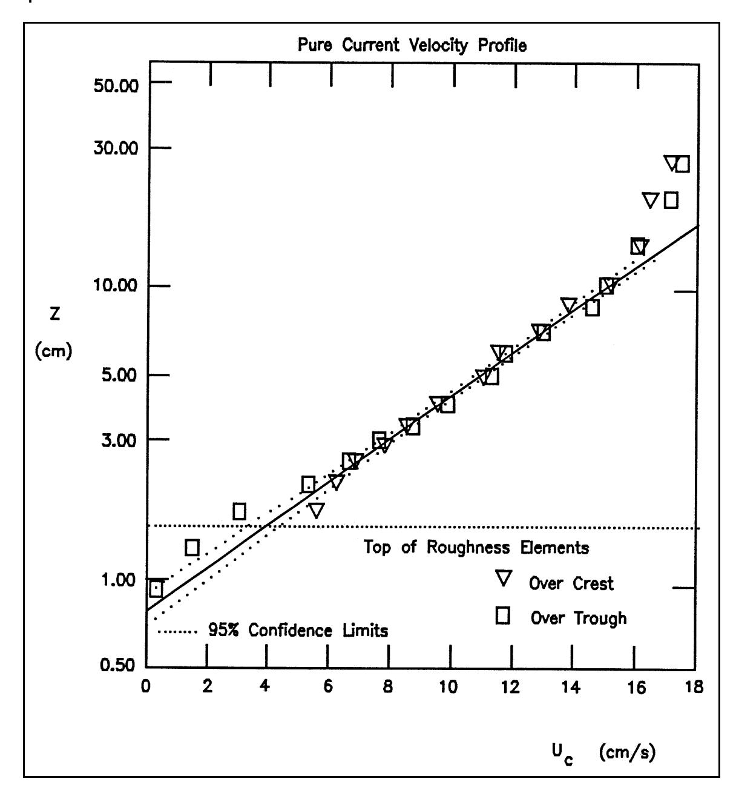

*Figure III-6-2. Measured turbulent velocity profile for flow over artificial two-dimensional roughness elements (Mathisen 1993)*

```math
\frac{1}{4\sqrt{f_c}} \approx \log_{10} \frac{z_r}{z_0} \tag{III-6-8}
```

in terms of the reference elevation and the boundary roughness scale.
(8) For rough turbulent flows z 0 = kn /30 and Equation 6-8 is an explicit equation for fc in terms of the relative roughness zr / kn . For smooth turbulent flows z 0 = ν/(9 u*c ) and Equation 6-8 leads to an implicit equation for fc (Madsen 1993)

#### FIND:

The current friction factor f_c , the shear velocity u_{*c} , and the bottom shear stress \tau_c , for a current over a flat bed.

#### GIVEN:

The current is specified by its velocity u_c(z_r) = 0.35 m/s at z_r = 1.00 m. The bottom is flat and consists of uniform sediment of diameter D = 0.2 mm. The fluid is seawater ( \rho \approx 1,025 kg/m<sup>3</sup>, \nu \approx 1.0 \times 10^{-6} m<sup>2</sup>/s).

#### PROCEDURE:

- 1) Start with Equation 6-4 assuming rough turbulent flow: z_0 = k_n/30 .
- 2) Solve Equation 6-8 for f_c .
- 3) Obtain u_{*c} from Equation 6-7.
- 4) Check rough turbulent flow assumption by evaluating k_n u_{*c}/v and using Equation 6-5.
- 5) If k_n u_* / v \ge 3.3 , flow is rough turbulent. Results ( f_c and u_* / c ) obtained in steps 2 and 3 constitute the solution and \tau_c is obtained from Equation 6-6 or from the definition \tau_c = \rho u_{*c}^2 .
- 6) If k_n u_{*c}/v < 3.3 , flow is smooth turbulent and the solution is obtained by the following iterative procedure (steps 7 and 8).
- 7) Obtain z_0 = v/(9u_{*c}) using u_{*c} from step 3.
- 8) With z_0 from step 7 return to step 2 to obtain a new f_c , and a new u_{*c} from step 3 and reenter (step 7).
- 9) When consecutive values of u_{*c} agree to two significant digits, iteration is complete. The last values of f_c and u_{*c} constitute the solution and \tau_c is obtained from Equation 6-6 or from the definition \tau_c = \rho u_{*c}^2

#### (Continued)

#### Example Problem III-6-1 (Concluded)

#### SOLUTION:

It is first assumed that the flow will turn out to be classified as rough turbulent, in which case Equation 6-4 gives

```math
z_0 = \frac{k_n}{30} = \frac{D}{30} = 6.67 \times 10^{-6} \text{ m} = 6.67 \times 10^{-4} \text{ cm}
```

where k_n = D is chosen, since the bed is flat. With this z_0 value, Equation 6-8 is solved for f_c with z_r = 1.00 m, giving

```math
f_c = 2.33 \times 10^{-3}
```

and the corresponding shear velocity is obtained from Equation 6-7 with u_c(z_r) = 0.35 m/s

```math
u_{*c} = 1.19 \times 10^{-2} \text{ m/s} = 1.19 \text{ cm/s}
```

But is the flow really rough turbulent as assumed ? To check this assumption, the boundary Reynolds number is computed using the rough turbulent estimate of u_{*c}

```math
\frac{k_n u_{*c}}{v} = \frac{Du_{*c}}{v} = 2.38 < 3.3
```

From Equation 6-5 it is seen that the flow should be classified as smooth turbulent. (If k_n u_{*c}/v had been greater than 3.3, the problem would have been solved.) Therefore, an estimate

```math
z _ { 0 } \, = \, \frac { \nu } { 9 u _ { \ast c } } \, \approx \, 9 . 3 { \times } 1 0 ^ { - 6 } \, \mathrm { m }
```

is obtained from Equation 6-4 using the rough turbulent u_{*c} . With this value of z_0 , Equation 6-8 gives the current friction factor

```math
f_c = 2.47 \times 10^{-3}
```

and, from Equation 6-7, the shear velocity and the bottom shear stress

```math
u_{*c} = 1.23 \times 10^{-2} \text{ m/s} = 1.23 \text{ cm/s} \text{ and } \tau_c = \rho u_{*c}^2 = 0.155 \text{ N/m}^2 \approx 0.16 \text{ Pa}
```

Since the smooth turbulent u_{*c} obtained here is close to the rough turbulent estimate, returning with it to update z_0 = v/(9u_{*c}) and repeating the procedure does not change f_c and u_{*c} given above, so they do indeed represent the solution. An alternative solution strategy would be to compute f_c from the implicit Equation 6-9 once it was recognized that the flow was smooth turbulent.

```math
\frac{1}{4\sqrt{f_c}} + \log_{10} \frac{1}{4\sqrt{f_c}} = \log_{10} \frac{z_r u_c(z_r)}{v} + 0.20 \tag{III-6-9}
```

which shows f_c 's dependency on a Reynolds number, \frac{z_r u_c(z_r)}{v} , when the flow is classified as smooth turbulent.
- c. Wave boundary layers.
- (1) Introduction. Wave boundary layers on the inner shelf are inherently unsteady due to the oscillatory nature of near-bottom wave orbital velocity. However, for typical gravity wave periods on the inner shelf, it is assumed that the boundary layer thickness, here denoted by \delta_{\rm w} , will be sufficiently small so that flow at the outer edge of the boundary layer may be predicted directly from linear wave theory. An extreme complication of the unsteady nature of waves arises in the application of the simple turbulent eddy viscosity model. Specifically, wave turbulent eddy viscosity becomes a time-dependent variable u_* = (|\tau_b|/\rho)^{1/2} = u_*(t) . However, the effect of a time-varying eddy viscosity is surprisingly small when compared with results obtained from a simple time-invariant eddy viscosity model in which u_* = u_{*wm} = (|\tau_{wm}|/\rho)^{1/2} is determined from the maximum bottom wave shear stress \tau_{wm} , during one wave cycle (Trowbridge and Madsen 1984). Therefore, the eddy viscosity model gives a wave shear stress

```math
\tau_{w} = \rho v_{t} \frac{\partial u_{w}}{\partial z} = \rho \kappa u_{*wm} z \frac{\partial u_{w}}{\partial z} \tag{III-6-10}
```

where u_w is the wave orbital velocity (Grant and Madsen 1979, 1986). Using Equation 6-10, applying simple linear periodic wave theory to the boundary conditions, and simplifying by taking the limiting form of the solution for the velocity profile gives

```math
u_w = \frac{2}{\pi} \sin \varphi \ u_{bm} \ln \frac{z}{z_o} \cos(\omega t + \varphi) \tag{III-6-11}
```

in which u_{bm} is the maximum near-bottom wave orbital velocity, \omega is 2 \pi/T , and \varphi , the phase lead of near-bottom wave orbital velocity, is given by

```math
\tan \varphi = \frac{\frac{\pi}{2}}{\ln \frac{\kappa u_{*wm}}{z_o \omega} - 1.15} \tag{III-6-12}
```

From the near-bottom velocity profile, the bottom shear stress may be obtained from

```math
\tau_{w} = \tau_{\omega m} \cos(\omega t + \varphi) \tag{III-6-13}
```

Expressing the maximum bottom shear stress in terms of a wave friction factor f_w defined by Jonsson (1966)

```math
\tau_{wm} = \frac{1}{2} f_w \rho u_{bm}^2 \tag{III-6-14}
```

or equivalently

# EM 1110-2-1100 (Part III) 30 Apr 02

```math
u_{*wm} = \sqrt{\frac{\tau_{wm}}{\rho}} = \sqrt{\frac{f_w}{2}} u_{bm} \tag{III-6-15}
```

Using Equations 6-10 to 6-15 and simplifying (Madsen 1993) results in an implicit equation for the wave friction factor

```math
\kappa \sqrt{\frac{2}{f_w}} = \sqrt{\left(\ln \frac{\kappa \sqrt{\frac{f_w}{2}} u_{bm}}{z_0 \omega} - 1.15\right)^2 + \left(\frac{\pi}{2}\right)^2} \tag{III-6-16}
```

With \kappa = 0.4 and recognizing that

```math
A_{bm} = \frac{u_{bm}}{\omega} \tag{III-6-17}
```

is the bottom excursion amplitude predicted by linear wave theory, Equation 6-16 may be approximated by the following implicit wave friction factor relationship (Grant and Madsen 1986)

```math
\frac{1}{4\sqrt{f_w}} + \log_{10} \frac{1}{4\sqrt{f_w}} = \log_{10} \frac{A_{bm}}{k_n} - 0.17 + 0.24 \left(4\sqrt{f_w}\right) \tag{III-6-18}
```

for rough turbulent flow when k_n = 30z_0 .
For smooth turbulent flow, 30z_0 = 3.3v/u_{*_{wm}} replaces k_n in Equation 6-18, which may then be written

```math
\frac{1}{4\sqrt{4f_w}} + \log_{10} \frac{1}{4\sqrt{4f_w}} = \log_{10} \sqrt{\frac{RE}{50}} - 0.17 + 0.06 \left(4\sqrt{4f_w}\right) \tag{III-6-19}
```

in which

```math
\mathrm { R E } \ = \ { \frac { u _ { b m } \ A _ { b m } } { \nu } } \tag{III-6-20}
```

is a wave Reynolds number. For completeness, the wave friction factor for a laminar wave boundary layer is given by (Jonsson 1966)

```math
f_w = \frac{2}{\sqrt{RE}} \tag{III-6-21}
```

- (2) Evaluation of the wave friction factor.
- (a) From knowledge of the equivalent roughness k_n and wave condition A_{bm} and u_{bm} , three formulas for f_w have been presented. The choice of which f_w to select is quite simply the largest of the three values. In this context it is mentioned that the wave friction factors predicted for smooth turbulent and laminar flow,
Equations 6-19 and 6-21, are identical for RE . 3×104 , which may be taken as a reasonable value for the transition from laminar (RE < 3×104 ) to turbulent flow.
(b) The evaluation of wave friction factors from Equations 6-18 and 6-19 can proceed by iteration. The iterative procedure is illustrated for Equation 6-18 by writing it in the following form

```math
\frac{1}{x^{(n+1)}} = \left(\log_{10} \frac{A_{bm}}{k_n} - 0.17\right) - \log_{10} \frac{1}{x^{(n)}} + 0.24x^{(n)} \tag{III-6-22}
```

with the superscript denoting the iteration step and iteration started by choosing x (0) x ' 4 f = 0.4. w
(c) It was assumed, in conjunction with the presentation of Equation 6-11 for the orbital velocity profile within the wave boundary layer, that this expression represented an approximation valid only for small values of , i.e., for relatively large values of Abm / kn z . For this reason and also because 0 ω/(κ u ( wm )'(0.12/ fw )( kn / Abm ) the iterative solution of the wave friction factor Equation 6-18 is rather slowly converging for Abm / kn < 100, Figure III-6-3 gives the exact solution for fw and n for Abm / kn < 100.

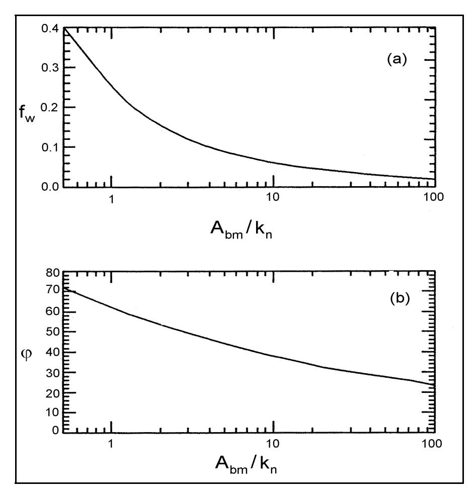

*Figure III-6-3. Wave friction factor diagram (a) and bottom friction phase angle (b)*

(d) For smooth turbulent boundary layer flows, Equation 6-19 may be arranged in a fashion similar to Equation 6-22, and the iterative solution proceeds as outlined above with . x ' 4 4 f w

# EM 1110-2-1100 (Part III) 30 Apr 02

(3) Wave boundary layer thickness. From the logarithmic approximation given by Equation 6-11, which is valid only near the bottom and for large values of \kappa u_{*wm}/(z_0\omega) , the location for which |u_w| = u_{bm} is obtained as z \approx \kappa u_{*wm}/(\pi\omega) . Although use of Equation 6-11 for the prediction of boundary layer thickness exceeds its validity, the results suggest

```math
\delta_{w} = \frac{\kappa u_{*wm}}{\omega} = \kappa \sqrt{\frac{f_{w}}{2}} A_{bm} \tag{III-6-23}
```

in agreement with conclusions reached based on the complete solution to the boundary layer problem (Grant and Madsen 1986).
- (4) The velocity profile.
- (a) With the limitation of the validity of the velocity profile given by Equation 6-11 in mind, it is seen from Equation 6-16 that the velocity profile within the wave boundary layer may be expressed in the following extremely simple form, with an upper limit of validity given by the z value for which |u_w| = u_{bm} , or approximately z = \delta_w/\pi , i.e.,

```math
u_{w} = \frac{\sqrt{\frac{f_{w}}{2}} u_{bm}}{\kappa} \ln \frac{z}{z_{0}} \cos (\omega t + \varphi) = \frac{u_{*wm}}{\kappa} \ln \frac{z}{z_{0}} \cos (\omega t + \varphi) \tag{III-6-24}
```

- (b) Figure III-6-4 compares the experimentally obtained periodic orbital velocity amplitude within the wave boundary layer (Jonsson and Carlson 1976, Test No. 1) with the prediction afforded by the exact solution obtained from the theory presented here and the approximate solution given by Equation 6-24. Clearly, the approximate velocity profile compares favorably with both the exact and the experimental profiles near the bottom, as it should. Although some differences become apparent further from the boundary, the approximate solution provides an adequate representation of the measured profile, particularly when its intended use for the prediction of sediment transport rates is kept in mind. (5) Extension to spectral waves.
- (a) The preceding analysis of wave bottom boundary layer mechanics was based on the assumption of simple periodic waves. In reality, wind waves are more realistically represented by the superposition of several individual wave components of different frequencies and directions of propagation, i.e., by a directional wave spectrum, rather than by a single periodic component. Madsen, Poon, and Graber (1988) presented a bottom boundary layer model for waves described by their near-bottom wave orbital velocity spectrum. This reference provides the details of an analysis, the basis of which is an assumed time-invariant eddy viscosity similar to the one discussed earlier for a simple periodic wave. The analysis utilizes the near-bottom maximum orbital velocity u_{bm,i} and radian frequency \omega_i of the individual i^{th} wave components of the wave spectrum to calculate a single set of representative periodic wave characteristics (see Madsen (1993) for details).
- (b) Given the widespread use of the significant wave concept in coastal engineering practice it is important to emphasize that the <u>representative periodic wave characteristics</u> defined by Madsen (1993) <u>are not those of the significant wave</u>, but rather those of a wave with the significant period and the

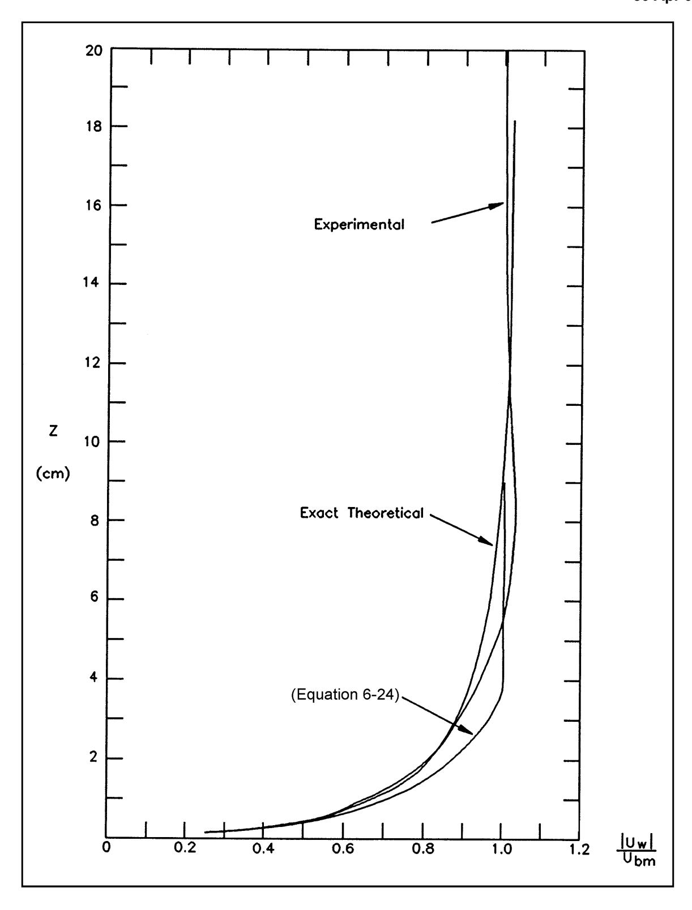

*Figure III-6-4. Comparison of present model's prediction of wave orbital velocity within the wave boundary layer with measurements by Jonsson and Carlson (1976, Test No. 1)*

## FIND:

The wave friction factor fw , the maximum shear velocity u * wm , the maximum bottom shear stress τ wm , and the bottom shear stress phase angle n, for a pure wave motion over a flat bed.

## GIVEN:

The wave is specified by its near-bottom maximum orbital velocity ubm = 0.35 m/s and period T = 8.0 s. The bottom is flat and consists of uniform sediment of diameter D = 0.1 mm. The fluid is seawater (ρ . 1,025 kg/m3 , ν . 1.0×10–6 m2 /s).

## PROCEDURE:

- 1) Compute bottom orbital excursion amplitude from linear wave theory: Abm = ( H /2)/sinh(2π h / L ) = ubm /ω, using H = Hrms = root-mean-square wave height = , H ω = 2π/ T with T = significant s / 2 wave period, and h = water depth. (This step is not needed here, since ubm and T are specified)
- 2) Assume rough turbulent flow and solve Equation 6-18 using the iterative procedure illustrated by Equation 6-22 for fw .
- 3) Obtain u * wm from Equation 6-15.
- 4) Check rough turbulent flow assumption by evaluating knu * wm /ν and using Equation 6-15.
- 5) If knu * wm /ν $ 3.3, flow is rough turbulent. Results ( fw and u * cw ) obtained in steps 2 and 3 constitute the solution. τ wm is obtained from Equation 6-14 or 6-15 and n is obtained by solving Equation 6-12 with z 0 = kn /30.
- 6) If knu * wm /ν < 3.3 flow is smooth turbulent and fw is obtained by solving Equation 6-19 using the iterative procedure illustrated by Equation 6-22 with Abm / kn replaced by and RE /50 x = . 4 4 f w
- 7) With fw from step 6, Equation 6-15 gives u * wm and τ wm is obtained from Equation 6-14 or Equation 6-15.
- 8) With u * wm from step 7, the value of z 0 = ν/(9 u * wm ) is obtained from Equation 6-15 for smooth turbulent flow.
- 9) The phase angle n is calculated from Equation 6-12 using z 0 from step 8.
(Sheet 1 of 3)

# Example Problem III-6-2 (Continued)

SOLUTION:
From the given wave characteristics, it follows that

```math
\omega = 2\pi/T = 0.785\ \text{s}^{-1};\ A_{bm} = u_{bm}/\omega = 0.446\ \text{m} = 44.6\ \text{cm}
```

Assuming the wave boundary layer to be rough turbulent, kn = D = 30 z 0, and the wave friction factor is obtained by solving Equation 6-18 using the iterative procedure illustrated by Equation 6-22. For kn = D = 0.1, one obtains

```math
\log_{10} \frac{A_{bm}}{k_n} - 0.17 = 3.48
```

and starting with x (0) = 0.4, Equation 6-22 gives x (1) = 0.315 followed by x (2) = 0.327, x (3) = 0.325, and finally x (4) = 0.326 = . Thus, 4 fw

```math
f_w = (0.326/4)^2 = 6.64 \times 10^{-3}
```

and from Equation 6-15

```math
u_{*wm} = \sqrt{\frac{f_w}{2}} u_{bm} = 2.02 \times 10^{-2} \text{ m/s} = 2.02 \text{ cm/s}
```

This is the true solution only if the flow is rough turbulent as assumed , i.e., only if knu * wm /ν > 3.3. Here, kn = 0.1 mm and the u * wm obtained above gives

```math
\frac{k_n u_{*wm}}{v} = 2.02 < 3.3
```

so the flow is not rough but smooth turbulent, i.e., fw should be obtained from Equation 6-19 and not from Equation 6-18. Equation 6-19 may be rearranged to take the form analogous to Equation 6-22

```math
\frac{1}{x^{(n+1)}} = \left(\log_{10} \sqrt{\frac{\text{RE}}{50}} - 0.17\right) - \log_{10} \frac{1}{x^{(n)}} + 0.06x^{(n)}
```

(Sheet 2 of 3)
Example Problem III-6-2 (Concluded)
with x = and 4 4 f w

```math
\mathrm { R E } \, = \, \frac { u _ { b m } A _ { b m } } { \nu } \, = \, 1 . 5 6 { \times } 1 0 ^ { 5 }
```

Therefore

```math
\left(\log_{10}\sqrt{\frac{RE}{50}} - 0.17\right) = 1.58
```

and starting iteration with x (0) = 0.0 gives x (1) = 08.29, x (2) = 0.646, x (3) = 0.7,... and finally x (6) = 0.686 =
= , or the 4 4 f wave friction factor w 8 fw

```math
f_w = 7.35 \times 10^{-3}
```

which results in the maximum shear velocity

```math
u_{*wm} = \sqrt{\frac{f_w}{2}} u_{bm} = 2.12 \times 10^{-2} \text{ m/s} = 2.12 \text{ cm/s}
```

and a maximum bottom shear stress , Equation 6-32,

```math
\tau_{wm} = \rho (u_{*wm})^2 = 0.461 \text{ N/m}^2 = 0.46 \text{ Pa}
```

The phase angle n of the bottom shear stress is obtained from Equation 6-12 with

```math
z_0 = \frac{\nu}{9u_{*wm}} = 5.24 \times 10^{-6} \text{ m}
```

obtained from Equation 6-4 for smooth turbulent flow

```math
\tan \varphi = 0.242 arrow \varphi = 13.6^{\circ} \approx 14^{\circ}
```

(Sheet 3 of 3)
root-mean-square wave height. Thus, for surface waves specified in terms of their significant height Hs and period Ts , the near-bottom representative periodic orbital velocity is obtained from a wave with root mean square height , and wave period T = Ts H . rms ' Hs / 2
(6) Dissipation. Time-averaged rate of energy dissipation in the wave bottom boundary layer is obtained from Kajiura (1968) as

```math
D_{p} = \frac{1}{4} \rho (f_{w} \cos \varphi) u_{bm}^{3} \tag{III-6-25}
```

for periodic waves and can be extended to spectral waves using the representative periodic wave properties as given above (Madsen, Poon, and Graber 1988).
- d. Combined wave-current boundary layers .
- (1) Introduction.
- (a) The simple conceptual model of near-bottom turbulence suggests that the eddy viscosity immediately above the bottom is a function of time whenever the flow is unsteady. In the context of a pure wave motion, it was, however, found that assuming a time-invariant eddy viscosity, based on the maximum shear velocity, resulted in a greatly simplified analysis without sacrificing accuracy appreciably (Trowbridge and Madsen 1984). In the case of combined wave-current bottom boundary layer flows, the eddy viscosity immediately above the bottom is therefore scaled by the maximum combined wave-current shear velocity. Since the vertical extent of wave-associated turbulence is limited by the wave bottom boundary layer thickness, the wave contribution to the turbulent mixing must vanish at some level above which only the current shear velocity contributes to turbulent mixing.
- (b) For the general case of combined wave-current flows with the current at an angle φ wc to the direction of wave propagation, the maximum combined bottom shear stress τ m may be obtained from

```math
\boldsymbol{\tau}_m = |\boldsymbol{\tau}_{wm} + \boldsymbol{\tau}_c|
```

```math
= \sqrt{(\tau_{wm} + \tau_c |\cos \varphi_{wc}|)^2 + (\tau_c \sin \varphi_{wc})^2} \tag{III-6-26}
```

```math
= \tau_{wm} \sqrt{1 + 2 \frac{\tau_c}{\tau_{wm}} \left| \cos \varphi_{wc} \right| + \left( \frac{\tau_c}{\tau_{wm}} \right)^2}
```

(c) Since the boundary layer flow for combined waves and currents at an angle is three-dimensional, one should in principle solve for the horizontal velocity vector's two components. However, when the x direction is chosen as the wave direction, unsteady flow will exist only in this direction. In this case it can be shown that all formulas derived for the pure wave case in Part III-6(2)c are valid also for waves in the presence of a current when u * wm is replaced by u * m obtained from Equation 6-26 with u . For ( m ' (τ m /ρ) 1/2

#### EM 1110-2-1100 (Part III) 30 Apr 02

example, the velocity profile is given by Equation 6-11 with u * wm replaced by u * m . As mentioned previously, u * wm . u * m , which shows that the wave motion is only weakly influenced by the presence of a current.
(d) The steady flow is entirely in the direction of the current, i.e., at an angle φ wc to the wave direction. Invoking the "law of the wall," the current velocity is (for z < δcw where δcw is defined in Equation 6-38)

```math
u_c = \frac{u_{*c}}{\kappa} \frac{u_{*c}}{u_{*m}} \ln \frac{z}{z_0} \tag{III-6-27}
```

and z 0 is given by Equation 6-4 with u * m replacing u *.
(e) For z > δ cw the solution is

```math
u_c = \frac{u_{*c}}{\kappa} \ln \frac{z}{z_{0a}} \tag{III-6-28}
```

where z 0 a denotes an arbitrary constant of integration, referred to as the apparent bottom roughness . Matching the two solutions at z = δ cw and introducing the expression for z 0 a in Equation 6-28 gives an alternative form of the solution for z > δ cw

```math
u_c = \frac{u_{*c}}{\kappa} \left( \ln \frac{z}{\delta_{cw}} + \frac{u_{*c}}{u_{*m}} \ln \frac{\delta_{cw}}{z_0} \right) \tag{III-6-29}
```

- (f) These expressions clearly reveal the pronounced effect that waves may have on current velocity profiles. First of all, the velocity gradient inside the wave-current boundary layer is reduced by a factor u * c / u * m relative to its value in absence of waves. This, of course, is a consequence of the increased turbulence intensity within the wave boundary layer arising from the waves. In the extreme case of u * c / u * m . 0, uc remains nearly zero throughout the wave boundary layer. Thus, currents in the presence of waves experience an enhanced bottom roughness (i.e., for the same current velocity at a specified level above the bottom the 0current shear velocity and shear stress will increase with wave activity).
- (g) Figure III-6-5 compares a current velocity profile in the presence of waves predicted by the present wave-current interaction theory with the measured current profile (Bakker and van Doorn 1978). Two theoretical predictions are shown, one in which δ cw is based on Equation 6-23 with u * wm = u * m and another in which δ cw was increased by a factor of 1.5. From the comparison, it is concluded that the definition of δ cw given by Equation 6-23 may be adopted for the wave-current interaction theory presented here. This wavecurrent interaction theory may be applied to a wave described by its near-bottom orbital velocity spectrum by using the representative periodic wave with the direction of wave propagation chosen as the peak direction (Madsen 1993).
- (2) Combined wave-current velocity profile. Having chosen the x -axis as the direction of wave propagation, the wave orbital velocity profile immediately above the bottom is given by Equation 6-11 where the phase angle n defined by Equation 6-12 is evaluated with u * wm = u * m .
The current velocity vector is given by

```math
\boldsymbol{u}_{c} = u_{c}(z) \left\{ \cos \varphi_{wc}, \sin \varphi_{wc} \right\} \tag{III-6-30}
```

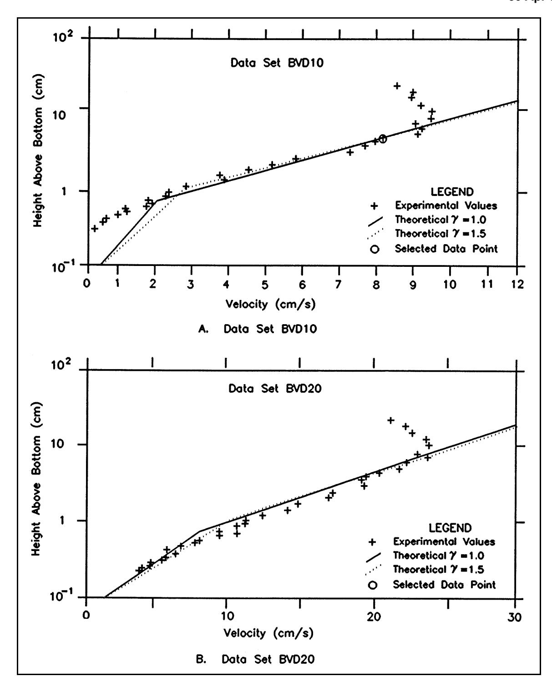

*Figure III-6-5. Comparison of current profile in the presence of waves predicted by present model with measured current profile*

where u_c(z) is given by Equations 6-27 and 6-29.
(3) Combined wave-current bottom shear stress. Similarly, the time-varying bottom shear stress associated with combined wave-current flows may be obtained from

```math
\tau_b(t) = \{\tau_{wm} \cos(\omega t + \varphi) + \tau_c \cos\varphi_{wc}, \tau_c \sin\varphi_{wc}\} \tag{III-6-31}
```

- (4) Methodology for the solution of a combined wave-current problem.
- (a) For a wave motion specified by u_{bm} and \omega ( A_{bm} = u_{bm}/\omega ) and a bottom roughness specified by its equivalent Nikuradse roughness k_n , the pertinent formulas for the solution of a combined wave-current bottom boundary layer flow problem are the relative strengths of currents and waves

```math
\mu = \frac{\tau_c}{\tau_{wm}} = \frac{u_{*c}^2}{u_{*wm}^2} \tag{III-6-32}
```

which appears in the factor relating maximum wave and maximum combined bottom shear stresses (Equation 6-26)

```math
C_{\mu} = \sqrt{1 + 2\mu \cos \varphi_{wc} + \mu^2} \tag{III-6-33}
```

and wave friction factor formulas, given by Equations 6-18 and 6-19 for pure waves, become for combined wave-current flows (for derivation see Grant and Madsen (1986))

```math
\frac { 1 } { 4 \sqrt { \frac { f _ { c w } } { C _ { \mu } } } } \ + \ \log _ { 1 0 } \frac { 1 } { 4 \sqrt { \frac { f _ { c w } } { C _ { \mu } } } } \ = \ \log _ { 1 0 } \frac { C _ { \mu } A _ { b m } } { k _ { n } } \ - \ 0 . 1 7 \ + \ 0 . 2 4 \left( 4 \sqrt { \frac { f _ { c w } } { C _ { \mu } } } \right) \tag{III-6-34}
```

for rough turbulent flow, i.e., k_n > 3.3 v/u_{*_m} , and

```math
\frac { 1 } { 4 \sqrt { \frac { 4 f _ { c w } } { C _ { \mu } } } } + \log _ { 1 0 } \frac { 1 } { 4 \sqrt { \frac { 4 f _ { c w } } { C _ { \mu } } } } = \log _ { 1 0 } \sqrt { \frac { C _ { \mu } ^ { 2 } \mathrm { R E } } { 5 0 } } - 0 . 1 7 + 0 . 0 6 \left( 4 \sqrt { \frac { 4 f _ { c w } } { C _ { \mu } } } \right) \tag{III-6-35}
```

for smooth turbulent flow, i.e., k_n < 3.3 \text{ V}/u_{*_m}
- (b) The solution of Equation 6-34 or Equation 6-35 proceeds in the iterative manner illustrated by Equation 6-22 except x = 4\sqrt{f_{cw}/C_{\mu}} replaces x = 4\sqrt{f_w} . Also, Figure III-6-3 may be used with C_{\mu}A_{bm}/k_n replacing A_{bm}/k_n as entry, and the value of f_w obtained from the ordinate being interpreted as the value of f_{cw}/C_{\mu} . (c) The wave friction factor in the presence of currents f_{cw} is defined by

```math
\frac{\tau_{wm}}{\rho} = u_{*wm}^2 = \frac{1}{2} f_{cw} u_{bm}^2 \tag{III-6-36}
```

and when Equation 6-33 is introduced in Equation 6-26, the maximum combined shear stress reads

```math
\frac{\tau_m}{\rho} = u_{*m}^2 = C_{\mu} u_{*wm}^2 \tag{III-6-37}
```

(d) Finally, the wave boundary layer thickness is given by the modified form of Equation 6-23, i.e.,

```math
\delta_{cw} = \frac{\kappa u_{*m}}{\omega} \tag{III-6-38}
```

- (e) Current specified by \tau_c , i.e., \frac{\tau_c}{\rho} = u_{*c}^2 and \phi_{wc} are known.
- (f) Starting with \mu = 0 , C_{\mu} = 1 , the wave friction factor is obtained from Equation 6-34. The values of u_{*wm}^2 and u_{*m}^2 are obtained from Equations 6-36 and 6-37. Rough turbulent flow is checked by calculating k_n u_{*m}/v . If not greater than 3.3, flow is smooth turbulent and the wave friction factor is recalculated from Equation 6-35, followed by evaluation of u_{*m}^2 and u_{*wm}^2 as before. In most cases, flow is rough turbulent and the check of rough or smooth turbulent flow is only necessary during the first iteration.
- (g) With the pure wave estimate of u_{*wm}^2 = u_{*m}^2 in hand, one obtains updated values of \mu and C_{\mu} from Equations 6-32 and 6-33. The wave friction factor is obtained from the appropriate relationship, Equation 6-34 or Equation 6-35, by solving for f_{cw}/C_{\mu} followed by multiplication with C_{\mu} . Values of u_{*wm}^2 and u_{*m}^2 are obtained from Equations 6-36 and 6-37. Upon return to Equation 6-32 with the latest value of u_{*wm}^2 the procedure may be repeated until f_{cw} remains essentially unchanged from one iteration to the next. As a reasonable convergence criterion, it is recommended to calculate f_{cw} with no more than three significant figures.
- (h) The wave-current interaction problem is now solved and, following evaluation of the wave boundary layer thickness \delta_{cw} from Equation 6-38, the current velocity profile may be obtained from Equation 6-27 for z \le \delta_{cw} and from Equation 6-29 for z \ge \delta_{cw} . (i) Current specified by \mathbf{u}_c at z = z_r (i.e., u_c(z = z_r) ) and \phi_{wc} are known.
- (j) Again \mu = 0 and C_{\mu} = 1 are used for the first iteration which proceeds as outlined under step e above. For this case, however, the first iteration is carried through determination of \delta_{cw} from Equation 6-38. At this point, Equation 6-29, assuming z_r > \delta_{cw} , may be regarded as a quadratic equation in the unknown current shear velocity

```math
\kappa u_{c}(z_{r}) = \ln \frac{z_{r}}{\delta_{cw}} u_{*c} + \frac{\ln \frac{\delta_{cw}}{z_{0}}}{u_{*m}} u_{*c}^{2} \tag{III-6-39}
```

with the solution

#### FIND:

The current shear velocity and bottom shear stress, u_{*_c} and \tau_c , the maximum wave shear velocity and bottom shear stress, u_{*_{wm}} and \tau_{wm} , as well as the maximum combined shear velocity and bottom shear stress, u_{*_m} and \tau_m , for a combined wave-current flow over a flat bed.

#### GIVEN:

The wave is specified by its near-bottom maximum orbital velocity u_{bm} = 0.35 m/s and period T = 8 s. The current is specified by its magnitude u_c(z_r) = 0.35 m/s at z_r = 1.00 m and direction \varphi_{wc} = 45^\circ relative to the direction of wave propagation. The bottom is flat and consists of uniform sediment of diameter D = 0.2 mm. The fluid is seawater ( \rho = 1,025 kg/m<sup>3</sup>, v \approx 1.0 \times 10^{-6} m<sup>2</sup>/s).

#### PROCEDURE:

- 1) Compute wave characteristics as in step 1 of Example Problem III-6-2.
- 2) Assume rough turbulent flow and solve the wave-current interaction following the iterative procedure described in subsection III-6(2)d(4)i.
- 3) Check if flow is rough turbulent by evaluating k_n u_{*m} / v with u_{*m} obtained in step 2.
- 4) If k_n u_{*m}/v \ge 3.3 , flow is rough turbulent and values of u_{*c} , u_{*wm} , and u_{*m} obtained in step 2 constitute the solution. Bottom shear stresses are obtained from the definition of shear velocities: \tau = \rho u_*^2 .
- 5) If k_n u_{*m}/v < 3.3 flow is smooth turbulent and the combined wave-current flow is solved as in step 2 except for Equation 6-35 replacing Equation 6-34 when the wave friction factor in the presence of a current is evaluated.
- 6) With u_{*c} , u_{*wm} , and u_{*m} from step 5, \tau = \rho u_*^2 is used to obtain bottom shear stresses.

#### SOLUTION:

For the given wave parameters, \omega = 2\pi/T = 0.785 \text{ s}^{-1} , A_{bm} = u_{bm}/\omega = 0.446 \text{ m} , and k_n = D = 2 \times 10^{-4} \text{ m} since the bottom is flat. Proceeding as outlined in Part III-6(2)d subsection (4)a, starting with \mu = 0 , Equation 6-33 gives C_{\mu} = 1 . Assuming rough turbulent flow, Equation 6-34 reduces to the exact form of the pure wave friction factor Equation 6-18 whose solution is obtained iteratively using Equation 6-22 (see Example Problem III-6-2) as

```math
f_{cw} = f_w = 7.86 \times 10^{-3}
```

The maximum shear velocity is given by Equation 6-37, i.e.,

```math
u_{*m} = \sqrt{C_{\mu}} u_{*wm} = u_{*wm} = \sqrt{\frac{f_{cw}}{2}} u_{bm} = 2.19 \times 10^{-2} \text{ m/s} = 2.19 \text{ cm/s}
```

(Continued)

## Example Problem III-6-3 (Concluded)

since C_{\mu} is currently assumed to be 1. From k_n u_{*m}/v = 4.38 it follows that the flow indeed is rough turbulent as assumed . (If k_n u_{*m}/v < 3.3 , one would have to return and compute f_{cw} from Equation 6-35.) It therefore follows from Equation 6-38 that

```math
\delta_{cw} = 1.12 \times 10^{-2} \text{ m} = 1.12 \text{ cm}
```

With these values and z_0 = k_n/30 = D/30 = 6.67 \times 10^{-6} m, Equation 6-40 is solved to give a first estimate of the current shear velocity

```math
u_{*c} = 1.47 \times 10^{-2} \text{ m/s} = 1.47 \text{ cm/s}
```

Using the first estimates of u_{*c} = 1.47 cm/s and u_{*wm} = 2.19 cm/s, Equation 6-32 gives

```math
\mu = \left(\frac{u_{*c}}{u_{*wm}}\right)^2 = 0.45
```

and with \varphi_{wc} = 45^{\circ} , Equation 6-33 gives C_u = 1.36 .
To solve Equation 6-34 for the wave friction factor in the presence of a current f_{cw} , it is rearranged in a manner identical to Equation 6-22, i.e.,

```math
\frac{1}{x^{(n+1)}} = \left(\log_{10} \frac{C_{\mu}A_{bm}}{k_n} - 0.17\right) - \log_{10} \frac{1}{x^{(n)}} + 0.24x^{(n)}
```

with x = 4\sqrt{f_w/C_{\mu}} . Solving iteratively starting with x^{(0)} = 0.4 gives x^{(4)} = 0.342 = 4\sqrt{f_w/C_{\mu}} , or f_{cw} = (x/4)^2 C_{\mu} = 9.94 \times 10^{-3}
The value of the wave shear velocity is now obtained from Equation 6-36

```math
u_{*wm} = \sqrt{\frac{f_{cw}}{2}} u_{bm} = 2.47 \times 10^{-2} \text{ m/s} = 2.47 \text{ cm/s} \text{ and } \tau_{wm} = \rho u_{*wm}^2 = 0.624 \text{ Pa}
```

followed by

```math
u_{*m} = \sqrt{C_\mu} \quad u_{*wm} = 2.88 \times 10^{-2} \text{ m/s} = 2.88 \text{ cm/s} \quad \text{and} \quad \tau_m = \rho u_{*m}^2 = 0.850 \text{ Pa}
```

from Equation 6-37 and

```math
\delta_{cw} = \frac{\kappa u_{*m}}{\omega} = 1.47 \times 10^{-2} \text{ m} = 1.47 \text{ cm}
```

With these values in hand, Equation 6-40 gives a second estimate of the current shear velocity

```math
u _ { * _ { c } } = 1 . 6 3 \times 1 0 ^ { - 2 } \, \mathrm { m / s } = 1 . 6 3 \, \mathrm { c m / s } \quad \mathrm { a n d } \quad \tau _ { \mathrm { c } } = \rho u _ { * c } ^ { 2 } = 0 . 2 7 2 \, \mathrm { P a }
```

#### FIND:

The current shear velocity u_{*_c} , the maximum wave shear velocity u_{*_w m} , the maximum combined shear velocity u_{*_m} , and the wave boundary layer thickness \delta_{cw} for a combined wave-current turbulent boundary layer flow.

#### GIVEN:

The wave is specified by its near-bottom maximum orbital velocity u_{bm} = 0.35 m/s and period T = 8.0 s. The current is specified by its magnitude u_c = 0.35 m/s at z_r = 1.00 m and direction \phi_{wc} = 45^{\circ} relative to the direction of wave propagation. The equivalent Nikuradse roughness of the bottom is k_n = 4.4 cm. The fluid is seawater ( \rho = 1,025 kg/m<sup>3</sup>, \nu \approx 10^{-6} m<sup>2</sup>/s).

#### PROCEDURE:

Identical to Example Problem III-6-3. However, the iterative solution of the wave friction factor in Equation 6-34 is started with an initial value obtained from Figure III-6-3 to speed up convergence.

#### SOLUTION:

For the given wave parameters \omega = 2\pi/T = 0.785 \text{ s}^{-1} and A_{bm} = u_{bm}/\omega = 0.446 \text{ m} , the procedure to follow is identical to that used in Example Problem III-6-3, except that here

```math
\frac{A_{bm}}{k_n} = \frac{0.446}{0.044} \approx 10
```

is much smaller. Therefore, during the first iteration (with \mu = 0 and C_{\mu} = 1 ) the wave friction factor is obtained from Figure III-6-3

```math
f_{w} = f_{cw} \approx 0.058
```

instead of solving Equation 6-34. The pure wave approximation therefore gives

```math
u_{*wm} = u_{*m} = \sqrt{\frac{f_w}{2}} \cdot u_{bm} = 5.96 \text{ cm/s}
```

and

```math
\delta_{cw} = \frac{\kappa u_{*wm}}{\omega} = 3.04 \text{ cm}
```

With these values, the first estimate of the current shear velocity is obtained from Equation 6-40

```math
u_{*c} = 2.84 \text{ cm/s}
```

(Continued)

#### Example Problem III-6-4 (Concluded)

An updated value of \mu is then

```math
\mu = \left(\frac{u_{*c}}{u_{*wm}}\right)^2 = 0.23
```

and from Equation 6-33

```math
C _ { \mu } = 1 . 1 7
```

Recognizing that Equation 6-34 is identical to the pure wave friction factor (Equation 6-18) if C_{\mu}A_{bm}/k_n replaces A_{bm}/k_n and f_{cw}/C_{\mu} replaces f_w , the value of f_{cw}/C_{\mu} may be read off Figure III-6-3 when C_{\mu}A_{bm}/k_n = 11.7 is used as an entry. In this manner

```math
f_{cw}/C_{\mu} \approx 0.053 arrow f_{cw} \approx 0.062
```

is obtained. Clearly, the accuracy of the reading obtained from Figure III-6-3 is not impressive, so the value is regarded only as a rough estimate. From Equation 6-36, Equation 6-37, and Equation 6-38, it follows that

```math
u_{*wm} = 6.16 \text{ cm/s}, u_{*m} = 6.67 \text{ cm/s}, \delta_{cw} = 3.40 \text{ cm}
```

and from Equation 6-40

```math
u_{*c} = 2.94 \text{ cm/s}
```

With these values \mu = (u_{*c}/u_{*wm})^2 = 0.23 , i.e., the iteration is complete.
So the solution is u_{*c} = 2.94 cm/s, \tau_c = \rho u_{*c}^2 = 0.89 Pa, u_{*wm} = 6.16 cm/s, \tau_{wm} = \rho u_{*wm}^2 = 3.89 Pa,

```math
u_{*m} = 6.67 \text{ cm/s}, \, \tau_m = \rho u_{*m}^2 = 4.56 \text{ Pa}, \, \text{and } \delta_{cw} = 3.40 \text{ cm}.
```

#### FIND:

The current velocity u_c(\delta_{cw}) at z = \delta_{cw} , the apparent roughness z_{0a} , and the phase angle of the wave-associated bottom shear stress for a combined wave-current bottom boundary layer flow.

#### GIVEN:

Wave, current, and bottom roughness are as specified in Example Problem III-6-4.

#### PROCEDURE:

- 1) Solve the wave-current interaction problem following the procedure described for Example Problem III-6-4.
- 2) With u_{*_m} , from step 1 \delta_{cw} is obtained from Equation 6-38.
- 3) u_c ( z = \delta_{cw} ) is obtained from Equation 6-27 with z = \delta_{cw} obtained in step 2 and z_0 = k_n/30 since flow is rough turbulent. If flow had been smooth turbulent, i.e., k_n u_{*m}/v < 3.3 , Equation 6-27 is used with z_0 = v/(9u_{*m}) as given by Equation 6-5.
- 4) Equation 6-28 is solved for z_{0a} using u_{*c} from step 1, z = \delta_{cw} from step 2, and u_c = u_c(z = \delta_{cw}) from step 3.
- 5) The phase angle \varphi is obtained from Equation 6-12 with u_{*_{wm}} replaced by u_{*_m} from step 1 and z_0 = k_n/30 .

#### SOLUTION:

With u_{*c} = 2.94 cm/s, u_{*m} = 6.67 cm/s, and \delta_{cw} = 3.40 cm from Example Problem III-6-4, Equation 6-27 gives (with z_0 = k_n/30 = 4.4/30 cm)

```math
u_c(\delta_{cw}) = \frac{u_{*c}}{\kappa} \frac{u_{*c}}{u_{*m}} \ln \frac{\delta_{cw}}{z_0} = 10.2 \text{ cm/s}
```

By matching this with the expression for the current velocity profile outside the boundary layer (Equation 6-28) one obtains

```math
u_c(\delta_{cw}) = \frac{u^*_{c}}{\kappa} \ln \frac{\delta_{cw}}{z_{0a}} \text{ and solving for } z_{0a} \text{ gives } z_{0a} = 0.85 \, \text{cm/s}
```

The phase of the wave-associated bottom shear stress is obtained from Equation 6-12 with u_{*_{wm}} replaced by u_{*_m} , i.e.,

```math
\tan \varphi = 0.79 arrow \varphi = 38^{\circ}
```

```math
u_{*c} = u_{*m} \frac{\ln \frac{z_r}{\delta_{cw}}}{\ln \frac{\delta_{cw}}{z_0}} \left[ -\frac{1}{2} + \sqrt{\frac{1}{4} + \kappa \frac{u_c(z_r)}{u_{*m}} \frac{\ln \frac{\delta_{cw}}{z_0}}{\left(\ln \frac{z_r}{\delta_{cw}}\right)^2}} \right] \tag{III-6-40}
```

- (k) Having now obtained an estimate of u_{*c} , returning to Equation 6-32 with u_{*wm} known from the first iteration, the value of \mu is updated. With this updated value of \mu , the entire procedure is repeated until a new value of u_{*c} is obtained. For this iteration, convergence of \mu to no more than two significant digits is recommended.
- (l) The theoretical predictions shown in Figure III-6-5 were obtained in this manner using the indicated data point to specify the current.

#### III-6-3. Fluid-Sediment Interaction

- a. Introduction.
- (1) In Part III-6-2, the purely hydrodynamic problem of turbulent bottom boundary layer flows was treated. There it was found that the fluid-bottom interaction could be represented by a bottom shear stress \tau_b , which, for the general case of combined wave-current flows, is given by Equation 6-31. Since the wave component \tau_{wm}\cos(\omega t + \varphi) and the current component \tau_c are both associated with logarithmic velocity profiles immediately above the bottom, Equations 6-24 and 6-27, respectively, the combined velocity immediately above the bottom is logarithmic.
- (2) For a bottom consisting of a granular material, the physical flow condition in the vicinity of the individual grains is sketched in Figure III-6-6. Recalling that the logarithmic velocity profile in this region is merely an extrapolation from flow conditions obtained further from the boundary, it is evident that the actual resistance experienced by the flow is not a uniformly distributed force per unit horizontal area, but rather a sum of drag forces on individual grains (roughness elements). Thus, in reality

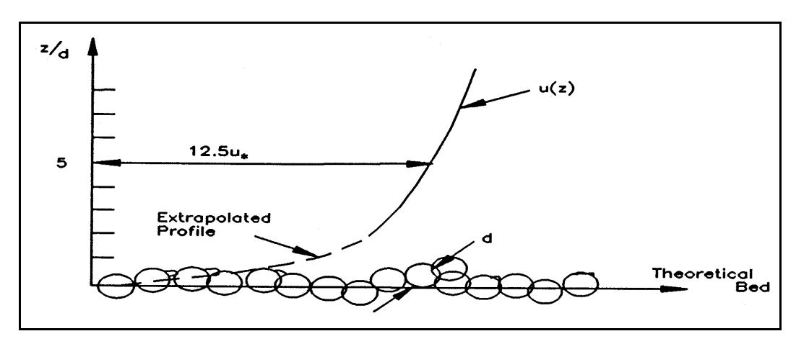

*Figure III-6-6. Sketch of turbulent flows with logarithmic profile over granular bed*

# EM 1110-2-1100 (Part III) 30 Apr 02

```math
\tau_b = \sum_{\substack{\text{unit} \\ \text{area}}} \overline{F}_{D, \text{grain}}
```

- (3) Not until a level somewhat above the individual roughness elements is it reasonable to assume that eddies, forming around individual grains and ejected into the flow, have merged to produce a turbulent shear flow of the type considered in the conceptual model of turbulent shear stresses presented in Part III-6-2.
- (4) In addition to the spatial variation of the actual interaction between a turbulent flow and a granular bottom, it should also be kept in mind that a turbulent flow, even for a steady current, is inherently unsteady . The logarithmic velocity profile represents the time-averaged velocity profile with high-frequency turbulent fluctuations being removed by the averaging process. The drag force on individual grains is therefore not constant but varies with time due to turbulent fluctuations. The drag forces on individual grains are therefore average values as suggested by the overbar notation.
- (5) It is evident from the description above that the complex nature of interaction between a flowing fluid and the individual grains on the fluid-sediment interface defies rigorous mathematical treatment unless a hydrodynamic model is employed which resolves the flow structure around individual grains including temporal variation associated with turbulent fluctuations. Since such a detailed hydrodynamic model is not available at present, we are forced to adopt heuristic, physically based conceptual models consistent with the level of our flow description to "derive" quantitative relationships for fluid-sediment interaction, and rely on empirical evidence to determine "constants" that are necessary to render the relationships predictive. b. The Shields parameter.
- (1) From the preceding discussion of the nature of near-bottom turbulent flows, it follows that the bottom shear stress may be taken as an expression for the drag force, i.e., the mobilizing force, acting on individual sediment grains on the bed surface. For a sediment of diameter D there are approximately 1/D^2 grains per unit area, so

```math
\bar { \bar { F } } _ { D , g r a i n } \propto \tau _ { b } \ : D ^ { 2 } \tag{III-6-41}
```

where the double overbar indicates a temporal, as well as a spatial, average.
(2) For a cohesionless sediment the individual sediment grains rest and stay on the bottom due to their submerged weight and resist horizontal motion due to the presence of neighboring grains. Thus, for a cohesionless sediment, the stabilizing force is associated with the submerged weight of the individual grains

```math
W_{grain} \propto (\rho_s - \rho)gD^3 \tag{III-6-42}
```

where \rho_s denotes the density of the sediment material ( \rho_s \approx 2,650 \text{ kg/m}^3 for quartz).
(3) The ratio of mobilizing (drag) and stabilizing (submerged weight) forces is of fundamental physical significance in fluid-sediment interaction for cohesionless sediment . This ratio is known as the Shields parameter (Shields 1936)

```math
\Psi = \frac{\tau_b}{(\rho_s - \rho)gD} = \frac{\tau_b}{(s - 1)\rho gD} = \frac{u_*^2}{(s - 1)gD} \tag{III-6-43}
```

in which s = \rho / \rho is the density of the sediment relative to that of the fluid.
- c. Initiation of motion.
- (1) Introduction.
- (a) For a turbulent flow over a flat bed consisting of cohesionless sediment of diameter D the equivalent Nikuradse sand grain roughness is k_n = D . From the discussion of turbulent boundary layer flows it was found that the roughness scale experienced by the flow, z_0 as given by Equation 6-5, depends on whether the flow is characterized as smooth or rough turbulent. The parameter determining the characteristics of the near-bottom flow and hence the mobilizing force acting on individual sediment grains is the boundary Reynolds number

```math
\mathrm { R e } _ { * } \ = \ \frac { u _ { * } k _ { n } } { \nu } \ = \ \frac { u _ { * } D } { \nu } \tag{III-6-44}
```

(b) From simple physical considerations it therefore follows that the conditions of neutral stability of a sediment grain on the fluid-sediment interface may be expressed as a critical value of the Shields parameter

```math
\Psi _ { c r } = \frac { \tau _ { c r } } { ( s - 1 ) \ L \rho g D } = \frac { u _ { \ast c r } ^ { 2 } } { ( s - 1 ) g D } = f \mathrm { ( R e _ { \ast } ) } \tag{III-6-45}
```

where f(Re_*) , which is obtained from models or from experimental data, denotes some function of Re<sub>*</sub>. Figure III-6-7 shows the traditional Shields diagram given by Equation 6-45 with supporting data obtained from uniform steady flow experiments (Raudkivi 1976). It shows that \psi_{cr} \approx 0.06 is approximately constant for Re<sub>*</sub> > 100, i.e., for fully rough turbulent flow, whereas the critical Shields parameter increases steadily from a minimum of 0.035 for values of Re<sub>*</sub> < 10, i.e., essentially corresponding to smooth turbulent flow conditions.
- (c) In establishing the critical condition for initiation of motion, also referred to as threshold or incipient motion condition (expressed formally by Equation 6-45), it is important to keep in mind the nature of fluid-sediment interaction. For values of \psi > \psi_{cr} , mobilizing forces exceed stabilizing forces and sediment motion occurs. This does not mean that for \psi < \psi_{cr} by a small amount, sediment does not move at all. For turbulent flow conditions in the vicinity of \psi \approx \psi_{cr} , the arrival of particularly strong turbulent eddies from the turbulence generation layer may momentarily increase the drag on one or a few sediment grains and, if the response time of the individual grains is shorter than the duration of this pulse, a few grains may be dislodged (i.e., a movement of the sediment may occur). The empirical curve on a \psi versus Re* diagram that expresses the critical condition (i.e., the Shields curve or the Shields criterion) should therefore be interpreted as representing a "gray area" around the curve itself. For flow conditions within this gray area, sediment movement may take place but it becomes increasingly sporadic as \psi drops below the curve defining \psi_{cr} . (2) Modified Shields diagram.
- (a) In order to predict the flow condition that will cause sediment motion for a given sediment (i.e., s and D known) the traditional Shields curve given by Equation 6-45 or Figure III-6-7 is somewhat cumbersome to use, since the flow characteristic of interest ( u_{*cr} ) is involved in both parameters. This problem can be circumvented by recognizing that the Shields curve defines a unique relationship between \psi_{cr} and Re*. Thus, from the definition of \psi_{cr} (Equation 6-45), one obtains

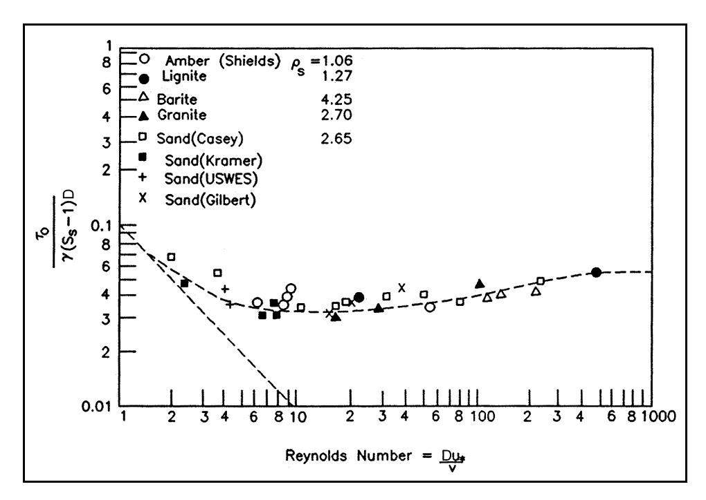

*Figure III-6-7. Shields diagram for initiation of motion in steady turbulent flow (from Raudkivi (1967))*

```math
u_{*cr} = \sqrt{(s-1)gD} \sqrt{\psi_{cr}} \tag{III-6-46}
```

which can be introduced in the definition of Re* to obtain a parameter (Madsen and Grant 1976)

```math
S_{*} = \frac{D}{4v}\sqrt{(s-1)gD} = \frac{\operatorname{Re}_{*}}{4\sqrt{\psi_{cr}}} \tag{III-6-47}
```

- (b) The factor of 4 appears in the definition of S * to render the numerical values of S * comparable with the Re* values in the traditional Shields diagram. This is done merely for convenience and has no physical significance.
- (c) By taking corresponding values of Re* and ψ cr from the traditional Shields diagram, one can obtain the value of the sediment-fluid parameter S *, which in turn can be used to replace Re* in the Shields diagram. In this manner the modified Shields diagram (Madsen and Grant 1976) shown in Figure III-6-8 can be constructed.
- (d) The modified Shields diagram terminates at the lower end of S * at a value of 1 which, for quartz sediments in seawater, corresponds to a sediment diameter of D . 0.1 mm, i.e., a very fine sand. Although cohesion may become important for diameters below 0.1 mm, clean silty sediments, i.e., without too much organic material and/or clay, can be considered cohesionless and therefore governed by a Shields-type initiation of motion criteria. Raudkivi (1976) presents limited experimental data on threshold conditions obtained for low values of Re* (in the range 0.03 to 1). A best-fit line to the portion of these data obtained for grain-shaped sediments gives the following criterion

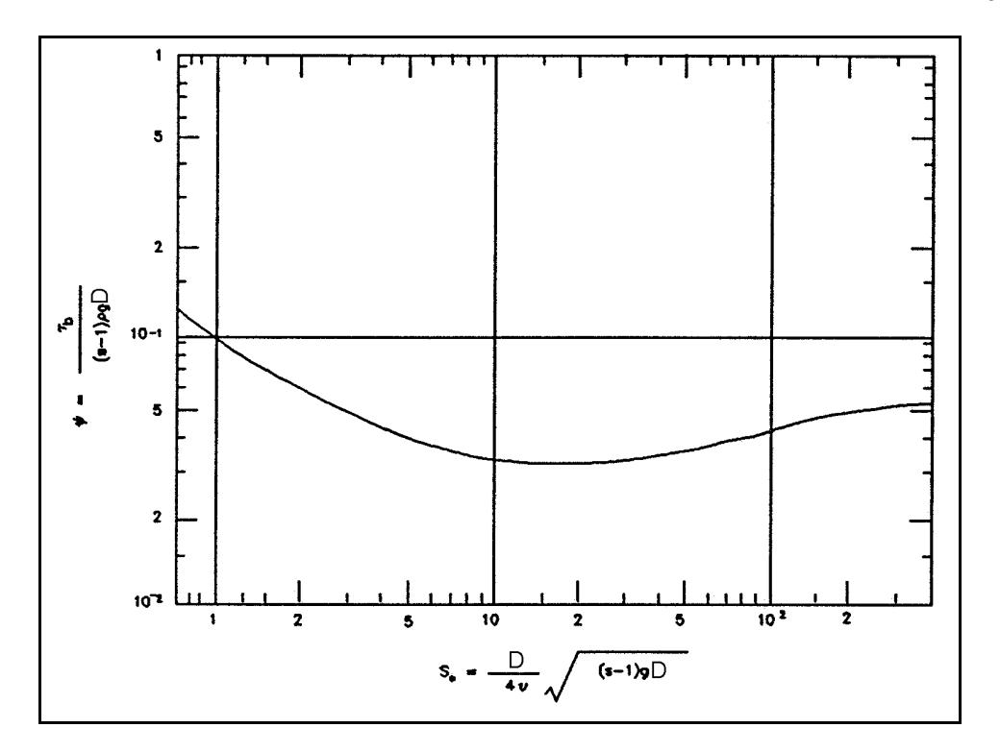

*Figure III-6-8. Modified Shields diagram (Madsen and Grant 1976)*

```math
\psi_{cr} = 0.1 \text{Re}_{*}^{-1/3} \quad \text{for} \quad \text{Re}_{*} < 1 \tag{III-6-48}
```

which upon the modification, i.e., using Equation 6-47, may be written as

```math
\Psi _ { c r } = 0 . 1 S _ { * } ^ { - 2 / 7 } \mathrm { f o r } S _ { * } < 0 . 8 \tag{III-6-49}
```

- (e) For large values of S *, the flow corresponding to initiation of motion is fully rough turbulent, Re* > 100, and the value of ψ cr . 0.06 may be used for S * values larger than the range covered in Figure III-6-9. (3) Modified Shields criterion.
- (a) The modified Shields criterion for initiation of motion of a cohesionless sediment shown in Figure III-6-8 was obtained from steady turbulent flow experiments. The fact that this criterion is applicable also for unsteady turbulent boundary layer flows, as demonstrated by the results presented in Figure III-6-9 (Madsen and Grant 1976), is not surprising when the nature of the onset of sediment movement is considered. For flow conditions in the vicinity of ψ . ψ cr the sporadic movement of a few grains is, as discussed above, associated with high-frequency turbulent fluctuations in the mobilizing force acting on a grain. Since the nearbottom mean velocity profile is logarithmic for waves as well as for currents, it is physically reasonable to expect the near-bottom turbulence to be similar, i.e., scaled by the instantaneous value of the bottom shear velocity. Provided therefore that the response time of the individual sediment grains is short relative to the time scale of turbulent fluctuations, which are expected to be the same for waves and currents if the shear velocities are the same, initiation of motion will be affected by unsteadiness only if the wave period is on the order of the time scale of the turbulent fluctuations. This not being the case, the effects of unsteadiness

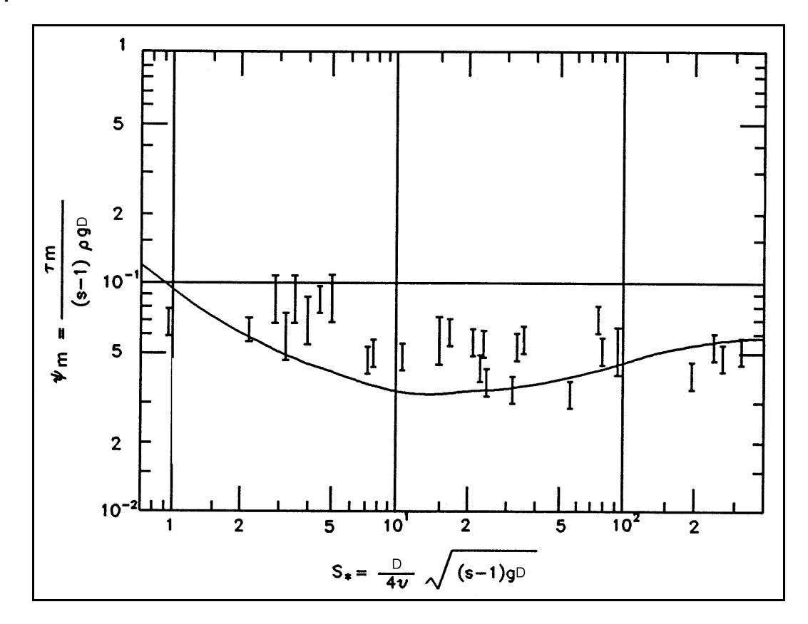

*Figure III-6-9. Comparison of Shields curve with data on initiation of motion in oscillatory turbulent flows (after Madsen and Grant ((1976))*

of the mean flow are negligible and sediment grains react essentially instantaneously to the applied shear stress, i.e., initiation of motion is obtained from

```math
\psi_m = \frac{u_{*m}^2}{(s-1)gD} = \psi_{cr} \tag{III-6-50}
```

in which u_{*_m} denotes the maximum shear velocity, i.e., u_{*_m} = u_{*_c} , u_{*_{wm}} , and u_{*_m} for pure current, pure wave, and combined wave-current flows, respectively.
(b) The effect of bottom slope on the initiation of motion of sediment grains on the fluid-sediment interface may be accounted for by considering a modification of the simple force balance (Madsen 1991) between fluid drag, gravity, and frictional resistance against movement along a plane bottom inclined at an angle \beta to horizontal in the direction of flow, where \beta is taken positive if the bottom is sloping upward in the direction of flow. The resulting force balance suggests that the critical Shields parameter for flow over a sloping bottom may be expressed as

```math
\psi_{cr,\beta} = \psi_{cr} \left\{ \cos \beta \left( 1 + \frac{\tan \beta}{\tan \varphi_s} \right) \right\} \tag{III-6-51}
```

where \varphi_s is the friction angle for a stationary spherical interfacial grain.

#### FIND:

The critical shear velocity u_{*cr} and critical bottom shear stress \tau_{cr} for initiation of motion.

#### GIVEN:

Sediment is quartz sand, \rho_s = 2,650 \text{ kg/m}^3 , of diameter D = 0.2 mm. Fluid is seawater ( \rho = 1,025 \text{ kg-/m}^3 , v \approx 1.0 \times 10^{-6} \text{ m}^2/\text{s} ).

#### PROCEDURE:

- 1) Compute value of the sediment-fluid parameter S_* defined by Equation 6-47.
- 2) If S_* < 0.8 obtain \psi_{cr} from Equation 6-49 (be concerned about sediment being cohesive since formula is limited to cohesionless sediments).
- 3) If S_* > 300 , \psi_{cr} \approx 0.06 .
- 4) If 0.8 < S_* < 300 obtain \psi_{cr} from Figure III-6-8.
- 5) Solve Equation 6-45 for u_{*cr} with \psi_{cr} obtained in step 2, 3, or 4.
- 6) Obtain \tau_{cr} = z \rho u_{*cr}^2 from definition of shear velocity.

#### SOLUTION:

The sediment-fluid parameter defined by Equation 6-47 is first computed with s = \rho_s/\rho = 2.59 and g = 9.80 \text{ m/s}^2

```math
S_* = \frac{D}{4v}\sqrt{(s-1)gD} = 2.79
```

With this value of S<sub>*</sub> the critical Shields parameter is obtained from Figure III-6-8

```math
\psi_{cr} \approx 0.052
```

and using the definition of the Shields parameter given by Equation 6-45

```math
u_{*cr} = \sqrt{(s-1)gD \ \psi_{cr}} = 1.27 \times 10^{-2} \ \text{m/s} = 1.27 \ \text{cm/s}
```

```math
\tau_{cr} = \rho(u_{*cr})^2 = 0.165 \text{ N/m}^2 \approx 0.17 \text{ Pa}
```

If S_* < 0.8 had been obtained, Equation 6-49 and not Figure III-6-8 should be used to find \psi_{cr}

# EM 1110-2-1100 (Part III) 30 Apr 02

- d. Bottom roughness and ripple generation. When the flow intensity (expressed in terms of the Shields parameter \psi ) exceeds the critical condition for initiation of motion \psi_{cr} , sediment grains will start to move virtually instantaneously (Madsen 1991). However, for \psi exceeding \psi_{cr} by a modest amount ( \psi > (1.1 to 1.2) \psi_{cr} ), the plane bottom will no longer remain plane. It becomes unstable, deforms, and exhibits bed forms and ripples. (1) The skin friction concept.
- (a) The appearance of bed forms on the sediment-fluid interface changes the appearance of the bottom to the flow above. Rather than giving rise to a flow resistance associated with drag forces on individual sediment grains, i.e., a roughness scaled by the sediment diameter, the flow will separate at the crest of the bed forms and flow resistance will primarily be composed of pressure drag forces on bottom bed forms, i.e., a roughness scaled by the bed form geometry. The appearance of ripples on the bottom changes the physical bottom roughness by orders of magnitude.
- (b) Despite the increased bottom roughness associated with a rippled bed, the drag force acting on individual sediment grains and not the drag force on the bed forms is responsible for the sediment motion caused by the flow. In the terminology of bottom shear stresses, it is the average shear stress acting on the sediment grains, the skin friction , that moves sediment and not the total shear stress comprising skin friction and form drag. The concept of partitioning bottom shear stress into a skin friction and a form drag component, i.e., taking

```math
\boldsymbol { \tau } _ { b } \ = \ \boldsymbol { \tau } _ { b } ^ { / } \ + \ \boldsymbol { \tau } _ { b } ^ { / / } \tag{III-6-52}
```

in which \tau_b' denotes the skin friction component and \tau_b'' the form drag component, illustrated in Figure III-6-10, has received considerable attention in the context of sediment transport mechanics in steady turbulent flows (Raudkivi 1976).

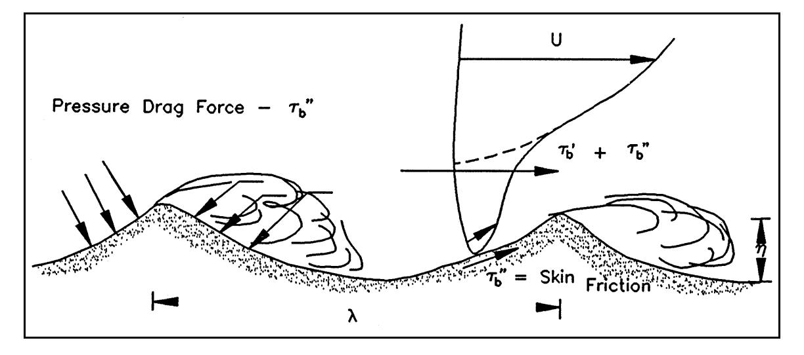

*Figure III-6-10. Conceptualization of pressure drag \tau_b'' , skin friction \tau_b' , total shear stress \tau_b' + \tau_b'' , for turbulent flow over a rippled bed*

(c) For a pure wave motion, it is assumed that the skin friction bottom shear stress is obtained quite simply (Madsen and Grant 1976) by evaluating the bottom shear stress from the given wave condition, u_{bm} and \omega , as if the bottom roughness scale were the sediment grain diameter D. Thus, for a wave motion, the skin friction bottom shear stress is obtained from

```math
\tau_{wm}' = \frac{1}{2} \rho f_w' u_{bm}^2 \tag{III-6-53}
```

where f'_w is the wave friction factor obtained from Equation 6-18, Equation 6-19, or Equation 6-21 for a roughness

```math
k_n = k_n' = D \tag{III-6-54}
```

Laboratory data on wave-generated ripples as well as ripple geometry for spectral waves is discussed (Madsen 1993) in some detail.
- (d) For combined wave-current flows it has been proposed (Glenn and Grant 1987) to evaluate the skin friction bottom shear stress in a similar manner, i.e., using the wave-current interaction model presented in Part III-b(2)d with a roughness specified by Equation 6-54. However, if a combined wave-current boundary layer flow is specified by a current velocity outside the wave boundary layer, i.e., u_c(z_r) with z_r > \delta_{cw} , the direct use of this information in the formulas given in Part III-6(2)d with k_n = k_n^T = D would lead to an ambiguous determination of the skin friction, since this approach presumes the variation of the current velocity outside the wave boundary layer to be governed by the grain size roughness, which is true only for a flat bed, i.e., in the absence of form drag.
- (e) To overcome this problem, the combined wave-current theory presented in Part III-6(2)d is first used with k_n = total equivalent Nikuradse sand grain roughness, accounting for the presence of bed forms, to predict the current velocity at the outer edge of the wave boundary layer, i.e.,

```math
u _ { c } ( z _ { r } ) \mathrm { w i t h } z _ { r } = \delta _ { c w } \tag{III-6-55}
```

is obtained from a model considering total bottom shear stresses.
- (f) With the current specified by Equation 6-55, the skin friction shear stress is now computed from the general wave-current interaction theory using the grain size roughness k_n = k_n' = D . In this manner (Wikramanayake and Madsen 1994a), the ambiguity of the prediction of combined wave-current skin friction shear stresses is avoided. (2) Field data on geometry of wave-generated ripples. (a) When field data on ripple geometry are plotted against the skin friction Shields parameter,

```math
\Psi _ { m } ^ { ' } \, = \, \frac { \tau _ { w m } ^ { ' } } { ( s - 1 ) \ L { \rho } g D } \, = \, \frac { { ( u _ { * w m } ^ { ' } ) } ^ { 2 } } { ( s - 1 ) g D } \tag{III-6-56}
```

# EM 1110-2-1100 (Part III) 30 Apr 02

they exhibit an extensive scatter. By trial and error it was found (Wikramanayake and Madsen 1994a) that the parameter providing the best correlation of field data on ripple geometry was

```math
Z = \frac{\psi_m'}{S_+} \tag{III-6-57}
```

in which S_* is the sediment-fluid parameter defined by Equation 6-47.
(b) The equations for the empirical relationships for ripple geometry in the field are (Madsen 1993).

```math
\frac{\eta}{A_{bm}} = \begin{cases} 1.8 \times 10^{-2} \ Z^{-0.5} & 0.0016 < Z < 0.012 \\ 7.0 \times 10^{-4} \ Z^{-1.23} & 0.012 < Z < 0.18 \end{cases} \tag{III-6-58}
```

and

```math
\frac{\eta}{\lambda} = \begin{cases} 1.5 \times 10^{-1} \ Z^{-0.009} & 0.0016 < Z < 0.012 \\ 1.05 \times 10^{-2} \ Z^{-0.65} & 0.012 < Z < 0.18 \end{cases} \tag{III-6-59}
```

where A_{bm} is defined by Equation 6-17, \eta is ripple height, \lambda is ripple length, and the lowest and highest range of validity indicate the range covered by the experimental data.
- (3) Prediction of ripple geometry under field conditions.
- (a) From knowledge of the representative periodic wave (recall that this is defined here as the rms wave and not the significant wave) and sediment characteristics, the skin friction shear stress \tau_{wm}^{\prime} is obtained from Equation 6-53.
- (b) With \tau'_{wm} known, the value of \psi'_{m} is obtained from Equation 6-56 and if 2\psi'_{m} > \psi_{cr} , obtained from the modified Shields curve in Figure III-6-8, sediment motion is assumed to take place and the parameter Z is obtained from Equation 6-57.
With Z known, the empirical relationship given by Equations 6-58 and 6-59 is used to obtain the ripple geometry. If \psi_m exceeds a value of 0.35 or if Z > 0.18, the bed is assumed flat corresponding to sheet flow conditions.
- e. Moveable bed roughness.
- (1) The determination of <u>moveable bed roughness</u> over naturally rippled beds is limited by the lack of reliable field measurements over a range of wave conditions. The limited amount of available data on wave-generated ripple geometry and the associated rate of energy dissipation in the wave bottom boundary layer above the rippled bed have been analyzed (Wikramanayake and Madsen 1994a). Their analysis results suggest the adoption of the following simple relationship for moveable bed roughness associated with rippled beds

```math
k_n = 4\eta \tag{III-6-60}
```

where \eta is the ripple height. However, the translation of ripple geometry to equivalent roughness, Equation 6-60, is based entirely on laboratory data for periodic waves and is of dubious value for field roughness determinations. Therefore, the following procedure is suggested (Madsen 1993).
- (2) For a wave condition specified in terms of the representative periodic wave, the ripple height is obtained from Equation 6-58, and the movable bed roughness k_n is obtained from Equation 6-60.
- (3) If \psi_m' suggests no sediment motion, 2\psi_m' < \psi_{cr} , the movable bed roughness is taken as k_n = k_n' = D unless information on bottom roughness associated with bioturbation of the bottom sediments is available.
- (4) If \psi_m^{\prime} > \approx 0.35 or if Z > 0.18, the bed is expected to be flat, i.e., corresponding to sheet flow conditions. Recent results from field experiments (Madsen et al. 1993) suggest a value of k_n = 15D to be appropriate for sheet flow conditions. Since the conditions from which this result was obtained correspond to values of \psi_m^{\prime} \approx 1 and since it is physically reasonable to assume the movable bed roughness for sheet flow conditions depends on the intensity of sediment transport over the flat bed, which in turn is related to the magnitude of \psi_m^{\prime} , it is tentatively proposed that

```math
k_n = 15 \psi_m^{\prime} D \tag{III-6-61}
```

be adopted for sheet flow conditions. This expression agrees in form with an expression proposed for steady flow (Wilson 1989) although the coefficients differ.

#### III-6-4. Bed-load Transport

- a. Introduction.
- (1) When flow and sediment characteristics combine to produce a Shields parameter greater than the critical value, sediment is set in motion. One result of this is the generation of bed forms, discussed in Part III-6-3; another is, of course, the initiation of a non-zero transport of sediment.
- (2) For values of the Shields parameter slightly above critical or, more specifically, for low transport rates, the predominant mode of sediment transport takes place as individual grains rolling, sliding, and/or jumping (saltating) along the bed. This mode of sediment transport is referred to as bed load and, since it takes place in close proximity of the bed, it is dependent on skin friction .
- (3) Several empirical bed-load transport formulas have been proposed for steady turbulent boundary layer flows (Raudkivi 1976). One of these, the Meyer-Peter and Müller formula (Meyer-Peter and Müller 1948), enjoys particular popularity in the engineering literature. However, since it was originally developed from data obtained for steady flows in rivers and channels of negligible slope, its adoption for unsteady wave or combined wave-current turbulent boundary layer flows over an inclined bed is not straightforward. A conceptual model for bed-load transport of sediment grains rolling or sliding along an inclined bottom has been proposed (Madsen 1993) as a physical interpretation of the purely empirical Meyer-Peter and Müller formula. The resulting formulation is time-averaged and solved under the assumptions that: waves dominate

#### FIND:

The height \eta , length \lambda , and movable bed roughness k_n , of wave-generated ripples in the field.

#### GIVEN:

The representative periodic wave motion is specified as in Example Problem III-6-3. Bottom sediment is quartz, \rho_s = 2,650 \text{ kg/m}^3 , of diameter D = 0.2 mm. Fluid is seawater ( \rho = 1,025 \text{ kg/m}^3 , \nu \approx 1.0 \times 10^{-6} \text{ m}^2/\text{s} ).

#### PROCEDURE:

- 1) Obtain the wave shear velocity u'_{*wm} assuming grain size roughness k'_n = d = \text{median sediment} diameter, following the procedure described in Example Problem III-6-2. (Result is denoted here by prime to signify skin friction shear velocity.)
- 2) With u'_{*wm} from step 1 compute \psi'_m from Equation 6-56.
- 3) Evaluate S_* as defined by Equation 6-47.
- 4) Determine \psi_{cr} following procedure of Example Problem III-6-6.
- 5) If \psi_m' < \frac{1}{2}\psi_{cr} there will be no sediment motion and no ripples, i.e., \eta = \lambda = 0 . Bottom roughness is the sediment grain diameter (k_n = k_n' = D) unless other information is available, e.g., photos showing relict ripples or other roughness features.
- 6) If \psi_m' > 0.35 , sheet flow is assumed. The bed is flat, i.e., \eta = \lambda = 0 , and the movable bed roughness k_n is obtained from Equation 6-61.
- 7) If \frac{1}{2}\psi_{cr} < \psi_m' < 0.35 , the parameter Z defined by Equation 6-57 is computed.
- 8) If Z falls within the range indicated for Equations 6-58 and 6-59, these are used to compute \eta and \lambda . The movable bed roughness k_n is obtained from Equation 6-60.
- 9) If Z < 0.0016 and D < 0.6 mm, it is recommended that \eta , \lambda , and k_n be obtained as if Z = 0.0016.
- 10) If Z > 0.18 and D > 0.08 mm, sheet flow is assumed (i.e., \eta = \lambda = 0 ), and Equation 6-61 is used to obtain k_n .
(Continued)

#### Example Problem III-6-7 (Concluded)

#### SOLUTION:

In Example Problem III-6-3, the initial solution for the wave friction factor neglected the presence of a current ( \mu = 0 , C_{\mu} = 1 ) and gave f_{w} = 7.86 \times 10^{-3} . Since the wave motion and the bottom roughness ( k_{n} = k_{n}^{\prime} = D = 0.2 mm) are the same here, the maximum skin friction shear velocity is given by

```math
u _ { \ast w m } ^ { \prime } = \sqrt { f _ { w } ^ { / } / 2 } u _ { b m } = 2 . 1 9 \times 1 0 ^ { - 2 } \mathrm { \, m / s } = 2 . 1 9 \mathrm { \, c m / s }
```

From the definition of the Shields parameter, Equation 6-56, it follows that

```math
\Psi _ { m } ^ { ' } \, = \, \frac { { \left( u _ { * w m } ^ { / } \right) } ^ { 2 } } { ( s \, - \, 1 ) g D } \, = \, 0 . 1 5 4
```

The sediment being the same as specified in Example Problem III-6-5 where \psi_{cr} = 0.052 was obtained, it is seen that the sediment will be moving, since \psi'_m > \psi_{cr} . Since \psi'_m < 0.35 , flat bed (sheet flow) is not predicted and bed forms are therefore expected. The geometry of these bed forms is obtained from the field relationships, Equations 6-58 and 6-59. With the parameter

```math
Z = \frac{\Psi_m'}{S_*} = 0.055
```

since S_* = 2.79 in Example Problem III-6-6, which is within the range 0.012 \le Z \le 0.18 , one therefore obtains from Equation 6-58

```math
\frac{\eta}{A_{bm}} = 7 \times 10^{-4} Z^{-1.23} = 2.47 \times 10^{-2}
```

or, with A_{bm} = 44.6 cm (Example Problem III-6-3)

```math
\eta = \frac{\eta}{A_{bm}} A_{bm} = 1.1 \text{ cm}
```

The ripple steepness is obtained from Equation 6-59

```math
\frac{\eta}{\lambda} = 1.05 \times 10^{-2} Z^{-0.65} = 6.91 \times 10^{-2} arrow \lambda = \frac{\eta}{(\eta/\lambda)} = 15.9 \text{ cm} \approx 16 \text{ cm}
```

From Equation 6-60, one obtains the movable bed roughness

```math
k_n = 4\eta = 4.4 \text{ cm}
```

#### FIND:

The skin friction shear velocities associated with the current u'_{*c} , the wave u'_{*wm} , and the maximum combined u'_{*m} , as well as the phase angle of the wave-associated shear stress \varphi' , for a combined wave-current flow over a movable bed in the field.

#### GIVEN:

The representative periodic wave is specified by its near-bottom maximum orbital velocity u_{bm} = u_{br} = 0.35 m/s and period T = 8.0 s. The current is specified by its magnitude u_c(z_r) = 0.35 m/s at z_r = 1.00 m and direction \varphi_{wc} = 45^{\circ} relative to the direction of wave propagation. The bed consists of uniform quartz sand, \rho_s = 2,650 kg/m<sup>3</sup>, of diameter D = 0.2 mm. The fluid is seawater ( \rho = 1,025 kg/m<sup>3</sup>, v \approx 1.0 \times 10^{-6} m<sup>2</sup>/s).

#### PROCEDURE:

- 1) Considering only the wave motion, the movable bed roughness k_n is obtained following the procedure given in Example Problem III-6-7.
- 2) With k_n from step 1, the combined wave-current problem is solved following the procedure described in Example Problem III-6-4.
- 3) From the combined wave-current flow solution obtained in step 2, the current velocity u_c(z = \delta_{cw}) is computed by the procedure of Example Problem III-6-5.
- 4) With the current specification u_c = u_c(\delta_{cr}) at z = \delta_{cw} from step 3, the wave-current interaction problem is solved for k_n' = D following the procedure described in Example Problem III-6-3.
- 5) The skin friction phase angle \varphi' is obtained from Equation 6-12 with u_{*wm} = u_{*m}^{\prime} .

#### SOLUTION:

The first step to follow in determining the skin friction components for a combined wave-current boundary layer flow is to determine the movable bed roughness. Since the presence of a current is neglected in performing this step, this was done in Example Problem III-6-7 for the wave and sediment characteristics considered here and resulted in k_n = 4.4 cm.
The second step is to determine the current velocity at the edge of the boundary layer, u_c(\delta_{cw}) from the wave-current interaction model using the movable bed roughness obtained in step 1. This was done in Example Problems III-6-4 and III-6-5 where the bottom roughness was specified as k_n = 4.4 cm, i.e., exactly the movable bed roughness determined in step 1 for the given wave and sediment characteristics.
(Continued)

#### Example Problem III-6-8 (Concluded)

The third step is to determine the shear velocities and stresses associated with the combined wavecurrent boundary layer flow over a bottom of roughness k_n = k_n' = D = sediment diameter with the current specified as obtained in step 2. From Example Problem III-6-5, the current specification is therefore

```math
u _ { c } ( z _ { r } ) = 1 0 . 2 \, \mathrm { c m / s } \, \mathrm { a t } \, z _ { r } = \delta _ { c w } = 3 . 4 0 \, \mathrm { c m }
```

at an angle \varphi_{wc} = 45 deg to the direction of wave propagation. With this current specification, k_n = k_n' = D = 0.2 mm, and wave characteristics u_{bm} = 35 cm/s and \omega = 2\pi/T = 0.785 s<sup>-1</sup> ( A_{bm} = u_{bm}/\omega = 44.6 cm) solution of the wave-current interaction problem follows Example Problem III-6-3.
For \mu = 0 and C_{\mu} = 1 , the first iteration is identical to that in Example Problem III-6-3, resulting in u'_{*wm} = u'_{*m} = 2.19 cm/s and \delta'_{cw} = 1.12 cm. With these values and using the current specifications given above, Equation 6-40 gives

```math
u _ { * c } ^ { \mathrm { \, \tiny \, / \, } } = 0 . 9 6 \, \mathrm { c m / s }
```

Second iteration is therefore based on \mu = \left(u * c'/u'_{*wm}\right)^2 = 0.194 and, from Equation 6-33, C_{\mu} = 1.15 . For this value of C_{\mu} solving iteratively for x = 4\sqrt{f_{cw}/C_{\mu}} in the manner outlined in Example Problem III-6-3 results in x^{(3)} = 0.349 , or

```math
f _ { c w } ^ { / } \, = \, 8 . 7 3 { \times } 1 0 ^ { - 3 }
```

and therefore

```math
u_{*wm}^{'} = 2.31\ \text{cm/s};\quad u_{*m}^{'} = 2.48\ \text{cm/s}\quad\text{and}\quad\delta_{cw}^{'} = 1.26\ \text{cm}
```

with which Equation 6-40 gives

```math
u _ { * c } ^ { \mathrm { \, \tiny \, / \, } } = \, 1 . 0 1 \, \mathrm { c m / s }
```

The next value of \mu = \left(u_{*w}/u_{*wm}'\right)^2 = 0.191 is virtually identical to the previous value, so no further iteration is necessary.
The solution is therefore

```math
u _ { * c } ^ { / } \, = \, 1 . 0 1 \, \mathrm { c m / s } \, , \, u _ { * w m } ^ { / } \, = \, 2 . 3 1 \, \mathrm { c m / s } \, , \, u _ { * m } ^ { / } \, = \, 2 . 4 8 \, \mathrm { c m / s }
```

and the phase angle of the wave-associated skin friction bottom shear stress is obtained from Equation 6-12 with u_{*wm} = u_{*m}^{\prime} and z_0 = d/30

```math
tan \; \phi' = 0.25 \; {\scriptstyle arrow} \; \phi' = 13.8^\circ \; \approx \; 14^\circ
```

# EM 1110-2-1100 (Part III) 30 Apr 02

currents \mu = \tau_c'/\tau_{wm}' << 1 ; maximum shear stress is much larger than critical \mu_{CR} = \tau_{CR}/\tau_{wm}' << 1 ; and bottom slope is relatively small

```math
\mu_b = \frac{\tan \beta}{\tan \phi_m} << 1 \tag{III-6-62}
```

where \beta > 0 is bottom slope upward relative to direction of flow and \varphi_m is friction angle (Madsen 1993). Results of this analysis provide the following formulations for the time-averaged bed-load transport \overline{q_{SR}} .
b. Pure waves on sloping bottom. For a non-zero bottom slope, i.e., \mu_b \neq 0 , but still without any current, the time-averaged net bed-load transport is

```math
\left( \frac { \overline { { { q } } } _ { s B } } { \sqrt { ( s - 1 ) g D } D } \right) _ { \ B } = \ 8 \ \left( \Psi _ { w m } ^ { / } \right) ^ { \frac { 3 } { 2 } } \ \overline { { { | \cos \ \theta | } ^ { \frac { 3 } { 2 } } \left\{ - \mu _ { b } , 0 \right\} } } \ = \ 4 . 5 \ \left( \Psi _ { w m } ^ { / } \right) ^ { \frac { 3 } { 2 } } \{ - \mu _ { b } , 0 \} \tag{III-6-63}
```

in the direction of the wave propagation, +x, if -\mu_b > 0 and opposite the wave direction if -\mu_b < 0 . Since \mu_b > 0 if the wave propagates up a slope, \beta_w > 0 , and \mu_b < 0 if the wave is directed towards deeper water (\beta_w < 0) , this simply states that the net transport is down-slope as expected.
c. Combined wave-current flows. Since the approximate bed-load transport formula is linear in the small parameters, the net bed-load transport associated with combined wave-current flows can be evaluated by time averaging for \mu_b = 0 . The resulting net bed-load transport is given by

```math
\left(\frac{\bar{q}_{sB}}{\sqrt{(s-1)gDD}}\right)_{wc} = 6\left(\psi_c'\right)^2 \frac{u'_{wm}}{u'_c}\left\{\frac{3}{2}\cos\varphi_{wc},\sin\varphi_{wc}\right\} \tag{III-6-64}
```

where \psi_c^{\prime} denotes the Shields parameter based on the current skin friction shear stress. It should be noted that the direction of sediment transport is not in the direction of the current but is obtained from

```math
\tan \varphi_{ws} = \frac{2}{3} \tan \varphi_{wc} \tag{III-6-65}
```

This expression shows that \phi_{ws} , the direction of the net bed-load transport measured counterclockwise from the x-axis, deviates from the current direction towards the direction of wave orbital velocities.
d. Combined current and bottom slope effect. It is interesting to note that the superposition of a current in the direction of wave propagation, i.e., \varphi_{wc} = 0 , up a slope may lead to zero net transport. Thus, the sum of transport given by Equations 6-63 and 6-64 is zero if

```math
\mu_b = 2\mu \tag{III-6-66}
```

Although the upslope transport here is associated with an assumed current, it is reasonable to anticipate a similar upslope effect associated with nonlinear wave effects, i.e., a larger upslope shear stress under the crest
than the downslope stress under the trough. The balance expressed in Equation 6-66 may therefore be thought of as a simulation of an equilibrium profile condition for inner shelf waters.
- e. Extension to spectral waves. To compute the bed load for spectral wave conditions, the procedures outlined in the foregoing sections are followed using the representative periodic wave characteristics defined in Part III 6-2-b (4). f. Extension to sediment mixtures.
- (1) For a sediment mixture consisting of several distinct size classes of diameter D_n with the volume fraction of the n<sup>th</sup> size class being f_n in the bottom sediments, the total bed-load transport of the sediment mixture is given by

```math
\overline{q}_{sB} = \sum f_n \overline{q}_{sB,n} \tag{III-6-67}
```

- (2) This extension to sediment mixtures follows directly from the conceptual bed-load transport model (Madsen 1993) when it is assumed that the fraction of excess skin friction shear stress carried by moving grains of the n^{th} size class is f_n(\tau_b' \tau_{cr,n}) .
- (3) For each size class, the procedure is therefore exactly as outlined in the preceding section with D replaced by D_n , the diameter of the n<sup>th</sup> size class. The skin friction bottom shear stress is, however, the same for all size classes and is computed for a single representative grain diameter ( D = D_r = D_{50} = the median diameter of the sediment mixture in the bed).

## III-6-5. Suspended Load Transport

- a. Introduction.
- (1) For low transport rates, the predominant mode of transport is sediment grains moving along the bottom, i.e., in the form of bed load. As the flow intensity and, hence, the bed-load transport, is increased individual grains moving along the bottom take off from the bottom with increasing frequency, e.g., due to impact with stationary grains protruding above their neighbors. Thus, as the flow intensity increases, the mode of transport changes from one of rolling and sliding along the bottom to one of jumping along the bottom. For this mode of transport, moving grains are in direct contact with immobile bottom grains only for a fraction of the time they spend in transport, and the basic assumptions behind the conceptual transport model presented in the preceding section are no longer valid.
- (2) Sediment transport associated with individual sediment grains making isolated or a series of jumps along the bottom, referred to as saltation, provides a transition from bed-load transport that takes place immediately above the bottom to suspended load transport that takes place in the overlying water column. From this distinction between the bed-load and suspended load transport modes, it follows that suspended load is governed by the turbulence associated with the total bottom shear stress , i.e., the shear stress predicted from the movable bed roughness estimate obtained from Part III-6-3, whereas the bed load is governed by the skin friction shear stress .

## FIND:

The bed-load transport rate for a combined wave-current flow over a sloping bottom.

#### GIVEN:

The wave is specified by its maximum near-bottom orbital velocity u_{bm} = 0.35 m/s, period T = 8.0 s, and angle of incidence \alpha = 45 deg. The current is at an angle of \varphi_{wc} = 45 deg to the wave direction and has a magnitude of u_c(z_r) = 0.35 m/s at z_r = 1.00 m. The bottom has a uniform slope of \beta = 1 deg and consists of uniform quartz sand \rho_s = 2,650 kg/m<sup>3</sup>, with diameter D = 0.2 mm. The fluid is seawater ( \rho = 1,025 kg/m<sup>3</sup>, \nu \approx 1.0 \times 10^{-6} m<sup>2</sup>/s).

#### PROCEDURE:

- 1) The skin friction shear velocities and stresses are computed using the procedure of Example Problem III-6-8.
- 2) The skin friction Shields parameters, \psi'_c and \psi'_{wm} , are obtained from Equation 6-43 with u_* = u'_{*c} and u'_{*wm} , respectively, as obtained in step 1.
- 3) The time-averaged combined wave-current bed-load transport vector is obtained from Equation 6-64 using u_{*c}^{\prime} and u_{*wm}^{\prime} from step 1 and \psi_{c}^{\prime} from step 2.
- 4) The bottom slope parameter \mu_b is calculated from Equation 6-62, where \beta is bottom slope in the direction of wave propagation (positive if wave is traveling towards shallower waters) and \phi_m = 30 deg.
- 5) The time-averaged bottom slope bed-load transport vector is obtained from Equation 6-63 with \psi'_{wm} from step 2.
- 6) The total time-averaged bed-load transport vector is obtained by vector addition of the wavecurrent and slope bed-load transport vectors obtained in step 3 and step 5, respectively. (The x component denotes the transport in the direction of wave propagation, the y component is transport 90 deg counterclockwise to the direction of wave propagation.)
(Continued)

#### Example Problem III-6-9 (Concluded)

#### SOLUTION:

To calculate bed-load transport, one needs to use skin friction shear stresses. The problem specification is here identical to that of Example Problem III-6-8, so the skin friction problem was solved there, i.e., u_{*c}^{\prime}=1.01 cm/s and u_{*wm}^{\prime}=2.31 cm/s. The corresponding skin friction Shields parameters are obtained from Equation 6-56 with s=\rho_s/\rho=2.59 and D=0.2 mm

```math
\Psi _ { c } ^ { ' } \ = \ 0 . 0 3 3 { \mathrm { a n d } } \Psi _ { w m } ^ { ' } \ = \ 0 . 1 7
```

With these values, the bed-load transport associated with the combined wave-current flow is obtained in nondimensional form from Equation 6-64

```math
\left(\frac{\overline{q}_{sB}}{\sqrt{(s-1)gD}D}\right)_{wc} = 0.082 \left\{\frac{3}{2} \cos \varphi_{wc}, \sin \varphi_{wc}\right\}
```

or in dimensional form with \varphi_{wc} = 45 \text{ deg}

```math
(\overline{q}_{sB})_{wc} = \{9.7,6.5\} \times 10^{-3} \text{ cm}^{3}/(\text{cm s})
```

To obtain the contribution due to bottom slope, the slope \beta_w in the direction of wave propagation is needed. Since the bottom slope is \beta=1 deg and the angle of incidence is \alpha=45 deg, the bottom slope in the direction of wave propagation is \tan \beta_w = \tan \beta \cos \alpha = 0.012 . Equation 6-62 therefore gives, with \phi_m=30 deg, \mu_b=\tan \beta_w/\tan \phi_m=0.021 . Bed-load transport due to bottom slope is obtained from Equation 6-63 in nondimensional form

```math
\left(\frac{\overline{q}_{sB}}{\sqrt{(s-1)gD}D}\right)_{\beta} = 0.32\{-\mu_b,0\}
```

or in dimensional form

```math
(\overline{q}_{sB})_{B} = \{-7.5,0\} \times 10^{-4} \text{ cm}^{3}/(\text{cm s})
```

The total bed-load transport rate is obtained as the sum of the wave-current and bottom slope contributions, i.e.,

```math
\overline{q}_{sB} = (\overline{q}_{sB})_{wc} + (\overline{q}_{sB})_{R} \approx \{9.0,6.5\} \times 10^{-3} \text{ cm}^{3}/(\text{cm s})
```

with the x component being in the direction of wave propagation and the y component being at 90 deg counterclockwise from the wave direction.

# EM 1110-2-1100 (Part III) 30 Apr 02

(3) Distribution of suspended sediment in the water column is governed by the fall velocity of the sediment w_j , the sediment diffusion coefficient v_s , and the volume concentration of sediment in suspension c. Assuming the sediment-fluid mixture behaves as a clear fluid, a close analogy can be drawn between the turbulent diffusion of momentum and sediment diffusion such that

```math
v_s = v_t = ku_* z \tag{III-6-68}
```

For combined wave-current bottom boundary layer flows, the concentration of suspended sediments c may be resolved into its mean \overline{c} and time-varying wave-associated c_w components.
- b. Sediment fall velocity.
- (1) In order to solve the equations governing the distribution of suspended sediment concentration in the vertical, it is necessary to obtain the value of the sediment fall velocity w_f .
- (2) Assuming a spherical sediment grain, the force balance of submerged weight and fluid drag on a grain falling through an otherwise quiescent fluid gives

```math
\left( \rho _ { s } \textrm { -- } \rho \right) g \left( \frac { \pi } { 6 } D ^ { 3 } \right) \ = \ \frac { 1 } { 2 } \rho \ C _ { D } \left( \frac { \pi } { 4 } D ^ { 2 } \right) \ w _ { f } ^ { 2 } \tag{III-6-69}
```

or

```math
\frac{w_f}{\sqrt{(s-1)gD}} = \sqrt{\frac{4}{3C_D}} \tag{III-6-70}
```

- (3) The drag coefficient C_D is a function of the Reynolds number Re_D = D w_f/v , which is a function of S_* , the sediment-fluid parameter defined by Equation 6-47.
- (4) From the empirical relationship of C_D versus Re_D (Schlichting 1960), C_D is obtained for a specified value of Re_d . With this value of C_D the nondimensional fall velocity is obtained from Equation 6-70, and this value is used with the specified value of Re_D to obtain the corresponding value of S_* . In this manner (Madsen and Grant 1976), the graph of nondimensional fall velocity as a function of the sediment fluid parameter, shown in Figure III-6-11, is obtained.
- (5) Extending the graph to values of S_* above the upper limit of Figure III-6-11 is accomplished by using

```math
\frac{w_f}{\sqrt{(s-1)gD}} = 1.82 \quad \text{for} \quad S_* > 300 \tag{III-6-71}
```

(6) For values of S_* below unity, i.e., for quartz grains of d < 0.1 mm in seawater, the fall velocity is obtained from Stokes Law, which in the present notation may be written

```math
\frac{w_f}{\sqrt{(s-1)gD}} = \frac{2}{9}S_* \quad \text{for} \quad S_* < 0.8 \tag{III-6-72}
```

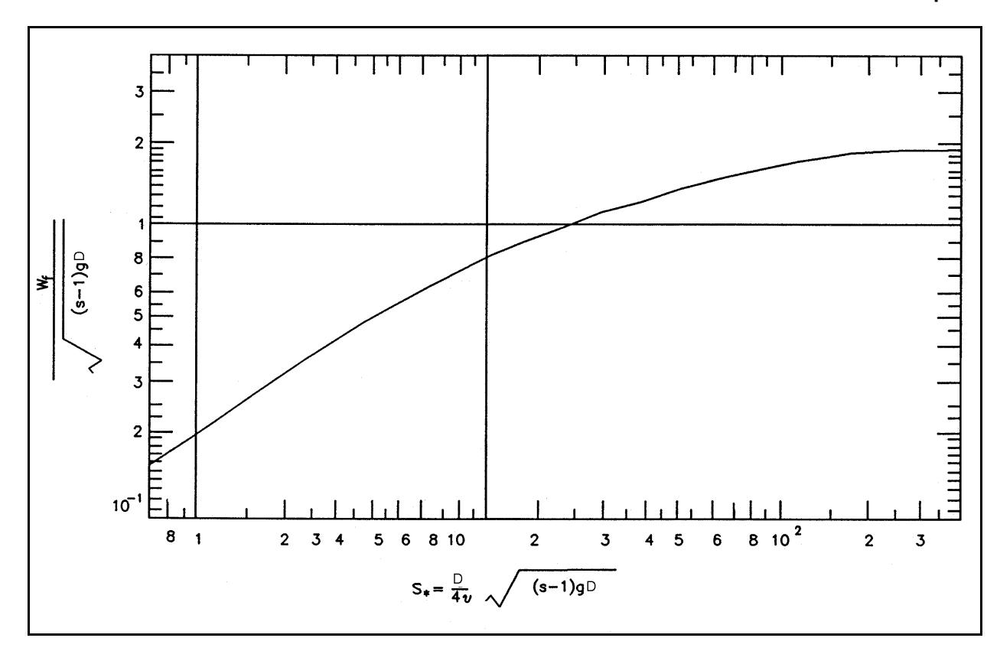

*Figure III-6-11. Nondimensional fall velocity for spherical particles versus the sediment fluid parameter (Madsen and Grant 1976)*

- (7) Although Figure III-6-11 is obtained for sediment assumed to be spherical, it yields reasonably accurate fall velocities for natural cohesionless granular sediments (Dietrich 1982). c. Reference concentration for suspended sediments . (1) Introduction.
- (a) With the fall velocity determined, all parameters in the equation governing the suspended sediment concentration distribution are in principle known. To solve the equation it is, however, necessary to specify boundary conditions. One boundary condition is simply that no sediment is transported through the water surface or that the suspended sediment concentration vanishes at large distances above the bottom, if the water depth is sufficiently large. Another is the boundary condition that expresses the amount of sediment available for entrainment immediately above the bottom. Whereas the former is universally agreed upon the latter boundary condition is the subject of considerable controversy. It is beyond the scope of this presentation to get into the subtleties of this controversy, so the most commonly accepted form of the bottom boundary condition for suspended sediment concentration, the specification of a reference concentration , is adopted here. (b) The reference concentration is given as (Madsen 1993)

```math
c_R = \gamma C_b \left( \frac{|\tau_b'(t)|}{\tau_{cr,\beta}} - 1 \right) \tag{III-6-73}
```

#### FIND:

Find the sediment fall velocity

#### GIVEN:

Sediment is quartz sand, \rho_s = 2,650 \text{ kg/m}^3 , of diameter D = 0.2 mm. Fluid is seawater ( \rho = 1,025 \text{ kg/m}^3 , \upsilon \approx 1.0 \times 10^{-6} \text{ m}^2/\text{s} ).

#### PROCEDURE:

- 1) The sediment-fluid parameter S_* , defined by Equation 6-47, is calculated.
- 2) If S_* > 300 , the sediment fall velocity w_f is obtained from Equation 6-71.
- 3) If S_* < 0.8 , the sediment fall velocity w_t is obtained from Equation 6-72.
- 4) If 0.8 < S_* < 300 , w_t is obtained from Figure III-6-11 using S_* from step 1 as entry.

#### SOLUTION:

The sediment-fluid parameter is calculated from

```math
S_* = \frac{D}{4v}\sqrt{(s-1)gD} = 2.79
```

with s = \rho_s / \rho = 2.59 .
Figure III-6-11 then gives the nondimensional fall velocity

```math
\frac{w_f}{\sqrt{(s-1)gD}} \approx 0.40
```

and therefore

```math
w_f = 2.23 \text{ cm/s}
```

in which \gamma is the so-called resuspension parameter and C_b is the volume concentration of sediment in the bed, generally taken as 0.65 (Smith and McLean 1977) for a bed consisting of cohesionless sediment.
(c) It is emphasized that the resuspension parameter \gamma in Equation 6-73 is intimately related to the choice of reference elevation z_r , which explains at least part of the considerable variability of \gamma values reported in the literature. Similarly, \gamma values reported in the literature can be used only in conjunction with their particular z_r values. This being said, the numerical values

```math
\gamma = \begin{cases} 2 \times 10^{-3} & \text{for rippled bed} \\ \\ 2 \times 10^{-4} & \text{for flat bed} \end{cases} \tag{III-6-74}
```

## FIND:

The reference concentration for suspended sediment computations for combined wave-current boundary layer flows.

## GIVEN:

Wave, current, sediment, and bottom slope specifications are identical to those of Example Problem III-6-9.

## PROCEDURE:

- 1) Skin friction shear velocities and stresses are computed following the procedure of Example Problem III-6-8.
- 2) The time-averaged (mean) reference concentration is obtained from Equation 6-75 with c ¯ R Cb = 0.65, , and τ cr τ as obtained in step 1, and the appropriate choice of γ from ) wm Equation 6-74.
- 3) The periodic (wave) reference concentration cRw is obtained from Equation 6-76 using γ and Cb as in step 2 and shear velocities obtained in step 1. The bottom slope in the direction of wave propagation β w is positive if the wave is traveling up-slope, and φ m = 30 deg.

## SOLUTION:

The reference concentration for suspended load computations depends on skin friction shear velocities, obtained in Example Problem III-6-8 for the same problem specification as here, and may be separated into a mean and a periodic component.
The mean reference concentration is given by Equation 6-75, which may alternatively be written

```math
\bar{c}_{R} = \gamma C_{b} \left\{\frac{2}{\pi}\left(\frac{u'_{wm}}{u'_{cr}}\right)^{2}-1\right\}
```

where = 2.31 cm/s (Example Problem III-6-8) and u * cr u = 1.27 cm/s (Example Problem III-6-6). The ) ( wm resuspension parameter is given by Equation 6-74. Since the bed is rippled for these problem specifications, cf. Example Problem III-6-7, γ = 2×10–3 is chosen here. With Cb = 0.65 the mean reference concentration is

```math
\overline{c}_R = 1.44 \times 10^{-3} \text{ (cm}^3/\text{cm}^3)
```

(Continued)

#### Example Problem III-6-11 (Concluded)

The periodic reference concentration is given by Equation 6-76. The maximum value may be written

```math
c_{Rwm} = \gamma C_b \left\{ \frac{4}{\pi} \left( \frac{u'_{*c}}{u_{*cr}} \right)^2 \cos \varphi_{wc} - \left( \frac{u'_{*wm}}{u_{*cr}} \right)^2 \frac{\tan \beta_w}{\tan \varphi_w} \right\}
```

which is evaluated using u_{*c}^{\prime}=1.01 cm/s (Example Problem III-6-8), \phi_{wc}=45 deg, and \tan \beta_w/\tan \phi_m = \mu_b = 0.021 (Example Problem III-6-9) to give the wave-associated maximum reference concentration

```math
c_{Rwm} = 0.65 \times 10^{-3} \text{ (cm}^3/\text{cm}^3\text{)}
```

with a temporal variation \cos (\omega t + \phi') with \phi' = 14 deg (Example Problem III-6-8). Both mean and periodic reference concentrations are specified at

```math
z _ { R } = 7 D = 0 . 1 4 \ : \mathrm { c m }
```

obtained for and from a model closely resembling the present model, with reference elevation z_R = 7D , are adopted here (Wikramanayake and Madsen 1994b). It should, however, be emphasized that there is considerable uncertainty associated with the adoption of these \gamma values, or any other values for that matter.
- (d) To evaluate the general expression for the reference concentration given by Equation 6-73 for combined wave-current flows, the assumption of wave dominance is introduced in the context of evaluation of bed-load transport as previously done in Part III-6-4. Subject to the limitations stated there, the reference concentration is valid for dominant wave conditions ( \tau_c' < < \tau_{wm}' ) exceeding critical conditions ( \tau_{cr} < < \tau_{wm}' ) over a gently sloping bottom ( \tan \beta_w \ll \tan \phi_m ).
- (2) Mean reference concentration. From the general expression for the reference concentration (Madsen 1993), the time-invariant, mean reference concentration is obtained as

```math
\overline{c}_R = \gamma \ C_b \left( \frac{2}{\pi} \frac{\tau'_{wm}}{\tau_{cr}} - 1 \right) \tag{III-6-75}
```

and is applied at z = z_r = 7D .
(3) Wave reference concentration. The periodic component of the reference concentration (Madsen 1993), the wave reference concentration, is given by

```math
c_{Rw} = \gamma C_b \left( \frac{4}{\pi} \frac{\tau_c'}{\tau_{cr}} \cos \varphi_{wc} - \frac{\tau_{wm}'}{\tau_{cr}} \frac{\tan \beta_w}{\tan \varphi_m} \right) \cos \theta = c_{Rwm} \cos \theta \tag{III-6-76}
```

at z = z_r = 7D . In this expression it is recalled that the wave phase is given by

```math
\theta = \omega t + \varphi' \tag{III-6-77}
```

where \varphi' is the phase angle given by Equation 6-14 for skin friction conditions, i.e., with u_{*wm} = u'_{*m} .
d. Concentration distribution of suspended sediment. For a combined wave-current flow, the eddy viscosity or eddy diffusivity is given by

```math
v_s = 
\begin{cases} 
\kappa u_{*m} z & \text{if } z < \delta_{cw} \\
\kappa u_{*c} z & \text{if } z > \delta_{cw}
\end{cases} \tag{III-6-78}
```

with

```math
\delta_{cw} = \frac{\kappa u_{*m}}{\omega} \tag{III-6-79}
```

and the shear velocities being those determined from the wave-current interaction model described in Part III-6-2-c using the equivalent Nikruradse roughness corresponding to the movable bed roughness obtained by the procedures outlined in Part III-6(3)e.
(1) Mean concentration distribution. Using the equation governing the distribution of mean concentration (Madsen 1993), and introducing the eddy diffusivity from Equation 6-78 yields

```math
\overline { { c } } \, = \, \overline { { c } } _ { R } \left( \frac { z } { z _ { r } } \right) ^ { \mathrm { \, } \left( \, - \frac { w _ { f } } { \kappa u _ { \ast m } } \right) } \qquad \mathrm { f o r } \quad z < \delta _ { c w } \tag{III-6-80}
```

and

```math
\overline{c} = \overline{c}_R \left( \frac{\delta_{cw}}{z_r} \right)^{\left( -\frac{w_f}{\kappa u_{*m}} \right)} \left( \frac{z}{\delta_{cw}} \right)^{\left( -\frac{w_f}{\kappa u_{*c}} \right)} \quad \text{for} \quad z > \delta_{cw} \tag{III-6-81}
```

where \overline{c}_R is given by Equation 6-75, and the mean concentrations are matched at z = \delta_{cw} .
(2) Wave-associated concentration distribution. The wave-generated suspended sediment concentration can be approximated as (Madsen 1993)

```math
c_{w} \approx c_{Rwm} \cos(\omega t + \varphi') - c_{Rwm} \frac{2}{\pi} \sin \varphi_{s} \ln \frac{z}{z_{r}} \cos(\omega t + \varphi' + \varphi_{s}) \tag{III-6-82}
```

# EM 1110-2-1100 (Part III) 30 Apr 02

where

```math
\tan \varphi_s = \frac{\frac{\pi}{2}}{\ln \frac{\kappa u_{*m}}{z_r \omega} - 1.15} \tag{III-6-83}
```

This is a highly simplified solution for the wave-associated suspended sediment concentration within the wave boundary layer, i.e., for z < \delta_{cw} . For a more accurate representation of the wave-associated concentration profile, reference is made to Wikramanayake and Madsen (1994b).
e. Suspended load transport. The suspended load transport is obtained from the product of the velocity vector, and the concentration of suspended sediment followed by integration over depth is denoted by h. Time averaging the instantaneous transport rate produces a net transport rate, which is the quantity of interest. Indicating time-averaging by an overbar, the total net suspended load transport rate is obtained from

```math
\overline{\boldsymbol{q}}_{SS,T} = \int_{z_r}^{h} \boldsymbol{u}_c \ \overline{c} \ dz + \int_{z_r}^{h} \overline{\boldsymbol{u}_w} \ c_w \ dz \tag{III-6-84}
```

This equation identifies the contribution to the total net suspended load transport as one associated entirely with mean suspended load transport

```math
\overline{q}_{sS} = \int_{z_r}^{h} u_c \ \overline{c} \ dz \tag{III-6-85}
```

which takes place in the direction of the current, i.e., at an angle \phi_{wc} to the direction of wave propagation, and mean wave-associated suspended load transport

```math
\bar{q}_{sSw} = \int_{z_r}^{h} u_w c_w \ dz \tag{III-6-86}
```

which is in the direction of wave propagation when positive.
- (1) Mean suspended load transport. The mean suspended load transport, given by Equation 6-85, must be considered for two specific conditions.
- (a) When z_r > z_0 , the current velocity profile is valid for z \ge z_r and the mean suspended load transport is obtained from

```math
\overline{q}_{sS} = \frac{u_{*c}}{\kappa} \overline{c}_R \left(\frac{\delta_{cw}}{z_r}\right)^{\left(\frac{-w_f}{\kappa u_{*m}}\right)} \delta_{cw} (I_1 + I_2) \quad \text{for} \quad z_r > z_0 \tag{III-6-87}
```

where

```math
I_{1} = \frac{\kappa u_{*c}}{\kappa u_{*m} - w_{f}} \left\{ \ln \frac{\delta_{cw}}{z_{0}} - \frac{\kappa u_{*m}}{\kappa u_{*m} - w_{f}} - \left( \frac{z_{r}}{\delta_{cw}} \right)^{\frac{\kappa u_{*m} - w_{f}}{\kappa u_{*m}}} \left( \ln \frac{z_{r}}{z_{0}} - \frac{\kappa u_{*m}}{\kappa u_{*m} - w_{f}} \right) \right\} \tag{III-6-88}
```

represents the contribution from inside the wave boundary layer; and

```math
I_{2} = \frac{\kappa u_{*c}}{\kappa u_{*c} - w_{f}} \left\{ \left( \frac{h}{\delta_{cw}} \right)^{\frac{\kappa u_{*c} - w_{f}}{\kappa u_{*c}}} \left( \ln \frac{h}{z_{0a}} - \frac{\kappa u_{*c}}{\kappa u_{*c} - w_{f}} \right) - \left( \ln \frac{\delta_{cw}}{z_{0a}} - \frac{\kappa u_{*c}}{\kappa u_{*c} - w_{f}} \right) \right\} \tag{III-6-89}
```

expresses the transport above the wave boundary layer.
(b) When z_r < z_0 , the current velocity profile is not defined for z_r < z < z_0 . To remedy this physically unrealistic situation, the current velocity profile given by Equation 6-27 is modified to read

```math
u_{c} = \frac{u_{*c}}{\kappa} \frac{u_{*c}}{u_{*m}} \frac{\ln \frac{\delta_{cw}}{z_{0}}}{\ln \frac{\delta_{cw}}{z_{r}}} \ln \frac{z}{z_{r}} \quad \text{for} \quad z < \delta_{cw} \tag{III-6-90}
```

for the purpose of evaluating the transport within the wave boundary layer. The modification retains the matching condition with the outer solution at z = \delta_{cw} and extends the velocity profile down to z = z_R .
(c) Introducing Equation 6-90 in the integration leads to

```math
\overline{q}_{sS} = \frac{u_{*c}}{\kappa} \overline{c}_R \left( \frac{\delta_{cw}}{z_r} \right)^{-\frac{w_f}{\kappa u_{*m}}} \delta_{cw} \left( I_3 + I_2 \right) \quad \text{for} \quad z_r < z_0 \tag{III-6-91}
```

where

```math
I_{3} = \frac{\ln \frac{\delta_{cw}}{z_{0}}}{\ln \frac{\delta_{cw}}{z_{r}}} \frac{\kappa u_{*c}}{\kappa u_{*m} - w_{f}} \left\{ \ln \frac{\delta_{cw}}{z_{r}} - \frac{\kappa u_{*m}}{\kappa u_{*m} - w_{f}} \left[ 1 - \left( \frac{z_{r}}{\delta_{cw}} \right)^{\frac{\kappa u_{*m} - w_{f}}{\kappa u_{*m}}} \right] \right\} \tag{III-6-92}
```

and I_2 is given by Equation 6-89.
(2) Mean wave-associated suspended load transport. The mean wave-associated suspended load transport is obtained from Equation 6-86. Since u_w and c_w , given by Equations 6-11 and 6-82, respectively, are approximations valid only for z < \delta_{cw}/\pi , the integration is extended only to this upper limit. Similar to the computation of the mean suspended load transport, it is necessary here to distinguish between the two cases of z_0 < z_r and z_r < z_0 . If z_r > \delta_{cw}/\pi , wave-associated transport is considered negligibly small.

#### FIND:

The mean suspended load transport rate for a combined wave-current boundary layer flow.

#### GIVEN:

Wave, current, sediment, and bottom slope as given in Example Problem III-6-9. Water depth h = 5.0 m.

#### PROCEDURE:

- 1) Movable bed roughness k_n is determined as described in Example Problem III-6-7.
- 2) Total shear velocities u_{*c} , u_{*wm} , and u_{*m} , and wave boundary layer thickness \delta_{cw} are obtained by solving the wave-current interaction following the procedure of Example Problem III-6-4 with k_n from step 1.
- 3) Apparent bottom roughness z_{0a} and shear stress phase angle \varphi are obtained as described in Example Problem III-6-5.
- 4) Skin friction shear velocities u'_{*c} , u'_{*wm} , and u'_{*m} , and phase angle \varphi' are obtained as in Example Problem III-6-8.
- 5) Example Problem III-6-10 is followed to obtain the fall velocity w_c
- 6) Mean reference concentration \overline{c}_R is obtained as in Example Problem III-6-11.
- 7) If z_r = 7D > z_0 = k_n/30 , the mean suspended sediment transport \overline{q}_{sS} is obtained from Equations 6-87 through 6-89.
- 8) If z_r = 7D < z_0 = k_n/30 , the mean suspended sediment transport \overline{q}_{sS} is obtained from Equations 6-91, III-6-92, and 6-89.
- 9) The mean suspended sediment transport obtained in step 7 or step 8 is in the direction of the current, which in turn is at an angle of \varphi_{wc} to the direction of wave propagation. In a coordinate system with x in the direction of wave propagation, the mean suspended sediment transport vector is \overline{q}_{sS} = \overline{q}_{sS} \{ \cos \varphi_{wc}, \sin \varphi_{wc} \} .
(Continued)

## Example Problem III-6-12 (Concluded)

SOLUTION:
Since quantities needed for the computation of suspended load transport have been obtained in previous example problems, these are summarized here.
Reference concentration (Example Problem III-6-11): = 1.44×10-3 at zr c ¯ = 0.14 R
Fall velocity (Example Problem III-6-10): wf ' 2.23 cm/s
Shear velocities and wave boundary layer thickness based on total movable bed roughness (Example Problem III-6-4): u ( c ' 2.94 cm/s, u ( m ' 6.67 cm/s, and δ cw ' 3.40 cm
The movable bed roughness and the apparent bottom roughness (Example Problems III-6-7 and III-6-5): z 0 ' kn /30 ' 0.15 cm and z 0 a ' 0.85 cm
From the input values summarized above it is seen that zr = 0.14 cm . z 0 = 0.15 cm. One could therefore choose either Equation 6-87 or Equation 6-91 to obtain the mean suspended load transport. Since zr < z 0, Equation 6-91 is chosen here.
The leading term in Equation 6-91 is computed first

```math
\frac{u_{*c}}{\kappa} \ \overline{c}_R \left( \frac{\delta_{cw}}{z_r} \right)^{-\frac{w_f}{\kappa u_{*m}}} \quad \delta_{cw} = 2.5 \times 10^{-3} \text{ cm}^{3/(\text{cm s})}
```

The integral I 3 is evaluated from Equation 6-92

```math
I_3 = \frac{3.12}{3.19} \times 2.68\{3.19 - 6.08[1 - 0.59]\} = 1.83
```

and I 2 is obtained from Equation 6-89

```math
I_2 = -1.12[0.012(6.38 + 1.12) - (1.39 + 1.12)] = 2.71
```

The mean suspended load transport is therefore obtained from Equation 6-91 as

```math
\overline{q}_{sS} = 2.5 \times 10^{-3} (I_3 + I_2) = 1.1 \times 10^{-2} \text{ cm}^3/(\text{cm s})
```

and is in the direction of the current, i.e., at an angle φ wc = 45 deg to the direction of wave propagation.
(a) For z_0 < z_r < \delta_{cw}/\pi , Equations 6-11 and 6-82 may be introduced directly into Equation 6-86 to give

```math
\bar{q}_{sSw} = \frac{1}{\pi^2}\sin\varphi\ u_{bm}\ c_{Rwm}\ \delta_{cw}
\times\left(\cos(\varphi-\varphi')I_4 - \frac{2}{\pi}\sin\varphi_s\cos(\varphi-\varphi'-\varphi_s)I_5\right)\text{ for }z_0<z_r \tag{III-6-93}
```

in which

```math
I_4 = \ln \frac{\delta_{cw}}{\pi z_0} - 1 - \frac{\pi z_r}{\delta_{cw}} \left( \ln \frac{z_r}{z_0} - 1 \right) \tag{III-6-94}
```

and

```math
I_{5} = \ln \frac{z_{r}}{z_{0}} \left( \ln \frac{\delta_{cw}}{\pi z_{r}} - 1 + \frac{\pi z_{r}}{\delta_{cw}} \right) + \left( \ln \frac{\delta_{cw}}{\pi z_{r}} \right)^{2} - 2 \ln \frac{\delta_{cw}}{\pi z_{r}} + 2 \left( 1 - \frac{\pi z_{r}}{\delta_{cw}} \right) \tag{III-6-95}
```

(b) For z_r < z_0 the same modification of the logarithmic velocity profile introduced in the context of mean suspended load transport yields, for z_r < z_0

```math
\bar{q}_{sSw} = \frac{1}{\pi^2}\sin\varphi u_{bm}c_{Rwm}\delta_{cw}\frac{\ln\frac{\delta_{cw}}{\pi z_0}}{\ln\frac{\delta_{cw}}{\pi z_r}}\left(\cos(\varphi-\varphi')I_6 - \frac{2}{\pi}\sin\varphi_s\cos(\varphi-\varphi'-\varphi_s)I_7\right) \tag{III-6-96}
```

where

```math
I_6 = \ln \frac{\delta_{cw}}{\pi z_r} - 1 + \frac{\pi z_r}{\delta_{cw}} \tag{III-6-97}
```

and

```math
I_7 = \left(\ln \frac{\delta_{cw}}{\pi z_r}\right)^2 - 2 \ln \frac{\delta_{cw}}{\pi z_r} + 2 \left(1 - \frac{\pi z_r}{\delta_{cw}}\right) \tag{III-6-98}
```

## FIND:

The mean wave-associated suspended load transport rate for a combined wave-current boundary layer flow.

## GIVEN:

Same problem specifications as in Example Problem III-6-12.

## PROCEDURE:

- 1) First steps are identical to steps 1 and 2 in Example Problem III-6-12.
- 2) If zr = 7 D > δ cw /π, wave-associated suspended sediment transport is negligibly small.
- 3) If zr = 7 D < δ cw /π, steps 3 through 5 of Example Problem III-6-12 are followed.
- 4) The wave-associated reference concentration cRw is obtained as in Example Problem III-6-11.
- 5) The sediment suspension phase angle n s is obtained from Equation 6-83 with zr = 7 D .
- 6) If zr = 7 D > z 0 = kn /30, the mean wave-associated suspended sediment transport is obtained q ¯ sSw from Equations 6-93 through 6-95.
- 7) If zr = 7 D < z 0 = kn /30, the mean wave-associated suspended sediment transport is obtained q ¯ sSw from Equations 6-96 through 6-98.
- 8) The suspended sediment transport obtained in step 6 or step 7 is in the direction of wave propagation, i.e., uu with q ¯ x in the direction of wave propagation. sSw ' q ¯ sSw 61, 0>

## (Continued)

## Example Problem III-6-13 (Concluded)

## SOLUTION:

In addition to the quantities given in Example Problem III-6-12, the computation of the mean wave-associated suspended load transport requires knowledge of phase angles

```math
\varphi = 3 8 ^ { \circ } \quad { \mathrm { a n d } } \quad \varphi ^ { \prime } = 1 4 ^ { \circ }
```

obtained from Example Problems III-6-5 and 8. The sediment suspension phase angle n s is obtained from Equation 6-83 with zr = 7 D = 0.14 cm

```math
\tan \, \phi_s = 0.77 \, arrow \, \phi_s = 37.6^{\,\circ} \, \approx \, 38^{\,\circ}
```

and the maximum wave-associated reference concentration (Example Problem III-6-11) is

```math
c_{Rwm} = 0.65 \times 10^{-3}
```

Since zr = 0.14 cm < z 0 = 0.15 cm, the wave-associated mean transport is obtained from Equation 6-96.
The leading term of this equation becomes

```math
\frac{1}{\pi^2} \sin \varphi \ u_{bm} \ c_{Rwm} \ \delta_{cw} \ \frac{\ln \frac{\delta_{cw}}{\pi z_0}}{\ln \frac{\delta_{cw}}{\pi z_r}} = 5.0 \times 10^{-3} \ \text{cm}^{-3} / \text{(cm s)}
```

and the integral I 6 is obtained from Equation 6-97

```math
I_6 = 2.05 - 1 + 0.13 = 1.18
```

and I 7 is given by Equation 6-98

```math
I_7 = 4.18 - 4.09 + 2(1 - 0.13) = 1.83
```

Introducing these quantities in Equation 6-96, the mean wave-associated suspended load transport is obtained as

```math
\bar{q}_{ssw} = 5.0\times10^{-3}\left(1.18\cos{(38^\circ-14^\circ)} - 1.83\frac{2}{\pi}\sin{38^\circ}\cos{(38^\circ-14^\circ-38^\circ)}\right) = 1.9\times10^{-3} \text{ cm}^3/(\text{cm s})
```

The direction of this transport is in the direction of wave propagation.
- (3) Computation of total suspended load transport for combined wave-current flows.
- (a) With the wave and current components of the skin friction bottom shear stress including the phase angle nN obtained following the procedures given in Part III-6-3- c , the mean ¯ cR and wave-associated cRwm reference concentrations are obtained from Equations 6-75 and 6-76, respectively, and the phase angle for the wave-associated concentration n s is obtained from Equation 6-83.
- (b) From the hydrodynamic wave-current interaction model corresponding to movable bed roughness, u * c , u * wm , u * m , and n are known and wf is obtained from Part III-6-5- a . Thus, with δ cw given by Equation 6-79, all quantities necessary to evaluate Equations 6-87 and 6-93, for z 0 < zr = 7 D , or Equations 6-91 and 6-96, for z r = 7D < z 0, are available. f. Extensions of methodology for the computation of suspended load .
- (1) Extension to spectral waves. For a wave motion described by its near-bottom orbital velocity spectrum, the representative periodic wave characteristics discussed in Part III-6-2-b (4) are used. Once again it is emphasized that this representative wave corresponds to the use of the rms wave height and not the significant wave height.
- (2) Extension to sediment mixtures. For a sediment mixture, the suspended load transport may be calculated as described above for a single grain size of diameter D .
- (a) The skin friction and movable bed roughness kn τ are computed using the median grain size ) b ( t ) D = D 50.
- (b) For each grain size class of diameter Dn , the reference concentration is obtained from the formulas given in Part III-6(5) c with τ cr , the critical shear stress, replaced by τ cr , n , the critical shear stress for the nth size class, and Cb , the sediment concentration in the bed, being replaced by fnCb where fn , is the volume fraction in the bed of sediment of diameter Dn . This reference concentration is assumed to be specified at z = zr = 7 D 50 for all size classes.
- (c) For each size class, the suspended load transport is now computed as detailed in Part III-6(5)e using the fall velocity wf , n appropriate for the nth size class.
- (d) When suspended load transport has been obtained for each size class, the total suspended load transport for the sediment mixture is obtained by adding the contribution of individual size classes.

## III-6-6. Summary of Computational Procedures

- a. Problem specification . A properly posed problem requires the following specifications:
- (1) The waves are specified by near-bottom orbital velocity ubm , radian frequency ω ( Abm = ubm /ω), and their angle of incidence α (*α* < π/2) if waves are traveling towards shallower water). For spectral waves, a representative periodic wave is defined in Part III-6(2)c(5). If the significant wave characteristics Hs and Ts are given, the equivalent periodic wave has a height and period T = Ts H . rms ' hs / 2
- (2) The current is specified by a reference current uc ( zr ) at z = zr above the bottom and its direction φ wc measured counterclockwise from the direction of wave propagation; or by the average bottom shear stress τ c and its direction φ wc .

# EM 1110-2-1100 (Part III) 30 Apr 02

- (3) The fluid is specified by its density, \rho \approx 1,025 km/m<sup>3</sup> for seawater, and kinematic viscosity, \nu \approx 10^{-6} m<sup>2</sup>/s for seawater.
- (4) The sediment is specified by its diameter D and density \rho_s ( s = \rho_s/\rho ). The sediment must be characterized as cohesionless.
- (5) The bottom slope is specified normal to depth contours by \tan\beta ( \beta > 0 ). The slope in direction of wave propagation is then \tan\beta_w = \tan\beta\cos\alpha > 0 if bottom is sloping upwards in wave direction ( |\alpha| < \pi/2 ). b. Model parameters.
- (1) A number of model parameters and constants have been introduced and must be specified to proceed towards a solution
\kappa = \text{von Karman's constant} = 0.4
\varphi_s = static friction angle of sediment = 50^{\circ}
\varphi_m = moving friction angle of sediment = 30°
C_b = volume concentration of sediment in the bed = 0.65
\gamma = resuspension parameter = 2 \times 10^{-3} for rippled beds, 2 \times 10^{-4} for flat beds (sheet flow)
- (2) Figure III-6-12 specifies coordinate, angle, and bottom slope definitions used in this chapter.
- c. Computational procedures. The following steps should be followed to obtain the total sediment transport rate at a point:
- (1) Movable bottom roughness is determined from the wave and sediment characteristics. The maximum wave skin friction shear stress \tau'_{wm} is obtained following the procedures described in Part III-6(2)c using k_n = k_n' = D. Sediment motion is checked using the modified Shields diagram, Part III-6(3)c. If sediment is not moving, k_n = D is the movable bed roughness. If sediment is found to move, the movable bed roughness k_n is obtained following the procedures outlined in Part III-6(3)c using \tau'_{wm} = \tau'_{m} .
- (2) With the movable bed roughness k_n known, the wave-current interaction model (Part III-6(2)d) is used to obtain total bottom shear stresses, shear velocities, and phase angles so that wave orbital and current velocity profiles may be evaluated.
- (3) Using the current at the edge of the wave boundary layer obtained from the movable bed roughness model as the current specification, the wave-current interaction model (Part III-6(2)d) is used with k_n' = D to obtain the combined wave-current skin friction shear stress \tau_h'(t) .

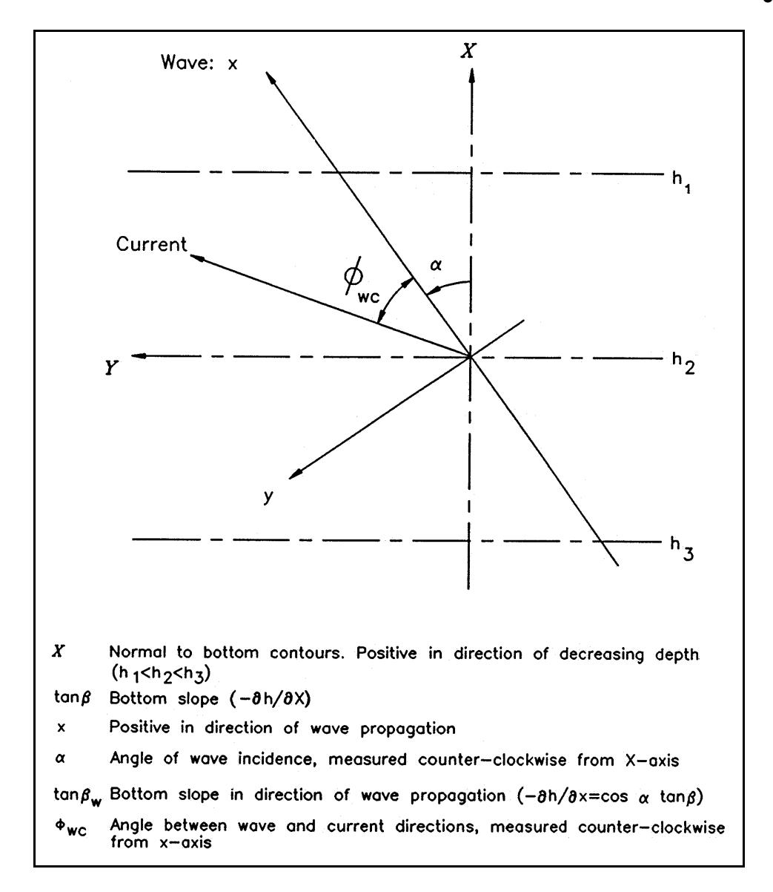

*Figure III-6-12. Definition sketch of coordinates, angles, and bottom slope*

- (4) Bed-load transport can now be computed following the methodology presented in Part III-6(4).
- (5) The reference concentration for suspended sediment is next obtained from Part III-6(5) c , and the total suspended load transport is obtained by vector addition of the mean and the mean wave-associated contributions that are obtained from Part III-6(5) e . The former is in the direction of the current, whereas the latter is in the wave direction.
- (6) Adding bed-load and suspended load transport provides a prediction of the total sediment transport rate, expressed as a vector.

#### FIND:

The total sediment transport vector for a combined wave-current boundary layer flow.

#### GIVEN:

All problem specifications are identical to those given in Example Problems III-6-9, 12, and 13.

#### PROCEDURE:

- 1) Bed-load sediment transport vector is computed following Example Problem III-6-9.
- 2) Mean suspended sediment transport vector is obtained following the procedure of Example Problem III-6-12.
- 3) Mean wave-associated suspended sediment transport vector is obtained from Example Problem III-6-13.
- 4) Total sediment transport vector is obtained as the vector sum of steps 1, 2, and 3.

#### SOLUTION:

With x being in the direction of wave propagation and y perpendicular to x, the total sediment transport in the x direction is obtained from Example Problems III-6-9, 12, and 13.
x-component of bed load = 9.0 \times 10^{-3} cm<sup>3</sup>/(cm s)
x-component of mean suspended load = 1.1 \times 10^{-2} \cos \varphi_{wc} = 7.8 \times 10^{-3} \text{ cm}^3/(\text{cm s})
x-component of mean wave-associated transport = 1.9 \times 10^{-3} cm<sup>3</sup>/(cm s)
Total transport in wave direction = \overline{q}_{sTx} = 1.9×10<sup>-2</sup> cm<sup>3</sup>/(cm s)
y-component of bed load = 6.5 \times 10^{-3} cm<sup>3</sup>/(cm s)
y-component of mean suspended load = 1.1 \times 10^{-2} \sin \varphi_{wc} = 7.8 \times 10^{-3} \text{ cm}^3/(\text{cm s})
y-component of mean wave-associated transport = 0 \text{ cm}^3/(\text{cm s})
Total transport perpendicular to wave direction = \overline{q}_{sT,y} = 1.4×10<sup>-2</sup> cm<sup>3</sup>/(cm s)
Thus, the magnitude of the total sediment transport vector is

```math
|\overline{q}_{sT}| = \sqrt{\overline{q}_{sT,x}^2 + \overline{q}_{sT,y}^2} = 2.4 \times 10^{-2} \text{ cm}^3/\text{(cm s)}
```

directed at an angle \varphi_{wT} \approx 37^{\circ} to the wave direction.

## III-6-7. References

## Bakker and van Doorn 1978

Bakker, W. T., and Van Doorn, T. 1978. "Near-Bottom Velocities in Waves with a Current," Proceedings Sixteenth International Coastal Engineering Conference , American Society of Civil Engineers, Vol 2, pp 1394–1413.

## Bijker 1967

Bijker, E.W. 1967. "Some Considerations about Scales for Coastal Models with Movable Bed," Technical Report, Delft Hydraulics Lab, The Netherlands.

## Davies, Soulsby, and King 1988

Davies, A. G., Soulsby, R. L., and King, H. L. 1988. "A Numerical Model of the Combined Wave and Current Bottom Boundary Layer," Journal of Geophysical Research , Vol 93, No. C1, pp 491 - 508.

## Dietrich 1982

Dietrich, W. E. 1982. "Settling Velocity of Natural Particles," Water Resources Research , Vol 18, No. 6, pp 1615–1626.

## Dyer and Soulsby 1988

Dyer, K. R., and Soulsby, R.L. 1988. "Sand Transport on the Continental Shelf," Annual Review of Fluid Mechanics , Vol 20, pp 295-324.

## Fredsoe 1984

Fredsoe, J. 1984. "Sediment Transport in Current and Waves," Series Paper 35 , Institute of Hydrodynamics and Hydrologic Engineering, Technical University of Denmark, Lyngby.

## Glenn and Grant 1987

Glenn, S. M., and Grant, W. D. 1987. "A Suspended Sediment Correction for Combined Wave and Current Flows," Journal of Geophysical Research , Vol 92, No. C8, pp 8244–8264.

## Grant and Madsen 1979

Grant, W. D., and Madsen, O. S. 1979. "Combined Wave and Current Interaction with a Rough Bottom," Journal of Geophysical Research , Vol 85, No. C4, pp 1797–1808.

# Grant and Madsen 1982

Grant, W. D., and Madsen, O. S. 1982. "Movable Bed Roughness in Unsteady Oscillatory Flow," Journal of Geophysical Research , Vol 87, No. C1, pp 469–481.

## Grant and Madsen 1986

Grant, W. D., and Madsen, O. S. 1986. "The Continental Shelf Bottom Boundary Layer," M. Van Dyke, ed., Annual Review of Fluid Mechanics , Vol 18, pp 265–305.

# Heathershaw 1981

Heathershaw, A.D. 1981. "Comparisons of Measured and Predicted Sediment Transport Rates in Tidal Currents," Marine Geology , Vol 42, pp 75-104.

## Jonsson 1966

Jonsson, I. G. 1966. "Wave Boundary Layers and Friction Factors," Proceedings of the Tenth International Coastal Engineering Conference , American Society of Civil Engineers, Vol 1, pp 127–148.

#### EM 1110-2-1100 (Part III) 30 Apr 02

## Jonsson and Carlson 1976

Jonsson, I. G., and Carlsen, N. A. 1976. "Experimental and Theoretical Investigation in an Oscillatory Turbulent Boundary Layer," Journal of Hydraulic Research , Vol 14, No. 1, pp 45–60.

## Kajiura 1968

Kajiura, K. 1968. "A Model of the Bottom Boundary Layer in Water Waves," Bulletin of the Earthquake Research Institute , Disaster Prevention Research Institute, Tokyo University, Vol 46, pp 75–123.

## Madsen 1991

Madsen, O. S. 1991. "Mechanics of Cohesionless Sediment Transport in Coastal Waters," Proceedings, Coastal Sediments '91 , American Society of Civil Engineers, Vol 1, pp 15–27.

## Madsen 1992

Madsen, O. S. 1992. "Spectral Wave-Current Bottom Boundary Layer Flows," Abstracts, Twenty-Third International Coastal Engineering Conference , American Society of Civil Engineers, pp 197–198.

## Madsen 1993

Madsen, O.S. 1993. "Sediment Transport Outside the Surf Zone," unpublished Technical Report, U.S. Army Engineer Waterways Experiment Station, Vicksburg, MS.

## Madsen and Grant 1976

Madsen, O. S., and Grant, W. D. 1976. "Quantitative Description of Sediment Transport by Waves," Proceedings, Fifteenth International Coastal Engineering Conference , American Society of Civil Engineers, Vol 2, pp 1093–1112.

## Madsen and Wikramanayake 1991

Madsen, O. S., and Wikramanayake, P. N. 1991. "Simple Models for Turbulent Wave-Current Bottom Boundary Layer Flow," Contract Report DRP-91-1, U.S. Army Engineer Waterways Experiment Station, Vicksburg, MS.

## Madsen et al., in preparation

Madsen, O. S., Wright, L. D., Boon, J. D., and Chisholm, T. A. "Wind Stress, Bottom Roughness and Sediment Suspension on the Inner Shelf during an Extreme Storm Event," in preparation, Continental Shelf Research .

## Madsen, Poon, and Graber 1988

Madsen, O. S., Poon, Y.-K., and Graber, H. C. 1988. "Spectral Wave Attenuation by Bottom Friction: Theory," Proceedings, Twenty-First International Coastal Engineering Conference , American Society of Civil Engineers, Vol 1, pp 492–504.

## Mathisen 1993

Mathisen, P.P. 1993. "Bottom Roughness for Wave and Current Boundary Layer Flows over a Rippled bed," Ph.D. diss., Department of Civil and Environmental Engineering, Massachusetts Institute of Technology, Cambridge, MA.

## Meyer-Peter and Müller 1948

Meyer-Peter, E., and Müller, R. 1948. "Formulas for Bed-Load Transport," Report on Second Meeting of International Association for Hydraulic Research , pp 39–64.

## Nikuradse 1933

Nikuradse, J. 1933. "Strömungsgesetze in rauhen Rohren," VDI Forschungsheft No. 361 (English translation NACA Technical Memorandum No. 1292).

## Raudkivi 1976

Raudkivi, A. J. 1976. Loose Boundary Hydraulics (2nd ed.), Pergamon Press, Oxford, England.

## Schlichting 1960

Schlichting, H. 1960. Boundary Layer Theory (fourth ed.), McGraw-Hill, New York.

# Shields 1936

Shields, A. 1936. "Application of Similarity Principles and Turbulent Research to Bed-Load Movement," (translation of original in German by W. P. Ott and J. C. van Uchelen, California Institute of Technology), Mitteilungen der Preussischen Versuchsanstalt für Wasserbau und Schiffbau .

## Smith 1977

Smith, J. D. 1977. "Modeling of Sediment Transport on Continental Shelves," The Sea , E. D. Goldberg, ed., Wiley Interscience, New York, pp 539–577.

## Smith and McLean 1977

Smith, J. D., and McLean, S. R. 1977. "Spatially Averaged Flow Over a Wavy Surface," Journal of Geophysical Research , Vol 82, No. 12, pp 1735–1745.

## Trowbridge and Madsen 1984

Trowbridge, J. H., and Madsen, O. S. 1984. "Turbulent Wave Boundary Layers," Journal of Geophysical Research , Vol 89, No. C5, pp 7989–8007.

## White, Milli, and Crabbe 1975

White, W.R., Milli, H., and Crabbe, H.O. 1975. "Sediment Transport Theories: A Review," Proceedings, Institute of Civil Engineering, Vol 59, pp 265-292.

## Wikramanayake and Madsen 1994a

Wikramanayake, P. N., and Madsen, O. S. 1994a. "Calculation of Movable Bed Friction Factors," Contract Report DRP-94-5, U.S. Army Engineer Waterways Experiment Station, Vicksburg, MS.

## Wikramanayake and Madsen 1994b

Wikramanayake, P. N., and Madsen, O. S. 1994b. "Calculation of Suspended Sediment Transport by Combined Wave-Current Flows," Contract Report DRP-94-7, U.S. Army Engineer Waterways Experiment Station, Vicksburg, MS.

## Wilson 1989

Wilson, K. C. 1989. "Friction of Wave Induced Sheet Flow," Coastal Engineering , Vol 12, pp 371–379.

# III-6-8. Definition of Symbols

| Symbol | Definition |
|---|---|
| β | Bottom slope [deg] |
| βw | Bottom slope in the direction of wave propagation [deg] |
| γ | Resuspension parameter [dimensionless] |
| δcw | Boundary layer thickness for a combined wave-current turbulent boundary layer [length] |
| δw | Boundary layer thickness [length] |
| η | Ripple height [length] |
| κ | von Karman’s constant (= 0.4) |
| λ | Ripple length [length] |
| µ | Ratio of Shear stress due to currents (τc) to Maximum bottom shear stress (τwm) |
| µb | Bottom slope parameter |
| ν | Kinematic viscosity [length2/time] |
| νs | Sediment diffusion coefficient |
| νT | Turbulent eddy viscosity [length2/time] |
| ρ | Mass density of water (salt water = 1,025 kg/m3 or 2.0 slugs/ft3; fresh water = 1,000kg/m3 or 1.94 slugs/ft3) [force-time2/length4] |
| ρs | Mass density of sediment grains [force-time2/length4] |
| τb | Bottom shear stress [force/length2] |
| τc | Shear stress due to currents [force/length2] |
| τcr | Critical bottom shear stress for initiation of motion [force/length2] |
| τm | Maximum combined bottom shear stress [force/length2] |
| τw | Bottom shear stress [force/length2] |
| τwm | Maximum bottom shear stress [force/length2] |
| τNb | Bottom skin friction shear stress [force/length2] |
| τNwm | Skin friction bottom shear stress for wave motion [force/length2] |
| τNNb | Bottom drag shear stress [force/length2] |
| n | Phase lead of near-bottom wave orbital velocity (bottom shear stress phase angle) [deg] |
| nm | Friction angle [deg] |
| ns | Friction angle for a stationary interfacial sediment grain [deg] |
| Ψ | Shields parameter (Equation III-6-43) [dimensionless] |
| Ψcr | Critical Shields parameter (Equation III-6-45) [dimensionless] |
| Ψcr,β | Critical Shields parameter for flow over a sloping bottom (Equation III-6-51) [dimensionless] |
| ΨNC | Shields parameter based on the current skin friction shear stress [dimensionless] |
| ΨNm | Skin friction Shields parameter [dimensionless] |
| ω | Wave angular or radian frequency (= 2π/T) [time-1] |
| Abm | Bottom excursion amplitude predicted by linear wave theory [length] |
| c | Volume concentration of sediment in suspension [length3/length3] |
| c& | Mean volume concentration of sediment in suspension [length3/length3] |
| c&R | Mean reference concentration [length3/length3] |
| Cµ | Factor relating maximum wave and maximum combined bottom shear stresses (equation III-6-33) |
| Cb | Volume concentration of sediment in the bed |
| cR | Reference concentration [length3/length3] |
| cRwm | Wave-associated maximum reference concentration [length3/length3] |
| cw | Wave-associated volume concentration of sediment in suspension [length3/length3] |
| D | Sediment grain diameter [length - generally millimeters] |
| Dp | Time-averaged rate of energy dissipation in the wave bottom boundary layer (Equation III-6-25) |
| fc | Current friction factor [dimensionless] |
| fcw | Wave friction factor in the presence of currents [dimensionless] |
| fw | Wave friction factor [dimensionless] |
| fNw | Wave friction factor [dimensionless] |
| g | Gravitational acceleration (32.17 ft/sec2, 9.807m/sec2) [length/time2] |
| h | Water depth [length] |
| Hrms | Root-mean-square wave height [length] |
| Hs | Significant wave height [length] |
| kn | Equivalent Nikuradse sand grain roughness [length] |
| kn | Movable bed roughness [length] |
| q | Sediment transport rate [length3/time] |
| Sediment | Transport Outside the Surf Zone III-6-67 |
| q&sB | Total bed-load transport of a sediment mixture [length3/length-time] |
| RE | Wave Reynolds number [dimensionless] |
| Re* | Boundary Reynolds number [dimensionless] |
| S* | Sediment-fluid parameter (Equation III-6-47) [dimensionless] |
| T | Significant wave period [time] |
| Ts | Significant wave period [time] |
| u | Horizontal particle velocity [length/time] |
| u* | Shear velocity [length/time] |
| u*c | Current shear velocity [length/time] |
| u*cr | Critical shear velocity [length/time] |
| u*m | Maximum combined shear velocity [length/time] |
| u*wm | Maximum wave shear velocity [length/time] |
| ubm | Maximum near-bottom wave orbital velocity [length/time] |
| uw | Wave orbital velocity [length/time] |
| wf | Sediment fall velocity [length/time] |
| Wgrain | Submerged weight of individual sediment grains |
| z | Elevation from bottom [length] |
| Z | Parameter providing a correlation of field data on ripple geometry [dimensionless] |
| z0a | Arbitrary constant of integration (apparent bottom roughness) |

# III-6-9. Acknowledgments

Authors of Chapter III-6, "Sediment Transport Outside the Surf Zone:"
Ole S. Madsen Ph.D., Dept. of Civil and Environmental Engineering, Massachusetts Institute of Technology, Cambridge, Massachusetts.
William Wood, Ph.D. (Deceased).

## Reviewers:

Scott M. Glenn, Ph.D., Institute of Marine and Coastal Sciences, Rutgers University, New Brunswick, New Jersey.
James R. Houston, Ph.D., Engineer Research and Development Center, Vicksburg, Mississippi.
Stephen McLean, Ph.D., Department of Mechanical and Environmental Engineering, University of California, Santa Barbara, Santa Barbara, California.
Todd L. Walton, Ph.D., Coastal and Hydraulics Laboratory, Engineer Research and Development Center (ERDC), Vicksburg, Mississippi.
