# Chapter 1 COASTAL TERMINOLOGY AND EM 1110-2-1100

GEOLOGIC ENVIRONMENTS (Part IV) 1 August 2008 (Change 2)

# Table of Contents

- IV-1-1. Background IV-1-1
- IV-1-2. Coastal Zone Definitions and Subdivisions IV-1-2 a. Introduction IV-1-2 b. Coastal zone IV-1-3 c. Coast IV-1-3 d. Shore IV-1-3 e. Shoreface IV-1-3 f. Continental shelf IV-1-3 g. Shoreline definitions IV-1-6
- IV-1-3. Geologic Time and Definitions IV-1-7 a. Geologic fossil record IV-1-7 b. Geologic time considerations for coastal engineering IV-1-9
- IV-1-4. Water Level Datums and Definitions IV-1-9
- IV-1-5. Factors Influencing Coastal Geology IV-1-10 a. Underlying geology and geomorphology IV-1-10 (1) Lithology IV-1-10 (a) Consolidated coasts IV-1-11 (b) Unconsolidated coasts IV-1-11 (2) Tectonics IV-1-11 (3) Volcanic coasts IV-1-11 b. High-frequency dynamic processes IV-1-13 (1) Waves IV-1-13 (2) Tides IV-1-14 (3) Energy-based classification of shorelines IV-1-16 (4) Meteorology IV-1-18 (a) Wind IV-1-18 (b) Direct influence of wind IV-1-18 (c) Indirect effect IV-1-18 (d) Land/sea breeze IV-1-18 (e) Water level setup and setdown IV-1-18 (f) Seiches IV-1-19 (5) Tropical storms IV-1-19 (6) Extratropical storms IV-1-21 c. Biological factors IV-1-24
- IV-1-6. Sea Level Changes IV-1-25 a. Background IV-1-25 (1) General IV-1-25 (2) Definitions IV-1-25 (3) Overview of causes of sea level change IV-1-26 b. Short-term causes of sea level change IV-1-27 (1) Seasonal sea level changes IV-1-27 (2) West coast of North America IV-1-27 (3) Rapid land level changes IV-1-27 (4) Ocean temperature IV-1-27 (5) Ocean currents IV-1-29 c. Long-term causes of sea level change IV-1-29 (1) Tectonic instability IV-1-29 (2) Isostacy IV-1-29 (3) Sediment compaction IV-1-29 d. Geologic implications of sea level change IV-1-31 (1) Balance of sediment supply versus sea level change IV-1-31 (2) Historical trends IV-1-32 (3) Specific coastal sites IV-1-33 (a) Sandy (barrier) coasts IV-1-33 (b) Cliff retreat IV-1-33 (c) Marshes and wetlands IV-1-33 e. Engineering and social implications of sea level change IV-1-33 (1) Eustatic sea level rise IV-1-33 (2) Relative sea level (rsl) changes IV-1-34 (3) Engineering response and policy IV-1-36 (4) Impacts of rising sea level on human populations IV-1-36 f. Changes in sea level - summary IV-1-37
- IV-1-7. Cultural (Man-Made) Influences on Coastal Geology IV-1-38 a. Introduction IV-1-38 b. Dams/Reservoirs IV-1-38 c. Erosion control and coastal structures IV-1-38 d. Modification of natural protection IV-1-39 (1) Destructive effects IV-1-39 (2) Constructive efforts IV-1-39 e. Beach renourishment (fill) IV-1-39 f. Mining IV-1-39 g. Stream diversion IV-1-39 h. Agriculture IV-1-40 i. Forestry IV-1-40
- IV-1-8. References IV-1-40
- IV-1-9. Acknowledgments IV-1-49

# List of Tables

- Page
- Table IV-1-1. Definitions of Common Coastal Geomorphic Features IV-1-6
- Table IV-1-2. North American Pleistocene Glacial and Interglacial Stages IV-1-10
- Table IV-1-3. Damage Estimates and Payouts by Insurance Companies for U.S. Catastrophes IV-1-20
- Table IV-1-4. Saffir-Simpson Damage-Potential Scale IV-1-21
- Table IV-1-5. Sea Level Changes Along the Coastal Zone IV-1-28
- Table IV-1-6. Major World Cities with Recorded Subsidence IV-1-30
- Table IV-1-7. Relative Effects of Sediment Supply Versus Sea Level Change on Shoreline Position IV-1-32

# List of Figures

- Page
- Figure IV-1-1. Temporal and spatial scales of geologic and oceanographic phenomena IV-1-2
- Figure IV-1-2. Definition of terms and features describing the coastal zone IV-1-4
- Figure IV-1-3. Continental shelf and ocean floor along the trailing-edge of a continent (i.e., representative of the U.S. Atlantic Ocean coast) IV-1-5
- Figure IV-1-4. Geologic time scale IV-1-8
- Figure IV-1-5. Cross-section views of aspects of geomorphic variability attributable to lithology, structure, and mass movement along semi-consolidated coasts IV-1-12
- Figure IV-1-6. Examples of features associated with depositional coastal environments IV-1-13
- Figure IV-1-7. Examples of tectonically produced features: (a) stable undeformed block; (b) symmetrical folding resulting from compressional forces; (c) normal faulting resulting from tensional forces; (d) composite volcano composed of alternating layers of pyroclastic material (ash) and lava flows IV-1-14
- Figure IV-1-8. Example of a fault coast exhibiting a prominent fault scarp IV-1-15
- Figure IV-1-9. Example of a volcanic coast with numerous circular islands IV-1-15
- Figure IV-1-10. Energy-based classification of shorelines IV-1-17
- Figure IV-1-11. Worldwide tropical storm pathways IV-1-21
- Figure IV-1-12. Graphical representation of the Saffir-Simpson Scale, showing the amount of damage that can be expected during different category hurricanes IV-1-22
- Figure IV-1-13. Hurricane Opal damage at Navarre Beach, Florida, November 1995, house lifted from foundation and washed into bay IV-1-23
- Figure IV-1-14. Hurricane Opal damage at Navarre Beach, Florida, November 1995, sand underneath concrete slab washed away IV-1-23
- Figure IV-1-15. Sea level fluctuations during the Pleistocene and Holocene epochs IV-1-26
- Figure IV-1-16. Yearly mean sea level changes at Juneau, Alaska, from 1936-1986 IV-1-30
- Figure IV-1-17. Yearly mean sea level changes at Galveston, Texas, and Eugene Island, Louisiana IV-1-31
- Figure IV-1-18. Summary of estimates of local rsl rise along the continental United States in millimeters per year IV-1-35
- Figure IV-1-19. Landfilling in Boston, MA, since 1630 has more than doubled the urban area IV-1-35

# Chapter IV-1 Coastal Terminology and Geologic Environments

# IV-1-1. Background

- a . Since man has ventured to the sea, he has been fascinated by the endless variety of landforms and biological habitats that occur at the coast. With the exception of high altitude alpine, a full spectrum of environments is found around the world's coastlines. These range from icy arctic shores to rocky faulted coasts to temperate sandy barriers to tropical mangrove thickets, with a myriad of intermediate and mixed forms. This part of the Coastal Engineering Manual (CEM) concentrates on the geology of the coastal zone. This broad subject encompasses both the geomorphology (the shape and form) of the landforms and the nature of the ancient strata that underlie or outcrop in the region. The forces that shape, and are shaped by, the coast are part of the overall picture, although here geology merges with the other earth sciences of meteorology and oceanography. b . This and the two chapters that follow have ambitious goals: (1) To review overall geological, environmental, and climatological settings of the world's coasts. (2) To describe particular shore types in detail and provide examples.
- (3) To explain how shore types are created by and interact with the forces of waves, currents, and weather (sometimes known as "morphodynamics").
The emphasis here is on features and landforms that range in size from centimeters to kilometers and are formed or modified over time scales of minutes to millennia (Figure IV-1-1).
- c . Another subject of crucial importance to coastal researchers is biology. The biological environment is partly established by the geological setting. Conversely, biology affects coastal geology in many ways: (1) Coral reefs and mangroves have created large stretches of coastline. (2) Cliff erosion is accelerated by the chemical solution and mechanical abrasion caused by some organisms. (3) Lagoons and estuaries slowly fill with the by-products of plants and the sediment they trap, forming wetlands.
These topics are briefly reviewed in this text, but details of the flora and fauna that inhabit the coast are not covered here.
d. Field methods and data analysis procedures applicable to geological field studies at the coast are not reviewed in this part of the CEM. Field methods are constantly evolving and changing as new instruments and technology are developed. Coastal monitoring methods were reviewed in Gorman, Morang, and Larson (1998); Larson, Morang, and Gorman (1997); and Morang, Larson, and Gorman (1997a,b). Readers who plan to conduct field studies should contact surveyors or contractors familiar with the latest technology and should review trade journals that discuss oceanographic, geographic information systems (GIS), remote sensing, and surveying advances.

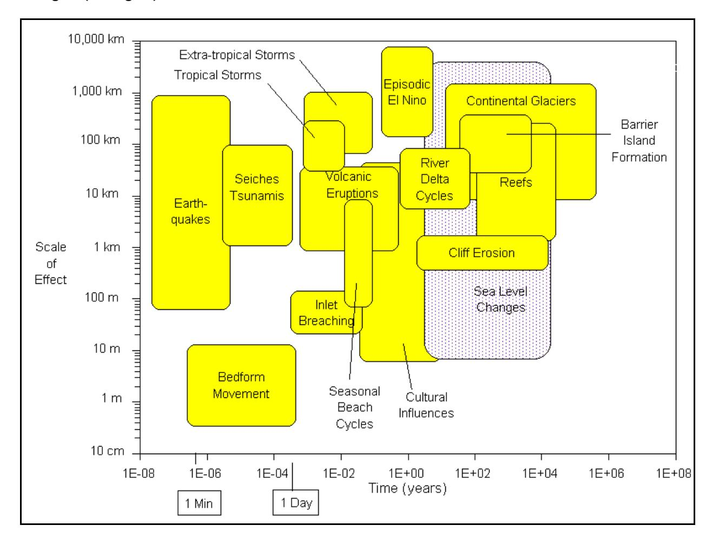

*Figure IV-1-1. Temporal and spatial scales of geologic and oceanographic phenomena*

# IV-1-2. Coastal Zone Definitions and Subdivisions

# a. Introduction.

- (1) Many coastal zone features and subdivisions are difficult to define because temporal variability or gradational changes between features obscure precise boundaries. In addition, nomenclature is not standardized, and various authors describe the same features using different names. If the same name is used, the intended boundaries may differ greatly. This ambiguity is especially evident in the terminology and zonation of shore and littoral areas. In the absence of a widely accepted standard nomenclature, coastal researchers would do well to accompany reports and publications with diagrams and definitions to ensure that readers will fully understand the authors' use of terms.
- (2) The following subparagraphs present coastal zone definitions and subdivisions based largely, but not exclusively, on geological criteria. They do not necessarily coincide with other geological-based zonations or those established by other disciplines. It should be borne in mind that coastal zone geology varies greatly from place to place, and the zonations discussed below do not fit all regions of the world. For example, coral atolls are without a coast, shoreface, or continental shelf in the sense defined here. The Great Lakes and other inland water bodies have coasts and shorefaces but no continental shelves. Thus, while divisions and categories are helpful in describing coastal geology, flexibility and good descriptive text and illustrations are always necessary for adequate description of a given region or study site.
- b. Coastal zone . In this manual, coastal zone is defined as the transition zone where the land meets water, the region that is directly influenced by marine or lacustrine hydrodynamic processes. The coastal zone extends offshore to the continental shelf break and onshore to the first major change in topography above the reach of major storm waves. Although this discussion excludes upland rivers, river mouth deltas, where morphology and structure are a result of the dynamic interplay of marine and riverine forces, are included. The coastal zone is divided into four subzones (Figures IV-1-2 and IV-1-3): (1) Coast. (2) Shore. (3) Shoreface. (4) Continental shelf.
- c. Coast . The coast is a strip of land of indefinite width that extends from the coastline inland as far as the first major change in topography. Cliffs, frontal dunes, or a line of permanent vegetation usually mark this inland boundary. On barrier coasts, the distinctive back-barrier lagoon/marsh/tidal creek complex is considered part of the coast. It is difficult to define the landward limit of the coast on large deltas like the Mississippi, but the area experiencing regular tidal exchange can serve as a practical limit (in this context, New Orleans would be considered "coastal"). The seaward boundary of the coast, the coastline , is the maximum reach of storm waves. On shorelines with plunging cliffs, the coast and coastline are one and the same. It is difficult to decide if a seawall constitutes a coast; the inland limit might better be defined at a natural topographic change.
- d. Shore . The shore extends from the low-water line to the normal landward limit of storm wave effects, i.e., the coastline. Where beaches occur, the shore can be divided into two zones: backshore (or berm) and foreshore (or beach face). The foreshore extends from the low-water line to the limit of wave uprush at high tide. The backshore is horizontal while the foreshore slopes seaward. This distinctive change in slope, which marks the juncture of the foreshore and backshore, is called the beach or berm crest.
- e. Shoreface . The shoreface is the seaward-dipping zone that extends from the low-water line offshore to a gradual change to a flatter slope denoting the beginning of the continental shelf. The continental shelf transition is the toe of the shoreface . Its location can only be approximately marked due to the gradual slope change. Although the shoreface is a common feature, it is not found in all coastal zones, especially along low-energy coasts or those consisting of consolidated material. The shoreface can be delineated from shoreperpendicular profile surveys or from bathymetric charts (if they contain sufficient soundings in shallow water). The shoreface, especially the upper part, is the zone of most frequent and vigorous sediment transport.
- f. Continental shelf . The continental shelf is the shallow seafloor that borders most continents (Figure IV-1-3). The shelf floor extends from the toe of the shoreface to the shelf break where the steeply inclined continental slope begins. It has been common practice to subdivide the shelf into inner-, mid-, and outer zones, although there are no regularly occurring geomorphic features on most shelves that suggest a basis for these subdivisions. Although the term inner shelf has been widely used, it is seldom qualified beyond arbitrary depth or distance boundaries. Site-specific shelf zonation can be based on project

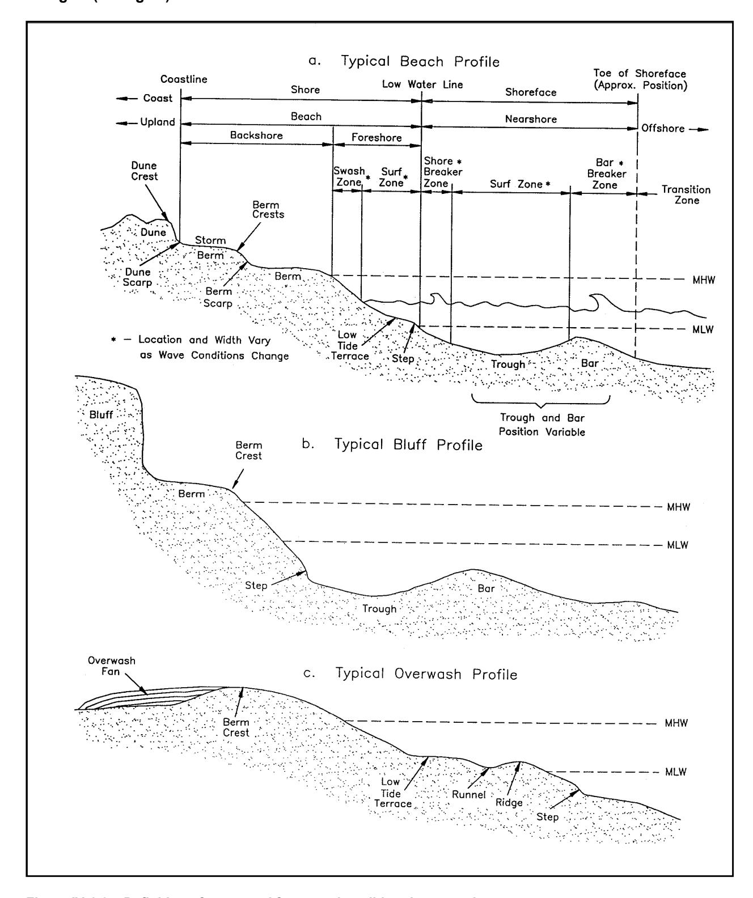

*Figure IV-1-2. Definition of terms and features describing the coastal zone*

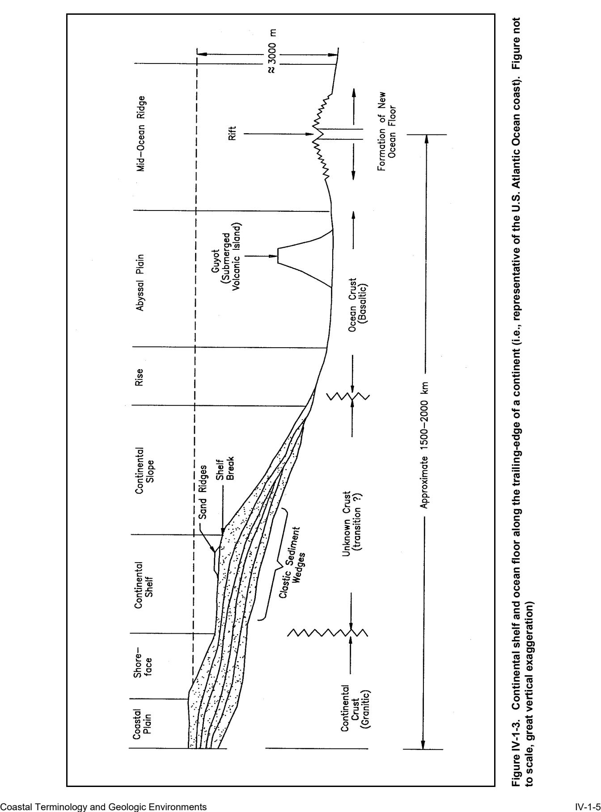

requirements and local geologic conditions. Some coastal areas (e.g., bays and the Great Lakes) do not extend out to a continental shelf.
g. Shoreline definitions. Common coastal geomorphic features are defined in Table IV-1-1 below. These have been adapted from the National Shoreline Data Standard, a draft standard prepared by the National Oceanic and Atmospheric Administration (NOAA).

#### Table IV-1-1 Definitions of Common Coastal Geomorphic Features

Apparent shoreline Line drawn on a map or chart in lieu of a mean high-water line or the mean water level line in areas where either may be obscured by marsh, mangrove, cypress, or other type of marine vegetation. This line represents the intersection of the appropriate datum on the outer limits of vegetation and appears to the navigator as the shoreline (Ellis 1978).
Backshore That part of the beach that is usually dry, being reached only by the highest tides, and by extension, a narrow strip of relatively flat coast bordering the sea (Ellis 1978).
Bank Edge of a cut or fill; the margin of the watercourse; an elevation of the seafloor located on a continental shelf or an island shelf and over which the depth of water is relatively shallow but sufficient for safe surface navigation (reefs or shoals, dangerous to surface navigation may arise above the general depths of a bank) (Ellis 1978).
Beach (or seabeach) Zone of unconsolidated material that extends landward from the low-water line to the place where there are marked changes in material or physiographic form, or to the line of permanent vegetation (usually the effective limit of storm waves). A beach includes foreshore and backshore (Ellis 1978).
Beach berm Nearly horizontal portion of the beach or backshore formed by the deposit of materials by wave action. Some beaches have no berms, others have one or several (Ellis 1978).
Berm Nearly horizontal portion of a beach or backshore having an abrupt fall and formed by wave deposition of material and marking the limit of ordinary high tides (Ellis 1978).
Berm crest Seaward limit of a berm (Ellis 1978).
Bluff A cliff or headland with an almost perpendicular face (International Hydrographic Bureau 1990).
Bottom lands Land below navigable freshwater bodies (Coastal States Organization 1997).
Cliff Land rising abruptly for a considerable distance above the water or surrounding land (Hydrographic Dictionary 1990).
Coast General region of indefinite width that extends from the sea inland to the first major change in terrain features (Ellis 1978).
Coastal zone (legal definition for coastal zone management) The term coastal zone means the coastal waters (including the lands therein and thereunder) and the adjacent shorelands (including the waters therein and thereunder), strongly influenced by each and in proximity to the shorelines of the several coastal states, and includes islands, transitional and inter-tidal areas, salt marshes, wetlands, and beaches. The zone extends, in Great Lakes waters, to the international boundary between the Unites States and Canada and in other areas seaward to the outer limit of the United States territorial sea. The zone extends inland from the shorelines only to the extent necessary to control shorelands, the uses of which have a direct and significant impact on the coastal waters. Excluded from the coastal zone are lands the use of which is by law subject solely to the discretion of or which is held in trust by the Federal Government, its officers, or agents (Hicks 1984).
Coast line (According to Public Law 31) Defined as the line of ordinary low water along that portion of the coast that is in direct contact with the open sea and the line marking the seaward limit of inland waters (Shalowitz 1964).
Coastline Same as shoreline (see coast line) (Hicks 1984).
Dry sand beach Sandy area between the mean high tide line and the vegetation line (Coastal States Organization 1997).
Estuary An embayment of the coast in which fresh river water entering at its head mixes with the relatively saline ocean water. When tidal action is the dominant mixing agent it is usually termed a tidal estuary. Also, the lower reaches and mouth of a river emptying directly into the sea where tidal mixing takes place. The latter is sometimes called a river estuary (Hicks 1984).
Foreshore That part of shore which lies between high and low water mark at ordinary tide (International Hydrographic Bureau 1990).
Freshwaters Waters that do not ebb and flow with the tide. The determinative factor is that the water body does not ebb and flow with the tide, not the salt content of the water (Coastal States Organization 1997).
High-water line A generalized term associated with the tidal plane of high water but not with a specific phase of high water (for example, higher high water, lower high water) (Shalowitz 1964).
High-water mark A line or mark left upon tide flats, beach, or alongshore objects indicating the elevation of the intrusion of high water. The mark may be a line of oil or scum along shore objects, or a more or less continuous deposit of fine shell or debris on the foreshore or berm. This mark is physical evidence of the general height reached by wave runup at recent high waters. It should not be confused with the mean high water line or mean higher high water line (Hicks 1984).
Inshore In beach terminology, the zone of variable width between the shoreface and the seaward limit of the breaker zone (Ellis 1978).
Intertidal zone (technical definition) The zone between the mean higher high water and mean lower low water lines (Hicks 1984).
Island A piece of land completely surrounded by water (International Hydrographic Bureau 1990).
Ledge A shelf -like projection, on the side of a rock or mountain. A rocky formation continuous with and fringing the shore (International Hydrographic Bureau 1990).
Levee Artificial bank confining a stream channel or limiting adjacent areas subject to flooding; an embankment bordering a submarine canyon or channel, usually occurring along the outer edge of a curve (Ellis 1978).
Littoral Pertaining to the shore, especially of the sea; a coastal region. Used extensively with "riparian" (Shalowitz 1964).
Shorelands General term including tidelands and navigable freshwater shores below the ordinary high-water mark (Coastal States Organization 1997).
Shoreline The line of contact between the land and a body of water. On Coast and Geodetic Survey nautical charts and surveys, the shoreline approximates the mean high-water line. In Coast Survey usage, the term is considered synonymous with coastline (Shalowitz 1962).
Submerged lands Lands covered by water at any stage of the tide, as distinguished from tidelands, which are attached to the mainland or an island and cover and uncover with the tide. Tidelands presuppose a high-water line as the upper boundary; submerged lands do not (Shalowitz 1962).
Tidal estuary See estuary (Hicks 1984).
Tidelands The land that is covered and uncovered by the daily rise and fall of the tide. More specifically, it is the zone between the mean high waterline and the mean low waterline along the coast, and is commonly known as the "shore" or "beach." Referred to in legal decisions as between the ordinary high-water mark and ordinary low-water mark. Tidelands presuppose a high-water line as the upper boundary (Shalowitz 1964).
Tidewaters Waters subject to the rise and fall of the tide. Sometimes used synonymously with tidelands, but tidewaters are better limited to areas always covered with water. The amount of tide is immaterial (Shalowitz 1964).
Upland Land above mean high water mark and subject to private ownership, as distinguished from tidelands, ownership of which is prima facie in the state but also subject to divestment under state statutes (Shalowitz 1964).
Waterline Juncture of land and sea. This line fluctuates, changing with the tide or other fluctuations in the water (Ellis 1978).
Wet sand beach Area between the ordinary high tide and the ordinary low tide lines (Coastal States Organization 1997).
Source: National Oceanic and Atmospheric Administration (NOAA) 1998. National Shoreline Data Standard, Progress Report and Preliminary Draft Standard, NOAA Office of Coast Survey, Silver Spring, MD.

# IV-1-3. Geologic Time and Definitions

a. Geologic fossil record . Geologists have subdivided geologic time into eras, periods, and epochs (Figure IV-1-4). Pioneering geologists of the 1800's based the zonations on the fossil record when they discovered that fossils in various rock formations appeared and disappeared at distinct horizons, thus providing a means of comparing and correlating the relative age of rock bodies from widely separated

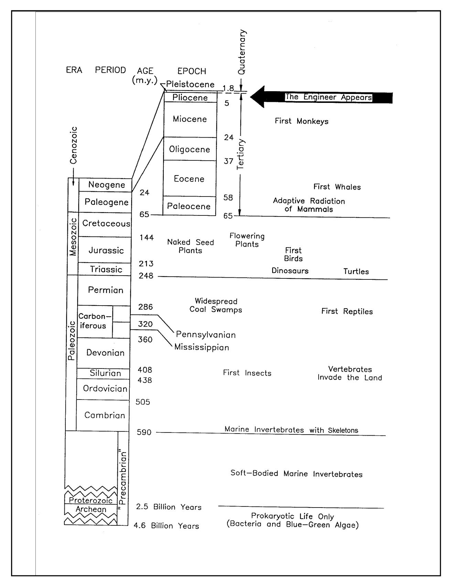

*Figure IV-1-4. Geologic time scale. Chronological ages are based on radiometric dating methods (figure adapted from Stanley (1986))*

locations. For example, the boundary between the Mesozoic ("interval of middle life") and the Cenozoic ("interval of modern life") eras is marked by the disappearance of hundreds of species, including the dinosaurs, and the appearance or sudden proliferation of many new species (Stanley 1986). The fossil time scale was relative, meaning that geologists could compare rock units but could not assign absolute ages in years. It was not until the mid-20th century that scientists could measure the absolute age of units by radiometric dating. The geologic times listed in Figure IV-1-4, in millions of years, are best estimates based on radiometric dates.
- b. Geologic time considerations for coastal engineering. The epochs of most concern to coastal engineers and geologists are the Pleistocene and Recent (also commonly known as the Holocene ), extending back a total of 1.8 million years before present. Quaternary is often used to designate the period comprising the Pleistocene and Recent Epochs.
- (1) The Pleistocene Epoch was marked by pronounced climatic fluctuations in the Northern Hemisphere changes that marked the modern Ice Age. The continental glaciers that periodically covered vast areas of the northern continents during this time had profound influence on the surficial geology. Many geomorphic features in North America were shaped or deposited by the ice sheets. Flint's (1971) Glacial and Quaternary Geology is an exhaustive study of the effects of Pleistocene ice sheets on North American geology.
- (2) The Holocene Transgression started approximately 15,000 to 18,000 years ago with the beginning of global sea level rise. Presumably, a concurrent event was the waning of the continental glaciers possibly caused by a warming climate around the world. Most of the dynamic, morphological features that we associate with the active coastal environment are Holocene in age, but the preexisting geology is often visible, as well. For example, the drumlins of Boston Harbor and the end moraine islands of southern New England (Long Island, Martha's Vineyard, and Block and Nantucket Islands) are deposits left by the Wisconsin stage glaciers (Woodsworth and Wigglesworth 1934), but barrier spits and beaches found along these shores are more recent (Holocene) features.
- (3) North American glacial stages.1 Worldwide climatic fluctuations and multiple glacial and interglacial stages were the overwhelming Quaternary processes that shaped the surficial geomorphology and biological diversity of our world. Major fluctuations in eustatic, or worldwide, sea level accompanied the waxing and waning of the continental glaciers. Oxygen isotope analysis of deep sea sediments suggests that there were as many as nine glacial and ten interglacial events in the last 700,000 years (Kraft and Chrzastowski 1985). North American stages and approximate ages are listed in Table IV-1-2. The most recent glacial stage was the Wisconsin in North America and the Würm in Europe, during which sea level was more than 100 m below present. In northern latitude coasts, the coastal worker will often encounter geologic and geomorphic evidence of the Wisconsin glacial stage. Less evidence remains of the earlier North American stages except raised shore terraces along parts of the U.S. Atlantic and Gulf coasts (e.g., see Winkler (1977); Winkler and Howard (1977)).

# IV-1-4. Water Level Datums and Definitions

Critical in evaluating sea level information or in constructing shoreline change maps are the level and type of datum used. Because water levels are not constant over space and time, depths and elevations must be

*1 Stage is a time term for a major subdivision of a glacial epoch, including the glacial and interglacial events (Bates and Jackson 1984).*

*Table IV-1-2 North American Pleistocene Glacial and Interglacial Stages*

**Table IV-1-2. North American Pleistocene Glacial and Interglacial Stages**

| 12,000-Present | Recent (Holocene) | 10,000-Present |
| --- | --- | --- |
| 150,000-12,000 | Wisconsin | 100,000-10,000 |
| 350,000-150,000 | Sangamon Interglacial | 300,000-100,000 |
| 550,000-350,000 | Illinoisan | 450,000-300,000 |
| 900,000-550,000 | Yarmouth Interglacial | 1,100,000-450,000 |
| 1,400,000-900,000 | Kansan | 1,300,000-1,100,000 |
| 1,750,000-1,400,000 | Aftonian Interglacial | 1,750,000-1,300,000 |
| > 2,000,000-1,750,000 | Nebraskan | 2,000,000-1,750,000 |
| > 2,000,000(?) | Older glaciations |  |

*Dates based on generalized curve of ocean-water temperatures interpreted from foraminifera in deep sea cores (curve reproduced in Strahler (1981)).*

referenced to established datums. In marine coastal areas, datums are typically based on tide elevation measurements. A glossary of tide elevation terms is presented in Part II-5-3, and water surface elevation datums are discussed in Part II-5-4.

# IV-1-5. Factors Influencing Coastal Geology

The coast is probably the most diverse and dynamic environment found anywhere on earth. Many geologic, physical, biologic, and anthropomorphic (human) factors are responsible for shaping the coast and keeping it in constant flux. Ancient geological events created, modified, and molded the rock and sediment that form the foundation of the modern coastal zone. Over time, various physical processes have acted on this preexisting geology, subsequently eroding, shaping, and modifying the landscape. These processes can be divided into two broad classes: active forces, like waves and tides, which occur constantly, and long-term forces and global changes that affect the coast over time scales of years.
- a. Underlying geology and geomorphology. 1 The geologic setting of a coastal site controls surficial geomorphology, sediment type and availability, and overall gradient. The geology is modified by physical processes (e.g., waves and climate), biology, and man-made activities, but the overall "look" of the coast is primarily a function of the regional lithology and tectonics. These topics are discussed in the following paragraphs.
- (1) Lithology. Lithology concerns the general character of rock or sediment deposits. The most critical lithologic parameters responsible for a rock's susceptibility to erosion or dissolution are the mineral composition and the degree of consolidation. Striking contrasts often occur between coasts underlain by consolidated rock and those underlain by unconsolidated material. Marine processes are most effective when acting on uncemented material, which is readily sorted, redistributed, and sculpted into forms that are in a state of dynamic equilibrium with incident energy.

*Dates from Young (1975) (original sources not listed).*

*1 Geomorphology is a study of natural topographic features and patterns forming the earth's surface, including both terrestrial and subaqueous environments.*

- (a) Consolidated coasts. Consolidated rock consists of firm and coherent material. Coastal areas consisting of consolidated rock are typically found in hilly or mountainous terrain. Here, erosional processes are usually dominant. The degree of consolidation greatly influences the ability of a rocky coastline to resist weathering and erosion. Resistance depends on susceptibility to mechanical and chemical weathering, hardness and solubility of constituent minerals and cementation, nature and density of voids, and climatic conditions. Rock type, bedding, jointing, and orientation of the strata greatly influence the geomorphic variability of the shoreline (Figures IV-1-5, IV-2-20, and IV-2-31). For example, large portions of the shorelines of Lakes Superior, Huron, and Ontario are rocky and prominently display the structure of the underlying geology. ! Mechanical weathering is the disintegration of rock without alteration of its chemical nature. Examples of mechanical weathering include fluctuations in temperature (causing repetitive thermal expansion and contraction), expansion due to crystallization from salt or ice, wetting and drying, overburden fluctuations, and biological activity. ! Chemical weathering is the decomposition of rock material by changes in its chemical composition. This process includes hydration and hydrolysis, oxidation and reduction, solution and carbonation, chelation, and various biochemical reactions.
- (b) Unconsolidated coasts. In contrast to consolidated coasts, depositional and erosional processes dominate unconsolidated coasts, which are normally found on low relief coastal plains or river deltas. Commonly, shorelines have been smoothed by erosion of protruding headlands and by the deposition of barrier islands, spits, and bay mouth barriers. Along unconsolidated coasts, large amounts of sediment are usually available, and morphological changes occur rapidly. Waves and currents readily alter relict geomorphic features in this environment. Figure IV-1-6 illustrates features associated with unconsolidated depositional environments. The Atlantic and Gulf of Mexico coasts of the United States are mostly unconsolidated, depositional environments (except select locations like the rocky shores in New England).
- (2) Tectonics. Forces within the earth's crust and mantle deform, destroy, and create crustal material. These tectonic activities produce structural features such as faults and folds (anticlines and synclines) (Figure IV-1-7). Tectonic movements produce large-scale uplift and subsidence of land masses. The west coast of the United States is an example of a tectonically dominated coast, in sharp contrast to the east coast, which is mostly depositional. According to Shepard's (1973) coastal classification, a fault coast is characterized by a steep land slope that continues beneath the sea surface. The most prominent feature exhibited by a fault coast is a scarp where normal faulting has recently occurred, dropping a crustal block so that it is completely submerged, leaving a higher block standing above sea level (Figure IV-1-8). Examples of fault-block coasts are found in California. Active faults such as the Inglewood-Rose Canyon structural zone outline the coast between Newport Bay and San Diego, and raised terraces backed by fossil cliffs attest to continuing tectonism (Orme 1985).
- (3) Volcanic coasts. The eruption of lava and the growth of volcanoes may result in large masses of new crustal material. Conversely, volcanic explosions or collapses of existing volcanic cones can leave huge voids in the earth's surface known as calderas. When calderas and cones occur in coastal areas, the result is a coastline dominated by circular convex and concave contours (Shepard 1973). Coastlines of this sort are common on volcanic islands such as the Aleutians (Figure IV-1-9). The morphology of volcanic shores is discussed in more detail in Part IV-2.

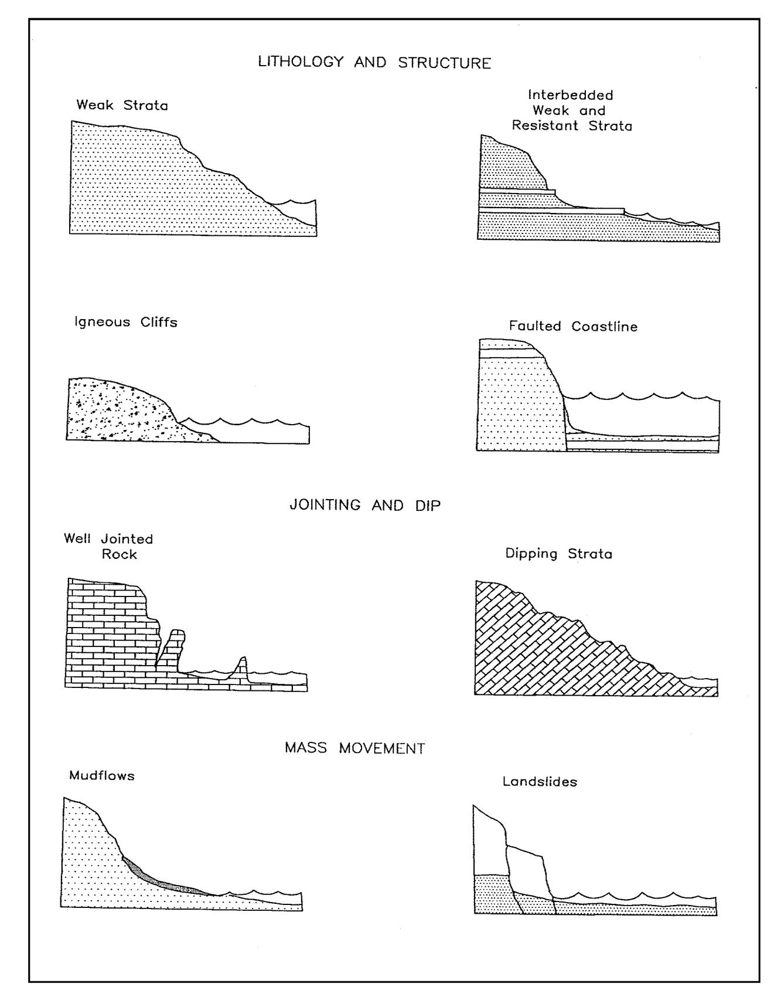

*Figure IV-1-5. Cross-section views of aspects of geomorphic variability attributable to lighology, structure, and mass movement along semi-consolidated coasts (from Mossa, Meisberger, and Morang (1992))*

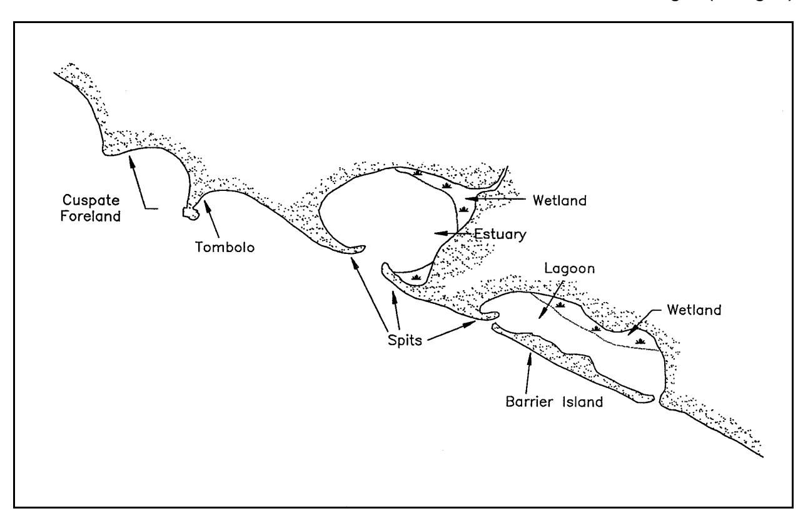

*Figure IV-1-6. Examples of features associated with depositional coastal environments. These features consist mostly of unconsolidated sediments (after Komar 1976))*

b. High-frequency dynamic processes. The following paragraphs briefly list processes that impart energy to the coastal zone on a continuous or, as with storms, repetitive basis. Any geological or engineering investigation of the coastal zone must consider the sources of energy that cause erosion, move sediment, deposit sediment, and rearrange or shape the preexisting topography. These processes also result in temporary changes in water levels along the coast. Long-term sea level changes are discussed in paragraph IV-1-6.

# (1) Waves.

(a) Water waves (sometimes called gravity waves ) are the dominant force driving littoral processes on open coasts. The following quotes from the Shore Protection Manual (1984) underscore the significance of waves in shaping coastal zone geomorphology:
Waves are the major factor in determining the geometry and composition of beaches and significantly influence the planning and design of harbors, waterways, shore protection measures, coastal structures, and other coastal works. Surface waves generally derive their energy from the winds. A significant amount of this wave energy is finally dissipated in the nearshore region and on the beaches.
Waves provide an important energy source for forming beaches; sorting bottom sediments on the shoreface; transporting bottom materials onshore, offshore, and alongshore; and for causing many of the forces to which coastal structures are subjected. An adequate understanding of the fundamental physical processes in surface wave generation and propagation must precede any attempt to

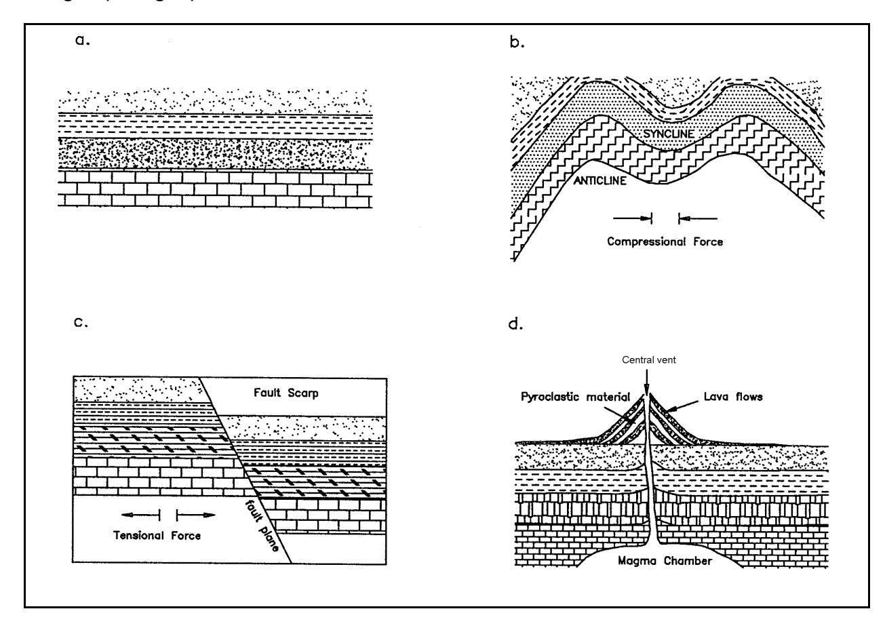

*Figure IV-1-7. Examples of tectonically produced features: (a) stable undeformed block; (b) symmetrical folding resulting from compressional forces; (c) normal faulting resulting from tensional forces; (d) composed of alternating layers of pyroclastic material (ash) and lava flows*

understand complex water motion in the nearshore areas of large bodies of water. Consequently, an understanding of the mechanics of wave motion is essential in the planning and design of coastal works.
- (b) A detailed discussion of water wave mechanics is presented in Parts II-1, II-2, and II-3. Bascom's (1964) Waves and Beaches is a general introduction to the subject for the nonspecialist. (2) Tides.
- (a) The most familiar sea level changes are those produced by astronomical tides. Tides are a periodic rise and fall of water level caused by the gravitational interaction among the earth, moon, and sun. Because the earth is not covered by a uniform body of water, tidal ranges and periods vary from place to place and are dependent upon the natural period of oscillation for each water basin (Komar 1998). Tidal periods are characterized as diurnal (one high and one low per day), semidiurnal (two highs and two lows per day), and mixed (two highs and two lows with unequal heights) (Figure II-5-16). In the coastal zone, variations in topography, depth, seafloor sediment type, and lateral boundaries also affect the tide. For more background information and theory, refer to Part II-4.

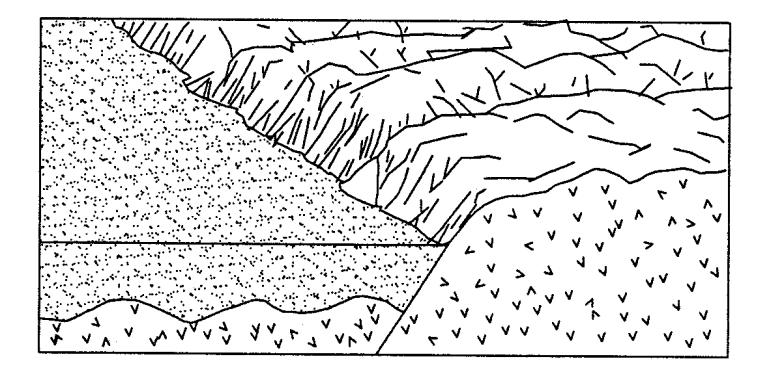

*Figure IV-1-8. Example of a fault coast exhibiting a prominent fault scarp*

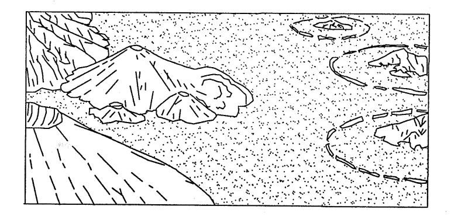

*Figure IV-1-9. Example of a volcanic coast with numerous circular islands*

- (b) The importance of tides to coastal geological processes is threefold. First, the periodic change in water level results in different parts of the foreshore being exposed to wave energy throughout the day. In regions with large tidal ranges, the water may rise and fall 10 m, and the shoreline may move laterally several kilometers between high and low water. This phenomenon is very important biologically because the ecology of tidal flats depends on their being alternately flooded and exposed. The geological significance is that various parts of the intertidal zone are exposed to erosion and deposition.
- (c) Second, tidal currents themselves can erode and transport sediment. Generally, tidal currents become stronger near the coast and play an increasingly important role in local circulation (Knauss 1978). Because of the rotating nature of the tidal wave in many locations (especially inland seas and enclosed basins), ebb and flood currents follow different paths. As a result, residual motions can be highly important in terms of transport and sedimentation (Carter 1988). In inlets and estuaries, spatially asymmetric patterns of ebb and flood may cause mass transport of both water and sediment.
- (d) Third, tides cause the draining and filling of tidal bays. These bays are found even in low-tide coasts such as the Gulf of Mexico. This process is important because it is related to the cutting and migration of tidal inlets and the formation of flood- and ebb-tidal shoals in barrier coasts. The exchange of seawater in and out of tidal bays is essential to the life cycle of many marine species.
- (3) Energy-based classification of shorelines.
- (a) Davies (1964) applied an energy-based classification to coastal morphology by subdividing the world's shores according to tide range. Hayes (1979) expanded this classification, defining five tidal categories for coastlines: ! Microtidal, < 1 m. ! Low-mesotidal, 1-2 m. ! High-mesotidal, 2-3.5 m. ! Low-macrotidal, 3.5-5 m. ! Macrotidal, > 5 m.
The Hayes (1979) classification was based primarily on shores with low to moderate wave power and was intended to be applied to trailing edge, depositional coasts.
- (b) In the attempt to incorporate wave energy as a significant factor modifying shoreline morphology, five shoreline categories were identified based on the relative influence of tide range versus mean wave height (Figure IV-1-10) (Nummedal and Fischer 1978; Hayes 1979; Davis and Hayes 1984): ! Tide-dominated (high). ! Tide-dominated (low). ! Mixed-energy (tide-dominated). ! Mixed energy (wave-dominated). ! Wave-dominated.
- (c) The approximate limit of barrier island development is in the field labeled "mixed energy (tidedominated)." Notice that these fields cover a range of tide and wave heights. It is the relative effects of these processes that are important, not the absolute values. Also, at the lower end of the energy scales, there is a delicate balance between the forces; where tide-dominated, wave-dominated, or mixed-energy morphologies may develop with very little difference in wave or tide parameters. By extension, tidal inlets have sometimes been classified using this nomenclature.
- (d) Continuing research has shown, however, that earlier approaches to classifying the coast on the basis of tidal and wave characteristics have been oversimplified because many other factors can play critical roles in determining shoreline morphology and inlet characteristics (Davis and Hayes 1984; Nummedal and Fischer 1978). Among these factors are:

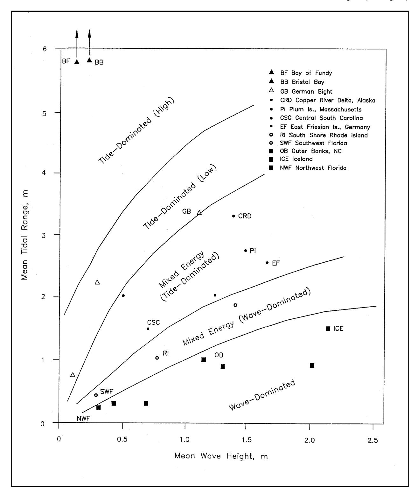

*Figure IV-1-10. Energy-based classification of shorelines (from Hayes (1979))*

- ! Physiographic setting and geology.
- ! Tidal prism.
- ! Sediment availability.
- ! Influence of riverine input.
- ! Bathymetry of the back-barrier bays.
- ! Meteorology and the influence of storm fronts.
- (4) Meteorology. Meteorology is the study of the spatial and temporal behavior of atmospheric phenomena. Climate characterizes the long-term meteorologic conditions of an area, using averages and various statistics. Factors directly associated with climate such as wind, temperature, precipitation, evaporation, chemical weathering, and seawater properties all affect coastal geology. The shore is also affected by wave patterns that may be due to local winds or may have been generated by storms thousands of kilometers away. Fox and Davis (1976) is an introduction to weather patterns and coastal processes, and Hsu (1988) reviews coastal meteorology fundamentals.
- (a) Wind. Wind is caused by pressure gradients, horizontal differences in pressure across an area. Wind patterns range in scale from global, which are generally persistent, to local and short duration, such as thunderstorms.
- (b) Direct influence of wind. Wind has a great influence on coastline geomorphology, both directly and indirectly. The direct influence includes wind as an agent of erosion and transportation. It affects the coastal zone by eroding, transporting, and subsequently depositing sediment. Bagnold (1954) found that a proportional relationship exists between wind speed and rate of sand movement. The primary method of sediment transport by wind is through saltation, or the bouncing of sediment grains across a surface. Two coastal geomorphic features that are a direct result of wind are dunes and related blowouts (Pethick 1984). Dunes are depositional features whose form and size are a result of sediment type, underlying topography, wind direction, duration, and strength. Blowouts form when wind erodes an unvegetated area, thus removing the sand and leaving a depression or trough. These features are discussed in more detail in Parts III-4 and IV-2.
- (c) Indirect effect. Wind indirectly affects coastal geomorphology as wind stress upon a water body causes the formation of waves and oceanic circulation.
- (d) Land/sea breeze. Diurnal variations in the wind result from differential heating of the ocean and land surfaces. During the day, especially in summer, heating of the land causes the air to expand and rise, thus forming an area of low pressure. The pressure gradient between the water and the land surfaces causes a landward-directed breeze. At night, the ocean cools less rapidly than does the land, thus resulting in air rising over the ocean and subsequently seaward-directed breezes. These breezes are rarely greater than 8 m/sec (18 mph) and therefore do not have a great effect upon coastline geomorphology, although there may be some offshore-onshore transport of sediment on beaches (Komar 1998).
- (e) Water level setup and setdown. Onshore winds cause a landward movement of the surface layers of the water and thus a seaward movement of deeper waters. Strong onshore winds, if sustained, may also cause increased water levels or setup. The opposite occurs during offshore winds.
- (f) Seiches. Seiches are phenomena of standing oscillation that occur in large lakes, estuaries, and small seas in response to sudden changes in barometric pressure, violent storms, and tides. This condition causes the water within the basin to oscillate much like water sloshing in a bowl.
- (5) Tropical storms. A cyclone is a system of winds that rotates about a center of low atmospheric pressure clockwise in the Southern Hemisphere and anti-clockwise in the Northern Hemisphere (Gove 1986). Tropical storm is a general term for a low-pressure, synoptic-scale1 cyclone that originates in a tropical area. At maturity, tropical cyclones are the most intense and feared storms in the world; winds exceeding 90 m/sec (175 knots or 200 mph) have been measured, accompanied by torrential rain (Huschke 1959). By convention, once winds exceed 33 m/sec (74 mph), tropical storms are known as hurricanes in the Atlantic and eastern Pacific, typhoons in the western Pacific (Philippines and China Sea), and cyclones in the Indian Ocean.
- (a) Tropical storms can cause severe beach erosion and destruction of shore-front property because elevated sea level, high wind, and depressed atmospheric pressure can extend over hundreds of kilometers. Tropical storms can produce awesome property damage (Table IV-1-3) and move vast quantities of sediment. ! The great Gulf of Mexico hurricane of 1900 inundated Galveston Island, killing over 6,000 residents (NOAA 1977-estimates range from 8-12,000 dead). ! During the September 1919 hurricane that struck the Florida Keys, 300 lives were lost in Key West, where winds were reported at 50 m/sec (110 mph). The final death toll of over 600, mostly in ships at sea, made this the third deadliest U.S. hurricane on record. ! The Great New England Hurricane that devastated Long Island and southern New England in September of 1938 killed 600 people and eliminated beach-front communities along the southern Rhode Island shore (Minsinger 1988). Survivors reported 15-m (50-ft) breakers sweeping over the Rhode Island barriers (Allen 1976). Shinnecock Inlet was cut through the Long Island barrier (Morang 1999). ! Hurricane Hugo hit the U.S. mainland near Charleston, South Carolina, on September 21, 1989, causing over $4 billion in damage, eroding the barriers, and producing other geologic changes up to 180 km north and 50 km south of Charleston (Davidson, Dean, and Edge 1990; Finkl and Pilkey 1991). ! A cyclone on June 9, 1998, inundated low-lying coastal plains and salt pans in northwest India. Over 14,000 people vanished into the Arabian Sea.
Simpson and Riehl (1981) have examined the effects of hurricanes in the United States. This work and Neumann et al. (1987) list landfall probabilities for the U.S. coastline. Tropical storms from 1871 to 1986 are plotted in Neumann et al. (1987). Tannehill (1956) identified all known Western Hemisphere hurricanes before the 1950's. Worldwide representative tropical storm tracks are shown in Figure IV-1-11 and Atlantic tracks in Figure II-5-29.
(b) The Saffir-Simpson Scale has been used for over 20 years by the U.S. National Weather Service to compare the intensity of tropical cyclones (Table IV-1-4). Cyclones are ranked into five categories based on maximum wind speed and the amount of damage that they cause (Figure IV-1-12), with 5 representing

*1 Synoptic-scale refers to large-scale weather systems as distinguished from local patterns such as thunderstorms.*

*Table IV-1-3 Damage Estimates and Payouts by Insurance Companies for U.S. Catastrophes*

**Table IV-1-3. Damage Estimates and Payouts by Insurance Companies for U.S. Catastrophes**

|  |  |  |  |  |  | Insured loss | Total Damage estimate | in 1996 U.S. Dollars |
| --- | --- | --- | --- | --- | --- | --- | --- | --- |
| Date | Event (Region of | Greatest | Influence) | Category |  | (millions)1 | (millions) 2 | (millions) |
| Aug. 1992 | Hurricane Andrew | (Florida, | Louisiana)2 | 4 |  | $16,500 | 26,500 | 30,475 |
| Jan. 1994 | Northridge, Cailifornia, | earthquake |  |  |  | 12,500 |  |  |
| Sep. 1989 | Hurricane Hugo | (South Carolina) |  | 4 |  | 4,195 | 7,000 | 8,490 |
| Sep. 1998 | Hurricane Georges |  |  |  |  | 2.900 | . 4,000 |  |
| Oct. 1995 | Hurricane Opal | (Florida, Alabama) |  | 3 |  | 2,100 | 3,000 | 3,100 |
| March 1993 | “Storm of the Century” | (24 eastern | states) |  |  | 1,750 | 6,000 |  |
| Aug. 1969 | Hurricane Camille | (Mississippi, | Louisiana) | 5 | - |  | 1,400 | 6,100 |
| Oct. 1991 | Oakland, California, | fire |  |  |  | 1,700 |  |  |
| Sep. 1996 | Hurricane Fran |  |  | 3 |  | 1,600 | 3,200 | 3,200 |
| Sep. 1992 | Hurricane Iniki | (Hawaiian Islands) |  | — |  | 1,600 | 1,800 | 2,070 |
| Oct. 1989 | Loma Prieta, | California, earthquake |  |  |  | 960 |  |  |
| Dec. 1983 | Winter storms, 41 | states |  |  |  | 880 |  |  |
| April-May 1992 | Los Angeles riots |  |  |  |  | 775 |  |  |
| April 1992 | Wind, hail, tornadoes, | floods | (Texas, Oklahoma) |  |  | 760 |  |  |
| Sep. 1979 | Hurricane Frederic | (Mississippi, | Alabama) | 3 |  | 753 | 2,300 | 4,330 |
| Sep 1964 | Hurricane Dora | (southeast Florida) |  | 2 |  | 250 |  | 1,340 |
| Sep 1960 | Hurricane Donna | (south Florida) |  | 4 |  | 300 | 387 | 2,100 |
| Sep. 1938 | Great New England Rhode Island, | Hurricane Connecticut, | (Long Island, Massachusetts) | 3 |  | 4003 | 600 | — |
| Notes: |  |  |  |  |  |  |  |  |

#### Notes:

storms that cause catastrophic damage to structures. Only two Category 5 storms have hit the United States since record-keeping began: the 1935 Labor Day hurricane that hit the Florida Keys and killed 600 people, and Hurricane Camille, which devastated the Mississippi coast in 1969, killing 256 and causing 1.4 billion in damage (over $6 billion when converted to 1996 values).
- (c) During tropical storms and other weather disturbances, water level changes are caused by two factors:
- ! Barometric pressure. Barometric pressure has an inverse relationship to sea level. As atmospheric pressure increases, the sea surface is depressed so that the net pressure on the seafloor remains constant. Inversely, as atmospheric pressure decreases, surface water rises. The magnitude of the "inverse barometer effect" is about 0.01 m for every millibar of difference in pressure, and in areas affected by tropical storms or hurricanes, the potential barometric surge may be as high as 1.5 m (Carter 1988).

*1. Total damage costs exceed insurance values because municipal structures like roads are not insured. (Source: The New York Times, December 28, 1993, citing insurance industry and State of Florida sources; Daytona Beach News-Journal web edition, 12 June 1998).*

*2. Andrew caused vast property damage in south central Florida, when sub-standard structures were torn apart by the hurricane's winds. This proves that hurricanes are not merely coastal hazards, although coastal residents usually are at greatest risk because of the danger from storm surges. (Source: The Deadliest, Costliest, and Most Intense United States Hurricanes of this Century, NOAA Technical Memorandum NWS TPC-1 (www.nhc.noaa.gov/pastcast.html, 23 Dec 1998).*

*3. Multiplying the 1938 damage value by 10 gives a crude estimate in 1990's Dollars (data source: Minsinger 1988).*

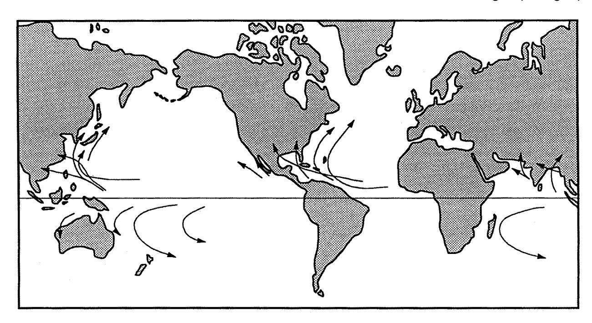

*Figure IV-1-11. Worldwide tropical storm pathways (from Cole (1980))*

*Table IV-1-4 Saffir-Simpson Damage-Potential Scale*

**Table IV-1-4. Saffir-Simpson Damage-Potential Scale**

| Scale | Number | pressure | Wind speed | Wind speed | Surge | Surge |  |
| --- | --- | --- | --- | --- | --- | --- | --- |
| (category) | 1 2 3 4 5 | (millibars) $980 965-979 945-964 920-944 <920 | (miles/hr) 74-95 96-110 111-130 131-155 >155 | (m/sec) 33-42 43-49 50-58 59-69 >69 | (ft) 4-5 6-8 9-12 13-18 >18 | (m) -1.5 -2-2.5 -2.6-3.9 -4-5.5 >5.5 | Damage Minimal Moderate Extensive Extreme Catastrophic |
| (From | Hsu | (1988); originally | from Simpson and | Riehl (1981)) |  |  |  |

(From Hsu (1988); originally from Simpson and Riehl (1981))
- ! Storm surges. In shallow water, winds can pile up water against the shore or drive it offshore. Storm surges, caused by a combination of low barometric pressure and high onshore winds, can raise sea level several meters, flooding coastal property (Figures IV-1-13 and IV-1-14). The Federal Emergency Management Agency (FEMA) determines base flood elevations for the coastal counties of the United States. These elevations include still-water-level flood surges that have a 100-year return interval. In light of rising sea level along most of the United States, it seems prudent that Flood Insurance Rate Maps be periodically adjusted (National Research Council 1987). Besides wind forcing, ocean waves generated by storms can temporarily increase water levels tens of centimeters. Analysis procedures for predicting surge heights are detailed in EM 1110-2-1412.
- (6) Extratropical storms. Extratropical cyclones (ET's) are cyclones associated with migratory fronts occurring in the middle and high latitudes (Hsu 1988). Although hurricanes are the most destructive storms to pass over the U.S. Atlantic coast, less powerful ET's, more commonly known as winter storms or

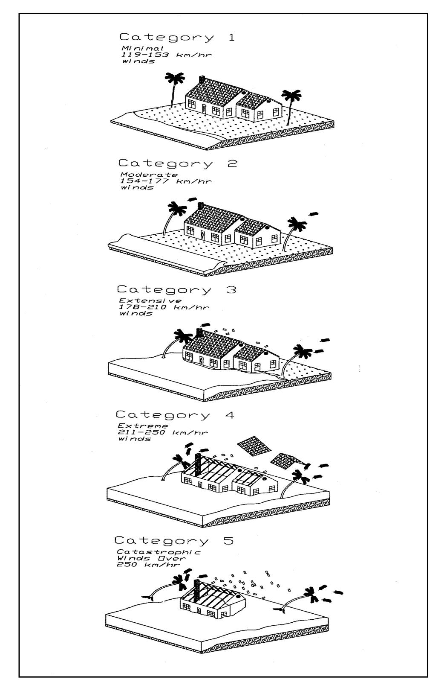

*Figure IV-1-12. Graphical representation of the Saffir-Simpson Scale, showing the amount of damage that can be expected during different category hurricanes. Hurricane Andrew, in August 1992, was a Category 5 storm that caused immense damage inland, without a storm surge (Figure modified from Associated Press figure printed in Vicksburg Post, 3 Aug 1995)*

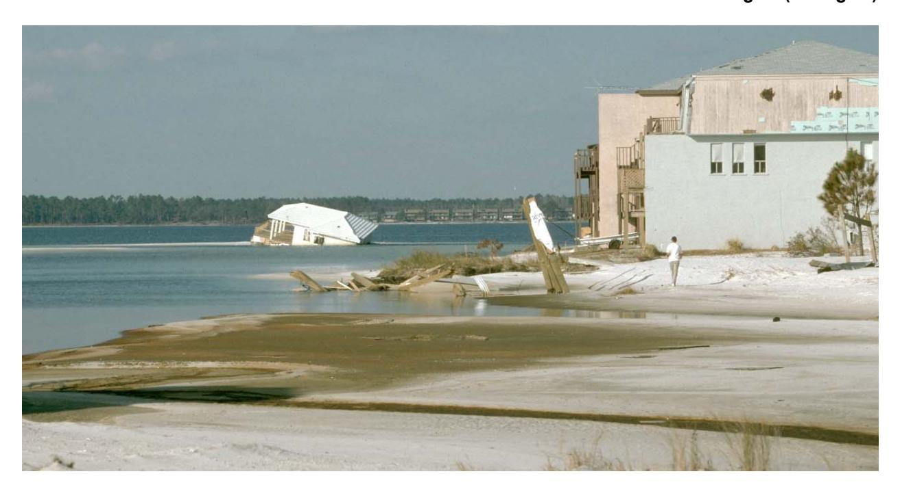

*Figure IV-1-13. Navarre Beach, Florida, November 1995. The house in Santa Rosa Sound was lifted off its foundations and moved back hundreds of meters. Many houses here were built on piles, but during Hurricane Opal, some piles were undermined, while at some properties, waves simply lifted buildings up off their supports. The low area in the foreground is a washover channel*

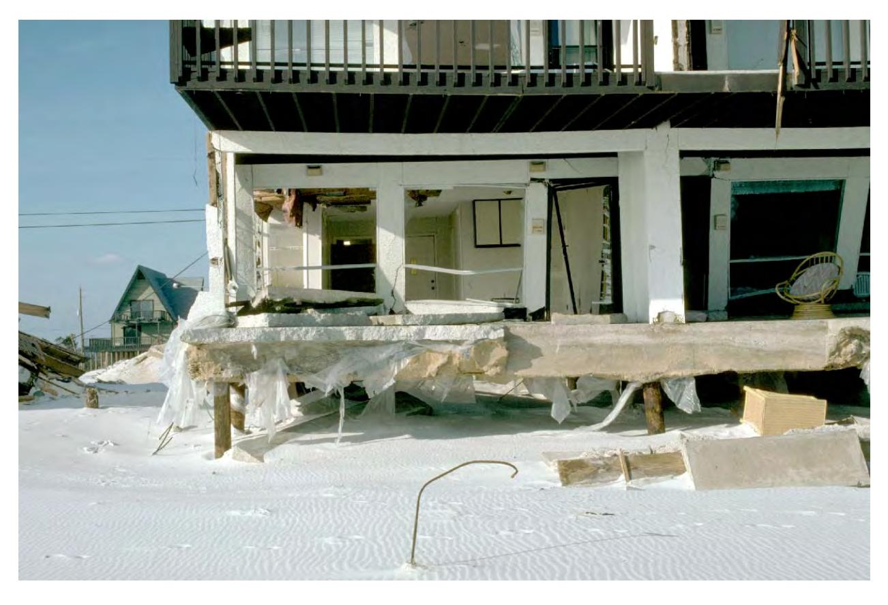

*Figure IV-1-14. Hurricane Opal damage at Navarre Beach, Florida, November 1995. The sand underneath the concrete slab washed away, and the unsupported floors collapsed*

"northeasters," have also damaged ships, eroded beaches, and taken lives. Northeasters are not as clearly defined as hurricanes and their wind speeds seldom approach hurricane strength. On the other hand, ET's usually cover broader areas than hurricanes and move more slowly; therefore, ET's can generate wave heights that exceed those produced by tropical storms (Dolan and Davis 1992).
- (a) Most Atlantic northeasters occur from December through April. Dolan and Davis (1992) have tabulated historic ET's and calculated that the most severe ones are likely to strike the northeast coast in October and January.
- (b) The Halloween Storm of October 1991 was one of the most destructive northeasters to ever strike the Atlantic coast. The system's lowest pressure dipped to 972 mb on October 30. Sustained winds about 40-60 knots persisted for 48 hr, generating immense seas and storm surges (Dolan and Davis 1992). Another famous northeaster was the Ash Wednesday Storm of 1962, which claimed 33 lives and caused great property damage.
- (c) In early 1983, southern California was buffeted by the most severe storms in 100 years, which devastated coastal buildings and caused tremendous erosion. During one storm in January 1983, which coincided with a very high tide, the cliffs in San Diego County retreated as much as 5 m (Kuhn and Shepard 1984). Further north, the storm was more intense and cliff retreat of almost 30 m occurred in places. Kuhn and Shepard (1984) speculated that the unusual weather was linked to the eruption of El Chichon Volcano in the Yucatan Peninsula in March 1982. They noted that the 1983 storms in California were the most intense since the storms of 1884, which followed the August 27, 1883, explosion of Krakatoa.
- (d) At this time, weather forecasters still have difficulty forecasting the development and severity of ET's. Coastal planners and engineers must anticipate that powerful storms may lash their project areas and need to apply conservative engineering and prudent development practices to limit death and property destruction.

# c. Biological factors.

Coastal areas are normally the sites of intense biological activity. This is of enormous geological importance in some areas, while being insignificant and short-lived in others. Biological activity can be constructive; e.g., the growth of massive coral reefs, or it can be destructive, as when boring organisms help undermine sea cliffs. Remains from marine organisms having hard skeletal parts, usually composed of calcium carbonate, contribute to the sediment supply almost everywhere in the coastal environment. These skeletal contributions can be locally important and may even be the dominant source of sediment. Vegetation, such as mangroves and various grasses, plays an important role in trapping and stabilizing sediments. Growth of aquatic plants in wetlands and estuaries is critical in trapping fine-grained sediments, eventually leading to infilling of these basins (if balances between sediment supply and sea level changes remain steady). Kelp, particularly the larger species, can be an important agent of erosion and transportation of coarse detritus such as gravel and cobble. Biological coasts are discussed in greater detail in Part IV-2. Deltaic and estuarine processes, which are greatly influenced by biology, are discussed in Part IV-3.

# IV-1-6. Sea Level Changes

- a. Background.
- (1) General.
- (a) Changes in sea level can have profound influence on the geology, natural ecology, and human habitation of coastal areas. A long-term and progressive rise in sea level has been cited as a major cause of erosion and property damage along our coastlines. Predicting and understanding this rise can guide coastal planners in developing rational plans for coastal development and the design, construction, and operation of structures and waterways.
- (b) Many geomorphic features on contemporary coasts are the byproducts of the eustatic rise in sea level caused by Holocene climatic warming and melting of continental glaciers. Sea level has fluctuated throughout geologic time as the volume of ocean water has fluctuated, the shape of the ocean basins has changed, and continental masses have broken apart and re-formed.
- (c) Sea level changes are the subject of active research in the scientific community and the petroleum industry. The poor worldwide distribution of tide gauges has hampered the study of recent changes (covering the past century) as most gauges were (and still are) distributed along the coasts of industrial nations in the Northern Hemisphere. Readers interested in this fascinating subject are referred to Emery and Aubrey's (1991) excellent book, Sea Levels, Land Levels, and Tide Gauges. This volume and Gorman (1991) contain extensive bibliographies. Tabular data and analyses of United States tide stations are printed in Lyles, Hickman, and Debaugh (1988), and worldwide Holocene sea level changes are documented in Pirazzoli (1991). Papers on sea level fluctuations and their effects on coastal evolution are presented in Nummedal, Pilkey, and Howard (1987). Engineering implications are reviewed in National Research Council (1987). Atmospheric carbon dioxide, climate change, and sea level are explored in National Research Council (1983). Houston (1993) discusses the state of uncertainty surrounding predictions on sea level change.
- (2) Definitions. Because of the complexity of this topic, it is necessary to introduce the concepts of relative and eustatic sea level:
- (a) Eustatic sea level change is caused by change in the relative volumes of the world's ocean basins and the total amount of ocean water (Sahagian and Holland 1991). It can be measured by recording the movement in sea surface elevation compared with some universally adopted reference frame. This is a challenging problem because eustatic measurements must be obtained from the use of a reference frame that is sensitive only to ocean water and ocean basin volumes. For example, highly tectonic areas (west coasts of North and South America; northern Mediterranean countries) are not suitable for eustatic sea level research because of frequent vertical earth movements (Mariolakos 1990). Tide gauge records from "stable" regions throughout the world have generated estimates of the recent eustatic rise ranging from 15 cm/century (Hicks 1978) to 23 cm/century (Barnett 1984).
- (b) A relative change in water level is, by definition, a change in the elevation of the sea surface compared with some local land surface. The land, the sea, or both may have moved in absolute terms with respect to the earth's geoid. It is exceptionally difficult to detect absolute sea level changes because tide stations are located on land masses that have themselves moved vertically. For example, if both land and sea are rising at the same rate, a gauge will show that relative sea level (rsl) has not changed. Other clues, such as beach ridges or exposed beach terraces, also merely reflect their movement relative to the sea.
- (3) Overview of causes of sea level change.
- (a) Short-term sea level changes are caused by seasonal and other periodic or semi-periodic oceanographic factors. These include astronomical tides, movements of ocean currents, runoff, melting ice, and regional atmospheric variations. Included in this category are abrupt land level changes that result from volcanic activity or earthquakes. Short-term is defined here as an interval during which we can directly see or measure the normal level of the ocean rising or falling (a generation or 25 years). These factors are of particular pertinence to coastal managers and engineers, who are typically concerned with projects expected to last a few decades and who need to anticipate sea level fluctuations in their planning.
- (b) Slow, secular sea and land level changes, covering time spans of thousands or millions of years, have been caused by glacioeustatic, tectonic, sedimentologic, climatologic, and oceanographic factors. Sea level was about 100 to 130 m lower during the last glacial epoch (Figure IV-1-15), about 15,000 years before present. Ancient shorelines and deltas can be found at such depths along the edge of the continental shelf (Suter and Berryhill 1985). Changes of this magnitude have been recorded during other geological epochs (Payton 1977).

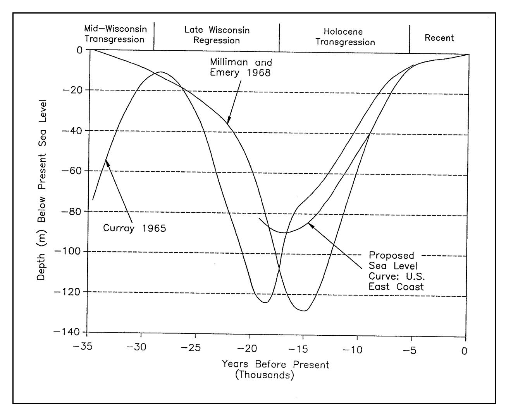

*Figure IV-1-15. Sea level fluctuations during the Pleistocene and Holocene epochs (adapted from Nummedal (1983); data from Dillon and Oldale (1978))*

- (c) Table IV-1-5 lists long-term and short-term factors along with estimates of their effect on sea level. The following paragraphs discuss some factors in greater detail. b. Short-term causes of sea level change. (1) Seasonal sea level changes.
- (a) The most common of the short-term variations is the seasonal cycle, which in most areas accounts for water level changes of 10 to 30 cm (and in some unusual cases - the Bay of Bengal - as much as 100 cm) (Komar and Enfield 1987). Seasonal effects are most noticeable near river mouths and estuaries. Variations in seasonal river flow may account for up to 21 percent of annual sea level variations in coastal waters (Meade and Emery 1971). Compared to the eustatic rise of sea level, estimated to be up to 20 cm/century, the seasonal factor may be a more important cause of coastal erosion because of its greater year-to-year influence (Komar and Enfield 1987).
- (b) Over most of the world, lowest sea level occurs in spring and highest in autumn. Separating the individual factors causing the annual cycle is difficult because most of the driving mechanisms are coherent occurring in phase with one another. Variations in atmospheric pressure drive most of the annual sea level change (Komar and Enfield 1987). (2) West coast of North America.
- (a) The west coast is subject to extreme and complicated water level variations. Short-term fluctuations are related to oceanographic conditions like the El Niño-Southern Oscillation. This phenomenon occurs periodically when equatorial trade winds in the southern Pacific diminish, causing a seiching effect that travels eastward as a wave of warm water. This raises water levels all along the U.S. west coast. Normally, the effect is only a few centimeters, but during the 1982-83 event, sea level rose 35 cm at Newport, Oregon (Komar 1992). Although these factors do not necessarily cause permanent geologic changes, engineers and coastal planners must consider their potential effects. The most recent El Niño event, during the winter of 1997-98, has been blamed for causing unusual weather in the western United States, including greatly increased rainfall in California and a warm winter in Oregon and Washington. Coastal geological changes caused by the El Niño are difficult to document. It has been argued (especially in the media) that increased rainfall in California caused more mudflows and bluff collapse than normal.
- (b) Seasonal winter storms along the Pacific Northwest can combine with astronomical tides to produce elevated water levels over 3.6 m. During the severe storms of 1983, water levels were 60 cm over the predicted level.
- (3) Rapid land level changes. Earthquakes are shock waves caused by abrupt movements of blocks of the earth's crust. A notable example occurred during the Great Alaskan Earthquake of 1964, when changes in shoreline elevations ranged from a 10-m uplift to a 2-m downdrop (Hicks 1972; Plafker and Kachadoorian 1966).
- (4) Ocean temperature. Changes in the water temperature of upper ocean layers cause changes in water density and volume. As surface water cools, the density of seawater increases, causing a decrease in volume, thus lowering sea level. When temperature increases, the opposite reaction occurs. Variations in water temperature are not simply due to seasonal changes in solar radiation but are primarily caused by changes in offshore wind and current patterns.

*Table IV-1-5 Sea Level Changes Along the Coastal Zone*

**Table IV-1-5. Sea Level Changes Along the Coastal Zone**

| Short-Term (Periodic) Causes | Time scale (P = period) | Vertical Effect1 |
| --- | --- | --- |
| Periodic Sea Level Changes |  |  |
| Astronomical tides | 6-12 hr P | 0.2-10+ m |
| Long-period tides |  |  |
| Rotational variations (Chandler effect) | 14 month P |  |
| Meteorological and Oceanographic Fluctuations Atmospheric pressure |  |  |
| Winds (storm surges) | 1-5 days | Up to 5 m |
| Evaporation and precipitation | Days to weeks |  |
| Ocean surface topography (changes in water density and currents) El Niño/southern oscillation | Days to weeks 6 mo every 5-10 yr | Up to 1 m Up to 60 cm |
| Seasonal Variations |  |  |
| Seasonal water balance among oceans (Atlantic, Pacific, Indian) |  |  |
| Seasonal variations in slope of water surface |  |  |
| River runoff/floods | 2 months | 1 m |
| Seasonal water density changes (temperature and salinity) | 6 months | 0.2 m |
| Seiches | Minutes-hours | Up to 2 m |
| Earthquakes |  |  |
| Tsunamis (generate catastrophic long-period waves) | Hours | Up to 10 m |
| Abrupt change in land level | Minutes | Up to 10 m |
|  |  |  |
|  | Range of Effect E = Eustatic; L = Local | Vertical Effect1 |
| Long-Term Causes |  |  |
| Change in Volume of Ocean Basins |  |  |
| Plate tectonics and seafloor spreading (plate divergence/convergence) and change |  |  |
| in seafloor elevation (mid-ocean volcanism) | E | 0.01 mm/yr |
| Marine sedimentation | E | < 0.01 mm/yr |
| Change in Mass of Ocean Water |  |  |
| Melting or accumulation of continental ice | E | 10 mm/yr |
| Release of water from earth's interior | E |  |
| Release or accumulation of continental hydrologic reservoirs | E |  |
|  |  |  |
| Thermal-isostasy (temperature/density changes in earth's interior) | L |  |
| Glacio-isostasy (loading or unloading of ice) | L | 1 cm/yr |
| Hydro-isostasy (loading or unloading of water) | L |  |
| Volcano-isostasy (magmatic extrusions) | L |  |
| Uplift or Subsidence of Earth's Surface (Isostasy) Sediment-isostasy (deposition and erosion of sediments) | L | < 4 mm/yr |
|  |  |  |
| Vertical and horizontal motions of crust (in response to fault motions) | L | 1-3 mm/yr |
|  |  |  |
| Sediment compression into denser matrix | L |  |
| Loss of interstitial fluids (withdrawal of groundwater or oil) | L | # 55 mm/yr1 |
| Earthquake-induced vibration | L |  |
| Tectonic Uplift/Subsidence Sediment Compaction Departure from Geoid |  |  |
| Shifts in hydrosphere, aesthenosphere, core-mantle interface | L |  |
| Shifts in earth's rotation, axis of spin, and precession of equinox External gravitational changes | E E |  |

*Effects on sea level are estimates only. Many processes interact or occur simultaneously, and it is not possible to isolate the precise contribution to sea level of each factor. Estimates are not available for some factors. (Sources: Emery and Aubrey (1991); Gornitz and Lebedeff (1987); Komar and Enfield (1987))*

*1 Calculated using Shanghai as an example: 2.7 m subsidence between 1920 and 1970 (Baeteman 1994)*

- (5) Ocean currents. Because of changes in water density across currents, the ocean surface slopes at right angles to the direction of current flow. The result is an increase in height on the right side of the current (when viewed in the direction of flow) in the Northern Hemisphere and to the left in the Southern Hemisphere. The elevation change across the Gulf Stream, for example, exceeds 1 m (Emery and Aubrey 1991). In addition, major currents in coastal areas can produce upwelling, a process that causes deep colder water to move upward, replacing warmer surface waters. The colder upwelled water is denser, resulting in a regional decrease in sea level. c. Long-term causes of sea level change.
- (1) Tectonic instability. Regional, slow land level changes along the U.S. western continental margin affect relative long-term sea level changes. Parts of the coast are rising and falling at different rates. In Oregon, the northern coast is falling while the southern part is rising relative to concurrent relative sea level (Komar 1992).
- (2) Isostacy. Isostatic adjustment is the process by which the crust of the Earth attains gravitational equilibrium with respect to superimposed forces (Emery and Aubrey 1991). If a gravitational imbalance occurs, the crust rises or sinks to correct the imbalance.
- (a) The most widespread geologically rapid isostatic adjustment is the depression of land masses caused by glaciers and the rebounding caused by deglaciation. In Alaska and Scandinavia, contemporary uplift follows the depression of the crust caused by the Pleistocene ice sheets. Some areas of the Alaska coast (for example, Juneau) are rising over 1 cm/year, based on tide gauge records (Figure IV-1-16) (Lyles, Hickman, and Debaugh 1988).
- (b) Isostatic adjustments have also occurred due to changes in sediment load on continental shelves and at deltas. The amount of sediment loading on shelves is not well determined but is probably about 4 mm/year. The effect is only likely to be important at deltas where the sedimentation rate is very high (Emery and Aubrey 1991). (3) Sediment compaction.
- (a) Compaction occurs when poorly packed sediments reorient into a more dense matrix. Compaction can occur because of vertical loading from other sediments, by draining of fluids from the sediment pore space (usually a man-made effect), by desiccation (drying), and by vibration.
- (b) Groundwater and hydrocarbon withdrawal is probably the main cause of sediment compaction on a regional scale. Many of the world's great cities are located on coastal plains or on river mouth deltas. Because of the dense population and industrialization, vast quantities of groundwater have been pumped from the subsurface aquifers. The consequence is nearly instantaneous local land subsidence due to sediment compaction, transforming many of these great coastal cities into the sinking cities of the world (Baeteman 1994; see Table IV-1-6). Subsidence exceeding 8 m has been recorded in Long Beach, California, and over 6 m in the Houston-Freeport area (Emery and Aubrey 1991). In Galveston, the annual sea level rise shown on tide records is 0.6 cm/year (Figure IV-1-17) (Lyles, Hickman, and Debaugh 1988). Subsidence at Venice, Italy, caused by groundwater pumping, has been well-publicized because of the threat to architectural and art treasures. Fortunately, subsidence there appears to have been controlled now that alternate sources of water are being tapped for industrial and urban use (Emery and Aubrey 1991).

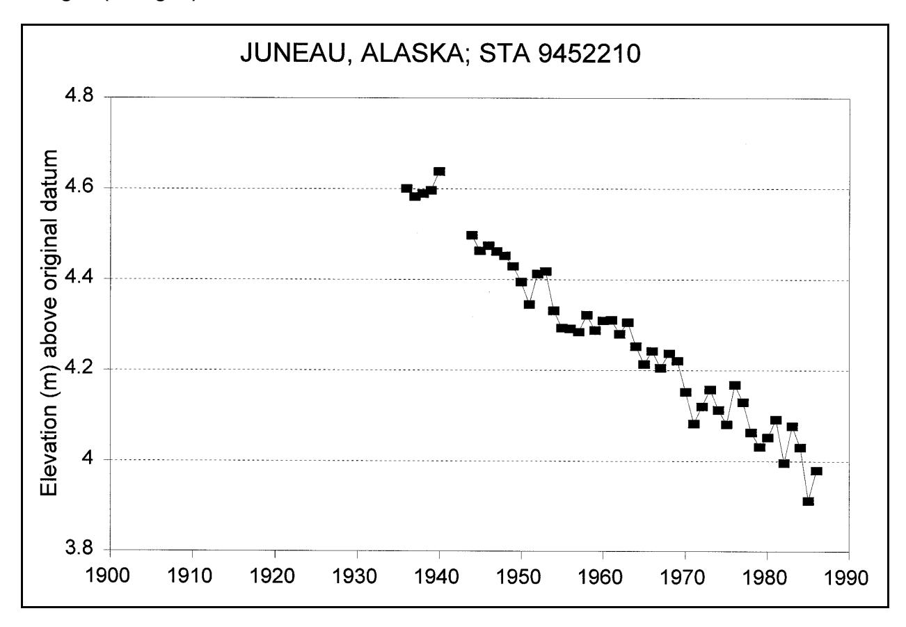

*Figure IV-1-16. Yearly mean sea level changes at Juneau, Alaska, from 1936-1986. The fall in sea level shows the effects of isostatic rebound (data from Lyles, Hickman, and Debaugh (1988))*

**Table IV-1-6. ). Subsidence exceeding 8 m has been recorded in Long Beach, California, and over 6 m in the Houston-Freeport area (Emery and Aubrey 1991). In Galveston, the annual sea level rise shown on tide records is 0.6 cm/year (Figure IV-1-17) (Lyles, Hickman, and Debaugh 1988). Subsidence at Venice, Italy, caused by groundwater pumping, has been well-publicized because of the threat to architectural and art treasures. Fortunately, subsidence there appears to have been controlled now that alternate sources of water are being tapped for industrial and urban use (Emery and Aubrey 1991).**

| City or | Region and Country | Subsidence (m) |
| --- | --- | --- |
| Tokyo, Japan |  | 4.6 |
| Po Delta, | Italy | 3.2 |
| Shanghai, | China | 2.7 |
| Houston, | USA | 2.7 |
| Tianjin, | China | 2.5 |
| SW Taiwan |  | 2.4 |
| Taipei, | Taiwan | 1.9 |
| Bangkok, | Thailand | 1.6 |
| Ravenna, | Italy | 1.2 |
| London, | England | 0.35 |
| 1 Records | are not available for many other big cities | (e.g., Jakarta, Hanoi, |
| Haiphong, | Rangoon, Manila). |  |
| From | Baeteman (1994) | IV-1-30 Coastal Terminology and Geologic Environments |

Haiphong, Rangoon, Manila). From Baeteman (1994)

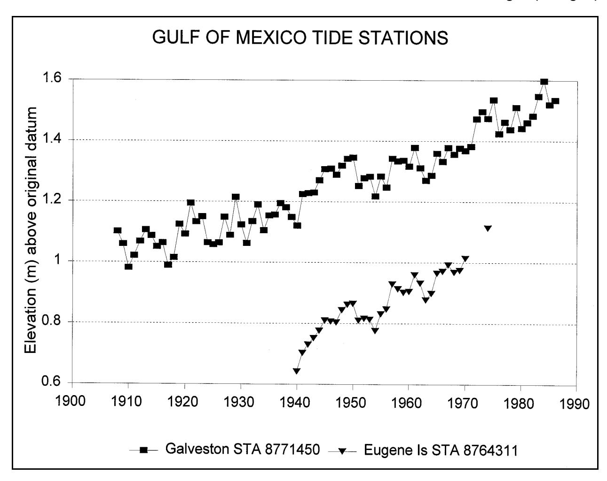

*Figure IV-1-17. Yearly mean sea level changes at Galveston, Texas, and Eugene Island, Louisiana. Subsidence of the land around Galveston may be caused by groundwater withdrawal and sediment compaction (data from Lyles, Hickman, and Debaugh (1988))*

(c) Significant subsidence occurs in and near deltas, where great volumes of fine-grained sediment accumulate rapidly. Land loss in the Mississippi delta has become a critical issue in recent years because of the loss of wetlands and rapid shoreline retreat. Along with natural compaction of underconsolidated deltaic muds and silts, groundwater and hydrocarbon withdrawal and river diversion might be factors contributing to the subsidence problems in southern Louisiana. Tide gauges at Eugene Island and Bayou Rigaud show that the rate of subsidence has increased since 1960 (Emery and Aubrey 1991). Change in rsl in the Mississippi Delta is about 15 mm/year, while the rate at New Orleans is almost 20 mm/year (data cited in Frihy (1992)).

# d. Geologic implications of sea level change.

(1) Balance of sediment supply versus sea level change. Changes in sea level will have different effects on various portions of the world's coastlines, depending on conditions such as sediment type, sediment supply, coastal planform, and regional tectonics. The shoreline position in any one locale responds to the cumulative effects of the various sea level effects (outlined in Table IV-1-7). For simplicity, these factors can be subdivided into two broad categories: sediment supply and relative sea level (rsl) change. Ultimately, shoreline position is a balance between sediment availability and the rate that sea level changes

*Table IV-1-7 Relative Effects of Sediment Supply Versus Sea Level Change on Shoreline Position1*

**Table IV-1-7. Relative Effects of Sediment Supply Versus Sea Level Change on Shoreline Position1**

|  |  | Relative Sea Level Change |  |  |  |  |
| --- | --- | --- | --- | --- | --- | --- |
|  | Falling sea level |  | Stable | Rising sea level |  |  |
|  |  | Rapid | Slow |  | Slow | Rapid |
| Sediment supply | Rapid net loss | Neutral | Slow retreat | Medium retreat | Rapid retreat4 | Extra rapid retreat2 |
|  | Slow net loss | Slow advance | Neutral | Slow retreat | Medium retreat6 | Rapid retreat |
|  | Zero net change | Medium advance | Slow advance | Neutral8 | Slow retreat9 | Medium retreat |
|  | Low net deposition | Rapid advance | Medium advance10 | Slow advance7 | Neutral3,5 | Slow retreat |
|  | Rapid net deposition | Extra rapid advance | Rapid advance11 | Medium advance | Slow advance1 | Neutral |

#### Examples of long-term (years) transgression or regression:

- 1. Mississippi River Delta active distributary
- 2. Mississippi River Delta abandoned distributary
- 3. Florida Panhandle between Pensacola and Panama City
- 4. Sargent Beach, TX
- 5. Field Research Facility, Duck, NC
- 6. New Jersey shore
- 7. Island of Hawaii volcanic and coral sediment supply
- 8. Hawaiian Islands without presently active volcanoes
- 9. South shore of Long Island (sand trapped at inlets is balanced by man-made renourishment and bypassing)
- 10. Great Lakes during sustained fall in water levels
- 11. Alaska river mouths

#### 1 (Table based on a figure in Curray (1964))

(Table IV-1-7). For example, at an abandoned distributary of the Mississippi River delta, rsl is rising rapidly because of compaction of deltaic sediment. Simultaneously, wave action causes rapid erosion. The net result is extra rapid shoreline retreat (the upper right box in Table IV-1-7). The examples in the table are broad generalizations, and some sites may not fit the model because of unique local conditions.
- (2) Historical trends. Historical records show the prevalence of shore recession around the United States during the past century (summarized by the National Research Council (1987): (a) National average (unweighted) erosion rate: 0.4 m/year. (b) Atlantic Coast: 0.8 m/year (with Virginia barrier islands exhibiting the highest erosion rates). (c) Gulf Coast: 1.8 m/year (with highest erosion rate in Louisiana, 4.2 m/year). (d) Pacific coastline: essentially stable (although more than half the shore is hard rock).
Bird (1976) claims that most sandy shorelines around the world have retreated during the past century. However, prograding shores are found where rivers supply excess sediment or where tectonic uplift is in progress.
- (3) Specific coastal sites.
- (a) Sandy (barrier) coasts. Several models predicting the effects of sea level rise on sandy coasts have been proposed. One commonly cited model is the Bruun rule. The Bruun rule and barrier migration models are discussed in Part IV-2.
- (b) Cliff retreat. Cliff retreat is a significant problem in the Great Lakes, along the Pacific coast, and in parts of New England and New York. Increases in water level are likely to accelerate the erosion rate along Great Lakes shores (as shown by Hands (1983) for eastern Lake Michigan). However, along southern California, cliff retreat may be episodic, caused by unusually severe winter storms, groundwater and surface runoff, and, possibly, faulting and earthquakes, factors not particularly influenced by sea level (Kuhn and Shepard 1984). Crystalline cliffs are essentially stable because their response time is so much slower than that of sandy shores. Mechanisms of cliff erosion are discussed in Part IV-2.
- (c) Marshes and wetlands. Marshes and mangrove forests fringe or back most of the Gulf and Atlantic coastlines. Marshes have the unique ability to grow upward in response to rising sea level. However, although marshes produce organic sediment, at high rates of rsl rise, additional sediment from outside sources is necessary to allow the marshes to keep pace with the rising sea. Salt marshes are described in Part IV-2-11. Paragraph IV-2-12 describes wetlands, coral and oyster reefs, and mangrove forest coasts. These shores have the natural ability to adjust to changing sea level as long as they are not damaged by man-made factors like urban runoff or major changes in sediment supply. e. Engineering and social implications of sea level change. (1) Eustatic sea level rise.
- (a) Before engineering and management can be considered, a fundamental question must be asked: Is sea level still rising? During the last decade, the media has "discovered" global warming, and many politicians and members of the public are convinced that greenhouse gases are responsible for rising sea level and the increased frequency of flooding that occurs along the coast during storms. Most scientists accept the findings that the concentrations of greenhouse gasses in the atmosphere have increased greatly in the last century, largely due to industrial and automobile emissions. However, the link between increased gas in the atmosphere and changing sea level is much more difficult to model and verify. Wunsch (1996) has pointed out how difficult it is to separate myth from fact in the politically and emotionally charged issues of climate change and the oceans. The Environmental Protection Agency created a sensation in 1983 when it published a report linking atmospheric carbon dioxide to a predicted sea level rise of between 0.6 and 3.5 m (Hoffman, Keyes, and Titus 1983). Since then, predictions of the eustatic rise have been falling, and some recent evidence suggests that the rate may slow or even that eustatic sea level may drop in the future (Houston 1993).
- (b) Possibly more reliable information on Holocene sea level changes can be derived from archaeological sites, wave-cut terraces, or organic material. For example, Stone and Morgan (1993) calculated an average rise of 2.4 mm/year from radiocarbon-dated peat samples from Santa Rosa Island, on the tectonically stable Florida Gulf coast. However, Tanner (1989) states that difficulties arise using all of these methods, and that calculated dates and rates may not be directly comparable.
(c) Based on an exhaustive study of tide records from around the world, Emery and Aubrey (1991) have concluded that it is not possible to assess if a eustatic rise is continuing because, while many gauges do record a recent rise in relative sea level, an equal number record a fall. Emery and Aubrey state (p. ix):
In essence, we have concluded that 'noise' in the records produced by tectonic movements and both meteorological and oceanographic factors so obscures any signal of eustatic rise of sea level that the tide gauge records are more useful for learning about plate tectonics than about effects of the greenhouse heating of the atmosphere, glaciers, and ocean water.
They also state (p. 176):
This conclusion should be no surprise to geologists, but it may be unexpected by those climatologists and laymen who have been biased too strongly by the public's perception of the greenhouse effect on the environment  —  Most coastal instability can be attributed to tectonism and documented human activities without invoking the spectre of greenhouse-warming climate or collapse of continental ice sheets.
- (d) In summary, despite the research and attention devoted to the topic, the evidence about worldwide, eustatic sea level rise is inconclusive. Estimates of the rate of rise range from 0 to 3 mm/year, but some researchers maintain that it is not possible to discover a statistically reliable rate using tide gauge records. In late Holocene time, sea level history was much more complicated than has generally been supposed (Tanner 1989), suggesting that there are many perturbations superimposed on "average" sea level curves. Regardless, the topic is sure to remain highly controversial. (2) Relative sea level (rsl) changes.
- (a) The National Research Council's Committee on Engineering Implications of Changes in Relative Sea Level (National Research Council 1987) examined the evidence on sea level changes. They concluded that rsl, on statistical average, is rising at most tide gauge stations located on continental coasts around the world. In their executive summary, they concluded (p. 123):
The risk of accelerated mean sea level rise is sufficiently established to warrant consideration in the planning and design of coastal facilities. Although there is substantial local variability and statistical uncertainty, average relative sea level over the past century appears to have risen about 30 cm relative to the East Coast of the United States and 11 cm along the West Coast, excluding Alaska, where glacial rebound has resulted in a lowering of relative sea level. Rates of relative sea level rise along the Gulf coast are highly variable, ranging from a high of more than 100 cm/century in parts of the Mississippi delta plain to a low of less than 20 cm/century along Florida's west coast.
However, they, too, noted the impact of management practices:
Accelerated sea level rise would clearly contribute toward a tendency for exacerbated beach erosion. However, in some areas, anthropogenic effects, particularly in the form of poor sand management practices at channel entrances, constructed or modified for navigational purposes, have resulted in augmented erosion rates that are clearly much greater than would naturally occur. Thus, for some years into the future, sea level rise may play a secondary role in these areas.
(b) Figure IV-1-18 is a summary of estimates of local rsl changes along the U.S. coast (National Research Council 1987). Users of this map are cautioned that the values are based on tide records only from

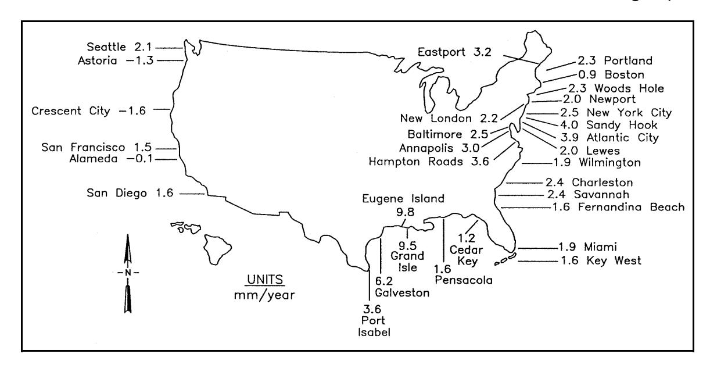

*Figure IV-1-18. Summary of estimates of local rsl rise along the continental United States in millimeters per year. Values are based on tide gauge records during the period 1940-1980 (from National Research Council (1987))*

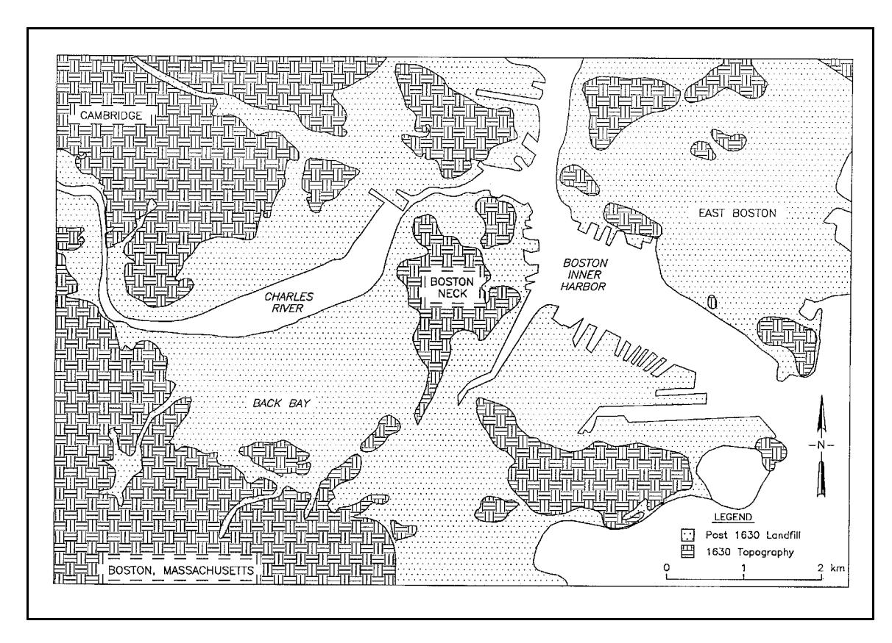

*Figure IV-1-19. Landfilling in Boston, MA, since 1630 has more than doubled the urban area (unfortunately, at the expense of destroying what must have been highly productive wetlands) (from Rosen, Brenninkmeyer, and Maybury (1993))*

1940-1980 and that much regional variability is evident. The figure provides general information only; for project use, detailed data should be consulted, such as the tide gauge statistics printed in Lyles, Hickman and Debaugh (1988) (examples of three tide stations are plotted in Figures IV-1-16 and IV-1-17) or the statistics available from the NOAA web site.
- (3) Engineering response and policy.
- (a) Whatever the academic arguments about eustatic sea level, engineers and planners must anticipate that changes in rsl may occur in their project areas and need to incorporate the anticipated changes in their designs and management plans.
- (b) Because of the uncertainties surrounding sea level, the U.S. Army Corps of Engineers (USACE) has not endorsed a particular rise (or fall) scenario. Engineer Regulation (ER) 1105-2-100 (28 December 1990) states the official USACE policy on sea level rise. It directs that:
Feasibility studies should consider which designs are most appropriate for a range of possible future rates of rise. Strategies that would be appropriate for the entire range of uncertainty should receive preference over those that would be optimal for a particular rate of rise but unsuccessful for other possible outcomes.
Potential rsl rise should be considered in every coastal and estuarine (as far inland as the new head of tide) feasibility study that USACE undertakes. Project planning should consider what impact a higher rsl rise would have on designs based on local, historical rates.
- (4) Impacts of rising sea level on human populations.
- (a) Rising sea level raises the spectre of inundated cities, lost wetlands, and expensive reconstruction of waterways and ports. About 50 percent of the U.S. population lives in coastal counties (1980 census data reported in Emery and Aubrey (1991)), and the number is likely to increase. There has not been a long history of understanding and planning for sea level rise in the United States, but other countries, particularly Holland and China, have coped with the problem for thousands of years (National Research Council 1987). There are three principal ways that people could adapt to rising sea level: ! Retreat and abandonment. ! Armoring by erecting dikes and dams to keep out the sea. ! Construction on landfills and piers.
- (b) Among the areas most susceptible to inundation caused by rise in rsl are deltas. Deltas are naturally sinking accumulations of sediment whose subaerial surface is a low-profile, marshy plain. Already, under present conditions, subsidence imposes especially severe hardships on the inhabitants in coastal Bangladesh (10 mm/year) and the Nile Delta (2 mm/year), two of the most densely populated regions on earth (Emery and Aubrey 1991). Even a slow rise in sea level could have devastating effects. How could these areas be protected? Thousands of kilometers of seawalls would be needed to protect a broad area like coastal Bangladesh from the sea and from freshwater rivers. Civil works projects on this scale seem unlikely in developing countries, suggesting that retreat will be the only recourse (National Research Council 1983). Nevertheless, despite the immense cost of large-scale coastal works, the Netherlands has reclaimed from the sea a large acreage of land, which is now used for towns and agriculture.
- (c) Retreat can be either a gradual (planned or unplanned) process, or a catastrophic abandonment (National Research Council 1987). The latter has occurred in communities where buildings were not allowed to be rebuilt after they were destroyed or damaged by storms. The State of Texas followed this approach on Galveston Island after Hurricane Alicia in 1983 and the State of Rhode Island for some south shore communities after the Great New England Hurricane of 1938. Construction setback lines represent a form of controlled retreat. Seaward of setback lines, new construction is prohibited. City managers and coastal planners often have difficulty in deciding where setback lines should be located, and their decisions are bitterly contested by property developers who wish to build as close to the beach as possible.
- (d) Most of the world's coastal cities are subject to inundation with even a modest rise of sea level. In 1990, of the 15 biggest "megacities" (population > 10 million, such as Tokyo, Shanghai, Buenos Aires, and Calcutta) 12 were in coastal areas (Young and Hale 1998). Unfortunately, 25 to 50 percent of these urban populations live in poverty, a situation that makes coastal management and planning for changing sea level very difficult. Nevertheless, irresistible political pressure will surely develop to defend cities against the rising sea because of the high concentration of valuable real estate and capital assets. Defense will most probably take the form of dikes like the ones that protect large portions of Holland and areas near Tokyo and Osaka, Japan, from flooding. Dikes would be needed to protect low-lying inland cities from rivers whose lower courses would rise at the same rate as the sea. Already, New Orleans (which is below sea level), Rotterdam, and other major cities located near river mouths are kept dry by levees. These levees might have to be raised under the scenario of rising sea level. Storm surge barriers, like the ones at New Bedford, Massachusetts, Providence, Rhode Island, and the Thames, below London, England, might have to be rebuilt to maintain an adequate factor of safety.
- (e) Landfilling has historically been a common practice, and many coastal cities are partly built on landfill. Boston's waterfront, including the airport and the Back Bay, is built on 1800's fill (Figure IV-1-19; Whitehill 1968). Large areas around New York City, including parts of Manhattan and Brooklyn, have been filled since the 1600's (Leveson 1980). Venice, one of the world's great architectural treasures, occupies a cluster of low islands in the lagoon of Venice, at the head of the Adriatic Sea. In the early 1700's, Peter the Great built his monumental new capital of Saint Petersburg on pilings and fill in the estuary of the Neva River. Artificial land, which is usually low, is particularly susceptible to rising sea level. Although dikes and levees will probably be the most common means to protect cities threatened by the rising sea, there is a precedent in the United States for raising the level of the land surface where structures already exist: Seattle's downtown was raised about 3 m in the early 1900's to prevent tidal flooding. The elevated streets ran along the second floor of buildings, and the original sidewalks and store fronts remained one floor down at the bottom of open troughs. Eventually, the open sidewalks had to be covered or filled because too many pedestrians and horses were injured in falls.

# f. Changes in sea level - summary.

- (1) Changes in sea level are caused by numerous physical processes, including tectonic forces that affect land levels and seasonal oceanographic factors that influence water levels on various cycles (Table IV-1-5). Individual contributions of many of these factors are still unknown.
- (2) Estimates of the eustatic rise in sea level range from 0 to 3 mm/year. Emery and Aubrey (1991) have strongly concluded that it is not possible to detect a statistically verifiable rate of eustatic sea level rise because of noise in the signals and because of the poor distribution of tide gauges worldwide.
- (3) Arguments regarding eustatic sea level changes may be more academic than they are pertinent to specific projects. The rate of relative sea level change varies greatly around the United States. Coastal planners need to consult local tide gauge records to evaluate the potential movement of sea level in their project areas.
- (4) In many areas, coastal management (mismanagement) practices have the greatest influence on erosion, and sea level changes are a secondary effect (Emery and Aubrey 1991; National Research Council 1987).
- (5) USACE does not endorse a particular sea level rise (or fall) scenario. ER 1105-2-100 (28 December 1990) directs that feasibility studies must consider a range of possible future rates of sea level rise. Project planning should use local, historical rates of rsl change.

# IV-1-7. Cultural (Man-Made) Influences on Coastal Geology

- a. Introduction. Man has modified many of the world's coastlines, either directly, by construction or dredging, or indirectly, as a result of environmental changes that influence sediment supply, runoff, or climate. Human activity has had the most profound effects on the coastal environment in the United States and the other industrial nations, but even shorelines in lesser-developed countries have not been immune to problems wrought by river diversion and loss of wetlands. The most common practices that significantly alter the coastal environment are the construction of coastal works such as jetties and groins and the development of property on and immediately inland of the beach. Historically, many cities have developed on the coast. Although originally most were located in bays or other protected anchorages, many have grown and spread to the open coast. Prominent United States examples include New York, Boston, San Diego, and Los Angeles. Still other communities originally began as resorts on barrier islands and have since grown into full-size cities; examples include Atlantic City, Ocean City, Virginia Beach, and Miami Beach. Land use practices well inland from the coast also often have important effects on coastal sedimentation. These factors are more difficult to detect and analyze because, sometimes, the affecting region is hundreds of kilometers inland. For example, dam construction can greatly reduce the natural supply of sediment brought to the coast by streams and rivers, while deforestation and agricultural runoff may lead to increased sediment load in rivers.
- b. Dams/Reservoirs. In many coastal areas, the major source of sediment for the littoral system is from streams and rivers. Dams and reservoirs obstruct the transport of sediment to the littoral system by creating sediment traps. These structures also restrict peak flows, which reduce sediment transport of material that is available downstream of the structures. The net effect is sediment starvation of coastal areas that previously received riverine sediment. If the losses are not offset by new supplies, the results are shrinking beaches and coastal erosion (Schwartz 1982). The most prominent example is the accelerated erosion of the Nile Delta that has occurred since the Aswan Low Dam (1902) and the Aswan High Dam (1964) almost totally blocked the supply of sediment to the coast (Frihy 1992). The Rosetta promontory has been eroding at an average rate of 55 m/year between 1909 and the present. Loss of nutrient-laden silt from the Nile's annual spring floods has also had bad effects on agriculture in the Nile valley and delta and has damaged fisheries in the eastern Mediterranean. Portions of the southern California coast have also suffered this century from loss of fluvially supplied sediment (e.g., Point Arguello, cited by Bowen and Inman (1966)). Increased erosion of the Washington shore near Grays Harbor may be due to the loss of sediment from the Columbia River, which has been massively dammed since the 1930's and 1940's.
- c. Erosion control and coastal structures. Coastal structures such as jetties, groins, seawalls, bulkheads, and revetments are probably the most dramatic cause of man-induced coastal erosion ( Shore Protection Manual 1984). Any coastal structure will have some effect on local sediment dynamics, and in some cases, the effect may extend downdrift for many kilometers.

# d. Modification of natural protection.

- (1) Destructive effects. The destruction of dunes and beach vegetation, development of backshore areas, and construction on the back sides of barrier islands can increase the occurrence of overwash during storms. In many places, sand supply has diminished because much of the surface area of barriers has been paved and covered with buildings. The result has been backshore erosion and increased barrier island breaching. In most coastal areas of the United States, one need merely visit the local beaches to see examples of gross and callous coastal development where natural protection has been compromised. Carter (1988) reviews examples from the United Kingdom. Serious damage has occurred to biological shores around the world as a result of changes in runoff and sediment supply, increased pollution, and development.
- (2) Constructive efforts. Sand dunes are often stabilized using vegetation and sand fences. Dunes afford protection against flooding of low-lying areas. Dunes are also stabilized to prevent sand from blowing over roads and farms. Dunes are discussed in Part IV-2-6.
- e. Beach renourishment (fill). An alternative for restoring beaches without constructing groins or other hard structures is to bring sand to the site from offshore by dredges or from inland sources by truck. This is the only coastal management that actually adds sand back into the littoral system (Pope 1997). Although conceptually renourishment seems simple enough, in practice, the planning, design, application, and maintenance of beach renourishment projects are sophisticated engineering and geologic procedures. For design and monitoring information, the reader is referred to Part V-4, Tait (1993), and Stauble and Kraus (1993). Shore and Beach, Vol 61, No. 1 (January 1993) is a special issue devoted to the beach renourishment project at Ocean City, Maryland. Stauble et al. (1993) evaluate the Ocean City project in detail. Krumbein (1957) is a classic description of sediment analysis procedures for specifying beach fills. One of the most successful U.S. renourishment projects has been at Miami Beach, Florida (reviewed in Carter (1988)).

# f. Mining.

- (1) Beach mining can directly reduce the amount of sediment available to the littoral system. In most areas of the United States, beach sand can no longer be exploited for commercial purposes because sand is in short supply, and the health of dunes and biological communities depends vitally on the availability of sand. Strip mining can indirectly affect the coast due to increased erosion, which increases sediment carried to the sea by rivers (unless the sediment is trapped behind dams).
- (2) In Britain, an unusual situation developed at Horden, County Durham, where colliery waste was dumped on the shore. The waste material formed a depositional bulge in the shore. As the sediment from Horden moved downcoast, it was sorted, with the less dense coal forming a surface placer on the beach that is commercially valuable (Carter 1988).

# g. Stream diversion .

- (1) Stream diversion, both natural and man-made, disrupts the natural sediment supply to areas that normally receive fluvial material. With diversion for agriculture or urban use, the results are similar to those produced by dams: sediment that normally would be carried to the coast remains trapped upriver. Its residence time in this artificial storage, decades or centuries, may be short on geological time scales but is long enough to leave a delta exposed to significant erosion.
- (2) Natural diversion occurs when a river shifts to a new, shorter channel to the sea, abandoning its less efficient former channel. An example of this process is the gradual occupation of the Atchafalaya watershed by the Mississippi River. If this process were to continue to its natural conclusion, the present Balize ("Birdfoot") delta would be abandoned, causing it to erode at an ever faster rate, while a new delta
would form in Atchafalaya Bay (Coleman 1988). The evolution of the Mississippi River is discussed in Part IV-3-3.
- h. Agriculture. Poor farming practices lead to exposure of farmlands and increased erosion rates. Eroded soil is easily carried away by streams and rivers and is ultimately deposited in estuaries and offshore. The consequence of this process is progradation of the depositional areas. If rivers have been dammed, the sediment load is trapped behind the dams in the artificial lakes, and in that case does not get carried to the open sea.
- i. Forestry. Deforestation is a critical problem in many developing nations, where mountainsides, stripped of their protective trees, erode rapidly. The soil is carried to the sea, where local coastlines prograde temporarily, but upland areas are left bereft of invaluable topsoil, resulting in human poverty and misery and in the loss of animal habitat. Reckless slash-and-burn practices have destroyed many formerly valuable timber resources in Central America, and some southeast Asian countries have already cut down most of their trees (Pennant-Rea 1994). Fortunately, Malaysia and Indonesia are beginning to curb illegal timber cutting and export, a trend which hopefully will spread to other countries. Unfortunately, the financial turmoil that engulfed Asia in 1998 will probably set back efforts to promote responsible resource management.

# IV-1-8. References

# EM 1110-2-1412

Storm Surge Analysis and Design Water Level Determinations

# Allen 1976

Allen, E. S. 1976. A Wind to Shake the World, Little Brown & Co., New York, NY.

# Baeteman 1994

Baeteman, C. 1994. "Subsidence in Coastal Lowlands Due to Groundwater Withdrawal: The Geological Approach; Coastal Hazards, Perception, Susceptibility and Mitigation," C. W. Finkl, Jr., ed., Journal of Coastal Research Special Issue No. 12, pp 61-75.

# Bagnold 1954

Bagnold, R. A. 1954. The Physics of Blown Sand and Desert Dunes, 2nd ed., Methuen, London, UK.

# Barnett 1984

Barnett, T. P. 1984. "The Estimation of 'Global' Sea Level: A Problem of Uniqueness," Journal of Geophysical Research, Vol 89, No C5, pp 7980-7988.

# Bascom 1964

Bascom, W. 1964. Waves and Beaches, the Dynamics of the Ocean Surface, Doubleday & Co., Garden City, NY.

# Bates and Jackson 1984

Bates, R. L., and Jackson, J. A. 1984. Dictionary of Geologic Terms, 3rd ed., Anchor Press/Doubleday, Garden City, NY.

# Bird 1976

Bird, E. C. F. 1976. "Shoreline Changes During the Past Century," Proceedings of the 23rd International Geographic Congress, Moscow, Pergamon, Elmsford, NY.

# Bowen and Inman 1966

Bowen, A. J., and Inman, D. L. 1966. "Budget of Littoral Sands in the Vicinity of Point Arguello, California," Technical Memorandum, Coastal Engineering Research Center, U.S. Army Engineer Waterways Experiment Station, Vicksburg, MS.

# Carter 1988

Carter, R. W. G. 1988. Coastal Environments: An Introduction to the Physical, Ecological, and Cultural Systems of Coastlines, Academic Press, London, UK.

# Coastal States Organization 1997

Coastal States Organization. 1997. "Putting the Public Trust Doctrine to Work - the Application of the Public Trust Doctrine to the Management of Lands, Water, and Living Resources of the Coastal States," Washington, DC.

# Cole 1980

Cole, F. W. 1980. Introduction to Meteorology, John Wiley and Sons, Inc., New York, NY.

# Coleman 1988

Coleman, J. M. 1988. "Dynamic Changes and Processes in the Mississippi River Delta," Bulletin of the Geological Society of America, Vol 100, pp 999-1015.

# Curray 1964

Curray, J. R. 1964. "Transgressions and Regressions," Papers in Marine Geology: Shepard Commemorative Volume , R. L. Mills, ed., MacMillan, New York, NY.

# Curray 1965

Curray, J. R. 1965. "Late Quaternary History, Continental Shelves of the United States," The Quaternary of the United States, H. E. Wright, Jr. and D. G. Frey, eds., Princeton University Press, Princeton, NJ, pp 713-735.

# Davidson, Dean, and Edge 1990

Davidson, M. A., Dean, R. G., and Edge, B. L. 1990. Shore and Beach, Vol 58, No. 4 (Special issue dedicated to Hurricane Hugo papers).

# Davies 1964

Davies, J. L. 1964. "A Morphogenic Approach to World Shorelines," Zeitschrift für Geomorphology , Vol 8, pp 27-42.

# Davis and Hayes 1984

Davis, R. A., Jr., and Hayes, M. O. 1984. "What is a Wave-Dominated Coast?, Hydrodynamics and Sedimentation in Wave-Dominated Coastal Environments," B. Greenwood and R. A. Davis, Jr., eds., Marine Geology , Vol 60, pp 313-329.

# Dillon and Oldale 1978

Dillon, W. D., and Oldale, R. N. 1978. "Late Quaternary Sea Level Curve: Reinterpretation Based on Glacio-Eustatic Influence," Geology, Vol 6, pp 56-60.

# Dolan and Davis 1992

Dolan, R., and Davis, R. E. 1992. "Rating Northeasters," Mariners Weather Log, Vol 36, No 1, pp 4-11.

# Ellis 1978

Ellis, M. Y. 1978. Coastal Mapping Handbook. Department of the Interior, U.S. Geological Survey and U.S. Department of Commerce, National Ocean Service and Office of Coastal Zone Management, U.S. Government Printing Office, Washington, DC.

# Emery and Aubrey 1991

Emery, K. O., and Aubrey, D. G. 1991. Sea Levels, Land Levels, and Tide Gauges, Springer-Verlag, New York, NY.

# Finkl and Pilkey 1991

Finkl, C. W., and Pilkey, O. H. 1991. "Impacts of Hurricane Hugo: September 10-22, 1989," Journal of Coastal Research, Special Issue No. 8.

# Flint 1971

Flint, R. F. 1971. Glacial and Quaternary Geology, John Wiley and Sons, New York, NY.

# Fox and Davis 1976

Fox, W. T., and Davis, R. A., Jr. 1976. "Weather Patterns and Coastal Processes," Beach and Nearshore Sedimentation, R. A. Davis, Jr., and R. L. Ethington, eds., Society of Economic Paleontologists and Mineralogists Special Publication No. 24, Tulsa, OK.

# Frihy 1992

Frihy, O. E. 1992. "Sea-Level Rise and Shoreline Retreat of the Nile Delta Promontories, Egypt," Natural Hazards, Vol 5, pp 65-81.

# Gorman 1991

Gorman, L. T. 1991. "Annotated Bibliography of Relative Sea Level Change," Technical Report CERC-91-16, U.S. Army Engineer Waterways Experiment Station, Vicksburg, MS.

# Gorman, Morang, and Larson 1998

Gorman, L. T., Morang, A., and Larson, R. L. 1998. "Monitoring the Coastal Environment; Part IV: Mapping, Shoreline Change, and Bathymetric Analysis," Journal of Coastal Research, Vol 14, No. 1, pp 61-92.

# Gornitz and Lebedeff 1987

Gornitz, V., and Lebedeff, S. 1987. "Global Sea-Level Changes During the Past Century," Sea-Level Fluctuations and Coastal Evolution, D. Nummedal, O. H. Pilkey, and J. D. Howard, eds., Special Publication No. 41, Society of Economic Paleontologists and Mineralogists, Tulsa, OK, pp 3-16.

# Gove 1986

Gove, P. B., ed. 1986. Webster's Third International Dictionary, Merriam-Webster, Springfield, MA.

# Hands 1983

Hands, E. B. 1983. "The Great Lakes as a Test Model for Profile Response to Sea Level Changes," Chapter 8 in Handbook of Coastal Processes and Erosion, P. D. Komar, ed., CRC Press, Inc., Boca Raton, FL. (Reprinted in Miscellaneous Paper CERC-84-14, Coastal Engineering Research Center, U.S. Army Engineer Waterways Experiment Station, Vicksburg, MS.)

# Hayes 1979

Hayes, M. O. 1979. "Barrier Island Morphology as a Function of Tidal and Wave Regime," Barrier Islands from the Gulf of St. Lawrence to the Gulf of Mexico , S. P. Leatherman, ed., Academic Press, New York, NY, pp 1-29.

# Hicks 1972

Hicks, S. D. 1972. "Changes in Tidal Characteristics and Tidal Datum Planes," The Great Alaska Earthquake of 1964, Oceanography and Coastal Engineering, National Academy of Sciences, Washington, DC, pp 310-314.

# Hicks 1978

Hicks, S. D. 1978. "An Average Geopotential Sea Level Series for the United States," Journal of Geophysical Research, Vol 83, No. C3, pp 1377-1379.

# Hicks 1984

Hicks, S. D. 1984. Tide and Current Glossary. NOAA/National Ocean Service, Rockville, MD.

# Hoffman, Keyes, and Titus 1983

Hoffman, J. S., Keyes, D., and Titus, J. G. 1983. "Projecting Future Sea Level Rise; Methodology, Estimates to the Year 2100, and Research Needs," Report 230-09-007, U.S. Environmental Protection Agency, Washington, DC.

# Houston 1993

Houston, J. R. 1993. "Responding to Uncertainties in Sea Level Rise," The State of Art of Beach Nourishment, Proceedings of the 1993 National Conference on Beach Preservation Technology, The Florida Shore & Beach Preservation Association, Tallahassee, FL, pp 358-372.

# Hsu 1988

Hsu, S. A. 1988. Coastal Meteorology , Academic Press, Inc., San Diego, CA.

# Huschke 1959

Huschke, R. E., ed. 1959. Glossary of Meteorology, American Meteorology Society, Boston, MA.

# International Hydrographic Bureau 1990

International Hydrographic Bureau. 1990. Hydrographic Dictionary, Part I. International Hydrographic Bureau, Monaco.

# Knauss 1978

Knauss, J. A. 1978. Introduction to Physical Oceanography, Prentice-Hall, Englewood Cliffs, NJ.

# Komar 1998

Komar, P. D. 1976. Beach Processes and Sedimentation, Prentice-Hall, Englewood Cliffs, NJ.

# Komar 1992

Komar, P. D. 1992. "Ocean Processes and Hazards Along the Oregon Coast," Oregon Geology , Vol 54, No. 1, pp 3-19.

# Komar and Enfield 1987

Komar, P. D., and Enfield, D. B. 1987. "Short-Term Sea-Level Changes on Coastal Erosion," Sea-Level Fluctuations and Coastal Evolution , Special Publication No. 41, D. Nummedal, O. H. Pilkey, and J. D. Howard, eds., Society of Economic Paleontologists and Mineralogists, Tulsa, OK, pp 17-28.

# Kraft and Chrzastowski 1985

Kraft, J. C., and Chrzastowski, M. J. 1985. "Coastal Stratigraphic Sequences," Coastal Sedimentary Environments, Davis, R. A., Jr., ed., Springer-Verlag, New York, NY, pp 625-663.

# Krumbein 1957

Krumbein, W. C. 1957. "A Method for Specification of Sand for Beach Fills," Technical Memorandum No. 102, Beach Erosion Board, U.S. Army Engineer Waterways Experiment Station, Vicksburg, MS.

# Kuhn and Shepard 1984

Kuhn, G. G., and Shepard, F. P. 1984. Sea Cliffs, Beaches, and Coastal Valleys of San Diego County; Some Amazing Histories and Some Horrifying Implications, University of California Press, Berkeley, CA.

# Larson, Morang, and Gorman 1997

Larson, R. L., Morang, A., and Gorman, L. T. 1997. "Monitoring the Coastal Environment; Part II: Sediment Sampling and Geotechnical Methods," Journal of Coastal Research, Vol 13, No. 2, pp 308-330.

# Leveson 1980

Leveson, D. 1980. Geology and the Urban Environment, Oxford University Press, New York, NY.

# Lyles, Hickman, and Debaugh 1988

Lyles, S. D., Hickman, L. E., Jr., and Debaugh, H. A., Jr. 1988. "Sea Level Variations for the United States, 1855-1986," U.S. Department of Commerce, National Oceanic and Atmospheric Administration, National Ocean Service, Rockville, MD.

# Mariolakos 1990

Mariolakos, I. 1990. "The Impact of Neotectonics with Regard to Canals, Pipelines, Dams, Open Reservoirs, etc. in Active Areas: The Case of the Hellenic Arc," Greenhouse Effect, Sea Level and Drought, Proceedings of the NATO Advanced Research Workshop on Geohydrological Management of Sea Level and Mitigation of Drought (1989), R. Paepe, R. W. Fairbridge, and S. Jelgersma, eds., Kluwer Academic Publishers, Dordrecht, The Netherlands, pp 427-438.

# Meade and Emery 1971

Meade, R. H., and Emery, K. O. 1971. "Sea-Level as Affected by River Runoff, Eastern United States," Science , Vol 173, pp 425-428.

# Milliman and Emery 1968

Milliman, J. D., and Emery, K. O. 1968. "Sea Levels During the Past 35,000 Years," Science, Vol 162, pp 1121-1123.

# Minsinger 1988

Minsinger, W. E., ed. 1988. The 1938 Hurricane, an Historical and Pictorial Summary, Blue Hill Observatory, East Milton, MA.

# Morang, Larson, and Gorman 1997a

Morang, A., Larson, R. L., and Gorman, L. T. 1997a. "Monitoring the Coastal Environment; Part I: Waves and Currents," Journal of Coastal Research, Vol 13, No. 1, pp 111-133.

# Morang, Larson, and Gorman 1997b

Morang, A., Larson, R. L., and Gorman, L. T. 1997b. "Monitoring the Coastal Environment; Part III: Geophysical and Research Methods," Journal of Coastal Research, Vol 13, No. 4, pp 1964-1085.

# Morang 1999

Morang, A. 1999. "Coastal Inlets Research Program, Shinnecock Inlet, New York, Site Investigation, Report 1, Morphology and Historical Behavior," Technical Report CHL-98-32, U.S. Army Engineer Waterways Experiment Station, Vicksburg, MS.

# Mossa, Meisburger, and Morang 1992

Mossa, J., Meisburger, E. P., and Morang, A. 1992. "Geomorphic Variability in the Coastal Zone," Technical Report CERC-92-4, U.S. Army Engineer Waterways Experiment Station, Vicksburg, MS.

# National Research Council 1983

National Research Council, Board on Atmospheric Sciences and Climate. 1983. Changing Climate, Report of the Carbon Dioxide Assessment Committee, National Academy Press, Washington, DC.

# National Research Council 1987

National Research Council, Committee on Engineering Implications of Changes in Relative Mean Sea Level. 1987. Responding to Changes in Sea Level, National Academy Press, Washington, DC.

# Neumann, Jarvinen, Pike, and Elms 1987

Neumann, C. J., Jarvinen, B. R., Pike, A. C., and Elms, J. D. 1987. Tropical Cyclones of the North Atlantic Ocean, 1871-1986, Third rev., Historical Climatology Series 6-2, National Climatic Data Center, Asheville, NC.

# NOAA 1977

National Oceanic and Atmospheric Administration. 1977. "Some Devastating North Atlantic Hurricanes of the 20th Century," Booklet NOAA/PA 77019, U.S. Government Printing Office, Washington, DC.

# Nummedal 1983

Nummedal, D. 1983. "Barrier Islands," CRC Handbook of Coastal Processes and Erosion , P. D. Komar, ed., CRC Press, Inc., Boca Raton, FL, pp 77-121.

# Nummedal and Fischer 1978

Nummedal, D., and Fischer, I. A. 1978. "Process-Response Models for Depositional Shorelines: The German and the Georgia Bights," Proceedings of the Sixteenth Conference on Coastal Engineering , American Society of Civil Engineers, New York, NY, pp 1215-1231.

# Nummedal, Pilkey, and Howard, eds. 1987

Nummedal, D., Pilkey, O. H., and Howard, J. D., eds. 1987. Sea-Level Fluctuations and Coastal Evolution, Special Publication No. 41, Society of Economic Paleontologists and Mineralogists, Tulsa, OK.

# Orme 1985

Orme, A. R. 1985. "California," The World's Coastline, E. C. Bird, and M. L. Schwartz, eds., Van Nostrand Reinhold, New York, NY, pp 27-36.

# Payton 1977

Payton, C. E., ed. 1977. Seismic Stratigraphy - Applications to Hydrocarbon Exploration, Memoir 26, American Association of Petroleum Geologists, Tulsa, OK.

# Pennant-Rea 1994

Pennant-Rea, R., ed. 1994. "Chainsaw Massacres," The Economist , Vol 331, No. 7869, p 39.

# Pethick 1984

Pethick, J. 1984. An Introduction to Coastal Geomorphology, Edward Arnold Publishers, London, UK.

# Pirazzoli 1991

Pirazzoli, P. A. 1991. World Atlas of Sea-Level Changes , Elsevier Scientific Publishers, Amsterdam, The Netherlands.

# Plafker and Kachadoorian 1966

Plafker, G., and Kachadoorian, R. 1966. "Geologic Effects of the March 1964 Earthquake and Associated Seismic Sea Waves on Kodiak and Nearby Islands, Alaska," Geological Survey Professional Paper 543-D, U.S. Government Printing Office, Washington, DC.

# Pope 1997

Pope, J. 1997. "Responding to Coastal Erosion and Flooding Damages," Journal of Coastal Research, Vol 13, No. 3, pp 704-710.

# Rosen, Brenninkmeyer, and Maybury 1993

Rosen, P. S., Brenninkmeyer, B. M., and Maybury, L. M. 1993. "Holocene Evolution of Boston Inner Harbor, Massachusetts," Journal of Coastal Research , Vol 9, No. 2, pp 363-377.

# Sahagian and Holland 1991

Sahagian, D. L., and Holland, S. M. 1991. Eustatic Sea-Level Curve Based on a Stable Frame of Reference: Preliminary Results, Geology , Vol 19, pp 1208-1212.

# Schwartz 1982

Schwartz, M. L., ed. 1982. The Encyclopedia of Beaches and Coastal Environments, Encyclopedia of Earth Sciences, Volume XV, Hutchinson Ross Publishing Company, Stroudsburg, PA.

# Shalowitz 1962

Shalowitz, A. L. 1962. Shore and Sea Boundaries, with Special Reference to the Interpretation and Use of Coast and Geodetic Survey Data. Vol 1, Pub 10-1, U.S. Department of Commerce, Coast and Geodetic Survey, U.S. Government Printing Office, Washington, DC.

# Shalowitz 1964

Shalowitz, A. L. 1964. Shore and Sea Boundaries, with Special Reference to the Interpretation and Use of Coast and Geodetic Survey Data. Vol 2, Pub 10-1, U.S. Department of Commerce, Coast and Geodetic Survey, U.S. Government Printing Office, Washington, DC.

# Shepard 1973

Shepard, F. P. 1973. Submarine Geology, 3rd ed., Harper & Row, New York, NY.

# Shore Protection Manual 1984

Shore Protection Manual. 1984. 4th ed., 2 Vol, Coastal Engineering Research Center, U.S. Army Engineer Waterways Experiment Station, U.S. Government Printing Office, Washington, DC.

# Simpson and Riehl 1981

Simpson, R. H., and Riehl, H. 1981. The Hurricane and Its Impact, Louisiana State University Press, Baton Rouge, LA.

# Stanley 1986

Stanley, S. M. 1986. Earth and Life Through Time, W. H. Freeman, New York, NY.

# Stauble and Kraus 1993

Stauble, D. K., and Kraus, N. C. 1993. Beach Nourishment Engineering and Management Considerations, Coastlines of the World Series, American Society of Civil Engineers, New York, NY.

# Stauble, Garcia, Kraus, Grosskopf, and Bass 1993

Stauble, D. K., Garcia, A. W., Kraus, N. C., Grosskopf, W. G., and Bass, G. P. 1993. "Beach Nourishment Project Response and Design Evaluation, Ocean City, Maryland," Technical Report CERC-93-13, U.S. Army Engineer Waterways Experiment Station, Vicksburg, MS.

# Stone and Morgan 1993

Stone, G. W., and Morgan, J. P. 1993. "Implications for a Constant Rate of Relative Sea-Level Rise During the Last Millennium Along the Northern Gulf of Mexico: Santa Rosa Island, Florida," Shore and Beach, Vol 61, No. 4, pp 24-27.

# Strahler 1981

Strahler, A. N. 1981. Physical Geology, Harper & Row, New York, NY.

# Suter and Berryhill 1985

Suter, J. R., and Berryhill, H. L., Jr. 1985. "Late Quaternary Shelf-Margin Deltas, Northwest Gulf of Mexico," Bulletin of the American Association of Petroleum Geologists, Vol 69, No. 1, pp 77-91.

# Tait 1993

Tait, L. S., compiler. 1993. "The State of the Art of Beach Renourishment," Proceedings of the 6th Annual National Conference on Beach Preservation Technology, Florida Shore & Beach Preservation Association, Tallahassee, FL.

# Tannehill 1956

Tannehill, I. R. 1956. Hurricanes, Their Nature and History, 9th Revised ed., Princeton University Press, Princeton, NJ.

# Tanner 1989

Tanner, W. F. 1989. "New Light on Mean Sea Level Change," Coastal Research, Vol 8, No. 4, pp 12-16.

# U.S. Army Corps of Engineers 1995

U.S. Army Corps of Engineers. 1995. "Coastal Geology," Engineer Manual 1110-2-1810, Washington, DC.

# Whitehill 1968

Whitehill, W. M. 1968. Boston, A Topographical History , 2nd ed. (enlarged), The Belknap Press of Harvard University Press, Cambridge, MA.

# Winkler 1977

Winkler, C. D. 1977. "Plio-Pleistocene Paleogeography of the Florida Gulf Coast Interpreted from Relic Shorelines," Transactions Gulf Coast Association of Geological Societies, Vol 27, pp 409-420.

# Winkler and Howard 1977

Winkler, C. D., and Howard, J. D. 1977. "Correlation of Tectonically Deformed Shorelines on the Southern Atlantic Coastal Plain," Geology, Vol 5, pp 123-127.

# Woodsworth and Wigglesworth 1934

Woodsworth, J. B., and Wigglesworth, E. 1934. Geography and Geology of the Region Including Cape Cod, Elizabeth Is., Nantucket, Martha's Vinyard, No Mans Land, and Block Is., Memoir 52, Museum of Comparative Zoology, Harvard University, Cambridge, MA.

# Wunsch 1996

Wunsch, C. 1996. Doherty Lecture: "The Ocean and Climate - Separating Myth from Fact," Marine Technical Society Journal, Vol 30, No. 2, pp 65-68.

# Young 1975

Young, K. 1975. Geology: The Paradox of Earth and Man, Houghton Mifflin Co., Boston, MA.

# Young and Hale 1998

Young, C., and Hale, L. 1998. "Coastal Management: Insurance for the Coastal Zone," Maritimes , Vol 40, No. 1, pp 17-19.

# IV-1-9. Acknowledgments

Authors of Chapter IV-1, "Coastal Terminology and Geologic Environments:"
Andrew Morang, Ph.D., Coastal and Hydraulics Laboratory (CHL), Engineer Research and Development Center (ERDC), Vicksburg, Mississippi.
Larry E. Parson, U.S. Army Engineer District, Mobile, Mobile, Alabama.

# Reviewers:

Stephan A. Chesser, U.S. Army Engineer District, Portland, Portland, Oregon.
Ronald L. Erickson, U.S. Army Engineer District, Detroit, Detroit, Michigan.
James R. Houston, Ph.D., ERDC.
John H. Lockhart, Jr., Headquarters, U.S. Army Corps of Engineers, Washington, DC, (retired).
Edward P. Meisburger, CHL (retired).
Joan Pope, CHL.
John F. C. Sanda, Headquarters, U.S. Army Corps of Engineers, Washington, DC., (retired).
Orson P. Smith, Ph.D., U.S. Army Engineer District, Alaska, Anchorage, Alaska, (retired).
