## Chapter 2 EM 1110-2-1100 COASTAL CLASSIFICATION AND MORPHOLOGY (Part IV)

30 April 2002

## Table of Contents

Page IV-2-1. Introduction IV-2-1 IV-2-2. Coastal Classification IV-2-1 a. Introduction IV-2-1 b. Early classifications IV-2-1 c. Later classifications IV-2-1 d. Coastal classification of Francis Shepard IV-2-1 e. Classification schemes for specific environments IV-2-3 (1) River systems IV-2-3 (2) Great Lakes of North America IV-2-3 IV-2-3. Drowned River Coasts - Estuaries IV-2-4 a. Introduction IV-2-4 b. Literature IV-2-4 c. Classification IV-2-4 d. Definitions IV-2-4 e. Time relationships and evolution IV-2-4 f. Overall geomorphic characteristics g. Energy factors and sedimentary structures IV-2-7 IV-2-8 (1) Wave-dominated estuaries IV-2-8 (2) Tide-dominated estuaries IV-2-8 (3) Estuarine variability IV-2-8 (a) Wave-to-tide transition IV-2-8 (b) Effects of tide range IV-2-10 (c) Influence of valley shape IV-2-10 (d) Geologic setting IV-2-10 h. Estuarine sediments IV-2-10 IV-2-4. Drowned Glacial Erosion Coasts IV-2-11 a. Introduction IV-2-11 b. Erosion and sediment production IV-2-11 (1) Fjords IV-2-11 (2) Depositional features IV-2-11 c. Variability IV-2-11 d. Atlantic coast IV-2-11 e. Offshore geology IV-2-12 IV-2-5. River Deposition Coasts - Deltas IV-2-12
IV-2-6. Wind Deposition Coasts - Dunes IV-2-12 a. Introduction IV-2-12 b. Origin of dunes IV-2-13 c. Sediment sources IV-2-13 d. Modification and stability IV-2-14 e. Dune vegetation IV-2-16 f. Dune fauna IV-2-17 g. Classification IV-2-17 (1) Foredunes IV-2-17 (2) Parabolic dunes IV-2-17 (3) Barchan dunes IV-2-17 (4) Transverse dune ridges IV-2-17 (5) Longitudinal (seif) dunes IV-2-17 (6) Blowouts IV-2-17 (7) Attached dunes IV-2-17 h. Shoreline protection IV-2-17 i. Dune restoration IV-2-17 IV-2-7. Volcanic Coasts IV-2-20 a. Introduction and definitions IV-2-20 b. General geology IV-2-20 c. Composite volcanoes - coastal Alaska IV-2-21 d. Shield volcanoes - Hawaii IV-2-21 e. Hazards posed by volcanoes IV-2-23 (1) Introduction IV-2-23 (2) Earthquakes and tsunamis IV-2-24 (3) Ash and fluvial sediment IV-2-25 (4) Explosive destruction IV-2-25 IV-2-8. Sea Cliffs - Diastrophic, Erosional, and Volcanic IV-2-26 IV-2-9. Marine Deposition Coasts - Barriers IV-2-32 a. Introduction IV-2-32 b. Distribution of barrier coasts IV-2-36 c. General coastal barrier structure IV-2-36 d. Origin and evolution IV-2-39 (1) Emergence model IV-2-39 (2) Submergence model IV-2-39 (3) Spit detachment model IV-2-39 (4) Combined origin model IV-2-39 e. Barrier response to rising sea level IV-2-39 IV-2-10. Marine Deposition Coasts - Beaches IV-2-45 a. Introduction IV-2-45 b. General definition IV-2-45 c. Major subdivisions IV-2-45 (1) Foreshore IV-2-45 (2) Backshore IV-2-46 (3) Coastline d. Beach material IV-2-47 IV-2-47
IV-2-15. Acknowledgments IV-2-77 IV-2-14. References IV-2-65 e. Riverine influence IV-2-63 d. Examples of specific features - Atlantic seaboard IV-2-63 c. Continental shelf morphology IV-2-62 b. Continental shelf sediment studies IV-2-60 a. Introduction IV-2-60 IV-2-13. Continental Shelf Geology and Topography IV-2-60 d. Other sources of biogenic sediment in the coastal zone IV-2-60 (2) Mangroves IV-2-59 (1) General IV-2-59 c. Low wave-energy coasts IV-2-59 (5) Sandy coasts IV-2-58 (c) Rock reefs and shorelines IV-2-58 (b) Kelp biological communities IV-2-58 (a) Kelp beds IV-2-58 (4) Rocky coasts IV-2-58 (3) Oyster reefs IV-2-55 (2) Worm reefs IV-2-55 (1) Coral reefs IV-2-53 b. High wave-energy coasts IV-2-53 a. Introduction IV-2-52 IV-2-12. Biological Coasts IV-2-52 (5) Marsh restoration IV-2-52 (f) Canals IV-2-52 (d) Sea level rise (e) Saltwater intrusion IV-2-52 IV-2-52 (c) Subsidence IV-2-52 (b) Shoreline erosion IV-2-51 (a) Sediment deficits IV-2-51 (4) Engineering problems IV-2-51 (3) Sediment transport and processes IV-2-50 (2) Marsh plants IV-2-50 (1) Introduction IV-2-49 c. Sediment characteristics IV-2-49 b. Classification of salt marshes IV-2-49 a. Distribution of salt marshes IV-2-48 IV-2-11. Salt Marshes IV-2-48 (3) Biogenic beaches IV-2-48 (2) Coarse beaches IV-2-47 (1) Sand beaches IV-2-47

# List of Tables

Table IV-2-1. Classification of Coasts Page IV-2-2 Table IV-2-2. Worldwide Distribution of Barrier Island Coasts IV-2-36 Table IV-2-3. Barrier Islands and Spits of the United States IV-2-37 Table IV-2-4. Types of Beach Sediment IV-2-47 Table IV-2-5. U.S. Army Corps of Engineers Inner Continental Shelf Sediment and Structure (ICONS) Reports IV-2-62

## List of Figures

Page Figure IV-2-1. (a) Plan view of distribution of energy and physical processes in estuaries; (b) Schematic definition of estuary according to Dalrymple, Zaitlin, and Boyd (1992); (c) Time-averaged sediment transport paths IV-2-5 Figure IV-2-2. Estuary/prograding coast evolution IV-2-6 Figure IV-2-3. Estuary evolution, based on changes in wave or tidal power IV-2-7 Figure IV-2-4. Morphologic models of (a) wave-dominated and (b) tide-dominated estuaries IV-2-9 Figure IV-2-5. Glacial fjord coast: Alaska (Lake George, with Surprise glacier in the background) IV-2-12 Figure IV-2-6. Drowned glacial erosion coast: Maine (Potts Point, South Harpswell, near Brunswick IV-2-13 Figure IV-2-7. Typical glacial depositional structures IV-2-14 Figure IV-2-8. Islands in Boston Harbor, Massachusetts IV-2-15 Figure IV-2-9. Glacial till bluffs just west of Montauk Point, Long Island, New York, facing the Atlantic Ocean IV-2-15 Figure IV-2-10. Partly vegetated coastal sand dunes IV-2-16 Figure IV-2-11. Variety of dune types IV-2-18 Figure IV-2-12. Blowout in dunes IV-2-19 Figure IV-2-13. Huge dune anchored to a rock outcrop in the eastern Sinai Desert IV-2-19 Figure IV-2-14. Alaskan volcanoes along the Aleutian Island arc, marking the boundary between the North American and the Pacific crustal plates IV-2-22 Figure IV-2-15. Southeast coast of Hawaii, near Kalpana IV-2-24 Figure IV-2-16. Laupahoehoe Harbor, Island of Hawaii, Hawaii IV-2-25 Figure IV-2-17. Wave-cut platform exposed by tectonic uplift IV-2-28 Figure IV-2-18. Wave erosion of an indented coastline IV-2-29 Figure IV-2-19. Inundation of a mountainous area by rising sea level or land subsidence IV-2-30
Figure IV-4-20. Pacific Ocean coast of Olympic Peninsula, Washington IV-2-31 Figure IV-2-21. Poorly cemented conglomerate cliffs (near Nauplió, Greece, April 1992) IV-2-32 Figure IV-2-22. Lake Michigan shore south of St. Joseph, Michigan IV-2-33 Figure IV-2-23. Cemented conglomerate with many pits and cavities IV-2-34 Figure IV-2-24. A three-dimensional view of features commonly found in barrier island systems, including the back barrier, overwash fans, and lagoons IV-2-35 Figure IV-2-25. General barrier types: bay, spit, and island IV-2-38 Figure IV-2-26. Emergence model of barrier island formation IV-2-40 Figure IV-2-27. Submergence model of barrier island formation IV-2-41 Figure IV-2-28. Barrier island formation from spit IV-2-42 Figure IV-2-29. Three models of shoreline response to sea level rise IV-2-43 Figure IV-2-30. Westhampton Beach, Long Island, New York IV-2-44 Figure IV-2-31. Ridge and runnel system, low water terrace, Charlestown Beach, Rhode Island IV-2-46 Figure IV-2-32. Shale beach and bluffs, southeast shore of Lake Erie, near Evans, New York IV-2-48 Figure IV-2-33. Typical New England salt marsh, with sinuous channels, estuary of the Sprague River, Maine IV-2-51 Figure IV-2-34. Evolution of a coral island IV-2-56 Figure IV-2-35. Peat horizon exposed on the shoreface, Ditch Plains, Long Island, New York IV-2-61 Figure IV-2-36. Morphology of the Middle Atlantic Bight IV-2-64

# Chapter IV-2 Coastal Classification and Morphology

## IV-2-1. Introduction

- a. Since ancient times, men have gone to sea in a variety of vessels to obtain food and to transport cargo and passengers to distant ports. To navigate safely, sailors needed an intimate knowledge of the appearance of the coast from place to place. By the time that systematic study of coastal geology and geomorphology began, there already existed a large body of observational knowledge about seacoasts in many parts of the world and a well-developed nomenclature to portray coastal landforms. Geologists in the 19th and 20th centuries described coastal landforms, examined their origin and development as a function of geologic character, history, and dynamic processes, and devised classification schemes to organize and refine their observations.
- b. The first part of this chapter discusses the coastal classification of Francis Shepard (1973). The second part describes specific coastal environments found around the United States following Shepard's outline.

### IV-2-2. Coastal Classification

- a. Introduction. By its very nature, the coast is an incredibly complex and diverse environment, one that may defy organization into neat compartments. Nevertheless, the quest for understanding how shorelines formed and how human activities affect these processes has demanded that classification schemes be devised. Most have grouped coastal areas into classes that have similar features because of having developed in similar geological and environmental settings.
- b. Early classifications. Many early geologists took a genetic approach to classification and distinguished whether the coast had been primarily affected by rising sea level (submergence), falling sea level (emergence), or both (compound coasts) (Dana 1849; Davis 1896a; Gulliver 1899; Johnson 1919; Suess 1888).
- c. Later classifications. The best known of the modern classifications are those of Cotton (1952), Inman and Nordstrom (1971), Shepard (1937), with revisions in 1948, 1971 (with Harold Wanless), 1973, and 1976, and Valentin (1952). Except for Inman and Nordstrom (1971), these classifications emphasized onshore and shoreline morphology but did not include conditions of the offshore bottom. This may be a major omission because the submarine shoreface and the shelf are part of the coastal zone. Surprisingly few attempts have been made to classify the continental shelf. Shepard (1948; 1977) and King (1972) discussed continental shelf types, but their classifications are not detailed and contain only a few broadly defined types.
- d. Coastal classification of Francis Shepard. Possibly the most widely used coastal classification scheme is the one introduced by Shepard in 1937 and modified in later years. It divides the world's coasts into primary coasts - formed mostly by non-marine agents - and secondary coasts - shaped primarily by marine processes. Further subdivisions occur according to which specific agent, terrestrial or marine, had the greatest influence on coastal development. The advantage of Shepard's classification is that it is more detailed than others, allowing most of the world's coasts to be incorporated. Although gradational shore types exist, which are difficult to classify, most coasts show only one dominant influence as the cause of their major characteristics (Shepard 1973). Because of its overall usefulness, Shepard's 1973 classification is reproduced in Table IV-2-1. Specific coasts are discussed in detail in this chapter, approximately following the outline of Shepard's table.

**Table IV-2-1. Specific coasts are discussed in detail in this chapter, approximately following the outline of Shepard's table.**

|  |  | Excerpt from SUBMARINE GEOLOGY, 3rd ed. by Francis P. Shepard. Copyright 1948, 1963, 1973 by Francis P. Shepard. Reprinted by permission of Harper Collins Publishers. | Paragraph No. |
| --- | --- | --- | --- |
|  |  | I. Primary coasts Configuration due to nonmarine processes. |  |
| A. | 1. 2. | Land erosion coasts Shaped by subaerial erosion and partly drowned by postglacial rise of sea level (with or without crustal sinking) or inundated by melting of an ice mass from a coastal valley. Ria coasts (drowned river valleys) Usually recognized by the relatively shallow water of the estuaries which indent the land. Commonly have V-shaped cross section and a deepening of the axis seaward except where a barrier has built across the estuary mouth. Dendritic Pattern resembling an oak leaf due to river erosion in horizontal beds or homogeneous | IV-2-3 |
|  |  | material. |  |
|  | 3. | Trellis Due to river erosion in inclined beds of unequal hardness. (a) Drowned glacial erosion coasts Recognized by being deeply indented with many islands. Charts show deep water (commonly more than 100 m) with a U-shaped cross section of the bays and with much greater depth in the inner bays than near the entrance. Hanging valleys and sides usually parallel and relatively straight, in contrast to the sinuous rias. Almost all glaciated coasts have bays with these characteristics. (b) Fjord coasts Comparatively narrow inlets cutting through mountainous coasts. (c) Glacial troughs Broad indentations, like Cabot Strait and the Gulf of St. Lawrence or the Strait of Juan de Fuca. | IV-2-4 |
|  | 4. | Drowned karst topography Embayments with oval-shaped depressions indicative of drowned sinkholes. This uncommon type occurs locally, as along the west side of Florida north of |  |
|  |  | Tarpon Springs, the east side of the Adriatic, and along the Asturias coast of North Spain. |  |
| B. |  | Subaerial deposition coasts | IV-3-3 |
|  | 1. | River deposition coasts Largely due to deposition by rivers extending the shoreline since the slowing of the postglacial sea level rise. |  |
|  | 2. | Deltaic coasts |  |
|  |  | (a) Digitate (birdfoot), the lower Mississippi Delta. |  |
|  |  | (b) Lobate, western Mississippi Delta, Rhone Delta. |  |
|  |  | (c) Arcuate, Nile Delta. (d) Cuspate, Tiber Delta. |  |
|  |  | (e) Partly drowned deltas with remnant natural levees forming islands. |  |
|  | 3. | Compound delta coasts Where a series of deltas have built forward a large segment of the |  |
|  |  | coast, for example, the North Slope of Alaska extending east of Point Barrow to the Mackenzie. |  |
|  | 4. 5. | Compound alluvial fan coasts straightened by wave erosion. Glacial deposition coasts |  |
|  |  | (a) Partially submerged moraines Usually difficult to recognize without a field study to indicate the glacial origin of the sediments constituting the coastal area. Usually modified by marine erosion and deposition as, for example, Long Island. |  |
|  |  | (b) Partially submerged drumlins Recognized on topographic maps by the elliptical contours on land and islands with oval shorelines, for example, Boston Harbor and West Ireland (Guilcher 1965). |  |
|  |  | (c) Partially submerged drift features | IV-2-6 |
|  | 6. | Wind deposition coasts It is usually difficult to ascertain if a coast has actually been built forward by wind deposition, but many coasts consist of dunes with only a narrow bordering sand beach. (a) Dune prograded coasts Where the steep lee slope of the dune has transgressed over the |  |
|  |  | beach. |  |
|  |  | (b) Dune coasts Where dunes are bordered by a beach. (c) Fossil dune coasts Where consolidated dunes (eolianites) form coastal cliffs. |  |
|  | 7. | Landslide coasts Recognized by the bulging earth masses at the coast and the landslide |  |
|  |  | topography on land. |  |
| C. |  | Volcanic coasts | IV-2-7 |
|  | 1. | Lava-flow coasts Recognized on charts either by land contours showing cones, by convexities of shoreline, or by conical slopes continuing from land out under the water. Slopes of 10E to 30E common above and below sea level. Found on many oceanic islands. |  |
|  | 2. | Tephra coasts Where the volcanic products are fragmental. Roughly convex but much more |  |
|  | 3. | quickly modified by wave erosion than are lava-flow coasts. Volcanic collapse or explosion coasts Recognized in aerial photos and on charts by the |  |
|  |  | concavities in the sides of volcanoes. |  |
| D. |  | Shaped by diastrophic movements |  |
|  | 1. | Fault coasts Recognized on charts by the continuation of relatively straight steep land slopes beneath the sea. Angular breaks at top and bottom of slope. |  |
|  |  | (a) Fault scarp coasts For example, northeast side of San Clemente Island, California. (b) Fault trough or rift coasts For example, Gulf of California and Red Sea, both being interpreted as rifts. |  |
|  |  | (c) Overthrust No examples recognized but probably exist. |  |
|  |  | (Continued) |  |

**Table IV-2-1. Specific coasts are discussed in detail in this chapter, approximately following the outline of Shepard's table.**

|  |  |  | Table IV-2-1 (Concluded) | Paragraph No. |
| --- | --- | --- | --- | --- |
|  |  | 2. | Fold coasts Difficult to recognize on maps or charts but probably exist. |  |
|  |  | 3. | Sedimentary extrusions |  |
|  |  |  | (a) Salt domes Infrequently emerge as oval-shaped islands. Example: in the Persian Gulf. |  |
|  |  |  | (b) Mud lumps Small islands due to upthrust of mud in the vicinity of the passes of the |  |
|  | E. |  | Mississippi Delta. Ice coasts Various types of glaciers form extensive coasts, especially in Antarctica. |  |
| II. |  |  | Secondary coasts Shaped primarily by marine agents or by marine organisms. May or may not have |  |
|  |  |  | been primary coasts before being shaped by the sea. |  |
|  | A. |  | Wave erosion coasts | IV-2-8 |
|  |  | 1. | Wave-straightened cliffs Bordered by a gently inclined seafloor, in contrast to the steep inclines |  |
|  |  |  | off fault coasts. |  |
|  |  |  | (a) Cut in homogeneous materials. |  |
|  |  |  | (b) Hogback strike coasts Where hard layers of folded rocks have a strike roughly parallel to the coast so that erosion forms a straight shoreline. |  |
|  |  |  | (c) Fault-line coasts Where an old eroded fault brings a hard layer to the surface, allowing |  |
|  |  |  | wave erosion to remove the soft material from one side, leaving a straight coast. |  |
|  |  |  | (d) Elevated wave-cut bench coasts Where the cliff and wave-cut bench have been somewhat |  |
|  |  |  | elevated by recent diastrophism above the level of present-day wave erosion. |  |
|  |  |  | (e) Depressed wave-cut bench coasts Where the wave-cut bench has been somewhat |  |
|  |  |  | depressed by recent diastrophism so that it is largely below wave action and the wave-cut |  |
|  |  |  | cliff plunges below sea level. |  |
|  |  | 2. | Made irregular by wave erosion Unlike ria coasts in that the embayments do not extend deeply into the land. Dip coasts Where alternating hard and soft layers intersect the coast at an angle; |  |
|  |  |  | cannot always be distinguished from trellis coasts. |  |
|  |  |  | (a) Heterogeneous formation coasts Where wave erosion has cut back the weaker zones, |  |
|  |  |  | leaving great irregularities. |  |
|  | B. |  | Marine deposition coasts Coasts prograded by waves and currents. |  |
|  |  | 1. | Barrier coasts. |  |
|  |  |  | (a) Barrier beaches Single ridges. | IV-2-9 |
|  |  |  | (b) Barrier islands Multiple ridges, dunes, and overwash flats. (c) Barrier spits Connected to mainland. |  |
|  |  |  | (d) Bay barriers Sand spits that have completely blocked bays. |  |
|  |  |  | (e) Overwash fans Lagoonward extension of barriers due to storm surges. |  |
|  |  | 2. | Cuspate forelands Large projecting points with cusp shape. Examples include Cape Hatteras |  |
|  |  |  | and Cape Canaveral. |  |
|  |  | 3. | Beach plains Sand plains differing from barriers by having no lagoon inside. |  |
|  |  | 4. | Mud flats or salt marshes Formed along deltaic or other low coasts where gradient offshore is | IV-2-11 |
|  | C. |  | too small to allow breaking waves. Coasts built by organisms |  |
|  |  | 1. | Coral reef coasts Include reefs built by coral or algae. Common in tropics. Ordinarily, reefs | IV-2-12 |
|  |  |  | fringing the shore and rampart beaches are found inside piled up by the waves. |  |
|  |  |  | (a) Fringing reef coasts Reefs that have built out the coast. |  |
|  |  |  | (b) Barrier reef coasts Reefs separated from the coast by a lagoon. |  |
|  |  |  | (c) Atolls Coral islands surrounding a lagoon. |  |
|  |  |  | (d) Elevated reef coasts Where the reefs form steps or plateaus directly above the coast. |  |
|  |  | 2. | Serpulid reef coasts Small stretches of coast may be built out by the cementing of serpulid worm tubes onto the rocks or beaches along the shore. Also found mostly in tropics. |  |
|  |  | 3. | Oyster reef coasts Where oyster reefs have built along the shore and the shells have been |  |
|  |  |  | thrown up by the waves as a rampart. |  |
|  |  | 4. | Mangrove coasts Where mangrove plants have rooted in the shallow water of bays, and |  |
|  |  |  | sediments around their roots have been built up to sea level, thus extending the coast. Also a |  |
|  |  |  | tropical and subtropical development. |  |
|  |  | 5. | Marsh grass coasts In protected areas where salt marsh grass can grow out into the shallow |  |
|  |  |  | sea and, like the mangroves, collect sediment that extends the land. Most of these coasts could also be classified as mud flats or salt marshes. |  |
|  |  |  |  |  |

- e. Classification schemes for specific environments.
- (1) River systems. Coleman and Wright (1971) developed a detailed classification for rivers and deltas.
- (2) Great Lakes of North America. The Great Lakes have unique characteristics that set them apart from oceanic coastlines. One of the most comprehensive attempts to include these factors in a classification scheme was developed by Herdendorf (1988). It was applied to the Canadian lakes by Bowes (1989). A
simpler scheme has been used by the International Joint Commission as a basis for studies of shoreline erosion (Stewart and Pope 1992).

## IV-2-3. Drowned River Coasts - Estuaries1

- a. Introduction. An enormous amount of technical literature is devoted to the chemistry and biology of estuaries. In recent years, much research has been devoted to estuarine pollution and the resulting damage to fish and animal habitat. For example, the famous oyster harvesting in Chesapeake Bay has been almost ruined in the last 30 years because of overfishing, urban runoff, and industrial pollution. As a result, the unique way of life of the Chesapeake oystermen, who still use sailing vessels, may be at an end. Possibly because most attention has centered on the biological and commercial aspects of estuaries, our geological understanding of them is still rudimentary (Nichols and Biggs 1985). The estuarine environment can be defined as the complex of lagoon-bay-inlet-tidal flat and marsh that make up 80 to 90 percent of the U.S. Atlantic and Gulf coasts (Emery 1967). Clearly it is vital that we gain a better understanding of their sedimentary characteristics and dynamics.
- b. Literature. Only the briefest introduction to estuarine processes and sediments can be presented in this chapter. The purpose of this section is to introduce estuarine classification, regional setting, and geology. The reader is referred to Nichols and Biggs (1985) for an overview of the geology and chemistry of estuaries and for an extensive bibliography. Other general works include Dyer (1979), Nelson (1972), and Russell (1967). Cohesive sediment dynamics are covered in Metha (1986), and the physics of estuaries is covered in van de Kreeke (1986). Research from the 1950's and 1960's is reviewed in Lauff (1967).
- c. Classification. Many attempts have been made to define and classify estuaries using geomorphology, hydrography, salinity, sedimentation, and ecosystem parameters (reviewed in Hume and Herdendorf (1988)). A geologically based definition, which accounts for sediment supply pathways, is used in this text.
- d. Definitions. Estuaries are confined bodies of water that occupy the drowned valleys of rivers that are not currently building open-coast deltas. The most common definition of an estuary describes it as a body of water where "...seawater is measurably diluted with fresh water derived from land drainage" (Pritchard 1967). Therefore, estuaries would include bodies of water where salinity ranges from 0.1 ‰ (parts per thousand) to about 35 ‰ (Figure IV-2-1). However, this chemical-based definition does not adequately restrict estuaries to the setting of river mouths, and allows, for example, lagoons behind barrier islands to be included. Dalrymple, Zaitlin, and Boyd (1992) felt that the interaction between river and marine processes was an attribute essential to all true estuaries. Therefore, they proposed a new geologically based definition of estuary as:
...the seaward portion of a drowned valley system which receives sediment from both fluvial and marine sources and which contains facies influenced by tide, wave, and fluvial processes. The estuary is considered to extend from the landward limit of tidal facies at its head to the seaward limit of coastal facies at its mouth.
These limits are schematically shown in Figure IV-2-1.
- e. Time relationships and evolution.
- (1) Estuaries, like other coastal systems, are ephemeral. River mouths undergo continuous geological evolution, of which estuaries represent one phase of a continuum (Figure IV-2-2). During a period of high

*1 Material in this section has been condensed from Dalrymple, Zaitlin, and Boyd (1992).*

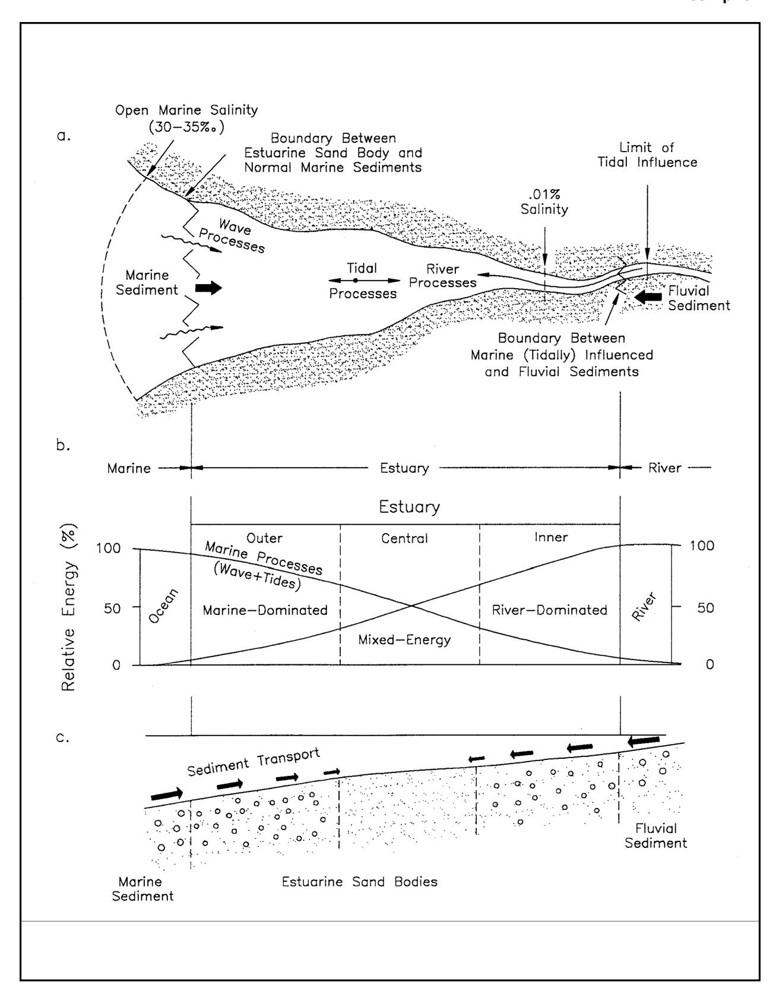

*Figure IV-2-1. (a) Plan view of distribution of energy and physical processes in estuaries; (b) Schematic definition of estuary according to Dalyrmple, Zaitlin, and Boyd (1992); (c) Time-averaged sediment transport paths*

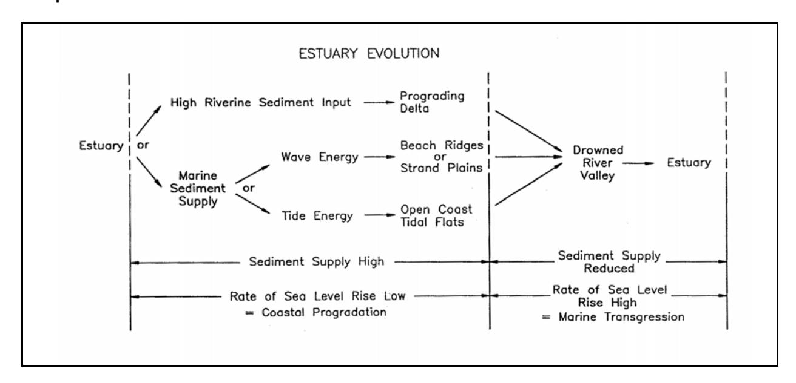

*Figure IV-2-2. Estuary/prograding coast evolution. Estuaries are part of a continuum of coastal landforms. With high riverine or marine sediment supply, the shore progrades (left half of figure). Later, if sediment supply is reduced, the river valley is drowned, resulting in an estuary (right half of figure)*

sediment supply and low rate of sea level rise, an estuary is gradually filled. Three coastal forms may result, depending on the balance between riverine input and marine sediment supply:
- (a) If the sediment is supplied by a river, a delta is formed, which, as it grows, progrades out into the open sea (left side of Figure IV-2-3).
- (b) If, instead, most sediment is delivered to the area by marine processes, a straight, prograding coast is formed. This might be in the form of beach ridges or strand plains if wave energy is dominant, or as opencoast tidal flats if tidal energy is dominant.
- (c) Later, if sea level rises at a higher rate, then the river valley may be flooded, forming a new estuary (right side of Figure IV-2-3).
- (2) Under some conditions, such as when sea level rise and sediment supply are in balance, distinguishing whether a river mouth should be classified as an estuary or as a developing delta may be difficult. Dalrymple, Zaitlin, and Boyd (1992) suggest that the direct transport of bed material may be the most fundamental difference between estuaries and deltas. They state that the presence of tight meanders in the channels suggests that bed-load transport is landward in the region seaward of the meanders and, as a consequence, the system is an estuary. However, if the channels are essentially straight as far as the coast, bed load is seaward throughout the system and it can be defined as a delta.
- (3) Fluvial systems are controlled by their erosional base level and the sediment supply. During periods of lowered sea level, rivers incise the lower reaches of their valleys and discharge increasing amounts of sediment out onto the shelf. Deltas accumulate and fluvial channels are cut, dissecting parts of the delta plain (described in greater detail in Part IV-3-3). At the lowest stands of sea level, estuaries almost disappear and are confined to river valleys (Baeteman 1994). When sea level rises again, the valleys are flooded and the estuaries reappear.

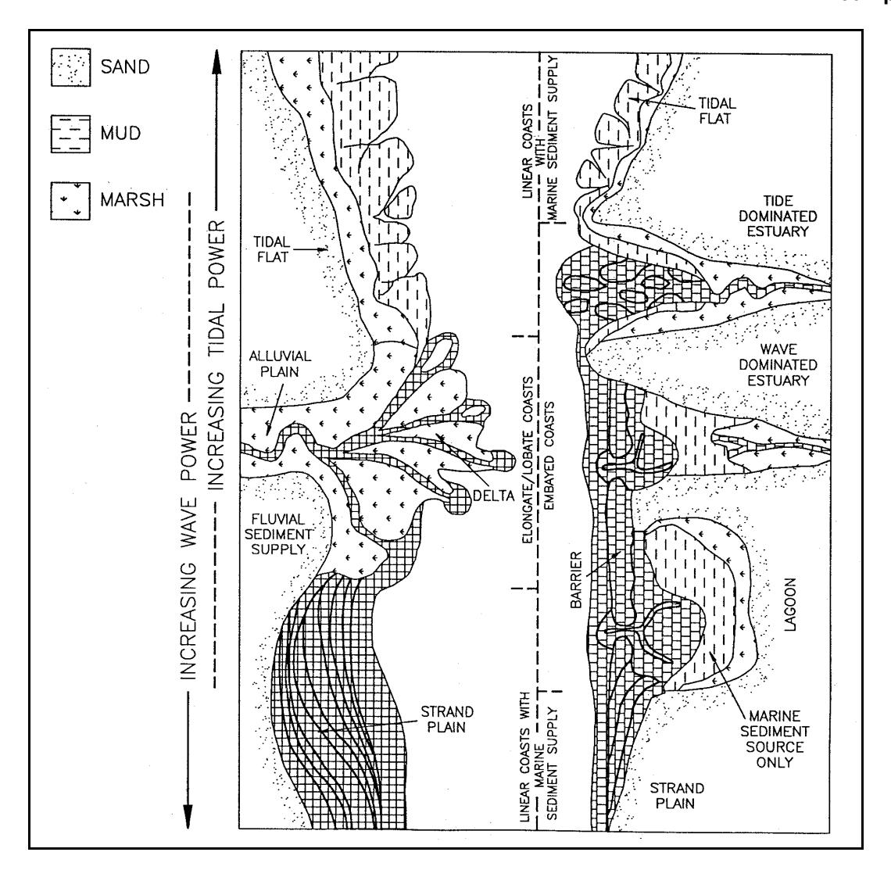

*Figure IV-2-3. Estuary evolution, based on changes in wave or tidal power. The left half of the figure shows a prograding coast that results during times of high sediment supply. The right side shows how estuaries develop during reduced sediment supply (also refer to Figure IV-2-2). Adapted from Boyd, Dalrymple, and Zaitlin (1992)*

- f. Overall geomorphic characteristics. The geologic definition of estuary implies that sediment supply does not keep pace with the local sea level rise; as a result, estuaries become sinks for terrestrial and marine sediment. Sedimentation is the result of the interaction of wave, tide, and riverine forces. All estuaries, regardless of whether they are wave- or tide-dominated, can be divided into three zones (Figure IV-2-1):
- (1) The outer zone is dominated by marine processes (wave and tidal currents). Because of currents, coarse sediment tends to move up into the mouth of the estuary.
- (2) The central zone is characterized by relatively low energy, where wave and tidal currents are balanced over the long term by river currents. The central zone is an area of net convergence of sediment and usually contains the finest-grained bed load present in the estuary.
- (3) The inner zone is river-dominated and extends upriver to the limit of tidal influence. The long-term (averaged over years) bed load transport in this region is seaward.
- g. Energy factors and sedimentary structures.
- (1) Wave-dominated estuaries.
- (a) This type of estuary is characterized by high wave energy compared to tidal influence. Waves cause sediment to move alongshore and onshore into the mouth of the estuary, forming sandbars or subaerial barriers and spits (Figure IV-2-4a). The barrier prevents most of the wave energy from entering the central basin. In areas of low tide range and small tidal prism, tidal currents may not be able to maintain the inlet, and storm breaches tend to close during fair weather, forming enclosed coastal ponds. Sediment type is welldistributed into three zones, based on the variation of total energy: coarse sediment near the mouth, fine in the central basin, and coarse at the estuary head. A marine sand body forms in the high wave energy zone at the mouth. This unit is composed of barrier and inlet facies, and, if there is moderate tide energy, sand deposited in flood-tide deltas (Hayes 1980).
- (b) At the head of the estuary, the river deposits sand and gravel, forming a bay-head delta. If there is an open-water lagoon in the central basin, silts and fine-grained organic muds accumulate at the toe of the bay-head delta. This results in the formation of a prodelta similar to the ones found at the base of open-coast deltas (deltaic terms and structures are discussed in Part IV-3). Estuaries that are shallow or have nearly filled may not have an open lagoon. Instead, they may be covered by extensive salt marshes crossed by tidal channels. (2) Tide-dominated estuaries.
- (a) Tide current energy is greater than wave energy at the mouth of tide-dominated estuaries, resulting in the development of elongate sandbars (Figure IV-2-4b). The bars dissipate wave energy, helping protect the inner portions of the estuary. However, in funnel-shaped estuaries, the incoming flood tide is progressively compressed into a decreasing cross-sectional area as it moves up the bay. As a result, the velocity of the tide increases until the effects of the amplification caused by convergence are balanced by frictional dissipation. The velocity-amplification behavior is known as hypersynchronos (Nichols and Biggs 1985). Because of friction, the tidal energy decreases beyond a certain distance in the estuary, eventually becoming zero.
- (b) As in wave-dominated estuaries, riverine energy also decreases downriver from the river mouth. The zone where tide and river energy are equal is sometimes called a balance point and is the location of minimum total energy. Because the total-energy minimum is typically not as low as the minimum found in wavedominated estuaries, tide-dominated estuaries do not display as clear a zonation of sediment facies. Sands are found along the tidal channels, while muddy sediments accumulate in the tidal flats and marshes along the sides of the estuary (Figure IV-2-4b). In the central, low-energy zone, the main tidal-fluvial channel consistently displays a sinuous, meandering shape. Here, the channel develops alternate bars at the banks and, sometimes, in mid-channel.
- (c) A bay-head delta is usually not present in the river-dominated portion of tidally dominated estuaries. Instead, the river channel merges directly into a single or a series of tidal channels that eventually reach the sea. (3) Estuarine variability.
- (a) Wave-to-tide transition. As tide energy increases relative to wave energy, the barrier system at the mouth of the estuary becomes progressively more dissected by tidal inlets, and elongate sandbars form along

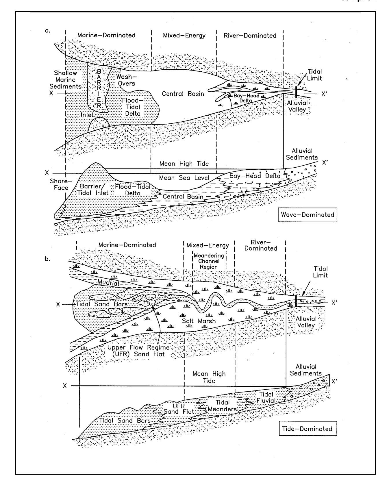

*Figure IV-2-4. Morphologic models of (a) wave-dominated and (b) tide-dominated estuaries (adapted from Dalyrmple, Zaitlin, and Boyd (1992)). Wave-dominated estuaries are common along the mid-Atlantic coast of the United States. Tide-dominated estuaries are found in Maine, Massachusetts, and the mid-Atlantic Bight*

the margins of the tidal channels. As energy levels increase in the central, mixed-energy part of the estuary, marine sand is transported further up into the estuary, and the muddy central basin is replaced by sandy tidal channels flanked by marshes.
- (b) Effects of tide range. The inner end of an estuary has been defined as the limit of detectable tidal influence. Therefore, the gradient of the coastal zone and the tide range have a great influence on the length of estuaries (Dalrymple, Zaitlin, and Boyd 1992). Estuaries become longer as gradient decreases and tide range increases.
- (c) Influence of valley shape. The shape of the flooded valley and the pre-existing geology also control the size of the estuary and the nature of sediment deposition. This is particularly evident during the early phases of estuary infilling, before erosion and deposition have modified the inherited geology. For example, tidal-wave amplification is less likely to occur in irregular valleys (Nichols and Biggs 1985). The resulting estuaries are more likely to become wave-dominated. Chesapeake Bay, with its extensive system of tributary valleys, is an example of this type. In contrast, estuaries that initially or later have developed a funnel shape are more likely to be tide-dominated and hypersynchronous (for example, the Gironde Estuary of France.)
- (d) Geologic setting. Coastal plain gradient, part of the overall plate tectonic setting, is one factor that determines estuary volume. Sea level rise over a flat coastal plain on a passive margin like the Gulf of Mexico creates long estuaries with large volume. An equivalent rise on a steep, active-margin coast like the U.S. Pacific coast will result in a much smaller estuary volume (Boyd, Dalrymple, and Zaitlin 1992). h. Estuarine sediments.
- (1) Because estuaries occupy drowned river valleys, they function as sinks for enormous volumes of sediment. Estuarine sediments are derived from various sources including rivers, the continental shelf, local erosion, and biological activity. Sedimentation is controlled by tides, river flow, waves, and meteorology. The lower-energy conditions of estuaries, as opposed to those found on open coasts, allow for the deposition of fine-grained silts, muds, clays, and biogenic materials. Estuarine sediments are typically soft and tend to be deposited on smooth surfaces that limit turbulence of the moving water. When allowed to accumulate, these materials consolidate and undergo various chemical and organic changes, eventually forming cohesive sediments.
- (2) The shores of estuaries and certain open-water coasts in low-energy environments (e.g., coastal Louisiana, Surinam, Bangladesh, and Indonesia) are characterized as having smooth, low-sloping profiles with turbid water occurring along the shore and extending well offshore (Suhayda 1984). These areas usually exhibit low and vegetated backshores and mud flats that are exposed at low tide. These conditions are also found in Chesapeake and Delaware Bays.
- (3) Nichols and Biggs (1985) describe the movement of estuarine sediments as consisting of four processes: (a) Erosion of bed material. (b) Transportation. (c) Deposition on the bed. (d) Consolidation of deposited sediment.
These processes strongly depend on estuarine flow dynamics and sediment particle properties. The properties most important for cohesive sediments are interparticle bonding and chemical behavior because these parameters make cohesive sediment respond quite differently to hydrodynamic forces than do noncohesive sediments. Due to the cohesive bonding, consolidated materials (clays and silts) require higher forces to mobilize, making them more resistant to erosion. However, once cohesive sediment is eroded, fine-grained clays and silts can be transported at much lower velocity than is required for the initiation of erosion.

## IV-2-4. Drowned Glacial Erosion Coasts

- a. Introduction. During the Pleistocene epoch, massive continental glaciers, similar to the present Antarctic and Greenland ice caps, covered broad parts of the continents. The glaciers waxed and waned in cycles, probably because of climatic variations, causing vast changes to the morphology of coastal regions in the northern latitudes. As a result, glacially modified features dominate the northern coasts and continental shelves, although in many areas marine processes have reworked the shore and substantially modified the glacial imprint.
- b. Erosion and sediment production. Because glacial ice is studded with rock fragments plucked from the underlying rock, a moving glacier performs like a giant rasp that scours the underlying land surfaces. This process, driven by the great size and weight of the ice sheets, caused enormous erosion and modification to thousands of square kilometers during the Pleistocene epoch.
- (1) Fjords. The most spectacular erosion forms are drowned glacial valleys known, as fjords , that indent the coasts of Alaska, Norway, Chile, Siberia, Greenland, and Canada (Figure IV-2-5). The over-deepened valleys were invaded by the sea as sea level rose during the Holocene epoch. Today, fjords retain the typical U-shaped profile that is also seen in formerly glaciated mountain valleys. Fjords and other drowned glacial erosion features give Maine a spectacular, rugged coastline (Figure IV-2-6).
- (2) Depositional features. As a glacier moves, huge amounts of sediment are incorporated into the moving mass. When the ice melts at the glacial front's furthest advance, the sediment load is dropped. Although the major part of the transported material is dumped in the form of a terminal moraine, some sediments are carried further downstream by meltwater streams (Reineck and Singh 1980). The result is a number of distinctive geomorphic features such as drumlins, fjords, moraines, and outwash plains that may appear along the coast or on the submerged continental shelf (Figure IV-2-7). During submergence by the transgressing sea, the features may be modified to such a degree that their glacial origin is lost. This is especially true of outwash, which is easily reworked by marine processes. The original town of Boston was settled on drumlins in the 1600's (Figure IV-1-18), and the islands in Boston Harbor are reworked drumlins (Figure IV-2-8). Nantucket Island, Block Island, and Long Island are partially submerged moraines that have been extensively reworked (Figure IV-2-9).
- c. Variability. Glaciated coasts typically display a greater variety of geomorphic forms than are seen in warmer latitudes. The forms include purely glacial, glacio-fluvial, and marine types (Fitzgerald and Rosen 1987). Complexity is added by marine reworking, which can produce barriers, shoals, gravel shores, and steep-cliffed shores. Because of the steep slopes of many glacial coasts, slumping and turbidity flow are major erosive agents. In northern latitudes, the shallow seafloor is gouged by icebergs. In summary, classification of shores in drowned glacial environments can be a major challenge because of the complicated geological history and the large diversity of structures.
- d. Atlantic coast. A fundamental division of coastal characteristics occurs along the Atlantic coast of North America due to the presence of glacial moraines. The Wisconsin terminal moraine formed a prominent series of islands (i.e., Long Island, Block Island, Nantucket, and Martha's Vineyard) and offshore banks

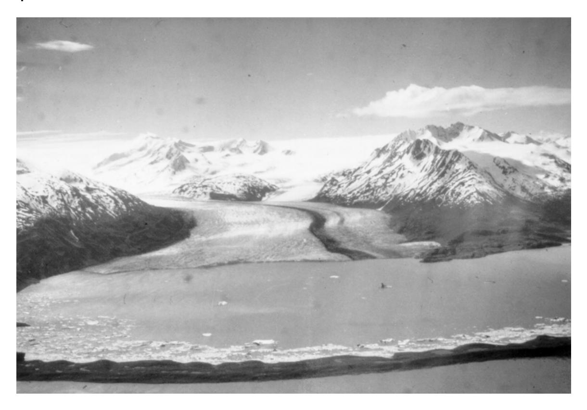

*Figure IV-2-5. Glacial fjord coast: Alaska (Lake George, with Surprise glacier in the background)*

(Georges and Nova Scotian Banks). South of the moraine, the topography is flatter and more regular, except for piedmont streams, which intersect the coastal plain.
e. Offshore geology. Coasts altered by glaciers usually have offshore regions that are highly dissected by relict drainage systems. These sinuous stream channels display highly irregular and varied topography and are composed of sediment types ranging from outwash sand and gravels to till. Note that relict stream channels are also found on continental shelves in temperate climates, for example, off the coast of Texas (Suter and Berryhill 1985). Channels from both temperate and colder environments, and the associated shelfmargin deltas, were formed during late Quaternary lowstands of sea level and are indicators of the position of ancient coastlines.

### IV-2-5. River Deposition Coasts - Deltas

Deltas are discussed in Part IV-3. Because energy factors and deltaic structures are intimately linked, morphology and river mouth hydrodynamics are discussed together.

### IV-2-6. Wind Deposition Coasts - Dunes

a. Introduction. Sand dunes are common features along sandy coastlines around the world. The only climatic zone lacking extensive coastal dunes is the frozen Arctic and Antarctic (although thin dune sheets on the coast of McMurdo Sound, Antarctica, have been described by Nichols (1968)). Sediment supply is probably the most crucial factor controlling growth of dunes; while there is rarely a lack of wind in most coastal areas, some lack sufficient loose sediment (Carter 1988). Dunes serve multiple valuable purposes:

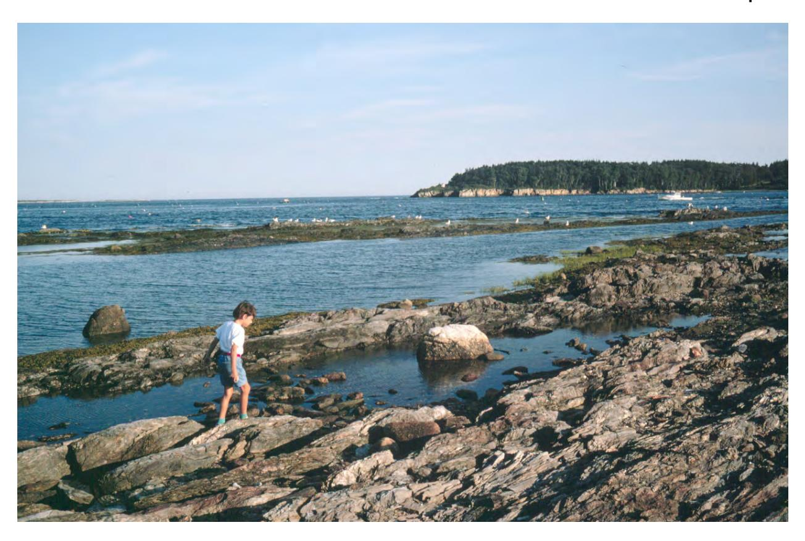

*Figure IV-2-6. Drowned glacial erosion coast: Maine (Potts Point, South Harpswell, near Brunswick, July 1994). Rock headlands and ridges run southwest into the Gulf of Maine*

as recreational areas, as habitat for various species of birds, as shore protection, and as temporary sources and sinks of sand in the coastal environment. Although dunes are found along many sandy coasts, they are finite resources and need to be protected and preserved. The seminal work on dunes is Brigadier R.A. Bagnold's The Physics of Blown Sand and Desert Dunes (Bagnold 1941). More than 50 years after its publication, this book continues to be cited because of its sound basis on the laws of physics and its readability. Part III-4 of the Coastal Engineering Manual reviews the physics of wind-blown sediment transport and presents methods that can be used to estimate transport volumes.
- b. Origin of dunes. Many large dune fields are believed to have originated when sea level was lower and sediment supply was greater (Carter 1988). Many are on prograding shorelines, although shoreline advance does not seem to be a requirement for dune formation. In northwest Europe, most of the dunes formed from shelf debris that moved onshore during the late Pleistocene and early Holocene by rising sea level. Dune-building phases have been interrupted by periods of relative stability, marked by the formation of soils. The dunes at Plum Island, Massachusetts, may have formed after 1600 (Goldsmith 1985).
- c. Sediment sources. The normally dry backshore of sandy beaches may be the most common source of dune sands. A flat or low-relief area inland of the coastline is needed to accommodate the dunes, and there must be predominant onshore or alongshore winds for at least part of the year. To move sand from the beach to the dunes, wind speed must exceed a threshold velocity for the particular size of sand available. If the sand is damp or if the grains must move up a slope, the velocities required for sediment transport are greatly increased. The foreshore of the beach can also be a source of sand if it dries between tidal cycles. This is especially true in areas where there is only one high tide per day (diurnal), allowing a greater amount of time

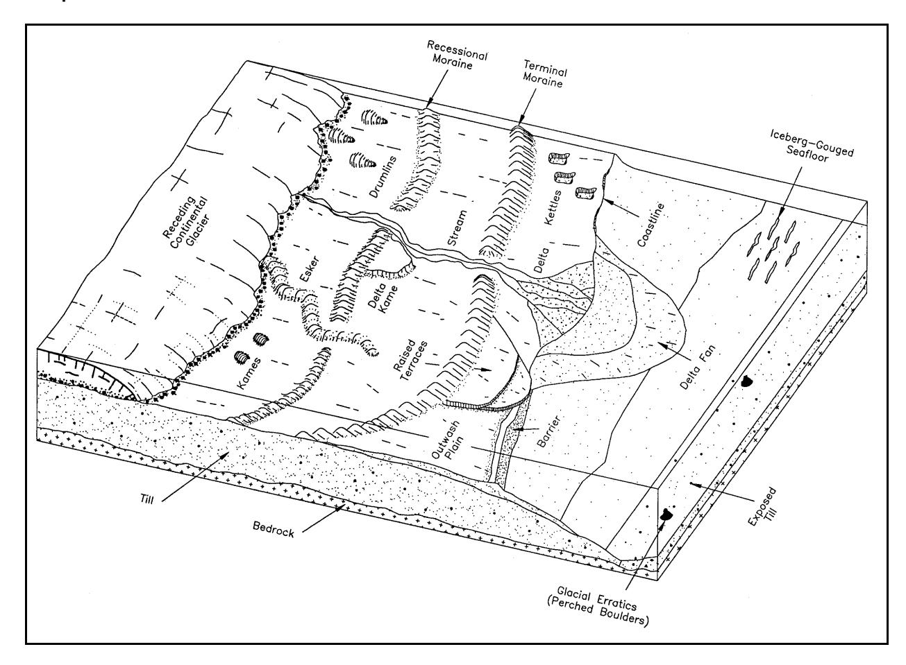

*Figure IV-2-7. Typical glacial depositional structures*

for the foreshore to dry between inundations. Sand storage in dunes must be estimated as one component of sediment budget calculations (EM 1110-2-1502).
- d. Modification and stability. Most dunes show evidence of post-depositional modifications. These include: (1) Physical changes slumping, compaction. Sand grains become rounded, frosted, and better sorted.
- (2) Chemical alterations oxidation, leaching, calcification. (The latter can solidify a dune, making it much more resistant to erosion.) (3) Biological effects reactivation, humification, soil formation.
The stability of dunes varies greatly, usually depending on vegetation cover. Dunes in arid climates are often not vegetated and are mobile. However, coastal dunes are normally vegetated by plant species adapted to the harsh coastal environment (Figure IV-2-10). Many dune grasses have long roots, rhizomes, and runners that help hold sand in place. In addition, dense vegetation displaces the aerodynamic boundary of the wind velocity profile upwards. This process produces a net downward momentum flux, promoting sediment trapping (Carter 1988).

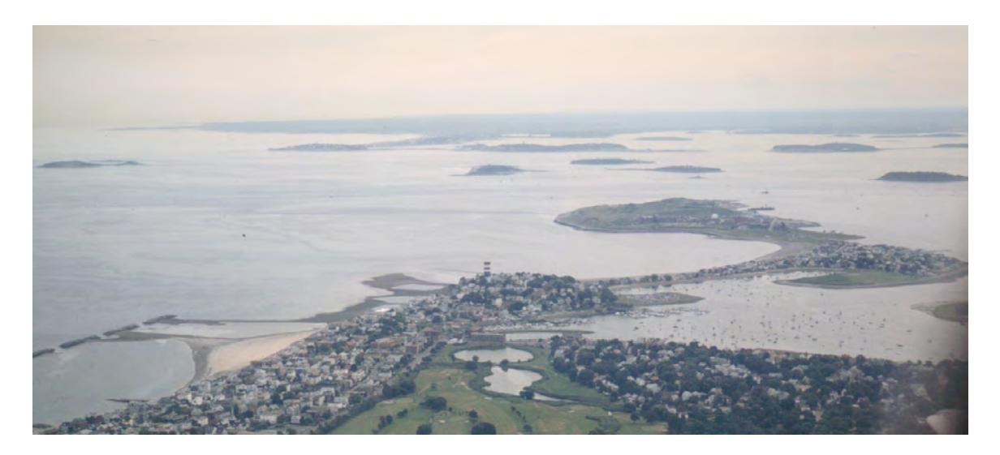

*Figure IV-2-8. Islands in Boston Harbor, Massachusetts (August 1988 - view looking south). These are glacial drumlins that have been extensively reworked by contemporary marine processes. The town of Winthrop (with a tall water tower) is on the drumlin in the center. Deer Island, in the harbor, is attached to Winthrop with a causeway*

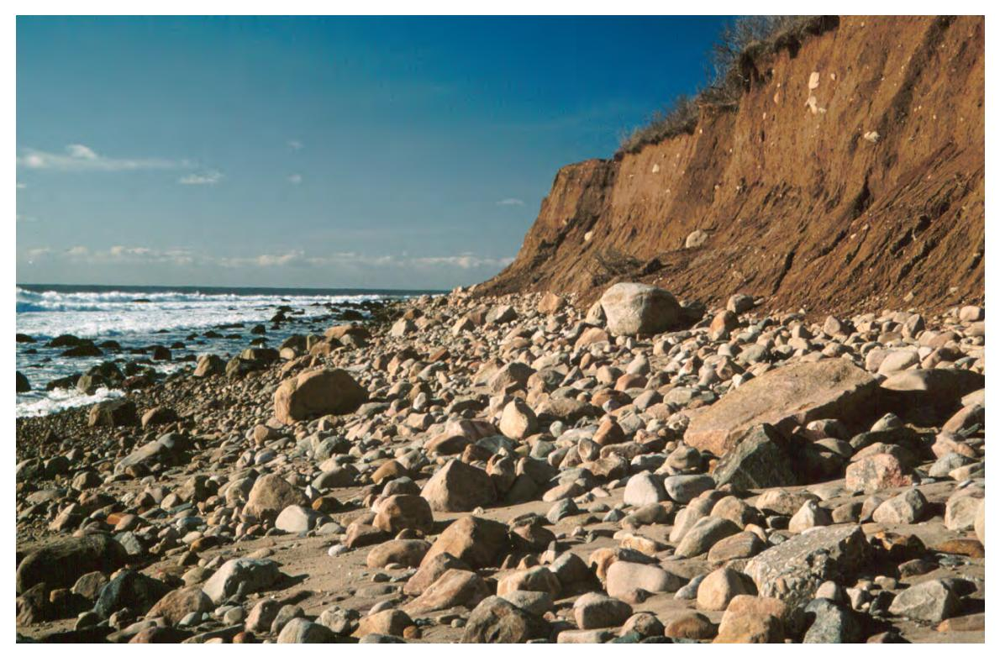

*Figure IV-2-9. Glacial till bluffs just west of Montauk Point, Long Island, New York, facing the Atlantic Ocean (March 1998). As the bluffs erode, the fine material is carried away by waves, leaving a lag of boulders and cobble on the shoreface. In this area, the seafloor offshore is also covered with gravel, cobble, and coarse sand. Sand from the Montauk bluffs is carried by littoral currents to the west, where it nourishes the barrier beaches of Long Island's south shore*

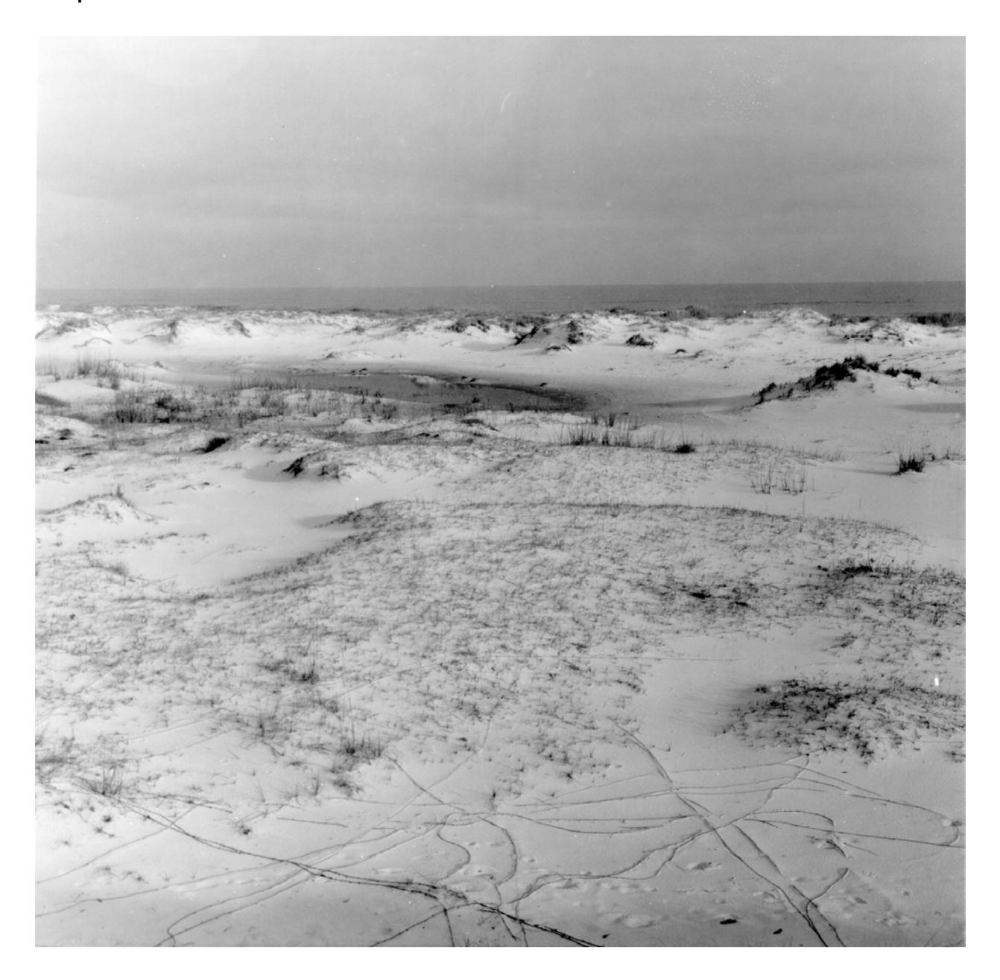

*Figure IV-2-10. Partly vegetated coastal sand dunes. Rhizomes help hold sand in place and colonize the dune grasses. Eastern Alabama on the Morgan peninsula east of the mouth of Mobile Bay (March 1991). This area was devastated by Hurricane Frederic in 1979 and is slowly recovering. Commercial construction now threatens these dunes*

e. Dune vegetation. American beach grass ( Ammophilia breviligulata ) is the most common dune plant in the United States northeast and on the west coast. Along the Gulf coast and the southeast, sea oats ( Uniola paniculata ) is the most abundant species on the dunes. Both plants are remarkably adapted to this environment and are essential to dune stability. They are tolerant of salt spray and occasional inundation by salt water. Growth is stimulated by sand burial, which occurs frequently on the dune. The plant leaves help trap sand on the dune by raising the laminar boundary layer of the wind velocity profile and causing eolian deposition. Regrowth occurs even after rapid deposition of sand up to 1 m thick. Plant growth is by seed and by rhizome extension. Rhizome extension allows rapid plant distribution to help stabilize the surface of the
dune, and allows upward growth of the plant to keep pace with sand deposition. Vehicle and foot traffic that damage the vegetation can greatly diminish dune stability.
- f. Dune fauna. Dunes may appear to be harsh and inhospitable environments, but they are hosts to many species of animals. A wide variety of invertebrates are present, including species as large as crabs. Numerous shorebirds and upland birds use the dune zone for foraging and nesting. Other vertebrates, such as rabbit, fox, deer, etc., frequent the dune in search of food.
- g. Classification. Dunes can be described or classified on the basis of physical description (external form and internal bedding) or genetic origin (mode of formation). Smith (1954) devised a descriptive classification system that has been widely used. It established the following types (Figure IV-2-11): (1) Foredunes. Mounds or ridges directly by the beach. Serve as storm buffer.
- (2) Parabolic dunes. Arcuate sand ridges with the concave portion facing the beach. Rare; often form downwind of pools or damp areas.
- (3) Barchan dunes. Crescent-shaped dunes with the extremities (horns) extending downwind (caused by the horns migrating more rapidly than the central portions). Sometimes show incomplete sand cover moving over a nonerodible pavement.
- (4) Transverse dune ridges. Ridges oriented perpendicular or oblique to the dominant winds. Their form is asymmetrical with steep lee and gentle upwind slopes.
- (5) Longitudinal (seif) dunes. Dune ridges elongated parallel to the wind direction and symmetrical in profile. Occur in groups over wide areas; feature sinuous crestlines.
- (6) Blowouts. Hollows or troughs cut into dunes; may be caused when vehicles or pedestrians damage vegetation (Figure IV-2-12).
- (7) Attached dunes. Formations of sand that have accumulated around obstacles such as rocks (Figure IV-2-13).
- h. Shoreline protection. In many areas, dunes serve a vital role in protecting inland areas from storm surges and wave attack. As a result, many communities require that buildings be erected behind the dunes or beyond a certain distance (a setback ) from an established coastline. Unfortunately, the protection is ephemeral because severe storms can overtop and erode the dunes, and changes in sediment supply or local wind patterns (sometimes caused by structures and urban development) can leave them sand-starved. If dunes are cut for roads or for walkways, they become particularly vulnerable to erosion. However, compared with hard structures like seawalls, many communities prefer the protection provided by dunes because of aesthetic considerations.
- i. Dune restoration. Historically, sand dunes have suffered from human pressure, and many dune systems have been irreversibly altered by man, both by accident or design. Many coastal areas in Europe, North America, Australia, and South Africa, which had once-stable forested dunes, have been deforested. The early settlers to New England in the 1600's severely damaged the dune vegetation almost immediately upon their arrival by overgrazing and farming. Dune rebuilding and revegetation have had a long history, mostly unsuccessful (Goldsmith 1985). Recent restoration practices have been more effective (Knutson 1976, 1978; Woodhouse 1978). The two main methods for rebuilding or creating coastal dunes are artificial planting and erecting sand fences. Hotta, Kraus, and Horikawa (1991) review sand fence performance.

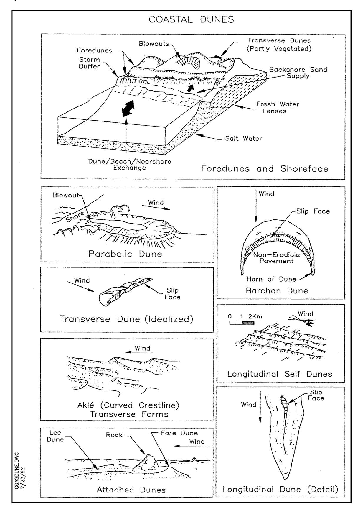

*Figure IV-2-11. Variety of dune types (adapted from Carter (1988), Reading (1986), and Flint (1971))*

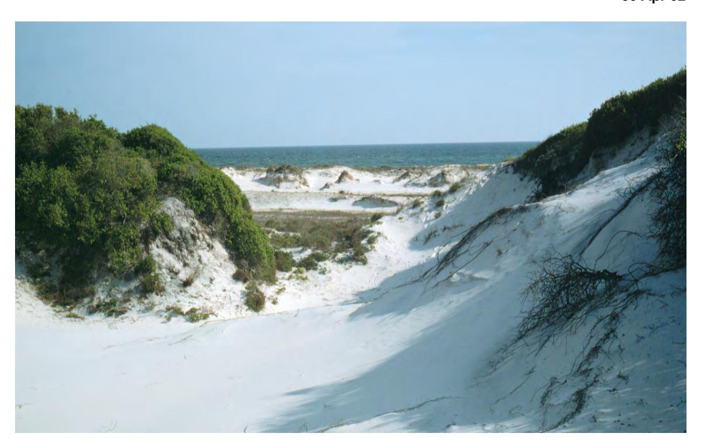

*Figure IV-2-12. Blowout in dunes. Eastern Alabama on the Morgan peninsula east of the mouth of Mobile Bay (April 1995)*

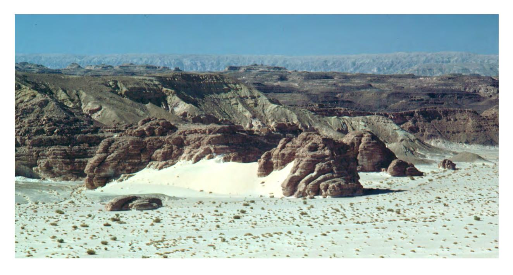

*Figure IV-2-13. Huge dune anchored to a rock outcrop in the eastern Sinai Desert (January 1979). The dune is more than 15 m high. Most of valley floor is hard-packed sand, although there are pockets of loose sand that impede vehicle traffic. As of 1979, many of the bedouins in this area were already using pickup trucks instead of camels*

Coastal dune management and conservation practices are reviewed in Carter, Curtis, and Sheehy-Skeffington (1992).

### IV-2-7. Volcanic Coasts

- a. Introduction and definitions . Volcanoes are vents in the earth's surface through which magma and associated gases and ash erupt (Bates and Jackson 1984). Often, conical mountains are formed around the vents as repeated eruptions deposit layer upon layer of rock and ash. Therefore, the definition is extended to include the hill or mountain built up around the opening by the accumulation of rock materials.
- (1) The fundamental importance of volcanism to mankind has been clearly documented around the world. The entire west coast of the Unites States is highly active tectonically and most of the continent's volcanoes are within 200 km of the coast. There are more than 260 distinct volcanoes younger than five million years in the Unites States and Canada, most of which are in Alaska and the Hawaiian Islands (Wood and Kienle 1990). Fifty-four have erupted in historic times, and distant memories of others are recounted in Native American legends. (2) Volcanoes are important to coastal studies for many reasons:
- (a) They provide sediment to the littoral environment. Material may reach the coast directly via ash fallout and lava flows or may be transported by rivers from an inland source (e.g., Mount St. Helens). (b) Vulcanism affects coastal tectonics (e.g., west coasts of North and South America).
- (c) Shoreline geometry is affected by the formation of volcanic islands (Aleutians) and by lava that flows into the sea (Hawaiian Islands).
- (d) Shoreline erodability ranges from very erodable for ash and unconsolidated pyroclastic rubble to very resistant for basalt. (e) Volcanoes can pose a serious threat to coastal communities. (f) Volcanic debris can choke rivers and harbors.
- (3) This section briefly discusses general concepts of volcanism and describes features unique to volcanic shores. Examples from Alaska and the Hawaiian Islands illustrate the differences between composite and shield volcanoes and their associated coastlines. For the general reader, Exploring our Living Planet , published by the National Geographic Society (Ballard 1983), is a readable and interesting introduction to plate tectonics, hotspots, and volcanism.
- b. General geology . Two classes of volcanoes can be identified, based on the explosiveness of their eruptions and composition of their lava. The ones in the Aleutians and along the west coasts of North and South America are known as composite volcanoes and are renowned for their violent eruptions. The paroxysmal explosion of Mount St. Helens on May 18, 1980, which triggered devastating mudflows and floods, killing 64 people, serves as a remarkable example. Composite eruptions produce large amounts of explosive gas and ash and build classic, high-pointed, conic mountains. In contrast, the Hawaiian Islands are shield volcanoes: broad, low, basalt masses of enormous volume. Shield eruptions are typically
nonexplosive, and the highly liquid nature of their lava1 accounts for the wide, low shape of the mountains. Volcanism affects the shore on two levels:
- (1) The large-scale geologic setting of the continental margin affects sedimentation and overall coastal geology. Margins subject to active tectonism (and volcanism) are typically steep, with deep water occurring close to shore. Rocks are often young. High mountains close to shore provide a large supply of coarse sediments, and muddy shores are rare. Much sediment may be lost to deep water, particularly if it is funneled down submarine canyons. This is a one-way process, and the sediment is permanently lost to the coastal zone.
- (2) Small-scale structures on volcanic shores may differ from those on clastic passive margins. Sediment supply may be frequently renewed from recent eruptions and may range greatly in size. Ash may be quickly destroyed in the sea, while basalt boulders may be tremendously resistant. Hardened shores at the sites of recent lava flows are difficult settings for harbor construction.
- c. Composite volcanoes coastal Alaska . The coastal geology of Alaska is incredibly complex, having been shaped by fault tectonics, volcanism, glaciation, fluvial processes, sea level changes, and annual sea ice. More than 80 volcanoes have been named in the Aleutian arc, which extends for 2,500 km along the southern edge of the Bering Sea and the Alaskan mainland (Wood and Kienle 1990). Over 44 have erupted, some repeatedly, since 1741, when written records began. Aleutian arc volcanism is the result of the active subduction of the Pacific Plate beneath the North America Plate (Figure IV-2-14).
- (1) Volcanoes have influenced the Aleutian Arc in two ways. First, they have been constructive agents, creating islands as eruption after eruption has vented rock and ash. In some places, fresh lava or mudflows accompanying eruptions have buried the existing coast, extending the shore seaward. The eruptions of Mts. Katmai and Novarupta in 1912 produced ash layers 3 to 15 m thick. The Katmai River and Soluka Creek carried vast amounts of loose ash to the sea, filling a narrow bay and burying a series of old beach ridges (Shepard and Wanless 1971). Usually, loose mudflow and ash deposits are reworked rapidly by waves, providing sediment for beach development. In addition, for years after an eruption, streams may carry rock and ash to the coast, allowing the coast to locally prograde. The second effect has been destructive, and small islands have been largely destroyed by volcanic explosions. Bogoslof, in the eastern Aleutians, is an example in which both rapid construction and destruction have influenced the island's shape over time (Shepard and Wanless 1971).
- (2) Clearly, a history of volcanic instability would be a major consideration for a coastal engineer planning a harbor or project. Most new volcanic islands are uninhabited, but harbors may be needed for refuge, military, or commercial purposes. During World War II, air fields and harbors were built quickly on formerly uninhabited Aleutian Islands. Some islands can supply stone for construction at other locations, requiring loading facilities for boats or barges.
- d. Shield volcanoes Hawaii . Each of the Hawaiian islands is made up of one or more huge shield volcanoes rising from the ocean floor. The islands are at the southern end of a chain of seamounts that extends 3,400 km to the northwest and then turns north and extends another 2,300 km toward Kamchatka as the Emperor Seamounts. More than 100 volcanoes, representing a volume of greater than one million cubic kilometers, make the Hawaiian-Emperor chain the most massive single source of volcanic eruption on earth (Wood and Kienle 1990). The submerged seamounts become successively older away from Hawaii.

*Lava is the term used for molten rock (and gasses within the liquid) that have erupted onto the earth's surface. Magma refers to molten rock that is still underground.*

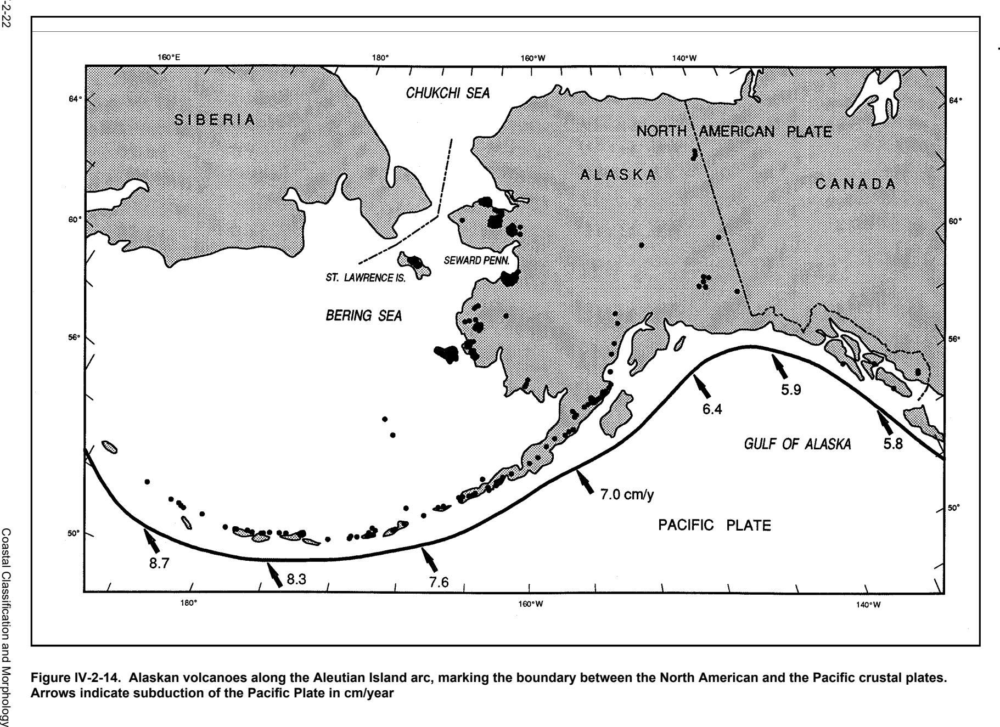

Meiji Seamount, about to be subducted beneath Kamchatka, is 75-80 million years (my) old, Kilauea is only 0.4 my, while Loihi Seamount, south of the big island of Hawaii, is the newest member of the chain and has not yet emerged from the sea. The islands are found over a semipermanent "hot spot," a site where it is believed that a plume of hot, geochemically primitive material rises convectively through the mantle, interacts with the lithosphere, and vents on the seafloor (Dalrymple, Silver, and Jackson 1973). The Pacific plate is postulated to be moving over the hot spot at a rate of about 13 cm/yr, based on ages of the major vents on Hawaii (Moore and Clague 1992).
- (1) Although the coastlines of the Hawaiian Islands are geologically young, wave erosion and the growth of coral reefs have modified most of the shores. Coastal plains have formed around the base of some volcanoes and between others (for example, the intermontaine plateau between Koolau and Waianae on Oahu). The plains are partly alluvial and partly raised reefs (Shepard and Wanless 1971). The greater parts of the Hawaiian coasts are sea cliffs, some as high as 1,000 m on the windward sides of the islands. There are also extensive beaches, the best of which tend to be on the western sides of the islands, protected from waves generated by the northeast trade winds. On southwestern Kauai near Kekaha, there are prograding beach ridges. Surprisingly, most of the beaches are composed not of volcanic debris but primarily of biogenic sediment. The rare volcanic sand beaches are found at the mouths of the larger rivers or along coasts where recent lava flows have killed the coral reefs (Shepard and Wanless 1971). Many beaches are undergoing serious erosion, and finding suitable sources of sand for renourishment has been difficult. This is a critical problem because tourism is a major part of the Hawaiian economy, and the beaches are among the great attractions.
- (2) An example from the island of Hawaii helps illustrate the rugged nature of these volcanic shores. Hawaii, at the southeast end of the island chain, has been built up from at least seven independent volcanoes (Moore and Clague 1992). Mauna Loa, a huge dome at the southern end of the island, rises to 4,100 m above the sea (8,500 m above the seafloor). Kilauea, a low dome that rises out of the southeast side of Mauna Loa, has had a remarkable history of eruptions since 1800. Because of the porosity of the lavas, few permanent streams flow down the island, although rainfall on the windward side is heavy. The southeast coast of the island is a barren, rugged rock shore built up from hundreds of Kilauea lava flows (Figure IV-2-15). In Figure IV-2-15, the foreground is cracked, barren basalt, while the plateau in the background supports a cover of grass. The vertical cliffs are about 10 m high and in areas have been notched or undercut by the surf. Small steep pocket beaches consisting of black volcanic sands have developed in some notches. Because of the harsh wave climate and tectonic instability, coastal engineering in the Hawaiian Islands is particularly challenging (Figure IV-2-16). e. Hazards posed by volcanoes .
- (1) Introduction. Coastal projects and communities are subject to four general types of hazards caused by volcanic eruptions: (a) Explosion-generated tsunamis that can flood coastal areas. (b) Direct burial by lava or ash (recently experienced in Hawaii, Iceland, and Sicily).
- (c) Burial or disruption by mudflows and fluvial sediment from inland eruptions, and changes in stream drainage and coastal sediment-discharge patterns. (d) Loss of life and destruction from explosions.

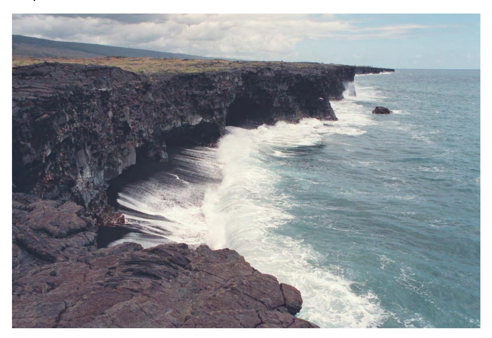

*Figure IV-2-15. Southeast coast of Hawaii, near Kalpana. Rugged cliffs are built up of many lava flows. Small pocket beaches form between headlands when the cliffs are undermined and loose sediment accumulates*

Volcanoes seem a remote hazard to most people, but the danger is imminent and real to those who live in certain parts of the earth, especially along the boundaries of the earth's tectonic plates. Fortunately, fewer than 100 people have been killed by eruptions in Hawaii, where the volcanism is less explosive (Tilling, Heliker, and Wright 1987).

### (2) Earthquakes and tsunamis.

(a) Tsunamis are waves created by ocean-bottom earthquakes, submarine landslides, and volcanic explosions. These long-period waves can travel across entire oceans at speeds exceeding 800 km/hr, causing extensive damage to coastal areas. The cataclysmic explosion of Krakatau on August 27, 1883, generated waves 30 m high that swept across the Sunda Strait, killing 36,000 coastal villagers on Java and Sumatra. One explosion produced one of the loudest noises in history, which was heard at a distance of 4800 km. The Hawaiian islands are particularly vulnerable to tsunamis caused by disturbances around the Pacific rim. The tsunami of April 1, 1946, generated towering walls of water that swept inland, damaging many coastal structures on the islands. In areas, the water rose to 16 m above the normal sea level. Photographs of the waves and the resulting damage are printed in Shepard and Wanless (1971) (Francis Shepard was living on Oahu at the time and vividly describes how the waves smashed his bungalow, forcing him and his wife to flee for their lives). On July 17, 1998, a wall of water 7 m high hit the northwest coast of Papua, New Guinea without warning, following a 7.0 magnitude earthquake about 30 km off the coast in the Pacific Ocean. Some 6,000 villagers perished in this tragedy.

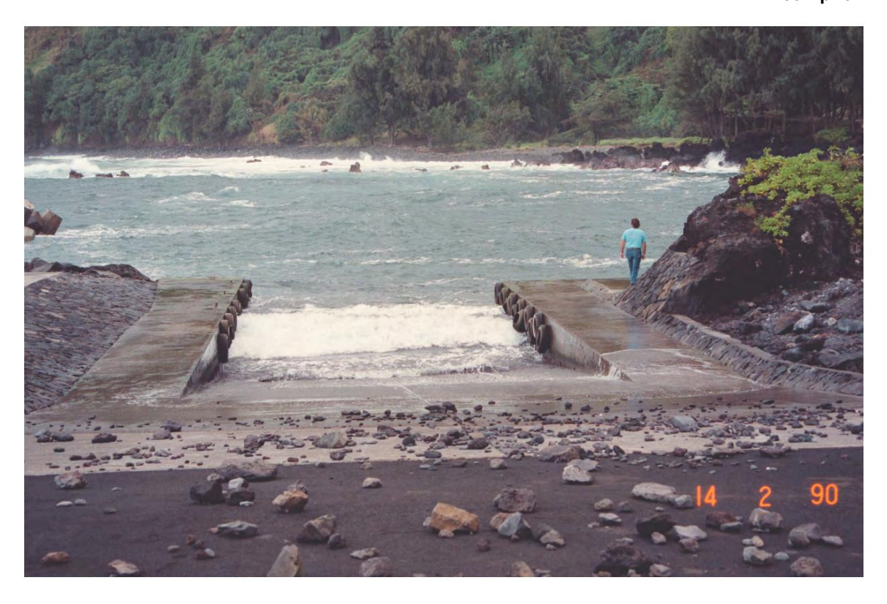

*Figure IV-2-16. Laupahoehoe Harbor, Island of Hawaii, Hawaii. Found on the steep and rugged northeast coast of Hawaii, this harbor provides the only access to the fertile Hamakua coast fishing grounds. This is a hostile environment, as shown by the basalt boulders tossed onto the boat ramp by storm waves*

- (b) Clearly, there is little that can be done to protect against the random and unpredictable tsunamis. A warning network has been established to notify people around the Pacific of earthquakes and the possibility that destructive waves may follow. Coastal residents are urged to heed these warnings!
- (3) Ash and fluvial sediment. When Mount St. Helens exploded on May 18, 1980, 390 m of the top of the mountain was blown off, spewing a cloud of dust and ash high into the stratosphere. From its north flank, an avalanche of hot debris and scalding gasses created immense mudflows, burying the upper 24 km of the North Toutle valley to a depth of 50 m. Lahars, formed from dewatering of the debris avalanche, blocked the shipping channel of the Columbia River. This created an enormous dredging task for the U.S. Army Corps of Engineers, and ultimately much of the dredged material had to be disposed at sea. Dredging related to the explosion continues 18 years after the eruption, as material continues to move downstream from mountain watersheds.
- (4) Explosive destruction. Communities close to volcanoes may be destroyed by the explosion and the inhabitants killed by poisonous gasses and superheated steam.
- (a) The coastal example frequently cited is the destruction of St. Pierre on Martinique by the violent explosion of Montagne Pelée on May 8, 1902. A glowing cloud overran St. Pierre and spread fan-like over the harbor. Practically instantly, the population of more than 30,000 was smothered with toxic gas and incinerated (Bullard 1962).
(b) The cloud that destroyed St. Pierre consisted of superheated steam filled with even hotter dust particles, traveling more than 160 km/hr. The term nuée ardente is now used to describe this type of swiftly flowing, gaseous, dense, incandescent emulsion. It is also used as a synonym for the Peléan type of eruption.

## IV-2-8. Sea Cliffs - Diastrophic, Erosional, and Volcanic

- a. Sea cliffs are the most spectacular geomorphic features found along the world's coastlines. This section concentrates on bedrock cliffs, with bedrock defined as "the solid rock that underlies gravel, soil, or other superficial material" (Bates and Jackson 1984). Bedrock cliffs are found along most of the U.S. and Canadian Pacific coast, in Hawaii, along the Great Lakes shores, and in Maine. South of Maine along the Atlantic coast, cliffs are rare except for some examples in New Hampshire, Massachusetts, and Rhode Island. The eastern end of Long Island, Montauk Point, consists of rapidly eroding till bluffs (Figure IV-2-9). Cliffs constitute portions of the coastlines of Spain, Italy, Greece, Turkey, Iceland, and the South American nations facing the Pacific Ocean. Shorelines with cliffs may be both emergent or submergent. For more information, Trenhaile's (1987) The Geomorphology of Rock Coasts presents a comprehensive and global review of cliffs, shore platforms, and erosion and weathering processes. b. Bedrock cliffs are composed of all three major rock types: igneous, sedimentary, and metamorphic.
- (1) Intrusive igneous rock , such as granite, cools and solidifies beneath the earth's surface, while extrusive igneous rock , such as basalt, is formed by lava above ground (it may erupt underwater or on land). Usually, igneous rocks are highly resistant; however, two properties affect their susceptibility to weathering and erosion (de Blij and Muller 1993):
- (a) Jointing is the tendency of rocks to develop parallel sets of fractures without obvious external movement like faulting.
- (b) Exfoliation , caused by the release of confining pressure, is a type of jointing which occurs in concentric shells around a rock mass.
- (2) Sedimentary rock results from the deposition and lithification (compaction and cementation) of mineral grains derived from other rocks (de Blij and Muller 1993). This category also includes rock created by precipitation (usually limestone).
- (a) The particles (clasts) that make up clastic sedimentary rock can range in size from windblown dust to waterborne cobbles and boulders. The vast majority of sedimentary rocks are clastic. Common examples include sandstone, composed of lithified sand (usually consisting mostly of quartz), and shale, made from compacted mud (clay minerals). Many cliffs along the south shore of Lake Erie are shale.
- (b) Nonclastic sedimentary rocks are formed by precipitation of chemical elements from solution in marine and freshwater bodies because of evaporation and other physical and biological processes. The most common nonclastic rock is limestone, composed of calcium carbonate (CaCO3) precipitated from seawater by marine organisms (and sometimes also incorporating marine shell fragments). Many of the Mediterranean cliffs are limestone and are very vulnerable to dissolution.
- (3) Metamorphic rocks are preexisting rocks changed by heat and pressure during burial or by contact with hot rock masses. Common examples include:
- (a) Quartzite , a very hard, weathering-resistant rock, formed from quartz grains and silica cement.
- (b) Marble , a fine-grained, usually light-colored rock formed from limestone.
- (c) Slate , a rock that breaks along parallel planes, metamorphosed from shale.
- c. Sea cliffs are formed by three general processes:
- (1) Volcanic eruptions and uplift caused by local volcanism (discussed in paragraph IV-2-7).
- (2) Diastrophic activity that produces vertical movement of blocks of the crust.
- (3) Erosional shorelines partial drowning of steep slopes in hilly and mountainous terrain and resulting erosion and removal of sediment.
- d. Sea cliffs, often found on tectonically active coasts, may be created by two mechanisms. First, if a block of the coast drops, a newly exposed fault plane may be exposed to the sea. The opposite process may occur: a block may be uplifted along a fault plane, exposing a formerly exposed portion of the shoreface to marine erosion. Older cliffs may be raised above sea level and be temporarily protected from further erosion. Earlier shorelines, sometimes tens of meters above the present sea level, are marked by notches or wave-cut platforms (sometimes termed uplifted marine terraces) (Figure IV-2-17). Terraces marking the highstand of eustatic (absolute) sea level have been traced around the world. Deep water is often found immediately offshore of faulted coasts. Cliffs that extend steeply into deep water are known as plunging cliffs.
- e. Erosional coasts may be straight or may be irregular, with deeply indented bays. The way the shore reacts to inundation and subsequent marine erosion depends on both the wave climate and the rock type.
- (1) Wave-straightened coasts. Cliffs are often found along shores where wave erosion rather than deposition is the dominant coastal process. Exposed bedrock, high relief, steep slopes, and deep water are typical features of erosional shorelines (de Blij and Muller 1993). When islands are present, they are likely to be remnants of the retreating coast rather than sandy accumulations being deposited in shallow water. The sequence of events that create a straightened coast are illustrated in Figure IV-2-18. The original coastline includes headlands and embayments (a). As waves attack the shore, the headlands are eroded, producing steep sea cliffs (b). The waves vigorously attack the portion of the cliff near sea level, where joints, fissures, and softer strata are especially vulnerable. The cliffs are undermined and caves are formed. Pocket beaches may accumulate between headlands from sediment carried by longshore currents. Especially durable pinnacles of rock may survive offshore as stacks or arches. Over time, the coast is straightened as the headlands are eroded back (c).
- (a) Beaches. Beaches may form at the base of cliffs if the rubble that has fallen from the cliff face (known as talus) is unconsolidated or friable and breaks down rapidly under wave attack (Figures IV-2-9 and IV-2-15). If the rock debris is durable, it may serve to armor the shore, protecting it from further wave attack except during the most severe storms.
- (b) Wave-cut platforms. At the base of cliffs that have been progressively cut back by waves, nearhorizontal platforms may form just below sea level. These rocky platforms may be of substantial width, depending on lithology and the time that sea level has been at that height (Figure IV-2-17). The platforms may be clean or may be covered with rubble fallen from the adjacent cliffs.

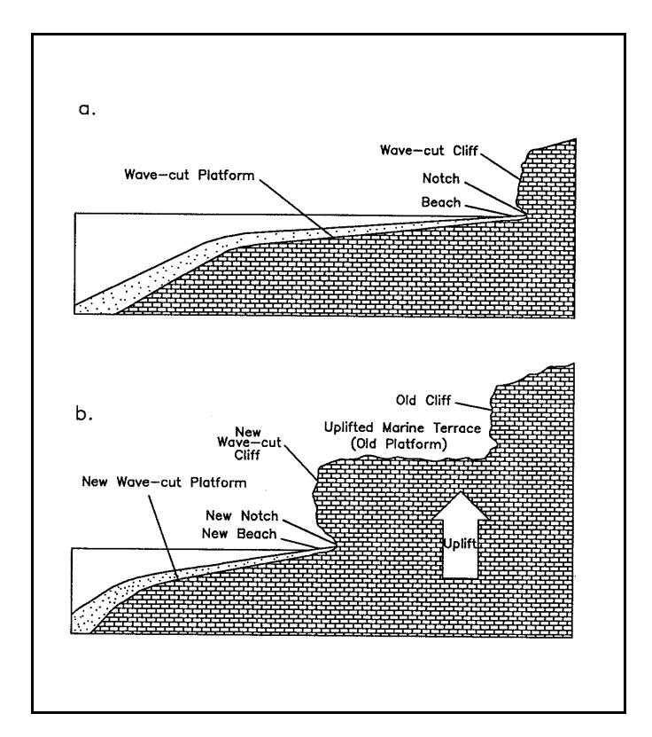

*Figure IV-2-17. Wave-cut platform exposed by tectonic uplift. Sediment that accumulated on the platform may temporarily protect the cliff from further erosion*

- (2) Creation of irregular shorelines. In some mountainous terrains, rising sea level results in deeply incised coastlines. This process is illustrated in Figure IV-2-19. As the sea rises, a river valley is inundated. Once exposed to the sea, the new shoreline is subject to dissolution and biological attack. In southern France, Italy, Greece, and Turkey, thousands of deep embayments are found in the coastal limestone hills. The fact that the wave climate in the Mediterranean is relatively calm (compared with the open oceans) suggests that erosional processes other than wave attack have been instrumental in creating these steep, indented shores. An irregular shore may also be formed when differing rock types outcrop at the coast. Massive rocks, especially igneous and metamorphic ones, withstand erosion better than most sedimentary rocks, which are usually friable and contain bedding planes and fractures. The Pacific coast of Washington off the Olympic Peninsula is irregular because of the complex geology and variety of exposed rock formations (Figure IV-2- 20). e. Marine cliffs are degraded by many physical and biological factors.
- (1) Wave attack is most likely the primary mechanism that causes cliffs to erode (Komar 1976). The hydraulic pressure exerted by wave impact reaches values sufficient to fracture the rock. Sand and rock fragments hurled at the cliff by waves grind away at the surface. Komar (1976) states that wave erosion occurs chiefly during storms, but admits that little quantitative research has been conducted. Once a cliff has been undercut at its base, the overlying rock, left unsupported, may collapse and slide down to the shoreline (Figures III-5-21, IV-2-21, and IV-2-22). Temporarily, the talus protects the cliff, but over time the rubble is reduced and carried away, leaving the fresh cliff face exposed to renewed wave attack.

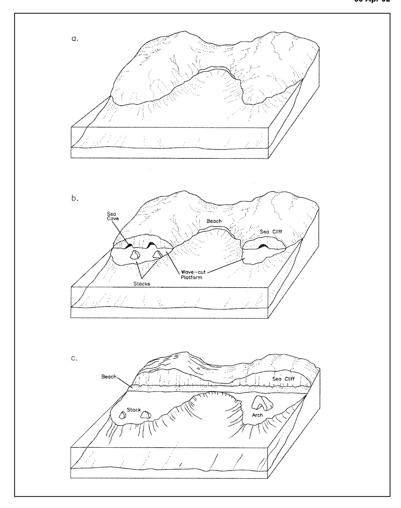

*Figure IV-2-18. Wave erosion of an indented coastline produces a straightened, cliff-bound coast. Wave-cut platforms and isolated stacks and arches may remain offshore. Many such features are found along the Washington, Oregon, and California coast (adapted from de Blij and Muller (1993))*

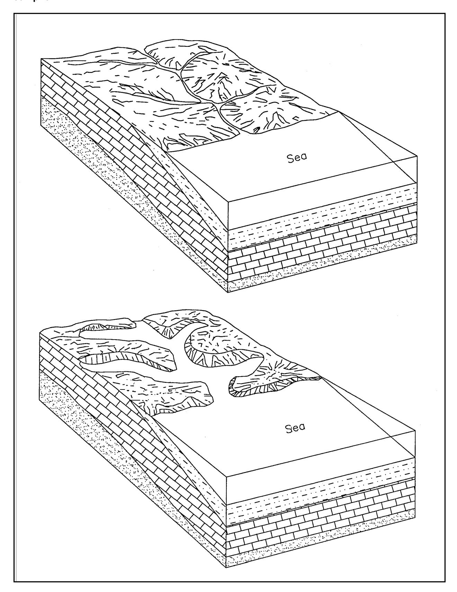

*Figure IV-2-19. Inundation of a mountainous area by rising sea level or land subsidence produces a deeply indented shoreline*

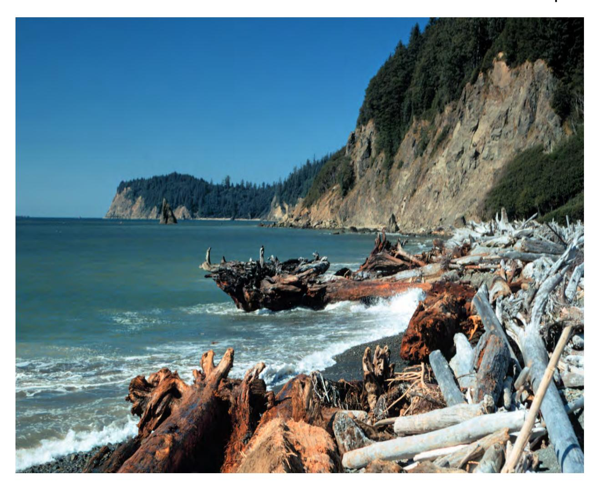

*Figure IV-2-20. Pacific Ocean coast of Olympic Peninsula, Washington, near Jefferson Cove (September 1971). Rugged shore consists of resistant rock headlands with pocket beaches. Much of the beach sediment is cobble and coarse clasts derived from the adjacent cliffs. The beaches are often covered with logs and driftwood*

- (2) In addition to waves, weathering processes weaken and crumble sea cliffs. Ice wedging in cold climates progressively weakens the rock. Plant roots grow and expand in cracks. Lichens secrete acids that etch the rock surface. Groundwater can lubricate impermeable rock surfaces, upon which large masses of overlying rock can slip. This process is responsible for large slumps in the shale bluffs in Lakes Erie and Ontario (Figure III-5-21).
- (3) Mollusks and burrowing animals can weaken otherwise resistant massive rocks. Komar (1976) lists burrowing mollusks such as Pholadidae and Lithophaga , and periwinkles, worms, barnacles, sponges, and sea urchins as having been observed to erode rock. Boring algae can also weaken rock (Figure IV-2-23).
- (4) Under normal circumstances, surface seawater is saturated with calcium carbonate (CaCO3), therefore minimizing dissolution of limestone or CaCO3-cemented sediments. Marine organisms can locally increase the acidity of the water in high-tide rock basins and other protected locations. Small pockets found

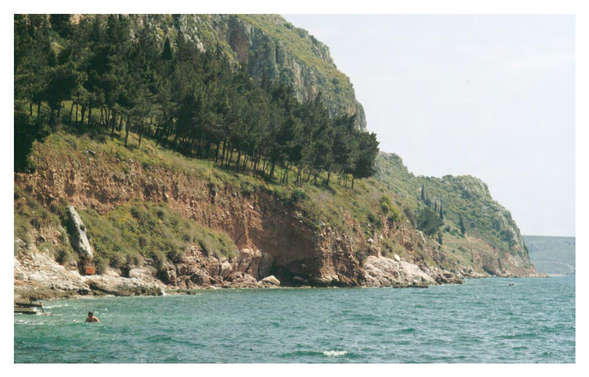

*Figure IV-2-21. A section of cliff, projecting out from the shore, is likely to collapse soon. To the left, rubble at sea level marks the location of a previous slump. The lower cliffs are poorly cemented conglomerate while the higher, vertical cliffs (above the trees), are limestone (near Nauplió, Greece, April 1992)*

at water's edge, often housing periwinkles and other animals, may have been caused by biochemical leaching.
- (5) Salt weathering is caused by the pressure exerted by NaCl and other salts in the capillaries of rocks. The weathering is caused by: (a) Changes of volume induced by hydration. (b) Expansion of salt crystals caused by temperature changes. (c) Crystal growth from solution.
The main factor in determining the efficacy of chemical weathering is the amount of water available for chemical reactions and the removal of soluble products. This suggests, but does not necessarily restrict, that the greatest chemical weathering will occur in hot, humid climates (Trenhaile 1987).

### IV-2-9. Marine Deposition Coasts - Barriers

- a. Introduction.
- (1) Barriers are narrow, elongate sand ridges rising slightly above the high tide level and extending generally parallel with the coast, but separated from the mainland by a lagoon or marsh (Bates and Jackson

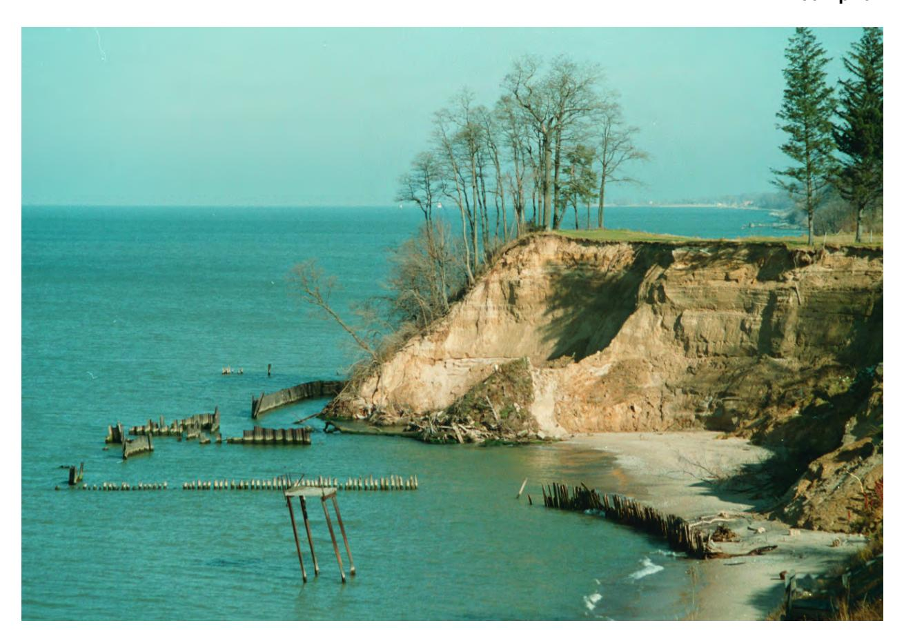

*Figure IV-2-22. Lake Michigan shore south of St. Joseph, Michigan (November 1993). A triangle-shaped wedge of the bluff has recently slumped. The bluffs in this area have suffered rapid retreat, and many homes have been destroyed. At least three factors account for the erosion: (a) offshore downcutting of the till lake bottom; (b) wave attack on the bluffs; (c) ice expansion and lubrication of bedding planes caused by groundwater*

1984). The term barrier identifies the sand ridges as ones that protect parts of the coast from direct wave attack of the open ocean. In this manual, barrier will refer to the overall structure (sometimes called a barrier complex), which includes the beach, submerged nearshore features, underlying sediments, and the lagoon between the barrier and the mainland (Figure IV-2-24). Inlets and channels can also be considered part of a barrier system.
- (2) The term beach is sometimes used as a synonym for barrier, but this can lead to confusion because a beach is a geomorphic shore type found throughout the world, even on volcanic or coralline coastlines where barriers are rare. Whereas all barriers include beaches, not all beaches are barriers.
- (3) The following sections describe general barrier island morphology, history, and formation, subjects that have fascinated geologists for more than 100 years. The emphasis will be on long-term changes, covering periods of years or centuries. The purpose is to explain factors that lead to barrier migration or evolution. Longshore sediment transport, details on the morphology of sandy shorefaces, and the normal effects of waves and tides will be covered in Part IV-3, "Coastal Morphodynamics." This distinction is arbitrary because, clearly, the day-to-day processes that affect beaches also influence barrier development. In addition, the evolution of barriers during the Holocene Epoch is intimately related to sea level changes (see Part IV-1). These factors underscore the complex interrelationships that exist throughout the coastal zone and the difficulty of separating the constituent elements.

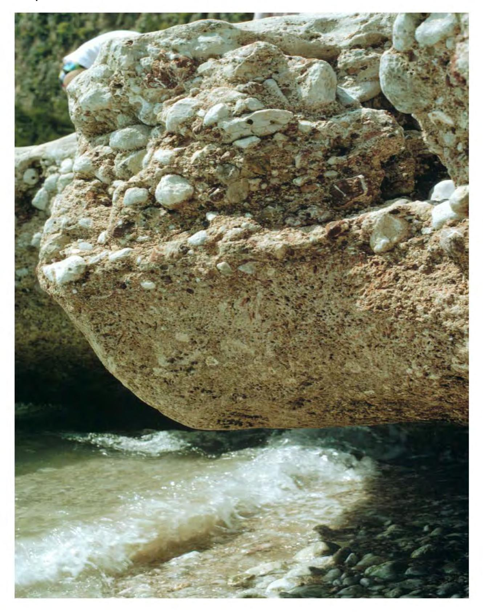

*Figure IV-2-23. Cemented conglomerate with many pits and cavities shows evidence of dissolution. The rock mass has been undercut over 1 m (near Nauplió, Greece). Note that the conglomerate is distinctly graded, with fine grains near the bottom and cobble near the top*

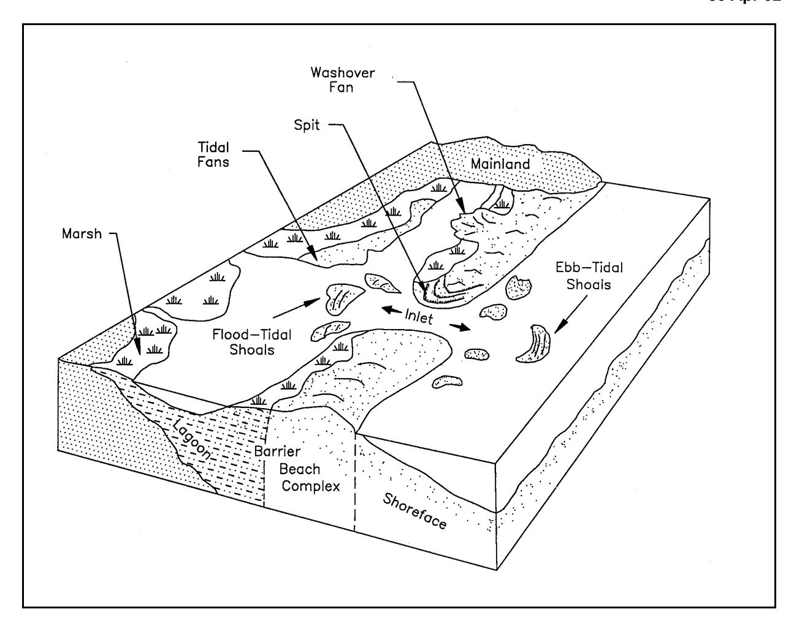

*Figure IV-2-24. A three-dimensional view of features commonly found in barrier island systems, including the back barrier, overwash fans, and lagoons. The lagoons often become estuaries, particularly if sediment is supplied by both rivers and inlets*

- (4) The long-term and widespread interest in barrier islands is largely due to their great economic importance. Ancient buried barriers are important petroleum reservoirs. Contemporary barriers protect lagoons and estuaries, which are the breeding grounds for many marine species and birds. In addition, barrier islands are among the most important recreational and residential regions. In recent years, man's adverse impact on these fragile ecological and geological environments has led to increased need to study their origins and development to improve coastal management and preserve these critical resources for the future.
- (5) An enormous literature on barrier islands exists. Nummedal (1983) provides a readable and concise overview. Leatherman's (1979) book is a compilation of papers on U.S. east coast and Gulf of Mexico barriers. Many seminal papers on barrier island evolution have been reprinted in Schwartz (1973). Textbooks by Carter (1988), Davis (1985), King (1972a), and Komar (1976) discuss barriers and include voluminous reference lists. Classic papers on beach processes have been reprinted in Fisher and Dolan (1977).
b. Distribution of barrier coasts. Barrier islands are found around the world (Table IV-2-2). They are most common on the trailing edges of the migrating continental plates (Inman and Nordstrom 1971)1 . This type of plate boundary is usually non-mountainous, with wide continental shelves and coastal plains. Over 17 percent of the North American coastline is barrier, most of it along the eastern seaboard facing the Atlantic Ocean and the Gulf of Mexico. Table IV-2-3 lists the lengths of barriers and spits in the United States. Of the Atlantic states, Maine and New Hampshire have the fewest barriers because their coasts are largely composed of igneous rock. Massachusetts, with mostly glacial moraines and outwash along the coast, has the surprising total of 184 km of spits and barriers. Of the continental states, Florida has the most barriers and spits, totaling over 1,000 km for both the Atlantic and the Gulf of Mexico. Most of the shorelines facing the Gulf of Mexico consist of barrier islands. A portion of Florida's west coast, where wave energy is low, is mangrove swamp, but the Panhandle is famous for its glistening white barriers.

**Table IV-2-2. ). They are most common on the trailing edges of the migrating continental plates (Inman and Nordstrom 1971)1 . This type of plate boundary is usually non-mountainous, with wide continental shelves and coastal plains. Over 17 percent of the North American coastline is barrier, most of it along the eastern seaboard facing the Atlantic Ocean and the Gulf of Mexico. Table IV-2-3 lists the lengths of barriers and spits in the United States. Of the Atlantic states, Maine and New Hampshire have the fewest barriers because their coasts are largely composed of igneous rock. Massachusetts, with mostly glacial moraines and outwash along the coast, has the surprising total of 184 km of spits and barriers. Of the continental states, Florida has the most barriers and spits, totaling over 1,000 km for both the Atlantic and the Gulf of Mexico. Most of the shorelines facing the Gulf of Mexico consist of barrier islands. A portion of Florida's west coast, where wave energy is low, is mangrove swamp, but the Panhandle is famous for its glistening white barriers.**

| Continent | Barrier Length (km) | % of World Total Barriers | that is Barrier |
| --- | --- | --- | --- |
| N. America | 10,765 | 33.6 | 17.6 |
| Europe | 2,693 | 8.4 | 5.3 |
| S. America | 3,302 | 10.3 | 12.2 |
| Africa | 5,984 | 18.7 | 17.9 |
| Australia | 2,168 | 6.8 | 11.4 |
| Asia | 7,126 | 22.2 | 13.8 |
| Total | 32,038 | 100.0 |  |
| From Cromwell (1971) |  |  |  |

**Table IV-2-2. ). They are most common on the trailing edges of the migrating continental plates (Inman and Nordstrom 1971)1 . This type of plate boundary is usually non-mountainous, with wide continental shelves and coastal plains. Over 17 percent of the North American coastline is barrier, most of it along the eastern seaboard facing the Atlantic Ocean and the Gulf of Mexico. Table IV-2-3 lists the lengths of barriers and spits in the United States. Of the Atlantic states, Maine and New Hampshire have the fewest barriers because their coasts are largely composed of igneous rock. Massachusetts, with mostly glacial moraines and outwash along the coast, has the surprising total of 184 km of spits and barriers. Of the continental states, Florida has the most barriers and spits, totaling over 1,000 km for both the Atlantic and the Gulf of Mexico. Most of the shorelines facing the Gulf of Mexico consist of barrier islands. A portion of Florida's west coast, where wave energy is low, is mangrove swamp, but the Panhandle is famous for its glistening white barriers.**

| Continent | Barrier Length (km) | % of World Total Barriers | that is Barrier |
| --- | --- | --- | --- |
| N. America | 10,765 | 33.6 | 17.6 |
| Europe | 2,693 | 8.4 | 5.3 |
| S. America | 3,302 | 10.3 | 12.2 |
| Africa | 5,984 | 18.7 | 17.9 |
| Australia | 2,168 | 6.8 | 11.4 |
| Asia | 7,126 | 22.2 | 13.8 |
| Total | 32,038 | 100.0 |  |
| From Cromwell (1971) |  |  |  |

Almost the entire shore of Texas consists of long barriers, which continue south into Mexico. Extensive barriers are also found on the Gulf of Alaska north of Bering Strait. Including numerous spits in the Aleutians and the Gulf of Alaska, the state of Alaska has almost 1,300 km of barrier in total, exceeding Florida. The United States total shown in Table IV-2-3 is 4,882 km, about half the North American total computed by Cromwell (1971). For more information, the most extensive survey of United States barriers was documented in the Report to Congress: Coastal Barrier Resources System (Coastal Barriers Study Group 1988).
- c. General coastal barrier structure. The barrier shore type covers a broad range of sizes and variations. Three general classes of barrier structures can be identified (Figure IV-2-25): (1) Bay barriers connected to headlands at both ends and enclosing a bay or wetland.
- (2) Spits attached to a sediment source and growing downdrift. May be converted to a barrier island if a storm cuts an inlet across the spit. May evolve into bay barriers if they attach to another headland and completely enclose a lagoon.

*1 The trailing edge of a continent is moving away from an active spreading center. For example, the Atlantic coast of the United States is a trailing edge because new seafloor is being formed along the mid-Atlantic ridge, causing the Atlantic Ocean to grow wider (Figure IV-1-2). The Pacific coast is a leading edge because the oceanic plates are being subducted (consumed) at various trenches and are therefore becoming smaller.*

*Table IV-2-3 Barrier Islands and Spits of the United States*

**Table IV-2-3. Barrier Islands and Spits of the United States**

| Ocean or Sea | State | Total Length (km)1 |
| --- | --- | --- |
| Atlantic | Maine New Hampshire Massachusetts 2 Rhode Island 3 New York 4 New Jersey Delaware 5 Maryland 5 Virginia 5 North Carolina South Carolina Georgia Florida Atlantic coast total | 11.4 2.5 184.4 17.6 152.2 106.0 33.7 49.2 126.0 380.7 234.2 159.0 533.3 1990 |
| Gulf of Mexico | Florida Alabama Mississippi Louisiana Texas Gulf of Mexico total | 478.5 92.7 59.5 151.9 498.0 1281 |
| Pacific - Continental USA | Washington 6 Oregon California Pacific total | 63.9 91.9 65.4 221 |
| Beaufort, Chukchi, Bering Seas, Gulf | Alaska total (incl. Aleutians) | 1266 |
| of Alaska, Bristol Bay |  |  |
| Lakes Superior, Huron, Michigan, | Combined Great Lakes states | 124 |
| Ontario, Erie |  |  |
| United States total 2,3,4,5,6 |  | 4882 |

Source: Unpublished data generated during the Corps of Engineers' Barrier Island Sediment Study (BISS), 1989. 1

*Length of barriers measured from U.S. Geological Survey topographic maps. Includes barriers and spits enclosing a body of water or marsh, not the total length of beaches in the United States. No data available for Puerto Rico, Virgin Islands, Pacific Trust Territories.*

*Includes Nantucket and Martha's Vineyard Islands.*

*3 Does not include Narragansett Bay.*

*4 Atlantic Ocean only; does not include spits in Long Island Sound or Great Peconic Bay.*

*5 Does not include Chesapeake Bay.*

*Includes spits in Strait of Juan de Fuca. Does not include Long Beach Peninsula, enclosing Willapa Bay.*

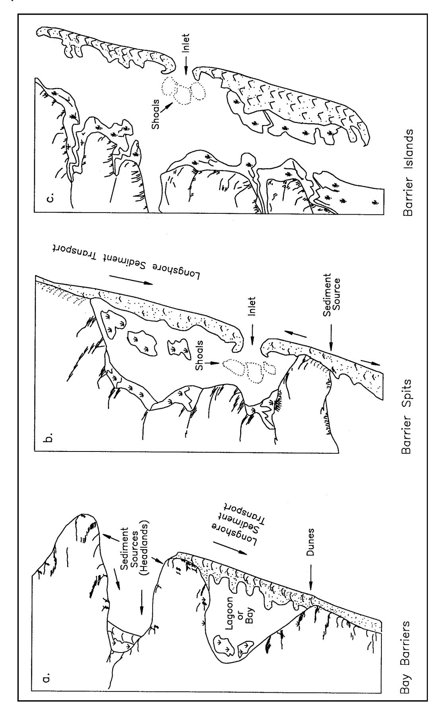

*Figure IV-2-25. General barrier types: bay, spit, and island*

- (3) Barrier islands linear islands that are not attached to the mainland but that enclose a bay, pond, or marsh/wetland. A series of these islands extending along the coast are defined as a barrier chain.
- d. Origin and evolution. The origin of barrier islands has been a topic of debate among geologists for over a century (Schwartz 1973). The differing theories suggest that there are probably several types of barriers, each undergoing its own form of development due to unique physical and geologic factors. Three main theories have evolved, all of which have fierce supporters and critics.
- (1) Emergence model. De Beaumont in 1845 was the first naturalist formally to present a theory of barrier island formation. It was supported and modified by the influential Johnson (1919). These researchers theorized that barrier emergence began with the formation of an offshore sand shoal, which consisted of material reworked from the seafloor by waves. Over time, the shoal would accumulate ever more sand and grow vertically, eventually emerging above the sea surface (Figure IV-2-26). Wave swash and wind deposition would continue to contribute sand to the shoal, allowing it to grow larger and larger. Hoyt (1967) objected to this hypothesis because he was unaware of any examples of bars emerging above water and surviving wave action, although the growth of submerged bars was well-recorded. Otvos (1970) reported evidence from the Gulf coast supporting the emergence of submarine shoals (he conveniently noted that subsequent migration of barriers might completely obscure the conditions of formation of the original barrier).
- (2) Submergence model. The submergence concept was refined by Hoyt (1967) and has received much support. In this model, the initial physical setting is a mainland beach-and-dune complex with a marsh separating the beach from higher terrain inland. Rising sea level floods the marsh, creating a lagoon that separates the beach from the mainland (Figure IV-2-27). Presumably, usually the sea level rise is part of a worldwide pattern (eustatic), but it may be caused in part by local submergence. Once formed, maintenance of the barrier becomes a balance of sediment supply, rate of submergence, and hydrodynamic factors.
- (3) Spit detachment model. The third major model calls for the growth of sandspits due to erosion of headlands and longshore sediment transport (Figure IV-2-28). Periodically, the spit may be breached during storms. The furthest portion of the spit then becomes a detached barrier island, separated by a tidal inlet from the portion that is still attached to the mainland. Gilbert (1885) may have been the first geologist to suggest the spit hypothesis, based on his studies of ancient Lake Bonneville, but the hypothesis lay dormant for many years because of Johnson's (1919) objections. In recent years, it has received renewed support because the cycle of spit growth and breaching can be seen in many locations (for example, at Cape Cod, Massachusetts (Giese 1988)).
- (4) Combined origin model. Schwartz (1971) concluded that barrier island formation is most probably a combination of all of the above mechanisms. He felt that only a few examples of barriers could be cited as having been formed by only one method. Most systems were much more complex, as demonstrated by the barriers of southern Louisiana, which were formed by a combination of submergence and spit detachment (Penland and Boyd 1981). e. Barrier response to rising sea level.
- (1) Many of the barriers in the United States, particularly along the Atlantic coast, are eroding, causing serious economic and management challenges. What is responsible for this erosion?
- (2) Sea level and sediment availability are probably the major factors that determine barrier evolution (Carter 1988). Three sea level conditions are possible: rising, falling, and stationary. Rising and falling sea

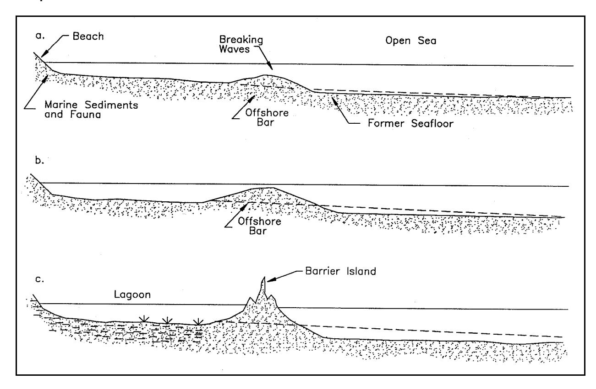

*Figure IV-2-26. Emergence model of barrier island formation (modified from Hoyt (1967)), (a) Waves erode the seafloor, forming a sandbar, (b) The bar continues to grow higher and wider, (c) Bar is converted to an island, enclosing a lagoon on the landward side*

usually result in great sediment movement as barriers adjust. A stationary stage, however, allows the shore to adjust slowly and achieve equilibrium between sediment supply and dynamic processes. Commonly, if sea level rises and sediment supply is constant, a barrier retreats ( transgression of the sea). On the other hand, if sea level is rising but a large amount of sediment is supplied locally by rivers or eroding headlands, a particular barrier may be stable or may even aggrade upwards (see Table IV-1-6). However, many other factors can intervene: local geological conditions, biological activity, susceptibility to erosion, the rate of sea level change. Therefore, each location must be evaluated individually.
- (3) Given the condition of rising sea level along the eastern United States, what are the mechanisms that cause barrier retreat? Three models of shoreline response to rising sea level have been proposed (Figure IV-2-29). These assume that an equilibrium profile is maintained as the shoreline is displaced landward and upward. In addition, overall sediment budget is balanced and energy input is constant.
- (a) The first model, often called the Bruun Rule (Bruun 1962), assumes that sediment eroded from the shoreface is dispersed offshore. As water level rises, waves erode the upper beach, causing the shoreline to recede. Conceptually, this erosion supplies sediment for upward building for the outer part of the profile. The model assumes that the initial profile shape will be reestablished farther inland but at a height above the original position equal to the rise in water level z. Therefore, the retreat of the profile x can be calculated from the following relationship (a modified version of the Bruun Rule):

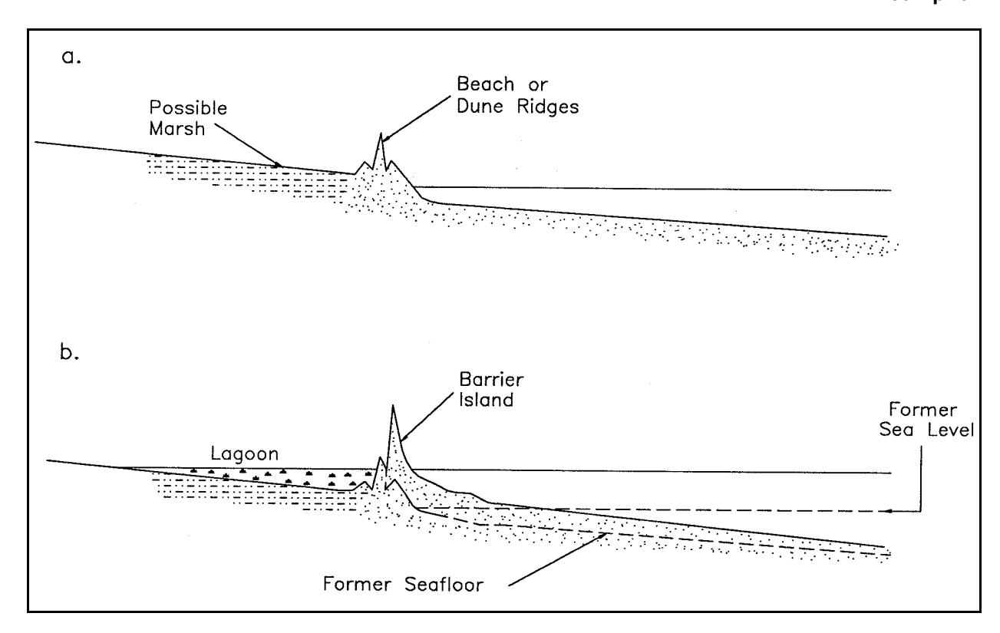

*Figure IV-2-27. Submergence model of barrier island formation (modified from Hoyt (1967)), (a) Beach or sand dune ridges form near the shoreline, (b) Rising sea level floods the area landward of the ridge, forming a barrier island and lagoon. Sediment must be available to allow the island to grow vertically as sea level rises*

```math
x = \frac{zX}{Z} \tag{IV-2-1}
```

where the terms x, z, X, and Z are shown in Figure IV-2-29a. Attempts to verify the Bruun rule have been ambiguous, and modifications to the model have been proposed (Dolan and Hayden 1983). The most successful studies required long-term data sets, such as the profiles from Lake Michigan examined by Hands (1983). His research showed that the shoreface profile requires a considerable time (years or decades) to adjust to water level changes. It is unclear whether the Bruun Rule would apply if an ample supply of sediment were available during rising sea level. Would the barrier essentially remain in place while sand eroded from the shoreface or newly supplied sand was dispersed offshore to maintain the profile? The Bruun Rule and some of its underlying assumptions are discussed in greater detail in Part IV-3.
(b) Landward migration of a barrier by the rollover model applies to coasts where washover processes are important. As sea level rises, material is progressively stripped from the beach and shoreface and carried over the barrier crest by waves. The sand is deposited in the lagoon or marsh behind the barrier (Figure IV-2-30). Dillon (1970) documented this process along the southern Rhode Island coast. As the barrier moves landward (rolls over itself), lagoonal sediments may eventually be exposed on open shoreface. Evidence of this can be seen in Rhode Island during winter storms, when large pieces of peat are thrown up on the beach. Dingler, Reiss, and Plant (1993) have described a model of beach erosion and overwash deposition on the Isles Dernieres, off southern Louisiana. They attributed a net annual beach retreat of

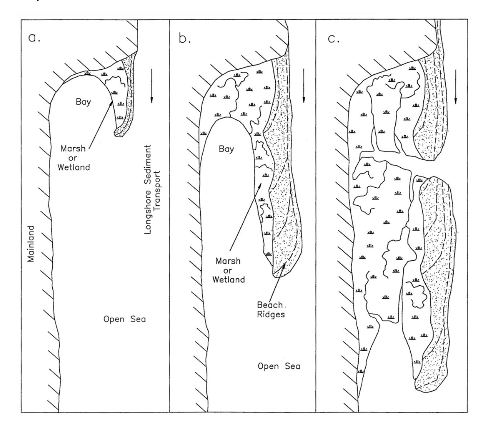

*Figure IV-2-28. Barrier island formation from spit (modified from Hoyt (1967)), (a) Spit grows in direction of longshore drift, supplied from a headland, (b) Spit continues to grow downdrift, marsh begins to fill semi protected bay, (c) Part of spit is breached, converting it to a barrier island*

greater than 10 m/yr to winter cold-front-driven storms that removed sediment from the beach face and infrequent hurricanes that shifted a substantial quantity of sediment to the backshore. For the most part, rollover is a one-way process because little of the sand carried over the barrier into the lagoon is returned to the open shoreface.
- (c) The barrier overstepping model suggests that a barrier may be drowned, remaining in place as sea level rises above it. Several hypotheses have been proposed to explain how this process might occur: ! If the rate of sea level rise accelerates, the barrier may be unable to respond quickly by means of rollover or other mechanisms. Carter (1988) cites research that suggests that gravel or boulder barriers are the most likely to be stranded.

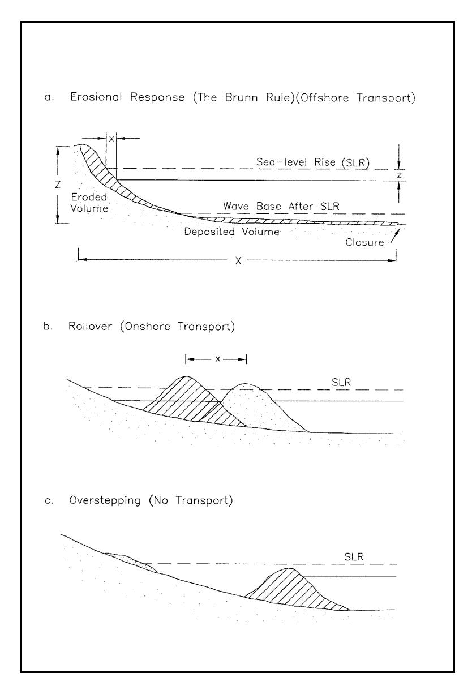

*Figure IV-2-29. Three models of shoreline response to sea level rise: (a) Erosional response model/Bruun Rule assumes offshore dispersal of eroded shoreline materials; (b) Island rollover model assumes that barriers migrate landward according to the rate of sea level rise; (c) Overstepping model assumes submergence in place (adapted from Carter (1988))*

! A modest influx of sediment may retard barrier migration enough to allow overstepping. If a constant volume of sediment is available, the new material must be distributed over a wider and wider base as sea level rises. The result is that vertical growth per unit time decreases. Eventually, the barrier is overtopped and the surf zone jumps forward to the bay shoreline that was formerly protected.

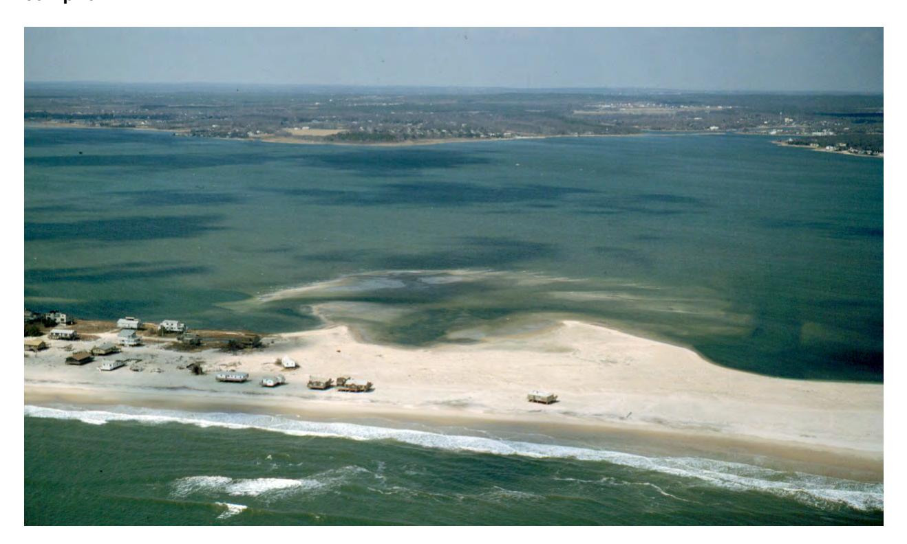

*Figure IV-2-30. Westhampton Beach, Long Island, New York (March 1994 - view looking north towards Moriches Bay). In December 1992, the barrier island breached here during a northeaster, and 60 houses were destroyed. A large overwash fan can be seen in the bay, and to the left are houses that survived the storm. This is an example of the rollover mechanism, when sand from the ocean-facing shoreface is carried over the barrier and deposited in the back bay. The breach was repaired by the Corps of Engineers during 1993 using sand dredged from offshore. This low stretch of the barrier is particularly vulnerable, with several earlier breaches on record. In summer 1998, new homes were again being built here*

- ! A barrier may remain in place because of a dynamic equilibrium that develops between landward and seaward sediment transport. As sea level rises, tidal prism of the lagoon increases, resulting in more efficient ebb transport. During this time, an increasing amount of washover occurs, but the effect is counteracted because sediment is being returned to the exposed shoreface. If little or no new sediment is added to the system, the sea eventually rises above the barrier crest, allowing the surf zone to jump landward to a new location (the formerly protected mainland shore).
- ! All three of these mechanisms may come into play at various times, depending upon environmental conditions. Sediment supply may be the crucial factor, however. Some stranded barriers, such as the ones in the northeastern Gulf of Mexico, may have maintained vertical growth because of an adequate sediment supply (Otvos 1981).
- (4) In all likelihood, barriers respond to all three of the migration models, depending upon timing and local conditions such as sediment supply or preexisting topography (Carter 1988). During the initial stages of sea level rise, the shore erodes and material is dispersed offshore (the Bruun Rule). As the barrier becomes narrower, washover carries more and more sediment to the back lagoon. Eventually, the barrier may become stranded and be drowned. These models have been criticized because they are two-dimensional and do not account for variations in longshore drift. The criticisms are valid because drift is sure to vary greatly as barriers are progressively reshaped or drowned. As a result, pockets of temporarily prograding barriers may remain along a generally retreating coastline.
(5) In summary, several models have been advanced to explain how barrier islands respond to rising sea level. However, because the interactions in the coastal zone are so complex, trying to reduce barrier evolution to a series of simple scenarios is unrealistic. Much more research is needed to define the many factors that contribute to barrier evolution.

### IV-2-10. Marine Deposition Coasts - Beaches

- a. Introduction. Marine and lacustrine beaches comprise one of the most widely distributed coastal geomorphic forms around the world. Their importance as a buffer zone between land and sea and as a recreational and economic resource has stimulated studies by earth scientists for well over a century. Although much has been learned about how beaches form and how they are modified, the coastal environment is incredibly complex, and each location responds to unique geologic conditions and physical processes. Some of these variable factors include: (1) Seasonal cycles. (2) Long-term trends. (3) Changes in relative sea level. (4) Variations in sediment supply. (5) Meteorological cycles.
As a result, it is difficult to characterize beaches and predict future developments without the benefit of longterm studies and observations. The following sections describe the morphology and sediments of beaches and define terms (also see Table IV-1-1). For additional information and extensive bibliographies, the reader is referred to Carter (1988), Davis (1985), Komar (1976, 1983), and Schwartz (1973, 1982).
- b. General definition. Beach is defined as a gently sloping accumulation of unconsolidated sediment at the edge of a sea or other large body of water (including lakes and rivers). The landward limit may be marked by an abrupt change in slope where the beach meets another geomorphic feature such as a cliff or dune. Although this landward boundary has been consistently accepted in the literature, the seaward limit has been more broadly interpreted. Some authors have included the surf zone and the bar and trough topography in their definition because the processes that occur in the surf zone directly affect the exposed portion of the beach. The length of beaches varies greatly. Some stretch for hundreds of kilometers, such as those on the Carolina Outer Banks. Others, called pocket beaches, are restricted by headlands and may be only a few tens of meters long.
- c. Major subdivisions. Beaches are part of the littoral zone, the dynamic interface between the ocean and the land. The littoral zone is bounded on one side by the landward limit of the beach and extends tens or hundreds of meters seaward to beyond the zone of wave breaking (EM 1110-2-1502). Beaches can be divided into two major zones: the foreshore and the backshore. (1) Foreshore.
- (a) The foreshore extends from the low-water line to the limit of wave uprush at high water (Figure IV-1- 2). The upper portion of the foreshore is a steep slope where the high water uprush occurs. The seaward, lower, portion of the foreshore is sometimes called the low-water or low-tide terrace. This terrace often features low, broad ridges separated by shallow troughs, known as ridges and runnels (Figure IV-2-31).

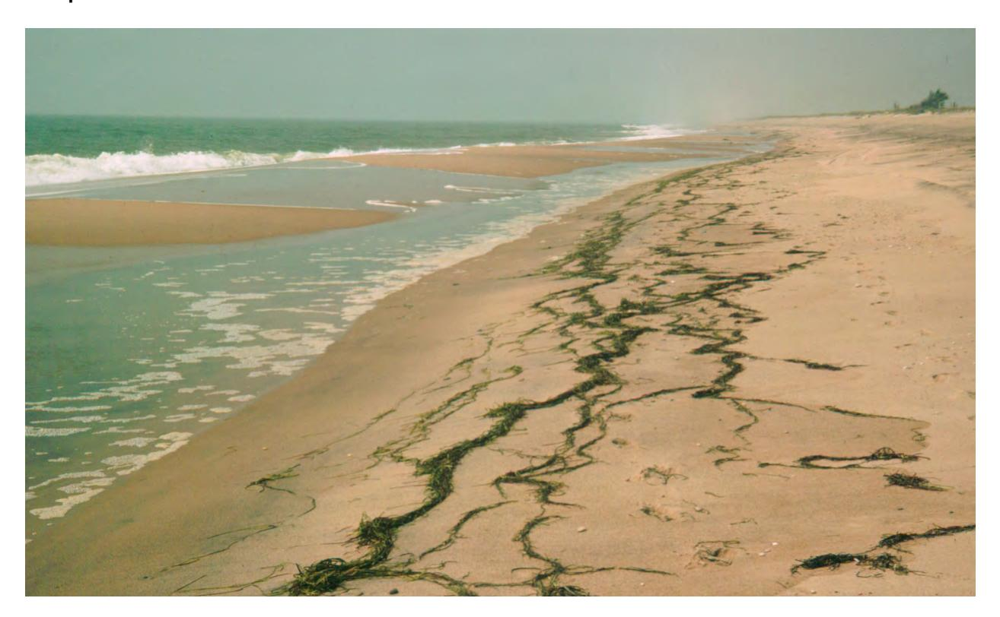

*Figure IV-2-31. Ridge and runnel system, low water terrace, Charlestown Beach, Rhode Island. Sea grass debris in the foreground marks the height of the wave runup during the previous high tide. Where should the "shoreline" be defined on this beach?*

Because the foreshore is frequently subject to wave swash, it usually has a smoother surface than the backshore. There may be a minor step near the low-water mark, called the plunge step. Often, shell or gravel is concentrated at the base of this step, while the sediments to either side are much finer.
(b) The foreshore is sometimes called the beachface. However, beachface is also used in a more restricted sense to designate the steepened portion of the upper foreshore where the high-water wave uprush occurs. Therefore, it is recommended that foreshore and beachface not be used synonymously and that beachface be restricted to its upper foreshore definition.

### (2) Backshore.

- (a) The backshore extends from the limit of high water uprush to the normal landward limit of storm wave effects, usually marked by a foredune, cliff, structure, or seaward extent of permanent vegetation. The backshore is not affected by waves regularly, but only during storms, when high waves and storm surges allow reworking of backshore sediments. Between inundations, the backshore develops a rough surface because of vehicle or animal traffic and the development of wind-blown bed forms. On eroding beaches, the backshore may be missing, and the normal high-water uprush may impinge directly on cliffs or structures.
- (b) Alternate terms for backshore are backbeach and berm. "Berm" is a common term because backshore areas are sometimes horizontal and resemble man-made berms. However, many beaches have a sloping backshore that does not resemble a berm, and some have more than one berm, representing the effects of several storms. Thus, berm is not synonymous with backshore, but may be a suitable description for selected areas. The term is sometimes used in beachfill and beach erosion control design.
(3) Coastline (or shoreline). The boundary between the foreshore and backshore, the high water line (hwl), is often defined to be the coastline. This is a practical definition because this land-water interface can be easily recognized in the field and can be approximated on aerial photographs by a change in color or shade of the beach sand (Crowell, Leatherman, and Buckley 1991). In addition, the coastline marked on the topographic sheets ("T-sheets") typically represents this same hwl, allowing a direct comparison between historic maps and aerial photographs. Some researchers have equated the coastline with the low-water line, but this boundary is not always marked by any evident feature or change in sand color. In various studies, one can find shoreline defined by almost any level datum. These inconsistencies make it difficult to compare shoreline maps prepared by different surveyors or agencies. Definition of "shoreline" often is controversial because it affects the legal definition of setback lines and other constraints placed on development in the coastal zone. A more detailed discussion of hwl identification is presented in Anders and Byrnes (1991); Crowell, Leatherman, and Buckley (1991); and Gorman, Morang, and Larson (1998).

### d. Beach material.

(1) Sand beaches. On most of the coasts of the United States, the predominant beach material is sand (between 0.0625 and 2.0 mm, as defined by the Wentworth classification). Most sand beaches are composed mostly of quartz, with lesser percentages of feldspars, other minerals, and lithic (rock) fragments. Table IV-2- 4 lists beach sediment types and common locations.

| Table IV-2-4 Types of Beach Sediment |  |
| --- | --- |
| Type | Typical Locations |
| Quartz sand | East Coast of U.S. between Rhode Island and North Florida, Gulf Coast between West Florida and Mexico, portions of West Coast of U.S. and Great Lakes |
| Calcite shell debris | South Florida, Hawaii |
| Volcanic sand | Hawaii, Aleutians, Iceland |
| Coral sand | South Florida, Bahamas, Virgin Islands, Pacific Trust Territory |
| Rock fragments | Maine, Washington, Oregon, California, Great Lakes |
| Clay balls | Great Lakes, Louisiana |

- (2) Coarse beaches. Coarse beaches contain large amounts of granule-, pebble-, cobble-, and bouldersized material (larger than 2.0 in the Wentworth classification). These beaches, found in the northeast, in the Great Lakes, and in mountainous reaches of the Pacific coast, occur under conditions where: (a) Local streams flow with enough velocity to carry large particles to the shore.
- (b) Coarse material underlies the beach (often found in areas influenced by glaciation or on metamorphic coasts). (c) Coarse material is exposed in cliffs behind the beach (Figure IV-2-9).
The constituent material may be primarily angular rock fragments, especially if the source area, such as a cliff, is nearby (Figure IV-2-32). If the source area is far away, the most common rock types are likely to be quartzite or igneous rock fragments because these hard materials have a relatively long life in the turbulent beach environment. Softer rocks, such as limestone or shale, are reduced more readily to sand-sized particles

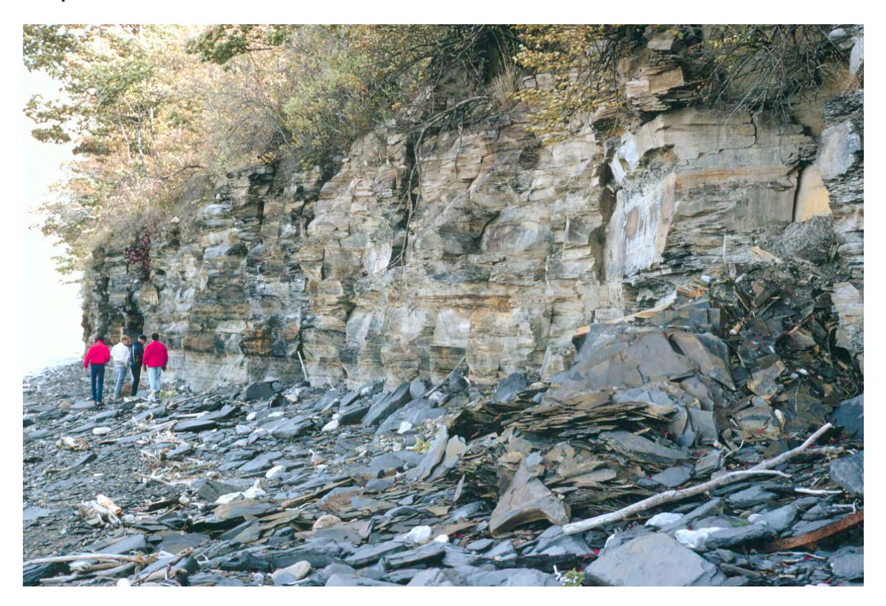

*Figure IV-2-32. Shale beach and bluffs, southeast shore of Lake Erie, near Evans, New York. Bedding planes in the shale are lubricated by groundwater, and freeze-thaw cycles split the rock along the planes. The rubble on the beach breaks down quickly, leaving a grey sand with plate-shaped grains*

by abrasion and breakage during their movement to the coast and by subsequent beach processes. Coarse beaches usually have a steeper foreshore than sand beaches.
(3) Biogenic beaches. In tropical areas, organically produced (biogenic) calcium carbonate in the form of skeletal parts of marine plants and animals can be an important or dominant constituent. The more common particles are derived from mollusks, barnacles, calcareous algae, Bryozoa, echinoids, coral, Foraminifera, and ostacods. The percentage of biogenic material in a beach varies with the rate of organic production and the amount of terrigenous material being contributed to the shore.

### IV-2-11. Salt Marshes

Coastal salt marshes are low-lying meadows of herbaceous plants subject to periodic inundations. During the constructional phase of a coastline, a marsh develops when sediment deposition exceeds sediment removal by waves. Three critical conditions are required for marsh formation: abundant sediment supply, low wave energy, and a low surface gradient. Once sediment accumulation reaches a critical height, the mud flats are colonized by halophytic plants that aid in trapping sediment when flooding occurs and add organic material to the substrate.
a. Distribution of salt marshes. Marshes occur in low-energy coastal locations, and the bay side of most barriers is fringed by tidal marsh or tidal flats. Likewise, mainland shorelines adjacent to bays are also typically fringed by marsh. Along the mainland of the United States, three regional marsh types have been recognized: (1) New England marsh; (2) Atlantic and Gulf Coastal Plain marsh; and (3) Pacific coast marsh
(Frey and Basan 1985). As much as 80 to 90 percent of the Atlantic and Gulf coasts have been bordering marsh around lagoons, estuaries, and deltaic environments (Inman and Nordstrom 1971). However, along the West Coast, less than 20 percent of the coastline has marsh because Pacific marshes are usually restricted to protected locations in river mouth lagoons or tectonically controlled bays. Morphologically and sedimentologically, Pacific marshes are similar to Atlantic and Gulf coast types, although they do differ in flora species and in the unequal semidiurnal range of tides.
New England marshes are adapted to high tide ranges, high wave energy, and cold winters. Atlantic Coastal Plain marshes are abundant and almost continuous from New York to northern Florida. The warm weather, low tide range, and low wave energy coastline of both the Atlantic and Gulf coastal areas of southern Florida gives rise to mangrove marshes. The deltaic plain of Louisiana supports a unique type of marsh called "flotant," which is marsh flora sitting atop organic rich ooze. The ooze is a soft substrate that may be several meters thick over harder substrates. The rest of the Gulf Coast has fringing marsh behind its barriers.

### b. Classification of salt marshes.

- (1) Regional conditions such as temperature, sediment distribution, pH, Eh, and salinity contribute to the zonation of a marsh area. Plant successions, sediment accumulation, and marsh expansion vary but most marshes can be divided into two fundamental zones: low and high. Low marshes are younger, lower topographically, and usually subjected to the adjacent estuarine and marine processes. High marshes are older, occupy a higher topographic position, are more influenced by upland conditions, and are subjected to substantially fewer tidal submersions per year. The boundaries for these zones and their relationship to a given datum may differ from one coast to another. Differences in marsh boundaries might be related to tidal regularity and substrate composition. On the Atlantic coast, the tides are generally regular and near equal in semidiurnal range, whereas those on the Pacific coast are markedly unequal in semidiurnal range. Gulf Coast marshes are subjected to irregular and small-amplitude tides. Consequently, the demarcation of high and low marshes is not well-defined.
- (2) Plant structures and animals are significant contributors to sediment accumulation in salt marshes (Howard and Frey 1977). Grasses dampen wind-generated waves. Stems and levees impede current flow, which helps trap suspended sediment (Deery and Howard 1977). The most obvious mechanism of sediment entrapment is the plant root system. Plant roots may extend more than a meter in depth along Georgia streamside marshes and up to 50 cm in some adjacent habitats (Edwards and Frey 1977). c. Sediment characteristics. (1) Introduction.
- (a) Salt marshes generally contain finer, better-sorted sediment than other intertidal environments. However, marsh substrates reflect the local and regional sediment sources. Along the Atlantic coast and shelf of the United States, Hathaway (1972) recognized two distinct clay mineral facies. The northern clay-mineral facies, extending from Maine to Chesapeake Bay, is primarily composed of illite, chlorite, and traces of feldspar and hornblende. The southern clay-mineral facies, which extends from Chesapeake to the South, is composed of chiefly kaolinite and montmorillonite.
- (b) In New England and along many northern coasts overseas, peat is an important soil component of marsh substrate. Peat forms from the degradation of roots, stems, or leaves of marsh plants, particularly Spartina (Kerwin and Pedigo 1971). In contrast, peat is not a significant component of the southern coastal marshes except in Louisiana and Florida (Kolb and van Lopik 1966). The southern marsh substrate generally consists of silt- and clay-size sediment with a large percentage of carbon material. The major sources of organic carbon in most coastal marshes are in-situ plants and animal remains.
- (c) Southern marshes can have up to 60 percent silt and up to 55 percent clay. Rapid biological decay and constant flushing prevent the accumulation of thick organic deposits. The exception to this is the "flotant" marshes, which may have over 50 percent organics. In the Unified Soil Classification, the substrate would be considered a fine-grained soil, and the field engineer could anticipate silt, clay, or organic-dominant material with low to high plasticity. Much of the organics present in marshes are incompletely oxidized, which if released into the lagoon/bay by excavation, can profoundly affect the water chemistry. (2) Marsh plants.
- (a) Marsh plants are typically tall, salt-tolerant grasses. About 20 genera of salt marsh plants are found worldwide, with the most important in North America being Spartina , Juncus , and Salicornia (Chapman 1974). Salt marshes are the temperate (and arctic) counterparts of tropical mangrove forests. They generally develop in shallow, low-energy environments where fine-grained sediments are deposited over sandy or till substrates (Figure IV-2-33). As the fine sediments build upward, the marsh plants can take root and become established. The established vegetation increases sediment trapping and leads to more rapid upward and outward building of marsh hummocks, which form the foundation of the marsh. The vegetation also creates lower energy conditions by absorbing wave energy and reducing current velocities, thus allowing accelerated sediment deposition.
- (b) Like mangrove forests, many species of invertebrates, fish, birds, and mammals inhabit salt marshes and the adjacent tidal creeks during all or part of their life cycles. Thus, marshes are important to commercial and sport fishermen and hunters. In addition, several marsh species are considered endangered.
- (c) Also like mangrove forests, man's main detrimental impact on these marshes has been dredge-and-fill operations for land reclamation and mosquito control. Air and water pollution are also serious problems. Although extensive areas of salt marsh remain on the east and Gulf coasts of North America, significant areas have been lost to development. The situation is much worse on the west coast, where most of the coastal marsh lands have been filled and perhaps permanently destroyed. Efforts to restore degraded coastal marshes have not generally been successful. (3) Sediment transport and processes.
- (a) Typically, most marshes have very slow rates of sediment accumulation, amounting to only a few millimeters per year (Pethick 1984). Natural and man-induced changes can have deleterious effects on marsh growth. For example, building levees or altering the drainage pattern can result in erosion and permanent marsh loss. Not only is suspended sediment important to vertical growth of the marsh, but biologic components, particularly organic detritus suspended in the water column, are critical to marsh health. The exchange of sediment and nutrients is dependent on the exchange between the local bodies of water. (b) A marsh sediment budget usually includes consideration of the following factors (Davis 1985): ! Riverine sources. ! Offshore or longshore transport.

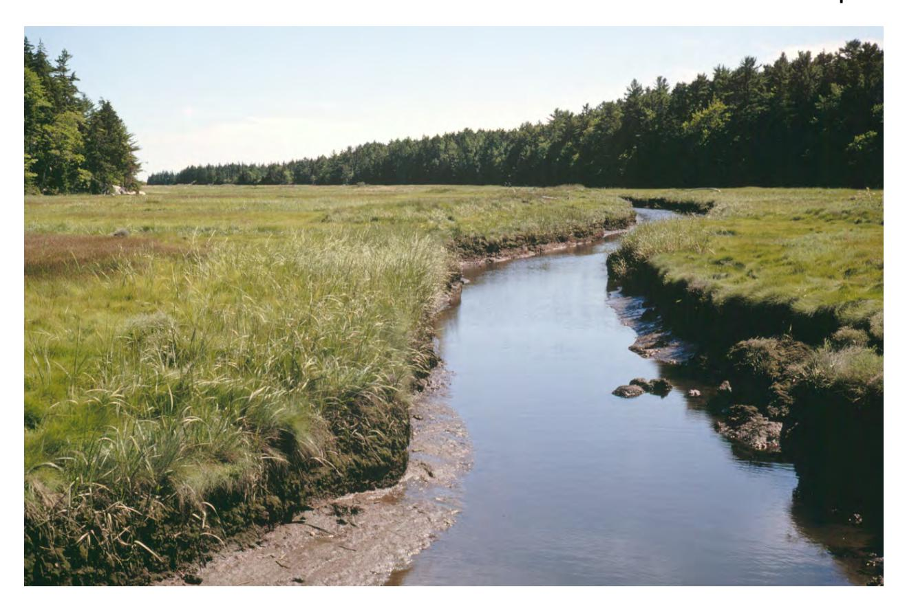

*Figure IV-2-33. Estuary of the Sprague River, Maine (a small river facing the Gulf of Maine west of Popham Beach State Park). This is a typical New England salt marsh, with sinuous channels that alternately flood and drain depending on the stage of the tide. In the past, straight channels were often dug in such marshes to allow more efficient draining to reduce mosquito infestation*

- ! Barrier washover.
- ! Headlands.
- ! Eolian transport.
- ! In situ organic material (i.e., peat, plant detritus, and feces).
- ! Other terrestrial sources.
- (4) Engineering problems. In light of growing concerns to preserve natural coastal marshes and the need to implement the national policy of "no net wetland losses," many agencies are researching ways to manage and implement wetland technology. Studies have identified numerous man-made and natural causes of wetland loss in the coastal zone:
- (a) Sediment deficits. Man-made modifications of natural fluvial systems interfere with natural deltabuilding processes.
- (b) Shoreline erosion. Along many marsh shorelines, the rates of retreat have increased because of hurricanes and other storms, engineering activities along the coast, and boating.
- (c) Subsidence. Sinking of the land due to natural compaction of estuarine, lagoonal, and deltaic sediments results in large-scale disappearance of wetlands. This effect is exacerbated in some areas (e.g., Galveston Bay) by subsidence caused by groundwater and oil withdrawal.
- (d) Sea level rise. Eustatic sea level rise is partially responsible for increased rates of erosion and wetland loss.
- (e) Saltwater intrusion. Increased salinities in wetlands harm vegetation, which makes the wetlands more vulnerable to erosion.
- (f) Canals. Canals increase saltwater intrusion and disrupt the natural water flow and sediment transport processes.
- (5) Marsh restoration. Many agencies, including the U.S. Army Corps of Engineers, are conducting research in the building and restoration of marshes, are developing marsh management techniques, and are developing regulatory guidelines to minimize land loss. Under the Wetlands Research Program sponsored by the USACE, new technology in a multidisciplined approach is being developed. A useful publication is the "Wetlands Research Notebook" (U.S. Army Engineer Waterways Experiment Station 1992), which is a collection of technical notes covering eight field problem areas focusing on wetlands activities in support of USACE civil works projects.

### IV-2-12. Biological Coasts

- a. Introduction.
- (1) On many coasts, such as open wetlands, coral reef, and mangrove forest, biological organisms and processes are of primary importance in shaping the morphology. In contrast, on many other coasts, such as typical sandy beaches, biological activities do not appear to be of major significance when compared to the physical processes at work. Nevertheless, it is important to realize that biological processes are occurring on all shores; all man-made shoreline modifications must address the impact of the modification on the biological community.
- (2) The types of organisms that can exist on a coast are ultimately controlled by interrelated physical factors. These include wave climate, temperature, salinity, frequency of storms, light penetration, substrate, tidal range, and the amounts of sediments and nutrients available to the system. Of these, the most important may be wave climate. The amount of wave energy dissipated at a shoreline per unit time ultimately has a dominant influence on whether the substrate is rock, sand, or silt; on the water clarity; on the delivery of nutrients; and, most importantly, on an organism's physical design and lifestyle. The physical forces exerted by a large breaking wave are several orders of magnitude greater than the typical lateral forces affecting organisms in most other environments. For example, mangroves and salt marshes require low wave-energy climates to provide suitable substrate and to keep from being physically destroyed. On the other hand, reefbuilding corals require reasonably high wave-energy environments to maintain the water clarity, to deliver nutrients, to disperse larvae, to remove sediment, and to limit competition and predation.
- (3) Another first-order physical condition controlling biological organisms is temperature. For example, this is the primary factor that restricts mangroves and coral reefs to the tropics. Also, the formation of ice in coastal waters has a major impact on Arctic communities.
- (4) Unlike many physical processes on coastlines, biological processes are generally progradational in nature, extending shorelines seaward. Reef-building organisms produce hard substrate and sediments, in addition to sheltering areas behind the reefs. Some mollusks, calcareous algae ( Hallemeda sp. , etc.), barnacles, echinoids, bryozoa, and worms produce significant amounts of sediment. Under low-energy
conditions in the deep sea and sheltered waters, diatoms and radiolaria produce sediments. Mangroves, salt marsh, and dune vegetation trap and stabilize sediments. The erosional effect of organisms that burrow into sediments or that bore into rocks is usually of lesser importance.
- b. High wave-energy coasts. Higher plants have not evolved mechanisms to enable them to physically withstand high wave-energy environments. Thus, simple plants, mainly algaes, form the bases of the food chains for these marine coastal communities.
- (1) Coral reefs. Coral reefs are massive calcareous rock structures that are slowly secreted by simple colonial animals that live as a thin layer on the rock surface. The living organisms continually build new structures on top of old, extending the reefs seaward toward deeper water and upward toward the surface. Reef-building corals have algae living within their tissues in a symbiotic relationship. The algae supplies food to the coral and the coral supplies shelter and metabolic wastes as nutrients to the algae. Shallow coral reefs worldwide occupy some 284,300 km2 , about 1.2 percent of the world's continental shelf area (Spalding, Ravilious, and Green 2001). While some corals are found in temperate and Arctic waters, reef-building corals are limited by water temperature to the tropics, mainly between the latitudes of 30 deg north and south. Bermuda, in the North Atlantic, warmed by the Gulf Stream, is the highest latitude location where active coral reefs are presently found. In the United States, coral reefs are found throughout the Florida Keys and the east and west coasts of Florida, in the Hawaiian Islands, the Pacific Trust Territories, Puerto Rico, and the Virgin Islands.
- (a) Reef-building corals require clear water. The corals need to be free of sediments in order to trap food particles, and their algae require sufficient light for photosynthesis. While corals can remove a certain amount of sediment from their upper surfaces, heavy siltation will bury and kill them. Light penetration limits the depth of most reef-building corals to the upper 30-50 m, though some corals grow much deeper. The upper limit of reef growth is controlled by the level of low tide. Corals cannot stand more than brief exposures out of the water (for example, during the occasional passage of a deep wave trough).
- (b) While coral reefs produce rock structure, they also produce calcareous sediments. Waves and currents pulverize coral skeletons into sand-size particles. However, on many reefs, calcareous algae (Hallemeda sp.) produce a majority of the sediments. The crushed calcareous shells of other animals, such as mollusks, sea urchins, and sand dollars, also provide sediment.
- (c) Coral reefs rival tropical rain forests as being among the most complex communities on earth, and rock-producing reef communities are among the most ancient life forms found in the fossil record. Because of their complexity, the dynamics of coral reefs are not yet well understood. At least 100,000 species have been named and described, but the total number inhabiting the world's reefs may exceed one million species. Scientific knowledge of the ecology of reefs has almost entirely accumulated over the last 50 years, since the development of underwater scuba breathing apparatus in the 1940's.
- (d) One of the critical ecological issues of our times is the rapid degradation of coral reefs around the world by various natural and human activities. Corals are highly sensitive to increases in temperature, exhibiting a stress response known as coral bleaching. In 1998, a global mass bleaching caused mass mortalities in many areas. Worldwide, however, humans are driving more profound changes to reefs than are natural phenomena. The most widespread impacts are water pollution, dredge and fill operations, overharvesting of fish and shellfish, and the harvesting of some corals for jewelry. For example, in Indonesia, the world's largest coral nation, 82 percent of the corals are at risk from the illegal practice of dynamite fishing (which is also devastating to fish populations). Even far from the coast, deforestation, urban sprawl, and sloppy agriculture produce vast quantities of sediment and pollution that enter the sea and degrade reefs in the vicinity of river mouths.
- (e) Controlled dredging around reefs is possible and is done routinely, causing minimal impact to reef communities. Mechanical damage (from cutter heads, chains, anchors, and pipelines) is often of equal or greater concern than suspended sediment production. Improvements in navigation and positioning have made dredging near reefs more viable. Nevertheless, careful monitoring is mandated in most cases.
- (f) Reefs are of major economic importance to the communities along which they are located. For millenia, coastal peoples relied on coral reefs as a source of food. Spurgeon (1992) classifies their economic benefits as: * Direct extractive uses fisheries, building material. * Direct non-extractive uses tourism. * Indirect uses biological support for a variety of other ecosystems.
Reef tourism is now a major global industry. Diving tourism is ubiquitous and now occurs in 91 countries and states (Spalding, Ravilious, and Green 2001). One major benefit of mass tourism is that it had brought to public consiousness the issues of the fragility of reef ecosystems and the need to preserve the world's remaining reefs. Marine protected areas are becoming a critical tool in the preservation of remaining reefs, and some 660 protected areas worldwide incorporate reefs. Tourist income is helping some remote communities police and protect their reefs. The downside of mass tourism is the haphazard growth of infrastructure along the shore. Many vacation communities are built on remote coasts where resources, such as fresh water, are scarce and where trash and sewage effluent are not properly managed.
- (g) An additional benefit of reefs is the shelter from waves that they provide to adjacent shores. As an example, the south and southwestern coast of Sri Lanka is battered by waves that travel unhindered across the Indian Ocean. In the past, the coral reefs that surrounded the coast served as buffers against the intense wave energy. But illegal reef breaking and coral mining, combined with negative impacts of tourism and development (sewage, agricultural pollution, physical damage) have greatly reduced the effectiveness of the reef barriers. As a result, much of the Sri Lankan south coast is now experiencing severe erosion (Young and Hale 1998).
- (h) Stoddard (1969) has identified four major forms of large-scale coral reef types: fringing reefs, barrier reefs, table reefs, and atolls.
- (i) Fringing reefs generally consist of three parts: a fore reef, a reef crest, and a back reef. The fore reef usually rises steeply from deep water. It may have spur and groove formations of coral ridges interspersed with sand and rubble channels. The reef crest usually forms a continuous wall rising to the low tide level. This usually occurs within a few hundred meters from shore. The seaward side of this area, called the buttress zone , receives the brunt of the wave action. Between the reef crest (or flat) and the shoreline, the reef usually deepens somewhat in the back reef area. This area typically contains much dead coral as well as rock, rubble, sand, and/or silt. It also contains live coral heads, algae, eel grass, etc. Fringing reefs form as the beginning stages in the evolution of atolls and possibly barrier reefs.
- (j) Barrier reefs grow on the continental shelf where suitable solid substrate exists to serve as a foundation. Their form is typically a long coral embankment separated from the mainland by a lagoon that may be several kilometers wide. The lagoon is usually flat-floored and may be as much as 16 km wide and 35 to 75 m in depth. Although similar to fringing reefs, barrier reefs are much more massive, the reef crests are much further from shore, and the back reef areas are deeper. Protected shorelines behind barrier reefs are characterized by mangrove swamps and are usually progradational. The seafloor on the seaward side slopes steeply away into deeper water and is covered by coral rubble.
- (k) Table reefs grow from shallow banks on the seafloor that have been capped with reef-forming organisms. They cover extensive areas but do not form barriers or enclose lagoons.
- (l) Atolls are ring-shaped reefs that grow around the edges of extinct volcanic islands, enclosing lagoons of open water. The shallow lagoons may contain patch reefs. Atolls are primarily found in isolated groups in the western Pacific Ocean. Small low islands composed of coral sand may form on these reefs. These islands may hold enough of a fresh water lens to support human life, but the islands are quite vulnerable to inundation and to tropical storms. The first theory concerning the development of atolls, the subsidence theory proposed by Charles Darwin in 1842, has been shown to be basically correct (Strahler 1971). Figure IV-2-34 illustrates the evolution of an atoll.
- (m) The development of atolls begins with an active volcano rising from the ocean floor and forming a volcanic island. As the volcano ceases activity, a fringing reef forms along the shore. Over geologic time, erosion of the volcanic island and subsidence due to general aging of the ocean basin cause the island to drop below sea level. The actively growing fringing reef keeps pace with the subsidence, building itself upward until a barrier reef and lagoon are formed. As the center of the island becomes submerged, the reef continues its upward growth, forming a lagoon. During the development, the lagoon floor behind the reef accumulates coral rubble and other carbonate sediments, which eventually completely cover the subsiding volcanic island.
- (2) Worm reefs. A type of biogenic reef that is not related to coral reefs is that produced by colonies of tubeworms. Serpulid worms and Sabellariid worms are two types known to form significant reef structures by constructing external tubes in which they live. The Serpulids build their tubes from calcareous secretions and the Sabellariids by cementing particles of sand and shell fragments around their bodies. Colonies of these worms are capable of constructing massive structures by cementing their tubular structures together. As new tubes are continually produced over old ones, a reef is formed. These reefs typically originate from a solid rocky bottom, which acts as an anchoring substrate. Worm reefs are most commonly found in sub-tropical and tropical climates (e.g., east coast of Florida). Reefs of this nature can play an important role in coastal stabilization and the prevention of coastal erosion.
- (3) Oyster reefs. Oysters flourish under brackish water conditions in lagoons, bays, and estuaries. The oysters cement their shells to a hard stable substrata including other oyster shells. As new individuals set onto older ones, a reef is formed. These reefs can form in temperate as well as tropic waters.
- (a) Oysters found around the United States are part of the family Ostreidae . The Eastern, or American oyster ( Crassostrea virginica ) is distributed along the entire east coast of North America from the Gulf of St. Lawrence through the Gulf of Mexico to the Yucatan and the West Indies. The other major North American species is Ostrea lurida , which ranges along the Pacific coast from Alaska to Baja California (Bahr and Lanier 1981).
- (b) Intertidal oyster reefs range in size from isolated scattered clumps a meter high to massive solid mounds of living oysters anchored to a dead shell substrate a kilometer across and 100 m thick (Pettijohn 1975). Reefs are limited to the middle portion of the intertidal zone, with maximum elevation based on a minimum inundation time. The uppermost portion of a reef is level, with individual oysters pointing upwards. At the turn of the century, vast oyster flats were found along the Atlantic coast in estuaries and bays. In South Carolina, the flats covered acres and sometimes square miles (cited in Bahr and Lanier (1981)).

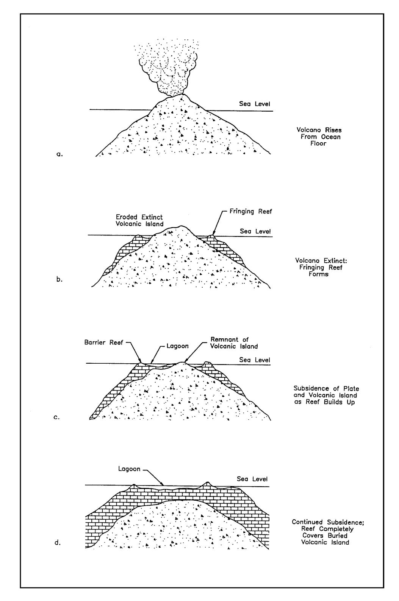

*Figure IV-2-34. Evolution of a coral island: (a) Active volcano rising from the seafloor, (b) Extinct volcanic island with fringing reef, (c) Subsiding island; reef builds upward and seaward, forming barrier reef, (d) Continued subsidence causing remnant volcanic island to be completely submerged. Growth continues upward and seaward until remnant volcano is covered (adapted from Press and Siever (1986))*

- (c) Oyster reefs serve an important biological role in the coastal environment. The reefs are a crucial habitat for numerous species of microfauna and macrofauna. The rough surface of a reef flat provides a huge surface area for habitation by epifauna, especially vital in the marsh-estuarine ecosystem that is often devoid of other hard substrate. The high biological productivity of reef environments underscores one of the reasons why reefs must be protected and preserved.
- (d) Oyster reefs play important physical and geological roles in coastal dynamics because they are waveresistant structures that can biologically adapt to rising sea level. Reefs affect the hydrologic regime of salt marsh estuaries in three ways: by modifying current velocities, by passively changing sedimentation patterns, and by actively augmenting sedimentation by biodeposition. (Biological aggradation increases the size of suspended particles and increases their settling rates.) As reefs grow upward and laterally, modify energy fluxes by damping waves and currents, and increase sedimentation, they ultimately produce major physiographic changes to their basins. These changes can occur on short time scales, on the order of hundreds of years (Bahr and Lanier 1981). During geologic history, massive reefs have accumulated in many areas, some of which became reservoirs for oil and gas.
- (e) Although oysters are adapted to a wide range of temperature, turbidity, and salinity conditions, they are highly susceptible to man-made stresses. These stresses on oyster communities can be classified into eight categories (Bahr and Lanier 1981): ! Physical sedimentation, especially from dredging or boat traffic. ! Salinity changes due to freshwater diversion or local hydrologic alterations. ! Eutrophication (oxygen depletion) due to algae growth in water that is over-enriched with organic matter. ! Toxins from industrial and urban runoff. ! Physical impairment of feeding structures by oil. ! Thermal loading, primarily from power plants. ! Overharvesting. ! Loss of wetlands.
There has been a recorded significant decline in the health and extent of living United States east coast oyster reefs since the 1880's, although the data are sometimes conflicting because ground-level surveys are difficult to conduct (Bahr and Lanier 1981). It is easy to account for the declines of reefs near population and industrial centers, but the declines are more difficult to explain in more pristine areas of the coast (e.g. the Georgia coast near Sapelo Island). Population changes may be due, in part, to natural cycles of temperature and salinity or fecundity.
- (f) Because oyster reefs are susceptible to fouling and silting, it is important that geologists and engineers consider sediment pathways during the planning phases of coastal construction and dredging projects or stream diversion and other watershed changes. As discussed earlier, dredging near reefs is technically feasible as long as careful technique is observed and environmental conditions are monitored.
- (g) In summary, oyster reefs serve critical biological and physical purposes in the estuarine and coastal marsh environment. They enhance biological productivity, provide stable islands of hard substrate in
otherwise unstable soft muddy bottoms, modify hydrodynamic flows and energy fluxes. With respect to shore protection, reefs are a biological wave damper that can accommodate rising sea level as long as they are alive. It is essential that reefs be protected from wanton destruction by pollution and other stresses imposed by human development.

### (4) Rocky coasts.

- (a) Kelp beds. Kelp forests are formed by various species of algae that attach to hard substrate with a root-like system called a holdfast . Some (prominently Macrosistus sp. ) can grow many tens of meters in length up to the water surface, where their tops float and continue to grow. The plants are quite rubbery and can withstand significant wave action. Kelp beds are found along rocky shorelines having cool clear water. In North America, they occur along much of the Pacific coast and, to a lesser extent, along the North Atlantic coast. Kelp beds are, to some extent, the functional temperate latitude counterpart of coral reefs (Carter 1988).
- (b) Kelp biological communities. Kelp beds harbor extensive biological communities that include fish, sea otters, lobster, starfish, mollusks, abalones, and many other invertebrates. In addition, kelp beds absorb wave energy, helping to shelter beaches. Man's main impact has been the commercial harvesting of various portions of this community, including the kelp. In the past, hunting sea otters for their pelts allowed sea urchins to multiply, and the overpopulation of sea urchins grazed and destroyed many beds. Today, the reestablishment of some sea otter populations has led to conflicts with shell fishermen. Water pollution is also a problem in some areas.
- (c) Rock reefs and shorelines. Submerged rock reefs provide substantial habitat for organisms. They provide a place of attachment for sessile organisms, and the crevices provide living spaces and havens of refuge for mobile organisms such as fish and lobsters. These structures are a boon to sports fishermen, and many artificial reefs have been built on sandy seafloors out of a wide array of materials. Rocky shorelines have communities of organisms living in the intertidal and subtidal zones. These may or may not be associated with offshore kelp bed or coral reef communities.
- (5) Sandy coasts. Much of the biological activity on sandy coasts is confined to algae, various invertebrates, and fish living within the water column. Of these, fish, shrimp, and crabs have the greatest economic importance. In addition, there are infaunal filter feeders, mainly mollusks and sand dollars, that live just beneath the sand surface.
- (a) One important and often overlooked biological activity on some sandy beaches is their use as nesting areas by a variety of migratory animals. These include sea turtles, birds, marine mammals, and fish. In North America, many of these species are threatened or endangered, including all five species of sea turtles and some birds such as the piping plover, the snowy plover, and the least tern. For most of these species, their problems are directly related to conflicts with man's recreational use of beaches and the animals' inability to use alternate nesting sites. Fortunately, some states have implemented serious ecological programs to help save these threatened species. For example, Florida has rigorous laws preventing disruption of nesting turtles, and many Florida municipalities have found that maintaining healthy natural biological communities is an excellent way to lure tourists.
- (b) Plants occupying sand dunes are characterized by high salt tolerance and long root systems that are capable of extending down to the freshwater table (Goldsmith 1985). Generally, these plants also generate rhizomes that grow parallel to the beach surface. Beach plants grow mainly in the back beach and dune areas beyond the zone of normal wave uprush. The plants trap sand by producing low energy conditions near the ground where the wind velocity is reduced. The plants continue to grow upward to keep pace with the accumulation of sand, although their growth is eventually limited by the inability of the roots to reach
dependable water. The roots also spread and extend downward, producing a thick anchoring system that stabilizes the back beach and dune areas. This stabilization is valuable for the formation of dunes, which provide storm protection for the entire beach. The most common of these plants are typically marram grass, saltwort, American sea grass, and sea oats. With time, mature dunes may accumulate enough organic nutrients to support shrub and forest vegetation. The barrier islands of the U.S. Atlantic coast and the Great Lakes shores support various species of Pinus , sometimes almost to the water's edge.
c . Low wave-energy coasts . In locations where the wave climate is sufficiently low, emergent vegetation may grow out into the water. Protection from wave action is typically afforded by local structures, such as headlands, spits, reefs, and barrier islands. Thus, the vegetation is usually confined to the margins of bays, lagoons, and estuaries. However, in some cases, the protection may be more regional in extent. Some of the mangrove forests in the Everglades (south Florida) and some of the salt marshes in northwest Florida and Louisiana grow straight into the open sea. The same is true for freshwater marshes in bays and river mouths in the Great Lakes.

### (1) General.

- (a) Only a few higher plants possess a physiology that allows them to grow with their roots in soils that are continuously saturated with salt water. These are the mangroves of the tropics and the salt marsh grasses of the higher latitudes. The inability of other plants to compete or survive in this environment allows small groups of species or single species to cover vast tracts of some coastal areas. These communities typically show zonations with different species dominant at slightly different elevations, which correspond to different amounts of tidal flooding. The seaward limit of these plants is controlled by the need for young plants to have their leaves and branches above water. To this end, some mangroves have seedlings that germinate and begin growing before they drop from the parent tree. Upland from these communities, a somewhat larger number of other plants, such as coconuts and dune grasses, are adapted to live in areas near, but not in, seawater.
- (b) Understanding and appreciation of the importance of these types of coastal areas are growing. Former attitudes that these areas were mosquito-infested wastelands imminently suitable for dredge- and-fill development are being replaced by an appreciation of their great economic importance as nursery grounds for many species of fish and shellfish, of their ability to remove pollutants, of their ability to protect upland commercial development from storms, of their fragility, and of their beauty.

### (2) Mangroves.

- (a) Mangroves include several species of low trees and shrubs that thrive in the warm, shallow, saltwater environments of the lower latitudes. Worldwide, there are over 20 species of mangroves in at least 7 major families (Waisel 1972). Of these, the red, white, and black mangroves are dominant in south Florida and the Caribbean. They favor conditions of tidal submergence, low coastal relief, saline or brackish water, abundant fine sediment supply, and low wave energy. Mangroves have the ability to form unique intertidal forests that are characterized by dense entangled networks of arched roots that facilitate trapping of fine sediments, thereby promoting accretion and the development of marshlands. The prop roots and pneumatophores also allow the plants to withstand occasional wave action and allow oxygen to reach the roots in anaerobic soils. The prime example in the United States is the southwest shore of Florida, in the Everglades National Park.
- (b) Mangrove coasts are crucial biological habitats to a wide variety of invertebrates, fish, birds, and mammals. In the past, the primary cause of their destruction has been dredge-and-fill operations for the reclamation of land and for mosquito control.
- d . Other sources of biogenic sediment in the coastal zone . In areas of high biological activity, organically derived sediments may account for a significant proportion of the sediment composition, especially where terrigenous sediment supplies are low. These biogenic materials, consisting of remains of plants and animals and mineral matter produced by plants and animals, accumulate at beaches, estuaries, and marshlands.
- (1) The most familiar types of biogenic sediments are hard calcareous skeletal parts and shell fragments left behind by clams, oysters, mussels, corals, and other organisms that produce calcareous tests. In tropical climates, the sediment commonly consists of coral fragments and calcareous algal remains. Siliceous tests are produced by most diatoms and radiolaria. Sediments predominately containing carbonate or calcareous material are generally referred to as calcarenites , while sediments composed predominantly of siliceous matter are referred to as diatomites or radiolarites , depending upon which organism is most responsible for the sediment (Shepard 1973). In the Great Lakes and some inland U.S. waterways, the zebra mussel has proliferated since the mid-1980's, and now some shorefaces are covered with mussel shell fragments to a depth of over 10 cm. The mussels are a serious economic burden because they choke the inlets of municipal water systems and coolant pipes.
- (2) In some areas, wood and other vegetation may be introduced into the sediments in large quantities. This is especially common near large river mouths and estuaries. This organic material may become concentrated in low energy environments such as lakes and salt marshes, eventually producing an earthy, woody composition known as peat (Shepard 1973). Peat exposed on the shoreface has been used as an indicator of marine transgression and barrier island retreat (Figure IV-2-35) (Dillon 1970). In Ireland and Scotland, peat is dried and used as a fuel.

## IV-2-13. Continental Shelf Geology and Topography

- a. Introduction. The geology of the world's continental shelves is of direct significance to coastal engineers and managers in two broad areas. First, the topography of the shelf affects coastal currents and wave climatology. Wave refraction and circulation models must incorporate shelf bathymetry. Bathymetry was incorporated in the wave hindcast models developed by the USACE Wave Information Study (See references in Part II-8). Second, offshore topography and sediment characteristics are of economic importance when offshore sand is mined for beach renourishment or dredged material is disposed offshore. b. Continental shelf sediment studies.
- (1) The Inner Continental Shelf Sediment and Structure (ICONS) study was initiated by the Corps of Engineers in the early 1960's to map the morphology of the shallow shelf and find sand bodies suitable for beach nourishment. This program led to a greater understanding of shelf characteristics pertaining to the supply of sand for beaches, changes in coastal and shelf morphology, longshore sediment transport, inlet migration and stabilization, and led to a better understanding of the Quaternary shelf history. ICONS reports are listed in Table IV-2-5.

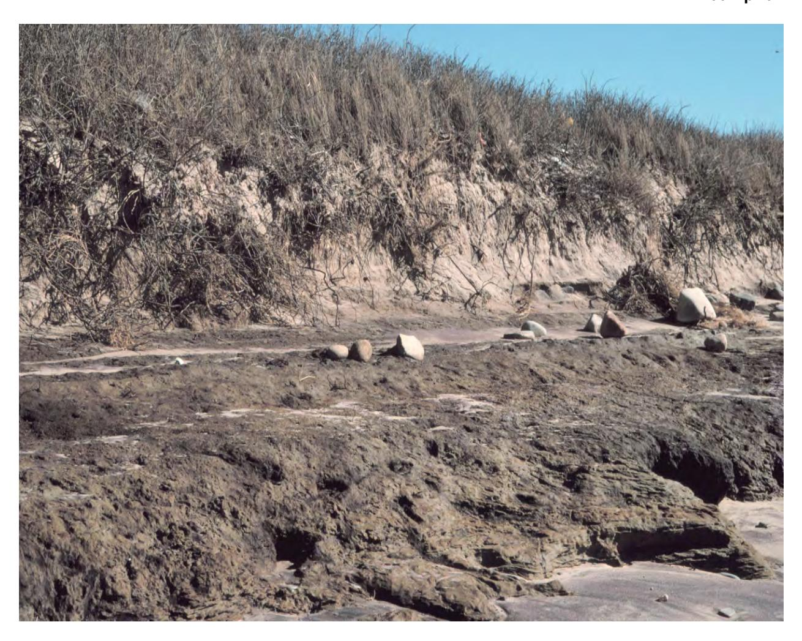

*Figure IV-2-35. Peat horizon exposed on the shoreface, Ditch Plains, Long Island, New York (March 1998). The peat is in-situ, indicating that lagoonal sediments accumulated here before the barrier beach retreated over the marsh. The peat layer was about 1 m above the ocean water level at the time the photograph was taken. The dune resting on the peat is about 2 m thick*

(2) Since the 1970's, the Minerals Management Service (MMS), a bureau of the U.S. Department of the Interior, has been tasked with managing the mineral resources of the Outer Continental Shelf. In conducting its mission, the MMS has sponsored many surveys and studies of mineral resources on the continental shelf. These studies can be accessed via the MMS' Environmental Studies Program Information System (ESPIS) at:
http://mmspub.mms.gov/espis/
- (3) For beach renourishment projects, U.S. Army Corps of Engineers Districts typically obtain information on sand resources near the proposed project area from various sources: (a) In-house studies, typically from vibracoring or rotary borings. (b) Contracts with marine geophysics/geotechnical surveyors. (c) The U.S. Geological Survey.

| Table IV-2-5 U.S. Army Corps of Engineers Inner Continental Shelf Sediment and Structure (ICONS) Reports |  |
| --- | --- |
| Location | References1 |
| Atlantic Coast |  |
| Massachusetts Bay | Meisburger 1976 |
| New York - Long Island Sound | Williams 1981 |
| New York - Long Island shelf | Williams 1976 |
| New York Bight | Williams and Duane 1974 |
| New Jersey - central | Meisburger and Williams 1982 |
| New Jersey - Cape May | Meisburger and Williams 1980 |
| Delaware, Maryland, Virginia | Field 1979 |
| Chesapeake Bay entrance | Meisburger 1972 |
| North Carolina - Cape Fear | Meisburger 1977; Meisburger 1979 |
| Southeastern U.S. shelf | Pilkey and Field 1972 |
| Florida - Cape Canaveral to Georgia | Meisburger and Field 1975 |
| Florida - Cape Canaveral | Field and Duane 1974 |
| Florida - Palm Beach to Cape Kennedy | Meisburger and Duane 1971 |
| Florida - Miami to Palm Beach | Duane and Meisburger 1969 |
| Gulf of Mexico |  |
| Texas - Galveston County | Williams, Prins, and Meisburger 1979 |
| Lake Erie |  |
| Pennsylvania | Williams and Meisburger 1982 |
| Ohio | Williams et al. 1980; Carter et al. 1982 |
| Lake Michigan |  |
| Southeast shore | Meisburger, Williams, and Prins 1979 |
| Sampling tools and methods |  |
| Pneumatic coring device | Fuller and Meisburger 1982 |
| Vibratory samplers | Meisburger and Williams 1981 |
| Data collection methods | Prins 1980 |
| 1 Complete citations are listed in Appendix A |  |

- (d) U.S. Army Engineer Research and Development Center, Waterways Experiment Station.
- (e) State and local agencies.
New geographic data collected by the Federal Government is documented with Metadata that can be accessed from various computer servers. Unfortunately, there is no consistent method of cataloging historical data or reports. Users who need information on sand resources near the coast must contact the Corps District responsible for that particular area.
- c. Continental shelf morphology. Surficial sediment on the continental shelves is largely dependent upon the type of coast (i.e. collision, or leading, versus trailing) and the presence of rivers that supply material to the coast.
- (1) Leading edge shelves, such as the Pacific coasts of North and South America, are typically narrow and steep. Submarine canyons, which sometimes cut across the shelves almost to the shore (Shepard 1973), serve as funnels that carry sediment down to the abyssal plain. Normally, very little sand is available offshore.
- (2) Trailing edge shelves are, in contrast, usually wide and flat, and the heads of canyons usually are located a considerable distance from shore. Nevertheless, a large amount of sediment is believed to move down these canyons (Emery 1968). Off the United States Atlantic coast, the broad continental shelf contains a vast amount of sand. Unfortunately, much of this sand is not available for beach renourishment because it is either too far from shore or its composition is incompatible with the beaches where it is to be placed (i.e., contains too much rock, shell fragment, mud, or organic material or the grain size is different than the size of the native material where it is to be placed). d. Examples of specific features Atlantic seaboard .
- (1) The continental shelf of the Middle Atlantic Bight of North America, which is covered by a broad sand sheet, is south of the region directly influenced by Pleistocene glacial scouring and outwash. This sand sheet is divided into broad, flat, plateau-like compartments dissected by shelf valleys that were excavated during the Quaternary lowstands of the sea. Geomorphic features on the shelf include low-stand deltas (cuspate deltas), shoal and cape retreat massifs (bodies of sand that formed during a transgressive period), terraces and scarps, cuestas (asymmetric ridges formed by the outcrop of resistant beds), and sand ridges (Figure IV-2-36) (Swift 1976; Duane et al. 1972).
- (2) The larger geomorphic features of the Middle Atlantic Bight are constructional features molded into the Holocene sand sheet and altered in response to storm flows. Off the coasts of Delaware, Maryland, and Virginia, shoreface-connected shoals appear to have formed in response to the interaction of south-trending, shore-parallel, wind-generated currents with wave- and storm-generated bottom currents during winter storms. Storm waves aggrade crests, while fair-weather conditions degrade them. A second shoal area further offshore at the 15-m depth is indicative of a stabilized sea level at that elevation. These shoals may be suitable sources of sand for beach renourishment. However, the often harsh wave conditions off the mid-Atlantic seaboard may limit the economic viability of mining these shoals. The origin and distribution of Atlantic inner shelf sand ridges are discussed in McBride and Moslow (1991).
- (3) Linear shoals of the Middle Atlantic Bight tend to trend northeast (mean azimuth of 32 deg) and extend from the shoreline at an angle between 5 and 25 deg. Individual ridges range from 30 to 300 m in length, are about 10 m high, and have side slopes of a few degrees. The shoal regions extend for tens of kilometers. The crests are composed of fine-medium sand, while the ridge flanks and troughs are composed of very fine-fine sand. The mineralogy of shoals reflects that of the adjacent beaches.

### e. Riverine influence .

- (1) Rivers provide vast amounts of sediment to the coast. The 28 largest rivers of the world, in terms of drainage area (combined size of upland drainage area and subaerial extent of deltas), discharge across trailing-edge and marginal sea coasts (Inman and Nordstrom 1971). Because the larger rivers drain onto trailing edge coasts, these shores tend to have larger amounts of available sediment, which is deposited across a wide continental shelf. The sediment tends to remain on the shelf and is only lost to the abyssal plains when deltas prograde out across the continental rise (e.g., the Mississippi and Nile Deltas) or when submarine canyons are incised across the shelf (e.g., Hudson River sediment funnels down the Hudson Canyon).
- (2) The Columbia River, which is the 29th largest river in the world, is the largest one to drain across a collision coast. Until dams were built during the mid-20th century, the Columbia carried a major sediment load, which was deposited on the ebb shoal off its mouth. This shoal provided the sand that formed the Long Beach peninsula and fed the beaches as far north as the Olympic Peninsula. The Columbia appears to be an exception - on most collision coasts, canyons frequently cut across the shelf almost to the shore (Shepard 1973), therefore resulting in the direct loss of sediment from the coastal zone.

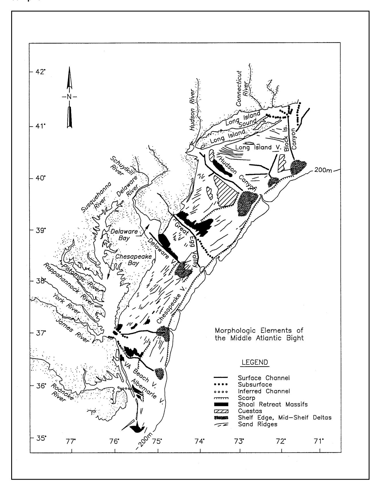

*Figure IV-2-36. Morphology of the Middle Atlantic Bight (from Swift (1976)). Sand ridges close to shore may be suitable sources of sand for beach renourishment*

## IV-2-14. References

### EM 1110-2-1502

Coastal Littoral Transport

### Anders and Byrnes 1991

Anders, F. J., and Byrnes, M. R. 1991. Accuracy of shoreline change rates as determined from maps and aerial photographs, Shore and Beach , Vol 51, No. 1, pp. 17-26.

## Baeteman 1994

Baeteman, C. 1994. Subsidence in coastal lowlands due to groundwater withdrawal: the geological approach, "Coastal Hazards, Perception, Susceptibility and Mitigation," Finkl, C. W., Jr., (ed.), Journal of Coastal Research Special Issue No. 12, pp 61-75.

### Bagnold 1941

Bagnold, R. A. 1941. The Physics of Windblown Sand and Desert Dunes, Methuen, London, UK.

### Bahr and Lanier 1981

Bahr, L. M., and Lanier, W. P. 1981. "The Ecology of Intertidal Oyster Reefs of the South Atlantic Coast: A Community Profile," Report FWS/OBS-81/15, U.S. Fish and Wildlife Service, Office of Biological Services, Washington, DC.

### Ballard 1983

Ballard, R. D. 1983. Exploring our Living Planet , National Geographic Society, Washington, DC.

## Bates and Jackson 1984

Bates, R. L., and Jackson, J. A. 1984. Dictionary of Geologic Terms, 3rd ed., Anchor Press/Doubleday, Garden City, NY.

### Bowes 1989

Bowes, M. A. 1989. "Review of the Geomorphic Diversity of the Great Lakes Shore Zone in Canada," Heritage Resources Centre, University of Waterloo, Waterloo, Canada.

### Boyd, Dalrymple, and Zaitlin 1992

Boyd, R., Dalrymple, R., and Zaitlin, B. A. 1992. "Classification of Elastic Coastal Depositional Environments," Sedimentary Geology , Vol 80, pp 139-150.

### Bruun 1962

Bruun, P. M. 1962. "Sea-level Rise as a Cause of Shore Erosion," Proceedings, Journal of the Waterways and Harbor Division, American Society of Civil Engineers, Vol 88, No. WW1, pp 117-130.

## Bullard 1962

Bullard, F. M. 1962. Volcanoes in History, in Theory, in Eruption , University of Texas Press, Austin, TX.

### Carter 1988

Carter, R. W. G. 1988. Coastal Environments: An Introduction to the Physical, Ecological, and Cultural Systems of Coastlines, Academic Press, London, UK.

## Carter, Curtis, and Sheehy-Skeffington 1992

Carter, R. W. G., Curtis, T. G. F., and Sheehy-Skeffington, M. J. 1992. Coastal Dunes, Geomorphology, Ecology, and Management for Conservation , A. A. Balkema, Rotterdam, The Netherlands.

## Carter, Williams, Fuller, and Meisburger 1982

Carter, C. H., Williams, S. J., Fuller, J. A., and Meisburger, E. P. 1982. "Regional Geology of the Southern Lake Erie (Ohio) Bottom: A Seismic Reflection and Vibracore Study," Miscellaneous Report No 82-15, Coastal Engineering Research Center, U.S. Army Engineer Waterways Experiment Station, Vicksburg, MS.

### Chapman 1974

Chapman, V. J. 1974. "Salt Marshes and Salt Deserts of the World," Ecology of Halophytes , R. J. Reimold and W. H. Queen, eds., Academic Press, NY, pp 3-19.

### Coastal Barriers Study Group 1988

Coastal Barriers Study Group. 1988. Report to Congress: Coastal Barrier Resources System, Recommendations for Additions to or Deletions from the Coastal Barrier Resources System, (in 22 Volumes covering the United States and territories), U.S. Department of the Interior, Washington, DC.

### Coleman and Wright 1971

Coleman, J. M., and Wright, L. D. 1971. "Analysis of Major River Systems and Their Deltas: Procedures and Rationale, with Two Examples," Technical Report No. 95, Coastal Studies Institute, Louisiana State University, Baton Rouge, LA.

### Cotton 1952

Cotton, C. A. 1952. "Criteria for the Classification of Coasts," Abstract of papers, 17th Congress of International Geographers, Washington, DC, p 15.

### Cromwell 1971

Cromwell. 1971. Barrier Coast Distribution: A World-wide Survey," Abstracts, Second Coastal and Shallow Water Research Conference, U.S. Office of Naval Research Geography Program, University Press, University of Southern California, Los Angeles, CA, p 50.

### Crowell, Leatherman, and Buckley 1991

Crowell, M., Leatherman, S. P., and Buckley, M. K. 1991. "Historical Shoreline Change: Error Analysis and Mapping Accuracy," Journal of Coastal Research, Vol 7, No. 3, pp 839-852.

### Dalrymple, Silver, and Jackson 1973

Dalrymple, G. B., Silver, E. I., and Jackson, E. D. 1973. "Origin of the Hawaiian Islands," American Scientist , Vol 61, No. 3, pp 294-308.

### Dalrymple, Zaitlin, and Boyd 1992

Dalrymple, R. W., Zaitlin, B. A., and Boyd, R. 1992. "Estuarine Facies Models: Conceptual Basis and Stratigraphic Implications," Journal of Sedimentary Petrology , Vol 62, No. 6, pp 1130-1146.

### Dana 1849

Dana, J. D. 1849. "Geology," Report of the U.S. Exploring Expedition, 1838-1842 , C. Sherman, Philadelphia, PA.

### Davis 1896a

Davis, W. M. 1896a. "Shoreline Topography," reprinted in: Geographical Essays, Dover Publications, New York, NY (1954 reprint).

### Davis 1985

Davis, R. A., Jr., ed. 1985. Coastal Sedimentary Environments, 2nd ed., Springer-Verlag, New York, NY.

### de Blij and Muller 1993

de Blij, H. J., and Muller, P. O. 1993. Physical Geography of the Global Environment , John Wiley & Sons, New York, NY.

### Deery and Howard 1977

Deery, J. R., and Howard, J. D. 1977. "Origin and Character of Washover Fans on the Georgia Coast, USA," Gulf Coast Association Geologic Society Transactions, Vol 27, pp 259-271.

### Dillon 1970

Dillon, W. P. 1970. "Submergence Effects on a Rhode Island Barrier and Lagoon and Inferences on Migration of Barriers," Journal of Geology , Vol 78, pp 94-106.

### Dingler, Reiss, and Plant 1993

Dingler, J. R., Reiss, T. E., and Plant, N. G. 1993. "Erosional Patterns of the Isles Dernieres, Louisiana, in Relation to Meteorological Influences," Journal of Coastal Research , Vol 9, No. 1, pp 112-125.

### Dolan and Hayden 1983

Dolan, R., and Hayden, B. 1983. "Patterns and Prediction of Shoreline Change," CRC Handbook of Coastal Processes, P. D. Komar, ed., CRC Press, Boca Raton, FL, pp 123-165.

### Duane and Meisburger 1969

Duane, D. B., and Meisburger, E. P. 1969. "Geomorphology and Sediments of the Nearshore Continental Shelf, Miami to Palm Beach, Florida," Technical Memorandum No. 29, Coastal Engineering Research Center, USAE Waterways Experiment Station, Vicksburg, MS.

### Duane, Field, Meisburger, Swift, and Williams 1972

Duane, D. B., Field, M. E., Meisburger, E. P., Swift, D. J. P., and Williams, S. J. 1972. "Linear Shoals on the Atlantic Inner Continental Shelf, Florida to Long Island," Shelf Sediment Transport , D. J. P. Swift, D. B. Duane, and O. H. Pilkey, eds., Dowd, Hutchinson, and Ross, Stroudsburg, PA.

### Dyer 1979

Dyer, K. R., ed. 1979. Estuarine Hydrography and Sedimentation, a Handbook , Cambridge University Press, Cambridge, UK.

## Edwards and Frey 1977

Edwards, J. M., and Frey, R. W. 1977. "Substrate Characteristics Within a Holocene Salt Marsh, Sapelo Island, Georgia," Senckenberg. Marit., Vol 9, pp 215-259.

### Emery 1967

Emery, K. O. 1967. "Estuaries and Lagoons in Relation to Continental Shelves," Estuaries , Publication 83, G. H. Lauff, ed., American Association for the Advancement of Science, Washington, DC, pp 9-11.

### Emery 1968

Emery, K. O. 1968. "Relict Sediments on Continental Shelves of the World," American Association of Petroleum Geologists Bulletin , Vol 52, No. 3, pp 445-464.

### Field 1979

Field, M. E. 1979. "Sediments, Shallow Subbottom Structure, and Sand Resources of the Inner Continental Shelf, Central Delmarva Peninsula," Technical Paper No. 79-2, Coastal Engineering Research Center, U.S. Army Engineer Waterways Experiment Station, Vicksburg, MS.

### Field and Duane 1974

Field, M. E., and Duane, D. B. 1974. "Geomorphology and Sediments of the Inner Continental Shelf, Cape Canaveral, Florida," Technical Memorandum No. 42, Coastal Engineering Research Center, USAE Waterways Experiment Station, Vicksburg, MS.

### Fisher and Dolan 1977

Fisher, J. S., and Dolan, R. 1977. "Beach Processes and Coastal Hydrodynamics," Benchmark Papers in Geology , Vol 39, Dowden, Hutchinson & Ross, Stroudsburg, PA.

## FitzGerald and Rosen 1987

FitzGerald, D. M., and Rosen, P. S., eds. 1987. Glaciated Coasts, Academic Press, San Diego, CA.

### Flint 1971

Flint, R. F. 1971. Glacial and Quaternary Geology, John Wiley and Sons, New York, NY.

### Frey and Basan 1985

Frey, R. W., and Basan, P. B. 1985. Coastal Salt Marshes, Coastal Sedimentary Environments, 2nd ed., R. A. Davis, Jr., ed., Springer-Verlag, New York, pp 225-303.

### Fuller and Meisburger 1982

Fuller, J. A., and Meisburger, E. P. 1982. "A Lightweight Pneumatic Coring Device: Design and Field Test," Miscellaneous Report No. 82-8, Coastal Engineering Research Center, U.S. Army Engineer Waterways Experiment Station, Vicksburg, MS.

## Giese 1988

Giese, G. S. 1988. "Cyclical Behavior of the Tidal Inlet at Nauset Beach, Chatham, Massachusetts," Hydrodynamics and Sediment Dynamics of Tidal Inlets, Lecture Notes on Coastal and Estuarine Studies, Vol 29, D. G. Aubrey and L. Weishar, eds., Springer-Verlag, New York, NY, pp 269-283.

### Gilbert 1885

Gilbert, G. K. 1885. 5th Annual Report, U.S. Geological Survey, Washington, DC, pp 87-88 (reprinted in Schwartz (1973)).

## Goldsmith 1985

Goldsmith, V. 1985. "Coastal Dunes," Coastal Sedimentary Environments, 2nd ed., R. A. Davis, Jr., ed., Springer-Verlag, New York, NY, pp 303-378.

### Gorman, Morang, and Larson 1998

Gorman, L. T., Morang, A., and Larson, R. L. 1998. Monitoring the Coastal Environment; Part IV: Mapping, Shoreline Change, and Bathymetric Analysis, Journal of Coastal Research, Vol 14, No. 1, pp 61-92.

### Guilcher 1965

Guilcher, A. 1965. "Drumlin and Spit Structures in the Kenmare River, Southwest Ireland," Irish Geography , Vol 5, No. 2, pp 7-19.

### Gulliver 1899

Gulliver, F. P. 1899. "Shoreline Topography," Proceedings of the American Academy of Arts and Science, Vol 34, pp 149-258.

## Hands 1983

Hands, E. B. 1983. "The Great Lakes as a Test Model for Profile Response to Sea Level Changes," Chapter 8 in Handbook of Coastal Processes and Erosion, P. D. Komar, ed., CRC Press, Inc., Boca Raton, FL. (Reprinted in Miscellaneous Paper CERC-84-14, Coastal Engineering Research Center, U.S. Army Engineer Waterways Experiment Station, Vicksburg, MS.)

### Hathaway 1972

Hathaway, J. C. 1972. "Regional Clay Mineral Facies in Estuaries and Continental Margin of the United States and East Coast," Environmental Framework of Coastal Plain Estuaries , B. W. Nelson, ed., Geologic Society of America Memoir 133, Boulder, CO, pp 293-316.

### Hayes 1980

Hayes, M. O. 1980. "General Morphology and Sediment Patterns in Tidal Inlets," Sedimentary Geology , Vol 26, pp 139-156.

### Herdendorf 1988

Herdendorf, C. E. 1988. "Classification of Geologic Features in Great Lakes Nearshore and Coastal Areas," Committee report prepared for: Protecting Great Lakes Nearshore and Coastal Diversity Project, International Joint Commission, Windsor, Ontario.

### Hotta, Kraus, and Horikawa 1991

Hotta, S., Kraus, N. C., and Horikawa, K. 1991. "Functioning of Multi-row Sand Fences in Forming Foredunes," Proceedings of Coastal Sediments '91, American Society of Civil Engineers, New York, pp 261-275.

### Howard and Frey 1977

Howard, J. D., and Frey, R. W. 1977. "Characteristic Physical and Biogenic Sedimentary Structures in Georgia Estuaries," American Association of Petroleum Geologist Bulletin, Vol 57, pp 1169-1184.

### Hoyt 1967

Hoyt, J. H. 1967. "Barrier Island Formation," Bulletin of the Geological Society of America, Vol 78, pp 1125-1136.

### Hume and Herdendorf 1988

Hume, T. M., and Herdendorf, C. E. 1988. "A Geomorphic Classification of Estuaries and Its Application to Coastal Resource Management - a New Zealand Example," Journal of Ocean and Shoreline Management , Vol 11, pp 249-274.

## Inman and Nordstrom 1971

Inman, D. L., and Nordstrom, C. E. 1971. "On the Tectonic and Morphological Classification of Coasts," Journal of Geology, Vol 79, pp 1-21.

## Johnson 1919

Johnson, D. 1919. Shore Processes and Shoreline Development, John Wiley & Sons, New York, NY.

### Kerwin and Pedigo 1971

Kerwin, J. A., and Pedigo, R. A. 1971. "Synecology of a Virginia Salt Marsh," Chesapeake Science , Vol 12, pp 125-130.

### King 1972

King, C. A. M. 1972. Beaches and Coasts, 2nd ed., Edward Arnold, London, UK.

### Knutson 1976

Knutson, P. L. 1976. "Summary of CERC Research on Uses of Vegetation for Erosion Control," Proceedings of Great Lakes Vegetation Workshop , Great Lakes Basin Commission and USDA Soil Conservation Service, pp 31-36.

### Knutson 1978

Knutson, P. L. 1978. "Planting Guidelines for Dune Creation and Stabilization," Proceedings of Symposium on Technical, Environmental, Socioeconomic and Regulatory Aspects of Coastal Zone Planning and Management, American Society of Civil Engineers, Vol 2, pp 762-779.

### Kolb and van Lopik 1966

Kolb, C. R., and van Lopik, J. R. 1966. "Depositional Environments of the Mississippi River Deltaic Plain-Southeastern Louisiana," In: Deltas in Their Geologic Framework, Houston Geological Society, Houston, TX, pp 17-61.

### Komar 1976

Komar, P. D. 1976. Beach Processes and Sedimentation, Prentice-Hall, Englewood Cliffs, NJ.

# Komar 1983

Komar, P. D. 1983. "Computer Models of Shoreline Changes," CRC Handbook of Coastal Processes and Erosion, P. D. Komar, ed., CRC Press, Inc., Boca Raton, FL, pp 205-216.

### Lauff 1967

Lauff, G. H., ed. 1967. Estuaries , American Association for the Advancement of Science, Pub. No. 83, Washington, DC.

### Leatherman 1979

Leatherman, S. P., ed. 1979. Barrier Islands from the Gulf of St. Lawrence to the Gulf of Mexico, Academic Press, New York, NY.

### McBride and Moslow 1991

McBride, R. A., and Moslow, T. F. 1991. "Origin, Evolution, and Distribution of Shoreface Sand Ridges, Atlantic Inner Shelf, U.S.A.," Marine Geology , Vol 97, pp 57-85.

### Meisburger 1972

Meisburger, E. P. 1972. "Geomorphology and Sediments of the Chesapeake Bay Entrance," Technical Memorandum No. 38, Coastal Engineering Research Center, U.S. Army Engineer Waterways Experiment Station, Vicksburg, MS.

## Meisburger 1976

Meisburger, E. P. 1976. "Geomorphology and Sediments of Western Massachusetts Bay," Technical Paper No. 76-3, Coastal Engineering Research Center, U.S. Army Engineer Waterways Experiment Station, Vicksburg, MS.

## Meisburger 1977

Meisburger, E. P. 1977. "Sand Resources on the Inner Continental Shelf of the Cape Fear Region," Miscellaneous Report No. 77-11, Coastal Engineering Research Center, U.S. Army Engineer Waterways Experiment Station, Vicksburg, MS.

### Meisburger 1979

Meisburger, E. P. 1979. "Reconnaissance Geology of the Inner Continental Shelf, Cape Fear Region, North Carolina," Technical Report No. 79-3, Coastal Engineering Research Center, U.S. Army Engineer Waterways Experiment Station, Vicksburg, MS.

### Meisburger and Field 1975

Meisburger, E. P., and Field, M. E. 1975. "Geomorphology, Shallow Structure, and Sediments of the Florida Inner Continental Shelf, Cape Canaveral to Georgia," Technical Memorandum No. 54, Coastal Engineering Research Center, U.S. Army Engineer Waterways Experiment Station, Vicksburg, MS.

### Meisburger and Williams 1980

Meisburger, E. P., and Williams, S. J. 1980. "Sand Resources on the Inner Continental Shelf of the Cape May Region, New Jersey," Miscellaneous Report 80-4, Coastal Engineering Research Center, U.S. Army Engineer Waterways Experiment Station, Vicksburg, MS.

### Meisburger and Williams 1981

Meisburger, E. P., and Williams, S. J. 1981. "Use of Vibratory Coring Samplers for Sediment Surveys," Coastal Engineering Technical Aid No. 81-9, Coastal Engineering Research Center, U.S. Army Engineer Waterways Experiment Station, Vicksburg, MS.

### Meisburger and Williams 1982

Meisburger, E. P., and Williams, S. J. 1982. "Sand Resources on the Inner Continental Shelf Off the Central New Jersey Coast," Miscellaneous Report No. 82-10, Coastal Engineering Research Center, U.S. Army Engineer Waterways Experiment Station, Vicksburg, MS.

### Meisburger, Williams, and Prins 1979

Meisburger, E. P., Williams, S. J., and Prins, D. A. 1979. "Sand Resources of Southeastern Lake Michigan," Miscellaneous Report No. 79-3, Coastal Engineering Research Center, U.S. Army Engineer Waterways Experiment Station, Vicksburg, MS.

### Metha 1986

Metha, A. J., ed. 1986. Estuarine Cohesive Sediment Dynamics , Lecture Notes on Coastal and Estuarine Studies, Vol 14, Springer-Verlag, New York, NY.

### Moore and Clague 1992

Moore, J. G., and Clague, D. A. 1992. "Volcano Growth and Evolution of the Island of Hawaii," Geological Society of America Bulletin , Vol 104, No. 11, pp 1471-1484.

### Nelson 1972

Nelson, B. W., ed. 1972. Environmental Framework of Coastal Plain Estuaries , Geological Society of America Memoir 133, Boulder, CO.

### Nichols 1968

Nichols, R. L. 1968. "Coastal Geomorphology, McMurdo Sound, Antarctica," Journal of Glaciology, Vol 51, pp 694-708.

## Nichols and Biggs 1985

Nichols, M. M., and Biggs, R. B. 1985. "Estuaries," Coastal Sedimentary Environments , R. A. Davis, Jr., ed., 2nd ed., Springer-Verlag, New York, NY, pp 77-186.

### Nummedal 1983

Nummedal, D. 1983. "Barrier Islands," CRC Handbook of Coastal Processes and Erosion , P. D. Komar, ed., CRC Press, Inc., Boca Raton, FL, pp 77-121.

### Otvos 1970

Otvos, E. G., Jr. 1970. "Development and Migration of Barrier Islands, Northern Gulf of Mexico," Bulletin of the Geological Society of America, Vol 81, pp 241-246.

### Otvos 1981

Otvos, E. G., Jr. 1981. "Barrier Island Formation Through Nearshore Aggradation - Stratigraphic and Field Evidence," Marine Geology, Vol 43, pp 195-243.

### Penland and Boyd 1981

Penland, S., and Boyd, R. 1981. "Shoreline Changes on the Louisiana Barrier Coast," Proceedings of the Oceans '81 Conference, Boston, Massachusetts, September 16-18, pp 209-219.

### Pethick 1984

Pethick, J. 1984. An Introduction to Coastal Geomorphology, Edward Arnold Publishers, London, UK.

### Pettijohn 1975

Pettijohn, F. J. 1975. Sedimentary Rocks, Harper and Row, New York, NY.

### Pilkey and Field 1972

Pilkey, O. H., and Field, M. E. 1972. "Onshore Transportation of Continental Shelf Sediment: Atlantic Southeastern United States," Shelf Sediment Transport, D. J. Swift, D. B. Duane, and O. H. Pilkey, eds., Dowden, Hutchinson, & Ross, Stroudsburg, PA.

### Press and Siever 1986

Press, F., and Siever, R. 1986. Earth , 4th. ed., W. H. Freeman and Company, New York, NY.

### Prins 1980

Prins, D. A. 1980. "Data Collection Methods for Sand Inventory-Type Surveys," Coastal Engineering Technical Aid No. 80-4, Coastal Engineering Research Center, U.S. Army Engineer Waterways Experiment Station, Vicksburg, MS.

### Pritchard 1967

Pritchard, D. W. 1967. "What is an Estuary? Physical Viewpoint," Estuaries , Publication 83, G. H. Lauff, ed., American Association for the Advancement of Science, Washington, DC, pp 3-5.

### Reading 1986

Reading, H. G., ed. 1986. Sedimentary Environments and Facies, 2nd ed., Blackwell Scientific Publications, Oxford, UK.

## Reineck and Singh 1980

Reineck, H. E., and Singh, I. B. 1980. Depositional Sedimentary Environments, 2nd ed., Springer-Verlag, Berlin, Germany.

## Russell 1967

Russell, R. 1967. Origin of estuaries, Estuaries, G. H. Lauff, (ed.), American Association for the Advancement of Science, Publication 83, Washington, D.C., pp 93-99.

### Schwartz 1971

Schwartz, M. L. 1971. "The Multiple Casualty of Barrier Islands," Journal of Geology, Vol 79, pp 91-94.

### Schwartz 1973

Schwartz, M. L., ed. 1973. Barrier Islands, Dowden, Hutchinson & Ross, Stroudsburg, PA.

### Schwartz 1982

Schwartz, M. L., ed. 1982. The Encyclopedia of Beaches and Coastal Environments, Encyclopedia of Earth Sciences, Volume XV, Hutchinson Ross Publishing Company, Stroudsburg, PA.

### Shepard 1937

Shepard, F. P. 1937. "Revised Classification of Marine Shorelines," Journal of Geology, Vol 45, pp 602- 624.

### Shepard 1948

Shepard, F. P. 1948. Submarine Geology, Harper & Row, New York, NY.

### Shepard 1973

Shepard, F. P. 1973. Submarine Geology, 3rd ed., Harper & Row, New York, NY.

### Shepard 1976

Shepard, F. P. 1976. "Coastal Classification and Changing Coastlines," Geoscience and Man, Vol 13, pp 53- 64.

### Shepard 1977

Shepard, F. P. 1977. Geological Oceanography, Crane, Russak & Co., New York, NY.

### Shepard and Wanless 1971

Shepard, F. P., and Wanless, H. R. 1971. Our Changing Coastlines , McGraw-Hill Book Company, New York, NY.

# Smith 1954

Smith, H. T. U. 1954. "Coastal Dunes," Proceedings of the Coastal Geography Conference, Office of Naval Research, Department of the Navy, Washington, DC, pp 51-56.

### Spalding, Ravilious, and Green 2001

Spalding, M. D., Ravilious, C., and Green, E. P. 2001. World Atlas of Coral Reefs, The University of California Press, Berkeley, CA.

## Spurgeon 1992

Spurgeon, J. P. G. 1992. "The Economic Valuation of Coral Reefs," Marine Pollution Bulletin , Vol 24, No. II, pp 529-536.

## Stewart and Pope 1992

Stewart, C. J., and Pope, J. 1992. "Erosion Processes Task Group Report," Open file report prepared for the International Joint Commission Water Level Reference Study, International Joint Commission, Canada and U.S.A.

### Stoddard 1969

Stoddard, D. R. 1969. "Ecology and Morphology of Recent Coral Reefs," Biological Reviews , Vol 44, pp 433-498.

### Strahler 1971

Strahler, A. N. 1971. The Earth Sciences , 2nd ed., Harper & Row Publishers, New York, NY.

### Suess 1888

Suess, E. 1888. The Faces of the Earth, Vol 2 (English translation by H. B. Sollas in 1906), Oxford University Press, London, UK (in 5 vols).

### Suhayda 1984

Suhayda, J. N. 1984. "Interaction Between Surface Waves and Muddy Bottom Sediments," Estuarine Cohe sive Sediment Dynamics, Lecture Notes on Coastal and Estuarine Studies, A. J. Mehta, ed., Springer-Verlag, Berlin, pp 401-428.

### Suter and Berryhill 1985

Suter, J. R., and Berryhill, H. L., Jr. 1985. "Late Quaternary Shelf-Margin Deltas, Northwest Gulf of Mexico," Bulletin of the American Association of Petroleum Geologists, Vol 69, No. 1, pp 77-91.

### Swift 1976

Swift, D. J. P. 1976. "Coastal Sedimentation," Marine Sediment Transport and Environmental Management , D. J. Stanley and D. J. P. Swift, eds., John Wiley and Sons, New York, NY, pp 255-310.

### Tilling, Heliker, and Wright 1987

Tilling, R. I., Heliker, C., and Wright, T. L. 1987. "Eruptions of Hawaiian Volcanoes: Past, Present, and Future," U.S. Geological Survey, Denver, CO.

### Trenhaile 1987

Trenhaile, A. S. 1987. The Geomorphology of Rock Coasts , Clarendon Press, Oxford, UK.

### U.S. Army Engineer Waterways Experiment Station 1992

U.S. Army Engineer Waterways Experiment Station. 1992. "The Wetlands Research Program Notebook," Technical Notes, U.S. Army Engineer Waterways Experiment Station, Vicksburg, MS.

### Valentin 1952

Valentin, H. 1952. Die Kusten der Erde, Petermanns Geog. Mitt. Erg. 246, Justus Perthes Gotha, Berlin, Germany.

### Van de Kreeke 1986

Van de Kreeke, J., ed. 1986. Physics of Shallow Estuaries and Bays , Lecture Notes on Coastal and Estuarine Studies, Vol 16, Springer-Verlag, New York, NY.

### Waisel 1972

Waisel, Y. 1972. Biology of Halophytes , Academic Press, NY.

## Williams 1976

Williams, S. J. 1976. "Geomorphology, Shallow Subbottom Structure, and Sediments of the Atlantic Inner Continental Shelf Off Long Island, New York," Technical Paper No. 76-2, Coastal Engineering Research Center, U.S. Army Engineer Waterways Experiment Station, Vicksburg, MS.

### Williams 1981

Williams, S. J. 1981. "Sand Resources and Geological Character of Long Island Sound," Technical Paper No. 81-3, Coastal Engineering Research Center, U.S. Army Engineer Waterways Experiment Station, Vicksburg, MS.

### Williams and Duane 1974

Williams, S. J., and Duane, D. B. 1974. "Geomorphology and Sediments of the Inner New York Bight Continental Shelf," Technical Memorandum No. 45, Coastal Engineering Research Center, U.S. Army Engineer Waterways Experiment Station, Vicksburg, MS.

### Williams and Meisburger 1982

Williams, S. J., and Meisburger, E. P. 1982. "Geological Character and Mineral Resources of South Central Lake Erie," Miscellaneous Report No. 82-9, Coastal Engineering Research Center, U.S. Army Engineer Waterways Experiment Station, Vicksburg, MS.

## Williams, Carter, Meisburger, and Fuller 1980

Williams, S. J., Carter, C. H., Meisburger, E. P., and Fuller, J. A. 1980. "Sand Resources of Southern Lake Erie, Conneaut to Toledo, Ohio - a Seismic Reflection and Vibracore Study," Miscellaneous Report No. 80- 10, Coastal Engineering Research Center, U.S. Army Engineer Waterways Experiment Station, Vicksburg, MS.

## Williams, Prins, and Meisburger 1979

Williams, S. J., Prins, D. A., and Meisburger, E. P. 1979. "Sediment Distribution Sand Resources, and Geologic Character of the Inner Continental Shelf Off Galveston County Texas," Miscellaneous Report No. 79-4, Coastal Engineering Research Center, U.S. Army Engineer Waterways Experiment Station, Vicksburg, MS.

### Wood and Kienle 1990

Wood, C. A., and Kienle, J., eds. 1990. Volcanoes of North America: United States and Canada , Cambridge University Press, Cambridge, UK.

## Woodhouse 1978

Woodhouse, W. W., Jr. 1978. "Dune Building and Stabilization with Vegetation," SR-3, Coastal Engineering Research Center, U.S. Army Engineer Waterways Experiment Station, Vicksburg, MS.

### Young and Hale 1998

Young, C., and Hale, L. 1998. "Coastal Management: Insurance for the Coastal Zone," Maritimes , Vol 40m, No. 1, pp.17-19.

## IV-2-15. Acknowledgments

Authors of Chapter IV-2, "Coastal Classification and Morphology:"
Andrew Morang, Ph.D., Coastal and Hydraulics Laboratory (CHL), Engineer Research and Development Center, Vicksburg, Mississippi.
Laurel T. Gorman, Information Technology Laboratory, Engineer Research and Development Center, Vicksburg, Mississippi.
David B. King, Ph.D., CHL.
Edward Meisburger, CHL (retired).

### Reviewers:

Stephan A. Chesser, U.S. Army Engineer District, Portland, Portland, Oregon.
Ronald L. Erickson, U.S. Army Engineer District, Detroit, Detroit, Michigan.
Joan Pope, CHL.
John F. C. Sanda, Headquarters, U.S. Army Corps of Engineers, Washington, DC., (retired).
Orson P. Smith, Ph.D., U.S. Army Engineer District, Alaska, Anchorage, Alaska, (retired).
