# Chapter 3 EM 1110-2-1100 COASTAL MORPHODYNAMICS (Part IV)

30 April 2002

# Table of Contents

Page IV-3-1. Introduction IV-3-1 IV-3-2. Introduction to Bed Forms IV-3-1 a. Introduction IV-3-1 b. Environments IV-3-1 c. Classification IV-3-2 d. Ripples IV-3-2 e. Dunes IV-3-2 f. Plane beds IV-3-2 g. Antidunes IV-3-2 h. Velocity - grain size relationships IV-3-4 IV-3-3. Deltaic Processes IV-3-4 a. Introduction IV-3-4 b. General delta classification IV-3-8 c. Delta-forming processes IV-3-8 (1) Force balance IV-3-8 (2) River-dominant deltas IV-3-9 (3) Wave-dominant deltas IV-3-11 (4) Tide-dominant deltas IV-3-13 (5) Intermediate forms IV-3-13 d. Deltaic components and sediments IV-3-13 e. River mouth flow and sediment deposition IV-3-16 f. Mississippi Delta - Holocene history, dynamic changes IV-3-22 (1) General IV-3-22 (2) Deposition time scales IV-3-22 (3) Holocene history IV-3-23 (4) Modern delta IV-3-23 g. Sea level rise and deltas IV-3-23 IV-3-4. Coastal Inlets IV-3-24 a. Introduction IV-3-24 b. Technical literature IV-3-25 c. Classification of inlets and geographic distribution IV-3-25 d. Hydrodynamic processes in inlets IV-3-26 e. Geomorphology of tidal inlets IV-3-26 (1) Ebb-tidal deltas (shoals) IV-3-26 (2) Flood-tidal deltas (shoals) IV-3-30 (3) Bed forms IV-3-32 f. Inlet stability and migration IV-3-32 (1) Background IV-3-32 (2) Inlet migration and spit breaching IV-3-33
(3) Ebb-tidal delta breaching IV-3-35 (4) Stable inlet processes IV-3-35 (5) Extension of bypassing models to other environments IV-3-36 g. Inlet response to jetty construction and other engineering activities IV-3-36 (1) Introduction IV-3-36 (2) Technical literature IV-3-36 h. Case study of inlet formation and growth: Shinnecock Inlet, Long Island, New York IV-3-38 (1) Background and inlet breaching (1938) IV-3-38 (2) Semi-stabilized inlet (1947) IV-3-38 (3) Stabilized inlet (1966) IV-3-39 (4) Ebb shoal growth IV-3-40 IV-3-5. Morphodynamics and Shoreface Processes of Clastic Sediment Shores IV-3-40 a. Overview IV-3-40 (1) Introduction IV-3-40 (2) Literature IV-3-40 (3) Significance of clastic coasts IV-3-42 (4) Range of coastal environments IV-3-44 b. Tide range and overall beach morphology IV-3-44 c. High tidal range (> 2 m) beach morphodynamics IV-3-46 (1) Review IV-3-46 (2) Macrotidal beach groups IV-3-46 (a) GROUP 1 - High wave, planar, uniform slope IV-3-46 (b) GROUP 2 - Moderate wave, multi-bar IV-3-46 (c) GROUP 3 - Low wave beach and tidal flat IV-3-48 (3) Spatial and temporal variations IV-3-49 (4) Summary IV-3-49 d. Morphodynamics of micro- and low-mesotidal coasts IV-3-49 e. Processes responsible for shoreface sediment movement IV-3-56 f. Sea level change and the Bruun rule IV-3-58 (1) General coastal response to changing sea level IV-3-58 (2) Storm response IV-3-59 (3) Bruun Rule beach response model IV-3-59 (4) Use of models to predict shoreline recession IV-3-63 (5) Recommendations IV-3-63 g. Equilibrium profiles on sandy coasts IV-3-63 (1) General characteristics and assumptions IV-3-63 (2) Shape IV-3-64 (3) Discussion of assumptions IV-3-64 (a) Assumption 1 IV-3-64 (b) Assumption 2 IV-3-64 (c) Assumption 3 IV-3-65 (d) Assumption 4 IV-3-65 (4) General comments IV-3-66 h. Depth of closure IV-3-66 (1) Background IV-3-66 (2) Energy factors IV-3-67 (3) Time considerations IV-3-67 (4) Predictive methods IV-3-67 (5) Empirical determination IV-3-68
IV-3-ii Coastal Morphodynamics
i. Longshore sediment movement j. Summary IV-3-70 IV-3-70 IV-3-6. References IV-3-72 IV-3-7. Definition of Symbols IV-3-84 IV-3-8. Acknowledgments IV-3-86

# List of Tables

Page Table IV-3-1. Modes of Fluid Motion Affecting Clastic Shorelines IV-3-50
IV-3-iv Coastal Morphodynamics

# List of Figures

Page Figure IV-3-1. Sediment ripples IV-3-3 Figure IV-3-2. Ripples in a runnel, exposed during low tide, Bon Secour Wildlife Refuge, near Gulf Shores, Alabama IV-3-4 Figure IV-3-3. Two-dimensional and three-dimensional dunes (Reineck and Singh (1980)) IV-3-5 Figure IV-3-4. Ebb shoal, East Pass, Florida IV-3-6 Figure IV-3-5. Flood shoal, East Pass, Florida IV-3-7 Figure IV-3-6. Plot of mean flow velocity against mean grain size, based on laboratory studies, showing stability phases of subaqueous bed forms IV-3-8 Figure IV-3-7. Classification of deltas IV-3-9 Figure IV-3-8. Isopach map for river-dominant deltas IV-3-10 Figure IV-3-9. Mississippi River Delta, Landsat 2 image (date unknown) IV-3-11 Figure IV-3-10. Fraser River Delta, British Columbia (NASA ERTS, 12 Aug 1973) IV-3-12 Figure IV-3-11. Mouth of the Essex River, Massachusetts IV-3-14 Figure IV-3-12. Basic physiographic units common to all deltas IV-3-15 Figure IV-3-13. Structures and types of sediment instabilities on the Mississippi Delta IV-3-16 Figure IV-3-14. Plan view of depositional Model A, inertia-dominated effluent IV-3-17 Figure IV-3-15. Depositional model type B, friction-dominated effluent IV-3-19 Figure IV-3-16. River mouth bar crest features, depositional model type C, buoyant effluent IV-3-20 Figure IV-3-17. Shifting sites of deltaic sedimentation of the Mississippi River IV-3-24 Figure IV-3-18. Definition diagram of a tidal inlet with well-developed flood and ebb deltas IV-3-27 Figure IV-3-19. Four different shapes of ebb-tidal deltas, modified by the relative effects of longshore versus tidal currents IV-3-28 Figure IV-3-20. Ocean City Inlet, Maryland, September 1933 IV-3-30
Figure IV-3-21. Ocean City Inlet, Maryland, 11 September 1995 IV-3-31 Figure IV-3-22. East Pass, Florida, stratified flow during flood tide IV-3-33 Figure IV-3-23. Three models of inlet behavior and sediment bypassing for mixed-energy coasts IV-3-34 Figure IV-3-24. Spit breaching and inlet migration at East Pass, Florida IV-3-37 Figure IV-3-25. Shinnecock Bay, Long Island, New York 30 June 1938 IV-3-39 Figure IV-3-26. Shinnecock Inlet, Long Island, New York, 24 September 1938 IV-3-40 Figure IV-3-27. Shinnecock Inlet, New York, 29 November 1938 IV-3-41 Figure IV-3-28. Shinnecock Inlet, New York, 1 April 1947 IV-3-42 Figure IV-3-29. Shinnecock Inlet, New York, 24 October 1996 IV-3-43 Figure IV-3-30. Ebb-shoal volume changes, Shinnecock Inlet, New York IV-3-44 Figure IV-3-31. Summary of factors controlling morphodynamics along a range of coastal environments IV-3-45 Figure IV-3-32. Micro- to macrotidal beach and tidal flat systems IV-3-47 Figure IV-3-33. Tarskavaig, Isle of Skye, Scotland, August 1983 IV-3-48 Figure IV-3-34. Plan and profile views of six major beach stages IV-3-51 Figure IV-3-35. Example of a dissipative beach: Southern California near San Diego IV-3-53 Figure IV-3-36. Example of a reflective sand beach: Newport Beach, California IV-3-54 Figure IV-3-37. Example of a reflective cobble beach: Aldeburgh, Suffolk (facing the North Sea) IV-3-55 Figure IV-3-38. Gravel cusps at St. Joseph, Michigan IV-3-56 Figure IV-3-39. Ridge and runnel north of St. Joseph, Michigan IV-3-57 Figure IV-3-40. (a) Shoreline response to rising sea level (SL) depicted by the Bruun Rule. (b) Simplified nomenclature used by Hands (1983) IV-3-60 Figure IV-3-41. Profile adjustment in two stages, first vertical, then horizontal, demonstrating the basis for the Bruun Rule IV-3-62 Figure IV-3-42. Profile surveys and standard deviation of seafloor elevation at 74th Street, Ocean City, Maryland IV-3-69
IV-3-vi Coastal Morphodynamics
Figure IV-3-43. Profile surveys and standard deviation of lake floor elevation at St. Joseph, Michigan, on the east shore of Lake Michigan IV-3-70 Figure IV-3-44. Variation in closure depth along the south shore of Long Island, New York IV-3-71

# Chapter IV-3 Coastal Morphodynamics

#### IV-3-1. Introduction

- a. This chapter discusses the morphodynamics of three coastal environments: deltas, inlets, and sandy shores. The divisions are somewhat arbitrary because, in many circumstances, the environments are found together in limited areas. For example, within a major river delta like the Mississippi, there are sandy beaches, bays where cohesive sediments accumulate, and inlets which funnel water in and out of the bays. Coastal features and environments are also not constant over time. For example, as we discussed in Part IV-2, estuaries, deltas, and beach ridge shores are elements of a landform continuum that extends over time. Which particular environment or shore type is found at any one time depends on sea level rise, sediment supply, wave and tide energy, underlying geology, climate, rainfall, runoff, and biological productivity.
- b. Based on the fact that physical conditions along the coast are constantly changing, it can be argued that there is no such thing as an "equilibrium" state for any coastal form. This is true not only for shoreface profiles but also for deltas, which continue to shift over time in response to varying wave and meteorologic conditions. In addition, man continues to profoundly influence the coastal environment throughout the world, changing natural patterns of runoff and littoral sediment supply and constantly rebuilding and modifying engineering works. This is true even along undeveloped coastlines because of environmental damage such as deforestation, which causes drastic erosion and increased sediment load in rivers. The reader is urged to remember that coastal landforms are the result of the interactions of a myriad of physical processes, manmade influences, global tectonics, local underlying geology, and biology.
- c. Cohesive shores, another one of the primary geologic terrains found around the world, have been discussed in Part III-5, "Erosion, Transport, and Deposition of Cohesive Shores."

# IV-3-2. Introduction to Bed Forms

- a. Introduction. When sediment is moved by flowing water, the individual grains are usually organized into morphological elements called bed forms. These occur in a baffling variety of shapes and scales. Some bed forms are stable only between certain values of flow strength. Often, small bed forms (ripples) are found superimposed on larger forms (dunes), suggesting that the flow field may vary dramatically over time. Bed forms may move in the same direction as the current flow, may move against the current (antidunes), or may not move at all except under specific circumstances. The study of bed form shape and size is of great value because it can assist in making quantitative estimates of the strength of currents in modern and ancient sediments (Harms 1969, Jopling 1966). Bed form orientations are indicators of flow pathways. This introduction to a complex subject is by necessity greatly condensed. For details on interpretation of surface structures and sediment laminae, readers are referred to textbooks on sedimentology such as Allen (1968, 1984, 1985); Komar (1998); Leeder (1982); Lewis (1984); Middleton (1965); Middleton and Southard (1984); and Reineck and Singh (1980).
- b. Environments . In nature, bed forms are found in three environments with greatly differing characteristics: (1) Rivers unidirectional and channelized; large variety of grain sizes. (2) Sandy coasts and bays semi-channelized, unsteady, reversing (tidal) flows.
- (3) Continental shelves deep, unchannelized; dominated by geostrophic flows, storms, tidal currents, wave-generated currents.
- c. Classification . Because of the diverse natural settings and the differing disciplines of researchers who have studied sedimentology, the classification and nomenclature of bed forms have been confusing and contradictory. The following classification scheme, proposed by the Society for Sedimentary Geology (SEPM) Bed forms and Bedding Structures Research Group in 1987 (Ashley 1990) is suitable for all subaqueous bed forms:
- (1) Ripples. These are small bed forms with crest-to-crest spacing less than about 0.6 m and height less than about 0.03 m. It is generally agreed that ripples occur as assemblages of individuals similar in shape and scale. On the basis of crestline trace, Allen (1968) distinguished five basic patterns of ripples: straight, sinuous, catenary, linguoid, and lunate (Figure IV-3-1). The straight and sinuous forms may be symmetrical in cross section if subject to primarily oscillatory motion (waves) or may be asymmetrical if influenced by unidirectional flow (rivers or tidal currents). Ripples form a population distinct from larger-scale dunes, although the two forms share a similar geometry (Figure IV-3-2). The division between the two populations is caused by the interaction of ripple morphology and bed, and possibly shear stress. At low shear stresses, ripples are formed. As shear stress increases above a certain threshold, a "jump" in behavior occurs, resulting in the appearance of the larger dunes (Allen 1968).
- (2) Dunes. Dunes are flow-transverse bed forms with spacings from under 1 m to over 1,000 m that develop on a sediment bed under unidirectional currents. These large bed forms are ubiquitous in sandy environments where water depths are greater than about 1 m, sand size coarser than 0.15 mm (very fine sand), and current velocities are greater than about 0.4 m/sec. In nature, these flow-transverse forms exist as a continuum of sizes without natural breaks or groupings (Ashley 1990). For this reason, "dune" replaces terms such as megaripple or sand wave, which were defined on the basis of arbitrary or perceived size distributions. Unfortunately, the term "sand wave" is still used in the literature, often with only the vaguest indication of what size feature is being described. For descriptive purposes, dunes can be subdivided as small (0.6- to 5-m wavelength), medium (5-10 m), large (10-100 m), and very large (> 100 m). In addition, the variation in pattern across the flow must be specified. If the flow pattern is relatively unchanged perpendicular to its overall direction and there are no eddies or vortices, the resulting bed form will be straight-crested and can be termed two-dimensional (Figures IV-3-3a and IV-3-4). If the flow structure varies significantly across the predominant direction and vortices capable of scouring the bed are present, a three-dimensional bed form is produced (Figure IV-3-5).
- (3) Plane beds. A plane bed is a horizontal bed without elevations or depressions larger than the maximum size of the exposed sediment. The resistance to flow is small, resulting from grain roughness, which is a function of grain size. Plane beds occur under two hydraulic conditions: (a) The transition zone between the region of no movement and the initiation of dunes (Figure IV-3-6). (b) The transition zone between ripples and antidunes, at mean flow velocities between about 1 and 2 m/sec (Figure IV-3-6).
- (4) Antidunes. Antidunes are bed forms that are in phase with water-surface gravity waves. Height and wavelength of these bedforms depend on the scale of the system and characteristics of the fluid and bed material (Reineck and Singh 1980). Trains of antidunes gradually build up from a plane bed as water velocity increases. As the antidunes increase in size, the water surface changes from planar to wave-like. The water waves may grow until they are unstable and break. As the sediment antidunes grow, they may
IV-3-2 Coastal Morphodynamics

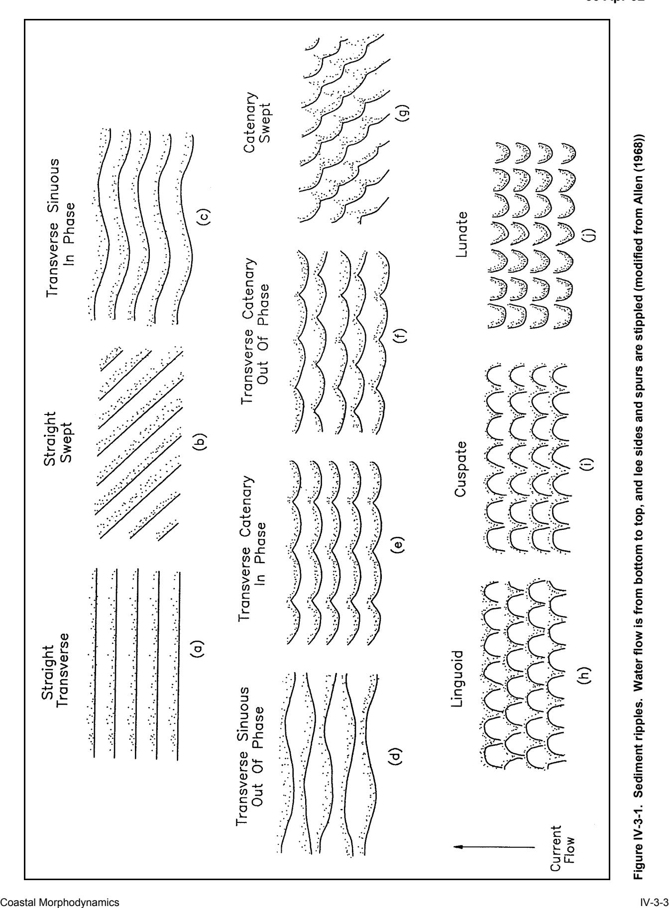

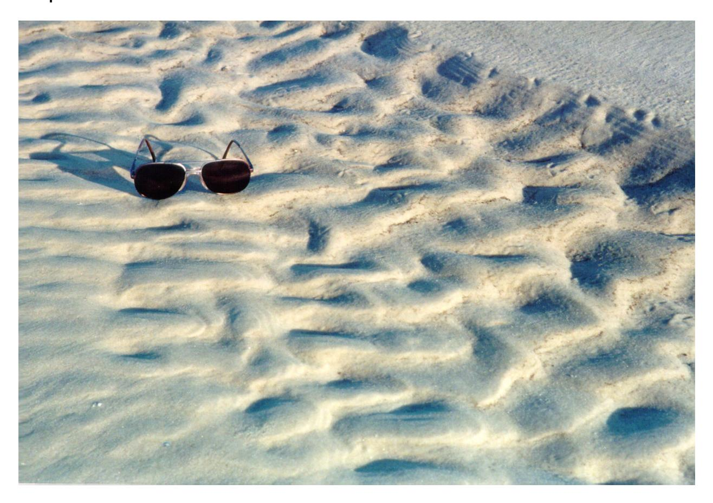

*Figure IV-3-2. Ripples in a runnel, now exposed during low tide. Flow was from upper left to lower right. Complicated pattern is best classified as transverse sinuous out of phase (type d) in Figure IV-3-1. Photographed at Bon Secour Wildlife Refuge, near Gulf Shores, Alabama*

migrate upstream or downstream, or may remain stationary (the name "antidune" is based on early observations of upstream migration).
d. Velocity - grain size relationships . Figure IV-3-6 (from Ashley (1990)) illustrates the zones where ripples, dunes, planar beds, and antidunes are found. The figure summarizes laboratory studies conducted by various researchers. These experiments support the common belief that large flow-transverse bed forms (dunes) are a distinct entity separate from smaller current ripples. This plot is very similar to Figure 11.4 in Graf's (1984) hydraulics text, although Graf uses different axis units.

# IV-3-3. Deltaic Processes 1

a. Introduction. River deltas, which are found throughout the world, result from the interaction of fluvial and marine (or lacustrine) forces. According to Wright (1985), "deltas are defined more broadly as coastal accumulations, both subaqueous and subaerial, of river-derived sediments adjacent to, or in close proximity to, the source stream, including the deposits that have been secondarily molded by waves, currents, or tides." The processes that control delta development vary greatly in intensity around the world. As a result, delta-plain landforms span the spectrum of coastal features and include:
IV-3-4 Coastal Morphodynamics

*1 Material in this section adapted from Wright (1985).*

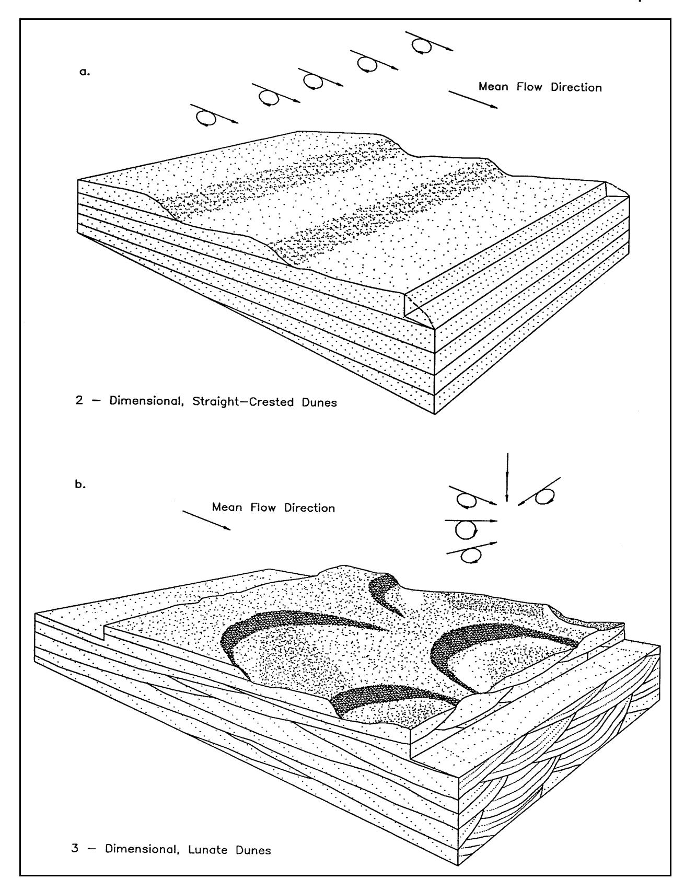

*Figure IV-3-3. Two-dimensional and three-dimensional dunes. Vortices and flow patterns are shown by arrows above dunes. Adapted from Reineck and Singh (1980)*

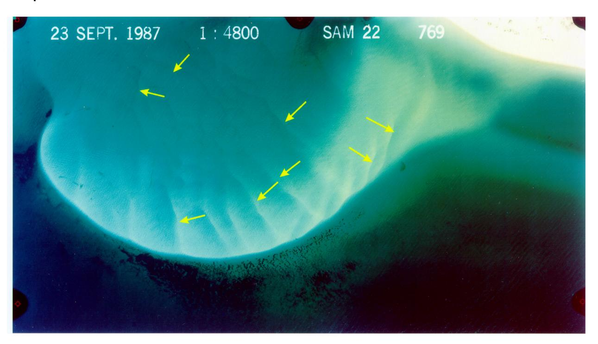

*Figure IV-3-4. Ebb shoal, East Pass, Florida (23 Sep 1987). The clear water reveals two-dimensional dunes on the ebb shield. Water depth at the edge of the shoal is 3-4 m. North is to the top of the image. Distance from left to right is about 1 km (photograph of USAED, Mobile)*

- (1) Distributary channels.
- (2) River-mouth bars.
- (3) Interdistributary bays.
- (4) Tidal flats.
- (5) Tidal ridges.
- (6) Beaches.
- (7) Beach ridges.
- (8) Dunes and dune fields.
- (9) Swamps and marshes.
Despite the pronounced variety of worldwide environments where deltas are found, all actively-forming deltas have at least one common attribute: a river supplies clastic sediments to the coast and inner shelf more rapidly than marine processes can remove these materials. Whether a river is sufficiently large to transport enough sediment to overcome erosive marine processes depends upon the climate, geology, and nature of the drainage basin, and, most important, the overall size of the basin. The following paragraphs discuss delta classification, riverine flow, sediment deposition, and geomorphic structures associated with deltas.
IV-3-6 Coastal Morphodynamics

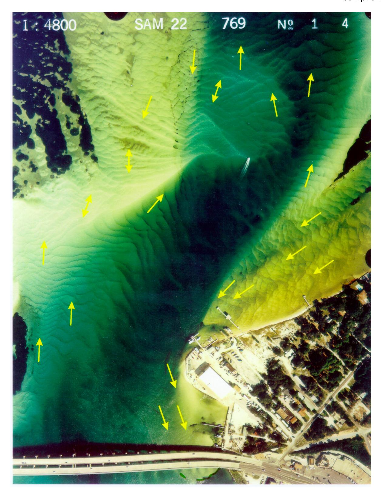

*Figure IV-3-5. Flood shoal, East Pass, Florida (23 Sep 1987). North is to the top. The Gulf of Mexico is about 1 km south of the Hwy 98 bridge at the bottom of the image. Dunes in the main channel are flood oriented (toward the top of the image), while bed forms in the marginal channels are ebb-oriented (Photograph courtesy of USAED, Mobile )*

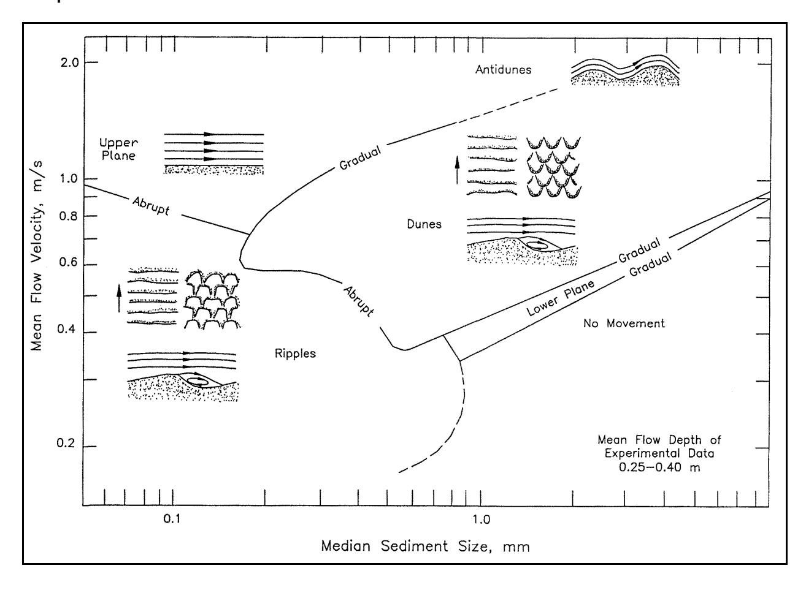

*Figure IV-3-6. Plot of mean flow velocity against mean grain size, based on laboratory studies, showing stability phases of subaqueous bed forms (modified from Ashley (1990)). Original data from various sources, standardized to 10 E C water temperature (original data points not shown)*

b. General delta classification. Coleman and Wright (1975) identified six broad classes of deltas using an energy criteria. These models have been plotted on Figure IV-3-7 according to the relative importance of river, wave, and tide processes. However, Wright (1985) acknowledged that because each delta has unique and distinct features, no classification scheme can adequately encompass the wide variety of environments and structures found at deltas around the world.

# c. Delta-forming processes .

(1) Force balance. Every delta is the result of a balance of forces that interact in the vicinity of the river mouth. A river carries sediment to the coast and deposits it beyond the mouth. Tidal currents and waves rework the newly deposited sediments, affecting the shape and form of the resulting structure. The long-term evolution of a delta plain becomes a function of the rate of riverine sediment input and the rate and pattern of sediment reworking, transport, and deposition by marine processes after the initial deposition. On a large scale, gross deltaic shape is also influenced by receiving basin geometry, regional tectonic stability, rates of subsidence caused by compaction of newly deposited sediment, and rate of sea level rise.
IV-3-8 Coastal Morphodynamics

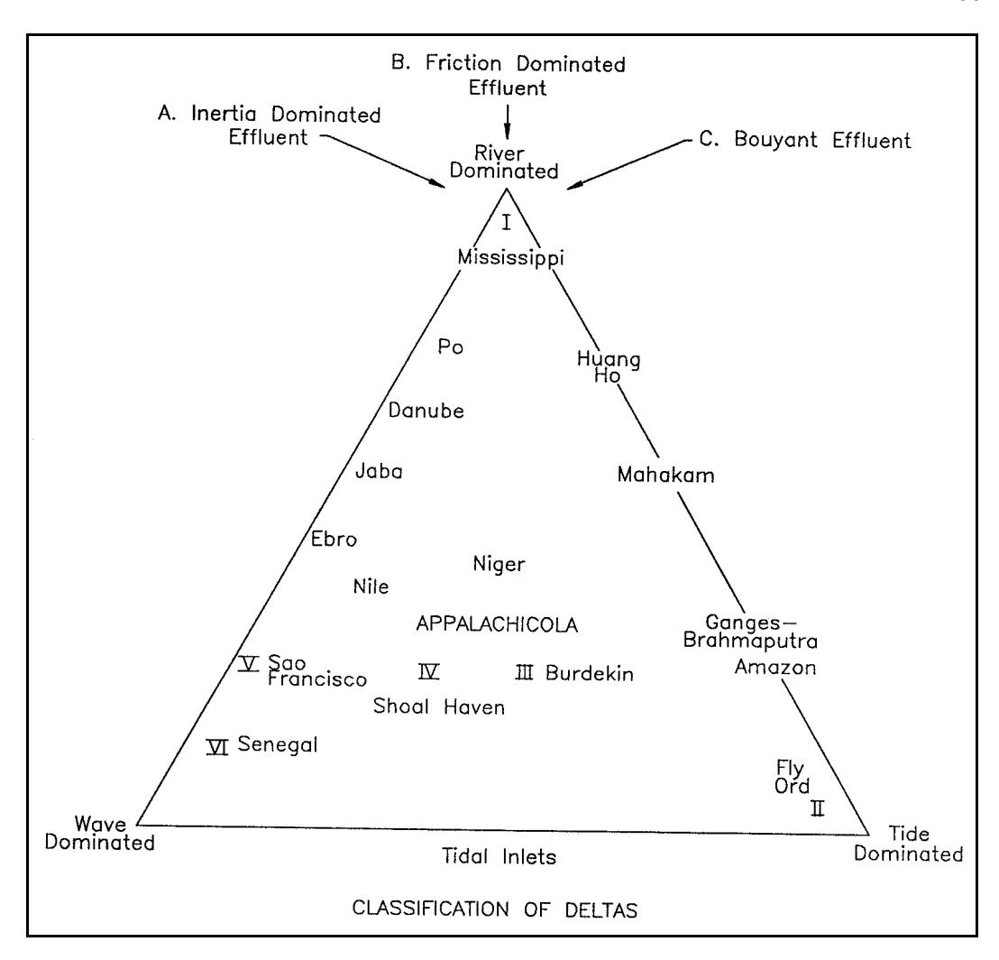

*Figure IV-3-7. Classification of deltas*

- (2) River-dominant deltas.
- (a) River-dominant deltas are found where rivers carry so much sediment to the coast that the deposition rate overwhelms the rate of reworking and removal due to local marine forces. In regions where wave energy is very low, even low-sediment-load rivers can form substantial deltas.
- (b) When a river is completely dominant over marine forces, the delta shape develops as a pattern of prograding, branching distributary channels (resembling fingers branching from a hand). Interdistributary features include open bays and marshes. A generalized isopach map for this type of delta (Type I in Coleman and Wright's (1975) classification) is shown in Figure IV-3-8. A prime example is the Mississippi River, which not only transports an enormous amount of sediment, but also empties into the low wave-energy, low tide-range Gulf of Mexico (Figure IV-3-9). The Fraser River, which flows into the sheltered Strait of Georgia, is another example (Figure IV-3-10). The Mississippi is discussed in more detail later.

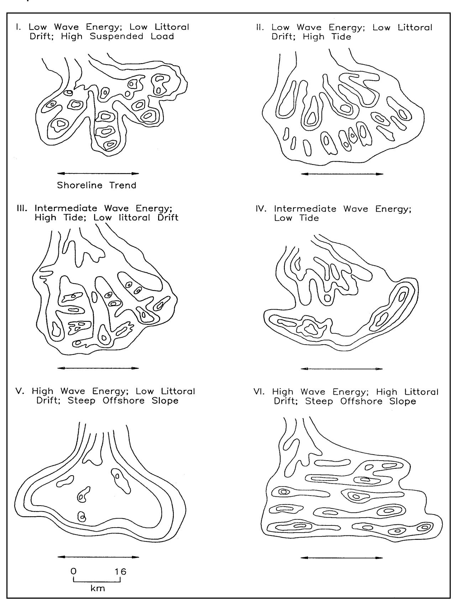

*Figure IV-3-8. Isopach map for river-dominant deltas*


*Figure IV-3-9. Mississippi River Delta. The river, which flows into the Gulf of Mexico, has several outlets that are dredged by the Corps of Engineers almost continuously. The city of New Orleans is at the upper left of the image immediately south of Lake Pontchartrain. Landsat 2 image (date unknown)*

- (3) Wave-dominant deltas.
- (a) At wave-dominant deltas, waves sort and redistribute sediments delivered to the coast by rivers and remold them into shoreline features such as beaches, barriers, and spits. The morphology of the resulting delta reflects the balance between sediment supply and the rate of wave reworking and redistribution. Wright and Coleman (1972, 1973) found that deltas in regions of the highest nearshore wave energy flux developed

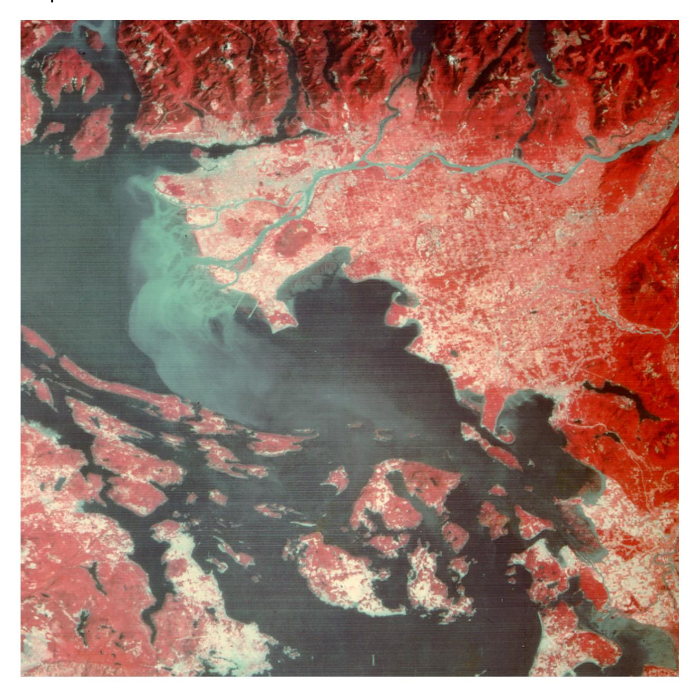

*Figure IV-3-10. Fraser River Delta, British Columbia. The river flows into the sheltered Strait of Georgia past the city of Vancouver. The strait has high tidal currents, as shown by the plume of turbid water flowing to the southeast. This delta is also Class I, riverine-dominated (NASA ERTS, 12 Aug 1973)*

the straightest shorelines and best-developed interdistributary beaches and beach-ridge complexes (Figure IV-2-3).
(b) Of 16 deltas compared by Wright and Coleman (1972, 1973), the Mississippi was the most riverdominated while the Senegal in west Africa was the other extreme, the most wave-dominated. A model of the Senegal (Type VI in Figure IV-3-8) shows that abundant beach ridges are parallel to the prevailing shoreline trend and that the shore is relatively straight as a result of high wave energy and a strong unidirectional littoral drift.
IV-3-12 Coastal Morphodynamics
- (c) An intermediate delta form is represented by the delta of the Rio São Francisco del Norte in Brazil (Type V in Figure IV-3-8). Distributary-mouth-bar deposits are restricted to the immediate vicinity of the river mouth and are quickly remolded by waves. Persistent wave energy redistributes the riverine sediment to form extensive sand sheets. The exposed delta plain consists primarily of beach ridges and aeolian dunes. (4) Tide-dominant deltas.
Three important processes characterize tide-dominated deltas:
- (a) At the river mouths, mixing obliterates vertical density stratification, eliminating the effects of buoyancy.
- (b) For part of the year, tidal currents may be responsible for a greater fraction of the sedimenttransporting energy than the river. As a result, sediment transport in and near the river mouth is bidirectional over a tidal cycle.
- (c) The location of the land-sea interface and the zone of marine-riverine interactions is greatly extended both vertically and horizontally. Examples of deltas that are strongly influenced by tides include the Ord (Australia), Shatt-al-Arab (Iraq), Amazon (Brazil), Ganges-Brahmaputra (Bangladesh), and the Yangtze (China). Characteristic features of river mouths in macrotidal environments are bell-shaped, sand-filled channels and linear tidal sand ridges. The crests of the ridges, which have relief of 10-20 m, may be exposed at low tide. The ridges replace the distributary-mouth bars found at other deltas and become the dominant sediment-accumulation form. As the delta progrades over time, the ridges grow until they are permanently exposed, forming large, straight tidal channels (Type II in Figure IV-3-8). An example of a macrotidal delta is the Ord of Western Australia and the Essex River Delta in Massachusetts (Figure IV-3-11). (5) Intermediate forms.
- (a) As stated above, the morphology of most deltas is a result of a combination of riverine, tidal, and wave forces. One example of an intermediate form is the Burdekin Delta of Australia (Type II in Figure IV-3-8). High waves redistribute sands parallel to the coastline trend and remold them into beach ridges and barriers. Within the river mouths, tidal currents produce sand-filled river channels and tidal creeks. This type of delta displays a broad range of characteristics, depending upon the relative strength of waves versus tides. In addition, features may vary seasonally if runoff and wave climate change. Other examples include the Irrawaddy (Burma), Mekong (Vietnam), and Red (Vietnam) Deltas (Wright 1985).
- (b) The fourth model of delta geometry is characterized by offshore bay-mouth barriers that shelter lagoons, bays, or estuaries into which low-energy deltas prograde (Type IV, Figure IV-3-8). Examples include the Appalachicola (Florida Panhandle), Sagavanirktok (Alaska), and Shoalhaven (southeastern Australia) Deltas (Wright 1985). In contrast to the river-dominant models, the major accumulation of prodelta mud occurs landward of the main sand body (the barrier), and at the same elevation, within the protected bay. Although suspended fines reach the open sea, wave action prevents mud accumulation as a distinct unit over the open shelf. d. Deltaic components and sediments.
- (1) Generally, all deltas consist of four physiographic zones: an alluvial valley, upper deltaic plain, lower deltaic plain, and subaqueous deltaic plain (Figure IV-3-12). The deposition that occurs adjacent to and between the distributory channels accounts for most of the subaerial delta. In the case of the Mississippi

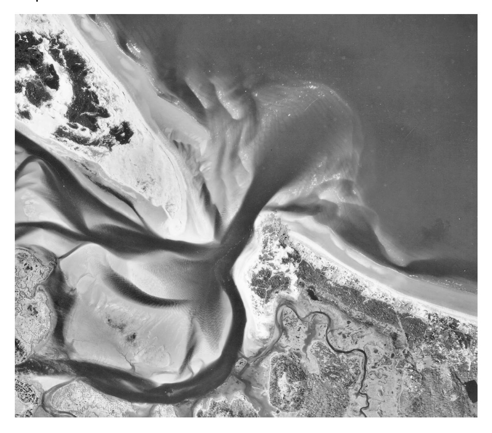

*Figure IV-3-11. Mouth of the Essex River, Massachusetts (23 April 1978). This delta is Class II, high tide and low wave energy, or possibly Class III, intermediate wave and high tide. This river mouth is anchored on the south by rock outcrops. Formerly, there may have been more open water in the back bays, and the morphology would have resembled an inlet in a barrier spit*

delta, significant sand accumulates in the interdistributory region when breaks in the levees occur, allowing river water to temporarily escape from the main channel. These accumulations are called crevasse splays .
(2) The subaqueous plain is the foundation over which the modern delta progrades (as long as the river occupies the existing course and continues to supply sufficient sediment). The subaqueous plain is characterized by a seaward-fining of sediments, with sand being deposited near the river mouths and clays settling further offshore. The seawardmost unit of the plain is the prodelta. It overlies the sediments of the inner continental shelf and consists of a blanket of clays deposited from suspension. The prodelta of the Mississippi ranges from 20 to 50 m thick and extends seaward to water depths of 70 m. The Mississippi's prodelta contains pods of distributory mouth bar sands and their associated cross bedding, flow structures, and shallow-water fauna. These pods may be slump blocks carried down to the prodelta by submarine landslides (Prior and Coleman 1979). Slumping and mudflow are mechanisms that transport large masses of sediment down to the edge of the continental slope and possibly beyond. These mass movements are a
IV-3-14 Coastal Morphodynamics

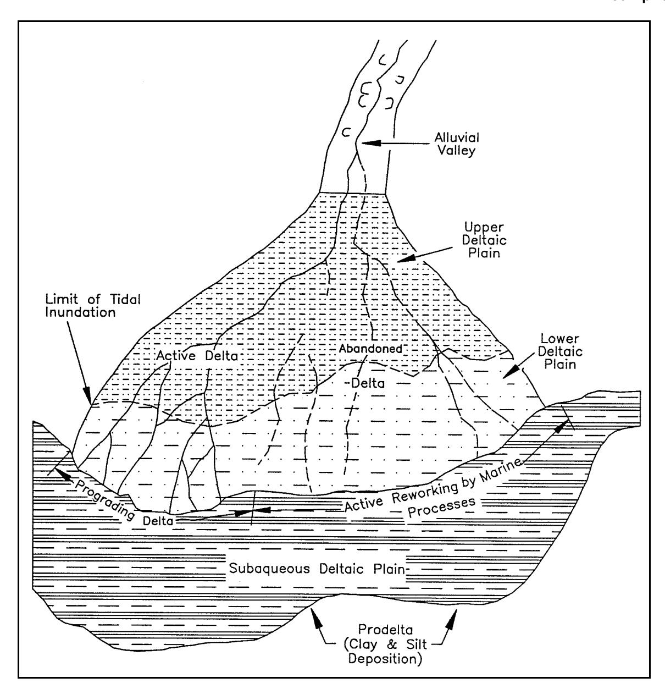

*Figure IV-3-12. Basic physiographic units common to all deltas (from Wright (1985))*

serious hazard to oil drilling and production platforms. Mud diapirs, growth faults, mud/gas vents, pressure ridges, and mudflow gullies are other evidence of sediment instability on the Mississippi Delta (Figure IV-3-13). Additional details of this interesting subject are covered in Coleman (1988), Coleman and Garrison (1977), Henkel (1970), and Prior and Coleman (1980).
(3) Above the delta front, there is a tremendous variability of sediment types. A combination of shallow marine processes, riverine influence, and brackish-water faunal activity causes the interdistributory bays to display an extreme range of lithologic and textural types. On deltas in high tide regions, the interdistributory bay deposits are replaced by tidal and intertidal flats. West of the Mississippi Delta is an extensive chenier plain. Cheniers are long sets of sand beach ridges, located on mudflats.

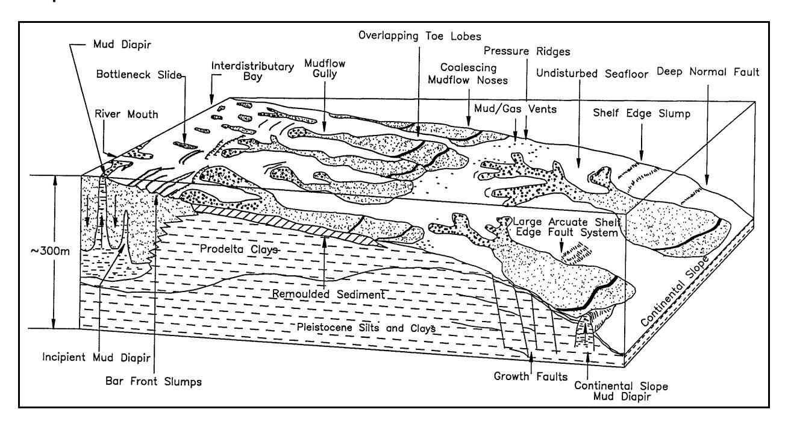

*Figure IV-3-13. Structures and types of sediment instabilities on the Mississippi Delta (from Coleman (1988))*

- e. River mouth flow and sediment deposition .
- (1) River mouth geometry and river mouth bars are influenced by, and in turn influence, effluent dynamics. This subject needs to be examined in detail because the principles are pertinent to both river mouths and tidal inlets. Diffusion of the river's effluent and the subsequent sediment dispersion depend on the relative strengths of three main factors: (a) Inertia of the issuing water and associated turbulent diffusion. (b) Friction between the effluent and the seabed immediately seaward of the mouth. (c) Buoyancy resulting from density contrasts between river flow and ambient sea or lake water.
Based on these forces, three sub-classes of deltaic deposition have been identified for river-dominated deltas (Figure IV-3-7). Two of these are well illustrated by depositional features found on the Mississippi Delta.
- (2) Depositional model type A inertia-dominated effluent.
- (a) When outflow velocities are high, depths immediately seaward of the mouth tend to be large, density contrasts between the outflow and ambient water are low, and inertial forces dominate. As a result, the effluent spreads and diffuses as a turbulent jet (Figure IV-3-14a). As the jet expands, its momentum decreases, causing a reduction of its sediment carrying capacity. Sediments are deposited in a radial pattern, with the coarser bed load dropping just beyond the point where the effluent expansion is initiated. The result is basinward-dipping foreset beds.
- (b) This ideal model is probably unstable under most natural conditions. As the river continues to discharge sediment into the receiving basin, shoaling eventually occurs in the region immediately beyond the mouth (Figure IV-3-14b). For this reason, under typical natural conditions, basin depths in the zone of the
IV-3-16 Coastal Morphodynamics

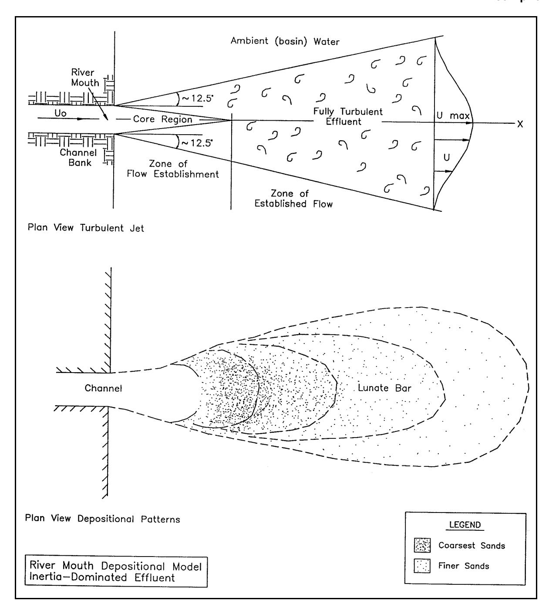

*Figure IV-3-14. Plan view of depositional Model A, inertia-dominated effluent (adapted from Wright (1985)) (Continued)*

jet's diffusion are unlikely to be deeper than the outlet depth. Effluent expansion and diffusion become restricted horizontally as a plane jet. More important, friction becomes a major factor in causing rapid deceleration of the jet. Model 'A' eventually changes into friction-dominated Model 'B'.

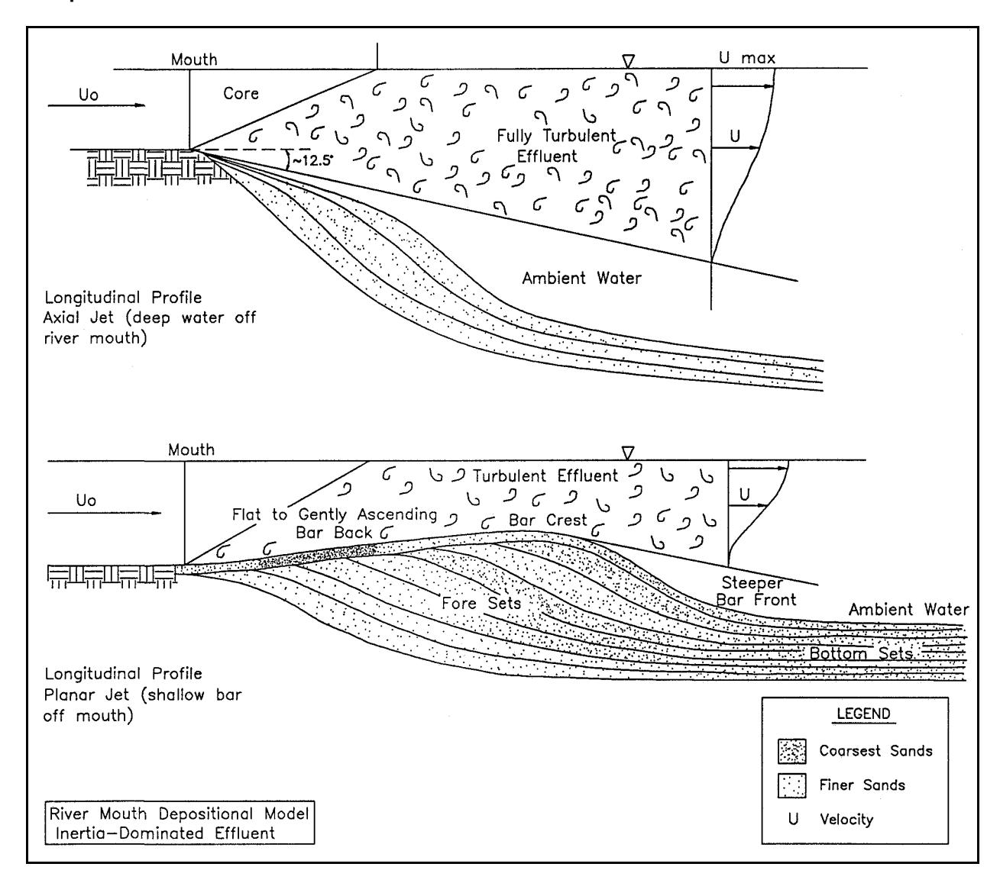

*Figure IV-3-14. (Concluded)*

- (3) Depositional model type B friction-dominated effluent.
- (a) When homopycnal,1 friction-dominated outflow issues over a shallow basin, a distinct pattern of bars and subaqueous levees is formed (Figure IV-3-15). Initially, the rapid expansion of the jet produces a broad, arcuate radial bar. As deposition continues, natural subaqueous levees form beneath the lateral boundaries of the expanding jet where the velocity decreases most rapidly. These levees constrict the jet from expanding further. As the central portion of the bar grows upward, channels form along the lines of greatest turbulence, which tend to follow the subaqueous levees. The result is the formation of a bifurcating channel that has a triangular middle-ground shoal separating the diverging channel arms. The flow tends to be concentrated into the divergent channels and to be tranquil over the middle ground under normal conditions.
IV-3-18 Coastal Morphodynamics

*River water and ambient water have the same density (for example, a stream entering a freshwater lake).*

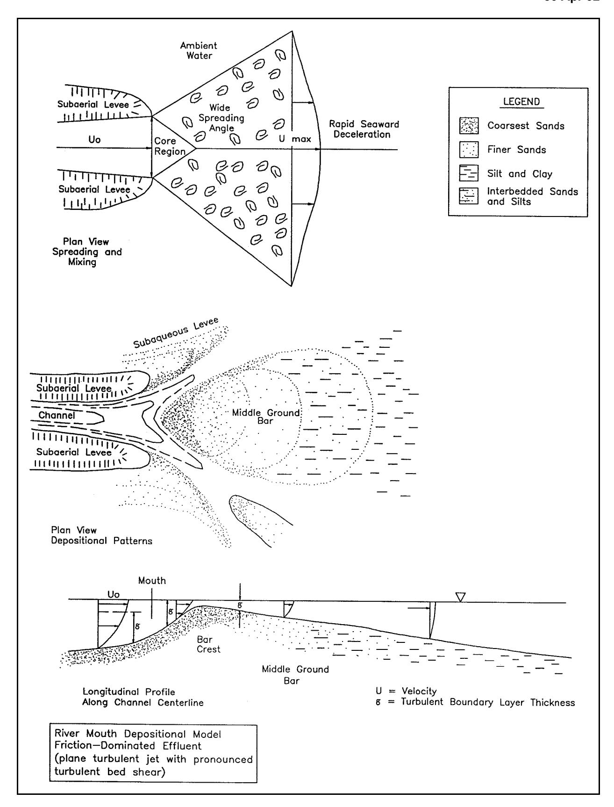

*Figure IV-3-15. Depositional model type B, friction-dominated effluent (adapted from Wright (1985))*

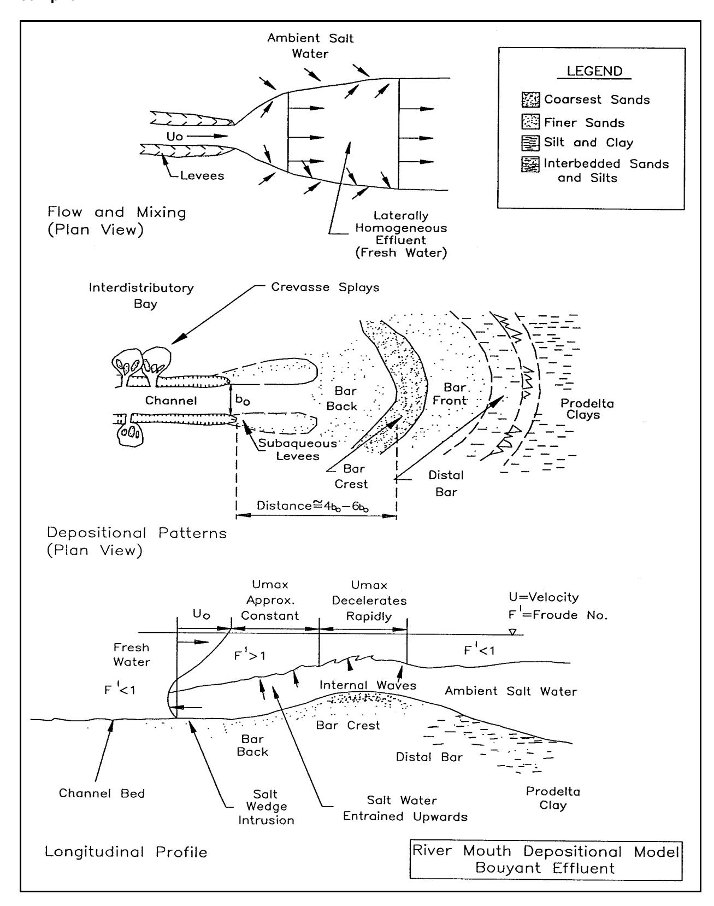

*Figure IV-3-16. River mouth bar crest features, depositional model type C, buoyant effluent (adapted from Wright (1985)) (Continued)*

IV-3-20 Coastal Morphodynamics

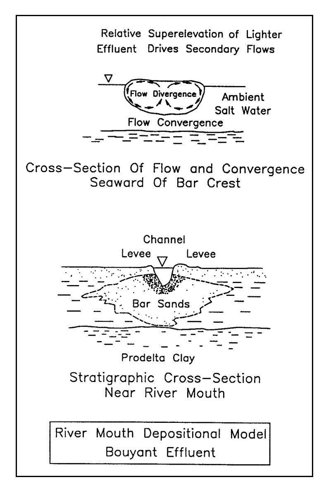

*Figure IV-3-16. (Concluded)*

- (b) This type of bar pattern is most common where nonstratified outflow enters a shallow basin. Examples of this pattern (known as crevasse splays or overbank splays ) are found at crevasses along the Mississippi River levees. These secondary channels run perpendicular to the main Mississippi channels and allow river water to debouch into the broad, shallow interdistributory bays. This process forms the major subaerial land (marsh) of the lower Mississippi delta (Coleman 1988). (4) Depositional model type C buoyant effluent.
- (a) Stratification often occurs when fresh water flows out into a saline basin. When the salt wedge is well developed, the effluent is effectively isolated from the effects of bottom friction. Buoyancy suppresses mixing and the effluent spreads over a broad area, thinning progressively away from the river mouth (Figure IV-3-16). Deceleration of the velocity of the effluent is caused by the upward entrainment of seawater across the density interface.
(b) The density interface between the freshwater plume and the salt wedge is often irregular due to internal waves (Figure IV-3-16a). The extent that the effluent behaves as a turbulent or buoyant jet depends largely on the Froude number F':

```math
F' = \frac{U^2}{\gamma g h'} \tag{IV-3-1}
```

where
U = mean outflow velocity of upper layer (in case of stratified flow)
g = acceleration of gravity
h' =depth of density interface

```math
\gamma \, = \, 1 \, - \, ( \rho _ { f } / \rho _ { s } ) \tag{IV-3-2}
```

where
\rho_f = density of fresh water
\rho_s = density of salt water
As F' increases, inertial forces dominate, accompanied by an increase in turbulent diffusion. As F' decreases, turbulence decreases and buoyancy becomes more important. Turbulence is suppressed when F' is less than 1.0 and generally increases as F' increases beyond 1.0 (Wright 1985).
- (c) The typical depositional patterns associated with buoyant effluent are well represented by the mouths of the Mississippi River (Wright and Coleman 1975). Weak convergence near the base of the effluent inhibits lateral dispersal of sand, resulting in narrow bar deposits that prograde seaward as laterally restricted "bar-finger sands" (Figure IV-3-16b). The same processes presumably prevent the subaqueous levees from diverging, causing narrow, deep distributory channels. Because the active channels scour into the underlying distributory-mouth bar sands as they prograde, accumulations of channel sands are usually limited. Once the channels are abandoned, they tend to fill with silts and clays. It is believed that the back bar and bar crest grow mostly from bed-load transport during flood stages. The subaqueous levees, however, appear to grow year-round because of the near-bottom convergence that takes place during low and normal river stages. f. Mississippi Delta Holocene history, dynamic changes.
- (1) General. The Mississippi River, which drains a basin covering 41 percent of the continental United States (3,344,000 sq km), has deposited an enormous mound of unconsolidated sediment in the Gulf of Mexico. The river has been active since at least late Jurassic times and has dominated deposition in the northern Gulf of Mexico. Many studies have been conducted on the Mississippi Delta, leading to much of our knowledge of deltaic sedimentation and structure. The ongoing research is a consequence of the river's critical importance to commerce and extensive petroleum exploration and production in the northern Gulf of Mexico during the last 50 years.
- (2) Deposition time scales. The Mississippi Delta consists of overlapping deltaic lobes. Each lobe covers 30,000 sq km and has an average thickness of about 35 m. The lobes represent the major sites of the river's deposition. The process of switching from an existing lobe to a new outlet takes about 1500 years
IV-3-22 Coastal Morphodynamics
(Coleman 1988). Within a single lobe, deposition in the bays occurs from overbank flows, crevasse splays, and biological production. The bay fills, which cover areas of 250 sq km and have a thickness of only 15 m, accumulate in only about 150 years. Overbank splays, which cover areas of 2 sq km and are 3 m thick, occur during major floods when the natural levees are breached. The mouths of the Mississippi River have prograded seawards at remarkable rates. The distributory channels can form sand bodies that are 17 km long, 8 km wide, and over 80 m thick in only 200 years (Coleman 1988).
- (3) Holocene history. During the last low sea level stand, 18,000 years ago, the Mississippi River entrenched its valley, numerous channels were scoured across the continental shelf, and deltas were formed near the shelf edge (Suter and Berryhill 1985). As sea level rose, the site of deposition moved upstream to the alluvial valley. By about 9,000 years before present, the river began to form its modern delta. In more recent times, the shifting deltas of the Mississippi have built a delta plain covering a total area of 28,500 sq km. The delta switching, which has occurred at high frequency, combined with a rapidly subsiding basin, has resulted in vertically stacked cyclic sequences. Because of rapid deposition and switching, in a short time the stacked cyclic deltaic sequences have attained thicknesses of thousands of meters and covered an area greater than 150,000 sq km (Coleman 1988). Figure IV-3-17 outlines six major lobes during the last 7,500 years.
- (4) Modern delta. The modern delta, the Balize or Birdfoot, began to prograde about 800 to 1,000 years ago. Its rate of progradation has diminished recently and the river is presently seeking a new site of deposition. Within the last 100 years, a new distributory, the Atchafalaya, has begun to divert an increasing amount of the river's flow. Without river control structures, the new channel would by now have captured all of the Mississippi River's flow, leading to rapid erosion of the Balize Delta. (It is likely that there would be a commensurate deterioration of the economy of New Orleans if it lost its river.) Even with river control projects, the Atchafalaya is actively building a delta in Atchafalaya Bay (lobe 6 in Figure IV-3-17). g. Sea level rise and deltas.
- (1) Deltas experience rapid local relative sea level rise because of the natural compaction of deltaic sediments from dewatering and consolidation. Deltas are extremely vulnerable to storms because the subaerial surfaces are flat and only slightly above the local mean sea level. Only a slight rise in sea level can extend the zone subject to storm surges and waves further inland. As stated earlier, delta evolution is a balance between the accumulation of fluvially supplied sediment and the reworking, erosion, and transport of deltaic sediment by marine processes (Wright 1985). Even a river like the Mississippi, which has a high sediment load and drains into a low wave-energy basin, is prograding only in the vicinity of the present distributory channels, the area defined as the active delta (Figures IV-3-9 and IV-3-12).
- (2) Deltas are highly fertile agriculturally because of the steady supply of nutrient-laden soil. As a result, some of the world's greatest population densities - over 200 inhabitants per square kilometer - are found on deltas ( The Times Atlas of the World 1980): (a) Nile Delta, Egypt. (b) Chang Jiang (Yangtze), China. (c) Mekong, Vietnam. (d) Ganga (Ganges), Bangladesh.

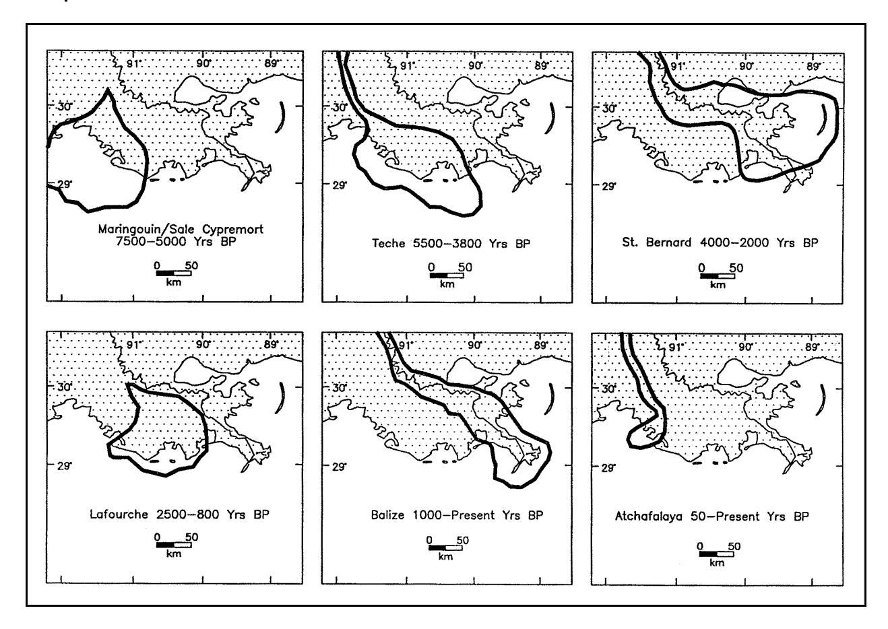

*Figure IV-3-17. Shifting sites of deltaic sedimentation of the Mississippi River (from Coleman (1988))*

These populations are very vulnerable to delta land loss caused by rising sea level and by changes in sediment supply due to natural movements of river channels or by upland man-made water control projects.
(3) Inhabitants of deltas are also in danger of short-term changes in sea level caused by storms. Tropical storms can be devastating: the Bay of Bengal cyclone of November 12, 1970, drowned over 200,000 persons in what is now Bangladesh (Carter 1988). Hopefully, public education, improving communications, better roads, and early warning systems will be able to prevent another disaster of this magnitude. Coastal management in western Europe, the United States, and Japan is oriented towards the orderly evacuation of populations in low-lying areas and has greatly reduced storm-related deaths. In contrast to the Bay of Bengal disaster, Hurricane Camille (August 17-20, 1969), caused only 236 deaths in Louisiana, Mississippi, Alabama, and Florida.

#### IV-3-4. Coastal Inlets

- a. Introduction .
- (1) Coastal inlets play an important role in nearshore processes around the world. Inlets are the openings in coastal barriers through which water, sediments, nutrients, planktonic organisms, and pollutants are exchanged between the open sea and the protected embayments behind the barriers. In the United States, the classical image of an inlet is of an opening in one of the Atlantic or Gulf of Mexico barrier islands, but inlets are certainly not restricted to barrier environments or to shores with tides. On the West Coast and in the Great
IV-3-24 Coastal Morphodynamics
Lakes, many river mouths are considered to be inlets, while in the Gulf of Mexico, the wide openings between the barriers, locally known as passes, are also inlets. Inlets can be cut through unconsolidated shoals or emergent barriers as well as through clay, rock, or organic reefs (Price 1968). There is no simple, restrictive definition of inlet; based on the geologic literature and on regional terminology, almost any opening in the coast, ranging from a few meters to several kilometers wide, can be called an inlet. Inlets are important economically to many coastal nations because harbors are often located in the back bays, requiring that the inlets be maintained for commercial navigation. At many inlets, the greatest maintenance cost is incurred by repetitive dredging of the navigation channel. Because inlets are hydrodynamically very complex, predictions of shoaling and sedimentation have often been unsatisfactory. A better understanding of inlet sedimentation patterns and their relationship to tidal and other hydraulic processes can hopefully contribute to better management and engineering design.
- (2) Tidal inlets are analogous to river mouths in that sediment transport and deposition patterns in both cases reflect the interaction of outflow inertia and associated turbulence, bottom friction, buoyancy caused by density stratification, and the energy regime of the receiving body of water (Wright and Sonu 1975). However, two major differences usually distinguish lagoonal inlets from river mouths, sometimes known as fluvial or riverine inlets (Oertel 1982). (a) Lagoonal tidal inlets experience diurnal or semidiurnal flow reversals.
- (b) Lagoonal inlets have two opposite-facing mouths, one seaward and the other lagoonward. The sedimentary structures which form at the two openings differ because of differing energy, water density, and geometric factors.
- (3) The term lagoon refers to the coastal pond or embayment that is connected to the open sea by a tidal inlet. The throat of the inlet is the zone of smallest cross section, which, accordingly, has the highest flow velocities. The gorge is the deepest part of an inlet and may extend seaward and landward of the throat (Oertel 1988). Shoal and delta are often used interchangeably to describe the ebb-tidal sand body located at the seaward mouth of an inlet.
- b. Technical literature . Pioneering research on the stability of inlets was performed by Francis Escoffier (1940, 1977). O'Brien (1931, 1976) derived general empirical relationships between tidal inlet dimension and tidal prism. Keulegan (1967) developed algorithms to relate tidal prism to inlet cross section. Bruun (1966) examined inlets and littoral drift, and Bruun and Gerritsen (1959, 1961) studied bypassing and the stability of inlets. Hubbard, Oertel, and Nummedal (1979) described the influence of waves and tidal currents on tidal inlets in the Carolinas and Georgia. Hundreds of other works are referenced in the USACE General Investigation of Tidal Inlets (GITI) reports (Barwis 1976), in special volumes like Hydrodynamics and Sediment Dynamics of Tidal Inlets (Aubrey and Weishar 1988), in textbooks on coastal environments (Carter 1988; Cronin 1975; Komar 1998), and in review papers (Boothroyd 1985; FitzGerald 1988). Older papers on engineering aspects of inlets are cited in Castañer (1971). There are also numerous foreign works on tidal inlets: Carter (1988) cites references from the British Isles; Sha (1990) from the Netherlands; Nummedal and Penland (1981) and FitzGerald, Penland, and Nummedal (1984) from the North Sea coast of Germany; and Hume and Herdendorf (1988, 1992) from New Zealand. More references are listed in Parts II-6 and V-6. c. Classification of inlets and geographic distribution .
- (1) Tidal inlets are found around the world in a broad range of sizes and shapes. Because of their diversity, it has been difficult to develop a suitable classification scheme. One approach has been to use an energy-based criteria, in which inlets are ranked according to the wave energy and tidal range of the environment in which they are located (Figure IV-1-10).
- (2) Regional geological setting can be a limiting factor restricting barrier and, in turn, inlet development. Most inlets are on trailing-edge coasts with wide coastal plains and shallow continental shelves (e.g., the Atlantic and Gulf of Mexico shores of the United States). High relief, leading-edge coastlines have little room for sediment to accumulate either above or below sea level. Sediment tends to collect in pockets between headlands, few lagoons are formed, and inlets are usually restricted to river mouths. The Pacific coast of North America, in addition to being steep, is subject to high wave energy and has far fewer inlets than the Atlantic.
- (3) Underlying geology may also control inlet location and stability. Price and Parker (1979) reported that certain areas along the Texas coast were always characterized by inlets, although the passes tended to migrate back and forth along a limited stretch of the shore. The positions of these permanent inlets were tectonically controlled, but the openings were maintained by tidal harmonics and hydraulics. If storm inlets across barriers were not located at the established stable pass areas, the inlets usually closed quickly. Some inlets in New England are anchored by bedrock outcrops and therefore cannot move freely (for example, the Essex River mouth, Figure IV-3-11). d. Hydrodynamic processes in inlets . See Part II-6.
- e. Geomorphology of tidal inlets. Tidal inlets are characterized by large sand bodies that are deposited and shaped by tidal currents and waves. The ebb-tide shoal (or delta) is a sand mass that accumulates seaward of the mouth of the inlet. It is formed by ebb tidal currents and is modified by wave action. The flood tide shoal is an accumulation of sand at the landward opening of an inlet that is mainly shaped by flood currents (Figure IV-3-18). Depending on the size and depth of the bay, a flood shoal may extend into open water or may merge into a complex of meandering tributary channels, point bars, and muddy estuarine sediments. (1) Ebb-tidal deltas (shoals).
- (a) A simplified morphological model of a natural (unjettied) ebb-tidal delta is shown in Figure IV-3-18. The delta is formed from a combination of sand eroded from the gorge of the inlet and sand supplied by longshore currents. This model includes several components: ! A main ebb channel , scoured by the ebb jets. ! Linear bars that flank the main channel, the result of wave and tidal current interaction. ! A terminal lobe , located at the seaward (distal) end of the ebb channel. This is the zone where the ebb jet velocity drops, resulting in sediment deposition. ! Swash platforms , which are sand sheets located between the main ebb channel and the adjacent barrier islands. ! Swash bars that form and migrate across the swash platforms because of currents (the swash) generated by breaking waves. ! Marginal flood channels , which often flank both updrift and downdrift barriers.
Inlets with jetties often display these components, although the marginal flood channels are usually missing.
IV-3-26 Coastal Morphodynamics

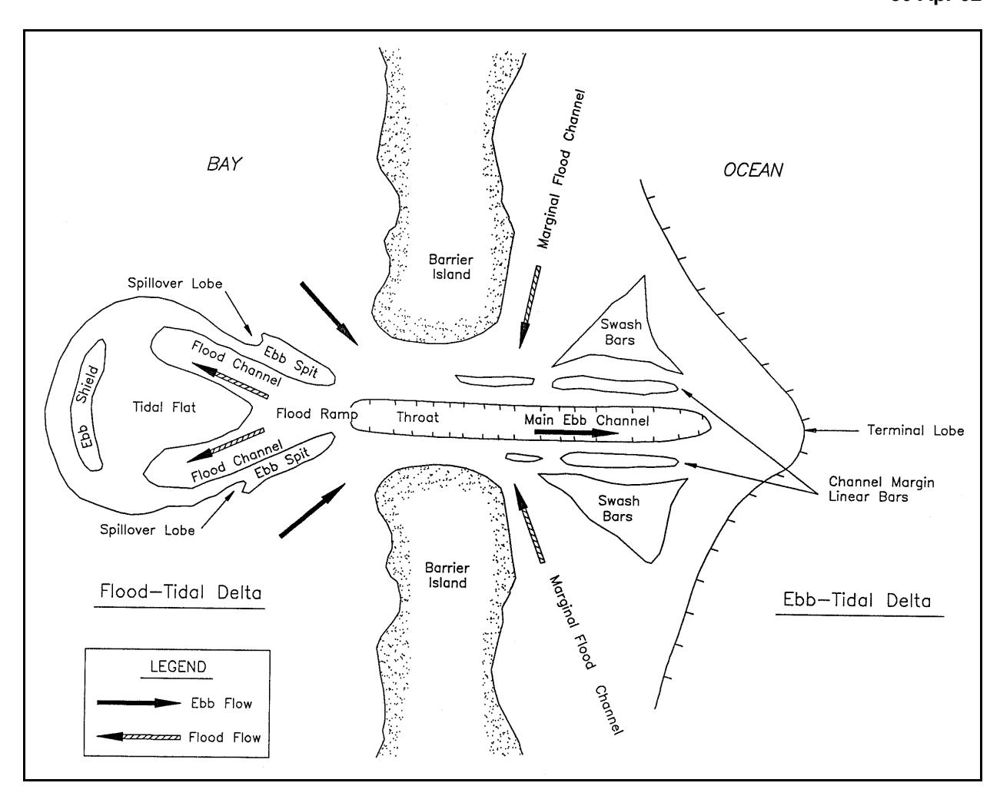

*Figure IV-3-18. Definition diagram of a tidal inlet with well-developed flood and ebb deltas (from Boothroyd (1985) and other sources)*

- (b) For the Georgia coast, Oertel (1988) described simple models of ebb-delta shape and orientation which depended on the balance of currents (Figure IV-3-19). With modifications, these models could apply to most inlets. When longshore currents were approximately balanced and flood currents exceeded ebb, a squat, symmetrical delta developed (Figure IV-3-19a) (example: Panama City, Florida). If the prevailing longshore currents exceeded the other components, the delta developed a distinct northerly or southerly orientation (Figures IV-3-19b and 19c). Note that some of the Georgia ebb deltas change their orientation seasonally, trending north for part of the year and south for the rest. Finally, when inlet currents exceeded the forces of longshore currents, the delta was narrower and extended further out to sea (Figure IV-3-19d) (example: Brunswick, Georgia).
- (c) Based on studies of the German and Georgia bights, Nummedal and Fischer (1978) concluded that three factors were critical in determining the geometry of the inlet entrance and the associated sand shoals:

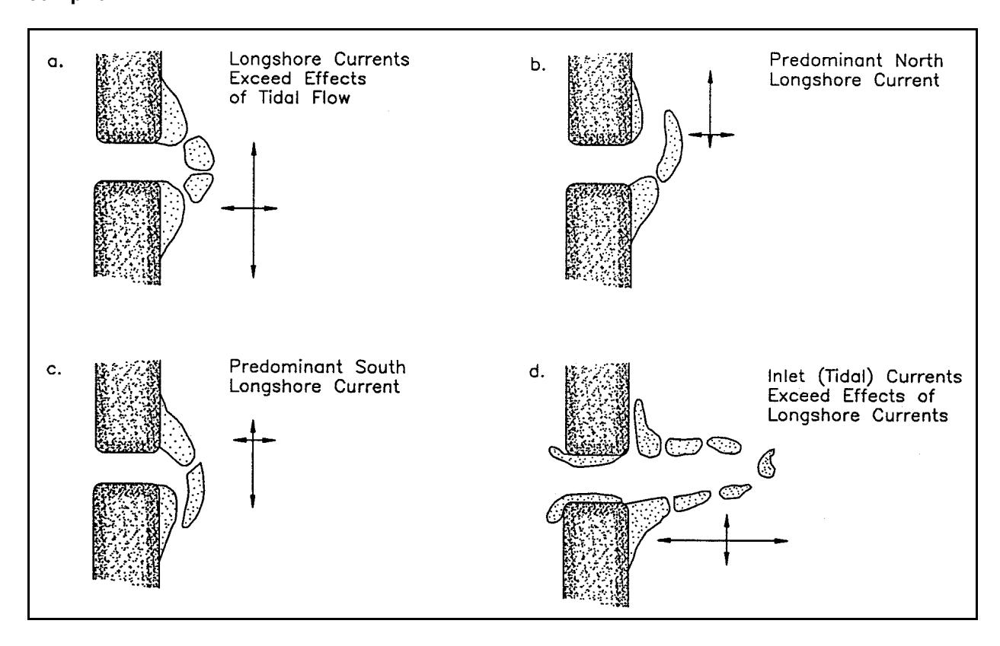

*Figure IV-3-19. Four different shapes of ebb-tidal deltas, modified by the relative effects of longshore versus tidal currents (from Oertel (1988))*

- ! Tide range.
- ! Nearshore wave energy.
- ! Bathymetry of the back-barrier bay.
For the German and Georgia bights, the latter factor controls velocity asymmetry through the inlet gorge, resulting in greater seaward-directed sediment transport through the inlet than landward transport. This factor has aided the development of large ebb shoals along these coasts, even though the German coast is subject to high wave energy. Back bay area and geometry are likely crucial factors that need to be incorporated in a comprehensive inlet classification scheme.
(d) Net sediment movement. At Price Inlet, South Carolina (FitzGerald and Nummedal 1983) and North Inlet, South Carolina (Nummedal and Humphries 1978), because of peak ebb currents, the resulting seaward-directed sediment transport far exceeded the sediment moved landward during flood. However, ebb velocity dominance does not necessarily mean that net sediment movement is also seaward. At Sebastian Inlet, on Florida's east coast, Stauble et al. (1988) found that net sediment movement was landward although the tidal hydraulics displayed higher ebb currents. The authors concluded that sediment carried into the inlet with the flood tide was deposited on the large, and growing, flood shoal. During ebb tide, current velocities over the flood shoal were too low to remobilize as much sediment as had been deposited on the shoal by the flood tide. The threshold for sediment transport was not reached until the flow was in the relatively narrow throat. In this case, the flood shoal had become a sink for sediment carried into the inlet. Stauble et al. (1988) hypothesized that this pattern of net landward sediment movement, despite ebb hydraulic dominance, may occur at other inlets in microtidal shores that open into large lagoons.
IV-3-28 Coastal Morphodynamics
- (e) The ebb-tidal deltas along mixed-energy coasts (e.g., East and West Friesian Islands of Germany, South Carolina, Georgia, Virginia, and Massachusetts) are huge reservoirs of sand. FitzGerald (1988) states that the amount of sand in these deltas is comparable in volume to that of the adjacent barrier islands. Therefore, on mixed-energy coasts, minor changes in volume of an ebb delta can drastically affect the supply of sand to the adjacent beaches. In comparison, on wave-dominated barrier coasts (e.g., Maryland, Outer Banks of North Carolina, northern New Jersey, Egypt's Nile Delta), ebb-tidal deltas are more rare and therefore represent a much smaller percentage of the overall coastal sand budget. As a result, volumetric changes in the ebb deltas have primarily local effects along the nearby beaches.
- (f) Using data from tidal inlets throughout the United States, Walton and Adams (1976) showed that there is a direct correspondence between an inlet's tidal prism and the size of the ebb-tidal delta, with some variability caused by changes in wave energy. This research underscores how important it is that coastal managers thoroughly evaluate whether proposed structures might change the tidal prism, thereby changing the volume of the ebb-tide shoal and, in turn, affecting the sediment budget of nearby beaches.
- (g) Ocean City, Maryland, is offered as an example of the effect of inlet formation on the adjacent coastline: the Ocean City Inlet was formed when Assateague Island was breached by the hurricane of 23 August 1933. The ebb-tide shoal has grown steadily since 1933 and now contains more than 6 × 106 m3 of sand, located a mean distance of 1,200 m offshore. Since 1933, the growth of the ebb delta combined with trapping of sand updrift of the north jetty have starved the downdrift (southern) beaches, causing the shoreline along the northern few kilometers of Assateague Island to retreat at a rate of 11 m/year (data cited in Fitz-Gerald (1988)) (Figures IV-3-20 and IV-3-21).
- (h) In contrast to Ocean City, the decrease in inlet tidal prisms along the East Friesian Islands has been beneficial to the barrier coast. Between 1650 and 1960, the area of the bays behind the island chain decreased by 80 percent, mostly due to reclamation of tidal flats and marshlands (FitzGerald, Penland, and Nummedal 1984). The reduction in area of the bays reduced tidal prisms, which led to smaller inlets, smaller ebb-tidal shoals, and longer barrier islands. Because of the reduced ebb discharge, less sediment was transported seaward. Waves moved ebb-tidal sands onshore, increasing the sediment supply to the barrier beaches.
- (i) In many respects, ebb-tide deltas found at tidal inlets are similar to deltas formed at river mouths. The comparison is particularly applicable at rivers where the flow temporarily reverses during the flood stage of the tide. The main difference between the two settings is that river deltas grow over time, fed by fluvially supplied sediment. In contrast, at many tidal inlets, only limited sediment is supplied from the back bay, and the ebb deltas are largely composed of sand provided by longshore drift or reworked from the adjacent beaches. Under some circumstances, inlets and river mouths are in effect the same coastal form. During times of low river flow, the mouth assumes the characteristics of a tidal inlet with reversing tidal currents dominating sedimentation. During high river discharge, currents are unidirectional and fluvial sediment is deposited seaward of the mouth, where it can help feed the growth of a delta. Over time, a tidal inlet that connects a pond to the sea can be converted to a river mouth. This occurs when the back bay fills with fluvial sediment and organic matter. Eventually, rivers that formerly drained into the lagoon flow through channels to the inlet and discharge directly into the sea (for example, see the photograph of the Essex River Delta, Figure IV-3-11).

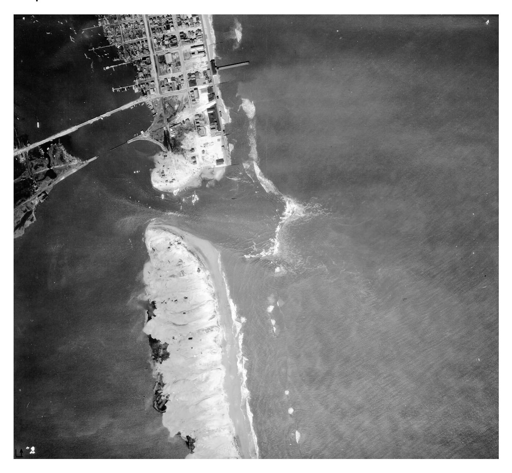

*Figure IV-3-20. Ocean City Inlet, Maryland, September 1933. Ocean City is on Fenwick Island in the top center of the image, the Atlantic Ocean is to the right, and Assateague Island is on the bottom. This photograph was taken only one month after a hurricane breached the barrier island. Note waves breaking at the edge of a small ebb shoal. (Photograph from Beach Erosion Board archives)*

#### (2) Flood-tidal deltas (shoals).

(a) A model of a typical flood-tide shoal is shown in Figure IV-3-18. Flood shoals with many of these features have been described in meso- and micro-tidal environments around the world (Germany (Nummedal and Penland 1981); Florida's east coast (Stauble et al. 1988); Florida's Gulf of Mexico coast (Wright, Sonu, and Kielhorn 1972); and New England (Boothroyd 1985)). The major components are:
IV-3-30 Coastal Morphodynamics

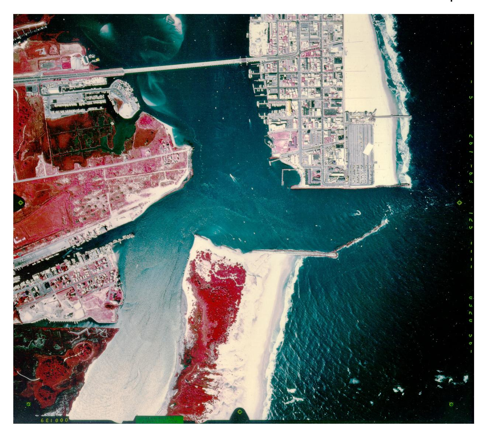

*Figure IV-3-21. Ocean City Inlet, Maryland, 11 September 1995. Before the 1933 hurricane breached the barrier island, Assateague and Fenwick Islands were joined and had a straight shoreline. The former shoreline ran approximately along the seaward-most road (Photograph provided by USAE District, Baltimore)*

- ! The flood ramp , which is a seaward-dipping sand surface dominated by flood-tidal currents. Sediment movement occurs in the form of sand waves (dunes), which migrate up the ramp.
- ! Flood channels , subtidal continuations of the flood ramp.
- ! The ebb shield , the high, landward margin of the tidal delta that helps divert ebb-tide currents around the shoal.
- ! Ebb spits , high areas mainly formed by ebb currents with some interaction with flood currents.
- ! Spillover lobes , linguoid, bar-like features formed by ebb-tidal current flow over low areas of the ebb shield.
- (b) Although this model was originally derived from studies in mesotidal, mixed-energy conditions, it is also applicable to more wave-dominated, microtidal inlets (Boothroyd 1985). However, flood-tide shoals apparently are not formed in macrotidal shores.
- (c) The high, central portion of a flood-tidal delta often extends some distance into an estuary or bay. This is the oldest portion of the delta and is usually vegetated by marsh plants. The marsh cap extends up to the elevation of the mean high water. The marsh expands aerially by growing out over the adjacent tidal flat. The highest, marsh-covered part of a flood shoal, or sometimes the entire shoal, is often identified on navigation charts as a "middle ground." (3) Bed forms.
- (a) Inlets contain a broad range of bed forms, from ripples due to oscillatory waves to dunes and antidunes caused by tidal currents. Water mass stratification can influence inlet flow and, therefore, bed form orientation. When a lagoon contains brackish water, salt wedge dynamics can occur, where the incoming flood flows under less dense bay water. Mixing between the two waters occurs along a horizontal density interface. During ebb tide, a buoyant planar jet forms at the seaward opening of the inlet similar to the effluent from rivers.
- (b) Wright, Sonu, and Kielhorn (1972) described how density stratification affected flow at the Gulf of Mexico and Choctawhatchee Bay openings of East Pass, Florida. During flood tide, drogues and dye showed that the incoming salty Gulf of Mexico water met the brackish bay water at a sharp density front and then dove underneath (Figure IV-3-22). The drogues indicated that the sea water intruded at least 100 m beyond the front into Choctawhatchee Bay. This was the reason that bed forms within the channels displayed a flood orientation over time. This flood orientation can be seen in aerial photographs (Figure IV-3-5). f. Inlet stability and migration . 1
- (1) Background. Inlets migrate along the coast or remain fixed in one location because of complex interactions between tidal prism, wave energy, and sediment supply. Some researchers consider the littoral system to be the principal sediment source that influences the stability of inlets (Oertel 1988). Not all of the sediment in littoral transport is trapped at the mouths of inlets; at many locations, a large proportion may be bypassed by a variety of mechanisms. Inlet sediment bypassing is defined as "the transport of sand from the updrift side of the tidal inlet to the downdrift shoreline" (FitzGerald 1988). Bruun and Gerritsen (1959) described three mechanisms by which sand moves past tidal inlets: ! Wave-induced transport along the outer edge of the ebb delta (the terminal lobe). ! The transport of sand in channels by tidal currents. ! The migration of tidal channels and sandbars.
They noted that at many inlets, bypassing occurred through a combination of these mechanisms. As an extension of this earlier work, FitzGerald, Hubbard, and Nummedal (1978) proposed three models to explain inlet sediment bypassing along mixed-energy coasts. The models are illustrated in Figure IV-3-23 and are discussed below.
IV-3-32 Coastal Morphodynamics

*1 Material in this section has been adapted from FitzGerald (1988).*

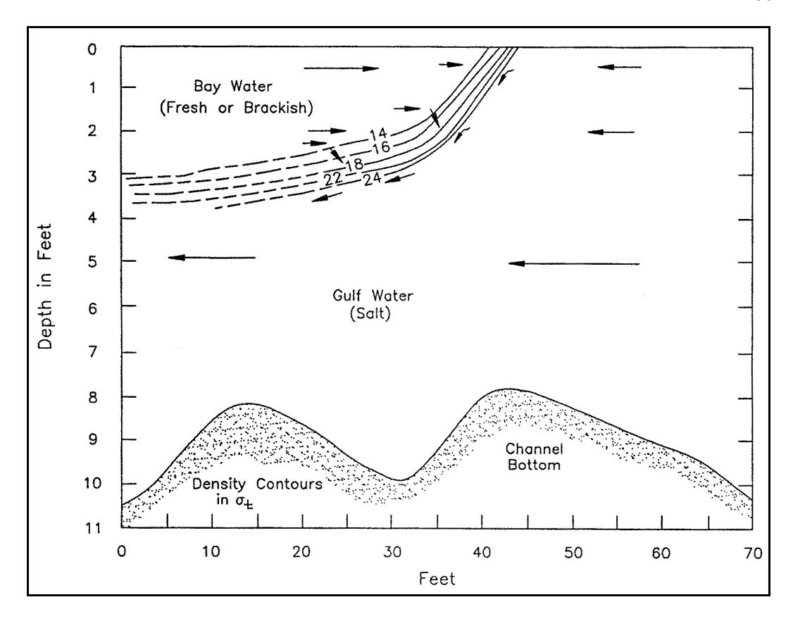

*Figure IV-3-22. At the bay opening of East Pass, Florida, stratified flow occurs during flood tide in Choctawhatchee Bay as a wedge of sea water dives underneath the lower density bay water (after Wright, Sonu, and Kielhorn (1972)). A similar phenomenon often occurs in estuaries*

- (2) Inlet migration and spit breaching.
- (a) The first model describes the tendency of many inlets to migrate downdrift and then abruptly shift their course by breaching a barrier spit. The migration occurs because sediment supplied by the longshore current causes the updrift barrier to grow (spit accretion). The growth occurs in the form of low, curved beach ridges, which weld to the end of the spit, often forming a bulbous-tipped spit known as a "drumstick." The ridges are often separated by low, marshy swales. As the inlet becomes narrower, the opposite (downdrift) shore erodes because tidal currents attempt to maintain an opening.
- (b) In environments where the back bay is largely filled with marshes or where the barrier is close to the mainland, migration of the inlet causes an elongation of the tidal channel. Over time, the tidal flow between bay and ocean becomes more and more inefficient. Under these conditions, if a storm breaches the updrift barrier, the newly opened channel is a more direct and efficient pathway for tidal exchange. This new, shorter channel is likely to remain open while the older, longer route gradually closes. The breaching is most likely to occur across an area where the barrier has eroded or where some of the inner-ridge swales have remained low. The end result of spit accretion and breaching is the transfer of large quantities of sediment from one side of the inlet to the other. An example of this process is Kiawah River Inlet, South Carolina, whose migration between 1661 and 1978 was documented by FitzGerald, Hubbard, and Nummedal (1978). After a spit is breached and the old inlet closes, the former channel often becomes an elongated pond that parallels the coast.

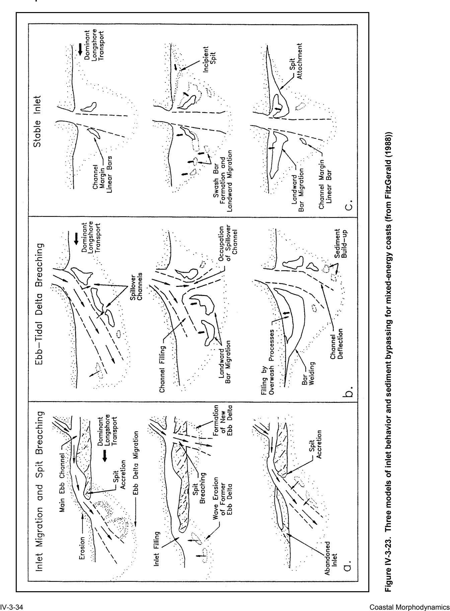

- (c) Several notes apply to the inlet migration model: First, not all inlets migrate. As discussed earlier, some inlets on microtidal shores are ephemeral, remaining open only a short time after a hurricane forces a breach through the barrier. If the normal tidal prism is small, these inlets are soon blocked by littoral drift. Short-lived inlets were documented along the Texas coast by Price and Parker (1979). The composition of the banks of the channel and the underlying geology are also critical factors. If an inlet abuts resistant sediment or bedrock, migration is restricted (for example, Hillsboro Inlet, on the Atlantic coast of Florida, is anchored by rock reefs). The gorge of deep inlets may be cut into resistant sediment, which also will restrict migration.
- (d) Second, some inlets migrate updrift, against the direction of the predominate drift. Three mechanisms may account for updrift migration (Aubrey and Speer 1984): ! Attachment of swash bars to the inlet's downdrift shoreline. ! Breaching of the spit updrift of an inlet. ! Cutbank erosion of an inlet's updrift shoreline caused by back-bay tidal channels that approach the inlet throat obliquely. (3) Ebb-tidal delta breaching.
- (a) At some inlets, the position of the throat is stable, but the main ebb channel migrates over the ebb delta (Figure IV-3-23b). This pattern is sometimes seen at inlets that are naturally anchored by rock or have been stabilized by jetties. Sediment supplied by longshore drift accumulates on the updrift side of the ebbtidal delta, which results in a deflection of the main ebb channel. The ebb channel continues to deflect until, in some cases, it flows parallel to the downdrift shore. This usually causes serious beach erosion. In this orientation, the channel is hydraulically inefficient, and the flow is likely to divert to a more direct seaward route through a spillover channel. Diversion of the flow can occur gradually over a period of months or can occur abruptly during a major storm. Eventually, most of the tidal exchange flows through the new channel, and the abandoned old channel fills with sand.
- (b) Ebb delta breaching results in the bypassing of large amounts of sand because swash bars, which had formerly been updrift of the channel, become downdrift after the inlet occupies one of the spillover channels. Under the influence of waves, the swash bars migrate landward. The bars fill the abandoned channel and eventually weld to the downdrift beach. (4) Stable inlet processes.
- (a) These inlets have a stable throat position and a main ebb channel that does not migrate (Figure IV-3- 23c). Sand bypassing occurs by means of large bar complexes that form on the ebb delta, migrate landward, and weld to the downdrift shoreline. The bar complexes are composed of swash bars that stack and merge as they migrate onshore. Swash bars are wave-built accumulations of sand that form on the ebb delta from sand that has been transported seaward in the main ebb channel. The swash bars move landward because of the dominance of landward flow across the swash platform. The reason for landward dominance of flow is that waves shoal and break over the terminal lobe (or bar) that forms along the seaward edge of the ebb delta. The bore from the breaking waves augments flood tidal currents but retards ebb currents.
- (b) The amount of bypassing that actually occurs around a stable inlet depends upon the geometry of the ebb-tidal shoal, wave approach angle, and wave refraction around the shoal. Three sediment pathways can be identified:
- ! Some (or possibly much) of the longshore drift accumulates on the updrift side of the shoal in the form of a bar that projects out from the shore (Figure IV-3-23c). As the incipient spit grows, it merges with growing bar complexes near the ebb channel. Flood currents move some of the sand from the complexes into the ebb channel. Then, during ebb tide, currents flush the sand out of the channel onto the delta (both the updrift and downdrift sides), where it is available to feed the growth of new swash bars.
- ! Depending on the angle of wave approach, longshore currents flow around the ebb shoal from the updrift to the downdrift side. Some of the drift is able to move past the ebb channel, where it either continues moving along the coast or accumulates on the downdrift side of the ebb shoal. The sediment probably moves as large bed forms (Figure IV-3-4).
- ! Wave refraction around some ebb shoals causes a local reversal of longshore current direction along the downdrift shore. During this time, presumably, little sediment is able to escape the confines of the ebb-tidal shoal.
- (5) Extension of bypassing models to other environments. The inlet migration models described above were originally based on moderate- to high-energy shores. However, research along the Florida Panhandle suggests that the models may be applicable to much lower energy environments than the original authors had anticipated. For example, between 1870 and 1990, the behavior of East Pass inlet, located in the low-waveenergy Florida Panhandle, followed all three models at various times (Figure IV-3-24; Morang (1992b)). It would be valuable to conduct inlet studies around the world to further refine the models and evaluate their applicability to different shores. g. Inlet response to jetty construction and other engineering activities.
- (1) Introduction. Typically, jetties are built to stabilize a migrating inlet, to protect a navigation channel from waves, or to reduce the amount of dredging required to maintain a specified channel depth. However, jetties can profoundly affect bypassing and other processes at inlets. Some of these effects can be predicted during the design phase of a project. Unfortunately, unanticipated geological conditions often arise, which lead to problems such as increased shoaling or changes in the tidal prism. Several classes of man-made activities affect inlets: (a) Jetties stabilize inlets and prevent them from migrating. (b) Jetties can block littoral drift. (c) Walls or revetments can change the cross section of an inlet. (d) Dredging can enlarge the cross section of a gorge. (e) Dam construction and freshwater diversion reduce fluvial input. (f) Weir sections (low portions of a jetty) allow sediment to pass into an inlet, where it can accumulate in a deposition basin and be bypassed. (g) Landfilling and development in estuaries and bays can reduce tidal prism.
- (2) Technical literature. Many reports have documented the effects of jetties on littoral sediment transport. Early works are cited in Barwis (1976). Dean (1988) discussed the response of modified Florida inlets,
IV-3-36 Coastal Morphodynamics

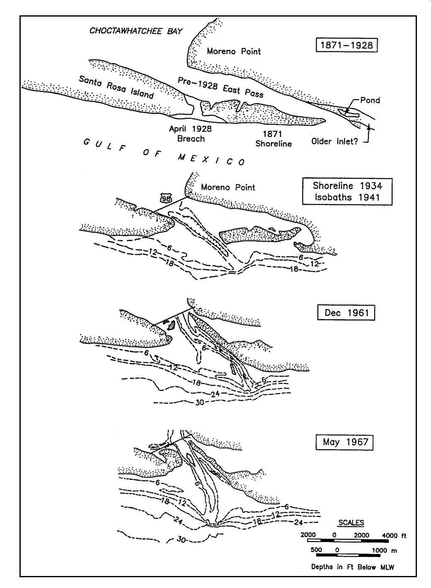

*Figure IV-3-24. Spit breaching and inlet migration at East Pass, Florida (from Morang (1992a))*

and many other case studies are reviewed in Aubrey and Weishar (1988). Examples of monitoring studies that assess the effects of jetties include:
- (a) Shinnecock Inlet, Long Island, New York (Morang, 1999; Pratt and Stauble 2001; Williams, Morang, and Lillycrop 1998)
- (b) Ocean City Inlet, Maryland (Bass et al. 1994).
- (c) Little River Inlet, North and South Carolina (Chasten 1992, Chasten and Seabergh 1992).
- (d) Murrells Inlet, South Carolina (Douglass 1987).
- (e) Manasquan Inlet, New Jersey (Bruno, Yavary, and Herrington (1998).
- (f) St. Marys Entrance, Florida and Georgia (Kraus, Gorman, and Pope 1994, 1995).
- (g) East Pass, Florida (Morang 1992a).
- (h) Port Mansfield Channel, Texas (Kieslich 1977).
- (3) Weirs and other structures and their effects on sediment movement in and around inlets are discussed in Part V-6. h. Case study of inlet formation and growth: Shinnecock Inlet, Long Island, New York. 1 (1) Background and inlet breaching (1938).
- (a) Shinnecock Inlet is located on the south shore of Long Island, 136 km east of New York Harbor. It is the easternmost of six inlets that cut the south shore barrier islands and allow boat passage between the Atlantic Ocean and the coastal bays. The present inlet was breached during the Great New England Hurricane of 21 September 1938. Inlets had periodically existed in this area before, but immediately before the 1938 hurricane, the barrier was intact and there was a paved road along the beach (Nersesian and Bocamazo 1992) (Figure IV-3-25).
- (b) The first aerial photographs of the new inlet were taken by the U.S. Army Air Corps three days after the hurricane (Figure IV-3-26). The seas had calmed, but the large number of overwash deposits attest to the violence of the storm. All the open breaches in this area trended left of perpendicular to the shoreline trend. Drift was to the east (opposite to the normal prevailing direction) because spits had grown from west-to-east across the mouths of the new openings. Two months after the hurricane (29 November 1938) an oval ebb-tide delta had already formed in the Atlantic Ocean, and there was a small shoal in Shinnecock Bay, showing the initial development of a flood shoal (Figure IV-3-27).
- (c) There are no eye-witness accounts of exactly how this inlet was cut. One possibility is that storm waves from the ocean cut across the barrier. The overwash fans to the left and right of the inlet support this option. The other possibility is that Shinnecock Bay elevated due to rainwater and runoff. This is supported by a water level of 2.2 (7.2 ft) above mlw estimated at the south end of the Shinnecock canal, across Shinnecock Bay from the barrier island (U.S. Army Corps of Engineers 1958)). At a low or narrow place in the barrier, a torrent of bay water might have burst through the dunes and run out to sea, scouring a channel that later widened and became the inlet shown in the photograph. This latter hypothesis seems most likely because, only two months after the storm, a prominent ebb shoal already existed, while there was only minimal deposition in Shinnecock Bay. The ebb shoal likely consisted of sand eroded from the barrier.
- (2) Semi-stabilized inlet (1947). After 1938, the inlet migrated steadily to the west. In 1939-40, Suffolk County erected timber pile bulkhead and short groins on the west side of the channel to prevent westward migration (Nersesian and Bocamazo 1992). However, a 1947 photograph shows that the inlet had moved
IV-3-38 Coastal Morphodynamics

*1 Condensed from Morang (1999).*

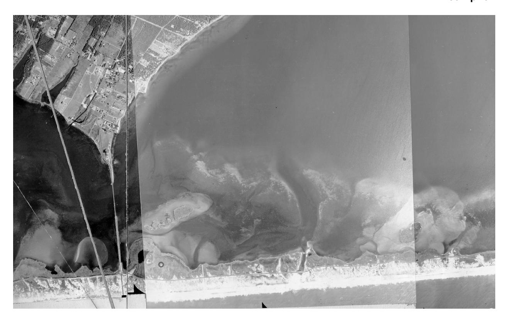

*Figure IV-3-25. Shinnecock Bay, Long Island, New York, 30 June 1938. Photograph taken before the Great New England Hurricane of 21 September cut the barrier island in several locations. The present Shinnecock Inlet was cut where a channel crosses from the bay to the road. The channel may be a remnant of an artificial cut that was dug by the Shinnecock and Peconic Canal Company in 1896. Shoal areas in the bay near the barrier attest to former inlets that had been open long enough to form flood shoals. North is to the top, the water body in the center of the image is Shinnecock Bay, and the Atlantic Ocean is on the bottom. The image is part of a mosaic prepared by the Beach Erosion Board*

east, leaving the bulkhead behind a sand beach (Figure IV-3-28). A spit extended out to sea from the west shore, suggesting that longshore transport, at least temporarily, had been to the east (possibly a local reversal). Some small shoals existed in the mouth of the inlet, but sediment transport was largely directed into the bay after 1938. The ebb shoal was a flat oval that hugged the shore. The shoreline in this area trends about 65E (approx NE-SW). The 1947 channel extended out to sea at about 120E, more eastward than perpendicular to the shore. In the following years, the inlet rotated clockwise, until by 1951, the channel was pushing up against the bulkhead and the flood shoal deposition was occurring east of its earlier location.
(3) Stabilized inlet (1996). East and west jetties were built in 1952-54 by Suffolk County and the State of New York and rebuilt in 1992-93 by the Corps of Engineers. A photograph from 24 October 1996 (Figure IV-3-29) shows that the channel inlet was aligned north-south, about 40E clockwise from the orientation in 1947. The jetties were 240 m (800 ft) apart. The updrift beach had advanced almost to the tip of the east jetty. During the 1970's and 1980's, the bay shoreline east of the inlet eroded about 500 ft (150 m) due to scour from the east ebb channel. To the west, the shore has suffered chronic erosion, requiring frequent emergency repair by the highway department to prevent the road from being breached. The ebb shoal (only partially shown in this photograph) is an unsymmetric oval that attaches to the downdrift beach about 1,200 m west of the west jetty.

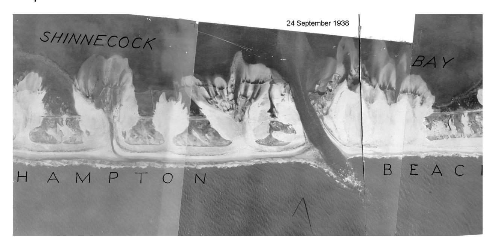

*Figure IV-3-26. Shinnecock Inlet, Long Island, New York, 24 September 1938. Taken three days after Great New England Hurricane breached the barrier, this image shows the new Shinnecock Inlet and many overwash fans along the adjacent shore. Immediately after the storm, all the inlets along this stretch of the coast trended left of the shore-perpendicular. (Photograph mosaic from Beach Erosion Board archives)*

(4) Ebb shoal growth. The ebb shoal at Shinnecock Inlet has continued to grow in volume since the inlet was formed. Figure IV-3-30 shows that in 1998, the shoal contained about 6,000,000 m³ (8,000,000 yd³) of sand. It appears that the shoal is still growing, but the latest three surveys were spaced only 1 year apart (1996, 1997, and 1998), so another survey will be needed in several years to verify this conclusion. However, present evidence indicates that the shoal is a sediment sink, although some of the littoral drift is probably bypassing.

#### IV-4-5. Morphodynamics and Shoreface Processes of Clastic Sediment Shores

#### a. Overview.

- (1) Introduction. This section discusses morphodynamics the interaction of physical processes and geomorphic response of clastic sediment shores. The topic covers beach features larger than a meter (e.g., cusps and bars) on time scales of minutes to months. Details on grain-to-grain interactions, the initiation of sediment motion, and high frequency processes are not included. A principle guiding this section is that the overall shape of beaches and the morphology of the shoreface are largely a result of oscillatory (gravity) waves, although tide range, sediment supply, and overall geological setting impose limits. We introduce basic relationships and formulas, but the text is essentially descriptive. Waves are discussed in detail in Part II of the Coastal Engineering Manual , while sediment properties are covered in Part III-1.
- (2) Literature. Beaches and sediment movement along the shore have been subjects of popular and scientific interest for over a century. A few of the many textbooks that cover these topics include Carter (1988), Davis (1985), Davis and Ethington (1976), Greenwood and Davis (1984), Komar (1998), and Zenkovich (1967). Small-amplitude (Airy) and higher-order wave mechanics are covered in EM 1110-2-1502; more detailed treatments are in Kinsman (1965), Horikawa (1988), and Le Méhauté (1976). Interpreting and applying wave and water level data are covered in EM 1110-2-1414.
IV-3-40 Coastal Morphodynamics

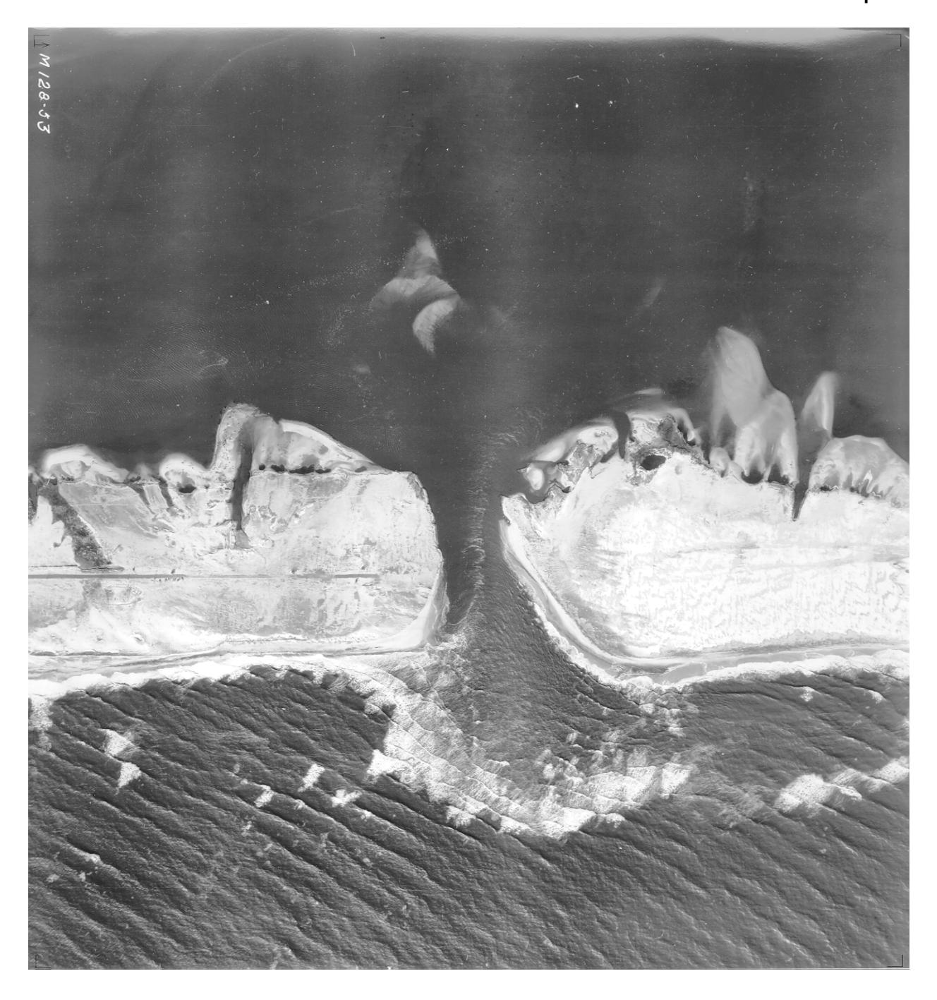

*Figure IV-3-27. Shinnecock Inlet, New York, 29 November 1938, photographed only 2 months after the barrier island was breached during the Great New England Hurricane of 21 September 1938. North is to the top of the image. The body of water to the top is Shinnecock Bay, and the Atlantic Ocean is on the bottom. The inlet already displays an oval ebb-tidal shoal. A small shoal in Shinnecock Bay indicated development of a flood shoal. Washover fans, remnants of the storm, can be seen on both sides of the inlet. (Photograph from Beach Erosion Board archives)*

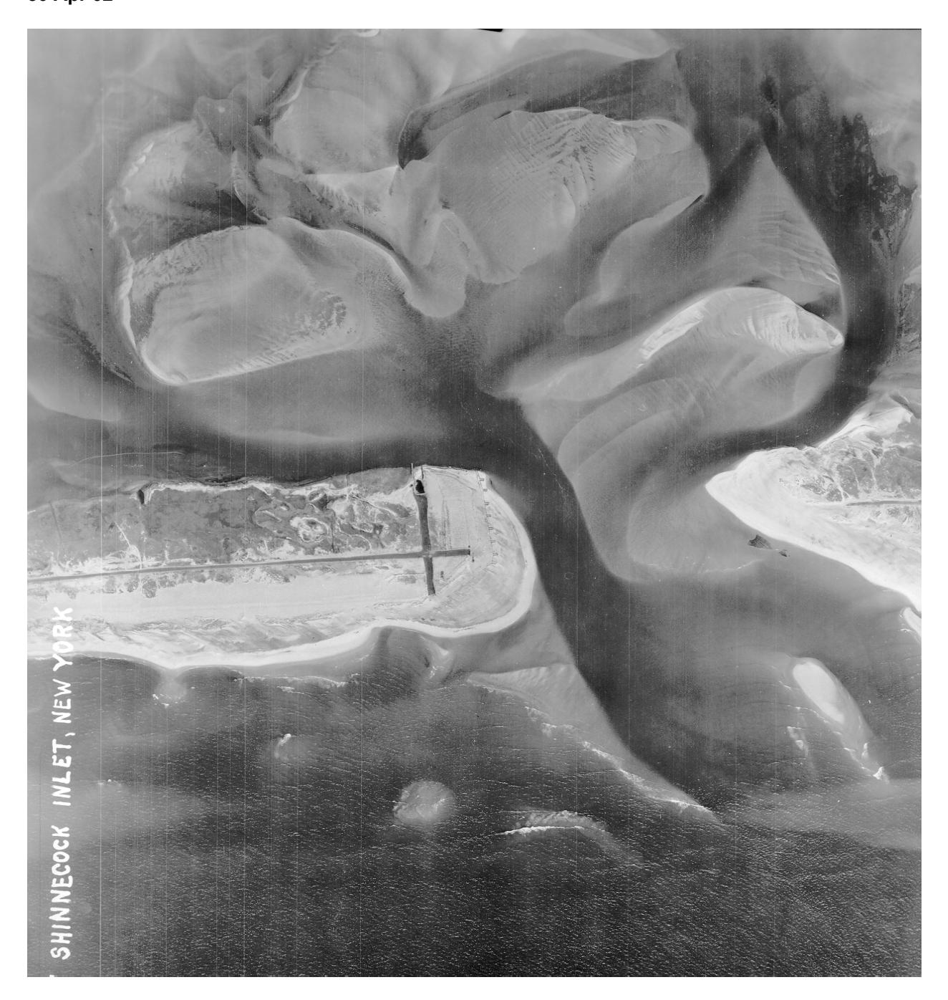

*Figure IV-3-28. Shinnecock Inlet, New York, 1 April 1947. The inlet was much wider than in 1938, and a large flood shoal had accumulated. Some small shoals existed in the mouth of the inlet, but sediment transport had been largely directed into the bay since 1938. (Photograph from Beach Erosion Board archives)*

- (3) Significance of clastic coasts. It is important to examine and understand how clastic shores respond to changes in wave climate, sediment supply, and engineering activities for economic and management reasons: (a) Many people throughout the world live on or near beaches. Beaches are popular recreation areas and of vital economic importance to many states (Houston 1995, 1996a, 1996b).
IV-3-42 Coastal Morphodynamics

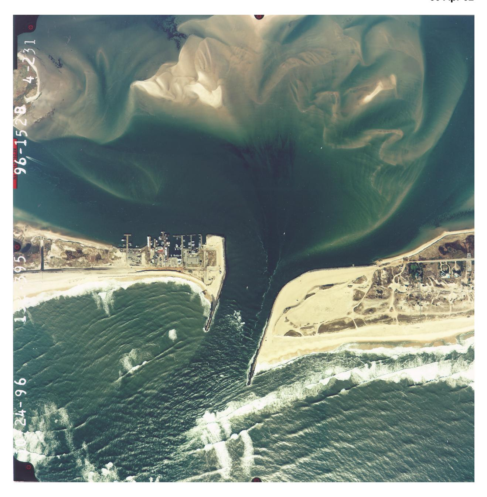

*Figure IV-3-29. Shinnecock Inlet, New York, 24 October 1996. The inlet has been stabilized with stone jetties 800 ft apart. The beach east of the inlet has advanced to the end of the east jetty. To the west, the shore has suffered chronic erosion, requiring frequent emergency repair by the highway department to prevent the road from being breached. The ebb shoal (only partially shown in this photograph) is an unsymmetric oval that attaches to the downdrift beach about 1,200 m west of the west jetty (Photograph courtesy of USAED, New York)*

- (b) Beaches are critical buffer zones protecting wetlands and coastal plains from wave attack.
- (c) Beaches are habitat or nesting ground for many animal species, some of which are endangered (e.g., turtles).

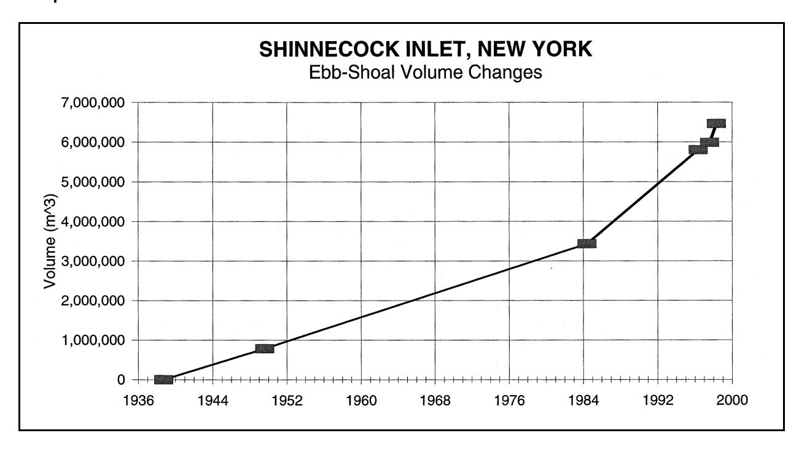

*Figure IV-3-30. Ebb-shoal volume changes, Shinnecock Inlet, New York. Volumes were based on subtracting the 1933 U.S. Coast and Geodetic Survey data (pre-inlet) from more recent surveys: 1949, 1985, 1996, 1997, and 1998. The ebb shoal is still growing, indicating that it is a sediment trap, although some of the littoral drift probably bypasses. Hydrographic data courtesy of U.S. Army Engineer District, New York*

- (d) Much engineering effort and large amounts of funding are expended on planning and conducting beach renourishment.
- (e) Sediment supply and, therefore, beach stability, are often adversely affected by the construction of navigation and shore-protection structures.
- (f) Sand is a valuable and increasingly rare mineral resource in most of the coastal United States.
- (4) Range of coastal environments. Around the world, coasts vary greatly in steepness, sediment composition, and morphology. The most dynamic shores may well be those composed of unconsolidated clastic sediment because they change their form and state rapidly. Clastic coasts are part of a geologic continuum that extends from consolidated (rocky) to loose clastic to cohesive material (Figure IV-3-31). Waves are the primary mechanisms that shape the morphology and move sediment, but geological setting imposes overall constraints by controlling sediment supply and underlying rock or sediment type. For example, waves have little effect on rocky cliffs; erosion does occur over years, but the response time is so long that many rocky shores can be treated as being geologically controlled. At the other end of the continuum, cohesive shores respond very differently to wave action because of the electrochemical nature of the sediment (see Part III-5).

#### b. Tide range and overall beach morphology.

Most studies of beach morphology and processes have concentrated on microtidal (< 1 m) or low-mesotidal coasts (1-2 m). To date, many details concerning the processes that shape high-meso- and macrotidal beaches (tide range > 2 m) are still unknown. Based on a review of the literature, Short (1991) concluded that
IV-3-44 Coastal Morphodynamics

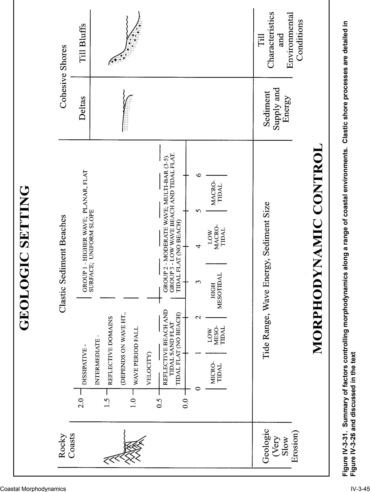

wave-dominated beaches where tide range is greater than about 2 m behave differently than their lower-tide counterparts. Short underscored that high-tide beaches are also molded by wave and sediment interactions. The difference is the increasing impact of tidal range on wave dynamics, shoreface morphodynamics, and shoreline mobility. Short developed a tentative grouping of various beach types (Figure IV-3-32). Discussion of the various shoreface morphologies follows.
- c. High tidal range (> 2 m) beach morphodynamics.
- (1) Review. Based on a review of research on macrotidal beaches, Short (1991) summarized several points regarding their morphology: (a) They are widespread globally, occurring in both sea and swell environments. (b) Incident waves dominate the intertidal zone. (c) Low-frequency (infragravity) standing waves may be present and may be responsible for multiple bars. (d) The intertidal zone can be segregated into a coarser, steeper, wave-dominated high tide zone, an intermediate zone of finer sediment and decreasing gradient, and a low-gradient, low-tide zone. The highest zone is dominated by breaking waves, the lower two by shoaling waves. (e) The cellular rip circulation and rhythmic topography that are so characteristic of microtidal beaches have not been reported for beaches with tide range greater than 3 m.
- (2) Macrotidal beach groups. Using published studies and field data from Australia, Short (1991) divided macrotidal beaches into three groups based on gradient, topography, and relative sea-swell energy:
- (a) GROUP 1 High wave, planar, uniform slope. Beaches exposed to persistently high waves ( Hb > 0.5 m) display a planar, flat, uniform surface. Shorefaces are steep, ranging from 1 to 3 deg, and have a flat surface without ripples, bed forms, or bars. The upper high tide beach is often relatively steep and cuspid and contains the coarsest sediment of the system. On both sand and gravel beaches, the high tide, upper foreshore zone is exposed to the highest waves. Plunging and surging breakers produce asymmetric swash flows, which maintain the coarse sediment and steep gradient. Further seaward, wave shoaling becomes a more important factor than wave breaking because waves are attenuated at low tide (due to shallower water and greater friction). Tidal currents also increase in dominance seaward. Wright (1981) found that tidal currents left no bed forms visible at low tide but were an important factor in longshore sediment transport.
- (b) GROUP 2 Moderate wave, multi-bar. Multi-bar, macrotidal beaches are formed in fetch-limited environments with high tide range and abundant fine sand (King 1972b). The common characteristic of these beaches is a relatively uniform 0.5- to 0.6-deg intertidal gradient and the occurrence of multiple bars (two to five sets) between msl and mlw (Short 1991). Bar amplitude is usually below 1 m and spacing ranges from 50 to 150 m, with spacing increasing offshore. Field observations indicate that the bars are formed by a wave mechanism, particularly during low wave, post-storm conditions. The bars appear to build up onsite rather than migrate into position. These multi-bar beaches probably cause dissipative conditions during most wave regimes, possibly resulting in the development of infragravity standing waves. This would account for the spacing of the bars; however, this hypothesis has not been tested with rigorous field measurements (Short 1991).
IV-3-46 Coastal Morphodynamics

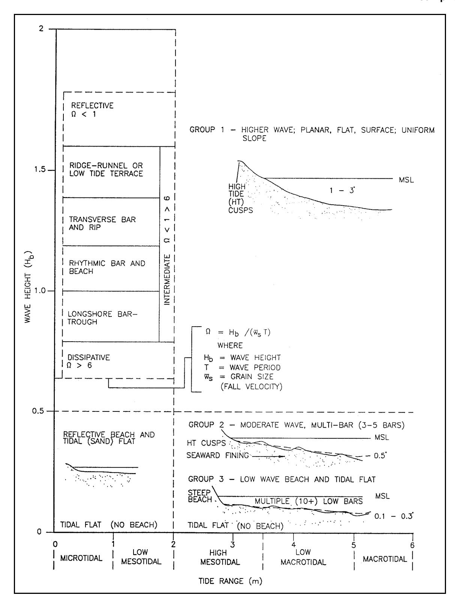

*Figure IV-3-32. Micro- to macrotidal beach and tidal flat systems (adapted from Short (1991)). Dimensionless parameter Ω discussed in the text*

(c) GROUP 3 - Low wave beach and tidal flat. As wave energy decreases, macrotidal beaches eventually grade into tide-dominated tidal flats. Between the two regimes, there is a transition stage that contains elements of both morphologies. These beach-tidal flat systems are usually characterized by a steep, coarsegrained reflective beach (no cusps usually present) which grades abruptly at some depth below msl into a fine-grained, very low gradient (0.1 deg), rippled tidal flat (Figure IV-3-33). The tidal flat may be uniform or may contain low, multiple bars. Beach-tidal flat shores are found in low-energy environments that are only infrequently exposed to wave attack, but the energy must be sufficient to produce the morphologic zonation.

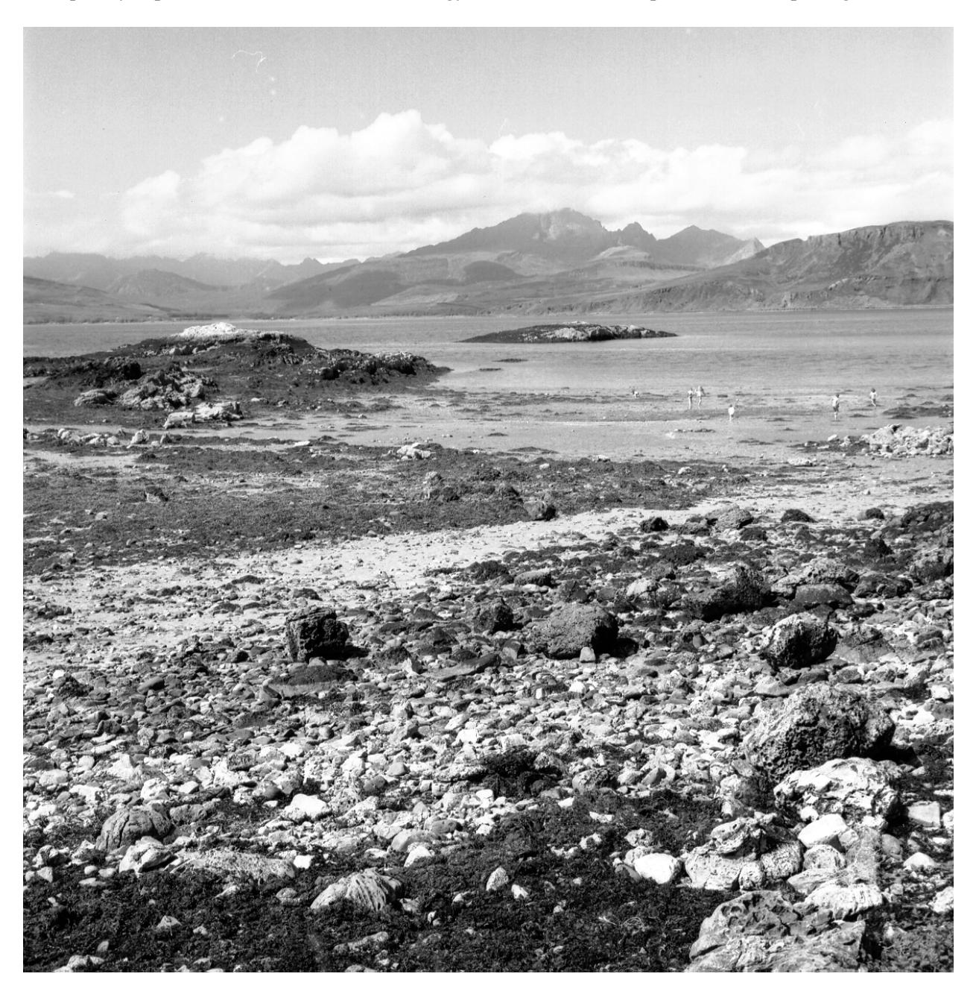

*Figure IV-3-33. View west from Tarskavaig, Isle of Skye, Scotland, August 1983. Photograph taken at low tide. At this macrotidal beach, facing the Sea of the Hebrides, the upper shoreface consists of coarse cobble, while the low foreshore is low gradient and almost featureless*

IV-3-48 Coastal Morphodynamics
- (3) Spatial and temporal variations. Beaches on macro-tidal coasts vary morphologically as important environmental parameters change. Short (1991) cites one setting where the shoreface varies from highenergy, uniform steep beach (Group 1) to beach-tidal flat (Group 3) within 2 km. He suggests that the changes in morphology are due to variations in wave energy: as energy changes alongshore, important thresholds are crossed which result in different ratios of wave versus tide domination. In addition, there may be temporal variations throughout the lunar cycle. As tide range varies during the month, the transitions where one morphologic group merges into another may migrate cyclically along the coast. More field studies are needed to document this phenomenon.
- (4) Summary. On tideless beaches, morphology is determined by waves and sediment character. On microtidal beaches, waves still dominate the morphodynamics, but tide exerts a greater influence. As tide range increases beyond 2-3 m, the shape of beaches becomes a function of waves coupled with tides. On the higher tide coasts, as water depth changes rapidly throughout the day, the shoreline and zone of wave breaking move horizontally across the foreshore and tidal currents move considerable sediment. d. Morphodynamics of micro- and low-mesotidal coasts.
- (1) Morphodynamic variability of microtidal beaches and surf zones. Based on field experiments in Australia, Wright and Short (1984) have presented a model of shoreface morphology as a function of wave parameters and sediment grain size. This model is a subset of Figure IV-3-31 that occupies the zone where tide range is between 0 and 2 m and Hb (breaker height) is greater than about 0.5 m.
- (a) Wright and Short (1984) determined that the morphodynamic state of sandy beaches could be classified on the basis of assemblages of depositional forms and the signatures of associated hydrodynamic processes. They identified two end members of the morphodynamic continuum: ! Fully dissipative. ! Highly reflective.
Between the extremes were four intermediate states, each of which possessed both reflective and dissipative elements (Figure IV-3-32).
(b) The most apparent differences between the beach states are morphological, but distinct process signatures, representing the relative velocities of different modes of fluid motion, accompany the characteristic morphology. As stated by Wright and Short (1984):
Although wind-generated waves are the main source of the energy which drives beach changes, the complex processes, which operate in natural surf zones and involve various combinations of dissipation and reflection, can lead to the transfer of incident wave energy to other modes of fluid motion, some of which may become dominant over the waves themselves.
- (c) Wright and Short grouped fluid motion into four categories (Table IV-3-1):
- ! Oscillatory flows.
- ! Oscillatory or quasi-oscillatory flows.
- ! Net circulations.
- ! Non-wave-generated currents.

*Table IV-3-1
Modes of Fluid Motion Affecting Clastic Shorelines*

**Table IV-3-1. Modes of Fluid Motion Affecting Clastic Shorelines**

| Modes | Notes |  | Frequencies of flows | Examples |
| --- | --- | --- | --- | --- |
| Oscillatory | Corresponds incident waves | directly to | Frequency band of deep-water incident waves | Sediment-agitating oscillations |
| Oscillatory or | Shore-normal | oriented | Wide range of frequencies | Trapped edge waves, “leaky” |
| quasi-oscillatory | standing and | edge waves |  | mode standing waves |
| Net circulations | Generated by dissipation | wave energy | Minutes to days | Longshore currents, rip currents, rip feeder currents |
| Non-wave-generated | Generated by | tides | Minutes to hours (?) | Tidal currents |
| currents | and wind | shear |  |  |
| (Based on Wright and Short (1984)) |  |  |  |  |

(d) From repeated observations and surveys of beaches, Wright and Short (1984) concluded that beach state is clearly a function of breaker height and period and sediment size. Over time, a given beach tends to exhibit a modal or most frequent recurrent state, which depends on environmental conditions. Variations in shoreline position and profile are associated with temporal variations of beach state around the modal state. Wright and Short found that a dimensionless parameter \Omega could be used to describe the modal state of the beach:

```math
\Omega = \frac{H_b}{\overline{W_s}T} \tag{IV-3-3}
```

where H_b is breaker height, \overline{w_s} is sediment fall velocity, and T is wave period. For the following values of \Omega (Figure IV-3-32):
- \Omega about 1: defines the reflective/intermediate threshold
- 1 < \Omega < 6 : intermediate beaches
- \Omega \cong 6 : marks the threshold between intermediate and dissipative conditions
- (e) Beaches take time to adjust their state, and a change of \Omega across a threshold boundary does not immediately result in a transformation from reflective to intermediate or from intermediate to dissipative. On the Pacific coasts of Australia and the United States, storms can cause a shift of beach state from reflective or intermediate to dissipative in a few days because the energy is high. The return to reflective conditions under low energy may require weeks or months or longer (the sequence of beach recovery is illustrated in stages a through f in Figure IV-3-34). In environments where the dominant variation in wave energy occurs on an annual cycle (e.g., high storm waves in winter and low swell in summer), the full range from a dissipative winter profile to a reflective summer profile may be expected.
- (f) Wright and Short (1984) concluded that large temporal variations in \Omega are accompanied by large changes in state. However, when the variations in \Omega take place in the domains of \Omega < 1 or \Omega > 6 , no corresponding changes in state result. Intermediate beaches, where \Omega is between 1 and 6, are spatially and temporally the most dynamic. They can undergo rapid changes as wave height fluctuates, causing reversals in onshore/offshore and alongshore sediment transport.
IV-3-50 Coastal Morphodynamics

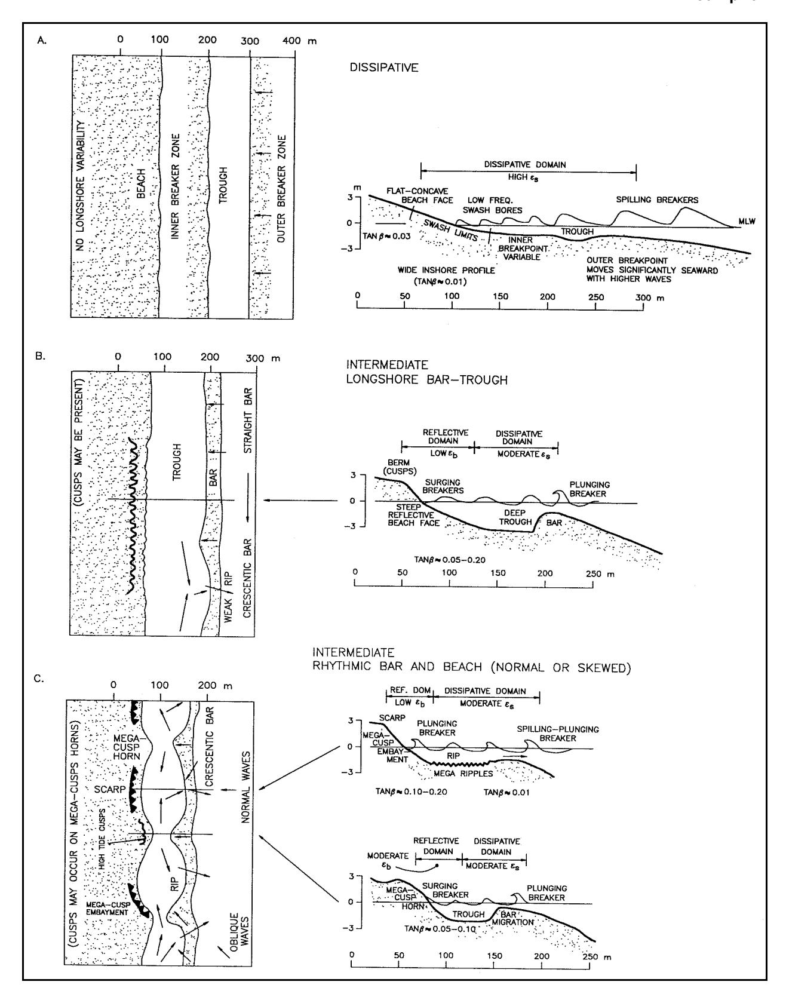

*Figure IV-3-34. Plan and profile views of six major beach stages (adapted from Wright and Short (1984)). Surf-scaling parameter ε is discussed in the text; β represents beach gradient. Dimensions are based on Australian beaches, but morphologic configurations are applicable to other coastlines (Continued)*

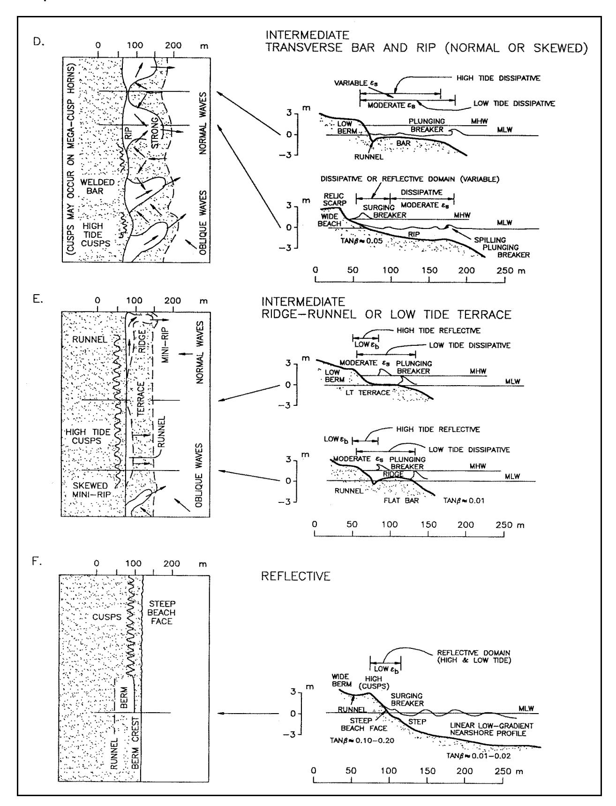

*Figure IV-3-34. (Concluded)*

IV-3-52 Coastal Morphodynamics
- (g) The parameter Ω depends critically upon ' ws , the sediment fall velocity. It is unclear how the relationships described above apply to shorefaces where the grain size varies widely or where there is a distinct bimodal distribution. For example, many Great Lakes beaches contain material ranging in size from silt and clay to cobble several centimeters in diameter. During storms, not only do wave height and period change, but fine-grain sediment is preferentially removed from the shoreface; therefore, the effective ' ws may change greatly within a few hours. Further research is needed to understand how Great Lakes beaches change modally and temporally.
- (2) Highly dissipative stage (Figure IV-3-34a). The dissipative end of the continuum is analogous to the "storm" or "winter beach" profile described by Bascom (1964) for shores that vary seasonally. The characteristic feature of these beaches is that waves break by spilling and dissipating progressively as they cross a wide surf zone, finally becoming very small at the upper portion of the foreshore (Figure IV-3-35) (Wright and Short 1984). A dissipative surf zone is broad and shallow and may contain two or three sets of bars upon which breakers spill. Longshore beach variability is minimal.

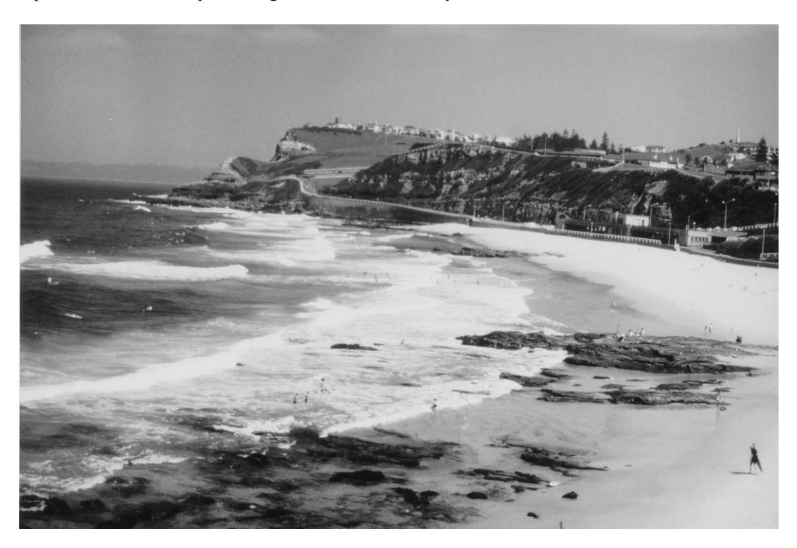

*Figure IV-3-35. Example of a dissipative beach: Southern California near San Diego*

- (3) Highly reflective stage (Figure IV-3-34f). On a fully reflective beach, breakers impinge directly on the shore without breaking on offshore bars (Figures IV-3-36 and 37). As breakers collapse, the wave uprush surges up a steep foreshore. At the bottom of the steep, usually linear beach is a pronounced step composed of coarser material. Seaward of the step, the slope of the bed decreases appreciably. Rhythmic beach cusps are often present in the swash zone. The fully reflective stage is analogous to the fully accreted "summer profile."
- (4) Surf-scaling parameter. Morphodynamically, the two end members of the beach state model can be distinguished on the basis of the surf-scaling parameter (Guza and Inman 1975):

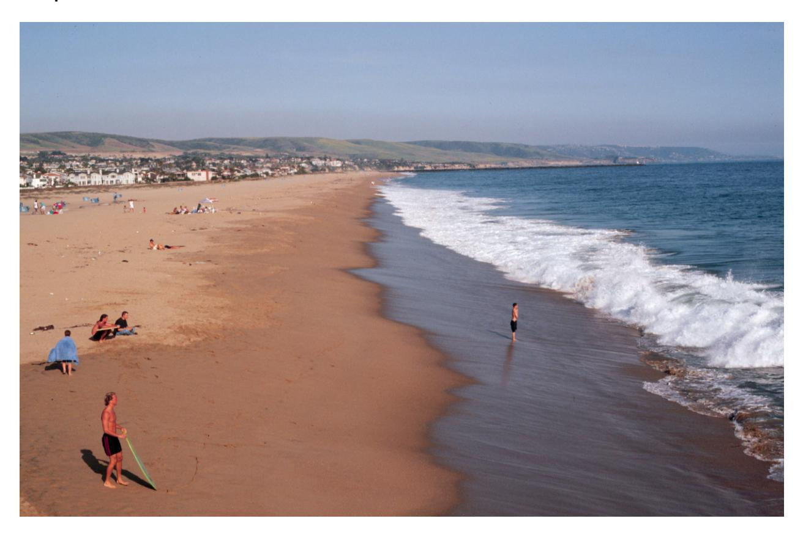

*Figure IV-3-36. Example of a reflective sand beach: Newport Beach, California, April 1993*

```math
\varepsilon = \frac{a_b \omega^2}{g \tan^2 \beta} \tag{IV-3-4}
```

where
a_b = breaker amplitude
\omega = incident wave radian energy ( 2\pi/T where T = period)
g = acceleration of gravity
\beta = the gradient of the beach and surf zone
Strong reflection occurs when \varepsilon \le 2.0 -2.5; this situation defines the highly reflective extreme. When \varepsilon > 2.5 , waves begin to plunge, dissipating energy. Finally, when \varepsilon > 20 , spilling breakers occur, the surf zone widens, and turbulent dissipation of wave energy increases with increasing \varepsilon .
- (5) Intermediate beach stages. These exhibit the most complex morphologies and process signatures.
- (a) Longshore bar-trough state (Figure IV-3-34b). This beach form can develop from an antecedent dissipative profile during an accretionary period. Bar-trough relief is higher and the shoreface is much steeper than on the dissipative profile. Initial wave breaking occurs over the bar. However, in contrast to
IV-3-54 Coastal Morphodynamics

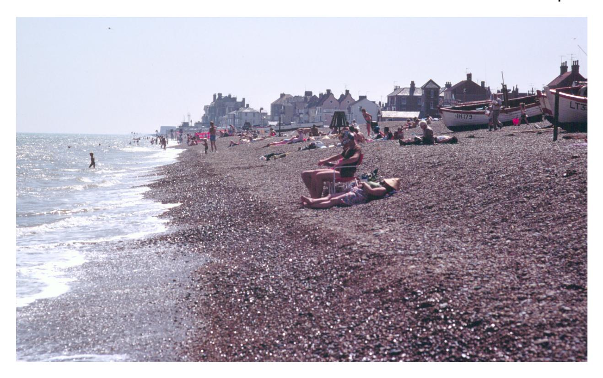

*Figure IV-3-37. Example of a reflective cobble beach: Aldeburgh, Suffolk (facing the North Sea), August 1983. Note the steep berm and the lack of sand-sized sediment. In the background is part of the town of Aldeburgh, which has lost many buildings and churches since the Middle Ages due to erosion*

the dissipative beach, the broken waves do not continue to decay after passing over the steep inner face of the bar, but re-form in the deep trough. Low-steepness waves surge up the foreshore; steeper waves collapse or plunge at the base of the foreshore, followed by a violent surge up the subaerial beach (Wright and Short 1984). Runup is relatively high and cusps often occur in the swash zone.
- (b) Rhymthic bar and beach (Figure IV-3-34c). Characteristics are similar to the longshore bar-trough state (described above). The distinguishing features of the rhymthic bar and beach state are the regular longshore undulations of the crescentic bar and of the subaerial beach (Figures III-2-23 (ocean) and IV-3-38 (lake)). A weak rip current circulation is often present, with the rips flowing across the narrow portions of the bar. Wright and Short (1984) state that incident waves dominate circulation throughout the surf zone, but subharmonic and infragravity oscillations become important in some regions.
- (c) Transverse-bar and rip state (Figure IV-3-34d). This morphology commonly develops in accretionary sequences when the horns of crescentic bars weld to the beach. This results in dissipative transverse bars (sometimes called "mega-cusps") that alternate with reflective, deeper embayments. The dominant dynamic process of this beach state is extremely strong rip circulation, with the seaward-flowing rip currents concentrated in the embayments.
- (d) Ridge and runnel/low tide terrace state (Figures IV-3-34e, IV-2-31 (ocean), and IV-3-39 (lake)). This beach state is characterized by a flat accumulation of sand at or just below the low tide level, backed by a steeper foreshore. The beach is typically dissipative at low tide and reflective at high tide.

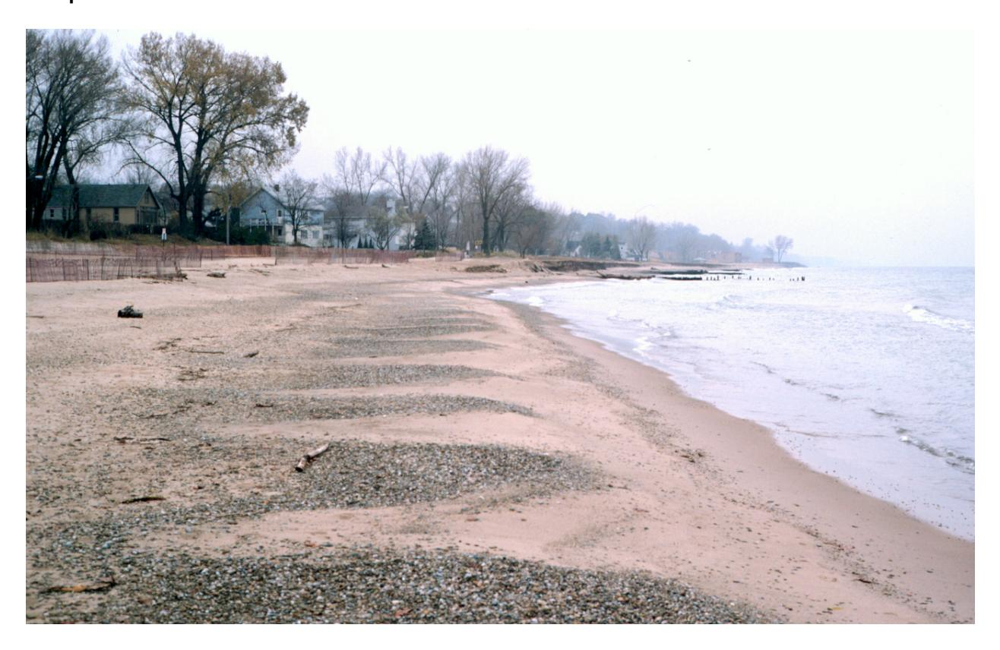

*Figure IV-3-38. Gravel cusps at St. Joseph, Michigan, November 1993. This is an example of a rhythmic bar and beach on a freshwater coast without tides but subject to irregular seiching*

- e. Processes responsible for shoreface sediment movement.
- (1) Despite intense study for over a century, the subject of sand movement on the shoreface is still poorly understood. Sand is moved by a combination of processes including the following (Pilkey 1993, Wright et al. 1991): (a) Wave orbital interactions with bottom sediments and with wave-induced longshore currents. (b) Wind-induced longshore currents. (c) Turbidity currents. (d) Rip currents. (e) Tidal currents. (f) Storm surge ebb currents. (g) Gravity-driven currents. (h) Wind-induced upwelling and downwelling. (i) Wave-induced upwelling and downwelling.
IV-3-56 Coastal Morphodynamics

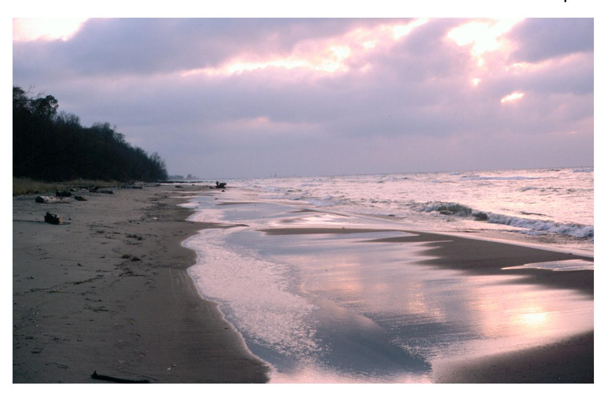

*Figure IV-3-39. Ridge and runnel north of St. Joseph, Michigan, November 1993. This example shows that these features can be found on lake shores that do not have regular tides*

- (j) Gravity-induced downslope transport.
- (2) Additional complications are imposed by constantly changing shoreface conditions, as follows:
- (a) The relative contributions made by the different transport mechanisms vary over time.
- (b) Because of differing regional geological configuration and energy climate, the frequencies of occurrence of the different mechanisms vary with location.
- (c) Oscillatory flows normally occur at many frequencies and are superimposed on mean flows and other oscillatory flows of long period.
- (3) Middle Atlantic Bight experiments of Wright et al. (1991).
- (a) Wright et al. (1991) measured suspended sediment movement, wave heights, and mean current flows at Duck, North Carolina, in 1985 and 1987 and at Sandbridge, Virginia, in 1988 using instrumented tripods. During their study, which included both fair weather and moderate energy conditions, onshore mean flows (interpreted to be related to tides), were dominant over incident waves in generating sediment fluxes. In contrast, during a storm, bottom conditions were strongly dominated by offshore-directed, wind-induced mean flows. Wright et al. attributed this offshore-directed flow to a rise of 0.6 m in mean water level (during this particular storm) and a resultant strong seaward-directed downwelling flow.
- (b) Wright et al. (1991) examined the mechanisms responsible for onshore and offshore sediment fluxes across the shoreface. They related two factors explicitly to incoming incident waves:
- ! Sediment diffusion arising from gradients in wave energy dissipation.
- ! Sediment advection caused by wave orbital asymmetries.
They found that four other processes may also play important roles in moving sediment:
- ! Interactions between groupy incident waves and forced long waves.
- ! Wind-induced upwelling and downwelling currents.
- ! Wave-current interactions.
- ! Turbidity currents.
Overall, Wright et al. found that incoming incident waves were of primary importance in bed agitation, while tide- and wind-induced currents were of primary importance in moving sediment. The incoming wave orbital energy was responsible for mobilizing the sand, but the unidirectional currents determined where the sand was going. Surprisingly, cross-shore sediment fluxes generated by mean flows were dominant or equal to sediment fluxes generated by incident waves in all cases and at all times.
- (c) Based on the field measurements, Wright et al. (1991) concluded that "near-bottom mean flows play primary roles in transporting sand across isobaths on the upper shoreface" (p. 49). It is possible that this dominance of mean flows is a feature that distinguished the Middle Atlantic Bight from other shorefaces. The oscillatory (wave) constituents may be proportionately much more important along coasts subject to persistent, high-energy swell, such as the U.S. west coast. Wright et al. also concluded that the directions, rates, and causes of cross-shore sediment flux varied temporally in ways that were only partly predictable with present theory. f. Sea level change and the Bruun rule.
- (1) General coastal response to changing sea level.1 Many barrier islands around the United States have accreted vertically during the Holocene rise in global sea level, suggesting that in these areas the supply of sediment was sufficient to allow the beaches to keep pace with the rise of the sea. It is not clear how beaches respond to short-term variations in sea level. Examples of shorter processes include multi-year changes in Great Lakes water levels and multi-month sea level rises associated with the El Niño-Southern Oscillation in the Pacific.
IV-3-58 Coastal Morphodynamics

*1 Part IV-1 reviewed sea level change and outlined some of the associated coastal effects and management issues. Table IV-1-7 outlined how shoreline advance or retreat at any particular location is a balance between sediment supply and the rate of sea level change. In this section, sea level change is meant in a general sense to be caused by a combination of factors, including eustatic (global) changes and local effects due to vertical movements of the coastal land.*

- (2) Storm response.
- (a) Based on his pioneering research of southern California beaches in the 1940's, Shepard (1950) developed the classic model that there is an onshore-offshore exchange of sediment over winter-summer cycles. Studies since then have shown that this model applies mostly to beaches on swell-dominated coasts where the wave climate changes seasonally (particularly Pacific Ocean coasts) (Carter 1988). Many beaches do not show an obvious seasonal cycle. Instead, they erode during storms throughout the year and rebuild during subsequent fair weather periods. Some coasts, like New Jersey, have a seasonal signature, but storms cause such great perturbations that it can take repetitive surveys over many years to extract the seasonal signature.
- (b) In some locations, such as the Gulf Coast, infrequent and irregular hurricanes may be the most important dynamic events affecting beaches. Following one of these storms, beach and dune rebuilding may take years (Figure IV-2-10 shows a portion of the Florida/Alabama shore that was damaged by Hurricane Frederic in 1979 and is slowly recovering). Recently, the popular belief that hurricanes are the most important morphodynamic events causing Gulf Coast beach erosion is being reevaluated with the benefit of new field data. Scientists have learned that, cumulatively, winter cold fronts produce significant annual barrier island retreat. Dingler, Reiss, and Plant (1993) monitored Louisiana's Isles Dernieres and found that Hurricane Gilbert (September 1988) produced substantial beach retreat initially, but it actually reduced the average erosion rate by modifying the slope of the shoreface from that produced by cold-front-generated storms. The different responses were related to the scale of the storms. Cold fronts, which individually were small storms, eroded the entire beach to the same degree. Most sand and mud was deposited offshore and only a small percentage of eroded sand was deposited on the backshore because the fronts usually did not raise the sea enough to cause overtopping. Hurricane Gilbert, in contrast, raised sea level substantially such that the primary erosion occurred on the upper beach, and much of the sand was deposited behind the island via overwash processes. Over a 5-year period, the overall effect of this hurricane on the Isles Dernieres was to retard the retreat rate of the island by about 50 percent over that produced by cold fronts alone. (3) Bruun Rule beach response model.
- (a) One of the best-known shoreface response models was proposed by Bruun in 1962 (rederived in Bruun (1988)). Bruun's concept was that beaches adjust to the dominant wave conditions at the site. He reasoned that beaches had to respond in some manner because clearly they had adjusted and evolved historically as sea level had changed. Beaches had not disappeared, they had moved. How was this translation accomplished? Earlier studies of summer/winter beach morphology provided clues that beaches responded even to seasonal changes in wave climate. The basic assumption behind Bruun's model is that with a rise in sea level, the equilibrium profile of the beach and the shallow offshore moves upward and landward. Bruun made several assumptions in his two-dimensional analysis: ! The upper beach erodes because of a landward translation of the profile. ! Sediment eroded from the upper beach is deposited immediately offshore; the eroded and deposited volumes are equal (i.e., longshore transport is not a factor). ! The rise in the seafloor offshore is equal to the rise in sea level. Thus, offshore, the water depth stays constant. (b) The Bruun Rule can be expressed as (Figure IV-3-40a):

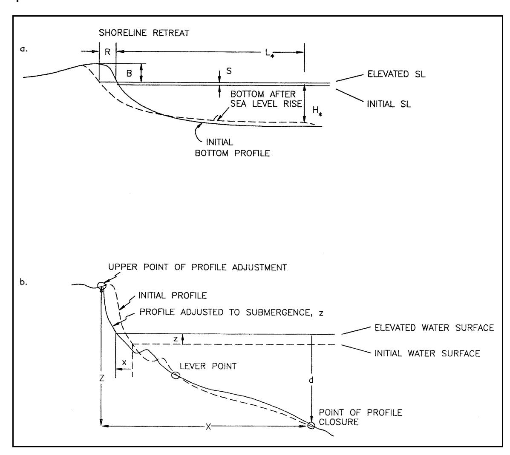

*Figure IV-3-40. (a) Shoreline response to rising sea level (SL) depicted by the Bruun Rule. (b) Simplified nomenclature used by Hands (1983). The sandbar shows that the model is valid for complicated profile shapes*

```math
R = \frac{L_*}{B + H_*} S \tag{IV-3-5}
```

where
R = shoreline retreat
S = increase in sea level
L_* = cross-shore distance to the water depth H_*
B = berm height of the eroded area
Hands (1983) restated the Bruun Rule in simplified form:
IV-3-60 Coastal Morphodynamics

```math
x = \frac{zX}{Z} \tag{IV-3-6}
```

where z is the change in water level. The ultimate retreat of the profile x can be calculated from the dimensions of the responding profile, X and Z , as shown in Figure IV-3-40b. Other expressions for the Bruun Rule are presented in Part III-3-h.
- (c) Despite the continued interest in Bruun's concept, there has been only limited use of this method for predictive purposes. Hands (1983) listed several possible reasons for the reluctance to apply this approach: ! Skepticism as to the adequacy of an equilibrium model for explaining short-term dynamic changes. ! Difficulties in measuring sediment lost from the active zone (alongshore, offshore to deep water, and onshore via overwash). ! Problems in establishing a realistic closure depth below which water level changes have no measurable effect on the elevation or slope of the seafloor. ! The perplexity caused by a discontinuity in the profile at the closure depth which appeared in the original and in most subsequent diagrams illustrating the concept.
An additional, and unavoidable, limitation of this sediment budget approach is that it does not address the question of when the predicted shore response will occur (Hands 1983). It merely reveals the horizontal distance the shoreline must ultimately move to reestablish the equilibrium profile at its new elevation under the assumptions stated in Bruun's Rule.
- (d) Hands (1983) demonstrated the geometric validity of the Bruun Rule in a series of figures which show the translation of the profile upward and landward (the figures are two-dimensional; volumes must be based on unit lengths of the shoreline): ! Figure IV-3-41a: The equilibrium profile at the initial water level. ! Figure IV-3-41b: The first translation moves the active profile up an amount z and reestablishes equilibrium depths below the now elevated water level. Hands defines the active profile as the zone between the closure depth and the upper point of profile adjustment. The volume of sediment required to maintain the equilibrium water depth is proportional to X (width of the active zone) times z (change in water level). ! Figure IV-3-41c: The required volume of sediment is provided by the second translation, which is a recession (horizontal movement) of the profile by an amount x . The amount of sediment is proportional to x times Z , where Z is the vertical extent of the active profile from the closure depth to the average elevation of the highest erosion on the backshore. ! Figure IV-3-41d: Equating the volume required by the vertical translation and the volume provided by the horizontal translation yields Equation 3-6. In reality, both translations occur simultaneously, causing the closure point to migrate upslope as the water level rises.
- (e) One of the strengths of the Bruun concept is that the equations are valid regardless of the shape of the profile, for example, if bars are present (Figure IV-3-40b). It is important that an offshore distance and depth of closure be chosen that incorporate the entire zone where active sediment transport occurs. Thereby,

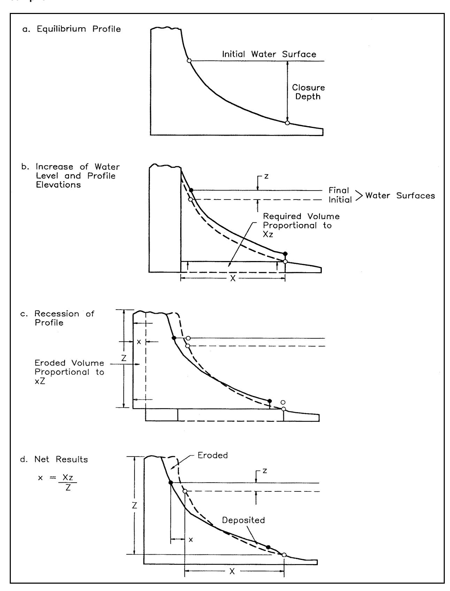

*Figure IV-3-41. Profile adjustment in two stages, first vertical, then horizontal, demonstrating the basis for the Bruun Rule (Equation 3-6) (from Hands (1983)). Details discussed in the text*

sediment is conserved in spite of the complex processes of local erosion versus deposition as bars migrate (Komar et al. 1991). Another strength is that it is a simple relationship, a geometric conclusion based only on water level. Despite its simplicity and numerous assumptions, it works remarkably well in many settings. Even with its shortcomings, it can be used to predict how beaches can respond to changes in sea level.
- (4) Use of models to predict shoreline recession. Although field studies have confirmed the assumptions made by Bruun and others concerning translations of the shoreface, there has been no convincing demonstration that the models can predict shoreline recession rates. Komar et al. (1991) cite several reasons for the inability to use the models as predictive tools:
- (a) Existence of a considerable time lag of the beach response following a sustained water level rise (as shown by Hands (1983) for Lake Michigan). (b) Uncertainty in the selection of the parameters used in the equations (in particular, closure depth). (c) Local complexities of sediment budget considerations in the sand budget.
- (5) Recommendations. More field and laboratory studies are needed to better evaluate the response of beaches to rising (and falling) sea level. For example, it would be valuable to reoccupy the profile lines monitored by Hands (1976, 1979, 1980) in Lake Michigan in the 1970's to determine how the shores have responded to the high water of the mid-1980's and to the subsequent drop in the early 1990's. In addition, conceptual advances need to be incorporated in the theoretical models. How sediment has moved onshore in some locations following sea level rise also needs to be evaluated, because there is evidence that in some areas beach sand compositions reflect offshore rather than onshore sources (Komar et al. 1991). g. Equilibrium profiles on sandy coasts.
- (1) General characteristics and assumptions. The existence of an equilibrium shoreface profile (sometimes called equilibrium beach profile) is a basic assumption of many conceptual and numerical coastal models. Dean (1990) listed characteristic features of profiles: (a) Profiles tend to be concave upwards. (b) Fine sand is associated with mild slopes and coarse sand with steep slopes. (c) The beach (above the surf zone) is approximately planar. (d) Steep waves result in milder inshore slopes and a tendency for bar formation.
The main assumption underlying the concept of the shoreface equilibrium profile is that the seafloor is in equilibrium with average wave conditions. Presumably, the term equilibrium is meant to indicate a situation in which water level, waves, temperature, etc., are held constant for a sufficient time such that the beach profile arrives at a final, stable shape (Larson and Kraus 1989a). Larson (1991) described the profile as: "A beach of specific grain size, if exposed to constant forcing conditions, normally assumed to be short-period breaking waves, will develop a profile shape that displays no net change in time." This concept ignores the fact that, in addition to wave action, many other processes affect sediment transport. These simplifications, however, may represent the real strength of the concept because it has proven to be a useful way to characterize the shape of the shoreface in many locations around the world.
(2) Shape. Based on studies of beaches in many environments, Bruun (1954) and Dean (1976, 1977) have shown that many ocean beach profiles exhibit a concave shape such that the depth varies as the twothirds power of distance offshore along the submerged portions:

```math
h = Ay^{2/3} \tag{IV-3-7}
```

where
h = water depth (m) at distance y (m) from the shoreline
A = a scale parameter that depends mainly on sediment characteristics
This surprisingly simple expression asserts, in effect, that beach profile shape can be calculated from sediment characteristics (particle size or fall velocity) alone. Moore (1982) graphically related the parameter A , sometimes called the profile shape parameter, to the median grain size d50 . Hanson and Kraus (1989) approximated Moore's curve by a series of lines grouped as a function of the median nearshore grain size d50 (in mm):

```math
A = 0.41(d_{50})^{0.94} \quad , \quad d_{50} < 0.4 \\
A = 0.23(d_{50})^{0.32} \quad , \quad 0.4 \leq d_{50} < 10.0
```

```math
A = 0.23(d_{50})^{0.28} \quad , \quad 10.0 \leq d_{50} < 40.0 \\
A = 0.46(d_{50})^{0.11} \quad , \quad 40.0 \leq d_{50}
```

Note that A has unit dependence (m 1/3 ). Equation 3-8 is for SI (metric) values only. Different equations must be used for English units.
Table III-3-3 is a summary of recommended A values, and a more detailed discussion of methods to compute equilibrium profiles is provided in Part III-3.
- (3) Discussion of assumptions. Pilkey et al. (1993), in a detailed examination of the concept of the equilibrium shoreface profile, contended that several assumptions must hold true for the concept to be valid:
- (a) Assumption 1: All sediment movement is driven by incoming wave orbitals acting on a sandy shoreface.
This assumption is incorrect because research by Wright et al. (1991) showed that sediment movement on the shoreface is an exceedingly complex phenomenon, driven by a wide range of wave, tidal, and gravity currents. Even in locations where the wave orbitals are responsible for mobilizing the sand, bottom currents frequently determine where the sand will go.
(b) Assumption 2: Existence of closure depth and no net cross-shore (i.e., shore-normal) transport of sediment to and from the shoreface.
Pilkey et al. (1993) state that this assumption is also invalid because considerable field evidence has shown that large volumes of sand may frequently move beyond the closure depth. Such movement can occur during
IV-3-64 Coastal Morphodynamics
both fair weather and storm periods, although offshore-directed storm flows are most likely the prime transport agent. Pilkey et al. cite studies in the Gulf of Mexico that measured offshore bottom currents of up to 200 cm/sec and sediment transport to the edge of the continental shelf. The amount of sediment moved offshore was large, but it was spread over such a large area that the change in sea bed elevation could not be detected by standard profiling methods.1 Wright, Xu, and Madsen (1994) measured significant across-shelf benthic transport on the inner shelf of the Middle Atlantic Bight during the Halloween storm of 1991.
(c) Assumption 3: There exists a sand-rich shoreface; the underlying and offshore geology must not play a part in determining the shape of the profile.
Possibly the most important of the assumptions implicit in the equilibrium profile concept is that the entire profile is sand-rich, without excessive areas of hard bottom or mud within the active profile. Clearly these conditions do not apply in many parts of the world. Coasts that have limited sand supplies, such as much of the U.S. Atlantic margin, are significantly influenced by the geologic framework occurring underneath and in front of the shoreface. Many of the east coast barriers are perched on a platform of ancient sediment. Depending upon the physical state, this underlying platform can act as a subaqueous headland or hardground that dictates the shape of the shoreface profile and controls beach dynamics and the composition of the sediment. Niederoda, Swift, and Hopkins (1985) believed that the seaward-thinning and fining veneer of modern shoreface sediments is ephemeral and is easily removed from the shoreface during major storms. During storms, Holocene and Pleistocene strata cropping out on the shoreface provide the immediate source of the bulk of barrier sands. Swift (1976) used the term shoreface bypassing to describe the process of older units supplying sediment to the shoreface of barrier islands. Pilkey et al. (1993) contend that:
...a detailed survey of the world's shorefaces would show that the sand rich shoreface required by the equilibrium profile model is an exception rather than the rule. Instead, most shorefaces are underlain by older, consolidated or semi-consolidated units covered by only a relatively thin veneer of modern shoreface sands. These older units are a primary control on the shape of the shoreface profile. The profile shape is not determined by simple wave interaction with the relatively thin sand cover. Rather, the shape of the shoreface in these sediment poor areas is determined by a complex interaction between underlying geology, modern sand cover, and highly variable (and often highly diffracted and refracted) incoming wave climate. (p. 271)
(d) Assumption 4: If a shoreface is, in fact, sand-rich, the smoothed profile described by the equilibrium profile equation (ignoring bars and troughs) must provide a useful approximation of the real shoreface shape.
In addressing this assumption, Pilkey et al. (1993) cited studies conducted on the Gold Coast, in Queensland, Australia. The Gold Coast shoreface is sand-rich to well beyond a depth of 30 m. Without being directly influenced by underlying geology, the shoreface is highly dynamic. As a consequence, the Gold Coast shoreface shape cannot be described by one equilibrium profile; rather, it is best described by an everchanging regime profile. Pilkey et al. concluded:
The local shoreface profile shapes are entirely controlled by relative wave energy "thresholds"; for the sediment properties have not changed at all. Thus principal changes to the shoreface profiles of the Gold Coast are driven by wave power history with some modification by currents, and not by sediment size, or its parameter A , as defined within the equilibrium profile concept. (p. 272).

*This latter statement underscores how important it is to develop improved methods to detect and measure sediment movement in deep water.*

- (4) General comments.
- (a) The idea of a profile only adjusting to waves is fundamentally wrong as shown by Wright et al. (1991) and others. However, although the physical basis for the equilibrium profile concept is weak, critics of this approach have not proven that it always results in highly erroneous answers.
- (b) Before the use of the equilibrium profile, coastal engineers had no way to predict beach change other than using crude approximations (e.g., sand loss of 1 cu yd/ft of beach retreat). The approximations were inadequate. Surveys from around the world have shown that shoreface profiles display a characteristic shape that differs with locality but is relatively stable for a particular place (i.e., Duck, North Carolina). With many caveats (which are usually stated, then ignored), a profile can be reasonably represented by the equilibrium equation. The fit between the profile and the real seafloor on a daily, seasonal, and storm variation basis may not be perfect, but the differences may not matter in the long term.
- (c) One critical problem for coastal engineers is to predict what a sequence of waves (storm) will do to a locality when little is known about the particular shape of the pre-storm beach. For this reason, numerical models like SBEACH (Larson and Kraus 1989a), despite their reliance on the equilibrium profile concept, are still useful. The models allow a researcher to explore storm impact on a location using a general approximation of the beach. The method is very crude - however, the resulting numbers are of the right order of magnitude when compared with field data from many locations.
- (d) Answers from the present models are not exact, and researchers still have much to learn about the weakness of the models and about physical processes responsible for the changes. Nevertheless, the models do work and they do provide numbers that are of the correct magnitudes when run by careful operators. Users of shoreface models must be aware of the limitations of the models and of special conditions that may exist at their project sites. In particular, profile-based numerical models are likely to be inadequate in locations where processes other than wave-orbital transport predominate. h . Depth of closure. (1) Background.
- (a) Depth of closure is a concept that is often misinterpreted and misused. For engineering practice, depth of closure is commonly defined as the minimum water depth at which no measurable or significant change in bottom depth occurs (Stauble et al. 1993). The word significant in this definition is important because it leaves considerable room for interpretation. "Closure" has erroneously been interpreted to mean the depth at which no sediment moves on- or offshore, although numerous field studies have verified that much sediment moves in deep water (Wright et al. 1991). Another complication is introduced by the fact that it is impossible to define a single depth of closure for a project site because "closure" moves depending on waves and other hydrodynamic forces. Therefore, it is invalid to assume that "closure" is a single fixed depth at a project site or a stretch of coastline.
- (b) Closure depth is used in a number of applications such as the placement of mounds of dredged material, beach fill, placement of ocean outfalls, and the calculation of sediment budgets.
- (2) Energy factors. As discussed above, the primary assumption behind the concept of the shoreface equilibrium profile is that sediment movement and the resultant changes in bottom elevation are a function of wave properties and sediment grain size. Therefore, the active portion of the shoreface varies in width throughout the year depending on wave conditions. In effect, "closure" is a time-dependent quantity that may be predicted based on wave climatology or may be interpreted statistically using profile surveys.
IV-3-66 Coastal Morphodynamics
- (3) Time considerations. The energy-dependent nature of the active portion of the shoreface requires us to consider return period. The closure depth that accommodates the 100-year storm will be much deeper than one that merely needs to include the 10-year storm. Therefore, a closure depth must be chosen in light of a project's engineering requirements and design life. For example, if a berm is to be built in deep water where it will be immune from wave resuspension, what is the minimum depth at which it should be placed? This is an important question because of the high costs of transporting material and disposing of it at sea. It would be tempting to use a safe criterion such as the 100- or 500-year storm, but excessive costs may force the project engineer to consider a shallower site that may be stable only for shorter return period events. (4) Predictive methods.
- (a) Hallermeier (1977, 1978, 1981a, 1981b, 1981c), using laboratory tests and limited field data, introduced equations to predict the limits of extreme wave-related sediment movement. He calculated two limits, d_{\ell} and d_{i} , that included a buffer region on the shoreface called the shoal zone. Landward of d_{\ell} significant alongshore transport and intense onshore-offshore sediment transport occur (the littoral zone). Within the shoal zone, expected waves have neither a strong nor a negligible effect on the sandy bed during a typical annual cycle of wave action. Seaward of d_{i} , only insignificant onshore-offshore transport by waves occurs. The deeper limit was based on the median nearshore storm wave height (and the associated wave period). The boundary between the shoal zone and the littoral zone ( d_{\ell} ) as defined represents the annual depth of closure. Hallermeier (1978) suggested an analytical approximation, using linear wave theory for shoaling waves, to predict an annual value of d_{\ell} :

```math
d_{\ell} = 2.28H_e - 68.5 \left(\frac{H_e^2}{gT_e^2}\right) \tag{IV-3-9}
```

where
d_{\ell} = annual depth of closure below mean low water
H_e = non-breaking significant wave height that is exceeded 12 hr per year (0.137 % of the time)
T_e = associated wave period
g = acceleration due to gravity
According to Equation 3-9, d_{\ell} is primarily dependent on wave height with an adjustment for wave steepness. Hallermeier (1978) proposed using the 12-hr exceeded wave height, which allowed sufficient duration for "moderate adjustment towards profile equilibrium." Equation 3-9 is based on quartz sand with a submerged density of \gamma' = 1.6 and a median diameter between 0.16 and 0.42 mm, which typifies conditions in the nearshore for many beaches. If the grain size is larger than 0.42 mm, Equation 3-9 may not be appropriate. Because d_{\ell} was derived from linear wave theory for shoaling waves, d_{\ell} must be seaward of the influence of intense wave-induced nearshore circulation. However, because of various factors, Hallermeier (1978) "proposed that the calculated d_{\ell} be used as a minimum estimate of profile close-out depth with respect to low(er) tide level." Because tidal or wind-induced currents may increase wave-induced near-bed flow velocities, Hallermeier suggested using mean low water (mlw) as a reference water level to obtain a conservative depth of closure. Note that Hallermeier's equations critically depend on the quality of wave data at a site. The reader is cautioned that Hallermeier's equations can be expressed in various forms depending on the assumptions made, the datums used as reference levels, and available wave data. The reader is referred
to his original papers for clarification and for details of his assumptions. The equations may not be applicable at sites where currents are more important at moving sand than wave-induced flows.
(b) At the Lake Michigan sites that Hands (1983) surveyed, the closure depth was equal to about twice the height of the 5-year return period wave height ( H5 ):

```math
Z \simeq 2H_5 \tag{IV-3-10}
```

In the absence of strong empirical evidence as to the correct closure depth, this relationship is recommended as a rule of thumb to estimate the 5-year profile response under Great Lakes conditions. The return period of the wave height should approximate the design life of interest. For example, the 20-year closure depth would be estimated by doubling the 20-year return period wave height ( Z • 2 H20 ).

#### (5) Empirical determination.

- (a) When cross-shore surveys covering several years are available for a project site, closure is best determined by plotting and analyzing the profiles. The closure depth computed in this manner reflects the influence of storms as well as of calmer conditions. Kraus and Harikai (1983) evaluated the depth of closure as the minimum depth where the standard deviation in depth change decreased markedly to a near-constant value. Using this procedure, they interpreted the landward region where the standard deviation increased to be the active profile where the seafloor was influenced by gravity waves and storm-driven water level changes. The offshore region of smaller and nearly constant standard deviation was primarily influenced by lower frequency sediment-transporting processes such as shelf and oceanic currents (Stauble et al. 1993). It must be noted that the smaller standard deviation values fall within the limit of measurement accuracy. This suggests that it is not possible to specify a closure depth unambiguously because of operational limits of offshore profiling hardware and procedures.
- (b) An example of how closure was determined empirically at Ocean City, Maryland, is shown in Figure IV-3-42 (from Stauble et al. (1993)). A clear reduction in standard deviation occurs at a depth of about 5.5 - 6 m. Above the -5.5 m depth, the profile exhibits large variability, indicating active wave erosion, deposition, and littoral transport. Deeper (and seaward) of this zone, the lower and relatively constant deviation of about 7 - 10 cm is within the measurement error of the sled surveys. Nevertheless, despite the inability to precisely measure seafloor changes in this offshore region, it is apparent that less energetic erosion and sedimentation take place here than in water shallower than -5.5 m. This does not mean that there is no sediment transport in deep water, just that the sled surveys are unable to measure it. For the 5.6 km of shore surveyed at Ocean City, the depth of closure ranged between 5.5 and 7.5 m. Scatter plots indicated that the average closure depth was 6 m.
- (c) Presumably, conducting surveys over a longer time span at Ocean City would reveal seafloor changes deeper than -6 m, depending on storms that passed the region. However, Stauble et al. (1993) noted that the "Halloween Storm" of October 29 to November 2, 1991 generated waves of peak period ( Tp ) 19.7 sec, extraordinarily long compared to normal conditions along the central Atlantic coast. Therefore, the profiles may already reflect the effects of an unusually severe storm.
IV-3-68 Coastal Morphodynamics

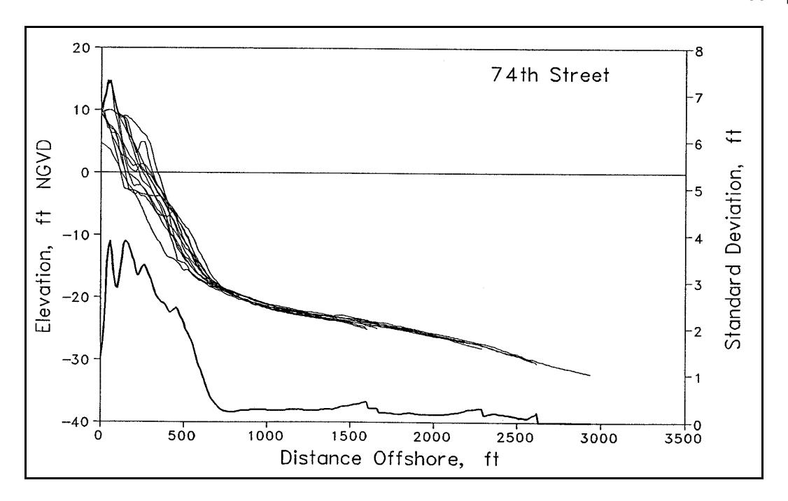

*Figure IV-3-42. Profile surveys and standard deviation of seafloor elevation at 74th Street, Ocean City, Maryland (from Stauble et al. (1993)). Surveys conducted from 1988 to 1992. Large changes above the datum were caused by beach fill placement and storm erosion. Figure discussed in the text*

- (d) Figure IV-3-43 is an example of profiles from St. Joseph, Michigan, on the east shore of Lake Michigan. Along Line 14, dramatic bar movement occurs as far as 760 m offshore to a depth of 7.6 m with respect to International Great Lakes Datum (IGLD) 1985. This is where an abrupt decrease in standard deviation of lake floor elevation occurs and can be interpreted as closure depth. In September 1992, the mean water surface was 0.51 m above IGLD 85. Therefore, closure was around 7.9 - 8.2 m below water level.
- (e) In the Great Lakes, water levels fluctuate over multi-year cycles. This raises some fundamental difficulties in calculating closure based on profile surveys. Presumably, during a period of high lake level, the zone of active sand movement would be higher on the shoreface than during a time of low lake level (this assumes similar wave conditions). Therefore, the depth where superimposed profiles converge should reflect the deepest limit of active shoreface sand movement. This would be a conservative value, but only with respect to the hydrologic conditions that occurred during the survey program . Presumably, if lake level dropped further at a later date, sediment movement might occur deeper on the shoreface. This suggests that closure on the lakes should be chosen to reflect the lowest likely water level that is expected to occur during the life of a project. (Note that this consideration does not arise on ocean coasts because year-to-year changes in relative sea level are minor, well within the error bounds of sled surveys. Sea level does change throughout the year because of thermal expansion, freshwater runoff, and other factors as discussed in Part IV-1, but the multi-year mean is essentially stable.) In summary, determining closure depth in the Great Lakes is problematic because of changing water levels, and more research is needed to develop procedures that accommodate these non-periodic lake level fluctuations.
- (f) The variation of closure depth at approximately 100 profile lines along the south shore of Long Island is plotted in Figure IV-3-44. Generally the depth increases towards the east, with Rockaway Beach averaging 5.0 m below NGVD and the Montauk zone averaging 7.6 m. These values were based on

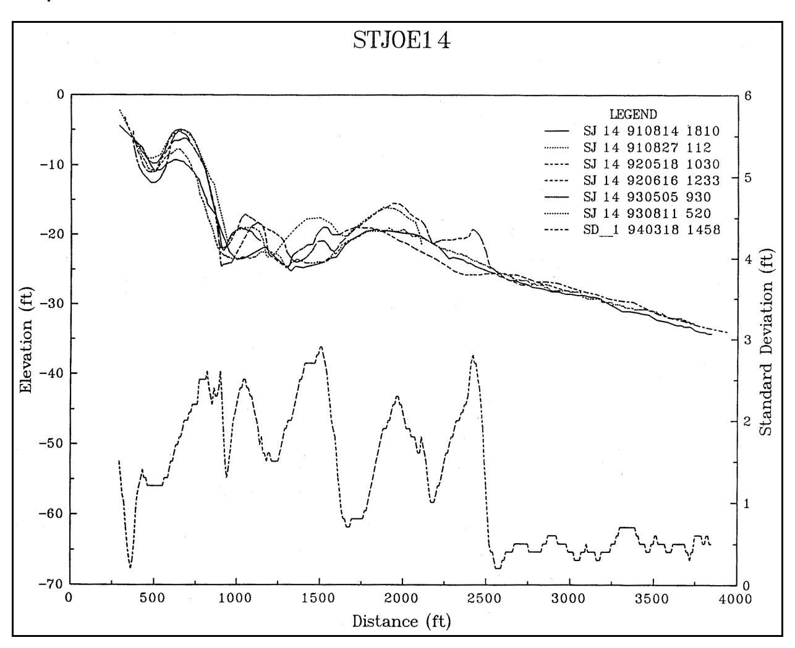

*Figure IV-3-43. Profile surveys and standard deviation of lake floor elevation at St. Joseph, Michigan, on the east shore of Lake Michigan. Profiles are referenced to International Great Lakes Datum (IGLD) 1985. Sur veys conducted between 1991 and 1994 (Nairn et al. 1997). Figure discussed in the text*

surveys in 1995 and 1996 (Morang 1998). The depth increase toward the east is expected because wave energy is greater there than at the west end of Long Island.

#### i. Longshore sediment movement.

The reader is referred to Part III-2 and to Coastal Sediment Transport (EM 1110-2-1502) for a detailed treatment of longshore transport.

#### j. Summary .

- (1) A model of shoreface morphodynamics for micro- and low-mesotidal sandy coasts has been developed by Wright and Short (1984). The six stages of the model (Figure IV-3-34) illustrate the response of sandy beaches to various wave conditions.
- (2) Sediment movement on the shoreface is a very complicated phenomenon. It is a result of numerous hydrodynamic processes, among which are: (a) wave orbital interactions with bottom sediments and with
IV-3-70 Coastal Morphodynamics

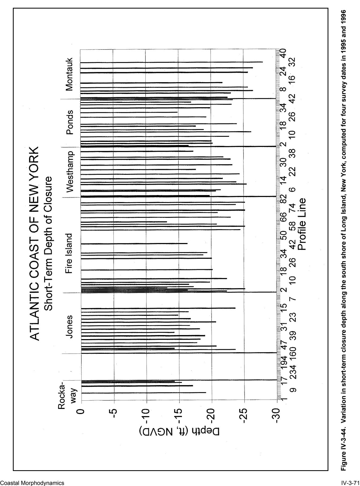

wave-induced longshore currents; (b) wind-induced longshore currents; (c) rip currents; (d) tidal currents; (e) storm surge ebb currents; (f) gravity-driven currents; (g) wind-induced upwelling and downwelling; (h) wave-induced upwelling and downwelling; and (i) gravity-induced downslope transport.
- (3) The Bruun Rule (Equation 3-5 or 3-6) is a model of shoreface response to rising sea level. Despite the model's simplicity, it helps explain how barriers have accommodated rising sea level by translating upward and landward. A limitation is that the model does not address when the predicted shore response will occur (Hands 1983). It merely reveals the horizontal distance the shoreline must ultimately move to reestablish the equilibrium profile at its new elevation under the stated assumptions.
- (4) The concept of the equilibrium shoreface profile applies to sandy coasts primarily shaped by wave action. It can be expressed by a simple equation (Equation 3-7) which depends only on sediment characteristics. Although the physical basis for the equilibrium profile concept is weak, it is a powerful tool because models based on the concept produce resulting numbers that are of the right order of magnitude when compared with field data from many locations.
- (5) Closure is a concept that is often misinterpreted and misused. For engineering practice, depth of closure is commonly defined as the minimum water depth at which no measurable or significant change in bottom depth occurs (Stauble et al. 1993). Closure can be computed by two methods: (a) analytical approximations such as those developed by Hallermeier (1978), which are based on wave statistics at a project site (Equation 3-10); or (b) empirical methods based on cross-shore survey profile data. When profiles are superimposed, a minimum value for closure can be interpreted as the depth where the standard deviation in depth change decreases markedly to a near-constant value. Both methods have weaknesses. Hallermeier's analytical equations depend on the quality of wave data. Empirical determinations depend on the availability of several years of profile data at a site. Determining closure in the Great Lakes is problematic because lake levels fluctuate due to changing hydrographic conditions.

#### IV-3-6. References

# EM 1110-2-1502

Coastal Littoral Transport

#### Allen 1968

Allen, J. R. L. 1968. Current Ripples: Their Relation to Patterns of Water and sediment Movement, North Holland, Amsterdam, Netherlands.

# Allen 1984

Allen, J. R. L. 1984. "Sedimentary Structures, Their Character and Physical Basis," Developments in Sedimentology , Vol 30, Elsevier, New York, NY.

# Allen 1985

Allen, J. R. L. 1985. Principles of Physical Sedimentology, George Allen and Unwin, London, UK.

### Ashley 1990

Ashley, G. M. 1990. "Classification of Large-Scale Subaqueous Bedforms: A New Look at an Old Problem," Journal of Sedimentary Petrology , Vol 60, pp 363-396.
IV-3-72 Coastal Morphodynamics

#### Aubrey and Speer 1984

Aubrey, D. G., and Speer, P. E. 1984. "Updrift Migration of Tidal Inlets," Journal of Geology , Vol 92, pp 531-546.

# Aubrey and Weishar 1988

Aubrey, D. G., and Weishar, L., eds. 1988. Hydrodynamics and Sediment and Dynamics of Tidal Inlets, Lecture Notes on Coastal and Estuarine Studies, Vol 29, Springer-Verlag, New York, NY.

#### Baeteman 1994

Baeteman, C. 1994. Subsidence in coastal lowlands due to groundwater withdrawal: The geological approach, "Coastal Hazards, Perception, Susceptibility and Mitigation," C. W., Finkl, Jr., ed., Journal of Coastal Research Special Issue No. 12, pp 61-75.

#### Barwis 1976

Barwis, J. H. 1976. "Annotated Bibliography on the Geologic, Hydraulic, and Engineering Aspects of Tidal Inlets," General Investigation of Tidal Inlets Report 4, U.S. Army Engineer Waterways Experiment Station, Vicksburg, MS.

# Bascom 1964

Bascom, W. 1964. Waves and Beaches, the Dynamics of the Ocean Surface, Doubleday & Co., Garden City, NY.

#### Bass, Fulford, Underwood, and Parson 1994

Bass, G. P., Fulford, E. T., Underwood, S. G., and Parson, L. E. 1994. "Rehabilitation of the South Jetty, Ocean City, Maryland," Technical Report CERC 94-6, U.S. Army Engineer Waterways Experiment Station, Vicksburg, MS.

#### Boothroyd 1985

Boothroyd, J. C. 1985. "Tidal Inlets and Tidal Deltas," Coastal Sedimentary Environments , 2nd ed., R. A. Davis, ed., Springer-Verlag, New York, NY, pp 445-532.

#### Bruno, Yavary, and Herrington 1998

Bruno, M. S., Yavary, M., and Herrington, T. O. 1998. "The influence of a stabilized inlet on adjacent shorelines: Manasquan, New Jersey," Shore & Beach, Vol. 66, No. 2, pp 19-25.

# Bruun 1954

Bruun, P. 1954. "Coast Erosion and the Development of Beach Profiles," Technical Memorandum No. 44, Beach Erosion Board, U.S. Army Engineer Waterways Experiment Station, Vicksburg, MS.

#### Bruun 1966

Bruun, P. 1966. Tidal Inlets and Littoral Drift, Universitets-forlaget, Norway (in English).

# Bruun 1988

Bruun, P. 1988. "The Bruun Rule of Erosion by Sea-Level Rise: A Discussion of Large-Scale Two- and Three-Dimensional Usages," Journal of Coastal Research, Vol 4, pp 627-648.

#### Bruun and Gerritsen 1959

Bruun, P., and Gerritsen, F. 1959. "Natural By-passing of Sand at Coastal Inlets," Journal of Waterways and Harbors Division, American Society of Civil Engineers, New York, pp 75-107.

#### Bruun and Gerritsen 1961

Bruun, P., and Gerritsen, F. 1961. Stability of Coastal Inlets," Proceedings of the Seventh Conference on Coastal Engineering, August 1960, The Hague, Netherlands, J. W. Johnson, ed., Council on Wave Research, University of California, Berkeley, CA, pp 386-417.

#### Carter 1988

Carter, R. W. G. 1988. Coastal Environments: An Introduction to the Physical, Ecological, and Cultural Systems of Coastlines, Academic Press, London, UK.

# Casta˜ner 1971

Casta˜ner, P. F. 1971. "Selected Bibliography on the Engineering Characteristics of Coastal Inlets," Report HEL 24-7, Hydraulic Engineering Laboratory, University of California, Berkeley, CA.

#### Chapman 1974

Chapman, V. J. 1974. "Salt Marshes and Salt Deserts of the World," Ecology of Halophytes , R. J. Reimold and W. H. Queen, eds., Academic Press, New York, pp 3-19.

# Chasten 1992

Chasten, M. A. 1992. "Coastal Response to a Dual Jetty System at Little River Inlet, North and South Carolina," Miscellaneous Paper CERC-92-2, U.S. Army Engineer Waterways Experiment Station, Vicksburg, MS.

#### Chasten and Seabergh 1992

Chasten, M. A., and Seabergh, W. C. 1992. "Engineering Assessment of Hydrodynamics and Jetty Scour at Little River Inlet, North and South Carolina," Miscellaneous Paper CERC-92-10, U.S. Army Engineer Waterways Experiment Station, Vicksburg, MS.

#### Coastal Barriers Study Group 1988

Coastal Barriers Study Group. 1988. Report to Congress: Coastal Barrier Resources System, Recommendations for Additions to or Deletions from the Coastal Barrier Resources System, (in 22 Volumes covering the United States and territories), U.S. Department of the Interior, Washington, DC.

#### Coleman 1988

Coleman, J. M. 1988. "Dynamic Changes and Processes in the Mississippi River Delta," Bulletin of the Geological Society of America, Vol 100, pp 999-1015.

#### Coleman and Garrison 1977

Coleman, J. M., and Garrison, L. E. 1977. "Geological Aspects of Marine Slope Instability, Northwestern Gulf of Mexico," Marine Geotechnology, Vol 2, pp 9-44.

#### Coleman and Wright 1975

Coleman, J. M., and Wright, L. D. 1975. "Modern River Deltas: Variability of Process and Sand Bodies," Deltas, Models for Exploration, M. L. Broussard, ed., Houston Geological Society, Houston, TX, pp 99-149.

#### Cronin 1975

Cronin, L. E., ed. 1975. Estuarine Research , Academic Press, New York (2 volumes).

#### Davis 1985

Davis, R. A., Jr., ed. 1985. Coastal Sedimentary Environments, 2nd ed., Springer-Verlag, New York.
IV-3-74 Coastal Morphodynamics

# Davis and Ethington 1976

Davis, R. A., Jr., and Ethington, R. L. 1976. Beach and Nearshore Sedimentation , Society of Economic Paleontologists and Mineralogists (SEPM) Special Publication No. 24, Tulsa, OK.

# Dean 1976

Dean, R. G. 1976. "Beach Erosion: Causes, Processes, and Remedial Measures," CRC Reviews in Environmental Control , CRC Press Inc., Boca Raton, FL, Vol 6, Issue 3, pp 259-296.

# Dean 1977

Dean, R. G. 1977. "Equilibrium Beach Profiles - U.S. Atlantic and Gulf Coasts," Ocean Engineering Report No. 12, University of Delaware, Newark, pp 1-45.

#### Dean 1987

Dean, R. G. 1987. "Coastal Sediment Processes: Toward Engineering Solutions," Proceedings of Coastal Sediments '87 , American Society of Civil Engineers, New York, pp 1-24.

#### Dean 1988

Dean, R. G. 1988. "Sediment Interaction at Modified Coastal Inlets: Processes and Policies," Hydrodynamics and Sediment Dynamics of Tidal Inlets , Lecture Notes on Coastal and Estuarine Studies, D. G. Aubrey and L. Weishar, eds., Vol 29, Springer-Verlag, New York, pp 412-439.

#### Dean 1990

Dean, R. G. 1990. "Equilibrium Beach Profiles: Characteristics and Applications," Report UFL/COEL-90/001, Coastal & Oceanographic Engineering Department, University of Florida, Gainesville, FL.

#### Dingler, Reiss, and Plant 1993

Dingler, J. R., Reiss, T. E., and Plant, N. G. 1993. "Erosional Patterns of the Isles Dernieres, Louisiana, in Relation to Meteorological Influences," Journal of Coastal Research , Vol 9, No. 1, pp 112-125.

#### Douglass 1987

Douglass, S. L. 1987. "Coastal Response to Navigation Structures at Murrells Inlet, South Carolina," Technical Report CERC-87-2, U.S. Army Engineer Waterways Experiment Station, Vicksburg, MS.

#### Escoffier 1940

Escoffier, F. F. 1940. "The Stability of Tidal Inlets," Shore and Beach , Vol 8, pp 114-115.

#### Escoffier 1977

Escoffier, F. F. 1977. "Hydraulics and Stability of Tidal Inlets," General Investigation of Tidal Inlets Report 13, U.S. Army Engineer Waterways Experiment Station, Vicksburg, MS.

#### FitzGerald 1988

FitzGerald, D. M. 1988. "Shoreline Erosional-Depositional Processes Associated with Tidal Inlets," Hydrodynamics and Sediment Dynamics of Tidal Inlets , Lecture Notes on Coastal and Estuarine Studies, D. G. Aubrey and L. Weishar, eds., Vol 29, Springer-Verlag, New York, pp 186-225.

#### FitzGerald and Nummedal 1983

FitzGerald, D. M., and Nummedal, D. 1983. "Response Characteristics of an Ebb-Dominated Tidal Inlet Channel," Journal of Sedimentary Petrology , Vol 53, No. 3, pp 833-845.

# FitzGerald, Hubbard, and Nummedal 1978

FitzGerald, D. M., Hubbard, D. K., and Nummedal, D. 1978. "Shoreline Changes Associated with Tidal Inlets along the South Carolina Coast," Proceedings Coastal Zone '78 , American Society of Civil Engineers, New York, pp 1973-1994.

#### FitzGerald, Penland, and Nummedal 1984

FitzGerald, D. M., Penland, S., and Nummedal, D. 1984. "Control of Barrier Island Shape by Inlet Sediment Bypassing: Ease Friesian Islands, West Germany," Marine Geology , Vol 60, pp 355-376.

#### Gorman, Morang, and Larson 1998

Gorman, L., Morang, A., and Larson, R. 1998. "Monitoring the Coastal Environment; Part IV: Mapping, Shoreline Changes, and Bathymetric Analysis," Journal of Coastal Research 14(1), 61-92.

#### Graf 1984

Graf, W. H. 1984. Hydraulics of Sediment Transport, Water Resources Publications, Littleton, CO.

#### Greenwood and Davis 1984

Greenwood, B., and Davis, R. A., Jr. 1984. Hydrodynamics and Sedimentation in Wave-Dominated Coastal Environments , Developments in Sedimentology 39, Elsevier, Amsterdam, the Netherlands (reprinted from Marine Geology, Vol 60, Nos. 1-4).

## Guza and Inman 1975

Guza, R. T., and Inman, D. L. 1975. "Edge Waves and Beach Cusps," Journal of Geophysical Research , Vol 80, pp 2997-3012.

#### Hallermeier 1977

Hallermeier, R. J. 1977. "Calculating a Yearly Depth Limit to the Active Beach Profile," Technical Paper TP 77-9, Coastal Engineering Research Center, U.S. Army Engineer Waterways Experiment Station, Vicksburg, MS.

# Hallermeier 1978

Hallermeier R. J. 1978. "Uses for a Calculated Limit Depth to Beach Erosion," Proceedings of the 16th Coastal Engineering Conference, American Society of Civil Engineers, New York, pp 1493-1512.

#### Hallermeier 1981a

Hallermeier, R. J. 1981a. "A Profile Zonation for Seasonal Sand Beaches from Wave Climate," Coastal Engineering , Vol 4, No. 3, pp 253-277.

#### Hallermeier 1981b

Hallermeier, R. J. 1981b. "Terminal Settling Velocity of Commonly Occurring Sand Grains," Sedimentology , Vol 28, No. 6, pp 859-865.

#### Hallermeier 1981c

Hallermeier, R. J. 1981c. "Seaward Limit of Significant Sand Transport by Waves: An Annual Zonation for Seasonal Profiles," Coastal Engineering Technical Aide CETA 81-2, Coastal Engineering Research Center, U.S. Army Engineer Waterways Experiment Station, Vicksburg, MS.
IV-3-76 Coastal Morphodynamics

#### Hands 1976

Hands, E. B. 1976. "Observations of Barred Coastal Profiles Under the Influence of Rising Water Levels, Eastern Lake Michigan, 1967-71," Technical Report 76-1, Coastal Engineering Research Center, U.S. Army Engineer Waterways Experiment Station, Vicksburg, MS.

#### Hands 1979

Hands, E. B. 1979. "Changes in Rates of Shore Retreat, Lake Michigan 1967-76," Technical Paper No. 79-4, U.S. Army Engineer Waterways Experiment Station, Coastal Engineering Research Center, Vicksburg, MS.

# Hands 1980

Hands, E. B. 1980. "Prediction of Shore Retreat and Nearshore Profile Adjustments to Rising Water Levels on the Great Lakes," Technical Paper No. 80-7, U.S. Army Engineer Waterways Experiment Station, Coastal Engineering Research Center, Vicksburg, MS.

#### Hands 1983

Hands, E. B. 1983. "The Great Lakes as a Test Model for Profile Response to Sea Level Changes," Chapter 8 in Handbook of Coastal Processes and Erosion, P. D. Komar, ed., CRC Press, Inc., Boca Raton, FL. (Reprinted in Miscellaneous Paper CERC-84-14, Coastal Engineering Research Center, U.S. Army Engineer Waterways Experiment Station, Vicksburg, MS.)

# Hanson and Kraus 1989

Hanson, H., and Kraus, N. C. 1989. "GENESIS: Generalized Model for Simulating Shoreline Change; Report 1, Technical Reference, Technical Report CERC-89-19, U.S. Army Engineer Waterways Experiment Station, Vicksburg, MS.

#### Harms 1969

Harms, J. C. 1969. "Hydraulic Significance of Some Sand Ripples," Bulletin of the Geological Society of America, Vol 80, pp 363-396.

# Henkel 1970

Henkel, D. J. 1970. "The Role of Waves in Causing Submarine Landslides," Geotechnique, Vol 20, pp 75-80.

#### Horikawa 1988

Horikawa, K., ed. 1988. Nearshore Dynamics and Coastal Processes: Theory, Measurement and Predictive Models, University of Tokyo Press, Tokyo, Japan.

#### Houston 1995

Houston, J. R. 1995. Beach Nourishment, Shore and Beach, Journal of the American Shore and Beach Preservation Association, Vol. 63, No. 1.

#### Houston 1996a

Houston, J. R. 1996a. The Economic Value of Beaches, Proceedings, 1996 National Conference on Beach Preservation Technology , St. Petersburg, Florida, Jan 24-26, 1996, pp. 271-280.

#### Houston 1996b

Houston, J. R. 1996b. International Tourism & U.S. Beaches, Shore and Beach , Journal of the American Shore and Beach Preservation Association, Vol. 64, No. 2, pp. 3-4.

#### Hubbard, Oertel, and Nummedal 1979

Hubbard, D. K., Oertel, G., and Nummedal, D. 1979. "The Role of Waves and Tidal Currents in the Development of Tidal-Inlet Sedimentary Structures and Sand Body Geometry: Examples from North Carolina, South Carolina, and Georgia," Journal of Sedimentary Petrology , Vol 49, No. 4, pp 1073-1092.

#### Hume and Herdendorf 1988

Hume, T. M., and Herdendorf, C. E. 1988. "A Geomorphic Classification of Estuaries and Its Application to Coastal Resource Management - a New Zealand Example," Journal of Ocean and Shoreline Management , Vol 11, pp 249-274.

#### Jopling 1966

Jopling, A. V. 1966. "Some Principles and Techniques Used in Reconstructing the Hydraulic Parameters of a Paleoflow Regime," Journal of Sedimentary Petrology, Vol 36, pp 5-49.

#### Keulegan 1967

Keulegan, G. H. 1967. "Tidal Flow in Entrances: Water-level Fluctuations of Basins in Communication with Seas," Technical Bulletin 14, Committee on Tidal Hydraulics, U.S. Army Corps of Engineers, Washington, DC.

# Kieslich 1977

Kieslich, J. M. 1977. "A Case History of Port Mansfield Channel, Texas," General Investigation of Tidal Inlets Report 12, U.S. Army Engineer Waterways Experiment Station, Vicksburg, MS.

#### King 1972

King, C. A. M. 1972. Beacher and Coasts, 2nd ed., Edward Arnold, London, UK.

#### Kinsman 1965

Kinsman, B. 1965. Wind Waves, Prentice-Hall, Englewood Cliffs, NJ.

#### Komar 1998

Komar, P. D. 1998. Beach Processes and Sedimentation, 2nd ed., Prentice-Hall, Upper Saddle River, NJ.

# Komar et al. 1991

Komar, P. D., et al. (Scientific Committee on Ocean Research (SCOR) Working Group 89.) 1991. "The Response of Beaches to Sea-Level Changes: A Review of Predictive Models," Journal of Coastal Research , Vol 7, No. 3, pp 895-921.

#### Kraus and Harikai 1983

Kraus, N. C., and Harikai, S. 1983. "Numerical Model of the Shoreline Change at Oarai Beach," Coastal Engineering , Vol 7, No. 1, pp 1-28.

#### Kraus, Gorman, and Pope (eds.) 1994)

Kraus, N. C., Gorman, L. T., and Pope, J. (eds.) 1994. "Kings Bay Coastal and Estuarine Physical Monitoring and Evaluation Program: Coastal Studies, Volume I, Main Text and Appendix A," Technical Report CERC 94-9, U.S. Army Engineer Waterways Experiment Station, Coastal Engineering Research Center, Vicksburg, MS.
IV-3-78 Coastal Morphodynamics

# Kraus, Gorman, and Pope (eds.) 1995

Kraus, N. C., Gorman, L. T., and Pope, J. (eds.) 1995. "Kings Bay Coastal and Estuarine Physical Monitoring and Evaluation Program: Coastal Studies, Volume II, Appendices B-G," Technical Report CERC 94-9, U.S. Army Engineer Waterways Experiment Station, Coastal Engineering Research Center, Vicksburg, MS.

# Larson 1991

Larson, M. 1991. "Equilibrium Profile of a Beach with Varying Grain Size," Coastal Sediments '91, American Society of Civil Engineers, New York, NY, pp 905-919.

#### Larson and Kraus 1989a

Larson, M., and Kraus, N. C. 1989a. "SBEACH: Numerical Model for Simulating Storm-Induced Beach Change; Report 1, Empirical Foundation and Model Development." Technical Report CERC-89-9, U.S. Army Engineer Waterways Experiment Station, Vicksburg, MS.

#### Leeder 1982

Leeder, M. R. 1982. Sedimentology: Process and Product, George Allen and Unwin, London, UK.

#### Le Méhauté 1976

Le Méhauté, B. 1976. An Introduction to Hydrodynamics and Water Waves, Springer-Verlag, New York, NY.

#### Lewis 1984

Lewis, D. W. 1984. Practical Sedimentology, Hutchinson Ross, Stroudsburg, PA.

# Middleton 1965

Middleton, G. V., Compiler. 1965. Primary Sedimentary Structures and Their Hydrodynamic Interpretation , Society of Economic Paleontologists and Mineralogists Special Publication No. 12, Tulsa, OK.

#### Middleton and Southard 1984

Middleton, G. V., and Southard, J. B. 1984. "Mechanics of Sediment Transport," Society for Sedimentary Geology (SEPM), Short Course No. 3, Tulsa, OK.

# Moore 1982

Moore, B. D. 1982. "Beach Profile Evolution in Response to Changes in Water Level and Wave Height," M. S. thesis, University of Delaware, Newark, DE.

#### Morang 1992a

Morang, A. 1992a. "A Study of Geologic and Hydraulic Processes at East Pass, Destin, Florida," (in two volumes), Technical Report CERC-92-5, U.S. Army Engineer Waterways Experiment Station, Vicksburg, MS.

# Morang 1992b

Morang, A. 1992b. "Inlet Migration and Geologic Processes at East Pass, Florida," Journal of Coastal Research , Vol 8, No. 2, pp 457-481.

# Morang 1998

Morang, A. 1998. "Atlantic Coast of New York Monitoring Project; Report 1, Analysis of Beach Profiles, 1995-1996, Report prepared for U.S. Army Engineer District, New York, U.S. Army Engineer Waterways Experiment Station, Vicksburg, MS.

# Morang 1999

Morang, A. 1999. Coastal Inlets Research Program, Shinnecock Inlet, New York, Site Investigation, Report 1, Morphology and Historical Behavior, Technical Report CHL-98-32, U.S. Army Engineer Waterways Experiment Station, Vicksburg, MS.

# Nairn, Zuzek, Morang, and Parson 1997

Nairn, R. B., Zuzek, P., Morang, A., and Parson, L. 1997. "Effectiveness of Beach Nourishment on Cohesive Shores, St. Joseph, Lake Michigan," Technical Report CHL-97-15, U.S. Army Engineer Waterways Experiment Station, Vicksburg, MS.

#### Nersesian and Bocamazo 1992

Nersesian, G. K., and Bocamazo, L. M. 1992. Design and construction of Shinnecock Inlet, New York. Coastal Engineering Practice '92, American Society of Civil Engineers, New York, pp. 554-570.

# Niedoroda, Swift, and Hopkins 1985

Niedoroda, A. W., Swift, D. J. P., and Hopkins, T. S. 1985. "The Shoreface," Coastal Sedimentary Environments, R. A. Davis, Jr., ed., 2nd ed., Springer-Verlag, New York.

#### Nummedal and Fischer 1978

Nummedal, D., and Fischer, I. A. 1978. "Process-Response Models for Depositional Shorelines: The German and the Georgia Bights," Proceedings of the Sixteenth Conference on Coastal Engineering , American Society of Civil Engineers, New York, pp 1215-1231.

#### Nummedal and Humphries 1978

Nummedal, D., and Humphries, S. M. 1978. "Hydraulics and Dynamics of North Inlet, South Carolina, 1975-76," General Investigation of Tidal Inlets Report 16, U.S. Army Engineer Waterways Experiment Station, Vicksburg, MS.

# Nummedal and Penland 1981

Nummedal, D., and Penland, S. 1981. "Sediment Dispersal in Norderneyer Seegat, West Germany," Holo cene Marine Sedimentation in the North Sea Basin , S. D. Nio, R. T. E. Schuttenhelm, and C. E. van Weering, eds., International Association of Sedimentologists Special Publication No. 5, pp 187-210.

#### O'Brien 1931

O'Brien, M. P. 1931. "Estuary Tidal Prisms Related to Entrance Areas," Civil Engineering , Vol 1, pp 738- 739.

# O'Brien 1976

O'Brien, M. P. 1976. "Notes on Tidal Inlets on Sandy Shores," General Investigation of Tidal Inlets Report 5, U.S. Army Engineer Waterways Experiment Station, Vicksburg, MS.

#### Oertel 1982

Oertel, G. F. 1982. "Inlets, Marine-Lagoonal and Marine Fluvial," The Encyclopedia of Beaches and Coastal Environments , M. L. Schwartz, ed., Hutchinson Ross Publishing Company, Straudsburg, PA, p 489.
IV-3-80 Coastal Morphodynamics

# Oertel 1988

Oertel, G. F. 1988. "Processes of Sediment Exchange Between Tidal Inlets, Ebb Deltas, and Barrier Islands," Hydrodynamics and Sediment Dynamics of Tidal Inlets , Lecture Notes on Coastal and Estuarine Studies, Vol 29, D. G. Aubrey and L. Weishar, eds., Springer-Verlag, New York, pp 297-318.

# Pilkey 1993

Pilkey, O. H. 1993. "Can We Predict the Behavior of Sand: In a Time and Volume Framework of Use to Humankind?" Journal of Coastal Research , Vol 9, No. 1, pp iii-iv.

### Pilkey, Young, Riggs, Smith, Wu, and Pilkey 1993

Pilkey, O. H., Young, R. S., Riggs, S. R., Smith, A. W. S., Wu, H., and Pilkey, W. D. 1993. "The Concept of Shoreface Profile of Equilibrium: A Critical Review," Journal of Coastal Research , Vol 9, No. 1, pp 225-278.

#### Pratt and Stauble 2001

Pratt, T., and Stauble, D. 2001. Coastal Inlets Research Program, Shinnecock Inlet, New York, Site Investigation, Report 3, Selected Field Data Report for 1997, 1998, and 1998 Velocity and Sediment Surveys. Technical Report CHL-98-32, U.S. Army Corps of Engineers, Engineer Research and Development Center, Vicksburg, MS.

#### Price 1968

Price, W. A. 1968. "Tidal Inlets," The Encyclopedia of Geomorphology , Encyclopedia of Earth Sciences Series, Vol III, R. W. Fairbridge, ed., Reinhold Book Corp., NY, pp 1152-1155.

#### Price and Parker 1979

Price, W. A., and Parker, R. H. 1979. "Origins of Permanent Inlets Separating Barrier Islands and Influence of Drowned Valleys on Tidal Records Along the Gulf Coast of Texas," Transactions Gulf Coast Association of Geological Societies , Vol 29, pp 371-385.

#### Prior and Coleman 1979

Prior, D. B., and Coleman, J. M. 1979. "Submarine Landslides - Geometry and Nomenclature," Zeitschrift fu u r Geomorphology, Vol 23, No. 4, pp 415-426.

# Prior and Coleman 1980

Prior, D. B., and Coleman, J. M. 1980. "Sonograph Mosaics of Submarine Slope Instabilities, Mississippi River Delta," Marine Geology, Vol 36, pp 227-239.

# Reineck and Singh 1980

Reineck, H. E., and Singh, I. B. 1980. Depositional Sedimentary Environments, 2nd ed., Springer-Verlag, Berlin, Germany.

# Resio and Hands 1994

Resio, D. T., and Hands, E. B. 1994. "Understanding and Interpreting Seabed Drifter (SBD) Data," Technical Report DRP-94-1, U.S. Army Engineer Waterways Experiment Station, Vicksburg, MS.

#### Russell 1967

Russell, R. 1967. "Origin of estuaries," Estuaries, G. H. Lauff, ed., American Association for the Advancement of Science, Publication 83, Washington, DC., 93-99.

#### Sha 1990

Sha, L. P. 1990. Sedimentological Studies of the Ebb-tidal Deltas Along the West Frisian Islands, the Netherlands , Geologica Ultraiectina No. 64, Instituut voor Aardwetenschappen der Rijks-universiteit te Utrecht, Ultrecht, The Netherlands (in English).

#### Shepard 1950

Shepard, F. P. 1950. "Longshore Bars and Longshore Troughs." Technical Memorandum 41, Beach Erosion Board, U.S. Army Corps of Engineers, Washington, DC.

#### Short 1991

Short, A. D. 1991. "Macro-meso Tidal Beach Morphodynamics - An Overview," Journal of Coastal Research , Vol 7, No. 2, pp 417-436.

#### Stauble, Da Costa, Monroe, and Bhogal 1988

Stauble, D. K., Da Costa, S. L., Monroe, K. L., and Bhogal, V. K. 1988. "Inlet Flood Tidal Delta Development Through Sediment Transport Processes," Hydrodynamics and Sediment Dynamics of Tidal Inlets , Lecture Notes on Coastal and Estuarine Studies, D. G. Aubry and L. Weishar, eds., Vol 29, Springer-Verlag, New York, NY, pp 319-347.

#### Stauble, Garcia, Kraus, Grosskopf, and Bass 1993

Stauble, D. K., Garcia, A. W., Kraus, N. C., Grosskopf, W. G., and Bass, G. P. 1993. "Beach Nourishment Project Response and Design Evaluation, Ocean City, Maryland," Technical Report CERC-93-13, U.S. Army Engineer Waterways Experiment Station, Vicksburg, MS.

#### Suter and Berryhill 1985

Suter, J. R., and Berryhill, H. L., Jr. 1985. "Late Quaternary Shelf-Margin Deltas, Northwest Gulf of Mexico," Bulletin of the American Association of Petroleum Geologists, Vol 69, No. 1, pp 77-91.

#### Swift 1976

Swift, D. J. P. 1976. "Coastal Sedimentation," Marine Sediment Transport and Environmental Management , D. J. Stanley and D. J. P. Swift, eds., John Wiley and Sons, New York, NY, pp 255-310.

#### The Times Atlas of the World 1980

The Times Atlas of the World . 1980. Comprehensive edition, Times Books, New York.

#### U.S. Army Corps of Engineers 1958

U.S. Army Corps of Engineers. 1958. Moriches and Shinnecock Inlets, Long Island, New York, "Survey Report, U.S. Army Engineer District, New York (original report dated September 1957, revised 11 July 1958).

#### Walton and Adams 1976

Walton, T. L., Jr., and Adams, W. D. 1976. "Capacity of Inlet Outer Bars to Store Sand," Proceedings of the Fifteenth Coastal Engineering Conference , July 11-17, Honolulu, HI, American Society of Civil Engineers, New York, pp 1919-1937.

#### Williams, Morang, and Lillycrop 1998

Williams, G. L., Morang, A., and Lillycrop, L. 1998. "Shinnecock Inlet, New York, Site Investigation; Report 2, Evaluation of Sand Bypass Options," Technical Report CHL-98-3, U.S. Army Engineer Waterways Experiment Station, Vicksburg, MS.
IV-3-82 Coastal Morphodynamics

#### Wright 1981

Wright, L. D. 1981. "Nearshore Tidal Currents and Sand Transport in a Macrotidal Environment," Geomarine Letters , Vol 1, pp 173-179.

#### Wright 1985

Wright, L. D. 1985. "River Deltas," Coastal Sedimentary Environments, 2nd ed., R. A. Davis, ed., Springer-Verlag, New York, pp 1-76.

#### Wright and Coleman 1972

Wright, L. D., and Coleman, J. M. 1972. "River Delta Morphology: Wave Climate and the Role of the Subaqueous Profile," Science , Vol 176, pp 282-284.

#### Wright and Coleman 1973

Wright, L. D., and Coleman, J. M. 1973. "Variations in Morphology of Major River Deltas as Functions of Ocean Wave and River Discharge Regimes," American Association of Petroleum Geologists Bulletin , Vol 57, No. 2, pp 370-398.

#### Wright and Coleman 1975

Wright, L. D., and Coleman, J. M. 1975. "Mississippi River Mouth Processes: Effluent Dynamics and Morphologic Development," Journal of Geology, Vol 82, pp 751-778.

#### Wright and Short 1984

Wright, L. D., and Short, A. D. 1984. "Morphodynamic Variability of Surf Zones and Beaches: A Synthesis," Marine Geology , Vol 56, pp 93-118.

#### Wright and Sonu 1975

Wright, L. D., and Sonu, C. J. 1975. "Processes of Sediment Transport and Tidal Delta Development in a Stratified Tidal Inlet," Estuarine Research , Vol 2, L. E. Cronin, ed., Academic Press, New York, pp 63-76.

#### Wright, Boon, Kim, and List 1991

Wright, L. D., Boon, J. D., Kim, S. C., and List, J. H. 1991. "Modes of Cross-Shore Sediment Transport on the Shoreface of the Middle Atlantic Bight," Marine Geology , Vol 96, pp 19-51.

# Wright, Sonu, and Kielhorn 1972

Wright, L. D., Sonu, C. J., and Kielhorn, W. V. 1972. "Water-Mass Stratification and Bed Form Characteristics in East Pass, Destin, Florida," Marine Geology , Vol 12, pp 43-58.

#### Wright, Xu, and Madsen 1994

Wright, L. D., Xu, J. P., and Madsen, O. S. 1994. "Across-shelf Benthic Transports on the Inner Shelf of the Middle Atlantic Bight During the 'Halloween Storm' of 1991," Marine Geology , Vol 118, No. 1/2, pp 61- 77.

#### Young and Hale 1998

Young, C., and Hale, L. 1998. Coastal Management: Insurance for the Coastal Zone, Maritimes , Vol 40m, No. 1, pp. 17-19.

#### Zenkovich 1967

Zenkovich, V. P. 1967. "Submarine Sandbars and Related Formations," Processes of Coastal Development , J. A. Steers, ed., Oliver and Boyd, Ltd., New York, pp 219-236.

# IV-3-7. Definition of Symbols

| Symbol | Definition |
|---|---|
| β | Gradient of the beach and surf zone |
| ε | Surf-scaling parameter (Equation IV-3-4) [dimensionless] |
| ρf | Mass density of fresh water ( = 1,000kg/m3 or 1.94 slugs/ft3) [force-time2/length4] |
| ρs | Mass density of salt water ( = 1,025 kg/m3 or 2.0 slugs/ft3) [force-time2/length4] |
| ω | Wave angular or radian frequency (= 2π/T) [time-1] |
| Ω | Modal state of the beach (Equation IV-3-3) [dimensionless] |
| A | Sediment scale or equilibrium profile parameter or profile shape parameter (Table |
| ab | Breaker amplitude [length] |
| B | Berm height of the eroded area [length] |
| dR | Annual depth of closure below mean low water (Equation IV-3-9) [length] |
| F! | Froude number |
| g | Gravitational acceleration (32.17 ft/sec2, 9.807m/sec2) [length/time2] |
| h | Equilibrium beach profile depth (Equation IV-3-7) [length] |
| H* | Water depth [length] |
| Hb | Wave height at breaking [length] |
| He | Non-breaking significant wave height that is exceeded 12 hr per year [length] |
| Hx | Wave height of the x-year return period [time] |
| h! | Depth of density interface [length] |
| L* | Cross-shore distance to the water depth H* [length] |
| R | Shoreline retreat (Equation IV-3-5) [length] |
| S | Increase in sea level [length] |
| T | Wave period [time] |
| Te | Wave period associated with He [time] |
| U | Mean outflow velocity of upper layer (in case of stratified flow) [length/time] |
| w&s | Sediment fall velocity [length/time] |
| x | Retreat of the profile, Bruun Rule (Equation IV-3-6) [length] |
| X | Horizontal distance of responding profile {Equation IV-3-6 and Figure IV-3-40) [length] |

# IV-3-8. Acknowledgments

Authors of Chapter IV-3, "Coastal Morphodynamics:"
Andrew Morang, Ph.D., Coastal and Hydraulics Laboratory (CHL), Engineer Research and Development Center, Vicksburg, Mississippi.
Larry E. Parson, U.S. Army Engineer District, Mobile, Mobile, Alabama.

#### Reviewers:

Joan Pope, CHL
William E. Birkemeier, CHL
Stephan A. Chesser, U.S. Army Engineer District, Portland, Portland, Oregon.
Ronald L. Erickson, U.S. Army Engineer District, Detroit, Detroit, Michigan.
Edward B. Hands, CHL (retired).
Edward Meisburger, CHL (retired).
Joan Pope, CHL
John F. C. Sanda, Headquarters, U.S. Army Corps of Engineers, Washington, DC., (retired).
Orson P. Smith, Ph.D., U.S. Army Engineer District, Alaska, Anchorage, Alaska, (retired).
IV-3-86 Coastal Morphodynamics
