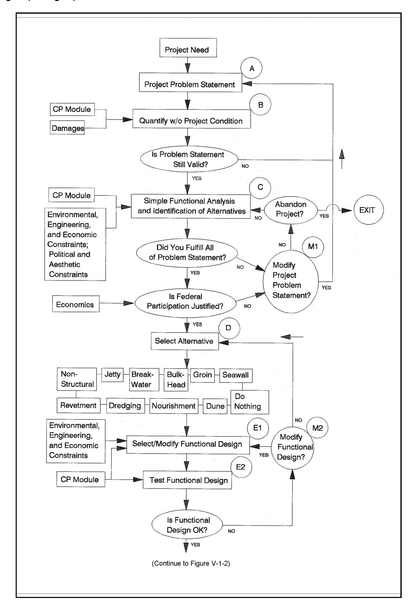
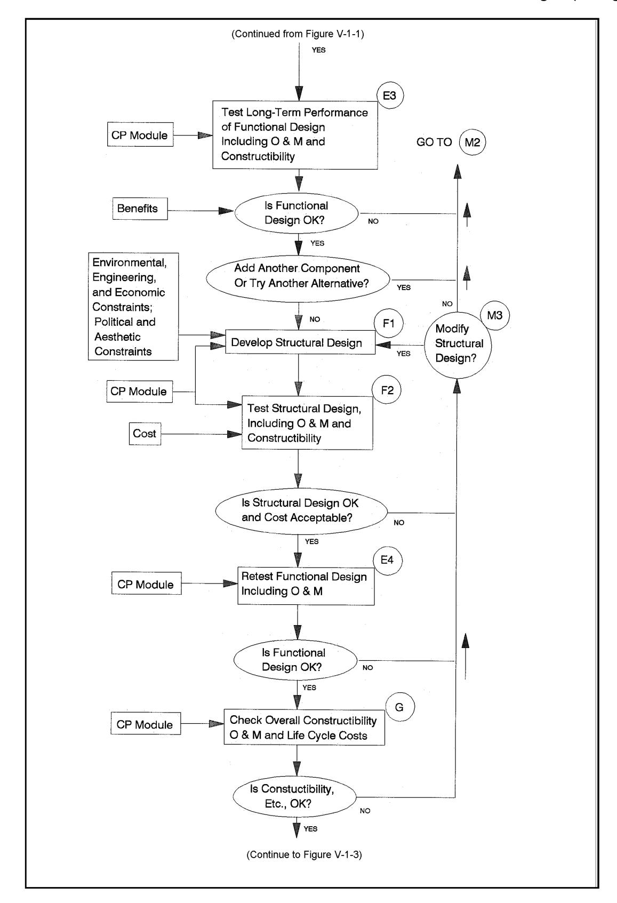
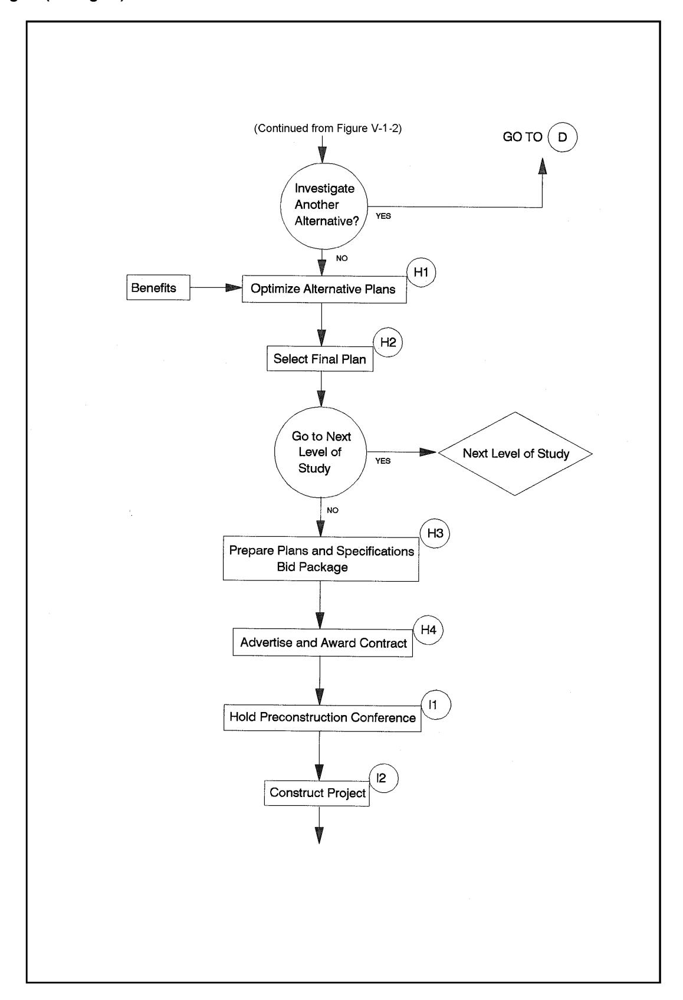

# Chapter 1 EM 1110-2-1100 PLANNING AND DESIGN PROCESS (Part V)

1 August 2008 (Change 2)

### Table of Contents

- V-1-1. Background V-1-1 a. Introduction V-1-1 (1) Purpose V-1-1 (2) Applicability V-1-1 b. The planning process V-1-1 c. Six major planning steps V-1-3 (1) Specify problems and opportunities V-1-3 (2) Inventory and forecast conditions if no action is taken V-1-3 (3) Formulate alternative plans V-1-4 (4) Evaluate effects V-1-4 (5) Compare alternative plans V-1-5 (6) Select a plan V-1-5 d. Planning coordination requirements V-1-5 e. Criteria development V-1-6 f. The design process V-1-6 (1) Final design V-1-6 (2) Plans and specifications V-1-6 g. Construction and monitoring V-1-6 (1) Construction V-1-7 (2) Post-construction inspection and monitoring V-1-7 h. Generic design chart V-1-7
- V-1-2. Design Criteria V-1-11
- V-1-3. Risk Analysis and Project Optimization V-1-12 a. Introduction V-1-12 b. Traditional vs. risk-based analysis V-1-12 c. Reasons for risk-based analysis V-1-13 (1) Introduction V-1-13 (a) Coastal forcing is probabilistic V-1-13 (b) Coastal engineering embodies major uncertainties V-1-13 (c) Damage and functional performance change incrementally V-1-13 (d) Benefits and risks not fully represented in deterministic terms V-1-13 (e) Uncertain effects on adjacent areas V-1-13 (2) Professional judgement V-1-14 d. Considerations for including risk-based analysis in project design V-1-14 (1) Objectives V-1-14 (2) Key variables V-1-14 (3) Professional judgement V-1-14 (4) Resistance and functional performance vary with time V-1-14 Planning and Design Process V-1-i (5) Construction season and mobilization concerns V-1-14 (6) Environmental, aesthetic, social, and political concerns V-1-14 e. Frequency-based vs. life cycle approach V-1-14 f. Typical project elements V-1-15 (1) Site characterization V-1-15 (2) Without-plan alternative V-1-15 (3) Formulate, evaluate, and compare alternative plans V-1-15
- V-1-4. References V-1-16
- V-1-5. Acknowledgments V-1-17

# List of Figures

- Page
- Figure V-1-1. Thought process in the planning and design of a coastal project, Part 1 V-1-8
- Figure V-1-2. Thought process in the planning and design of a coastal project, Part 2 V-1-9
- Figure V-1-3. Thought process in the planning and design of a coastal project, Part 3 V-1-10

# List of Tables

- Page
- Table V-1-1. Major Coordination Requirements V-1-5
- Table V-1-2. Reasons for Risk-Based Analysis of Coastal Projects V-1-13

# Chapter V-1 Planning and Design Process

### V-1-1. Background

- a. Introduction.
- (1) Purpose. This chapter provides a comprehensive description of definitions and procedures needed in the planning and design process for coastal projects. The goal of the following sections is to provide the planner/designer with sufficient engineering guidance to accomplish the level of detail necessary to produce an acceptable finished product.
- (2) Applicability. Although the information on procedures presented here is directly applicable to the reconnaissance and feasibility studies of the U.S. Army Corps of Engineers (USACE), it is also applicable to all other planning and design efforts because the process is generic. The process of developing a coastal project must be iterative to ensure that the final product is optimum from both the technical and economic viewpoints and will be acceptable to the various levels of decision makers and all project partners. b. The planning process .
- (a) The solution to coastal engineering problems begins with understanding the roles of the engineer as a planner and designer. These roles may be, and often are, embodied in the same person doing sequential tasks. This chapter presents the planning and design processes, the umbrella under which the project evolves from conception through functional detailed technical design phases. Examples of detailed technical designs are found in Part VI of this manual. Although the procedures and examples are those of the USACE, the principles apply to whomever is doing the planning and designing and follow a logical engineering process regardless of project type, scale, geographic siting, or sponsor.
- (b) The planning process begins with the questions "What is the problem?" and "What exactly is the project trying to accomplish?" As trite as this sounds, these are the most important and the most difficult questions to answer. To achieve a successful coastal project plan and design requires that the engineer must have a completely open mind, one without preconceived notions of the ultimate form of the project or a specific solution to advocate. An example of a pitfall of the planning process is to answer the second question with "To design a breakwater" without first clearly stating the problem. Is the problem one of navigation difficulties in the vicinity of a harbor, or potential damage to buildings near the shorefront, or water quality problems in a bay? These are symptoms of a problem, but they do not define the problem.
- (c) An interdisciplinary team approach is recommended in planning coastal projects to ensure the involvement of physical, natural, and social sciences personnel. The disciplines of the coastal project planners should be appropriate to the problems and opportunities identified in the planning process, and range from coastal, geotechnical, structural, and hydraulic engineers through meteorologists, oceanographers, biologists, and geologists, to economists, urban planners, and transportation specialists. Not all disciplines are needed on all studies, but the team leader needs to be cognizant of the possible need for such talents during the project development.
- (d) Interested and affected agencies, groups, coast-sharing partners, and individuals (collectively termed the public) should be provided opportunities to participate with USACE throughout the planning, design, construction, and operation of a Federal project. The purpose of public involvement is to ensure that the project is responsive to the needs and concerns of the public. The objectives of public involvement are to
provide the public with information about proposed Federal activities; to make the public's desires, needs, and concerns known to the decision makers; and to consult with the public and consider the public's views before a decision is reached.
- (e) In responding to the question of problem definition , the more detailed the engineer can make the statement, the more likely a solution can be found which will satisfy all the numerous stakeholders. A stakeholder is defined as anyone who will be affected by a problem and its potential solution, including a segment of the public. This includes the planner, designer, constructor, manager, all probable sponsors, riparian owners, project users, the political, legal, financial, and environmental entities with interests, and of course the populations that pay the taxes to support the enterprise.
- (f) USACE has two levels of planning: one that looks at the problem in a relatively cursory way for a reconnaissance level study, and the other for a detailed study of all the factors, conditions, and alternatives for a feasibility level study. These terms are equivalent to conceptual design and final design as used in private practice. In the reconnaissance study, the objective is to determine if there is a Federal interest; that is, to determine if the Federal Government should invest in the solution to the problem. Responses are needed to three questions to make this determination: (a) is there a technically doable solution, (b) is it economically and politically feasible, and (c) is it environmentally sound? These are often difficult to answer, but keeping in mind all the stakeholders and the detailed problem definition, the coastal planner can proceed.
- (g) Under present laws and regulations (as of the publication date of this manual), a reconnaissance level study is funded entirely by the Federal Government. To be "in the Federal interest," at least one technically adequate solution to the problem must be identified, a cost-sharing sponsor who will pay for one half of the feasibility study costs must be identified, and the economics of the potential solution must be such that the National Economic Development (NED) benefits are larger than the costs. More details of the planning process are found in ER 1105-2-100.
- (h) Since reconnaissance and feasibility studies differ in their level of detail, the following discussion concentrates on feasibility requirements. The requirements of a feasibility study differ from those of a reconnaissance study in degree, not kind. A diagram is presented later in this chapter to assist the engineer planner/designer in going through all the steps needed for successful solution of a coastal engineering problem.
- (i) In the case where a coastal project is planned and designed by other than USACE, Federal and state permits are usually required before construction can begin. (Requirements for USACE projects are discussed later in the chapter.) The USACE must ascertain that the proposed project would not harm the environment or adjacent property owners, that it would not interfere with navigation, and that water quality would not be impaired. Federal, state, and possibly local permits are required for construction in, across, under, or on the banks of navigable waters of the United States. Federal permits are coordinated by the applicant through the USACE District offices. Permit authorities are Section 10 of the River and Harbor Act of 1899 and Section 404 of the Clean Water Act of 1977, as amended.
Section 10 of the 1899 act requires permits for structures and dredging in navigable waters, which are those coastal waters subject to tidal action and inland waters used for interstate or foreign commerce. In tidal areas, this includes all land below the mean high-water line.
Section 404 of the Clean Water Act mandates a Federal permit for discharges of dredged or fill material in waters of the United States, which include tributaries and wetlands adjacent to navigable waters, and extends to headwaters of streams with flows greater that 0.142 m3 /sec (5 ft3 /sec). Wetlands are defined as "those areas inundated or saturated by surface or groundwater at a frequency and duration sufficient to support, and that under normal conditions do support, a prevalence of
vegetation typically adapted for life in saturated soil conditions. Wetlands generally include swamps, marshes, bogs, and similar areas."
More detailed requirements for the permit process are found in Chapter 33 of the Code of Federal Regulations, paragraphs 320-330 (33 CFR 320-330).
- (j) Still, the first question to be answered is: Exactly what is the problem? The more detailed the response, the easier it becomes to be sure all the important factors are considered. A more precise answer to the question posed earlier in this section might be: "The waves and currents in a harbor berthing area are of such magnitude that 30,000-ton tankers find it unsafe to berth there approximately 50 percent of the time." A statement of what the project is trying to accomplish might be "to provide safe berthing for 30,000-ton tankers at least 90 percent of the time." If this is an exact statement of the problem, then investigation is necessary to determine that the engineering, economic, and environmental conditions and constraints can all be resolved satisfactorily. c. Six major planning steps. The planning process consists of six major steps: (1) Specify problems and opportunities. (2) Inventory and forecast conditions if no action is taken. (3) Formulate alternative plans. (4) Evaluate effects. (5) Compare alternative plans. (6) Select a plan.
The following paragraphs describe these steps in more detail.
- (1) Specify problems and opportunities.
- (a) The identification of a problem usually begins with a unit of local Government requesting, through its local congressional representative, that USACE investigate and solve a problem. The Senator or Representative then introduces a resolution, which when passed by the Senate or House of Representatives, authorizes USACE to study the problem. The problem and opportunity statements are framed in terms of Federal objectives as well as identifying state and local objectives. The statements are fashioned to ensure that a wide range of alternative solutions can be considered with identifiable levels of achievement.
- (b) In the case of a small project, the Secretary of the Army, acting through the Chief of Engineers, may plan, design, and construct certain water resource improvements without specific congressional authorization. This authority is found in the six legislative authorities collectively called the Continuing Authorities Program. The per-project limit on Federal expenditures under the CAP is currently $2,000,000 for a small beach erosion control project (Section 103 of Public Law (PL) 87-874, as amended) and $4,000,000 for a small navigation project (Section 107 of PL 86-645, as amended). A complete discussion of the six legislative authorities, including that for the mitigation of shoreline erosion damage caused by Federal navigation works (Section 111 of PL 90-483, as amended), is found in ER 1105-2-100 Chapter 3.
- (2) Inventory and forecast conditions if no action is taken. The next step is to identify the initial site characteristics. These include not only the physical dimension of the site and environs, but also the
biological, cultural, social, safety, political, economic, endangered species, and other environmental aspects such as auditory, olfactory, visual, etc. The complete description of these elements will help to define the positions of the various stakeholders and how they might influence the success of any proposal. If these concerns can be accommodated early on, and the parties made to feel a part of the process, then any compromises that might be called for later are easier to obtain. All alternative schemes are measured against the without-project plan (the conditions that would prevail in the future if no plan is constructed), in order to quantify the benefits that would accrue from the various alternative plans examined. This is an important step in the planning process since it is the foundation for evaluating potentials for alleviating the problems and realizing the opportunities. It sets a consistent base upon which alternative plans are formulated, from which all benefits are measured, against which all impacts are assessed, and from which plans are compared and selected.
- (3) Formulate alternative plans. Alternative plans are formulated in a systematic manner during both the reconnaissance and feasibility studies to ensure that all reasonable alternative solutions are identified early in the planning process and are refined in subsequent iterations. Alternatives are not merely slight variations; for example, breakwater lengths of 200, 300, or 400 m, but significant ones, such as a breakwater construction, a saltwater barrier, or a harbor realignment. As the process is under way, additional alternatives may be introduced as the need or opportunity presents itself. A plan that reasonably maximizes the net NED benefits and is consistent with protecting the nation's environment, is identified as the NED Plan in the feasibility report. Other plans that reduce net NED benefits in order to further address other Federal, state, local, or international concerns should also be formulated. Each alternative plan is formulated considering the four criteria described in the Water Resources Council's Principles and Guidelines: completeness, efficiency, effectiveness, and acceptability (ER 1105-2-100). The period of analysis must be the same for each alternative plan and appropriate mitigation of adverse effects is an integral part of each alternative plan. It is usual for an economic life of 50 years to be selected for analysis. This does not imply that a coastal structure, such as a breakwater, would only last 50 years, but that analysis of benefits and costs is limited to that period. Alternative plans may include significant nonstructural components or may be completely nonstructural. It should be noted that this step usually involves many iterations in the development of the alternatives, and may also require a restatement of the problem if it is found that the functional needs are not completely met.
- (4) Evaluate effects. The evaluation of effects is a comparison of the with and without-plan conditions for each alternative plan. Differences between each with- and without-plan condition are measured or assessed, and the differences are appraised or weighted. Four accounts are established to facilitate the evaluation and display the effects of the alternative plans: NED, EQ, RED, and OSE.
NED: The National Economic Development account displays changes in the economic value of the national output of goods and services. A comprehensive treatment of analysis required for determining the economic benefits of coastal projects is found in U.S. Army Corps of Engineers (1991).
EQ: The environmental quality account displays the nonmonetary effects on ecological, cultural, and aesthetic resources.
RED: The regional economic development account registers the changes in regional economic activity. Regional effects are evaluated using nationally consistent projections of income, employment, output, and population.
OSE: The other social effects account registers plan effects from perspectives that are relevant to the planning process, but are not reflected in the other three accounts.
Display of the NED account is required. Since technical data concerning benefits and costs in the NED account are expressed in monetary units, the NED account already contains a weighting of the effects; therefore, appraisals are applicable only to the EQ, RED, and OSE account evaluations. Planners must also identify areas of risk and uncertainty in these analyses and describe them clearly so that decisions can be made with knowledge of the degree of reliability of the estimated benefits and costs, and of the effectiveness of the alternative plans (see Section V-1-3).
- (5) Compare alternative plans. Plan comparison focuses on the differences among the alternative plans as determined in the preceding step. Both monetary and nonmonetary effects are compared. Again, if the functional requirements of a project are not met, it is time to go back and iterate the formulation step.
- (6) Select a plan. After consideration of the various alternative plans, their effects, and public comments, the NED Plan is selected as the one to recommend for implementation, unless a justified exception is granted by the Assistant Secretary of the Army for Civil Works (ASA(CW)). The USACE feasibility report, along with expressions of related views by the ASA(CW) and the Office of Management and Budget, is then sent to Congress with a recommendation for authorization for construction. d. Planning coordination requirements.
- (1) Table V-1-1 lists some of the laws enacted to ensure that environmental effects of projects are fully taken into account in the planning process. These laws are briefly described below.

*Table V-1-1 Major Coordination Requirements*

National Environmental Policy Act, 1970, 33USC234.4
Fish and Wildlife Coordination Act, 1958, 16USC460-1(12) et seq
Coastal Zone Management Act, 1972, 16USC1451 et seq
Clean Water Act, 1977, 33USC1344 et seq
National Historic Preservation Act, 1966, 16USC470a et seq
Coastal Barrier Resources Act, 1982, 16USC3501
- (2) The National Environmental Policy Act (NEPA) of 1970, as amended, ensures that all proposed Federal actions take full cognizance of the environmental effects of those actions. This act defines the NEPA process by which an environmental impact statement (EIS) [or an environmental impact assessment (EIA) for a lesser impact activity that does not require a statement] is prepared. (An EIA is sometimes prepared to determine whether an EIS is required.) The EIS is given wide circulation and the public comment and the Federal agency's response are incorporated in the USACE report of its proposed activity. It is through this process that any unforeseen impacts are uncovered and mitigation measures are proposed.
- (3) The Fish and Wildlife Coordination Act of 1958, as amended, ensures that fish and wildlife conservation receives equal consideration with other project purposes and is coordinated with other features of any coastal development project. USACE consults with the Regional Director, U.S. Fish and Wildlife Service (FWS), the Regional Director, National Marine Fisheries Service (NMFS), and the head of the state agency responsible for fish and wildlife for the state in which the proposed work is to be performed. Funds are transferred to the FWS and NMFS to accomplish the investigations, and a Fish and Wildlife Report is made part of the USACE report.
- (4) The Coastal Zone Management Act of 1972, as amended, ensures that all Federal activities are consistent with an approved coastal zone management plan for that state. If the Secretary of Commerce has approved a state's plan (all but five coastal states have approved plans), then USACE must receive state certification that its proposed activity is consistent with the state's plan.
- (5) The Federal Water Pollution Control Act was enacted to regulate the discharge of pollutants. Subsequently the Clean Water Acts, as amended, required water quality certification by the Environmental Protection Agency or a designated state agency to ensure that the USACE-proposed project does not degrade the state's water quality, particularly through any dredge and fill activities.
- (6) The National Historic Preservation Act of 1966, as amended, provides for the consideration of the effects of a proposed project on the cultural resources (including archeological and Indian religious and cultural sites) of the area. Studies are coordinated with the National Park Service, the Advisory Council on Historic Preservation, and the appropriate State Historic Preservation Officer.
- (7) The Coastal Barrier Resources Act of 1982, as amended, requires that no Federal funds (with some exceptions) are expended in any undeveloped region designated as a unit of the coastal barrier resource system (CBRS). Most notable for coastal projects, a major exception is for beach nourishment since it mimics the natural processes; hard structures in conjunction with beach nourishment are prohibited on areas identified in this Act. Also, maintenance dredging in waters within the CBRS unit is allowed, but new work dredging is not; using sand for beach nourishment that comes from a borrow area within a CBRS unit is not generally permitted. Coordination with the Regional Director, FWS is required for all cases involving the CBRS.
- e. Criteria development. The criteria needed to be established are those that must be used to determine at each step of the process whether the objectives of that step are met. This is quite site-specific, and as will be seen in the section describing the generic design chart, the questions are answered either " yes , it meets the objective" (go on to the next step) or " no , it does not meet the objective" (go back and either refine the question or pick another alternative.) The importance of adequately posing the problem in the first place is readily seen in this approach. The advantage of this method of defining the criteria is that as long as all the questions are answered, the result will be the optimum project that meets the originally stated problem.

### f. The design process .

- (1) Final design. To produce a final design, it is necessary to continue the iterative process begun in the planning of the project. The project is said to be at final design status when all of the objectives are met, and all the stakeholders are satisfied that an optimum design has been reached. If there are any unanswered questions, then the final design has not been reached, and another iteration is necessary. It is current USACE practice to include the final recommended design in the feasibility report, and if approved for construction, no further design work is needed. The engineer can proceed directly to plans and specifications when the project is approved for construction and funds for construction are appropriated.
- (2) Plans and specifications. The documents required for a contract for construction to be awarded include the plans and specifications for the job. These incorporate any restrictions or other constraints on the contractor, and spell out the accuracy and tolerances appropriate to the job. The procedures for plans and specifications for construction of USACE projects are found in ER 1110-2-1200, and no further discussion is warranted here.

### g. Construction and monitoring .

Although construction and monitoring are not part of the planning and design process, they must be considered before the design process is complete.
- (1) Construction. In order to have a successful project, the work to be accomplished must be capable of construction, i.e., have bidability, constructibility, and operability (see ER 415-1-11). If no equipment is available that can do the work prescribed (for example, a crane capable of lifting breakwater armor units into place), then the project is not constructible. If sand for a beach nourishment job is found to be outside the limits of available dredging equipment capability, then the job is not constructible. Guidance for construction management of USACE projects is found in EP 415-1-260, and no further discussion is warranted here.
- (2) Post-construction inspection and monitoring. Monitoring is an essential element of a USACE project. The degree of monitoring depends on how the data are to be used. There are two basic types of monitoring: for conformance of construction to the design and for evaluation of performance of the project. The second type is often neglected, although ER 1110-2-1407 and ER 1105-2-100 clearly specify that a monitoring plan and an operation and maintenance plan are to be prepared as part of every project for which USACE has a continuing responsibility. This is especially important in beach nourishment projects to determine when a renourishment is needed. Also, data on project performance are needed for the continuing improvement and refinement of prediction models for coastal projects.

### h. Generic design chart .

- (1) Figures V-1-1 through V-1-3 show the thought processes that occur in the planning and design of a coastal project. The thought processes to successfully engineer a solution to a problem are basically the same as for the solution of any problem, but for the ease of presenting appropriate examples, will be limited here to the discussion of coastal engineering problems. The diagram is quite comprehensive and represents the steps followed by all engineers in developing successful solutions to coastal problems. It can be modified, however, to fit the needs of the planner and designer.
- (2) Figure V-1-1 is generic in the sense that navigation, shore protection, coastal flooding, storm damage reduction, environmental enhancement, or any other set of problems can be treated by following the steps outlined in the diagram. As discussed earlier in this chapter, the project begins with a need, from which an accurate statement of the problem is derived. Figure V-1-1 illustrates the path (or paths) typically followed in developing a coastal project, from initiation to cost completion phases, including the reevaluation and feedback loops. There are ten major segments of the process, with several blocks in each segment. They are designated by the letters in circles, and are keyed to the following list:

*Figure V-1-1. Thought process in the planning and design of a coastal project, Part 1*

*Figure V-1-2. Thought process in the planning and design of a coastal project, Part 2*

Planning and Design Process V-1-9

*Figure V-1-3. Thought process in the planning and design of a coastal project, Part 3*

- (a) Clearly define project problem statement, including the project objective.
- (b) Quantify existing and most likely future conditions (without project).
- (c) Identify and analyze alternatives.
- (d) Select alternative.
- (e) Develop and test functional design.
- (f) Develop and test structural design.
- (g) Check for constructibility, operation and maintenance, and life-cycle costs.
- (h) Select final plan, and prepare plans and specifications.
- (i) Construct project.
- (j) Monitor and evaluate project performance.
There are also several key segments concerning decisions about modifying various phases of the project; they are designated by the letter M.
- (3) The term "functional design" refers to the effectiveness of a project at its intended function, such as the effectiveness of a breakwater at providing tranquil waters inside a harbor. "Structural design" refers to the ability of a structure to exist in the climate in which it is placed, such as the ability to withstand the effects of extreme storms without affecting its functional requirements. The term "constructibility" refers to the means, methods, and materials involved in successful project construction.
- (4) In the diagram, the notation "CP Module" designates a generic concept of a Coastal Processes Module, a repository of physical data and analysis tools relevant to the coastal problem. The module includes information on wind, waves, currents, water levels, bathymetry, geomorphology, stratigraphy, sediment characteristics, sediment transport, ice processes, etc. The output from this module is needed at many points in the process. At the present time, portions of a module exist as limited databases and tools; however, a complete, integrated module, similar to the generic model, is under development, but is yet a long way from completion.

## V-1-2. Design Criteria

- a. Design criteria are the minimum parameters of design that are followed to ensure that the project function and structure (if any) meet the needs of a customer. A design is based on a number of design criteria that include: forcing function criteria, configuration criteria, materials criteria, geotechnical criteria, construction criteria, maintenance criteria, and economics criteria. These criteria are partly interrelated and partly independent of each other. Materials may depend on configuration, construction (including availability of equipment and manpower), and maintenance criteria. Construction may depend on configuration and materials (including availability). Maintenance depends on materials and construction.
- b. Forcing function criteria must always be seen in relation to configuration, materials, and geotechnical criteria. For example, the "design storm" is an obsolete concept. Short- and long-term wave statistics are needed, and the hydrodynamics of wave interaction with its surroundings must be known in detail. The parameters of wave height, wave period, storm duration, and surge water level are quasi-independent
components of a storm whose effects on a design need to be understood to adequately examine the alternatives. The frequency of occurrence (or the return period) of an event (such as a storm) is a primary component of the wave criteria. These concepts are fully discussed in Part II of this manual.
- c. Criteria that need to be considered in all coastal projects are: safety, accessibility (as defined by the American Disability Act), and environmental effects. All other effects are highly site-specific, and in addition to those cited above, include project area use, materials corrosion, ice, structural unit stability, subsurface foundations, and susceptibility to seismic events (i.e., earthquakes or tsunamis).
- d. In every case, the criteria must be measured against the function to be satisfied by the proposed coastal project. If the alternative does not adequately address the need, then the function is not fully satisfied, and either the problem must be restated or another alternative must be investigated. As discussed in earlier sections of this chapter, the iterative process of planning and design requires the above-cited criteria be used to evaluate each step in the process. Design criteria relative to specific project types are discussed in the remaining chapters of Part V.

# V-1-3. Risk Analysis and Project Optimization

- a. Introduction .
- (1) The approach for analyzing coastal projects is undergoing some fundamental changes, shifting from the traditional deterministic basis to a probabilistic, risk-based methodology. The changes strongly impact both planning and engineering phases of project formulation and design. Concepts of risk analysis and probabilistic optimization of project design are presented in this section. The remaining chapters in Part V include further information on the subject in relation to specific project types. As of this writing, risk-based analysis is a rapidly emerging tool, and significant advances can be expected during the next few years.
- (2) The changes in analysis approach, which can be expected to be distilled into a new standard for coastal practice, are driven by several progressive developments. First, general understanding of probabilistic coastal processes continues to advance, particularly due to advances in field measurement, physical modeling, and numerical modeling. Second, standard computing capabilities are increasing rapidly, facilitating lengthy probabilistic calculations which would have been impractical in the past. Third, engineers, cognizant of limitations in the traditional approach, are often eager to implement better procedures, provided that they are well-founded and clearly improve the analysis. Finally, the public is becoming more aware and concerned about coastal project performance, and expects realistic project analyses. In the United States, public involvement in coastal projects is further intensified by legislation which increases the proportion of costs borne by the client (typically state or local Government) in Federal projects. b. Traditional vs. Risk-based analysis .
- (1) Traditional analysis treats a coastal project in deterministic terms. The forces of nature are often represented as a design significant wave height, period, and direction, a design water level, etc. Coastal response is described as the response if no project is implemented, the response if one plan is implemented, the response if another plan is implemented, etc., without much formal recognition of the wide variation in possible responses.
- (2) In contrast to traditional analysis, some significant developments in probabilistic treatment of coastal projects have appeared during the 1990's. Most relate to coastal structure design (Construction Industry Research and Information Association/CUR 1991, International Conference on Coastal Engineering (ICCE) 1992). Within USACE, water resource planning guidance has moved from a deterministic to a risk-based
approach, which incorporates considerations of risk and uncertainty. Similar concepts are now being adapted to USACE coastal engineering studies.
- c. Reasons for risk-based analysis .
- (1) Introduction. There are a number of reasons why coastal projects in the broader sense, not just structural design, may be effectively analyzed from a risk-based point of view (Table V-1-2).

#### Table V-1-2 Reasons for Risk-Based Analysis of Coastal Projects

- (1) Forcing is probabilistic.
- (2) Major uncertainties in behavior.
- (3) Damage & functional performance change incrementally.
- (4) Benefits and risks not fully represented in deterministic terms. (5) Uncertain effects on adjacent areas.
- (a) Coastal forcing is probabilistic. Wave characteristics vary greatly over both short-term (individual waves) and long-term (from one sea state to another). Similar considerations arise with winds, water levels, infragravity waves, and currents.
- (b) Coastal engineering embodies major uncertainties. Knowledge of both the forcing processes and coastal response usually involves major uncertainties. Deterministic representations mask the uncertainties and can be misleading.
- (c) Damage and functional performance change incrementally. Coastal projects rarely progress from the design condition to total failure during a single storm event. Damage usually occurs incrementally. For example, damage to a rubble-mound breakwater (when it occurs) typically begins during an unusually severe storm and progresses during subsequent severe storms until repairs are done. Similarly, beach fills erode incrementally in response to storms over a period of years. Coastal projects often continue to provide some measure of functional benefit even in a damaged state. A damaged breakwater continues to provide some protection from incident waves; a partially eroded beach fill continues to reduce coastal flooding risks.
- (d) Benefits and risks not fully represented in deterministic terms. Because of the above factors, positive impacts and risks of coastal projects cannot be fully represented in deterministic terms. Some projects provide benefits beyond the design configuration, which are generally ignored in traditional practice. For example, a nearshore berm which is overbuilt to allow for progressive deterioration provides increased coastal protection during its early life. Another example is an overdredged entrance channel giving increased vessel access depths until it shoals to the design depth.
- (e) Uncertain effects on adjacent areas. In addition to the uncertainties associated directly with coastal projects, the projects can introduce significant possibilities for changing adjacent areas. While projects are designed with the intent of minimizing adverse impacts on adjacent areas, it is important to recognize that uncertainties and risks can increase beyond the without-project condition. In effect, a project can transfer risk from one area or party to another. When the risks of all major aspects of a project are represented as best they can be determined, better-informed final decisions can be made.
- (2) Professional judgement. Experienced coastal engineers are well aware of the concerns in Table V-1- 2. Even with deterministic methods, they can be expected to produce project plans that include a large measure of professional judgement to ensure a technically successful project. However, the ultimate fate of a project can depend upon higher level decision makers who must weigh technical concerns against economic, environmental, aesthetic, social, and political concerns. By quantifying risks, the coastal engineer can better pass his or her experience and judgement on to other decision makers, who may not have coastal expertise. d. Considerations for including risk-based analysis in project design
- (1) Objectives. The main objectives of adopting a risk-based analysis approach rather than a traditional approach are to explicitly identify uncertainties, provide improved information for assessing tradeoffs between risks and cost, and improve decision-making for project optimization.
- (2) Key variables. Although a large number of variables affect any coastal project, a small subset can usually be identified as key variables ; that is, variables that strongly relate to project performance. The key variables will embody the main forcing mechanisms, project sizing, and project response. For example, some of the key variables for a beach nourishment project might be significant wave height (forcing), beach fill width (project size), and erosion width (response).
- (3) Professional judgement. Coastal engineering requires an unusually large measure of professional judgement because of the number and complexity of processes and responses involved. Analytical and modeling tools help to represent the variability affecting coastal projects, but the judgement of an experienced engineer is a vital ingredient in risk assessment and project optimization.
- (4) Resistance and functional performance vary with time. Both the resistance to damage and functional performance often vary significantly over a coastal project's design life. For example, the resistance (or structural strength) of a rubble-mound breakwater may decrease in time due to deterioration of stone such as loss of angular corners, cracking, and breaking. Resistance may also decrease due to displacement of stone and exposure of underlayers to wave attack, which would also decrease protection provided by the breakwater (functional performance). For a beach nourishment project, loss of material to storms decreases the resistance of the beach to future storms. The effectiveness of the beach as a deterrent to coastal flooding is also decreased (functional performance). In some cases, resistance increases with time, as in the progressive growth of protective vegetation on coastal dunes and natural cementation of beach sediments rich in calcium carbonate.
- (5) Construction season and mobilization concerns. Often maintenance of coastal projects requires major mobilization efforts and is confined to a construction season dictated by climate and environmental factors. Therefore the risk during the interval between construction seasons rather than during a single storm becomes a key concern. During an unusually stormy winter (such as the winter of 1987-88 in southern California), this risk can be significantly greater than that for individual storms.
- (6) Environmental, aesthetic, social, and political concerns. The role of environmental, aesthetic, social, and political factors in the ultimate planning and design of a coastal project is often at least as important as the technical engineering factors. An optimized final design includes appropriate consideration of these factors and their associated risks and uncertainty. e. Frequency-based vs. life cycle approach .
- (1) Risk-based analysis of coastal projects can be done by either of two fundamentally different approaches. The frequency-based approach deals with frequency-of-occurrence relationships among the key variables. By combining key forcing variables with various occurrence frequencies, information about the
frequency-of-occurrence of key project responses can be developed. For example, a traditional stage- (water level)-versus frequency curve and a stage-damage curve can be combined to generate a damage-versusfrequency curve. This approach can be applied as an add-on to traditional planning and design procedures.
- (2) The life cycle approach deals with multiple realizations of possible evolution of the project with time during the span of its design life. The suite of life cycle realizations is constructed with consideration of the probabilities of key variables. For example, the realistic time variation of key forcing and response variables during a 50-year life cycle can be generated for 1,000 different possible life cycles. Probabilities and risks associated with the project are then compiled by analyzing project performance over the 1,000 life cycles.
- (3) The life cycle approach appears better suited to most coastal engineering applications. Variation with time is an essential ingredient in most coastal projects, and it is directly incorporated into the life cycle approach. Time variation of resistance and functional performance, constraints imposed by construction season and mobilization, even some economic, environmental, and political factors, can be conveniently and flexibly introduced into the life cycle approach. This approach leads to a unified analysis of technical performance and many economic factors which are critical to project success. In addition to its technical and economic strengths, the life cycle approach is more easily understood by nontechnical parties involved with a project. This type of approach is evident in the Empirical Simulation Technique (Chapter II-5).
- (4) The life cycle approach adapted to shore protection projects is particularly instructive (U.S. Army Corps of Engineers 1997). The life cycle embodies sequences of storms (including provisions for multiple storms of varying intensity during each year of the life cycle), erosion and post-storm recovery during each event, partial and complete property damage during each event (depending on water level, waves, extent of storm erosion, and type of building construction), cumulative property damage due to a succession of storms, optional repair or rebuilding after a suitable time lag (with conformance to any stricter building codes in effect), and periodic renourishment of the beach when needed and feasible during the life cycle. Typically, a key result from this analysis is the renourishment required during each life cycle, which can be converted to an economic present-worth dollar value. The expected cost and economic risks associated with maintaining the beach can then be realistically assessed by combining information from many different life cycle simulations.
- f. Typical project elements . Risk-based analysis can be integrated into the six major planning steps (Section V-1-1b(2). Typical project elements which are especially well-suited to risk-based analysis include the following.
- (1) Site characterization. Significant uncertainty can arise in documenting past and present behavior at a site. The uncertainty can be estimated based on data quality and quantity, methodologies used, observed variability, etc. (Chapter V-3).
- (2) Without-plan alternative. Evaluation of what would happen in the future if no Federal project were built involves speculation about the natural processes and human interventions that would affect the site during the proposed project life. The impact of the without-plan alternative is conveniently described in probabilistic terms.
- (3) Formulate, evaluate, and compare alternative plans. Risk-based analysis can be a powerful tool for formulating and comparing alternative plans. It enables decision makers to intercompare not only the expected level of performance, but also the probabilities of enhanced or reduced performance levels, which can differ greatly among alternatives. Typically, alternatives involve hard structures (such as walls, revetments, breakwaters, and jetties) and/or soft structures (such as beach nourishment projects, coastal dunes, and nearshore berms). Risk-based analysis of hard structures is discussed in Part VI. Soft structures (Chapter V-4) involve calculated risks about the movement of sediment through time and the need for future
maintenance. Uncertainties arise in forcing processes, sequencing of storms, initial state of nearshore profile when storms occur, and evolution and recovery of storm profiles (especially three-dimensional aspects). The life cycle approach to risk analysis has been shown to be a powerful tool in this type of application.

## V-1-4. References

## ER 415-1-11

Biddability, Constructibility, and Operability

## ER 1105-2-100

Planning Guidance Notebook.

### ER 1110-2-1407

Hydraulic Design for Coastal Shore Protection Projects.

### ER 1110-2-1200

Plans and Specifications for Civil Works Projects.

### EP 415-1-260

Resident Engineer Management Guide.

### CIRIA/CUR 1991

CIRIA/CUR 1991. "Manual on the Use of Rock in Coastal and Shoreline Engineering," CIRIA Special Publication 83 , Construction Industry Research and Information Association, London, UK: and CUR Report 154, Centre for Civil Engineering Research and Codes, Venice, Italy.

# ICCE 1992

ICCE 1992. "Design and Reliability of Coastal Structures," Proceedings of a short course attached to the 23rd International Conference on Coastal Engineering , Venice, Italy.

### Thompson, Wutkowski, and Scheffner 1996

Thompson, E. F., Wutkowski, and M., Scheffner, N. W. 1996. "Risk-Based Analysis of Coastal Projects," Proceedings of the 25th International Conference on Coastal Engineering , Orlando, FL.

### U.S. Army Corps of Engineers 1991

U.S. Army Corps of Engineers. 1991. "National Economic Development Procedures Manual - Coastal Storm Damage and Erosion," Report 91-R-6, Institute for Water Resources, Fort Belvoir, VA.

# V-1-5. Acknowledgments

Authors of Chapter V-1, "Planning and Design Process:"
John G. Housley, Headquarters, U.S. Army Corps of Engineers, Washington, DC, (retired). Edward F. Thompson, Ph.D., Coastal and Hydraulics Laboratory (CHL), U.S. Army Engineer Research and Development Center, Vicksburg, Mississippi.

### Reviewers:

James E. Clausner, CHL Jeffrey A. Melby, Ph.D., CHL Norman W. Scheffner, Ph.D., CHL (retired) H. Lee Butler, CHL (retired)
