Chapter 2 EM 1110-2-1100 SITE CHARACTERIZATION (Part V) 1 August 2008 (Change 2)

## Table of Contents

- V-2-1. Introduction Page V-2-1
- V-2-2. Defining Project Area and Boundary Conditions V-2-2
- V-2-3. Storm Characteristics/Meteorology a. Storm types b. Storm characteristics c. Hypothetical hurricanes V-2-3 V-2-3 V-2-5 V-2-5
- V-2-4. Hydrodynamic Processes (Design Sea State, Water Levels, Currents) a. Design condition b. Design wave height and period c. Design water level V-2-6 V-2-6 V-2-6 V-2-7
- V-2-5. Seasonal Variability V-2-7
- V-2-6. Topography and Bathymetry (Map Data) a. Data needs b. Available sources c. Reliability V-2-10 V-2-10 V-2-10 V-2-12
- V-2-7. Geomorphology/Geometry and Sediment Characteristics a. Types of coasts/principal features b. Sources and sinks c. Prevailing sediment characteristics d. Sediment layering V-2-12 V-2-12 V-2-14 V-2-16 V-2-18
- V-2-8. Littoral Drift and Sediment Transport Patterns a. Longshore movement b. Cross-shore movement c. Seasonal reversals d. Long-term reversals e. Slug motion f. Hot spots V-2-18 V-2-18 V-2-18 V-2-19 V-2-20 V-2-20 V-2-20
- V-2-9. Shoreline Change Trends a. Evidence of cyclic processes b. Eustatic sea level changes c. Subsidence V-2-21 V-2-21 V-2-21 V-2-21
- V-2-10. Land/Shore Use V-2-21
- V-2-11. Potential for Project Impacts a. Effects on natural tidal flushing b. Up/downdrift effects and need for bypassing c. Changes in wave climate d. Impact on benthic organisms e. Changes in natural habitat V-2-22 V-2-22 V-2-22 V-2-23 V-2-23 V-2-24
- V-2-12. Environmental Considerations a. Surveying the project area b. Mitigation measures c. Water quality d. Disposal of materials V-2-24 V-2-24 V-2-25 V-2-26 V-2-26
- V-2-13. Regional Considerations a. Regulations b. Seismic c. Tsunami d. Ice V-2-26 V-2-26 V-2-27 V-2-27 V-2-28
- V-2-14. Foundation/Geotechnical Requirements V-2-29
- V-2-15. Availability of Materials (Sand/Stone Resources) a. Sand b. Stone V-2-29 V-2-29 V-2-30
- V-2-16. Accessibility V-2-32
- V-2-17. Monitoring V-2-34
- V-2-18. Data Needs and Sources V-2-35
- V-2-19. References V-2-38
- V-2-20. Acknowledgments V-2-44 V-2-ii Site Characterization

# List of Figures

- Page
- Figure V-2-1. Isobaric pattern of a typical extratropical low in the Great Lakes Region (Resio and Vincent 1976) V-2-4
- Figure V-2-2. Example of directional wave gauge data for Lanai, Hawaiian Islands (EM 1110-2-1810) V-2-8
- Figure V-2-3. Water levels of Lake Erie during storm of December 2, 1985 (NOAA 1985) V-2-9
- Figure V-2-4. The 1836 shoreline at Presque Isle, Pennsylvania V-2-11
- Figure V-2-5. Example of resistant rock-bound coast of Maine (Bass Harbor Head Light, Maine, south of Acadia National Park) V-2-13
- Figure V-2-6. Beach near entrance to North Sand Pond, Lake Ontario, NY. This is a relict dune environment at the eastern end of Lake Ontario V-2-14
- Figure V-2-7. Coast at Orick, CA. This is a pocket beach between resistant headlands V-2-15
- Figure V-2-8. Shore at Chimney Bluffs State Park, Lake Ontario, NY. Chimneys consist of glacial till more weather resistant than surrounding material V-2-15
- Figure V-2-9. Cobble Beach along Lake Ontario, Oswego, NY. Origin of cobble is bluff and glacial drumlin erosion V-2-16
- Figure V-2-10. Black Sand Beach, Kalapana, HI. Sand is of volcanic origin V-2-17
- Figure V-2-11. Structures threatened by erosion, Lake Ontario, Crescent Beach, NY V-2-27
- Figure V-2-12. Cracked dolomitic limestone - Cleveland East Breakwater, Ohio, 1989 (stone is dolomitic limestone) V-2-32
- Figure V-2-13. Cracked stone - Cleveland East Breakwater, Ohio, 1990. Note continuing degradation compared to 1989 (stone is dolomitic limestone) V-2-33

# List of Tables

- Page
- Table V-2-1. Some Example USACE Reports and General Design Memorandums (GDMs) Containing Comprehensive Site Characteristics V-2-2
- Table V-2-2. Extreme Pressure and Wind Data of Hurricanes Recorded along the Alabama Coast between 1892 and 1969 (U.S. Army Engineer District, Mobile 1978) V-2-5
- Table V-2-3. Quarry Inspection Checklist V-2-31
- Table V-2-4. Coastal Project Monitoring Matrix V-2-36
- Table V-2-5. Data Needs and Sources V-2-37 V-2-iv Site Characterization

# Chapter V-2 Site Characterization

## V-2-1. Introduction

- a. Many coastal failures can be traced back to inadequate site characterization analyses. Site characterization involves identifying distinguishing qualities and features of a region that have a direct and indirect impact on the conception, design, economics, aesthetics, construction, and maintenance of a coastal project. The coastal environment varies spatially and temporally and therefore a design that is functionally, economically, and environmentally appropriate at one location may be inappropriate at another. Physical, biological, and cultural attributes need to be delineated so that an acceptable project is adopted and potential effects of the project are determined.
- b. Waves bring an enormous amount of energy to the coast that is dissipated through wave breaking, generation of currents, water level changes, movement of sediment, turbulence, and heat. Incident waves vary spatially and temporally, with their properties changing with movement over the bottom. The beach is composed of sediment particles of various types, sizes, and shapes which move along and across the shore. The beach and backshore exhibit different textural properties that vary alongshore, across-shore, and with time. The coastal region supports a diverse biological community of aquatic, terrestrial, and avian organisms. It also must continue to enhance the quality of human existence by providing commercial and recreational benefits. In light of the profound diversity of the coastal zone, it is imperative that the coastal designer have a full understanding of potential impacts of engineering activities on the regional environment.
- c. This chapter enumerates important physical and engineering factors that should be identified. Readers are directed to other pertinent sections of this manual for specific details on monitoring the coastal environment and for information on the physics of coastal processes. Not all factors described in this chapter pertain to all coasts. For example, ice and volcanic hazards are not applicable to a Gulf Coast project design. However, most factors should be included in all other site characterizations.
- d. General Design Memorandums (GDMs) and monitoring reports (Table V-2-1) prepared by U.S. Army Corps of Engineer (USACE) Districts may be consulted for examples of site characterization studies. The Alaska Coastal Design Manual (U.S. Army Corps of Engineers 1994) also summarizes important site characterization features. e. In summary, it is important when characterizing a site to: (1) Include all components of the system. (2) Recognize the extreme temporal variability in most physical and biological processes. (3) Be cognizant of the spatial variability of processes, climate, land forms, underlying geology, biological habitat, and cultural resources. Process measurements made at one site may not be valid at another site only a short distance away. f. In conclusion, the designer must think globally and engineer locally.

*Table V-2-1 Some Example USACE Reports and General Design Memorandums (GDMs) Containing Comprehensive Site Characteristics*

**Table V-2-1. Some Example USACE Reports and General Design Memorandums (GDMs) Containing Comprehensive Site Characteristics**

| (GDMs) Containing Comprehensive Site Characteristics . . . . | . . . . . . . . . . . . . . V-2-2 |
| --- | --- |
| Extreme Pressure and Wind Data of Hurricanes Recorded along | Table V-2-2. the |
| Alabama Coast between 1892 and 1969 (U.S. Army Engineer | District, |

#### V-2-2. Defining Project Area and Boundary Conditions

- a. The total project area encompasses not only the physical limits of the project but also the area in which the project has an effect upon littoral processes. The physical limits of a proposed project usually are predetermined by the local sponsor for the area of interest. Often this is defined by property limits (municipal park, business district, navigation inlet, etc.) and legislative authority. Project boundaries are sometimes defined by the limits of available historic data - particularly bathymetric data. Economic analysis of the project may lead to modification of these limits if a project along the entire reach cannot be economically justified, or is not technically feasible or environmentally acceptable.
- b. It is imperative that a project designer be cognizant of potential impacts of the project on the adjoining coast. Mitigation due to disruption of littoral movement is often necessary. Legal requirements for replacement of sediment loss using bypassing or introduction of an equivalent quantity downdrift vary with locality. For example, the state of Florida (1987) requires:
V-2-2 Site Characterization
- (1) All construction and maintenance dredging of beach-quality sand should be placed on the downdrift beaches: or, if placed elsewhere, an equivalent quality and quantity of sand from an alternate location should be placed on the downdrift beaches.
- (2) On an average annual basis, a quantity of sand should be placed on the downdrift beaches equal to the natural net annual longshore sediment transport.
The lack of legal requirements does not absolve the project designer of responsibility to mitigate project impacts.
- c. In order to establish the potential physical impact of the project, a sediment budget for the entire littoral cell in which the project will reside must be determined. A sediment budget quantifies the amount of sediment moving within a littoral cell. A littoral cell is a self-contained reach of coast with its own sand sources and losses or sinks. Updrift and downdrift boundaries (the location at which most, if not all, sediment enters or leaves the cell) may be formed by natural barriers such as a headland or prominent protruding structures. In developing a sediment budget, information on the sources and characteristics of materials, modes and direction of transport in the littoral zone, rates of sediment supply, and transport and loss is required. Complete understanding of the boundaries, significance of individual sources, littoral drift direction and volumes, and sinks is crucial to estimating the effect of any engineering intervention in the littoral system and helps define the project area. Part III presents a complete description of sediment transport processes.
- d. Development of the sediment budget will assist in establishing the amount of mitigation required. If no mitigative measures are enacted, the more difficult question will be to determine how erosion, due to loss of sediment, is distributed downdrift as a function of time. To answer this question, the three parameters that need to be identified are (a) length of the adversely affected shore; (b) cross-sectional retreat of the erosion cut; and (c) rate of expansion of erosion, and its distribution downdrift as a function of time (Bruun 1995). It has been observed that a littoral drift barrier has a short- and long-distance influence on the downdrift shoreline as briefly discussed in Section V-2-8. The reader is directed to Bruun (1995) for a discussion on examples of downdrift shoreline impacts and the short- and long-distance influence of a littoral barrier.

#### V-2-3. Storm Characteristics/Meteorology

- a. Storm types .
- (1) A storm is an atmospheric disturbance characterized by high winds that may or may not be accompanied by precipitation. Two distinctions are made in classifying storms: a storm originating in the tropics (5 to 350 deg in both hemispheres) is a tropical storm, a storm resulting from a cold or warm front in the middle and high latitudes (30 to 60 deg) is an extratropical storm (Silvester and Hsu 1993). Both storms can generate large waves and produce abnormal rises in water level in shallow water near the edge of water bodies.
- (2) A hurricane is a severe tropical storm with maximum sustained wind speeds of 120 km/hour (75 mph or 65 knots). These low pressure centers are known by different names geographically: hurricanes on the east coast of the Americas, typhoons in the western Pacific, monsoons in the Indian Ocean, and tropical cyclones in Australia (Silvester and Hsu 1993). Hurricanes, unlike less severe tropical storms, generally are well-organized and have a circular wind pattern with winds revolving around a center or eye. The eye is an area of low atmospheric pressure and light winds. The Coriolis force causes the radial inflow to rotate counterclockwise in the Northern Hemisphere and clockwise in the Southern Hemisphere. Atmospheric pressure and wind speed increase rapidly with distance outward from the eye to a zone of maximum wind speed, which may range from 7 to 110 km (4 to 70 statute miles) from the center. From the zone of maximum
wind to the periphery of the hurricane, pressure continues to increase; however, wind speed decreases. Atmospheric pressure within the eye is the best single index for estimating surge potential of a hurricane. This index is called the Central Pressure Index (CPI). Central pressures of 950-960 mb (28.0 - 28.3 in.) are common. Hurricane Ida in the Philippines in 1958 had an extremely low pressure of 877 mb (25.9 in.) (Eagleman 1983). Generally, for hurricanes of fixed size, the lower the CPI, the higher the wind speeds.
(3) Unlike tropical storms, which generally occur in summer, extratropical storms generally occur in winter. These depressions in the middle latitudes consist of warm and cold air fronts which rotate about a low pressure center. Winds are not as intense as hurricanes since their horizontal scale is greater with a lesser pressure gradient. However, extratropical storms tend to have a longer duration and their destruction effects may be felt over large areas. Extratropical storms that occur along the northern part of the east coast of the United States, when accompanied by strong winds blowing from the northeast quadrant, are called nor'easters. Nearly all destructive nor'easters have occurred between November and April. Extratropical storms produce the dominant large wave conditions in the Great Lakes and generally occur between mid-October and April. The size of a typical storm of this type is shown in Figure V-2-1 (Resio and Vincent 1976).

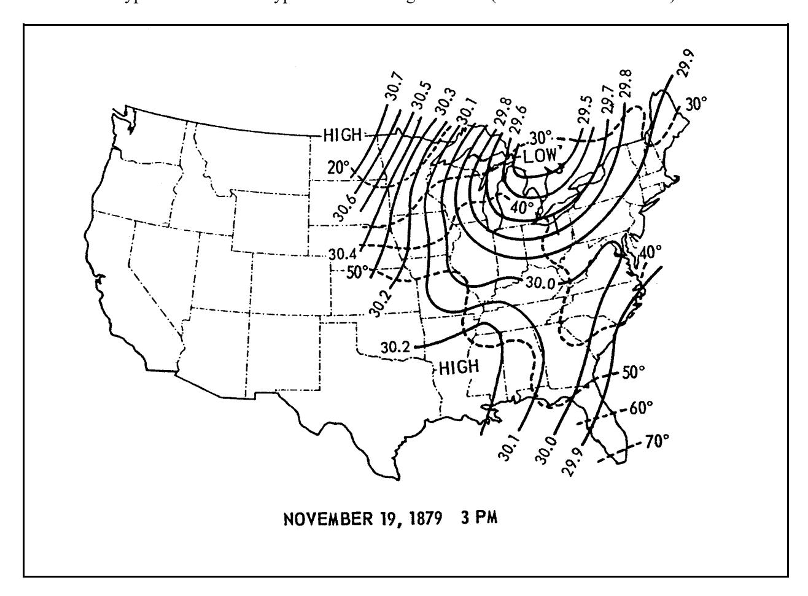

*Figure V-2-1. Isobaric pattern of a typical extratropical low in the Great Lakes Region (Resio and Vincent 1976)*

V-2-4 Site Characterization
b. Storm characteristics . Depending upon availability of observed hurricane data for the open ocean coast, the design analysis for coastal structures may not be based on measured water levels and waves. A statistical approach has evolved that takes into account the expected probability of occurrence of a hurricane with a specific CPI at any particular coastal location. Statistical evaluations of hurricane parameters, based on detailed analysis of many hurricanes, have been compiled for coastal zones along the Atlantic and U.S. Gulf coasts. Parameters that need to be evaluated are radius of the maximum wind, minimum central pressure of the hurricane, forward speed of the hurricane while approaching or crossing the coast, and maximum sustained wind speed at 10 m (33 ft) above the mean water level. Table V-2-2 presents extreme pressure and wind data for hurricanes recorded along the Alabama coast between 1892 and 1969 (U.S. Army Engineer District, Mobile 1978).

*Table V-2-2 Extreme Pressure and Wind Data of Hurricanes Recorded along the Alabama Coast between 1892 and 1969 (U.S. Army Engineer District, Mobile 1978).*

**Table V-2-2. Extreme Pressure and Wind Data of Hurricanes Recorded along the Alabama Coast between 1892 and 1969 (U.S. Army Engineer District, Mobile 1978).**

| Engineer District, | Mobile 1978). Approx. no. miles | Lowest |  | Maximum wind |  |
| --- | --- | --- | --- | --- | --- |
| Date Hurricane | and direction center | barometric | Location of pressure | velocity and | Location of wind |
| Crossed Coast | passed Mobile | pressure (in.) | measurement | direction (mph) | measurement |
| 2 Oct 1893 | 50 W | 29.16 | Mobile | 80 SE | Mobile |
| 15 Aug 1901 | 70 W | 29.32 | Mobile | 61 | Mobile |
| 27 Sept 1906 | 20 SW | 28.84 | Mobile | 94 | Ft. Morgan |
| 20 Sept 1909 | 150 SW | 29.62 | Mobile | 52 | Ft. Morgan |
| 14 Sept 1912 | 20 W | 29.37 | Mobile | 60 SE | Mobile |
| 29 Sept 1915 | 100 W | 29.45 | Mobile | 60 SE | Mobile |
| 5 July 1916 | 20 W | 28.38 | Ft. Morgan | 107 E | Mobile |
| 18 Oct 1916 | 60 E | 29.22 | Mobile | 128 E | Mobile |
| 28 Sept 1917 | 100 SE | 29.17 | Mobile | 96 NNE | Mobile |
| 20 Sept 1926 | 30 S | 28.20 | Perdido Beach | 94 N | Mobile |
| 1 Sept 1932 | 25 SSW | 29.03 | Bayou La Batre | 57 E | Mobile |
| 19 Sept 1947 | 110 SW | 29.54 | Mobile | 53 E | Mobile |
| 4 Sept 1948 | 90 W | 29.55 | Ft. Morgan | 42 S | Mobile |
| 30 Aug 1950 | 20 E | 28.92 | Ft. Morgan | 75 | Ft. Morgan |
| 24 Sept 1956 | 80 S | 29.49 | Mobile | 58 | Mobile |
| 15 Sept 1960 | 80 W | 29.48 | Mobile | 74 | Dauphin Is. |
| 3 Oct 1964 | 230 W | 29.39 | Alabama Port | 80 NNW | Alabama Port |
| 17 Aug 1969 | 90 WSW | 29.44 | Mobile | 74 | Mobile |

c. Hypothetical hurricanes . The National Weather Service and the U.S. Army Corps of Engineers have jointly established specific storm characteristics developed from statistical consideration. Since parameters characterizing these storms were statistically derived, they are known as hypothetical storms. Parameters for such storms are assumed constant during the entire surge generation period. The Standard Project Hurricane is defined as a hypothetical hurricane that is intended to represent the most severe combination of hurricane parameters that is reasonably characteristic of a region excluding rare combinations. The Probable Maximum Hurricane is defined as a hypothetical hurricane having that combination of characteristics which will make the most severe storm that is reasonably possible in the region involved if the hurricane should approach the
point under study along a critical path and at an optimum rate of movement. The reader is directed to Part II, Chapter 2 for further discussions on meteorological systems and waves.

#### V-2-4. Hydrodynamic Processes (Design Sea State, Water Levels, Currents)

- a. Design condition .
- (1) In selection of design water levels and waves for a project, critical conditions must be considered. These represent critical threshold combinations of tide level, surge (or setup) level, wave conditions and local runoff, which, if surpassed, would endanger the project and/or make the project nonfunctional during their occurrence. It should be recognized that water levels have a direct impact on wave conditions in shallow water. Conversely, waves can have some impact on the water level through wave-induced setup.
- (2) In selection of the design condition for the project, it is important to consider the intended structural integrity, and functional performance. Structural integrity relates to the structure's ability to withstand effects of extreme storms without sustaining significant damage. Structural integrity criteria determine the structure's life-cycle costs to the extent that a certain level of investment is necessary to prevent damages from an extreme event. Functional performance determines the incremental economic benefits of a project since it defines the structure's level of effectiveness. For example, the crest height of a shore dike to prevent flooding should be optimized for different storm frequencies with consideration of interior ponding elevations (and damages) in comparison to costs of different structure heights. In performing analyses, one must be aware of the risk and uncertainty inherent in the design process. See U.S. Army Corps of Engineers (1992) for a discussion on risk and uncertainty analysis in water resources planning. b. Design wave height and period .
- (1) Most coastal projects require an estimate of characteristics (height, period, direction and frequency of occurrence) of wind-generated gravity waves at the project site. In the Pacific basin, tsunamis also may need to be considered. Wave characteristics are determined outside the surf zone and then transferred to the project site by considering refraction, diffraction, reflection, shoaling, and breaking effects. Part II, Chapter 3 discusses methods to estimate nearshore waves with guidance for performing wave transformation studies.
- (2) Wave data sets are available as summaries of visual observations, wave hindcasts and wave gauge statistics. Shipboard observations generally represent deepwater wave conditions over large areas. For coastal areas of the United States, summaries have been published in Department of the Navy (1976). The USACE's Wave Information Study (WIS) has developed wave hindcasts along U.S. coasts, the Great Lakes, and some international locations. These hindcasts generally consist of wave height, period, and direction time series and summary statistics. WIS data are available on the World Wide Web (WWW) at:
http://chl.erdc.usace.army.mil/CHL.aspx?p=s&a=DATA;1
or at:
http://frf.usace.army.mil/wis/
(3) Wave data can be measured by various forms of floating and bottom-mounted wave gauges. If available for a project site, actual measured data are preferred to hindcasts because these data are obtained by physical measurement. While the amount of wave gauge data may be spatially and temporally limited, they can be used to confirm hindcasts. If the physical measurements include significant storms (Figure V-2-2), this data can confirm hypothetical design storm size and effects. Wave gauge data collected by the Coastal and Hydraulics Laboratory (CHL) can be accessed at:
http://sandbar.wes.army.mil/public_html/pmab2web/htdocs/dataport.html
V-2-6 Site Characterization
Wave data, extremal analyses, climatic summaries, buoy data, and aerial photographs, arranged geographically, can be found at the CHL web page:
http://chl.erdc.usace.army.mil/chl.aspx?p=s&a=Data;0
Wave data from the west coast is available from the Coastal Field Data Information Program: http://cdip.ucsd.edu/
Buoy wave data and meteorological observations can be found at the National Data Buoy Center's web page: http://www.ndbc.noaa.gov/
- c. Design water level .
- (1) Storm surge at the shoreline due to a rise in water level above the still-water level is of more interest to the design engineer. Peak surge is generally used to establish design water levels at a site. The highest water levels that occur along the Gulf Coast, the east coast of the United States from Cape Cod to south Florida, and the Hawaiian Islands are generally the result of tropical storms. At most other U.S. locations, high water levels result from extratropical storms. The state of Alaska has experienced peak storm surges over 4 m (13 ft) high. (State of Alaska 1994). Storm surge interaction with tidal elevations is discussed in Chapter II-5, along with methods to determine storm event frequency-of-occurrence relationships.
- (2) While large inland water bodies such as the Great Lakes experience negligible tidal fluctuations, they encounter fluctuating water levels due to variations in the hydrologic cycle coupled with storm surges (wind setup) resulting from extratropical storms. Significant water level setup is possible on large shallow inland water bodies, such as Lake Okeechobee, Florida, and Lake Erie of the Great Lakes. Peak water level relationships have been determined for various locations along the Great Lakes coast (U.S. Army Engineer District, Detroit 1993a). Figure V-2-3 presents a lake elevation hydrograph for the December 2, 1985 event on Lake Erie (National Oceanic and Atmospheric Administration (NOAA) 1985).
- (3) A complete discussion on tides, surges, and seiches is presented in Chapter II-5. This chapter should be reviewed to determine the type of data required for the study being performed. NOAA is the most comprehensive source of global tide predictions in tables of time and heights of high and low tides, tidal current tables for U.S. coasts, tidal current charts for selected harbors, and other summaries of tidal predictions for selected areas. They may be contacted at:
NOAA National Ocean Service Tidal Datums and Information Section 6001 Executive Boulevard Rockville, MD 20852
NOAA'S WWW site lists availability of tide data, charts, and other material.

#### V-2-5. Seasonal Variability

Recognizing seasonal variability of waves and currents along the coast is important to appropriately interpret historic data and predict a project's response. This variability has effects on littoral transport quantities and direction, and gross profile shape. Alternate erosion and accretion may be seasonal on some beaches; winter storm waves erode the beach and summer swell waves rebuild it. Just as insufficient data can lead to erroneous conclusions, information obtained only during a particular season can lead to similar results. Most ocean coasts experience periods during which storm or swell waves dominate, although both can occur simultaneously. As mentioned in Section V-2-3.a, tropical and extratropical storms occur only during a portion of the year. The WIS wave hindcast (Section V-2-4.b) is a source of storm and swell wave conditions along the U.S. coasts and Great Lakes.

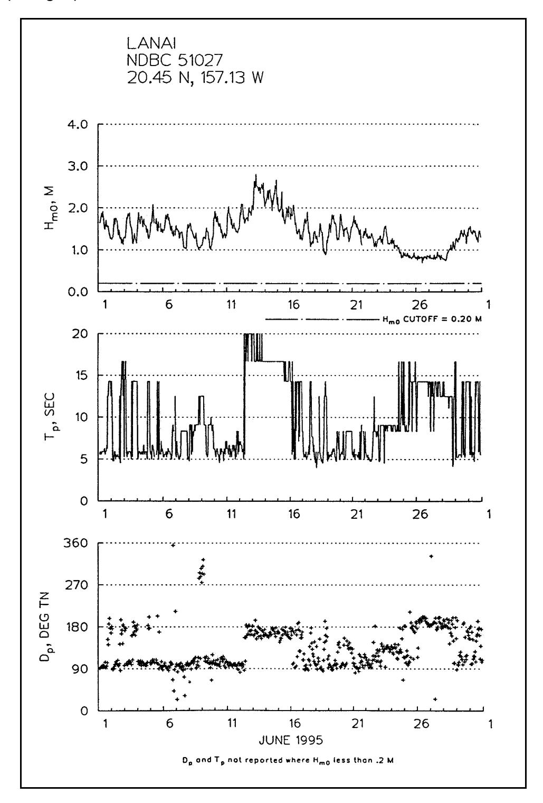

*Figure V-2-2. Example of directional wave gauge data for Lanai, Hawaiian Islands (EM 1110-2-1810)*

V-2-8 Site Characterization

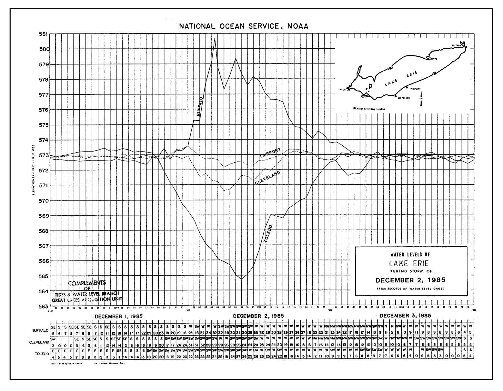

*Figure V-2-3. Water levels of Lake Erie during storm of December 2, 1985 (NOAA 1985)*

## V-2-6. Topography and Bathymetry (Map Data)

- a. Data needs .
- (1) The amount of data needed for each project varies with the scope and type of project. Maps of the study area should include the updrift coastal zone which may affect the project and the downdrift area that will be affected by the project. Cadastral, topographic, and bathymetric information obtained from different sources should be combined into one or a series of maps. Computer Aided Drafting and Design (CADD) or Geographic Information System (GIS) programs facilitate the consolidation of map information. The advantage of a CADD or GIS drawing is that different types of information can be placed on different levels, allowing the user to access different layers for presentations, and 2- and 3-D illustrations are possible. Calculation of linear, areal, and volumetric change between elevations and distances (profiles) is possible.
- (2) Recent surveys will be required to provide data in sufficient detail for cut/fill computations, sediment budgets, shoreline change, existing features, and property boundaries. Comparison with historic data will serve to illustrate shoreline and profile change and development. A review of historic maps and photographs is mandatory to fully understand the nature and processes at work, evolutionary trends, and natural ranges of variability. As windows to the past, they can present information which was at one time common knowledge, but has been lost with the passing of generations. Figure V-2-4 presents a portion of the 1836 shoreline map for Presque Isle, Pennsylvania. The location and extent of the breach along the neck (which afterward healed) give a glimpse of the shoreline position from another era. Most historic information, at least in the United States, only spans a century or less.
- (3) Cadastral information relates to the showing or recording of property boundaries, subdivision lines, buildings, utilities, and related data. Topographic data presents the relief of land and the position of natural and man-made features. Often, topographic surveys with a contour interval of 0.3 m (1.0 ft) are required. Hydrographic surveys present the subsurface relief of water bodies and their shoreline position. Hydrographic survey techniques have been experiencing a renaissance. While the use of a lead line or other direct measure surveying procedures are still common, most hydrographic surveys are presently conducted using acoustical echo sounders. Other means such as the Scanning Hydrographic Operational Airborne Lidar Survey (SHOALS), a helicopter-mounted hydrographic surveying system for bathymetric measurement, are being introduced. SHOALS uses Light Detection and Ranging (LIDAR), a technology that uses a laser transmitter and receiver for water surface and water bottom detection. Because SHOALS is airborne, data can be obtained over ten times faster than shipboard echo soundings.
- b. Available sources . Existing map data for the United States may be obtained from the following sources:
Cadastral: City, county, and state real estate records.
Topographic: State Department of Transportation, United States Geological Survey
(USGS) and the U.S. Army Corps of Engineers (USACE).
Hydrographic: NOAA and USACE.
USACE District offices prepare annual reports on their activities. Review of these historic documents presents a narrative summary of coastal activities at U.S. Government installations. Maps also may be attached to these reports. The reader is referred to Part II, Chapter 8.
V-2-10 Site Characterization

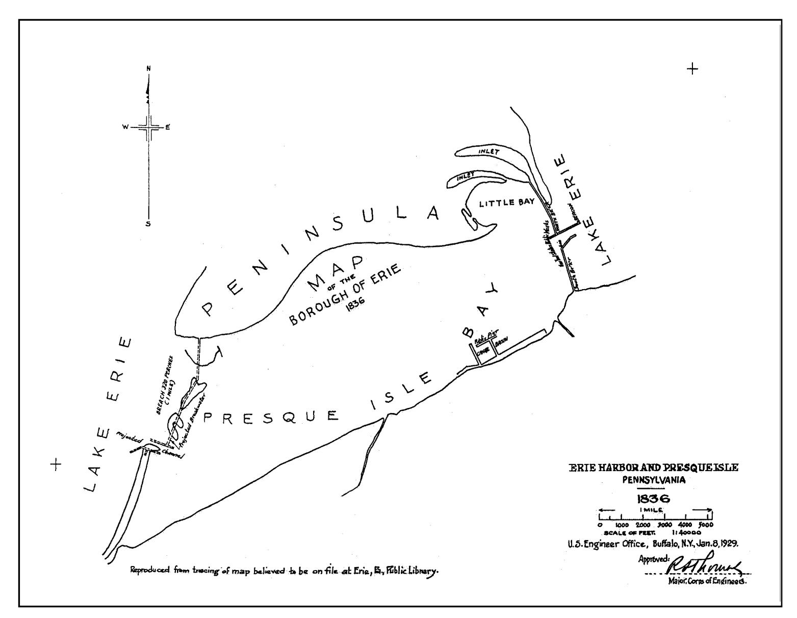

*Figure V-2-4. The 1836 shoreline at Presque Isle, Pennsylvania*

## c. Reliability .

- (1) All maps should have a north arrow (or south arrow in the Southern Hemisphere), a scale, and reference to the horizontal and vertical datum planes used. When using a historic map, one should be aware that magnetic north varies with time and one must align the map using true north. A map with a bar scale indicating the actual length is preferred. Be wary of maps that only report the scale, such as 1 cm = 1 km, unless the map is the original. The scale may be different if it is a copy, either due to slight paper shrinkage or reduction or enlargement when the copy was made. Also be aware that the datum plane can change with time or that a different datum plane may have been used. The datum used for topographic surveys may be different than that used for hydrographic work. Also, individual localities, such as cities, may have their own datum planes (Part II, Chapter 5 discusses datums). When comparing historic maps, at least two points of reference will be necessary in order to align the maps.
- (2) The accuracy of hydrographic data is affected by four types of error: sounding, spacing, closure, and error due to temporal fluctuations in the lake or sea bottom. These errors may be more significant (greater) for nearshore profiles than for beach or topographic surveys since land surveys are not affected by the latter error and measurement techniques are more precise for topographic work. The presence of errors suggests a need for caution in interpreting differences obtained from two surveys of the same profile. In other words, be sure that different profiles truly represent differences in the sea bottom and do not merely reflect survey or plotting errors. Since the nearshore seafloor can change rapidly in response to changing wave conditions, differences between successive surveys may reflect bottom differences caused by storms and seasonal wave climate changes. These fluctuations may actually be greater than long-term trends. Reviewing available historic bathymetric charts will assist in interpreting long-term trends as short-term changes are often larger than net changes.

## V-2-7. Geomorphology/Geometry and Sediment Characteristics

- a. The coast is a diverse and dynamic environment. Many geologic, biological, and natural and human-made physical factors are responsible for shaping the coast and keeping it in a constant state of flux. Ancient geological events created, modified, and molded the rock and sediment bodies that form the foundation of the modern coastal zone. Over time, various physical processes have acted on this preexisting geology, subsequently eroding, shaping, and modifying the landscape.
- b. Lithology deals with the general characteristics of rock and sediment deposits and is an important factor in shaping the present coast. The most crucial lithologic parameters responsible for a rock's susceptibility to erosion or dissolution are the mineral composition and degree of consolidation. Marine processes are most effective when acting on uncemented material, which is readily sorted, redistributed, and sculpted into forms that are in a state of dynamic equilibrium with incident energy. Part IV describes coastal geomorphology/sediment characteristics. a. Types of coasts/principal features .
- (1) Upon initiation of a study in a coastal area, the investigator needs to be aware of the type of coast being examined. Coasts may generally be classified as consolidated, unconsolidated, tectonic, or volcanic. Consolidated rock consists of firm and coherent material with coasts of this type typically found in hilly or mountainous terrain such as that in Maine (Figure V-2-5). In contrast, depositional and erosional processes dominate unconsolidated coasts, which are normally found on low relief coastal plains or river deltas. The Atlantic and Gulf of Mexico coasts of the United States are mostly unconsolidated depositional environments (except locations like the rocky New England shores). Figure V-2-6 is a photo of an unconsolidated coast.
V-2-12 Site Characterization

*Figure V-2-5. Example of resistant rock-bound coast of Maine (Bass harbor Head Light, Maine, south of Acadia National Park)*

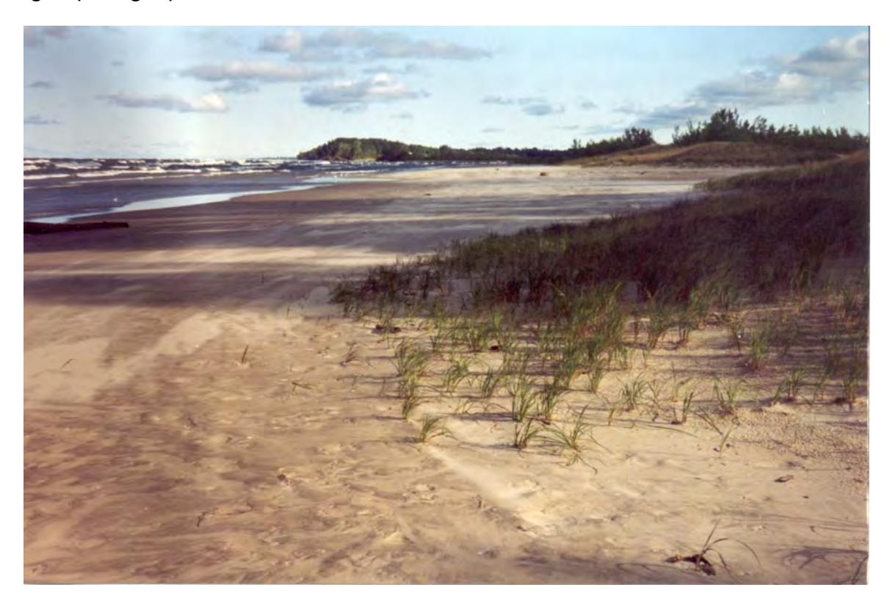

*Figure V-2-6. Beach near entrance to North Sand Pond, Lake Ontario, NY. This is a relict dune environment at the eastern end of Lake Ontario*

Forces within the earth's crust and mantle deform, destroy, and create crustal material. These tectonic activities produce large-scale uplift and subsidence of land masses. The west coast of the United States is an example of a tectonically dominated coast. Sea stacks are prevalent along the U.S. Pacific coast. Sea stacks are steep-sided rocky projections above sea level near the coast. They are formed by wave cutting back on the two sides of a promontory. With the aid of weathering and further cutting behind it, it is left as an island. Sea stacks may be located onshore (Figure V-2-7) or further offshore, are of varied sizes and locally affect the wave patterns near them. The Great Lakes were created by glacial action, and physical characteristics of the shorelands are very diverse. They vary from high bluffs of consolidated or unconsolidated (Figure V-2-8) material to low bluffs and plains, dunes and wetlands. The eruption of lava and the growth of volcanoes may result in large masses of new crustal material, such as in the Hawaiian Islands.
- (2) Principal coastal features which have been formed by local processes give indications of the types of coast under investigation. For example, the presence of a barrier island is indicative of a coast consisting primarily of unconsolidated sediments. In contrast, the most prominent feature exhibited by a fault coast is a scarp where normal faulting has recently occurred, dropping a crustal block so that it is completely submerged and leaving a higher block standing above sea level.
- b. Sources and sinks . Recognition of the many sources (gains) and sinks (losses) in the coastal zone is important during development of the sediment budget for the region. In general, sand supply from rivers, cliff/bluff erosion, onshore transport from the shelf, biogenic sources (such as reefs), and alongshore sediment transport into the area constitute the major natural sources. Beach nourishment represents a humaninduced gain to the budget. Natural losses can include sediment blowing inland to form dunes, offshore transport to deeper water, losses down submarine canyons, and the longshore transport that carries littoral
V-2-14 Site Characterization

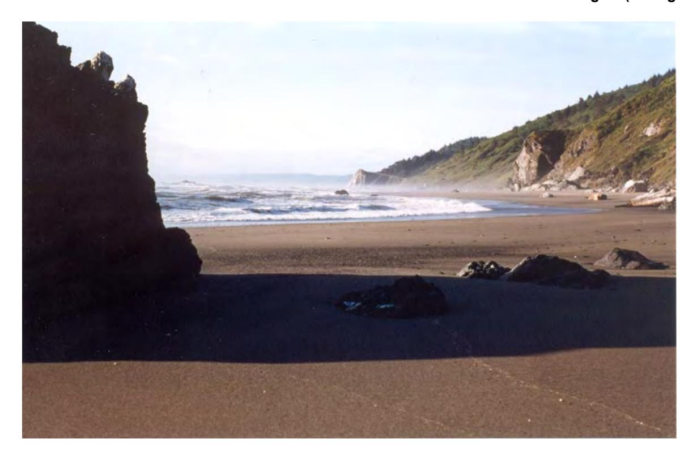

*Figure V-2-7. Coast at Orick, CA. This is a pocket beach between resistant headlands*

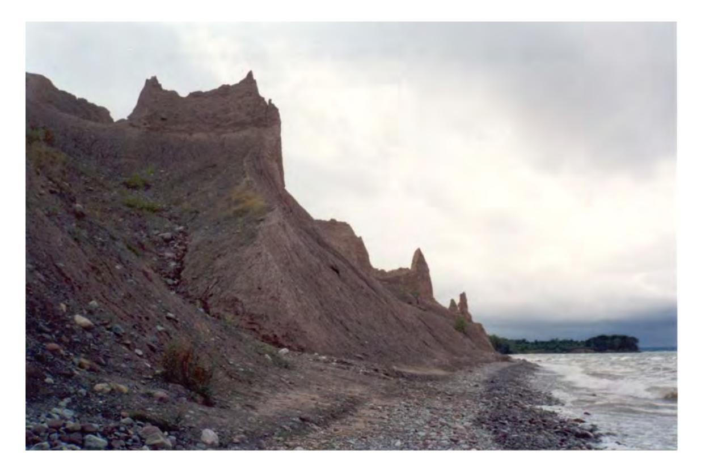

*Figure V-2-8. Shore at Chimney Bluffs State Park, Lake Ontario, NY. Chimneys consist of glacial till more weather resistant than surrounding material*

sediments out of the study area. Sand mining or direct removal (e.g., channel dredging with disposal outside of the littoral system) is a human-induced deficit to the budget.
- c. Prevailing sediment characteristics .
- (1) The geology of the coast and the source of littoral materials ultimately determine the prevalent shape of the shore and the composition of the beach at a specific locality. Littoral materials are classified by size, composition, shape, and other properties such as color. Littoral materials are classified by grain size in clay, silt, sand, gravel, cobble, and boulder. Several size classifications exist, with the Unified Soil Classification being the primary classification used by engineers and the Wentworth by geologists. Part III, Chapter 1 discusses sediment properties and classification.
- (2) Littoral material is composed of materials specific to that region. While beach material is most commonly composed of quartz or feldspar particles, it also can be volcanic debris, as in the Hawaiian and Aleutian Islands, shell and coral, organics (peat), silts and clays. Littoral sands, gravel, and cobbles are usually rounded (Figure V-2-9), while departures from this shape are attributed to contributions from shell fragments and sedimentary rock such as shale. These departures from a spherical shape affect sediment motion initiation.

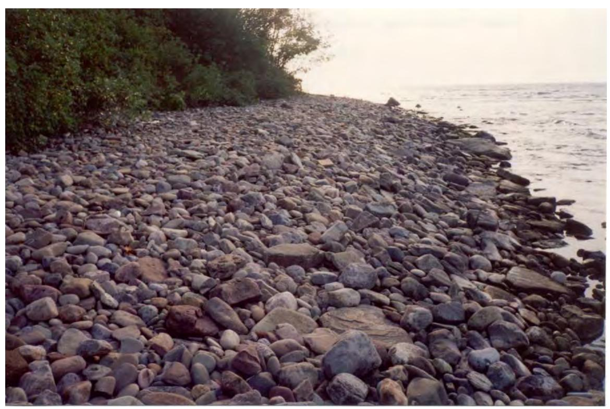

*Figure V-2-9. Cobble Beach along Lake Ontario, Oswego, NY. Origin of cobble is bluff and glacial drumlin erosion*

Sediment color may be used to trace the source of littoral material. It also is an indication of the relative density of the material. "Light minerals" such as quartz and feldspar, which have specific gravities ranging from 2.65 to 2.76 are generally tan, cream, or transparent. The famous white sands of the Florida panhandle are a very clean, uniformly sized quartz. "Heavy minerals," such as hornblende, garnet, and magnetite, which have specific gravities ranging from 3.0 to 5.2, are dark (black, red, dark green, etc.) in color. Littoral sediments of volcanic islands are dark, often green and black (Figure V-2-10).
V-2-16 Site Characterization

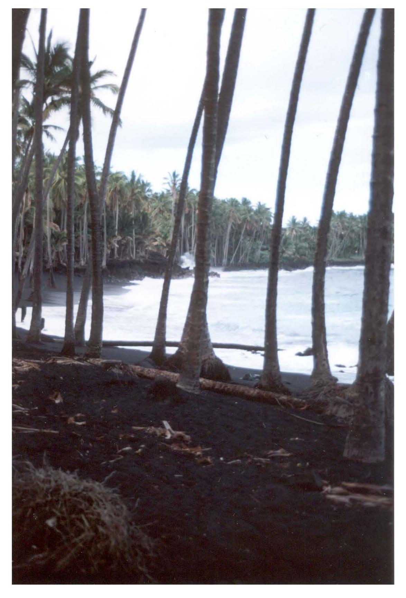

*Figure V-2-10. Black Sand Beach, Kalapana, HI. Sand is of volcanic origin*

d. Sediment layering . It is important to recognize that variation in beach material may occur with depth. Classification of the surficial material only may lead to erroneous interpretations of coastal activity. Underlying the beach material can be layers of cohesive material, peat or rock. These will have significant effects on beach profile response to storm activity and foundation conditions for proposed structures. An understanding of the geology of the area will indicate whether layering (stratigraphic variability) can be expected.

#### V-2-8. Littoral Drift and Sediment Transport Patterns

Littoral transport is the movement of material in the littoral zone by waves and currents. This includes movement parallel (longshore) and perpendicular (cross-shore). The littoral zone extends from the shoreline to just beyond the seawardmost breakers.
a. Longshore movement . Wave-generated currents tend to dominate water movements in the nearshore zone and are important in the movement of sediments. Wave-induced currents are superimposed on the wave-induced oscillatory motion of the water. When waves break with their crests at an angle to the shoreline, a current is generated parallel to the shore that is largely confined to the nearshore between the breakers and the shoreline. The volume rate of material transport along the shore is sensitive to the breaker angle and height. The longshore gradient in breaking wave height is also a generating mechanism for longshore sand transport. This contribution is usually much smaller than that from oblique wave incidence in an open coast situation. However, in the vicinity of structures, where diffraction produces substantial change in breaking wave height, its inclusion improves transport rate prediction (Hanson and Kraus 1989). Longshore sediment processes are discussed in Part III, Chapter 2.

#### b. Cross-shore movement .

- (1) Wave breaking generates turbulent motion and provides the necessary mechanism for suspending sediment. Sediment transport in a direction perpendicular to the beach is known as cross-shore movement. The equilibrium profile is a profile of constant shape which is approached if exposed to fixed wave and water level conditions. Waters (1939) proved that the existence of an equilibrium profile was a valid concept under laboratory conditions. The concept of the equilibrium profile is discussed in Part IV.
- (2) As a beach profile approaches an equilibrium shape, the net cross-shore transport rate decreases to approach zero at all points along the profile (Larson and Kraus 1989). The division of the profile into different transport regions has allowed empirically based relationships for the net transport rate to be formulated. The four transport zones across the profile are defined as: Zone I: From the seaward depth of effective sand transport to the break point (prebreaking zone).
Zone II:From the break point to the plunge point (breaker transition zone).
Zone III: From the plunge point to the point of wave reformation or to the swash zone (broken wave zone).
Zone IV: From the shoreward boundary of the surf zone to the shoreward limit of runup (swash zone).
(3) The net transport rate in zones of broken waves, where the most active transport occurs, shows good correlation with the wave energy dissipation per unit water volume. The net transport rate in the prebreaking zone decreases exponentially with distance offshore. In the foreshore zone, the net transport rate shows an approximately linear behavior decreasing in the shoreward direction. The reader is referred to
V-2-18 Site Characterization
Chapter III-3 for a discussion on cross-shore transport. Larson and Kraus (1989) present an excellent literature summary of the chronological investigations on profile change and the development of cross-shore transport modelling. Dean (1991) summarizes equilibrium profile responses for differing coastal conditions. Houston (1996) applies equilibrium profile responses to beach fill design. The reader is referred to Part III, Chapter 4.

#### c. Seasonal reversals .

- (1) Section V-2-5 discussed the seasonal variability of storms and waves. This variability results in two distinct classes of waves, storm waves and swell waves, which have completely different effects on the beach profile. In general, storm waves remove the beach berm to place it along the offshore portion of the profile while swell waves replace it back onshore (Silvester and Hsu 1993). This occurs primarily along the oceanic coasts and to a reduced degree along inland seas. Recognition of this variability is important in interpreting existing beach change and during the establishment of a monitoring program for a beach.
- (2) The following synopsis of this action is presented eloquently in Sylvester and Hsu (1993). In describing the action of swell waves on the beach profile,
The broken wave swashes up the beach face with its water percolating through it, so long as there is adequate time between each wave  —  this water soaks down to the water table some distance below the face, eventually to be returned back to the sea. The downrush, when a trough arrives, is smaller than the uprush due to this percolation and therefore cannot carry much of the sediment load back down the beach face. Also, the hydraulic jump associated with this flow reversal is small. The result is that swell waves, with several seconds between each crest, will leave material on the face and hence the beach accretes.
(3) In contrast to swell waves, storm waves are steeper. Silvester and Hsu (1993) wrote,
Now consider what happens to this swell profile when storm waves arrive. These are very steep and contain much water above the mean sea surface. They comprise waves of many periods, or constitute a wide spectrum, with heights appropriate to each. A crest arrives almost every second instead of every few seconds and hence large volumes of water are thrown over the beach face, which is quickly saturated. By this action, the water table has become almost coincident with the face itself. The downrush now nearly equals the uprush so that much sand is dragged down the face into the hydraulic jump, which is increased in size. This is one mechanism by which the berm is eroded and its contents placed into suspension.
Another factor, of equal if not greater importance, is the flow of the excess ground water returning to the sea. At the waterline, where the hydraulic jump is also located, it is moving vertically, thus causing liquefaction or a "quicksand" effect (Longuet-Higgins 1983). This aids suspension so helping to undermine the toe of the beach, which progressively retreats landward...
(4) The above briefly described the effect on the profile type (accretion/erosion) and hence a net onshore or offshore cross-shore transport due to the presence of swell or storm waves, respectively. It also is important to recognize during development of the sediment budget that the net direction of the storm and swell waves may be different, resulting in a reversal of longshore drift with season. This can have a significant effect upon the location of accretionary/erosional zones adjacent to the project. The project design needs to tolerate a range of expected conditions. One must be able to change bypassing operations during a year to accommodate these seasonal reversals.
- d. Long-term reversals . Recognition of changes in the sediment budget over the long term (years to decades) is important when evaluating historic changes or predicting potential changes due to a proposed project. Modifications of the sediment gains or losses through natural causes or human intervention can shift an accretionary shore to an erosional shore. For example, the construction of large harbor structures or the stabilization of an inlet along the coast have affected the amount of sediment reaching downdrift beaches. Without sediment bypassing around the harbor, downdrift beaches may erode severely. Cyclic climatic changes such as the El Nino- can cause reversals for many months. Knowledge of these type of activities is necessary to properly interpret profile change. e. Slug motion.
- (1) Sediment movement along the shore rarely occurs at a temporally and spatially constant rate. The presence of large beach protuberances termed "sand slugs" or "longshore sandwaves" is a phenomenon that has been reported at numerous beaches around the world. Along Long Point on the Lake Erie shore, these features have been observed with alongshore lengths of 500 to 2,500 m (1,640 - 8,200 ft) and maximum widths of 50 to 90 m (164 - 295 ft) which migrate alongshore in the direction of net drift at 150 to 300 m/year (492 - 984 ft/year) (Stewart and Davidson-Arnott 1988; Davidson-Arnott and Stewart 1987). Similarly along the Dutch coast, they have been measured with an amplitude of 30 to 500 m (98 - 1,640 ft), a celerity of 50 to 200 m/year (164 - 656 ft/year), and a period of 50 to 150 years (Verhagen 1989).
- (2) Bakker (1968) presents a mathematical theory on sandwaves and an application on the Dutch Wadden Isle of Vlieland. Stewart and Davidson-Arnott (1988) describe their formation by the onshore movement and welding of inner nearshore bars during nonstorm periods on areas of local sediment abundance. In addition, growth and downdrift extension and widening of the protuberance in the direction of net sediment transport results from attachment of an inner bar to the slug and infilling of the trough-runnel downdrift of the protuberance. The presence of sand waves results in a spatial pattern of erosion and accretion, with erosion occurring primarily in the embayments between the slugs and accretion occurring opposite the wide beach of the sand wave.
- (3) The presence of this type of phenomenon can dwarf the effects of a relatively smaller shore project. At Presque Isle Peninsula, Pennsylvania, three prototype segmented offshore breakwaters were built in 1978. The intent was to study the effect of offshore distance, breakwater length, and gap width upon the shoreline. The movement of a sand wave through the project area a few years later totally covered the breakwaters. They began to emerge more than a decade later. Verhagen (1989) concluded that along the southern part of Holland, groin construction did not change linear long-term coastal erosion and did not change the cyclic behavior of the shore. He concluded that construction of groins on this coast did not have any effect at all.
- f. Hot spots . Often at a beach nourishment project, there will be one or more areas that erode more rapidly than others. These areas are termed erosional hot spots. The location may correlate with areas which had previously experienced high erosion. Hot spots at new locations may be due to wave refraction and possibly wave focusing in response to bathymetric change from placed material (National Research Council 1995). Another cause may be a bottom composition change which affects the rate of movement. In any event, erosional hot spots may require renourishment earlier than the rest of the project. This unexpected work will place an additional financial strain on the project. Placement of a greater quantity of sand in hot spot areas may extend the time between renourishment.
V-2-20 Site Characterization

## V-2-9. Shoreline Change Trends

- a. Evidence of cyclic processes .
- (1) The presence of cyclic processes due to water levels and waves is observed in coastal features such as tidal inlets and seasonal bars. Inlets are the openings in coastal barriers through which water, sediments, nutrients, planktonic organisms and pollutants are exchanged between the open sea and the protected embayments behind the barriers. Inlets are not restricted to barrier environments or to shores with tides; on the west coast of the United States and in the Great Lakes, many river mouths are considered to be inlets, and in the Gulf of Mexico, the wide openings between the barriers, locally known as passes, are also inlets. Tidal inlets are analogous to river mouths but differ as they experience diurnal or semidiurnal flow reversals and they have two opposite-facing mouths (seaward/lakeward and lagoonward). Tidal inlets are characterized by large sand bodies that are deposited and shaped by tidal currents and waves. The ebb-tide shoal is a sand deposit that accumulates sea/lakeward of the inlet mouth. It is formed by ebb tidal currents and is modified by wave action. The flood-tide shoal is a sediment deposit at the landward opening that is mainly shaped by flood currents. Depending upon the size of the bay (lagoon), the flood shoal may extend into open water or may merge into a complex of meandering tributary channels, point bars, and muddy estuarine sediments.
- (2) As indicated in Section V-2-8, seasonal variability of storms and waves results in seasonal reversals in cross-shore drift. The effect of the change from a swell-dominated to storm-dominated profile is clearly seen in the presence of seasonal bars. Storm waves remove the beach berm and place the material offshore as a bar. Swell waves attempt to reverse this action. Interpretation of long-term trends must account for these short-term changes.
- b. Eustatic sea level changes . A worldwide change in sea level, referred to as eustatic sea level change, is caused by change in the relative volumes of the world's ocean basins and the total amount of ocean water (Sahagian and Holland 1991). The rise results in a slow, long-term recession of the shoreline, partly due to direct flooding and partly as a result of profile adjustment to the higher water level. Estimates of recent eustatic rise range from 15 cm/century (Hicks 1978) to 23 cm/century (Barnett 1984), although some researchers, after exhaustive studies of worldwide tide records, have not seen conclusive evidence of a continuing eustatic rise (Emery and Aubrey 1991). This topic is reviewed in greater detail in Part IV.
- c. Subsidence . Subsidence is the sinking of land due to natural compaction of estuarine, lagoonal, and deltaic sediments resulting in large-scale disappearance of wetlands. This effect has been exacerbated in some areas by human intervention with groundwater and oil withdrawal. Significant subsidence occurs in and near deltas where large areas of fine-grain sediment accumulate. Land loss in the Mississippi delta has become an important issue because of loss of wetlands and rapid shoreline retreat. Along with the natural compaction of the deltaic sediments, groundwater and hydrocarbon withdrawal may have contributed to subsidence problems in southern Louisiana. The change in relative sea level in the Mississippi delta is about 15 mm/year, while the rate at New Orleans is almost 29 mm/year (data cited in Frihy (1992)).

#### V-2-10. Land/Shore Use

a. The present use of the shore and the area landward of the coast needs to be documented. The areal extent of information to be collected must be determined on a site-by-site basis. An understanding of the sediment budget will assist in defining limits. Information should be gathered not only for engineering purposes but also for environmental and economic documentation. For a project planned in the coastal zone, this information will assist in assessing environmental and economic effects of the project.
- b. Information collected on structures will include the type, ownership (residential, commercial, public, and other), density, location, and value. The elevation-versus-damage relation may be required if there is a flooding problem. The distance of structures from the top of bluffs or high-water elevation may be needed for regulatory purposes (setbacks) or expected potential damage at the present recession rate. If a shoreline erosion protection project is proposed, infrastructure data will be needed to estimate damage reduction (project benefits) due to a lower recession rate. Structures which influence sediment supply or surface/groundwater drainage patterns may also be important.
- c. In addition to the structure inventory, property boundaries have to be located. Identification of all lands, easements, and rights of way will be needed when assessing the required easements for construction limits and access to the site, as well as for future maintenance. The affected infrastructure (roads, utilities, etc.) also must be identified.

## V-2-11. Potential for Project Impacts

- a. Effects on natural tidal flushing .
- (1) Dredging a channel through a tidal inlet usually results in increased shoaling. Channel dredging also can have a significant effect on adjacent shorelines, although the effect may be difficult to assess. A complete understanding of natural processes prior to dredging is required to discern the change due to dredging. Disposal of dredged material offshore may result in permanent removal from the littoral system if the depth is sufficient to prevent return to the nearshore littoral environment. Although the limiting depth for which material offshore will return to the beach is generally unknown, it is dependent on variables such as sediment size and wave climate. A few tests have suggested that material placed in water depths greater than 6 m (20 ft) in the ocean and about 2 m (6 ft) in the Great Lakes will not readily return to the nearshore littoral system (Harris 1954, Schwartz and Musialowski 1980).
- (2) Jetties or breakwaters often are built to stabilize inlets. These structures serve to stop the entry of littoral drift into the channel, function as training walls for tidal currents, stabilize the position of the navigation channel, may increase tidal current velocities which flushes sediment from the channel, and reduce shoaling in the channel. Despite their positive engineering effects, jetties often form a barrier to longshore sediment movement. Where there is no predominant direction of longshore transport, jetties may stabilize nearby shores, but this effect is limited only to the sand impounded at the structures. At most sites the amount of sand available to downdrift shores is reduced, at least until a new equilibrium shore is formed at the jetties. Where longshore transport predominates in one direction, an accretionary fillet will occur on the updrift side of the channel and erosion will occur on the downdrift side. Again, bypassing or nourishment will be required to mitigate this imbalance.
- (3) The increase in channel velocities also increases the potential for scour along the structure toe. This effect can be exacerbated by the presence of waves. This potential effect must be considered during project design. b. Up/downdrift effects and need for bypassing .
- (1) Construction of a coastal project that protrudes from the shore or is located nearshore and modifies the local wave climate may result in a change in sediment accretionary and erosional patterns. This perturbation of longshore drift movement will result in an accretionary zone immediately updrift or within the wave shadow of the structure and an erosion zone downdrift of the structure. The effect of the structure may be mitigated by prefilling the fillet (at a protruding structure) or salient (behind a shore-parallel structure). This preventative action may not be adequate. If the structure protrudes sufficiently to trap and deflect most of the littoral drift to deep water, bypassing of material may be required.
V-2-22 Site Characterization
- (2) Prediction of erosion downdrift of a barrier is challenging. Bruun (1995) presents a discussion, series of examples, and a good reference list on this problem. He notes that downdrift erosion may in some cases be composed of short (local) as well as long-distance effects which move downdrift at various rates. The presence of a 'zero-area' or location of a temporary reduction of erosion a short distance from the barrier does not necessarily indicate the extreme limit of leeside erosion. While the short distance effect is a geomorphological feature, the long-distance effect is due to a sediment deficit. Determination of the maximum recession and length of shore affected by downdrift erosion is further complicated by the presence of natural erosionary processes.
- (3) Mitigation of shoreline damage due to the presence of an existing structure requires knowledge of recession rates (sediment budget) before and after its construction. The difference in sediment gain/loss downdrift of the structure is the minimum information required to mitigate effects of the structure. This value is used if bypassing of material is not practical or is politically infeasible (updrift owners enjoy the newly created or enlarged beach) and new material instead is introduced to the system.

#### c. Changes in wave climate .

- (1) Construction of a protruding or an offshore shore-parallel structure will modify the local wave and current climate near the structure. A protruding structure, such as a groin or jetty, may cause development of a rip current along the updrift face. An offshore breakwater will reduce wave activity in the lee since wave energy behind the structure occurs from a combination of diffracted waves from the ends and transmission over/through the structure. This usually will result in deposition of littoral material in the breakwater shadow. Modification of the wave pattern may limit surfing but can enhance other recreational activities such as swimming.
- (2) Reflection of incident waves from a natural or man-made structure also will affect local wave climate. The amount of wave reflection, expressed as the reflection coefficient (reflected wave height/incident wave height), is dependent upon the structure's surface roughness, structure height in relation to the wave runup (freeboard), structure slope and incident wave angle (especially as the wave direction approaches the structure orientation). Smooth, vertical, and high (no overtopping) structures (such as sheetpile walls) reflect most incident wave energy. The resulting increase in wave height near the structure can induce additional scour at the structure toe, increase local transport rate, and result in unacceptable wave conditions within a harbor.

#### d. Impact on benthic organisms .

- (1) Construction of shore protection measures usually produces short-term physical disturbances which directly affect biological communities and may result in long-term impacts. Coastal structures alter bottom habitats by physical eradication and in some cases scour or deposition. However, certain hard structures may create a highly productive, artificial reef-type habitat. Beach nourishment will cover nonmotile organisms.
- (2) Species comprising marine bottom communities on most high-energy coastal beaches are adapted to periodic changes related to natural erosion and accretion cycles and storms. Burial of offshore benthic animals by nourishment material has a greater potential for adverse impacts than those in the intertidal and upper beach zone (Nagvi and Pullen 1982). Survival of vegetation and animals will depend upon the deposition depth, rate of deposition, length of burial time, season, particle size distribution and other habitat requirements.
- (3) A biological survey of organisms living in and using the proposed project area must be completed before a project is initiated. This must include threatened and endangered species. This inventory and knowledge of habitat requirements will assist in defining potential impacts of the proposed project.
- (4) Certain species are very sensitive to placement of beach nourishment. Moderate disturbance of a mature oyster reef can destroy it. Covering of mangrove prop roots can kill the entire plant (Odum, McIvor, and Smith 1982). Hard corals are more sensitive than soft corals to covering with fine sediments. Excessive sedimentation for a nourishment project which buries a reef results in permanent destruction or replacement by soft bottom habitat and community. Nourishment can affect sea turtles directly by burying their nests or by disturbing nest locating and digging during the spring and summer nesting season. Elimination of these adverse effects may be possible by timing of placement (to be discussed in Section V-2-12).
- e. Changes in natural habitat . Construction of a project in the coastal zone can cause short- and long-term changes in the natural habitat. Placement or dragging dredge anchors and pipelines can damage environmentally sensitive habitats such as coral reefs, seagrass beds, and dunes. Short-term changes to the grain size and shape of the beach will occur depending on characteristics of the native and borrow material. Waves and currents will winnow and suspend finer sediments and deposit them in deeper water offshore. Eventually, the sediment size distribution will become comparable to the beach sediments prior to nourishment. An increase in compaction of the beach can result from beach nourishment. Burrowing animals such as crabs and sea turtles can have difficulty digging in compacted beaches. As with sediment sorting, the compaction increase will be temporary until the beach is softened by wave action, particularly storms. Construction of a hard structure can result in a permanent change locally by removal of bottom habitat. However, a rubble-mound structure may provide a different (reef-type) habitat. Scraping of the new beach fill face during its initial adjustment can also have an adverse effect on species such as sea turtles and crabs that transit the beach surface for nest building and reproduction.

#### V-2-12. Environmental Considerations

Selection of the best environmental and engineering solution to a coastal problem requires a thorough understanding of the complexity and diversity of the coastal zone. A clear definition and cause of the problem as well as a comprehensive review of potential solutions is required. In the previous sections, some potential impacts to be expected by a project were discussed. In this section, the principal environmental factors that should be considered in design and construction and techniques to attain environmental quality objectives are discussed briefly. The reader is directed to EM 1110-2-1204 for more detailed information.
- a. Surveying the project area .
- (1) An understanding of existing environmental conditions is vital to ensuring that the status quo is maintained or enhanced. An environmental survey of the project area is required in order to establish a baseline condition. As in any sampling program, the most critical aspect of data collection is identifying the proper parameters to sample and measure. The quality of information obtained will be dependent upon collecting representative samples, use of appropriate sampling techniques, protecting samples until they are analyzed, accuracy and precision of analysis, and correct interpretation of results.
- (2) The purpose of collecting samples is to acquire adequate representation of the project area's characteristics. This requires that samples be taken in locations typical of ambient conditions found at the project site. The number and frequency of samples will need to be assessed. Sampling equipment should be selected based on reliability, efficiency, and the habitat to be sampled. In order to maintain the integrity of the results, preservation of samples is imperative. Preservation is intended to retard biological action and hydrolysis/oxidation of chemical constituents, and to reduce volatility of constituents.
V-2-24 Site Characterization
- (3) Habitat-based evaluation procedures are developed to document the quality and quantity of habitat. These procedures can be used to compare the relative value of different areas at the same time (baseline studies) or the relative value of one area with time (impact assessment). Two habitat assessment techniques available are the Habitat Evaluation Procedure (HEP) and the Benthic Resources Assessment Technique (BRAT).
- (4) HEP has been computerized for use in habitat inventory, planning, management, impact assessment, and mitigation studies (U.S. Fish and Wildlife Service 1980). The method is comprised of a basic accounting procedure that computes quantitative information for each species evaluated. The inventory can pertain to all stages of a species, to a specific life stage, or to groups of species. An HEP analysis includes: scoping, development and use of Habitat Suitability Index models, baseline assessment, impact assessment, mitigation, and decision on course of action.
- (5) BRAT procedures use benthic characterization information to produce semiquantitative estimates of potential trophic value of soft-bottom habitats. BRAT estimates the amount of benthos that is both vulnerable and available to target fish species that occur at a site. The utility of BRAT lies in the ability to provide meaningful information relevant to value decisions. While it does not provide an assessment of overall habitat status, it can be viewed as an in-depth assessment of a single habitat variable, that of trophic support. As such, it may contribute semiquantitative input to habitat-based assessments such as HEP.

#### b. Mitigation measures .

- (1) During the design of a project, care must be taken to preserve and protect environmental resources, including important ecological, aesthetic and cultural values. Specific U.S. Army Corps of Engineer mitigation policy for fish and wildlife and historic and archaeological resources is included in Chapter 7 of Engineer Regulation (ER) 1105-2-100. Mitigation consists of avoiding, minimizing, rectifying, reducing, or compensating for impacts. The first elements often can be accomplished through their consideration during project design. The amount of compensation required for significant losses to important resources is quantified through documentation of the amount of actual/predicted losses. Justification must be based on significance of resource losses due to a project compared to costs necessary to carry out mitigation.
- (2) Some examples of mitigative measures for the aforementioned mitigative elements are as follows: (a) Avoid: Adjust the time of construction activities to avoid periods of fish migration, spawning, shorebird or turtle nesting; preserve a public access point.
- (b) Minimize: Disturb an immature reef instead of a mature one; use rough-surface facing materials on a structure. (c) Rectify: Replace a berm; restore flow to former wetland. (d) Reduce: Control erosion (sedimentation control plan); place restrictions on equipment and movement of construction and maintenance personnel.
- (e) Compensate: Use dredged material to increase beach habitat, create offshore islands, increase or develop new wetlands; construct an artificial reef.
- c. Water quality . Water quality impacts consist of changes to the water column's characteristics which may have short- and long-term consequences. Construction processes often are responsible for shortterm increases in local turbidity levels, releases of toxicants or biostimulants from fill materials, introduction of petroleum products and/or the reduction of dissolved oxygen levels. These impacts can be minimized by construction practices, fill material selection, and in some instances, construction scheduling. These impacts are temporary unless long-term changes in hydrodynamics have occurred. It is these long-term repercussions which must be identified during the design process. The size and type of structural alternatives will result in a range of potential impacts. For example, the design of a jetty or offshore breakwater will greatly influence its impact on circulation and flushing, which affect water quality.
- d. Disposal of materials . Physical and chemical testing of the proposed material to be dredged is required in order to assess the appropriate disposal method. Local regulations also may dictate the manner in which material is to be disposed: open-water, upland or in a confined disposal facility. For material that is placed in open water, it may be necessary to predict long-term fate of the disposal mound. This assessment will entail determining whether the material is dispersive or nondispersive. If material is dispersive, rate of erosion and fate of the material should be computed from models or field studies.

## V-2-13. Regional Considerations

- a. Regulations .
- (1) Construction of a shore erosion or navigation project in the coastal zone is governed by national and local regulations. Research of governing laws is an essential part of the planning process in order to determine potential limitations for constructing in the coastal zone. These stipulations may include physical structure limitations such as size, setback requirements, the need for buffer zones, restriction on hard structures (North Carolina, Massachusetts, and Maine), and ability to rebuild after sustaining damage; and environmental limitations such as season when construction can occur and required mitigation (i.e., bypassing, wetland creation, etc). These laws are the result of lessons learned from constructing along the coast (Figure V-2-11).
- (2) The Coastal Barrier Resources Act (Public Law 97-348 1982) is an example of a national regulation affecting coastal regions of the United States. The purpose of the Act is to minimize loss of human life; wasteful expenditure of Federal revenues; and damage to fish, wildlife, and other natural resources associated with the coastal barriers of the United States by restricting future Federal expenditures and financial assistance which have the effect of encouraging development of coastal barriers. The Act established the Coastal Barrier Resources System, which identified undeveloped coastal barriers on a series of maps. A coastal barrier is a depositional geologic feature (such as a bay barrier, tombolo, barrier spit, or barrier island) which consists of unconsolidated sedimentary materials, is subject to wave, tidal, and wind energies and which protects landward aquatic habitats including adjacent wetlands, marshes, estuaries, inlets, and nearshore waters. It is considered undeveloped if it contains less than one structure per 0.02 $km^{2}$ (5 acres) that is "roofed and walled" and covers at least 18.6 $m^{2}$ (200 $ft^{2}).$
- (3) Article 34 of the New York State Environmental Conservation Law (State of New York 1988) is an example of a state law that regulates the need for coastal erosion management permits and controls activities within defined structural hazard areas and natural protective feature areas. Maps of structural hazard areas are available for the entire state coastline which define a zone in which no new nonmovable structures or non-movable major additions to existing structures can be built without formal approval. New public utilities must be located landward of the shore structures that they serve. Within natural protective feature areas, development is generally prohibited, only clean sand or gravel of an equivalent or slightly larger grain size may be deposited nearshore, and a permit is required for any new construction, modification, or restoration
V-2-26 Site Characterization

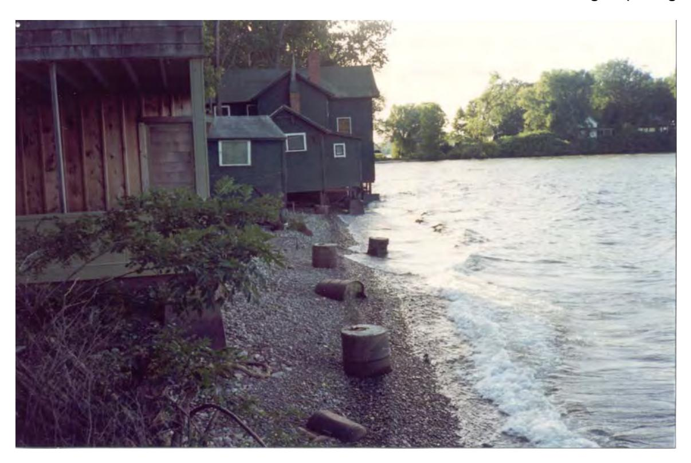

*Figure V-2-11. Structures threatened by erosion, Lake Ontario, Crescent Beach, NY*

of coastal structures. Many other states and communities have similar regulations and set-back limits, which limit construction activities within a specified distance from the shore or bluff edge.
b. Seismic . Forces within the earth's crust and mantle deform, destroy, and create crustal blocks. These tectonic activities produce physical features such as faults and folds. Tectonic movements produce large-scale uplift and subsidence of land masses. The frequency and magnitude of seismic forces on foundations of marine structures is essential information along tectonically dominated coasts such as the west coast of North America. Rigid structures (e.g. piers and seawalls) and flexible structures (e.g. rubblemound breakwaters and revetments) should be evaluated for seismic response, according to the same general practices used for building design (U.S. Army Corps of Engineers 1994).

#### c. Tsunami .

(1) Tsunamis, or seismic sea waves, are long-period waves generated by displacements of the seafloor by submarine earthquakes, volcanic eruptions, landslides and submarine slumps, and explosions. The term tsunami is derived from two Japanese words: "tsu," for harbor and "nami," meaning wave. The underwater disturbance results in uplifting the water surface over a large area, which forms a train of waves with periods exceeding 1 hr, in contrast to normally occurring wind-generated water waves which have periods less than 1 min. In the open ocean, amplitude of tsunamis is usually less than 1 m (3.3 ft) and hence may go unnoticed to passing ships. However, the wave height increases greatly as the shore is approached, resulting in potentially catastrophic flooding and damage. Tsunamis generated by volcanic activity or landslides result in the wave energy spreading along the wave crests and affect mainly the areas near their source. Those generated by tectonic uplifting may travel across an ocean basin, causing great destruction far from their source (Camfield 1980).
- (2) Tsunamis can be generated in any large water body, including inland seas and large lakes. However, the majority of seismic activity that usually generates tsunamis occurs along the boundaries of the Pacific Ocean, and some strong activity is concentrated in the Caribbean and Mediterranean Seas. While earthquakes affect the eastern United States, these usually occur inland. The only major recorded tsunami along the east coast of North America was the one which devastated the Burin Peninsula along Placentia Bay, Newfoundland, in November 1929. The tsunami was enhanced by an exceptionally high tide and high storm waves.
- (3) Because of the frequency and magnitude of tsunamis in the Pacific Ocean, a warning system has been developed. Although tsunamis travel at speeds as great as 800 km/hour (500 mph), transoceanic distances are sufficiently large to allow several hours warning prior to arrival of a distantly generated tsunami. The Tsunami Warning System (TWS) was founded in 1946 following the Aleutian tsunami of 1 April of that year that caused major damage and many casualties in the Hawaiian Islands. The TWS is a cooperative effort among Pacific Ocean nations with seismograph and tide data collected and communicated to the Pacific Tsunami Warning Center in Hawaii, which disseminates the appropriate warning.
- (4) Tsunami flood elevation frequency information is developed using historic data and numerical models. Unfortunately, good data are available for only a limited number of tsunamis. Cox and Pararas-Carayannis (1969) and Pararas-Carayannis (1969) present a catalog of tsunamis for Alaska and the Hawaiian Islands. Where data are available, the probability of tsunami flood elevations can be determined by the same methods used for the riverine environment. If insufficient information is available, a synthetic record of tsunami activity must be generated. The geophysical and tectonic setting of the area is used to synthesize a record of tsunamigenic, tectonic deformations on the seafloor. A numeric model is used to simulate the tsunamis resulting from each deformation. The resulting data are combined with tide information to produce the combined tsunami and tide elevation - frequency relationship. Houston (1979) presents a description of tsunami modeling, elevation prediction, and structural damage. Houston (1980) and Crawford (1987) present examples of tsunami elevation predictions for the southern California coast and coast of Alaska from Kodiak Island to Ketchikan, respectively.

## d. Ice .

- (1) An understanding of ice properties and the effect of ice on the shore and marine structures is important in the Great Lakes, in coastal estuaries experiencing significant freshwater inflow which may transport ice, and along the northern ocean coasts. Ocean coasts may be subject to sea ice or pans and floes of freshwater ice originating from river discharges. Northern lakes, such as the Great Lakes, experience significant accumulations of ice during the winter. Sea ice, also known as saline or brackish ice, freezes and is most dense at -1.7°C (29°F), in contrast to freshwater ice at 0°C (32°F).
- (2) A freshwater lake freezes in two stages defined by the water temperature. Cooler water at the surface generates a circulation pattern by sinking to the bottom, exposing warmer water, which successively cools. When the lake reaches a uniform 4°C (39°F), that is, the lake becomes isothermal, the lake is termed to have "turned over." As the surface water cools further, it becomes less dense than the water below it until it freezes. At this point, an ice sheet grows laterally (primary ice). In turbulent water, the primary ice cover will consist of a congealed frazil sheet and ball ice. When formed in rivers, upon reaching the outlet, severe ice jams may form which can completely fill the outlet cross section. The ice cover thickens (secondary ice) with continuing freezing temperatures, which may be at a rate of 1 in. per day (Wortley 1984). While the primary ice's axis of symmetry, called the c-axis or optic axis, is oriented perpendicular to the free surface, the secondary ice's c-axis is oriented horizontally. The formation of snow ice on the surface, which is randomly oriented, insulates the underlying ice, resulting in a reduction in growth rate of the secondary ice. Ice thicknesses in the Great Lakes generally are about 0.6 m (2 ft) to 0.9 m (3 ft). However, along the shore and near coastal structures, ice can build up considerably thicker due to ridge formation and spray. Ice ridges
V-2-28 Site Characterization
or hummocks 3 to 5 times higher than the flat ice thickness are common and are not only confined to along the shore. Ice ridges ranging from 3 m (10 ft) to 4.5 m (15 ft) above the normal ice surface and extending 18 m (60 ft) below have been observed on Lake Erie. The time that ice clears at spring breakup is dependent upon heat gain from the atmosphere, local snow and ice conditions, and wind and water currents (Wortley 1984).
- (3) Shoreline recession is not only caused by wave action, but also by downslope movement of material due to gravity (mass wasting). Exposure of permafrost lenses to seawater along the Arctic Alaskan coasts results in melting of these lenses. The resultant loss in strength may cause catastrophic failure of the bluff above it (U.S. Army Corps of Engineers 1994). In other areas, shore ice may protect the bluff from wave action. However, during the spring thaw, the saturated bluff will experience reduced cohesive strength, making it more vulnerable to mass wasting. This can be exacerbated by the presence of springs emerging along the bluff face, especially if the bluffs have been undercut by wave action.
- (4) In addition to recognizing the effect of ice on shore processes and the functionality of a proposed project, calculation of ice loads may be required. The effect of ice on coastal projects is summarized in Chapter VI-3-5, with guidance on calculating ice loads in Chapter VI-6-6.b.

## V-2-14. Foundation/Geotechnical Requirements

- a. Every proposed coastal structure, nourishment project, or dredging operation requires knowledge of the underlying sea, lake, or river bottom materials. A geotechnical site investigation is required to assess the nature and extent of all sediments and their respective properties. The level of detail of the investigation is predicated on the study phase: reconnaissance, feasibility or detailed design, and the scope of the project. For example, only surface sediment data may be required for a beach fill, whereas a major coastal structure may require additional information on subsurface conditions. These investigations will entail researching available information from previous studies/projects in the area and obtaining new data.
- b. The investigations seek to identify the elevation, thickness, and the physical, hydraulic, and mechanical properties of the soil, depth to bedrock and its properties, and groundwater level. Knowledge of the general soil group (clay, sand, etc.) allows one to assess the general characteristics of the soil. However, each soil group includes materials with a great variety of properties, and without a proper assessment, serious consequences can result (structural failure, inability to dredge the channel, etc.). Chapter VI-3-1 and Eckert and Callender (1987) present discussions on foundation/geotechnical requirements. Terzaghi and Peck (1967) also discuss the minimum requirements for adequate soil description and present a table of data required for soil identification.

#### V-2-15. Availability of Materials (Sand/Stone Resources)

The specification of materials for a proposed project requires the identification of the type, location, quantity, and quality of material available. Sand is the primary choice for beach nourishment projects, although gravel and cobble may be considered in certain situations. Rock is a popular construction material for coastal structures because of the range of sizes, durability, and availability.

#### a. Sand .

(1) Beach nourishment projects rely on the introduction of additional sand to the littoral zone to reduce a supply imbalance. Beach sand is generally a natural material preferably derived from a borrow area close to the project area. Location of a suitable borrow area requires geotechnical investigations of sediment size, type, and quantity in addition to environmental, hazard, and regulatory restrictions. Additional processing of sand (e.g., from an offshore site, the dredge may be fitted with additional screens) may be
necessary to obtain the desired product. Since sand may not be available in unlimited amounts, other alternatives may need to be considered. Manufactured sand (rock crushed to suitable gradation) was used at Maumee Bay State Park, OH, and crushed and tumbled recycled glass was deposited at Moonlight Beach, Encinitas, CA, for an emergency repair (Finkl 1996). At Fisher Island, FL, oolithic aragonite sand imported from the Bahamas was placed due to the local scarcity and environmental sensitivity of upland and offshore sand sources, the developer's interest in creating a unique and attractive beachfront, and the relatively modest size of the beach fill required (Bodge 1992). The political and engineering issues of placing this sand on other Florida beaches is discussed in Higgins (1995) and Beachler (1995), respectively.
(2) The identification of undesirable materials in the beach sand also may be required. For example, calcareous materials in the source materials have been found to react with available water sources (precipitation, groundwater, etc.) to precipitate fine-grained carbonate cement in pore spaces of the previously unconsolidated sand (Stransky and Greene 1989). This results in undesirable cementation of the beach nourishment material. This action leads to the formation of steep beach scarps, which are susceptible to undercutting and collapse, and inhibit the access of beachgoers to the shore.

#### b. Stone .

- (1) Coastal structures may use a large quantity of stone of various sizes. The location, quantity, cost, suitability, and quality of the stone are important aspects, which must be investigated. A firm or agency that regularly requires large quantities of stone should maintain records on quarries within its geographic area of business. The change from using cut rectangular stone to rubble-mound shot stone for the armor layer in coastal structures in the past decades has resulted in savings in time and cost. However, the importance of stone quality has only been recently recognized. Appropriate quarry inspections and quality control by an experienced geologist or inspector are essential.
- (2) Stone should be durable, sound, and free from detrimental cracks (both natural and quarryinduced), seams, and other defects that tend to increase deterioration from natural causes or which cause breakage during handling and placing (EM 1110-2-2302). The stone should also be resistant to localized weathering and disintegration from environmental effects. Inspection records of potential stone suppliers are important to help ensure these conditions are met and to determine the location, sizes, and types of stone available. Table V-2-3 lists data needed to perform a quarry inspection.
- (3) During annual inspection of an existing project, the presence of stone cracking should be observed, as this will affect the maintenance schedule and structural integrity. Noting characteristics, location, and number of cracks will assist in assessing whether the stone will continue to deteriorate and at what rate. Cracks are generally classified as multiple penetrating/throughgoing (MP/T) cracks and mirror image cracks (MIC). MP/T cracks are commonly blast-induced fractures and characteristically form radial fractures, which run diagonal to the shot face. They are highly destructive to the stone's integrity and longevity. These sharp penetrating cracks are often initially minute and will not enlarge until exposed to the elements. Elimination/reduction of this type of fracturing is accomplished by proper shot design at the quarry. Mirror image cracks occur when a fracture splits the stone in half and the halves split repeatedly. These cracks generally do not form until the stone has been placed in the project. MRC are generally jagged and the result of the weathering of geologic beds and/or stress relief. Reasons for MIC (Marcus 1996) are:
V-2-30 Site Characterization

**Table V-2-3. lists data needed to perform a quarry inspection.**

| Item | Comment |  |  |
| --- | --- | --- | --- |
| SOURCE INVESTIGATION |  |  |  |
| General | Purpose of inspection, Source name, address, | date of inspection, contacts, geographic | personnel attending. coordinates, descriptive directions of source |
| Location | location. Materials produced, production operations, | complete description of transportation modes, | lift/face development, plant equipment used for operating season, additional materials, sources |
| Production/Transportation | interested in producing, Stratigraphy, lithology, | summary assessment. structure, groundwater, | summary assessment. Photographs are |
| Geology | extremely useful in Blast design (description, effects (description, | documenting the geology. blast design factors, fragmentation, development | blast design relationships, analysis), blasting of radial fracturing, transverse fracturing, |
| Blasting Operations | cratering, back break | and throw), summary | assessment. |
| Material Sampling | Number, size, location | within quarry samples | where taken, photographs of samples. |
| Summary Assessment | Summary assessment | of source, quarry | personnel, and quality control. |
| LABORATORY INVESTIGATIONS / | TESTING |  |  |
| General | Purpose of testing (quality, | durability). |  |

- (a) Differences in thermal expansion behavior of the component crystalline minerals (unavoidable).
- (b) Freeze-thaw expansion and contraction of interstitial pore water (avoidable by stone curing and eliminating winter quarrying in northern locations).
- (c) Wet-dry expansion and contraction of interstitial clays and clay mineral (mostly avoidable).
- (d) Stress relief (slow-term stress release).
- (4) The reader is directed to Marcus (1996), EM 1110-2-2302, and Construction Industry Research and Information Association (1991). Figures V-5-12 and V-2-13 are photographs of the progressive deterioration (after 3 to 4 years and after a maximum of 5 years, respectively) of 80- to 178-kN (9- to 20-ton) armor stone (dolomite) in the lacustrine environment (Lake Erie).

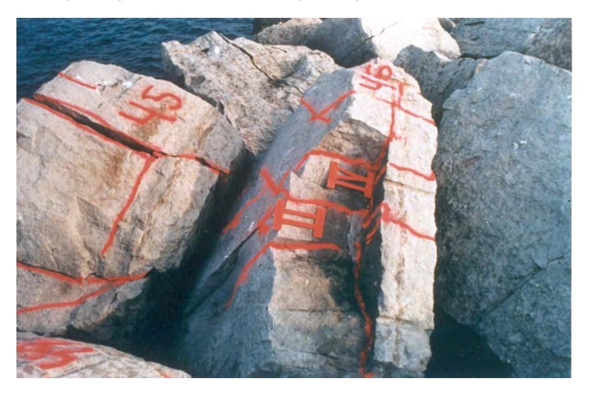

*Figure V-2-12. Cracked dolomitic limestone - Cleveland East breakwater, Ohio, 1989 (stone is dolomitic limestone)*

#### V-2-16. Accessibility

a. Access to the project area is required before, during, and after construction. The total project area encompasses not only the geographic limit of the actual project footprint but also extends a certain distance away due to impacts to the littoral zone. Access requirements before, during, and after construction may be very different. Prior to construction, temporary rights of entry may only be required to survey the site. Complete lands, easements, and rights of way will be required during construction. After project completion, rights of entry may only be necessary for project monitoring and inspection, but similar requirements obtained during construction may be needed for project maintenance.
V-2-32 Site Characterization

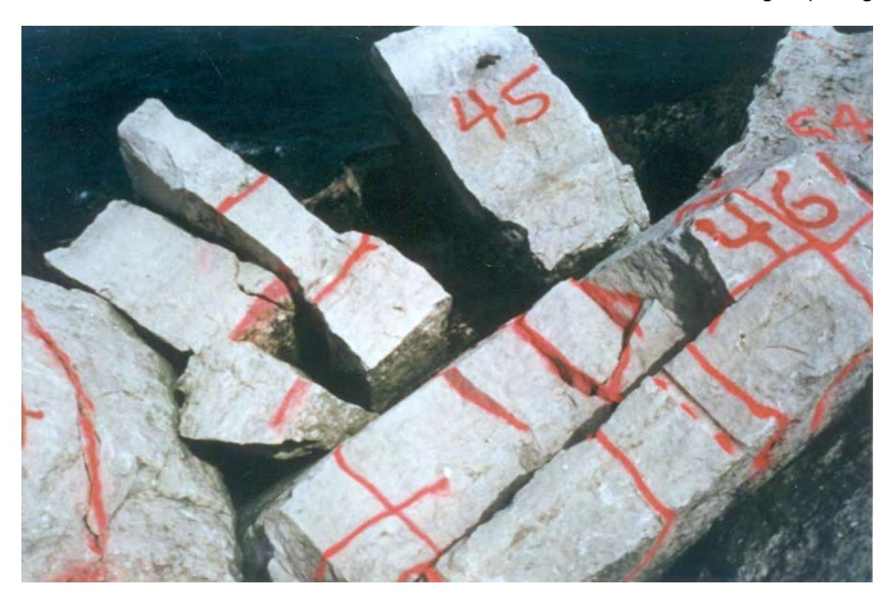

*Figure V-2-13. Cracked stone - - Cleveland East breakwater, Ohio, 1990. Note continuing degradation compared to 1989 (stone is dolomitic limestone)*

- b. Access to the site may be by land, water, or both, and may be over public or privately owned land. Individual topographic and hydrographic conditions will dictate whether the project may be constructed by water-based and/or land-based equipment. The designer will need to assess the anticipated means of construction and acquire the necessary real estate for access. Locations with difficult access can significantly increase the cost of a project. In these instances, a change in the project design or scope may be warranted.
- c. The access should be designed to allow the safe and efficient movement of equipment, materials, and personnel. Access and haul roads should be of sufficient width and grade to safely accommodate large construction vehicles. Grades should be as flat as practical with the maximum allowable grade of 10 percent (EM 385-1-1). A traffic control plan must be developed. All marine work must be accomplished with certified and inspected plant and equipment. Mooring lines and cables must be clearly marked and the vessels must follow all navigation rules applicable to the waters on which the vessels will be operated. Plans to remove and secure plant and evacuate personnel to safe haven during hurricanes, storms, or floods must be considered. Safety and health requirements concerning activities and operations are discussed in EM 385-1-1.
- d. Easement requirements may be temporary or permanent. Easements at a project site generally consist of temporary and permanent road easements, temporary work area easements, and permanent easements. A road easement grants possession of the land for location, construction, operation, maintenance, alteration and replacement of a road and appurtenances; together with the right to trim, cut, fell and remove therefrom all trees, underbrush, obstructions and other vegetation, structures, or obstacles within the limits of the right-of-way. A temporary work area easement grants the possession of the land as a work area which includes the right to move, store, and remove equipment and supplies, erect and remove temporary structures on the land and to perform any other work necessary and incident to the construction of the project. It may also include the right to trim, cut, fell, and remove all trees, underbrush, obstructions and other
vegetation, structures, or obstacles within the limits of the right-of-way. A permanent easement is a perpetual and assignable right and easement to construct, maintain, repair, operate, patrol, and replace the project, including all appurtenances. In addition to providing the rights of entry and access to the site, it will be necessary to provide and maintain adequate utilities and install and maintain necessary connections. All necessary arrangements with local Government officials or owners must be made for use of public and private roads to the site. Recognition that other construction projects may be occurring simultaneously is essential to minimize interference and work disruptions.
- e. In granting access to the site, certain restrictions and requirements will need to be identified to control environmental pollution and damage. An environmental protection plan must be created which identifies methods and procedures for environmental protection, necessary permits for waste disposal, plan of restoration upon project completion, environmental monitoring plans, traffic control plan, surface and groundwater protection methods, list of fish and wildlife which require special attention, and spill response plan. The protection of environmental resources may encompass a wide range of activities, such as: (1) Protection of land resources and landscape. (2) Reduction of exposure on unprotected erodible soils. (3) Temporary protection of disturbed areas. (4) Erosion and sedimentation control devices. (5) Control of ground vibration. (6) Disposal of waste materials and removal of debris. (7) Preservation of historical, archaeological, and cultural resources. (8) Protection of water resources. (9) Protection of fish and wildlife resources. (10) Protection of air resources. (11) Protection from sound intrusions.
- f. The above list summarizes of types of protection to be considered prior to granting access to the site for the construction of a project. The list is not all-inclusive and needs to be tailored to the particular project site. Certain restrictions may apply only during certain times of the year, certain days, or certain times of day.

#### V-2-17. Monitoring

a. Collecting data (monitoring) of coastal projects will assist in proper design of a project, and improve design procedures, construction methods, operations, and maintenance. Comparison with historic information will aid in understanding processes and changes at the site of interest. Monitoring may be classified by its purpose; operational or research monitoring (Weggel 1995). Operational monitoring is done to obtain data for the design, operation, and maintenance of a project. Research monitoring is performed to assess the performance of a project in comparison with its predicted performance or to assist in broadening the understanding of physical processes.
V-2-34 Site Characterization
- b. In general, there are three types of monitoring: physical processes, biological, and economic (Weggel 1995). Physical process monitoring consists of gathering data on the physical mechanisms, forces, and littoral zone responses that are characteristic of the project. Biological monitoring entails accumulating data on living organisms that may be affected by the project. Economic monitoring involves collecting information on the monetary impact of the project.
- c. Data collection needs to be accomplished before, during, and after construction. Data collected prior to project construction establishes the baseline data. Data may need to be updated during the design phase. Some data such as hydrographic surveys need to be updated during the plans and specifications phase in order to have the most current information available prior to bidding the project. Information may be required such as check surveys or environmental monitoring of threatened or endangered species during project construction. Post-construction monitoring may be operational or research-oriented.
- d. The success of a monitoring program depends upon creation of an extensive and implementable plan. In developing the plan, the processes and data which most affect the project should be identified. The relative importance of each element will have to be assigned with only the most pertinent selected based upon cost limitations. To be effective, monitoring should occur when changes are likely to happen and at sufficient intervals to properly assess changes. Timing of the monitoring should account for seasonal changes in order to allow differentiation from a project-induced change. Monitoring frequency also should be variable, with more data being gathered immediately after the project is in place. As project effects diminish, frequency can be reduced. It is important to recognize that the most effective monitoring plan is one that is fluid; that is, the type, amount, and frequency of data are adjusted as collected data are analyzed. Data that were important initially may be superseded by other information needs which are more critical because it is impossible to anticipate all project effects. A partial list of measurable physical properties is presented in Table V-2-4. For further information on project monitoring, the reader is directed to Weggel (1995), Morang, Larson, and Gorman (1997a, 1997b), Larson, Morang, and Gorman (1997), Gorman, Morang, and Larson (1998), and EM 1110-2-1810.

## V-2-18. Data Needs and Sources

- a. The intent of this chapter has been to introduce the many factors that a coastal manager or engineer should consider, measure, or collect at the beginning of a new coastal project. At the initiation of a project, it is imperative that one fully understand the problem. While this may seem obvious, one cannot assume that the request for a solution to a coastal "problem" is valid or accurately stated. Those soliciting a solution may not perceive the problem objectively due to political/personal motivations, may have an inaccurate understanding of physical processes, or may have inadvertently been the cause of the problem. It should be considered mandatory to meet with those involved and to visit the site in order to gain an appreciation of the scope of the problem and to observe the scale and relationships of the various physical/geologic features.
- b. Having gained an understanding of the problem, necessary data should be listed. Table V-2-5 presents a list of data needs and sources. The problem to be confronted may entail not only balancing existing data and the need to gather more with available monetary resources, but also what to do when the project needs to be built with minimal data. The latter situation will require a more imaginative approach to assess the basic governing processes of the region. Narrative and verbal sources of information will be very helpful. These may include newspaper reports, diaries, local historians, fishermen, marina operators, harbor masters, and local residents. Long-time residents who are especially familiar with the area may give a description of

*Table V-2-4 Coastal Project Monitoring Matrix*

**Table V-2-4. Coastal Project Monitoring Matrix**

|  |  |  | Project Type |  |
| --- | --- | --- | --- | --- |
| MEASURABLE PROPERTIES | BEACHES/SHORES (Dunes, groins, breakwaters, sand bypass systems, submerged sills, borrow areas) | JETTIES (Disposal areas, levees, closure stations, seawalls, revetments, bulkheads) | BREAKWATERS (Piers, wharves, moles, berths, docks) | DREDGING (Inlets, channels, marinas, outfalls) |
| Beach profiles |  |  |  |  |
| Bathymetry |  |  |  |  |
| Waves |  |  |  |  |
| Tide height |  |  |  |  |
| Tidal currents |  |  |  |  |
| Tidal prism |  |  |  |  |
| Surge |  |  |  |  |
| Longshore currents |  |  |  |  |
| Sediment size |  |  |  |  |
| Winds |  |  |  |  |
| Temperatures |  |  |  |  |
| Salinity |  |  |  |  |
| Ice coverage |  |  |  |  |
| Structural surveys |  |  |  |  |

Note: Shaded block indicates property to be monitored. Nonshaded block indicates property usually not monitored except in unusual circumstances.
historical positions of the shore, past structures which have since deteriorated, and major storms. It is imperative that the gathered information be cross-checked with other sources to assess its validity, recognizing that proclamations with numerical statements made without actual measurements should be treated with skepticism. For example, statements such as, "The waves were 12 m (40 ft) high" or "I always had a beach at least 61 m (200 ft) wide in front of my house" should be treated with suspicion. The statement needs to be substantiated or modified by further questioning and through consideration of when the event occurred. While visual wave height measurements are generally difficult to make due to the lack of other physical objects offshore, the resulting runup may give a clue. A verbal account of a large storm(s) will narrow the time frame to search through old newspapers. The type, quantity and time of year various fish are caught will give clues to the aquatic diversity. Old town maps and property deeds will be indications of the historic shoreline/bluff position. Diaries of deceased lighthouse keepers and ship captains may give accounts of the conditions (direction and duration) and date of storms.
c. In addition to verbal and written narrations, a geologic interpretation of the present condition will assist in assessing the past or future trends. Abandoned beach lines, sea stacks, and old shore structures/foundations will suggest the position of past shorelines. Old piers and jetties may indicate the alongshore direction of the migration of an inlet. Stratigraphic information may suggest a change in depositional/erosional patterns. For instance, peat and organic deposits may indicate the presence of a barrier island in the past. The size, amount, and distribution of shoals can give clues to inlet processes. Sedimentological trends such as a change in size of offshore material may explain the presence of headlands or variations in erosion rates. The presence of a fillet at a man-made or natural protruding structure/feature will indicate the littoral transport direction and mean incident wave direction. The shape of the shoreline between headlands also will give an indication of the average incident wave direction.
V-2-36 Site Characterization

| Table V-2-5 |  |
| --- | --- |
| Data Needs and Sources |  |

| Data Needed | Best Source(s) | Alternate Sources |
| --- | --- | --- |
| Site map/real estate (Needed to locate structures, land features, utilities, roads and property boundaries.) | Recent survey | Town maps USGS quad maps Atlases Local utility companies Digitize aerial photographs Sketch of site with proposed structures located by existing features |
| Site topography & bathymetry (Land and underwater contours needed to transform waves to site, determine dredge and beach fill quantities, structure lengths.) | Recent USACE high density acoustic surveys, land surveys, or SHOALS hydrographic LIDAR surveys | NOAA charts USGS quad maps Contractor surveys Emery method Visual estimation of elevations and slopes |
| Directional wave statistics (height, period & direction) (Needed for estimation of incident wave for structure design, time series for sediment transport evaluation, shoreline response and beach fill design, channel design (vessel effects)) | Directional wave gauge deployed near site | Deepwater wave gauge with waves refracted to coast WIS hindcast Wave hindcast using wind statistics Wave hindcast using design wind |
| Water level • Tidal • Storm setup (Needed for incident wave computations, flood evaluations, structure toe depths) | NOAA water level gauge near site | Interpolation between gauges to site Peak stage gauge Highwater marks Numerical models |
| Currents • Tidal • Longshore (Needed for sediment transport evaluations, dredge disposal fate, scour potential) | Directional current meter | Nondirectional current meter Measurements using drogues/floats Seabed drifters Numerical models |
| Sediment characteristics • Littoral zone (a) • Subsurface (b) (Needed for sediment transport analysis, beach fill evaluation, structure foundation design) | Extensive surface samples (a) Extensive boring program (b) | Geophysical subsurface investigations (a&b) Subsurface probe to refusal (b) Regional geologic maps (b) Visual comparison of littoral sediments using sediment card (a) Interpolation between known information (a&b) |
| Historic shoreline positions (Needed for evaluations of natural shoreline change, effects of human activity, erosion rates, regulatory setbacks) | USACE project maps Shoreline studies from universities and state studies | Digitize from aerial photographs Historic NOAA charts Extrapolate from topographic surveys Historic town property maps and deeds Estimate from ruined structures and verbal/written accounts |
| Sediment budget (Needed for determination of natural sediment movement; existing and potential effects of human activity: beach fill amounts, channel dredging estimates, bypassing quantities around structures) | Direct measurement using sediment traps in conjunction with estimation from quantity of trapped material at protruding features and sediment supply from bluff & shore erosion | Numerical estimates using longshore drift equations and period of record wave hindcast Budgets in engineering reports, published literature |
|  |  | (Continued) |

| Table V-2-5 (Concluded) |  |  |
| --- | --- | --- |
| Data Needed | Best Source(s) | Alternate Sources |
| Environmental data (Needed for evaluation of natural and existing environment, and the potential effects of human activity on flora, fauna, and water quality) | Habitat evaluation procedures | Benthic resource assessment techniques U.S. Fish and Wildlife Service, USACE and State agency reports University studies National & local environmental agencies (Audubon Soc., Sierra Club, Nature Conservancy, etc.) Sportsman's Clubs |
| Historic bathymetry (Needed for evaluation of shoal growth, project effect on shore, and inlet migration) | USACE condition surveys NOAA charts in digital form from National Geophysical Data Center | Historic U.S. Coast and Geodetic Survey charts Contractor surveys |
| Sand/stone resources • Availability (a) • Quality (b) (Needed for confirmation of size, location, and quantity of sand or stone material for project as available product can dictate design. Use of inferior quality product will result in service life reduction and possibly failure) | USACE inventories of quarries/sand deposits (a) Service records (b) | State inventories of quarries/sand deposits (a) Geotechnical search for sand deposits (a) Laboratory testing (b) |

#### V-2-19. References

#### EM 385-1-1

Safety and Health Requirements

## EM 1110-2-1204

Environmental Engineering for Coastal Shore Protection

#### EM 1110-2-1810

Coastal Geology

## EM 1110-2-2302

Construction with Large Stone

#### ER 1105-2-100

Planning Guidance Notebook

## Barnett 1984

Barnett, T. P. 1984. "The Estimation of 'Global' Sea Level: A Problem of Uniqueness," Journal of Geophysical Research , Vol 89, No. C5, pp 7980-7988.

#### Beachler 1995

Beachler, K. E. 1995. "Bahamian Aragonite: Can it be used on Florida Beaches? Engineering Issues," Proceedings of the 1995 National Conference on Beach Preservation Technology , Florida Shore and Beach Preservation Association, Tallahassee, FL.

#### Bodge 1992

Bodge, K. R. 1992. "Beach Nourishment with Aragonite and Tuned Structures," Coastal Engineering Practice '92 , ASCE, New York, NY.
V-2-38 Site Characterization

#### Bruun 1995

Bruun, P. 1995. "The Development of Downdrift Erosion," Journal of Coastal Research , Vol 11, No. 4, pp 1242-1257.

#### Camfield 1980

Camfield, F. E. 1980. "Tsunami Engineering," Special Report No. 6, Coastal Engineering Research Center, U.S. Army Engineer Waterways Experiment Station, Vicksburg, MS.

### CIRIA 1991

CIRIA. 1991. "Manual on the Use of Rock in Coastal and Shoreline Engineering," Construction Industry Research and Information Association Special Publication 83, (Also published as Centre for Civil Engineering Research and Codes Report 154), Gouda, The Netherlands, London, U.K.

## Cox and Pararas-Carayannis 1969

Cox, D. C., and Pararas-Carayannis, G. 1969. Catalog of Tsunamis in Alaska, U.S. Department of Commerce, Environmental Services Administration, Coast and Geodetic Survey.

#### Crawford 1987

Crawford, P. L. 1987. "Tsunami Predictions for the Coast of Alaska, Kodiak Island to Ketchikan," Technical Report CERC-87-7, U.S. Army Engineer Waterways Experiment Station, Coastal Engineering Research Center, Vicksburg, MS.

#### Davidson-Arnott and Stewart 1987

Davidson-Arnott, R. G. D., and Stewart, C. J. 1987. "The Effects of Longshore Sand Waves on Dune Erosion and Accretion, Long Point, Ontario," Proceedings, Canadian Coastal Conference , Quebec City, National Research Council, Ottawa, pp. 131-144.

## Dean 1991

Dean, R. G. 1991. "Equilibrium Beach Profiles: Characteristics and Applications," Journal of Coastal Research, Vol 7, No. 1, pp 53-84.

#### Department of the Navy 1976

U.S. Naval Weather Service Command. 1976. Summary of Synoptic Meteorological Observations, prepared by the National Climatic Data Center, Asheville, NC.

#### Eagleman 1983

Eagle, J. R. 1983. Severe and Unusual Weather , VanNostrand Reinhold Company, New York, NY.

#### Eckert and Callender 1987

Eckert, J., and Callender, G. 1987. "Geotechnical Engineering in the Coastal Zone," Instruction Report CERC-87-1, U.S. Army Engineer Waterways Experiment Station, Vicksburg, MS.

#### Emery and Aubrey 1991

Emery, K. O., and Aubrey, D. G. 1991. Sea Levels, Land Levels and Tide Gauges , Springer-Verlag, New York, NY.

# Finkl 1996

Finkl, C. W. 1996. "Beach Fill from Recycled Glass: A New Technology for Mitigation of Localized 'Hot Spots' in Florida," Department of Geology, Florida Atlantic University, Boca Raton, FL.

#### Frihy 1992

Frihy, O. E. 1992. "Sea-Level Rise and Shoreline Retreat of the Nile Delta Promontories, Egypt," Natural Hazards , Vol 5, pp 65-81.

#### Gorman, Morang, and Larson 1998

Gorman, L. T., Morang, A., and Larson, R. L. 1998. "Monitoring the Coastal Environment; Part IV: Mapping, Shoreline Change, and Bathymetric Analysis," Journal of Coastal Research, Vol 14, No. 1, pp 61-92.

## Hanson and Kraus 1989

Hanson, H., and Kraus, N. C. 1989. "GENESIS: Generalized Numerical Modeling System for Simulating Shoreline Change; Report 1, Technical Reference Manual," Technical Report CERC-89-19, U.S. Army Engineer Waterways Experiment Station, Vicksburg, MS.

#### Harris 1954

Harris, R. L. 1954. "Restudy of Test - Shore Nourishment by Offshore Deposition of Sand, Long Branch, New Jersey," TM-62, U.S. Army Corps of Engineers, Beach Erosion Board, Washington, DC.

## Hicks 1978

Hicks, S. D. 1978. "An Average Geopotential Sea Level Series for the United States," Journal of Geophysical Research , Vol 83, No. C3, pp 1377-1379.

#### Higgins 1995

Higgins, S. H. 1995. "Bahamian Aragonite: Can it be used on Florida's Beaches? Political Issues," Proceedings of the 1995 National Conference on Beach Preservation Technology, Florida Shore and Beach Preservation Association, Tallahassee, FL.

## Houston 1979

Houston, J. R. 1979. "State-of-the-Art for Assessing Earthquake Hazards in the United States: Tsunamis, Seiches, and Landslide-Induced Water Waves," Report 15, Miscellaneous Paper S-73-1, U.S. Army Engineer Waterways Experiment Station, Vicksburg, MS.

#### Houston 1980

Houston, J. R. 1980. "Type 19 Flood Insurance Study: Tsunami Predictions for Southern California," Technical Report HL-80-18, U.S. Army Engineer Waterways Experiment Station, Vicksburg, MS.

#### Houston 1996

Houston, J. R. 1996. "Simplified Dean's Method for Beach-Fill Design," Journal of Waterway, Port, Coastal, and Ocean Engineering , Vol 122, No. 3, pp. 143-146.

## Larson and Kraus 1989

Larson, M., and Kraus, N. C. 1989. "SBEACH: Numerical Model for Simulating Storm-induced Beach Change; Report 1: Empirical Foundation and Model Development," Technical Report CERC-89-9, U.S. Army Engineer Waterways Experiment Station, Vicksburg, MS.

#### Larson, Morang, and Gorman 1997

Larson, R. L., Morang, A., and Gorman, L. T. 1997. "Monitoring the Coastal Environment; Part II: Sediment Sampling and Geotechnical Methods," Journal of Coastal Research, Vol 13, No. 2, pp 308-330.
V-2-40 Site Characterization

#### Longuet-Higgins 1983

Longuet-Higgins, M. S. 1983. "Wave Set-up, Percolation and Underflow in the Surf Zone. Proc. Roy. Soc. , Ser A 390: pp 283-291.

#### Marcus 1996

Marcus, D. W. 1996. "Problems and Improvements of Armor Stone Quality for Coastal Structures," Ohio River Division Laboratory Accelerated Weathering Workshop , Cincinnati, OH.

## Morang, Larson, and Gorman 1997a

Morang, A., Larson, R. L., and Gorman, L. T. 1997a. "Monitoring the Coastal Environment; Part I: Waves and Currents," Journal of Coastal Research, Vol 13, No. 1, pp 111-133.

#### Morang, Larson, and Gorman 1997b

Morang, A., Larson, R. L., and Gorman, L. T. 1997b. "Monitoring the Coastal Environment; Part III: Geophysical and Research Methods," Journal of Coastal Research, Vol 13, No. 4, pp 1964-1085.

## Naqvi and Pullen 1982

Naqvi, S. M., and Pullen, E. J. 1982. "Effects of Beach Nourishment and Borrowing on Marine Organisms," Miscellaneous Report 82-14, Coastal Engineering Research Center, U.S. Army Engineer Waterways Experiment Station, Vicksburg, MS.

#### National Oceanic and Atmospheric Administration 1985

National Oceanic and Atmospheric Administration. 1985. "Chart of Water Levels of Lake Erie During Storm of December 2, 1985," Tides and Water Level Branch, Great Lakes Acquisition Unit.

#### National Research Council 1995

National Research Council. 1995. Beach Nourishment and Protection , National Academy Press, Washington, DC.

#### Odum, McIvor, and Smith 1982

Odum, W. E., McIvor, C. C., and Smith, T. J. III. 1982. "The Ecology of the Mangroves of South Florida: A Community Profile," FWS/OBS-81/24, U.S. Fish and Wildlife Service, Office of Biological Services, Washington, DC.

#### Pararas-Carayannis 1969

Pararas-Carayannis, G. 1969. "Catalog of Tsunamis in the Hawaiian Islands," Report WDCA-T 69-2, ESSA - Coast and Geodetic Survey, Boulder, CO.

#### Public Law 97-348 1982

Coastal Barrier Resources Act of 1982, (16 U.S.C. 3501 Public Law 97-348).

## Resio and Vincent 1976

Resio, D. T., and Vincent, C. L. 1976. "Design Wave Information for the Great Lakes, Lake Erie, Report 1," Technical Report H-76-1, U.S. Army Engineer Waterways Experiment Station, Vicksburg, MS.

#### Sahagian and Holland 1991

Sahagian, D. L., and Holland, S. M. 1991. Eustatic Sea-Level Curve Based on a Stable Frame of Reference: Preliminary Results, Geology , Vol 19, pp 1208-1212.

#### Schwartz and Musialowski 1980

Schwartz, R. K., and Musialowski, F. R. 1980. "Transport of Dredged Sediment Placed in the Nearshore Zone - Currituck Sand-Bypass Study (Phase I)," Technical Paper No. 80-1, Coastal Engineering Research Center, U.S. Army Engineer Waterways Experiment Station, Vicksburg, MS.

#### Silvester and Hsu 1993

Silvester, R., and Hsu, J. R. C. 1993. Coastal Stabilization: Innovative Concepts , Prentice Hall, Inc., Englewood Cliffs, NJ.

#### State of Alaska 1994

State of Alaska. 1994. "Alaska Coastal Design Manual," Department of Transportation and Public Facilities.

#### State of Florida 1987

State of Florida. 1987. Section 161.142, Declaration of Public Policy Relating to Improved Navigation Inlets (as referenced in Bruun (1995)).

#### State of New York 1988

Coastal Erosion Management Regulations Statutory Authority: Environmental Conservation Law Article 34, 6 NYCRR Part 505, State of New York Department of Environmental Conservation, Albany, NY.

#### Stewart and Davidson-Arnott 1988

Stewart, C. J., and Davidson-Arnott, R. G. D. 1988. "Morphology, Formation and Migration of Longshore Sand Waves; Long Point, Lake Erie, Canada," Marine Geology 81, pp 63-77.

#### Stransky and Green 1989

Stransky, T. E., and Green, B. H. 1989. "Presque Isle Peninsula: A Case Study in Beach Cementation," Bulletin of the Association of Engineering Geologists , Vol. XXVI, No. 3, pp. 352-332.

#### Terzaghi and Peck 1967

Terzaghi, K., and Peck, R. B. 1967. Soil Mechanics in Engineering Practice , 2nd ed., John Wiley, New York.

## U.S. Army Corps of Engineers 1992

Institute for Water Resources, U.S. Army Corps of Engineers. 1992. "Guidelines for Risk and Uncertainty Analysis in Water Resources Planning," Volumes 1 and 2, IWR Reports 92-R-1 and 92-R-2, Washington, DC.

#### U.S. Army Corps of Engineers 1994

U.S. Army Engineer Waterways Experiment Station and U.S. Army Engineer District, Anchorage. 1994. "Alaska Coastal Design Manual," prepared for the Alaska Department of Transportation and Public Facilities.

## U.S. Army Engineer District, Detroit 1993

U.S. Army Engineer District, Detroit. 1993. "Design Water Level Determination on the Great Lakes," Detroit, MI.

#### U.S. Army Engineer District, Mobile 1978

U.S. Army Engineer District, Mobile. 1978. "Beach Erosion Control and Hurricane Protection for Mobile County Alabama (Including Dauphin Island)," Feasibility Report.
V-2-42 Site Characterization

#### U.S. Fish and Wildlife Service 1980

U.S. Fish and Wildlife Service. 1980. "Habitat Evaluation Procedures (HEP)," U.S. Fish and Wildlife Service, Ecological Services Manual 102.

#### Verhagen 1989

Verhagen, H. J. 1989. "Sand Waves Along the Dutch Coast," Coastal Engineering , 13, pp 129-147, Elsevier Science Publishers, B. V., Amsterdam.

#### Waters 1939

Waters, C. H. 1939. "Equilibrium Slopes of Sea Beaches," unpublished M.S. thesis, University of California, Berkeley.

## Weggel 1995

Weggel, J. R. 1995. "A Primer on Monitoring Beach Nourishment Projects," Shore and Beach , Vol 63, No. 3, Berkeley, CA.

## Wortley 1984

Wortley, C. A. 1984. "Great Lakes Small-Craft Harbor and Structure Design for Ice Conditions: An Engineering Manual," University of Wisconsin Sea Grant Institute, WIS-SG-84-426, Madison, WI.

## V-2-20. Acknowledgments

Authors of Chapter V-2, "Site Characterization:"
Michael C. Mohr, U.S. Army Engineer District, Buffalo, Buffalo, New York.
Reviewers:
Andrew Morang, Ph.D., Coastal and Hydraulics Laboratory (CHL), U.S. Army Engineer Research and Development Center (ERDC), Vicksburg, Mississippi.
Joan Pope, ERDC
H. Lee Butler, CHL (retired)
V-2-44 Site Characterization
