# SHORE PROTECTION PROJECTS (Part V)

Chapter 3 EM 1110-2-1100 1 August 2008 (Change 2)

## Table of Contents

V-3-1. Introduction Page V-3-1 a. Major concerns for shore protection V-3-1 (1) Storm damage reduction V-3-1 (a) Coastal floodings V-3-1 (b) Wave damage V-3-1 (2) Coastal erosion mitigation V-3-1 (3) Ecosystem restoration V-3-3 b. Alternatives for shore protection V-3-3 (1) Overview V-3-3 (2) Armoring V-3-3 (3) Shoreline stabilization V-3-7 (4) Beach nourishment V-3-7 (5) Adaptation and retreat V-3-7 (6) Combinations and new technologies V-3-7 (7) Do nothing V-3-7 c. Design constraints V-3-7 (1) Scientific and engineering understanding of nature V-3-8 (a) New Coastal Engineering Manual V-3-8 (b) CP Module V-3-8 (c) EST methodology V-3-8 (2) Economics V-3-9 (a) Cost V-3-9 (b) Benefits V-3-10 (c) Benefit/cost ratios V-3-12 (d) Sea level rise V-3-12 (3) Environmental V-3-12 (a) Types of environmental concerns V-3-12 (b) Impact on natural sediment transport system V-3-13 (c) Mitigation V-3-13 (4) Institutional, political, legal V-3-14 (a) Institutional (policies and guidelines) V-3-14 (b) Political (social well-being) V-3-15 (c) Legal (laws) V-3-16 (5) Aesthetics V-3-18 V-3-2. Coastal Armoring Structures V-3-19 a. Types V-3-19 (1) Seawalls and dikes V-3-19 (2) Bulkheads V-3-19 (3) Revetments V-3-24 (4) Combinations and other types V-3-25 b. Functional design V-3-25
c. Interaction with adjacent beaches V-3-28 (1) Background V-3-28 (2) Literature review V-3-29 (a) Common concerns V-3-29 (b) Definitions V-3-32 (c) Frontal impacts V-3-32 (d) Impacts on laterally adjacent beach V-3-33 (3) Active volume in the cross-shore profile V-3-34 (4) Sand rights and mitigation V-3-34 V-3-3. Beach Stabilization Structures V-3-35 a. Naturally stable shorelines V-3-35 b. Minimum dry beach width V-3-35 c. Headland breakwaters V-3-37 (1) Background and definitions V-3-37 (2) Physical processes V-3-37 (3) Functional design V-3-37 (a) Parabolic bay shape V-3-39 (b) Minimum width for storm protection V-3-39 (4) Applications on Chesapeake Bay V-3-41 d. Nearshore breakwaters V-3-43 (1) Background and definitions V-3-43 (2) Physical processes V-3-45 (a) Normal morphological responses V-3-45 (b) Storm processes and response V-3-48 (3) Functional design V-3-48 (a) Salients or tombolos V-3-50 (b) Planform configuration V-3-55 (c) Other design factors V-3-56 (d) Minimum dry beach width, Ymin V-3-57 (4) Nontraditional designs V-3-57 e. Groins V-3-59 (1) Background and definitions V-3-59 (2) Literature review V-3-67 (3) Physical processes V-3-69 (a) Normal morphological response V-3-69 (b) Storm response V-3-69 (4) Functional design V-3-70 (a) Insight from numerical models V-3-70 (b) Groin profile V-3-72 (c) Permeability V-3-72 (d) Terminal groins V-3-73 (e) Groins system transitions V-3-74 (f) Order of construction V-3-74 (5) Nontraditional configurations V-3-74 (6) Basic rules for functional design of groins V-3-76 f. Reefs, sills, and wetlands V-3-78 (1) Background and definitions V-3-78 (2) Reefs V-3-78 (a) Natural types V-3-78
V-3-ii Shore Protection Projects
(b) Wave attenuation V-3-79 (c) Artificial reefs V-3-79 (3) Sills V-3-79 (a) Perched beach V-3-79 (b) Wetlands protection V-3-79 (4) Wetlands V-3-80 V-3-4. Nonstructural Alternatives V-3-80 a. Introduction V-3-80 b. Adaptation V-3-80 (1) Zoning and building codes V-3-80 (2) Setback limits V-3-82 c. Retreat V-3-82 (1) Cape Shoalwater, Washington V-3-82 (2) Baytown, Texas V-3-82 (3) Special cases V-3-84 (a) Brighton Beach Hotel, Coney Island, NY V-3-84 (b) Cape Hatteras Lighthouse, NC V-3-84 (4) Impact of sea level rise V-3-86 V-3-5. Combinations and New Technologies V-3-86 a. Combinations V-3-87 (1) Structural combinations V-3-87 (a) Beach stabilization structures and beach nourishment V-3-87 (b) Seawalls, revetments, and beach nourishment V-3-87 (c) Beach nourishment and rebuilt dune with buried seawall/revetment V-3-87 (2) Nonstructural and structural combinations V-3-87 b. New technologies V-3-87 (1) Introduction V-3-87 (2) Pre-cast, concrete units V-3-88 (3) Geotextile filled bags V-3-90 (4) Beach drains V-3-90 (5) Innovative technology demonstration program V-3-90 V-3-6. Do-Nothing V-3-92 a. Introduction V-3-92 b. Appropriate response V-3-92 c. After the flood V-3-92 d. Government programs available V-3-92 e. National coastal hazard mitigation plan V-3-93 V-3-7. References V-3-93 V-3-8. Definition of Symbols V-3-109 V-3-9. Acknowledgments V-3-110

## List of Figures

Figure V-3-1. Oosterschelde storm surge barrier (courtesy Rijkswaterstaat, The Netherlands) V-3-2 Figure V-3-2. Alternatives for shore protection V-3-6 Figure V-3-3. Shift from hard (armored walls, groins, etc.) to soft (beach nourish ment) alternatives by the Corps of Engineers (from Hillyer 1996) V-3-9 Figure V-3-4. Different types of seawalls and dikes (from Pilarczyk 1990) V-3-20 Figure V-3-5. Galveston, Texas seawall V-3-21 Figure V-3-6. Virginia Beach seawall/boardwalk V-3-23 Figure V-3-7. Typical bulkhead types V-3-24 Figure V-3-8. Summary of revetment alternatives V-3-26 Figure V-3-9. Time scales for shoreline movements V-3-29 Figure V-3-10. Naturally stable shorelines with beach width dependent on stormwave energy V-3-36 Figure V-3-11. Natural and artificially stable shorelines with minimum dry beach width V-3-38 Figure V-3-12. Definition sketch of artificial headland system and beach planform (from EM 1110-2-1617) V-3-39 Figure V-3-13. Definition sketch of parabolic model for planform shape V-3-40 Figure V-3-14. Definition sketch, headland breakwaters V-3-41 Figure V-3-15. Headland breakwater projects on the James River estuary, Chesapeake Bay (from Hardaway and Gunn 1999) . V-3-42 Figure V-3-16. Headland breakwater project on the Chesapeake Bay (from Hardaway and Gunn 1999) . V-3-44 Figure V-3-17. Types of shoreline changes associated with single and multiple breakwater (from EM 1110-2-1617) V-3-45 Figure V-3-18. Santa Monica, CA breakwater and salient. Littoral drift from bottom to top (circa 1967) (from Chasten et al. 1993) V-3-46 Figure V-3-19. Breakwater construction and salients, Presque Isle, Pennsylvania (from Mohr 1994) V-3-47
V-3-iv Shore Protection Projects
Figure V-3-20. Definition schematic for nearshore breakwaters V-3-48 Figure V-3-21. Definitions of key variables for nearshore breakwater V-3-51 Figure V-3-22. Dimensionless plot of nearshore breakwater projects For Y/ds versus Ls/Lg (from Pope and Dean 1986) V-3-55 Figure V-3-23. General shoreline adjustment for direction of net longshore transport V-3-60 Figure V-3-24. Rubble-mound groin, Westhampton Beach, New York V-3-62 Figure V-3-25. Timber sheet-pile groin, NASA Space Flight Center, Wallops Island, Virginia V-3-63 Figure V-3-26. Timber-steel sheet-pile groin, New Jersey V-3-64 Figure V-3-27. Prestressed-concrete sheet-pile groin, Dohney Beach State Park, California V-3-65 Figure V-3-28. Cellular-steel sheet-pile groin, Presque Isle, Pennsylvania V-3-66 Figure V-3-29. Definition sketch of key variables in the functioning of groins V-3-71 Figure V-3-30. Westhampton Beach, New York, groin field and renourished beach V-3-73 Figure V-3-31. Typical groin profile with sloping section V-3-74 Figure V-3-32. Transition from groin field to natural beach V-3-75 Figure V-3-33. Possible planform shapes for groins V-3-75 Figure V-3-34. Innovation is groin design to enhance sediment through-passing and smooth the shoreline variation in the groin field V-3-77 Figure V-3-35. Sills and breakwaters V-3-81 Figure V-3-36. Rebuilt dune with buried seawall V-3-88

# List of Tables

Table V-3-1. Classes of Management and Engineering Response for Shore Protection (Pope 1997) V-3-3 Table V-3-2. Alternatives for Coastal Hazard Mitigation V-3-4 Table V-3-3. Assessment of Commonly Expressed Concerns Related to Coastal Armoring (Dean 1987) V-3-31 Table V-3-4. Summary of U.S. Breakwater Projects (from Chasten et al. 1993) V-3-49 Table V-3-5. Empirical Relationships for Nearshore Breakwater Design (from Chasten et al. 1993) V-3-52 Table V-3-6. Conditions for Shoreline Response Behind Nearshore Breakwaters (from Chasten et al. 1993) V-3-54 Table V-3-7. Main Parameter Governing Beach Response and Bypassing at Groins (from Kraus et al. 1994) V-3-67 Table V-3-8. Functional Properties Attributed to Groins and their Critical Evaluation (Kraus et al. 1994) V-3-68 Table V-3-9. Process-Based Factors Controlling Groins V-3-72 Table V-3-10. Types of Groins-Section Views V-3-75 Table V-3-11. Cape Hatteras, North Carolina, Shore Protection History V-3-85
V-3-vi Shore Protection Projects

# Chapter V-3 Shore Protection Projects

#### V-3-1. Introduction

The main purpose of this chapter is to summarize alternatives and their functional design for shore protection. Coastal defense and stabilization works are used to retain or rebuild natural systems (cliffs, dunes, wetlands, and beaches) or to protect man's artifacts (buildings, infrastructure, etc.) landward of the shoreline. A secondary purpose is to review the many constraints that will influence the final design.
- a. Major concerns for shore protection
- (1) Storm damage reduction. Coastal storms generally cause damage by two mechanisms.
- (a) Coastal floodings. On the Atlantic Ocean and Gulf of Mexico coasts, tropical storms (hurricanes) produce elevated water levels, (storm surge) that inundate and damage coastal property. Extra tropical storms (northeasters) along the eastern seaboard and other coasts also create high water and flood damage. Damage from coastal flooding is arguably greater than that due to high winds on the world's coasts. Following the devastating flood in 1953, the Dutch people began the Delta Project to raise the dikes and construct barriers (dams) across the estuarine openings to the North Sea. The last component was the Oosterschelde (Eastern Scheldt) storm surge barrier as displayed in an aerial view in Figure V-3-1a and a photograph of the movable gates in Figure V-3-1b. It is one of the largest coastal engineering projects ever completed in the world and a major engineering achievement. Inland flooding also disrupts traffic, business, medical services, and normal life to produce secondary, economic and social impacts.
- (b) Wave damage. Elevated water levels also bring higher wave energy inland to damage upland development. Damage is a nonlinear function of wave height. On the West Coast, the elevated ocean surface of El Nino events coupled with high storm waves causes damage to marinas, piers, and coastal infrastructure.
- (2) Coastal erosion mitigation. The second major concern is coastal erosion. Storms create short-term erosional events. Natural recovery after the storm and seasonal fluctuations may not be in balance to produce long-term erosion. Shore protection projects moderate the long-term average erosion rate of shoreline change from natural or manmade causes. Reduced erosion means a wider sediment buffer zone between the land and the sea. And consequently, erosion mitigation translates into storm damage reduction from flooding and wave attack. How natural shorelines remain stable and mitigate upland damage is explicitly reviewed in Part V-3- 3-a. Use of the terms flood control and erosion control are discouraged. Complete control of coastal flooding and erosion is a myth that gives a false sense of security to the client, the general public, and the media. Man cannot control nature. There is always the chance for a more powerful storm than the level of shore protection provided within the design constraints. A reduction in potential levels of flooding and erosion, i.e., mitigation means storm damage reduction benefits and the need for a risk-based, design philosophy, as discussed herein.

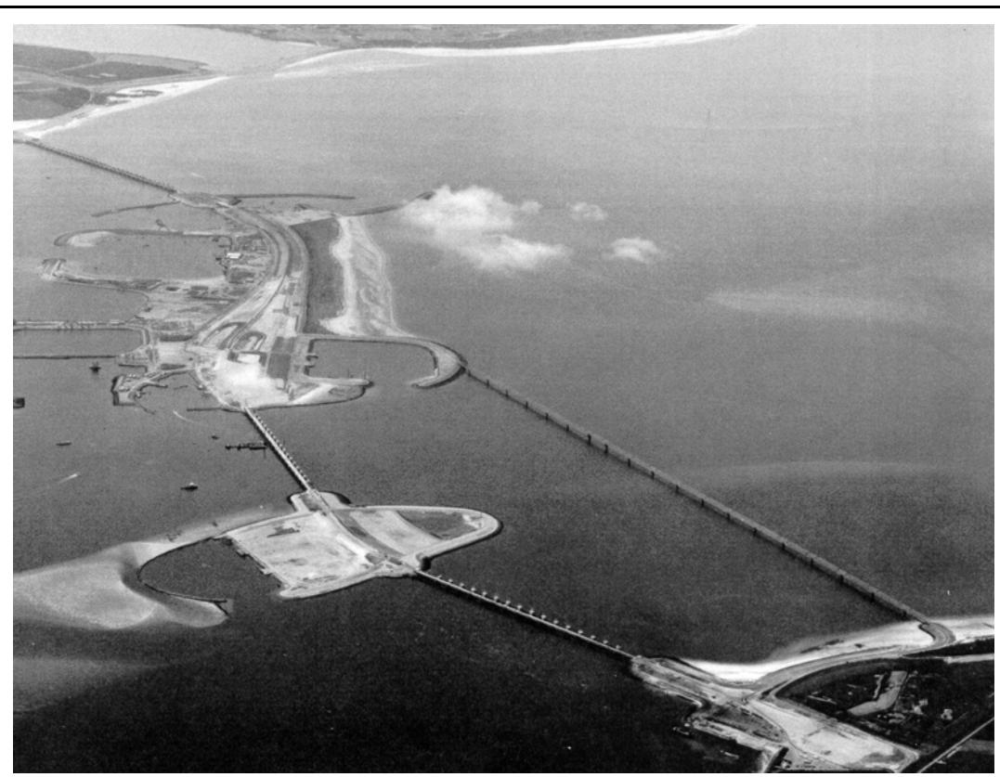

*a. Aerial view*

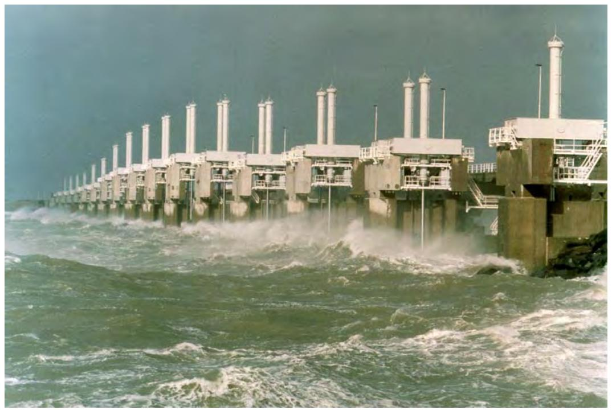

*b. Moveable gates*

*Figure V-3-1. Oosterschelde storm surge barrier (courtesy Rijkswaterstaat, The Netherlands)*

V-3-2 Shore Protection Projects
- (3) Ecosystem restoration. A new area of concern is the restoration of lost environmental resources such as wetlands, reefs, nesting areas, etc. In 1990, the U.S. Army Corps of Engineers was directed to also consider ecosystem restoration where a Federal project has contributed to ecosystem degradation. For this chapter, Corps civil works project objectives and special design constraints (economic, environmental, institutional, etc.) have been omitted. They have all been brought together in Part V-7. Where appropriate, differences between the Corps' design approach and a general design approach are discussed here. b. Alternatives for shore protection .
- (1) Overview. Figure V-3-2 (adapted from Gilbert and Vellinga 1990) schematically displays five alternative ways to mitigate the damage of coastal storms, namely, accommodation, protection, beach nourishment, retreat and of course, the do-nothing alternative. Civilization's artifacts at the coast are here represented by the lighthouse at a fixed reference line. Storm surge and storm erosion reduce the distance between the reference line and the sea. Sea level rise and historic, coastal erosion also reduce the distance, but at slower time scales. Beach nourishment accomplishes the same objective as the retreat option (i.e., increase the distance to the sea). (a) Pope (1997) has a similar classification system summarized in Table V-3-1.

**Table V-3-1. **

|  | Table V-3-1 Classes of Management and Engineering Response for Shore Protection (Pope 1997) |  |
| --- | --- | --- |
| Type | Common Phrase |  |
| 1) Armoring | Draw the line |  |
| 2) Moderation | Slow down the erosion rate |  |
| 3) Restoration | Fill up the beach |  |
| 4) Abstention | Do nothing |  |
| 5) Adaptation | Live with it |  |

- (b) The protection category in Figure V-3-2 is divided into armoring (seawalls, bulkheads, etc.) for flooding and moderation (groins, breakwaters, etc.) for erosion mitigation and shoreline stabilization. Beach nourishment or restoration is sometimes called the soft alternative to the armored or hard alternative for shore protection. Figure V-3-3 displays the shift from hard to soft, beach nourishment projects over the past 50 years by the Corps of Engineers (from Hillyer 1996).
- (c) For design, consider the following six types of alternatives, namely: armoring, beach stabilization (moderation) structures, beach nourishment, adaptation and retreat, combinations (and new technologies) and the with-no-project (abstention) alternative. Table V-3-2 summarizes these alternatives for coastal hazard mitigation including the sections where full discussions are presented.
- (2) Armoring. Seawalls, bulkheads, and protective revetments for cliffs and dikes are the traditional types of armored shorelines. The cost of armoring is justified when flooding and wave damage in low areas threaten substantial human investment. On historic, eroding coasts, it must be expected that erosion will continue to diminish the width of the buffer strip between armored shoreline and the sea. If a recreational beach is present, periodic beach nourishment must be anticipated. Part V-3-2 gives functional design details

**Table V-3-2. summarizes these alternatives for coastal hazard mitigation including the sections where full discussions are presented.**

| Alternatives for Coastal Hazard Mitigation Table V-3-2 |  |  |  |  |  |  |  |  |
| --- | --- | --- | --- | --- | --- | --- | --- | --- |
| Approach |  |  |  | Changes to the Natural, Physical System |  |  |  |  |
| Class |  | Armoring Structures |  |  | Shoreline Stabilization Structures and Facilities |  |  |  |
| Type | Seawall | Bulkhead | Dike/Revetment | Breakwaters | Groins | Sills | Vegetation | Groundwater Drainage |
| (configurations) or location Geometry | • Vertical • Curved Gravity • | • Stepped/Terraced • Cantilevered • Tie-Backed • Crib | • Sloped | • Submerged (reef-type) • Headland • Detached • System • Single | • Shaped (T or L) • System (field) • Permeable • Adjustable • Notched • Normal • Angled • Single | • Submerged • Shoreline • Intertidal • Perched beach |  | • Interior drainage • Bluff dewatering • Beachdrain |
| construction Materials of | • Concrete • Rock | - aluminum • Sheet-pile -concrete - timber - steel | • Geotextiles (bags) • Rock revetment • Gabions • Earth | - timber - steel - etc. • Rock | • Precast concrete units • Geotextiles bags • Sheet-pile types - concrete |  | • Submerged Vegetation • Mangrove • wetland Aquatic | • System of pipes and pumps with sumps |
| Discussion in |  | Part V-3-2 |  |  |  | Part V-3-3 |  |  |
| found sections | V-3-2-a(1) | V-3-2-a(2) | V-3-2-a(1) | V-3-3-c V-3-3-d | V-3-3-e | V-3-3-f |  | V-3-5-b |
|  |  |  |  | (Continued) |  |  |  |  |

**Table V-3-2. summarizes these alternatives for coastal hazard mitigation including the sections where full discussions are presented.**

| Table V-3-2 (Concluded) |  |  |  |  |  |  |  |
| --- | --- | --- | --- | --- | --- | --- | --- |
| Changes to the Natural Physical System (continued) |  |  | Changes to Man's System |  | Changes in Both |  | No Change |
| Beach Restoration |  |  | Adaptation and Accomodation |  | Combinations |  | Do Nothing |
| Beach Nourishment Sand Passing |  | Flood Proofing | Zoning | Retreat | Structural and Restoration | Restoration and Structural and Adaptation |  |
| • Subaerial | • Bypassing | • Elevated structures | • Setbacks | • Individuals | • Any combination | • Any combination | Let nature take |
| • Dune | • Bankpassing | • Raise grade | • Land use restrictions | • Communities | alternatives of 1, 2, or 3 | of all alternatives except retreat | its course |
| • Feeder |  | • Sandbags | • Public lands | • Infrastructure |  |  |  |
| • Profile |  | • Flow diversion | (Institutional) | • Move structures |  |  |  |
| • Underwater berms |  |  |  |  |  |  |  |
| • Dredged material • Borrow sites - offshore - land | • Littoral traps • Smooth out hot-spots | on timber piles • Single-family homes |  |  |  |  |  |
| • Artificially made (crushed rock) | • Downdrift material returned updrift |  |  |  |  |  |  |
| Part V-4 |  |  | V-3-4-b V-3-4 | V-3-4-c | V-3-5 |  | V-3-6 |

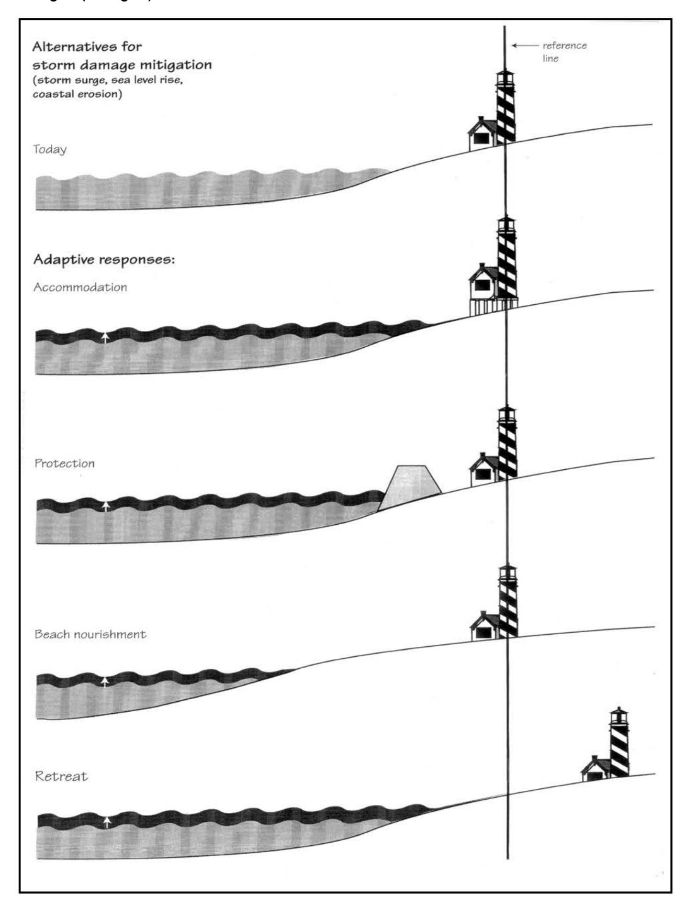

*Figure V-3-2. Alternatives for shore protection*

V-3-6 Shore Protection Projects
and summarizes knowledge on the interaction of armored shorelines and adjacent beaches. See also Engineer Manual 1110-2-1614, "Design of Coastal Revetments, Seawalls, and Bulkheads."
- (3) Shoreline stabilization. Headland and nearshore breakwaters, groins, sills and reefs, and wetlands all moderate the coastal sediment transport processes to reduce the local erosion rate. These structures should be considered where chronic erosion is a problem due to the diminished sediment supply. They are often combined with beach nourishment to reduce downdrift impacts. Their purpose is to slow the loss of placed sand, not to trap sand from the littoral system and create more problems elsewhere. In many locations, their improper functional design, or construction without adding extra material, has produced adverse environmental impacts by starving the supply of sand to downdrift beaches. Their proper design is one of the great challenges of coastal engineering, and functional design aspects are found in Part V-3-3.
- (4) Beach nourishment. Loose sediment material can be placed on the subaerial beach, as underwater mounds, across the subaqueous profile, or as dunes to rebuild the dunes. The soft alternative solution for shore protection is now the common alternative selected for a variety of reasons (constraints). Because of its importance, a separate chapter, Part V-4 contains all the details for design.
- (5) Adaptation and retreat. Elevating structures, flood proofing, zoning restrictions, storm warning and evacuation planning are some of the types of coastal adaptation methods. Further details are in Part V-3-4-b. Retreat is permanent evacuation or abandonment of coastal infrastructure, and for communities subject to high erosion rates and flooding damages, this is always a possible alternative. Total costs and constraints of this alternative must include the environmental impact on the new site to where "retreat" takes place. In contrast to the engineering, decision-making process to determine the best alternative considering all the design constraints for each site, some advocate retreat as the only solution. Further discussion is in section Part V-3-4-c.
- (6) Combinations and new technologies. In many locations, elevated structures combined with some type of armoring or shoreline stabilization structure together with beach nourishment are employed for shore protection. Nontraditional technologies (e.g., beach drains, geotextile bags, artificial breakwater structures, wetlands, etc.) are also being investigated in field experiments. Part V-3-5 gives more details.
- (7) Do nothing. Finally, the option to allow continued erosion and storm damage with the expected, annual costs for this choice should be determined. The without project condition provides the basis for measuring the effectiveness to reduce the expected damages of each proposed alternative. Further details for estimating damage costs are in Part V-3-1-c. Part V-3-6 presents more general information on this option. See also Part VI-2-1 for more details regarding various subtypes of the armoring, shoreline stabilization, and beach nourishment alternatives. Each alternative must be considered under a wide variety of design constraints.

#### c. Design constraints .

One good definition of engineering is "design under constraint." Engineering is creating and designing what can be, but it is constrained by our understanding of nature, by economics (costs), by concerns of environmental impact, by institutional, social, legal issues and possibly by aesthetics. Listed are the five design constraint categories which are discussed further in the following paragraphs.

#### Design Constraints

Scientific and Engineering Understanding of Nature
Economics
Environmental
Institutional, Political (Social), Legal
Aesthetics
We also limit the discussion here to the general practice of coastal engineering. Part V-8 is completely devoted to special, U.S. Federal government planning requirements and design constraints.
- (1) Scientific and engineering understanding of nature. The coastal setting is dynamic and influenced by land, water, and air interactions and processes. It is a regime of extremes, surprises, and constant motion as the coast responds to changing conditions.
- (a) The Coastal Engineering Manual (CEM) demonstrates continued improvement in understanding and ability to analytically and numerically model nature. For example, Part III-3 discusses analytical methods to estimate sandy beach shoreline recession rates during storm events that will be useful later in this chapter. Part III of the CEM also introduces many new, dynamic, numerical models that simulate coastal hydrodynamics and sediment transport processes.
- (b) CP Module. In V-1, the idea of a Coastal Processes Module, (CP Module) was defined as a repository of physical data and analysis tools relevant to the coastal problem. Wind, waves, currents, water levels, bathymetry, geomorphology, stratigraphy, sediment characteristics, sediment transport processes, etc. and the analysis tools (mainly numerical models) make up the CP Module that is employed many times in the design process (see Figure V-1-1, 2 and 3). However, a fully dynamic, three-dimensional, numerical model of water levels, waves and sediment transport to simulate bathymetric and shoreline change is still under development. It remains a long way from routine application for the functional design of coastal structures. An example would be the simulation of natural, sediment movement behind and through nearshore breakwaters for both normal conditions and storm events. The inability to accurately predict the short-and long-term impacts of coastal structures on the nearshore physical environment remains a design constraint in coastal engineering. Part of the difficulty is the stochastic variability of the natural environment.
- (c) Empirical Simulation Technique (EST) methodology. Numerical models are deterministic tools that produce one solution for each set of boundary conditions. The EST procedure is the numerical, computer simulation of multiple, life-cycle sequences of systems such as storm events and their corresponding environmental impacts (Scheffner et al. 1997; 1999). Multiple life-cycle simulations are then used to compute frequency-of-occurrence relationships, mean value frequencies and standard error estimates of deviation about the mean. Using the EST procedure for a specific project generates risk-based frequency information that relates the effectiveness and cost of the project to the level of protection provided. A user's guide for application of the EST with examples is found in Scheffner et al. (1999). One example describes calculations of the frequency-of-occurrence relationship for storm-induced, horizontal recession of beaches and dunes in Brenard County, Florida. Previous references to the EST procedure are found in Part II-5 and II-8. See also Part V-1 for discussion.
V-3-8 Shore Protection Projects

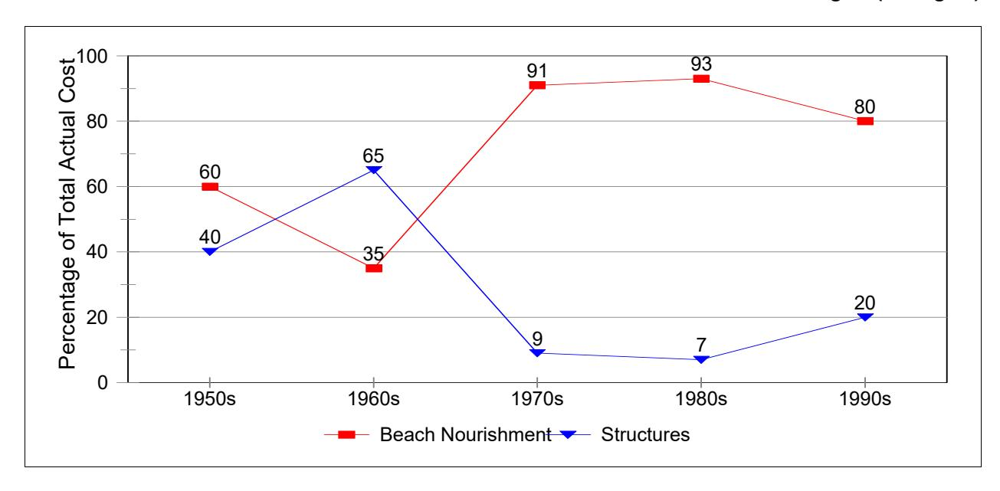

*Figure V-3-3. Shift from hard (armored walls, groins, etc.) to soft (beach nourishment) alternatives by the Corps of Engineers (from Hillyer 1996)*

- The Corps has specified the EST methodology as a requirement for the risk-based analysis in all shore protection studies (ER 1105-2-101; Thompson et al. 1996). The probabilistic design (functional, structural) of coastal structures remains a constraint, but recent advances such as the EST methodology are helping to produce designs that provide a realistic level of storm protection.
- (2) Economics. A key constraint for each shore protection alternative is life-cycle cost. In general, the level of storm protection and, hence, costs (high, medium, low) can only be justified when the corresponding value of property and infrastructure to be protected (benefits) are comparable (high, medium, low). Costs are not subjected to any other constraints. Benefits, however, can be restricted and limited to only those that are perceived to benefit the funding authority. For example, see Part V-8 for the restriction on allowable benefits for Federal government-sponsored projects designed by the Corps.
- (a) Cost. It is important to have a clear definition of all terms when discussing costs. Moreover, nothing lasts forever. Advocates for permanent, low cost, or retreat solutions for shore protection fail to understand the following and how they are applied in the professional practice of coastal engineering design economics.
• Costs: The monetary value required for a project. Without additional qualifying words, the word alone is confusing and subject to misinterpretation.
Initial costs:

The total expense for all initial construction and design costs of a project. The year of construction should be noted so that inflationary cost aspects can be estimated in the future. Distinction should be made between estimates and actual contract costs.
Maintenance costs: The estimated annual expenses required to maintain both the functional and structural integrity of the alternatives which are altered by storm damage and natural processes. Both deterministic estimates and risk-based calculation methods can be employed. (see Part VI-7 for an example of the probabilistic method for rubble-mound breakwaters)
• Alteration/removal costs: The estimated expenses required to alter the design or completely remove the structure if there are significant, downdrift impacts. Evidence from postproject monitoring and decision criteria mechanisms are required for implementation. This cost has been ignored for most projects and could be included in the category of maintenance costs.
• Total, life-cycle cost The combined initial, maintenance and alteration/removal costs required over the design life of the project. Annual maintenance costs are usually converted to their present worth so that they can be directly combined with the initial construction costs. The present worth (value) is determined by multiplying the annual maintenance expense by the present worth factor, PWF. The PWF is a function of the design life and the interest (discount) rate. (See any standard engineering economics text).
• Design life: An estimate of the number of years of useful life of the structure/ alternative. Usually 25 to 50 years is employed for well-designed projects. Design life selection includes structural life of materials (structural integrity), functional life (usefulness), technical life (technologically up-to-date), and aesthetics. Design life is employed for the economic analysis of the present worth of annual maintenance cost for the total, life-cycle cost comparison of all alternatives. It does not mean the length of time the project will last in the field.
• Interest rate: The second variable required to calculate the present worth of the annual maintenance costs. Often, the rate employed is related to the current, bank loan rate for construction projects. It can also be set by government policy as discussed in Part V-8 for the Federal government.
• Damage: When energy levels in storms exceed the design levels, both structural damage and some loss in functional performance may occur. Repair is possible. Damage is an expected aspect of risk-based coastal design.
• Failure: When storms below the design level cause loss of structural integrity and/or functional performance. The design has failed and a redesign is needed before repair or reconstruction. Use of the word "failure" for loss of structural integrity or performance should be avoided until it can be proven that a design failure took place under specified storm conditions.
• Balanced design: The most economical balance between the initial construction costs and maintenance (damage repair) costs so that the total cost is a minimum. Initial costs increase as the level of protection for more powerful (but rarer) storms increases, but maintenance costs decrease because damage is less frequent. The classical U-shaped, total cost curves result. (See Part VI-7 for an example with rubble-mound breakwater design)
(b) Benefits. Storm damage reduction and coastal erosion mitigation are the two major benefits of shore protection. These two along with ecosystems restoration are the only benefits allowed by the Federal government for Corps projects as discussed further in Part V-8.
V-3-10 Shore Protection Projects
- Many other benefits exist. As seen in Figure V-3-3, since the 1960s, beach nourishment has been the selected alternative for shore protection. Substantial recreation and tourism benefits have resulted for local, state, and Federal governments. Waterfront property is generally of greater value and generates higher property taxes. Innumerable secondary (ripple effect) benefits result from the coastal, beach-related travel and tourism industry. The economic value of beaches has been well documented (Houston 1995a; 1995b).
- A good example is Miami Beach, Florida, which was renourished in 1979 by a joint Corps of Engineers - City/County government project costing $52 million. The capitalized annual cost is about $4 million and the project has lasted more than 20 years without the need to renourish the beach. Attendance at the beach increased from 8 million in 1978 to 21 million in 1983 (Houston 1995a). More than 2 million foreign visitors spend over $2 billion annually at Miami Beach (Cobb 1992). The Miami Beach experience is roughly $700 return in foreign exchange for every $1 invested in beach nourishment (Houston 1995a; 1995b; 1996).
- Beach nourishment can also enhance the natural environment. Widened beaches reduce the potential for new, tidal inlet formation during storms at narrow reaches of barrier islands. The economic losses to the protected bay environment (property, recreation, farming, fishing, infrastructure, etc.) can be estimated and added to the storm damage and other benefits for the impacted barrier island. In general, however, environmental benefits of the enhanced, flora and fauna habitat are difficult to quantify monetarily.
- All benefits are site specific. Here, we briefly outline the methodology commonly employed to determine storm damage reduction benefits. A key factor, as illustrated in Figure V-3-2 is distance between the reference baseline and the sea. Steps in the methodology are: Make a structure inventory (residential, commercial, public). Employ aerial, orthodigital mapping and Geographic Information System (GIS) technology where possible and adapt new technologies. Obtain software to calculate the depreciated replacement cost of the structures and content value. Obtain the water level, storm frequency-of-occurrence data for the site, and accompanying wave and shoreline erosion data. The EST methodology previously discussed should be employed, whenever possible. Obtain and run storm damage calculation models. Long-term erosion is included to estimated damages under changing future conditions. The key variables are water level and position of each structure in relation to the shoreline. Some models only treat property structure damage and others land and infrastructure (roads, etc.) damage. Apply the models for both the without project conditions and for the alternatives and subalternatives design considered for shore protection.
- The result is the average, annual damages prevented (benefits) of each alternative. Differences for each alternative to prevent or reduce storm damage are quantified by this approach. Complete details can be found in Part V-8 where names and references for some of the software and models presently employed by the Corps are presented. In general, the state of art for these damage calculation models is less well advanced than for other areas of coastal engineering design.
- (c) Benefit/cost ratios. A useful indicator of economic performance of each alternative is the benefit to cost ratio (BCR). As previously noted, the total, life-cycle costs do not depend on the other constraints, therefore remain constant. However, the benefits included in the ratio can be limited by the funding authority. Consequently, the BCR calculated can be significantly different depending upon whether all the potential benefits or only limited benefits are considered. Because the Federal government limits the benefits allowable to only storm damage reduction benefits, the total or true BCR is always greater than that specified for Corps projects. In effect, two BCR's exist. Federal government, (BCR)F

```math
(BCR)_{F} = \frac{\text{Storm damage reduction benefits}}{\text{Total, life-cycle cost}} \tag{V-3-1}
```

• Total, true (BCR)T

```math
(BCR)_{T} = \frac{\text{Total benefits}}{\text{Total, life-cycle cost}} \tag{V-3-2}
```

- Further details regarding the (BCR)F for Federal-sponsored projects and other methods to measure economic performance are discussed in Part V-8. The total (BCR)T is never calculated for Corps projects. Consequently, the local sponsors, general public, and media may not understand nor appreciate the true value of shore protection projects to their community. These institutional, political (social), and legal constraints are discussed further in the following paragraphs.
- (d) Sea level rise. A detailed summary of present day knowledge of mean sea level change of the world's oceans is given in Part IV-1-6. Over the last 100 years, average, relative sea level rise has been 30 cm (3 mm/year) on the East Coast and 11 cm (1.1 mm/year) along the West Coast (excluding Alaska). The Gulf of Mexico coast is highly variable ranging from 100 cm (10 mm/year) in the Mississippi Delta plain to 20 cm (2 mm/year) along Florida's west coast (National Research Council 1987). Substantial local variability exists. The question remains as to whether these average rates will increase (substantially), stay constant, or decrease in the future. Three things remain clear, however. The existing rates of mean sea level rise at specific sites have not been a severe economic constraint for the shore protection alternatives selected. At many locations, anthropogenic effects (e.g., jettied tidal inlets) causing downdrift, beach erosion are clearly much larger than those occurring due to sea level rise. And finally, long-term, relative changes in sea level can be incorporated into storm surge analysis and the economic design of coastal structures.
- (3) Environmental. A third major constraint of shore protection works is their impact on the environment. The Eastern Scheldt, storm-surge barrier shown in Figure V-3-1 was the focus of much discussion in the early 1970s. Environmental scientists favored raising the dikes around the periphery to maintain the saltwater ecology of the tidal estuary. Agricultural and water boards favored a solid dam across the mouth that would create an inland, freshwater lake. A compromise was reached: a storm-surge barrier with movable gates which stay open under normal conditions but are closed at very high storm-surge events. The final design, construction methods and equipment required much research and challenged the ingenuity and technical process of Dutch coastal engineers. In the final analysis, the environmental constraint, to maintain the saltwater ecology, dictated the final design. The additional engineering and construction cost proved to not be the deciding factor.
- (a) Types of environmental concerns. As in the preceding example, modification of upland habitat such as land use, resting areas for turtles and shore birds, wetlands, flora and fauna beneficial to the ecosystem, threatened and endangered species, etc. can take place. The aquatic habitat can also be important, for example, water quality, aquatic species, benthic organisms, hazardous, toxic and radiological sediment in
V-3-12 Shore Protection Projects
borrow areas, increased turbidity during dredging operations and wave climate alterations by sand volume removal in borrow sites, etc.
- These potentially negative impacts must first be identified. Detailed surveys and sampling investigations are conducted to catalog the species and habitats in the project area under existing conditions. Use should be made of previous studies and summary information. The U.S. Fish and Wildlife Service (F&WS) prepares a planning aid report for large Corps projects that detail existing fish and wildlife resources and their habitats. This report also identifies threatened and endangered species and critical fish and wildlife habitats. The National Marine Fisheries Services (NMFS), state and local resource agencies, and local universities may also provide valuable information.
- The offshore, sand borrow site is the greatest environmental concern for beach nourishment projects. New, benthic sampling and collection efforts are often needed to catalog existing species and habitat. Of concern are species capable of rapid recolonization, commercially important species, or protected species. These surveys provide data on abundance and diversity together with a complete list of all species present. This knowledge can be critical in borrow site selection and hence overall cost of the project.
- In most cases, an Environmental Assessment (EA) report is sufficient to demonstrate the minor environmental impact of shore protection projects. Rarely is a full, Environmental Impact Statement (EIS) needed which is time consuming and can be expensive. Corps project needs for an EIS are discussed in Part V-8.
- (b) Impact on natural sediment transport system. The negative, downdrift impact on the local and regional sediment budget can be a key environmental constraint. These concerns are addressed in detail in Part V-3 for armored (Part V-3-2) and shoreline stabilization (Part V-3-3) structures and in Part V-5 for jetties at navigation inlets. A beach nourishment project has many positive, environmental impacts by bringing new material to sand starved beaches and expanding the beach habitat. Studies in turtle nesting areas have proven that renourished beaches increase the number of turtle nests (Broadwell 1991; Nelson et al. 1987).
- (c) Mitigation. Procedures, or measures which avoid, minimize and/or compensate for negative impacts are defined as mitigation. Threatened and endangered species such as the piping plover, least tern, sea turtles, and whales required special consideration during the planning and construction stages of shore protection projects. Avoidance of negative impacts is achieved by scheduling construction activities at times when the species do not normally inhabit the project area. Piping plovers and least terns are most vulnerable during the nesting/fledging period from early spring to late summer. Disturbances on the beach cause the nest to be abandoned before the eggs hatch. Avoidance for sea turtles and whales is not practical for the southern section of the Atlantic coast because these species inhabit the area for most of the year. Minimization of negative impacts is achieved in various ways including monitoring to document contact; using deflectors on the dragarms and collection boxes on hopper dredges; and conducting turtle relocation projects. These techniques are approved by the National Marine Fisheries Service. Mitigation by compensation is employed when resource loss is unavoidable. The most common example is new wetlands construction to compensate for the wetlands area lost due to project construction. Some states require more new area constructed than lost and permit wetland banks that are used to pay for planned, future wetlands loss. New and rebuilt dunes are replanted with grasses to compensate for any plants lost during construction. Mitigation by compensation methods are normally carried out and completed during project construction.
- Ecosystem restoration projects result from habitat lost due to a previous activity such as construction of jetties at a tidal inlet and the long-term, downdrift erosion of the beach. Restoration and protection of unique species habitat could also be the objective. Normally, beach nourishment projects can be designed to meet these project objectives. Methods to quantify these environmental benefits are discussed in Part V-8 as applied by the Corps.
- (4) Institutional, political, legal. A fourth area that has a formidable influence on the design process are the institutional, political (social), and legal requirements for all projects.
- (a) Institutional (policies and guidelines). The Federal objective of water and related land resources project planning is to contribute to the national economic development (NED) consistent with protecting the nation's environment. Applicable executive orders and other Federal government policies and guidelines as planning requirements are discussed fully in Part V-8. The Corps is responsible for shore protection designs of the Federal government. The Corps District Office engineers with the possible aid of the Coastal Hydraulics Laboratory (CHL), Engineer Research and Development Center (ERDC), do most of the design work. Some design work is performed by the private, civil engineering consulting firms. No general guidelines exist as to when and how the private sector, coastal engineering community participates in the design process for the Federal government. Other Federal agencies are responsible for some aspects and alternatives for shore protection. A National Flood Insurance Program (NFIP) was established in 1968 to help reduce the Federal share of costs in connection with flood losses. The NFIP is operated by the Federal Insurance Administration, a division of the Federal Emergency Management Administration (FEMA). An essential component for implementing the NFIP is the Flood Insurance Rate Map (FIRM) which delineates special flood hazard areas and insurance risk zones. These maps are prepared by FEMA's mitigation division. Places subject to flooding at the annual, one percent exceedance probability level are designated as special flood hazard areas. The associated recurrence interval is the so-called, 100-year flood. Use of the 100-year flood designation is discouraged. Many people believe that a 100-year flood happens only once every 100 years. Some areas have experienced flooding at this probability level in consecutive years. The FEMA flood hazard zone maps include special V-zones for both flooding and significant wave energy to cause structural damage. Construction standards (where applicable) and flood insurance rates are usually higher for structures located in V-zones. Zoning laws and improved building standards are then implemented by coastal communities based on the FIRM and designated hazard-prone areas. One common standard is the requirement that all, first-floor living quarters of new construction be set at least one foot above the mapped elevation of the one percent chance flood. Since 1982, all NFIP policies are actuarial, i.e., the flood insurance policy's annual rates fully reflect the buildings risk of flooding. No taxpayer subsides are required. Presently, about 23 percent of structures vulnerable to flooding damages are covered by the NFIP. And, only 3 percent of these NFIP policies are in coastal communities. These coastal communities generate more premium income that they have received in loss claims (Houston 1999). •Beaches serving as flood protection works are eligible for disaster relief from FEMA provided the relief is assigned public beach facility status. To qualify, it must have a period renourishment program for long-term maintenance. The local government project sponsor must restore the beach to its normal design shape (template) and pay for the cost of replacing sand eroded prior to the storm. Since natural beach rebuilding begins after the storm, it is not clear what time frame is employed to define the storm erosion volume.
V-3-14 Shore Protection Projects
- Several states have established construction setback lines to reduce damage in areas subject to coastal erosion and shoreline retreat. The setback line position is often calculated as some multiple of the annual erosion rate or a specified distance from a contour location in a particular year. In Florida, the line location is based on many factors, namely long-term erosional trends, short-term storm effects, rare water levels at the one percent chance, annual exceedance level, wave uprush, dune line position, wind forces and existing development. In Delaware, 1979 aerial photography has been employed and the restriction line set 30.48 m (100 ft) landward of specified contour elevations, dune toes, or edge of the existing boardwalk structure. These development restrictions affect the withoutproject calculation of storm damage benefits discussed in Part V-3-1. If homes and structures are not able to be repaired or replaced after a storm by FEMA or state policies, than this will change the without-project estimate of benefits. See also Part III-5-13 for a discussion of setback lines for cohesive shorelines.
- (b) Political (social well-being). Specific national policies and laws change as administrations and public interests change. A diverse and broad range of coastal system users with varying economic, social, and environmental expectations and goals exist. Although there have been shifts in the national policy for shore protection by the Administrative Branch of the Federal government, the legislative branch controls the authorization and funding of all Corps projects. Congress has continued to approve and fund the beach nourishment alternative. Shore protection in the U.S. remains political, fragmented, and controversial for a variety of reasons that are further elaborated in Part V-8. National plans for beach management and shore protection do not exist. Each project must consider many social aspects. Local, regional and state plans for the coastal zones Public health, safety, and social well-being, including possible loss of life Community cohesion Availability of public facilities and services Potential adverse effects on property values and the tax base Displacement of people, business, and livelihood Disruption of normal and anticipated community and regional growth Sufficient parking and public transport Sufficient dune crossovers
- Public access and safety during construction
- Access for people with disabilities
- Interruption of recreation
- Cultural resources must also be considered.
- Coastal project construction has the potential to severely impact important cultural resources. Project activities such as offshore sand borrowing can damage or destroy important historical sites related to the region's maritime history. Shipwrecks, native American Indian, and prehistoric sites are typically of interest. Investigations by archaeologists to identify cultural resources in the project area provide data necessary to evaluate site significance and potential project impact. Close coordination with the state Historic Preservation Office is necessary for compliance with the National Historic Preservation Act of 1966.
- The politics surrounding shoreline erosion and measures for mitigation provide a wealth of fascinating reading material. For example, the Westhampton groin field on the south shore of Long Island, New York (U.S. Army Engineer District, New York, 1958: Heikoff 1976; Kassner and Black 1983; Nersesian, Kraus, Carson 1992; Spencer and Terchunian 1997; Terchunian 1988) is a classic example of a political decision that significantly altered the original design. The groin field was built in two stages, with 11 units constructed in 1964/65 and four more in 1970/71. It was a Corps project authorized by Congress in 1960. The project area extended from Fire Island Inlet east to Montauk Point and called for beach fill and groins as needed starting at the west end since the natural, net drift of sand was from east to west. A winter storm in 1962 breached the weakened barrier island at Westhampton. Local interests including the Suffolk County government lobbied for and eventually convinced the Corps to construct the groins in reverse sequence, from east to west. In addition, the groins were not filled with sand when constructed and construction was stopped in the middle of the project for political reasons. The result was a massive sand trap along Westhampton that starved the downdrift (westerly) beaches. The interruption of natural sand transport by Shinnecock and Moriches Inlet and the Westhampton Groin Field has accelerated erosion on Fire Island at the west end of the system (Kana 1999). A lawsuit by Fire Island property owners has resulted against the Corps (see Spencer and Terchunian 1997 for more details and reference). The legal constraint has long been a factor in coastal, shore protection design.
- (c) Legal (laws). Congress, through passage of the biannual Water Resources Development Acts (WRDA), authorizes studies and funds construction of Corps projects. Sections of this law also include special investigations and establish cost-sharing formulas between the Federal government, state and local interests. For example, in the 1998 WRDA, the cost-sharing law was changed to 50 percent Federal and 50 percent from local/state interest.1 As a result, some states have passed laws and statues to provide an annual source of funding for the increased cost of participation in Federally-authorized projects. The Coastal Barrier Resources Act (CBRA) was passed in 1982 to minimize loss of life, damage to fish, wildlife and natural resources, and wasteful expenditures of Federal revenues on Atlantic Ocean and Gulf of Mexico barrier beaches. The goal is to restrict all Federal government expenditures and assistance that aid development on the coastal barriers. For example, the CBRA relies on the National Flood Insurance Program to discourage building by prohibiting sale of Federal flood insurance in areas covered by the act. The CBRA does permit Federal funding for shoreline
V-3-16 Shore Protection Projects

*1 Previously, the formula was 65 percent Federal, 35 percent state/local.*

stabilization by nonstructural projects that mimic, enhance, or restore natural stabilization systems, i.e., beach nourishment projects. Federal expenditures are also allowed for the study, management, protection, and enhancement of fish and wildlife resources and habitats.
- The CBRA is one of many Federal laws designed primarily to protect environmental and cultural resources. A partial list includes the following: Archeological Resources Protection Act Clean Air Act Clean Water Act Coastal Barrier Resources Act Coastal Zone Management Act Disabilities Act Endangered Species Act Estuary Protection Act Federal Water Project Recreation Act Fish and Wildlife Coordination Act Land and Water Conservation Act Marine Protection, Research Sanctuaries Act National Historic Preservation Act National Environmental Policy Act Rivers and Harbors Act Watershed Protection and Flood Prevention Act Wild and Scenic River Act
- All shore protection projects must apply for and receive a permit from the USACE prior to construction. This permit is pursuant to Section 10 of Rivers and Harbors Act (1899) and Section 404 of the Clean Water Act (1977). The permit process considers and evaluates many factors, including effects on conservation, economics, aesthetics, general environmental concern, wetlands, cultural values, fish and wildlife resources, flood hazards, flood plain usage, land use, navigation, shore erosion and accretion, recreation, water supply and conservation, water quality, energy needs, safety, food and fiber production, mineral needs, and welfare of people and society. Some states have a Joint Permit Application for local boards, state agencies and the Corps of Engineers permit. This method saves considerable expense and time in that only one permit
application is required to meet the needs of all three levels of government review of the proposed project.
- Some states (North Carolina, Maine) have passed laws banning the use of armored structures (seawalls, bulkheads, revetments) and shore protection on their ocean coasts. South Carolina only bans armored structures and other coastal states are considering similar laws. Florida and California have adopted sand mitigation policies and procedures to permit seawall construction but require the annual placement of sand to compensate for that trapped behind the structure. Further details on seawall and beach interactions are summarized in Part V-3-2.
- Laws for property boundaries at the land-water interface are complex and vary from state to state. A 26-article series entitled "The Law of the Sea in a Clamshell" explaining the applicability and diversity of laws pertaining to the shore has been published by the American Shore and Beach Preservation Association in the magazine Shore and Beach (Graber 1980). Clear and legally defendable knowledge of property ownership must be an early step in the design process for coastal protection works.
- (5) Aesthetics. A final and especially challenging area in design pertains to the sense of beauty and accepted notions of good taste. Many people feel that natural shorelines (e.g., wide, sandy beaches, rocky cliffs, or vegetated marshes and trees, etc.) are more aesthetically pleasing than ones artificially manipulated for shore protection. An uninterrupted, uncluttered, and natural view of the sea is desirable for most people. Therefore, when possible, an aesthetically balanced and consistent appearance, replicating natural systems is preferred. (a) The "do nothing" alternative may result in a destructive wake of debris from flooding and wave damage that is visually disturbing for days or weeks following a storm. Some alternatives (e.g., geotextile bags filled with sand) will not survive medium level storm events and leave a debrisstrewn beach. (b) Aesthetics played a major role in selection of the final design for the new, hurricane protection, seawall/boardwalk at Virginia Beach, Virginia. The initial design by the Corps was a massive, curved, concrete seawall patterned after the one in Galveston, Texas. The City of Virginia Beach is a popular tourist, recreation beach and the promenade (boardwalk) features a key aspect of the design. The city rejected this initial design for aesthetic and tourist-economy reasons. First floor hotel guests and restaurant patrons would not be able to see the ocean on the south end. Their view was blocked by the crest elevation of the proposed seawall. The revised design lowered the seawall elevation, modified the structural design, added interior stormwater drainage to accommodate additional overtopping, and widened the nourished beach in front to mitigate storm energy. An artist's perspective and aerial photo are found in Part V-3-2a (Figure V-3-6). The constraints that dictated the final design were aesthetics and the need to accommodate the beach-driven, tourist industry. (c) Engineering is not applied science. Our limited understanding of nature is one constraint, but it is far from the only one, seldom the hardest one, and almost never the limiting constraint for coastal engineering design.
V-3-18 Shore Protection Projects

## V-3-2. Coastal Armoring Structures

- a. Types .
- (1) Seawalls and dikes. The primary purpose of a seawall (and dike) is to prevent inland flooding from major storm events accompanied by large, powerful waves. The key functional element in design is the crest elevation to minimize the overtopping from storm surge and wave runup. A seawall is typically a massive, concrete structure with its weight providing stability against sliding forces and overturning moments. Dikes are typically earth structures (dams) that keep elevated water levels from flooding interior lowlands. Various types of seawalls and dikes are depicted in Figure V-3-4. When vertical, they are labeled nonenergy absorbing, whereas if with a sloping surface or rubble mound, they absorb some energy (Pilarczyk 1990). The front face may also be curved or stepped to deflect wave runup. Typical damage modes for seawalls include: toe scour leading to undermining; overtopping and flanking; rotational slide along a slip-surface below and shoreward of the seawall; and corrosion of any steel reinforcement. Vrijling (1990) discusses 14 damage/failure mechanisms for dikes including "stability of the protective revetment." Part VI presents details for functional design. Construction of the massive, concrete seawall to protect Galveston, Texas, against overflows from the sea began in 1902, in the aftermath of the major hurricane of September 1900. Over 6,000 (16 percent) of the citizens lost their lives. An original construction photo (top) and chronology of seawall and embankment (dike) cross-section development (bottom) are shown in Figure V-3-5 (from Davis 1961). Major features are the wood piles, a sheet-pile cut-off wall, riprap toe protection, and the curved face to deflect wave runup. Modification and extension occurred in 1909, 1915, 1926, and the last extension to the west completed in 1963. In the almost 100 years of existence, many lives and millions of dollars of property damage have been saved by this project (Davis 1961). The City of Virginia Beach has opted for a low-crest elevation, sheet-pile, concrete cap seawall that also serves as a new boardwalk. Figure V-3-6 displays an artist's perspective (top) with cross section and an aerial photo (bottom) of a recently (1998) completed section. Construction of the newly designed, interior drainage system with pumping stations for an ocean outfall and a widened sandy beach will complete the project in 2002. Part VI-2 also discusses many other typical cross sections and layouts of seawalls and sea dikes.
- (2) Bulkheads. These are vertical retaining walls to hold or prevent soil from sliding seaward. Their main purpose is to reduce land erosion and loss to the sea, not to mitigate coastal flooding and wave damage. For eroding bluffs and cliffs, they increase stability by protecting the toe from undercutting. Bulkheads are either cantilevered or anchored sheet piles or gravity structures such as rock-filled timber cribs and gabions. Cantilever bulkheads derive their support from ground penetration; therefore, the effective embedment length must be sufficient to prevent overturning. Toe scour results in a loss of embedment length and could threaten the stability of such structures. Anchored bulkheads are similar to cantilevered bulkheads except they gain additional support from anchors embedded on the landward side or from structural piles placed at a batter on the seaward side. For anchored bulkheads, corrosion protection at the connectors is particularly important to prevent failures. Gravity structures eliminate the expense of pile driving and can often be used where subsurface conditions support their weight or bedrock is too close to the surface to allow pile driving. They require strong foundation soils to adequately support their weight, and they normally do not sufficiently penetrate the soil to develop reliable passive resisting forces on the offshore side. Therefore, they depend primarily on shearing resistance along the base of the structure to support the applied loads. Gravity bulkheads also cannot prevent rotational slides in materials where the failure surface passes beneath the structure. Typical bulkheads are shown in Figure V-3-7.

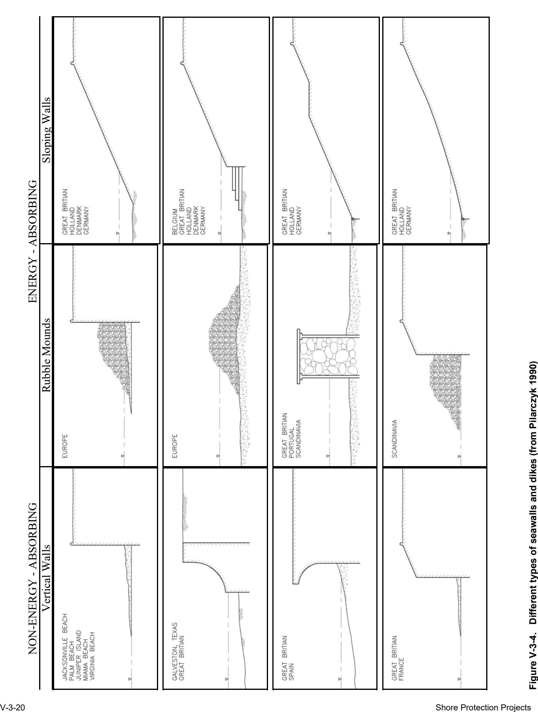

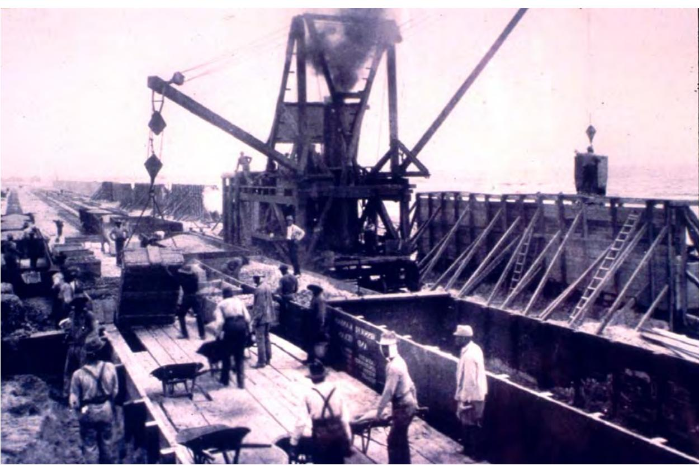

a. Photograph of original construction (from USAED, Galveston)

*Figure V-3-5. Galveston, Texas, seawall (Continued)*

- (a) The primary purpose of bulkheads is to hold land or fill in place and prevent shore side losses. A secondary purpose is to protect the land from wave attack. The strength of a bulkhead to protect against wave attack is provided almost solely by the fill, and if this material is lost, the bulkhead has no practical mechanism to adequately protect against waves. Therefore, two critical elements of a good bulkhead design that prevent or limit loss of backfill are: return walls at the alongshore ends of the structure to prevent high water from washing material away from behind the structure; and geotextiles to allow water but not fines to flow through the structure. Drainage of water through, behind, or laterally away from the structure is important to relieve pore pressure from excessive rainfall or overtopping. Drainage can be provided by drilling weep holes in the structure face to allow water to seep out.
- (b) Steel and timber sheetpiling are the most commonly used bulkhead material. Steel sheet piles are individual sheets which can be interlocked and driven into hard, dense soils. The interlocking nature of individual steel sheet piles helps to limit erosion losses of backfill through the bulkhead. However, good design practice also includes installation of a geotextile or gravel filter between the bulkhead and the backfill to further prevent sediment losses. Filters are particularly important for timber bulkheads because they lack an interlocking mechanism, though overlapping timber sheets in a two-to-three layer technique can often limit the pathways for sediment to travel. An often encountered difficulty in installing geotextiles is depth of placement. For sheet piles that are driven, placing the geotextiles the full depth of the structure is practically impossible through the structure below the depth of the filter cloth. The loss of the backfill at a timber bulkhead from water (rain and/or wave overtopping) seeping and carrying sand through the bulkhead below the depth of the filter or below the depth of the timber piles is a common damage mechanism.

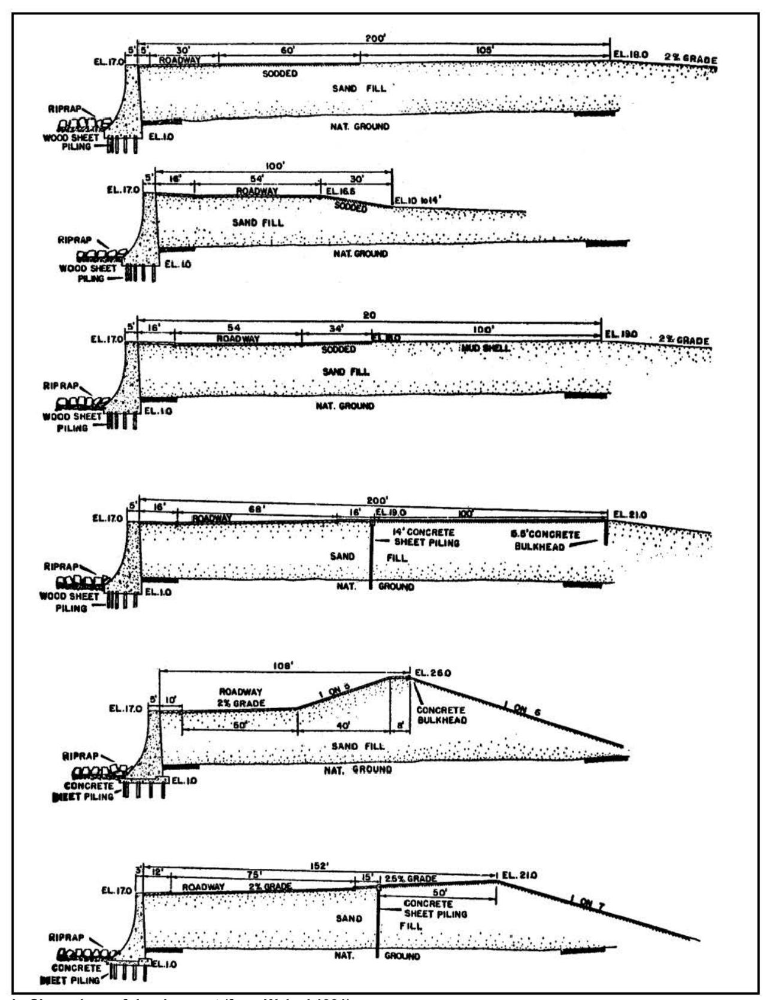

*b. Chronology of development (from Weigel 1991)*

*Figure V-3-5. (Concluded)*

V-3-22 Shore Protection Projects

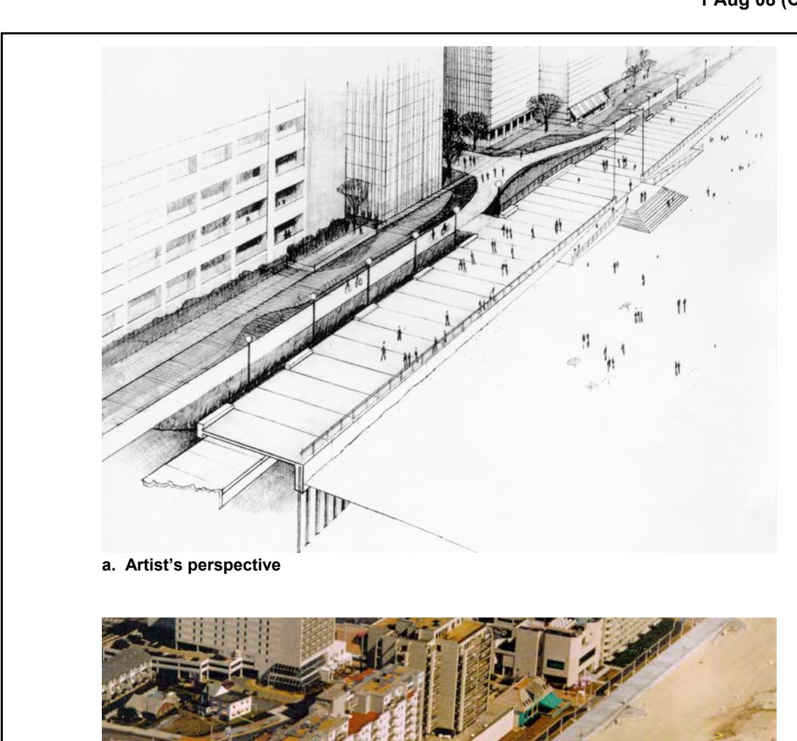

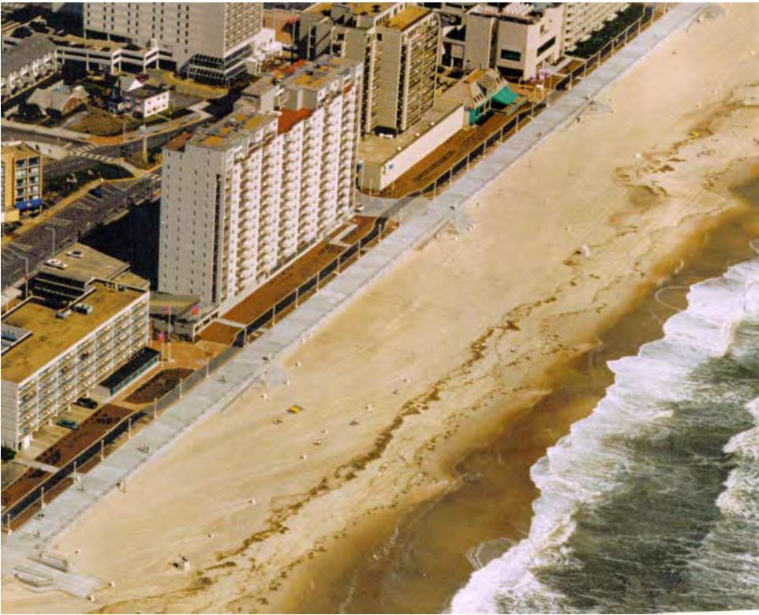

*Figure V-3-6. Virginia Beach seawall/boardwalk, 1997 (courtesy City of Virginia Beach, VA)*

b. Aerial photo

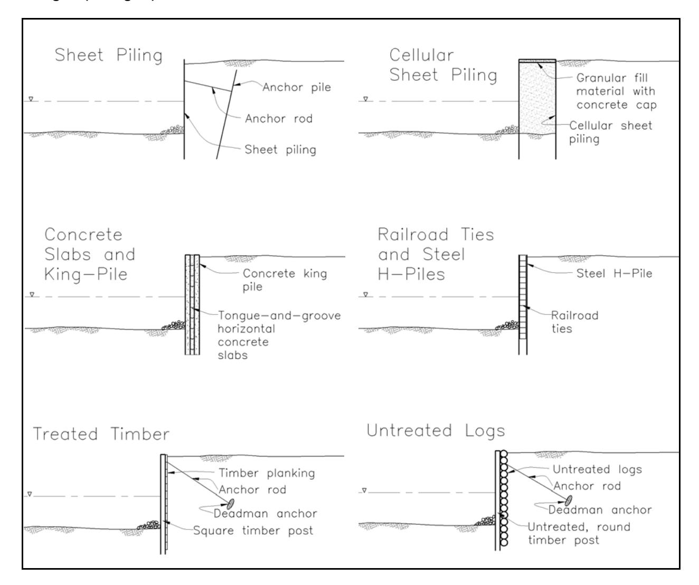

*Figure V-3-7. Typical bulkhead types*

- (3) Revetments. Revetments are a cover or facing of erosion resistant material placed directly on an existing slope, embankment or dike to protect the area from waves and strong currents. Three major features are a stable armor layer, a filter cloth or underlayer, and toe protection. The filter and underlayer support the armor, yet allow for passage of water through the structure. Toe protection prevents undercutting and provides support for all the layer materials previously mentioned. If the toe fails, the entire revetment can unravel.
- (a) Figure V-3-8 summarizes a wide range of designs and materials employed for a revetment. Armoring may be either flexible (normal) or rigid. Riprap and quarrystone designs can tolerate some movement and shifting or settling of their underlying foundation, yet remain functional. Rigid, concrete or asphalt slabs-ongrade are generally unable to accommodate any settling. (b) Typical failure modes for revetment include: Armor layer damage and interior exposure. Overtopping and loss of foundation material.
V-3-24 Shore Protection Projects
- Toe failure and unraveling.
- Excess groundwater pressure and piping failure through the armor layer.
- Rotational sliding along the slip-circle surface
- Flanking of the end sections.
- (c) Armor layer stability is discussed in detail in Part VI-5-3-a; toe stability and protection in VI-5-3-d, and filter layer design in VI-5-3-b. Shore protection by revetments can be for all levels of wave energy. For low wave energy environments in bays and rivers, relatively inexpensive and readily available stone sizes makes revetments a common choice for erosion protection by individual property owners. Vegetation and marsh grasses seaward of the revetment also diminish some wave energy to protect the revetment.
- (4) Combinations and other types. Protective revetments on dikes are an example of combination coastal armoring structures. Earthen dikes, with stone revetments have been constructed to protect Texas City, Texas, and along the Lake Erie shoreline by the USACE. Due to the nature of the earthen structure, design and specifications should be evaluated by geotechnical engineers (see EM 1110-2-1913, "Design and Construction of Levees"). In the Netherlands, the sea side is heavily armored to protect the dike against the North Sea. On the land side, grazing sheep are used to continually compact the earth.
- (a) As previously discussed, a storm surge barrier (see Figure V-3-1) across the opening to the sea provides alternative means of armoring for shore protection. The most notable hurricane barrier in the United States is located at New Bedford Harbor, Massachusetts. The tide (or flood) gate remains open for navigation, then closes to prevent flooding of inland areas during storms.
- (b) When insufficient space or earthen dike materials are available, rigid, vertical flood walls may be constructed. Design guidance is available in EM 1110-2-2502, "Retaining and Flood Walls." Crossing the wall requires flood gates that roll, swing, or slide to close the opening EM 1110-2-2705, "Structural Design of Closure Structures for Local Flood Protection Projects." Special, interior drainage facilities may also be needed including pumping stations (EM 1110-2-3102, "General Principles of Pumping Station Design and Layout."). Grade raising, i.e., increasing ground elevation by filling with stable material is also possible. The entire city of Galveston, Texas, was elevated about 4 m to match the seawall crest elevation. (see Figure V-3- 5). Sandy material was dredged from nearby Galveston Bay and pumped hydraulically to fill the island. Wiegel (1991) presents a complete history of the Galveston, Texas seawall.

#### b. Functional design .

- (1) The functional design of coastal armoring structures involves calculations of wave runup, wave overtopping, wave transmission, and reflection. These technical factors together with economic, environmental, political (social), and aesthetic constraints all combine to determine the crest elevation of the structure.
- (2) Wave runup and overtopping depend on many factors. Part VI-5-2 presents all the details. Empirically determined coefficients, formulas, tables, etc. have mainly come from laboratory scale experiments with irregular waves in large wave tanks. Independent variables include wave characteristics, water depths, slopes, roughness, degree of permeability or impermeable, wave angle, berm or continuous slope, freeboard, etc. Tables VI-6-18, 19, and 20 in Part VI-6 present partial safety factors for runup on rockarmored slopes, hollowed cubes, and dolosse armor units, respectfully.

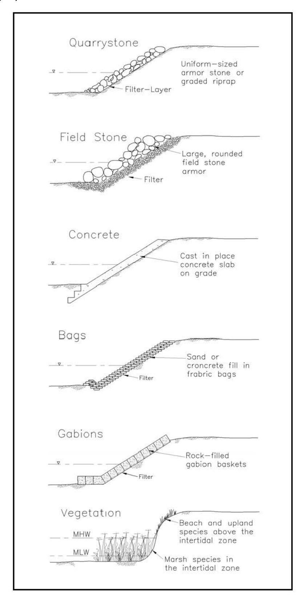

*Figure V-3-8. Summary of revetment alternatives (continued)*

V-3-26 Shore Protection Projects

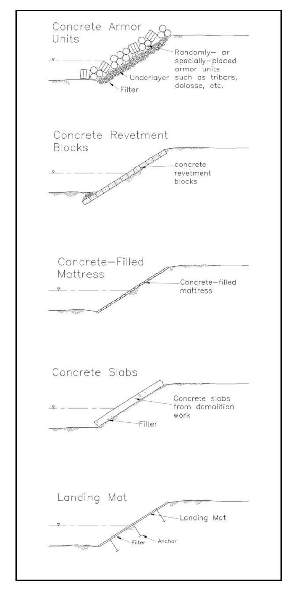

*Figure V-3-8. (Concluded)*

- (3) Wave reflection and transmission through and over sloping structures and beneath vertical wave screens is also found in Part VI-5-2. c. Interaction with adjacent beaches .
There is a common perception that "… seawalls increase erosion and destroy the beach." The limited available evidence is examined in this section. The term seawall herein means any type of coastal armoring that hardens the shoreline to a fixed position, hence, also applies to bulkheads and revetments.
- (1) Background. Concern with how seawalls interact with adjacent beaches can be traced to events in the 1960s and coastal geology studies on the origins and movements of barrier islands (Hoyt 1967). Barrier islands are one of the 11 types of land/water interfaces on earth (Shepard 1976). Barrier beach systems make up about 35 percent of the United States coast stretching from Maine to Texas. They protect the bays and estuaries that lie behind them from direct wave attack, but are dynamic systems with sand volumes that depend on changing ocean conditions, sand supplies, and control boundaries that define the volume.
- (a) As depicted schematically in Figure V-3-9a (adapted from Dolan and Lins 1987), barrier islands are commonly perceived to migrate landward with constant volume as sea level rise continues. Storm surge with high waves produce sand overwash into the back bay. The barrier is said to roll over itself, shoreline movement is termed recession, and no volume change means no coastal erosion. Some scientific evidence disputes the rollover model. Leatherman (1988) used shoreline position data to show that tidal inlet formation processes dominate and move far greater sediment quantities over the long term. The migration model also requires the moving sand volume to overlay continuous, basal peat layer from the muds and plants in the lagoon. Stratigraphic evidence contradicts this important aspect along the East Coast of the United States (Oertel et al. 1992). Using the Bruun (1962) rule, a 1-2 mm/year rise in sea level translates to about 0.05- 0.2m/year shoreline retreat rate. These are relatively small changes in shoreline position and herein labeled as those at geologic time scales. See Part IV-2-9 for a full discussion of marine depositional coasts and barriers.
- (b) When man enters the picture by constructing a road on the shore, he establishes a fixed reference line. The shoreline position relative to the road decreases in time as depicted in Figure V-3-9b. Once development has been permitted, continued erosion may threaten man's artifacts (roads, buildings, bridges, etc.) and some type of shore protection may be undertaken such as seawall construction. These structures are not intended to protect the beach, but areas landward from the beach. Armoring provides a nonmoving reference point on the beach to make the existing, historic erosion more noticeable. Few argue that the road alone is "…destroying the beach", but this same logic is applied by some when a revetment or seawall is present on an eroding shoreline and the dry beach width is reduced each year in front of the hardened shoreline (Pilkey and Wright 1988). Eventually, the ocean will reach the seawall (and road) and the dry beach will be gone.
- (c) As also depicted in Figure V-3-9b, a seawall traps sediment behind the structure, reduces overwash and fixes the shoreline position. Continued erosional stress over time acts to deepen the water depth at the structure that is of concern for structural design. The trapped sediment formerly in the dune, bluff or cliff) is removed from that available to contribute to subaqueous bar building during storms. This trapped material is also prevented from contributing to the longshore sediment transport processes along the coast and may alter the sediment budget. The volume trapped relative to that naturally active in the cross-shore profile will be discussed further in the following paragraphs.
V-3-28 Shore Protection Projects

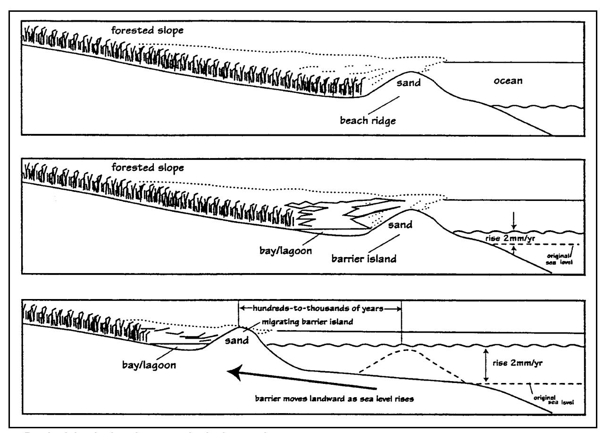

a. Barrier island migration at geologic time scales

*Figure V-3-9. Time scales for shoreline movements (Continued)*

- (d) Natural erosion processes (wave-induced, sediment imbalances) plus anthropogenic induced erosion produce larger erosion rates than sea level rise (Komar et al. 1991). These are herein labeled as those at engineering time scales. The degree to which coastal armoring affects the adjacent beach has been the focus of some research effort. (2) Literature review.
- (a) Common concerns. Dean (1987) critically examined nine commonly expressed concerns about seawalls and adjacent beaches as summarized in Table V-3-3. Use was made of conservation of sediment mass, laboratory and field data, and the theory of sediment transport. Conclusions from this analysis were (numbers coincide with Table V-3-4) as follows:

#### Concerns Probably False (or Unknown)

- profile steepening (6)
- delayed beach recovery after storms (5)
- increased longshore transport (8)

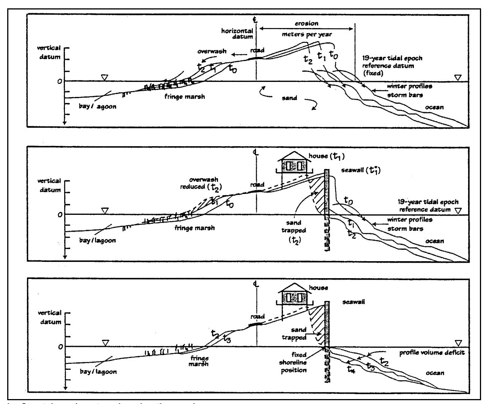

b. Coastal erosion at engineering time scales

*Figure V-3-9. (Concluded)*

- sand transport far offshore (9)
- increase in long-term, average erosion rate (3)

#### Concerns Probably True

- frontal effects (toe, scour, depth increase) (1)
- end-wall effects (flanking) (1)
- blockage of littoral drift when projecting into surf zone (groin effect) (4)
- beach width fronting armor likely to diminish (2)
V-3-30 Shore Protection Projects

*Table V-3-3 Assessment of Commonly Expressed Concerns Related to Coastal Armoring (Dean 1987)*

**Table V-3-3. Assessment of Commonly Expressed Concerns Related to Coastal Armoring (Dean 1987)**

| No. | Concern |  |  |  |  |  | Assessment |  |  |  |  |
| --- | --- | --- | --- | --- | --- | --- | --- | --- | --- | --- | --- |
| 1 | Coastal erosional on the | armoring stress causes beaches adjacent | placed in an increased to the | area of existing erosional stress armoring. | True | By preventing adjacent to the same total | the upland armoring erosional stress. | from share | eroding, a greater | the beaches portion of | the |
| 2 | Coastal erosional armoring | armoring stress will to diminish. | placed in an cause the | area of existing beaches fronting the | True | Coastal armoring does not prevent the armoring. erode. If the the beach would but with increasing progressively | is designed erosion Thus, an armoring had have time, landward | to of the eroding not remained would (see 2b). | protect beach beach been have | the upland, profile will continue placed, the approximately the been located | but waterward of to width of same, |
| 2a | Beaches of fixed | on eroding dune positions. | coastlines | will diminish in front | True | An eroding beach dune position. shoreline is | continues The width eroding (Figure | to of the 1). | erode beach | relative to a must diminish | fixed if the |
| 2b | Natural the same | beaches on beach width. | retreating | barriers maintain | True | Relative to a same rate results | retreating in a | duneline, stable | a beach | shoreline eroding width. | at the |
| 3 | Coastal beach | armoring erosion seaward | causes an of the | acceleration of armoring. | Probably False | No known data concern. | or physical |  | arguments | support this |  |
| 4 | An isolated downdrift | coastal erosion. | armoring | can accelerate | True | If an isolated the structure will | structure is eventually | armored | on protude | an eroding into the active | beach, beach |

Kraus (1988) reviewed over 100 references (laboratory, field, theory, and conceptual studies) to make a thorough examination of the literature. This review and seven companion papers are presented in Kraus and Pilkey (eds. 1988). An updated literature review is found in Kraus and McDougal (1996) who examined 40 additional papers. In general, these extensive literature reviews agreed with Dean (1987) regarding which concerns were probably false and which many are true. The interested reader should consult these references for all the details.
(b) Definitions. The natural, background shoreline erosion rate, PN and the rate after human activities PA can define a coastal erosion ratio, RP

```math
R _ { p } ( x , t ) \ = \ \frac { P _ { A } } { P _ { N } } \tag{V-3-3}
```

where the subscript R p means shoreline position is used to define R . If profile data are available, then actual, coastal erosion volume could be employed to find a volume ratio, R V as

```math
R _ { \nu } ( x , t ) \, = \, { \frac { V _ { A } } { V _ { N } } } \tag{V-3-4}
```

- where VN is the natural erosion (volume loss) rate and VA is the volume loss rate after construction of roads, seawalls, etc. at a given location. Clearly, if Rv (or Rp ) is proven greater than unity under similar climatological conditions, then we may conclude that armoring has increased the natural, historical conditions at the site. The level of impact (if any) on the frontal and laterally adjacent beaches (1 percent, 5 percent, 10 percent, 50 percent, etc.) needs quantification. Pilkey and Wright (1988) use the terms passive and active erosion of the beach to distinguish between the perceived versus real natural and manmade causes, respectively.
- The volume of sediment trapped behind a seawall depends upon its position on the beach, crest elevation and length. Weggel (1988) defined six types of seawalls depending on their location on the beach and water depth at the toe. At one extreme (type 1) the wall is located landward of the limit of storm wave runup to have zero impact. At the other extreme (type 6) walls are located seaward of the normal breaker line. Types 2-5 lie in between and are said to have increasing effects on coastal sediment processes as the type number increases. Storm surges can create all six type conditions during a single storm event. Coastal erosion may also gradually alter the types.
- Dean (1987) postulated that the sediment trapped behind the wall resulted in an excess erosional stress to produce toe scour and excess erosion on unprotected adjacent property.
- (c) Frontal impacts. Beach profile change, toe scour during storms and nearshore bar differences have been attributed to seawalls. Conventional wisdom has been that these impacts were due to wave reflection. Kraus and McDougal (1996) studied the field results by Griggs et al. (1997); laboratory work by Barnett and Wang (1998) and Moody and Madsen (1995) and their own research in the SUPERTANK (large scale) seawall tests (McDougal, Kraus, and Ajiwibowo 1996) to conclude that reflection is not a significant factor in profile change or toe scour. In the field, toe scour is more dependent on local, sediment transport gradients and the return of overtopping water (through permeable revetments or beneath walls) than a result of direct, cross-section wave action. Their conclusions also negate the common perception that sloping and permeable
V-3-32 Shore Protection Projects
surfaces produce less effects than vertical, impermeable walls. Scour and scour protection is covered in detail in Part VI-5-6.
- (d) Impacts on laterally adjacent beach. Perhaps the key environmental concern is how a seawall affects a neighbor beach with no armoring. Does the wall create end-of-wall or flanking effects, i.e., R (x,t) greater than unity? Two studies are often cited to demonstrate flanking effects. Walton and Sensabaugh (1979) provide posthurricane Eloise field observations (14 data points) of additional bluff (contour) recession adjacent to seawalls in Florida. McDougal, Sturtevant, and Komar (1987) and Komar and McDougal (1988) present small scale, equilibrium beach, laboratory measurements (nine data points) for 7-14-cm waves at 1.1-sec periods normal to a median grain-size, sandy beach. The 23 data points are then combined to demonstrate the excess flanking erosion. The extent and length of the excess erosion is related to seawall length and is explained in terms of the seawall denying sand to the littoral system (e.g., Dean 1987). However, other mechanisms may be responsible. If the seawall extends seaward, it may act like a groin to cause downdrift impacts. Tait and Griggs (1991) measured an area of lowered beach profile extending 150 m downcoast at Site No. 4 in California. They proved that the upcoast end of the wall produced sand impoundment or a groin effect. Toue and Wang (1990) conducted laboratory experiments with waves attacking walled and nonwalled beaches at angles and concluded that downdrift impacts were a groin effect. Plant (1990) and Plant and Griggs (1992) observed rip currents at interior sections and at the ends of armored sections. These rip currents were attributed to wave overtopping, return flows and elevated, beach water tables during storms. McDougal, Sturtevant, and Komar (1987) also observed rip currents in their model tests previously described and from field evidence in Oregon. They concluded that this mechanism may be more responsible for end-of-wall, flanking effects than the sand trapping theory of Dean (1987). Griggs et al. (1997) discuss eight full years of field monitoring including the intense winter storm of January 1995. This storm did not produce end scour on the control beach at Site No. 4. They concluded from a comparison of summer and winter beach profiles at beaches with seawalls and on adjacent, control beaches, that no significant long-term effects were revealed. Basco et al. (1997) summarize the results of 15 years of profile survey data with 8-9 years taken before seawall construction at Sandbridge, Virginia, on the Atlantic Ocean. The shoreline has been eroding on average 2m/year (Everts, Battley, and Gibson 1983) long before wall construction began. One part of the study used five years of monthly and poststorm profile data at 28 locations (62 percent walled; 38 percent nonwalled) of the 7,670 m study reach. They concluded that the volume erosion rate was not higher in front of seawalls. However, seasonal variability of sand volume was slightly greater in front of the walled locations. Winter waves drag more sand offshore in front of walls, but summer swell waves pile more sand up against walls in beach rebuilding. Walled sections recovered about the same time as nonwalled beaches for both seasonal transitions (winter to summer) and following erosional storm events. These results were for a weighted average of total sand volume (subaerial) in front of the walled section and seaward of a partition for the nonwalled beach sections. At individual profile locations adjacent to walls, using the full 15 years of data, Rv values varied considerably. The evidence for any long-term, end-of-wall effects were considered inclusive for Sandbridge beach. There was never evidence of flanking effects after storms on adjacent beaches (Basco et al. 1997). This study continues. In general, Basco et al. (1997) have confirmed all the conclusions of Dean (1987), Kraus (1988) and Kraus and McDougal (1996) except the end-wall, flanking effect.
- Natural beaches coexist in front of the rocky cliffs and naturally-hardened shorelines at many locations throughout the world. A major, comprehensive research effort is needed to quantify the effect of sand trapping on frontal and downdrift beaches.
- (3) Active volume in the cross-shore profile. Successive cross-shore surveys of the beach profile to closure depth reveal spatial variations in vertical elevation at each location. In the absence of lateral transport, the eroded sections balance the accreted areas, i.e., sediment volume is conserved. The active sediment volume is defined as one-half of the total volume change between two successive surveys. The 12-year, biweekly nearshore bathymetric data set surveyed at the Corps of Engineers Field Research Facility, Duck, North Carolina, has been analyzed to quantify the total active sand volume, its spatial variation across the profile, and its relation to long-term, fair-weather, and storm periods (Ozger 2000). An empirical relationship between storm wave power and active sand volume has been developed for the Duck site. Prestorm morphology and duration of storm surge are possible factors for the scatter in the power versus active sand volume relationship. The maximum value of active sand volume was 140m3 /m (350 cu yd/ft). Different tidal conditions, wave climate and hard bottoms (or reefs) limit the cross-shore movement of sediment. Determinations of the naturally active, sand volume should be made for other sites. Basco and Ozger (2001) summarize the above results and discuss various applications in coastal engineering. The seawall trap ratio, WTR can be defined as:

```math
WTR = \frac{Wall Trap Volume}{Active Sediment Volume} \tag{V-3-5}
```

to quantify the relative impact of the sand volume removed from the system. Dean (1987) failed to consider the WTR. Weggel (1988) qualitatively addresses the importance of the numerator increasing with type number but also did not consider the significance of the denominator. The spatial distribution of the WTR is also important relative to wall location. At locations with seawalls where the WTR is small, annual mitigation may be economic.
(4) Sand rights and mitigation. A few states have adopted sand mitigation polices and procedures to permit seawall construction and maintain a healthy beach. The idea is to annually replace the beach materials trapped behind the structure with a volume calculated by some formula. The methodology in Florida has both on offshore and longshore transport components which require knowledge of the annual erosion rate and net, longshore transport rate, respectively (Terchunain 1988). Sarb and Ewing (1996) present formulas for cliff and bluff erosion impacted by seawall construction in California. These formulas attempt to deterministically estimate the wall trap volume (numerator) but do not consider the active sediment volume (denominator) in Equation V-3-5. The relative volume trapped is unknown. Field research efforts to date have yet to confirm the trapping theory of Dean (1987). The reason may be that the trapped volume is only a small percentage of the total, active sand volume in the profile. The WTR is near zero so that downdrift impacts are minimal and lost in the data scatter. See also Part III-5-13 for discussion of measures to manage human influence on sediment supply. Who owns the sediments on eroding shorelines, the local property owners or downdrift interests, is a legal question facing society. The subject of sand rights (Magoon 2000) is an extremely complicated issue that may require settlement by the nation's courts.
V-3-34 Shore Protection Projects

## V-3-3. Beach Stabilization Structures

- a. Naturally stable shorelines . Part IV-2 classifies coasts and their morphology. Marine depositional coasts with barriers and beaches are one of the most widely distributed geomorphic forms around the world. (Part IV-2-9, 10). They form a flexible buffer zone between land and sea. The subaerial beach has two major zones. The foreshore extends from the low-water line to the limit of wave uprush at high water. At this point, the backshore extends to the normal landward limit of storm wave effects. This landward limit is usually marked by a foredune, cliff, structure, or seaward extent of permanent vegetation. The backshore is only affected during storms when surges and high waves transport backshore sediments. This exposed, subaerial beach definition is accepted by the general public. Some authors include the surf zone and bars out to closure depth, i.e., the subaqueous part of the beach, because both parts, subaerial and subaqueous, exchange sediment. Beaches may stretch for hundreds of kilometers or others, called pocket beaches, are restricted by headlands and are only tens of meters in length. Figure IV-3-31 schematically summarizes factors controlling morphodynamics along a range of coastal environments extending from rocky, to noncohesive sediments to cohesive shorelines.
- (1) Many beaches are naturally stable. In general, wide beaches are exposed to more severe wave conditions at that location, but the relationship between beach width (or section volume) and storm energy for naturally stable shorelines has yet to be determined. Figure V-3-10a displays a stable, pocket beach on Bruny Island, Tasmania, Australia, where beach width increases along the more exposed section of coast (from Silvester and Hsu 1993). The protected reach behind the headland is much narrower than that receiving a direct attack by large waves during storms. The dark area is vegetation and landward limit of the backshore, subject to normal storm wave effects. If this photo were taken at high tide, a minimum beach width for a stable shoreline could be determined.
- (2) This concept of a minimum beach width (or volume) is schematically illustrated in Figure V-3-10b. The volume of sediment present protects the uplands (foredune, cliff, structure, or vegetation) from damage under normal or average storm conditions. The landward boundary of the backshore is a reference baseline for shore protection. On eroding beaches, the backshore may be missing, and the high-water uprush may impinge directly on cliffs or structures. Both natural and anthropogenic agents may cause the erosion. But a minimum, beach width is still necessary for natural shore protection at the eroding site.
- b. Minimum dry beach width . Professor Richard Silvester in an article on the stabilization of sedimentary coastlines (Silvester 1960) wrote: "…to allow for storm-cycles and the short-term reversals of drift, a sufficient width of beach should be allowed as working capital on which the sea can operate. Once the coast has been stabilized, by preventing the net movement of sediment, no long-term erosion need be anticipated and the 'active' beach width can be minimized." (p. 469)
- (1) As illustrated in Figure V-3-11a,b, for both naturally open beaches and pocket beaches between headlands, the minimum, dry beach width, Ymin is defined as the horizontal distance between the mean highwater (mhw) shoreline and the landward boundary or base (reference) line. The mhw shoreline is employed because it is the common, land/water boundary shoreline on maps; it is more readily identified from aerial photos; and it is a more conservative, minimum width (and volume) for shore protection. It is the minimum, dry beach width required to protect the foredune, cliff, structure, or vegetation behind the baseline from normal storm conditions. The beach does the work, and it's resilience and recovery are critical for longterm shore protection.

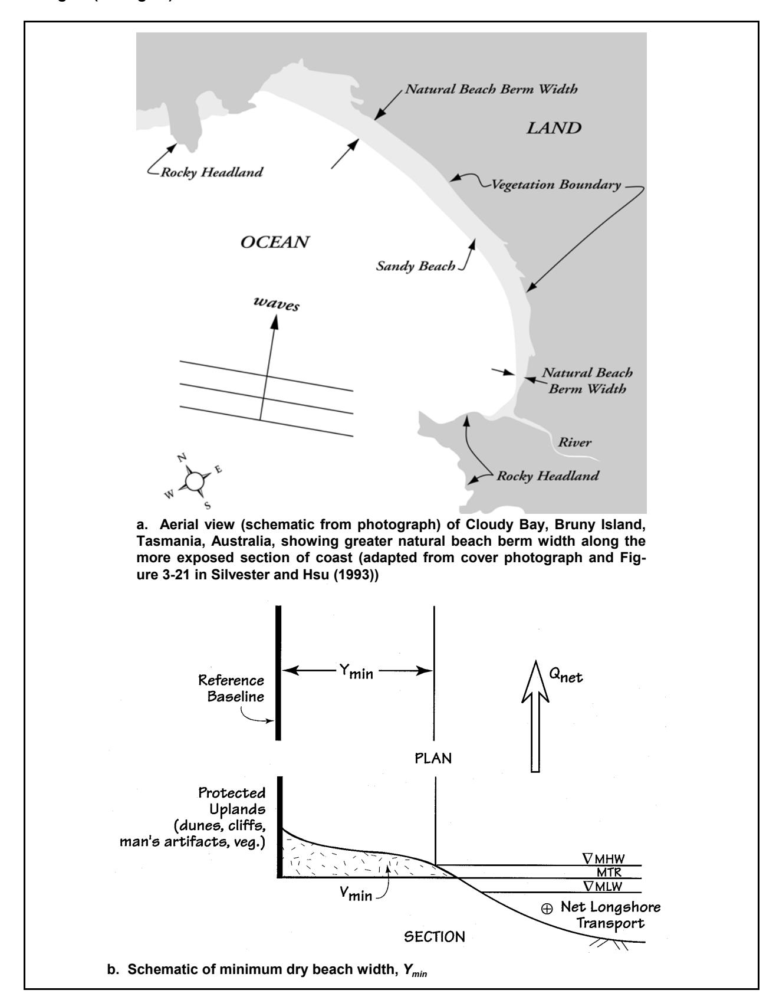

*Figure V-3-10. Naturally stable shorelines with beach width dependent on stormwave energy (from Silvester and Hsu 1993)*

V-3-36 Shore Protection Projects
- (2) Normal storm wave conditions are expected once every two years or maybe every year. More intense, less frequent storms will reach the foredune, cliffs, structure or vegetation line. Beach stabilization structures can provide upland protection beyond the baseline for these rarer storm events. At a minimum, these structures should be designed to provide the minimum, dry beach width for shore protection.
- (3) Figure V-3-11c,d,e depict the three most common beach erosion mitigation structures, namely headland breakwaters, nearshore breakwaters, and a groin field. And, each schematic displays the minimum, dry beach width, Ymin that is required for design. In each case, it is located in the gap area with greatest wave energy. The EST methodology discussed in V-3-1-c can be applied to determine the probability distribution of dry beach widths including the minimum for normal storm conditions. Functional design of these structures based on empirical knowledge is presented in the next sections. Two key factors are the minimum dry beach width (or volume) and the natural, sediment transport processes at the site. Explicit acknowledgment of Ymin as design criteria is often missing in coastal engineering design.

#### c. Headland breakwaters.

- (1) Background and definitions. Natural sandy beaches between rocky headlands have been called a variety of names in the literature, related to the curved shape of the bay found at many coasts around the world. Silvester and Hsu (1993) summarize the literature. See also Part III-2-3-i. for a list of references. Because of their geometry, they have been called spiral beaches, crenulate-shaped bays, log-spiral and parabolic-shaped shorelines, headland bay beaches and pocket beaches. Half-Moon Bay in California is a good example as first discussed by Krumbein (1944) and shown as Figure 4.3 in Silvester and Hsu (1993). Many researchers have studied the dynamic processes of this geomorphic feature, but Silvester (1960) was the first to examine their static equilibrium and propose the creation of artificial headland breakwaters as a shore protection structure. Figure V-3-12 presents a sketch of an artificial headland system and beach planform (from EM 1110-2-1617, "Coastal Groins and Nearshore Breakwaters."). Normal wave conditions with a predominant swell direction produce a maximum indentation between two fixed points (breakwater structures) and a fully equilibrated, planform shape. Thus man can mimic nature by building the headland breakwaters and letting nature sculpture the beach with a limiting indentation and shoreline that is stable.
- (2) Physical processes. Waves from one persistent, dominant direction, β, diffract around the upcoast headland and refract into the bay. Waves will break at angles to the shoreline causing sediment transport and shoreline shape adjustment (nonequilibrium shape) until a full equilibrium shape is reached. At this stage, waves break simultaneously around the entire periphery, no longshore currents and no littoral drifts occur within the embayment. The tangent section, adjacent to the downdrift headland is exactly parallel to the normal wave crest direction from offshore. Such a bay is said to be in static equilibrium (i.e., it is stable until there is a shift in the dominant wave direction). Minimal amounts of additional sediments enter or leave past the headland boundaries. Bidirectional, dominant, wave impact (swells and storms) and sediment bypassing the headlands are two reasons for littoral drift to continue around the bay. These bays are said to be in dynamic equilibrium and can be predicted within certain tolerances. Only the static equilibrium shapes can be related to wave input. The ability to calculate the static equilibrium shape and maximum indentation are needed for the functional design of headland breakwaters.
- (3) Functional design. Early investigators employed a log-spiral curve to fit the planform shape (Yasso 1964; Silvester 1970). In practice it is difficult to apply because the center of the log-spiral does not match the point at which diffraction begins to take place.

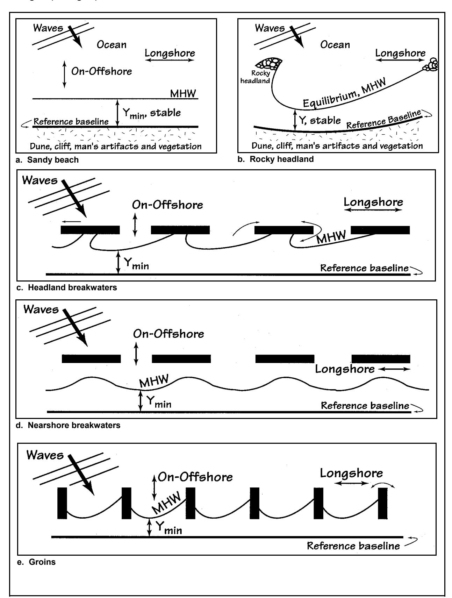

*Figure V-3-11. Natural and artificial stable shorelines with minimum dry beach width, Ymin*

V-3-38 Shore Protection Projects

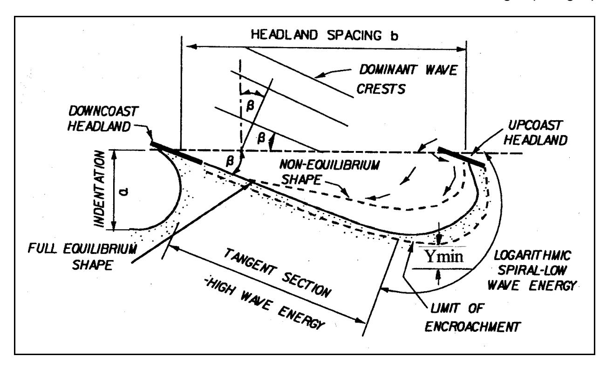

*Figure V-3-12. Definition sketch of artificial headland system and beach planform (from EM 1110-2-1617)*

- (a) Parabolic bay shape. A new empirical approach that uses shoreline data from bays in static equilibrium and physical models has been developed by Hsu, Silvester, and Xia (1987, 1989). It is called a parabolic model because the data has been used to fit a second order polynomial. Figure V-3-13 presents a definition sketch of the four key geometric variables, R, Ro, β and θ, that form the parabolic model. The model center now exactly matches the initial diffraction point. Part III-2-3-i presents complete details including definitions of R, Ro, β and θ; the parabolic model equation (2-24); the three coefficients Co,C1, C2 related to wave angle β in Figure III-2-27 and limitations of the data. An Example Problem III-2-8 is also presented to illustrate an application of the model which assumes one predominant wave direction exists at the site of interest. Many more examples and discussion is found in Silverster and Hsu 1993.
- (b) Minimum width for storm protection. As illustrated in Figure V-3-12, storm waves may be from a different direction to cut back the beach and form a new limit of encroachment planform shape. A more detailed definition sketch in perspective and cross section is presented in Figure V-3-14 (adopted from Hardaway, Thomas, and Li 1991). Two nearshore breakwaters together with beach nourishment form the headland breakwater design for shore protection. The following terms are defined: Ls Length of breakwater structure Lg Gap distance between adjacent breakwaters ds Depth (average) at breakwater below mean water level e Erosion of shoreline (mhw) from design storm Yo Distance of breakwater from original shoreline Yg Maximum indentation under normal wave conditions

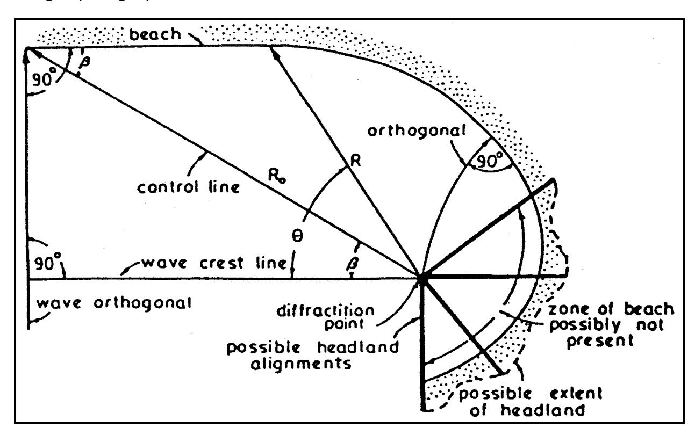

*Figure V-3-13. Definition sketch of parabolic model for planform shape*

- Y Distance of breakwater from nourished shoreline
- Ymin Minimum distance from base (reference) line to mhw shoreline after design storm event
- B Minimum beach width at mhw after nourishment
- W Width of design beach nourishment
- Zs Backshore elevation at baseline
- FB Breakwater freeboard, mhw to crest
- Qnet Net longshore sediment transport rate
- Qgross Gross longshore sediment transport rate
- Qoffshore Offshore sediment transport rate for design storm
The planform shape and maximum indentation, Yg can be estimated by the parabolic shape model previously discussed above. A hyperbolic tangent shape was developed by Moreno and Kraus (1999), which may be more convenient to apply than the parabolic shape.
V-3-40 Shore Protection Projects

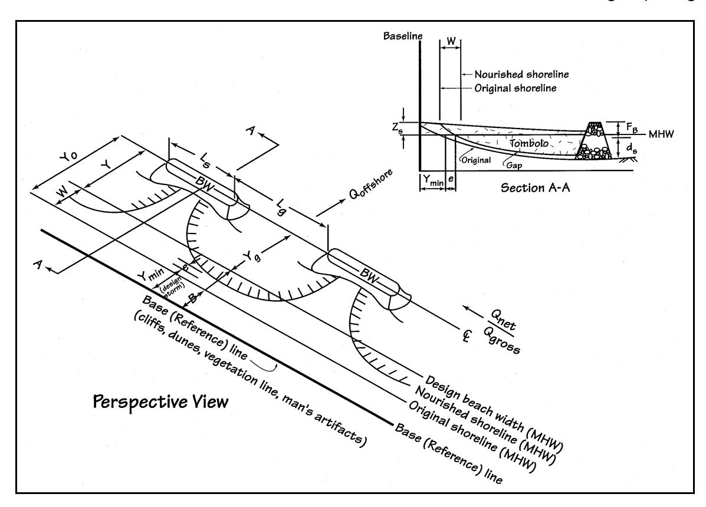

*Figure V-3-14. Definition sketch, headland breakwaters*

(4) Applications on Chesapeake Bay. Headland breakwater systems have been built along the shoreline of the Chesapeake Bay for shore protection and to maintain recreational beaches. Since 1985, 60 breakwaters at 19 sites have been designed, constructed, monitored and analyzed to learn about their functional performance (Hardaway, Thomas, and Li 1991; Hardaway, Gunn, and Reynolds 1995; Hardaway and Gunn 1991, 1995, 1998, 1999). The design method employs a three-step procedure that accounts for bimodal annual wave climates (annual and storm wave direction) a numerical wave transformation model for nearshore wave refraction and shoaling, and the beach planform shape model for static equilibrium (Silverster and Hsu 1993). System design also includes upland runoff, bank geology, shoreline morphology, sedimentation, and aesthetics. Potential impacts to adjacent shorelines must also be considered and minimized.
Figure V-3-15a displays before and after photos for the Van Dyke project on the James River. The dark area along the shore is vegetation after the new bank was graded to provide sand for beach nourishment as part of the construction. Figure V-3-15b displays 12 nearshore breakwaters at the Luter project site (James River) one year after construction. Note the use of Y-shaped breakwaters to refine the shape of the planform beach. Moving the breakwater ends further offshore changes the diffraction point to provide the desired planform beach shape. Short breakwaters at both ends pin the downdrift beach. Experience since 1991 indicates that on the Chesapeake Bay, the ratio of Yg/Lg is about 1.7 for stable, equilibrium-shaped beaches. As illustrated in Figure V-3-16, at the Murphy project site (Potomac River) the present shore is still eroding and will require several years to reach the predicted embayment shoreline shape. Hardaway, Thomas, and Li 1991 present minimum design parameters for medium wave energy shorelines (average fetch 1-5 nautical

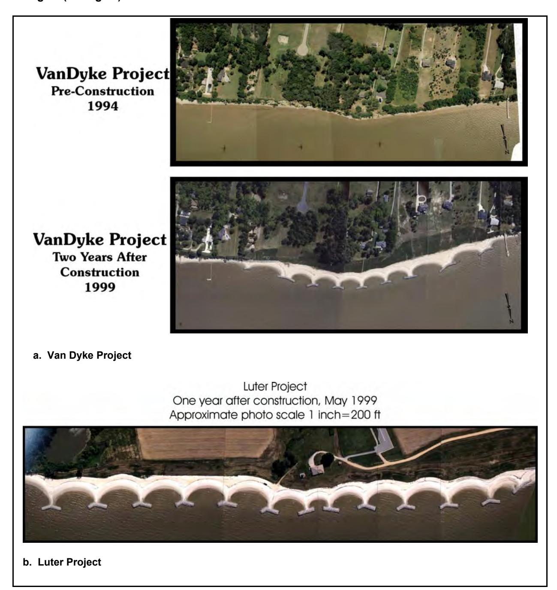

*Figure V-3-15. Headland breakwater projects on the James River estuary, Chesapeake Bay (from Hardaway and Gunn 1999)*

V-3-42 Shore Protection Projects
miles) that include guidelines for distance B (Figure V-3-14) related to storm surge and wave conditions. Much more research is needed to relate Ymin to design storm conditions for the functional design of headland breakwater systems. The next section discusses analytical methods to estimate Ymin during storm conditions.
- d. Nearshore breakwaters.
- (1) Background and definitions. Nearshore breakwaters are detached, generally shore-parallel structures that reduce the amount of wave energy reaching a protected area. They are similar to natural bars, reefs or nearshore islands that dissipate wave energy. The reduction in wave energy slows the littoral drift, produces sediment deposition and a shoreline bulge or salient feature in the sheltered area behind the breakwater. Some longshore sediment transport may continue along the coast behind the nearshore breakwater.
- (a) Figure V-3-17 displays a salient behind a single breakwater and a multiple breakwater system with both salient and a tombolo when the shoreline is attached to the breakwater. The tombolo may occur naturally or be forced during construction to produce a headland breakwater as discussed in the previous section. The tombolo blocks normal, longshore sediment transport behind the structure. Daily tidal variations may expose a tombolo at low tide while only a salient feature is visible at high tide as occurs at the Winthrop Beach, Massachusetts, nearshore breakwaters constructed in 1935 (Dally and Pope 1986). Figure V-3-18 displays the single 610 m long, rubble-mound breakwater at Santa Monica, California, and salient feature (circa 1967). Periodic dredging is needed to prevent tombolo formation. The multiple, nearshore breakwater system at Presque Isle, Pennsylvania, is shown in Figure V-3-19 (Fall 1992). Fifty-five breakwaters were built in 1989-1992 to protect 8.3 km (13.8 miles) of Lake Erie shoreline (Mohr 1994). (b) In general, the primary objectives of a nearshore breakwater system are to: Increase the fill life (longevity) of a beach-fill project. Provide protection to upland areas from storm damage. Provide a wide beach for recreation. Create or stabilize wetland areas.
- (c) In addition, adverse effects on downdrift beaches should be minimized by consideration of the impact on longshore sediment transport.
- (d) Numerous variations of breakwater types exist. Here, the focus is on detached, offshore breakwaters not connected to shore by any type of sand-holding structure. They may be low-crested to permit increased wave transmission and lower construction costs. They also may be reef-type breakwaters constructed of homogeneous stone size as opposed to the traditional, multilayer, cross-section design. Headland breakwaters (natural or constructed tombolos) are discussed (Part V-3-3). Another type of shore-parallel, offshore structure is called the submerged sill or perched beach and is discussed in (Part V-3-3). Additional

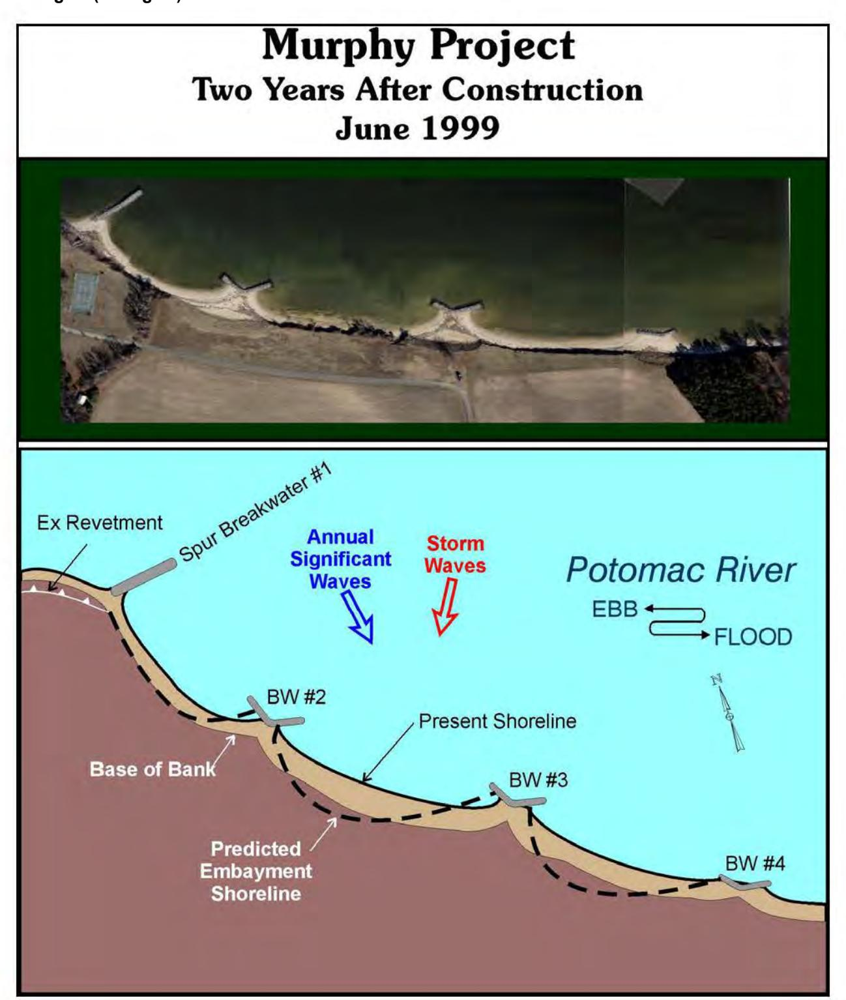

*Figure V-3-16. Headland breakwater project on the Chesapeake Bay (from Hardaway and Gunn 1999)*

V-3-44 Shore Protection Projects

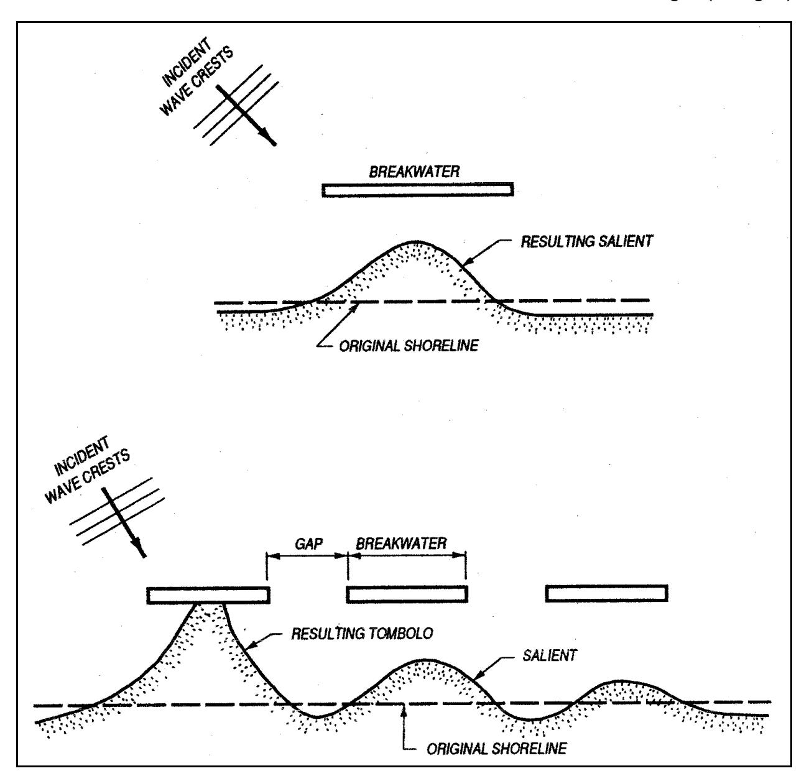

*Figure V-3-17. Types of shoreline changes associated with single and multiple breakwater (from EM 1110-2- 1617)*

information and references on other breakwater classifications can be found in Lesnik (1979), Fulford (1985), Dally and Pope (1986), EM 1110-2-1617 and Chasten et al. (1993).
- (2) Physical processes.
- (a) Normal morphological responses. Waves breaking at an angle to the shore produce time-averaged, longshore (littoral) currents and longshore sediment transport. Consider the left breakwater in Figure V-3-20 with wave energy in the plus direction. Physical processes at macro-level scales in the vicinity of the breakwater for normal wave and water level conditions are as follows. The breakwater shelters the coast immediately behind the structure and adjacent areas (diffraction) from the incoming waves. Breaking wave heights are smaller in the sheltered areas. The exposed, gap areas have larger breaking wave heights. The

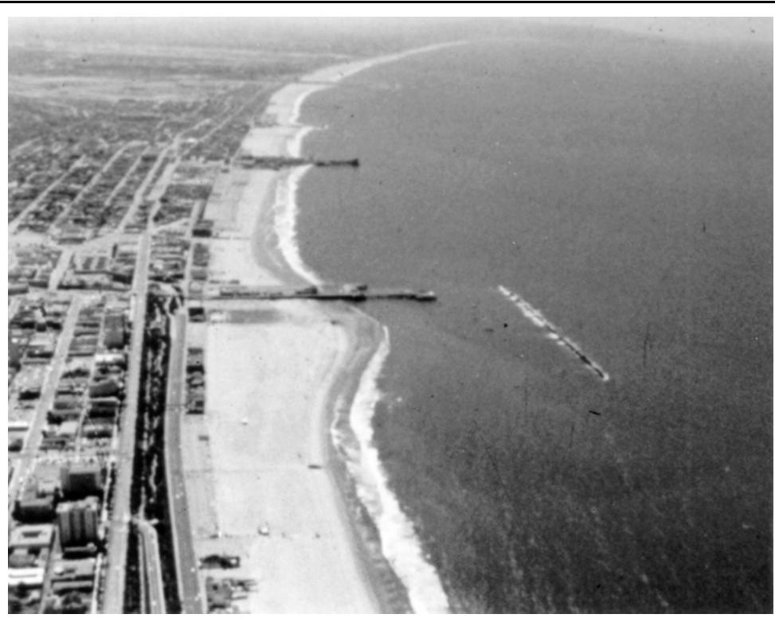

*a. Salient with eroded downdrift (longshore drift is from bottom to top)*

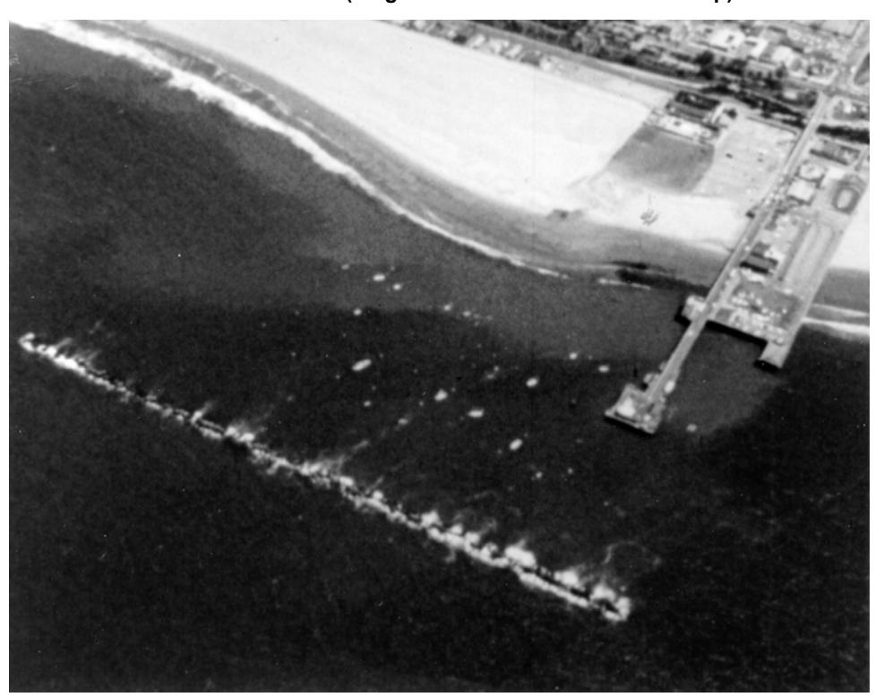

*b. Deteriorated breakwater allowing wave transmission*

*Figure V-3-18. Santa Monica, California, breakwater and salient (circa 1967). Littoral drift from bottom to top (from Chasten et al. 1993)*

V-3-46 Shore Protection Projects

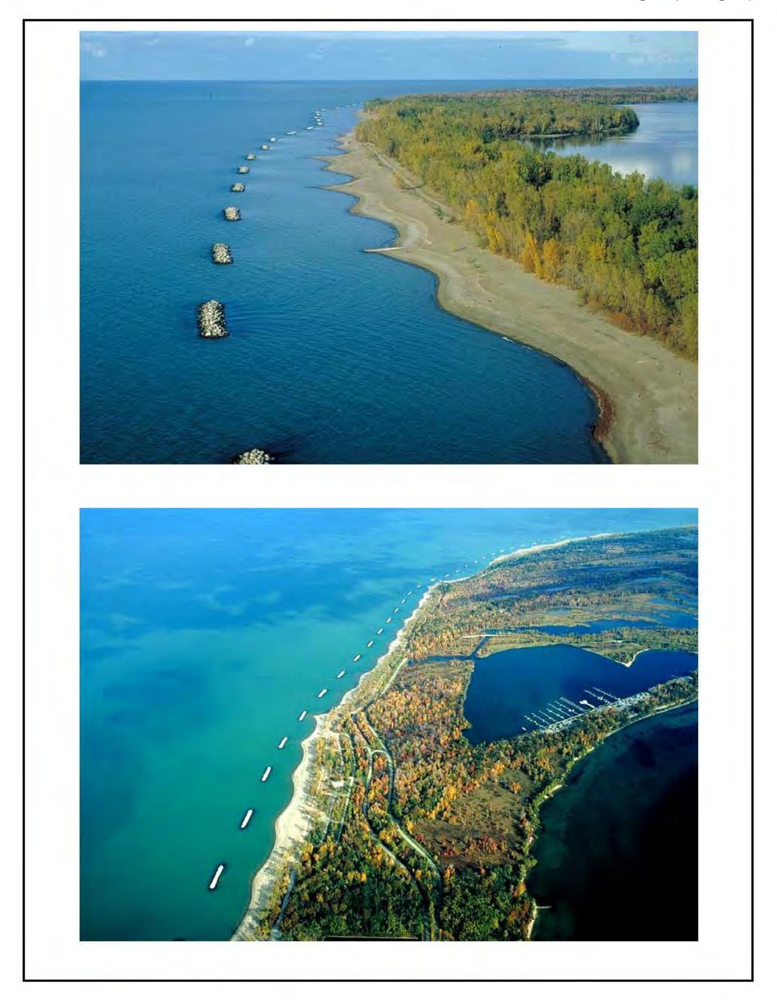

*Figure V-3-19. Breakwater construction and salients; two views of Presque Isle, Pennsylvania (from Mohr 1994)*

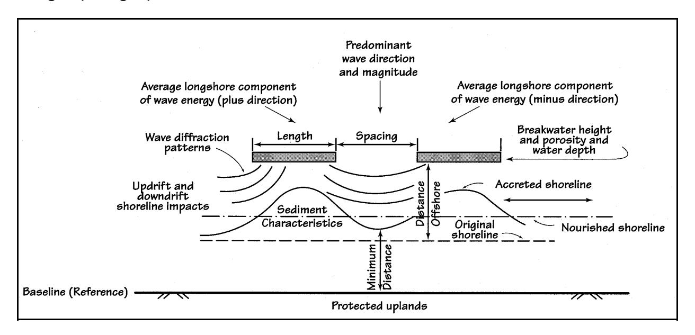

*Figure V-3-20. Definition schematic for nearshore breakwaters*

wave induced, mean water level change (setup) in the exposed, gap areas is larger than in the sheltered areas. Longshore variability in the wave setup produces gradients in the mean water surface. Water flows from the elevated levels in the gap area towards the lower, sheltered area to accelerate the longshore current flowing towards the sheltered area behind the structure from the left side. These gradients also change the direction of the current which is driven away from the breakwater in the region immediately downdrift of the breakwater (right side). These two current systems (littoral current and setup current) merge behind the structure to give rise to complex circulation patterns. The acceleration of the littoral current updrift causes initial erosion of the beach on the updrift side. The same occurs in the area immediately downdrift. These currents carry the eroded material towards the sheltered area, where it deposits. These mechanisms cause the patterns of deposition behind and erosion on either side that is observed in nature (see Figure V-3-20). The above physical description had been confirmed by a two-dimensional, numerical (horizontal plane) joint processes (waves, currents, sediment transport) morphological modeling system (Zyserman et al. 1998).
- (b) Storm processes and response. Protection afforded by the breakwater will limit erosion of the salient during significant storms. The exposed gap area will be eroded with sediment dragged offshore during storms. Breakwater height, length, wave transmission characteristics and distance from shore contribute to its effectiveness to provide a minimum dry beach width, as discussed further in the following paragraphs.
- (3) Functional design. Prototype experience for the functional design of nearshore breakwaters in the United States is generally limited to sediment-starved shores with fetch-limited wave climates on the Great Lakes, Chesapeake Bay, and Gulf of Mexico shores (Pope and Dean 1986). Table V-3-4 is a summary of U.S. projects up to 1993 (Chasten et al. 1993). Nearshore breakwaters for shore protection have also been used extensively for shore protection in Japan and Israel (Toyoshima 1982) and in Denmark, Singapore and Spain (Rosati 1990). Detailed summaries of the literature, previous projects, and design guidance are provided in a number of references (Lesnick 1979; Dally and Pope 1986; Pope and Dean 1986; Kraft and Herbich 1989; Pope 1989; Rosati 1990; Rosati and Truitt 1990; EM 1110-2-1617; and Chasten et al. 1993). One key aspect of all these efforts has been to determine under what conditions salients or tombolos will naturally form behind the breakwater.
V-3-48 Shore Protection Projects

**Table V-3-4. is a summary of U.S. projects up to 1993 (Chasten et al. 1993). Nearshore breakwaters for shore protection have also been used extensively for shore protection in Japan and Israel (Toyoshima 1982) and in Denmark, Singapore and Spain (Rosati 1990). Detailed summaries of the literature, previous projects, and design guidance are provided in a number of references (Lesnick 1979; Dally and Pope 1986; Pope and Dean 1986; Kraft and Herbich 1989; Pope 1989; Rosati 1990; Rosati and Truitt 1990; EM 1110-2-1617; and Chasten et al. 1993). One key aspect of all these efforts has been to determine under what conditions salients or tombolos will naturally form behind the breakwater.**

| 5 4 3 3 1 Construction Date of 1935 1935 1982 1985 1982 Massachusetts Massachusetts Location Maryland Virginia Virginia Winthrop Beach Winthrop Beach (Central Beach) Colonial Beach Colonial Beach (Castlewood Chesapeake Bay Elm's Beach (high tide) (wetland) (low tide) Project Park) Atlantic (Potomac Atlantic (Potomac Atlantic Atlantic Coast River) River) | Project Length Number of Segments |  |  |  |  |  |  |  |  |
| --- | --- | --- | --- | --- | --- | --- | --- | --- | --- |
|  |  | Segment Length | Length Gap | Preproject Distance Offshore | Water Depth | Fill Placed | Responses Beach1 | Constructed By | Maintained By |
|  | 625 m | 91 m | 30 m | Unknown | 3.0 m (mlw) | No | 1 | State of Mass. |  |
|  |  | 100 | 30 | 305 | 3.0 (mhw) | No | 3 | State of Mass. |  |
|  | 427 | 61 | 46 | 64 | 1.2 | Yes | 2 | USACE |  |
|  | 335 | 61, 93 | 26, 40 | 46 | 1.2 | Yes | 1 | USACE |  |
|  | 335 | 47 | 53 | 44 | 0.6-0.9 | Yes | 1 | State of Maryland |  |
| 4 1989 Maryland Chesapeake Bay Elk Neck State Park (wetland) | 107 | 15 | 15 |  | 0.6-0.9 | No | 2-4 | USACE | USACE |
| 4 1989 Maryland Chesapeake Bay Terrapin Beach (wetland) |  | 23 | 15, 31, 23 | 38.1 | 0.6-0.9 | Yes | 5 | USACE | USACE |
| 26 1992-1993 Maryland Chesapeake Bay Eastern Neck (wetland) | 1676 | 31 | 23 |  | 0.3-0.6 | Yes |  | Wildlife Service, U.S. Fish and USACE | Wildlife Service U.S. Fish and |
| 11 1990-1991 Maryland Chesapeake Bay Bay Ridge | 686 | 31 | 31 | 42.7 |  | Yes | 4 | Private | Private |
| 1 1985-1986 Florida Redington Shores Gulf of Mexico | 100 | 100 | 0 | 104 |  | Yes | 1 | USACE | USACE |
| 6 1985 Louisiana Holly Beach Gulf of Mexico | 555 |  | 46, 51, 50 93, 89 | 78, 61 | 2.5 | No | 4 | State of Louisiana | Louisiana State of |
| 76 1991-1993 Louisiana Holly Beach Gulf of Mexico |  | 46, 53 | 91, 84 | 122, 183 | 1.4, 1.6 | Yes | 3 | State of Louisiana | Louisiana State of |
| 4 Louisiana Grand Isle Gulf of Mexico | 84 | 70 | 21 | 107 | 2 | No | 3 | City of Grand Isle | Grand Isle City of |
| 3 1977 Ohio Lakeview Park Lake Erie | 403 | 76 | 49 | 152 | 3.7 | Yes | 4 | USACE | of Lorain City |
| 3 1978 Pennsylvania Presque Isle Lake Erie | 440 | 38 | 61, 91 | 60 | 0.9-1.2 | Yes | 2 | USACE | USACE |
| 55 1989-1992 Pennsylvania Presque Isle Lake Erie | 8300 | 45 | 107 | 76-107 | 1.5-2.4 (lwd) | Yes | 3-4 | USACE | USACE |
| 3 1982 Ohio Lakeshore Park Lake Erie | 244 | 38 | 61 | 120 | 2.1 | Yes | 5 | USACE | Ashtabula City of |
| 4 1983 Ohio East Harbor Lake Erie | 550 | 45 | 90, 105, 120 | 170 | 2.3 | No | 5 | State of Ohio | State of Ohio |
| 5 1990 Ohio Meumee Bay (headland) Lake Erie | 823 | 61 | 76 |  | 1.3 | Yes | 1 | USACE | State of Ohio |
| 3 1992 Ohio (headland) Sims Park Lake Erie | 975 | 38 | 49 |  | 2.5 | Yes | 1 | USACE | City of Euclid |
| 1 1905 California Venice Pacific | 180 | 180 | 0 | 370 |  | No | 5 | Private |  |
| 1 1965 Hawaii Haleiwa Beach Pacific | 49 | 49 | 0 | 90 | 2.1 (msl) | Yes | 3 | USACE/State of HI USACE |  |
| 3 1991 Hawaii Sand Island Pacific | 110 | 21 | 23 |  |  |  |  | USACE | USACE |

- (a) Salients or tombolos. A salient is the preferred shoreline response for a detached breakwater system designed for the Corps as stated in EM 1110-2-1617 and in Chasten et al. (1993). This is to allow longshore sediment transport to continue to move through the project area to downdrift beaches. Salients are likely to predominate when the breakwaters are sufficiently far from shore, short relative to incident wavelength, and relatively transmissible (low crested or large gaps with low sediment input). Wave action and longshore currents tend to keep the salient from connecting to the structure. Sand will more likely accumulate in the structure lee and form a tombolo when the breakwater is close to shore, is long relative to incident wavelength, and is relatively impermeable (high crest and small gaps and with large sediment input). A tombolo-detached breakwater functions like a teeshaped groin by blocking longshore transport and promoting sediment movements offshore in rip currents through the gaps. Although some longshore transport can occur seaward of the breakwater, the interruption in the littoral system may starve downdrift beaches of their normal sediment supply, causing erosion. Variable wave energy regimes may produce periodic tombolos to temporarily store and then release sediment to the downdrift region. Salient formation provides a recreational swimming environment and limits access for maintenance and to the public. Tombolo formation provides a recreational beach environment and allows direct access to the structure for maintenance, but public access may not be desirable. Figure V-3-21 presents a definition sketch for the variables that have been employed to develop empirical relationships for detached, breakwater design by many research efforts listed in Table V-3- 5 dating back to the 1960s. For salient or tombolo formation, the key variables are: Y Distance of breakwater from nourished shoreline Ls Length of breakwater structure Lg Gap distance between adjacent breakwater segments ds Depth (average) at breakwater structure below mean water level
Three dimensionless ratios, Y/ds, Ls/Lg and Ls/Y have emerged to separate salient and tombolo response.
• As qualitatively discussed, when the breakwater is long and/or located close to shore, conditions favor tombolo formation. As shown in Table V-3-6, "Conditions for the Formation of Tombolos," many references say Ls/Y > 1-2 for tombolo formation (except Gourlay 1981). Dally and Pope (1986) recommend

```math
\frac { L _ { s } } { Y } \, = \, 1 . 5 \, { \ t o \ 2 } \tag{V-3-6}
```

```math
\frac{L_s}{Y} = 1.5 \quad L \leq L_g \leq L_s \text{ segmented breakwater} \tag{V-3-7}
```

where L is the wavelength at the structure.
V-3-50 Shore Protection Projects

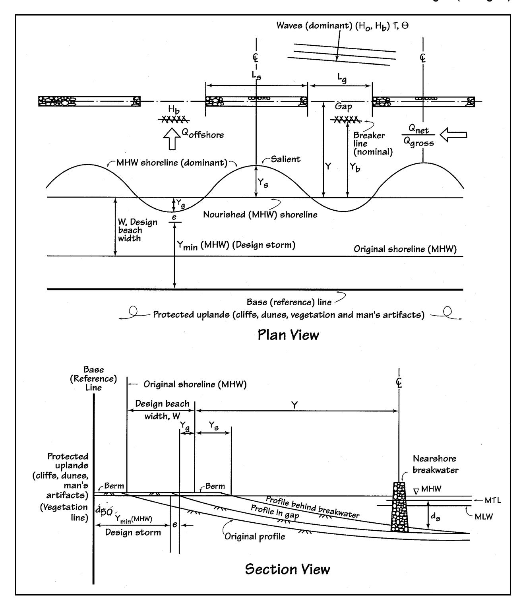

*Figure V-3-21. Definitions of key variables for nearshore breakwater*

(from Chasten et al. 1993)

| Table V-3-5 |  |
| --- | --- |
| Empirical Relationships for Nearshore Breakwater Design |  |
| Inman and Frautschy (1966) | Predicts accretion condition; based on beach response at Venice in Santa Monica, CA |
| Toyoshima (1972, 1974) | Recommends design guidance based on prototype performance of 86 breakwater systems along the Japanese coast |
| Noble (1978) | Predicts coastal impact of structures in terms of offshore distance and length; based on California prototype breakwaters |
| Walker, Clark, and Pope (1980) | Discusses method used to design the Lakeview Park, Lorain, OH, segmented system for salient formation; develops the Diffraction Energy Method based on diffraction coefficient isolines for representative waves from predominant directions |
| Gourlay (1981) | Predicts beach response; based on physical model and field observations |
| Nir (1982) | Predicts accretion condition; based on performance of 12 Israeli breakwaters |
| Rosen and Vadja (1982) | Graphically presents relationships to predict equilbrium salient and tombolo size; based on physical model/prototype data |
| Hallermeier (1983) | Develops relationships for depth limit of sediment transport and prevention of tombolo formation; based on field/laboratory data |
| Noda (1984) | Evaluates physical parameters controlling development of tombolos/salients; especially due to on-offshore transport; based on laboratory experiments |
| Shore Protection Manual (1984) | Presents limits of tombolo formation from structure length and distance offshore; based on the pattern of diffracting wave crests in the lee of a breakwater |
| Dally and Pope (1986) | Recommends limits of structure-distance ratio based on type of shoreline advance desired and length of beach to be protected |
| Harris and Herbich (1986) | Presents relationship for average quantity of sand deposited in lee and gap areas; based on laboratory tests |
| Japanese Ministry of Construction (1986); Rosati and Truitt (1990) | Develops step-by-step iterative procedure, providing specific guidelines towards final design; tends to result in tombolo formation; based on Japanese breakwaters |
| Pope and Dean (1986) | Presents bounds of beach response based on prototype performance; response given as a function of segment length to-gap ratio and effective distance offshore-to-depth at structure ratio; provides beach response index classification |
| Seiji, Uda, and Tanaka (1987) | Predicts gap erosion; based on performance of 1,500 Japanese breakwaters |
| Sonu and Warwar (1987) | Presents relationship for tombolo growth at the Santa Monica, CA breakwater |
| Suh and Dalrymple (1987) | Gives relationship for salient length given structure length and surf zone location; based on lab tests and prototype data |
| Berenguer and Enriquez (1988) | Presents various relationships for pocket beaches including gap erosion and maximum stable surface area (i.e., beach fill); based on projects along the Spanish coast |
| Ahrens and Cox (1990) | Uses Pope and Dean (1986) to develop a relationship for expected morphological response as function of segment-to-gap |

V-3-52 Shore Protection Projects
ratio
• Conversely, short breakwaters at greater distance from shore favor salient formation. The "Conditions for the Formation of Salients" in Table V-3-6 presents a wide range of conditions with generally, Ls/Y < 1. Dally and Pope (1986) recommend for salient formation

```math
\frac{L_s}{Y} = 0.5 \text{ to } 0.67 \tag{V-3-8}
```

for both single and segmented breakwaters. However, for very long distances, to insure that tombolos do not form, the recommended ratio for a segmented system (Dally and Pope 1986) is

```math
\frac{L_s}{Y} = 0.125 \text{ (long systems)} \tag{V-3-9}
```

• Permeable structure systems (partly submerged, large gaps) also allow sufficient wave energy to minimize the chance for tombolo formation: As shown in Table V-3-6, "Conditions for Minimal Shoreline Response," the references cited generally recommend Ls/Y< (0.125 – 0.33) to produce a minimal shoreline response. Ahrens and Cox (1990) defined a beach response index, Is

```math
I_s = \exp(1.72 - 0.41 L_s/Y) \tag{V-3-10}
```

where the five types of beach response (Pope and Dean 1986) give Is value as:
Permanent tombolo formation, Is=1
Periodic tombolos, Is=2
Well-developed salients, Is=3
Subdued salients, Is=4
No sinuosity, Is=5
- These results are preliminary and require verification.
- The ratio Ls /Lg is also important for salient or tombolo formation. Large gaps will let more wave energy reach the shore to promote salient formation. And, this will coincide with smaller Ls /Lg ratios. A dimensionless plot of U.S. segmented, nearshore breakwater projects by Pope and Dean (1986) using Ls/Lg is shown in Figure V-3-22 and verifies this trend. The vertical axis is Y/ds and is the distance offshore relative to the local, mean water depth at the breakwater. The water depth is important for it is related to the nominal, surf zone width at breaking Yb. The dimensionless ratio Y/Yb is a measure of breaker location relative to the width of the surf zone. For a given Ls /Lg, larger Y/ds values (or Y/Yb) mean the breakwater is located further offshore (beyond the normal surf zone width) to foster salient formation. Obviously, breakwaters located far offshore will have less effection the shoreline.

*Table V-3-6 Conditions for Shoreline Response Behind Nearshore Breakwaters (from Chasten et al. 1993)*

**Table V-3-6. Conditions for Shoreline Response Behind Nearshore Breakwaters (from Chasten et al. 1993)**

|  | Conditions for the | Formation of Tombolos |  |
| --- | --- | --- | --- |
| Condition | Comments |  | Reference |
| Ls/Y > 2.0 |  |  | Shore Protection Manual (1984) |
| Ls/Y > 2.0 | Double tombolo |  | Gourlay (1981) |
| Ls/Y > 0.67 to 1.0 | Tombolo (shallow | water) | Gourlay (1981) |
| Ls/Y > 2.5 | Periodic tombolo |  | Ahrens and Cox (1990) |
| Ls/Y > 1.5 to 2.0 | Tombolo |  | Dally and Pope (1986) |
| Ls/Y > 1.5 | Tombolo (multiple | breakwaters) | Dally and Pope (1986) |
| Ls/Y > 1.0 | Tombolo (single | breakwaters) | Suh and Dalrymple (1987) |
| Ls/Y > 2 b/Ls | Tombolo (multiple Conditions for the | breakwaters) Formation of Salients | Suh and Dalrymple (1987) |
| Ls/Y < 1.0 | No tombolo |  | Shore Protection Manual (1984) |
| Ls/Y < 0.4 to 0.5 | Salient |  | Gourlay (1981) |

V-3-54 Shore Protection Projects

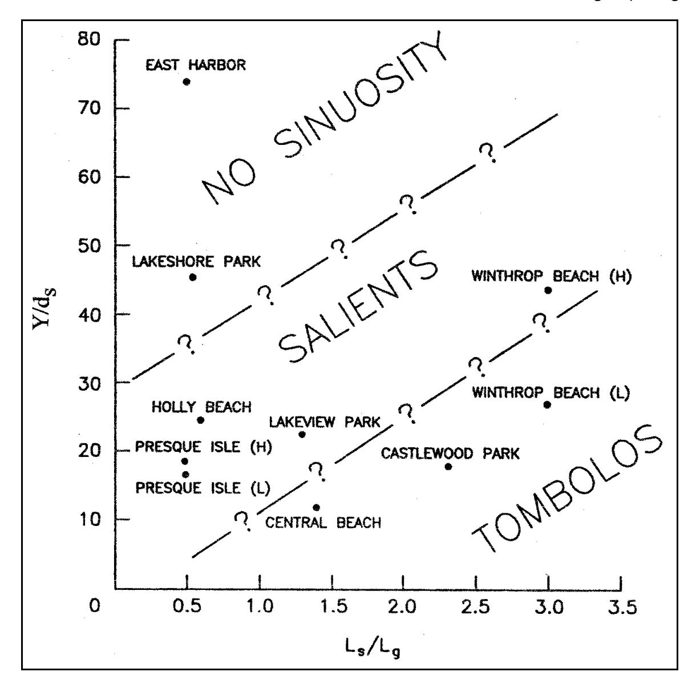

*Figure V-3-22. Dimensionless plot of nearshore breakwater projects For Y/ds versus Ls/Lg (from Pope and Dean 1986)*

- Zyserman et al. (1998) used the Y/Yb ratio in their numerical model, process-oriented studies of nearshore breakwaters. The distance Yb was taken as Y80, meaning the distance from shore where 80 percent of the undisturbed littoral transport takes place and, hence, a measure of the width of the surf zone. Their research using a numerical model confirmed the empirical formulas of Dally and Pope (1986) for tombolo and salient formation previously summarized.
- (b) Planform configuration. Some research has provided insight into other variables that quantify the planform shape of the shoreline as shown in Figure V-3-21. The length of the salient, Ys increased as the Ls/Y ratio increased, as expected. Suh and Dalrymple (1987) developed an exponential expression involving , where Lg is the gap length for prediction of Ys, by combining movable-bed laboratory results and 2 L YL g s prototype data. Rosati (1990) evaluated the relation and found it over-predicted Ys for the majority of
prototype data. Seiji, Uda, and Tanaka (1987) gave conditions on the Lg/Y ratio for no, possible, and certain erosion, Yg opposite the gap. The magnitude of Yg was not determined, but gap erosion occurred for Lg/Y greater than 0.8. Hallermeier (1981) gave an equation for the water depth to locate nearshore breakwaters when tombolo formation was to be avoided. The relation requires knowledge of wave height and period statistics at the 12 hr per year exceedance level. Rosati (1990) also evaluated Hallermeier's relation with the limited, available field data. The correlation was said to be good for seven of the nine data points tested. These relationships to quantify Ys, Yg and ds can be found in Chasten et al. (1993).
- Walker, Clark, and Pope (1981) discuss a procedure to apply diffraction analysis to determine the approximate shoreline configuration behind a breakwater. Their studies indicate that if the isolines of the Κt=0.3 diffraction coefficients are constructed from each end of the breakwater for a range of incident wave directions (monochromatic waves) and they intersect seaward of the postproject shoreline, a tombolo will not form. This corresponds to Lg/Y$2, where Y is after placement of the beach fill, as part of the project shown in Figure V-3-21. Waves coming around each end of the breakwater meet each other before the undiffracted, incident wave (outside the breakwater's shadow) reach the shoreline. The postproject shoreline is estimated as a smoothed crest pattern for all diffracted crests and a balance in the sediment volume.
- The Japanese Ministry of Construction presented a step-by-step interactive procedure for nearshore breakwater design (Japanese Ministry of Construction 1986). Rosati (1990) and Rosati and Truitt (1990) found that 60 percent of the designs produced tombolos and therefore the JMC method was more suitable for headland breakwater design. All are for nonpermeable, high-crested, nearshore breakwaters.
- (c) Other design factors. The crest elevation and crest width, permeability, slope of front face, and type of construction are additional design factors that influence functional performance. No general guidelines presently exist. Generally, low crests allow more energy to penetrate into the lee of the breakwater to prevent tombolo formation or remove a tombolo by storm waves. Wide crests on low breakwaters can promote breaking to diminish wave energy penetration and encourage tombolo formation. Permeable structures can allow significant amounts of energy to propagate through them to prevent tombolo formation. Types of construction including nontraditional, patented devices are discussed in Part V-3-5. Waves in the lee of the breakwater are determined by three processes: diffraction around the ends, wave transmission by overtopping and wave transmission through the structure. For diffraction around single and multiple breakwaters with gaps, see Part II-7-2 for irregular waves and the Shore Protection Manual (1984) for many cases with monochromatic waves. Wave transmission due to overtopping and through the structure by permeability is discussed in Part VI-5-2. Wave reflection is covered in Part VI-5-2. The Automated Coastal Engineering Systems (ACES) (Leenknecht, Szuawalski, and Sherlock 1992) provides an application to determine wave transmission coefficients and transmitted wave heights for permeable breakwaters with crest elevation at or above the stillwater level. Breakwater impact on littoral currents and creation of wave setup gradients to produce setup currents was previously discussed. If the crest elevation is low enough to permit wave overtopping, the mass carried over the structure causes a net seaward return flow of water through the gaps. Seelig and Walton (1980) present a method for estimating the strength of the seaward flowing currents. The effect of the combined littoral and setup currents on the longshore sediment transport to produce salient features with adjacent erosional areas was also previously discussed (physical processes).
V-3-56 Shore Protection Projects
- The primary function of nearshore breakwaters is to reduce the offshore sand transport during storms. Hence, these structures help retain sand on nourished beaches for longer intervals. However, overtopping can result in a net seaward flow of water and sand through the gaps between breakwater segments during storm events. The breakwater can also reduce the onshore sediment movement during normal, swell wave conditions that naturally rebuild the beach. The structure blocks the return of sediment to the beach. Following breakwater construction, a new equilibrium between onshore and offshore transport will be established.
- (d) Minimum dry beach width, Ymin. Figure V-3-21 schematically displays the mhw shoreline for normal wave conditions. During storms, some gap erosion, e will occur to impact the minimum, dry beach width, Ymin required for shore protection. A conservative estimate of the gap erosion, e , can be made using analytical models for the dynamic response of natural beach profiles to storm effects (e.g., Kobayashi 1987; Kriebel and Dean 1993). Part III-3-3 gives a general description of these methods and also example applications of the Kriebel and Dean (1993) analytical model. The theory is for open coastal beaches so that wave diffraction in the gap area and wave overtopping to increase the return flows through the gap region are not considered, but tend to offset each other. See Example Problem V-3-1. Dynamic, numerical, cross-shore sediment transport models (e.g., SBEACH, Larson and Kraus 1989) could also be applied in the gap area to estimate the erosion potential, e (see Part III-3-3). These twodimensional (vertical) models also do not consider wave diffraction and return flows in the gap area. These results would be a worst case scenario and the actual erosion can be expected to be significantly less. A general, three-dimensional, wave, current, and sediment transport model is clearly needed in this area. Hughes (1994) presents a complete discussion of scaling laws as applied to predicting cross-shore sediment transport in physical, hydraulic models.
- (4) Nontraditional designs. Most nearshore breakwaters built in the United States and foreign countries for shore protection have been rubble-mound type structures. Availability of materials and construction equipment have made construction costs relatively inexpensive. Several patented, nontraditional devices have been tested in the United States. These have been precast concrete units or sand-filled geotextile tubes and bags. If constructed to the same dimensions as rubble-mound structures, they may produce similar functional performance. Their success (or failure) has been a function of structural stability of the units during storm conditions and their durability over an economic life. Their functional success (or failure) has also been dependent on maintaining the design crest elevation for wave energy reduction. Proper attention to foundation design to minimize settlement must be given for precast, concrete units. Some nontraditional designs reduce the bottom footprint to minimize impacts on benthic organisms. And, the costs for removal and/or adjustments to reduce downdrift impacts on adjacent shorelines can be significantly less than for traditional, rubble-mound designs. The need to reduce impact on the environment is increasing the necessity for further research and comprehensive field testing programs for nontraditional designs. (See Part V-3-5 for further details.)

#### EXAMPLE PROBLEM V-3-1

FIND: Functional design of a nearshore breakwater system coupled with beach nourishment for shore protection, but maintain recreational beach.
GIVEN: A sandy beach shoreline, 685 m in length with historic erosion rate of 0.6-0.9 m/year that threatens a 2.4-7.3-m bank, with road and sewer line parallel to the shoreline along the top of the bank. For an annual probability of exceedance of 2 percent (50-year recurrence interval design storm) the storm surge level is 1.83 m (mlw) and corresponding wave characteristics are Hs=2.2 m, Tp=9.7 sec at the -9.0 m (mwl) depth contour. The design, still water, storm depth is 3.05 m at this location and includes a 0.3 m, astronomical tide. Net sediment transport (sand, d50 = 0.6 mm) is 3,750 to 7,500 m3 /year to the north. The existing beach berm is at +0.76 m (mlw) elevation.

#### Solution:

- 1. To maintain the longshore transport rate, the desired planform is subdued to well-developed salients. From a table of possible Ls and Y values, the ratio 0.75 is selected giving a breakwater length, Ls=30m and the offshore distance, Y=40 m. This gives the beach response index, Is=4.1, hence, subdued salients are expected.
- 2. For shore protection, waves entering the breakwater gaps and diffracting behind the structures will reach the shoreline. Sufficient beach width (Ymin) and berm height (Zs) are required to dissipate this wave energy prior to reaching the toe of the banks. Analysis of nearshore, wave diffraction diagrams indicate that the 50-year design wave height of 2.2 m will be reduced to about 0.9 m at a distance of about 14 m from the bank toe when the breakwater gap is about 30 m. This gap width, Lg=30 m is considered a practical minimum width for this project. For shallow-water wave breaking, (γb=0.78, II-4-3), this wave will break in about 1.16 m depth of water. For a design storm surge of 1.83 m (mlw) and existing beach berm elevation of 0.76 m (mlw), these waves will break directly on the bank toe and cause significant erosion. The existing beach width and height are not sufficient to dissipate the storm wave energy at the 50-year frequency level. Two options exist. One is to further decrease the wave energy propagating through the gaps by using smaller gap widths, and resulting longer lengths of breakwater segments. The second option is to add beach fill to the shoreline area and this option is selected to provide the desired protection for the bank area.
- 3. A beach-fill plan was considered that would increase the beach width to 10 m from the toe of the bank and raise the berm elevation to + 1.8 m (mlw) at a 1:8 construction slope. Wave heights are now reduced to less than 30 cm near the bank toe for the 50-year storm event. The beach fill would be expected to evolve (see Part V-4) to a stable planform with salients behind each breakwater and embayments opposite each gap. The mhw shoreline would recede about 4.5-6 m opposite the gaps as estimated from analysis of diffraction patterns. The beach shape would also evolve to a more natural and milder slope to match those in the area (1:10 to 1:15).
(Continued)
V-3-58 Shore Protection Projects

# EXAMPLE PROBLEM V-3-1 (Concluded)

- 4. Protection of the bank toe depends on the performance of the beach berm during storm events. A worst case scenario can be evaluated first by considering the adjusted beach slope and shoreline area with storm wave conditions prior to reduction by the nearshore breakwaters. Using the analytical model of Kriebel and Dean (1993) or a numerical, storm erosion model (e.g., SBEACH, Larson and Kraus 1989) gives the results (for the worst-case, 50-year storm event scenario) that the storm berm would remain with a width of 1.5-3 m. The actual erosion would be expected to be significantly less due to reduction in the storm wave energy as a result of wave diffraction through the gaps. The gap width, Lg=30 m was selected for design.
- 5. Wave energy is also transmitted over the top of nearshore breakwaters during elevated water level, storm surge events. A wave transmission model (see Part VI-5-2) capable of predicting wave energy over and through submerged, reef-type breakwaters was used for analysis with crest heights of + 1.2 m, +1.5 m and 1.8 m above mlw datum. During the 50-year design storm, wave heights immediately behind the breakwaters are reduced about 60 percent, 54 percent, and 46 percent, respectively for these three breakwater crest elevations. These transmitted waves then propagate shoreward and are further dissipated by the beach salients. With the proposed beach fill in place, a breakwater crest elevation of +1.2 m (mlw) is selected to limit the transmitted, design wave height to about 1.2 m. This is the same, diffracted, design wave height opposite the gaps and is dissipated by the storm berm.
Note: Further details of this example problem are found in Appendix A of Chasten et al. 1993 and was developed by Mr. Ed Fulford of Andrews Miller and Assoc., Inc., Cambridge, Maryland. It is taken from a real project on the Chesapeake Bay for the community of Bay Ridge near Annapolis, Maryland. Construction was completed in July 1991 and postconstruction monitoring commenced soon after and at a November 1991 survey. As of 2000, the project has performed as expected with subdued salients forming behind each breakwater resulting in the overall stability of the shoreline. Numerous, significant storms occurred and the project prevented erosion of the bank area to protect the roadway and sewer pipeline. The project has been well-received by the residents of the community as a result of the stability of the shoreline and the enhancement of the recreational beach area.

#### e. Groins.

- (1) Background and definitions. Groins are the oldest and most common shore-connected, beach stabilization structure. They are probably the most misused and improperly designed of all coastal structures. They are usually perpendicular or nearly at right angles to the shoreline and relatively short when compared to navigation jetties at tidal inlets. As illustrated schematically in Figure V-3-23, for single and multiple groins (groin field) the shoreline adjusts to the presence of the obstruction in longshore sediment transport. Over the course of some time interval, accretion causes a positive increase in beach width updrift of the groin. Conservation of sand mass therefore produces erosion and a decrease in beach width on the downdrift side of the groin. The planform pattern of shoreline adjustment over 1 year is a good indicator of the direction of the annual net longshore transport of sediment at that location.
- (a) Groins are constructed to maintain a minimum, dry beach width for storm damage reduction (Figure V-3-11) or to control the amount of sand moving alongshore. Previously stated purposes such as trapping littoral drift are discouraged for this implies removal of sand from the system. Modern coastal

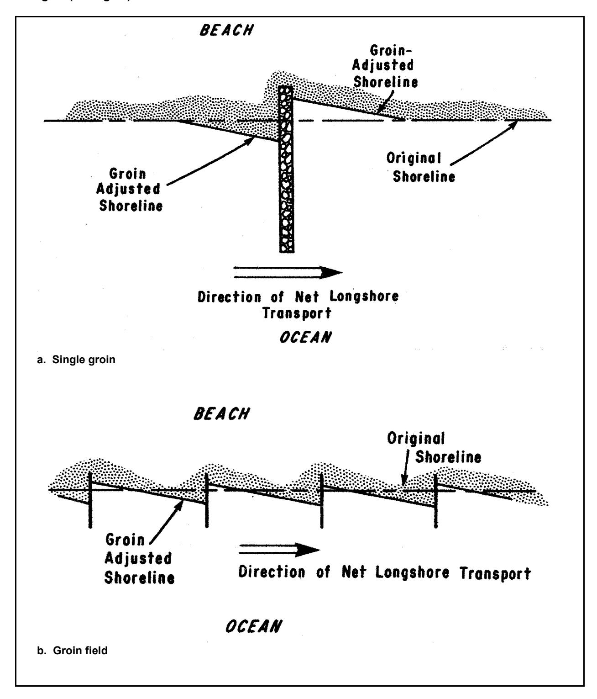

*Figure V-3-23. General shoreline adjustment for direction of net longshore transport*

V-3-60 Shore Protection Projects
engineering practice is to combine beach nourishment with groin construction to permit sand to immediately begin to bypass the groin field. At the end of the sediment cell, terminal groins may be used to anchor the beach and limit the movement of sand into a navigational channel or onto an ebb-tidal shoal at tidal inlets.
- (b) Figure V-3-24 shows a photo, profile and cross section of a rubble-mound groin at Westhampton Beach, New York. Sheet-pile construction with timber (Figure V-3-25) timber-steel (Figure V-3-26) prestressed-concrete (Figure V-3-27) or cellular-steel (filled) sheets (Figure V-3-28) have also been constructed in the United States.
- (c) Kraus, Hanson, and Blomgren 1994 cite the following situations when the groin field alternative for shore protection and sand management should be considered. At divergent, nodal points for littoral drift. In the diffraction, shadow some of a harbor breakwater, or jetty. On the downdrift side of a harbor breakwater or jetty. At the updrift side of an inlet entrance where intruding sand is to be managed To reduce the loss of beach fill, but provide material to downdrift beaches in a controlled manner. Along the banks at inlets, where tidal currents alongshore are strong. Along an entire littoral cell (spit, barrier island, submarine canyon) where sand is lost without return in an engineering time frame.
- (d) Groins may not function well and should not be considered under the following conditions (Kraus, Hanson, and Blomgren 1994): Where a large tidal range permits too much bypassing at low tide and overpassing at high tide. Where cross-shore sediment transport is dominant When constructed too long or impermeable, causing sand to be jetted seaward When strong rip currents are created to cause potentially dangerous swimming conditions
- (e) Coastal zone management policy in many countries and the United States presently discourages the use of groins for shore protection. Many examples of poorly designed and improperly sited groins caused by lack of understanding of their functional design, or failure to implement the correct construction sequence, or failure to fill up the groin compartments with sand during construction, or improper cross-sectional shape are responsible for these restrictions. However, when properly designed, constructed and combined with beach nourishment, groins can function effectively under certain conditions, particularly for increasing the fill life (longevity) of renourished beaches.
- (f) Groins are now being reevaluated as sand-retention structures (Kraus, Hanson, and Blomgren 1994; Kraus and Bocamazo 2000) by now asking the question "how much sand can be allowed to pass," while still maintaining a minimum width of beach at the groin for some level of shore protection.

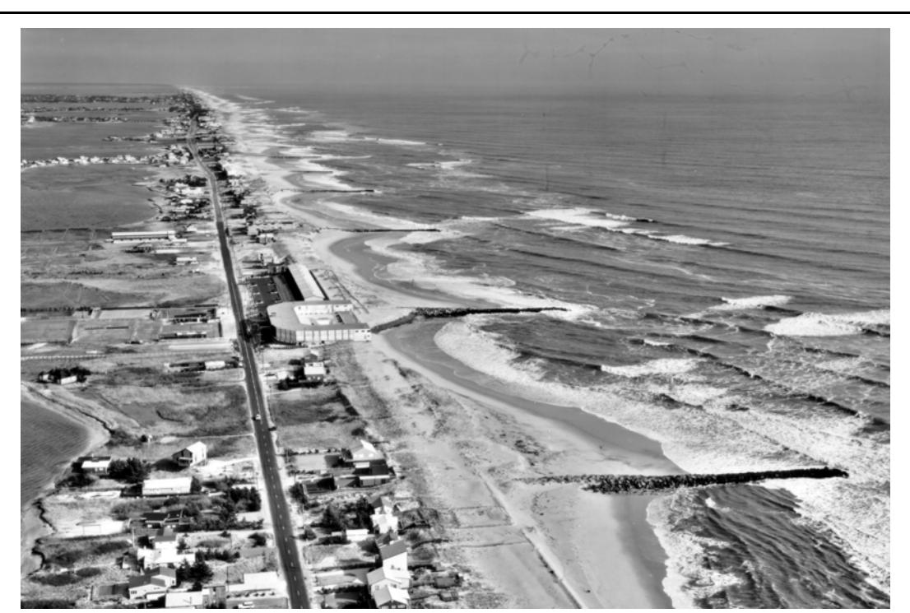

*Westhampton Beach, Long Island, New York, 18 Jan 1980 (courtesy USAED, New York)*

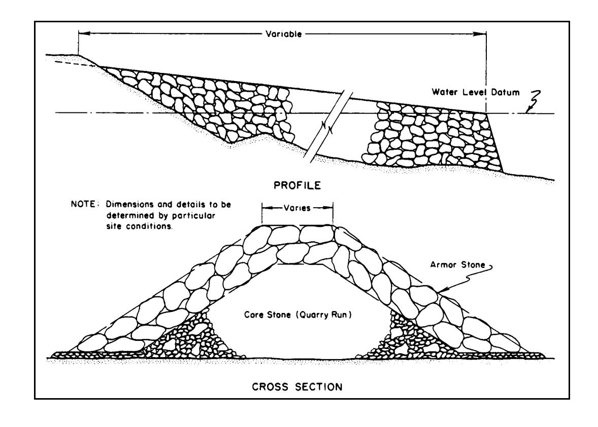

*Figure V-3-24. Rubble-mound groin, Westhampton Beach, New York*

V-3-62 Shore Protection Projects

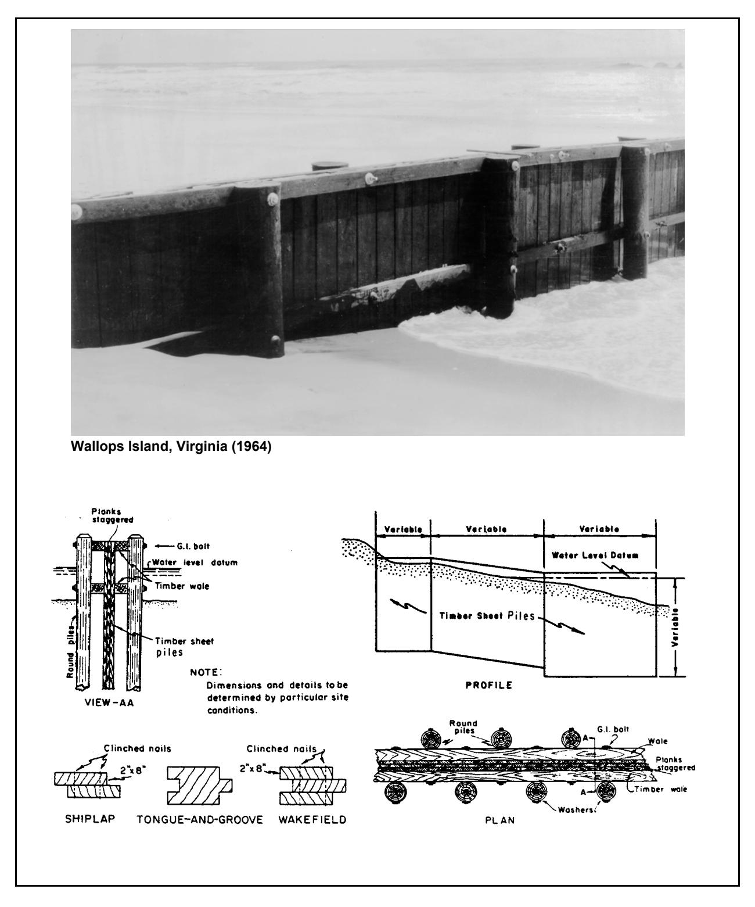

*Figure V-3-25. Timber sheet-pile groin, NASA Space Flight Center, Wallops Island, Virginia*

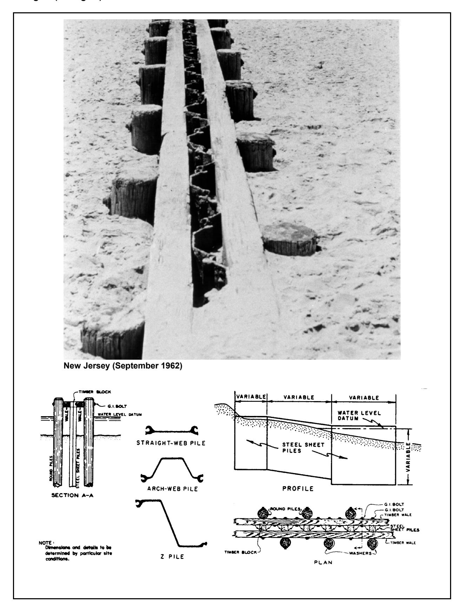

*Figure V-3-26. Timber-steel sheet-pile groin, New Jersey*

V-3-64 Shore Protection Projects

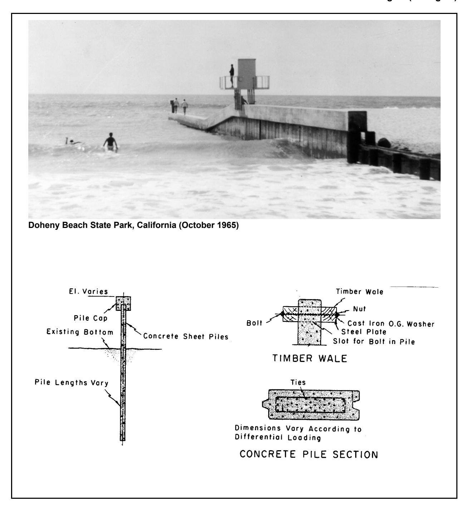

*Figure V-3-27. Prestressed-concrete sheet-pile groin, Dohney Beach State Park, California*

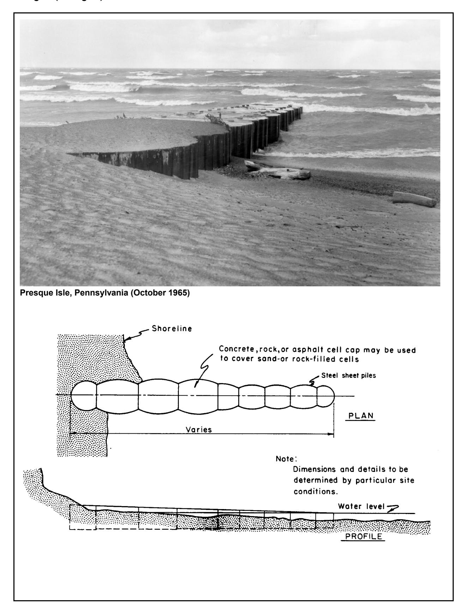

*Figure V-3-28. Cellular-steel sheet-pile groin, Presque Isle, Pennsylvania*

V-3-66 Shore Protection Projects
- (2) Literature review. Although groins have been around a long time and many references exist, most only provide a few rules of thumb. No systematic methods for functional design under a wide range of structural shapes, waves, and sediment transport conditions presently exist. Reviews for the functional design of groins can be found in Bruun (1952); Bakker (1968); Balsillie and Berg (1972); Balsillie and Bruno (1972); Nayak (1976) (unpublished); Tomlinson (1980); Fleming (1990); and EM 1110-2-1617. All these reviews restate the same beliefs but fail to reference the sources that verify the concepts and conclusions from theory, model studies (laboratory or numerical), or field experiments. As stated by Kraus, Hanson, and Blomgren (1994) "…the literature (on groins) may appear to assign validity to certain concepts and conclusions by weight of repetition (but) not by independent confirmation." (p. 1329).
- (a) Laboratory investigations suffered from severe scale distortions in sediment transport to cast serious doubt and questions on their results.
- (b) A fresh approach is needed that begins with a summary of over 20 parameters that govern beach response to groins as listed in Table V-3-7 (from Kraus, Hanson, and Blomgren 1994). They are grouped into three main categories (structure, beach, and hydrodynamic conditions), but the large number of variables make analysis difficult. Missing from this table is the minimum, design beach width for shore protection. Groin geometry and possible sediment size for the beach fill can be controlled in the design.

*Table V-3-7 Main Parameters Governing Beach Response and Bypassing at Groins (from Kraus, Hanson, and Blomgren 1994)*

**Table V-3-7. Main Parameters Governing Beach Response and Bypassing at Groins (from Kraus, Hanson, and Blomgren 1994)**

| Groin(s) | Beach and | Sediment | Waves, Wind, | and a Tide |
| --- | --- | --- | --- | --- |
| Length | Depth at | tip of groin | Wave height and | variability |
| Elevation | Depth of | closure | Wave period and | variability |
| Porosity | Sediment | availability | Wave angle and | variability |
| Configuration (straight, T, L, etc.) | Median | grain size and variability | Tidal range |  |
| Orientation to the shoreline | Sediment | density | Wind speed and | variability |
| Spacing between groins | -- |  | Wind direction and | variability |
| Tapering | -- |  | Wind duration and | variability |

Note: Two integrated parameters governing groin functioning are the ratio of net to gross longshore sand transport, and the presence, location, and number of longshore bars.
(c) From the previously listed review papers, other references and their own experience, Kraus, Hanson, and Blomgren 1994 listed 13 functional properties attributed to groins and present a critical evaluation of each as shown in Table V-3-8. The first five are well accepted properties that have led to the general rule of the thumb to make the groin spacing to length ratio about two to four. However, this rule omits any consideration of the cross-sectional shape of the groin. The length controls water depth at the end and, hence, the amount of sediment by-passing around the tip. But the cross-sectional elevation in the swash zone controls over-passing, the length and elevation on the beach berm control shore-passing, and the structural materials control through-passing as takes place in rubble-mound and permeable groins. Tidal range, predominant wave characteristics (height, period, direction), net and gross longshore sediment transport and grain size are key hydrodynamic and sediment parameters. All these factors together produce the optimum spacing and planform configuration of the shoreline within each compartment for average climate conditions.

*Table V-3-8 Functional Properties Attributed to Groins and their Critical Evaluation (from Kraus, Hanson, and Blomgren 1994)*

**Table V-3-8. Functional Properties Attributed to Groins and their Critical Evaluation (from Kraus, Hanson, and Blomgren 1994)**

| Property |  |  | Comment |  |  |  |  |
| --- | --- | --- | --- | --- | --- | --- | --- |
| 1. Wave angle and | wave height are | leading parameters | Accepted. For | fixed groin | length, | these parameters | determine |
| (longshore transport). |  |  | bypassing and | the net and | gross | longshore | transport rates. |
| 2. Groin length is a | leading parameter | for single groins. (Length | Accepted, with | groin length | defined | relative to | surfzone width. |
| controls depth at tip | of groin.) |  |  |  |  |  |  |
| 3. Groin length to | spacing ratio is a | leading parameter for groin | Accepted. See | previous | item. |  |  |
| fields. |  |  |  |  |  |  |  |
| 4. Groins should be | permeable. |  | Accepted. alongshore, and | Permeable groins reduce rip | allow current | water and formation | sand to move and cell circulation. |
| 5. Groins function | best on beaches with | a pre-dominant | Accepted. Groins | act as | rectifiers of | transport. | As the ratio of |
| longshore transport | direction. |  | gross to net decreases. | transport | increases, the | retention | functioning |
| 6. The updrift shoreline | at a groin seldom | reaches the seaward | Accepted. Because | of sand | bypassing, | groin | permeability, |
| end of the groin. |  |  | and reversals in end of a groin by | transport, longshore | the updrift transport | shoreline processes | cannot reach the alone. On- |
| (This observation was | not found in the | literature review and | shore transport | is required | for the | shoreline to | reach a groin tip, |
| appears to be original | to the present | paper.) | for a groin to be naturally. | buried, or | for a groin | compartment | to fill |

V-3-68 Shore Protection Projects
- (d) Kraus, Hanson, and Blomgren 1994 also discovered that the updrift shoreline rarely reached the seaward end of the groin (Table V-3-8, No. 6). On-shore sediment transport processes appear to be necessary for a groin to be filled naturally so that the shoreline reaches the tip, or the tip is buried. Longshore sand transport direction reversals, sand bypassing under water at the end, and groin permeability all normally keep the updrift shoreline well landward of the end of the groin.
- (e) Properties No. 7, 8, and 9 in Table V-3-8 have long been accepted standard conditions for groin field design and construction. Even so, as noted in No. 10, filling a groin field does not guarantee that 100 percent of the original longshore transport will continue as sand bypassing. The entire, filled, groin field system will impound sand updrift to cause some erosion downdrift of the system.
- (f) Properties No. 11 and 12 are often stated reasons by opponents of groins but are questionable because they cannot be supported by physical mechanisms nor principles of conservation of sand. No. 13 will be considered under innovations discussed in the following paragraphs.
- (g) A critical review of the literature also shows that little, if any, previous discussion exists on how to judge success (or failure) of a groin design. As discussed further, success should be judged on two factors: to maintain a minimum, dry beach width for specified storm conditions for protection beyond a reference baseline; and to bypass an average, annual amount of sediment to minimize downdrift impacts.

#### (3) Physical processes.

- (a) Normal morphological response. How do groins work? Waves breaking alongshore at an angle create a time-averaged, longshore current and longshore sediment transport. The cross-shore distribution of longshore sediment transport is discussed in Part III-2 (see Equation III-2-23 and Example Problem III-2-7). A key variable is the surf zone width for the theory cited (Bodge and Dean 1987) which assumes sediment mobilized in proportion to the local rate of wave energy dissipation and transported alongshore by the local, wave-induced current. The groin simply blocks a part of this normal transport of sand alongshore and causes it to accumulate in a fillet on the groin's updrift side (the side from which the sediment is coming). This accumulation reorients the shoreline and reduces the angle between the shoreline and the prevailing incident wave direction. The reorientation reduces the local rate of longshore sand transport to produce accumulation and/or redistribution of sand updrift of the groin. The amount of sand transported past the groin is greatly reduced (or eliminated) to significantly impact the downdrift area. The ratio of groin length to some statistical measure of surf zone width (or water depth at the groin tip) is a key factor in sand bypassing, as discussed further in the following paragraphs. Wave diffraction causes reduced wave energy in the lee of the groin relative to the midcompartment, mean water-level setup gradients, and setup induced currents behind the groin. These contribute to complex, current circulation patterns that move sediment alongshore and offshore along the leeside of the groin (Dean 1978). The strength of these internal current patterns depends on groin planform geometry, but also on groin cross-sectional elevation and permeability across the surf zone. Waves diffract around the groin tip, propagate over the submerged section and reflect off the body of the groin. These interactions vary with water depth changes during the tidal cycle. Consequently, sediment can also move over the top of submerged groins (over-passing), through the permeable, groin structure (throughpassing) and behind the end of the structure (shore-passing). Impermeable, high crested groins created internal and external current patterns that are far different than permeable, submerged structures. Fleming (1990) discusses the results of physical model studies with current and sediment movements for both high and low groin cross sections. Complex flow patterns were produced, and it was stated that strong local currents may cause a net loss of sediment from the compartment by offshore movement during storm events.
- (b) Storm response. Groins offer little or no reduction in wave energy to shore-normal waves during storms. Consequently, cross-shore sediment transport processes as discussed in Part III-3-3 for natural beaches are similar for groin field compartments. And, for near normal wave incidence, the groin system can
create strong local current and rip currents which add to the offshore movement of beach material during storms.
- (4) Functional design.
- (a) Insight from numerical models.
- Some numerical models of shoreline change include groin field effects (e.g., GENESIS, Hanson and Kraus 1989, see Part III-2-4 for details) Boundary conditions for groins in these models give insight into how they must function (Gravens and Kraus 1989). They are as follows: As the groin length increases, its impact on the shoreline regarding time evolution and equilibrium planform must increase. Increasing groin permeability should decrease the impact of the structure on the shoreline. Different groin permeabilities must produce different equilibrium planforms. A permeability of 100 percent should give longshore transport rates and shoreline evolution identical to that modeled with no structures.
- Groin bypassing around the seaward end is calculated at each time step in the GENESIS model. Key variables are the water depth at the tip and the breaking wave height. In GENESIS, the depth of active longshore sediment transport is taken at 1.6 times the significant breaking wave height (from Hallermeier 1981). Groin length relative to surf zone width could also be employed to calculate the bypassing factor.
- A permeability factor representing groin elevation, groin porosity and tidal range must also be estimated in the model. These three variables represent over-passing, through-passing and shorepassing respectively as sketched in Figure V-3-29. The permeability factor is assigned and must approach unity to satisfy the third criterion previously described.
- A third key factor is the ratio of net transport rate, Qn to the gross rate, Qg (Bodge 1992). When the Qn/ Qg ratio is zero, a perfectly balanced transport (no net) exists to produce symmetrical fillets on both sides of a single groin. The opposite extreme is Qn/Qg =1 meaning unidirectional transport. A single fillet on one side results.
- These key factors controlling groin functioning are summarized in Table V-3-9 (Kraus and Bocamazo 2000) with symbols shown in Figure V-3-29.
- These three process factors incorporate many of the 20 or more fundamental variables. The geometry ratio of spacing, Xg to length Yg is also the controlling factor for groin systems, as found in the literature. Note from Figure V-3-29 that Yg represents a mean groin length measured from the average, nourished beach shoreline. Using Ygu (updrift) gives a larger ratio or using Ygd (downdrift) produces a smaller ratio that may account for some variability. The Shore Protection Manual (1984) says Xg/ Yg=2-3 for the proper functioning of shore-normal groins.
V-3-70 Shore Protection Projects

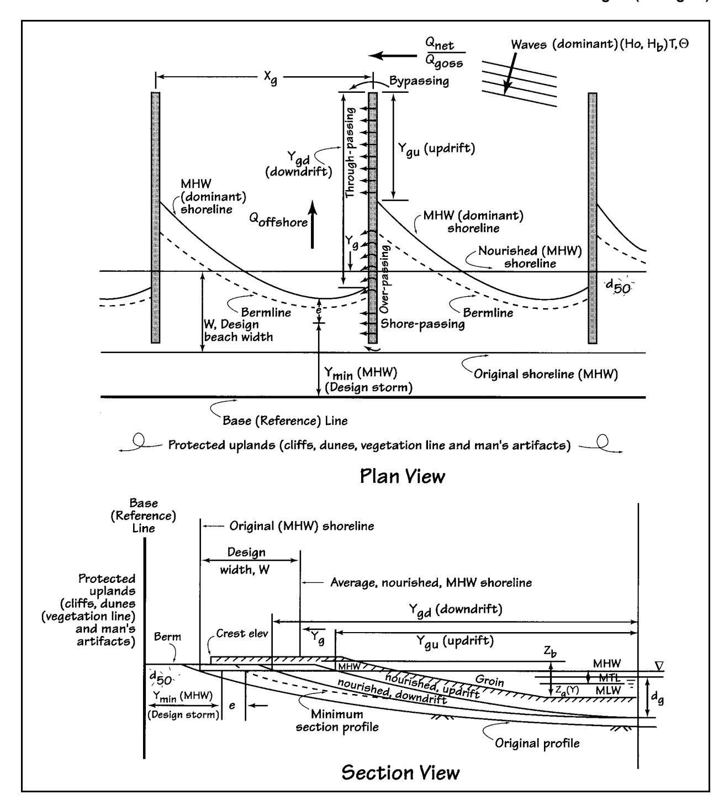

*Figure V-3-29. Definition sketch of key variables in the functioning of groins*

*Table V-3-9 Process-Based Factors Controlling Groins*

**Table V-3-9. Process-Based Factors Controlling Groins**

|  | Process | Parameter | Description |
| --- | --- | --- | --- |
| 1 | Bypassing | Dg/Hb | depth at groin tip/breaking wave height |
| 2 | Permeability • Over-passing • Through-passing • Shore-passing | Zg(y) P(y) Zb/R | groin elevation across profile, tidal range grain permeability across shore berm elevation/runup elevation |
| 3 | Longshore Transport | Qn/Qg | net rate/gross rate |

- Kraus, Hanson, and Blomgren (1994) exercised the GENESIS model for a single groin and studied the bypassing formulation. Rapid filling was followed by a gradual buildup over time that meant an increased amount of material must bypass the groin as the shoreline grows out towards the tip. Filling to capacity was only possible for Qn/Qg =1 for the unidirectional case. As Qg>Qn, growth of the shoreline seaward decreased. These tests mean groins seldom fill to capacity by longshore transport processes alone. Cross-shore sediment transport processes must be added to understand how beach elevation and width can build beyond that capable of representation on one-line, shoreline change models. Simulations with multiple-groins and the Westhampton Beach, New York, groin field are also discussed in this paper. An aerial view looking east of the Westhampton Beach, New York, groin field with beach nourishment in 1998 is shown in Figure V-3-30.
- Realistic distributions of longshore current and sediment transport across the surf zone, beach profile shapes with bars and troughs, and other sediment transport mechanisms (wind, tide) are further complicating factors that have yet to be addressed in numerical models.
- (b) Groin profile. A typical groin profile with inshore (berm) section, sloping middle section, and horizontal seaward section is shown in Figure V-3-31. In general the landward end is set at the elevation of the natural, existing beach berm, the sloping section is set at the slope of the beach face in the swash zone and the outer, seaward section at a lower elevation such as mean low water (mlw) or lower. The landward and sloping sections function as a beach template for sand to accumulate on the updrift side. The groin profile is shaped to approximately match the postproject beach profile, after nourishment is complete. The seaward end (depth) and seaward elevation are set to the planned bypassing and overpassing in the surf zone. A lower seaward section permits longshore currents to carry sediment over the structure and reduces wave reflections from the groin. A significant amount of sand is transported on the beach face in the swash zone (Weggel and Vitale 1985) and therefore overpassing also takes place in the sloped section when the groin has been filled in this area. Prevention of flanking is the main concern to locate the shoreward end. As seen in Figure V-3- 29, calculations of the storm erosion distance, e, together with maximum shoreline recession are needed to establish this position. Seaward limit of the shore section is set relative to the desire, nourished beach width, W, or even further seaward to help retain the nourished beach. Seaward limit of the outer section is the groin length, Yg, and depends on the amount of longshore sediment transport to be bypassed, as discussed.
- (c) Permeability. In general, sheet-pile groins of all types are impermeable whereas rubble-mound groins permit some material to wash through the structure. Some rubble-mound design contain impermeable cores and/or are treated with sealant materials to ensure sand tightness (see EM 1110-2-1617). There are no quantitative guidelines for determining the permeability of sand for a given groin geometry of the rubblemound type. Some patented, precast concrete groin systems are permeable, as will be discussed later.
V-3-72 Shore Protection Projects

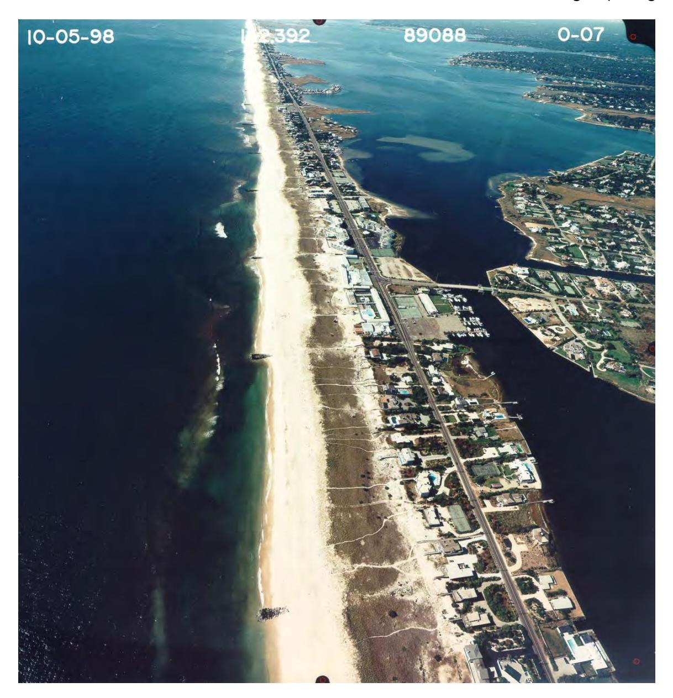

*Figure V-3-30. Westhampton Beach, New York, groin field and renourished beach, 1998 (courtesy USAED, New York)*

(d) Terminal groins. Groins on the updrift side of inlets can benefit nearby beach nourishment projects by controlling (or gating) the amount entering (lost) to the inlet. These terminal structures also benefit navigation projects by reducing the sediment rates within the inlet. They normally are impermeable and high and long to prevent sand from being carried through, over, or around them. Eventually, they will fill and sand bypassing around the end will be maintained. It should be noted that terminal groins are short compared with the length of navigation jetties constructed to reduce wave heights for ships entering the inlet. Consequently, the scale of interruption of normal, longshore sediment transport processes for ebb-and flood- tidal shoals are far different for navigation jetties. Terminal groins fill quickly and do not have major impacts on ebbtidal shoals and normal, inlet, sand-passing processes. A successful terminal groin is that located on the southern bank of Oregon Inlet, North Carolina. Design and monitoring details are found in Overton et al. (1992); Dennis and Miller (1993); Miller, Dennis, and Wutkowski (1996); and Joyner,

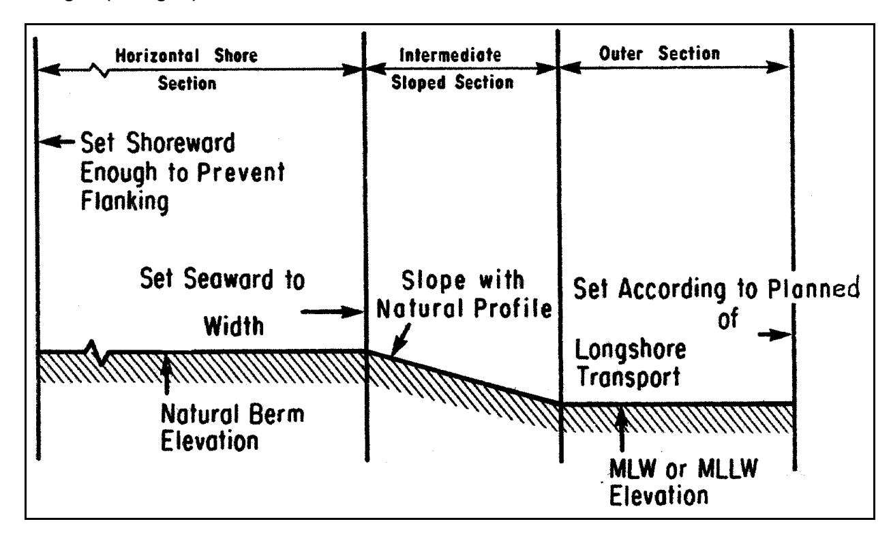

*Figure V-3-31. Typical groin profile with sloping section*

Overton, and Fisher (1998). See also Dean (1993; 1996) for detailed analysis of terminal structures at the ends of littoral systems.
- (e) Groins system transitions. A transition reach is required from a groin field to the adjacent, natural beach. Groin lengths are gradually shortened to allow more bypassing. Generally, groin lengths are decreased along a line converging to the shoreline from the last full-length groin, making an angle of about 6 deg with the natural shoreline as depicted in Figure V-3-32 (Bruun 1952). The spacing is also reduced to maintain the same Xg/Yg ratio (2-3) used in the design.
- (f) Order of construction. The sequence in which a groin field is constructed is a practical design consideration and may not be straightforward. To minimize downdrift impacts, beach nourishment and groin construction should be concurrent. Construction of the first groin should be at the downdrift end of the project, preferably the terminal groin adjacent to an inlet. Net drift will combine with the artificial beach nourishment to fill and stabilize the first compartment. The second groin is then constructed and the process repeated. Gradually working updrift, the groin field construction is completed. This process together with tapering the ends will help to minimize the impact to adjacent, downdrift beaches. This method may increase costs, but it also may result in a more practical guide to spacing of the groins than originally designed.
- (5) Nontraditional configurations. Most groins are straight structures, perpendicular to the shoreline. Figure V-3-33 illustrates other possible planform shapes. T-shaped groins are similar to nearshore breakwaters when the tee end is above the mean water level. Inclined groins may reduce rip currents along the updrift side when inclined in the direction of net sediment transport. All shapes shown have been constructed and provide some degree of shoreline stabilization. Sectional variations are also possible as listed in Table V-3-10.
V-3-74 Shore Protection Projects

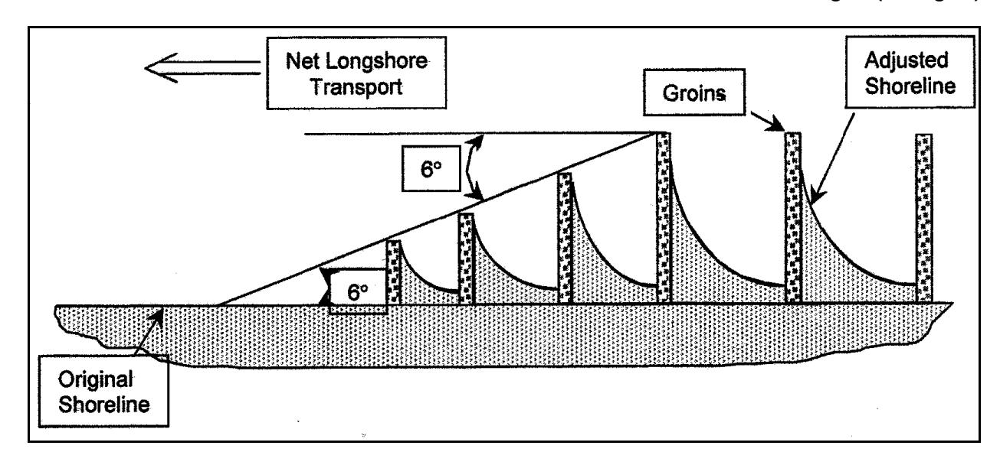

*Figure V-3-32. Transition from groin field to natural beach*

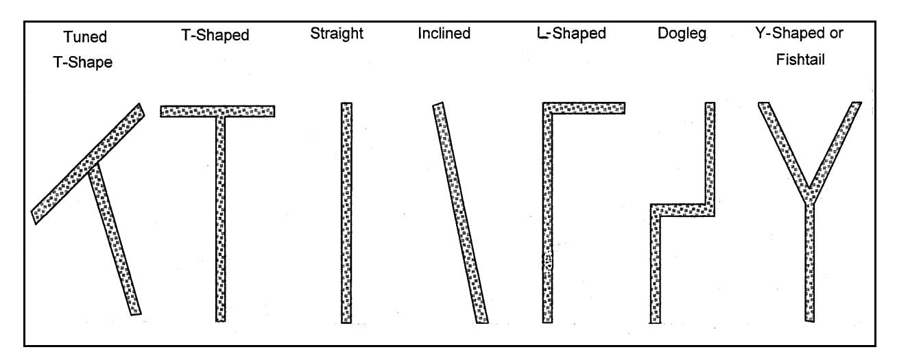

*Figure V-3-33. Possible planform shapes for groins*

| Table V-3-10 Types of Groins-Section Views |  |
| --- | --- |
| Concepts | Comments |
| Flat (Horizontal) | old |
| Sloped | common |
| Notched | (swash zone, new) |
| Concrete-pile (permeable) | (innovative, patented) |
| Adjustable | (elevation, length) |
| Rectifying | (transport-direction sensitive) |
| Tuned | (elevation, T-head) |
| Temporary | (geotextiles, sand) |
| Spur |  |

- (a) Notched groins have recently undergone laboratory and field testing by the USACE (Kraus 2000). Trial notched groins have been implemented by the U.S. Army Engineer District, New York, and the U.S. Army Engineer District, Philadelphia, along the south shore of New Jersey. The purpose of notching is to bypass beach fill and littoral sediment so that the fillet and erosive response of the shoreline are smoothed out, i.e., to straighten the shoreline adjacent to the groin. The goal is shoreline readjustment to approach a smooth, continuous shoreline through a groin field. The efficiency of notching was defined as the amount of sediment that passes the groin system, but that remains on the subaerial beach. Tentative conclusions based on both the laboratory and field experiments are: notches in the swash zone are most efficient; notches in the surf zone are less efficient and can have strong longshore currents, and be hazardous to swimmers; surf zone notches may move sediment further from shore; notching a groin in the swash zone may not be successful depending on how and at what rate sediment typically moves alongshore on the subject beach.
- (b) Spur groins are short, stub groins constructed at right angles to navigation jetties and the end groins of groin fields to redirect currents and sediment transports. Sorensen (1990) describes a spur jetty constructed as an emergency measure on the leeward side of two curved jetties to prevent a breach at the landward end. Anderson, Hardaway, and Gunn (1983) document eleven locations in the Chesapeake Bay where short, shore parallel groins are attached to the terminal groin near the beach. Over 12 years of beach response at one site reveals that the spur groins cause diffraction and refraction effects to prevent the detachment of the terminal groin at its landward end.
- (c) Another way to smooth the shoreline is to make the groin more permeable as illustrated in Figure V-3-34. A patented, concrete pile, permeable groin field has existed on Cayman Kai, Caribbean Sea, for over 10 years and has survived many hurricanes (from Kraus and Bocamazo 2000). Environmental restrictions against hardened shorelines in North Carolina has resulted in a groin field constructed from geotextile materials filled with sand on Bald Head Island, North Carolina (Denison 1998). In theory, these structures will provide sand for shore protection if they are damaged or fail in major storm events. Other revisited or fresh concepts for groin designs listed in Table V-3-9 have only been proposed conceptually and have yet to be field tested. These new and innovative approaches to groin design benefit from experience and modern understanding of coastal sediment processes.
- (6) Basic rules for functional design of groins. Ten modern rules for groins design can be summarized as follows: Rule 1 If cross-shore sediment transport processes are dominant, consider nearshore breakwater systems first. Rule 2 Conservation of mass for transport of sediment alongshore and cross-shore means groins neither create nor destroy sediment. Rule 3 To avoid erosion of adjacent beaches, always include a beach fill in the design Rule 4 Agree on the minimum, dry beach width, Ymin. for upland protection during storm events as a measured to judge success.
V-3-76 Shore Protection Projects

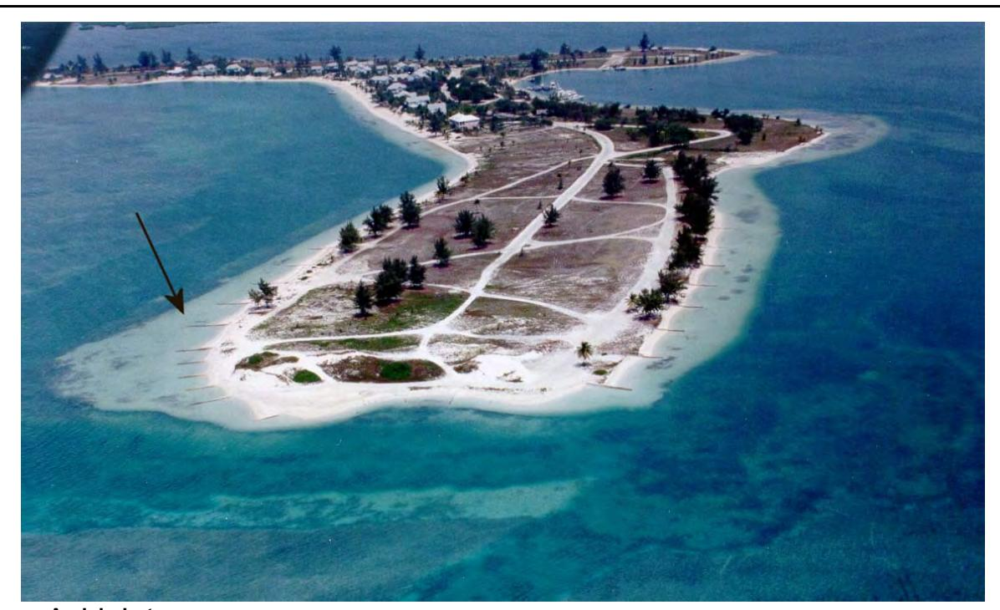

*a. Aerial photo*

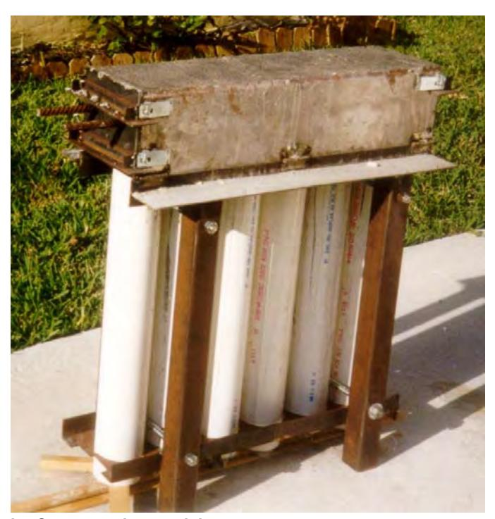

*b. Cross-section model*

*Figure V-3-34. Patented concrete pile permeable groins Cayman Kai, Caribbean Sea (surviving for 10 years, including hurricanes). Innovation is groin design to enhance sediment through-passing and smooth the shoreline variation in the groin field (from Kraus and Bocamazo 2000)*

- Rule 5 Begin with Xg/Yg=2-3 where Xg is the longshore spacing and Yg is the effective length of the groin from its seaward tip to the design shoreline for beach fill at time of construction.
- Rule 6 Use a modern, numerical simulation model (e.g., GENESIS) to estimate shoreline change around single groins and groin fields.
- Rule 7 Use a cross-shore, sediment transport model (e.g., SBEACH) to estimate the minimum, dry beach width, Ymin during storm events.
- Rule 8 Bypassing, structure permeability and the balance between net and gross longshore transport rates are the three key factors in the functional design. Use the model simulation to iterate a final design to meet the Ymin criterion.
- Rule 9 Consider tapered ends, alternate planforms and cross sections to minimize impacts on adjacent beaches.
- Rule 10 Establish a field monitoring effort to determine if the project is successful and adjacent beach impacts.
- Rule 11 Establish a "trigger" mechanism for decisions to provide modification (or removal) if adjacent beach impacts are found nonacceptable.
- f. Reefs, sills and wetlands .
- (1) Background and definitions. Additional types of shore protection alternatives for both high and low wave energy coasts function by reducing the wave energy striking the shoreline. Reefs are platforms of biotic organisms built up to a strict elevation in relation to low tide. Natural reefs require high wave energy to survive. Wetlands are coastal salt or freshwater marshes that are low-lying meadows of herbaceous plants subject to periodic, water level inundations. Wetlands are fragile and only survive in low wave energy environments. See IV-2-11 and IV-2-12 for further details on wetland and reef-type coastlines, respectively. The word "sill" has evolved to take on two separate identities in coastal engineering. Both meanings imply wave attenuation in the lee of the structure. A submerged, continuous, nearshore dike to hold sand moving offshore from a nourished beach is one definition and also labeled a perched beach. Free-standing, lowprofile, continuous shoreline structures to permit establishment of a marsh fringe in the lee of the structure are also called sills.

#### (2) Reefs.

- (a) Natural types. Coral reefs are massive calcareous rock structures that slowly grow upward by secretions from simple animals living on the rock surface. They exist throughout the Florida Keys, on both Florida coasts, the Hawaiian Islands, and the U.S. Island territories and serve significantly lower the mean wave energy striking the adjacent shore. Fringing reefs border a coast, barrier reefs lie offshore enclosing a lagoon, and atolls encircle a lagoon. Under favorable growth conditions, coral reefs build upward to form wide, broad platforms that are exposed at low tide. Thus they cause waves to break and to continue breaking across the reef. Oyster reefs can exist in much colder, brackish water conditions of lagoons, bays and estuaries. They are found along both coasts and in the Gulf of Mexico. They are wave-resistant structures that can biologically adapt to rising sea levels. Their maximum elevation is related to the minimum time of inundation in the middle range of the intertidal zone.
V-3-78 Shore Protection Projects
- A third type of natural reef is produced by colonies of tube worms called a worm reef. The east coast of Florida has some of this type.
- With respect to natural shore protection, reefs are a biological wave damper that can accommodate rising sea levels as long as they are alive. Protection of reefs is essential.
- (b) Wave attenuation. Wave transformation processes across broad, flat coral reefs include shoaling, refraction, reflection, and energy dissipation by both bottom friction and wave breaking. Wave energy is also transferred to both higher and lower frequencies in the wave spectrum as the spectral shape flattens (Hardy and Young 1991). Wave setup variations along reefs can occur due to gradients in wave breaking characteristics to produce longshore currents. For engineering purposes, depth-limited wave breaking is the dominant transformation process. A methodology to estimate random wave energy transformation across reefs is presented in USACE (1993). It is based on the breaking wave model of Dally, Dean, and Dalrymple (1985) extended to random waves following Kraus and Larson (1991). Comparison of the numerical model results with field experiments of rms, wave height attenuation on the Great Barrier Reef in Australia (Young 1989) showed good agreement with the measurements. The breaker model without bottom friction is available in the PC-based computer program NMLONG (Kraus and Larson 1991; USACE 1993).
- (c) Artificial reefs. The functional design of artificial reef systems for shore protection; increasing the fill life of renourished beaches, and to enhance recreational surfing is a relatively new area of coastal engineering. No general design rules exist. Numerical and physical models have recently been employed for site specific designs in California and Australia of artificial reefs for surfing. These models aid in both wave breaker-type design (Pattiaratchi and Bancroft 2000) and to insure that the structure will not create downdrift erosion. (Turner et al. 2000). (3) Sills.
- (a) Perched beach. A beach or fillet of sand retained above the otherwise normal profile level by a submerged dike (sill) has only been used twice in the United States (National Research Council 1995). Ferrante, Franco, and Boer (1992) describe a successful, 3,000-m-long perched beach project on the coast at Lido di Ostica about 35 km from Rome, Italy, on the Tyrrhenian Sea. The rubble-mound sill was located about 150 m from shore with crest -1.5 below msl datum in -5.0 water depth. An additional 1.000-m stretch with sill closer to shore in shallower water performed better to hold a wider beach. A feasibility study of the perched beach concept in the Netherlands was reported by Ruig and Roelse (1992). Model studies and calculations of life-cycle costs demonstrated that this alternative was roughly as expensive as repeated beach nourishments with no sill construction over a 30-40-year period. Construction at the site selected, Cadzand, Tien Honderd Polder, Zeeland, The Netherlands, has yet to be implemented.
- (b) Wetlands protection. In low wave-energy environments, natural, wide, fringe marshes can provide sufficient erosion protection for upland areas, as discussed later. However, for many reasons, the fringe marsh itself may be eroding and require protection, enhancement and/or to be re-established. Sills are typically low, small, continuous rock structures placed at mean low water with some sand fill in the lee to provide a substrate for marsh growth (Hardaway and Byrne 1999). Figure V-3-35b displays a curved, stone sill connecting headland breakwaters with sand fill and marsh planting on the Choptank River, Chesapeake Bay (from Hardaway and Byrne 1999). After 5 years, the sill is practically invisible as shown in Figure V-3-35c. Sills can thus be used in higher wave energy regimes to establish intertidal marsh grasses that aid in the shore protection. Periodic marsh replanting and maintenance may be required under higher wave energy conditions. Advantages and disadvantages of a wide variety of erosion mitigation structures and materials to protect wetlands can be found in the Wetlands Engineering Handbook (Olin et al. 2000).
- (4) Wetlands. The final alternative in this section on shoreline stabilization structures are fringe marshes or wetlands. Part IV-2-11 considers their values, distribution classification sediment characteristics, and causes for loss of wetlands in the coastal zone. However, little is known about their importance for shoreline erosion mitigation.
- (a) Tidal creeks with fetch exposures less than 0.5 nautical miles and low wave-energy environments can naturally sustain a sufficiently wide marsh fringe. Also, they generally have little or no problem with upland bank erosion because the established marsh fringe absorbs most of the wave energy before it can impact the upland area (Hardaway and Byrne 1999). On the Chesapeake Bay, Hardaway and Anderson (1980) found that low, upland banks erode almost twice as fast as marsh shorelines with similar fetch exposures and nearshore depths.
- (b) Some recent field and laboratory research has focused on wave attenuation by wetland vegetation (Kobayashi, Raichle, and Asano 1993; Wallace and Cox 1997; Tschirky, Turke, and Hall 2000). Wave heights are typically reduced by 50 percent and the peak spectral period also drops as the spectrum becomes more broad banded with higher frequency components. No significant design guidance on allowable wave heights or currents for wetlands presently exists. The Wetlands Engineering Handbook (Olin, Fischenich, and Palermo 2000) provides a wealth of valuable information for the restoration and creation of wetlands.

### V-3-4. Nonstructural Alternatives

#### a. Introduction .

Nonstructural alternatives are management strategies for coastal hazard mitigation that are not armoring (Part V-3-2) nor beach stabilization structures (Part V-3-3), nor beach nourishment (Part V-4). Society has developed ways to adapt by setting requirements for the elevation of buildings, providing insurance and planning for continual erosion with setback limits for new construction. The final nonstructural alternative is to retreat by relocation, abandonment, or demolition.
- Three Federal government agencies (the USACE, Federal Emergency Management Administration (FEMA), National Oceanographic and Atmospheric Administration (NOAA)) with different missions, planning methods, and requirements for benefits determination employ or promote the use of nonstructural methods. This section briefly summarizes the role of each and presents some examples of the retreat alternative. Full details of the Federal government's planning requirements and design constraints for all three agencies involved are presented in Part V-8.
- Coastal hazard mitigation is addressed in a piecemeal manner by multiple agencies within states, at the county, city and community level, and by businesses and individuals operating and living at the water front. Property ownership (Federal, state, municipal, community, and individual) and the value of scarce waterfront property strongly motivates all parties to protect their valuable investments. Part V-8 presents details of how each Federal agency (CORPS, FEMA, and NOAA) interacts with each level of responsible group, but details of approaches by these parties are beyond the scope of this chapter.

#### b. Adaptation .

(1) Zoning and building codes. Any structural or nonstructural change in the design, construction or alteration of a building to reduce damage caused by flooding and flood related factors (storm surges, waves, and erosion) is considered a flood proofing alternative by FEMA. The mechanism to require change in old construction practices is the National Flood Insurance Program (NFIP) administered by FEMA using Flood
V-3-80 Shore Protection Projects

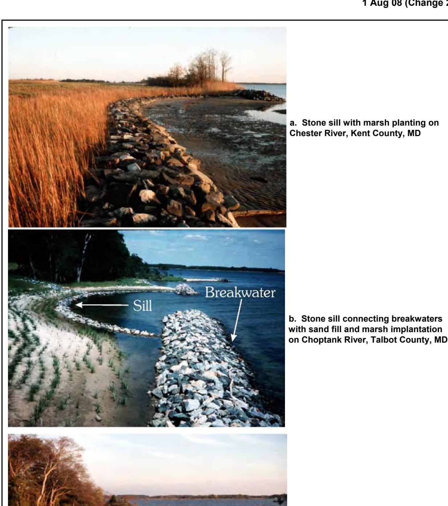

*c. Breakwater and sill project after 5 years*

*Figure V-3-35. Sills and breakwaters (from Hardaway and Bryne 1999)*

Insurance Rate Maps (FIRM's) prepared by FEMA. A storm surge elevation at the one percent exceedance level (100-year recurrence interval) plus waves is employed to determine risk and insurance rates for individual properties located on the flood maps. Insurance rates are much lower for structures elevated above the 100-year flood level and is a requirement for all new construction in the coastal, high-hazard zone (including waves). In effect, these regulations become floodplain zoning laws applicable to individual property owners and have resulted in a reduction in Federal government expenditures for insurance claims and disaster assistance benefits (National Research Council 1990).
(2) Setback limits. A second way to adapt is to limit construction close to the shoreline. The NOAA has identified land-use planning and construction siting as the most effective means to reduce coastal storm hazards, particularly on eroding coasts. Here, the mechanism to require change in old construction practices is the Coastal Zone Management Act (CZMA) of 1972. Through the CZMA, the NOAA provides funds to individual states to help solve their own coastal hazard problems. As a result, many states have developed coastal construction setback lines and zones that include historic erosion rates at each site. The methods, definitions, widths, etc., vary from state to state as summarized in Part V-8. A key element is the historic, average erosion rate at each site. Presently, FEMA does not include delineation of erosion zones and erosion hazards on its flood maps. Methods to incorporate both coastal erosion (National Research Council 1990) and beach nourishment (National Research Council 1995) in the national, flood insurance program have been proposed but have yet to be formally adopted. Clearly, coastal erosion increases the risk and beach nourishment reduces the risk of coastal flood and wave damage.

#### c. Retreat .

Retreat is the final adaptation option. Relocation here also considers abandonment and demolition. To some, retreat is the only option. But practically, all constraints (economic, environmental, social, legal, etc.) must be evaluated for this alternative as well as for all others as previously discussed. This approach may be employed by the Corps as the Federal government agency designated by Congress to protect the nation's shores from the chronic effects of erosion and coastal flooding. Two examples illustrate the USACE's approach and focus on why the retreat alternative was selected.
- (1) Cape Shoalwater, Washington. The northern shoreline of the inlet to Willapa Bay, Washington, has been receding at an average rate of 30 to 40 m/year for over 100 years (Terich and Levenseller 1986). Erosion of this area (Cape Shoalwater) has been faster and has lasted longer than any other site on the U.S. Pacific Ocean coast (Komar 1998). Natural, northern migration and progressive deepening of the channel inlet are the two main factors responsible for erosion of the cape. A few homes have been lost, a lighthouse destroyed, the main road moved inland and a historic, pioneer cemetery relocated in this rural area.
- (a) In the 1960s and 1970s, the USACE studied the construction of a jetty to stabilize the inlet location and reduce the erosion of the cape. They concluded that a structural solution was not economically feasible to the Federal government. The USACE recommended that if Federal government funds were available at this site, they should be used to purchase land threatened by future erosion. However, no Federal project for relocation could be justified based on the relative benefits and costs to the Federal government.
- (b) The rural area (low benefits) and extremely high erosion rate (high costs) were responsible for this outcome, as may have been expected. At other sites, this result is not as obvious.
- (2) Baytown, Texas. The northern, upper end of Galveston Bay on the Gulf of Mexico includes Burnett, Crystal, and Scott Bays and low-lying areas that are part of Baytown, Texas, about 24 km east of Houston. Flooding occurs routinely from minor storms and is compounded by subsidence of the ground surface. Withdrawal of oil and gas and groundwater for the metropolitan area of Houston produced 2.5 m (9 ft) of subsidence between 1915 and 1975 (U.S. Army Engineer District, Galveston, 1975).
V-3-82 Shore Protection Projects
- (a) Both structural (earth levee, concrete floodwall) and nonstructural (permanent relocation and evacuation) alternatives were studied in the early 1970s by the USACE to mitigate the flooding problem. The feasibility study report to Congress (U.S. Army Engineer District, Galveston, 1975) recommended the retreat alternative. Congress authorized this project under the Water Resources Development Act (WRDA 1978).
- (b) The final project report (U.S. Army Engineer District, Galveston, 1979) called for the Federal government to purchase approximately 303.51 ha (750 acres), 448 homes and relocate 1,550 people within the 50-year floodplain. Total project costs were $32.131 million (1979 dollars) with the local sponsors' share to be 20 percent or $7.826 million. Annual project benefits were estimated to be $3.530 million and included: Reductions for insurable flood damages. Reductions for utility service costs. Reductions of temporary, emergency evacuation, public health and public relief costs. Value of land under new uses.
- (c) Other benefits (constant anxiety from flood hazards, depressed property values, health hazards, inconvenience of repetitive, temporary evacuations, and damages to real property and personal possessions) cannot be included as net gain benefits to the national economy. Total, annual costs were $2.678 million giving a benefit to cost (B/C) ratio of 1.3 to the Federal government for the retreat alternative. In contrast, the structural alternative, B/C ratios were 0.1 - 0.3 (USAED, Galveston, 1979).
- (d) In 1978, the environment assessment report to the EPA was approved. Plans called for converting the land into a natural area, with possible development of nature areas, bird sanctuaries, green belts, wildlife areas, nature walks, and other uses consistent with the high flood potential. Besides the local sponsor (City of Baytown) paying 20 percent of the final cost, they were also responsible for management of the vacated area.
- (e) Unfortunately, the project floundered on local disagreement over the value of the land to be purchased and was never funded. Estimates of project costs rose from $16.980 million in 1975 to $39.131 million in 1979 (less than 5 years). People in the community who did not live in the floodplain were being asked to help buy out those who did. The community was divided over what the property was worth. Some believed their neighbors would be paid far too much for relocation. In July 1979, a bond election was held to provide the local funding for the project and it failed by a 60/40 percent margin (Pendergrass and Pendergrass 1990).
- (f) In 1980, Congress was ready to authorize funding, but the local, 20 percent cost share could not be provided. The local residents decided to stay and the Corps placed the project in its inactive category. In the final analysis, the Corps' requirement for cost sharing ($7,589 per residence in 1975 and rising to $17,469 per residence in 1979) prevented an economically viable and environmentally sound project from being implemented. Because the B/C ratio was 1.3, the annual benefits to the Federal government exceeded the 20 percent, local cost share amount. In other words, the Federal government could have paid for the entire project and still realized net economic benefits to the Federal government. This result also does not consider NFIP payments then and over the last 20 years. Partial protection by the NFIP also contributed to the local residents' decisions to stay.
- (g) In summary, a nonstructural solution for part of the community of Baytown, Texas, proved difficult to implement because the entire community would not share in the local cost requirement. In contrast, a flood dike and revetment to protect the Texas City – La Marque area on the lower Galveston bay has been
constructed. Here, the perception that all the affected community was "protected" made the local sponsor share obtainable (Pendergrass & Pendergrass 1990).
- (3) Special cases.
- (a) Brighton Beach Hotel, Coney Island, New York. Komar (1998) shows etchings of the 1888 relocation of a large, beachfront hotel on Coney Island, New York. Twenty-four railway tracks were laid to span the entire hotel width, and the wooden pile-supported hotel was lifted onto freight cars on each track. Six locomotives pulled the hotel inland 150 m. No details on costs were provided for this private project which required property ownership and grading of the inland site. Its economic viability also depended on the availability of railway equipment in that era over 100 years ago. Full details are in Scientific American (1888).
- (b) Cape Hatteras Lighthouse, North Carolina. Very recently, relocation of the Cape Hatteras Lighthouse has been completed by the National Park Service (NPS), U.S. Department of Commerce (see, e.g., Civil Engineering 1999). The lighthouse is on the east coast of Hatteras Island about 4.02 km (2.5 miles) north of the tip of Cape Hatteras and 64.37 km (40 miles) south of the Oregon Inlet (Figure I-2-6). It is located within Cape Hatteras National Seashore Park, administered by the NPS. The original lighthouse built at this site in 1803 was replaced in 1870 by the present structure, which is the tallest (61 m) and perhaps best-known brick lighthouse in the United States. When built in 1870, it was approximately 490 m from the shoreline. By 1935, this distance diminished to about 30 m due to landward migration of this cape feature. The mhw, average recession rate between 1852 - 1980 (128 years) has been 5.9 m/year and 3.9 m/year for the 1870 - 1980 (110 years) period (Everts, Battley, and Gibson 1983). In 1996, partly due to a wide variety of piecemeal, temporary and emergency measures (see Table V-3-11), the lighthouse stood about 50 - 90 m from the Atlantic Ocean (U.S. Army Engineer District, Wilmington, 1996) depending on the season and tidal conditions. The existing, steel, sheet-pile groin field was actually designed and constructed by the Navy to protect its installation to the north in 1970. The lighthouse, a national historic landmark, remained in operation, and the NPS decided in 1980 that a long-term solution of the erosion problem was needed. A 1982 conference of experts from many disciplines (engineering, geology, economy, and historic preservation) together with a 1985 study by the Wilmington District convinced the NPS to employ a structural solution. A seawall/revetment structure was selected. Also a factor in this decision was scientific and engineering opinion that the lighthouse could not be moved without suffering serious structural damage. Congress approved $5.3 million and construction was to begin during the summer of 1986. A Move the Lighthouse Committee Report (private) convinced the NPS to seek the advice of the National Academy of Sciences. Their final report (National Research Council 1988) recommended the retreat alternative and in December 1989, the NPS reversed its decision and announced its approval of the relocation alternative. The next 10 years were filled with further controversy and debate due to lack of congressional funding for the relocation; public sentiment in North Carolina against the move (Save the Lighthouse Committee, private), and other ad hoc committee reports with updated studies. During the period, other structural engineers and large-scale relocation experts became convinced that the lighthouse could be moved without damage.
V-3-84 Shore Protection Projects

*Table V-3-11 Cape Hatteras, North Carolina, Shore Protection History*

**Table V-3-11. Cape Hatteras, North Carolina, Shore Protection History**

| Year | Action Taken |
| --- | --- |
| 1930s | Civilian Conservation Corps builds sand dune system along Hatteras Island |

- Also contributing to the controversy was a NPS committee study in 1992 to make recommendations for interim measures, as required, to ensure that the lighthouse remain protected, until the retreat solution could be implemented. An intermediate measure (15 - 25-year design life) was selected to add a fourth groin south of the existing groin field. The NPS employed the Wilmington District to make this design (USAED, Wilmington, 1996). Opponents to the move cited the costs for the fourth groin alternative ($3.5 million) in the USACE study when objecting to the retreat alternative costs (estimated as $12 million). A complete economic analysis using a 100-year design life to determine life-cycle costs of a groin field with terminal groin versus the retreat alternative has never been made by the USACE.
- The National Academy of Sciences study and report (National Research Council 1988) reveals the following NPS policies that dictated the choice of the retreat alternative. Historic preservation is more important than a do nothing or "let nature take its course" policy. The NPS does not have to follow a benefit/cost analysis procedure with benefits exceeding costs regarding the choice of alternative for shore protection. The NPS policy for coastal shorelines is to not interfere with natural, coastal processes. This policy eliminated all structural options as discussed in Chapter 5 of the NRC 1988 report and made their analysis superficial and irrelevant. The retreat option was the only alternative given consideration.
- The NPS strategy was to use the Cape Hatteras Lighthouse relocations as an example and model of "enlightenment" (page numbers refer to NRC 1988) "an exemplary response ... to the generic problem of shoreline erosion" (p. 72) "attract much media attention ... to educate a large national audience on the nature of coastal barriers" (p. 72) "use national parks as models of wise management of natural and cultural resources" (p. 71) "act as a signal to the country of the problems confronting the coast" (p. 39) and "illuminate approaches to solving the problems of living with a rising sea" (p. 39).
- The Cape Hatteras Lighthouse was moved successfully inland about 488 m (1,600 ft) from the mhw shoreline in 1999. Recognizing the engineering and construction skills required to complete the move safely, the project received the Outstanding Civil Engineering Achievement Award from the American Society of Civil Engineers in 2000.
- In the final analysis, the NPS policy against any structural interference with natural, coastal processes was the deciding factor. The decision to relocate was taken in 1989 at a time when the possible, accelerated rise in sea level was also of major concern.
- (4) Impact of sea level rise. A detailed summary of present-day knowledge of sea level rise rates is presented in Part IV-1-6. Substantial variability exists when including local subsidence as previously discussed for Baytown, Texas. A National Academy of Sciences report on engineering implications (National Research Council 1987) concluded that whether to defend or to retreat depended on several factors, but mainly the future sea level rise rate and the cost of retreat which varies by site. The NRC recommended that all options should be kept open to enable the most appropriate response to be selected. Retreat is most appropriate in areas of low development. Given that a proper choice exists for each location, selecting an incorrect response alternative could be unduly expensive (National Research Council 1987).

#### V-3-5. Combinations and New Technologies

Pope (1997) lists the following common types of coastal erosion and flooding problems:
- Long-term, chronic land loss associated with the erosion of cohesive sediments, reduced supply of sandy sediments, and/or subsidence.
- Localized erosion impacts caused by a navigation project jetties or other coastal construction works.
- Lands and facilities impacted by storm-induced erosion.
- Flooding by a storm surge with associated wave attack damages.
- Loss of environmental resources (i.e., wetlands, oyster reefs, nesting areas, etc.).
- Need for more land.
In many cases, combinations of these problems exist that require a combination of structural measures together with nonstructural alternatives to be implemented within a comprehensive, coastal region, management plan for hazard reduction.
V-3-86 Shore Protection Projects
- a. Combinations .
- (1) Structural combinations.
- (a) Beach stabilization structures and beach nourishment. Groins and detached breakwaters combined with beach fills are discussed in Part V-3-3e. The combination mitigates downdrift impacts and/or increases the fill life of the renourished beach. Together, their life-cycle costs and environmental impact may be less than if selectively implemented. Construction of the beach stabilization structures without fill is likely to damage adjacent beaches.
- (b) Seawalls, revetments, and beach nourishment. The original design of the new seawall for hurricane protection at Virginia Beach was to be a curved, concrete-type structure as at Galveston, Texas (Figure V-3- 5). To accommodate a lowered seawall crest for aesthetic reasons (see Part V-3-1-c-(5)and Figure V-3-6) a wide beach nourishment project was added to the design to reduce flooding and wave damage (USAED, Norfolk, 1994). Together with improved interior drainage and pumping equipment, this combined design provides the same hurricane flooding and wave damage protection as the original seawall design.
- (c) Beach nourishment and rebuilt dune with buried seawall/revetment. The soft alternative (beach and dune with buried rock seawall/revetment) was determined to be both environmental and economically advantageous when compared against an armored revetment for storm protection against the 1 percent change storm event at Dam Neck, Virginia, on the Atlantic Ocean (Basco 1998). The final design cross section is shown in Figure V-3-36a and includes a buried rock seawall/revetment beneath the dune. In the event of a major storm causing severe dune erosion, the buried seawall will prevent storm damage if a second major storm occurs in the same season. Figure V-3-36b shows a photograph of dune construction with the buried, rock seawall (Basco 2000a). A similar approach was incorporated at Ocean City, Maryland, where a steel, sheet-pile bulkhead was incorporated as a buried backup feature in the design. (2) Nonstructural and structural combinations.
At many locations, elevated structures combined with some type of armoring or shoreline stabilization together with beach nourishment are employed in combination for coastal hazard mitigation. Presently, 32 of 35 coastal states and territories have some type of setback requirements for new construction and existing structures found uninhabitable after a storm (Heinz Center 2000). These nonstructural, adaptive measures and structural alternatives are often combined to address the wide range of coastal problems previously cited. An example is the barrier island of Grand Isle, Louisiana, where beach nourishment, rebuilt dunes, a groin field and nearshore breakwaters are used for a community where the first floor of most residences are constructed above the 1 percent chance flood level (with waves) and the public lands on the rapidly eroding east end are restricted from any development (Pope 1997).
- b. New technologies.
- (1) Introduction.
Many nontraditional ways to armor, stabilize, or restore the beach including the use of patented, precast concrete units, geotextile-filled bags, and beach dewatering systems have been tried in the field. Their success depends on their stability during storm events and durability over the economic, design life. Their initial cost and cost for removal if environmental impacts warrant can be less than traditional methods, at some sites. These new technologies often involve nontraditional materials or shapes but are employed in a traditional manner, e.g., nearshore breakwaters. See Pope (1997) for more details.

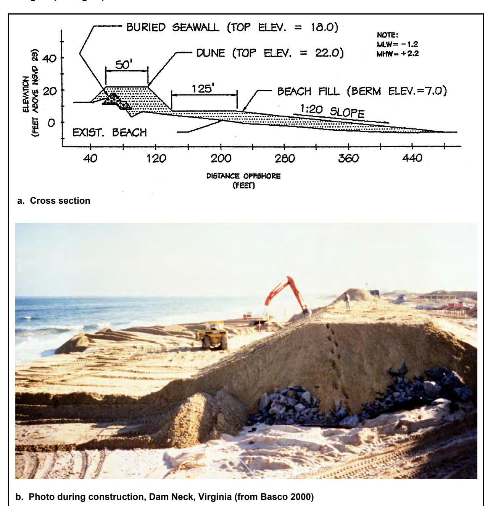

*Figure V-3-36. Rebuilt dune with buried seawall (Basco 2000a)*

- (2) Precast, concrete units. Patented, modular, precast concrete units that can be interconnected to form one or more, nearshore breakwaters have been tested in Florida, Georgia, and New Jersey.
- (a) In late 1989, two nearshore breakwater sections were installed at Sea Isle City, New Jersey, on the Atlantic Ocean. Each unit is 1.7 m long, 4.9 m wide and 2.1 m high and placed on a geotextile fabric. Each unit weighs about 12 metric tonnes and has 1.1 - 1.2 m freeboard at mean sea level (tidal range of 1.2 m). The two breakwaters were about 50 m in length with a 34-m gap and placed 37 m offshore (msl) in about 0.9 m water depth. This position was determined by the developer of the unit called the "Beachsaver" system
V-3-88 Shore Protection Projects
(Breakwaters International, Inc., Flemington, New Jersey). Independent monitoring over 18 months revealed significant structure settlement with the maximum over 1.2 m and average about 0.6 m (Sorensen & Weggel 1992). Most settlement occurred the first two months after installation. A large scour hole was found landward of one section and the sand trapping volume in two salients was only about 300 m3 , before settlement (Sorensen & Weggel 1992).
- (b) The Town of Palm Beach, Florida, in the early 1990s, experimented with another design labeled the "Prefabricated Erosion Protection" or P.E.P. reef system by its developer, American Coastal Engineering, Inc., West Palm Beach, Florida. Each unit is 3.7 m long, 4.6 m wide, 1.8 m high and is placed on a cloth filter fabric. Each unit weights about 22 metric tonnes with crest elevation below msl to act as a thin-crested, submerged, reef-type breakwater. One long breakwater/reef system, 1,270 m in length, placed 76 m offshore (msl) in 2.9 m National Geodetic Vertical Datum (NGVD) water depth consisting of 330 interlocking units was constructed. The submergence was 1.1 m at msl. Monitoring by the University of Florida's, Department of Coastal and Oceanographical Engineering included nearshore profiles and wave gauges landward and seaward of the structure (Dean and Chen 1996). About 17 percent of the units settled 0.8 m with the remainder settling 0.5 m. Wave transmission coefficients ranged from 0.65 for normal conditions (tide range 1.0 m) to 0.85 for storm conditions. A detailed analysis of the leeward project area revealed that wave overtopping, wave setup, pounding, excess longshore currents and sediment transport (both directions) resulted in an increased erosion trend relative to that present before construction (Dean and Chen 1996; Martin and Smith 1997). The conclusion, that the reef breakwater provided little benefit, resulted in its removal. The units have since been salvaged and used to construct a groin field with beach nourishment at the site (Erickson 1998).
- (c) These negative results at West Palm Beach, Florida, resulted in a staggered and gapped, planform configuration being the modified plan for the next P.E.P. reef installation at Vero Beach, Florida, in the late 1990s. Monitoring is being conducted by the USACE (Stauble and Smith 1999) with the latest results reported by Wooduff and Dean (2000). Analysis of nearshore profiles over 25 months (August 1996 - June 1999) when compared with historic volume change (1972 - 1986) revealed that erosion has increased landward of the reef. And, background erosion decreased north but remained the same south in control areas outside the reef area (Stauble and Smith 1999).
- (d) The Beachsaver breakwater unit and P.E.P. reef unit shapes are similar, namely triangular with flatter slope on the seaward side than on the landward end. The have been called pyramid-shaped. Both have a thin crest width. In contrast, a vertical, cylindrical shape (circular, concrete pipe) combined with a concrete base forms the Hollow Core Reef System (HCR) as patented by Hollow Core Reef Enterprises, Inc., Newport News, Virginia. Each unit is typically 3.6 m long at its base and 1.7 m wide, but the height varies (pipe length) and is specifically designed for intertidal regions with 1-3-m tidal range. Since 1996, a 116-m-long, nearshore breakwater consisting of 46 units, 2.6 m in height has been installed at Sea Island, Georgia, on the Atlantic Ocean (tide range 1.8 - 2.7 m). Each unit weighs about 22 metric tonnes. Freeboard above msl is unknown. The foundation is timber cross-members to form a subbase and initial settlement was measured at less than 0.5 m. The units have been stable since construction and remain in place after several hurricanes along the south Georgia coast.
- (e) In summary, crest width, planform configuration, siting and foundation design appear to be the weakest aspect as revealed by field monitoring of precast, concrete, modules for breakwaters and submerged reefs.
- (3) Geotextile filled bags.
- (a) Geotextile materials or filter fabrics have a long history for foundation mats beneath rubble-mound structures (See Part VI-5-3); and, they have been used as silt curtains to contain dredged materials in the water column. They have also been formed into bags and long, sausage-shaped cylinders (called Longard Tubes) and filled with sand. They have been deployed as revetments for dune protection, as nearshore breakwaters, and as groins. In the 1980s and 1990s, there has been significant improvement in the quality and durability of geotextile fabrics, making them suitable for a variety of coastal applications.
- (b) The design life of a geotextile filled bag depends on many factors. It is generally less than properly designed rock structures serving the same function. However, if found to cause negative impacts to adjacent shorelines, the bags can be cut open and removed with the filled sand remaining on the beach. It is for this reason that a soft groin field was permitted by the North Carolina Coastal Resource Commission (CRC) together with a beach nourishment project for South Beach on the western end of Bald Head Island, North Carolina (Denison 1998). The North Carolina CRC prohibits hardened structures on its ocean coast. Fourteen 2.75-m diameter and 100-m-long geotextile bags filled with sand were constructed to grade out to - 1.2 to - 1.5-m (mlw) depths at 120-m spacing to form the groin field. The beach was also prefilled with 496,960.7 cu m (650,000 cu yd) of sand to + 1.8 m (NGVD) berm elevation and 25 - 30-m berm width over 3.65 km. Two hurricanes in 1996 removed about 76,455.49 cu m (100,000 cu yd) from the beach, but caused no damage to the groin tubes (Denison 1998). The long-term survivability of this system has yet to be determined.

#### (4) Beach drains.

- (a) Beach face dewatering by lowering the groundwater table along the coastline began in Denmark in the early 1980s, by accident. After installation of a filtered, seawater system for a seaside aquarium, it was discovered that the sandy beach width increased where the beach parallel, longitudinal pipe intake was buried beneath the surface (Lenz 1994). Patents were obtained by the Danish Geotechnical Institute (DGI) in many countries including the United States where the system is called Stabeach by the licensee, Coastal Stabilization, Inc., Rockaway, NJ.
- (b) Lowering the groundwater table is accomplished by draining water from buried, almost horizontal, filter pipes running parallel to the coastline. The pipes are connected to a collector sump and pumping station further inland. Gravity drains the groundwater beneath the beach and through the pipes to the sump and then the water is pumped from the sump. The sand-filtered seawater can be returned to the sea or used for other purposes.
- (c) Lenz (1994) describes laboratory experiments (no reference) and field tests at Stuart, Florida, and Englewood Beach, Florida. The patent belongs to Hans Vesterby, DGI, Denmark. Vesterby (1994) reviews the theory and design elements and describes field tests at three sites on the west coast of Denmark in the North Sea.
- (d) Long-term, independent field monitoring is needed to learn more about the functional performance of dewatering systems. The system by itself does not produce new sand, so that its greatest contribution may be in increasing the fill life of renourished beaches. (5) Innovative technology demonstration program.
- (a) Many other ideas and devices have been deployed and/or proposed including beach cones (Davis and Law 1994); ultra-low profile, geotextiles injected with concrete (Janis and Holmberg 1994) and fishnets, stabilizers and artificial seaweed (Stephen 1994) for erosion mitigation. Most do not satisfactorily address
V-3-90 Shore Protection Projects
nor answer the questions listed by Pope (1997). Alternative technologies for beach preservation was the theme for the 7th National Beach Technology Conference (Tait 1994, ed.).
- (b) Section 227 of the Water Resources Development Act of 1996 authorized a National Shoreline Erosion Control Development and Demonstration (NSECDD) program. Emphasis is on "... the development and demonstration of innovative technologies" to advance the state of the art in coastal shoreline protection. Funding the 6-year effort began in fiscal year 2000. A minimum of seven projects on the Atlantic, Pacific, Gulf of Mexico, and the Great Lakes is mandated by this legislation. Pope (1997) discusses many issues surrounding the application of nontraditional and innovative technologies. The ability to perform their promised function, survive for a predictable life, impact on the environment, and total costs (initial and longterm maintenance) must be carefully examined. Pope (1997) then raises many questions that should be addressed, when considering innovative, alternative, shore protection approaches including: Is it heavy enough, particularly considering storm waves? Will it be properly anchored so that it doesn't fall apart? If the structure does fail, could the loose components become an environmental or public safety hazard? Will the installation be tolerant of erosion or scour effects around its base? Will the material from which it is being constructed last? What are the design criteria in terms of events for longevity? How will it perform and will it do what we want it to do? If it does perform as promised, could there be adverse impacts to adjacent areas? How much will constructing the nontraditional or innovative system cost compared to more traditional methods? What will it cost to maintain and can it be repaired when damaged? What is its effective (functional and economic) life? What will it cost to remove the system, if necessary?
- (c) All of these questions and more will be addressed for the nontraditional and innovative technologies deployed in the National Demonstration Program. The search for new and innovative approaches has primarily been driven by the shift from hard to soft alternatives for shore protection (Figure V-3-3) and the need to reduce long-term costs of beach nourishment projects by increasing the time interval between renourishment events. As an example, precast, concrete modules, serving as nearshore breakwaters could replace conventional, rubble-mound breakwaters at some locations, and serve the same function of increasing the fill life of the renourished beach. If properly sited (see Part V-3-3) and set on a proper foundation, these units are attractive to permitting agencies because they have a smaller footprint on the bottom and can be adjusted or removed easily, if downdrift impacts are detected, by monitoring. Nontraditional and innovative technologies are subject to all the same design constraints previously discussed (Part V-3-1) plus the extra need to overcome previous shortcomings and prove that they work. The National Demonstration Program will greatly aid in this effort.

## V-3-6. Do-Nothing

#### a. Introduction .

One final alternative that must always be evaluated is the do-nothing or no-project case. The risk of flooding and wave damage continues or increases if historic erosion is also present at the site. When this response is appropriate, what happens to the area, and what government programs are available to help are briefly discussed in the following paragraphs. Further details of the Federal government's response are found in Part V-8.

#### b. Appropriate response .

Whenever all structural and nonstructural alternatives considered are too costly, then no economically viable solution exists. If the life-cycle costs for protection or relocation exceed the value of the investment, then do-nothing is the appropriate response. This standard for economic feasibility is adopted automatically in Federal project studies of the Corps. If the benefit to cost ratio exceeds unity but social and environmental constraints govern, then the no-action alternative plan can become the Federally recommended plan. When the natural, coastal sediment transport processes (erosion and accretion) are the most important aspect (character, attractiveness, aesthetics, etc.) of the system, then do-nothing may also be the appropriate response. Many examples exist of highly dynamic barrier island systems that are best left alone. An example is the National Park Service policy. The exception for Cape Hatteras was the historic importance of the lighthouse as previously discussed. Individuals may also explicitly decide to take no action (flood proofing or retreat). The homeowner is willing to take the risk when the potential rental income from the property is high. If the house is eventually damaged or destroyed, it would still be covered by the NFIP, if a policy is in effect for the residence. The problem is when this no-action policy is taken, no NFIP policy exists, flooding damage takes place, and the Federal government declares the damaged region eligible for emergency financial assistance.

### c. After the flood .

What happens when the do nothing alternative is selected by economics policy decisions? It is clear that the flood and wave damage potential remains, and the risk increases where erosion exists. It is almost certain that the area impacted will decline economically. Social and economic stresses will continue. Examples include: social stresses from apprehension and helplessness; economic stresses of depressed property values; personal property losses continue; cost and inconvenience of restoration after repetitive flooding continues; reduced recreational opportunities for citizens; reduced tourism benefits; reduced employment opportunities for tourism; property values decrease and related property taxes diminish. The no-action alternative may perpetuate a more costly Federal commitment than would be realized otherwise, because other Federal assistance programs exist (see Part V-8 for further details).

#### d. Government programs available .

When the no action plan remains, the Federal government relies on three methods to mitigate coastal damages and the possibility of loss of human life. As previously discussed (Part V-3-4), the NFIP provides compensation for flooding and wave damages, but it does not protect property from flooding. The NFIP also only encourages adaptation measures; but they are not mandatory, except for new construction where local authorities have adopted flood zoning ordinances. The Federal government also participates in measures for emergency, evacuation route planning. As discussed in Part V-8, because many coastal communities lack sufficient bridge and highway capacities, emergency evacuation is not a dependable means of hazard mitigation. The third program is Emergency Assistance from FEMA when the President declares the region eligible for this financial package after a major, coastal storm event.
V-3-92 Shore Protection Projects
e. National coastal hazard mitigation plan .
The need for a national plan of shore protection and coastal hazard mitigation is addressed in Part V-8.

## V-3-7. References

#### EM 1110-2-1614

"Design of Coastal Revetments, Seawalls, and Bulkheads."

#### EM 1110-2-1617

"Coastal Groins and Nearshore Breakwaters."

#### EM 1110-2-1913

"Design and Construction of Levees."

#### EM 1110-2-2502

"Retaining and Flood Walls."

#### EM 1110-2-2705

"Structural Design of Closure Structures for Local Flood Protection Projects."

## EM 1110-2-3102

"General Principles of Pumping Station Design and Layout."

#### ER 1105-2-101

"Planning Risk-Based Analysis for Evaluation of Hydrology/Hydraulics, Geotechnical Stability, and Economics in Flood Damage Reduction Studies."

#### Anderson, Hardaway, and Gunn 1983

Anderson, G. L., Hardaway, C. S., and Gunn, J. R. 1983. "Beach Response to Spurs and Groins," Proceedings, Coastal Structures '83, American Society of Civil Engineers, NY, pp 727-739.

## Ahrens and Cox 1990

Ahrens, J. P., and Cox, J. 1990. "Design and Performance of Reef Breakwaters," Journal of Coastal Research ," Vol 6, No.1 pp 61-75

#### Bakker 1968

Bakker, W. T. 1968. "The Dynamics of a Coast with a Groyne System," Proceedings, 11th International Coastal Engineering Conference , ASCE, NY, pp 492-517.

#### Barnett and Wang 1998

Barnett, M. R., and Wang, H. 1998. "Effects of a Vertical Seawall on Profile Response," Proceedings, 21st International Conference on Coastal Engineering , ASCE, NY, pp 1493-1507.

#### Basco 1998

Basco, D. R. 1998. "The Economic Analysis of 'Soft' Versus 'Hard' Solutions for Shore Protection: An Example," Proceedings, 26th International Conference on Coastal Engineering , ASCE, NY, pp 1449-1460.

#### Basco 2000a

Basco, D. R. 2000a. "Beach Monitoring Results and Management Plan FCTCLANT, Dam Neck, Virginia Beach, VA," Final Report, Beach Consultants, Inc, Norfolk, VA.

#### Basco 2000b

Basco, D. R. 2000b. "Seawalls, Bulkheads and Revetments," Coastal Engineering: Beyond It's Golden Anniversary , Japan Press, Tokyo, Japan.

## Basco and Ozger 2001

Basco, D. R., and Ozger, S. S. 2001. "Toward Quantification of the Active Sand Volume in the Surf Zone," Abstract, 28th International Conference on Coastal Engineering, (Cardiff), American Society of Civil Engineers, NY.

#### Basco et al. 1997

Basco, D. R., Bellomo, D. A., Hazelton, J. M., and Jones, B. N. 1997. "The Influence of Seawalls on Subaerial Beach Volumes With Receding Shorelines," Coastal Engineering , Vol 30, pp 203-233.

#### Balsillie and Berg 1972

Balsillie, J. H., and Berg, D. W. 1972. "State of Groin Design and Effectiveness," Proceedings, 13th International Conference on Coastal Engineering , ASCE, NY, pp 1367-1383.

#### Balsillie and Bruno 1972

Balsillie, J. H., and Bruno, R. O. 1972. "Groynes: An Annotated Bibliography," Miscellaneous Paper 1-72, U.S. Army Corps of Engineers, Coastal Engineering Research Center, Springfield, VA.

### Berenguer and Enriquez 1988

Berenguer, J., and Enriquez, J. 1988. "Design of Pocket Beaches: The Spanish Case." Proceedings, 21st International Conference on Coastal Engineering. Malaga, Spain, pp 1411-25.

#### Bernd-Cohen and Gordon 1998

Bernd-Cohen, T., and Gordon, M. 1998. "State Coastal Program Effectiveness in Protecting Beaches, Dunes, Bluffs and Rocky Shores: A National Overview," Final Report , NOAA, National Ocean Service, Washington DC.

#### Bodge 1992

Bodge, K. R. 1992. "Gross Transport Effects at Inlets," Proceedings, 6th National Conference on Beach Preservation Technology , Florida Shore and Beach Preservation Assoc., Tallahassee, FL, pp 112-127.

#### Bodge and Dean 1987

Bodge, K. R., and Dean, R. G. 1987. "Short-Term Impoundment of Longshore Transport," Proceedings Coastal Sediments '87, ASCE, NY, pp 468-483.

## Broadwell 1991

Broadwell, A. L. 1991. "Effects of Beach Renourishment on the Survivial of Loggerhead Sea Turtle," M.S. thesis, Florida Atlantic University, Boca Raton, FL.

#### Bruun 1952

Bruun, P. 1952. "Measures Against Erosion at Groins and Jetties," Proceedings, 3rd International Conference on Coastal Engineering , ASCE, NY.
V-3-94 Shore Protection Projects

#### Bruun 1962

Bruun, P. 1962. "Sea Level Rise as a Cause of Shore Erosion," Journal, Waterways and Harbors Division , ASCE, Vol 88, pp 117-130.

## Chasten et al. 1993

Chasten, M. A., Rosati, J. D., McCormick, J. W., and Randall, R. E. 1993. "Engineering Design Guidance for Detached Breakwaters as Shoreline Stabilization Structure," Technical Report CERC-93-19, U.S. Army Engineer Waterways Experiment Station, Vicksburg, MS.

#### Civil Engineering 1999

Civil Engineering. 1999. "Back from the Brink," Civil Engineering , ASCE, NY, October, pp 52-57.

#### Cobb 1992

Cobb, Charles E., Jr. 1992. "Miami," National Geographic , Vol 181, No.1, pp 86-113.

#### Dally, Dean and Dalrymple 1985

Dally, W. R., Dean, R. G., and Dalrymple, R. A. 1985. "Wave Height Variation Across Beaches of Arbitrary Profile," Journal of Geophysical Research, Vol 90, No. C6, pp 11917-11927.

#### Dally and Pope 1986

Dally, W. R., and Pope, J. 1986. "Detached Breakwaters for Shore Protection," Technical Report CERC-86- 1, U.S. Army Engineer Waterways Experiment Station, Vicksburg, MS.

#### Davis 1961

Davis, A. B. 1961. "Galveston's Bulwark Against The Sea: History of the Galveston Seawall," Technical Report, U.S. Army Engineer District, Galveston, Galveston, TX.

# Davis and Law 1994

Davis, E. W., and Law, V. J. 1994. "Field Studies of Beach Cones as Coastal Erosion Control/Reversal Devices," Proceedings, 7th National Conference on Beach Presentation Technology, Florida Shore and Beach Preservation Assoc. Tallahassee, FL.

#### Dean 1978

Dean, R. G. 1978. "Coastal Structures and their Interaction with the Shoreline." Application of Stochastic Processes in Sediment Transport . H. W. Shen and H. Kikkaua, eds., Water Resources Publications, Littleton, CO, pp 18-1 to 18-46.

#### Dean 1987

Dean, R. G. 1987. "Coastal Armormy: Effects, Principles, and Mitigation," Proceedings, 20th International Conference on Coastal Engineering, ASCE, NY, pp 1843-1857.

## Dean 1993

Dean, R. G. 1993. "Terminal Structures at the End of Littoral Systems," Journal of Coastal Research , Special Issue No. 18, pp 195-210.

#### Dean 1996

Dean, R. G. 1996. "Interaction of Littoral Barriers and Adjacent Beaches: Effects on Profile Shape and Shoreline Change," Journal of Coastal Research , Vol 23, pp 103-112.

#### Dean and Chen 1996

Dean, R. G., and Chen, R. 1996. "Performance of the Midtown Palm Beach PEP Reef Installation," Final Report, Department of Coastal and Oceanographic Engineering, University of Florida, Gaineville, FL.

#### Denison 1998

Denison, P. S. 1998. "Beach Nourishment/Groin Field Construction Project: Bald Head Island, North Carolina," Shore and Beach , Vol 66, No. 1, pp 2-9.

#### Dennis and Miller 1993

Dennis, W. A., and Miller, H. C. 1993. "Shoreline Response: Oregon Inlet Terminal Groin Construction," Proceedings, International Coastal Engineering Symposium, Hitton Head, SC, Vol I, pp 324-332.

#### Dolan and Lins 1987

Dolan R., and Lins, H. 1987. "Beaches and Barrier Islands," Scientific American , Vol 255, No. 7, pp 68-77.

#### Erickson 1998

Erickson, K. 1998. "Conversion of the P.E.P. Reef Breakwater to a Groin Field for West Palm Beach, FL," Proceedings, Eighth Beach Technology Conference , ASBPA, Tallahassee, FL.

#### Everts, Battley, and Gibson 1983

Everts, C. H., Battley, J. P., Jr., and Gibson, P. N. 1983. "Shoreline Movements: Cape Henry, Virginia to Cape Hatteras, North Carolina, 1849-1980," Technical Report CERC-83-1, U.S. Army Engineer Waterways Experiment Station, Vicksburg, MS.

#### Ferrante, Franco, and Boer 1992

Ferrante, A., Franco, L., and Boer, S. 1992. "Modeling and Monitoring of a Perched Beach at Lido di Ostia (Rome)," Proceedings, 23rd International Conference on Coastal Engineering, Vol 3, ASCE, NY, pp 3305- 3318.

#### Fleming 1990

Fleming, C. A. 1990. "Guide on the Users of Groynes in Coastal Engineering," Report 119, Construction Industry Research and Information Assoc. (CIRIA), London, England.

## Fulford 1985

Fulford, E. T. 1985. "Reef Type Breakwaters for Shoreline Stabilization," Proceedings, Coastal Zone 85 , ASCE, NY.

#### Gilbert and Vellinga 1990

Gilbert, J., and Vellinga, P. 1990. "Strategies for Adaption to Sea Level Rise," Report of the Coastal Zone Management Subgroup, Intergovernmental Panel on Climate Change, World Meteorological Organization and U.N. Environmental Programme, The Netherlands.

#### Gourlay 1981

Gourlay, M. R. 1981. "Beach Processes in the Vicinity of Offshore Breakwaters," Proceedings, 5th Australian Conference on Coastal and Ocean Engineering , pp 129-134.

#### Graber 1980

Graber, P. H. F. 1980. "The Law of The Coast in a Clamshell, Part I: Overview of an Interdisciplinary Approach," Shore and Beach , Vol 48, No.4, pp 14-20.
V-3-96 Shore Protection Projects

#### Gravens and Kraus 1989

Gravens, M. B., and Kraus, N. C. 1989. "Representation of Groins in Numerical Models of Shoreline Response," Proceedings, 23rd International Conference on Coastal Engineering , ASCE, NY, pp 515-522.

## Griggs et al. 1997

Griggs, G. B., Tait, J. F., Moore, L. J., Scott, K., Corona, W., and Pembrook, D. 1997. "Interaction of Seawalls and Beaches: Eight Years of Field Monitoring, Monterey Bay, California," Technical Report, CHL-97-1, U.S. Army Engineer Waterways Experiment Station, Vicksburg, MS.

## Hall, Tschirky, and Turcke 1998

Hall, K. R., Tschirky, P., and Turcke, D. J. 1998. "Coastal Wetland Stability and Shore Protection," Journal of Coastal Research , Special Issue No.26, pp 96-101.

## Hallermeier 1981

Hallermeier, R. J. 1981. "A Profile Zonation for Seasonal Sand Beaches from Wave Climate," Coastal Engineering , Vol 4, pp 253-277.

## Hallermeier 1983

Hallermeier, R. J. 1983. "Sand Transport Limits in Coastal Structure Design." Proceedings, Coastal Structures '83 . March 9-11, Arlington , VA, American Society of Civil Engineers, pp 703-16.

#### Hanson and Kraus 1989

Hanson, H., and Kraus, N. C. 1989. "GENESIS: Generalized Model for Stimulating Shoreline Change," Technical Report, CERC-89-19, U.S. Army Engineer Waterways Experiment Station, Vicksburg, MS.

#### Hardaway and Anderson 1980

Hardaway, C. S., and Anderson, G. L. 1980. "Shoreline Erosion in Virginia," Sea Grant Program , Virginia Institute of Marine Science, Gloucester Point, VA.

#### Hardaway and Byrne 1999

Hardaway, C. C., and Byrne, R. J. 1999. "Shoreline Management in Chesapeake Bay," Virginia Sea Grant Publ . VSG-99-11, Virginia Institute of Marine Science, Gloucester Point, VA.

#### Hardaway, Thomas, and Li 1991

Hardaway, C. S., Thomas, G. R., and Li, J. -H. 1991. "Chesapeake Bay Shoreline Study: Headland Breakwaters and Pocket Beaches for Shoreline Erosion Control," Final Report No.313, Virginia Institute of Marine Science, Gloucester Point, VA.

#### Hardaway and Gunn 1991

Hardaway, C. S., and Gunn, J. R. 1991. "Headland Breakwaters in the Chesapeake Bay," Proceedings, Coastal Zone'91 , ASCE, NY, pp 1267-1281.

#### Hardaway and Gunn 1995

Hardaway, C. S., and Gunn, J. R. 1995. "Headland Breakwater Performance in Chesapeake Bay," Proceeding 1995 National Conference on Beach Preservation Technology , Florida Shore and Beach Preservation Assoc., Tallahassee, FL, pp 365-383.

## Hardaway and Gunn 1998

Hardaway, C. S., and Gunn, J. R. 1998. "Chesapeake Bay: Design, Installation and Early Performance of Four New Headland Breakwater Composite Systems," Proceedings 1998 National Conference on Beach Preservation Technology , Florida Shore and Beach Preservation Assoc., Tallahassee, FL.

#### Hardaway and Gunn 1999

Hardaway, C. S., and Gunn, J. R. 1999. "Chesapeake Bay: Design and Early Performance of Four Headland Breakwater Systems," Proceedings, Coastal Sediments 99 , ASCE, NY, pp 828-843.

#### Hardaway, Gunn, and Reynolds 1995

Hardaway, C. S., Jr., Gunn, J. R., and Reynolds, R. N. 1995. "Headland Breakwater Performance in Chesapeake Bay," Proceedings, 1995 National Conference on Beach Preservation Technology, St. Petersburg, FL.

#### Hardy and Young 1991

Hardy, T. A., and Young, I. R. 1991. "Modeling Spectral Wave Transformation on a Coral Reef Flat," Proceedings, Australasian Conference on Coastal and Ocean Engineering ," pp 345-350.

#### Harris and Herbich 1986

Harris, M. M., and Herbich, J. B. 1986. "Effects of Breakwater Spacing on Sand Entrapment," Journal of Hydraulic Research Vol 24, No. 5, pp 347-57.

#### Heikoff 1976

Heikoff, J. M. 1976. Politics of Shore Erosion-Westhampton Beach, NY . Ann Arbor Press, Ann Arbor, MI.

#### Heinz Center 2000

Heinz Center. 2000. "Evaluation of Erosion Hazards," The H. John Heinz III Center for Science, Economics and the Environment, Washington, DC, pp 203.

#### Hillyer 1996

Hillyer, T. M. N. 1996. "An Analysis of United States Army Corps of Engineers Shore Protection Program," Final Report, IWR 96-PS-1, Institute of Water Resources, U.S. Army Corps of Engineers, Alexandria, VA.

## Houston 1995a

Houston, J. R. 1995. "Beach Nourishment," Coastal Forum, Shore and Beach , Vol 64, No.1, pp 21-24.

#### Houston 1995b

Houston, J. R. 1995. "The Economic Value of Beaches," The CERCular , Vol CERC-95-4, U.S. Army Engineer Waterways Experiment Station, Vicksburg, MS.

#### Houston 1996

Houston, J. R. 1996. "International Tourism and U.S. Beaches," Shore and Beach , Vol 165 No. 2 pp 3-4.

# Houston 1999

Houston, J. R. 1999. "The Myth of the Subsidized Beach Resident," Shore and Beach , Vol 67, No. 2&3, pp 2-3.

#### Hoyt 1967

Hoyt, J. H. 1967. "Barrier Island Formation," Geological Society America Bulletin , Vol 78, pp 1125-1136.
V-3-98 Shore Protection Projects

#### Hsu, Silvester, and Xia 1987

Hsu, J. R. C., Silvester, R., and Xia, Y. M. 1989. "Static Equilibrium Bays: New Relationships," Journal Waterways, Port, Coastal and Ocean Engineering , ASCE, Vol 115 (No.3), pp 285-298.

#### Hsu, Silvester and Xia 1989

Hsu, J. R. C., Silvester, R., and Xia, Y. M. 1989. "Applications of Headland Control," Journal Waterway, Port, Coastal and Ocean Engineering , Vol 115, No. 3, ASCE, NY, pp 299-310.

#### Hughes 1994

Hughes, S. A. 1994. Physical Models and Laboratory Techniques in Coastal Engineering . World Scientific Publishing Co., Singapore.

#### Inman and Frautschy 1966

"Littoral Processes and the Development of Shorelines." Proceedings, Coastal Engineering. Santa Barbara, CA, pp 511-36.

#### Janis and Holmberg 1994

Janis, W. A., and Holmberg, D. L. 1994. "The Accretion Technology System," Proceedings, 7th National Conference on Beach Preservation Technology , Florida Shore and Beach Preservation Assoc., Tallahassee, FL.

#### Japanese Ministry of Construction 1986

Japanese Ministry of Construction. 1986. "Handbook of Offshore Breakwater Design," River Bureau of the Ministry of Construction, Japanese Government (Translated to English) U.S. Army Engineer Waterways Experiment Station, Vicksburg, MS.

#### Joyner, Overton, and Fisher 1998

Joyner, B. P., Overton, M. F., and Fisher, J. S. 1998. "Analysis of Morphology of Oregon Inlet, NC, Since Construction of a Terminal Groin," Proceedings , 26th International Conference on Coastal Engineering, ASCE, NY.

#### Kana 1999

Kana, T. W. 1999. "Long Island's South Shore Beaches: A Century of Dynamic Sediment Management," Proceedings, Coastal Sediments '99 , ASCE, NY, pp 1584-1596.

# Kassner and Black 1983

Kassner, J., and Black, J. A. 1983. "Inlets and Barrier Beach Dynamics: A Case Study of Shinnecock Inlet, NY," Shore and Beach , Vol 51, No.2, pp 22-26.

## Kobayashi 1987

Kobayasi, N. 1987. "Analytical Solutions for Dune Erosion By Storms," Journal of the Waterway Coastal and Ocean Engineering Division , ASCE, Vol 113, No. 4, pp 401-418.

#### Kobayashi, Raichle and Asano 1993

Kobayashi, N., Raichle, A. W., and Asano, T. 1993. "Wave Attenvation by Vegetation," Journal of Waterway, Port, Coastal and Ocean Engineering , ASCE Vol 199, No. 4, pp 30-48.

#### Komar 1998

Komar, P. D. 1998. Beach Processes and Sedimentation . Second Edition. Prentice Hall, N.J.

#### Komar et al. 1991

Komar, P. D., Lanfredi, N., Baba, M., Dean, R. G., Dyer, K., Healy, T. Ibe, A. C., Terwindt, J. H. J., Thom, B. G. 1991. "The Response of Beaches to Sea-Level Changes: A Review of Predictive Models," Journal of Coastal Research , Vol 7, pp 895-921.

#### Kraft and Herbich 1989 .

Kraft, K., and Herbich, J. B. 1989. "Literature Review and Evaluation of Offshore Detached Breakwaters," Report No. COE-297, Texas A&M University, Ocean Engineering Program, College Station, TX.

#### Kraus 1988

Kraus, N. C. 1988. "The Effects of Seawalls on the Beach: An Extended Literature Review," Journal of Coastal Research , Special Issue No.4, pp 1-29.

## Kraus 2000

Kraus, N. C. 2000. "Coastal Forum-Groin Notching," Shore and Beach , Vol 68, No. 2, pp 18.

#### Kraus and Bocamazo 2000

Kraus, N. C., and Bocamazo, L. M. 2000. "State of Understanding of Groin Functioning and Recent Promising Innovations," Proceedings, 3rd Annual Conference , Northeast Shore and Beach Preservation Assoc.,

#### Kraus, Hanson, and Blomgren 1994

Kraus, N. C., Hanson, H., and Blomgren, S. H. 1994. "Modern Functional Design of Groin System," Proceedings, 24th International Conference on Coastal Engineering , ASCE, NY, pp 1327-1342.

## Kraus and Larson 1991 .

Kraus, N. C., and Larson, M. 1991. "NMLONG: Numerical Model for Simulating the Longshore Current," Technical Report DRP-91-1, U.S. Army Engineer Waterways Experiment Station, Vicksburg, MS.

#### Komar and McDougal 1988

Komar, P. D., and McDougal, W. G. 1998. "Coastal Erosion and Engineering Structures: The Oregon Experience," Journal of Coastal Research , Special Issue No.4, pp 79-94.

#### Kraus and McDougal 1996

Kraus, N. C., and McDougal, W. G. 1996. "The Effects of Seawalls on The Beach: Part I, An Updated Literature Review," Journal of Coastal Research , Vol 12, pp 691-701.

#### Kraus and Pilkey (eds.) 1988

Kraus, N. C., and Pilkey, O. H., (eds.) 1988. "Seawalls and Beaches," Journal of Coastal Research, Special Issue No. 4, Gainesville, FL.

## Kriebel and Dean 1993

Kriebel, D. L., and Dean, R. G. 1993. "Convolution Method for Time-Dependent Beach-Profile Response," Journal of Waterway, Port, Coastal and Ocean Engineering , ASCE, Vol 119, No. 2, pp 204-227.

#### Krumbein 1944

Krumbein, W. C. 1944. "Shore Processes and Beach Characteristics," Technical Memorandum No.3, Beach Erosion Board, U.S. Army Corps of Engineers, Washington, D.C.
V-3-100 Shore Protection Projects

#### Larson and Kraus 1989

Larson, M., and Kraus, N. C. 1989. "SBEACH: Numerical Model for Simulating Storm-Induced BeachChange; Report 4, Empirical Foundation and Model Development," Technical Report CERC-89-9, U.S. Army Engineer Waterways Experiment Station, Vicksburg, MS.

## Leatherman 1988

Leatherman, S. P. 1988. Barrier Island Handbook . Coastal Publication Series, University of Maryland, College Park, MD.

#### Leenknecht Szuawalski, and Sherlock 1992

Leenknecht, D. A., Szuwalski, A., and Sherlock, A. R. 1992. "Automated Coastal Engineering System (ACES) User Guide and Technical Reference, Version 1.07," U.S. Army Engineer Waterways Experiment Station, Vicskburg, MS.

## Lenz 1994

Lenz, R. G. 1994. "Beachface Drainage-A Tool for Coastal Stabilization," Proceedings, 7th National Conference on Beach Preservation Technology , Florida Shore and Beach Preservation Assoc., Tallahassee, FL.

#### Lesnick 1979

Lesnick, J. R. 1979. "An Annotated Bibliography on Detached Breakwaters and Artificial Headlands," Miscellaneous Report 79-1, Coastal Engineering Research Center, U.S. Army Engineer Waterways Experiment Station, Vicksburg, MS.

#### Magoon 2000

Magoon, O. 2000. "Sand Rights," Proceedings, 3rd Annual Conference , Northeast Shore and Beach Preservation Association, Voorhees, NJ.

# Martin and Smith 1997

Martin, T. R., and Smith, J. B. 1997. "Analysis of the Performance of the Prefabricated Erosion Prevention (PEP) Reef System, Town of Palm Beach, Florida," Coastal Engineering Technical Note, CETN-II-36, U.S. Army Engineer Waterways Experiment Station, Vicksburg, MS.

#### McDougal, Kraus and Ajiwibowo 1996

McDougal, W. G., Kraus, N. C., and Ajiwibowo, H. 1996. "The Effects of Seawalls on the Beach: Part II, Numerical Modeling of SUPERTANK Seawall Tests," Coastal Sediments '87 , ASCE, NY, pp 961-973.

#### McDougal, Sturtevant and Komar 1987

McDougal, W. G., Sturtevant, M. A., and Komar, P. D. 1987. "Laboratory and Field Investigations of Shoreline Stabilization Structures on Adjacent Property," Coastal Sediments '87 , ASCE, NY, pp 961-973.

#### Miller, Dennis, and Wutkowski 1996

Miller, H. C., Dennis, W. A., and Wutkowski, M. J. 1996. "A Unique Look at Oregon Inlet, NC, USA," Proceedings , 25th International Conference on Coastal Engineering, ASCE, NY, pp 4517-4529.

#### Mohr 1994

Mohr, M. C. 1994. "Presque Isle Shoreline Erosion Control Project," Shore and Beach , Vol 62, No. 2, pp 23-28.

## Moody and Madsen 1995

Moody, P. M., and Madsen, O. S. 1995. "Laboratory Study of the Effect of Seawalls on Beach Erosion," Technical Report, MITSG 95-3, Massachusetts Institute of Technology, Cambridge, MA.

## Moreno and Kraus 1999

Moreno, L. J., and Kraus, N. C. 1999. "Equilibrium Shape of Headland-Bay Beaches for Engineering Design," Proceedings, Coastal Sediments '99 , ASCE, NY, pp 860-875.

#### National Research Council 1987

National Research Council. 1987. "Responding to Changes in Sea Level: Engineering Implications," Final Report, Committee on Engineering Implications of Changes in Relative Mean Sea Level, National Academy Press, Washington, DC.

#### National Research Council 1988

National Research Council. 1988. "Saving Cape Hatteras Lighthouse from the Sea," Final Report, Committee on Options for Preserving Cape Hatteras Lighthouse, National Academy Press, Washington, DC.

#### National Research Council 1990

National Research Council. 1990. "Managing Coastal Erosion," Final Report, Committee on Coastal Erosion Zone Management Water Science and Technology Board, National Academy Press, Washington, DC.

### National Research Council 1995

National Research Council. 1995. "Beach Nourishment and Protection, Final Report, Committee on Beach Nourishment and Protection, Marine Board," National Academy Press, Washington, DC.

### Nayak 1976

Nayak, U. B. 1976. "On the Functional Design and Effectiveness of Groins in Coastal Protection," Ph.D. diss., University of Hawaii, Honolulu, HI.

#### Nelson et al. 1987

Nelson, D. A., Mauck, K. A., and Fletemeyer, J. 1987. "Physical Effects of Beach Nourishment on Sea Turtle Nesting, Delray Beach, Florida," Technical Report, TR-87-15, U.S. Army Engineer Waterways Experiment Station, Vicksburg, MS.

## Nersesian, Kraus, and Carson 1992

Nersesian, G. K., Kraus, N. C., and Carson, F. C. 1992. "Functioning of Groins at Westhampton Beach Long Island, New York," Proceedings, 23rd International Conference on Coastal Engineering , ASCE, NY, pp 3357-3370.

#### Nir 1982

Nir, Y. 1982. "Offshore Artificial Structures and Their Influence on the Israel and Sinai Mediterranean Beaches." Proceedings, 18th International Conference on Coastal Engineering. American Society of Civil Engineers, pp 1837-56.

#### Noble 1978

Noble, R. M. 1978. "Coastal Structures' Effects on Shorelines." Proceedings, 17th International Conference on Coastal Engineering. Sydney, Australia, American Society of Civil Engineers, pp 2069-85.
V-3-102 Shore Protection Projects

#### Noda 1984

Noda, H. 1984. "Depositional Effects of Offshore Breakwater Due to Onshore-Offshore Sediment Movement." Proceedings, 19th International Conference on Coastal Engineering . American Society of Civil Engineers, Houston, TX, pp 2009-25.

### Oertel et al. 1992

Oertel, G. F., Kraft, J. C., Kearney, M. S., and Woo, H. J. 1992. "A Rational Theory for Barrier-Lagoon Development," Society for Sedimentary Geology , Special Publication No.48, pp 77-87.

#### Olin, Fischenich, Palermo 2000

Olin, T. J., Fischenich, J. C. and Palermo, M. R. 2000. "Wetlands Engineering Handbook," Technical Report, WRP-RE-21, U.S. Army Engineer Research and Development Center, Vicksburg, MS.

## Overton et al. 1992

Overton, M. F., Fiser, J. S., Dennis, W. A., and Miller, H. C. 1992. "Shoreline Change At Oregon Inlet," Proceedings , 23rd International Conference on Coastal Engineering, ASCE, NY, pp 2332-2343.

## Ozger 2000

Ozger, S. S. 2000. "Towards Quantification of Active Sand Volume in the Nearshore Profile," M.S. thesis, Civil Engineering Department, Old Dominion University, Norfolk, VA.

#### Pattiaratchi and Bancroft 2000

Pattiaratchi, C., and Bancroft, S. 2000. "Design Studies and Performance Monitoring of an Artificial Surfing Reef: Cable Station, Western Australia," Abstracts, 27th International Conference on Coastal Engineering , ASCE, NY, Paper No. 123.

#### Pendergrass and Pendergrass 1990

Pendergrass, B. B., and Pendergrass, L. F. 1990. "In the Era of Limits: A Galveston District History Update 1976-1986," U.S. Army Engineer District, Galveston, Galveston, TX.

#### Pilarczyk 1990

Pilarczyk, K. W., ed. 1990. Coastal Protection . A.A. Balkema, Rotterdam, The Netherlands.

## Pilkey and Wright 1988

Pilkey, O. H., and Wright, H. L. 1988. "Seawalls Versus Beaches," Journal of Coastal Research , Special Issue No.4, pp 41-67.

#### Plant 1990

Plant, N. 1990. "The Effects of Seawalls on Beach Morphology and Dynamic Processes," unpublished M.S. thesis, University of California, Santa Cruz, CA.

## Plant and Griggs 1992

Plant, N., and Griggs, G. D. 1992. "Interactions Between Nearshore Processes and Beach Morphology Near a Seawall," Journal of Coastal Research , Vol 8, No. 9, pp 183-200.

#### Pope 1989

Pope, J. 1989. "Role of Breakwaters in Beach Erosion Control," Proceedings, Beach Preservation Technology '89 , Florida Shore and Beach Preservation Association, Tallahassee, FL, pp 167-176.

#### Pope 1997

Pope, J. 1997. "Responding to Coastal Erosion and Flooding Damages," Journal of Coastal Research Vol 13, No. 3, pp 704-710.

#### Pope and Dean 1986

Pope, J., and Dean, J. L. 1986. "Development of Design Criteria for Segmented Breakwaters," Proceedings, 20th International Conference Coastal Engineering , ASCE, NY, pp 2144-2158.

#### Rosati 1990

Rosati, J. D. 1990. "Functional Design of Breakwaters for Shore Protection: Empirical Methods," Technical Report, CERC-90-15, U.S. Army Engineer Waterways Experiment Station, Vicksburg, MS.

#### Rosati and Truitt 1990

Rosati, J. D., and Truitt, C. L. 1990. "Am Alternative Design Approach for Detached Breakwater Projects," Miscellaneous Paper, CERC-90-7, U.S. Army Engineer Waterways Experiment Station, Vicksburg, MS.

#### Rosen and Vadja 1982

Rosen, D. S., and Vadja, M. 1982. "Sedimentological Influence of Detached Breakwater." Proceedings, 18th International Conference on Coastal Engineering . American Society of Civil Engineers, pp 1930-1949.

### Ruig and Roelse 1992

Ruig, J. H. M., and Roelse, P. 1992. "A Feasibilty Study of a Perched Beach Concept in the Netherlands," Proceedings, 23rd International Conference on Coastal Engineering , ASCE, NY, pp 2581-2598.

#### Sarb and Ewing 1996

Sarb, S., and Ewing, L. 1996. "Mitigation for Impacts of Seawalls on Sand Supply, Coastal Development Permit Condition and Findings of Support With Methodology and Graphics," Internal Memorandum, California Coastal Commission.

#### Scheffner et al. 1997

Scheffner, N. W., Borgman, L. E., Clasusner, J. E., Edge, B. L., Grace, P. J., Militello, A., and Wise, R. A. 1997. "Users Guide to the Use and Application of the Empirical Simulation Technique," Technical Report CHL-97-00, U.S. Army Engineer Waterways Experiment Station, Vicksburg, MS.

## Scheffner et al. 1999

Scheffner, N. W., Clausner, J. E., Militello, A.,Borgman, L. E., Edge, B. L., and Grace, P. J. 1999. "Use and Application of the Empirical Simulation Technique: User's Guide," Technical Report CHL-99-21, Engineer Research and Development Center, Corps of Engineers, Vicksburg, MS.

#### Scientific American 1888

Scientific American. 1888. "Relocation of Brighton Beach Hotel on Coney Island, NY," Scientific American Vol VIII, No.15, p 230.

#### Seelig and Walton 1980

Seelig, W. N., and Walton, T. L. 1980. "Estimation of Flow through Offshore Breakwater Gaps Generated By Wave Overtopping," Coastal Engineering Technical Aid (CETA) 80-8, Coastal Engineering Research Center, Fort Belvoir, VA.
V-3-104 Shore Protection Projects

## Seiji, Uda, and Tanaka 1987

Seiji, M., Uda, T., and Tanaka, S. 1987. "Statistical Study on the Effect and Stability of Detached Breakwaters," Coastal Engineering in Japan , Vol 30, No. 9, pp 131-141.

#### Shepard 1976

Shepard, F. P. 1976. "Coastal Classification and Changing Coastlines," Geoscience and Man , Vol 14, pp 53-64.

#### Shore Protection Manual 1984

Shore Protection Manual. 1984. 4th Edition Vol. 1 & 2, U.S. Army Engineer Waterways Experiment Station, U.S. Government Printing Office, Washington, DC.

#### Silvester 1960

Silvester, R. 1960. "Stabilization of Sedimentary Coastlines," Nature , Vol 188, Paper 4744, pp 467-469.

#### Silvester 1970

Silvester, R. 1970. "Development of Crenulate-Shaped Bays to Equilibrium," Journal Waterways and Harbors Division , ASCE, Vol 96 (WWZ) pp 275-287.

#### Silvester and Hsu 1993

Silvester, R., and Hsu, J. R. C. 1993. Coastal Stabilization: Innovative Concepts . PRT Prentice-Hall, Englewood Cliffs, NJ.

#### Sonu and Warwar 1987

Sonu, C. J., and Warwar, J. F. 1987. "Evolution of Sediment Budgets in the Lee of a Detached Breakwater." Proceedings, Coastal Sediments '87. American Society of Civil Engineers, New Orleans, LA, pp 1361-68.

#### Sorensen 1990

Sorensen, T. 1990. "Review of Coastal Engineering Works at the Pengkalan Datu Seaworks," Final Report Danish Hydraulic Institute, Horsholm, Denmark.

#### Sorensen and Weggel 1992

Sorensen, R. M., and Weggel, J. R. 1992. "Field Monitoring of a Modular Detached Breakwater System," Proceedings, Coastal Engineering Practice 1992 , ASCE, New York, pp 189-203.

#### Spencer and Terchunian 1997

Spencer, R., and Terchunian, A.V. 1997. "The Sand Thieves of Long Island's South Shore," Shore and Beach , Vol 65, No.3, pp 4-12.

#### Stauble and Smith 1999

Stauble, D. K., and Smith, J. B. 1999. "Performance of the PEP Reef Submerged Breakwater Project, Vero Beach, Florida," Twenty-Five Months Report, Coastal Engineering Research Center, U.S. Army Engineer and Research Development Center, Vicksburg, MS.

#### Stephen 1994

Stephen, M. F. 1994. "Assessment of Alternative Erosion Control Technology in Southwest Florida: A Saga of Fishnets, Stabilizers and Seaweed," Proceedings, 7th National Conference on Beach Preservation Technology , Florida Shore and Beach Preservation Assoc., Tallahassee, FL.

#### Suh and Dalrymple 1987

Suh, K., and Dalrymple, R. A. 1987. "Offshore Breakwaters in Laboratory and Field," Journal, Waterway, Port, Coastal, and Ocean Engineering , ASCE, Vol 113, No. 2, pp 105-121.

#### Tait 1994

Tait, L. S. ed. 1994. "Alternative Technologies in Beach Preservation," Proceedings, 7th National Conference on Beach Preservation Technology , Florida Shore and Beach Preservation Assoc., Tallahassee, FL.

#### Tait and Griggs 1991

Tait, J. F., and Griggs, G. B. 1991. "Beach Response to the Presence of a Seawall: A Comparison of Field Observations," Shore and Beach , Vol 58, No.2, pp 11-28.

#### Terchunian 1988

Terchunian, A. V. 1988. "Permitting Coastal Armoring Structures: Can Seawalls and Beaches Coexist?," Special issue No.4, Journal of Coastal Research , pp 65-75.

### Terich and Levenseller 1986

Tercih, T., and Levenseller, T. 1986. "The Severe Erosion of Cape Shoalwater, Washington," Journal of Coastal Research , Vol 2, pp 465-477.

#### Thompson et al. 1996

Thompson, E. F., Wutkowski, M., and Scheffner, N. W. 1996. "Risk-Based Analysis of Coastal Projects," Proceedings, 25th International Conference on Coastal Engineering , ASCE, NY, pp 4440-4450.

### Tomlinson 1980

Tomlinson, J. H. 1980. "Groynes in Coastal Engineering: A Literature Survey and Summary of Recommended Practice," Report No. IT 199, Hydraulics Research Station, Wallingford, England.

#### Toue and Wang 1990

Tove, T., and, Wnag, H. 1990. "Three Dimensional Effects of Seawall on The Adjacent Beach," Proceedings, 22nd International Conference on Coastal Engineering , ASCE, NY, pp 2785-2795.

## Toyoshima 1972

Toyoshima, O. 1972. Coastal Engineering for Practicing Engineers-Beach Erosion. Morikita Publishing Co., Tokyo, Japan, pp 227-317. (English translation of Chapter 8, "Offshore Breakwaters," available through the Coastal Engineering Research Center, U.S. Army Engineer Waterways Experiment Station, Vicksburg, MS.)

## Toyoshima 1974

Toyoshima, O. 1974. "Design of a Detached Breakwater System." Proceedings, 14th International Conference on Coastal Engineering. American Society of Civil Engineers, Copenhagen, Denmark, pp 1419- 31.

#### Toyoshima 1982

Toyoshima, O. 1982. "Variation of Foreshore Due to Detached Breakwaters," Proceedings, 18th International Conference on Coastal Engineering , ASCE, NY, pp 1873-1892.
V-3-106 Shore Protection Projects

## Tschirky, Turke, and Hall 2000

Tschirky, P., Turke, D., and Hall, K. 2000. "Wave Attenuation by Emergent Wetland Vegetation," Abstracts, 27th International Conference on Coastal Engineering , ASCE, NY, paper no. 224.

#### Turner et al. 2000

Turner, I., Leyden, V., Symonds, G., McGrath, J., Jackson, A., Jancar, T., Aarninkhorf, S., and Elshoff, I. 2000. "Comparison of Observed and Predicted Coastline Changes at the Gold Coast Artificial (Surfing) Reef," Abstracts, 27th International Conference on Coastal Engineering , ASCE, NY, Paper No. 125.

#### U.S. Army Corps of Engineers 1993

U.S. Army Corps of Engineers. 1993. "Wave Attenuation Over Reefs," Coastal Engineering Technical Note, CETNI-56, U.S. Army Engineer, Waterways Experiment Station, Vicksburg, MS.

#### U.S. Army Engineer District, Galveston 1975

U.S. Army Engineer District, Galveston. 1975. Burnett, Crystal, and Scott Bays and Vicinity, Baytown, Texas," Feasibility Report, Galveston, TX.

#### U.S. Army Engineer District, Galveston 1979

U.S. Army Engineer District, Galveston. 1979. "Baytown, Texas," Phase I, Phase II, Design Memorandum, Galveston, TX.

#### U.S. Army Engineer District, New York 1958

U.S. Army Engineer District, New York. 1958. "Atlantic Coast of Long Island, NY, Fire Island Inlet to Montauk Pout: Beach Erosion Control and Interim Hurricane Protection Study," Survey Report, New York.

## U.S. Army Engineer District, Norfolk 1994

U.S. Army Engineer District, Norfolk. 1994. "Hurricane Protection Project for Virginia Beach, VA," General Design Memorandum -Revised, Norfolk, VA.

#### U.S. Army Engineer District, Wilmington 1996

U.S. Army Engineer District, Wilmington. 1996. "Cape Hatteras Lighthouse, North Carolina Fourth Groin Alternative," Design Report and Environment Assessment , Wilmington District Office, Wilmington, NC.

## Vesterby 1994

Vesterby, H. 1994. "Beach Face Dewatering-The European Experience," Proceedings, 7th National Conference on Beach Preservation Technology , Florida Shore and Beach Preservation Assoc., Tallahassee, FL.

#### Vrijling 1990

Vrijling, J. K. 1990. "Probabilistic Design of Flood Defenses," Coastal Protection . K. W. Pilarczyk, ed., A.A. Balkema, Rotterdam, The Netherlands, pp 39-97.

## Wallace and Cox 1997

Wallace, S., and Cox, R. 1997. "Seagrass and Wave Hydrodynamics," Proceedings of Combined Australian Coastal Engineering and Ports Conference , Christchurch, NZ, Vol I, pp 69-73.

#### Walker, Clark, Pope 1980

Walker, J. R., Clark, D., and Pope, J. 1980. "A Detached Breakwater System for Shore Protection." Proceedings, 17th International Conference on Coastal Engineering. American Society of Civil Engineers, Sydney, Australia, pp 1968-87.

## Walker, Clark, Pope 1981

Walker, J. R., Clark, D., and Pope, J. 1981. "A Detached Breakwater System for Beach Protection," Proceedings, 17th International Conference on Coastal Engineering , ASCE, NY, pp 1968-1987.

## Walton and Sensabaugh 1979

Walton, T. L., and Sensabaugh, W. 1979. "Seawall Design on the Open Coast," Florida Sea Grant College Rept. No.29, University of Florida, Gainesville, FL.

## Weggel 1988

Weggel, R. 1988. "Seawalls: The Need for Research, Dimensional Consideration and a Suggested Classification," Special Issue No.4, Journal of Coastal Research , pp 29-40.

#### Weggel and Vitale 1985

Weggel, J. R., and Vitale, P. 1985. "Sand Transport Over Weir Jetties and Low Groins," Physical Modeling in Coastal Engineering . A.A. Balkema, Boston, MA.

#### Weigel 1991

Weigel, R. L. 1991. "Protection of Galveston, Texas From Overflows by Gulf Storms: Grade Raising, Seawall and Embankment," Shore and Beach , Vol 59, No. 7, pp 4-10.

#### Woodruff and Dean 2000

Woodruff, P. E., and Dean, R. G. 2000 "Innovative Erosion Control Technology in Florida," Book of Abstracts 27th International Conference on Coastal Engineering , Vol 2, ASCE, NY.

#### WRDA 1996

WRDA. 1996. "National Shoreline Erosion Control Development and Demonstration Program," Section 227 Water Resources Development Act (WRDA) of 1996, Congressional Record , Washington, DC.

#### Yasso 1964

Yasso, W. E. 1964. "Plan Geometry of Headland-Bay Beaches," Final Report, Department of Geology, Columbia University, New York.

#### Young 1989

Young, I. R. 1989. "Wave Transformation Over Coral Reefs," Journal of Geophysical Research , Vol 94, No C7, pp 9779-9789.

#### Zyserman et al. 1998

Zyserman, J. A., Broker, I., Johnson, H. K., Mangor, K., and Jorgensen, K. 1998. "On The Design of Shore-Parallel Breakwaters," Proceedings, 26th International Conference Coastal Engineering , ASCE, NY, pp 1693-1705.
V-3-108 Shore Protection Projects

## V-3-8. Definition of Symbols

| Symbol | Definition |
|---|---|
| (b | Breaker depth index (Equation II-4-3) [dimensionless] |
| B | Minimum beach width at mhw after nourishment [length] |
| d50 | Size of the 50th percentile of the sediment sample [length] |
| dS | Average depth at breakwater below mean water level [length] |
| e | Erosion of shoreline (mhw) from design storm [length] |
| FB | Breakwater freeboard, mhw to crest [length] |
| IS | Beach response factor (Equation V-3-10) [dimensionless] |
| Lg | Gap distance between adjacent breakwaters [length] |
| LS | Length of breakwater structure [length] |
| PA | Erosion rate after human activities [length3/time] |
| PN | Natural background erosion rate [length3/time] |
| Qgross | Gross longshore sediment transport rate [length3/time] |
| Qnet | Net longshore sediment transport rate [length3/time] |
| Qoffshore | Offshore sediment transport rate for design storm [length3/time] |
| Rp | Coastal erosion ratio [dimensionless] |
| Rv | Coastal erosion volume ratio [dimensionless] |
| VA | Volume loss rate after construction of roads, seawalls, etc. [length3/time] |
| VN | Natural erosion volume loss rate [length3/time] |
| W | Width of design beach nourishment [length] |
| WTR | Seawall trap ratio [dimensionless] |
| Xg | Longshore groin spacing [length] |
| Y | Distance of breakwater from nourished shoreline [length] |
| Yg | Maximum indentation under normal wave conditions [length] |
| Yg | Effective groin length measured from its seaward tip to the design shoreline for beach fill at the time of construction [length] |
| Ymin | Minimum dry beach width [length] |
| Ymin | Minimum distance from base (reference) line to mhw shoreline after design storm event [length] |
| Yo | Distance of breakwater from original shoreline [length] |
| ZS | Backshore elevation at baseline [length] |
| Shore | Protection Projects V-3-109 |

## V-3-9. Acknowledgments

Author of Chapter V-3, "Shore Protection Projects:"
David R. Basco, Ph.D., Department of Civil Engineering, Old Dominion University, Norfolk, Virginia.

#### Reviewers:

Andrew Morang, Ph.D., Coastal and Hydraulics Laboratory (CHL), U.S. Army Engineer Research and Development Center (ERDC), Vicksburg, Mississippi. Joan Pope, CHL
V-3-110 Shore Protection Projects
