Chapter 4 EM 1110-2-1100 BEACH FILL DESIGN (Part V) 1 August 2008 (Change 2)

## Table of Contents

- V-4-1. Engineering Aspects of Beach-Fill Design V-4-1 a. Project objectives V-4-1 b. Project features V-4-1 (1) Beach berm V-4-1 (2) Dune V-4-3 (3) Nearshore berm V-4-4 (4) Feeder beach V-4-5 (5) Structures in conjunction with beach nourishment V-4-5 c. Define regional setting and site history V-4-5 (1) Site location within littoral cell V-4-6 (2) Pathways of sediment movement V-4-7 (3) Beach topography V-4-8 (4) Sediment characteristics V-4-8 (5) Wave and water level climate V-4-9 (6) Existing structures and infrastructure V-4-9 (7) Prior engineering activities V-4-10 d. Reach delineation V-4-10 e. Evaluate sediment sources V-4-11 (1) Borrow source types V-4-11 (2) Borrow site exploration V-4-15 (3) Borrow site characterization V-4-19 f. Beach-fill cross-section design V-4-28 (1) Berm elevation V-4-28 (2) Berm width V-4-29 (3) Dune dimensions V-4-32 (4) Design profile shape V-4-32 (5) Optimization of design profile V-4-35 (6) Cross-sectional fill volume requirements V-4-38 g. Evaluating project longevity V-4-46 (1) Periodic renourishment V-4-47 (2) Advance nourishment V-4-49 (3) Fill parameters affecting lateral spreading V-4-49 (4) Shoreline change modeling to estimate advance fill and renourishment requirements V-4-55 (5) Anticipating hot spots V-4-61 h. Fill transitions V-4-66 i. Beach-fill stabilization measures V-4-71 (1) Structures V-4-71 (2) Evaluation and optimization of stabilization structures V-4-74 (3) Dune stabilization V-4-75 j. Construction issues V-4-78 (1) Removal, transfer, and placement of borrow material V-4-78 (2) Construction template V-4-80 (3) Postconstruction profile adjustment V-4-82 k. Plans and specifications V-4-84 (1) Schedules V-4-84 (2) Specifications V-4-85 l. Project monitoring and data analysis V-4-90 (1) Monitoring objectives V-4-90 (2) Physical monitoring components V-4-90 (3) Borrow area monitoring V-4-94 (4) Biological monitoring V-4-95 (5) Structure monitoring V-4-96 m. Operations and maintenance V-4-96 (1) Purpose V-4-96 (2) Scope of the O&M manual V-4-96 (3) Introduction V-4-96 (4) Operations and maintenance V-4-98 (5) Periodic nourishment V-4-99 (6) Responsibilities V-4-101
- V-4-2. References V-4-101
- V-4-3. Definition of Symbols V-4-108
- V-4-4. Acknowledgments V-4-109 V-4-ii Beach Fill Design

# List of Figures

- Page
- Figure V-4-1. Schematic diagram of storm wave attack on a beach, dune, and upland structures V-4-2
- Figure V-4-2. Schematic illustration of preproject, postconstruction, and design profile V-4-4
- Figure V-4-3. Use of groin structures to enhance beach nourishment projects V-4-6
- Figure V-4-4. Cape-associated inner continental shelf shoals off Cape Canaveral, Florida V-4-13
- Figure V-4-5. Reconnaissance zigzag line plot from the north Florida coast V-4-17
- Figure V-4-6. Grid lines covering a detailed survey area off Fort Pierce, Florida V-4-18
- Figure V-4-7. Isopach map of a borrow area used at Ocean City, Maryland V-4-22
- Figure V-4-8. Comparison of composite grain size analysis between the native beach and the borrow material used at Ocean City, Maryland V-4-23
- Figure V-4-9. Isolines of the adjusted overfill ratio (RA) for values of φ mean difference and φ sorting ratio V-4-26
- Figure V-4-10. Seasonal variation of a beach berm V-4-29
- Figure V-4-11. Berm elevation determined from beach profiles measured at various alongshore stations V-4-30
- Figure V-4-12. Example of storm-induced beach erosion as a function of berm width V-4-31
- Figure V-4-13. Example of storm-induced beach erosion as a function of dune crest elevation V-4-33
- Figure V-4-14. Beach-fill design profile shape determined by profile translation V-4-34
- Figure V-4-15. Design profile in front of a seawall V-4-34
- Figure V-4-16. Theoretical equilibrium profile shapes for different sand grain sizes V-4-36
- Figure V-4-17. Design profiles for different fill sand sizes V-4-36
- Figure V-4-18. Combined tropical and extratropical erosion-frequency curve V-4-39
- Figure V-4-19. Three basic types of nourishment profiles V-4-44
- Figure V-4-20. Advanced fill and renourishment volumes: (a) no background erosion and (b) 0.5 m/year background erosion V-4-57
- Figure V-4-21. Cumulative beach nourishment volume: (a) no background erosion and (b) 0.5 m/year background erosion V-4-58
- Figure V-4-22. Calculated 50-year shoreline position: (a) no background erosion and (b) 0.5 m/year background erosion V-4-60
- Figure V-4-23. Causes of hot spot formation at a convex shoreline feature V-4-63
- Figure V-4-24. Project shorelines, nearshore bathymetry, wave modeling domain, and position of offshore wave information V-4-64
- Figure V-4-25. Variations in potential longshore sand transport rates caused by offshore shoals at Ocean City, MD V-4-65
- Figure V-4-26. Planform adjustment of a beach fill project designed to "wrap around" existing coastal structures V-4-65
- Figure V-4-27. Effect of fill transitions: (a) 400-m fill transition and (b) 2,000-m fill transition V-4-68
- Figure V-4-28. Effect of fill transitions: (a) 6-km long project, and (b) 22-km long project V-4-69
- Figure V-4-29. Groin field at Long Beach Island, New York V-4-70
- Figure V-4-30. Terminal groin, Oregon Inlet, North Carolina V-4-72
- Figure V-4-31. Sand accumulation by a series of four single fence lifts, Outer Banks, North Carolina V-4-76
- Figure V-4-32. Sand accumulation by a series of three double fence lifts, Outer Banks, North Carolina V-4-77
- Figure V-4-33. Definition of beach profiles for nourishment projects V-4-81
- Figure V-4-34. Sample operations and maintenance manual outline V-4-97 List of Tables Table V-4-1. Physical Data Collection Schedule for Beach-Fill Monitoring V-4-91 Table V-4-2. Borrow Area Bathymetry and Sediment Sampling Scheme V-4-95 V-4-iv Beach Fill Design

# Chapter V-4 Beach Fill Design

## V-4-1. Engineering Aspects of Beach-Fill Design

- a. Project objectives .
- (1) The primary function of a Federal beach nourishment project is to provide improved protection to upland structures and infrastructure from the effects of storms. Figure V-4-1 shows how storms damage upland property. The top panel shows the beach under normal wave and water level conditions. The letters mhw and mlw denote the mean high and low water lines, respectively, which represent the normal range of tidally-induced water level fluctuations. The elevation of the natural beach berm is above the normal high tide elevation. Under nonstorm conditions, breaking waves are confined to the seaward face of the berm. The berm and dune act as a protective buffer between upland structures and the water and waves. Sites with little or no sand buffer are candidates for shore protection projects. The middle panel shows the beach during a storm. The water level is elevated above the normal range. This exposes higher beach elevations to the action of breaking waves, which erode the berm and transport the sand offshore and along the beach. Sand moved offshore during the storm continues to aid in dissipating wave energy; it often forms a shore-parallel bar system. In this panel, a scarp forms on the seaward face of the dune, but the dune remains relatively intact and protects the structures behind it. Had there been no dune, or a much narrower berm, the structure may have been damaged as shown in the bottom panel. The lower panel shows a more severe condition, in which even higher water levels and wave action have completely eroded the dune. Some of the dune material is transported offshore. Some is transported onshore and deposited as a result of wave runup and overwash processes. The exposed structure is subject to damage by undermining, flooding, and by waves breaking directly on it.
- (2) A beach nourishment project typically involves constructing a wider beach and/or more substantial dune to reduce storm damage relative to the level of damage that would have resulted without the project. The level of storm protection provided by a nourishment project is not an absolute measure due to the uncertainties in the frequency of high intensity storms. There is always some chance, or risk, that a storm will cause property damage even with the project in place. The level of protection, reduced in the aftermath of a major storm, will remain compromised if proper poststorm maintenance is not performed. The level of protection will also be compromised if scheduled periodic renourishment, which is usually a key element of the design, is not performed when needed.
- (3) The wider beach created through construction of a nourishment project also provides recreational benefits. Enhanced recreational opportunity can also be a project objective.
- b. Project features . Beach nourishment projects typically involve construction of one or several of the following features: berm, dune, feeder beach, nearshore berm, dune stabilization (i.e., sand fences or vegetation), or structural stabilization (i.e., groins). There are also several aspects of a beach nourishment project that specifically address the future integrity of the dune/berm. These include: periodic renourishment, advance nourishment, and emergency maintenance. These project features are discussed in more detail in the following paragraphs. (1) Beach berm.
- (a) The beach berm is the primary feature of most beach nourishment projects. Most beaches have a natural berm or berms. The lowest berm closest to the water is formed by the uprush of wave action during the ordinary range of water-level fluctuations. Sometimes, several berms will be noticeable at slightly higher

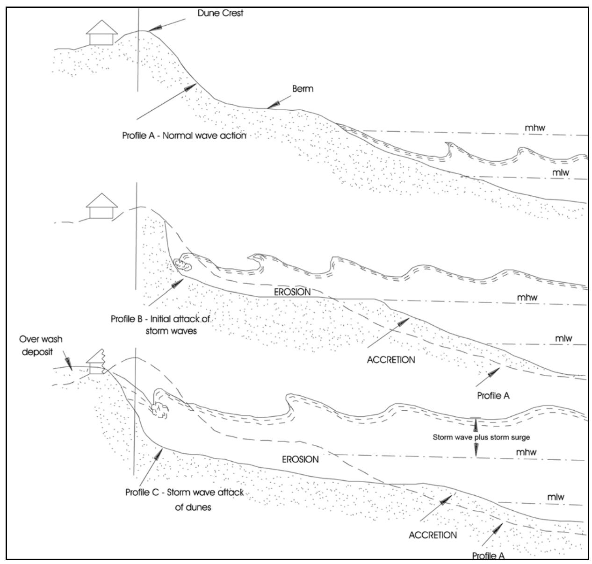

*Figure V-4-1. Schematic diagram of storm wave attack on a beach, dune, and upland structures*

elevations on the beach. These were formed during previous storms and are either remnant scarps left behind as a result of erosion of the lower berm or as a result of deposits left from wave uprush during higher-thannormal water levels associated with storms. Beaches that are in a severely eroded condition might have little or no berm at high tide.
(b) A nourishment project usually involves widening the beach (i.e., translating it seaward) to create a wider sand buffer for dissipating storm wave energy. The amount of additional width is determined based on the desired level of storm protection, the persistent long-term erosional trends that characterize the project area, and the target renourishment interval. The design berm width is determined through an iterative process that evaluates economic benefits as a function of width. The elevation of the constructed berm is usually set at the same elevation as the natural berm, or slightly higher. If the berm is constructed at an elevation lower than the natural berm crest, a ridge will form along the seaward edge of the fill. Wave uprush during higher water will overtop the ridge, causing temporary undesirable ponding on the beach until the berm elevation
V-4-2 Beach Fill Design
increases naturally. If the berm is constructed to an elevation that is much higher than the natural berm crest, an undesirable persistent scarp may form along the shoreline.
(c) For practical and economic reasons, during the construction of the beach berm, the total fill volume required to advance the berm to the desired width is placed on the visible portion of the beach. This construction method, sometimes referred to as the "over-building" method, enables the economic use of standard earth-moving equipment for the distribution of the fill and minimizes relocation of the discharge point. The method also enables effective verification that the sectional fill volume (design fill volume per unit length of shoreline) has been placed on the beach by the contractor using standard land-based survey techniques. The result of this construction technique is a beach berm that is initially considerably wider than the target design width. Postconstruction berm widths are often two to three times wider than the target design width. Design specifications required a 30-m (100-ft) design berm width in the northern New Jersey beach nourishment project while postconstruction surveys indicated constructed berm widths of 60 to 90 m (200 to 300 ft) and along some survey lines berm widths approaching 120 m (400 ft) were measured. While recognized by project designers, lay persons are often unaware that the initial overbuilt berm is a temporary condition. Consequently, they incorrectly judge the project as a failure when the beach berm adjusts dramatically landward immediately after construction, especially during the first storm season. For this reason, it is important that public outreach programs include easy-to-understand information concerning the expected remolding of the fill material after initial construction. Figure V-4-2 provides a schematic illustration of the preproject beach profile, the post-construction over-built beach berm, and the expected design berm after cross-shore equilibration.

#### (2) Dune.

- (a) Sand dunes are an important protective feature. Naturally occurring dune ridges along the coast prevent storm tides, wave runup, and overtopping from directly damaging oceanfront structures and flooding interior areas. Dune features of beach nourishment projects are intended to function in the same way. A beach nourishment project may involve either reinforcing an existing natural dune by adding elevation and/or cross-sectional area, or constructing a dune where none existed beforehand. Dunes also provide a small reservoir of sand for nourishing the beach during severe storms. However, after the storm, maintenance is required to rebuild the dune because natural dune rebuilding occurs at a much slower rate than natural berm rebuilding.
- (b) During hurricanes and very severe northeasters, substantial sections of dune can disappear. This is caused by offshore transport of dune material into the surf zone and by beach and dune sediments being swept landward by wave uprush and overtopping. In the case of overtopped barrier islands, flooding from oceanside storm surges and waves and/or return flow of water from flooded bays can erode enough sand to cut shallow channels, or breaches, through the island. Occasionally, the channels will evolve into new inlets. Areas most prone to breaching are those where the barrier island is narrow and the dunes are lowest or nonexistent. The crest elevations of natural dunes often varies considerably, and nature tends to erode the low spots first. Dunes and berms built as part of a nourishment project can reduce the potential for barrier island breaching because a relatively uniform dune elevation eliminates the low spots where breaches are most likely to form.
- (c) Dune growth can be promoted and the dune structure can be made more resistant to erosion if suitable vegetation can be grown on the dunes for an adequate length of time to establish an extensive root system. It generally takes 2 to 5 years for beach grass to establish a healthy root system, and up to 10 years before the maximum resistance to erosion and breaching is obtained. An active grass fertilization and

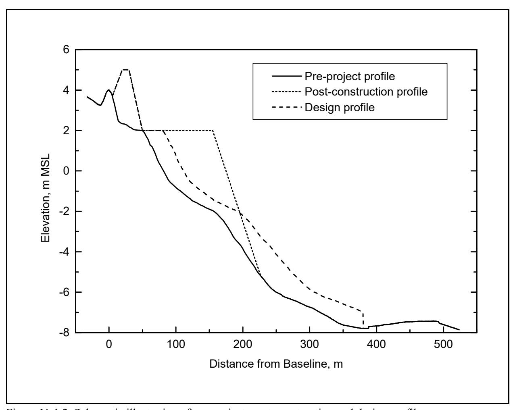

*Figure V-4-2. Schematic illustration of pre-project, post-construction and design profile*

maintenance program can greatly enhance the survival and effectiveness of beach grass. Part V-4-1-i provides more detailed information on dune stabilization.
- (d) Preliminary estimates of dune height, width, and side slope for a beach nourishment project can be made based on characteristics of natural dunes in the vicinity of the project. To be most effective, the crest height of the dune should be above the limit of wave runup for the types of storms for which protection is sought, and the beach berm in front of the dune must be of sufficient width to withstand the erosion associated with these types of storms. If the berm in front of the dune is too narrow, the dune can quickly erode, even for relatively frequent storms, and the benefits of the higher dune elevations will be lost. The design dune height and width (along with the width of the berm) are usually selected based on results of an iterative process in which the benefits are compared with the cost of each configuration. Part V-4-1-f provides more detail on the dune/berm design process. Sometimes other factors such as real estate acquisition issues or aesthetics are factored into the selection of dune crest elevation and width.
- (3) Nearshore berm. Beach-fill projects are usually constructed via direct placement of sand on the beach. Sometimes, in an effort to reduce cost, or because of limits in available dredge equipment, or in response to concerns with direct placement of fill material on the beach, material is placed offshore in an underwater berm (i.e., bar). Nearshore berm creation is intended to simulate storm bar formation by creating an artificial shore-parallel bar to dissipate storm wave energy before impacting the beach. If the berm is
V-4-4 Beach Fill Design
placed shallower than the depth of closure (see Part III-3-3-b), it is expected that with time, the material will move onshore, eventually becoming part of the beach berm and beach face system. The material placed in the nearshore berm, however, does not provide direct shore protection to the upland, and prototype experience with the practice has met with mixed results and uncertain net benefit.
- (4) Feeder beach. Beach-fill projects usually involve placement of a berm along a finite length of shoreline. Sometimes, beach nourishment projects include the creation of a feeder beach, in which fill material is introduced at the updrift end of the area intended to receive the fill. Then, longshore transport distributes the fill to the rest of the project area. Feeder beaches work best in areas that serve as a source of littoral material for downdrift beaches, in areas that are presently experiencing a deficit in the supply of littoral material and have unusually high loss rates, and in areas where the net longshore transport direction is predictable and the net transport rate is "strong" (i.e., longshore sand transport in one direction greatly exceeds the transport in the other direction). Candidate sites for feeder beaches include areas immediately downdrift from inlets or other manmade structures that form a littoral barrier or in areas that have been identified as erosional "hot spots." As the feeder material spreads under the influence of waves, the orientation of the feeder beach shoreline approaches that of the adjacent beach, resulting in longshore transport out of the feeder area equal to the transport along the adjacent area. Eventually, the shoreline orientation in the feeder beach area will return to its original configuration. Protection provided by feeder beaches will not have the same degree of alongshore uniformity as that provided by placing fill in a prescribed manner throughout the project area.
- (5) Structures in conjunction with beach nourishment. Structures can enhance the performance of a beach nourishment project. Figure V-4-3 shows several such examples. When the project is relatively short in length, or significantly affected by an inlet, it may be desirable to limit alongshore losses through the use of a terminal structure or structures (Figures V-4-3a and V-4-3b show examples). Another use of structures is to place them in the interior of the nourishment project, with the intent of increasing project longevity (Figure V-4-3c) by reducing the longshore sand transport rate and minimizing end losses. Structures can also be used locally within a project to maintain the desired level of protection. For example, structures may be used to compartmentalize and stabilize a beach in anticipation of, or in response to, an area of unusually high volume losses (i.e., presence of a hotspot). Whenever structures are used, their potential updrift and downdrift impacts should be assessed. It is important to note that structures do not create sand, they only control its movement. If structures are built without adding beach fill, then sand may accumulate at one location at the expense of erosion at another area. As a general rule, compartments between structures, and the beach immediately updrift and/or downdrift of the structures, should be filled with sand to minimize adverse effects on adjacent beaches. Potential adverse effects of a groin field can be minimized by tapering the lengths of groins at the end of the groin field (see Figure V-4-3c), and adding sand on the downdrift side of the project. Part V-4-1-i provides additional information about the functional design of structures used in conjunction with beach fill projects. Part VI presents information on the structural design aspects of coastal structures.
- c. Define regional setting and site history . To maximize a beach nourishment project's effectiveness, it is important to understand the project's physical setting. The term "setting" encompasses local- and regional-scale coastal processes, the geology, and infrastructure that characterize the site and surrounding area. Part V-3 provides a general discussion of site characterization for all coastal projects. The following sections focus on those aspects that are most pertinent to engineering design of beach nourishment projects. A beach fill project can be a significant perturbation to the coastal system, and project performance is directly related to its interaction with its surroundings. The following are a few questions regarding project setting that should be answered at the beginning of the design process: In what type of littoral system, or littoral cell, will the project be constructed?

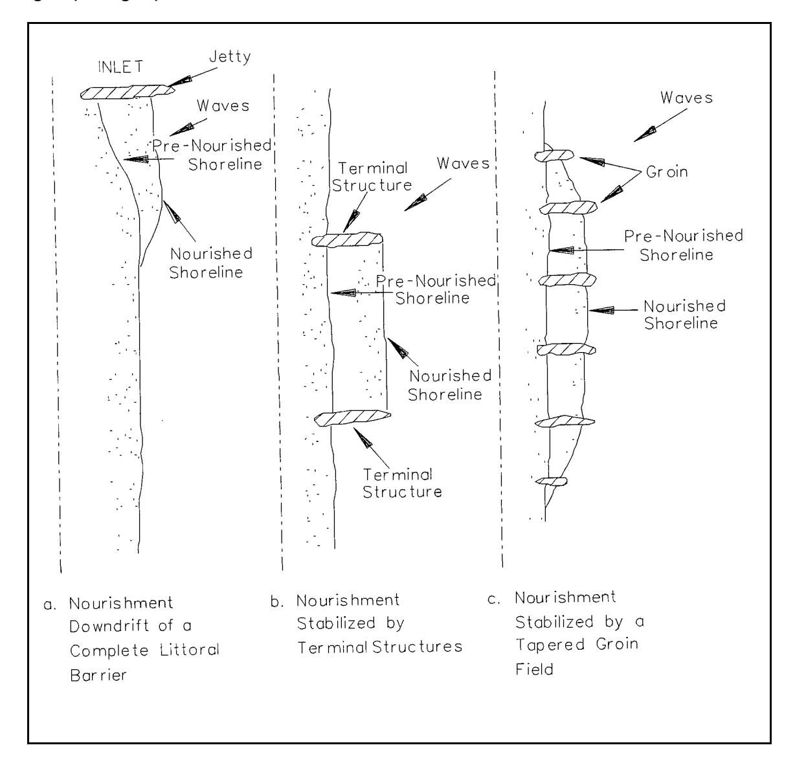

*Figure V-4-3. Use of groin structures to enhance beach nourishment projects*

What is the extent of the littoral cell, and where within the cell will the project reside? What are the important coastal processes that characterize the littoral cell and the project site? The answers to these questions will influence how a project is designed, how it performs, and what if any impacts it may have on adjacent beaches.
(1) Site location within littoral cell. The location of the project within a littoral cell has great influence on all aspects of a beach nourishment project, from understanding the underlying coastal processes at work, to determining the design concept that might be most effective, to the choice of methods and tools used in the design process. For example, will the project be constructed well within the interior of a littoral cell, miles from the inlets that serve as boundaries of the cell, or will it be built immediately downdrift of an inlet stabilization structure, or along the throat of an unstructured inlet? Sand transport by tidal currents, wave refraction over complex bathymetry, and wave-current interaction may not be important design issues in the former case whereas these processes may be critical in designing an effective project in the latter. In the former case, the project may experience beach recovery following a storm, where much of the sand moved offshore into a storm bar, migrates back onto the shore face with little net loss of sand. In the latter case, sand
V-4-6 Beach Fill Design
moved offshore can be swept into tidal channels, carried away by currents into the inlet's shoals, and not return to the beach face. This will result in a significant permanent loss of sand. Different design concepts may be utilized in each of these two cases. In the former case, beach fill alone may meet the design requirements. In the latter, structures such as T-groins, may be needed to improve beach-fill retention. Different design methods may be utilized in each case. The former case may lend itself to simple analytical design tools, whereas the latter case may require more sophisticated physical or numerical modeling to aid in the design.
- (2) Pathways of sediment movement.
- (a) Because beach nourishment projects involve placing additional sand into the littoral system, project design is greatly aided by knowing how sand presently moves within the project domain and the littoral cell that is the setting for the project. Specifically, the following pieces of information are valuable: knowledge of the quantities of sand that presently enter and leave the littoral cell, where the sand enters and leaves, and what quantity moves through the project site. The more information known about the movement of sand the better, although this "picture" can be difficult to develop, especially for project sites with sparse data. Estimates of these quantities are often developed through formulation of a sand budget for the littoral cell and project domain. Parts IV and VI discuss development of a sediment budget. The following are types of questions regarding pathways and quantities of sand movement that might be important to the design of the project. If a project is to be constructed within a littoral cell flanked by inlets, are the inlets bypassing sand into the cell? If so, how much is bypassed? Are structures present that might be blocking (partially or completely) the flux of sand into the site from adjacent beaches? Is the project site located on a convex stretch of the barrier island that may be undergoing persistent erosion, or is the site in an area that experiences intermittent periods of erosion and accretion? Is the project to be located in a pocket beach flanked by headlands, and are those headlands blocking longshore sand transport? Are there sources of sand within the littoral cell, such as a river or lagoon, that might periodically discharge sediments to the beach system, or bluffs behind the beach that might serve as a sediment source? Are there sinks within the littoral cell, such as offshore canyons, impoundment fillets updrift of coastal structures, or loss of sand into an adjacent inlet and its shoal system? The closer to inlets, the greater the chance that tidal currents will have an important role in defining sediment pathways. It is important to gain an understanding of the littoral processes at work in the region, including the magnitude and direction of longshore sand transport (net and gross transport rates), sand sources and sinks, and the effects of existing coastal structures on the movement of sand. Parts III-2 and III-3 address the subject of longshore and cross-shore sediment transport processes, respectively, in greater detail.
- (b) Historical and current charts, maps, and aerial photographs provide valuable information about the regional setting for a project. They can be valuable data sets for characterizing littoral processes at a project site, and aid in developing a sand budget. A persistent signature of impoundment at coastal structures over several years provides evidence of predominant wave direction and net longshore sand transport direction. Formation and evolution of spits, or migration paths of submerged relic ebb tidal shoals, can provide the same information. Noticeable changes in shoreline orientation and curvature, or persistent changes in bathymetric contour orientation may indicate gradients in longshore sand transport rates or a change in net transport direction. Shoreline positions that are accurately digitized from properly rectified aerial photos and/or charts provide information for identifying current and past erosional and accretional areas, and for calculating shoreline change rates. Calculated change rates can be used to estimate changes in sand volumes along different portions of the beach. Nautical charts and bathymetric surveys show the presence of canyons and proximity of the canyons to the shore, tidal channels, shoals, other morphologic features, and changes in these features through time. Controlled bathymetric surveys (relative to common horizontal and vertical datums) can be analyzed to determine volume changes for use in formulating a sand budget.
- (3) Beach topography.
- (a) The shape of the beach, above and below water, sheds light on the coastal processes that are at work at the project site. Beach shape also is an important factor in determining the quantity of beach nourishment material needed. The existing beach profile shape seaward of the natural berm crest can be a good indicator of the expected postnourishment beach shape, provided the sand to be placed has similar grain size characteristics as the native beach and there are no coastal structures or other features that are controlling the shape of the beach. One situation where the present profile shape may not be a good indicator of the postconstruction shape would be a beach that is heavily seawalled or reveted, with little to no dry beach in front of the structure at high tide. In this instance, the present beach shape might be unnatural (overly steep) due to the loss of a sand supply at the shoreline (i.e., the beach profile is very much starved of sand). Proximity to a tidal channel or a coastal structure may also produce an "unnatural" beach profile shape, compared to the shape that might exist for the same sediment characteristics but located away from the inlet or coastal structure. Also, if the material to be placed has grain size characteristics that are much different than the native beach, then the present beach profile shape may not be a good indicator of the shape following nourishment. Use of sand finer than the native sand will produce a beach with gentler slopes; use of coarser material will result in a beach with steeper slopes.
- (b) Dunes are also an important aspect of project setting. Dune elevation, continuity of the dune "line," position of the dunes relative to the shoreline, and volume of sand in the dune above the natural berm crest elevation are important factors in determining the existing level of protection to property and infrastructure. Well-established vegetated dunes are usually a sign of a healthy beach system. A scarped dune, evidence of regular overwash, or no dune at all indicate an area vulnerable to storm damage. Beach profile surveys, or fully 3-D bathymetric and topographic surveys acquired by lidar systems such as systems such as SHOALS, can effectively characterize the beach/dune system as well as submerged morphologic features. Analysis of well-controlled beach profiles (relative to consistent horizontal and vertical datums) can provide volume change information for use in developing a sand budget, selecting design profiles for the nourishment project, and estimating the required amount of nourishment material. (4) Sediment characteristics.
- (a) Information about the grain size characteristics of the native beach material can shed light on the coastal processes at work. Systematic variations in median grain diameter along the beach, or evidence of natural tracers in the sand, may suggest the direction of net longshore transport. Grain size characteristics are a critical design parameter. Most often, sand with grain size characteristics similar to those of the native beach is sought as beach-fill. This is done to maximize compatibility with the existing beach system. Indirectly, selecting compatible material also maximizes the accuracy of predictions of future project performance, which is often based on past observations of the native beach response. Occasionally, fills are designed using material with different size properties because of limitations on sand availability and the cost to transport it to the project site. Sometimes the choice of a nourishment material with different characteristics is made to satisfy a particular design objective, such as use of coarser-grained fill material to improve resistance to erosion.
- (b) Grain size characteristics are quantified based on a sieve analyses of samples which are collected throughout the project domain. Those samples acquired on the profile between the berm crest (or mean high water line) and a water depth corresponding to the position of the typical storm bar should be used to characterize native beach sand for the purpose of assessing the compatibility of sand from potential borrow sources. Compatibility of borrow and native beach material is primarily based on grain size characteristics, and to a lesser extent on color. Part V-4-1-e discusses sediment characterization and compatibility of fill in more detail.
V-4-8 Beach Fill Design
- (5) Wave and water level climate.
- (a) The wave and water level conditions at the project site represent the major forces that shape the beach, and determine both the longer-term lateral spreading of material comprising the beach nourishment project and the short-term response of the project to storms. Exposure of the project site to wave energy from various directions determines the predominant longshore sand transport rate and direction. Offshore islands or coastal structures, peninsulas, or adjacent land masses may partially or completely shelter the project site from certain waves. The presence of these features modifies the energy, frequency, and directional characteristics of the incident waves that approach the site from deeper water. The presence of submerged offshore shoals, reef outcroppings, shore-attached shoals, or depressions (in general, any irregular bathymetry), also can have a significant persistent influence on local wave transformation and the longshore sand transport regime created by the incident breaking waves. It is important to assess the degree in which the wave climate varies from one end of the project to the other. Persistent variations in wave conditions of 5 to 10 percent can create significant local differences in project performance.
- (b) There are several time scales of importance with regard to wave climate. The design life of a beach nourishment project is usually tens of years. Periodic renourishment is typically done every 3 to 5 years. There is evidence of cyclical patterns in weather (e.g., El NiZo) that vary on the order of years, which would tend to produce wave climate patterns having similar multiple-year cycles. Annual changes in weather, and annual variations in the frequency and intensity of storm activity create a longshore sand transport regime that can vary considerably from year to year. Definition of the wave climate at these different time scales helps in assessing long-term beach nourishment project performance, potential variation in performance from one renourishment cycle to the next, and from year to year.
- (c) Wave and water level conditions that accompany extratropical and tropical storms are also an important aspect of project setting and project design. The time scale of these events is on the order of days. Since most beach nourishment projects are justified based on storm protection benefits, it is important to quantify the frequency and severity of storms that can impact the project site during its design life. Lowerintensity storms typically erode the beach berm. More severe storms, particularly those with higher water levels, can inundate the berm and focus direct wave attack on dunes and exposed upland property. The most important storm parameter influencing beach and dune erosion is maximum water level, followed by wave energy and storm duration.
- (d) Hindcast wave and water level information, or data measured nearby, can be used to characterize the wave and water level climate near the project site at the time scales of importance. Sometimes wave information is available in deep water, and other methods must be used to "transform" the information to the project site (e.g., to transform deepwater wave information past islands or very irregular bathymetry). Part II-2 discusses methods for developing wave climate information, including wave hindcasting. Part II-3 discusses techniques for estimating nearshore waves, including wave transformation methods. Part II-5 discusses methods for estimating water levels due to storms. (6) Existing structures and infrastructure.
- (a) How threatened are commercial and private structures, and infrastructure such as roads and utilities, by storm waves and water levels? Formulation of a beach nourishment project often involves compiling an inventory and description of the location of existing infrastructure and commercial and private properties to assess their vulnerability. The properties are valued to aid in quantifying the benefits that accrue from construction of a beach nourishment project. Are there structures that protrude beyond the predominant shoreline position? If so, it may be difficult and not cost-effective to provide a lasting beach having the design width in front of those structures. Attempting to do so may result in a persistent apparent erosional "hot-spot" in these locations. Aerial photos provide a good source of information for describing the
characteristics of infrastructure and property, and the positions of structures relative to the present shoreline. Historical surveys or charts are useful in determining the degree to which existing infrastructure encroaches upon, or is seaward of, the historical beach location. Ground inspections and photos also can be used to characterize the condition and value of structures.
- (b) The presence of existing coastal structures, and their characteristics, are also important parameters. What measures are already in place to provide protection to structures (e.g., seawalls and revetments), and what is the condition and effectiveness of those structures? Structures that alter or block the alongshore movement of sand, such as groins, detached breakwaters, or artificial headlands influence the pathways of sand movement at the site. Crest elevation, composition, and condition of groins, revetments, and seawalls determine the structures' functional effectiveness. The "signature" of impoundment adjacent to groins, or lack thereof, can be an indicator of groin functionality. Aerial and ground photos can be used to characterize the condition and effectiveness of existing coastal structures. Engineering drawings that show the subsurface characteristics of the structures, including any toe protection, in concert with present beach profile surveys, can be used to characterize the vulnerability of revetments and seawalls to damage caused by recession of the beach during storms. (7) Prior engineering activities.
- (a) Usually, areas being considered for a beach nourishment project have experienced problematic erosion for some time. Often, there is a record of previous studies and perhaps a record of past engineering activities at the site. This information can shed light on what may or may not work in the future, and why; and aid in designing a nourishment project. For example, records of past beach-fill activities can provide information about expected fill longevity and net longshore transport rates. Historical records documenting impoundment at groins can provide information about net longshore sand transport rates. Dredging and placement records are vital information in the development of a sand budget. The record of past engineering activities may also help explain a particular beach response that has been observed. Compiling a complete chronology and record of past engineering activities can prove to be a very valuable design aid.
- (b) This section briefly highlighted some of the more important aspects of project setting and site characterization and history, and how they relate to design of beach nourishment projects. Subsequent sections provide more detailed information about how these factors enter into the design process.

#### d. Reach delineation .

- (1) In addition to the setting for a beach nourishment project and its design features, an equally important design issue is delineation of sections of coast along which a project is to be constructed. Project economics is often a controlling factor in the process of reach delineation. The values of property and infrastructure assets fronting the beach and benefits gained by providing storm-damage reduction enter in assigning bounds of a project reach or subreaches. Project boundaries may be determined by limits of political jurisdiction such as municipal or state boundaries, or may coincide with physical features such as inlets or headlands. Environmental considerations and local preferences may also influence project boundaries.
- (2) From an engineering perspective, reach delineation should be evaluated based on physical processes controlling project response. For example, location and characteristics of project terminal boundaries may be evaluated on the basis of fill retention within project bounds and project impacts on adjacent shorelines. Where reaches terminate along the open coast, fill transitions may be used to reduce the rate of spreading losses from project bounds. Transitions may be placed either within or outside project bounds based on design objectives and/or constraints. A more detailed discussion of beach fill transitions is provided in Part V-4-1-h. In cases where reaches terminate at shore-normal structures (e.g., groins and jetties), effects of interrupting littoral drift on downdrift beaches should be assessed. Whether boundaries occur at structures
V-4-10 Beach Fill Design
or on the open coast, project reaches should be of sufficient length to minimize the effect of end losses on the central portion of the project. Part V-4-1-g discusses design parameters and environmental processes that affect project longevity. Economic analyses may identify several discontinuous subreaches within the project main reach (e.g., where areas of development are separated by areas of undeveloped coast). In such cases, a project may function more effectively by designing a single reach spanning both developed and undeveloped sections to avoid multiple areas of end losses.
(3) Beach-fill projects have often employed a uniform design template, with constant berm width and dune elevation, along the entire project. Under most circumstances, however, improved performance can be achieved by modifying the design template along specific subreaches where longshore nonuniformity exists in the without-project condition. For example, consider an existing condition where a particular shore-fronting structure is positioned closer to the shoreline than adjacent structures. A design calling for a uniform width of beach in front of all structures along the entire project reach will produce a planform perturbation at the protruding structure, and will lead to an ongoing problem of accelerated recession in front of the structure. In this case, a viable alternative may be to design a narrower berm in the area of the protrusion with additional storm damage protection provided by higher dunes or protective structures such as seawalls. Other cases where nonuniform design templates may be appropriate include presence of erosional hot spots, changes in shoreline orientation, or nonuniform placement of shore protection structures along the project reach. In design, a practical goal is to distribute the sand fill volume alongshore so as to yield a more or less uniform shoreline location after initial equilibration of the placed fill. Care must be taken in using a variable design template to avoid compromising project performance. For example, dunes placed in front of a developed subreach to prevent overtopping and flooding may not be functional if lower dunes or no dunes are placed on adjacent subreaches of undeveloped shore. In this case, storms could erode and overtop the adjacent low dunes and flank the high dunes, resulting in flooding of the developed area.

#### e. Evaluate sediment sources .

- (1) Borrow source types. Borrow sources for beach fill can be divided into four general categories: terrestrial, backbarrier, offshore, and navigation channels. Each category has favorable and unfavorable aspects; however, selection of an optimum borrow source depends more on individual site characteristics relative to project requirements than type of source. The single most important borrow material characteristic is the sediment grain size.
- (a) Terrestrial sources. Terrestrial sources of beach-fill material can be found in many coastal areas. Ancient fluvial and marine terrace and channel deposits, and certain glacial features such as eskers and outwash plains often contain usable material. Because of their potential economic value, information on sand and gravel deposits is often collected by state geological surveys. With this information, field investigations can focus on a few likely sources, thus eliminating need for more general exploration. In some places, commercial sand and gravel mining operations may provide suitable material for direct purchase. In their absence, it would be necessary to locate a suitable deposit and set up a borrow operation specifically for the project. Use of terrestrial borrow sites usually involves lower costs for mobilization-demobilization operations and plant rental, and less weather-related downtime than the use of a submerged borrow source. However, the production capacity of terrestrial borrow operations is comparatively low, and haul distances may be long. Thus, costs per unit volume of placed material may exceed those from alternate submerged sites. In general, terrestrial borrow sources are most advantageous for projects where exploration and mobilization-demobilization costs, relative to the cost of fill, are a large part of overall expense of the operation. Unfavorable aspects of terrestrial borrow sources are typically related to adverse secondary impacts caused by mining and overland transport. Compared to hydraulic placement, mechanical (dump truck) placement of fill additionally results in practical limits in fill volume, and fill placement is mostly limited to the dry and intertidal beach. Consequently, more rapid equilibration and recession of the placed fill is experienced.
- (b) Backbarrier sources. Sediment deposits in the backbarrier marsh, tidal creek, bay, estuary, and lagoon environments behind barrier islands and spits have been used in the past for beach fill. They are an attractive source because they are protected from ocean waves and are often close enough to the project beach to allow direct transfer of the material by pipeline. This eliminates the need for separate transport and transfer operations. However, most backbarrier sediments are too fine-grained to use as beach fill. In addition, many backbarrier areas are highly important elements in the coastal ecosystem and are sensitive to disturbance and alteration by dredging. Material in backbarrier sediments coarse enough for beach fill is generally confined to overwash deposits and flood tidal shoals associated with active or relic inlets. Overwash deposits occur on the landward margin of the barrier where storm waves have carried beach and dune sediments across the island or spit. Flood tidal shoals occur inshore of tidal inlets and consist of sediment transported by tidal currents flowing in and out of the inlet. These sediments are usually derived from littoral drift from adjacent beaches. Overwash deposits and relict flood tidal shoals may be ecologically important because they may provide suitable substrate for marsh growth. In addition, on retreating barriers, they may comprise a reserve of sand that will be recycled into the active beach deposits as retreat progresses. Flood tidal shoals at an active inlet may be suitable for borrow sites because the material removed is likely to be replaced by ongoing inlet processes. However, dredging material from active flood tidal shoals can adversely alter both the hydraulic conditions in the inlet and wave action on adjacent shores. A study of the hydraulic effects should be made prior to dredging flood-tidal shoals.
- (c) Harbors, navigation channels, and waterways. Creation of harbors, navigation channels, and waterways, and deepening or maintenance dredging of existing navigation projects often requires the excavation and disposal of large volumes of sediment. In some cases, where the dredged sediment is of suitable quality, it can be used as fill on nearby beaches rather than placing it in offshore, upland, or contained disposal sites. Operations of this type are economically attractive because dual benefits are realized at considerably less cost than if both operations were carried out separately. Maintenance dredging of projects in low energy environments such as estuaries or protected bays is least likely to produce suitable beach-fill material. In such areas, the dredged material often consists of clay, silt, and very fine sand. However, when dredging new harbors, channels or waterways, or deepening existing channels in low energy areas, the dredge may cut into previously undisturbed material of suitable characteristics. Dredged material from higher energy areas, such as rivers above tidewater and open coast inlet shoals, is often more acceptable for beach fill. On barrier coasts, inlets trap beach sediment that has been carried to the inlet by littoral drift. Therefore, material dredged from inlets is typically similar to the native material on the project beach. However, sediment compatibility tests should be performed to determine its suitability for use as beach fill.
- (d) Offshore sources. Investigations of potential offshore sources of beach-fill material under the Coastal Engineering Research Center's (CERC's), Inner Continental Shelf Sediments Study (ICONS), by the USACE Districts and others (i.e., Bodge and Rosen (1988)), indicate that large deposits of suitable material often occur in offshore deposits. Data from the Atlantic coast show that the most common suitable sources are in ebb tidal shoals off inlets, and in linear and cape-associated shoals on the inner continental shelf, such as those shown in Figure V-4-4. Potential sources on the inner shelf have also been identified in submerged glaciofluvial features, relic stream channels, and featureless sheet-type deposits.
V-4-12 Beach Fill Design

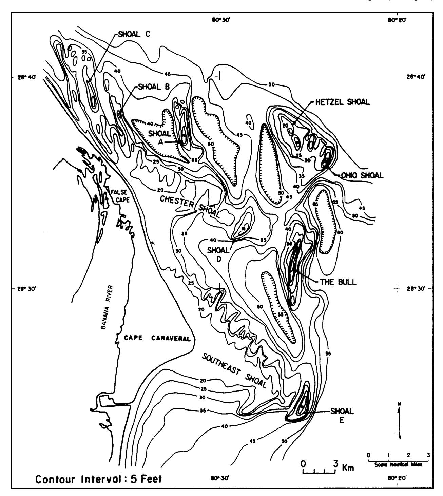

*Figure V-4-4. Cape-associated inner continental shelf shoals off Cape Canaveral, Florida (Field and Duane 1974)*

• Offshore deposits can be excavated by dredges designed to operate in the open sea. When borrow material is obtained by dredges, it is typically either pumped directly to the beach via pipelines or, in the case of self-propelled hopper dredges with pumpout capability, transported to the shore and pumped onto the beach. Hopper dredges are typically more cost-effective for borrow areas located more than a few kilometers from the project site. These dredges practically require a borrow area
with at least one long dimension that allows the hopper vessel to transit the site; i.e., on the order of at least 1.5 km (5,000 ft). In some cases, the dredged material is taken to a rehandle site and offloaded, then transferred to the beach by hydraulic pipeline or truck haul.
- An alternate placement method is to dump material in a nearshore berm as close as possible to the project beach, in water depths shallower than the depth of closure, where it will possibly be moved ashore by wave action. Experiments in offshore dumping near New River Inlet, NC, in 1.82 to 3.65 m- (6- to 12-ft) depth, resulted in a general onshore and lateral migration of fill material (Schwartz and Musialowski 1980). Placing material in water this shallow requires special equipment such as split hull barges, dredges, or other equipment to cast the material shoreward.
- Offshore borrow sources have several favorable features. Suitable deposits can often be located close to the project area. Offshore deposits, particularly linear and cape-associated shoals usually contain large volumes of sediment with uniform characteristics and little or no silt or clay. Large dredges with high production rates can be used. Environmental effects can be kept at acceptable levels with proper planning.
- An unfavorable aspect of offshore borrow operations is the necessity of operating under open sea conditions. Restrictions on the placement of fill material on beaches during the sea turtle nesting season often requires dredging during the winter, when wave energy is highest. In more protected places, such as backbarrier or otherwise sheltered sources, less seaworthy dredging plant can be used. Dredges capable of working in open sea conditions generally have higher rental and operating costs, although this may be offset by greater production capacity.
- Evaluation of offshore sources should also consider the possible effect of dredging a borrow area on littoral processes along and adjacent to the project area. This analysis should include the use of a numerical wave transformation model and the calculation of longshore sand transport rates and transport rate gradients. Nearshore transformation of a project area's principal incident wave conditions over the pre- and postdredging bathymetry should be simulated. The incipient breaking wave conditions and littoral transport potential alongshore, leeward of the borrow area, should be compared between conditions. The proposed limits or geometry of the borrow area may require alteration to avoid unintended concentrations of wave energy, or alongshore transport gradients, produced by the excavated topography. Additionally, borrow areas near the shoreline or inlet shoals may result in accelerated transport of sediment from the beach to the dredged borrow area. In general, where practicable, borrow areas should be sited in water depths greater than the estimated depth of closure (a rough rule of thumb would be twice as deep).
- In some cases, the original relief maybe restored by natural processes over time. This is more likely to occur in active features such as inlet shoals than in relic features, or on ones that are active only during intense storms. Because the depth of closure is well inshore of offshore relic sand borrow sites, these borrow pits usually fill in with fine-grained material that is not suitable for beach fill.
V-4-14 Beach Fill Design
- (e) Environmental factors. In general, environmental effects of borrow operations can be made acceptable by careful site selection, and choice of equipment, technique and scheduling of operations. Restoration of flora and fauna often takes place in a short time after operations (Stauble and Nelson 1984). Alterations in physical features (the pit left behind after excavation) may, in some circumstances, be restored by natural processes. One effect of borrow operations is direct mortality of organisms due to the operation itself, and destruction or modification of the natural habitat. Direct mortality of motile fauna, such as fish, is usually not great because they move to other areas during the borrow operation. Sessile flora and fauna cannot vacate the area; mortality of these organisms is therefore higher. However, they usually are replaced by the reproduction of survivors or stocks in unaffected peripheral areas (Nelson 1985; Johnson and Nelson 1985). Another consideration is the destruction or modification of the habitat needed for survival of native species. A common alteration is the exposure of a substrate that differs from the natural substrate as a result of excavating overlying material. Many marine benthic, and some pelagic, organisms are adapted to specific substrate conditions. Even though larvae of the native species reach the affected area, they may not survive. In comparing borrow sites, it is necessary to consider whether or not natural substrate will be modified by the planned operation. This depends on the thickness of the surficial layer and the depth of excavation needed to produce sufficient fill. In many instances, where the layer of suitable fill material is thin, an increase in the areal extent of the borrow area will allow excavation of sufficient material without altering substrate conditions. While this alternative increases direct mortality, it will preserve favorable conditions for repopulation of native organisms. In subaqueous areas, detrimental effects on native organisms, both within and near the borrow site, may occur due to suspending silt and clay size material in the water column as a result of the dredging operation. Deposits containing more than a small amount (generally taken as less than 10 percent by volume) of silt and clay are thus less desirable sources of fill from an environmental standpoint. In addition, the fine fraction will be unstable in the beach environment.
- (f) Utilization of bypassing/backpassing material. Consideration should be given to bypassing sand across tidal inlets from accreted areas at updrift jetties and from ebb and flood deltas at inlets. Likewise, back-passing of sand from a terminal downdrift jetty to an updrift beach-fill project should be evaluated as a possible cost-effective sand recycling measure. Different types of sand transfer systems are discussed in Richardson (1977). The effect of these measures on adjacent beaches must be evaluated.
- (2) Borrow site exploration. A field exploration program to locate and characterize potential borrow sources is usually necessary for offshore and backbarrier environments. For a detailed discussion of procedures, see Prins (1980) and Meisburger (1990). In terrestrial areas, information on deposits is usually available from state geological surveys. There may be existing commercial sand and gravel mining operations. For existing navigation projects, or planned improvements, information on the dimensions and characteristics of material to be dredged is usually available. Field exploration programs involve four phases: a preliminary office study, general field exploration, detailed survey of the site, and characterization of potential sites. The geographical area covered by these investigations is limited by the distance from the project site that is within an economically feasible range for transportation of fill material. Borrow sources within a few miles of the site should be considered initially. Sources farther away should be considered only if no suitable sources are within this range.
- (a) Office study. The first phase of the exploration program is an office study of maps, charts, aerial photographs, and literature sources concerning the survey area (Morang, Mossa, and Larson 1993). A study of these materials provides general information on the geomorphology and geology of the area, and helps to identify features that might contain potential fill material. The office study also involves laying out a plan for the next phase, general field exploration of potential sources. Such a plan would include specification of an exploratory field data collection program and definition of the equipment needed to execute the program. The most important equipment used for general field exploration and detailed site surveys are: seismic reflection equipment, vibracore apparatus, navigation positioning system, and vessels. Grab samples of surface sediments and side-scan sonar records are also valuable components of the general exploration phase, and can usually be conducted for a relatively small additional cost. Prins (1980) provides a detailed list of equipment and equipment capabilities recommended for use in general field exploration operations. Seismic reflection equipment should provide the highest resolution possible, consistent with achieving a subbottom penetration of at least 15 m (50 ft). High powered seismic reflection systems used for many deep penetration studies are not suitable because of their relatively poor resolution of closely spaced reflectors. Obtaining sediment cores using vibratory coring equipment is more economical than standard soil boring methods, which require more expensive support equipment. Vibratory coring equipment having 3-, 6-, and 12-m (10-, 20-, and 40-ft) penetration capability is available. A 6-m coring device is necessary; a 12-m capability is desirable. Navigation control should be established using an electronic navigation positioning system having an accuracy of about 3 m (10 ft) at the maximum range anticipated for survey and coring operations. Global Positioning Satellites (GPS) technology provides this type of accurate positioning. An important task of an office study is to lay out trackline plots, similar to those shown in Figure V-4-5, that are to be followed by the survey vessel in collecting seismic reflection data during the general reconnaissance phase. A grid pattern as illustrated in Figure V-4-6, having lines approximately (0.8 km (0.5 miles) apart, should be employed for areas that are judged to be the most viable either because they are located near the project site or give promise of containing deposits of usable fill material (Meisburger 1990). Zigzag lines are used to cover areas between grids. The detail of coverage is determined by trackline spacing. More complex or promising areas may call for closer spacing. Core sites can be tentatively selected during the office study. However, final locations should be determined based on analysis of the seismic reflection records.
- (b) General field exploration. During the general field exploration program, data are collected throughout the survey area to locate and obtain information on potential borrow sources and shallow subbottom stratigraphy. This phase involves collection of a comprehensive set of seismic reflection profiles to identify sediment bodies, and a small number of cores to identify and test potential borrow sources. The initial part of the general exploration phase is the collection of echosounder and seismic reflection records along predetermined tracklines. The basic survey procedure is for the survey vessel to proceed along each trackline, collecting data while its position is being monitored by an electronic positioning system with fixes recorded at a minimum of 2-min intervals. Fixes are keyed to the records by means of an event marker and identified by a serial fix number. Because seismic reflection records tend to deteriorate in quality with increasing boat speed, the survey vessel's speed should be slow enough to avoid significant reduction in record quality. In general, a suitable boat speed is likely to be less than 4 or 5 knots. The records should be continuously monitored as they become available. Changes in trackline patterns, if considered desirable, can be made as work progresses.
V-4-16 Beach Fill Design

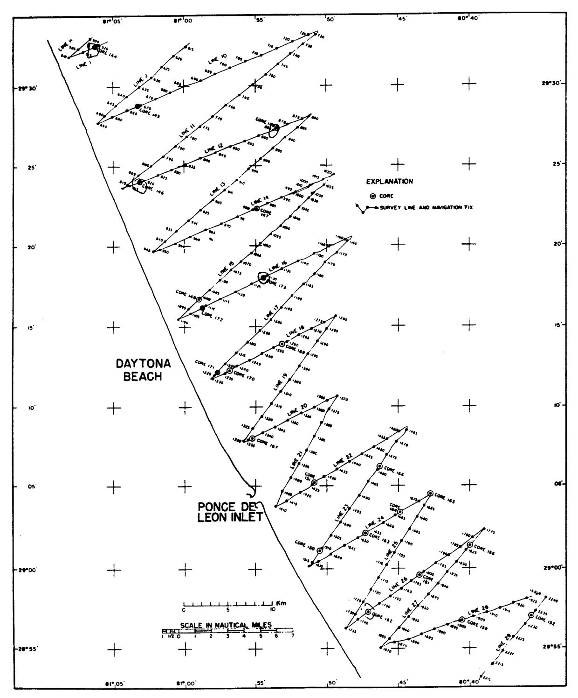

*Figure V-4-5. Reconnaissance zigzag line plot from the north Florida coast (from Meisburger and Field 1975)*

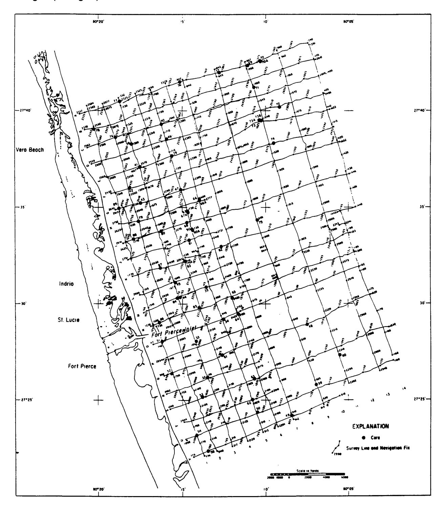

*Figure V-4-6. Grid lines covering a detailed survey area off Fort Pierce, Florida (from Meisburger and Duane 1971)*

V-4-18 Beach Fill Design
- Sediment core sites are usually selected after the seismic reflection survey, to allow time for preliminary analysis of the records to determine the most prudent and informative core locations.
- Cores should be examined as they are taken. Inspection of cores is often hampered by the presence of silt and by scratching of the acrylic core liners. However, the top and bottom sediments can be directly viewed before the core is capped. As work progresses, changes can be made in core locations.
- (c) Detailed site survey. The third phase of borrow site exploration and investigation consists of a detailed investigation of potential sites, which are selected on the basis of data collected during the general exploration survey. If sufficient seismic reflection data were collected at potential sites during the general exploration phase, the detailed site study may only require the collection of additional, more densely-spaced, cores. Since few large sand bodies have uniform size characteristics, it is important to obtain a sufficient number of cores and borings to accurately reflect the variations in size characteristics throughout the deposit. The number of cores and spacing between cores should be determined based on a review of survey and seismic data as well as other geological studies of the area. These values will vary throughout a borrow site, and from one borrow site to another. But in most cases, collection of cores at less than 300-m (1000-ft) nominal spacing is recommended for purposes of ultimately defining the borrow site(s) to be used in construction. It is important to have adequate data for reliably defining the borrow site. Additional seismic reflection data, if needed, should be collected at this time. Sometimes the general and detailed field surveys are made in succeeding years so that ample time is available to study results of the seismic reflection survey before coring is undertaken. However, it is possible to complete the operation entirely in one season. This can be done by mobilizing both geophysical and coring equipment early in the most favorable season, and allowing sufficient lag time between the seismic work and the bulk of the coring work for thorough data analyses and selection of core sites. Additional data collection is typically required to fully examine the selected borrow area or areas. These additional data include: magnetometer survey to detect cultural resources of historical significance (shipwrecks, etc.) and obstructions to dredging; archaeological-diver survey to investigate magnetic anomalies; sidescan sonar survey to detect obstructions, hard-bottom, or other environmental resources; detailed bathymetric survey suitable for preparation of construction drawings; and benthic or other biologic surveys, if required, to assess the existing biotic resource.
- (3) Borrow site characterization. Any beach erosion or shore protection study in which beach fill is considered should include examination of all potential borrow sources and a comparative evaluation of their suitability. The characteristics of potential borrow sources that are most important in evaluating suitability are: location, accessibility, site morphology, stratigraphy, volume of material available, sediment characteristics, geological history, environmental factors, and economic factors.
- (a) Location. The distance that the material must be transported and the feasible means of transport have a large influence on project costs and may be decisive in selecting the most suitable source. Location is also important in terms of the surroundings. Use of terrestrial sources located in developed areas may have a direct impact on the population by creating undesirable noise, traffic congestion, and spillage. Offshore sources may involve questions of jurisdiction and be situated in areas where the dredging and transport activities impede or endanger navigation.
- (b) Accessibility. In order to be usable, a borrow source must be accessible or made accessible for the equipment needed to excavate and transport the material. Access to terrestrial deposits may involve road construction or improvement of existing routes. Onsite reconnaissance is the best method of determining the adequacy of access and any necessary improvements. A cost estimate of work needed to create accessibility should be prepared and included in the economic analysis. In evaluating subaqueous deposits, one of the principal factors is water depth. To be accessible, the deposit must lie in the depth range between the maximum depth to which the dredge can excavate material, and the minimum depth to keep the dredge afloat when laden with fuel and/or sediment. Subaqueous borrow sites should be located sufficiently far offshore and in deeper water so that excavation does not induce adverse shoreline impacts by altering to the incident wave climate. Another aspect of accessibility is the presence of incompatible overburden above the usable sediments. The composition, areal extent, and thickness of any overburden should be determined and considered in the economic analysis (i.e., the cost to remove and dispose of it).
- (c) Site morphology. Information on borrow site morphology is valuable in defining and evaluating site characteristics. In many cases, the source deposit has surface morphological features that can be used to delineate boundaries and to assist in interpolating between seismic and coring data points. In addition, site morphology may provide indications of the origin and history of the deposit. Subsurface deposits such as filled stream channels are more difficult to delineate because the only sources of data are seismic reflection records, cores, and borings. Description of borrow site morphology should contain information on dimensions, relief, configuration, and boundaries, and be illustrated by large-scale maps or charts. Information for compiling the reports can usually be found in hydrographic survey data available from the National Ocean Survey (NOS), National Oceanic and Atmospheric Administration (NOAA), for submerged deposits, and in published U.S. Geological Survey (USGS) topographic maps for terrestrial sources. Fathometer records, which should be made concurrently with the seismic reflection profiles, are valuable for supplementing and updating other sources. In cases where the existing information is inadequate, a special detailed bathymetric survey of the site should be made before the main field collection effort is undertaken.
- (d) Site stratigraphy. The stratigraphic relationships within and peripheral to the site deposits should be developed from the existing sources and the seismic and coring records to define: limits of the deposit; thickness of usable material; thickness of any overburden; sedimentary structures, and sediment characteristics of each definable bed. The detail and reliability of the stratigraphic analysis depends on the complexity of the deposit, the number of outcrops, number of cores or borings available, and the degree to which stratigraphic features are revealed by seismic reflection profiles. In terrestrial areas, outcrops of potentially useful materials may or may not be present. In many cases, such deposits have no topographic expression and must be defined solely on the basis of borings. Seismic refraction surveys in such situations are valuable in defining the areas between data points. Seismic refraction techniques for subsurface exploration are covered in detail in Engineer Manual 1110-1-1802, "Geophysical Exploration for Engineering and Environmental Investigations." In submerged areas, site characteristics must be determined by a combination of bathymetric survey, seismic reflection profiling, and sediment coring. It is important, in both seismic reflection and refraction surveys, to collect enough cores or boring samples to identify and correlate the reflectors
V-4-20 Beach Fill Design
with reliable data on sediment properties, and to show significant boundaries that may not have been recorded by the seismic systems.
- (e) Volume available. Most beach-fill projects require thousands or millions of cubic meters of suitable fill material. The volume in each potential source must be calculated to determine if a sufficient amount is available to construct and maintain the project for its entire economic life (including initial construction, all subsequent renourishment, and emergency maintenance). In order to do this, it is necessary to delineate the lateral extent and thickness of the deposit. Boundaries may be defined by physical criteria or, in large deposits, arbitrarily set to encompass ample material for the projected fill operation. The thickness of the usable material can be determined from an analysis of site stratigraphy. If deposits have a uniform thickness throughout, the available volume can be calculated by multiplying their areas by their thicknesses. Many deposits such as shoals and filled stream channels have more complex shapes, including sloping boundaries and variable thickness. To determine the volume of these deposits, an isopach map of the deposit must be created. An isopach map is a contour map showing the thickness of a deposit between two physical or arbitrary boundaries. Figure V-4-7 shows an isopach map of a borrow area used at Ocean City, Maryland. In this case, the upper boundary of the deposit is defined by the surface of the shoal and can be delineated by bathymetric data. The lower boundary was fixed at a level seismic reflection horizon passing beneath the shoal. Contours, at 1.52-m (5-ft) intervals, were drawn for all the shoal area above the base reflector. Measurements from this type of map can be used to calculate the volume. Commercially available Geographical Information System (GIS) software with Digital Terrain Modeling (DTM) capabilities is now routinely used to generate isopach maps and calculate available sediment volumes. Computation of the source's available volume must account for practical limitations of excavation. Particularly for hydraulic dredging (excepting small suction dredge systems), sediment deposits less than about 1-m (3-ft) thickness are impractical to specify. Buffers must be delineated between suitable and nonsuitable sediments, which cannot be included in the source's available volume. These buffers vary with the site and the nature of the sediment strata, but they typically have a minimum thickness of 0.3 m (1 ft) to 0.6 m (2 ft) in subaqueous sources. Buffer areas around sensitive environmental or cultural resources, or around known obstructions, must also be excluded. The size of these radial buffers depends upon the resource or obstruction to be avoided, but a typical radius is 45 to 90 m (150 to 300 ft). Computation of the source's volume must also be limited to those areas or strata in which the sediment is known to be beach-compatible.
- (f) Sediment composition. The physical properties of a sediment sample that are most important for determination of suitability for fill on a project beach are composition and grain size distribution. The desirable physical properties of beach-fill material are mechanical strength, resistance to abrasion, and chemical stability. In most places, sand-sized sediment is predominantly composed of quartz particles with lesser amounts of other minerals such as feldspar. Quartz has good mechanical strength, resistance to abrasion, and chemical stability. In some deposits, particularly those of marine origin, there is a large and sometimes dominant amount of calcium carbonate that is in most cases of organic origin (biogenic). Calcium carbonate is more susceptible than quartz to breakage, abrasion, and chemical dissolution; but, if it is not highly porous or hollow, it will make serviceable beach fill.

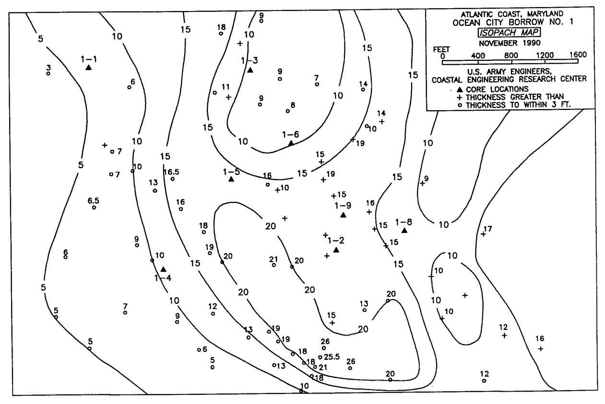

*Figure V-4-7. Isopach map of a borrow area used at Ocean City, Maryland*

- Sediment composition can be determined by examining representative samples under a binocular microscope. Samples should be prepared by thorough washing to remove fines and clean the surface of the particles. If the material is not well sorted, it should be subdivided into sieve fractions for analysis. A subdivision into the Wentworth classes (see Part III-1) for sand-sized and coarser material is convenient for this purpose. The percentage of carbonate in the material can be estimated by dissolving the carbonate fraction in multiple baths of hydrochloric acid with a subsequent sodium hydroxide wash.
- (g) Sediment size characteristics. Generally, suitable material will have grain sizes predominantly in the fine to very coarse sand size range. The presence of very fine sand, silt, and clay in small amounts (generally less that 10 percent) is acceptable, but sources having a substantial amount of fines should be avoided if other more suitable sources are available. When using a borrow area with higher silt or clay content, a large amount of material must be handled to obtain the usable portion, thereby increasing costs. Also, the creation of turbidity during excavation and placement on the beach is environmentally undesirable. However, in the future, as sand resources become more scarce, sand separation may prove to be economically justified depending on the volume of material required and the relative silt and clay content of the borrow site. Borrow material presently discounted because of a comparatively high percentage of fines may become economically viable sand sources in the future. One of the main considerations in selecting a borrow source is the similarity between the grain size distributions of the borrow material and the native beach, i.e., the borrow material's compatibility with the native material. To make this comparison, it is necessary to determine, for both native beach and each potential borrow source, a composite grain size distribution representative of overall textural properties. The method used to determine grain size characteristics for both the fill and
V-4-22 Beach Fill Design
borrow sites should be the same. Beach and borrow material should be analyzed with standard sieves as described in Part III-1.
- Native beach composite sediment statistics should be computed based on sieve analyses of samples collected along cross-shore transects through the most active portion of the beach profile (see Part III-1 for information concerning sediment composite statistics). The most active portion is located between the crest of the natural berm (immediately landward of the mean high waterline) and the depth corresponding to the position of the typical storm bar. The composite statistics should be developed for a number of cross-shore transects throughout the project domain. Grain size statistics calculated from such a sampling scheme will account for most of the natural variability on the profile. If cross-shore composites exhibit a wide range of median grain size and sorting values, an alongshore composite should be calculated for the entire project domain to reduce the variability.
- Borrow area composite statistics should be determined using grain size distributions computed for samples taken from several cores within the potential borrow site. For general uniform cores, samples should be collected from the top, middle, and bottom of useable sand within the core. The composite characteristics of the borrow material should be weighted based on the estimated volume of each type of material present in the deposit.
- Figure V-4-8 shows a comparison between the native beach and borrow material used for nourishment at Ocean City, Maryland. The shaded area represents common characteristics between the native beach and fill material.

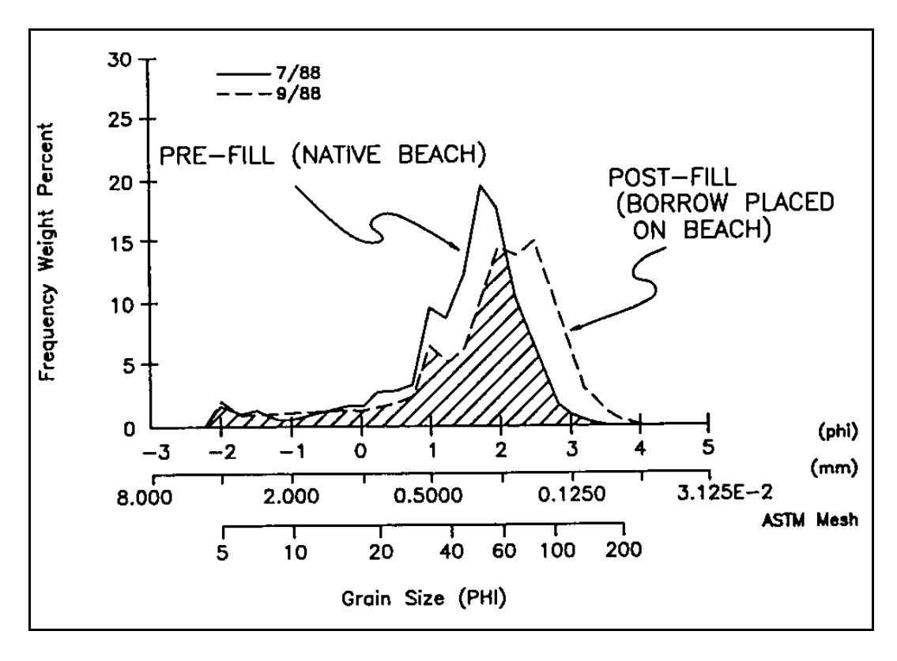

*Figure V-4-8. Comparison of composite grain size analysis between the native beach and the borrow material used at Ocean City, Maryland*

- (h) Sediment suitability. The grain-size distribution of the borrow material will affect the cross-shore shape of the nourished beach profile, the rate at which fill material is eroded from the project, and how the beach will respond to storms. Typically, borrow material will not exactly match the native beach (except perhaps in some bypassing projects). An analysis is required to assess the compatibility of the borrow material with the native beach, from a functional perspective. A comparative analysis of sand suitability is also required to economically evaluate alternative borrow areas for a given project. Early research into compatibility of borrow area material by Krumbein (1957), Krumbein and James (1965), James (1974, 1975), and Dean (1974) addressed this issue by various comparative analysis techniques that utilize the sand-size distributions of the natural beach in the fill area and the borrow material in the candidate borrow sites. These approaches develop a factor, or parameter, indicating how much fill material is required in light of the different sediment characteristics between the borrow and native beach materials. They assume that borrow material placed on the beach will undergo sorting as a result of the coastal processes; and given enough time, will approach the native grain-size distribution. The portion of borrow material that does not match the native sediment grainsize distribution is assumed to be lost to the offshore. James (1975) developed this concept into a method to calculate an overfill factor, RA, and a renourishment factor, RJ. Conceptually, the overfill factor is the volume of borrow material required to produce a stable unit of usable fill material with the same grain size characteristics as the native beach sand. The renourishment factor addresses the higher alongshore transportability of the finer grain sizes in the borrow sands and provides an estimate of renourishment needs. Use of the renourishment factor is no longer recommended in beach-fill design calculations; however, details concerning the renourishment factor and it's calculation may be obtained from the Shore Protection Manual (1984). Recent research and beach nourishment experiences have questioned the continued use of these grain-size-based factors, RA and RJ , to estimate beach-fill performance (Dean 2000). Present guidance recommends that design be based on equilibrium beach profile concepts, an assessment of storminduced erosion, and an assessment of wave-driven longshore transport losses; and that these methods be used to replace or complement the overfill and renourishment factor approaches (National Research Council (NRC) 1995). In practice, these recommended methods treat sediment characteristics using a single grain size parameter, the median grain diameter. They do not consider natural variations in grain size that occur on natural and nourished beaches. However, they have the advantage of incorporating more of the physics of coastal processes into the design, much more so than use of the overfill and renourishment factors. The overfill factor attempts to consider the distribution of grain sizes. Therefore, it does provide an additional piece of information on the amount of borrow material that might be needed to construct a beach nourishment project in more difficult design cases where the grain size characteristics of the borrow material differ significantly from those of the native beach material, especially the case where the borrow sediments are finer than the native sediments. The overfill factor is discussed in more detail in the next section. As a general recommendation, a nourishment project should use fill material with a composite median grain diameter equal to that of the native beach material, and with an overfill factor within the range of 1.00 to 1.05. This is the optimal level of sediment compatibility. However, obtaining this level of compatibility is not always possible due to limitations in available borrow sites. Both the overfill factor and equilibrium beach profile concepts indicate that sediment compatibility is sensitive to the native composite median grain diameter. As such, the compatibility range varies depending on the characteristics of the native beach material, with coarse material being less sensitive to small variations between the native and borrow sediments than fine material. As a rule of thumb, for native beach material with a composite median grain diameter exceeding 0.2 mm, borrow material with a composite median diameter within plus or minus 0.02 mm of the native median grain diameter is considered compatible. For native beach material with composite median diameter between 0.15
V-4-24 Beach Fill Design
and 0.2 mm, borrow material can be considered compatible if its composite median diameter is within plus or minus 0.01 mm of the native diameter. For native beach material with a composite median diameter less than 0.15 mm, use of material at least as coarse as the native beach is recommended. Even though material is deemed compatible based on these rules, the designer should factor grainsize differences into estimates of required fill volume through use of equilibrium beach profile methods, or the overfill factor, or both. Methods for computing beach- fill volumes are discussed in Part V-4-1-f. These guidelines are based on composite median diameters established for the entire project and borrow site. Typically, composites for individual profiles, or subsections of the borrow site, will have variations in median diameter which may exceed the compatibility ranges previously discussed.
- Materials that are not compatible according to these guidelines may still be suitable. Borrow material that is coarser than the native material will produce a beach which is at least as stable as a fill comprised of native material. Fills with coarser material provide improved resistance to storminduced erosion. A lesser volume of coarser fill will be required to create a beach of a given width, compared to the volume of native beach sand that would be needed. If the median diameter of the borrow material exceeds the median diameter of the native material by more than 0.02 mm, a noticeably steeper beach may form. A steeper beach may become a design issue, along with the different texture of the coarser fill. Use of material finer than the native material should be avoided, if possible, but such material still may be suitable. A much greater volume of material will be required to form a beach of a given width, compared to the volume of native sand that would be required. Use of finer sand will produce a beach with flatter slopes, which could be a design issue too. For example, it may be problematic to construct a more gentle beach adjacent to an existing groin or jetty that is intended to block the longshore movement of sand. Sand transport around the structure and into a navigation channel may increase.
- (i) Overfill factor. The overfill factor, RA, is determined by comparing mean sediment diameter and sorting values of the native beach and borrow sediments (in phi,φ, units). The phi, φ, scale of sediment diameter is defined and discussed in Part III-1, and Equations III-1-1a and III-1-1b enable conversion between sediment grain size diameter in millimeters and the φ scale and vice versa. The overfill factor is computed using the following relationships between the borrow and native beach material:

```math
\frac{\sigma_{\phi b}}{\sigma_{\phi n}} = \frac{\left[\frac{(\phi_{84} - \phi_{16})}{4} + \frac{(\phi_{95} - \phi_{5})}{6}\right]_{b}}{\left[\frac{(\phi_{84} - \phi_{16})}{4} + \frac{(\phi_{95} - \phi_{5})}{6}\right]_{n}} \tag{V-4-3}
```

and

```math
\frac{M_{\phi b} - M_{\phi n}}{\sigma_{\phi n}} = \left[\frac{(\phi_{16} + \phi_{50} + \phi_{84})}{3}\right]_b - \left[\frac{(\phi_{16} + \phi_{50} + \phi_{84})}{3}\right]_n = \left[\frac{(\phi_{84} - \phi_{16})}{4} + \frac{(\phi_{95} - \phi_{5})}{6}\right]_n \tag{V-4-4}
```

where:
- FNb = standard deviation or measure of sorting for borrow material (Equation III-1-3)
- FNn = standard deviation or measure of sorting for native material (Equation III-1-3)
- MNn = mean sediment diameter for native material (Equation III-1-2)
- MNb = mean sediment diameter for borrow material (Equation III-1-2)
• Values obtained using the relationships in Equations V-4-3 and V-4-4 are then plotted on the graph presented in Figure V-4-9. The value of RA can be obtained by interpolating between the values represented by the isolines. Values of the overfill factor greater than 1.0 indicate that more than one unit of borrow material will be needed to produce one unit of fill material. Example V-4-1 illustrates computation of the overfill factor.

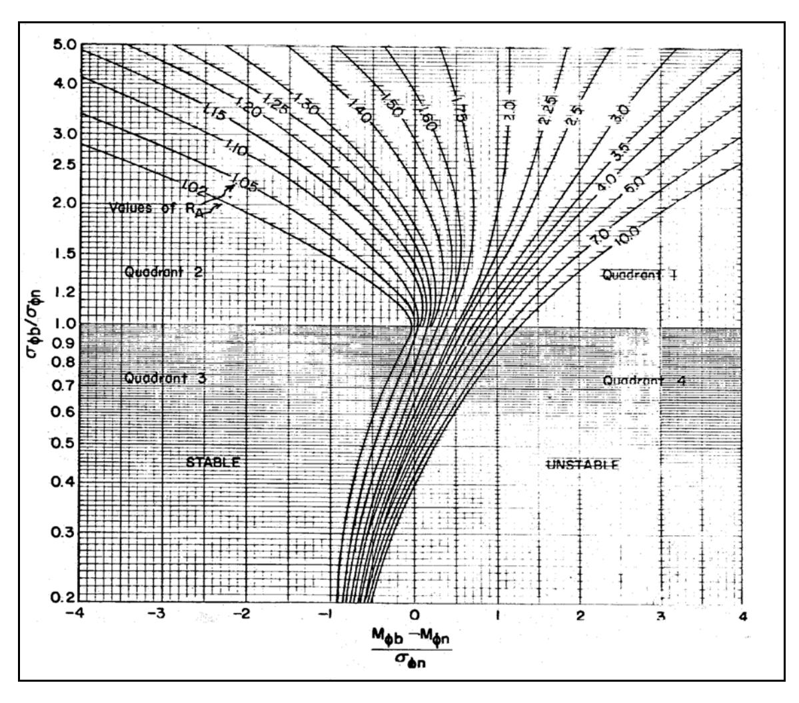

*Figure V-4-9. Isolines of the adjusted overfill ratio ( RA ) for values of φ mean difference and φ sorting ratio ( Shore Protection Manual 1984)*

V-4-26 Beach Fill Design
FIND:
The overfill factor, RA.
GIVEN:
The native and borrow area phi values are:

```math
\text{native beach: } \phi_{05}=0.95, \phi_{16}=1.31, \phi_{50}=1.91, \phi_{84}=2.66, \phi_{95}=2.90 \\
\text{borrow area: } \phi_{05}=1.42, \phi_{16}=1.63, \phi_{50}=2.49, \phi_{84}=3.08, \phi_{95}=3.55
```

The median grain diameter for native and borrow material is 0.27 and 0.18 mm, respectively.

## SOLUTION:

The mean sediment diameter in phi units is given in Part III-1 as

```math
M_{\phi} = (\phi_{16} + \phi_{50} + \phi_{84}) / 3 \tag{III-1-2}
```

```math
M_{\phi n} = (1.31 + 1.91 + 2.66) / 3 = 1.96 \\
M_{\phi b} = (1.63 + 2.49 + 3.08) / 3 = 2.40
```

The standard deviation in phi units is given in Part III-1 as

```math
\sigma_{\phi} = (\phi_{84} - \phi_{16}) / 4 + (\phi_{95} - \phi_{05}) / 6 \tag{III-1-3}
```

```math
\sigma_{\phi n} = (2.66 - 1.31) / 4 + (2.90 - 0.95) / 6 = 0.66, \quad \sigma_{\phi b} = (3.08 - 1.63) / 4 + (3.55 - 1.42) / 6 = 0.72
```

The sorting ratio from Equation V-4-3 is

```math
\sigma_{\varphi b} \: / \: \sigma_{\varphi n} = 0.72 \: / \: 0.66 = 1.09
```

The phi mean differences ratio from Equation V-4-4 is

```math
(M_{\phi b} - M_{\phi n}) / \sigma_{\phi n} = (2.40 - 1.96) / 0.66 = 0.67
```

Entering Figure V-4-9 with x = 0.67 and y = 1.09 results in an overfill ratio ( RA ) equal to 2.5. The finer borrow material may be suitable for use, but it is quite incompatible with the native beach sand. The value of the overfill ratio suggests that 2.5 units of borrow material will be required to create 1.0 unit of stable native beach material.
- The overfill method previously described is the Krumbein-James technique (Krumbein and James 1965). Dean (1974) presents an alternative method for computing the overfill factor, not shown, which generally yields less conservative (lower) estimates of the overfill factor.
- f. Beach-fill cross-section design . The design of Federal beach-fill projects is based on the optimization of net annual benefits defined as the difference between average annual costs and average annual benefits. This optimization procedure produces a plan known as the National Economic Development (NED) plan. The NED plan considers the storm damage reduction potential of various beach fill design alternatives and the averaged annual cost. Primary design parameters of each alternative include the physical dimensions of the cross-sectional design profile and the volume of sand required to obtain the design profile. Beach-fill design alternatives typically include combinations of beach berms of varying width and dunes of varying height (see Part V-4-1-b for a description of the characteristics and functions of beach berms and dunes). Design berms are characterized by berm crest elevation and berm width. Dune design dimensions include crest elevation, crest width, and side slopes.
- (1) Berm elevation. The elevation of the design berm should generally correspond to the natural berm crest elevation. If the design berm is lower than the natural one, a ridge will form along the crest, which, when overtopped by high water will produce flooding and ponding on the berm. A design berm higher than the natural berm will produce a beach face slope steeper than the natural beach and may result in formation of scarps that interfere with sea turtle nesting and recreational beach use. Many healthy, natural beaches exhibit a gentle downward slope from the toe of the dune to the seaward limit of the berm. Therefore, a gentle berm slope can be specified as an element of the design profile. The berm slope is most appropriately estimated from profiles that represent a nearby, healthy beach. Or the slope can be estimated to fall in the range from 1:100 to 1:150. Adding a gentle slope to the berm also helps prevent overtopping and ponding.
- (a) The natural berm elevation can be determined by examining beach profile surveys of existing and historical conditions at the project site. Because beach berms form naturally under low-energy waves, they are typically most well-developed in form at the end of the summer season. Seasonal profile surveys can be used to examine temporal changes in berm shape and to identify well developed berm features from which to estimate the natural berm height. When survey data indicate alongshore variations in the natural berm height, a representative berm height may be determined either by visual inspection of plots showing the alongshore variations or by computing an average profile shape. The Beach Morphology Analysis Package (BMAP) provides automated calculation and visualization tools for performing such analyses. Sommerfeld et al. (1994) provide an overview of the capabilities and a user's guide for operation of the BMAP software.
- (b) Figure V-4-10 shows an example of seasonal variation in berm shape measured over two consecutive years at a given profile station. The fall surveys show that the beach berm is widest following the calmer summer waves, whereas the spring surveys show the berm to be in a more eroded condition following winter waves. Based on visual inspection of Figure V-4-10, a natural berm height for this profile can be approximated by the horizontal dotted line, corresponding to an elevation of 3.6 m. Figure V-4-10 shows that it would be difficult to identify the natural berm height based solely on the first spring survey, and illustrates the advantage of using multiple surveys for profile characterization.
- (c) Figure V-4-11a shows beach profiles measured during a single fall survey at five different profile stations along the beach. The berm is seen to vary alongshore in height and width. To determine a representative berm height, the beach profiles are horizontally aligned on the seaward face of the dune to superimpose the berm profiles at the base of the dune, as shown in Figure V-4-11b. An average profile is computed by averaging the elevations of the aligned profiles at 1-m increments in distance offshore. Figure V-4-11c shows the average profile, from which a representative berm elevation of 3.5 m is obtained by inspecting the horizontal portion of the profile between the offshore distances of 75 and 100 m.
V-4-28 Beach Fill Design

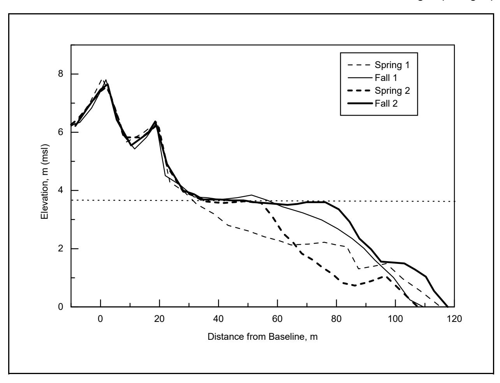

*Figure V-4-10. Seasonal variation of a beach berm*

(d) In cases where no dry beach exists at the project site, or where the existing beach has a deficit of sand due to substantial reduction or elimination of a critical sediment source, such as in front of a seawall or downdrift of a shore-perpendicular structure, the natural berm elevation should be estimated using profile data from adjacent beaches which are healthier in terms of sand availability but are exposed to similar waves and water levels. Priority should be given to identifying a natural berm elevation using beach measurements from the project site or a similar site. As a last resort, when no suitable beach profile data are available to determine a natural berm height, the limit of wave runup under average (nonstorm) wave and tide conditions at the site can be estimated to establish a design berm height (see Part II-4-4 for calculation of wave runup on beaches).

# (2) Berm width.

(a) Selection of the design berm width depends on the purpose of the project and is often constrained by factors such as project economics, environmental issues, or local sponsor preferences. For Federal beach nourishment projects, the berm width is determined through a process of optimization based on storm damage reduction. The design beach width is optimized by computing costs and benefits of various design alternatives and selecting the alternative that maximizes net benefits (USACE 1991). Numerical models of beach profile change such as Storm-Induced BEAch CHange (Larson and Kraus 1989) provide a means of evaluating beach response as a function of berm width. Figure V-4-12 illustrates how berm width influences the landward extent of erosion during a storm. Figure V-4-12a shows four beach profiles with identical dune

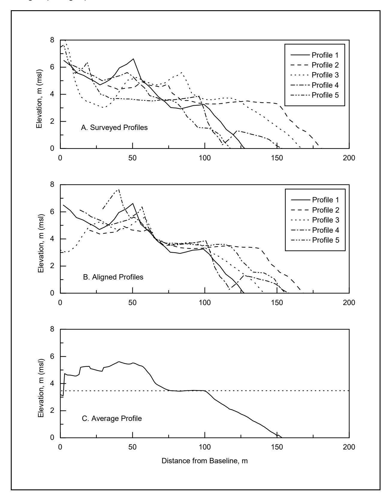

*Figure V-4-11. Berm elevation determined from beach profiles measured at various alongshore stations*

V-4-30 Beach Fill Design

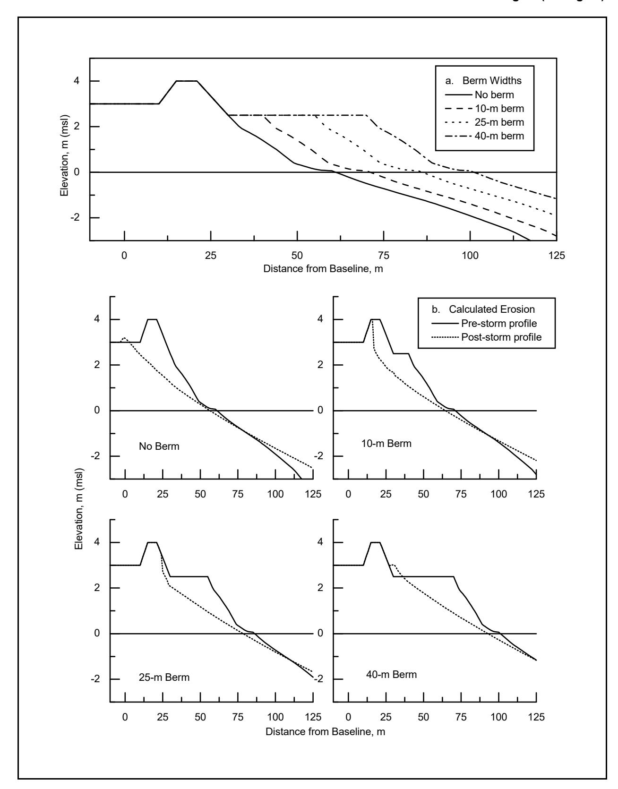

*Figure V-4-12. Example of storm-induced beach erosion as a function of berm width*

cross sections and varying berm widths. The SBEACH model was used to simulate profile change, and each profile was subjected to a constant wave height of 3 m, wave period of 10 sec, and water level of 1.5 m msl over a duration of 24 hr. Figure V-4-12b shows the calculated results for each profile. The profile with no berm experienced complete erosion and overtopping of the dune. Most of the dune was eroded on the 10-m berm profile, whereas the 25-m berm profile experienced only minor dune erosion. The 40-m berm provided full protection against erosion of the dune and backbeach, and some sand was pushed up against the base of the dune due to overwash across the wide berm. In this example, a shorefront property located immediately landward of the dune would experience varying degrees of damage and/or vulnerability to future storm erosion and flooding as a function of the beach berm width.
- (b) Factors other than storm erosion that influence beach width include the rate and variability of longterm shoreline recession, planform spreading losses, and presence of erosional hot spots. These factors typically do not enter in the optimization of the design berm width for storm damage reduction projects, but should be accounted for in optimization of the advanced fill section and renourishment interval as discussed in Part V-4-1-g.
- (c) Storm berms may be used in conjunction with a natural berm to provide added protection against damage during storms. Storm berms are constructed at an elevation higher than the natural berm and are set back, landward, from the crest of the natural berm. Storm berms are built to reduce the chance for wave action and erosion from reaching the dune during higher water levels associated with a specified degree of storm intensity (usually, the type of storm that can be expected once every few years). The crest elevation of a storm berm should be set based on the water level and runup elevation associated with the type of storm(s) against which protection is sought. If a storm berm is included in the design, the width of the storm berm can be optimized to maximize net benefits. The seaward extent of the storm berm should also consider the possibility for undesirable, persistent scarp formation.

#### (3) Dune dimensions.

- (a) Dunes protect upland property against wave attack, erosion, and flooding during extreme storm events which overtop or severely erode the beach berm. Design parameters of a dune include the crest elevation, crest width, and side slopes. The design dune crest elevation is typically determined through economic optimization. The dune crest width may also be optimized but is typically fixed at a selected width for all design alternatives. In selecting dune crest width and side slopes, constructibility constraints and angle of repose of the fill material grain size should be considered. A typical dune design may have dimensions on the order of 5-m crest elevation above msl, 10-m dune crest width and one on five side slopes. Planting beach grasses on the constructed dune helps to maintain and build dune volume over time by trapping windblown sand.
- (b) To illustrate the influence of dune height on storm-induced beach profile change, the no-berm profile shown in Figure V-4-12 was modified to increase the dune elevation from 4 to 4.5 m while maintaining the same crest width and side slopes. The original and modified dune configuration are shown in Figure V-4-13a. The increase in dune height translates to an added volume of 10 cu m/m for this profile. Figure V-4-13b shows profile erosion modeled by SBEACH for the same storm conditions used in the previous berm erosion example. The calculated results in Figure V-4-13b indicate the added dune height prevented dune overtopping and back-beach erosion for these particular wave and water level conditions.
- (4) Design profile shape. The shape of the design profile is needed to compute cross-sectional fill volume requirements and as input to storm-induced erosion modeling that is done to optimize berm and dune dimensions. In order to obtain the design dune and berm template on the beach, sufficient sand must be placed to nourish the entire profile out to the depth of closure (see Figure V-4-14 and Part III-3-3-b for details
V-4-32 Beach Fill Design

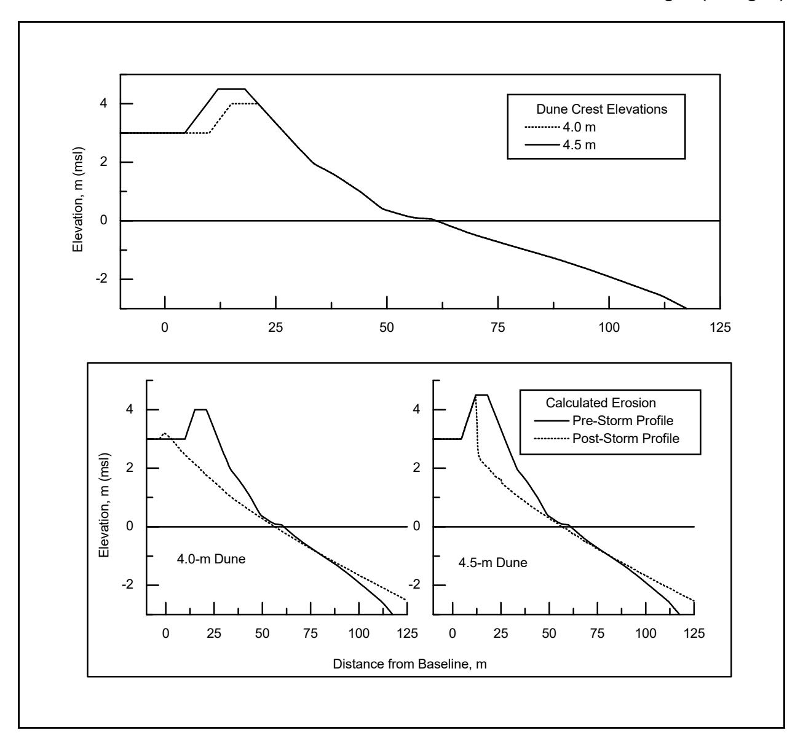

*Figure V-4-13. Example of storm-induced beach erosion as a function of dune crest elevation*

on depth of closure). Whereas dune and berm dimensions are determined through optimization, the shape of the design profile below the beach berm is a function of the local morphology and grain size of the fill. Local beach morphology often includes a nearshore bar system, which may be absent in erosionstressed preproject beaches. In such cases, a berm also might be absent from the profile, or may be unnaturally low in elevation; or the preproject profile may reflect an overly steep beach face. A key aspect of defining the design profile shape is to recognize whether or not the preproject beach reflects an unnatural, sediment-starved condition, in which the preproject shape is different from that which will evolve once the fill is placed. For example, a severely eroded beach may lack the commonly observed nearshore bar system, but the bar system will likely form under sediment-rich conditions that follow nourishment. Consequently, the sectional fill volume should include an estimate of bar volume. In these situations, design profile shape can be defined by examining nearby beaches that are healthier in terms of available sediment supply (from the upland beach and from longshore sources). Profile data from adjacent beaches within the project domain, or data from a nearby site that is exposed to similar wave and

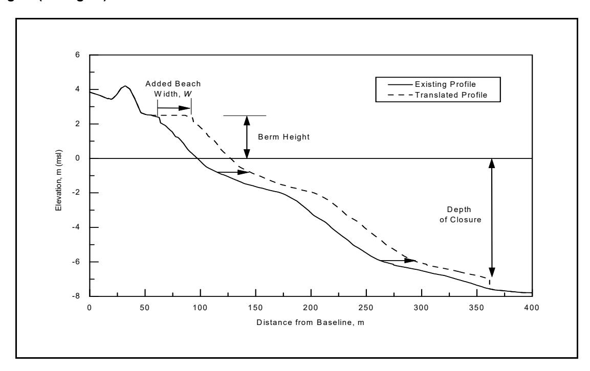

*Figure V-4-14. Beach-fill design profile shape determined by profile translation*

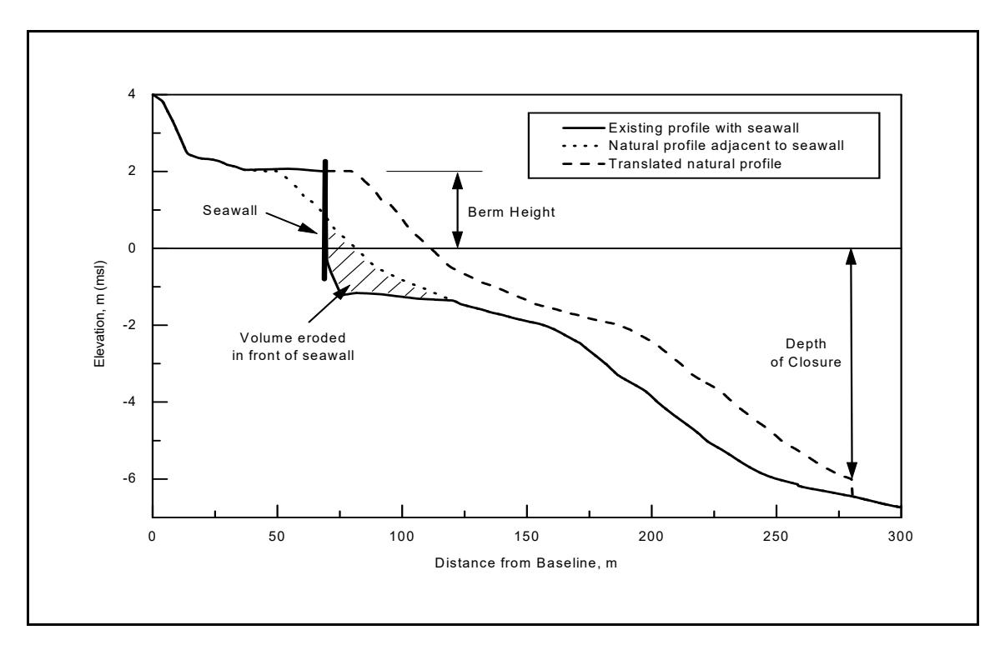

*Figure V-4-15. Design profile in front of a seawall*

V-4-34 Beach Fill Design
tide conditions and has similar grain size characteristics, can be used to estimate the healthy beach profile shape for reaches where in situ profiles might be misleading. Figure V-4-15 shows an eroded profile in front of an exposed seawall. Translating the existing profile would incorrectly estimate the shape of the nourished beach and would result in an underestimate of the volume required to obtain the design beach width in front of the seawall. In Figure V-4-15, the design profile is determined by translating the natural (healthy) profile shape seaward to obtain the design berm width in front of the seawall. Grain-size differences between the native beach and the fill material also must be considered in defining the design profile shape. If the median grain size of the fill is the same as that of the native beach, the design profile shape should be obtained by translating an average profile shape that represents locally healthy (sediment-rich) beach conditions. For example, given the same composite median grain sizes, the design profile for a beach with 30 m of added berm width is determined by translating the existing profile 30 m seaward between the elevation of the berm crest and the depth of closure, as shown in Figure V-4-14. When applying the profile translation method, the existing beach shape should be determined based on an average of multiple surveys to account for seasonal and/or alongshore variability in profile shape and to avoid including anomalous profile features in the design profile shape.
(a) When fill material is finer or coarser than the native sediment, the design beach profile shape should be estimated based on equilibrium profile concepts (see Part III-3-3-c for details on equilibrium beach profiles). According to equilibrium profile theory, coarser sand will produce a steeper design profile whereas finer sand will produce a profile with a gentler slope as illustrated in Figure V-4-16. Dean (1991) provides additional discussion of equilibrium beach profile concepts and their application. To estimate the design profile shape using equilibrium profile concepts, the average profile shape that represents locally healthy (sediment-rich) beach conditions should first be translated seaward a distance equal to the added berm width (see Figure V-4-14 and Figure V-4-15). To account for the difference in profile shape due to different composite sand sizes, the profile is translated an additional distance as a function of depth between the stillwater level and depth of closure, based on differences in the theoretical equilibrium profile shapes as shown in Figure V-4-17. The added distance of translation Wadd as a function of depth y is given by

```math
W_{add}(y) = y^{3/2} \left[ \left( \frac{1}{A_F} \right)^{3/2} - \left( \frac{1}{A_N} \right)^{3/2} \right] \tag{V-4-5}
```

where AN is the A parameter for native sand and AF is the A parameter for fill sand (see Table III-3-3 for values of the A parameter for different sand sizes). In Equation V-4-5, when the fill material is finer than the native sand, Wadd is positive, which produces a design profile that is gentler in slope than the native profile. Conversely, for fill that is coarser than the native beach, Wadd is negative which produces a steeper design profile. If the representative sediment-rich beach profile includes a bar, some smoothing in the bar region may be necessary. The BMAP software provides automated methods for estimating the design profile shape for different native and fill sand sizes based on Equation V-4-5, and for the same sand sizes using the uniform profile translation technique.
(5) Optimization of design profile. Optimization of the design profile involves selecting a range of design alternatives with different dune and berm dimensions, and evaluating the design alternatives together with the existing condition to determine the alternative that provides maximum net economic benefits. Storminduced beach erosion modeling is the primary engineering analysis performed as part of the optimization process. Model simulations of profile response to a suite of historical or characteristic storms are performed for each alternative to assess erosion, flooding, and wave attack damages to shorefront property and infrastructure.

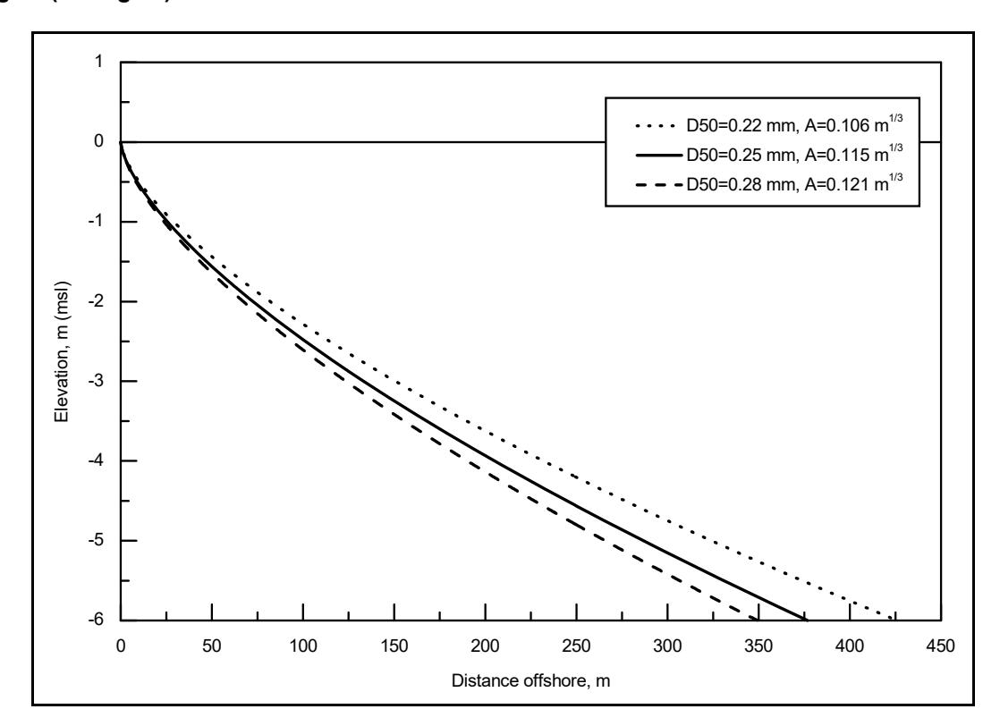

*Figure V-4-16. Theoretical equilibrium profile shapes for different sand grain sizes*

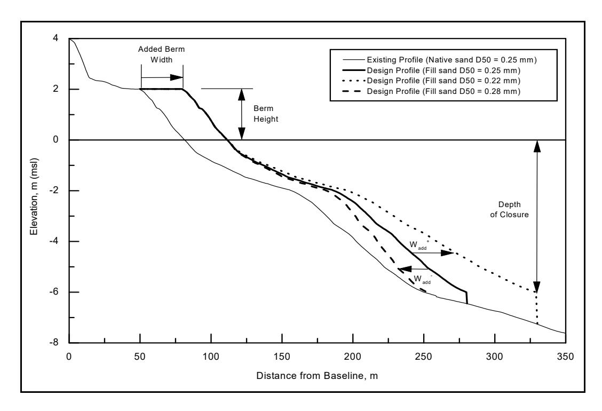

*Figure V-4-17. Design profiles for different fill sand sizes*

V-4-36 Beach Fill Design
- (a) Without-project condition.
- The existing or without-project condition is included in the optimization process to determine baseline damages. Morphologic features of the existing beach, such as dune height, berm width, and offshore profile shape, typically vary along the project study domain. To accurately estimate storm erosion response for the existing condition, a set of representative morphologic reaches should be developed to describe variations in profile shape along the project domain. The BMAP software can be used to define morphologic reaches by analyzing profiles, grouping similar profiles, and calculating an average representative profile for each reach.
- Profile characteristics that should be considered when developing morphologic reaches include dune height and width, berm width, nearshore and offshore profile slopes, sand grain size, presence of seawalls or other structures, and proximity to inlets. As part of the economic analysis to evaluate damages and benefits, the project domain is divided into a series of economic reaches based on value of property and infrastructure (see Part V-4-1-d). Boundaries of economic domains should also be considered in morphologic reach delineation to ensure that storm erosion modeling is consistent with the economic analysis.

## (b) Storm selection.

- Evaluation of potential storm damages requires selection of a set of storms representative of future events that may impact the project area. The set of storms should reflect a range of intensities and frequencies of events consistent with the historical record. In developing the storm set, tropical and extratropical events should be treated distinctly because of differences in storm characteristics and frequencies of occurrence.
- One approach to storm selection has been to develop a set of storms characterized by peak surge return period ranging from frequent events (5-year return period or less) to extremely rare events (100-year return period). Peak surges for selected return periods are obtained from available stage-frequency information, and representative storm surge hydrographs are developed using assumed hydrograph shapes and durations. Differences in hydrograph shape between tropical and extratropical storms should be considered; tropical storms typically have much shorter durations. The storm surge hydrographs are combined with corresponding wave height and wave period time histories to fully describe the storms. Using this approach, the frequency of modeled responses are assumed to correspond to return periods of the input storm surges (e.g., a 50-year storm surge produces a 50-year erosion response). This assumption simplifies the analysis but is not strictly accurate because, in addition to peak storm surge, other factors influence the magnitude of erosion (storm duration, hydrograph shape, and wave characteristics). Inconsistencies may arise with this approach related to characterizing the storm based on peak surge alone. For example, a 20-year storm (where frequency is defined solely on maximum surge) may produce more erosion than a 50-year storm, if the 20-year storm has higher waves or a longer duration.
- An alternate and preferred approach is to develop a "training set" of storms by selecting events from historical records and/or hindcasts. A sufficiently long historical period is identified, such as 20 years for extratropical storms or 100 years for tropical storms. All historical events within the period exceeding a selected threshold are included in the training set. For example, all events which have a peak surge exceeding 0.3 m may be considered significant from a storm erosion standpoint and included in the training set. No return periods are assigned to storms in the training set a priori. Each storm is modeled for the existing condition and each project alternative to calculate corresponding erosion responses. Using the training set of storms and modeled responses, life cycle analyses are performed by employing the Empirical Simulation Technique (EST) to generate
frequency-of-occurrence relationships, whereby return periods are associated with storm responses rather than storm input. Scheffner and Borgman (1999) provide detailed guidance in applying the EST to coastal studies. Advantages of this approach are that it involves no arbitrary assignment of recurrence relationships and it utilizes historical rather than representative or hypothetical events to determine frequency-of-occurrence relationships. Part II discusses methods for estimated storm waves and water levels.
• Because water level is a primary factor controlling beach erosion, tide variations should be considered when developing the input storm set. Tide variations can be accounted for by combining storm surges with different tidal phases and ranges. For example, peak storm surges may be aligned with high tide, low tide, midtide preceding high tide, and midtide preceding low tide to generate four different but equally probable events derived from each base storm. Variations in tide ranges (neap, spring, and average) may also be considered in developing a full set of storms.

## (c) Storm erosion modeling.

- Upon selection of design alternatives, characterization of the without-project condition, and selection of the storm set, storm-induced beach erosion modeling is performed to calculate parameters required for assessing economic damages based on beach erosion, flooding, and wave attack. The SBEACH model computes relevant storm response parameters such as recession distance, maximum water level and wave height at the shoreline, and wave runup. Required input to the model includes beach profiles describing the design alternatives and without-project condition, time-histories of storm water level, wave height and wave period, median sand grain size, and calibration parameters.
- Detailed examples and guidance for applying the SBEACH model to predict storm erosion are provided in the SBEACH technical report series (Larson and Kraus 1989; Larson, Kraus, and Byrnes 1990; Rosati et al. 1993; Wise, Smith, and Larson 1996; and Larson and Kraus 1998).
- (d) Storm damage recurrence relationships and risk analysis. Modeled erosion responses are expressed in terms of frequency of occurrence for input to economic damage models. Typically, tropical and extratropical erosion responses are joined to generate a combined frequency curve spanning the recurrence intervals of interest. Risk and uncertainty of storm damage parameters can be addressed by developing meanvalue frequency-of-occurrence curves together with confidence bands that indicate the variability or uncertainty associated with the calculated storm responses. The EST and supporting analysis tools can be used to calculate mean-value frequency curves and confidence bands. Figure V-4-18 shows an example of frequency-of-occurence relationships generated by the EST technique. The solid line represents the mean or expected value of beach recession as a function of return period, and the dashed lines show the 90 percent confidence band, indicating that 90 percent of variability in beach recession for a given return period falls within these limits. (6) Cross-sectional fill volume requirements.
- (a) A key quantity in beach-fill design is the volume of sand required to produce the desired beach cross-section. The design profile is determined using methods presented in Part V-4-1-f-(4) and results from the optimization process outlined in Part V-4-1-f-(5). The berm width is then increased to reflect the amount of advance nourishment needed to maintain the design profile prior to the first renourishment. The modified design profile shape, which includes advance nourishment, is then estimated
V-4-38 Beach Fill Design

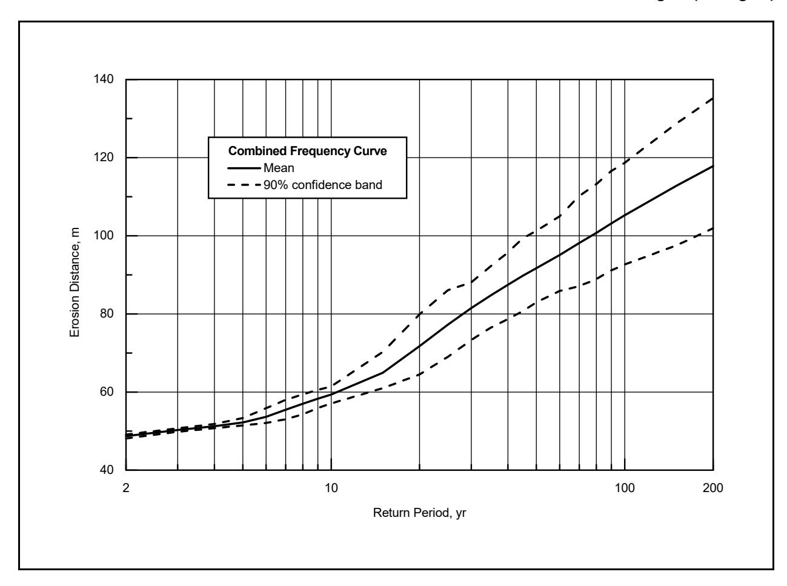

*Figure V-4-18. Combined tropical and extratropical erosion-frequency curve*

by translating the design profile at elevations between the design berm elevation and the depth of closure (see Figure V-4-14) by an amount equal to the advance nourishment berm width. The sectional fill volume required for initial construction (volume per unit length of shoreline) is calculated as the difference in crosssectional area between the preproject profile and the modified design profile shape. Example V-4-2 illustrates calculation of sectional fill volume for a case where the preproject profile is in a severely eroded, unnatural, condition.
- (b) Advance nourishment beach width, and design berm width, might not have uniform values from reach to reach within the project domain. Variations in the desired level of protection, assessment of long-term fill evolution and renourishment requirements, and consideration of the potential for hot spot formation, will most likely lead to alongshore differences in desired beach width. Therefore, the required sectional fill volume also will vary by reach. Volume calculations for the entire project domain are made by summing results on a reach-by-reach basis, where the volume requirement in a particular reach is calculated as the product of the cross-sectional volume requirement and the length of shoreline in that reach.
- (c) For the case of a healthy (sediment-rich), preproject beach profile and a fill material that has a median grain size equal to that of the native beach sand, the volume V per unit length of shoreline required to produce a beach width W can be estimated by

```math
V = \mathbf{\nabla } W \left( B + D _ { C } \right) \tag{V-4-6}
```

#### FIND:

Volume per unit length of shoreline required to widen the dry beach by 30 m (at the msl datum), includes both the design berm and advance nourishment. Plot the existing profile and the final design profile.

## GIVEN:

Preproject beach profile is not representative of healthy (sediment-rich) conditions.
Existing condition beach profile (Example Figure A).
Representative design beach profile reflecting healthy (sediment-rich) conditions (Example Figure B).
Berm height of 1.5 m and depth of closure of 5.5 m.
Native and fill sand median grain size are the same.

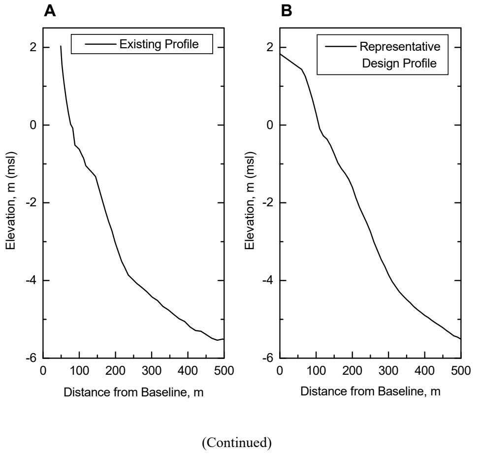

V-4-40 Beach Fill Design

#### EXAMPLE PROBLEM V-4-2 (Continued)

#### SOLUTION:

## Step 1; Compute sediment deficit volume in existing profile.

Align existing and representative design profile at MSL datum. Compute volume difference between existing and representative design profiles. This volume represents the sediment deficit between the existing condition and the healthy or sediment-rich condition expected to occur after nourishment. The elevation at which the existing and design profiles are aligned will influence the magnitude of the computed profile sediment deficit. In the present example the MSL datum is selected because here beach width is defined relative to this datum. The sediment deficit in the pre-project profile can vary significantly along the project reach. The computed pre-project sediment deficit in the beach profile is 100 m3 /m in this example and is illustrated in Example Figure C. The data manipulations and calculations discussed in this example are automated within the BMAP software (Sommerfeld et al. 1994).

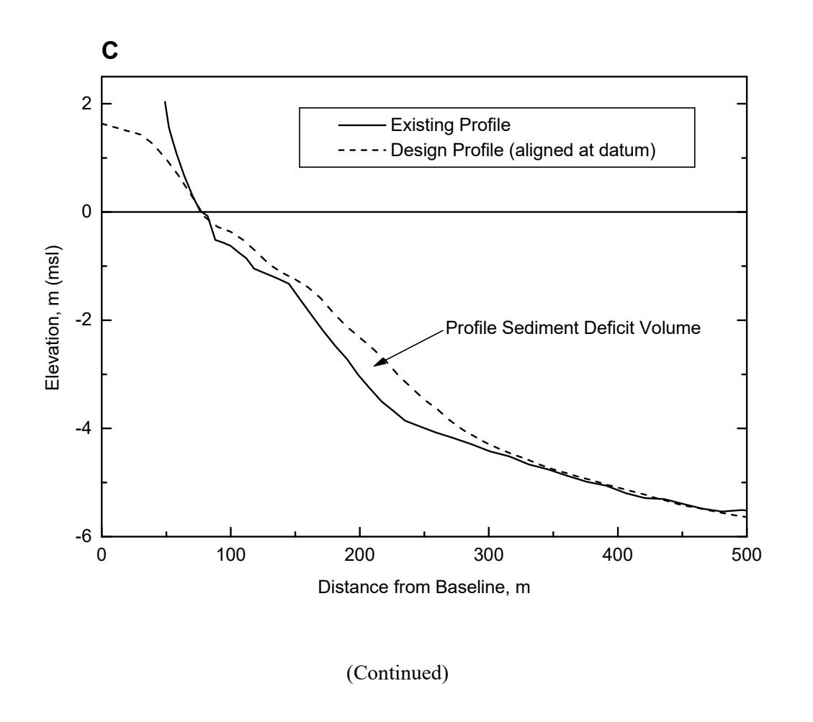

#### EXAMPLE PROBLEM V-4-2 (Concluded))

#### Step 2; Compute required sectional fill volume.

Translate the aligned design profile (from Step 1) 30 m seaward to obtain the final design profile. Compute volume difference between the existing and final design profile between the 1.5-m berm elevation and the 5.5-m depth of closure. This volume represents the total sectional fill volume required to advance the dry beach 30 meters seaward at the msl datum. The total sectional fill volume can vary significantly from reach to reach. In the present example, the total sectional fill volume is 298 m3 /m and is illustrated in Example Figure D. Approximately one-third of the total sectional volume was required to offset the sediment deficit associated with the over-steepened erosion-stressed condition of the existing profile.

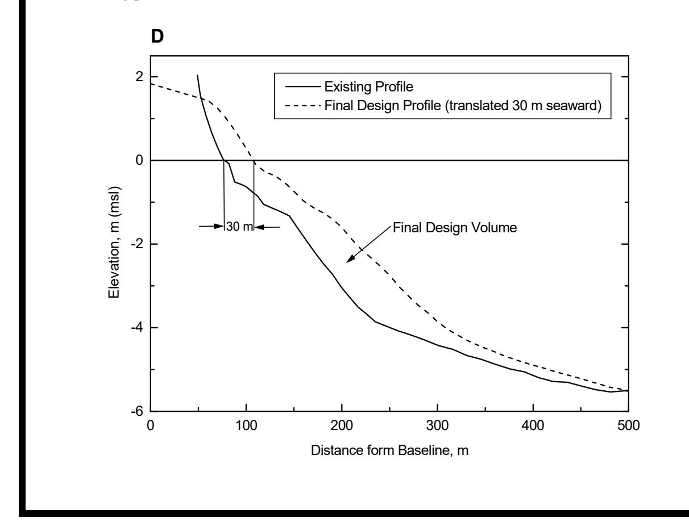

where
- B = the design berm elevation
- DC = the depth of closure
Equation V-4-6 is derived by computing the area of the parallelogram formed by translating the existing profile a distance W as shown in Figure V-4-14. Example V-4-3 illustrates this calculation.
V-4-42 Beach Fill Design
FIND:
Sectional fill volume (fill volume per unit length of shoreline) required to widen the dry beach by 30 m.
GIVEN:
Preproject beach profiles are representative of healthy (sediment-rich) conditions. Berm height of 2.5 m and depth of closure of 6 m.
Fill material (composite median diameter) same as native beach sand.
SOLUTION:
Equation V-4-6 gives

```math
V = 30(2.5 + 6) = 255 m^3/m
```

- (d) Sectional volume computations in situations when the fill and native sediments differ should be made by considering differences between the existing profile and the design profile shape as outlined in Part V-4- 1-f-(4) and illustrated in Figure V-4-17. The BMAP software provides capabilities for calculating sectional fill volume in cases where native and fill sediments differ in median grain size.
- (e) Equilibrium profile concepts also can be used directly to make preliminary estimates of required fill volume, when the native and fill sediments have differing composite median grain sizes. While not recommended for final fill volume computations, these methods provide valuable insight regarding the implications of using fill material with different grain size characteristics. Dean (1991) defines three basic types of nourished profiles. Figure V-4-19 shows an intersecting profile, where the profile after nourishment intersects the native profile at a depth shallower than the depth of closure; a nonintersecting profile, where the nourished profile does not intersect the native profile before closure depth; and a submerged profile, where after equilibrium there is no dry beach. A submerged profile is a special case of a nonintersecting profile which occurs when insufficient volume is placed to fully develop the underwater equilibrium profile. Dean (1991) shows that whether a profile is intersecting or nonintersecting is determined by the following inequality:

```math
W\left(\frac{A_N}{D_C}\right)^{3/2} + \left(\frac{A_N}{A_F}\right)^{3/2} < 1, \text{ Intersecting profile} \tag{V-4-7}
```

• For fill material different from the native beach sand, cross-sectional volume requirements should be estimated with consideration given to the differences in profile slope given by equilibrium profile concepts. Based on theoretical equilibrium beach profile shapes, where AN and AF are the A parameters for native and fill sands, respectively (see Table III-3-3 for values of the A parameter for different sand sizes), fill sand that is finer than the native material will always produce a nonintersecting profile according to Equation V-4-7. Fill sand that is coarser than native sand may

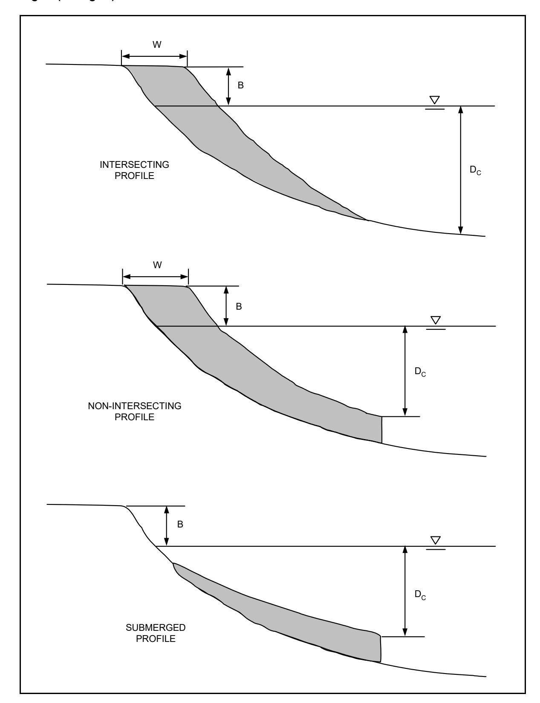

*Figure V-4-19. Three basic types of nourishment profiles (adapted from Dean 1991)*

V-4-44 Beach Fill Design
produce either an intersecting or a nonintersecting profile. For a nonintersecting profile, the volume of sand per unit length of shoreline that must be placed before there is any dry beach after equilibrium is estimated as

```math
V = \frac{3}{5} \left( \frac{D_C}{A_F} \right)^{5/2} \left( A_N - A_F \right) \tag{V-4-8}
```

- If the volume placed is less than that given by Equation V-4-8, a submerged profile is produced after equilibration. Example V-4-4 illustrates volume calculations using Equation V-4-8.
- For nonintersecting profiles with a dry beach after equilibrium (i.e., volume placed is equal to or exceeds that in Equation V-4-8) the volume per unit length of beach required to produce a dry beach of width W may be estimated as

```math
V = WB + \frac{3}{5} \left(\frac{D_C}{A_F}\right)^{5/2} \left(A_N \left[1 + W\left(\frac{A_F}{D_C}\right)^{3/2}\right]^{5/3} - A_F\right) \tag{V-4-9}
```

Example V-4-5 illustrates volume calculations using Equation V-4-9.
For intersecting profiles, the volume per unit length of beach required to advance the beach a distance W after equilibriation can be estimated by

```math
V = WB + \frac{\frac{3}{5}W^{5/3}A_NA_F}{\left(A_F^{3/2} - A_N^{3/2}\right)^{2/3}} \tag{V-4-10}
```

- It is noted that the depth of closure does not enter Equation V-4-10, because by definition, the nourished profile intersects the native profile landward of the depth of closure (see Figure V-4-19). Example V-4-6 illustrates volume calculations using Equation V-4-10.
- Equilibrium profile methods do not account for a sediment deficit in the preproject beach profile, which is common along erosion-stressed shorelines where beach nourishment projects are typically considered. The methods also only account for volume below the berm elevation. Volume contained in the dune must be added to the estimate. These methods are recommended for quick calculations, and to compliment calculations based on differences between preproject profile shapes and design profiles. They are not recommended for use in computing final sectional fill volume estimates.
- A third method for computing sectional fill volume when fill and native sediments have different grain size characteristics is to translate the healthy, sediment-rich, design profile as shown in Figures V-4-14 and 15, calculate the volume using Equation V-4-6 , and then apply the overfill factor to the volume determined from profile translation (see Part V-4-1-e-(3i) and Example V-4-1). The overfill factor would also be applied to any advance renourishment volume. Dune volume must be

#### FIND:

Sectional fill volume that must be placed before any dry beach width is added after equilibrium. Disregard any volume necessary to makeup for a preproject sediment deficit in the beach profile.

#### GIVEN:

Berm height of 2.5 m and depth of closure of 6 m. Native sand median grain size of 0.26 mm and fill sand median grain size of 0.19 mm.

#### SOLUTION:

Values of the A parameter for native and fill sand are read from Table III-3-3.

```math
A_N = 0.117 \text{ m}^{1/3}, A_F = 0.097 \text{ m}^{1/3}
```

Profile is nonintersecting because AF <AN, therefore Equation V-4-8 is applicable.
Equation V-4-8 gives

```math
V = \frac{3}{5} \cdot \left( \frac{6}{0.097} \right)^{5/2} \cdot \left( 0.117 - 0.097 \right) = 361 \text{ m}^{3}/\text{m}^{2}
```

This illustrates that when filling with sand finer than the native beach material, a significant amount of sand must be placed before any dry beach width is produced after equilibrium. Note that the sectional fill volume is 140 percent of the sectional fill volume computed in Example V-4-3, and the present example will produce no additional dry beach width whereas 30 m of additional dry beach width is obtained in Example V-4-3.
added. The overfill method can compliment calculations made using the other methods, but it is not recommended for final fill volume computations.

#### g. Evaluating project longevity

The longevity of a beach nourishment project is primarily determined by the degree to which the placed sand volume addresses any preproject profile volume deficit, and the rate at which fill material is transported out of the project domain in the alongshore direction, i.e, lateral spreading losses. Wave-driven longshore sand transport processes are the major cause of lateral spreading. Projects tend to be built in erosional areas where waves act to move sand out of the project domain, in a long-term, net sense. In addition to the wave climate and its interaction with the local morphology, there is another important aspect of lateral spreading. The project itself creates a perturbation in shoreline and beach orientation, particularly where the fill transitions into the adjacent beaches. At these transitions, local wave transformation patterns and consequently the longshore sand transport regime are altered, which can lead to high rates of fill loss from the ends of the project (often called end losses). Coastal structures that exist within the project domain, or are built as part of the project, also can impede alongshore sand movement and influence the rate of sand loss. Grain size characteristics of the fill material may be a factor in determining beach-fill longevity. Part III discusses dependency of longshore sand transport on grain size. However, in practice, the role of grain size is not usually considered in evaluating lateral spreading losses.
V-4-46 Beach Fill Design

#### FIND:

Volume per unit length of shoreline required to widen the dry beach by 30 m. Disregard any volume necessary to makeup for a preproject sediment deficit in the beach profile.

#### GIVEN:

Berm height of 2.5 m and depth of closure of 6 m. Native sand median grain size of 0.27 mm and fill sand median grain size of 0.18 mm.

#### SOLUTION:

Values of the A parameter for native and fill sand are read from Table III-3-3.

```math
A_N = 0.119 \text{ m}^{1/3}, A_F = 0.094 \text{ m}^{1/3}
```

Profile is nonintersecting because AF <AN, therefore Equation V-4-9 is applicable.
Equation V-4-9 gives

```math
V = 30 \cdot 2.5 + \frac{3}{5} \left( \frac{6}{0.094} \right)^{5/2} \left( 0.119 \left[ 1 + 30 \left( \frac{0.094}{6} \right)^{3/2} \right]^{5/3} - 0.094 \right) = 796 \, \text{m}^3/\text{m}
```

By comparing with Example V-4-3, it is seen that using the finer material specified in this example requires 3.1 times the volume required using compatible material to generate the same equilibrium beach width. This example illustrates that much higher fill volumes are required when using finer-than-native sand to obtain a given beach width, which is consistent with sand compatibility calculations performed using the overfill ratio (see Example V-4-1).
Although alongshore spreading of fill material represents a loss to the project area, this material is in most cases transported to adjacent beaches. Nearby beaches, particularly those downdrift of the project, realize protective benefits from the neighboring project. Over the life of a beach nourishment project, adjacent beach benefits can be quite significant. If the project is built adjacent to an inlet with navigation channels, the impact of the nourishment project on channel operation and maintenance should be assessed.
(1) Periodic renourishment. Beginning immediately after construction, fill material will be lost from the project due to lateral spreading. Periodic renourishment will be required to maintain the desired beach cross section. It should be recognized by the designer that year-to-year loss rates can deviate from the long-term average erosion rates. In addition to end effects at transitions, losses are significantly influenced by the occurrence of major storms. Annual losses will likely vary from year to year because of the dependency on storm activity. Therefore, while an average renourishment interval and quantity can be estimated, the actual

#### FIND:

Volume per unit length of shoreline required to widen the dry beach by 30 m. Disregard any volume necessary to makeup for a preproject sediment deficit in the beach profile.

## GIVEN:

Berm height of 2.5 m and depth of closure of 6 m. Native sand median grain size of 0.27 mm and fill sand median grain size of 0.36 mm.

#### SOLUTION:

Values of the A parameter for native and fill sand are read from Table III-3-3.

```math
A_N = 0.119 \text{ m}^{1/3}, A_F = 0.137 \text{ m}^{1/3}
```

Determine whether profile is intersecting or nonintersecting.
Equation V-4-7 gives

```math
30 \cdot \left(\frac{0.119}{6}\right)^{3/2} + \left(\frac{0.119}{0.137}\right)^{3/2} = 0.893 < 1
```

therefore, the profile is intersecting and Equation V-4-10 is applicable.
Equation V-4-10 gives

```math
V = 30 \cdot 2.5 + \frac{\frac{3}{5} \cdot 30^{5/3} \cdot 0.119 \cdot 0.137}{\left(0.137^{3/2} - 0.119^{3/2}\right)^{2/3}} = 137 \text{ m}^{3}/\text{m}
```

By comparing with Example V-4-3, it is seen that using the coarser fill material specified in this example requires approximately 45 percent less volume than that required using compatible material, to generate the same equilibrium beach width.
required interval/quantity will vary depending on the climatic conditions that occur. Ideally, the need for renourishment will be determined by monitoring performance of the fill. Some level of renourishment, or maintenance such as redistribution of sand within the project domain, is needed when the project design cross section is no longer in place. In this situation, the desired level of protection is compromised. However, the schedule for periodic renourishment may be more fixed, in the sense that budgeting for it may have been set at the outset of the project. If renourishment is needed before the scheduled time, it can be handled as an emergency maintenance action (see Part V-4-1-m). Should permanent changes to the periodic renourishment cycle (volume and/or frequency) be necessary, a reformulation of the project may be needed. Having an adequate project monitoring plan in place is very important. Monitoring data are particularly valuable if the project does not perform as designed. The data can be analyzed to evaluate the nature of the conditions that prompted the need for unexpected renourishment and assess their frequency of occurrence. Analysis of the
V-4-48 Beach Fill Design
monitoring data also can shed light on a design deficiency. Monitoring and analysis of data are discussed in more detail in Part V-4-1-l.
- (2) Advance nourishment. Advanced nourishment is the volume of sand that is placed for "sacrificial" purposes during initial construction to maintain the design fill section during the initial renourishment interval (i.e., the time from project completion to the first scheduled renourishment). The magnitude of the advance nourishment should be determined based on results from work done to assess lateral spreading losses and volumetric losses due to long-term shoreline recession, i.e., the historic or background erosion rate. The postproject shoreline erosion rate will be greater than the preproject historic or background erosion rate in those cases where the preproject beach featured a sediment deficit or was otherwise sediment starved. For example, project reaches that feature an armored shoreline may historically exhibit little or no erosion, but can exhibit significant background erosion when replenished with sand fill. Advanced nourishment quantities are included in the initial total construction volume.
- (3) Fill parameters affecting lateral spreading. Both simple and detailed methods are available for estimating the rate of alongshore spreading, and identifying renourishment requirements (both volume and interval). Simple methods treat the incident wave climate in a more approximate manner, through use of a representative wave height and neglecting wave direction. They consider the background erosion rate as an input parameter, and they assume the erosion rate is uniform over the project domain. Simple methods are generally most applicable to cases that do not involve coastal structures. On the other hand, detailed methods treat the effects of coastal structures and wave climate more rigorously. They address the issue of alongshore variation in wave conditions that produce the background erosion rates, as well as alongshore variations in erosion rates within the project bounds. Detailed methods treat the directionality of the wave climate. Dominant wave directions become important for projects constructed in the vicinity of engineered structures, littoral barriers, or sediment sinks, such as inlets. Detailed methods consider the actual planform layout of the shoreline and structures, whereas simple methods represent them in an idealized manner. In this section, analytical solutions to the one-line theory of shoreline evolution are examined to reveal the importance of the following beach nourishment design parameters on lateral spreading losses: length of the nourishment project, incident wave climate, and ambient background erosion. The analytical approach is extremely useful in preliminary design and to gain an understanding of the relative importance of these parameters. Detailed methods are also presented later, which rely on the use of numerical models to evaluate project longevity.

#### (a) Effect of fill length.

• In this section, the effect of beach-fill length (the alongshore extent of the fill) on project longevity will be examined. The influence of length is best illustrated by considering the most simple case of an initially rectangular beach fill constructed on a long straight beach with no background erosion. This situation was first introduced in Part III-2 of this manual where the linearized equation of longshore sediment transport was combined with the equation of continuity to develop the one-line theory of shoreline evolution (see Equations III-2-25 and III-2-26). A number of analytical solutions to this equation were presented. In this section, Equations III-2-31 and III-2-32 will be examined further to extract additional information pertinent to beach nourishment design. Upon close examination of Equation III-2-31 it is seen that the important parameter is

```math
\frac { a } { 2 { \sqrt { \mathfrak { e } } } t } \tag{V-4-11}
```

where a is one-half the length of the rectangular project, ε is the "shoreline diffusivity" parameter defined in Equation III-2-26, and t is time. Here it is seen that if the quantity in Equation V-4-11 is the same for two
different projects their planform evolution would be the same. However, if two projects were exposed to the same wave climate but had different alongshore lengths, then the project with the greatest length would be predicted to last longer (with all other factors being the same). In fact, according to Equation III-2-32 the longevity of a project varies as the square of its length. If more than 50 percent of the placed beach-fill volume remains within the placement area (0.5 < p(t) < 1.0), Equation III-2-32 can be approximated using the following relationship (with an accuracy of \pm 15 percent).

```math
p ( t ) \, = \, 1 \, - \, \frac { \sqrt { \mathfrak { c } } t } { a \sqrt { \pi } } \tag{V-4-12}
```

• Example Problem V-4-7 illustrates the importance of project length on project longevity. In this example, a fill with twice the length will last four times as long. The effect of project length on fill longevity is critical for short fills. It is also important in long fills which may be built in stages. For example, construction may be limited to a particular season to avoid turtle nesting season or the tourist season. Therefore it may take 2 or 3 years to complete the work. Projects built in stages will temporarily perform as short fills until the other portions of the project are completed. Actual loss rates from the constructed subreaches will likely exceed losses predicted for the completed as designed project. Any short-term accelerated losses due to construction of the project in stages should be factored into the advance nourishment quantity.

#### (b) Effect of wave environment.

• The rate of alongshore spreading losses is also a function of the incident wave climate. In Equation III-2-26 it is seen that the shoreline diffusivity term (€) varies inversely with the breaking wave height raised to the 5/2 power. Dean and Yoo (1992) present a method for calculating a representative wave height and period based on assumptions of Rayleigh-distributed wave height, shallow-water linear-wave theory, simplified and linearized wave refraction and shoaling relations, and a constant proportionality between breaking wave height and corresponding water depth. Use of an effective wave height is recommended in the calculation of the shoreline diffusivity term (€). Dean and Yoo (1992) defined the effective wave as one that produces the same spreading of the beach nourishment material as the actual time-varying wave conditions (expressed as pairs of height and period). They provided the following equation to calculate the effective wave height, H<sub>eff</sub>,

```math
H_{eff} = \left(\frac{\frac{1}{N} \sum_{n=1}^{N} (K_s H_s^n)^{2.4} \frac{\left(C_{go}^n\right)^{1.2}}{C_*^n}}{\frac{1}{N} \sum_{n=1}^{N} \frac{\left(C_{go}^n\right)^{1.2}}{C_*^n}}\right)^{\frac{1}{2.4}} \tag{V-4-13}
```

where K_s is the proportionality factor between significant deepwater wave height and effective deepwater wave height and is equal to 0.735 (Dean and Yoo 1992), H_s^n is the significant wave height of the n^{th} record in the time series of N wave records, C_{go}^n is the deepwater wave group speed of the n^{th} record, and C_s^n is the wave celerity at breaking of the n^{th} record. The effective wave period T_{eff} is defined as the period corresponding to the expression in the denominator.
V-4-50 Beach Fill Design

#### FIND:

The "half-life" of the specified beach fills (time at which 50 percent of the beach-fill material remains within the placement area).

#### GIVEN:

Both projects have a rectangular planform and differ only in alongshore length. Beach fill A has an alongshore length of 3 km, whereas beach fill B has an alongshore length of 6 km. Both projects are subjected to the same wave environment.

```math
K = 0.77
```

```math
\rho_s/\rho = 2.65 \\
n=0.4
```

```math
H _ { b } = 0 . 9 5 { \mathrm { m } }
```

```math
\rho_s/\rho=2.\quad n=0.4\quad d=3.5
```

```math
\dot { C _ { g b } } = ( \mathrm { g h } _ { \mathrm { b } } ) ^ { 1 / 2 }
```

```math
d _ { b } = 2 . 5 \mathrm { m }
```

```math
c_{gb} = (g h_b)^2, \quad h_b = H_b / 0.78, \quad g = 9.81 \text{ m/s}^2
```

```math
d _ { c } = 6 . 0 \mathrm { m }
```

```math
h_b = H_b / 0.78 \\
g = 9.81 \text{ m/s}^2
```

## SOLUTION:

Equation III-2-26 gives

```math
\epsilon = \frac { 0 . 7 7 ( 0 . 9 5 ) ^ { 2 . 5 } \sqrt { 9 . 8 1 / 0 . 7 8 } } { 8 } \cdot \frac { 1 } { ( 2 . 6 5 - 1 ) } \cdot \frac { 1 } { ( 1 - 0 . 4 ) } \cdot \frac { 1 } { ( 2 . 5 + 6 . 0 ) } = 0 . 0 3 5 6 8 \frac { { \mathrm { m } } ^ { 2 } } { \mathrm { s e c } }
```

Solving Equation V-4-12 for t and p(t) = 0.5 gives

```math
t_{50\%} = \frac{a^2 \pi}{4 \epsilon}
```

Half-life of beach fill A

```math
t_{50\%} = \frac{(1500)^2 (3.14)}{(4) (0.03568)} = 49.526 \times 10^6 \text{ sec} \approx 1.57 \text{ years}
```

Half-life of beach fill B

```math
t_{50\%} = \frac{(3000)^2 (3.14)}{(4) (0.03568)} = 198.102 \times 10^6 \text{ sec} \approx 6.28 \text{ years}
```

- Example Problem V-4-8 illustrates the relative importance of the breaking wave height on the expected longevity of a beach-fill project, with all other factors being equal. In this example, a 19 percent increase in breaking wave height resulted in a 35 percent decrease in the project's halflife, which is a measure of fill longevity.
- Differences in longevity are even more pronounced if greater differences in breaking wave height are considered. For example, if the average summer breaking wave height at the project site is 0.6 m, and the average winter breaking wave height is 1.2 m, one would expect that loss rates to be much higher in the winter compared to those in the summer (because of the diffusivity parameter dependence on breaking wave height raised to the 2.5 power). Many beach-fill projects are built during the winter season. The strong dependence of longevity on wave environment helps explain the high rates of lateral spreading loss that can occur during the winter season.
- (c) Effect of background shoreline recession.
- The effect of project length and the incident wave environment have been shown to have a significant influence on expected project longevity. The analysis presented to this point has not considered losses due to ambient coastal processes, such as a gradient in the longshore sand transport rate, which tends to produce background erosion at the project site. Equation V-4-12 can be modified to include the effect of a uniform background shoreline recession rate, E , as follows:

```math
p ( t ) \ = \ 1 - \left( \frac { \sqrt { \epsilon t } } { a \sqrt { \pi } } + \frac { E t } { \Delta y _ { o } } \right) \tag{V-4-14}
```

• Solving Equation V-4-14 for time t yields an expression that predicts the time required for a fraction (1- p ) of the material placed to be lost from the project area (or equivalently the time at which a fraction p of the material placed remains in the project area). This expression is provided as

```math
t_p = \frac{-m - \sqrt{m^2 - 4\ln}}{2l} \tag{V-4-15}
```

in which

```math
l = \left(\frac{E}{\Delta y_o}\right)^2
```

```math
m \ = \ \frac { 2 E ( p - 1 ) } { \Delta y _ { o } } \ - \ \frac { \epsilon } { \pi a ^ { 2 } }
```

and

```math
n = (1 - p)^2
```

V-4-52 Beach Fill Design
FIND:
The "half-life" of the specified beach fills (time at which 50 percent of the beach-fill material remains within the placement area).

#### GIVEN:

Both projects have a rectangular planform with an alongshore length of 6 km. The effective breaking wave height at beach fill A is 0.80 m whereas the effective breaking wave height at beach fill B is 0.95 m.

```math
K=0.77,\quad\rho_s/\rho=2.65,\quad C_{gb}=(g\ h_b)^{1/2},\quad n=0.4,\\ 
h_b=H_b/0.78,\quad g=9.81\ \text{m/s}^2,\quad d_b=2.5\ \text{m},\quad d_c=6.0\ \text{m}
```

## SOLUTION:

Equation III-2-26 gives: (for beach fill A)

```math
\epsilon = \frac { 0 . 7 7 ( 0 . 8 0 ) ^ { 2 . 5 } \sqrt { 9 . 8 1 / 0 . 7 8 } } { 8 } \cdot \frac { 1 } { ( 2 . 6 5 - 1 ) } \cdot \frac { 1 } { ( 1 - 0 . 4 ) } \cdot \frac { 1 } { ( 2 . 5 + 6 . 0 ) } = 0 . 0 2 3 2 2 \frac { { \mathrm { m } } ^ { 2 } } { \mathrm { s e c } }
```

(for beach fill B)

```math
\epsilon = 0.03568 \text{ m}^2/\text{sec}
```

Solving Equation V-4-12 for t and p(t) = 0.5 gives

```math
t_{50\%} = \frac{a^2 \pi}{4 \epsilon}
```

Half-life of beach fill A

```math
t_{50\%} = \frac{(3000)^2 (3.14)}{(4) (0.02322)} = 304.420 \times 10^6 \text{ sec} \approx 9.65 \text{ years}
```

Half-life of beach fill B

```math
t_{50\%} = \frac{(3000)^2 (3.14)}{(4) (0.03568)} = 198.102 \times 10^6 \text{ sec} \approx 6.28 \text{ years}
```

where Δ yo is the initial dry beach width (after cross-shore equilibration), E is the historical shoreline recession rate and a is the beach-fill half length. Example Problem V-4-9 illustrates the effect of background erosion rate. Comparison of results from this example with results from Example V-4-7 show that the specified background erosion rate decreased the half-life of the fill by about 20 percent. Note that the historical shoreline erosion rate E , may underestimate the postnourishment erosion rate if the preproject beach is armored or otherwise features a deficit in sand volume or sand supply.

#### FIND:

The approximate time required for 50 percent of the placed beach fill volume to be lost from the placement area due to alongshore spreading and a background shoreline recession rate of 0.5 m/year.

#### GIVEN:

Assume the planform of the beach fill is initially rectangular with an alongshore length of 6 km and an estimated offshore width of 50 m (after equilibration).
Assume:

```math
K=0.77,\quad h_b=\frac{H_b}{0.78},\quad n=0.4,\quad H_b=0.95\text{ m},\quad g=9.81\text{ m/s}^2,\quad d_b=1.5\text{ m},\quad C_{gb}=(g h_b)^{\frac{1}{2}},\quad \rho_s/\rho=2.65,\quad d_c=6.0\text{ m}
```

#### SOLUTION:

Equation III-2-26 gives \epsilon = 0.03568 \text{ m}^2/\text{sec} (see EXAMPLE PROBLEM V-4-7) Equation V-4-15 gives

```math
l = \left(\frac{E}{\Delta y_o}\right)^2 = \left(\frac{0.5}{50}\right)^2 = 0.0001 \text{ years}^{-2}
```

```math
m = \frac{2E(p-1)}{\Delta y_o} - \frac{\epsilon}{\pi a^2} = \frac{(2)(0.5)(.5-1)}{50} - \frac{0.03568}{(3.14)(3000)^2} (31.536 \times 10^6) = -0.04980 \text{ years}^{-1}
```

```math
n = (1-p) = (1-.5)^2 = 0.2500
```

and

```math
t _ { 5 0 9 6 } = { \frac { - m - { \sqrt { m ^ { 2 } - 4 l n } } } { 2 l } } = { \frac { 0 . 0 4 9 8 0 - { \sqrt { ( 0 . 0 4 9 8 0 ) ^ { 2 } - ( 4 ) ( 0 . 0 0 0 1 ) ( 0 . 2 5 0 0 ) } } } { ( 2 ) ( 0 . 0 0 0 1 ) } } = 5 . 0 7 { \mathrm { y e a r s } }
```

V-4-54 Beach Fill Design
(4) Shoreline change modeling to estimate advance fill and renourishment requirements. In detailed design, one-line numerical models of shoreline evolution such as the GENEralized model for SImulating Shoreline Change model (Hanson 1987; Hanson and Kraus 1989) are typically used to provide more realistic estimates of project longevity and renourishment requirements than may be possible using the analytical approach discussed previously. Numerical shoreline change models provide the designer with an objective tool for evaluating a variety of potential project design alternatives, which may involve coastal structures in addition to beach fill. The use of numerical models of shoreline evolution for the design, optimization, and comparative evaluation of competing project alternatives has many advantages over the use of the analytical approach. For example, the GENESIS model allows examination of multiple renourishment cycles leading to a complete project life cycle, the effects of beach-fill stabilization structures, the effects of many possible future wave conditions (as defined by the Wave Information Study (WIS) wave hindcast) leading to a suite of possible future shoreline conditions. The numerical approach allows for the evaluation of the project design and its performance within the context of a realistic sediment budget developed for the project reach. Employing a shoreline change model like GENESIS allows the designer to examine project performance under conditions much more representative of the actual project setting than is possible with the analytical approach, and is therefore the recommended approach for final design of major projects.

#### (a) Simple model application.

- In this section, the GENESIS model is applied in a simplified manner to simulate the evolution of an idealized beach-fill project, throughout an anticipated 50-year project life, to investigate the design issues of advance fill and renourishment requirements. The hypothetical project is 6 km (3.7 miles) long with a design berm width of 20 m (65 ft). Two series of model simulations were performed for each of four renourishment intervals, 3, 5, 7, and 9 years. The first series of simulations were for a hypothetical condition where the project shoreline was subjected to no ambient or background erosion. The second series of simulations were for a project shoreline experiencing a background erosion rate of 0.5 m/year. All simulations were made for the entire 50-year project life. Note that the 3-year renourishment cycle project was simulated as a series of fifteen 3-year cycles plus one 5 year cycle beginning in project year 45. Likewise, the 7-year renourishment cycle project was simulated as a series of six 7-year cycles plus one 8-year cycle, and the 9-year renourishment cycle project was simulated as a series of five 9-year cycles plus one 5-year cycle.
- In the execution of the simulations, the computed shoreline position at the end of each renourishment cycle was used to define the initial shoreline position at the beginning of the next renourishment cycle, except of course in the project area where the required renourishment fill volume was placed with tapered transitions to the existing shoreline adjacent to the project. The incident wave climate was specified as an effective wave condition that approached the project normal to the shoreline and did not change throughout the simulation. The average berm height and depth of closure were specified to be 1.5 and 6 m, respectively, for a total active depth of 7.5 m. The preproject shoreline was straight. The initial construction planform included 2-km-long transitions to the preproject shoreline position adjacent to the project limits, which were added to reduce the rate of end losses from the project. The model was then run for the first renourishment interval, an appropriate nourishment volume was added, the model was run for another renourishment interval, and so on, until the 50-year life was reached. Each prenourishment shoreline within the project limits was advanced seaward a sufficient distance so that the predicted shoreline position at the end of the renourishment cycle was 20 m seaward of the preproject shoreline at all locations within the project, except within 400 m in from both ends of the 6-km-long project. That is, the design width was allowed to be violated only at the lateral limits of the project, and for an alongshore distance of only 400 m. The results of these model simulations bring to light a number of important considerations with respect to beach-fill design.
Plots of the placed advanced fill and renourishment volume throughout the life of each of the projects simulated are shown in Figure V-4-20. Volumes shown in this plot exclude the design fill volume of 960,000 cu m contained within the project limits and small 400-m transitions at the ends of the project. The volume values include the volume contained in the transition zones that are constructed initially, and advance nourishment placed within the project limits needed to see that the design width is not compromised during the first renourishment cycle. As can be seen in Figure V-4-20a, in the absence of background erosion, the required renourishment volume is expected to decrease slightly over the life of the project. With a background erosion rate of 0.5 m/year the required renourishment volume is seen to remain nearly constant throughout the project life. Most project sites experience background erosion.
- Results indicate that the advance fill volumetric requirement is nearly twice the volumetric requirement of subsequent renourishments, and nearly three times as much for the shortest renourishment interval, or 3 years. The advance fill volume includes the volume initially placed in the transition sections. The explanation for this result is that a substantial volume of material is required to provide a natural transition from the adjacent shorelines to the more seaward-advanced project shoreline. This volume of material is required at the time of initial construction, as part of the advanced fill. Without the transition sections, high end losses at the project transitions would have compromised the design berm width over a significant length of the lateral portions of the project. Subsequent renourishments do not require this additional volume because the adjacent beaches are already prograded toward the design beach width. Part V-4-1-h examines the subject of fill transitions in more detail.
- Figure V-4-21 provides plots of the cumulative volume placed for each of the beach nourishment projects simulated. Results indicate that the cumulative beach nourishment volume requirement for a 50-year project life is nearly the same regardless of the renourishment cycle (at least for the renourishment intervals tested, which span the typical range of most beach-fill projects). A detailed examination of the model output indicates that the average annual rate of loss of sand from the project area increases only slightly as the renourishment cycle increases (3 or 4 percent difference between annual loss rates for 3- and 9-year renourishment cycles). Selection of a renourishment cycle for Federal projects is made through an optimization process that optimizes the amortized initial construction costs and the annual cost of periodic renourishment to minimize the total average annual equivalent cost. Selection of renourishment volumes/intervals is typically done based on average expected losses over the life of the project. Selecting a longer renourishment interval, with strict adherence to amortized life-cycle-cost based selection, may reduce flexibility in dealing with annual variations in loss rates, which might be caused by several years of higher than normal storm activity, or design deficiencies discovered within the first few years following construction. From both engineering/design and monitoring/maintenance perspectives, 3- to 4-year renourishment cycles are desirable. If longer renourishment intervals are desired from an economic perspective, it is prudent to plan a short first renourishment interval (about half the optimized interval, or 3 to 4 years, whichever is smaller).
- If the volume remaining within the project area is subtracted from the cumulative placed volume, one can estimate the cumulative spreading losses. In the simulations without background erosion, the cumulative spreading losses range between 2.75 to 2.83 million cu m of sand, depending on the renourishment cycle. However, the simulations that included the effect of a 0.5 m/year background erosion rate indicate substantially higher cumulative losses, between 6.36 to 6.68 million cu m of sand, depending on the renourishment cycle. Some past projects have underestimated renourishment requirements by assuming that a historically based volumetric rate of erosion within the project domain can be used to estimate the required renourishment. This assumption incorrectly neglects the effect of background erosion outside the project on project end losses. For example, the
V-4-56 Beach Fill Design

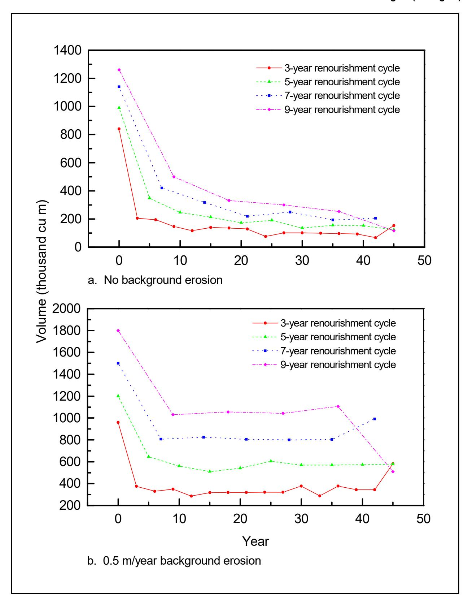

*Figure V-4-20. Advanced fill and renourishment volumes*

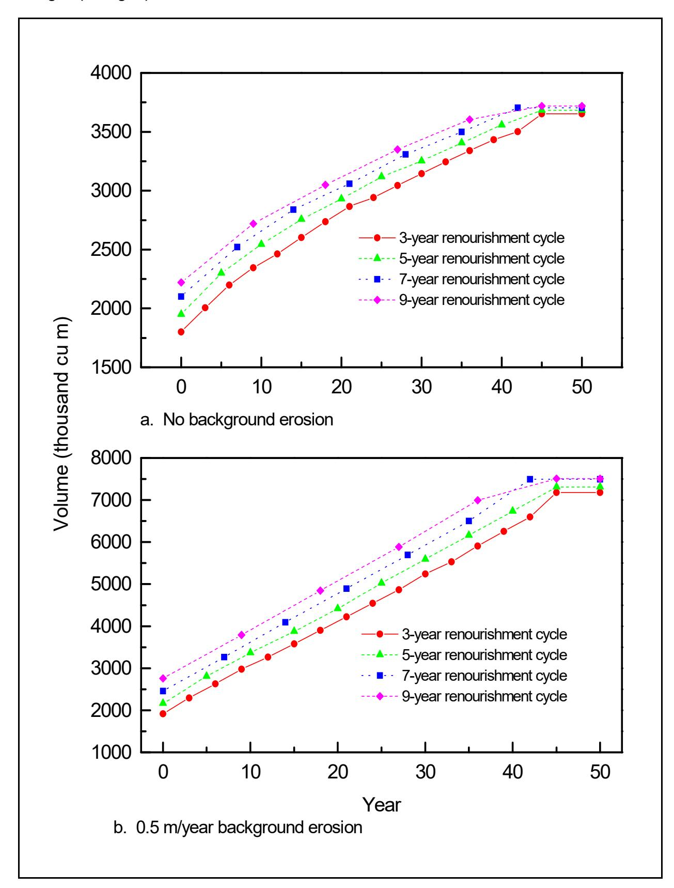

*Figure V-4-21. Cumulative beach nourishment volume*

V-4-58 Beach Fill Design
volumetric erosion due to a background erosion rate of 0.5 m/year on a 6-km project length with an average berm height of 1.5 m and a depth of closure of 6 m is 1.13 million cu m over a 50-year project life. Adding this volume to the calculated project end loss volume (in the absence of background erosion) of 2.8 million cu m gives a total project volume of 3.93 million cu m which is only about 60 percent of the 6.52 million cu m estimated in the simulations that included a background erosion rate of 0.5 m/year. The explanation for this result is that background erosion outside the project causes the seaward protuberance of the project to become larger each year. At the end of the 50-year project, the design shoreline is 45 m seaward of the adjacent shorelines which are unaffected by the project nourishments; whereas in the absence of background erosion, the protuberance of the design shoreline remains 20 m throughout the 50-year project. The additional nourishment volume is required to provide a natural transition from the eroded adjacent shorelines to the design shoreline. Figure V-4-22 shows the calculated shoreline position at the end of the 50 year nourishment project for each of the project scenarios simulated. It also illustrates the previously discussed requirement for additional nourishment volume in the presence of background erosion. Figure V-4-22 also illustrates the beneficial effects a beach-fill project has on the adjacent shorelines during its lifetime. In the absence of background erosion (Figure V-4-22a) it is seen that the beaches adjacent to the fill project are advanced seaward approximately half the design width for more than a project length on both sides of the fill. With a background erosion rate of 0.5 m/year (Figure V-4-22b) it is seen that the fill project stabilized the shoreline at or seaward of the preproject shoreline position for a distance of approximately one project length on both sides of the fill.

#### (b) Recommendations for detailed analysis.

- In the previous section, the GENESIS model was applied in a simplified way to estimate volume requirements for an idealized beach-fill project. That application of the GENESIS model was referred to as simplified because the model was not calibrated for the specific project reach nor was a time varying time series of wave information used to represent the environmental forcing. Furthermore, the simplified method of analysis assumes that the project and adjacent beaches can be characterized as long straight beaches with uniform and temporally constant background erosion rates, and that the dominant long-term processes affecting the evolution of the beach-fill project can be captured by examining the alongshore dispersion of the fill by a persistent effective wave condition. However, many if not most projects vary significantly from these assumptions and warrant a more detailed application of the GENESIS model. Gravens, Kraus, and Hanson (1991) and Gravens (1992) provide detailed information concerning the application of the GENESIS model.
- A detailed application involves developing shoreline position and beach profile data sets, analyses of incident wave conditions including detailed nearshore wave transformation, and selection of a time-history of representative wave conditions for use in model calibration, verification, and project forcasting. Typically a detailed wind wave hindcast such as WIS provides the required wave information and serves as the database defining the local and regional characteristics of the offshore wave climate in the vicinity of the project. A long, multiyear record of measured wave data may also suffice.
- A critical aspect of the detailed application is the calibration of the model to site specific project conditions. Calibration involves selection of the domain to be modeled and boundary conditions, evaluation of model accuracy in reproducing historical shoreline change, and net and gross longshore sand transport rates. The calibration and evaluation of the GENESIS model serve to demonstrate the predictive capability of the model at the specific project site. Estimates based on a well-calibrated and verified GENESIS model are considered superior to those based on a simplified application of GENESIS. However, it may be informative to examine the difference between estimates generated

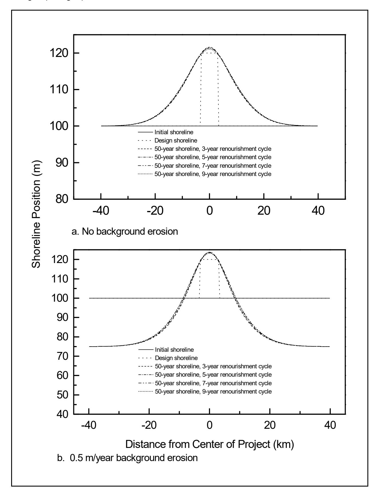

*Figure V-4-22. Calculated 50-year shoreline position*

V-4-60 Beach Fill Design
through both simplified and detailed applications of GENESIS for a given project to quantify the range of uncertainty between the design methods. Coastal engineering judgement, local coastal experience, and the performance of nearby similarly-situated projects, if any, are important and should be factored into the overall design and specifically the estimates of project volume requirements. The results of a detailed GENESIS model application should always be interpreted in the context of the model calibration and verification. For instance, if the historical rate of erosion was underpredicted in some specific model region of the simulated shoreline in the calibration and verification then it should be expected that the model will continue to underpredict erosion in this area in the simulation of the various design alternatives. Estimates of volume requirements should be adjusted to account for deficiencies in the model calibration and verification.
- One advantage of taking the detailed GENESIS modeling approach in the investigation and prediction of beach-fill project performance is the opportunity to anticipate possible secondary effects that have troubled some past projects. For instance, the excavation of a nearshore borrow area or some preexisting bathymetric feature may significantly alter local breaking wave conditions and result in the development of a localized zone of accelerated erosion along the project shoreline (a hot spot). A detailed application of GENESIS would examine the effects of local bathymetry and project changes in the bathymetry, through the application of nearshore wave transformation models and inclusion of nearshore wave information in the shoreline change calculations. GENESIS model predictions based on this type of data can reveal the potential for the development of shoreline anomalies within the project. Simplified applications of GENESIS or an analysis based on the analytical approach have no chance of revealing possible hot spot development because the processes responsible for their development are ignored or are smoothed over in the analysis.
- If a good calibration of the GENESIS model cannot be achieved because of complex boundary conditions (unstructured inlet, randomly fluctuating shoreline), or insufficient or poor data quality, then a more simplified application of the model is recommended. An alternative to calibrating and verifying the GENESIS model to historical shoreline position data, is to calibrate GENESIS to an accepted existing-condition sediment budget developed through an analysis of the available physical data. In this type of application, a wave time series that reproduces the accepted sediment budget within the model is developed either from hindcast wave information such as WIS, measured wave information, or simply synthesized from observations or general wave and wind information available in a statistical form.
- (5) Anticipating hot spots. Hot spots are localized areas within a beach nourishment project that experience a reduction in beach width (corresponding to a loss of sand volume) significantly greater than losses that were predicted and/or are observed throughout the rest of the project. Hot spots are problematic in the sense that the desired level of protection may be compromised locally, whereas the remainder of the project is functioning well. To achieve the desired level of protection, renourishment in the hot spot area may be required on a more frequent basis than the rest of the project. Or, some structural solution may be required to provide the desired level of protection or improve sand retention so that renourishment can be performed on the same schedule as is planned for the rest of the project. Hot spot mitigation measures will probably result in additional unanticipated and undesired costs. The public perception of hot spots that develop shortly after construction can be one of project failure. Therefore, the potential for the occurrence of hot spots should be investigated during the design process. This can be accomplished through, for example, the method used by Smith and Ebersole (1997). The GENESIS model together with detailed nearshore wave conditions can also be used for this purpose (Bodge, Creed, and Raichle 1996).
- (a) Hot spots can arise due to a locally strong gradient in longshore sand transport rate, which creates a divergent zone where, in a net sense, more sand is leaving an area than is entering it. Strong longshore transport gradients can develop due to a noticeable change in shoreline/bathymetric contour orientation.
Figure V-4-23 illustrates an example of this type of hot spot at Folly Beach, South Carolina. A beach-fill was constructed along much of the island, and high loss rates were observed locally at the place where the shoreline noticeably changes orientation and creates a convex curve relative to the incident waves (Ebersole, Neilans, and Dowd 1996). Prior to construction of the nourishment project, this area was known as the washout area, suggesting an area that previously experienced high erosion rates. Local knowledge or an analysis of historical shoreline change rates may help identify such a zone. However, areas that have historically suffered high sand loss rates may be presently armored with seawalls or revetments, or controlled by some other structures such as groins, thereby pinning the shoreline position and masking the presence of a future hot spot. Any area in which the shoreline has a bulge or convex shape, relative to the incident waves, is a potential candidate for this type of hot spot.
- (b) The presence of a submerged offshore shoal, or some other highly irregular bathymetric feature such as an underwater canyon, can also be a cause of erosion hot spots. Morphologic features can alter the propagation of incident waves in a persistent manner, creating strong gradients in net longshore sand transport. Stauble (1994) documented the occurrence of multiple erosional hot spots in a beach nourishment project constructed at Ocean City, Maryland, and hypothesized that the cause of the hot spots was the presence of shore-attached finger shoals that characterize the nearshore bathymetry off Ocean City (see Figure V-4-24). The finger shoals appear as lighter-shaded areas. Stauble also identified corollary cold spots, or areas of unusual sand accumulation, which were formed by the sand that was transported out of the hot spots. Smith and Ebersole (1997) showed that the positions of the hot spots/cold spots were well-correlated to zones of divergent/convergent potential longshore sand transport caused by persistent changes to nearshore wave patterns induced by the shoals. The shoals act to alternately focus and spread wave energy due to the process of wave refraction. Results from the application of a wave transformation model (see Part II-3) were used to compute potential longshore transport rates. Figure V-4-25 shows the variation in transport rates for Ocean City, Maryland. Positive rates are directed to the south, negative to the north. Hot spots correspond to strong uphill gradients (e.g., changes from low southerly transport rates to high southerly transport rates). Cold spots occur at downhill gradients.
- (c) Just as natural bathymetric irregularities can lead to the development of a hot spot, an excavated borrow area or a submerged mound constructed out of dredged material can produce the same result. If the manmade feature results in a significant change in bottom relief and is located in water depths where the waves feel the change in depth, persistent longshore sand transport gradients may develop. Hot spots can also form in areas where the incident wave directions are constrained to a narrow window and the area is blocked or sheltered by some land feature or coastal structure, creating a gradient in wave energy and longshore sand transport.
- (d) A third type of hot spot can result as a consequence of how a project is designed and built to protect existing structures and infrastructure. Typically beach nourishment projects are built in areas where structures and infrastructure are vulnerable to storm-induced damage. Oftentimes, the project site already has revetments or seawalls that have been built by private landowners. Both protected and unprotected structures may protrude beyond the natural prevailing shoreline position, thereby creating a very irregular, and unnatural, shoreline. It may be difficult to estimate where the prevailing natural shoreline position would be if the structures were not present.
- (e) If a project is designed and constructed to "wrap around" protruding structures, in an attempt to create a uniform width of beach in front of each structure, the beach will most likely readjust following construction. The readjustment process will lead to a more stable arrangement of sand in which the design width may not be retained in front of the seaward most structures, whereas the beach width may exceed the design width in other areas. Figure V-4-26 illustrates this process. An offshore depth contour equal to the
V-4-62 Beach Fill Design

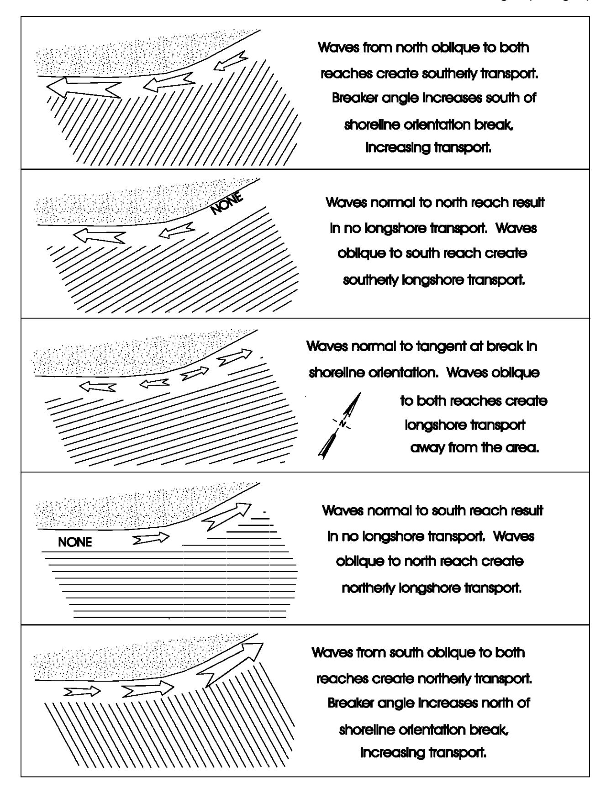

*Figure V-4-23. Causes of hot spot formation at a convex shoreline feature*

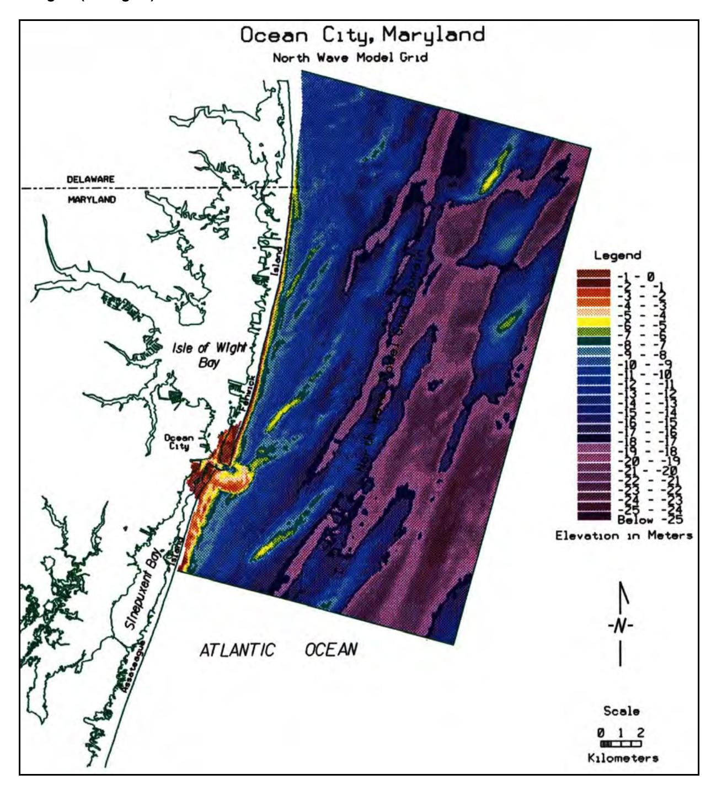

*Figure V-4-24. Project shorelines, nearshore bathymetry, wave modeling domain, and position of offshore wave information*

breaking wave height associated with frequent storms (2- to 3-m depth contour) may serve as a better indicator of the orientation of the postconstruction, adjusted shoreline.
(f) It may be impossible to maintain the design width in front of some structures without placing a substantially larger volume of sand than is estimated based on "wrapping" the project around the existing structures. It may not be cost-effective to build the entire beach out to the point required to provide the
V-4-64 Beach Fill Design

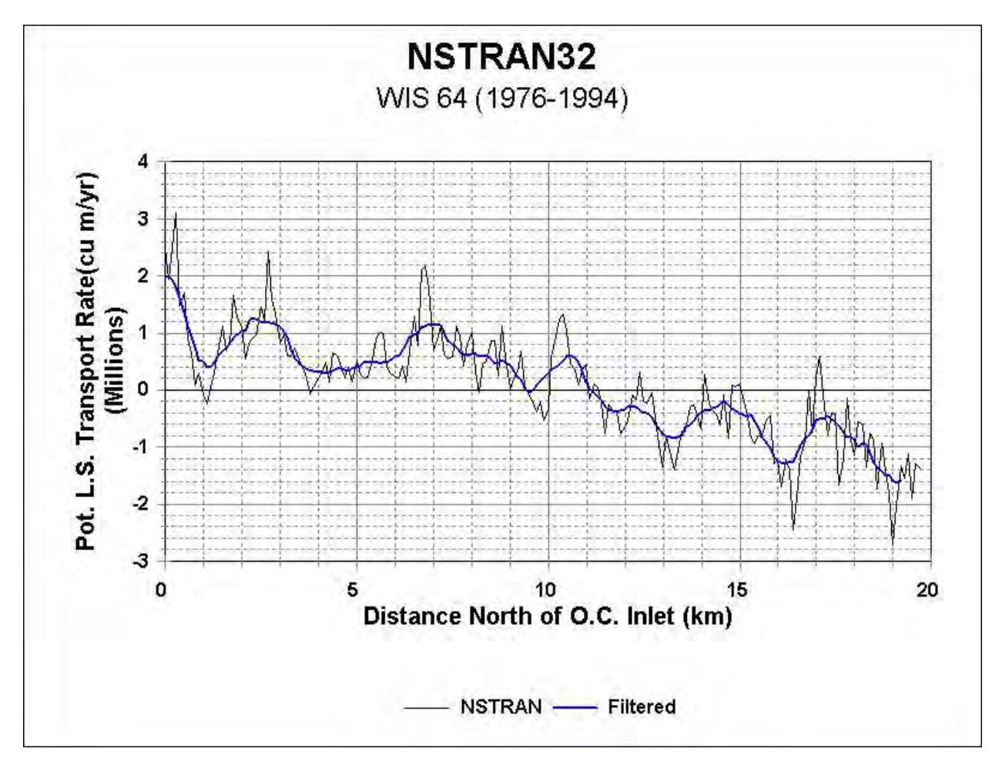

*Figure V-4-25. Variations in potential longshore sand transport rates caused by offshore shoals at Ocean City, Maryland*

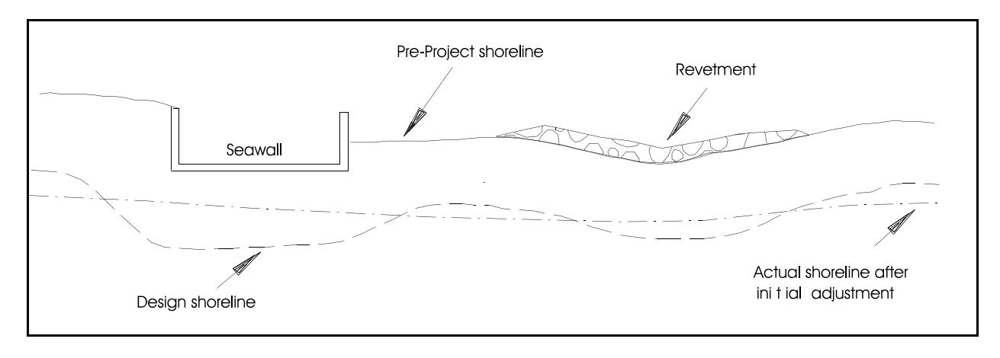

*Figure V-4-26. Planform adjustment of a beach-fill project designed to "wrap around" existing coastal structures*

desired level of protection to the seaward most structures. If this is the case, other means for achieving the desired level of storm protection in certain local areas, such as more frequent nourishment, use of a feeder beach, a filled groin compartment, or a revetment or seawall, should be considered.
(g) There are probably other less well-understood causes for the development of hot spots. A geologic control such as remnant morphologic feature (relic inlet) with a different sediment composition may cause differential erosion along the project reach. Longshore variation in the sediment characteristics of the borrow material may produce a differential loss rate within sections of the project. However at present, there are no reliable methods for anticipating hot spots caused by these other factors.

## h. Fill transitions.

- (1) Selection of a method for terminating a beach nourishment project depends on several factors. One important consideration is what lies immediately beyond the project limits. For example, is there an open straight beach or an inlet? On open stretches of coast, transition to the adjacent beach can be accomplished using a fill transition section, which was briefly introduced in the previous section, or using hard structures, such as groins, navigation structures, or breakwaters. Structures placed at the boundaries of a project are called terminal structures. If the project is constructed near an inlet, structures may be desirable to minimize movement of fill material into navigation channels. Hard structures will allow an abrupt termination of the beach-fill section. However, these structures can be costly, and can interfere with the natural longshore transport of sediment along the shoreline. If not designed properly, this interference could result in adverse effects along the unrestored beach and subsequent objections by adjacent-beach property owners.
- (2) Another key factor is the purpose for building the project. If the project is built to provide storm protection, what is the reach of shoreline to be protected and what is the desired level of protection within the reach? The desire to maintain a specific design beach width may dictate the design of the transition section. In practice, if a uniform design width is desired for the entire project reach, it will be extremely difficult to maintain that width near the lateral ends of the project, unless a terminal structure is used or the design fill is extended beyond the limits of the design reach. If sand is to be placed outside the design reach, other issues become important. Can the fill provide benefits to the adjacent property, and how will those benefits be factored into the economic justification of design (if at all)? It may be more practical to consider the nourishment project in three sections, one interior section where a desired level of protection will be maintained, and two outer sections of the project where a lesser degree of protection will exist (i.e., the transition sections). In the transition sections, the level of protection will diminish with distance from the main project reach.
- (3) If the project is built primarily for recreational purposes, the design goal may be to maximize retention of fill volume within the limits of the project reach. This design objective may dictate whether or not fill transitions are used at all, and if so, how they are designed.
- (4) Although sometimes approached as an afterthought in project design, beach-fill termination deserves careful consideration. This is particularly true in terms of its relation to the economics of the project and the level of storm protection that is sought/claimed near the limits of the project. This section discusses use of fill transitions at the ends of a nourishment project. The next section, Part V-4-1-i, discusses use of structures in fill stabilization.
- (5) The intent of fill transitions is to minimize the effect of end losses on project integrity. End losses from the main project reach can be reduced by extending the design section past the limits of the reach where protection is desired, or by smoothly tapering the project into the adjacent beaches (i.e., gradually reducing project width from the design width to zero). Tapering the fill ends will decrease the perturbation effects of
V-4-66 Beach Fill Design
the project section. The effect of varying taper length can be estimated with the aid of analytical or numerical shoreline planform response models (Walton 1994; Hanson and Kraus 1989).
- (6) The GENESIS model was used in a series of simplified applications to investigate the effect of beachfill transitions. Figure V-4-27 shows plots of an initial rectangular 6-km-long fill section, and the calculated shoreline at 1-year intervals, for two projects identical in every way except that the project in the top panel has a 400-m-long fill transition and the project in the bottom panel has a 2,000-m-fill transition. The total fill volume is the same in both projects, to allow assessment of how best to utilize a finite volume (or alternatively a fixed cost). The duration for both simulation is 5 years. A single, normally-incident effective wave is considered. The design objective is to maintain a beach width of 20 m throughout the 5-year interval, everywhere within the project reach.
- (7) At the end of the 5-year simulation, both projects have beach widths greater than the 20-m design width; and therefore, both projects have satisfied the design objective. It is noted that the average annual volumetric rate of sand loss from the 400-m fill transition project was 148,000 cu m/year; whereas for the 2,000-m fill transition project, the average end losses were 89,000 cu m/year (about a 40 percent reduction in the rate of end losses). However, because approximately 22 percent of the fill volume was placed outside the project reach at the time of construction in the 2,000-m fill transition sections, the percent of total placed fill volume remaining within the 6-km project area is greater for the 400-m fill transition project (58 percent remaining) than for the 2,000-m fill transition project (55 percent remaining). For this case, the example suggests that if there are few or no economic benefits to claim in the transition section, then all the fill volume should be placed within the limits of the project reach (i.e., no use of transition sections). The same conclusion would be reached in this case if maximizing fill volume retention was the primary design goal. However, recall from the previous section that project longevity varies with the square of the project length. Generally, this rule of thumb concerning use of transitions is true for shorter fills. Also, for short fills, it may not be desirable to place sand volume in transition sections which may require a significant percent of the total volume placed within the project.
- (8) For longer projects, the design requirement of maintaining the design berm width at the project boundaries throughout the renourishment interval may favor the placement of beach-fill transition sections. Figure V-4-28 provides plots of the initial fill and the calculated shoreline position after 5 years, for 6- and 22-km-long fill projects, with both 400- and 2,000-m fill transition sections. Again, the design berm width is 20 m. In Figure V-4-28a, it is seen that for the 6-km fill project, the 400-m transition project shoreline is seaward of the 2,000-m transition project shoreline after 5 years everywhere within the project domain. However, for the 22-km fill project shown in Figure V-4-28b it is seen that at the project boundaries, the 400-m transition project is landward of the 2,000-m transition project, and more importantly, landward of the design shoreline. This result illustrates the potential value of beach-fill transition sections for long beach-fill projects.
- (9) However, even for long projects, the benefit of placing a fill transition section is only realized during the first few years after construction (within the first renourishment cycle, as a rough rule of thumb).
- (10) Within only a few years the volume of fill material that has moved from within the project limits onto the adjacent beaches, as a result of alongshore spreading, is likely to be much greater than the volume that was initially placed in the transitions, even with 2,000-m-long transition sections. This conclusion is further illustrated by the results shown in Figure V-4-28, where it is seen that the calculated shoreline position adjacent to the main project after 5 years is for all practical purposes the same for both the project with the 400-m fill transition and the project with the 2,000-m fill transition. The work of Walton (1994) suggests that transition sections have a more lasting significant impact on reducing rates of sand loss from the project only when their length exceeds a value that is 0.25 times the project reach length. In past practice,

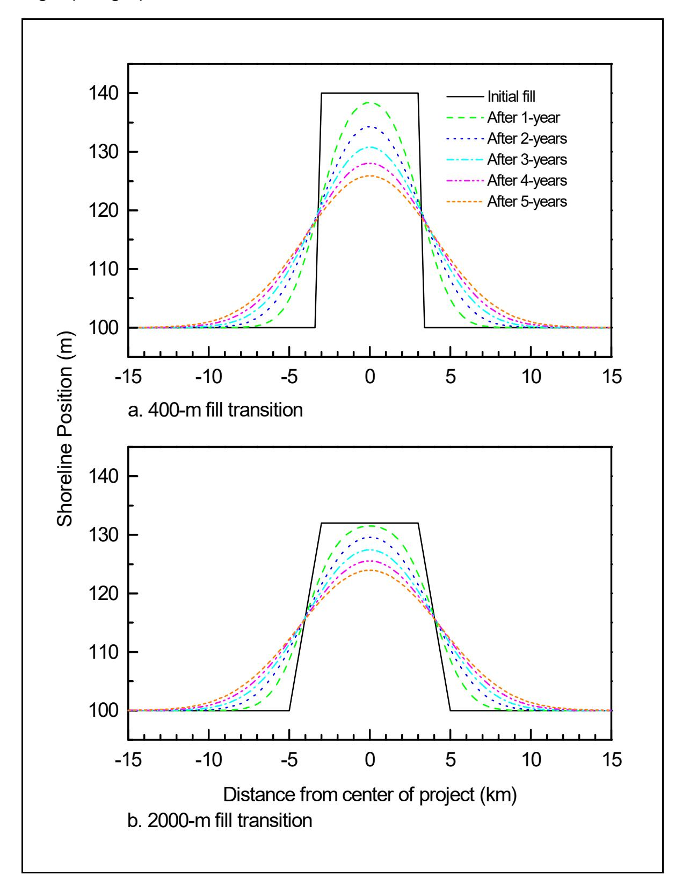

*Figure V-4-27. Effect of fill transitions*

V-4-68 Beach Fill Design

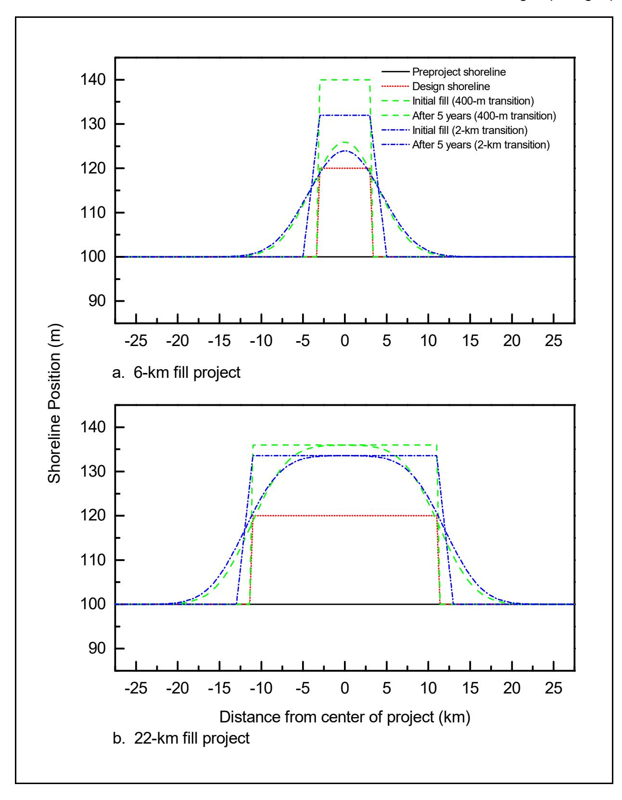

*Figure V-4-28. Effect of fill transitions*

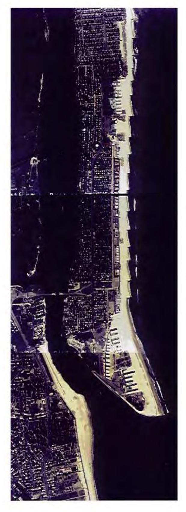

*Figure V-4-29. Groin field at Long Beach island, New York*

V-4-70 Beach Fill Design
transitions sections have rarely been constructed to this length. In practice, the exact length of the fill transition section does not ultimately matter so long as it is in reasonable proportion to the scale of the project. Typical fill transition lengths for small projects (approximately 1 to 2 km; 100,000 to 200,000 m3 ) are on the order of 150 to 300 m (500 to 1000 ft) long, while for larger projects they are on the order of 300 to 600 m (1000 to 1,500 ft) long.
- (11) Transition sections do reduce the rate of fill loss from the project; but again, this benefit lasts only for the first few years following construction. Some past project designs have inappropriately estimated the beneficial effects of the beach-fill transitions by computing the reduction in the rate of end loss during the first few years of the project and then projecting these benefits throughout the 50-year project life. The analysis presented here suggests that while benefits associated with reduced loss rates are very high during the first few years, they diminish significantly thereafter.
- (12) An analysis of beach-fill transitions should first examine the evolution of the project with transition sections, either tapered sections or lateral extensions of the design section, and then examine evolution of the project with the transition volume distributed within the project economic benefit area. The distribution within the project doesn't have to be uniform, as was the case in the examples shown here. If transitions are a desirable feature, they should be optimized by balancing the reduction in the rate of end losses from the project (which will reduce renourishment costs) with the cost of placing fill volume outside of the project's economic benefit area. Then, costs of the transition sections over the project life should be compared to the cost of using a terminal structure or compartmentalizing the beach-fill material with groins or jetties, including an assessment of any impacts that might be caused by a terminal structure. The most cost-effective approach should be selected. Environmental concerns, land ownership constraints, or other factors may also need to be considered in the selection of the optimum fill transition sections.

#### i. Beach-fill stabilization measures.

(1) Structures. Different types of structures can be used in conjunction with beach-fill projects to retard fill erosion and thereby reduce periodic renourishment costs. As discussed in the previous section, losses are particularly pronounced at the ends of a project where an offset occurs between the fill section and the adjacent unfilled beach. Structures may be needed in these transition zones to keep fill losses at acceptable levels. In some cases, structures may already be in place on the project beach. Depending on type and location of these structures, it may be advantageous to retain them, and perhaps refurbish them. However, some structures may have a negative effect on the beach, or are undesirable from the standpoint of aesthetics or safety. If existing structures are judged to have a probable negative effect, their removal should be considered. Following is a brief discussion of coastal structures in common use in conjunction with beach-fill projects. A more detailed discussion of their characteristics, effects, and design can be found in Part VI.

## (a) Groins.

• Groins are low linear structures which are typically built perpendicular to the shoreline, extending from the beach into shallow nearshore water. Their primary purpose is to trap and retain sand moving in the alongshore direction. Groins can be constructed in groups, or fields, consisting of a series of structures spaced at predetermined intervals along a segment of shore to improve retention of beach-fill material, Figure V-4-29, or as an individual structure intended to provide effective termination of a beach-fill project. Weggel and Sorensen (1991) note that the addition and modification of groins within the Atlantic City, New Jersey, nourishment project, constructed in 1986, improved fill performance when compared to that of previous fills for the same location. The groins acted to retain the fill within the project area and prevented fill losses into the adjacent inlet.
• In the context of beach nourishment projects, the most common use of the groin is as a terminal structure, designed to reduce or eliminate sediment losses out of the project area. The use of a terminal groin is most frequently considered in projects that abut lacks tidal inlets or are adjacent to the beginning or end of a littoral cell. For example, use of a terminal groin at the end of a beachfill project built next to an unstabilized tidal inlet will not only reduce project end losses but also prevent increased shoaling in the inlet channel caused by deposition of sand lost from the project. Likewise, a terminal groin constructed at the downdrift end of a project built updrift of a submarine canyon can substantially reduce end losses. In both of these cases, the accretionary fillet that develops updrift of the terminal groin can be a renewable source of sediment for maintaining and perhaps renourishing the project. Terminal groins are also appropriate, and should be considered, in projects where the preproject shore lacks existing sandy beach, and in projects where the postproject shoreline will be positioned substantially seaward of the adjacent beaches, particularly in short fills. Federal projects of this type are rare, but private development can often include construction of recreational beaches which depend substantially on terminal structures for their longevity. Figure V-4-30 shows an example of a terminal groin used to terminate a beach nourishment at Oregon Inlet, North Carolina.

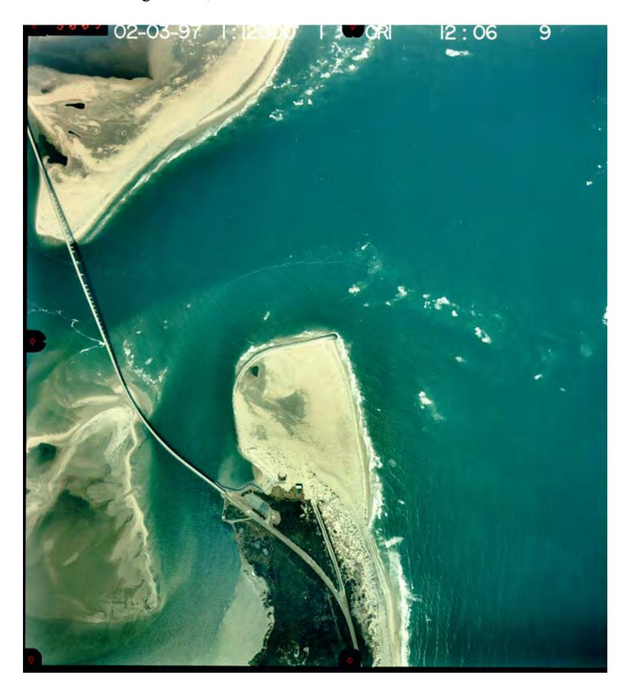

*Figure V-4-30. Terminal groin, Oregon Inlet, North Carolina*

V-4-72 Beach Fill Design
- In littoral cells where there is a dominate net longshore transport direction, a terminal groin centrally located within the cell can exacerbate erosion on the downdrift beach. A terminal groin should not be used within the interior of a littoral cell, unless the downdrift impact of the groin is defined and mitigated. Careful attention must to be given to the design of the groin's profile and length. The terminal groin profile should be a template of the design beach berm and nearshore profile such that the structure blocks littoral transport only to the extent necessary to preserve the design beach cross section, while allowing the ambient net littoral transport to bypass the structure to downdrift beaches. Careful monitoring to assess the structure's impact on the adjacent beaches is recommended. Placing a sacrificial sand fillet downdrift of the terminal groin at the time of initial construction, and perhaps during periodic renourishments, may be necessary to offset any adverse impact to the downdrift beach caused by the groin.
- Groins in general, and groin fields in particular, were commonly used to control erosion and to protect upland development in coastal projects constructed from the 1930s through the 1960s. The experience with groin fields has been checkered with both successes and failures. Groin fields have a proven capacity to provide relief for a local erosion problem by compartmentalization of the shore face and stabilization of the shoreline. However, because the compartments between the groins were rarely filled with beach material at the time of construction, the groin compartments filled over time by capturing, and retaining a portion, if not all, of the longshore sand transport. The result was typically severe erosion downdrift of the groin field. The problem was exacerbated by a chronically increasing deficit of littoral material caused by other upcoast diversions of sand (inlet dredging, breakwaters, hydroelectric dams, etc.). Present coastal engineering knowledge and predictive tools have advanced to the point where competent functional design of groins and groin fields is now possible. However, this design option is often rejected as a matter of policy by many local, state, and Federal agencies with jurisdictional authority.
- Groin fields can provide an effective and economical solution to some coastal erosion problems where shoreline stabilization is the primary project goal. Groins can improve retention of beach fill, but construction of a groin field without concurrent placement of fill is strongly discouraged. As is the case with a terminal groin, groin fields that terminate within a littoral cell, as opposed to at the end of the littoral cell, must provide for sediment bypassing to adjacent shores without interruption. Groin fields should not be terminated in areas with increasing (accelerating) net longshore transport potential. To ensure bypassing, the groin field should be filled during construction and the downdrift groin system should be tapered to provide a smooth transition to the adjacent unprotected shore (see Figure V-4-2). Groin fields have been successfully used together with beach nourishment to stabilize the highly developed southern shorelines of western Long Island at Long Beach Island, New York (see Figure V-4-29). A series of groins were refurbished at Folly Beach, SC, to reduce renourishment requirements for the beach-fill project, which was constructed in 1993 (U.S. Army Engineer District, Charleston, 1987).
- T-head and L-shaped groins are variants of the traditional straight shore-perpendicular groin. These structures include a shore-parallel head section that acts to block and diffract wave energy before it reaches the shoreline. T-head groins can provide a functional improvement over standard groins by reducing the occurrence of rip currents adjacent to the groin and to some extent blocking the offshore movement of sand adjacent to the groin. T-head and L-shape groins are best suited for protecting limited coastal reaches where the mobilizing forces include tidal currents as well as wavegenerated currents and where the project objectives are more focused on compartmentalization and stabilization of the coast than on increasing beach width. A series of T-head groins constructed at Ocean Ridge, Florida, downdrift of South Lake Worth Inlet have proven to be effective in local stabilization of the shoreline (U.S. Army Engineer, Charleston, 1987).
- (b) Detached breakwaters.
- Detached breakwaters are linear offshore structures generally oriented more or less parallel to the shoreline to which they have no solid connection. They can be built as a single continuous structure or segmented into a series of short sections with gaps. Detached breakwaters provide protection by reducing the wave energy that reaches the shore through dissipation, reflection, and diffraction. Compared to shore-perpendicular structures, such as groins, which provide protection by impoundment of alongshore-moving sediment, detached breakwaters can be designed to allow continued movement of longshore transport through the project area, thus potentially reducing adverse impacts on downdrift beaches. However, as is the case with groins, if fill material is not placed at the time of breakwater construction, then any sediment that accretes in the lee of the breakwaters is sediment that is denied from downdrift beaches, which can be expected to erode. The use of breakwaters for shore protection and in conjunction with beach nourishment in the United States has been primarily limited to littoral sediment-poor regions characterized by a low-energy wave climate. Most projects have been located on the Great Lakes, Chesapeake Bay, or Gulf of Mexico (Chasten et al. 1993). These projects are typically subjected to short-period, steep waves, which tend to approach the shoreline with limited refraction, and generally break at steep angles to the shore.
- While detached breakwaters have several appealing functional characteristics for shore protection, they also have disadvantages that include the following: limited design guidance, high construction and maintenance costs, limited ability to predict and compensate for structure-related phenomena such as adjacent beach erosion, rip currents, scour at the structures base, structure transmissibility, and effects of settlement on project performance. Like groins, detached breakwaters should only be utilized after careful study of the effects they will have on the project area and adjacent beaches.
- Details concerning the uses of detached breakwaters in beach-fill projects and design considerations can be found in Engineer Manual 1110-2-1617, Pope and Dean (1986); Dally and Pope (1986); Rosati (1990); and Chasten et al. 1993. Case studies of interest are contained in Nakashima et al. (1987); Gorecki (1985), and Gravens and Rosati (1994).
- (2) Evaluation and optimization of stabilization structures.
- (a) As discussed in previous sections, a beach nourishment project requires periodic reconstruction of the beach planform throughout the project life. In this section, use of structures to stabilize a nourishment project and reduce project end losses have been discussed. Structures such as groins and detached breakwaters are comparatively more expensive and permanent than beach-fill material. Project optimization requires an analysis of the cost-effectiveness of incorporating structures to reduce periodic nourishment requirements versus designing the project without the stabilization structures.
- (b) During the plan formulation phase of the project, the performance of alternative plans (with and without fill stabilization structures) can be evaluated using a shoreline/beach change model, such as the GENESIS model, to estimate total volume requirements. A model can also provide information for assessing adjacent beach impacts resulting from the inclusion of fill stabilization structures. The effects of structure length and transmissibility can be estimated using the GENESIS model. The physical characteristics of the structure, therefore, can be optimized to best serve specific project requirements and objectives. Physical models can also be utilized to comparatively evaluate the performance of beach-fills with and without structures such as groins and breakwaters (Bottin and Earickson 1984).
V-4-74 Beach Fill Design
- (c) Techniques for design of a groin system to reduce beach-fill losses and offshore breakwater design are presented in EM 1110-2-1617. Additional guidance for the functional design of offshore breakwaters for shoreline stabilization is presented in Dally and Pope (1986) and Chasten et al. (1993).
- (3) Dune stabilization. Coastal sand dunes are valuable and effective barriers to storm flooding and wave attack; and therefore, they are often an important component of the beach nourishment project. Because of the importance of the dunes to storm protection, and their vulnerability to wind- and wave-induced erosion, it is advisable to stabilize them with sand fences and vegetation. These stabilization measures are relatively inexpensive and serve two beneficial purposes: to enhance the protective nature of the dunes, and to reduce volume losses from the project due to wind blown transport of the fill. Guidelines for estimating the rate of wind blown sediment transport are provided in Part III-4. Beach-fill projects usually involve creating a much wider dry beach, so more sand is available for transport by wind. As a result, if dunes are stabilized with fences and vegetation, they often accrete with time and wind-blown sand losses from the project are minimized.

#### (a) Fences.

- Various types of fences have been used to create, enlarge, and stabilize coastal dunes. To be successful, the barrier must be porous to wind because a solid barrier creates turbulence that may result in scour rather than accretion. Fencing with a porosity (ratio of area of open space to total projected area) of about 50 percent should be used (Savage and Woodhouse 1969). Open and closed areas should be less than 5-cm in width. The standard slat-type wooden snow fence appears to be the most practical and cost-effective, and it has been widely used for dune stabilization and to promote dune growth. Snow fences are usually installed in single or multiple rows aligned parallel to the shoreline or perpendicular to the predominant wind direction and secured to posts about 3 m (10 ft) apart to improve their stability. If accretion fills the fences, additional fencing can be installed at the new level to promote further growth. Field tests of dune building with sand fences under a variety of conditions have been conducted at Cape Cod, Massachusetts, Core Banks, North Carolina, and Padre Island, Texas. The following are guidelines and suggestions based on these tests.
- Only straight fence alignment is recommended, and the fence should parallel the shoreline. It need not be perpendicular to the prevailing wind direction. Fence will function even if constructed with some angularity to sand-transporting winds. Fence construction with side spurs or a zigzag alignment does not increase the trapping effectiveness enough to be economical (Savage 1962; Knutson 1980). Lateral spurs may be useful for short fence runs of less than 150 m (500 ft), where sand may be lost around the ends (Woodhouse 1978).
- Placement of the fence at the proper distance shoreward of the berm crest may be critical. The fence must be far enough back from the berm crest to be away from frequent wave attack. Efforts have been most successful when the selected fence line coincided with the natural vegetation or foredune line prevalent in the area.
- Dunes are usually built with sand fencing in one of two ways: by installing a single fence and following it with additional single fence lifts as each fence fills (Figure V-4-31); or by installing double fence rows with the individual fences spaced about four times the fence height apart and following these with succeeding double-row lifts as each fills (Figure V-4-32). Single rows of fencing are usually the most cost-effective, particularly at the lower wind speeds, but double fences may trap sand faster at the higher wind speeds.

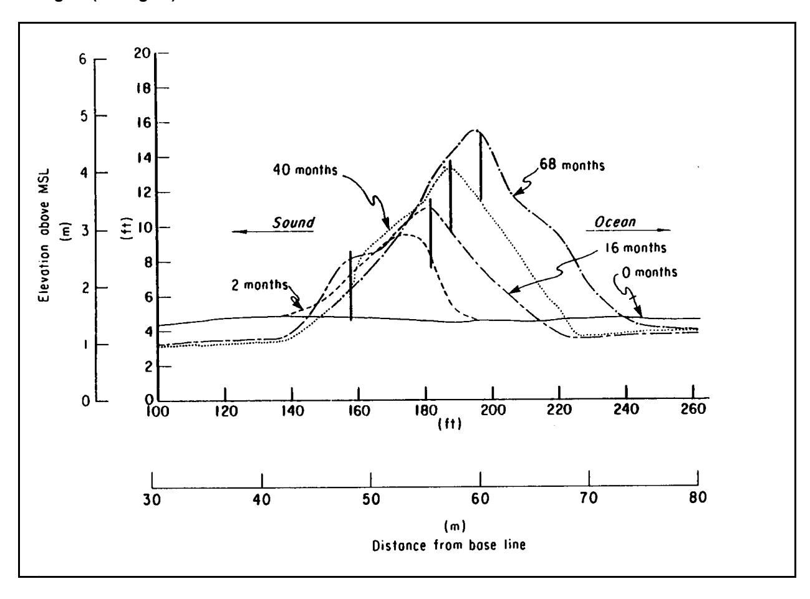

*Figure V-4-31. Sand accumulation by a series of four single fence lifts, Outer Banks, North Carolina (Savage and Woodhouse 1969)*

- Dune height is increased most effectively by positioning the succeeding lifts near the crest of an existing dune. However, under this system, the effective height of succeeding fences decreases and difficulties may arise in supporting the fence nearest the dune crest as the dune becomes higher and steeper. Dune width is increased by installing succeeding lifts parallel to and about four times the fence height away from the existing fence. The dune may be widened either landward or seaward in this way if the dune is not vegetated.
- Accumulation of sand by fences is not constant and varies widely with the location, the season of the year, and from year to year. Fences may remain empty for months following installation, only to fill within a few days by a single period of high winds. To take full advantage of the available sand, fences must be observed regularly, repaired if necessary, and new fences installed as existing fences fill. With sand moving on the beach, fencing with 50 percent porosity will usually fill to capacity within 1 year (Savage and Woodhouse 1969). The dune will be about as high as the fence. The dune slopes will range from about 1:4 to 1:7, depending on the grain size and wind velocity. The trapping capacity of the initial installation and succeeding lifts of a 1.2-m-high sand fence averages between 5 and 8 cu m/lin m of shoreline (2 to 3 cu yd/lin ft).
V-4-76 Beach Fill Design

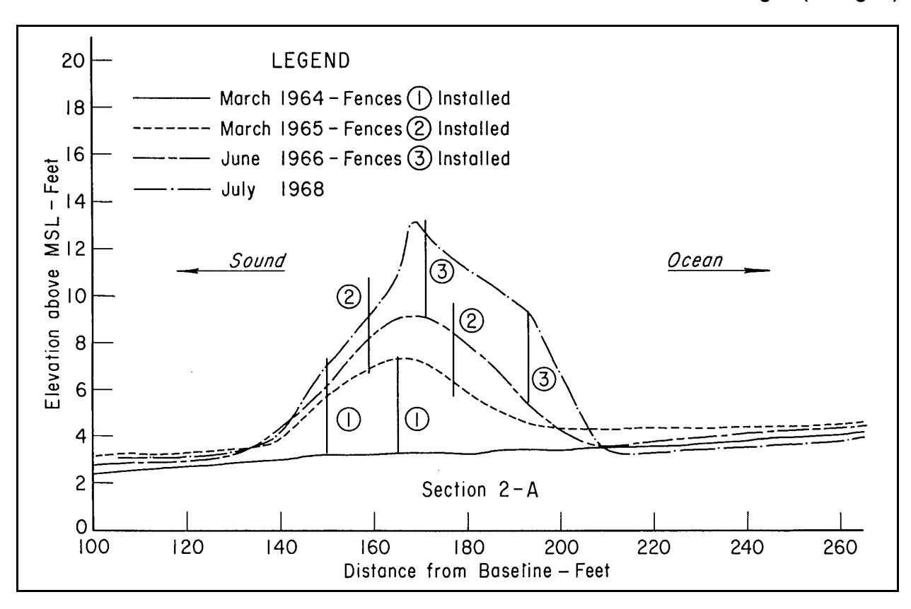

*Figure V-4-32. Sand accumulation by a series of three double fence lifts, Outer Banks, North Carolina (Savage and Woodhouse 1969)*

- Experience has been that an average of 6 man-hours are required to erect 70 m (230 ft) of wooden, picket-type fence or 60 m (195 ft) of fabric fence when a six-man crew has materials available at the site and uses a mechanical post-hole digger.
- Fence-built dunes must be stabilized with vegetation or the fence will deteriorate and release the sand. While sand fences initially trap sand at a high rate, established vegetation will trap sand at a rate comparable to multiple lifts of sand fence. The construction of dunes with fence alone is only the first step in a two-step operation. Fences have two initial advantages over planting that often warrant their use before or with planting: sand fences can be installed during any season, and the fence is immediately effective as a sand trap once it is installed. There is no waiting for trapping capacity to develop, unlike the vegetative method. Consequently, a sand fence is useful to accumulate sand while vegetation becomes established.
- (b) Vegetation. Vegetation is a natural means of shore and dune stabilization that is effective when used under the proper circumstances. Vegetation is relatively economical, and does not detract from, but can enhance environmental quality. On open sea coasts, vegetation is primarily used to enlarge and stabilize dunes. A number of beach grasses and other plants tolerant of a dune environment can be used to create, enlarge, or stabilize dunes. Frequently used species are American beach grass ( Ammophila breviligulata ) in mid- and upper-Atlantic Coast and Great Lakes, European beach grass ( Ammophila arenaria ) on the Pacific Coast, sea oats ( Uniola paniculata ) on the south Atlantic and Gulf Coasts; and the panic grasses ( Panicum amarum ) and ( Panicum amarulum ) on the Atlantic and Gulf Coasts. All of these plants can be propagated by planting suitable stock and are effective in trapping and holding windblown sand. A number of herbaceous and woody plants are also effective in dune areas. The principal considerations in selecting plants
for dune building and stabilization are the suitability of the species for growth in the project area, its probable effects on the existing ecology, availability of stock for transplanting, and economics. Detailed information on suitability of plant species for various regions of the United States, methods of propagation and planting, and protection against disease and physical damage can be found in EM 1110-2-1204, "Environmental Engineering for Coastal Protection"; Knutson (1977); Woodhouse (1978); Savage and Woodhouse (1969); and Knutson (1980). Dune stabilization by vegetation has these advantages. It is capable of growing up through the accumulating dune sand and it can repair itself if damaged, provided the damage is not too extensive and the vegetation was well established prior to being damaged. New plantings will require periodic fertilization the first year or two, and watering the first few months, for the young plants to become well established.
(c) Dune cross-over structures. If newly-constructed or existing dunes are to be stabilized with fences and/or vegetation it is important to protect the stabilization efforts by minimizing traffic through or across the dune. Pedestrian and/or vehicular traffic will damage vegetation and fence lines. Dune walk-over structures for pedestrians and controlled vehicular access points to the beach should be provided in the overall design. Controlled access points provide recreational as well as maintenance access to the beach without damaging the stabilized dune area. Barren low spots (such as caused by trampling) within an otherwise healthy vegetated dune can experience wave overwash and further dune deflation during storms (see Part IV-2). These local areas of overwash and deflation are commonly referred to as a "blow-outs." Blowouts reduce the dune's reservoir of sand and capability to protect upland areas from flooding. Construction guidelines for dune cross-over structures are provided in U.S. Army Engineer Waterways Experiment Station (1981).

#### j. Construction issues .

- (1) Removal, transfer, and placement of borrow material. Removal, transfer, and placement of borrow material is typically the job for the dredging contractor. However, certain aspects of the dredging work should be understood so that practical design and reasonable specifications can be developed prior to bidding out the dredging job. With regard to the removal and transfer phases of the job, the following points are made:
- (a) Offshore borrow areas typically have fine material in the top layers. Hence, if the borrow area is shallow, large losses of fines may occur during the placement operation. Typically, thicker borrow areas are more economical for this reason.
- (b) The further offshore the borrow area is located, the more expensive the pumping of material becomes. Direct pumping to the beach may not be economically feasible if the borrow area is located too far offshore.
- (c) If a hopper dredge or barge is used to transport fill to the site, many of the borrow material fines are washed out with overflow, hence providing a larger grain size distribution of fill material than that based on in situ samples from the borrow site. This fact and the fact that less dirty material (fines) is provided at the subaerial beach may make this type of placement desirable from an environmental and public satisfaction standpoint.
- (d) Borrow areas should not be located too close to shore due to the fact that the equilibrium profile of the beach may be downcut. This could lead to offshore transport of material from the nearshore zone to make up for the deficit. If the borrow site is located too close to shore, and in too shallow water, the irregular bathymetric feature created as a result of the excavation can significantly alter the propagation of incoming waves. This could lead to an erosional hot spot. As a rule of thumb, borrow areas should be located in water depths at least twice the estimated depth of closure (see Part III-3-3-b), or a comparable distance offshore.
V-4-78 Beach Fill Design
- (e) For hydraulically-filled projects, there is a minimum practical sectional fill volume. That is, the constructed beach-fill must be of sufficient width for the contractor to erect dikes, move pipeline, and operate equipment for grading the placed fill and building the dune section, etc. Typical sectional fill volumes range from 25 to 63 m3 /m (10 to 25 yd3 /ft) for truck-haul projects and from 75 to greater than 250 m3 /m (30 to greater than 100 yd3 /ft) for hydraulically placed fill projects. Sectional fill volumes between 140 and 215 m3 /m (55 and 85 yd3 /ft) are fairly common; however, Dean and Campbell (1999) recommended a minimum sectional fill volume of 200 m3 /m (80 yd3 /ft) from a performance perspective.
- (f) A good overview of various dredging systems which can be applied for beach nourishment from offshore sources is provided by Richardson (1976). If trailing suction hopper dredges are available (loaded draft . 9 m for large hopper dredges), long borrow areas may be preferable (for long production runs). Cutterhead pipeline dredges may be more economical where borrow areas are more uniform in dimension (i.e., square) and the deposit is relatively thick (1.5 m or greater) so that the dredge and pipeline do not need to be moved far.
- (g) There are four types of material placement for beach-fill purposes. Description and comments on these methods follow: Direct placement. In this method, the fill is placed at one time throughout the stretch of shore to be protected. This is the most frequently used method of placement. Usually, fill is pumped as a slurry onto the beach via hydraulic pipeline, then reworked into the desired configuration using earthmoving equipment. Additional pipeline is added in sections to extend the placement zone along the beach. The largest grain sizes in the slurry will settle out closest to the slurry discharge point. Likewise, the finer grain sizes will settle out at greater distances. Hence, locating discharge points in locations of known maximum erosion or hot spot regions may be desirable. Providing a sand dike behind which most of the discharge occurs will reduce loss of fines and provide better water quality in the area. Nearshore placement. This method is appealing because large volumes of material can be made available at low costs by hopper dredges or split-haul barges. The principle is that the material, dumped in shallow water is transported towards the beach by wave action. Early tests of this method where the material was dumped in water 6 to 11 m are presented by Hall (1952). In all cases, the results showed that the beaches did not benefit from the dumped sand to any appreciable extent. Hands and Allison (1991) have reviewed a number of offshore dumping projects and found that if disposal depth is less than closure depth, the disposal sediment would be active and move toward the beach. Although nearshore dumping may be more economical, it does not provide the level of protection to upland property that direct placement on the subaerial beach does. It is expected, though, that the nearshore mound will provide some level of wave attenuation. A mound may also change local wave refraction patterns, leading to changes in local longshore sand transport gradients. Continuous supply. This method is typically used at a littoral barrier (i.e., navigation channel or inlet) where sand trapped at the updrift side of the barrier is bypassed to the beach on the downdrift side. These operations are more commonly thought of and designed as sand bypassing systems rather than as a method of beach nourishment. The purpose of this approach is to restore the natural flow of littoral transport at the location where such interruption occurs. Feeder beaches. Feeder beaches involve the stockpiling of fill at the updrift end of the areas intended to receive the fill as the feeder beach erodes. This method is typically used for smaller projects where sand may be trucked in and/or access to discharge points on the beach is limited. The intent is for the stockpiled material to be distributed by natural littoral processes. Feeder beaches generally work well in areas that serve as a source of material for adjacent beaches. Examples are areas
immediately downdrift from inlets or other man-made structures that form a littoral barrier. An erosional hot spot may be another area where a feeder beach is useful as a means for maximizing sand retention.
• Stockpile. In some projects, sand is stockpiled landward of the primary dune (or elsewhere outside of the normally active littoral system) for use in emergency situations. The intent here is to store a quantity of material at favorable costs at a time when the dredges and equipment are already mobilized. Most often this material is used on an as-required basis to repair or restore dunes following storms, or as fill material to close a breach should one be opened by a storm. Having this material readily available at the time of a breach or when needed to restore an eroded dune line can substantially reduce the time and cost associated with completing the emergency repair. For some projects, it may be possible to anticipate that there will be a need for emergency repairs sometime during the life of the project. In these cases, it may be cost-effective to dredge and stockpile excess material for use in emergency situations at the time of initial project construction.

#### (2) Construction template.

- (a) The construction template is the target cross-sectional profile that the contractor is expected to build to ensure that the proper volume is placed. Two construction approaches are generally used. One is to "overbuild" the upper part of the beach profile, stacking the fill material to match the specified template. The second method involves placement of the fill volume over more of the active profile. The over-building method is used most often because of the availability and working limitations of equipment used to place and shape the fill, and the desire to place the material in the most economic manner, which usually means minimizing movement of the discharge point. To a degree, the second construction method involves doing what nature will do on its own anyway, redistribute the volume over more of the active profile. The overbuilding method relies on wave and current action to redistribute the fill to deeper parts of the active profile.
- (b) In the overbuilding method, the dune and/or berm of the design profile is built to the desired elevation. However, the constructed berm width will be much greater than the design berm width for two reasons. First, the volume to be placed includes the advance nourishment volume in addition to the volume needed to create the design profile. Second, and most important, the volume is stacked in the nearshore zone only over a portion of the active depth. Figure V-4-33 shows a typical preproject beach profile, the design profile (which includes a dune), a modified design profile that includes the advance nourishment volume, and the construction template. The construction template reflects a different configuration of the sectional fill volume.
- (c) The construction template is usually specified as a simple geometry, like that shown in Figure V-4-33. The dune is usually built with a trapezoidal cross section having the desired crest elevation, crest width, and side slopes (see Part V-4-1-f for guidance on selecting these parameters). The berm may include a gentle slope (1:100) that transitions from the toe of the dune to the seaward end of the berm crest on the design profile. Such a gentle slope is found on many natural benches. Additional material seaward of the design berm that arises from the overbuilding technique should be constructed to the design berm elevation. The design berm is either constructed with a uniform elevation equal to the design crest elevation or with a gentle slope from the toe of the dune to the seaward point on the design berm crest. At the seaward terminus of the constructed berm, the fill should be placed at a constant grade, the upper slope, from the berm crest elevation seaward to the elevation that corresponds to mlw. From this point seaward, the fill is placed on a more gentle slope, the lower slope, in an attempt to match the construction template. Earth-moving equipment can be used to shape the above-water portions of the profile to the desired slope. The submerged portions of the profile are more difficult to control.
V-4-80 Beach Fill Design

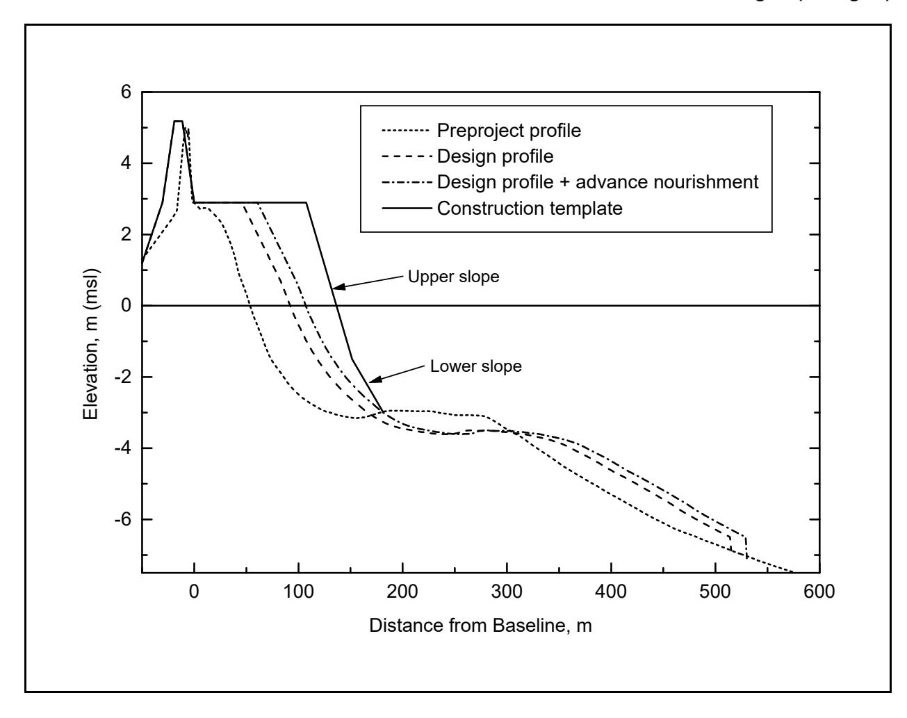

*Figure V-4-33. Definition of beach profiles for nourishment projects*

(d) To minimize difficulties in constructing the upper and lower slopes of the construction template, they should be defined based on expectations of how the beach will evolve after it is placed. The optimal slopes are primarily a function of the grain size characteristics of the fill and the wave and tide conditions that occur at the site during placement operations. One method for estimating upper and lower slopes involves use of the design profile. Part V-4-1-f-4 discussed methods for estimating the design profile shape. The upper slope of the construction template can be estimated as the average beach slope found on the design profile in the elevation range between the berm crest elevation and the elevation corresponding to mlw. The lower slope of the template can be estimated as an average slope computed from the design profile in the elevation range from mlw to a depth below msl which is approximately equal the typical storm wave height (e.g., 2 to 3 m below msl on the southeastern U.S. coast). The design profile reflects substantial adjustment and equilibration of the placed fill.
• Since the time between fill placement and surveying to assess compliance with the construction template might be short, full equilibration may not be realized. Therefore, the upper and lower slopes of the construction template should be chosen to be slightly steeper than the slopes estimated from the design profile.
• An alternative method is to apply the following rough rules to select both slopes.

| Median Grain Size (mm) | Upper Slope | Lower Slope |
| --- | --- | --- |
| D50 <0.2 | 1:20 to 1:15 | 1:35 to 1:20 |
| 0.2 1:15 to 1:10 1:20 to 1:15 | 1:15 to 1:10 | 1:20 to 1:15 |
| D50 > 0.5 | 1:10 to 1:7.5 | 1:15 to 1:10 |

- (e) The median grain size corresponds to that of the fill material. Coarser material can be constructed to, and maintain steeper slopes; finer material adjusts to gentler slopes. Additional information on the specification of construction slopes, as a function of grain size, based on design experience in the southeastern United States is provided by Creed, Bodge, and Suter (1999). Example V-4-10 illustrates the procedure for developing a construction template.
- (f) During placement, the fill should be monitored to determine actual slopes (particularly the lower slope). Strict adherence to the slope of the construction template is not an absolute requirement if the placed material seeks to attain a different adjusted slope. Adjustments can be made to the berm width of the construction template to allow for differences that occur between assumed and actual slopes. This will prevent unnecessary time being expended to mold the beach in a dynamic region of the profile. Analysis of monitoring data should be performed to ensure the prescribed sectional fill volume (volume per unit length of beach) is placed within the active beach zone. Placement of the prescribed sectional fill volume is more important than exactly matching a construction template.
- (g) Scarping is one problem that may be encountered in the overbuilding approach. Scarps may develop at the toe of the fill as waves begin the profile adjustment process. Scarps can pose a threat to human safety, and they also present a problem for nesting sea turtles. Scarps can be mechanically smoothed as part of the construction contract or during regular beach maintenance and cleaning. Designing the berm crest elevation to be equal to the natural berm crest elevation, and selecting an upper slope of the construction template similar to the foreshore slope of the design profile, will minimize the likelihood of severe scarping.
- (h) The second construction method involves placing more of the fill offshore, i.e., nourishing more of the active profile rather than stacking the material in the inshore zone. In this method, the target construction template is more or less the design profile. However, emphasis is placed on providing the required volume to the active profile, with less emphasis on achieving an actual construction template. Placement at various points across the profile may be more costly depending on the dredge plant used to construct the project. All material should be placed in depths less than the depth of closure. Accurate surveying is needed to monitor the actual volume of material placed, especially in the deeper portions of the active profile.
- (3) Postconstruction profile adjustment. As previously above, construction profiles are generally out of equilibrium with the prevailing coastal processes, and they will begin to change shape during and after placement. This is particularly true for fills placed using the overbuilding method, where sand is "stacked" in the nearshore zone. Sand moved to lower elevations on the profile (eventually down to the depth of closure) is required to create and support the volume of sand visible on the dry beach.
V-4-82 Beach Fill Design

#### FIND:

Develop and plot the construction template together with the existing and final design profiles for the design condition discussed in Example V-4-2.

#### GIVEN:

Existing condition profile (Example V-4-2 Figure A). Final design profile (Example V-4-2 Figure D). Sectional fill volume is 298 m3 /m.

#### SOLUTION:

Develop a schematic construction template with berm elevation of 1.5 m (msl), a 1 on 20 slope from the berm crest to -1 m (msl) and a 1 on 35 slope from -1 m (msl) to the intersection with the existing profile. Translate the schematic construction template such that the volume between the existing profile and the construction template equals the volume difference between the existing profile and the final design profile. The results of this procedure are illustrated below. Note that the msl shoreline is advanced 75 m by the construction template whereas the design condition msl shoreline advances the shoreline only 30 m beyond the existing condition.

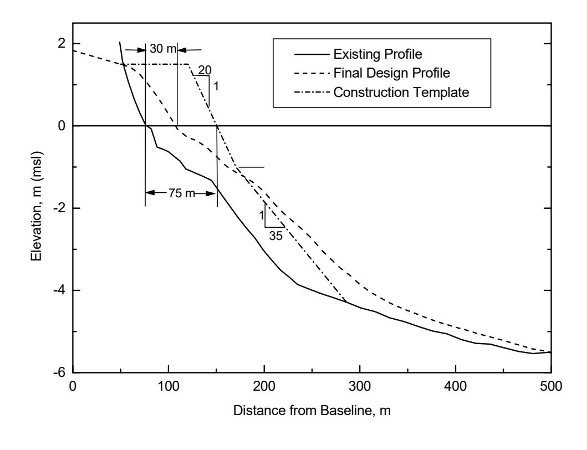

- (a) The high water levels and more energetic wave conditions that accompany storms are very effective in adjusting the fill. Usually, the nourished profile will adjust to a shape that is much closer to the expected equilibrium shape during the first full winter season, at least on the portions of the profile that are shallower than the typical winter storm wave breaking depth. However, unless very severe storms are experienced during that first winter season, the fill material may not adjust to elevations equal to the depth of closure. Through the life of the project, as more severe storms are encountered, the material will be transported to deeper depths.
- (b) For nourishment projects constructed using the overbuilding method, the initial adjustment process and resulting decrease in beach width can be quite dramatic. A rapid decrease in beach width from the constructed width to the design width (including advance renourishment) is often observed, and is to be expected. As a rule of thumb, decreases in beach width of 40 to 75 percent can be expected within a short period of time (months) immediately following construction if the overbuilding method is used. Projects constructed by placing material across much more of the active profile will see less dramatic adjustment in the width of the placed beach.
- (c) The public often perceives this dramatic initial adjustment as project failure, particularly in light of the fact that most of the adjustment occurs either during construction or within a few months after construction. Many projects are built during the winter season (storm season) because of environmental windows imposed on the project, or to avoid the heavy beach-use season. A special effort should be made to educate the public and project sponsors regarding the initial adjustment process, and the differences between constructed profiles and design profiles. If the stacking method of construction is used, it should be explained to the project sponsors and beach users (local community) that the project is less expensive to build utilizing this unnatural construction template, and that the beach berm width will be reduced as natural processes redistribute material to the natural/equilibrium profile. Seasonal, cyclical changes in beach width should also be explained, i.e., loss of beach width during the winter storm season, and subsequent beach recovery during the summer. Seasonal changes in beach width will be masked initially by the much larger changes associated with the initial adjustment process. k. Plans and specifications (1) Schedules.
- (a) Overall start and completion dates. The contractor is required to commence work under a contract within a specified number of calendar days after the date the contractor receives the notice to proceed. Typically, a period of 10 calendar days is specified. The contractor is directed to prosecute the work diligently and complete all work, ready for use, not later than a specified number of calendar days after receipt of the notice to proceed. The time stated for completion also includes final cleanup of the premises. Time needed to complete the work is directly dependent on the scope and extent of the project, and can vary from as little as 60 to 90 days up to a number of years for large projects. For example, the Atlantic Coast of Maryland Shoreline Protection Project, which included the placement of about 3.5 million cu m of beach-fill and dune construction along about 8 miles of shoreline, required completion within 720 days following the receipt of the notice to proceed (Anders and Hansen 1990). For some projects, start and completion dates may be dictated by environmental considerations such as dredging windows or recreational seasons. Sufficient completion time should be provided to avoid excessively high bids from potential contractors. To enforce the specified completion time for a project, liquidated damages are generally required for each day of delay.
- (b) Start and completion dates for specific subtasks. Interim start and completion dates may be required for specific subtasks depending on the scope of the project. For example, an interim completion date for
V-4-84 Beach Fill Design
beach-fill placement between designated stations may be required to enable other project features such as revetment or bulkhead construction to proceed.
- Depending on the scope of the project, the contractor may be required to develop a network analysis system for scheduling the work. The system should consist of diagrams and accompanying analyses that show the order and interdependence of activities and the sequence in which the work is to be accomplished by the contractor. In preparing this system, the scheduling of construction is the responsibility of the contractor. The requirement for the system is included to assure adequate planning and execution of the work and to assist the contracting officer in appraising the reasonableness of the proposed schedule and evaluating progress of the work. An example of one of the numerous acceptable types of network analysis systems is shown in USACE Pamphlet EP 415- 1-4 entitled "Network Analysis System Guide."
- A preliminary network defining the contractor's planned operations during the first 60 calendar days after notice to proceed should be submitted soon after the notice to proceed. The contractor's general approach for the balance of the project should be indicated. The complete network analysis system consisting of the detailed network analysis, schedule of anticipated earnings as of the last day of each month, and network diagrams should be submitted within a specified number of calendar days after receipt of notice to proceed. The approved schedule should then be used by the contractor for planning, organizing and directing the work, reporting progress, and requesting payment for work that is completed.
- (c) Expenditures. The contractor should submit, at monthly intervals, a report of the actual construction progress. The report should show the activities or portions of activities completed during the reporting period and their total value, which serves as the basis for the contractor's periodic request for payment. Payment made should be based on the total value of activities completed, or partially completed, after verification by the contracting officer. An updated network analysis should be used as a basis for partial payment. The report should state the percentage of work actually completed and scheduled, as of the report date, and the progress along the critical path in terms of days ahead or behind the allowable dates. If the project is behind schedule, progress along other paths with negative slack should also be reported. The contractor should also submit a narrative report which should include but not be limited to a description of the problem areas, current and anticipated factors causing delay, the impact of delay, and an explanation of corrective actions taken or proposed.

#### (2) Specifications.

- (a) Boundaries of the project area. The limit of the geographical area available to the contractor must be shown on the project drawings. Except where indicated, the contractor should confine his work to the area seaward of the construction baseline and between the lateral limits of the project. This area does not generally include access, storage, and staging areas. Access routes and storage and staging areas required to perform the work should be provided by and at the expense of the local sponsor. Sponsors are generally given credit for the cost of obtaining the necessary easements and rights-of-way, which count toward their share of project costs. The contractor should coordinate access to the work area and storage and staging area locations with the contracting officer. Unless otherwise approved by the contracting officer, excess equipment should only be stored in approved storage or staging areas, or in temporary areas, in the immediate vicinity of the fill placement site. Operation of grading and other construction equipment should not be permitted outside the work area limits except for ingress and egress to and from the site at approved locations.
- (b) Boundaries of the borrow area. All excavation for beach-fill material should be performed within the borrow area limits shown on the project drawings. Excavation in the borrow areas may be restricted to specified elevations depending on the findings of the geotechnical investigations of the borrow site (see
Part V-4-1-e). For offshore sources, the contractor should be required to set appropriate buoys which should meet U.S. Coast Guard standards to delineate the limits of the borrow areas. The contractor should be required to have electronic positioning equipment capable of achieving Class 1 survey accuracy as specified by EM 1110-2-1003, "Hydrographic Surveying." This accuracy is necessary to locate the dredge when operating in the borrow area. The geographical position of the dredge should be continuously monitored at all times during dredging operations. Locations should be determined with a probable range of error not to exceed 15.24 m (50 ft) to avoid violations of the environmental permits and clearances. Position data should be furnished as a part of the daily report of operations. Prior to initiation of any dredging, the contractor should submit for approval his proposed method of determining the dredge's location. Use of Loran-C positioning systems should be avoided, as output coordinates are not typically repeatable from one machine to the next.
- (c) Routes between borrow area and project site. Determination of the route and the method used to transport beach-fill material from the borrow area to the fill site should be at the contractor's option. For offshore borrow sources, the contractor should be required to conduct the work in such manner as to obstruct navigation as little as possible. Upon completion of the work, the contractor should promptly remove his plant, including ranges, buoys, piles, and other marks placed by him under the contract in navigable waters or on shore. If a pipeline dredge is utilized in a congested navigation area, the pipeline may have to be submerged except at the dredge or at the location of any booster pumps or pumphouse barges. The contractor should maintain a tight discharge pipeline at all times. The joints of the pipeline should be so constructed as to preclude spillage and leakage. Upon development of a leak, the pipeline should be promptly repaired and the dredge may have to be shut down until a complete repair has been made. If a submerged pipeline is placed across a navigable waterway, the contractor should notify the contracting officer in writing. Notification should be received in the District Office prior to the desired closure date. This notification should furnish the following: location and depth (over the top of the pipeline) at which the submerged line should be placed; the desired length of time the navigable water is to be obstructed; the date and hour placement or removal should commence; and the date and hour of anticipated completion. It is recommended that a statement concerning submerged pipelines similar to the following be included in the dredging contract:
"Submerged Pipelines. In the event the contractor elects to submerge his pipeline, the top of the submerged pipeline shall be no higher than the required dredging depth for a channel for which the pipeline is placed. The submerged pipeline shall be marked with signs, buoys, and lights as required to the complete satisfaction of the contracting officer."
• Complying with this requirement may require that the contractor excavate a trench in the channel bottom. If it is known during the design phase that a submerged pipeline will cross a navigable waterway, then specifications and provision for the contractor to establish (trench) the crossing should be explicitly provided. The equipment necessary to trench the crossing, and the disposal site for the trenched material will, in all likelihood, be different than that required to construct the beachfill.
V-4-86 Beach Fill Design
- If the contractor elects to use a hopper dredge or pumpout barge, overflow during loading should be permitted to the extent that designated turbidity and water quality standards are met. The contractor should limit the loading to partial loads, if necessary, to meet turbidity and water quality requirements for the overflow during loading. No overflow or spillage should be permitted during transport to the discharge site.
- (d) Placement methods. The contractor should be given the option of starting the beach-fill placement operations at any point and proceeding in any direction along the project beach, unless special conditions exist. Acceptance reaches, which are segments of beach measured along the construction baseline between designated stations used to monitor construction of the project, should be defined and identified on the project drawings. For the case of the lateral termini, the acceptance reach is the segment of beach, measured along the construction baseline, between the longitudinal limit of fill and the subsequent designated station. Once the contractor begins placement in an acceptance reach, placement in that reach should be completed before proceeding to another acceptance reach. Beach-fill placement operations should proceed in an orderly manner from reach to reach. If more than one dredge and/or pumpout facility is utilized by the contractor, more than one beach-fill operation may be accomplished simultaneously. Placement of beach-fill in multiple locations at any one time should only be allowed if adequate inspection is available. Prior to initiation of beach-fill operations, the contractor should submit for approval his proposed plan for beach-fill placement. The plan should include the type of dredge plant to be utilized, the location and type of any booster pump facilities to be utilized, and the sequence of work for beachfill placement. The contracting officer should reserve the right to reject any scenario which, in his/her opinion, might be detrimental to the stability of the in-place beach-fill, might unduly disrupt access to or use of the beach by the public during placement operations, or for any other credible reason. Excavation of sand from the existing beach for use as beach-fill should not be permitted. All materials excavated from the borrow areas should be transported to and deposited on the beach or dune area within the specified lines, grades, and cross sections in a controlled manner so as to maximize sand retention within the beach-fill section and minimize losses to the ocean. This should be accomplished in a manner acceptable to the contracting officer and should include, but not be limited to temporary diking where required, control of the discharge pipe direction and velocity of discharge, and control of the sand and water mixture. Temporary diking included within the dune cross section may be left in place and incorporated into the dune structure. For dredged borrow sources, fill placement on the beach can be accomplished by a single or doublepipe system. The double-pipe system consists of a yoke attached to the discharge line, and by use of a double-value arrangement, the discharge slurry is selectively distributed to either one pipe or the other, or to both pipes simultaneously. The beach is built by placing the first discharge pipe at the desired final fill elevation and pumping until the desired elevation is reached. By alternating between the two discharge lines, the beach width is built to the full cross section as they advance. The final placement to the design lines and grades can be accomplished using bulldozers. The contractor should be required to maintain and protect the beach-fill in a satisfactory condition at all times until acceptance of the work. Prior to placement of beach-fill, the contractor should remove from the work site all snags, driftwood, and similar foreign debris lying within the limits of the beach-fill section.
- The excavated material should be placed and brought to rest on the beach to the lines, grades, and cross sections indicated on the project drawings, unless otherwise directed by the contracting officer. The beach topography is subject to changes and the elevations on the beach at the time the work is accomplished may vary from the design elevations and the resulting beach-fill quantities may vary from that shown in the unit price schedule. To accommodate this situation, the contracting officer should reserve the right to vary the beach-fill cross sections at any location along the beach.
- The contractor should be responsible for any damage caused by excessive discharge water flowing landward from the beach-fill section. However, the plans and specifications should specify that the contractor will construct sand dikes of a minimum length to control water discharge and promote settlement of the slurry's sediment. Where a pipeline is placed on the beach, sand should be placed around the pipe to form a pedestrian ramp over the pipe at street ends and at midblocks or at locations otherwise directed by the contracting officer. All such ramps should be maintained as long as the pipe is in place.
- (e) Final project dimensions. The intent of the contract is to place beach-fill to the lines and grades prescribed in the contract. Tolerances should be provided in the template for the practicality of construction. A tolerance of ±0.2 m (0.5 ft) is usually permitted for the dune and berm design sections. However, in light of the critical nature of beach elevation to shore protection and flood damage reduction, the contractor should be required to provide his best efforts in placing material to the designated lines and grades landward of the influence of waves. Persistent over- or underfilling of the construction template to the plus or minus tolerance should not be permitted. It should be considered that the primary goal of nourishment is to place a specified volume of material per unit length of beach. The required dimensions of the construction template, specifically the width of the construction berm, should not be explicitly specified so that the width of the berm can be adjusted during construction to account for the actual foreshore slope the fill acquires during placement. Any material placed above the prescribed cross section, plus the allowable tolerance, should not be included in the pay quantities; however, such material may be left in place at the discretion of the contracting officer. In the event that material placed at any prescribed cross section is below the minus tolerance, the contractor should be required to provide additional sand to the level of the beach-fill template. Upon completion of all fill operations in any acceptance reach, the beach should be graded and dressed to eliminate any undrained pockets and abrupt mounds or depressions in the beach-fill surface as necessary to comply with tolerance requirements specified. All temporary dikes not incorporated into the dune cross section should be completely degraded. Any material deposited in areas other than those designated or approved by the contracting officer should not be paid for. The contractor should be required to remove such misplaced material and deposit it where directed, at his expense.
- (f) Calculating fill volume for payment purposes. Options for calculating fill volumes for payment include: tabulation of the fill delivered by truck load from land borrow sources, comparison of pre- and postdredging surveys for offshore sources, and measurement of in situ volumes after placement. Of these options, the latter is recommended. With this method, acceptance reaches should be used for the purpose of closely monitoring the cumulative amounts of beach-fill placed. Acceptance reaches should also be used to control the timing for pre- and postplacement surveys. Acceptance for payment by the contracting officer of a reach should not be made until all beach-fill placement is made within the acceptance reach and final surveys have been approved. Separate acceptance for the dune portion of the beach-fill may be made for an acceptance reach upon approval of the contracting officer. In no case, however, should the contractor be paid more than
V-4-88 Beach Fill Design
once for sand placed in any space along any acceptance reach should erosion occur before the entire volume of sand is placed. Unless otherwise approved by the contracting officer, acceptance reach stationing should be as shown on the contract drawings.
- Beach fill, satisfactorily placed, may be measured for payment by use of the average end area method. The quantity computations should be verified from survey data submitted by the contractor in accordance with specified procedures. The basis of measurement should be the preplacement cross sections of the beach and dune area taken by the contractor just prior to the placement of fill and a second set of cross sections of the same area taken by the contractor as soon as practicable after completion of beach-fill placement for any acceptance reach. The plans should depict existing conditions and the construction template at intervals along the shoreline not greater than 150 m (500 ft). Measurement for payment is typically surveyed at more frequent intervals, often at about 30-m (100-ft) spacing. Once postplacement surveys have been taken in an acceptance reach, no removal of beach-fill material should be permitted in that reach unless otherwise directed by the contracting officer. Landward of the wave runup limit (in general, landward of the seaward berm crest position), the area of fill material lying above the plus tolerance (an elevation tolerance of less than ± 0.2 m is typical) template should be deducted from the gross area and the net amount used as a basis for payment. Seaward of the wave runup limit, the quantity of fill material used as a basis for payment should be that determined from the area of fill measured between pre- and postfill cross sections, less any material placed seaward of the intersection of the construction template with the existing sand surface (corrected as necessary for the actual slope taken by the fill material, if deemed appropriate by the contracting officer). Compliance with the construction template should be judged reasonably on the submerged portion of the profile. Success of the placement should also consider placement of the required volume of fill per unit length of beach within the active depth (landward of the design depth of closure).
- Payment for beach-fill should be made at the contract price per unit volume. Such payment should constitute full compensation for furnishing all labor and performing all work necessary to excavate, transport, and place beach-fill material, and all other items of work required by the drawings and the specifications for which separate payment is not provided.
- Survey specifications should indicate that the contractor conduct the original and final surveys, and surveys for any interim period, for which progress payments are requested. All these surveys should be conducted under the direction of the contracting officer, unless the contracting officer waives this requirement in a specific instance. The contractor should employ a registered and licensed land surveyor, experienced in land and hydrographic surveying, to perform the work required for quantity surveys. Prior to initiation of any quantitative beach surveys, the contractor should submit to the contracting officer for approval, a description of his method and type of equipment for performing the surveys.
- The contractor should make such surveys and computations as are necessary to determine the quantities of work performed or sand placed. All original field notes, computations, and other records should be furnished to the contracting officer at the work site.
- The contractor should perform his preplacement surveys of an acceptance reach no more than 5 days prior to placement of beach-fill material within that reach. Prior to placement of fill material the contractor should submit to the contracting officer, all field notes, data disc(s), and computations, with sufficient lead time so that control of quantities, and if necessary, adjustment to the berm width can be made.
- Postplacement surveys should be made as soon as practicable after completion of an acceptance reach. The contractor should use the same survey stations that were used in the preplacement surveys. Postplacement surveys for the next reach should not be conducted until the previous reach is accepted by the contracting officer.
- The contractor should prepare and provide to the contracting officer, immediately after completion of an acceptance reach, cross-sectional drawings showing the preplacement conditions, postplacement conditions, and the design beach-fill template for each section surveyed. The survey cross sections should be taken perpendicular to the construction baseline at specified stations, and at the beginning and ending acceptance reach stations. When unusual site or geographical conditions exist, additional stations and elevations should be taken for greater definition. The preand postplacement surveys should extend some distance seaward of the intersection of the construction template with the existing sand surface and that distance should be specified. The scale for the plotted cross sections should be on the order of 1 to 60 in the vertical (1 cm = 0.6 m or 1 in. = 5 ft) and 1 to 240 horizontal (1 cm = 2.4 m or 1 in. = 20 ft). All stations and elevation points taken from field books should be clearly indicated on the cross-section plots.
- l. Project monitoring and data analysis . Beach fills are "soft structures" which respond dynamically to changing waves and water levels, similar to natural beaches. Physical responses of a beach-fill include post construction adjustment of the placed sand, seasonal variation and storm-induced changes of the beach profile, and seasonal and long-term change of the project planform. Functional performance of a beach-fill requires that the design cross section and planform be maintained over the life of the project through scheduled periodic renourishment, and emergency maintenance and/or renourishment after severe storms. The dynamic behavior of beach-fills together with the need to ensure project functionality over the design life requires that a systematic monitoring plan be established for beach-fill projects.
- (1) Monitoring objectives. Primary objectives of monitoring beach-fill projects are to ensure that project functionality is maintained throughout the design lifetime, and to assess project performance. These objectives involve collection, analysis, and interpretation of data to: evaluate the condition of the project in comparison to design specifications; determine maintenance and renourishment volume requirements; document and assess project performance to determine how well it fulfills the protection requirements for which it was designed; evaluate project impacts on adjacent areas; and address performance problems by identifying causes and developing solutions.
The first two activities listed relate primarily to operational monitoring and provide information required to operate and maintain the project. The latter three activities relate to performance monitoring, and measure the success of the project, identify project problems, and provide information for improving the project design.
(2) Physical monitoring components. A physical monitoring plan for a beach-fill project consists of four major components: beach profile surveys, beach sediment sampling, aerial shoreline photography, and wave and water-level measurements. These four components provide information required to document the physical response and condition of a beach-fill project. A recommended schedule of data collection is presented in Table V-4-1. The schedule is divided in two phases. The initial phase is a period of moreintensive monitoring during the first 3 years of the project that focuses on monitoring the performance of the project. During this phase, data are gathered to confirm that the project design is performing as expected and to identify potential design problems such as erosional hot spots, unexpected project impacts, or inadequate design volumes and cross-section dimensions. If problems are identified, the monitoring data provide information for developing solutions and improving project performance based on an understanding of the physical processes. Assuming the project is functioning properly and design/performance deficiencies are addressed, the monitoring plan presented in Table V-4-1 transitions to a second phase after the third year.
V-4-90 Beach Fill Design

*Table V-4-1 Physical Data Collection Schedule for Beach-Fill Monitoring*

**Table V-4-1. Physical Data Collection Schedule for Beach-Fill Monitoring**

|  | Phase I: Initial Placement and Project Years 1 to 31 |  |  |  |  |  |  |  |  |
| --- | --- | --- | --- | --- | --- | --- | --- | --- | --- |
|  | Initial Placement | Year 1 Following Initial Placement | Years 2 to 3 | Years 1 to 3 |  |  |  |  |  |
| Monitoring Component | Pre-fill | Postfill | Mar | Jun | Sep | Dec | Mar | Sep | Poststorm Contingency |
| Beach profile surveys | X | X | X | X | X | X | X | X | X |
| Sediment sampling | X | X |  |  | X |  |  |  |  |
| Aerial photography | X |  |  |  | X |  |  | X |  |
| Waves and water levels |  | Continuous |  |  |  |  |  |  |  |

*Phase II: Nonconstruction Years for Project Years 4 to N (N= Project Life)*

**Table V-4-1. Physical Data Collection Schedule for Beach-Fill Monitoring**

|  | Even Number Years Following Each Construction | Odd Number Years Following Each Construction |  |
| --- | --- | --- | --- |
| Monitoring Component | September | September | Years 4 to N Poststorm Contingency |
| Beach profile surveys | X | X | X |
| Aerial photography |  | X |  |

*Phase II: Beach Renourishment*

|  |  | Renourishment | Year Following Renourishment |
| --- | --- | --- | --- |
| Monitoring Component | Prefill | Postfill | September |
| Beach profile surveys | X | X | X |
| Sediment sampling | X | X | X |
| Aerial photography | X |  | X |
|  |  |  |  |

*Following Year 3, decision is made whether to continue Phase I level of monitoring*

The second phase of the plan employs an operational level of monitoring to annually assess the condition of the project. This phase of monitoring also provides information for assessing longer term aspects of project performance. Details of the monitoring components and schedules are discussed in the following paragraphs.
(a) Beach profile surveys. Profile surveys provide data which are used to calculate fill volumes and document changes in the beach cross section. Accurate estimates of fill volume are essential during construction to ensure that required design volumes are placed in the construction template, and to verify payment to contractors. Periodic surveying of profile lines over the project lifetime enable calculation of volume of fill remaining in the project bounds and on the subaerial beach and comparison of the present project condition with the required design template.
- Where practical, profile surveys should be conducted using a sea-sled system. Because of the accuracy, simplicity of design, and wide availability of system components, the sea sled is considered to be the best method for profiling beach nourishment projects (Grosskopf and Kraus 1993). An added advantage is that sea-sled surveys can extend from the upper portion of the dry beach out to the depth of closure. In areas where sea-sled surveys are not practical (e.g., in environments with reefs, rock outcrops, submarine canyons, etc.), offshore surveys should be taken by boat with a properly calibrated fathometer and combined with land-based rod and level surveys performed out to wading depth. When using this combined technique, care must be taken to avoid problems in matching the land-based and fathometer surveys.
- Survey locations should be selected to include profiles within the project limits as well as control profiles some distance up and downdrift of the project boundaries to assess benefits or impact on adjacent shorelines due to longshore spreading of the fill. The number and location of profile surveys is site specific and depends on the length of the fill and the degree of longshore uniformity of the beach morphology. On an essentially straight open-coast beach, longshore profile spacing of approximately 300 m should provide adequate resolution for periodic condition profile surveys. Pre- and postconstruction profile surveys are routinely collected at higher resolution, with spacing of 60 m or less, to accurately determine placement volumes for payment purposes. To reduce costs, profile spacing can be evaluated after several monitoring cycles to determine if the number of profile surveys may be reduced while still adequately characterizing the condition of the project.
- Profile locations should be established along a reference baseline from benchmarks that are documented and recoverable in future years. The project baseline should be set at the beginning of a project study, and all surveys should be referenced to this baseline. The surveys should extend across the entire zone of profile change from the upper profile, landward of any dune, out to beyond the depth of closure.
- In practice, exact timing of beach profile surveys depends on the construction sequence and climatic conditions; but in general, surveys should be conducted as indicated in Table V-4-1. Surveys taken immediately prior to and following construction document fill volumes and cross sections. Quarterly surveys taken during the first year following initial construction document the rapid response of the constructed cross section as it forms a more natural shape. Semiannual surveys measured in years 2 and 3 of the project record the ongoing adjustment of the project cross section. After the third year of the project, survey frequency can be reduced to once a year assuming the project is performing satisfactorily. It is recommended that these annual surveys be performed at the end of summer (or the typical period of low-energy wave conditions) to determine project condition prior to winter (or the typical storm season).
- The monitoring plan should include continency plans to collect surveys immediately after severe storms. Poststorm profile data document storm-induced beach change and poststorm condition of the project.
- Site inspections should be performed concurrently with all beach surveys, and at least once each year. Inspections should document any information relevant to characterizing the condition of the subaerial beach (e.g., level of dune vegetation, evidence of modification or addition of fill material by local property owners, effects of storms such as scarping or overwash, presence of poststorm recovery berm, longshore variability in subaerial beach features). Site inspections should include photographs of the beach, taken looking alongshore, to provide a visual record of the project condition.
V-4-92 Beach Fill Design
- (b) Beach sediment samples. Sampling is needed to determine sediment characteristics, such as median grain size and grain-size distribution, which affect the beach profile shape and influence fill volume requirements. Sediment sampling is of particular importance when fill and native material have different characteristics. Sampling of beach sediment provides data that can be used to relate project performance to characteristics of the fill material. This information can then be used to evaluate future borrow-material suitability and determine required fill volumes for renourishment. Sediment samples should be collected at selected locations within the project area to account for longshore and cross-shore variability in sediment characteristics. The longshore sample spacing should be approximately 900 m, with sampling locations corresponding to the nearest profile lines. Sediment sampling should consist of shallow grab samples at various locations across the beach profile including the dune, berm, midtide level, mlw, and three subaqueous samples spaced uniformly out to the depth of closure (Larson, Morang, and Gorman 1997). This sampling scheme documents cross-shore variability of the median grain size and size distribution which influence profile shape. Sediment samples should be collected before and after initial construction and each renourishment, and 1 year following each construction. Sediment sampling should be performed concurrently with beach profile surveying.
- (c) Aerial shoreline photography. Aerial photography is an essential monitoring component for documenting long-term performance of beach-fills. Aerial photographs provide a visual record of shoreline position, variations in beach planform, condition of the dune and berm, and subaerial beach width; and do so with a total-project perspective that cannot be obtained by ground photography and beach profile surveys alone. Such information is useful for documenting project planform evolution, evaluating project end effects, and identifying erosional hot spots. Aerial photographs, together with beach profile surveys, provide information on the 3-D characteristics of fill behavior that can be used to better assess condition of the project and renourishment requirements. Aerial photography should be taken along a single flight line with 60 percent overlap stereo coverage of the entire project area shoreline, including updrift and downdrift control areas. The scale of the photographs should be sufficient to identify shoreline features. An approximate scale of 1 cm equals 50 m is recommended. All photography should be taken near midday and around low tide to reduce shadows and reflections and to provide the maximum area of exposed intertidal beach. Aerial photography should be performed before initial placement and after each construction to document the preproject and postnourishment shoreline. During the first 3 years, aerial photographs should be taken annually to record initial planform spreading and shoreline response to measured wave conditions. After the first 3 years, aerial photographs should be taken once every 2 years between construction and in the year following each construction. It is recommended that aerial photographs be collected in September (prior to the storm season) when the beach is typically in its most-accreted condition. During this time, effects of storms on the observed shoreline are minimized, allowing easier assessment of fill condition from year to year and providing a more consistent measure of long-term project performance.
- (d) Wave and water level measurements. Waves and water levels are the principal hydrodynamic forcing parameters controlling beach-fill evolution. Storm waves and water levels erode the upper part of the beach and redistribute sand across the profile. Over the longer term, wave-driven longshore processes reshape the planform and produce shoreline retreat along the project. Establishing a cause-and-effect
relationship between actual waves and water levels and measured beach response is essential for understanding project behavior and formulating solutions when problems occur.
- Wave and water level data also provide valuable information for evaluating project design tools and techniques. Application of design tools with monitoring data may enable more accurate assessment of renourishment intervals and quantities and refinement of the project design to improve performance throughout the remainder of the project life.
- Wave and water level data should be collected using a directional wave gage. The gage should provide a continuous record of information from which significant wave height, peak wave period, peak direction, and mean water level can be determined. Water level (depth) measurements from the gage should be compared with area NOS tide gages or other sources to establish vertical datum control. The wave gage should be placed offshore of the center of the project outside the breaking zone. A depth of 10 m is typically sufficient for gage placement. Hemsley, McGehee, and Kucharski (1991) and Morang, Larson, and Gorman (1997) provide further guidelines for collecting wave and water level data.
- Wave data collection should begin prior to project construction and continue for at least 3 years from the time of initial placement. After 3 years, a decision should be made whether to continue data collection based on sufficiency of information obtained in evaluating project performance. At a minimum, data collection should continue long enough to capture at least one significant storm erosion event and to accurately assess trends in project behavior.
- (e) Physical monitoring data analysis. A systematic data analysis plan should be developed as part of the monitoring activities. Pre- and postconstruction beach profile surveys should be analyzed to compute constructed fill volumes and verify compliance with construction template specifications. Sand samples should be analyzed to develop composite measures of median grain size and size distribution from which design profile shapes and fill volumes can be estimated for future construction. Seasonal profile surveys collected during Phase I of the monitoring plan should be used together with aerial shoreline photography to document initial fill adjustment and short-term project behavior. If problems arise such as excessive project erosion rates, erosional hot spots, or unanticipated impacts to adjacent shorelines, a coastal processes study should be performed with the monitoring data to identify causes and develop solutions. Poststorm profiles collected after major erosion events should be analyzed together with storm wave and water level data to verify project performance in light of design criteria. Analysis of Phase II monitoring data should focus on assessing project condition and renourishment requirements. The existing cross section should be compared with the design cross section to identify when dune heights or berm widths fall below design specifications. Shoreline data should be analyzed to determined long-term erosion rates and spreading losses for the project which can be used to fine-tune future renourishment activities.
- (3) Borrow area monitoring. Monitoring procedures for the borrow area will depend on the type of borrow area being used. Borrow area types include offshore, inlet shoals, sand traps, bay or lagoons, and terrestrial sources. The principal purpose for monitoring borrow sites is to evaluate borrow fill suitability, borrow area bathymetry, continuing changes in the morphology and sediment characteristics, and biology of the area after completion of the borrow operation. Data collection should include bathymetric and sub-bottom surveying, sediment coring and surface sampling, and biological data acquisition. Baseline data should be collected prior to excavation and periodically thereafter. This section primarily addresses borrow sites in water-covered areas. Terrestrial borrow sites generally exhibit little or no change in topography and sediment characteristics after completion of the borrow operation.
- (a) Bathymetric and bottom profiling. Once a borrow site is selected, removal of material from the borrow site will affect its morphology. The nature of the modification depends on whether the material was
V-4-94 Beach Fill Design
obtained by excavating a thin superficial layer over a large area or deep pits in a comparatively small area. One objective of borrow site monitoring is to determine to what extent marine processes restore the original morphology or create new forms. For this reason bathymetric surveys are needed to monitor the site after the borrow operation.
(b) Borrow area sampling scheme. Borrow area sampling time and collection requirements are presented in Table V-4-2. The borrow area monitoring does not require data collection as often as the project site, however a minimum of 1 year between sampling is recommended.

*Table V-4-2 Borrow Area Bathymetry and Sediment Sampling Scheme*

**Table V-4-2. Borrow Area Bathymetry and Sediment Sampling Scheme**

| Year | Times/year | Number of Samples |  |
| --- | --- | --- | --- |
| pre | 1 | Cores to characterize subbottom sampling | borrow material and access fill suitability. Bathymetry and covering expected borrow sites and control areas. |
| post | 1 | Surface sediment grab distribution. Bathymetry | samples to characterize postdredging borrow area sediment of postdredged surface to assess volume removed. |
| last | 1 | Cores to characterize bathymetry to determine | infilling sediment grain size distribution. Bottom surface infilling volume. |

- (c) Changes in processes. Changes in bathymetry due to offshore borrow operations can modify the characteristics of incoming waves. These changes are primarily related to refraction and bottom friction. Dredging fill material from ebb tidal shoals is a likely source of wave modification because these shoals lie close to the shore and their crests are at shallow depths. During preproject planning and design, these factors will have been evaluated on the basis of theoretical considerations and indicate wave modification judged to be acceptable. However, it is possible that unforeseen effects may occur. These will usually be indicated by accelerated erosion or accretion of the project beach and/or adjacent shore areas. During postproject monitoring, any unusual erosion or accretion of the project area or adjacent beaches should be investigated with the possibility that it is resulting from modification of offshore borrow sources. Another type of process modification can occur where inlets and associated shoals are dredged for borrow material. The strength and distribution of tidal currents in the inlet and shoal areas can be altered by the removal of material. In such cases, provisions should be made for current observations as well as bathymetric and sediment data.
- (d) Borrow area data analysis. Analyses should include evaluation of temporal borrow changes, determination of the rate and volume of borrow area infilling, and identification of current patterns in the borrow area channel or basin in cases where inlet shoals are excavated.
- (4) Biological monitoring. The excavation and placement of fill material usually impacts the biology of the area that is directly involved. Biological impacts may also be created in adjacent areas from the turbidity created by the excavation process. For this reason, biological surveys of both the beach and borrow area should be performed. Monitoring of the borrow site should include assessment of the infauna, sea grasses, reefs, or other biologically sensitive areas adjacent to the borrow area. The beach project area may also have environmentally sensitive areas such as sea turtle nesting sites, bird nesting areas, beach organisms, nearshore reefs, and sea grasses. Biological sampling should consist of grab samples of the borrow area and quadrate samples of the beach areas to identify the infauna of the borrow and fill locations. Monitoring turbidity in the borrow site and in the surf zone of the fill area may be necessary to assess the impact of
dredging and dumping of fill material on the local biota. A more detailed outline of biological sampling can be found in EM 1110-2-1204, "Environmental Engineering of Coastal Shore Protection."
Data analysis should evaluate fluctuations in the flora and fauna in the beach-fill and adjacent nearshore area, effects of turbidity on fauna at the beach-fill and borrow site, and the effects of the borrow operation on the borrow site organisms. The time and extent of recovery of native organisms should be verified and compared to that of control areas. The absence of native or appearance of new organisms should also be verified and documented.
(5) Structure monitoring. If structures are a component of the project, a periodic inspection and survey report of the structures needs to be performed to assess the condition of the structures. This is especially important after a large storm that might do damage (functional or otherwise) to the structure. If damage is sustained by the structure(s), adequate photography of the structure should be taken to describe the damage and the extent of repairs that will be necessary. As damage photography is best compared to "design built" photography, a baseline set of photography for each structure in the project should be made as soon as possible after the structures are built. Damage photography for any damaged structure should be taken from the same locations as the baseline photography if reasonable and feasible.
At the time of structure inspection, the critical wave conditions (height, period, direction, etc.) under which the structure was damaged (if damaged) or exposed to (if not damaged) should be noted in the report/survey. A detailed survey of the structure may be needed. Last, an assessment of the structure's present and future effectiveness should be made.

#### m. Operations and maintenance

- (1) Purpose. The beach-fill and any structures built for local shore protection, access, and any visitor facilities, must be operated and maintained to obtain the anticipated project benefits. In addition to periodic renourishment, the following types of maintenance work will be needed: mechanical redistribution of sand within the project area, grading, and periodic removal of debris from the project area. Performance and condition monitoring are needed throughout the economic life of the project. As discussed in the previous section, project monitoring and analysis is essential to assuring the project is providing the intended storm protection. In Federal beach nourishment projects, an Operations and Maintenance (O&M) manual specific to the project is prepared upon completion of the initial project construction. The purpose of an O&M manual is to present detailed information to assist the responsible parties in operating and maintaining the project, and to describe the periodic nourishment and monitoring aspects of the project.
- (2) Scope of O&M manual. This section will present a possible outline for an O&M manual and briefly describe the contents of each section. A sample outline is provided in Figure V-4-34. The outline should be modified as necessary to meet the specific needs of the project. The manual is divided into four parts. Part I presents general information about the project. Part II provides essential operation and maintenance information necessary to ensure the desired performance of the project. Part III describes the periodic nourishment and monitoring of the project, while Part IV presents information concerning responsibilities of parties involved in the project.
- (3) Introduction. This section of the O&M manual provides a concise summary of pertinent information related to the project and generally includes the information discussed in the following paragraphs. (a) Authority. Cite the authority(ies) which authorized the project construction.
- (b) Location. Describe the project location relative to nearby urban centers, water bodies, or other geographic or demographic features. Give the north, east, south, and west project boundaries.
V-4-96 Beach Fill Design

|  | (PROJECT NAME) |  |
| --- | --- | --- |
|  | (SAMPLE) TABLE OF CONTENTS |  |
| PARA. | TITLE | PAGE NO. |
|  | SECTION I - INTRODUCTION |  |
| I-1. I-2. I-3. I-4. | PURPOSE OF THIS MANUAL AUTHORIZATION LOCATION DESCRIPTION OF PROJECT |  |
| I-5. I-6. I-7. | PROTECTION PROVIDED CONSTRUCTION HISTORY LOCAL COOPERATION AGREEMENT |  |
|  | SECTION II - OPERATION AND MAINTENANCE |  |
| II-1. II-2. II-3. II-4. II-5. II-6. II-7. | GENERAL MANAGEMENT DUTIES PERIODIC INSPECTIONS REPORTS IMPROVEMENTS OR ALTERATIONS PROJECT FEATURES (Description, Operation, Maintenance) |  |
|  | SECTION III - PERIODIC NOURISHMENT |  |
| III-1. III-2. III-3. III-4. III-5. III-6. III-7. | SCOPE MONITORING (Surveys, Aerial Photography, Sediment Samples, Waves, etc.) NOURISHMENT ROUTINE MONITORING ANALYSIS POSTSTORM ANALYSIS POSTSTORM MAINTENANCE POSTSTORM NOURISHMENT |  |
|  | SECTION IV - RESPONSIBILITIES |  |
| IV-1. IV-2. IV-3. | U.S. ARMY CORPS OF ENGINEERS LOCAL SPONSOR FINANCIAL |  |
|  | APPENDICES |  |
| A. B. C. D. | ENGINEER REGULATION NO. 1110-2-2902 LOCAL COOPERATION AGREEMENT INSPECTION REPORT FORMS AS-BUILT DRAWINGS |  |

*Figure V-4-34. Sample Operations and Maintenance manual outline*

- (c) Brief description. Describe the major features of the project such as dune and berm elevations, widths, and slopes. Give the grain size characteristics of the fill, volume of material placed, type and characteristics of any structures, and lengths of fill, including transitions. Make reference to the availability and location of as-built plans. The anticipated periodic renourishment volume and interval should be briefly discussed.
- (d) Protection provided. Discuss the protection provided by the project and if practicable, identify the storm parameters, or combinations thereof, for which the project is expected to limit inland or upland damages to a minor and acceptable level. Alternatively, the expected project response-frequency curves developed from the analysis of the with-project condition could be provided as indicators of expected project responses resulting from the passage of coastal storms.
- (e) Local cooperation. Federal beach-fill projects are constructed and maintained by both the Federal government and one or more levels of local government. The partnership established between the various involved parties is detailed in a local cooperation agreement (LCA). The O&M manual should include a copy of the LCA in an appendix and reference to that appendix should be made in this section of the O&M manual. The summary should identify the local sponsor and those represented by the sponsor if more than one entity is involved. The cost-sharing arrangement for periodic nourishment and project monitoring should be stated and the technical document that supports the LCA and cost-sharing agreement should be cited.
- (f) Construction history. Review the contracts used in constructing the project indicating the contractor, contract number, award and completion dates, any significant events or circumstances encountered, and the volumes of materials involved.
- (4) Operations and maintenance. This part of the O&M manual presents information on general duties and procedures to assist local interests with their responsibilities for operation and maintenance of the beachfill project (see ER 1110-2-2902, "Prescribed Procedures for the Maintenance and Operation of Shore Protection Works").
- (a) Management. The local person or persons that will be responsible for project administration, maintenance, and general operational responsibilities should be identified. The appointment recommendation and approval procedures should be stated.
- (b) Duties. Delineate the project management duties related to the project as outlined in ER 1110-2- 2902. Some of these duties (in Federal beach-fill projects) include the following: maintain public ownership and use of the beach which formed the basis of Federal participation; prevent unauthorized trespass or encroachment onto the project; ensure alterations are approved by the District Engineer; ensure pedestrian and vehicular traffic are confined to designated access and use areas; and conduct periodic inspections, and operate and maintain the project as specified in this manual.
- (c) Periodic inspections. Routine or emergency inspection plans should be identified. The size of the inspection team may vary from the person in charge up to a team of three or four depending on the scale and complexity of the project. Timing and number of routine inspections should be stated along with the features to be inspected, what information to record, and how and when it should be reported. A set of inspection forms should be developed to help ensure needed information is obtained. Inspection procedures to be followed before and after significant storm events should also be included. Notification from the District or some other mechanism should be included to trigger pre- and poststorm action.
- (d) Reports. An inspection report is to be completed by the inspection team for each inspection to ensure that no part of the protection project is overlooked. Any item requiring repairs should be noted. Satisfactory items should also be indicated. A completed and signed set of inspection forms, plus any
V-4-98 Beach Fill Design
pertinent photographs taken during the inspection or monitoring effort, will accompany and provide the basis for the report content. In the event that repairs have been made, either temporary or permanent, the nature and date of the repair are pertinent and should be included. The address to which the reports are to be submitted should be given along with the timing of the reports. All reports should indicate project deficiencies discovered during the inspection, and the scheduled remedial measures to correct the reported deficiencies.
- (e) Improvements or alterations. Drawings or prints of proposed improvements or alterations are to be submitted to the District Engineer sufficiently in advance of initiation of the proposed construction to ensure that the absence of his approval does not delay construction. As-built drawings will be furnished to the District Engineer and maintained with the original plans.
- (f) Project features. This part of the O&M manual provides detailed description of the features and their operational and maintenance requirements. The section will typically cover such features as the dune, beach berm, transitions, crossovers and access ways, and, if included as part of the project, groin(s), nearshore breakwater(s), seawalls(s), and bulkhead(s).
- (5) Periodic nourishment. This section of the O&M manual provides procedures for monitoring the condition of the beach-fill portion of the storm protection project, analyzing the monitoring data, evaluating when nourishment will be required, and determining the volumes of nourishment needed. The project must be periodically nourished to ensure that the desired protection is provided throughout its life.
- (a) Scope. Refer to the design document and LCA to define periodic renourishment, its anticipated volume, and interval of placement. Explain the concept of advanced nourishment. Discuss the parameters and conditions that will trigger a nourishment event. Direct quotes from the design document provide credibility for the need to renourish the project. If "renourishment is triggered when, in effect, the project reaches its design configuration" is quoted from the design document, then those responsible need to understand that the design section is the minimum section required to provide the protection and not the maximum section desired or constructed. It should be emphasized that the profiles discussed are based on the configuration of the project beach that is expected once the beach has reached its equilibrium state. In most cases, this will be quite different from the configuration shown on the plans and specifications or the profile that was actually constructed. The issue of postconstruction profile adjustment should be discussed, as well as what is to be expected in terms of beach width decreases through time. Expected seasonal changes should also be discussed.
- (b) Monitoring. There are various components that need to be considered to understand the performance of a beach-fill project and subsequent nourishment requirements. To ensure that the project is providing at least the design level of protection, knowledge of the project conditions via project monitoring is imperative. Consequently, a monitoring program is designed as part of the periodic nourishment of the project. For Federal projects, the monitoring program is typically administered by the Corps Engineering Division. Data collected during project monitoring will be used to assess the condition of the beach-fill and to determine when to initiate a nourishment operation. Part V-4-1-l provided guidance on the collection of beach profile surveys, sediment samples, aerial photographs, wave data, etc., and additional guidance can be obtained from EM 1110-2-1004, "Coastal Project Monitoring." The application of these monitoring efforts to the project comprise the remaining topic items to be covered in this section of the O&M manual.
- (c) Nourishment. Moving material from the foreshore to the higher berm and/or dune area, or from an accreting area within the project limits to an unusually eroded area, is considered maintenance. Artificially adding new material to the beach-fill project is considered renourishment. The need for renourishment is addressed by determining the protection provided by the existing beach-fill project.
- (d) Routine monitoring analysis. The O&M manual will require routine inspection and survey of the beach-fill project. Routine analysis will compare existing profile shapes to the design profile shapes. Of specific importance in the comparison of the existing profile with the design profile is the dune elevation and width and the berm elevation and width. If the comparison indicates that the existing condition dune and berm sections are substandard as compared to the design profile, a more detailed and thorough analysis is initiated to determine, for the overall project, the extent of the deficiency and the level of risk associated with delaying nourishment until the next scheduled renourishment. Based on the results of the detailed analysis a decision is made as to whether or not to initiate a project nourishment action or if maintenance (redistribution of sand within the project area) actions can be implemented to alleviate or minimize a localized problem.
- (e) Poststorm analysis. This analysis focuses on the protective features of the beach-fill project located on the upper backshore portion of the beach consisting of the dune and/or storm berm. Generally these features, once eroded, are not soon replaced by nature during poststorm beach recovery and therefore must be replaced by maintenance or nourishment of the project beach. Inspection and damage assessment will be conducted as soon as possible after the passage of a significant storm. A joint District and local inspection team will assess the project area. Ground photography will be obtained at a minimum and, if warranted, aerial photography and/or video will be obtained to document the poststorm conditions. The inspection will assess the visible part of the project (i.e., dune/berm erosion, damaged fence, destroyed vegetation, etc.) If the extent of upper beach erosion is judged to have compromised the integrity of the project, more extensive data collection and analysis will be required. Beach profile surveys should be immediately initiated at the monument locations as described in the monitoring program. Due to the expediency required in reacting to a storm event causing damage to the project and/or upland development, it is recommended that an Indefinite Delivery Type Contract (IDTC) for poststorm surveying be established and maintained. Using the water level and wave height data from offshore gages, or other sources, along with other physical data such as storm duration, wind speed and direction, the storm severity should be estimated. Severity should also be assessed in the context of the beach erosion the storm caused, and should include assessment of key project response parameters such as dune crest lowering, landward extent of vertical erosion threshold, volume eroded above National Geodetic Vertical Datum (NGVD), overwash extent and volume, etc. This information should be provided to the local sponsor and used to document the amount of damages that the project prevented. These findings should be reported in an "annual flood damages prevented" report. After collection and analysis of the survey data, a preliminary cost estimate of emergency maintenance and nourishment costs will be made for local use and possible budgeting purposes.
- (f) Poststorm maintenance. Using the survey data, volume calculations will be made which will determine the quantity of sand required to restore the dune and/or berm to its design configuration. An assessment will be made as to the vulnerability of specific areas to additional damage during subsequent storms. Appropriate emergency maintenance actions will be identified and performed. Survey data will be used to determine a source of sand within the project boundaries to be used for the repairs. Once the design is completed and a source of material identified, a construction cost estimate will be prepared. Construction will be undertaken by the local sponsor or they may contract with the District to prepare and manage the contract.
- (g) Poststorm nourishment. If the above design and survey data indicate a need to obtain material from an outside source and the District and local sponsor determine the vulnerability analysis warrants such action,
V-4-100 Beach Fill Design
an out-of-cycle nourishment contracting procedure will be initiated and the proposed contract will be immediately advertised for bids. Design analysis will determine the required sand quantities and placement areas and the associated construction templates. Construction plans and specifications and cost estimates will be prepared, as well as related contract documents. Advertisement and award of the contract should be accomplished as soon as possible to allow as much flexibility as possible in scheduling the construction.
(6) Responsibilities. This section should define the roles and responsibilities of organizations and organizational elements for implementing the provisions of the O&M manual.

#### V-4-2. References

#### Required Publications

#### EM 1110-1-1802

Geophysical Exploration for Engineering and Environmental Investigations

#### EM 1110-2-1004

Coastal Project Monitoring

#### EM 1110-2-1617

Coastal Groins and Nearshore Breakwaters

## ER 1110-2-2902

Prescribed Procedures for the Maintenance and Operation of Shore Protection Works

## Related Publications

#### EM 1110-2-1003

Hydrographic Surveying

## EM 1110-2-1204

Environmental Engineering of Coastal Shore Protection

#### EP 415-1-4

Network Analysis System Guide

#### Anders and Hansen 1990

Anders, F. J., and Hansen, M. 1990. "Beach and Borrow Site Sediment Investigation for a Beach Nourishment at Ocean City, Maryland," Technical Report CERC-90-5, Coastal Engineering Research Center, U.S. Army Engineer Waterways Experiment Station, Vicksburg, MS.

#### Bodge, Creed, and Raichle 1996

Bodge, K. R., Creed, C. G., and Raichle, A. W., 1996. "Improving Input Wave Data for Use with Shoreline Change Models," Journal of Waterway, Port, Coastal and Ocean Engineering , ASCE 122 (5), pp 259-263.

## Bodge and Rosen 1988

Bodge, K. R., and Rosen, D. S. 1988. "Offshore Sand Sources for Beach Nourishment in Florida: Part I: Atlantic Coast." Beach Preservation Technology '88 Proceedings. Gainesville, FL, pp 175-190.

#### Bottin and Earickson 1984

Bottin, R. R., Jr., and Earickson, J. A. 1984. "Buhne Point, Humboldt Bay, California, Design for the Prevention of Shoreline Erosion; Hydraulic and Numerical Model Investigation," Technical Report CERC-84-5, Coastal Engineering Research Center, U.S. Army Engineer Waterways Experiment Station, Vicksburg, MS.

#### Creed, Bodge, and Suter (1999)

Creed, C. G., Bodge, K. R., and Suter, C. L., 1999. "Construction Slopes for Beach Nourishment Projects," Journal of Waterway, Port, Coastal and Ocean Engineering 126(1), pp 57–62.

## Chasten et al. 1993

Chasten, M. A., Rosati, J. D., McCormick, J. W., and Randall, R.A. 1993. "Engineering Design Guidance for Detached Breakwaters as Shoreline Stabilization Structures," Technical Report CERC 93-19, Coastal Engineering Research Center, U.S. Army Engineer Waterways Experiment Station, Vicksburg, MS.

#### Dally and Pope 1986

Dally, W. R., and Pope, J. 1986. "Detached Breakwaters for Shore Protection," Technical Report CERC-86- 1, Coastal Engineering Research Center, U.S. Army Engineer Waterways Experiment Station, Vicksburg, MS.

#### Dean 1974

Dean, R. G. 1974. "Compatibility of Borrow Material for Beach Fill." Proceedings, 14th International Conference on Coastal Engineering . ASCE, 1319-1333.

#### Dean 1991

Dean, R. G. 1991. "Equilibrium Beach Profiles: Characteristics and Applications," Journal of Coastal Research 7(1), pp 53-84.

#### Dean 2000

Dean, R. G. 2000. "Beach Nourishment Design: Consideration of Sediment Characteristics," UFL/COEL-2000/002, Department of Civil and Coastal Engineering, University of Florida, Gainesville, FL.

#### Dean and Campbell 1999

Dean, R. G., and Campbell, T. J. 1999. "Recommended Beach Nourishment Guidelines for the State of Florida and Unresolved Related Issues," UFL/COEL-99/022, Department of Civil and Coastal Engineering, University of Florida, Gainesville, FL.

#### Dean and Yoo 1992

Dean, R. G., and Yoo, C. H. 1992. "Beach-Nourishment Performance Predictions," Journal of Waterway, Port, Coastal and Ocean Engineering 118(6), pp 567-585.

## Ebersole, Neilans, and Dowd 1996

Ebersole, B. A., Neilans, P. J., and Dowd, M. W. 1996 "Beach-Fill Performance at Folly Beach, South Carolina (1 Year After Construction) and Evaluation of Design Methods," Shore & Beach 64(1), pp 11-26.

#### Field and Duane 1974

Field, M. E., and Duane, D. B. 1974. "Geomorphology and Sediments of the Inner Continental Shelf, Cape Canaveral, Florida," Technical Memorandum No. 42, Coastal Engineering Research Center, U.S. Army Engineer Waterways Experiment Station, Vicksburg, MS.
V-4-102 Beach Fill Design

#### Gorecki 1985

Gorecki, R. I. 1985. "Evaluation of Presque Isle Offshore Breakwaters for Beach Stabilization." Proceedings of 42nd Annual Meeting of the Coastal Engineering Research Board. Chicago, IL, pp 83-126.

#### Gravens 1992

Gravens, M. B. 1992. "User's Guide to the Shoreline Modeling System (SMS)," Instruction Report CERC-92-1, Coastal Engineering Research Center, U.S. Army Engineer Waterways Experiment Station, Vicksburg, MS.

#### Gravens, Kraus, and Hanson 1991

Gravens, M. B., Kraus, N. C., and Hanson, H. 1991. "GENESIS: Generalized Model for Simulating Shoreline Change - Report 2 Workbook and System User's Manual," Technical Report CERC-89-19, Coastal Engineering Research Center, U.S. Army Engineer Waterways Experiment Station, Vicksburg, MS.

#### Gravens and Rosati 1994

Gravens, M. B., and Rosati, J. D. 1994. "Numerical Model Study of Breakwaters at Grand Isle, Louisiana," Miscellaneous Paper CERC-94-16, Coastal Engineering Research Center, U.S. Army Engineer Waterways Experiment Station, Vicksburg, MS.

#### Grosskopf and Kraus 1993

Grosskopf, W. G., and Kraus, N. C. 1993. "Guidelines for Surveying Beach Nourishment Projects," Coastal Engeineering Technical Note, CETN II-31, U.S. Army Engineer Waterways Experiment Station, Vicksburg, MS.

#### Hall 1952

Hall, J. V., Jr. 1952. "Artificially Constructed and Nourished Beaches in Coastal Engineering." Proceedings, 3rd International Conference on Coastal Engineering . ASCE, pp 119-133.

#### Hands and Allison 1991

Hands, E. B., and Allison, M. C. 1991. "Mound migration in deeper water and methods of categorizing active and stable berms." Proceedings, Coastal Sediments '91 , ASCE, pp 1985-1999.

## Hanson 1987

Hanson, H. 1987. "GENESIS, A Generalized Shoreline Change Model for Engineering Use," Report No. 1007, Department of Water Resources Engineering, University of Lund, Sweden.

#### Hanson and Kraus 1989

Hanson, H., and Kraus, N. C. 1989. "GENESIS: Generalized Model for Simulating Shoreline Change," Technical Report CERC-89-19, Coastal Engineering Research Center, U.S. Army Engineer Waterways Experiment Station, Vicksburg, MS.

#### Hemsley, McGehee, and Kucharski 1991

Hemsley, J. M., McGehee, D. D., and Kucharski, W. M. 1991. "Nearshore Oceanographic Measurements: Hints on How to Make Them," Journal of Coastal Research 7(2), pp 301-315.

## James 1974

James, J. R. 1974. "Borrow Material Texture and Beach Fill Stability." Proceedings, 14th International Conference on Coastal Engineering. ASCE, pp 1334-1344.

#### James 1975

James, J. R. 1975. "Techniques in Evaluating Suitability of Borrow Material for Beach Nourishment," Technical Memorandum No. 60, Coastal Engineering Research Center, U.S. Army Engineer Waterways Experiment Station, Vicksburg, MS.

#### Johnson and Nelson 1985

Johnson, R. O., and Nelson, W. G. 1985. "Biological Effects of Dredging in an Offshore Borrow Area," Biological Sciences 3, pp 166-188.

#### Knutson 1977

Knutson, P. L. 1977. "Planting Guidelines for Dune Creation and Stabilization," CETA 77-4, Coastal Engineering Research Center, U.S. Army Engineer Waterways Experiment Station, Vicksburg, MS.

#### Knutson 1980

Knutson, P. L. 1980. "Experimental Dune Restoration and Stabilization, Nauset Beach, Cape Cod, Massachusetts," TP 80-5, Coastal Engineering Research Center, U.S. Army Engineer Waterways Experiment Station, Vicksburg, MS.

#### Krumbein 1957

Krumbein, W. C. 1957. "A Method for Specification of Sand for Beach Fills," Technical Memorandum 102, U.S. Army Corps of Engineers, Beach Erosion Board, Washington, DC.

## Krumbein and James 1965

Krumbein, W. C., and James, W. R. 1965. "Spacial and Temporal Variations in Geometric and Material Properties of a Natural Beach," Technical Report No. 44, Coastal Engineering Research Center, U.S. Army Engineer Waterways Experiment Station, Vicksburg, MS.

# Larson and Kraus 1989

Larson, M., and Kraus, N. C. 1989. "SBEACH: Numerical Model for Simulating Storm-Induced Beach Change, Report 1 - Empirical Foundation and Model Development," Technical Report CERC-89-9, Coastal Engineering Research Center, U.S. Army Engineer Waterways Experiment Station, Vicksburg, MS.

# Larson and Kraus 1998

Larson, M., and Kraus, N. C. 1998. "SBEACH: Numerical Model for Simulating Storm-Induced Beach Change, Report 5 - Representation of Nonerodible (Hard) Bottoms," Technical Report CHL-98-9, Coastal Engineering Research Center, U.S. Army Engineer Waterways Experiment Station, Vicksburg, MS.

## Larson, Kraus, and Burns 1990

Larson, M., Kraus, N. C., and Byrnes, M. R. 1990. "SBEACH: Numerical Model for Simulating Storm-Induced Beach Change, Report 2 - Numerical Formulation and Model Tests," Technical Report CERC-89-9, Coastal Engineering Research Center, U.S. Army Engineer Waterways Experiment Station, Vicksburg, MS.

### Larson, Morang, and Gorman 1997

Larson, R., Morang, A., Gorman, L. 1997. "Monitoring the Coastal Environment; Part II: Sediment Sampling and Geotechnical Methods," Journal of Coastal Research, Vol. 13, No. 2, pp. 308-330.

#### Meisburger 1990

Meisberger, E. P. 1990. "Exploration and sampling techniques for borrow areas," Technical Report CERC-90-18, Coastal Engineering Research Center, U.S. Army Engineer Waterways Experiment Station, Vicksburg, MS.
V-4-104 Beach Fill Design

## Meisburger and Duane 1971

Meisberger, E. P., and Duane, D. B. 1971. "Geomorphology and Sediments of the Inner Continental Shelf, Palm Beach to Cape Kennedy, Florida," Technical Memorandum No. 34, Coastal Engineering Research Center, U.S. Army Engineer Waterways Experiment Station, Vicksburg, MS.

## Meisburger and Field 1975

Meisberger, E. P., and Field, M. E. 1975. "Geomorphology, Shallow Structure, and Sediments of the Florida Inner Continental Shelf, Cape Canaveral to Georgia," Technical Memorandum No. 54, Coastal Engineering Research Center, U.S. Army Engineer Waterways Experiment Station, Vicksburg, MS.

#### Morang, Larson, and Gorman 1993

Morang, A., Larson, R., and Gorman, L. 1997. "Monitoring the Coastal Environment; Part I: Waves and Currents," Journal of Coastal Research, Vol 13, No. 1, pp. 111-133.

#### Morang, Mossa, and Larson 1993

Morang, A., Mossa, J., and Larson, R. J. 1993. "Technologies for Assessing the Geologic and Geomorphic History of Coasts," Technical Report CERC-93-5, Coastal Engineering Research Center, U.S. Army Engineer Waterways Experiment Station, Vicksburg, MS.

#### Nakashima et al. 1987

Nakashima, L. D., Pope J., Mossa, J., and Dean J. L. 1987. "Initial Response of a Segmented Breakwater System, Holly Beach, Louisiana," Proceedings, Coastal Sediments '87, ASCE, pp 1399-1414.

#### National Research Council 1995

National Research Council. 1995. Beach Nourishment and Protection . National Academy Press, Washington, DC.

#### Nelson 1985

Nelson, W. G. 1985. "Guidelines for Beach Restoration Projects," Report SRG-76, Florida Sea Grant College, Gainesville, FL.

#### Pope and Dean 1986

Pope, J., and Dean, J. L. 1986. "Development of Design Criteria for Segmented Breakwaters." Proceedings, 20th International Conference on Coastal Engineering. ASCE, 2,144-2, pp 158.

## Prins 1980

Prins, D. A. 1980. "Data Collection Methods for Sand Inventory-Type Surveys," Technical Report CERC-80-4, Coastal Engineering Research Center, U.S. Army Engineer Waterways Experiment Station, Vicksburg, MS.

#### Richardson 1976

Richardson, T. W. 1976. "Beach Nourishment Techniques: Report 1, Dredging Systems for Beach Nourishment from Offshore Sources," TR H-76-13, U.S. Army Engineer Waterways Experiment Station, Vicksburg, MS.

#### Richardson 1977

Richardson, T. W. 1977. "Systems for Bypassing Sand at Coastal Inlets," Proceedings of the Fifth Symposium of the Waterway, Port, Coastal and Ocean Division , ASCE, November 1977, pp 67-84.

#### Rosati 1990

Rosati, J. D. 1990. "Functional Design of Breakwaters for Shore Protection: Empirical Methods," Technical Report CERC-90-15, Coastal Engineering Research Center, U.S. Army Engineer Waterways Experiment Station, Vicksburg, MS.

#### Rosati et al. 1993

Rosati, J. D., Wise, R. A., Kraus, N. C., and Larson, M. 1993. "SBEACH: Numerical Model for Simulating Storm-Induced Beach Change, Report 3 - User's Manual," Instruction Report CERC-93-2, Coastal Engineering Research Center, U.S. Army Engineer Waterways Experiment Station, Vicksburg, MS.

#### Savage 1962

Savage, R. P. 1962. "Experimental Study of Dune Building with Sand Fences." Proceedings, 8th International Conference on Coastal Engineering . ASCE, pp 671-700.

## Savage and Woodhouse 1969

Savage, R. P., and Woodhouse, W. W., Jr. 1969. "Creation and Stabilization of Coastal Barrier Dunes," Proceedings, 11th International Conference on Coastal Engineering, ASCE, pp 671-700.

#### Scheffner and Borgman 1999

Scheffner, N. W., Borgman, L. E. 1999. "Users Guide to the Use and Application of the Empirical Simulation Technique," Technical Report CHL-99-00, U.S. Army Engineer Waterways Experiment Station, Vicksburg, MS.

#### Schwartz and Musialowski 1980

Schwartz, R. K., and Musialowski, F. R. 1980. "Transport of Dredged Sediment Placed in the Nearshore Zone--Currituck Sand-Bypass Study (Phase I)," Technical Paper CERC-80-1, Coastal Engineering Research Center, U.S. Army Engineer Waterways Experiment Station, Vicksburg, MS.

#### Shore Protection Manual 1984

Shore Protection Manual . 1984. 4th ed., 2 Vol., U.S. Army Engineer Waterways Experiment Station, U.S. Government Printing Office, Washington, DC.

## Smith and Ebersole 1997

Smith, S. J., and Ebersole, B. A. 1997. "Numerical Modeling Evaluation of Hot Spots at Ocean City, Maryland." Proceedings, 10th National Conference on Beach Preservation Technology . Florida Shore & Beach Preservation Association, pp 230-245.

#### Sommerfeld et al. 1994

Sommerfeld, B. G., Mason, J. M., Kraus, N. C., Larson, M. 1994. "BFM: Beach Fill Module, Report 1, Beach Morphology Analysis Package (BMAP) - User's Guide," Instruction Report CERC-94-1, U.S. Army Engineer Waterways Experiment Station, Vicksburg, MS.

#### Stauble and Nelson 1984

Stauble, D. K., and Nelson, W. G. 1984. "Beach Restoration Guidelines: Prescription for Project Success." The New Threat to Beach Preservation. L. Tate, ed., Florida Shore and Beach Preservation Society, Tallahassee, FL, pp 137-155.
V-4-106 Beach Fill Design

#### Stauble 1994

Stauble, D. K. 1994. "Evaluation of Erosion Hot-spots for Beach Fill Performance." Proceedings, 7th National Conference on Beach Preservation Technology . Florida Shore and Beach Preservation Association, pp 198-215.

## U.S. Army Corps of Engineers 1991

U.S. Army Corps of Engineers. 1991. "National Economic Development Procedures Manual - Coastal Storm Damage and Erosion," Institute of Water Resources Report No. 91-R-6, Institute for Water Resources, Water Resources Support Center, Fort Belvoir, VA.

#### U.S. Army Engineer District, Charleston 1987

U.S. Army Engineer District, Charleston. 1987. "Final Detailed Project Report, Charleston Harbor South Carolina, Folly Beach, Section 111 of the River and Harbor Act as Amended, Charleston, SC," Charleston, SC.

#### U.S. Army Engineer Waterways Experiment Station 1981

U.S. Army Engineer Waterways Experiment Station. 1981. "Beach Dune Walkover Structures," Coastal Engineering Technical Note, CETN-III-5, U.S. Army Engineer Waterways Experiment Station, Vicksburg, MS.

#### Walton 1994

Walton, T. W., Jr. 1994. "Shoreline Solution for Tapered Beach Fill," Journal of Waterway, Port, Coastal and Ocean Engineering 120(6), ASCE, pp 651-655.

#### Weggel and Sorensen 1991

Weggel, J. R., and Sorensen, R. M. 1991. "Performance of the 1986 Atlantic Atlantic City, New Jersey, Beach Nourishment Project," Shore and Beach 59(3), pp 29-36.

## Wise, Smith, and Larson 1996

Wise, R. A., Smith S. J., and Larson M. 1996. "SBEACH: Numerical Model for Simulating Storm-Induced Beach Change, Report 4 - Cross-shore Transport Under Random Waves and Model Validation with SUPERTANK and Field Data," Technical Report CERC-89-9, Coastal Engineering Research Center, U.S. Army Engineer Waterways Experiment Station, Vicksburg, MS.

## Woodhouse 1978

Woodhouse, W. W. 1978. "Dune Building and Stabilization with Vegetation," SR-3, Coastal Engineering Research Center, U.S. Army Engineer Waterways Experiment Station, Vicksburg, MS.

## V-4-3. Definition of Symbols

| Symbol | Definition |
|---|---|
| )yo | Initial dry beach width (after cross-shore equilibrium) [length] |
| g | Shoreline diffusivity parameter (Equation III-2-26) [length2/time] |
| Fnb | Standard deviation of a borrow sediment sample (Equation III-1-3) [phi units] |
| Fnn | Standard deviation of a native sediment sample (Equation III-1-3) [phi units] |
| n | Sediment grain diameter in phi units (n = -log2 D, where D is the sediment grain diameter in millimeters) [phi units] |
| a | Beach-fill half length [length] |
| a | One-half the length of the rectangular project [length] |
| AF | Nourishment material scale parameter (Table III-3-3) [length1/3] |
| AN | Native sediment scale parameter (Table III-3-3) [length1/3] |
| AS | Vessel submerged cross-section area (= BT)[length2] |
| B | Design berm elevation [length] |
| BR | Channel blockage ratio [dimensionless] |
| Cn | go Deepwater wave group speed of the nth record [length/time] |
| Cn | t Wave speed at breaking of the nth record [length/time] |
| D50 | Median grain size [length] |
| DC | Depth of closure [length] |
| E | Historical shoreline recession rate [length] |
| Heff | Effective wave height [length] |
| Hm | s Significant wave height of the nth record in the time series of N wave records [length] |
| Ks | Shoaling coefficient [dimensionless] |
| Mnb | Estimated mean grain size of a borrow sediment sample (Equation (III-1-2) [phi units] |
| Mnn | Estimated mean grain size of a native sediment sample (Equation (III-1-2) [phi units] |
| RA | Beach nourishment overfill factor [dimensionless] |
| RJ | Beach nourishment factor [dimensionless] |
| t | time |
| Teff | Effective wave period [time] |
| V | Volume of material per unit length of shoreline required to produce a beach width of W (Equation V-4-6) [length3/length] |
| W | Beach width [length] |
| Wadd | Added distance of translation (Equation V-4-5) [length] |

## V-4-4. Acknowledgments

Authors of Chapter V-4, "Beach-Fill Design:"
Mark B. Gravens, Coastal and Hydraulics Laboratory (CHL), U.S. Army Engineer Research and Development Center, Vicksburg, Mississippi.
Bruce A. Ebersole, CHL
Todd L. Walton, Ph.D., CHL
Randall A. Wise, U.S. Army Engineer District, Philadelphia, Philadelphia, Pennsylvania.

#### Reviewers:

Nicholas C. Kraus, Ph.D., CHL Kevin R. Bodge, Ph.D., Olsen Associates, Jacksonville, Florida Donald K. Stauble, Ph.D., CHL
