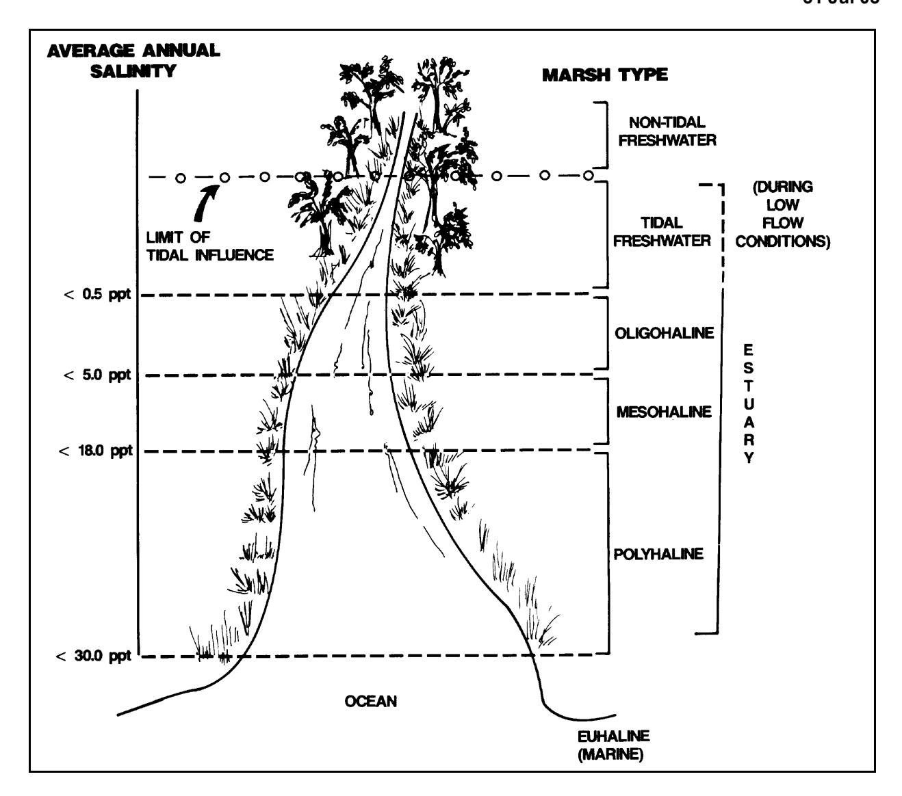
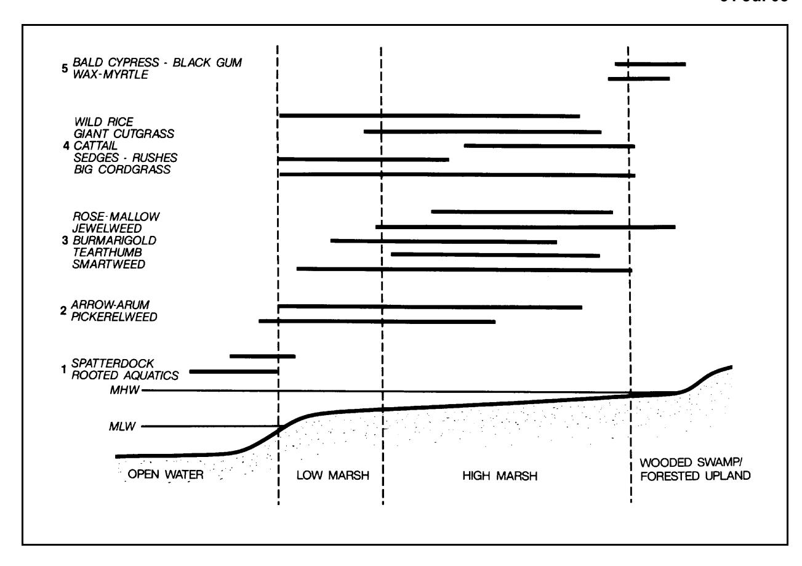
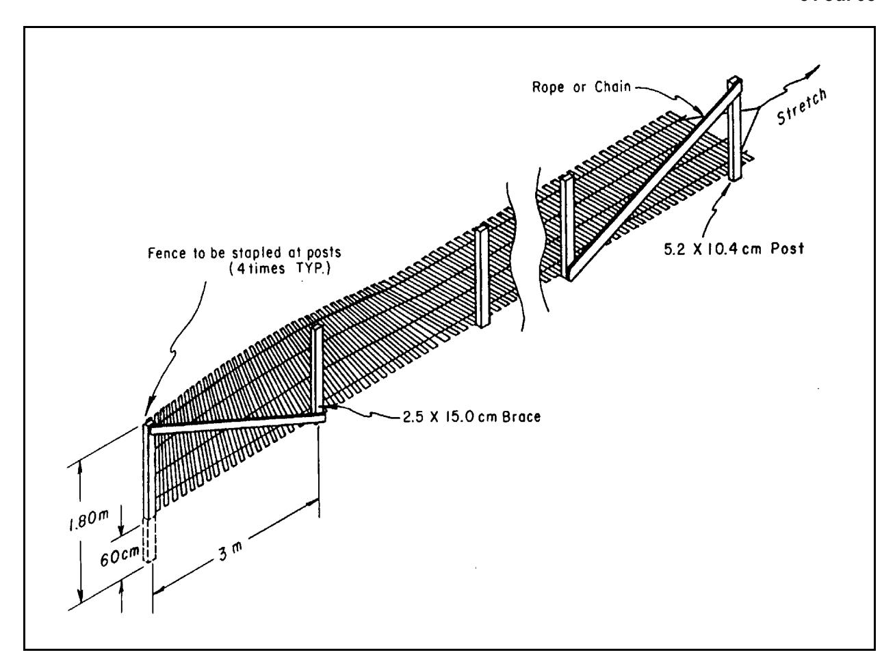
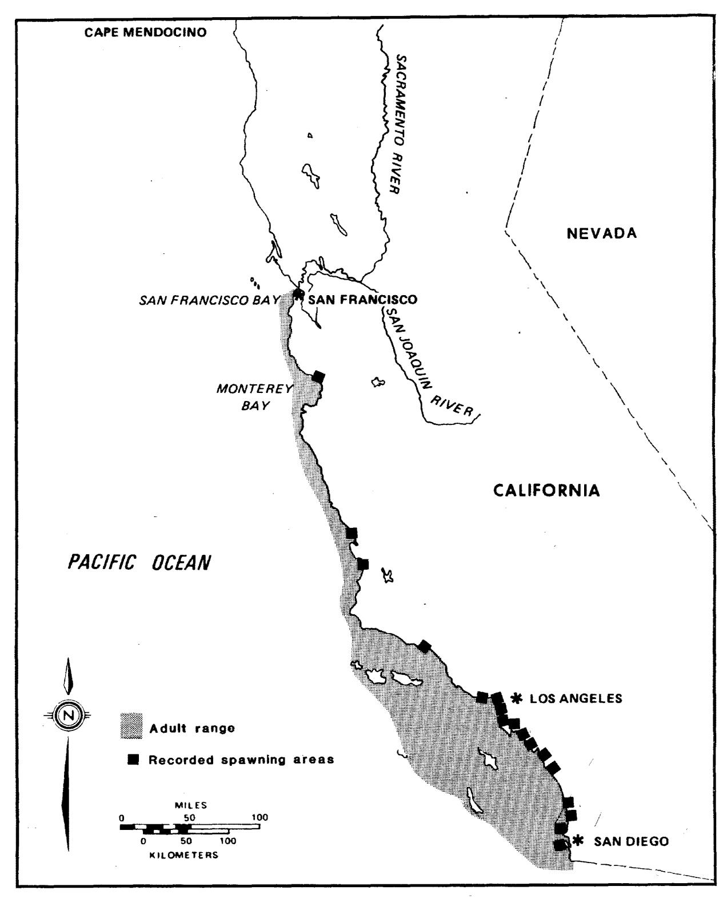

# Chapter 7 EM 1110-2-1100 COASTAL ENGINEERING FOR (Part V) ENVIRONMENTAL ENHANCEMENT 31 July 2003

#### Table of Contents

- V-7-1. Introduction V-7-1
- V-7-2. Coastal Habitat Projects V-7-1 V-7-3a. Habitat Trade-offs: Issues Associated with Compensatory Mitigation V-7-2 V-7-3b. Habitat Restoration: Issues and Initiatives Beyond Compensatory Mitigation V-7-3
- V-7-4. Ecosystem Function and Biodiversity in Coastal Habitat Projects V-7-3
- V-7-5. Defining Success and Project Maintenance and Monitoring V-7-4
- V-7-6. Adaptive Management V-7-5
- V-7-7. Design Considerations and Information Sources for Habitat Projects a. Underwater projects (1) Artificial reefs (2) Oyster reefs (3) Coral reefs (4) Live bottom and worm rock reefs (5) Seagrasses (6) Use of dredged material for creating shallow habitat b. Projects at the land-sea interface (1) Mud/sand flats (2) Intertidal salt and brackish marshes (3) Tidal freshwater wetlands (4) Tidal freshwater marsh restoration (5) Mangroves (6) Rocky intertidal shores c. Projects in coastal uplands (1) Coastal dunes (2) Coastal dune restoration (3) Maritime forests (4) Bird/wildlife islands V-7-5 V-7-5 V-7-5 V-7-6 V-7-7 V-7-8 V-7-9 V-7-11 V-7-11 V-7-11 V-7-12 V-7-14 V-7-15 V-7-16 V-7-16 V-7-17 V-7-17 V-7-18 V-7-20 V-7-20
- V-7-8. Environmental Features of Traditional Coastal Engineering Projects a. Example project types (1) Beach nourishment . (2) Shoreline structures V-7-21 V-7-21 V-7-21 V-7-22 (a) Breakwaters and sills V-7-23 (b) Groins V-7-23 (c) Seawalls and revetments V-7-24 (3) Navigation, ports, and marinas V-7-24 (a) Construction and maintenance channels V-7-24 (b) Inlets and jetties V-7-25 (c) Piers and docks V-7-25 (d) Boat basins and marinas V-7-26 (e) Port facilities V-7-26 (f) Confined disposal facilities V-7-26
- V-7-9. Environmental Issues To Be Considered for All Projects V-7-27 a. In the water V-7-27 (1) Sea turtles V-7-27 (2) Cetaceans V-7-28 (3) Fish and invertebrates V-7-28 b. At the shore/water interface V-7-29 (1) Sea turtles V-7-29 (2) Marine mammals V-7-29 (3) Sea, shore, and wading birds V-7-30 (4) Fish and invertebrates V-7-31 c. Critical areas V-7-31
- V-7-10. Information Sources V-7-33
- V-7-11. References V-7-34
- V-7-12. Acknowledgments V-7-45

# List of Figures

- Page
- Figure V-7-1. Distribution of tidal marsh type along an estuarine salinity gradient V-7-13
- Figure V-7-2. Characteristic profile of a mid-Atlantic tidal freshwater marsh V-7-15
- Figure V-7-3. Diagram of a sand fence V-7-20
- Figure V-7-4. Distribution of the California grunion along the southwest U.S. coast V-7-33

# Part V-7-1 Coastal Engineering for Environmental Enhancement

### V-7-1. Introduction

The purpose of this chapter is to provide an overview of coastal habitats and information resources on the creation and restoration of coastal habitats. For the purpose of this report, coastal habitats include both marine nearshore habitats and estuarine (both brackish and freshwater tidal) habitats. Many projects are or can be designed to restore, create, enhance, or protect critical coastal environments and the natural resources (fisheries, wildlife, etc.) that depend on them. Innovative uses of new and traditional coastal engineering technology have enabled scientists, engineers, and resource managers to rehabilitate degraded coastal habitats, create new habitats, better identify habitat needs and opportunities, and manage environmental impacts from development projects. Opportunities to provide environmental enhancements or mitigation in traditional coastal engineering projects (those that do not include habitat creation/restoration or protection as the primary objective) are also presented in this chapter, along with a discussion of potential environmental constraints and issues that may affect coastal engineering projects in general.

# V-7-2. Coastal Habitat Projects

- a. Individual habitat restoration, creation, or protection projects in the coastal zone provide identifiable benefits onsite. However, in the context of an ecosystem, watershed or landscape, they provide a continuum of benefits which may not be realized at the outset by all project participants. Recent Federal directives and other agency initiatives in restoring coastal habitats have encouraged the implementation of ecosystem-level planning in the design phase of projects (Thom 1997).
- b. One example of ecosystem evaluation incorporates the concept of landscape ecology. Landscape ecology focuses on the interaction of three characteristics: (a) structure (the spatial relationship between ecosystem elements), (b) function (the interaction among these elements), and (c) change (the alteration in structure and function over time) (Forman and Gordon 1986). Several components make up natural landscapes and they include: (a) Matrix (the dominant landscape type, in coastal situations this may be water), (b) Patch (a nonlinear surface area differing in appearances from its surroundings, such as a coral reef surrounded by water), (c) Corridor ( a narrow strip of habitat that differs from the matrix on either side, such as a band of seagrass), and (d) Node (an intersection of corridors). Individual patches collectively form a heterogeneous mosaic. Organisms within an individual patch (e.g., fish residing in a sub-tropical seagrass bed) may migrate between or among adjacent habitat patches using corridors (e.g., mangrove forests, coral reefs), depending on seasonal, diel, or environmental influences. Effective management of entire ecosystems entails improvements or enhancements to multiple habitat types, with an understanding of the role of habitats. An example of this would be to consider both adjacent and distant habitat types that Pacific salmon are heavily dependent on. That is, near coastal areas and estuaries for juvenile rearing, open ocean areas where they mature and spawning areas located as much as 500 miles upriver in freshwater. Recognition of the interactions between coastal, freshwater, and terrestrial systems, and an understanding of processes occurring in nearby watersheds such as agricultural or industrial activity, are key to planning habitat projects on an ecosystem scale.
- c. Several other approaches are valid when considering restoration in the large scale. Examples include the analysis of limiting factors on keystone species. Other restoration efforts have focused on comparison of the historical ecosystem with the current regime to determine what critical elements have been lost. No one single methodology is right for every situation but it is important to evaluate individual restoration efforts in the larger context.
- d. Recently, scientists and managers have developed recommendations for improving the state-of-the-art in habitat restoration (Pastorok et al. 1997). These recommendations include refinements in developing goals and objectives, consideration of spatial and temporal scales in design parameters, flexibility and adaptive management in project planning and design, and the importance of establishing long-term monitoring programs to document structural and functional attributes of habitats being restored. Additionally, the concept of ecosystem management is becoming the more common, especially on Federal lands. The primary objective of managing an ecosystem is to maintain its integrity of function, diversity, and structure.

#### V-7-3a. Habitat Trade-offs: Issues Associated with Compensatory Mitigation

- a. Within the last two decades, habitat restoration and creation have increasingly been used as requirements to mitigate for damage to natural resources. This is required in order to compensate for habitat losses as specified in Section 404(b)(1) of the Clean Water Act of 1972 and many state and local regulations. When most of these laws and regulations were passed, wetland and aquatic habitat creation and restoration were still developing technologies. By the mid-1980's, mitigation for human-induced wetland losses became standard practice in the United States.
- b. Mitigation is often described as three general types: avoidance, minimization, and compensatory. Under Section 404 of the Clean Water Act, these actions are sequenced in such a way that avoidance is preferred, impacts that cannot be avoided are minimized to the greatest extent practicable, and finally a determination of appropriate levels of compensatory mitigation are determined based on the analysis of lost functions and values. One useful approach to evaluating coastal habitats for mitigation needs has been developed by the U.S. Army Engineer Research and Development Center (ERDC), formerly the U.S. Army Engineer Waterways Experiment Station (Ray 1994).
- c. Mitigation may occur at or near the affected habitat ( onsite mitigation) . It is also considered acceptable to mitigate for damages by creating or restoring habitat elsewhere ( off-site mitigation ), especially when on-site mitigation would be adversely affected by the surrounding development. In-kind mitigation is accomplished by restoring/creating the same habitat type (e.g., mitigate for intertidal salt marsh lost by marina construction by creation of salt marsh on nearby dredged material deposit). Out-of-kind mitigation involves compensating for the loss of a particular habitat type by replacement with a different habitat type (e.g., creating a salt marsh to mitigate a seagrass bed destroyed by construction of a ferry terminal). The various combinations of mitigation strategies include onsite in-kind, onsite out-of-kind, off-site in-kind, and off-site out-of-kind . Preservation of valuable habitats is sometimes used as compensatory mitigation. Yet another alternative involves the use of mitigation banks, large habitat creation projects that developers have the option of contributing funds to in lieu of actually constructing a mitigation wetland. Though many have criticized mitigation banking as a way to skip avoidance and minimization of adverse impacts, in practice, mitigation banking is probably a superior alternative to haphazard construction of small, poorly designed wetland creation projects that are unlikely to be monitored or maintained. In all cases, avoidance and minimization of project impacts are considered preferable to compensatory mitigation.
- d. Compensatory mitigation has been criticized and deemed largely unsuccessful in coastal habitats (Race 1985, Zedler 1996a). Restoration of lost ecological functions is difficult to achieve in created wetlands, particularly those that are small and/or isolated and affected by surrounding land use. Even when vastly more
habitat area is created than was lost, it may be insufficient to provide functional equivalency to tidal wetlands lost (Zedler 1996b). In recent years, there has been considerable research on measurement and assessment of functional equivalency in restored and created coastal habitats. The results suggest that even in the case of the most well-designed and carefully executed projects, restoration of certain ecological functions may not occur for decades (Simenstad and Thom 1996).

### V-7-3b. Habitat Restoration: Issues and Initiatives Beyond Compensatory Mitigation

- a. National policy concerning the protection, restoration, conservation, and management of ecological resources encourages initiatives to go beyond traditional compensatory mitigation concepts and develop environmental projects, including coastal habitat improvements, based purely on environmental benefits. Accordingly, ecosystem restoration has become one of the primary missions of the Civil Works program of the U.S. Army Corps of Engineers. The purpose of Civil Works Ecosystem restoration activities is to restore significant ecosystem function, structure, and dynamic processes that have been degraded. Ecosystem restoration efforts will involve a comprehensive examination of the problems contributing to the system degradation, and the development of alternative means for their solution. The intent of restoration is to partially or fully reestablish the attributes of a naturally functioning and self-regulating system. Study and project authorities through which the Corps can examine ecosystem restoration needs and opportunities are found in Congressionally authorized studies, pursued under General Investigations, i.e., new start reconnaissance and feasibility studies for single-purpose ecosystem restoration or multiple purpose projects that include ecosystem restoration as a primary purpose. Other authorities through which the Corps can participate in the study, design, and implementation of ecosystem restoration and protection projects include: (1) Section 1135, Project Modifications for Improvement of the Environment (Water Resources Development Act (WRDA) of 1986, as amended); (2) Section 206, Aquatic Ecosystem Restoration (WRDA) 1996); (3) Section 204, Beneficial Uses of Dredged Material (WRDA 1992, as amended); and (4) dredging of contaminated sediments under Section 312 of WRDA 1990, as amended. All of these authorities can be used to restore coastal habitats and resources are usually appropriated each year under the specific authority to accomplish such work in the Corps' portion of the Water and Energy budget.
- b. Additional opportunities for ecosystem restoration and protection may also be pursued through existing project authorities for the management of operating projects, e.g., through water control changes, or as part of natural resources management.
- c. All of these authorities, which vary in their particularities related to specific applications of Corps interest, local cost-sharing, multiple agency participation, etc., are potential tools for developing coastal engineering/environmental projects. Additionally, other Federal agencies provide grants to local jurisdictions or citizen groups to plan, design, and/or construct habitat restoration projects. Examples of alternative means of acquiring and restoring coastal habitats include the National Coastal Wetlands Conservation Grant Program, and North American Wetlands Conservation Grants administered by the U.S. Fish and Wildlife Service; the National Fish and Wildlife Foundation Challenge Grants administered by the National Fish and Wildlife Foundation; and the Wetlands Reserve Program administered by the Natural Resources Conservation Service. Partnering with other agencies is also an effective way of leveraging limited assets in an area that usually has more needs identified than resources to accomplish them.

#### V-7-4. Ecosystem Function and Biodiversity in Coastal Habitat Projects

a. Coastal habitats are part of a connected ecosystem of freshwater, estuarine, terrestrial, and marine habitats. A primary consideration of habitat restoration is what functions a particular habitat provides and
how those functions relate to functions provided by other parts of the ecosystem. Additionally, it is important to determine what natural physical processes form and change natural habitats and whether these natural processes still exist in an ecosystem. A primary goal of habitat restoration and creation should always be to maintain or recreate natural physical processes because this will help maintain habitats over a much longer time scale.
- b. Coastal habitats also contribute substantially to biological diversity, simply defined as the number of species within a habitat, bioregion, or worldwide. Concern over protecting against loss of species in coastal (and terrestrial) habitats is increasing, and environmentally responsible coastal habitat projects should be planned and implemented with maintenance of biological diversity as a key concern. The primary cause of species loss in many areas is the destruction of critical habitat for one or more life-history stages of an organism. In coastal areas, these may include barrier beaches, maritime forests, salt marshes, tidal wetlands, seagrass meadows, and coral reefs. Pollution and loss of water quality may further stress populations, and may contribute to a reduction in genetic diversity due to differential mortality and local extinctions.
- c. In certain cases, preservation of biodiversity also may be a primary goal of a habitat restoration, creation, or preservation project, and many projects have attempted to restore or rehabilitate critical habitats in areas that have undergone extensive habitat loss or degradation.

### V-7-5. Defining Success and Project Maintenance and Monitoring

- a. A key component of designing and implementing habitat restoration or creation projects is to define how and when your project will be considered a success. This requires identifying a project's goals, objectives, and performance standards. Performance standards should be specifically stated in terms such as composition and density of a plant community or number of fish utilizing a site. While such standards can often be difficult to develop, they will provide a clear direction for what parameters must be monitored and how long monitoring will need to be conducted.
- b. The most often cited reason for failure of habitat restoration projects is failure to properly monitor site development and implement corrective action as needed. The National Research Council (NRC 1992) has identified a need to develop a systematic approach to improving the state of the art in habitat restoration. A primary area for improvement is in the development and implementation of monitoring programs. A welldesigned monitoring program allows project managers to make crucial changes or mid-course corrections to projects, ensuring long-term success. Monitoring data can be used by project managers to demonstrate the ability of the project to meet stated goals and objectives. Monitoring also allows others to learn from previous projects, and avoid pitfalls in future restoration efforts.
- c. Recent guidance on monitoring aquatic and marine habitat restoration projects (Thom and Wellman 1996) outlines the components of a monitoring program. A monitoring program should be designed during the planning phase as a direct result of the project objectives and performance standards. Failure to do so may result in the inability to evaluate project performance relative to the stated standards.
- d. Baseline data collection helps in setting clear, realistic objectives, provides site-specific information, and guides the development of the monitoring plan. This is considered the initial phase of the monitoring program, and provides pre-project conditions against which to evaluate project performance. During construction, monitoring is carried out to ensure that project design criteria are followed, and to assess any off-site damage that may occur during construction. Upon project completion, performance is assessed and management or modifications to the project can be carried out, as necessary, to achieve the desired project objectives.
e. Reference site selection is often critical to the development of a restoration monitoring program. Reference sites are used as models upon which to base a project design. They provide a target for the development and evaluation of performance standards. Reference sites also provide a control, useful in assessing the degree of natural ecosystem fluctuations. Pre- and post-project conditions can be assessed in the absence of reference sites; however, project performance can only be determined relative to reference conditions (Thom and Wellman 1996).

### V-7-6. Adaptive Management

Two of the key elements of success in habitat restoration/creation projects are: (a) clear, technically sound objectives, and (b) the flexibility and capability to deal with unforeseen problems or physical changes. These elements represent the foundation of an adaptive approach to ecosystem management. In recent years, adaptive management plans have been specifically recommended for ecosystem management programs by Federal and State Governments, and other entities (Thom and Wellman 1996). An adaptive management approach literally involves "learning by doing" - a sequential reassessment of system states and dynamic relationships should be an integral part of a well-designed monitoring program (Walters and Holling 1990). Since our knowledge of ecosystems is often incomplete, project managers must rely on continuous assessment and data collection to guide modifications intended to optimize restoration projects. Data collection, comparison with carefully chosen reference sites, and experimentation, where feasible, should be used to indicate the need for adjustments or modifications to the system (and in some cases reevaluation of original goals and project objectives). This can be instrumental in avoiding the pitfalls that typically result from inflexible project designs and represents a "safe-fail" approach, in contrast to the "fail-safe" approach of traditional civil and coastal engineering projects (Pastorok et al. 1997). However, in order for adaptive management to work, or even be utilized at all, there must be a clear mechanism for the monitoring results to be evaluated and a funding source to come back and provide necessary maintenance or construct actual changes to the project.

#### V-7-7. Design Considerations and Information Sources for Habitat Projects

- a. Underwater projects .
- (1) Artificial reefs. Artificial reefs have been used to enhance fishing productivity, in both artisanal and highly developed fisheries, for centuries. The National Fishing Enhancement Act of 1984 authorizes states and other government entities to develop and responsibly manage artificial reef programs in coastal waters of the United States. Since the passage of the Act, reef construction in U.S. coastal waters has increased dramatically. There are now over 300 artificial reefs in U.S. waters, most in nearshore waters of the Southern Atlantic and Gulf coasts.
- (a) Artificial reefs enhance marine habitat by providing structurally complex substrate and food resources (in the form of encrusting and epiphytic invertebrates) in topographically homogeneous areas of the ocean floor. The new substrate is quickly colonized by epiphytic algae, sponges, bryozoans, and hydroids. In tropical waters, corals are among the initial colonizers. Ultimately, small fish, crustaceans, and larger predatory fish take up residence. Size, vertical relief, structural complexity and location relative to source areas are the primary factors that determine community composition of artificial reefs. Most artificial reefs are constructed to attract and support populations of recreationally or commercially important finfish; however, reefs have also been constructed to specifically target other resource species such as giant kelp, lobsters, and corals.
- (b) Engineering and design concerns in artificial reef construction/deployment focus on the following (Bohnsack and Sutherland 1985): Material composition. Surface texture. Shape, height, and profile of the reef. Reef size, spatial scale, and dispersion.
- (c) Proper placement of artificial reef structures is of critical importance. Most reported failures of artificial reefs are due to improper siting. If deployed too close to an existing natural reef, they may provide little or no enhancement, and may reduce habitat function of the natural reef.
- (d) Artificial reefs may be placed at any depth; most reefs in U.S. waters have been deployed at depths of 10-110 m (30-360 ft). Substrate type must also be considered. Hard substrate must be located at or near the surface in order to prevent the artificial reefs from sinking. Natural sedimentation rates in the placement area should be low enough to prevent burial of structures over time. In high-energy coastal waters, reef structures must often be mechanically stabilized to prevent shifting or relocation by waves and storm surges. Water quality parameters in the vicinity of the reef should be assessed prior to deployment. Chronic low oxygen conditions (hypoxia) and rapid changes in salinity, water clarity, temperature, and nutrient concentration will negatively impact reef fish and invertebrate communities.
- (e) A variety of materials have been used to construct artificial reefs. Some of the earliest recorded artificial reefs, deployed by Japanese fishermen in the early 18th century, consisted of simple wooden structures weighted with rocks. Bamboo racks (payaos) have been used extensively in artificial reef programs in the Philippines; in recent years these have been replaced with modern concrete structures. Recycled materials are often used to construct artificial reefs. Discarded automobile tires are particularly common due to their low cost and durability. Fly-ash composites and fiber-reinforced plastics have been used. Wooden street cars, automobiles, barges, and ships have been deployed at artificial reef sites in the United States and elsewhere. Concrete structures of various sizes and configurations are also commonly deployed. Quarry rock and rubble derived from demolition activities, such as channel maintenance, have been used extensively in reef construction. Detailed reviews of artificial reef construction and design are provided by Seaman and Sprague (1991), and Sheehy and Vik (1992).
- (f) The effectiveness of artificial reefs as a fishery management tool has been questioned by coastal resource managers. It is recognized that artificial reefs can dramatically enhance fish harvests by concentrating fish around discrete, identifiable structures. However, it is often argued that the reefs merely serve to redistribute existing resources from natural sites to artificial sites, and do not actually increase fish production (Bohnsack 1989). Artificial reefs should be considered habitat creation rather than restoration of a naturally occurring habitat type.
- (2) Oyster reefs. Harvests of the American oyster ( Crassostrea virginica) along the U.S. Atlantic coast have declined dramatically during the latter half of the 20th century. In Chesapeake Bay, which historically supported the largest oyster fishery along the Atlantic coast, the principal cause of the decline was overharvesting of the resource (Wennersten 1981). During the early 20th century, yearly harvests declined rapidly as the fishery became more technologically advanced and efficient. Since the early 1960's, oyster diseases and predation, along with reduced environmental quality, have further contributed to the decline. Currently, the oyster fishery in Chesapeake Bay is threatened with economic extinction.
- (a) Oysters are filter-feeding bivalves (Phylum Mollusca, Class Bivalvia). They reproduce by shedding eggs and sperm directly into the water column. Oysters are hermaphroditic; they may be either male or female, and change sex at various times during their life cycle. Larval oysters, or veligers, begin to grow shells at approximately two weeks of age and sink to the bottom. If veligers are not able to settle upon a suitable hard substrate (culch), they die. Upon cementing themselves to hard substrate (rock, shell, another oyster) the juvenile oysters (spat) remain sessile for life, filtering the surrounding water, and forming structurally complex reefs. Because they are stationary for life, oysters are susceptible to a wide variety of predators, including gastropod oyster drills, whelks, crabs, boring sponges, and starfish. Most invertebrate oyster predators thrive in salinity above 25 psu. In recent years, oyster populations in the mid-Atlantic have been severely impacted by disease microorganisms. While not harmful to man, these diseases have seriously reduced oyster harvests in Chesapeake Bay and other mid-Atlantic estuaries.
- (b) The primary means of increasing oyster populations is by providing additional hard substrate for veligers to settle on. Typically old oyster shells are used, but in some coastal areas this material has become scarce and alternatives such as clamshells, concrete, rubble, or fly-ash (not recommended) composites are used. In recent years, coastal engineers have created experimental oyster reefs by depositing dredged material in areas historically known to support oyster populations, and capping the dredged material mounds with a layer of oyster shell (Earhart, Clarke, and Shipley 1988). This technique holds considerable promise as a tool for enhancement of shellfish resources and as a viable alternative to traditional dredged material disposal options in shallow coastal waters.
- (c) Restoring ecological functions attributed to oyster reefs, including water-filtration capacity and sediment stabilization, is more likely to provide a self-sustaining ecosystem. Oyster reefs provide structurally complex refuge for a variety of fish and invertebrate species, including many of commercial and recreational significance. The restoration technique is the same; provision of additional hard substrate to increase survivorship of newly recruiting juvenile oysters. However, in the case of restoring oyster reefs as habitat , careful attention is given to the structural characteristics of the shell deposits and orientation/spacing of the mounds in order to derive maximum use of the resource by target finfish and macrocrustacean species.
- (3) Coral reefs. Coral reefs are very productive ecosystems and occur worldwide along shallow tropical coastlines. The majority of coral reefs occur between 22.5°N and 22.5°S latitude in the tropical Western Pacific and Indian Oceans, and the Caribbean Sea. However, warm ocean currents such as the Gulf Stream in the western Atlantic and the Kuroshio Current in the western Pacific allow limited growth of coral reefs as far north as 34°N latitude (Maragos 1992). Coral assemblages found in waters of the continental United States (South Florida) are dominated by four species: the elkhorn coral ( Acropora palmata ), staghorn coral ( Acropora cervicornia ), common star coral ( Montastraea annularis ), and large star coral ( Montastraea cavernosa ) (Jaap 1984).
- (a) Coral reefs are classified according to geomorphic attributes. The most common type of coral reef is the fringing reef . Fringing reefs occur slightly below low tide level, occasionally extending into the intertidal zone, and are situated parallel to the shoreline. The proximity of fringing coral reefs to shore increases their susceptibility to human-induced environmental degradation. Patch reefs are isolated coral reefs situated shoreward of larger, offshore reefs. Offshore barrier reefs are linear in configuration, arising from an offshore shelf, and separated from the mainland by a lagoon. The Great Barrier Reef system of Australia is a well-known example of this reef type. Atolls are circular or semicircular reefs that are situated atop subsiding sea floor platforms. They maintain their position above the water column by vertical accretion as the platform subsides.
- (b) Coral reefs are the product of a symbiotic association of corals (a colonial invertebrate) and the microscopic vegetative stage of dinoflagellates (zooxanthellae) living within the tissue of the coral animal. Zooxanthellae are responsible for the bulk of primary production within the reef system. The coral animal
and zooxanthellae remove calcium ions from the surrounding seawater and incorporate them into the coral skeleton, forming the reef. A variety of invertebrates and fish utilize the structurally complex reef habitat as a predation refuge and nursery. Because corals grow in oligotrophic waters, nutrients such as nitrogen and phosphorous are recycled within the system. Gross primary production is high due to the presence of the zooxanthellae, but net primary productivity is low due to high rates of respiration within the reef community. Coral reefs function as a sink for nutrients originating from outside the system.
- (c) Maragos (1992) lists a number of "functional values" attributed to coral reefs. These include:
- Provision of a food source.
- Shoreline protection.
- Sand and mineral extraction.
- Habitat for rare species.
- Tourism and recreation.
- Scientific, medicinal, and educational resources.
- (d) Coral reef ecosystems are fragile and have undergone considerable losses in recent years. Sources of environmental degradation in coral reef systems include mechanical destruction due to channel dredging, vessel groundings, anchors, dynamite fishing, collection for the aquarium industry and trampling by recreational divers and snorkelers.
- (e) Coral reef restoration is still very much an experimental technology, and only a few case studies have been documented (Maragos 1992). Coral reef restoration typically occurs in two phases. First, before any physical reconstruction can take place, water quality conditions in the vicinity of the degraded reef must closely approximate that of the system before degradation occurred. Optimal salinity, temperature, water clarity, and hydrological conditions must be met prior to any attempt to mechanically repair or enhance the reef structure. This may be accomplished by cessation or diversion of sewage discharges and runoff, and reestablishment of natural flow regimes in the area being considered for restoration. When the environmental parameters listed above are conducive to reef development, then mechanical repair or restoration of reef structures can be implemented. In the case of physical damage due to ship grounding, it is imperative to salvage as many living corals and sponges as possible. The living surfaces of hard corals die rapidly if allowed to sit on the bare seafloor. Rubble associated with the damaged reef is typically removed and discarded offsite in deep water; occasionally it is feasible to reconstruct portions of the reef structure using cements or epoxies. If the underlying limestone reef platform is damaged, it is often necessary to reconstruct the substrate using limestone boulders. When the underlying reef platform has been reconstructed and the site cleared of debris and rubble, surviving corals and sponges are transplanted using a variety of techniques, including stainless steel wires, nylon cable ties, and epoxy/cement (Maragos 1992).
- (4) Live bottom and worm rock reefs. Live bottom habitats are common along all of the coastlines of the United States. They are particularly prevalent along the western coast of Florida and along the North and South Atlantic Coast. Live bottom consists of hard subtidal habitats colonized by sessile and mobile invertebrates, including sponges, hydroids, bryozoans, crustaceans, echinoderms, mollusks, and polychaetes. Typically, these organisms live directly upon submerged rock or fossil reefs. Macroalgal communities (e.g., kelp beds) may dominate in some hard bottom areas. Hard bottom in the surf zone is dominated by low-relief boring and encrusting organisms. As depth increases with distance from shore, species richness and vertical relief increase. Live bottom habitats are known to attract fish and mobile invertebrates, which use the vertical relief as a predation refuge, and prey upon the various organisms that comprise the live bottom community.
In general, nutrient concentrations in the vicinity of live bottom habitats are low, and net primary productivity is also low, due to respiration by resident organisms.
- (a) Worm rock reefs are a specific type of hard bottom habitat found along the southeastern Florida Coast (Zale and Merrifield 1989). These reefs are composed of the tubes of the polychaete Phragmatopoma lapidosa . The worms construct elaborate, complex aggregations of tubes by cementing sand grains. These structures may extend for hundreds of kilometers. A diverse assemblage of motile and sessile invertebrates, including many other species of polychaetes and crustaceans, are found in association with the worm reefs.
- (b) Live bottom habitats are particularly susceptible to changes in sedimentation rates associated with storms, dredging, and artificial beach nourishment. Invertebrate faunas can adapt to periodic burial due to natural processes, but chronic or persistent burial resulting from construction or coastal engineering activities will destroy live bottom. Disturbances due to commercial fishing, such as trawling, are detrimental to live bottom communities. Vessel groundings and anchor scars may also cause permanent physical damage to live bottom habitat.
- (c) There are few documented instances of live bottom restoration other than coral reefs (Maragos 1992) and kelp beds (Schiel and Foster 1992). However, many of the general guidelines for coral reef restoration can be applied to restoration of live bottom. Assuming appropriate hydrodynamic and water-quality regimes, restoration involves removal of debris and mechanically rebuilding damaged structures. In the case of worm rock, fragments may be removed from nearby source areas and transplanted onto damaged reefs to speed recolonization.
- (5) Seagrasses. Seagrasses are submerged, flowering marine angiosperms, of which approximately 35 species are known worldwide. Seagrass beds occur mainly in low-energy subtidal and intertidal habitats along the Atlantic, Pacific, and Gulf coasts of the United States, with species composition and areal extent varying greatly along each of these coasts. Along the Atlantic coast, eelgrass ( Zostera marina ) beds occur from the Canadian Maritime Provinces south to Albemarle-Pamlico Sound in North Carolina. Along the Pacific coast, eelgrass beds occur from Mexico to Alaska in bays and inlets. Turtle grass ( Thalassia testudinum ) dominates along the east coast of Florida, the Florida Keys, and the Gulf of Mexico, along with shoalgrass ( Halodule wrightii ) and manatee grass ( Syringodium filiforme ). In deeper waters off the Florida continental shelf, two other species ( Halophila engelmanni and H. decipiens ) occur. Seagrass communities of the U.S. Pacific coast are comprised of three species of surfgrass ( Phyllospadix scouri , P. torreyi , and P. serulatus ) and two species of eelgrass ( Zostera marina and Z. japonica ).
- (a) Seagrass beds are critical nursery areas for many recreational and commercial fishery species, including bay scallop ( Argopecten irradians ), summer flounder ( Paralichthys dentatus ), and blue crab ( Callinectes sapidus ). On the Pacific coast, eelgrass meadows provide nursery habitat for dungeness crab ( Cancer magister ), english sole ( Parophrys vetulus ) and starry flounder ( Platichthys stellatus ). Juveniles of these and other fishery species are afforded refuge from predators and benefit from abundant food within the complex seagrass canopy. Eelgrass beds are also important as spawning substrate for bait fish species such as herring ( Clupea pallasi ).
- (b) Critical environmental parameters for seagrass beds include wave energy, salinity, temperature, water clarity, and nutrient concentrations. Depth and water clarity exert the primary controls over seagrass zonation and the degree of colonization by epiphytes. Redistribution of sediments by waves and storm surges can severely impact seagrass beds. Diseases can have a catastrophic effect on seagrass communities. During the 1930's, widespread infection by the slime mold Labryinthula macrocystis decimated Atlantic coast eelgrass populations (Short, Muehlstein, and Porter 1987). Many coastal areas have not yet recovered from this "wasting disease."
- (c) Seagrass beds are susceptible to an array of human-induced degradations. Dredge and fill operations associated with navigation channel maintenance have taken a toll. Deterioration of water quality conditions associated with human population in coastal areas remains a primary cause of seagrass bed degradation. Physical damage to seagrass beds may be caused by recreational boating in shallow waters. This type of chronic disturbance is common in populated areas and is persistent; turtle grass beds in Florida Bay may require upwards of a decade to recover from propeller scarification (Zieman 1976).
- (d) There has been considerable interest and effort expended to devise effective methods of creating or restoring seagrass beds, primarily by transplantation. Most efforts have failed, usually because site conditions are not suitable. The parameters of the transplant site must closely match those of the donor, or reference site, if restoration is to be successful.
- (e) The earliest recorded eelgrass transplant efforts along the U.S. Atlantic coast were documented by Addy (1947). The first successful transplantation of turtle grass was reported by Kelly, Fuss, and Hall (1971) in Boca Ciega Bay, Florida. Attempts to reestablish subtropical seagrasses on dredged material deposits in Port St. Joe, Florida, are described by Phillips (1980).
- (f) Thorhaug and Austin (1976) discuss types of coastal engineering projects that could benefit from transplantation of seagrass beds. These include (a) dredging of canals where both sides can be replanted, (b) stabilization of the shallow subtidal and intertidal portions of dredged material islands, and (c) other miscellaneous dredge and fill impact projects (road, bridge construction, marinas, etc.). Transplantation of turtle grass, manatee grass, and shoalgrass beds in Biscayne Bay, Florida, and other locations in the Caribbean are documented by Thorhaug (1985, 1986). Darovec et al. (1975) described transplant techniques for seagrasses along Florida's west coast. Lewis (1987) reviews seagrass restoration in the southeast United States, and discusses reasons for failures, as well as success, using well-documented case studies in south Florida.
- (g) Recent efforts to reestablish eelgrass in lower Chesapeake Bay are documented by Moore and Orth (1982). Thom (1990) reviewed eelgrass transplanting projects in the Pacific Northwest and Wyllie-Echeverria, Olson, and Hershman (1994) documented the state of seagrass science in policy in the Pacific Northwest.
- (h) Planting techniques, along with cost and labor estimates for establishment of eelgrass, shoalgrass, manatee grass, and turtle grass on dredged material and other unvegetated substrates are documented by Fonseca, Kenworthy, and Thayer (1987). Fonseca (1994) reviews all aspects of seagrass restoration, including planting guidelines and monitoring programs for the Gulf of Mexico; however, this information is applicable to seagrass restoration in general.
- (i) A variety of transplant methods have been used to restore seagrasses, including broadcast seeding, seed tapes, stapling of individual plants, and use of "peat pots" or sediment plugs containing whole plants. The latter method appears to be most successful (Fonseca 1994). Fertilizer applications have been tried in some instances, although performance has been inconclusive (Fonseca 1994). Careful attention must be paid to spacing of individual planting units in order to achieve site coalescence. Subtropical seagrass beds in Florida Bay and the eastern Gulf of Mexico have achieved coalescence in as little as 9 months, or as long as 3-4 years, depending on planting distance between individual units. In high-energy areas, beds may never fully coalesce.
- (j) Careful monitoring is critical to the success of any seagrass restoration project. Performance indicators should include survival rates of planting units, areal coverage, and number of shoots per planting unit. Fonseca (1994) recommends quarterly monitoring intervals during the first year following planting and semi-annual intervals for the next 2 years. Areal coverage should be monitored in successive years.
Assessment of ecological functions (e.g., nutrient cycling, primary production, utilization by benthic invertebrate and fishery species), should also be conducted, and more recent studies have focused on restoration of specific functions of seagrass beds, including the ability of seagrasses to modify their surrounding hydrodynamic environment (Fonseca and Fisher 1986) and their potential for utilization as a nursery by fishes and invertebrates (Homziak, Fonseca, and Kenworthy 1982, Fonseca et al. 1990).
(6) Use of dredged material for creating shallow habitat. In the face of increasing restrictions on openwater disposal of dredged material and limited capacity in existing disposal facilities, coastal engineers have proposed placing dredged material in nearshore waters. In highly developed bay and harbors where shallow intertidal or subtidal habitat is limited, the placement of clean dredged material can create or restore important nearshore habitat. Shallow coastal waters are often home to seagrass beds, macroalgae beds, and other communities.

### b. Projects at the land-sea interface .

- (1) Mud/sand flats. Intertidal mud and sand flats are a conspicuous coastal habitat type present along all coasts of North America. They are most abundant and expansive in high tidal range areas such as Puget Sound and the New England coast. A variety of fish and invertebrate species, many of commercial and recreational importance, depend on intertidal and shallow subtidal unvegetated marine habitat, particularly during early life stages. Along the U.S. Atlantic coast these include the sandworm ( Nereis virens ) and bloodworm ( Glycera dibranchiata ). These two species represent an important bait industry in the northeast (Wilson and Ruff 1988). Bivalves, which occupy mud and sand flats along the Atlantic coast, include the hard clam ( Mercenaria mercenaria ) and softshell clam ( Mya arenaria ); both are harvested commercially. On the west coast, several commercially important species are associated with mud and sand flats, including the Pacific razor clam ( Saliqua patula ), littleneck clam ( Protothaca saminea ), pismo clam ( Tivela stultorum ), Pacific oyster ( Crassostrea gigas ) and dungeness crab ( Cancer magister ).
- (a) Mud and sand flats are also very productive for benthic and epibenthic invertebrates and algae. They are an important source of nutrients to the entire coastal ecosystem. In virtually all estuarine and coastal areas, mud and sand flats are important forage sites for a myriad of resident and migratory waterfowl as well as wading bird species, which feast on the abundance of invertebrate prey items (worms, small crustaceans, bivalves) available at low tide.
- (b) Restoration and creation of unvegetated intertidal habitats has not received the level of attention given to restoration/creation of vegetated intertidal habitats, such as salt marshes and mangrove forests. However, deposition of fine dredged material in shallow coastal waters may inadvertently result in the creation of intertidal mud and sandflats. Many such artificial habitats were created prior to the implementation of the National Environmental Protection Act (NEPA) and therefore, are not well-documented. A study by the U.S. Army Engineer Division, New England and ERDC compared benthic invertebrate community dynamics at a recently constructed mudflat with a nearby natural mudflat at Jonesport, Maine (Ray et al. 1994). A diverse infaunal assemblage was present 2 years after construction and included commercially important species such as sandworms and softshell clams. As with most shallow-water habitat creation and restoration projects, habitat tradeoffs must be considered. In certain geographic areas (e.g., coastal New England) creation of intertidal mud or sand flats may represent an attractive beneficial use alternative to conventional dredged material disposal. Mud and sand flats can also be restored or created by the removal of fill material that may have been placed in the nearshore zone to create uplands for development. When industrial areas adjacent to the water are abandoned, it provides a perfect opportunity to remove fill and recreate aquatic habitat. Another technique used in highly modified shorelines (such as ports) in the Pacific Northwest includes the creation of intertidal benches that are surrogates for once prevelent mudflats. Long linear stretches of riprap bankline are altered to accommodate a rock crib that is lined with filter fabric. These cribs are filled with fine-grained material (50 percent sand, 25 percent silt, and 25 percent clay) and become sites
for benthic recruitment and algae attachment. These intertidal benches are also placed at specific tidal elevations for epibenthic production as well. As juvenile fish migrate downstream to the ocean, they follow the shoreline through the developed port areas and can feed during their migration.
- (2) Intertidal salt and brackish marshes. Intertidal marshes are found in all coastal areas of the United States, except for the southern half of Florida, where they are replaced by mangroves; and certain areas of the Western Gulf of Mexico, where they are replaced by wind-tidal flats. They are a conspicuous landscape feature along the gently sloping Atlantic coastal plain, from New England to east-central Florida, in association with drowned river-valley estuaries and back-barrier lagoons. Intertidal marshes are ubiquitous in the lower Mississippi Delta and back-barrier systems of the Gulf of Mexico, ranging from west-central Florida to Southwest Texas. Intertidal marshes are found along the Pacific coast from Baja, Mexico to Alaska, but are less extensive than those along the Atlantic and Gulf coasts. Large Pacific coast estuaries (e.g., San Francisco Bay and Puget Sound) historically supported large areas of intertidal marsh, but have experienced dramatic losses. In the past, the losses were primarily due to the building of dikes and reclamation of the marshes as farmland, but more recently have primarily been due to dredge and fill activities.
- (a) Intertidal marshes occur along the entire estuarine salinity gradient from tidal freshwater (<0.5 psu) to polyhaline (>20 psu) conditions (Figure V-7-1). Ecological functions attributed to intertidal wetlands include shoreline stabilization, storage of surface waters, maintenance of surface water and groundwater quality, and the provision of nursery habitat for estuarine-dependent finfish and shellfish species.
- (b) Vegetation communities in intertidal wetlands are dominated by grasses (Poaceae), rushes (Juncaceae), or a combination of the two. Variability in environmental factors (e.g., nutrient availability, duration and depth of intertidal flooding, and pore water salinity) limits plant species diversity in intertidal salt and brackish marshes. The spatial extent of the major zones of intertidal marsh vegetation is largely determined by elevation and its effect on the tidal flooding regime.
- (c) Intertidal marshes provide habitat for a variety of organisms, including many commercially important fish species. Examples of marsh-dependent fish and crustaceans along the Atlantic and Gulf coasts include blue crab, brown, white and pink shrimp ( Penaeus spp.), red drum ( Sciaenops ocellatus ), and spotted sea trout ( Cynoscion ocellatus ). Early life stages of these organisms are afforded refuge from predators and benefit from abundant prey resources in shallow tidal marsh habitats. Prey species include various killifishes ( Fundulus spp.) and caridean shrimp ( Palaemonetes spp.) commonly encountered on the vegetated intertidal marsh surface and in shallow subtidal creeks and pools. Characteristic marsh invertebrates include fiddler crabs ( Uca spp.), amphipod and isopod crustaceans, terrestrial insects and arachnids, various bivalve and gastropod mollusks, and annelids. Wading birds, such as egrets and herons, prey upon resident fishes and invertebrates of intertidal marshes. Many other birds, both arboreal and aquatic, feed and nest in upper intertidal marsh habitats. A variety of mammals, including deer, fox, raccoon, and otter, use intertidal marshes for foraging, breeding, and refuge.
- (d) The restoration and creation of intertidal salt and brackish marshes have received much attention in coastal engineering. This is likely due to the considerable acreage of salt marsh that has been lost along U.S. coastlines, recognition of the functions provided by intertidal marshes, and the relative ease in which salt marsh vegetation can be propagated upon dredged material. Restoration of tidal marsh environments may involve removal or breaching of dikes and berms, or installation of culverts under roads to reestablish the natural tidal prism. Hydrologic restoration of tidal marshes has occurred in New England (Sinicrope et al. 1990), the mid-Atlantic (Shisler 1990), central Florida (Rey et al. 1990), central and southern California (Niesen and Josselyn 1981), and the Pacific Northwest (Frenkel and Morlan 1991). Reestablishing tidal conduits increases accessibility of previously impounded or restricted wetlands to estuarine-dependent finfish and wildlife. Invasive plant species such as common reed ( Phragmites australis ), which often predominate in hydrologically altered wetlands, may be controlled via reestablishment of historical tidal regimes (Roman, Niering, and Warren 1984).

*Figure V-7-1. Distribution of tidal marsh type along an estuarine salinity gradient*

- (e) Marsh creation is often a component of the restoration process, especially in projects involving the removal of fill and/or regrading of adjacent uplands to intertidal elevations. However, it is important to recognize that marshes can often be created in upland or shallow subtidal areas that have not historically supported intertidal vegetation.
- (f) Techniques for establishing Spartina alterniflora marshes on dredged material deposits along the south Atlantic coast were pioneered by researchers at North Carolina State University in the late 1960's to early 1970's (Seneca 1974, Seneca et al. 1976). The objective of these early studies was to provide stabilization of shorelines and dredged materials, and to recoup some of the losses to coastal habitats that had occurred as a result of human population growth in coastal areas. The U.S. Army Corps of Engineers Dredged Material Research Program (DMRP) pioneered large-scale salt marsh establishment on all three U.S. coastlines in the 1970's (Barko et al. 1977, Smith 1978). Tidal marshes established under the DMRP were monitored from 1974-1987 (Landin, Webb, and Knutson 1989). Parameters studied include plant propagation success, shoreline stabilization properties, and utilization by fish and wildlife species. Successive research has focused on refining the techniques developed by the DMRP, and in recent years, increased attention has focused on replication of ecological function in created or restored intertidal marshes.
- (g) Tidal marsh creation/restoration, with emphasis on planting techniques, is discussed by Broome, Seneca, and Woodhouse (1988). Darovec et al. (1975) provide guidance on planting salt marsh vegetation, including information on handling of seed stock, transplant units, planting intervals, and elevation requirements, with emphasis on the Florida coast. Roberts (1991) evaluated the habitat value of 22 created coastal marshes in northern and central Florida, concluding that the basic habitat requirements of fish, bird, and mammal species that use natural marshes in this region were being met by the majority of the man-made habitats. Marsh shape and size were critical features determining the degree of use by fish and wildlife species. Minello, Zimmerman, and Medina (1994) determined that geomorphic features such as tidal creek edges strongly influenced the abundance and distribution of fishes and invertebrates on the surfaces of intertidal marshes created from dredged materials in Galveston Bay, Texas.
- (h) Salt marsh creation/restoration has been conducted at a number of sites in central and southern California during the last two decades. There has been considerable debate on the benefits of marsh creation/restoration as mitigation for destruction of natural wetlands along the west coast and elsewhere (Race 1985, Zedler 1996a). Josselyn and Bucholz (1982) provide a detailed overview of marsh restoration projects in the San Francisco Bay estuary, including case histories and monitoring studies. Zedler (1988) reviews salt marsh restoration in Southern California, and discusses the importance of hydrologic concerns, and the value of experimentation in planning and monitoring marsh restoration projects. Several "lessons" from restoration efforts in California are outlined, including the importance of planning for the maintenance of rare or endangered plant and animal species in tidal marsh restoration projects, and a recommendation against the use of offsite mitigation for development projects that impact natural wetlands. Recently, the San Francisco District has taken dike breaching to large scale. The Sanoma Baylands project incorporated both levee breaching of an old salt evaporation pond and beneficial uses of dredged material. The salt pond had been in use for almost 100 years and as a result the original marsh elevation had greatly subsided. In order to offset the subsidence, dredged material was spread out over the 117-ha (289-acre) project area to reestablish tidal marsh elevations. Two other larger scale dike breaches are planned for Hamilton Army Airfield (a 364-ha (900-acre) abandoned facility) and Napa Marsh. Similar projects also have taken place in the Pacific Northwest. Trestel Bay, a project in the Portland District, restored over 202 ha (500 acres) by a dike breach in five separate locations. The ability of created/restored tidal wetlands to perform the functions attributed to natural tidal wetlands is addressed by Simensted and Thom (1996) in their study of a restored brackish intertidal wetland in the Puyallup River, Washington. These authors contend that only a few of 16 functions investigated displayed a tendency toward equivalency with natural tidal wetlands in the Pacific Northwest in the first several years subsequent to construction. Natural variability among reference sites was cited as an impediment to assessing the degree of functional equivalence between restored and natural marshes.
- (3) Tidal freshwater wetlands. Tidal freshwater wetlands occur along the upper reaches of rivers characterized by moderate to strong tidal influence. They are most extensive along the Atlantic coast between Georgia and New England, especially in the mid-Atlantic/Chesapeake Bay region and along the coastal rivers of South Carolina and Georgia. Tidal freshwater wetlands are also common in the Pacific Northwest, where considerable freshwater influence and high-amplitude tides prevail (Odum et al. 1984). The vegetation community of tidal freshwater marshes is diverse, in comparison to salt and brackish marshes (Figure V-7-2). Rarely does any one species dominate, and notable changes in plant community structure can occur within a single growing season. Freshwater tidal marshes can be dominated by emergent herbaceous species, shrubs, or trees (particularly in the Pacific Northwest), or a combination of all three. As with salt and brackish marshes located downstream, tidal freshwater marshes support populations of both resident and migratory fishes, many of which have recreational or commercial significance, including salmon and trout ( Oncorhynchus sp. ), striped bass ( Morone saxatilis ), yellow perch ( Perca flavescens ), and black bass ( Micropterus spp.). Wildlife, including mammals, reptiles, and amphibians reside or forage in tidal freshwater marshes. Many arboreal and aquatic bird species are temporary or year-round residents of tidal freshwater marshes.

*Figure V-7-2. Characteristic profile of a mid-Atlantic tidal freshwater marsh*

- (4) Tidal freshwater marsh restoration. Restoration and creation of tidal freshwater marshes is technically similar to that of salt and brackish marshes. One of the earliest of the Corps' DMRP wetland creation efforts was the Windmill Point Marsh project conducted in the James River, Virginia (Lunz et al. 1978; Landin, Webb, and Knutson 1989). In 1974, fine-grained dredged material from the James River was used to construct an 8-ha (20-acre) island surrounded by a temporary sand dike. Upon completion of the island, the dike was breached to allow natural formation of tidal channels. Vegetation colonization occurred within one growing season without planting, attesting to the value of seed banks in tidal freshwater sediments. Information collected on fisheries use and benthic invertebrate communities at Windmill Point represents some of the most comprehensive data available on faunal utilization of tidal freshwater habitats. Ultimately, much of the original island site was lost due to erosion and subsidence; however, a spatially complex system of intertidal marsh and shallow subtidal habitat persists in providing nursery habitat for resident and migratory fish and wildlife. Several smaller tidal freshwater marsh restoration projects have also been conducted in upper Chesapeake Bay (Garbisch and Coleman 1978).
- (a) Another DMRP project involving the creation/restoration of tidal freshwater wetlands is the Miller Sands Island habitat development project in the lower Columbia River, near Astoria, Oregon (Clairain et al. 1978). This large island/wetland complex was also constructed in 1974 and monitored extensively to document vegetation and soils development, and utilization by fisheries and wildlife (Landin, Webb, and Knutson 1989). This represents one of the few published efforts to date documenting faunal utilization of tidal freshwater wetlands in the Pacific northwest.
- (b) On the west coast, a common method of restoring tidal freshwater wetlands is to breach dikes or levees constructed for farmland creation in the past. The Sacramento District breached dikes at Cache Slough
to create approximately 8.9 ha (22 acres) of freshwater marsh habitat (Stevens and Rejmankova 1995). The Seattle District restored over 162 ha (400 acres) of freshwater wetlands to tidal influences in a WRDA 1986, Section 1135 project. The Deepwater Slough project used explosives experts from the Army's 168th Division to detonate charges to create some of the breaches. Forested tidal freshwater wetlands are relatively rare habitats and should be considered an important habitat to restore. Unfortunately, it may take 25-100 years, as they are not yet mature.
- (5) Mangroves. Mangroves are woody trees and shrubs of the family Rhizophoracea, and represent a tropical/subtropical analog to herbaceaous intertidal vegetation of temperate regions. In the United States, mangroves occur primarily in southern Florida, especially along the southwest coast, and in scattered locations in Louisiana, Texas, and Hawaii.
- (a) Like salt marshes, mangrove forests provide critical nursery and foraging habitat for resident and transient fish populations, many of which are recreationally and commercially significant, including red drum ( Sciaenops occelatus ), tarpon ( Megalops atlantica) , and Snook ( Centropomus undecimalis ). A variety of wildlife and avifauna, including American alligator ( Alligator mississippiensis ), American crocodile ( Crocodylus acutus ), Roseate spoonbill ( Ajaia ajaja ), white ibis ( Eudocimus albis ) and several species of herons and egrets use mangroves as refuge and breeding habitats. Important tropic linkages have been established between mangrove forests and adjacent ecosystems, such as seagrass beds and coral reefs. Mangroves, like intertidal marshes, provide shoreline stabilization. Mangroves intercept and retain nutrients moving downstream and maintain water quality via filtration of tidal surface waters.
- (b) Loss and degradation of mangrove forests has resulted from hydrologic alteration, industrial and agricultural land use, dredge and fill activities, and, in some areas, direct harvest for wood products (Cintron-Molero 1992).
- (c) Mangrove restoration. Mangrove restoration is typically accomplished by transplanting individual propagules (seedlings) along unvegetated intertidal shorelines. Important factors to consider in attempting to transplant mangroves include plant size and source of donor plantings, salinity, shoreline energy, and tidal flooding depth (elevation). The latter factor is of considerable importance, particularly when transplantation is being conducted on dredged material deposits, which may settle over time. Commonly cited reasons for failure of mangrove restoration efforts include excess wind/wave energy at the transplant site, improper hydrologic regime (inadequate tidal flushing), and failure to replace planting units lost to mortality (Cintron-Molero 1992).
- (d) The earliest documented efforts to restore mangroves date back to the early 1970's in Florida. There are anecdotal reports of earlier attempts to transplant mangroves for soil stabilization in the early 1900's (Pulver 1976). Teas (1977) describes the life history of various mangrove species in Florida, with implications for their restoration. Pulver (1976) describes transplant techniques for red, black, and white mangroves in southwest Florida. Darovec et al. (1975) provide detailed planting guidelines for mangroves in South Florida, including information on elevation requirements, planting unit height, age and spacing of planting units, soil types, and fertilization. Lewis (1982) discusses a variety of mangrove restoration projects from Florida and the U.S. Virgin Islands, with recommendations for improving the success of mangrove projects. A more recent assessment of the state of the art in mangrove restoration is provided by Cintron-Molero (1992) with examples from Puerto Rico and other Caribbean locales.
- (6) Rocky intertidal shores. Rocky intertidal shorelines are found worldwide, primarily in high-energy littoral environments. Biotic assemblages of rocky intertidal shores include macroalgae, particularly brown algae ( Fucus spp.); various mollusks, including limpets, mussels, and gastropods; and barnacles. The complex interactions among these organisms along rocky shores of the east and west coasts of North America have been the subject of numerous experimental studies in the last several decades, forming the basis for
much of our understanding of the structure and function of shallow marine communities (Connel 1972, Paine and Levin 1981). Shallow rocky habitats along the U.S. west coast are used as spawning sites for juvenile fishes, including some commercially important species such as Pacific herring ( Clupea harengus pallasi ). Shorebirds forage extensively along rocky shorelines and in tidepools. Marine mammals such as sea lions, otters, and seals breed and reside along rocky shores.
- c. Projects in coastal uplands.
- (1) Coastal dunes. Coastal dunes are highly dynamic sand deposits located landward of beaches. They occur along all coasts of the United States, including the Great Lakes. They are especially common along the Atlantic and Gulf barrier island shores, and also dominate in some Pacific coast areas (California, Oregon). Dunes supply sand to beaches during erosive storm events, and act as buffers to wave energy. Removal of dunes from coastal areas can result in significant economic loss from damage to homes, businesses, and natural areas (Woodhouse 1978).
- (a) In general, dunes and other transient lands such as spits are highly desired by developers, because of their proximity to the shoreline. This practice should be strongly discouraged as the forces causing the dynamic nature of the land masses do not cease once houses are built on a spit, etc. Engineering structures such as steel sheet piles and stone revetments are a temporary solution and frequently cause harm to downdrift properties.
- (b) Dunes may be vegetated, and, therefore, relatively stable, or they may be naturally unvegetated. Three types of vegetated dunes are recognized: Foredune Ridges are linear, low-amplitude sand ridges oriented parallel to the beach. These are common along the Atlantic and Gulf coasts. Parabolic Dunes are sparsely vegetated, U-shaped dunes, open to the direction of prevailing winds. These generally form behind foredunes and are common along the lower shoreline of Lake Michigan, Cape Cod, and northwest Florida. Precipitation Dunes are blown sand deposits which intrude onto adjacent forested uplands. These commonly occur along the U.S. Pacific coast.
- (c) Unvegetated dunes are the most dynamic and also vary considerably in morphology. Transverse Dunes are sand deposits that lie perpendicular to the prevailing winds. Longitudinal Dunes are oriented parallel to prevailing winds. Transverse Dunes are rapidly migrating dunes that move landward in response to prevailing winds. Transverse dunes may be straight or sinuous in shape and may persist for up to 1 km (0.6 mile) in length.
- (d) Wave climate and local wind regimes are the primary physical factors responsible for dune establishment. Littoral processes (longshore drift) and storm-associated overwash events provide the sand; dune morphology is determined by wind climate (the direction of prevailing winds relative to the orientation of the beach).
- (e) Characteristic perennial grass species that grow on dunes are instrumental in maintaining dune integrity and stabilization function. Sea oats ( Unionicola paniculata ) are the dominant dune grass along most of the south Atlantic and Gulf coasts. This and other dune-building species are able to withstand high salinity, wind, evaporation, and periodic burial by drifting sand. Other dune-building plants include American beach grass ( Ammophila breviligulata ), bitter panic grass ( Panicum amarum ), saltmeadow cordgrass ( Spartina patens ), and seacoast bluestem ( Schizachyrium maritinum ). European beach grass
( A.arenaria ) has been widely introduced, especially in the Pacific Northwest, and has displaced native American dunegrass ( Elymus molli ) throughout much of this region.
- (f) Dunes are fragile coastal habitats and are subject to destruction by trampling, vehicular traffic, construction, and livestock grazing. Once disturbed, the dunes become unstable, and sand is distributed via wind and wave action either into adjacent waters, or inland.
- (2) Coastal dune restoration. In recognition of the potential importance of dunes as shoreline stabilizers, considerable research has been conducted to develop restoration techniques. Historically, dunes have been stabilized with vegetative plantings in many coastal areas; however, this frequently led to a loss of dune processes (longshore movement, etc.), and may even eliminate unvegetated habitat used by native wildlife such as snowy plovers on the west coast. Early settlers on Cape Cod, Massachusetts, planted American beach grass to stabilize dunes. European beach grass was introduced to the San Francisco Bay area at the turn of the century for dune and shoreline stabilization purposes. During the 1930's, dune restoration projects were completed by the Civilian Conservation Corps in the Pacific Northwest and along the Outer Banks of North Carolina. Dune creation/restoration has also been conducted in Europe, Israel, Australia, and South Africa (Dahl et al. 1975). Recent efforts have sought to improve the state of the art of dune restoration with regard to appropriate selection of native plant species, improved planting techniques, removal of nonnative invasive species, and the use of new technology. Much of the research to develop effective methods of dune building was conducted at the U.S. Army Engineer Waterways Experiment Station's Coastal Engineering Research Center (CERC) in the mid-1960's. These techniques have been applied to dune creation and restoration in coastal areas throughout the United States, and elsewhere (Gage 1970, Darovec et al. 1975). Knutson (1977) provides a general overview of dune restoration, including a discussion of specific applications and recommendations for transplant species. Woodhouse (1978) reviews the ecology of dune plants and provides detailed guidelines for planting, fertilization, and maintenance of artificial dunes, on a region-specific basis.
- (a) Typically, dunes are constructed mechanically using earth-moving equipment, or sand fences are used to trap sand in desired areas. Transplant units can be obtained from nursery stocks, or removed from nearby intact dune systems (this may be illegal in some areas). The most commonly used species in dune transplantation are American beach grass, European beach grass, sea oats, and bitter panic grass. Plantings are done by hand or with a strawberry or tobacco planter. Irrigation can be used to stabilize unconsolidated sand prior to planting. Fertilization is usually necessary to establish plant growth in these nutrient-poor systems. Typically, nitrogen, phosphorous, and potassium fertilizers are broadcast by hand or applied using a mechanical spreader.
- (b) Once the primary species are established, additional species will eventually grow due to natural colonization processes. Vegetative planting serves two functions: (a) it stabilizes sand deposits, and (b) it provides a baffle that encourages deposition of wind-blown sand on the dune surface. The ability of the various transplant species to perform the two functions varies widely among geographic regions.
- (c) Removal of nonnative vegetation is another technique for dune restoration, particularly on the west coast. Methods include manual pulling/removal of plants, mowing, or grubbing with equipment. Often these treatments need to be repeated over several seasons to ensure removal of all or most of the non-native plants. Pickart, Miller, and Duebendorfer (1998) and Pickart et al. (1998) removed yellow bush lupine from northern California dune systems and investigated how the nutrient input from the lupine influenced colonization of the dunes by both nonnative and native plant species.
- (d) Sand fences (longitudinal wooden or fabric fence erected along the beach face to encourage deposition of sand) can be used to initially create dunes in the absence of vegetation (Figure V-7-3). This is typically done in an area where dunes do not currently exist, and must be established prior to vegetative stabilization. Sand fences may be constructed in successive "lifts" in order to encourage the accretion of large

*Figure V-7-3. Diagram of a sand fence*

dunes (Woodhouse 1978). Most constructed dunes are linear. However, in some cases, it may be advantageous to attempt to replicate the sinuous contours often observed in natural dune systems. Sand fences are advantageous because they trap sand at a rapid rate. Once established, dune-building plants can trap sand at a rate comparable to that of sand fences (Knutson 1980).
- (e) Although benefits to reestablishing or stabilizing coastal dunes are considerable, environmental issues need to be considered (Knutson and Finkelstein 1987). Dune construction may interfere with natural geomorphological processes, such as barrier island migration and salt marsh development. Overwash provides the sediment necessary for the maintenance of salt marshes, and periodically provides new substrate for the formation of new marshes. Large-scale dune establishment along barrier islands could potentially interfere with natural cycles of marsh burial and reestablishment associated with overwash events.
- (f) Another environmental concern involves changes in natural plant communities as a result of artificial dune construction. Dunes provide protection from salt spray, flooding, and wind/wave energy. A reduction in environmental stress may induce rapid and unwanted changes in vegetation communities behind the primary dunes. Dense growth of shrubs is the most commonly encountered result, with a resulting change in microclimate. This may or may not be considered ecologically desirable, depending on the relative abundance and perceived importance of this habitat type in a specific region. Many coastal wildlife species (arboreal birds, small mammals) will readily inhabit coastal shrub thickets. However, most colonial waterbirds (gulls, terns) prefer to nest in sparsely vegetated dunes.
- (3) Maritime forests. Maritime forests are evergreen tree and shrub systems that occur in a narrow discontinuous band along barrier islands and low-lying mainland areas. In the United States, they are most common from North Carolina to Florida. Maritime forests support a distinct fauna and flora adapted to a unique set of environmental parameters, including high soil salinities resulting from periodic storm-induced seawater inundation, wind, and limited fresh water. Canopy height is often restricted from the effects of nearcontinuous salt spray. Bellis (1995) described the following maritime forest sub-community types based on dominant vegetation and hydrologic patterns: Maritime Shrub Maritime Evergreen Forest Maritime Deciduous Forest Coastal Fringe Evergreen Forest Coastal Fringe Sandhill Maritime Swamp Forest Maritime Shrub Swamp Interdune Pond
- (a) Common plants of eastern maritime forests include wax myrtle ( Myrica cerifera ), live oak ( Quercus virginiana ), and loblolly pine ( Pinus taeda ); on the west coast common species include shore pine ( Pinus contorta ) and Sitka spruce ( Picea sitchensis ). Exposure to salt aerosols is the primary factor that determines species composition and canopy height. As distance from the ocean increases, the floristic composition of maritime forests more closely resembles a typical mainland forest community. Maritime forests provide habitat for wildlife, and stabilize barrier island soils. A diverse assemblage of terrestrial and semi-terrestrial invertebrates inhabit maritime forests, but these communities have not been well-studied. Wildlife species richness can be high, especially on large barrier island systems or on islands that are periodically connected to the mainland and provide dispersal corridors.
- (b) Maritime forests have been lost or decimated by timber harvesting and livestock grazing since colonial times. They are subject to development impacts and are becoming increasingly fragmented. Recent recognition of maritime forests as a rare and unusual habitat type has led to various protection initiatives along the U.S. Atlantic coast. As of yet, there have been no documented attempts to restore or create maritime forests in areas where significant acreage has been lost. Certain maritime forest species, such as wax myrtle, are known to rapidly recolonize protected areas behind man-made dunes, suggesting the potential for large-scale creation or restoration of these unique habitats.
- (4) Bird/wildlife islands. Terrestrial islands and coastal uplands are often created using dredged material specifically to provide nesting and refuge habitats for birds and other wildlife. Many of the Corps DMRP habitat development sites included bird/wildlife islands as part of the overall habitat mosaic created (Buckley and McCaffrey 1978, Chaney et al. 1978, Soots and Landin 1978). Dredged-material islands are used extensively as rookeries by various birds, including terns, gulls, pelicans, skimmers, stilts, willets, and oystercatchers. Maximum utilization by a diverse bird and wildlife assemblage is attained when habitat heterogeneity is maximized. Creation of terrestrial islands will require careful consideration of the environmental consequences. It is important to focus on the system as a whole; not benefitting one species over another. This becomes apparent during the last few years when Sand Island created in the lower Columbia estuary from dredged material for nesting terns required extensive modification to discourage birds
from using the project. Pit tag analysis (these are small markers placed on young fish) at the nesting site of the terns revealed that they had taken an enormous amount of juvenile salmon as they migrated down the Columbia River to the ocean. Several species of the salmon are listed as threatened or endangered under the Endangered Species Act and it seems that the nesting terns were one of many factors that have led to salmon decline.
- (a) Dunes, vegetated swales, ponds, and mud/sandflats are all important components of a wellfunctioning bird/wildlife island. Tree and shrub species rapidly colonize created dredged material islands, providing rookeries for species that nest in canopies. Small mammals, such as mice, shrews, and voles will readily colonize these islands, especially if nearby upland habitats are available to provide dispersal corridors. Deer, fox, raccoon, and other species are typical residents of created upland habitats in coastal areas.
- (b) Studies along the North Carolina coast (Parnell, DuMond, and Needham 1978; Parnell, DuMond, and McCrimmon 1986) suggest that the presence or absence of retaining dikes is an important determinant of plant colonization rates and subsequent utilization by wildlife. The earlier constructed wildlife islands in North Carolina (prior to the mid-1970's) were mostly undiked, while islands constructed after 1975-76 were diked. Diked islands were not used as extensively by colonial waterbirds compared to the undiked islands. Terrestrial plant species colonize diked islands more rapidly than undiked islands; species which prefer dense vegetative cover (some small mammals, arboreal birds) benefit at these sites; however, most colonial waterbirds prefer to nest along sparsely vegetated beachfront, which is available mainly at older, undiked islands. Nest sites located behind dikes are subject to flooding following heavy rain. Although many previously undiked islands have been diked at a later date for stability and longevity, this has decreased available nesting habitat for colonial waterbirds.

# V-7-8. Environmental Features of Traditional Coastal Engineering Projects

The majority of coastal engineering projects will no doubt be required to provide habitat mitigation or restoration as a result of regulatory requirements and there are many opportunities and considerations for habitat protection in the planning and implementation phase of traditional coastal engineering projects. Consideration of sound environmental design criteria and potential environmental benefits can be invaluable in generating public and agency approval in high-profile or controversial coastal engineering projects.
- a. Example project types.
- (1) Beach nourishment. The dynamic nature of the littoral environment ensures that beaches will remain an ephemeral resource in many areas. Wave, wind, and tidal action combine to continually erode or accrete beach landscapes; these processes occur on a variety of temporal and spatial scales. In areas experiencing relative sea level rise, the net result is gradual loss of beach environment. Given the penchant for man to live, work, and recreate near the beach, maintenance of some steady state is considered economically desirable. Thus, considerable effort has been expended to stabilize and maintain beaches and counteract the effects of beach erosion.
- (a) Artificial renourishment of beaches is considered to be the most cost-effective and environmentally desirable method of maintaining beaches in the short term (NRC 1995); however, recreating natural beach processes is likely to be much more successful ecologically, over longer time scales. The most appropriate sources of artificial beach fill are generally (a) dynamic accreting shorelines, such as those located around inlets, (b) channel maintenance dredging, and (c) offshore sand deposits at a depth of greater than about 15 m. These sand reserves are generally located far enough from shore such that they do not affect littoral processes and, in most cases, do not represent critical habitats (Hobson 1981). Sand from upland or riverine sources
may also be used as beach fill; however, this material may vary considerably in quality and the costs of transporting large volumes over land or downstream may be prohibitive (NRC 1995).
- (b) Many of the beaches in the Great Lakes are composed of a relatively thin layer of sand over glacial or lacustrine clay. When the sand supply is interrupted, the clay is exposed and eroded, thus allowing (larger) higher energy waves to impact the bluff. The Detroit District has observed that beach nourishment fills that contain a coarse fraction (gravel to cobble-sized material) would lag the underlying clay, reducing the lake bed downcutting of the clays.
- (c) Excessive siltation and increased turbidity associated with the sand mining process can cause serious environmental impacts to marine organisms (Auld and Schubel 1978, Snyder 1976). Siltation and burial of benthic organisms and reef/hard bottom habitat is an issue of concern, because the increase in turbidity affects both filter-feeding organisms and fishes. Larval and juvenile fish, in particular, are especially sensitive to dredging-induced turbidity as their gills may become clogged or abraded by floating particulates. Feeding ability of larval and juvenile fishes is decreased due to a reduction in available light. Sand mining activities must be timed properly so that they do not coincide with recruitment or migration of larval and juvenile marine organisms, especially at inlets, where these organisms are often concentrated.
- (d) Substrate factors, especially grain size, are of critical importance in planning beach nourishment. It is important to match grain size of the donor sites with that of the beach site being nourished (James 1975). Analysis of grain size using standard sediment testing sieves is preferred. Generally, a single beach fill will not maintain a beach indefinitely; replenishment must be conducted over the long term in a gradual series of nourishment events. The amount of fill used will vary depending on location and severity of loss; however, a rule of thumb is to provide enough material to offset losses occurring naturally. Often, it is desirable to place excess material at the upper end of an eroding beach, allowing natural littoral processes (longshore drift) to naturally redistribute material over time.
- (e) A variety of marine organisms are potentially affected by placing fill on intertidal or subtidal portions of the beachface. In general, these organisms are able to persist in the dynamic beach environment because they have adapted to conditions such as high wind and wave energy and periodic burial. The ability of most benthic invertebrates to survive a fill event depends on their ability to burrow up into the newly deposited substrate. Therefore, substrate composition and depth are the major factors determining survival rates of beach invertebrates subjected to instantaneous burial (Culter and Mahadevan 1982, Nelson 1985). Although benthic invertebrate communities on beaches are generally able to recover rapidly from fill events, the time between mortality and recovery represents a decrease in available prey resources for wildlife (primarily shore birds) which utilize the lower intertidal zone as foraging habitat.
- (f) Sea turtles may be affected by beach nourishment activities (Nelson 1988; Nelson, Mauck, and Fletemeyer 1987). Spring through late summer is the primary sea turtle nesting period along the U.S. southeast and Gulf coasts. Although nourishment programs can potentially result in greater available nesting habitat for sea turtles, most of the construction activity associated with beach nourishment is likely to deter nesting females. Physical properties of the newly deposited fill (grain size, density, shear strength, color, temperature, moisture content) have been demonstrated to influence incubation, and hatching success (Nelson, Mauck, and Fletemeyer 1987). Various nesting relocation programs have been attempted to minimize the impacts associated with beach nourishment during nesting seasons.
- (2) Shoreline structures. Hard structures used in beach stabilization include breakwaters, groins, revetments, seawalls, and bulkheads. These are costly to build compared to beach filling alone, but are often necessary along developed shorelines. In most cases, "hard" structures are used in combination with an artificial beach nourishment program to maintain their effectiveness in reducing beach loss in coastal communities. Environmental impacts associated with breakwaters, groins and sills are largely related to the
interruption of natural littoral drift processes and the necessity of periodically replacing or bypassing sand. The environmental impacts of shore protection structures are not limited to the beach being stabilized. When longshore drift is interrupted by stabilization structures, the effect is manifested downdrift. Animals which rely on the beach or surf zone for all or part of their lives are directly impacted by both soft and hard beach stabilization techniques (e.g., sea turtles, mole crabs and other invertebrates, grunion). Nesting and feeding shorebirds are deterred by noise and construction. Construction of shoreline stabilization structures typically involves excavation, installation of piles, backfilling, and material transport. These activities can induce temporary conditions of high turbidity in nearby waters, which may result in increased mortality to larval and juvenile finfish and shellfish. Increased turbidity may impact sensitive habitats nearby, such as coral reefs and seagrass beds. The presence of shoreline structures may alter natural patterns of circulation, resulting in altered flushing rates and scour/deposition patterns.
- (a) Breakwaters and sills. Offshore breakwaters are linear structures placed parallel to the beach. Their purpose is to diminish wave energy and reduce beach erosion, while still providing for longshore transport of sand along the beach. Both single and multiple nearshore breakwater systems have been employed. In some cases, breakwaters are connected to the shoreline via a jetty. Shore-connected breakwaters may interrupt longshore transport processes and require increased maintenance (e.g., sand-bypassing) in order to maintain the integrity of downdrift shorelines (NRC 1995). Submerged offshore sills provide a similar function to breakwaters; they diminish some wave energy and thus reduce erosive forces acting upon the beach. Sills interrupt movement of sediments offshore, resulting in a "perched" beach; however, the characteristics of a sill which reduce loss of sand during erosive episodes also function as an impediment to sand being deposited on the beach during periods of accretion. A sill provides some environmental and aesthetic advantages relative to breakwaters, because the sill is rarely located above the high-tide mark. Breakwaters and sills function by modifying the nearshore wave environment. This may result in undesirable habitat changes for species which have adapted to the high-energy surf zone. However, species adapted to low-energy sheltered environments may colonize the area in the shadow of the breakwater/sill. In addition, the addition of hard substrate provides habitat for fouling organisms, and shelter for fish and motile invertebrates. Exposed portions of detached breakwaters may be used by colonial seabirds. In some areas, these structures may represent the only form of hard-bottom habitat available, resulting in an increase in local biodiversity.
- (b) Groins. Groins are oriented perpendicular to the beach and extend into the surf zone. They are most commonly constructed of rubble (quarrystone) but may also be made from timber, steel, or concrete. They are typically constructed in series, commonly referred to as a groin field, along a beach. The purpose of a series of groins is to prevent sand from being transported off the beach via longshore drift. However, the presence of groins can lead to increased erosion downdrift due to interruption of longshore drift patterns. An advantage of groins over parallel nearshore structures is that wave energy is not affected by perpendicular structures, although the prevalence of rip currents is increased. Subtidal benthic invertebrate communities are not likely to be affected, because species which persist in the surf zone are adapted to dynamic patterns of scour and deposition. Sea turtles and shore birds are not likely to be deterred by the presence of groins, although initial construction and maintenance activities must be timed so as to avoid critical nesting periods for these special concern species. As with other rubble-mound protective structures, the submerged rock surfaces can function effectively as fish habitat, resulting from the provision of shelter and the abundance of epifaunal invertebrates which colonize exposed rock surfaces.
- (c) Seawalls and revetments. Some seawalls are vertical structures (bulkheads) intended to protect developed shorelines or fill from wave erosion. They should only be used in situations where reflected wave energy can be tolerated. This generally eliminates bodies of water where the reflected wave energy may
interfere with or impact on harbors, marinas, or other developed shore areas. A revetment is protective armour placed on an existing bank and therefore are sloped. They are typically employed to absorb the direct impact of waves more effectively than a vertical seawall. Although revetments displace intertidal beach habitat, a potential environmental benefit may be realized by the colonization of the submerged portions of the structures (particularly rock revetments) by fouling and motile epifaunal invertebrates. Juvenile finfish and shellfish may use the submerged rocks as a feeding area and to avoid predators. In time, revetments are undermined or flanked, resulting in failure. Both seawalls and revetments eliminate the supply of literal material from the protected bluff.
- (3) Navigation, ports, and marinas.
- (a) Construction and maintenance channels . Channel construction and deepening to facilitate passage of vessels may result in a variety of potential impacts to shallow coastal habitats. The severity and extent of dredging-related impacts depends on the type of dredging equipment used, and the susceptibility of nearby habitat types and aquatic biota. Mechanical dredging involves the use of dragline/bucket dredges, or clamshell dredges. Hydraulic dredging involves the use of suction pumps and pipelines, which may or may not be equipped with rotating cutterheads. Mechanical dredging operations generate localized, pulsed, conditions of high turbidity as the bucket or clamshell apparatus is deployed. Hydraulic dredging may generate continuous conditions of high turbidity, and the area affected may be large, relative to that of mechanical dredging operations, especially if mobile equipment (e.g., hopper dredge) is used (McClellan et al. 1989, Raymond 1984). Both mechanical and hydraulic dredging may result in direct and indirect impacts to a variety of aquatic fauna. Benthic invertebrate communities are subject to direct mortality and burial (Hirsch, DiSalvo, and Peddicord 1978); however, these organisms usually recover from disturbance in a relatively short time. Direct impacts and disturbance are usually confined to within a few hundred meters of the dredging equipment while in operation. Initially, invertebrate species diversity may increase in dredged channels, as opportunistic species rapidly colonize the denuded or disturbed area. Elevated turbidity associated with dredging and channel construction activities has adverse secondary impacts on a variety of organisms, including filter-feeding bivalves, and fishes; the larval and juvenile forms of many species are susceptible to mortality induced by gill-clogging and abrasion. If underwater blasting is necessary to remove rocks, this may result in fish kills due to rupturing of swim bladders. Dissolved oxygen levels may be substantially decreased during dredging operation, due to the resuspension of oxidizable particulates (Brown and Clark 1968). However, dissolved oxygen levels may improve considerably following cessation of dredging due to the removal of organic sediments from the system. Deepening of navigation channels may result in increased saltwater intrusion into inland waterways, potentially altering the distribution and abundance of freshwater, estuarine and marine organisms. Channel construction in tropical and sub-tropical locales can directly impact valuable seagrass and coral reef communities. Recovery of damaged seagrass or reef communities can take decades, and in some cases they may never recover. These sensitive habitats are also subject to indirect impacts resulting from increased turbidity, as they depend on adequate light penetration for survival. Floating silt curtains can be used to partially alleviate the effects of dredging on critical habitats and organisms, however, careful attention must be given to critical or special-concern habitats, seasonal migration patterns of non-resident fishery species, and spawning seasons of resident species in the specification of optimal windows for conducting maintenance dredging.
- (b) Inlets and jetties. Inlets are dynamic coastal features primarily associated with barrier islands. Most inlets shift continuously in response to short and long-term physical factors, such as storms and near-shore sediment distribution patterns. Coastal engineers are faced with the difficult challenge of stabilizing inlets in order to provide for safe and efficient navigation. Accumulation of sediments in inlets necessitates frequent maintenance dredging in order to maintain navigation conditions. Sand stored in inlets may reduce the volume available for downdrift beaches. Inlet dredging can cause burial or direct mortality of benthic organisms and chronic turbidity. However, many of the organisms adapted to life in inlets are minimally impacted by maintenance dredging. Recolonization by benthic organisms generally occurs within a short time following disturbance. Dredging windows (seasonal restrictions) are used to reduce the level of impacts to migratory organisms such as sea turtles and marine mammals. Avoidance of dredging during the known spawning seasons of marine and estuarine finfish and shellfish is critical to reducing impacts to the delicate early life stages (eggs, larvae, juveniles) of these organisms. Jetties are used to protect and maintain inlets, marinas, and port facilities. They serve multiple purposes, including protecting vessels entering a port/marina from dangerous waves and controlling the movement of sand into dredged channels and harbor entrances. Like groins, jetties will induce accretion of sand on the updrift side, with consequent erosion of sand on the downdrift shoreline. Environmental considerations for jetties are similar to those outlined previously for groin systems. These are primarily associated with the interruption of natural longshore sediment transport. In addition, scour on the downdrift side of a jetty may adversely affect colonization by benthic invertebrates. A major environmental concern associated with jetty construction involves disruption of natural transport patterns of ichthyoplankton (fish eggs and larvae). Eggs and larvae which are naturally transported into estuaries via longshore drift may become entrained into harbors via disruption of normal hydrodynamics. The inherently poor water quality and increased turbidity in harbors may result in significant mortality of ichthyoplankton.
- (c) Piers and docks. A common environmental problem in urban coastal areas is habitat and water quality degradation in abandoned pier and dock basins (Hawkins et al. 1992). These degraded habitats, abundant in industrialized areas, may date back to colonial times in large U.S. cities (e.g., New York, Boston, Philadelphia) and even earlier in European cities. Many older docks were abandoned in the latter half of the 20th century as larger seagoing vessels were unable to access them, and newer, modern port facilities were established. Most abandoned docks are polluted from decades or centuries of unregulated dumping and discharge from vessels and shore facilities. Poor tidal circulation in docks, in part due to the prevalence of numerous dead-end canals and deep basins, combined with the prevalence of organic matter in the sediments, results in near continuous hypoxia or anoxia. Benthic invertebrate communities of docks and basins are species depauparate, and dominated by a few opportunistic taxa, mostly annelid worms or insect larvae. Bacterial mats and noxious algal blooms are prevalent. Certain blue-green algae and dinoflagellates associated with these blooms produce toxins known to cause significant mortality in fishes, and may cause sickness in humans. Heavy metals and other industrial contaminants are also often found in high concentrations in abandoned basin sediments. A variety of technologies have been applied to the problem of dock and pier restoration (Hawkins et al. 1992). The first step is to identify and curtail discharges of industrial and human wastes. Following cessation of discharge, there are several possible means of improving water and habitat quality. Mechanical aeration of anoxic basin sediments has been used to promote mixing and oxygenation. Hydraulic pumps and paddles are used to promote mixing in enclosed areas. Bivalve mollusks have been transplanted in dock/pier areas as biological filters to improve water quality. Dead-end canals and deep basins can be filled in or recontoured to improve circulation. Decaying piers and pilings are removed, primarily for aesthetic purposes. However, this activity may reduce
overall habitat quality because epifauna associated with piers and pilings provide a food resource for fish.
- The complex structure of the piers and pilings provide a predation refuge for juvenile fishes. Some commercially significant species along the U.S. Atlantic coast (e.g., striped bass) may be found in high concentrations in and among piers in urban reefs which can provide habitat diversity, along with the visual appeal of an unobstructed waterfront.
- (d) Boat basins and marinas . Construction of marinas, or basins for small boats measuring less than 31 m (102 ft) constitutes a significant coastal engineering issue worldwide. The environmental effects of marina construction and maintenance are many, and sound construction practice and management are necessary to prevent serious environmental degradation. Critical shallow-water habitats, which may be present in the vicinity of marinas, include intertidal marshes and mudflats, seagrass beds, shellfish beds, and, in tropical locations, mangroves and coral reefs. Pollution (from both point and non-point sources) is a potentially serious environmental problem associated with marinas. Construction of boat-launching facilities and parking lots may cause in chronic turbidity in the vicinity due to increased runoff. Discharge of fuels and engine oils, garbage, paints, and other waste materials directly impacts water quality. Noise pollution associated with the day-to-day activities of the marina will affect use of the area by wading birds and other wildlife. Wakes caused by the constant movement of small vessels in and out of the area lead to increased shoreline erosion and may disrupt life-cycle larval and juvenile fishes and invertebrates. Construction of a basin increases the residence time of water in the area, inhibiting the natural pollution abatement function attributed to tidal flushing. Use of breakwaters in the vicinity of the marina may further increase residence time of water in the area. Mitigation of direct impacts resulting from marine construction is often attempted by creation/restoration of shallow, vegetated habitats elsewhere. However, the success rate of these projects is unacceptably low in many cases (e.g., seagrass projects). The U.S. Army Corps of Engineers provides detailed guidelines for marina construction in order to minimize environmental impacts (USACE 1993). These include construction of the marina to avoid dead-end canals, thereby reducing the likelihood of creating stagnant pools of water. Square or rectangular basins are not recommended, and it is imperative that basins not be constructed such that they are deeper than the associated access channels. Wide access channels are recommended, and gradual slopes from channel to harbor are best. Floating, rather than fixed breakwaters situated at the marina entrance are preferred for maintaining adequate flushing. Giannio and Wang (1974) provide a number of recommendations to reduce adverse environmental effects in small boat basins. These include implementation of designs which promote tidal flushing and control water quality, use of structures which encourage colonization by fouling communities as a food source for fishery species, use of sloping, rather than vertical sidewalls for channels where feasible, and provision to beneficially use material removed by dredging of the marina(e.g., habitat development projects).
- (e) Port facilities. Many of the environmental concerns associated with the construction and maintenance of small boat basins are applicable to larger commercial and industrial port facilities, albeit at a much greater scale. Elimination of significant acreage of critical spawning and nursery habitats, such as intertidal marsh and seagrass beds is one major problem, and numerous attempts have been made to mitigate for the detrimental effects of port construction and expansion on critical shallow coastal habitats. The environmental effects of shoreline protective structures such as jetties on early life stages of finfish and invertebrates should be addressed in port facility projects. Point and non-point source pollution effects are a primary concern in port construction/expansion projects, especially considering the variety and magnitude of hazardous materials which continuously pass through ports in the United States and elsewhere.
- (f) Confined disposal facilities. Confined disposal facilities (CDFs) are structures designed to store dredged materials. Approximately 30 percent of total material dredged from U.S. waters is placed in confined aquatic disposal facilities, the remaining 70 percent being disposed of at unconfined disposal areas or used in beach nourishment or beneficial-use programs (USACE 1987). In recent years, environmental issues associated with open-water disposal of dredged material has increased the demand for confined disposal. This demand is expected to increase in the future (Averett, Palermo, and Wade 1988). A typical confined disposal facility is a diked containment area. The design is such that solids can be retained while carrier water is released from the containment facility (Palermo, Montgomery, and Poindexter 1978). Dikes are constructed in order to form a confined area. Dredged materials are hydraulically pumped in the form of a slurry into the containment area. After solids have settled out of suspension, clarified water is released from the facility through a weir. Filtration and or chemical treatment of effluent may be necessary in some cases in order to meet water quality criteria for suspended solids concentrations (Schroeder 1983). The projected functional life span of a confined disposal area ranges from years to decades. Environmental considerations in the construction of confined disposal facilities are varied. Critical habitats such as intertidal marsh, seagrass, mangroves, and coral reefs should be avoided in the site selection phase. Near-shore or on-shore CDF's are more likely to displace critical shallow water habitats than CDF's which are constructed in deeper, open waters. Nursery grounds and migratory pathways for fishes and marine vertebrates should be identified and avoided. Ground-water impacts are of primary importance. Leachates may eventually work their way into aquifers and even in uncontaminated dredged materials may contain elevated levels of chloride, potassium, sodium, calcium, iron, and manganese, especially when marine or estuarine sediments are deposited over a freshwater aquifer. Contaminated dredged materials may leach a variety of metals and organic contaminants (e.g., PCB's, pesticides). These materials may also be present in effluent water discharged from the CDF. Engineering considerations to reduce groundwater impacts include site location, topography and slope, underlying stratigraphy, subsurface hydrology, climatological factors, soil properties, and the degree of use of the aquifer by humans. Aquifer recharge areas should be avoided. In some cases, either natural (clay) or artificial liners are necessary to prevent introduction of potentially contaminated leachate into sensitive aquifers.

#### V-7-9. Environmental Issues To Be Considered for All Projects

Certain critical habitats and individual species may be of particular importance in coastal engineering projects, regardless of whether or not the project is intended to provide environmental benefits. Threatened and endangered (T&E) species of fish, birds, mammals, and reptiles are high-profile issues, and merit special consideration and accommodations during the reconnaissance, planning, implementation, and monitoring phases of projects. The following are specific examples of T& E species considerations or habitats of special concern encountered in the coastal zone.

#### a. In the water.

(1) Sea turtles. Maintenance dredging of navigable waterways can potentially induce mortality of threatened or endangered sea turtles. Relatively little is known about the distribution and abundance of sea turtles in navigable waterways and harbors, but there have been documented cases of sea turtle mortality during hopper dredging in channels of the southeastern United States (Dickerson et al. 1995). The three species which are at risk along the South Atlantic and Gulf coasts are the loggerhead ( Caretta caretta ), green ( Chelonias mydas ), and Kemp's ridley ( Lepidochelys kempi ). Since 1980, an observer program has been in effect during dredging operations in the southeast U.S., in accordance with the Endangered Species Act of
- 1973. Observation and documentation of sea turtle mortality is essential to develop technical and management solutions to dredging-related impacts. Mortality has decreased substantially since inception of the observer program. This may be due to improved management and operations, but may also reflect longterm fluctuations in turtle abundance in southeast U.S. Waters (Dickerson et al. 1995). Management and operations alternatives which can help reduce mortality include seasonal restriction on dredging, relocation of individual live turtles, and improvement to dredging equipment which minimizes turtle entrainment. Comprehensive surveys have been conducted in several channel/harbor areas where sea turtle mortality due to maintenance dredging has occurred (Butler, Nelson, and Henwood 1987, Dickerson et al. 1995, Van Dolah and Maier 1993). Results of these and similar studies are critical in specifying seasonal dredging windows, when sea turtles are least likely to be present and dredging may be conducted with minimal risk.
- (2) Cetaceans. Whales, dolphins, and porpoises are large mammals which have adapted completely to the marine environment. They spend their entire lives at sea, although a few species are known to migrate into freshwater rivers and lakes. Some 80 species of cetaceans are recognized worldwide; many of these are in serious decline due to harvesting. Cetaceans are divided into two functional groups based on feeding morphology. The Mysticeti are the ten species of baleen whales, which feed by filtering water through a bony sieve (the baleen). The Odontoceti (toothed cetaceans) include some 70 species of whales, porpoises and dolphins.
- (a) Many cetaceans have a large home range and undergo extensive seasonal movements. Dolphins and porpoises do not have set migration patterns, but larger cetaceans do. Cetaceans usually reproduce in warmer tropical waters, but food availability is greater in temperate waters, and extensive feeding journeys are undertaken.
- (b) Because many cetacean populations are in decline, it is important to consider potential detrimental effects of coastal engineering projects on these animals. In general, whales are not likely to be encountered in shallow nearshore waters, where most coastal engineering projects are likely to occur. Occasionally, however, an individual will become disoriented and enter channels and harbor areas, or become stranded along a beach. Dolphins and porpoises are common in shallow coastal waters, and may be seen riding the bow waves of supertankers and other large commercial vessels entering and leaving harbors. These animals are strong and graceful swimmers, but nonetheless, they are occasionally killed by large commercial vessels.
- (c) Dredging operations in channel harbor areas are potentially threatening to small cetaceans. The turbidity plume associated with maintenance dredging interferes with feeding, since these animals are visual predators. Dolphins and porpoises are known to frequent highly polluted estuaries and harbors; thus, poor water quality and high contaminant levels can pose serious threats to their health. In recent years, there have been increasing numbers of mass dolphin strandings along the southeast U.S. coast. It is not known to what extent chronic pollution has contributed to this phenomenon.
- (3) Fish and invertebrates. A number of marine and estuarine fish species, many of commercial or recreational significance, have undergone population declines in the latter half of the 20th century, primarily due to overharvesting and loss of shallow-water spawning and nursery habitat. Some species, such as striped bass on the U.S. Atlantic coast and red drum on the Gulf coast, have rebounded dramatically in the last decade, as a result of wise management practices, including a moratorium on commercial harvests in some areas. Many other species continue to decline, and some, such as the shortnose sturgeon ( Acipenser brevirostrum ) along the Atlantic coast, and multiple species of Pacific salmon, are listed as federally threatened or endangered.
- (a) Coastal engineering projects should consider potential effects on fish and the aquatic food web. Construction activities, especially those that include dredging and the resultant increase in turbidity, should
be timed so as not to interfere with critical spawning or migration times. Spawning and nursery areas are known for most species; these should be identified and avoided if possible.
(b) A number of marine and estuarine invertebrate species have also undergone significant declines in the latter half of the 20th century. American oyster populations have been completely decimated in many coastal areas, particularly along the Atlantic coast. Current harvests are but a fraction of what was historically taken in once-productive estuaries such as Chesapeake and Narragansett Bays. Blue crab harvests have declined in the mid-Atlantic region in recent years, likely a result of overfishing. Improved management practices may provide some relief, but destruction of habitat remains a critical issue. Other invertebrate communities are valued not for their commercial significance but for aesthetics and recreational value (e.g., coral reef communities). Coastal engineering projects should seek to avoid or minimize impacts on invertebrate populations. Construction activities that involve dredging are most detrimental. Many crustaceans (shrimp, blue crabs) burrow and overwinter in channels and are likely to be encountered during maintenance dredging. Sessile invertebrates (oysters, mussels, clams) are subject to burial and subsequent mortality from dredging. Even if burial does not occur, increased turbidity associated with nearby dredging activity is detrimental to these filter-feeding invertebrates. Corals and other hard-bottom invertebrate communities are subject to direct mechanical damage and burial effects from construction projects that include dredging. Projects that result in periodic or chronic conditions of poor water quality (including turbidity, elevated nutrient levels, low dissolved oxygen) are detrimental to both sessile and motile invertebrate communities.

#### a. At the shore/water interface .

- (1) Sea turtles. A primary concern related to beach nourishment along the southeast Atlantic and Gulf coasts is the nesting activity of sea turtles. Several species of threatened and endangered sea turtles commonly nest on beaches in the southeast United States, including the loggerhead, leatherback, and green turtles (Nelson 1988; Nelson, Mauck, and Fletemeyer 1987). Nesting season occurs from late spring through summer, although there is considerable variation within and between regions. Sea turtles ascend the beach at night, lay eggs in a nest cavity in the zone between MHW and the top of the primary dune, and return to the ocean. Beach nourishment and restoration activities can disrupt the nesting patterns of sea turtles, but effective beach nourishment can also provide additional nesting habitat in areas where beaches have eroded. The issue of beach nourishment vs. turtle nesting has sparked contentious debate in heavily populated coastal areas of the southeast, particularly in Florida.
- (a) Specific activities that interfere with turtle nesting include direct burial of existing nest cavities with new fill and placement of barriers along the beach (e.g., pipelines), which deter or impede migration of nesting females. Bright lights, noise, and vehicles disrupt nesting activity of female turtles, and may interfere with the orientation of hatchlings as they migrate towards the ocean. Disturbance may cause a nesting female to return to the water without digging a nest cavity, or she may abandon a cavity without depositing eggs. Minimization of construction activities and illumination along beaches at night is recommended. In some cases, turtle nests have been successfully relocated to undisturbed areas of beach.
- (b) Post-construction effects of beach nourishment may also impact sea turtle nesting success. If the topography of the resulting beach differs from that found in nature (e.g., formation of false scarps), nesting females may be deterred. Compacted sands typical of newly filled beaches may inhibit nest excavation by sea turtles. This can be mediated to some extent by tilling, and by mandating the use of wide-tracked vehicles during construction. Differences in grain size, color, shear resistance, density and gas exchange potential of newly deposited sand vs. natural sand may negatively affect hatching success and/or hatchling sex ratios. New fill material can be placed seaward of the primary nesting area and graded to a gentle slope to facilitate access by nesting turtles. Timing of nourishment activities should be outside of the nesting season, when possible. Appropriate timing, minimization of light and noise disturbance, and an effort to properly replicate
natural conditions can potentially reduce impacts to nesting turtles, and many beach nourishment projects have actually increased suitable sea turtle nesting habitat in the southeast United States.
- (2) Marine mammals. Coastal engineering projects can potentially affect marine mammals that use coastal habitats as breeding areas or rookeries. Several marine mammals are commonly found near populated shorelines in the United States and worldwide. Many of these species are threatened or endangered. Most marine mammals frequent temperate waters, although a few species are known to exist in tropical or subtropical waters. Seals, sea lions, and walruses (Pinnipedia) are amphibious mammals that rely on isolated, protected shorelines to mate and bear young. Three pinniped groups are recognized and include the walrus (Odobenidae), the eared seals (Otaridae), and true seals (Phocidae). Eared seals include the northern fur seal and sea lion and are distinguished by the presence of small but visible external ears and the ability to rotate the hind flippers for increased mobility on land. The true seals (Phocidae) include the ringed, harbor, and elephant seals. All pinnipeds are strong swimmers and effective divers. Direct mortality to these animals due to construction activity is unlikely in most cases, but destruction of breeding habitat may be a significant concern in some areas.
- (a) River otters ( Lutra canadensis ) are common in shallow coastal habitats, including intertidal wetlands. Unlike pinnipeds, which have evolved specifically for life in the marine environment, otters are highly mobile on land and water. Destruction of shallow coastal habitats in populated areas is likely the primary threat to this species. The sea otter ( Enhydra lutris ) was once common along the entire Pacific coast of North America, but was hunted nearly to extinction during the 19th century. Populations have recovered during the last half-century, but destruction of breeding and refuge habitats remains a potential threat to this species.
- (b) Mammals that belong to the order Sirena include the three species of manatee (Trichechidae), and dugongs (Dugongidae). These large, slow-moving vegetarians are highly vulnerable due to their gentle, gregarious nature; the Caribbean sea cow and the Stellers sea cow (a cold water species) are now extinct. Populations of the manatee ( Trichechus manatus ) in southern Florida and the Caribbean are seriously threatened by coastal development. Manatees are frequently injured or killed in collisions with recreational or commercial vessels, and many bear tell-tale propeller scars from such encounters. The largest concentration of manatees occurs in sub-tropical waters of south and central Florida, and they are known to occasionally migrate as far as North Carolina and Virginia, presumably in search of food. Manatees are listed as Federally endangered in U.S. waters and many areas have implemented restrictions on use of motorized vessels in canals and other areas frequented by these animals. Coastal engineering projects that may potentially impact manatee populations include dredge and fill projects that result in destruction of critical habitat (e.g., seagrass beds), and any activity that may result in an increase in boat traffic.
- (3) Sea, shore, and wading birds. Aquatic birds rely on shallow coastal habitats such as mudflats, intertidal wetlands, and both natural and man-made islands as critical breeding grounds and forage sites. True seabirds are those species that spend most of their time at sea, primarily foraging on surface waters by diving or skimming for food, but rely on shore habitats for breeding. These birds have evolved various adaptations to an exclusively marine existence, notably the presence of a salt gland, which regulates blood salinity. True seabirds include gulls, terns, pelicans, albatrosses, cormorants, and the frigate birds and tropic birds of warm regions. Many of these species, notably the albatross, are wide-ranging travelers, and fly vast distances over open ocean in search of food. Others, such as gulls and pelicans, spend most of their time near the coast.
- (a) Waterfowl, including diving and dabbling ducks, geese, and swans are common in saline and freshwater tidal marshes and shallow tidal embayments. These habitats provide abundant food and refuge for these birds, especially during winter. Seeds and rhizomes of emergent marsh vegetation are the preferred food of most waterfowl species.
- (b) Shorebirds forage along intertidal margins and wading birds forage primarily on invertebrate prey in shallow waters or on sand/mudflats. During fall migration, many shorebirds switch to a diet of seeds of tidal marsh plants, such as wild rice. Shorebirds include sandpipers, rails, and soras; these birds are found on intertidal flats and in both saline and fresh tidal marshes. Wading birds include herons, egrets, ibises, and bitterns. These are commonly encountered on intertidal flats and in marshes. Wading birds feed on small fish and invertebrates captured in tidal shallows.
- (c) Coastal engineering projects that may potentially affect sea, shore, and wading birds are those that result in habitat destruction, alteration, and disturbance. Construction activities should be timed so as not to occur during critical nesting seasons. Beach nourishment activities can deter shorebirds from feeding and nesting; however, if carefully timed, beach nourishment may potentially improve shorebird habitat via increased beach width. Dredge and fill projects which result in destruction of seagrass or marsh habitat will negatively impact waterfowl, and wading/shore birds that use these habitats. Chronic noise and human activity will deter seabirds, shorebirds, and wading birds from using an area. Long-term pollution impacts such as eutrophication and contaminant input can have both immediate and long-term effects on the viability of sea, shore-, and wading bird populations in coastal areas.
- (4) Fish and invertebrates. Many important fishery species rely on coastal wetlands as nurseries and as feeding and refuge areas (Boesch and Turner 1984, Rozas and Hackney 1983, Weinstein 1979). Along the Atlantic and Gulf coasts of the United States, species such as blue crab, summer flounder, red drum, and penaeid shrimp ( Penaeus spp.) depend on shallow tidal marsh creeks, which provide refuge from predators and an abundant food source in the form of zooplankton and benthic invertebrates. These estuarinedependent fishery species grow rapidly during their temporary stay in coastal wetlands before migrating back to deeper coastal waters. Adults of these and other transient species periodically enter tidal wetlands in search of food. Loss of valuable coastal wetland habitat is a primary concern for marine fisheries managers, and habitat destruction is considered as serious a threat to the integrity of many coastal fisheries as is overharvesting.
- (a) In the Pacific northwest, all of the Pacific salmonids (trout and salmon) are known to directly utilize estuarine tidal wetlands as critical nursery habitat for feeding and avoiding predators (Shreffler, Simenstad, and Thom 1992), as well as migratory corridors along the shorelines. Other species, such as dungeness crab and various flatfish, rely on the extensive tidal flats and shallows as a primary nursery habitat. Bivalve mollusks, including the pismo clam ( Tivela stultorum ), littleneck clam ( Protothaca staminea ), and Pacific razor clam ( Siliqua patula ) are found in shallow intertidal sand/mudflats. These species are the basis for important commercial and recreational fisheries.
- (b) The California grunion, which spawns in burrows dug in saturated sand, is directly threatened by coastal habitat destruction throughout its range along the central and southern California coast (Figure V-7-4). This species is harvested by recreational fishermen throughout most of its range. Disturbance resulting from an increase in human activity along the coastline is a potential threat to this unusual fish (Fritzsche, Chamberlain, and Fisher 1985).

#### e. Critical areas.

(1) Many marine habitats and other areas of special concern are subject to degradation from coastal engineering activities. These include, but are not restricted to, intertidal wetlands, shallow-water nursery habitats, and cultural/archeological resources. In many cases, the actual project "footprint" may not encroach upon the habitat in question; however, both short- and long-term impacts may affect critical areas. For example, a dredge and fill project may create a turbidity plume that could reduce light penetration in a nearby seagrass bed. Beach nourishment projects may affect nearby offshore areas, including coral reefs and other hard-bottom habitats by anchoring dredges or placement of pipelines. Prolonged beach nourishment or

*Figure V-7-4. Distribution of the California grunion along the southwest U.S. coast*

excessive erosion of recently nourished beaches may result in chronic conditions of high turbidity or smothering in offshore habitats. Marine construction may result in chronic nutrient or contaminant loading, which could affect biota in adjacent tidal wetlands or other nursery areas. The timing of coastal engineering projects should consider known spawning and migration patterns of fishes and invertebrates. Many commercially important fishery species enter shallow coastal waters during spring and summer as larvae or juveniles, and are especially susceptible to environmental disturbances associated with coastal engineering projects. Similarly, beach nourishment and shoreline stabilization projects should not be conducted during the nesting season for shorebirds or sea turtles (typically late spring through summer).
- (2) Sites of known or potential cultural or archaeological importance are frequently encountered in coastal areas. Cultural and archaeological resources provide valuable physical evidence (e.g., structures, sites, artifacts) of past human history. This information can be used to assess historic and prehistoric use of an area for habitation, fishing, agriculture, and navigation. Native Americans and early European colonists made extensive use of coastal areas in North America, and archaeological remains associated with Indian middens and early colonial settlements can often be encountered in coastal habitat or engineering projects. Construction can potentially disrupt or destroy valuable cultural or archaeological remains. Offshore dredging projects may encounter historic shipwrecks. Pre-construction site assessments using divers, sidescan sonar, and magnetometers will identify potential cultural resources prior to construction or dredging. The potential of a project site to support such artifacts should be assessed prior to initiation of projects in coastal areas. The National Historic Preservation Act of 1966 directs the Federal Government to preserve, restore, and maintain historic or cultural sites; coastal engineering and construction activities associated with Federal navigation or shore protection projects must coordinate with Federal, state, or local historic preservation authorities.
- (3) Avoidance or minimization of adverse effects to critical areas and habitats need not be viewed as an impediment to coastal engineering projects. Rather, these issues can be viewed as opportunities to apply innovative technology to environmental problem-solving in the coastal zone. Multi-disciplinary partnerships between scientists, resource managers, and engineers, and the continued development of comprehensive, regional management plans in coastal areas are necessary to ensure the success of both habitat restoration projects and traditional shoreline protection projects. Institutional and regulatory authorities are increasingly recognizing the need for adaptive management, design flexibility, and applications of new engineering technology in coastal areas; future efforts will surely benefit from these opportunities, and result in improved management of coastal resources.

### V-7-10. Information Sources

- a. An important part of any coastal habitat project is doing the proper research. First steps usually involve talking with local resource agencies that are familiar with the area. Sometimes a watershed analysis or restoration plan for the area has already identified specific needs. Corps libraries have a wealth of information on historic conditions, hydraulic analyses, and coastal project descriptions.
- b. Several scientific societies are partially or wholly dedicated to habitat restoration issues. Some of these are: Society for Ecological Restoration (SER). The SER hosts conferences, provides proceedings, and has a journal. They maintain a Web site at http://ser.org/. National Estuarine Research Federation (ERF). The ERF hosts conferences, provides proceedings , and has a journal. They maintain a Web site at http://www.erf.org/.
- Society for Conservation Biology (CB). The CB hosts conferences, provides proceedings, and has a journal. They maintain a Web site at http://conbio.rice.edu/scb/.
- Society of Wetland Scientist (SWS). The SWS hosts conferences, provides proceedings, and has a journal. They maintain a Web site at http://www.sws.org.
In addition, the Corps offers some good information through its Web sites:
- Institute for Water Resources, http://www.wrsc.usace.army.mil.iwr.
- U.S. Army Engineer Research and Development Center http://www.erdc.usace.army.mil.
- U.S. Army Corps of Engineers Headquarters policy homepage, http://www.usace.army.mil.

#### V-7-11. References

#### EM 1110-2-5027

EM 1110-2-5027, "Confined Disposal of Dredged Material"

#### EM 1110-2-1206

EM 1110-2-1206, "Environmental Engineering for Small Boat Basins"

#### Addy 1947

Addy, C. E. 1947. "Eelgrass Planting Guide," Maryland Conservationist , Vol 24, pp 16-17.

# Auld and Schubel 1978

Auld, A. H., and Schubel, J. R. 1978. "Effects of Suspended Sediment on Fish Eggs and Larvae: A Laboratory Assessment," Estuarine and Coastal Marine Science , Vol 6, pp 153-64.

#### Averett, Palermo, and Wade 1988

Averett, D. E., Palermo, M. R., and Wade, R. 1988. "Verification of Procedures for Designing Dredged Material Containment Areas for Solids Retention," Technical Report D-88-2, U.S. Army Engineer Waterways Experiment Station, Vicksburg, MS.

#### Barko et al. 1977

Barko, J. W., Smart, R. M., Lee, C. R., Landin, M. C., Sturgis, T. C., and Gordon, R. N. 1977. "Establishment and Growth of Selected Freshwater and Coastal Marsh Plants in Relation to Characteristics of Dredged Sediments," Technical Report D-77-2, U.S. Army Engineer Waterways Experiment Station, Vicksburg, MS.

# Bellis 1995

Bellis, V. J. 1995. "Ecology of Maritime Forests of the Southern Atlantic Coast: A Community Profile," Biological Report 30, U.S. Department of the Interior, National Biological Service, Washington, DC.

#### Boesch and Turner 1984

Boesch, D. F., and Turner, R. E. 1984. "Dependence of Fishery Species on Salt Marshes: The Role of Food and Refuge," Estuaries , Vol 7, pp 460-68.

#### Bohnsack 1989

Bohnsack, J. A. 1989. "Are High Densities of Fishes at Artificial Reefs the Result of Habitat Limitation or Behavioral Preference?" Bulletin of Marine Science , Vol 44, pp 631-645.

#### Bohnsack and Sutherland 1985

Bohnsack, J. A., and Sutherland, S. P. 1985. "Artificial Reef Research: A Review with Recommendations for Future Priorities," Bulletin of Marine Science , Vol 37, pp 11-39.

### Broome, Seneca, and Woodhouse 1988

Broome, S. W., Seneca, E. D., and Woodhouse, W. W., Jr. 1988. "Tidal Salt Marsh Restoration," Aquatic Botany , Vol 32, pp 1-22.

#### Brown and Clark 1968

Brown, C. L., and Clark, R. 1968. "Observations on Dredging and Dissolved Oxygen in a Tidal Waterway," Water Resources Research , Vol 4, pp 1381-1384.

#### Buckley and McCaffrey 1978

Buckley, F. G., and McCaffrey, C. A. 1978. "Use of Dredged Material Islands by Colonial Seabirds and Wading Birds in New Jersey," Technical Report D-78-1, U.S. Army Engineer Waterways Experiment Station, Vicksburg, MS.

#### Butler, Nelson, and Henwood 1987

Butler, R., Nelson, W. A., and Henwood, T. A. 1987. "A Trawl Survey Method for Estimating Loggerhead Turtle, Caretta caretta , Abundance in Five Eastern Florida Channels and Inlets," Fishery Bulletin , Vol 85, pp 447-453.

#### Chaney et al. 1978

Chaney, A. H., Chapman, B. R., Karges, J. P., Nelson, D. A., Schmidt, R. R., and Thebeau, L. C. 1978. "Use of Dredged Material Islands by Colonial Seabirds and Wading Birds in Texas," Technical Report D-78-8, U.S. Army Engineer Waterways Experiment Station, Vicksburg, MS.

#### Cintron-Molero 1992

Cintron-Molero, G. 1992. "Restoring Mangrove Systems." Restoring the Nation's Marine Environment . G. W. Thayer, ed., Maryland Sea Grant, College Park, MD, pp 223-278.

#### Clairain et al. 1978

Clairain, E. J., Jr., Cole, R. A., Diaz, R. J., Ford, A. W., Huffman, R. T., Hunt, L. J., and Wells, B. R. 1978. "Habitat Development Field Investigations, Miller Sands Marsh and Upland Habitat Development Site, Columbia River, Oregon. Summary Report," Technical Report D-77-38, U.S. Army Engineer Waterways Experiment Station, Vicksburg, MS.

### Connel 1972

Connel, J. H. 1972. "Community Interactions on Marine Rocky Intertidal Shores," Annual review of Ecology and Systematics , Vol 3, pp 169-192.

#### Culter and Mahadevan 1982

Culter, J. K., and Mahadevan, S. 1982. "Long-Term Effects of Beach Nourishment on the Benthic Fauna of Panama City Beach, Florida," Miscellaneous Report No. 82-2, Coastal Engineering Research Center, U.S. Army Engineer Research and Development Center, Vicksburg, MS.

## Dahl et al. 1975

Dahl, B. E., Fall, B. A., Lohse, A., and Appan, S. G. 1975. "Construction and Stabilization of Coastal Foredunes with Vegetation: Padre Island Texas," Miscellaneous Paper No. No. 9-75, Coastal Engineering Research Center, U.S. Army Engineer Research and Development Center, Vicksburg, MS.

#### Darovec et al. 1975

Darovec, J. E., Jr., Carleton, J. M, Pulver, T. R., Moffler, M. D., Smith, G. B., Whitfield, W. K., Jr., Willis, C. A., Steidinger, K. A., and Joyce, E. A., Jr. 1975. "Techniques for Coastal Restoration and Fishery Enhancement in Florida," Florida Marine Research Publication No. 15, Bureau of Marine Research, Florida Department of Natural Resources.

#### Dickerson et al. 1995

Dickerson, D. D., Reine, K. J., Nelson, D. A., and Dickerson, C. E., Jr. 1995. "Assessment of Sea Turtle Abundance in Six South Atlantic U.S. Channels," Miscellaneous Paper EL-95-5, U.S. Army Engineer Waterways Experiment Station, Vicksburg, MS.

#### Earhart, Clarke, and Shipley 1988

Earhart, G., Clarke, D., and Shipley, J. 1988. "Beneficial Uses of Dredged Material in Shallow Coastal Waters; Chesapeake Bay Demonstrations," Environmental Effects of Dredging Information Exchange Bulletin D-88-6, U.S. Army Engineer Waterways Experiment Station, Vicksburg, MS.

#### Fonseca 1994

Fonseca, M. S. 1994. "A Guide to Planting Seagrasses in the Gulf of Mexico," Texas A&M University Sea Grant College Program, TAMU-SG-94-601.

### Fonseca and Fisher 1986

Fonseca, M. S., and Fisher, J. S. 1986. "A Comparison of Canopy Friction and Sediment Movement Between Four Species of Seagrass with Reference to Their Ecology and Restoration," Marine Ecology Progress Series , Vol 29, pp 15-22.

#### Fonseca, Kenworthy, and Thayer 1987

Fonseca, M. S., Kenworthy, W. J., and Thayer, G. W. 1987. "Transplanting of the Seagrasses Halodule wrightii , Syringodium filiforme , and Thalassia testudinum for Sediment Stabilization and Habitat Development in the Southeast Region of the United States," Technical Report EL-87-8, U.S. Army Engineer Waterways Experiment Station, Vicksburg, MS.

#### Fonseca et al. 1990

Fonseca, M. S., Kenworthy, W. J., Colby, D. R., Rittmaster, K. A., and Thayer, G. W. 1990. "Comparisons of Fauna Among Natural and Transplanted Eelgrass Zostera marina Meadows: Criteria for Mitigation," Marine Ecology Progress Series , Vol 55, pp 251-264.

### Forman and Gordon 1986

Forman, R. T., and Gordon, M. 1986. "Landscape Ecology," John Wiley and Sons.

#### Frenkel and Morlan 1991

Frenkel, R. E., and Morlan, J. C. 1991. "Can We Restore Our Salt Marshes? Lessons from the Salmon River, Oregon," The Northwest Environmental Journal , Vol 7, pp 119-135.

### Fritzsche, Chamberlain, and Fisher 1985

Fritzsche, R. A., Chamberlain, R. H., and Fisher, R. A. 1985. "Species Profiles: Life Histories and Environmental Requirements of Coastal Fishes and Invertebrates (Pacific southwest) - California Grunion," U.S. Fish and Wildlife Service Biological Report 82 (11.28), Technical Report EL-82-4, U.S. Army Engineer Waterways Experiment Station, Vicksburg, MS.

### Gage 1970

Gage, B. O. 1970. "Experimental Dunes of the Texas Coast," Miscellaneous Paper No. 1-70, U.S. Army Engineer Waterways Experiment Station, Coastal Engineering Research Center, Vicksburg, MS.

### Garbisch and Colemen 1978

Garbisch, E. W., Jr., and Coleman, L. B. 1978. "Tidal Freshwater Marsh Establishment in Upper Chesapeake Bay." Freshwater Wetlands: Ecological Processes and Management Potential. R.E. Good, D.F. Whigham, and R.L Simpson, eds., Academic Press, New York, pp 285-298.

#### Giannio and Wang 1974

Giannio, S. P., and Wang, H. 1974. "Engineering Considerations for Marinas in Tidal Marshes," Report No. DEL-SG-9-74, College of Marine Studies, University of Delaware, Newark, DE.

#### Hawkins et al. 1992

Hawkins, S. J., Allen, J. R., Russell, G., White, K. N., Conlan, K., Hendry, K., and Jones, H. D. 1992. "Restoring and Managing Disused Docks in Inner City Areas," Restoring the Nation's Marine Environment. G. W. Thayer, ed., Maryland Sea Grant, College Park, MD, pp 473-582

#### Hirsch, DiSalvo, and Peddicord 1978

Hirsch, N. D., DiSalvo, L. H., and Peddicord, R. 1978. "Effects of Dredging and Disposal on Aquatic Organisms," Technical Report DS-78-5, U.S. Army Engineer Waterways Experiment Station, Vicksburg, MS.

#### Hobson 1981

Hobson, R. D. 1981. "Beach Nourishment Techniques; Report 3: Typical U.S. Beach Nourishment Projects Using Offshore Sand Deposits," Technical Report H-76-13, U.S. Army Engineer Waterways Experiment Station, Coastal Engineering Research Center, Vicksburg, MS.

### Homziak, Fonseca, and Kenworthy 1982

Homziak, J., Fonseca, M. S., and Kenworthy, W. J. 1982. "Macrobenthic Community Structure in a Transplanted Eelgrass Meadow," Marine Ecology Progress Series , Vol 9, pp 211-221.

#### Jaap 1984

Jaap, W. C. 1984. "The Ecology of South Florida Coral Reefs: A Community Profile," U.S. Fish and Wildlife Service, Division of Biological Services, Washington, DC, FWS/OBS-82/32.

### James 1975

James, W. R. 1975. "Techniques in Evaluating Suitability of Borrow Material for Beach Nourishment," Technical Manual 60, U.S. Army Engineer Waterways Experiment Station, Coastal Engineering Research Center, Vicksburg, MS.

### Josselyn and Buzholz 1982

Josselyn, M., and Bucholz, J. 1982. "Summary of Past Wetland Restoration Projects in California." Wetland Restoration and Enhancement in California, Proceedings of a Conference, February 1982, California State University, Hayward. M. Josselyn, ed., California Sea Grant Report T-CSGCP-007, Tiburon Center for Environmental Studies, Tiburon, CA, 1-10.

### Kelly, Fuss, and Hall 1971

Kelly, J. A., Jr., Fuss, C. M., Jr., and Hall, J. R. 1971. "The Transplanting and Survival of Turtle Grass, Thalassia testudinum , in Boca Ciega Bay, Florida," Fishery Bulletin , Vol 69, pp 273-280.

### Knutson 1977

Knutson, P. L. 1977. "Planting Guidelines for Dune Creation and Stabilization," Coastal Engineering Technical Aid No. 77-4, U.S. Army Engineer Waterways Experiment Station, Coastal Engineering Research Center, Vicksburg, MS.

#### Knutson 1980

Knutson, P. L. 1980. "Experimental Dune Restoration and Stabilization, Nauset Beach, Cape Cod, Massachusetts," Technical Paper No. 80-5, U.S. Army Engineer Waterways Experiment Station, Coastal Engineering Research Center, Vicksburg, MS.

#### Knutson and Finkelstein 1987

Knutson, P. L., and Finkelstein, K. 1987. "Environmental Considerations for Dune-Stabilization Projects," Technical Report EL-87-2, U.S. Army Engineer Waterways Experiment Station, Vicksburg, MS.

#### Landin, Webb, and Knutson 1989

Landin, M. C., Webb, J. W., and Knutson, P. L. 1989. "Long-Term Monitoring of Eleven Corps of Engineers Habitat Development Field Sites Built of Dredged Material, 1974-1987," Technical Report D-89-1, U.S. Army Engineer Waterways Experiment Station, Vicksburg, MS.

#### Lewis 1982

Lewis, R. R., III. 1982. "Mangrove Forests." Creation and Restoration of Coastal Plant Communities . R.R. Lewis, III, ed., CRC Press, Inc., Boca Raton, FL, pp 153-172.

### Lewis 1987

Lewis, R. R., III. 1987. "The Restoration and Creation of Seagrass Meadows in the Southeast United States." Proceedings of the Symposium on Subtropical-Tropical Seagrasses of the Southeastern United States . M. J. Durako, R. C. Phillips, and R. R. Lewis, III, eds., Research Publication No. 42, Bureau of Marine Research, Florida Department of Natural Resources, pp 153-173.

#### Lunz et al. 1978

Lunz, J. D., Zeigler, T. W., Huffman, R. T., Diaz, R. J., Clairain, E. J., Jr., and Hunt, L. J. 1978. "Habitat Development Field Investigations, Windmill Point Marsh Development Site, James River, Virginia. Summary Report," Technical Report D-77-23, U.S. Army Engineer Waterways Experiment Station, Vicksburg, MS.

#### Maragos 1992

Maragos, J. E. 1992. "Restoring Coral Reefs with Emphasis on Pacific Reefs." Restoring the Nation's Marine Environment. G. W. Thayer, ed., Maryland Sea Grant, College Park, MD, pp 141-222.

#### McClellan et al. 1989

McClellan, T. N., Havis, R. N., Hayes, D. F., and Raymond, G. L. 1989. "Field Studies of Sediment Resuspension by Selected Dredges," Technical Report HL-89-9, U.S. Army Engineer Waterways Experiment Station, Vicksburg, MS.

#### Minello, Zimmerman, and Medina 1994

Minello, T. J., Zimmerman, R. J., and Medina, R. 1994. "The Importance of Edge for Natant Macrofauna in a Created Salt Marsh," Wetlands , Vol 14, pp 184-198.

#### Moore and Orth 1982

Moore, K. A., and Orth, R. J. 1982. "Transplantation of Zostera marina L. into Recently Denuded Areas." The Biology and Propagation of Zostera marina , Eelgrass, in the Chesapeake Bay, Virginia . R.J. Orth and K.A. Moore, eds., Special Report No. 265 in applied Marine Science and Ocean Engineering, Virginia Institute of Marine Science, Gloucester Point, VA, pp 92-148.

#### NRC 1992

National Research Council. 1992. Restoration of Aquatic Ecosystems: Science, Technology, and Public Policy. National Academy Press, Washington, DC.

### NRC 1995

National Research Council. 1995. Beach Nourishment and Protection . National Academy Press, Washington, DC.

#### Nelson 1988

Nelson, D. A. 1988. "Life History and Environmental Requirements of Loggerhead Turtles," U.S. Fish and Wildlife Service Biological Report 88(23), Technical Report EL-86-2, U.S. Army Engineer Waterways Experiment Station, Vicksburg, MS.

#### Nelson, Mauck, and Fletemeyer 1987

Nelson, D. A., Mauck, K., and Fletemeyer, J. 1987. "Physical Effects of Beach Nourishment on Sea Turtle Nesting, Delray Beach, Florida," Technical Report EL-87-15, U.S. Army Engineer Waterways Experiment Station, Vicksburg, MS.

### Nelson 1985

Nelson, W. G. 1985. "Guidelines for Beach Restoration Projects, Part 1: Biological Guidelines," Report No. 76, Florida Sea Grant College Program, Gainesville, FL.

#### Niesen and Josselyn 1981

Niesen, T., and Josselyn, M. 1981. "The Hayward Regional Shoreline Marsh Restoration: Biological Succession During the First Year Following Dike Removal," Technical Report No. 1, Tiburon Center for Environmental Studies, Tiburon, CA.

### Odum et al. 1984

Odum, W. E., Smith, T. J., III., Hoover, J. K., and McIvor, C. C. 1984. "The Ecology of Tidal Freshwater Marshes of the United States East Coast: A Community Profile," U.S. Fish and Wildlife Service, Division of Biological Services, Washington, DC, FWS/OBS-83/17.

#### Paine and Levin 1981

Paine, R. T., and Levin, S. A. 1981. "Intertidal Landscapes: Disturbance and the Dynamics of Pattern," Ecological Monographs , Vol 51, pp 145-178.

## Palermo, Montgomery and Poindexter 1978

Palermo, M. R., Montgomery, R. L., and Poindexter, M. 1978. "Guidelines for Designing, Operating, and Managing Dredged Material Containment Areas," Technical Report DS-78-10, U.S. Army Engineer Waterways Experiment Station, Vicksburg, MS.

## Parnell, DuMond, and McCrimmon 1986

Parnell, J. F., DuMond, D. M., and McCrimmon, D. A. 1986. "Colonial Waterbird Habitats and Nesting Populations in North Carolina Estuaries: 1983 Survey," Technical Report D-86-3, U.S. Army Engineer Waterways Experiment Station, Vicksburg, MS.

### Parnell, DuMond, and Needham 1978

Parnell, J. F., DuMond, D. M., and Needham, R. N. 1978. "A Comparison of Plant Succession and Bird Utilization on Diked and Undiked Dredged Material Islands in North Carolina Estuaries," Technical Report D-78-9, U.S. Army Engineer Waterways Experiment Station, Vicksburg, MS.

#### Pastorok et al. 1997

Pastorok, R. A., MacDonald, A., Sampson, J. R., Wilber, P., Yozzo, D. J., and Titre, J. P. 1997. "An Ecological Decision Framework for Environmental Restoration Projects," Ecological Engineering , Vol 9, pp 89-107.

#### Phillips 1980

Phillips, R. C. 1980. "Planting Guidelines for Seagrasses," Coastal Engineering Technical Aid 80-2, U.S. Army Engineer Waterways Experiment Station, Coastal Engineering Research Center, Vicksburg, MS.

#### Pickart, Miller, and Duebendorfer 1998

Pickart, A. J., Miller, L. M., and Duebendorfer, T. E. 1998. "Yellow Bush Lupine Invasion in Northern California Coastal Dunes; I: Ecological Impacts and Manual Restoration Techniques," Restoration Ecology , Vol 6, No. 1, pp 59-68.

#### Pickart et al. 1998

Pickart, A. J., Theiss, K. C., Stauffer, H. B., and Olsen, G. T. 1998. "Yellow Bush Lupine Invasion in Northern California Coastal Dunes; II: Mechanical Restoration Techniques," Restoration Ecology , Vol 6, No. 1, pp 69-74.

#### Pulver 1976

Pulver, T. R. 1976. "Transplant Techniques for Sapling Mangrove Trees, Rhizophora mangle , Laguncularia racemosa , and Avicennia germinans , in Florida," Florida Marine Research Publication No. 22, Bureau of Marine Research, Florida Department of Natural Resources.

#### Race 1985

Race, M. S. 1985. "Critique of Present Wetlands Mitigation Policies in the United States Based on Analysis of Past Restoration Projects in San Francisco Bay," Environmental Management , Vol 9, pp 71-82.

#### Ray 1994

Ray, G. L. 1994. "A Conceptual Framework for the Evaluation of Coastal Habitats," Technical Report EL-94-33, U.S. Army Engineer Waterways Experiment Station, Vicksburg, MS.

## Ray et al. 1994

Ray, G. L., Clarke, D., Wilber, P., and Fredette, T. J. 1994. "Ecological Evaluation of Mud Flat Habitats on the Coast of Maine Constructed of Dredged Material," Environmental Effects of Dredging Information Exchange Bulletin D-94-3, U.S. Army Engineer Waterways Experiment Station, Vicksburg, MS.

## Raymond 1984

Raymond, G. L. 1984. "Techniques to Reduce the Sediment Resuspension Caused by Dredging," Miscellaneous Paper HL-84-3, U.S. Army Engineer Waterways Experiment Station, Vicksburg, MS.

## Rey et al. 1990

Rey, J. R., Shaffer, J., Tremain, D., Crossman, R. A., and Kain, T. 1990. "Effects of Re-establishing Tidal Connections in Two Impounded Subtropical Marshes on Fishes and Physical Conditions," Wetlands , Vol 10, pp 27-45.

#### Roberts 1991

Roberts, T. H. 1991. "Habitat Value of Man-Made Coastal Marshes in Florida," Technical Report WRP-RE-2, U.S. Army Engineer Waterways Experiment Station, Vicksburg, MS.

#### Roman, Niering, and Warren 1984

Roman, C. T., Niering, W. A., and Warren, R. S. 1984. "Salt Marsh Vegetation Change in Response to Tidal Restriction," Environmental Management , Vol 8, pp 141-150.

#### Rozas and Hackney 1983

Rozas, L. P., and Hackney, C. T. 1983. "The Importance of Oligohaline Estuarine Wetland Habitats to Fisheries Resources," Wetlands , Vol 3, pp 77-89.

## Schiel and Foster 1992

Schiel, D. R., and Foster, M. S. 1992. "Restoring Kelp Forests." Restoring the Nation's Marine Environment. G.W. Thayer, ed., Maryland Sea Grant, College Park, MD, pp 279-342.

#### Schroeder 1983

Schroeder, P. R. 1983. "Chemical Clarification Methods for Confined Dredged Material Disposal," Technical Report D-83-2, U.S. Army Engineer Waterways Experiment Station, Vicksburg, MS.

#### Seaman and Sprague 1991

Seaman, W., Jr., and Sprague, L. M. 1991. Artificial Habitats for Marine and Freshwater Fisheries , Academic Press, San Diego, CA.

#### Seneca 1974

Seneca, E. D. 1974. "Stabilization of Coastal Dredge Spoil with Spartina alterniflora ." Ecology of Halophytes. R. J. Reimold and W. H. Queen, eds., Academic Press, New York, pp 525-529.

# Seneca et al. 1976

Seneca, E. D., Broome, S. W., Woodhouse, W. W., Jr., Cammen, L. M., and Lyon, J. T., III. 1976. "Establishing Spartina alterniflora marsh in North Carolina," Environmental Conservation , Vol 3, pp 185- 188.

### Sheehy and Vik 1992

Sheehy, D. J. and Vik, S. F. 1992. "Developing Prefabricated Reefs: An Ecological and Engineering Approach." Restoring the Nation's Marine Environment . G. W. Thayer, ed., Maryland Sea Grant, College Park, MD, pp 543-582.

## Shisler 1990

Shisler, J. K. 1990. "Creation and Restoration of the Coastal Wetlands of the Northeastern United States." Wetland Creation and Restoration: the Status of the Science. J. A. Kusler and M. E. Kentula, eds., Island Press, Washington, DC, pp 143-170.

### Short, Muehlstein, and Porter 1987

Short, F. T., Muehlstein, L. K., and Porter, D. 1987. "Eelgrass Wasting Disease: Cause and Recurrence of a Marine Epidemic," Biological Bulletin , Vol 173, pp 557-562.

#### Shreffler, Simenstad, and Thom 1992

Shreffler, D. K., Simenstad, C. A., and Thom, R. M. 1992. "Foraging by Juvenile Salmon in a Restored Estuarine Wetland," Estuaries , Vol 15, pp 204-213.

## Simenstad and Thom 1996

Simenstad, C. A., and Thom, R. M. 1996. "Functional Equivalency Trajectories of the Restored Gog-Le-Hi-Te Estuarine Wetland," Ecological Applications , Vol 6, pp 38-56.

#### Sinicrope et al. 1990

Sinicrope, T. L., Hine, P. G., Warren, R. S., and Neiring, W. A. 1990. "Restoration of an Impounded Salt Marsh in New England," Estuaries , Vol 13, pp 25-30.

## Smith 1978

Smith, H. K. 1978. "An Introduction to Habitat Development on Dredged Material," Technical Report DS-78-19, U.S. Army Engineer Waterways Experiment Station, Vicksburg, MS.

#### Snyder 1976

Snyder, G. R. 1976. "Effects of Dredging on Aquatic Organisms with Special Application to Areas Adjacent to the Northeastern Pacific Ocean," Marine Fisheries Review , Vol 38, pp 34-38.

## Soots and Landin 1978

Soots, R. F, Jr., and Landin, M. C. 1978. "Development and Management of Avian Habitat on Dredged Material Islands," Technical Report D-78-18, U.S. Army Engineer Waterways Experiment Station, Vicksburg, MS.

#### Stevens and Rejmankova 1995

Stevens, M. L., and Rejmankova, E. 1995. "Cache Slough/Yolo Bypass Ecosystem Monitoring Study to Determine Wetland Mitigation Success." Technical Report WRP-RE-11, U.S. Army Engineer Waterways Experiment Station, Vicksburg, MS.

#### Teas 1977

Teas, H. J. 1977. "Ecology and Restoration of Mangrove Shorelines in Florida," Environmental Conservation , Vol 4, pp 51-58.

#### Thom 1990

Thom, R. M. 1990. "A Review of Eelgrass ( Zostera marina L.) Transplanting Projects in the Pacific Northwest," The Northwest Environmental Journal , Vol 6, pp 121-137.

## Thom 1997

Thom, R. M. 1997. "System-Development Matrix for Adaptive Management of Coastal Ecosystem Restoration Projects," Ecological Engineering , Vol 8, pp 219-232.

#### Thom and Wellman 1996

Thom, R. M., and Wellman, K. F. 1996. "Planning Aquatic Ecosystem Restoration Monitoring Program," IWR Report 96-R-23, U.S. Army Corps of Engineers Institute for Water Resources, Alexandria, VA.

### Thorhaug 1985

Thorhaug, A. 1985. "Large-Scale Seagrass Restoration in a Damaged Estuary," Marine Pollution Bulletin , Vol 16, pp 55-62.

#### Thorhaug 1986

Thorhaug, A. 1986. "Review of Seagrass Restoration Efforts," Ambio , Vol 15, pp 110-117.

#### Thorhaug and Austin 1976

Thorhaug, A., and Austin, C. B. 1976. "Restoration of Seagrasses with Economic Analysis," Environmental Conservation , Vol 3, pp 259-268.

#### Van Dolah and Maier 1993

Van Dolah, R. F., and Maier, P. P. 1993. "The Distribution of Loggerhead Turtles ( Caretta caretta ) in the Entrance Channel of Charleston Harbor, South Carolina, U.S.A.," Journal of Coastal Research , Vol 9, pp 1004-1012.

#### Walters and Holling 1990

Walters, C. J., and Holling, C. S. 1990. "Large-Scale Management Experiments and Learning by Doing," Ecology , Vol 71, pp 2060-2068.

#### Weinstein 1979

Weinstein, M. P. 1979. "Shallow Marsh Habitats as Primary Nurseries for Fishes and Shellfish, Cape Fear River, North Carolina," Fishery Bulletin , Vol 77, pp 339-357.

#### Wennersten 1981

Wennersten, J. R. 1981. The Oyster Wars of Chesapeake Bay. Tidewater Publishers, Inc., Centreville, MD.

#### Wilson and Ruff 1988

Wilson, W. H., and Ruff, R. E. 1988. "Species Profiles: Life Histories and Environmental Requirements of Coastal Fishes and Invertebrates (North Atlantic) - Sandworm and Bloodworm," U.S. Fish and Wildlife Service Biological Report 82 (11.80), U.S. Army Engineer Waterways Experiment Station, Technical Report EL-82-4, Vicksburg, MS.

# Woodhouse 1978

Woodhouse, W. W., Jr. 1978. "Dune Building and Stabilization with Vegetation," Special Report No. 3., U.S. Army Engineer Waterways Experiment Station, Coastal Engineering Research Center, Vicksburg, MS.

## Wyllie-Echeverria, Olson, and Hershman 1994

Wyllie-Echeverria, S., Olson, A. M., and Hershman, M. J. 1994. "Seagrass Science and Policy in the Pacific Northwest," Proceedings of a Seminar Series SMA 94-1), EPA 910/R-94-004.

#### Zale and Merrifield 1989

Zale, A. V., and Merrifield, S. G. 1989. "Species Profiles: Life Histories and Environmental Requirements of Coastal Fishes and Invertebrates (south Florida) - Reef-Building Tube Worm," U.S. Fish and Wildlife Service Biological Report 82 (11.115), U.S. Army Engineer Waterways Experiment Station, Technical Report TR EL-82-4, Vicksburg, MS.

### Zedler 1988

Zedler, J. B. 1988. "Salt Marsh Restoration: Lessons for California," Rehabilitating Damaged Ecosystems . 2nd ed., J. Cairns, Jr., ed., CRC Press, Inc., Boca Raton, FL, pp 75-96.

#### Zedler 1996a

Zedler, J. B. 1996a. "Coastal Mitigation in Southern California: The Need for a Regional Restoration Strategy," Ecological Applications , Vol 6, pp 84-93.

### Zedler 1996b

Zedler, J. B. 1996b. "Tidal Wetland Restoration: A Scientific Perspective and Southern California Focus," Report T-038, California Sea Grant College, University of California, La Jolla, CA.

#### Zieman 1976

Zieman, J. C. 1976. "The Ecological Effects of Physical Damage from Motorboats on Turtle Grass Beds in Southern Florida," Aquatic Botany , Vol 2, pp 127-139.

# V-7-9. Acknowledgments

Authors of Chapter V-7, "Coastal Engineering for Environmental Enhancement:"
David J. Yozzo, Ph.D., Barry A. Vittor & Associates, Kingston, New York
Jack E. Davis, Ph.D., Coastal and Hydraulics Laboratory (CHL), U.S. Army Engineer Research and Development Center, Vicksburg, Mississippi
Patrick T. Cagney, U.S. Army Engineer District, Seattle, Seattle, Washington
