## CHAPTER 2

## Types and Functions of Coastal Structures

### TABLE OF CONTENTS

- VI-2-1. Applications
  - a. Sea dikes
  - b. Seawalls
  - c. Revetments
  - d. Bulkheads
  - e. Groins
  - f. Detached breakwaters
  - g. Reef breakwaters
  - h. Submerged sills
  - i. Beach drains
  - j. Beach nourishment and dune construction
  - k. Breakwaters
  - l. Floating breakwaters
  - m. Jetties
  - n. Training walls
  - o. Storm surge barriers
  - p. Pipelines
  - q. Pile structures
  - r. Scour protection
- VI-2-2. Typical Cross Sections and Layouts
  - a. Sea dikes
  - b. Seawalls and revetments
  - c. Groins
  - d. Detached breakwaters
  - e. Rubble-mound breakwaters
  - f. Reshaping rubble-mound breakwaters
  - g. Reef breakwaters
  - h. Vertical-front breakwaters
  - i. Piled breakwaters
  - j. Jetties
  - k. Storm surge barriers
- VI-2-3. Main Types of Concrete Armor Units
- VI-2-4. Failure Modes of Typical Structure Types
  - a. Failure
  - b. Sloping-front structures
  - c. Vertical-front structures
  - d. Floating structures
  - e. Beach fills
  - f. Scour potential and toe failure
- VI-2-5. References
- VI-2-6. Acknowledgments

### List of Figures

- Page
- Figure VI-2-1. Example of asphalt-armored sea dike VI-2-9
- Figure VI-2-2. Example of grass-armored sea dike design from the North Sea coast of Denmark VI-2-9
- Figure VI-2-3. Examples of sloping front rubble-mound seawall/revetment structures VI-2-10
- Figure VI-2-4. Examples of sloping-front seawalls/revetments with pattern-placed concrete armor units VI-2-11
- Figure VI-2-5. Examples of sloping front seawalls/revetments with fixed surfaces of asphalt and in situ cast concrete VI-2-12
- Figure VI-2-6. Examples of sloping front revetment designs from the Danish North Sea coast (Danish Coast Authority) VI-2-13
- Figure VI-2-7. Example of a vertical front seawall VI-2-13
- Figure VI-2-8. Typical beach configuration with groins VI-2-14
- Figure VI-2-9. Examples of groin structures VI-2-15
- Figure VI-2-10. Typical beach configurations with detached nearshore breakwaters VI-2-16
- Figure VI-2-11. Conventional multilayer rubble-mound breakwater VI-2-17
- Figure VI-2-12. Rubble-mound structures with S-shaped and bermed fronts VI-2-17
- Figure VI-2-13. Example of rubble-mound breakwater with concrete superstructure VI-2-18
- Figure VI-2-14. Reshaping rubble-mound breakwater VI-2-18
- Figure VI-2-15. Example of a reef breakwater VI-2-19
- Figure VI-2-16. Conventional caisson breakwater with vertical front VI-2-20
- Figure VI-2-17. Vertical composite caisson breakwater VI-2-20
- Figure VI-2-18. Horizontal composite caisson breakwater VI-2-21
- Figure VI-2-19. Sloping-top caisson breakwater VI-2-21
- Figure VI-2-42. Structure settlement failure — VI-2-37
- Figure VI-2-43. Scour due to overtopping VI-2-38
- Figure VI-2-44. Toe erosion failure of rubble slope VI-2-38
- Figure VI-2-45. Failure of sheet-pile toe wall VI-2-39
- Figure VI-2-46. Pressure blowout of slab elements VI-2-39
- Figure VI-2-47. Erosion of dike slope protection VI-2-40
- Figure VI-2-48. Toe scour erosion of dike VI-2-40
- Figure VI-2-49. Dike crest erosion by overtopping VI-2-41
- Figure VI-2-50. Dike backscouring due to piping VI-2-41
- Figure VI-2-51. Dike slip surface failure VI-2-41
- Figure VI-2-52. Sliding of caisson on foundation VI-2-43
- Figure VI-2-53. Caisson settlement VI-2-43
- Figure VI-2-54. Soil foundation slip surface failure VI-2-44
- Figure VI-2-55. Slip surface failure of rubble foundation VI-2-44
- Figure VI-2-56. Caisson overturning VI-2-45
- Figure VI-2-57. Seaward tilting and settlement due to erosion of rubble base VI-2-45
- Figure VI-2-58. Seaward tilting and settlement due to scour VI-2-46
- Figure VI-2-59. Loss of foundation material due to caisson motion VI-2-46
- Figure VI-2-60. Failure of fronting armor units VI-2-47
- Figure VI-2-61. Caisson front wall failure VI-2-47
- Figure VI-2-62. Displacement of individual blocks VI-2-48
- Figure VI-2-63. Seaward sliding of gravity wall VI-2-48
- Figure VI-2-64. Seaward overturning of gravity wall VI-2-49
- Figure VI-2-65. Gravity wall settlement VI-2-49 EM 1110-2-1100 (Part VI)

### List of Tables

- Page
- Table VI-2-1. Types and Functions of Coastal Structures VI-2-2
- Table VI-2-2. Failure Modes of Caisson and Blockwork Breakwaters VI-2-42

### CHAPTER VI-2

### Types and Functions of Coastal Structures

- VI-2-1. Applications. Coastal structures are used in coastal defense schemes with the objective of preventing shoreline erosion and flooding of the hinterland. Other objectives include sheltering of harbor basins and harbor entrances against waves, stabilization of navigation channels at inlets, and protection of water intakes and outfalls. An overview of the various types of coastal structures and their application is given in Table VI-2-1. Overall planning and development of coastal projects is covered in Part V.
- a. Sea dikes. Sea dikes are onshore structures with the principal function of protecting low-lying areas against flooding. Sea dikes are usually built as a mound of fine materials like sand and clay with a gentle seaward slope in order to reduce the wave runup and the erodible effect of the waves. The surface of the dike is armored with grass, asphalt, stones, or concrete slabs.

### b. Seawalls.

- (1) Seawalls are onshore structures with the principal function of preventing or alleviating overtopping and flooding of the land and the structures behind due to storm surges and waves. Seawalls are built parallel to the shoreline as a reinforcement of a part of the coastal profile. Quite often seawalls are used to protect promenades, roads, and houses placed seaward of the crest edge of the natural beach profile. In these cases a seawall structure protruding from the natural beach profile must be built. Seawalls range from vertical face structures such as massive gravity concrete walls, tied walls using steel or concrete piling, and stone-filled cribwork to sloping structures with typical surfaces being reinforced concrete slabs, concrete armor units, or stone rubble.
- (2) Erosion of the beach profile landward of a seawall might be stopped or at least reduced. However, erosion of the seabed immediately in front of the structure will in most cases be enhanced due to increased wave reflection caused by the seawall. This results in a steeper seabed profile, which subsequently allows larger waves to reach the structure. As a consequence, seawalls are in danger of instability caused by erosion of the seabed at the toe of the structure, and by an increase in wave slamming, runup, and overtopping. Because of their potential vulnerability to toe scour, seawalls are often used together with some system of beach control such as groins and beach nourishment. Exceptions include cases of stable rock foreshores and cases where the potential for future erosion is limited and can be accommodated in the design of the seawall.
- c. Revetments. Revetments are onshore structures with the principal function of protecting the shoreline from erosion. Revetment structures typically consist of a cladding of stone, concrete, or asphalt to armor sloping natural shoreline profiles. In the Corps of Engineers, the functional distinction is made between seawalls and revetments for the purpose of assigning project benefits; however, in the technical literature there is often no distinction between seawalls and revetments.
d. Bulkheads. Bulkhead is the term for structures primarily intended to retain or prevent sliding of the land, whereas protecting the hinterland against flooding and wave action is of secondary importance. Bulkheads are built as soil retaining structures, and in most cases as a vertical wall anchored with tie rods. The most common application of bulkheads is in the construction of mooring facilities in harbors and marinas where exposure to wave action is minimized. Some reference literature may not make a distinction between bulkheads and seawalls.

| Table VI-2-1 |  |  |
| --- | --- | --- |
| Types and Functions of Coastal Structures |  |  |
| Type of Structure | Objective | Principal Function |
| Sea dike | Prevent or alleviate flooding by the sea of low-lying land areas | Separation of shoreline from hinterland by a high impermeable structure |
| Seawall | Protect land and structures from flooding and overtopping | Reinforcement of some part of the beach profile |
| Revetment | Protect the shoreline against erosion | Reinforcement of some part of the beach profile |
| Bulkhead | Retain soil and prevent sliding of the land behind | Reinforcement of the soil bank |
| Groin | Prevent beach erosion | Reduction of longshore transport of sediment |
| Detached breakwater | Prevent beach erosion | Reduction of wave heights in the lee of the structure and reduction of longshore transport of sediment |
| Reef breakwater | Prevent beach erosion | Reduction of wave heights at the shore |
| Submerged sill | Prevent beach erosion | Retard offshore movement of sediment |
| Beach drain | Prevent beach erosion | Accumulation of beach material on the drained portion of beach |
| Beach nourishment and dune construction | Prevent beach erosion and protect against flooding | Artificial infill of beach and dune material to be eroded by waves and currents in lieu of natural supply |
| Breakwater | Shelter harbor basins, harbor entrances, and water intakes against waves and currents | Dissipation of wave energy and/or reflection of wave energy back into the sea |
| Floating breakwater | Shelter harbor basins and mooring areas against short period waves | Reduction of wave heights by reflection and attenuation |
| Jetty | Stabilize navigation channels at river mouths and tidal inlets | Confine streams and tidal flow. Protect against storm water and crosscurrents |

| Training walls | Prevent unwanted sedimentation or erosion and protect moorings against currents | Direct natural or man-made current flow by forcing water movement along the structure |
| --- | --- | --- |
| Storm surge barrier | Protect estuaries against storm surges | Separation of estuary from the sea by movable locks or gates |
| Pipeline outfall | Transport of fluids | Gravity-based stability |
| Pile structure | Provide deck space for traffic, pipelines, etc., and provide mooring facilities | Transfer of deck load forces to the seabed |
| Scour protection | Protect coastal structures against instability caused by seabed scour | Provide resistance to erosion caused by waves and current |

### e. Groins.

- (1) Groins are built to stabilize a stretch of natural or artificially nourished beach against erosion that is due primarily to a net longshore loss of beach material. Groins function only when longshore transport occurs. Groins are narrow structures, usually straight and perpendicular to the preproject shoreline. The effect of a single groin is accretion of beach material on the updrift side and erosion on the downdrift side; both effects extend some distance from the structure. Consequently, a groin system (series of groins) results in a saw-tooth-shaped shoreline within the groin field and a differential in beach level on either side of the groins.
- (2) Groins create very complex current and wave patterns. However, a well-designed groin system can arrest or slow down the rate of longshore transport and, by building up of material in the groin bays, provide some protection of the coastline against erosion. Groins are also used to hold artificially nourished beach material, and to prevent sedimentation or accretion in a downdrift area (e.g., at an inlet) by acting as a barrier to longshore transport. Deflecting strong tidal currents away from the shoreline might be another purpose of groins.
- (3) The orientation, length, height, permeability, and spacing of the groins determine, under given natural conditions, the actual change in the shoreline and the beach level. Because of the potential for erosion of the beach downdrift of the last groin in the field, a transition section of progressively shorter groins may be provided to prevent the formation of a severe erosion area. Even so, it might be necessary to protect some part of the downdrift beach with a seawall or to nourish a portion of the eroded area with beach material from an alternative source.
- (4) Groins are occasionally constructed non-perpendicular to the shoreline, can be curved, have fishtails, or have a shore-parallel T-head at their seaward end. Also, shore-parallel spurs are provided to shelter a stretch of beach or to reduce the possibility of offshore sand transport by rip currents. However, such refinements, compared to the simple shape of straight perpendicular groins, are generally not deemed effective in improving the performance of the groins.
- (5) In most cases, groins are sheet-pile or rubble-mound constructions. The latter is preferably used at exposed sites because of a rubble-mound structure's ability to withstand severe wave loads and to decrease wave reflection. Moreover, the risk of scouring and formation of strong rip currents along rubble groins is reduced.
- (6) The landward end of the groins must extend to a point above the high-water line in order to stay beyond the normal zone of beach movement and thereby avoid outflanking by back scour. The groins must, for the same reason, reach seawalls when present or connect into stable back beach features. The position of the seaward end is determined such that the groin retains some proportion of the longshore transport during more severe wave conditions. This means that the groin must protrude some distance into the zone of littoral transport, the extent of which is largely determined by surf zone width. Groins can be classified as either long or short , depending on how far across the surf zone they extend. Groins that transverse the entire surf zone are considered long , whereas those that extend only part way across the surf zone are considered short . These terms are relative, since the width of the surf zone varies with water level, wave height, and beach profile. Most groins are designed to act as short structures during severe sea states and as long structures under normal conditions. Groins might also be classified as high or low , depending on the possibility of sediment transport across the crest. Significant cost savings can be achieved by constructing groins with a variable crest elevation that follows the beach profile rather than maintaining a constant crest elevation. These groins would maintain a constant cross section and allow increasing amounts of sand to bypass as water depth increases. At some point the crest of the groin becomes submerged. Terminal groins extend far enough seaward to block all littoral transport, and these types of groins should never be used except in rare situations, such as where longshore transported sand would be otherwise lost into a submarine canyon.
- (7) Some cross-groin transport is beneficial for obtaining a well-distributed retaining effect along the coast. For the same reason permeable groins, which allow sediment to be transported through the structure, may be advantageous. Examples of permeable groins include rubble-mound structures built of rock and concrete armor units without fine material cores, and structures made of piles with some spacing. Most sheet-pile structures are impermeable. Low and permeable groins have the benefit of reduced wave reflection and less rip current formation compared with high and impermeable groins.

### f. Detached breakwaters.

- (1) Detached breakwaters are small, relatively short, nonshore-connected nearshore breakwaters with the principal function of reducing beach erosion. They are built parallel to the shore just seaward of the shoreline in shallow water depths. Multiple detached breakwaters spaced along the shoreline can provide protection to substantial shoreline frontages. The gaps between the breakwaters are in most cases on the same order of magnitude as the length of one individual structure.
- (2) Each breakwater reflects and dissipates some of the incoming wave energy, thus reducing wave heights in the lee of the structure and reducing shore erosion. Beach material transported along the beach moves into the sheltered area behind the breakwater where it is deposited in the lower wave energy region. The nearshore wave pattern, which is strongly
influenced by diffraction at the heads of the structures, will cause salients and sometimes tombolos to be formed, thus making the coastline similar to a series of pocket beaches. Once formed, the pockets will cause wave refraction, which helps to stabilize the pocket-shaped coastline.
- (3) Like groins, a series of detached breakwaters can be used to control the distribution of beach material along a coastline. Just downdrift of the last breakwater in the series there is an increased risk of shoreline erosion. Consequently, it might be necessary to introduce a transition section where the breakwaters gradually are made smaller and placed closer to the shoreline. In addition, seawall protection of the downdrift stretch of beach might be necessary.
- (4) Detached breakwaters are normally built as rubble-mound structures with fairly low crest levels that allow significant overtopping during storms at high water. The low-crested structures are less visible and help promote a more even distribution of littoral material along the coastline. Submerged detached breakwaters are used in some cases because they do not spoil the view, but they do represent a serious nonvisible hazard to boats and swimmers.
- (5) Properly designed detached breakwaters are very effective in reducing erosion and in building up beaches using natural littoral drift. Moreover, they are effective in holding artificially nourished beach material.
- (6) Optimizing detached breakwater designs is difficult when large water level variations are present, as is the case on coastlines with a large tidal range or in portions of the Great Lakes, which may experience long-term water level fluctuations.
- g. Reef breakwaters. Reef breakwaters are coast-parallel, long or short submerged structures built with the objective of reducing the wave action on the beach by forcing wave breaking over the reef . Reef breakwaters are normally rubble-mound structures constructed as a homogeneous pile of stone or concrete armor units. The breakwater can be designed to be stable or it may be allowed to reshape under wave action. Reef breakwaters might be narrow crested like detached breakwaters in shallow water or, in deeper water, they might be wide crested with lower crest elevation like most natural reefs that cover a fairly wide rim parallel to the coastline. Besides triggering wave breaking and subsequent energy dissipation, reef breakwaters can be used to regulate wave action by refraction and diffraction. Reef breakwaters represent a nonvisible hazard to swimmers and boats.
- h. Submerged sills. A submerged sill is a special version of a reef breakwater built nearshore and used to retard offshore sand movements by introducing a structural barrier at one point on the beach profile. However, the sill may also interrupt the onshore sand movement. The sill introduces a discontinuity into the beach profile so that the beach behind it becomes a perched beach as it is at higher elevation and thus wider than adjacent beaches. Submerged sills are also used to retain beach material artificially placed on the beach profile behind the sill. Submerged sills are usually built as rock-armored, rubble-mound structures or commercially available prefabricated units. Submerged sills represent a nonvisible hazard to swimmers and boats.
- i. Beach drains. Beach drains are installed for the purpose of enhancing accumulation of beach material in the drained part of the beach. In principal, the drains are arranged at an elevation just beneath the lowest seasonal elevation of the beach profile in the swash zone. Pumping water from the drains causes local lowering of the groundwater table, which helps reduce the backwash speed and the groundwater outflow in the beach zone. This allows more beach material to settle out on the foreshore slope. Beach drains are built like normal surface drain systems consisting of a stable granular filter, with grain sizes ranging from that of the beach material to coarse materials like pebbles, arranged around closely spaced perforated pipes. The drain pipes are connected to few shore-normal pipelines leading to a pump sump in the upper part of the beach profile. Replacing the granular filter with geotextiles is not recommended because of the increased tendency to clog the drainage system.
- j. Beach nourishment and dune construction.
- (1) Beach nourishment is a soft structure solution used for prevention of shoreline erosion. Material of preferably the same, or larger, grain size and density as the natural beach material is artificially placed on the eroded part of the beach to compensate for the lack of natural supply of beach material. The beachfill might protect not only the beach where it is placed, but also downdrift stretches by providing an updrift point source of sand.
- (2) Dune construction is the piling up of beach quality sand to form protective dune fields to replace those washed away during severe storms. An essential component of dune reconstruction is planting of dune vegetation and placement of netting or snow fencing to help retain wind-blown sand normally trapped by mature dune vegetation. Storm overwash fans may be a viable source of material for dune construction.

### k. Breakwaters.

- (1) Breakwaters are built to reduce wave action in an area in the lee of the structure. Wave action is reduced through a combination of reflection and dissipation of incoming wave energy. When used for harbors, breakwaters are constructed to create sufficiently calm waters for safe mooring and loading operations, handling of ships, and protection of harbor facilities. Breakwaters are also built to improve maneuvering conditions at harbor entrances and to help regulate sedimentation by directing currents and by creating areas with differing levels of wave disturbance. Protection of water intakes for power stations and protection of coastlines against tsunami waves are other applications of breakwaters.
- (2) When used for shore protection, breakwaters are built in nearshore waters and usually oriented parallel to the shore like detached breakwaters . The layout of breakwaters used to protect harbors is determined by the size and shape of the area to be protected as well as by the prevailing directions of storm waves, net direction of currents and littoral drift, and the maneuverability of the vessels using the harbor. Breakwaters protecting harbors and channel entrances can be either detached or shore-connected.
- (3) The cost of breakwaters increases dramatically with water depth and wave climate severity. Also poor foundation conditions significantly increase costs. These three environmental factors heavily influence the design and positioning of the breakwaters and the harbor layout.
- (4) Breakwaters can be classified into two main types: sloping-front and vertical-front structures. Sloping-front structures are in most cases rubble-mound structures armored with rock or concrete armor units, with or without wavewall superstructures. Vertical-front structures are in most cases constructed of either sandfilled concrete caissons or stacked massive concrete blocks placed on a rubble stone bedding layer. In deep water, concrete caissons are often placed on a high mound of quarry rock for economical reasons. These breakwaters are called composite structures . The upper part of the concrete structure might be constructed with a sloping front to reduce the wave forces. For the same reason the front wall might be perforated with a wave chamber behind to dissipate wave energy. Smaller vertical structures might be constructed of steel sheetpiling backfilled with soil, or built as a rock-filled timber cribwork or wire cages. In milder wave climates sloping reinforced concrete slabs supported by batter piles is another possibility.
- l. Floating breakwaters. Floating breakwaters are used in protected regions that experience mild wave climates with very short-period waves. For example, box-shaped reinforced concrete pontoons are used to protect marinas in sheltered areas. Floating docks affixed to piles are also used in marinas.
- m. Jetties. Jetties are used for stabilization of navigation channels at river mouths and tidal inlets. Jetties are shore-connected structures generally built on either one or both sides of the navigation channel perpendicular to the shore and extending into the ocean. By confining the stream or tidal flow, it is possible to reduce channel shoaling and decrease dredging requirements. Moreover, on coastlines with longshore currents and littoral drift, another function of the jetties is also to arrest the crosscurrent and direct it across the entrance in deeper water where it represents less hazard to navigation. When extended offshore of the breaker zone, jetties improve the maneuvering of ships by providing shelter against storm waves. Jetties are constructed similar to breakwaters.
- n. Training walls. Training walls are structures built to direct flow. Typical training wall objectives might be to improve mooring conditions in an estuary or to direct littoral drift away from an area of potential deposition. Most training walls are constructed using sheet piles.
- o. Storm surge barriers. Storm surge barriers protect estuaries against storm surge flooding and related wave attack. These barriers also prevent excessive intrusion of salt-water wedges during high-water episodes. In most cases the barrier consists of a series of movable gates that normally stay open to let the flow pass but will be closed when storm surges exceed a certain level. The gates are sliding or rotating steel constructions supported in most cases by concrete structures on pile foundations. Scour protection on either side of the barrier sill is an important part of the structure because of high flow velocities over the sill.
- p. Pipelines. Pipelines in the coastal zone are typically used for outlet of treated sewage, transport of oil and gas from offshore fields, and water supply between islands/mainlands and across inlets. Typical types of pipelines are small-diameter flexible PVC pipes used for water supply and small sewage outfalls, large low-pressure sewage outfalls constructed of stiff reinforced concrete pipe elements up to several meters in diameter, and semi-flexible concretecovered steel pipes used for high-pressure transport of oil and gas. Diffusers at the offshore terminal of sewage outlets are in most cases concrete structures placed on or in the seabed.
Pipelines might be buried or placed on the seabed with or without surface protection, depending on the risk of damage caused by scour and flow-induced instability, or damage by surface loads from collision with ships, anchors, and fishing gear. Where significant changes in the seabed are expected, e.g., surf zones and eroding beaches, it is common to bury the pipelines to depths below the expected maximum eroded profile. In some cases it is prudent to provide scour protection due to uncertainty in predicting the eroded beach profile.
- q. Pile structures. The most common pile structures in coastal engineering are bridge piers extending from the shore into the water where they are exposed to loads from waves, currents, and in cold regions, ice loads. The purpose of pile structures might be to provide open coast moorings for vessels, in which case the deck and the piles must carry loads from traffic, cranes, goods, and pipeline installations. Piers are also used for recreational purposes by providing space for fishing, outlook platforms, restaurants, shops, etc. The supporting pile structure might consist of slender wood, steel or reinforced concrete piles driven into the seabed, or of large diameter piles or pillars placed directly on the seabed or on pilework, depending on the bearing capacity and settlement characteristics of the seabed. Large diameter piles would commonly be constructed of concrete or be steel pipes filled with mass concrete. Pillars would most commonly be constructed as concrete caissons, concrete blockwork, or backfilled steel sheet piling.
- r. Scour protection. The function of scour protection of the seabed is to prevent instability of coastal structures with foundations that rely on stable seabed or beach levels. Both granular material and clay can be eroded by the action of waves and currents. Scour potential is especially enhanced by a combination of waves and currents. In most cases scour protection consists of a rock bed on stone or geotextile filter; however, several specially designed concrete block and mattress systems exist. Scour protection is commonly used at the toe of seawalls and dikes; and in some instances scour protection is needed around piles and pillars, at the toe of vertical-front breakwaters, and at groin heads. Scour protection might also be needed along structures that cause concentration of currents, such as training walls and breakwaters extending from the shoreline. Highly reflective structures like impermeable vertical walls are much more susceptible to near-structure scour than sloping rubble-mound structures.

### VI-2-2. Typical Cross Sections and Layouts.

a. Sea dikes. Sea dikes are low-permeability (watertight) structures protecting low-lying areas against flooding. As a consequence fine materials such as sand, silty sand, and clay are used for the construction. The seaside slope is usually very gentle in order to reduce wave runup and wave impact. The risks of slip failures and erosion by piping determine the steepness of the rear slope. The seaward slope is armored against damage from direct wave action. Steeper slopes require stronger armoring. Figure VI-2-1 shows asphalt armoring on slopes of 1:5 and 1:3, while Figure VI-2-2 shows grass armoring on a slope of 1:10. When risk of lowering of the foreshore is present, it is important either to design an embedded toe or a flexible toe that can sink and still protect the slope when the foreshore is eroded as illustrated in Figure VI-2-1.

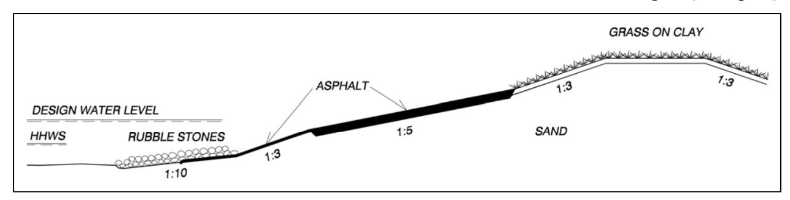

*Figure VI-2-1. Example of asphalt-armored sea dike*

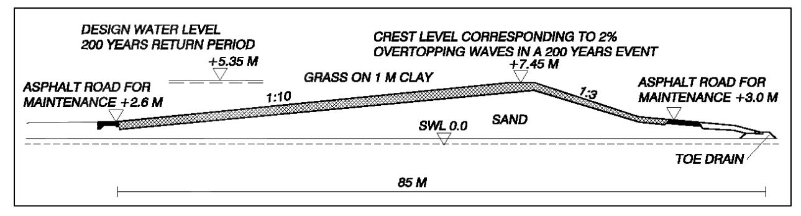

*Figure VI-2-2. Example of grass-armored sea dike design from the North Sea coast of Denmark*

### b. Seawalls and revetments.

(1) Although seawalls and revetments differ by function, they often are similar in construction detail. Seawalls and revetments can be classified as sloping-front and vertical-front structures. Sloping-front structures might be constructed as flexible rubble-mound structures which are able to adjust to some toe and crest erosion. Figure VI-2-3 shows three examples with randomly placed armor. Figure VI-2-4 shows sloping-front structures with pattern-placed concrete armor units. In the United States pattern-placed block slopes are more commonly found on revetments. The stability of the slope is very dependent on an intact toe support. In other words, loss of toe support will likely result in significant armor layer damage, if not complete failure of the armored slope.

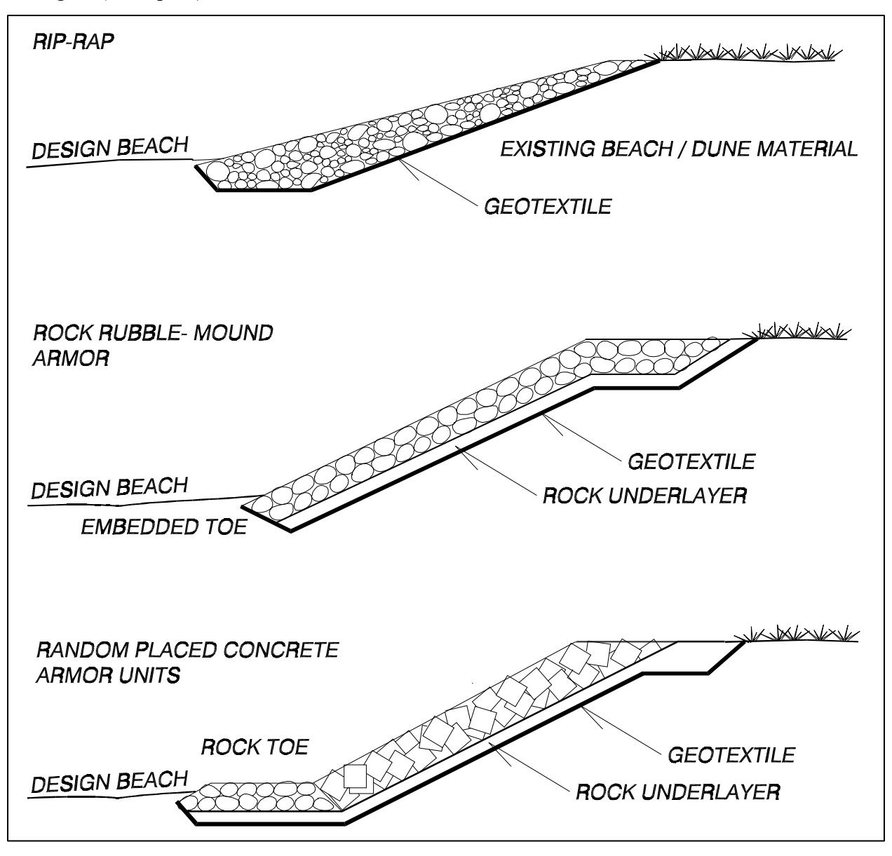

*Figure VI-2-3. Examples of sloping front rubble-mound seawall/revetment structures*

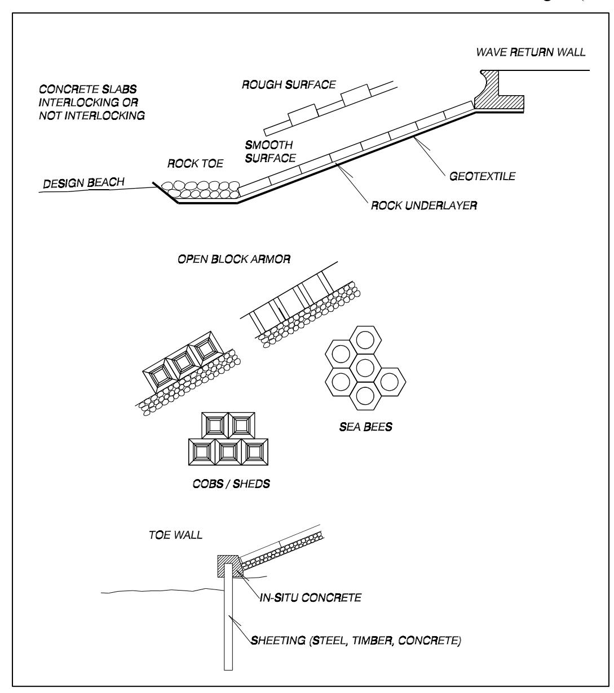

*Figure VI-2-4. Examples of sloping-front seawalls/revetments with pattern-placed concrete armor units*

(2) The top portion of Figure VI-2-5 shows an example of a sloping front revetment with fixed asphalt layer surface and the bottom portion shows a seawall with a sloping front of in situ cast concrete. Asphalt structures with either rubble toes or thin asphalt carpet toes are flexible structures able to survive rather substantial beach erosion, whereas the rigid concrete structures are vulnerable to any form of undermining. Figure VI-2-6 shows examples of sloping front revetment designs from the Danish North Sea coast. Vertical-front seawalls can be constructed as tied walls using steel, concrete, and timber piling; as stone-filled cribwork; and as massive gravity concrete walls. Figure VI-2-7 is an example of a gravity wall structure.
c. Groins. Groins are in most cases constructed as sloping-front structures or as piled vertical face structures. Figure VI-2-8 shows a typical beach configuration with groins. Figure VI-2-9 shows examples of groin structure designs. Timber groins are used for smaller and less exposed applications, whereas rubble-mound groins are used for all conditions. On very exposed coastlines the armor is often concrete armor units. The timber planking groin is weaker and much more vulnerable to scour failure than the timber pile groin.

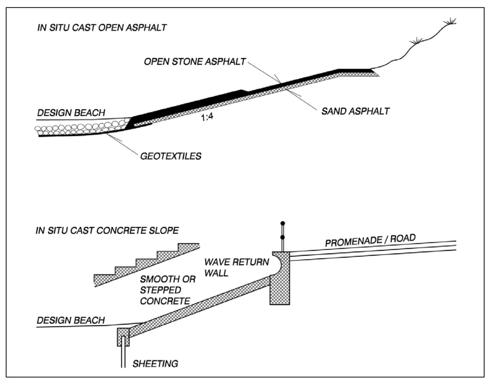

*Figure VI-2-5. Examples of sloping front seawalls/revetments with fixed surfaces of asphalt and in situ cast concrete*

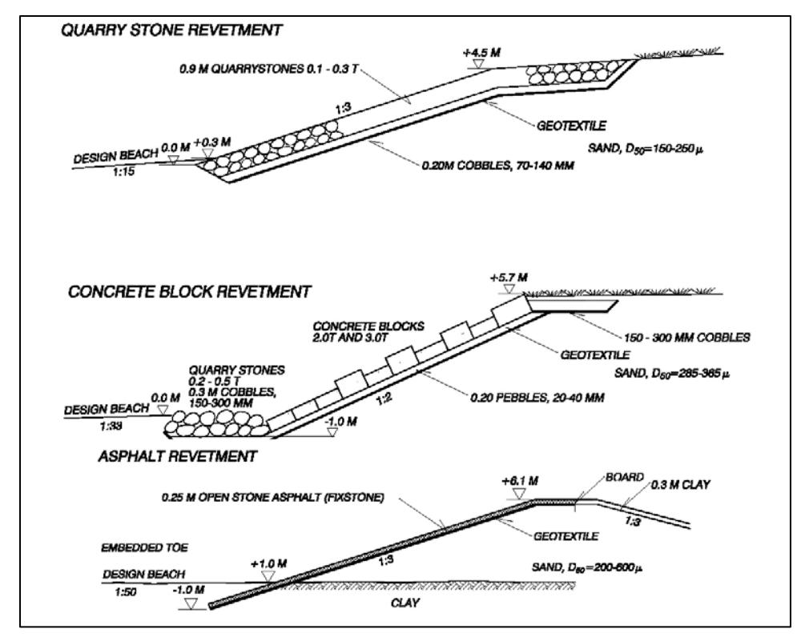

*Figure VI-2-6. Examples of sloping front revetment designs from the Danish North Sea coast (Danish Coast Authority)*

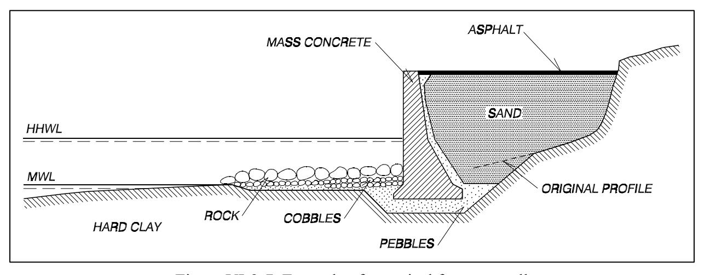

*Figure VI-2-7. Example of a vertical front seawall*

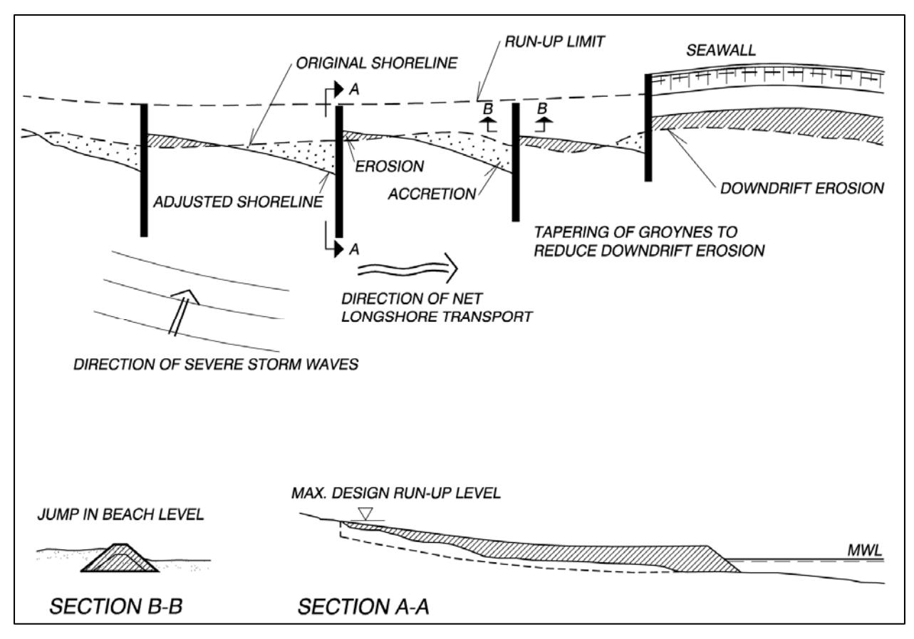

*Figure VI-2-8. Typical beach configuration with groins*

d. Detached breakwaters. Detached breakwaters are almost always built as rubblemound structures. Typical cross sections are as shown for the rubble-mound groin in Figure VI-2-9. Typical beach configurations with detached nearshore breakwaters are shown in Figure VI-2-10. Whether or not the detached breakwaters become attached to shore is a function of placement distance offshore. Tombolos are more likely to form when breakwaters are constructed within the surf zone. The two examples of detached breakwaters shown in Figure VI-2-10 serve different functions. See Part V-4 for functional design guidance on detached breakwaters.

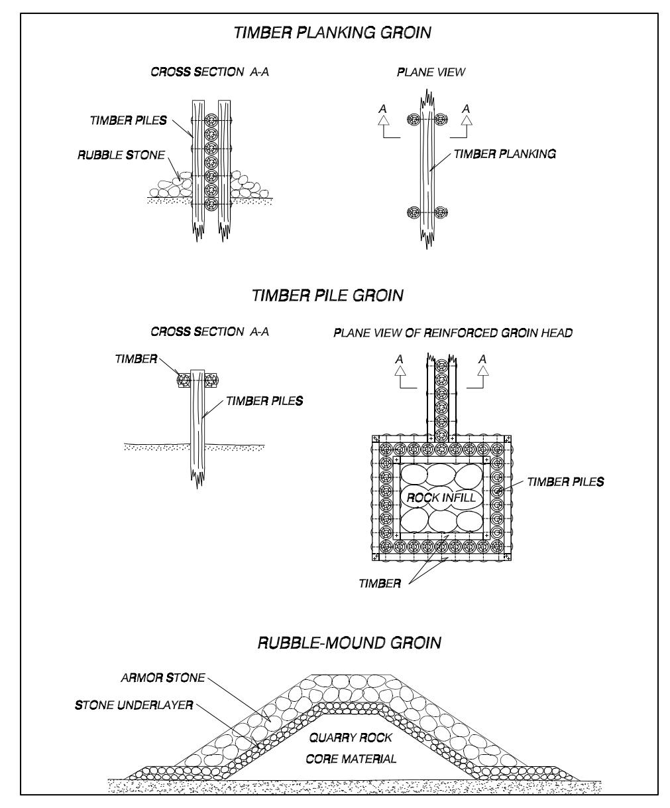

*Figure VI-2-9. Examples of groin structures*

### e. Rubble-mound breakwaters.

(1) Rubble-mound breakwaters are the most commonly applied type of breakwater. In its most simple shape it is a mound of stones. However, a homogeneous structure of stones large enough to resist displacements due to wave forces is very permeable and might cause too much penetration not only of waves, but also of sediments if present in the area. Moreover, large stones are expensive because most quarries yield mainly finer material (quarry run) and only relatively few large stones. As a consequence the conventional rubble-mound structures consist of a core of finer material covered by big blocks forming the so-called armor layer. To prevent finer material being washed out through the armor layer, filter layers must be provided. The filter layer just beneath the armor layer is also called the underlayer. Structures consisting of armor layer, filter layer(s), and core are referred to as multilayer structures. The lower part of the armor
layer is usually supported by a toe berm except in cases of shallow- water structures. Figure VI-2-11 shows a conventional type of rubble-mound breakwater.
(2) Concrete armor units are used as armor blocks in areas with rough wave climates or at sites where a sufficient amount of large quarrystones is not available. Main types of armor units are discussed in Part VI-2-3.

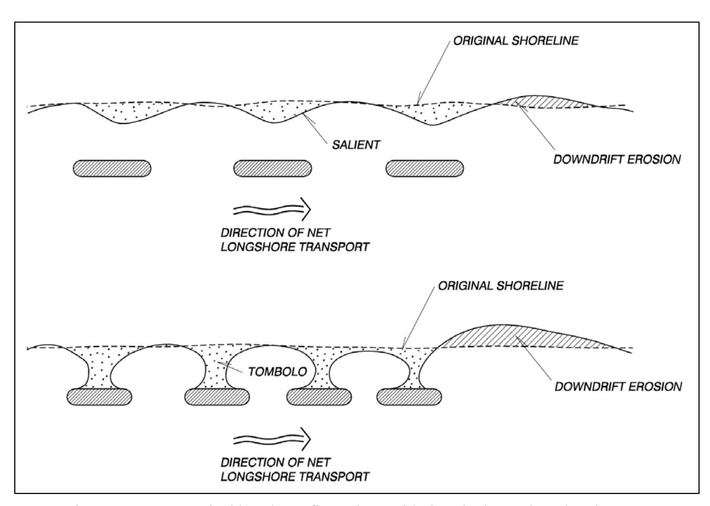

*Figure VI-2-10. Typical beach configurations with detached nearshore breakwaters*

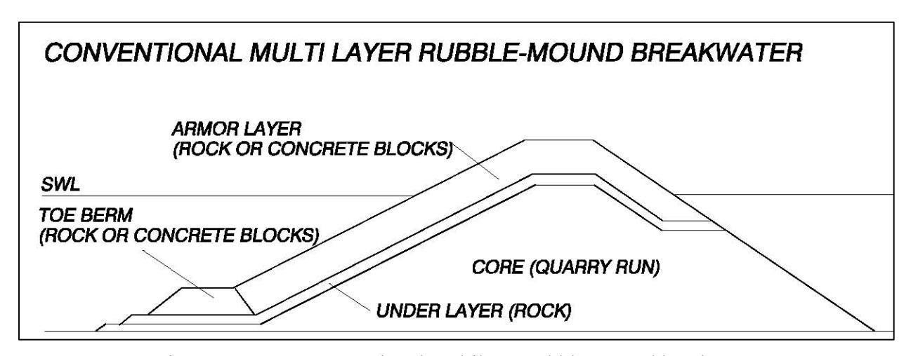

*Figure VI-2-11. Conventional multilayer rubble-mound breakwater*

- (3) The front slope of the armor layer is in most cases straight. However, an S-shaped front or a front with a horizontal berm might be used to increase the armor stability and reduce overtopping. For these types of structures, optimization of the profiles might be difficult if there are large water level variations. Figure VI-2-12 illustrates these types of front profiles.
- (4) Overtopping can be reduced by a wave-wall superstructure as shown in Figure VI-2-13.

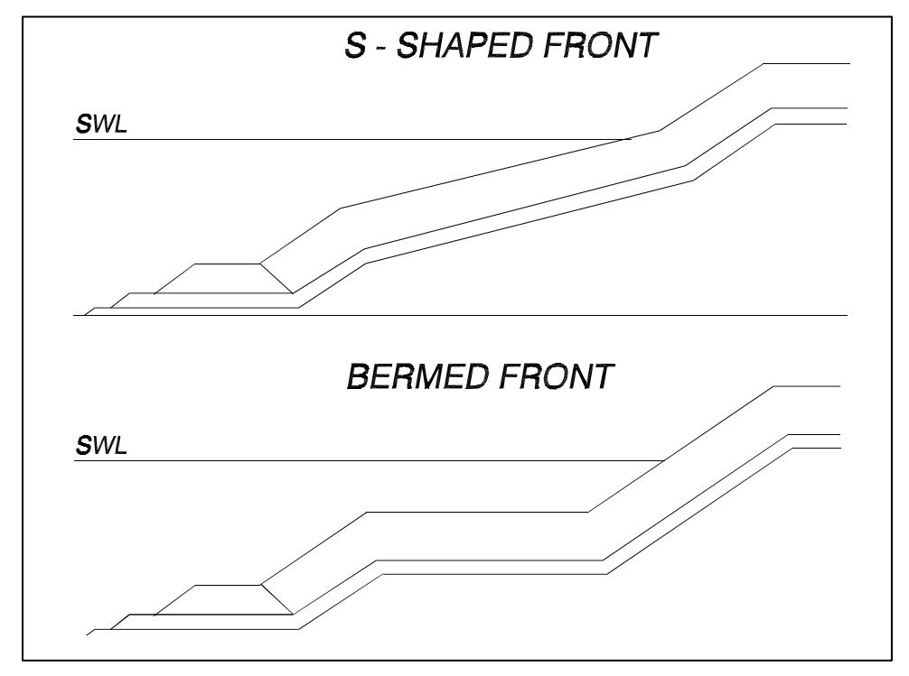

*Figure VI-2-12. Rubble-mound structures with S-shaped and bermed fronts*

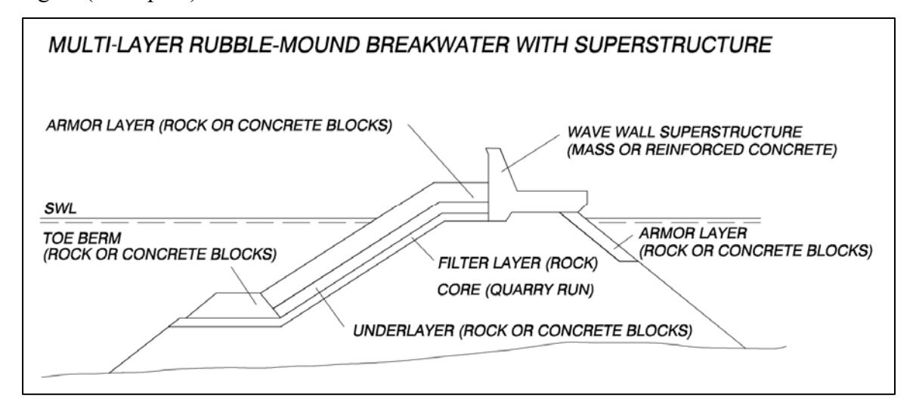

*Figure VI-2-13. Example of rubble-mound breakwater with concrete superstructure*

- (5) Superstructures can serve several purposes, e.g., providing access for vehicles, including cranes for maintenance and repair, and accommodation of installations such as pipelines.
- (6) The armor units in conventional multilayer structures are designed to stay in place as built, i.e., the profile remains unchanged with displacement of only a minor part of the armor units. f. Reshaping rubble-mound breakwaters.
- (1) Reshaping rubble-mound breakwaters is based on the principle of natural adjustment of the seaward profile to the actual wave action, as illustrated by Figure VI-2-14. In this way the most efficient profile in terms of armor stability (and possibly minimum overtopping) is obtained for the given size and quantity of armor stone.

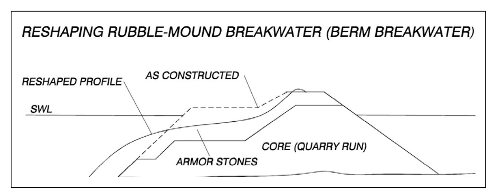

*Figure VI-2-14. Reshaping rubble-mound breakwater*

- (2) Because of natural reshaping, the structure can be built in a very simple way by first dumping the core material consisting of quarry run, and then dumping the armor stones in a berm profile with seaward slope equal to the natural angle of repose for the stone material. Due to the initial berm profile, this type of structure is also known as a berm breakwater.
- (3) The natural adjusted S-profile allows smaller armor stones to be used compared to the armor stones in conventional rubble structures. The smaller the armor stones, the flatter the S-profile will be. The minimum size of the armor stones is often selected to limit transport of stones along the structure under oblique wave attack.
- g. Reef breakwaters. Reef breakwaters are in principle designed as a rubble-mound structure with submerged crests, as shown in Figure VI-2-15. Both homogeneous and multilayer structures are used. This example shows a mound of smaller stones protected by an armor layer of larger stones.

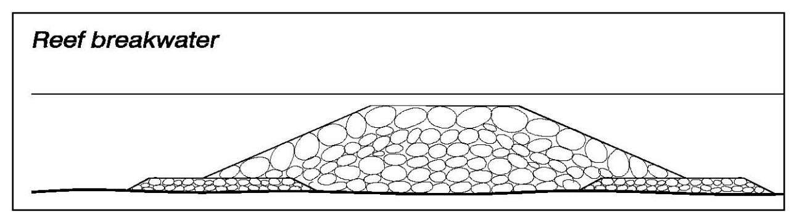

*Figure VI-2-15. Example of a reef breakwater*

- h. Vertical-front breakwaters. Vertical-front breakwaters are another major class of breakwater structures. The basic structure element is usually a sandfilled caisson made of reinforced concrete, but blockwork types made of stacked precast concrete blocks are also used. Caisson breakwaters might be divided into the following types:
- (1) Conventional, i.e., the caisson is placed on a relatively thin stone bedding layer (Figure VI-2-16).
- (2) Vertical composite, i.e., the caisson is placed on a high rubble-mound foundation (Figure VI-2-17). This type is economical in deep waters. Concrete caps may be placed on shore-connected caissons.

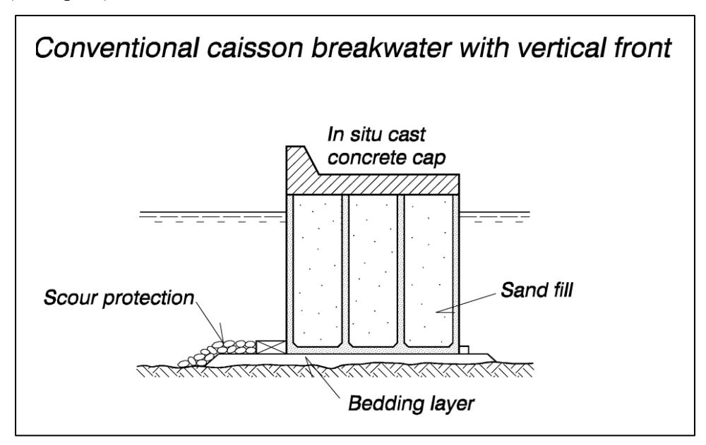

*Figure VI-2-16. Conventional caisson breakwater with vertical front*

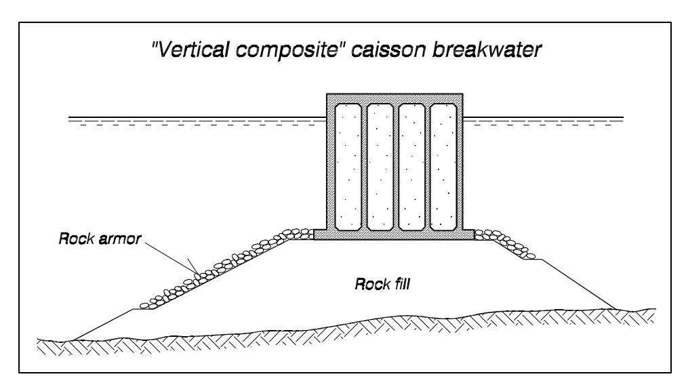

*Figure VI-2-17. Vertical composite caisson breakwater*

- (3) Horizontal composite, i.e., the front of the caisson is covered by armor units or a rubble-mound structure (multilayered or homogeneous) (Figure VI-2-18). This type is typically used in shallow water; however, there have been applications in deeper water where impulsive wave pressures are likely to occur. The effects of the mound are reduction of wave reflection, wave impact, and wave overtopping. Depending on bottom conditions, a filter layer may be needed beneath the rubble-mound portion.
- (4) Sloping top, i.e., the upper part of the front wall above still-water level is given a slope with the effect of a reduction of the wave forces and a much more favorable direction of the wave forces on the sloping front (Figure VI-2-19). However, overtopping is larger than for a vertical wall of equal crest level.

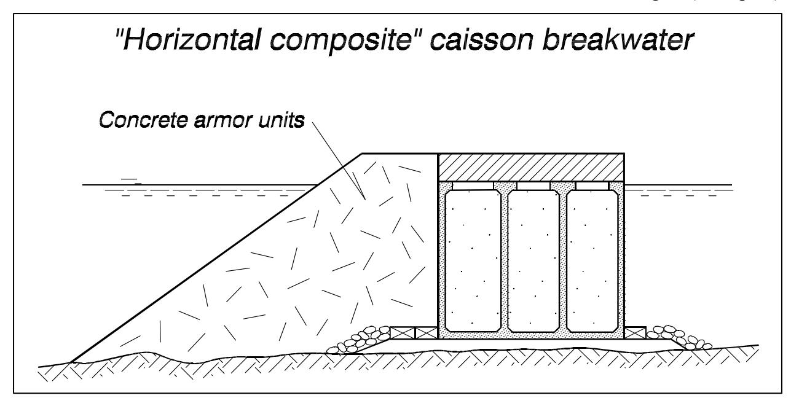

*Figure VI-2-18. Horizontal composite caisson breakwater*

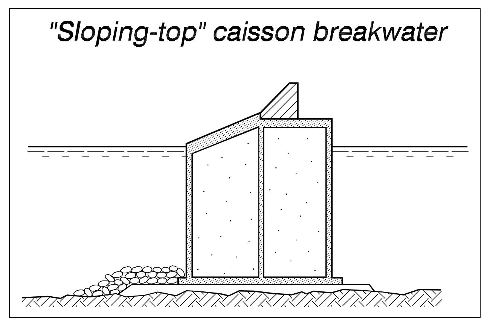

*Figure VI-2-19. Sloping-top caisson breakwater*

(5) Perforated front wall, i.e., the front wall is perforated by holes or slots with a wave chamber behind (Figure VI-2-20). Dissipation of energy reduces both wave forces on the caisson and wave reflection. Caisson breakwaters are generally less economical than rubble-mound structures in shallow water. Moreover, they demand stronger seabed soils than rubble structures. In particular, the blockwork type needs to be placed on rock seabeds or on very strong soils due to very high foundation loads and sensitivity to differential settlements (Figure VI-2-21).

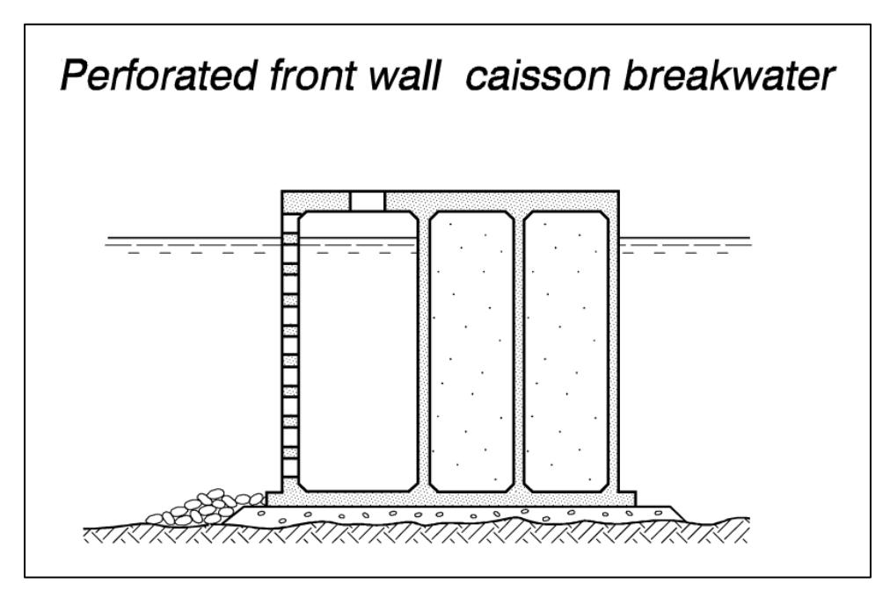

*Figure VI-2-20. Perforated front wall caisson breakwater*

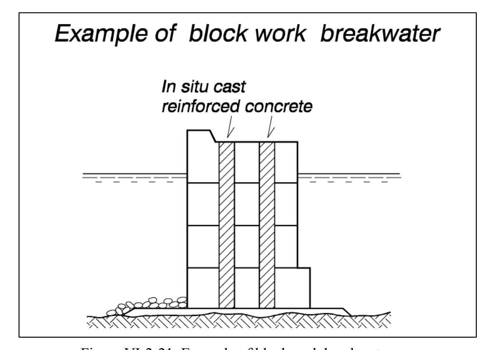

*Figure VI-2-21. Example of blockwork breakwater*

i. Piled breakwaters. Piled breakwaters consist of an inclined or vertical curtain wall mounted on pile work (Figure VI-2-22). This type of breakwater is applicable in less severe wave climates on sites with weak and soft subsoils.

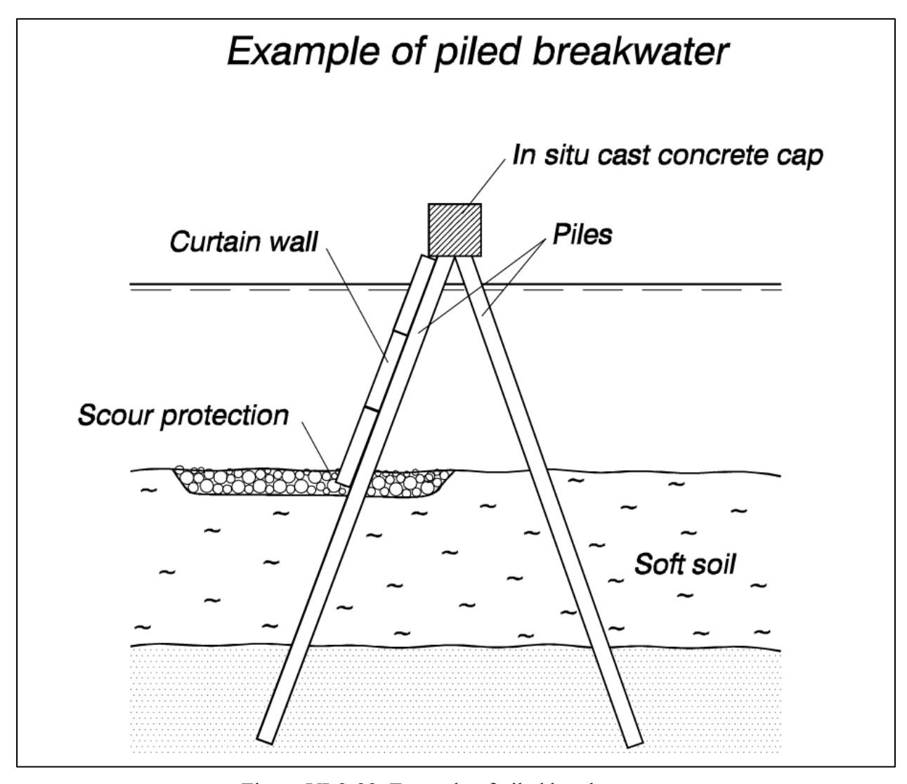

*Figure VI-2-22. Example of piled breakwater*

- j. Jetties. Jetties are in most cases designed as rubble-mound structures (breakwaters and groins) except that the outer part must be armored on both sides.
- k. Storm surge barriers. Storm surge barriers are generally designed as movable segmented gates made of steel. The segments might span between caisson structures, either hinged to be the caisson sidewalls or hanging in a hoist arrangement. A solution with no visible structures was proposed for the protection of the Venice Lagoon where the segments are hinged to a concrete foundation placed in the seabed as sketched in Figure VI-2-23. This structure had not been built as of this writing.

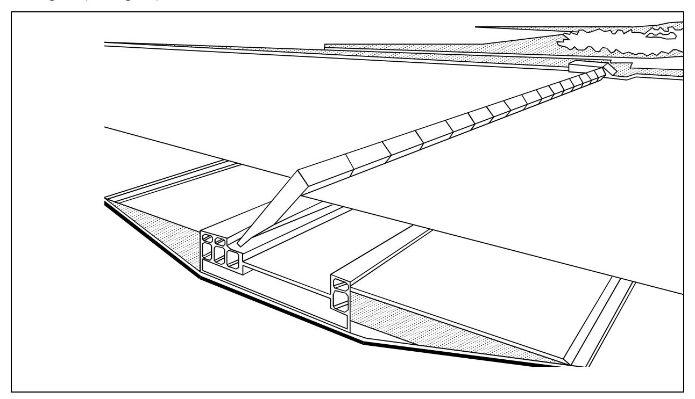

*Figure VI-2-23. Storm surge barrier proposed for the Venice Lagoon*

### VI-2-3. Main Types of Concrete Armor Units.

a. Figure VI-2-24 shows examples of the many existing types of concrete armor units.

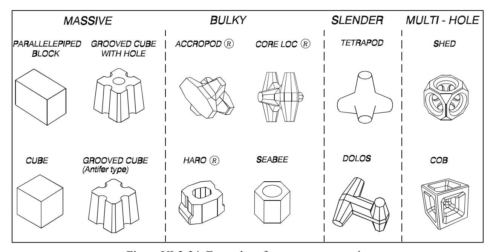

*Figure VI-2-24. Examples of concrete armor units*

The units can be divided into the following categories related to the structural strength:
- (1) Massive or blocky (e.g., cubes incl. grooved types, parallelepiped block)
- (2) Bulky (e.g., Accropode7, Core Loc7, Haro7, Seabee)
- (3) Slender (e.g., Tetrapod, Dolos)
- (4) Multi-hole cubes (e.g., Shed, Cob)
- b. The hydraulic efficiency might be expressed in terms of the resistance against movements per volume of concrete required to armor a unit area of the slope. The hydraulic efficiency increases from massive units to slender units to multi-hole cubes. Because the porosity of randomly placed armor also increases in the same way (Price 1979), there appears to be an explainable correlation between hydraulic stability and porosity (Burcharth and Thompson 1983).
- c. Concrete armor units are almost always placed randomly on the slope in a layer that has a thickness of two armor units. Exceptions are $Accropodes^{7}$ and Core $Locs^{7},$ which are placed in a layer having thickness of one armor unit, and multi-hole cubes which are placed orderly in a regular pattern where each unit rests against adjacent units.
- d. Generally, concrete armor units are made of conventional unreinforced concrete except for some of the multi-hole cubes where fiber reinforcement is used. For slender units, such as Dolos with small waist ratios, various types of high-strength concrete and reinforcement (conventional bars, prestressing, fibers, scrap iron, steel profiles) have been considered. But these solutions are generally less cost-effective, and they are seldom used.
- e. The hydraulic stability of armor layers is decreased if the armor units disintegrate because this reduces the stabilizing gravitational force acting on the unit, and possibly decreases interlocking effects. Moreover, broken armor unit pieces can be thrown around by wave action and thereby trigger accelerated breakage. In order to prevent breakage it is necessary to ensure the structural integrity of the armor units.
- f. Unreinforced concrete is a brittle material with a low tensile strength $S_{T}$ (on the order of 2-5 MPa) and a compressive strength $S_{C}$ that is one order of magnitude larger than ST . Consequently, crack formation and breakage are nearly always caused by load-induced tensile stresses $σ_{T}$ exceeding $S_{T}.$ Therefore, the magnitude of $S_{T}$ is more critical to concrete armor unit design than $S_{C},$ and this fact should be reflected in specifications for armor unit concretes. It is important to note that $S_{T}$ decreases with repeated load due to fatigue effects (Burcharth 1984). The different categories of concrete armor units are not equally sensitive to breakage.
- g. Slender units are the most vulnerable to cracking and breaking because the limited cross-sectional areas give rise to relatively large tensile stresses. Many failures of breakwaters armored with Tetrapods and Dolosse were caused by breakage of the units before the hydraulic stability of the unbroken units was exceeded. Much of the damage could have been avoided if design diagrams for concrete armor unit structural integrity had been available during design.
- h. These failures caused a decline in the use of slender armor units and a return to the use of massive blocks, especially the Antifer Cube types. This also led to the development of bulky units like the $Haro^{7},$ the $Accropode^{7},$ and the Core $Loc^{7}.$ The tendency toward massive blocks will not change until reliable design strength diagrams exist for the slender units. Presently, structural integrity diagrams are available only for Dolos (Burcharth 1993, Melby 1993) and Tetrapod armor (Burcharth et al. 1995).
- i. Massive units generally will have the smallest tensile stresses due to the large crosssectional areas. However, breakage can take place if the units experience impacts due to application of less restrictive hydraulic stability criteria and if the concrete quality is poor in terms of a low tensile strength. Cracking can also occur in larger units where temperature differences during the hardening process can create tensile stresses that exceed the strength of the weak young concrete, resulting in microcracking of the material, also known as thermal stress cracking (Burcharth 1983). If massive units are made of good quality concrete, units are not damaged during handling, and if the units are designed for marginal displacements, there will be no breakage problems. With the same precautions the bulky units are also not expected to have breakage problems. No structural integrity design diagrams exist for the massive concrete armor units.
- j. Multi-hole cubes will experience very small solid impact loads provided they are placed correctly in patterns that exclude significant relative movements of the blocks. Due to the slender structural members with rather tiny cross sections, the limiting factors (excluding impacts) for long-term durability are material deterioration, abrasion on sandy coasts, and fatigue due to wave loads.

### VI-2-4. Failure Modes of Typical Structure Types.

- a. Failure.
- (1) For many people, the word "failure" implies a total or partial collapse of a structure, but this definition is limited and not accurate when discussing design and performance of coastal structures. In the context of design reliability, it is preferable to define failure as:
FAILURE: Damage that results in structure performance and functionality below the minimum anticipated by design.
Thus, partial collapse of a structure may be classified as "damage" provided the structure still serves its original purpose at or above the minimum expected level. For example, subsidence of a breakwater protecting a harbor would be considered a failure if it resulted in wave heights within the harbor that exceed operational criteria. Conversely, partial collapse of a rubble-mound jetty head might be classified as damage if resulting impacts to navigation and dredging requirements are minimal or within acceptable limits.
(2) Coastal project elements fail for one or more of the following reasons:
- (a) Design failure occurs when either the structure as a whole, including its foundation, or individual structure components cannot withstand load conditions within the design criteria. Design failure also occurs when the structure does not perform as anticipated.
- (b) Load exceedance failure occurs because anticipated design load conditions were exceeded.
- (c) Construction failure arises due to incorrect or bad construction or construction materials.
- (d) Deterioration failure is the result of structure deterioration and lack of project maintenance.
- (3) New or innovative coastal project design concepts are more susceptible to design failure due to lack of previous experience with similar designs. In these situations, allowances should be made for unknown design effects, and critical project elements should be extensively tested using laboratory and/or numerical model techniques before finalizing the design.
- (4) Practically all projects accept some level of failure probability associated with exceedance of design load conditions, but failure probability increases at project sites where little prototype data exist on which to base the design. These cases may require a conservative factor of safety (for information on probabilistic design see Part V-1-3, "Risk Analysis and Project Optimization," and Part VI-6, "Reliability in Design").
- (5) In the design process all possible failure modes must be identified and evaluated in order to obtain a balanced design. An overview of the most important and common failure modes for the main types of fixed coastal structures is given in this chapter. Some failure modes are common to several types of structures. Examples include displacement of armor stones and toe erosion which are relevant to most rubble structures such as seawalls, groins, and breakwaters. It should be noted that in this chapter the common failure modes are shown only for one of the relevant structures. The most comprehensive sets of failure modes are related to breakwaters, and for this reason they are discussed first.
- b. Sloping-front structures.
- (1) Breakwaters. Figure VI-2-25 provides an overview of the failure modes relevant to rubble-mound breakwaters. The individual failure modes are explained in more detail in Figures VI-2-26 to VI-2-42.
- (2) Seawalls/revetments. Typical failure modes for seawalls and revetments are shown in Figures VI-2-43 to VI-2-46.
- (3) Dikes. Figures VI-2-47 through VI-2-51 illustrate dike failure modes.

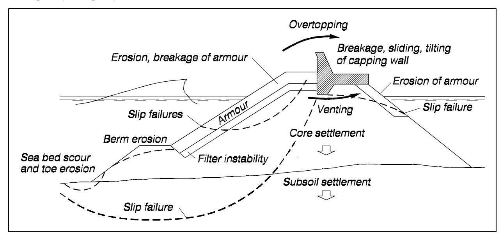

*Figure VI-2-25. Overview of rubble-mound breakwater failure modes*

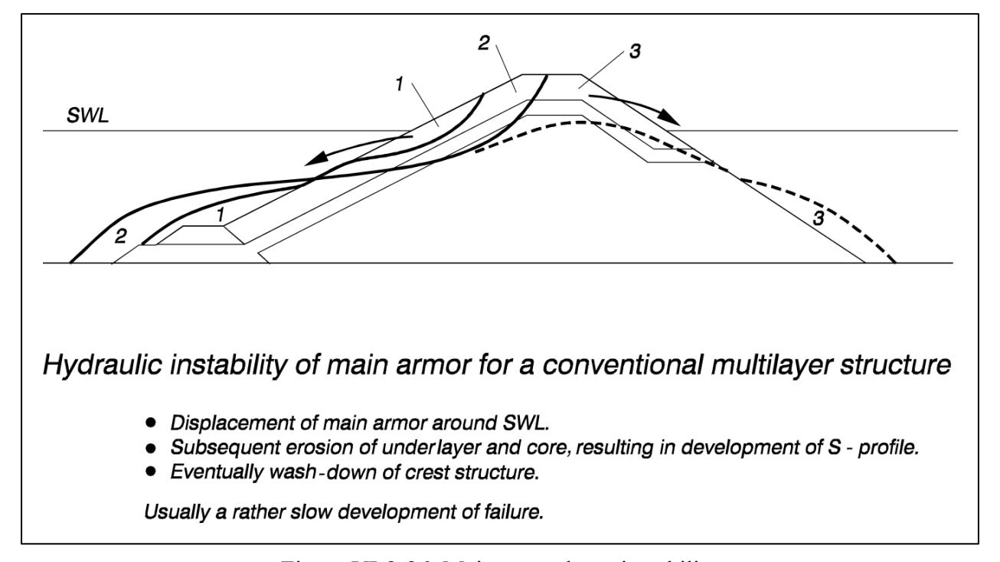

*Figure VI-2-26. Main armor layer instability*

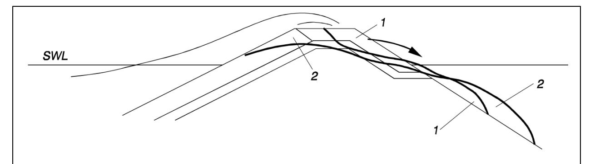

*Figure VI-2-27. Rear side erosion of crest*

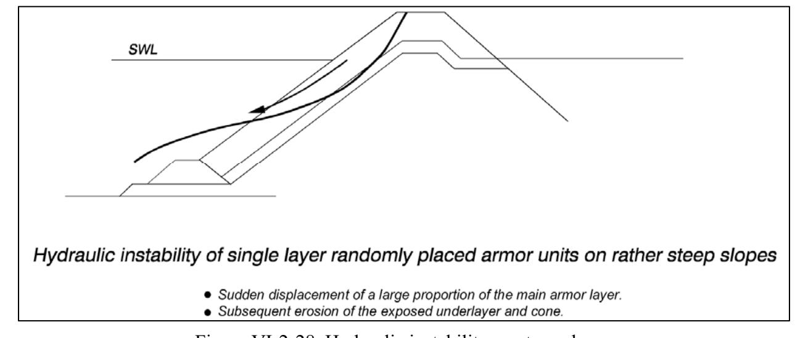

*Figure VI-2-28. Hydraulic instability on steep slopes*

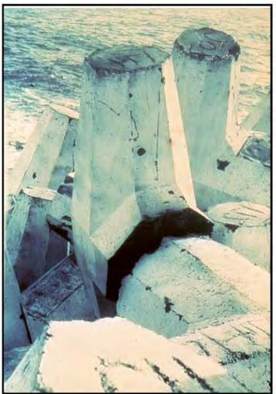

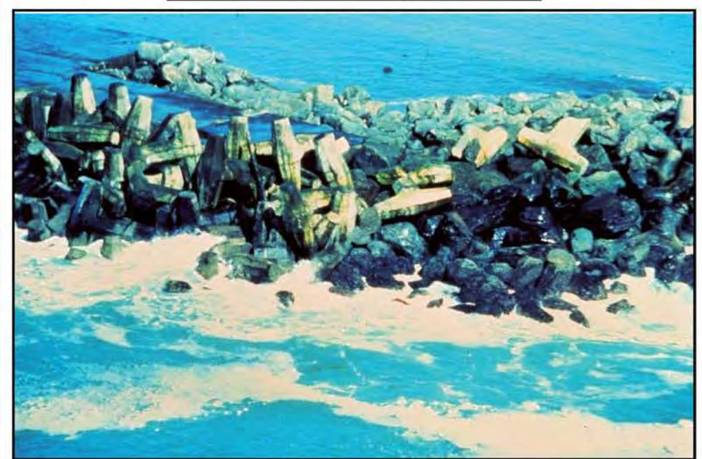

### Breakage of armor units

- The armor units break when the stresses caused by gravity and wave-induced forces exceed the strength of the concrete.
- Breakage of complex types of armor units causes collapse of the armor layer if a substantial proportion of the units (say more than 15%) break.

*Figure VI-2-29. Armor unit breakage*

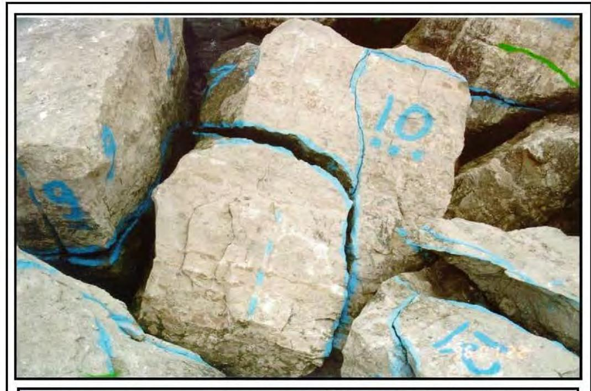

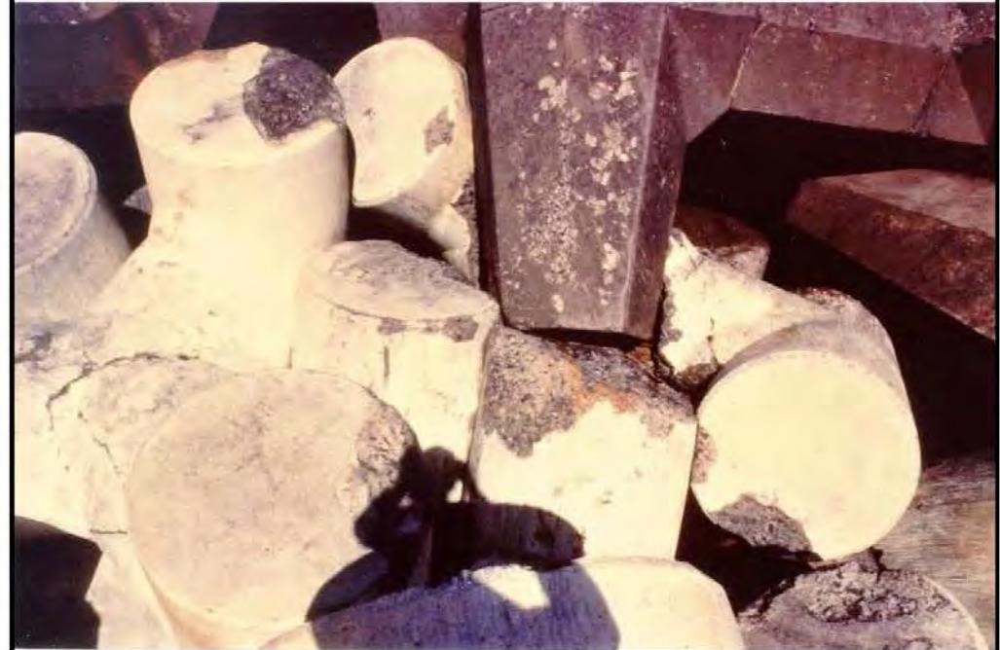

*Deterioration of rock and concrete armor blocks*

- Weathering caused by chemical reactions, temperature variations (including freeze - thaw) and abrasion results in loss of strength and mass.
- Subsequently there is a higher risk of breakage and in reduced hydraulic stability.

*Figure VI-2-30. Armor unit deterioration*

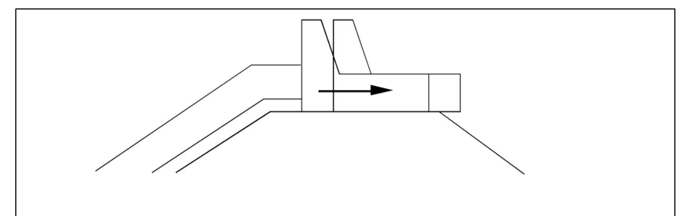

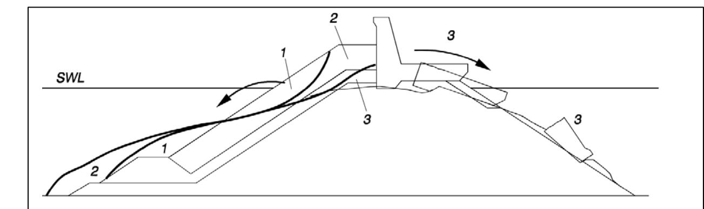

*Figure VI-2-31. Sliding of superstructure*

*Figure VI-2-32. Failure due to armor unit breakage*

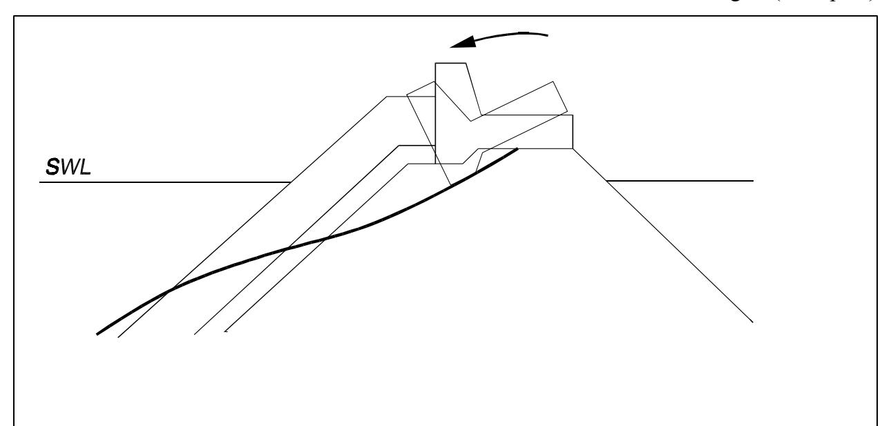

*Figure VI-2-33. Forward tilting of superstructure*

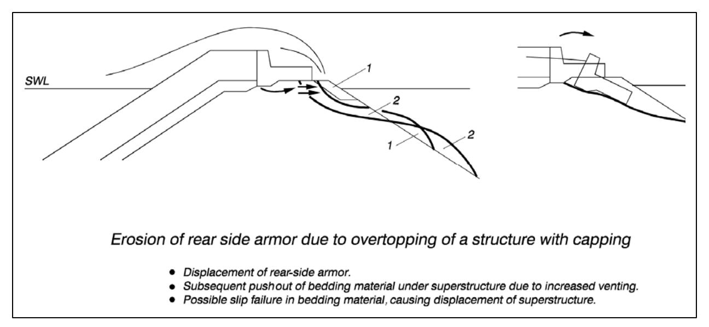

*Figure VI-2-34. Rear-side erosion due to overtopping*

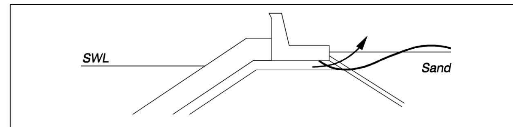

*Figure VI-2-35. Erosion due to venting*

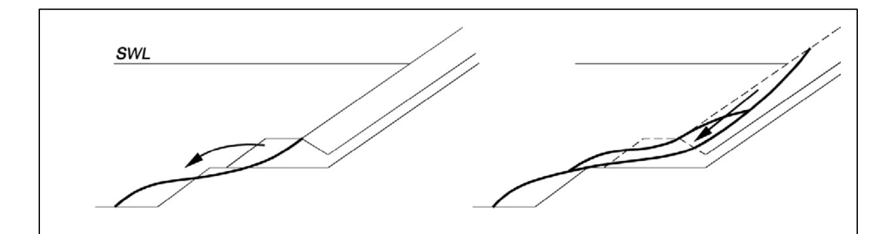

*Figure VI-2-36. Failure due to toe berm erosion*

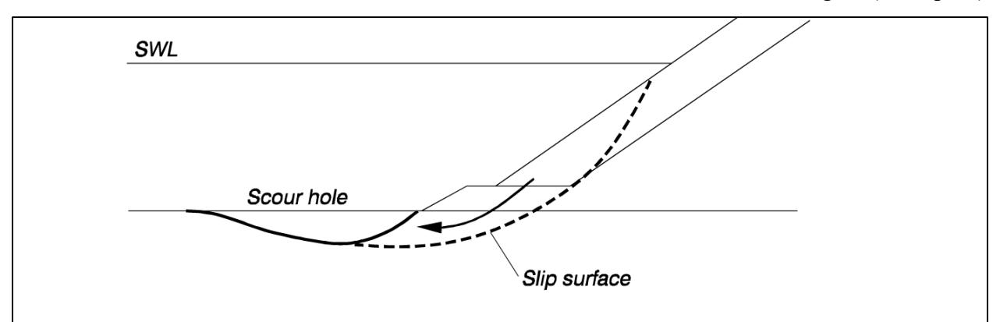

*Figure VI-2-37. Scour-induced armor displacement*

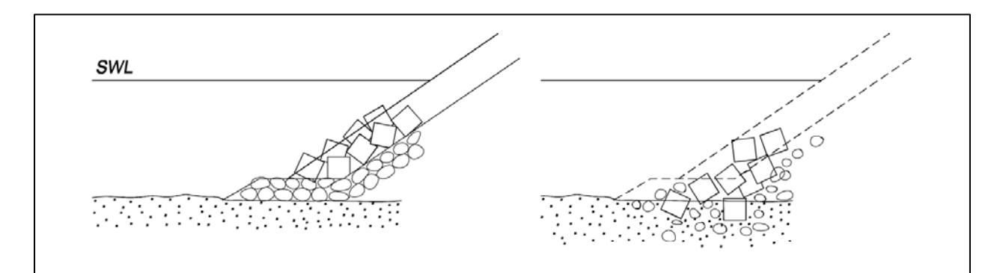

*Figure VI-2-38. Block subsidence due to liquefaction*

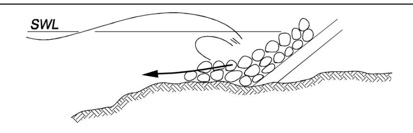

*Figure VI-2-39. Toe instability on hard bottoms*

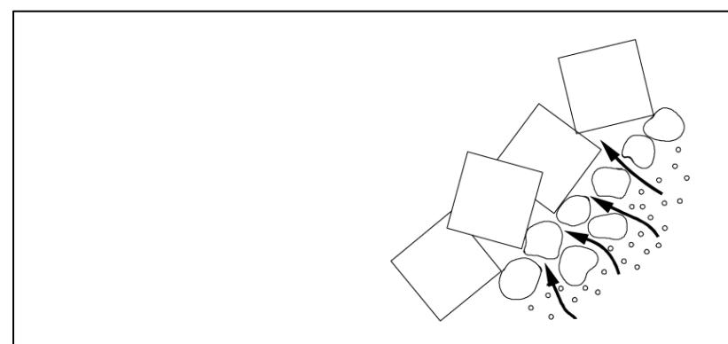

*Figure VI-2-40. Washout of underlayer material*

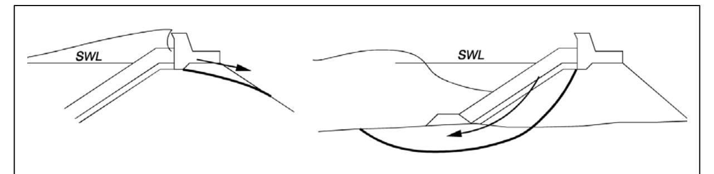

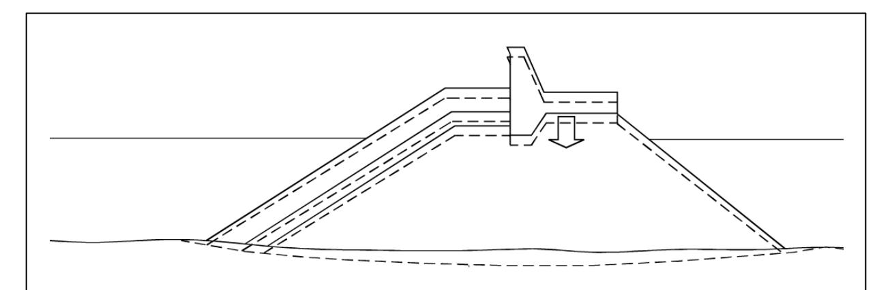

*Figure VI-2-42. Structure settlement failure*

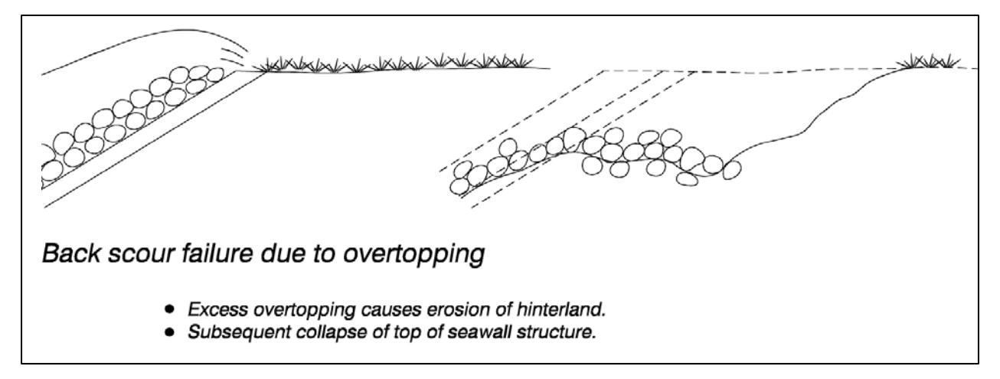

*Figure VI-2-43. Scour due to overtopping*

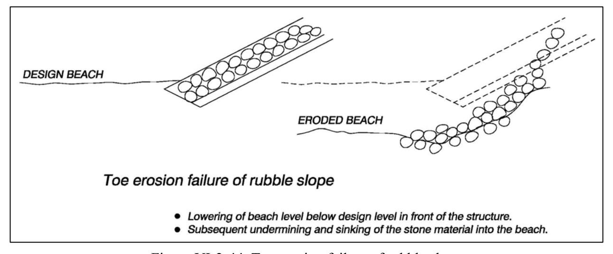

*Figure VI-2-44. Toe erosion failure of rubble slope*

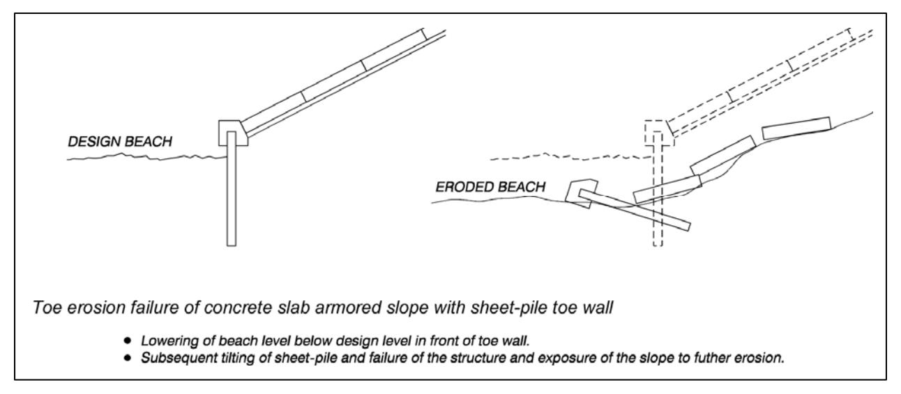

*Figure VI-2-45. Failure of sheet-pile toe wall*

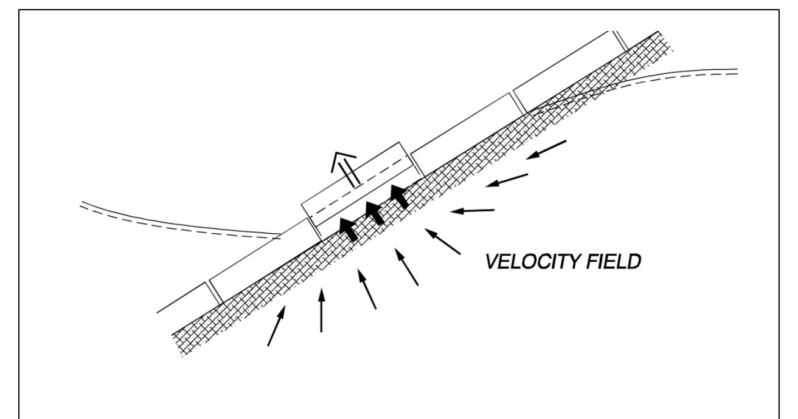

*Figure VI-2-46. Pressure blowout of slab elements*

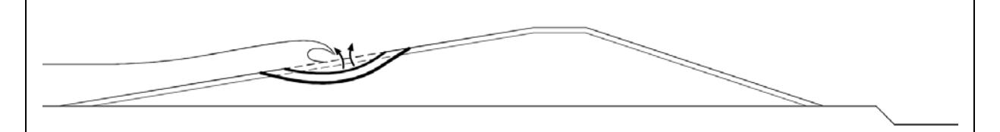

*Figure VI-2-47. Erosion of dike slope protection*

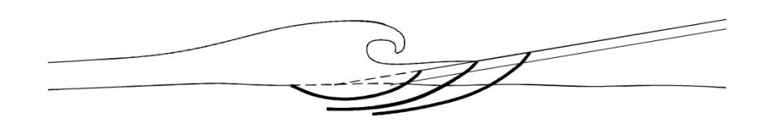

*Figure VI-2-48. Toe scour erosion of dike*


*Figure VI-2-49. Dike crest erosion by overtopping*


*Figure VI-2-50. Dike backscouring due to piping*


*Figure VI-2-51. Dike slip surface failure*

- c. Vertical-front structures.
- (1) Caisson and Blockwork Breakwaters. Failure modes can be classified based on Table VI-2-2.

**Table VI-2-2. **

|  | Table | VI-2-2 |
| --- | --- | --- |
| Failure | Modes of Caisson | and Blockwork Breakwaters |
| Overall (global) | Foundation failure modes: |  |
| instability of | Slip surface failures |  |
| monoliths | Excess settlement Overturning Lateral displacement or | sliding on foundation |
| Local instability | Hydraulic instability of Hydraulic instability of caissons and breakage Seabed scour in front of Breakage and displacement | rubble foundation rubble-mound slope protection in front of of blocks the structure of structural elements |

The local stability failure modes can trigger the overall stability failure modes. Figures VI-2-52 to VI-2-62 illustrate the failure modes for caisson and blockwork breakwaters.
- (2) Seawalls/revetments.
- (a) Gravity walls. Figures VI-2-63 to VI-2-68 illustrate common failure modes for gravity-type seawalls/revetments.
- (b) Tied walls. Failure modes of thin walls supported by tie-backs are shown in Figures VI-2-69 through VI-2-73.


*Figure VI-2-52. Sliding of caisson on foundation*


*Figure VI-2-53. Caisson settlement*


*Figure VI-2-54. Soil foundation slip surface failure*


*Figure VI-2-55. Slip surface failure of rubble foundation*


*Figure VI-2-56. Caisson overturning*


*Figure VI-2-57. Seaward tilting and settlement due to erosion of rubble base*


*Figure VI-2-58. Seaward tilting and settlement due to scour*


*Figure VI-2-59. Loss of foundation material due to caisson motion*


*Figure VI-2-60. Failure of fronting armor units*


*Figure VI-2-61. Caisson front wall failure*


*Figure VI-2-62. Displacement of individual blocks*


*Figure VI-2-63. Seaward sliding of gravity wall*


*Figure VI-2-64. Seaward overturning of gravity wall*


*Figure VI-2-65. Gravity wall settlement*


*Figure VI-2-66. Rotational slip failure of gravity wall*


*Figure VI-2-67. Landward overturning of gravity wall*


*Figure VI-2-68. Displacement of individual gravity wall components*


*Figure VI-2-69. Failure due to toe scour*


*Figure VI-2-70. Rotational slip surface failure*


*Figure VI-2-71. Failure of thin wall construction material*


*Figure VI-2-72. Failure due to anchor pullout*


*Figure VI-2-73. Back scour and thin wall failure*

- d. Floating structures.
- (1) Floating structures used in coastal engineering applications have four different failure modes associated with structural design: (a) Failure of floating sections. (b) Failure of floating section connectors. (c) Failure of anchor system or pile supports. (d) Flooding and sinking.
- (2) Material used to fabricate individual floating sections must be able to withstand wave slamming forces, vessel impacts, marine corrosion, and concentrated loading at connection points and mooring points. Floating sections fabricated with concrete must withstand deterioration. Damage to the floating section construction material may lead to flooding of the unit, displacement of the section from its moored location, or rendering of the section unsafe for traffic.
- (3) Many floating structures consist of several units joined with flexible connections. These connectors must be able to resist transmitted force and moment loads induced by environmental loading and differential movements between floating sections. Failure of the connectors results in a substantial decrease in the structure=s functionality.
- (4) The mooring/anchoring system of a floating structure is critical to a successful design. Mooring systems fail when the mooring lines break or separate from the connection points, or when the anchoring method does not resist the mooring loads. Dead weight anchors rely primarily on anchor mass with additional help from frictional resistance between the anchor and soil. Penetration anchors rely on soil shear strength to resist Apullout@ under load conditions. Extreme loads may cause anchors to drag or pullout, but the floating structure may survive intact at a displaced location. Failure occurs if the structure displacement results in the floating structure breaking up, suffering impact damage, or becoming unretrievable. Similar damage can occur to pile-supported floating structures when the piles fail or the floating structure breaks free of the pilings.
- (5) Many floating structures have compartments of entrapped air that provide necessary buoyancy. If these compartments flood, the structure may sink. Flooding can occur because of impact damage, construction material failure, excessive structure tilting, or wave overtopping.
- (6) Finally, floating structures may fail because they do not perform at the expected level. For example, a floating breakwater that does not reduce wave heights sufficiently and a floating boat slip with excessive motion would both be considered failures.

### e. Beach fills.

- (1) Judging the success or failure of beach fill projects is somewhat subjective and arises more from a political position rather than an assessment in terms of the beach fill project's original design goals. Beach fill projects are usually built in areas that experience shoreline erosion, and it is expected that the beach fill will gradually disappear in time as erosion continues. Part of the design process is estimating how long the beach fill will serve its function under typical wave conditions. Such estimates are difficult, at best, because of wave climate uncertainty and the complexity of beach fill response to storm conditions. A new project may suffer a severe storm immediately upon completion, resulting in massive fill losses, or the beach fill may serve for many years without ever being exposed to design storm conditions.
- (2) Despite the controversy about failure or success of beach fill projects, there are several recognized failure modes for beach fills: (a) Failure to protect upland property or structures during storm events. (b) Movement of fill material to undesired locations, such as into inlets or harbors.
- (c) Loss of fill material at a rate greater than anticipated for some reason other than design wave exceedance.
- (3) When used to protect upland property, beach fills are sacrificial soft structures, somewhat analogous to automobile fenders that are designed to crumple on impact to absorb the energy.
- f. Scour potential and toe failure. Any coastal structure resting on, driven into, or otherwise founded on soil or sand is susceptible to scour and possible toe failure when exposed to waves and currents. Generally, scour potential around impermeable structures is enhanced in regions of flow concentration due to directed currents, high wave reflection, etc. Scour potential is decreased around sloping permeable structures. Failure modes due to scour for specific structure types are illustrated in the figures of this section.

### VI-2-5. References.

### Burcharth 1983

Burcharth, H. F. 1983. "Materials, Structural Design of Armour Units," Proceedings of Seminar on Rubble Mound Breakwaters , Royal Institute of Technology, Stockholm, Sweden, Bulletin No. TRITA-VBI-120.

### Burcharth and Thompson 1983

Burcharth, H. F., and Thompson, A. C. 1983. "Stability of Armour Units in Oscillatory Flow," Proceedings of Coastal Structures '83 , American Society of Civil Engineers, pp 71-82.
EM 1110-2-1100 (Part VI)
Change 3 (28 Sep 11)
Burcharth 1984
Burcharth, H. F. 1984. "Fatigue in Breakwater Concrete Armour Units," Proceedings of the 19th International Conference on Coastal Engineering , American Society of Civil Engineers, Vol. 3, pp 2592-2607.
Burcharth 1993
Burcharth, H. F. 1993. "Structural Integrity and Hydraulic Stability of Dolos Armour Layers," Doctoral Thesis (Series Paper 9), Department of Civil Engineering, Aalborg University, Aalborg, Denmark.
Burcharth, et al. 1995
Burcharth, H. F., Jensen, M. S., Liu, Z., Van der Meer, J. W., and D'Angremond, K. 1995. "Design Formula for Tetrapod Breakage," Proceedings of the Final Workshop, Rubble Mound Breakwater Failure Modes , Sorrento, Italy.
Melby 1993
Melby, J. A. 1993. "Dolos Design Procedure Based on Crescent City Prototype Data," Technical Report CERC-93-10, U.S. Army Engineer Waterways Experiment Station, Coastal Engineering Research Center, Vicksburg, MS.
Price 1979
Price, W. A. 1979. "Static Stability of Rubble Mound Breakwaters," Dock and Harbour Authority, Vol. LX (702).
VI-2-6. Acknowledgments.
Authors: Dr. Hans F. Burcharth, Department of Civil Engineering, Aalborg University, Aalborg, Denmark; Dr. Steven A. Hughes, Coastal and Hydraulics Laboratory (CHL), U.S. Army Engineer Research and Development Center, Vicksburg, MS.
Reviewers: Han Ligteringen, Delft University of Technology, The Netherlands; John H. Lockhart, Headquarters, U.S. Army Corps of Engineers, Washington, DC (retired); Joan Pope, U.S. Army Engineer Research and Development Center, Vicksburg, MS.
