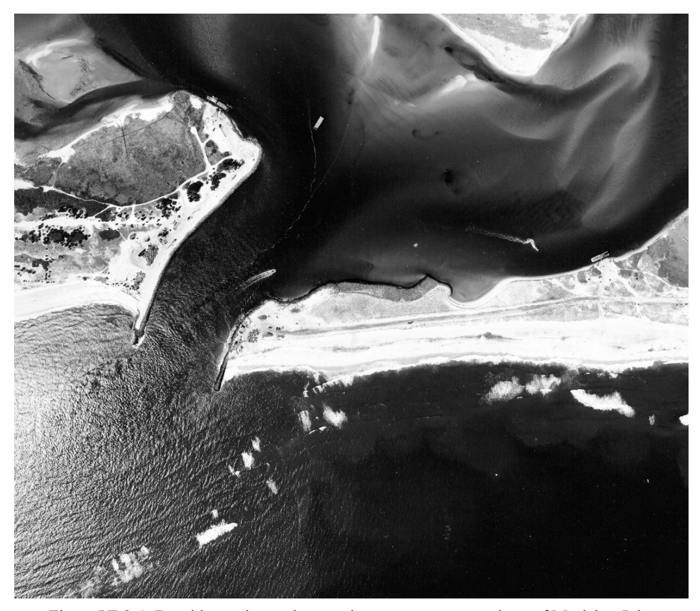

# CHAPTER 3

# Site Specific Design Conditions

# TABLE OF CONTENTS

- VI-3-1. Foundation/Geotechnical Requirements
  - a. Introduction
  - b. Foundation loads
  - c. Foundation soil responses
  - d. Geotechnical investigations
  - e. Geotechnical design criteria for shallow foundations
- VI-3-2. Seasonal Profile Variation
- VI-3-3. Flanking Possibility
- VI-3-4. Seismic Activity
- VI-3-5. Ice
  - a. Ice loading
  - b. Ice on sloping-sided (rubble-mound) structures
  - c. Ice on vertical-wall structures
  - d. Ice on the shoreline and shore protection structures
  - e. Ice on floating breakwaters
  - f. Ice on piles and piers
- VI-3-6. Environmental Considerations
- VI-3-7. Construction Considerations
- VI-3-8. Other Design Considerations
  - a. Regulatory compliance
  - b. Project maintenance
  - c. Disposal of dredged materials
  - d. Aesthetics
  - e. Aids to navigation
  - f. Fishing platforms
  - g. Vandalism and theft
- VI-3-9. References
- VI-3-10. Acknowledgments

#### List of Figures

- *
- Figure VI-3-1. Bayside erosion and protective revetment at east jetty of Moriches Inlet .. VI-3-10* EM 1110-2-1100 (Part VI) Change 3 (28 Sep 11)

#### List of Tables

- Table VI-3-1. Soil Data Required to Evaluate Foundation Failure Modes VI-3-5
- Table VI-3-2. Ice Effects in Coastal Project Design VI-3-13

#### CHAPTER VI-3

#### Site-Specific Design Conditions

VI-3-1. Foundation/Geotechnical Requirements. This section presents an overview of sitespecific design information that may be required to complete preliminary and final foundation design for coastal projects. Foundation failure modes are overviewed in Part VI-2-4, "Failure Modes of Typical Structure Types," and foundation design procedures are discussed in Part VI-5-5, "Foundation Loads."

#### a. Introduction.

- (1) Most man-made coastal project elements are designed to be built or placed directly on top of the natural soil, sand, or other bottom material of the project site (the major exceptions are pile-supported structures). Depending on the particular functional requirements of the coastal project element, it may be subjected to environmental loadings that include waves, currents, fluctuating water levels, and seismic vibrations, along with specific loadings such as vessel impacts and ice surcharge.
- (2) The interaction between a coastal project and the soil upon which it is placed may be a critical aspect of a project=s performance. The underlying soil, or foundation , must be capable of resisting that portion of the loading that is transferred to the foundation in addition to supporting the weight of the structure. Resistance to the total imposed time-dependent loading and resultant changes in soil stresses within the soil layers must be achieved without undue structure deformation and with sufficient reserve soil strength to assure that the probability of soil instability is sufficiently low.
- (3) Foundation design for coastal structures requires the engineer to make reasonable estimates of the expected loading conditions, to determine the appropriate site-specific foundation soil engineering properties, and to understand reasonably the structure/soil interaction. Geotechnical investigations are conducted to gather necessary information about the soil layers beneath the project so the engineer can complete the foundation design to a level commensurate with each stage of project design.

#### b. Foundation loads.

- (1) For typical coastal structures exposed to waves and currents, the underlying foundation soils must contend with static, dynamic, and impact force loads. Static loads are caused by the structure and foundation soil self-weight; and in most cases, these forces are relatively constant over the life of the project. It is important to remember that buoyancy effectively reduces the weight of that portion of the structure beneath the water surface. Consequently, the structure self-weight load on the foundation soil will vary with tide elevation.
- (2) A structure=s weight distribution and the differential loading applied to the foundation must be evaluated, particularly for gravity-type structures extending into greater depths or spanning different soil types. Lateral forces due to imbalanced hydrostatic pressure must also be considered.
- (3) Waves, currents, tides, storm surges, and wind are the primary dynamic forces acting on coastal structures; however, in some regions of the world earthquake ground motions may also induce severe dynamic loads. Dynamic loads vary greatly in time, duration, and intensity, and the worst likely load combinations should be examined during foundation design.
- (4) Impact loads on structures may arise from ship or ice collisions, partial failure of some portion of the structure, or even from breaking waves slamming into the structure. Importance of impacts depends on the type of structure and magnitude of impact. Structures such as rubble-mound breakwaters are somewhat flexible and can absorb a portion of the impact load, whereas monolithic structures are more likely to transmit a greater portion of the impact load to the foundation as lateral shear or overturning forces. However, the large mass and natural frequency of monolithic structures help to reduce the transmitted loads. Finally, the proposed project construction method should be examined to determine if any significant construction loads might adversely affect the foundation soil stability.
- c. Foundation soil responses. Structure static loads applied to the foundation soil, along with dynamic and impulsive force loads transmitted by a coastal structure to the foundation, can evoke several soil responses that concern design engineers.
- (1) Soil consolidation may occur due to the structure=s weight. Consolidation is a reduction in soil void space that occurs over time as compressive loads force water out of the voids. This results in a denser soil with increased soil strength properties. Densification of the soil may result in structure settlement or differential settlement that could impact the structure's functionality. Other factors that influence settlement include compression of softer subsoil layers, squeezing of very soft sublayers, or collapse of underground cavities (Construction Industry Research and Information Association/Centre for Civil Engineering Research and Codes (CIRIA/CUR) 1991). Estimates of potential settlement are used to assess the need for structure crest overbuild or to determine stability of structures sensitive to differential movement.
- (2) Soil shear stresses are induced when lateral forces and overturning moments on the structure are transferred to the foundation. If soil strength is exceeded, foundation damage may occur which can be either localized or widespread, such as in the case of slip-surface failure of a soil slope. Rapid soil stress loading will cause excess pore pressures and a corresponding decrease in soil shear strength which may lead to soil liquefaction. Cyclic loading of noncohesive sand can also cause excess pore pressure buildup, and when combined with strong accelerations from earthquakes, liquefaction of the foundation and consequent failure of the foundation may be catastrophic.
- (3) Finally, the design engineer needs to consider the possibility that foundation material will be eroded from beneath the structure or immediately adjacent to the structure (scour). Induced excess pore pressures or pressure gradients within the soil can contribute to this loss. Steps must be taken to provide adequate protection to keep the foundation material in place (See Part VI-5-6, "Scour and Scour Protection").
- d. Geotechnical investigations.
- (1) The wide variety of soil conditions encountered in the coastal regime, coupled with the range of coastal projects, precludes standardization of the study components comprising geotechnical investigations. A general guiding criterion is that the investigations should include sufficient subsurface investigations, lab testing, and analysis to assure the adequacy of project design and constructability. This may involve discovering answers for these questions:
- (a) What are the soil types and strata at the site?
- (b) What are the mechanical properties of the soil relative to its strength and deformation under loading?
- (c) What is the range of conditions to which the soil might be exposed? (For example, flooding/drying or freeze/thaw cycles might be important for land-based structures.)
- (d) Is the soil condition expected to degrade over the project life?
- (e) Is the soil fissured or weathered?
- (2) The three overlapping phases of a geotechnical investigation are site reconnaissance, preliminary exploration, and detailed design exploration. Determining what information is to be gathered in the latter phases depends, in part, on findings from previous investigation phases.
- (a) The Site Reconnaissance Phase is primarily a desk study that seeks to assemble existing geological data to characterize the nature of the proposed project site. The results of this phase are important in helping to establish data collection requirements for subsequent phases. The goal of the site reconnaissance is to glean from available data an understanding of the geological stratification, formation, and history; the groundwater regime; and possibly the seismicity of the site (Pilarczyk 1990). Sources of information for this phase include: topographic and geologic maps, aerial photography, groundwater maps, past geotechnical studies at the proposed site and at adjacent locations, local observations and reports in the local media, recorded ground movements, published geotechnical and geological descriptions, and historical records of previous coastal projects in the vicinity. In particular, it is important to note partial removal of previous coastal structures because structure remnants in the foundation area may cause construction difficulty for new projects.
- Toward the end of the site reconnaissance phase it is essential for the engineer responsible for planning the geotechnical investigation to conduct a field trip to the project site. This trip allows the engineer to reconcile the assembled information with existing site conditions and to uncover any previously unrevealed factors (Eckert and Callender 1987). The focus of the trip should be on surface evidence of subsoil conditions such as existing cuts, landslides, surrounding geology, etc.
- The final step of the site reconnaissance phase is to develop a program for the preliminary exploration phase that will best fill remaining information gaps vital for site selection, planning, and preliminary design decisions. A major challenge is to optimize the data collection within the constraints of the project budget.
- (b) The goals of the Preliminary Exploration Phase are the following: (1) to recognize potential geotechnical problems, (2) to obtain sufficient geotechnical information at alternative project sites so that the final site selection can be made, and (3) to determine adequately those geotechnical parameters necessary for preliminary project design. Results from the preliminary exploration generally form the basis of a Corps of Engineers survey report that is used to obtain project authorization. Therefore, the exploration should be sufficient to reveal any soil condition that might adversely influence project cost and constructability. Project size, cost, and importance all factor into the extent of the investigation. See Eckert and Callender (1987) for three useful examples that span the typical range of coastal projects.
- During the preliminary exploration it is necessary to collect site information to determine the following over the project area: (1) the approximate depth, thickness, and composition of the various soil strata, (2) depth to the soil-bedrock interface, (3) variations in the groundwater level, (4) estimates of critical soil parameters, and (5) potential sources of construction borrow materials.
- A variety of geophysical investigation methods can be employed to obtain these data over a wide area at a reasonable cost. Continuous seismic reflection surveys are commonly utilized for marine investigations. The seismic waves are reflected by the boundaries between soil strata, and the depth to each strata is determined by the arrival time of the reflected pulse. Different seismic frequencies provide varying depth coverage. Side-scan sonar images can provide information about the seafloor surface soil characteristics adjacent to the trackline of the survey vessel. Concurrent bathymetric soundings aid the interpretation of side-scan sonar images. Dry-land geophysical investigation methods include electro-resistivity, electromagnetic, and seismic refraction and reflection. Interpretation of most geophysical survey results requires an experienced professional.
- When feasible, geophysical survey results should be supplemented with a small number of in situ borings to aid in calibrating survey results. Ideally, the borings should be obtained at critical locations along the proposed project alignment, but often severe environmental conditions make coring at these locations dangerous or expensive. The core samples confirm the geophysical survey interpretation.
- Information collected during the preliminary exploration should be sufficient to make the final site selection and to develop a preliminary design. Once this has been achieved and the project receives final approval, planning for necessary detailed geophysical measurements can proceed.
- (c) The purpose of the Detailed Design Exploration Phase is to collect and analyze specific soil data (beyond that gathered in the preliminary phases) to determine those geotechnical parameters necessary for completing the final foundation design. Critical to this phase is specifying which soil parameters need to be determined, at what locations and depths the determinations should be made, and how best to collect and analyze the data to achieve desired results within the time and monetary allowance. Secondary considerations include when to conduct the investigation, who will perform the work, and who will be responsible for the laboratory analyses and data interpretation. A well-planned exploration program that provides realistic soil parameters can often save more than it cost. Uncertainties about soil strength may
result in unnecessary structure overdesign, or conversely, a detailed site investigation may reveal a soil weakness that could result in structure failure if adequate provisions are not enacted. The decision about which soil parameters must be determined depends on the anticipated foundation failure modes. Table VI-3-1 (from CIRIA/CUR (1991)) lists the main foundation failure modes and identifies those soil parameters that are useful in evaluating each mode.

*Table VI-3-1 Soil Data Required to Evaluate Foundation Failure Modes (CIRIA/CUR 1991)*

**Table VI-3-1. Soil Data Required to Evaluate Foundation Failure Modes (CIRIA/CUR 1991)**

|  | Macro-Instability |  |  | Macro- | Micro- |  |
| --- | --- | --- | --- | --- | --- | --- |
| Slip |  | Dynamic |  | Failure | Instability |  |
| Failure | Liquefaction | Failure |  | Settlements | Filter Erosion | Parameter |
| A | A | A |  | A | A | Soil profile |
| A | A | A |  | A | A | Classification/grain size |
| A | A | A |  | B | A | Piezometric pressure |
| B | B | B |  | A | A | Permeability |
| A | B | B |  | A | B | Dry/wet density |
| - | A | B |  | - | - | Relative density, porosity |
| A | B | B |  | - | C | Drained shear strength |
| A | - | - |  | - | C | Undrained shear strength |
| B | - | - |  | A | - | Compressibility |
| A | - | - |  | A | - | Rate of consolidation |
| B | B | A |  | A | - | Moduli of elasticity |
| B | A | A |  | A | - | In situ stress |
| - | A | B |  | A | - | Stress history |
| B | A | A |  | B | - | Stress/strain curve |
| NOTE: A - | Very important. |  |  |  |  |  |
| B - Important. |  |  |  |  |  |  |
| C - Less | important. |  |  |  |  |  |

NOTE: A - Very important.
B - Important.
C - Less important.
- Spacing, depth, and location of soil samples and borings are specified for each site based on the known geology and particular type of project. When soil conditions are relatively uniform, the number of borings can be decreased and the spacing can be increased. Conversely, areas where geotechnical problems have been identified will require denser boring spacing to delineate the problem area=s geotechnical parameters. Boring depth is a function of the estimated project surcharge loading and the in situ soil profile. Field tests conducted on the in situ soil include (Eckert and Callender 1987): Penetration and vane shear devices to estimate in situ soil strength.
- Pressure meters and plate load equipment to estimate load-deformation characteristics. Nuclear densimeters and sand cone devices to measure density. Specialized equipment to measure permeability and pore pressure. Test loading of piles. Instrumentation of embankments and foundations. Monitoring of soils during vibratory and impulse loading.
- Modified versions of these tests (with an additional cost factor) are used for subaqueous bottom investigations.
- Laboratory tests conducted on soil samples can include the use of triaxial or related apparatus to test for strength, compressibility, and dynamic response; consolidation test devices; and equipment to measure parameters such as water content, gradation, plasticity, permeability, and relative density (see Part VI-4-2, "Earth and Sand").
- The information presented above is little more than a brief introduction to a coastal project's geotechnical design needs. Geotechnical engineers responsible for the foundation design will have the knowledge and information resources to guide the geotechnical design from the initial site reconnaissance phase through to the final design. Eckert and Callender (1987) and CIRIA/CUR (1991) provide additional guidance specifically related to coastal project geotechnical investigations, including details on soil collection and testing methods. Other more general information sources include Engineer Manual (EM) 1110-1-1802, EM 1110-1-1804, EM 1110-2-1906, EM 1110-1-1906; textbooks; and various soil testing standards. e. Geotechnical design criteria for shallow foundations.
- (1) Foundations are classed as either shallow or deep depending on the depth of the soil strata at which the structure=s load is to be supported. Most coastal structures rely on shallow foundations for support, i.e., the load is supported by the soil just beneath the bottom. The exceptions are pile-supported structures and piers, which require deep foundations. Shallow foundations (e.g., spread footings, mats) effectively widen the bearing area over which the load is distributed so the underlying soil can safely carry the burden.
- (2) Environmental factors that may influence design of shallow foundations in coastal projects include currents, tides/storm surges, waves, and seismic activity. These loads (individually or in combination) may induce lateral or vertical forces, excess pore pressures, dynamic forces, or scour. Specific site considerations include soil type and strength, topography, water depth, and structure positioning. Other considerations related to foundation design include construction materials, construction techniques, and the anticipated foundation load distribution. Not all of the factors listed above will pertain to all foundation designs, so the geotechnical engineer must determine which factors are important for the particular site and foundation type.
- (3) In shallow foundation design, ultimate bearing capacity and expected foundation settlement are calculated separately, and the in situ soil properties will largely determine whether the design is governed by bearing capacity or settlement criteria. Shallow foundation design on cohesionless soils is generally controlled by total and differential settlements because ultimate bearing capacity is very high for sand. Both settlement and bearing capacity must be considered when designing shallow foundations on cohesive soils, because either or both may be critical for the specific coastal project foundation.
- (4) Allowable settlement depends on the rigidity and intended function of the supported project element. For example, a rubble-mound structure will tolerate more differential settlement without damage than a caisson-type structure. Internal structural stresses are less severe during uniform settlement; however, the overall decrease in crest elevation may impact the structure's functionality.
- (5) Settlement in cohesionless soils is rapid with little time-delayed soil consolidation. In fact, much of the settlement occurs during construction, allowing onsite correction to achieve desired structure crest elevation. Total settlement in cohesive soils occurs in three steps. Immediate settlement is the soil distortion that occurs concurrently with soil loading. Primary consolidation occurs over time as water is pushed from the soil=s voids. Finally, secondary compression occurs as the soil structure adjusts to the effective applied load after consolidation.
- (6) Coastal project elements situated on slopes or embankments may be susceptible to slip-surface failures passing through or under the structure. This applies mainly to retaining-type structures like bulkheads, seawalls, revetments, and earthen dikes. Design parameters related to the pore pressure distribution in the subsoil are needed to complete slip-failure analyses. Slipsurface failures are seldom a concern for subaqueous foundations such as those supporting navigation structures, breakwaters, and groins, unless these structures are built on weak soils. However, slip-surface damage could occur at channel structures if the navigation channel meanders too close to the structure toe.
- (7) A key design criteria for retaining structures is determining the earth pressure caused by the backfill. The backfill pressure might be increased due to saturation by wave overtopping or rainfall runoff, or the pressure might be decreased by backfill erosion under certain conditions. Scour potential at the retaining structure toe should also be examined (see Part VI-5-6, "Scour and Scour Protection").
- (8) The prospect of project damage by seismic activity should be evaluated for projects located in high seismic risk zones. Generally, seismic-related damage to rubble-mound structures does not result in catastrophic failure, and it is possible for earthquake-damaged rubble-mound structures to continue to fulfill their intended function. (The possible exception might be structures armored with nonreinforced slender concrete armor units that could experience significant breakage during an earthquake.) Potential repair costs resulting from seismic damage should be factored into the project selection criteria if conditions warrant. Seismic design of waterfront retaining structures is covered by Ebeling and Morrison (1993).

#### VI-3-2. Seasonal Profile Variation.

- a. Many shore-normal cross-sectional beach profiles exhibit a distinct variation with season, characterized by a lowering of the profile at the shoreline during the stormy winter months and a building up of the profile at the shoreline during calmer summer months. The winter wave conditions contribute to movement of sand in a seaward direction and a general flattening of the profile. Winter profile erosion occurs fairly rapidly during storms, and some periods of beach recovery may occur between storm events. The calmer wave conditions typical of summer months contribute to the shoreward movement of sediment and a rebuilding of the beach at the shoreline with a steepening of the profile. Beach recovery occurs fairly continuously, but at a slow rate. Thus, complete recovery from a series of severe winter storms may not occur during the following summer season.
- b. Seasonal weather patterns may also influence the direction and magnitude of net sediment transport at a project site, resulting in beach profile changes as longshore sediment supply increases or diminishes according to the site characteristics. Of course, pronounced profile changes beyond the seasonal variations can occur during any season in conjunction with strong storm wave conditions, and some profiles may be experiencing long-term erosional changes that are more subtle than seasonal variations.
- c. The extent of seasonal cross-shore profile variations can be an important design consideration for shore protection projects, such as seawalls, revetments, beachfills, pipelines, and offshore breakwaters. For example, knowledge of the seasonal lowering of the beach profile fronting a seawall will be a factor when evaluating the type and extent of toe protection needed for seawall stability. Cross-shore profile seasonal variations are of lesser importance in the design of navigation structures such as breakwaters and jetties.
- d. Seasonal variations in alongshore transport may influence design of coastal projects constructed normal to the shoreline, such as groins, jetties, piers, beachfills, and sand bypassing plants. For example, a groin at the boundary of a beach renourishment project might be needed to retain a beachfill during seasons of high longshore sediment movement.
- e. As discussed in Part V, functional project design considers the potential impacts a coastal project may have on adjacent or fronting beaches. Conversely, the design of specific project components must anticipate whether or not the expected post-construction shoreline or profile changes will impact the component design. The type and location of a coastal project may cause substantial changes to the seasonal cross-shore and alongshore beach profile variations due to the influence of the project on the before-project coastal processes.
- f. The seasonal extent of beach profile variations at a location can be approximated from historical profile data or with periodic site inspections over several years provided the yearly wave climatology during the observation period is typical for the site. Reliability of seasonal profile change estimated from measured beach profile data is a function of yearly profiling frequency, the number of years represented in the profile records, and the accuracy of the surveys. Judging seasonal variations using a few isolated profiles is not likely to produce a meaningful result. Always be aware that a single extraordinary storm could cause profile
variation and beach recession several times that of a typical year, thus masking the true seasonal variation.
g. Profile variations due to seasonal changes in longshore sediment transport are more difficult to estimate than profile changes caused by storm activity. Generally, the coastal engineer needs to be aware of time periods when the supply of longshore sediment may be curtailed, which would result in a lowering of the profile.

## VI-3-3. Flanking Possibility.

- a. Some coastal projects, particularly shore protection projects located on or near the active shoreline, may be vulnerable to flanking damage due to continued beach erosion beyond the project boundaries. Flanking of a coastal structure, if left unchecked, will eventually lead to progressive damage of the project; and eventually periodic maintenance or rehabilitation will be required. Special attention should be given to designing suitable transitions between the project and adjacent non-project areas.
- b. Ideally, shore protection projects should extend shoreward past the zone of active erosion to a stable portion of the beach or should be tied into a less erodible feature, such as a low bluff or dune. However, this is often not feasible due to increased costs, property boundaries, or other practical reasons. End transition sections for coastal structures should retreat landward and include enhanced toe protection in anticipation of increased erosion at the project terminus.
- c. Possibility of flanking should also be considered when designing shore-connected structures such as jetties and groins. Navigation channel jetty structures are vulnerable to breaching on their landward end due to erosion on the seaward side and/or the interior bay side, as illustrated in Figure VI-3-1. This problem is usually associated with jetties stabilizing barrier island tidal inlets. The landward extent of the shore-connected structure must be sufficient to preclude the possibility of breaching due to shoreline recession, and it may be necessary to armor the bay-side shoreline with revetment (as shown on Figure VI-3-1) to stem potential erosion.

*Figure VI-3-1. Bayside erosion and protective revetment at east jetty of Moriches Inlet*

#### VI-3-4. Seismic Activity.

- a. Coastal projects constructed in regions known to experience seismic activity may need to consider potential impacts related to ground deformation and severe liquefaction. Seismic loading may also be a concern in design of confined dredged material berms (subaerial) and caps (subaqueous) where liquefaction could release contaminated sediments.
- b. Designing for seismic activity depends largely on the type and function of the project. For example, partial or complete failure of a breakwater or jetty during an earthquake probably will not result in catastrophic damage or loss of lives; therefore, these structures are usually not designed to withstand seismic loadings. Conversely, seismic failure of some coastal structures may carry substantial consequences if human life is at risk, repair costs are high, or vital services or commerce might be interrupted. Port and harbor facilities in particular fall into this category. The earthquake that struck Kobe, Japan in 1994 (magnitude about 7.0 on the Richter scale) resulted in ground motions and liquefaction so severe that quay walls sunk, gantry cranes were
toppled, and 179 of 186 berths at the port had to be shut down (Matso 1995). In addition to direct damage of coastal project elements, engineers must consider potential damage to adjacent facilities that could result from failure or partial collapse of a coastal structure. In Kobe, an approach span to a harbor bridge collapsed when liquefaction resulted in a 2-m lateral movement of a seawall and highway column foundations being supported on the retained fill. Monolithic coastal structures in Japan are designed to resist earthquakes.
- c. Until 1994, Corps of Engineers= experience with earthquake effects on coastal structures generally had indicated relatively minor damage to Corps-maintained rubble-mound breakwaters and jetties in Southern California. However, a 6.7-magnitude earthquake (Richter scale) at Northridge in 1994 was thought to have caused additional damage to the Channel Islands north jetty that had been previously damaged by a storm (Department of the Army 1995). The relative flexibility of rubble-mound structures makes them more suitable for withstanding earthquake loads with usually only minor settlement or damage to the armor layers. Monolithictype structures are less likely to survive seismic loading unscathed.
- d. Waterfront retaining structures typical of ports and harbors often have cohesionless soils beneath and behind them with relatively high water tables. During strong ground vibrations, there is a possibility of pore pressure buildup and associated liquefaction. Designing for such an occurrence is still an evolving art, with past experience and empirical results forming a substantial portion of the design guidance. Ebeling and Morrison (1993) provide a useful overview of specific design procedures applicable to the design of waterfront retaining structures.
- e. The decision to allow for seismic loadings in coastal project design should be made on a case-by-case basis. When loss of life and interruption of vital services are not considerations, the decision to design for seismic loading may hinge on such factors as estimated repair costs versus replacement costs, or the risk of damage versus increased initial construction costs.

#### VI-3-5. Ice.

- a. Ice loading.
- (1) At some latitudes, freshwater lakes and coastal regions experience annual ice formation during portions of the year. Thus, in planning stages it is important to determine if the presence of ice adversely impacts the project=s functionality; and during design, it is important to consider the effect that ice loads and impacts might have on individual coastal project elements. (Also see Part V-3-13-d.)
- (2) Most cases of ice action on coastal project elements fall into one of the below categories:
- (a) Dynamic ice forces from floating ice sheets and floes driven by winds or currents are normally the most critical for coastal marine structures. At vertical structures the ice fails by crushing and/or splitting, which develops horizontal loads on the vertical face of the structure. At
sloping structures the ice fails by bending and/or shear, which produces both vertical and horizontal loads on the sloping face of the structure.
- (b) Static ice forces are developed when more or less intact ice sheets encompassing structures undergo thermal expansion and contraction, or when the ice mass exerts a steady pressure due to winds or water currents. The ice undergoes plastic deformation around the structure rather than failing outright.
- (c) Broken ice forces occur when a mass of broken pack ice is driven against a structure much like a river ice jam or ice piling up along a lakeshore. This condition may be crucial in the design of small isolated structures. Because of flexibility within a broken ice field, loading pressures on structures usually are less than pressures developed by solid ice sheets.
- (d) Uplift and drawdown forces are associated with ice that has frozen to a structure, such as a vertical pile, or with ice that rests atop a structure such as a breakwater. Changes in water level that suspend or submerge a portion of the ice create gravity or buoyancy loads, respectively.
- (3) The above-listed forces pertain to the structural loading on the larger coastal project elements. Smaller additions to the project, such as railings, navigation aids, lights, or other relatively fragile structures, are easily damaged by ice riding over the structure.
- (4) Table VI-3-2 summarizes the effects ice may have on the design of coastal project elements. Design guidance and appropriate references for use in estimating ice loads are given in Part VI-5-8-b, "Ice Forces." Additional information can be found in a monograph from the ASCE Technical Council on Cold Regions Engineering (Chen and Leidersdorf 1988) and in proceedings of the International Offshore and Polar Engineering Conference series sponsored by the International Society of Offshore and Polar Engineers.
- b. Ice on sloping-sided (rubble-mound) structures.
- (1) Sackinger (1985) distinguished several categories of ice action that could occur at rubble-mound structures:
- (a) rideup of sheet ice on the structure slope,
- (b) piling up of fractured ice fragments on the slope,
- (c) ice sheets or fragments overriding the structure crest,
- (d) dislocation of individual armor units by a moving ice sheet,
- (e) damage to individual armor units by ice fragments,
- (f) lateral forces on the entire structure by an ice sheet, and
- (g) grounded ice rubble adjacent to the structure that could impede functionality.
(2) Massive rubble-mound structures, such as breakwaters and jetties built to protect harbors on open coasts are seldom affected to any great extent by ice loading. In these cases, the design wave loads are comparable in magnitude to the maximum possible pressure that could be developed in an ice sheet; and because maximum wave loads and ice thrust cannot occur at the same time, no special provision is made in the design. Smaller armor stones and concrete armor units may be frozen into the ice and displaced vertically with the ice during periods of water level increase (e.g., tides or seiche). However, small displacements of individual armor units should not adversely impact structure stability due to the random nature of rubble-mound armor layers. Increased breakage of 1,800-kg (2,000-lb) dolos on the Cleveland East Breakwater during winter months was attributed to a combination of increased wave action and ice forces (Pope, Bottin, and Rowen 1993).

| Table VI-3-2 |
| --- |
| Ice Effects in Coastal Project Design (after Peyton (1968)) |

| Direct Results of Ice Forces on Structures |  |
| --- | --- |
| Horizontal forces on | Failure of laterally moving ice sheets by crushing. |
| structures caused by: | Failure of laterally moving ice sheets by bending. |
|  | Impact by large floating ice masses. |
|  | Plucking of individual armor units frozen to ice. |
| Vertical forces on | Weight of ice frozen to structure and suspended at low tide. |
| structures caused by: | Buoyancy of ice frozen to structure and submerged at high tide. |
|  | Vertical component of ice sheet bending failure induced by ice breakers. |
|  | Diaphragm bending forces during water level change of ice sheets frozen |
|  | to structural elements. |
|  | Weight of ice on superstructure elements caused by ice spray. |
| Second-order effects | Movement during thawing of ice frozen to structure elements. |
| on structures caused | Expansion during freezing of entrapped water. |
| by: | Jamming of ice rubble between structural framing members. |

#### Indirect Results of Ice Forces on Structures

Mooring loads caused by impingement of ice sheets on moored vessels. Ship impacts during mooring that are greater than normally expected.
Abrasion and subsequent corrosion of structural elements.

#### Low-Risk, But Catastrophic Considerations

Collision by a ship caught in fast-moving, ice-covered waters. Collision by an extraordinarily large ice mass of very low probability of occurrence.
- c. Ice on vertical-wall structures.
- (1) Vertical-wall structures must account for lateral ice loads caused by wind or currents acting on ice sheets. Heavy ice in the form of solid ice sheets or floating ice fields may exert sufficient lateral loads to dislodge monolithic structures off their base, and adequate precautions should be taken to secure the structure against sliding on its base. Generally, this should only be a concern for smaller structures designed for mild wave conditions, and in these cases it may be necessary to operate ice breakers to avoid potential buildup of large ice sheets. Lateral ice loads also could cause high overturning moment loads on the foundation.
- (2) Uplift forces can occur with changes in water level when ice freezes to the structure, and additional ice surcharge needs to be included in the foundation design loading. Abrasion of the vertical face by ice rubble could lead to spalling of concrete or damage to timber wales. Large ice floes may ground on any submerged rubble berm structure, resulting in damage to the rubble mound.
- d. Ice on the shoreline and shore protection structures. Occasionally, ice formations can cause damage to the shoreline and shoreline protective structures, but often the net ice effects are largely beneficial. Freezing spray on banks and structures covers them with a protective ice layer; however, thawing of frozen bluffs may contribute to bluff collapse. Ice driven ashore and piled up on beaches and structures generally does not cause serious damage, and in many instances the ice provides additional protection against winter storm waves. Ice formations may cause abrasion of timber or poorly fabricated concrete structures, and individual structural members may be bent or broken by the weight of the ice.
- e. Ice on floating breakwaters. Floating breakwaters are particularly susceptible to ice impact, ice buoyancy lifting, and lateral ice loads. An additional concern is the transfer of ice loads to the floating structure=s mooring system, and the possibility of mooring line breakage or anchor dragging. Many floating structures are used seasonally and removed during winter months. Because most floating structures are not designed for severe wave loading conditions, ice loading may be the most critical design condition for those floating structures that serve through the winter.
- f. Ice on piles and piers. Lightly loaded (tapered) piles can be lifted when ice that is frozen to the pile undergoes upward motion due to water level fluctuations caused by tides, or in some cases, passing vessels. Lifting of the pile is contingent on the ice sheet freezing to the pile in a relatively short time, and the force necessary to lift the pile is less than the force that would fracture the ice sheet. Lowering of the tide level does not return the pile to its original position because driving a pile takes more force. This problem can be alleviated by placing fiberglass, PVC, or plastic sleeves around piles to cover the region from high water to below the depth of freezing. When ice freezes to the sleeve, the ice sheet can oscillate freely without exerting vertical loads on the pile. An alternate method is to keep the region around the pile free of ice by using "bubble curtains" that continually circulate the warmer water at the bottom up to the surface. This is accomplished by forcing compressed air through perforated pipes placed on the bottom. Piles and pier structures are also subject to lateral ice loads, impacts, and abrasion by ice floes. For example, ships maneuvering in an ice field can induce lateral displacement of ice, resulting in lateral forces on nearby piles.

#### VI-3-6. Environmental Considerations.

a. Understanding and mitigating environmental impacts of coastal projects are key considerations throughout the planning, design, construction, and maintenance phases of all projects. Potential environmental impacts need to be identified early in the planning process and proactively addressed during subsequent functional design. Parts V-3-12, "Environmental Considerations," and V-4-1, "Project Assessment and Alternative Selection," provide details about environmental aspects that could influence the coastal project design.
- b. Once environmental concerns have been identified and project alternatives have been developed to minimize environmental impacts, the engineer must design individual project elements to conform to the environmental guidelines established for each alternative. Each project site will have its own unique environmental considerations, so it is difficult to generalize what allowances will have to be made in project element design. Often design parameters that best fulfill the environmental requirements may not result in a project that is the most costeffective or easiest to construct. For example, crest elevation for a seawall might be established so as not to block the view of the fronting beach and water; however, this could lead to unacceptable wave overtopping during storm events. In this case, the coastal engineer must consider structure alternatives, such as a milder structure slope or recurved seawall face, to compensate for the lowering of crest elevation.
- c. Another environmental consideration that might influence the actual design of individual project elements relates to project construction. Concern for various species may constrain the time periods when construction can occur. For example, beach nourishment projects cannot be constructed during turtle nesting season, and dredging activities should avoid fish spawning periods. Construction during acceptable periods may expose the partially constructed project to adverse weather conditions, and the design should allow for these increased loads during construction. Construction methods that cause significant dust, noise, water turbidity, or disruption to local activities may need to be altered to comply with environmental standards. Some changes in construction procedure could result in changes to the project design.
- d. In general most environmental design parameters are established during project functional design and carried over into design of individual project elements. The engineer must develop a viable design that meets the environmental design criteria or state compelling reasons why this is not feasible.

#### VI-3-7. Construction Considerations.

- a. Fundamental to engineering design is the skillful combination of design elements necessary to resist the imposed loads along with practical elements related to project construction. This is particularly true of many coastal engineering projects where construction often involves massive quantities of material that must be accurately placed into the water when environmental conditions are less than ideal. Design optimization of coastal project elements without factoring in construction considerations will likely result in an elegant design that is expensive and difficult (if not impossible) to build.
- b. Availability of construction material, equipment, and skilled labor determine, in part, the project construction procedure. Practical knowledge and/or experience about how construction will proceed helps the engineer to evaluate the possibilities and modify the design to best accommodate construction needs. Severe constraints in construction procedures will impact the design accordingly. Depending on the type of coastal project, construction may require landbased plant, floating plant, or some combination thereof. In cases where either option is viable, this becomes an important decision that should be weighed carefully. The following sections highlight some of the construction factors that influence or modify engineering design of coastal project elements.
- (1) Availability of materials. The primary materials used in construction of coastal projects are stone, concrete, beach sand, steel, timber, and geotextiles (Part VI-4, "Materials and Construction Aspects," provides a more in-depth examination of materials and material properties). Large material quantities are required for many coastal projects, and considerable savings in transportation cost and future maintenance costs can be achieved if suitable materials can be obtained locally, or if the design can be adapted to use the locally available materials. For example, it may be less expensive to armor a coastal structure using concrete armor units if no local quarries can produce sufficient quantities of required stone sizes. Other considerations include methods of material transport and whether the required material quantities can be delivered when needed for construction.
- (a) Rubble-mound structures depend on availability of large amounts of suitably sized stone at low cost. Source and availability of stone should be investigated during design, not after the design has been completed. If possible, the design should be tailored to the known output capability of the quarry expected to be used as the supplier. Quarry production records are helpful in assessing rock quality, density, durability, sizes, and gradation. Part V-3-15, "Availability of Materials," contains information and references on quarry inspection and stone quality.) If the quarry is unable to deliver the ideal stone size and gradation at a reasonable cost, it may be necessary to design a structure with milder slopes that can be protected with smaller stone. Alternately, a dynamic-slope structure could be specified with the initial slope being reshaped by the waves into an equilibrium profile.
- (b) Designs specifying significant amounts of concrete require an affordable source of quality aggregates and sand. Beachfill projects rely on nearby sources of inexpensive, beachquality sand. Beachfill construction techniques, and possibly the construction sequence, may depend on whether the selected sand source is inland or offshore of the project.
- (c) When possible, construction of project components should use standard off-the-shelf items rather than custom manufactured components. Typical components might include sheet piles, piles, timbers, anchoring systems, steel members, prestressed concrete beams, etc. Substantial cost savings can be realized if minor design modifications result in the use of standard components.
- (2) Availability of construction equipment. Coastal engineering construction can involve highly specialized equipment, such as heavy-duty cranes, barges, dredges, pipeline dredges, and large trucks. If a vital piece of equipment is unavailable, construction schedules and delays will add significantly to the costs. When the option exists for either land-based or floating construction, the availability and capacity of plants to handle the selected materials and construction procedure are key factors in the decision. Construction time can be decreased if the design permits more equipment to work in tandem.
- (a) Additional equipment-related considerations are the time and costs associated with mobilization and demobilization of construction equipment. Land-based equipment mobilization time is generally shorter than the time needed to mobilize floating equipment. This is especially true if terminal facilities have to be constructed (CIRIA/CUR 1991). Barges and floating construction equipment and the skilled labor needed to operate the equipment are not as readily available as for land-based equipment.
- (b) Placement of armor stones on rubble-mound structures is critically dependent on the capacity of the crane, which is determined by the maximum armor stone weight at the longest reach. Therefore, placement of toe stone and berm armor will impose the worst loads on the crane. For large rubble-mound structures the design engineer should consider the ramifications of decreasing structure slope and reducing the armor stone size accordingly, if the change facilitates use of a smaller crane. In situations where the stone size cannot be reduced and the capacity of existing cranes is inadequate, floating equipment can be employed to place the armor units beyond the safe reach of land-based cranes.
- (c) Concrete armor units are used where stone of sufficient size is unavailable. Casting of the units requires a nearby concrete plant, a ready supply of materials, a casting yard large enough to stockpile enough units to keep abreast of construction, and a good supply of concrete forms. Economics may justify using existing forms for concrete armor units, even if the forms are larger than the size determined by the design analysis. The increased cost in materials is offset by not having to fabricate new forms. For information on availability of existing concrete armor unit forms used in previous construction, check with contractors and the Government agency or construction firm responsible for the project.
- (d) Regardless of the type of coastal project being constructed, it is important for the design engineer to be aware of the types of equipment that will be required and to consider the entire construction sequence. Design modifications that avoid any obvious weak links related to availability of equipment may be crucial to project success.
- (3) Constructability. Certain types of coastal projects can be constructed using either land-based or water-based construction techniques. The project design may need to be altered to facilitate one method over the other, and the best alternative might be a combination of both techniques. Land-based equipment is almost always preferred to floating equipment, and barge dumping is often more expensive. Therefore, when feasible, land-based construction should be used.
- (a) Project construction with a floating plant depends primarily on water depth, tide range, currents, wave conditions, structure configuration, and equipment availability. Construction using floating equipment is possible for placing materials at levels deeper than 3 m below the low water level relative to vessel draft (CIRIA/CUR 1991). This allows rapid and efficient barge dumping of the core material. Long structures extending into deeper water are better suited to construction using floating equipment, and work can progress at several project locations simultaneously. Existing terminal facilities at the project site help to reduce costs when loading material and equipment onto barges.
- (b) Cranes on floating platforms may have difficulty accurately placing heavy loads on the higher portion of structures like breakwaters and jetties because of the long reach. Likewise, underwater placement is also difficult. In areas with a large tide range, it may be possible to plan the construction procedure to take advantage of the differing water levels. Risk of damage to floating equipment is an important concern, and water-based construction has a greater probability of work stoppage during harsh wave and wind conditions.
- (c) Land-based construction requires sufficient maneuvering space for the construction equipment. For shore protection structures located on the shoreline, access to the immediate area behind the structure is usually required. Construction of shore protection structures can proceed at more than one location, but care must be taken to avoid weakness where different sections join.
- (d) Breakwaters and jetties can be built out seaward from dry land equipment located on a road built on the structure crest; generally construction can proceed on only one front. Crest elevation may need to be increased over that established to meet the overtopping criterion to assure the safety of construction equipment and personnel during heavy wave action, and sufficient crest width is needed for trucks and other equipment to pass or to accommodate special equipment. It may be necessary to add special turnaround areas to the structure. Some of the changes to accommodate land-based construction may increase the structure cross section beyond that required for stability and functionality. Risk of damage to land-based equipment is usually less than for water-based construction, and there will tend to be less work interruption due to storm wave conditions. Care must be taken to protect equipment from vandalism and theft.
- (e) Accurate underwater placement of construction materials is a function of water depth, water clarity, wave conditions, and equipment. If accurate placement under water is expected to be difficult, design of that portion of the project will have to compensate for less than optimal construction. Placing geotextiles under water in a wave and current environment is also difficult, and the engineer should consider how the placement will be accomplished. Land-based construction of the underwater portion of rubble-mound structures and toes is difficult, and there may be a tendency to oversteepen the underwater slope.
- (f) Construction of coastal projects requires experienced contractors, crane operators, and labor crews. Contractors should be given some leeway in fulfilling the essential aspects of constructing the project according to design specifications. Novel or unique projects will challenge even experienced contractors, and the engineer should be open to design modifications suggested by the winning bidder on the project. Experienced construction inspectors also may have good suggestions based on practices they have witnessed on previous projects.
- (4) Design requirements during construction. Most completed coastal projects are expected to withstand severe environmental conditions with little or no damage (beachfills are a notable exception), but these same projects may be quite vulnerable to damage if exposed to high waves during the construction phase when not yet fully armored. Although large tide ranges can be beneficial to construction, there is also the possibility that storm waves could break on the partially completed structure during some stage of the tide.
- (a) Land-based construction is concentrated around the crane position, so it is usually possible to build the structure to its full strength as construction progresses. Therefore, only a small portion of the unprotected project is exposed at any one time. Temporary stability of placed materials is necessary, and an approaching storm may necessitate temporary protection of incomplete construction in order to withstand the storm with minimum damage. Project construction may concentrate currents at the structure head and cause scour holes to develop. Infilling of the holes will add additional expense and delay construction.
- (b) Water-based construction can proceed over a wider area and the risk of damage to uncompleted portions can be limited by not exposing the underlayers to breaking waves unless it can be immediately protected by the primary armor. Likewise, scour hole development can be curtailed by providing scour protection well in advance of the structure.
- (c) Temporary roads, construction access, or construction supports on the project should be anticipated and allowed for as part of the design loads (also see Part V-3-16, "Accessibility"). In addition, removal of temporary engineering works must be undertaken so as not to damage or weaken the structure. Project construction may disrupt ongoing activities in the vicinity, such as navigation, dredging, beach recreation, etc. These construction impacts should be minimized if possible. Onsite facilities and storage areas for materials and equipment should be sufficiently large to supply the project at all times. Limited storage areas or supply lines may necessitate a construction procedure that reduces risk of damage to partially completed structures. Floating breakwaters require a means of transporting project components to the site and a safe method of connecting the modules into a continuous floating breakwater.

### VI-3-8. Other Design Considerations.

- a. Regulatory compliance. As discussed in Part V-2-1, "Planning and Design Process," and Part V-3-13, "Regional Considerations," coastal projects require regulatory approval from Federal, state, and local agencies. These approvals will likely be contingent upon the project meeting certain criteria. For example, local permitting agencies may be unwilling to grant construction approval for a seawall if the crest elevation blocks the view from a popular boardwalk or if adequate beach access is lacking. Likewise, construction of a project may require additional work to mitigate project impacts to an acceptable level. Fulfilling the regulatory requirements may impact the project design, the method of construction, the transportation of materials to the site, or even the choice of construction materials. Therefore, the design engineer must have a clear understanding of provisions expected to appear in various permits and approvals so that the design will meet all approval criteria. Failure to consider these important aspects will result in delays, added expenses, or possibly a nonviable project.
- b. Project maintenance. The design engineer should be aware of maintenance requirements for each project element and assure that the design permits necessary maintenance to take place. Accommodating maintenance is particularly important for coastal projects, such as beachfills and rubble-mound structures, which are expected to suffer some degree of damage over the life of the project.
- (1) Projects built using floating equipment will generally require floating equipment for maintenance activities. Projects constructed with land-based equipment may have adequate access for maintenance using land-based equipment, but this will depend on costs to mobilize the necessary equipment. For example, jetties with an installed concrete cap and road provide easy access and mobilization costs would be low, whereas jetties without a cap would require construction of a road over the structure crest before equipment could be moved into place. In the latter case it might be more economical to perform maintenance and repair using floating equipment.
- (2) Monitoring and periodic inspections of coastal projects may be required to determine when maintenance should be performed (Part VI-8-2, "Inspecting and Monitoring Coastal Structures"). If the type of expected monitoring has been determined, it may be wise to include monitoring aids as part of the design. Such aids might include surveying targets, aerial photogrammetry targets, in situ monitoring instruments, etc.
- (3) Maintenance considerations for floating structures include replacing connections and anchoring system components, removing marine growth which could affect the flotation height of the structure, replacing unsafe guardrails, and taking steps to prevent concrete deterioration. The designer should anticipate how the maintenance can be accomplished without subjecting the structure to additional risk. Design of super-structure, guardrails, walkways, etc., on coastal projects should strive for low maintenance requirements.
- c. Disposal of dredged materials. Dredging may be required to gain access to the project site, for entrenching toe materials, for backfilling higher quality foundation material, or for other reasons. When dredging is to occur, dredging volumes should be estimated, and the method of dredged material transport and disposal should be determined. Beneficial uses of the dredged material should be considered, particularly if the displaced material consists primarily of beachquality sediment. Guidance on dredging disposal and beneficial uses of dredged material can be found in Engineer Manuals 1110-2-5025 (Department of the Army 1983) and 1110-2-5026 (Department of Army 1987). Also, papers from technical specialty conferences, e.g., Dredging '94 (American Society of Civil Engineers 1994), provide useful information.
- d. Aesthetics. Coastal projects should be pleasing in form as well as functional. Good workmanship and close adherence to design contribute to project aesthetics. Repair sections should be geometrically similar to the original structure, and transitions between new and existing project elements should be made attractive, if possible. Public reaction to existing projects can serve as input to new designs and modifications. Examples of projects that require aesthetic consideration are low-cost shore protection devices, which may be viewed as unsightly, or high-crested structures, which may block a scenic ocean view.
- e. Aids to navigation. Prior to construction of any coastal project that may impact navigation, or interrupt any existing aids to navigation, complete project information should be provided to local authorities (Coast Guard District Commander). This information should include details about project authorization, the proposed construction schedule, and a detailed drawing showing the project location relative to existing features. Local authorities may require a set of "as-built" plans after the project has been completed, and it may be necessary to include new aids to navigation as part of the project design.
- f. Fishing platforms. Coastal structures normally provide excellent habitat for fish, which in turn attract recreational fishermen to the structures. Where safe and justified, project designs should include accommodations for recreational fishing. However, recognize that many coastal structures, such as low-crested rubble-mound breakwaters and jetties, are inherently unsafe during larger waves and higher water levels, and there is a substantial risk of fishermen being swept into the water. This risk, combined with the difficulty of providing guardrails on rubble-mound structures, may preclude fishing activities at the project, and provisions may be needed to prevent site access to unauthorized personnel.
g. Vandalism and theft. At some project sites it may be necessary to consider the potential consequences of vandalism and theft of materials. If vandalism and theft are potential threats to a project, construction materials must be chosen that cannot be easily cut, carried away, dismantled, or damaged. For example, sand-filled geotextile bags can be cut, small concrete blocks can be stolen, and wire gabions can be opened with wire cutters. Such damage could initiate considerable damage to the structure. On the other hand, there are no documented thefts of 30-ton armor stones.

#### VI-3-9. References.

EM 1110-1-1802
Geophysical Exploration for Engineering and Environmental Investigations
EM 1110-1-1804
Geotechnical Investigations
EM 1110-1-1906
Soil Sampling
EM 1110-2-1906
Laboratory Soils Testing
EM 1110-2-5025
Dredging & Dredged Material Disposal
EM 1110-2-5026
Beneficial Uses of Dredged Material
American Society of Civil Engineers 1994
American Society of Civil Engineers. 1994. Proceedings of the Second International Conference on Dredging and Dredged Material Placement , E. Clark McNair, ed., two volumes, American Society of Civil Engineers, New York.

#### Chen and Leidersdorf 1988

Chen, A. T., and Leidersdorf, C. B., eds. 1988. "Arctic Coastal Processes and Slope Protection Design," Technical Council on Cold Regions Engineering Monograph, American Society of Civil Engineers, New York.

#### CIRIA/CUR 1991

Construction Industry Research and Information Association (CIRIA) and Centre for Civil Engineering Research and Codes (CUR). 1991. "Manual on the Use of Rock in Coastal and Shoreline Engineering," CIRIA Special Publication 83/CUR Report 154, CIRIA, London and CUR, The Netherlands.
Department of the Army 1995
U.S. Army Engineer District, Los Angeles. 1995. "Channel Islands Harbor, Ventura County, CA: Basis for Design, North Jetty Repair," Los Angeles, CA.

#### Ebeling and Morrison 1993

Ebeling, R. M., and Morrison, E. E. 1993. "The Seismic Design of Waterfront Retaining Structures," NCEL Technical Report R-939, Naval Civil Engineering Laboratory, Port Hueneme, CA.

#### Eckert and Callender 1987

Eckert, J., and Callender, G. 1987. "Geotechnical Engineering in the Coastal Zone," Instruction Report CERC-87-1, U.S. Army Engineer Waterways Experiment Station, Coastal Engineering Research Center, Vicksburg, MS.

#### Matso 1995

Matso, K. 1995. "Lessons from Kobe," Civil Engineering , American Society of Civil Engineers, Vol. 65, No. 4, pp 42-47.

#### Peyton 1968

Peyton, H. R. 1968. "Ice and Marine Structure," Ocean Industry Magazine , Parts 1-3, March, September, and December.

#### Pilarczyk 1990

Pilarczyk, K. W. 1990. "Design of Seawalls and Dikes - Including Overview of Revetments," in Coastal Protection , K. Pilarczyk, ed., A. A. Balkema Publishers, Rotterdam, The Netherlands.

#### Pope, Bottin, and Rowen 1993

Pope, J., Bottin, R. R., Jr., and Rowen, D. 1993. "Monitoring of East Breakwater Rehabilitation at Cleveland Harbor, Ohio," Miscellaneous Paper CERC-93-5, U.S. Army Engineer Waterways Experiment Station, Coastal Engineering Research Center, Vicksburg, MS.

#### Sackinger 1985

Sackinger, W. 1985. "Ice Action Against Rock Mound Structure Slopes," Design and Construction of Mounds for Breakwaters and Coastal Protection , P. Bruun, ed., Elsevier, Amsterdam.

#### VI-3-10. Acknowledgments.

Author: Dr. Steven A. Hughes, Coastal and Hydraulics Laboratory (CHL), U.S. Army Engineer Research and Development Center, Vicksburg, MS.
Reviewers: Dr. Hans F. Burcharth, Department of Civil Engineering, Aalborg University, Aalborg, Denmark; Han Ligteringen, Delft University of Technology, The Netherlands; John H. Lockhart, Headquarters, U.S. Army Corps of Engineers, Washington, DC (retired); Charlie Johnson, U.S. Army Engineer District, Chicago, Chicago, IL (retired); Michael C. Mohr, U.S. Army Engineer District, Buffalo, Buffalo, NY; and Joan Pope, U.S. Army Engineer Research and Development Center, Vicksburg, MS.
