#### CHAPTER 5

#### Fundamentals of Design

#### TABLE OF CONTENTS

- VI-5-1. Introduction
  - a. Overview
  - b. Wave/structure interaction
- VI-5-2. Structure Hydraulic Response
  - a. Wave runup and rundown on structures
  - b. Wave overtopping of structures
  - c. Wave reflection
  - d. Wave transmission
- VI-5-3. Rubble-Mound Structure Loading and Response
  - a. Armor layer stability
  - b. Granulated filters and geotextile filter stability
  - c. Structural integrity of concrete armor units
  - d. Toe stability and protection
  - e. Design of structure cross section
  - f. Blanket stability in current fields
- VI-5-4. Vertical-Front Structure Loading and Response
  - a. Wave forces on vertical walls
  - b. Wave-generated forces on vertical walls and caissons
  - c. Wave-generated forces on concrete caps
    - overturning
  - e. Waves at structure convex and concave corners
  - f. Uplift forces
- VI-5-5. Foundation Loads
  - a. Introduction
  - b. Soil and rock properties
  - c. Strength parameters
  - d. Hydraulic gradient and flow forces in soils
  - e. Cyclic loading of soils
  - f. Dynamic loading of soils under monolithic structures
  - g. Slip surface and zone failures
  - h. Settlement
- VI-5-6. Scour and Scour Protection
  - a. Scour problems in coastal engineering
  - b. Prediction of scour
  - c. Design of scour protection
- VI-5-7. Wave Forces on Slender Cylindrical Piles
  - a. Introduction
  - b. Vertical cylindrical piles and nonbreaking waves
  - c. Selection of hydrodynamic force coefficients $C_{D},$ CM, and CL
  - d. Safety factors in pile design
    - piles
- VI-5-8. Other Forces and Interactions
  - a. Impact forces
  - b. Ice forces
- VI-5-9. References
- VI-5-10. Acknowledgements
- VI-5-11. Symbols

#### List of Figures

- Page
- Figure VI-5-1. Illustration of runup and rundown VI-5-4
- Figure VI-5-2. Typical velocity field for the porous flow in a breakwater. Numerical calculation VI-5-5
- Figure VI-5-3. $R_{u2\%}$ for head-on waves on smooth slopes VI-5-9
- Figure VI-5-4. $R_{us}$ for head-on waves on smooth slopes VI-5-10
- Figure VI-5-5. $R_{u2\%}$ for long-crested head-on waves on smooth slopes VI-5-11
- Figure VI-5-6. Parameters in berm test program at Delft Hydraulics VI-5-13
- Figure VI-5-7. Definition of $α_{eq}$ and α in Equation VI-5-9 VI-5-14
- Figure VI-5-8. Evaluation of the use of $ξ_{eq}$ to account for the influence of a berm VI-5-14
- Figure VI-5-9. Test program for wave runup on smooth slopes conducted at Delft Hydraulics, de Waal and van der Meer (1992) VI-5-15
- Figure VI-5-10. Influence of angle of incidence β and directional spreading on runup on smooth slopes conducted at Delft Hydraulics; de Waal and van der Meer (1992) VI-5-16
- Figure VI-5-11. Notational permeability coefficients VI-5-18
- Figure VI-5-12. 2 percent and significant runup of irregular head-on waves on impermeable and permeable rock slopes VI-5-20
- Figure VI-5-13. Definition of crest freeboard, Rc VI-5-23
- Figure VI-5-14. Structure profile geometrical parameters related to overtopping VI-5-25
- Figure VI-5-15. Wave overtopping data as basis for Equations VI-5-24 and VI-5-25 VI-5-35
- Figure VI-5-16. Vertical wall wave overtopping data plotted with $γ_{s}$ = 1.0 VI-5-36
- Figure VI-5-17. Vertical wall wave overtopping data with fitted mean and 95 percent confidence bands VI-5-37
- Figure VI-5-18. Reflection coefficients for concrete armor unit slopes VI-5-41 EM 1110-2-1100 (Part VI) Change 3 (28 Sep 11)
- Figure VI-5-19. Wave reflection coefficients for rock armored slope with berm at SWL VI-5-42
- Figure VI-5-20. Wave reflection coefficients for plain vertical breakwater on 1:50 seabed VI-5-43
- Figure VI-5-21. Wave reflection coefficients for plain vertical breakwater on rubble mound foundation VI-5-44
- Figure VI-5-22. Wave reflection coefficients for horizontal composite breakwaters with tetrapod slope 1:1.5 VI-5-45
- Figure VI-5-23. Wave reflection coefficients for sloping top breakwaters VI-5-46
- Figure VI-5-24. Wave reflection coefficients for perforated caissions VI-5-46
- Figure VI-5-25. Wave reflection coefficients for single perforated screen VI-5-47
- Figure VI-5-26. Wave reflection coefficients for impermeable and permeable vertical breakwaters exposed to oblique, nonbreaking, short-crested waves VI-5-48
- Figure VI-5-27. Measured versus estimated $u_{rms}$ near smooth, impermeable 1:2 slope VI-5-50
- Figure VI-5-28. Wave transmission diagram by Allsop (1983) and Powell and Allsop (1985) VI-5-52
- Figure VI-5-29. Example of total wave transmission coefficients, $C_{t},$ for conventional and reef type low-crested and submerged breakwaters, calculated from the van der Meer and d=Angremond (1991) formula given by Equation VI-5-54 VI-5-54
- Figure VI-5-30. Wave transmission by overtopping of horizontal composite breakwaters armored with tetrapods VI-5-57
- Figure VI-5-31. Wave transmission by overtopping of sloping top structures VI-5-58
- Figure VI-5-32. Wave transmission through perforated single wall VI-5-59
- Figure VI-5-33. Typical armor layer failure modes VI-5-60
- Figure VI-5-34. Illustration of influence of slope angle on the stabilizing effects of gravitational force, interlocking and surface friction VI-5-63
- Figure VI-5-35. Damage parameters for structure armor layer VI-5-69
- Figure VI-5-36. Illustration of supersturcture designs causing insignificant and significant reduction in front slope armor stability VI-5-71
- Figure VI-5-37. Illustration of critical areas for damage to armor layers in the round head VI-5-90
- Figure VI-5-38. Illustration of improvement of round head stability by change of geometry VI-5-93
- Figure VI-5-39. Convex and concave bends and corners VI-5-93
- Figure VI-5-40. Examples of concrete armor units VI-5-99
- Figure VI-5-41. Breakage formula for dolosse VI-5-103
- Figure VI-5-42. Breakage formula for tetrapods VI-5-103
- Figure VI-5-43. Wave height versus maximum flexural tensile stress for several dolos waist ratios VI-5-106
- Figure VI-5-44. Dolos mass versus maximum flexural tensile stress for several dolos waist ratios VI-5-106
- Figure VI-5-45. Example of calculation of thermal stresses and cracked regions in a 70-tonne cube 100 hr after casting VI-5-110
- Figure VI-5-46. Examples of temperature development during curing in 30-tonne modified cubes with and without a hole VI-5-112
- Figure VI-5-47. Typical toe and toe berm solutions in rubble-mound breakwater design VI-5-114
- Figure VI-5-48. Example of potential instability of the stones placed on rock seabed VI-5-115
- Figure VI-5-49. Support of the stones by a trench or anchor bolts VI-5-115
- Figure VI-5-50. Typical seawall toe designs where scour is foreseen VI-5-116
- Figure VI-5-51. Illustration of foot protection blocks for vertical structures VI-5-123
- Figure VI-5-52. Example of Japanese foot protection block VI-5-123
- Figure VI-5-53. Design of foot protection blocks according to Japanese practice VI-5-124
- Figure VI-5-54. Rubble-mound section for seaward wave exposure with zero-to moderate overtopping conditions VI-5-127
- Figure VI-5-55. Rubble-mound section for wave exposure on both sides with moderate overtopping conditions VI-5-130
- Figure VI-5-56. Logic diagram for preliminary design of rubble-mound structures VI-5-133
- Figure VI-5-57. Illustration of vertical wall wave forces from nonbreaking and breaking waves VI-5-148
- Figure VI-5-58. Identification of types of total horizontal wave loadings on vertical wall structure exposed to head-on long-crested irregular waves VI-5-149
- Figure VI-5-59. Pressure distributions for nonbreaking waves VI-5-150
- Figure VI-5-60. Pressure distributions on overtopped vertical wall VI-5-151
- Figure VI-5-61. Wave barrier definition sketch VI-5-162
- Figure VI-5-62. Best-fit to wave barrier force data VI-5-163
- Figure VI-5-63. Power curve exponents VI-5-164
- Figure VI-5-64. Comparison of Equation VI-5-139 to data used in empirical curve fits VI-5-165
- Figure VI-5-65. Variation of wave height along a semi-infinite, fully reflecting breakwater exposed to head-on, long-crested waves VI-5-167
- Figure VI-5-66. Peak-delay force reduction for oblique regular waves VI-5-168
- Figure VI-5-67. Numerical simulation of peak-delay reduction, long-crested waves. Example of uncertainty calculation for wave train with 500 waves VI-5-169
- Figure VI-5-68. Example of peak-delay force reduction for short-crested waves VI-5-170
- Figure VI-5-69. Nondimensional amplitude of horizontal turning moment around the center of the caisson exposed to oblique nonbreaking regular waves VI-5-171
- Figure VI-5-70. Example of force reduction from model tests with short-crested breaking waves VI-5-172
- Figure VI-5-71. Broken wave forces on wall seaward of shoreline VI-5-172
- Figure VI-5-72. Broken wave forces on wall landwater of shoreline VI-5-174
- Figure VI-5-73. Illustration of forces on a superstructure VI-5-175
- Figure VI-5-74. Illustration of comparison between base plate pore pressure distributions (under quasi-static porous flow conditions) and the approximated linear distribution VI-5-176
- Figure VI-5-75. Impulsive pressure force caused by wave breaking on the wave wall VI-5-177
- Figure VI-5-76. Typical crown wall configurations VI-5-177
- Figure VI-5-77. Comparison of predictions to measurements using the methods in Table VI-5-61 VI-5-180
- Figure VI-5-78. Convex and concave corners and bends at vertical walls VI-5-184
- Figure VI-5-79. Mach reflection at a vertical wall VI-5-186
- Figure VI-5-80. Total stresses in a soil element VI-5-197
- Figure VI-5-81. Illustration of shear modulus G and bulk modulus K for granular soils exposed to initial and repeated (cyclic) loadings VI-5-200
- Figure VI-5-82. In-situ secant values of shear modulus G for quasi-static loaded saturated clays VI-5-202
- Figure VI-5-83. Static and secant cyclic shear modulus, G, for Drammen clay VI-5-203
- Figure VI-5-84. Values of $G/G_{max}$ for sands and gravels VI-5-205
- Figure VI-5-85. Damping ratios for sands and saturated clays VI-5-206
- Figure VI-5-86. Mohr envelope for stresses of failure VI-5-207
- Figure VI-5-87. Illustration of straight-line approximations to curved Mohr envelopes corresponding to drained conditions VI-5-207
- Figure VI-5-88. Angle of friction in rock fill of different grading and porosity with maximum diameter in the range 70-200 mm VI-5-208
- Figure VI-5-89. Crude visualization of dilatancy and angle of dilation ψ VI-5-209
- Figure VI-5-90. Failure criterion for a water-saturated clay in undrained condition defined from Mohr envelope VI-5-211
- Figure VI-5-91. Representation of flow regimes for stationary porous flow based on a Forchheimer equation formulation VI-5-213
- Figure VI-5-92. Illustration of wave induced forces on caisson foundation and related stress variations in the subsoil VI-5-221
- Figure VI-5-93. Illustration of approximate cyclic wave loading and related cyclic shear stress variation in a subsoil element during a storm sequence VI-5-222
- Figure VI-5-94. Simplified stress conditions for some elements along a potential failure surface VI-5-223
- Figure VI-5-95. Illustration of (a) stabilization and pore pressure build-up, and (b) liquefaction undrained triaxial test on sand VI-5-224 EM 1110-2-1100 (Part VI) Change 3 (28 Sep 11)
- Figure VI-5-96. Illustration of effective stress paths for clay samples in undrained triaxial tests VI-5-227
- Figure VI-5-97. Stress strain behavior of Drammen clay $(I_{p}$ = 27 percent) under various cyclic loading conditions corresponding to OCR = 4 VI-5-228
- Figure VI-5-98. Result of cyclic tests on normally consolidated Drammen clay with OCR = 1, and $I_{p}$ = 27 percent VI-5-229
- Figure VI-5-99. Example of normalized diagrams for cyclic loading of Drammen clay with OCR = 1, in triaxial tests (a), and DSS tests (b) VI-5-230
- Figure VI-5-100. Cyclic shear strength of Drammen clay with OCR = 1 VI-5-231
- Figure VI-5-101. Approximation to horizontal wave load history for waves breaking directly on vertical walls VI-5-232
- Figure VI-5-102. Definition of translatory and rotational motions and dimensions for caisson structure and parapet wave wall exposed to dynamic loading VI-5-233
- Figure VI-5-103. Amplification factors for translatory and rotational motions for caisson structure with square footing and triangular load shape VI-5-234
- Figure VI-5-104. Illustration of flow nets in a homogeneous isotropic breakwater for two instantaneous wave load situations VI-5-237
- Figure VI-5-105. Illustration of instantaneous flow net in a homogeneous isotropic seabed under wave action VI-5-239
- Figure VI-5-106. Illustration of forces to be considered in slope stability analysis VI-5-240
- Figure VI-5-107. Illustration of logarithmic spiral VI-5-241
- Figure VI-5-108. Illustration of failure surface in case of weak stratum VI-5-242
- Figure VI-5-109. Illustration of forces on a soil slice in the method of slices slope stability analysis VI-5-242
- Figure VI-5-110. Illustration of safety factor F for three-dimensional slope failure VI-5-244
- Figure VI-5-111. Illustration of fictitious footing to replace real footing under eccentric loading conditions VI-5-249
- Figure VI-5-112. Simplified base and rear slope geometries to be applied in the general bearing capacity formula Table VI-5-86 VI-5-249
- Figure VI-5-113. Illustration of passive earth pressure P to be included in the determination of the foundation load resultant R in place of the depth coefficients in Equations VI-5-248 and VI-5-250 VI-5-250
- Figure VI-5-114. Coastal scour problems VI-5-255
- Figure VI-5-115. Regular and irregular wave-scoured profiles at a vertical-front structure VI-5-258
- Figure VI-5-116. Scour prediction for nonbreaking waves at vertical wall VI-5-260
- Figure VI-5-117. Scour due to breaking waves at a vertical seawall VI-5-262
- Figure VI-5-118. Relative scour depth as a function of relative depth at a vertical wall VI-5-263
- Figure VI-5-119. Correction factor, $k_{1},$ for pile/pier shape VI-5-268
- Figure VI-5-120. Wave-induced equilibrium scour depth at a vertical pile VI-5-269
- Figure VI-5-121. Wave and current scour around large vertical piles VI-5-272
- Figure VI-5-122. Pipeline scour and pipeline embedment VI-5-272
- Figure VI-5-123. Scour apron for vertical pile in a current VI-5-277
- Figure VI-5-124. Stone blanket scour protection for submerged pipelines VI-5-278
- Figure VI-5-125. Definition sketch of wave forces on a vertical cylinder VI-5-279
- Figure VI-5-126. $K_{im}$ versus relative depth, $d/gT^{2}$ VI-5-286
- Figure VI-5-127. $K_{Dm}$ versus relative depth, $d/gT^{2}$ VI-5-287
- Figure VI-5-128. Inertia force moment arm $S_{im}$ versus relative depth, $d/gT^{2}$ VI-5-288
- Figure VI-5-129. Drag force moment arm $S_{Dm}$ versus relative depth, $d/gT^{2}$ VI-5-289
- Figure VI-5-130. Breaking wave height and regions of validity of various wave theories VI-5-290
- Figure VI-5-131. Isolines of $ϕ_{m}$ versus $H/gT^{2}$ and $d/gT^{2}$ (W = 0.05) VI-5-291
- Figure VI-5-132. Isolines of $ϕ^{m}$ versus $H/gT^{2}$ and $d/gT^{2}$ (W = 0.10) VI-5-292
- Figure VI-5-133. Isolines of ϕm versus $H/gT^{2}$ and $d/gT^{2}$ (W = 0.50) VI-5-293
- Figure VI-5-134. Isolines of ϕm versus $H/gT^{2}$ and $d/gT^{2}$ (W = 1.0) VI-5-294
- Figure VI-5-135. Isolines of $α_{m}$ versus H/gT2 and d/gT2 (W = 0.05) VI-5-297 EM 1110-2-1100 (Part VI) Change 3 (28 Sep 11)
- Figure VI-5-136. Isolines of $α_{m}$ versus H/gT2 and d/gT2 (W = 0.10) VI-5-298
- Figure VI-5-137. Isolines of $α_{m}$ versus H/gT2 and d/gT2 (W = 0.5) VI-5-299
- Figure VI-5-138. Isolines of $α_{m}$ versus H/gT2 and d/gT2 (W = 1.0) VI-5-300
- Figure VI-5-139. Drag coefficient $C_{D}$ as a function of KC and constant values of $R_{c}$ or β for smooth cylinders VI-5-302
- Figure VI-5-140. Inertia coefficient $C_{M}$ as a function of KC and constant values of $R_{e}$ or β for smooth cylinders VI-5-303
- Figure VI-5-141. Lift coefficient $C_{L}$ as a function of KC and constant values of $R_{e}$ or β for smooth cylinders VI-5-304
- Figure VI-5-142. Drag coefficient $C_{D}$ as a function of Reynolds number for rough cylinders VI-5-305
- Figure VI-5-143. Inertia coefficient $C_{M}$ as a function of Reynolds number for rough cylinders VI-5-306
- Figure VI-5-144. Ice riding up on structure slope VI-5-314
- Figure VI-5-145. Vertical ice forces on a cylindrical pile VI-5-317

#### List of Tables

- Page
- Table VI-5-1. Types of Wave Breaking on Impermeable Slopes and Related ξo Values VI-5-7
- Table VI-5-2. Coefficients in Equation VI-5-3 for Runup of Long-Crested Irregular Waves on Smooth Impermeable Slopes VI-5-10
- Table VI-5-3. Surface Roughness Reduction Factor $γ_{r}$ in Equation VI-5-3, Valid for 1
- Table VI-5-4. Test Program VI-5-17
- Table VI-5-5. Coefficients in Equations VI-5-12 and VI-5-13 for Runup of Irregular Head-On Waves on Impermeable and Permeable Rock Armored Slopes VI-5-21
- Table VI-5-6. Critical Values of Average Overtopping Discharges VI-5-24
- Table VI-5-7. Models for Average Overtopping Discharge Formulae VI-5-28
- Table VI-5-8. Overtopping Formula by Owen (1980, 1982) VI-5-29
- Table VI-5-9. Overtopping Formula by Bradbury and Allsop (1988) VI-5-30
- Table VI-5-10. Coefficients by Aminti and Franco (1988) for Overtopping Formula by Bradbury and Allsop in
- Table VI-5-9 VI-5-31
- Table VI-5-11. Overtopping Formula by van der Meer and Janssen (1995) VI-5-32
- Table VI-5-12. Overtopping Formula by Pedersen and Burcharth (1992), Pedersen (1996) VI-5-33
- Table VI-5-13. Overtopping Formula by Franco and Franco (1999) VI-5-34
- Table VI-5-14. Wave Reflection Coefficients for Non-Overtopped Sloping Structures Based on Seelig (1983) Equation VI-5-40
- Table VI-5-15. Wave Transmission Formula by van der Meer and d=Angremond (1991) for Rock Armored Low-crested, Submerged, and Reef Breakwaters VI-5-53
- Table VI-5-16. Wave Transmission Formula by Goda (1969) VI-5-55
- Table VI-5-17. Wave Transmission Formula by Takahashi (1996) VI-5-56
- Table VI-5-18. Parameters Influencing Hydraulic Stability of Armor Layers VI-5-62 EM 1110-2-1100 (Part VI) Change 3 (28 Sep 11)
- Table VI-5-19. Definition of Damage Parameters D, $N_{od}$ and S VI-5-65
- Table VI-5-20. Examples of Experimentally Determined Relationships Between $N_{od}$ and S VI-5-67
- Table VI-5-21. Damage Classification and Related Values of the Damage Parameters D, $N_{od}$ and S VI-5-68
- Table VI-5-22. Rock, Two-Layer Armored Non-Overtopped Slopes (Hudson 1974) VI-5-73
- Table VI-5-23. Rock, Two-Layer Armored Non-Overtopped Slopes (van der Meer 1988) VI-5-74
- Table VI-5-24. Rock, Two-Layer Armored Overtopped, but Not Submerged, Low Crested Slopes VI-5-75
- Table VI-5-25. Rock, Submerged Breakwaters with Two-Layer Armor on Front, Crest and Rear Slope (van der Meer 1991) VI-5-76
- Table VI-5-26. Rock, Two-Layer Armored Low-Crested and Submerged Breakwaters (Vidal et al. 1992) VI-5-77
- Table VI-5-27. Rock, Low-Crested Reef Breakwaters Built Using Only One Class of Stone VI-5-78
- Table VI-5-28. Rock, Rear Slope Stability of Two-Layer Armored Breakwaters Without Superstructures (Jensen 1984) VI-5-79
- Table VI-5-29. Concrete Cubes, Two-Layer Armored Non-Overtopped Slopes VI-5-80
- Table VI-5-30. Tetrapods, Two-Layer Armored Non-Overtopped Slopes VI-5-81
- Table VI-5-31. Dolos, Non-Overtopped Slopes (Burcharth and Liu 1992) VI-5-82
- Table VI-5-32. ACCROPODE7 (van der Meer 1988b) VI-5-84
- Table VI-5-33. ACCROPODE7, Non-Overtopped or Marginally Overtopped Slopes (Burcharth et al. 1998) VI-5-85
- Table VI-5-34. CORE-LOC7, Non or Marginally Overtopped Slopes (Melby and Turk 1994; Turk and Melby 1997) VI-5-86
- Table VI-5-35. Tetrapods, Horizontally Composite Breakwaters (Hanzawa et al. 1996) VI-5-87
- Table VI-5-36. Tribars, Non-Overtopped or Minor Overtopped Slopes, Random and Uniform Placement VI-5-88
- Table VI-5-37. Rock and Dolos Breakwater Head Stability, No Overtopping (Carver and Heimbaugh 1989) VI-5-91
- Table VI-5-38. Tetrapod and Tribar Breakwater Head Section Stability, No Overtopping VI-5-92
- Table VI-5-39. Types and Origins of Loads on Armor Units (Burcharth 1993b) VI-5-101
- Table VI-5-40. Breakage Formula for Dolosse and Tetrapods VI-5-102
- Table VI-5-41. Stress Prediction Formulae for Dolosse VI-5-104
- Table VI-5-42. Approximate Values of Ultimate Rigid Body Impact Velocities For Concrete Armor Units VI-5-109
- Table VI-5-43. Drawbacks Related to Crack-Reducing Procedures VI-5-111
- Table VI-5-44. Fatigue for Conventional Unreinforced Concrete Exposed to Uniaxial and Flexural Stress Conditions With Zero Mean Stress VI-5-113
- Table VI-5-45. Stability of Toe Berm Tested in Regular Waves VI-5-117
- Table VI-5-46. Stability of Toe Berm Formed by 2 Layers of Stone Having Density 2.68 $tonnes/m^{3}.$ Variable Berm Width, and Sloping Structures VI-5-118
- Table VI-5-47. Stability of Toe Berm Formed by Two Layers of Stones or Parallellepiped Concrete Blocks VI-5-120
- Table VI-5-48. Stability of Toe Berm Formed by Two Layers of Stones in Front of Vertical Impermeable Wall Structure VI-5-121
- Table VI-5-49. Stability Under Combined Waves and Currents VI-5-126
- Table VI-5-50. Weight and Size Selection Dimensions of Quarrystone VI-5-129
- Table VI-5-51. Layer Coefficient and Porosity for Various Armor Units VI-5-136
- Table VI-5-52. The Sainflou Formula for Head-on, Fully Reflected, Standing Regular Waves VI-5-153
- Table VI-5-53. Goda Formula for Irregular Waves VI-5-154
- Table VI-5-54. Goda Formula Modified to Include Impulsive Forces from Head on Breaking Waves VI-5-155
- Table VI-5-55. Resulting Wave Induced Forces and Moments, and Related Uncertainties and Bias When Calculated from Wave Load Equations by Goda and Takahashi VI-5-156
- Table VI-5-56. Wave Loads on Impermeable Inclined Walls VI-5-157
- Table VI-5-57. Wave Loads on Sloping Top Structures VI-5-158
- Table VI-5-58. Wave Loads on Vertical Walls Protected by a Rubble-Mound Structure VI-5-159
- Table VI-5-59. Wave Pressures from Regular Head-on Waves on Caissons with Vertical Slit Front Face and Open Wave Chamber VI-5-160
- Table VI-5-60. Horizontal Wave Force on Concrete Caps VI-5-178
- Table VI-5-61. Horizontal Wave Force, Uplift Wave Pressure and Turning Moment on Concrete Caps VI-5-179
- Table VI-5-62. Experimental Test Results of Friction Coefficient Conducted in Japan VI-5-182
- Table VI-5-63. Experimental Test Results of Friction Coefficient VI-5-182
- Table VI-5-64. Dynamic Friction Coefficient Between Caisson Bottom and Rubble-Mound VI-5-183
- Table VI-5-65. Fractional Limits of Grain Sizes According ISO/CEN VI-5-194
- Table VI-5-66. Typical Bulk Density Values VI-5-195
- Table VI-5-67. Typical Values of Void Ratio e and Porosity n for Granular Soils VI-5-195
- Table VI-5-68. Density Characterization of Granular Soils VI-5-196
- Table VI-5-69. Deformation of Moduli for Elastic Material VI-5-199
- Table VI-5-70. Typical Values of Poisson's Ratio, v VI-5-199
- Table VI-5-71. Example Values of Secant Young's Modulus E in $MN/m^{2}$ for Sand VI-5-201
- Table VI-5-72. Typical Values of Secant Young's Modulus, E, for Clay VI-5-201
- Table VI-5-73. Typical Secant Values of Deformation-Moduli G, K and M for Quasi-Static Loaded Quartz Sand VI-5-201
- Table VI-5-74. Typical Values of Triaxial Test Friction Angle $ν_{s}$ for Quartz Sand VI-5-208
- Table VI-5-75. Critical Value of Angle of Friction, νΝcrit VI-5-210
- Table VI-5-76. Typical Values of $ψ_{max}$ for Quartz Sand and Quarried Granitic Gneiss VI-5-210
- Table VI-5-77. Classification of Clay According to Undrained Shear Strength, cu VI-5-211
- Table VI-5-78. One-Dimensional Porous Flow Equation VI-5-214
- Table VI-5-79. Typical Values of Permeability, k, for Fine Materials VI-5-215
- Table VI-5-80. Typical Values of Permeability, k, for Stone Materials VI-5-215
- Table VI-5-81. Wave Induced Set-up in Sloping Rubble Mound Structures VI-5-216
- Table VI-5-82. Horizontal Wave Induced Pore Pressure Gradients in the Core of Rubble-Mound Breakwaters VI-5-217
- Table VI-5-83. Classification of Loading and Soil Conditions VI-5-219
- Table VI-5-84. Example of Consolidation Times for Sand VI-5-220
- Table VI-5-85. Wave and Tide Induced Pore Pressures in Permeable Seabeds VI-5-238
- Table VI-5-86. Bearing Capacity Formula for Rectangular Concentrically Statically Loaded Horizontal Footings VI-5-245
- Table VI-5-87. Bearing Capacity $Formula^{1}$ for Rectangular Statically Loaded Horizontal Footing VI-5-246
- Table VI-5-88. General Bearing Capacity Formula for Rectangular Statically Loaded Inclined Footing on Cohesionless Soil in Vicinity of Slope VI-5-248
- Table VI-5-89. Values of Skin Friction Coefficient, Csf VI-5-311
- Table VI-5-90. Values of Effective Ice Crushing Strength, σc VI-5-313

#### CHAPTER VI-5

#### Fundamentals of Design

#### VI-5-1. Introduction.

- a. Overview.
- (1) Planning and design procedures for coastal projects are described in Part V-1, "Planning and Design Process." The engineering design steps related to a specific type of coastal structure can be schematized as follows:
- (a) Specification of functional requirements and structure service lifetime.
- (b) Establishment of the statistics of local short-term and long-term sea states as well as estimation of possible geomorphological changes.
- (c) Selection of design levels for the hydraulic responses: wave runup, overtopping, wave transmission, wave reflection (e.g., 20 percent probability of overtopping discharge exceeding 10-5 m3 /s m during 1 hr in a 50-year period).
- (d) Consideration of construction equipment and procedures, and of availability and durability of materials (e.g., only land based equipment operational and available at reasonable costs, rock of sufficient size easily available).
- (e) Selection of alternative structure geometries to be further investigated (e.g., composite caisson structures, rubble structures with and without crown walls).
- (f) Identification of all possible failure modes for the selected structures (e.g., armor layer displacement).
- (g) Selection of design damage levels for the identified failure modes (e.g., 50 percent probability of displacement of 5 percent of the armor units within 50 years).
- (h) Conceptual design of the structural parts based on the chosen design levels for failure mode damage and hydraulic responses (e.g., determination of armor layer block size and crest height for a breakwater).
- (i) Evaluation of costs of the alternative structures and selection of preferred design(s) for more detailed analysis and optimization.
- (j) Detailed design including economical optimization and evaluation of the overall safety of the structure. This stage will involve scale model tests and/or advanced computational analyses for non-standard and major structures.
- (2) Items c and g are closely related to item a , and the failure modes mentioned in item f are dealt with in Part VI-2-4, "Failure Modes of Typical Structure Types."
EM 1110-2-1100 (Part VI) Change 3 (28 Sep 11)
- (3) The previous steps are a brief summary of the flow chart given as Figure V-1-2 in Part V-1-1. They are the steps most related to actual design of project structure elements. In all steps, the outlined design procedure should preferably involve a probabilistic approach which allows implementation of safety based on reliability assessments. The principles are explained in Part VI-6, "Reliability Based Design of Coastal Structures." The present Part VI-5 discusses the basic tools available for conceptual design related to wave-structure interactions (item h in the design process).
- (4) Wave-structure interaction can be separated into hydraulic responses (such as wave runup, wave overtopping, wave transmission and wave reflection), and loads and response of structural parts. Each interaction is described by a formula, which in most cases is semiempirical in nature with the form based on physical considerations but the empirical constants determined by fitting to experimental data.
- (5) The uncertainty and bias of the formula are given when known. Tables of available partial safety factors and the related design equations which show how the partial safety factors are implemented are given in Part VI-6, "Reliability Based Design of Coastal Structures."
- b. Wave/structure interaction.
- (1) Hydraulic response.
- (a) Design conditions for coastal structures include acceptable levels of hydraulic responses in terms of wave runup, overtopping, wave transmission, and wave reflection. These topics are covered in Part VI-5-2, "Structure Hydraulic Response."
- (b) The wave runup level is one of the most important factors affecting the design of coastal structures because it determines the design crest level of the structure in cases where no (or only marginal) overtopping is acceptable. Examples include dikes, revetments, and breakwaters with pedestrian traffic.
- (c) Wave overtopping occurs when the structure crest height is smaller than the runup level. Overtopping discharge is a very important design parameter because it determines the crest level and the design of the upper part of the structure. Design levels of overtopping discharges frequently vary, from heavy overtopping of detached breakwaters and outer breakwaters without access roads, to very limited overtopping in cases where roads, storage areas, and moorings are close to the front of the structure.
- (d) At impermeable structures, wave transmission takes place when the impact of overtopping water generates new waves at the rear side of the structure. With submerged structures, the incident waves will more or less pass over the structure while retaining much of the incident wave characteristics. Permeable structures like single stone size rubble mounds and slotted screens allow wave transmission as a result of wave penetration. Design levels of transmitted waves depend on the use of the protected area. Related to port engineering is the question of acceptable wave disturbance in harbor basins, which in turn is related to the movements of moored vessels. Where groins are included as part of a coastal protection scheme, it is desirable to ensure wave transmission (sediment transport) across the groins.
- (e) Wave reflection from the boundary structures like quay walls and breakwaters determines to a large extent the wave disturbance in harbor basins. Also, maneuvering conditions at harbor entrances are highly affected by wave reflection from the breakwaters. Reflection causing steep waves and cross waves can be very dangerous to smaller vessels. Moreover, breakwaters and jetties can cause reflection of waves onto neighboring beaches and thereby increase wave impacts on beach processes.
- (2) Wave loadings and related structural response.
- (a) An important part of the design procedure for structures in general is the determination of the loads and the related stresses, deformations, and stability conditions of the structural members.
- (b) In the case of rubble-mound structures exposed to waves, such procedures cannot be followed because the wave loading on single stones or blocks cannot be determined by theory, by normal scale model tests, or by prototype recordings. Instead a black box approach is used in which experiments are used to establish relationships between certain wave characteristics and the structural response, usually expressed in terms of armor movements. The related stresses, e.g., in concrete armor blocks, are known only for a few types of blocks for which special investigations have been performed. Rubble-mound structures are covered in Part VI-5-3, "Rubble-Mound Structure Loading and Response."
For vertical-front monolithic structures like breakwater caissons and seawalls it is possible either from theory or experiments to estimate the wave loadings and subsequently determine stresses, deformations, and stability. Vertical-front structures are covered in Part VI-5-4, "Vertical-Front Structure Loading and Response."

#### VI-5-2. Structure Hydraulic Response.

- a. Wave runup and rundown on structures.
- (1) Introduction.
- (a) Wind-generated waves have wave periods which trigger wave breaking on almost all sloping structures. The wave breaking causes runup, $R_{u},$ and rundown, $R_{d},$ defined as the maximum and minimum water-surface elevation measured vertically from the still-water level (SWL), see Figure VI-5-1a.
- (b) $R_{u}$ and $R_{d}$ depend on the height and steepness of the incident wave and its interaction with the preceding reflected wave, as well as the slope angle, the surface roughness, and the permeability and porosity of the slope. Maximum values of flow velocities and values of $R_{u}$ and Rd for a given sea state and slope angle are reached on smooth impermeable slopes.
- (c) Figure VI-5-1a illustrates the variation of the flow velocity vectors along an impermeable slope over the course of a wave cycle. Figure VI-5-1b illustrates this variation for a permeable slope. Both the magnitude and direction of the velocity vectors are important for stability of the armor units. Generally, the most critical flow field occurs in a zone around and
EM 1110-2-1100 (Part VI) Change 3 (28 Sep 11)
just below still-water level (swl) where down-rush normally produces the largest destabilizing forces. Exceptions are slopes flatter than approximately 1:3.5 in which cases up-rush is more vulnerable. The velocity vectors shown in Figure VI-5-1b explain why reshaping breakwaters attain S-profiles.

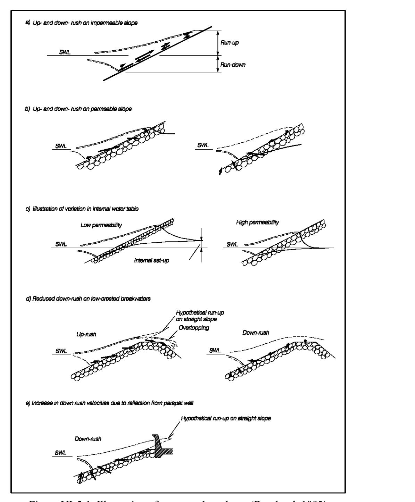

*Figure VI-5-1. Illustration of runup and rundown (Burcharth 1993)*

- (d) Increase in permeability of the slope reduces the flow velocities along the slope surface because a larger proportion of the flow takes place inside the structure. The wave action will cause a rise of the internal water level (phreatic line) indicated in Figure VI-5-1c, leading to an increase in the mean pore pressures. The internal setup is due to a greater inflow surface area during wave runup than the outflow surface area during rundown. The mean flow path for inflow is also shorter than that for outflow. The rise of the phreatic line will continue until the outflow balances the inflow. The lower the permeability of the structure, the higher the setup as indicated on Figure VI-5-1c.
- (e) Barends (1988) suggested practical formulae for calculation of the penetration length and the maximum average setup which occurs after several cycles. Two cases are considered: a conventional breakwater structure with open (permeable) rear side, and a structure with a closed (impermeable) rear side. The latter case causes the largest setup.
- (f) An example of a numerical calculation of the internal flow patterns in a breakwater exposed to regular waves is shown in Figure VI-5-2. The strong outflow in the zone just below SWL when maximum rundown occurs is clearly seen.

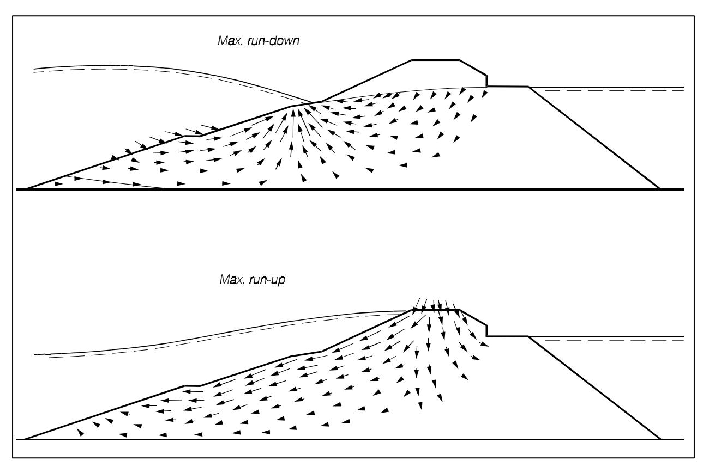

*Figure VI-5-2. Typical velocity field for the porous flow in a breakwater. Numerical calculation (Barends et al. 1983)*

(g) Increasing structure porosity also reduces the overflow velocities because a larger portion of the incoming water volume can be stored in the pores which then act as reservoirs.
EM 1110-2-1100 (Part VI) Change 3 (28 Sep 11)
The destabilizing forces on armor units are thereby reduced. This positive reservoir effect is reduced in the case of a large internal setup of the water table.
- (h) Breakwaters with crest levels lower than the runup level are called low-crested breakwaters. Although the runup velocities are almost unchanged compared to nonovertopped slopes, the rundown velocities are reduced due to the overtopping of some part of the incoming wave as seen in Figure VI-5-1d. Greater overtopping reduces rundown, and thus, lessens the destabilizing flow forces on the armor units. Parapet walls which cut off the hypothetical runup wedge (shown in Figure VI-5-1e) will increase the down-rush velocities and thereby increase the destabilizing flow forces on the armor units. (2) Surf similarity parameter (Iribarren number).
- (a) Wave runup and rundown on a structure depend on the type of wave breaking. Breaker types can be identified by the so-called surf-similarity parameter, \xi (Battjes 1974b). The parameter \xi is also referred to as the breaker parameter or Iribarren number. The surf-similarity parameter was originally defined for regular waves as

```math
\xi_o = \frac{\tan \alpha}{\sqrt{s_o}} \tag{VI-5-1}
```

where
- \alpha = slope angle
- s_o = deepwater wave steepness (= H_o / L_o )
- H_o = deepwater wave height
- L_o = deepwater wavelength (= gT^2/2\pi )
- T = wave period
- g = acceleration due to gravity
(b) The wave height H_b at the breaking point is sometimes substituted for H_o in which case the parameter is denoted by \xi_b . Breaker types and related ranges of \xi_o -values are given for impermeable slopes in Table VI-5-1. The boundaries of transition from one type of breaker to another are approximate.

*Table VI-5-1 Types of Wave Breaking on Impermeable Slopes and Related \xi_o -Values*

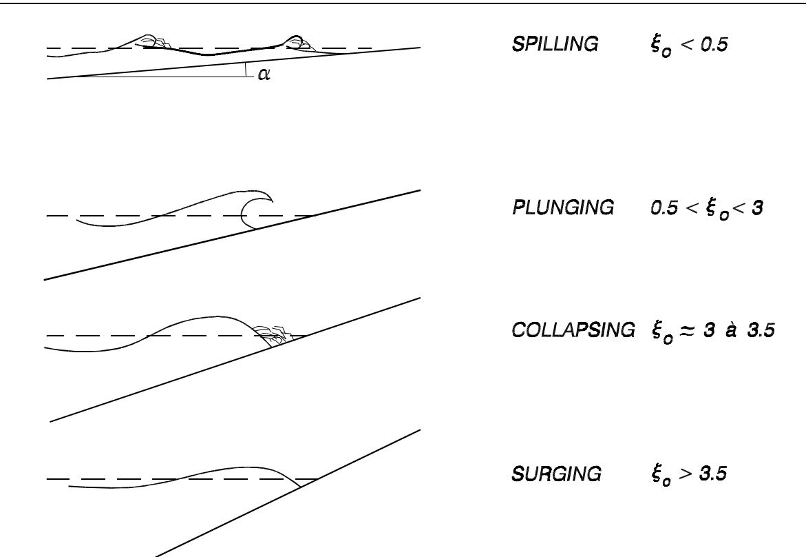

(c) For irregular waves the surf--similarity parameter is defined as

```math
\xi_{om} = \frac{\tan \alpha}{\sqrt{S_{om}}} \quad \text{or} \quad \xi_{op} = \frac{\tan \alpha}{\sqrt{S_{op}}} \tag{VI-5-2}
```

where

```math
s_{om} = \frac{H_s}{L_{om}} = \frac{2\pi}{g} \frac{H_s}{T_m^2}
```

```math
s_{op} = \frac{H_s}{L_{op}} = \frac{2\pi}{g} \frac{H_s}{T_p^2}
```

and
- H_s = significant wave height of incident waves at the toe of the structure
- T_m = mean wave period
EM 1110-2-1100 (Part VI) Change 3 (28 Sep 11)
T_p = wave period corresponding to the peak of the wave spectrum
Note that s_{om} and s_{op} are fictitious wave steepnesses because they are ratios between a statistical wave height at the structure and representative deepwater wavelengths.
- (d) The relative runup R_u/H is a function of \xi , the wave angle of incidence, and the slope geometry (profile, surface roughness, porosity). Differences in runup characteristics make it convenient to distinguish between impermeable and permeable slopes. Impermeable slopes belong to dikes, revetments, and breakwaters with either impermeable surfaces (e.g., asphalt, concrete) or rough surfaces (e.g., rubble stones, concrete ribs) on fine core materials. Permeable slopes belong typically to rubble-mound structures with secondary armor layers, filter layers, and quarryrun core.
- (3) Wave runup and rundown on impermeable slopes. Runup on impermeable slopes can be formulated in a general expression for irregular waves having the form (Battjes 1974)

```math
\frac{R_{ui\%}}{H_s} = (A\xi + C)\gamma_r \gamma_b \gamma_h \gamma_\beta \tag{VI-5-3}
```

where
R_{ui\%} = runup level exceeded by i percent of the incident waves
\xi = surf-similarity parameter, \xi_{om} or \xi_{op}
- A, C = coefficients dependent on \xi and i but related to the reference case of a smooth, straight impermeable slope, long-crested head-on waves and Rayleigh-distributed wave heights \gamma_r = reduction factor for influence of surface roughness ( \gamma_r = 1 for smooth slopes) y_b = reduction factor for influence of a berm ( y_b = 1 for non-bermed profiles) \gamma_h = reduction factor for influence of shallow-water conditions where the wave height distribution deviates from the Rayleigh distribution ( \gamma_h = 1 for Rayleigh distributed waves) \gamma_{\beta} = factor for influence of angle of incidence \beta of the waves ( \gamma_{\beta} = 1 for head-on long-crested waves, i.e., \beta = 0°). The influence of directional spreading in short-crested waves is included in \gamma_{\beta} as well
- (a) Smooth slope, irregular long-crested head-on waves. Van Oorschot and d'Angremond (1968) tested slopes of 1:4 and 1:6 for \xi_{op} < 1.2 . Ahrens (1981a) investigated slopes between 1:1 and 1:4 for \xi_{op} > 1.2 . Figure VI-5-3 shows the range of test results and the fit of Equation VI-5-3 for R_{u2\,percent} . Considerable scatter is observed, most probably due to the fact that the runs for \xi_{op}
- > 1.2 contained only 100-200 waves. The coefficient of variation, $σ_{Ru}$ / Ru , seems to be approximately 0.15.
- The significant runup level $R_{us}$ = $R_{u33}$ % depicted in Figure VI-5-4 does not contain data for $ξ_{op}$ < 1.2. The coefficient of variation appears to be approximately 0.1.
- The coefficients A and C together with estimates of the coefficient of variation for Ru are given in Table VI-5-2. It should be noted that data given in Allsop et al. (1985) showed runup levels considerably smaller than given here.

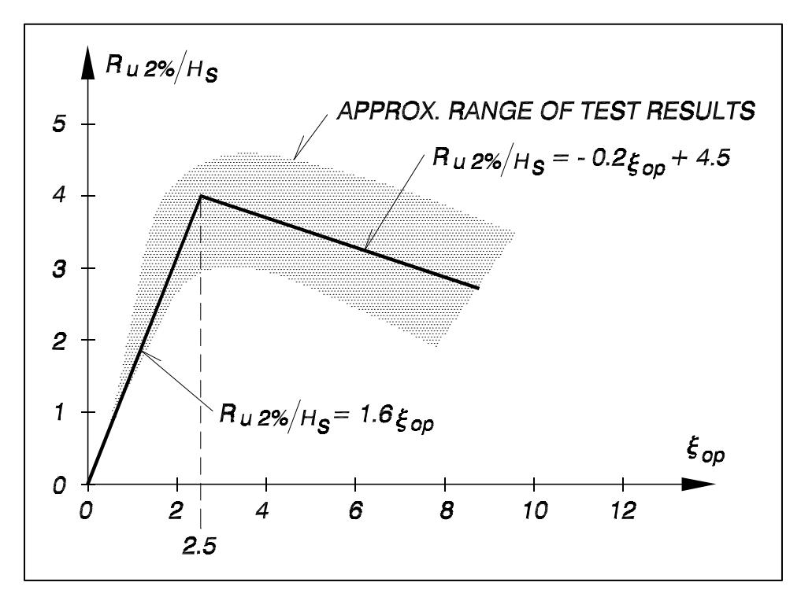

*Figure VI-5-3. $R_{u2\%}$ for head-on waves on smooth slopes. Data by Ahrens (1981a) and Van Oorschot and d'Angremond (1968)*

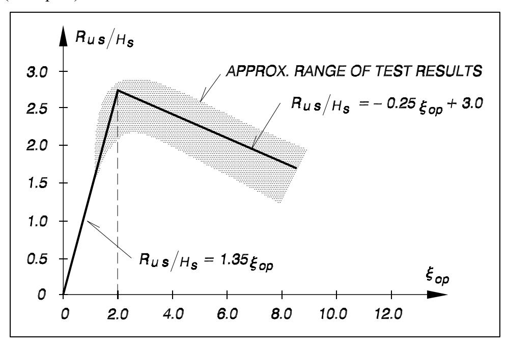

*Figure VI-5-4. R_{us} for head-on waves on smooth slopes. Data by Ahrens (1981a)*

*Table VI-5-2 Coefficients in Equation VI-5-3 for Runup of Long-Crested Irregular Waves on Smooth Impermeable Slopes*

**Table VI-5-2. Coefficients in Equation VI-5-3 for Runup of Long-Crested Irregular Waves on Smooth Impermeable Slopes**

|  |  | Irregular Waves | on | Smooth Impermeable | Slopes | .................................... VI-5-10 |
| --- | --- | --- | --- | --- | --- | --- |
| Table | VI-5-3. | Surface for 1 < $ξ_{op}$ < | Roughness 3-4 | Reduction Factor γr | in Equation ........................................................................................ | VI-5-3, Valid VI-5-12 |
| Table | VI-5-4. | Test Program |  |  | ............................................................................................ | VI-5-17 |
| Table | VI-5-5. | Coefficients Irregular Armored | in Equations Head-On Slopes | VI-5-12 and Waves on Impermeable | VI-5-13 for and ........................................................................................ | Runup of Permeable Rock VI-5-21 |
| Table | VI-5-6. | Critical Values | of | Average Overtopping | Discharges | ............................... VI-5-24 |
| Table | VI-5-7. | Models for | Average | Overtopping | Discharge Formulae | ........................... VI-5-28 |
| Table | VI-5-8. | Overtopping | Formula | by Owen (1980, | 1982) | .......................................... VI-5-29 |
| Table | VI-5-9. | Overtopping | Formula | by Bradbury and | Allsop (1988) | ............................ VI-5-30 |
| Table | VI-5-10. | Coefficients Formula by | by Aminti Bradbury | and Franco (1988) and Allsop in | for Table VI-5-9 | Overtopping .................................. VI-5-31 |
| Table | VI-5-11. | Overtopping | Formula | by van der Meer | and Janssen | (1995) .................... VI-5-32 |

• Generally less experimental data are available for rundown. Rundown corresponding to R_{d2\,percent} from long-crested irregular waves on a smooth impermeable slope can be estimated from

```math
\frac{R_{d2\%}}{H_s} = \begin{cases}
0.33\xi_{op} & \text{for } 0 < \xi_{op} \le 4 \\
1.5 & \text{for } \xi_{op} > 4
\end{cases} \tag{VI-5-4}
```

• In the Dutch publication by Rijkswaterstaat Slope Revetments of Placed Blocks, 1990, the following expression was given for rundown on a smooth revetment of placed concrete block

```math
\frac{R_{d2\%}}{H_s} = 0.5\xi_{op} - 0.2 \quad \text{(VI-5-5)} \tag{VI-5-5}
```

• Another set of runup data for long-crested head-on waves on smooth slopes was presented by de Waal and van der Meer (1992). The data cover small scale tests for slopes 1:3, 1:4, 1:5, 1:6 and large scale tests for slopes 1:3, 1:6, 1:8. The surf-similarity parameter range for the small scale tests is 0.6 < \xi_{op} < 3.4 , and for the large scale tests 0.6 < \xi_{op} < 2.5 . The data are shown in Figure VI-5-5 and were used by de Waal and van der Meer (1992) and van der Meer and Janssen (1995) as the reference data for the evaluation of the \gamma -factors defined by Equation VI-5-3.

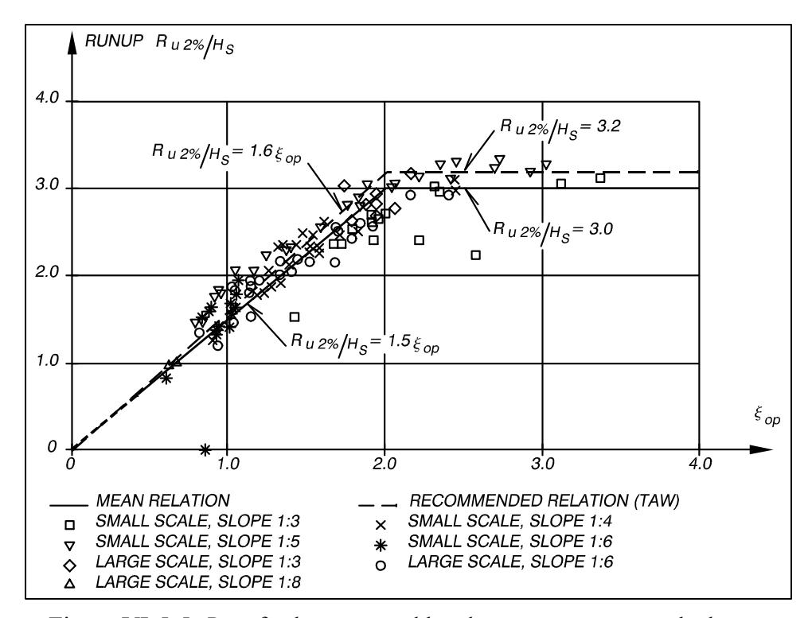

*Figure VI-5-5. R_{u2\%} for long-crested head-on waves on smooth slopes. From de Waal and van der Meer (1992)*

• The mean relationship, taken as the reference case for Equation VI-5-3, is shown with the solid line and is represented by the expression

```math
\frac{R_{u2\%}}{H_s} = \begin{cases}
1.5\xi_{op} & \text{for } 0.5 < \xi_{op} \le 2 \\
3.0 & \text{for } 2 < \xi_{op} < 3 - 4
\end{cases} \tag{VI-5-6}
```

- The dotted line includes a small safety factor, and this relationship is recommended for design by the Technical Advisory Committee on Water Defence in Holland.
- Based on a somewhat reduced data set compared to Figure VI-5-5, the uncertainty on Equation VI-5-6 is described by de Waal and van der Meer (1992) by assuming the factor 1.5 as a stochastic variable with a normal distribution and a coefficient of variation of 0.085.
- Influence of surface roughness on runup. The original values for \gamma_r given in Dutch publications and in the old Shore Protection Manual have been updated based on experiments
EM 1110-2-1100 (Part VI) Change 3 (28 Sep 11)
including large-scale tests with random waves. These factors are given in Table VI-5-3. The new γ r values taken from de Waal and van der Meer (1992) are valid for 1 < $ξ_{op}$ < 3-4. For larger $ξ_{op}-values$ the $γ_{r}$ factors will slowly increase to 1.

**Table VI-5-3. The new γ r values taken from de Waal and van der Meer (1992) are valid for 1 < $ξ_{op}$ < 3-4. For larger $ξ_{op}-values$ the $γ_{r}$ factors will slowly increase to 1.**

| Table | VI-5-4. | Test Program ............................................................................................ VI-5-17 |
| --- | --- | --- |
| Table | VI-5-5. | Coefficients in Equations VI-5-12 and VI-5-13 for Runup of Irregular Head-On Waves on Impermeable and Permeable Rock Armored Slopes ........................................................................................ VI-5-21 |
| Table | VI-5-6. | Critical Values of Average Overtopping Discharges ............................... VI-5-24 |
| Table | VI-5-7. | Models for Average Overtopping Discharge Formulae ........................... VI-5-28 |
| Table | VI-5-8. | Overtopping Formula by Owen (1980, 1982) .......................................... VI-5-29 |
| Table | VI-5-9. | Overtopping Formula by Bradbury and Allsop (1988) ............................ VI-5-30 |
| Table | VI-5-10. | Coefficients by Aminti and Franco (1988) for Overtopping Formula by Bradbury and Allsop in Table VI-5-9 .................................. VI-5-31 |
| Table | VI-5-11. | Overtopping Formula by van der Meer and Janssen (1995) .................... VI-5-32 |
| Table | VI-5-12. | Overtopping Formula by Pedersen and Burcharth (1992), Pedersen (1996) ....................................................................................................... VI-5-33 |

*Influence of a berm on runup. A test program at Delft Hydraulics was designed to clarify the influence of a horizontal or almost horizontal berm on wave runup. Figure VI-5-6 shows the range of tested profiles and sea states.*

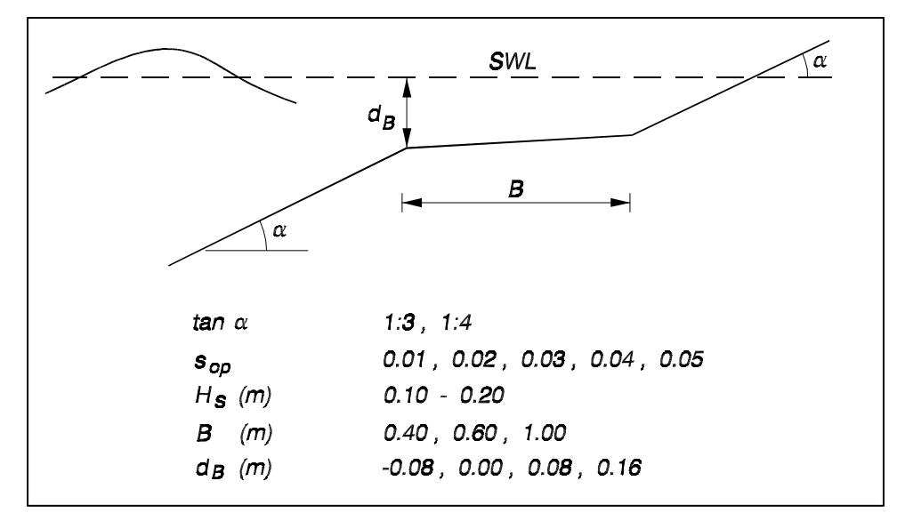

*Figure VI-5-6. Parameters in berm test program at Delft Hydraulics*

• According to de Waal and van der Meer (1992) the effect of a berm can be taken into account by the following formulation of the reference Equation VI-5-6

```math
\frac{R_{u2\%}}{H_s} = \begin{cases}
1.5\xi_{op}\gamma_r\gamma_b\gamma_h\gamma_\beta = 1.5\xi_{eq}\gamma_r\gamma_h\gamma_\beta & \text{for } 0.5 < \xi_{eq} \le 2 \\
3.0\gamma_r\gamma_h\gamma_\beta & \text{for } \xi_{eq} > 2
\end{cases} \tag{VI-5-7}
```

where \xi_{eq} is the breaking wave surf similarity parameter based on an equivalent slope (see Figure VI-5-7). The berm influence factor \gamma_b is defined as

```math
\gamma_b = \frac{\xi_{eq}}{\xi_{op}} = 1 - r_B (1 - r_{dB}), \quad 0.6 \le \gamma_b \le 1.0 \tag{VI-5-8}
```

where

```math
r_{B} = 1 - \frac{\tan \alpha_{eq}}{\tan \alpha} \tag{VI-5-9}
```

and the equivalent slope angle \alpha_{eq} and the average slope angle \alpha are defined in Figure VI-5-7.

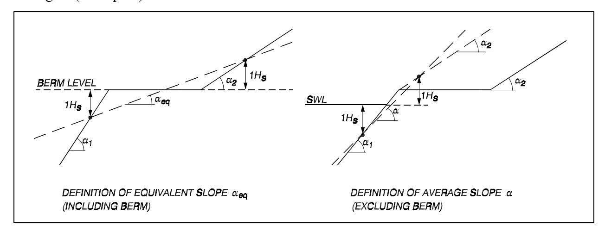

*Figure VI-5-7. Definition of $α_{eq}$ and α in Equation VI-5-9*

- The influence of the berm can be neglected when the berm horizontal surface is positioned more than 2 Hs below SWL. If the berm horizontal surface lies higher than 2 B s d H above SWL, then the runup can be set to R d u B 2% if 2 B Hs . The berm is most effective when lying at SWL, i.e., $d_{B}$ = 0. An optimum berm width B , which corresponds to $γ_{b}$ = 0.6, can be determined from the formulae given by Equations VI-5-8 and VI-5-9.
- The use of $ξ_{eq}$ in Equation VI-5-7 is evaluated in Figure VI-5-8 on the basis of the test program given in Figure VI-5-6, which implies $γ_{r}$ = $γ_{h}$ = $γ_{β}$ = 1.

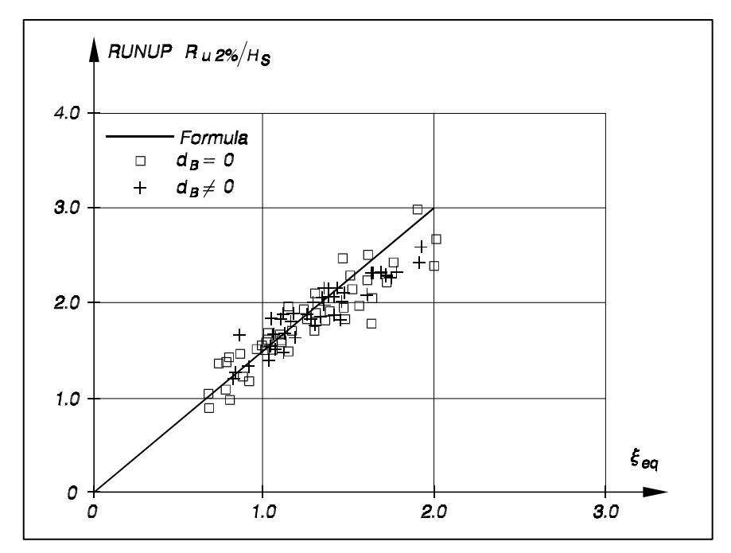

*Figure VI-5-8. Evaluation of the use of $ξ_{eq}$ to account for the influence of a berm*

Influence of shallow water on runup. Wave heights in Equation VI-5-7 are characterized by H_s which provides a unique definition for deep water conditions where wave heights are Rayleigh distributed. In shallow water where some waves break before they reach the structure, the wave heights will no longer be Rayleigh distributed. According to de Waal and van der Meer (1992), the influence factor can be estimated as

```math
\gamma _ { h } = \frac { H _ { 2 \% } } { 1 . 4 H _ { s } } \tag{VI-5-10}
```

where the representative wave heights are specified for the water depth at the toe of the structure (H_2 \%/H_s = 1.4 \text{ for Rayleigh distributed wave heights}).
Influence of angle of wave attack on runup. Both the angle of incidence and the directional spreading of the waves influence the runup. A test program for runup on smooth slopes at Delft Hydraulics, as specified in Figure VI-5-9, revealed the variations in the influence factor \gamma_{\beta} as given by Equation VI-5-11 and depicted in Figure VI-5-10.

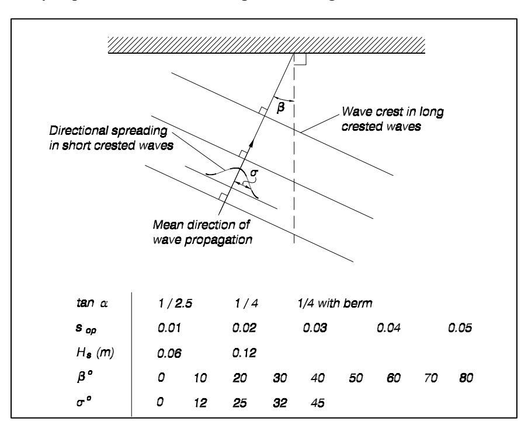

*Figure VI-5-9. Test program for wave runup on smooth slopes conducted at Delft Hydraulics, de Waal and van der Meer (1992)*

- Note that \gamma_{\beta} -values larger than 1 were obtained for long-crested waves in the range 10^{\circ} \le \beta \le 30^{\circ} , and that values very close to 1 were obtained for short-crested waves for \beta up to 50^{\circ} . Based on the results, the following formulas for mean values of \gamma_{\beta} were given
EM 1110-2-1100 (Part VI) Change 3 (28 Sep 11)

```math
\begin{align*}
&= 1.0 \qquad \text{for } 0^{\circ} \le \beta \le 10^{\circ} \\
&\gamma_{\beta} = \cos(\beta - 10^{\circ}) \qquad \text{for } 10^{\circ} < \beta \le 63^{\circ} \\
&= 0.6 \qquad \text{for } \beta > 63^{\circ}
\end{align*} \tag{VI-5-11}
```

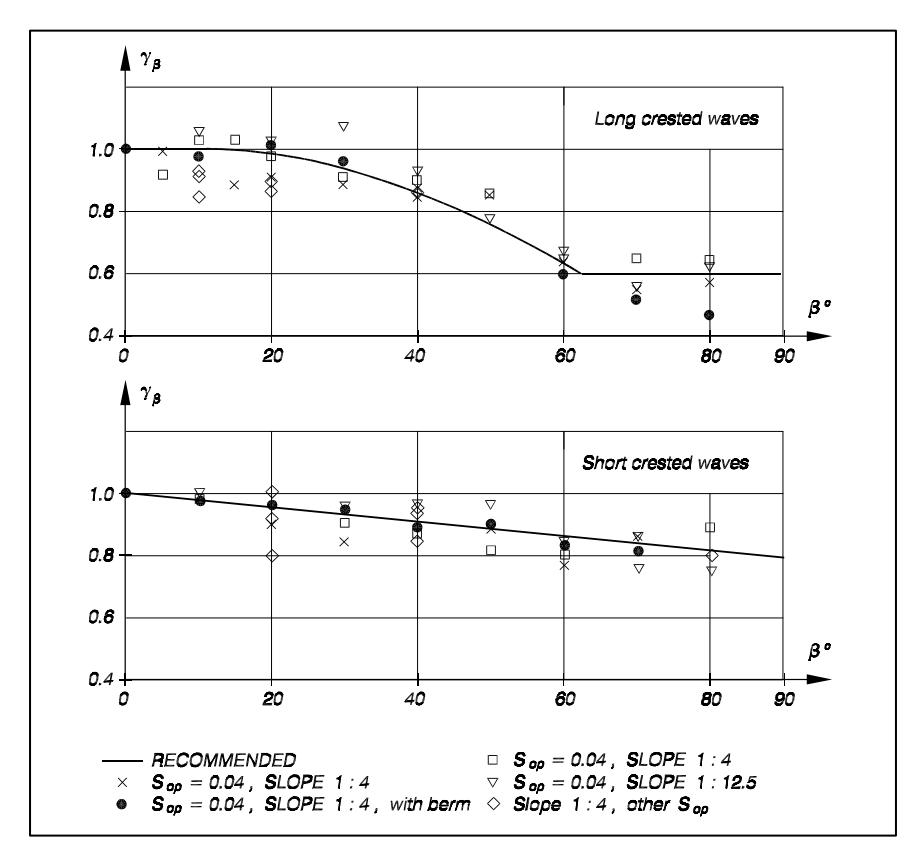

*Figure VI-5-10. Influence of angle of incidence β and directional spreading on runup on smooth slopes conducted at Delft Hydraulics; de Waal and van der Meer (1992)*

(b) Rock armored slopes, irregular long-crested head-on waves. Runup on rock armored impermeable and permeable slopes was studied by Delft Hydraulics in the test program given in Table VI-5-4.

**Table VI-5-4. **

| Table | VI-5-5. | Coefficients Irregular Armored Slopes | in Equations Head-On | VI-5-12 and VI-5-13 for Waves on Impermeable and ........................................................................................ | Runup of Permeable Rock | VI-5-21 |
| --- | --- | --- | --- | --- | --- | --- |
| Table | VI-5-6. | Critical Values | of | Average Overtopping Discharges | ............................... | VI-5-24 |
| Table | VI-5-7. | Models for | Average | Overtopping Discharge Formulae | ........................... | VI-5-28 |
| Table | VI-5-8. | Overtopping | Formula | by Owen (1980, 1982) | .......................................... | VI-5-29 |
| Table | VI-5-9. | Overtopping | Formula | by Bradbury and Allsop (1988) | ............................ | VI-5-30 |
| Table | VI-5-10. | Coefficients Formula by | by Aminti Bradbury | and Franco (1988) for and Allsop in Table VI-5-9 | Overtopping .................................. | VI-5-31 |
| Table | VI-5-11. | Overtopping | Formula | by van der Meer and Janssen | (1995) .................... | VI-5-32 |
| Table | VI-5-12. | Overtopping (1996) | Formula | by Pedersen and Burcharth ....................................................................................................... | (1992), Pedersen | VI-5-33 |
| Table | VI-5-13. | Overtopping | Formula | by Franco and Franco (1999) | ............................... | VI-5-34 |

**Table VI-5-4. **

| Table | VI-5-5. | Coefficients Irregular Armored Slopes | in Equations Head-On | VI-5-12 and VI-5-13 for Waves on Impermeable and ........................................................................................ | Runup of Permeable Rock | VI-5-21 |
| --- | --- | --- | --- | --- | --- | --- |
| Table | VI-5-6. | Critical Values | of | Average Overtopping Discharges | ............................... | VI-5-24 |
| Table | VI-5-7. | Models for | Average | Overtopping Discharge Formulae | ........................... | VI-5-28 |
| Table | VI-5-8. | Overtopping | Formula | by Owen (1980, 1982) | .......................................... | VI-5-29 |
| Table | VI-5-9. | Overtopping | Formula | by Bradbury and Allsop (1988) | ............................ | VI-5-30 |
| Table | VI-5-10. | Coefficients Formula by | by Aminti Bradbury | and Franco (1988) for and Allsop in Table VI-5-9 | Overtopping .................................. | VI-5-31 |
| Table | VI-5-11. | Overtopping | Formula | by van der Meer and Janssen | (1995) .................... | VI-5-32 |
| Table | VI-5-12. | Overtopping (1996) | Formula | by Pedersen and Burcharth ....................................................................................................... | (1992), Pedersen | VI-5-33 |
| Table | VI-5-13. | Overtopping | Formula | by Franco and Franco (1999) | ............................... | VI-5-34 |

- The core permeability in Table VI-5-4 refers to the structures shown in details a , c and d of Figure VI-5-11, taken from van der Meer (1988). The figure provides definition of a notational permeability parameter P which is used in various formulae by van der Meer to take into account the effect of permeability on response to wave action. The value P = 0.4 in Figure VI-5-11, detail b , is not identified by tests, but instead is an estimated value.
- The runup results from the test program described in Table VI-5-4 are presented in Figure VI-5-12.
- Note that $ξ_{om}$ = tan α / $(2πH_{s}$ /gTom 2 ) 1/2, where $T_{om}$ is the mean wave period, is used instead of $ξ_{op}.$ By using $T_{om}$ instead of $T_{op}$ variations in the width of the wave spectrum are taken into account. The ratio $T_{om}$ / $T_{op}$ = ξ om / ξ op = 0.79 - 0.87 for Joint North Sea Wave Program (JONSWAP) spectra and 0.71 - 0.82 for Pierson-Moskowitz spectra.
• The central fit to the data for impermeable rock slopes was given by Delft Hydraulics (1989) as

```math
\frac{R_{ui\%}}{H_s} = \begin{cases}
A\xi_{om} & \text{for } 1.0 < \xi_{om} \le 1.5 \\
B(\xi_{om})^C & \text{for } \xi_{om} > 1.5
\end{cases} \tag{VI-5-12}
```

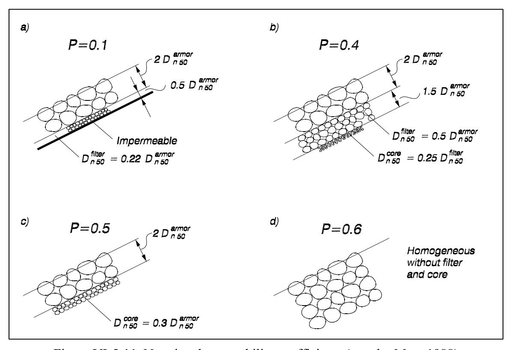

*Figure VI-5-11. Notational permeability coefficients (van der Meer 1988)*

- The coefficients A, B and C are given in Table VI-5-5. For impermeable slopes the coefficient of variation for A, B and C is 7 percent. Data presented by Ahrens and Heinbaugh (1988a) for maximum runup on impermeable riprap slopes are in agreement with the data represented by Equation VI-5-12.
- Equation VI-5-12 is valid for relatively deep water in front of a structure where the wave height distribution is close to the Rayleigh distribution. Wave breaking on a foreshore results in a truncation in the runup distribution which mainly results in lower runup heights for small exceedence probability levels. However, sometimes higher runup may occur according to observations in the Delft Hydraulics tests and recent tests conducted at Texas A&M University.
- (4) Wave runup and rundown on permeable slopes. With respect to runup, permeable structures are defined as structures with core material of such permeability that wave induced porous flow and fluctuations of the internal phreatic line do vary with the frequencies of the waves. The storage capacity of the structure pores results in maximum runup that is smaller than for an equivalent structure with an impermeable core.
(a) Rock armored slopes, irregular long-crested head-on waves. Rock armored permeable slopes with notational permeability P=0.5, as shown in detail c of Figure VI-5-11, were tested in irregular head-on waves by Delft Hydraulics in the program specified in Table VI-5-4. The results are shown in Figure VI-5-12, and the corresponding equation for the central fit to the data is given by

```math
R_{ui} \%/H_s = A \xi_{om} \qquad \text{for } 1.0 < \xi_{om} \le 1.5 \tag{VI-5-13}
```

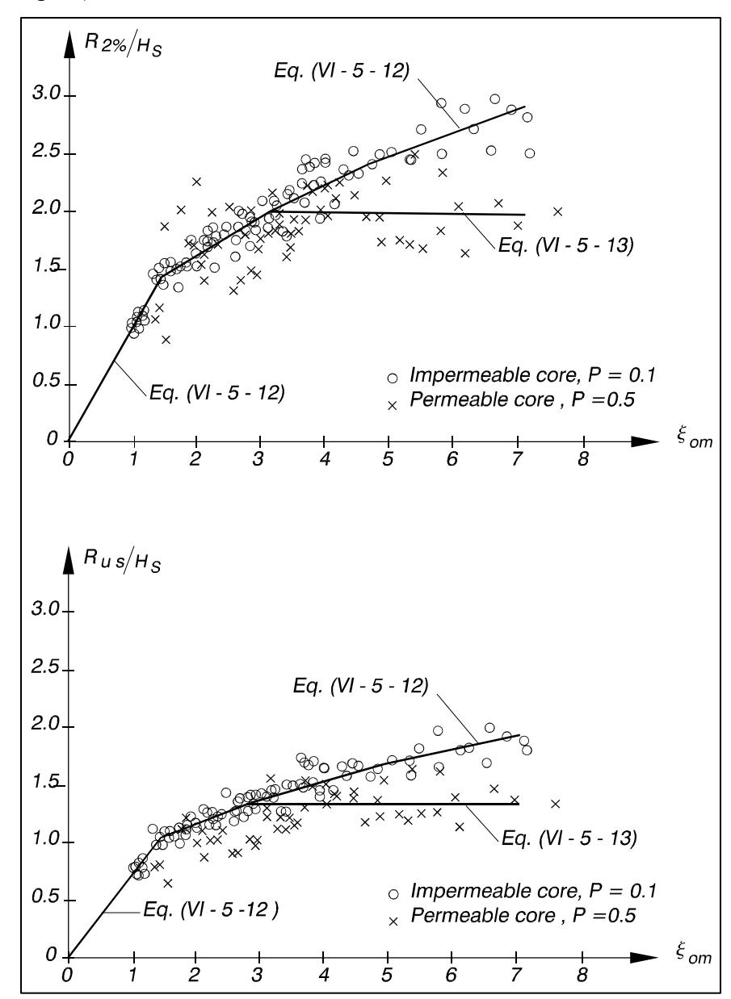

*Figure VI-5-12. 2 percent and significant runup of irregular headon waves on impermeable and permeable rock slopes. Delft Hydraulics (1989)*

*Table VI-5-5
Coefficients in Equations VI-5-12 and VI-5-13 for Runup of Irregular Head-On Waves on Impermeable and Permeable Rock Armored Slopes*

**Table VI-5-5. Coefficients in Equations VI-5-12 and VI-5-13 for Runup of Irregular Head-On Waves on Impermeable and Permeable Rock Armored Slopes**

|  |  | Irregular Head-On Armored Slopes | Waves on | Impermeable and Permeable Rock ........................................................................................ VI-5-21 |
| --- | --- | --- | --- | --- |
| Table | VI-5-6. | Critical Values of | Average Overtopping | Discharges ............................... VI-5-24 |
| Table | VI-5-7. | Models for Average | Overtopping | Discharge Formulae ........................... VI-5-28 |
| Table | VI-5-8. | Overtopping | Formula by Owen | (1980, 1982) .......................................... VI-5-29 |
| Table | VI-5-9. | Overtopping | Formula by Bradbury | and Allsop (1988) ............................ VI-5-30 |
| Table | VI-5-10. | Coefficients by Formula by Bradbury | Aminti and Franco and Allsop | (1988) for Overtopping in Table VI-5-9 .................................. VI-5-31 |
| Table | VI-5-11. | Overtopping | Formula by van der | Meer and Janssen (1995) .................... VI-5-32 |
| Table | VI-5-12. | Overtopping (1996) | Formula by Pedersen | and Burcharth (1992), Pedersen ....................................................................................................... VI-5-33 |
| Table | VI-5-13. | Overtopping | Formula by Franco | and Franco (1999) ............................... VI-5-34 |
| Table | VI-5-14. | Wave Reflection Structures Based | Coefficients for on Seelig (1983) | Non-Overtopped Sloping Equation............................................ VI-5-40 |

*& lt;sup>1</sup> Exceedence level related to number of waves*

- The coefficients A, B, C and D are listed in Table VI-5-5. For permeable structures the coefficient of variation for A, B, C and D is 12 percent. Tests with homogeneous rock structures with notational permeability P = 0.6, as shown in detail d of Figure VI-5-11, showed results almost similar to the test results corresponding to P = 0.5 as shown in Figure VI-5-12.
- Equation VI-5-13 is valid for relatively deepwater conditions with wave height distributions close to a Rayleigh distribution. Wave breaking due to depth limitations in front of the structure cause truncation of the runup distribution and thereby lower runup heights for small exceedence probability levels. However, higher runup might also occur according to observations in the Delft Hydraulics tests, van der Meer and Stam (1992). The influence on runup for the shallow-water conditions included in the test program given in Table VI-5-4 were investigated for the rock armored permeable slope. However, no systematic deviations from Equation VI-5-13 were observed.
- (b) Statistical distribution of runup. The runup of waves with approximately Rayleigh distributed wave heights on rock armored permeable slopes with tan \ \alpha \ \exists \ 2 were characterized by van der Meer and Stam (1992) with a best-fit two-parameter Weibull distribution as follows:

```math
Prob\left(R_{u} > R_{up\%}\right) = \exp\left[-\left(\frac{R_{up\%}}{B}\right)^{C}\right] \tag{VI-5-14}
```

```math
R_{up\%} = B(-\ln p)^{1/C} \tag{VI-5-15}
```

where
R_{up\%} = Runup level exceeded by p% of the runup

```math
B = H_s \left[ 0.4 (s_{om})^{-1/4} (\cot \alpha)^{-0.2} \right] \tag{VI-5-16}
```

*& lt;sup>2</sup> Only relevant for permeable slopes*

EM 1110-2-1100 (Part VI) Change 3 (28 Sep 11)

```math
C = \begin{cases} 3.0(\xi_{om})^{-3/4} & \text{for } \xi_{om} \leq \xi_{omc} \text{ (plunging waves)} \\ 0.52P^{-0.3}(\xi_{om})^{P} \sqrt{\cot \alpha} & \text{for } \xi_{om} > \xi_{omc} \text{ (surging waves)} \end{cases} \tag{VI-5-17}
```

```math
\xi_{omc} = \left(5.77P^{0.3}\sqrt{\tan\alpha}\right)^{[1/(P+0.75)]} \tag{VI-5-18}
```

```math
s_{om} = \frac{2\pi H_s}{gT_{om}^2}
```

P = notational permeability, see Figure VI-5-11.
- It follows from Equation VI-5-15 that the scale parameter B is equal to Ru_{37\%} (ln p = -1 for p = 0.37). If the shape parameter C is equal to 2, then Equation VI-5-14 becomes a Rayleigh distribution. The uncertainty on B corresponds to a coefficient of variation of 6 percent for P < 0.4 and 9 percent for P \ge 0.4 .
- Rundown on rock slopes in the Delft Hydraulics test program listed in Table VI-5-4 gave the following relationship which includes the effect of structure permeability P (see Figure VI-5-11).

```math
\frac{R_{d2\%}}{H_s} = 2.1\sqrt{\tan\alpha} - 1.2P^{0.15} + 1.5e^{-(60s_{om})} \tag{VI-5-19}
```

b. Wave overtopping of structures. Wave overtopping occurs when the highest runup levels exceed the crest freeboard, R_c as defined in Figure VI-5-13. The amount of allowable overtopping depends on the function of the particular structure. Certain functions put restrictions on the allowable overtopping discharge. For example access roads and installations placed on the crest of breakwaters and seawalls, berths for vessels as well as reclaimed areas containing roadways, storage areas, and buildings located just behind the breakwater are overtopping design considerations. Design criteria for overtopping should include two levels: Overtopping during normal service conditions and overtopping during extreme design conditions where some damage to permanent installations and structures might be allowed. Very heavy overtopping might be allowed where a breakwater has no other function than protection of harbor entrances and outer basins from waves. However, significant overtopping can create wave disturbances which could lead to damage of moored vessels. Fortunately, waves generated by overtopping usually have much shorter periods than the incident wave train.

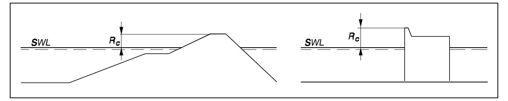

*Figure VI-5-13. Definition of crest freeboard, Rc*

- (1) Admissible average overtopping discharge.
- (a) The overtopping discharge from wind-generated waves is very unevenly distributed in time and space because the amount varies considerably from wave to wave. The major part of the overtopping discharge during a storm is due to a small fraction of the waves. In fact the local overtopping discharge (in $m^{3}/s$ per meter structure) from a single wave can be more than 100 times the average overtopping discharge during the storm peak. Nevertheless, most information on overtopping is given as the time averaged overtopping discharge, q, expressed in $m^{3}/s$ per meter of structure length. However, some limited information exists on the probability distribution of the volume of overtopping water per wave.
- (b) Field studies of tolerable overtopping limits of dikes and revetments have been performed by Tsuruta and Goda (1968), Goda (1970), and Fukuda, Uno, and Irie (1974). Some critical values for overtopping of a breakwater were discussed by Jensen (1984), and Dutch Guidelines on river dikes indicated allowable overtopping rates for inner slopes. Delft Hydraulics tested admissible overtopping rates for grass dikes (Smith, Seijffert, and van der Meer 1994). De Gerloni et al. (1991), and Franco, de Gerloni, and van der Meer (1994) studied the effect of falling water jets on a person, simulating the conditions on breakwater crests. Endoh and Takahashi (1994) performed full-scale tests as well as numerical modeling of overtopping rates which endanger people.
- (c) The information from these various studies is condensed in Table VI-5-6, which presents critical values of the average overtopping discharge, q . The values given in this table must be regarded only as rough guidelines because, even for the same value of q , the intensity of water hitting a specific location is very much dependent on the geometry of the structure and the distance from the front of the structure. The maximum intensities might locally be up to two orders of magnitude larger than the value of q . Moreover, what is regarded as acceptable conditions is to a large extent a matter of local traditions and individual opinions.

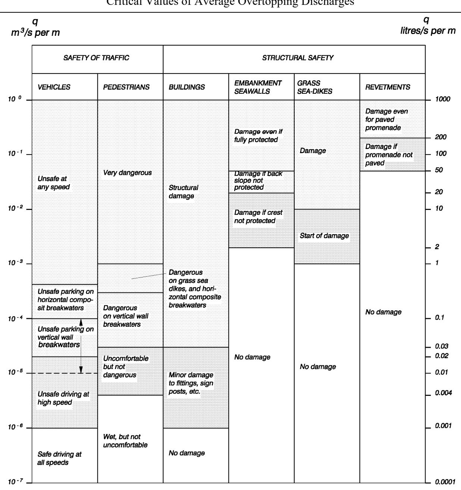

*Table VI-5-6 Critical Values of Average Overtopping Discharges*

- (d) The wind can carry spray long distances whereas solid (green) water is practically unaffected by the wind. It is important to consider spray because it can cause damage to goods placed on storage areas and can cause icing of vessel superstructures in cold regions.
- (e) Overtopping occurs only if the runup level exceeds the freeboard, $R_{c},$ of the structure. Figure VI-5-14 shows the notation used to describe profile geometry for several structure types.

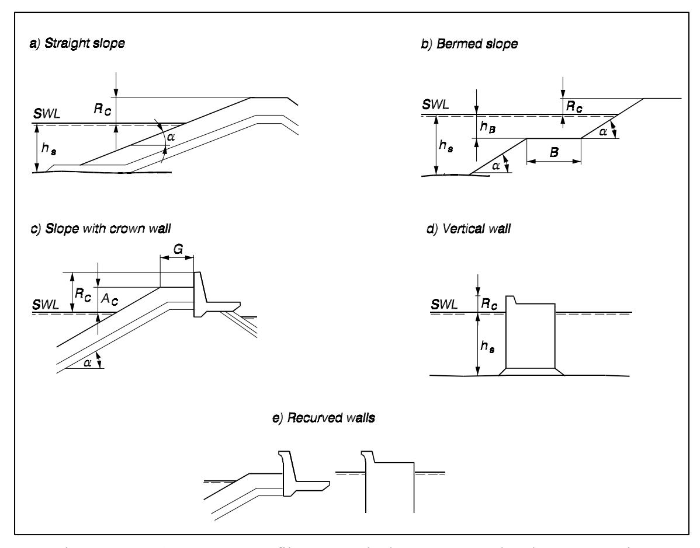

*Figure VI-5-14. Structure profile geometrical parameters related to overtopping*

- (f) The relative freeboard, Rc $/H_{s},$ is a simple, but very important, dimensionless parameter for the prediction of overtopping. However, the wave period or wave steepness is also a significant parameter as are geometric parameters related to structure permeability, porosity and surface roughness. Under certain conditions a recurved wave wall as shown in Figure VI-5-14 e is effective in reducing overtopping. For small values of $R_{c}$ /Hs (< 0.3) when the overtopping is excessive, the detailed geometry of the crest part of the structure becomes less important because the waves just travel over the structure.
- (2) Average overtopping discharge formulas.
- (a) Sloping structures. Formulae for overtopping are empirical because they are fitted to hydraulic model test results for specific breakwater geometries. In general the average overtopping discharge per unit length of structure, q, is a function of the standard parameters:

```math
q = \text{function}\left(H_s, T_{op}, \sigma, \beta, R_c, h_s, g, \text{ structure geometry}\right)
```

where
Hs = significant wave height
EM 1110-2-1100 (Part VI) Change 3 (28 Sep 11)
Top = wave period associated with the spectral peak in deep water (alternately $T_{om})$
σ = spreading of short-crested waves
β = angle of incidence for the waves
- Rc = freeboard
- hs = water depth in front of structure
- g = gravitational acceleration
Two types of mathematical formulatons (models) for dimensionless overtopping dominate the literature, i.e.,

```math
Q = a_e^{-(bR)} \tag{VI-5-20}
```

and

```math
Q = a R ^ { - b } \tag{VI-5-21}
```

where Q is a dimensionless average discharge per meter and R is a dimensionless freeboard. Table VI-5-7 gives an overview of the models used in recent overtopping formulae along with the associated definitions for dimensionless discharge and freeboard.
- (b) The fitted coefficients a and b in Equations VI-5-20 and VI-5-21 are specific to the front geometry of the structure and must be given in tables. So far no general model for the influence of front geometry exists except for rubble-mound slopes with a seawall (Pedersen 1996), in which case the front geometry (described by the front berm width B , berm crest height Ac , and slope angle α ), as well as $R_{c},$ enters into R .
- (c) Some formulae take into account the reduction in overtopping due to slope surface roughness, berm, shallow water, angle of wave incidence and shortcrestedness, and specific front geometries by dividing R by the respective reduction coefficients: $γ_{r}$ (Table VI-5-3), $γ_{b}$ (Equation VI-5-8), $γ_{h}$ (Equation VI-5-10), $γ_{β}$ (Equations VI-5-11, VI-5-26, VI-5-29), and $γ_{s}$ (Table VI-5-13).
- (d) Goda (1985) presented diagrams for wave overtopping of vertical revetments and block-mound seawalls on bottom slopes of 1:10 and 1:30. The diagrams are based on model tests with irregular long-crested head-on waves and express average discharge per meter width as a function of wave height, wave steepness, freeboard, and water depth. Sloping structures. Tables VI-5-8 to VI-5-12 pertain to sloping-front structures.
- Figure VI-5-15 shows the data basis for Equations VI-5-24 and VI-5-25 which includes the data of Owen (1980, 1982) for straight slopes, data of Führböter, Sparboom, and
Witte (1989) and various data sets of Delft Hydraulics. It is seen that Equation VI-5-24 contains some bias for small values of q .
- Vertical front structures.
- Figure VI-5-16 shows the data used to establish Equation VI-5-28. Appropriate values of $γ_{β}$ from Table VI-5-13 were used in plotting Figure VI-5-16; however $γ_{s}$ was taken as unity (plain impermeable wall).

**Table VI-5-13. were used in plotting Figure VI-5-16; however $γ_{s}$ was taken as unity (plain impermeable wall).**

| Table | VI-5-14. | Wave Reflection Structures | Coefficients for Non-Overtopped Sloping Based on Seelig (1983) Equation............................................ | VI-5-40 |
| --- | --- | --- | --- | --- |
| Table | VI-5-15. | Wave (1991) for Breakwaters | Transmission Formula by van der Meer and d=Angremond Rock Armored Low-crested, Submerged, and Reef .............................................................................................. | VI-5-53 |
| Table | VI-5-16. | Wave | Transmission Formula by Goda (1969) ......................................... | VI-5-55 |
| Table | VI-5-17. | Wave | Transmission Formula by Takahashi (1996) ................................. | VI-5-56 |
| Table | VI-5-18. | Parameters | Influencing Hydraulic Stability of Armor Layers ................. VI-5-xi | VI-5-62 |

**Table VI-5-13. were used in plotting Figure VI-5-16; however $γ_{s}$ was taken as unity (plain impermeable wall).**

| Table | VI-5-14. | Wave Reflection Structures | Coefficients for Non-Overtopped Sloping Based on Seelig (1983) Equation............................................ | VI-5-40 |
| --- | --- | --- | --- | --- |
| Table | VI-5-15. | Wave (1991) for Breakwaters | Transmission Formula by van der Meer and d=Angremond Rock Armored Low-crested, Submerged, and Reef .............................................................................................. | VI-5-53 |
| Table | VI-5-16. | Wave | Transmission Formula by Goda (1969) ......................................... | VI-5-55 |
| Table | VI-5-17. | Wave | Transmission Formula by Takahashi (1996) ................................. | VI-5-56 |
| Table | VI-5-18. | Parameters | Influencing Hydraulic Stability of Armor Layers ................. VI-5-xi | VI-5-62 |

#### Table VI-5-8 Overtopping Formula by Owen (1980, 1982)

Straight and bermed impermeable slopes, Figures VI-5-14 a and b. Irregular, head—on waves.

```math
\frac{q}{g H_s T_{om}} = \mathbf{a} \exp\left(-\mathbf{b} \frac{R_c}{H_s} \sqrt{\frac{s_{om}}{2 \pi}} \frac{1}{\gamma_r}\right)
```

Coefficients in Eq VI-5-22 Straight smooth slopes. Non-depth limited waves.
Coefficients in Eq VI-5-22 Bermed smooth slopes. Non-depth limited waves.

|  |  |  |
| --- | --- | --- |
| Slope | a | b |
| 1:1 | 0.008 | 20 |
| 1:1.5 | 0.010 | 20 |
| 1:2 | 0.013 | 22 |
| 1:3 | 0.016 | 32 |
| 1:4 | 0.019 | 47 |
| factor \gamma_r . |  |  |
| (including s |  |  |
| One layer of rubble on in able base |  | 0.8 |
| Gravel, gab | ion mattresses | 0.7 |
| Rock riprap thickness graph than 2 D_{n50} |  | 0.5 - 0. |

| Slope | h_B \ (\mathrm{m}) | B (m) | \mathbf{a} \cdot 10^4 | b |
| --- | --- | --- | --- | --- |
| \begin{array}{c} 1:1 \ 1:2 \ 1:4 \end{array} | -4.0 | 10 | 64 91 145 | 20 22 41 |
| \begin{array}{c} 1:1 \ 1:2 \ 1:4 \end{array} | -2.0 | 5 | 34 98 159 | 17 24 47 |
| \begin{array}{c} 1:1 \ 1:2 \ 1:4 \end{array} | -2.0 | 10 | 48 68 86 | 19 24 46 |
| \begin{array}{c} 1:1 \ 1:2 \ 1:4 \end{array} | - 2.0 | 20 | 8.8 20 85 | 15 \\ 25 \\ 50 |
| \begin{array}{c} 1:1 \ 1:2 \ 1:4 \end{array} | -2.0 | 40 | 3.8 \\ 5.0 \\ 47 | 23 \\ 26 \\ 51 |
| \begin{array}{c} 1:1 \ 1:2 \ 1:4 \end{array} | -1.0 | 5 | 155 \\ 190 \\ 500 | 33 37 70 |
| \begin{array}{c} 1:1 \ 1:2 \ 1:4 \end{array} | -1.0 | 10 | 93 \\ 340 \\ 300 | 39 53 80 |
| \begin{array}{c} 1:1 \ 1:2 \ 1:4 \end{array} | -1.0 | 20 | 75 \\ 34 \\ 39 | \begin{array}{r} 46 \\ 50 \\ 62 \end{array} |
| \begin{array}{c} 1:1 \ 1:2 \ 1:4 \end{array} | -1.0 | 40 | 12 \\ 24 \\ 1.5 | 49 56 63 |
| \begin{array}{c} 1:1 \ 1:2 \ 1:4 \end{array} | 0 | 10 | 97 290 300 | 42 57 80 |

*Table VI-5-9 Overtopping Formula by Bradbury and Allsop (1988)*

Straight rock armored slope with berm in front of crown wall, Figure VI-5-14c. Slope 1:2. Impermeable membrane at various depths as shown in the following figure. Berm width G is three or six stone diameters. Irregular, head—on waves.

```math
\frac{q}{g H_s T_{om}} = \mathbf{a} \left[ \left( \frac{R_c}{H_s} \right)^2 \sqrt{\frac{s_{om}}{2 \pi}} \right]^{-\mathbf{b}} \tag{VI-5-23}
```

Coefficients in Eq VI-5-23. Non-depth limited waves.
Note: "a" coefficients are shown multiplied by 10^9 . For example, a value of 6.7 in the table represents 6.7(10)^{-9} .

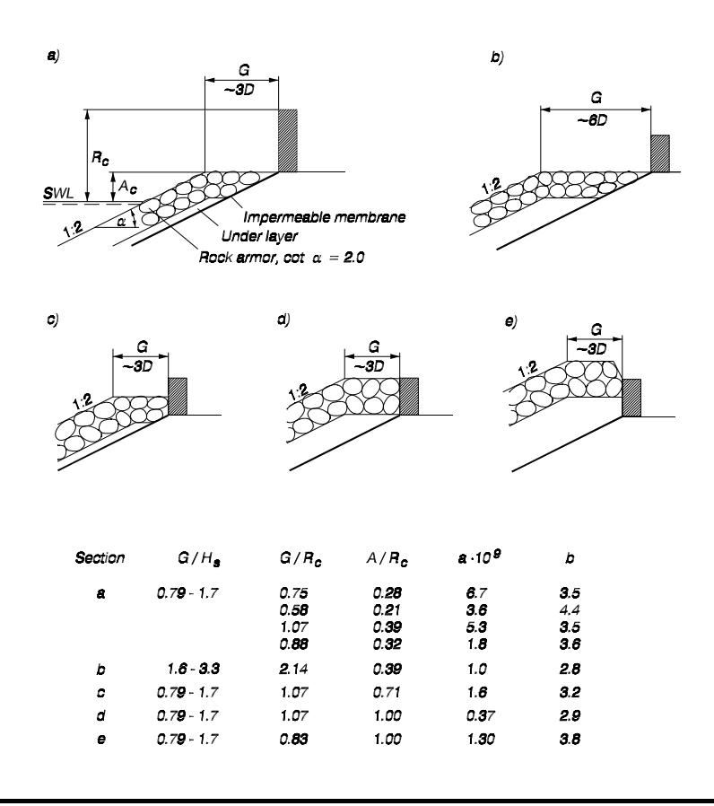

*Table VI-5-10*

#### Coefficients by Aminti and Franco (1988) for Overtopping Formula by Bradbury and Allsop in Table VI-5-9

Straight slope with berm in front of crown wall, Figure VI-5-14c. Rock, cube, and tetrapod armor on rather impermeable core. Only one sea state tested (JONSWAP spectrum). Non- depth limited waves. Irregular, head- on waves.
Note: "a" coefficients are shown multiplied by $10^{8}_{.}$ For example, a value of 17 in the table represents 17 ( 1 0) - 8 .

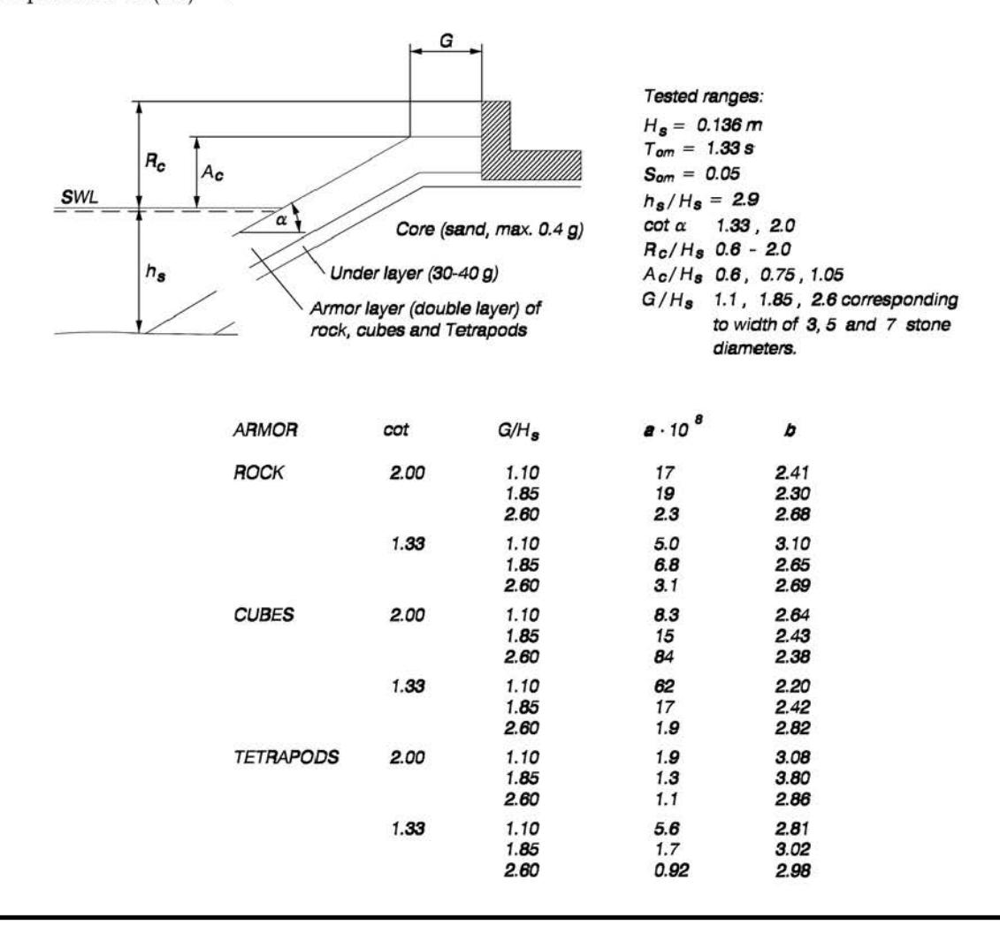

#### Table VI-5-11 Overtopping Formula by van der Meer and Janssen (1995)

Straight and bermed impermeable slopes including influence of surface roughness, shallow foreshore, oblique, and short-crested waves, Figures VI-5-14a and VI-5-14b.

```math
\xi_{op} < 2
```

```math
\frac{q}{\sqrt{gH_s^3}}\sqrt{\frac{s_{op}}{\tan\alpha}}=0.06exp\left(-5.2\frac{R_c}{H_s}\frac{\sqrt{s_{op}}}{\tan\alpha}\frac{1}{\gamma_r\gamma_b\gamma_h\gamma_\beta}\right)
```

```math
0.3 < \frac{R_c}{H_s} \cdot \frac{\sqrt{s_{op}}}{\tan \alpha} \cdot \frac{1}{\gamma_r \gamma_b \gamma_h \gamma_\beta} < 2
```

Uncertainty: Standard deviation of factor 5.2 is \sigma = 0.55 (See Figure VI-5-15).

#### \xi_{op} > 2

```math
\frac{q}{\sqrt{g H_s^3}} = 0.2 \exp\left(-2.6 \frac{R_c}{H_s} \frac{1}{\gamma_r \gamma_b \gamma_h \gamma_\beta}\right)
```

(VI - 5 - 26)
Uncertainty: Standard deviation of factor 2.6 is \sigma = 0.35 (See Figure VI-5-15).
The reduction factors references are

```math
\gamma_r
```

```math
\gamma_b
```

```math
\gamma_h
```

```math
\text{Short-crested waves}
```

```math
\gamma_{\beta} = 1 - 0.0033 \,\beta
```

The minimum value of any combination of the \gamma -factors is 0.5.

*Table VI-5-12 Overtopping Formula by Pedersen and Burcharth (1992), Pedersen (1996)*

Rock armored permeable slopes with a berm in front of a crown wall, Figure VI-5-14c. Irregular, head-on waves.

```math
\frac{qT_{om}}{L_{om}^2} = 3.2 \cdot 10^{-5} \left(\frac{H_s}{R_c}\right)^3 \frac{H_s^2}{A_c B \cot \alpha} \tag{VI-5-27}
```

Notational permeability P = 0.4.

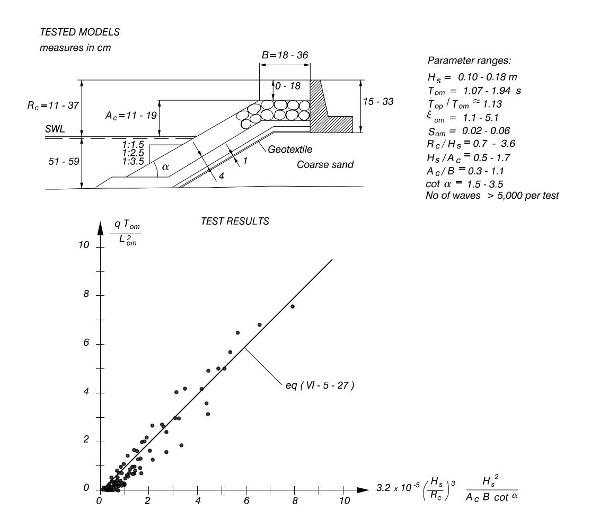

Some conservative bias of Eq VI-5-27 for small values of q is observed.

#### Table VI-5-13 Overtopping Formula by Franco and Franco (1999)

Impermeable and permeable vertical walls. Non-breaking, oblique, long- and short-crested waves.

```math
\frac{q}{\sqrt{gH_s^3}} = 0.082 \exp\left(-3.0 \frac{R_c}{H_s} \frac{1}{\gamma_\beta \gamma_s}\right)
```

Uncertainty: Standard deviation of factor 3.0 = 0.26 (see Figure VI-5-16).
Tested range:

```math
H _ { s } = 1 2 . 5 - 1 4 . 0
```

```math
H_{s} - 12.5 = s_{op} = 0.04 \quad \beta = 0^\circ \quad 60^\circ
```

```math
\beta = 0^\circ + \sigma_{op} - 0.04^\circ + \alpha_{app} - 22^\circ + \vartheta
```

```math
\sigma = \mathrm{app.} 22^\circ
```

```math
2 8 ^ { \circ }
```

```math
\sigma = \text{app. } 2z \quad a \quad R_c / H_s = 1.2 \quad b_{\mathrm{\,o\,}} / H_s = 0.35
```

```math
R_c/H_s = 1.2 \text{ and } h_s/H_s = \text{ app.} 4.4 \quad b_c/b_s = 0.21
```

```math
n_s/\Pi_s - app.\quad h_b/h_s = 0.21
```

Tested cross sections:

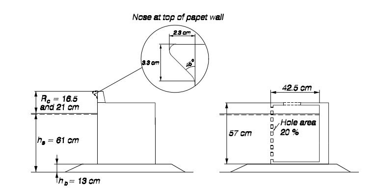

```math
\left. { \begin{array} { l } { 0 ^ { \circ } \leq \beta \leq 3 7 ^ { \circ } } \\ { \beta > 3 7 ^ { \circ } } \end{array} } \right\}
```

```math
\beta
```

```math
0^\circ \leq \beta \leq 20^\circ \quad \text{or} \quad \beta > 20^\circ
```

```math
0 . 8 3 \cos ( 2 0 ^ { \circ } - \beta )
```

```math
2 8 ^ { \circ }
```

| Front geometry | \gamma_s |
| --- | --- |
| Plain impermeable wall | 1.00 |
| Plain impermeable wall with recurved nose | 0.78 |
| Perforated front (20% hole area) and deck | 0.72 - 0.79 |
| Perforated front (20\% hole area) and open deck | 0.58 |

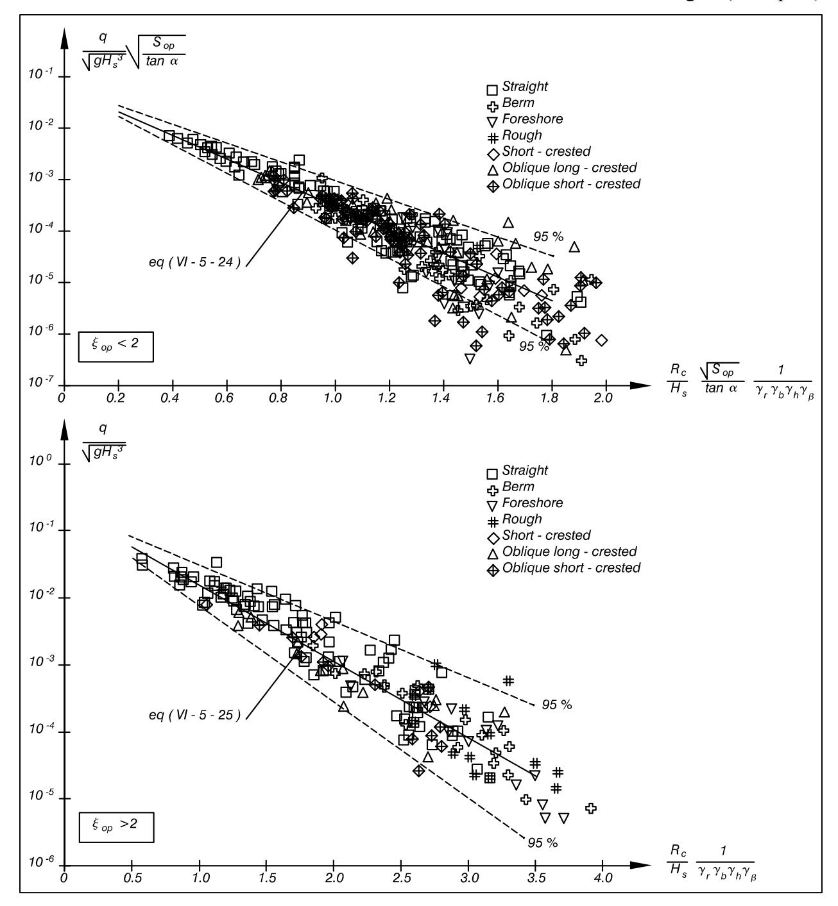

*Figure VI-5-15. Wave overtopping data as basis for Equations VI-5-24 and VI-5-25. Fitted mean and 95 percent confidence bands (van dere Meer and Janssen 1995)*

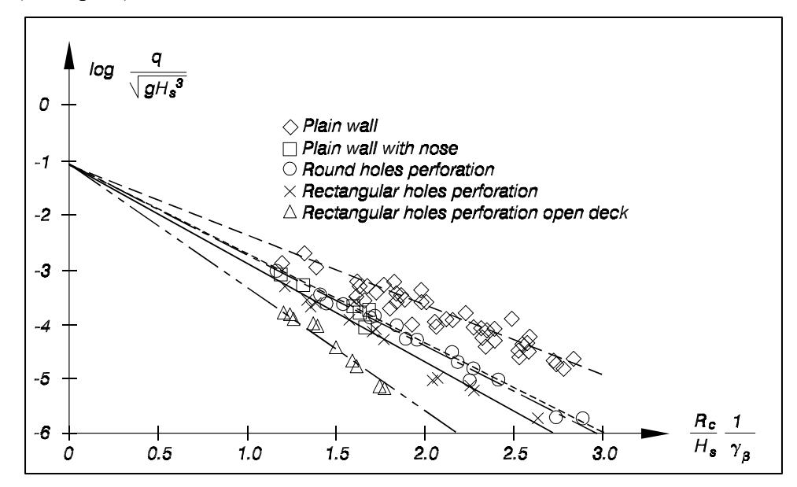

*Figure VI-5-16. Vertical wall wave overtopping data plotted with $γ_{s}$ = 1.0 (Franco and Franco 1999)*

- Figure VI-5-17 shows the same vertical wall overtopping data plotted with appropriate values of $γ_{β}$ and $γ_{s}$ from Table VI-5-13. The solid line is Equation VI-5-28.
- (3) Overtopping volumes of individual waves. The average overtopping discharge q provides no information about the discharge intensity of the individual overtopping waves. However, such information is important because most damaging impacts on persons, vehicles, and structures are caused by overtopping of large single waves. The overtopping volume per wave has been recorded in model tests and it was found that the probability distribution function for overtopping volume per wave per unit width ( V m3 /m) follows a Weibull distribution as given in Equation VI-5-30 (Franco, de Gerloni, and van der Meer 1994; van der Meer and Jansson 1995).

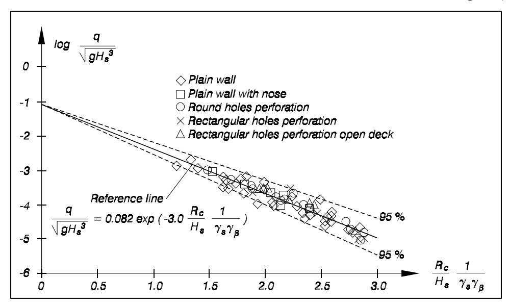

*Figure VI-5-17. Vertical wall wave overtopping data with fitted mean and 95 percent confidence bands (Franco and Franco 1999)*

```math
prob(v > V) = \exp\left[-\left(\frac{V}{B}\right)^{3/4}\right] \tag{VI-5-30}
```

```math
V = B { \left( - \ln \left[ p r o b \left( \nu > V \right) \right] \right) } ^ { 4 / 3 } \tag{VI-5-31}
```

with

```math
B = 0.84 \frac{T_m q}{P_{ow}} \tag{VI-5-32}
```

where
prob(v > V) = probability of individual wave overtopping volume per unit width, v, being larger than the specified overtopping volume per unit width, V
- T_m = average wave period (in units of seconds)
- q = average overtopping discharge per unit width (in units of m<sup>3</sup>/s per m)
- P_{ow} = probability of overtopping per incoming wave (= N_{ow} / N_w )
- N_{ow} = number of overtopping waves
- N_w = number of incoming waves
EM 1110-2-1100 (Part VI) Change 3 (28 Sep 11)
If the runup levels follow a Rayleigh distribution, the probability of overtopping per incoming wave can be estimated as

```math
P_{ow} = \exp\left[-\left(\frac{R_c}{cH_s}\right)^2\right] \tag{VI-5-33}
```

where
For sloping structure, irregular waves: c = 0.81 \, \xi_{eq} \, \gamma_{r} \, \gamma_{h} \, \gamma_{\beta} \quad \text{with a maximum of } c = 1.62 \, \gamma_{r} \, \gamma_{h} \, \gamma_{\beta} For vertical wall structure, irregular, impermeable, long-crested, nonbreaking, head-on waves: c = 0.91 (VI-5-34)
and
- R_c = structure crest height relative to swl
- H_s = significant wave height
A first estimate of the maximum overtopping volume per unit width produced by one wave out of the total number of overtopping waves can be calculated using the expression

```math
V_{\text{max}} = B(\ln N_{ow})^{4/3} \tag{VI-5-35}
```

- c. Wave reflection.
- (1) Introduction.
- (a) Coastal structures reflect some proportion of the incident wave energy. If reflection is significant, the interaction of incident and reflected waves can create an extremely confused sea with very steep waves that often are breaking. This is a difficult problem for many harbor entrance areas where steep waves can cause considerable maneuvering problems for smaller vessels. Strong reflection also increases the sea bed erosion potential in front of protective structures. Waves reflected from some coastal structures may contribute to erosion of adjacent beaches.
- (b) Non-overtopped impermeable smooth vertical walls reflect almost all the incident wave energy, whereas permeable, mild slope, rubble-mound structures absorb a significant portion of the energy. Structures that absorb wave energy are well suited for use in harbor basins.
- (c) In general incident wave energy can be partly dissipated by wave breaking, surface roughness and porous flow; partly transmitted into harbor basins due to wave overtopping and penetration; and partly reflected back to the sea, i.e.

```math
E_i = E_d + E_t + E_r \tag{VI-5-36}
```

where E_i , E_d , E_t , and E_r are incident, dissipated, transmitted, and reflected energy, respectively.
(d) Reflection can be quantified by the bulk reflection coefficient

```math
C_r = \frac{H_{sr}}{H_s} = \left(\frac{E_r}{E_i}\right)^{1/2} \tag{VI-5-37}
```

where H_s and H_{sr} are the significant wave heights of incident and reflected waves, respectively, at that position; and E_i and E_r are the related wave energies.
- (2) Reflection from non-overtopped sloping structures.
- (a) Very long waves such as infragravity and tidal waves are almost fully reflected by any type of impervious structure. Wind-generated waves generally break on slopes (see Table VI-5-1) with the type of wave breaking given as a function of the surf-similarity parameter \xi , defined by Equation VI-5-2. Wave energy dissipation by wave breaking is much greater than dissipation due to surface roughness and porous flow for conventional coastal structures. Therefore, it is relevant to relate the bulk reflection coefficient, C_r , to \xi , (Battjes 1974b; Seelig 1983).
- (b) The bulk reflection coefficient for straight non-overtopped impermeable smooth slopes and conventional rubble-mound breakwaters can be estimated from Equation VI-5-38 (Seelig 1983) given in Table VI-5-14. Figure VI-5-18 shows the fitting of the model test results by Allsop and Hettiarachichi (1988). Some scatter in the fitting can be seen.

*Table VI-5-14
Wave Reflection Coefficients for Non-Overtopped Sloping Structures
Based on Seelig (1983) Equation*

Head-on waves

```math
C_r = \frac{a\,\xi^2}{(b+\xi^2)} \qquad \qquad \xi \; = \; \frac{\tan\alpha}{\sqrt{\frac{2\pi H}{gT^2}}} \qquad \qquad (\text{VI}-5-38)
```

For irregular wave H is replaced by H_s , T is replaced either by T_p ( \xi_{op} ) or T_m ( \xi_{om} ).
Fitted coefficients in Eq VI-5-38

| Author | Structure | a | b |
| --- | --- | --- | --- |
| Seelig (1983) 2.5 \le \xi \le 6 | Impermeable, smooth, straight slopes, regular waves | 1.0 | 5.5 |
| Allsop and Hettiarachchi (1988) range of \xi or \xi_{op} shown in | Dolosse, regular waves (\xi) Slope 1:1.5, 1:2, 1:3 | 0.56 | 10.0 |
| Figure VI-5-18 | Cobs, regular waves (\xi) Slope 1:1.5, 1:2, 1:3 | 0.50 | 6.54 |
|  | Tetrapods and Stabit, irregular waves (\xi_{om}) Slope 1:1.33, 1:1.5, 1:2 | 0.48 | 9.62 |
|  | Shed and Diode, irregular waves (\xi_{om}) Slope 1:1.33, 1:1.5, 1:2 | 0.49 | 7.94 |
| Allsop (1990) 3 \le \xi_{om} \le 6 | Smooth and impermeable | 0.96 | 4.8 |
| 3 000 | 1 layer rock and stone underlayer on impermeable slope (P=1) | 0.64 | 7.22 |
|  | 2 layer rock and stone underlayer on impermeable slope (P=1) | 0.64 | 8.85 |
| Benoit and Teisson (1994) 2.7 \le \xi_{op} \le 7 | 2 layer rock armor H_s: 0.03-0.09m, T_p=1.3s, d=0.4m Slope 1:1.33, 1:1.5, 1:2 | 0.6 | 6.6 |
| Davidson, et al (1994) 8 \le \xi_{op} \le 50 | Field measurement on rock slope 1:1.1 Water depth h in meters |  |  |
|  | h > 3.25 | 0.65 | 25 |
|  | 2.5 \le h \le 3.25 | 0.60 | 35 |
|  | h < 2.5 | 0.64 | 80 |

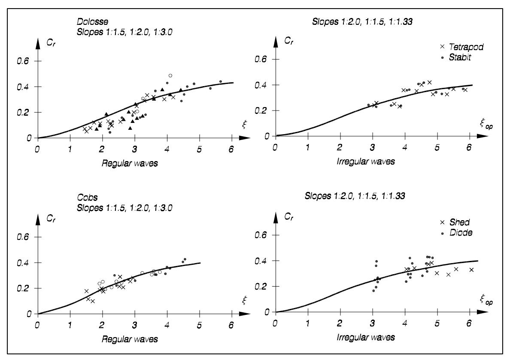

*Figure VI-5-18. Reflection coefficients for concrete armor unit slopes. Head-on waves (Allsop and Hettiarachchi 1988)*

(c) An alternative formula to Equation VI-5-38 was given by Postma (1989), who analyzed van der Meer's (1988) reflection data (see Table VI-5-4) for non-overtopped rock slopes. Postma introduced the notational permeability P (shown on Figure VI-5-11), the slope angle \alpha and the wave steepness s_{op} in the formula

```math
C_r = 0.071(P)^{-0.082} (\cot \alpha)^{-0.62} (s_{op})^{-0.46} \tag{VI-5-39}
```

- (d) The uncertainty of Equation VI-5-39 corresponds to a variational coefficient of 0.036.
- (e) The effect of a berm in a slope is generally a reduction in C_r . Figure VI-5-19 shows C_r values for a rubble-mound structure with berms of varying width at SWL (Allsop 1990). (3) Reflection from vertical walls.
- (a) Bulk reflection coefficients for plain vertical breakwaters on seabed, for plain vertical breakwaters on rubble foundation, for horizontal composite breakwaters, for sloping top caissons, for single perforated screens, and for perforated caissions are given in Figures VI-5-20, VI-5-21, VI-5-22, VI-5-23, VI-5-24, and VI-5-25, respectively. They were obtained from scaled model tests with irregular, head-on waves. The effect of oblique waves and wave shortcrestedness on plain and perforated vertical wall caissons is shown in Figure VI-5-26.

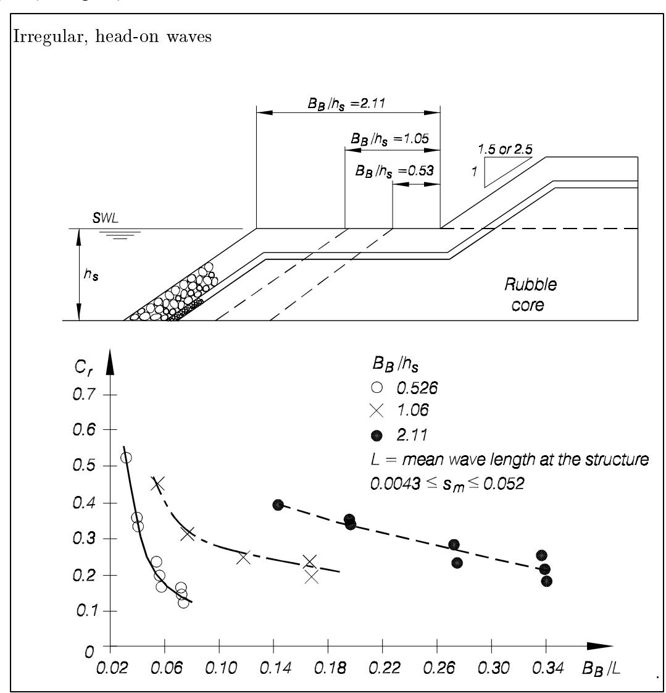

*Figure VI-5-19. Wave reflection coefficients for rock armored slope with berm at SWL (Allsop 1990)*

- (b) The influence of wave shortcrestedness and oblique wave approach on reflection from plain impermeable and perforated vertical caissions is illustrated by Figure VI -5-26.
- (4) Kinematics of reflected irregular waves.
- (a) Close to highly reflective coastal structures incident and reflected waves interact with some degree of "phase locking." This result is a partially standing wave field characterized by nodes and antinodes. For the extreme case of perfectly reflected regular waves, a standing wave field occurs with stationary nodes and antinodes. Reflecting irregular waves create a less noticeable spatial variation of partially standing nodes and antinodes that decrease in magnitude with distance from the structure.

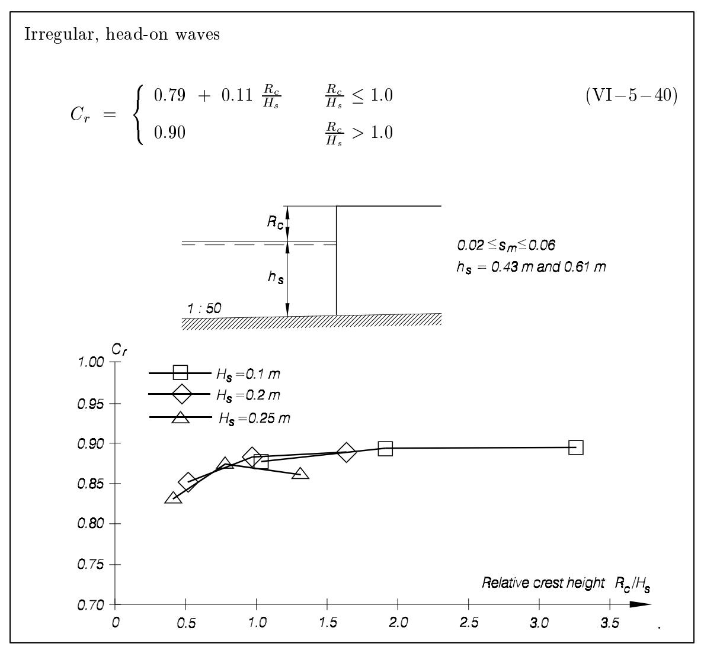

*Figure VI-5-20. Wave reflection coefficients for plain vertical breakwater on 1:50 seabed (Allsop, McBride, and Columbo 1994)*

(b) Assuming that the sea surface is comprised of a large number of linear wave trains that can be superimposed, the sea surface elevation adjacent to a reflective structure can be written as

```math
\eta = \sum_{i=1}^{\infty} a_i \sqrt{1 + C_{ri}^2 + 2C_{ri}\cos(2k_i x + \theta_i)}\cos(\sigma_i t - \varepsilon_i) \tag{VI-5-42}
```

and the horizontal component of the wave orbital velocity is given as

```math
u = \sum_{i=1}^{\infty} a_i \left( \frac{gk_i}{\sigma_i} \right) \frac{\cosh\left[k_i \left(h+z\right)\right]}{\cosh\left(k_i h\right)} \sqrt{1 + C_{ri}^2 - 2C_{ri}\cos\left(2k_i x + \theta_i\right)} \cos\left(\sigma_i t - \varepsilon_i\right) \tag{VI-5-43}
```

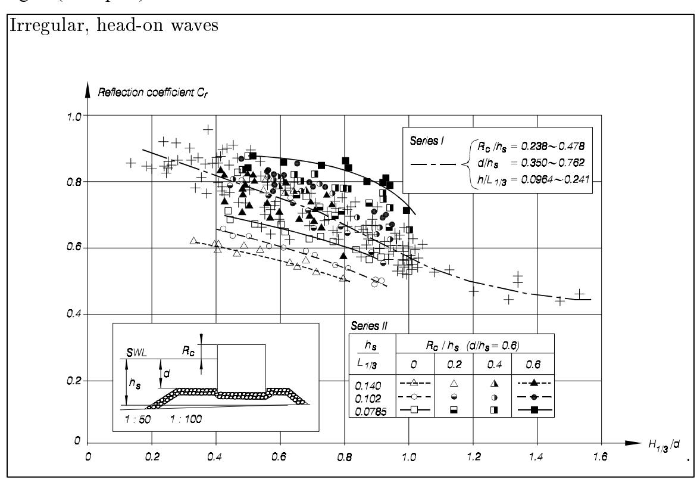

*Figure VI-5-21. Wave reflection coefficients for plain vertical breakwater on rubblemound foundation (Tanimoto, Takahashi, and Kimura 1987)*

#### where

- ai = amplitude of i th incident wave component
- ki = wave number of i th incident wave component
σ i = angular wave frequency of the i th incident wave component
- g = gravitational acceleration
- h = water depth
- x = horizontal coordinate with positive toward the structure and x =0 located at the structure toe
- z = vertical coordinate with z =0 at swl and z = -h at bottom
- Cri = reflection coefficient of i th incident wave component
θ i = reflection phase angle of i th incident wave component
ε i = random wave phase angle of i th incident wave component

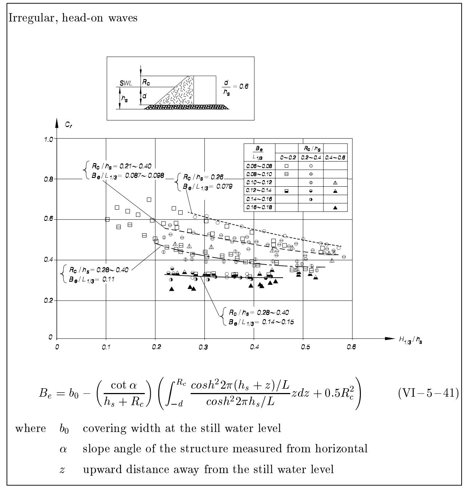

*Figure VI-5-22. Wave reflection coefficients for horizontal composite breakwaters with tetrapod slope 1:1.5 (Tanimoto, Takahashi, and Kimura 1987)*

- (c) These two equations strictly apply to the case of two-dimensional, nonbreaking, irregular waves propagating over a flat bottom and approaching normal to reflective structures. Similar expressions can be written for the case of oblique reflection of irregular, long-crested waves.
- (d) The corresponding equation for estimating the root-mean-squared sea surface elevations is (Goda and Suzuki 1976)

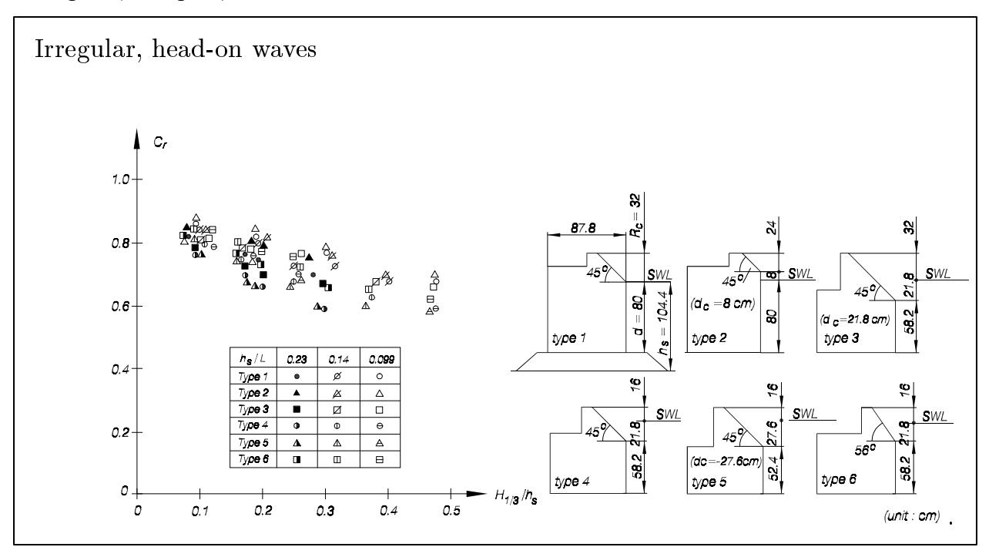

*Figure VI-5-23. Wave reflection coefficients for sloping top breakwaters (Takahashi 1996)*

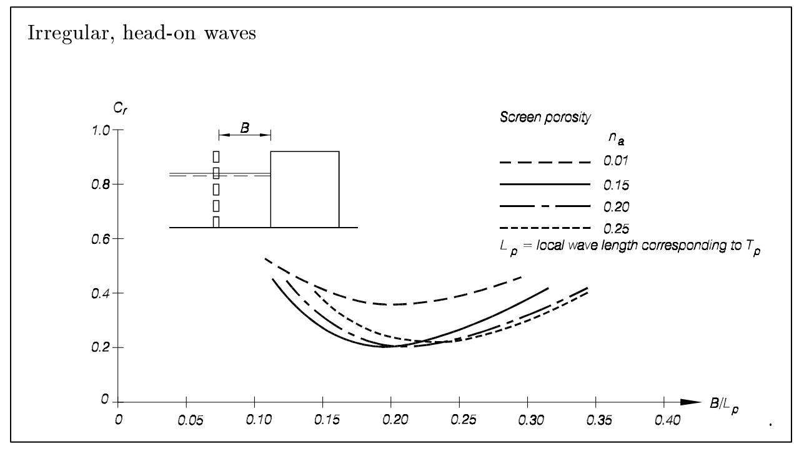

*Figure VI-5-24. Wave reflection coefficients for perforated caissions (Allsop and Hettiarachchi 1988)*

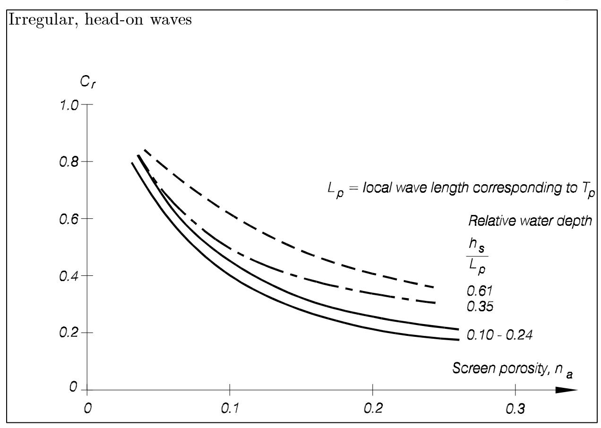

*Figure VI-5-25. Wave reflection coefficients for single perforated screen (Allsop and Hettiarachchi 1988)*

```math
\eta_{rms}^2 = \sum_{i=1}^{\infty} \left[ 1 + C_{ri}^2 + 2C_{ri} \cos(2k_i x + \theta_i) \right] \frac{a_i^2}{2} \tag{VI-5-44}
```

and the root-mean-squared horizontal wave velocity is (Hughes 1992)

```math
u_{rms}^{2} = \sum_{i=1}^{\infty} \left( \frac{gk_{i}}{\sigma_{i}} \right) \frac{\cosh^{2} \left[ k_{i} \left( h + z \right) \right]}{\cosh^{2} \left( k_{i} h \right)} \left[ 1 + C_{ri}^{2} - 2C_{ri} \cos \left( 2k_{i} x + \theta_{i} \right) \right] \frac{a_{i}^{2}}{2} \tag{VI-5-45}
```

- (e) The root-mean-squared sea surface elevations and horizontal velocities are functions of the incident wave spectrum (a_i, k_i, \sigma_i) , water depth (h), location in the water column relative to the structure toe (x, z), and the reflection coefficient (C_{ri}) and reflection phase angle (\theta_i) associated with each wave component in the incident spectrum.
- (f) For impermeable vertical walls the reflection coefficient C_{ri} is equal to unity for all wave componets and the reflection phase shift is \theta_i = 0, 2\pi, 4\pi, \dots . However, for sloping structures reflection is less than perfect, and it is necessary to estimate the reflection coefficient and phase angle as functions of wave component frequency.

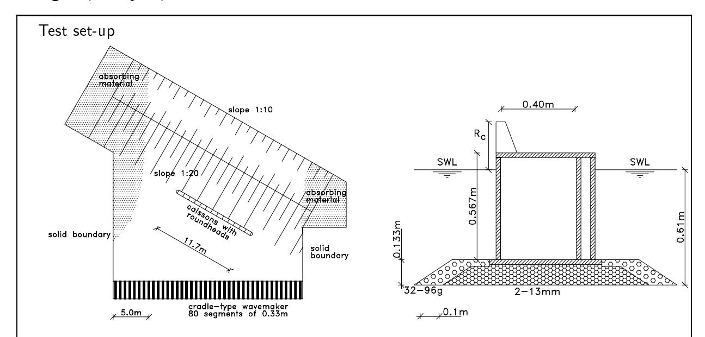

JONSWAP spectrum; H_s=14 cm, T_p=1.5 s
Gaussian spreading function; Spreading angle: 0<sup>0</sup>(long-crested), 15<sup>0</sup>, 30<sup>0</sup>
Mean incident direction: 0^0 (head-on), 10^0 , 20^0 , 40^0 , 60^0
Impermeable plain and perforated (porosity 25%, chambe width 0.4 m) vertical front

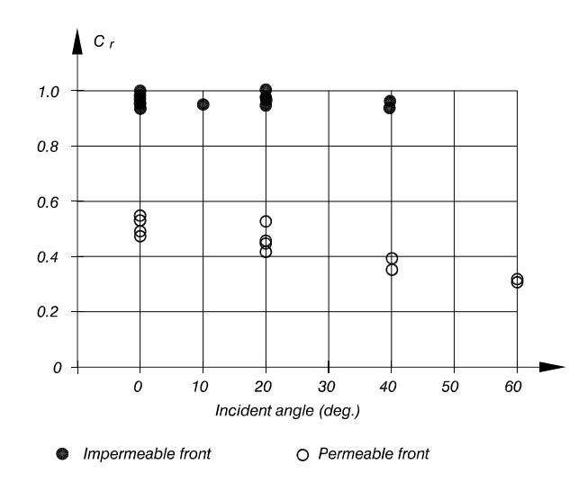

The data on the figure show that the reflection coefficients are almost independent of the wave short-crestedness within the tested range. The reflection coefficients for an impermeable plain vertical caisson are independent of wave obliquity, while it is decreasing with wave incident angle for a perforated caission.

*Figure VI-5-26. Wave reflection coefficients for impermeable and permeable vertical breakwaters exposed to oblique, nonbreaking, short-crested waves (Helm-Petersen 1998)*

(g) Empirical expressions for \theta_i and C_{ri} for sloping impermeable and rubble-mound structures have been developed based on laboratory experiments (Hughes and Fowler 1995; Sutherland and O'Donoghue 1998a; Sutherland and O'Donoghue 1998b). The reflection phase for each incident wave component can be estimated from the following expression presented by Sutherland and O'Donoghue (1998a)

```math
\theta_i = -8.84\pi\chi^{5/4} \tag{VI-5-46}
```

where

```math
\chi = \frac { \sigma _ { i } } { 2 \pi \tan \alpha } \sqrt { \frac { d _ { t } } { g } } \tag{VI-5-47}
```

and
- d_t = depth at the toe of the sloping structure
- \alpha = structure slope
The reflection coefficient for each incident wave component is estimated from recent results of Sutherland and O'Donoghue (1998b) by the empirical expressions

```math
C _ { r i } = \frac { \xi _ { \sigma } ^ { 2 . 5 8 } } { 7 . 6 4 + \xi _ { \sigma } ^ { 2 . 5 8 } } \mathrm { f o r \, s m o o t h \, i m p e r m e a b l e \, s l o p e s } \tag{VI-5-48}
```

```math
C _ { r i } = \frac { 0 . 8 2 \xi _ { \sigma } ^ { 2 } } { 2 2 . 8 5 + \xi _ { \sigma } ^ { 2 } } \mathrm { \, f o r \, r u b b l e \mathrm { - } m o u n d \ s l o p e s } \tag{VI-5-49}
```

where

```math
\xi_{\sigma} = \frac{\tan \alpha}{\sigma_i} \sqrt{\frac{2\pi g}{H_s}} \tag{VI-5-50}
```

and H_s is the significant wave height of the incident spectrum.
Figure VI-5-27 compares measured data to estimates of u_{rms} at middepth adjacent to a smooth, impermeable laboratory structure on a 1:2 slope. The estimates were made using the measured incident wave spectrum.
Sutherland and O'Donoghue (1997) showed that the two-dimensional expression for root-mean-square velocity can be extended to include the case of obliquely incident, long-crested waves.

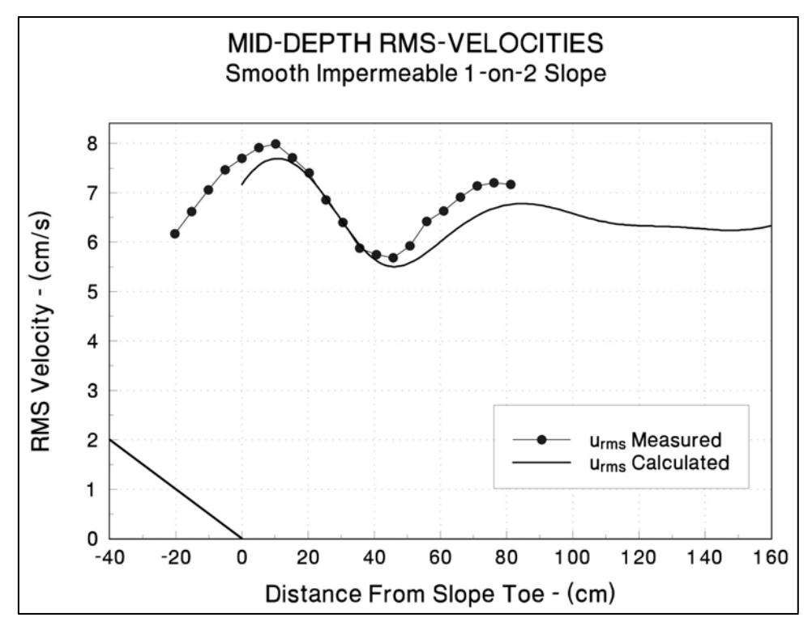

*Figure VI-5-27. Measured versus estimated u_{rms} near smooth, impermeable 1:2 slope (Hughes and Fowler 1995)*

- d. Wave transmission.
- (1) Introduction.
- (a) Wave action behind a structure can be caused by wave overtopping and also by wave penetration if the structure is permeable. Waves generated by the falling water from overtopping tend to have shorter periods than the incident waves. Generally the transmitted wave periods are about half that of the incident waves.
- (b) Wave transmission can be characterized by a transmission coefficient, C_t , defined either as the ratio of transmitted to incident characteristic wave heights (e.g., H_{st} and H_s ) or as the square root of the ratio of transmitted to incident time-averaged wave energy (e.g., E_t and E_i ) as given in Equation VI-5-51.

```math
C_t = \frac{H_{st}}{H_s} = \left(\frac{E_t}{E_i}\right)^{1/2} \tag{VI-5-51}
```

(c) Specific transmission coefficients for wave overtopping (C_{to}) and wave penetration (C_{tp}) could be defined as follows

```math
C_{to} = \frac{H_{st}^{overtop}}{H_{s}} \tag{VI-5-52}
```

```math
C_{tp} = \frac{H_{st}^{penetr.}}{H_{s}} \tag{VI-5-53}
```

- (d) However, in practice it is difficult to distinguish between H_{st}^{overtop} and H_{st}^{penetr.} , and consequently, usual practice is to calculate C_t as defined by Equation VI-5-51.
- (e) Values of C_t given in the literature are almost all from laboratory experiments, many of which were conducted at rather small scales. Some scale effects might have influenced the results, especially for the proportion of C_t related to wave penetration. (2) Wave transmission through and over sloping structures.
- (a) The total coefficient of wave transmission, C_t , for rock armored low-crested and submerged breakwaters, and reef breakwaters under irregular head-on waves are given in Figure VI-5-28 and Table VI-5-15. (b) Figure VI-5-29 shows an example of the use of Equation VI-5-54.
- (c) Breakwaters with complex types of concrete armor units, such as tetrapods or CORE-LOCS7 hereafter referred to as Core-Locs, generally have a more permeable crest than rock armored breakwaters, and this results in larger transmission coefficients.
- (d) Detached breakwaters for coastal protection are placed in very shallow water and are often built entirely of armor blocks without underlayer and core. Such breakwaters are very permeable and C_{tp} can reach 0.8 in the case of complex armor units and small wave steepnesses.
- (3) Wave transmission for vertical structures. Wave transmission for vertical breakwaters is mainly the result of wave overtopping. Therefore the ratio of the breakwater crest height ( R_c ) to the incident wave height ( H_s ) is the most important parameter. Wave transmission coefficients for plain vertical breakwaters, horizontal composite breakwaters, sloping top breakwaters and perforated walls are given in Table VI-5-16, Table VI-5-17, Figure VI-5-30, Figure VI-5-31, and Figure VI-5-32, respectively.

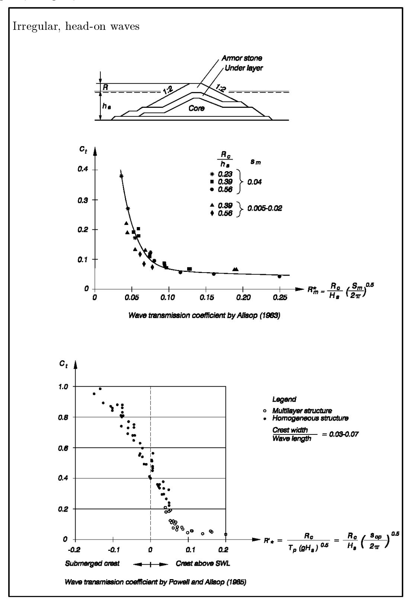

*Figure VI-5-28. Wave transmission diagram by Allsop (1983) and Powell and Allsop (1985)*

#### Table VI-5-15

## Wave Transmission Formula by van der Meer and d'Angremond (1991) for Rock Armored Low-crested, Submerged, and Reef Breakwaters

Conventional rock armored low-crested breakwaters with their crests above and below still water level, and reef breakwaters, i.e., a homogenous rock structure without filter layers and core. Irregular, head—on waves.

```math
C_t = \left( 0.031\frac{H_s}{D_{n50}} - 0.24 \right) \frac{R_c}{D_{n50}} + b
```

maximum C_t = 0.75 , minimum C_t = 0.075 conventional structure maximum C_t = 0.60 , minimum C_t = 0.15 reef type structure
where

```math
b = \begin{cases} -5.42 \, s_{op} + 0.0323 \, \frac{H_s}{D_{n50}} - 0.0017 \left(\frac{B}{D_{n50}}\right)^{1.84} + 0.51 & \text{conventional structure} \\ -2.6 \, s_{op} - 0.05 \, \frac{H_s}{D_{n50}} + 0.85 & \text{reef type structure} \end{cases}
```

H_s - significant wave height of incident waves
D_{n50} – median of nominal diameter of rocks for design conditions
R_c – freeboard, negative for submerged breakwater
B – width of the crest
s_{op} - deepwater wave steepness corresponding to peak period.
The maximum and minimum limits of C_t must be interpreted as the valid ranges of Equation VI-5-54 and not as general limits since it is obvious that C_t can exceed these limits when the crest is deeply submerged. For example when the crest is deeply submerged (R_c/D_{n50} < -6) then C_t becomes close to unity.
The formula is based on model test results of Seelig (1980), Powell and Allsop (1985), Daemrich and Kahle (1985), Ahrens (1987), van der Meer (1988) and Daemen (1991).

```math
1 < \frac{H_s}{D_{n50}} < 6 \qquad 0.01 < s_{op} < 0.05 \qquad -2 < R_c/D_{n50} < 6
```

Comparison between model test results and results calculated by Eq VI-5-54 gives a standard deviation of \sigma(C_t)=0.05 corresponding to the 90% confidence limits given by C_t\pm0.08 .

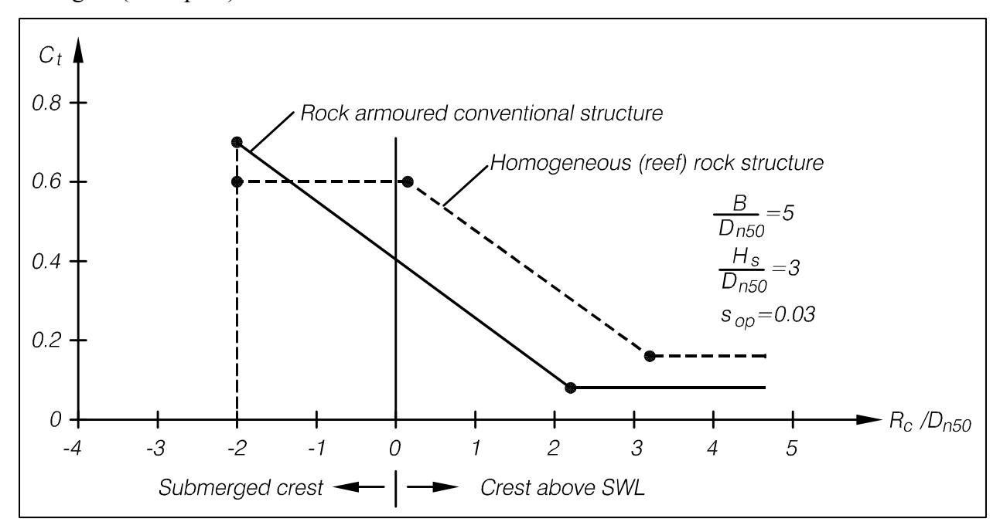

*Figure VI-5-29. Example of total wave transmission coefficients, $C_{t},$ for conventional and reef type low-crested and submerged breakwaters, calculated from the van der Meer and d'Angremond (1991) formula given by Equation VI-5-54*

*Table VI-5-16 Wave Transmission Formula by Goda (1969)*

Regular, head-on waves

```math
C_t = 
\begin{cases} 
0.25 \left(1 - \sin \left(\frac{\pi}{2\alpha}\right) \left(\frac{R_c}{H} + \beta\right)\right)^2 + 0.01 \left(1 - \frac{h_c}{h_s}\right)^2 & \text{if } \beta - \alpha < \frac{R_c}{H} < \alpha - \beta \\
0.1 \left(1 - \frac{h_c}{h_s}\right) & \text{if } \frac{R_c}{H} \geq \alpha - \beta
\end{cases}
```

\alpha = 2.2
\beta is given by the figure h_c is the vertical distance from water level to the bottom of caissons.
Formula is based on regular wave tests, but can be applied to irregular waves by using H_s for H

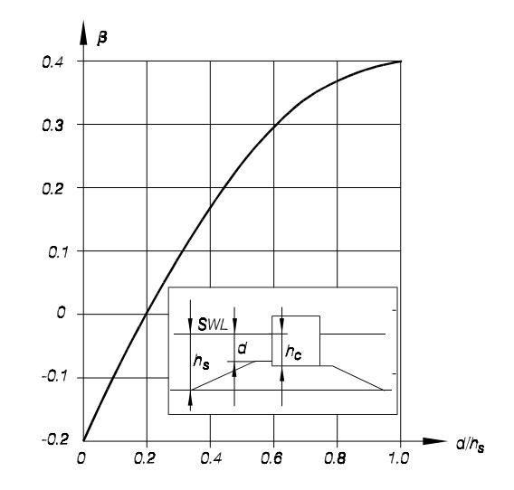

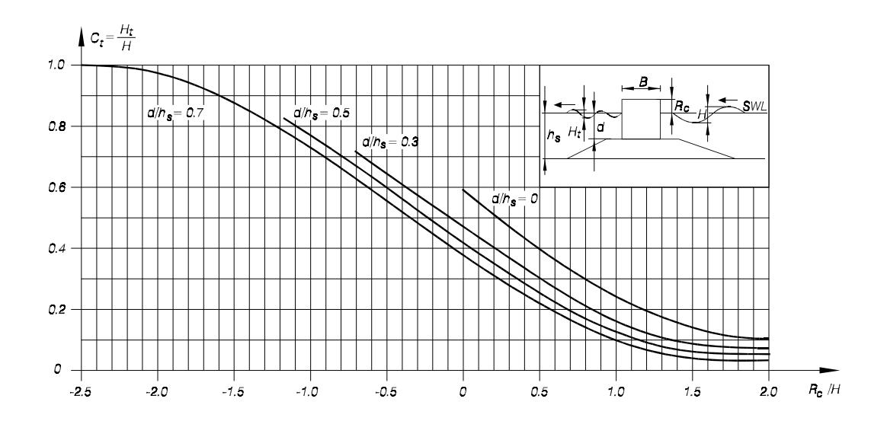

*Table VI-5-17 Wave Transmission Formula by Takahashi (1996)*

Irregular, head-on and oblique long-crested waves

```math
C_{t} = \left[0.25 \left[ \left(1 - \sin \frac{\pi}{4.4}\right) \left(\frac{R_{c}}{H_{1/3}} + \beta + \beta_{s}\right) \right]^{2} + 0.01 \left(1 - \frac{h_{c}}{h_{s}}\right)^{2} \right]^{0.5}
```

```math
\mathrm { v a l i d \, f o r \, } \beta + \beta _ { s } - 2 . 2 < \frac { R _ { c } } { H _ { 1 / 3 } } < 2 . 2 - \beta - \beta _ { s }
```

```math
C_t = 0.1\left(1 - \frac{h_c}{h_s}\right)
```

```math
{ \mathrm { v a l i d \, f o r \, } } { \frac { R _ { c } } { H _ { 1 / 3 } } } \geq 2 . 2 - \beta - \beta { \mathrm { } }
```

where

```math
\beta_s = -0.3 \left[ \left( R_c - 2 \, d_c \right) / \left( H_{1/3} \, tan \theta \right) \right]^{0.5}
```

\beta is given by the figure
d_c is the elevation of the lower edge of the sloping face relative to still-water level, i.e., positive if over SWL and negative if under SWL.
\theta is angle of wave incidence with 0^o being normal incidence

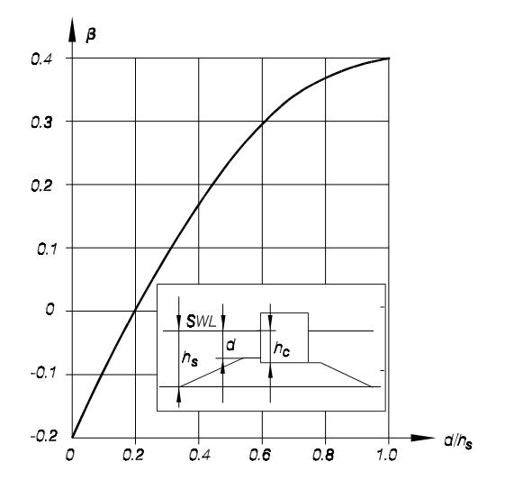

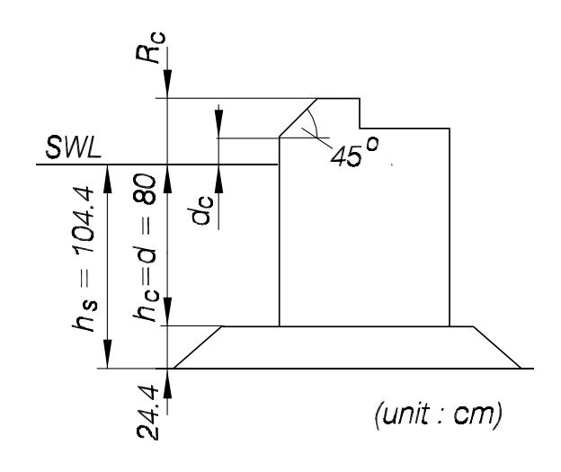

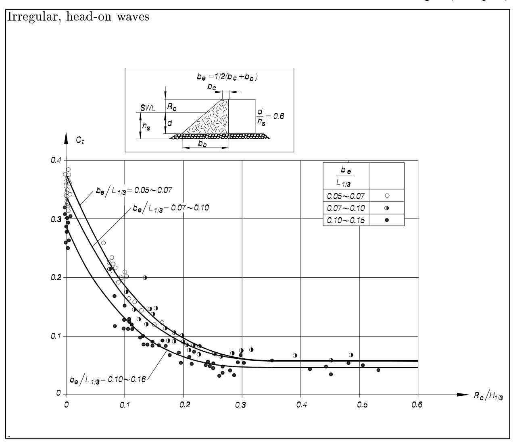

*Figure VI-5-30. Wave transmission by overtopping of horizontal composite breakwaters armored with tetrapods (Tanimoto, Takanashi, and Kimura 1987)*

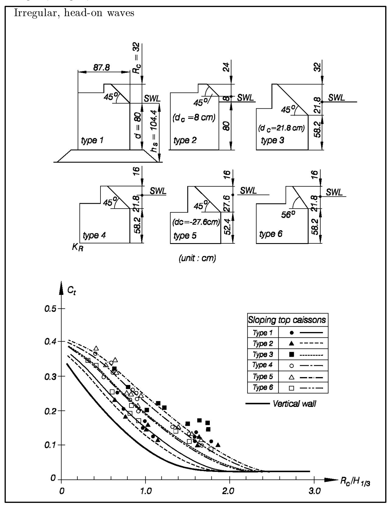

*Figure VI-5-31. Wave transmission by overtopping of sloping top structures (Takahashi and Hosoyamada 1994)*

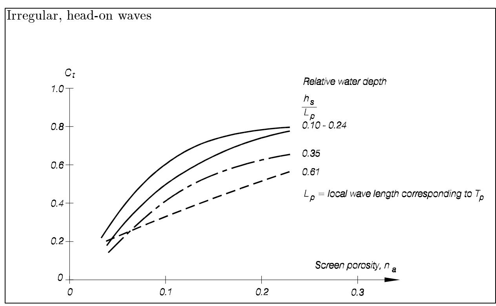

*Figure VI-5-32. Wave transmission through perforated single wall (Allsop and Hettiarachchi 1988)*

#### VI-5-3. Rubble-Mound Structure Loading and Response.

- a. Armor layer stability.
- (1) Introduction.
- (a) Wave forces acting on a rubble-mound slope can cause armor unit movement. This is called hydraulic instability. Breakage of armor units is another type of instability which is discussed in Part VI-5-3 c , "Structural integrity of concrete armor units."
- (b) Armor unit movements can be rocking, displacement of units out of the armor layer, sliding of a blanket of armor units, and settlement due to compaction of the armor layer. Figure VI-5-33 shows the most typical armor layer failure modes.
- (c) The complicated flow of waves impacting armor layers makes it impossible to calculate the flow forces acting on armor units. Moreover, the complex shape of units together with their random placement makes calculation of the reaction forces between adjacent armor units impossible. Consequently, deterministic calculations of the instantaneous armor unit stability conditions cannot be performed, which is why stability formulae are based on hydraulic model tests. The response of the armor units in terms of movements are related directly to parameters of the incident waves, while treating the actual forces as a "black box" transfer function. However, some qualitative considerations of the involved forces can be used to explore the structure of stability formulae.

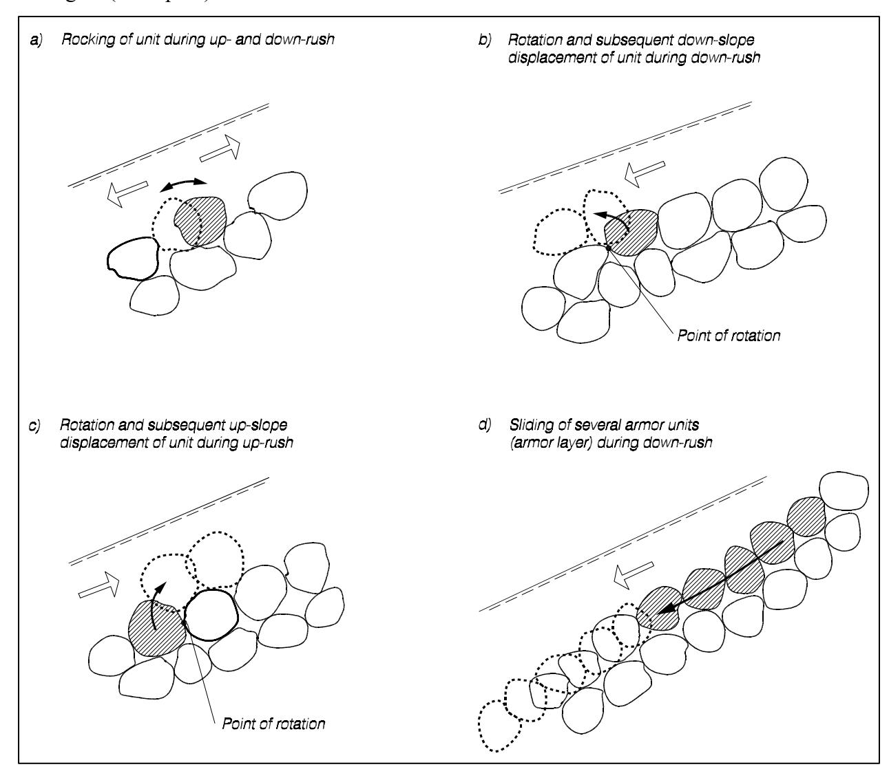

*Figure VI-5-33. Typical armor layer failure modes (Burcharth 1993)*

- (2) Stability parameters and structure of stability formulae.
- (a) The wave-generated flow forces on armor units might be expressed by a Morison equation containing a drag force F_D , a lift force F_L and an inertia force F_L . The stabilizing force is the gravitational force F_G . Assuming that at the stage of instability drag and lift force dominates the inertia force, a qualitative stability ratio can be formulated as the drag force plus the lift force divided by the gravity force

```math
\frac{F_D + F_L}{F_G} \approx \frac{\rho_w D_n^2 v^2}{g(\rho_s - \rho_w) D_n^3} = \frac{v^2}{g\Delta D_n} \tag{VI-5-57}
```

where D_n = (\text{armor unit volume})^{1/3} is the equivalent cube length, \rho_s and \rho_w are the mass densities of armor units and water, respectively, and v is a characteristic flow velocity. By inserting v.
(gH)^{1/2} for a breaking wave height of H in Equation VI-5-57 the following stability parameter, N_s , is obtained.

```math
N_s = \frac{H}{\Delta D_n} \tag{VI-5-58}
```

where \Delta = (\rho_s / \rho_w - 1) . Non-exceedence of instability, or a certain degree of damage, can then be expressed in the general form

```math
N_{s} = \frac{H}{\Delta D_{n}} \le K_{1}^{a} K_{2}^{b} K_{c}^{3} \dots \tag{VI-5-59}
```

where the factors depend on all the other parameters, except H, \Delta and D_n , influencing the stability. Table VI-5-18 gives an overview of the sea state and structural parameters influencing armor layer stability. Also given are the combined parameters including wave height-period parameters commonly used in stability formulae. Stability formulae do not contain explicitly all the parameters shown in Table VI-5-18. This together with the stochastic nature of wave load and armor response introduces uncertainty in any stability formula. This uncertainty is in most cases included in Equation VI-5-59 in the form of a Gaussian distributed stochastic variable with a specified mean value and standard deviation.
(b) Simple geometrical considerations of the balance of the forces acting on an armor stone have been used to explore the right-hand side of Equation VI-5-59. Examples are:

```math
\frac { H } { \Delta D _ { n } } { = } K \cos \alpha
```

```math
{ \frac { H } { \Delta D _ { n } } } \mathrm { = } \big ( K \cot \alpha \big ) ^ { 1 / 3 }
```

```math
\frac { H } { \Delta D _ { n } } = K \left( \tan \varphi \cos \alpha - \sin \alpha \right)
```

where \varphi is the angle of repose of the armor. The coefficient K includes some level of damage as well as all other influencing parameters not explicitly included in the formulae.
(c) For armor units of complex shape and interlocking capability it is more difficult to make simple realistic force balance models. Qualitatively the difference between interlocking and noninterlocking armor is illustrated in the graphs of Figure VI-5-34, which show the influence of slope angle on the stabilizing effects of gravitational force, interlocking and surface friction. The interlocking effect is significant only for steeper slopes. Price (1979) performed dolos armor pullout tests in the dry that indicated maximum resistance occurs at slope of \cot \alpha = 2 . As a further demonstration Burcharth and Thompson (1983) showed that dolos armor placed on a horizontal bed and exposed to oscillatory flow is not more stable than rock armor of similar weight.

# Table VI-5-18
Parameters Influencing Hydraulic Stability of Armor Layers

#### Sea state parameters

- Characteristic wave heights: H_s , H_{1/3} , H_{mo} , H_{1/10} , etc.
- Characteristic wave length: L_m , L_{om} , L_p , etc.
- Characteristic wave steepness: s_m , s_{om} , s_p , etc.
- Wave assymmetricity
- Shape of wave spectrum: JONSWAP, P-M, TMA etc. and double peak spectra.
- Wave grouping
- Water depth, h
- Wave incident angle, \beta
- Number of waves, N_z
- Mass density of water, \rho_w

#### Structural parameters

- Seaward profile of the structure, including armor layer slope angle \alpha , freeboard, etc.
- Mass density of armor units, \rho_s
- Grading of rock armor, d_{n50} , d_{n15} , d_{n85}
- Mass M and shape of armor units
- Packing density, placement pattern and layer thickness of main armor
- Porosity and permeability of underlayers, filter layer(s) and core

#### Combined parameters

```math
\Delta = \frac{\rho_s}{\rho_w} - 1,
N_s = \frac{H_s}{\Delta D_n},
N_s^* = N_s s_p^{-1/3},
H_0 T_0 = N_s T_m \sqrt{\frac{g}{D_n}},
\xi_m = \frac{\tan \alpha}{\sqrt{s_{om}}}
```

where s_p the local wave steepness
T_m mean wave period
s_{om} = \frac{2\pi H_s}{gT_m^2}

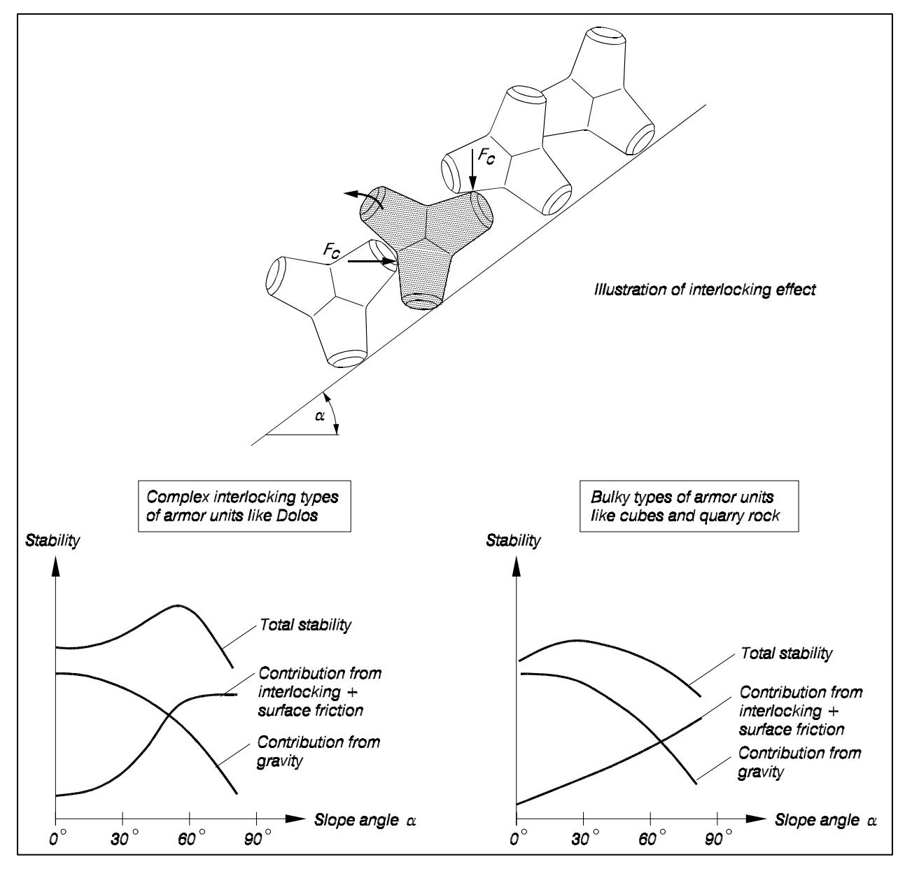

*Figure VI-5-34. Illustration of influence of slope angle on the stabilizing effects of gravitational force, interlocking and surface friction (Burcharth 1993)*

- (3) Definition of armor layer damage.
- (a) Damage to armor layers is characterized either by counting the number of displaced units or by measurement of the eroded surface profile of the armor slope. In both cases the damage is related to a specific sea state of specified duration. The counting method is based on some classification of the armor movements, for example: No movement. Single armor units rocking.
EM 1110-2-1100 (Part VI) Change 3 (28 Sep 11)
- Single armor units displaced from their original position by a certain minimum distance, for example D_n or h_a , where h_a is the length (height) of the unit
- (b) Displacements can be in terms of units being removed out of the layer or units sliding along the slope to fill in a gap. In case of steep slopes, displacements could also be sliding of the armor layer due to compaction or loss of support.
- (c) Damage in terms of displaced units is generally given as the relative displacement, D, defined as the proportion of displaced units relative to the total number of units, or preferably, to the number of units within a specific zone around swl. The reason for limiting damage to a specific zone is that otherwise it would be difficult to compare various structures because the damage would be related to different totals for each structure. Because practically all armor unit movements take place within the levels \forall H_s around swl, the number of units within this zone is sometimes used as the reference number. However, because this number changes with H_s it is recommended specifying a H_s -value corresponding to a certain damage level (as proposed by Burcharth and Liu 1992) or to use the number of units within the levels swl \forall n D_n , where n is chosen such that almost all movements take place within these levels. For example for dolosse n = 6 is used.
- (d) Damage D can be related to any definition of movements including rocking. The relative number of moving units can also be related to the total number of units within a vertical strip of width D_n stretching from the bottom to the top of the armor layer. For this strip displacement definition, van der Meer (1988) used the term N_{od} for units displaced out of the armor layer and N_{or} for rocking units. The disadvantage of N_{od} and N_{or} is the dependence of the slope (strip) length.
- (e) Damage characterization based on the eroded cross-section area A_e around swl was used by Iribarren (1938) and Hudson (1958) (Table VI-5-19). Hudson defined D as the percent erosion of original volume. Iribarren defined the limit of severe damage to occur when erosion depth in the main armor layer reached D_n .
- (f) Broderick (1983) defined a dimensionless damage parameter for riprap and rock armor given as

```math
S = \frac{A_e}{D_{n50}^2} \tag{VI-5-60}
```

which is independent of the length of the slope and takes into account vertical settlements but not settlements and sliding parallel to the slope. S can be interpreted as the number of squares with side length D_{n50} which fit into the eroded area, or as the number of cubes with side length D_{n50} eroded within a strip width D_{n50} of the armor layer. The damage parameter S is less suitable in the case of complex types of armor like dolosse and tetrapods due to the difficulty in defining surface profile. An overview of the damage parameters is given in Table VI-5-19.

# Table VI-5-19 Definition of Damage Parameters D, N_{od} and S

1) Relative displacement within an area
D \,=\, \frac{\text{number of displaced units}}{\text{total number of units within reference area}}
Displacement has to be defined, e.g., as position shifted more than distance D_n , or displacements out of the armor layer.
The reference area has to be defined, e.g., as the complete armor area, or as the area between two levels, e.g., SWL \pm H_s , where H_s corresponds to a certain damage, or SWL \pm nD_n , where \pm nD_n indicates the boundaries of armor displacements.
2) Number of displaced units within a strip with width D_n (van der Meer 1988)
N_{od} = \frac{\text{number of units displaced out of armor layer}}{\text{width of tested section } / D_n}
3) Relative number of displaced units within total height of armor layer (van der Meer 1988)
\frac{N_{od}}{N_a} , where N_a is the total number of units within a strip of horizontal width D_n
\frac{N_{od}}{N_a} = D if in D the total height of the armor layer is considered, and no sliding > D_n of units parallel to the slope surface takes place
4) Percent erosion of original volume (Hudson 1958)
D = \frac{\text{average eroded area from profile}}{\text{area of average original profile}} \ge 100\%
5) Relative eroded area (Broderick 1983)
S = A_e/D_{n50}^2

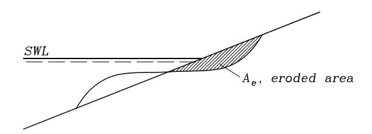

EM 1110-2-1100 (Part VI) Change 3 (28 Sep 11)
If settlements are disregarded the following relationship between N_{od} and S is valid:

```math
N_{od} = G(1-p)S \tag{VI-5-61}
```

where p is the porosity of the armor layer and G is a factor dependent on the armor layer gradation. The range of p is approximately 0.4 - 0.6 with the lowest values corresponding to rock and the highest to dolosse. G = 1 for uni-size concrete armor and 1.2 - 1.6 for stone armor. It is seen that N_{od} is roughly equal to S/2. Unfortunately Equation VI-5-61 is not generally applicable because experience shows that the relationship depends on the armor slope angle. Table VI-5-20 shows examples of relationships between N_{od} and S as determined from model tests.
- (g) A conventional damage level classification and the related values of the damage parameters D, N_{od} and S are given in Table VI-5-21. (4) Armor layer damage progression.
- (a) During the projected service life of a rubble-mound structure, damage to the armor layer may occur if design wave conditions are exceeded or the structure is exposed to repeated storms near the design conditions. Often it is not possible to mobilize and repair armor layer damage before the structure is impacted by additional severe storm waves that could worsen damage and possibly result in structure failure. A method for assessing armor layer damage progression due to multiple storms of differing wave conditions was developed by Melby and Kobayashi (1998a, 1998b) and Melby (1999). The method is based on seven long-duration physical model tests simulating various combinations of successive storms. The 1:2 sloping structure was protected with uniform armor stone (five tests) or wide-graded riprap (two tests). Irregular breaking wave conditions generally exceeding the design wave condition were used with the highest wave conditions causing moderate overtopping of the structure. Two water depths were used in the testing. The average damage as a function of time was given by Melby (1999) in terms of time domain wave parameters as

```math
\overline{S}(t) = \overline{S}(t_n) + 0.025 \frac{(N_s)_n^5}{(T_m)_n^{1/4}} (t^{1/4} - t_n^{1/4}) \qquad \text{for } t_n \le t \le t_{n+1} \tag{VI-5-62}
```

or in terms of frequency domain wave parameters

```math
\overline{S}(t) = \overline{S}(t_n) + 0.0202 \frac{\left(N_{mo}\right)_n^5}{\left(T_p\right)_n^{1/4}} \left(t^{1/4} - t_n^{1/4}\right) \quad \text{for} \quad t_n \le t \le t_{n+1} \tag{VI-5-63}
```

with

```math
\overline{S} = \frac{A_e}{D_{n50}^2}, \quad N_s = \frac{H_s}{\Delta D_{n50}}, \quad N_{mo} = \frac{H_{mo}}{\Delta D_{n50}}, \quad \Delta = \frac{\rho_a - 1}{\rho_w} \tag{VI-5-64}
```

*Table VI-5-20 Examples of Experimentally Determined Relationships Between N_{od} and S*

```math
\left\{
\begin{array}{ll}
\text{Cubes, slope 1:1.5} & N_{od} = (S - 0.4) / 1.8 \\
\text{Tetrapod, slope 1:1.5} & N_{od} = (S - 1) / 2 \\
\text{Accropode, slope 1:1.33} & N_{od} = (S - 1) / 2
\end{array}
\right.
```

Holtzhausen and Zwamborn (1991) Accropodes

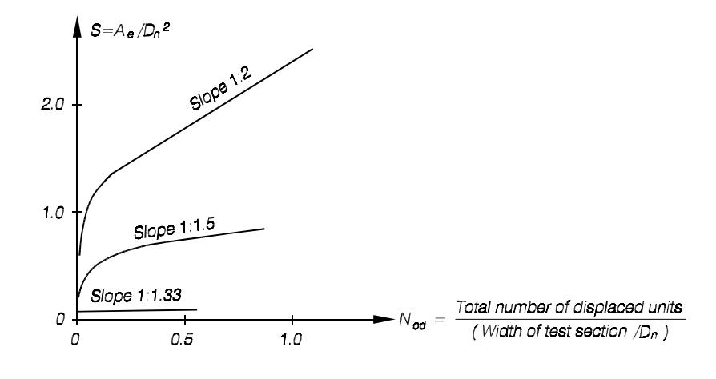

where t_n is the time at start of storm n, and t is time at end of storm n. (Time has the same units as wave period.) The wave parameters are local incident wave conditions not too far seaward of the structure toe, and the subscript n refers to those wave parameters associated with storm n. The standard deviation of average damage was given by the expression

```math
\sigma_s = 0.5\overline{S}^{0.65} \tag{VI-5-65}
```

(b) For a specified sequence of storms of given duration Equation VI-5-62 or VI-5-63 is solved with the damage result from the previous storm being the initial damage for the next storm. Reasonable sequences of wave parameters and storm durations must be estimated using probabilistic methods based on long-term wave measurements or hindcasts.

*Table VI-5-21 Damage Classification and Related Values of the Damage Parameters D, N_{od} and S*

**Table VI-5-21. Damage Classification and Related Values of the Damage Parameters D, N_{od} and S**

|  |  | Parameters D, Nod | and S | ........................................................................... | VI-5-68 |
| --- | --- | --- | --- | --- | --- |
| Table | VI-5-22. | Rock, Two-Layer 1974) | Armored Non-Overtopped ........................................................................................................ | Slopes (Hudson | VI-5-73 |
| Table | VI-5-23. | Rock, Two-Layer 1988) | Armored Non-Overtopped ........................................................................................................ | Slopes (van der Meer | VI-5-74 |
| Table | VI-5-24. | Rock, Two-Layer Crested Slopes | Armored Overtopped, | but Not Submerged, Low- .......................................................................................... | VI-5-75 |
| Table | VI-5-25. | Rock, Submerged Crest and Rear | Breakwaters with Slope (van der Meer | Two-Layer Armor on Front, 1991) .............................................. | VI-5-76 |
| Table | VI-5-26. | Rock, Two-Layer Breakwaters (Vidal | Armored Low-Crested et al. 1992) | and Submerged ............................................................... | VI-5-77 |
| Table | VI-5-27. | Rock, Low-Crested of Stone | Reef Breakwaters | Built Using Only One Class .................................................................................................... | VI-5-78 |
| Table | VI-5-28. | Rock, Rear Slope Without Superstructures | Stability of Two-Layer (Jensen 1984) | Armored Breakwaters ................................................... | VI-5-79 |

Damage level by D for two-layer armor

**Table VI-5-21. Damage Classification and Related Values of the Damage Parameters D, N_{od} and S**

|  |  | Parameters D, Nod | and S | ........................................................................... | VI-5-68 |
| --- | --- | --- | --- | --- | --- |
| Table | VI-5-22. | Rock, Two-Layer 1974) | Armored Non-Overtopped ........................................................................................................ | Slopes (Hudson | VI-5-73 |
| Table | VI-5-23. | Rock, Two-Layer 1988) | Armored Non-Overtopped ........................................................................................................ | Slopes (van der Meer | VI-5-74 |
| Table | VI-5-24. | Rock, Two-Layer Crested Slopes | Armored Overtopped, | but Not Submerged, Low- .......................................................................................... | VI-5-75 |
| Table | VI-5-25. | Rock, Submerged Crest and Rear | Breakwaters with Slope (van der Meer | Two-Layer Armor on Front, 1991) .............................................. | VI-5-76 |
| Table | VI-5-26. | Rock, Two-Layer Breakwaters (Vidal | Armored Low-Crested et al. 1992) | and Submerged ............................................................... | VI-5-77 |
| Table | VI-5-27. | Rock, Low-Crested of Stone | Reef Breakwaters | Built Using Only One Class .................................................................................................... | VI-5-78 |
| Table | VI-5-28. | Rock, Rear Slope Without Superstructures | Stability of Two-Layer (Jensen 1984) | Armored Breakwaters ................................................... | VI-5-79 |

*^{1} D is defined as percentage of eroded volume.*

Damage level by N<sub>od</sub> for two-layer armor (van der Meer 1988)

| Unit | Slope | Initial damage | Intermediate damage | Failure |
| --- | --- | --- | --- | --- |
| \mathbf{Cube} | 1:1.5 | 0 |  | 2 |
| {\rm Tetrapods} | 1:1.5 | 0 |  | 1.5 |
| Accropode | 1:1.33 | 0 |  | 0.5 |
|  |  |  |  |  |

#### Damage level by S for two-layer armor (van der Meer 1988)

| Unit | Slope | Initia| damage | Intermediate damage | Failure |
| --- | --- | --- | --- | --- |
| Rock | 1:1.5 | 2 | 3-5 | 8 |
| Rock | 1:2 | 2 | 4-6 | 8 |
| Rock | 1:3 | 2 | 6-9 | 12 |
| Rock | 1:4-1:6 | 3 | 8-12 | 17 |

*& lt;sup>2</sup> D is defined as percentage of units moved more than D_n within the following level restricted areas: For rock see definition under initial damage, for cube SWL \pm 6D_n , for Dolosse SWL \pm 6D_n , for Accropodes between levels SWL + 5D_n and -9D_n .*

*& lt;sup>3</sup> One-layer armor cover layer.*

Melby and Kobayashi also noted that average damage was related to the armor layer eroded depth, d_e , cover depth, d_c , and the upslope eroded length, l_e as defined in Figure VI-5-35.

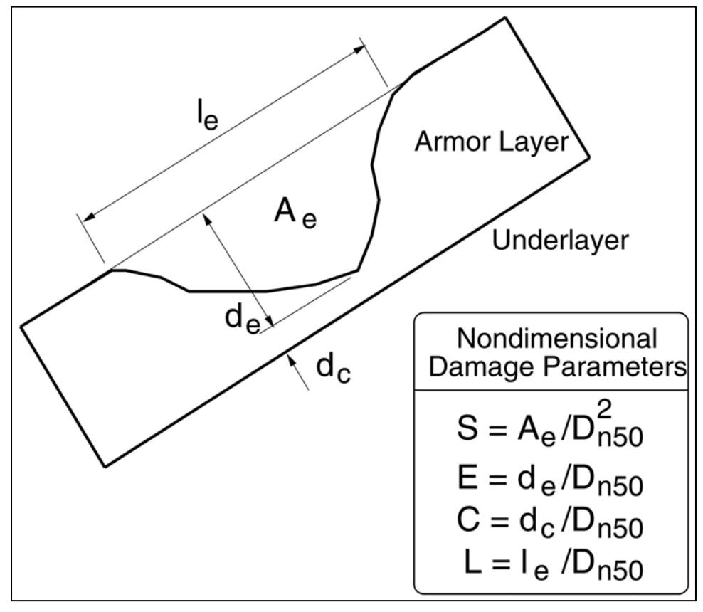

*Figure VI-5-35. Damage parameters for structure armor layer (after Melby and Kobayashi 1998b)*

In terms of the nondimensional parameters presented in Figure VI-5-35, these relationships were given as

```math
\overline{E} = 0.46\overline{S}^{0.5}, \quad \sigma_E = 0.26 - 0.000007(\overline{S}-7.8)^4, \quad \overline{C} = C_o - 0.1\overline{S}, \quad \sigma_C = \sigma_{C_o} + 0.098 - 0.002(\overline{S}-7)^2, \quad \overline{L} = 4.4\overline{S}^{0.5} \tag{VI-5-66}
```

where \sigma_e and \sigma_c are the standard deviations of the average nondimensional eroded depth and cover depth, respectively; and C_o is the zero-damage cover layer thickness.
(c) The nondimensional eroded depth in Equation VI-5-66 could be used to estimate average damage in rock armor from an observed eroded depth after a severe storm. This estimate could then be used in Equation VI-5-62 or VI-5-63 to predict damage progression from subsequent storms.
- (d) Although the previous damage progression relationships are based on a small number of laboratory experiments, they were formulated to be conservative in the estimates. The more difficult problem is to develop good realizations of storm sequences.
- (5) Practical formulae for hydraulic stability of armor layers.
- (a) Formulae for hydraulic stability of armor layers are almost exclusively based on small scale model tests. Large scale model tests for verification of small scale model test results have been performed in few cases. Adjustment of formulae due to prototype experience seems not to be reported in the literature.
- (b) Generally small scale hydraulic tests of armor layer stability are assumed to be conservative if any bias is present. Nevertheless, armor stability formulae should be applied only for conceptual design, and the uncertainty of the formulae should be considered. When the formulae do not cover the actual range of structure geometries and sea states, preliminary designs should be model tested before actual construction. Major structures should always be tested in a physical model.
- (c) Some of the factors by which armor stability formulae can be classified are as follows: Type of armor unit. Deep or shallow-water wave conditions. Armor layers crest level relative to wave runup and swl. Structures with and without superstructure.
- (d) Type of armor unit distinguishes between rock armor, for which shape and grading must be defined, and uni-size concrete armor units.
- (e) Deepwater conditions correspond to Rayleigh distributed wave height at the structure, i.e., depth-limited wave breaking does not take place. Shallow-water conditions correspond to non-Rayleigh distributed wave heights at the structure, i.e., depth limitations cause wave breaking in front of, or in the worst case, directly upon the structure.
- (f) Overtopping affects the armor stability. When the crest is lower than the runup level, wave energy can pass over the structure. Thus, the size of the front slope armor can be reduced while the size of the crest and rear slope armor must be increased compared to non-overtopped structures. With respect to armor stability it is common to distinguish between Non-overtopped or marginally overtopped structures. Low-crested structures, i.e., overtopped structures but with crest level above swl. Submerged structures, i.e., the crest level is below swl.
- (g) This section presents armor layer stability formulae for use in designing coastal structures. These stability formulae can be used in the context of reliability based design using the partial safety factors given in the tables of Part VI-6-6, "Partial Safety Factor System for Implementing Reliability in Design." Guidance for designing structure cross sections is given in Part VI-5-3 e , "Design of Structure Cross Section," and complete design examples for specific structure types are given in Part VI-7, "Example Problems."
- Structure trunk stability. Stability formulae for front slope armor on structure trunks are presented in the following tables outlined as follows:

| Armor Unit | Non-Overtopped | Overtopped | Submerged |
| --- | --- | --- | --- |
| Rock | Tables VI-5-22/23 | Tables VI-5-24/26 | Tables VI-5-25/26 |
| Concrete cubes | Table VI-5-29 |  |  |
| Tetrapods | Table VI-5-30 |  |  |
| Dolosse | Table VI-5-31 |  |  |
| 7 ACCROPODES | Tables VI-5-32/33 |  |  |
| CORE-LOC7 | Table VI-5-34 |  |  |
| Tribars | Table VI-5-36 |  |  |

Rear side armor stability. Information on rear side armor stability is given in Table VI-5-28. A formula for stability of reef breakwater is presented in Table VI-5-27. A formula for stability of armor in front of a vertical wall is presented in Table VI-5-35. Rubble-mound structure head stability is given in Tables VI-5-37/38. Parapet walls are placed on top of rubblemound structures to reduce overtopping by deflecting the uprushing waves back into the sea. This generally reduces the front slope armor stability. A low wall behind a wide front armor berm will hardly affect the armor stability (see Figure VI-5-36a). On the other hand a high wall with a relatively deep foundation situated behind a narrow front armor berm will significantly reduce the armor stability (see Figure VI-5-36b).

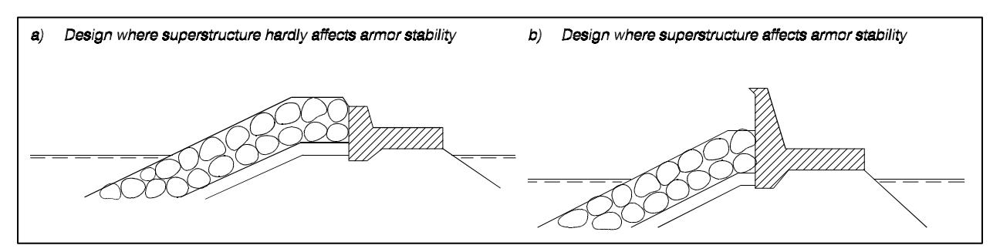

*Figure VI-5-36. Illustration of superstructure designs causing insignificant and significant reduction in front slope armor stability*

Front slope armor stability. No generally applicable formulae are available for reduction in front slope armor stability caused by parapet walls.
EM 1110-2-1100 (Part VI) Change 3 (28 Sep 11)
- (h) All of the various armor stability criteria represented by the equations and empirical coefficients in Tables VI-5-22 to VI-5-36 were developed in laboratory physical models, most often at reduced scale. Although field experience has added validation to some of these stability formulae, designers should be aware of the following limitations when applying laboratory stability results to prototype conditions.
- Some of the earlier results were obtained using monochromatic waves, whereas most of the more recent model tests used irregular waves. Numerous studies have suggested that the monochromatic wave height leading to armor instability roughly corresponds to the significant wave height of irregular waves; however, not all studies have found this correspondence. For preliminary design for nonbreaking wave conditions always use a stability formula based on irregular wave testing if possible. For breaking wave conditions monochromatic wave stability results will be conservative.
- It is generally thought that the higher waves associated with wave groups are responsible for armor layer damage. Typically irregular wave stability model tests use wave trains with assumed random phasing of the spectral components. Over the course of the testing wave groups of differing characteristics impact the structure, and the assumption is that these wave groups are representative of nature. However, it is possible that nonrandom phasing occurs in nature, particularly in shallow water (Andrews and Borgman 1981). Therefore, use of regular wave stability results will be appropriate in some cases.
- Hand-built armor layers on laboratory structures could be tighter than are armor layers typically constructed in the prototype. This leads to unconservative stability results. In particular special placement of armor in the laboratory is unlikely to be reproduced as well on the job site, especially below the water surface where placement will be much more random. For this reason it may be advisable to use stability criteria for random placement as a basis for design.
- Armor stability formulae are intended for use in preliminary design phases and for estimating material quantities. When feasible, preliminary designs should be confirmed and optimized with hydraulic model tests.

#### Table VI-5-22 Rock, Two-Layer Armored Non-Overtopped Slopes (Hudson 1974)

Irregular, head-on waves

```math
\frac{H}{\Delta D_{n50}} = (K_D \cot \alpha)^{1/3} \quad \text{or} \quad M_{50} = \frac{\rho_s H^3}{K_D \left(\frac{\rho_s}{\rho_{cr}} - 1\right)^3 \cot \alpha} \tag{VI-5-67}
```

where H Characteristic wave height (H_s \text{ or } H_{1/10})
D_{n50} Equivalent cube length of median rock M_{50} Medium mass of rocks, M_{50} = \rho_s D_{n50}^3
\rho_s Mass density of rocks \rho_w Mass density of water
\Delta (\rho_s/\rho_w) - 1 \alpha Slope angle K_D Stability coefficient
K_D -values by SPM 1977, H = H_s , for slope angles 1.5 \le \cot \alpha \le 3.0 . (Based entirely on regular wave tests.)

| Stone shape | Placement | Damage, D^4 |  |  |  |
| --- | --- | --- | --- | --- | --- |
|  |  | 0-5% | 5 10% | 10 - 15% |  |
|  |  | Breaking | Nonbreaking | Nonbreaking | Nonbreaking |
|  |  | waves 1 | waves ^2 | waves | waves |
| Smooth, rounded | Random | 2.1 | 2.4 | 3.0 | 3.6 |
| Rough angular | Random | 3.5 | 4.0 | 4.9 | 6.6 |
| Rough angular | Special 3 | 4.8 | 5.5 |  |  |

K_D -values by SPM 1984, H = H_{1/10} .

| Stone shape | Placement | Damage, D^4=0-5\% |  |
| --- | --- | --- | --- |
|  |  | Breaking $waves^{1}$ | Nonbreaking $waves^{2}$ |
| Smooth rounded | Random | 1.2 | 2.4 |
| Rough angular | Random | 2.0 | 4.0 |
| Rough angular | Special 3 | 5.8 | 7.0 |

- Breaking waves means depth-limited waves, i.e., wave breaking takes place in front of the armor slope. (Critical case for shallow-water structures.)
- No depth-limited wave breaking takes place in front of the armor slope.
- Special placement with long axis of stone placed perpendicular to the slope face.
- D is defined according to SPM 1984 as follows: The percent damage is based on the volume of armor units displaced from the breakwater zone of active armor unit removal for a specific wave height. This zone extends from the middle of the breakwater crest down the seaward face to a depth equivalent to the wave height causing zero damage below still-water level.
Shore Protection Manual (1977) When considering that H_{1/10} = 1.27H_s for Rayleigh distributed wave heights (non-depth-limited waves) it is seen that the recommendations of Shore Protection Manual (1984): Shore Protection Manual (1984) introduce a considerable safety factor compared to the practice based on Shore Protection Manual (1977).
Uncertainty of the formula: The coefficient of variation of Eq VI-5-67 is estimated to be 18% by van der Meer (1988). Melby and Mlaker (1997) reported a coefficient of variation for K_D of 25% for stone and 20% for Dolosse.

#### Table VI-5-23 Rock, Two-Layer Armored Non-Overtopped Slopes (van der Meer 1988)

Irregular, head-on waves

```math
\frac{H_s}{\Delta D_{n^{50}}} = 6.2 \cdot S^{0.2} P^{0.18} N_z^{-0.1} \xi_m^{-0.5} \qquad \text{Plunging waves}: \ \xi_m < \xi_{mc} \qquad (\text{VI}-5-68)
```

```math
\frac{H_s}{\Delta D_{n50}} = 1.0 \cdot S^{0.2} P^{-0.13} N_z^{-0.1} (\cot \alpha)^{0.5} \xi_m^P \quad \text{Surging waves: } \xi_m > \xi_{mc}
```

```math
\xi_m = s_m^{-0.5} \tan \alpha
```

where H_s Significant wave height in front of breakwater
D_{n50} Equivalent cube length of median rock
\rho_s Mass density of rocks
\rho_w Mass density of water
\Delta \qquad (\rho_s/\rho_w) - 1
S Relative eroded area (see Table VI-5-21 for nominal values)
P Notional permeability (see Figure VI-5-11)
N_z Number of waves
\alpha Slope angle
s_m Wave steepness, s_m = H_s/L_{om}
L_{om} Deepwater wavelength corresponding to mean wave period

#### Validity:

- 1) Equations VI-5-68 and VI-5-69 are valid for non-depth-limited waves. For depth-limited waves H_s is replaced by H_{2\%}/1.4 .
- 2) For \cot \alpha \geq 4.0 only Eq VI-5-68 should be used.
- 3) N_z \leq 7,500 after which number equilibrium damage is more or less reached.
- 4) 0.1 \le P \le 0.6 , 0.005 \le s_m \le 0.06 , 2.0 \ tonne/m^3 \le \rho \le 3.1 \ tonne/m^3
- 5) For the 8 tests run with depth-limited waves, breaking conditions were limited to spilling breakers which are not as damaging as plunging breakers. Therefore, Eqs VI-5-68 and VI-5-69 may not be conservative in some breaking wave conditions.
Uncertainty of the formula: The coefficient of variation on the factor 6.2 in Eq VI-5-68 and on the factor 1.0 in Eq VI-5-69 are estimated to be 6.5% and 8%, respectively.
Test program: See Table VI-5-4.

#### Table VI-5-24

#### Rock, Two-Layer Armored Overtopped, but Not Submerged, Low-crested Slopes

Powell and Allsop (1985) analyzed data by Allsop (1983) and proposed the stability formula

```math
\frac{N_{od}}{N_a} = a \exp \left[ b \, s_p^{-1/3} \, H_s / \left( \Delta \, D_{n50} \right) \right] \quad \text{or} \quad \frac{H_s}{\Delta D_{n50}} = \frac{s_p^{1/3}}{b} \ln \left( \frac{1}{a} \frac{N_{od}}{N_a} \right)
```

where values of the empirical coefficients a and b are given in the table as functions of freeboard R_c and water depth h. N_{od} and N_a are the number of units displaced out of the armor layer and the total number of armor layer units, respectively.
Values of coefficients a and b in Eq VI-5-70.

| R_c/h | a \cdot 10^{-4} |  | wave steepness H_s/L_p |
| --- | --- | --- | --- |
| 0.29 | 0.07 | 1.66 | < 0.03 |
| 0.39 | 0.18 | 1.58 | < 0.03 |
| 0.57 | 0.09 | 1.92 | < 0.03 |
| 0.38 | 0.59 | 1.07 | >0.03 |

van der Meer (1991) suggested that the van der Meer stability formulae for non-overtopped rock slope, Eqs VI-5-68 and VI-5-69, be used with f_iD_{n50} substituted for D_{n50} . The reduction factor f_i is given as

```math
f_i = \left(1.25 - 4.8 \, \frac{R_c}{H_s} \, \sqrt{\frac{s_{op}}{2\pi}}\right)^{-1} - 5 - 71)
```

where R_c is the freeboard, s_{op} = H_s/L_{op} , and L_{op} is deepwater wavelength corresponding to the peak wave period. Limits of Eq VI-5-71 are given by

```math
0 \, < \, \frac { R _ { c } } { H _ { s } } \sqrt { \frac { s _ { o p } } { 2 \pi } } \, < \, 0 . 0 5 2
```

*Table VI-5-25*

Rock, Submerged Breakwaters with Two-Layer Armor on Front, Crest and Rear Slope (van der Meer 1991)
Irregular, head-on waves

```math
\frac{h'_c}{h} = (2.1 + 0.1 \ S) \ \exp(-0.14 \ N_s^*) - 5 - 72)
```

where h Water depth
h'_c Height of structure over seabed level (h - h'_c) is the water depth over the structure crest).
S Relative eroded area
N_s^* Spectral stability number, N_s^* = \frac{H_s}{\Delta D_{n50}} s_p^{-1/3}
Uncertainty of the formula: The uncertainty of Eq VI-5-72 can be expressed by considering the factor 2.1 as a Gaussian distributed stochastic variable with mean of 2.1 and standard deviation of 0.35, i.e., a coefficient of variation of 17%.
Data source: Givler and Sorensen (1986): regular head-on waves, slope 1:1.5 van der Meer (1991): irregular head-on waves, slope 1:2

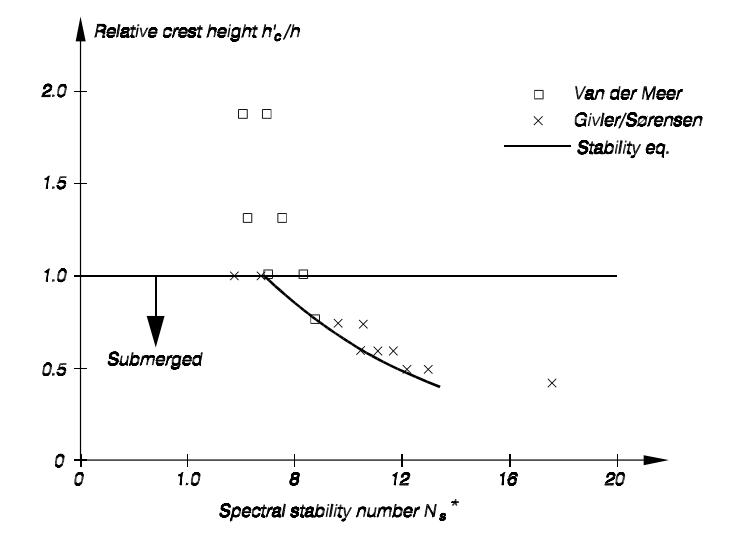

*Table VI-5-26*

Rock, Two-Layer Armored Low-Crested and Submerged Breakwaters (Vidal et al. 1992)
Tested trunk cross section

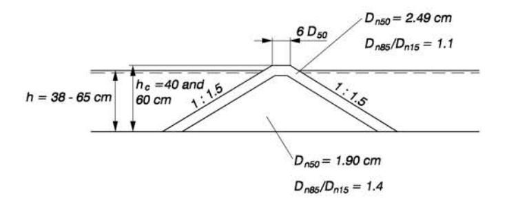

#### Tested ranges

Irregular, head-on waves
Spectral H_s =5-19 cm, T_p = 1.4 and 1.8 sec.
Free board : -5cm \leq R_c = h_c - h \leq 6 cm
Dimensionless freeboard: -2 \le R_c/D_{n50} \le 2.4
Stability corresponding to initiation of damage, S=0.5-1.5

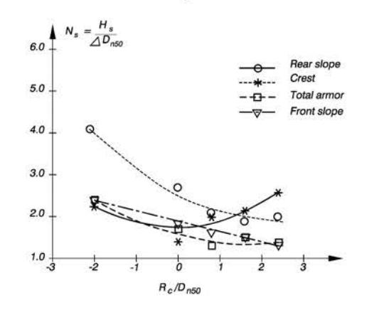

Stability corresponding to extraction of some rocks from lower layer , S{=}2.0{\text -}2.5 .

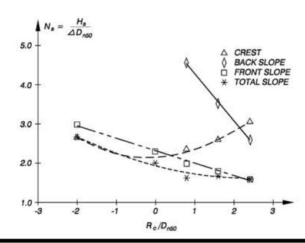

*Table VI-5-27*

#### Rock, Low-Crested Reef Breakwaters Built Using Only One Class of Stone

Irregular, head-on waves
van der Meer (1990)
Trunk cross section of reef breakwater

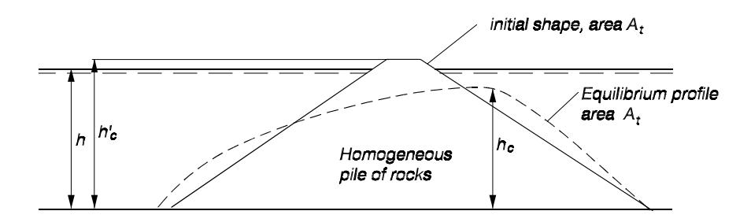

The equilibrium height of the structure

```math
h _ { c } \ = \ \sqrt { \frac { A _ { t } } { \exp \left( a N _ { s } ^ { * } \right) } } \quad \mathrm { \, w i t h \, a \, m a x i m u m \, o f \, } h _ { c } ^ { \prime } \tag{VI-5-73}
```

where A_t area of initial cross section of structure
h water depth at toe of structure
h'_c initial height of structure

```math
N_s^* = \frac{H_s}{\Delta D_{n50}} s_p^{-1/3}
```

```math
a = -0.028 + 0.045 \frac{A_t}{(h'_c)^2} + 0.034 \frac{h'_c}{h} - 6 \times 10^{-9} \frac{A_t^2}{D_{n \, 50}^4}
```

Data source: Ahrens (1987), van der Meer (1990)
Powell and Allsop (1985) analyzed data by Ahrens, Viggosson, and Zirkle (1982) and Ahrens (1984) and proposed the stability formula

```math
\frac{N_{od}}{N_a} = a \exp\left[b H_s / (\Delta D_{n50})\right] \quad \text{or} \quad \frac{H_s}{\Delta D_{n50}} = \frac{1}{b} \ln\left(\frac{1}{a} \frac{N_{od}}{N_a}\right)
```

where values of the empirical coefficients a and b are given in the table as functions of freeboard R_c and water depth h. N_{od} and N_a are the number of displaced rocks and the total number of rocks in the mound, respectively.
Values of coefficients a and b in Eq (VI-5-74).

| R_c/h | a\cdot 10^4 | b |
| --- | --- | --- |
| 0.0 | 15 | 0.31 |
| 0.2 | 17 | 0.33 |
| 0.4 | 4.8 | 0.53 |
|  |  |  |

Valid for 0.0012 < H_s/L_p < 0.036

*Table VI-5-28*

Rock, Rear Slope Stability of Two-Layer Armored Breakwaters Without Superstructures (Jensen 1984)
Irregular-
Jensen reported results from two case studies of conventional rock armored mound breakwaters with the main armor carried over the crests and the upper part of the rear slope Crest width was approximately stone diameters Although Jensen points out that the results are very pro ject dependent these results could be useful for preliminary estimates Wave steepness signicantly in uences the rear side damage

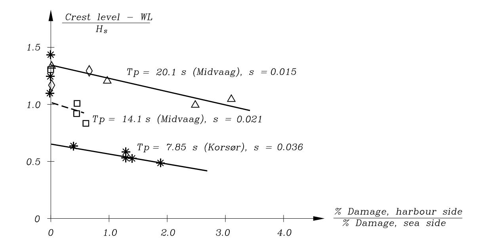

*Table VI-5-29 Concrete Cubes, Two-Layer Armored Non-Overtopped Slopes*

van der Meer (1988b)

```math
N_s = \frac{H_s}{\Delta D_n} = \left(6.7 N_{od}^{0.4} / N_z^{0.3} + 1.0\right) s_m^{-0.1} \tag{VI-5-75}
```

where H_s Significant wave height in front of breakwater
\rho_s Mass density of concrete
\rho_w Mass density of water
\Delta = (\rho_s/\rho_w) - 1
D_n Cube length
N_{od} Number of units displaced out of the armor layer within a strip width of one cube length D_n
N_z Number of waves
s_{om} Wave steepness, s_{om} = H_s/L_{om}
Valid for: Non-depth-limited wave conditions. Irregular head-on waves
Two layer cubes randomly placed on 1:1.5 slope
Surf similarity parameter range 3 < \xi_m < 6
Uncertainty of the formula: corresponds to a coefficient of variation of approximately 0.10

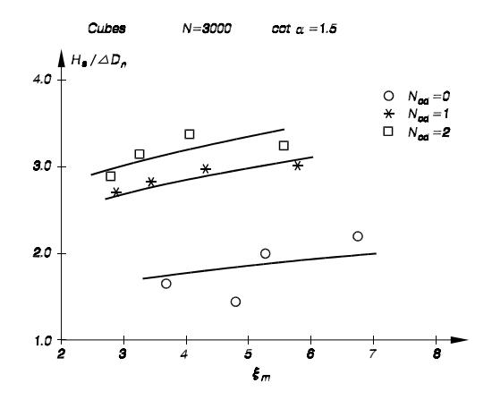

Brorsen, Burcharth, and Larsen (1974)
Brorsen, Burcharth, and Larsen gave the following average N_s and corresponding K_D -values for a two layer concrete cube armor, random placement, slope angles 1.5 \leq \cot \alpha \leq 2.0 and non-depth-limited irregular waves

| Damage level | N_s = \frac{H_s}{\Delta D_n} | K_D |  |
| --- | --- | --- | --- |
|  |  | slope 1:1.5 | slope 1:2 |
| Onset, D = 0\% Moderate, D = 4\% | 1.8 - 2.0 2.3 - 2.6 | 3.9 - 5.3 8.1 - 12 | 2.9 - 4.0 6.1 - 8.8 |

# Table VI-5-30
Tetrapods, Two-Layer Armored Non-Overtopped Slopes

van der Meer (1988b) for non-depth-limited waves

```math
N_s = \frac{H_s}{\Delta D_n} = \left(3.75 \, N_{od}^{0.5} / N_z^{0.25} + 0.85\right) \, s_{om}^{-0.2}
```

where H_s Significant wave height in front of breakwater
\rho_s Mass density of concrete
\rho_w Mass density of water
\Delta = (\rho_s/\rho_w) - 1
D_n Equivalent cube length, i.e., length of cube with the same volume as Tetrapods
N_{od} Number of units displaced out of the armor layer within a strip width of one
cube length D_n
N_z Number of waves
s_{om} Wave steepness, s_{om} = H_s/L_{om}
Valid for: Non-depth limited wave conditions, Irregular head-on waves
Two layer tetrapods on 1:1.5 slope
Surf similarity parameter range 3.5 < \xi_m < 6
Uncertainty of the formula: corresponds to a coefficient of variation of approximately 0.10

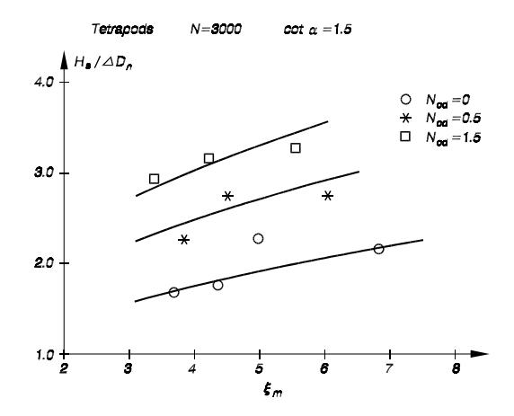

d'Angremond, van der Meer, and van Nes (1994) for depth-limited waves

```math
N _ { s } = \frac { H _ { 2 } \% } { \Delta D _ { n } } = 1 . 4 \left( 3 . 7 5 N _ { o d } ^ { 0 . 5 } / N _ { z } ^ { 0 . 2 5 } + 0 . 8 5 \right) s _ { o m } ^ { - 0 . 2 }
```

In deep water the ratio H_{2\%}/H_s = 1.4 for Rayleigh distributed waves. In shallow water this ratio decreases with decreasing relative water depth due to wave breaking.

*Table VI-5-31 Dolos, Non-Overtopped Slopes (Burcharth and Liu 1992)*

```math
N_s = \frac{H_s}{\Delta D_n} = (47 - 72r) \varphi_{n=2} D^{1/3} N_z^{-0.1} = (17 - 26r) \varphi_{n=2}^{2/3} N_{od}^{1/3} N_z^{-0.1} \tag{VI-5-78}
```

where H_s Significant wave height in front of breakwater
\rho_s Mass density of concrete
\rho_w Mass density of water
\Delta \qquad (\rho_s/\rho_w)-1
D_n Equivalent cube length, i.e., length of cube with the same volume as dolosse
r Dolos waist ratio
\varphi Packing density
Relative number of units within levels SWL \pm 6.5 Dn displaced one dolos height h, or more (e.g., for 2% displacement insert D=0.02)
N_{od} Number of displaced units within a strip width of one equivalent cube length D_n
N_z Number of waves. For N_z \ge 3000 use N_z = 3000
Valid for: Breaking and nonbreaking wave conditions
Irregular head-on waves, two layer randomly placed
dolosse with a 1:1.5 slope
0.32 < r < 0.42
0.61 < \varphi < 1
1% < D < 15%
2.49 < \xi_0 < 11.7
Slope angle: The effect of the slope angle on the hydraulic stability is not included in Eq VI-5-78. Brorsen, Burcharth, and Larsen (1974) found only a marginal influence for slopes in the range 1:1 to 1:3.
Uncertainty of the formula: corresponds to a coefficient of variation of approximately 0.22.
(continued)

#### Table VI-5-31 (Concluded)

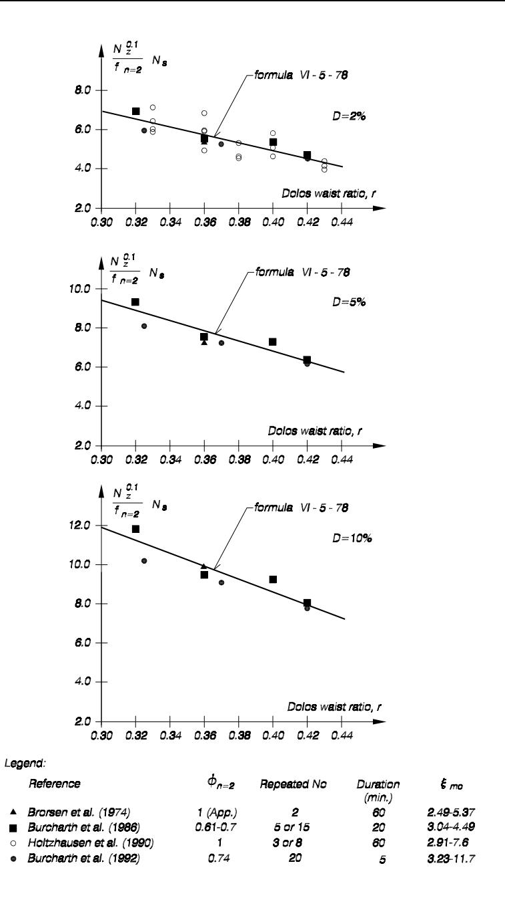

Fit of hydraulic stability formula for a two-layer randomly placed dolos armor on a slope of 1:1.5. Damage levels, D=2%, 5% and 10% displaced units within levels SWL \pm 6.5 D_n .

*Table VI-5-32 ACCROPODE 7 (van der Meer 1988b)*

```math
N_s = \frac{H_s}{\Delta D_n} = 
\begin{cases}
3.7 & \text{no damage} \\
4.1 & \text{failure}
\end{cases} \tag{VI-5-79}
```

where H_s Significant wave height in front of breakwater
\rho_s Mass density of concrete
\rho_w Mass density of water
\Delta \qquad (\rho_s/\rho_w) - 1
D_n Equivalent cube length, i.e., length of cube with the same volume as Accropode
Valid for: Irregular, head-on waves
Nonbreaking wave conditions
One layer of Accropodes on slope 1:1.33 placed in accordance with
SOGREAH recommendations
No influence of number of waves were found except after start of failure.
Uncertainty of the formula: The standard deviation of the factors 3.7 and 4.1 is approximately 0.2.

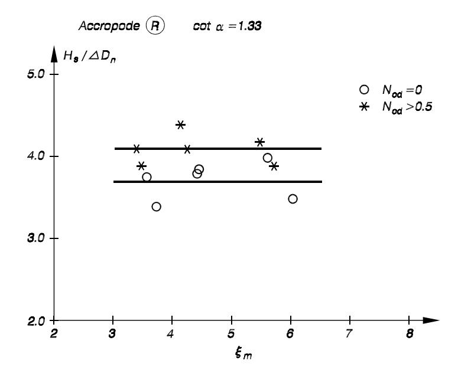

*Table VI-5-33*

#### ACCROPODE 7, Non-Overtopped or Marginally Overtopped Slopes (Burcharth et al. 1998)

```math
N_s = \frac{H_s}{\Delta D_n} = A \left( D^{0.2} + 7.70 \right) \quad \text{or} \quad D = 50 \left( \frac{H_s}{\Delta D_n} - 3.54 \right)^5 \tag{VI-5-80}
```

where H_s Significant wave height in front of breakwater
\rho_s Mass density of concrete
\rho_w Mass density of water
\Delta \qquad \left(\rho_s/\rho_w\right) - 1
D_n Equivalent cube length, i.e., length of cube with the same volume as Accropode
D Relative number of units displaced more than distance D_n
A Coefficient with mean value \mu = 0.46 and coefficient of variation \sigma/\mu = 0.02 + 0.05(1 - D)^6 , where \sigma is the standard deviation

#### Valid for: Irregular, head-on waves

Breaking and nonbreaking wave conditions
One layer of Accropodes on 1:1.33 slope placed in accordance with SOGREAH recommendations
Accropodes placed on filter layer and conventional quarry rock run
3.5 < \xi_m < 4.5 (minimum stability range, see figure)
No influence of number of waves were found except after start of failure.
Uncertainty of the formula: see figure and explanation of A.

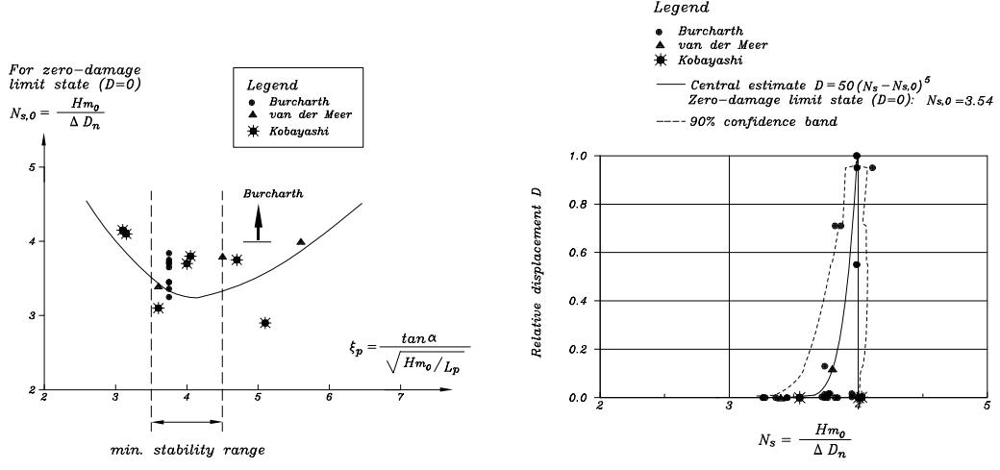

*SOGREAH recommends for preliminary design the following K_D -values to be used in Eq VI-5-67.*

```math
K_D = \begin{cases} 15 & \text{Nonbreaking waves} \\ 12 & \text{Breaking waves} \end{cases}
```

#### Table VI-5-34

CORE-LOC 7, Non or Marginally Overtopped Slopes (Melby and Turk 1994; Turk and Melby 1997)
Irregular, head-on waves

```math
\frac{H}{\Delta D_{n50}} = (K_D \cot \alpha)^{1/3} \quad \text{or} \quad M_{50} = \frac{\rho_c H^3}{K_D (\frac{\rho_c}{\rho_w} - 1)^3 \cot \alpha} \tag{VI-5-81}
```

where H Characteristic wave height (H_s)
D_{n50} Equivalent length of cube having same mass as Core-Loc, D_{50} = (M_{50}/\rho_c)^{1/3}
M_{50} Mass of Core-Loc armor unit, \widetilde{M}_{50} = \rho_c (D_{n50})^3
\rho_c Mass density of concrete \rho_w Mass density of water
\Delta \qquad (\rho_c/\rho_w) - 1 \alpha \qquad \text{Slope angle}
K_D Stability coefficient
Trunk section stability. Melby and Turk (1994) found no reasonable ( K_D < 50 ) irregular breaking or nonbreaking wave conditions that would destabilize the layer. For an armor layer exposed to regular depth-limited plunging to collapsing waves, K_D = 16 in Equation VI-5-81 is recommended for preliminary design of all trunk sections. The recommended value of K_D is conservative, and it represents a zero-damage condition with little to no armor unit rocking. Site specific physical model tests will usually yield higher values.
Head section stability. K_D = 13 is recommended for preliminary design of head sections exposed to both breaking and nonbreaking oblique and head-on waves.

#### Stability test parameters

Model parameters M_{50} = 219 g; Depths: 36 and 61 cm; Height: 90 cm
Wave parameters 4.6 \# H_{mo} \# 36 \text{ cm}; 1.5 \# T_p \# 4.7 \text{ sec}
Structure slope, \alpha 1V:1.33H and 1V:1.5H
Surf similarity parameter 2.13 \# \xi_o \# 15.9 Relative depth 0.012 \# d/L_o \# 0.175
Wave steepness 0.001 \# H_{mo} / L_o \# breaking
Placement. Core-Locs are intended to be randomly placed in a single-unit thick layer on steep or shallow slopes. They are well suited for use in repairing existing dolos structures because they interlock well with dolosse when properly sized (length of Core-Loc central flume is 92 percent of the dolosse fluke length).

*Table VI-5-35 Tetrapods, Horizontally Composite Breakwaters (Hanzawa et al. 1996)*

```math
N_s = \frac{H_s}{\Delta D_n} = 2.32 \left( N_{od} / N_z^{0.5} \right)^{0.2} + 1.33
```

where H_s Significant wave height in front of breakwater
\rho_s Mass density of concrete
\rho_w Mass density of water
\Delta \qquad (\rho_s/\rho_w) - 1
D_n Equivalent cube length, i.e., length of cube with the same volume
as Tetrapods
N_{od} Number of units displaced out of the armor layer within a strip
width of one cube length D_n
N_z Number of waves
Test range: The formula was obtained by fitting of earlier model test results and five real project model tests
Irregular head-on waves Water depth: 0.25 - 0.50 cm
Slope: 1:1.5
Foreshore: 1:15 - 1:100
Mass of Tetrapods: 90 - 700 g
H_s : 8 - 25.9 cm; T_s : 1.74 - 2.5 s; s_{om} : 0.013 - 0.04
Uncertainty of the formula: Not given. Tanimoto, Haranaka, and Yamazaki (1985) gave the standard deviation of N_{od} equal to 0.36N_{od}^{0.5}

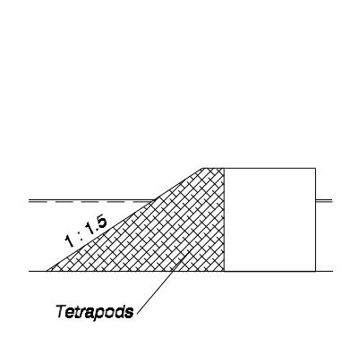

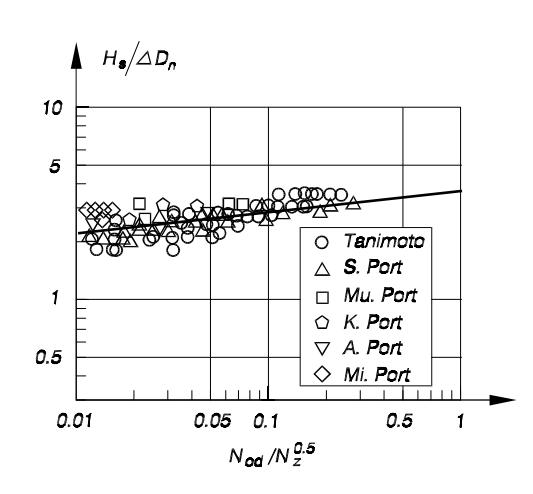

*Table VI-5-36*

Tribars, Non-Overtopped or Minor Overtopped Slopes, Random and Uniform Placement
Regular, head-on waves

```math
\frac{H}{\Delta D_{n50}} = \left(K_D \cot \alpha\right)^{1/3} \qquad \text{or} \qquad M_{50} = \frac{\rho_s H^3}{K_D \left(\frac{\rho_s}{\rho_w} - 1\right)^3 \cot \alpha} \tag{VI-5-83}
```

where H Characteristic wave height (H_s)
D_{n50} Equivalent cube length of median rock
M_{50} Median mass of stone armor unit, M_{50} = \rho_s (D_{n50})^3
\rho_s Mass density of stone \rho_w Mass density of water
\begin{array}{ll} \Delta & (\rho_s/\rho_w) - 1 \\ \alpha & \text{Slope angle} \end{array}
K_D Stability coefficient
Trunk section stability
K_D -values by Shore Protection Manual (1984), H - H_{1/10} , 0% to 5% damage

| Placement | Layers | Breaking $waves^{1}$ | Nonbreaking $waves^{2}$ | Slope angle cot α |
| --- | --- | --- | --- | --- |
| Random 2 9.0 10.0 1.5 – 3.0 |  |  |  |  |
| Pattern-placed 1 12.0 15.0 (not gi | (not given) |  |  |  |
| Depth-limited breaking with waves breaking in front of and on the armor slope. No depth-limited breaking occurs in front of the armor slope. |  |  |  |  |

• Design wave height considerations. In shallow water the most severe wave condition for design of any part of a rubble-mound structure is usually the combination of predicted water depth and extreme incident wave height and period that produces waves which would break directly on the structure. In some cases, particularly for steep foreshore wlopes, waves breaking offshore will strike directly on the structure. Goda (1985) recommended computing the design wave height a distance 5H_s from the structure toe to account for the travel distance of large breakers. A shallow-water coastal structure exposed to a variety of water depths, especially a shore-perpendicular structure such as a groin, should have wave conditions investigated for each range of water depths to determine the highest breaking wave that might impact any part of the structure. For example, a groin that normally experiences wave forces on its armor layer near the seaward end might become submerged during storm surges, and the worst breaking wave condition could occur on a more landward portion of the groin. The effect of oblique wave approach on armor layer stability has not yet been sufficiently quantified. Tests in the European Marine Science and Technology (MAST) program seemed to indicate relatively little reduction
in damage for rock armored slopes subjected to oblique wave approach angles up to 60 deg compared to waves of normal incidence (Allsop 1995). The stability of any rubble-mound structure exposed to oblique wave attack should be confirmed with physical model tests.
- (6) Structure head section stability.
- (a) Under similar wave conditions the round head of a rubble-mound structure normally sustains more extensive and more frequent damage than the structure trunk. One reason is very high cone-overflow velocities, sometimes enhanced in certain areas by wave refraction. Another reason is the reduced support from neighboring units in the direction of wave overflow on the lee side of the cone as shown in Figure VI-5-37. This figure also illustrates the position of the most critical area for armor layer instability. The toe within the same area is also vulnerable to damage in shallow-water situations, and a toe failure will often trigger failure of the armor layer see Part VI-5-6 b (2), "Scour at sloping structures."
- (b) Table VI-5-37 presents stability criteria for stone and dolos rubble-mound structure heads subjected to breaking and nonbreaking waves without overtopping, and Table VI-5-38 gives stability criteria for tetrapod and tribar concrete armor units.
- (c) The stability in the critical area of the roundhead might be improved by increasing the head diameter or adding a tail as shown in Figure VI-5-38. Besides obtaining better support from neighboring units, a reduction in wave heights by diffraction is also achieved before the waves reach the vulnerable rear side. Optimization of the slope angle and the layout geometry of cone roundheads can only be achieved by physical model tests because quantitative information on roundhead stability is limited.
- (d) The armor layer at bends and corners is generally more exposed than in straight trunk sections. A convex bend or corner will often follow the seabed contours because construction in deeper water increases costs dramatically. Refraction might then cause an increase of the wave height as illustrated in Figure VI-5-39, which in turn increases wave runup and overtopping. Moreover, in sharper convex corners and bends the lateral support by neighbor blocks is reduced as in the case of roundheads. A concave bend or corner will often be exposed to larger waves than the neighboring trunk sections due to the concentration of wave energy by oblique reflection on the slope (Figure VI-5-39). Consequently, runup and overtopping will also be increased.
- (7) Riprap armor stability.
- (a) The previous armor stability formulations are intended for fairly uniform distributions of armor stone or for uniform size concrete armor units. Riprap armor is characterized by fairly wide gradations in rock size with a large size difference between the largest and smallest stones in the distribution. Use of graded riprap cover layers is generally more applicable to revetments than to breakwaters or jetties. A limitation on the use of graded riprap is that the design wave height should be less than about 1.5 m. At higher design wave heights uniform-size armor units are usually more economical.

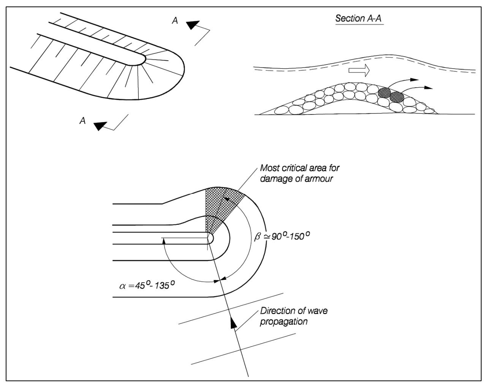

*Figure VI-5-37. Illustration of critical areas for damage to armor layers in the round head (Burcharth 1993)*

#### Table VI-5-37

#### Rock and Dolos Breakwater Head Stability, No Overtopping (Carver and Heimbaugh 1989)

Rock and dolos armor, monochromatic waves
Mostly monochromatic waves with a few irregular wave cases
Breaking and nonbreaking waves
Incident wave angles: 0^{\circ} , 45^{\circ} , 90^{\circ} , 135^{\circ} (note: 0^{\circ} is wave crests perpendicular to trunk)

```math
\frac{H}{\Delta D_{n50}} = A\xi^2 + B\xi + C_C \tag{VI-5-84}
```

where

```math
\xi = \frac{\tan \alpha}{\left(H/L\right)^{1/2}}
```

and H Characteristic wave height
D_{n50} Equivalent cube length of median rock
\rho_s Mass density of stone
\rho_w Mass density of water
\Delta \qquad (\rho_s/\rho_w) - 1
L Local wavelength at structure toe
\alpha Structure armor slope
A,B,C_c Empirical coefficients
Table of coefficients for use in Equation VI-5-84

| Armor Type | A | В | C_c | Slope | Range of \xi |
| --- | --- | --- | --- | --- | --- |
| Stone | 0.272 | -1.749 | 4.179 | 1V to 1.5H | 2.1 - 4.1 |
| Stone | 0.198 | -1.234 | 3.289 | 1V to 2.0H | 1.8 - 3.4 |
| Dolos | 0.406 | -2.800 | 6.881 | 1V to 1.5H | 2.2 - 4.4 |
| Dolos | 0.840 | -4.466 | 8.244 | 1V to 2.0H | 1.7 - 3.2 |

Notes: The curves giving the best fit to the data were lowered by two standard deviations to provide a conservative lower envelope to the stability results.
A limited number of tests using irregular waves produced corresponding results with T_p equivalent to the monochromatic period and H_{mo} equal to the monochromatic wave height.

*Table VI-5-38
Tetrapod and Tribar Breakwater Head Section Stability, No Overtopping*

Regular, head-on waves

```math
\frac{H}{\Delta D_{n50}} = (K_D \cot \alpha)^{1/3} \quad \text{or} \quad M_{50} = \frac{\rho_s H^3}{K_D \left(\frac{\rho_s}{\rho_w} - 1\right)^3 \cot \alpha} \tag{VI-5-85}
```

where H Characteristic wave height (H_s)
D_{n50} Equivalent cube length of median rock
M_{50} Median mass of stone armor unit, M_{50} = \rho_s (D_{n50})^3
\rho_s Mass density of stone \rho_w Mass density of water
\Delta (\rho_s/\rho_w) - 1 \alpha Slope angle
K_D Stability coefficient
Head Section Stability.
K_D -values by Shore Protection Manual (1984), H = H_{1/10} , 0 percent to 5 percent damage

| Armor Unit | Placement | Layers | Breaking Waves 1 | Nonbreaking Waves 2 | Slope Angle cot α |
| --- | --- | --- | --- | --- | --- |
|  |  | 5.0^{3} | 6.0 | 1.5 |  |
| Tetrapod | Ramdom | 2 | 4.5 | 5.5 | 2.0 |
|  |  |  | 3.5 | 4.0 | 3.0 |
|  |  | Random 2 | 8.3 | 9.0 | 1.5 |
| Tribar | Random | 7.8 | 8.5 | 2.0 |  |
|  |  | 6.0 | 6.5 | 3.0 |  |
| Tribar | Pattern | 1 | 7.5 | 9.5 | (not given) |

*Depth-limited breaking with waves breaking in front of and on the armor slope.*

*& lt;sup>2</sup> No depth-limited breaking occurs in front of the armor slope.*

*^{3} K_{D} values shown in italics are unsupported by tests results and are provided only for preliminary design purposes.*

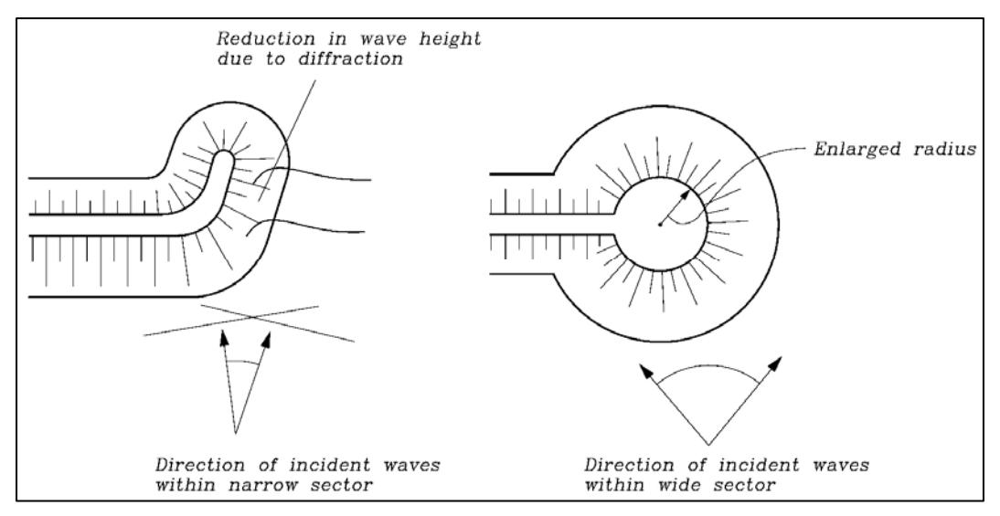

*Figure VI-5-38. Illustration of improvement of round head stability by change of geometry (Burcharth 1993)*

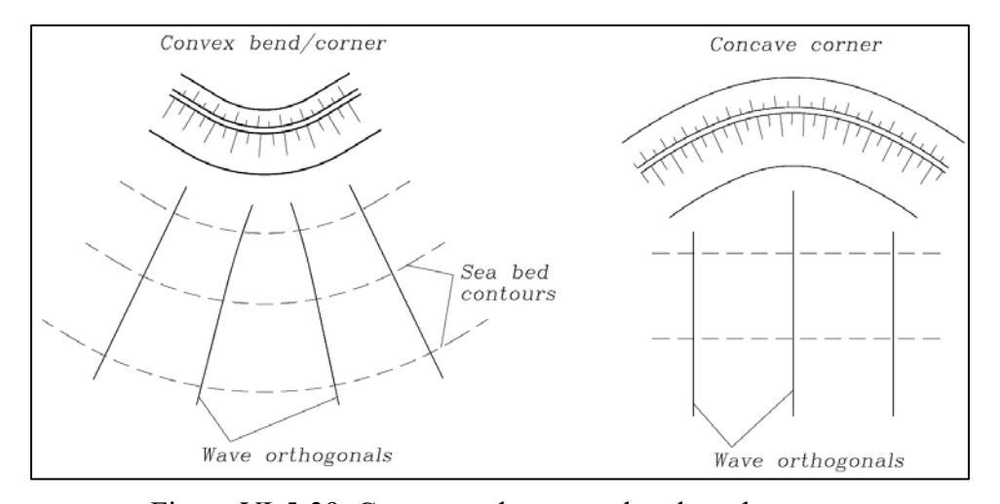

*Figure VI-5-39. Convex and concave bends and corners*

Generally, the maximum and minimum stone weights in riprap gradations should be limited to

```math
W_{\text{max}} = 4.0 W_{50} \qquad W_{\text{min}} = 0.125 W_{50}
```

where W_{50} is the median stone weight. The median stone mass for a stable riprap distribution can be determined using the Hudson equation

```math
M_{50} = \frac{\rho_r H_{10\%}^3}{K_{RR} \left(\frac{\rho_r}{\rho_w} - 1\right)^3 \cot \alpha} \tag{VI-5-86}
```

EM 1110-2-1100 (Part VI) Change 3 (28 Sep 11)
where $ρ_{r}$ is the mass density of the riprap, $K_{RR}$ is the riprap stability coefficient, and the other variables are as defined for Equation VI-5-67 in Table VI-5-22. Recommended conservative stability coefficients (0 percent to 5 percent damage) are $K_{RR}$ = 2.2 for breaking waves and $K_{RR}$ = 2.5 for nonbreaking waves (Ahrens 1981b). Melby and Kobayashi (1998b) showed that deterioration of riprap and uniform armor with equivalent median stone weights was similar. Therefore, Equation VI-5-62 through VI-5-66 could be used to estimate damage progression for both narrow gradations and riprap. The van der Meer (1988) equation (see Table VI-5-23) can also be used to design riprap armor.
- (b) An examination of riprap field performance at 14 different dams across the La Grande Hydroelectic complex in Quebec, Canada, generally confirmed the validity of Equation VI-5-86 (Belfadhel, Lefebvre, and Rohan 1996; also see discussion of this paper by van der Meer 1997). Design of riprap armor layer cross sections is covered in Part VI-5-3e, "Design of structure cross section." A complete design example for a riprap armored slope is included in Part VI-7, "Example Problems."
- b. Granulated filters and geotextile filter stability. In coastal engineering, filter layers are defined as layers that protect the underlying base material or soil from erosion by waves and currents without excessive buildup of pore pressure in the underlying material. Filter functions can be achieved using either one or more layers of granulated material such as gravel or small stone of various grain sizes, geotextile fabric, or a combination of geotextile overlaid with granulated material. This section covers the function and design of granulated filters. Design criteria for geotextile filter cloth used in filter application are given in Part VI-4-7, "Geotextiles and Plastics." Design of rubble-mound structure underlayers is covered in Part VI-5-3 e , "Design of structure cross section."
- (1) Filter layer functions. Filter layers are designed to achieve one or more of the following objectives in coastal structures. They can prevent the migration of underlying sand or soil particles through the filter layer voids into the overlying rubble-mound structure layers. Leeching of base material could be caused by turbulent flow within the structure or by excessive pore pressures that can wash out fine particles. Without a filter layer, foundation or underlayer material would be lost and the stones in the structure layer over the filter would sink into the void resulting in differential settlement and decreased structure crest elevation.
Filter layers can aid in the distribution of structure weight. A bedding filter layer helps to distribute the structure's weight over the underlying base material to provide more uniform settlement. A levelled bedding layer also ensures a more uniform baseplate load on caisson structures.
Filter layers can also reduce the hydrodynamic loads on a structure's outer stone layers. A granular filter layer can help dissipate flow energy whereas a geotextile filter will not be as effective in this regard.
(a) Granulated filters are commonly used as a bedding layer on which a coastal structure rests, or in construction of revetments where the filter layer protects the underlying embankment. Filter layers are also needed in rubble-mound structures having cores composed of fine materials like sand or gravel. Stone blankets (used to prevent erosion due to waves and currents) also
reduce leeching of the underlying sand or soil, but in this situation stability of the stone blanket material in waves and currents is an important design concern. Design of stone blankets is covered in Part VI-5-3 f , "Blanket stability in current fields."
- (b) It is advisable to place coastal structures on a bedding layer (along with adequate toe protection) to prevent or reduce undermining and settlement. When rubble structures are founded on cohesionless soil, especially sand, a filter blanket should be provided to prevent differential wave pressures, currents, and groundwater flow from creating an unstable foundation condition through removal of particles. Even when a filter blanket is not needed, bedding layers may be used to prevent erosion during construction, to distribute structure weight, or to retain and protect a geotextile filter cloth. Bedding layers are not necessary where depths are greater than about three times the maximum wave height, where the anticipated bottom current velocities are below the incipient motion level for the average-size bed material, or where the foundation is a hard, durable material such as bedrock.
- (c) In some situations granular filters have several advantages over geotextile filters in coastal construction (Permanent International Association of Navigation Congresses (PIANC) 1992). The filter elements (stone, gravel, sand, etc.) are usually very durable.
- Granular filters provide a good contact interface between the filter and base material below and between the filter and overlying layers. This is important for sloping structures.
- Granular bedding layers can help smooth bottom irregularities and thus provide a more uniform construction base. The porosity of granular filters help damp wave energy.
- Self-weight of the filter layer contributes to its stability when exposed to waves and currents during construction whereas geotextiles may have to be weighted under similar conditions.
- The loose nature of the filter elements allows the filter to better withstand impacts when larger stones are placed on the filter layer during construction or the stones shift during settlement.
- Granular filter layers are relatively easy to repair, and in some instances may be self-healing. Filter materials are widely available and inexpensive.
- (d) The major disadvantage of granular filters is the difficulty of assuring uniform construction underwater to obtain the required thickness of the filter layer.
- (e) Placing larger armor stone or riprap directly on geotextile filter cloth is likely to puncture the fabric either during placement or later during armor settlement. Placing a granular
EM 1110-2-1100 (Part VI) Change 3 (28 Sep 11)
filter layer over the geotextile fabric protects it from damage. In this application there is more flexibility in specifying the filter stone gradation because the geotextile is retaining the underlying soil.
- (2) Granulated filter failure modes. Granular filter layers fail their intended function when:
- (a) The base layer is eroded through the filter layer. Erosion can occur either by outgoing flow washing out particles perpendicular to the base/filter interface or by wave- and current-induced external flows parallel to the interface.
- (b) The filter layer becomes internally unstable. Instability occurs in filters having a very wide gradation when the finer fraction of the filter grain-size distribution is flushed out of the layer between the coarser material. This could result in compaction of the filter layer, differential settlement of the overlayers, and gradual increase in layer permeability.
- (c) The interface between adjacent granular layers becomes unstable, and lateral shearing motion occurs between layers constructed on a slope.
- (d) The filter layer fails to protect the underlying geotextile fabric from punctures and loss of soil through the filter cloth. (3) Granulated filter design criteria.
- (a) Design criteria for granular filters were originally based on the geometry of voids between packed, uniform spheres. Allowances for grain-size distributions (and many successful field applications) led to the following established geometric filter design criteria. (Design guidance for exposed filter layers must also consider instability due to flow as discussed in Part VI-5-3f, "Blanket stability in current fields."
- Retention criterion. To prevent loss of the foundation or core material by leeching through the filter layer, the grain-size diameter exceeded by 85 percent of the filter material should be less than approximately four or five times the grain-size diameter exceeded by the coarsest 15 percent of the foundation or underlying material, i.e.,

```math
\frac{d_{15(\text{filter})}}{d_{85(\text{foundation})}} < (4 \text{ to } 5) \tag{VI-5-87}
```

The coarser particles of the foundation or base material are trapped in the voids of the filter layer, thus forming a barrier for the smaller sized fraction of the foundation material. The same criterion can be used to size successive layers in multilayer filters that might be needed when there is a large disparity between void sizes in the overlayer and particle sizes in the material under the filter. Filter layers overlying coarse material like quarry spall and subject to intense dynamic forces should be designed similar to a rubble-mound structure underlayer with

```math
\frac{W_{50(\text{filter})}}{W_{50(\text{foundation})}} < (15 \text{ to } 20) \tag{VI-5-88}
```

• Permeability criterion. Adequate permeability of the filter layer is needed to reduce the hydraulic gradient across the layer. The accepted permeability criterion is

```math
\frac{d_{15(\text{filter})}}{d_{15(\text{foundation})}} > (4 \text{ to } 5) \tag{VI-5-89}
```

• Internal stability criterion. If the filter material has a wide gradation, there may be loss of finer particles causing internal instability. Internal stability requires

```math
\frac{d_{60(\text{filter})}}{d_{10(\text{filter})}} < 10 \tag{VI-5-90}
```

- Layer thickness. Filter layers constructed of coarse gravel or larger material should have a minimum thickness at least two to three times the diameter of the larger stones in the filter distribution to be effective. Smaller gravel filter layer thickness should be at least 20 cm, and sand filter layers should be at least 10 cm thick (Pilarczyk 1990). These thickness guidelines assume controlled above-water construction. In underwater placement, bedding layer thickness should be at least two to three times the size of the larger quarrystones used in the layer, but never less than 30 cm thick to ensure that bottom irregularities are completely covered. Considerations such as shallow depths, exposure during construction, construction method, and strong hydrodynamic forces may dictate thicker filters, but no general rules can be stated. For deeper water the uncertainty related to construction often demands a minimum thickness of 50 cm.
- Bedding layer over geotextile fabric. In designs where a geotextile fabric is used to meet the retention criterion, a covering layer of quarry spalls or crushed rock (10-cm minimum and 20-cm maximum) should be placed to protect against puncturing by the overlying stones. Recommended minimum bedding layer thickness in this case is 60 cm, and filtering criteria should be met between the bedding layer and overlying stone layer.
- (b) Examples of typical granular filters and bedding layers are illustrated in Lee (1972), who discussed and illustrated applications of granular and geotextile filters in coastal structures. Design of filters for block-type revetments with large holes in the cover layer can be found in the PIANC (1992) reference.
- (c) The previous geometric granular filter criteria are widely accepted in practice, and they are recommended in cases when an appreciable pressure gradient is expected perpendicular to the soil/filter interface. However, these rules may be somewhat conservative in situations without significant pressure gradients and when flow is parallel to the filter layer.
EM 1110-2-1100 (Part VI) Change 3 (28 Sep 11)
- (d) The need for reliable granular filter design guidance under steady flow and cyclic design conditions fostered research by Delft Hydraulics Laboratory in support of the Oosterschelde Storm Surge Barrier in The Netherlands. Stationary and cyclic flow both parallel to and perpendicular to the filter layer were investigated by de Graauw, van der Meulen, and van der Does de Bye (1984). They developed hydraulic filter criteria based on an expression for critical hydraulic gradient parallel to the filter/soil interface. This method assumes that erosion of base material is caused by shear stresses rather than groundwater pressure gradients; and where this is the case, the geometric filter requirements can be relaxed.
- (e) The filter design guidance of de Graauw et al. was expressed in terms of the filter $d_{15},$ base material $d_{50},$ filter porosity, and critical shear velocity of the base material; and acceptable values for the critical gradient were given by graphs for each of the flow cases. Design of a hydraulic granular filter requires good understanding of the character of flow within the filter layer, e.g., steady flow in channels. In these cases the method of de Graauw et al. (1984) can be used. More recent research aimed at improving granular filter design criteria was reported by Bakker, Verheij, and deGroot (1994).
- (4) Granulated filter construction aspects.
- (a) Granular filter construction above water creates no special problems, and accurate placement is straightforward. However, constructing a filter beneath the water surface is somewhat more problematic. If small-size filter material with a wide gradation is dropped into place, there is a risk of particle segregation by size. This risk can be decreased by using more uniform material and minimizing the drop distance. Another problem is maintaining adequate layer thickness during underwater placement. This has led to the recommended layer thickness being greater than required by the geometric filter criteria. Finally, filter or bedding layers placed underwater are exposed to eroding waves and currents until the overlayers are placed. Depending on site-specific conditions, this factor may influence the construction sequence or the time of year chosen for construction.
- (b) It is common practice to extend the bedding layer beneath rubble-mound structures at least 1.5 m beyond the toe of the cover stone to help reduce toe scour. Some low rubble-mound structures have no core, and instead are composed entirely of armor layer and underlayers. These structures should have a bedding layer that extends across the full width of the structure.
- c. Structural integrity of concrete armor units.
- (1) Introduction.
(a) Figure VI-5-40 shows examples of the wide variety of existing concrete armor units. These might be divided into the following categories related to the structural strength:
Massive or blocky (e.g., cubes including Antifer type, parallelepiped block, grooved cube
with hole)
Bulky (e.g., seabee, Core-Loc 7 , Accropode 7 , Haro 7 , dolos with large waist
ratios)
Slender (e.g., tetrapod, dolos with smaller waist ratios)
Multi-hole cubes (e.g., shed, cob)

| MASSIVE | BULKY | , | SLENDER | MULTI - HOLE |  |
| --- | --- | --- | --- | --- | --- |
| PARALLELEPIPED BLOCK | GROOVED CUBE WITH HOLE | | | ACCROPOD ® | CORE LOC (R) | | | TETRAPOD | | | | SHED | |
|  |  |  |  |  |  |
|  | GROOVED CUBE (Antifer type) | HARO ® | SEABEE | DOLOS | СОВ |
|  |  |  |  |  |  |

*Figure VI-5-40. Examples of concrete armor units*

- (b) The units are generally made of conventional unreinforced concrete except the multi-hole cubes where fiber reinforcement is sometimes used.
- (c) For slender units such as dolos with small waist ratios, various types of high-strength concrete and reinforcement (conventional rebars, prestressing, fibers, scrap iron, steel profiles) have been considered. However, reinforcement has only been used in few cases because it generally seems to be less cost-effective and because of the risk of rapid corrosion of the steel reinforcement.
- (d) Hydraulic stability of armor layers is reduced if the armor units disintegrate causing reduction of the stabilizing gravitational force and possible interlocking effects. Moreover, broken armor unit pieces might be thrown around by wave action and thereby trigger additional breakage at an increased rate. In order to prevent this, it is necessary to ensure structural integrity of the armor units.
EM 1110-2-1100 (Part VI) Change 3 (28 Sep 11)
- (e) Unreinforced concrete is a brittle material with a low tensile strength, $f_{T}$ , on the order of 2-6 MPa and a compressive strength, $f_{C}$ , which is one order of magnitude larger than $f_{T}$ . Consequently, crack formation and breakage is nearly always caused by load induced tensile stresses, $σ_{T}$ , that exceed $f_{T}$ . The magnitude of $f_{T}$ is therefore more important than $f_{C}$ in armor unit concrete, and specifications should focus on achieving adequate values of $f_{T}$ . It is important to note that $f_{T}$ decreases with repeated load due to fatigue effects.
- (f) The different categories of concrete armor units are not equally sensitive to breakage. Slender units are the most vulnerable because the limited cross-sectional areas give rise to relatively large tensile stresses. Some recent failures of breakwaters armored with tetrapods and dolosse were caused by breakage of the units into smaller pieces having less hydraulic stability than the intact armor units.
- (g) Massive units will generally have the smallest tensile stresses due to the distribution of loads over large cross-sectional areas. However, breakage can take place if the units experience impacts due to less restrictive hydraulic stability criteria and if the concrete quality is poor with a low $f_{T}$ . This latter point is related mainly to larger units where temperature differences during the hardening process can create tensile stresses which exceed the strength of the weak young concrete, thus resulting in microcracking of the material (thermal cracking). If massive units are made of good quality concrete and not damaged during handling, and if the armor layer is designed for marginal displacements, there will be no breakage problems. This statement also holds for the bulky units under the same precautions.
- (h) The different types of loads on armor units and load origins are listed in Table VI-5-39.
- (2) Structural design formulae for dolosse and tetrapods. Based on model tests with instrumented units, Burcharth (1993b), Burcharth and Liu (1995) and Burcharth et al. (1995b) presented a dimensional formula for estimation of the relative breakage of dolosse and tetrapods (fraction of total units) as presented in Table VI-5-40. Figures VI-5-41 and VI-5-42 compare the formulae to breakage data. Design diagrams for dolos were also presented in Burcharth and Liu (1992).
- (a) Stress determination. Sturctural design methodologies for dolosse have also been proposed by Anglin et al. (1990) (see Table VI-5-41); Melby (1990, 1993); Zwamborn and Phelp (1990); and Melby and Turk (1992). The methods of Zwamborn and Phelp are based primarily on prototype failure tests, and therefore, are site specific.
- Melby (1990, 1993) provided a method to determine the design tensile stress for a dolos layer and discussed a computer program to compute this design stress. Figure VI-5-43 shows wave height in meters versus maximum flexural tensile stress in MPa for several dolos waist ratios and several Hudson stability coefficients. In this case, the wave height was used to determine a dolos weight using the Hudson stability equation. Figure VI-5-44 shows dolos weight in metric tons versus maximum flexural tensile stress in MPa for several dolos waist ratios. Both figures were generated using a tensile stress exceedance value of E =2 percent for the condition where the given stress level is exceeded in approximately 2 percent of the units on the slope. In addition, a structure slope of 1V:2H and a specific gravity of ρ a / ρ w = 2.40 were used to
compute the stress level, although the effect of these parameters on the stress was negligible over typical ranges of these parameters. Further, Figure VI-5-44 was not affected by the choice of stability coefficient.

*Table VI-5-39 Types and Origins of Loads on Armor Units (Burcharth 1993b)*

**Table VI-5-39. Types and Origins of Loads on Armor Units (Burcharth 1993b)**

| Table | VI-5-40. | Breakage Formula | for | Dolosse and | Tetrapods ....................................... | VI-5-102 |
| --- | --- | --- | --- | --- | --- | --- |
| Table | VI-5-41. | Stress Prediction | Formulae | for Dolosse | ................................................. | VI-5-104 |
| Table | VI-5-42. | Approximate For Concrete | Values Armor | of Ultimate Rigid Units | Body Impact Velocities ..................................................................... | VI-5-109 |
| Table | VI-5-43. | Drawbacks Related | to | Crack-Reducing | Procedures .............................. | VI-5-111 |
| Table | VI-5-44. | Fatigue for Uniaxial and | Conventional Flexural | Unreinforced Stress Conditions | Concrete Exposed to With Zero Mean Stress ......... | VI-5-113 |
| Table | VI-5-45. | Stability of Toe | Berm | Tested in Regular | Waves ................................... | VI-5-117 |
| Table | VI-5-46. | Stability of Toe Density 2.68 Structures | Berm tonnes/m3. | Formed by 2 Layers Variable Berm | of Stone Having Width, and Sloping ............................................................................................... | VI-5-118 |
| Table | VI-5-47. | Stability of Toe Parallellepiped | Berm Concrete | Formed by Two Blocks | Layers of Stones or ............................................................ | VI-5-120 |
| Table | VI-5-48. | Stability of Toe | Berm | Formed by Two | Layers of Stones in Front of |  |

*Table VI-5-40
Breakage Formula for Dolosse and Tetrapods (Burcharth 1993b, Burcharth and Liu 1995, Burcharth et al. 1995b, Burcharth et al. 2000)*

**Table VI-5-40. Breakage Formula for Dolosse and Tetrapods (Burcharth 1993b, Burcharth and Liu 1995, Burcharth et al. 1995b, Burcharth et al. 2000)**

| Table | VI-5-42. | Approximate For Concrete | Values Armor | of Ultimate Units |  | Rigid | Body Impact Velocities ..................................................................... | VI-5-109 |
| --- | --- | --- | --- | --- | --- | --- | --- | --- |
| Table | VI-5-43. | Drawbacks Related | to | Crack-Reducing |  |  | Procedures .............................. | VI-5-111 |
| Table | VI-5-44. | Fatigue for Uniaxial and | Conventional Flexural | Stress | Unreinforced | Conditions | Concrete Exposed to With Zero Mean Stress ......... | VI-5-113 |
| Table | VI-5-45. | Stability of Toe | Berm | Tested in |  | Regular | Waves ................................... | VI-5-117 |
| Table | VI-5-46. | Stability of Toe Density 2.68 Structures | Berm tonnes/m3. | Formed Variable | by | 2 Layers Berm | of Stone Having Width, and Sloping ............................................................................................... | VI-5-118 |
| Table | VI-5-47. | Stability of Toe Parallellepiped | Berm Concrete | Formed Blocks | by | Two | Layers of Stones or ............................................................ | VI-5-120 |
| Table | VI-5-48. | Stability of Toe Vertical Impermeable | Berm | Formed Wall | by Structure | Two | Layers of Stones in Front of .................................................... | VI-5-121 |

The effects of static, pulsating, and impact stresses are included in the formula.

#### Fitted parameters for the breakage formula

|  | Waist ratio | Variational Coef. of C_0 | C_0 | C_1 | C_2 | C_3 |
| --- | --- | --- | --- | --- | --- | --- |
| Trunk of | 0.325 | 0.188 | 0.00973 | -0.749 | -2.58 | 4.143 |
| dolosse | 0.37 | 0.200 | 0.00546 | -0.782 | -1.22 | 3.147 |
|  | 0.42 | 0.176 | 0.01306 | -0.507 | -1.74 | 2.871 |
| Round-head of dolosse | 0.37 | 0.075 | 0.025 | -0.65 | -0.66 | 2.42 |
| Trunk of tetrapods |  | 0.25 | 0.00393 | -0.79 | -2.73 | 3.84 |

#### Summary of the hydraulic model tests

|  | Dolos trunk | Dolos round-head | Tetrapod trunk |
| --- | --- | --- | --- |
| Breakwater slope \alpha | 1.5 | 1.5 | 1.5 |
| Foreshore | 1:20 | horizontal | 1:50 |
| Water depth at toe (cm) | 23 | 50 | 30 and 50 |
| Height of breakwater (cm) | 60 | 70 | 55 and 75 |
| Mass of units (kg) | 0.187 | 0.187 | 0.290 |
| Concrete density (tons/m 2 ) | 2.3 | 2.3 | 2.3 |
| Spectral peak period T_p (s) | 1.5-3 | 1.5 - 2.5 | 1.3-2.8 |
| Significant wave height H_s (cm) | 5.7 - 17.7 | 5-13 | 8.8-27.3 |
| Surf similarity parameter \xi = (H_s/L_p)^{-0.5} \tan \alpha | 3-7.5 | 3.8-7.5 | 2.7-4.1 |

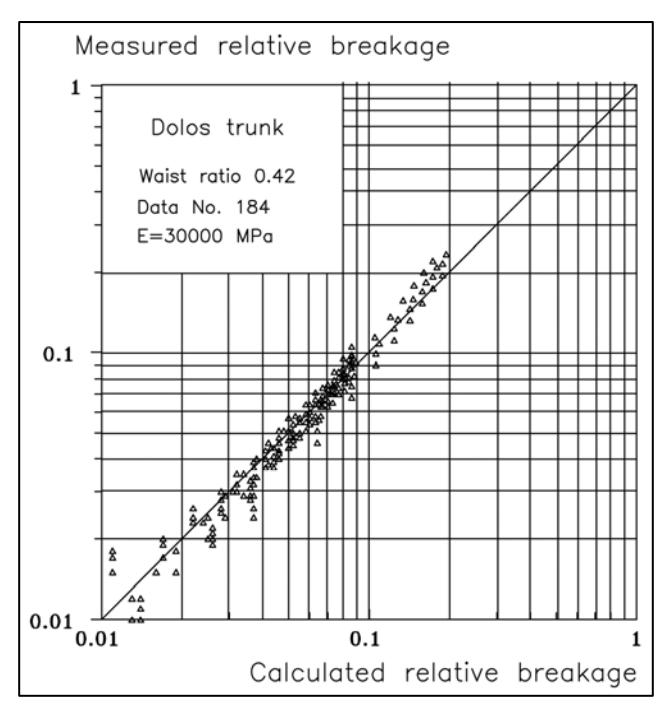

*Figure VI-5-41. Breakage formula for dolosse (Burcharth 1993b; Burcharth and Liu 1995; Burcharth et al. 1995b)*

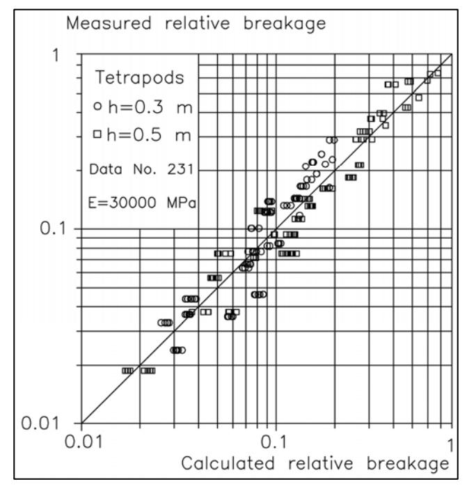

*Figure VI-5-42. Breakage formula for tetrapods (Burcharth 1993b, Burcharth and Liu 1995, Burcharth et al. 1995b)*

#### Table VI-5-41 Stress Prediction Formulae for Dolosse (Anglin et al. 1990)

Anglin et al. (1990) developed a dolos structural design methodology based on small scale measurements of strain in laboratory hydraulic models. Only the static stresses were considered. The criterion for allowable static tensile stress in a dolos at a vertical distance D_{\nu} down from the crest on a dry structure was proposed as

```math
n { \left( \sigma _ { s } \right) } _ { p } < f _ { T } \tag{VI-5-92}
```

where
f_T = Prototype concrete static tensile strength (MPa)
(\sigma_s)_p = Static principal stress in model dolos with probability of exceedance, p
n = Model scale factor
The static principal stress is estimated as

```math
\left(\sigma_{s}\right)_{p} = 10^{\left(\log\left(\sigma_{s}\right)_{est} + 0.31\left[\Phi^{-1}(p)\right]\right)} \tag{VI-5-93}
```

with

```math
\log(\sigma_s)_{est} = -2.28 + 0.91\alpha + 0.30\left(\frac{D_v}{n} - 0.45\right) + 0.34l \tag{VI-5-94}
```

and the model scale factor was given as

```math
n = 9.43 \left( \frac{W}{0.1549 w_a} \right)^{1/3} \tag{VI-5-95}
```

and
- \alpha = Tangent of seaward armor slope
- l = Layer (0 for top; 1 for bottom)
- D_v = Vertical distance from crest to stressed dolos location
- \Phi^{-1}(p) = Tabulated inverse normal variate (see next page)
W =Prototype armor unit weight
w_a = Armor concrete specific weight
(Continued)

#### Table VI-5-41 (Concluded)

Values for the inverse normal variate in Eq VI-5-93 are given in the box to the right.
Equations VI-5-92 through VI-5-95 are limited to the range of values:

**Table VI-5-41. (Concluded)**

| Table | VI-5-42. | Approximate For Concrete | Values Armor | of Ultimate Units | Rigid Body Impact ..................................................................... | Velocities | VI-5-109 |
| --- | --- | --- | --- | --- | --- | --- | --- |
| Table | VI-5-43. | Drawbacks Related | to | Crack-Reducing | Procedures | .............................. | VI-5-111 |
| Table | VI-5-44. | Fatigue for Uniaxial and | Conventional Flexural | Stress | Unreinforced Concrete Conditions With Zero | Exposed to Mean Stress ......... | VI-5-113 |
| Table | VI-5-45. | Stability of Toe | Berm | Tested in | Regular Waves | ................................... | VI-5-117 |
| Table | VI-5-46. | Stability of Toe Density 2.68 Structures | Berm tonnes/m3. | Formed by Variable | 2 Layers of Stone Berm Width, ............................................................................................... | Having and Sloping | VI-5-118 |
| Table | VI-5-47. | Stability of Toe Parallellepiped | Berm Concrete | Formed by Blocks | Two Layers of | Stones or ............................................................ | VI-5-120 |
| Table | VI-5-48. | Stability of Toe Vertical Impermeable | Berm | Formed by Wall | Two Layers of Structure | Stones in Front of .................................................... | VI-5-121 |
| Table | VI-5-49. | Stability Under | Combined | Waves | and Currents | .................................... | VI-5-126 |

| Probability of exceedance | \Phi^{-1}(p) |
| --- | --- |
| 0.1 | 1.28 |
| 0.05 | 1.65 |
| 0.02 | 2.05 |
| 0.01 | 2.33 |

Another model study examined the combined effects of static and quasistatic (wave-induced pulsating loads) under nonbreaking regular wave conditions, but did not include impact stresses. The criterion for allowable tensile stress in a dolos located a vertical distance, D_{swl} , from the swl was given as

```math
n { \bigl ( } \sigma _ { t } { \bigr ) } _ { p } < f _ { T } \tag{VI-5-96}
```

where

```math
\left( \sigma _ { t } \right) _ { p } = \left( \sigma _ { t } \right) _ { e s t } + 0 . 0 0 1 { \left[ \Phi ^ { - 1 } \left( p \right) \right] } \tag{VI-5-97}
```

```math
(\sigma_t)_{est} = 0.905 (\sigma_s)_{est} + 0.639 (\sigma_q)_{est} \tag{VI-5-98}
```

```math
\log(\sigma_q)_{est} = -2.36 + 0.15\alpha + 0.01\left(\frac{T}{\sqrt{n}}\right) + 0.29\left(\frac{D_{swl}}{n}\right) + 2.20\left(\frac{H}{n}\right) \tag{VI-5-99}
```

and
(\sigma_t)_p = Total static and pulsating principal stress in model armor unit with probability of occurrence,
(\sigma_q)_p = Pulsating principal stress in model armor unit with probability of occurrence, p
(\sigma_s)_p = Static principal stress with probability of occurrence, p, from Eq VI-5-94
H =Regular wave height
- T = Regular wave period
- D_{swl} = Vertical distance from swl to location of stressed dolos. (Positive above swl, negative below swl.)
n =Model scale factor from Eq VI-5-95
- \alpha = Tangent of seaward armor slope
- \Phi^{-1}(p) = Tabulated inverse normal variate from the preceding box
Equations VI-5-96 through VI-5-99 are limited in application to the range of values: 0.05 m # H/n # 0.25 m; 0.4 \# \alpha \# 0.67 ; 0.3 \text{ m} \# D_v/n \# 0.6 \text{ m} ;
1.25 s # T/(n)^{1/2} # 2.5 s ; -0.1 m # D_{swl}/n # +0.1 m

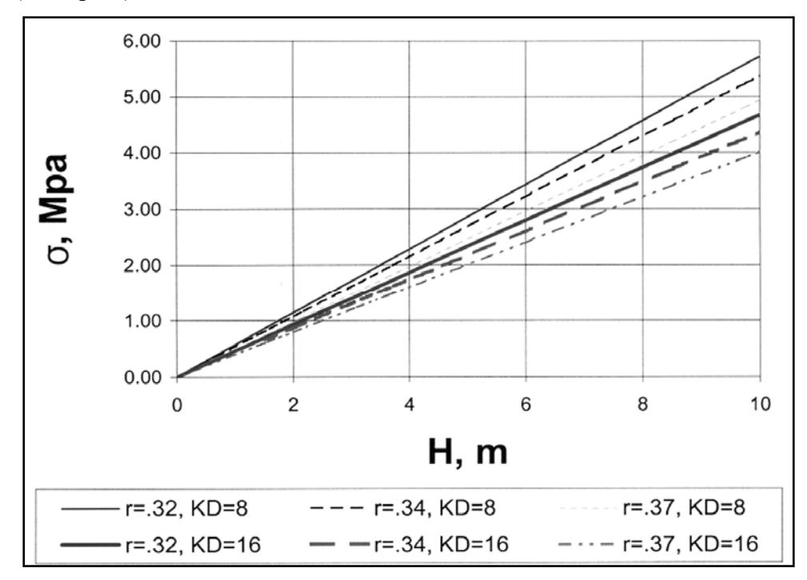

*Figure VI-5-43. Wave height versus maximum flexural tensile stress for several dolos waist ratios*

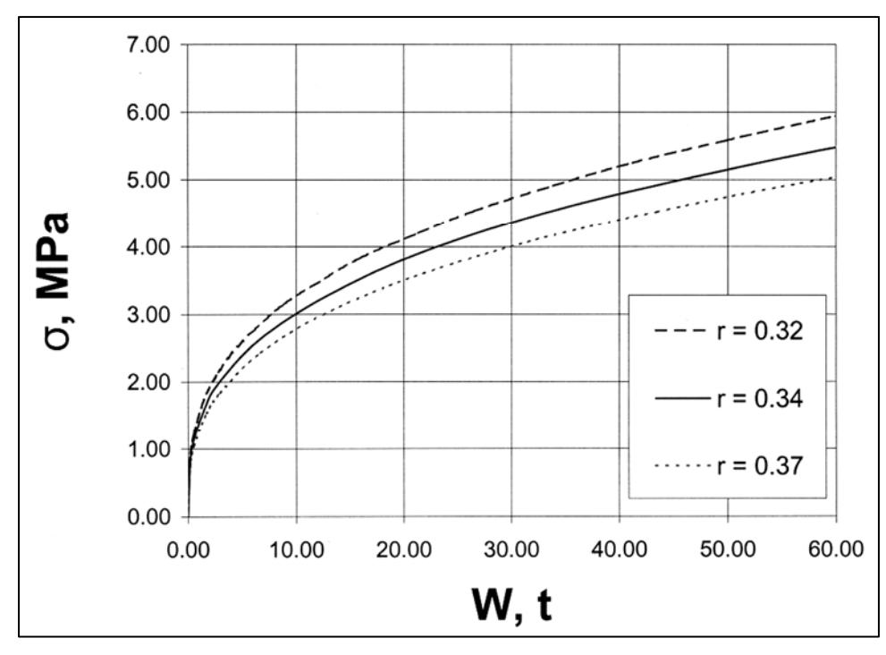

*Figure VI-5-44. Dolos mass versus maximum flexural tensile stress for several dolos waist ratios*

(b) Reinforced dolos design. Melby and Turk (1992) extended the method of Melby (1993) to include a level I reliability analysis and conventional reinforced concrete design methodology (American Concrete Institute (ACI) 1989). The following technique utilizes a probabilistic principal stress computed using any of the previous methods. These methods allow the designer to consider unreinforced concrete, conventional steel rebar reinforcement, or prestressing in a unified format. The basic design equation, following structural concrete design conventions, equates a factored strength with a factored load as

```math
\gamma Q_n = \phi R_n \tag{VI-5-100}
```

where \gamma and \varphi are the load and strength factors, respectively, to account for uncertainty in nominal load Q_n and nominal strength R_n . Melby and Turk noted that the load factor ranges from 1.0 to 1.2 for typical values of exceedance probability for stress. American Concrete Institute (ACI) (1989) recommends \varphi = 0.85 for torsion. To facilitate reinforcement design, Melby and Turk assumed a circular cross section and decomposed Equation VI-5-100 into a flexure equation

```math
\gamma S_M k_M \sigma_1 < \phi(0.7M_{cr}) \tag{VI-5-101}
```

and a torsional equation

```math
\gamma S_T k_T \sigma_1 < \phi \left( 0.7 T_{cr} + T_s \right) \tag{VI-5-102}
```

where \sigma_I is the principal stress, S_M = 0.1053(rC)^3 and S_T = 0.2105(rC)^3 are the section moduli for flexure and torsion, r is the dolos waist ratio, C is the dolos fluke length, and k_M = k_T = 0.6 are the moment and torque contribution factors, M_{cr} = T_{cr} = 0.7 f_{ct} are the critical strengths of the concrete in moment and torque, f_{ct} is the concrete splitting tensile strength, and T_s is the strength contribution from the torsional steel reinforcement. The inequality in Equations VI-5-101 and VI-5-102 assures that the factored tensile strength will be greater than the factored tensile load.
• The technique for steel reinforcement design utilizes conventional structural design techniques. Torsional steel is specified first, and it is only required in the shank because the flukes are not likely to be twisted. Details are given in ACI 318-89 (ACI 1989). Assuming a circular section for the dolos shank, the amount of torsional steel is given as T_s = R_h A_s f_y , where R_h is the distance to the center of the section, A_s is the total area of steel intersecting the crack, and f_y is the yield strength of the steel. Substituting T_s into Equation VI-5-102 yields the equation for required torsional steel, i.e.,

```math
A_s > \frac{\gamma(S_T k_T \sigma_1) - \phi(0.7T_{cr})}{\phi f_y R_h} \tag{VI-5-103}
```

• The number of bars required is then given by n = A_s/A_b , where A_b is the cross-sectional area of hoop reinforcing bars, and the spacing is s = 1.5\pi R_h/n , assuming the crack extends three-fourths of the distance around the circumference.
EM 1110-2-1100 (Part VI) Change 3 (28 Sep 11)
- For flexural reinforcement design, it is assumed that the concrete offers no resistance in tension. Nominal strength is reached when the crushing strain in the outer fiber of the concrete is balanced by the yield strain in the steel rebar. The balanced failure condition using the Whitney rectangular stress block is prescribed in ACI 318-89, Part 10 (ACI 1989). The solution requires an iterative approach because the neutral axis is a priori unknown. Assuming a rebar size, the neutral axis is located by solving the quadratic equation that results from balancing the compressive force moment from the Whitney stress block with the tensile force moment from the steel. Once the neutral axis is determined, the nominal moment from the steel can determined and substituted into Equation VI-5-101 to determine if the quantity of steel is adequate to balance the flexural design load. After determining the amount of flexural steel required, typical checks of compressive stress, shear, bond, minimum reinforcement, and temperature steel should be made as per ACI 318-89.
- (c) Prestressed dolos design. Prestressing acts reduce principal stress. The principal stress reduction factor is given by

```math
\xi = 0.5 \left( \left( k_M - \lambda \right) + \sqrt{\left( k_M - \lambda \right)^2 + 4k_T^2} \right) \tag{VI-5-104}
```

where \lambda is the ratio of applied precompressive stress to design principal stress. This equation was substituted into the moment-torque interaction relations to get design equations for torsion and flexure as follows:

```math
\gamma \xi k_T \sigma_1 = 0.5 \phi \sqrt{\frac{f_c}{1 + 4 \left(\frac{k_M S_M}{k_T S_T}\right)^2}} \tag{VI-5-105}
```

```math
\gamma \xi k_{M} \sigma_{1} = 0.5 \phi \sqrt{\frac{f_{c}}{1 + 0.25 \left(\frac{k_{T} S_{T}}{k_{M} S_{M}}\right)^{2}}} \tag{VI-5-106}
```

where f_c is the concrete compressive strength. These equations are similar to Equations VI-5-101 and VI-5-102, but they are for prestressed concrete design. Details for determining prestressing steel requirements are given in ACI 318-89 (ACI 1989).
- (3) Ultimate impact velocities end equivalent drop height.
- (a) For evaluation of the placing technique during construction it is important to consider the ultimate impact velocities. The lowering speed of the crane at the moment of positioning of the units must be much slower than the values given in Table VI-5-42. The values of ultimate impact velocities given in Table VI-5-42 are rough estimates corresponding to solid body impact against a heavy rigid concrete base which causes breakage resulting in a mass loss of 20 percent or more. If the armor units are not dropped on a hard rigid surface but instead on soil or a rock
underlayer, the ultimate impact velocities can be significantly higher than those given in Table VI-5-42.

**Table VI-5-42. **

|  | Impact Velocity of the | Equivalent Drop Height |
| --- | --- | --- |
| Armor Unit | Unit's Center (m/s) | of the Unit's Center (m) |
| Cube < 5 tonne | 5 - 6 | 1.2 - 1.8 |
| 20 tonne | 4 - 5 | 0.8 - 1.2 |
| 50 tonne | 3 - 4 | 0.4 - 0.8 |
| Tetrapod | 2 | 0.2 |
| Dolos, waist ratio 0.42 | 2 | 0.2 |
| Dolos, waist ratio 0.32 | 1 - 1.5 | 0.05 - 0.12 |

**Table VI-5-42. **

|  | Impact Velocity of the | Equivalent Drop Height |
| --- | --- | --- |
| Armor Unit | Unit's Center (m/s) | of the Unit's Center (m) |
| Cube < 5 tonne | 5 - 6 | 1.2 - 1.8 |
| 20 tonne | 4 - 5 | 0.8 - 1.2 |
| 50 tonne | 3 - 4 | 0.4 - 0.8 |
| Tetrapod | 2 | 0.2 |
| Dolos, waist ratio 0.42 | 2 | 0.2 |
| Dolos, waist ratio 0.32 | 1 - 1.5 | 0.05 - 0.12 |

(b) When placing units underwater, a heavy swell might impose rather large horizontal velocities on a unit suspended from a crane. It is obvious from the values in Table VI-5-42 that free-fall dropping of concrete armor units by quick release from a crane should be avoided because even small drop heights can cause breakage. This is also true for underwater placement because the terminal free-fall velocity underwater exceeds the limiting values given in Table VI-5-42 except for very small massive types of units.

#### (4) Thermal stresses.

- (a) As concrete cures, the heat of hydration increases the temperature. Because of the fairly low thermal conductivity of concrete and because of the poor insulation of conventional formwork (e.g., steel shutter), a higher temperature will be reached in the center part of the armor unit than on the concrete surface. The temperature difference will create differential thermal expansion, and internal thermal stresses will develop in the concrete. The temperature differences and resulting thermal stresses increase with the distance between the armor unit center and the surface of the unit. Tensile stresses can easily exceed the limited strength of the fresh young concrete thus causing formation of microcracks. Unfortunately, it is not possible to see thermal cracks because they will close at the surface due to the thermal contraction of the concrete as it cools.
- (b) The curing process is very complicated and theoretically it can only be dealt with in an approximate manner, mainly because the description of creep and relaxation processes of the hardening concrete are not precise enough to avoid large uncertainties in the calculations. Calculations are performed by the use of special finite element computer programs for three-dimensional bodies. Necessary input is data on the concrete mix including the composition (type) of the cement, the concrete temperature when poured, the geometry of the units, the type of formwork (conductivity/insulation), the environmental climate (air temperature and wind velocities as function of time), and the cycling time for removal of the formwork. The output of the calculations is the development of stresses and related crack formation as function of time. Figure VI-5-45 shows an example of such a calculation for a 70-tonne cube.

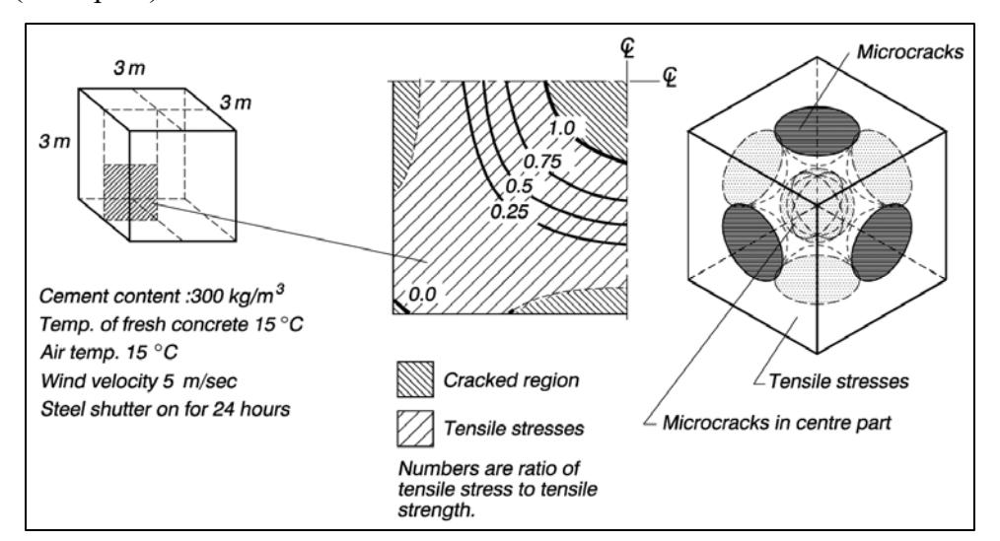

*Figure VI-5-45. Example of calculation of thermal stresses and cracked regions in a 70-tonne cube 100 hr after casting (Burcharth 1993b)*

- (c) The cube will have no visible sign of weakness, but it will be fragile and brittle because the cracked regions at the surfaces and in the center will have almost zero tensile strength and the noncracked regions will be in tension. This means that not only the strength, but also the fatigue life and the resistance to deterioration, will be reduced.
- (d) Thermal stress calculations are complicated and must be performed using numerical models described in the concrete literature. However, a very important rule of thumb for avoiding thermal cracks is that the temperature difference during curing should not exceed 20°C between any two points within the concrete element. The temperature difference is easy to monitor by placing/casting copper-constanting thermo-wire (e.g., 2 x 0.7 $mm^{2})$ in the concrete. The wire insulation must be removed at the tips which are placed at positions in the center and near the surface of the units where the temperatures are maximum and minimum, respectively. Temperature readings can then be monitored by connecting a pocket instrument to the free wire ends.
- (e) There are several measures related to concrete technology for the prevention of damaging thermal stresses, but they all involve some drawbacks as described by Table VI-5-43.
- (f) Another way of dealing with the thermal stress problem is to keep the effective dimensions of the armor units as small as possible. For cubes it can be done by making a hole as was done in the hot-climate Bosaso Harbor project in Somalia. Figure VI-5-46 shows examples of the temperature development in 30-tonne blocks with and without a hole. The reduced temperature difference introduced by the hole is clearly seen by comparison of the two blocks casted during winter time. In fact it was easier to keep the 20°C temperature difference limit in a 30-tonne unit with a hole than in a 7-tonne unit without a hole.

**Table VI-5-43. **

| Table | VI-5-44. | Fatigue for Uniaxial and | Conventional Flexural | Unreinforced Stress | Conditions | Concrete With Zero | Exposed to Mean Stress ......... | VI-5-113 |
| --- | --- | --- | --- | --- | --- | --- | --- | --- |
| Table | VI-5-45. | Stability of Toe | Berm | Tested in | Regular | Waves | ................................... | VI-5-117 |
| Table | VI-5-46. | Stability of Toe Density 2.68 Structures | Berm tonnes/m3. | Formed by Variable | 2 Layers Berm | of Stone Width, ............................................................................................... | Having and Sloping | VI-5-118 |
| Table | VI-5-47. | Stability of Toe Parallellepiped | Berm Concrete | Formed by Blocks | Two | Layers of | Stones or ............................................................ | VI-5-120 |
| Table | VI-5-48. | Stability of Toe Vertical Impermeable | Berm | Formed by Wall Structure | Two | Layers of | Stones in Front of .................................................... | VI-5-121 |
| Table | VI-5-49. | Stability Under | Combined | Waves | and | Currents | .................................... | VI-5-126 |
| Table | VI-5-50. | Weight and Size | Selection | Dimensions |  | of Quarrystone | ........................ | VI-5-129 |
| Table | VI-5-51. | Layer Coefficient | and | Porosity for | Various | Armor | Units ...................... | VI-5-136 |
| Table | VI-5-52. | The Sainflou | Formula | for Head-on, | Fully | Reflected, | Standing |  |

- (5) Fatigue in concrete armor units.
- (a) The strength of concrete decreases with the number of stress cycles. Each stress cycle larger than a certain stress range will cause partial fracture in some parts of the material matrix resulting in a decreased yield strength. Repeated loads cause an accumulative effect which might result in macro cracks, and ultimately, breakage of the structural element.
- (b) The number of stress cycles caused by wave action will be in the order of 200 million during 50 years structural life in the North Atlantic area. About 10 million cycles will be caused by larger storm waves. In subtropical and tropical areas the number of storm wave cycles is generally one or two orders of magnitude less.
- (c) Fatigue for conventional unreinforced concrete exposed to uniaxial and flexural stress conditions with zero mean stress is given in Table VI-5-44.
- d. Toe stability and protection.
- (1) Introduction.
- (a) The function of a toe berm is to support the main armor layer and to prevent damage resulting from scour. Armor units displaced from the armor layer may come to rest on the toe berm, thus increasing toe berm stability. Toe berms are normally constructed of quarry-run, but concrete blocks can be used if quarry-run material is too small or unavailable.

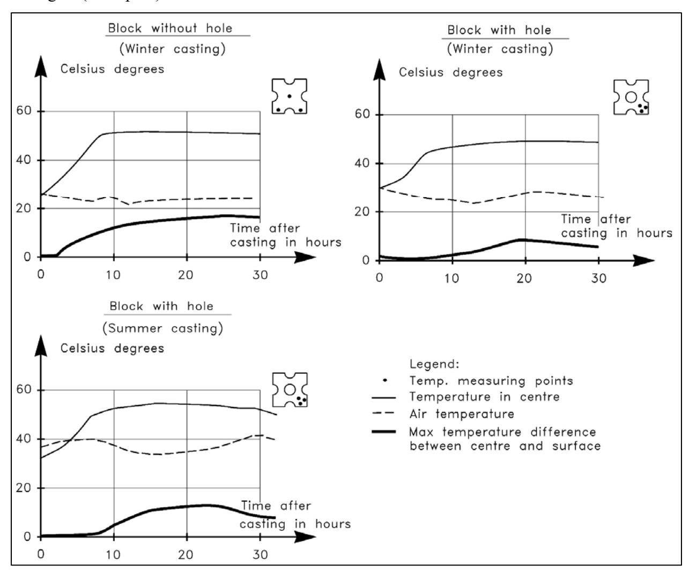

*Figure VI-5-46. Examples of temperature development during curing in 30-tonne modified cubes with and without a hole (Burcharth et al. 1991)*

- (b) In very shallow water with depth-limited design wave heights, support of the armor layer at the toe is ensured by placing one or two extra rows of main armor units at the toe of the slope as illustrated in Figure VI-5-47a. This is a stable solution provided that scour does not undermine the toe causing the armor layer to slide as illustrated by Figure VI-5-48. In shallow water it is usually possible to use stones or blocks in the toe that are smaller than the main armor, as shown in Figure VI-5-47 b. In deep water, there is no need for the main armor to cover the slope at greater depths, and the toe berm can be constructed at a level above the seabed as illustrated by Figure VI-5-47c.
- (c) Toe berm stability is affected by wave height, water depth at the top of the toe berm, width of the toe berm, and block density. However, wave steepness does not appear to be a critical toe berm stability parameter.

#### Table VI-5-44

Fatigue for Conventional Unreinforced Concrete Exposed to Uniaxial and Flexural Stress Conditions With Zero Mean Stress (Burcharth 1984)

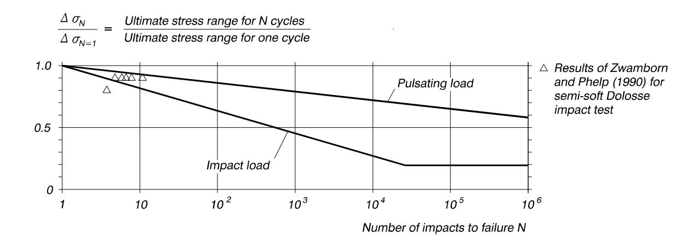

It should be noted that the ultimate impact load strength for one stress cycle is on the order of 1.4 to 1.5 times the ultimate pulsating load strength in the case of uniaxial tension and compression, respectively. For flexural stresses a factor of approximately 1.4 should be applied. The ultimate pulsating load strength properties for one cycle can be taken to be equal to those found for static load conditions.

#### Data basis for fatigue curve

| Author(s) | Loading condition | Specimens |
| --- | --- | --- |
| Tepfers and Kutti (1979) | pulsating tension and compression | cubes of 150 mm length |
| Tait and Mills (1980) | pulsating tension | Dolosse of 300 mm height |
| Fagerlund and Larsson (1979) | impact compression | cylinders of 100 mm diameter |
| Zielinski, Reinhardt, and Körmeling (1981) | impact tension | cylinders of 74 mm diameter |
| Burcharth (1984) | impact flexural stress | Dolosse of 790 mm height |

Zwamborn and Phelp (1990) performed drop tests with 9-ton Dolosse on a horizontal underlayer of quarry rock. This relatively soft base created a milder dynamic response than the solid rigid concrete base used by other authors. As seen from the figure Zwamborn and Phelp's data are in between the two curves which might be regarded as upper and lower limits for the fatigue effect.
(d) Model tests with irregular waves indicate that the most unstable location is at the shoulder between the slope and the horizontal section of the berm. The instability of a toe berm will trigger or accelerate the instability of the main armor. Lamberti (1995) showed that moderate toe berm damage has almost no influence on armor layer stability, whereas high damage of the toe berm severly reduces the armor layer stability. Therefore, in practice it is economical to design toe berms that allow for moderate damage.

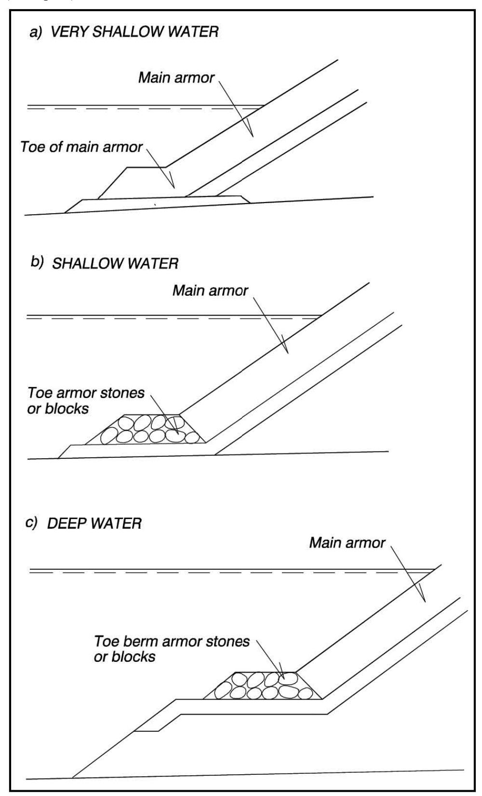

*Figure VI-5-47. Typical toe and toe berm solutions in rubble-mound breakwater design*

- (e) Rock seabeds often provide a poor foundation for the toe berm because of seaward sloping and/or rather smooth surfaces. Toe stability will be difficult to obtain, especially in shallow water with wave breaking at the structure (see Figure VI-5-48). Toe stones placed on hard bottoms can be supported by a trench or anchor bolts as sketched in Figure VI-5-49.
- (f) Scour in front of the toe berm can also trigger a failure. The depth of toe protection required to prevent scour can be estimated from the scour depth prediction methods discussed in Part VI-5-6, "Scour and Scour Protection." Typical forms of scour toe protection are illustrated in Figure VI-5-50.
- (2) Practical toe stability formulas for waves. Toe berm stability formulas are based exclusively on small scale physical model tests. These formulas are presented in the following tables.

| Waves | Structure | Table |
| --- | --- | --- |
|  | Regular, head-on and oblique Sloping and vertical, trunk and head section VI-5-45 |  |
| Irregular, head-on | Trunk of sloping structure | VI-5-46 & VI-5-47 |
| Irregular, head-on | Trunk of vertical structure | VI-5-48 |

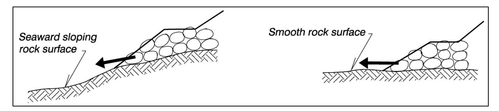

*Figure VI-5-48. Example of potential instability of the stones placed on rock seabed*

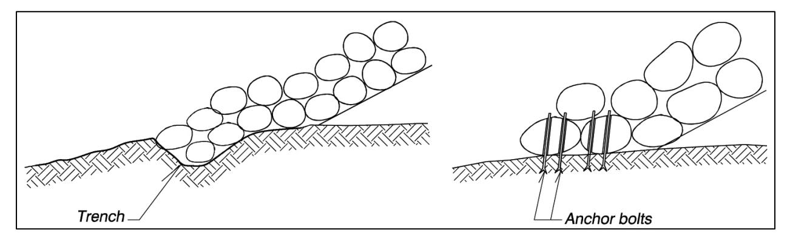

*Figure VI-5-49. Support of the stones by a trench or anchor bolts*

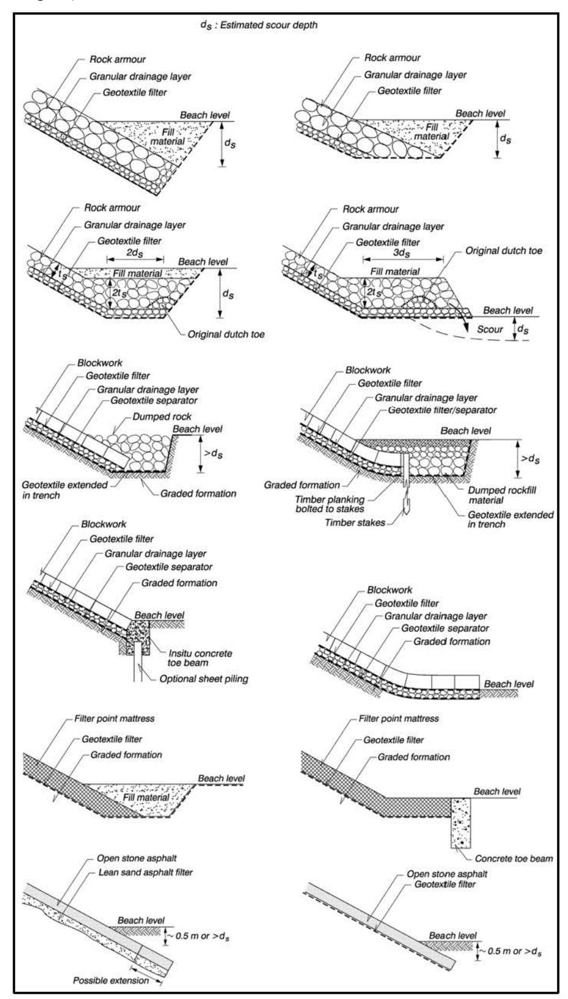

*Figure VI-5-50. Typical seawall toe designs where scour is foreseen (McConnell 1998)*

*Table VI-5-45 Stability of Toe Berm Tested in Regular Waves (Markle 1989)*

Regular waves, head-on and oblique

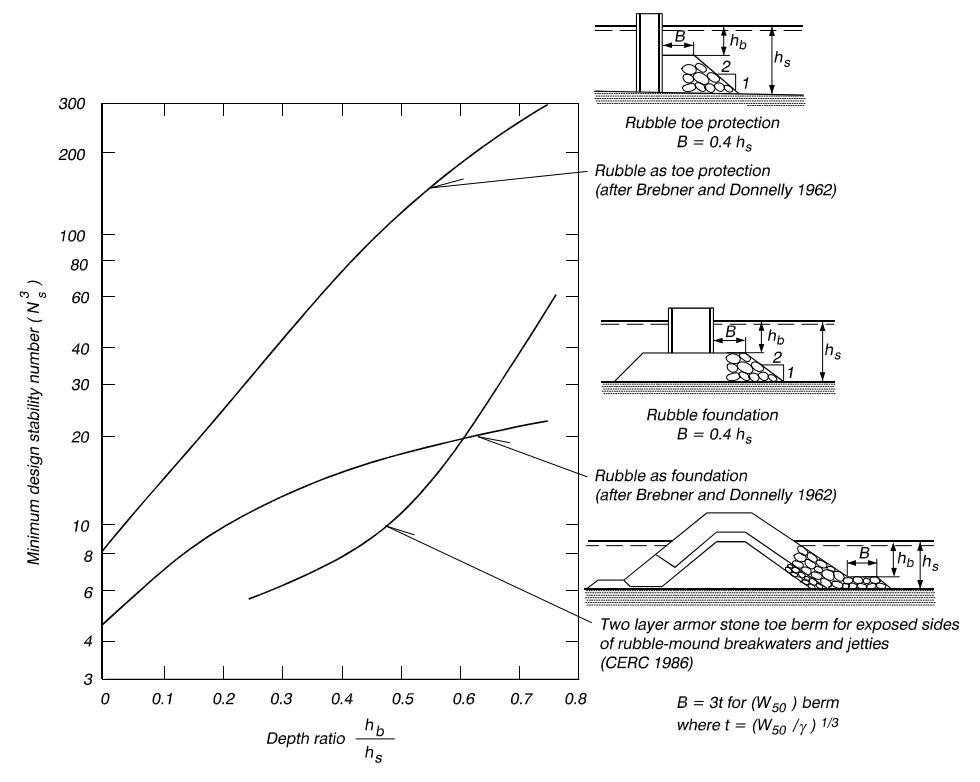

where Ns Ns = $H/(ΔD_{n50})$
H Wave height in front of breakwater
Δ $(ρ_{s}/ρ_{w})$ – 1
ρ s Mass density of stones
ρ w Mass density of water
D n 50 Equivalent cube length of median stone
Remarks: The curves in the figure are the lower boundary of $N_{s}-values$ associated with acceptable toe berm stability (i.e., some stone movement occurs; but the amount of movement is minor and acceptable, which shows that the toe is not overdesigned)
- (3) Foot protection blocks.
- (a) Foot protection blocks have been applied to prevent foundation erosion at the toe of vertical structures as shown in Figure VI-5-51.
- (b) According to Japanese practice the blocks are rectangular concrete blocks with holes (approximately 10 percent opening ratio) to reduce the antistabilizing pressure difference between the top and bottom of the blocks. Figure VI-5-52 shows a typical 25-tonne block.

#### Table VI-5-46

Stability of Toe Berm Formed by 2 Layers of Stone Having Density 2.68 tonnes/m³. Variable Berm Width, and Sloping Structures (van der Meer, d=Angremond, and Gerding 1995)

```math
N_s = \frac{H_s}{\Delta D_{n50}} = \left(0.24 \frac{h_b}{D_{n50}} + 1.6\right) N_{od}^{0.15} \tag{VI-5-107}
```

where H_s Significant wave height in front of breakwater
\Delta \qquad (\rho_s/\rho_w)-1
\rho_s Mass density of stones \rho_w Mass density of water
D_{n50} Equivalent cube length of median stone
h_b Water depth at top of toe berm
N_{od} Number of units displaced out of the armor layer within a strip width of D_{n50} . For a standard toe size of about 3-5 stones wide and 2-3 stones high:

```math
N_{od} = \begin{cases} 0.5 & \text{no damage} \\ 2 & \text{acceptable damage} \\ 4 & \text{severe damage} \end{cases}
```

For a wider toe berm, higher N_{od} values can be applied.

#### Tested cross sections

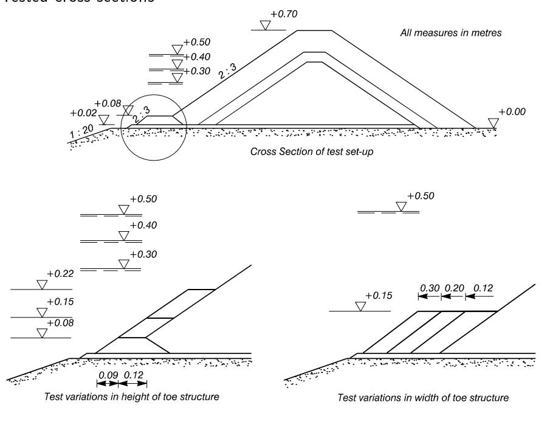

(Continued on next page)

#### Table VI-5-46 (Concluded)

Valid for: Irregular head-on waves; nonbreaking, breaking and broken
Toe berm formed of two layers of stones with \rho_s = 2.68 \ tonnes/m^3 (168 lb/ft^3 )
0.4 < h_b/h_s < 0.9 , 0.28 < H_s/h_s < 0.8 , 3 < h_b/D_{n50} < 25
where h_s is the water depth in front of the toe berm

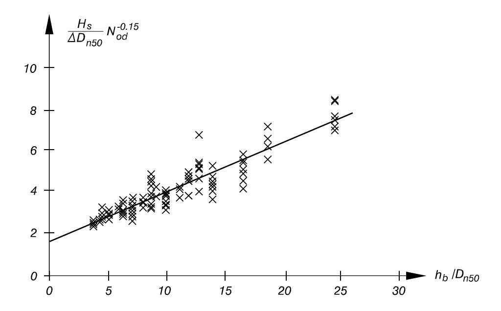

Uncertainty of the formula: corresponding to a coefficient of variation of approximately 0.10.

*Table VI-5-47*

## Stability of Toe Berm Formed by Two Layers of Stones or Parallellepiped Concrete Blocks (Burcharth et al. 1995a)

Equation VI-5-107 was modified so that it can be applied to the toe berm formed of stones having other densities or to parallellepiped concrete blocks.

```math
N_s = \frac{H_s}{\Delta D_{n50}} = \left(0.4 \frac{h_b}{\Delta D_{n50}} + 1.6\right) N_{od}^{0.15} \quad \text{or} \quad \frac{H_s}{\Delta D_{n50}} = \frac{1.6}{N_{od}^{-0.15} - 0.4 h_b/H_s} \tag{VI-5-108}
```

Results of the stability tests with a toe berm made of 16.5-tonne parallellepiped concrete blocks are shown below. The negative influence of a high reflecting wave wall superstructure on the toe stability is demonstrated.

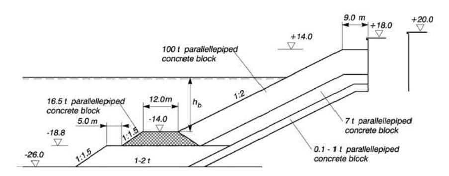

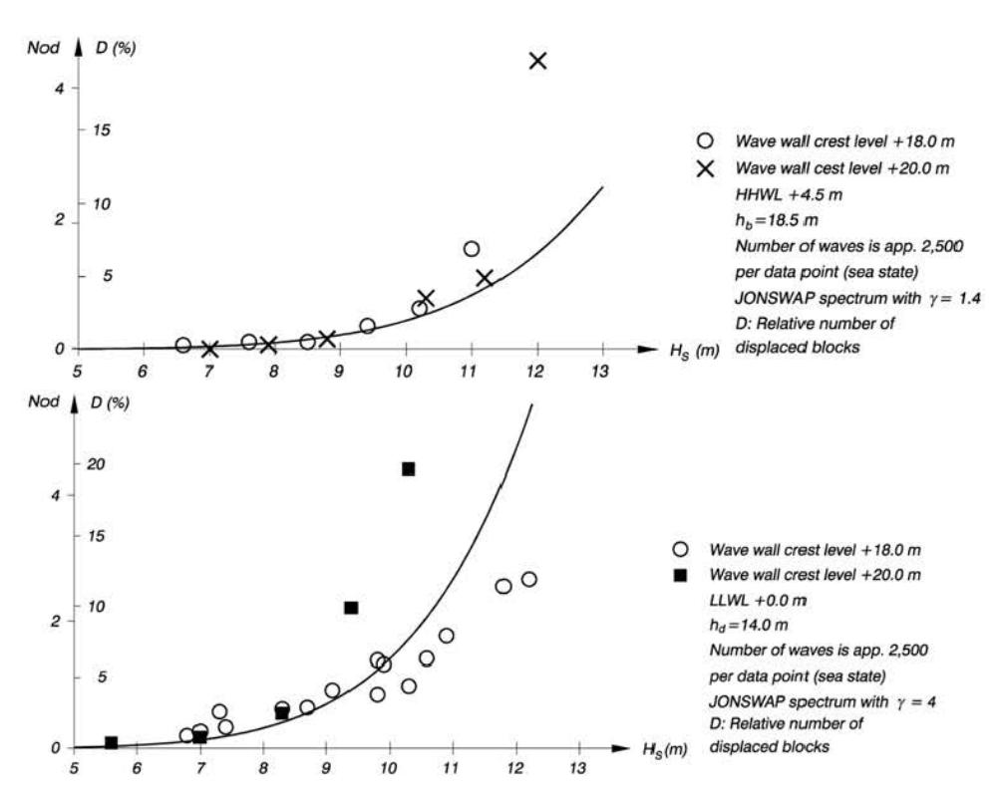

#### Table VI-5-48

## Stability of Toe Berm Formed by Two Layers of Stones in Front of Vertical Impermeable Wall Structure

Madrigal and Valdés (1995) for two layers of quarrystones

```math
N_s = \frac{H_s}{\Delta D_{n50}} = \left(5.8 \frac{h'}{h_s} - 0.6\right) N_{od}^{0.19} \tag{VI-5-109}
```

where H_s Significant wave height in front of breakwater
\Delta = (\rho_s/\rho_w) - 1
\rho_s Mass density of stones \rho_w Mass density of water
D_{n50} Equivalent cube length of median stone
h' Water depth at top of toe berm Water depth in front of toe berm
N_{od} Number of units displaced out of the armor layer within a strip width of D_{n50}

```math
N_{od} = \begin{cases} 0.5 & \text{start of damage (1-3\% of units displaced)} \\ 2 & \text{acceptable damage (5-10\% of units displaced)} \\ 5 & \text{severe damage (20-30\% of units displaced)} \end{cases}
```

#### Tested cross sections

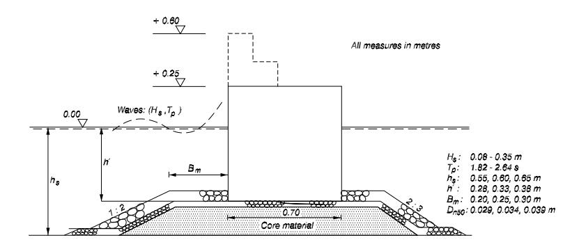

Valid for: Irregular head-on waves. Toe berm formed of two layers of stones with \Delta=1.65 0.5 < h_b/h_s < 0.8; \quad 7.5 < h_b/D_{n50} < 17.5; \quad 0.3 < B_m/h_s < 0.55

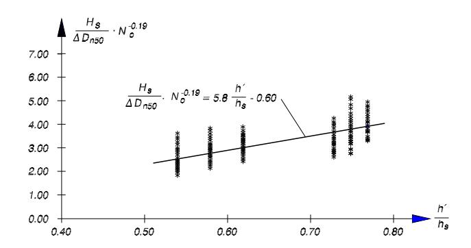

Uncertainty of the formula: Not given
(Continued)

#### Table VI-5-48 (Concluded)

Tanimoto, Yagyu, and Goda (1982), Takahashi, Tanimoto, and Shimosako (1990) for two layers of quarrystones

```math
N_s = \frac{H_s}{\Delta D_{n50}} = \max \left\{ 1.8, \ 1.3 \ \frac{1-\kappa}{\kappa^{1/3}} \frac{h'}{H_s} + 1.8 \exp\left(-1.5 \frac{(1-\kappa)^2}{\kappa^{1/3}} \frac{h'}{H_s}\right) \right\} \tag{VI-5-110}
```

```math
\kappa = \kappa_1 \kappa_2
```

```math
\kappa_1 = 2kh'/\sinh(2kh')
```

```math
\kappa_2 = \max \left\{ 0.45 \sin^2 \theta \cos^2(kB \cos \theta), \cos^2 \theta \sin^2(kB \cos \theta) \right\}
```

where Hs Significant wave height in front of breakwater
b. (Psi Pw) - 1
Ps Pw Mass density of stones Mass density of water
D n50 Equivalent cube length of median stone
h' Water depth on top of toe berm (excluding armor layer)
B Width of toe berm
k Wave number k = 27T I Lp
e Wave incident angle (e = 0° for head-on)
Valid for: Irregular head-on and oblique waves
Toe berm formed by two layers of quarrystones
b. = 1.65
Uncertainty of the formula: Not given

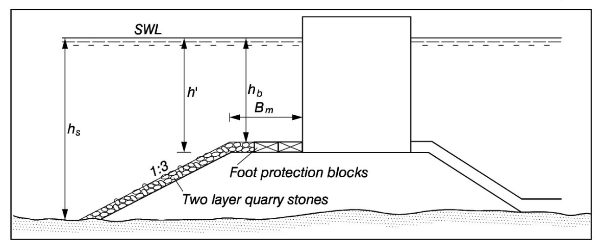

*Figure VI-5-51. Illustration of foot protection blocks for vertical structures*

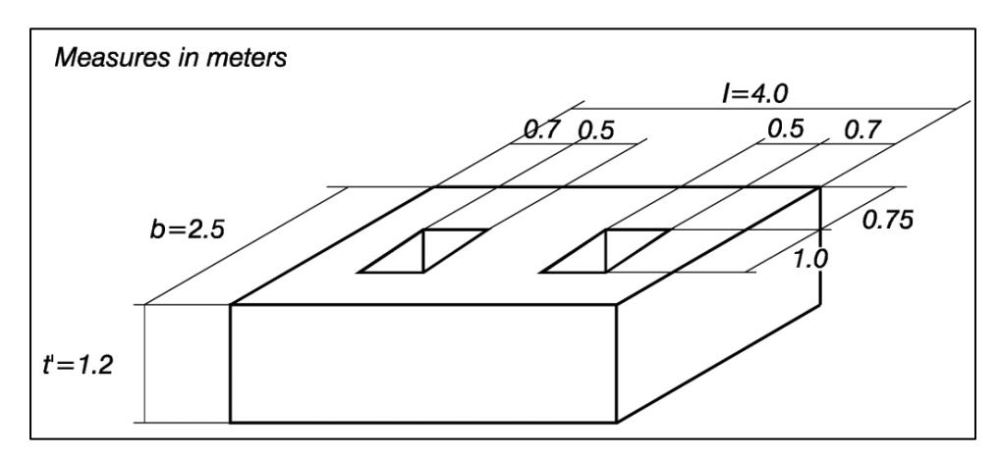

*Figure VI-5-52. Example of Japanese foot protection block*

Figure VI-5-53 shows a diagram taken from Takahashi (1996) for the determination of the necessary block thickness t' as functions of wave height H and the ratio of water depths $h_{b}$ /hs at the berm and in front of the structure as shown back on Figure VI-5-51.
- (c) Stable foot protection blocks do reduce the pressure induced current in the mound, even when there are 10 percent openings in the blocks. Thus the risk of erosion of a sandy seabed underneath a thin rubble mound bedding layer is reduced too.
- (4) Toe stability in combined waves and currents.
- (a) Coastal structures, such as entrance jetties, are exposed to waves combined with currents running parallel to the structure trunk. In certain circumstances toe stability may be decreased due to the vectorial combination of current and maximum wave orbital velocity. For normal wave incidence the combined wave and current vector magnitude is not greatly increased. However, in the case of jetties where waves approach the jetty trunk at large oblique angles (relative to the normal), the combined velocity magnitude becomes large, and toe stability is jeopardized.

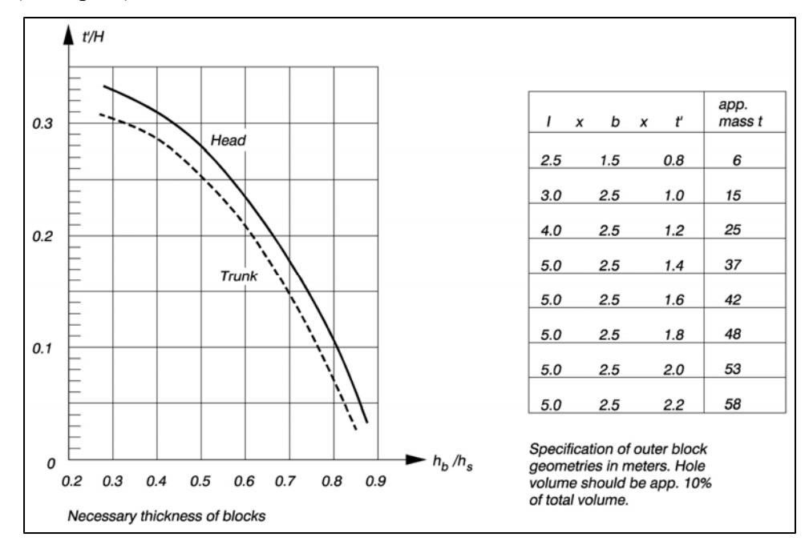

*Figure VI-5-53. Design of foot protection blocks according to Japanese practice*

- (b) Smith (1999) conducted 1:25-scale laboratory experiments to develop design guidance for jetty structures where oblique waves combine with opposing (ebb) currents. Smith found that small current magnitudes did not destabilize toes designed in accordance with guidance given by Markle (1989) and presented in Table VI-5-45. But damage did occur as currents were increased, and a pulsating effect was observed in the wave downrush as the wave orbital velocity combined with the ebb current.
- (c) The test configuration had waves approaching at an angle of 70 deg from the normal to the structure trunk, and wave heights were adjusted until breaking occurred on the structure. This is fairly typical scenaro for jettied entrance channels. Both regular and irregular wave conditions were used in the tests. Generally, less damage was recorded for equivalent irregular waves, but this was attributed to the relatively short duration of the wave runs during the experiments. The range of model parameters tested, and the prototype equivalents for the 1:25 scale model, are shown in the following tabulation. Generally, currents less than 15 cm/s in the model (0.75 m/s prototype) did not affect toe stability.

**Table VI-5-45. But damage did occur as currents were increased, and a pulsating effect was observed in the wave downrush as the wave orbital velocity combined with the ebb current.**

|  |  | Density 2.68 Structures | tonnes/m3. | Variable | Berm Width, and ............................................................................................... | Sloping | VI-5-118 |
| --- | --- | --- | --- | --- | --- | --- | --- |
| Table | VI-5-47. | Stability of Toe Parallellepiped | Berm Concrete | Formed by Blocks | Two Layers of Stones ............................................................ | or | VI-5-120 |
| Table | VI-5-48. | Stability of Toe Vertical Impermeable | Berm | Formed by Wall Structure | Two Layers of Stones | in Front of .................................................... | VI-5-121 |
| Table | VI-5-49. | Stability Under | Combined | Waves | and Currents | .................................... | VI-5-126 |
| Table | VI-5-50. | Weight and Size | Selection | Dimensions | of Quarrystone | ........................ | VI-5-129 |
| Table | VI-5-51. | Layer Coefficient | and | Porosity for | Various Armor Units | ...................... | VI-5-136 |
| Table | VI-5-52. | The Sainflou Regular Waves | Formula | for Head-on, | Fully Reflected, ...................................................................................... | Standing | VI-5-153 |
| Table | VI-5-53. | Goda Formula | for | Irregular Waves | ........................................................ |  | VI-5-154 |
| Table | VI-5-54. | Goda Formula | Modified | to Include | Impulsive Forces | from Head- |  |

(d) Smith developed a procedure to modify Markle's toe stability criterion to account for currents flowing parallel to the structure. Strictly, the method is intended for situations where
waves approach at a large angle from the normal (55-80 deg). Application to situations with wave approach more normal to the structure will yield conservative design guidance. The iterative procedure is outlined in Table VI-5-49.
- e. Design of structure cross-section.
- (1) Introduction.
- (a) A rubble-mound structure is normally composed of a bedding layer and a core of quarry-run stone covered by one or more layers of larger stone and an exterior layer or layers of large quarrystone or concrete armor units. Typical rubble-mound cross sections are shown in Figures VI-5-54 and VI-5-55. Figure VI-5-54 illustrates cross-section features typical of designs for breakwaters exposed to waves on one side (seaward) and intended to allow minimal wave transmission to the other (leeward) side. Breakwaters of this type are usually designed with crests elevated to allow overtopping only in very severe storms with long return periods. Figure VI-5-55 shows features common to designs where the breakwater may be exposed to substantial wave action from both sides, such as the outer portions of jetties, and where overtopping is allowed to be more frequent. Both figures show a more complex idealized cross section and a recommended cross section. The idealized cross section provides more complete use of the range of materials typically available from a quarry, but it is more difficult to construct. The recommended cross section takes into account some of the practical problems involved in constructing submerged portions of the structure.
- (b) Figures VI-5-54 and VI-5-55 include tables giving average layer rock size in terms of the stable primary armor unit weight, W, along with the gradation of stone used in each layer (right-hand column). To prevent smaller rocks in the underlayer from being pulled through an overlayer by wave action, the following criterion for filter design may be used to check the rock-size gradations given in Figures VI-5-54 and VI-5-55.

```math
D _ { 1 5 } \mathrm { ( c o v e r ) } \leq 5 D _ { 8 5 } \mathrm { ( u n d e r ) } \tag{VI-5-114}
```

where D_{85} (under) is the diameter exceeded by the coarsest 15 percent of the underlayer and D_{15} (cover) is the diameter exceeded by the coarsest 85 percent of the layer immediately above the underlayer.
(c) Stone sizes are given by weight in Figures VI-5-54 and VI-5-55 because the armor in the cover layers is selected by weight at the quarry, but the smaller stone sizes are selected by dimension using a sieve or a grizzly. Thomsen, Wohlt, and Harrison (1972) found that the sieve size of stone corresponds approximately to

```math
D_{sieve} \approx 1.15 \left(\frac{W}{w_a}\right)^{1/3} \tag{VI-5-115}
```

*Table VI-5-49 Stability Under Combined Waves and Currents (Smith 1999)*

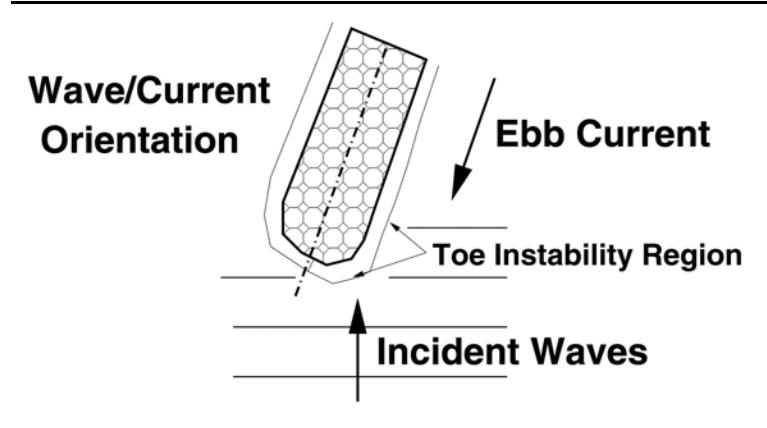

The current-modified stability number is caculated by the formula

```math
(N_s)_c = a \left( \frac{U + u}{\sqrt{gh_s}} \right) \tag{VI-5-111}
```

where

```math
u = \frac{g H T}{2L} \tag{VI-5-112}
```

```math
a = 51.0 \left(\frac{h_b}{h_s}\right) - 26.4 \tag{VI-5-113}
```

and
u = m aximum wave orbital velocity in shallow water
U =current magnitude
- g = gravity
- h_s = total water depth
- h_b = water depth over toe berm
- H = breaking wave height
- T = wave period
- L = local wavelength
Procedure: For a given wave condition, first calculate the stability number, N_s , using Markle's method from Table VI-5-45 for sloping rubble-mound structures. Then calculate a current-modified stability number from Equation VI-5-111. If (N_s)_c > N_s , the toe stone is unstable, and the procedure is repeated using a larger toe stone to calculate new values of N_s and h_b .
Uncertainty of the Formula: Unknown

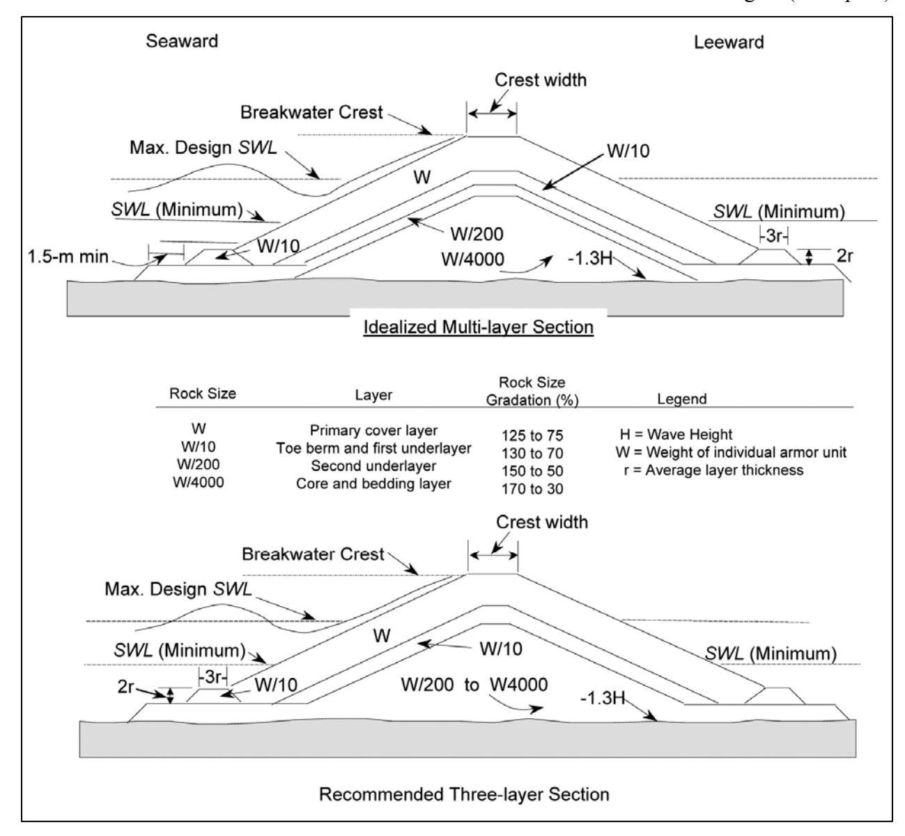

*Figure VI-5-54. Rubble-mound section for seaward wave exposure with zero-to-moderate overtopping conditions*

where W is the stone weight and w_a is the stone unit weight. Table VI-5-50 lists weights and approximate dimensions for a wide range of stone sizes having stone specific weight of 25.9 kN/m³ (165 lb/ft³). The dimensions listed for stone weighing several tons corresponds to the approximate size of the stone determined from visual inspection. Layer thickness should not be estimated as multiples of the dimensions given in Table VI-5-50 because that does not allow for stone intermeshing. Layer thickness is correctly estimated using Equation VI-5-117.
(d) Structure design is part of the overall project planning and design process as illustrated by the generic design diagrams given in Figures V-1-1 through V-1-3 in Part V-1-1-h. Figure VI-5-56 presents a logic diagram for preliminary design of rubble-mound structures.
EM 1110-2-1100 (Part VI) Change 3 (28 Sep 11)
Included in the diagram are three phases: structure geometry, evaluation of construction technique, and evaluation of design materials.
- (e) As part of the design analysis indicated in the logic diagram of Figure VI-5-56, the following structure geometric features should be investigated: Crest elevation and width. Concrete cap for rubble-mound structures. Thickness of armor layer and underlayers. Bottom elevation of primary cover layer. Toe berm for cover layer stability. Structure head and leeside cover layer. Secondary cover layer. Underlayers.
- Bedding layers and filter blanket layer (see Part VI-5-3 b , "Granulated and geotextile filter stability." Scour protection at toe see Part VI-5-6, "Scour and Scour Protection."
- Toe berm for foundation stability see Part VI-5-3 d , "Toe stability and protection," and Part VI-5-5, "Foundation Loads."
- (f) The following sections describe design aspects for the previously listed geometric features. (2) Crest elevation and width.

|  |  |  |  |  |  |  | Weight and Size Selection |  | Di Table | mensions of VI-5-50 |  | Quarrystone1 |  |  |  |  |  |
| --- | --- | --- | --- | --- | --- | --- | --- | --- | --- | --- | --- | --- | --- | --- | --- | --- | --- |
|  |  |  |  |  |  |  |  |  |  |  |  |  |  |  |  |  |  |
| Weight |  | Di | mension | Weight |  | Di | mension | Weight |  | Di | mension | Weight | Di | mension | Weight |  | mension Di |
| mt | (tons) | m | ft | kg | (lb) | m | (ft) | kg | (lb) | m c | (in) | (lb) kg | m c | (in.) | (lb) kg | c | (in.) m |
| 0.907 | (1) |  |  | 0.81 (2.64) 45.36 | (100) |  | 0.30 (0.97) 2.27 |  | (5) |  | 10.92 (4.30) |  |  |  |  |  |  |
| 1.814 | (2) |  |  | 1.02 (3.33) 90.72 | (200) |  | 9.38 (1.23) 4.54 |  | (10) |  | 13.77 (5.42) | 0.23 (0.5) 5.08 |  |  |  |  | (2.00) 0.01 (0.025) 1.88 (0.74) |
| 2.722 | (3) |  |  | 1.16 (3.81) 136.08 (300) |  |  | 0.43 (1.40) 6.81 |  | (15) |  | 15.77 (6.21) |  |  |  |  |  |  |
| 3.629 | (4) |  |  | 1.28 (4.19) 181.44 (400) |  |  | 9.50 (1.54) 9.07 |  | (20) |  | 17.35 (6.83) | 0.45 (1.0) 6.40 |  |  |  |  | (2.52) 0.02 (0.050) 2.36 (0.93) |
| 4.536 | (5) |  |  | 1.38 (4.52) 226.80 (500) |  |  | 0.51 (1.66) 11.34 (25) |  |  |  | 18.70 (7.36) |  |  |  |  |  |  |
| 5.443 | (6) |  |  | 1.46 (4.80) 272.16 (600) |  |  | 0.54 (1.77) 13.61 (30) |  |  |  | 19.86 (7.82) | 0.68 (1.5) 7.32 |  |  | (2.88) 0.03 (0.75) |  | 2.70 (1.06) |
| 6.350 | (7) |  |  | 1.54 (5.05) 317.52 (700) |  |  | 0.57 (1.86) 15.88 (35) |  |  |  | 20.90 (8.23) |  |  |  |  |  |  |
| 7.258 | (8) |  |  | 1.61 (5.28) 362.88 (800) |  |  | 0.60 (1.95) 18.14 (40) |  |  |  | 21.84 (8.60) | 0.91 (2.0) 8.05 |  |  |  |  | (3.17) 0.04 (0.100) 2.97 (1.17) |
| 8.165 | (9) |  |  | 1.67 (5.49) 408.24 (900) |  |  | 0.62 (2.02) 20.41 (45) |  |  |  | 22.73 (8.95) |  |  |  |  |  |  |
| 9.072 | (10) |  |  | 1.73 (5.69) 453.60 (1000) 0.64 (2.10) 22.68 (50) |  |  |  |  |  |  | 23.55 (9.27) |  | 1.13 (2.5) 8.66 |  |  |  | (3.41) 0.06 (0.125) 3.20 (1.26) |
| 9.979 | (11) |  |  | 1.79 (5.88) 498.96 (1100) 0.66 (2.16) 24.95 (55) |  |  |  |  |  |  | 24.31 (9.57) |  |  |  |  |  |  |
| 10.866 (12) |  |  |  | 1.84 (6.05) 544.32 (1200) 0.68 |  |  |  | (2.23) 27.22 (60) |  |  | 25.02 (9.85) |  | 1.36 (3.0) 9.22 |  |  |  | (3.63) 0.07 (0.150) 3.40 (1.34) |
| 11.793 (13) |  |  |  | 1.89 (6.21) 589.68 (1300) 0.70 (2.27) |  |  |  | 29.48 (65) |  |  | 25.70 (10.12) |  |  |  |  |  |  |
| 12.700 (14) |  |  |  | 1.94 (6.37) 635.04 (1400) 0.72 |  |  |  | (2.35) 31.75 (70) |  |  |  | 26.34 (10.37) 1.59 (3.5) 9.70 |  |  |  |  | (3.82) 0.08 (0.175) 3.58 (1.41) |
| 13.608 (15) |  |  |  | 1.98 (6.51) 680.40 (1500) 0.73 (2.40) |  |  |  | 34.02 (75) |  |  | 26.95 (10.61) |  |  |  |  |  |  |
| 14.515 (16) |  |  |  | 2.03 (6.66) 725.76 (1600) 0.75 |  |  |  | (2.45) 36.29 (80) |  |  |  |  |  |  |  |  | 27.53 (10.84) 1.81 (4.0) 10.13 (3.99) 0.09 (0.200) 3.73 (1.47) |
| 15.422 (17) |  |  |  | 2.07 (6.79) 771.12 (1700) 0.76 (2.50) |  |  |  | 38.56 (85) |  |  | 28.09 (11.06) |  |  |  |  |  |  |
| 16.330 (18) |  |  |  | 2.11 (6.92) 816.48 (1800) 0.78 |  |  |  | (2.55) 40.82 (90) |  |  |  |  |  |  |  |  | 28.65 (11.28) 2.04 (4.5) 10.54 (4.15) 0.10 (0.225) 3.89 (1.53) |
| 17.237 (19) |  |  |  | 2.15 (7.05) 861.84 (1900) 0.80 (2.60) |  |  |  | 43.09 (95) |  |  | 29.16 (11.48) |  |  |  |  |  |  |
| 18.144 (20) |  |  |  | 2.19 (7.17) 907.20 (2000) 0.81 |  |  |  |  |  |  |  |  |  |  |  |  | (2.64) 45.36 (100) 29.54 (11.63) 2.27 (5.0) 10.92 (4.30) 0.11 (0.250) 4.04 (1.59) |

*1 Dimensions correspond to size measured by sieve, grizzly, or visual inspection for stone of 25.9 kilonewtons per cubic meter unit weight. Do not use for determining structure crest width or layer thickness.*

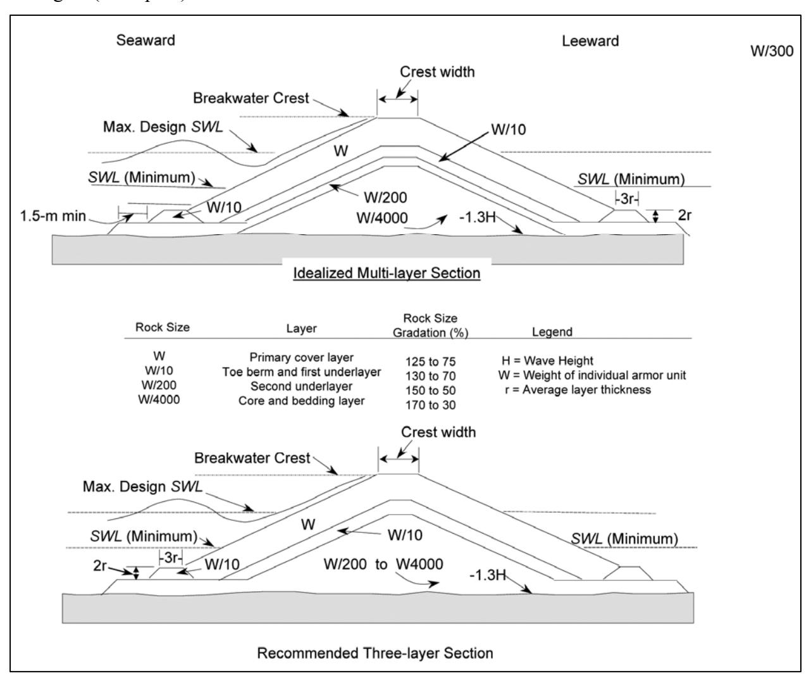

*Figure VI-5-55. Rubble-mound section for wave exposure on both sides with moderate overtopping conditions*

- (a) Overtopping of a rubble-mound structure such as a breakwater or jetty usually can be tolerated if the waves generated by the overtopping do not cause damage behind the structure. Overtopping will occur if the crest elevation is lower than the wave runup, as estimated using the procedures in Part VI-5-2 a , "Wave runup and rundown on structures." If the armor layer is chinked, or in other ways made smoother or less permeable, maximum runup will be increased.
- (b) The selected crest elevation should be the lowest that provides the protection required. Excessive overtopping of a breakwater or jetty can cause choppiness of the water surface behind the structure and can be detrimental to harbor operations such as small craft mooring and most types of commercial cargo transfer. Overtopping of a rubble seawall or revetment can cause serious erosion behind the structure and flooding of the backshore area. Jetty overtopping is tolerable if it doesn't affect navigation in the channel. Signs warning pedestrians of overtopping dangers should be prominently posted on any publicly accessible structure designed for occasional wave overtopping.
(c) Crest width depends greatly on the degree of allowable overtopping; however, this dependency has not been quantified into general design guidance. The general rule of thumb for overtopping conditions is that minimum crest width should equal the combined widths of three armor units (n = 3) as determined by the formula

```math
B = nk_{\Delta} \left(\frac{W}{w_a}\right)^{1/3} \tag{VI-5-116}
```

where
- B = crest width
- n = number of stones (n = 3 is recommended minimum)
- k_{\Delta} = layer coefficient from Table VI-5-51
W =primary armor unit weight
w_a = specific weight of armor unit material
Where there is no overtopping, crest width is not critical; but in either case the crest must be wide enough to accommodate any construction and maintenance equipment that might operate directly on the structure.
- (d) The sketches in Figures VI-5-54 and VI-5-55 show the primary armor cover layer extending over the crest. Armor units designed according to the non-overtopping stability formulas in Part VI-5-3a, "Armor layer stability," are probably stable on the crest for minor overtopping. For low-crested structures where frequent, heavy overtopping is expected, use the appropriate stability formula given in the Part VI-5-3a tables for preliminary design. Physical model tests are strongly recommended to confirm the stability of the crest and backside armor under heavy overtopping conditions. Model testing is almost imperative to check the overtopping stability of concrete armor units placed on the crest which may be less stable than equivalent stone armor. (3) Concrete cap for rubble-mound structures.
- (a) Placed concrete may be added to the cover layer of rubble-mound jetties and breakwaters for purposes such as filling the interstices of stones in the cover layer crest and side slopes as far down as wave action permits, or as large monolithic blocks cast in place. Placed concrete may serve any of four purposes: to strengthen the crest, to deflect overtopping waves away from impacting directly on the leeside slope, to increase the crest height, and to provide roadway access along the crest for construction or maintenance purposes.
- (b) Massive concrete caps have been used with cover layers of precast concrete armor units to replace armor units of questionable stability on an overtopped crest and to provide a rigid backup to the top rows of armor units on the slopes. To accomplish this dual purpose, the
EM 1110-2-1100 (Part VI) Change 3 (28 Sep 11)
cap can be a slab with a solid or permeable parapet (Czerniak and Collins 1977; Jensen 1983) a slab over stone grouted to the bottom elevation of the armor layer, or a solid or permeable block (Lillevang 1977; Markle 1982). Massive concrete caps must be placed after a structure has settled or must be sufficiently flexible to undergo settlement without breaking up (Magoon et al. 1974).

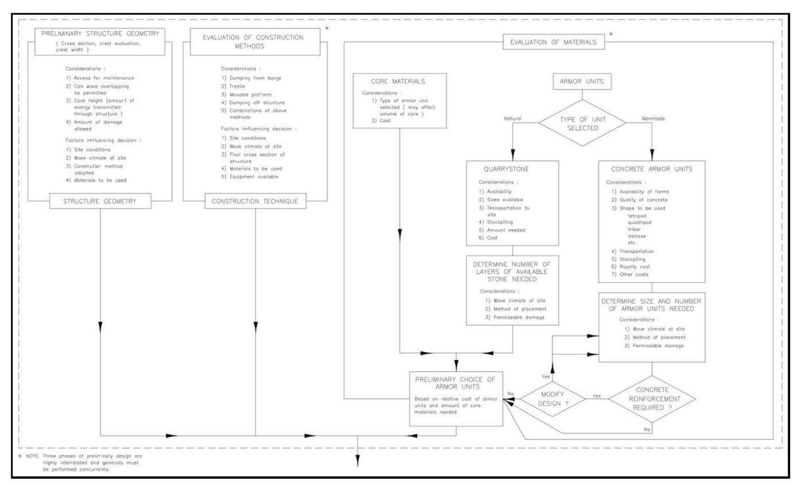

*Figure VI-5-56. Logic diagram for preliminary design of rubble-mound structures*

EM 1110-2-1100 (Part VI) Change 3 (28 Sep 11)
- (c) Concrete caps with solid vertical or sloped walls reflect waves out through the upper rows of armor units, perhaps causing loss of those units. Solid slabs and blocks can trap air beneath them, creating uplift forces during heavy wave action that may crack or tip the cap (Magoon et al. 1974). A permeable cap decreases both of these problems. A parapet can be made permeable, and vertical vents can be placed through the slab or block itself (Mettam 1976). Lillevang (1977) designed a breakwater crest composed of a vented block cap placed on an unchinked, ungrounted extension of the seaward slope's underlayer, a permeable base reaching across the crest.
- (d) Ribbed caps are a compromise between the solid block and a covering of concrete armor units. The ribs are large, long, rectangular members of reinforced concrete placed perpendicular to the axis of a structure in a manner resembling railroad ties. The ribs are connected by reinforced concrete braces, giving the cap the appearance of a railroad track running along the structure crest. This cap serves to brace the upper units on the slopes, yet is permeable in both the horizontal and vertical directions.
- (e) Ribbed caps have been used on U.S. Army Corps of Engineers breakwaters at Maalea Harbor (Carver and Markle 1981), at Kahului (Markle 1982), on Maui, and Pohoiki Bay, all in the State of Hawaii.
- (f) Waves overtopping a concrete cap can damage the leeside armor layer. The width of the cap and the shape of its lee side can be designed to deflect overtopping waves away from the structure's lee side (Czerniak and Collins 1977; Lillevang 1977; and Jensen 1983). Ribbed caps help dissipate waves.
- (g) High parapet walls have been added to caps to deflect overtopping seaward and allow the lowering of the crest of the rubble mound itself. These walls present the same reflection problems described above and complicate the design of a stable cap (Mettam 1976; Jensen 1983). Hydraulic model tests by Carver and Davidson (1976, 1983) have investigated the stability of caps with high parapet walls proposed for Corps structures. Part VI-5-4 d , "Stability of concrete caps and caissons against sliding and overturning," provides design guidance.
- (h) To evaluate the need for a massive concrete cap to increase structural stability against overtopping, consideration should be given to the cost of including a cap versus the cost of increasing dimensions to prevent overtopping and for construction and maintenance purposes. A massive concrete cap is not necessary for the structural stability of a structure composed of concrete armor units when the difference in elevation between the crest and the limit of wave runup on the projected slope above the structure is less than 15 percent of the total wave runup. For this purpose, an all-rubble structure is preferable, and a concrete cap should be used only if substantial savings would result. Maintenance costs for an adequately designed rubble structure are likely to be lower than for any alternative composite-type structure. The cost of a concrete cap should also be compared to the cost of covering the crest with flexible, permeable concrete armor units, perhaps larger than those used on the slopes, or large quarrystone armor. Hydraulic model tests are recommended to determine the most stable and economical crest designs for major structures.
- (i) Experience indicates that concrete placed in the voids on the structure slopes has little structural value. By reducing slope roughness and surface porosity, the concrete increases wave runup. The effective life of the concrete is short, because the bond between concrete and stone is quickly broken by structure settlement. Such filling increases maintenance costs. For a roadway, a concrete cap can usually be justified if frequent maintenance of armor slopes is anticipated. A smooth surface is required for wheeled vehicles; tracked equipment can be used on ribbed caps. (4) Thickness of armor layer and underlayers. (a) The thickness of the cover layer and underlayers is calculated using the formula

```math
r = nk_{\Delta} \left(\frac{W}{w_a}\right)^{1/3} \tag{VI-5-117}
```

and the placing density (number of armor units per unit area) is estimated using the equation

```math
\frac{N_a}{A} = nk_{\Delta} \left( 1 - \frac{P}{100} \right) \left( \frac{w_a}{W} \right)^{2/3} \tag{VI-5-118}
```

where r is the average layer thickness, n is the number of quarrystone or concrete armor units in the thickness (typically n = 2), W is the weight of individual armor units, w_a is the specific weight of the armor unit material, and N_a is the required number of individual armor units for a given surface area, A. The layer coefficient ( k_A ) and cover layer average porosity (P) in percent were experimentally determined, and values are given in Table VI-5-51. Equations VI-5-117 and VI-5-118 can be used with either metric or English units.
(b) The specified placing or packing density must be strictly maintained during construction to assure proper interlocking, and therefore hydraulic stability, of the armor layer. During placement, packing density can be maintained by specifying a mean and allowable deviation for the centroidal distance (in three dimensions) between units, or it can be maintained by counting units in a specified area. For grid placement, each subsequent row of armor units is typically offset laterally from the previous lower row to avoid failure planes. To specify the placement grid, D_H is the distance between the centroids of two adjacent units on the same horizontal row and D_U is the distance between the centroids of units upslope in the plane of the structure slope. Values of D_H and D_U for specific armor sizes and packing density coefficients appropriate for Core-Loc and Accropod units can be obtained from the vendor or license holder. Within any matrix of armor units, every effort should be made to achieve maximum interlocking. The maximum centroidal distance D_{max} should not exceed 110 percent of the values specified. Greater spacing may jeopardize interlocking and the integrity of the armor layer.

*Table VI-5-51 Layer Coefficient and Porosity for Various Armor Units*

**Table VI-5-51. Layer Coefficient and Porosity for Various Armor Units**

| Table | VI-5-52. | The Sainflou Regular Waves | Formula for Head-on, Fully Reflected, Standing ...................................................................................... | VI-5-153 |
| --- | --- | --- | --- | --- |
| Table | VI-5-53. | Goda Formula | for Irregular Waves ........................................................ | VI-5-154 |
| Table | VI-5-54. | Goda Formula on Breaking Waves | Modified to Include Impulsive Forces from Head- ................................................................................ VI-5-xiii | VI-5-155 |

*& lt;sup>1</sup> Hudson (1974)*

- <sup>5</sup> Carver and Davidson (1977)
- <sup>6</sup> Turk and Melby (1997)
- <sup>7</sup> Accropod informational brochure

*& lt;sup>2</sup> Carver and Davidson (1983)*

*Layer thickness is twice the average long dimension of the parallelepiped stones. Porosity is estimated from tests on one layer of uniformly placed modified cubes (Hudson 1974).*

*The minimum layer thickness should be twice the cubic dimension of the W_{50} riprap. Check to determine that the graded layer thickness is \exists 1.25 the cubic dimension of the W_{max} riprap (see Equations VI-5-119 and VI-5-120).*

(c) The thickness r of a layer of riprap is the greater of either 0.3 m, or one of the following, whichever of the three is greatest:

```math
r = 2.0 \left(\frac{W_{50}}{W_a}\right)^{1/3} \tag{VI-5-119}
```

where W_{50} is the weight of the 50-percent size in the riprap gradation, or

```math
r = 1.25 \left(\frac{W_{\text{max}}}{w_a}\right)^{1/3} \tag{VI-5-120}
```

where W_{max} is the heaviest stone in the gradation. The specified layer thickness should be increased by 50 percent for riprap placed underwater if conditions make placement to design dimensions difficult. The placing density of riprap is defined as the total weight of riprap placed (W_T) per unit area (A) of structure slope. Riprap placing density can be estimated as

```math
\frac{W_T}{A} = rw_a \left( 1 - \frac{P}{100} \right) \tag{VI-5-121}
```

- (5) Bottom elevation of primary cover layer.
- (a) When water depth is greater than 1.5 H (where H is the irregular wave height parameter used to determine a stable primary armor unit weight), the armor units in the cover layer should be extended downslope to an elevation below minimum SWL equal to the design wave height H as shown in Figure VI-5-54. For water depths less than 1.5 H extend the cover layer armor units to the toe as shown in Figure VI-5-55. Model tests to determine the bottom elevation of the primary cover layer and the type of armor placement should be conducted when feasible. Revetment cover layers located in shallow water should be extended seaward of the structure toe on sandy bottoms to serve as scour protection.
- (b) Increased stability for special-placement parallelepiped stone (see higher K_D values in Table VI-5-22) can only be obtained if a toe mound is carefully placed to support the quarrystones with their long axes perpendicular to the structure slope. For dolosse it is recommended that the bottom rows of units in the primary cover layer be Aspecial placed@ on top of the secondary cover layer as shown in Figure VI-5-54, on top of the toe berm as shown in Figure VI-5-55, or on the bottom itself. This placement is highly dependent on wave conditions and water clarity. Site-specific model studies have placed the bottom layer of dolosse with vertical flukes away from the slope and the second row placed so that the units overlap the horizontal flukes of the bottom layer. This helps assure interlocking with the random-placed units farther up the slope (Bottin, Chatham, and Carver 1976), and provides better toe stability than random placement. The seaward dolosse in the bottom row should be placed with the bottom of the vertical flukes one-half the length of the units back from the design surface of the primary armor layer to produce the design layer thickness.
EM 1110-2-1100 (Part VI) Change 3 (28 Sep 11)
- (c) Core-Loc units can be placed randomly along the toe, but experiments indicate a pattern placement along the toe is more stable and should be used when the breakwater is built in shallow, depth-limited conditions. For the bottom layer, individual Core-Loc units are set in a three-point stance in cannon fashion with the central fluke pointing seaward, up at a 45-deg angle like the cannon barrel. All toe units are placed side-by-side with minimal space between adjacent units. The second course of units is laid atop of the toe units such that they straddle each toe unit. Once the second row has been placed, all subsequent Core-Loc armor units are placed in a random matrix. While placing these units in a variety of random orientations, care must be taken to assure that all overlying units are interlocked with and constrain underlying units.
- (6) Toe berm for cover layer stability.
- (a) Structures exposed to breaking waves should have a quarrystone toe berm to protect the toe of the primary armor layer (see Figure VI-5-55). Design guidance for toe berm dimensions and stone size is given in Part VI-5-3 d , "Toe stability and protection."
- (b) The toe berm may be placed before or after the adjacent cover layer. For special-placement quarrystone or uniform-placement tribars, the toe berm serves as a base, and it must be placed first. When placed after the cover layer, the toe berm must be high enough to provide bracing up to at least half the height of the toe armor units. Usually, this requirement is exceeded by the design guidance recommended in Part VI-5-3 d .
- (7) Structure head and leeside cover layer.
- (a) Armoring of the head of a breakwater or jetty should be the same on the leeside slope as on the seaside slope for a distance of about 15 to 45 m from the structure end. This distance depends on such factors as structure length and crest elevation at the seaward end. (See Tables VI-5-37 and VI-5-38 for sizing stable armor units for heads.)
- (b) Design of leeside cover layers depends on the extent of wave overtopping, any waves or surges acting directly on the lee slope, structure porosity, and differential hydrostatic head resulting in uplift forces that may dislodge armor units on the back slope. If the crest elevation is established to prevent possible overtopping, the weight of armor units and the bottom elevation of the back slope cover layer should depend on the lesser wave action on the lee side (if any) and the porosity of the structure. Under minor overtopping the armor weight calculated for the seaward side primary cover layer should be used on the lee side down to at least the SWL or -0.5 H for preliminary designs. However, model testing may be needed to determine stable armor weights for overtopping wave impacts.
- (c) For heavy overtopping of breaking waves in shallow water, the primary armor layer on the lee side should be extended to the bottom as shown in Figure VI-5-55. Where concrete caps are employed, stability of the leeside armor during overtopping should be verified with model tests. When both sides of a structure are exposed to similar wave action (groins and jetties), both slopes should have similar designs.
- (8) Secondary cover layer.
- (a) If the armor units in the primary and secondary cover layers are of the same material, the weight of armor units in the secondary cover layer, between -1.5 H and -2.0 H , should be greater than about one-half the weight of armor units in the primary cover layer. Below -2.0 H , the weight requirements can be reduced to about W /15 for the same slope condition (see Figure VI-5-54). If the primary cover layer is quarrystone, the weights for the secondary quarrystone layers should be ratioed from the weight of quarrystone that would be required for the primary cover layer. The use of a single size of concrete armor unit for all cover layers (i.e., upgrading the secondary cover layer to the same size as the primary cover layer) may prove to be economically advantageous when the structure is located in shallow water as shown in Figure VI-5-55 where the primary cover layer is extended down the entire slope.
- (b) The secondary cover layer (shown in Figure VI-5-54 from elevation -1.5 H to the bottom) should be as thick as, or thicker than, the primary cover layer. As an example, cover layers of quarrystone of two-stone thickness ( n = 2) will require a secondary cover layer thickness of n = 2.5 for the slope between elevations - H and -2.0 H , and a thickness of n = 5 for the slope below an elevation of -2.0 H . These layer thicknesses are based on the armor unit weight ratios given in Figure VI-5-54.
- (c) The interfaces between the secondary cover layers and the primary cover layer are shown at the slope of 1-to-1.5 on Figure VI-5-54. Steeper slopes for the interfaces may contribute to the stability of the cover armor, but material characteristics and site wave conditions during construction may require using a flatter slope than shown in the figure.

#### (9) Underlayers.

- (a) The first underlayer directly beneath the primary armor units (see Figures VI-5-54 and VI-5-55) should have a minimum thickness of two quarrystones ( n = 2). The first underlayer stones should weigh about one-tenth of the weight of the overlying armor units ( W /10) if the cover layer and first underlayer are both quarrystone, or the first underlayer is quarrystone and the cover layer is concrete armor units with a stability coefficient of KD 12 (see Tables VI-5-29, VI-5-33, VI-5-34, VI-5-36). When the cover layer armor unit $K_{D}$ > 12 (dolosse, Core-Loc, and uniformly-placed tribars) the first underlayer quarrystone weight should be about one-fifth the weight of the overlying unit ( W /5). The larger size promotes increased interlocking between the first underlayer and the concrete armor units of the primary cover layer. Hydraulic model tests (Carver and Davidson 1977; Carver 1980) indicate for quarrystone armor units and dolosse on a breakwater trunk exposed to nonbreaking waves that the underlayer stone size could range from W /5 to W /20 with little effect on armor stability, wave runup or rundown. If the underlayer stone proposed for a given structure is available with a gradation in the range of W /5 to W /20, the structure should be model tested with that underlayer gradation to determine if this economical material will support a stable primary cover layer of planned armor units when exposed to the site design conditions.
- (b) The second underlayer beneath the primary cover layer and upper secondary cover layer (above -2.0 H ) should have a minimum equivalent thickness of two quarrystones and a weight about 1/20 the weight of the stones in the first underlayer. In terms of primary armor unit
EM 1110-2-1100 (Part VI) Change 3 (28 Sep 11)
weight this is approximately 1/20 W /10 = W /200 for quarrystone and some concrete armor units.
- (c) The first underlayer beneath the lower secondary cover layer (below -2.0 H on Figure VI-5-54) should also have a minimum of two thicknesses of quarrystone. Stones in this layer should weigh about 1/20 of the immediately overlying armor unit weight. In terms of primary armor unit weight this is approximately 1/20 x W /15 = W /300 for units of the same material. The second underlayer for the secondary armor below -2.0 H can be as light as W /6000, or equal to the core material size.
- (d) For the recommended cross section in Figure VI-5-54 when the primary armor is quarrystone and/or concrete units with KD 12, the first underlayer and the cover layer below -2.0 H should have quarrystone weights between W /10 and W /15. If the primary armor is concrete armor units with $K_{D}$ > 12, the first underlayer and cover armor below -2.0 H should be quarrystone with weights between W /5 and W /10.
- (e) For graded riprap cover layers the minimum requirement for the underlayers (if one or more are required) is

```math
D_{15}(\text{cover}) \le 5D_{85}(\text{under}) \tag{VI-5-122}
```

where $D_{15}$ (cover) is the diameter exceeded by the coarsest 85 percent of the riprap or underlayer on top and $D_{85}$ (under) is the diameter exceeded by the coarsest 15 percent of the underlayer or soil below (Ahrens 1981b). For a revetment where the riprap and the underlying soil satisfy the size criterion, no underlayer is necessary. Otherwise, one or more of the following is required.
- (f) The size criterion for riprap is more restrictive than the general filter criterion given in Part VI-5-3 b , "Granulated and geotextile filter stability." The riprap criterion requires larger stone in the lower layer to prevent the material from washing through the voids in the upper layer as cover layer stones shift during wave action. A more conservative underlayer than required by the minimum criterion may be constructed of stone with a 50-percent size of about W50 /20. This larger stone will produce a more permeable underlayer and should reduce runup and increase interlocking between the cover layer and underlayer. However, be sure to check the underlayer gradation against the underlying soil to assure the minimum criterion of Equation VI-5-122 is met.
- (g) The underlayers should be at least three thicknesses of the $W_{50}$ stone, but never less than 0.23 m (Ahrens 1981b). The thickness can be calculated using Equation VI-5-119 with a coefficient of 3 rather than 2. Because a revetment is placed directly on the soil or fill material of the bank it protects, a single underlayer also functions as a bedding layer or filter blanket.
- f. Blanket stability in current fields. Stone blankets constructed of randomly-placed riprap or uniformly sized stone are commonly used to protect areas susceptible to erosion by fast-flowing currents. Blanket applications include lining the bottom and sloping sides of flow channels and armoring regions of tidal inlets where problematic scour has developed. Design of stable stone or riprap blankets is based on selecting stone sizes such that the shear stress required
to dislodge the stones is greater than the expected shear stress at the bottom developed by the current.
- (1) Boundary layer shear stress.
- (a) Prandl established a universal velocity profile for flow parallel to the bed given by

```math
\frac{u}{v_*} = \frac{1}{\kappa} \ln \left( \frac{y}{k_s} \right) + B \tag{VI-5-123}
```

where
- \kappa = von Karman constant (= 0.4)
- y = elevation above the bed
- u = velocity at elevation y
- k_s = boundary roughness
- B = function of Reynolds number (= 8.5 for fully rough, turbulent flow)
- v_* = \text{shear velocity} \left( = \left( \tau_o / \rho_w \right)^{1/2} \right)
- \tau_o = shear stress acting on the bed
- \rho_w = density of water
Equation VI-5-123 can be expressed in terms of the mean flow velocity, u, by integrating over the depth, i.e.,

```math
\frac{\overline{u}}{v_*} = \frac{1}{h} \int_0^h \frac{u}{v_*} dy = \frac{1}{\kappa} \ln\left(\frac{h}{k_s}\right) + B - \frac{1}{\kappa} \tag{VI-5-124}
```

or

```math
\frac{\overline{u}}{v_*} = 2.5 \ln \left( \frac{11h}{k_s} \right) \tag{VI-5-125}
```

when fully rough turbulent flow is assumed, which is usually the case for flow over stone blankets. Equation VI-5-125 assumes uniform bed roughness and currents flowing over a distance sufficient to develop the logarithmic velocity profile over the entire water depth.
EM 1110-2-1100 (Part VI) Change 3 (28 Sep 11)
(b) Bed roughness k_s over a stone blanket is difficult to quantify, but it is usually taken to be proportional to a representative diameter d_a of the blanket material, i.e., k_s = C_1 d_a . Substituting for k_s and v_* in Equation VI-5-125 and rearranging yields an equation for shear stress given by

```math
\tau_o = \frac{w_w}{g} \left[ \frac{\overline{u}}{2.5 \ln\left(\frac{11h}{C_1 d_a}\right)} \right]^2 \tag{VI-5-126}
```

where w_w = \rho_w g is the specific weight of water.
- (2) Incipient motion of stone blankets.
- (a) Stone blankets are stable as long as the individual armor stones are able to resist the shear stresses developed by the currents. Incipient motion on a horizontal bed can be estimated from Shield's diagram (Figure III-6-7) for uniform flows. Fully rough turbulent flows occur at Reynolds numbers where Shields parameter is essentially constant, i.e.,

```math
\Psi = \frac{\tau}{(\rho_a - \rho_w)gd_a} \approx 0.04 \tag{VI-5-127}
```

where
- \tau = shear stress necessary to cause incipient motion
- \rho_a = density of armor stone
Rearranging Equation VI-5-127 and adding a factor K_I to account for blankets placed on sloping channel side walls gives

```math
\tau = 0.04K_1(w_a - w_w)d_a \tag{VI-5-128}
```

where w_a is the specific weight of armor stone (= \rho_a g ), and

```math
K_1 = \sqrt{1 - \frac{\sin^2 \theta}{\sin^2 \varphi}} \tag{VI-5-129}
```

with
- \theta = channel sidewall slope
- \varphi = angle of repose of blanket armor [. 40° for riprap]
(b) Equations VI-5-126 and VI-5-128 gives an implicit equation for the stable blanket diameter d_a . However, by assuming the logarithmic velocity profile can be approximated by a power curve of the form

```math
\ln\left(\frac{11h}{C_1d_a}\right) \approx C_2 \left(\frac{h}{d_a}\right)^{\beta}
```

an explicit equation is found having the form

```math
\frac{d_a}{h} = C_T \left[ \left( \frac{w_w}{w_a - w_w} \right)^{\frac{1}{2}} \left( \frac{\bar{u}}{\sqrt{K_1 g h}} \right) \right]^{\frac{2}{(1 - 2\beta)}} \tag{VI-5-130}
```

where all the constants of proportionality have been included in C_T . Equation VI-5-130 implies that blanket armor stability is directly proportional to water depth and flow Froude number, and inversely proportional to the immersed specific weight of the armor material. The unknown constants, C_T and \beta , have been empirically determined from laboratory and field data.
- (3) Stone blanket stability design equation.
- (a) Stable stone or riprap blankets in current fields should be designed using the following equation from Engineer Manual 1110-2-1601.

```math
\frac{d_{30}}{h} = S_f C_s \left[ \left( \frac{w_w}{w_a - w_w} \right)^{\frac{1}{2}} \left( \frac{-u}{\sqrt{K_1 g h}} \right) \right]^{\frac{5}{2}} \tag{VI-5-131}
```

where
- d_{30} = stone or riprap size of which 30 percent is finer by weight
- S_f = safety factor (minimum = 1.1) to allow for debris impacts or other unknowns
- C_s = stability coefficient for incipient motion
- = 0.30 for angular stone
- = 0.38 for rounded stone
- (b) EM 1110-2-1601 presents additional coefficients for channel bends and other situations where riprap size must be increased due to flow accelerations. The methodology is also summarized in Maynord (1998). Equation VI-5-131 is based on many large-scale model tests and available field data, and the exponent and coefficients were selected as a conservative envelope to most of the scatter in the stability data. Riprap stone sizes as specified by Equation
EM 1110-2-1100 (Part VI) Change 3 (28 Sep 11)
- VI-5-131 are most sensitive the mean flow velocity, so good velocity estimates are needed for economical blanket designs.
- (c) Alternately, Equation VI-5-131 can be rearranged for mean flow velocity to give the expression

```math
\overline{u} = \left(\frac{1}{s_f C_s}\right)^{\frac{2}{5}} \left(\frac{h}{d_{30}}\right)^{\frac{1}{10}} \left[gK_1\left(\frac{w_a - w_w}{w_w}\right) d_{30}\right]^{\frac{1}{2}} \tag{VI-5-132}
```

- (d) Equation VI-5-132, which is similar to the well-known Isbash equation, can be used to determine the maximum mean velocity that can be resisted by riprap having d_{30} of a given size. The main difference between Equation VI-5-132 and the Isbash equation is that the Isbash equation multiplies the term in square brackets by a constant whereas Equation VI-5-132 multiplies the square-bracketed term by a depth-dependent factor that arises from assuming a shape for the boundary layer. The Isbash equation is more conservative for most applications, but it is still used for fast flows in small water depths and in the vicinity of structures such as bridge abutments. (e) By assuming the blanket stones are spheres having weight given by

```math
W_{30} = \frac{\pi}{6} w_a d_{30}^3 \tag{VI-5-133}
```

where W_{30} is the stone weight for which 30 percent of stones are smaller by weight, Equation VI-5-131 can be expressed in terms of stone weight as

```math
\frac{W_{30}}{w_a h^3} = \frac{\pi}{6} \left( S_f C_s \right)^3 \left[ \left( \frac{w_w}{w_a - w_w} \right)^{\frac{1}{2}} \left( \frac{\overline{u}}{\sqrt{K_1 gh}} \right) \right]^{\frac{15}{2}} \tag{VI-5-134}
```

- (4) Stone blanket gradation.
- (a) All graded stone distributions (riprap) used for stone blankets should have distributions conforming to the weight relationships given below in terms of W_{30} or W_{50 min} (EM 1110-2-1601).

```math
W_{50 \,\text{min}} = 1.7 \, W_{30} \tag{VI-5-135}
```

```math
W_{100\,\text{max}} = 5W_{50\,\text{min}} = 8.5W_{30} \tag{VI-5-136}
```

```math
W_{100\,\text{min}} = 2\,W_{50\,\text{min}} = 3.4\,W_{30} \tag{VI-5-137}
```

```math
W_{50 \text{ max}} = 1.5 W_{50 \text{ min}} = 2.6 W_{30} \tag{VI-5-138}
```

```math
W_{15 \text{ max}} = 0.5 W_{50 \text{ max}} = 0.75 W_{50 \text{ min}} = 1.3 W_{30} \tag{VI-5-139}
```

```math
W_{15\,\text{min}} = 0.31\,W_{50\,\text{min}} = 0.5\,W_{30} \tag{VI-5-140}
```

- (b) Recommended thickness of the blanket layer, r, depends on whether placement is submerged or in the dry as specified by the following formulas. (c) For blankets placed above water, the layer thickness should be

```math
r = 2.1 \left(\frac{W_{50\,\text{min}}}{w_a}\right)^{\frac{1}{3}} = 2.5 \left(\frac{W_{30}}{w_a}\right)^{\frac{1}{3}} \tag{VI-5-141}
```

with a minimum blanket thickness of 0.3 m. Blankets placed below water should have layer thickness given by

```math
r = 3.2 \left(\frac{W_{50\,\text{min}}}{w_a}\right)^{\frac{1}{3}} = 3.8 \left(\frac{W_{30}}{w_a}\right)^{\frac{1}{3}} \tag{VI-5-142}
```

with a minimum blanket thickness of 0.5 m.

#### VI-5-4. <u>Vertical-Front Structure Loading and Response</u>.

- a. Wave forces on vertical walls.
- (1) Wave-generated pressures on structures are complicated functions of the wave conditions and geometry of the structure. For this reason laboratory model tests should be performed as part of the final design of important structures. For preliminary designs the formulae presented in this section can be used within the stated parameter limitations and with consideration of the uncertainties. Three different types of wave forces on vertical walls can be identified as shown in Figure VI-5-57.
- (a) Nonbreaking waves: Waves do not trap an air pocket against the wall (Figure VI-5-57a). The pressure at the wall has a gentle variation in time and is almost in phase with the wave elevation. Wave loads of this type are called pulsating or quasistatic loads because the period is much larger than the natural period of oscillation of the structures. (For conventional caisson breakwaters the period is approximately one order of magnitude larger.) Consequently, the wave load can be treated like a static load in stability calculations. Special considerations are required if the caisson is placed on fine soils where pore pressure may build up, resulting in significant weakening of the soil.
- (b) Breaking (plunging) waves with almost vertical fronts: Waves that break in a plunging mode develop an almost vertical front before they curl over (see Figure VI-5-57b). If this almost vertical front occurs just prior to the contact with the wall, then very high pressures are generated having extremely short durations. Only a negligible amount of air is entrapped,
EM 1110-2-1100 (Part VI) Change 3 (28 Sep 11)
resulting in a very large single peaked force followed by very small force oscillations. The duration of the pressure peak is on the order of hundredths of a second.
- (c) Breaking (plunging) waves with large air pockets: If a large amount of air is entrapped in a pocket, a double peaked force is produced followed by pronounced force oscillations as shown in Figure VI-5-57c. The first and largest peak is induced by the wave crest hitting the structure at point A, and it is similar to a hammer shock. The second peak is induced by the subsequent maximum compression of the air pocket at point B, and is it is referred to as compression shock, (Lundgren 1969). In the literature this wave loading is often called the ABagnold type.@ The force oscillations are due to the pulsation of the air pocket. The double peaks have typical spacing in the range of milliseconds to hundredths of a second. The period of the force oscillations is in the range 0.2-1.0 sec.
- (2) Due to the extremely stochastic nature of wave impacts there are no reliable formulas for prediction of impulsive pressures caused by breaking waves. Determination of impact pressures in model tests is difficult because of scale effects related to the amount and size of air bubbles and size and shape of air pockets. Also the instrumentation, data sampling, and analyses need special attention to avoid bias by dynamic amplification and misinterpretation when scaling to prototype values. Another problem related to model tests is the sensitivity of the shock loads on the shape and kinematics of the breaking waves. This calls for a very realistic and statistically correct reproduction of natural waves in laboratory models.
- (3) Impulsive loads from breaking waves can be very large, and the risk of extreme load values increases with the number of loads. Therefore, conditions resulting in frequent wave breaking at vertical structures should be avoided. Alternatives include placing a mound of armor units in front of the vertical wall structure to break the waves before they can break directly on the wall, or using a rubble-mound structure in place of the vertical wall structure.
- (4) Frequent wave breaking at vertical structures will not take place for oblique waves with angle of incidence larger than 20 deg from normal incidence. Nor will it take place if the seabed in front of the structure has a mild slope of about 1:50 or less over a distance of at least several wavelengths, and the vertical wall has no sloping foundation at the toe of the wall.
- (5) The use of a sloping-front face from about still-water level (swl) to the crest is very effective in reducing large impact pressures from breaking waves. In addition, the direction of the wave forces on the sloping part (right angle to the surface) helps reduce the horizontal force and the tilting moment. Structures with sloping tops might be difficult to optimize where large water level variations are present. Also, a sloping-front structure allows more overtopping than a vertical wall structure of equivalent crest height.

#### EXAMPLE PROBLEM VI-5-1

#### FIND:

Riprap distribution for a stable scour blanket over a nearly horizontal bottom

#### GIVEN:

The following information is known (English system units shown in parentheses)
Specific weight of riprap, w_a = 25.9 \text{ kN/m}^3 (165 \text{ lb/ft}^3)
Specific weight of water, w_w = 10.05 \text{ kN/m}^3 (64 \text{ lb/ft}^3)
Bottom slope, \theta = 0 deg i.e., K_1 = 1.0
Water depth, h = 6 m (19.7 ft)
Depth-averaged mean velocity, \bar{u} = 2.5 \text{ m/s} (8.2 \text{ ft/s})
Stability coefficient, C_s = 0.38 i.e., rounded stone
Factor of safety, S_f = 1.1
Gravitational acceleration, g = 9.81 \text{ m/s}^2 (32.2 \text{ ft/s}^2)

#### SOLUTION:

From Equation VI-5-134

```math
\frac{W_{30}}{w_a h^3} = \frac{\pi}{6} \left[ (1.1)(0.38) \right]^3 \left[ \left( \frac{10.05 kN / m^3}{\left[ 25.9 - 10.05 \right] kN / m^3} \right)^{\frac{1}{2}} \left( \frac{2.5 m / s}{\sqrt{(1.0)(9.81 m / s^2)(6m)}} \right) \right]^{\frac{15}{2}} = 1.54(10)^{-6}
```

The W_{30} weight is found as

```math
W_{30} = 1.54(10)^{-6} w_a h^3 = 1.54(10)^{-6} (25.9kN/m^3)(6m)^3 = 0.0086kN = \underline{8.6N}(1.9lb)
```

The rest of the riprap distribution is found using Equations VI-5-135 - VI-5-140, i.e.,

```math
W_{50 \text{ max}} = 2.6 (8.6 \text{ N}) = 22.4 \text{ N} (5.0 \text{ lb})
```

Blanket layer thickness for underwater placement is found using Equation VI-5-142

```math
r = 3.8 \left( \frac{0.0086kN}{25.9kN/m^3} \right)^{\frac{1}{3}} = 0.26m(0.86ft)
```

The calculated value for blanket thickness is less than the minimum value, so use r = 0.5 m (1.6 ft).

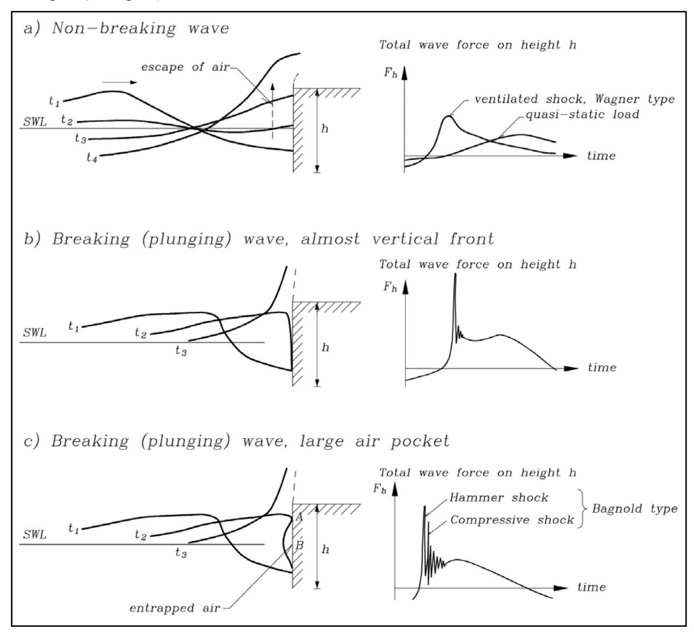

*Figure VI-5-57. Illustration of vertical wall wave forces from nonbreaking and breaking waves*

- (6) It is important to investigate the effect of sloping rubble protection or any rubble foundation that extends in front of a vertical wall to make sure the slope does not trigger wave breaking, causing frequent impact loads on the wall.
- (7) Figure VI-5-58 shows a system for identifying types of total horizontal wave loadings on the vertical-front structures as a function of structure geometry and wave characteristics (Kortenhaus and Oumeraci 1998). The system is based on two-dimensional model tests with irregular head-on waves. It should be noted that conditions for three-dimensional waves and oblique waves are different. Also note that the diagram does not cover situations where wave breaking takes place in a wider zone in front of the structure, i.e., typical shallow-water situations with depth-limited waves and seabeds flatter than 1:50.

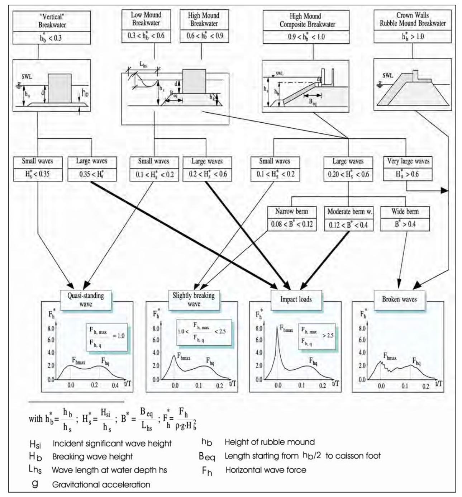

*Figure VI-5-58. Identification of types of total horizontal wave loadings on vertical wall structure exposed to head-on long-crested irregular waves (Kortenhaus and Oumeraci 1998). Not valid if breaker zone is present in front of the structure*

- b. Wave-generated forces on vertical walls and caissons.
- (1) Two-dimensional wave forces on vertical walls. Nonbreaking waves incident on smooth, impermeable vertical walls are completely reflected by the wall giving a reflection coefficient of 1.0. Where wales, tiebacks, or other structural elements increase the wall surface
EM 1110-2-1100 (Part VI) Change 3 (28 Sep 11)
roughness and retard the vertical water motion at the wall, the reflection coefficient will be slightly reduced. Vertical walls built on rubble bases will also have a reduced reflection coefficient.
- (a) The total hydrodynamic pressure distribution on a vertical wall consists of two timevarying components: the hydrostatic pressure component due to the instantaneous water depth at the wall, and the dynamic pressure component due to the accelerations of the water particles. Over a wave cycle, the force found from integrating the pressure distribution on the wall varies between a minumum value when a wave trough is at the wall to a maximum values when a wave crest is at the wall as illustrated by Figure VI-5-59 for the case of nonovertopped walls or caissons.
- (b) Notice in the right-hand sketch of Figure VI-5-59 the resulting total hydrodynamic load when the wave trough is at the vertical wall is less than the hydrostatic loading if waves were not present and the water was at rest. For bulkheads and seawalls this may be a critical design loading because saturated backfill soils could cause the wall to fail in the seaward direction (see Figures VI-2-63 and VI-2-71). Therefore, water level is a crucial design parameter for calculating forces and moments on vertical walls.

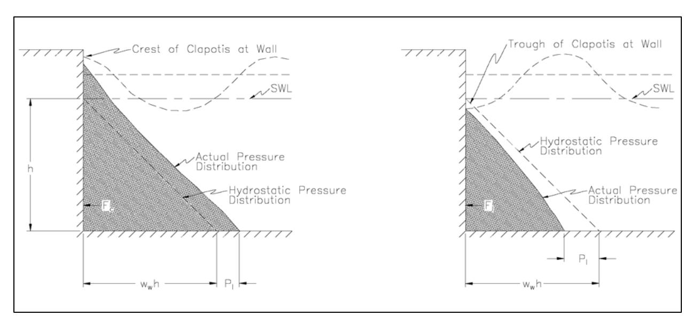

*Figure VI-5-59. Pressure distributions for nonbreaking waves*

(c) Wave overtopping of vertical walls provides a reduction in the total force and moment because the pressure distribution is truncated as shown schematically in Figure VI-5-60. Engineers should consider the ffect overtopping might have on land-based vertical structures by creating seaward pressure on the wall caused by saturated backfill or ponding water.

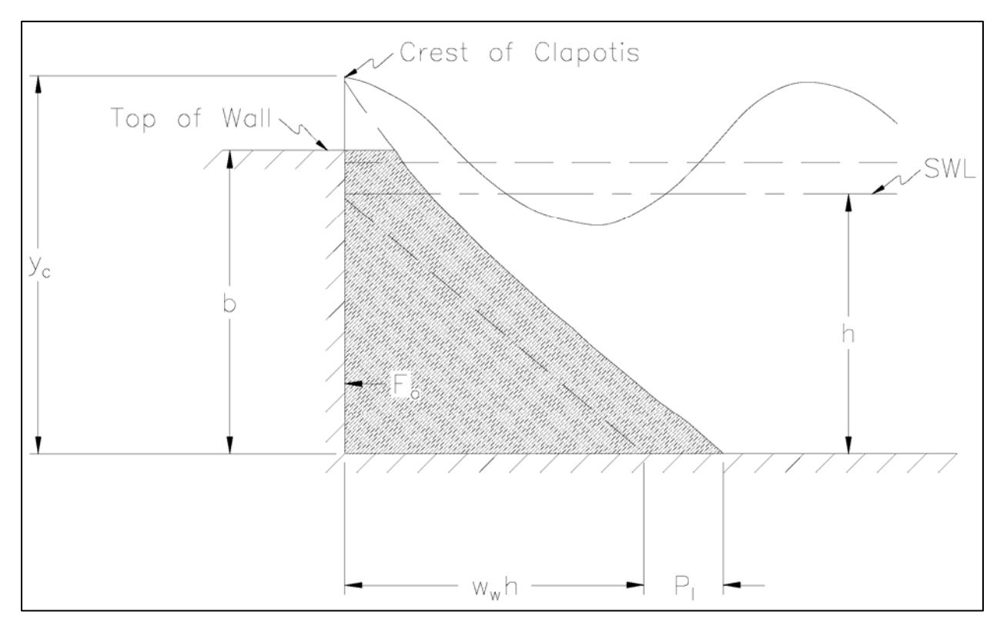

*Figure VI-5-60. Pressure distributions on overtopped vertical wall*

- (d) This section provides formulae for estimating pressure distributions and corresponding forces and overturning moments on vertical walls due to nonbreaking and breaking waves. Most of the methodology is based on the method presented by Goda (1974) and extended by others to cover a variety of conditions. These formulae provide a unified design approach to estimating design loads on vertical walls and caissons.
- (e) Important Note: All of the methods in this section calculate the pressure distribution and resulting forces and moments for only the wave portion of the hydrodynamic loading. The hydrostatic pressure distribution from the swl to the bottom is excluded (see Figure VI-5-59). For a caisson structure, the swl hydrostatic forces would exactly cancel; however, it will be necessary to include the effect of the swl hydrostatic pressure for vertical walls tied into the shoreline or an embankment.

#### EM 1110-2-1100 (Part VI) Change 3 (28 Sep 11)

*(f) The formulae given in the following tables are exclusively based on small-scale model tests. They are presented as follows:*

| Formula | Waves | Structure | Table |
| --- | --- | --- | --- |
| Sainflou formula | Standing | Impermeable vertical wall | VI-5-52 |
| Goda formula | 2-D oblique | Impermeable vertical wall | VI-5-53 |
| Goda formula, modified by Takahashi, Tanimoto, and Shimosako 1994a | Provoked breaking | Impermeable vertical wall | VI-5-54 |
| Goda formula forces and moments | Provoked breaking | Impermeable vertical wall | VI-5-55 |
| Goda formula modifed by Tanimoto and Kimura 1985 | 2-D head-on | Impermeable inclined wall | VI-5-56 |
| Goda formula modified by Takahashi and Hosoyamada 1994 | 2-D head-on | Impermeable sloping top | VI-5-57 |
| Goda formula modified by Takahashi, Tanimoto, and Shimosako 1990 | 2-D head-on | Horizontal composite structure | VI-5-58 |
| Goda formula modifed by Takahashi, Tanimoto, and Shimosako 1994b | 3-D head-on | Vertical slit wall | VI-5-59 |

*Table VI-5-52*

#### The Sainflou Formula for Head-on, Fully Reflected, Standing Regular Waves (Sainflou 1928)

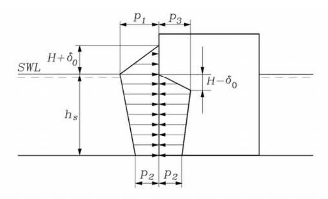

```math
p_1 = (p_2 + \rho_w g h_s) \frac{H + \delta_o}{h_s + H + \delta_o} \tag{VI-5-143}
```

```math
p_2 = \frac{\rho_w g H}{\cosh(2\pi h_s/L)}
```

```math
p_3 = \rho_w g(H - \delta_o)
```

```math
\delta_o = \frac{\pi H^2}{L} \coth \frac{2\pi h_s}{L}
```

where H Wave height. In case of irregular waves, H should be taken as a characteristic wave height. In Japan $H_{1;}$ 3 is used, while in other countries $H_{1;}$ 10 might be used.
P1 Wave pressure at the still water level, corresponding to wave crest
P2 Wave pressure at the base of the vertical wall
P3 Wave pressure at the still water level, corresponding to wave trough
b 0Vertical shift in the wave crest and wave trough at the wall
Pw Water density
h8 Water depth at the foot of the structure
L Local wave length.
Remarks. The Sainfl.ou formula for conditions under wave crest and wave trough were derived theoretically for the case of regular waves and a vertical wall. The formula cannot be applied in cases where wave breaking and/or overtopping takes place.

*Table VI-5-53 Goda Formula for Irregular Waves (Goda 1974; Tanimoto et al. 1976) (Continued)*

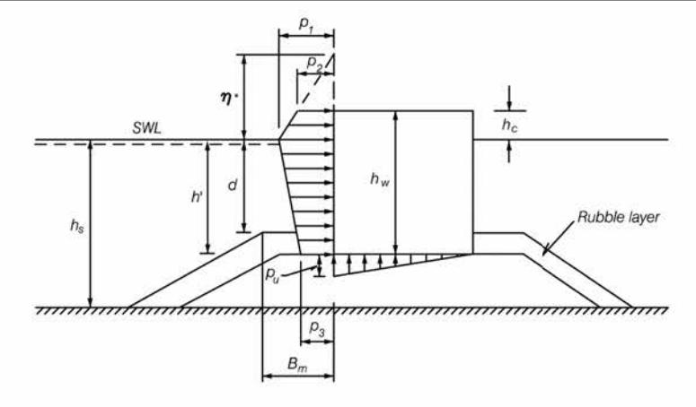

```math
\eta^* = 0.75(1 + \cos\beta) \lambda_1 H_{design}
```

```math
p_1 = 0.5(1 + \cos\beta)(\lambda_1 \alpha_1 + \lambda_2 \alpha_* \cos^2\beta) \rho_w g H_{design} \tag{VI-5-148}
```

```math
p_2 = \left\{
\begin{array}{ll}
\left(1 - \frac{h_c}{\eta^*}\right) p_1 & \text{for } \eta^* > h_c \\
0 & \text{for } \eta^* \le h_c
\end{array}
\right. \tag{VI-5-149}
```

```math
p_3 = \alpha_3 p_1 \tag{VI-5-150}
```

```math
p_u = 0.5(1 + \cos\beta)\lambda_3\alpha_1\alpha_3\rho_w g H_{design} \tag{VI-5-151}
```

where
Angle of incidence of waves (angle between wave crest and front of structure) H_{design} Design wave height defined as the highest wave in the design sea state at a location just in front of the breakwater. If seaward of a surf zone Goda (1985) recommends for practical design a value of 1.8 H_s to be used corresponding to the 0.15% exceedence value for Rayleigh distributed wave heights. This corresponds to H_{1/250} (mean of the heights of the waves included in 1/250 of the total number of waves, counted in descending order of height from the highest wave). Goda's recommendation includes a safety factor in terms of positive bias as discussed in Table VI-5-55. If within the surf zone, H_{design} is taken as the highest of the random breaking waves at a distance 5H_s seaward of the structure.

```math
\alpha_{*} = \alpha_{2}, \quad \alpha_{1} = 0.6 + 0.5 \left[ \frac{4\pi h_{s}/L}{\sinh (4\pi h_{s}/L)} \right]^{2}, \quad \alpha_{3} = 1 - \frac{h_{w} - h_{c}}{h_{s}} \left[ 1 - \frac{1}{\cosh (2\pi h_{s}/L)} \right]
```

```math
\alpha_3 = 1 - \frac{h_w - h_c}{h_s} \left[ 1 - \frac{3h_b \cdot d}{\cosh{(2\pi h_s / L)}} \right]
```

L Wavelength at water depth h_b corresponding to that of the significant wave T_s \simeq 1.1T_m , where T_m is the average period.
h_b Water depth at a distance of 5H_s seaward of the breakwater front wall.
\lambda_1 , \lambda_2 and \lambda_3 are modification factors depending on the structure type. For conventional vertical wall structures, \lambda_1 = \lambda_2 = \lambda_3 = 1 . Values for other structure types are given in related tables.
(Continued)

#### Table VI-5-53. (Concluded)

**Table VI-5-53. (Concluded)**

| 'fJ* | = | 0.75(1 + | cos{3) >..1Hdesign | (VI- 5- 147) |
| --- | --- | --- | --- | --- |
| PI | = | 0.5(1 + { ~1- | cos{3)()qal + >..2a.cos2{3) Pw g Hdesign ~)P t for 'fJ* >he | (VI- 5- 148) |
| P2 |  |  | for 'fJ* :::; he | (VI-5-149) |
| P3 |  | CY3P1 |  | (VI-5-150) |
| Pu | = | 0.5(1 + | cos{3) >..3ala3Pw9 Hdesign | (VI- 5- 151) |

#### Table VI-5-54

#### Goda Formula Modified to Include Impulsive Forces from Head-on Breaking Waves (Takahashi, Tanimoto, and Shimosako 1994a)

```math
\alpha_* = \max(\alpha_2,\alpha_I), \quad \alpha_2 = \min\left(\frac{h_b-d}{3h_b}\left(\frac{H_{design}}{d}\right)^2, \frac{2d}{H_{design}}\right), \quad \alpha_I = \alpha_{I0} \cdot \alpha_{I1}, \quad 
\begin{cases}
H_{design}/d & \text{for } H_{design}/d \leq 2 \\
2.0 & \text{for } H_{design}/d > 2
\end{cases}, \quad 
\alpha_{I1} = 
\begin{cases}
\frac{\cos\delta_2}{\cosh\delta_1} & \delta_2 \leq 0 \\
\frac{1}{\cosh\delta_1(\cosh\delta_2)^{1/2}} & \delta_2 > 0
\end{cases}, \quad 
\begin{cases}
20 \cdot \delta_{11} & \text{for } \delta_{11} \leq 0 \\
15 \cdot \delta_{11} & \text{for } \delta_{11} > 0
\end{cases}, \quad 
\delta_{11} = 0.93\left(\frac{B_m}{L}-0.12\right) + 0.36\left(\frac{h_s-d}{h_s}-0.6\right), \quad 
\begin{cases}
4.9 \cdot \delta_{22} & \text{for } \delta_{22} \leq 0 \\
3 \cdot \delta_{22} & \text{for } \delta_{22} > 0
\end{cases}, \quad 
\delta_{22} = -0.36\left(\frac{B_m}{L}-0.12\right) + 0.93\left(\frac{h_s-d}{h_s}-0.6\right)
```

#### Table VI-5-55

#### Resulting Wave Induced Forces and Moments, and Related Uncertainties and Bias When Calculated From Wave Load Equations by Goda and Takahashi

Per running meter of the breakwater the wave induced horizontal force, Frf, the uplift force, Fu, and the reduced weight of the vertical structure due to buoyancy, Fa, can be calculated from equations by Goda and Takahashi as follows:

```math
F_H = U_{F_H} \left[ \frac{1}{2} (p_1 + p_2) h_c + \frac{1}{2} (p_1 + p_3) h' \right] \tag{VI-5-152}
```

```math
F_U = U_{F_U} \cdot \frac{1}{2} p_u \cdot B \tag{VI-5-153}
```

```math
F_G = \rho_c \cdot g B \cdot h_w - \rho_w \cdot g B \cdot h'
```

where Pc Mass density of the structure
Pw Mass density of the water
UF" Stochastic variable signifying the bias and the uncertainty related to the horizontal force
UFu Stochastic variable signifying the bias and the uncertainty related to the uplift force
h' Submerged height of the wall from the toe to the still water level.
B Vertical structure width
The corresponding moments at the heel of the caisson breakwater are:

```math
M _ { H } = U _ { M _ { H } } \left[ \frac { 1 } { 6 } ( 2 p _ { 1 } + p _ { 3 } ) h ^ { \prime 2 } + \right.
```

```math
+ \frac { 1 } { 2 } ( p _ { 1 } + p _ { 2 } ) h ^ { \prime } h _ { c } + \frac { 1 } { 6 } ( p _ { 1 } + 2 p _ { 2 } ) h _ { c } ^ { 2 } \Biggr ]
```

```math
M_U = U_{M_U} \cdot \frac{1}{3} p_u \cdot B^2 \tag{VI-5-156}
```

```math
M_G = \frac{1}{2} B^2 g \left( \rho_c h_w - \rho_w h' \right)
```

Stochastic variable signifying the bias and the uncertainty of the horizontal moment
UMu Stochastic variable signifying the bias and the uncertainty of the uplift moment.
Uncertainty and bias of the Goda formulae in Table Vl-5-53. Based on reanalysis by Juhl and van der Meer (1992), Bruining (1994), and van der Meer, Juhl, and van Driel (1994) of various model tests performed at Danish Hydraulic Institute and Delft Hydraulics. The mean values and standard deviations of the stochastic variables U are given as
Uncertainty and bias of horizontal wave induced force, uplift force, horizontal moment and uplift moment {vertical composite type)

| Stochastic variable | Mean value | no model tests | model test performed |  |  |
| --- | --- | --- | --- | --- | --- |
| X; | J.LX; | Stand. dev. ax, | ~% !LX· | Stand. dev. ux, | ~% !LX • |
| UFH | 0.90 | 0.25 | 0.22 | 0.05 | 0.055 |
| UFu | 0.77 | 0.25 | 0.32 | 0.05 | 0.065 |
| UMH | 0.81 | 0.40 | 0.49 | 0.10 | 0.12 |
| UMu | 0.72 | 0.37 | 0.51 | 0.10 | 0.14 |

#### Table VI-5-56 Wave Loads on Impermeable Inclined Walls (Tanimoto and Kimura 1985)

Tanimoto and Kimura (1985) performed model tests and demonstrated that the Goda formula can be applied by projection of the Goda wave pressures calculated for a vertical wall with the same height (crest level) as illustrated in the figure.

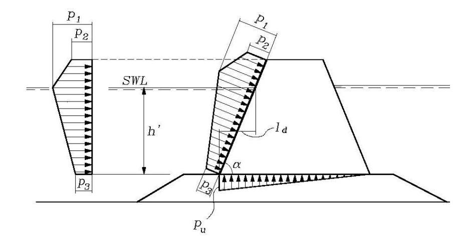

The wave induced uplift pressure on the base plate is reduced compared to the vertical face case. Consequently )q for the calculation of Pu in the Goda formula is modified as

```math
\lambda_{3} = exp\left[-2.26(7.2\ell_{d}/L)^{3}\right] \tag{VI-5-158}
```

where £d = h' cot a and L is the wavelength.
Eq VI-5-158 is valid for a ~ 70° and £d < 0.1L.

*Table VI-5-57*

#### Wave Loads on Sloping Top Structures (Takahashi and Hosoyamada 1994)

#### Tested cross sections

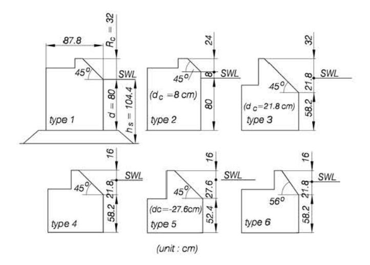

#### Pressure distribution

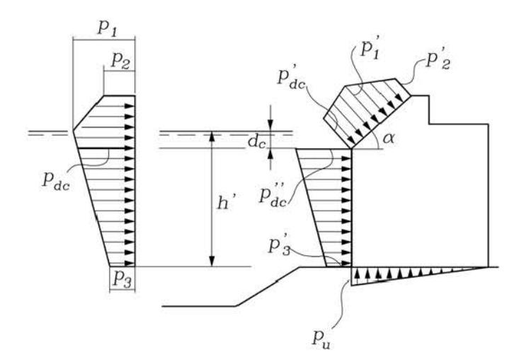

```math
p_1' = \lambda_{SL} p_1 \sin \alpha, \; p_2' = \lambda_{SL} p_2 \sin \alpha, \; p_{dc}' = \lambda_{SL} p_{dc} \sin \alpha
```

```math
p_{d_c}^{\prime\prime} = \lambda_V p_{d_c} \quad , \quad p_3^\prime = \lambda_V p_3
```

where

```math
\lambda_{SL} = \frac{1}{\sin^2\alpha}\min[1.0,\max(\sin^2\alpha, 1 + 0.46\cos^2\alpha - 23\cos^2\alpha H/L)]
```

```math
\lambda_{V} = min[1.0 , max(1.1., 1.1 + 11d_{c}/L) - 5.0H/L]
```

#### Table VI-5-58

Wave Loads on Vertical Walls Protected by a Rubble-Mound Structure (Takahashi, Tanimoto, and Shimosako 1990)

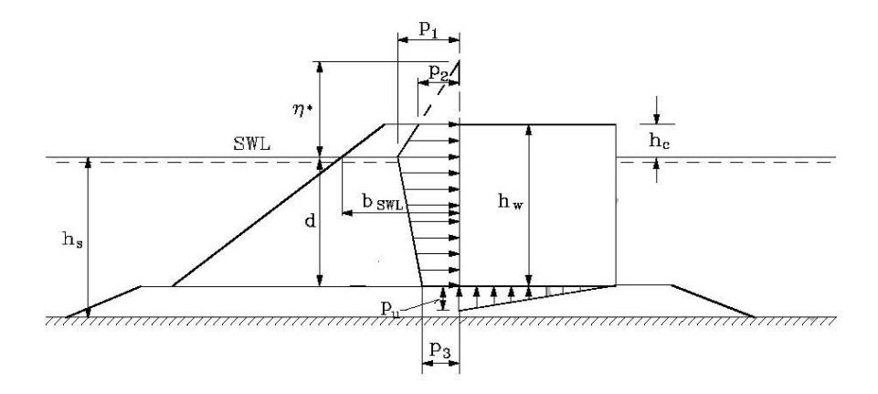

AI, A2 and A3 in the Goda formula are modified as:

```math
\lambda_1 = \lambda_3 = \begin{cases} 1.0 & H_{design}/h_s < 0.3 \\ 1.2 - 0.67 (H_{design}/h_s) & 0.3 \le H_{design}/h_s \le 0.6 \\ 0.8 & H_{design}/h_s > 0.6 \end{cases} \tag{VI-5-160}
```

Validity range: These values presume that the rubble consists of blocks of the complex types like Tetrapods and Dolosse. Also, the width of the block section at the top of the vertical wall should be no less than twice the height of a block. The front slope is approximately 1 : 1.5. The model tests cover the parameter intervals: $hs/LI/_{3}$ = 0.07-0.11 and $bswL/LI/_{3}$ = 0.046-0.068.
Uncertainty and bias: From the test results the mean value, f..t>.p and the variational coefficient, ~, of $A_{1}$ are estimated to be approximately /J-)..1

```math
\mu_{\lambda_1} = \begin{cases} 0.90 & H_{design}/h_s < 0.4 \\ 0.90 - (H_{design}/h_s - 0.4) & 0.4 \le H_{design}/h_s \le 0.7 \\ 0.60 & 0.7 < H_{design}/h_s < 0.8 \end{cases} \tag{VI-5-161}
```

```math
\frac{\sigma_{\lambda_1}}{\mu_{\lambda_1}} = 5\% - 10\%
```

*Table VI-5-59*

Wave Pressures from Regular Head-on Waves on Caissons with Vertical Slit Front Face and Open Wave Chamber (Tanimoto, Takahashi, and Kitatani 1981; Takahashi, Shimosako, and Sakaki 1991) (Continued)
Cross sections

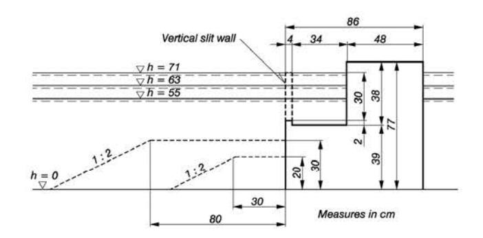

*Screen porosity (relative area of openings) = 33 %*

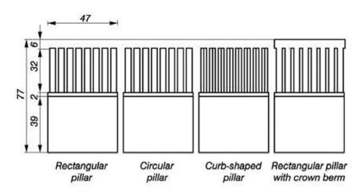

Tested wave range: Regular head-on waves
Incident wave height: 10-30 cm Wave period: 1.5, 2.0, 2.5 s
Considered wave crest faces

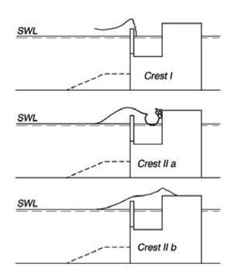

(Continued)

#### Table VI-5-59. (Concluded)

#### Pressure distribution

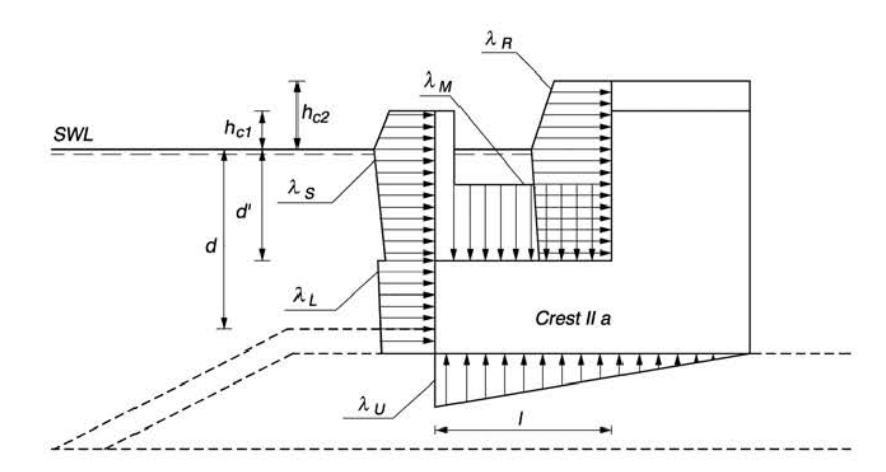

Pressure calculation: Use the Goda formulae with modified \lambda_1 , \lambda_2 and \lambda_3 as given in the following table. For example, the wave pressure on the slit wall in the case of Crest-I is calculated by the Goda formulae with \lambda_1 and \lambda_2 replaced by \lambda_{S1} and \lambda_{S2} , respectively.

#### Modification factors for vertical slit wall caisson (From Takahashi et al. 1994b).

|  |  |  | Crest-I |  | Crest-IIa |  | Crest-IIb |
| --- | --- | --- | --- | --- | --- | --- | --- |
|  | \lambda_{S1} |  | 0.85 |  | 0.7 |  | 0.3 |
| Slit wall | \lambda_{S2} | 0.4 \\ 0.3/\alpha^* | (\alpha^* \le 0.75) (\alpha^* > 0.75) |  | 0 |  | 0 |
| Impermeable | \lambda_{L1} |  | 1 |  | 0.75 |  | 0.65 |
| part of front wall | \lambda_{L2} | 0.4 \\ 0.2/\alpha^* | (\alpha^* \le 0.5) \alpha^* > 0.5) |  | 0 |  | 0 |
| Wave chamber rear wall | \lambda_{R1} |  | 0 | 20l/3L' 1.0 | l/L' \le 0.15 ) (1/L' > 0.15) | 1.4 1.6 - 2 H/h 1.0 | H/h \le 0.1 ) (0.1 < H/h < 0.3) ( H/h \ge 0.3 ) |
|  | \lambda_{R2} |  | 0 | 0.56 0.5/ \alpha^* | (\alpha^* \le 25/28) (\alpha^* > 25/28) |  | 0 |
| Wave Chamber bottom slab | \lambda_{M1} |  | 0 | 20l/3L' 1.0 | (l/L' \le 0.15) (l/L' > 0.15) | 1.4 1.6 - 2 H/h 1.0 | (H/h \le 0.1) (0.1 < H/h < 0.3) (H/h \ge 0.3) |
|  | \lambda_{M2} |  | 0 |  | 0 |  | 0 |
| Uplift force | \lambda_{U3} |  | 1 |  | 0.75 |  | 0.65 |

In the calculation of \alpha^* for the rear wall, \alpha_1 should be replaced by \alpha_1' which is obtained with the parameters d', L' and B_M' instead of d, L and B_M respectively, where d' is the depth in the wave chamber, L' is the wavelength at water depth d, B_M' = l - (d - d') , and l is the width of the wave chamber including the thickness of the perforated vertical wall.
EM 1110-2-1100 (Part VI) Change 3 (28 Sep 11)
- (g) Wave pressure distributions for breaking waves are estimated using Table VI-5-54, and the corresponding forces and moments are calculated from Table VI-5-55. Not included in this manual is the older breaking wave forces method of Minikin as detailed in the Shore Protection Manual (1984). As noted in the Shore Protection Manual the Minikin method can result in very high estimates of wave force, Aas much as 15 to 18 times those calculated for nonbreaking waves.@ These estimates are too conservative in most cases and could result in costly structures.
- (h) On the other hand, there may be rare circumstances where waves could break in just the right manner to create very high impulsive loads of short duration, and these cases may not be covered by the range of experiment parameters used to develop the guidance given in Table VI-5-54. In addition, scaled laboratory models do not correctly reproduce the force loading where pockets of air are trapped between the wave and wall as shown in Figure VI-5-57. For these reasons, it may be advisable to design vertical-front structures serving critical functions according to Minikin's method given in Shore Protection Manual (1984).
- (2) Vertical wave barriers.
- (a) A vertical wave barrier is a vertical partition that does not extend all the way to the bottom as illustrated by the definition sketch in Figure VI-5-61. Wave barriers reduce the transmitted wave height while allowing circulation to pass beneath the barrier. A useful application for vertical wave barriers is small harbor protection.

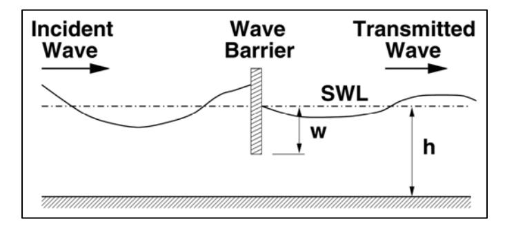

*Figure VI-5-61. Wave barrier definition sketch*

- (b) Kriebel, Sollitt, and Gerken (1998) presented small- and large-scale laboratory measurements of forces on vertical wave barriers and found that existing methods for estimating wave forces on wave barriers overpredicted measured forces by about a factor of 2. They also presented an eigenvalue expansion method for calculating theoretical wave forces, and the predicted forces matched the experiment measurements within 10-20 percent. Both regular and irregular wave experiments were used in the analysis.
- (c) Estimation of wave forces using the eigenvalue expansion method involves solving matrix equations for unknown coefficients under the physical constraints of no flow through the barrier and matching dynamic pressure in the gap beneath the barrier. However, this method must be programmed on a computer to obtain force estimates.
(d) An empirical equation for estimating forces on vertical wave barriers was developed for this manual based on the large-scale laboratory irregular wave measurements presented in Kriebel et al. (1998). Their experiments used solid vertical plates having penetration values of w/h = 0.4, 0.5, 0.6, and 0.7 placed in a 3-m water depth. Time series of total force on the plate were recorded, and significant force amplitudes per unit width of barrier were calculated from the zeroth-moment of the force spectra as

```math
F_{mo} = \frac{1}{2} \left( 4 \sqrt{m_o} \right) \frac{1}{B} \tag{VI-5-162}
```

where m_o is the area beneath the measured force spectrum and B is the horizontal width of the barrier. The 1/2-factor arises because the force spectrum also includes forces directed seaward, which are approximately the same magnitude as the landward directed forces (Kriebel et al. 1998).
(e) The relative force measurements per unit width of barrier are shown in Figure VI-5-62. The significant force per unit width (F_{mo}) is nondimensionalized by the significant force per unit width (F_o) for a vertical wall extending over the entire depth, given by the equation

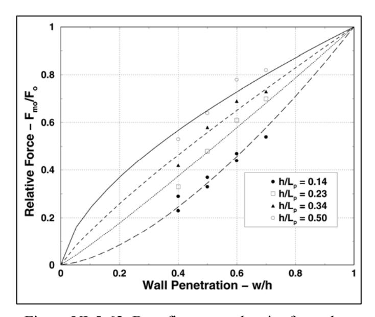

*Figure VI-5-62. Best-fit to wave barrier force data*

```math
F_o = \rho g H_{mo} \frac{\sinh k_p h}{k_p \cosh k_p h} \tag{VI-5-163}
```

where
- \rho = water density
- g = gravity
EM 1110-2-1100 (Part VI) Change 3 (28 Sep 11)
- H_{mo} = incident significant wave height
- k_p = wave number associated with the spectral peak period, T_p
- h = water depth at the barrier
(f) The lines in Figure VI-5-62 are best-fit curves of the form F_{mo}/F_o = (w/h)^m . The exponents (m) are plotted in Figure VI-5-63 as a function of relative depth, h/L_p , along with a best-fit power curve.

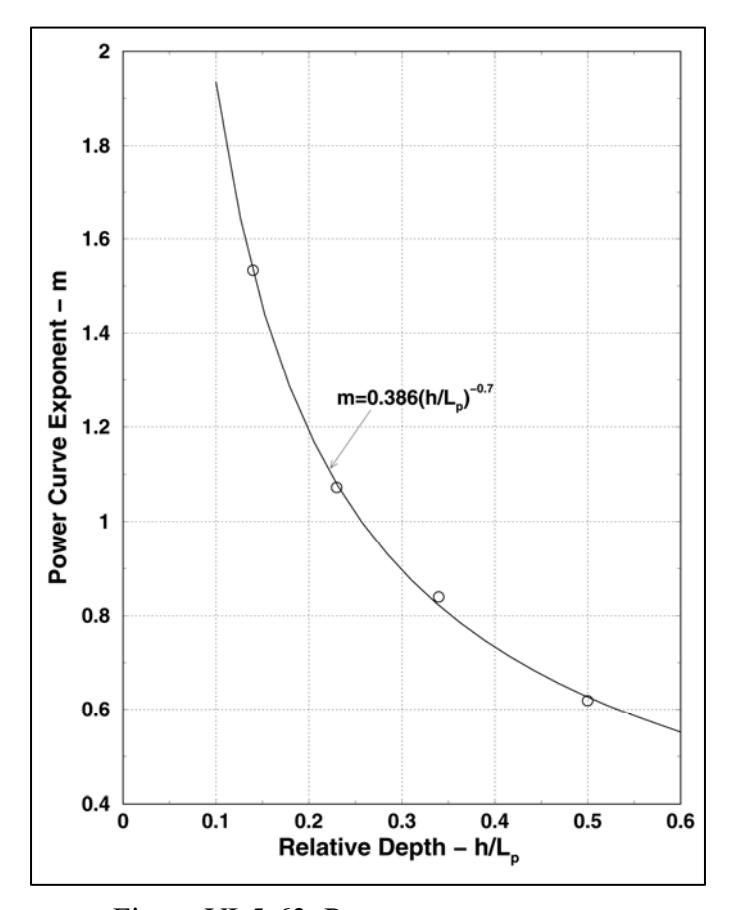

*Figure VI-5-63. Power curve exponents*

(g) The resulting empirical predictive equation is then given by

```math
F_{mo} = F_o \left( w/h \right)^{0.386 \left( h/L_p \right)^{-0.7}} \tag{VI-5-164}
```

where
- F_{mo} = significant force per unit width of barrier
- F_o = significant force per unit width of vertical wall (Equation VI-5-163)
- w = barrier penetration depth
- h = water depth
- Lp = local wavelength associated with the peak spectral period, Tp
(h) A comparison of the measured force values versus estimates based on the empirical Equation VI-5-164 is shown in Figure VI-5-64.

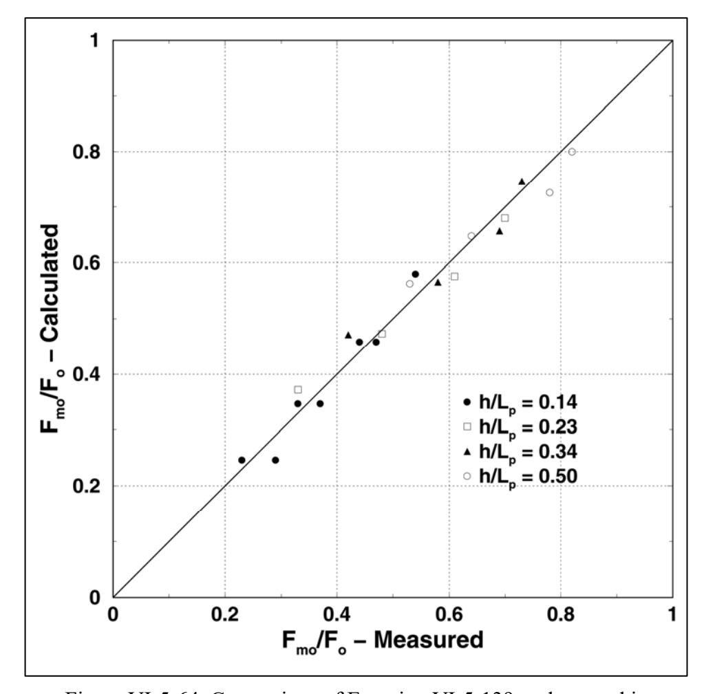

*Figure VI-5-64. Comparison of Equation VI-5-139 to data used in empirical curve fits*

- (i) Use of Equation VI-5-164 should be limited to the range 0.4 < w/h < 0.7 and 0.14 < $h/L_{p}$ < 0.5; however, estimates slightly outside the strict bound of the laboratory data are probably reasonable.
- (j) The design force load on the vertical barrier should be the load corresponding to the design wave height, $H_{design}$ = 1.8 $H_{s}$ as recommended by Goda (1985). For Rayleigh distributed
EM 1110-2-1100 (Part VI) Change 3 (28 Sep 11)
waves, H_{design} = H_{1/250} ; and by linear superposition, we can assume that force amplitudes will also be Rayleigh distributed. Thus, the design force load is determined as

```math
F_{design} = 1.8F_{mo} \tag{VI-5-165}
```

- (3) Structure length and alignment effects on wave height.
- (a) Diffraction at the head of a structure creates variations in wave heights along the structure. For a semi-infinite, fully reflecting structure exposed to nonbreaking long-crested regular waves, Ito, Tanimoto, and Yamamoto (1972) calculated the ratio of the wave height along the structure, H, to the incident wave height, H_I , as

```math
\frac{H}{H_I} = \sqrt{(C+S+1)^2 + (C-S)^2} \tag{VI-5-166}
```

where

```math
C = \partial_0^u \cos\left(\frac{\pi}{2}t^2\right) dt, \ S = \partial_0^u \sin\left(\frac{\pi}{2}t^2\right) dt, \ u = 2\sqrt{\frac{2x}{L}} \sin\left(\frac{\alpha}{2}\right) \tag{VI-5-167}
```

and x is the distance from the tip of the structure, L is the wavelength and \alpha is the angle between the direction of wave propagation and the front alignment of the structure.
- (b) Figure VI-5-65 shows an example of the wave height variation for regular head-on waves of period T=10 s. Shown with the dotted line is the wave height variation calculated for nonbreaking long-crested irregular (random) waves (Bretschneider-Mitsuyasu spectrum, T_{1/3}=10 s). The smoothing effect of random seas is clearly seen. At some locations the wave height exceeds twice the incident wave height expected for infinitely long vertical wall structures.
- (c) For short-length breakwaters, the diffraction from both ends of the structure influences the wave height variation (see Goda 1985). Also note that experiments indicate that the theoretical assumption of complete reflection of waves from smooth vertical walls appears not fulfilled, because reflection coefficients on the order of 0.95 have been measured. (However, the methods for measuring reflection are less than perfect, as well.) Oblique waves create wave height variations different from those created by head-on waves. Concave and convex corners also affect the wave height variation along the structure (see Part VI-5-4e).

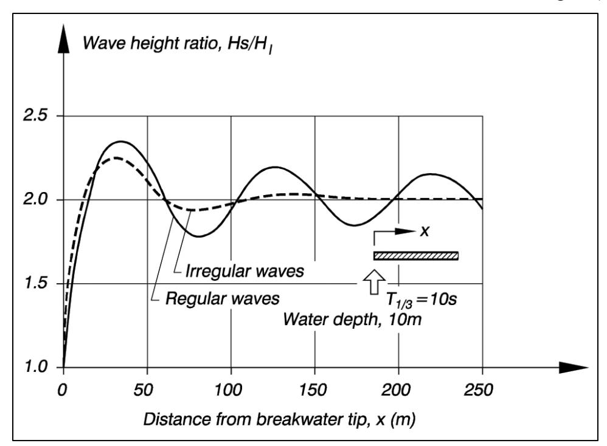

*Figure VI-5-65. Variation of wave height along a semi-infinite, fully reflecting breakwater exposed to head-on, long-crested waves (from Goda 1985)*

- (4) Horizontal wave force reduction for nonbreaking waves.
- (a) The effect of incident wave angle on the horizontal wave force exerted on a caisson is twofold. One effect is a force reduction, compared to head-on waves, due to the reduction of point pressure on the caisson, referred to as point-pressure force reduction. The second effect is a force reduction due to the fact that peak pressures do not occur simultaneously along the caisson, referred to as peak-delay force reduction. These two-force reduction effects will be present in short-crested waves because of spreading of the wave energy over a range of incident angles. Model test results Franco, van der Meer, and Franco (1996) with long-crested waves indicate that the point-pressure reduction can be estimated by the Goda formula.
- (b) The peak-delay force reduction for oblique nonbreaking regular waves can be predicted by the Battjes formula (Battjes 1982)

```math
r_{F}(L,\theta) = \frac{\text{max. force, wave incident angle } \theta}{\text{max. force, head-on wave}(\theta = 0^{\circ})} = \frac{\sin\left(\frac{\pi L_{s}}{L}\sin\theta\right)}{\frac{\pi L_{s}}{L}\sin\theta} \tag{VI-5-168}
```

where L and L_s are the wavelength and the structure length, respectively, and \theta is the wave incident angle. Equation VI-5-168 is depicted in Figure VI-5-66. (In the figure \beta is used instead of \theta .)

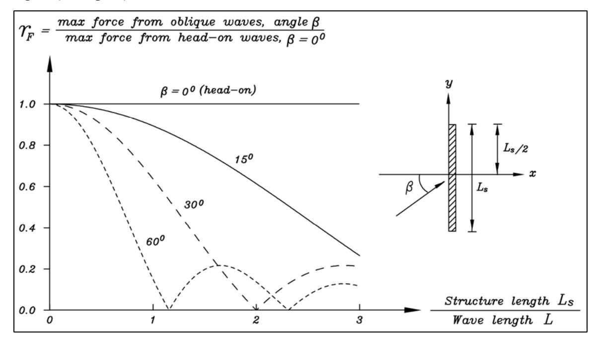

*Figure VI-5-66. Peak-delay force reduction for oblique regular waves (Burcharth and Liu 1998)*

(c) The peak-delay force reduction for oblique nonbreaking long-crested irregular waves can be estimated by the formula (Burcharth and Liu 1998)

```math
r_F\left(L_p,\theta\right)=\frac{\sin\left(\frac{\pi L_s}{L_p}\sin\theta\right)}{\frac{\pi L_s}{L_p}\sin\theta} \tag{VI-5-169}
```

where L_p is the wavelength corresponding to the peak frequency. For example, the characteristic wave force can be chosen as F_{max} , F_{1/250} , F_{1\ percent} , F_{10\ percent} , etc.
- (d) In order to investigate the uncertainty and bias of Equation VI-5-169, a real-time calculation of the wave force on a caisson by nonbreaking long-crested irregular waves was performed by Burcharth and Liu (1998). The result is given in Figure VI-5-67.
- (e) Figure VI-5-67 shows that Equation VI-5-169 gives a close estimate of the mean value of the peak-delay reduction. However, a large variation of the peak-delay force reduction factor corresponding to a low exceedence probability, e.g., F_{1/250} , was observed.

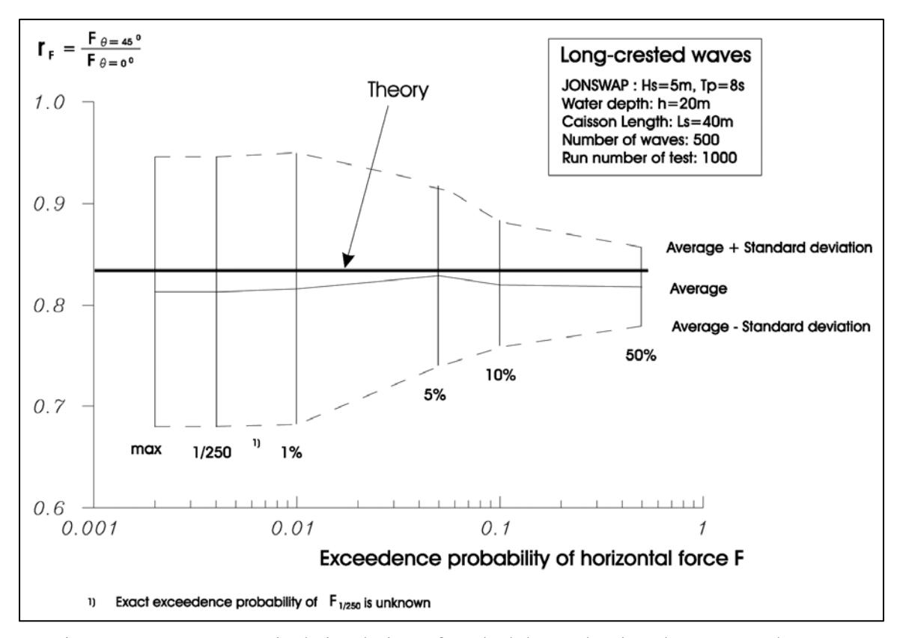

*Figure VI-5-67. Numerical simulation of peak-delay reduction, long-crested waves. Example of uncertainty calculation for wave train with 500 waves (Burcharth and Liu 1998)*

(f) The peak-delay force reduction for oblique nonbreaking short-crested waves can be estimated by the formula (Burcharth and Liu 1998)

```math
r_F(\sigma,\theta_m) = \frac{\text{characteristic wave force, short-crested wave}}{\text{characteristic wave force, head-on long-crested wave}} \approx \left( \int_{-\pi}^{\pi} r_F(L_p,\theta) D(\sigma,\theta_m) d\theta \right)^{1/2} \tag{VI-5-170}
```

where r_F(L_p, \theta) is given by Equation VI-5-169 and D(\sigma, \theta_m) is the wave directional spreading function with the wave energy spreading angle \sigma and the mean wave incident direction \theta_m . An example of Equation VI-5-170 is depicted in Figure VI-5-68.

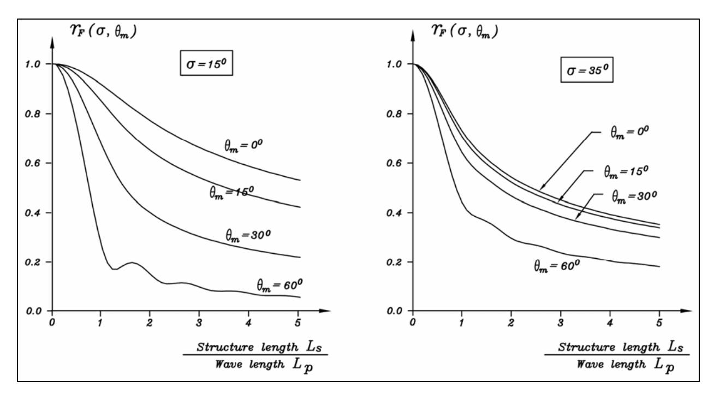

*Figure VI-5-68. Example of peak-delay force reduction for short-crested waves (Burcharth and Liu 1998)*

(5) Horizontal turning moment for nonbreaking waves. Oblique wave attack generates resultant wave forces acting eccentrically on the caisson front. The horizontal turning moment around the caisson center caused by oblique regular waves can be estimated by the formula (Burcharth 1998)

```math
r_M = \frac{\max.\text{ moment, wave incident angle } \theta}{(\text{head-on max. force}) \times (\text{structure length})} = \frac{1}{2}\left| \cos\left( \frac{\pi L_s}{L} \sin \theta \right) - \sin\left( \frac{\pi L_s}{L} \sin \theta \right) \right| \tag{VI-5-171}
```

Equation VI-5-171 is depicted in Figure VI-5-69. The maximum horizontally turning moment around caisson center under arbitrary wave incident angle is

```math
M_{\text{max}} = 0.22 F_{\theta=0^{\circ}} L_{s} \tag{VI-5-172}
```

where F_{\theta=0} ° is the maximum head-on wave force.

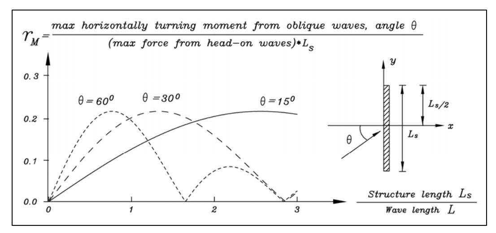

*Figure VI-5-69. Nondimensional amplitude of horizontal turning moment around the center of the caisson exposed to oblique nonbreaking regular waves*

(6) Horizontal wave force reduction for breaking waves. Short-crested waves break in a limited area and not simultaneously along the whole caisson, which results in an even larger force reduction in comparison with nonbreaking waves. Figure VI-5-70 shows an example of force reduction from model tests with short-crested, breaking, head-on waves, where the force reduction r_F is defined as

```math
r _ { _ { F } } = { \frac { F _ { _ { 1 / 2 5 0 } } , { \mathrm { s h o r t - c r e s t e d \, w a v e , m e a n \, w a v e \, i n c i d e n t \, a n g l e } } \theta _ { m } } { \mathrm { F } _ { _ { 1 / 2 5 0 } } , { \mathrm { l o n g - c r e s t e d \, h e a d - o n \, w a v e } } } } \tag{VI-5-173}
```

- (7) Broken wave forces.
- (a) Shore structures may be located where they are only subjected to broken waves under the most severe storm and tide condition. Detailed studies relating broken wave forces to incident wave parameters and beach slope are lacking; thus simplifying assumptions are used to estimate design loads. Critical designs should be confirmed with physical model tests.
- (b) Model tests have shown approximately 78 percent of the breaking wave height (0.78 H_b ) is above the still-water line when waves break on a sloping beach (Wiegel 1964). The broken wave is assumed to decay linearly from the breakpoint to the intersection of the swl with the beach slope, where the wave height is reduced to a height of H_{swl} = 0.2 H_b for beach slopes in the range 0.01 # tan \beta # 0.1 (Camfield 1991). The water mass in the broken wave is assumed to move shoreward with velocity equal to the breaking wave celery by linear theory, i.e., C = (gh_b)^{1/2} .

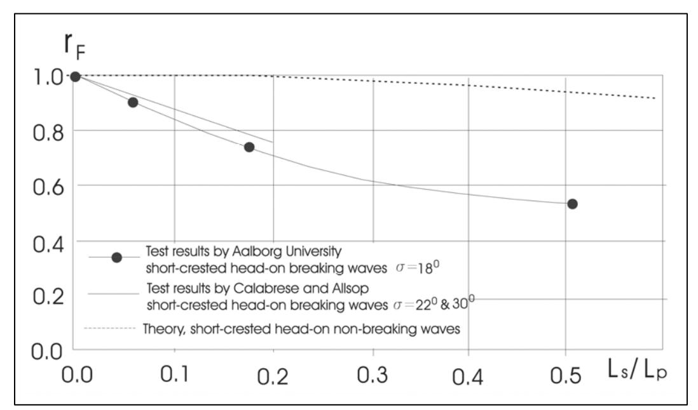

*Figure VI-5-70. Example of force reduction from model tests with short-crested breaking waves (Burcharth 1998, Calabrese and Allsop 1997)*

• Vertical wall seaward of the shoreline. Vertical walls situated seaward of the SWL/beach intersection are subjected to wave pressures composed of dynamic and hydrostatic pressures as illustrated in the sketch of Figure VI-5-71. The wave height at the wall, H_w , is determined by similar triangles to be

```math
H_{w} = \left(0.2 + 0.58 \frac{h_{s}}{h_{b}}\right) H_{b} \tag{VI-5-174}
```

where h_s is the water depth at the wall, and h_b is the water depth at wave breaking.

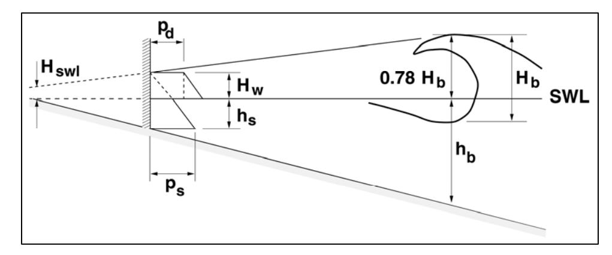

*Figure VI-5-71. Broken wave forces on wall seaward of shoreline*

• Above the swl, the dynamic component of the pressure is given as

```math
p_d = \frac{1}{2}\rho C^2 = \frac{1}{2}\rho g h_b \tag{VI-5-175}
```

and the corresponding force per unit horizontal length of the wall is

```math
R_d = p_d H_w = \frac{\rho g h_b H_w}{2} \tag{VI-5-176}
```

where \rho is the density of water. The overturning moment per unit horizontal length about the toe of the wall due to the dynamic pressure is given by

```math
M_d = R_d \left( h_s + \frac{H_w}{2} \right) \tag{VI-5-177}
```

• The hydrostatic pressure varies from zero at a height H_w above the SWL to a maximum at the base of the wall given by

```math
P_{s} = \rho g \left( h_{s} + H_{w} \right) \tag{VI-5-178}
```

• The hydrostatic force per unit horizontal width of the wall is calculated as

```math
R_{s} = \frac{\rho g}{2} (h_{s} + H_{w})^{2} \tag{VI-5-179}
```

and the corresponding hydrostatic overturning moment per unit width is

```math
M_s = R_s \left(\frac{h_s + H_w}{3}\right) = \frac{\rho g}{6} (h_s + H_w)^3 \tag{VI-5-180}
```

• The total force and moment per unit horizontal width of wall is the summation of dynamic and hydrostatic components, i.e.,

```math
R_T = R_d + R_s \tag{VI-5-181}
```

```math
M_T = M_d + M_s \tag{VI-5-182}
```

- Any backfilling with sand, soil or stone behind the wall will help resist the hydrodynamic forces and moments on the vertical wall.
- Vertical wall landward of the shoreline. Landward of the intersection of the SWL with the beach and in the absence of structures, the broken wave continues running up the beach slope until it reaches a maximum vertical runup height, R_a , that can be estimated using the procedures given in Part II-4-4, "Wave Runup on Beaches." If a vertical wall is located in the
EM 1110-2-1100 (Part VI) Change 3 (28 Sep 11)
runup region, as shown in Figure VI-5-72, the surging runup will exert a force on the wall that is related to the height, H_w , of the surge at the wall.

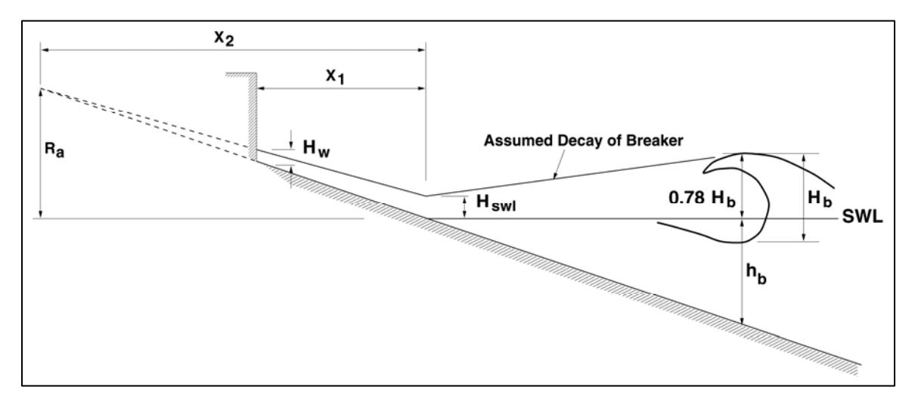

*Figure VI-5-72. Broken wave forces on wall landwater of shoreline*

• Camfield (1991) assumed a linear decrease in the runup surge over the distance X_2 shown in Figure VI-5-72 which yielded the following expression for surge height at the wall

```math
H_{w} = H_{SWL} \left( 1 - \frac{X_{1}}{X_{2}} \right) = 0.2H_{b} \left( 1 - \frac{X_{1} \tan \beta}{R_{a}} \right) \tag{VI-5-183}
```

where H_{SWL} . 0.2 H_b and \beta is the beach slope angle. The force of the surge per unit horizontal width of the vertical wall was approximated by Camfield (1991) based on the work of Cross (1967) to be

```math
F_{\text{surge}} \approx 4.5 \rho g H_w^2 \tag{VI-5-184}
```

or when combined with Equation VI-5-158

```math
F_{surge} \approx 0.18\rho g H_b^2 \left( 1 - \frac{X_1 \tan \beta}{R_a} \right)^2 \tag{VI-5-185}
```

- This approximate method is intended for use on plane slopes in the range 0.01 \# \tan \beta \# 0.1 . The methodology does not apply to steeper slopes or composite slopes. No estimates are given for the pressure distribution or the resulting overturning moment on the vertical wall. c. Wave-generated forces on concrete caps.
- (1) Wave loads on concrete caps occur only if the runup reaches the wall. The load is very dependent, not only on the characteristics of the waves, but also on the geometry (including the porosity) of the seaward face of the structure.
- (2) The wave forces on a monolithic superstructure exposed to irregular waves are of a stochastic nature. The pressure distributions and the related resultant forces at a given instant are schematized in Figure VI-5-73. Not included in the figure is the distribution of the effective stresses on the base plate.
- (3) The wave-generated pressure, p_w , acting perpendicular to the front of the wall is the pressure that would be recorded by pressure transducers mounted on the front face. The distribution of p_w is greatly affected by very large vertical velocities and accelerations which often occur. F_w is the instantaneous resultant of the wave generated pressures.
- (4) The instantaneous uplift pressure, p_b , acting perpendicular to the base plate is equal to the pore pressure in the soil immediately under the plate. The resultant force is F_b . At the front corner (point f) the uplift pressure p_b^f , equals the pressure on the front wall. At the rear corner (point r) the uplift pressure, p_b^r , equals the hydrostatic pressure at point r. The actual distribution of p_b between p_b^f and p_b^r depends on the wave-generated boundary pressure field and on the permeability and homogeneity of the soil.

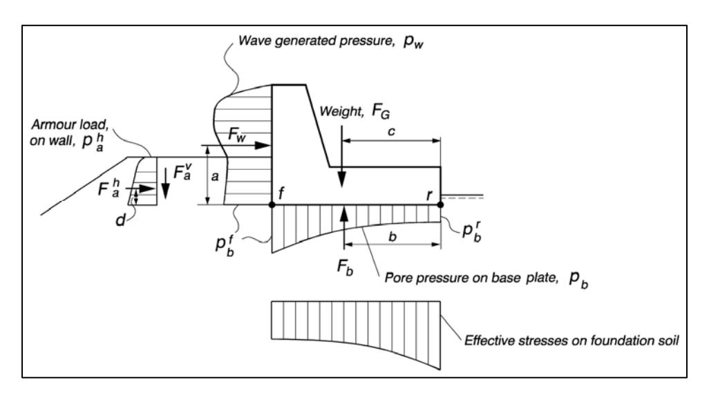

*Figure VI-5-73. Illustration of forces on a superstructure*

The distribution cannot be determined in normal wave flume scale tests because of strong scale effects related to porous flow. However, the corner pressures p_b^f and p_b^r can be measured or estimated, and in case of homogeneous and rather permeable soils and quasi-static conditions, a safe estimate on the most dangerous uplift can be found assuming a linear pressure distribution between a maximum value of p_b^f and a minimum value of p_b^r as shown in Figure VI-5-74a. If a blocking of the porous flow is introduced on the seaside of the base, the assumption of a linear distribution will be even safer as illustrated by Figure VI-5-74b. On the other hand a blockage under the rear end of the base plate might cause the linear assumption to be on the unsafe side as illustrated by Figure VI-5-74c. Note, that in case b and c the resultant of the base plate pressure is not vertical.

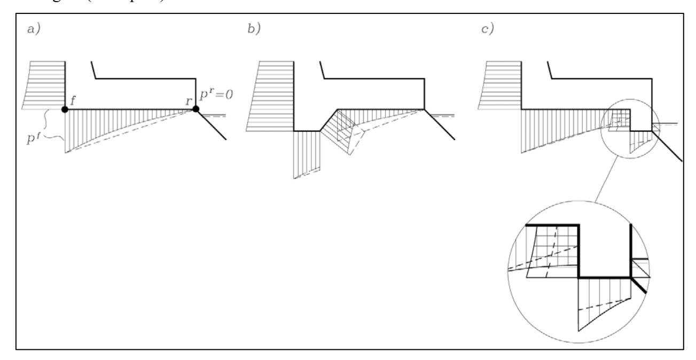

*Figure VI-5-74. Illustration of comparison between base plate pore pressure distributions (under quasi-static porous flow conditions) and the approximated linear distribution*

- (5) Armor and filter stones resting against the front of the wave wall will introduce an armor load, p_a , on the front through the contact points. Both a normal soil mechanics load and a proportion of the dynamic wave loads on the armor contribute to p_a . The resultant force F_a is generally not perpendicular to the front wall due to friction between the soil and the wall, and must be split into the two orthogonal components F_a^h and F_a^v . In the case of high walls (low front berms) F_a is insignificant compared to the wave load, F_w .
- (6) The load will in general be dynamic but is normally treated as quasi-static due to a rather smooth variation in time over a wave period. However, if wave breaking takes place directly on the wall face some short duration, but very large, slamming forces can occur, especially if the front face is almost vertical at the moment when the wave collides with the wall as shown in Figure VI-5-75. Such forces are also called impact or impulsive forces.

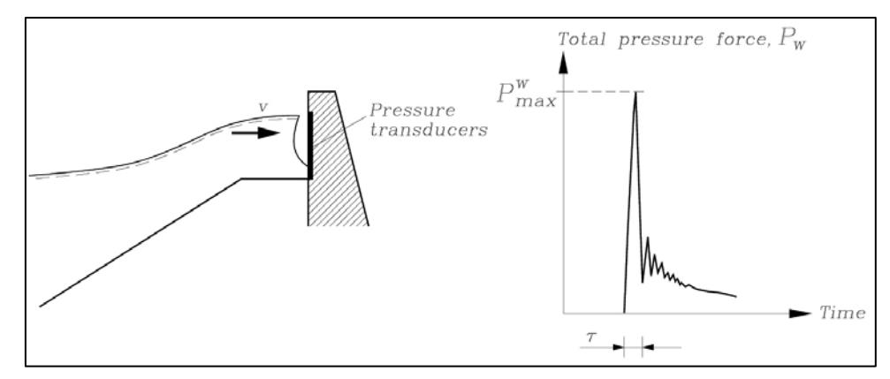

*Figure VI-5-75. Impulsive pressure force caused by wave breaking on the wave wall*

(7) Wave slamming on the wall can be avoided and the quasi-static wave loads reduced by increasing the crest level and/or the width of the front berm as shown by Figure VI-5-76. Wave slamming on the front of the wall will not occur in configurations c and d .

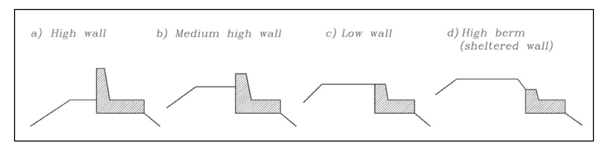

*Figure VI-5-76. Typical crown wall configurations*

- (8) The wave loadings on a crown wall can be assessed only by physical model tests or by prototype recordings. However, no prototype results have been reported in the literature and most model test results are related to specific crown wall configurations.
- (9) Table VI-5-60 shows an empirical formula for horizontal wave load given by Jensen (1984) and Bradbury et al. (1988). Table VI-5-61 shows empirical formulae for horizontal wave load, turning moment and uplift pressure presented by Pedersen (1996). The formulae are based on small scale model tests with head-on irregular waves. Predictions are compared to measurements in Figure VI-5-77.

*Table VI-5-60 Horizontal Wave Force on Concrete Caps (Jensen 1984; Bradbury et al. 1988)*

**Table VI-5-60. Horizontal Wave Force on Concrete Caps (Jensen 1984; Bradbury et al. 1988)**

| Table | VI-5-62. | Experimental Test Japan | Results | of Friction Coefficient Conducted in ....................................................................................................... | VI-5-182 |
| --- | --- | --- | --- | --- | --- |
| Table | VI-5-63. | Experimental Test | Results | of Friction Coefficient ................................ | VI-5-182 |
| Table | VI-5-64. | Dynamic Friction Rubble-Mound | Coefficient | Between Caisson Bottom and ....................................................................................... | VI-5-183 |
| Table | VI-5-65. | Fractional Limits of | Grain | Sizes According ISO/CEN .......................... | VI-5-194 |
| Table | VI-5-66. | Typical Bulk Density | Values | ................................................................. | VI-5-195 |

**Table VI-5-60. Horizontal Wave Force on Concrete Caps (Jensen 1984; Bradbury et al. 1988)**

| Table | VI-5-62. | Experimental Test Japan | Results | of Friction Coefficient Conducted in ....................................................................................................... | VI-5-182 |
| --- | --- | --- | --- | --- | --- |
| Table | VI-5-63. | Experimental Test | Results | of Friction Coefficient ................................ | VI-5-182 |
| Table | VI-5-64. | Dynamic Friction Rubble-Mound | Coefficient | Between Caisson Bottom and ....................................................................................... | VI-5-183 |
| Table | VI-5-65. | Fractional Limits of | Grain | Sizes According ISO/CEN .......................... | VI-5-194 |
| Table | VI-5-66. | Typical Bulk Density | Values | ................................................................. | VI-5-195 |

Cross section A Cross section B

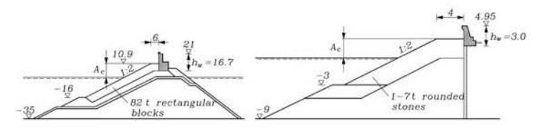

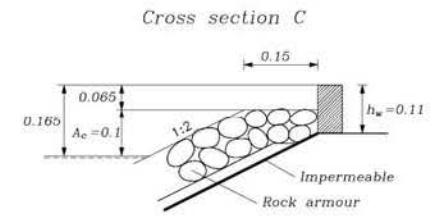

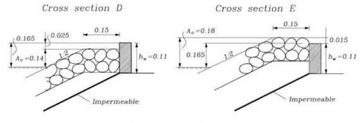

*All measures in meters.*

| Cross section |  | ameter ranges in tests | 0.1% exceedence values of coefficients in Eq (VI-5-186) | Reference |  |  |  |
| --- | --- | --- | --- | --- | --- | --- | --- |
|  | A_c (m) | s_{op} = \frac{H_s}{L_{op}} | \frac{H_s}{A_c} | \alpha | β |  |  |
| A | 5.6 - 10.6 | 0.016 - 0.036 | 0.76 - 2.5 | -0.026 | 0.051 | 0.21 | Jensen (1984) |
| A B | 1.5 - 3.0 | 0.05 - 0.011 | 0.82 - 2.4 | -0.016 | 0.025 | 0.46 |  |
| C | 0.10 | 0.023 - 0.07 | 0.9 - 2.1 | -0.038 | 0.043 | 0.19 | Bradbury, et al. (1988) |
| D | 0.14 | 0.04 - 0.05 | 1.43 | -0.025 | 0.028 |  | _ |
| E | 0.18 | 0.04 - 0.05 | 1.11 | -0.088 | 0.011 |  | - |

*Table VI-5-61*

## Horizontal Wave Force, Uplift Wave Pressure and Turning Moment on Concrete Caps (Pedersen 1996)

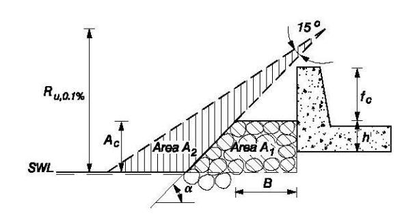

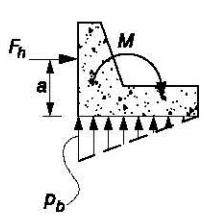

```math
F_{h,0.1\%} = 0.21 \sqrt{\frac{L_{om}}{B}} \left( 1.6 p_m y_{eff} + A \frac{p_m}{2} h' \right) \tag{VI-5-187}
```

```math
M_{0.1\%} = a \times F_{h,0.1\%} = 0.55(h' + y_{eff})F_{h,0.1\%} \tag{VI-5-188}
```

```math
p_{b.0.1\%} = 1.00 A p_m \tag{VI-5-189}
```

where F_{h,0.1\%} Horizontal wave force per running meter of the wall corresponding to 0.1% exceedence probability
M_{0.1\%} Wave generated turning moment per running meter of the wall corresponding to 0.1% exceedence probability
p_{b,0.1\%} Wave uplift pressure corresponding to 0.1% exceedence probability
L_{om} Deepwater wavelength corresponding to mean wave period
B Berm width of armor layer in front of the wall
p_m = \rho_w g(R_{u,0,1\%} - A_c)
R_{u,0.1\%} Wave runup corresponding to 0.1% exceedence probability

```math
\begin{array} { r l r } { R _ { u , 0 , 1 \% } } & { - } & { \left\{ \begin{array} { l l } { 1 . 1 2 H _ { s } \zeta _ { m } } & { \zeta _ { m } \le 1 . 5 } \\ { 1 . 3 4 H _ { s } \zeta _ { m } ^ { 0 . 5 5 } } & { \zeta _ { m } > 1 . 5 } \end{array} \right. } \end{array}
```

\alpha Slope angle of armor layer
A<sub>c</sub> Vertical distance between MWL and the crest of the armor berm
A = \min\{A_2/A_1, 1\} , where A_1 and A_2 are areas shown in the figure
y_{eff} y_{eff} = \min\{y/2, f_c\}

```math
y = \left\{ \begin{array} { l l } { \frac { R _ { u , 0 . 1 9 } - A _ { c } } { \sin \alpha } \frac { \sin 1 5 ^ { 0 } } { \cos ( \alpha - 1 5 ^ { 0 } ) } } & { y > 0 } \\ { 0 } & { y \leq 0 } \end{array} \right.
```

h' Height of the wall protected by the armor layer
f_c Height of the wall not protected by the armor layer

#### Uncertainty of the formulae

| factor in the formulae | 0.21 | 1.6 | 0.55 | 1.00 |
| --- | --- | --- | --- | --- |
| standard deviation \sigma | 0.02 | 0.10 | 0.07 | 0.30 |

Tested range: See Table VI-5-12

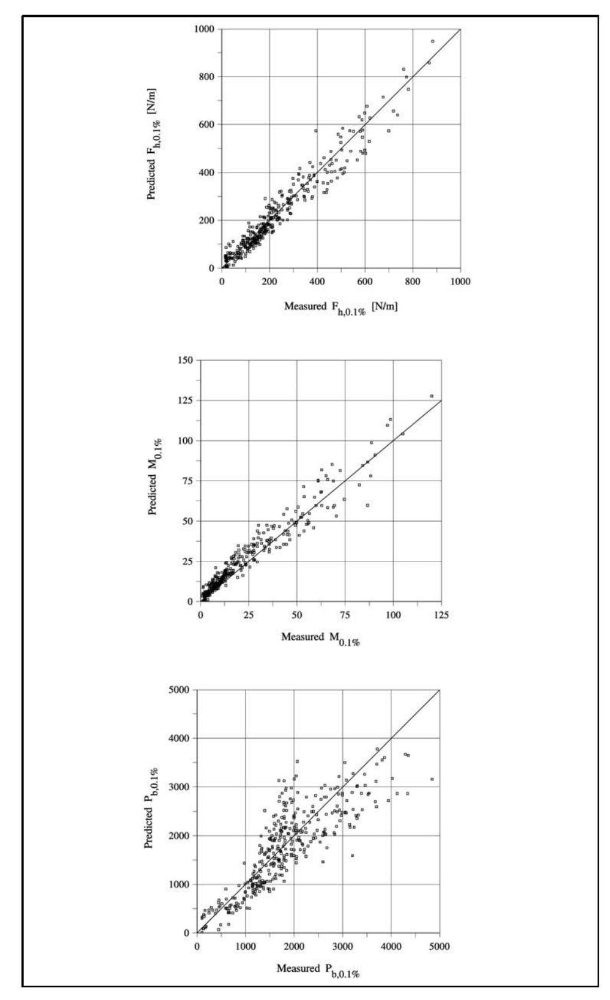

*Figure VI-5-77. Comparison of predictions to measurements using the methods in Table VI-5-61 (from Pedersen 1996)*

- d. Stability of concrete caps and caissons against sliding and overturning.
- (1) Stability against sliding between the caisson base and the rubble foundation requires

```math
(F_G - F_U) \mu \ge F_H \tag{VI-5-190}
```

where
μ = friction coefficient for the base plate against the rubble stones
- FG = buoyancy-reduced weight of the caisson
- FU = wave induced uplift force
- FH = wave induced horizontal force
- (2) Overturning can take place only when the heel pressure under the caisson is less than the bearing capacity of the foundation. If the caisson is placed on rubble stones and sand it is unlikely that overturning will occur. Instead there will be soil mechanics failure. Overturning is a realistic failure mode only if the caisson is placed on rock or on very strong clay, in which case breakage of the caisson is likely to occur.
- (3) Stability against overturning is maintained if

```math
M_{FG} \ge M_{FU} + M_{FH} \tag{VI-5-191}
```

where
- MFG = stabilizing moment around the heel by buoyancy-reduced weight of the caisson
- MFU = antistabilizing moment by wave induced uplift force
- MFH = antistabilizing moment by wave induced horizontal force
- (4) The value of the friction coefficient μ has been investigated in models and in prototype studies. For a plane concrete slab resting on quarried rubble stones, Takayama (1992) found as an average a static friction coefficient of μ = 0.636 and a coefficient of variation of 0.15. Table VI-5-62 taken from Stückrath (1996), presented experimental test results of friction coefficients conducted in Japan.
- (5) French tests (Cété-Laboratoire Régional Norde-Pas de Calais 1990) give a somewhat lower friction coefficient as shown in Table VI -5-63.
EM 1110-2-1100 (Part VI) Change 3 (28 Sep 11)
(6) Morihira, Kihara, and $Horikawa^{1}$ investigated the dynamic friction coefficient between caissons with different bottom patterns and rubble foundation with different levelling as shown in Table VI-5-64.

*Table VI-5-62 Experimental Test Results of Friction Coefficient Conducted in Japan (taken from Stückrath 1996)*

**Table VI-5-62. Experimental Test Results of Friction Coefficient Conducted in Japan (taken from Stückrath 1996)**

|  |  | Japan ....................................................................................................... | VI-5-182 |
| --- | --- | --- | --- |
| Table | VI-5-63. | Experimental Test Results of Friction Coefficient ................................ | VI-5-182 |
| Table | VI-5-64. | Dynamic Friction Coefficient Between Caisson Bottom and Rubble-Mound ....................................................................................... | VI-5-183 |
| Table | VI-5-65. | Fractional Limits of Grain Sizes According ISO/CEN .......................... | VI-5-194 |
| Table | VI-5-66. | Typical Bulk Density Values ................................................................. | VI-5-195 |

*Table VI-5-63 Experimental Test Results of Friction Coefficient (Cété-Laboratoire Régional Norde-Pas de Calais 1990)*

**Table VI-5-63. Experimental Test Results of Friction Coefficient (Cété-Laboratoire Régional Norde-Pas de Calais 1990)**

|  |  | Rubble-Mound | ....................................................................................... | VI-5-183 |
| --- | --- | --- | --- | --- |
| Table | VI-5-65. | Fractional Limits | of Grain Sizes According ISO/CEN .......................... | VI-5-194 |
| Table | VI-5-66. | Typical Bulk | Density Values ................................................................. | VI-5-195 |

*1 Personal Communication, 1998, M. Marihira, T. Kihara, and H. Horikawa. "On the Friction Coefficients Between Concrete Block Sea Walls and Rubble-Mound Foundations."*

#### Table VI-5-64

Dynamic Friction Coefficient Between Caisson Bottom and Rubble-Mound (Morihira, Kihara, and Harikawa, personal communication 1998)

#### Levelling method for rubble mound

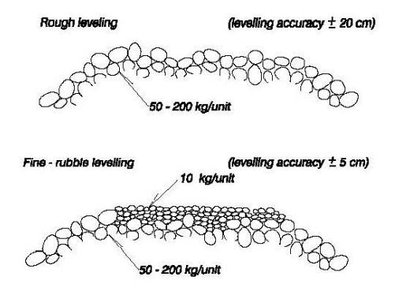

#### Bottom pattern of caissons

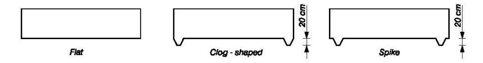

*Table of Dynamic friction coefficients*

| Levelling | Bottom pattern | J,tma.x | Jtma:~: | Jl con M | M |  |  |  |
| --- | --- | --- | --- | --- | --- | --- | --- | --- |
|  |  |  |  |  | S=5crn | S= 10 em | S= 20 em | S=30 em |
|  | flat | 0.75 | 0.70 | 0_70 | 0.53 | 0.59 | 0.65 | 0.70 |
|  |  | 0.73 | 0.70 | 0_70 | 0.70 | 0.70 | 0.70 | 0.70 |
|  | clog-shaped | 1.19 | 1.13 | L16 | 0.76 | 0.91 | 0.98 | 1.08 |
|  |  | 1.11 | 1.02 | L01 | 0.76 | 0.90 | 1.01 | 1.00 |
| rough | spike | 0.85 | 0.79 | o_so | 0.62 | 0.80 | 0.80 | 0.80 |
|  |  | 0.97 | 0.81 | 0-84 | 0.70 | 0.70 | 0.83 | 0.95 |
|  | clog-shaped with | 1.45 | 1.36 | > 1.4 | 1.11 | 1.30 | 1.41 |  |
|  | foot protection | 1.34 | 1.19 | > 1.3 | 0.94 | 1.09 | 1.28 |  |
|  | flat | 0.68 | 0.63 | 0-65 | 0.63 | 0.64 | 0.64 | 0.55 |
|  |  | 0.70 | 0.60 | 0-60 | 0.59 | 0.60 | 0.60 | 0.60 |
| fine | clog-shaped | 1.18 | 1.08 | LOS | 0.95 | 1.03 | 1.08 | 1.08 |
|  |  | 1.15 | 1.01 | L06 | 0.90 | 0.94 | 0.97 | 1.04 |
|  | spike | 0.87 | 0.78 | 0_82 | 0.72 | 0.72 | 0.75 | 0.82 |
|  |  | 1.04 | 0.87 | 0-82 | 0.78 | 0.95 | 1.01 | 0.85 |

dynamic friction coefficient corresponding to maximum tensile load
dynamic friction coefficient corresponding to t he average of the peak tensile loads
/.l>const M dynamic friction coefficient corresponding to const ant tensile load dynamic friction coefficient corresponding to caisson displacement S
s caisson displacement
EM 1110-2-1100 (Part VI) Change 3 (28 Sep 11)
e. Waves at structure convex and concave corners. Many projects have coastal structures featuring concave or convex bends or sharp corners corresponding to structure realignment. Usually, the location and curvature of corners are determined by functional design factors, such as harbor layout or proposed channel alignment, or by site considerations, such as bathymetry. Regardless of the functional design motivation, structure bends and corners must meet or exceed the same design criteria as the rest of the structure. The orientation of bends and corners relative to the incident waves may cause changes in the local wave characteristics due to refraction, reflection, and focusing effects. Changes in wave heights could affect armor stability on the corner section, and local crest elevation may have to be heightened to prevent increased overtopping. Convex corners and bends are defined as having an outward bulge facing the waves, whereas concave corners and bends have a bulge away from the waves. Figure VI-5-78 illustrates convex and concave configurations for vertical-wall structures. Similar definitions are used for sloping-front structures.

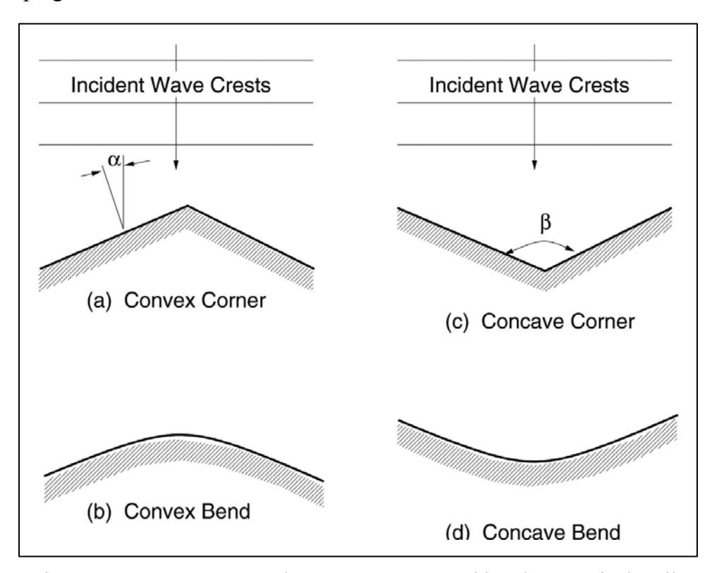

*Figure VI-5-78. Convex and concave corners and bends at vertical walls*

- (1) Waves at convex corners.
- (a) Vertical structures with convex corners. Waves approaching vertical walls with sharp convex corners such as depicted in Figure VI-5-78a will be almost perfectly reflected if the wall is impervious. This results in a diamond-like wave pattern of incident and reflected waves with the wave crests and troughs at the wall appearing to move along the wall. The maximum wave height at the wall depends on the incident wave height, $H_{i}$ , angle of wave approach, α , and wave nonlinearity.
- Perroud (1957) performed laboratory tests of solitary waves obliquely reflected by a vertical wall. He observed "normal reflection" with the angle of reflection nearly the same as the incident wave angle for cases where the incident wave angle, \alpha (defined in Figure VI-5-78), was less than about 45 deg. This is the same result given by linear wave theory for oblique reflection. The reflected wave height was just slightly less than the incident wave height for small incident angles, and it decreased as angle of incidence increased. This is contrary to linear wave theory. The maximum wave height at the wall was about twice the incident wave height up to \alpha = 45 deg, similar to linear wave theory for oblique reflection.
- For wave incident angles between about 45 deg and 70 deg Perroud observed a phenomenon referred to as "Mach reflection" in acoustics. Mach reflection of water waves is a nonlinear effect characterized by the presence of a reflected wave and a "Mach" wave with its crest propagating perpendicular to the vertical wall. The reflected wave height is significantly less than the incident wave height, and the angle of the reflected wave becomes less than the incident wave angle. The Mach reflection wave grows in length as it moves along the wall, and the maximum wave height, known as the "Mach stem" occurs at the wall.
- Figure VI-5-79 presents Perroud's (1957) averaged results for solitary waves obliquely reflected by a vertical wall. The upper plot shows the wave height at the wall in terms of the incident wave height for increasing angle of wave incidence. The ratio of reflected to incident wave height is shown in the lower plot. These plots are also given by Wiegel (1964) along with additional plots showing the decrease in reflected wave angle for Mach reflection and the increasing length of the Mach reflection wave with distance along the wall. (Note: In Wiegel (1964) the plots are given in terms of a differently defined angle of wave incidence i which is related to \alpha via ( i = 90^{\circ} \alpha ).) The speed of the Mach stem, C_M , was given as (Camfield 1990)

```math
C_M = \frac{C}{\sin \alpha} \tag{VI-5-192}
```

where C is the incident wave celerity.
- For angles of incidence greater than 70 deg from normal, Perroud observed that the wave crest bends so it is perpendicular to the vertical wall, and no discernible reflected wave appears. The wave height at the wall decreases with continuing increase in angle of incidence as indicated in Figure VI-5-79a.
- Keep in mind that the experimental results were obtained for Mach reflection of solitary waves. This implies that the results represent the shallow-water limiting case. The Mach reflection effect will decrease for smaller amplitude waves in deeper water.

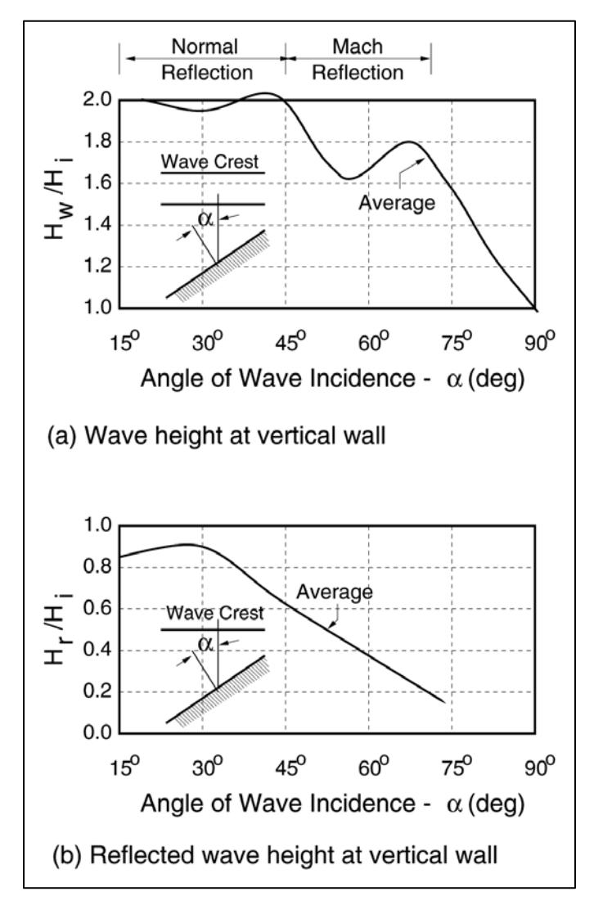

*Figure VI-5-79. Mach reflection at a vertical wall (after Wiegel 1964)*

- Vertical walls with bends rather than sharp corners (Figure VI-5-78b) produce somewhat more complicated wave reflection patterns. Along the structure bend, the local angle of wave incidence varies, as does the reflected wave angle. Consequently, accurate estimates of maximum wave height along the vertical bend are best accomplished using laboratory tests or capable numerical wave models. Estimates from Figure VI-5-79 using the local angle of wave incidence should provide a reasonable approximation for mild bends. Vertical walls with very short radii bends are analogous to the seaward portion of large diameter vertical cylinders, and wave estimation techniques used in the offshore engineering field should be appropriate.
- (b) Sloping structures with convex corners. The majority of coastal structures have impermeable or rubble-mound sloping fronts. Convex corners and bends for sloping-front structures are defined the same as illustrated in Figure VI-5-78 for vertical walls. Sharp corners are more likely on smooth, impermeable slopes whereas rubble-mound structures will have more rounded bends. Chen (1961) conducted experiments with solitary waves approaching smooth,
impermeable slopes at oblique angles. For steep slopes the resulting wave behavior was similar to vertical walls with the onset of Mach reflection at larger angles of wave incidence. As the wall slope decreased, a large horizontal eddy formed over the slope. Further decreasing of the structure slope led to wave breaking along the slope. Generally, the onset of wave breaking depends on structure slope, incident wave angle, and the ratio of wave height to water depth (H/h). Chen's experiments used only one value of H/h so this relationship was not quantified. Rubble-mound structures with convex corners and bends may have armor stability problems for short-radius bends. In this case the bend is similar to the head section of a breakwater or jetty structure. Sakaiyama and Kajima (1997) conducted model tests of armor stability at convex bends in a structure protecting a manmade island. They found that armor stability increased as the bend radius increased. In many cases, armor stability at bends and corners is confirmed with physical model tests before construction begins. For short-radius bends an alternative is to use armor stability, but the tradeoff is greater quantities of construction materials.
- (2) Waves at concave corners.
- (a) Vertical structures with concave corners. Goda (1985) provided a simple formula for estimating the increased wave height at the apex of a concave corner of angle \beta formed by two impermeable vertical walls as illustrated by Figure VI-5-78c. A horizontal bottom is assumed. Provided the walls are sufficiently long, the wave height is estimated as

```math
\frac{H_c}{H_i} = \frac{2\pi}{\beta} \tag{VI-5-193}
```

where H_c is the wave height in the corner, H_i is the incident wave height, and the angle \beta is expressed in radians. For \beta = \pi the corner becomes a straight wall, and H_c/H_i = 2 . However, as \beta becomes small, H_c increases to unreasonable values, and steepness-limited wave breaking will occur. Therefore, estimates of maximum waves at concave corners using Equation VI-5-193 should never be greater than the steepness-limited wave at that location. Goda stated the formula is also applicable to random waves. The wave height varies greatly along the walls due to interference between incident and reflected waves. For certain combinations of wall angle β and incident wave angle, the wave height at some position along the wave may be greater than at the corner apex (Goda 1985). Goda also described a more involved procedure for estimating wave heights associated with directionally spread irregular waves. Perfectly reflecting vertical structures with concave bends (see Figure VI-5-78d) will have higher wave heights than straight walls with normal wave incidence. Wave height will depend on the radius of curvature, with greater heights expected for smaller radius bends. No simple formulas are available to estimate wave heights at concave bends; but a conservative estimate can be made by approximating the bend as a corner formed by two straight walls, and then applying Equation VI-5-193. Alternately, wave heights could be determined using an appropriate numerical model.
(b) Sloping structures with concave corners. There do not appear to be any simple, reliable engineering procedures for estimating wave height variations at sloping structures with concave corners or bends. For steep-sloped, impermeable structures, the previously described method for vertical walls will provide a conservative estimate. For milder slopes, the engineer
EM 1110-2-1100 (Part VI) Change 3 (28 Sep 11)
should expect wave runup on the slope to be higher than would occur on straight structures because of the convergence of the incident wave crests. Generally, milder structure slopes, longer radii of curvature, and increased structure porosity will all contribute to a decrease in wave runup on the slope. Critical bends and corners should be tested in a physical model. If available, appropriate numerical models could also be used.
- f. Uplift forces. The fluid induced force on a structure/object in the vertical (z-coordinate) direction is typically referred to as the "uplift" force (or "lift' force). The uplift force derives from various physical reasons depending on whether the structure is submerged or above water. (1) Submerged or partially submerged structure.
- (a) In the case of submerged or partially submerged structures in nonmoving fluids (i.e., a horizontal cylinderical object such as a timber cross-bracing in a pier or an outfall pipe), there is a buoyancy force which is equal to the volume of the fluid displaced by the structure/object times the specific weight of the fluid. This buoyancy force acts through the center of gravity of the displaced fluid volume in a vertically upward direction. The point through which the buoyant force acts is referred to as the center of buoyancy. The equation for this force component is given (Fox and McDonald 1985) as the integration over the volume of displaced fluid, i.e.,

```math
F_B = \int_V (\rho_w g) dV \tag{VI-5-194}
```

where
- F_B = buoyancy force (positive upwards)
- \rho_w = density of water
- g = acceleration of gravity
- V = volume of displaced fluid
(b) For example, the buoyancy force acting on a fully submerged 1-m-diameter sphere is

```math
F_B = \gamma_w \left(\frac{\pi D^3}{6}\right) = \left(10.1 \, kN \, / \, m^3\right) \left(0.524 \, m^3\right) = 5.29 \, kN
```

where D is the sphere diameter and \gamma_w is the specific weight of salt water. The buoyancy force is directly countered by the gravitational force (weight) acting on the object. A net upward force occurs if the density of the submerged body is less than the water in which it is submerged.
(c) Additional vertically directed forces on the submerged or partially submerged solid body in the case of a moving fluid are due to the integration of the vertical component of pressure forces over the surface of the structure while neglecting elevation changes (Fox and McDonald 1985), i.e.,

```math
F_L = -\int_S p_s (dA \cdot n_z) \tag{VI-5-195}
```

where
- FL = lift force (positive upwards)
- ps = pressure on solid body surface due to moving fluid (does not include hydrostatic pressure difference due to elevation changes over the surface
dA r = differential surface area element of solid body with direction outward normal to surface
n z r = normal unit vectory in the positive z -direction (upwards)
- (d) In the case of steady flow in the horizontal x-direction, an uplift force (often referred to as a lift force) develops when the flow field around the solid body has streamlines that are closer together above the body than below it (i.e., the "Bernoulli effect") creating a lower pressure above than below the solid body. This uplift force is analogous to the aerodynamic lift force that keeps an airplane aloft. Pipelines or outfalls lying on the seabed are examples of objects that could experience an uplift force due to the distortion of streamlines created by the protrusion of the pipeline/outfall in the flow field. Where the structure/object is only partially submerged and there is no flow over the top of the structure/object, the lift force will be acting vertically downward (i.e., negative lift force) due to the compression of streamlines (and hence lower pressure) under the structure/object.
- (e) Uplift force computations on solid objects can be made via potential flow theory for simple geometry cases where there is low velocity flow (i.e., no flow separation). For the more typical design situation of turbulent flow over a solid body with flow separation, vortex shedding, and possibly a complex boundary imposed flow field, experimental laboratory measurements must be relied on to evaluate the uplift force. For steady flow situations, empirical uplift force coefficients (lift coefficients) are a function of the flow Reynold=s number, "roughness" of the solid body, and the boundary imposed flow field around the body.
- (f) When the fluid is unsteady, (e.g., oscillatory wave motion) the time-varying uplift force is estimated in the same manner as for steady flow only the computation becomes even more intractable due to the unsteady nature of the flow. In oscillatory flow over a solid body, vortices are shed with frequency and phase shifting that is dependent on the Keulegan-Carpenter number. For this situation uplift force computations and determination of empirical uplift force coefficients for the solid bodies in the flow are based on experimental laboratory measurements, often combined with numerical calculations.
- (g) Oscillatory flow empirical uplift force coefficients are a function of the Keulegan-Carpenter number of the flow, the Reynolds number, "roughness of the structure/object, and boundary imposed flow field" (e.g., Sarpkaya and Isaacson 1981). Where vortex shedding occurs at or near the natural frequency of the object in the flow, a large amplitude dynamic response,
EM 1110-2-1100 (Part VI) Change 3 (28 Sep 11)
called vortex-induced vibration, may occur, causing much larger forces than predicted by the static approach previously discussed.
(h) Uplift forces induced by both steady and oscillatory currents need to be considered where the characteristic width of structure to wavelength ratio is small (e.g., D/L < 0.2 in the case of circular cylinders of diameter, D). The equation for calculation of lift force in this situation is simplified as given in the following equation (Fox and McDonald 1985, Rouse 1950; and Sarpkaya and Isaacson 1981):

```math
F_L = C_L A_n \gamma_w \left( \frac{u^2}{2g} \right) \tag{VI-5-196}
```

where
- C_L = empirical lift coefficient
- A_n = projected area of solid body normal to the flow direction
- \gamma_w = specific weight of water
- g = gravitational acceleration
- u = magnitude of flow velocity (lift will be perpendicular to flow direction)
- (i) In the case of both steady and oscillatory currents, the velocity components of the currents must be added vectorially to provide the velocity to utilize in the previous equation.
- (j) When the size of the solid structure/object is large enough to modify the incident wave field by wave diffraction and/or wave scattering, Equation VI-5-196 cannot be used to determine lift forces. For large structures, transverse and inline forces must be computed using diffraction theory (Wiegel 1964, Sarpkaya and Isaacson 1981). Typically, diffraction theory is implemented using numerical models that determine the pressure on the solid body surface and then integrate over the surface to determine the total force. (2) Emergent structures.
- (a) In the situation where the structure/object is above water (i.e., a horizontal structural member ) and subjected to oscillatory wave action, intermittant approximately vertical directed impact forces occur when the level of the water reaches the structure/object. The uplift force on a structure/object in this scenerio cannot be theoretically derived due to the complex fluid structure interaction. Instead, engineers must rely on laboratory measurements or empirical impact force ("slamming") coefficients derived from laboratory testing. The uplift force for this situation is approximated as

```math
F_U = C_U A_z \gamma_w \left(\frac{w^2}{2g}\right) \tag{VI-5-197}
```

where
- CU = laboratory derived slamming coefficient
- Az = projected area of solid body in the horizontal plane
- w = vertical component of flow velocity at level of object
- (b) A slamming coefficient approach to calculation of this type of uplift force is utilized primarily for slender members (for which the Morrison equation is utilized for the inline force computation). The wave theory utilized to calculate the vertical velocity at the level of the structure may depend on what level of approximation is desired and/or whether a monochromatic wave theory or irregular (linear) wave theory is utilized for the computation. A particular problem in evaluation of Equation VI-5-197 is estimating the velocity field at the structure. For even the most simple calculations an assumption that the structure does not influence the wave flow field must be made. Most uplift impact (slamming) force coefficients are derived from experimental laboratory measurements. Sarpkaya and Isaacson (1981) discussed experimental results for rigidly mounted horizontal circular cylinders subject to slamming forces, and they noted laboratory measured slamming force coefficients $(C_{U})$ ranging from 4.1 to 6.4.
- (c) Typical coastal structures on which uplift forces may need to be calculated that do not fit into any of the previous catagories are caisson or monolithic concrete type breakwaters. These structures have additional complications with regard to calculation of uplift forces because they are situated on permeable foundations of rock or sand making theoretical calculations for the uplift forces very difficult. In this situation, empirical or semiempirical formula (based on laboratory testing) are utilized to provide preliminary design calculations. Typically, design conditions will not be the same as tested in past laboratory tests; therefore, uplift forces may need to be determined by testing the design in a physical model.
- (d) Goda (1985) provided empirical formulae with which to make simple (uplift) dynamic component wave force calculations on the base of composite foundation vertical caisson (or monolithic concrete) breakwaters. The dynamic component of uplift force is assumed to be triangular over the base of the structure. The empirical formulae utilized are based on a limited number of laboratory tests and should only be utilized for preliminary calculations. Variables not in the empirical guidance but very important to the pressure distribution under the structure base are foundation permeability and structure width. High permeability and narrow structure widths could lead to uplift forces considerably in excess of Goda=s (1985) empirical guidance.
- (e) Uplift forces on docks and piers are also of concern to coastal engineers although limited information exists for the computation of forces on these types of structures. When the wave crest height exceeds the underside level of the pier or dock, the structure will be subjected to uplift forces in both transverse directions. The computation of uplift force in this situation is difficult due to the modification of the flow field by the structure and the nonlinear boundary conditions at the water surface that must be accommodated. Typically, laboratory experiments augmented by numerical modeling must be utilized to evaluate these types of uplift forces.
EM 1110-2-1100 (Part VI) Change 3 (28 Sep 11)
French (1969) measured (in a laboratory experiment) transverse (positive and negative uplift) forces due to a solitary wave moving perpendicular to a pier and found that negative uplift forces often exceeded the positive uplift forces for the situations addressed. Lee and Lai (1986) utilized a numerical model to calculate wave uplift forces on a pier; and they noted that under certain conditions of bottom slope and solitary wave height to water depth combinations, positive uplift pressures can be larger than those calculated utilizing hydrostatic pressure for the given depth of immersion. In the situation where a vertical wall abuts the platform and wave reflection takes place (e.g., a dock structure), the positive uplift appears to be significantly increased while the negative uplift is reduced compared to the pier (i.e., no wave reflection) case.
(f) Bea et al. (1999) examined wave forces on the decks of offshore platforms in the Gulf of Mexico. They summarized results from a performance study of platforms that had been subjected to hurricane wave loadings on their lower decks. Modification to guidelines of the American petroleum industry were discussed and validated. Bea et al. provides up-to-date references related to wave forces on decks of offshore platforms that may be useful for similar calculations for docks and piers.

#### VI-5-5. Foundation Loads.

#### a. Introduction.

- (1) This section assumes the reader has a general knowledge about soil mechanics and foundation design because only limited basic information is given with emphasis on coastal structure foundations. The soil parameter values and empirical expressions given in this section are suitable for feasibility studies and preliminary design calculations prior to any direct soil parameter measurements being performed in the field or laboratory. The same applies for final design calculations in small projects where specific geotechnical investigations cannot be performed. In general, calculations for detailed design should be based on specific analysis of the local soil mechanics conditions. Moreover, the most relevant and accurate methods of analysis should be applied.
- (2) The main objective of this section is to present two important geotechnical aspects related to the design and geotechnical stability of breakwaters, dikes and seawalls:
- (a) Assurance of safety against failure in soils contained within structures, rubble-mound structures, and in foundation soils.
- (b) Assurance of limited (acceptable) deformations in soils contained within structures, rubble-mound structures, and in the foundation soil during structure lifetime.
- (3) Related to these two aspects are the geotechnical failure modes illustrated in Part VI-2-4:
(a) Slip surface and zone failures, causing displacement of the structure and/or the subsoil.
For rubble-mound structures and dikes see Figures VI-2-25, VI-2-41, and VI-2-51. For monolithic structures see Figures VI-2-54, VI-2-55, VI-2-64, and VI-2-66. For tied wall structures see Figures VI-2-69, VI-2-70, VI-2-71, and VI-2-72.
- (b) Excess settlement due to consolidation of subsoil and rubble foundation, causing lowering of the crest of the structure as shown in Figures VI-2-42 and VI-2-53.
- (4) Slip surface and zone failures are the result of insufficient soil bearing capacity caused by unforeseen external loadings and/or degradation of soil strength. Such failures generally lead to pronounced settlement and damage or collapse of the structure. Potential for such failure makes it important to implement proper safety factors in the design.
- (5) Excess settlement due to consolidation is caused by misjudgment of subsoil characteristics and, in the case of larger rubble-mound structures, the core materials. If evenly distributed, the settlement lowers the crest level, which causes an increase in overtopping and might reduce structure functionality. Differential settlements can cause damage to the structure itself, for example breakage of concrete superstructures, cracking of long concrete caissons, or creating weaknesses in the armor layer.
- (6) A significant difference between geotechnical stability of coastal structures and common land based structures is the presence of wave action on the structure and its foundation. Another difference is the wave- induced pore pressure variation which will be present in wave exposed porous structures and seabed soils. The wave load introduces stress variations in the soils that can lead to degradation in soil strength due to pore pressure build-up. The designer has to show that at any stage throughout the structure lifetime the soil stresses should not exceed the soil strength. This calls for prediction of short and long-term stress and strength development in the soils. Distinction is made between cases with gradually varying wave forces caused by nonbreaking waves and cases with short-duration impulsive wave forces due to waves breaking directly on the structure. The first case is referred to as cyclic loading; the second case is dynamic loading, which includes dynamic amplication.
- (7) This section is organized into the following sections containing basic information about the soil and related hydromechanic processes:

| Part/Chapter/Section Heading | Section Topic |
| --- | --- |
| VI-5-5-b. Soil and Rock Properties | Basic definitions and related typical parameter values. Deformation characteristics of soils are discussed as well. |
| VI-5-5-c. Strength Parameters | Soil parameter definitions and typical soil strength values. |
| VI-5-5-d. Hydraulic Gradients and Flow Forces in Soils. | Includes the Forchheimer equation and estimates on wave induced internal set-up and pore pressure gradients in breakwater cores. |
| VI-5-5-e. Cyclic loading of soils. | Discussion of drainage conditions, transmission of wave loads to the foundation soil, and degradation of soil strength and generation of residual pore pressure when exposed to wave induced cyclic loading. |
| VI-5-5-f. Dynamic Loading of Soils Under Monolithic Structures. | Evaluation of dynamic amplification of foundation forces and deformations caused by impulsive wave forces. |
| VI-5-5-g. Slip Surface and Zone Failures. | Stability of slopes, bearing capacity of quarry rock foundations and subsoils. Stability of soil retaining structures is not discussed. |
| VI-5-5-h. Settlement. | Short discussion of immediate and consolidation settlement. |

#### b. Soil and rock properties.

(1) Grain sizes. Table VI-5-65 gives the fractional limits according to International Standards Organization (IS), and Comité Européen de Normalisation (CEN).

**Table VI-5-65. gives the fractional limits according to International Standards Organization (IS), and Comité Européen de Normalisation (CEN).**

| Main Group | Grain | Size, mm | Sub-Groups | Grain | Size, mm |
| --- | --- | --- | --- | --- | --- |
| Boulders | > 200 |  |  |  |  |
| Cobbles | 60 – | 200 | Coarse | 20 - 60 |  |
| Gravel | 2 – 60 |  | Medium Fine Coarse | 6 - 20 2 - 6 0.6 - | 2.0 |
| Sand | 0.06 - | 2.0 | Medium Fine Coarse | 0.2 - 0.06 - 0.02 - | 0.6 0.2 0.06 |
| Silt | 0.002 | - 0.06 | Medium Fine | 0.006 0.002 | - 0.02 - 0.006 |
| Clay | < 0.002 |  | VI-5-194 |  |  |

(2) Bulk density. The bulk density is defined by the relation

```math
\rho = m / V \tag{VI-5-198}
```

where m is total mass and V is total volume. Typical bulk densities are given in Table VI-5-66.

**Table VI-5-66. **

| Soil Type | Water-Saturated | Above Water Table |
| --- | --- | --- |
| Peat | 1.0 - 1.1 | (often water-saturated) |
| Dy and gyttja | 1.2 - 1.4 | (often water-saturated) |
| Clay and silt | 1.4 - 2.0 | (often water-saturated) |
| Sand and gravel | 2.0 - 2.3 | 1.6 - 2.0 |
| Till | 2.1 - 2.4 | 1.8 - 2.3 |
| Rock fill | 1.9 - 2.2 | 1.4 - 1.9 |
| The unit weight is given by |  |  |
| γ=ρ g =ρ (9.81 kN / m 3 ) |  |  |
| (3) Volume of voids. | The volume of voids is either | expressed in terms of |
| porosity n = V p / V | or void ratio e = V p / V s | (VI-5-199) |

The unit weight is given by

```math
\gamma = \rho g = \rho (9.81 \, kN / m^3)
```

(3) Volume of voids. The volume of voids is either expressed in terms of

```math
\text{porosity } n = V_p / V \quad \text{or} \quad \text{void ratio } e = V_p / V_s \tag{VI-5-199}
```

where V is the total volume and $V_{p}$ and $V_{s}$ are the volume of voids and solids, respectively.
(a) The porosity of coarse-grained soils is strongly dependent on the grain size distribution, the shape of the grains, and the compaction. Typical values of e and n for granular soils are given in Table VI-5-67.

**Table VI-5-67. **

| Material |  | emin | emax | nmin | nmax |
| --- | --- | --- | --- | --- | --- |
| Uniform | spheres | 0.35 | 0.92 | 0.26 | 0.48 |
| Uniform | sand | 0.40 | 1.00 | 0.29 | 0.50 |
| Sand |  | 0.50 | 0.80 | 0.33 | 0.44 |
| Silty sand |  | 0.30 | 0.90 | 0.23 | 0.47 |
| Uniform | silt | 0.40 | 1.1 VI-5-195 | 0.29 | 0.52 |

EM 1110-2-1100 (Part VI) Change 3 (28 Sep 11)
- (b) For cohesive soils the range of e (and n) is much larger than for granular soils. For clays e can range between 0.2 and 25. (4) Relative density. The relative density is defined as

```math
D_r = \frac{e_{\max} - e}{e_{\max} - e_{\min}} \times 100\% \tag{VI-5-200}
```

where
- e_{min} = void ratio of soil in most dense condition
- e_{max} = void ratio of soil in loosest condition
- e = in-place void ratio

*Table VI-5-68 provides a density characterization of granular soils on the basis of D_r .*

**Table VI-5-68. provides a density characterization of granular soils on the basis of D_r .**

| Relative Density $D_{r}$ ( percent) | Descriptive Term |
| --- | --- |
| 0 - 15 | very loose |
| 15 – 35 | loose |
| 35 - 65 | medium |
| 65 – 85 | dense |
| 85 – 100 | very dense |

(5) Plasticity index. The plasticity index I_p relates to cohesive soils and indicates the magnitude of water content range over which the soil remains plastic. The plasticity index is given by

```math
I_p = w_l - w_p \tag{VI-5-201}
```

where w is the water content, i.e., the ratio of weight of water to the weight of solids in a soil element, and subscripts l and p refer to liquid and plastic limits, respectively.
(6) Total and effective stresses. The total stresses on a section through a soil element can be decomposed into a normal stress \sigma , and a shear stress \tau as illustrated by Figure VI-5-80.

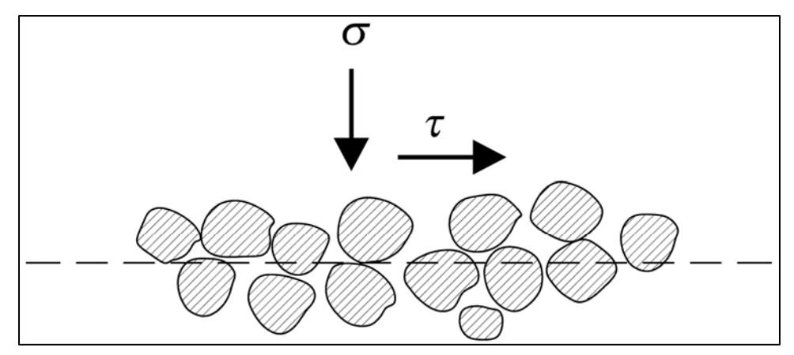

*Figure VI-5-80. Total stresses in a soil element*

(a) Because the soil is a three-phase medium consisting of solids and voids filled with water and/or gas it is seen that the total normal force is the sum of the contact forces between the grains and the pore pressure, u . In terms of stresses (force per unit area) we define

```math
\sigma = \sigma' + u \tag{VI-5-202}
```

where \sigma is total stress, \sigma N is effective stress and u the pore pressure. Because of the small area of the contact points it can be assumed that u is acting over the whole unit area of the section.
(b) Water and gas cannot resist shear stress so the total shear stress, \tau , is set equal to the effective shear stress, \tau N , i.e., the stress carried by the grains,

```math
\tau = \tau' \tag{VI-5-203}
```

- (c) It follows from Equation VI-5-202 and Equation VI-5-203 that the ability of the soil to resist failure depends on the strength of the grain skeleton, which in turn depends on the effective stresses. This means that under constant normal stress, an increase in the pore pressure will lower the soil strength. For coastal structures changes in pore pressure are normally caused by changes in seawater level and by wave action.
- (7) Geostatic stress. The geostatic stress is the stress caused by the weight of the soil when the ground surface is horizontal and the nature of the soil has only slight variation in the horizontal directions. For homogeneous soil the vertical geostatic stress is given by

```math
\sigma_v = z \gamma \tag{VI-5-204}
```

where z is the depth, and \gamma and \gamma N are the total and the submerged unit weights of the soil, respectively. In other words, \sigma_{\nu} and \sigma N_{\nu} vary linearly with depth.
(8) Stresses within soil deposits. The coefficient of lateral stress, K, is the ratio of horizontal to vertical effective stress, i.e.,
EM 1110-2-1100 (Part VI) Change 3 (28 Sep 11)

```math
K = \frac{\sigma_h - u}{\sigma_v - u} = \frac{\sigma'_h}{\sigma'_v} \tag{VI-5-205}
```

K_o is the coefficient of lateral stress at rest. For sand deposits created by sedimentation values of K_o are typically in the range 0.4 - 0.5.
- (9) Stresses due to externally applied surface loads. Although soil is an elastic plastic material, the theory of elasticity is often used to compute stresses from externally applied loads. (Examples are settlement calculations and verification of deformation amplification by dynamic loading.) Furthermore, most of the useful solutions from this theory assume that the soil is homogeneous and isotropic. Soil seldom, if ever, fulfills these assumptions. However, the engineer has little choice but to use the results from the elasticity theory together with engineering judgement. The assumption of elastic behavior is rather good if the applied stresses are low compared to stresses at failure. Diagrams for estimation of stresses induced by uniform loading on circular areas, rectangular areas and strip areas are given in most geotechnical textbooks, see for example Hansbo (1994) and Lambe and Whitman (1979).
- (10) Overconsolidation ratio. A soil element that is at equilibrium under the maximum stress it has ever experienced is normally consolidated, whereas a soil at equilibrium under a stress less than the maximum stress to which it was once consolidated is termed overconsolidated. The ratio between the maximum past pressure and the actual pressure is the overconsolidation ratio (OCR). A value of OCR = 1 corresponds to normally consolidated clay where the soil tries to reduce volume (contract) when loaded further, whereas OCR > 1 corresponds to overconsolidated clay which tends to increase volume (dilate) under applied loads.
- (11) Deformation moduli. Although soils generally exhibit plastic deformations during failure, the theory of elasticity is still widely used (for example relating soil response to dynamic loadings and stress distributions under static loads). Assuming soil behaves as an elastic material, the deformation characteristics can be expressed in terms of the moduli given in Table VI-5-69.
- (a) Typical values of Poisson's ratio, v, for conditions after initial loading are given in Table VI-5-70. Exact determination of v is of less importance, because practical engineering solutions are generally not sensitive to v.
- (b) The nonlinear deformation characteristics of soil makes it necessary to use secant values of the deformation moduli, as shown in Figure VI-5-81 which illustrates results from shear and compression tests. Uniaxial and confined compression tests exhibit a similar reaction. Secant values relate to stress levels being some fraction of the maximum (failure) stress. Distinction is made between initial loading where relative large deformations occur, and repeated (cyclic) loading where permanent deformations decrease and eventually disappear.

# Table VI-5-69
Deformation of Moduli for Elastic Material

### Young's modulus

```math
E = \frac{\sigma_1}{\varepsilon_1}
```

# \epsilon_2 = -\upsilon \epsilon

Uniaxial loading of elastic cylinder

#### Poisson' ratio

```math
\nu = -\frac{\varepsilon_2}{\varepsilon_1}
```

#### Shear modulus

```math
G = \frac{\tau}{\gamma} = \frac{E}{2(1+\nu)}
```

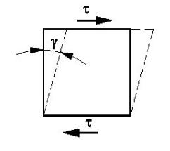

Shear applied to elastic cube

#### Bulk modulus

```math
K = \frac{\sigma}{\varepsilon_{vol}} = \frac{2G(1+\nu)}{3(1-2\nu)}
```

\varepsilon_{vol} is volumetric strain, i.e. the relative change in volume V

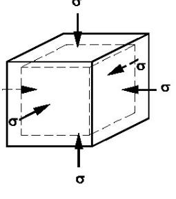

Isotropic compression of elastic cube

#### Constrained modulus

(Oedometer modulus)

```math
M = \frac{\sigma_1}{\varepsilon_1} = \frac{2G(1-\nu)}{1-2\nu}
```

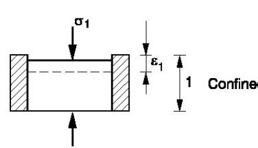

| Table VI-5-70 Typical Values of Poisso |  |
| --- | --- |
| Soil | V |
| Dry Sand | 0.35 |
| Partially saturated sand and clay | 0.4 |
| Saturated sand and clay | 0.5 |

EM 1110-2-1100 (Part VI) Change 3 (28 Sep 11)
- (c) Young modulus for sand varies with the void ratio, strength and shape of the grains, the stress history and the loading rate. Table VI-5-71 gives some example values of the secant Young's modulus corresponding to quasi-static loadings of 50 percent of the peak deviator stress and 101.3 $kN/m^{2}$ (1 atm) confining stress (Lambe and Whitman 1979).
- (d) Young's modulus for clay varies with stress level, level of consolidation, and rate of strain. Table VI-5-72 provides typical values given by Richardson and Whitman (1964) corresponding to quasi-static loadings.
- (e) It follows from Figure VI-5-81 that the deformation moduli depend on the strain level and the type of loading.

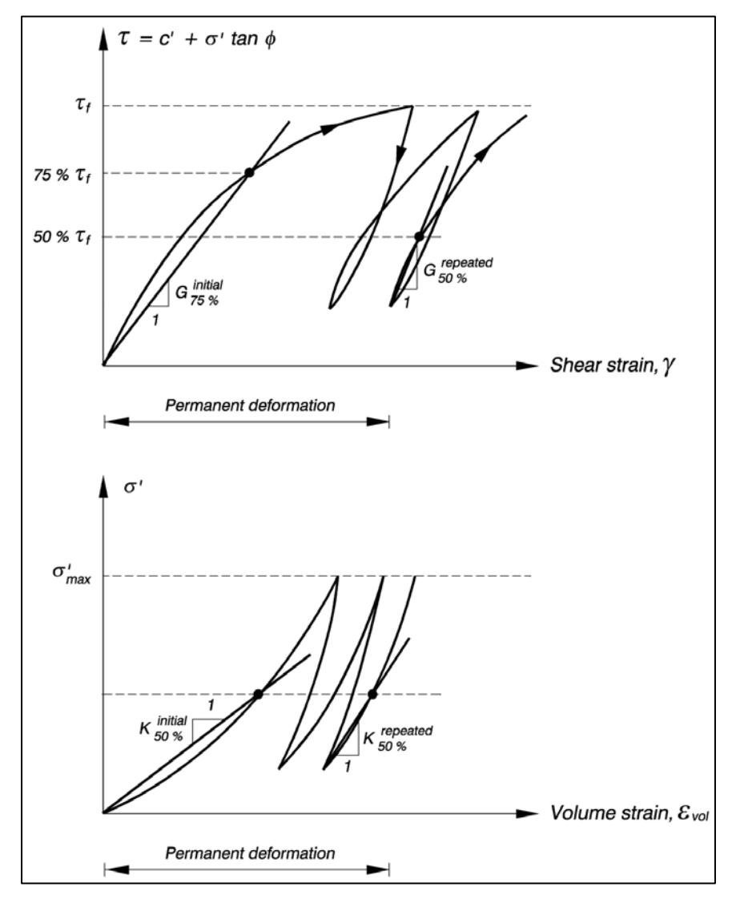

*Figure VI-5-81. Illustration of shear modulus G and bulk modulus K for granular soils exposed to initial and repeated (cyclic) loadings*

(f) Typical values of shear modulus G , bulk modulus K and oedometer modulus M for quartz sand is given in Table VI-5-73 corresponding to initial loading (σ 300 $kN/m^{2})$ and subsequent unloading and reloading (mean σ = 100 $kN/m^{2}).$

**Table VI-5-73. corresponding to initial loading (σ 300 $kN/m^{2})$ and subsequent unloading and reloading (mean σ = 100 $kN/m^{2}).$**

| Sand (Centre | for Civil Engineering Research | and Codes (CUR) 1995) |
| --- | --- | --- |
| Parameter | Initial Loading | Repeated Loading |
| G $(MN/m^{2})$ | 4 - 40 | 20 - 400 |
| K $(MN/m^{2})$ | 10 - 100 | 50 - 1000 |
| M $(MN/m^{2})$ | 15 - 150 | 80 - 500 |

**Table VI-5-73. corresponding to initial loading (σ 300 $kN/m^{2})$ and subsequent unloading and reloading (mean σ = 100 $kN/m^{2}).$**

| Sand (Centre | for Civil Engineering Research | and Codes (CUR) 1995) |
| --- | --- | --- |
| Parameter | Initial Loading | Repeated Loading |
| G $(MN/m^{2})$ | 4 - 40 | 20 - 400 |
| K $(MN/m^{2})$ | 10 - 100 | 50 - 1000 |
| M $(MN/m^{2})$ | 15 - 150 | 80 - 500 |

*Table VI-5-73 Typical Secant Values of Deformation-Moduli G , K and M for Quasi-Static Loaded Quartz Sand (Centre for Civil Engineering Research and Codes (CUR) 1995)*

**Table VI-5-73. Typical Secant Values of Deformation-Moduli G , K and M for Quasi-Static Loaded Quartz Sand (Centre for Civil Engineering Research and Codes (CUR) 1995)**

| Sand (Centre | for Civil Engineering Research | and Codes (CUR) 1995) |
| --- | --- | --- |
| Parameter | Initial Loading | Repeated Loading |
| G $(MN/m^{2})$ | 4 - 40 | 20 - 400 |
| K $(MN/m^{2})$ | 10 - 100 | 50 - 1000 |
| M $(MN/m^{2})$ | 15 - 150 | 80 - 500 |

Note: Higher values valid for dense sand, lower values valid for very loose sand.
(g) The shear modulus G is independent of drained or undrained conditions, and the value of G for clays is dependent on the type of clay (plasticity index), the type of loading, the stress level, and the OCR . Figure VI-5-82 shows the range of G over the static undrained shear strength, $c_{u}$ , as a function of the shear strain for some saturated clays (not further characterized).

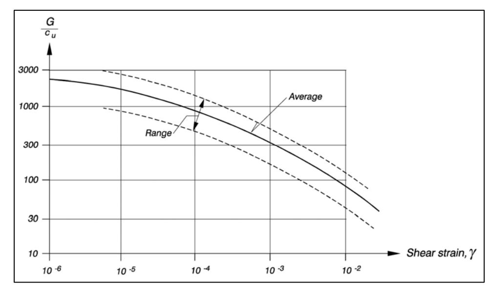

*Figure VI-5-82. In-situ secant values of shear modulus G for quasi-static loaded saturated clays (after Seed and Idriss 1970)*

- (h) The significant influence of OCR and cyclic loading on G is shown in Figure VI-5-83 which presents results for Norwegian Drammen clay with plasticity index I_p of 27 percent and a clay content of 45-55 percent. These results were based on stress controlled DSS tests and resonant column tests. In Figure VI-5-83 the parameter \sigma_u^{DSS} is the undrained static DSS shear strength for two hours of loading to failure. The stress \tau_{cy} is the shear stress amplitude in the symmetric cyclic loading. N is number of load cycles.
- (i) The shear modulus G is an important parameter in soil response to dynamic loadings that might be caused by waves and earthquakes. In quasi-static loading tests, such as simple shear and triaxial tests, the lower limit for strain measurements is approximately 10^{-3} , whereas in bender element and resonant column tests strains down to 10^{-6} can be recorded. Thus in practice, the maximum value G_{max} which can be identified corresponds to a shear strain of approximately 10^{-6} . Formulae for G_{max} are given as follows: Sand (Hardin and Black 1968)

```math
G_{\text{max}} = \begin{cases} \frac{6908 (2.17 - e)^{2}}{1 + e} \sqrt{p'} & round - grained \\ \frac{3230 (2.97 - e)^{2}}{1 + e} \sqrt{p'} & angular - grained \end{cases} \tag{VI-5-206}
```

- Gravel (Seed et al. 1986). They found G_{max} values approximately 2.5 times larger than for sand. Clay (Hardin and Drnevich 1972)

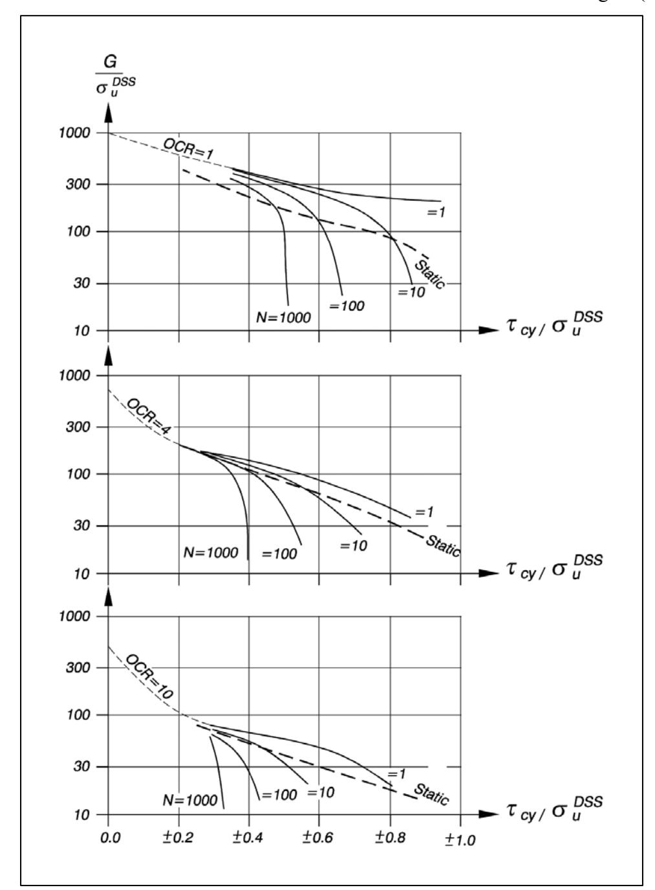

*Figure VI-5-83. Static and secant cyclic shear modulus, G , for Drammen clay (Andersen, Kleven, and Heien 1988)*

```math
G_{\text{max}} = \frac{3230 (2.97 - e)^2}{1 + e} (OCR)^K \sqrt{p'} \tag{VI-5-207}
```

where
e = void ratio
EM 1110-2-1100 (Part VI) Change 3 (28 Sep 11)
- p' = mean effective stress, 1/3(\sigma_1 N + \sigma_2 N + \sigma_3 N) to be inserted in kN/m<sup>2</sup> to obtain G_{max} in kN/m<sup>2</sup>
- OCR = overconsolidation ratio
K =constant dependent on the plasticity index

| Plasticity Index (percent) | 0 | 20 | 40 | 60 | 80 | ∃ 100 |
| --- | --- | --- | --- | --- | --- | --- |
| K | 0 | 0.18 | 0.30 | 0.41 | 0.48 | 0.50 |

Hardin (1978) proposed for both granular and cohesive soils that

```math
G_{\text{max}} = \frac{625}{0.3 + 0.7 \, e^2} (OCR)^K \sqrt{p_a \, p'} \tag{VI-5-208}
```

where p_a is atmospheric pressure (101.3 kN/m<sup>2</sup>). The ratio between G and G_{max} as function of the shear strain for sand and gravel is given in Figure VI-5-84.
(12) Damping ratio. The damping ratio D signifies the decrease in the displacement amplitude z_n of the oscillations and is defined by

```math
D = \frac{\delta}{2\pi} = \frac{1}{2\pi} \ln \left( \frac{z_n}{z_n + 1} \right) \tag{VI-5-209}
```

where \delta is the logarithmic decrement. Figure VI-5-85 shows damping ratios for sands and clays.
- c. Strength parameters.
- (1) Mohr-Coulomb failure criterion.
- (a) The strength parameters of soil and rock fill constitute the basis for analysis of soil bearing capacity and wall pressures. Failure occurs when shear stresses reach an upper limit represented by the envelope to the Mohr failure circles, as shown in Figure VI-5-86.
- (b) The Mohr envelope is generally curved for drained conditions. Figure VI-5-87 shows two commonly applied straight-line approximations to curved envelopes found from drained triaxial tests. Figure VI-5-87 demonstrates that the straight-line approximation is good only in the vicinity of the \sigma N_f -value for which the tangent to the circle is constructed. The approximation in Figure VI-5-87a is given by the Mohr-Coulomb equation

```math
\tau _ { f } = c ^ { \prime } + \sigma _ { f ^ { \prime } } \tan \Phi _ { t ^ { \prime } } \tag{VI-5-210}
```

where cN is the cohesion intercept, v_tN is the effective tangent angle of friction, and \sigma_fN is the effective stress at failure as specified by Equation VI-5-204.

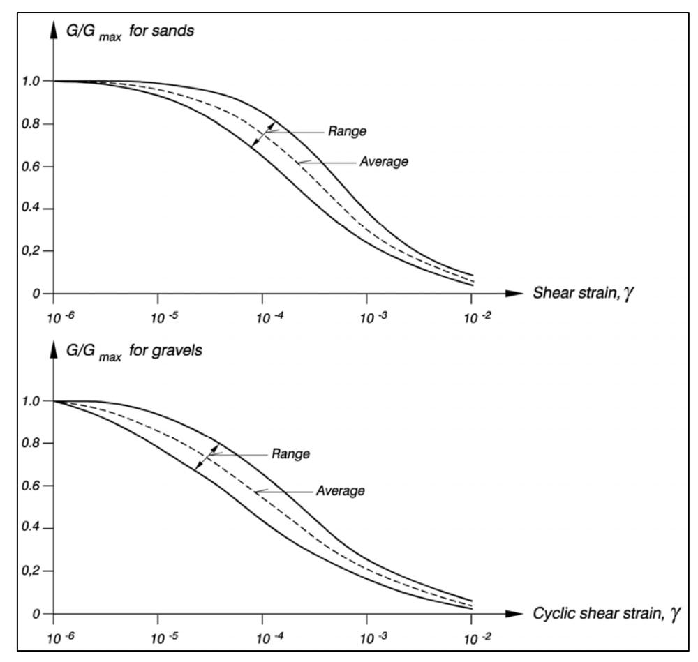

*Figure VI-5-84. Values of $G/G_{max}$ for sands and gravels (after Seed et al. 1986)*

- (2) Noncohesive soils.
- (a) The failure criterion approximation shown in Figure VI-5-87b corresponding to the equation

```math
\tau_f = \sigma_{f'} \tan \varphi_{s'} \tag{VI-5-211}
```

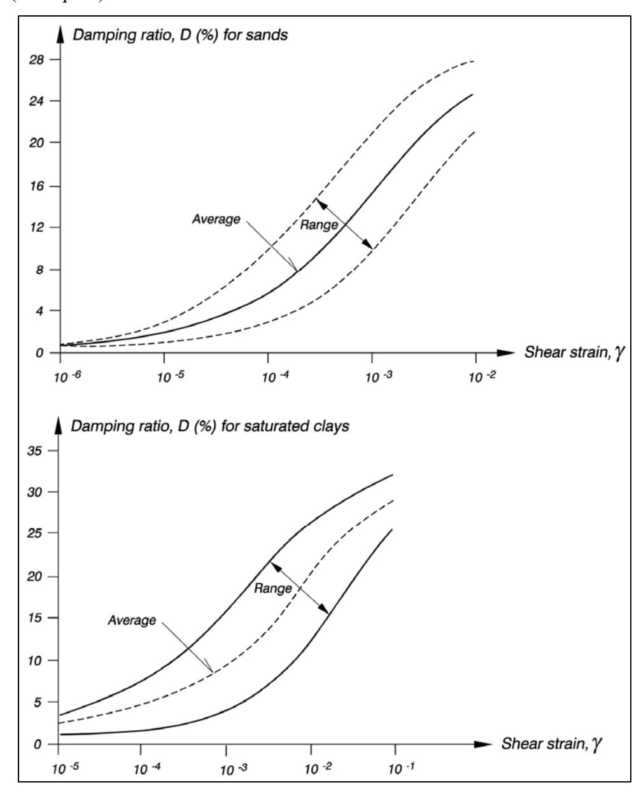

*Figure VI-5-85. Damping ratios for sands and saturated clays (Seed 70)*

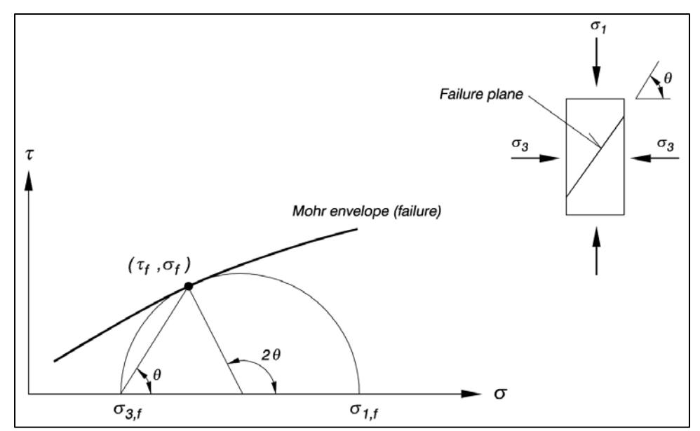

*Figure VI-5-86. Mohr envelope for stresses of failure*

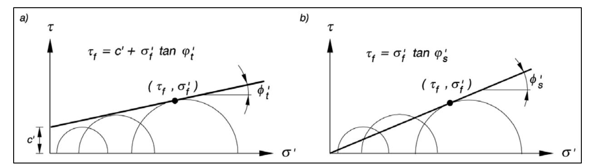

*Figure VI-5-87. Illustration of straight-line approximations to curved Mohr envelopes corresponding to drained conditions: (a) Tangent formulation, (b) Secant formulation*

where s is the effective secant angle of friction, has been applied to granular soils ever since the early studies by Coulomb. The equation is accurate only for relatively small values of σ f . However, for well graded quartz sand the limit for reasonable accuracy may be as high as 1,000 $kN/m^{2}.$ In general the equation should be applied only to a limited stress range around the σ f value corresponding to s . Otherwise, for very high stress ranges the strength of a granular soil or rockfill can only be satisfactorily represented by Equation VI-5-210, or a curved Mohr envelope. Another way to represent the nonlinear strength relation is to treat tan as a variable that depends on the confining pressure as indicated in Figure VI-5-87, which shows that is a function of the actual effective stress level.
(b) The angle of friction in granular materials depends on the grain-size distribution, size and shape of the grains, and on the porosity. Well graded materials exhibit higher friction than uniformly graded materials. Sharp edged angular grains give higher friction than rounded grains, and the friction angle will be higher in densely packed than it is in loose soils.
EM 1110-2-1100 (Part VI) Change 3 (28 Sep 11)
(c) Typical angles of friction for granular soils like quartz sand and quarried granite rock fill are given in Table VI-5-74 and Figure VI-5-88.

**Table VI-5-74. and Figure VI-5-88.**

| Very loose | - |  |
| --- | --- | --- |
| Loose | 29 - 35 |  |
| Medium | 33 - 38 |  |
| Dense | 37 - 43 |  |
| Very dense | - |  |
| Figure VI-5-88. | Angle of friction in rock fill | of different grading and |
| porosity with | maximum diameter in the range and Kjaernsli, Valstad, and | 70-200 mm (after Leps 1970 Høeg 1992) |

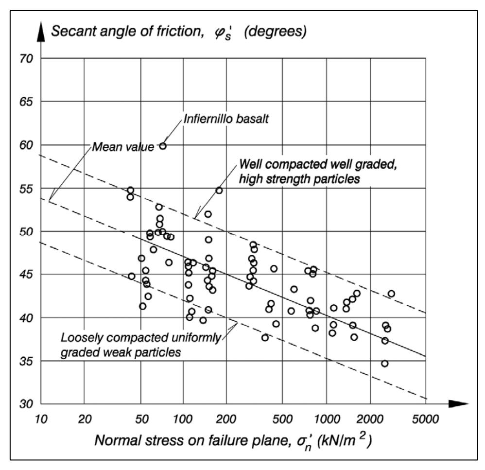

*Figure VI-5-88. Angle of friction in rock fill of different grading and porosity with maximum diameter in the range 70-200 mm (after Leps 1970 and Kjaernsli, Valstad, and Høeg 1992)*

(d) Steenfelt and Foged (1994) reported secant angles of friction s = $45^{\circ}$ - $62.2^{\circ}$ at normal stress on failure plane σ n = 77 - 273 $kN/m^{2}$ for Hyperite crushed stone of mass density
- 3.1 tonne/m<sup>3</sup>, d_{50} = 15 16 mm and d_{max} = 64 mm. This compares well with the Infiernillo basalt data in Figure VI-5-88. (3) Dilatancy.
- (a) Shearing of frictional soils under drained conditions generally involves volume changes in terms of dilation or contraction. A crude visualization of dilatancy in plane strain is shown in Figure VI-5-89.

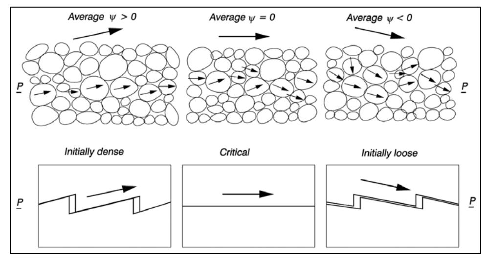

*Figure VI-5-89. Crude visualization of dilatancy and angle of dilation \psi (Bolton 1979)*

(b) The volume changes associated with stress as it increases toward maximum strength (see v_sN in Equation VI-5-211) depend on the effective stress level and the initial density, which is given by porosity n or void ratio e. The volume changes are quantified by the angle of dilation, \psi , defined by

```math
\sin{\psi} = -\frac{\&_{1} + \&_{3}}{\&_{1} - \&_{3}} = \frac{\&_{vol}}{\&_{vol} - 2\&_{1}} \tag{VI-5-212}
```

where f_1 , and \mathbf{v}_3 are strain rates in principal stress directions 1 and 3, and \mathbf{v}_{vol} is the volume strain rate. The strain rates can be found from triaxial tests.
- (c) The angle of friction corresponding to the critical (also called ultimate) condition where the soil strains without volume changes (see Figure VI-5-89) is denoted the critical angle of friction, \nu N_{crit} . The parameter \nu N_{crit} appears to be a material constant because it depends on the mineralogy, grading and shape of the grains for the soil in question, but seems independent on the relative density or porosity. Typical values of \nu N_{crit} are given in Table VI-5-75.
- (d) An average value of vN_{crit} for sand is 32 deg. For quarried rockfill a somewhat higher value is found. Steenfelt (1992) stated that a simple bench test for vN_{crit} , offering an accuracy of
EM 1110-2-1100 (Part VI) Change 3 (28 Sep 11)
about 1°, is the angle of repose of a loosely tipped heap of dry material subjected to excavation at the foot.
The contribution of dilation to the strength of the material is suggested as follows by Bolton (1986)

```math
\varphi_{m'ax} - \varphi_{c'rit} = 0.8 \, \psi_{max} = \begin{cases} 5^{\circ} \, I_r & plane \, strain \\ 3^{\circ} \, I_r & triaxial \, strain \end{cases} \tag{VI-5-213}
```

Table VI-5-75 Critical Value of Angle of Friction, \nu N_{crit} (Steenfelt 1992) Material d_{50} (mm) d_{max} (mm) \nu N_{crit}(\deg) Quartz sand, 0.17 27.5 - 32 dry and saturated 0.24 29 - 33.3 33.5 0.52 - 0.550.88 31.9 Rock fill, quarried 9.5 - 80 39.1 granitic gneiss
where

```math
I _ R = D _ { r } \ \left( A - \ln \mathbf{\rho } p ^ { \prime } \right) - 1 \tag{VI-5-214}
```

and
\nu N_{max} = \nu N_s for triaxial strain, as given by Equation VI-5-211
- D_r = relative density
- pN= mean effective stress, 1/3(\sigma_1N + \sigma_2N + \sigma_3N) in kN/m
- A = material constant, 10 for quartz and feldspar, and 8 for limestone
Typical values of \psi_{max} for quartz granular materials are given in Table VI-5-76.

**Table VI-5-76. **

| Relative Density | Angle of Dilation, $ψ_{max}$ (deg) |
| --- | --- |
| Loose | -2 to +3 |
| Medium | +3 to +8 |
| Dense | +8 to +13 VI-5-210 |

- (4) Cohesive soils.
- (a) The shear strength of cohesive soils like clay and organic mineral soils is due to both friction (between coarser grains and between aggregates formed by clay particles) and cohesion within the material (sorption forces). The shear strength of clay normally refers to the static shear strength from undrained strain controlled tests with a monotonic load increase lasting 1-3 hours to failure. This so-called undrained shear strength, $c_{u}$ and the related failure envelope are illustrated in Figure VI-5-90.

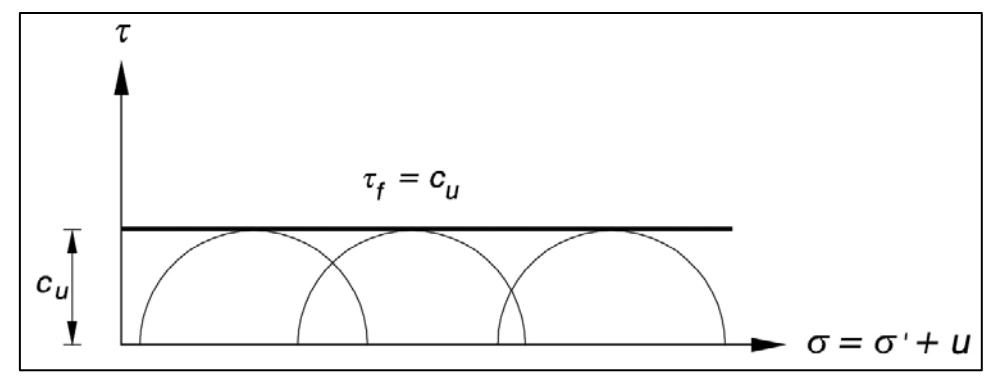

*Figure VI-5-90. Failure criterion for a water-saturated clay in undrained condition defined from Mohr envelope*

- (b) For a specific clay with a given stress history, $c_{u}$ depends solely on the initial effective stress conditions before the loading. Thus, the increase in σ in Figure VI-5-90 is equal to the increase in the pore pressure, u . In addition, the $c_{u}-value$ and the deformation characteristics depend on the overconsolidation ratio, OCR , defined in Part VI-5-5 b , as well as on the rate and number of loadings, as discussed in Part VI-5-5 e on cyclic loading. Failure analysis related to cohesive soils in undrained conditions is performed on the basis of total stresses, σ , as opposed to analysis of noncohesive soils which is based on effective stresses, σ.
- (c) The relative density of cohesive types of soils cannot be determined, and for this reason these soils are usually classified according to shear strength properties (see Table VI-5-77).

**Table VI-5-77. ).**

| Table | VI-5-78. | One-Dimensional | Porous Flow Equation .............................................. | VI-5-214 |
| --- | --- | --- | --- | --- |
| Table | VI-5-79. | Typical Values of | Permeability, k, for Fine Materials ........................... | VI-5-215 |
| Table | VI-5-80. | Typical Values of | Permeability, k, for Stone Materials ......................... | VI-5-215 |
| Table | VI-5-81. | Wave Induced Set-up | in Sloping Rubble Mound Structures ................. | VI-5-216 |
| Table | VI-5-82. | Horizontal Wave Rubble-Mound | Induced Pore Pressure Gradients in the Core of Breakwaters .................................................................. | VI-5-217 |
| Table | VI-5-83. | Classification of | Loading and Soil Conditions ...................................... | VI-5-219 |
| Table | VI-5-84. | Example of Consolidation | Times for Sand ............................................ | VI-5-220 |
| Table | VI-5-85. | Wave and Tide | Induced Pore Pressures in Permeable Seabeds ............. | VI-5-238 |
| Table | VI-5-86. | Bearing Capacity Statically Loaded | Formula for Rectangular Concentrically Horizontal Footings .................................................. | VI-5-245 |
| Table | VI-5-87. | Bearing Capacity Horizontal Footing | Formula1 for Rectangular Statically Loaded ................................................................................. | VI-5-246 |
| Table | VI-5-88. | General Bearing | Capacity Formula for Rectangular Statically |  |

EM 1110-2-1100 (Part VI) Change 3 (28 Sep 11)
- (d) It should be noted that development of large shear stresses often involves soil deformations which might be damaging to the function of the structure. This is true especially for normally consolidated clay. For such cases the failure criterion must be defined as a strain level instead of the stress level, c_u .
- (e) Cohesive soils are also classified according to their sensitivity to loss of strength when disturbed. The sensitivity, S_t , is defined as the ratio between the undrained shear strength of a specimen in undisturbed and in remoulded states. S_t is important for the estimation of shear strength reduction in case of disturbance due to activities such as piling and excavation. Fall-cone tests can be used to determine values of S_t . Soils are termed slightly sensitive when S_t < 8 , moderately sensitive when 8 \# S_t \# 30 , and highly sensitive when S_t > 30 . The last range includes quick clays for which S_t \equiv 50 . d. Hydraulic gradient and flow forces in soils. (1) Hydraulic gradient.
- (a) If the seawater level and the groundwater level are horizontal and not moving, the pore water will be in static equilibrium corresponding to the hydrostatic pressure distribution and constant head, h. Any deviation from this stage causes a change in h, and generates a flow governed by the hydraulic gradient i, which is given by

```math
i = \frac { \varDelta h } { \varDelta l } \tag{VI-5-215}
```

where \Delta h is the difference in hydraulic head over the distance \Delta l . The hydraulic head is defined as

```math
h = z + \frac{u}{\gamma_w} \tag{VI-5-216}
```

where z is a vertical coordinate, u is the pore pressure, and \gamma_w = \rho_w g is the unit weight of the water ( \rho_w is the mass density of water and g is gravity).
(b) A flow force of i\gamma_w will act on the grains in the direction of the hydraulic gradient, i . The effective unit weight, \gamma_s N , of a saturated soil can then be defined as

```math
\gamma_{s'} = \gamma - \gamma_w \pm i \gamma_w \tag{VI-5-217}
```

where \gamma = unit weight of dry soil, the plus sign is used for vertical downward flow, and the minus sign is used for vertical upward flow. For an upward flow, if i = (\gamma - \gamma_w) / \gamma_w , then \gamma_s N = 0 , corresponding to a total loss of soil bearing capacity, referred to as the limit stage of fluidization or liquifaction. The flow forces in the soil have to be included in the work or force balance equations for the failure limit states, either by including the flow force i\gamma_w on all internal parts of the soil elements, or by including the pore pressures along the boundaries of the soil elements.
(c) The bulk flow velocity v introduced by i may be calculated by the one-dimensional extended Forchheimer equation

```math
i = Av + B |v|v + C \frac{\delta v}{\delta t} \tag{VI-5-218}
```

where the coefficients A, B and C depend on the soil and water characteristics, i.e., grain size and shape, gradation, porosity, viscosity and the Reynolds number. The last term in Equation VI-5-218 can be neglected because it has only minor influence for wave-induced flow in cores, subsoils and rubble foundations related to coastal structures.
(d) Figure VI-5-91 illustrates the variation of A and B in Equation VI-5-218. Table VI-5-78 presents expressions of A and B as well as related flow coefficients found from experiments as listed in Burcharth and Anderson (1995). Considerable scatter in the flow coefficients is observed.

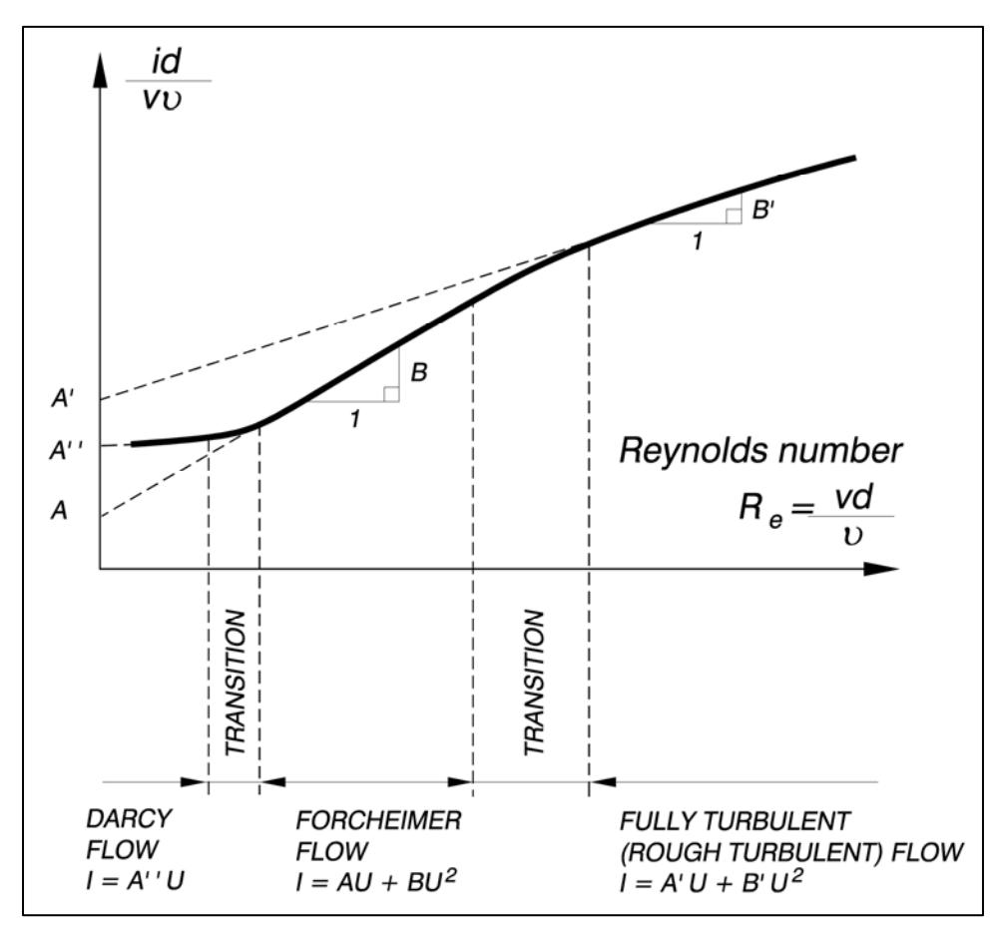

*Figure VI-5-91. Representation of flow regimes for stationary porous flow based on a Forchheimer equation formulation (Burcharth and Anderson 1995)*

EM 1110-2-1100 (Part VI) Change 3 (28 Sep 11)
- (2) Permeability.
- (a) For R_e < 1 , Equation VI-5-219 in Table VI-5-78 is most often presented as the Darcy equation

```math
v = k i \tag{VI-5-220}
```

where k is a dimensional quality referred to as the permeability coefficient. Comparing the first term in Equation VI-5-219 with Equation VI-5-220 gives

```math
k = \frac { n ^ { 3 } } { \alpha \left( 1 - n \right) ^ { 2 } } \frac { g _ { d } ^ { 2 } } { \nu } \tag{VI-5-221}
```

- (b) Equation VI-5-221 can be applied for fine materials like clay, silt, and fine sand ( d \le 0.2 mm) whereas for coarser material the nonlinear Equation VI-5-219 must be applied. It should be noted that \alpha (and thereby k) depends on the Reynolds number and the soil gradation.
- (c) Typical values of k are given in Table VI-5-79 for rather uniform sands. Order of magnitude values of k for stone materials are given in Table VI-5-80.

#### Table VI-5-78 One-Dimensional Porous Flow Equation

One-dimensional steady porous flow equation and related coefficients. Burcharth and Anderson (1995).

```math
i = \alpha \frac{(1-n)^2}{n^3} \frac{\nu}{gd^2} v + \beta \frac{1-n}{n^3} \frac{1}{gd} v^2 \tag{VI-5-219}
```

where n Porosity
d Characteristic grain diameter, e.g. d_{50}
\nu Kinematic viscosity (1.3.10<sup>-6</sup> m^2/s for water at 10°C)
g Gravitational constant
v Bulk flow velocity
Typical values of \alpha and \beta in Eqn. VI-5-219 for uniform sand and quarried rock materials

```math
\frac{d_{85}}{d_{15}} = 1.3 - 1.9
```

| Flow range | Re = \frac{dv}{\nu} | \alpha | β |
| --- | --- | --- | --- |
| Darcy | < 1 | 300 - 400 | 0 |
| Forchheimer Fully turbulent | 10 - 150 1,000 - 12,000 | 300 1,000 - 10,000 | 3.0 - 3.6 3.6 - 2.4^1 |

Smallest values of \beta correspond to largest R_{e} .

| Table VI-5-79 |
| --- |
| Typical Values of Permeability, k, for Fine Materials |

| Material | Packing | k (m/s) |  |
| --- | --- | --- | --- |
| Coarse sand | loose | 10-2 |  |
|  | dense | 10-3 |  |
| Medium sand | loose | 10-3 |  |
|  | dense | 10-4 |  |
| Fine sand | loose | 10-4 |  |
|  | dense | 10-5 |  |
| Silty sand | - | 10-6 |  |
| Sandy clay | - | 10-7 |  |

| Table VI-5-80 |  |
| --- | --- |
| Typical Values of Permeability, k, for Stone Materials |  |
| Gradation Diameter Range (mm) | k (m/s) |
| 100 - 300 | 0.3 |
| 10 - 80 | 0.1 |

- (3) Wave-induced internal setup. Wave action on a pervious slope causes a fluctuating internal water table (phreatic surface) and a setup as indicated in the figure in Table VI-5-81. The reason for the setup is that inflow dominates outflow due to larger surface area and longer duration. The setup increases if the shore side of the structure is impermeable, e.g., a rubble revetment built in front of a clay cliff.
- (a) The setup can be estimated by a method (Barends 1988) presented in Table VI-5-81. The method is based on a linearization of the Forchheimer equation, where the permeability k for sands can be estimated from Table VI-5-79. For quarry-run materials, where linearization is less suitable, Equation VI-5-219 should be used. Order of magnitude values are given in Table VI-5-80.
- (b) Besides storage of water due to internal setup of the phreatic level, also some storage due to compressibility of the soil rock skeleton and water-air mix can occur. However, for conventional structures such elastic storage will be insignificant compared to the phreatic setup storage.
- (4) Pore pressure gradients in sloping rubble-mound structures.
- (a) The horizontal wave-induced pressure gradient in the core of a rubble-mound breakwater can be estimated by the method of Burcharth, Liu, and Troch (1999) as presented in Table VI-5-82. The method is mainly based on pore pressure recordings from a prototype and large and small scale model tests.

*Table VI-5-81
Wave Induced Set-up in Sloping Rubble Mound Structures (Barends 1988)*

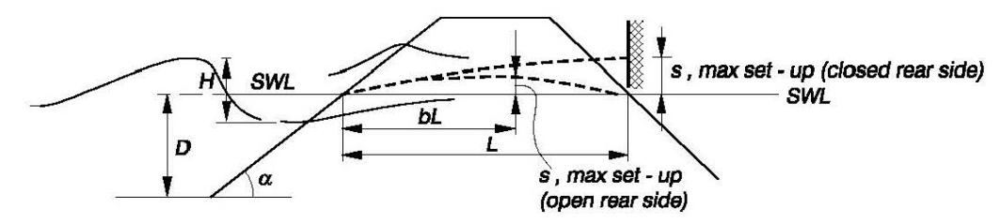

```math
s/D = \sqrt{(1+\xi\ F)} - 1
```

```math
s/H = \sqrt{(1+\xi\ F)} - 1
```

where \xi = 0.1cH^2/(n\lambda D \tan \alpha)
- H = Height of incoming wave
- n = Porosity of structure
- c = Infiltration factor > 1. The magnitude is uncertain (Barends 1988)
used c \simeq 1.3 to make calculations fit to conventional
scale model test results
- \lambda = 0.5\sqrt{c \ k \ DT \ /n}
- \alpha = Slope angle
- k = Average permeability
- T = Wave period
- F = Function dependent on rear side conditions
(open or closed) as given in diagram.
The parameter b in the diagram defines position of maximum setup in the open case.

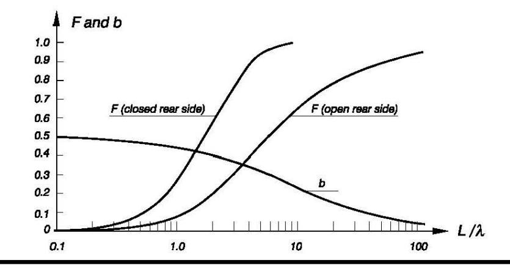

#### Table VI-5-82

Horizontal Wave Induced Pore Pressure Gradients in the Core of Rubble-Mound Breakwaters (Burcharth, Liu, and Troch 1999)

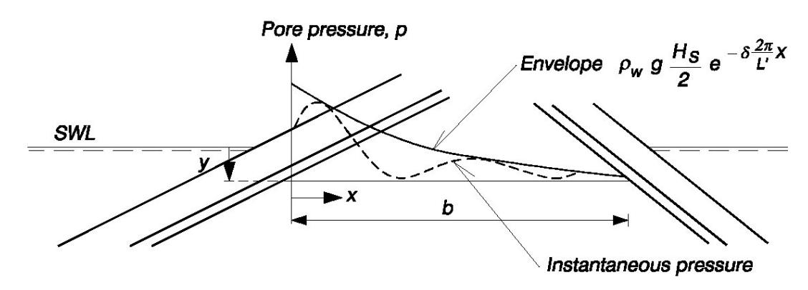

```math
I_{x} = \frac{1}{\rho_{w} g} \frac{d_{p}}{dx} \tag{VI-5-222}
```

- (b) Equation VI-5-222 is valid only for rather permeable core materials ( d50 50 mm) and for normal breakwater cross sections with open rear side, i.e., no excess pressure. Additionally, Equation VI-5-222 holds for the region between swl and level SWL + $2H_{s}$ , i.e., 0 y 2 Hs . In each point within this region the larger pressure gradients will be of the same order of magnitude as the horizontal gradient.
- e. Cyclic loading of soils. An essential part of the design of monolithic coastal structures is to ensure that the foundation soil or rubble base has sufficient capacity to carry both the static gravity loads and the wave-induced loads with an adequate safety margin and without excessive deformations. The bearing capacity under combined static and cyclic loads may be
EM 1110-2-1100 (Part VI) Change 3 (28 Sep 11)
significantly smaller than under purely static loads. The strength of soils exposed to cyclic loading is influenced not only by the stress level and the stress variations but also by the soil drainage capability. Pore pressure build-up and related loss of strength might take place in rather impervious soils where the time scale of drainage or consolidation is larger than the time scale of the load cycles. The following sections discuss evaluation of drainage conditions under cyclic loading, approximation of wave- induced irregular loading in terms of equivalent cyclic loading, and estimation of strength and deformation of soils exposed to cyclic loading.
- (1) Time scale of drainage and consolidation.
- (a) In saturated soil, the immediate effect of a load-induced stress increment will be a similar increase in the total stress \sigma and the pore pressure u (see Equation VI-5-202), i.e., the loading will be carried solely by the pore water. The soil skeleton will not carry the extra load until it has rearranged itself. This can happen only if some pore water is squeezed out, due to the very small compressibility of the water compared to that of the skeleton. In permeable materials such as stone blankets this happens immediately, while in clay it can be a very slow process. The related decrease in volume is termed consolidation. (b) The degree of consolidation is defined as

```math
U = \frac{S_t}{S_{\infty}} \tag{VI-5-223}
```

where s_t is the settlement (decrease in layer thickness) at time t, and s_d is the final settlement reached when the soil skeleton is fully carrying the load. For coastal structures the dominating live load is caused by wave loading that varies in time. The time scale of consolidation has to be compared to the time scale of the loading to estimate U and thereby the effective stress in the soil.
(c) For the one-dimensional case Terzaghi showed that U in terms of average degree of consolidation is a function of the dimensionless time factor (Terzaghi and Peck 1944)

```math
T_c = \frac{k M}{\gamma_w H^2} t = \frac{C_V}{H^2} t \tag{VI-5-224}
```

where
- C_V = coefficient of consolidation (= kM/\gamma_w )
- k = permeability (see Table VI-5-79)
- M = oedometer modulus
- \gamma_w = unit weight of water
- t = time
- H = drainage distance, which is equal to layer thickness for one side drainage, and equal to half the layer thickness for double side drainage.
(d) Full consolidation (i.e., U=100 percent) is in principle never reached. Consolidation of U=99 percent corresponds to T_c -. 2, whereas U=95 percent corresponds to T_c . 1.2. The necessary time for almost 100 percent consolidation is approximated in practice as

```math
t_{U(100\%)} = \frac{2 \gamma_w H^2}{k M} \tag{VI-5-225}
```

(e) By comparing t_U with the rise time of the wave-induced load, t_{rise} , it is possible to classify the wave loading and to estimate whether drained, partially drained or undrained conditions will be present. This criterion is given in Table VI-5-83.

**Table VI-5-83. **

| Table | VI-5-84. | Example of Consolidation | Times for Sand ............................................ | VI-5-220 |
| --- | --- | --- | --- | --- |
| Table | VI-5-85. | Wave and Tide | Induced Pore Pressures in Permeable Seabeds ............. | VI-5-238 |
| Table | VI-5-86. | Bearing Capacity Statically Loaded | Formula for Rectangular Concentrically Horizontal Footings .................................................. | VI-5-245 |
| Table | VI-5-87. | Bearing Capacity Horizontal Footing | Formula1 for Rectangular Statically Loaded ................................................................................. | VI-5-246 |
| Table | VI-5-88. | General Bearing | Capacity Formula for Rectangular Statically |  |

- (f) Typical wave loadings from nonbreaking waves on coastal structures have periods in the range T. 2(t_{rise}) = 3-20 sec. Using the t_{U(100 \, \mathrm{percent})} values in Table VI-5-84, if follows from Table VI-5-83 that sand subsoil under virgin loading should generally be regarded as undrained, except for coarse sand which in some cases might be regarded as partially drained. Under subsequent wave loadings fine sand should still be regarded as undrained, whereas medium sand typically might be regarded as partially drained, and coarse sand would be considered drained.
- (g) Very short duration impulsive loadings from waves breaking on structures have load rise times on the order of t_{rise} = 0.01 0.05 s (see Figure VI-5-101); and in this case all soils, including quarry-rock rubble foundations, have to be regarded as undrained. (2) Wave load transmission to monolithic structure foundations.
- (a) Wave loads transmitted to the foundation soil/rubble by monolithic structures, such as caissons and superstructure parapet walls, depend on the period of the wave load as well as the mass of the structure and the deformation characteristics of the soil/rubble.

*Example 5-2. Calculation of t_{U(100 \text{ percent})} for quartz sand.*

The elastic plastic component of M for initial loading corresponding to mean normal effective stress \sigma N \# 300 kPa is found to be

```math
M = \begin{cases} 15 & MPa & loose sand \\ 150 & MPa & dense sand \end{cases}
```

The elastic component of M found by unloading and reloading at \sigma N = 100 kPa is found to be

```math
M = \begin{cases} 80 & MPa & loose sand \\ 500 & MPa & dense sand \end{cases}
```

The drainage distance H is given as 5 m. Using these typical M -values together with the k -values given in Table VI-5-79, Equation VI-5-225 gives the consolidation times presented in Table VI-5-84.
Table VI-5-84
Example of Consolidation Times for Sand

**Table VI-5-84. Example of Consolidation Times for Sand**

| Material | Packing Initial | Deformation Elastic | Deformation |
| --- | --- | --- | --- |
| Coarse sand | loose dense | 3 3 | 0.6 1 |
| Medium sand | loose dense | 30 30 | 6 10 |
| Fine sand | loose dense | 300 300 | 60 100 |

- (b) The natural period T_{n,s} of typical monolithic structures would normally be in the range 0.2 2 sec. If the period of the loading, T, is close to T_{n,s} then dynamic amplification occurs resulting in increased loading of the foundation. Design wave loading can be separated into pulsating loads from nonbreaking waves and impulsive loads from waves breaking on the structure (see Figure VI-5-57). The pulsating loads have periods corresponding to the wave period, i.e., normally in the range 5-20 sec, which is much larger than T_{n,s} . Consequently, such low frequency loading is assumed to be transmitted to the foundation with unchanged frequency.
- (c) Figure VI-5-92 illustrates how the resultant foundation load force of a wave-loaded caisson changes size, direction, and position during the wave cycle. The variation of the force resultant can be given by fully correlated time series of a tilting moment and a horizontal force. Figure VI-5-92 also illustrates the wave- induced stress variations in two soil elements (shown as hatched boxes).
- (d) The initial shear stress \tau_i prior to the installation of the structure is assumed to act under drained conditions, and the soil is assumed fully consolidated under this stress. \Delta \tau_s is the change in the average shear stress due to the submerged weight of the structure. Depending on the type of soil, \Delta \tau_s will initially act under undrained conditions, but as the soil consolidates, this
shear stress will also be applied under drained conditions. In the case of rubble-mound foundations the consolidation will be instantaneous. For sand foundations drainage will occur rapidly, as indicated by Table VI-5-84, and it is reasonable to assume that the soil will consolidate before the structure experiences design wave loading. In addition, it is unlikely that pore pressures will accumulate from one storm to the next. For clays, consolidation occurs much more slowly, varying from months for silty-sandy very stiff clays to many years for soft clays. The amount of settlement and the corresponding increase in effective stresses, is calculated by ordinary consolidation theory the same as for structures on dry land.

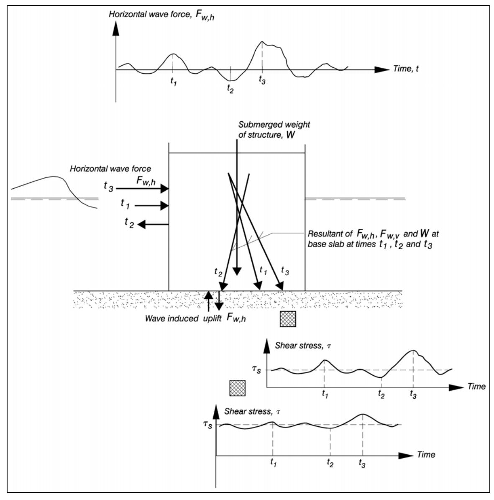

*Figure VI-5-92. Illustration of wave induced forces on caisson foundation and related stress variations in the subsoil*

(e) The effective static shear stress before wave loading is given by

```math
\tau_s = \tau_i + \Delta \tau_s \tag{VI-5-226}
```

- (f) The initial shear $stress,τ_{i}$ , is determined by the submerged weight of the soil as $τ_{i}$ = 0.5 (1 - Ko ) po , where $K_{o}$ is the coefficient of earth pressure at rest, and po is the vertical effective overburden pressure. $Δτ_{s}$ can be estimated from Newmark's influence diagrams, assuming homogeneous, isotropic and elastic soil (e.g., see Hansbo 1994 and Lambe and Whitman 1979). This is usually a good approximation if the soil is not close to failure. A rough rule of thumb is a load spreading of 1 (horizontal) to 2 (vertical).
- (g) The behavior of the soil when exposed to the cyclic loading can be studied in triaxial tests or direct simple shear (DSS) tests. The irregular wave loading $F_{W}$ during the design storm might be approximated by equivalent cyclic wave loadings, causing cyclic shear stress variations with amplitude $τ_{cy}$ as given in Figure VI-5-93. However, it is more correct if the real stress variations in the subsoil, as illustrated in Figure VI-5-92, are approximated by an equivalent cyclic variation. The stress $τ_{cy}$ should be determined by finite element analysis.

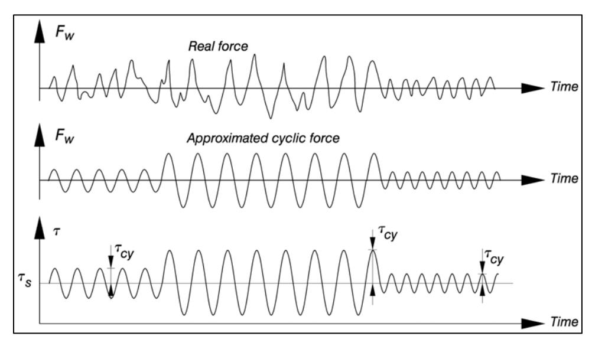

*Figure VI-5-93. Illustration of approximate cyclic wave loading and related cyclic shear stress variation in a subsoil element during a storm sequence*

(h) The criterion for determination of the equivalent cyclic stress in terms of $τ_{cy}$ and number of cycles $N_{eqv,}$ is that the approximation gives the same effect as the actual load history. Procedures to determine $N_{eqv}$ were presented by Andersen (1981, 1983). For sands, $N_{eqv}$ may be computed by accumulating the permanent pore pressure generated during the cyclic load history, taking into account that drainage is likely to occur during the design storm. Calculation of the pore pressure accumulation can be performed using pore pressure diagrams established from cyclic stress-controlled laboratory tests. The dissipation of the permanent pore pressure due to both drainage towards free boundaries and grain redistribution can be determined by finite element analysis or, for idealized situations, by closed-form solutions. In principle, the cyclic
shear strength of clays could also be computed by accumulating the permanent pore pressure. However, measurements in clays are more difficult to acquire than in sands. In addition, shortterm drainage will not take place in clays; consequently, it is preferable to use the shear strain as a measure of the cyclic strength for clays. Moreover, for situations where the cyclic shear moduli under undrained conditions are of primary interest, the shear strain will also be a more direct parameter than the pore pressure.
(i) The stress conditions in the soil beneath structures subjected to combinations of static and cyclic loads are very complex even though the irregular loadings are approximated by equivalent cyclic loadings. Advanced finite element numerical modeling is the obvious tool for calculation of stress and strain development provided the model is carefully verified against documented test cases. As an alternative, a practical approximate method is presented by Andersen (1991) and Andersen and Høeg (1991). This method is based on the stress path philosophy in which laboratory tests are performed to simulate the stress conditions in few typical soil elements along potential failure surfaces as illustrated in Figure VI-5-94. The elements follow various stress paths which might be approximated to triaxial or direct simple shear (DSS) types of loading corresponding to various conditions of average stresses, $τ_{s}$ and cyclic shear stresses, $τ_{cy}.$ Additionally, the number of cycles to failure, $N_{f,}$ and the shear strains are determined in the tests.

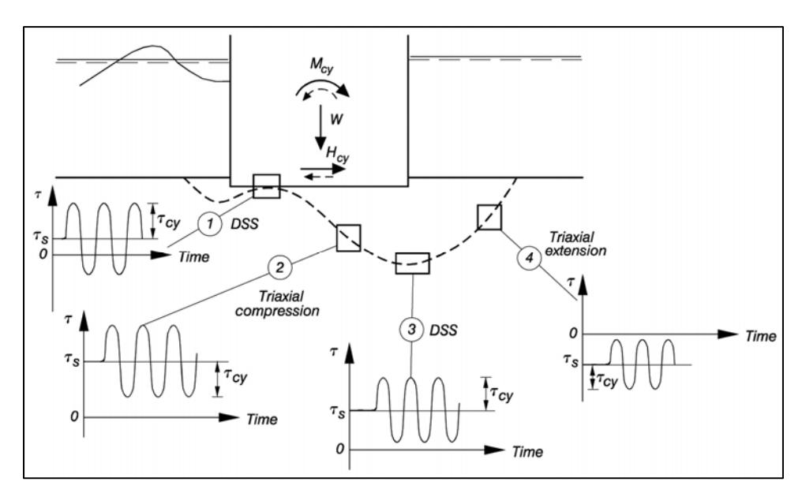

*Figure VI-5-94. Simplified stress conditions for some elements along a potential failure surface (Andersen 1991)*

- (3) Noncohesive soil exposed to wave-induced cyclic loadings.
- (a) For noncohesive soils, cyclic stress variations can either lead to strengthening of the soil or to soil weakening and eventual liquefaction due to pore pressure build-up. The outcome depends on soil permeability, average shear stress $τ_{s},$ wave-induced shear stress variations, and soil compaction. Pore pressure build-up does not happen in coarse materials like gravel and
EM 1110-2-1100 (Part VI) Change 3 (28 Sep 11)
rubble foundation materials because of almost instant drainage. Consequently, only sand-sized noncohesive soils will be considered in the following discussion.
(b) Cyclic loading of soil specimens can be performed in undrained triaxial tests using a cell height-to-width ratio of one and lubricated cap and base, thus assuring uniform stress-strain conditions in the sample (Rowe and Barden 1964; Bishop and Green 1965; and Jacobsen 1967). From such tests the phenomena depicted in Figure VI-5-95 can be observed.

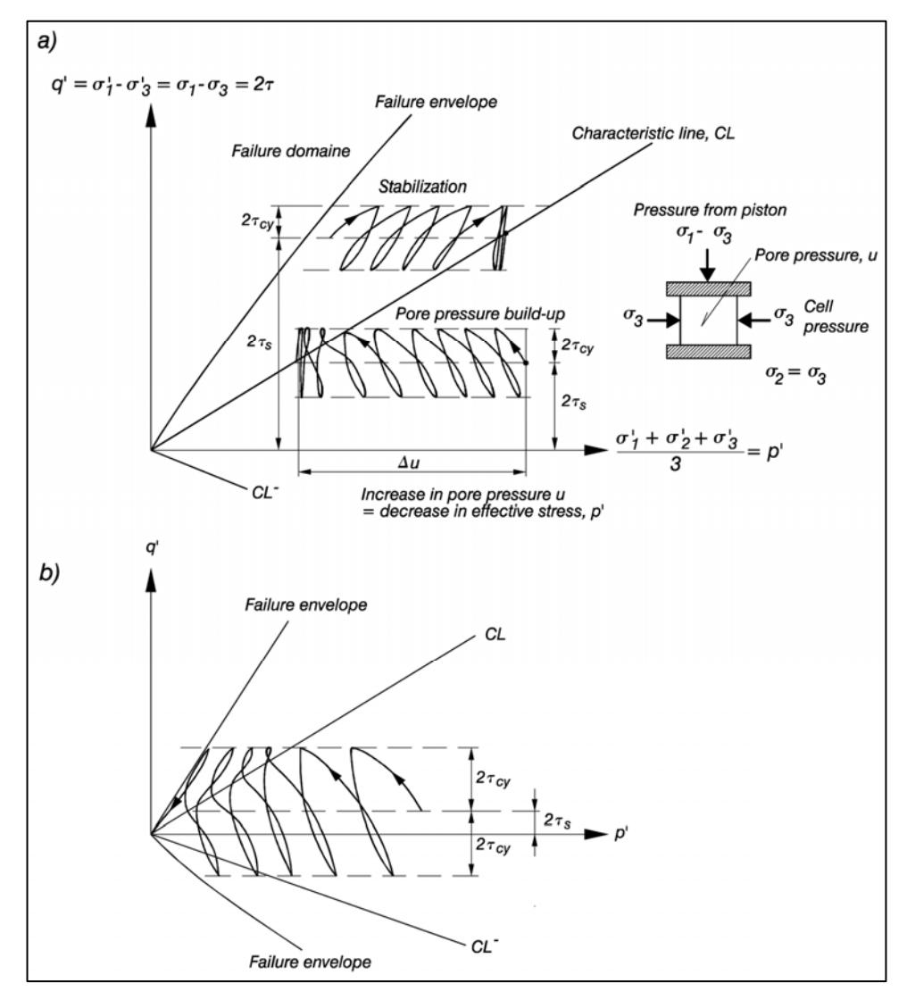

*Figure VI-5-95. Illustration of (a) stabilization and pore pressure build-up, and (b) liquefaction undrained triaxial test on sand*

(c) The shear stress \tau is given by

```math
\tau = \frac{\sqrt{3}}{2}\sqrt{J_2} \tag{VI-5-227}
```

where

```math
J_2 = \frac{1}{6} \left[ (\sigma_{1'} - \sigma_{2'})^2 + (\sigma_{2'} - \sigma_{3'})^2 + (\sigma_{1'} - \sigma_{3'})^2 \right] \tag{VI-5-228}
```

and \sigma_1 N \exists \sigma_2 N \exists \sigma_3 N are the effective stresses in three orthogonal directions.
(d) The average effective stress level is given by

```math
p' = \frac{\sigma_1 + \sigma_2 + \sigma_3}{3} - u \tag{VI-5-229}
```

where \sigma is total stress and u is the pore pressure, as in Equation VI-5-202. In undrained triaxial tests with cell pressure \sigma_2 N = \sigma_3 N the piston generated stress (deviator stress) is

```math
q' = \sigma_{1'} - \sigma_{3'} = \sigma_1 - \sigma_3 = 2\tau \tag{VI-5-230}
```

- (e) In the qN- pN diagram of Figure VI-5-95 the characteristic line (CL) separates stress domains where deviator stress fluctuations cause dilation and contraction. The CL signifies a stable state where further cyclic loadings will not lead to hardening or softening of the soil. Figure VI-95a shows that if the average stress \tau_s is situated above the CL, the cyclic test will generate negative pore pressures leading to stabilization (hardening) of the soil.
- (f) If \tau_s is situated below the CL, cyclic tests will generate positive pore pressures and decreasing effective stress (softening). With small \tau_s and large stress fluctuations \tau_{cy} , liquefaction will occur as shown in Figure VI-5-95b if the stress path touches the CL \Gamma line.
The equations for the CL and CL \Gamma lines are

```math
q' = \frac{6 \sin \varphi_{c'rit}}{3 - \sin \varphi_{c'rit}} p' \tag{VI-5-231}
```

```math
CL^{-}: q' = \frac{-6\sin\varphi_{c'rit}}{3 + \sin\varphi_{c'rit}} p' \tag{VI-5-232}
```

where vN_{crit} is the critical angle of friction, as given in Table VI-5-75. vN_{crit} is independent of the relative density or porosity and is very close to 30 deg for sand in the range d_{50} = 0.14 - 0.4 mm (Ibsen and Lade 1998). The number of cycles to failure can be determined from a series of triaxial or DSS laboratory tests conducted with various combinations of \tau_s and \tau_{cy.}
(g) The previous discussion of the effect of cyclic loading is related to undrained conditions in laboratory tests. The assumption of undrained conditions is either true or on the safe side with respect to soil strength properties. However, sands in nature may experience partial drainage during a storm. The amount of drainage depends upon the permeability of the sand and the drainage boundary conditions. The drainage can be significant and should be
EM 1110-2-1100 (Part VI) Change 3 (28 Sep 11)
considered in design because experience from laboratory tests has shown that the soil structure and the resistance to further pore pressure generation may be significantly altered when the excess pore pressure due to cyclic loading dissipates (Bjerrum 1973; Andersen et al. 1976; Smits, Anderson, and Gudehus 1978). Cyclic loading with subsequent pore pressure dissipation is referred to as precycling.
- (h) Moderate precycling in sands may lead to significant reduction in pore pressure generation under further cyclic loading, even in dense sands. Precycling may occur during the first part of the design storm. The beneficial effect of precycling might be taken into account in cyclic testing of sand in the laboratory by applying some precycling prior to the main cycling. As previously mentioned, the shear strength that the soil can mobilize to resist the maximum load (wave) depends on the effective stresses in the soil, and thus on the excess pore pressure that is generated during the storm. The shear strength also depends on whether the soil is contractive or dilative. If the soil is dilative and saturated, a negative pore pressure is generated when the soil is sheared under undrained conditions. This will give higher shear strength than achieved for drained conditions. However, for sands one should be careful about relying fully on higher shear strength caused by negative pore pressure due to uncertainty about the amount of drainage that might take place. The amount of drainage during a cycle and the residual pore pressure at the end of a storm might be estimated from calculations with finite element programs. Examples of design diagrams based on such calculations are pressented in de Groot et al. (1996). A method valid for the estimation of the changes in p in sand as function of the number of cycles was given in Ibsen (1999).
- (4) Cohesive soil exposed to wave-induced cyclic loadings.
- (a) The shear strength, $c_{u}$ , of clay normally refers to undrained strain controlled tests of approximately 1-3 hr duration to reach failure. Clays will be practically undrained during a storm, and possibly also over a seasonal period including several storms. Because $c_{u}$ for a specific clay in undrained conditions depends solely on the initial effective stress conditions before the loading, there will be only insignificant changes in $c_{u}$ as long as drainage of the clay has not taken place.
- (b) The stress-strain behavior of a specific clay determined from samples is affected by the test method, OCR , τ s , $τ_{cy}$ , N and the stress rate (load frequency). During the cyclic loading the pressure build-up causes a reduction of the effective stresses as illustrated in Figure VI-5-96. Figures VI-5-96a and VI-5-96b show development of failure by cyclic loading. Figure VI-5-96c shows stabilization of effective stress after 25 cycles.
- (c) After a certain number of cycles, the failure envelope will be reached and large shear strains developed. The cyclic shear strength can be defined as

```math
\tau_{f,cy} = (\tau_s + \tau_{cy}) \tag{VI-5-233}
```

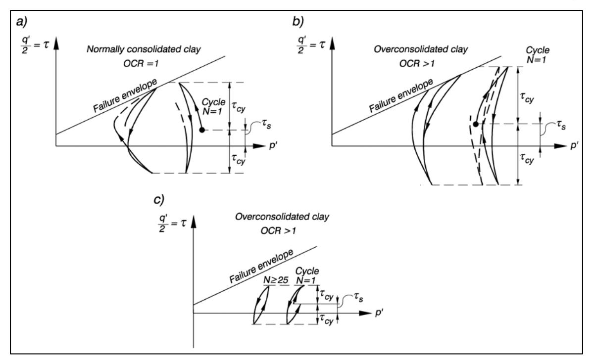

*Figure VI-5-96. Illustration of effective stress paths for clay samples in undrained triaxial tests*

- (d) It is very difficult to determine accurately the change in pore pressure, and therefore, also the change in effective stresses in triaxial and DSS tests. Consequently, to determine the relationship between the shear strength $c_{u}$ and $τ_{s}$ , $τ_{cy}$ , and number of cycles, N , it is better to examine the load increase to failure in normal static tests for samples already exposed to various ranges of cyclic loadings. From the load increase the actual $c_{u}$ -value after a specific exposure in terms of $τ_{s}$ , $τ_{cy}$ , and N can then be estimated. Examples and information on such post-cyclic static shear strength are presented in Andersen (1988). For Norwegian Drammen clay, being a plastic clay with plasticity index $I_{p}$ = 27 percent, it was found that cyclic loading causing large cyclic shear strains also caused significant reduction in the static shear strength. The reduction increases with the number of cycles. It was also found that the reduction is generally less than 25 percent as long as the cyclic shear strains are less than 3 percent and the number of cycles less than 1,000. This holds for OCR -values of 1, 4, and 10. Figure VI-5-97 shows an example of stress-strain behavior of Drammen clay. This example shows the importance of modeling the type of loading correctly when trying to determine the stress-strain behavior or the shear modulus in situ from laboratory tests.
- (e) The number of cycles to failure, $N_{f}$ , can be determined from a series of triaxial or DSS laboratory tests applying various combinations of $τ_{s}$ and $τ_{cy.}$ Due to the very large shear strain at failure, it is often appropriate to define failure as a lower strain level, the value of which must depend on the type and function of the structure. The test results can conveniently be plotted in diagrams as shown in Figure VI-5-98, where failure is taken when either the cyclic strain, $γ_{cy}$ , or the average strain, $γ_{s}$ , reaches 15 percent.

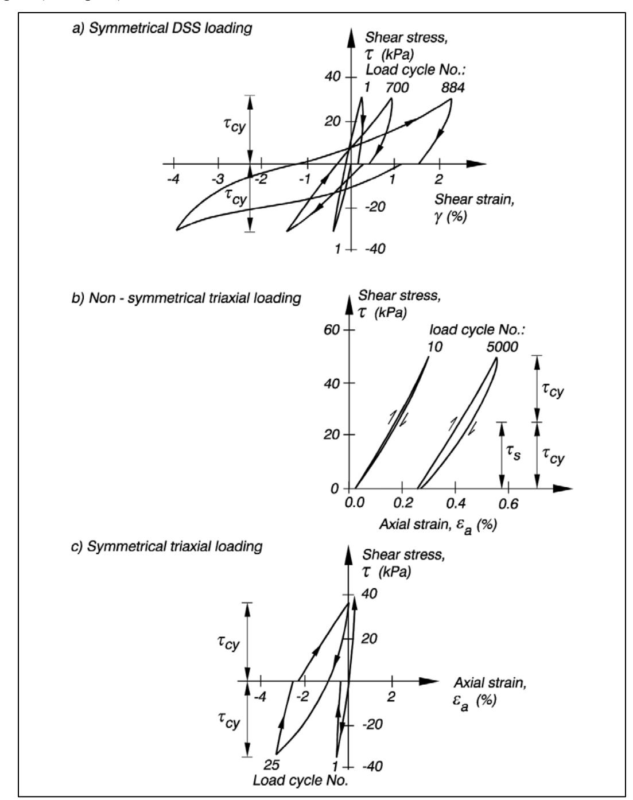

*Figure VI-5-97. Stress strain behavior of Drammen clay $(I_{p}$ = 27 percent) under various cyclic loading conditions corresponding to OCR = 4 (from Norwegian Geotechnical Institute 1992)*

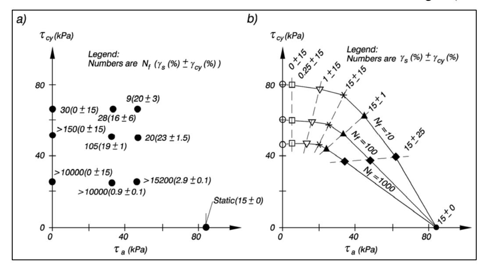

*Figure VI-5-98. Result of cyclic tests on normally consolidated Drammen clay, with OCR = 1 and $I_{p}$ = 27 percent (from Norwegian Geotechnical Institue 1992)*

- (f) In Figure VI-5-98 $N_{f}$ is number of cycles to failure defined as either the cyclic strain γ cy or the average strain $γ_{s}$ reaching 15 percent. Figure VI-5-98a shows individual test results, and Figure VI-5-98b shows interpolated curves based on the individual tests. A diagram like Figure VI-5-98b can be transformed to normalized form using the vertical effective stress σvc at the end of the cycling (consolidation), and the undrained static shear strength, $σ_{u,}$ measured in strain-controlled tests. Figure VI-5-99 shows an example based on both triaxial and DSS tests.
- (g) In Figure VI-5-99 σ u E , σ u C , and σ u DSS are undrained static shear strength in triaxial compression and extension tests and in DSS tests, respectively.
- (h) By replotting the data from Figure VI-5-99 it is possible to show the relationship between the cyclic shear strength, $τ_{f,cy}$ , as defined by Equation VI-5-233, and $N_{f}$ , σ vc and the undrained static shear strengths. An example is shown in Figure VI-5-100.
- (i) A simple diagram for approximate correction of the static failure load to take into account the effect of cyclic loading in static calculations is presented in de Groot et al. (1996) for Drammen clay ( OCR = 1, = 4 and = 40).

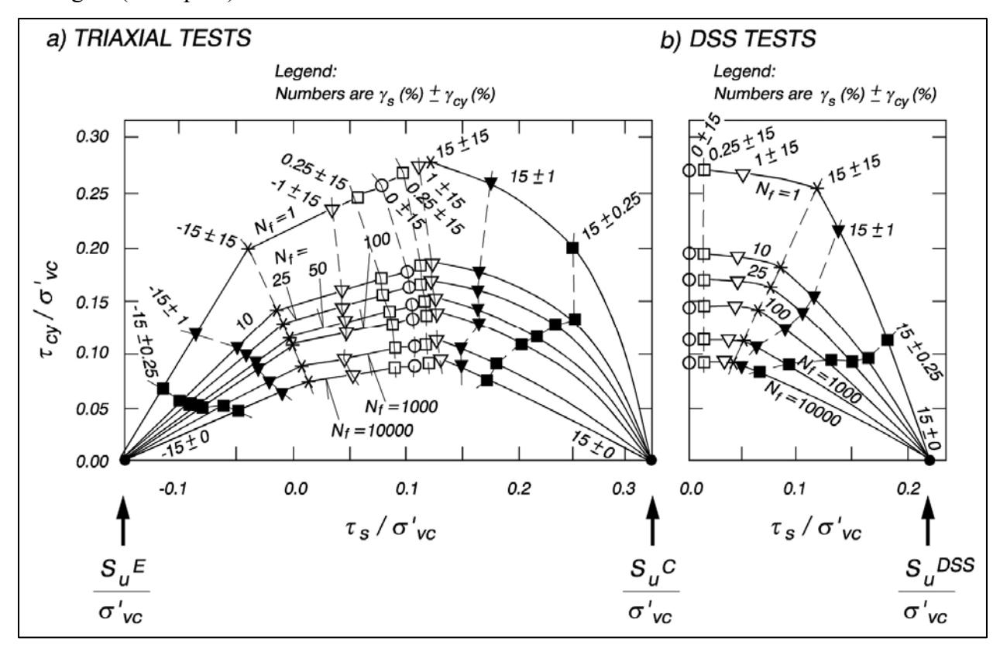

*Figure VI-5-99. Example of normalized diagrams for cyclic loading of Drammen clay with OCR = 1, in triaxial tests (a), and DSS tests (b) (from Norwegien Geotechnical Institute 1992)*

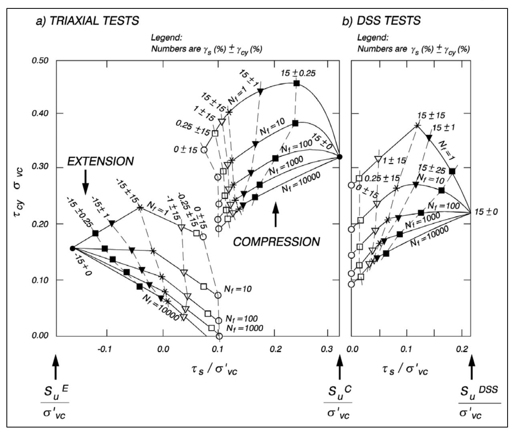

*Figure VI-5-100. Cyclic shear strength of Drammen clay with OCR = 1 (from Norwegian Geotechnical Institute 1992)*

- f. Dynamic loading of soils under monolithic structures.
- (1) Dynamic loading of soils and rubble rock foundations occurs when wave wall superstructures and vertical wall breakwaters are exposed to impulsive loads from waves breaking at the structures, as shown in Figure VI-5-56. The impulsive load magnitude can be very large, but the loads have very short durations with load periods in the range 0.1-1.0 sec for the peaked part of the loading. Because the natural period of some structures often are within (or close to) the same period range, dynamic amplification of the wave load and corresponding structure movements might occur.
- (2) When moderately loaded, the soil and rubble rock will react approximately as an elastic material; whereas under severe loading, permanent deformations will occur, corresponding to plastic behavior.
EM 1110-2-1100 (Part VI) Change 3 (28 Sep 11)
- (3) Determination of impulsive wave forces caused by waves breaking directly on vertical wall structures is extremely uncertain. The same can be said about the related loading on the foundation. In addition, breaking wave loads can be very large; therefore, direct wave breaking on the structure should be avoided. If necessary, the geometry or position of the structure should be changed to avoid large impulsive wave forces. In cases where the wave load is known, it is possible to obtain some estimates of the effect on the foundation as explained in the following paragraphs.
- (4) The actual time of the wave loading is an important factor in the dynamic amplification. Model studies by Bagnold (1939) and Oumeraci (1991) showed that the load history of forces from waves breaking on vertical walls can be approximated with a church-roof like time-history as sketched in Figure VI-5-101.

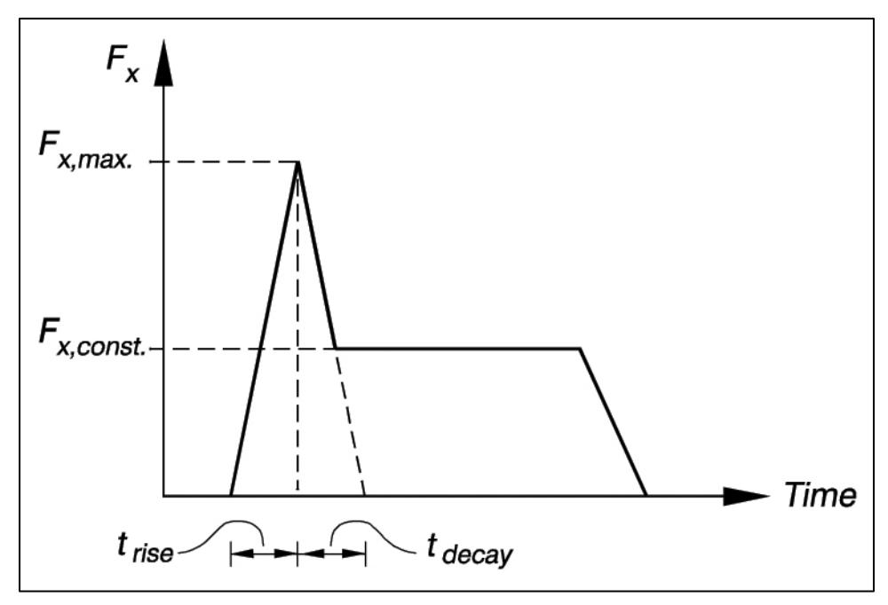

*Figure VI-5-101. Approximation to horizontal wave load history for waves breaking directly on vertical walls*

- (5) For the elastic case it is possible to get a crude estimate on the dynamic amplification by modeling the soil-structure system as a rigid body resting on a linear elastic half-space, idealized by a lumped mass system where the geodynamic response is represented by a spring-dashpot model. A two-degrees-of-freedom system allowing only translatory motion, x, in the horizontal direction and rotation, , about the center of gravity, $C_{g}$ , is commonly considered (see Figure VI-5-102).
- (6) The effect of any impulsive loading can be found by solving the equations of motion for the complete translatory and rotational motion, provided the stiffness and damping coefficients are known. However, for practical design purposes a simple static approach can be accomplished by assuming an equivalent static load which will induce the same motions of the structure as those found from a dynamic calculation. The following definitions of dynamic load
factors, \Omega , show how the equivalent static force and motions are related to the dynamic force and motions.

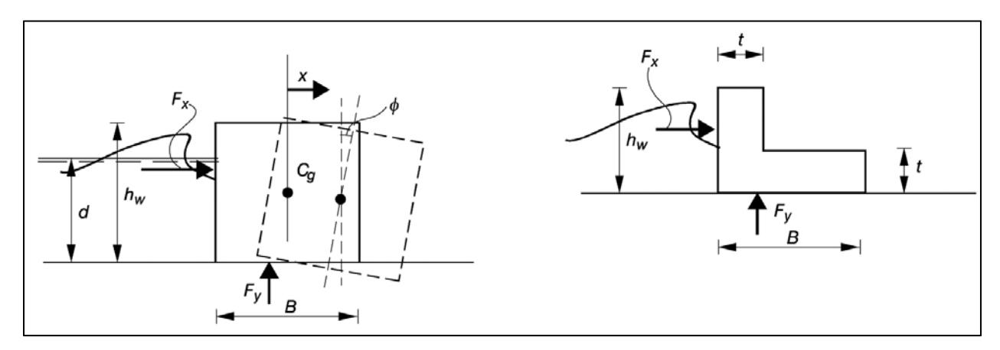

*Figure VI-5-102. Definition of translatory and rotational motions and dimensions for caisson structure and parapet wave wall exposed to dynamic loading*

```math
\Omega_{x} = \frac{\max \ dynamic \ translation}{\max \ static \ translation} = \frac{\max\{x\}}{F_{x,\max} / kx} = \frac{F_{x,equiv}}{F_{x,\max}}
```

```math
\Omega_{\varphi} = \frac{\max \text{ dynamic rotation}}{\max \text{ static rotation}} = \frac{\max \{\varphi\}}{M_{\mathrm{max}} / k_{\varphi}} = \frac{M_{\mathrm{equiv}}}{M_{\mathrm{max}}}
```

where F_{x,\max} is defined in Figure VI-5-101, k_x and k_v are stiffness coefficients, and M_{\max} is the maximum wave-load-induced moment around the center of gravity. The moment also includes wave-generated uplift forces, F_y . If \Omega_x , \Omega_v , k_x , k_v , and the maximum wave loading F_x and M_v are known, then the maximum motions and related equivalent static wave loadings can be determined. The vertical motion is of little interest for monolithic structures under predominantly horizontal wave loading.
- (7) Pedersen (1996, 1997) presented diagrams of \Omega_x and \Omega_v for caissons and wave wall superstructures with square footings (i.e., B \times B shown in Figure VI-5-102) exposed to the type of loading shown in Figure VI-5-101. The soil was modeled as a linear elastic half-space. Pedersen used results of Lysmer and Richardt (1966) and Hall (1967) to obtain expressions for optimized constant values of stiffness and damping coefficients. An example of Pedersen's diagrams for caisson structures is shown in Figure VI-5-103 for load history t_{rise}/t_{decay} = 1 under triangular loading. T_{nd} is the coupled, damped natural period of the caisson. Pedersen showed that the constant part of the wave loading following the peak has little influence on the response if F_{x,const} \# 0.5 F_{x,max} .
- (8) Due to the many uncertainties and simplifying assumptions, diagrams such as shown in Figure VI-5-103 should be used only for judging the possibility of dynamic amplification. If dynamic amplification factors are found to be close to or greater than 1, then a detailed dynamic analysis should be performed or the structure design should be changed.
- g. Slip surface and zone failures.
- (1) Slip surface and zone failure calculations are based on limit state calculations related to assumed or approximate rupture figures. Two different solutions are applied:

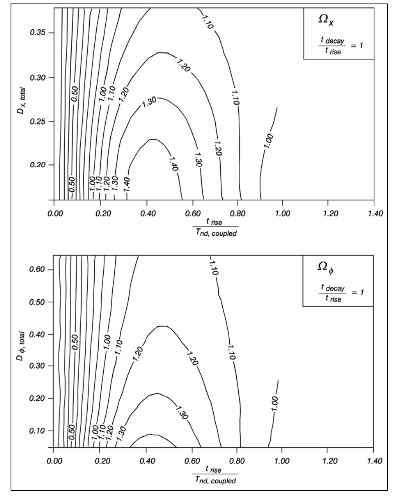

*Figure VI-5-103. Amplification factors for translatory and rotational motions for caisson structure with square footing and triangular load shape (Pedersen 1997)*

(a) Statically admissible solutions are defined by stress distributions that satisfy equilibrium for stresses and loads for all involved soil elements. In homogeneous soils with sufficiently simple boundary conditions, e.g., straight and uniformly loaded boundaries, these
types of approximate solutions may represent a simple and efficient solution technique. Many standard formulas and calculation methods in soil mechanics for bearing capacity and earth pressure problems are derived from statically admissible solutions. However, even slight modifications of the boundary conditions, and especially the introduction of inhomogeneous soil properties, may make a realistic solution of this type extremely complicated. Consequently, statically admissible solutions do not represent a generally applicable solution method, even if a limited number of standard cases are known and are widely used.
(b) Kinematically admissible solutions are defined by displacement fields that satisfy the boundary conditions for displacements as well as the associated flow rule (normality condition) within the theory of plasticity. Satisfying the flow rule makes the use of work equations possible. The flow rule requires the angle of friction \nu and the angle of dilation \psi to be equal, although this is not true for frictional materials. To overcome this problem Hansen (1979) proposed to set \psi = \nu = \nu_d where the modified angle of friction \nu_d is defined by

```math
\tan \varphi_d = \frac{\sin \varphi \cos \psi}{I - \sin \varphi \sin \psi} \tag{VI-5-235}
```

- (c) When applying v_d it follows that both statically and kinematically admissible solutions will always be on the safe side. Otherwise statically admissible solutions will either be correct or on the safe side, whereas kinematically admissible solutions, according to the upper bound theorem, will either be correct or on the unsafe side.
- (2) Experience indicates that solutions based on realistic rupture figures are in both cases generally close to the true situaton.
- (3) For a given structure it is necessary to identify the most critical rupture figure, defined as the one which provides the lowest bearing capacity. For example, if work equations are used, then the rupture figure corresponding to the lowest ratio of work of stabilizing forces W_s to work of destabilizing forces W_d is the critical rupture figure. In any case in order to prevent failure and to have some safety the condition

```math
\min\left(\frac{W_s}{W_d}\right) \ge 1 \tag{VI-5-236}
```

must be fulfilled. If not, the structure design has to be modified or the soil strength improved (by preloading, compaction, or installation of drains), or the soil must be replaced.
- (4) For a number of standard cases the rather complicated equations related to statically and kinematically admissible solutions have been simplified to practical force equations, formulae, and diagrams (e.g., the determination of foundation bearing capacity and soil pressures on walls). The formulae and diagrams are based not only on the basis of theoretical solutions but also on model tests and field experience. This compensates for non-exact kinematically admissible solutions. (a) Stability of slopes.
EM 1110-2-1100 (Part VI) Change 3 (28 Sep 11)
- Slope instability failure modes for coastal structures are schematized by the various slip failure surfaces shown in the figures in Part VI-2-4 b . Slope instability is a conventional soil mechanics problem which is dealt with in almost every handbook on geotechniques and foundation engineering, e.g., Terzaghi and Peck (1944), Taylor (1958), Lambe and Whitman (1979), Anderson and Richards (1985), and Hansbo (1994). However, the conventional treatment of the subject does not pay attention to wave loadings which characterize the special conditions for coastal structures.
- Direct wave action on a permeable slope increases the antistabilizing forces because the runup presents an extra load and creates fluctuating pore pressures and related antistabilizing hydraulic gradients in the structure. In addition, both waves and tides create pore pressure gradients in porous seabeds.
- Slope instability rarely occurs in conventionally designed rubble-mound structures. Stability problems can occur if the structure is placed on weak soils or on soil with weak strata because the slip failure plane passes through weaker materials. Very large breakwaters with steep slopes might be suspectable to stability problems within the structure itself especially if exposed to earthquake loading. Another type of failure related to rubble-mound slopes is sliding of one layer over another layer which is caused by reduced shear strength at the interface between two layers of narrow graded materials of different particle size and shape, e.g., armor layer and filter layer. If geotextiles are used, the interface shear strength is significantly reduced. The two load categories pertinent to coastal structure slope stability are listed below:

| Long-term stability | Permanent loads, i.e., weight of structure and soils, permanent surface loads, and average loads from groundwater. |
| --- | --- |
| Short-term stability | Permanent loads as well as variable loads from waves (direct wave loading and seepage forces), seismic activity and vehicles. Ice loads are usually not dangerous to slope stability. |

- For each of the load cases it is important to apply the relevant soil strength parameters. This includes consideration of soil strength degradation related to variable loadings, as discussed in Part VI-5-5 e of this chapter.
- Variable loads from waves and the related seepage forces should be considered for the two instantaneous load situations depicted in Figure VI-5-104. The pore pressures and the related hydraulic pressure gradient and seepage forces in a homogeneous, isotropic breakwater structure can be estimated from flow nets if the Darcy equation (Equation VI-5-220) is taken as valid, or calculated using advanced numerical models. In Figure VI-5-104 the seabed is assumed to be impermeable compared to the breakwater. This is usually a good approximation for rubblemound structures built of quarry materials.

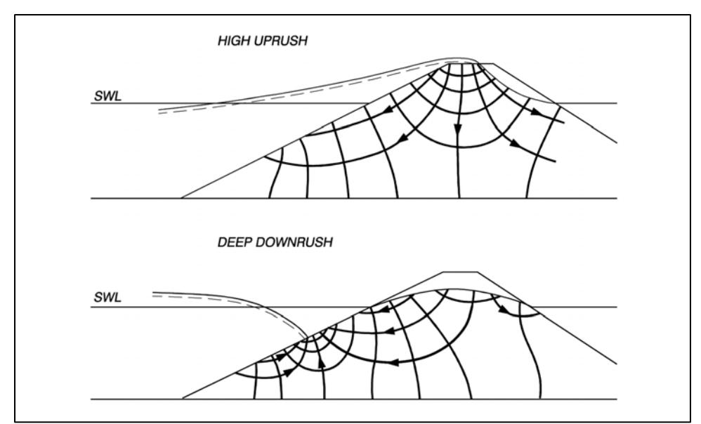

*Figure VI-5-104. Illustration of flow nets in a homogeneous isotropic breakwater for two instantaneous wave load situations*

- The pore pressure variation in a homogeneous seabed due to water level changes caused by tides and waves can be estimated by the method of de Rouck (1991) as shown in Table VI-5-85. The pore pressure in deeper strata corresponds to the hydrostatic pressure at mean water level. However, some seepage forces are created due to the reduction in pressure at the seabed surface beneath a wave trough during low tide. Tidal variations only cause vertical seepage forces due to the long tidal wavelength. However, short waves also cause horizontal seepage forces that are generally smaller than the vertical seepage forces. Figure VI-5-105 illustrates the flow net related to wave action.
- Equation VI-5-238 in Table VI-5-85 assumes that the compressibility of seawater is negligible compared to that of the grain skeleton, which is almost always the case. The pore pressure variations in the seabed underneath a rubble-mound structure can be determined from Equation VI-5-238 by estimating $u_{0}$ along the seabed surface using flow nets similar to those illustrated in Figure VI-5-104.
- It follows from Equation VI-5-238 that the attenuation of u with depth z decreases with more permeable and stiffer soil and with longer wave periods. Pore pressure variations due to tides ( T = 12h 25 min) are only very slightly attenuated in sand, but there is a significant attenuation in clay. Pore pressure variations due to wind generated waves ( T < 20 s) are strongly attenuated, even in sand.
- Seismic loads are usually taken into account by adding the seismic related horizontal inertia forces to the forces acting on the soil along with additional hydrodynamic forces which might result from the displacement of the soil body. Possible seabed scour should be taken into account when defining the bottom topography.

*Table VI-5-85 Wave and Tide Induced Pore Pressures in Permeable Seabeds (de Rouck 1991)*

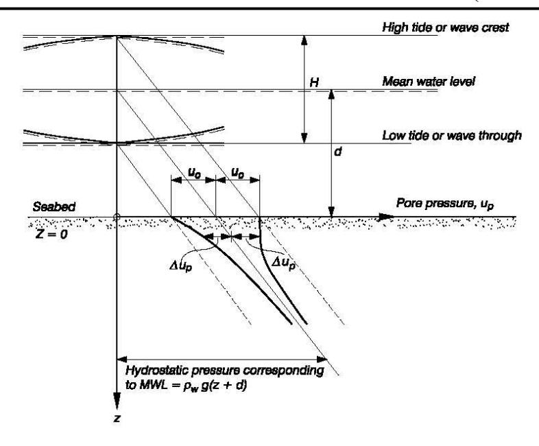

The pore pressure in depth z is given by

```math
u_p = \rho_w g(z+d) + \Delta u_p
```

```math
\Delta u_p = u_0 e^{-Az} \cos(\frac{2\pi X}{L} + \frac{2\pi t}{T} - Az) \tag{VI-5-238}
```

where ~up Pore pressure deviation caused by wave or tide
u0 Bottom pore pressure amplitude
= P·w9 ~ for tides
- fJ 1J1 9H for waves - 2 cosh(2l") "
assuming linear wave theory
Ma..c;s density of water
g Gravitational acceleration
d Mean water depth
X Horizontal coordinate
L Wavelength
t Time
T Wave period
A= ~)0.5 kEoedT
k Darcy permeability coefficient
Oedometric compression modulus of soil

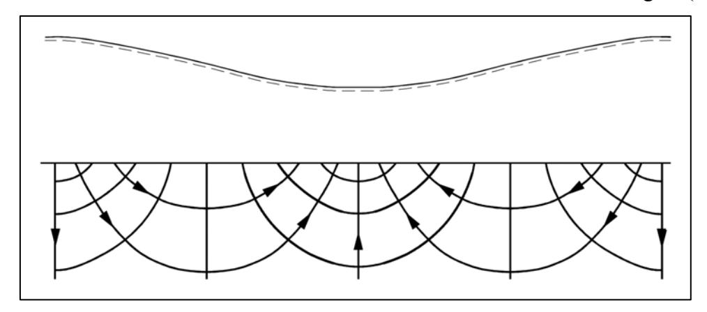

*Figure VI-5-105. Illustration of instantaneous flow net in a homogeneous isotropic seabed under wave action*

- For the two-dimensional case, simple methods of estimating slope stability have been developed. The stability can be investigated by considering the equilibrium of the soil body confined by the failure surface as illustrated in Figure VI-5-106. The ratio between the "stabilizing" and "driving" rotational moments, M_s and M_D , determined from all forces acting on the free soil body, is a measure of the stability.
- In Figure VI-5-106, W is the total weight of the soil element including pore water, S is the horizontal seismic inertia force, \tau and \sigma N are shear stress forces and effective normal stress forces, respectively, u_s is the water pressure along the surface of the slope, and u_p is the pore water pressure along the failure circle. The variables \tau and \sigma N usually vary along the failure circle. The parameter u_s is determined by the mean water level and the wave action. At the time of maximum runup a good approximation would be a hydrostatic pressure distribution, i.e., u_s = \rho_w h where \rho_w is the water mass density and h is the local instantaneous water depth. The variable u_p can be determined from flow nets sketched for the instantaneous wave action situation, or from numerical models (Barends et al. 1983). Another, but in fact identical, formulation of the force balance indicated in Figure VI-5-106 would be to subtract the effect of hydrostatic water pressure corresponding to the mean water level from W, u_s and u_p . A safety factor F for the slope stability can be expressed as

```math
F = \frac{M_s}{M_D} = \frac{moment\ of\ stabilizing\ forces}{moment\ of\ driving\ forces} \tag{VI-5-239}
```

or as

```math
F = \frac{available shear strength}{shear strength required for stability} \tag{VI-5-240}
```

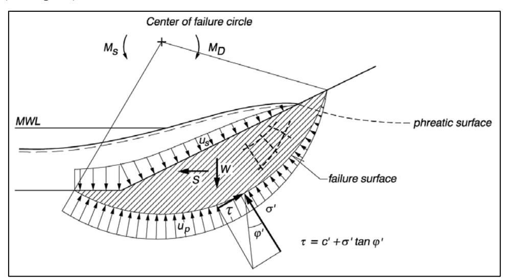

*Figure VI-5-106. Illustration of forces to be considered in slope stability analysis*

If the failure surface is circular then the resultant force of the pore pressure $u_{p}$ goes through the center of the circle and will not contribute to $M_{D}$ . In this case it is common to define a safety factor as

```math
F = \frac{moment \ of \ shear \ strength \ along \ failure \ circle}{moment \ of \ weight \ of \ failure \ mass \ and \ surface \ loads} \tag{VI-5-241}
```

- The minimum value of F has to be identified by varying the position of the center of the failure circle and the radius. Also, F must be larger than unity to assure stability. The determination of the actual (minimum) safety factor for a given slope requires usually many trial failure surfaces calculations. It is important to notice that F is not a general safety factor because it depends on the applied definition. A specific value of F does not express a unique safety level.
- Various hydraulic load situations must be evaluated, such as a rapid run-down situation in which the phreatic surface in the slope material remains in a high position due to slow drainage (see Figure VI-5-104). This load situation, which occurs when rather impermeable materials are used, might be approximated and treated like rapid (instantaneous) drawdown known from earth dam design. Morgenstern and Price (1965) provide stability charts of F (Equation VI-5-239) as a function of slope angle, ratio of drawdown height over water depth, and soil strengths c and .
- The critical circular failure surface and the related safety factor F can be determined directly following the method of Janbu (1954a, 1954b) for the case of homogeneous soil, stationary water table and undrained conditions, i.e., the soil strength is given by the undrained shear strength $c_{u}$ . Hansbo (1994) presented diagrams for determination of F as function of slope geometry, water level, $c_{u,}$ and surface load.
- A unique solution when determining slope stability for soils with an internal angle of friction, , cannot be obtained because of four unknowns and only three equations of static
equilibrium. If \nu N is constant along the failure surface, one solution to the problem is to substitute the circle with a logarithmic spiral, i.e.,

```math
r = r_1 \exp(\omega \tan^{-1}) \tag{VI-5-242}
```

in which the radius vector forms an angle vN with its normal at each point of the curved surface. The unknown frictional forces along the failure surface now pass through the center of the spiral as shown in Figure VI-5-107.

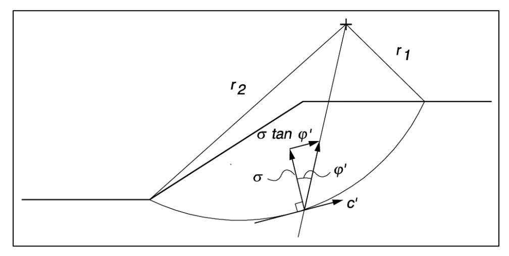

*Figure VI-5-107. Illustration of logarithmic spiral*

The stabilizing moment due to friction and cohesion, both taken as constants, is given by

```math
M_s = \frac{1}{2}c'(r_1^2 - r_2^2)\cot\varphi' \tag{VI-5-243}
```

- The logarithmic spiral is not kinematically admissible as is the case for a circular (or straight line) failure plane. However, the deviation between the two curves is not significant in most cases.
- The simple methods illustrated in Figures VI-5-106 and VI-5-107 cannot be applied to inhomogeneous soils in which the soil strength parameters cN and vN vary along the failure surface. This situation arises when the slip surface goes through both the rubble-mound and seabed soil, or through layered parts of the rubble structure where the interfacial friction angles are different (smaller) from the friction angle of the rubble. Moreover, if weak strata are present, then the slip surface will not be circular or log-spiral shaped because the failure surface tends to go through the weak layers as illustrated in Figure VI-5-108.

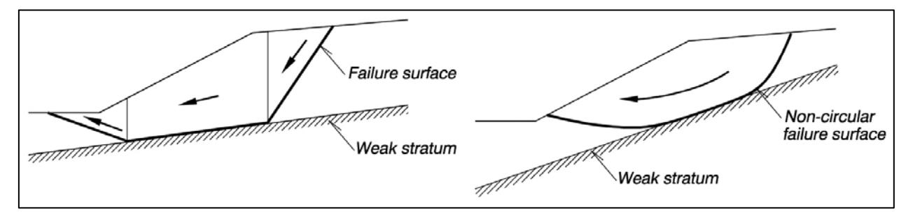

*Figure VI-5-108. Illustration of failure surface in case of weak stratum*

For inhomogeneous conditions, slope stability is generally analyzed by the method of slices. The soil body is separated into fictitious vertical slices having widths that are determined such that c and can be assumed constant within a slice. Slope stability is analyzed by considering all the forces acting on each slice, as shown by Figure VI-5-109. The failure surface that gives the lowest stability has to be identified by trial calculations. In Figure VI-5-109, W is the total weight of the slice including surface load, $u_{p}$ is the total pore water pressure at the bottom of the slice, and the parameters P and T are the horizontal and vertical forces, respectively, on the sides of the slice.

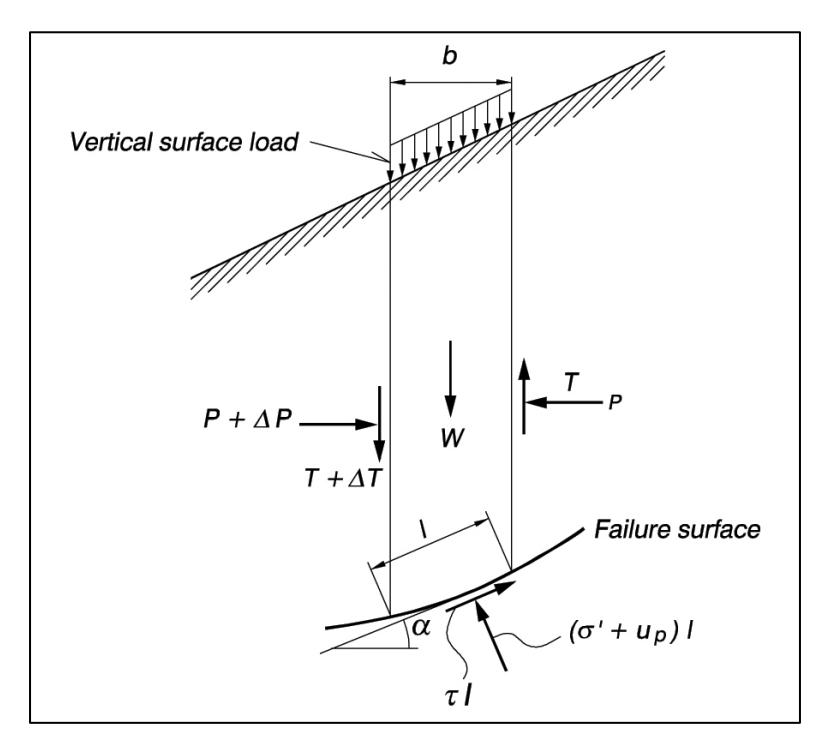

*Figure VI-5-109. Illustration of forces on a soil slice in the method of slices slope stability analysis*

Several approximate methods exist for determining F, as defined by Equation VI-5-241. The most commonly applied methods are the ordinary method of slices and the simplified method of slices by Bishop. Both methods are based on the assumption of
circular-cylindrical failure surfaces. The reasonableness of this assumption should be considered in light of the comments about weak strata.
• The Ordinary Method of Slices, also known as the method of Fellinius (1936), assumes that the resultant of the forces P and T acting upon the sides of any slice have zero resultant force in the direction normal to the failure direction are for that slice. It is also assumed that the failure surface is circular-cylindrical. The related safety factor is given by

```math
F = \frac{\sum_{i=1}^{n} \left[ c_{i'} l_i + \left( W_i \cos \alpha_i - u_{pi} l_i \right) \tan \varphi_{i'} \right]}{\sum_{i=1}^{n} W_i \sin \alpha_i} \tag{VI-5-244}
```

If cN and vN are taken as constants, Equation VI-5-244 simplifies to

```math
F = \frac{c'L + \tan \varphi' \sum_{i=1}^{n} \left( W_i \cos \alpha_i - u_{pi} l_i \right)}{\sum_{i=1}^{n} W_i \sin \alpha_i} \tag{VI-5-245}
```

where L is the total length of the circular failure surface. The values of F calculated by Equations VI-5-244 or VI-5-245 fall below the lower bound of solutions that satisfy static analysis. Thus, the method is on the safe side. The method of slices was further developed by Janbu (1954a) and Bishop (1955).
• The Simplified Method of Slices by Bishop (1955) is valid for a circular-cylindrical failure surface, and it assumes that the forces acting on the sides of any slice have zero resultant in the vertical direction, i.e., \Delta T in Figure VI-5-109 is zero. The related safety factor, defined by Equation VI-5-241, is

```math
F = \frac { R \displaystyle \sum _ { i = 1 } ^ { n } \Bigl [ c _ { 1 } , b _ { i } + \left( W _ { i } - u _ { p i } b _ { i } \right) \tan \varphi _ { i } ^ { } \Bigr ] \Bigl / \left[ \left( 1 + \tan \alpha _ { i } \tan \varphi _ { i ^ { \prime } } / F \right) \cos \alpha _ { i } ^ { } \right] } { M _ { D } + R \displaystyle \sum _ { i = 1 } ^ { n } W _ { i } \sin \alpha _ { i } } \tag{VI-5-246}
```

where R is the radius of the failure surface circle and M_D is the driving moment of any load not included in Figure VI-5-109. Because F is implicitly given, an iteration procedure must be used; however, convergence of trials is very rapid.
• The Method of Slices by Janbu (1954a, 1973) is for more complicated situations where circular-cylindrical slip surfaces cannot be used, and a method for composite failure surfaces of arbitrary shape must be applied. The method is based on a combination of equations expressing moment and force equilibrium of each slice, and an iteration method for calculating F must be used.
EM 1110-2-1100 (Part VI) Change 3 (28 Sep 11)
Most slope failures are three-dimensional. An approximate treatment of a three-dimensional slope failure is illustrated in Figure VI-5-110. The safety factors, $F_{1}$ , $F_{2}$ , and F3 , for three parallel cross-sections are computed. An estimate of the safety factor, F , for the whole body can then be estimated as the weighted safety factor using the total free body soil weights, W1 , W2 , and $W_{3,}$ above the failure surface in each cross section as the weighting factors.

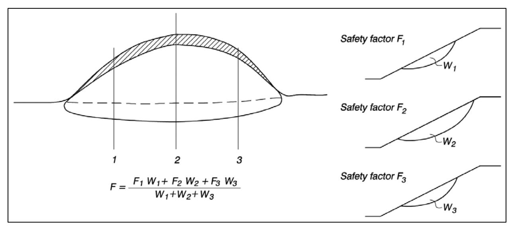

*Figure VI-5-110. Illustration of safety factor F for three-dimensional slope failure*

- (b) Bearing capacity.
- The bearing capacity of a foundation is the load, transferred through the foundation soil interface, that will initiate soil failure. Thus, bearing capacity is related to the ultimate limit state. The bearing capacity of the foundation of monolithic structures or structure elements like caissons and parapet concrete superstructures must be analyzed, and sufficient safety must be implemented in the design. Typical bearing capacity failure modes are shown in Part VI-2-4, "Failure Modes of Typical Structure Types."
- Rubble-mound breakwater structures placed on weak seabed soils might suffer from insufficient seabed bearing capacity. This can be investigated by the slip surface analysis explained in the previous section on slope stability.
- Bearing capacity calculations are based on zone failure analysis. In the case of homogeneous soil conditions the vertical bearing capacity of strip footings and individual rectangular footings can be estimated by formulae developed by Meyerhof (1951, 1963) and Brinch Hansen (1961, 1970), presented in Tables VI-5-86 and VI-5-87. The formulae, which represent a further development of Prandtl's and Terzaghi's theories for concentrically loaded horizontal footings, are valid for static loading and homogeneous soil conditions within the space of the zone failures.

*Table VI-5-86*

## Bearing Capacity Formula for Rectangular Concentrically Statically Loaded Horizontal Footings (Meyerhof 1951, 1963)

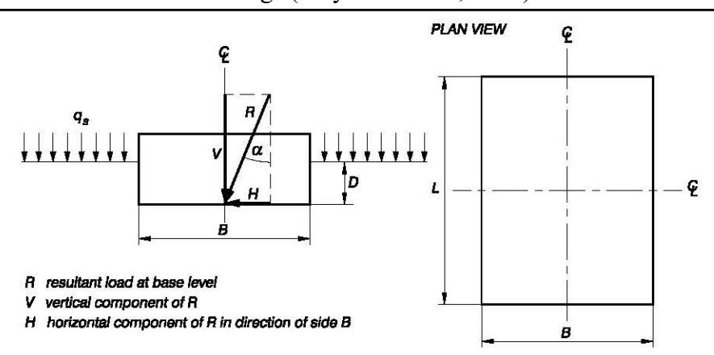

Ultimate vertical bearing capacity per unit area of the footing:

```math
q _ { u } = \frac { Q ^ { N _ { u } } } { B L } = \frac { 1 } { 2 } \, \bar { \gamma } ^ { \prime } \, B \, N _ { \gamma } \, s _ { \gamma } \, d _ { \gamma } \, i _ { \gamma } + q ^ { \prime } \, N _ { q } \, s _ { q } \, d _ { q } \, i _ { q } + c \, N _ { c } \, s _ { c } \, d _ { c } \, i _ { \alpha } \tag{VI-5-247}
```

Q_u Ultimate (maximum) value for the vertical component of the load
B Width of footing
L Length of footing, always \geq B
D Minimum depth of footing below soil surface
\bar{\gamma}' Average effective weight of soil from base level to depth B under base level
q' Effective overburden pressure at base level (contribution from surface load q_s and effective weight of soil above base level)
c Shear strength of soil. c_u for undrained conditions, and c' (effective) for drained conditions
\varphi' Effective friction angle of soil determined by plain strain tests. Friction angle \varphi'_{triax} determined by triaxial test should be replaced by \varphi' = (1.1 - 0.1 \ B/L) \varphi'_{triax}

#### Bearing capacity factors:

```math
N_{\gamma} = (N_q - 1) \tan(1.4 \varphi') \quad N_q = \exp(\pi \tan \varphi') \tan^2(45^\circ + \varphi'/2) = \exp(\pi \tan \varphi')(1 + \sin \varphi')/(1 - \sin \varphi')
```

```math
N_c = \left\{ \begin{array}{ll} (N_q - 1) \cot \varphi' & \\ \pi + 2 & \text{for undrained conditions } (\varphi' = 0) \end{array} \right.
```

#### Shape coefficients:

```math
s_{\gamma} = s_q = \begin{cases} 
1.0 & \text{for } \varphi' = 0^\circ \\
1 + 0.1 \cdot (B/L) \cdot \tan^2 \left(45^\circ + \frac{\varphi'}{2}\right) & \text{for } \varphi' \geq 10^\circ 
\end{cases}
```

```math
s_c = 1 + 0.2 \ (B/L) \ \mathrm{tan} \ (45^0 + \varphi'/2)
```

#### Depth coefficients:

```math
d_{\gamma} = d_{q} = \begin{cases} 1.0 & \text{for } \varphi' = 0\\ 1 + 0.1 \; (D/B) \; \text{tan } (45^{0} \; + \; \varphi'/2) & \text{for } \varphi' \geq \; 10^{0} \end{cases}
```

```math
d_c = 1.0 + 0.2 \; (D/B) \; \mathrm{tan} \; \left(45^0 + \varphi'/2\right)
```

#### Inclination coefficients:

```math
i_{\gamma} = \left\{ \begin{array}{ll} 1.0 & \text{for } \varphi' = 0 \\ (1 - \alpha/\varphi')^2 & \text{for } \varphi' \geq 10^0 \end{array} \right. \quad \alpha = \arctan(H/V)
```

```math
i_q = i_c = (1 - \alpha/90^0)^2
```

*Table VI-5-87*

Bearing Capacity Formula<sup>1</sup> for Rectangular Statically Loaded Horizontal Footing (Brinch Hansen 1961, 1970)

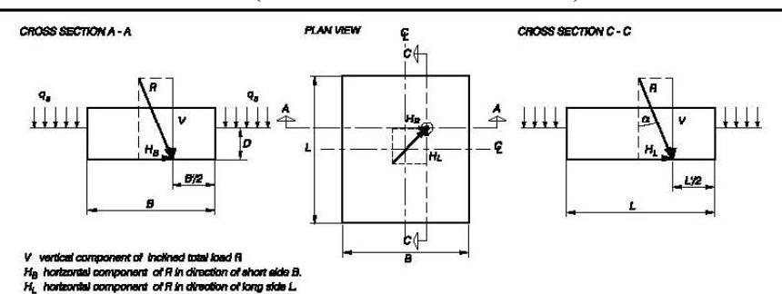

Ultimate vertical bearing capacity per unit area of effective footing:

```math
q_u = \frac{Q_u}{B'L'} = \frac{1}{2} \bar{\gamma}' B' N_{\gamma} s_{\gamma} d_{\gamma} i_{\gamma} + q' N_q s_q d_q i_q + c N_c s_c d_c i_c \tag{VI-5-248}
```

Q_u Ultimate (maximum) value for the vertical component of the load
- B' = B - 2e_B , effective width of footing, B' \ge 0.4B
- L' = L - 2e_L , effective length of footing, L' \ge 0.4L
D Minimum depth of footing below soil surface
\bar{\gamma}' Average effective weight of soil from base level to depth B under base level
q' Effective overburden pressure at base level (contribution from surface load q_s and effective weight of soil above base level)
c Shear strength of soil. c_u for undrained conditions, and c' (effective) for drained conditions.
\varphi' Effective friction angle of soil determined by plain strain tests. Friction angle, \varphi'_{triax} , determined by triaxial tests should be replaced by \varphi' = 1.1 \varphi'_{triax} .

#### Bearing capacity factors:

```math
N_{\gamma} = 1.5(N_q - 1)\tan\varphi'
```

```math
N_q = \exp(\pi\tan\varphi')\tan^2(45^\circ + \varphi'/2) = \exp(\pi\tan\varphi')(1+\sin\varphi')/(1-\sin\varphi'), \quad N_c = \begin{cases} (N_q - 1)\cot\varphi' \\ \pi+2, & \text{for undrained conditions } (\varphi'=0) \end{cases}
```

#### Shape coefficients:

```math
s_{\gamma} = 1 - 0.4 B' / L', \text{ must always be } \geq 0.6
```

```math
s_q = 1 + \sin \varphi' B'/L'
```

```math
s_c = 1 + 0.2 \ B'/L'
```

#### Depth coefficients:

```math
d_{\gamma} = 1
```

```math
d_q = 1 + 2\tan\varphi'(1 - \sin\varphi')^2 \arctan(D/B')
```

```math
d_c = 1 + 0.4 \arctan(D/B')
```

#### Inclination coefficients:

```math
i_{\gamma} = \left(1 - \frac{0.7 H_B}{V + B'} \frac{L'}{c'} \cot \varphi'\right)^5,
\quad i_q = \left(1 - \frac{0.5 H_B}{V + B'} \frac{L'}{c'} \cot \varphi'\right)^5

if the quantity inside the bracket becomes negative then the bearing capacity is negligible.
```

```math
i_{c} = \left\{ \begin{array}{ll}
i_{q}-\frac{1-i_{q}}{N_{q}-1}\simeq i_{c} & \text{for } \varphi^{\prime }\neq 0 \\
0.5(1+(1-\frac{H_{B}}{B^{\prime }L^{\prime }}\cot \varphi ^{\prime })^{0.5}) & \text{for } \varphi^{\prime }=0
\end{array} \right.
```

*& lt;sup>1</sup> Failure can take place either along the long side or the short side of the footing. The formulae given above correspond to the first case. For the second case substitute L' for B', B' for L', and H_L for H_B .*

- Brinch Hansen (1970) extended his formula to cover also the bearing capacity of statically loaded footings with inclined base in the vicinity of a slope. The formula which is termed the general bearing capacity formula is presented in Table VI-5-88 as an addition to the formula in Table VI-5-87.
- If foundation zone failures penetrate into more than one type of uniform soil then the formulae given in Tables VI-5-86, VI-5-87 and VI-5-88 cannot be applied, and the bearing capacity must be estimated by trial and error calculations in which the most critical rupture figure providing the lowest bearing capacity is identified.
- Eccentricity of the load, R , can, according to Meyerhof (1953), be taken into account by calculating the ultimate bearing capacity for a fictitious centrically loaded footing with width B and length L given by

```math
B ^ { \prime } = B - 2 e _ { B } \qquad a n d \qquad L ^ { \prime } = L - 2 e _ { L } \tag{VI-5-249}
```

where $e_{B}$ and $e_{L}$ are the eccentricity of R in the directions of the width and length of the footing, respectively, as shown in Figure VI-5-111. Values of B must always be smaller than L in the calculation of $q_{u}$ when using Equation VI-5-247. Moreover, the eccentricities are limited to B 0.4 B and L 0.4 L corresponding to e smaller than 0.3 times the width of the footing. Otherwise a failure configuration underneath the unloaded part of the footing might develop. This situation is not covered by Equation VI-5-247. For the case of inclined loading, the method does not apply if horizontal sliding of the foundation occurs.
- For the case of nonhorizontal foundation base and ground surface, Brinch Hansen (1967, 1970) introduced a base inclination coefficient, b , and a ground inclination coefficient, g , in his bearing capacity formula to obtain a more general formula. In the context of coastal structures, sloping base and sloping ground surface are mostly relevant for cohesionless rubble materials as indicated by Figure VI-5-112, which shows a wave wall superstructure and a caisson on a high rubble-mound foundation. Also shown is the simplified geometry of the wave wall superstructure base and of the rear side of the mound foundation to be applied in the Brinch Hansen formula for cohesionless materials given in Table VI-5-88.
- Where the foundation inclined loading has a large horizontal component, the passive pressure P indicated in Figure VI-5-113 should be included in the force balance instead of using the depth coefficients in the calculation of the bearing capacity with Equations VI-5-248 and VI-5-250.
- Note that the bearing capacity formulae given in Tables VI-5-86, VI-5-87, and VI-5-88 are all approximations. Consequently, for final design more detailed bearing capacity calculations are recommended.

#### Table VI-5-88

General Bearing Capacity Formula for Rectangular Statically Loaded Inclined Footing on Cohesionless Soil in Vicinity of Slope (Brinch Hansen 1961, 1967, 1970)

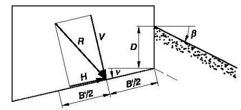

```math
q_{u} = \frac{Q_{u}^{N}}{B' L'} = \frac{1}{2} \bar{\gamma'} B' N_{\gamma} s_{\gamma} d_{\gamma} i_{\gamma b} b_{\gamma} g_{\gamma} + q' N_{q} s_{q} d_{q} i_{q} b_{q} g_{q} \tag{VI-5-250}
```

```math
b _ { \gamma } = \exp ( - 2 . 7 \nu \ \tan \varphi ^ { \prime } )
```

```math
b_a = \exp(-2 \nu \tan \varphi')
```

```math
g_{\gamma} = g_q = (1 - 0.5 \tan \beta)^5
```

```math
i_{\gamma_h} = (1 - (0.7 - \nu^0/450^0) \ H/V)^{\delta}
```

- Publications of PIANC provide the limit state equations for rupture figures related to the two-dmensional case of a statically loaded monolithic structure with horizontal base placed on a rubble foundation overlaying a seabed of sand or clay. Following Equation VI-5-236, the limit state equations are defined as

```math
g = W_s - W_d \ge 0 \tag{VI-5-251}
```

• A related measure of safety can be defined as

```math
F = \frac{W_s}{W_d} \tag{VI-5-252}
```

- For more accurate estimations of three-dimensional bearing capacity, it is necessary to use advanced finite element calculations.
- The given bearing capacity formulae for statically loaded foundations could be applied for dynamic loadings using a dynamic amplification factor on the load as discussed in Part VI-5-5f, Equation VI-5-234. Such simplified methods can be used in conceptual design, but detailed design of large structures should use more accurate methods if there is a risk of dynamic load amplification.

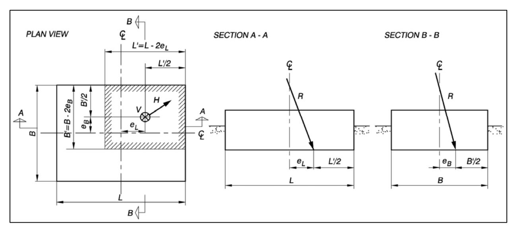

*Figure VI-5-111. Illustration of fictitious footing to replace real footing under eccentric loading conditions*

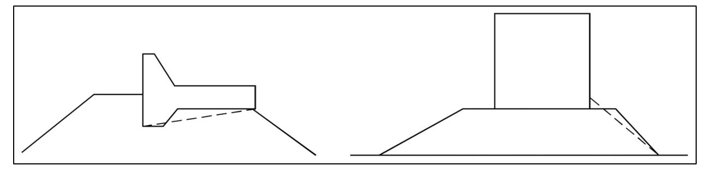

*Figure VI-5-112. Simplified base and rear slope geometries to be applied in the general bearing capacity formula Table VI-5-86*

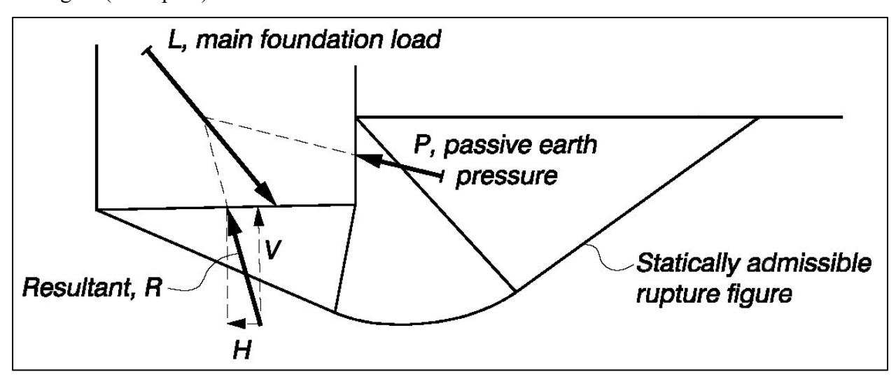

*Figure VI-5-113. Illustration of passive earth pressure P to be included in the determination of the foundation load resultant R in place of the depth coefficients in Equations VI-5-248 and VI-5-250*

#### h. Settlement.

- (1) For coastal structures, settlement is related both to the seabed soils and to the structure mound materials. The mound materials are generally cohesionless permeable materials such as quarrystones, quarry-run, gravel, and coarse sand. The seabed soils are in most cases fine and less permeable materials such as sand, silt, and clay, quite often layered. Soft and muddy deposits exist in many places, especially in estuaries, deltas, and river outlets. Settlement is the direct result of volume reduction of the soil mass, and it is caused by escape of water from the voids between particles and compression of the particle skeleton.
- (a) Vertical settlement of coastal structures is generally of concern where the foundation is on soft seabed materials, or at deepwater mound structures where the high mound can settle significantly. The latter case is also a concern for the foundation of caissons on high rubble mounds.
- (b) Differential settlement is a problem where it might lead to damage of roads and installations placed on the structures. Damage to joints between caissons could also be due to differential settlements.
- (2) Structure settlement increases vulnerability to wave overtopping by lowering the crest level of the structure. Thus, the expected total vertical settlement during the structure service lifetime has to be estimated, and the construction crest level increased accordingly.
- (3) Poor seabed materials which cause large settlement and stability problems might necessitate soil improvement by methods such as preloading, compaction, installation of drains, or soil replacement. Also, it may be possible to select the type and design of structure that gives a minimum foundation load.
- (4) The consequence of foundation loading on settlement depends to a great extent on the loading time relative to the consolidation time. The following three categories can be identified:
- (a) Drained loading, when the consolidation time is much less than the loading time.
- (b) Undrained loading, when the consolidation time is much greater than the loading time.
- (c) Partially drained loading, when the consolidation time and the loading time are of the same order of magnitude.
- (5) This description of the loading corresponds to the classification given in Table VI-5-83 in Part VI-5-5 e (1) where consolidation time is discussed.
- (6) Foundation loads related to coastal structures are given as follows:
- (a) Loads from the weight of structure materials or structure elements placed during the construction phases. The expected loading time would be in the range from minutes to days to months.
- (b) Weight of the completed structure including permanent external loads.
- (c) Loads from wave action, traffic loads, and other live loads. The loading times would be in the range from seconds to hours. The wave loads will be cyclic.
- (7) Generally the permeability of stone materials and coarse sand is so large that deformation problems related to the previously listed loadings can be handled as drained problems. On the other hand, the permeability of clay is so low that the conditions will always be undrained. For fine sand and silt with permeabilities between coarse sand and clay, it is not possible to make such general statements as each case must be examined. However, it is most likely that conditions during wave loadings will be undrained.
- (8) Settlements are usually devided into immediate (instantaneous) settlement, primary consolidation settlement, and creep (also denoted secondary consolidation).
- (a) Instantaneous settlement occurs rapidly almost in phase with the application of the load.
- (b) Primary consolidation settlement is the deformation that occurs in saturated or partially saturated low permeability soils when the load carried by excess pore water pressure is gradually transferred to the soil skeleton with corresponding simultaneous excess pore water dissipation.
- (c) Secondary consolidation settlement is a long-term creep phenomenon due to shear. It might continue for a long time after completion of primary consolidation.
EM 1110-2-1100 (Part VI) Change 3 (28 Sep 11)
- (9) All three settlement components are relevant to low permeability materials, whereas only immediate and secondary consolidation settlements occur with high permeability materials with drained soil conditions.
- (10) The starting point in calculation of settlement of the seabed soils is understanding the in situ stress distributions just after the loading is applied and estimating the relationship between stresses and soil deformations. The in situ stress distributions are generally calculated assuming elastic material and using methods such as the procedure given by Steinbrenner (1936) or by means of the influence diagrams by Newark (1942). The empirical 2:1 load spreading method might also be used. It should be noted that fill material used for rubble-mound structures is completely flexible whereas a caisson constitutes a stiff footing.
- (11) Instantaneous settlement is estimated from the deformation moduli determined either by laboratory experiments with representative small soil specimens or by in situ tests such as plate loading tests, pressure meter tests, or other standard test procedures.
- (12) Primary consolidation settlement is generally determined from consolidation theory by the use of the oedometer modulus and the permeability. During the construction phase, the load on the foundation is time-varying. Because the consolidation due to every load increment proceeds independently of the preceding load increment, the total settlement can be computed by superposition. Consolidation and the related settlement within the structure lifetime are caused almost entirely by the weight of the structure. Occasional loading from waves and other live loads can normally be disregarded in this context except where the wave-generated cyclic loadings cause significant volume changes of the soil (see Part VI-5-5 e ).
- (13) Secondary settlement of seabed soils is difficult to estimate. It will usually be much smaller than the sum of the instantaneous and the primary consolidation settlements.
- (14) Mound material such as quarrystones and quarry-run used for the construction of rubble-mound breakwaters is usually tipped from dumpers or barges. Most of the anticipated settlement takes place during the construction phase, especially if heavy vehicles such as dumpers pass over the already placed material. Settlement will then typically be in the order of 2 - 5 percent of the height of the mound. High quarrystone foundations for caisson breakwaters might need compaction to reduce the risk of unacceptable differential settlements.
- VI-5-6. Scour and Scour Protection. Any coastal project built on erodible sand or soil may be susceptible to damage resulting from scour. This section describes scour problems that affect coastal projects, gives procedures for estimating maximum depth of scour for specific situations, and presents design guidance for scour protection. The available scour prediction methods presented here assume the erodible bed is composed of noncohesive sediment.
- a. Scour problems in coastal engineering. In the most general definition, scour is the erosive force of moving water. This broad definition of scour includes any erosion of sediment under any circumstances, such as beach profile change and inlet channel migration. A more specific definition of scour is used in reference to coastal engineering projects: Scour is the removal by hydrodynamic forces of granular bed material in the vicinity of coastal structures. This definition distinguishes scour from the more general erosion; and as might be expected, the
presence of a coastal structure most definitely contributes to the cause of scour. Scour that occurs at coastal projects can lead to partial damage, or in some cases, complete failure of all or portions of the structure. Scour-induced damage happens at sloping-front structures when scour undermines the toe so it can no longer support the armor layer, which then slides downslope (see Figure VI-2-37). Scour impacts vertical-front caissons and other gravity-type structures if the structure is undermined to the point of tilting as illustrated by Figure VI-2-58. Monolithic gravity seawalls can also settle and tilt as a result of scour (see Figure VI-2-64). Scour at vertical sheetpile walls can result in seaward rotation of the sheetpile toe due to pressure of the retained soil as shown by Figure VI-2-69. Coastal structure damage or failure brought about by scour impacts coastal projects in several ways including: project functionality is decreased; costs will be incurred to repair or replace the structure, and scour related damage is often difficult and expensive to repair; upland property being protected by the structure may be lost or inundated; clients and cost-sharing partners will lose confidence in the project's capability to perform as required.
- (1) Physical processes of scour.
- (a) Scour will occur anywhere the hydrodynamic shear stresses on the bottom are high enough to initiate sediment transport. Clear water scour occurs when bottom shear stresses are high only in a localized portion of the bed; outside the local region sediment is not moving. This occurs mostly in uniform, steady flow situations. In live bed scour bottom shear stresses over the entire bed exceed the level for incipient motion with locally higher shear stresses where greater scour occurs. An equilibrium is reached when the volume of sediment being removed from the scour hole is exactly equal to sediment being deposited in its place. Understanding the physical processes involved in scour is difficult because the shear stresses responsible for scour are developed by waves, currents, or combined waves and currents, that usually are heavily influenced by the presence of a coastal structure. Because of the distinct influence coastal structures exert on the hydrodynamics, structural aspects such as geometry, location, and physical characteristics (roughness, permeability, etc.) impact the scour process. Therefore, modifying some physical characteristic of a structure may reduce scour potential.
- (b) Typical structure and hydrodynamic conditions leading to scour include the following (acting singularly or in combination):
- Localized increases in peak orbital wave velocities due to combined incident and reflected waves
- Particular structure orientations or configurations that focus wave energy and increase wave velocity or initiate wave breaking
- Structure orientations that direct currents along the structure or cause a flow acceleration near the structure Flow constrictions that accelerate the fluid
- Breaking wave forces that are directed downward toward the bed or that generate high levels of turbulence capable of mobilizing sediment
EM 1110-2-1100 (Part VI) Change 3 (28 Sep 11)
- Wave pressure differentials and groundwater flow that produce a "quick" condition, allowing material to be carried off by currents Flow separation and creation of secondary flows such as vortices Transitions from hard bottom to erodible bed
- (c) Even if the hydrodynamic aspects of scour were fully understood, there remains the difficulty of coupling the hydrodynamics with sediment transport. Consequently, most scour prediction techniques consist of rules of thumb and fairly simplistic empirical guidance developed from laboratory and field observations.
- (d) Depending on the circumstances, scour can occur rapidly over short time spans (e.g., energetic storm events), or as a gradual loss of bed material over a lengthy time span (months to years). In the short-term case sediment is probably transported primarily as suspended load, whereas bedload transport is more likely during episodes of long-term scour. Scour may be cyclic with infilling of the scour hole occurring on a regular basis as the flow hydrodynamics undergo seasonal change.
- (e) Most scour holes and trenches would eventually reach a stable configuration if the same hydrodynamic conditions persisted unchanged over a sufficient time span. Such an equilibrium is more likely to occur for scour induced primarily by current regimes than by wave action. It is difficult to determine if observed scour development at a particular coastal project represents an equilibrium condition. The scour might be the result of energetic flow conditions that subsided before the full scour potential was realized. Or it is possible the scour was initially greater, and infilling of the scour hole occurred prior to measurement. Finally, there is the possibility that the observed scour is simply the partial development of an ongoing long-term scour process.
- (2) Common scour problems. Common coastal engineering situations where scour may occur are illustrated on Figure VI-5-114 and described as follows.
- (a) Scour at coastal inlet structures.
- Kidney-shaped scour holes are sometimes present at the tip of one or both inlet jetty structures. These scour holes are usually permanent features of the inlet structure system, but there have been instances where seasonal infilling occurs due to longshore sediment transport. In some cases scour holes have been deep enough to result in partial collapse of the jetty head, while in other cases the scour holes have resulted in no structure damage. Hughes and Kamphuis (1996) observed in movable-bed model experiments that the primary hydrodynamic process responsible for kidney-shaped scour holes appears to be flood currents rounding the jetty head and entering the channel. Sediment mobilization, rate of scour, and extent of scour are increased by wave action, particularly waves that are diffracted around the jetty tip into the navigation channel. Waves breaking across the jetty head in the absence of currents will also cause scour of a lesser magnitude (Fredsøe and Sumer 1997).

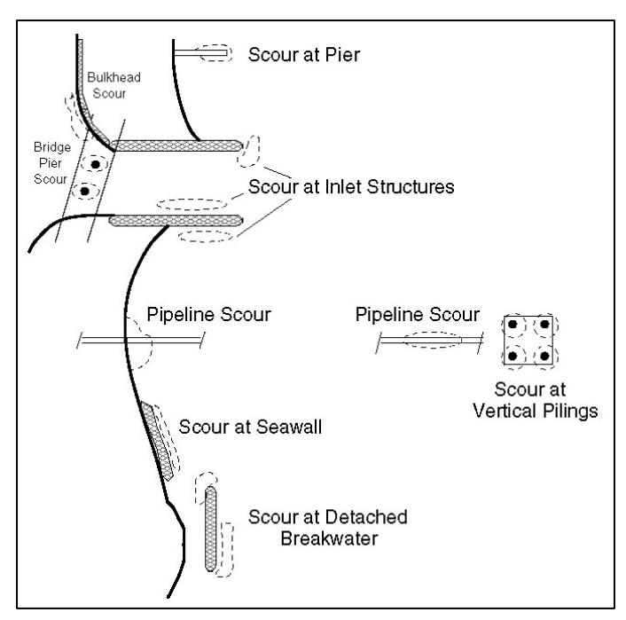

*Figure VI-5-114. Coastal scour problems*

- Substantial scour trenches are known to form along the channel-side toes of jetty structures. These trenches are caused either by migration of the navigation channel (by unknown causes) to a position adjacent to the jetty toe or by ebb-flow currents that are redirected by the jetty structure. Hughes and Kamphuis (1996) argued that ebb flows deflected by a jetty are analogous to plane jet flow exiting a nozzle with similar geometry. As the flow cross section decreases, the flow velocity increases proportionately to maintain the ebb flow discharge.
- Scour trenches can also form along the outside toe of the updrift jetty. These trenches might be formed by the seaward deflection of longshore currents that causes a local flow acceleration adjacent to the jetty toe, or the scour may stem from high peak orbital velocities resulting from the interaction of obliquely incident and reflected waves. A likely scenario is scour hole formation due to both hydrodynamic processes with the waves mobilizing sediment and the current transporting the material seaward. Scour trenches on the outside toe of a jetty may be seasonal at locations experiencing seasonal reversal of predominant wave direction.
- Scour holes occur regularly around bridge pilings and piers that span coastal inlets. Generally, this situation is similar to scour that plagues bridge piers on inland waterways. Additional factors complicating scour at inlet bridge piers are the unsteady and reversing nature of tidal flows, and the possible exposure to waves and storm surges.
- (b) Scour at structures in deeper water.
- Scour can occur at the toes of vertical-faced breakwaters and caissons placed in deeper water. Wave-induced scour results from high peak orbital velocities developed by the interaction of incident and reflected waves. If a particular structure orientation results in increased currents along the structure toe, scour potential will be significantly enhanced.
EM 1110-2-1100 (Part VI) Change 3 (28 Sep 11)
Localized liquefaction due to wave pressure differentials and excess pore pressure within the sediment may cause sediment to be removed by reduced levels of bottom fluid shear stress.
- Characteristic scour patterns may occur around the vertical supporting legs (usually cylinders) of offshore platforms. Under slowly-varying boundary layer flow conditions, the platform leg interrupts the flow causing formation of a horseshoe vortex wrapped around the structure just above the bed. This secondary flow intensifies the bottom fluid shear stresses, and erodes sediment. The quasi-equilibrium scour hole closely resembles the shape of the horseshoe vortex. In the absence of currents, waves can cause scour in the shape of an inverted, truncated cone around the vertical cylinder provided the bottom orbital velocities are sufficiently high.
- Pipelines laid on the sea bottom are susceptible to scour action because the pipe cross section obstructs the fluid particle motion developed by waves and currents.
- (c) Scour at structures in shallow water.
- Piers and pile-supported structures in shallow water react to currents and waves just as in deep water. However, the shallow depth means that orbital velocities from shorter period waves can cause scour. Therefore, vertical piles are vulnerable to scour caused by a wider range of wave periods than in deeper water.
- Scour can occur along the seaward toe of detached breakwaters due to wave reflection. The scour process will be enhanced in the presence of transporting currents moving along the breakwater. Scour holes may be formed at the ends of the breakwater by diffracted waves. In shallow water, breaking waves can create high turbulence levels at the structure toe.
- Vertical-front and sloping-front seawall and revetments located in the vicinity of the shoreline can be exposed to energetic breaking waves that produce downward-directed flows and high levels of turbulence which will scour the bed. Scour could also be produced by flows associated with wave downwash at less permeable sloping structures.
- Vertical bulkheads are usually not exposed to waves capable of producing scour; however, it is possible for scour to occur by local current accelerations.
- Scour around pipelines will occur by the same mechanisms as in deeper water with shorter period waves becoming more influential as water depth decreases. Buried pipelines traversing the surfzone can be at risk if beach profile erosion exposes the pipeline to pounding wave action and strong longshore currents.
- Depending on specific design details, coastal outfalls may develop scour patterns that jeopardize the structure.
- (d) Other occurrences of scour.
- Any type of flow constriction caused by coastal projects has the potential to cause scour. For example, longshore currents passing through the gap between a jetty and a detached
breakwater at Ventura Harbor, CA, accelerated and caused scour along the leeside toe of the detached breakwater (Hughes and Schwichtenberg 1998).
- Storm surge barriers, sills, and other structures founded on the sea floor can experience scour at the downstream edge of the structure. Small pad foundations can be undermined by waves and currents.
- Structure transition points and termination points may produce local flow accelerations or may focus wave energy in such a way that scour occurs.
- Scour may occur as a transient adjustment to new construction. For example, Lillycrop and Hughes (1993) documented scour that occurred during construction of the terminal groin at Oregon Inlet, North Carolina. Despite maintenance of a scour blanket in advance of construction, the project required 50 percent more stone because of the scour.
- b. Prediction of scour. There have been many theoretical and laboratory studies conducted examining various aspects of scour related to coastal projects. Some studies focussed on discovering the physical mechanisms responsible for scour, whereas other studies were directed at developing engineering methods for predicting the location and maximum depth of scour. In the following sections usable engineering prediction methods are presented for estimating scour for specific coastal structure configurations and hydrodynamic conditions. To a large extent the predictive equations have been empirically derived from results of small-scale laboratory tests, and often the guidance is fairly primitive. In some situations the only predictive capability consists of established rules of thumb based on experience and field observation. A comprehensive discussion of scour mechanisms, theoretical developments, and experiment descriptions is well beyond the scope of this manual. However, there are several publications containing detailed overviews of scour knowledge for many situations of interest to coastal engineers (e.g., Hoffmans and Verheij 1997; Herbich 1991; and Sumer and Fredsøe 1998a). In the following sections, appropriate citations of the technical literature are provided for more indepth study.
- (1) Scour at vertical walls. Occurrence of scour in front of vertical walls can be conveniently divided into two cases: nonbreaking waves being reflected by a vertical wall, and breaking waves impacting on a vertical wall. In either case, waves can approach normal to the wall or at an oblique angle.
- (a) Nonbreaking waves. Nonbreaking waves are more prevalent on vertical-front structures located in deeper water and at bulkhead structures located in harbor areas. Almost all the energy in incident waves reaching a vertical-front structure is reflected unless the structure is porous. Close to the structure, strong phase locking exists between incident and reflected waves, and this sets up a standing wave field with amplified horizontal particle velocities beneath the water surface nodes and minimal horizontal velocities beneath the antinodes. The bottom sediment responds to the fluid velocities by eroding sediment where bottom shear stresses are high and depositing where stresses are low.
- Normally incident nonbreaking waves. Researchers have identified two characteristic scour patterns associated with nonbreaking waves reflected by a vertical wall (de Best, Bijker,
EM 1110-2-1100 (Part VI) Change 3 (28 Sep 11)
and Wichers 1971; Xie 1981; Irie and Nadaoka 1984; Xie 1985). Fine sand is transported primarily in suspension, and in this case scour occurs at the nodes of the sea surface elevation with deposition occurring at the antinodes. Coarse sediment is moved primarily as bed load so that scour occurs midway between the sea surface nodes and antinodes with deposition usually centered on the nodes of the standing wave pattern.
Uniform, regular waves produce a repeating pattern of scour and deposition as a function of distance from the toe of the vertical wall as illustrated in the upper portion of Figure VI-5-115. For fine sand maximum scour nearest the wall occurs a distance L/4 from the wall where L is the wavelength of the incident wave. Irregular waves produce a similar scour pattern for fine sand as shown in the lower portion of Figure VI-5-115. However, phase-locking between incident and reflected irregular waves decreases with distance from the wall with the maximum scour depth for fine sand approximately located a distance L_p/4 from the vertical wall, where L_p is the wavelength associated with the peak spectral frequency using linear wave theory.

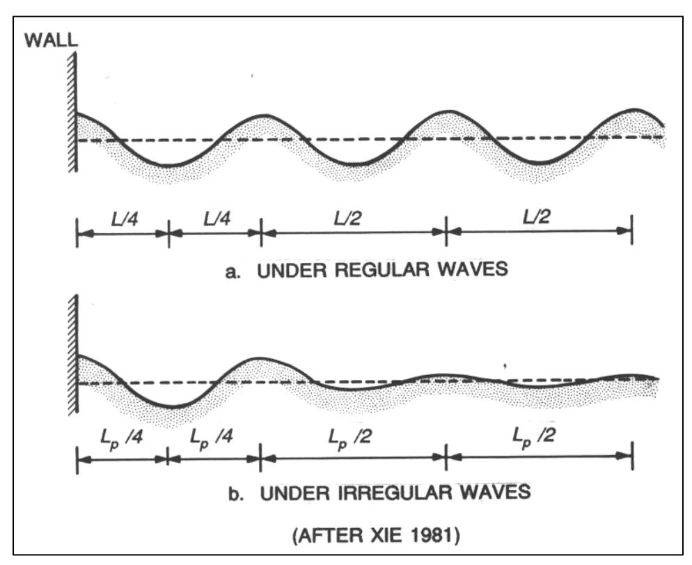

*Figure VI-5-115. Regular and irregular wave-scoured profiles at a vertical-front structure*

- Based on results from 12 movable-bed model tests, Xie (1981, 1985) proposed an empirically-based equation to estimate maximum scour for normally incident, nonbreaking, regular waves incident upon an impermeable vertical wall. The equation was given as:

```math
\frac{S_m}{H} = \frac{0.4}{\left[\sinh(kh)\right]^{1.35}} \tag{VI-5-253}
```

where
- S_m = maximum scour depth at node (L/4 from wall)
- H = incident regular wave height
- h = water depth
- k = \text{incident regular wave number } (k = 2\pi/L)
- L = incident regular wavelength
A similar laboratory-based prediction empirical equation for the more appropriate case of normally incident, nonbreaking irregular waves was given by Hughes and Fowler (1991) as

```math
\frac{S_m}{(u_{rms})_m T_p} = \frac{0.05}{\left[\sinh(k_p h)\right]^{0.35}} \tag{VI-5-254}
```

where
- T_p = wave period of the spectral peak
- k_p = wave number associated with the spectral peak by linear wave theory
(u_{rms})_m = root-mean-square of horizontal bottom velocity
- The value of (u_{rms})_m was given by Hughes (1992) as

```math
\frac{(u_{rms})_{m}}{g k_{p} T_{p} H_{mo}} = \frac{\sqrt{2}}{4\pi \cosh(k_{p}h)} \left[ 0.54 \cosh\left(\frac{1.5 - k_{p}h}{2.8}\right) \right] \tag{VI-5-255}
```

where H_{mo} is the zeroth-moment wave height, and g is gravity. (Equation VI-5-255 is empirically based and should not be applied outside the range 0.05 < k_p h < 3.0 .)
Equation VI-5-255 is plotted on Figure VI-5-116 along with the movable-bed model experiment results. The dashed line is an equivalent to Equation VI-5-254. Scour predicted for irregular waves is significantly less than scour predicted for regular waves, and in many cases the predicted maximum scour does not represent a threat to the structure toe due to its location L_p /4 from the wall. Also, any effect related to sediment size is missing from these formulations (other than the stipulation of fine sand). Therefore, sediment scale effects may have influenced laboratory results causing less scour than might occur at full scale.

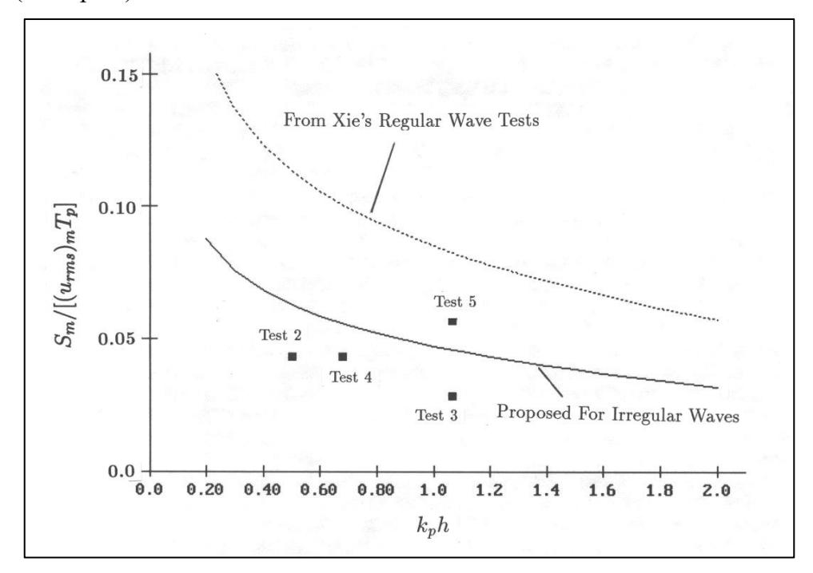

*Figure VI-5-116. Scour prediction for nonbreaking waves at vertical wall (Hughes and Fowler 1991)*

- The relatively minor scour depths predicted for nonbreaking waves may be a direct result of scale effects or it may be related to the two-dimensionality of the laboratory experiments. In the wave flume an equilibrium profile is reached even though sediment is still constantly in motion. At an actual project site strong currents running parallel to a vertical-front structure could remove sediment put into motion by the standing wave pattern. If this occurs, scour will continue until a new live-bed equilibrium is reached. Sato, Tanaka, and Irie (1968) gave field examples of scour attributed to along-structure currents acting in conjunction with bed agitation by waves. Unfortunately, there are no scour prediction methods covering this possibility.
- Obliquely incident nonbreaking waves. Obliquely approaching incident nonbreaking waves will also be nearly completely reflected by a vertical wall. The resulting combined incident and reflected waves resemble a short-crested, diamond pattern that propagates in a direction parallel to the wall. (See Hsu (1991) for development of theories related to obliquely reflected long-crested waves.) Just as in the case of normal wave incidence, partial nodes and antinodes develop on lines parallel to the structure at distances that are a function of the wave properties and incident wave angle. However, obliquely reflected waves also generate a mass transport component parallel to the vertical structure which may contribute to enhanced scour along the structure. Silvester (1991) summarized laboratory results of scour at highly reflective (but not necessarily vertical-front) structures caused by obliquely incident long-crested regular and irregular waves. It was observed that obliquely incident waves tended to scour more than equivalent normally incident waves, and irregular waves scour at a slower rate and somewhat more uniformly than regular waves. No engineering methods are presently available to estimate scour caused by obliquely incident, nonbreaking irregular waves reflected by a vertical wall.
• Scour at the head of a vertical breakwater. Sumer and Fredsøe (1997) conducted small-scale movable-bed experiments to investigate scour around the circular head of a vertical breakwater aligned parallel to the wave crests. They discovered that scour around the breakwater head is due mainly to the lee-wake vortices, similar to wave-induced scour at vertical piles. Maximum scour depths from different sized breakwaters corresponded remarkably well with the associated Keulegan-Carpenter number, which is defined as

```math
K C = \frac { U _ { m } T } { B } \tag{VI-5-256}
```

where
- U_m = maximum wave orbital velocity at the bed (in the absence of a structure)
- T = regular wave period
- B = diameter of the vertical breakwater circular head
- Sumer and Fredsøe presented the following empirical equation to predict maximum scour depth (S_m) as a function of the Keulegan-Carpenter number and diameter of the breakwater head:

```math
\frac{S_m}{B} = 0.5 C_u \left[ 1 - e^{-0.175(KC-1)} \right] \tag{VI-5-257}
```

in which C_u is an uncertainty factor with a mean value of unity and a standard deviation of \sigma_u = 0.6. This empirical expression was developed for the data range 0 \le KC \le 10 . However, beyond KC = 2.5, data from only one breakwater diameter were used. Irregular waves will probably not scour as deeply, so the empirical equation could be considered conservative.
- Sumer and Fredsøe (1997) also investigated scour at the heads of squared-ended vertical breakwaters, perhaps representative of caissons. They found similar planform extent of scour, but depth of scour was greater by about a factor of 2. No empirical design equation was given for this situation, but it is possible to make estimates directly from the curve in their paper or from the simple equation

```math
\frac{S_m}{B} = -0.09 + 0.123 \, KC \tag{VI-5-258}
```

which fits the data reasonably well. However, this expression is based on very limited laboratory data, and scour estimates should be considered tentative.
The angle of obliquely incident waves on scour around the vertical breakwater head was also shown to be a factor in scour magnitude, and the addition of even small currents moving in the direction of wave propagation significantly increased depth of scour. No design guidance was suggested that included currents and wave angle. Sumer and Fredsøe analyzed
EM 1110-2-1100 (Part VI) Change 3 (28 Sep 11)
scale effects in their laboratory experiments and concluded that scour holes at full scale will be slightly smaller than equivalent scaled-up model results. Design of scour protection for vertical breakwater heads is discussed in Part VI-5-6 c , "Design of scour protection."
(b) Breaking waves. Scour caused by waves breaking on vertical-front structures has been a topic of numerous studies. (See Powell 1987; Kraus 1988; and Kraus and McDougal 1996 for overviews of the literature.) Scour caused by breaking waves is generally greater than for nonbreaking waves, and there is more likelihood of scour leading to structure damage. Spilling or plunging breaking waves can break directly on the vertical wall or just before reaching the wall. The physical mechanisms responsible for scour by breaking waves are not well understood, but it is generally thought that the breaking process creates strong downward directed flows that scour the bed at the base of the wall. For example, the re-entrant tongue of a plunging wave breaking before it reaches the structure generates a strong vortex motion that will mobilize sediment at the toe. A wave impacting directly on the vertical face will direct water down at the toe in the form of a jet. Sediment mobilization and transport is dominated by turbulent fluid motions rather than fluid shear stresses, and air entrained in the breaking wave also influences the erosion process (Oumeraci 1994). Figure VI-5-117 illustrates scour and profile change fronting a vertical seawall.

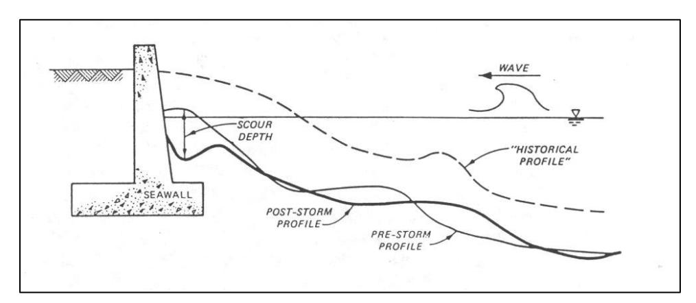

*Figure VI-5-117. Scour due to breaking waves at a vertical seawall (Kraus 1988)*

- Rules of thumb. There are several accepted rules-of-thumb pertaining to scour of noncohesive sediment at vertical walls. For the case of normally incident breaking waves with no currents:
- The maximum scour depth at a vertical wall $(S_{m})$ is approximately equal to the nonbreaking wave height $(H_{max})$ that can be supported by the water depth ( h ) at the structure, i.e.,

```math
S_m = H_{\text{max}} \quad \text{or} \quad S_m \approx h \tag{VI-5-259}
```

- Maximum scour occurs when the vertical wall is located around the plunge point of the breaking wave. Reducing the wall reflection reduces the amount of scour.
- Irregular breaking wave scour prediction. Predictive equations for estimating maximum scour at vertical walls due to normally incident regular breaking waves were proposed by Herbich and Ko (1968) and Song and Schiller (1973). Powell (1987) discussed shortcomings of these two methods and concluded the empirical equations were not useful for design purposes.
- Fowler (1992) also examined the Song and Schiller relationship using data from midscale movable-bed model tests using irregular waves, and reasonable correspondence was noted between measurements and predictions. Fowler then combined his irregular wave scour data with regular wave data from Barnett and Wang (1988) and from Chesnutt and Schiller (1971) as shown in Figure VI-5-118.

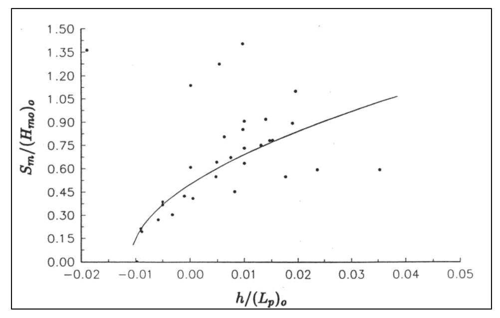

*Figure VI-5-118. Relative scour depth as a function of relative depth at a vertical wall (Fowler 1992)*

- The following empirical equation (solid line on Figure VI-5-118) was proposed for estimating maximum scour of noncohesive sediment due to normally incident breaking irregular waves with a mild approach slope.

```math
\frac{S_m}{(H_{mo})_o} = \sqrt{22.72 \frac{h}{(L_p)_o} + 0.25} \tag{VI-5-260}
```

where
S_m = \text{maximum scour depth}
(H_{mo})_o = zeroth-moment wave height in deep water
h = pre-scour water depth at the vertical wall
EM 1110-2-1100 (Part VI) Change 3 (28 Sep 11)
(L_p)_o = deepwater wavelength associated with the peak spectral wave period, T_p , i.e., (L_p)_o = (g/2\pi) T_p^2
- Fowler noted that application of this empirical equation is limited by the data to values of relative depth and relative steepness within the ranges

```math
0 . 0 1 1 < \frac { h } { \left( L _ { p } \right) _ { o } } < 0 . 0 4 5 \qquad a n d \qquad 0 . 0 1 5 < \frac { \left( H _ { m o } \right) _ { o } } { \left( L _ { p } \right) _ { o } } < 0 . 0 4 0 \tag{VI-5-261}
```

- Fowler's predictive equation does not include any parameters relating to sediment properties, which are expected to have some influence in the scouring process. However, sediment transport induced by waves breaking against a vertical wall will not be very dependent on Shields parameter due to the turbulent nature of the entraining flow, and this would decrease the influence of sediment grain size. Also, the previous scour estimation method assumes no current flow along the vertical wall.
- Scour of cobble (or shingle) beaches fronting vertical walls is discussed by Carpenter and Powell (1998). They provided dimensionless design graphs to predict maximum scour depth as a function of significant wave height, wave steepness, and local water depth. Their results were based on laboratory movable-bed model tests, which were correctly scaled due to the relatively large size of cobbles compared to sand.
- (2) Scour at sloping structures. Scour at the toe of sloping-front structures is thought to be a function of structure slope and porosity, incident wave conditions, water depth, and sediment grain-size. Despite considerable research into the processes responsible for wave-induced scour at sloping structures, there are no generally accepted techniques for estimating maximum scour depth or planform extent of scour (Powell 1987; Fowler 1993). However, progress is being made in development of numerical models to predict scour at sloping-front structures. Engineering use of such numerical models should consider model input requirements, representation of structure characteristics (particularly reflection parameters), and documented validation against field or laboratory experiments conducted at larger scales. Nonbreaking irregular waves impinging on a sloping structure will create a standing wave field similar to a vertical structure except the variation between the sea surface elevation nodes and antinodes is less pronounced, and the location of the node nearest the structure toe varies with wave condition and structure reflection properties (Hughes and Fowler 1995; O'Donoghue and Goldsworthy 1995; Losada, Silva, and Losada 1997). Erosion of fine sediment is expected to occur at the nodal location, but no empirical estimation method has been proposed.
- (a) Rules of thumb. In lieu of easily applied semi-empirical scour estimation tools, simple rules-of-thumb serve as engineering guidelines for scour at sloping-front structures.
- Maximum scour at the toe of a sloping structure is expected to be somewhat less than scour calculated for a vertical wall at the same location and under the same wave condition. Therefore, a conservative scour estimate is provided by the vertical wall scour prediction equations, i.e., S_m < H_{max} .
- Depth of scour decreases with structure reflection coefficient. Therefore, structures with milder slopes and greater porosity will experience less wave-induced scour.
- Scour depths are significantly increased when along-structure currents act in conjunction with waves.
- Obliquely incident waves may cause greater scour than normally incident waves because the short-crested waves increase in size along the structure (Lin et al. 1986) due to the mach-stem effect. Also, oblique waves generate flows parallel to the structure.
- (b) Scour at head of sloping breakwater. Fredsøe and Sumer (1997) conducted small-scale movable-bed model experiments to investigate mechanisms responsible for wave-induced scour around the conical heads of sloping-front breakwater structures. The experiments were similar in many respects to the companion study of scour at the ends of vertical breakwaters (Sumer and Fredsøe 1997). For most tests the rubble-mound breakwater head was approximated as an impermeable, smooth structure constructed of steel frames covered with sheet metal and having a slope of 1:1.5. The breakwater head was aligned parallel to the incident irregular waves. Observed scour was attributed to two different mechanisms; steady streaming of flow around the breakwater head, and waves breaking across the breakwater head and impinging on the leeside bed.
- Scour holes caused by steady streaming formed at the breakwater toe on the seaward curve of the breakwater head. An estimation of maximum scour depth (S_m) was developed as a function of the Keulegan-Carpenter number (KC) and given by Fredsøe and Sumer (1997) as

```math
\frac{S_m}{B} = 0.04 C_u \left[ 1 - e^{-4.0 (KC - 0.05)} \right] \tag{VI-5-262}
```

in which C_u is an uncertainty factor with a mean value of unity and a standard deviation of \sigma_u = 0.2 . The Keulegan-Carpenter number is calculated as given by Equation VI-5-256 using the peak spectral wave period, T_p , as the period, T_p , and the breakwater head diameter at the bed as B.
• Fredsøe and Sumer suggested that U_m be calculated from linear wave theory as the bottom velocity found using a wave height of

```math
H = \frac{1}{\sqrt{2}} H_s \tag{VI-5-263}
```

where H_s is the significant wave height. A similar expression for predicting deposition was also presented.
• The second scour mechanism is caused by waves breaking across the sloping front of the breakwater head. The geometry of the steep breakwater face causes lateral water motion that forms the tongue of the plunging breaker into a rounded re-entrant jet that impacts the bed at a steep angle and mobilizes sediment. This creates a scour hole at the breakwater toe on the leeside of the rounded head with the maximum depth located approximately at the intersection of
EM 1110-2-1100 (Part VI) Change 3 (28 Sep 11)
breakwater head and trunk. Fredsøe and Sumer presented the following empirical equation for maximum scour depth (S_m) due to plunging breaking waves

```math
\frac{S_m}{H_s} = 0.01 C_u \left( \frac{T_p \sqrt{g H_s}}{h} \right)^{3/2} \tag{VI-5-264}
```

where C_u is an uncertainty factor with a mean value of unity and a standard deviation of \sigma_u = 0.34 , h is water depth, and the other parameters are as defined previously.
- As noted by Fredsøe and Sumer, these equations were developed for impermeable, smooth breakwater heads. The permeability and roughness of rubble-mound breakwaters will effectively decrease both scour mechanisms, thus scour estimates may be somewhat conservative. The previous empirical expressions for predicting maximum scour depths are based on a limited number of data points derived primarily from laboratory experiments, and the equations should be considered tentative until additional studies are conducted. Also, scour is caused by waves only; superimposed currents are expected to increase appreciably maximum scour depth. Design of scour protection for sloping-front breakwater heads is discussed in Part VI-5-6c, "Design of scour protection."
- (3) Scour at piles. The majority of methods for estimating scour at vertical piles were developed for piles with circular cross section, which are widely used in coastal and offshore engineering applications. However, there are estimation techniques for piles with noncircular cross sections and for specialized structures such as noncircular bridge piers and large bottom-resting structures. Scour at small vertical piles (pile diameter, D, is less than one-tenth of the incident wavelength) is caused by three simultaneously acting mechanisms: formation of a horseshoe-shaped vortex wrapped around the front of the pile; vortex shedding in the lee of the pile; and local flow accelerations due to streamline convergence around the pile. The pile does not significantly affect the incident wave. Large diameter piles, in which the diameter is greater than one-tenth of the incident wavelength, do have an impact on the incident waves which are reflected by the pile and diffracted around the pile. The key parameters governing scour formation appear to be current magnitude, orbital wave velocity, and pile diameter. Less important parameters are sediment size and pile shape (if the pile has noncircular cross section). For detailed descriptions of the physical mechanisms responsible for scour at vertical piles see Niedoroda and Dalton (1986) or some of the following references. A general, and somewhat conservative, rule-of-thumb is: Maximum depth of scour at a vertical pile is equal to twice the pile diameter. This rule-of-thumb appears to be valid for most cases of combined waves and currents. Smaller maximum scour depths are predicted by the equations in the following sections. Estimation formulas for maximum scour depth have been proposed for the cases of currents only, waves only, and combined waves and currents. The flow problem and associated sediment transport are beyond a complete theoretical formulation, and even numerical modeling attempts have not been able to describe fully the scour process at vertical piles (see Sumer and Fredsøe 1998a for a summary of numerical modeling approaches).
- (a) Scour at small diameter vertical piles. Vertical piles with diameter, D , less than one-tenth of the incident wavelength constitute the vast majority of pile applications in coastal engineering. Even cylindrical legs of some offshore oil platforms may fall into this category.
- Pile scour by currents. Many scour estimation formulas have been proposed for scour caused by unidirectional currents without the added influence of waves. A formulation widely used in the United States is the Colorado State University (CSU) equation developed for bridge piers (e.g., Richardson and Davis 1995) given by the expression

```math
\frac{S_m}{h} = 2.0 K_1 K_2 \left(\frac{b}{h}\right)^{0.65} F_r^{0.43} \tag{VI-5-265}
```

where
S_m = maximum scour depth below the average bottom elevation
h =water depth upstream of the pile
- b = pile width
- F_r = flow Froude number [F_r = U/(gh)^{1/2}]
- U = mean current velocity magnitude
- K_1 = pile shape factor
- K_2 = pile orientation factor
– Equation VI-5-265 is a deterministic formula applicable for both clear water scour and live bed scour, and it represents a conservative envelope to the data used to establish the empirical coefficients. The shape factor, K_1 , is selected from Figure VI-5-119, and the orientation factor, K_2 , can be determined from the following equation given by Froehlich (1988).

```math
K_2 = (\cos \theta + \frac{L}{b}\sin \theta)^{0.62} \tag{VI-5-266}
```

where L/b is defined in Figure VI-5-119 and \theta is the angle of pile orientation. K_2 equals unity for cylindrical piles. Other modifying factors have been proposed to account for sediment gradation and bed forms, but these factors have not been well established. An additional factor is available for use when piles are clustered closely together. See Richardson and Davis (1995) and Hoffmans and Verheij (1997) for details.

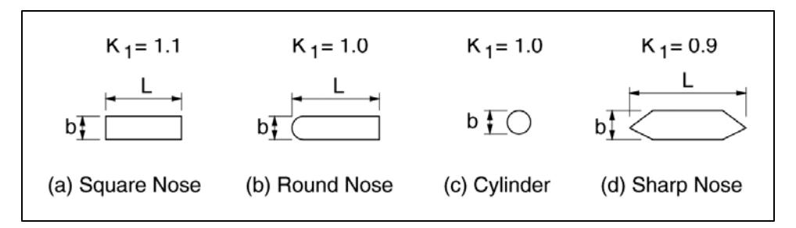

*Figure VI-5-119. Correction factor, $K_{1},$ for pile/pier shape*

- Johnson (1995) tested seven of the more commonly used scour prediction equations against field data and found that the CSU equation (Equation VI-5-265) produced the best results for h/b > 1.5. At lower values of h/b a different empirical formulation offered by Breusers, Nicollet, and Shen (1977) provided better results.
- Johnson (1992) developed a modified version of the CSU empirical equation for use in reliability analysis of failure risk due to scour at cylindrical piles. Her formula represents a best-fit to the data rather than a conservative envelope. An application example is included in her 1992 paper.
- Pile scour by waves. The physical processes associated with wave-only scour around vertical piles are reasonably well described qualitatively (See Sumer and Fredsøe (1998a) for a comprehensive review and listing of many references.)
- In an earlier paper Sumer, Christiansen, and Fredsoe (1992a) established an empirical equation to estimate scour at a vertical pile under live bed conditions. They used small- and large-scale wave flume experiments with regular waves, two different sediment grain sizes, and six different circular pile diameters ranging from 10 cm to 200 cm. Maximum scour depth $(S_{m})$ was found to depend only on pile diameter and Keulegan-Carpenter number ( KC ), as expressed by Equation VI-5-256 with pile diameter, D , as the denominator. The experimental data of Sumer, Christiansen, and Fredsoe (1992a) are shown plotted in Figure VI-5-120, and the solid line is the predictive equation given by

```math
\frac{S_m}{D} = 1.3 \left[ 1 - e^{-0.03 (KC - 6)} \right] \tag{VI-5-267}
```

where D is cylindrical pile diameter. No live-bed scour occurs below values of KC = 6, which corresponds to onset of horseshoe vortex development. At values of KC > 100, $S_{m}$ /D 1.3, representing the case of current-only scour.
Independent confirmation of Equation VI-5-267 was presented by Kobayashi and Oda (1994) who conducted clear water scour experiments. They stated that maximum scour depth appeared to be independent of Shields parameter, grain size diameter, and whether scour is clear-water or live-bed.

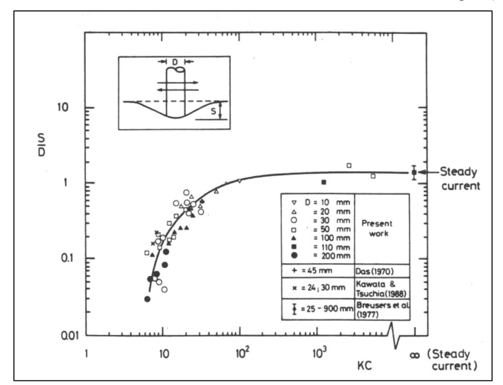

*Figure VI-5-120. Wave-induced equilibrium scour depth at a vertical pile*

In an extension to their 1992 study, Sumer, Christiansen, and Fredsoe (1993) conducted additional regular wave live-bed scour experiments using square piles oriented with the flat face 90 deg and 45 deg to the waves. The following empirical equations for maximum scour were obtained as best-fits to the observed results:
Square pile 90 deg to flow:

```math
\frac{S_m}{D} = 2.0 \left[ 1 - e^{-0.015(KC-11)} \right] \qquad \text{for } KC = 11 \tag{VI-5-268}
```

Square pile 45 deg to flow:

```math
\frac{S_m}{D} = 2.0 \left[ 1 - e^{-0.019 (KC-3)} \right] \qquad \text{for } KC = 3 \tag{VI-5-269}
```

- Scour for the square pile oriented at 45 deg begins at lower values of KC , but the maximum scour at large KC values approaches $S_{m}$ /D = 2 regardless of orientation.
- Studies on the time rate of scour development were reported by Sumer, Christiansen, and Fredsoe (1992b), Sumer et al. (1993), and Kobayashi and Oda (1994). Recent research on wave scour around a group of piles was summarized by Sumer and Fredsøe (1998a, 1998b).
EM 1110-2-1100 (Part VI) Change 3 (28 Sep 11)
- Pile scour by waves and currents. Kawata and Tsuchiya (1988) noted that local scour depths around a vertical pile were relatively minor compared to scour that occurs when even a small steady current is added to the waves. Eadie and Herbich (1986) conducted small-scale laboratory tests of scour on a cylindrical pile using co-directional currents and irregular waves. They reported the rate of scour was increased by adding wave action to the current, and the maximum scour depth was approximately 10 percent greater than what occurred with only steady currents. This latter conclusion contradicts Bijker and de Bruyn (1988) who found that nonbreaking waves added to steady currents slightly decreased ultimate scour depth whereas adding breaking waves caused increased scour to occur. Eadie and Herbich also noted that the inverted cone shape of the scour hole was similar with or without wave action, and the use of irregular versus regular waves appeared to influence only scour hole geometry and not maximum scour depth. They developed a predictive equation using results from approximately 50 laboratory experiments, but no wave parameters were included in the formulation. Finally, they pointed out that their conclusions may hinge on the fact that the steady current magnitude exceeded the maximum bottom wave orbital velocity, and different results may occur with weak steady currents and energetic waves.
- Earlier work by Wang and Herbich (1983) did provide predictive equations that included wave parameters along with current, pile diameter, sediment properties, and water depth. However, there were some unanswered questions about scaling the results to prototype scale. Consequently, until further research is published, maximum scour depth due to waves and currents should be estimated using the formulations for scour due to currents alone (Equation VI-5-265).
- (b) Scour at large diameter vertical piles. Rance (1980) conducted laboratory experiments of local scour at different shaped vertical piles with diameters greater than one-tenth the incident wavelength. The piles were exposed to coincident waves and currents. Rance provided estimates of maximum scour depth as functions of pile equivalent diameter, $D_{e},$ for different orientations to the principal flow direction. $(D_{e}$ is the diameter of a cylindrical pile having the same cross-sectional area as the angular pile.) These formulas are given in Figure VI-5-121.
- (c) Maximum scour occurs at the corners of the square piles. Estimates of extent of scour are useful for design of scour blankets. Sumer and Fredsøe (1998a) provided additional information about flow around large piles.
- (4) Scour at submerged pipelines. Waves and currents can scour material from beneath pipelines resting on the bottom, leading to partial or even complete burial of the pipeline. In most situations pipeline burial is usually considered a desirable end result. However, if the pipeline spans soil types having different degrees of erodibility, differential scour may result in sections of the pipeline being suspended between bottom hard points, and this could lead to pipeline failure. Onset of scour beneath a pipeline resting on, or slightly embedded in, the bottom occurs initially as piping when seepage beneath the pipeline increases and a mixture of sediment and water breaks through (Chiew 1990). Onset of scour is followed by a phase of rapid scour called tunnel erosion in which the bed shear stresses are increased four times above that of the undisturbed sand bed. Tunnel erosion is followed by lee-wake erosion in which the lee-wake of
the pipeline appears to control the final equilibrium depth and shape of the downstream scour. Equilibrium depth of scour beneath the pipeline is usually defined as the distance between the eroded bottom and the underside of the pipeline as illustrated on Figure VI-5-122. Overviews of pipeline scour knowledge and citations to the extensive literature are included in Sumer and Fredsøe (1992, 1998a) and Hoffmans and Verheij (1997). Only the established empirical equations for estimating scour depth are included in the following:
(a) Pipeline scour by currents. In steady currents the equilibrium scour depth beneath a pipeline is thought to be a function of pipe diameter, pipe roughness, pipe Reynolds number, and Shields parameter. For clear water scour, when mean flow velocity, U_c , is less than the critical velocity, U_c , maximum scour depth can be calculated using the following equation from Hoffmans and Verheij (1997)

```math
\frac{S_m}{D} = \frac{\mu}{2} \left( \frac{U}{U_c} \right) \tag{VI-5-270}
```

where

```math
\mu = \left(\frac{k_s}{12\,D}\right) \ln\left(\frac{6\,D}{k_s}\right) \tag{VI-5-271}
```

and
- D = pipe diameter
- h = water depth
- U = depth averaged flow
- U_c = critical depth-averaged flow velocity
- k_s = effective bed roughness, k_s = 3 d_{90} ( k_s must have the same units as D)
When U/U_c > 1 , live-bed scour occurs, and in this case Sumer and Fredsøe (1992) stated that pipe Reynolds number only influences flow around smooth pipes and the influence of Shields parameter is minor. They recommended the simple equation for predicting maximum equilibrium scour depth. The 0.1-value represents the standard deviation of the data, so a conservative estimate of scour would be S_m/D=0.7 .

```math
\frac{S_m}{D} = 0.6 \pm 0.1 \tag{VI-5-272}
```

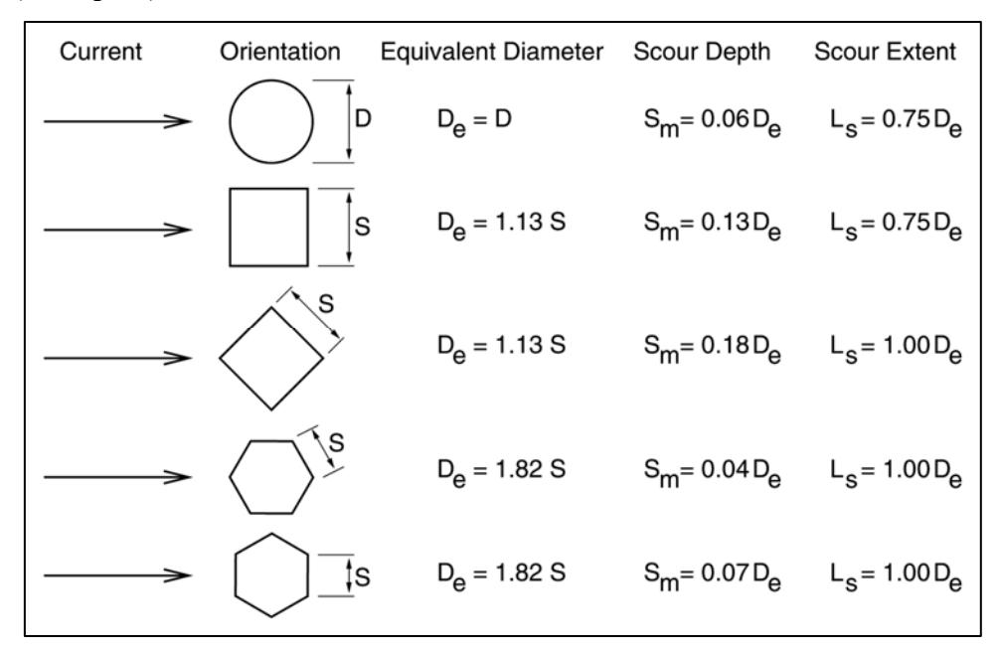

*Figure VI-5-121. Wave and current scour aroundlarge vertical piles (Rance 1980)*

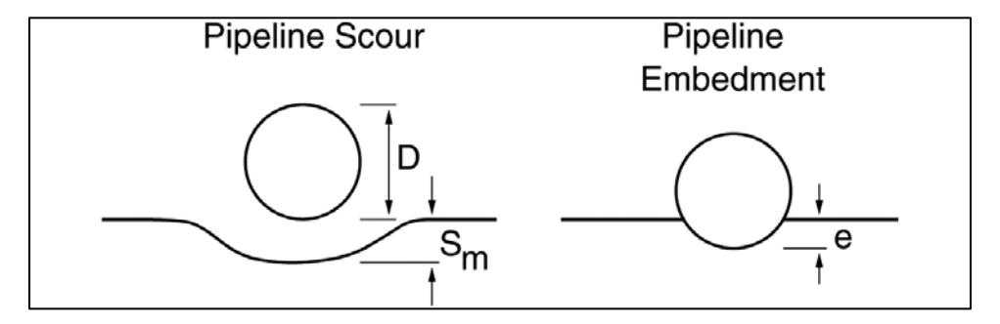

*Figure VI-5-122. Pipeline scour and pipeline embedment*

(b) Pipeline scour by waves. Oscillatory bottom velocities under waves create piping conditions beneath pipelines in the same manner as steady currents. Sumer and Fredsøe (1991) gave a criterion for onset of scour under waves based on a small number of laboratory experiments. This criterion is

```math
\frac{e_{cr}}{D} = 0.1 \ln(KC) \tag{VI-5-273}
```

where $e_{cr}$ is the critical embedment (depth of pipeline burial beyond which no scour occurs), and KC is the Keulegan-Carpenter number, given by Equation VI-5-256 with D as the denominator. Scour is unlikely to occur for values of ecr / D > 0.5 (half buried pipe). Sumer and Fredsøe (1990) studied scour beneath a bottom-resting pipeline under wave action. Their laboratory data, combined with that of an earlier researcher, indicated that live-bed scour was strongly related to Keulegan-Carpenter number and pipe diameter, while only weakly influenced by Shields parameter and pipe roughness. The data were well represented over a wide range of Keulegan-Carpenter number (2 < KC < 300) by the empirical expression

```math
\frac{S_m}{D} = 0.1\sqrt{KC} \tag{VI-5-274}
```

Klomb and Tonda (1995) presented a modified version of Equation VI-5-274 that included allowance for partial embedment, e , of the pipeline, i.e.,

```math
\frac{S_m}{D} = 0.1\sqrt{KC} \left( 1 - 1.4 \frac{e}{D} \right) + \frac{e}{D} \tag{VI-5-275}
```

with scour depth taken relative to the undisturbed bed. Equation VI-5-275 is valid for values of e/D < 0.5 (Hoffmans and Verheij 1997).
- (c) Pipeline scour by waves and currents. Sumer and Fredsøe (1996) conducted laboratory tests of pipeline scour due to combined waves and currents covering a range of KC from 5 to about 50 with codirectional currents. The general trend, regardless of the value of KC , was for scour depth to initially decrease as current is increased from zero. At higher values of current, maximum scour depth approaches the value given by Equation VI-5-272 for currents alone. Sumer and Fredsøe (1996) provided empirical design equations based on the laboratory experiments; but for values of KC between 40 and 50 maximum scour depth is almost the same as the estimate for currents alone.
- (d) Pipelines in the nearshore. Pipelines traversing the surfzone may be damaged if exposed to breaking waves and strong longshore currents. Little design guidance is available other than the fact that additional scour will occur once the pipeline is exposed. The burial depth for a pipeline through the nearshore should exceed in all places the expected bottom profile lowering that might occur over the life of the pipeline. This can be estimated using profile-change models or from long-term beach profile data.
- (5) Other scour problems. Some coastal projects may include structural elements or hydrodynamic flow conditions that are typically associated with inland waterways or estuaries. Structures such as storm surge barriers, discharge control structures, or large pad footings may experience scour around their foundations due to currents or combined waves and currents.
- (a) Hoffmans and Verheij (1997) provided a summary of techniques for estimating maximum scour for a number of situations that may be applicable to coastal projects: Scour downstream of sills and stone blankets due to currents. Scour downstream of hard bottoms due to horizontal submerged jets. Scour at control structures due to plunging jets. Scour at two- and three-dimensional culverts. Scour at abutments and spur dikes.
EM 1110-2-1100 (Part VI) Change 3 (28 Sep 11)
- (b) See Hoffmans and Verheij (1997) for further details and associated technical literature.
- c. Design of scour protection. Toe protection in the form of an apron is needed to prevent toe scour which may destabilize or otherwise decrease the functionality of a coastal structure. The apron must remain intact under wave and current forces, and it should be flexible enough to conform to an initially uneven sea floor. Scour apron width and required stone size for stability are related to wave and current intensity, bottom material, and structure characteristics such as slope, porosity, and roughness. Design guidance for scour protection is based largely on past successful field experience combined with results from small-scale laboratory tests. Special attention is needed where scour potential is enhanced such as at structure heads/ends, at transitions in structure composition, or at changes in structure alignment. This section provides general design guidance for scour aprons; however, this guidance should be considered preliminary. Projects requiring absolutely stable scour blankets should have proposed designs tested in a physical model. Hales (1980) surveyed scour protection practices in the United States and found that the minimum scour protection was typically an extension of the structure bedding layer and any filter layers. The following minimum rules-of-thumb resulted from this survey: minimum toe apron thickness - 0.6 m to 1.0 m (1.0 m to 1.5 m in northwest U.S.); minimum toe apron width - 1.5 m (3 m to 7.5 m in northwest U.S.); material - quarrystone to 0.3 m diameter, gabions, mats, etc. These rules-of-thumb are inadequate when the water depth at the toe is less than two times the maximum nonbreaking wave height at the structure or when the structure reflection coefficient is greater than 0.25 (structures with slopes greater than about 1:3). Under these more severe conditions use the scour protection methods summarized in the following sections for specific types of coastal structures. (1) Scour protection for vertical walls.
- (a) Vertical-front structures consist of large caisson-type gravity structures, gravity retaining walls, and cantilevered or anchored sheet-pile retaining walls. Toe protection design for larger vertical-front gravity structures subjected to waves is covered in Part VI-5-3d, "Toe stability and protection."
- (b) For cantilevered or anchored retaining walls, Eckert (1983) proposed toe protection in the form of a scour apron constructed of quarrystone. The main purpose of the apron is to retain soil at the toe and/or to provide sufficient weight to prevent slip failure (see Figures VI-2-69 and VI-2-70). From geotechnical considerations the width (W) of the scour apron should be approximately

```math
W = \frac { d _ { e } } { \tan \left( 4 5 ^ { o } - \phi / 2 \right) } \approx 2 . 0 d _ { e } \tag{VI-5-276}
```

where d_e is the depth of sheet-pile penetration below the seabed, and \varphi is the angle of internal friction of the soil (varies from about 26 deg to 36 deg). The width of the scour apron based on hydrodynamic criteria was given by Eckert as the greater of

```math
W = 2 . 0 H _ { i } \qquad o r \qquad W = 0 . 4 d _ { s } \tag{VI-5-277}
```

where $H_{i}$ is the incident wave height and $d_{s}$ is the depth at the structure toe. Selected scour apron design width will be the greater of Equations VI-5-276 and VI-5-277.
- (c) Eckert (1983) noted that gravity retaining walls do not require the apron to be as wide as needed for cantilevered walls. In this case, he recommended that scour apron width be about the same as the nonbreaking incident wave height.
- (d) Determining the toe apron quarrystone size depends on the hydrodynamic conditions. They are as follows:
- Waves. If retaining walls are exposed to vigorous wave conditions, the toe quarrystone should be sized using the guidance given by Figure VI-5-45 (Part VI-5-3 d "Toe stability and protection," and the apron thickness should be equal to either two quarrystone diameters or the minimum given in the prior rules-of-thumb, whichever is greater.
- Currents. If strong currents flow adjacent to the wall, toe quarrystone should be sized using the guidance provided in Part VI-5-3 f , "Blanket stability in current fields."
- Waves and Currents. If both waves and strong currents impact the toe adjacent to a vertical retaining wall, estimate the size of the apron quarrystone for the waves alone and for the current alone. Then increase whichever is larger by a factor of 1.5 (Eckert 1983).
- (e) In Sumer and Fredsøe's (1996) study of scour around the head of a vertical breakwater, laboratory tests were conducted to establish a relationship for the width of a scour apron that provides adequate protection against scour caused by wave-generated lee-wake vortices. Their empirical formula was given as

```math
\frac{W}{B} = 1.75 (KC - 1)^{1/2} \tag{VI-5-278}
```

where B is the diameter of the vertical breakwater circular head and KC is the Keulegan-Carpenter number given by Equation VI-5-256. Sumer and Fredsøe cautioned that this estimation of apron width may be inadequate in the presence of a current or for head shapes other than circular. Scour apron stone sizes are determined using the methods outlined in Part VI-5-3 d , "Toe stability and protection."
- (2) Scour protection for sloping structures.
- (a) Scour protection for sloping structures exposed to waves is typically provided by the toe protection. Part VI-5-3 d , "Toe stability and protection," presents guidance on the design of toe protection. Additional scour protection is sometimes needed at sloping-front structures to prevent scour by laterally-flowing currents. Strong tidally-driven currents adjacent to navigation jetties can scour deep trenches that may destabilize the jetty toe and result in slumping of the armor layer. Because prediction of the location and extent of potential scour is not well advanced, scour blankets are often not installed until after realization that scour has occurred. Depending on the scour hole configuration, it may be necessary to backfill the scour hole before placing a scour blanket, and the necessary extent of the protection is determined in part by the
EM 1110-2-1100 (Part VI) Change 3 (28 Sep 11)
extent of the existing scour, by past experience, and by the judgment of the engineer. An understanding of the flow regime will help assure that the scour problem will not reoccur downstream of the scour protection blanket. Stone size for scour protection from currents is given in Part VI-5-3f, "Blanket stability in current fields." Bass and Fulford (1992) described the design and installation of scour protection along the south jetty of Ocean City Inlet in Maryland.
(b) Fredsøe and Sumer's (1997) laboratory study of wave-induced scour at the rounded heads of rubble-mound structures included design suggestions for scour protection. The width of the scour apron from the structure toe to outer edge was given by

```math
\frac{W}{B} = A_1(KC) \tag{VI-5-279}
```

where B is the breakwater head diameter at the bed and KC is given by Equation VI-5-256. Complete scour protection is provided with A_I = 1.5 whereas a value of A_I = 1.1 will result in relatively minor scour at the outer edge with a depth equal to about 0.01 B. Scour apron stone size are determined using the methods outlined in Part VI-5-3d, "Toe stability and protection."
- (3) Scour protection for piles.
- (a) Vertical piles and piers exposed only to currents can be protected against scour by placement of scour aprons constructed of stone or riprap, gabions, concrete mattresses, or grout-filled bags. Riprap aprons should be designed according to the relationships given in Part VI-5-3 f , "Blanket stability in current fields." Options other than riprap or stone should be tested in physical models.
- (b) Based on an earlier report by Bonasoundas (in German), Hoffmans and Verheij (1997) recommended that minimum width for the horizontal extent of the scour apron around circular piers be specified as a function of pile diameter, B . Upstream of the pile, and to both sides, apron width is 2.5 B . Downstream the apron elongates to a width of 4.0 B as illustrated on Figure VI-5-123. Elongation in both directions is necessary for alternating tidal currents.
- (c) An alternative recommendation was given by Carstens (1976) who found that scour apron width was a function of maximum scour depth (S_m) at the pile, i.e.,

```math
\frac{W}{S_m} = \frac{F_s}{\tan \phi} \tag{VI-5-280}
```

where \varphi is the bed material angle of repose and F_s is a factor of safety.
(d) General recommendations for specifying apron width for different shaped piers and pilings, or for groups of piles, are lacking. In these cases laboratory model tests are needed to assure adequate scour protection. Past experience on other successful projects or case histories reported in the literature can also serve as design guidance (e.g., Edge et al. 1990; Anglin et al. 1996).

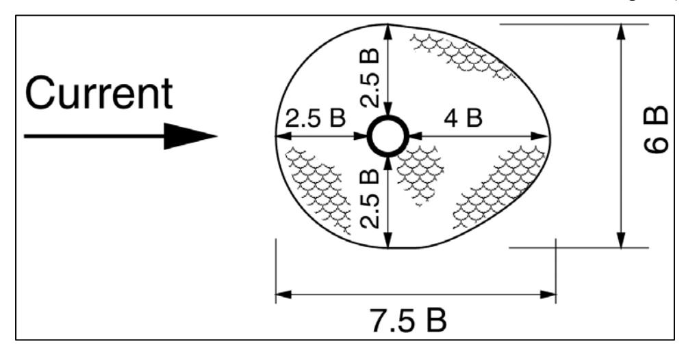

*Figure VI-5-123. Scour apron for vertical pile in a current*

- (e) Similar protective measures can be deployed to prevent scour around piles by wave action. However, guidance is also lacking on how to design stable scour aprons in wave environments (Sumer and Fredsøe 1998a), and the best recourse is site-specific model tests. As a rule-of-thumb, the horizontal extent of the apron should be approximately twice the predicted scour depth.
- (4) Scour protection for submerged pipelines.
- (a) Submerged pipelines can be protected by either burying the pipeline in a trench or by covering the pipeline with a stone blanket or protective mattress. Protected pipelines are less susceptible to trawler damage and less likely to suffer damage caused by differential scour that leaves portions of the pipeline suspended between support points.
- (b) Outside the active surfzone, burial depth is a function of local wave and current climate, sediment properties, and liquefaction potential. Usually the excavated material can be used as backfill provided it is sufficiently coarse to avoid buildup of excessive pore pressures which could lead to liquefaction and vertical displacement of the pipeline (Sumer and Fredsøe 1998a). Pipelines traversing the surfzone should be buried at an elevation lower than the anticipated erosion that would occur over the projected service life of the pipeline. Generally, stone blankets or mattresses are not considered effective protection in the surfzone because the elements must be designed to withstand the intense action of breaking waves.
- (c) Pipelines resting on the bottom can be protected from being undermined by stabilizing the adjacent bed with a stone blanket having a horizontal width less than the extent of expected scour. Hjorth (1975) reported that covering at least the bottom half of the pipeline, as shown in the upper part of Figure VI-5-124, provides sufficient protection as evidenced by field experience. The alternative is to cover the pipeline completely with a stone blanket consisting of two or more filter layers as illustrated by the lower sketch of Figure VI-5-124. Stability of the uppermost stone layer requires that the shields parameter (Equation III-6-43) based on stone diameter must be less than the critical value for incipient motion. Stone blanket placement can be
EM 1110-2-1100 (Part VI) Change 3 (28 Sep 11)
accomplished by dumping stone from the surface, provided the falling stones are not so large as to damage the pipeline on impact.

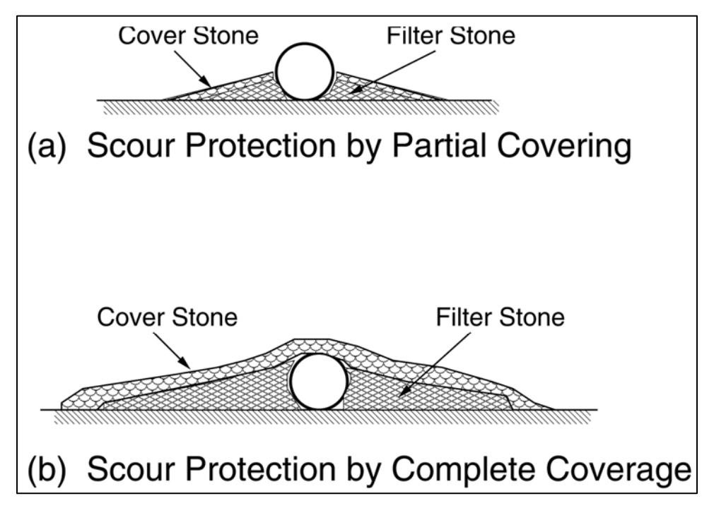

*Figure VI-5-124. Stone blanket scour protection for submerged pipelines*

(d) Various types of scour mattresses have also been used effectively to protect pipelines. Mattresses may be economical when stone is not readily available; however, special mattress placing equipment is usually required. Hoffmans and Verheij (1997) illustrated several types of mattresses.

#### VI-5-7. Wave Forces on Slender Cylindrical Piles.

#### a. Introduction.

- (1) Frequent use of pile-supported coastal and offshore structures makes the interaction of waves and piles of significant practical importance. The basic problem is to predict forces on a pile due to the wave-associated flow field. Because wave-induced flows are complex, even in the absence of structures, solution of the complex problem of wave forces on piles relies on empirical coefficients to augment theoretical formulations of the problem. This section is meant to be only an introduction to estimating forces and moments on slender cylindrical piles. For more detailed analysis see the literature related to ocean engineering and the design of offshore facilities.
- (2) Variables important in determining forces on circular piles subjected to wave action are shown in Figure VI-5-125. Variables describing nonbreaking, monochromatic waves are the wave height H , water depth d , and either wave period T , or wavelength L . Water particle velocities and accelerations in wave-induced flows directly cause the forces. For vertical piles the horizontal fluid velocity u and acceleration du/dt and their variation with distance below the
free surface are important. The pile diameter D and a dimension describing pile roughness elements k are important variables describing the pile. In this discussion the effect of the pile on the wave-induced flow is assumed negligible. Intuitively, this assumption implies that the pile diameter D must be small with respect to the wavelength L. Significant fluid properties include the fluid density \rho and the kinematic viscosity v. In dimensionless terms, the important variables can be expressed as follows:

```math
\frac{H}{gT^2} = \text{dimensionless wave steepness}, \quad \frac{d}{gT^2} = \text{dimensionless water depth}, \quad \frac{D}{L} = \text{ratio of pile diameter to wavelength (assumed small)}, \quad \frac{k}{D} = \text{relative pile roughness}, \quad \frac{HD}{Tv} = \text{a form of the Reynolds number}
```

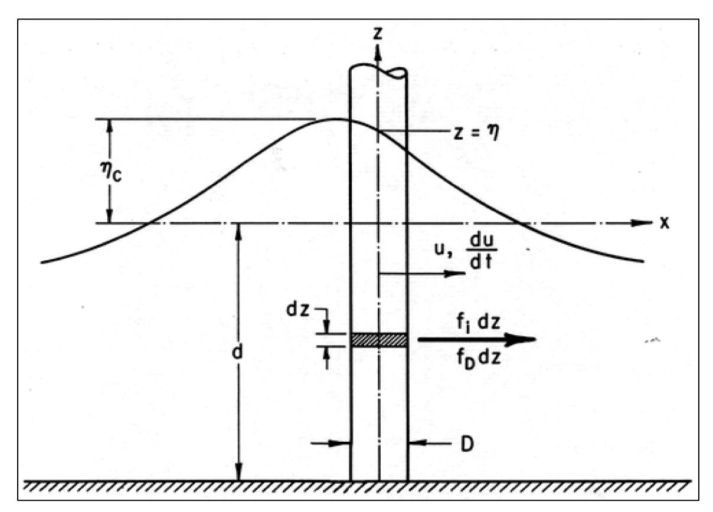

*Figure VI-5-125. Definition sketch of wave forces on a vertical cylinder*

EM 1110-2-1100 (Part VI) Change 3 (28 Sep 11)
- (3) Given the orientation of a pile in the flow field, the total wave force acting on the pile can be expressed as a function of these dimensionless parameters. The variation of force over the length of the pile depends on the mechanism by which the water particle velocities and accelerations cause the forces. The following analysis relates the local forces acting on a section of pile element of length dz to the local fluid velocity and acceleration that would exist at the center of the pile if the pile were not present. Two dimensionless force coefficients, an inertia (or mass) coefficient C_M and a drag coefficient C_D , are used to establish the wave-force relationships. These coefficients are determined by experimental measurements of force, velocity, and acceleration or by measurement of force and water surface profiles, with accelerations and velocities inferred by assuming an appropriate wave theory.
- (4) In the following section it is initially assumed that the force coefficients C_M and C_D are known to illustrate calculation of forces on vertical cylindrical piles subjected to monochromatic waves. Selection of C_M and C_D follows in Part VI-5-7c. Experimental data are available primarily for the interaction of nonbreaking waves and vertical cylindrical piles; and consequently, specific design guidance can be given for this common situation. b. Vertical cylindrical piles and nonbreaking waves.
- (1) Basic concepts. Morison et al. (1950) suggested that the horizontal force per unit length of a vertical cylindrical pile subjected to waves is analogous to the mechanism by which fluid forces on bodies occur in unidirectional flow, and this force can be expressed by the formulation

```math
f = f_i + f_D = C_M \rho \frac{\pi D^2}{4} \frac{du}{dt} + C_D \frac{1}{2} \rho D u | u | \tag{VI-5-281}
```

where
- f_i = inertial force per unit length of pile
- f_D = drag force per unit length of pile
- \rho = mass density of fluid
- D = pile diameter
- u = horizontal water particle velocity at the axis of the pile (calculated as if the pile were absent) total
- \frac{du}{dt} = horizontal water particle acceleration at the axis of the pile (calculated as if the pile were absent)
- C_D = drag hydrodynamic force coefficient
- C_M = inertia or mass hydrodynamic force coefficient
- (a) The inertia force term f_i is of the form obtained from an analysis of the force on a body in an accelerated flow of an ideal nonviscous fluid. The drag force term f_D is the drag force exerted on a cylinder in a steady flow of a real viscous fluid. The drag force f_D is proportional to u^2 and acts in the direction of the velocity u. To retain the correct direction sign, u^2 is written as u \mid u \mid . Although these remarks support the soundness of the formulation of the problem as given by Equation VI-5-281, it should be emphasized that expressing total force by the terms f_i and f_D is an assumption justified only if it leads to sufficiently accurate predictions of wave force as evidenced by ample measurements.
- (b) Because the quantities u and du/dt in Equation VI-5-281 are defined as the values of these parameters at the axis of the pile, it is apparent that the influence of the pile on the flow field a short distance away from the pile has been neglected. Using linear wave theory MacCamy and Fuchs (1954) analyzed theoretically the problem of waves passing a circular cylinder. Their analysis assumed an ideal nonviscuous fluid and led to an inertia force having the form given for f_i under special conditions. Although their theoretical result is valid for all ratios of pile diameter to wavelength, D/L, the inertia force was found to be nearly proportional to the acceleration du/dt for small values of D/L (where L is wavelength calculated by linear theory). This theoretical result provides an indication of how small the pile should be for Equation VI-5-281 to apply, and the restriction is given as

```math
\frac { D } { L } < 0 . 0 5 \tag{VI-5-282}
```

where L is calculated by linear wave theory. This restriction will seldom be violated for slender pile force calculations; however, the restriction may be important when applying Equation VI-5-281 to larger structures such as cylindrical caissons.
- (c) To apply Equation VI-5-281 it is necessary to choose an appropriate wave theory for estimating u and du/dt from values of wave height H, wave period T, and water depth d; and for that particular wave condition appropriate values of C_D and C_M must be selected.
- (2) Calculation of forces and moments. For structural design of a single vertical pile, it is often unnecessary to know in detail the distribution of forces over the height of the pile. Instead, the designer needs to know the total maximum force and the total maximum moment about the mud line (z = -d) acting on the pile. The total time-varying force and the time-varying moment acting about the mud line is found by integrating Equation VI-5-281 between the bottom and the free surface, i.e.,

```math
F = \int_{-d}^{\eta} f_i dz + \int_{-d}^{\eta} f_D dz = F_i + F_D \tag{VI-5-283}
```

```math
M = \int_{-\eta_d}^{\eta_d} (z + d) f_i \, dz + \int_{-\eta_d}^{\eta_d} (z + d) f_D \, dz = M_i + M_D \tag{VI-5-284}
```

In general form these quantities may be written
EM 1110-2-1100 (Part VI) Change 3 (28 Sep 11)

```math
F_i = C_M \rho g \frac{\pi D^2}{4} H K_i \tag{VI-5-285}
```

```math
F_D = C_D \frac{1}{2} \rho g D H^2 K_D \tag{VI-5-286}
```

```math
M_{i} = C_{M} \rho g \frac{\pi D^{2}}{4} H K_{i} d S_{i} = F_{i} d S_{i} \tag{VI-5-287}
```

```math
M_D = C_D \frac{1}{2} \rho g D H^2 K_D d S_D = F_D d S_D \tag{VI-5-288}
```

in which C_D and C_M have been assumed constant, and where K_i , K_D , S_i , and S_D are dimensionless parameters that depend on the specific wave theory used in the integrations. In the following sections values of the inertia coefficient C_M and drag coefficient C_D are assumed to be known constants. (Part VI-5-7c covers estimation of C_M and C_D .)
- (a) Linear wave theory. The force on a slender cylindrical pile can be estimated using linear wave theory, but the result is limited to situations where linear wave theory provides a reasonable approximation of the wave kinematics. This implies small amplitude waves and greater depths. Also recall that any wave force on the pile above the swl will not be included in the estimate. Nevertheless, it is instructive to examine Equation VI-5-281 when linear wave theory is applied.
- With the pile center line located at x = 0, as shown in Figure VI-5-125, the equations from Part II-1, "Water wave mechanics" for surface elevation (Equation II-1-19), horizontal component of local fluid velocity (Equation II-1-22), and horizontal component of local fluid acceleration (Equation II-1-24) are respectively

```math
\eta = \frac{H}{2} \cos\left(\frac{2\pi t}{T}\right) \tag{VI-5-289}
```

```math
u = \frac { H } { 2 } \frac { g T } { L } \frac { \cosh \left[ 2 \pi ( z + d \mathbf{\beta } ) / L \right] } { \cosh \left[ 2 \pi d / L \right] } \cos \left( \frac { 2 \pi t } { T } \right) \tag{VI-5-290}
```

```math
\frac{du}{dt} \approx \frac{\partial u}{\partial t} \approx \frac{g\pi H}{L} \frac{\cosh\left[2\pi(z+d)/L\right]}{\cosh\left[2\pi d/L\right]} \sin\left(-\frac{2pit}{T}\right) \tag{VI-5-291}
```

• Introducing Equations VI-5-290 and VI-5-291 for u and du/dt into Equation VI-5-281 gives the following expressions for the inertia force and drag force.

```math
f_i = C_M \rho g \frac{\pi D^2}{4} H \left[ \frac{\pi}{L} \frac{\cosh\left[2\pi(z+d)/L\right]}{\cosh\left[2\pi d/L\right]} \right] \sin\left(-\frac{2pit}{T}\right) \tag{VI-5-292}
```

```math
f_D = C_D \frac{1}{2} \rho g D H^2 \left[ \frac{gT^2}{4L^2} \left( \frac{\cosh \left[ 2\pi (z+d)/L \right]}{\cosh \left[ 2pid/L \right]} \right)^2 \right] \cos \left( \frac{2\pi t}{T} \right) \left| \cos \left( \frac{2\pi t}{T} \right) \right| \tag{VI-5-293}
```

- Equations VI-5-292 and VI-5-293 show that the two force components vary with elevation z on the pile and with time t. The inertia force f_i is maximum for \sin(-2\pi t/T) = 1 , which corresponds to t = -T/4 for linear wave theory. Thus, the maximum inertia force on the pile occurs T/4 seconds before the passage of the wave crest that occurs at t = 0 (see Equation VI-5-289). The maximum value of the drag force component f_D coincides with passage of the wave crest at t = 0.
- The magnitude of the maximum inertia force per unit length of pile varies with depth the same as the horizontal acceleration component (Equation VI-5-291). The maximum value occurs at the swl (z = 0) and decreases with depth. The same trend is true for the maximum drag force per unit length of pile except the decrease with depth is more rapid because the depth attenuation factor ( \cosh \left[ \frac{2\pi(z+d)}{L} \right] / \cosh \left[ \frac{2\pi d}{L} \right] ) is squared in Equation VI-5-293.
- The total time-varying force and the time-varying moment acting about the mudline is found for linear wave theory by integrating Equations VI-5-283 and VI-5-284 between the bottom and the swl (z = 0) using the expressions for f_i and f_D given by Equations VI-5-292 and VI-5-293, respectively. The integration results in total force and moment components given by Equations VI-5-285 through VI-5-288 with values of the dimensionless parameters K_i , K_D , S_i , and S_D given by

```math
K_i = \frac{1}{2} \tanh\left(\frac{2\pi d}{L}\right) \sin\left(-\frac{2\pi t}{T}\right) \tag{VI-5-294}
```

```math
K_D = \frac{1}{8} \left( 1 + \frac{4\pi d/L}{\sinh[4\pi d/L]} \right) \cos\left(\frac{2\pi t}{T}\right)\bigg|\cos\left(\frac{2\pi t}{T}\right)\bigg| = \frac{1}{4} n \cos\left(\frac{2\pi t}{T}\right)\bigg|\cos\left(\frac{2\pi t}{T}\right)\bigg| \tag{VI-5-295}
```

```math
S_i = 1 + \frac{1 - \cosh\left[2\pi d/L\right]}{(2\pi d/L)\sinh\left[2\pi d/L\right]} \tag{VI-5-296}
```

```math
S_D = \frac{1}{2} + \frac{1}{2n} \left( \frac{1}{2} + \frac{1 - \cosh\left[4\pi d/L\right]}{(4\pi d/L)\sinh\left[4\pi d/L\right]} \right) \tag{VI-5-297}
```

where

```math
n = \frac{C_g}{C} = \frac{1}{2} \left( 1 + \frac{4\pi d/L}{\sinh[4\pi d/L]} \right) \tag{VI-5-298}
```

EM 1110-2-1100 (Part VI) Change 3 (28 Sep 11)
- The maximum values for total inertia force and moment are found by taking t = - T /4 in Equations VI-5-294 and VI-5-296, respectively. Likewise, the maximum values for total drag force and moment are found by taking t = 0 in Equations VI-5-295 and VI-5-297, respectively. A conservative design approach would be to sum the individual maximum inertia and drag components that occur during a wave cycle to get total maximum force and moments. However, the individual maximums do not occur simultaneously, so the real maximum total force and moment wil be somewhat less. The correct method is to calculate the time-varying sum of inertia and drag components, and then use the maximum sum that occurs over the wave cycle. The time at which the maximum occurs may vary depending on the selected values for $C_{M}$ and CD .
- Although linear wave theory provides a nice closed-form solution for forces and moments on slender cylindrical piles, in practice the hydrodynamics associated with the steeper design wave conditions will not be well predicted by linear wave theory. Even more critical is the fact that linear theory provides no estimate of the force caused by that portion of the wave above the swl, an area where the horizontal velocities and accelerations are the greatest. An ad hoc adjustment is to assume a linear force distribution having a maximum value of force estimated at the still-water line and a value of zero at the crest location of the linear wave ( H /2 above the swl). Most likely, the design wave will be nonlinear with steep wave crests and with much of the wave height above the swl, and it would be well advised to use an appropriate nonlinear wave theory in the force and moment calculation.

#### (b) Nonlinear wave theory.

- Design conditions for vertical cylindrical piles in coastal waters will most likely consist of nonlinear waves characterized by steep crests and shallow troughs. For accurate force and moment estimates, an appropriate nonlinear wave theory should be used to calculate values of u and du/dt corresponding to the design wave height, wave period, and water depth.
- The variation of $f_{i}$ and $f_{D}$ with time at any vertical location on the pile can be estimated using values of u and du/dt from tables such as Stoke's fifth-order wave theory (Skjelbriea et al. 1960) or stream-function theory (Dean 1974). Computer programs based on higher order monochromatic wave theories may be available to ease the task associated with using tabulated wave kinematics.
- The separate total maximum inertia force and moment and total drag force and moment on a vertical cylindrical pile subjected to nonlinear waves can be estimated using Equations VI-5-285 through VI-5-288. Values for $K_{i}$ , $K_{D}$ , $S_{i}$ , and $S_{D}$ in Equations VI-5-285 - VI-5-288 are given by $K_{im}$ , $K_{Dm}$ , $S_{im},$ and $S_{Dm}$ , respectively, in the nomograms shown in Figures VI-5-126 through VI-5-129. (Note: In the nomograms the subscript m is used to denote maximum.) These nomograms were constructed using stream-function theory (Dean 1974), and they provide the maximum total force and total moment for the inertia and drag components considered separately rather than the combined total force and moment. The curves in Figures VI-5-126 to VI-5-129 represent wave height as a fraction of the breaking wave height. For example, curves labeled 1/2 $H_{b}$ represent $H/H_{b}$ = 1/2. Breaking wave height is obtained from Figure VI-5-130 for values of d /gT 2 using the curve labeled Breaking Limit.
- For linear waves, the maximum inertia force occurs at t = -T/4 and the maximum drag force occurs at t = 0. However, for nonlinear waves the times corresponding to maximum inertia and drag forces are phase dependent and not separated by a constant quarter wavelength as in linear wave theory.
- The total maximum force F_m , where the sum of the inertia and drag components is maximum, can be estimated using Figures VI-5-131 to VI-5-134. These figures were also constructed using stream-function theory. Figure selection is based on the nondimensional parameter

```math
W = \frac{C_M D}{C_D H} \tag{VI-5-299}
```

and the drawn curves give values of \varphi_m corresponding to the known parameters H/gT^2 and d/gT^2 .

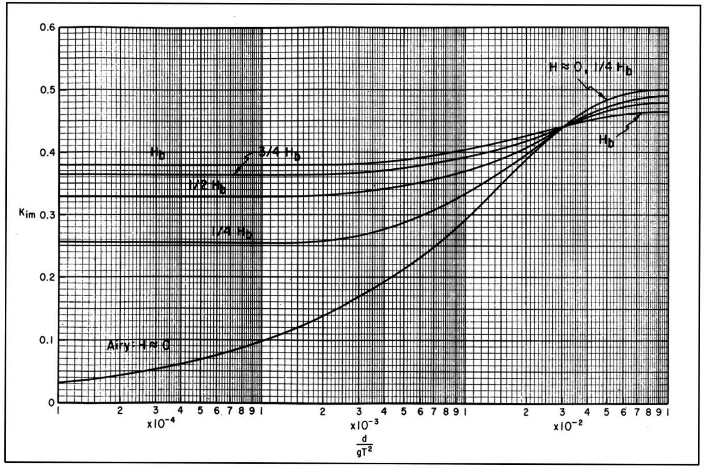

*Figure VI-5-126. K_{im} versus relative depth, d/gT^2*

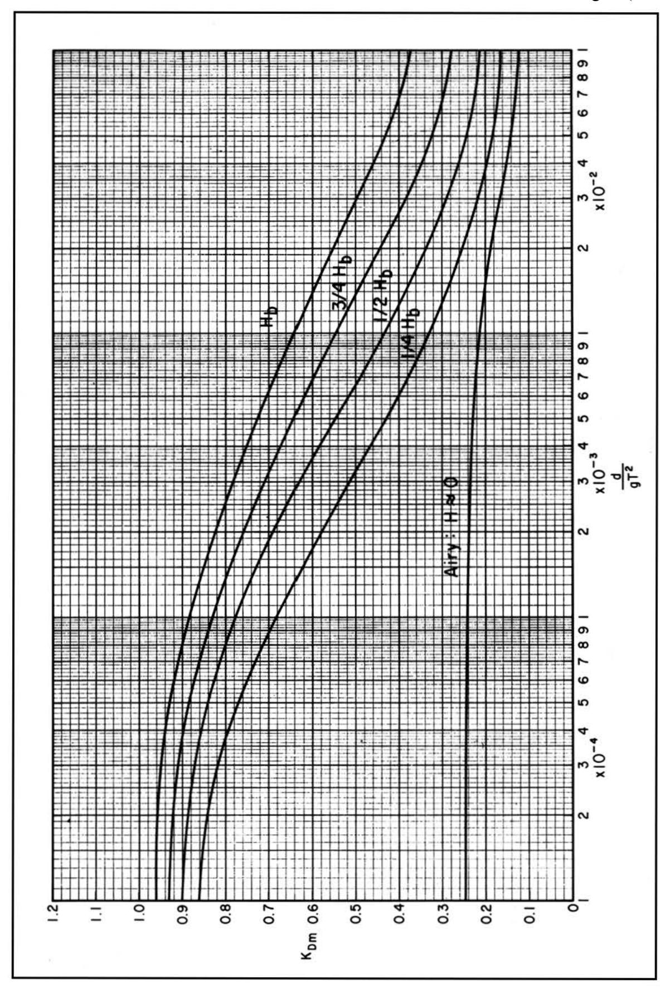

*Figure VI-5-127. K_{Dm} versus relative depth, d/gT^2*

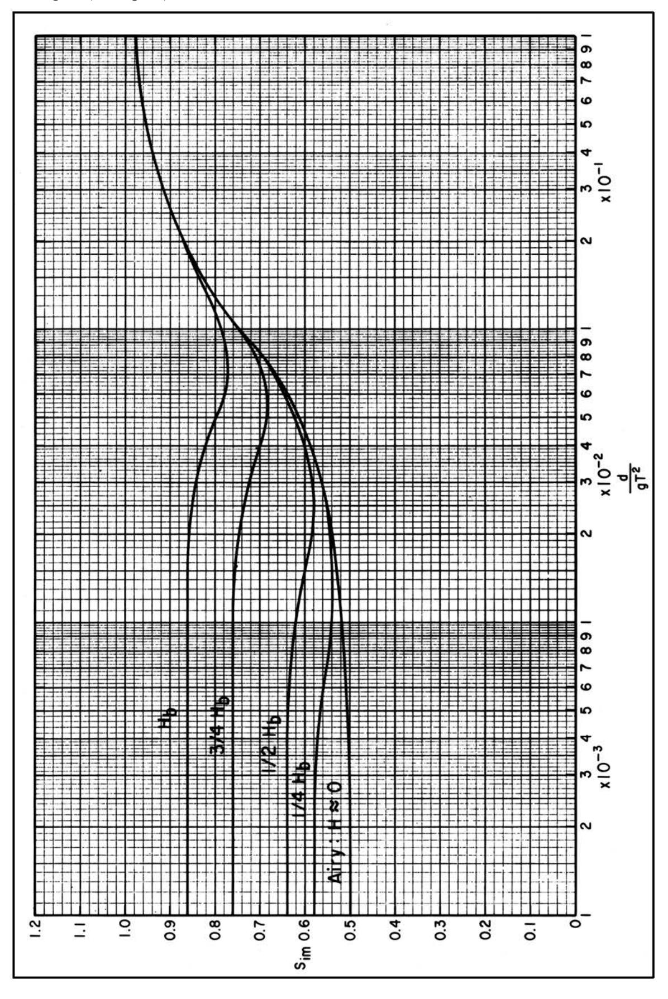

*Figure VI-5-128. Inertia force moment arm $S^{im}$ versus relative depth, d / gT 2*

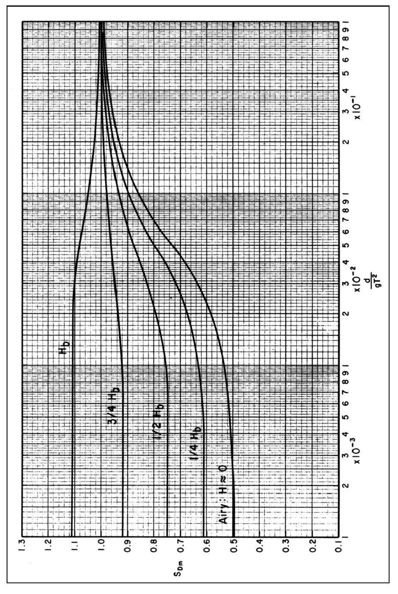

*Figure VI-5-129. Drag force moment arm S_{Dm} versus relative depth, d/gT^2*

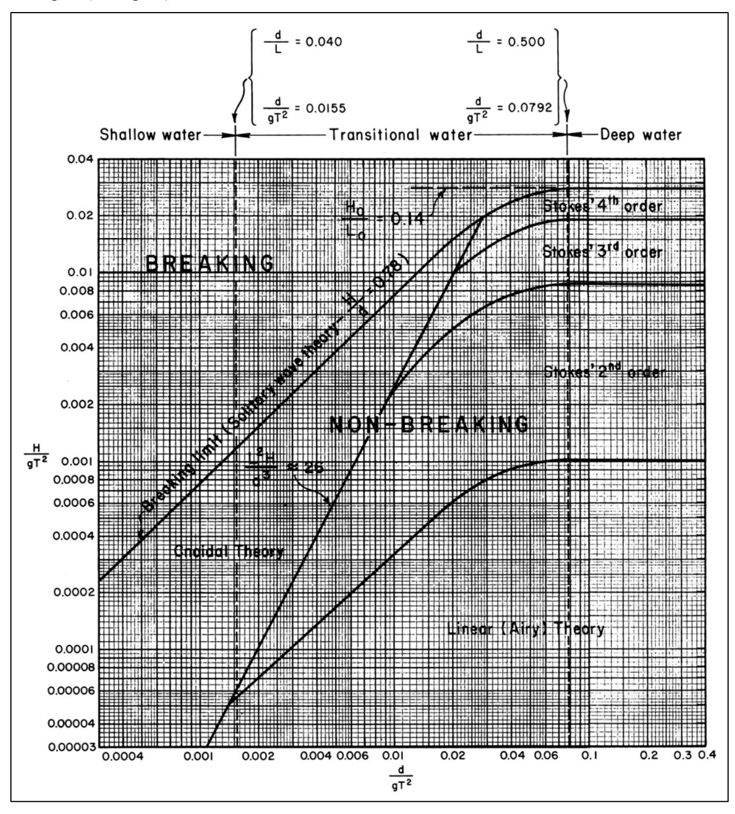

*Figure VI-5-130. Breaking wave height and regions of validity of various wave theories*

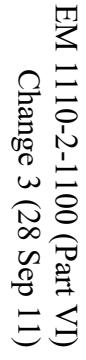

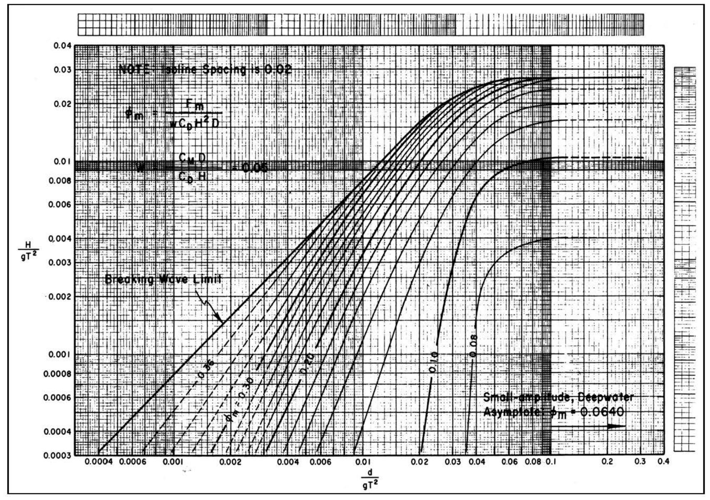

*Figure VI-5-131. Isolines of \varphi_m versus H/gT^2 and d/gT^2 (W = 0.05)*

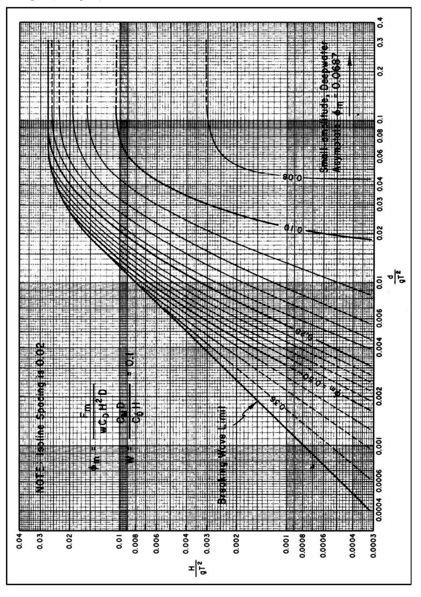

*Figure VI-5-132. Isolines of \phi_m versus H/gT^2 and d/gT^2 (W = 0.10)*

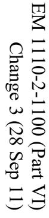

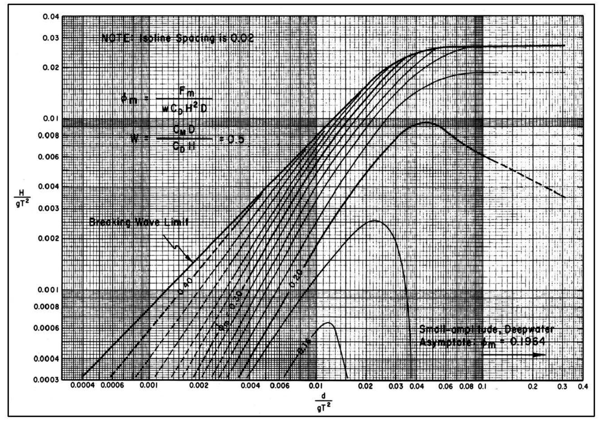

*Figure VI-5-133. Isolines of \varphi_m versus H/gT^2 and d/gT^2 (W = 0.50)*

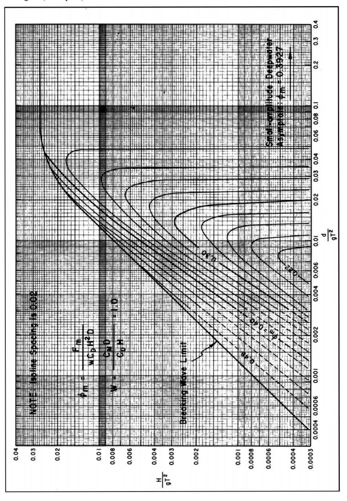

*Figure VI-5-134. Isolines of \varphi_m versus H/gT^2 and d/gT^2 (W=1.0)*

The maximum force is calculated as

```math
F_m = \phi_m C_D \rho g H^2 D \tag{VI-5-300}
```

Similarly, the total maximum moment $M_{m}$ can be estimated using Figures VI-5-135 through VI-5-138 which were also constructed using stream-function theory. Choice of figure is based on the value of W given by Equation VI-5-299, and values for $α_{m}$ are corresponding to the parameters H/gT 2 and $d/gT^{2}.$ The moment about the mudline is given by

```math
M _ { m } = \alpha _ { m } C _ { D } \rho g H ^ { 2 } D d \tag{VI-5-301}
```

- For both the total force and total moment calculations, the calculated value of W will likely lie between the values for which the figures are drawn. In this case, determine values of $φ_{m}$ and $α_{m}$ from the plots on either side of the W -value, then use linear interpolation to estimate values of $φ_{m}$ and $α_{m}$ for the calculated value of W .
- The maximum moment is calculated at the mudline, and the corresponding moment arm is the maximum moment divided by the maximum force, or

```math
r_a = \frac{M_m}{F_m} \tag{VI-5-302}
```

If the surrounding soil does not provide any lateral resistance, or if there has been scour around the pile, the effective moment arm must be increased and a new maximum total moment calculated. For example, if the scour depth beneath the surrounding bed is $S_{m}$ , the modified maximum total moment will be

```math
M_{m'} = (r_a + S_m) F_m \tag{VI-5-303}
```

- See Part VI-7, "Design of Specific Project Elements," for an example illustrating calculation of forces and moments on a vertical cylinder.
- (3) Transverse forces due to eddy shedding.
- (a) In addition to drag and inertia forces that act in the direction of wave advance, transverse forces may arise. Transverse forces are caused by vortex or eddy shedding on the downstream side of the pile. Eddies are shed alternately from each side of the pile resulting in a laterally oscillating force. Transverse forces act perpendicular to both wave direction and pile axis, and they are often termed lift forces because they are similar to aerodynamic lift acting on an airfoil.
- (b) Laird, Johnson, and Walker (1960) and Laird (1962) studied transverse forces on rigid and flexible oscillating cylinders. In general, lift forces were found to depend on the dynamic response of the structure. For structures with a natural frequency of vibration about twice the wave frequency, a dynamic coupling between the structure motion and fluid motion occurs, resulting in large lift forces. Transverse forces have been observed 4.5 times greater than
EM 1110-2-1100 (Part VI) Change 3 (28 Sep 11)
the drag force. However, for rigid structures a transverse force equal to the drag force is a reasonable upper limit. Larger transverse forces can occur where there is dynamic interaction between the waves and cylindrical pile. The design guidance in this section pertains only to rigid piles.

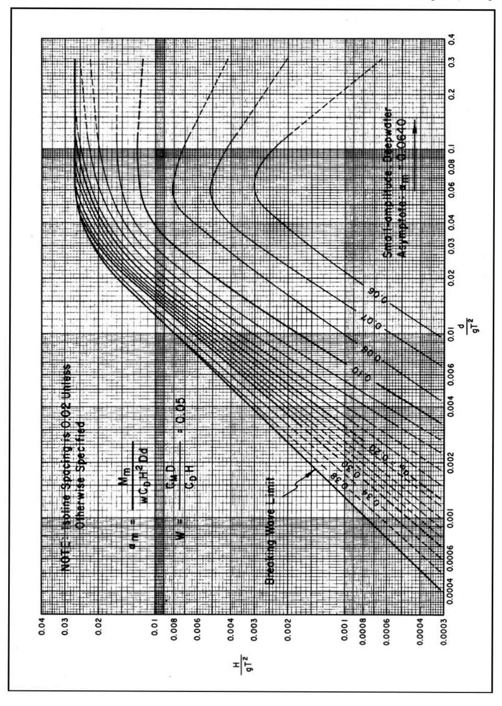

*Figure VI-5-135. Isolines of \alpha_m versus H/gT^2 and d/gT^2 (W=0.05)*

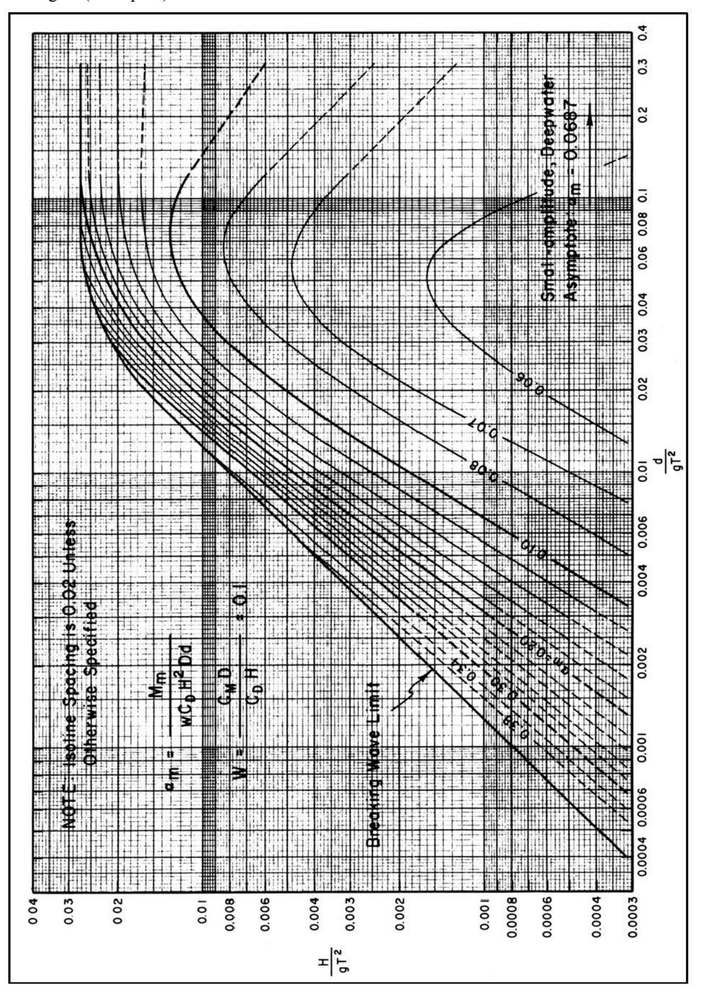

*Figure VI-5-136. Isolines of \alpha_m versus H/gT^2 and d/gT^2 (W=0.10)*

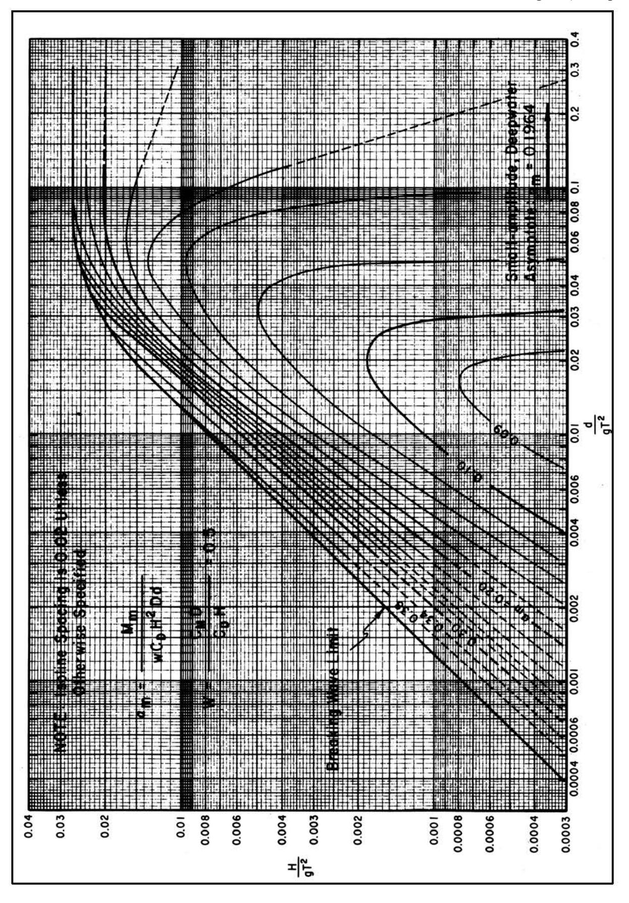

*Figure VI-5-137. Isolines of \alpha_m versus H/gT^2 and d/gT^2 (W=0.5)*

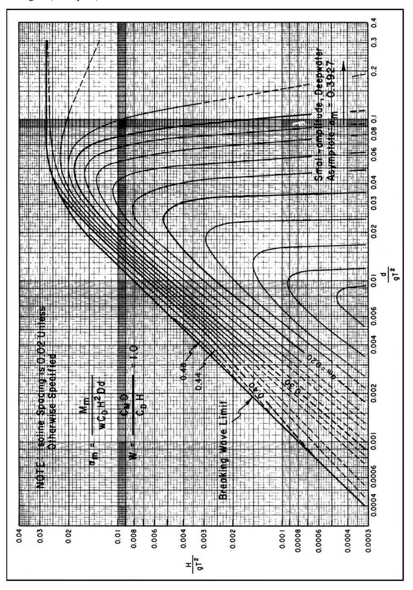

*Figure VI-5-138. Isolines of \alpha_m versus H/gT^2 and d/gT^2 (W=1.0)*

(c) Chang (1964) found in laboratory investigations that eddies are shed at a frequency that is twice the wave frequency. Two eddies are shed after passage of the wave crest (one on each side of the pile), and two are shed on the return flow after passage of the wave trough. The maximum lift force is proportional to the square of the horizontal wave-induced velocity in much the same way as the drag force. Consequently, for design estimates of the lift force the following equation can be applied.

```math
{ { F } } _ { L } = { { F } } _ { L m } \cos 2 \theta = C _ { L } \frac { \rho g } { 2 } D H ^ { 2 } K _ { D m } \cos 2 \theta \tag{VI-5-304}
```

where F_L is the time-varying transverse (lift) force, F_{Lm} is the maximum transverse force, \theta is the wave phase angle ( \theta = 2\pi x/L - 2\pi t/T ), C_L is an empirical lift coefficient analogous to the drag coefficient in Equation VI-5-286, and K_{Dm} is the dimensionless parameter given in Figure VI-5-127. Chang found that C_L depends on the average Keulegan-Carpenter number given as

```math
KC_{ave} = \frac{(u_{\text{max}})_{ave} T}{D} \tag{VI-5-305}
```

where (u_{max})_{ave} is the maximum horizontal velocity averaged over the depth. When KC_{ave} is less than 3, no significant eddy shedding occurs and no lift forces are developed. As KC_{ave} increases, C_L increases until it is approximately equal to C_D for rigid piles. Consequently, it must be recognized that: the lift force can represent a major portion of the total force acting on a pile and therefore should not be neglected in the design of the pile.
- c. Selection of hydrodynamic force coefficients C_D , C_M , and C_L .
- (1) Sarpkaya (1976a, 1976b) conducted an extensive experimental investigation of the inertia, drag, and transverse forces acting on smooth and rough circular cylinders. The experiments were performed in an oscillating U-tube water tunnel for a range of Reynolds numbers up to 700,000 and Keulegan-Carpenter numbers up to 150. Relative roughness of the cylinders k/D varied between 0.002 and 0.02 (where k is the average height of the roughness element). Forces were measured on stationary cylinders, and the corresponding drag and inertia coefficients were determined using a technique of Fourier analysis and least-squares best fit of the Morison equation (Equation VI-5-281) to the measured forces.
- (2) The results were presented as plots of the force coefficients versus Keulegan-Carpenter number

```math
KC = \frac{u_m T}{D} \tag{VI-5-306}
```

for given values of Reynolds number

```math
R _ { e } = \frac { u _ { m } D } { \nu } \tag{VI-5-307}
```

EM 1110-2-1100 (Part VI) Change 3 (28 Sep 11)
or the frequency parameter

```math
\beta = \frac { R _ { e } } { K C } = \frac { D ^ { 2 } } { \nu T } \tag{VI-5-308}
```

- (3) In Equations VI-5-306 VI-5-308 $u_{m}$ is the maximum horizontal wave velocity, T is the wave period, D is the cylinder diameter, and v is the fluid kinematic viscosity.
- (4) Figures VI-5-139 through VI-5-141 present Sarpkaya's (1976a, 1976b) experimental results for the force coefficients $C_{D}$ , $C_{M}$ , and $C_{L}$ for smooth cylinders. In each figure the force coefficient is plotted versus Keulegan-Carpenter number for constant values of Reynolds number (dotted lines) and frequency parameter (solid lines). Drag and inertia force coefficients versus Reynolds number for rough cylinders are plotted on Figures VI-5-142 and VI-5-143, respectively, for selected values of relative roughness k/D . Sarpkaya cautioned that the force coefficients were developed for oscillatory flow with zero mean velocity, and it is possible that waves propagating on a uniform current may have different force coefficients.

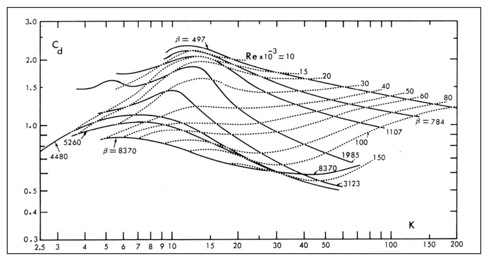

*Figure VI-5-139. Drag coefficient $C_{D}$ as a function of KC and constant values of $R_{e}$ or for smooth cylinders (from Sarpkaya 1976a)*

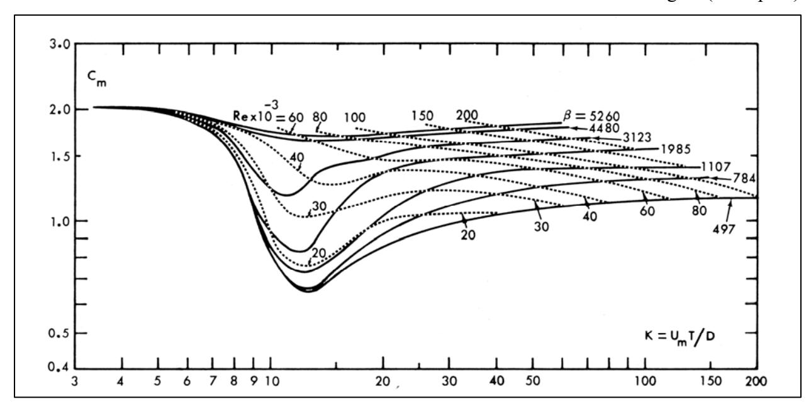

*Figure VI-5-140. Inertia coefficient $C_{M}$ as a function of KC and constant values of $R_{e}$ or for smooth cylinders (from Sarpkaya 1976a)*

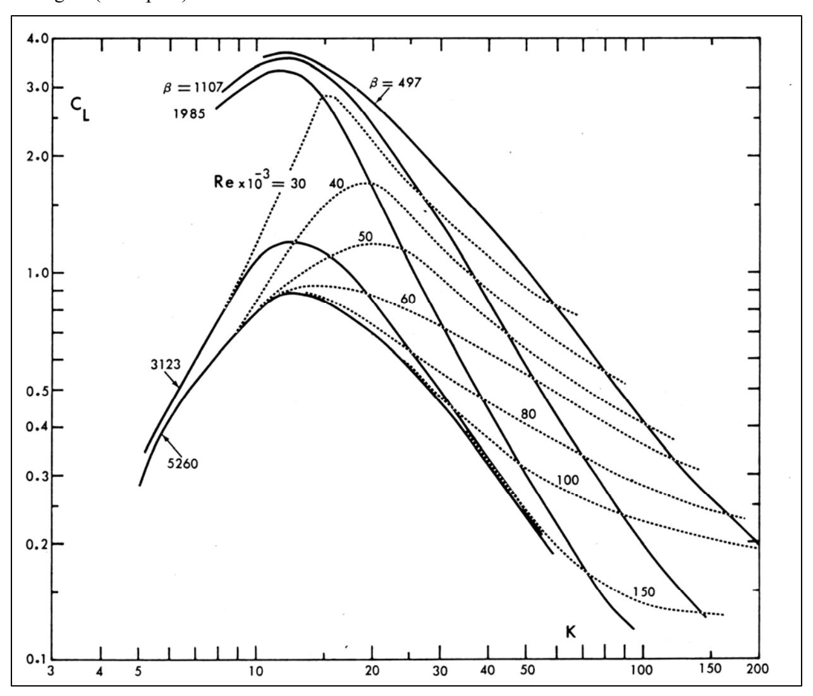

*Figure VI-5-141. Lift coefficient $C_{L}$ as a function of KC and constant values of Re or for smooth cylinders (from Sarpkaya 1976a)*

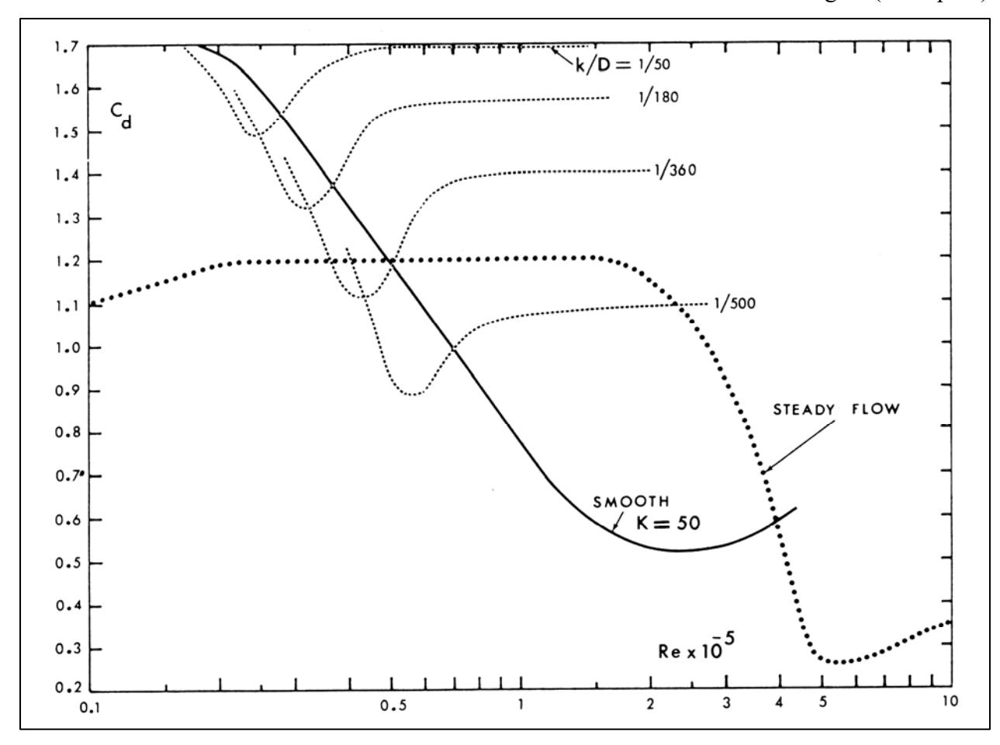

*Figure VI-5-142. Drag coefficient $C_{D}$ as a function of Reynolds number for rough cylinders (from Sarpkaya 1976a)*

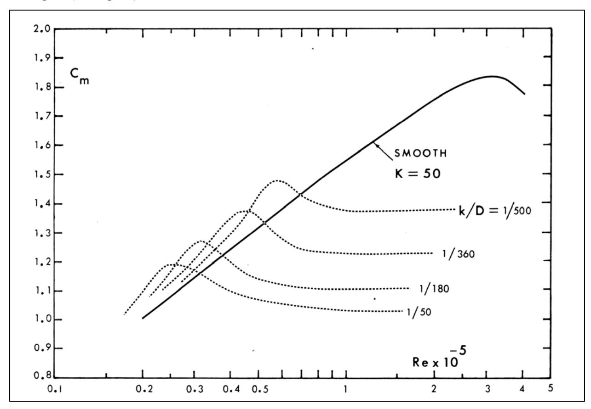

*Figure VI-5-143. Inertia coefficient $C_{M}$ as a function of Reynolds number for rough cylinders (from Sarpkaya 1976a)*

- (5) The force coefficients given in Figures VI-5-139 through VI-5-143 should give reasonable force estimates when used with the design figures based on stream function theory given in the previous section. However, the design engineer should be aware of the limitations of assuming the force coefficients are constant over the water depth and throughout the wave cycle.
- (6) Sarpkaya's experimental apparatus gave uniform values of Reynolds number and Keulegan-Carpenter number over the entire test pile. For a vertical pile exposed to waves, the maximum horizontal velocity will vary from its largest value at the sea surface to a somewhat smaller value near the bottom. Consequently, both $R_{e}$ and KC will vary over the depth of the pile. For design purposes, it is reasonable to calculate $R_{e}$ and KC based on the average value of um over the water depth in shallow water because the variation will not be too significant. In deeper water it may be wise to investigate the variation of force coefficients with depth to determine if using $R_{e}$ and KC based on average $u_{m}$ is appropriate.
- (7) Sarpkaya=s experimental data do not cover the range of Reynolds numbers likely to be encountered with bigger waves and larger pile diameters. For larger calculated Reynolds numbers use the following guidance that has been repeated from the old Shore Protection Manual (1984).

```math
C_D = \begin{cases} 1.2 - \frac{(R_e - 2(10)^5)}{6(10)^5} & for \ 2(10)^5 < R_e - 5(10)^5 \\ 0.7 & for \ 5(10)^5 < R_e \end{cases}
```

```math
C_{M} = \begin{cases} 2.5 - \frac{R_{e}}{5(10)^{5}} & for \ 2.52(10)^{5} < R_{e} - 5(10)^{5} \\ 1.5 & for \ 5(10)^{5} < R_{e} \end{cases}
```

Bear in mind the above recommendations for higher Reynolds number are based on older experimental results, and more accurate estimates might be available from the offshore engineering literature for critical applications.
- d. Safety factors in pile design.
- (1) Before the pile is designed or the foundation analysis is performed, a safety factor is usually applied to calculated forces. Reasons for uncertainty to the design include approximations in applying the wave theory, estimated values for the force coefficients, potential loss of pile strength over time, and the probability that the design wave will be exceeded during the life of the structure.
- (2) The following recommendations for safety factors are offered as general rules of thumb. In situations where pile failure could lead to loss of life or catastrophic failure of supported infrastructure, safety factors should be increased.
- (a) When the design wave has low probability of occurrence, it is recommended that a safety factor of 1.5 be applied to calculated forces and moments that are to be used as the basis for structural and foundation design.
- (b) If the design wave is expected to occur frequently, such as in depth-limited situations, a safety factor of at least 2.0 should be applied to the calculated forces and moments.
- (3) In addition to the safety factor, changes occurring during the expected life of the pile should be considered in design. Such changes as scour about the pile base and added pile roughness due to marine growth may be important.
- (4) The design procedure presented in the previous sections is a static procedure; forces are calculated and applied to the structure statically. The dynamic nature of forces from wave action must be considered in the design of some offshore structures. When a structure's natural frequency of oscillation is such that a significant amount of energy in the wave spectrum is available at that frequency, the dynamics of the structure must be considered. In addition, stress reversals in structural members subjected to wave forces may cause failure by fatigue. If fatigue problems are anticipated, the safety factor should be increased or allowable stresses should be decreased. Evaluation of these considerations is beyond the scope of this manual.
EM 1110-2-1100 (Part VI) Change 3 (28 Sep 11)
- (5) Corrosion and fouling of piles also require consideration in design. Corrosion decreases the strength of structural members. Consequently, corrosion rates over the useful life of an offshore structure must be estimated and the size of structural members increased accordingly.
- (6) Fouling of a structural member by marine growth increases the roughness and effective diameter of the pile and also changes the values of the force coefficients. The increased diameter must be carried through the entire design procedure to determine forces on the fouled member.
- e. Other considerations related to forces on slender cylindrical piles.
- (1) Wave forces on pile groups. For a group of piles supporting a structure such as a platform or pier, the methods given in the previous sections can be used provided the piles are sufficiently separated so that flow around one pile does not influence the flow around adjacent piles. One approach is to assume waves are long crested and of permanent form. Given the relative orientation of the piles to each other and to the incoming wave, forces can be estimated on each pile at different times during the wave passage. Typically, the maximum force on individual piles occurs at different times unless all the piles are parallel to the wave crest. Therefore, numerous calculations throughout the wave passage are needed to determine the worst loading on the overall structure. Because the tops of the piles are connected by the superstructure, and the connections may provide some rigidity; it may be necessary to analyze the pile group as a frame.
- (a) As the distance between piles becomes small relative to the wavelength, maximum forces and moments on pile groups may be conservatively estimated by summing the maximum forces and moments on each pile.
- (b) The assumption that piles are unaffected by neighboring piles is not valid when the distance between piles is less than about three times the pile diameter. Chakrabarti (1991) presented design graphs giving maximum force on a pile in a linear pile group (piles aligned in a row) as a function of Keulegan-Carpenter number and relative separation distance S/D where S is the distance between center lines of adjacent piles. Graphs were provided for pile groups consisting of two, three and five piles with waves approaching parallel and perpendicular to the line of piles. Graphs were also given for estimating $C_{D}$ , $C_{M}$ , and $C_{L}$ for pile groups of three and five piles exposed to waves parallel and perpendicular to the pile line.
- (2) Wave forces on nonvertical piles. Forces and moments on nonvertical cylindrical piles can be estimated using Morison's equation (Equation VI-5-281) where the values for velocity u and acceleration du/dt are given as the velocity and acceleration components perpendicular to the pile. Calculations will need to be performed using an appropriate wave theory along with the force coefficients given in Part VI-5-7 c , "Selection of hydrodynamic force coefficients $C_{D}$ , $C_{M}$ , and $C_{L}$ ." Do not use the curves provided in design Figures VI-5-126 through VI-5-129 and VI-5-131 through VI-5-134 because these figures are only for vertical piles. For nonvertical piles, the pile self weight (immersed and above water) will contribute to the overturning moment and must be included in the calculation.
(3) Broken wave forces. Forces resulting from action of broken waves on piles are much smaller than forces due to breaking waves. When pile-supported structures are constructed in the surf zone, lateral forces from the largest wave breaking on the pile should be used for design. Although breaking-wave forces in the surf zone are great per unit length of pile, the pile length actually subjected to wave action is usually short. Hence, the resulting total force and moment are small. Pile design in the surf zone is usually governed primarily by vertical loads acting along the pile axis.

#### VI-5-8. Other Forces and Interactions.

- a. Impact forces. Impact force loading on coastal projects occurs when waves or solid objects collide with typically stationary coastal structure elements. Only solid body impacts are discussed in this section. Impact loads between shifting concrete armor units are discussed in Part VI-5-3 c , "Structural integrity of concrete armor units."
- (1) Certain coastal structures such as thin-walled flood barriers, sheet-pile bulkheads, mooring facilities, coastal buildings, or other infrastructure may be subject to impact damage by solid objects carried by waves, currents, or hurricane-force winds. During severe storms, high winds may propel small pleasure craft, barges, and floating debris which can cause significant horizontal impact loads on structures. Likewise, floating ice masses can also cause great impact loads. Impact loads are an important consideration in design of vessel moorings and fendering systems.
- (2) Designing a structure to resist impact loads during extreme events is difficult because of uncertainty associated with impact speed and duration. In situations where impact damage by large floating objects could cause catastrophic loss, it may be prudent to limit adjacent water depth by constructing sloping rubble-mound protection fronting the structure or by placing submerged breakwaters seaward of the structure to ground large floating masses and eliminate the hazard.
- (3) Impact forces are evaluated using impulse-momentum and energy considerations found in textbooks on fundamental dynamics. However, application of these principles to particular impact problems is difficult unless reliable estimates can be made of object mass (including added mass in water), the mass initial and final velocities, duration of impact loading, and distribution of impact force over time. In addition, some evaluation must be made on whether the collision of the floating object with a coastal structure results in purely elastic behavior in which momentum is conserved, purely plastic impact with all the kinetic energy of the impact being absorbed, or some combination of the two.
- (4) Fendering systems in ports and harbors are designed to absorb low-velocity impacts by vessels during docking maneuvers and seiching motions. Design of fendering systems is adequately covered by numerous textbooks and design standards. Examples of typical design references in the coastal engineering literature include Quinn (1972) and Costa (1973). The modes of kinetic energy absorption by fendering systems were studied theoretically by Hayashi and Shirai (1963). Otani, Horii, and Ueda (1975) presented field measurements related to absorption of impact kinetic energy of 50 large tankers. They observed that most berthing velocities are generally below 6 cm/s, and that measured impact energy was substantially larger
EM 1110-2-1100 (Part VI) Change 3 (28 Sep 11)
than calculated using the design standards that existed at that time. Kuzmanovic and Sanchez (1992) discussed protective systems for bridge piers and pilings, and they gave procedures for accessing the equivalent static force acting on bridge piers due to vessel impacts.
- b. Ice forces. A description of ice loading and how it may impact various types of coastal structures in the context of site-specific design criteria is given in Part VI-3-5, "Ice." Other general references include Chen and Leidersdorf (1988); Gerwick (1990); and Leidersdorf, Gadd, and Vaudrey(1996). The following section presents methods for calculating ice forces under specific loading conditions.
- (1) Horizontal ice forces.
- (a) Solid ice forces.
- Large horizontal forces can result when solid sheet ice, or large chunks of solid ice that have broken free, come in contact with vertical-front coastal structures. Most ice sheets are large enough that impact forces are limited by ice failure in the weakest mode permitted by the mechanics of interaction as the structure penetrates the ice, i.e., crushing, splitting, shear, or bending. For smaller ice blocks or wide structures, the maximum impact force may be limited by the kinetic energy available at the moment of impact (HQUSACE 1982). Ice impact calculations should be based on impulse-momentum considerations, but such calculations will be difficult because of uncertainty in estimating a value for ice block velocity.
- Wind and water current drag acting on large floating blocks of ice press the ice blocks against structures creating large pressures at the points of contact. The force due to drag on a block of ice can be calculated for wind and water currents using the following formula (PIANC 1992)

```math
F_d = C_{sf} \rho A (u - u_i)^2 \tag{VI-5-309}
```

where
Cs f = coefficient of skin friction between wind and ice or water and ice (see Table VI-5-89).
ρ = fluid density (air or water)
- A = horizontal area of ice sheet
- u = fluid velocity (10 m above ice for air or 1 m below ice for water)
- ui = velocity of ice in the direction of u

|  | Table VI-5-89 |  |
| --- | --- | --- |
|  | Values of Skin Friction Coefficient, ( | C_{sf} (PIANC 1992) |
|  | Smooth Ice | Rough (Pack) Ice |
| Wind drag | 0.001 - 0.002 | 0.002 - 0.003 |
| Water drag | 0.002 - 0.004 | 0.005 - 0.008 |

- Separate drag calculations should be performed for both wind and water currents with the results treated as vector forces on the ice mass. Because drag force is directly proportional to ice surface area, larger ice sheets will exert greater forces.
- Once an ice sheet has come to rest against a structure, u_i is zero, and the total drag force can be calculated. Intact ice sheets should be treated as solid bodies with the resultant loads vectorially distributed among the structure/ice contact points using force and moment balance. The total force may be somewhat uniformly distributed along a lineal vertical wall. However, if the ice block comes in contact at only a few discrete points, the contact pressure may be very large. In these cases, the calculated force due to drag may exceed the force necessary for local crushing of the ice, in which case the local crushing strength becomes the limiting force applied to the structure. (b) Localized ice crushing forces.
- The limiting ice force on a vertical structure is determined by the crushing failure strength of the ice in compression. A theoretical expression for the horizontal ice crushing force was given in Korzhavin in a 1962 Russian publication (Ashton 1986) as

```math
\frac{F_c}{bh_i} = m I k x \sigma_c \tag{VI-5-310}
```

where
F_c = horizontal crushing force
b =structure horizontal width or diameter
h_i = thickness of ice sheet
m =plan shape coefficient
I = indentation coefficient
k =contact coefficient
- x = strain rate function
- \sigma_c = ice compressive failure strength in crushing
EM 1110-2-1100 (Part VI) Change 3 (28 Sep 11)
- This formula is usually applied to piles and pier structures rather than long vertical walls. The plan shape coefficient, m, is 1.0 for flat surfaces, 0.9 for circular piles, and 0.85[ sin(\beta/2) ]<sup>1/2</sup> for wedge-shaped structures having a wedge angle of \beta . The indentation coefficient, I, has been found experimentally to be a function of the aspect ratio, b/h_i , and it is usually presented in graphical form. The contact coefficient, k, is a function of ice velocity and width of structure, and it varies between values of 0.4 to 0.7 for ice velocities between 0.5 and 2.0 m/s. The strain rate coefficient is also a function of ice speed. Ashton (1986) provided further details about the theoretical development of Equation VI-5-310 and its associated coefficients.
- In a Russian publication, Afansev (Ashton 1986) combined the coefficients I, k, and x of Equation VI-5-310 into a single coefficient, C, giving the formula

```math
\frac{F_c}{bh_i} = C \, m \, \sigma_c \tag{VI-5-311}
```

• Afansev established the following empirical relationship for C based on model tests using laboratory-grown, saline ice.

```math
C = 
\begin{cases} 
\left(5\frac{h_i}{b} + 1\right)^{1/2} & \text{for } 1 < \frac{b}{h_i} \\
4.17 - 1.72\left(\frac{b}{h_i}\right) & \text{for } 0.1 < \frac{b}{h_i} < 1
\end{cases} \tag{VI-5-312}
```

- The lower formula in Equation VI-5-312 is a linear interpolation as recommended in Ashton (1986).
- In Equation VI-5-311 values of the shape coefficient are the same as given for the Korzhavin formula (Equation VI-5-310).
- The Canadian Standards Association Bridge Code (Canadian Standards Association 1978) recommended an even more simplified version of Equation VI-5-310 given by

```math
\frac{F_c}{bh_i} = \sigma_c \tag{VI-5-313}
```

using the range of values for sheet ice compressive crushing strength shown in Table VI-5-90. Equation VI-5-313 and the crushing strength values of Table VI-5-90 were also adopted by the American Association of State Highway and Transportation Officials.
• Use of Equation VI-5-313 implies that the product CAm = 1 in Equation VI-5-311, which corresponds to large values of b/h_i . This is a realistic assumption for large bridge piles and piers, but ice crushing forces on smaller diameter piles should be calculating using the appropriate strength values from Table VI-5-90 in Equation VI-5-311.

**Table VI-5-90. in Equation VI-5-311.**

| Ice | Crushing | Stress | Environmental | Situation |  |
| --- | --- | --- | --- | --- | --- |
| 0.7 | MPa (100 | psi) | Ice breakup occurs small pieces that are | at melting essentially | temperatures and the ice moves in disintegrated. |
| 1.4 | MPa (200 | psi) | Ice breakup occurs large pieces that are | at melting generally | temperatures, but the ice moves in sound. |
| 2.1 | MPa (300 | psi) | Ice breakup consists sheet or large sheets | of an initial of sound | movement of the entire ice ice impact piers. |
| 2.8 | MPa (400 | psi) | Ice breakup occurs the melting point and | with an ice ice | temperature significantly below movement consists of large sheets. |

- (c) Thermal ice forces. Equations are available for predicting ice temperature based on an energy balance between the atmosphere and the ice sheet. However, the required parameters (air temperature, air vapor pressure, wind, and cloud cover) needed to calculate thermal expansion are difficult to estimate. Thermal strain is equal to the ice thermal expansion coefficient times the change in ice temperature. For restrained or partially restrained ice sheets a nonlinear, time dependent stress-strain law is used to predict thermal stresses (HQUSACE 1982). Because of stress relaxation due to creep, the rate of thermal change is an important factor; and even a thin snow cover can drastically reduce thermal stresses in ice sheets.
- A design rule-of-thumb for thermal expansion loads per unit horizontal length on dams and other rigid structures is 145 - 220 kN/m (10,000 - 15,000 lbs/ft) (HQUSACE 1982). Movable structures should allow for 73 kN/m (5,000 lbs/ft). These values are based on field measurements.
- Thermal expansion of water frozen between elements of a coastal structure can result in dislocation of individual elements or cracking of armor units making the protection vulnerable to wave attack.
- (2) Ice forces on slopes.
- (a) Ride-up of ice on slopes.
- When horizontally moving ice encounters a sloping structure, a component of the horizontal force pushes the ice up the slope. This action induces a bending failure in the ice sheet at loads less than required for ice crushing failure. Ashton (1986) showed the derivation of a simple two-dimensional theory for calculating the horizontal force exerted by ice on a sloping structure as illustrated in Figure VI-5-144. (Ashton also included discussion and analysis of the more complex case of ice ride-up on three-dimensional structures).

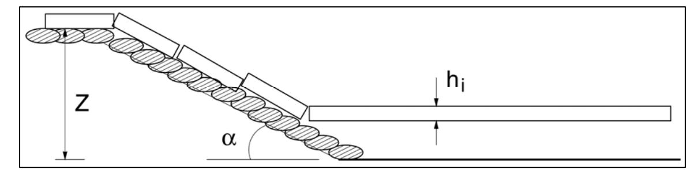

*Figure VI-5-144. Ice riding up on structure slope*

• For the two-dimensional case the horizontal force per unit width of structure was given by the expression

```math
\frac{F_h}{b} = C_1 \sigma_f \left( \frac{\rho_w g \, h_i^5}{E} \right)^{1/4} + C_2 Z \, \rho_i g \, h_i \tag{VI-5-314}
```

with

```math
C_1 = 0.68 \left[ \frac{\sin \alpha + \mu \cos \alpha}{\cos \alpha - \mu \sin \alpha} \right] \tag{VI-5-315}
```

and
F_h = total horizontal force

```math
C_2 = \left[ \frac{\left( \sin \alpha + \mu \cos \alpha \right)^2}{\cos \alpha - \mu \sin \alpha} + \frac{\sin \alpha + \mu \cos \alpha}{\tan \alpha} \right] \tag{VI-5-316}
```

b =horizontal width of structure contact zone
- h_i = ice sheet thickness
- \sigma_f = flexural strength of ice (0.5 = 1.5 MPa)
- \rho_w = water density
- \rho_i = \text{ice density } (915 = 920 \text{ kg/m}^3)
- E = modulus of elasticity of ice (1,000 = 6,000 MPa)
- Z = maximum vertical ice ride-up distance
- g = gravitational acceleration
- \alpha = structure slope angle relative to horizontal
- \mu = structure slope friction factor (0.1 = 0.5)
- The first term in Equation VI-5-314 is interpreted as the force necessary to break the ice in bending, and the second term is the force that pushes the ice blocks up the sloping structure. The modulus of elasticity varies from 1,000 MPa for very salty water up to about 6,000 MPa for fresh water (Machemehl 1990). Ashton (1986) warned that this simple two-dimensional theory will be inadequate for narrow structures because the zone of ice failure will be wider than the structure.
- Low values of friction factor ( \mu = 0.1 ) are associated with smooth slopes such as concrete or carefully layed block protection, whereas high values ( \mu = 0.5 ) are applicable for randomly-placed stone armor, riprap, or filled geotextile bags. For slopes steeper than 1:1, the horizontal ice force increases rapidly for the higher friction factors, and there is a risk of the dominant failure mode being crushing or buckling rather than bending. Milder slopes with smooth surfaces are much more effective in reducing horizontal ice forces. Croasdale, Allyn, and Roggensack (1988) discussed several additional aspects related to ice ride-up on sloping structures.
- Quick "rough" estimates of horizontal forces on sloping structures can be made using a variation of Equation VI-5-313 as proposed in Ashton (1986), i.e.,

```math
\frac{F_h}{b} = K_h h_i \sigma_c \tag{VI-5-317}
```

where K_h is approximated from a curve given in Ashton (1986) by the formula

```math
K_h = 1 - 0.654 f^{0.38} \tag{VI-5-318}
```

with

```math
f = \frac{1 - \mu \tan \alpha}{\mu + \tan \alpha} \tag{VI-5-319}
```

and \sigma_c is the ice compressive strength as given in Table VI-5-90. As slope angle increases, K_h approaches a value of unity which represents failure by crushing. For decreasing slope angles, K_h decreases because of the increasing tendency of the ice to fail in bending. Values of K_h less than 0.2 should never to used in Equation VI-5-317.
(b) Adfreeze loads. When ice that is in contact with a coastal structure is stationary for a sufficient time, the ice will freeze to the structure or its elements. Adfreeze loads result if the ice then moves either horizontally by dynamic ice thrust or vertically due to changing water level. This is more of a problem in lakes with slowly varying water levels than in tidal waters.
EM 1110-2-1100 (Part VI) Change 3 (28 Sep 11)
- Little guidance is available on adfreeze stresses with adhesion strength varying between 140 kPa to 1050 kPa for freshwater ice (PIANC 1992). Adfreeze may dislodge individual armor stones on rubble-mound slopes creating a weakness in the armor layer. This can be prevented by using oversized stones or interlocking armor on the slope. A survey of riprap structures at Canadian hydropower reserviors concluded that plucking of individual stones frozen to ice could be largely prevented by sizing the riprap median diameter $(d_{50})$ greater than the expected maximum winter ice thickness (Wuebben 1995).
- (3) Vertical ice forces. Ice frozen to coastal structures can create vertical forces due to ice buoyancy effects when water level rises, or by ice weight when water level falls. These vertical forces will persist until the ice sheet fractures due to bending or the adfreeze force is exceeded.
- (a) Cylindrical piles.
- In cases where the ice sheet freezes around a pile, forces will be exerted on the pile if the water level rises or falls. A rising water level will lift the ice sheet, and under certain conditions the uplift force on the pile may be sufficient to pull the pile free. Similarly, during falling water levels the weight of the ice sheet will exert a downward force on a pile which may be sufficient to buckle a slender pile.
- Kerr (1975) studied vertical loads on cylindrical piles and presented equations for calculating loads under the conservative assumption that the water level change is rapid enough to assure elastic ice behavior before failure. A closed-form solution to the governing equation was obtained in terms of Bessel functions, and Kerr presented a numerically evaluated solution in graphical form as shown on Figure VI-5-145. The graphical solution is dimensional, and it has the functional form of

```math
P = f (a, h, E_{av}, \Delta, \nu) \tag{VI-5-320}
```

where
- P = uplift force in metric tons (tonnes)
- a = pile radius (cm)
- h = ice plate thickness (cm)
- Eav = averaged Young's modulus for ice $(kg/cm^{2})$
Δ = water level rise (cm) up to the thickness of the ice
v = Poisson's ratio

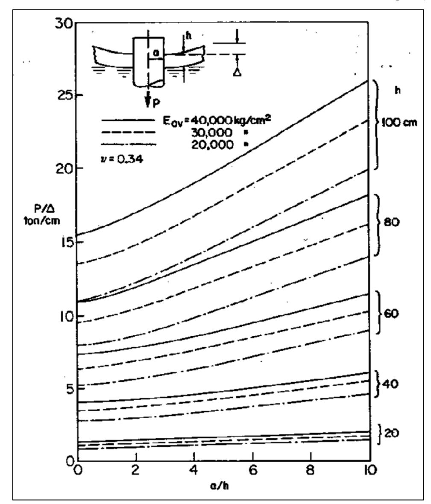

*Figure VI-5-145. Vertical ice forces on a cylindrical pile (Kerr 1975)*

Kerr's solution gives estimates of the maximum vertical load assuming the ice sheet does not fail in shear or bending before the maximum load on the pile is reached. For example, the maximum uplift force on a pile with radius a = 100 cm surrounded by a 40-cm-thick ice sheet having an average Young's modulus of 30,000 $kg/cm^{2}$ would be estimated from Figure VI-5-145 using a value of a/h = 2.5 giving $P_{max}$ = 3.7 Δ . The total maximum force for a 5-cm water level rise would be

```math
P_{\text{max}} = 3.7 \Delta = 3.7 (5 \text{ cm}) = 18.5 \text{ tonnes}
```

Kerr (1975) pointed out that the same analysis applied for falling water levels with only a sign change, thus Figure VI-5-145 can also be used decreasing water levels.
EM 1110-2-1100 (Part VI) Change 3 (28 Sep 11)
(b) Vertical walls.
• Uplift or downward forces per unit horizontal length caused by vertical movement of ice sheets frozen to vertical walls can be approximated using the following formula (PIANC 1992)

```math
\frac{F_v}{b} = \rho_w g \Delta h L_c \tag{VI-5-321}
```

where the characteristic length L_c is given as

```math
L_{c} = \left[ \frac{Eh_{i}^{3}}{12\rho_{w}g(1-\nu^{2})} \right]^{1/4} \tag{VI-5-322}
```

and
F_v = total vertical force acting on the wall
b =horizontal length of wall
\Delta h = \text{change in water level}
- \rho_w = density of water
- g = gravitational acceleration
- E = modulus of elasticity of ice
- h_i = ice thickness
- v = Poisson's ratio (0.31-0.35)
- As previously mentioned, the modulus of elasticity for ice varies with brine volume from about 1,000 MPa for very salty water to about 6,000 MPa for freshwater ice. For freshwater ice, L_c is typically between 15 to 20 times the ice thickness with a reasonable rule-of-thumb being L_c = 17 h_i .
- (c) Sloping structures. The additional vertical load caused by the ride-up and piling of ice on sloping structures needs to be evaluated for the local conditions and specific type of structure. Ice piled up on the slope could initiate slumping of the armor layer on steeper slopes. During rising waters, individual armor stones or revetment units might be lifted out by adfreeze forces. (4) Aspects of slope protection design.
- (a) Much of our understanding of successful slope protection design in cold coastal regions stems from practical experience as documented in the technical literature. In general the
design philosophy recognizes that little can be done to prevent ice contact with slope protection structures. Therefore, emphasis is placed on minimizing potential ice damage using a variety of techniques.
- (b) Leidersdorf, Gadd, and McDougal (1990) reviewed the performance aspects of three types of slope protection used for coastal projects related to petroleum activities in the Beaufort Sea. For water depths less than 2 m, sacrificial beaches appeared to function well. In water depths ranging from 7 m to 15 m, gravel-filled geotextile bags were able to withstand the larger wave forces, but they were susceptible to ice damage and required regular maintenance. Linked concrete mat armor (Leidersdorf, Gadd, and McDougal 1988; Gadd and Leidersdorf 1990) withstood both wave and ice loads in depths up to about 14 m. Mats were recommended for projects with a lengthy service life so that high initial capital costs would be offset by lower maintenance expenses. Wuebben (1995) reviewed the effects of ice on riprap structures constructed along ice-prone waterways. This paper provided a good summary of successful riprap revetment design and construction practices based on actual field experience. Numerous useful references documenting ice effects on riprap are included in Wuebben's paper. The following rules-of-thumb for arctic slope protection were given in Chen and Leidersdorf (1988) and summarized in PIANC (1992).
- Cover layers and underlayers should be strong enough to withstand local penetration by thick ice sheets.
- Smooth slopes without protrusions will reduce loads and allow the ice to ride up more easily without plucking out individual armor elements. (However, wave runup will be greater.)
- Flexible cover layers consisting of graded riprap may help absorb impacts by smaller ice blocks during wave action without appreciable damage. Sand bags are effective for structures with intended short service lives.
- Mild structure slopes are essential because they reduce the risk of ice penetration into the slope. Maximum slope 15 deg is recommended in the zone of ice attack.
- Compound slopes with a nearly horizontal berm above the swl provide a platform for piled-up ice in regions which experience frequent ride-up of ice sheets.
- Maximum ice loads will not occur at the same time as maximum expected wave loads. Therefore, slope design can consider each load condition separately.
EM 1110-2-1100 (Part VI)
Change 3 (28 Sep 11)
VI-5-9. References.
EM 1110-2-1601
Hydraulic Design of Flood Control Channels
EM 1110-2-1612
Ice Engineering
ACI 1989
American Concrete Institute. 1989 (revised annually). Manual of Concrete Practice , Part 3, Detroit, MI.
Ahrens 1981a
Ahrens, J. P. 1981a. "Irregular Wave Runup on Smooth Slopes," Technical Aid No. 81-17, U.S. Army Engineer Waterways Experiment Station, Coastal Engineering Research Center, Vicksburg, MS.
Ahrens 1981b
Ahrens, J. P. 1981b. "Design of Riprap Revetments for Protection Against Wave Attack," Technical Paper TP-81-5, U.S. Army Engineer Waterways Experiment Station, Coastal Engineering Research Center, Vicksburg, MS.
Ahrens 1984
Ahrens, J. P. 1984. "Reef Type Breakwaters," Proceedings of the 19th International Coastal Engineering Conference , American Society of Civil Engineers, Vol 3, pp 2648-2662.
Ahrens 1987
Ahrens, J. P. 1987. "Characteristics of Reef Breakwaters," Technical Report CERC-87-17, U.S. Army Engineer Waterways Experiment Station, Vicksburg, MS.
Ahrens and Heinbaugh 1988a
Ahrens, J. P., and Heinbaugh, M. S. 1988a. "Approximate Upper Limit of Irregular Wave Runup on Riprap," Technical Report CERC-88-5, U.S. Army Engineer Waterways Experiment Station, Coastal Engineering Research Center, Vicksburg, MS.
Ahrens and Heinbaugh 1988b
Ahrens, J. P., and Heinbaugh, M. S. 1988b. "Seawall Overtopping Model," Proceedings of the 21st International Coastal Engineering Conference , American Society of Civil Engineers, Vol 1, pp 795-806.
Ahrens, Viggosson, and Zirkle 1982
Ahrens, J. P., Viggosson, G., and Zirkle, K. P. 1982. "Stability and Wave Transmission Characteristics of Reef Breakwaters," Interim Report, U.S. Army Engineer Waterways Experiment Station, Coastal Engineering Research Center, Vicksburg, MS.

#### Allsop 1983

Allsop, N. W. 1983. "Low-Crest Breakwaters, Studies in Random Waves," Proceedings of Coastal Structures '83 , American Society of Civil Engineers, pp 94-107.

#### Allsop 1990

Allsop, N. W. 1990. "Reflection Performance of Rock Armoured Slopes in Random Waves," Proceedings of the 22nd International Coastal Engineering Conference , American Society of Civil Engineers, Vol 2, pp 1460-1472.

#### Allsop 1995

Allsop, N. W. 1995. "Stability of Rock Armour and Riprap on Coastal Structures," River, Coastal and Shoreline Protection: Erosion Control Using Riprap and Armourstone, C. R. Thorne, S. R. Abt, F. B. Barends, S. T. Maynord, and R. W. Pilarczyk, eds., John Wiley and Sons, New York, pp 213-226.

#### Allsop and Hettiarachchi 1988

Allsop, N. W., and Hettiarachchi, S. S. 1988. "Reflections from Coastal Structures," Proceedings of the 21st International Coastal Engineering Conference , American Society of Civil Engineers, Vol 1, pp 782-794.

#### Allsop et al. 1985

Allsop, N. W., Hawkes, P. I., Jackson, F. A., and Franco, L. 1985. "Wave Run-Up on Steep Slopes - Model Tests Under Random Waves," Report No. SR2, Hydraulics Research Station, Wallingford, England.

#### Allsop, McBride, and Colombo 1994

Allsop, N. W., McBride, M. W., and Colombo, D. 1994. "The Reflection Performance of Vertical Walls and Low Reflection Alternatives: Results of Wave Flume Tests," Proceedings of the 3rd MCS Project Workshop, MAS2-CT92-0047, Monolithic (Vertical) Coastal Structures, De Voorst, The Netherlands.

#### Aminti and Franco 1988

Aminti, P., and Franco, L. 1988. "Wave Overtopping on Rubble Mound Breakwaters," Proceedings of the 21st International Coastal Engineering Conference , American Society of Civil Engineers, Vol 1, pp 770-781.

#### Andersen 1981

Andersen, K. H. 1981. Discussion of "Cyclic Simple Shear Behaviour of Fine Grained Soil," Dyvik, Zimme, and Schimelfenjg, International Conference on Recent Advances in Geotechnical Earthquake Engineering and Soil Dynamics , St. Louis, MO, pp. 920-921.

#### Andersen 1983

Andersen, K. H. 1983. "Strength and Deformation Properties of Clay Subjected to Cyclic Loading," Report 52412-8, Norwegian Geotechnical Institute.
EM 1110-2-1100 (Part VI)
Change 3 (28 Sep 11)
Andersen 1988
Andersen, K. H. 1988. "Properties of Soil Clay Under Static and Cyclic Loading," Proceedings of the International Conference on Engineering Problems of Regional Soils , Beijing, China, pp 7-26.
Andersen 1991
Andersen, K. H. 1991. "Foundation Design of Offshore Gravity Structures," Cyclic Loading of Soils , M. P. O'Reilly and S. F. Brown, eds., Blackie and Son Ltd., Glasgow, Scotland.

#### Andersen and Høeg 1991

Andersen, K. H., and Høeg, K. 1991. "Deformation of Soils and Displacements of Structures Subjected to Combined Static and Cyclic Loads," Proceedings 10th European Conference on Soil Mechanics and Foundation Engineering , Florence, Italy, Vol 4, pp 1147-1158.
Andersen and Richards 1985
Andersen, M. G., and Richards, K. S. 1985. Slope Stability , John Wiley & Sons, New York, NY.
Anderson et al. 1976
Anderson, K. H., Brown, S. F., Foss, I., Pool, J. H., and Rosenbrand, F. W. 1976. "Effect of Cyclic Loading on Clay Behavior," Proceedings of the Conference on Design and Construction of Offshore Structures , Institution of Civil Engineers, London, UK, pp 75-79.
Andersen, Kleven, and Heien 1988
Andersen, K. H., Kleven, A., and Heien, D. 1988. "Cyclic Soil Data for Design of Gravity Structures," Journal of Geotechnical Engineering , American Society of Civil Engineers, Vol 114, No. 5, pp 517-539.

#### Andrews and Borgman 1981

Andrews, M. E., and Borgman, L. E. 1981. "Procedures for Studying Wave Grouping in Wave Records from the California Coastal Data Collection Program," Statistics Laboratory Report No. 141, University of Wyoming, Laramie, WY.
Anglin et al. 1990
Anglin, C. D., Scott, R. D., Turcke, D. J., and Turke, M. A. (1990). "The Development of Structural Design Criteria for Breakwater Armor Units," Stresses in Concrete Armor Units , American Society of Civil Engineers, pp 123-148.
Anglin et al. 1996
Anglin, C. D., Nairn, R. B., Cornett, A. M., Dunaszegi, L, Turnham, J, and Annandale, G. W. 1996. "Bridge Pier Scour Assessment for the Northumberland Strait Crossing," Proceedings of the 25th International Coastal Engineering Conference , American Society of Civil Engineers, Vol 2, pp 2230-2243.
Ashton 1986
Ashton, G. D. 1986. River and Lake Ice Engineering . Water Resources Publications, Littleton, CO.

#### Bagnold 1939

Bagnold, R. A. 1939. "Interim Report on Wave-Pressure Research," Journal of Institution of Civil Engineers , Vol 12, pp 202-226.

#### Bakker et al. 1994

Bakker, K. J., Verheij, H. J., and de Groot, M. B. 1994. "Design Relationship for Filters in Bed Protection," Journal of Hydraulic Engineering , American Society of Civil Engineers, Vol 120, No. 9, pp 1082-1088.

#### Barends 1988

Barends, F. B. 1988. Discussion of "Pore Pressure Response and Stability of Rubble-Mound Breakwaters," Simm and Hedges, Proceedings of the Breakwaters '88 Conference: Design of Breakwaters, Institution of Civil Engineers, Thomas Telford, London, UK, pp 85-88.

#### Barends et al. 1983

Barends, F. B., van der Kogel, H., Uijttewall, F. J., and Hagenaar, J. 1983. "West Breakwater - Sines: Dynamic-Geotechnical Stability of Breakwaters," Proceedings of Coastal Structures '83 , American Society of Civil Engineers, pp 31-43.

#### Barnett and Wang 1988

Barnett, M. R., and Wang, H. 1988. "Effects of a Vertical Seawall on Profile Response," Proceedings of the 21st International Coastal Engineering Conference , American Society of Civil Engineers, Vol 2, pp 1493-1507.

#### Bass and Fulford 1992

Bass, G. P, and Fulford, E. T. 1992. "South Jetty Scour Hole Stabilization, Ocean City, Maryland," Proceedings of Coastal Engineering Practice '92 , American Society of Civil Engineers, pp 583-597.

#### Battjes 1974

Battjes, J. A. 1974. "Computation of Set-Up, Longshore Currents, Run-Up, and Overtopping Due to Wind-Generated Waves," Report 74-2, Committee on Hydraulics, Department of Civil Engineering, Delft University of Technology, The Netherlands.

#### Battjes 1974b

Battjes, J. A. 1974b. "Surf Similarity," Proceedings of the 14th International Coastal Engineering Conference , American Society of Civil Engineers, Vol 1, pp 466-479.

#### Battjes 1982

Battjes, J. A. 1982. AEffects of Short-Crestedness on Wave Loads on Long Structures," Applied Ocean Research , Vol 4, No. 3, pp 165-172.

#### Bea et al. 1999

Bea, R. G., Xu, T., Stear, J., and Ramos, R. 1999. "Wave Forces on Decks of Offshore Platforms," Journal of Waterway, Port, Coastal, and Ocean Division , American Society of Civil Engineers, Vol 125, No. 3, pp 136-144.
EM 1110-2-1100 (Part VI)
Change 3 (28 Sep 11)
Belfadhel, Lefebvre, and Rohan 1996
Belfadhel, M. B., Lefebvre, G., and Rohan, K. 1996. "Comparison and Evaluation of Different Riprap Stability Formulas Using Field Performance," Journal of Waterway, Port, Coastal and Ocean Engineering , American Society of Civil Engineers, Vol. 122, No. 1, pp 8-15.

#### Benoit and Teisson 1994

Benoit, M. and Teisson, C. 1994. "Laboratory Study of Breakwater Reflection - Effect of Wave Obliquity, Wave Steepness and Mound Slope," International Symposium: Waves - Physical and Numerical Modelling, Vol 2, pp 1021-1030.

#### Bijker and de Bruyn 1988

Bijker, E. W., and de Bruyn, C. A. 1988. "Erosion Around a Pile Due to Current and Breaking Waves," Proceedings of the 21st International Coastal Engineering Conference , American Society of Civil Engineers, Vol 2, pp 1368-1381.

#### Bishop 1955

Bishop, A. W. 1955. "The Use of the Slip Circle in the Stability Analysis of Slopes," Geotechnique , Vol V, No. 1, pp 1-17.

#### Bishop and Green 1965

Bishop, A. W., and Green, G.E. 1965. "The Influence of End Restraint on the Compression Strength of a Cohesionless Soil," Geotechnique , Vol 15, No. 3, pp. 243-266.

#### Bjerrum 1973

Bjerrum, L. 1973. "Problems of Soil Mechanics and Construction on Soft Clays," State-of-the-Art Report to Session IV, Proceedings of the International Conference on Soil Mechanics and Foundation Engineering 3 , pp 111-159.

#### Bolton 1979

Bolton, M. D. 1979. A Guide to Soil Mechanics. Macmillan Press Ltd., London, UK.

#### Bolton 1986

Bolton, M. D. 1986. "The Strength and Dilatancy of Sands," Geotechnique, Vol 36, No. 1, pp 65-78.

#### Bottin, Chatham, and Carver 1976

Bottin, R., Chatham, C., and Carver, R. 1976. "Waianae Small-Boat Harbor, Oahu, Hawaii, Design for Wave Protection," TR H-76-8, U.S. Army Engineer Waterways Experiment Station, Vicksburg, MS.

#### Bradbury and Allsop 1988

Bradbury, A. P., and Allsop, N. W. 1988. "Hydraulic Effects of Breakwater Crown Walls," Proceedings of the Breakwaters '88 Conference, Institution of Civil Engineers, Thomas Telford Publishing, London, UK, pp 385-396.

#### Bradbury et al. 1988

Bradbury, A. P., Allsop, N. W., and Stephens, R. V. 1988. "Hydraulic Performance of Breakwater Crown Walls," Report No. SR146, Hydraulics Research, Wallingford, UK.

#### Breusers, Nicollet, and Shen 1977

Breusers, H. N. C., Nicollet, G., and Shen, H. W. 1977. "Local Scour Around Cylindrical Piers," Journal of Hydraulic Research , Vol 15, No. 3, pp 211-252.

#### Brinch Hansen 1961

Brinch Hansen, J. 1961. "A General Formula for Bearing Capacity," Bulletin No. 11, Danish Geotechnical Institute, Copenhagen, Denmark.

#### Brinch Hansen 1967

Brinch Hansen, J. 1967. "Støttemures Bæreevne (The Bearing Capacity of Retaining Walls)," B-undervisning og Forskning 67, Danmarks Ingeniørakademi, Copenhagen, Denmark, pp 307-320.

#### Brinch Hansen 1970

Brinch Hansen, J. 1970. "A Revised and Extended Formula for Bearing Capacity," Bulletin No. 28, Danish Geotechnical Institute, Copenhagen, Denmark.

#### Broderick 1983

Broderick, L. L. 1983. "Riprap Stability A Progress Report," Proceedings of Coastal Structures '83 , American Society of Civil Engineers, pp 320-330.

#### Brorsen, Burcharth, and Larsen 1974

Brorsen, M., Burcharth, H. F., and Larsen, T. 1974. "Stability of Dolos Slopes," Proceedings of the 14th International Coastal Engineering Conference , American Society of Civil Engineers, Vol 3, pp 1691-1701.

#### Bruining 1994

Bruining, J. W. 1994. "Wave Forces on Vertical Breakwaters. Reliability of Design Formula," Delft Hydraulics Report H 1903, MAST II contract MAS2-CT92-0047.

#### Burcharth 1984

Burcharth, H. F. 1984. "Fatigue in Breakwater Concrete Armour Units," Proceedings of the 19th International Coastal Engineering Conference , American Society of Civil Engineers, Vol 3, pp 2592-2607.

#### Burcharth 1993

Burcharth, H. F. 1993. "The Design of Breakwaters," Department of Civil Engineering, Aalborg University, Denmark.

#### Burcharth 1993b

Burcharth, H. F. 1993b. "Structural Integrity and Hydraulic Stability of Dolos Armor Layers," Series Paper 9, Department of Civil Engineering, Aalborg University, Denmark.
EM 1110-2-1100 (Part VI)
Change 3 (28 Sep 11)
Burcharth 1998
Burcharth, H. F. 1998. "Breakwater with Vertical and Inclined Concrete Walls: Identification and Evaluation of Design Tools," Report of Sub-group A, Working Group 28, PIANC PTCII.

#### Burcharth and Andersen 1995

Burcharth, H.F., and Andersen, O.H. 1995. "On the One-Dimensional Unsteady Porous Flow Equation," Coastal Engineering, Vol 24, pp. 233-257.

#### Burcharth and Brejnegaard-Nielsen 1986

Burcharth, H. F., and Brejnegaard-Nielsen, T. 1986. "The Influence of Waist Thickness of Dolosse on the Hydraulic Stability of Dolosse Armour," Proceedings of the 20th International Coastal Engineering Conference , American Society of Civil Engineers, Vol 2, pp 1783-1796.

#### Burcharth and Liu 1992

Burcharth, H. F., and Liu, Z. 1992. "Design of Dolos Armour Units," Proceedings of the 23rd International Coastal Engineering Conference , American Society of Civil Engineers, Vol 1, pp 1053-1066.

#### Burcharth and Liu 1995

Burcharth, H. F., and Liu, Z. 1995. "Design Formula for Dolos Breakage," Proceedings of the Final Workshop, Rubble Mound Breakwater Failure Modes, Sorrento, Italy.

#### Burcharth and Liu 1998

Burcharth, H. F., and Liu, Z. 1998. "Force Reduction of Short-Crested Non-Breaking Waves on Caissons," Section 4.3, Part 4, Class II Report of MAST II Project: PROVERBS, Technical University of Braunschweig, Germany, ed.

#### Burcharth and Thompson 1983

Burcharth, H. F., and Thompson, A. C. 1983. "Stability of Armour Units in Oscillatory Flow," Proceedings of Coastal Structures '83 , American Society of Civil Engineers, pp 71-82.

#### Burcharth et al. 1991

Burcharth, H. F., Toschi, P. B., Turrio, E., Balestra, T, Noli, A., Franco, L., Betti, A., Mezzedimi, S. 1991. "Bosaso Harbour, Somalia. A New Hot-Climate Port Development," Third International Conference on Coastal & Port Engineering in Developing Countries , Vol 1, pp 649-666.

#### Burcharth et al. 1995a

Burcharth H. F., Frigaard, P., Uzcanga, J., Berenguer, J. M., Madrigal, B. G., and Villanueva, J. 1995a. "Design of the Ciervana Breakwater, Bilbao," Proceedings of the Advances in Coastal Structures and Breakwaters Conference , Institution of Civil Engineers, Thomas Telford, London, UK, pp 26-43.

#### Burcharth et al. 1995b

Burcharth, H. F., Jensen, M. S., Liu, Z., van der Meer, J. W., and D'Angremond, K. 1995b. "Design Formula for Tetrapod Breakage," Proceedings of the Final Workshop, Rubble Mound Breakwater Failure Modes , Sorrento, Italy.

#### Burcharth et al. 1998

Burcharth, H. F., Christensen, M., Jensen, T. and Frigaard, P. 1998. "Influence of Core Permeability on Accropode Armour Layer Stability," Proceedings of International Conference on Coastlines, Structures, and Breakwaters '98 , Institution of Civil Engineers, London, UK, pp 34-45.

#### Burcharth, Liu, and Troch 1999

Burcharth, H.F., Liu, Z., and Troch, P. 1999. "Scaling of Core Material in Rubble Mound Breakwater Model Tests," Proceedings of Fifth International Conference on Coastal and Port Engineering in Developing Countries , Cape Town, South Africa, pp 1518-1528.

#### Burcharth et al. 2000

Burcharth, H. F., d'Angremond, K, van der Meer, J. W., and Liu, Z. 2000. "Empirical Formula for Breakage of Dolosse and Tetrapods," Coastal Engineering , Elsevier, Vol 40, No. 3, pp 183- 206.

#### Calabrese and Allsop 1997

Calabrese, M., and Allsop, N. W. 1997. "Impact Loading on Vertical Walls in Directional Seas," Contribution to the $1^{st}$ Task, MAST III Workshop (PROVERBS), Edinburgh.

#### Camfield 1990

Camfield, F. E. 1990. "Tsunami," Handbook of Coastal and Ocean Engineering - Volume 1: Wave Phenomena and Coastal Structures . John B. Herbich, ed., Gulf Publishing Company, Houston, TX, pp 591-634.

#### Camfield 1991

Camfield, F. E. 1991. "Wave Forces on Wall," Journal of Waterway, Port, Coastal, and Ocean Engineering , American Society of Civil Engineers, Vol 117, No. 1, pp 76-79.

#### Canadian Standards Association 1978

Canadian Standards Association. 1978. "Design of Highway Bridges," Standard CAN3-56-M78.

#### Carpenter and Powell 1998

Carpenter, K. E., and Powell, K. A. 1998. "Toe Scour at Vertical Walls: Mechanisms and Prediction Methods," Report No. SR506, HR Wallingford, UK.

#### Carstens 1976

Carstens, T. 1976. "Seabed Scour by Currents Near Platforms," Proceedings of the 3rd International Conference on Port and Ocean Engineering Under Arctic Conditions, pp 991-1006.

#### Carver 1980

Carver, R. D. 1980. "Effects of First Underlayer Weight on the Stability of Stone-Armored, Rubble-Mound Breakwater Trunks Subjected to Nonbreaking Waves with No Overtopping," Technical Report HL-80-1, U.S. Army Engineer Waterways Experiment Station, Vicksburg, MS.
EM 1110-2-1100 (Part VI)
Change 3 (28 Sep 11)
Carver and Davidson 1977
Carver, R. D., and Davidson, D. D. 1977. "Dolos Armor Units Used on Rubble-Mound Breakwater Trunks Subjected to Nonbreaking Waves with No Overtopping," Technical Report H-77-19, U.S. Army Engineer Waterways Experiment Station, Vicksburg, MS.

#### Carver and Davidson 1983

Carver, R. D., and Davidson, D. D. 1983. "Jetty Stability Study, Oregon Inlet, North Carolina," Technical Report CERC-83-3, U.S. Army Engineer Waterways Experiment Station, Vicksburg, MS.

#### Carver and Heimbaugh 1989

Carver, R. D., and Heimbaugh, M. S. 1989. "Stability of Stone- and Dolos-Armored Rubble-Mound Breakwater Heads Subjected to Breaking and Nonbreaking Waves with No Overtopping," Technical Report CERC-89-4, U.S. Army Engineer Waterways Experiment Station, Coastal and Hydraulics Laboratory, Vicksburg, MS.

#### Carver and Markle, 1981

Carver, R. D., and Markle, D. G. 1981. "Stability of Rubble-Mound Breakwater; Maalea Harbor, Maui, Hawaii," Miscellaneous Paper HL-81-1, U.S. Army Engineer Waterways Experiment Station, Vicksburg, MS.

#### Chakrabarti 1991

Chakrabarti, S. K. 1991. "Wave Forces on Offshore Structures," Handbook of Coastal and Ocean Engineering - Volume 2: Offshore Structures, Marine Foundations, Sediment Processes, and Modeling . John B. Herbich, ed., Gulf Publishing Company, Houston, TX. pp 1-54.

#### Chang 1964

Chang, K. S. 1964. "Transverse Forces on Cylinders Due to Vortex Shedding in Waves," M.A. thesis, Department of Civil Engineering, Massachusetts Institute of Technology, Cambridge, MA.

#### Chen 1961

Chen, T. C. 1961. "Experimental Study on the Solitary Wave Reflection Along a Straight Sloped Wall at Oblique Angle of Incidence," Technical Memorandum No. 124, U.S. Army Corps of Engineers, Beach Erosion Board, Washington, DC.

#### Chen and Leidersdorf 1988

Chen, A. T., and Leidersdorf, C. B., ed. 1988. "Arctic Coastal Processes and Slope Protection Design," Technical Council on Cold Regions Engineering Monograph, American Society of Civil Engineers, New York, NY.

#### Chesnutt and Schiller 1971

Chesnutt, C. B., and Schiller, R. E. 1971. "Scour of Simulated Gulf Coast Sand Beaches Due to Wave Action in Front of Sea Walls and Dune Barriers," COE Report No. 139, TAMU-SG-71-207 , Texas A&M University, College Station, TX.

#### Chiew 1990

Chiew, Y-M. 1990. "Mechanics of Local Scour Around Submarine Pipelines," Journal of Hydraulic Engineering , American Society of Civil Engineers, Vol 116, No. 4, pp 515-539.

#### Cété-Laboratoire Régional Nord - Pas de Calais 1990

Cété-Laboratoire Régional Nord - Pas de Calais. 1990. "Le Havre - Route du Mole Central - Essais de Frottement Beton Ondulé-Grave Concassée," Laboratoire Régional Nord - Pas de Calais.

#### Costa 1973

Costa, F. V. 1973. "Berthing Maneuvers of Large Ships," Port Engineering . Gulf Publishing Company, Houston, TX, pp 401-417.

#### Croasdale, Allyn, and Roggensack 1988

Croasdale, K. R., Allyn, N., and Roggensack, W. 1988. "Arctic Slope Protection: Considerations for Ice," Arctic Coastal Processes and Slope Protection Design . A. T. Chen and C. B. Leidersdorf, ed., American Society of Civil Engineers, pp 216-243.

#### Cross 1967

Cross, R. H. 1967. "Tsunami Surge Forces," Journal of the Waterways and Harbors Division , American Society of Civil Engineers, Vol 93, No. ww4, pp 201-231.

#### Centre for Civil Engineering Research and Codes 1995

Centre for Civil Engineering Research and Codes. 1995. "Manual on the Use of Rock in Hydraulic Engineering," CUR/RWS Publication 169, CUR, Gouda, The Netherlands.

#### Czerniak and Collins 1977

Czerniak, M. T., and Collins, J. I. 1977. "Design Considerations for a Tetrapod Breakwater," Proceedings of Ports '77 , American Society of Civil Engineers, New York, pp 178-195.

#### d'Angremond, van der Meer, van Nes 1994

d'Angremond, K., van der Meer, J. W., and van Nes, C. P. 1994. "Stresses in Tetrapod Armour Units Induced by Wave Action," Proceedings of the 24th International Coastal Engineering Conference , American Society of Civil Engineers, Vol 2, pp 1713-1726.

#### Daemrich and Kahle 1985

Daemrich, K. F., and Kahle, W. 1985. "Shutzwirkung von Unterwasserwellen Brechern Unter Dem Einfluss Unregelmassiger Seeganswellen," Eigenverlag des Franzius-Instituts fur Wasserbau und Kusteningenieurswesen, Heft 61 (in German).

#### Daemen 1991

Daemen, I. F. 1991. "Wave Transmission at Low-Crested Breakwaters," M.S. thesis, Delft University of Technology, The Netherlands.
EM 1110-2-1100 (Part VI)
Change 3 (28 Sep 11)
Davidson et al. 1994
Davidson, M. A., Bird, P. A., Bullock, G. N., and Huntley, D. A. 1994. "Wave Reflection: Field Measurements, Analysis and Theoretical Developments," Proceedings of Coastal Dynamics '94 , American Society of Civil Engineers, pp 642-655.

#### Dean 1974

Dean, R. G. 1974. "Evaluation and Development of Water Wave Theories for Engineering Application," Special Report 1, Vols I and II, U.S. Army Coastal Engineering Research Center, Stock Nos. 008-022-00083-6 and 008-022-00084-6, U.S. Government Printing Office, Washington, DC.
de Best, Bijker, and Wichers 1971
de Best, A., Bijker, E. W., and Wichers, J. E. W. 1971. "Scouring of a Sand Bed in Front of a Vertical Breakwater," Proceedings of the 1st International Conference on Port and Ocean Engineering Under Artic Conditions , Vol II, pp 1077-1086.
de Gerloni et al. 1991
de Gerloni, M, Cris, E., Franco, L., and Passoni, G. 1991. "The Safety of Breakwaters Against Wave Overtopping," Proceedings of the Coastal Structures and Breakwaters Conference , Institution of Civil Engineers, Thomas Telford, London, UK, pp 335-342.
de Graauw, van der Meulen, and van der Does de Bye 1984
de Graauw, A. F., van der Meulen, T., and van der Does de Bye, M. R. 1984. "Granular Filters: Design Criteria," Journal of Waterway, Port, Coastal, and Ocean Engineering , American Society of Civil Engineers, Vol 110, No. 1, pp 80-96.
de Groot et al. 1996
de Groot, M. M., Andersen, K. H., Burcharth, H. F., Ibsen, L. B., Kortenhaus, A., Lundgren, H., Magda, W., Oumeraci, H., and Richwien, W. 1996. "Foundation Design of Caisson Breakwaters," Publication No. 198, Norwegian Geotechnical Institute, Oslo, Norway.
de Rouck 1991
de Rouck, J. 1991. "De Stabilitet Van Stortsteengolfbrekers. Algemeen Glijdingsevenwicht - Een Nieuw Deklaagelement," Hydraulic Laboratory, University of Leuven, Belgium.
de Waal and van der Meer 1992
de Waal, J. P., and van der Meer, J. W. 1992. "Wave Run-Up and Overtopping on Coastal Structures," Proceedings of the 23rd International Coastal Engineering Conference , American Society of Civil Engineers, Vol 2, pp 1758-1771.
Delft Hydraulics 1989
Delft Hydraulics. 1989. "Slopes of Loose Materials: Wave Run-Up on Statistically Stable Rock Slopes Under Wave Attack," Report M 1983 (in Dutch), Delft Hydraulics Laboratory, The Netherlands.

#### Eadie and Herbich 1986

Eadie, R. W., and Herbich, J. B. 1986. "Scour About a Single Cylindrical Pile Due to Combined Random Waves and a Current," Proceedings of the 20th International Coastal Engineering Conference , American Society of Civil Engineers, Vol 3, pp 1858-1870.

#### Eckert 1983

Eckert, J. W. 1983. "Design of Toe Protection for Coastal Structures," Proceedings of Coastal Structures '83 , American Society of Civil Engineers, pp 331-341.

#### Edge et al. 1990

Edge, B. L., Crapps, D. K., Jones, J. S., and Dean, W. L. 1990. "Design and Installation of Scour Protection for the Acosta Bridge," Proceedings of the 22nd International Coastal Engineering Conference, American Society of Civil Engineers, Vol 3, pp 3268-3280.

#### Endoh and Takahashi 1994

Endoh, K., and Takahashi, S. 1994. "Numerically Modelling Personnel Danger on a Promenade Breakwater Due to Overtopping Waves," Proceedings of the 24th International Coastal Engineering Confernece , American Society of Civil Engineers, Vol 1, pp 1016-1029.

#### Fagerlund and Larsson 1979

Fagerlund, G., and Larsson, B. 1979. "Betongs Slaghallfasthed." (in Swedish), Swedish Cement and Concrete Research Institute, Institute of Technology, Stockholm, Sweden.

#### Fellenius 1936

Fellenius, W. 1936. "Calculation of the Stability of Earth Dams," Proceeding of the 2nd International Conference on Large Dams , Washington DC, Vol 4, pp 445-449.

#### Fowler 1992

Fowler, J. E. 1992. "Scour Problems and Methods for Prediction of Maximum Scour at Vertical Seawalls," Technical Report CERC-92-16, U.S. Army Engineer Waterways Experiment Station, Coastal Engineering Research Center, Vicksburg, MS.

#### Fowler 1993

Fowler, J. E. 1993. "Coastal Scour Problems and Methods for Prediction of Maximum Scour," Technical Report CERC-93-8, U.S. Army Engineer Waterways Experiment Station, Coastal Engineering Research Center, Vicksburg, MS.

#### Fox and McDonald 1985

Fox, R. W., and McDonald, A. T. 1985. Introduction to Fluid Mechanics . Third ed., John Wiley and Sons, New York, NY.

#### Franco and Franco 1999

Franco, C., and Franco, L. 1999. "Overtopping Formulas for Caisson Breakwaters with Nonbreaking 3D Waves," Journal of Waterway, Port, Coastal, and Ocean Engineering , American Society of Civil Engineers, Vol 125, No. 2, pp 98-108.
EM 1110-2-1100 (Part VI)
Change 3 (28 Sep 11)
Franco, de Gerloni, and van der Meer 1994
Franco, L., de Gerloni, M., and van der Meer, J. W. 1994. "Wave Overtopping on Vertical and Composite Breakwaters," Proceedings of the 24th International Coastal Engineering Conference , American Society of Civil Engineers, Vol 1, pp 1030-1045.
Franco, van der Meer, and Franco 1996
Franco, C., van der Meer, J. W., and Franco, L. 1996. "Multidirectional Wave Loads on Vertical Breakwaters," Proceedings of the 25th International Coastal Engineering Conference , Vol 2, pp 2008-2021.

#### Fredsøe and Sumer 1997

Fredsøe, J., and Sumer, B. M. 1997. "Scour at the Round Head of a Rubble-Mound Breakwater," Coastal Engineering , Elsevier, Vol 29, No. 3, pp 231-262.

#### French 1969

French, J. A. 1969. "Wave Uplift Pressure on Horizontal Platforms," Report No. KH-R-19, W. M. Keck Laboratory of Hydraulics and Water Resources, California Institute of Technology, Pasadena, CA.

#### Froehlich 1988

Froehlich, D. C. 1988. "Analysis of Onsite Measurements of Scour at Piers," Hydraulic Engineering- Proceedings of the 1988 National Conference , American Society of Civil Engineers, pp 534-539.

#### Führböter, Sparboom, and Witte 1989

Führböter, A., Sparboom, U., and Witte, H. H. 1989. "Großer Wellenkanal Hannover: Versuchsergebnisse über den Wellenauflauf auf Glatten und Rauhen Deichböschungen mit der Neigung 1:6," Die Küßte. Archive for Research and Technology on the North Sea and Baltic Coast.
Fukuda, Uno, and Irie 1974
Fukuda, N., Uno, T., and Irie, I. 1974. "Field Observations of Wave Overtopping of Wave Absorbing Revetment," Coastal Engineering in Japan , Vol 17, pp 117-128.

#### Gadd and Leidersdorf 1990

Gadd, P. E., and Leidersdorf, C. B. 1990. "Recent Performance of Linked Concrete Mat Armor Under Wave and Ice Impact," Proceedings of the 22nd International Conference on Coastal Engineering , American Society of Civil Engineers, Vol 3, pp 2768-2781.

#### Gerwick 1990

Gerwick, B. C., Jr. 1990. "Ice Forces on Structures," The Sea: Ocean Engineering Science . B. Le Mehaute and D. M. Hanes, eds., Vol 9, Part B, pp 1263-1301.

#### Givler and Sorensen 1986

Givler, L. D., and Sorensen, R. M. 1986. "An Investigation of the Stability of Submerged Homogeneous Rubble-Mound Structures Under Wave Attack," Report IHL 110-86, H.R. IMBT Hydraulics, Lehigh University, Philadelphia, PA.

#### Goda 1969

Goda, Y. 1969. "Reanalysis of Laboratory Data on Wave Transmission Over Breakwaters," Report of Port and Harbour Research Institute , Japan, Vol 8, No. 3, pp 3-18.

#### Goda 1970

Goda, Y. 1970. "Estimation of the Rate of Irregular Overtopping of Seawalls," Report of Port and Harbor Research Institute , Vol 9, No 4, 1970 (in Japanese).

#### Goda 1974

Goda, Y. 1974. "New Wave Pressure Formulae for Composite Breakwaters," Proceedings of the 14th International Coastal Engineering Conference , Vol 3, pp 1702-1720.

#### Goda 1985

Goda, Y. 1985. Random Seas and Design of Maritime Structures, University of Tokyo Press, Tokyo, Japan.

#### Goda and Suzuki 1976

Goda, Y., and Suzuki, Y. 1976. "Estimation of Incident and Reflected Waves in Random Wave Experiments," Proceedings of the 15th International Coastal Engineering Conference , American Society of Civil Engineers, Vol 1, pp 828-845.

#### Hales 1980

Hales, L. Z. 1980. "Erosion Control of Scour During Construction," Technical Report HL-80-3, U.S. Army Engineer Waterways Experiment Station, Coastal Engineering Research Center, Vicksburg, MS.

#### Hall 1967

Hall, J. R. 1967. "Coupled Rocking and Sliding Oscillations of Rigid Circular Footings," Proceedings of the International Symposion on Wave Propagation and Dynamic Properties of Earth Materials , American Society of Civil Engineers, pp 139-167.

#### Hansbo 1994

Hansbo, S. 1994. Foundation Engineering . Elsevier. The Netherlands.

#### Hansen 1979

Hansen, B. 1979. "Definition and Use of Friction Angles," Seventh European Conference on Soil Mechanics and Foundation Engineering , Brighton, Vol 1, pp 173-176.

#### Hanzawa et al. 1996

Hanzawa, M., Sato, H., Takahashi, S., Shimosako, K., Takayama, T., and Tanimoto, K. 1996. "New Stability Formula for Wave-Dissipating Concrete Blocks Covering Horizontally Composite Breakwaters," Proceedings of the 25th International Coastal Engineering Conference , American Society of Civil Engineers, Vol 2, pp 1665-1678.

#### Hardin 1978

Hardin, B. O. 1978. "The Nature of Stress-Strain Behaviour of Soils," Earthquake Engineering and Soil Dynamics , American Society of Civil Engineers, Vol I, pp 3-90.

#### EM 1110-2-1100 (Part VI)

Change 3 (28 Sep 11)

#### Hardin and Black 1968

Hardin, B. O., and Black, W. L. 1968. "Vibration Modulus of Normally Consolidated Clays," Journal of the Soil Mechanics and Foundations Division , American Society of Civil Engineers, Vol 94, No. SM2, pp 353-369.

#### Hardin and Drnevich 1972

Hardin, B. O., and Drnevich, V. P. 1972. "Shear Modulus and Damping in Soils: Design Equations and Curves," Journal of the Soil Mechanics and Foundations Division , American Society of Civil Engineers, Vol 98, No. SM7, pp 667-692.

#### Hayashi and Shirai 1963

Hayashi, T., and Shirai, M. 1963. "Force of Impact at the Moving Collision of a Ship with the Mooring Construction," Coastal Engineering in Japan , Japan Society of Civil Engineering, Vol 6, pp 9-19.

#### Helm-Petersen 1998

Helm-Petersen, J. 1998. "Estimation of Wave Disturbance in Harbours," Ph.D. diss., Department of Civil Engineering, Aalborg University, Denmark.

#### Herbich 1991

Herbich, J. B. 1991. "Scour Around Pipelines, Piles, and Seawalls," Handbook of Coastal and Ocean Engineering - Volume 2: Offshore Structures, Marine Foundations, Sediment Processes, and Modeling. John B. Herbich, ed., Gulf Publishing Company, Houston, TX, pp 867-958.

#### Herbich and Ko 1968

Herbich, J. B., and Ko, S. C. 1968. "Scour of Sand Beaches in Front of Seawalls," Proceedings of the 11th International Coastal Engineering Conference , American Society of Civil Engineers, Vol 1, pp 622-643.

#### Hjorth 1975

Hjorth, P. 1997. "Studies on the Nature of Local Scour," Department of Water Resources Engineering Bulletin, Series A, No. 46, University of Lund, Sweden.

#### Hoffmans and Verheij 1997

Hoffmans, G.J.C.M., and Verheij, H. J. 1997. Scour Manual . A. A. Balkema, Rotterdam, The Netherlands.

#### Holtzhausen and Zwamborn 1990

Holtzhausen, A. H., and Zwamborn, J. A. 1990. "Stability of Dolosse with Different Waist Thicknesses for Irregular Waves," Proceedings of the 22nd International Coastal Engineering Conference , American Society of Civil Engineers, Vol 2, pp 1805-1818.

#### Holtzhausen and Zwamborn 1991

Holtzhausen, A. H., and Zwamborn, J. A. 1991. "Stability of Accropode7 and Comparison with Dolosse," Coastal Engineering , Vol 15, pp 59-86.

#### Hsu 1991

Hsu, J. R. 1991. "Short-Crested Waves," Handbook of Coastal and Ocean Engineering - Volume 1: Wave Phenomena and Coastal Structures . John B. Herbich, ed., Gulf Publishing Company, Houston, TX, pp 95-174.

#### Hudson 1958

Hudson, R. Y. 1958. "Design of Quarry-Stone Cover Layers for Rubble-Mound Breakwaters; Hydraulic Laboratory Investigation," Research Report No. 2-2, U.S. Army Engineer Waterways Experiment Station, Vicksburg, MS.

#### Hudson 1959

Hudson, R. Y. 1959. "Laboratory Investigation of Rubble-Mound Breakwaters," Journal of the Waterways and Harbors Division , American Society of Civil Engineers, Vol 85, No. WW3, pp 93-121.

#### Hudson 1974

Hudson, R. Y. (editor). 1974. "Concrete Armor Units for Protection Against Wave Attack," Miscellaneous Paper H-74-2, U.S. Army Engineer Waterways Experiment Station, Vicksburg, MS.

#### Hughes 1992

Hughes, S. A. 1992. "Estimating Wave-Induced Bottom Velocities at Vertical Wall," Journal of Waterway, Port, Coastal and Ocean Engineering , American Society of Civil Engineers, Vol 118, No. 2, pp 175-192.

#### Hughes and Fowler 1991

Hughes, S. A., and Fowler, J. E. 1991. "Wave-Induced Scour Prediction at Vertical Walls," Proceedings of Coastal Sediments '91 , American Society of Civil Engineers, Vol. 2, pp 1886-1900.

#### Hughes and Fowler 1995

Hughes, S. A., and Fowler, J. E. 1995. "Estimating Wave-Induced Kinematics at Sloping Structures," Journal of Waterway, Port, Coastal and Ocean Engineering , American Society of Civil Engineers, Vol 121, No. 4, pp 209-215.

#### Hughes and Kamphuis 1996

Hughes, S. A., and Kamphuis, J. W. 1996. "Scour at Coastal Inlet Structures," Proceedings of the 25th International Coastal Engineering Conference , American Society of Civil Engineers, New York, Vol 2, pp 2258-2271.

#### Hughes and Schwichtenberg 1998

Hughes, S. A., and Schwichtenberg, B. R. 1998. "Current-Induced Scour Along a Breakwater at Ventura Harbor, California - Experimental Study," Coastal Engineering , Elsevier, Vol 34, No. 1-2, pp 1-22.
EM 1110-2-1100 (Part VI)
Change 3 (28 Sep 11)
Ibsen 1999
Ibsen, L. B. 1999. "Cyclic Fatique Model," Geotechnical Engineering Papers, Aalborg University.
Ibsen and Lade 1998
Ibsen, L. B., and Lade, P.V. 1998. The Role of the Characteristic Line in Static Soil Behaviour," Localization and Bifurcation Theory for Soils and Rocks . Adachi and Yashima, Balkema, ed., Rotterdam.
Iribarren 1938
Iribarren, R. 1938. "Una Formula Para el Cálculo de los Digues de Escollera," Technical Report HE 116-295, Fluid Mechanics Laboratory, University of California, Berkeley, CA (Translated by D. Heinrich in 1948).
Iribarren and Nogales 1954
Iribarren, R., Nogales, C. 1954. "Other Verifications of the Formula for Calculating Breakwater Embankments," PIANC Bulletin No. 39, Permanent International Association of Navigation Congresses.
Irie and Nadaoka 1984
Irie, I., and Nadaoka, K. 1984. "Laboratory Reproduction of Seabed Scour in Front of Breakwaters," Proceedings of the 19th International Coastal Engineering Conference , American Society of Civil Engineers, Vol 2, pp 1715-1731.
Ito, Tanimoto, and Yamamoto 1972
Ito, Y., Tanimoto, K., and Yamamoto, S. 1972. "Wave Height Distribution in the Region of Ray Crossings - Application of Numerical Analysis Method of Wave Propagation," Report of Port and Harbour Research Institute, Vol 11, No.3, pp 87-109 (in Japanese).
Jackson 1968
Jackson, R. A. 1968. "Design of Cover Layers for Rubble-Mound Breakwaters Subjected to Nonbreaking Waves," Research Report No. 2-11, U.S. Army Engineer Waterways Experiment Station, Vicksburg, MS.
Jacobsen 1967
Jacobsen, M. 1967. "The Undrained Shear Strength of Preconsolidated Boulder Clay," Proceedings of Geotechnical Conference , Oslo, Norway, Vol I, pp 119-122.
Janbu 1954a
Janbu, N. 1954. "Application of Composite Slip Surfaces for Stability Analysis," Proceedings of the Conference on Stability , Vol III, p. 43, Stockholm, Sweden.
Janbu 1954b
Janbu, N. 1954. "Stability Analysis of Slopes with Dimensionless Parameters," Ph.D. diss., Harvard University, Cambridge, MA.
Janbu 1973
Janbu, N. 1973. "The Generalized Procedure of Slices," Embankment Dam Engineering , Casagrande Volume, pp 47-86.
Jensen, 1983
Jensen, O. J. 1983. "Breakwater Superstructures," Proceedings of Coastal Structures '83 , American Society of Civil Engineers, New York, pp 272-285.
Jensen 1984
Jensen, O. J. 1984. "A Monograph on Rubble Mound Breakwaters," Danish Hydraulic Institute, Denmark.
Johnson 1992
Johnson, P. A. 1992. "Reliability-Based Pier Scour Engineering," Journal of Hydraulic Engineering , American Society of Civil Engineers, Vol 118, No. 10, pp 1344-1358.
Johnson 1995
Johnson, P. A. 1995. "Comparison of Pier-Scour Equations Using Field Data," Journal of Hydraulic Engineering , American Society of Civil Engineers, Vol 121, No. 8, pp 626-630.
Juhl and van der Meer 1992
Juhl, J. and van der Meer, J. W. 1992. "Quasi-Static Forces on Vertical Structures. Re-Analysis of Data at the Danish Hydraulic Institute and Delft Hydraulics," Report MAST G6-S, Coastal Structures, Project 2.
Kawata and Tsuchiya 1988
Kawata, Y., and Tsuchiya, Y. 1988. "Local Scour Around Cylindrical Piles Due to Waves and Currents Combined," Proceedings of the 21st International Coastal Engineering Conference , American Society of Civil Engineers, Vol 2, pp 1310-1322.
Kerr 1975
Kerr, A. D. 1975. "Ice Forces on Structures Due to a Change of the Water Level," Proceedings IAHR 3rd International Symposium on Ice Problems , Interational Association for Hydraulic Research, pp 419-427.
Kjærnsli, Valstad, and Høeg 1992
Kjærnsli, B., Valstad, T., and Høeg, K. 1992. "Rockfill Dams," Norwegian Institute of Technology, Division of Hydraulic Engineering, Trondheim, Norway.
Klomb and Tonda 1995
Klomb, W. H. G., and Tonda, P. L. 1995. "Pipeline Cover Stability," Proceedings of the 5th International Conference on Offshore Mechanics and Arctic Engineering , American Society of Mechanical Engineering, Vol 2, pp 15-22.
EM 1110-2-1100 (Part VI)
Change 3 (28 Sep 11)

#### Kobayashi and Oda 1994

Kobayashi, T., and Oda, K. 1994. "Experimental Study on Developing Process of Local Scour Around a Vertical Cylinder," Proceedings of the 24th International Coastal Engineering Conference , American Society of Civil Engineers, Vol 2, pp 1284-1297.

#### Kortenhaus and Oumeraci 1998

Kortenhaus, A., and Oumeraci, H. 1998. "Classification of Wave Loading on Monolithic Coastal Structures," Proceedings of the 26th International Coastal Engineering Conference , Vol 1, pp 867-880.

#### Kraus 1988

Kraus, N. C. 1988. "The Effects of Seawalls on the Beach: An Extended Literature Review," Journal of Coastal Research , The Coastal Education and Research Foundation, Special Issue No. 4, N. C. Kraus and O. H. Pilkey, eds., pp 1-28.

#### Kraus and McDougal 1996

Kraus, N. C., and McDougal, W. G. 1996. "The Effects of Seawalls on the Beach: Part I, An Updated Literature Review," Journal of Coastal Research , The Coastal Education and Research Foundation, Vol 12, No. 3, pp 691-701.

#### Kriebel, Sollitt, and Gerken 1998

Kriebel, D., Sollitt, C, and Gerken, W. 1998. "Wave Forces on a Vertical Wave Barrier," Proceedings of the 26th International Coastal Engineering Conference , American Society of Civil Engineers, Vol 2, pp 2069-2081.

#### Kuzmanovic and Sanchez 1992

Kuzmanovic, B. O., and Sanchez, M. R. 1992. "Design of Bridge Pier Pile Foundations for Ship Impact," Journal of Structural Engineering , American Society of Civil Engineers, Vol 118, No. 8, pp 2151-2167.

#### Laird 1962

Laird, A. D. K. 1962. "Water Forces on Flexible Oscillating Cylinders," Journal of the Waterways and Harbor Division , American Society of Civil Engineers, Vol 88, No. WW3, pp 125-137.

#### Laird, Johnson, and Walker 1960

Laird, A. D. K., Johnson, C. A., and Walker, R. W. 1960. "Water Eddy Forces on Oscillating Cylinders," Journal of the Hydraulics Division , American Society of Civil Engineers, Vol 86, No. HY9, pp 43-54.

#### Lambe and Whitman 1979

Lambe, T. W., and Whitman, R. V. 1979. Soil Mechanics (SI version). John Wiley and Sons.

#### Lamberti 1995

Lamberti, A. 1995. "Preliminary Results on Main Armour - Toe Berm Interaction," Final Proceedings of MAST II Project, Rubble Mound Breakwater Failure Modes , Vol 2, Aalborg University, ed.

#### Lee 1972

Lee, T. T. 1972. "Design of Filter System for Rubble-Mound Structures," Proceedings of the 13th International Conference on Coastal Engineering , American Society of Civil Engineers, Vol 3, pp 1917-1933.

#### Lee and Lai 1986

Lee, J. J., and Lai, C. P. 1986. "Wave Uplift on Platforms or Docks," Proceedings of the 20th International Coastal Engineering Conference , American Society of Civil Engineers, Vol 2, pp 2023-2034.

#### Leidersdorf, Gadd, and McDougal 1988

Leidersdorf, C. B., Gadd, P. E., and McDougal, W. G. 1988. "Articulated Concrete Mat Slope Protection," Proceedings of the 21st International Conference on Coastal Engineering , American Society of Civil Engineers, Vol 3, pp 2400-2415.

#### Leidersdorf, Gadd, and McDougal 1990

Leidersdorf, C. B., Gadd, P. E., and McDougal, W. G. 1990. "Arctic Slope Protection Methods," Proceedings of the 22nd International Conference on Coastal Engineering , American Society of Civil Engineers, Vol 2, pp 1687-1701.

#### Leidersdorf, Gadd, and Vaudrey 1996

Leidersdorf, C. B., Gadd, P. E., and Vaudrey, K. D. 1996. "Design Considerations for Coastal Protection Projects in Cold Regions," Proceedings of the 25th International Conference on Coastal Engineering , American Society of Civil Engineers, Vol 4, pp 4397-4410.

#### Leps 1970

Leps, T. M. 1970. "Review of Shearing Strength of Rockfill," Journal of the Soil Mechanics and Foundation Division , American Society of Civil Engineers, Vol 96, No. SM4, pp 1159-1170.

#### Lillevang 1977

Lillevang, O. V. 1977. "Breakwater Subjected to Heavy Overtopping; Concept Design, Construction, and Experience," Proceedings of Ports '77 , American Society of Civil Engineers, New York, pp 61-93.

#### Lillycrop and Hughes 1993

Lillycrop, W. J., and Hughes, S. A. 1993. "Scour Hole Problems Experienced by the Corps of Engineers; Data Presentation and Summary," Miscellaneous Paper CERC-93-2, U.S. Army Engineer Waterways Experiment Station, Coastal Engineering Research Center, Vicksburg, MS.

#### Lin et al. 1986

Lin, M-C., Wu, C-T., Lu, Y-C., and Liang, N-K. 1986. "Effects of Short-Crested Waves on the Scouring Around the Breakwater," Proceedings of the 20th International Coastal Engineering Conference , American Society of Civil Engineers, Vol 3, pp 2050-2064.
EM 1110-2-1100 (Part VI)
Change 3 (28 Sep 11)
Losada, Silva, and Losada 1997
Losada, I. J., Silva, R, and Losada, M. A. 1997. "Effects of Reflective Vertical Structures Permeability on Random Wave Kinematics," Journal of Waterway, Port, Coastal, and Ocean Engineering , American Society of Civil Engineers, Vol 123, No. 6, pp 347-353.

#### Lundgren 1969

Lundgren, H. 1969. "Wave Shock Forces: An Analysis of Deformations and Forces in the Wave and in the Foundation," Proceedings of the Symposium on Research on Wave Action , Delft Hydraulics Laboratory, Emmeloord, The Netherlands, Vol II, Paper 4.

#### Lysmer and Richart 1966

Lysmer, J., and Richart, F. E. 1966. "Dynamic Response of Footings to Vertical Loading," Journal of Soil Mechanics and Foundations Division , American Society of Civil Engineers, Vol 92, No. SM 1, pp 65-91.

#### MacCamy and Fuchs 1954

MacCamy, R. C., and Fuchs, R. A. 1954. "Wave Forces on Piles: A Diffraction Theory," Technical Memorandum TM-69, U.S. Army Corps of Engineers, Beach Erosion Board, Washington, DC.

#### Machemehl 1990

Machemehl, J. L. 1990. "Wave and Ice Forces on Articicial Islands and Arctic Structures," Handbook of Coastal and Ocean Engineering - Volume 1: Wave Phenomena and Coastal Structures . John B. Herbich, ed., Gulf Publishing Company, Houston, TX, pp 1081-1124.

#### Madrigal and Valdés 1995

Madrigal, B. G., and Valdés, J. M. 1995. "Study of Rubble Mound Foundation Stability," Proceedings of the Final Workshop, MAST II, MCS-Project.

#### Magoon et al. 1974

Magoon, O. T., Sloan, R. L., and Foote, G. L. 1974. "Damages to Coastal Structures," Proceedings of the 14th International Coastal Engineering Conference , American Society of Civil Engineers, Vol 3, pp 1655-1676.

#### Markle, 1982

Markle, D. G. 1982. "Kahului Breakwater Stability Study, Kahului, Maui, Hawaii," Technical Report HL-82-14, U.S. Army Engineer Waterways Experiment Station, Vicksburg, MS.

#### Markle 1989

Markle, D. G. 1989. "Stability of Toe Berm Armor Stone and Toe Buttressing Stone on Rubble-Mound Breakwaters and Jetties; Physical Model Investigation," Technical Report REMR-CO-12, U.S. Army Engineer Waterways Experiment Station, Vicksburg, MS.

#### Maynord 1998

Maynord, S. T. 1998. "Corps of Engineers Riprap Design For Bank Stabilization," Proceedings of the International Water Resources Engineering Conference , American Society of Civil Engineers, pp 471-476.

#### McConnell 1998

McConnell, K. 1998. Revetment Systems Against Wave Attack - A Design Manual, Thomas Telford Publishing, London, UK.

#### Melby 1990

Melby, J. A. 1990. "An Overview of the Crescent City Dolos Design Procedure," Stresses in Concrete Armor Units , American Society of Civil Engineers, pp 312-326.

#### Melby 1993

Melby, J. A. 1993. "Dolos Design Procedure Based on Crescent City Prototype Data," Technical Report CERC-93-10, U.S. Army Engineer Waterways Experiment Station, Coastal Engineering Research Center, Vicksburg, MS.

#### Melby 1999

Melby, J. A. 1999. "Damage Progression on Rubble-Mound Breakwaters," Technical Report CHL-99-17, U.S. Army Engineer Waterways Experiment Station, Coastal and Hydraulics Laboratory, Vicksburg, MS.

#### Melby and Kobayashi 1998a

Melby, J. A., and Kobayashi, N. 1998a. "Progression and Variability of Damage on Rubble-Mound Breakwaters," Journal of Waterway, Port, Coastal, and Ocean Engineering , American Society of Civil Engineers, New York, Vol 124, No. 6, pp 286-294.

#### Melby and Kobayashi 1998b

Melby, J. A., and Kobayashi, N. 1998b. "Damage Progression on Breakwaters," Proceedings of the 26th International Coastal Engineering Conference , American Society of Civil Engineers, Vol 2, pp 1884-1897.

#### Melby and Mlaker 1997

Melby, J. A., and Mlaker, P. R. 1997. "Reliability Assessment of Breakwaters," Technical Report CHL-97-9, U.S. Army Engineer Waterways Experiment Station, Vicksburg, MS.

#### Melby and Turk 1992

Melby, J. A., and Turk, G. F. 1992. "Dolos Design Using Reliability Methods," Proceedings of the 23rd International Coastal Engineering Conference , American Society of Civil Engineers, Vol 2, pp 1385-1399.

#### Melby and Turk 1994

Melby, J. A., and Turk, G. F. 1994. "The CORE-LOC: Optimized Concrete Armor," Proceedings of the 24th International Coastal Engineering Conference , American Society of Civil Engineers, Vol 2, pp 1426-1438.

#### Mettam 1976

Mettam, J. D. 1976. "Design of Main Breakwater at Sines Harbor," Proceedings of the 15th International Coastal Engineering Conference , American Society of Civil Engineers, Vol 3, pp 2499-2518.

#### EM 1110-2-1100 (Part VI)

Change 3 (28 Sep 11)

#### Meyerhof 1951

Meyerhof, G. G. 1951. "The Ultimate Bearing Capacity of Foundations," Geotechnique , Vol 2, pp 301-332.

#### Meyerhof 1953

Meyerhof, G. G. 1953. "The Bearing Capacity of Foundations Under Eccentric and Inclined Loads," Proceedings of the 3rd International Conference on Soil Mechanics , Zurich, Vol 1, pp 440-445.

#### Meyerhof 1963

Meyerhof, G. G. 1963. "Some Recent Research on the Bearing Capacity of Foundations," Canadian Geotechnique I., Vol 1, No. 1, pp 16-26.

#### Morgenstern and Price 1965

Morgenstern, N. R., and Price, V. E. 1965. "The Analysis of the Stability of Slip Surfaces," Geotechnique , Vol 15, No 1, pp 79-93.

#### Morison et al. 1950

Morison, J. R., O'Brien, M. P., Johnson, J. W., and Shaff, S. A. 1950. "The Force Exerted by Surface Waves on Piles," Petroleum Transactions , AIME, Vol 189, pp 149-154.

#### Newark 1942

Newark, N. M. 1942. "Influence Charts for Computation of Stresses in Elastic Foundations," Bulletin No. 45, University of Illinois, Urbana-Champaign, IL.

#### Norwegian Geotechnical Institute 1992

Norwegian Geotechnical Institute. 1992. Publication No. 185, Norwegian Geotechnical Institute, Oslo, Norway.

#### Niedoroda and Dalton 1986

Niederoda, A. W. and Dalton, C. 1986. "A Review of the Fluid Mechanics of Ocean Scour," Ocean Engineering , Vol 9, No. 2, pp.159-170.

#### O'Donoghue and Goldsworthy 1995

O'Donoghue, T., and Goldsworthy, C. J. 1995. "Random Wave Kinematics in Front of Sea Wall," Proceedings of Breakwaters '95 , Institution of Civil Engineering, London, UK, pp 1-12.

#### Otani, Horii, and Ueda 1975

Otani, H., Horii, O., and Ueda, S. 1975. "Field Study on the Impact Energy of Large Tankers," Coastal Engineering in Japan , Japan Society of Civil Engineering, Vol 18, pp 185-194.

#### Oumeraci 1991

Oumeraci, H. 1991. "Dynamic Loading and Response of Caisson Breakwaters - Results of Large-Scale Model Tests," MAST G6-S, Project 2 Report, Franzius Institute, University of Hannover, Hannover, Germany.

#### Oumeraci 1994

Oumeraci, H. 1994. "Scour in Front of Vertical Breakwaters - Review of Problems," Proceedings of International Workshop on Wave Barriers in Deepwaters , Port and Harbor Research Institute, Japan, pp 281-307.

#### Owen 1980

Owen, M. W. 1980. "Design of Seawalls Allowing for Wave Overtopping," Report No. 924, Hydraulics Research Station, Wallingford, UK.

#### Owen 1982

Owen, M. W. 1982. "The Hydraulic Design of Seawall Profiles," Proceedings of the Coastal Protection Conference , Institution of Civil Engineers, Thomas Telford Publishing, London, UK, pp 185-192.

#### Pedersen 1996

Pedersen, J. 1996. "Experimental Study of Wave Forces and Wave Overtopping on Breakwater Crown Walls," Series paper 12, Hydraulics & Coastal Engineering Laboratory, Department of Civil Engineering, Aalborg University, Denmark.

#### Pedersen 1997

Pedersen, J. 1997. "Dynamic Response of Caisson Breakwaters Subjected to Impulsive Wave Loading - Design Diagrams for Dynamic Load Factors," Proceedings , Annex 2 C, 1st overall Workshop, EU-MASTIII project PROVERBS, Las Palmas, Gran Canaria, Spain.

#### Pedersen and Burcharth 1992

Pedersen, J., and Burcharth, H. F. 1992. "Wave Forces on Crown Walls," Proceedings of the 23rd International Coastal Engineering Conference , American Society of Civil Engineers, Vol 2, pp 1489-1502.

#### Perroud 1957

Perroud, P. H. 1957. "The Solitary Wave Reflection Along a Straight Vertical Wall at Oblique Incidence," Ph.D. diss., University of California, Berkeley, CA.

#### Permanent International Association of Navigation Congresses 1992

Permanent International Association of Navigation Congresses. 1992. "Guidelines for the Design and Construction of Flexible Revetments Incorporating Geotextiles in Marine Environment," Report of Working Group No. 21 of the Permanent Technical Committee II, Supplement to Bulletins No. 78/79.

#### Pilarczyk 1990

Pilarczyk, Krystian, W. 1990. "Design of Seawalls and Dikes - Including Overview of Revetments," Coastal Protection , K. Pilarczyk, ed., A.A. Balkema Publishers, Rotterdam, The Netherlands.

#### Postma 1989

Postma, G. M. 1989. "Wave Reflection from Rock Slopes Under Random Wave Attack," M.S. thesis, Delft University of Technology, The Netherlands.
EM 1110-2-1100 (Part VI)
Change 3 (28 Sep 11)
Powell 1987
Powell, K. A. 1987. "Toe Scour at Sea Walls Subject to Wave Action," Report SR 119, Hydraulic Research Limited, Wallingford, UK.
Powell and Allsop 1985
Powell, K. A., and Allsop, N. W. 1985. "Low-Crest Breakwaters, Hydraulic Performance and Stability," Report No. SR 57, Hydraulics Research Station, Wallingford, England.
Price 1979
Price, A. W. 1979. "Static Stability of Rubble Mound Breakwaters," Dock and Harbour Authority , Vol LX, No. 702, pp 2-7.
Quinn 1972
Quinn, A. D. 1972. Design and Construction of Ports and Marine Structures . McGraw-Hill, New York.
Rance 1980
Rance, P. J. 1980. "The Potential for Scour Around Large Objects," Scour Prevention Techniques Around Offshore Structures , London Seminar, Society for Underwater Technology, pp 41-53.
Richardson and Davis 1995
Richardson, E. V., and Davis, S. R. 1995. "Evaluating Scour at Bridges," Hydraulic Engineering Circular No. 18 , FHWA-IP-90-017, Federal Highway Administration, Washington, DC.
Richardson and Whitman 1964
Richardson, A. M., Jr., and Whitman, R. V. 1964. "Effect of Strain Rate Upon Undrained Shear Resistance of Saturated Remolded Fat Clay," Geotechnique , Vol 13, No. 4, pp 310-346.
Rouse 1950
Rouse, H., ed. 1950. Engineering Hydraulics , John Wiley and Sons, New York, NY.
Rowe and Barden 1964
Rowe, P.W., and Barden, L. 1964. "Importance of Free Ends in Triaxial Testing," Journal of the Soil Mechanics and Foundation Division , American Society of Civil Engineers, Vol 90, No. SM1, pp 1-17.
Sainflou 1928
Sainflou, M. 1928. "Treatise on Vertical Breakwaters," Annals des Ponts et Chaussee , Paris, France (Translated by W. J. Yardoff, U.S. Army Corps of Engineers.)
Sakaiyama and Kajima 1997
Sakaiyama, T., and Kajima, R. 1997. "Stability of Armor Units at Concave Section of Man-Made Island," Proceedings of the Combined Australasian Coastal Engineering and Ports Conference - Pacific Coasts and Ports '97, Center for Advanced Engineering, Vol 1, pp 213-218.

#### Sarpkaya 1976a

Sarpkaya, T. 1976a. "Vortex Shedding and Resistance in Harmonic Flow About Smooth and Rough Circular Cylinders at High Reynolds Numbers," Report No. NPS-59SL76021, Naval Postgraduate School, Monterey, CA.

#### Sarpkaya 1976b

Sarpkaya, T. 1976b. "In-Line and Transverse Forces on Cylinders in Oscillatory Flow at High Reynolds Number," Proceedings of the Eighth Offshore Technology Conference , Houston, TX, Paper No. OTC 2533, Vol 2, pp 95-108.

#### Sarpkaya and Isaacson 1981

Sarpkaya, T., and Isaacson, M. 1981. Mechanics of Wave Forces on Offshore Structures, Van Nostrand Reinhold.

#### Sato, Tanaka, and Irie 1968

Sato, S., Tanaka, N., and Irie, I. 1968. "Study on Scouring at the Foot of Coastal Structures," Proceedings of the 11th International Coastal Engineering Conference , American Society of Civil Engineers, Vol 1, pp 579-598.

#### Seed and Idriss 1970

Seed H. B., and Idriss, I. M. 1970. "Soil Moduli and Damping Factors for Dynamic Response Analysis," Report No. EERC 75-29, Earthquake Engineering Research Center, University of California, Berkeley, CA.

#### Seed et al. 1986

Seed H. B., Wong, R. T., Idriss, I. M., and Tokimatsu, K. 1986. "Moduli and Damping Factors for Dynamic Analyses of Cohesive Soils," Journal of Geotechnical Engineering , American Society of Civil Engineers, Vol 112, No. GT 11, pp 1016-1032.

#### Seelig 1980

Seelig, W. N. 1980. "Two-Dimensional Tests of Wave Transmission and Reflection Characteristics of Laboratory Breakwaters," Technical Report No. 80-1, U.S. Army Engineer Waterways Experiment Station, Vicksburg, MS.

#### Seelig 1983

Seelig, W. N. 1983. "Wave Reflection from Coastal Structures," Proceedings of Coastal Structures '83 , American Society of Civil Engineers, pp 961-973.

#### Shore Protection Manual 1977

Shore Protection Manual. 1977. $3^{rd}$ ed., U.S. Army Engineer Waterways Experiment Station, U.S. Government Printing Office, Washington, DC.

#### Shore Protection Manual 1984

Shore Protection Manual. 1984. $4^{th}$ ed., U.S. Army Engineer Waterways Experiment Station, U.S. Government Printing Office, Washington, DC.
EM 1110-2-1100 (Part VI)
Change 3 (28 Sep 11)
Silvester 1991
Silvester, R. 1991. "Scour Around Breakwaters and Submerged Structures," Handbook of Coastal and Ocean Engineering - Volume 2: Offshore Structures, Marine Foundations, Sediment Processes, and Modeling . John B. Herbich, ed., Gulf Publishing Company, Houston, TX, pp 959-996.

#### Skjelbriea et al. 1960

Skjelbriea, L., Hendrickson, J. A., Grogg, W., and Webb, L. M. 1960. "Loading on Cylindrical Pilings Due to the Action of Ocean Waves," Contract NBy-3196, 4 Volumes, U.S. Naval Civil Engineering Laboratory.
Smith 1999
Smith, E. R. 1999. "Toe Stability of Rubble-Mound Structures in a Breaking Wave and Ebb Flow Environment," Technical Report REMR-CO-20, U.S. Army Engineer Waterways Experiment Station, Coastal and Hydraulics Laboratory, Vicksburg, MS.
Smith, Seijffert, and van deer Meer 1994
Smith, G. M., Seijffert, J. W., and van der Meer, J. W. 1994. "Erosion and Overtopping of a Grass Dike: Large Scale Model Tests," Proceedings of the 24th International Coastal Engineering Conference , American Society of Civil Engineers, Vol 3, pp 2639-2652.
Smits, Anderson, and Gudehus 1978
Smits, F. P., Andersen, K. H., and Gudehus, G. 1978. "Pore Pressure Generation," International Symposium on Soil Mechanics Research and Foundation Design for the Oosterschelde Storm Surge Barrier , Vol 1, paper II-3.
Song and Schiller 1973
Song, W. O., and Schiller, R. E. 1973. "Experimental Studies of Beach Scour," COE Report No. 166, Texas A&M University, College Station, TX.
Steenfelt 1992
Steenfelt, J. S. 1992. "Strength and Dilatancy Revisited," Miscellaneous Papers in Civil Engineering, 35th Anniversary of the Danish Engineering Academy, Lyngby, Denmark, pp 157-188. (Also published by the Danish Geotechnical Institute, Lyngby, Denmark).
Steenfelt and Foged 1994
Steenfelt, J. S., and Foged, N. 1994. "Dilational Behaviour of Crushed Stone," Proceedings of the 7th International IAEG Congress , Lisbon, Portugal, Vol V, pp 3357-3364.
Steinbrenner 1936
Steinbrenner, W. 1936. "A Rational Method for Determination of the Vertical Normal Stresses Under Foundations," Proceedings of the International Conference on Soil Mechanics and Foundation Engineering , Cambridge, MA, Vol 2, pp 142-143.
Stückrath 1996
Stückrath, T. 1996. "Recommendation for the Construction of Breakwaters With Vertical and Inclined Concrete Walls," Report of Sub-Group C, Working Group 28, PIANC PTC II.

#### Sumer and Fredsøe 1990

Sumer, B. M., and Fredsøe, J. 1990. "Scour Below Pipelines in Waves," Journal of Waterway, Port, Coastal, and Ocean Engineering , American Society of Civil Engineers, Vol 116, No. 3, pp 307-323.

#### Sumer and Fredsøe 1991

Sumer, B. M., and Fredsøe, J. 1991. "Onset of Scour Below a Pipeline Exposed to Waves," International Journal of Offshore and Polar Engineering , Vol 1, No. 3, pp 189-194.

#### Sumer and Fredsøe 1992

Sumer, B. M., and Fredsøe, J. 1992. "A Review of Wave/Current-Induced Scour Around Pipelines," Proceedings of the 23rd International Coastal Engineering Conference , American Society of Civil Engineers, Vol 3, pp 2839-2852.

#### Sumer and Fredsøe 1996

Sumer, B. M., and Fredsøe, J. 1996. "Scour Around Pipelines in Combined Waves and Currents," Proceedings of the 7th International Conference on Offshore Mechanics and Arctic Engineering , American Society of Mechanical Engineering, Vol 5, pp 595-602.

#### Sumer and Fredsøe 1997

Sumer, B. M., and Fredsøe, J. 1997. "Scour at the Head of a Vertical-Wall Breakwater," Coastal Engineering , Elsevier, Vol 29, No. 3, pp 201-230.

#### Sumer and Fredsøe 1998a

Sumer, B. M., and Fredsøe, J. 1998a. "Wave Scour Around Structures," Advances in Coastal Engineering, Phillip Liu, ed., Vol 4, World Scientific, Singapore.

#### Sumer and Fredsøe 1998b

Sumer, B. M., and Fredsøe, J. 1998b. "Wave Scour Around Group of Vertical Piles," Journal of Waterway, Port, Coastal, and Ocean Engineering Division , American Society of Civil Engineers, Vol 124, No. 5, pp 248-256.

#### Sumer, Christiansen, and Fredsøe 1992a

Sumer, B. M., Christiansen, N., and Fredsøe, J. 1992a. "Scour Around Vertical Pile in Waves," Journal of Waterway, Port, Coastal, and Ocean Engineering Division , American Society of Civil Engineers, Vol 118, No. 1, pp 15-31.

#### Sumer, Christiansen, and Fredsøe 1992b

Sumer, B. M., Christiansen, N., and Fredsøe, J. 1992b. "Time Scale of Scour Around a Vertical Pile," Proceedings of the 2nd International Offshore and Polar Engineering Conference , International Society of Offshore and Polar Engineers, Vol 3, pp 308-315.

#### Sumer, Christiansen, and Fredsøe 1993

Sumer, B. M., Christiansen, N., and Fredsøe, J. 1993. "Influence of Cross Section on Wave Scour Around Piles," Journal of Waterway, Port, Coastal, and Ocean Engineering Division , American Society of Civil Engineers, Vol 119, No. 5, pp 477-495.
EM 1110-2-1100 (Part VI)
Change 3 (28 Sep 11)
Sutherland and O'Donoghue 1997
Sutherland, J., and O'Donoghue, T. 1997. "CRF Study of Wave Kinematics in Front of Coastal Structures," Proceedings of Coastal Dynamics '97 , American Society of Civil Engineers, pp 694- 703.

#### Sutherland and O'Donoghue 1998a

Sutherland, J., and O'Donoghue, T. 1998a. "Wave Phase Shift at Coastal Structures," Journal of Waterway, Port, Coastal and Ocean Engineering , American Society of Civil Engineers, Vol 124, No. 2, pp 90-98.

#### Sutherland and O'Donoghue 1998b

Sutherland, J., and O'Donoghue, T. 1998b. "Characteristics of Wave Reflection Spectra," Journal of Waterway, Port, Coastal and Ocean Engineering , American Society of Civil Engineers, Vol 124, No. 6, pp 303-311.
Svee 1962
Svee, R. 1962. "Formulas for Design of Rubble Mound Breakwaters," Journal of the Waterways and Harbours Division, American Society of Civil Engineers, Vol 88, No. WW2, pp 11-21.

#### Tait and Mills 1980

Tait, R. B., and Mills, R. D. 1980. "An Investigation into the Material Limitations of Breakwater Dolosse," ECOR Newsletter, No. 12.

#### Takahashi 1996

Takahashi, S., 1996. "Design of Vertical Breakwaters," Reference Documents, No. 34, Port and Harbour Research Institute, Japan.

#### Takahashi and Hosoyamada 1994

Takahashi, S., and Hosoyamada, S. 1994. "Hydrodynamic Characteristics of Sloping Top Caissions," Proceedings of International Conference on Hydro-Technical Engineering for Port and Harbour Construction , Port and Harbour Research Institute, Japan, Vol 1, pp 733-746.
Takahashi, Tanimoto, and Shimosako 1990
Takahashi., S., Tanimoto, K., and Shimosako, K. 1990. "Wave and Block Forces on a Caisson Covered With Wave Dissipating Blocks," Report of Port and Harbour Research Institute, Yokosuka, Japan, Vol 30, No. 4, pp 3-34 (in Japanese).
Takahashi, Shimosako, and Sasaki 1991
Takahashi, S., Shimosako, K., and Sasaki, H. 1991. "Experimental Study on Wave Forces Acting on Perforated Wall Caisson Breakwaters," Report of Port and Harbour Research Institute, Yokosuka, Japan, Vol 30, No. 4, pp 3-34 (in Japanese).
Takahashi, Tanimoto, and Shimosako 1994a
Takahashi, S., Tanimoto, K., and Shimosako, K. 1994a. "A Proposal of Impulsive Pressure Coefficient for Design of Composite Breakwaters," Proceedings of the International Conference on Hydro-Technical Engineering for Port and Harbor Construction, Port and Harbour Research Institute, Yokosuka, Japan, pp 489-504.
Takahashi, Tanimoto, and Shimosako 1994b
Takahashi, S., Tanimoto, K., and Shimosako, K. 1994. "Wave Pressure on Perforated Wall Caissons," Proceeding of International Conference on Hydro-Technical Engineering for Port and Harbor Construction , Port and Harbour Research Institute, Yokosuka, Japan, pp 747-764.

#### Takayama 1992

Takayama, T. 1992. "Estimation of Sliding Failure Probability of Present Breakwaters for Probabilistic Design," Port and Harbour Research Institute, Vol 31, No.5, pp 80-96.

#### Tanimoto and Kimura 1985

Tanimoto, K., and Kimura, K. 1985. "A Hydraulic Experimental Study on Trapezoidal Caisson Breakwaters," Technical Note No. 528, Port and Harbour Research Institute, Yokosuka, Japan (in Japanese).

#### Tanimoto, et al. 1976

Tanimoto, K., Moto, K., Ishizuka, S., and Goda Y. 1976. "An Investigation on Design Wave Force Formulae of Composite-Type Breakwaters," Proceedings of the 23rd Japanese Conference on Coastal Engineering , pp 11-16 (in Japanese).

#### Tanimoto, Takahashi, and Kitatani 1981

Tanimoto, K., Takahashi, K., and Kitatani, T. 1981. "Experiment Study of Impact Breaking Wave Forces on a Vertical Wall Caisson of Composite Breakwater," Report of Port and Harbour Research Institute, Vol 20, No. 2, pp 3-39 (in Japanese).

#### Tanimoto, Yagyu, and Goda 1982

Tanimoto, T., Yagyu, T., and Goda, Y. 1982. "Irregular Wave Tests for Composite Breakwater Foundations," Proceedings of the 18th International Coastal Engineering Conference , American Society of Civil Engineers, Vol 3, pp 2144-2163.

#### Tanimoto, Haranaka, and Yamazaki 1985

Tanimoto, K, Haranaka, S., and Yamazaki, K. 1985. "Experimental Study of Wave Dissipating Concrete Blocks Against Irregular Waves," Report of the Port and Harbour Research Institute , Vol 24, No. 2, pp 85-121 (in Japanese).

#### Tanimoto, Takahashi, and Kimura 1987

Tanimoto, K., Takahashi, S., and Kimura, K. 1987. "Structures and Hydraulic Characteristics of Breakwaters - The State of the Art of Breakwater Design in Japan," Report of the Port and Harbour Research Institute , Japan, Vol. 26, No. 5, pp 11-15.

#### Taylor 1958

Taylor, D. W. 1958. Fundamentals of Soil Mechanics , John Wiley & Sons, New York, NY.

#### Tepfers and Kutti 1979

Tepfers, R., and Kutti, T. 1979. "Fatigue Strength of Plain Ordinary and Lightweight Concrete," ACI Journal , May 1979, pp 635-652.
EM 1110-2-1100 (Part VI)
Change 3 (28 Sep 11)
Terzaghi and Peck 1944
Terzaghi, K., and Peck, R. B. 1944. Soil Mechanics in Engineering Practice , John Wiley & Sons, New York, NY.
Thomsen, Wohlt, and Harrison 1972
Thomsen, A. L., Wohlt, P. E., and Harrison, A. S. 1972. "Riprap Stability on Earth Embankments Tested in Large- and Small-Scale Wave Tanks," TM-37, U.S. Army Corps of Engineers, Coastal Engineering Research Center, Washington, DC.
Tomlinson 1980
Tomlinson, M. J. 1980. Foundation Design and Construction . Pitman Publishing Ltd., London.
Tsuruta and Goda 1968
Tsuruta, S., and Goda, Y. 1968. "Expected Discharge of Irregular Wave Overtopping," Proceedings of the 11th International Coastal Engineering Conference , American Society of Civil Engineers, Vol 2, pp 833-852.
Turk and Melby 1997
Turk, G. F., and Melby, J. A. 1997. "CORE-LOC 7 Concrete Armor Units: Technical Guidelines," Miscellaneous Paper CHL-97-6, U.S. Army Engineer Waterways Experiment Station, Coastal and Hydraulics Laboratory, Vicksburg, MS.
van der Meer 1988
van der Meer, J. W. 1988. "Rock Slopes and Gravel Beaches Under Wave Attack," Ph.D. diss., Delft University of Technology, The Netherlands. (Also Delft Hydraulics Publication No. 396)
van der Meer 1988b
van der Meer, J. W. 1988b. "Stability of Cubes, Tetrapodes and Accropode," Proceedings of the Breakwaters '88 Conference; Design of Breakwaters , Institution of Civil Engineers, Thomas Telford, London, UK, pp 71-80.
van der Meer 1990
van der Meer, J. W. 1990. "Low-Crested and Reef Breakwaters," Report H198/Q638, Delft Hydraulics Laboratory, The Netherlands.
van der Meer 1991
van der Meer, J. W. 1991. "Stability and Transmission at Low-Crested Structures," Delft Hydraulics Publication No. 453, Delft Hydraulics Laboratory, The Netherlands.
van der Meer 1997
van der Meer, J. W. 1997. Discussion of "Comparison and Evaluation of Different Riprap Stability Formulas Using Field Performance," Belfadhel et al., Journal of Waterway, Port, Coastal and Ocean Engineering , American Society of Civil Engineers, Vol. 123, No. 3, pp 147- 148.

#### van der Meer and d'Angremond 1991

van der Meer, J. W., and d'Angremond, K. 1991. "Wave Transmission at Low Crested Structures," Proceedings of the Coastal Structures and Breakwaters Conference , Institution of Civil Engineers, Thomas Telford Publishing, London, UK, pp 25-41.

#### van der Meer and Janssen 1995

van der Meer, J. W., and Janssen, W. 1995. "Wave Run-Up and Wave Overtopping at Dikes," In Wave Forces on Inclined and Vertical Wall Structures , Kobayashi and Demirbilek, eds., American Society of Civil Engineers, pp 1-27.

#### van der Meer and Stam 1992

van der Meer, J. W., and Stam C. M. 1992. "Wave Run-Up on Smooth and Rock Slopes of Coastal Structures," Journal of Waterway, Port, Coastal and Ocean Engineering , American Society of Civil Engineers, Vol. 118, No. 5, pp 534-550.

#### van der Meer, d=Agremond, and Juhl 1994

van der Meer, J. W., d=Angremond, K., and Juhl, J. 1994. "Probabilistic Calculation of Wave Forces on Vertical Structures," Proceedings of the 24th International Coastal Engineering Conference , American Society of Civil Engineers, Vol 2, pp 1754-1769.

#### van der Meer, d=Angremond, and Gerding 1995

van der Meer, J. W., d'Angremond, K., and Gerding, E. 1995. "Toe Structure Stability of Rubble Mound Breakwaters," Proceedings of the Advances in Coastal Structures and Breakwaters Conference , Institution of Civil Engineers, Thomas Telford Publishing, London, UK, pp 308- 321.

#### van Oorschot and d'Angremond 1968

van Oorschot, J. H., and d'Angremond, K. 1968. "The Effect of Wave Energy Spectra on Wave Run-Up," Proceedings of the 11th International Coastal Engineering Conference , American Society of Civil Engineers, Vol 2, pp 886-900.

#### Vidal et al. 1992

Vidal, C., Losada, M. A., Medina, R., Mansard, E. P., and Gomez-Pina, G. 1992. "A Universal Analysis for the Stability of Both Low-Crested and Submerged Breakwaters," Proceedings of the 23rd International Coastal Engineering Conference , American Society of Civil Engineers, Vol 2, pp 1679-1692.

#### Wang and Herbich 1983

Wang, R. K., and Herbich, J. B. 1983. "Combined Current and Wave Produced Scour Around a Single Pile," Report No. COE 269, Texas Engineering Experiment Station, Texas A&M University, College Station, TX.

#### Wiegel 1964

Wiegel, R. L. 1964. Oceanographical Engineering , Prentice-Hall, New Jersey.
EM 1110-2-1100 (Part VI)
Change 3 (28 Sep 11)
Wuebben 1995
Wuebben, J. L. 1995. "Ice Effects on Riprap," River, Coastal and Shoreline Protection: Erosion Control Using Riprap and Armourstone . C. R. Thorne, S. R. Abt, F. B. Barends, S. T. Maynord, and R. W. Pilarczyk, eds., John Wiley & Sons, Ltd., Chichester, UK, pp 513-530.
Xie 1981
Xie, S.-L. 1981. "Scouring Patterns in Front of Vertical Breakwaters and their Influences on the Stability of the Foundations of the Breakwaters," Department of Civil Engineering, Delft University of Technology, Delft, The Netherlands.
Xie 1985
Xie, S.-L. 1985. "Scouring Patterns in Front of Vertical Breakwaters," Acta Oceanologica Sinica , Vol 4, No. 1, pp 153-164.
Zielinski, Reinhardt, and Körmeling 1981
Zielinski, A. J., Reinhardt, H. W., and Körmeling, H. A. 1981. "Experiments on Concrete Under Repeated Uniaxial Impact Tensile Loading," RILEM, Materials and Structures, Vol 14, No. 81.
Zwamborn and Phelp 1990
Zwamborn, J. A., and Phelp, D. 1990. "Structural Tests on Dolosse," Proceedings of Stresses in Concrete Armor Units , American Society of Civil Engineers, pp 40-60.
VI-5-10. Acknowledgements.
Authors: Dr. Hans F.Burcharth, Department of Civil Engineering, Aalborg University, Aalbort, Denmark; and Dr. Steven A. Hughes, Coastal and Hydraulics Laboratory (CHL), U.S. Army Engineer Research and Development Center, Vicksburg, MS.

#### Reviewers:

H. Lee Butler, CHL (retired)
Dr. David R. Basco, Department of Civil Engineering, Old Dominion University, Norfolk, VA Students Han Ligteringen, Delft University of Technology, The Netherlands; Jorgen Fredsøe and Mutly Sumer, Institute of Hydrodynamics and Hydraulic Engineering, Technical University of Denmark, Lyngby, Denmark.

#### VI-5-11. Symbols.

| Symbol | Definition |
|---|---|
| α | Angle a surface-piercing sloped plane forms with the horizontal [deg] |
| α | Angle of wave approach [deg] |
| α | Tangent of seaward armor slope |
| β | Angle of incidence of waves [deg] |
| β | Concave angle at vertical walls [radians] |
| β | Frequency parameter [dimensionless] |
| γ | Load factor [dimensionless] |
| γβ | Factor for influence of angle of incidence β of the waves [dimensionless] |
| γb | Reduction factor for influence of a berm [dimensionless] |
| γh | Reduction factor for influence of shallow-water conditions where the wave height distribution deviates form the Rayleigh distribution [dimensionless] |
| γr | Reduction factor for influence of surface roughness [dimensionless] |
| γw | Specific weight of water or salt water $[force/length^{3}]$ |
| _! | Average effective weight of soil from base to depth B under base level [force] |
| δ | Logarithmic decrement |
| δ0 | Vertical shift in the wave crest and wave trough at the wall [length] |
| Δ | ( = $ρ_{s}$ / $ρ_{w})$ - 1 |
| Δ | Water level rise up to the thickness of the ice [length] |
| Δτs | Change in the average shear stress due to the submerged weight of the structure [force/length2] |
| εi | Random wave phase angle of the ith incident wave component [deg] |
| εε | & , & Strain rates in principal stress directions 1 and 3 |
| ε& | Volume strain rate |
| vol |  |
| η | Sea surface elevation adjacent to a reflective structure [length] |
| η2 | rms Root-mean-squared sea surface elevation $[length^{2}]$ |
| θ | Angle of wave incidence [deg] |
| θ | Bottom slope [deg] |
| θ | Channel side wall slope [degrees] |
| θ | Wave phase angle (= 2πx/L - 2πt/T) [radians] |
| θi | Reflection phase angle of the ith incident wave component [deg] |
| κ | von Karman constant (= 0.4) [dimensionless] |
| λ1,2,3 | Modification factors depending on the structure type [dimensionless] |
| μ | Dynamic friction coefficient corresponding to caisson displacement S [dimensionless] |
| μ | Friction coefficient for the base plate against the rubble stones [dimensionless] |
| μ | Structure slope friction factor [dimensionless] |
| v | Kinematic viscosity $[length^{2}/time]$ |
| v | Poisson= ratio [dimensionless] |
| v* | Shear velocity |
| ξ | Principal stress reduction factor |
| ξ0 | Surf similarity parameter for regular waves (Equation VI-5-1) |
| ξ0m | Surf similarity parameter for irregular waves (Equation VI-5-2) |
| ξ0p | Surf similarity parameter for irregular waves (Equation VI-5-2) |
| ξeq | Breaking wave surf similarity parameter |
| ρ | Bulk density $[force/length^{3}]$ |
| ρa | Mass density of armor units $[force/length^{3}]$ |
| ρc | Mass density of the structure $[force/length^{3}]$ |
| ρi | Ice density $[force/length^{3}]$ |
| ρs | Mass density of armor units $[force/length^{3}]$ |
| ρw | Mass density of water (salt water = 1,025 $kg/m^{3}$ or 2.0 $slugs/ft^{3};$ fresh water = 1,000 $kg/m^{3}$ or 1.94 $slugs/ft^{3})$ [force-time2/length4] |
| σ | Normal stress on a section through a soil element $[force/length^{2}]$ |
| σ | Spreading of short-crested waves |
| σ1 | Principal stress $[force/length^{2}]$ |
| σc | Ice compressive failure strength in crushing $[force/length^{2}]$ |
| σc | Standard deviation of the average non-dimensional cover armor depth |
| σe | Standard deviation of the average non-dimensional eroded armor depth |
| σf | Flexural strength of ice |
| σf! | Effective stress at failure $[force/length^{2}]$ |
| σi | Angular wave frequency of the ith incident wave component $[time^{-1}]$ |
| σn! | Normal stress on failure plane $[force/length^{2}]$ |
| σS | Standard deviation of average damage |
| τ | Shear stress on a section through a soil element $[force/length^{2}]$ |
| τ0 | Shear stress acting on the bed $[force/length^{2}]$ |
| Ψ | Angle of dilation [degrees] |
| Ψ | Shields parameter |
| Ω |  |
| (omega) |  |
| Ω | Dynamic load factor [dimensionless] |
| ν |  |
| ν | Angle of internal friction of the soil [degrees] |
| ν | Angle of repose of the armor [degrees] |
| ν | Strength factor [dimensionless] |
| ν! | Angle of friction in granular material [degrees] |
| ν!crit | Critical angle of friction [degrees] |
| ν!s | Effective secant angle of friction |
| ν!t | Effective tangent angle of friction |
| A |  |
| a | Pile radius [length] |
| ai | Amplitude of the ith incident wave component [length] |
| A | Area of structure slope $[length^{2}]$ |
| A | Horizontal area of ice sheet $[length^{2}]$ |
| Ac | Berm crest height [length] |
| Ae | Area of eroded armor layer $[length^{2}]$ |
| An | Projected area of solid body normal to the flow direction $[length^{2}]$ |
| As | Total area of steel intersecting the crack $[length^{2}]$ |
| At | Area of initial cross section of structure $[length^{2}]$ |
| Az | Projected area of solid body in the horizontal plane $[length^{2}]$ |
| B |  |
| b | Pile width [length] |
| b | Structure horizontal width or diameter [length] |
| B | Berm width [length] |
| B | Diameter of the vertical breakwater circular head [length] |
| B | Function of Reynolds number (= 8.5 for fully rough, turbulent flow) |
| B | Horizontal width of the barrier [length] |
| B | Relative breakage |
| B | Width of footing [length] |
| B | Width of structure crest [length] |
| C |  |
| c | Infiltration factor [dimensionless] |
| c | Shear strength of soil $[force/length^{2}]$ |
| cu | Undrained shear strength $[force/length^{2}]$ |
| c! | Cohesion intercept |
| C | Damage parameter for structure armor layer [dimensionless] |
| C | Dolos fluke length [length] |
| C0 | Zero-damage cover layer thickness [length] |
| CD | Drag hydrodynamic force coefficient [force/length] |
| CL | Empirical lift coefficient |
| CM | Inertia or mass hydrodynamic force coefficient [force/length] |
| Cr | Bulk reflection coefficient [dimensionless] |
| Cri | Reflection coefficient of the ith incident wave component [dimensionless] |
| Cs | Stability coefficient for incipient motion [dimensionless] |
| Csf | Coefficient of skin friction between wind and ice or water and ice [dimensionless] |
| Ct | Wave transmission coefficient [dimensionless] |
| Cto | Wave transmission coefficient for overtopping [dimensionless] |
| Ctp | Wave transmission coefficient for wave penetration [dimension] |
| Cu | Uncertainty factor [dimensionless] |
| CU | Laboratory derived slamming coefficient [dimensionless] |
| CV | Coefficient of consolidation |
| D |  |
| d | Grain diameter [length] |
| dB | Berm horizontal surface above the still-water line [length] |
| dc | Depth of armor cover [length] |
| dc | Elevation of the lower edge of the sloping face relative to the SWL [length] |
| de | depth of sheet-pile penetration below the seabed [length] |
| de | Depth of eroded armor layer [length] |
| di | Depth at the toe of the sloping structure [length] |
| ds | Water depth at the structure toe [length] |
| D | Cylindrical pile diameter [length] |
| D | Damping ratio [dimensionless] |
| D | Minimum depth of footing below soil surface [length] |
| D | Pipe diameter [length] |
| D | Sphere diameter [length] |
| De | Equivalent pile diameter [length] |
| DH | Distance between centroids of two adjacent units on the same horizontal row [length] |
| Dn | Cube length [length] |
| Dn50 | Median of nominal diameter of rocks for design conditions [length] |
| Dr | Relative density of soils [percent] |
| Dswl | Vertical distance from SWL to location of stressed dolos [length] |
| DU | Distance between the centroids of units upslope in the plane of the structure slope [length] |
| E |  |
| e | In-place void ratio [dimensionless] |
| ecr | Critical embedment [length] |
| emax | Void ratio of soil in loosest condition [dimensionless] |
| emin | Void ratio of soil in most dense condition [dimensionless] |
| E | Damage parameter for structure armor layer [dimensionless] |
| E | Modulus of elasticity of ice |
| E | Young=s modulus |
| Eav | Averaged Young=s modulus for ice $[force/length^{2}]$ |
| Ed | Dissipated wave energy in one wavelength per unit crest width [length- force/length2] |
| Ei | Incident wave energy in one wavelength per unit crest width [length- force/length2] |
| Er | Reflected wave energy in one wavelength per unit crest width [length- force/length2] |
| Et | Transmitted wave energy in one wavelength per unit crest width [length- force/length2] |
| F |  |
| fc | Concrete compressive strength $[force/length^{2}]$ |
| fc | Height of wall not protected by the armor layer [length] |
| fct | Concrete splitting tensile strength $[force/length^{2}]$ |
| fD | Drag force per unit length of pile [force/length] |
| fi | Inertial force per unit length of pile [force/length] |
| fi | Reduction factor [dimensionless] |
| fT | Concrete static tensile strength [force/length] |
| fy | Yield strength of the steel |
| F | Safety factor [dimensionless] |
| F0 | Significant force per unit width for a vertical wall [force/length] |
| FB | Buoyancy force [force] |
| Fc | Horizontal crushing force [force] |
| FD | Drag force [force] |
| FG | Gravitational force [force] |
| FG | Reduced weight of the vertical structure due to buoyancy [force] |
| FH | Wave induced horizontal force [force] |
| FI | Inertia force [force] |
| FL | Lift force [force] |
| FL | Time-varying transverse (lift) force |
| FLm | Maximum transverse force [force] |
| Fm0 | Significant force per unit width of barrier [force/length] |
| Fr | Flow Froude number [dimensionless] |
| FU | Wave induced uplift force [force] |
| Fv | Total vertical force acting on the wall [force] |
| FW | Irregular wave loading [force] |
| G |  |
| g | Gravitational acceleration $[length/time^{2}]$ |
| G | Berm width [length] |
| G | Factor dependent on the armor layer gradation [dimensionless] |
| G | Shear modulus |
| H |  |
| h | Ice plate thickness [length] |
| h | Pre-scour water depth at the vertical wall [length] |
| h | Water depth [length] |
| hb | Water depth at a distance of $5H_{s}$ seaward of the breakwater front wall [length] |
| hb | Water depth at top of toe berm [length] |
| hc | Equilibrium height of the structure [length] |
| hi | Thickness of ice sheet [length] |
| hs | Water depth in front of structure [length] |
| h! | Height of wall protected by the armor layer [length] |
| h! | Submerged height of the wall from the toe to the still water line [length] |
| h!c | Initial height of structure over seabed level [length] |
| Δh | Change in water level [length] |
| H | Characteristic wave height [length] |
| H | Drainage distance [length] |
| H0 | Deepwater wave height [length] |
| Hb | Breaking wave height [length] |
| Hc | Wave height in the corner [length] |
| Hi | Incident wave height [length] |
| HI | Incident wave height [length] |
| Hm0 | Zeroth-moment wave height [length] |
| HS | Significant wave height [length] |
| Hsr | Significant reflected wave height [length] |
| Hw | Wave or surge height at the wall [length] |
| I |  |
| i | Hydraulic gradient [length/length] |
| I | Indentation coefficient [dimensionless] |
| Ip | Plasticity index |
| K |  |
| k | Contact coefficient [dimensionless] |
| k | Permeability coefficient |
| k | Wave number (= 2π/L = 2π/CT) $[length^{-1}]$ |
| ki | Wave number of the ith incident wave component $[length^{-1}]$ |
| kM | Moment contribution factor |
| kp | Wave number associated with the spectral peak by linear wave theory $[length^{-1}]$ |
| kp | Wave number associated with the spectral peak period $T_{p}$ [length-1] |
| ks | Boundary or bed roughness |
| kT | Torque contribution factor [dimensionless] |
| kx | Stiffness coefficient |
| kν | Stiffness coefficient |
| kΔ | Layer coefficient (Table VI-5-51) |
| K | Bulk modulus |
| K | Coefficient of lateral stress [dimensionless] |
| K | Factor to account for blankets plaved on sloping channel side walls [dimensionless] |
| K1 | Pile shape factor [dimensionless] |
| K2 | Pile orientation factor [dimensionless] |
| KC | Keulegan-Carpenter number [dimensionless] |
| KD | Stability coefficient |
| Ko | Coefficient of lateral stress at rest [dimensionless] |
| L |  |
| le | Upslope eroded length [length] |
| L | Damage parameter for structure armor layer [dimensionless] |
| L | Length of footing [length] |
| L | Local wave length [length] |
| L0 | Deepwater wave length (= $gT^{2}/2π)$ [length] |
| L0m | Deepwater wave length corresponding to mean wave period [length] |
| L0p | Deepwater wave length corresponding to the peak of the wave spectrum [length] |
| Lp | Local wavelength associated with the peak spectral period $T_{p}$ [length] |
| M |  |
| m | Plan shape coefficient [dimensionless] |
| m | Total mass [force] |
| m0 | Area beneath the measured force spectrum $[length^{2}]$ |
| M | Armor unit mass [force] |
| M | Constrained modulus |
| M50 | Medium mass of rocks; mass of Core-Loc armor unit (= $ρ_{s}$ (Dn50)3) [force] |
| Mcr | Critical strength of concrete in moment |
| Md | Overturning moment per unit horizontal length about the toe of the wall due to the dynamic pressure [length-force/length] |
| MFG | Stabilizing moment around the heel by buoyancy-reduced weight of the caisson [length-force] |
| MFH | Antistabilizing moment by wave induced horizontal force [length-force] |
| MFU | Antistabilizing moment by wave induced uplift force [length-force] |
| Mmax | Maximum wave-load-induced moment around the center of gravity [length- force] |
| Ms | Hydrostatic overturning moment per unit width [length-force/length] |
| Ms | Stabilizing moment due to friction and cohesion [length-force] |
| N |  |
| n | Model scale factor [dimensionless] |
| n | Porosity |
| n_z | Normal unit velocity in the positive z-direction [length/time] |
| N0w | Number of overtopping waves |
| Na | Total number of armor layer units or number of rocks in the mound |
| Nf | Number of cycles to failure |
| Nod | Number of units displaced out of the armor layer |
| Nor | Number of rocking units |
| NS | Stability parameter [dimensionless] |
| Nw | Number of incoming waves |
| Nz | Number of waves |
| N* | S Spectral stability number [dimensionless] |
| P |  |
| p | Porosity of the armor layer [dimensionless] |
| pa | Atmospheric pressure $[force/length^{2}]$ |
| ps | Pressure on solid body surface due to moving fluid $[force/length^{2}]$ |
| p1,2,3 | Wave pressure at the SWL corresponding to wave crest, at the base, at the SWL, corresponding to wave trough $[force/length^{2}]$ |
| p! | Mean effective stress $[force/length^{2}]$ |
| p!o | Vertical effective overburden pressure $[force/length^{2}]$ |
| P | Notational permeability parameter (Figure VI-5-11) |
| P | Uplift force in metric tons |
| Pow | Probability of overtopping per incoming wave |
| Ps | Hydrostatic pressure $[force/length^{2}]$ |
| Q |  |
| q | Average overtopping discharge per unit length of structure $[length^{3}/time/length]$ |
| q! | Effective overburden pressure $[force/length^{2}]$ |
| Q | Dimensionless average discharge per meter (Equations VI-5-20 and VI-5-21) |
| Qn | Nominal load [force] |
| R |  |
| r | Dolos waist ratio [dimensionless] |
| r | Thickness of armor cover or under layer [length] |
| Ra | Maximum vertical runup height [length] |
| Rc | Crest freeboard (Figure VI-5-13) [length] |
| Rd | Force per unit horizontal length of wall [force/length] |
| Rd | Minimum rundown or water-surface elevation measured vertically from the still- water level [length] |
| Re | Reynolds number [dimensionless] |
| Rh | Distance to the center of the section [length] |
| Rn | Nominal strength |
| Rs | Hydrostatic force per unit horizontal width of wall $[force/length^{2}/length]$ |
| Ru | Maximum runup or water-surface elevation measured vertically from the still- water level [length] |
| Rui% | Runup level exceeded by i percent of the incident waves (Equation VI-5-3) [length] |
| Rus | Significant runup level [length] |
| S |  |
| s0 | Deepwater wave steepness $(=H_{0}/L_{0})$ [dimensionless] |
| s0m | Deepwater mean wave steepness $(=H_{s}/L_{0m})$ |
| s0p | Deepwater wave steepness corresponding to the peak of the wave spectrum [dimensionless] |
| sm | Wave steepness (= $H_{s}$ / $L_{0m})$ |
| sp | Local wave steepness [dimensionless] |
| st | Settlement (decrease in layer thickness) at time t [length] |
| s4 | Final settlement reached when the soil skeleton is fully carrying the load [length] |
| S | Caisson displacement [length] |
| S | Horizontal seismic inertia force |
| S | Relative eroded area or damage parameter for structure armor layer [dimensionless] |
| Sf | Safety factor at allow for debris impacts or other unknowns [dimensionless] |
| Sm | Maximum scour depth [length] |
| SM | Section moduli for flexure |
| St | Cohesive soil sensitivity (ratio between the undrained shear strength of a specimen in undisturbed and in remoulded states) |
| ST | Section moduli for torsion |
| T |  |
| t | Time at end of storm n |
| tn | Time at start of storm n |
| T | Wave period [time] |
| T0m | Wave period associated with the spectral peak in deep water [time] |
| T0p | Wave period associated with the spectral peak in deep water [time] |
| Tcr | Critical strength of concrete in torque |
| Tm | Average or mean wave period [time] |
| Tp | Wave period corresponding to the peak of the wave spectrum [time] |
| Ts | Strength contribution from the torsional steel reinforcement |
| U |  |
| u | Horizontal component of the wave orbital velocity [length/time] |
| u | Magnitude of flow velocity [length/time] |
| u | Pore pressure [force/length2] |
| ui | Velocity of ice [length/time] |
| up | Pore water pressure [force/length2] |
| us | Water pressure along the surface of the slope $[force/length^{2}]$ |
| u2 | rms Root-mean-squared horizontal wave velocity $[length^{2}]$ |
| U | Current magnitude [length/time] |
| U | Degree of consolidation [dimensionless] |
| Uc | Critical depth-averaged flow velocity [length/time] |
| Um | Maximum wave orbital velocity at the bed [length/time] |
| V |  |
| v | Bulk flow velocity [length/time] |
| V | Overtopping volume per wave per unit width $[length^{3}/length]$ |
| V | Total volume $[length^{3}]$ |
| Vp | Volume of voids $[length^{3}]$ |
| Vs | Volume of solids $[length^{3}]$ |
| W |  |
| w | Barrier penetration depth [length] |
| w | Vertical component of flow velocity at level of object [length/time] |
| wa | Specific weight of armor material $[force/length^{3}]$ |
| W | Stone or armor weight [force] |
| W | Total weight of the slice including surface load [force] |
| W | Width of scour apron [length] |
| WT | Total weight of riprap [force] |
| X |  |
| x | Horizontal coordinate with positive toward the structure and x = 0 located at the structure toe [length] |
| x | Strain rate function |
| Y |  |
| y | Elevation above the bed [length] |
| Z |  |
| z | Vertical coordinate with z = 0 at the SWL and z = -h at bottom [length] |
| Z | Maximum vertical ice ride-up distance [length] |
