### CHAPTER 6

### Reliability Based Design of Coastal Structures

## TABLE OF CONTENTS

- VI-6-1. Introduction
- VI-6-2. Failure Modes and Failure Functions
- VI-6-3. Single Failure Modes Probability Analysis
  - a. Level III methods
  - b. Level II methods
- VI-6-4. Failure Probability Analysis of Failure Mode Systems
- VI-6-5. Parameter Uncertainties in Determining the Reliability of Structures
  - a. Uncertainty related to failure mode formulae
  - b. Uncertainty related to environmental parameters
  - c. Uncertainty related to structural parameters
- VI-6-6. Partial Safety Factor System for Implementing Reliability in Design
  - a. Introduction to partial safety factors
  - b. Uncertainties and statistical models
  - c. Format for partial safety factors
  - d. Tables of partial safety factors
- VI-6-7. References
- VI-6-8. Acknowledgments
- VI-6-9. Symbols

## List of Figures

- Figure VI-6-1. Illustration of the two-dimensional joint probability density function for loading and strength
- Figure VI-6-2. Illustration of failure probability in case of two independent variables, S and R
- Figure VI-6-3. Illustration of reliability index
- Figure VI-6-4. Illustration of β in normalized coordinate system
- Figure VI-6-5. Definition of the Hasofer and Lind reliability index, βHL
- Figure VI-6-6. Illustration of a first-passage problem
- Figure VI-6-7. Example of simplified fault tree for a breakwater
- Figure VI-6-8. Example of cause-consequence diagram for a rubble-mound breakwater
- Figure VI-6-9. Series and parallel systems
- Figure VI-6-10. Decomposition of the fault tree into series and parallel systems
- Figure VI-6-11. Example of simplified fault tree for a breakwater
- Figure VI-6-12. Decomposition of the fault tree into series and parallel systems

## List of Tables

- Table VI-6-1. Typical Variational Coefficients σΝ = σ /μ (standard deviation over mean value) for Measured and Calculated Sea State Parameters
- Table VI-6-2. Wave Data from Different Locations Fitted to a Weibull Distribution
- Table VI-6-3. Partial Safety Factor Tables
- Table VI-6-4. Partial Safety Factors for Stability Failure of Rock Armor, Hudson Formula, Design Without Model Tests
- Table VI-6-5. Partial Safety Factors for Stability Failure of Rock Armor, Plunging Waves, van der Meer Formula, Design Without Model Tests
- Table VI-6-6. Partial Safety Factors for Stability Failure of Rock Armor, Surging Waves, van der Meer Formula, Design Without Model Tests
- Table VI-6-7. Partial Safety Factors for Stability Failure of Cube Block Armor, van der Meer Formula, Design Without Model Tests
- Table VI-6-8. Partial Safety Factors for Stability Failure of Tetrapods, van der Meer Formula, Design Without Model Tests
- Table VI-6-9. Partial Safety Factors for Stability Failure of Dolosse, Without Superstructure, Burcharth Formula, Design Without Model Tests
- Table VI-6-10. Partial Safety Factors for Stability Failure of Dolosse, With Superstructure, Burcharth and Liu (1995a), Design Without Model Tests
- Table VI-6-11. Partial Safety Factors for Stability Failure of Trunk of Hollowed Cubes, Slope 1:1.5 and 1:2, Berenguer and Baonza (1995), Design Without Model Tests
- Table VI-6-12. Partial Safety Factors for Stability Failure of Roundhead of Hollowed Cubes, Slope 1:1.5 and 1:2, Berenguer and Baonza (1995), Design Without Model Tests
- Table VI-6-13. Partial Safety Factors for Stability Failure of Toe Berm, Parallelepiped Concrete Blocks and Rocks., Burcharth Formula, Design Without Model Tests
- Table VI-6-14. Partial Safety Factors for Trunk Dolos Breakage, Burcharth Formula, Design Without Model Tests
- Table VI-6-15. Partial Safety Factors for Roundhead Dolos Breakage, Burcharth Formula, Design Without Model Tests
- Table VI-6-16. Partial Safety Factors for Trunk Tetrapod Breakage, Burcharth Formula, Design Without Model Tests
- Table VI-6-17. Partial Safety Factors for Runup, Rock Armored Slopes, De Waal and van der Meer (1992), Design Without Model Tests
- Table VI-6-18. Partial Safety Factors for Runup, Hollowed Cubes, Slopes 1:1.5 and 1:2, Berenguer and Baonza (1995), Design Without Model Tests
- Table VI-6-19. Partial Safety Factors for Runup, Dolosse, Slopes 1:1.5, Burcharth and Liu (1995b), Design Without Model Tests
- Table VI-6-20. Partial Safety Factors for Steady Stream Scour Depth in Sand at Conical Roundheads, Fredsøe and Sumer (1997), Design Without Model Tests
- Table VI-6-21. Partial Safety Factors for Scour Depth in Sand at Conical Roundheads in Breaking Wave Conditions, Fredsøe and Sumer (1997), Design Without Model Tests
- Table VI-6-22. Partial Safety Factors for Foundation Failure of Vertical Wall Caissons - Sand Subsoil
- Table VI-6-23. Partial Safety Factors for Foundation Failure of Vertical Wall Caissons - Clay Subsoil
- Table VI-6-24. Partial Safety Factors for Sliding Failure of Vertical Wall Caissons
- Table VI-6-25. Partial Safety Factors for Overturning Failure of Vertical Caissons
- Table VI-6-26. Partial Safety Factors for Scour at Circular Vertical Wall Roundheads, Sumer and Fredsøe (1997), Design Without Model Tests
- Table VI-6-27. Partial Safety Factors for Toe Berm Rock Armor Failure in Front of Vertical Wall Caissons, Design Without Model Tests Reliability Based Design of Coastal Structures

## CHAPTER VI-6

### Reliability Based Design of Coastal Structures

# VI-6-1. Introduction.

- a. Conventional design practice for coastal structures is deterministic in nature and is based on the concept of a design load which should not exceed the resistance (carrying capacity) of the structure. The design load is usually defined on a probabilistic basis as a characteristic value of the load, for example the expectation (mean) value of the 100-year return period event. However, this selection is often made without consideration of the involved uncertainties. In most cases the resistance is defined in terms of the load that causes a certain design impact or damage to the structure, and it is not given as an ultimate force or deformation. This is because most of the available design formulae only give the relationship between wave characteristics and some structural response, such as runup, overtopping, armor layer damage, etc. An example is the Hudson formula for armor layer stability.
- b. Almost all coastal structure design formulae are semiempirical and based mainly on central fitting to model test results. The often considerable scatter in test results is not considered in general because the formulae normally express only the mean values. Consequently, the applied characteristic value of the resistance is then the mean value and not a lower fractile as is usually the case in other civil engineering fields. The only contribution to a safety margin in the design is inherent in the choice of the return period for the design load. (The exception is when the design curve is fitted to the conservative side of the data envelope to give a built-in safety margin.) It is now more common to choose the return period with due consideration of the encounter probability, i.e., the probability that the design load value is exceeded during the structure lifetime. This is an important step towards a consistent probabilistic approach.
- c. In addition to design load probability, a safety factor (as given in some national standards) might be applied as well, in which case the method is classified as a Level I (deterministic/quasi-probabilistic) method. However, this approach does not allow determination of the reliability (or the failure probability) of the design; and consequently, it is not possible to optimize structure design or avoid overdesign of a structure. In order to overcome this problem, more advanced probabilistic methods must be applied where the uncertainties (the stochastic properties) of the involved loading and strength variables are considered.
- d. Methods where the actual distribution functions for the variables are taken into account are denoted as Level III methods. Level II methods generally transform correlated and non-normally distributed variables into uncorrelated and standard normal distributed variables, and reliability indices are used as measures of the structural reliability. Both Level II and III methods are discussed in the following sections. Also described is an advanced partial coefficient system which takes into account the stochastic properties of the variables and makes it possible to design a structure for a specific failure probability level.

### VI-6-2. Failure Modes and Failure Functions.

- a. Evaluation of structural safety is always related to the structural response as defined by the failure modes. Failure modes for various structures are presented in Part VI-2-4, "Failure Modes of Typical Structure Types."
- b. Each failure mode must be described by a formula, and the interaction (correlation) between the failure modes must be known. As an illustrative example consider only one failure mode, "hydraulic stability of the main armor layer" described by the Hudson formula

```math
D_n^3 = \frac{H_s^3}{K_D \Delta^3 \cot \alpha} \tag{VI-6-1}
```

where
D_n = nominal block diameter

```math
\Delta = \rho_s / \rho_w - 1
```

- \rho_s = block density
- \rho_w = water density
- \alpha = armor slope angle
- H_s = significant wave height
- K_D = coefficient signifying the degree of damage (movements of the blocks)
- c. The formula can be split into load variables X_i^{load} and resistance variables, X_i^{res} . Whether a parameter is a load or a resistance parameter can be seen from the failure function. If a larger value of a parameter results in a safer structure, it is a resistance parameter; and if a larger value results in a less safe structure, it is a load parameter.
- d. According to this definition one specific parameter can in one formula act as a load parameter while in another formula the same parameter can act as a resistance parameter. An example is the wave steepness parameter in the van der Meer formulas for rock, which is a load parameter in the case of surging waves, but a resistance parameter in the case of plunging waves. The only load variable in Equation VI-6-1 is H_s while the others are resistance variables. e. Equation VI-6-1 is formulated as a failure function (performance function)

```math
g = A \cdot \Delta \cdot D_n (K_D \cot \alpha)^{1/3} - H_s \left\{ 
\begin{array}{ll}
< 0 & \text{failure} \\
= 0 & \text{limit state (failure)} \\
> 0 & \text{no failure (safe region)}
\end{array}
\right. \tag{VI-6-2}
```

- f. All the involved parameters are regarded as stochastic variables, $X_{i}$ , except $K_{D}$ , which signifies the failure, i.e., a specific damage level chosen by the designer. The factor A in Equation VI-6-2 is also a stochastic variable signifying the uncertainty of the formula. In this case the mean value of A is 1.0.
- g. In general Equation VI-6-2 is formulated as

```math
g = R - S \tag{VI-6-3}
```

where R stands for resistance and S for loading. Usually R and S are functions of many random variables, i.e.,

```math
R = R \left( X _ { 1 } ^ { r e s } , X _ { 2 } ^ { r e s } , . . . , X _ { m } ^ { r e s } \right) a n d S = S \left( X _ { m + 1 } ^ { l o a d } , . . . , X _ { n } ^ { l o a d } \right) o r g = g \left( \overline { { X } } \right)
```

The limit state is given by

```math
g = 0 \tag{VI-6-4}
```

which is denoted the limit state equation and defines the so-called failure surface which separates the safe region from the failure region.
h. In principle, R is a variable representing the variations in resistance between nominally identical structures, whereas S represents the maximum load effects within a period of time, for instance T successive years. The distributions of R and S are both assumed independent of time. The probability of failure , Pf , during any reference period of duration T years is then given by

```math
P_f = \operatorname{Prob}(g \le 0) \tag{VI-6-5}
```

i. The reliability $R_{f}$ is defined as

```math
R_f = 1 - P_f \tag{VI-6-6}
```

### VI-6-3. Single Failure Modes Probability Analysis.

- a. Level III methods.
- (1) A simple method (in principle) of estimating $P_{f}$ is the Monte Carlo method where a very large number of realizations x of the variables X are simulated. $P_{f}$ is then approximated by the proportion of the simulations where g 0. The reliability of the Monte Carlo method depends on a realistic assessment of the distribution functions for the variables X and their correlations.
- (2) Given X f as the joint probability density function ( jpdf ) of the vector X = ( $X_{1}$ , $X_{2}$ , ... , $X_{n}$ ), then Equation VI-6-5 can be expressed by
EM 1110-2-1100 (Part VI) Change 3 (28 Sep 11)

```math
P_f = \int_{R \le S} f_{\bar{X}}(\bar{x}) d\bar{x} \tag{VI-6-7}
```

(3) Note that the symbol x is used for values of the random variable X . If only two variables R and S are considered then Equation VI-6-7 reduces to

```math
P_f = \int_{R \le S} f_{(R,S)}(r,s) dr ds \tag{VI-6-8}
```

which is conceptually illustrated in Figure VI-6-1. If more than two variables are involved it is not possible to describe the jpdf as a surface but requires an imaginary multidimensional description.
(4) Figure VI-6-1 also shows the so-called design point which is the point of failure surface where the joint probability density function attains the maximum value, i.e., the most probable point of failure.

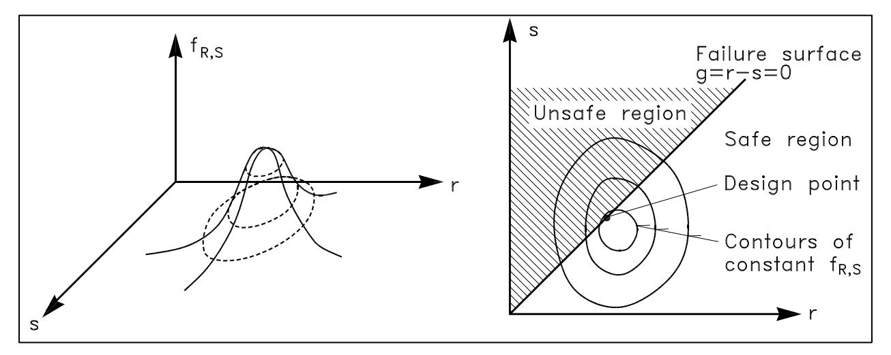

*Figure VI-6-1. Illustration of the two-dimensional joint probability density function for loading and strength*

(5) Unfortunately, the jpdf is seldom known. However, the variables can often be assumed independent (noncorrelated) in which case Equation VI-6-7 is given by the n -fold integral

```math
P _ { f } = \iiint _ { R \leq S } \cdots \int \ f _ { _ { X _ { 1 } } } ( x _ { 1 } ) \ldots f _ { _ { X _ { n } } } ( x _ { n } ) d \ x _ { 1 } \ldots d \ x _ { n } \tag{VI-6-9}
```

where $f_{Xi}$ are the marginal probability density function of the variables $X_{i}$ . The amount of calculations involved in the multidimensional integration Equation VI-6-9 is enormous if the number of variables, n , is larger than 5.
(6) If only two independent variables are considered, e.g., R and S , then Equation VI-6-9 simplifies to

```math
P_f = \iint_{R \le S} f_R(r) f_S(s) dr ds \tag{VI-6-10}
```

which by partial integration can be reduced to a single integral

```math
P_f = \int_0^\infty F_R(x) \, f_S(x) \, dx \tag{VI-6-11}
```

where $F_{R}$ is the cumulative distribution function for R . Formally the lower integration limit should be -, but it is replaced by 0 since, in general, negative strength is not meaningful.
- (7) Equation VI-6-11 represents the product of the probabilities of two independent events, namely the probability that S lies in the range x, x+dx (i.e., fS(x) dx ) and the probability that R x (i.e., $F_{R}(x)),$ as shown in Figure VI-6-2.
- b. Level II methods. This section gives a short introduction to reliability calculations at Level II. Only the so-called first-order reliability method (FORM), where the failure surface is approximated by a tangent hyberplane at some point, is presented. A more accurate method is the second-order reliability method (SORM), which uses a quadratic approximation to the failure surface.
- (1) Linear failure functions of normally-distributed random variables.
- (a) Assume the loading S(x) and the resistance R(x) for a single failure mode to be statistically independent and with density functions as illustrated in Figure VI-6-2. The failure function is given by Equation VI-6-3 and the probability of failure is expressed by Equation VI-6-10 or Equation VI-6-11.
- (b) However, in many cases these functions are not known, but under certain assumptions the functions might be estimated using only the mean values and standard deviations. If S and R are assumed to be independent normally distributed variables with known means and standard deviations, then the linear failure function g = R - S is normally distributed with mean value,

```math
\mu_g = \mu_R - \mu_S \tag{VI-6-12}
```

and standard deviation

```math
\sigma_g = \sqrt{(\sigma_R^2 + \sigma_S^2)} \tag{VI-6-13}
```

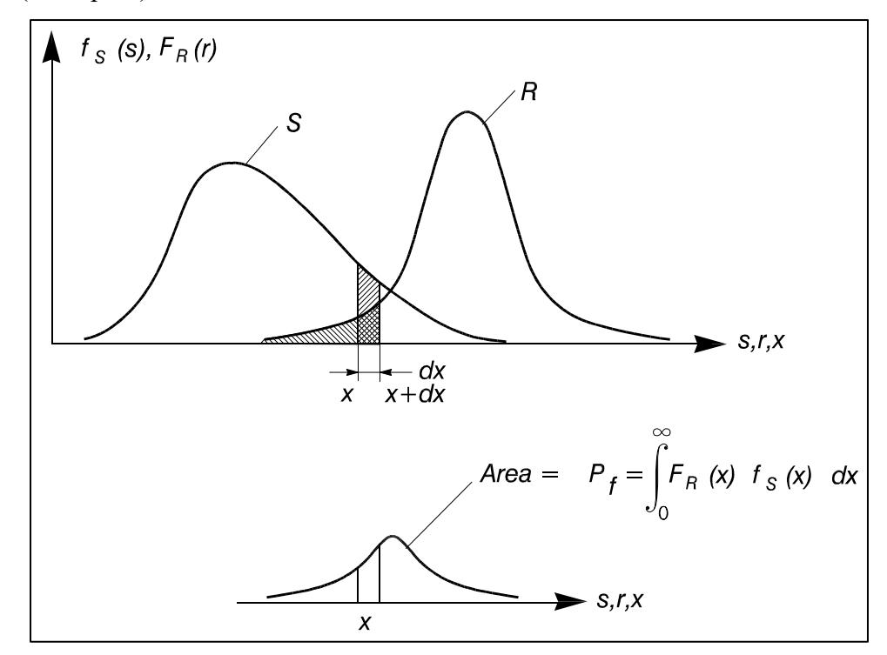

*Figure VI-6-2. Illustration of failure probability in case of two independent variables, S and R*

The quantity (g - \mu_g) / \sigma_g will be unit standard normal, and consequently,

```math
P_f = prob(g \le 0) = \int_{-\infty}^{0} f_g(x) dx = \Phi\left(\frac{0 - \mu_g}{\sigma_g}\right) = \Phi(-\beta) \tag{VI-6-14}
```

where

```math
\beta = \frac{\mu_g}{\sigma_g} \tag{VI-6-15}
```

is a measure of the probability of failure referred to as the reliability index (Cornell 1969). Figure VI-6-3 illustrates \beta and the reliability index. Note that \beta is the inverse of the coefficient of variation, and it is the distance (in terms of number of standard deviations) from the most probable value of g (in this case the mean) to the failure surface, g = 0.

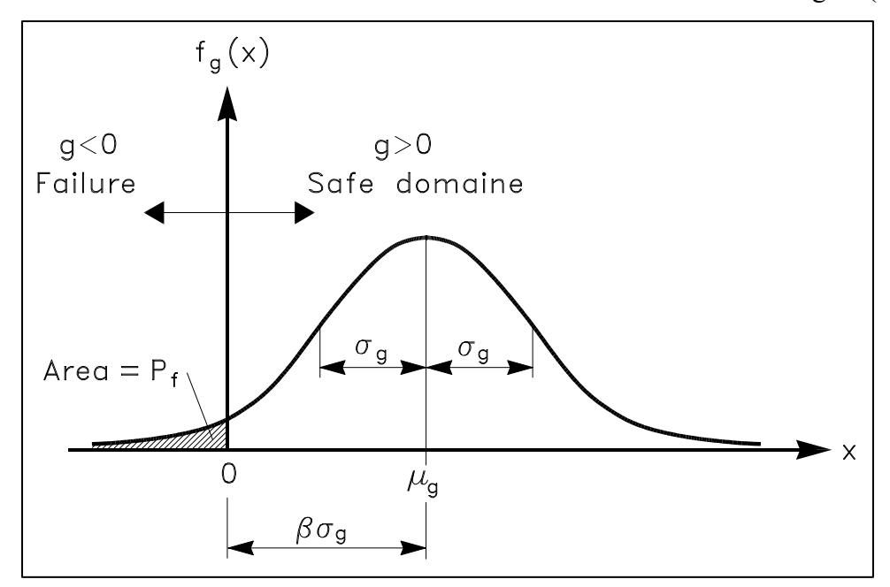

*Figure VI-6-3. Illustration of reliability index*

(c) If R and S are normally distributed and "correlated," then Equation VI-6-14 still holds, but \sigma is given by

```math
\sigma_g = \sqrt{(\sigma_R^2 + \sigma_S^2 + 2 \rho_{RS} \sigma_R \sigma_S)} \tag{VI-6-16}
```

where \rho_{RS} is the correlation coefficient

```math
\rho_{RS} = \frac{Cov(R, S)}{\sigma_R \sigma_S} = \frac{E[(R - \mu_R) (S - \mu_S)]}{\sigma_R \sigma_S} \tag{VI-6-17}
```

R and S are said to be uncorrelated if \rho_{RS} = 0 .
- (d) In addition to the illustration of \beta in Figure VI-6-3, a simple geometrical interpretation of \beta can be given in the case of a linear failure function g = R S of the independent variables R and S by a transformation into a normalized coordinate system of the random variables RN = (R \mu_R) / \sigma_R and SN = (S \mu_S) / \sigma_S , as shown in Figure VI-6-4. (e) With these variables the failure surface g = 0 is linear and given by

```math
R' \sigma_R - S' \sigma_S + \mu_R - \mu_S = 0 \tag{VI-6-18}
```

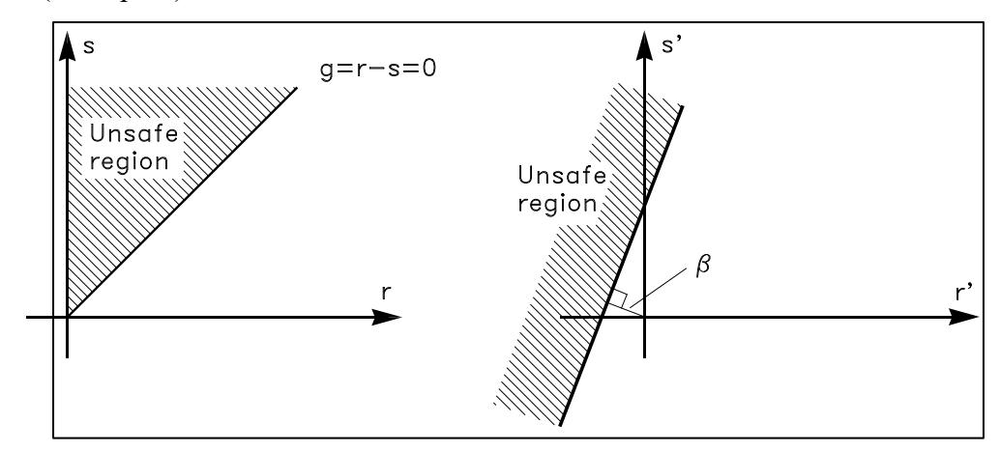

*Figure VI-6-4. Illustration of \beta in normalized coordinate system*

(f) By geometrical considerations it can be shown that the shortest distance from the origin to this linear failure surface is equal to in which Equations VI-6-12 and VI-6-13 are used.

```math
\beta = \frac{\mu_g}{\sigma_g} = \frac{\mu_R - \mu_S}{\sqrt{\sigma_R^2 + \sigma_S^2}} \tag{VI-6-19}
```

- (2) Nonlinear failure functions of normally-distributed random variables.
- (a) If the failure function g = g(\overline{X}) is nonlinear , then approximate values for \mu_g and \sigma_g can be obtained by using a linearized failure function. Linearization is generally performed by retaining only the linear terms of a Taylor-series expansion about some point. However, the values of \mu_g and \sigma_g , and thus the value of \beta , depend on the choice of linearization point. Moreover, the value of \beta defined by Equation VI-6-15 will change when different, but functionally equivalent, nonlinear failure functions are used.
- (b) To overcome these problems, a transformation of the basic variables \overline{Z} = (X_1, X_2, ..., X_n) into a new set of normalized variables \overline{Z} = (Z_1, Z_2, ..., Z_n) is performed. For uncorrelated normally distributed basic variables \overline{X} the transformation is

```math
Z_i = \frac{X_i - \mu_{X_i}}{\sigma_{X_i}} \tag{VI-6-20}
```

in which case \mu_{Zi} = 0 and \sigma_{Zi} = 1 . By this linear transformation the failure surface g = 0 in the x -coordinate system is mapped into a failure surface in the z -coordinate system which also divides the space into a safe region and a failure region as illustrated in Figure VI-6-5.
(c) Figure VI-6-5 introduces the Hasofer and Lind reliability index \beta_{HL} which is defined as the distance from the origin to the nearest point, D, of the failure surface in the z-coordinate system (Hasofer and Lind 1974). This point is called the design point. The coordinates of the
design point in the original x-coordinate system are the most probable values of the variables \overline{X} at failure. \beta_{HL} can be formulated as

```math
\beta_{HL} = \min_{g(\bar{z})=0} \left( \sum_{i=1}^{n} z_i^2 \right)^{1/2} \tag{VI-6-21}
```

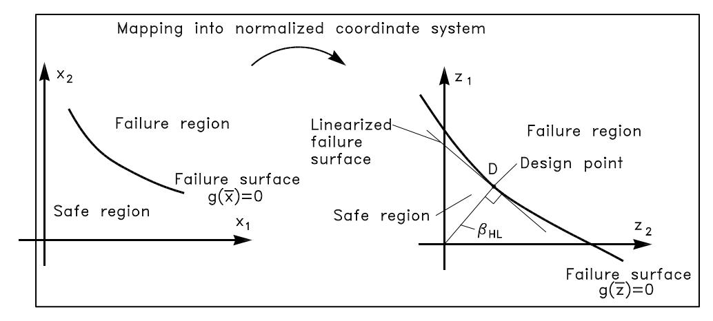

*Figure VI-6-5. Definition of the Hasofer and Lind reliability index, \beta_{HL}*

- (d) The special feature of \beta_{HL} , as opposed to \beta , is that \beta_{HL} is related to the failure "surface" g(\bar{z}) = 0 which is invariant to the failure function because equivalent failure functions result in the same failure surface.
- (e) The calculation of \beta_{HL} and the design point coordinates can be undertaken in a number of different ways. An iterative method must be used when the failure surface is nonlinear. A widely used method of calculating \beta_{HL} is Step 1. Select some trial coordinates of the design point in the z-coordinate system

```math
\overline{z}^d = (z_1^d, z_2^d, \dots, z_n^d)
```

• Step 2. Calculate \alpha_i i = 1, 2, ..., n by

```math
\alpha_i = \left. \frac{\partial g}{\partial z_i} \right|_{\bar{z} = \bar{z}^d}
```

EM 1110-2-1100 (Part VI) Change 3 (28 Sep 11)
• Step 3. Determine a better estimate of \overline{z}^d by

```math
z_{i}^{d} = \alpha_{i} \frac{\sum_{i=1}^{n} (\alpha_{i} z_{i}^{d}) - g \Big|_{\overline{z} = \overline{z}^{d}}}{\sum_{i=1}^{n} (\alpha_{i})^{2}}
```

- Step 4. Repeat Steps 2 and 3 to achieve convergence
- Step 5. Evaluate \beta_{HL} by

```math
\beta_{HL} = \left(\sum_{i=1}^{n} \left(z_i^d\right)^2\right)^{1/2}
```

The method is based on the assumption of the existence of only one minimum. However, several "local" minima might exist. In order to avoid convergence toward a local minima (and thereby overestimation of \beta_{HL} and the reliability) several different sets of trial coordinates might be tried.
- (3) Nonlinear failure functions of non-normal random variables.
- (a) It is not always a reasonable assumption to consider the random variables normally distributed. For example, parameters characterizing the sea state in long-term wave statistics, such as H_s , will in general follow extreme distributions (e.g., Gumbel and Weibull). These distributions are quite different from the normal distribution and cannot be described using only the mean value and the standard deviation.
- (b) For such cases it is still possible to use the reliability index \beta_{HL} , but an extra transformation of the non-normal basic variables into normal basic variables must be performed before \beta_{HL} can be determined as previously described.
- (c) A commonly used transformation is based on the substitution of the non-normal distribution of the basic variable X_i by a normal distribution in such a way that the density and distribution functions f_{Xi} and F_{Xi} are unchanged at the design point. (d) If the design point is given by x_1^d , x_2^d ,..., x_n^d , then the transformation reads

```math
F_{X_i}(x_i^d) = \Phi\left(\frac{x_i^d - \mu_{X_i}}{\sigma_{X_i}}\right) \tag{VI-6-22}
```

```math
f _ { _ { X _ { i } } } ( \boldsymbol { x } _ { i } ^ { d } ) = \frac { 1 } { \sigma _ { X _ { i ^ { \prime } } } } \varphi \left( \frac { \boldsymbol { x } _ { i } ^ { d } - \boldsymbol { \mu } _ { _ { X _ { i ^ { \prime } } } } } { \sigma _ { X _ { i ^ { \prime } } } } \right)
```

where \mu N_{Xi} and \sigma N_{Xi} are the mean and standard deviation of the approximate (fitted) normal distribution.
(e) Equation VI-6-22 yields

```math
\sigma_{X_i'} = \frac{\varphi\left(\Phi^{-1}\left(F_{X_i}(x_i^d)\right)\right)}{f_{X_i}(x_i^d)}, \quad \mu_{X_i'} = x_i^d - \Phi^{-1}\left(F_{X_i}(x_i^d)\right) \sigma_{X_i'} \tag{VI-6-23}
```

(f) Equation VI-6-22 can also be written

```math
F_{X_i}(x_i^d) = \Phi\left(\frac{x_i^d - \mu_{X_i}}{\sigma_{X_i}}\right) = \Phi(z_i^d) = \Phi(\beta_{HL} \alpha_i)
```

(g) Solving with respect to x_i^d gives

```math
x_i^d = F_{X_i}^{-1} [\Phi(\beta_{HL} \alpha_i)] \tag{VI-6-24}
```

- (h) The iterative method presented above for calculation of \beta_{HL} can still be used if for each step of iteration the values of \mu N_{Xi} and \sigma N_{Xi} given by Equation VI-6-24 are calculated for those variables where the transformation (Equation VI-6-22) has been used. For correlated random variables the transformation into noncorrelated variables is used before normalization.
- (4) Time-variant random variables. The failure functions within breakwater engineering are generally of the form

```math
g = f_1(\overline{R}) - f_2(H_s, W, T_m) \tag{VI-6-25}
```

where \overline{R} represents the resistance variables and H_s , W, and T_m are the load variables signifying the wave height, the water level, and the wave period. The random variables are in general time-variant.
- (a) Discussion of load variables:
- The most important load parameter in breakwater engineering is the wave height. It is a time-varying quantity which is best modeled as a stochastic process. Distinction is made between short-term and long-term statistics of the wave heights. Short-term statistics deal with the distribution of the wave height H during a stationary sequence of a storm, i.e., during a period of constant H_s (or any other characteristic wave height). The short-term wave height distribution follows the Rayleigh distribution for deepwater waves and some truncated distribution in the case of shallow-water waves.
- Long-term statistics deal with the distribution of the storms which are then characterized by the maximum value of H_s occurring in each storm. The storm history is given as the sample (H_{s1}, H_{s2}, ..., H_{sn}) covering a period of observation, Y. Extreme-value distributions like the Gumbel and Weibull distributions are then fitted to the data sample. For strongly depth-
EM 1110-2-1100 (Part VI) Change 3 (28 Sep 11)
limited wave conditions a normal distribution with mean value as a function of water depth might be appropriate.
- The true distribution of H_s can be approximated by the distribution of the maximum value over T years, which is denoted as the distribution of H_s^T . The calculated failure probability then refers to the period T (which in practice might be the lifetime of the structure) if distribution functions of the other variables in Equation VI-6-25 are assumed to be unchanged during the period T.
- As an example, consider a sample of n independent storms, i.e., H_{s1} , H_{s2} , ..., H_{sn} , obtained within Y years of observation. Assume that H_s follows a Gumbel distribution given by

```math
F(H_s) = \exp\left[-e^{-\alpha(H_s - \beta)}\right] \tag{VI-6-26}
```

which is the distribution of H_s over a period of Y years with average time span between observations of Y/n.
- The distribution parameters \alpha and \beta can be estimated from the data using techniques such as the maximum likelihood method or the methods of moments. Moreover, the standard deviations of \alpha and \beta , signifying the statistical uncertainty due to limited sample size, can also be estimated.
- The sampling intensity is \lambda = n / Y . Within a T -year reference period the number of data will be \lambda T . The probability of the maximum value of H_s within the period T is then

```math
F(H_s^T) = [F(H_s)]^{\lambda T} = \left[\exp\left(-e^{-\alpha(H_s - \beta)}\right)\right]^{\lambda T} \tag{VI-6-27}
```

• The expectation (mean) value of H_s^T is given by

```math
\mu_{H_s^T} = \beta - \frac{1}{\alpha} \ln \left[ -\ln \left( 1 - \frac{1}{\lambda T} \right) \right] \tag{VI-6-28}
```

and the standard deviation of H_s^T (from maximum likelihood estimates) is

```math
\sigma_{H_s^T} = \left[ \frac{1}{n\alpha^2} \left\{ 1.109 + 0.514 \left( -\ln\left(1 - \ln\left(1 - \frac{1}{\lambda T}\right)\right) \right) + 0.608 \left( -\ln\left(1 - \ln\left(1 - \frac{1}{\lambda T}\right)\right) \right)^2 \right\} \right]^{1/2} \tag{VI-6-29}
```

• Equation VI-6-29 includes the statistical uncertainty due to limited sample size. Some uncertainty is related to the estimation of the sample values H_{s1} , H_{s2} , ..., H_{sn} arising from measurement errors, errors in hindcast models, etc. This uncertainty corresponds to a coefficient
of variation \sigma_{Hs} / \mu_{Hs} on the order of 5 - 20 percent. The effect of this might be implemented in the calculations by considering a total standard deviation of

```math
\sigma = \sqrt{\sigma_{H_s^T}^2 + \sigma_{H_s}^2} \tag{VI-6-30}
```

- In Level II calculations, Equation VI-6-27 is normalized around the design point, and Equations VI-6-28 and VI-6-29 or VI-6-30 are used for the mean and the standard deviation.
- Instead of substituting H_s in Equation VI-6-25 with H_s^T , the following procedure might be used: Set T in Equations VI-6-27 to VI-6-29 to be 1 year. The outcome of the calculations will then be the probability of failure in a 1-year period, P_f(1 \ year) . If the failure events of each year are assumed independent for all variables then the failure probability in T years is

```math
P_f(T \ years) = 1 - [1 - P_f \ (1 \ year)]^T \tag{VI-6-31}
```

- This assumption simplifies the probability estimation somewhat, and for some structures it is reasonable to assume failure events are independent, e.g., rubble-mound stone armor stability. However, for some resistance variables, such as concrete strength, it is unrealistic to assume the events of each year are independent. The calculated values of the failure probability in T-years using H_s^{I year} and H_s^{T} will be different. The difference will be very small if the variability of H_s is much larger than the variability of other variables.
- The water level W is also an important parameter because it influences the structure freeboard and limits wave heights in shallow-water situations. Consequently, for the general case it is necessary to consider the joint distribution of H_s , W, and T_m . However, for deepwater waves W is often almost independent (except for barometric effects) of H_s and T_m and can be approximated as a noncorrelated variable that might be represented by a normal distribution with a certain standard deviation. The distribution of W is assumed independent of the length of the reference period T. In shallow water, W will be correlated with H_s due to storm surge effects.
- The wave period T_m is correlated to H_s . As a minimum the mean value and the standard deviation of T_m and the correlation of T_m with H_s should be known in order to perform a Level II analysis. However, the linear correlation coefficient is not very meaningful because it gives an insufficient description when the parameters are non-normally distributed. Alternatively the following approach might be used: From a scatter diagram of H_s and T_m a relationship of the form T_m = A f(H_s) is established in which the parameter A follows a normal distribution (or some other distribution) with mean value \mu_A = 1 and a standard deviation \sigma_A which signifies the scatter. T_m can then be replaced by the variable A in Equation VI-6-25. The variable A is assumed independent of all other parameters.
EM 1110-2-1100 (Part VI) Change 3 (28 Sep 11)
• Generally, the best procedure for coping with the correlations between H_s , W, and T_m is to work on the conditional distributions. Assume the distribution of the maximum value of H_s within the period T is given as F_1(H_s^T) . Furthermore, assume the conditional distributions F_2(W \mid H_s^T) and F_3(T_m \mid H_s^T) are known. Let Z_1 , Z_2 and Z_3 be independent standard normal variables and

```math
\Phi ( z _ { 1 } ) = F _ { 1 } ( H _ { s } ^ { T } )
```

```math
\Phi ( z _ { 2 } ) = F _ { 2 } ( W | H _ { s } ^ { T } )
```

```math
\Phi ( z _ { 3 } ) = F _ { 3 } ( \left. T _ { m } \right| H _ { s } ^ { T } )
```

• The inverse relationships are given by

```math
H_{s}^{T} = F_{1}^{-1}[\Phi(z_{1})]
```

```math
W = \smash { { F _ { 2 } ^ { - 1 } } [ \Phi ( z _ { 2 } ) | H _ { s } ^ { T } ] }
```

```math
T _ { m } = F _ { 3 } ^ { - 1 } [ \Phi ( \boldsymbol { z } _ { 3 } ) | H _ { s } ^ { T } ]
```

• By converting the resistance variables \overline{R} into standard normal variable \overline{Z}_o , i.e., the resistance term is written f_1(\overline{R}) = f_3(\overline{z}_o) , then the failure function Equation VI-6-25 becomes

```math
g = f _ { 3 } ( \mathbf{\Gamma } _ { z _ { o } } ^ { - } ) - f _ { 2 } \left( F _ { 1 } ^ { - 1 } [ \Phi ( z _ { 1 } ) ] \mathrm { \, } , \mathrm { \, } F _ { 2 } ^ { - 1 } [ \Phi ( z _ { 2 } ) | H _ { s } ^ { T } ] \mathrm { \, } , \mathrm { \, } F _ { 3 } ^ { - 1 } [ \Phi ( z _ { 3 } ) | H _ { s } ^ { T } ] \right) = 0
```

- Because g now comprises only independent standard normal variables, the usual iteration methods for calculating \beta_{HL} can be applied. (b) Discussion of resistance parameters:
- The service life of coastal structures spans anywhere between 20 to 100 years. Over periods of this length a decrease in the structural resistance is to be expected because of various types of material deterioration. Chemical reaction, thermal effect, and repeated loads (fatigue load) can cause deterioration of concrete and natural stone leading to disintegration and rounding of elements. Also the resistance against displacements of armor layers made of randomly placed armor units will decrease with the number of waves (i.e., with time) due to the stochastic nature of the resistance. Consequently, for armor layers this means a reduction over time of the D_n and K_D parameters in the Hudson equation.
- Although material effects can greatly influence reliability in some cases, they are not easy to include in reliability calculations. The main difficulty is the assessment of the variation with time which depends greatly on the intrinsic characteristics of the placed rock and concrete. At this time only fairly primitive methods are available for assessment of the relevant material characteristics. In addition, the variation with time depends very much on the load-history which can be difficult to estimate for the relevant period of structural life.
- Figure VI-6-6 illustrates an example situation representing the tensile strength of concrete armor units where a resistance parameter R(t) decreases with time t. R(t) is assumed to
be a deterministic function. The load S(t) (the tensile stress caused by wave action) is assumed to be a stationary process. The probability of failure, P(S > R) , within a period T is

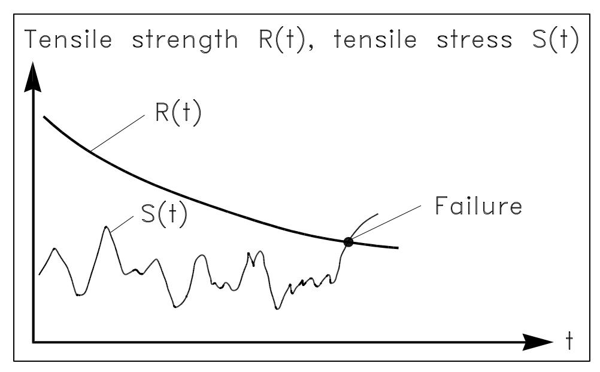

*Figure VI-6-6. Illustration of a first-passage problem*

```math
P_f(T) = 1 - \exp\left[-\int_0^T v^+[R(t)] dt\right] \tag{VI-6-32}
```

where v+ [ R (t) ] is the mean-upcrossing rate (number of upcrossings per unit time) of the level R(t) by the process S(t) at time t . v + can be computed by Rice's formula

```math
v^{+}[R(t)] = \int_{\dot{R}}^{\infty} (\dot{S} - \dot{R}) f_{S\dot{S}}[R(t), \dot{S}] d\dot{S}
```

in which SS f is the joint density function for S ( t ) and S t ( ) . Implementation of time-variant variables into Level II analyses is rather complicated. For further explanation, see Wen and Chen (1987).

### VI-6-4. Failure Probability Analysis of Failure Mode Systems.

- a. A coastal structure can be regarded as a system of components which can either function or fail. Due to interactions between the components, failure of one component may impose failure of another component and even lead to failure of the system. A so-called fault tree is often used to clarify the relationships between the failure modes.
- b. A fault tree describes the relationships between the failure of the system (e.g., excessive wave transmission over a breakwater protecting a harbor) and the events leading to this failure. Figure VI-6-7 shows a simplified example based on some of the failure modes of a rubble-mound breakwater.

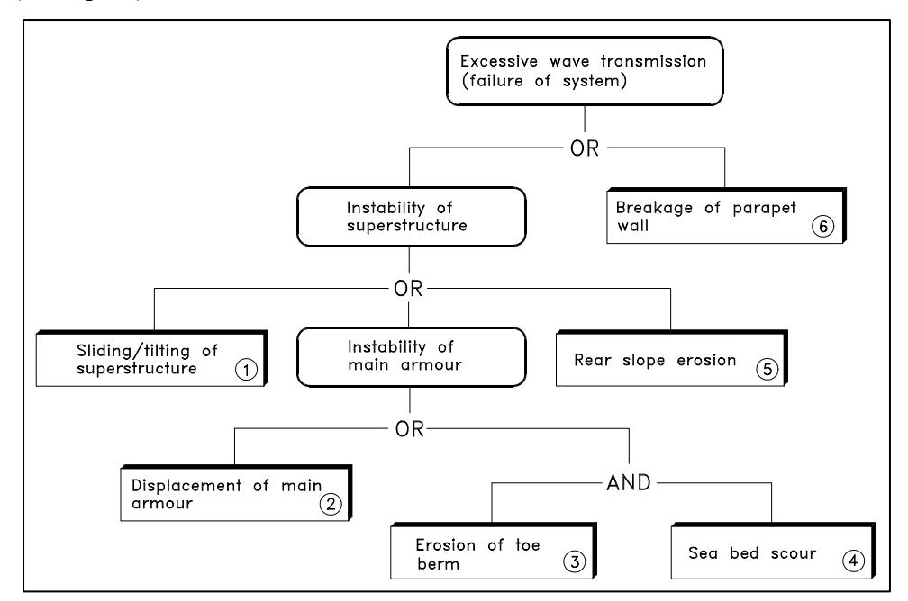

*Figure VI-6-7. Example of simplified fault tree for a breakwater*

- c. A fault tree is a simplification and a systematization of the more complete so-called cause-consequence diagram that indicates the causes of partial failures as well as the interactions between the failure modes. An example is shown in Figure VI-6-8.
- d. The failure probability of the system (for example, the probability of excessive wave transmission in Figure VI-6-7) depends on the failure probability of the single failure modes and on the correlation and linking of the failure modes. The failure probability of a single failure mode can be estimated by the methods described in Part VI-6-3. Two factors contribute to the correlation, namely physical interaction, such as sliding of main armor caused by erosion of a supporting toe berm, and correlation through common parameters like $H_{s}.$ The correlations caused by physical interactions are not yet quantified. Consequently, only the commonparameter-correlation can be dealt with in a quantitative way. However, it is possible to calculate upper and lower bounds for the failure probability of the system.
- e. A system can be split into two types of fundamental systems, namely series systems and parallel systems as illustrated by Figure VI-6-9.
- (1) Series systems.
- (a) In a series system, failure occurs if any of the elements i = 1, 2, ... , n fails. The upper and lower bounds of the failure probability of the system, $P_{f}$ S are

```math
U p p e r b o u n d \, p _ { f s } ^ { U } = 1 - ( 1 - P _ { f 1 } ) \ ( 1 - P _ { f 2 } ) \ldots ( 1 - P _ { f n } ) \tag{VI-6-33}
```

```math
P_{fS}^{L} = \max[P_{fi}] \tag{VI-6-34}
```

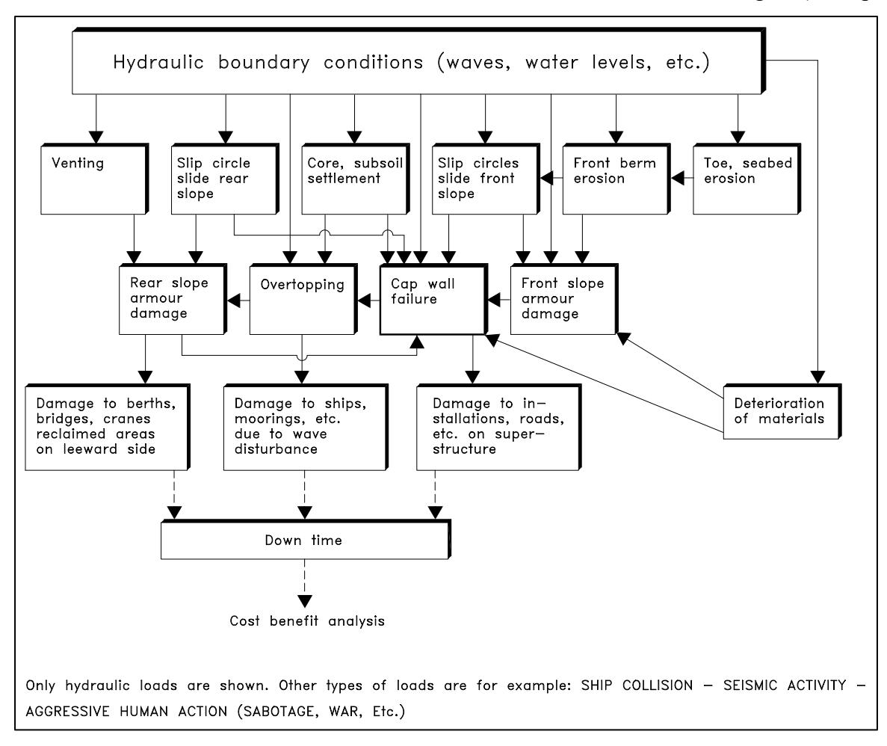

*Figure VI-6-8. Example of cause-consequence diagram for a rubble-mound breakwater*

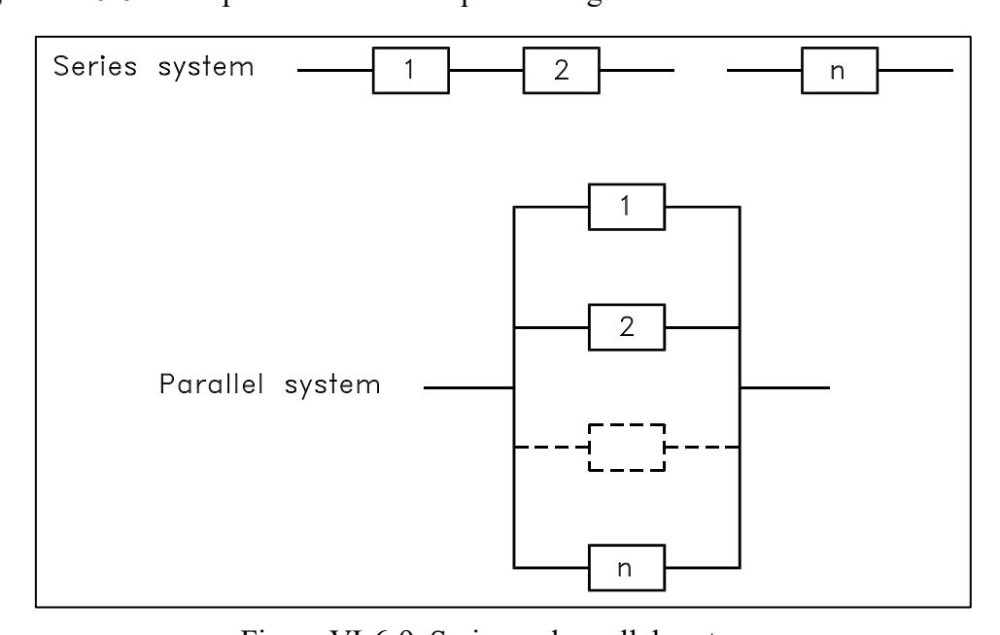

*Figure VI-6-9. Series and parallel systems*

EM 1110-2-1100 (Part VI) Change 3 (28 Sep 11)
where max [P_{fi}] is the largest failure probability among all elements. The upper bound corresponds to no correlation between the failure modes and the lower bound to full correlation.
Equation VI-6-33 is sometimes approximated by P_{fS}^U = \sum_{i=1}^n P_{fi} which is applicable only for small P_{fi} because P_{fS}^U should not be larger than 1.
- (b) The OR-gates in a fault tree correspond to series components. Series components are dominant in breakwater fault trees. In fact, the AND-gate shown in Figure VI-6-7 is included for illustration purposes, and in reality it should be an OR-gate. (2) Parallel systems. (a) A parallel system fails only if all the elements fail.

```math
P_{fS}^U = \min[P_{fi}] \tag{VI-6-35}
```

```math
P_{f}^{L}\cdot s = P_{f1} \cdot P_{f2} \cdots P_{fn} \tag{VI-6-36}
```

- (b) The upper bound corresponds to full correlation between the failure modes, and the lower bound corresponds to no correlation.
- The AND-gates in a fault tree represent parallel components. To calculate upper and lower failure probability bounds for a system, it is convenient to decompose the overall system into series and parallel systems. Figure VI-6-10 shows a decomposition of the fault tree (Figure VI-6-7).

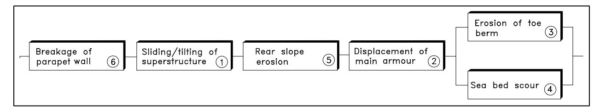

*Figure VI-6-10. Decomposition of the fault tree into series and parallel systems*

- To obtain correct P_{fS} -values it is very important that the fault tree represents precisely the real physics of the failure development. This is illustrated by Example VI-6-2 where a fault tree alternative to Figure VI-6-7 is analyzed. In Example VI-6-2 the same failure mode probabilities as given in Example VI-6-1 are used.
- The real failure probability of the system P_{fS} will always be in between P_{fS}^U and P_{fS}^L because some correlation exists between the failure modes due to the common loading represented by the sea state parameters, e.g., H_{s.}

#### EXAMPLE PROBLEM VI-6-1

The Level II analysis of the single failure modes for a specific breakwater schematized in Figure VI-6-1 0 revealed the following probabilities of failure in a 1-year period

| i | 1 | 2 | 3 | 4 | 5 | 6 |
| --- | --- | --- | --- | --- | --- | --- |
| Prj % | 3 | 6 | 4 | 3 | 0.5 | I |

Note that these Pr j-values cannot be used in general because they relate to a specific structure. However, they are typical for conventionally designed breakwaters with respect to order of magnitude and large variations.
The simple failure probability bounds for the system are given by Equations VI-6-33, VI-6-34, VI-6-35, and VI-6-36:
Upper bound (no correlation):

```math
P_{f\text{ s}}^{U}=1-\left(1-P_{f6}\right)\left(1-P_{f1}\right)\left(1-P_{f5}\right)\left(1-P_{f2}\right)\left(1-\min[P_{f3},P_{f4}]\right)=12.9\%
```

or alternately for small values of Prj

```math
P_{f,S}^{U} = P_{f,6} + P_{f,1} + P_{f,5} + P_{f,2} + \min [P_{f,3}, P_{f,4}] = 13.5\%
```

Lower bound (full correlation):

```math
P_{fS}^{L} = \max [P_{f6}, P_{f1}, P_{f5}, P_{f2}, (P_{f3} \cdot P_{f4})] = 6\%
```

The simple bounds corresponding to T-years structural life might be approximated by the use of Equation VI-6-31 1

|  | Structure life in years |  |  |
| --- | --- | --- | --- |
| I | 20 I | 50 | 100 |
| Prsu % | 94 | 100 | 100 |
| p L Of< l ft 0 | 71 | 95 | 100 |

*1 It is very important to notice that the use of Equation VI-6-31, which assumes independent failure events from one year to another, can be misleading. This will be the case if some of the parameters which contribute significantly to the failure probability are time-invariant, i.e., are not changed from year to year. An example would be the parameter signifying a large uncertainty of a failure mode formula, such as the parameter A in Equation VI-6-2. If all parameters were time-invariant then the correct lower bound would be*

```math
P_{fS}^{L} = \max_{i=1-n} [P_{fi}]
```

independent ofT, i.e., 6% for all Tin the example. It follows that use of Equation VI-6-31 results in values of Prl forT > 1 year that are too large.

#### EXAMPLE PROBLEM VI-6-2

Figure VI-6-11 shows a fault tree that differs from the fault tree in Figure VI-6-7. In Figure VI-6-11 only failure mode 6 can directly cause system failure, whereas in Figure VI-6-7 each of the failure modes 6, 5, 1, 2 and (3+4) can cause system failure.
The decomposition of the fault tree is shown in two steps in Figure VI-6-12. Note that the same failure mode can appear more than once in the decomposed system.
The simple bounds for the system are given by Equations VI-6-33, VI-6-34, VI-6-35, and VI-6-36:
Upper bound:

```math
P_{f\ s}^{U}=1-\left(1-P_{f\ 6}\right)\left(1-\min[P_{f\ 1},P_{f\ 5}]\right)[P_{f\ 1},P_{f\ 2},P_{f\ 3},P_{f\ 4}]=4.5\%
```

or for smaller values of P_{fi}

```math
P_{f\ s}^{U}=P_{f\ 6}+\min\left[P_{f\ 1},P_{f\ 5}\right]+\min\left[P_{f\ 1},P_{f\ 2},P_{f\ 3},P_{f\ 4}\right]=4.5\%
```

Lower bound:

```math
P_{f\ s}^{L} = \max \left[ P_{f\ 6}, (P_{f\ 1} \cdot P_{f\ 5}), (P_{f\ 1} \cdot P_{f\ 2} \cdot P_{f\ 3} \cdot P_{f\ 4}) \right] = 1 \%
```

Using the same P_{fi} -values and procedure as given in Example VI-6-1 the following system failure probabilities are obtained

|  | Structure life in years |  |  |
| --- | --- | --- | --- |
|  | 20 | 50 | 100 |
| P_{fs}{}^{U}\% | 60 | 90 | 99 |
| P_{fs}^{\ L}\%^1 | 18 | 39 | 63 |

These values are quite different from the values of Example VI-6-1 which emphasizes the importance of a correct fault tree.
- It would be possible to estimate P_{fS} if the physical interactions between the various failure modes were known and described by formulae, and if the correlations between the involved parameters were known. However, the procedure for determining such correlations are complicated and are not yet fully developed for practical use.
- The probability of failure cannot in itself be used as the basis for an optimization of a design. Optimization must be related to a kind of measure (scale), which for most structures is the economy, but can include other measures such as loss of human life.

*& lt;sup>1</sup> See note in Example VI-6-1.*

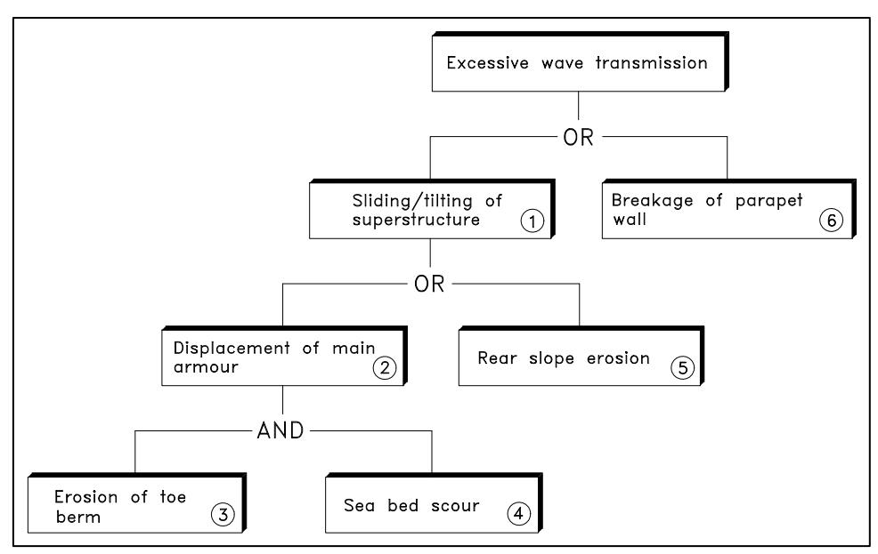

*Figure VI-6-11. Example of simplified fault tree for a breakwater*

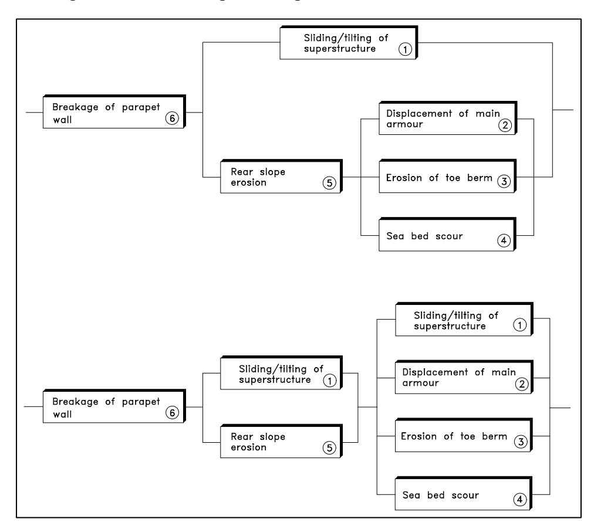

*Figure VI-6-12. Decomposition of the fault tree into series and parallel systems*

The so-called risk, defined as the product of the probability of failure and the economic consequences, is used in optimization considerations. The economic consequences
EM 1110-2-1100 (Part VI) Change 3 (28 Sep 11)
must cover all kinds of expenses related to the failure in question, i.e., cost of replacement, downtime costs, etc.
VI-6-5. <u>Parameter Uncertainties in Determining the Reliability of Structures</u>. Calculation of reliability or failure probability of a structure is based on formulae describing the structure's response to loads and on information about the uncertainties related to the formulae and relevant parameters. Basically, uncertainty is best given by a probability distribution; but because the true distribution is rarely known, it is common to assume a normal distribution and a related coefficient of variation, defined as

```math
\sigma' = \frac{\sigma}{\mu} = \frac{standard\ deviation}{mean\ value} \tag{VI-6-37}
```

as the measure of the uncertainty. The term "uncertainty" is used in this chapter as a general term referring to errors, to randomness, and to lack of knowledge.
- a. Uncertainty related to failure mode formulae. The uncertainty associated with a formula can be considerable. This is clearly seen from many diagrams presenting the formula as a smooth curve shrouded by a wide scattered cloud of data points (usually from experiments) that are the basis for the curve fitting. Coefficients of variation of 15 20 percent or even larger are quite normal. The range of validity and the related coefficient of variation should always be considered when using a design formula.
- b. Uncertainty related to environmental parameters. The sources of uncertainty contributing to the total uncertainties in environmental design values are categorized as follows:
- (1) Errors related to instrument response (e.g., from accelerometer buoy and visual observations).
- (2) Variability and errors due to different and imperfect calculations methods (e.g., wave hindcast models, algorithms for time-series analysis).
- (3) Statistical sampling uncertainties due to short-term randomness of the variables (variability within a stochastic process, e.g., two 20-min. records from a stationary storm will give two different values of the significant wave height)
- (4) Choice of theoretical distribution as a representative of the unknown long-term distribution (e.g., a Weibull and a Gumbel distribution might fit a data set equally well but can provide quite different values for a 200-year event).
- (5) Statistical uncertainties related to extrapolation from short samples of data sets to events of low probability of occurrence. (6) Statistical vagaries of the elements.
- (a) Distinction must be made between short-term sea state statistics and long-term (extreme) sea statistics. Short-term statistics are related to the stationary conditions during a sea
state, e.g., wave height distribution within a storm of constant significant wave height, Hs . Long-term statistics deal with the extreme events, e.g., the distribution of $H_{s}$ over many storms.
- (b) Related to the short-term sea state statistics the following aspects must be considered:
- The distribution for individual wave heights in a record in deepwater and shallowwater conditions, i.e., Rayleigh distribution and some truncated distributions, respectively.
- Variability due to short samples of single peak spectra waves in deep and shallow water based on theory and physical simulations.
- Variability due to different spectral analysis techniques, i.e., different algorithms, smoothing and filter limits.
- Errors in instrument response and influence of measurement location. For example, floating accelerometer buoys tend to underestimate the height of steep waves. Characteristics of shallow-water waves can vary considerably in areas with complex seabed topography. Wave recordings at positions with depth-limited breaking waves cannot produce reliable estimates of the deepwater waves.
- Imperfection of deep and shallow-water numerical hindcast models and quality of wind input data.
- (c) Estimates of overall uncertainties for short-term sea state parameters (first three items) are presented in Table VI-6-1 for use when more precise site specific information is not available.
- (d) Evaluation of the uncertainties related to the long-term sea state statistics, and use of these estimates for design, involves the following considerations: The encounter probability.
- Estimation of the standard deviation of a return-period event for a given extreme distribution.
- Estimation of extreme distributions by fitting to data sets consisting of uncorrelated values of $H_{s}$ from Frequent measurements of $H_{s}$ equally spaced in time. Identification of the largest $H_{s}$ in each year (annual series).
- Maximum values of $H_{s}$ for a number of storms exceeding a certain threshold value of Hs using peak over threshold (POT) analysis.
The methods of fitting are the maximum likelihood method, the method of moments, the least square method, and visual graphical fit.
EM 1110-2-1100 (Part VI) Change 3 (28 Sep 11)
- Uncertainty on extreme distribution parameters due to limited data sample size.
- Influence on the extreme value of $H_{s}$ on the choice of threshold value in the POT analysis. (The threshold level should exclude all waves which do not belong to the statistical population of interest).
- Errors due to lack of knowledge about the true extreme distribution. Different theoretical distributions might fit a data set equally well, but might provide quite different return period values of $H_{s}$ . (The error can be estimated only empirically by comparing results from fits to different theoretical distributions).

*Table VI-6-1 Typical Variational Coefficients σ = σ / μ (standard deviation over mean value) for Measured and Calculated Sea State Parameters (Burcharth 1992)*

**Table VI-6-1. Typical Variational Coefficients σ = σ / μ (standard deviation over mean value) for Measured and Calculated Sea State Parameters (Burcharth 1992)**

|  |  | Parameters |  |  | ............................................................................................... |  |  |  | VI-6-24 |
| --- | --- | --- | --- | --- | --- | --- | --- | --- | --- |
| Table | VI-6-2. | Wave Data from Distribution | Different | Locations | Fitted ............................................................................................. | to | a | Weibull | VI-6-28 |
| Table | VI-6-3. | Partial Safety Factor | Tables |  |  |  | .................................................................... |  | VI-6-31 |
| Table | VI-6-4. | Partial Safety Factors Hudson Formula, | for Design | Stability Without | Failure Model | of Tests | Rock | Armor, ..................................... | VI-6-32 |
| Table | VI-6-5. | Partial Safety Factors Plunging Waves, Tests | for van der | Stability Meer | Failure Formula, ........................................................................................................ | of Design | Rock | Armor, Without Model | VI-6-32 |
| Table | VI-6-6. | Partial Safety Factors Surging Waves, Tests | for van der | Stability Meer | Failure Formula, ........................................................................................................ | of Design | Rock | Armor, Without Model | VI-6-33 |
| Table | VI-6-7. | Partial Safety Factors van der Meer | for Formula, | Stability Design | Failure Without | of Model | Cube Tests | Block Armor, ............................ | VI-6-33 |

**Table VI-6-1. Typical Variational Coefficients σ = σ / μ (standard deviation over mean value) for Measured and Calculated Sea State Parameters (Burcharth 1992)**

|  |  | Parameters |  |  | ............................................................................................... |  |  |  | VI-6-24 |
| --- | --- | --- | --- | --- | --- | --- | --- | --- | --- |
| Table | VI-6-2. | Wave Data from Distribution | Different | Locations | Fitted ............................................................................................. | to | a | Weibull | VI-6-28 |
| Table | VI-6-3. | Partial Safety Factor | Tables |  |  |  | .................................................................... |  | VI-6-31 |
| Table | VI-6-4. | Partial Safety Factors Hudson Formula, | for Design | Stability Without | Failure Model | of Tests | Rock | Armor, ..................................... | VI-6-32 |
| Table | VI-6-5. | Partial Safety Factors Plunging Waves, Tests | for van der | Stability Meer | Failure Formula, ........................................................................................................ | of Design | Rock | Armor, Without Model | VI-6-32 |
| Table | VI-6-6. | Partial Safety Factors Surging Waves, Tests | for van der | Stability Meer | Failure Formula, ........................................................................................................ | of Design | Rock | Armor, Without Model | VI-6-33 |
| Table | VI-6-7. | Partial Safety Factors van der Meer | for Formula, | Stability Design | Failure Without | of Model | Cube Tests | Block Armor, ............................ | VI-6-33 |

*1 Two horizontal velocity components and water-level elevation or pressure.*

- Errors due to applied plotting formulae in the case of graphical fitting. Depending on the applied plotting formulae quite different extreme estimates can be obtained. The error can only be empirically estimated. Climatological changes.
- Physical limitations in extrapolation to events of low probability. The most important example might be limitations in wave heights due to limited water depths and fetch restrictions. The effect of measurement error on the uncertainty related to an extreme event.
- (e) It is beyond the scope of this chapter to discuss in more detail the mentioned uncertainty aspects related to the environmental parameters. Additional information is given in Burcharth (1992).
- c. Uncertainty related to structural parameters. The uncertainties related to material parameters (such as density) and geometrical parameters (such as slope angle and size of structural elements) are generally much smaller than the uncertainties related to the environmental parameters and to the design formulae.

### VI-6-6. Partial Safety Factor System for Implementing Reliability in Design.

- a. Introduction to partial safety factors.
- (1) The objective of using partial safety factors in design is to assure a certain reliability of the structures. This section presents the partial safety factors developed by the Permanent International Association of Navigation Congresses (PIANC) PTCII Working Group 12 (Analysis of Rubble-Mound Breakwaters) and Working Group 28 (Breakwaters with Vertical and Inclined Concrete Walls), Burcharth (1991) and Burcharth and Sørensen (1999).
- (2) The partial safety factors, \gamma_i , are related to characteristic values of the stochastic variables, X_{i,ch} . In conventional civil engineering codes the characteristic values of loads and other action parameters are often chosen to be an upper fractile (e.g., 5 percent), while the characteristic values of material strength parameters are chosen to be a lower fractile. The values of the partial safety factors are uniquely related to the applied definition of the characteristic values.
- (3) The partial safety factors, \gamma_i , are usually larger than or equal to 1. Consequently, if we define the variables as either load variables X_i^{load} (for example H_s ) or resistance variables X_i^{res} (for example the block volume) then the related partial safety factors should be applied as follows to obtain the design values:

```math
X_i^{design} = \gamma_i^{\text{load}} \cdot X_{i,ch}^{\text{load}}, \quad X_i^{design} = \frac{X_{i,ch}^{\text{res}}}{\gamma_i^{\text{res}}} \tag{VI-6-38}
```

- (4) The magnitude of \gamma_i reflects both the uncertainty of the related parameter X_i , and the relative importance of X_i in the failure function. A large value, e.g., \gamma_{Hs} = 1.4 , indicates a relatively large sensitivity of the failure probability to the significant wave height, H_s . On the other hand, \gamma \square 1 indicates little or negligible sensitivity, in which case the partial coefficient should be omitted. Bear in mind that the magnitude of \gamma_i is not (in a mathematical sense) a stringent measure of the sensitivity of the failure probability of the parameter, X_i .
- (5) As an example, when partial safety factors are applied to the characteristic values of the parameters in Equation VI-6-2, a design equation is obtained, i.e., the definition of how to apply the coefficients. The partial safety factors can be related either to each parameter or to combinations of the parameters (overall coefficients). The design equation obtained when partial safety factors are applied to each parameter is given by

```math
G = \frac{A_{ch}}{\gamma_{A}} \frac{\Delta_{ch}}{\gamma_{\Delta}} \frac{D_{n,ch}}{\gamma_{D_{n}}} \left( K_{D} \frac{\cot \alpha_{ch}}{\gamma_{\cot \alpha}} \right)^{1/3} - \gamma_{H_{s}} H_{s,ch} \ge 0 \tag{VI-6-39}
```

```math
D_{n,ch} \geq \gamma_A \gamma_\Delta \gamma_{D_n} \gamma_{\cot{\alpha}}^{1/3} \gamma_{H_s} \frac{H_{s,ch}}{A_{ch} \Delta_{ch} K_D \cot{\alpha_{ch}}}
```

(6) If the partial safety factors are applied to combinations of parameters, there may be only \gamma_{Hs} and an overall coefficient \gamma_Z related to the first term on the right-hand side of Equation VI-6-39. The design equation would then become

```math
G = \frac{A_{ch}}{\gamma_Z} \Delta_{ch} D_{n,ch} \left( K_D \cot \alpha \right)^{\frac{1}{3}} - \gamma_{H_s} H_{s,ch} \ge 0
```

```math
D_{n,ch} \geq \gamma_z \gamma_{H_s} \frac{H_{s,ch}}{A_{ch} \Delta_{ch} \left( K_D \cot \alpha_{ch} \right)^{\frac{1}{3}}}
```

- (7) Equations VI-6-39 and VI-6-40 express two different "code formats." By comparing the two equations it is seen that the product of the partial coefficients is independent of the chosen format if the other parameters are equal. A goal is to have a system which is as simple as possible, i.e., with as few partial safety factors as possible, but without invalidating the accuracy of the design equation beyond acceptable limits. Fortunately, it is often possible to use overall coefficients, such as \gamma_A in Equation VI-6-40, without losing significant accuracy within the realistic range of parameter value combinations. This is the case for the partial safety factors system presented in this chapter where only two partial safety factors, \gamma_{Hs} and \gamma_Z , are used in each design formula.
- (8) Usually several failure modes are relevant to a particular design. The relationship between the failure modes are characterized either as series systems or parallel systems. A fault tree can be used to illustrate the complete system. The partial safety factors for failure modes associated with a system having a failure probability, P_f , are different from the partial safety factors for single failure modes having the same failure probability, P_f . Therefore, partial safety factors for single failure modes and multifailure mode systems must be treated separately.
- b. Uncertainties and statistical models. Uncertainties in relation to rubble-mound breakwaters can be divided in uncertainties related to the following three groups: (1) Load uncertainties (wave modeling). (2) Soil strength uncertainties (modeling of soil strength parameters).
- (3) Model uncertainties (both wave load models and models for bearing capacity of the foundation). (a) Wave modeling.
EM 1110-2-1100 (Part VI) Change 3 (28 Sep 11)
• For calibration of partial safety factors the maximum significant wave height in T years is denoted as F_{H_s^T} , and it is modeled (for example) by the extreme Weibull distribution, given as

```math
F_{H_s^T}(H_s) = \left\{ 1 - \exp\left[ -\left(\frac{H_s - H_{\bar{s}}}{\beta}\right)^{\alpha} \right] \right\}^{\lambda T} \tag{VI-6-41}
```

where \lambda is the number of observations per year, H_SN is the threshold level, and \alpha and \beta are the Weibull distribution parameters.
• For calibration of the PIANC partial safety factor system, wave data from four quite different geographical locations were selected as presented in Table VI-6-2. In Table VI-6-2, N is the number of data samples and h is the water depth in meters.

**Table VI-6-2. In Table VI-6-2, N is the number of data samples and h is the water depth in meters.**

|  | N | (β, HSΝ λ | and h are in α | meters) β (m) | HSΝ (m) | h (m) |
| --- | --- | --- | --- | --- | --- | --- |
| Bilbao | 50 | 4.17 | 1.39 | 1.06 | 4.9 | 25 |
| Sines | 15 | 1.25 | 1.78 | 2.53 | 7.1 | 25 |
| Tripoli | 15 | 0.75 | 1.83 | 3.24 | 2.9 | 25 |
| Fallonica | 46 | 5.94 | 1.14 | 0.58 | 2.7 | 10 |

- The wave data from Bilbao, Sines and Tripoli correspond to deepwater waves, whereas the wave data from Fallonica corresponds to shallow-water waves. To model the statistical uncertainty, \alpha and \beta are modeled as independent and normally distributed.
- The model uncertainty related to the quality of the measured wave data is modeled by a multiplicative stochastic variable F_{Hs} which is assumed to be normally distributed with expected value 1 and standard deviation \sigma_{F_{Hs}} . High quality and low quality wave data could be represented by \sigma_{F_{Hs}} = 0.05 and 0.2, corresponding to accelerometer buoy and fetch diagram estimates, respectively, as given by Table VI-6-1. (b) Soil strength modeling.
- Statistical modeling of the soil strength (sand and/or clay) is generally difficult, and only few models are available in the literature that can be used for practical reliability calculations. In general the material characteristics of the soil have to be modeled as a stochastic field. The parameters describing the stochastic field have to be determined on the basis of the measurements which are usually performed to characterize the soil characteristics. Because these measurements are only performed in a few locations, statistical uncertainty due to the sparse data is introduced, and this uncertainty must be included in the statistical model. Furthermore, the
uncertainty in the determination of the soil properties and the measurement uncertainty must also be included in the statistical model.
- Because breakwaters are composed of loose material in frictional contact, and it is assumed that the foundation failure modes are developed in the core; only statistical models for the effective friction angle and the angle of dilation are needed. Usually these angles are modeled by normal or lognormal distributions.
- The bearing capacities related to the geotechnical failure modes are estimated using the upper bound theorem of classical plasticity theory where an associated flow rule is assumed. However, the friction angle and the dilation angle for the rubble-mound material and the sand subsoil are usually different. Therefore, in order to use the theory based on an associated flow rule, the following reduced effective friction angle v_d is used (Hansen 1979):

```math
\tan \varphi_d = \frac{\sin \varphi' \cos \psi}{1 - \sin \varphi' \sin \psi} \tag{VI-6-42}
```

where \nu N is the effective friction angle and \psi is the dilation angle.
- (c) Model uncertainties.
- In general, model uncertainties related to a given mathematical model can be evaluated on the basis of:
- Comparisons between experimental tests/measurements and numerical model calculations.
- Comparisons between numerical calculations with the given mathematical model and a more advanced/complex model. Expert opinions. Information from the literature.
- Many laboratory experiments have been performed for most of the failure modes related to hydraulic instability of the armor layer. Based on these experiments the model uncertainty can be estimated. Model uncertainty connected with extrapolation from laboratory to a real structure can be judged on the basis of expert opinions, information from the literature, and observations of similar existing structures.
- For soil strength models no similar measurements models are available. However, if "simple" rotation and translation failure models based on the upper bound theorem of plasticity theory are used, then these can be evaluated by comparison with results from more refined numerical calculations using nonlinear finite element programs. Estimates of the model uncertainties can thus be obtained.
- c. Format for partial safety factors.
- (1) The PIANC partial safety factors are calibrated with the following input: (a) Design lifetime $T_{L}$ (= 20, 50 or 100 years). (b) Acceptable probability of failure $P_{f}$ (= 0.01, 0.05, 0.10, 0.20, or 0.40). (c) Coefficient of variation F H s = (0.05 and 0.20). (d) Deep or shallow-water conditions. (e) Wave loads determined with or without hydraulic model tests.
- (2) The partial safety factors are as follows:
- (a) A load partial safety factor $γ_{P}$ to be applied to the mean value of the permanent load (= 1).
- (b) A load partial safety factor $γ_{H}$ to be applied to ˆ T L H s (the central estimate of the significant wave height which, in average, is exceeded once every $T_{L}$ years).
- (c) A partial safety factor to be used to the combination of the mean values of the resistance variables as shown in the design equation. $γ_{Z}$ is to be used with friction materials in rubble-mound and/or subsoils (tangent to the mean value of the friction angle is divided by $γ_{Z}$ ).
- (d) A partial safety factor $γ_{C}$ to be used with the mean value of the undrained shear strength of clay materials in the subsoil (the mean value of the undrained shear strength is divided by $γ_{C}$ ).
- d. Tables of partial safety factors.
- (1) Partial safety factors are presented in Table VI-6-3.
- (2) In the case of vertical walls, wave forces are calculated from the Goda formula. Furthermore, the following factors are used to compensate for the positive bias inherent in the Goda formula (see Table VI-5-55): ˆ U Hor. Force = 0.90, bias factor to be applied to the Goda horizontal wave force ˆ UVer. Force = 0.77, bias factor to be applied to the Goda vertical wave force
- ˆ U Hor. Moment = 0.81, bias factor to be applied to the moment from the Goda horizontal wave forces around the shoreward heel of the base plate
ˆ UVer. Moment = 0.72, bias factor to be applied to the moment from the Goda vertical wave forces around the shoreward heel of the base plate
A carrot symbol ( ^ ) over the variable indicates a mean value.

| Table VI-6-3 Partial Safety Factor Tables |  |  |  |
| --- | --- | --- | --- |
| Structure | Failure | Armor | Table(s) |
| Rubble-mound | Armor stability | Rocks | VI-6-4 - VI-6-6 |
| structures |  | Cubes | VI-6-7 |
|  |  | Tetrapods | VI-6-8 |
|  |  | Dolosse | VI-6-9 & VI-6-10 |
|  |  | Hollowed Cubes | VI-6-11 & VI-6-12 |
|  | Toe berm |  | VI-6-13 |
|  | Breakage | Dolosse | VI-6-14 & VI-6-15 |
|  |  | Tetrapods | VI-6-16 |
|  | Runup | Rock | VI-6-17 |
|  |  | Hollowed Cubes | VI-6-18 |
|  |  | Dolosse | VI-6-19 |
|  | Scour |  | VI-6-20 & VI-6-21 |
| Vertical-wall caisson | Foundation: sand subsoil |  | VI-6-22 |
| structures | Foundation: clay subsoil |  | VI-6-23 |
|  | Sliding failure |  | VI-6-24 |
|  | Overturning failure |  | VI-6-25 |
|  | Scour |  | VI-6-26 |
|  | Toe berm |  | VI-6-27 |

*(3) Part VI-7, "Example Problems," contains worked design examples for the most common coastal structures. Some of these examples include a reliability analysis based on the information contained in Tables VI-6-4 to VI-6-27 either as part of the design or as an alternative to deterministic methods based on a single return period of occurrence. The Part VI-7 examples provide coastal engineers with guidance on selection of partial safety factors $γ_{Hs}$ and $γ_{Z}$ for various levels of $P_{f}$ and F H s .*

*Table VI-6-4*

Partial Safety Factors for Stability Failure of Rock Armor, Hudson Formula, Design Without Model Tests
Design equation (cf. Table VI-5-22)

```math
G = \frac{1}{\gamma_Z} \hat{\Delta} \hat{D}_n (K_D \ c\hat{o}t \ \alpha)^{1/3} - \gamma_H \hat{H}_S^T \tag{VI-6-43}
```

**Table VI-5-22. )**

|  | \sigma'_{FH} | _{S} = 0.05 | \sigma'_{FH} | _{S} = 0.2 |
| --- | --- | --- | --- | --- |
| P_f | \gamma_H | \gamma_Z | \gamma_H | \gamma_Z |
| 0.01 | 1.7 | 1.04 | 2.0 | 1.00 |
| 0.05 | 1.4 | 1.06 | 1.6 | 1.02 |
| 0.10 | 1.3 | 1.04 | 1.4 | 1.06 |
| 0.20 | 1.2 | 1.02 | 1.3 | 1.00 |
| 0.40 | 1.0 | 1.08 | 1.1 | 1.00 |

### Table VI-6-5

Partial Safety Factors for Stability Failure of Rock Armor, Plunging Waves, van der Meer Formula, Design Without Model Tests
Design equation (cf. Table VI-5-23)

```math
G = \frac{1}{\gamma_Z} 6.2 \hat S^{0.2} \hat P^{0.18} \Delta \hat D_n f (\cot \alpha)^{0.5} (\hat s_{om})^{0.25} \hat N_z^{-0.1} - \gamma_H \hat H_S^T \tag{VI-6-44}
```

where the factor f models the effect of low crested breakwaters:

```math
\hat{f} = \frac{1}{1.25 - 4.8 \frac{R_c}{\hat{H}_S^T} \sqrt{\frac{\hat{s}_{op}}{2\pi}}}
```

|  | \sigma'_{FH_S} = 0.05 | \sigma'_{FH_S} = 0.05 \sigma'_{FH_S} = 0.2 | r_{S} = 0.2 |  |
| --- | --- | --- | --- | --- |
| P_f | \gamma_H | \gamma_Z | \gamma_H | \gamma_Z |
| 0.01 | 1.6 | 1.04 | 1.9 | 1.00 |
| 0.05 | 1.4 | 1.02 | 1.5 | 1.06 |
| 0.10 | 1.3 | 1.00 | 1.3 | 1.10 |
| 0.20 | 1.2 | 1.00 | 1.2 | 1.06 |
| 0.40 | 1.0 | 1.08 | 1.0 | 1.10 |

Partial Safety Factors for Stability Failure of Rock Armor, Surging Waves, van der Meer Formula, Design Without Model Tests
Design equation (cf. Table VI-5-23)

```math
G = \frac{1}{\gamma_Z} \hat{S}^{0.2} \hat{P}^{-0.13} \Delta \hat{D}_n f (\cot{\alpha})^{(0.5-P)} (\hat{s}_{om})^{-0.5P} \hat{N}_z^{-0.1} - \gamma_H \hat{H}_S^T \tag{VI-6-45}
```

where

```math
\hat{f} = \frac{1}{1.25 - 4.8 \frac{R_c}{\hat{H}_s^T} \sqrt{\frac{\hat{s}_{op}}{2\pi}}}
```

|  |  |  |  |  |
| --- | --- | --- | --- | --- |
|  | \sigma'_{FH} | r_{s} = 0.05 | \sigma'_{FH} | _{S} = 0.2 |
| P_f | \gamma_H | \gamma_Z | \gamma_H | \gamma_Z |
| 0.01 | 1.7 | 1.00 | 1.9 | 1.02 |
| 0.05 | 1.3 | 1.10 | 1.6 | 1.00 |
| 0.10 | 1.3 | 1.02 | 1.4 | 1.04 |
| 0.20 | 1.1 | 1.10 | 1.2 | 1.08 |
| 0.40 | 1.0 | 1.08 | 1.1 | 1.00 |

### Table VI-6-7

Partial Safety Factors for Stability Failure of Cube Block Armor, van der Meer Formula, Design Without Model Tests
Design equation (cf. Table VI-5-29)

```math
G = \frac{1}{\gamma_Z} \left( 6.7 \cdot \frac{\hat{N}_{od}}{\hat{N}_z^{0.3}}^{0.4} + 1.0 \right) (\hat{s}_{om})^{-0.1} \Delta \hat{D}_n - \gamma_H \hat{H}_S^T \tag{VI-6-46}
```

**Table VI-5-29. )**

|  | \sigma'_{FH} | _{_S} = 0.05 | \sigma'_{FH} | _{S} = 0.2 |
| --- | --- | --- | --- | --- |
| P_f | \gamma_H | \gamma_Z | \gamma_H | \gamma_Z |
| 0.01 | 1.5 | 1.10 | 1.8 | 1.04 |
| 0.05 | 1.3 | 1.08 | 1.5 | 1.04 |
| 0.10 | 1.3 | 1.00 | 1.4 | 1.02 |
| 0.20 | 1.2 | 1.00 | 1.2 | 1.06 |
| 0.40 | 1.0 | 1.08 | 1.0 | 1.10 |

*Table VI-6-8*

Partial Safety Factors for Stability Failure of Tetrapods, van der Meer Formula, Design Without Model Tests
Design equation (cf. Table VI-5-30)

```math
G = \frac{1}{\gamma_Z} \left( 3.75 \, \frac{(\hat{N}_{od})^{0.5}}{(\hat{N}_z)^{0.25}} + 0.85 \right) (\hat{s}_{om})^{-0.2} \, \hat{\Delta} \hat{D}_n - \gamma_H \hat{H}_S^T \tag{VI-6-47}
```

**Table VI-5-30. )**

|  | \sigma'_{FH} | _{S} = 0.05 | \sigma'_{FH} | _{S} = 0.2 |
| --- | --- | --- | --- | --- |
| P_f | \gamma_H | \gamma_Z | \gamma_H | \gamma_Z |
| 0.01 | 1.7 | 1.02 | 1.9 | 1.04 |
| 0.05 | 1.4 | 1.06 | 1.5 | 1.08 |
| 0.10 | 1.3 | 1.04 | 1.4 | 1.04 |
| 0.20 | 1.2 | 1.02 | 1.3 | 1.00 |
| 0.40 | 1.0 | 1.08 | 1.1 | 1.00 |

### Table VI-6-9

Partial Safety Factors for Stability Failure of Dolosse, Without Superstructure, Burcharth Formula, Design Without Model Tests
Design equation (cf. Table VI-5-31)

```math
G = \frac{1}{\gamma_Z} \hat{\Delta} \hat{D}_n (47 - 72\hat{r}) \hat{\varphi} \hat{D}^{1/3} \hat{N}_z^{-0.1} - \gamma_H \hat{H}_S^T \tag{VI-6-48}
```

**Table VI-5-31. )**

|  | \sigma'_{FH_S} = 0.05 | \sigma'_{FH_S} = 0.05 \sigma'_{FH_S} = 0 | _{S} = 0.2 |  |
| --- | --- | --- | --- | --- |
| P_f | \gamma_H | \gamma_Z | \gamma_H | \gamma_Z |
| 0.01 | 2.1 | 1.08 | 2.4 | 1.02 |
| 0.05 | 1.7 | 1.00 | 1.7 | 1.08 |
| 0.10 | 1.5 | 1.00 | 1.6 | 1.00 |
| 0.20 | 1.3 | 1.00 | 1.3 | 1.04 |
| 0.40 | 1.0 | 1.10 | 1.1 | 1.02 |

Partial Safety Factors for Stability Failure of Dolosse, With Superstructure, Burcharth and Liu (1995a), Design Without Model Tests
Design equation

```math
G = \frac{1}{\gamma_Z} \hat{\Delta} \hat{D}_n (43 - 66\hat{r}) \hat{\varphi} \hat{D}^{1/3} \hat{N}_z^{-0.1} - \gamma_H \hat{H}_S^T \tag{VI-6-49}
```

|  | \sigma'_{FH} | _{S} = 0.05 | \sigma'_{FH} | _{S} = 0.2 |
| --- | --- | --- | --- | --- |
| P_f | \gamma_H | \gamma_Z | \gamma_H | \gamma_Z |
| 0.01 | 1.9 | 1.10 | 2.2 | 1.04 |
| 0.05 | 1.6 | 1.02 | 1.7 | 1.04 |
| 0.10 | 1.4 | 1.04 | 1.5 | 1.04 |
| 0.20 | 1.2 | 1.06 | 1.3 | 1.04 |
| 0.40 | 1.0 | 1.10 | 1.1 | 1.02 |

H_s^T Significant wave height with return period T
\rho_s Mass density of concrete
\rho_w Mass density of water
\Delta \qquad (\rho_s/\rho_w)-1
D_n Equivalent cube length, i.e., length of cube with the same volume as Dolosse
r Dolos waist ratio
\varphi Packing density
D Relative number of units within levels SWL \pm 6.5 Dn displaced one Dolos height h, or more (e.g., for 2% displacement insert D=0.02)
N_z Number of waves. For N_z \ge 3000 use N_z = 3000
Partial Safety Factors for Stability Failure of Trunk of Hollowed Cubes, Slope 1:1.5 and 1:2, Berenguer and Baonza (1995), Design Without Model Tests
Design equation

```math
G = \frac{1}{\gamma_Z} \hat{\zeta}_p^{-0.1} (3.3 + 0.7 \hat{N}_{0d}^{0.4}) \Delta \hat{D}_n - \gamma_H \hat{H}_S^T \tag{VI-6-50}
```

where

```math
\hat{\zeta}_p = (co\hat{t} \ \alpha)^{-1} \ (\hat{s}_{op})^{-0.5}
```

|  | \sigma'_{FH} | _{S} = 0.05 | \sigma'_{FH} | _{_{S}} = 0.2 |
| --- | --- | --- | --- | --- |
| P_f | \gamma_H | \gamma_Z | \gamma_H | \gamma_Z |
| 0.01 | 3.5 | 1.10 | 3.5 | 1.10 |
| 0.05 | 2.3 | 1.08 | 2.5 | 1.02 |
| 0.10 | 1.8 | 1.06 | 1.9 | 1.04 |
| 0.20 | 1.4 | 1.06 | 1.5 | 1.02 |
| 0.40 | 1.1 | 1.04 | 1.1 | 1.04 |

H_s^T Significant wave height with return period T
\rho_s Mass density of concrete
\rho_w Mass density of water
\Delta \qquad (\rho_s/\rho_w)-1
D_n Equivalent cube length, i.e., length of cube with the same volume as Dolosse
N_{od} Number of displaced units within a strip width of one equivalent cube length D_n
Partial Safety Factors for Stability Failure of Roundhead of Hollowed Cubes, Slope 1:1.5 and 1:2, Berenguer and Baonza (1995), Design Without Model Tests
Design equation

```math
G = \frac{1}{\gamma_Z} (1.8 + 6.6 \hat{D}^{0.33} \hat{\zeta}_p^{-0.1}) \hat{\Delta} \hat{D}_n - \gamma_H \hat{H}_S^T \tag{VI-6-51}
```

where

```math
\hat{\zeta}_p = (co\hat{t} \ \alpha)^{-1} (\hat{s}_{op})^{-0.5}
```

|  | \sigma'_{FH} | _{_S} = 0.05 | \sigma'_{FH} | _{_{S}} = 0.2 |
| --- | --- | --- | --- | --- |
| P_f | \gamma_H | \gamma_Z | \gamma_H | \gamma_Z |
| 0.01 | 1.8 | 1.00 | 1.9 | 1.06 |
| 0.05 | 1.5 | 1.00 | 1.5 | 1.10 |
| 0.10 | 1.3 | 1.06 | 1.4 | 1.06 |
| 0.20 | 1.2 | 1.02 | 1.3 | 1.00 |
| 0.40 | 1.0 | 1.08 | 1.1 | 1.00 |

H_s^T Significant wave height with return period T
\rho_s Mass density of concrete
\rho_w Mass density of water
\Delta \qquad (\rho_s/\rho_w)-1
D_n Equivalent cube length, i.e., length of cube with the same volume as Dolosse
D Relative number of displaced units
s_{op} Wave steepness, Hs/L_{op}
L_{op} Deepwater wave length corresponding to peak wave period
Partial Safety Factors for Stability Failure of Toe Berm, Parallelepiped Concrete Blocks and Rocks., Burcharth Formula, Design Without Model Tests
Design equation (cf. Table VI-5-47)

```math
G = \frac{1}{\gamma_Z} (0.4 \frac{\hat{h}_b}{\hat{\Delta} \hat{D}_{n50}} + 1.6) (\hat{N}_{od})^{0.15} \hat{\Delta} \hat{D}_{n50} - \gamma_H \hat{H}_S^T \tag{VI-6-52}
```

**Table VI-5-47. )**

|  | \sigma'_{FH} | \sigma'_{FH_S} = 0.05 | \sigma'_{FH_S} = 0.05 \mid \sigma'_{FH_S} = 0.2 | r_{S} = 0.2 |
| --- | --- | --- | --- | --- |
| P_f | \gamma_H | \gamma_Z | \gamma_H | \gamma_Z |
| 0.01 | 1.6 | 1.06 | 1.8 | 1.06 |
| 0.05 | 1.3 | 1.10 | 1.5 | 1.06 |
| 0.10 | 1.3 | 1.02 | 1.4 | 1.04 |
| 0.20 | 1.1 | 1.10 | 1.2 | 1.08 |
| 0.40 | 1.0 | 1.08 | 1.0 | 1.10 |

# Table VI-6-14

Partial Safety Factors for Trunk Dolos Breakage, Burcharth Formula, Design Without Model
Tests
Design equation (cf. Table VI-5-40)

```math
G = \frac{1}{\gamma_Z} B - C_0 \, \hat{M}^{C_1} \, \hat{f_T}^{C_2} \, (\gamma_H \hat{H}_S^T)^{C_3} \tag{VI-6-53}
```

**Table VI-5-40. )**

|  | \sigma'_{FH} | _{S} = 0.05 | \sigma'_{FH} | _{S} = 0.2 |
| --- | --- | --- | --- | --- |
| P_f | \gamma_H | \gamma_Z | \gamma_H | \gamma_Z |
| 0.01 | 1.9 | 1.00 | 2.1 | 1.00 |
| 0.05 | 1.5 | 1.04 | 1.6 | 1.10 |
| 0.10 | 1.4 | 1.00 | 1.5 | 1.00 |
| 0.20 | 1.2 | 1.10 | 1.3 | 1.00 |
| 0.40 | 1.1 | 1.00 | 1.1 | 1.02 |

# Partial Safety Factors for Roundhead Dolos Breakage, Burcharth Formula, Design Without Model Tests

Design equation (cf. Table VI-5-40)

```math
G = \frac{1}{\gamma_Z} B - 0.025 \,\hat{M}^{-0.65} \,\hat{f_T}^{-0.66} \,(\gamma_H \hat{H}_S^T)^{2.42} \tag{VI-6-54}
```

**Table VI-5-40. )**

|  | \sigma'_{FH} | _{S} = 0.05 | \sigma'_{FH} | _{S} = 0.2 |
| --- | --- | --- | --- | --- |
| P_f | \gamma_H | \gamma_Z | \gamma_H | \gamma_Z |
| 0.01 | 1.8 | 1.02 | 2.0 | 1.00 |
| 0.05 | 1.4 | 1.10 | 1.6 | 1.00 |
| 0.10 | 1.3 | 1.06 | 1.4 | 1.08 |
| 0.20 | 1.2 | 1.02 | 1.3 | 1.00 |
| 0.40 | 1.1 | 1.00 | 1.1 | 1.00 |

# Table VI-6-16

# Partial Safety Factors for Trunk Tetrapod Breakage, Burcharth Formula, Design Without Model Tests

Design equation (cf. Table VI-5-40)

```math
G = \frac{1}{\gamma_Z} B - 3.39(10)^{-3} \hat{M}^{-0.79} \hat{f_T}^{-2.73} (\gamma_H \hat{H}_S^T)^{3.84} \tag{VI-6-55}
```

**Table VI-5-40. )**

| l |  | \sigma'_{FH} | _{S} = 0.05 | \sigma'_{FH} | _{S} = 0.2 |
| --- | --- | --- | --- | --- | --- |
| ĺ | P_f | \gamma_H | \gamma_Z | \gamma_H | \gamma_Z |
| ĺ | 0.01 | 1.9 | 1.10 | 2.1 | 1.06 |
| ı | 0.05 | 1.6 | 1.00 | 1.7 | 1.00 |
| ı | 0.10 | 1.4 | 1.04 | 1.5 | 1.04 |
| ı | 0.20 | 1.2 | 1.10 | 1.3 | 1.06 |
|  | 0.40 | 1.1 | 1.00 | 1.1 | 1.04 |

Partial Safety Factors for Runup, Rock Armored Slopes, De Waal and van der Meer (1992), Design Without Model Tests

#### Design equation

```math
\zeta_m = (\cot{\alpha})^{-1}(s_{om})^{-0.5} \leq 1.5 \quad : \quad R_u/H_s = a \, \zeta_m
```

```math
G = \frac{1}{\gamma_Z} \hat{R}_u \, \hat{a}^{-1} \, (\cot \, \hat{\alpha}) (\hat{s}_{om})^{0.5} - \gamma_H \hat{H}_s^T \tag{VI-6-56}
```

|  |  | CJF'Hs = 0.05 |  | oFHs = 0.2 |
| --- | --- | --- | --- | --- |
| Pf | {H | {Z | {H | {Z |
| 0.01 | 1.7 | 1.04 | 2.0 | 1.00 |
| 0.05 | 1.4 | 1.06 | 1.6 | 1.02 |
| 0.10 | 1.3 | 1.04 | 1.4 | 1.06 |
| 0.20 | 1.2 | 1.02 | 1.3 | 1.00 |
| 0.40 | 1.0 | 1.08 | 1.1 | 1.00 |

```math
\zeta_m = (\cot \alpha)^{-1} (s_{om})^{-0.5} > 1.5 \quad : \quad R_u / H_s = b (\zeta_m)^c
```

```math
G = \frac{1}{\gamma_Z} \hat{R}_u \, \hat{b}^{-1} [\cot \, \hat{\alpha} \, (\hat{s}_{om})^{0.5}]^{\hat{c}} - \gamma_H \hat{H}_s^T \tag{VI-6-57}
```

|  | oFHs = 0.05 | uFHs = 0.2 |  |  |
| --- | --- | --- | --- | --- |
| PJ | { H | {Z | 'YH | 'YZ |
| 0.01 | 1.5 | 1.08 | 1.8 | 1.02 |
| 0.05 | 1.3 | 1.06 | 1.4 | 1.10 |
| 0.10 | 1.2 | 1.06 | 1.3 | 1.08 |
| 0.20 | 1.1 | 1.08 | 1.2 | 1.06 |
| 0.40 | 1.0 | 1.06 | 1.0 | 1.10 |

For permeable structures, P > 0.4, the upper limit of Ru is given by Ru/ Hs = d
a Slope angle
Som Wave steepness, H s / L om
L om Deepwater wave length corresponding to mean wave period
Ru Wave runup
H'[ Significant wave height with return period T P Notational permeability, cf. Figure VI-5-11
Values of a, b, c, and d coefficients.

| exceedence probability (%) | a | b | c | d |
| --- | --- | --- | --- | --- |
| 0.1 | 1.12 | 1.34 | 0.55 | 2.58 |
| 2 | 0.96 | 1.17 | 0.46 | 1.97 |
| Significant | 0.72 | 0.88 | 0.41 | 1.35 |

# Partial Safety Factors for Runup, Hollowed Cubes, Slopes 1:1.5 and 1:2, Berenguer and Baonza (1995), Design Without Model Tests

Design equation

```math
G = \frac{1}{\gamma_z} \hat{R}_u - \gamma_H \hat{H}_S^T (0.78 + 0.17 \,\hat{\zeta}_p) \tag{VI-6-58}
```

where

```math
\hat{\zeta}_p = (\cot \alpha)^{-1} (\hat{s}_{op})^{-0.5}
```

|  | \sigma'_{FH} | _{_S} = 0.05 | \sigma'_{FH} | _{S} = 0.2 |
| --- | --- | --- | --- | --- |
| P_f | \gamma_H | \gamma_Z | \gamma_H | \gamma_Z |
| 0.01 | 1.8 | 1.02 | 2.0 | 1.04 |
| 0.05 | 1.4 | 1.10 | 1.7 | 1.00 |
| 0.10 | 1.3 | 1.08 | 1.5 | 1.02 |
| 0.20 | 1.2 | 1.06 | 1.3 | 1.02 |
| 0.40 | 1.0 | 1.10 | 1.1 | 1.02 |

\alpha Slope angle
s_{op} Wave steepness, Hs/L_{op}
L_{op} Deepwater wavelength corresponding to peak wave period
R_u Wave runup
H_s^T Significant wave height with return period T
Partial Safety Factors for Runup, Dolosse, Slopes 1:1.5, Burcharth and Liu (1995b), Design Without Model Tests
Design equation

```math
G = \frac{1}{\gamma_z} \hat{R}_u - \gamma_H \hat{H}_S^T (0.75 + 0.11 \,\hat{\zeta}_p) \tag{VI-6-59}
```

where

```math
\hat{\zeta}_p = (\cot \alpha)^{-1} (\hat{s}_{op})^{-0.5}
```

|  | \sigma'_{FH} | _{_S} = 0.05 | \sigma'_{FH_S} = 0.2 |  |
| --- | --- | --- | --- | --- |
| P_f | \gamma_H | \gamma_Z | \gamma_H | \gamma_Z |
| 0.01 | 1.5 | 1.10 | 1.8 | 1.04 |
| 0.05 | 1.4 | 1.00 | 1.5 | 1.04 |
| 0.10 | 1.3 | 1.00 | 1.4 | 1.02 |
| 0.20 | 1.2 | 1.00 | 1.2 | 1.06 |
| 0.40 | 1.0 | 1.08 | 1.0 | 1.10 |

\alpha Slope angle
s_{op} Wave steepness, Hs/L_{op}
L_{op} Deepwater wavelength corresponding to peak wave period
R_u Wave runup
H_s^T Significant wave height with return period T
Partial Safety Factors for Steady Stream Scour Depth in Sand at Conical Roundheads, Fredsøe and Sumer (1997), Design Without Model Tests
Design equation, cf. Eqn. VI-5-262

```math
G = \frac{1}{\gamma_z} \frac{\hat S}{\hat B} - 0.04 \left( 1 - \frac{1}{\exp[4(\hat K C - 0.05)]} \right) \tag{VI-6-60}
```

where

```math
KC = \frac{U_m T_p}{B}
```

In calculation of U_m (maximum wave orbital velocity at the bed with no structure) use the wave height \gamma_H \hat{H}_s^T

|  | \sigma'_{FH} | _{S} = 0.05 | \sigma'_{FH_S} = 0.2 |  |
| --- | --- | --- | --- | --- |
| P_f | \gamma_H | \gamma_Z | \gamma_H | \gamma_Z |
| 0.01 | 1.7 | 1.10 | 1.9 | 1.10 |
| 0.05 | 1.4 | 1.10 | 1.6 | 1.08 |
| 0.10 | 1.3 | 1.10 | 1.4 | 1.10 |
| 0.20 | 1.2 | 1.06 | 1.2 | 1.10 |
| 0.40 | 1.0 | 1.10 | 1.1 | 1.02 |

### Table VI-6-21

Partial Safety Factors for Scour Depth in Sand at Conical Roundheads in Breaking Wave Conditions, Fredsøe and Sumer (1997), Design Without Model Tests
Design equation, cf. Eqn. VI-5-264

```math
G = \frac{1}{\gamma_z} \hat{S} - 0.01 \left( \frac{\hat{T}_p \sqrt{g \gamma_H \hat{H}_S^T}}{\hat{h}} \right)^{1.5}
```

|  | \sigma'_{FH} | _{S} = 0.05 | \sigma'_{FH_S} = 0.2 |  |
| --- | --- | --- | --- | --- |
| P_f | \gamma_H | \gamma_Z | \gamma_H | \gamma_Z |
| 0.01 | 1.6 | 1.08 | 1.8 | 1.10 |
| 0.05 | 1.4 | 1.02 | 1.5 | 1.10 |
| 0.10 | 1.3 | 1.02 | 1.4 | 1.06 |
| 0.20 | 1.2 | 1.00 | 1.3 | 1.00 |
| 0.40 | 1.1 | 1.00 | 1.1 | 1.00 |

### Partial Safety Factors for Foundation Failure of Vertical Wall Caissons - Sand Subsoil

Design equation

```math
G = G(\gamma_H\hat{H}_S^T,\hat{\rho}_c,\hat{U}_{Hor.\text{Force}},\hat{U}_{Ver.\text{Force}},\hat{U}_{Hor.\text{Moment}},\hat{U}_{Ver.\text{Moment}},\hat{\zeta},\frac{1}{\gamma_Z}\tan\varphi_{d_1},\frac{1}{\gamma_Z}\tan\varphi_{d_2},B) \tag{VI-6-62}
```

Deep water. Design without model tests. \gamma_Z is used for both rubble-mound and sand subsoil.

|  |  | \sigma'_{FH} | _{_S} = 0.05 | \sigma'_{FH_S} = 0.2 |  |
| --- | --- | --- | --- | --- | --- |
|  | P_f | \gamma_H | \gamma_Z | \gamma_H | \gamma_Z |
| 0 | .01 | 1.4 | 1.3 | 1.4 | 1.3 |
| 0 | .05 | 1.3 | 1.2 | 1.3 | 1.2 |
| 0 | .10 | 1.2 | 1.2 | 1.2 | 1.2 |
| 0 | .20 | 1.1 | 1.1 | 1.1 | 1.2 |
| 0 | .40 | 1.1 | 1.0 | 1.1 | 1.0 |

Shallow water. Design without model tests. \gamma_Z is used for both rubble-mound and sand subsoil.

|  | \sigma'_{FH} | _{S} = 0.05 | \sigma'_{FH_S} = 0.2 |  |
| --- | --- | --- | --- | --- |
| P_f | \gamma_H | \gamma_Z | \gamma_H | \gamma_Z |
| 0.01 | 1.3 | 1.4 | 1.3 | 1.4 |
| 0.05 | 1.2 | 1.3 | 1.3 | 1.3 |
| 0.10 | 1.2 | 1.2 | 1.2 | 1.2 |
| 0.20 | 1.1 | 1.1 | 1.1 | 1.2 |
| 0.40 | 1.1 | 1.0 | 1.1 | 1.0 |

Deep water. Wave load determined by model tests. \gamma_Z is used for both rubble-mound and sand subsoil.

|  | \sigma'_{FH} | _{_S} = 0.05 | \sigma'_{FH_S} = 0.2 |  |
| --- | --- | --- | --- | --- |
| P_f | \gamma_H | \gamma_Z | \gamma_H | \gamma_Z |
| 0.01 | 1.3 | 1.2 | 1.4 | 1.2 |
| 0.05 | 1.3 | 1.1 | 1.4 | 1.1 |
| 0.10 | 1.2 | 1.1 | 1.3 | 1.1 |
| 0.20 | 1.1 | 1.1 | 1.1 | 1.1 |
| 0.40 | 1.1 | 1.0 | 1.1 | 1.0 |

Shallow water. Wave load determined by model tests. \gamma_Z is used for both rubble-mound and sand subsoil.

|  |  |  |  |  |
| --- | --- | --- | --- | --- |
|  | \sigma'_{FH} | _{_S} = 0.05 | \sigma'_{FH_S} = 0.2 |  |
| P_f | \gamma_H | \gamma_Z | \gamma_H | \gamma_Z |
| 0.01 | 1.3 | 1.2 | 1.4 | 1.2 |
| 0.05 | 1.3 | 1.1 | 1.4 | 1.1 |
| 0.10 | 1.2 | 1.1 | 1.3 | 1.1 |
| 0.20 | 1.1 | 1.1 | 1.1 | 1.1 |
| 0.40 | 1 1 | 1.0 | 1 1 | 1.0 |

H_s^T Significant wave height with return period TWidth of caisson \hat{U}_{Hor,Force} 0.90, bias factor to be applied to the Goda horizontal wave force U_{Ver.Force} 0.77, bias factor to be applied to the Goda vertical wave force U_{Hor,Moment} 0.81, bias factor to be applied to the moment from the Goda horizontal wave forces around the shoreward heel of the base plate \hat{U}_{Ver.Moment} 0.72, bias factor to be applied to the moment from the Goda vertical wave forces around the shoreward heel of the base plate \varphi_d 1-\sin \varphi' \sin \psi \varphi' Effective friction angle of friction material (sand or rubble stone)
\psi Dilation angle of friction material (sand or rubble stone) \rho_c Mass density of caisson

## Partial Safety Factors for Foundation Failure of Vertical Wall Caissons - Clay Subsoil

Design equation

```math
G = G(\gamma_H \hat{H}_S^T, \hat{\rho}_c, \hat{U}_{Hor.Force}, \hat{U}_{Ver.Force}, \hat{U}_{Hor.Moment}, \hat{U}_{Ver.Moment}, \\ \hat{\zeta}, \frac{1}{\gamma_Z} t \hat{a} n \varphi_{d_1}, \frac{1}{\gamma_c} \hat{c}_u, B) \tag{VI-6-63}
```

Deep water. Design without model tests. \gamma_Z is used for rubble-mound and \gamma_C clay subsoil.

|  | \sigma'_{FH_S} = 0.05 | \sigma'_{FH_S} = 0.2 |  |  |  |  |
| --- | --- | --- | --- | --- | --- | --- |
| P_f | \gamma_H | \gamma_Z | \gamma_C | \gamma_H | \gamma_Z | \gamma_C |
| 0.01 | 1.3 | 1.5 | 1.6 | 1.4 | 1.5 | 1.6 |
| 0.05 | 1.2 | 1.4 | 1.5 | 1.3 | 1.4 | 1.5 |
| 0.10 | 1.1 | 1.3 | 1.5 | 1.2 | 1.3 | 1.5 |
| 0.20 | 1.0 | 1.3 | 1.4 | 1.0 | 1.3 | 1.5 |
| 0.40 | 1.0 | 1.1 | 1.1 | 1.0 | 1.1 | 1.2 |

Deep water. Wave load determined by model tests. \gamma_Z is used for rubble-mound and \gamma_C clay subsoil.

|  | \sigma'_{FH_S} = 0.05 | \sigma'_{FH_S} = 0.2 |  |  |  |  |
| --- | --- | --- | --- | --- | --- | --- |
| P_f | \gamma_H | \gamma_Z | \gamma_C | \gamma_H | \gamma_Z | \gamma_C |
| 0.01 | 1.2 | 1.5 | 1.6 | 1.3 | 1.5 | 1.6 |
| 0.05 | 1.1 | 1.3 | 1.5 | 1.2 | 1.3 | 1.5 |
| 0.10 | 1.0 | 1.3 | 1.5 | 1.1 | 1.3 | 1.4 |
| 0.20 | 1.0 | 1.2 | 1.3 | 1.0 | 1.3 | 1.3 |
| 0.40 | 1.0 | 1.1 | 1.1 | 1.0 | 1.1 | 1.1 |

Shallow water. Design without model tests. \gamma_Z is used for rubble-mound and \gamma_C for clay subsoil.

|  | \sigma'_{FI} | H_{S} = 0 | 0.05 | \sigma'_{FH_S} = 0.2 |  |  |
| --- | --- | --- | --- | --- | --- | --- |
| P_f | \gamma_H | \gamma_Z | \gamma_C | \gamma_H | \gamma_Z | \gamma_C |
| 0.01 | 1.2 | 1.5 | 1.6 | 1.3 | 1.5 | 1.6 |
| 0.05 | 1.1 | 1.4 | 1.5 | 1.2 | 1.4 | 1.5 |
| 0.10 | 1.1 | 1.3 | 1.3 | 1.2 | 1.3 | 1.3 |
| 0.20 | 1.0 | 1.3 | 1.3 | 1.1 | 1.2 | 1.3 |
| 0.40 | 1.0 | 1.1 | 1.1 | 1.1 | 1.1 | 1.1 |

Shallow water. Wave load determined by model tests. \gamma_Z is used for rubble-mound and \gamma_C for clay subsoil.

|  | \sigma'_{FI} | H_{S} = 0 | 0.05 | \sigma'_{FH_S} = 0.2 |  |  |
| --- | --- | --- | --- | --- | --- | --- |
| P_f | \gamma_H | \gamma_Z | \gamma_C | \gamma_H | \gamma_Z | \gamma_C |
| 0.01 | 1.2 | 1.3 | 1.4 | 1.3 | 1.3 | 1.4 |
| 0.05 | 1.1 | 1.2 | 1.4 | 1.2 | 1.2 | 1.4 |
| 0.10 | 1.1 | 1.2 | 1.3 | 1.1 | 1.2 | 1.3 |
| 0.20 | 1.0 | 1.1 | 1.3 | 1.1 | 1.1 | 1.2 |
| 0.40 | 1.0 | 1.0 | 1.0 | 1.1 | 1.0 | 1.0 |

H_s^T Significant wave height with return period T
B Width of caisson
\hat{U}_{Hor,Force} 0.90, bias factor to be applied to the Goda horizontal wave force \hat{U}_{Ver,Force} 0.77, bias factor to be applied to the Goda vertical wave force
\hat{U}_{Hor,Moment} 0.81, bias factor to be applied to the moment from the Goda horizontal
wave forces around the shoreward heel of the base plate
\hat{U}_{Ver,Moment} 0.72, bias factor to be applied to the moment from the Goda vertical
wave forces around the shoreward heel of the base plate
\varphi_d = \frac{\sin\varphi' \cos\psi}{1-\sin\varphi' \sin\psi}
\varphi' Effective friction angle of friction material (sand or rubble stone)
\psi Dilation angle of friction material (sand or rubble stone)
\rho_c Mass density of caisson
c_u Undrained shear strength of clay

## Partial Safety Factors for Sliding Failure of Vertical Wall Caissons

Design equation

```math
G=G(\gamma_{H}\hat{H}_{s}^{T},\hat{\rho}_{c},\hat{U}_{Hor.\text{Force}},\hat{U}_{Ver.\text{Force}},\hat{\zeta},\frac{1}{\gamma_{Z}}\hat{f},B)=(\hat{F}_{G}-\hat{U}_{Ver.\text{Force}}\hat{F}_{U})\frac{1}{\gamma_{Z}}\hat{f}-\hat{U}_{Hor.\text{Force}}\hat{F}_{H} \tag{VI-6-64}
```

In calculation of \hat{F_U} and \hat{F_H} use wave height \gamma_H \hat{H}_s^T .
Deep water. Design without model tests.

|  | \sigma'_{FH} | _{_{S}} = 0.05 | \sigma'_{FH_S} = 0.2 |  |
| --- | --- | --- | --- | --- |
| P_f | \gamma_H | \gamma_Z | \gamma_H | \gamma_Z |
| 0.01 | 1.4 | 1.7 | 1.5 | 1.7 |
| 0.05 | 1.3 | 1.4 | 1.4 | 1.4 |
| 0.10 | 1.3 | 1.2 | 1.4 | 1.3 |
| 0.20 | 1.2 | 1.2 | 1.3 | 1.2 |
| 0.40 | 1.1 | 1.0 | 1.1 | 1.1 |

Deep water. Wave load determined by model tests.

|  |  |  |  |  |
| --- | --- | --- | --- | --- |
|  | \sigma'_{FH} | _{S} = 0.05 | \sigma'_{FH_S} = 0.2 |  |
| P_f | \gamma_H | \gamma_Z | \gamma_H | \gamma_Z |
| 0.01 | 1.3 | 1.5 | 1.4 | 1.5 |
| 0.05 | 1.2 | 1.4 | 1.3 | 1.4 |
| 0.10 | 1.2 | 1.2 | 1.3 | 1.2 |
| 0.20 | 1.1 | 1.2 | 1.2 | 1.2 |
| 0.40 | 1.0 | 1.2 | 1.1 | 1.0 |

Shallow water. Design without model tests.

|  | \sigma'_{FH} | _{s} = 0.05 | \sigma'_{FH_S} = 0.2 |  |
| --- | --- | --- | --- | --- |
| P_f | \gamma_H | \gamma_Z | \gamma_H | \gamma_Z |
| 0.01 | 1.3 | 1.9 | 1.4 | 1.9 |
| 0.05 | 1.2 | 1.6 | 1.3 | 1.6 |
| 0.10 | 1.2 | 1.4 | 1.3 | 1.4 |
| 0.20 | 1.1 | 1.3 | 1.2 | 1.3 |
| 0.40 | 1.0 | 1.2 | 1.0 | 1.2 |

Shallow water. Wave load determined by model tests.

|  | \sigma'_{FH} | _{s} = 0.05 | \sigma'_{FH} | r_{s} = 0.2 |
| --- | --- | --- | --- | --- |
| P_f | \gamma_H | \gamma_Z | \gamma_H | \gamma_Z |
| 0.01 | 1.2 | 1.6 | 1.3 | 1.6 |
| 0.05 | 1.1 | 1.5 | 1.2 | 1.5 |
| 0.10 | 1.1 | 1.3 | 1.2 | 1.3 |
| 0.20 | 1.1 | 1.2 | 1.1 | 1.2 |
| 0.40 | 1.0 | 1.1 | 1.0 | 1.1 |

H_s^T Significant wave height with return period T
B Width of caisson
\hat{U}_{Hor,Force} 0.90, bias factor to be applied to the Goda horizontal wave force \hat{U}_{Ver,Force} 0.77, bias factor to be applied to the Goda vertical wave force
\hat{U}_{Hor.Moment} 0.81, bias factor to be applied to the moment from the Goda horizontal
wave forces around the shoreward heel of the base plate
\hat{U}_{Ver,Moment} 0.72, bias factor to be applied to the moment from the Goda vertical
wave forces around the shoreward heel of the base plate
\rho_c Mass density of caisson
F_G Buoyancy reduced weight of caisson
F_H Horizontal wave force calculated by the Goda formula F_U Wave induced uplift force calculated by the Goda formula
f Friction coefficient

# Table VI-6-25 Partial Safety Factors for Overturning Failure of Vertical Caissons

Design equation

```math
G = G(\gamma_H \hat{H}_S^T,\hat{\rho}_{c},\hat{U}_{Hor.Moment},\hat{U}_{Ver.Moment},\hat{\zeta},B) = (\hat{M}_G - \hat{U}_{Ver.Moment} M_U) - \hat{U}_{Hor.Moment} M_H \tag{VI-6-65}
```

In calculation of \hat{M_U} and \hat{M_H} use wave height \gamma_H \hat{H}_s^T .
Design without model tests.

|  |  |  |
| --- | --- | --- |
|  | \sigma'_{FH_S} = 0.05 | \sigma'_{FH_S} = 0.2 |
| P_f | \gamma_H | \gamma_H |
| 0.01 | = | = |
| 0.05 | 2.7 | - |
| 0.10 | 2.0 | 2.5 |
| 0.20 | 1.6 | 1.7 |
| 0.40 | 1.2 | 1.2 |

Wave load determined by model tests.

|  | \sigma'_{FH_S} = 0.05 | \sigma'_{FH_S} = 0.2 |
| --- | --- | --- |
| P_f | \gamma_H | \gamma_H |
| 0.01 | 2.1 | 2.3 |
| 0.05 | 1.7 | 1.9 |
| 0.10 | 1.4 | 1.6 |
| 0.20 | 1.3 | 1.4 |
| 0.40 | 1.1 | 1.2 |

| H_s^T | Significant wave height with return period T |
| --- | --- |
| B | Width of caisson |
| \hat{U}_{Hor.Force} | 0.90, bias factor to be applied to the Goda horizontal wave force |
| \hat{U}_{Ver.Force} | 0.77, bias factor to be applied to the Goda vertical wave force |
| \hat{U}_{Hor.Moment} | 0.81, bias factor to be applied to the moment from the Goda horizontal |
|  | wave forces around the shoreward heel of the base plate |
| \hat{U}_{Ver.Moment} | 0.72, bias factor to be applied to the moment from the Goda vertical |
|  | wave forces around the shoreward heel of the base plate |
| \rho_c | Mass density of caisson |
| M_G | Moment of F_G around heel of caisson |
| M_H | Moment of F_H around heel of caisson |
| M_U | Moment of F_U around heel of caisson |
| F_G | Buoyancy reduced weight of caisson |
| F_H | Horizontal wave force calculated by the Goda formula |
| F_U | Wave induced uplift force calculated by the Goda formula |

# Partial Safety Factors for Scour at Circular Vertical Wall Roundheads, Sumer and Fredsøe (1997), Design Without Model Tests

Design equation, cf. Equation VI-5-257

```math
G = \frac{1}{\gamma_Z} \frac{\hat{S}}{\hat{B}} - 0.5 \left[ 1 - \exp(-0.175 \left[ \hat{KC} - 1 \right]) \right] \tag{VI-6-66}
```

where

```math
KC = \frac{U_m T_p}{R}
```

In calculation of U_m (maximum wave orbital velocity at the bed with no structure) use the wave height \gamma_H \hat{H}_s^T .
Deep water.

|  | \sigma'_{FH_S} = 0.05 | \sigma'_{FH_S} = 0.2 |  |  |
| --- | --- | --- | --- | --- |
| P_f | \gamma_H | \gamma_Z | \gamma_H | \gamma_Z |
| 0.01 | 2.0 | 2.4 | 2.0 | 2.4 |
| 0.05 | ^{2.0} | 2.0 | 2.0 | 2.0 |
| 0.10 | 2.0 | 1.8 | 2.0 | 1.8 |
| 0.20 | 2.0 | 1.5 | 2.0 | 1.5 |
| 0.40 | 2.0 | 1.2 | 2.0 | 1.2 |

Shallow water.

|  | \sigma'_{FH_S} = 0.05 | \sigma'_{FH_S} = 0.2 |  |  |
| --- | --- | --- | --- | --- |
| P_f | \gamma_H | \gamma_Z | \gamma_H | \gamma_Z |
| 0.01 | 2.0 | 2.4 | 2.0 | 2.4 |
| 0.05 | 2.0 | 2.0 | 2.0 | 2.0 |
| 0.10 | 2.0 | 1.8 | 2.0 | 1.8 |
| 0.20 | 2.0 | 1.5 | 2.0 | 1.5 |
| 0.40 | 2.0 | 1.2 | 2.0 | 1.2 |

# Table VI-6-27

# Partial Safety Factors for Toe Berm Rock Armor Failure in Front of Vertical Wall Caissons, Design Without Model Tests

Design equation (cf. Table VI-5-48)

```math
G = \frac{1}{\gamma_Z} \hat{\Delta} \, \hat{D}_n \, \left( 5.8 \, \frac{\hat{h}_b}{\hat{h}_s} - 0.60 \right) (N_{od})^{0.19} - \gamma_H \hat{H}_S^T
```

Deep water.

**Table VI-5-48. )**

|  | \sigma'_{FH_S} = 0.05 | \sigma'_{FH_S} = 0.2 |  |  |
| --- | --- | --- | --- | --- |
| P_f | \gamma_H | \gamma_Z | \gamma_H | \gamma_Z |
| 0.01 | 1.6 | 1.3 | 1.7 | 1.3 |
| 0.05 | 1.4 | 1.2 | 1.5 | 1.2 |
| 0.10 | 1.3 | 1.2 | 1.4 | 1.2 |
| 0.20 | 1.2 | 1.1 | 1.3 | 1.1 |
| 0.40 | 1.1 | 1.0 | 1.2 | 1.0 |

Shallow water.

|  |  |  |  |  |
| --- | --- | --- | --- | --- |
|  | \sigma'_{FH_S} = 0.05 | \sigma'_{FH_S} = 0.2 |  |  |
| P_f | \gamma_H | \gamma_Z | \gamma_H | \gamma_Z |
| 0.01 | 1.5 | 1.5 | 1.6 | 1.5 |
| 0.05 | 1.3 | 1.3 | 1.4 | 1.3 |
| 0.10 | 1.2 | 1.2 | 1.3 | 1.2 |
| 0.20 | 1.1 | 1.2 | 1.2 | 1.2 |
| 0.40 | 1.1 | 1.0 | 1.2 | 1.0 |

### VI-6-7. References.

## Berengur and Baonza 1995

Berengur, J. M., and Baonza, A. 1995. "Hollowed Cube Research," Final Proceedings, EU-MAST 2 Project MAS 2- CT92 - 0042, Rubble-Mound Breakwater Failure Modes, Aalborg University, Denmark.

## Burcharth 1991

Burcharth, H. F. 1991. "Introduction of Partial Coefficient in the Design of Rubble Mound Breakwaters," Proceedings of the Conference on Coastal Structures and Breakwaters , Institution of Civil Engineers, London, Thomas Telford Publishing, London, UK, pp 543-565.

### Burcharth 1992

Burcharth, H. F. 1992. "Uncertainty Related to Environmental Data and Estimated Extreme Events," Final Report of PIANC Working Group 12, Group B, June 1992.

### Burcharth and Liu 1995a

Burcharth, H. F., and Liu, Z. 1995a. "2-D Model Tests of Dolos Breakwater," Final Proceedings, EU-MAST 2 project MAS 2 - CT92 - 0042, Rubble Mound Breakwater Failure Modes, Aalborg University, Denmark.

### Burcharth and Liu 1995b

Burcharth, H. F., and Liu, Z. 1995b. "Design Formulae for Hydraulic Stability and Structural Integrity of Dolos Breakwater Roundheads," Final Proceedings, EU-MAST 2 project MAS 2 - CT92 -0042, Rubble Mound Breakwater Failure Modes, Aalborg University, Denmark.

### Burcharth and Sørensen 1999

Burcharth, H. F., and Sørensen, J. D. 1999. "The PIANC Safety Factor System for Breakwaters," Proceedings of Coastal Structures' 99 , J. J. Losada and A. A. Balkema, eds., Vol 2, pp 1125- 1144.

### Cornell 1969

Cornell, C. A. 1969. "A Reliability-Based Structural Code," ACI-Journal , Vol 66, pp 974-985.

# De Waal and van der Meer 1992

De Waal, J. P., and van der Meer, J. W. 1992. "Wave Run-Up and Overtopping of Coastal Structures," Proceedings of the 23rd International Coastal Engineering Conference , Vol 2, pp 1758-1771.

### Fredsøe and Sumer 1997

Fredsøe, J., and Sumer, B. M. 1997. "Scour at the Roundhead of a Rubble Mound Breakwater," Coastal Engineering, Elsevier, Vol. 29, No 3-4, pp 231-262.

### Hasofer and Lind 1974

Hasofer, A. M., and Lind, N. C. 1974. "Exact and Invariant Second-Moment Code Format," Journal of Engineering Mechanics Division , American Society of Civil Engineers, Vol 100, No. EM1, pp 111-121.
EM 1110-2-1100 (Part VI)
Change 3 (28 Sep 11)
Hansen 1979
Hansen, B. 1979. "Definition and Use of Friction Angles," Proceedings of the Seventh European Conference on Soil Mechanics and Foundation Engineering, Brighton, UK.
Sumer and Fredsøe 1997
Sumer, B. M., and Fredsøe, J. 1997. "Scour at the Head of a Vertical-Wall Breakwater," Coastal Engineering , Elsevier, Vol 29, No. 3-4, pp 201-230.
Wen and Chen 1987
Wen, Y. K., and Chen, H. C. 1987. "On Fast Integration for Time Variant Structure Reliability," Probabilistic Engineering Mechanics , Vol 2, pp 156-162.
VI-6-8. Acknowledgments.
Coefficient of variation
Angle of dilation [degrees]
Standard deviation
Author: Dr. Hans F. Burcharth, Department of Civil Engineering, Aalborg University, Aalborg, Denmark.
Reviewers: H. Lee Butler (CHL retired), Dr. Steven A. Hughes, and Jeffrey A. Melby, Coastal and Hydraulics Laboratory (CHL), U.S. Army Engineer Research and Development Center (ERDC), Vicksburg, MS.

### VI-6-9. Symbols.

| Symbol | Definition |
|---|---|
| ν | Packing density |
| ν! | Angle of friction in granular material [degrees] |
| B | Width of caisson [length] |
| cu | Undrained shear strength of clay $[force/length^{2}]$ |
| D | Relative number of units |
| Dn | Nominal block diameter [length] |
| f | Friction coefficient [dimensionless] |
| FU | Wave induced uplift force [force] |
| FH | Horizontal wave force [force] |
| FG | Buoyancy reduced weight of caisson [force] |
| g | Failure function |
| HT | s Significant wave height with return period T |
| h | Water depth [length] |
| hS! | Threshold level |
| HS | Significant wave height [length] |
| KD | Coefficient signifying the degree of damage [dimensionless] |
| Lom | Deepwater wave length corresponding to mean wave period [length] |
| Lop | Deepwater wave length corresponding to the peak wave period [length] |
| MG | Moment around the heel of caisson by buoyancy-reduced weight of the caisson [length-force] |
| MH | Moment around the heel of caisson by wave induced horizontal force [length-force] |
| MU | Moment around the heel of caisson by wave induced uplift force [length-force] |
| Nod | Number of units displaced out of the armor layer |
| Nz | Number of waves |
| N | Number of data points |
| P | Notational permeability parameter (Figure VI-5-11) |
| Pf | Probability of failure |
| Ru | Maximum runup or water-surface elevation measured vertically from the still-water level [length] |
| r | Dolos waist ratio [dimensionless] |
