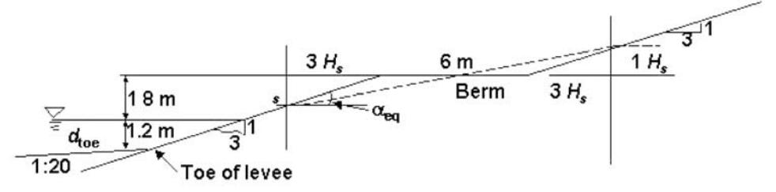
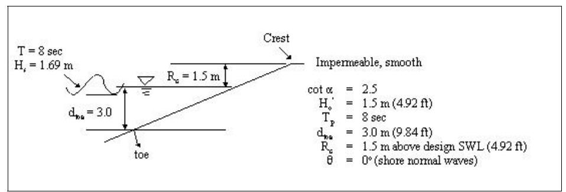
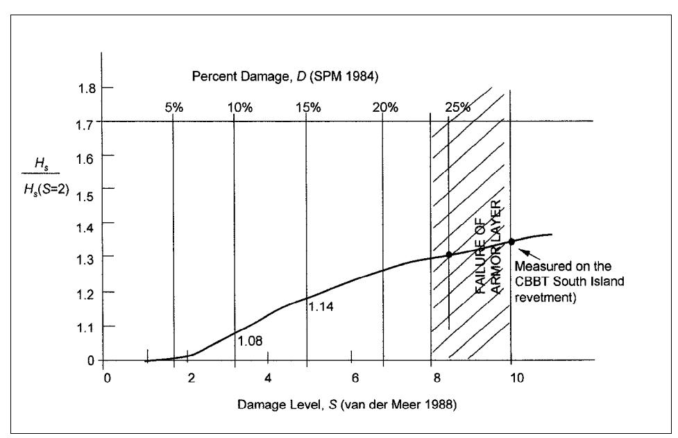
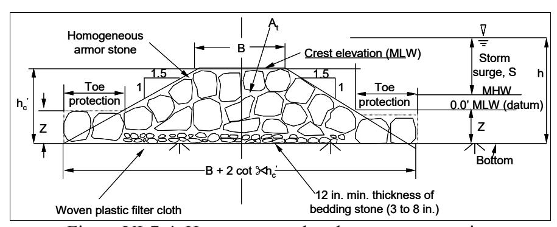
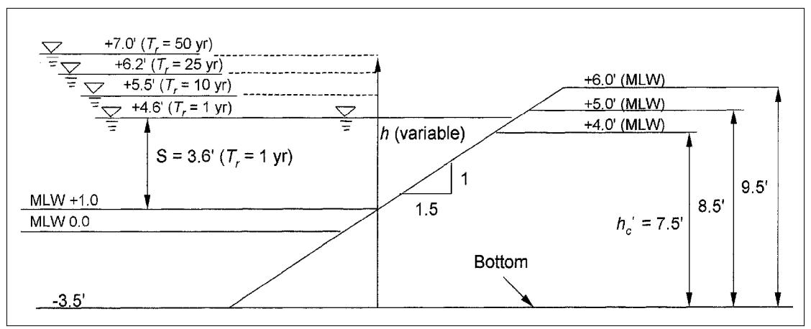

# CHAPTER 7

# Example Problems

# TABLE OF CONTENTS

Page VI-7-1. Introduction VI-7-1 VI-7-2. Wave Runup VI-7-2 VI-7-3. Wave Overtopping VI-7-21 VI-7-4. Armor Layer Stability VI-7-29 VI-7-5. Stability of Vertical Walled Bulkheads and Caissons VI-7-70 VI-7-6. Forces on Cylindrical Piles VI-7-86 VI-7-7. References VI-7-89 VI-7-8. Acknowledgements VI-7-91 VI-7-9. List of Symbols VI-7-91

# List of Figures

Page Figure VI-7-1. Smooth faced levee VI-7-18 Figure VI-7-2. Overtopping of an impermeable structure VI-7-25 Figure VI-7-3. Percent damage curve for CBBT South Island revetment VI-7-44 Figure VI-7-4. Homogeneous breakwater cross section VI-7-58 Figure VI-7-5. Variations in design water level and breakwater crest elevations VI-7-60

# CHAPTER VI-7

# Example Problems

# VI-7-1. Introduction.

- a. "Only the application makes the rod into a lever" is the famous remark of the philosopher Ludwig Wittgenstein (Pitcher 1964). All engineers remember their university days (and nights) doing homework problems that turned the lectures (rod) into useful information and tools (lever) by the application of the materials presented. Those textbooks with many example problems (and answers to the homework problems) always rate as the best.
- b. The Coastal Engineering Manual (CEM) is divided into six parts. The first four parts mainly cover the science surrounding the subject while the remaining Parts V and VI summarize the latest engineering knowledge, studies, designs, and constructions. Part VI-7 has been set aside for example problems. This chapter includes wave runup, wave overtopping, armor-layer stability, and forces on vertical-front structures.
- c. The single, most important coastal engineering advance has been the use of irregular water-wave spectra in the analytical treatment, physical (laboratory) experiments, and numerical model simulations to study wave runup, overtopping, and armor-layer stability. Coastal engineers must adopt this new technology quickly to prepare more cost-effective and safe designs in the future.
- d. Throughout the example problems chapter, several references to the Shore Protection Manual (1984) are made. By referencing the older document, an attempt has been made to identify differences in engineering practice between the older Shore Protection Manual and the newer Coastal Engineering Manual .
EM 1110-2-1100 (Part VI) Change 3 (28 Sep 11)
VI-7-2. Wave Runup.

# EXAMPLE PROBLEM VI-7-1

FIND: The surf-similarity parameter (also called the Iribarren number) for use in wave runup and wave overtopping calculations for long-crested, irregular waves on impermeable (without water penetration) and permeable slopes.
GIVEN: An impermeable structure has a smooth slope of 1 on 2.5 and is subjected to a design significant wave, Hs = 2.0 m (6.6 ft) measured at a gauge located in a depth, d = 4.5 m (14.8 ft). Design wave peak period is Tp = 8 s. Water depth at structure toe at high water is d toe = 3.0 m (9.8 ft). (Assume no change in the refraction coefficient between the structure and the wave gauge.)
SOLUTION: The surf-similarity parameter for irregular waves depends on the wave steepness and structure slope. Two definitions are given in Equation VI-5-2 formulated with either the peak wave period, Tp or the mean wave period, Tm ; but both use the significant wave height at the toe of the structure.
(Sheet 1 of 5)
Ideally, a spectral wave model would be used to shoal the irregular wave H_s to the structure toe. However, for purposes of illustration, it is assumed that H_s will shoal according to linear wave theory. For swell-type spectra this is reasonable assumption, but linear shoaling overestimates shoaling of fully saturated storm spectra.
<u>Item 1</u>. Linear, regular wave shoaling (illustrated by several of the available methods).
(a) Deep water.
First calculate the deep water, unrefracted wave height, H_o' from where measured back out to deep water. Using the depth where waves measured, and assuming T = T_p = 8 s and H = H_s gives

```math
\frac{d}{L_o} = \frac{2\pi d}{gT^2} = \frac{2\pi (4.5 \text{ m})}{(9.81 \text{ m/s}^2)(8 \text{ s})^2} = 0.0450
```

(1) From the Shore Protection Manual (1984), Table C-1, Appendix C for d/L_o = 0.0450 .

```math
\frac{H}{H_{o}^{'}}=1.042,\text{the shoaling coefficient, }k_{s}
```

Therefore,

```math
H_o' = \frac{2.0 \text{ m}}{1.042} = 1.92 \text{ m} (6.3 \text{ ft})
```

(2) or, using ACES (Leenknecht et al. 1992), Snell's Law, crest angle = 0.0^{\circ}

```math
H_o' = 1.92 \text{ m } (6.3 \text{ ft})
```

(3) or, using explicit approximations (e.g., Nielsen 1984)

```math
\frac{C_g}{C_o} = \sqrt{k_o d} \left[ 1 - \frac{1}{2} k_o d + \frac{7}{72} (k_o d)^2 \right]
```

```math
k _ { o } = \frac { 2 \pi } { L _ { o } } = \frac { 4 \pi ^ { 2 } } { g T ^ { 2 } }
```

```math
K _ { s } = \sqrt { 0 . 5 C _ { o } / C _ { g } }
```

(Sheet 2 of 5)
gives

```math
k_{o}d=0.28296,\quad\frac{C_{g}}{C_{o}}=0.46082,\quad K_{s}=1.0416,\quad H_{o}\phi=1.920\text{ m}(6.3\text{ ft})
```

(b) Toe of structure
Next, shoal the deepwater wave to a depth, d = 3.0 m (9.8 ft) at the toe of the structure
(1) From the Shore Protection Manual (1984), Table C-1, Appendix C for

```math
\frac{d_{toe}}{L_o} = \frac{2\pi d_{toe}}{gT^2} = \frac{2\pi (3.0 \text{ m})}{(9.81 \text{ m/s}^2)(8 \text{ s})^2} = 0.030023
```

(2) From ACES, Snell's law, crest angle = 0.0^{\circ} .

```math
H_{toe} = 2.161 (7.09 \text{ ft})
```

(3) From explicit approximations

```math
k_0 d = 0.18864, \frac{C_g}{C_o} = 0.39486, K_s = 1.1253, H_{toe} = 2.161\text{ m}(7.09\text{ ft})
```

(Sheet 3 of 5)
Item 2. Deepwater wave steepness, s_{op}

```math
(s_{op})_{toe} \equiv \frac{(H_s)_{toe}}{L_{op}} = \frac{2\pi H_{toe}}{gT_p^2} = \frac{2\pi (2.16 \text{ m})}{9.81 \text{ m/s}^2 (8 \text{ s})^2}
```

```math
s _ { o p } = 0 . 0 2 1 6 2
```

Item 3. Surf-similarity parameter, \xi_{op}
Finally, the surf-similarity parameter, \xi_{op} as defined by Equation VI-5-2 gives

```math
\xi_{op} \equiv \frac{\tan \alpha}{\sqrt{s_{op}}} = \frac{1/2.5}{\sqrt{0.02162}} = \frac{0.4}{0.1469}
```

Therefore,

```math
\xi_{op} = 2.72
```

Note that the subscript notation means using the deepwater wavelength, L_o , and the peak wave period, T_p , to calculate \xi_{op} .
Item 4. Surf-similarity parameter, \xi_{om}
The mean wave period, T_m , requires knowledge of variations in the width of the wave spectrum. From Section VI-5-2-a-(3)-(b) for the theoretical spectrums

```math
\text{JONSWAP spectra}
```

```math
T _ { m } / T _ { p } = 0 . 7 9 \mathrm { t o } 0 . 8 7
```

or

```math
\text{PIERSON-MOSKOWITZ spectra}
```

```math
T _ { m } / T _ { p } = 0 . 7 1 \mathrm { t o } \: 0 . 8 2
```

Therefore, assuming T_m/T_p = 0.76 , gives T_m = 6.1 s, hence

```math
s_{om} = \frac{H_{toe}}{\frac{g}{2\pi} T_m^2} = \frac{(2\pi)(2.16 \text{ m})}{9.81 \text{ m/s}^2 (6.1 \text{ s})^2} = 0.03718
```

(Sheet 4 of 5)
Therefore,

```math
\xi_{om} = \frac{\tan \alpha}{\sqrt{s_{om}}} = \frac{1/2.5}{\sqrt{0.03718}} = \frac{0.4}{0.1928}
```

```math
\xi _ { o m } = 2 . 0 7
```

Both \xi_{op} and \xi_{om} are employed in wave runup and overtopping formulations.
DISCUSSION: In general (for either \xi_{op} or \xi_{om} )

```math
\xi_o \equiv \frac{\tan \alpha}{\sqrt{s_o}}
```

```math
s _ { o } \equiv \frac { H _ { s } } { L _ { o } } = \frac { 2 \pi H _ { s } } { g T ^ { 2 } }
```

```math
\xi _ { o } \equiv \frac { \left( \tan \alpha \right) T } { \left( \displaystyle \frac { 2 \pi } { g } \right) ^ { 1 / 2 } \left( H _ { s } \right) ^ { 1 / 2 } }
```

or

```math
\xi_o \equiv \frac{T}{\left(K\right)\cot\alpha\left(H_s\right)^{1/2}}
```

where k is a constant.
- (1) As T increases, \xi_o increases
- (2) As cot \alpha increases (flatter slope), \xi_o decreases
- (3) As H_s increases, \xi_o decreases, nonlinearly
(Sheet 5 of 5)

#### EXAMPLE PROBLEM VI-7-2

FIND:
- (a) The height above the still-water level (SWL) to which a new revetment must be built to prevent wave overtopping by the design wave. The structure is to be impermeable.
- (b) The reduction in required structure height if uniform-sized armor stone is placed on the slope.
GIVEN: An impermeable structure has a smooth slope of 1 on 2.5 and is subjected to a design, significant wave H_s = 2.0 m (6.6 ft) measured at a gauge located in a depth d = 4.5 m (14.8 ft). Design wave peak period is T_p = 8 s. Water depth at structure toe at high water is d_{toe} = 3.0 m (9.8 ft).
SOLUTION: From Example Problem VI-7-1, linear wave theory estimates the wave height due to wave shoaling as

```math
(H_s)_{toe} = 2.16 \text{ m} (7.1 \text{ ft})
```

and the surf-similarity parameter as

```math
\xi_{op} = 2.72
```

To prevent wave overtopping, the wave runup value at the 2 percent probability of exceedance level is calculated. Figure VI-5-3 displays the considerable scatter in the data for smooth slopes, irregular, long-crested, head-on waves and Table VI-5-2 gives the coefficients for use in Equation VI-5-3 when

```math
\xi_{op} > 2.5
```

Namely

```math
\frac{R_{u2\%}}{(H_s)_{toe}} = -0.2\xi_{op} + 4.5 = -0.2(2.72) + 4.5 = -0.544 + 4.5 = 3.956
```

```math
R_{u2}\% = 3.956 (2.16 \text{ m}) = 8.545 \text{ m} (28.0 \text{ ft})
```

(Sheet 1 of 4)
So that,
- (a) Smooth slopes
- (1) To prevent overtopping; R_{u2\%} = 8.55 \text{ m} (28.1 \text{ ft})
(Note that \gamma_r = \gamma_b = \gamma_h = \gamma_\beta = 1.0 are taken in Equation VI-5-3 for smooth, no berm, Rayleigh distribution, and zero incidence angle conditions, respectively.)
Another set of runup data for smooth slopes is presented in Figure VI-5-5 and Equation VI-5-6 (from de Waal and van der Meer 1992). When

```math
\xi_{op} > 2.0
```

namely

```math
\frac{R_{u2\%}}{\left(H_s\right)_{toe}} = 3.0
```

hence,
- (2) To prevent overtopping; R_{u2\%} = 3.0 (2.18 \text{ m}) = 6.48 \text{ m} (21.3 \text{ ft}) Note that the data in Figure VI-5-5 is for slopes milder than 1 on 2.5, and thus may not be appropriate for this example.
- (b) Rough slopes
The surface roughness reduction factor \gamma_r for Equation VI-5-3 is given in Table VI-5-3 and lies in the range, \gamma_r = 0.5 -0.6 for one or more layers of rock.

```math
\gamma_r = 0.55
```

```math
\frac{R_{u2\%}}{(H_s)_{toe}} = 3.956 \, \gamma_r = 3.956 \, (0.55) = 2.176
```

hence

```math
R_{u2\%} = 2.176 (2.16 \text{ m}) = 4.70 (15.4 \text{ ft})
```

(Sheet 2 of 4)
and

```math
\frac{R_{u2\%}}{(H_s)_{toe}} = 3.0 \ \gamma_r = 3.0 (0.55) = 1.65
```

```math
R_{u2\%} = 1.65 (2.16 \text{ m}) = 3.56 \text{ m} (11.7 \text{ ft})
```

(3) The Delft Hydraulics test program (Table VI-5-4) also provided data for impermeable rock slopes. Here, the surf-similarity parameter based on mean wave period, \xi_{om} , is employed to develop design Equation VI-5-12 with coefficients in Table VI-5-5 for a wide range of exceedance probabilities. The \xi_{om} -value for this example ( \xi_{om} = 2.07 ) was estimated in Example Problem VI-7-1.
When \xi_{om} > 1.5

```math
\frac{R_{u2\%}}{(H_s)_{toe}} = 1.17 (\xi_{om})^{0.46} = 1.17 (2.07)^{0.46} = 1.635
```

Therefore, R_{u2\%} = 1.635 (2.16 m) = 3.353 m (11.6 ft) using coefficients for B and C at the 2% exceedance probability level. This result is very close to that in the preceding Equation VI-5-6 (2) taking \gamma_r = 0.55 .
(4) Partial safety factors, \gamma_H and \gamma_z and \hat{R}_{u2\%} . The Delft Hydraulics data set has been analyzed for partial safety factors as discussed in Part VI-6 and presented in Table VI-6-17.
Assume the annual failure probability P_f = 0.10 (90% reliability). For relatively low uncertainty in knowledge of the wave height ( \sigma'_{FHS} = 0.05 ) the values associated with Equation VI-6-57 yield

```math
\gamma_H \gamma_z = 1.2 (1.06) = 1.272
```

(Sheet 3 of 4)

### EXAMPLE PROBLEM VI-7-2 (Concluded)

and a probabilistic estimate, \hat{R}_{u2\%} = 1.272 \ (3.53 \ \text{m}) = 4.49 \ \text{m} \ (14.7 \ \text{ft}) . If the uncertainty is higher regards wave height ( \sigma'_{FHS} = 0.2 ) then

```math
\gamma_H \gamma_z = 1.3 (1.08) = 1.404
```

and a probabilistic estimate, \hat{R}_{u2\%} = 1.404 (3.53 \text{ m}) = 4.96 \text{ m} (16.3 \text{ ft}).
The range of \hat{R}_{u2\%} = 4.5\text{-}5.0 \text{ m} (14.8-16.4 ft) brackets the estimate of \hat{R}_{u2\%} = 4.7 \text{ m} (15.4 ft) as found from Equation VI-5-3. The higher estimate of the \hat{R}_{u2\%} value found from Equation VI-5-3 could also be explained as being reliable at the 90-percent annual level.
DISCUSSION: As seen in Figure VI-5-3, at \xi_{op} = 2.5 , R_{u2\%}/H_s reaches a maximum value. Solving for the variables involved in \xi_{op} gives approximately
Metric system

```math
\frac{(\tan \alpha) T_p}{\left(H_{toe}\right)^{1/2}} = 2.0
```

English system

```math
\frac{\left(\tan\alpha\right)T_p}{\left(H_{toe}\right)^{1/2}} = 1.10
```

For the preceding example, keeping tan = 0.4, H_{toe} = 2.16 m gives

```math
(T_p) = 7.35 \text{s for maximum runup}
```

For the preceding example, keeping T_p = 8.0 \text{ s} , H_{toe} = 2.16 \text{ m} gives

```math
\tan{\alpha} = 0.36,\cot{\alpha}=2.7\text{ for maximum runup}
```

Using a steeper or flatter slope will reduce the wave runup, all else being equal.

```math
(\text{Sheet 4 of 4})
```

#### EXAMPLE PROBLEM VI-7-3

FIND: The height above the SWL to which a rock-armored structure (permeable) should be built to prevent wave overtopping by the design wave.
GIVEN: The same information for Example Problem VI-7-2 as summarized as follows, but now for a permeable breakwater (jetty) structure

```math
\text{slope} = 1:2.5, H_s = 2.0 \text{ m (6.6 ft)}, \text{measured at d} = 4.5 \text{ m (14.8 ft)}, T_p = 8 \text{ s}, d_{toe} = 3.0 \text{ m (9.8 ft)}, \xi_{om} = 2.07, (H_s)_{toe} = 2.16 \text{ m}
```

SOLUTION: Core permeability may significantly influence wave runup. Notational permeability coefficients are defined in Figure VI-5-11. The previous Example Problem VI-7-2 was for P = 0.1 defined as impermeable. Test results shown in Figures VI-5-12 are with P = 0.1 and P = 0.5 and clearly reveal the runup reduction when \xi_{om} > 3 for permeable structures. Equation VI-5-13 has been developed as the central fit to the permeable data with coefficients again found in Table VI-5-5. For R_{u2\%} , B = 1.17, C = 0.46, and D = 1.97. Selection of the appropriate equation requires calculation of

```math
(D/B)^{1/C} = \left(\frac{1.97}{1.17}\right)^{\frac{1}{0.46}} = (1.68)^{2.17} = 3.10
```

Because 1.5 < \xi_{om} < (D/B)^{1/C} , use the equation

```math
\frac{R_{u2\%}}{(H_s)_{toe}} = B(\xi_{om})^C = 1.17(2.07)^{0.46} = 1.635
```

Therefore, R_{u2\%} = 1.635 (2.16 m) = 3.53 m (11.6 ft), and this is a similar result as for P = 0.1, impermeable slopes.
For the 2% runup exceedence level a value of

```math
\xi_{om} \equiv \frac{\tan \alpha}{\sqrt{s_{om}}} \ge 3.10
```

(Sheet 1 of 2)

# EXAMPLE PROBLEM VI-7-3 (Concluded)

is the point where the permeable core begins to reduce wave runup. Longer period waves will increase \xi_{om} , but the runup remains constant because of the structure permeability. At this limit,

```math
\frac{R_{u2\%}}{(H_s)_{toe}} = D = 1.97 \text{ (see Table VI-5-5)}
```

Therefore,

```math
(R_{u2\%})_\text{max} = 1.97 (2.16 \text{ m}) = 4.25 \text{ m} (\text{13.9 ft}) \text{ for } T_m \geq 9.1 \text{ sec} \left( T_p \approx 12s \right)
```

for a slope of 1 to 2.5.
(Sheet 2 of 2)

#### EXAMPLE PROBLEM VI-7-4

FIND: The height above the still-water level to which a revetment must be built to prevent wave overtopping by the design wave (same as Example Problem VI-7-2) but for the following conditions:
- (a) Statistical distributions of wave runup
- (b) Influence of shallow water on wave runup
- (c) Influence of wave angle and directional spreading on wave runup
GIVEN: Same conditions as Example Problem VI-7-2 for smooth slope
SOLUTION: Equation VI-5-3 holds in general for any R_{ui\%} defined as the runup level exceeded by i% of the incident waves. Coefficients A and C depend on both \xi_{op} and i for Rayleigh distributed wave heights.
- (a) Statistical distributions
- (1) Significant runup. Figure VI-5-4 displays the data scatter and Table VI-5-2 provides coefficients to calculate the significant wave runup, R_{us} . Again from Example Problem VI-7-1

```math
(H_s)_{toe} = 2.16 \text{ m} (7.1 \text{ ft})
```

and

```math
\xi_{op} = 2.72
```

For R_{us} in the range 2 < \xi_{op} < 9

```math
\frac{R_{us}}{(H_s)_{toe}} = -0.25\xi_{op} + 3.0 = -0.25(2.72) + 3.0 = -0.68 + 3.0 = 2.32
```

therefore,

```math
R_{us} = 2.32 (2.16 \text{ m}) = 5.01 \text{ m} (16.4 \text{ ft})
```

(Sheet 1 of 5)
The Shore Protection Manual (1984) calculated a runup value of 5.6 m (18.4 ft) for Example Problem No. 4 for the same data taking the design wave as the significant wave height. The Rayleigh distribution for wave heights gives the following relationships for extreme events

```math
\frac{H_{0.1}}{H_{0.135}} = 1.072, \quad \frac{H_{0.02}}{H_s} = 1.398, \quad \frac{H_{0.01}}{H_s} = 1.516
```

If the wave runup also followed a Rayleigh distribution, then it might be expected that

```math
\frac{R_{u0.2}}{R_{us}} = 1.398
```

gives

```math
R_{u0.2} = 1.398 (5.01 \text{ m}) = 7.0 \text{ m} (23.0 \text{ ft})
```

This result is much lower than R_{u2\%} = 8.55 m (28.1 ft) calculated in Example Problem-7-2 for the smooth slope. In general, values for R_{us} and R_{u2\%} calculated from Equation VI-5-3 and coefficients in Table VI-5-2 do not follow a Rayleigh distribution for wave runup.
(2) Statistical distribution of runup on permeable slopes
For the following restrictions:
- (1) Rayleigh distributed wave heights
- (2) Permeable, rock armored slopes
- (3) Slope, \cot \alpha > 2
Equation VI-5-15 says

```math
R_{up\%} = B \left(-\ln p\right)^{1/C}
```

where
R_{up\%} = runup level exceeded by p% of runup and
B, C are calculated from Equation VI-5-16 and 17, respectively
(Sheet 2 of 5)

*& lt;sup>1</sup> See discussion, p. VI-7-16.*

From Example Problem VI-7-1

```math
\xi_{om} = 2.07 (S_{om} = 0.03718)
```

and using the values for the permeable slope in Example Problem VI-7-3

```math
P = 0.5, \quad \tan{\alpha} = 0.4
```

Equation VI-5-18 gives

```math
\xi_{omc} = \left(5.77 P^{0.3} \sqrt{\tan \alpha}\right)^{\left[1/(P+0.75)\right]} = \left(5.77 (0.5)^{0.3} \sqrt{0.4}\right)^{\left[1/(1.25)\right]} = \left(2.964\right)^{0.8} = 2.385
```

Because

```math
\xi_{om} < \xi_{omc}
```

The value of C in Equation VI-5-17 is given for plunging waves as

```math
C = 3.0\left(\xi_{om}\right)^{-3/4} = 3.0(2.07)^{-3/4} = 1.738
```

```math
\frac{1}{C} = 0.5754
```

(NOTE: When C = 2, Equation VI-5-15 becomes the Rayleigh distribution)
The scale parameter from Equation VI-15-16 becomes

```math
B = H_s \left[ 0.4 (s_{om})^{-1/4} (\cot \alpha)^{-0.2} \right]
```

or
(Sheet 3 of 5)

```math
B=2.16\,\text{m}\left[0.4\left(0.03718\right)^{-1/4}(2.5)^{-0.2}\right]=2.16\,\text{m}[0.4(2.2773)(0.83255)]=2.16\,\text{m}[0.7584]\Rightarrow B=1.638\,\text{m}
```

Now check previous results using the above values for B and C in Equation VI-5-15

```math
R_{u2\%} = 1.638 \text{ m } \left[ -\ln(0.02) \right]^{1/1.738} = 1.638 \text{ m } (3.912)^{0.5754} = 1.638 \text{ m } (2.192) = 3.59 \text{ m } (11.8 \text{ ft}) \left[ (\text{From Example Problem VI-7-3, } R_{u2\%} = 3.53 \text{ m } (11.6 \text{ ft})) \right]
```

and

```math
R_{us} = 1.638\,\text{m}\left[-\ln(0.135)\right]^{0.5754} = 1.638\,\text{m}(2.002)^{0.5754} = 1.638\,\text{m}(1.491) = 2.44\,\text{m}\,(8.0\,\text{ft})
```

now

```math
\frac{R_{u2\%}}{R_{us}} = \frac{3.59 \text{ m}}{2.44 \text{ m}} = 1.47
```

which does not give the same ratio as the Rayleigh distribution for wave heights where H_{2\%} = 1.398 H_s .
(Sheet 4 of 5)

#### EXAMPLE PROBLEM VI-7-4 (Concluded)

At the 1 percent level

```math
R_{u1\%} = 1.638 \text{ m} \left[ -\ln(0.01) \right]^{0.5754} = 1.638 \text{ m} (4.605)^{0.5754} = 1.638 \text{ m} (2.4079) = 3.94 \text{ m} (12.9 \text{ ft})
```

For design, wave runup values calculated at the 2 percent exceedance probability level are considered a reasonable upper limit ". . . to prevent wave overtopping."
(b) Influence of shallow water on wave runup
Assuming the breaker index for shallow-water wave breaking is given by the ratio

```math
\left(\frac{H}{d}\right)_b = 0.78
```

then

```math
H_b = 0.78 d = 0.78 (3.0) = 2.34 \text{ m} (7.7 \text{ ft})
```

Therefore, because H_s = 2.16 \text{ m} < H_b , no breaking occurs. Therefore, assuming h = 1.0 is justified.
Note that if the design water depth at the structure toe dropped to 2.8 m (9.2 ft), then breaking begins. Equation VI-5-10 can only be applied where H_{2\%} and H_s are known from field data or numerical model results.
(c) Influence of wave angle and directional spreading
As seen in Equation VI-5-11, the previous results hold for wave angles, \beta less than 10 deg from normal incidence of long-crested swell-type, wave spectrums. Angles of incidence larger than 10 deg will reduce the wave runup ( \gamma_{\beta} < 1.0 ).
DISCUSSION: For other conditions, the statistical distribution of the wave runup has not been analyzed.
(Sheet 5 of 5)

#### EXAMPLE PROBLEM VI-7-5

FIND: Determine the wave runup at the 2 percent exceedance probability level for a composite slope shown in the following.
GIVEN: A smooth-faced breakwater of composite slope (m) shown with water depth, d_{\text{toe}} = 1.2 \text{ m} (3.9 ft) is subjected to a significant wave height in deep water H_o' = 1.5 \text{ m} (4.9 ft) and T_p = 8 \text{ s} . The offshore slope is 1:20.



*Figure VI-7-1. Smooth faced levee*

#### SOLUTION:

- (1) Wave height, (H_s) toe
- (a) SPM (1984)

```math
\frac{H_o'}{gT^2} = \frac{1.5 \text{ m}}{9.81 \text{ m/s}^2 (8 \text{ s})^2} = 0.0024
```

From Figure 7-3 (Shore Protection Manual 1984), at m = 0.05

```math
\frac { H _ { b } } { H _ { o } ^ { ' } } = 1 . 4 6 \mathrm { o r } H _ { b } = 1 . 4 6 ( 1 . 5 \mathrm { m } ) = 2 . 1 9 \mathrm { m } ( 7 . 1 9 \mathrm { f t } )
```

From Figure 7-2, Shore Protection Manual (1984), for m = 0:05 and

```math
\frac{H_b}{gT^2} = \frac{2.19 \text{ m}}{9.81 \text{ m/s}^2 (8 \text{ s})^2} = 0.0035
```

(Sheet 1 of 3)

```math
\frac{d_b}{H_b} = 0.93
```

```math
d_b = 0.93 (2.19 \text{ m}) = 2.04 \text{ m} (6.68 \text{ ft})
```

and occurs about 17 m (56 ft) in front of toe
(b) ACES (Leenknecht et al. 1992) Goda method not applicable for d < 3.048 m (10 ft)
Linear theory/Snell's law - Wave broken, H_b = 2.41 m, d_b = 2.33 m gives

```math
\frac{d_b}{H_b} = \frac{2.33}{2.41} = 0.97
```

(c) Assume wave energy decay continues from d_b = 2.1 - 2.3 m to toe of levee, hence,

```math
(H)_{\text{toe}} = \frac{d_b}{0.93} = \frac{1.2}{0.93} = 1.29 \text{ m } (4.2 \text{ ft})
```

Use (H_s)_{\text{toe}} = 1.29 \text{ m} at toe of levee
- (2) Berm influence factor, \gamma_b
- (a) Breaking wave surf similarity parameter based on an equivalent slope, \xi_{eq} . (See Figure VI-7-1)

```math
\alpha_{eq} = \tan^{-1} \left[ \frac{1.29}{3 + 3(1.29)} \right] = \tan^{-1} 0.188 = 10.63^{\circ} (1:5.3 \text{ slope})
```

average slope

```math
\alpha = \tan^{-1} 0.333 = 18.43^{\circ}
```

```math
s _ { o p } \equiv \frac { \left( H _ { s } \right) _ { t o e } } { L _ { o p } } = \frac { 2 \pi \left( H _ { s } \right) _ { t o e } } { g T _ { p } ^ { 2 } } = \frac { 2 \pi \left( 1 . 2 9 \right) } { 9 . 8 1 \mathrm { \, m / s } ^ { 2 } \left( 8 \mathrm { \, s } \right) ^ { 2 } } = 0 . 0 1 2 9 1
```

(Sheet 2 of 3)

### EXAMPLE PROBLEM VI-7-5 (Concluded)

therefore

```math
\xi_{eq} = \frac{\tan \alpha_{eq}}{\sqrt{s_{op}}} = \frac{0.188}{\sqrt{0.01291}} = 1.65
```

```math
\xi_{op} = \frac{\tan \alpha}{\sqrt{s_{op}}} = \frac{0.333}{\sqrt{0.01291}} = 2.93
```

From Equation VI-5-8

```math
\gamma_b = \frac{\xi_{eq}}{\xi_{op}} = \frac{1.65}{2.93} = 0.56
```

Since 0.6 < \gamma_b \ 1.0 , use \gamma_b = 0.6
For \xi_{eq} \leq 2 from Equation VI-5-7

```math
\frac{R_{u2\%}}{\left(H_{s}\right)_{toe}} = 1.5\xi_{op}\gamma_{r}\gamma_{b}\gamma_{h}\gamma_{\beta}
```

Take,
\gamma_r = 1.0 \text{ (smooth)}
\gamma_b = 0.6 berm influence
\gamma_h = 0.9 (since wave breaking begins 19 m (59 ft) from toe, assume some reduction in \gamma_h

```math
\gamma_{\beta}=1.0\;(\theta=0^{\circ})
```

gives

```math
\frac{R_{u2\%}}{(H_s)_{toe}} = 1.5(2.93)(1.0)(0.6)(0.9)(1.0)
```

[NOTE: By composite method, Shore Protection Manual (1984) gave R_{us} = 1.8 \text{ m} (5.9 ft). Assuming Rayleigh distribution

```math
R_{u2\%}/R_{us} = 1.4 \text{ m } (4.6 \text{ ft}) \text{ so } R_{u2\%} = 2.5 \text{ m } (8.2 \text{ ft})
```

(Sheet 3 of 3)

# VI-7-3. Wave Overtopping.

#### EXAMPLE PROBLEM VI-7-6

FIND: Estimate the average overtopping discharge rate for the given wave, water level, and structure geometry.
GIVEN: An impermeable structure with a smooth slope of 1-on-2.5 (tan \alpha = 0.4) is subjected to waves having a deepwater, significant height H_o = 1.5 m (4.9 ft) and a period T = 8 s. Water depth at the structure toe is d_{toe} = 3.0 m (9.8 ft) relative to design still-water level (SWL). The crest elevation, R_L is 1.5 m (4.9 ft) above the design, SWL. Onshore winds of 18 m/s (35 knots) are assumed.
SOLUTION: Table VI-5-7 lists two models applicable for this example, to determine the average overtopping discharge rate, q (cu m/s per meter) from two formulas, namely Owen (1980, 1982) and van der Meer and Janssen (1995). Both require knowledge of the wave height, H_s at the toe of the structure.
Assume wave direction is shore normal to the structure.
- (1) Wave height, H_s at structure toe
- (a) Linear wave theory

```math
L_o = \frac{g}{2\pi} T^2 = \frac{9.81 \text{ m/s}^2}{2\pi} (8 \text{ s})^2 = 99.92 \text{ m} (327.8 \text{ ft})
```

```math
\frac { d } { L _ { o } } = \frac { 3 . 0 } { 9 9 . 9 2 } = 0 . 0 3 0 0
```

```math
\frac { H } { H _ { o } ^ { ' } } { = } 1 . 1 2 5
```

(Table C-1, Shore Protection Manual 1984)

```math
\mathrm { A s s u m e } \ H = H _ { s } = 1 . 1 2 5 ( 1 . 5 \ \mathrm { m } ) = 1 . 6 9 \ \mathrm { m } \ ( 5 . 5 \ \mathrm { f t } ) \ ( \mathrm { n o n b r e a k i n g } )
```

(b) Irregular wave, Goda method, see ACES (Leenknecht et al. 1992)

```math
H_s = 1.6 \text{ m} (5.2 \text{ ft}) \text{ (Checks okay)}
```

(Sheet 1 of 4)
- (c) Use (H_s)_{toe} = 1.69 \text{ m} (5.5 ft) (conservative)
- (2) Table VI-5-8, Owen (1980, 1982)
Using Equation VI-5-22

```math
\frac{q}{gH_sT_{om}} = a \exp\left(-b\frac{R_c}{H_s}\sqrt{\frac{s_{om}}{2\pi}}\frac{1}{\gamma_r}\right)
```

requires knowledge of T_{om} . As discussed in VI-5-2-a-(3)-(b), the relation between T_m and T_p can be estimated from
JONSWAP spectra

```math
T_m/T_p = 0.79 - 0.87
```

or in deep water
Pierson-Moskowitz spectra T_m/T_p = 0.71 - 0.82
here, take T_m = 0.8 T_p so that T_m = 6.4 \text{ sec} = T_{om}
Therefore,

```math
L_{om} = \frac{g}{2\pi} T_m^2 = \frac{9.81 \text{ m/s}^2}{2\pi} (6.4 \text{ s})^2 = 63.9 \text{ m} (210 \text{ ft})
```

and

```math
s_{om} = \frac{H_s}{L_{om}} = \frac{1.69 \text{ m}}{63.9 \text{ m}} = 0.02645
```

Now from the coefficients table for smooth slopes shown in Table VI-5-8

**Table VI-5-8. **

| Slope a | b |
| --- | --- |
| 1:2.0 0.0130 | 22 |
| 1:2.5 0.0145 | 27 ← by linear interpolation |
| 1:3.0 0.0160 | 32 |

Therefore, with \gamma_r = 1.0 (smooth slope)

```math
q = 0.0145 \exp \left( -27 \frac{1.5 \text{ m}}{1.69 \text{ m}} \sqrt{\frac{0.02645}{2\pi} \cdot 1} \right) = 0.0145 \exp(-1.5549) = 0.0145(0.21122) = 0.003063
```

(Sheet 2 of 4)
or

```math
q = (9.81\,\text{m/s}^2)(1.69\,\text{m})(6.4\,\text{s})(0.003063) = 106.10 \times 0.003063 = 0.325\, \text{m}^3/\text{s}\ \text{per meter width (3.5 ft}^3/\text{s per foot width)}
```

(3) Table VI-5-11, van der Meer and Janssen (1995)
The data used to develop Equation VI-5-24 are shown in Figure VI-5-15 (top plot) for \xi_{op} < 2. This is a comprehensive data set showing the 95 percent confidence bands for the data.
Using T_p = 8 s gives:

```math
s_{op} = \frac{H_s}{L_{op}} = \frac{1.69 \text{ m}}{99.92 \text{ m}} = 0.01691
```

so that

```math
\xi_{op} = \frac{\tan \alpha}{\sqrt{s_{op}}} = \frac{0.4}{\sqrt{0.01691}} = \frac{0.4}{0.13} = 3.08
```

Therefore:

```math
\xi_{op} > 2
```

so that Equation VI-5-25 (see bottom plot of Figure VI-5-15) governs.
Using Equation VI-5-25

```math
{ \frac { q } { \sqrt { 9 . 8 1 \, { \mathrm { m / s ^ { 2 } } } \left( 1 . 6 9 \, { \mathrm { m } } \right) ^ { 3 } } } } = 0 . 2 \exp \left( - 2 . 6 { \frac { 1 . 5 \, { \mathrm { m } } } { 1 . 6 9 \, { \mathrm { m } } } } \, { \frac { 1 } { \left( 1 . 0 \right) \left( 1 . 0 \right) \left( 1 . 0 \right) \left( 1 . 0 \right) \left( 1 . 0 \right) } } \right)
```

with all the reduction factors as unity.
(Sheet 3 of 4)

### EXAMPLE PROBLEM VI-7-6 (Concluded)

or

```math
q = \sqrt{(9.81 \text{ m/s}^2)(1.69 \text{ m})^3} \cdot 0.2 \exp(-2.30769)
```

```math
q = 6 . 8 8 \, \mathrm { m } ^ { 3 } / \mathrm { s } \, ( 0 . 0 1 9 9 )
```

```math
q = 0 . 1 3 7 \, \mathrm { m ^ { 3 } / s } \, \mathrm { p e r \, m e t e r \, w i d t h } \, ( 1 . 4 7 \, \mathrm { f t ^ { 3 } / s } \, \mathrm { p e r \, f o o t \, w i d t h } )
```

This result is considerably lower than that found from Table VI-5-8 by Owen (1980, 1982). However, a check of this result by examining the data scatter in the lower plot of Figure VI-5-15 provides some insight.
For a value on the horizontal axis of

```math
\frac{R_c}{H_s} \frac{1}{\gamma_r \gamma_b \gamma_h \gamma_{\beta}} = \frac{1.5 \text{ m}}{1.69 \text{ m}} \frac{1}{1.0} = 0.89
```

the range covered on the vertical axis by the data is about

```math
\frac{q}{\sqrt{gH_3^3}} = \begin{cases} 5(10^{-2}) \\ 1(10^{-2}) \end{cases} 0.0199 \approx 2(10^{-2}) \text{ (mean)}
```

Therefore

```math
q = 
\begin{cases} 
0.344 & 3.7 \\
0.136 arrow \text{mean, m}^3/\text{s per meter} & 1.46 arrow \text{mean, ft}^3/\text{s per foot} \\
0.069 & 0.74 
\end{cases}
```

The range of q at the 95 percent confidence level is about 0.07 to 0.34 m<sup>3</sup>/s per meter. The result from Table VI-5-8 with q = 0.32 m<sup>3</sup>/sec per meter (3.44 ft<sup>3</sup>/sec per foot) now seems reasonable.
This example problem is identical to Example Problem 8 in Chapter 7 of the Shore Protection Manual (1984) where the average overtopping rate \bar{Q}=0.3~\text{m}^3/\text{s} per meter (3.23 ft<sup>3</sup>/s per foot) was found. The Shore Protection Manual result included a factor for wind that is not included. Because of the range of variability in the time-average overtopping discharge rate, the rate of
q = 0.3 \text{ m}^3/\text{s} per meter width
indicates a potential danger for vehicles, pedestrians, and the safety of structures as illustrated in Table VI-5-6. Therefore, raising the crest elevation should be considered.
(Sheet 4 of 4)

#### EXAMPLE PROBLEM VI-7-7

#### FIND:

a. Estimate the overtopping volumes of individual waves, and overtopping distributions for the given wave, water level, and structure geometry.
b. What effect does the structure permeability have on the results?
GIVEN: The identical conditions of Example Problem VI-7-6 (see sketch)



*Figure VI-7-2. Overtopping of an impermeable structure*

SOLUTION: From Example Problem VI-7-6

```math
q = 0.3 \text{ m}^3/\text{s} \text{ per meter } (3.23 \text{ ft}^3/\text{s per foot})
```

is the average overtopping discharge rate for waves with (H_s)_{toe} = 1.69 m (5.54 ft) and T_m = 6.4 s.
Equation VI-5-30 (or VI-5-31) with coefficient B (Equation VI-5-32) depend on P_{ow} , probability of overtopping per incoming wave.
(1) Rayleigh distribution for runup on smooth, impermeable slopes.
Assuming the runup levels follow a Raleigh distribution, Equation VI-5-33 gives for the probability of overtopping per incoming wave,

```math
P_{ow} = \exp \left[ -\left(\frac{R_c}{c H_s}\right)^2 \right]
```

(Sheet 1 of 4)
and Equation VI-5-34 gives

```math
c = 0.81 \xi_{eq} \gamma_r \gamma_h \gamma_{\beta}
```

From Example Problem VI-7-6, taking

```math
\xi_{eq} = \xi_{op} = 3.07
```

and all other reduction factors of unity, gives

```math
c = 0.81 (3.07) (1.0) (1.0) (1.0) = 2.49
```

and

```math
P_{ow} = \exp\left[-\left(\frac{1.5 \text{ m}}{2.49(1.69 \text{ m})}\right)^2\right]
```

```math
P_{ow} = 0.88 = \frac{\text{number of overtopping waves}}{\text{number of incoming waves}}
```

This large percentage is due to the relatively low, crest elevation of the structure.
(2) Other distributions
As shown in Example Problem VI-7-4, the relation between

```math
\frac{R_{u2\%}}{R_{us}} = \frac{8.55}{5.01} = 1.71
```

for smooth, impermeable slopes is much different than the Rayleigh distribution for wave heights where H_{0.02}/H_s = 1.398 . Until further research is conducted, however, it must be assumed that wave runup on smooth, impermeable slopes can be approximated by the Rayleigh distribution.
(a) Overtopping volumes of individual wave, V
From Equation VI-5-32

```math
B = 0.84 \frac{T_m q}{P_{ow}} = 0.84 \frac{(6.4 \text{ s})(0.3 \text{ m}^3/\text{s/m})}{0.88}
```

```math
B = 1.833 \text{ m}^3/\text{m}
```

(Sheet 2 of 4)
as the scale factor for the one-parameter, Weibull distribution given by Equation VI-5-31, so that

```math
V = (1.833 \text{ m}^3/\text{m}) \left[-\ln (p_>)\right]^{4/3}
```

where p_> is the probability of an individual wave overtopping volume (per unit width) exceeding the specified overtopping volume, V (per unit width), for some representative probabilities of exceedance for individual waves,

| P > | V(m3/m) | V (ft3/ft) |
| --- | --- | --- |
| 0.5 | 1.12 | 12.1 |
| 0.135 | 4.62 | 49.7 |
| 0.10 | 5.57 | 60.0 |
| 0.05 | 7.92 | 85.3 |
| 0.02 | 11.29 | 121.5 |
| 0.01 | 14.04 | 151.1 |
| 0.001 | 24.11 | 259.5 |

The maximum overtopping volume per unit width, V_{\text{max}} produced by one wave can be estimated from Equation VI-5-35 with B=1.833 m<sup>3</sup>/m, i.e., V_{max}=1.833 ( ln\ N_{ow} )<sup>4/3</sup> which depends on storm duration, t.
Assuming T_m = 6.4 s over the storm duration, t, and P_{ow} = 0.88

| t |  | Vmax |  |  |  |
| --- | --- | --- | --- | --- | --- |
| hr | N_w | N_{ow} | m^3/m | ft 3 /ft | Remarks |
| 1 | 563 | 495 | 20.9 | 225 |  |
| 2 | 1125 | 990 | 24.7 | 266 | Similar to P > 0.001 |
| 5 | 2813 | 2475 | 28.4 | 306 |  |
| 10 | 5630 | 4954 | 31.8 | 342 |  |
| 15 | 8438 | 7425 | 33.8 | 364 |  |
| 20 | 11250 | 9900 | 35.3 | 380 |  |
| 24 | 13500 | 11880 | 36.3 | 391 | Gives P > = 0.0001 |

(Sheet 3 of 4)

# EXAMPLE PROBLEM VI-7-7 (Concluded)

Storm surge hydrographs with varying design water levels and accompanying wave condition variability during the storm will modify these results, considerably.

# (b) Effect of structure permeability

No data exist for permeable, straight and bermed slopes as summarized in Table VI-5-7, to estimate average wave overtopping discharge rates. However, as shown in Example VI-7-2 for a rough, impermeable slope

```math
R _ { u 2 ^ { \circ } { \circ } _ { 0 } } = 4 . 7 0 \mathrm { m } ( 1 5 . 4 \mathrm { f t } ) ( \mathrm { E q u a t i o n V I } \mathrm { - } 5 \mathrm { - } 3 ) \gamma = 0 . 5 5
```

using various models. And, as shown in Example VI-7-3 for rock-armored, permeable-slopes ( P = 0.5).

```math
R_{u2\%} = 3.53 \text{ m} (11.6 \text{ ft}) \text{ (Equation VI-5-3)} \text{ (Table VI-5-5)}
```

The runup elevation at the 2% exceedance level for this example is about the same for permeable and impermeable slopes.
Statistical distribution for wave runup on rock-armored, permeable slopes are discussed in Part VI-5-2-b.(4)(b) and best-fit, by a two-parameter Weibull distribution (Equation VI-5-14). Structure permeability absorbs the higher frequency runup components to modify the distribution from that given by the Rayleigh distribution.
Research is needed for the probability distribution of wave overtopping per incoming waves on permeable slopes.
(Sheet 4 of 4)

# VI-7-4. Armor Layer Stability.

#### EXAMPLE PROBLEM VI-7-8

FIND: The weight of uniform-sized armor stone placed on an impermeable revetment slope with nonovertopping waves.
GIVEN: An impermeable structure (revetment) on a freshwater shore has a slope of 1 on 2.5 and is subjected to a design, significant wave height, H_s = 2.0 m (6.6 ft) measured at a gauge located in a depth, d = 4.5 m (14.8 ft). Design wave peak period, T_p = 8 s. Design depth at structure toe at high water is d_{toe} = 3.0 m (9.8 ft).
SOLUTION: From Example Problem VI-7-1, linear wave theory gives the wave height due to shoaling at the structure toe as:

```math
(H_s)_{toe} = 2.16 \text{ m} (7.0 \text{ ft})
```

ASSUMPTIONS: (See Tables VI-5-22 and VI-5-23)
- 1. Fresh water, \rho_w = 1,000 \text{ kg/m}^3
- 2. Rock, \rho_s = 2,650 \text{ kg/m}^3
- 3. Two layers, n = 2, random placement
- 4. Quarry stone, rough angular
- 5. No damage criteria (see Table VI-5-21 for damage values, D and S)
Item 1. Hudson (1974), Shore Protection Manual (1984)
Use H = H_{0.1} = 1.27 H_s for the Rayleigh distributed wave heights and related K_D -values for stability coefficient. These recommendations of Shore Protection Manual (1984) introduce a factor of safety compared to that recommended in the Shore Protection Manual (1977). The no-damage range is D = 0.5 percent.
From Equation VI-5-67, rearranged for the median rock mass

```math
M_{50} = \frac{\rho_s H^3}{K_D \left(\rho_s / \rho_w - 1\right)^3 \cot \alpha}
```

Noting

```math
W_{50} = M_{50}g
```

(Sheet 1 of 6)
this equation becomes

```math
W_{50} = \frac{\rho_s g H^3}{K_D \left(\rho_s / \rho_w - 1\right)^3 \cot \alpha}
```

By definition
\gamma_s = \rho_s g = \text{unit weight of rock}
and
\rho_s/\rho_w = s , the specific gravity for rock
SC

```math
W_{50} = \frac{\gamma_s H^3}{K_D (s-1)^3 \cot \alpha}
```

which is the more familiar form of the Hudson formula. K_D is the Hudson stability coefficient.
At the toe, \frac{H_s}{d} = \frac{2.16 \text{ m}}{3.0 \text{ m}} = 0.7 , and the wave condition is close to breaking for shallow water.
If H_s is assumed to be equivalent to the energy-based significant wave height, H_{mo} , then the maximum depth-limited H_{mo} 0.6 d. Therefore, the maximum breaking wave at the structure toe would be the maximum monochromatic breaking wave.
If H_s is taken equal to H_{1/3} , then H_s > H_{mo} near the point where a significant portion of waves in the distribution are breaking. In this case, calculate H_{0.1} to see if it is greater than the maximum breaking wave at the structure toe, then use the lesser of the two.
In summary, determination of wave breaking depends on which definition of significant wave height ( H_{mo} or H_{1/3} ) is used to transform the waves to the toe of the structure.
For this example, assume H_s = H_{mo} . Therefore, linear shoaling has given an unrealistically large estimate of H_s . So assume H_s = 0.6 d = 0.6 (3.0 \text{ m}) = 1.8 \text{ m} (5.9 \text{ ft}) .
The maximum breaking wave height at this depth (assuming a horizontal approach slope) is

```math
H_b = 0.78 d = 0.78 (3.0 \text{ m}) = 2.34 \text{ m} (7.7 \text{ ft})
```

(Sheet 2 of 6)
For breaking waves on randomly-placed, rough angular stone, use K_D = 2.0 in Hudson's equation

```math
W_{50} = \frac{(2,650 \text{ kg/m}^3)(9.81 \text{ m/s}^2)(2.34 \text{ m})^3}{2.0(2.65-1)^3(2.5)} = 14,830 \text{ N } (3,334 \text{ lb})
```

The equivalent cube length is given by

```math
D_{n50} = \left(\frac{W_{50}}{\rho_s g}\right)^{1/3} = \left[\frac{14,830 \text{ kg} - \text{m/s}^2}{\left(2,650 \text{ kg/m}^3\right)\left(9.81 \text{ m/s}^2\right)}\right] = 0.83 \text{ m } (2.7 \text{ ft})
```

Item 2. Van der Meer (1988), Table VI-5-23
Additional assumptions and data input are required. See Table VI-5-23.
(a) Notational permeability coefficient, P.
As shown on Figure VI-5-11 for impermeable, rock revetments,

```math
P = 0.1
```

(b) Number of waves, N_z
This value depends on the length of the storm and average wave period during the storm. For example, a 13-14 hr storm with average wave period, T_m = 6.6 s would produce about 7,500 waves. When N_z > 7,500 , the equilibrium damage criteria is obtained.

```math
N_z = 7,500
```

(c) Relative eroded (damage) area, S. This variable is defined by Equation VI-5-60.

```math
S \equiv \frac{A_e}{D_{n50}^2}
```

where A_e is the eroded cross-section area around the SWL. Thus, S is a dimensionless damage parameter, independent of slope length. Table VI-5-21 presents damage levels (initial, intermediate, failure) for a two-layer armor layer (n=2). For a slope 1:2.5 (interpolate between 1:2 and 1:3).
Initial damage, S = 2Intermediate damage, S = 5.0-7.5Failure, S \ge 10
(Sheet 3 of 6)
Hence, for initial or no damage condition, use

```math
S = 2 (\text{nominal value})
```

For irregular waves striking the revetment at 90 deg (normal), the applicable formulas of van der Meer (1988) are found in Table VI-5-23. Two cases exist depending on whether the waves are (1) plunging or (2) surging against the revetment slope.

```math
\xi_m < \xi_{mc}
```

Recall Example VI-7-1 where the surf-similarity parameter, \xi_m was defined and discussed. Here, it is determined for a mean wave period, T_m using the wave height at the toe, H_{toe} . Therefore, using H_s = 1.8 m and T_m = 6.6 s,

```math
s_{om} = \frac{H_{toe}}{\frac{g}{2\pi} (T_m)^2} = \frac{1.8 \text{ m} (2\pi)}{9.81 \text{ m/s}^2 (6.6 \text{ s})^2} = 0.02647
```

Here, it is assumed that T_m = 0.82 T_p , which is an average relation and slightly different than that employed for Example Problem VI-7-1.
Now it is found that

```math
\xi_m = \frac{\tan \alpha}{\sqrt{s_{om}}} = \frac{1/2.5}{\sqrt{0.02647}} = 2.46
```

As discussed in Table VI-5-23, if _m < _{mc} where

```math
\xi_{mc} \equiv \left[ 6.2 P^{0.31} \left( \tan \alpha \right)^{0.5} \right]^{1/(P+0.5)}
```

then, the plunging waves Equation VI-5-68 is applicable. Hence,

```math
\xi_{mc} = \left[6.2(0.1)^{0.31}(0.4)^{0.5}\right]^{1/0.6}
```

gives

```math
\xi_{mc} = 2.97
```

(Sheet 4 of 6)
Therefore, \xi_m < \xi_{mc} so that the plunging wave conditions apply. It is convenient to apply the stability paramater, N_z form (see Equation VI-5-58) to give

```math
\frac{H_s}{\Delta D_n} = 6.2 \ S^{0.2} P^{0.18} N_z^{-0.1} \xi_m^{-0.5}
```

from Table VI-5-23. Or,

```math
\frac{H_s}{\Delta D_n} = 6.2(2)^{0.2} (0.1)^{0.18} (7500)^{-0.1} (2.46)^{-0.5} = 1.23
```

which gives for H = H_s = 1.8 \text{ m}, \Delta = (s - 1) = 1.65

```math
D_{n50} = \frac{H_s}{1.23\Delta} = \frac{1.8 \text{ m}}{1.23(1.65)} = 0.89 \text{ m} (2.9 \text{ ft})
```

and

```math
W_{50} = \rho_\mathrm{s} g (D_{n50})^3 = (2,650 \text{ kg/m}^3) (9.81 \text{ m/s}^2) (0.89 \text{ m})^3 = 18,327 \text{ N} (4,120 \text{ lb})
```

The stability number is N_s = 1.23 . Statically stable breakwaters have this stability parameter in the range 1-4 for H_o T_o < 100 (van der Meer 1990).
DISCUSSION: In summary, for the breaking wave, storm, and damage conditions, i.e.,

```math
H_s = 1.8\,\text{m}, H_b = 2.34\,\text{m}, T_p = 8\,\text{s}, S = 2, N_z = 7500 \ (\text{13-14 hr storm})
```

Hudson (1974) W_{50} = 14,830 \text{ N} (3,334 lb) breaking wave van der Meer (1988) W_{50} = 18,327 \text{ N} (4,120 lb) plunging wave
and it can be said that both methods give simular results.
(Sheet 5 of 6)
The Hudson (1974) formula and therefore, the Shore Protection Manual (1984) method limitations include:
no wave period effects no storm duration effects damage level limited to range 0-5%
and others as discussed in subsequent examples. The wave period effects have long been discussed as an important missing element in the Hudson (1974) formulation. For example, as shown in Example VI-7-1, as T increases, the surf similarity parameter increases. If the period in the preceding example was increased, the following results would be obtained from the van der Meer (1988) formulation for plunging waves (Table VI-5-23).

**Table VI-5-23. ).**

| Period, s |  |  |  |
| --- | --- | --- | --- |
| Tp | Tm W50, N | Remarks |  |
| 9.0 | 7.38 |  | 21, 478 Plunging Waves formula okay |
| 10.0 | 8.2 |  | 23, 865 Use Surging Wave formula, Equation VI-5-69 |
| 11.0 | 9.02 |  | 23, 194 Use Surging Wave formula, Equation VI-5-69 |

Example VI-7-9 demonstrates the practical importance of wave period on armor layer stability.
(Sheet 6 of 6)

#### EXAMPLE PROBLEM VI-7-9

#### FIND:

- 1. The design wave height for a stable, uniform-sized armor stone placed on an impermeable revetment slope with non-overtopping waves.
- 2. Study the evolution in armor stability design since the 1960's including such factors as alteration in coefficients, wave period, and partial safety factors for design.
GIVEN: In the early 1960's, the Chesapeake Bay Bridge Tunnel (CBBT) islands were constructed with 10 ton (U.S. units) armor stones on a 1:2 slope (single layer) as a revetment for storm protection. The CBBT revetments have been relatively stable and survived many northeasters and hurricanes.
On 31 October 1991, the famous Halloween storm caused severe damage to the revetment. (This storm has been the subject of a best selling novel "The Perfect Storm," Junger (1997) and a Hollywood movie "The Storm of the Century"). Hydrographic surveys determined the extent of damage as discussed in Example Problem VI-7-10.
Wave conditions measured at the U.S. Army Engineers Field Research Facility (FRF) located 65 miles south in 8 m (26.2 ft) water depth were H_s = 4.6 m (15.1 ft), T_p = 22 sec. At the Virginia Beach wave gauge VA001 also located in 8 m depth, H_s = 2.6 m (8.53 ft) and T_p about 23 sec under peak conditions. These waves came from 90 deg (True North) direction and lasted about 12 hours. The measured storm surge at Hampton Roads tide gauge (Sewells Pt.) was 0.85 m (2.8 ft).
ASSUMPTIONS: (See Tables VI-5-22 and VI-5-23)
- 1. Sea water, \rho_w = 1{,}030 \text{ kg/m}^3 .
- 2. Rock, \rho_s = 2,650 \text{ kg/m}^3 .
- 3. One layer, n = 1, rough angular, random placement.
- 4. No-damage criteria (see Table VI-5-21 for D and S damage values).

#### SOLUTION:

Item 1. Hudson (1974), SPM (1977)
Estimate the stable design wave height H = H_s . From Equation VI-5-67.

```math
\frac{H}{\Delta D_{n50}} = \left(K_D \cot \alpha\right)^{1/3}
```

```math
W_{50} = (\rho_s g) (D_{n50})^3 = 10 \text{ tons} = 20,000 \text{ lbs} (89,000 \text{ N}), \quad \rho_s g = \gamma_s = (5.14 \text{ slugs/ft}^3) (32.2 \text{ ft/s}^2) = 165.6 \text{ lb/ft}^3 (26,000 \text{ N/m}^3)
```

(Sheet 1 of 7)
The equivalent cube length is given as:

```math
D_{n50} = \left(\frac{20,000 \text{ lbs}}{165.6 \text{ lb/ft}^3}\right)^{1/3} = 4.94 \text{ ft } (1.51 \text{ m})
```

Now, considering only wave breaking events on the revetment, as seen in Table VI-5-22, K_D values employed in 1977 were K_D = 3.5 for randomly-placed, rough, angular stone. Rearranging Equation VI-5-67

```math
H_b = \Delta D_{n50} \left( K_D \cot \alpha \right)^{1/3} = \left( \frac{\rho_s}{\rho_w} - 1 \right) (4.94 \text{ m}) (3.5 \square 2.0)^{1/3}
```

If the stones were smooth and rounded, K_D = 2.1 giving H_b = 12.5 ft (3.8 m). These 10-ton stones would be less stable.
Item 2. Hudson (1974), SPM (1984)
The SPM (1984) took H_{1/10} = 1.27 H_s from the Rayleigh Distribution for a non-breaking conditions and reduced the Hudson coefficients as a result of additional testing using irregular waves. For breaking wave conditions, use H_b as the wave height.

```math
H_b = 1.57(4.94)(2.0\Box2.0)^{1/3} = 12.3\text{ ft (3.76 m)}
```

so that H_b = 12.3 ft (3.76 m) for the stable conditions
Note also that for smooth stones ( K_D = 1.2 ) gives H_b = 10.4 ft (3.17 m).
These results should be interpreted to demonstrate that for a given armor stone weight the design wave height for the stable, no-damage condition has decreased by about 22 percent using the SPM (1984) for breaking waves. Assuming the breaking wave height is approximately equal to H_{1/10} , the corresponding significant wave height is

```math
H_s = H_b / 1.27 = 12.3 \text{ ft/} 1.27 = 9.7 \text{ ft } (2.96 \text{ m})
```

(Sheet 2 of 7)
Wave heights measured at Duck, NC ( H_s = 4.6 m) and at Virginia Beach, VA, during the storm event exceeded the design wave height, so it reasonable to assume waves at the CBBT site also exceed the design wave height.
The Halloween Storm event was unique to the Atlantic Ocean, East Coast for the very long period swell waves ( T_p > 20 sec) generated and recorded. Wave period is not a variable in the Hudson formula.
Item 3. van der Meer (1988), Table VI-5-23
Now consider for irregular, head-on waves on rock, non-overtopping slopes, the formulas of van der Meer (1988) as shown in Table VI-5-23.
Assume as additional, needed variables
P = 0.1 for impermeable, rock revetments

```math
N_z = \frac{t}{T_m} = \frac{12 \text{ hrs } (3,600 \text{ s/hr})}{18.3 \text{ sec}} = 2,360 \text{ waves}
```

S = 2 (nominal value) for the initial, no-damage condition

```math
T_p = 22.0 \text{ sec } (T_m = 18.3 \text{ sec})
```

(a) Determine which stability equation is applicable.
Because of the very long wave period, T_p = 22 sec giving T_m \approx 18.3 sec, the surf-similarity parameter, \xi_m given by

```math
\xi_m = \frac{\tan \alpha}{\sqrt{S_m}}
```

with

```math
s_m = \frac{H_{toe}}{\frac{g}{2\pi} (T_m)^2}
```

gives a relatively large value of \xi_m . For example, taking H_s = 5.75 ft (1.75 m) gives \xi_m = 8.63 . But the critical \xi_{mc} is found from Table VI-5-23.
(Sheet 3 of 7)

```math
\xi_{mc} = 6.2 P^{0.31} (\tan \alpha)^{0.5} \left( \frac{P}{P+0.5} \right)^{1/0.6}
```

Therefore, since \xi_m > \xi_{mc} , Table VI-5-23 requires that the Surging Waves, Equation VI-5-69 be employed.
(b) Use Surging Waves, Equation VI-5-69 ( \xi_m > \xi_{mc} )
The stability parameter, N_s form in Table VI-5-23 is

```math
\frac{H_s}{\Delta D_{n50}} = 1.0 \, S^{0.2} P^{-0.13} N_z^{-0.1} \left(\cot \alpha\right)^{0.5} \xi_m^P
```

giving

```math
=1.0(2)^{0.2}(0.1)^{-0.13}(2360)^{-0.1}(2.0)^{0.5}(\xi_m)^{0.1}=1.008(\xi_m)^{0.1}
```

Substituting D_{n50} = 4.94 ft (1.51 m) and \Delta = 1.57 and expanding \xi_m yields

```math
H_s = 1.57 (4.94 \text{ ft})(1.008) \left[ \sqrt{\frac{2\pi H_s}{g T_m^2}} \right]^{0.1}
```

```math
H_s = 7.82 \left[ \sqrt{\frac{\frac{0.5}{2\pi}}{32.2 \text{ ft/s}^2 (18.3 \text{ s})^2}} \right]^{0.1} \left[ \frac{1}{H_s} \right]^{0.05}
```

```math
H_s^{1.05} = 10.58
```

```math
H_s = (10.58)^{1/1.05} = 9.5 \text{ ft } (2.9 \text{ m})
```

which is comparable to the value estimated by the Hudson equation.
(Sheet 4 of 7)
The stability number, Ns = 1.22, i.e., Ns > 1 for stable conditions.
Now for this same wave height, Hs = 9.5 ft (2.90 m), what armor layer weight, W 50 is required for shorter wave periods, Tp to remain stable?

|  | Wave period (sec) Weight W50 |  |  |  |
| --- | --- | --- | --- | --- |
| Tp | TM | lbs | (kN) | Remarks |
| 20.0 | 16.7 | 20,770 | (92.4) | OK - Surging Equation VI-5-69 |
| 15.0 | 12.5 | 22,640 | (100.7) | OK - Surging Equation VI-5-69 |
| 12.0 | 10.0 | 24,206 | (107.7) | OK - Surging Equation VI-5-69 |
| 10.0 | 8.3 | 19,140 | (85.1) | Use Plunging Equation VI-5-68 |

Now we see that for surging waves, lowering the wave period increases the stone weight, W 50, for stability up to some point where the conditions for the Surging Wave Equation are no longer applicable. This is the opposite trend as shown in Example VI-7-8 for the case where the Plunging Wave Equation was applicable. In general, each equation is only applicable for the special conditions.
ξ m < ξ mc Use Plunging Waves, Equation VI-5-68
ξ m > ξ mc Use Surging Waves, Equation VI-5-69
and the wave period, Tp is an important variable in the equation for ξ m .
All the above does not address the need for some safety factors in applying the van der Meer formulas for design.
Item 4. Partial Safety Factors (VI-6-6)
The theory behind the inclusion of partial safety factors for the stable design of armor stone is found in VI-6-6. In general, the safety factors increase:
- 1. as our knowledge of the wave height conditions decreases, and
- 2. as our desire for a risk free, low failure probability increases.
Table VI-6-6 presents the Partial Safety Factors ranging up to 1.9 for Surging Wave conditions on non-overtopping slopes using the van der Meer, 1988 Equation VI-6-45.
(Sheet 5 of 7)
Here, we consider the influence of the partial safety factors on the wave heights for a stable armor stone weight, 10 tons on a 1:2 slope for this example. In all cases, also take P = 0.1, S = 2, and Nz = 2360 waves for Tp = 22.0 sec. Consider two cases:
(a) Excellent Knowledge of Wave Conditions ( = 0.05) at site.

| Failure Probability | Pf | γH | γz | Hs, ft (m) |
| --- | --- | --- | --- | --- |
| Low | 0.01 | 1.7 | 1.00 | 5.73 (1.75) |
| Medium | 0.10 | 1.3 | 1.02 | 7.25 (2.21) |
| High | 0.40 | 1.0 | 1.08 | 8.85 (2.70) |
| No. S.F. | ? | 1.0 | 1.0 | 9.5 (2.90) |

Decreasing the degree of risk of failure (i.e., including safety factors) means lowering the wave height design conditions for the same armor stone weight and revetment slope.
(b) Relatively Poor Knowledge of Wave Conditions (σ = 0.2) at site

|  |  |  |  | Hs |
| --- | --- | --- | --- | --- |
| Failure Probability | Pf | γH | γz | ft (m) |
| Low | 0.01 | 1.9 | 1.02 | 5.05 (1.54) |
| Medium | 0.10 | 1.4 | 1.04 | 6.65 (2.03) |
| High | 0.40 | 1.1 | 1.00 | 8.70 (2.65) |

To ensure a low failure probability means using 10-ton armor stone on a 1:2 slope in regions with long period waves but wave heights only in the 5-6 ft range.
Clearly, since these armor stones were severly damaged in the 31 October 1991 storm, the storm wave heights must have been greater than all those calculated above.
(Sheet 6 of 7)

#### 5. SUMMARY:

Given:

```math
W_{50}=10\text{ tons}=20,000\text{ lbs}(89,000\text{ N}), D_{n50}=4.94\text{ ft}(1.51\text{ m}), P=0.1, S=2, N_z=2360, T_p=22\text{ sec} (T_m=18.3\text{ sec})
```

| Armor-Layer | - | Significant Wave leight, H_s |  |
| --- | --- | --- | --- |
| Stability Formula | feet | meters | Remarks |
| Hudson (1974) SPM (1977) | 14.9 | 4.5 | No period effects, breaking waves No safety factor |
| Hudson (1974) SPM (1984) | 9.7 | 2.32 | No period effects, breaking waves Revised coefficients, conservative |
| van der Meer (1988) (no safety factor) | 9.5 | 2.90 | T_p = 22.0 sec, surging waves No safety factor |
| van der Meer (1988) (with safety factor) | 5-9 | 1.5-2.7 | T_p = 22.0 sec, surging waves Includes partial safety factors, Part VI, Chapter 6 |

With such long wave periods, it is possible that waves did not break on the revetment, and Hudson's equation could be applied with nonbreaking wave K_Ds .
Clearly a wide range of wave heights are possible based on these formulas. Example VI-7-10 considers the damage experience by the CBBT island revetments to determine the design wave conditions. Example VI-7-11 considers the size (weight) of the armor stones for repair.
(Sheet 7 of 7)

# EXAMPLE PROBLEM VI-7-10

FIND: The damage curve relationship for wave energy above the design wave height for uniform-sized armor stone placed on an impermeable revetment slope with nonovertopping waves.
GIVEN: The same condition as found in Example VI-7-9 for the Cheasapeake Bay Bridge Tunnel (CBBT) island revetments with 1:2 sloped revetment, Tp = 22.0 s, but uncertain knowledge of the wave height, Hs .
SOLUTION: Method 1. Based on van der Meer (1988)
Table 7-9 (in the Shore Protection Manual (1984), (Volume II, p. 7-211) presented the following generic, H / Hd - vs - damage D in percent relationships for rough/quarrystone revetments. (Two layers, random placed, nonbreaking waves, minor overtopping.) This table was not well supported by data, so it was not included in the Coastal Engineering Manual . The value of H depends on what level HD =0 is used for a stable design.

| H/HD=0 | Damage. D Percent |
| --- | --- |
| 1.0 | 0-5 |
| 1.08 | 5-10 |
| 1.19 | 10-15 |
| 1.27 | 15-20 |
| 1.37 | 20-30 |
| 1.47 | 30-40 |
| 1.56 | 40-50 |

(Sheet 1 of 3)
Now apply van der Meer's (1988) Equation VI-5-69 for surging waves with Hs ( S =2) = 9.5 ft (2.90 m), and vary the significant wave height, Hs to calculate S , the damage level. We keep Dn 50 = 4.95 ft (1.51 m) and W 50 = 10 tons (20,000 lb). This assumes adequate depth exists at the structure toe to support the increased significant wave heights without depth-limited breaking.

|  | Hs |  |  | Relative Damage |  |
| --- | --- | --- | --- | --- | --- |
| feet | (m) | H/Hs(S=2) | S | Level | Remarks |
|  | 9.5 (2.90) |  | 1.00 2.018 | 1.009 | Slight rounding error, S = 2 |
|  | 10.0 (3.05) |  | 1.05 2.643 | 1.32 |  |
|  | 11.0 (3.35) | 1.16 | 4.36 | 2.18 | Intermediate damage level, S = 4 - 6 |
|  | 11.5 (3.51) | 1.21 | 5.51 | 2.76 |  |
|  | 12.0 (3.66) | 1.26 | 6.89 | 3.45 |  |
|  | 12.5 (3.81) | 1.32 | 8.54 | 4.27 |  |
|  | 13.0 (3.96) | 1.37 | 10.5 | 5.25 | Failure, S = 8 m, armor layer damaged, |
|  |  |  |  |  | underlayer exposed to direct wave attack |
|  | 14.0 (4.27) | 1.47 | 15.5 | 7.75 |  |
|  | 15.0 (4.57) | 1.58 | 22.2 | 11.1 |  |
|  | 16.0 (4.88) | 1.68 | 31.2 | 15.6 |  |

From Table VI-5-21, van der Meer (1988) gives the following guidelines for 1:2 slopes.

**Table VI-5-21. , van der Meer (1988) gives the following guidelines for 1:2 slopes.**

| Initial damage | S = 2 | Initial damage - no displacement |
| --- | --- | --- |
| Intermediate damage | S = 4 - 6 | Units displaced but without underlayer exposure |
| Failure (of armor layer | S = 8 | The underlayer is exposed to direct wave attack |

Values of H / Hs ( S = 2) - vs - S are plotted in Figure VI-7-3. Also, approximate percentage damage, D scales from Shore Protection Manual (1984) are constructed for comparison.
(Sheet 2 of 3)

# EXAMPLE PROBLEM VI-7-10 (Concluded)



*Figure VI-7-3. Percent damage curve for CBBT South Island revetment*

# Method 2. Damage measurements on CBBT Islands

Damage profile surveys taken by the engineering staff, CBBT District have been analyzed to learn that S = 10 from the 31 October 1991 Halloween Storm northeaster. Some underlayers were exposed and this level of the damage parameter is consistent with the criteria for "failure" as shown in Table VI-5-21.
This damage occurred on South Island on a curved section where the armor stones are more vulnerable, i.e., on the head of the structure rather than within the trunk section. Table VI-5- 37 presents a method to estimate stability of rock breakwaters as proposed by Carver and Heimbaugh (1989).
From the analysis for S = 10, the ratio H / Hs ( S = 2) = 1.35 giving a significant wave height of

```math
H_s = 1.35 (9.5 \text{ ft}) = 12.8 \text{ ft } (3.9 \text{ m})
```

necessary to produce this level of damage using the van der Meer (1988) formulation for surging waves. As shown in Example Problem VI-7-9, wave heights were measured at Duck, North Carolina, as 15.1 ft (4.6 m). These wave conditions are possible at the Chesapeake Bay entrance with relatively deep ( d = 12 m (39.4 ft)) water.
Example VI-7-11 considers what value of Hs should be used to determine the size and weight of armor stone for repairs of the CBBT island.
(Sheet 3 of 3)

# EXAMPLE PROBLEM VI-7-11

FIND: The weight of armor stone to repair the damage to the CBBT Island revetment.

# GIVEN:

The results of Example Problems VI-7-9 and VI-7-10
Wave Information Study (WIS) hindcast information for nearby locations
Other extreme wave condition measurements/criteria
Appropriate partial safety factors for wave conditions

*Method 1. WIS Station 2059 (Brooks and Brandon 1995)*

| d = 14 m (46.0 ft) | Lat. 37.00°N - Long. 75.75°W |  |  |  |  |  |
| --- | --- | --- | --- | --- | --- | --- |
|  | Spectral Significant Wave Height, Hmo (m) |  |  |  |  |  |
| Extreme Prob. Dist. | Recurrence Interval, Tr, years |  |  |  |  |  |
| Fisher-Tippett | 2 | 5 | 10 | 20 | 25 | 50 |
| Type I | 5.87 | 6.67 | 7.22 | 7.76 | 7.93 | 8.46 |

Method 2. Virginia Beach Hurricane Protection Project (U.S. Army Corps of Engineers)
Type II 5.87 6.98 7.90 8.90 9.25 10.41

```math
d = 30 \text{ ft} (9.1 \text{ m}), H_s = 15.8 \text{ ft} (4.8 \text{m}), T_p = 13.7 \text{ sec}
```

Storm surge elevation = 8.7 ft (2.65 m) above NGVD (1929)
1% chance storm each year (100-year recurrence interval)
SOLUTION: As shown in Example Problem VI-7-10, when Hs = 12.8 ft (3.90 m), the damage level parameter, S , in the van der Meer (1988) for surging waves was about 10 and this was also the average damage level measured by survey. For redesign, consider the following four cases:

```math
H_s = 13.0 \text{ ft} (3.96 \text{ m}), \quad T_p = 22.0 \text{ s}
```

b. Consider what effect different wave periods will have on the armor stone size, keeping Hs = 13.0 ft.
(Sheet 1 of 4)
- c. Consider what effect storm duration up to Nmax = 7,500 waves will have on the stone size for Hs = 13.0 ft (3.96 m) and the critical periods.
- d. Consider what effect some increase in allowable damage level, S , has on these results.
Case a. From Equation VI-6-45 in Table VI-6-6, for Hs = 13.0 ft and Tp = 22.0 s ( Tm = 18.3 s).

```math
W_{50} = 54, 236 \text{ lb } (241,250 \text{ N})
```

```math
D_{n50} = 6.9 \text{ ft } (2.10 \text{ m})
```

with no safety factor, i.e., γ H = γ Z = 1.0
Assuming our knowledge of wave conditions is fairly good (σ w = 0.05) and using a failure probability ( Pf ) of 0.10 gives γ H = 1.3 and γz = 1.02. Using these partial safety factors in Equation VI-6-45 gives

```math
W_{50} = 126,490 \text{ lb (562,650 N)}, \quad D_{n50} = 9.1 \text{ ft (2.77 m)}
```

This is not a practical size in the quarry and for construction.

*Case b. From Equation VI-6-45 for Hs = 13.0 ft and other wave periods, Tp with no partial safety factors.*

| Mean | Peak |  | Armor Layer | van der Meer | Nz = 2,360 |  |
| --- | --- | --- | --- | --- | --- | --- |
| Wave Period, Tm s | Wave Period , Tp s | Stone wt, W50, lb | Stone diam, Dn, ft (m) | Formula S = Surging P = Plunging | Storm Duration t, hr | Remarks |
| 18.3 | 22 | 54,340 | 6.90 (2.10) | S | 12.0 | The Hudson |
| 16.7 | 20 | 55,852 | 6.96 (2.12) | S | 10.4 | formula does |
| 14.9 | 18 | 57,796 | 7.04 (2.15) | S | 9.8 | not consider wave period |
| 13.3 | 16 | 59,799 | 7.12 (2.17) | S | 8.7 |  |
| 11.6 | 14 | 62,304 | 7.22 (2.20) | S | 7.6 |  |
| 10.0 | 12 | 51,585 | 6.78 (2.07) | P | 6.6 |  |
| 8.3 | 10 | 39,007 | 6.18 (1.88) | P | 5.4 |  |

(Sheet 2 of 4)
Lowering the wave period with H_s = 13.0 ft (3.96 m) slightly increases the armor stone weight by 15 percent for T_p from 22 - 14 s. The surging equations govern.

*Case c. As noted in Table VI-5-23 for N_z = 7,500 waves, the equilibrium damage level is approximately reached.*

**Table VI-5-23. for N_z = 7,500 waves, the equilibrium damage level is approximately reached.**

|  | Armo | Armor Stone Weight, W50 lbs |  |  |  |
| --- | --- | --- | --- | --- | --- |
| Wave | N_z = | N_z = | N_z = | N_z = |  |
| Period, | 2,360 | 3,500 | 5,000 | 7,500 |  |
| T_p s | (t = hr) | (t = hr) | (t = hr) | (t = hr) | Remarks |
| 22 | 54.340 | 61,159 | 68,066 | 76,871 | The very long durations are not |
|  | (12.0) | (17.8) | (25.4) | (38.1) | physically realistic. Long durations at |
| 18 | 57,796 | 65,049 | 72,396 | 81,760 | long periods also not realistic |
|  | (9.8) | (14.5) | (20.7) | (31.0) |  |
| 14 | 62.304 | 70,123 | 78,042 | 88,137 |  |
|  | (7.6) | (11.3) | (16.1) | (24.2) |  |

Again, as expected, increasing the storm duration increases the weight of the armor stone required for stable weight at the S = 2 level. Note however, that some storm durations (t > 18 hr) are physically unrealistic for sustained, long period waves and wave heights, Hs = 13.0 ft (3.96 m).

*Case d. Consider realistic wave periods, T_p = 14-22 s for storms lasting 8 to 18 hr with H_s = 13.0 ft (3.96 m). Now vary the damage level allowable to the intermediate range, S = 4 - 6 (say S = 5) for rock on slopes with cot = 2:*

|  | Armor Stone Weight, W_{50} lb |  |  |  |  |  |
| --- | --- | --- | --- | --- | --- | --- |
| Damage Parameter |  | N_z = 2,360 |  | N_z = 3,500 |  |  |
| S | T_p = 22 \text{ s} | T_p = 18 \text{ s} | T_p = 14 \text{ s} | T_p = 22 \text{ s} | T_p = 18 \text{ s} | T_p = 14 \text{ s} |
| 2 | 54,340 | 57,796 | 62,304 | 61,159 | 65,049 | 70,123 |
| 3 | 42,605 | 45,315 | 48,849 | 47,952 | 51,002 | 54,980 |
| 4 | 35,851 | 38,131 | 41,105 | 40,350 | 42,916 | 46,264 |
| 5 | 31,358 | 33,353 | 35,954 | 35,294 | 37,539 | 40,467 |
| 6 | 28,109 | 29,897 | 32,229 | 31,637 | 33,649 | 36,273 |
| 7 | 25,626 | 27,256 | 29,381 | 28,842 | 30,676 | 33,069 |

(Sheet 3 of 4)

# EXAMPLE PROBLEM VI-7-11 (Concluded)

Allowing the damage level to rise up to S = 6 in effect means using roughly one-half the weight of armor stone needed when S = 2. This is a tremendous reduction and cost savings for initial construction costs and repair costs in a balanced design.
(Note that using the Hudson (1977) formula and Shore Protection Manual (1984) methodology H 1/10 = 1.27 Hs , KD = 2.0, gives W 50 = 48,036 lb. This is roughly equivalent to that previously obtained for Tp = 14 s, S = 3 with an 11+ hr storm event.)
The CBBT island revetment was repaired in August 1994. The W 50 was 13.5 tons (27,000 lb) with allowable range 12-15 tons. No stones W 50 < 12 tons were allowed. As already demonstrated, this repair stone weight, W 50 = 13.5 tons (35 percent increase in weight) is on the order required but with some damage expected in the future. All of the preceding is with no partial safety factors in the design.
Alternatives for repair would be to use artifically manufactured concrete cubes (Table VI-5-29), tetrapods (Table VI-5-30) or the Corps of Engineers' new Core-Loc® design (Table VI-5-34). These units have greater interlocking abilities and are stable with less weight. A detailed cost analysis is necessary to justify the additional repair expense.

# SUMMARY:

Item 1. All of the preceding was calculated keeping Hs = 13.0 ft (3.96 m) for design. Wave period, storm duration, and allowable damage level are all additional, important factors, but are not considered in the Hudson formula (1977) nor in the Shore Protection Manual (1984).
Item 2. As shown in Table VI-6-6 for Equation VI-6-45 surging waves and van der Meer (1988) formulation, not including any partial safety factors (i.e., taking γ H = γ F = 1.0) implies:
- a. Our knowledge of wave height conditions is good (σ w = 0.05) and
- b. A damage probability, Pf > 40 percent is expected sometime during the lifetime of the structures. This is acceptable if the damage can be repaired (economically) and if the additional risk is understood.
Item 3. Using artifically manufactured units (concrete cubes, tetrapods, Core-Loc®, etc.) can greatly reduce the level of risk by allowing Pf to decrease (say Pf = 0.05) including the appropriate γ H and γ F factors and repairing the damage on the CBBT island revetments. This will be shown in Example Problem VI-7-15.
(Sheet 4 of 4)

# EXAMPLE PROBLEM VI-7-12

FIND: The weight of armor stone placed as a permeable, nearshore breakwater with overtopped wave conditions.
GIVEN: A permeable structure (nearshore, detached breakwater) has a slope of 1 on 2.5 and is subject to a design, significant wave height, Hs of 2.0 m (6.56 ft) measured at a gauge located in a depth, d = 4.5 m (14.8 ft). Design wave peak period, Tp = 8 s. Design water depth at the structure toe, dtoe = 3.0 m (9.8 ft). From Example Problem, VI-7-2 for these conditions, runup, RU2 % is 3.5-4.5 m above the SWL, hence some wave overtopping occurs.
SOLUTION: From Example Problem VI-7-1, linear wave theory shoaling to the structure toe gave: ( Hs )toe = 2.16 m (7.09 ft). However, it was noted in Example Problem VI-7-8 that this value of Hs exceeded the depth-limited energy-based wave height. So a value of ( Hs )toe = 0.6 d = 0.6 (3.0 m) = 1.8 m (5.9 ft) was used.
ASSUMPTIONS: (See Tables VI-5-22, VI-5-24, and VI-5-25 for conventional, two-layer armor stone designs. Also see Figure VI-5-11 for notational permeability coefficients.)
- 1. Fresh water ρ w = 1,000 kg/m3 2. Rock ρ r = 2,650 kg/m3
- 3. Two-layers n = 2, random placement
- 4. Quarrystone, rough, angular
- 5. No-damage criteria (see Table VI-5-21 for valves, D and S)
Item 1. Hudson (1974), Shore Protection Manual (1984)
See Example Problem VI-7-8 for results which do not change for rubble-mound revetment or nearshore breakwaters:
- 1. Nonbreaking waves KD = 4, H 1/10 = 1.27 (1.8 m) = 2.28 m (7.5 ft) W 50 = 6,859 N (1,542 lb) Dn 50 = 0.64 m (2.1 ft)
- 2. Breaking waves, KD = 2, Hb = 2.34 m (7.7 ft) W 50 = 14,830 N (3,334 lb) Dn 50 = 0.83 m (2.7 ft)
(Sheet 1 of 6)
The Hudson formula was originally developed for nonovertopped slopes, but has been often applied to cases with moderate to substantial wave overtopping. In these cases, stone weights estimated with the Hudson equation will be conservative.
Item 2. Van der Meer (1991) Table VI-5-24.
Van der Meer (1991) developed an overtopping reduction factor, f_i given by Equation VI-5-71 in Table VI-5-24 to modify the original van der Meer (1988) stability formulas (Equations VI-5-68 and VI-5-69. The calculated D_{n50} value is reduced by f_i , and the relative freeboard R_c/H_s plays an important role in the factor, f_i . Here, R_c is the same as defined for overtopping depicted in Figure VI-5-14.
1. Nonovertopping conditions - impermeable revetment Recall from Example Problem VI-7-8 when

```math
P = 0.1 (\text{impermeable}), N_z > 7500 (t=16-17\,\mathrm{hr}), S = 2 (\text{no damage condition}), \xi_m < \xi_{mc}
```

then for plunging wave conditions

```math
D_{n50} = 0.89 \text{ m (2.9 ft)}, \quad W_{50} = 18,327 \text{ N (4,120 lb)}
```

2. Overtopping conditions
The van der Meer (1991) equations can be written

```math
\frac{f_i H_s}{\Delta D_{n50}} = 6.2 S^{0.2} P^{0.18} N_z^{-0.1} \xi_m^{-0.5}
```

and

```math
\frac{f_i H_s}{\Delta D_{v,50}} = 1.0 \text{ S}^{-0.2} P^{-0.13} N_z^{-0.1} \left(\cot \alpha\right)^{0.5} \xi_m^P \qquad \text{surging } (\xi_m > \xi_{mc})
```

(Sheet 2 of 6)
where:

```math
f_i = \left(1.25 - 4.8 \frac{R_c}{H_s} \sqrt{\frac{s_{op}}{2\pi}}\right)^{-1} \tag{VI-5-71}
```

within limits

```math
0 < \frac{R_c}{H_s} \sqrt{\frac{s_{op}}{2\pi}} < 0.052
```

Note that now, the peak period wave steepness, s_{op} , is employed. It is convenient to set up a spreadsheet solution to investigate how D_{n50} and W_{50} vary with relative freeboard, R_c/H_s . First consider the case (unlikely) for an impermeable, nearshore breakwater design.

#### (a) Impermeable, P = 0.1

| Relative Freeboard, | R_c | L | D_{n50} | W_{50} |  |  |  |  |
| --- | --- | --- | --- | --- | --- | --- | --- | --- |
| R_c/H_s | m | (ft) | m | (ft) | N | (tons) | f_i | Remarks |
| 1.0 | 1.8 | (5.9) | 0.89 | (2.9) | 18,327 | (2.06) | 1.000 | Exceeds Limit 0.052 |
| 0.85 | 1.53 | (5.02) | 0.86 | (2.82) | 16,556 | (1.86) | 0.969 |  |
| 0.75 | 1.35 | (4.43) | 0.84 | (2.75) | 15,377 | (1.73) | 0.946 |  |
| 0.50 | 0.90 | (2.95) | 0.79 | (2.60) | 12,883 | (1.45) | 0.892 |  |
| 0.0 | 0 | (0) | 0.71 | (2.33) | 9,304 | (1.05) | 0.800 | Limit Value = 0 |

As the relative freeboard, R_c/H_s decreases, more wave overtopping occurs, and the stable armor-layer weight also decreases, over the limiting factor range 0.8 < f_i < 1.0 .

# (b) Permeable, P = 0.4 or 0.5

The primary application of the original van der Meer (1988) formulation with modification by the reduction factor, f_i , is for permeable structures such as nearshore breakwaters. The following tables illustrate application to permeable structures using the same wave and structure parameters.
(Sheet 3 of 6)

|  | EXAMPLE PROBLEM VI-7-12 (Continued) |  |  |  |  |  |  |  |  |
| --- | --- | --- | --- | --- | --- | --- | --- | --- | --- |
| P = 0.4 (see Figure VI-5-11) |  |  |  |  |  |  |  |  |  |
| Relative |  | Rc |  | Dn50 |  | W50 |  |  |  |
| Freeboard, |  |  |  |  |  |  |  | Limit |  |
| Rc/Hs 1.0 | m | (ft) | m | (ft) NOT APPLICABLE | N | (tons) | fi | Parameter >0.052 | Remarks |
| 0.85 |  | 1.53 (5.02) 0.67 (2.20) |  |  | 7,830 | (0.88) | 0.969 |  | Going from P = 0.1 |
| 0.80 |  | 1.44 (4.73) 0.66 (2.17) |  |  | 7,545 | (0.85) | 0.957 |  | (impermeable to |
| 0.75 |  | 1.35 (4.43) 0.65 (2.15) |  |  | 7,274 | (0.82) | 0.946 |  | P = 0.4 (permeable) |
| 0.50 |  | 0.90 (2.95) 0.62 (2.02) |  |  | 6,094 | (0.68) | 0.891 |  | produces a 50% or one-half lower |
| 0.25 |  | 0.45 (1.48) 0.58 (1.91) |  |  | 5,156 | (0.58) | 0.843 |  | weight requirement |
| 0.10 |  | 0.18 (0.59) 0.56 (1.85) |  |  | 4,684 | (0.53) | 0.817 |  |  |
| 0.05 |  | 0.09 (0.30) 0.56 (1.85) |  |  | 4,540 | (0.51) | 0.808 |  |  |
| 0 | 0 | (0) |  | 0.55 (1.82) | 4,400 | (0.49) | 0.800 | 0 |  |
|  |  |  |  |  |  |  |  | P = 0.5 (Permeable, D core = 0.3 D armor |  |
| 1.0 |  |  |  | NOT APPLICABLE |  |  |  | >0.052 |  |
| 0.85 |  | 1.53 (5.02) 0.64 (2.11) |  |  | 6,942 | (0.78) | 0.969 |  |  |
| 0.80 |  | 1.44 (4.73) 0.66 (2.09) |  |  | 6,689 | (0.75) | 0.957 |  | Going from P = 0.4 |
| 0.75 |  | 1.35 (4.43) 0.63 (2.06) |  |  | 6,448 | (0.72) | 0.946 |  | to P = 0.5 gives a |
| 0.50 |  | 0.90 (2.95) 0.59 (1.94) |  |  | 5,402 | (0.61) | 0.891 |  | 11.3% drop in W50 |
| 0.25 |  | 0.45 (1.48) 0.56 (1.84) |  |  | 4,570 | (0.51) | 0.843 |  |  |
| 0.10 |  | 0.18 (0.59) 0.54 (1.78) |  |  | 4,152 | (0.47) | 0.817 |  |  |
| 0.05 |  | 0.09 (0.30) 0.53 (1.76) |  |  | 4,024 | (0.45) | 0.808 |  |  |
| 0 | 0 | (0) |  | 0.53 (1.76) | 3,901 | (0.44) | 0.800 | 0 |  |

The value of P =0.6 is reserved for permeable breakwaters built with no core and homogeneous sized units as discussed in Example Problem VI-7-13.
(Sheet 4 of 6)
Note the significant (50% or more) reduction in the stable armor weight requirements due to the permeability, P, of the typical nearshore breakwater designs with a core.

#### SUMMARY:

<u>Item 1</u>. The Hudson formula is not applicable for wave overtopping conditions because it gives conservative results.
<u>Item 2</u>. Use the van der Meer (1991) formula to determine D_{n50} , then reduce D_{n50} by the factor, f_i .
Item 3. The reduction factor lies in the range 0.8 \le f_i \le 1.0 where

```math
f_i = 0.8 \quad \text{at } R_c / H_s = 0 \quad \text{zero freeboard}
```

and

```math
f _ { i } = 1 . 0 \, \mathrm { a t } \, { \frac { R _ { c } } { H _ { s } } } \sqrt { \frac { s _ { o p } } { 2 \pi } } = 0 . 0 5 2 \, \mathrm { l i m i t }
```

Item 4. At limit of zero freeboard, R_c = 0 , f_i = 0.8 .

```math
W_{50} = D_{n50}^3
```

Weight reduction = (0.8)^3 = 0.512 or almost a 50% drop.
Item 5. At limit f_i = 1.0 with

```math
s _ { o p } = \frac { H _ { s } } { L _ { o p } } = \frac { H _ { s } } { \displaystyle \frac { g } { 2 \pi } T _ { p } ^ { 2 } }
```

the limit for Equation VI-5-71 is

```math
\frac{R_c}{H_s} \left( \frac{H_s}{\frac{g}{2\pi} T_p^2 2\pi} \right)^{1/2} < 0.052
```

```math
\frac{R_c}{H_s} \left( \frac{H_s}{gT_p^2} \right)^{1/2} < 0.052
```

(Sheet 5 of 6)

# EXAMPLE PROBLEM VI-7-12 (Concluded)

Thus, for a range of practical wave heights 1.0 < Hs < 10.0 m and peak periods, 3 < Tp < 21 s, a table can be prepared to calculate the maximum values of Rc / Hs at the 0.052 limit. This gives a practical range of ( Rc / Hs )max values as shown in the table below.

|  |  |  | (Rc/Hs)max Values at Limit = 0.052 |  |  |  |  |  |
| --- | --- | --- | --- | --- | --- | --- | --- | --- |
|  | Hs | Peak Period, Tp |  |  |  |  |  |  |
| m | (ft) | 3 | 6 | 9 | 12 | 15 | 18 | 21 |
| 1.0 | (3.28) | 0.49 | 0.98 | 1.49 | 1.95 | 2.44 | 2.93 | 3.42 |
| 2.0 | (6.56) | 0.35 | 0.69 | 1.04 | 1.38 | 1.73 | 2.07 | 2.42 |
| 3.0 | (9.84) | 0.28 | 0.56 | 0.85 | 1.13 | 1.41 | 1.69 | 1.97 |
| 4.0 | (13.1) | 0.24 | 0.49 | 0.73 | 0.98 | 1.22 | 1.47 | 1.71 |
| 5.0 | (16.4) | 0.22 | 0.44 | 0.66 | 0.88 | 1.09 | 1.31 | 1.53 |
| 7.0 | (23.0) | 0.19 | 0.37 | 0.55 | 0.74 | 0.92 | 1.11 | 1.29 |
| 10.0 | (32.8) | 0.15 | 0.31 | 0.46 | 0.61 | 0.77 | 0.93 | 1.08 |

For (Rc / Hs ) values greater than in the table, nonovertopping conditions prevail.
(Sheet 6 of 6)

#### EXAMPLE PROBLEM VI-7-13

FIND: The weight of armor stone placed as a permeable, nearshore breakwater with submerged water-level conditions.
GIVEN: The same data as for Example Problem VI-7-12 except now the design water depth, d_{toe} increases to submerge the structure. Assume H_s does not change as water level increases.

```math
\cot \alpha = 2.5
```

#### SOLUTION:

Method 1. van der Meer (1991) Table VI-5-25
For irregular, head-on waves and data for cot \alpha = 1.5, 2 slopes, van der Meer (1991) developed the formula

```math
h_c'/h = (2.1 + 0.1 \text{ S}) \exp(-0.14 N_s^*)
```

where
h_{c'} = crest height of structure above sea level h = water depth h - h_{c'} = water depth over the structure crest S = relative eroded area, (damage level)
and

```math
N_s^* = \frac{H_s}{\Delta D_{n50}} S_p^{-1/3}
```

(Sheet 1 of 3)
with

```math
S_p = H_s/L_p
```

s_p = H_s/L_p where L_p is the local wavelength based on peak spectral period, T_p .
To determine the stable, armor stone diameter and weight, Equation VI-5-72 is solved first for a given h_c'/h ratio and s_p value to calculate N_s^* . Then rearrange N_s^* to solve for D_{n50} , i.e.,

```math
N_s^* = -\frac{1}{0.14} \ln \left[ \frac{(h_c')/h}{(2.1+0.1 S)} \right]
```

A spreadsheet solution aids the calculation process. Note that the slope does not enter into the calculation and the empirical formula VI-5-72 has only been developed for two slopes.

#### ASSUMPTIONS:

- 1. Assume VI-5-72 also applicable when \cot \alpha = 2.5 .
- 2. Using S = 2 gives the no-damage results.
- 3. Assume crest height, h_c' = 3.0 m above seabed.

|  |  | Water | Depth, h | Diamet | \operatorname{ter}, D_{n50} | Weigl | nt, W 50 |  |  |
| --- | --- | --- | --- | --- | --- | --- | --- | --- | --- |
| h_c'/h | h/h_c' | m | (ft) | m | (ft) | N | (tons) | N_s^* | Remarks |
| 1.1 | O. | Overtopped, not submerged, use Equatio | 71, h_c' = |  |  |  |  |  |  |
| 1.000 | 1.0 | 3.0 | 9.8 | 0.52 | 1.72 | 3,742 | 0.42 | 5.95 | R_c = 0 |
| 0.909 | 1.1 | 3.3 | 10.8 | 0.48 | 1.57 | 2,826 | 0.32 | 6.63 |  |
| 0.833 | 1.2 | 3.6 | 11.8 | 0.44 | 1.45 | 2,249 | 0.25 | 7.25 |  |
| 0.769 | 1.3 | 3.9 | 12.8 | 0.41 | 1.36 | 1,858 | 0.21 | 7.82 |  |
| 0.714 | 1.4 | 4.2 | 13.8 | 0.39 | 1.29 | 1,579 | 0.18 | 8.35 |  |
| 0.667 | 1.5 | 4.5 | 14.8 | 0.38 | 1.23 | 1,372 | 0.15 | 8.85 |  |
| 0.625 | 1.6 | 4.8 | 15.7 | 0.36 | 1.18 | 1,212 | 0.14 | 9.31 |  |
| 0.588 | 1.7 | 5.1 | 16.7 | 0.35 | 1.14 | 1,087 | 0.12 | 9.74 |  |
| 0.556 | 1.8 | 5.4 | 17.7 | 0.34 | 1.10 | 985 | 0.11 | 10.15 |  |
| 0.526 | 1.9 | 5.7 | 18.7 | 0.33 | 1.07 | 902 | 0.10 | 10.53 |  |
| 0.500 | 2.0 | 6.0 | 19.7 | 0.32 | 1.04 | 832 | 0.09 | 10.90 |  |

The inverse of the h_c'/h ratio in Equation VI-5-72 is the relative submergence ratio h/h_c' > 1.0 . At h/h_c' = 1.0 the water level is at the structure crest and this condition is equal to R_c = 0 as relative freeboard, R_c/H_s in Equation VI-5-71 when f_i = 0.8 (see previous Example Problem VI-7-12). Because the given data are the same for both Example Problem VI-7-12 and this problem VI-7-13, then the rock size D_{n50} and weight W_{50} should coincide at these extreme limits of these equations.
(Sheet 2 of 3)

# EXAMPLE PROBLEM VI-7-13 (Concluded)

From Equation VI-5-71, at the limit when Rc / Hs = 0 (zero freeboard) the following values were obtained in Example Problem VI-7-12. These are compared to the W 50 of 3,742 N (0.42 tons) found in this example for hc / h = 1.0.

| P | Dn50 (m) | (ft) | W50, (N) | (tons) | Remarks |
| --- | --- | --- | --- | --- | --- |
| 0.1 | 0.71 | 2.33 | 9,304 | (1.05) | Substantially higher |
| 0.4 | 0.55 | 1.82 | 4,400 | (0.49) | Little higher |
| 0.5 | 0.53 | 1.76 | 3,901 | (0.44) | nearly the same |

Therefore, it can be concluded that Equation VI-5-72 applies to permeable structures and may not be appropriate for submerged, impermeable structures.
(Sheet 3 of 3)

# EXAMPLE PROBLEM VI-7-14

FIND: Select the armor stone size to withstand the design water level and wave conditions for a rubble-mound, nearshore breakwater constructed of homogeneous units with no core, i.e., permeable.
GIVEN: Breakwater crest elevations +4.0 ft, +5.0 ft, +6.0 ft (MLW) (1.22, 1.52, 1.83 m)

| Design Water Levels |  |  |  |  | Design Wave Conditions |  |
| --- | --- | --- | --- | --- | --- | --- |
| Recurrence | Storm Surge, S ft | Wave Height, Hs | Wave Period, T |  |  |  |
| Interval, Tr, years | (MLW) | (m) | ft | (m) | (sec) | Remarks |
| 1 | 3.6 | (1.10) | 5.0 | (1.52) | 5.6 | Storm surge and |
| 10 | 4.5 | (1.37) | 5.6 | (1.71) | 6.5 | waves at structure |
| 25 | 5.2 | (1.58) | 6.5 | (1.98) | 7.6 | toe |
| 50 | 6.0 | (1.83) | 7.2 | (2.19) | 9.7 |  |

(See Figure VI-7-4)
Tidal range, MTR = 1.0 ft (0.3 m)
Elevation at BW location = -3.5 ft (MLW) = Z (-1.07 m)
Vertical datum, MLW = 0.0 ft
Assume crest width, B = 5.0 ft (1.52 m)
Note: Values of Hs determined by numerical model. In some cases ratio of Hs to design water depth exceeds 0.6, which is the depth-limit value to use when more accurate methods are not available.



*Figure VI-7-4. Homogeneous breakwater cross section*

(Sheet 1 of 5)
Overtopping and submergence
Because of storm surge, some conditions will produce complete submergence so the breakwater acts as a low-crested reef. Table VI-5-27 gives Equation VI-5-73 as proposed by van der Meer (1990) using data by Ahrens (1987) and van der Meer (1990).

```math
h_c = \sqrt{\frac{A_t}{\exp(aN_s^*)}}
```

where h_c = h_c^{'} is the no-damage condition. The equilbrium profile changes when wave energy reshapes the cross section to give a lower crest elevation height, h_c (damaged). The equilibrium area, A_t remains unchanged. The stability number is defined as

```math
N_{s}^{*} = \frac{H_{s}}{\Delta D_{n50}} s_{p}^{-1/3}
```

where s_p is the wave steepness based on T_p and local wavelength.
Also, the parameter, a, is given by

```math
a = -0.028 + 0.045 \frac{A_t}{\left(h_c^{'}\right)^2} + 0.034 \frac{h_c^{'}}{h} - \left(6 \times 10^{-9}\right) \frac{A_t^2}{D_{n50}^4}
```

Note that the stable stone size, D_{n50} , hence stable weight, W_{50} , is found by:
- 1. Specifying the reef breakwater dimensions, h_c' , B, and cot \alpha , so the cross-sectional area A_t can be calculated.
- 2. Calculating a for a given water depth, h . (The formula for a is truncated, omitting the small last term.)
- 3. Calculating N_s^* when h_c = h_c' .
- 4. Calculating s_p = H_s/L_p , the local wave steepness.
- 5. Calculating D_n , i.e.

```math
D_{n50} = \frac{H_s}{\Delta N_s^*} S_p^{-1/3}
```

(Sheet 2 of 5)
6. and finally, calculating the homogeneous stone weight, W , from

```math
W = \rho_\mathrm{s} g \left(D_n\right)^3
```

Again, a spreadsheet solution aids the calculation process. Figure VI-7-5 illustrates the possible cases for design calculation. Calculations on the following table assumed rock specific weight of 165 lb/ft3 and = 1.58 (salt water).



*Figure VI-7-5. Variations in design water level and breakwater crest elevations*

As expected, the rarer events with low exceedance probabilities each year (higher recurrence intervals) with larger wave heights require larger stones for stability. The crest elevation selected depends upon economics, allowable wave transmission, and resulting shoreline adjustment in the lee of each nearshore breakwater structure.
(Sheet 3 of 5)
EXAMPLE PROBLEM VI-7-14 (Continued)

| * Case 1. Crest Elevation +4.0 ft (MLW) hc = 7.5 ft |  |  |  |  |  |  |
| --- | --- | --- | --- | --- | --- | --- |
| Recurrence | Water Depth |  | Wave Conditions |  | Reef (Homogenous) |  |
| Interval Tr, years | h ft | Hs ft | Tp, sec (Tm) | Dn ft | W lbs | Remarks |
| 1.0 | 8.1 | 5.0 | 5.6 | 1.07 | 199 | Sub |
| 10.0 | 9.0 | 5.6 | 6.5 | 1.19 | 281 | Sub |
| 25.0 | 9.7 | 6.5 | 7.6 | 1.38 | 436 | Sub |
| 50.0 | 10.5 | 7.2 | 9.7 | 1.60 | 674 | Sub |
|  | Case 2. Crest Elevation +5.0 ft (MLW) hc = 8.5 ft |  |  |  |  |  |
| 1.0 | 8.1 | 5.0 | 5.6 | 1.13 | 236 | Overtop |
| 10.0 | 9.0 | 5.6 | 6.5 | 1.26 | 328 | Sub |
| 25.0 | 9.7 | 6.5 | 7.6 | 1.45 | 504 | Sub |
| 50.0 | 10.5 | 7.2 | 9.7 | 1.67 | 773 | Sub |
|  | Case 3. Crest Elevation +6.0 ft (MLW) hc = 9.5 ft |  |  |  |  |  |
| 1.0 | 8.1 | 5.0 | 5.6 | 1.19 | 278 | Overtop |
| 10.0 | 9.0 | 5.6 | 6.5 | 1.32 | 383 | Overtop |
| 25.0 | 9.7 | 6.5 | 7.6 | 1.52 | 584 | Sub |
| 50.0 | 10.5 | 7.2 | 9.7 | 1.75 | 889 | Sub |

This example problem was taken from Appendix A "Case Design Example of a Detached Breakwater Project" in Chasten et al. (1993). It is a real, constructed project for the community of Bay Ridge, Anne Arundel County, Maryland, on the western shore of the Chesapeake Bay near Annapolis. Example Problem V-3-1 in the cited report described the functional design of the breakwater layout (spacing distance offshore, length, etc.). A crest elevation of +4.0 ft (MLW) was selected for design. Structural stability design conditions were also given for the homogenous sized stone. Design conditions selected were:

```math
T_r = 25 \text{ years}, H_s = 6.5 \text{ ft}, T_p = 7.6 \text{ s}, \text{DSWL} = +5.2 \text{ ft (MLW)}, h = 9.7 \text{ ft (MLW)}
```

The Hudson (1974) formula and Shore Protection Manual (1984) coefficients were used in the analysis. The breaking wave Hudson coefficient, KD = 2.0 gives

```math
D_n = 2.85 \text{ ft} \\
W = 3,830 \text{ lb}
```

(Sheet 4 of 5)

# EXAMPLE PROBLEM VI-7-14 (Concluded)

The range of stone sizes accepted was 2,500-4,500 lb. The cross-sectional sketch of Figure VI-7-4 was taken from Chasten et al. (1993) Appendix A. It shows the large stone placed at the bottom for toe protection. The crest width B was 9.0 ft using three stone widths.
Use of the Hudson formula for Case 1 with completely submerged conditions gives stone weights over eight times heavier than required for these design conditions (436 lb – vs. – 3,830 lb). Even for the 50-year recurrence interval conditions, the Hudson formula results are roughly five times heavier. The crest width, based on three stone widths could also be reduced (6 ft – vs. – 9 ft which translates into less stone volume required and less costs).
SUMMARY: The Hudson formula was not meant to be applied for these conditions and is far too conservative.
The Coastal Engineering Manual presents stone stability formulations that give practical information for a range of water depths and waves impacting nearshore breakwaters.
(Sheet 5 of 5)

# EXAMPLE PROBLEM VI-7-15

FIND: The weight and type (natural or artificial, concrete units) for repair of the north jetty at Barnegat Inlet, New Jersey.
GIVEN: The "Information Report on Effects of the North Jetty Repair on Navigation," especially Chapter 4, 'Hydraulic Analysis' (U.S. Army Engineer District, Philadelphia, 2001). Bathymetry from field surveys and numerical modeling of storm surge, water levels and wave conditions produced parameters with a range of frequency distributions. These permitted "sensitivity testing" for combined storm surge and wave conditions.
The design criteria specified less than 5 percent armor displacement or less than 0.5-ft crest elevation reduction for "storm conditions" at the 2 percent exceedance probability level in any one year, i.e., the 50-year recurrence interval. These criteria resulted in:
Storm surge = +8.1 ft (MLLW) 
 Wave height, Hm0 = 13.8 ft (near structure head and toe) 
 Seabed elevation = -24ft (MLLW) (near structure head)
The raised jetty crest elevation was to be at +7.8 ft (MLLW).

# SOLUTION:

Additional Assumptions: Sea water, = 1.99 slugs/ft 3 , = 64 lb/ft 3 Rock, s = 5.14 slugs/ft 3 2.58 s
Use English System of units as given in USACE (2002).
Item 1. Natural Stone Armor Layer – Trunk
Assume quarrystone is available for all sizes required and construction equipment available for placement.
- a. Hudson (1974) Nonovertopped slopes
- (1) Assume rough, angular, two layers
- (2) Use no partial safety factors (Table VI-6-4)
- (3) Assume nonbreaking wave conditions ( Hm 0/h) <0.6
- (4) Use KD = 4.0
- (5) Use H 0.1 = 1.27 H m0 for design wave
- (6) Use Eq. VI-6-43,
- (7) W50 = s g Dn 50 3
(Sheet 1 of 7)

| cot  | W50 (lb) |
| --- | --- |
| 1.5 | 37,646 |
| 2.0 | 28,235 |
| 2.5 | 22,588 |

No wave period, structure permeability, or storm duration effects are considered in the Hudson method. Damage is assumed to be between 0-5 percent.
b. van der Meer (1988) – Nonovertopped slopes
Additional assumptions include:
- (1) Rock jetty, notational permeability, P = 0.4
- (2) Nominal damage level, S = 2 (investigate W for S = 5)
- (3) Number of waves, Nz = 2,500 (investigate W for Nz = 5,000, 7,500)
- (4) Wave period, Tp = 14 s (investigate W for Tp = 11 s, 9 s)
- (5) Use H m0 for design wave
The wave periods are taken from Table 4-11 for storm conditions as investigated in the report (Corps 2002). The results are found as follows when surging or plunging formulas are applicable, again with no partial safety factors. Mean period, Tm , was assumed to be 0.83 Tp .

| Tp | cot  | W (lb) | Type | Applicable Eq. |
| --- | --- | --- | --- | --- |
| 14.0 sec | 1.5 | 45,080 | Surging | VI-6-45 |
|  | 2.0 | 34,788 | Plunging | VI-6-44 |
|  | 2.5 | 24,892 | Plunging | VI-6-44 |

# Effects of wave period

| Tp | cot  | W (lb) | Type | Applicable Eq. |
| --- | --- | --- | --- | --- |
| 11.0 sec | 1.5 | 37,402 | Plunging | VI-6-44 |
|  | 2.0 | 24,291 | Plunging |  |
|  | 2.5 | 17,381 | Plunging |  |
| 9.0 sec | 1.5 | 27,680 | Plunging | VI-6-44 |
|  | 2.0 | 17,977 | Plunging |  |
|  | 2.5 | 12,863 | Plunging |  |

It is clear that the longer period, Tp = 14 s ( Tm = 11.6 s) requires heavier natural stones from the quarry. All are plunging type, except for cot = 1.5 and Tp = 14 s. But the storm surge will cause wave overtopping of the relatively low jetty crest.
(Sheet 2 of 7)

# c. van der Meer (1991) – Overtopping slopes

Now the relative freeboard (water depth – jetty crest) must be considered. This will vary as the total water level (storm surge, hydrograph plus local tidal range) changes during a storm event. Consider a freeboard range, 8 ft, 5 ft, 3 ft, 1 ft, 0 ft and Equation VI-5-71 used to reduce the values determined from van der Meer's Equations VI-6-44 and VI-6-45. To begin, assume design wave height, Hm 0 = 13.8 ft remains constant as the storm surge increases, and Tp = 14 s.

|  | Stone Weights, W for Freeboard, Rc (ft) |  |  |  |  |  |
| --- | --- | --- | --- | --- | --- | --- |
| cot  | 8 ft | 5 ft | 3 ft | 1 ft | 0 ft | Type |
| 1.5 | 32,057 | 28,209 | 25,980 | 23,890 | 23,056 | S |
| 2.0 | 24,817 | 21,838 | 20,113 | 18,564 | 17,849 | P |
| 2.5 | 17,739 | 15,610 | 14,377 | 13,270 | 12,759 | P |

The results reveal how overtopping reduces the stone weight requirements as formulated by van der Meer (1991). The largest freeboard possible is actually +7.8 ft at MLLW with no storm surge present. At the other extreme, with the design storm surge condition of +8.1 ft (MLLW), the structure actually becomes submerged.

# d. van der Meer (1991) – Submerged conditions

The crest height, hc = 7.8 ft + 24 ft water depth = 31.8 ft (from sea bottom). The design storm surge water depth, h = 8.1 ft + 24 ft water depth = 32.1 ft (from sea bottom).
The van de Meer (1991) formulation, Equation VI-5-72, uses the relative submergence, hc /h , and all results are independent of structure slope, .
The required stone weights decrease slightly with minor increases in submergence as illustrated as follows for Hm 0 = 13.8 ft, Tp = 14.0 s.

|  |  |  Stone Weights, W (lb) for Submergence Levels h - hc (ft) |  |  |  |
| --- | --- | --- | --- | --- | --- |
| cot  | 0 ft | 0.1 ft | 0.2 ft | 0.3 ft | 0.5 ft |
| 1.5 | und | 16,266 | 16,109 | 15,953 | 15,801 |
| 2.0 | und | 16,266 | 16,109 | 15,953 | 15,801 |
| 2.5 | und | 16,266 | 16,109 | 15,953 | 15,801 |

The design case is for 0.3-ft submergence = h design – hc = 32.1 - 31.8 ft.

# e. Effect of storm duration, t (hr)

All of the preceding results are for Nz = 2,500 waves and for Tp = 14 s which is roughly, Tm = 11.6 and t = 8-hr storms. It is instructive to consider increased storm durations shown as follows. Armor weights are in pounds
(Sheet 3 of 7)
EXAMPLE PROBLEM VI-7-15 (Continued)

| cot  | Nz = 2,500 t = 8 hr | Nz = 5,000 t = 16 hr | Nz = 7,500 t = 24 hr | Type |
| --- | --- | --- | --- | --- |
| 1.5 | 45,080 | 55,500 | 62,679 | S |
| 2.0 | 34,788 | 42,829 | 48,369 | P |
| 2.5 | 24,892 | 30,646 | 34,610 | P |

These results return to the basic, nonovertopping formulations (Equations VI-6-44 and VI-6-45), for illustration purposes only. The longer storms may produce increased levels of the related damage parameter, S , as illustrated as follows.
The longest storm duration is recommended at Nz = 7,500 waves, beyond which, no increased effects are found.

# f. Effect of damage parameter, S

All the preceding results are for S = 2.0, which is the nominal, almost zero-level damage parameter recommended. Increasing the damage parameter S to 5.0 will reduce the stable stone weight required, as illustrated as follows. This level is more consistent with longer storms with more waves. Armor weghts are given in pounds, and Eqs. VI-6-44 and VI-6-45 were used.

|  | Nz = 2,500 | Nz = 5,000 | Nz = 7,500 |  |
| --- | --- | --- | --- | --- |
| cot  | t = 8 hr | t = 16 hr | t = 24 hr | Type |
| 1.5 | 26,015 | 32,028 | 36,171 | S |
| 2.0 | 20,075 | 24,716 | 27,913 | P |
| 2.5 | 14,365 | 17,685 | 19,973 | P |

Again, these results return to the basic, nonovertopping formulations, for illustrative purposes.
The nominal stone diameter for cot = 1.5, Nz = 7,500 waves, S = 5.0, and under surging conditions with W 50 = 36,171 lb is:

```math
D_{\text{nom}} = 6.02 \text{ ft}
```

(Sheet 4 of 7)

# g. Discussion/Summary

Point 1. The time phase relationship between storm surge hydrograph (including local tidal range) and the wave energy variation is important because the required stable stone weight varies considerably under nonovertopping, overtopping, and submerged conditions. Design for the combination that gives the largest armor stone weight.
Point 2. Increased storm duration increases armor weight requirements. A compromise is to accept more damage by increasing the nominal damage parameter from S = 2 to S = 5.
Point 3. Many factors not considered in the Hudson formulation can be included in the van der Meer formulation to give design insight regarding their importance.
Point 4. Partial safety factors can also be included to increase the stable stone weights required and increase the corresponding reliability. These should be studied for overtopped to submerged conditions.

*Point 5. For design, consider for TRUNK SECTION ONLY the following values.*

| cot  | W, lb | W, tons | Remarks |
| --- | --- | --- | --- |
| 1.5 2.0 2.5 | 36,000 28,000 20,000 | 18 14 10 | These recommended values include overtopping, S = 5%, long storms, and are similar to Hudson (1974) |

Point 6. Physical model studies should be conducted for verification. This is especially true for the head section.
Point 7. Artificial, concrete armor units, e.g., Core-Loc®, must also be considered, as discussed as follows.
Item 2. Artificial, concrete armor units
a. Core-Loc® Non – or marginally-overtopped slopes
These units are discussed in Table VI-5-34 and in Melby and Turk (1994). Hereafter, referred to as Core-Loc, they have been under development since July 1992 by the U.S. Army Corps of Engineers. They incorporate all the following features that were previously distinct weaknesses of existing armor unit shapes (Melby and Turk 1994):
- (1) High hydraulic stability when placed in a single-unit thickness at any slope angle
- (2) Reserve stability for wave conditions that exceed the design event
(Sheet 5 of 7)
- (3) No tendency for units to rock on slope
- (4) Continued stability when broken or following renesting resulting from local instability
- (5) Efficient combination of porosity and slope roughness to dissipate the maximum wave energy (and reduce wave runup)
- (6) Maximum performance with a minimum concrete armor unit volume
- (7) Hydraulically stable when placed as a repair with other shapes
- (8) Low internal stresses, so no reinforcement required
- (9) Easy to cast
- (10) Easily constructed armor layer (single-unit-thickness), even in low visibility water
- (11) Uses minimal casting yard or barge space
- (12) Utilizes conventional construction materials and techniques
- b. Example of a single-unit-thickness concrete armor layer, randomly placed:
For irregular, head-on waves, the Hudson formula has been applied, i.e.,

```math
W = \frac{\rho_c g H_s^3}{K_D \left( \frac{\rho_c - 1}{\rho_w} \right)^3 \cot \alpha}
```

as Equation VI-5-81 multiplied by the gravity constant, g, where:
H_s = the significant wave height
\rho_c = mass density of concrete
\rho_c g = \gamma_c = \text{unit weight concrete (assume} = 140 \text{ lb/ft}^3)
\rho_w = mass density of water in which unit is placed
For irregular, depth limited, breaking waves (plunging to collapsing), and the zero-damage condition (little or no rocking),
K_D = 16 is recommended for trunk section stability
K_D = 13 is recommended for head section stability
(Sheet 6 of 7)

#### EXAMPLE PROBLEM VI-7-15 (Concluded)

Results for the trunk section with K_D = 16 are:

| cot a | W, lb | W, tons |
| --- | --- | --- |
| 1.333 | 10,302 | 5.2 |
| 1.5 | 10,302 9,155 | 4.6 |
| 2.0 | 6,866 | 3.4 |
| 2.5 | 5,493 | 2.8 |

and, for the head section with K_D = 13

| cot a | W, lb | W, tons |
| --- | --- | --- |
| 1.333 | 12,680 | 6.3 |
| 1.5 | 11,268 | 5.6 |
| 2.0 | 8,450 | 4.2 |
| 2.5 | 6,760 | 3.4 |

Note that Core-Loc® units have been tested and remain stable on steeper slopes (3V:4H, cot \alpha = 1.333 ) which can be very important economically for deepwater applications requiring large stone volumes.
The weight of the Core-Loc® units are roughly 3.5 to 4 times less than the rubble-mound stone armor units. But many other factors are involved in selecting the type (natural or concrete units) for repair of the north jetty at Barnegat Inlet, New Jersey. These factors include primarily:

#### Factor 1. Cost Data

Price of rock-fill per ton (including quarrying, transport, and positioning on structures)
Price of concrete armor unit, Core-Loc®, per cubic yard (including manufacture, handling, and positioning on structure)
and
Factor 2. Construction Method/Available Equipment From land or using offshore equipment Crane capacity for lifting and span

### c. Other Artificial Concrete Unit Types

Many other types (dolos, tetrapod, tribar, accropode, etc.) have been successfully applied, but all have weaknesses in one or more of the areas previously cited as strengths of the Core-Loc® design. None have been specifically designed to be used as repair units. For these reasons, it is recommended to use the Core-Loc® unit.
(Sheet 7 of 7)

### VI-7-5. Stability of Vertical Walled Bulkheads and Caissons.

#### EXAMPLE PROBLEM VI-7-16

FIND: The width of a vertical walled, caisson-type breakwater/jetty structure for the north jetty site at Barnegat Inlet, New Jersey.
GIVEN: The same information as found in Example Problem VI-7-15 summarized here (using non-SI units as given in the report):
Recurrence interval for design, T_r = 50 years.
Spectral significant wave height for design, H_{m0} = 13.8 ft.
Peak wave period, T_p = 14 s (consider also 11 s, 9 s).
Water depth near structure head, h = 24 ft (MLLW to seabed).
Storm surge for design, s = +8.1 ft (MLLW).
Structure crest elevation = +9.0 ft (MLLW).
Wave direction for design, \beta = 0 deg.
Seawater, \gamma_w = 64 \text{ lb/ft}^3 .
Concrete, \gamma_c = 140 \text{ lb/ft}^3 .
Sand, \gamma_s = 125 \text{ lb/ft}^3 .

#### SOLUTION:

Item 1. Additional assumptions.
A suitable, rubble-mound foundation (core layer) with toe protection armor layer will support the concrete/sand-filled caisson structure. Assume the bottom of the caisson structure h^* is located at 0.85 h water depth below datum (MLLW), so take

```math
h^* = \text{caisson bottom depth (MLLW)} \\
l_h^* = 0.85(h) - 0.85(24\,\mathrm{ft}) = 20.4\,\mathrm{ft}
```

```math
h^* = 0.85 \text{ (h)} = 0.85 (24 \text{ ft}) = 20.4 \text{ ft}
```

assume
h^* = 20 ft. This leaves 4 ft for suitable rubble-foundation.
Adding the structure crest elevation above MLLW gives the total caisson structure height, h_w

```math
h_w = 20 \text{ ft} + 9.0 \text{ ft} = 29.0 \text{ ft}
```

(Sheet 1 of 12)
The caisson concrete wall thickness, t, and concrete cap height, nt, can be varied where n is cap height multiplier of the wall thickness.
assume

```math
t = 2.0 \text{ ft} \\
n = 2
```

The rock thickness, r, for the toe armor layer can be specified as some fraction of the core layer depth, (h - h^*) . Assume

```math
r = 0.75 (h - h^*) = 0.75 (4) = 3.0 \text{ ft}
```

Finally, the rock berm width, B_m , can be taken as some multiplier of the rock thickness, say 2r (ASSUME).

```math
B_m = 2r = 6.0 \text{ ft}
```

Item 2. Calculated dimensions
See the sketch in Table VI-5-53 (Goda formula for irregular waves) for additional, dimensions.
Total water depth,

```math
h_s = 24.0\,\text{ft} + 8.1\,\text{ft} = 32.1\,\text{ft}
```

Structure submerged depth,

```math
h' = h^* + s = gh_p \cdot 20\text{ ft} + 8.1\text{ ft} = 28.1\text{ ft}
```

Armor rock depth,

```math
d = h' - r

d = 28.1 ft - 3.0 ft = 25.1 ft
```

Freeboard

```math
h_c = h_w - h' = 29.0 \text{ ft} - 28.1 \text{ ft} = 0.9 \text{ ft}
```

Item 3. Calculated coefficients and pressures
3.1. Wave height for design, H_{\text{design}}
(Sheet 2 of 12)
As seen in Table VI-5-53, most of the coefficients ( \alpha_i ) and pressures (p) for the net wave pressure distribution against the vertical wall depend on H<sub>design</sub>. If seaward of the surf zone, Goda (1985) recommends for practical design.

```math
H_{\text{design}} = 1.8 H_s = 1.8 (13.8 \text{ ft}) = 24.8 \text{ ft}
```

This is the wave height with only 0.15 percent exceedence of Rayeigh distributed waves or H_{1/250} .

#### 3.2. Coefficients

The coefficients, \alpha_1 , \alpha_2 , and \alpha_3 depend upon the local wavelength, L, at a water depth, h_b , and at a distance of 5 H_s seaward of the front wall of the vertical caisson. This requires a further assumption of the bottom slope, m, seaward of the wall.
Take

```math
m = 1/100
```

and also assume

```math
H_s = H_{m0}
```

Thus

```math
h_b = 5(H_s)m + h_s = 5(13.8\text{ ft})(0.01) + 32.1\text{ ft} = 32.8\text{ ft}
```

For T_p = 14 s and h_b = 32.8 ft, the local wavelength is

```math
L = 439.1 \, \text{ft}
```

Now find the coefficients \alpha_1 , \alpha_2 , and \alpha_3 .

```math
\alpha_1 = 0.6 + 0.5 \left[ \frac{4\pi h_s / L}{\sinh(4\pi h_s / L)} \right]^2 = 0.980
```

(Sheet 3 of 12)
and

```math
\alpha_2 = \text{ smallest of } \left[ \frac{(h_b - d)}{3h_b} \left( \frac{H_{design}}{d} \right)^2 \right] \text{ and } \frac{2d}{H_{design}}
```

Therefore,

```math
\alpha _ { 2 } = \mathrm { s m a l l e s t } \mathrm { o f } \left[ \frac { \left( 3 2 . 8 \ \mathrm { f t } - 2 5 . 1 \ \mathrm { f t } \right) } { 3 \left( 3 2 . 8 \ \mathrm { f t } \right) } \left( \frac { 2 4 . 8 \ \mathrm { f t } } { 2 5 . 1 \ \mathrm { f t } } \right) ^ { 2 } \right] \mathrm { a n d } \ \frac { 2 \left( 2 5 . 1 \ \mathrm { f t } \right) } { 2 4 . 8 \ \mathrm { f t } }
```

\alpha_2 = smallest of 0.0764 and 2.024

```math
\mathrm { s o \, d } _ { 2 } = 0 . 0 7 6 4
```

and

```math
\alpha_{3} = 1 - \frac{h_{w} - h_{c}}{h_{s}} \left[ 1 - \frac{1}{\cosh(2\pi h_{s} / L)} \right]
```

```math
\alpha _ { 3 } = 1 - { \frac { \left( 2 9 . 0 \ \mathrm { f t } - 0 . 9 \ \mathrm { f t } \right) } { 3 2 . 1 \ \mathrm { f t } } } { \left[ 1 - { \frac { 1 } { \cosh \left( 2 \pi \left( 3 2 . 1 \ \mathrm { f t } / 4 3 9 . 1 \ \mathrm { f t } \right) \right) } } \right] }
```

```math
\alpha _ { 3 } = 0 . 9 1 5 1
```

and note

```math
\alpha_* = \alpha_2
```

so that

```math
\alpha_* = 0.0764
```

Now, the pressures against the vertical wall are calculated.

#### 3.3. Pressures

The theoretical, zero pressure is at a vertical distance, \eta^* , above the design water level. This distance and the pressures, p_1 , p_2 , p_3 , and p_u , all include a coefficient \lambda ( \lambda_1 , \lambda_2 , \lambda_3 ) that are "modification" factors depending on the structure type (i.e., inclined, curved, etc.). For conventional, vertical wall structures,

```math
\lambda_1 = \lambda_2 = \lambda_3 = 1
```

(Sheet 4 of 12)

```math
\eta^* = 0.75(1+\cos\beta)\lambda_1 H_{design} = 0.75(1+\cos0^\circ)(1.0)(24.8\text{ ft}) = 37.2\text{ ft}
```

and

```math
p_1 = 0.5(1+\cos\beta)\left(\lambda_1\alpha_1 + \lambda_2\alpha_*\cos^2\beta\right)(\rho_wg)H_{design} = 0.5(1+\cos0^\circ)\left(1.0\cdot0.980+1.0\cdot0.0764\cos^20^\circ\right)(64\text{ lb/ft}^3)(24.8\text{ ft}) = 1,677\text{ lb/ft}^2
```

and

```math
p_{2} = \begin{cases} \left(1 - \frac{h_{c}}{\eta^{*}}\right) p_{1} & \text{for } \eta^{*} > h_{c} \\ 0 & \text{for } \eta^{*} \leq h_{c} \end{cases}
```

and clearly \eta^* > h_c so that

```math
p_2 = [1 - (0.9 \text{ ft/37.2 ft})](1,677 \text{ lb/ft}^2)
```

and

```math
p_{3}=\alpha_{3} p_{1}=0.9151(1,677\,\mathrm{lb}/\mathrm{ft^{2}})=1,535\,\mathrm{lb}/\mathrm{ft^{2}}
```

(Sheet 5 of 12)
The bottom uplift pressure, p_u , is not equal to p_3 but found from

```math
p_u = 0.5(1+\cos\beta)\lambda_3\alpha_1\alpha_3(\rho_wg)H_{design} = 0.5(1+\cos0^\circ)(1.0)(0.980)(0.9151)(64\text{ lb/ft}^3)(24.8\text{ lb/ft})p_u = 1,423\text{ lb/ft}^2
```

These pressures could be plotted to create the pressure distribution diagrams, similar to that shown in Table VI-5-53.
Item 4. Calculated forces and moments
Specifying a structure width, B, is now needed which is the horizontal dimension normal to h_w (not shown in Table VI-5-53). For illustration purposes of the calculations, assume

```math
B = 40 \text{ ft}
```

This structure width will significantly influence the structure weight (in air and water) and the uplift force on the bottom.
Table VI-5-55 presents the resulting wave induced forces and moments (including uncertainty factors) when calculated from the wave load equations by Goda (Table VI-5-53), and Takahashi, et al. (Table VI-5-54).
The formulas assume that the hydrostatic, horizontal pressures are in balance on both sides of the structure and are per running length of the structure (i.e., per unit length).

#### 4.1.Forces

The horizontal force, F_H is:

```math
F_{H} = U_{FH} \left[ \frac{1}{2} (p_{1} + p_{2}) h_{c} + \frac{1}{2} (p_{1} + p_{3}) h' \right]
```

Use the mean values of the uncertainty and bias factors as presented in Table VI-5-56. So U_{FH} = 0.90 and U_{FU} = 0.77

```math
F_H = 0.9\left[\frac{1}{2}(1677\,\text{lb/ft}^2 + 1636\,\text{lb/ft}^2)(0.9\,\text{ft}) + \frac{1}{2}(1677\,\text{lb/ft}^2 + 1535\,\text{lb/ft}^2)28.1\,\text{ft}\right] = 41,958\,\text{lb/ft}
```

(Sheet 6 of 12)
The uplift force, F_U , depends on caisson width, B.

```math
F_{U} = U_{FH} \left[ \frac{1}{2} p_{u} (B) \right]
```

The structure submerged weight is more complicated. The formula in Table VI-5-55 for F_G says

```math
F_G = (\rho_c g) B \cdot h_w - (\rho_w g) B \cdot h'
```

where
\rho_c g = unit weight of the combined, concrete/sand structure
The first term is the total weight and the second term is the buoyant uplift force.
Because the walls are concrete ( \gamma_c = 140 \text{ lb/ft}^3 ) and the caisson is filled with sand ( \gamma_s = 125 \text{ lb/ft}^3 ), clearly the total weight (per lineal foot) will depend on the wall thickness, t, and the cap dimension, nt. Using the values

```math
t = 2.0\text{ ft} \\
n = 2 \\
B = 40\text{ ft}
```

gives

```math
W_{\text{Total}} = 46,480 \, \text{lb/ft} + 103,500 \, \text{lb/ft} = 149,980 \, \text{lb/ft}
```

Therefore,

```math
F_G = 149,980 \text{ lb/ft} - (64 \text{ lb/ft}^3)(40 \text{ ft})(28.1 \text{ ft})
```

#### 4.2. Moments about heel of the caisson

Using the recommended uncertainty and bias factors from Table VI-5-55 ( U_{MH} = 0.81 and U_{MU} = 0.72 ), the overturning moment due to the horizontal force is

```math
M_{H} = U_{MH} \left[ \frac{1}{6} (2p_{1} + p_{3})h'^{2} + \frac{1}{2} (p_{1} + p_{2})h'h_{c} + \frac{1}{6} (p_{1} + 2p_{2})h_{c}^{2} \right]
```

```math
0.81\left[\frac{1}{6}\left(2\left(1,677\,\text{lb/ft}^2\right)+1,535\,\text{lb/ft}^2\right)(28.1\,\text{ft})^2+\frac{1}{2}\left(1,677\,\text{lb/ft}^2+1,636\,\text{lb/ft}^2\right)28.1\,\text{ft}\cdot(0.9\,\text{ft})+\frac{1}{6}\left(1,677\,\text{lb/ft}^2+2\left(1,636\,\text{lb/ft}^2\right)\right)(0.9\,\text{ft})^2\right]
```

```math
M_H = 555,630 \text{ lb-ft/ft}
```

The overturning moment of the uplift force is given by

```math
M_U = U_{MU} \frac{1}{3} p_u \cdot B^2
```

The compensating moment of the structure weight (net)

```math
M_G = \frac{1}{2}B^2g(\rho_c h_w - \rho_w h')
```

is the moment formula found in Table VI-5-55 where again, the composite structure unit weight, ( \rho_c g ) is required. However, because the caisson cross section is symmetrical, the total force, F_G , is assumed to act at a horizontal distance B/2 from the back side, so

```math
M_G = \frac{1}{2}B \cdot F_G
```

```math
= { \frac { 1 } { 2 } } { \big ( } 4 0 \operatorname { f t } { \big ) } { \big ( } 7 8 , 0 4 4 \operatorname { l b / f t } { \big ) }
```

```math
M _ { \scriptscriptstyle G } { = } 1 , 5 6 0 , 8 8 0 \ \mathrm { l b } { - } \mathrm { f t } / \mathrm { f t }
```

This completes the basic calculation of forces and moments (per unit length) due to the wave loading formulations of Goda and Takahashi. Further analysis requires basic design practices, safety factors, and codes, i.e., DESIGN CRITERIA for the engineering evaluation of the assumed structure width, B .
(Sheet 8 of 12)
5. Safety against sliding, overturning, and heal bearing pressures.

#### 5.1.Design criteria

Goda (1985) gave the following coefficients, safety factors as practiced by coastal engineers in Japan. Others are possible (see Tables VI-5-62 and VI-5-63).
Sliding friction coefficient, \mu = 0.6
Safety factor against sliding, SF_s \ge 1.2
Safety factor against overturning, SF_o \ge 1.2
Heal bearing pressures, P_e < 8000 - 10,000 \text{ lb/ft}^2
P_e \max = 12,000 \text{ lb/ft}^2
5.2. Sliding from Equation VI-5-190

```math
SF_s \equiv \frac{\mu (F_G - F_U)}{F_H}
```

and is simply the ratio of frictional resistance force to the applied force in the horizontal direction.

```math
SF_s = \frac{0.6 \left(78,044 \text{ lb/ft} - 21,914 \text{ lb/ft}\right)}{41,958 \text{ lb/ft}}
```

The structure width with B = 40 ft is too narrow to prevent sliding because SF_s < 1.2 .
5.3. Overturning from Equation VI-5-191

```math
SF_O \equiv \frac{M_G}{M_U + M_H}
```

which is the ratio of resistive moment due to self-weight to overturning moments.

```math
SF_{O} = \frac{1,560,880 \text{ lb-ft/ft}}{\left(546,430+555,630\right) \text{ lb-ft/ft}}
```

(Sheet 9 of 12)
which is stable against overturning because SF_O exceeds the allowable safety factor, i.e., SF_O \ge 1.2 .

### 5.4. Heel bearing pressure, Pe

See Goda (1985) and other marine foundation design references for eccentric, inclined loadings. Assume the seafloor is dense sand and the supporting, core layer material of good bearing capacity.
Define:
W_e \equiv net vertical force

```math
W_e \equiv F_G - F_u = 78,044 \text{ lb/ft} - 21,914 \text{ lb/ft} = 56,130 \text{ lb/ft}
```

and
M_e = net moment about heel (positive counterclockwise)

```math
M_e = M_G - M_u - M_H = (1,560,880 - 546,430 - 555,630) \text{ lb-ft/ft} = 458,820 \text{ lb-ft/ft}
```

Then M_e = W_e \cong t_e
or

```math
t_e \equiv M_e/W_e
```

where t_e is the moment arm of the net vertical force.
SC

```math
t_e = \frac{458,820 \text{ lb-ft/ft}}{56,130 \text{ lb/ft}} = 8.17 \text{ ft}
```

Because t_e \le B/3 , assume a triangular bearing pressure distribution, with

```math
P_e = \frac{2W_e}{3t_e}
```

```math
P_e = \frac{2(56,130 \text{ lb/ft})}{3(8.17 \text{ ft})} = 4,580 \text{ lb/ft}^2
```

which is within safe bearing capacity.
Note: If t_e > B/3 a trapezodal bearing pressure distribution would be assumed with

```math
P_e = \frac{2W_e}{B} \left( 2 - 3\frac{\mathrm{t_e}}{\mathrm{B}} \right)
```

(Sheet 10 of 12)
5.5. Summary, B = 40 ft caisson width ( Tp = 14.0 s)
For the design wave, H design = 1.8 Hm 0 and structure dimensions, hw = 29.0 ft, B = 40 ft, this vertical, caisson-type jetty is unstable against sliding and stable against overturning. Heel bearing pressures are acceptable. Several design modifications could be considered to determine a stable caisson width.
Structure width, B , is the key variable because wider structures provide more weight for stability against sliding and overturning. However, the uplift forces and moments also increase, and cost per unit structure length also increase.
For the preceding example, keeping everything constant, it turns out that B must be increased to about 60.3 ft width for

```math
(SF)_s = 1.2
```

- 5.6. Additional considerations for increased stability.
- a. Increasing the jetty crest elevation, hc . The structure weight could be increased by increasing the crest elevation, which was previously set at +9.0 ft (MLLW). Increasing by 1.0 ft increments, +10.0 ft, 11.0 ft, etc., produces ever decreasing stable width, B in a nonlinear trend.
- b. Increasing the unit weight of the fill material, s . The only practical way remaining is to find a suitable caisson fill material, e.g., slag from blast furnaces that is more dense and has a higher unit weight, s , than saturated sand ( s = 125 s/ft 3 ).
- c. Reliability analyses. Chapter VI-6 contains tables with partial safety factors for:
Sliding failure, Table VI-6-25 Overturning failure, Table VI-6-26 Foundation failure (Heel bearing pressure) Table VI-6-23, sand subsoil Table VI-6-24, clay subsoil
The width of the foundation sublay can be extended seaward and the vertical-walled, concrete caisson protected by a rubble-mound structure, seaward. Table VI-5-58 presents changes in the 1, 2, 3 coefficients in the Goda formula for this case.
(Sheet 11 of 12)
The caisson sections exposed to wave breaking directly on the structure in the surf zone should be checked to ensure stability. Wave heights will be lower so that the same crosssectional design may be sufficient.
6.0. Summary: In general, for relatively shallow-water depths, vertical-walled concrete caisson structures are not economically competitive with the rubbble-mound structures, but each site is different and should be checked.
(Sheet 12 of 12)

#### EXAMPLE PROBLEM VI-7-17

FIND: Find the total force per unit lateral length on a vertical baffle breakwater having penetration depths of 1/3 and 2/3 of the water depth. The breakwater will protect a mooring facility on Lake Michigan.
GIVEN: The following baffle breakwater parameters are defined in Part VI-5, Figure VI-5-61.
Water depth, h = 15.0 ft.
Wall penetration relative to SWL, w = 5.0 ft, 10 ft.
Specific weight of fresh water, \rho_w g = 62.4 \text{ lb/ft}^3 .
Zeroth-moment wave height at breakwater, H_{mo} = 3.0 ft.
Wave period associated with the spectral peak, T_p = 5.0 \text{ s.}
SOLUTION: The appropriate wavelength is found using linear wave theory with a depth of h = 15 ft and a wave period of T_p = 5 s, i.e., L_p = 96.3 ft. The corresponding wave number is

```math
k_p = \frac{2\pi}{L_p} = \frac{2\pi}{96.3\text{ft}} = 0.0652\,1/\text{ft}
```

Force on a Partially Penetrating Wall:
The first step is to calculate the parameter F_o which represents the significant force per unit length on a vertical wall extending all the way to the bottom as determined using linear wave theory. F_o is calculated using Eq. VI-5-163.
Important Note: The F_o -factor should only be used as part of the calculation for partially-penetrating walls (it is a normalizing factor). Estimates for forces on full-depth walls should be calculated using the Goda method detailed in Table VI-5-53.
(Sheet 1 of 2)

```math
F_{o} = \rho_{w} \quad g \quad H_{mo} \left[ \frac{\sinh \left( k_{p} h \right)}{k_{p} \cosh \left( k_{p} h \right)} \right]
```

```math
F_o = (62.4 \text{ lb/ft}^3) \quad (3 \text{ ft}) \quad \left[ \frac{\sinh \left[ (0.0652 \text{ 1/ft}) \text{ (15 ft)} \right]}{(0.0652 \text{ 1/ft}) \cosh \left[ (0.0652 \text{ 1/ft}) \text{ (15 ft)} \right]} \right]
```

```math
F _ { _ { o } } = 2 , 1 5 9 \ \mathrm { \, \ l b / f t \, }
```

Substituting given values of h and L_p and the calculated value of F_o into total force empirical formula for partially penetrating vertical walls given by Eq. VI-5-164 yields

```math
F_{mo} = F_o \left(\frac{w}{h}\right)^{0.386 \left(h/L_p\right)^{-0.7}}
```

```math
F _ { m o } = \left( 2 , 1 5 9 \ 1 \mathrm { b / f t } \right) \left( { \frac { w } { h } } \right) ^ { 0 . 3 8 6 \left( 1 5 \mathrm { f t / 9 6 . 3 \, f t } \right) ^ { - 0 . 7 } }
```

```math
F_{mo} = (2,159\ \text{lb/ft}) \left(\frac{w}{h}\right)^{1.419}
```

Now substitute the different wall penetration values to find the significant total force at each depth.
w = 5 ft

```math
F_{mo} = (2,159 \text{ lb/ft}) \left(\frac{5 \text{ ft}}{15 \text{ ft}}\right)^{1.419} = 454.2 \text{ lb/ft}
```

w = 10 ft

```math
F_{mo} = (2,159 \text{ lb/ft}) \left(\frac{10 \text{ ft}}{15 \text{ ft}}\right)^{1.419} = 1,214.4 \text{ lb/ft}
```

Recall for final design it is recommended that the significant total force be increased by a factor of 1.8,

```math
F_{design} = 1.8 F_{mo}
```

This increase corresponds roughly to the Goda-recommended design wave

```math
H_{design} = H_{1/250} = 1.8 \ H_{mo}
```

(Sheet 2 of 2)

#### EXAMPLE PROBLEM VI-7-18

FIND: Find the total force and moment per unit lateral length on a vertical seawall located inside the surf zone on an ocean beach.
GIVEN: The following parameters are defined in Part VI-5, Figure VI-5-71.
Water depth at breaking, h_b = 8.0 ft.
Breaking wave height, H_b = 7.0 ft.
Still-water depth at vertical wall toe, h_s = 5.0 ft.
Specific weight of salt water, \rho_w g = 64.0 \text{ lb/ft}^3 .
SOLUTION: The broken wave height at the structure, as represented by the turbulent bore rushing up the beach, is estimated using Eq. VI-5-174, i.e.,

```math
H_{w} = \left(0.2 + 0.58 \frac{h_{s}}{h_{b}}\right) H_{b}
```

```math
H_w = \left[0.2 + 0.58\frac{(5\text{ ft})}{(8\text{ ft})}\right](7\text{ ft}) = 3.94\text{ ft}
```

The total horizontal force (excluding backfill soil or standing water pressure behind the wall) is the sum of the dynamic pressure force (Eq. VI-5-176) and the static pressure force (Eq. VI-5-179), i.e.,

```math
R_{T} = \frac{\rho_{w}g \ h_{b} \ H_{w}}{2} + \frac{\rho_{w}g}{2} (h_{s} + H_{w})^{2}
```

```math
R_T = \frac{\left(64.0 \text{ lb/ft}^3\right)(8 \text{ ft})(3.94 \text{ ft})}{2} + \frac{\left(64.0 \text{ lb/ft}^3\right)}{2}(5 \text{ ft}+3.94 \text{ ft})^2
```

```math
R_T = 1008.6\,\text{lb/ft} + 2557.6\,\text{lb/ft} = 3566\,\text{lb/ft}
```

(Sheet 1 of 2)
The total moment about the toe of the wall (excluding backfill soil or standing water pressure behind the wall) is the sum of the moments due to the dynamic pressure force (Eq. VI-5-177) and the static pressure force (Eq. VI-5-180), i.e.,

```math
M_T = R_d \left( h_s + \frac{H_w}{2} \right) + R_s \left( \frac{h_s + H_w}{3} \right)
```

```math
M_T = (1,008.6 \text{ lb/ft}) \left(5 \text{ ft} + \frac{3.94 \text{ ft}}{2}\right) + (2,557.6 \text{ lb/ft}) \left(\frac{5 \text{ ft} + 3.94 \text{ ft}}{3}\right)
```

```math
M_T = 7,030 \frac{\text{ft-lb}}{\text{ft}} + 7,622 \frac{\text{ft-lb}}{\text{ft}} = 14,652 \frac{\text{ft-lb}}{\text{ft}}
```

(Sheet 2 of 2)

# VI-7-6. Forces on Cylindrical Piles.

#### EXAMPLE PROBLEM VI-7-19

FIND: Find the total force and moment on a small-diameter cylindrical vertical pile situated in the nearshore area of the Atlantic Ocean (salt water).

#### GIVEN:

Water depth, d = 16.4 ft.
Wave height, H = 9.5 ft (approx. \sqrt[3]{4} H_b ).
Wave period, T = 8.0 s
Cylindrical pile diameter, D = 2.3 ft.
Specific weight of salt water, \rho_w g = 64.0 \text{ lb/ft}^3 .
Kinematic viscosity of salt water, v = 1.076(10)^{-5} ft<sup>2</sup>/s

#### SOLUTION:

1. Estimate drag and inertia force coefficients.
An estimate of the maximum horizontal velocity under the prescribed wave is found from Stream Function theory to vary between

```math
u_m = 13.1 \text{ ft/s} \quad (\text{at crest of wave}), \quad u_m = 6.1 \text{ ft/s} \quad (\text{at the seabed})
```

The average maximum velocity of

```math
u_m = 9.5 \text{ ft/s}
```

is used for calculation of the pile Reynolds number.
From Eqn. VI-5-307 the pile Reynolds number is calculated as

```math
R_e = \frac{u_m D}{v} = \frac{(9.5 \text{ ft/s}) (2.3 \text{ ft})}{1.076 (10)^{-5} \text{ ft}^2/\text{s}} = 2.03 (10)^6
```

Figures VI-5-139 to VI-5-143 give plots for drag and inertia coefficients for Reynolds much lower than the previous calculation. In this case, use the guidance given after Figure VI-5-143 for higher Reynolds number. Because R_e = 2.03(10)^6 is greater than 5(10)^5 , the drag and inertia coefficients are assumed to have constant values given by

```math
C_D=0.7
```

```math
C_D = 0.7 \\
C_M = 1.5
```

(Sheet 1 of 3)
2. Estimate force and moment coefficients from nomograms.
The Coastal Engineering Manual provides two methods for estimating the maximum force and moment acting on a cylindrical pile. One method estimates the individual maximums for the drag and inertia forces and moments, and then sums the values. This method is conservative because the two maximums are out of phase. The preferred method is to estimate the maximum combined drag and inertia forces and moment forces using Equations VI-5-300 and VI-5-301, reproduced as follows.

```math
F_m = \varphi_m \quad C_D \quad \rho_w g \quad H^2 \quad D
```

Values for the nondimensional coefficients \varphi_m and \alpha_m are taken from the appropriate nomograms contained in Figures VI-5-131 to VI-5-138 based on the nondimensional parameter W given by Eqn. VI-5-299. For the values of drag and inertia coefficients in this example,

```math
W = \frac{C_M}{C_D} \frac{D}{H} = \frac{1.5}{0.7} \frac{(2.3 \text{ ft})}{(9.5 \text{ ft})} = 0.52
```

Also needed are values of relative wave steepness and relative water depth that are the ordinate and abscissa, respectively, of the nomograms. For this example

```math
\frac{H}{gT^2} = \frac{9.5 \text{ ft}}{(32.2 \text{ ft/s}^2) (8 \text{ s})^2} = 0.0046
```

```math
\frac { d } { g T ^ { 2 } } = \frac { 1 6 . 4 \mathrm { \, f t } } { \left( 3 2 . 2 \mathrm { \, f t } / \mathrm { s } ^ { 2 } \right) \left( 8 \mathrm { \, s } \right) ^ { 2 } } = 0 . 0 0 8 0
```

Figure VI-5-133 was constructed for a value of W = 0.5, and it is the closest to the value of W = 0.52 calculated for this example. Using the values for H/(gT^2) and d/(gT^2) , the force coefficient in found from Figure VI-5-133 to be

```math
\varphi_{m} = 0.32
```

Similarly, the moment coefficient for W = 0.5 is found from Figure VI-5-137 as

```math
\alpha_m = 0.30
```

(Sheet 2 of 3)
3. Estimate maximum total force and moment.
Finally, the total maximum force and total maximum moment are calculated as

```math
F _ { m } = 0 . 3 2 \ \left( 0 . 7 \right) \ \left( 6 4 . 0 \ \mathrm { l b / f t ^ { 3 } } \right) \ \left( 9 . 5 \ \mathrm { f t } \right) ^ { 2 } \ \left( 2 . 3 \ \mathrm { f t } \right) = 2 . 9 7 6 \ \mathrm { l b }
```

and

```math
M_m = 0.30 (0.7) \left(64.0\; \text{lb/ft}^3\right) \left(9.5\;\text{ft}\right)^2 \left(2.3\;\text{ft}\right) \left(16.4\;\text{ft}\right) = 45,752\; \text{ft-lb}
```

The corresponding moment arm is found simply as

```math
\text{Moment Arm} = \frac{M_m}{F_n} = \frac{45,752 \; \text{ft-lb}}{2,976 \; \text{lb}} = 15.4 \; \text{ft}
```

which is one foot below the still waterline.
NOTE: In this example the calculated value of W was reasonably close to that of Figures VI-5-133 and VI-5-137. For cases when W falls between nomograms, finds values of \varphi_m and \alpha_m from the bracketing nomograms and linearly interpolate.
(Sheet 3 of 3)

# VI-7-7. References.

# Ahrens 1987

Ahrens, J. P. 1987. "Characteristics of Reef Breakwaters," Technical Report CERC-87-17, Coastal Engineering Research Center, U.S. Army Engineer Waterways Experiment Station, Vicksburg, MS.

# Brooks and Brandon 1995

Brooks, R. M., and Brandon, W. A. 1995. "Hindcast Wave Information for the U.S. Atlantic Coast: Update 1976-1993." WIS Report 33, Coastal Engineering Research Center, U.S. Army Engineer Waterways Experiment Station, Vicksburg, MS.

# Carver and Heimbaugh 1989

Carver, R. D., and Heimbaugh, M. S. 1989. "Stability of Stone- and Dolos-Armored Rubble-Mound Breakwater Heads Subjected to Breaking and Nonbreaking Waves with No Overtopping," Technical Report CERC-89-4, Coastal Engineering Research Center, U.S. Army Engineer Waterways Experiment Station, Vicksburg, MS.

# Chasten et al. 1993

Chasten, M. A., Rosati, J. D., McCormick, J. W., and Randall, R. E. 1993. "Engineering Design Guidance for Detached Breakwaters as Shoreline Stabilization Structure," Technical Report CERC-93-19, Coastal Engineering Researach Center, U.S. Army Engineer Waterways Experiment Station, Vicksburg, MS.

# de Waal and van der Meer 1992

de Waal, J. P., and van der Meer, J. W. 1992. "Wave Run-Up and Overtopping on Coastal Structures, Proceedings 23rd International Coastal Engineering Conference , American Society of Civil Engineers (ASCE), Vol. 2, 1,758-1,771.

# Goda 1985

Goda, Y. 1985. Random Seas and Design of Maritime Structures . University of Tokyo Press, Tokyo, Japan.

# Hudson 1974

Hudson, R. Y. (editor). 1974. "Concrete Armor Units for Protection Against Wave Attack," Miscellaneous Paper H-74-2, U.S. Army Engineer Waterways Experiment Station, Vicksburg, MS.

# Junger 1997

Junger, S. 1997. The Perfect Storm: A True Story of Men Against the Sea . W.W. Norton & Co., New York, 227 pp.

# Leenknecht et al. 1992

Leenknecht, D. A., Szuwalski, A., and Sherlock, A. R. 1992. "Automated Coastal Engineering System: User Guide and Technical Reference, Version 1.07," U.S. Army Engineer Waterways Experiment Station, Vicksburg, MS.
EM 1110-2-1100 (Part VI)
Change 3 (28 Sep 11)
Melby and Turk 1994
Melby, J. A. and Turk, G. F. 1994. "The CORE-LOC: Optimized Concrete Armor," Proceedings 24th International Coastal Engineering Conference , ASCE, Vol. 2, 1,426-1,438.
Nielsen 1984
Nielson, P. 1984. "Analytical Determination of Wave Height Variation," Journal of Waterway Port, Coastal, and Ocean Engineering , ASCE, Vol. 110, No. 2, pp. 283-287.
Owen 1980
Owen, M. W. 1980. "Design of Seawalls Allowing for Wave Overtopping," Report No. 924, Hydraulics Research Station, Wallingford, England.
Owen 1982
Owen, M. W. 1982. "The Hydraulic Design of Seawall Profiles," Proceedings of Coastal Protection Conference , Institution of Civil Engineers, Thomas Telford, London, 185-192.
Pitcher 1964
Pitcher, G. 1964. The Philosophy of Wittgenstein, Part I . Prentice-Hall, Inc., Englewood Cliffs, NJ.
Shore Protection Manual 1977
Shore protection manual . 1977. 3rd ed., 3 Vol, U.S. Army Engineer Waterways Experiment Station, U.S. Government Printing Office, Washington, DC.
Takahashi, Tanimoto, and Shimosako 1994
Takahashi, S., Tanimoto, K., and Shimosako, K. 1994. "A Proposal of Impulsive Pressure Coefficient for Design of Composite Breakwaters," Proceedings of the International Conference on Hydro-Technical Engineering for Port and Harbor Construction , Port and Harbour Research Institute, Yokosuka, Japan, pp. 489-504.
Shore Protection Manual 1984
Shore protection manual . 1984. 4th ed., 2 Vol, U.S. Army Engineer Waterways Experiment Station, U.S. Government Printing Office, Washington, DC.
U.S. Army Engineer District, Philadelphia 2001
U.S. Army Engineer District, Philadelphia. 2001. "Information Report on Effects of the North Jetty Weir on Navigation, Barnegat Inlet, New Jersey: Chapter 4, Hydraulic Analysis," Draft Report, February 2001.
van der Meer 1988
van der Meer, J. W. 1988. "Rock Slopes and Gravel Beaches Under Wave Attack," Ph.D. diss., Delft Hydraulics Publication No. 396, Delft University of Technology, The Netherlands.
van der Meer 1990
van der Meer, J. W. 1990. "Low-Crested and Reef Breakwaters," Report H198/Q638, Delft Hydraulics Laboratory, The Netherlands.
van der Meer 1991
van der Meer, J. W. 1991. "Stability and Transmission at Low-Crested Structures," Delft Hydraulics Publication No. 453, Delft Hydraulics Laboratory, The Netherlands.
van der Meer and Janssen 1995
van der Meer, J. W., and Janssen, W. 1995. "Wave Run-Up and Wave Overtopping at Dikes," in Wave Forces on Inclinded and Vertical Wall Structures . N. Kobayashi and Z. Demirbilek, ed., ASCE, pp. 1-27.

# VI-7-8. Acknowledgements.

Authors: Dr. David R. Basco, Department of Civil Engineering, Old Dominion University, Norfolk, VA; and Dr. Steven A. Hughes, Coastal and Hydraulics Laboratory (CHL), U.S. Army Engineer Research and Development Center, Vicksburg, MS.
Reviewers: H. Lee Butler, CHL (retired); Dr. Lyndell Z. Hales, CHL; and Dr. Lee E. Harris, Department of Marine and Environmental Systems, Florida Institute of Technology, Melbourne, FL.

# VI-7-9. List of Symbols.

Symbols have been defined in each example problem at the time they are first used or derived. Also see VI-5 for symbols.
