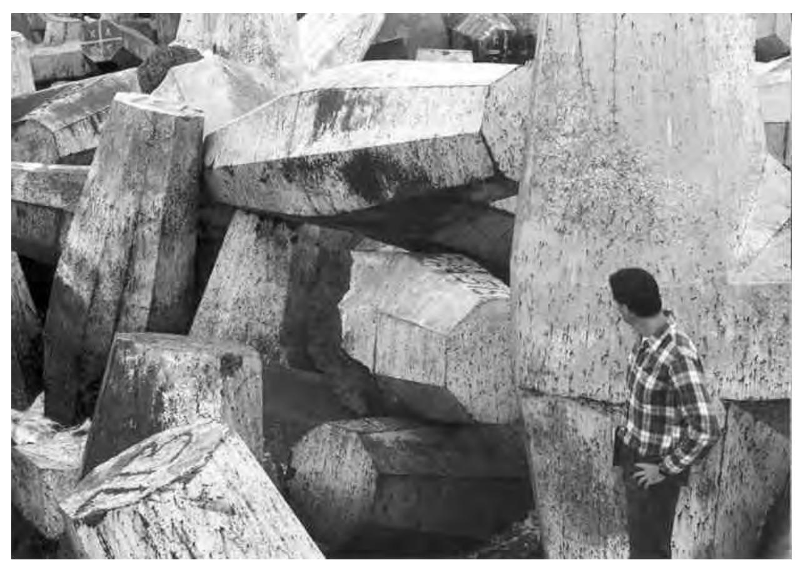
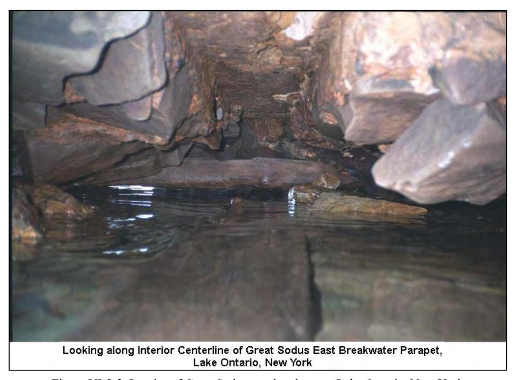
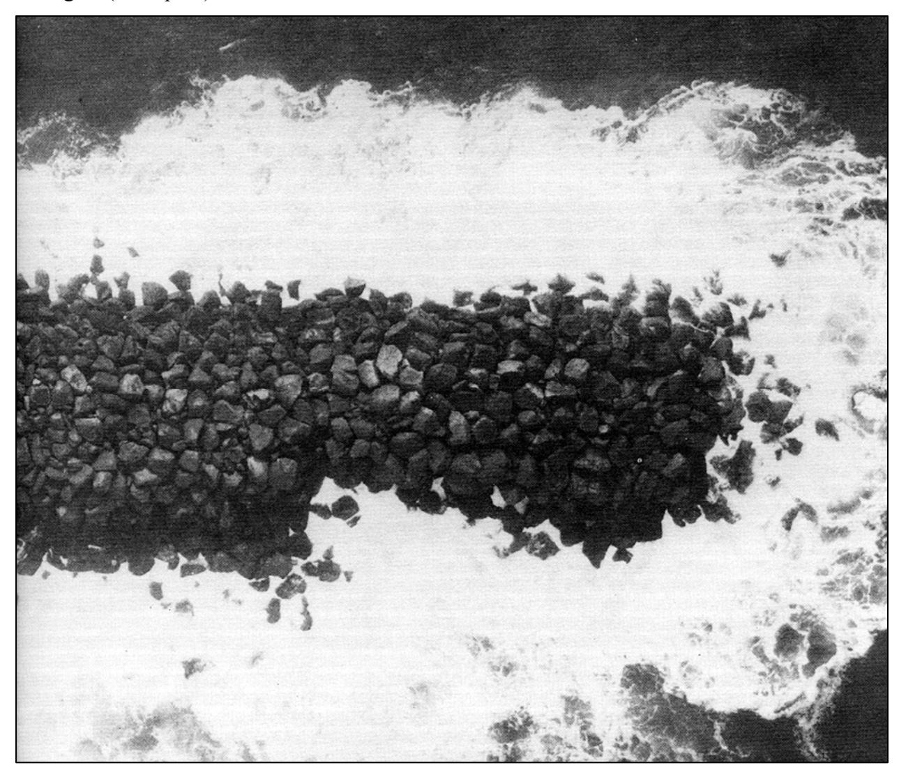
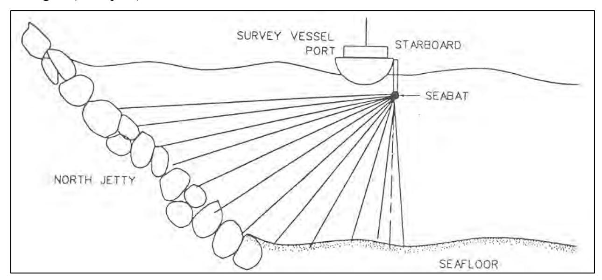
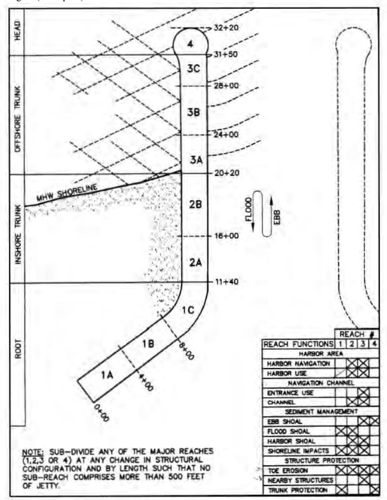
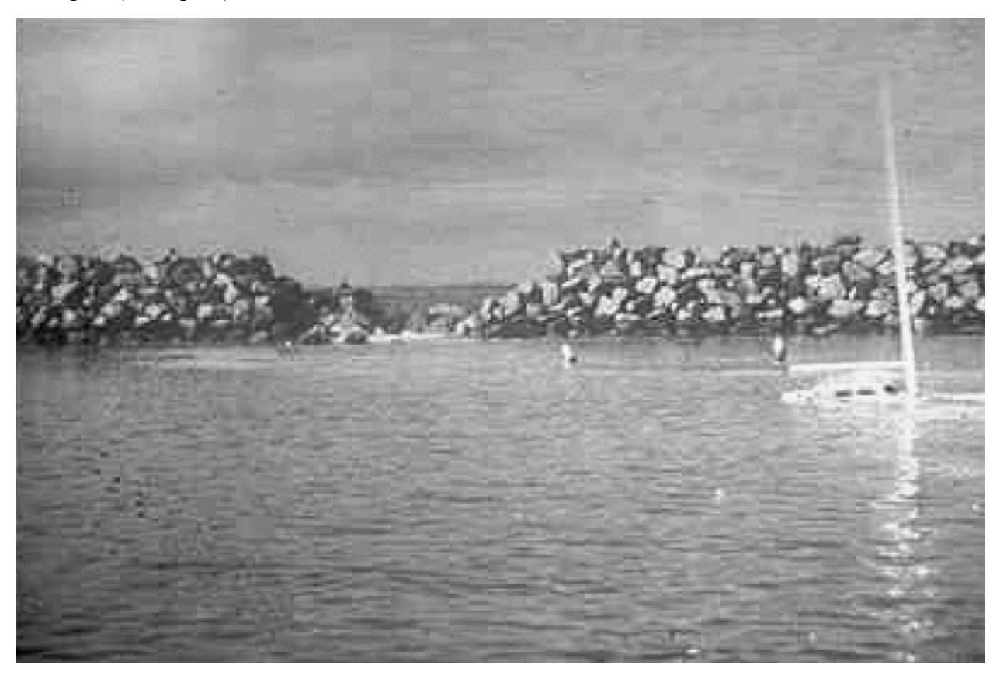
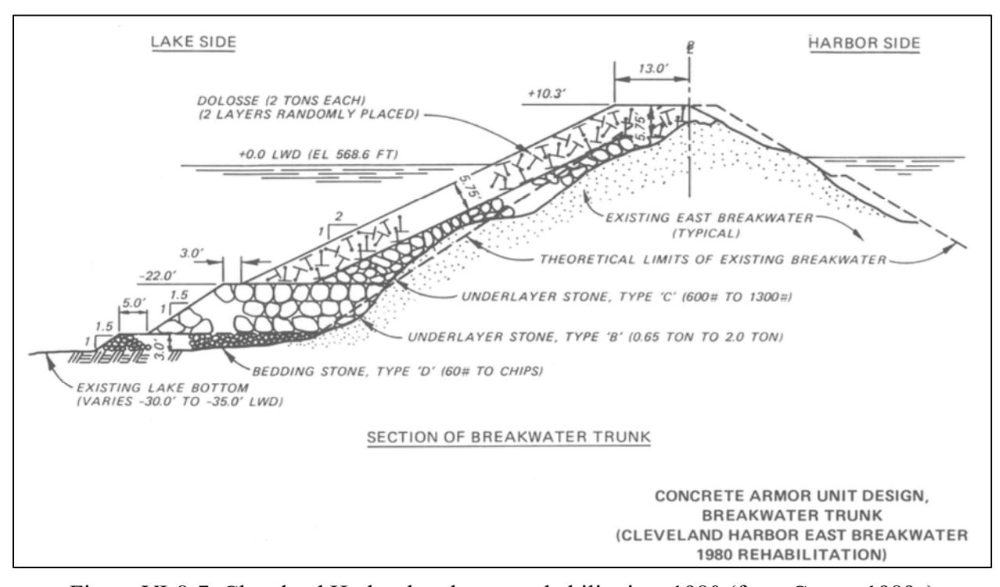
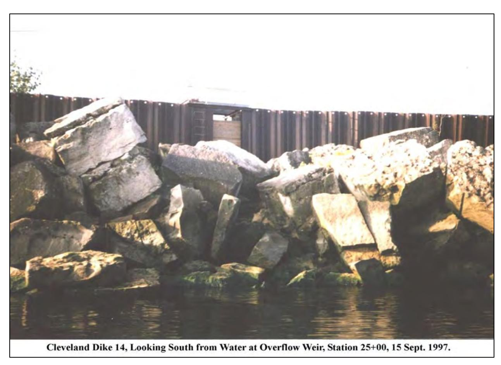
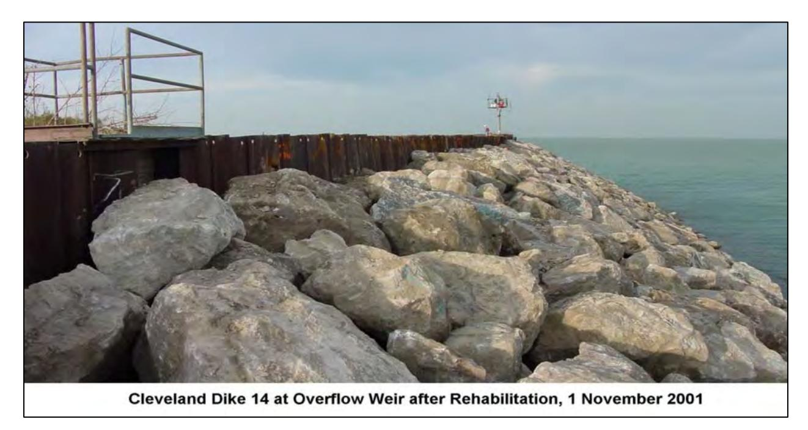
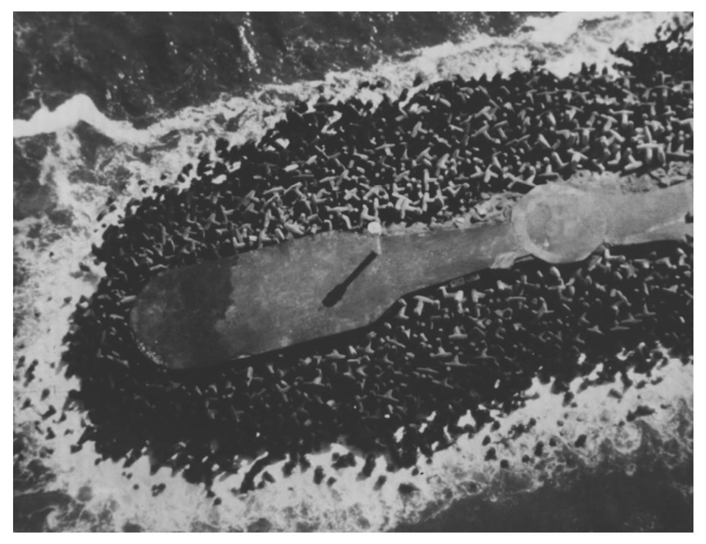

#### CHAPTER 8

#### Monitoring, Maintenance, and Repair of Coastal Projects

#### TABLE OF CONTENTS

- VI-8-1. Maintenance of Coastal Projects
  - a. Aging of coastal projects
  - b. Project maintenance
- VI-8-2. Inspecting and Monitoring Coastal Structures
  - a. Introduction and overview
  - b. Project condition monitoring
  - c. Project performance/function monitoring
  - d. Monitoring plan considerations
- VI-8-3. Repair and Rehabilitation of Coastal Structures
  - a. General aspects of repair and rehabilitation
  - b. Repair and rehabilitation of rubble-mound structures
- VI-8-4. References
- VI-8-5. Acknowledgments
- VI-8-6. Symbols

#### List of Figures

- Figure VI-8-1. Dolos breakage on Crescent City, California, breakwater
- Figure VI-8-2. Interior of Great Sodus east breakwater, Lake Ontario, New York
- Figure VI-8-3. Aerial photogrammetry image of Yaquina, Oregon, north jetty
- Figure VI-8-4. Multibeam scanner mounted on survey vessel
- Figure VI-8-5. Major reaches and structure functions for typical jetty
- Figure VI-8-6. Damage at Redondo Harbor breakwater looking from inside harbor
- Figure VI-8-7. Cleveland Harbor breakwater rehabilitation, 1980
- Figure VI-8-8. Cleveland Dike 14 before rehabilitation
- Figure VI-8-9. Cleveland Dike 14 after rehabilitation
- Figure VI-8-10. North jetty at entrance to Humboldt Bay, California

## List of Tables

- Table VI-8-1. Frequency of Walking Inspections
- Table VI-8-2. General Condition Index Scale
- Table VI-8-3. Steps in Condition and Performance Rating System
- Table VI-8-4. Functional and Structural Rating Categories
- Table VI-8-5. Functional Rating Guidance for Navigation Channel
- Table VI-8-6. Structural Index Scale for Coastal Structures
- Table VI-8-7. Rating Guidance for Armor Loss
- Table VI-8-8. Functional Index Scale for Coastal Structures
- Table VI-8-9. When Coastal Project Might Need Repairs or Rehabilitation
- Table VI-8-10. Case Histories of USACE Breakwater and Jetty Structures
- Table VI-8-11. Construction Equipment for Repair of Rubble-Mound Structures
- Table VI-8-12. Options for Repairing Rubble-Mound Structures
- Table VI-8-13. Summary of Stability Results for Dissimilar Armor Overlays
- Table VI-8-14. Buhne Point Cementitious Sealant Monitoring, Maintenance, and Repair of Coastal Projects

#### CHAPTER VI-8

#### Monitoring, Maintenance, and Repair of Coastal Projects

VI-8-1. Maintenance of Coastal Projects. This chapter covers maintenance requirements of coastal engineering projects. Ongoing maintenance at some level is necessary for most existing coastal projects to assure continued acceptable project performance. Major topics included in this chapter are monitoring of projects, evaluation of project condition, repair and rehabilitation guidelines, and project modifications. Available guidance related to specific repair and rehabilitation situations is included. However, in many cases design guidance suitable for new construction is used to design repairs.

## a. Aging of coastal projects.

- (1) The U.S. Army Corps of Engineers (USACE) has responsibility for constructing and maintaining federally authorized coastal engineering projects in the United States. These include navigation channels, navigation structures, flood-control structures, and erosion control projects. Pope (1992) summarized a series of reports (see Table VI-8-10) on Corps-maintained breakwaters and jetties and noted that 77 percent of the 265 navigation projects constructed in the United States were over 50 years old. Even more revealing is the fact that about 40 percent of the breakwaters and jetties originated in the 1800s. This means that a majority of the Corps' structures were designed and built before the introduction of even rudimentary design guidance and armor stability criteria, and in many cases the structures have survived well beyond their intended service life because they have been properly maintained. Most developed countries undoubtedly have a similar situation.
- (2) Over the projected life of a project, the structural components are susceptible to damage and deterioration. Damage is usually thought of as structure degradation that occurs over a relatively short period such as a single storm event, a unique occurrence, or perhaps a winter storm season. Damage might be due to storm events that exceed design levels, impacts by vessels, seismic events, unexpected combinations of waves and currents, or some other environmental loading condition.
- (3) Deterioration is a gradual aging of the structure and/or its components over time. Deterioration can progress slowly, and often goes undetected because the project continues to function as originally intended even in its diminished condition. However, if left uncorrected, continual deterioration can lead to partial or complete failure of the structure.
- (4) Pope (1992) distinguished between two types of aging processes that occur at coastal projects. Structure aging is a change to a portion of the structure that affects its function. Examples of structure aging include: settlement or lateral displacement of the structure, loss of slope toe support, partial slope failure, loss of core or backfill material, and loss of armor units.
- (5) Unit aging is defined as deterioration of individual components which could eventually affect the structure's function. Examples of unit aging include: breakage of concrete armor units, fracturing of armor stone, below-water deterioration of wood or sheet metal pilings,
corrosion of metal supports and fittings, concrete spalling, ripping of geotextile bags, and failure of individual gabion or timber crib units.
- (6) Because coastal structure aging is a slow process, and the severity of deterioration may be hidden from casual inspection, rehabilitation often is given a low priority and may be postponed if the structure is still functioning at an acceptable level. Saving money by neglecting needed repairs runs the risk of facing a far more expensive (and possibly urgent) repair later.
- b. Project maintenance.
- (1) Project maintenance is a continuous process spanning the life of the coastal project. The goal of maintenance is to recognize potential problems and to take appropriate actions to assure the project continues to function at an acceptable level.
- (2) Maintenance consists of the following essential elements (Vrijling, Leeuwestein, and Kuiper 1995):
- (a) Periodic project inspection and monitoring of environmental conditions and structure response.
- (b) Evaluation of inspection and monitoring data to access the structure's physical condition and its performance relative to the design specifications.
- (c) Determining an appropriate response based on evaluation results. Possible responses are Take no action (no problems identified or problems are minor) Rehabilitate all or portions of the structure Repair all or portions of the structure
- (3) Rehabilitation is defined in the dictionary as ARestoring to good condition, operation, or capacity." This implies that steps are taken to correct problems before the structure functionality is significantly degraded. For example, replacing broken concrete armor units, filling and capping scour holes, replacing corroded steel sheet pile, or patching spalled concrete might be considered structure rehabilitation. Rehabilitation can also be thought of as preventative maintenance. There are two types of preventative maintenance: condition-based maintenance which is rehabilitation based on the observed condition of the project; and periodic maintenance which is rehabilitation that occurs after a prescribed time period or when a particular loading level is exceeded.
- (4) Repair is defined in the dictionary as "Restoring to sound condition after decay, damage, or injury." The major implication in this definition for repair is that damage has occurred and structure functionality is significantly reduced. For example, rebuilding a slumped armor slope, resetting breakwater crown blocks, rebuilding damaged pier decks, repairing vertical seawall, and backfilling eroded fill could be considered structure repair. Repair can also
be thought of as corrective maintenance. Obviously there are many situations where it is difficult to distinguish between repair and rehabilitation. The concepts behind coastal structure maintenance are straightforward; the difficulties lie in determining
- (a) What to monitor.
- (b) How to evaluate the monitoring data.
- (c) Whether or not to undertake preventative or corrective action.
- (d) How to access the economic benefits of the possible responses.
- (5) Because of the wide variety of coastal structures and the varied environments in which they are sited, development of a generic project maintenance plan is difficult. Perhaps the best source of guidance is past experience maintaining similar projects.
- (6) In addition to repair and rehabilitation, a third response that might arise during maintenance is a decision to modify a project even if it shows no damage or deterioration. Monitoring might reveal the project is not performing as expected, or the goals of the project might have changed or expanded, necessitating structure additions or modification. Examples include raising breakwater crest elevation to reduce overtopping into a harbor, modifying jetty length to reduce downdrift erosion problems, and sand tightening jetties to block passage of sediment.

## VI-8-2. Inspecting and Monitoring Coastal Structures.

- a. Introduction and overview.
- (1) Project monitoring is a vital part of any successful maintenance program. The complexity and scope of a monitoring effort can vary widely from simple periodic onsite visual inspections at the low end of the scale to elaborate and expensive long-term measurement programs at the other extreme. The most important aspect in any monitoring and inspection program is to determine carefully the purpose of the monitoring. Without a clear definition of the monitoring goals, resources and instruments will not be used in the most beneficial manner; and most likely, the monitoring information will be insufficient to evaluate the project and recommend appropriate maintenance responses.
- (2) Project monitoring can be divided into two major categories:
- (a) Project condition monitoring consists of periodic inspections and measurements conducted as part of project maintenance. Condition monitoring provides the information necessary to make an updated assessment of the structure state on a periodic basis or after extreme events.
- (b) Project performance/function monitoring consists of observations and measurements aimed at evaluating the project's performance relative to the design objectives. Typically, performance monitoring is a short-duration program relative to the life of the project.
- (c) There are substantial differences between monitoring plans developed for project condition monitoring and plans developed for monitoring project performance. However, when developing either type of plan, several guidelines should be followed.
- First, establish the goals of the monitoring. Once the goals are known, every component suggested for the monitoring program can be assessed in terms of how it supports the goals. If a proposed element does not support the goals, there is little justification for including it.
- Second, review the project planning and design information to identify the physical processes that affect the project. These processes are then ranked in order of importance with respect to the monitoring goals. For some situations this step will be difficult because of uncertainties about the interaction between project elements and the environmental loadings. Once the monitoring goals are determined and the principal physical processes are identified, it is then possible to proceed with developing a plan to acquire the necessary monitoring data.
- An essential component of any plan is a provision for gathering sufficient project baseline data. Baseline data provide the basis for meaningful interpretation of measurements and observations. Elements of the baseline data collection are determined directly from the monitoring plan. For example, if the cross-section profile of a rubble-mound structure is to be monitored, it is necessary to establish the profile relative to known survey monuments at the start of the monitoring period. The as-built drawings often serve as part of the baseline survey information for project condition monitoring. Note that as-built drawings based on afterconstruction surveys are not always prepared. Thus, original design drawings may have to serve as baseline information.
- b. Project condition monitoring. Project condition monitoring and inspection are necessary only for preventative maintenance programs. Failure-based maintenance does not require a monitoring program (Vrijling, Leeuwestein, and Kuper 1995). However, even failure-based maintenance must have some means of discovering whether or not severe damage or failure has occurred. If damage is not reported, there is a risk that additional damage or complete failure may occur, resulting in more costly repairs. Choosing which aspects of the project to inspect and monitor should be based on an understanding of the potential damage and failure modes for that particular type of project. This includes understanding the failure modes and deterioration traits of individual project components, as well as the project as a whole. Some failure modes may have a higher likelihood of occurrence, but may occur gradually without immediate impact to project functionality. On the other hand, there may be other failure modes with lower probability of occurrence that cause immediate, catastrophic damage. Just as important as identifying failure modes is knowing the physical signs of impending failure associated with each particular mode. For example, loss of armor stone from a slope or armor unit breakage may be a precursor to slope failure. The monitoring plan should outline what signs to look for, and if possible, how to quantify the changes. Some identified failure modes may give no warning signs of impending doom; and in these cases, monitoring will not help. Past experience with similar projects is beneficial in establishing what aspects of the project to monitor for change. Project condition monitoring always involves at least visual inspection of the project, and in some cases the inspection is augmented with measurements meant to quantify
the current structure condition relative to the baseline condition. These observations are then used to evaluate the current project condition and make decisions on the course of action. Condition monitoring should be performed when changes are most likely to occur. Most changes happen during construction and in the first year or two after a project is completed. During this period, there can be dynamic adjustments such as structure settlement, armor units nesting, and bathymetry change. After initial structure adjustment, most significant changes occur during storm events. The monitoring plan should provide enough flexibility in scheduling to accommodate the irregularity of severe storms.
- (1) Periodic inspections. The Corps of Engineers' policy relative to periodic inspection of navigation and flood-control structures is as follows:
- (a) "Civil Works structures, whose failure or partial failure could jeopardize the operational integrity of the project, endanger the lives and safety of the public, or cause substantial property damage shall be periodically inspected and evaluated to ensure their structural stability, safety, and operation adequacy."
- (b) The major USACE District and Division commands have responsibility for establishing periodic inspection procedures, intervals, etc., for civil works projects. However, standardized inspection methodology across all USACE Field Offices is lacking due to specific guidance, credentials of the individuals performing the inspections as well as the wide diversity in projects, sites, and environmental conditions.
- (c) Above-water visual inspection of structural components can be accomplished by walking on the structure, or viewing it from a boat or an airplane. The effectiveness of visual inspection depends heavily on knowing what symptoms of deterioration to look for and being able to gauge changes that have occurred since the previous inspection. For example, broken armor units and displaced stone are obvious signs of potential problems (Figure VI-8-1).
- (d) Visual inspections are subjective by nature; and, as in most practical aspects of coastal engineering, experience is paramount in recognizing potential problems. Inexperienced engineers, new to the inspection process, should accompany the seasoned engineers during inspection tours so they can learn to recognize the important signs of deterioration. This also helps provide monitoring continuity over the life of the structure as senior personnel retire and younger engineers move into senior positions.
- (e) When observations indicate the need to quantify the structure changes, a few simple, inexpensive techniques can be used during the onsite inspection. These measures include: counting broken armor units, spray paint marking of cracks or suspected displacements, using a tape to measure distances between established points on the structure, shooting the elevation of selected locations using a level, and repeated photo-documentation from the same vantage point (Pope 1992).
- (f) Frequency of periodic walking inspections of coastal structures varies a great deal across the USACE District and Division offices and even between different structures in the same jurisdiction. Typical options are included in Table VI-8-1.



*Figure VI-8-1. Dolos breakage on Crescent City, California, breakwater*

# Table VI-8-1 Frequency of Walking Inspections

Annual walking inspections
Annual walking inspections for recently completed structures and repairs; less frequent inspections for older structures
Walking inspections every 2 years
Walking inspections every 3 years if the structure has not changed for 4 consecutive years
Walking inspections only after major storm events
Walking inspections only when personnel are in the region for other purposes and time permits Walking inspections only after local users report a problem
- (g) In general, the frequency of inspection of a particular structure should be determined on a case-by case basis. Factors that influence inspection frequency, along with recommended general guidelines, are listed in the following paragraphs:
- Geographic location. Structures situated in exposed locations on high-energy shores (e.g., northwest coast of the U.S.) should be inspected annually. Structures in sheltered areas or
on low-energy coasts can stretch the inspection interval to 2 or 3 years. If no significant damage occurs for 5 years, inspections can be less frequent. Structures that undergo seasonal ice loading and freeze/thaw conditions should be inspected at least once every other year with particular emphasis on stone integrity or armor displacement.
- Structure age. Recently constructed, rehabilitated, or repaired structures should be inspected annually. Older structures with a good stability record for at least 5 years can be inspected less often. Frequently repaired structures should have annual inspections, but chronic damage should be addressed by a more robust design.
- Storm damage. Structures should be inspected after major storm or other events that might cause damage (e.g., earthquake or ship collision). Annual inspections are warranted in cases where damaged structures would impact navigation, property, and life. Reports of damage by local users of the project should be investigated immediately.
- Available funds. Sufficient funds and available personnel dictate both the frequency and priority of periodic inspections, particularly in Districts with many coastal structures. Past experience will help establish an inspection schedule that optimizes available funds.
- (h) In summary, periodic inspection methods and frequency are determined based on repair history, past experience, engineering judgment, and available funding and manpower.
- (i) All inspections should be documented to provide information and guidance for future assessments, and careful consideration should be given as to how the inspection information is to be preserved. Even the most observant visual inspection has little value if others cannot review the information and understand what was observed. Cryptic shorthand notes, rough sketches, etc., should be translated and expanded shortly after the inspection.
- (j) Aerial visual inspection of coastal projects by fixed-wing or rotor-wing aircraft is an option that has several advantages. Aircraft provide easier access to remote project sites and to structures that are not attached to shore. They also allow the inspector to witness structure performance during wave conditions that would be unsafe for a walking inspection. Finally, several individual projects along a stretch of coastline can be inspected from the air in a short time span. During the aerial inspection, still photographs and video can be taken to augment the inspection notes. These images can be compared to previous photographs to see if obvious changes have occurred.
- (k) The major disadvantage of aerial inspections is that only obvious changes can be identified whereas subtle changes and signs of deterioration may go unnoticed, even when inspecting enlarged aerial photographs. Nevertheless, aerial inspections make economic sense for projects with good performance histories and for making quick assessments after major storms to determine which projects need closer inspection.
- (l) Underwater and interior visual inspection of structure condition is difficult, if not impossible, for many projects. These inspections require professional divers who also understand the signs of damage and deterioration for the particular type of structure. Water visibility plays a big role in underwater inspection. Some inspections, such as examining the condition of piers
and piles, can be performed during poor visibility. However, other visual inspections, such as assessing the integrity of armor slopes beneath the surface, require sufficient visibility to see enough of the slope to recognize missing armor and slope discontinuities. Even in the best of conditions, information from diver surveys is subjective and spatial detail is sparse. Around tidal inlets, underwater inspections can only take place during the slack water. Above all, safety for both the divers and their support crew on the surface is the most important criterion for underwater visual inspections. Figure VI-8-2 shows the interior of the concrete parapet of the Great Sodus east breakwater, Lake Ontario, New York. Notice the missing timber and interior fill. Further information on diver inspections is given in Thomas (1985).



*Figure VI-8-2. Interior of Great Sodus east breakwater, Lake Ontario, New York*

(m) In some circumstances, it may be possible to use video cameras lowered into the water or mounted on remotely-controlled vehicles to inspect underwater portions of a structure. Other methods for quantifying underwater portions of structures are listed in the next section.
(2) Measurements. Measurements to quantify specific aspects of a coastal project that cannot be judged from a visual inspection may be included as part of the long-term project condition monitoring. Such measurements may be acquired concurrently with the visual inspection, or they may be part of longer-duration monitoring. Generally, project condition measurements focus on physical changes of the structure and its foundation. Examples include
repeated elevation surveys of selected structure cross sections to quantify settlement or loss of armor, bathymetry soundings to document scour hole development, quantifying underwater structure profiles with sensors, and spot testing of materials undergoing deterioration, such as concrete, timber, and geosynthetics. Basically, any measurement that aids in evaluating structure condition can be considered for the condition monitoring program. Most measurements require baseline data for comparison, and sequential measurements help to assess the rate of change for the monitored property.
- (a) Photogrammetry. Photogrammetry is a term applied to the technique of acquiring and analyzing aerial photography to quantify the three-dimensional (3-D) geometry of objects in the photographs relative to a fixed coordinate system. One area particularly well suited to photogrammetry techniques is profiling rubble-mound structure cross sections and monitoring movement of armor units on exposed structures based on properly acquired aerial photography (Kendell 1988; Hughes et al. 1995a,b). Traditionally, this task was accomplished by surveying targets placed on individual armor units, a difficult, expensive, and often very dangerous undertaking. Naturally, photogrammetric analysis can only be applied to that portion of the structure visible above the waterline; hence, aerial overflights are scheduled to coincide with low tide level to maximize the benefits. An example is shown in Figure VI-8-3.
- The first step in photogrammetric monitoring of a rubble-mound structure is establishing permanent benchmarks on or near the structure that can be easily recognized in the aerial photographs. The horizontal and vertical position of these benchmarks are established using conventional ground surveying techniques, and they are used in the photogrammetry analysis to correct for aircraft tilt, roll, and yaw; to determine the camera position and orientation relative to ground features; and to compensate for the earth's curvature. Next, high-quality, low-level stereo photographs of the structure are obtained using standard stereo-mapping equipment and techniques. The photographic stereo pairs are used along with the ground survey information to establish a stereo-model, which is a 3-D representation of the study area that is free of geometric distortion. Stereo-models are usually constructed using a computer. Annual flights of the same structure using the same control reference points facilitate comparisons between stereo-models to extract information such as stone movement and yearly structure profile change above water level.
- Several requirements for successful monitoring using aerial photogrammetry are as follows:
- Good quality equipment and experienced personnel must be employed. If possible the same equipment and personnel should be retained throughout the entire monitoring program.
- The pilot should be experienced in low-level, low-speed flight in order to obtain blur-free, high resolution photographic images.
- Best results come during calm weather with clear visibility and low water levels to maximize coverage of the structure. The sun should be nearly overhead to minimize shadows. Photograph forward overlap should be at least 60 percent.



*Figure VI-8-3. Aerial photogrammetry image of Yaquina, Oregon, north jetty*

- There should be at least five or six evenly distributed control points in each photographic stereo pair in order to remove geometric distortions.
- Additional information on photogrammetry related to rubble-mound structures can be found in Cialone (1984) and U.S. Army Engineer Waterways Experiment Station (1991). Corps monitoring of the Crescent City breakwater using aerial photogrammetry was described by Kendall (1988); monitoring of the Yaquina north breakwater was documented in Hughes et al. (1995a,b).
- (b) Underwater inspection. Quantifying underwater changes to coastal structures is difficult, but it is an important part of monitoring structure condition. Underwater problems that go undetected can lead to sudden, unexpected failures. At least four measuring systems (not including visual inspection) are available for obtaining information about the underwater condition of coastal structures.
- The most limited method for sloping-front structures is using a crane situated on the structure crest to make soundings of the underwater portions of the structure. Horizontal and vertical position of the survey lead can be established using modern Global Positioning Systems (GPS). This method is contingent on crane availability/capability and access to the structure crest. Similar techniques have been attempted using a sounding line attached to a helicopter. See McGehee (1987) for additional information.
- Side-scan sonar returns obtained by towing the instrument off a vessel running parallel to the structure can be interpreted to give general information of underwater structure condition, particularly near the seabed. The main advantage of side-scan sonar is the coverage and the speed of surveying. The disadvantage of this technology is the skill needed to interpret the record in a meaningful way. Side-scan is perhaps best used to identify structure portions that need to be examined using more sophisticated instruments. Additional information and operating rules-of-thumb are given by Kucharski and Clausner (1989, 1990) and Morang, Larson, and Gorman (1997b).
- For accurate mapping of the underwater portions of rubble-mound structures, the best solution to date is a commercial system named SeaBat®. The SeaBat is a portable, downward and side-looking single-transducer multibeam sonar system. The instrument is mounted to a vessel with the sonar head positioned to transmit on a plane perpendicular to the vessel's heading. The sonar transmits 60 sonar beams on radials spaced at 1.5 deg, giving total swath coverage of 90 deg. By tilting the sonar head, the instrument can provide data for mapping almost the entire underwater portion of a sloping rubble-mound structure from just below the sea surface to the structure toe as illustrated on Figure VI-8-4. SeaBat data must be synchronized with simultaneous readings of vessel position, heading, and motion (heave, pitch, and roll). The final analyzed product is a spatially rectified map of the structures below-water condition. Although it is difficult to identify individual armor displacement, any slope irregularities due to construction or subsequent damage are easily spotted on the map. SeaBat systems have been extensively tested by Corps Districts, and the technology is considered quite mature and highly reliable. Additional information on SeaBat multibeam sonars can be found in EM 1110-2-1003 and in Prickett (1996, 1998).
- The final method for mapping, which can be used for both the underwater and above-water portions of sloping structures, is the airborne lidar technologies as provided by the Scanning Hydrographic Operational Airborne Lidar Survey (SHOALS) system (Parsons and Lillycrop 1998). Normally a SHOALS survey is not conducted with the sole purpose of examining structures; instead the structure mapping is an added benefit that occurs during the survey of a much larger portion of the surrounding area.
- Typically, the spatial distribution of SHOALS data will not be sufficient to recognize smaller irregularities in the armor layer, such as individual movements. However, larger problems in the armor slope and details of adjacent scour holes are readily apparent in SHOALS topography/bathymetry. It is impractical to include a SHOALS component when planning structure condition monitoring unless SHOALS surveys are planned as part of the overall project monitoring.



*Figure VI-8-4. Multibeam scanner mounted on survey vessel*

- (3) Evaluating structure condition. Inspections are highly subjective, and the overall assessment of structure condition given by one observer may differ substantially from the opinion of another. Many factors can influence structure condition assessment with experience and previous visits to the site perhaps being the most important. In the 1990s, USACE developed guidelines aimed at providing a more uniform and consistent method for evaluating the physical condition and functional performance of coastal structures. These procedures, while still subjective, give a more meaningful evaluation by quantifying inspection observations in terms of uniform condition and performance criteria. The resulting numerical ratings allow better comparisons of condition and performance between similar structures, and better tracking of structure condition over time. A major benefit of a consistent condition rating system is the prospect of obtaining similar evaluations from different observers over the life of the structure. The procedure described in this section is a condition and performance rating system for rubble-mound breakwaters and jetties armored with stone or concrete armor units. Similar methods could be adopted for other coastal structures (revetments, bulkheads, monolithic structures, etc.) but have not yet been formally developed. The primary source for the information given in this section was a technical report (Oliver et al. 1998) available in Portable Document Format (PDF) from the Web site of the Repair, Evaluation, Maintenance, and Rehabilitation (REMR) Research Program (see Oliver et al. 1998 citation in this chapter=s References for Web address). A few tables from the REMR report are reproduced in this section, but application of the methodology requires obtaining a copy of the complete report, which also includes useful examples. An associated software program is also available at the REMR Web site.
- (a) Condition and performance rating system for breakwaters and jetties. The condition and performance rating system is a performance-based evaluation system where emphasis is placed more on the question "how well is the structure functioning?" than on "what is the physical condition relative to the as-built structure?" This emphasis recognizes that coastal structures have some level of deterioration tolerance before significant loss of functionality, thus condition alone is not sufficient justification for rehabilitation.
The end result of a performance evaluation is structure ratings given in terms of condition index numbers ranging between 0 and 100. Table VI-8-2 lists the general condition index range along with corresponding descriptions of the structure condition and damage levels. The different categories in Table VI-8-2 are fairly generic because the general condition index scale is intended to apply to a variety of USACE navigation and control structures, not just coastal breakwaters and jetties. For coastal structures the condition index (CI) is determined from a functional index (FI) and a structural index (SI). The FI indicates how well a structure (or a portion of the structure) is performing its intended functions, whereas the SI for a structure (or structure component) indicates the level of physical condition and structural integrity.

**Table VI-8-2. lists the general condition index range along with corresponding descriptions of the structure condition and damage levels. The different categories in Table VI-8-2 are fairly generic because the general condition index scale is intended to apply to a variety of USACE navigation and control structures, not just coastal breakwaters and jetties. For coastal structures the condition index (CI) is determined from a functional index (FI) and a structural index (SI). The FI indicates how well a structure (or a portion of the structure) is performing its intended functions, whereas the SI for a structure (or structure component) indicates the level of physical condition and structural integrity.**

| Observed |  | Index | Condition |  |  |  |  |
| --- | --- | --- | --- | --- | --- | --- | --- |
| Damage Level | Zone | Range | Level | Description |  |  |  |
| Minor | 1 | 85 to 100 70 to 84 | EXCELLENT GOOD | No noticeable defects. may be visible. Only minor deterioration evident. | Some or |  | aging or wear defects are |
| Moderate | 2 | 55 to 69 40 to 54 | FAIR MARGINAL | Some deterioration or but function is not Moderate deterioration. adequate. | defects significantly | are Function | evident, affected. is still |
| Major | 3 | 25 to 39 10 to 24 0 to 9 | POOR VERY POOR FAILED | Serious deterioration portions of the structure. inadequate. Extensive deterioration. No longer functions. complete failure of a component. | in at Barely General major | least Function | some is functional. failure or structural |

The condition index is primarily a planning tool, with the index value serving as an indicator of the structure's general condition level. A series of condition index evaluations can be used to judge likely future functional performance degradation based on the trend of the condition index. For this reason, it is critical that all evaluations reflect the condition of the structure at the time of inspection, and not the condition that is expected at some future time. The condition ratings and index values are simply a numerical shorthand for describing structure physical condition and functional performance, and they represent only one part of the information required to make decisions about when, where, and how to spend maintenance dollars. Other necessary factors include knowledge of the structure's history, budget constraints, policies, etc. Furthermore, the condition index system is not intended to replace the detailed investigations which are needed to document fully structure deficiencies, to identify their causes, and to formulate plans for corrective action (see CEM, Part VI-8-2, "Project performance/ function monitoring").
- (b) Initial procedures for rubble-mound breakwaters and jetties. The condition and performance rating system involves eight steps as shown in Table VI-8-3. Steps 1-5 are initial procedures that are performed once for a given structure. The only other time some or all of steps 1-5 will need to be repeated is after major rehabilitation or project alteration. Steps 6-8 are performed for each condition assessment based on structure inspection. Each of the steps in Table VI-8-3 is discussed in greater detail in the following paragraphs.
- Steps 1-2: Determining structure functions and dividing into major reaches. The functions served by a structure can vary over different portions of the structure. Division of a structure into major reaches by function is performed as an office study using authorizing documents and project history in combination with the functional descriptions given in Table VI-8-4.

**Table VI-8-4. **

| Harbor area | Harbor navigation harbor use | Breach |
| --- | --- | --- |
| Navigation channel | Entrance use channel | Core-exposure |
| Sediment management | Ebb shoal Flood shoal Harbor shoal Shoreline impacts | Armor loss Loss of armor contact and interlock Armor quality defects |
| Structure protection | Nearby structures Toe $erosion^{1}$ Trunk $protection^{1}$ | Slope defects |
| 1 Not included in condition | index calculation. VI-8-14 |  |

**Table VI-8-4. **

| Harbor area | Harbor navigation harbor use | Breach |
| --- | --- | --- |
| Navigation channel | Entrance use channel | Core-exposure |
| Sediment management | Ebb shoal Flood shoal Harbor shoal Shoreline impacts | Armor loss Loss of armor contact and interlock Armor quality defects |
| Structure protection | Nearby structures Toe $erosion^{1}$ Trunk $protection^{1}$ | Slope defects |
| 1 Not included in condition | index calculation. VI-8-14 |  |

- The four functional areas and associated 11 rating categories are described as follows.
- Harbor area. How well the structure controls waves and currents to allow full use of the harbor area during all conditions and for all vessels, as compared with design expectations or current requirements.
- Harbor navigation . Indicates how well navigable conditions are maintained within the harbor itself. Difficulty in maneuvering and restrictions on vessel drafts or lengths are indications of problems.
- Harbor use . Normal usage may be restricted by waves, currents, or seiches at support facilities, such as docks and mooring facilities. Problematic conditions may be seasonal. Three subcategories are considered.
- Moored vessels. How well moored vessels are protected from damage, and the degree to which portions of the harbor are unusable during certain conditions. Functional deficiency can be measured by the frequency and degree to which vessels sustain damage from excessive waves or currents.
- Harbor structures. How well the harbor infrastructure is kept usable and free from damage. Structures include mooring facilities, docks, slips, bulkheads, revetments, etc. Functional deficiency exists if waves or currents damage or impair use of these facilities.
- Other facilities. This subcategory includes facilities set back from the water's edge and facilities that are part of the surrounding commercial and recreational infrastructure.
- Navigation channel. How well the structure controls waves and currents to allow full use of the navigation channel and entrance during all conditions and for all vessels.
- Entrance use . This category indicates the success of the structure in maintaining a safe channel by controlling waves and currents as stipulated by authorizing documents. Functional deficiencies are indicated if certain sizes or types of vessels are unable to navigate the channel safely or are delayed in entering.
- Channels . This category indicates how well the structure controls waves and currents in the channel through which vessels may operate without difficulty, delay, or damage. Functional deficiencies include strong cross-channel currents or crossing wave trains, channel obstructions, grounding occurrences, and vessel collisions with structures or other vessels.
- Sediment management. How well the structure controls the depth, character, and pattern of sedimentation in the navigation channel; the depth of ebb and flood shoals in tidal entrances; and the buildup or loss of sediments on nearby shorelines.
- Ebb shoal. This category indicates the impact of the ebb shoal on navigation depths and widths in the approach channel. Functional deficiency is indicated by vessel delays, groundings, or maneuvering difficulties. Currents and wave transformation caused by the ebb shoal are evaluated under "Entrance use."
- Flood shoal. This category covers the impact flood shoals may have on navigation channel depth and location. Negative impacts due to modification of hydrodynamic conditions by flood shoals are evaluated under the "Channels" category.
- Harbor shoal. This category applies to shoaling in mooring and maneuvering areas, and a functional rating is developed for structures designed to prevent or limit shoaling.
- Shoreline impacts. This category indicates the structure's impact on the adjacent shore. Functional deficiency occurs where profiles and shoreline location are not maintained within acceptable limits. Separate shoreline maintaining systems, such as bypassing plants, are not considered in this rating.
- Structure protection. How well the structure protects nearby structures, or portions of itself, from wave attack or erosion damage.
- Nearby structures. This category indicates the protection provided to other structures located in the lee or in the diffraction zone from damaging waves and currents. This is the only item included in the functional rating.
- Toe erosion. This category indicates the structure's level of resistance to toe scour and subsequent undermining of the toe by waves and currents. Toe erosion is accounted for in the structure rating.
- Trunk protection. This category mostly applies to structure heads, and it indicates the success of the head in preventing unraveling of the structure trunk.
- Figure VI-8-5 illustrates the division of a jetty structure into major functional regions along with identification of structure functions for each reach. Step 3: Subdivision of major reaches by structural and length criteria.
- Further division of a structure into more manageable lengths is based primarily on changes in construction characteristics. Examples include changes in type of construction, type or size of armor, change in cross-sectional dimensions or geometry, and rehabilitated sections. Final subdivisions are based on length where function and construction are uniform over long reaches. Generally, each final division length should be between 60 and 150 m (200 to 500 ft) with the head section always being considered as a separate reach with a length of at least 30 m (100 ft) unless construction differences dictate otherwise.
- Subdivisions within major reaches are illustrated in Figure VI-8-5. The recommended numbering scheme begins at the shoreward end and proceeds seaward with the digit representing the major functional reach and the second letter corresponding subdivisions within the reach. Both structural and functional ratings use the same demarcations. Permanent markers should be established delineating the structure reaches to assure uniformity in future evaluations. Step 4: Establishing functional performance criteria.
- Once structure functions have been determined for each structure reach, the next step is to determine the expected performance level for each rating category. These criteria must be based on how well the structure could perform when in perfect physical condition. (Note: Design deficiencies cannot be corrected through the maintenance and repair process, and thus, should not be considered in this analysis.) Begin by reviewing the authorizing documents and structure history. Check if the original expectations have been changed, or if they need to be changed based on past observations.
- Defining performance requirements for each structure reach should be done using the rating tables provided in the report by Oliver et al. (1998). An extracted portion from the functional rating tables for the functional subcategory of ANavigation channels@ is shown in Table VI-8-5 as an example.
- Notice in Table VI-8-5 that the functional performance descriptions are given for three different wave conditions defined as:
- Design storm condition. The design storm is the largest storm (or most adverse combination of storm conditions) that the structure (or project) is intended to withstand without allowing disruption of navigation or harbor activities, or damage to the structure or shore facilities. Design storm conditions include: wave height, direction, and period; water level; storm duration; and combinations of these factors. The design storm is usually designated by frequency of occurrence or probability of occurrence. Authorizing documents, design notes, project history, and present-day requirements should be used to confirm the appropriate design storms for a project.
- Intermediate storms. This level refers to storms (or combinations of adverse conditions) of intermediate intensity that occur on the order of twice as often as the design storm. This level is intended to represent a midway point between the maximum storm levels (design storm) and small or minor intensity storms that may occur more frequently, especially during certain periods of the year.
- Low intensity storm conditions. This level refers to storms (or combinations of adverse conditions) of low intensity that may occur frequently throughout the year, and includes common rainstorms or periods of above normal winds. This level is the next stage above normal nonstorm conditions.
- Establishing the functional performance criteria essentially means determining to what extent the structure should control: waves, currents, and seiches; sediment movement; and shoreline erosion and accretion at the project.
- Factors that help decide how much control of waves, currents, and sediment movements is needed include: Determining the normal dredging frequencies and sand bypassing requirements.
- Deciding what size ships should be able to pass through the entrance and channel under normal conditions and during higher wave or storm conditions.



*Figure VI-8-5. Major reaches and structure functions for typical jetty*

*Table VI-8-5 Functional Rating Guidance for Navigation Channel (partial table extract from Oliver et al. 1998)*

**Table VI-8-5. Functional Rating Guidance for Navigation Channel (partial table extract from Oliver et al. 1998)**

|  |  |  | Intermediate | Storms |  |  |
| --- | --- | --- | --- | --- | --- | --- |
| Rating |  |  | (2X Design | Storm | Low Intensity | Storm |
| Category | Design Storm | Conditions | Frequency) |  | Conditions | Rating |
| Functional | Loss |  |  |  |  | Moderate |
| Entrance | Vessels generally | have | Vessels generally | have | Vessels experience | 55 to 69 |
| Use | little difficulty entrance when shelter. | in the seeking | no difficulty in entrance when shelter. | the seeking | no difficulties in entrance. | the |
| Channel | There are vessel delays within the shelter breakwaters or except in a few locations. Some using the harbor have enough the keel to go vessels have | generally few in the channel of the jetties, exposed vessels do not water under safely. Small some | There are generally vessel delays in channel within shelter of the breakwater or except at exposed locations. | no the the jetties, | There are no vessel delays in the within the shelter the breakwaters jetties. No vessels using the harbor limited by either insufficient depth by severe wave conditions. | channel of or are or |

- Determining if any flooding of shoreline facilities should be expected during storm events, and if so, to what extent.
- Step 5: Establishing structural requirements. Structural ratings are produced by comparing the current physical condition, alignment, and cross-sectional dimensions of a structure to that of a "like new" structure built as intended, according to good practice, and with good quality materials. Because rubble-mound structures tolerate a degree of damage before loss of functionality, structural damage does not automatically equate to loss of function.
- The structural requirements are established by determining what minimum structure cross-sectional dimensions, crest elevation, and level of structural integrity are needed to meet the functional performance requirements. Initial efforts in determining these structural dimensions can be aided by estimating the impact on project functionality if the reach under study were to be completely destroyed. Project history, authorizing documents, public input, and analysis may be required to identify these dimensions. As this is not an exact science, and some engineering judgment is necessary to produce reasonable estimates. Once established, these structural requirements are used to help identify sources of functional deficiencies in the existing structure. Structural rating categories are shown in the right-hand column of Table VI-8-4 and briefly summarized in the following section.
- (c) Recurring procedures. Once a structure has been divided into reaches, and the functional performance criteria and associated structural requirements have been established, the condition of the structure can be evaluated after each periodic inspection in a logical and consistent manner. Forms designed for use with this evaluation method are available in Oliver et al. (1998). Filling out these forms during inspection assures that key aspects of the rating system are evaluated.
- Step 6a: Inspection process. The inspector (or inspection team) should be familiar with the structure and past inspection reports before the inspection begins. The beginning and end of each reach should also be known. A copy of the most recent inspection report should be brought to the work site to help judge changes in condition.
- Other items to help conduct an effective inspection and document findings include: project maps and photographs, still and video cameras, tape measures, hand levels, and tide information. Ratings may be best determined by first walking the length of the structure and making notes of observed defects, their station location, and their severity. On the return walk, ratings may then be selected based on having seen the whole structure and on a second opportunity to scrutinize defects.
- Providing thorough comments on the rating form is a very important part of the process. Comments should note the location, character, size, and actual or potential effects of structure defects. The comments serve as backup and explanation for the ratings and suggested actions chosen by the inspector. Comments also provide a good record for future reference.
- Step 6b: Producing a structural rating. The result of the structural rating procedure is an index (SI) that can be generally related to structure condition by Table VI-8-6.

**Table VI-8-6. **

| Observed |  | Structural | Condition |  |
| --- | --- | --- | --- | --- |
| Damage Level | Zone | Index | Level | Description |
| Minor | 1 | 85 to 100 70 to 84 | Excellent Good | No significant defects - only slight imperfections may exist. Only minor deterioration or defects are evident. |
| Moderate | 2 | 55 to 69 40 to 54 | Fair Marginal | Deterioration is clearly evident, but the structure still appears sound. Moderate deterioration. |
| Major | 3 | 25 to 39 10 to 24 0 to 9 | Poor Very poor Failed | Serious deterioration in some portions of the structure. Extensive deterioration. General failure. |

- The form for rating structures includes sections for rating the six categories described in the following paragraphs. Illustrative figures for each of the previously described categories are given in Oliver et al. (1998).
- Breach/loss of crest elevation. A breach is a depression (or gap) in the crest of a rubble-mound structure to a depth at or below the bottom of the armor layer due to armor displacement. A breach is not present unless the gap extends across the full width of the crest. Loss of crest elevation is primarily due to settlement of the structure or foundation. Both result in a reduced structure height.
- Core (or underlayer) exposure or loss. Core exposure is present when the underlayer or core stones can be readily seen through gaps between the primary armor stones. Core loss occurs when underlayer or core stone is removed from the structure by waves passing through openings or gaps in the armor layer. Movement and separation of armor often result in the exposure of the underlayer or core stone. Armor loss. Three cases of armor loss are considered on the inspection form:
- Displacement is most likely to occur near the still-water line where dynamic wave and uplift forces are greatest. Localized loss of armor (up to 4 or 5 armor stones in length) is typically like a pocket in the armor layer at the waterline with the displaced stones having moved downslope to the toe of the structure. (If the area is longer than 4 or 5 armor stones, use the rating for "Slope defects."
- Settling may occur along or transverse to the slope, and may be caused by consolidation or settlement of underlayer stones, core, or foundation soils.
- Bridging is a form of armor loss that may apply to the side slopes or crest of a rubble-mound structure. Bridging occurs when the underlying layers settle but the top armor layer remains in position (at or near its original elevation) by bridging over the resulting cavity much like an arch.
- Loss of armor contact or armor interlock. Armor contact is the edge-to-edge, edge-to-surface, or surface-to-surface contact between adjacent armor units, particularly large quarrystones. Armor interlock refers to the physical containment by adjacent armor units. Good contact and interlock tie adjoining units together into a larger interconnected mass. Certain types of concrete armor units are designed to permit part of one unit to nest with its neighbors. In this arrangement, one or more additional units would have to move significantly to free any given unit from the matrix. Any special armor placement should be stated in the inspection notes.
- Armor quality defects. This rating category deals with structural damage to the armor units. It is not a rating of potential armor durability, but rather a reflection of how much damage or deterioration has already occurred. Four kinds of armor quality defects are defined in the following paragraphs.
- Rounding of armor stones, riprap, or concrete armor units with angular edges is caused by cyclic small movements or by abrasion. The result is edges that are worn into smoother, rounded contours. This reduces the overall stability of the armor layer because edge-to-edge or edge-to-surface contact between units is less effective and movement is easier when the edges become rounded.
- Spalling is the loss of material from the surface of the armor unit. Spalling can be caused by mechanical impacts between units, stress concentrations at edges or points of armor units, deterioration of both rock and concrete by chemical reactions in seawater, freeze-thaw cycles, ice abrasion, or other causes.
- Cracking involves visible fractures in the surface of either rock or concrete armor units. Cracks may be either superficial or may penetrate deep into the body of the armor unit. Cracking is potentially most serious in slender concrete armor units such as dolosse.
- Fracturing occurs where cracks progress to the stage that the armor unit breaks into at least two major pieces. Fracturing has serious consequences on armor layer stability, and it brings a risk of imminent and catastrophic failure.
- Slope defects. When armor loss or settlement occurs over a large enough area that the shape or angle of the side slope is effectively changed at that section, then a slope defect exists. Slope defects occur when many adjacent armor units (or underlayer stones) appear to have settled or slid as if they were a single mass. Two forms of slope defects are described in the following paragraphs.
- Slope Steepening is a localized process where the surface appears to have a steeper slope than for which it was designed or constructed, and it is evidence of a failure in progress on a rubble-mound structure slope.
- Sliding is a general loss of the armor layer directly down the slope. Unlike slope steepening, this problem is usually caused by more serious failures at the toe of the structure. Slope failure can be caused by severe toe scour, such as can occur at a tidal inlet with strong currents, or by failure within weak, cohesive soils when soil shear strength is exceeded.
- Rating tables are provided in Oliver et al. (1998) for each of the six structural rating categories. These tables are structured like Table VI-8-6, but they are specific for each category to help guide the inspector while assigning an appropriate rating number. Ratings are based on a comparison of existing structure condition with the Aperfect@ condition for that particular structure. The structural rating table for armor loss is reproduced in Table VI-8-7 as an example. The other five rating tables have similar format.

**Table VI-8-6. , but they are specific for each category to help guide the inspector while assigning an appropriate rating number. Ratings are based on a comparison of existing structure condition with the Aperfect@ condition for that particular structure. The structural rating table for armor loss is reproduced in Table VI-8-7 as an example. The other five rating tables have similar format.**

| Observed |  | Structural | Condition |  |
| --- | --- | --- | --- | --- |
| Damage Level | Zone | Index | Level | Description |
| Minor | 1 | 85 to 100 70 to 84 | Excellent Good | No significant defects - only slight imperfections may exist. Only minor deterioration or defects are evident. |
| Moderate | 2 | 55 to 69 40 to 54 | Fair Marginal | Deterioration is clearly evident, but the structure still appears sound. Moderate deterioration. |
| Major | 3 | 25 to 39 10 to 24 0 to 9 | Poor Very poor Failed | Serious deterioration in some portions of the structure. Extensive deterioration. General failure. |

- The numerical ratings are used to calculate the structural index according to the formulae given in Step 7b (Calculating the condition index).
- Step 7a: Producing a functional rating. The structure's functional performance is the most critical portion of the condition index for coastal structures. Functional index (FI) values
are expressed as numbers from 0 to 100 and have the general interpretation as shown in Table VI-8-8.

**Table VI-8-8. **

| Functional |  | Functional | Condition |  |  |
| --- | --- | --- | --- | --- | --- |
| Loss Level | Zone | Index | Level | Description |  |
| Minor | 1 | 85 to 100 70 to 84 | EXCELLENT GOOD | Functions well, slight loss of storm events. Slight loss of | as intended. May have function during extreme function generally. |
| Moderate | 2 | 55 to 69 40 to 54 | FAIR MARGINAL | Noticeable loss adequate under Function is barely inadequate under | of function, but still most conditions. adequate in general and extreme conditions. |
| Major | 3 | 25 to 39 10 to 24 0 to 9 | POOR VERY POOR FAILED | Function is Barely functions. No longer functions. | generally inadequate. |

- For each designated reach of the structure, functions were assigned during step 4 from the four major functional categories containing 11 subcategories (see Table VI-8-4). The assigned functions should not change unless major changes are made to the structure or project. The functional index for each reach will then be based on the same selected functional rating categories every time a functional rating is done.
- Special forms are used for completing the functional ratings which are determined using rating tables provided in Oliver et al. (1998). Table VI-8-5 is a partial example showing the functional rating descriptions extracted from one of the 11 categories. The process of producing a functional rating for each reach will involve: Reviewing original authorizing documents. Reviewing previously established functional performance criteria.
- Examining available inspection reports, dredging records, project history, and other office records relating to project performance. Reviewing the structural ratings and comments. Reviewing the environmental setting in and around the project.
- Gathering information from vessel operators, harbor masters, the U.S. Coast Guard, etc., on any known navigation difficulties, facility damage, or other project deficiencies.
- Further guidance on determining the functional rating is provided in the report by Oliver et al. (1998) along with examples that detail how to use the rating forms and tables.
- The key point to remember is that functional ratings are made in reference to structure performance criteria. Any detected design deficiencies are not included in the rating, but should be reported for separate action. Thus, to affect the ratings, functional deficiencies must be caused by structural deterioration, or in some cases, changed requirements. In any case, situations that a structure could not reasonably correct or control should not be taken into account. Also, functional ratings must be based on the condition of the structure at the time it was inspected.
- Step 7b: Calculating the condition index. Calculation of the structural index, functional index, and overall condition index can be performed using BREAKWATER, a DOS-based computer program available for downloading (Aguirre and Plotkin 1998). The equations used by the computer program for determining the indices are listed in the following paragraphs.
- Structure index. For each reach of the structure a reach index is calculated by first determining individual structure indices for the crest, sea-side, and harbor-side components of the structure cross section using the same formula

```math
CR_{SE}CH = R_5 + 0.3(R_1 - R_5)\left(\frac{R_2 + R_3 + R_4}{300}\right) \tag{VI-8-1}
```

where
- CR = structural index for crest/cap
- SE = structural index for sea-side slope
- CH = structural index for channel/harbor-side slope
- R_5 = lowest of the five ratings for the cross-section component
- R_1 = highest of the five ratings for the cross-section component
R_2 , R_3 , R_4 = values for the second, third, and forth highest ratings
• For a reach that forms a structure head, the channel/harbor-side ( CH ) index does not apply. The individual component indices are then combined using the following equation to create a structural index for the reach

```math
SI_R = I_L + 0.3(I_H - I_L)\frac{I_M}{100} \tag{VI-8-2}
```

where
- SI_R = structural index for the reach
- I_L = lowest of the three cross-sectional indices
- I_H = highest of the three cross-sectional indices
- I_M = middle value of the three cross-sectional indices
- For a reach that forms a structure head, there will be just two cross-sectional index values, and the term (I_M/100) becomes 1. Finally, the structural index for the entire structure is determined by the formula

```math
SI = I_L + 0.3 (I_H - I_L) \left[ \frac{\%I}{100} \left( \frac{SI}{100} \right) + \frac{\%2}{100} \left( \frac{S2}{100} \right) + \frac{\%3}{100} \left( \frac{S3}{100} \right) + \bullet \bullet \bullet \right] \tag{VI-8-3}
```

where
- SI = structural index for the structure
- I_L = lowest of the reach structural indices
- I_H = highest of the reach sectional indices
%1, %2, %3, ... = percentage of the structure length occupied by reaches 1, 2, 3, ...
S1, S2, S3,... = structural indices for reaches 1, 2, 3, ...
• Functional index. The functional index is calculated using rating values determined for categories within the harbor area, navigation channel, sediment management, and nearby structures functional areas. First, a functional index is calculated for each reach of the structure using the formula

```math
FI_R = R_L + 0.3(R_H - R_L) \left[ \frac{\left( R_2 / 100 + R_3 / 100 + R_4 / 100 + \bullet \bullet \bullet \right)}{N} \right] \tag{VI-8-4}
```

where
- FI_R = structural index for the reach
- R_L = lowest of the functional ratings for the reach
- R_H = highest of the functional ratings for the reach
R_2 , R_3 , R_4 ,... = values for the second, third, fourth, etc., highest ratings
N = number of rated functions for the reach
• Functional indices for all the reaches are combined to create the overall functional index for the entire structure using the formula

```math
FI = I_L + 0.3 (I_H - I_L) \left[ \frac{(I_2/100 + I_3/100 + I_4/100 + \bullet \bullet \bullet)}{N} \right] \tag{VI-8-5}
```

where
- FI = structural index for the structure
- IL = lowest of the reach functional indices
- IH = highest of the reach functional indices
I2 , I3 , I4 ,... = values for the second, third, fourth, etc., highest reach indices
N = number of reaches in the structure
- The condition index for a reach or structure is the same as the functional index.
- Step 8: Reviewing structural requirements.
- This final step in the condition and performance rating system is to assess the structural requirements previously established for each reach in view of the structural and functional performance ratings determined after the inspection. It may be necessary to modify the structural requirements for several reaches as knowledge about the structure increases with repeated condition evaluations.
- This review can also result in recommendations related to preventative maintenance or repair. It may be possible to project any trends identified over a number of inspection periods to the future to obtain estimates of future maintenance requirements so appropriate funding can be requested.
- c. Project performance/function monitoring.
- (1) Project performance/function monitoring consists of measurements and observations that are used to evaluate actual project performance relative to expected design performance. Typically, performance monitoring programs are implemented early in a project's life, and monitoring duration is short (several years) relative to the project's design life.
- (2) In the broadest sense, performance monitoring is making observations and acquiring measurements necessary to document the project's response to environmental forcing. Four of the most common reasons for project performance monitoring are the following:
- (a) Provide a basis for improving project goal attainment. The uncertainties involved in coastal engineering design may result in a project that is not performing as well as originally anticipated. Before corrective actions can be taken, a monitoring program is needed to establish the circumstances under which the project performance is below expectation. For example, if wave action in a harbor exceeds design criteria, it is necessary to determine the incident wave conditions (forcing) and the mechanisms (refraction/diffraction/transmission) that cause unacceptable waves action (response) in the harbor.
- (b) Verify and improve design procedures. Much design guidance was developed based on systematic laboratory testing combined with practical experience gained from earlier projects. However, most coastal projects have some degree of uniqueness, such as location, exposure to waves and currents, available construction materials, combined functions, and existing project features. Consequently, the generic design guidance may not be entirely applicable for a specific
structure or project, and in many cases physical modeling is either too expense or not appropriate. Performance monitoring will verify whether the design is functioning as intended, and it will also provide data that can be used to improve existing design procedures or extend the design guidance over a wider range of applicability. For example, estimates can be made regarding the rate of infilling expected for a deposition basin serving a jetty weir section. Short-term monitoring will provide verification of the shoaling rate, and this could lead to cost savings associated with scheduled maintenance dredging.
- (c) Validate construction and repair methods. Construction techniques for coastal projects vary depending on the specific project, availability of suitable equipment, contractor experience, environmental exposure, and whether the construction is land-based or from floating plant. Careful construction is paramount for project success. In addition, there is little guidance for designing repairs to deteriorated structures. In these cases the practical experience of the engineers can be as important as the available design guidance formulated for new construction. Performance monitoring may be needed to validate the procedures and to spot problems before serious damage can occur in these particular situations. For example, monitoring might be needed to evaluate the impacts of repairing a stone-armored rubble-mound structure with concrete armor units.
- (d) Examine operation and maintenance procedures. Many coastal projects entail ongoing postconstruction operation procedures, and periodic project maintenance is usually required. Performance monitoring is useful for evaluating the efficiencies and economy associated with specific operating procedures. For example, if periodic navigation channel maintenance results in beach quality sand being placed on downdrift beaches, monitoring could be established to determine the best location for sand discharge to provide the most benefit with minimum amounts of sand re-entering the channel during episodes of littoral drift reversal.
- (3) Performance/function monitoring is very project specific so there is no exact set of ingredients that constitute the perfect monitoring plan. A wide variation in monitoring plans arises from the different target goals and objectives for each project. Some performance monitoring plans are one-time, comprehensive postconstruction efforts spanning several months of continuous data collection and analyses. Other monitoring plans consist of repetitive data collection episodes spanning several years, perhaps augmented with continuous recording of environmental parameters such as wave and wind data. Comprehensive guidance for developing monitoring plans is available in EM-1110-2-1004, and several of the key points are summarized in the following paragraphs.
- (4) The success of a performance monitoring program depends on developing a comprehensive and implementable plan. Several key steps for monitoring plan development are listed in the following paragraphs. (Elements contained in several of the steps are discussed in greater detail in the following section.)
- (a) Identify monitoring objectives. This is the single most important step because it provides a basis for justifying every component of the monitoring plan. If there are multiple objectives, attempt to prioritize the objectives in terms of maximum benefits to the project (or to future similar projects). Whether or not a particular objective is achievable will be evident later in the plan development process.
- (b) Ranking physical processes. Review the project planning and design documents carefully to identify the dominant physical processes (forcing) affecting the project. The identified physical processes should be ranked in order of importance with regard to project performance of its required functions, and each process should be linked to one or more of the monitoring objectives. Higher ranking physical processes that have significant influence on the project and adjacent shorelines are strong candidates for measurement, whereas less emphasis should be placed on lower ranked processes.
- (c) Monitoring parameters. Decisions have to be made regarding which parameters of each physical process must be measured or otherwise observed. This requires knowledge of which parameters best characterize the particular aspect of the physical processes affecting the project. For instance, wave height and period might be most useful when monitoring wave runup or harbor agitation, but wave orbital bottom velocities may be most important for scour and deposition problems. A partial listing of measurable aspects of coastal projects is given in Table V-2-4, CEM Part V-2-17, "Site Characterization - Monitoring." Completing this step requires knowledge about which parameters can be reasonably estimated with instrumentation or quantified through visual or photographic observations.
- (d) Scope of data collection. For each physical parameter consideration must be given to the duration and frequency of measurement. Some environmental parameters vary in time and space so that decisions must be made on where to collect information and over what duration. For example, wave parameters might be collected continuously throughout the monitoring, whereas tidal elevations need only be collected for a few months, and aerial photography may only be needed once or twice. Be sure to consider availability of skilled personnel to install and service equipment and analyze results. Fiscal constraints of the monitoring program factor heavily during this step.
- (e) Instrument selection. There may be several different instruments available to accomplish measurement of a particular physical parameter. Selection of the appropriate instrument depends on factors such as accuracy, reliability, robustness, expense, availability, and installation/servicing requirements (more about this in the next section). Instruments with shore-based electronics require secure and environmentally protected locations at the monitoring site. Local troubleshooting capability is also beneficial.
- (f) Implementation. Adequate funding is necessary to implement a comprehensive performance monitoring program. If funding is lower than needed for an optimal plan covering all the objectives, it is usually better to scale back the objectives rather than attempting to meet all the objectives by scaling back the measurements associated with each objective. Performance monitoring seldom last longer than 5 years except for unusual projects or situations where longer data records are needed for statistical stability. Decisions on the length and extent of a monitoring effort must be made with a realistic evaluation of the importance of the data to the objectives. No plan should be implemented until it is clear that essential data can be obtained.
- (5) To be effective, performance monitoring should be implemented when changes to the project are most likely to occur. For new construction, this period is during and immediately after construction, when the project and adjacent shoreline undergoes significant adjustment. Often, this means the monitoring plan should be completed before construction starts in order to
obtain preconstruction bathymetry and measurements of physical parameters likely to be impacted by the project. The importance of preconstruction information cannot be stressed enough as it provides a basis for evaluating changes brought about by the project. After an initial adjustment of one to several years, performance monitoring can be terminated or reduced in scope and converted to condition monitoring.
- (6) Performance monitoring plans implemented after problems are identified or after project repair/rehabilitation may not have good baseline data for comparison, and this must be factored into the data collection scheme. An inventory of existing data should be conducted, and data quality should be assessed to determine what baseline data are needed to meet monitoring goals.
- (7) The Corps has maintained an ongoing program of monitoring completed and repaired coastal and navigation structures (Hemsley 1990) with the purpose of obtaining information that can be applied to future projects. Numerous reports have been prepared evaluating functional and structural performance for projects on the Atlantic, Pacific, Gulf, and Great Lakes coasts. The following project types and physical processes have been monitored at one or more locations:
- (a) Jettied inlets (inlet hydraulics, sedimentation, and structure evaluation).
- (b) Harbors (harbor waves, currents, and resonance).
- (c) Breakwaters (wave and shoreline interaction and structural stability).
- (d) Beach fills (longshore and cross-shore sediment motion).
- (8) Lessons learned from the monitoring program, grouped by project type, are given in Camfield and Holmes (1992, 1995). The individual project reports, published by the Corps' monitoring program, are a good source of information for use when developing monitoring plans for similar projects. The bibliography section of Camfield and Holmes (1995) lists references for reports completed before 1995.
- d. Monitoring plan considerations. Condition monitoring and project performance/function monitoring are distinctly different in goals and execution. However, many elements of both monitoring types have similar considerations, particularly those aspects related to measurements. This section covers those considerations most commonly encountered when developing and implementing monitoring plans. The main reference for this section is EM-1110-2-1004, "Coastal Project Monitoring."
- (1) Fiscal constraints. The single most important major consideration for both condition monitoring and performance monitoring is the availability of funding because fiscal constraints impact the level of data collection. Generally, performance monitoring requires greater fiscal resources per year because of the emphasis on quantifying measurements. Condition monitoring is less expensive on a yearly basis, but often may continue for decades or longer, adding up to a substantial sum over the life of the project. Realistic funding is essential for a successful
monitoring effort, and monitoring costs should be included in the overall project budget, instead of being funded separately after project completion.
- (a) Determining an appropriate funding level for project monitoring is not an easy task. A typical approach is to first determine the monitoring goals and then outline the components necessary to achieve those goals. For example, monitoring excessive wave agitation in a harbor would require one or more wave gauges outside the harbor to establish the forcing condition and several strategically-placed gauges inside the harbor to measure response. In addition, there must be analyses performed on the measurements, and there might be a numerical modeling effort or a physical modeling component that makes use of the measured wave data along with bathymetric data inside and outside the harbor. If initial evaluation indicated that wave transmission through a breakwater is contributing to the excessive harbor wave heights, then measurements are needed to quantify this aspect.
- (b) The cost estimate for each major activity could vary widely, depending on factors such as the duration of data collection, instrument quality, level of analysis applied, variations in conditions examined by the models, etc. The result is a range of monitoring cost estimates from an inadequate bare-bones minimum to an expensive feature-packed plan. Available funding will tend to be much less than the highest estimate. If funding is less than the minimum estimate, then something will have to be eliminated from the plan or the monitoring goals will have to be adjusted. Attempting to accomplish all the original monitoring goals with an inadequate budget increases the likelihood of not achieving any of the goals. It is better to eliminate tasks in order to fund the remaining tasks at an appropriate level. This requires a realistic evaluation of every measurement's importance. Don't waste funding collecting data that falls into the category of Amight be useful.@ Each measurement must contribute directly to the monitoring goal, and it must have an associated analysis component. If funds appear inadequate to achieve monitoring goals, it may be wise not to attempt any monitoring because improperly collected data can lead to conclusions that are worse than those drawn when no data are available.
- (2) Data considerations. There are three overriding considerations that apply to data in general: accuracy, quality, and quantity.
- (a) Data accuracy is an assessment of how close the value of a recorded piece of information is to the true value that occurred at the time of observation. Data accuracy relates directly to the means of measuring or observing the physical process. As an extreme example, visual estimates of wave height and period are much less accurate than similar estimates obtained using bottom-mounted pressure transducers that infer sea surface elevation through pressure change. In turn, surface-piercing wave gauges that measure directly the change in sea surface elevation are likely to be more accurate than the pressure gauge. Generally, expect greater accuracy to carry greater cost, although this is not an absolute truth.
- (b) Data quality is more encompassing than data accuracy because it includes site specific factors as well as other influences such as instrument calibration. High-quality, accurate instrumentation is necessary for quality data, but instrumentation alone does not guarantee data quality. For example, the best acoustic Doppler current meter will return poor-quality data if air bubbles pass through the sampling volume (breaking wave zone). Similarly, the methods used to analyze measurements can compromise data quality, such as using linear wave theory to
interpret bottom pressures under highly nonlinear waves. Finally, data quality is jeopardized if the wrong instrument is selected, or incorrect parameters are set on an appropriate instrument. For example, sampling waves at a 1-Hz rate may not adequately resolve the shorter waves or waves with steep crests.
- (c) Data quantity can greatly influence the bottom line cost for obtaining data. For some measurements, well established guidelines exist detailing necessary data quantity for success. For example, one month of tidal elevation data will suffice for many tidal circulation studies. On the other hand, greater uncertainty exists concerning the duration necessary to measure waves in order to establish reasonable wave climatology for a location. For specific measurements, rely on past experience or advice from experts familiar with measuring that particular parameter. A realistic evaluation of data quantity will need to balance multiple factors such as cost, importance of the data, instrument reliability, and natural (and seasonal) variability of the measured parameter.
- For each measurement included in a monitoring plan, the maximum range of the measured physical parameters must be estimated to assure an appropriate instrument or procedure is selected. The maximum parameter value is often most important for coastal projects because of potential adverse impacts stemming from storms. Therefore, if available measurement technology cannot span the entire range of anticipated parameter values, it may be wise to focus on the portion of the range most likely to influence project performance or cause damage.
- When feasible, data should be recorded in digital form to reduce handling and translation errors, and to simplify data reduction and analysis. Data recorded in manual or analog format should be converted to digital form (if appropriate) as soon as practical. Both the raw and transferred data should be stored together with a description of the data type, measurement location and other pertinent information (e.g., water depth), period of measurement, and a statement of data quality and completeness. A detailed description of the format of both the raw and processed data is important for future processing and analyses.
- Data reduction is a term encompassing: conversion of raw data into engineering units by applying calibration and conversion factors, identifying and correcting erroneous data (e.g., data spikes), flagging or removing obviously corrupt data that cannot be recovered, and possibility converting to digital format. Data reduction can be difficult and expensive, particularly if the raw data are noisy, erratic, incomplete, or poorly documented. Unique measurements may involve developing new data reduction techniques which may be more susceptible to errors than previously tested techniques. Of course, even using established methodology for data reduction can introduce errors if applied inappropriately.
- Data reduction costs can be significant for some types of measurements, and considerable thought should be given to data reduction during monitoring plan formulation. This includes determining the final form of the data for analysis and reporting purposes. Ideally, acquired data will be reduced and inspected for quality often, particularly near the start of data acquisition. This will catch potential measurement problems while there is still time to make corrections. The worst scenario is waiting until the end of data collection to begin data reduction and analysis. In cases where there is no possibility of interim data checking (e.g. internally
recording wave gauges without shore connection), carefully select the instrument based on its reliability record.
- The complexity, and associated expense, of data analysis varies widely with the type of measurement. For example, analysis of current meter data is relatively straightforward using computer programs supplied with the instrument or programs previously developed. Conversely, photogrammetric analysis of rubble-mound structures still requires several steps, along with human intervention and interpretation of the data. Automated analysis of data has greatly increased our ability to display and interpret large quantities of data, and it has also eliminated much human error. But by automating much of the mundane data reduction, we have also lessened some of the human quality control that was present when data were reduced and manipulated by hand. Therefore, it is imperative that automatically reduced and analyzed measurements be subjected to some form of quality assurance before being used to form conclusions. Simple mistakes such as using the wrong calibration input will produce errant results. In other words, be suspect of the analyses until you have assured yourself the values are reasonable. The corollary is that unbelievable results are more likely analysis error than abnormal physical processes.
- (3) Frequency of monitoring. Previous sections discussed the differences between condition monitoring and performance monitoring and the corresponding general monitoring approaches. Generally, the tasks within a condition monitoring plan tend to be somewhat evenly spaced in time over the structure service life. Some tasks may be more frequent for several years immediately after construction to assure the structure is reacting as intended. The frequency of tasks conducted as part of performance monitoring usually are more closely spaced in time in order to collect sufficient data to judge project performance and functionality. It is difficult to estimate the frequency of monitoring tasks that are conducted only after major storm events.
- (a) There are few rules-of-thumb suggesting appropriate intervals between repetitive monitoring tasks, and once again past experience with similar projects is the best guideline. When monitoring project aspects where seasonal change occurs, such as beach profiles, the monitoring frequency needs to be at least semiannual to separate long-term change from seasonal variations. The data should also be collected at the same time during the year.
- (b) The conduct of monitoring elements associated with potential failure modes may increase in frequency if the monitoring indicates deterioration that could put the structure at risk. Conversely, if monitoring indicates some aspect of the project is holding up better than anticipated, the interval between periodic monitoring tasks can be increased. The important point is that monitoring plans should allow flexibility in scheduling repetitive monitoring elements to react to evolving circumstances.
- (c) In addition to the frequency of monitoring considerations related to the overall monitoring plan, there are also several considerations that must be determined for each type of instrument or measurement technique. These include sampling rate, sample length, sampling interval, and measurement duration.
- Sampling rate is the rate at which measurements of a specific parameter are made during a measurement interval. Most importantly, the sampling rate must be rapid enough to
describe completely the physical phenomenon being measured. For example, waves must be sampled at one or more samples per second, whereas tides may be sampled at rates of several samples per hour.
- Sample length refers to the period over which samples are taken at a selected sample rate. The sample length depends on the length of time needed to determine the various components of a given phenomenon. A typical sample length for waves is 20 to 40 min in order to collect enough waves to give stable statistics, but tides are recorded for at least 28 days to cover a full lunar tidal cycle.
- Sampling interval is the time between measurement samples. This interval depends on how the measured parameter changes with time. Waves are typically sampled hourly or every 3 hr because during storms the sea condition can change fairly rapidly. Other parameters such as water temperature change at slower rates, allowing a greater sampling interval.
- Measurement duration depends on the physical process being measured and the monitoring goals. For example, it may be necessary to measure waves continuously over a 1- or 2-year period to establish average wave climatology; but if the wave measurements are to be used to validate a harbor response numerical model, the measurement duration can be shorter, provided the target condition occurs.
- (d) Recommendations on appropriate sampling parameters for specific types of instruments and techniques are given in Morang, Larson, and Gorman (1997a,b); Larson, Morang, and Gorman (1997), and Gorman, Morang, and Larson (1998). Also, EM-1110-2-1004 contains specific sampling information.
- (4) Instrument selection. Instrument selection can be a challenging task if several options exist for measuring the same physical parameter. In the broadest sense, instrument selection is a tradeoff between data quality/quantity and cost. In the following paragraphs are listed somewhat general considerations for instrument selection. Not every item applies to every monitoring instrument or technique, and the considerations are not in any specific order of importance.
- (a) Initial instrument cost factors heavily into the aforementioned budgetary constraints of the monitoring effort if instrumentation is to be purchased or leased. Bear in mind that instruments placed in an ocean environment may be lost or damaged beyond repair.
- (b) Instrument accuracy corresponds to measurement accuracy, which in turn depends on how the data will be used. Although accuracy is important, it might be overshadowed by other considerations. For example, it might be prudent to opt for an instrument giving less accuracy, but greater reliability in situations where loss of data would have a greater impact than less accurate data.
- (c) Instrument reliability is usually a critical consideration for instruments that are installed at a monitoring site and left unattended for some length of time. For internally recording instruments, very high reliability is necessary to prevent loss of the entire measurement sequence. High reliability is also needed for any instruments where failure and subsequent replacement would involve substantial mobilization costs. Less reliable instruments
can be used for measurements during site visits or other situations where a failure can be overcome by using a backup instrument or returning to the site later to obtain the measurement.
- (d) Instrument ruggedness should be evaluated in the context of where the instrument will be deployed, and under what circumstances. Delicate instruments must be well protected during transport, and they may require special handling. Instruments mounted on the seabed must be able to resist such hazards as trawlers, anchors, etc. Instrument buoys should be able to sustain impacts from vessels or debris.
- (e) Instrument stability usually refers to the capability of the instrument to give consistent output for the same input over a range of environmental conditions, such as air and water temperature fluctuations. Unexpected linear trends in data records almost always point to stability problems with electronic circuits.
- (f) Type and capacity of data recording associated with an instrument will dictate data sampling rates and duration. Some instruments record data onboard for later processing, some transmit the data stream via cable or telemetry to a receiving station in either analog or digital form, and some instruments have dual capability.
- (g) Instrument calibration procedures must be considered, and a clear understanding of how the calibration is applied to the recorded data is essential. The cost of calibrating instruments at special calibration facilities must be included in the budget. When practical, postcalibration of the instrument after retrieval adds veracity to collected data.
- (h) Requirements for instrument installation must be known before selecting the instrument because field mobilization, installation, and retrieval can be a major portion of the cost for acquiring data with that instrument.
- (i) Instruments placed in water may become fouled with marine growth. For locations where fouling is likely to occur, either avoid using instruments that suffer loss of functionality when fouled, or plan to periodically remove marine growth before data quality degrades.
- (j) Some instruments, either in the water or mounted on a structure, transmit data through cables to data loggers. Consideration must be given to where and how to route the cables so they are protected from damage. Typical hazards include boat anchors, harsh environmental conditions, and vandals. Cables coming ashore through the surf zone must be buried.
- (k) Decisions on instrument location are often made giving consideration to the type of instrument that will be deployed. Locations that expose the instrument to harsh conditions or other hazards require robust equipment, whereas protected locations can use less rugged instruments.
- (l) Any instrument maintenance will factor into monitoring costs. For remote locations, select instruments requiring minimal maintenance to reduce site visits. Also consider the skills necessary to perform field maintenance. If special training or tools are required, maintenance costs will be higher.
- (m) Security is a very important consideration for any instrument location that might be accessible by thieves and vandals. At high risk locations, choose inexpensive equipment that is easily replaced and immediately stream data to a secure location offsite. This will help minimize data loss if the equipment is stolen or damaged. Similarly, shore-based electronics for instruments placed in the water need to be in a secure, environmentally protected enclosure.
- (n) If feasible, establish a local source for troubleshooting onsite instrumentation if problems develop. A local contact that has access to the instrument and can perform basic tasks will save substantial costs. Examples include reconnecting severed power lines, changing fuses and resetting breakers, periodically replacing recording media, and reporting on equipment status. A competent local contact may be able to correct a problem successfully via telephone under guidance of an expert.
- (o) A strong consideration in instrument selection is the ease of data handling and analysis. Some instruments have companion analysis software that simplifies the analysis and significantly shortens the time it takes to have results for interpretation. If no such software exists, or the instrument provides data that cannot be reduced and analyzed by computer, be certain that necessary analysis procedures and equipment are available. Attempting to develop appropriate analysis techniques after the data have been acquired is not recommended.
- (5) Other considerations. A concern of paramount importance is the safety and well-being of the personnel involved onsite during monitoring activities and instrument installation and retrieval. The coastal environment is harsh and deadly at times. Do not include monitoring elements that inherently require risky behavior either during installation or during routine observation. Monitoring elements that may periodically involve risk to personnel should be carefully explained to the monitoring personnel so they know when they can and cannot perform that monitoring element. Examples of unacceptable risky behavior include walking on structures when wave overtopping is occurring, being on a rubble-mound structure at night, snorkeling adjacent to a structure in adverse wave, current or surge conditions, and many more too numerous to mention. Diving operations must be conducted according to established USACE procedures and regulations.
- (a) The effect of project monitoring on the environment must be considered in the development of a monitoring plan. This includes the effects of personnel, equipment, and techniques on the environment. Minimizing environmental impacts may influence sensor selection and instrument location, and it may limit site access for the monitoring personnel. The plan should incorporate methods and approaches that will reduce or eliminate adverse effects that the monitoring might have on the environment. This may result in seasonal windows for monitoring operations.
- (b) The monitoring plan should consider the logistics required to install and maintain the monitoring equipment, and to perform onsite inspections. Contracting of services such as aerial photography or geophysical surveys should be carefully considered, particular for repeated work over an extended time period.
- (c) Any monitoring equipment that might interfere with normal navigation, such as bottom-mounted instruments or instrument buoys, should be clearly marked with warning signs,
and a description of the hazard should be published as a "Notice to Mariners." Some equipment installations may require a permit from the U.S. Coast Guard or other state or local authorities.
- VI-8-3. Repair and Rehabilitation of Coastal Structures. In the United States and other developed countries, most of the coastal infrastructure is already in place. Thus, emphasis has shifted from developing coastal protection projects and navigation facilities to maintaining or expanding these facilities to accommodate future growth. Most of the cost associated with maintaining existing projects is either completing repairs after damage occurs or rehabilitating projects that have deteriorated. Project condition monitoring (Part VI-8-2-b) is essential for knowing when maintenance is required. The first part of this section presents general guidance useful for planning repair or rehabilitation of coastal structures. This general introduction is followed by more specific design guidance, suggested methodologies, and literature references for repairing and rehabilitating sloping-front rubble-mound structures. Finally, several case histories are presented that illustrate repairs and rehabilitations that have been successful for rubble-mound structures.
- a. General aspects of repair and rehabilitation.
- (1) Design guidance related to structure repair and rehabilitation is not as abundant as it is for new project construction. Part of the difficulty in developing general design guidance is that often damage or deterioration is localized, and possibly quite specific to a particular project. Conducting repairs or rehabilitating a coastal structure is analogous to repairing a house damaged by a fallen tree. The success depends greatly on assessing what needs to be repaired, knowing how much needs to be removed and what can be salvaged, and mating the repaired portion with existing structure in a way that minimizes weaknesses.
- (2) Earlier in this chapter, general definitions are given for repair and rehabilitation. Without changing the general meaning, the same definitions are given as follows, tailored to coastal projects.
- (a) Repair: Fixing portions of a structure that have been damaged by waves, winds, currents, surges, impacts, or seismic activity.
- (b) Rehabilitation: Renovation of deteriorated structure components to original condition or upgrading the structure to withstand greater design loads.
- (3) One of the hardest questions to answer is, "When should a structure or coastal project be repaired or rehabilitated?" This, of course, depends on what functions are served by the project, and how critical the project is relative to other projects in need of repair. Usual indications that a project needs some type of repair or rehabilitation are listed in Table VI-8-9.
- (4) Repair and rehabilitation of coastal projects is costly, and the uncertainty in predicting when projects might need repair or rehabilitation precludes detailed advanced budget planning. Usually, critical repairs that must be completed immediately can be funded from contingency funds established for emergency operations. Less critical repairs, where loss of functionality is not great and additional damage is unlikely to occur, can be included in future budgets as a specific cost item. The same caveat applies to project rehabilitation. Once included
in a proposed budget, the repair or rehabilitation must compete with other funding priorities. Thus, those projects serving vital functions have a higher likelihood of being repaired quickly, whereas less critical ones may be left in a damaged or deteriorated condition for many years until funding is available.

# Table VI-8-9 When Coastal Project Might Need Repairs or Rehabilitation

After damaging storms or other events that cause damage such as vessel impacts, earthquakes, etc.
If periodic condition inspections indicate progressive deterioration to the point where functionality is jeopardized.
If performance monitoring indicates the project is not functioning as planned.
If the project is suffering chronic damage from underestimation of design loads.
If the intended structure function is modified to provide new or enhanced service that was not originally in the design.
- (5) There are distinct differences between designing new projects and repairing or rehabilitating existing projects of similar type. Implementation considerations relate to specific structure type, such as rubble-mound structures, monolithic concrete structures, etc., and these are discussed in the subsections related to specific types of structures. Design environment considerations encompass differences between new design and repair/rehabilitation design that include both the physical environment that provides the forcing and the societal environment in which the design occurs. Listed in the following paragraphs are several general design environment considerations that might apply to the design of a coastal project repair or rehabilitation.
- (a) In general there will be no difference in the actual design parameters (waves, water levels, storm frequency) from when the project was originally constructed to the time when repairs are needed. In other words, the physical environment has not changed in time. Exceptions might occur where exposure to the wave climate has been altered (e.g., construction of an offshore breakwater) or where bathymetry has been altered (e.g., growth of an ebb-shoal bar, profile deepening/steepening, etc.).
- (b) In some circumstances there may be more reliable estimates of the design parameters than were available during original construction, or during the previous repair/rehabilitation. For example, several years of wave measurements from a nearby wave gauge will provide better representations of wave climate than might have been available previously. This is particularly true if the measurements include the storm or series of storms thought to have caused the damage. In the case of general project deterioration, this will be a less important consideration.
- (c) Designers of repairs and rehabilitations can draw on whatever available knowledge exists about past project performance, including performance of similar projects. Monitoring data collected before damage occurs can be crucial in understanding why the project was damaged and how to prevent a reoccurrence in the future.
- (d) Depending on the age of the project, there may be new regulations or environmental restrictions that did not exist at the time of original construction. Consequently, it may not be feasible to repair or rehabilitate the project using the same construction methods or materials. Similarly, design standards may have changed or have been implemented for certain types of structures or structural components.
- (e) Availability of materials and construction plant may be considerations. For example, a local quarry that produced the original armor stone may not be in operation, and there might not be any other local suppliers of adequate armor stone. This may require using concrete armor units in lieu of stone.
- (f) Access to the project site for construction and staging materials could be significantly different due to surrounding development since previous work on the project. This, in turn, will influence the design by limiting construction sequence options.
- (6) Every repair or rehabilitation of a coastal project will be unique. However, the general guidelines listed in the following paragraphs apply to many projects.
- (a) Review the original design criteria, plans, and specifications. These documents, if available, will provide valuable insight into what the original designers held to be most important in the project design. As-built drawings are especially important because they document what was actually constructed, and thus, captured any onsite changes dictated by circumstances at the time. For older structures, the original environmental forcing design criteria become less important because the environmental forcing was probably not well characterized.
- (b) Determine the cause of the problem. At times the cause will be obvious, such as in the case of a vessel impact. Other times, the cause will not be so easily determined. For example, loss of concrete armor units from a breakwater might be due to extreme wave events, breakage of units into smaller pieces, or slumping of the entire armor layer. Examine the failure modes given in CEM Part VI-2 for the structure type, and try to determine how the structure sustained damage. Bear in mind that damage or failure may have been caused by a combination of circumstances rather than to any single factor. If the true cause of damage is not identified, there is a risk of future damage caused in the same manner as previous damage.
- (c) If damage can be attributed to a single storm or series of storms, estimate the severity of the events to the extent possible using available data and observations. Accurate estimates are critical in designing a repair that will withstand future events of similar strength.
- (d) Investigate the present project relative to the as-built plans and locate discrepancies. This may help isolate problem areas as well as identify regions where future problems might develop.
- (e) Devise a solution for the problem. If possible, propose several different solutions and develop each one to the point that reasonable cost estimates can be made. Be sure to factor in any costs associated with testing or optimizing the final design using a physical model. For large repairs or rehabilitation, physical modeling will be a small fraction of the total cost, and the
modeling will more than pay for itself in cost savings. For smaller projects, potential cost savings may not justify extensive laboratory testing.
- (f) Design a repair that fixes the problem without extensive modification. If a project needs extensive modifications in order to regain (or initially achieve) functionality, it may be that the project was not well designed in the first place, and the designer should reconsider the project in its entirety.
- (7) An intangible factor in developing a plan for repairing or rehabilitating a structure is past history of the structure as captured through condition monitoring or through corporate memory. The quality and quantity of corporate memory varies greatly depending on how well documentation was completed originally and how well it survived through the years. Case histories of breakwater and jetty structures were reported in a series of nine reports produced by the USACE REMR Program. Table VI-8-10 lists the reports by Corps Division along with the general geographical coverage in the United States. Besides providing structure histories, in many cases these reports discuss repairs or modifications completed and the variety of repair methods that have been used.
- b. Repair and rehabilitation of rubble-mound structures.
- (1) General considerations.
- (a) One of the advantages of rubble-mound structures is that they are relatively flexible and can tolerate slight movement caused by settlement or wave action without noticeable change in function. Damage to rubble-mound structures generally consists of armor unit wearing or breakage, dislocation of armor units, or removal of a section of the armor layer as shown on Figure VI-8-6. Generally, repairs of rubble-mound structures consist primarily of rebuilding the stone structure or replacing the stone with new material. In some cases repair can be achieved with concrete or asphalt grout.
- (b) In addition to the general design environment considerations listed in the previous section, there are several implementation considerations that distinguish the design of repairs to rubble-mound structures from the design of new structures.
- The repairs are made to an existing rubble-mound structure that may be deflated with lowered crest elevation and milder slopes than originally built. Original armor may be mixed with underlayer stone. Changing armor slope to suit design parameters is difficult.
- Embedding and securing a new armor slope toe is more difficult than new construction.
- Transitions between the repair section and the existing undamaged slope must be accomplished without creating weaknesses in the armor layer.

| Table VI-8-10 |
| --- |
| Case Histories of USACE Breakwater and Jetty Structures |

| Corps Division | States Covered | Projects | Author(s) |
| --- | --- | --- | --- |
| New England | Maine, New Hampshire, Massachusetts, Rhode Island, Connecticut | 52 | Sargent and Bottin 1989a |
| North Atlantic | New York, Vermont, New Jersey, Pennsylvania, Delaware, Maryland, Virginia | 58 | Smith 1988 |
| North Central | Minnesota, Wisconsin, Michigan, Illinois, Indiana, Ohio, Pennsylvania, New York | 107 | Bottin 1988b |
| South Atlantic | North Carolina, South Carolina, Georgia, Florida, Alabama | 32 | Sargent 1988 |
| Lower Mississippi Valley | Louisiana | 10 | Sargent and Bottin 1989b |
| Southwestern | Texas | 12 | Sargent and Bottin 1989c |
| South Pacific | California | 28 | Bottin 1988a |
| North Pacific | Alaska, Washington, Oregon | 48 | Ward 1988 |
| Pacific Ocean | Hawaii, Am. Samoa, Guam | 14 | Sargent, Markle, and Grace 1988 |

- Repairs to armor slopes may involve mixing of armor unit sizes and types (e.g., overlaying rock with concrete armor units, overlaying laid-up cut stone with rubble-mound, etc.).
- It may be necessary to remove part or all of a damaged armor slope in order to begin repairs. In some instances broken armor units may need to be removed. This will temporarily expose the underlayers to wave action, and it requires either removing material from the site or stockpiling it for reuse during the repair.
- Spot repairs to isolated damage on armor slopes require substantial mobilization of equipment, and thus might be postponed unless economical methods can be devised.
- Importing small quantities of armor stone is expensive, particularly if the source quarry is not local. (Stockpiling spare material onsite should be considered during initial construction.)
- There will be fewer options regarding equipment and site access for repairing rubble-mound structures. For example, the original structure might have been constructed from an access road atop the structure crest, whereas the repair might have to be accomplished from floating plant. Table VI-8-11 lists construction equipment that can be used for repair of rubble-mound structures.



*Figure VI-8-6. Damage at Redondo Harbor breakwater looking from inside harbor (circa 1988)*

- (c) Depending on the extent of damage or deterioration on a rubble-mound structure, repair options range from minor redressing of the primary armor layer to complete replacement of the structure. Pope (1992) listed the common options for repairing rubble-mound structures shown in Table VI-8-12.
- (2) Armor and underlayers. There are four general categories of armor layer repair: spot replacement of broken or dislodged armor units; overlaying existing armor layers; replacing armor layers, and rebuilding the structure. Each of these categories is discussed in the following subsections. Design guidance for armor layer repairs is sparse, and most of the following discussion consists of common sense rules of thumbs that can be applied along with consideration of those unique aspects of each particular repair. As always, past repair experience on the same or similar structures is valuable design input.
- (a) Spot replacement of broken or dislodged armor units. If damage to the primary armor layer consists of displaced individual armor units, and the percentage of displaced units is less than 5 percent, the armor layer can be repaired by replacing the dislodged armor units with units of similar type and size (Groeneveld, Mol, Nieuwenhuys 1984). Reusing displaced armor units, supplemented with new units is acceptable practice provided the old armor units are still sound and have not been broken into smaller pieces.
- It is important to establish that the damage occurred as a result of forcing conditions that were similar to the design event. If damage was caused by lesser storm events, then
repairing with similar units may not provide adequate long-term protection. Therefore, repair by spot replacement should be considered on a case-by-case basis.

|  |  | Table VI-8-11 |  |
| --- | --- | --- | --- |
|  |  | Construction Equipment for Repair of Rubble-Mound Structures (from CIRIA/CUR 1991) |  |
| Equipment | Handling Attachment | Comment | Access |
| Tracked hydraulic excavator | Bucket | Positive pickup and placement. Limited placement and movement. Drops stone. | Suitable for beaches, over crest stones |
|  | Fixed-arm | Positive pickup and placement. | As above |
|  | Orange peel grab | Non-positive pickup and placement. Difficult to pick up individual stones from face. | As above |
| Wheeled hydraulic excavator | Bucket grapple grab | As above | Only suitable for hard smooth traffic surfaces, small stones, and limited reach. |
| Crawler crane | Orange peel grab | As above, slower than excavator because of attachment | Suitable for remote areas of structure where hard traffic surface available adjacent to damage. |
| Jack-up pontoon with crane or excavator | Bucket grapple grab | As above | Suitable for non-drying sites without access from structure. |
| Cranes and excavator for reinforcing failed sections by other means | Buckets and skips | Applicable to areas where importing large stones is difficult. | Need good access close to structure to reinforce sections with concrete or asphalt grout |
| Block and tackle | Chains and lifting eyes | Suitable where rock does not have to be moved far distances. | Access for large plant materials difficult. |

Spot replacement of dislodged armor units is the least expensive of the repair options because of shorter time onsite, less new material costs, and less rehandling of existing armor. Individual armor units are generally dislodged in the vicinity of the still-water line, and repairs can be achieved using cranes perched on the structure crest if accessible. For structures where crest access in unavailable or where building temporary construction roads is too expensive, repairs can be made from floating plant.

| Table VI-8-12 |
| --- |
| Options for Repairing Rubble-Mound Structures (Pope 1992) |

| Problem Area | Options |
| --- | --- |
| Slope and crest repair | Chinking, resurfacing Addition of dissimilar armor Layer reconstruction Crest raising Burial |
| Toe and foundation repair | Toe reconstruction Scour apron Addition of a berm or toe trench |
| Core repair or void sealing | Precast concrete blocks Filter cloth Grout |
| Replace original structure | Type of structure Entirely remove existing structure |

- Different techniques for replacing armor stones in a damaged layer were examined using 2-D and 3-D small-scale laboratory tests (Ward and Markle 1990). Three different localized repair methods were tried using replacement stone that was similar in size to the original. For each repair method, loose armor stones (usually one to three units) were removed from the damaged area before commencing repairs.
- Voids above the still-water level (SWL) were filled with new armor stone without handling any of the surrounding undisturbed armor stones.
- Voids about SWL were filled with new armor stone, and adjacent undisturbed armor stones were reoriented to provide better seating of the new stones. Up to two stones away from the void were handled to assure the voids were completely filled and the armor was well keyed in the layer.
- Existing stones from the armor layer above the void were used to fill the void, progressively moving the void upslope to the crest where new stones were added. This method helped assure good contact between stones in the repaired area and in the slope above the repair. This method also eliminates multiple handling of armor stone and the need to stockpile existing armor stones.
- Intuitively, repair method 3 would seem better than method 2 which, in turn, would be better than method 1. However, the model tests proved inconclusive. As expected, the tests did indicate that achieving interlocking of armor stones is critical for stability of the spot repair. If an existing damaged armor layer has good interlocking in the undamaged portions, reseating or shifting those stones during spot repairs may introduce new weaknesses in the armor layer and reduce the armor stability. Similarly, new stone placed on the structure must be well seated with maximum contact with surrounding stones to achieve a stable repair.
- For interlocking concrete armor units, such as dolos or Core-LocsJ, stability is based on the strong interlocking between adjacent units. Groeneveld, Mol, and Nieuwenhuys (1984) recommended that repair of damage to concrete armor unit layers should precede by removing both damaged and undamaged units from the repair location all the way up the slope to the crest, and then replacing the entire area with undamaged units. This assures proper interlocking throughout the armor slope.
- Turk and Melby (1997) suggested two methods for repairing concrete armor slopes. The spot repair method is used to repair a small cluster of broken armor units. The broken units are removed from the slope and replaced with new units. Because there is little handling of adjacent undamaged units, care must be taken to achieve good interlocking of the new units with the existing units. The AV-notch@ method of repair is more extensive because armor is removed from the point of damage up the slope in a V-shape that widens as it approaches the structure crest. The notch is then filled in using either all new units or a combination of new and original armor units. It was noted that any spot repair is only as stable as the surrounding original armor unit matrix. The report provides guidelines for repairing dolos armor layers using the Core-Loc concrete armor unit.
- (b) Overlaying damaged armor layers. If an existing structure experiences widespread armor layer damage resulting in large sections of the armor being displaced or slumped, it may be feasible to repair the structure by adding an overlay consisting of similar or dissimilar armor units. Overlays can also be used to increase crest elevation to reduce overtopping, or to decrease the armor slope for more stability. Constructing an overlay repair is expensive because of the quantity of new armor units required, but an overlay is not as expensive as replacing the armor layer completely. Degradation of the structure cross section might be caused by dislodging of armor stones, loss of underlayer materials, or toe failure and slumping of the slope armor. In some cases the remaining structure cross section has a lower crest elevation and milder side slopes than originally built. A key factor in designing the overlay is determining what caused the damage. If the damage is a result of armor instability, the overlay will need to consist of armor units capable of resisting the wave loading. For rubble-mound structures armored with stone, this implies overlying stone armor must be larger than the original armor or placed at a flatter slope. Where sufficiently large stone is unavailable, concrete armor units are the only option. There are some significant concerns related to the design and construction of rubble-mound structure overlays. These are listed as follows in no particular order of importance.
- Single-layer stone overlays. There are no established stability coefficients that can be used in stability formulas for single-layer rock overlays placed on existing structures. It is inappropriate to use published stability coefficients intended either for two-layer armor layers or for single-layer new construction. Physical model tests should be used to verify and optimize a stable one-layer overlay design. Wolf (1989) presented an overview of new breakwater construction in the Detroit District using one layer of armor stone. Although this is not the same as an overlay, the report provides useful guidance on armor placement and stability requirements for single layers.
- Two-layer stone overlays. Most stability coefficients for stone are based on two-layer design, and these coefficients should be adequate for two-layer overlays provided sufficient care
is taken to interface with the underlying existing armor slope. For large projects physical model tests are warranted.
- Overlays using dissimilar armor units. Typically, this refers to overlaying an existing stone-armored structure with an armor layer composed of concrete armor units. Concrete armor units are used to obtain increased stability through increased interlocking due to unit shape (dolos, accropode, Core-Loc), increased mass (cubes), or a combination of both.
- Carver (1989a) surveyed existing USACE projects where dissimilar armor was used for repairs. In all cases design of the overlayer was based on: Design guidance for new construction. Prototype experience. Engineering judgment. Evaluation of model tests of similar structures. Site-specific model tests.
- The total lack of appropriate design guidance for dissimilar armor overlays led to a series of laboratory model studies investigating various types of dissimilar armor overlays. Table VI-8-13 briefly summarizes the results.

**Table VI-8-13. briefly summarizes the results.**

| Overlay Type |  | Coef., KD | Comments1 |  |  | Reference |
| --- | --- | --- | --- | --- | --- | --- |
| Dolos over | stone | 12 | Randomly placed. | Minimum | stability | Carver and |
| (trunk) |  |  | for long waves in | shallow | water. | Wright (1988a) |
| Dolos over | stone | 8 | Slope 1:1.5 |  |  | Carver (1989b) |
| (head) |  | 7 6 | Slopes 1:2 thru Slopes 1:4 thru 1:5 | 1:3.5 |  |  |
| Tribar over | stone | 9 | Randomly placed | on slopes | no steeper | Carver and |
| (trunk) |  | 7 | than 1:2 Uniformly placed 1:1.5 | on slopes | as steep as | Wright (1988a) |
| Dolos over | dolos | 15.6 | Randomly placed. | Minimum | stability | Carver and |
| (trunk) |  |  | for long waves in | shallow | water. | Wright (1988b) |
| Dolos over | tribars | 15 | Randomly placed. | Exceeds | stability of | Carver and |
| (Trunk and | head) |  | new construction. |  |  | Wright (1988c) |

*1 Slopes are given as Avertical rise: horizontal run,@ e.g., 1:2 means A1 vertical to 2 horizontal.@*

Armor interface with existing armor. During placement, care is needed to maximize interlocking between the new armor layer and the existing armor stones lying beneath. Typically, the profile of the underlying armor stone will be irregular as shown in Figure VI-8-7. Thus, in some places the new armor stones may rest directly on existing armor, and in other places new underlayer stone may be needed to restore the existing slope to a uniform grade. Construction of underwater portions of armor slopes is always difficult, but this difficulty is compounded when the existing slope is irregular. Care must be taken to assure the underwater portion of the armor overlay is reasonably uniform and free of gaps.



*Figure VI-8-7. Cleveland Harbor breakwater rehabilitation, 1980 (from Carver 1989a)*

- Leeside crest armor units. If heavy overtopping of the new overlay or transmission through the structure is expected, care must be taken to assure the leeside crest armor units are securely keyed into the existing structure. Otherwise, the leeward most armor units might be lost, initiating unraveling of the crest.
- Overlay toe. The new overlay toe must be securely positioned and adequately protected by either a toe berm or toe trench. This may range from construction of a new toe berm as illustrated on Figure VI-8-7 to excavation of a toe trench for a shallow-water structure. Difficulties arise where dislodged armor stones litter the toe region. It may be necessary to remove some displaced armor stones to clear the area for construction of the new toe.
- Construction methods. Constructing an overlay is quite similar to new construction in that armor placement begins at the toe and proceeds upslope. Where the existing slope is irregular, extra effort is needed to achieve good interlocking between the overlayer and existing
armor. In some cases, it may be necessary to remove or relocate existing armor units. As always, past experience on similar projects is very helpful.
- (c) Replacement of armor layer. A more expensive alternative than constructing an overlay is entirely replacing or rebuilding the armor layer over a portion of the structure. Replacing the armor layer might be necessary where the original armor protection has proven to be inadequate either structurally or functionally. Example situations that might warrant armor layer replacement include excessive broken armor units, undersized armor units, excessive wave overtopping, or excessive wave transmission. Rebuilding the armor layer is only advisable when it can be determined that damage was caused by something other than armor instability. Examples include faulty construction or damage due to seismic events. Although very expensive, armor layer replacement or rebuilding is justified if anticipated future maintenance costs of the existing structure (based on past performance) are projected to be higher than the replacement cost.
- Replacement armor layers should be designed using the guidance available for new construction. Be certain that the existing underlayer on which the new armor will be placed meets proper specifications to prevent loss of underlayer through voids in the primary armor. Construction of replacement armor layers requires removing all existing armor units in the section to be repaired, and replacing with new armor units or a similar or dissimilar type. Construction typically will begin at the toe and work up the slope. Disposing of the removed original armor units is a substantial expense. If possible, minimize handling costs by recycling the old armor units on a nearby project for which they are adequate. One alternative might be to place the damaged and undersized armor units at the toe of the structure to create an elevated berm that serves as a base for the new armor layer. In general, broken pieces of armor (especially rounded concrete pieces) should not be used to fill in as underlayer material.
- To rebuild a damaged armor layer, a construction plan must be devised for removing the existing stone over a section of the structure, then replacing the armor units starting with the toe and working upslope. Depending on the particular projects, efficient stockpiling of armor units and minimizing rehandling of armor can help reduce costs for rebuilding.
- Armor layer rebuilding or replacing is similar to new construction except that the core and underlayers already exist. Depending on the extent of damage, it may be necessary to replace, add to, or adjust portions of the first underlayer to accept the new armor layer. The underlayer should be checked for correct thickness and compaction. If the new armor layer consists of much larger armor units, the stone sizes in the first underlayer may have to be increased to avoid loss of material through the voids. The slope of the new primary armor layer can be decreased by placing additional underlayer stone on the existing slope. Figure VI-8-8 shows a section of Cleveland dike 14 that was typical of damage caused by severe stone cracking and deterioration. The original armor layer consisted of large blocky stones placed on a 1V-to-1.5H slope. Repair to the armor layer involved removing existing armor stones and placing them downslope (where practical) to form a new underlayer at a 1V-to-2H slope which was then covered with a new armor layer as shown in Figure VI-8-9.
(d) Reconstruction of rubble mound. Structures that sustain catastrophic damage where the integrity of the structure has been lost, or where repair can only be realized through a major redesign, will need to be entirely rebuilt. If the project function requires the structure to be rebuilt at the same location, it may be necessary to bury or completely remove the existing structure. Burial of an existing structure probably means that a larger cross section will result (Pope 1992). In cases where the same functionality can be achieved by construction of a new structure adjacent to the damaged structure, it may be possible to abandon the old structure pursuant to regulatory approvals. Design of replacement structures follows the same guidance as new construction. If the new structure is to be placed atop the remnants of the existing structure, special attention is needed preparing the existing structure to serve as the rubble base of the new construction. This may involve removing material, preparing a new toe, and laying down new bedding material. Removing materials from the old structure will be a major expense, and consideration should be given to the possible reuse of the material in the new construction. Otherwise, reconstruction will be more costly than building a new structure.



*Figure VI-8-8. Cleveland dike 14 before rehabilitation*



*Figure VI-8-9. Cleveland dike 14 after rehabilitation*

- (3) Caps and crowns. Some structures have caps or crown walls placed on the crest. Usually the purpose for these crest structures is one or more of the following: to increase structure integrity of the rubble mound, reduce core loss, enhance safe public access, increase crest height to reduce overtopping, or provide harbor and ship loading facilities. Caps and crown walls come in a variety of configurations, but usually they are constructed of concrete. It is possible to cast a cap in place after construction of the structure crest, but provision must be made to prevent poured concrete from running through voids in the crest. When cured, the new cap conforms to the irregularities of the crest. Some caps are constructed of prefabricated concrete units that are placed on the rubble crest.
- (a) Damage to structure caps and crown walls (excluding concrete deterioration) occurs when the concrete sections are dislodged or displaced by wave action, the supporting underlying armor stones are lost, or differential settlement distorts portions of the structure (see Figures VI-2-31 to VI-2-34, CEM Part VI-2-4, "Failure Modes of Typical Structure Types"). The displaced cap elements might remain intact, or they may break into smaller pieces depending on the cap design, the extent of movement, and the load configuration and support in the new position.
- (b) Repair methods for displaced or broken caps and crown walls are not well established, and depend primarily on the specifics of the structure and damage. Minor displacements or settlements might be corrected with hydraulic jacks or cranes, or by lifting and repositioning the cap elements. In cases where the supporting armor layer is removed, it may be necessary to remove the surviving cap or crown elements, then replace them after the armor layer has been reconstructed. Caps that have been cast in place are less likely to be reused, especially if underlying crest armor has moved or has been replaced. Cap or crown elements broken during movement may not be usable, and will have to be removed from the structure and
replaced with new elements. Adding a new cap or crown wall as part of a rehabilitation or enhancement of an existing rubble-mound structure will proceed much like new construction. Consideration must be given to structure access for equipment and materials required for the addition. The design should include provision for upward venting through the cap, just as in new design.
- (4) Toes and berms. Damaged rubble-mound berms may still provide some degree of protection for the primary armor layer. Because berm crests are typically submerged, repairing a berm is most effectively accomplished by adding new material atop of the existing berm to restore the berm to design cross section. If damage is minor and thought to be caused by exceedence of the design condition, the new material can be the same size or slightly larger than originally placed.
- (a) If berm damage is severe, it may be necessary to redesign the berm using larger armor units. It may be possible to place the new berm on the remnants of the damaged one, but in some cases it will be necessary to remove some or all of the existing berm material. Removal of scattered material may be necessary if it encroaches on the navigation channel or otherwise interferes with navigation or other activities. Existing projects can be upgraded by adding a berm to reduce wave energy and increase stability of the primary armor layer. A berm also can decrease wave runup and overtopping on projects which are not functioning as intended.
- (b) Stability problems with rubble-mound breakwater and jetty toes experienced by the USACE were documented by Markle (1986). Twelve of 21 Corps Districts reported existing or past problems with rubble-mound structure toe stability, and Markle=s report includes numerous case histories. Most toe instability was related to both inadequate sizing and placing of the toe stones, or due to undermining of the toe berm by scour. Subsequent to the field survey, a small-scale laboratory test program was conducted at the U.S. Army Engineer Waterways Experiment Station (currently the U.S. Army Engineer Research and Development Center) to develop appropriate design guidance for toe berms (Markle 1989). The resulting design guidance for rubble berms and toes is given in CEM Part VI-5-3-d, "Toe Stability and Protection," and this same guidance should be used for repairing damaged toe berms if the problem appears related to toe stone stability.
- (c) Toe instability caused by waves and currents scouring the seabed adjacent to the structure toe is more problematic. Additional toe material can be placed to rebuild the toe profile that has been degraded by materials falling into the scour hole, or a scour blanket can be constructed to protect the toe from damage by scour. A third, more expensive solution is to excavate and reconstruct the structure toe, but care must be taken not to initiate a slope failure of the main armor layer during repair. If warranted, it may be advantageous to reconstruct the damaged toe berm to a larger size than originally designed in order to reduce runup and overtopping and to increase armor stability.
- (5) Scour holes and bed protection. Some initial designs include provisions for scour protection, usually in the form of a stone apron extending some distance from the structure toe. More often, however, scour protection is added to a project after monitoring has revealed formation of scour holes or trenches due to currents, waves, or a combination of both. For
example, in situations where scour has undermined the structure toe berm, the repair plan should include some type of scour protection to prevent future occurrences.
- (a) Prediction of where scour may occur at a coastal project is rudimentary at best, with past experience being the best gauge. There is little difference between designing scour protection as part of a structure repair or rehabilitation and designing the protection for a new project. See CEM Part VI-5-6, "Scour and Scour Protection," for appropriate design guidance for estimating scour and designing scour protection. Design of scour blankets in a current field is given in CEM Part VI-5-3-f, "Blanket Stability in Current Fields."
- (b) One of the main decisions facing the designer of scour protection after scour has occurred is whether or not to fill in the scour hole before placing the protective stone blanket. If the scour hole is close to the structure toe and has relatively steep side slopes, there is a risk of the toe falling into the scour hole either by armor slope failure or slip-circle failure. (See Figures VI-2-37, VI-2-64, VI-2-69, CEM Part VI-2-4, "Failure Modes of Typical Structure Types." This is a hard design decision because no guidance exists regarding armor slope instability relative to scour hole side slopes adjacent to the structure toe. In addition, deep scour holes indicate strong local currents, and filling in these scour holes may substantially increase currents and cause scour in adjacent, unprotected portions of the seabed. When judging qualitatively the risk a scour hole may have on the stability of the adjacent rubble-mound structure, be sure to examine only cross sections that have been drawn without distortion of the vertical axis which makes the scour hole side slopes appear steeper than they actually are.
- (6) Void sealing. Rubble-mound breakwaters, jetties, and groins have some degree of permeability that varies significantly with cross-section design. Rubble-mound permeability helps absorb wave energy, reduce wave runup and overtopping, decrease wave reflection, and generally increase armor layer stability. However, wave transmission through the structure increases with increased permeability, and excessive wave transmission can affect vessel navigation, mooring, and harbor activities. For projects where rubble-mound structures are placed within active littoral zones, sand can flow through permeable rubble mounds and deposit in shoals on the leeside of the structure. If the shoals result in depths less than the authorized project depths, maintenance dredging is required to assure continued project functionality. Permeability of newly constructed rubble-mound structures might decrease slightly as the structure Anests@ and stones shift into the voids. Conversely, it is possible for rubble-mound permeability to increase over time if smaller core material is washed out of the structure by wave action or if portions of the armor layer suffer damage. In situations where structure permeability is causing problems, it may be possible to decrease permeability by a process called void sealing where grout or some type of sealant is injected into the structure to fill the voids. Using techniques developed in civil and mining engineering, it is possible to fill interior voids on the order of 1 m in diameter. However, the longevity of grouts and sealants placed in coastal structures is unknown due to lack of long-term field experience. The following paragraphs summarize a study conducted as part of the REMR Program that was documented in a series of four reports (Simpson 1989; Simpson and Thomas 1990; Rosati and Denes 1990; and Simpson et al. 1990). These reports should be consulted for more thorough information before undertaking feasibility studies related to breakwater or jetty void sealing.
- (a) Determining need for structure sealing. Void sealing of rubble-mound structures is an alternative where project functionality is impacted by excessive wave transmission through the structure or by sand moving through the structure and infilling the navigation channel or mooring areas. Measurements should be made to establish the existing degree of wave transmission through the structure for a range of typical operational wave conditions. Also note the variation of wave transmission along the structure with a view toward minimizing the distance to be sealed.
- If sand transmission through the structure is suspected, it must be shown that deposition results from sand actually passing through the structure rather than moving over or around the structure. If dye released in the water on the sea side of a structure appears on the lee side of the rubble mound in less than 1 min, it is safe to assume that sand can easily flow through the structure and deposit in a shoal. Hydrographic surveys scheduled in concert with dredging activities or storm events will reveal the location of sand leakage and the rate of shoal growth due to sand transport through the structure. Dyed tracer sand may provide an indication of sediment pathways and the upstream source of sediment. This information can be used to assess alternate solutions that may be less costly than void sealing. For example, it may be feasible to trap some of littoral sediment before it reaches the leaky structure.
- Simpson et al. (1990) stated: "The quantity of material moving through the structure which contributes to the shoal must be of such a magnitude that the cost of its elimination is offset by the savings in mobilization, demobilization, and dredging which would otherwise be attributed to it."
- Alternately, if shoaling caused by sand movement through the structure does not affect navigation significantly between regularly scheduled channel maintenance dredging, then void sealing of the structure would not be cost-effective relative to the small additional cost of dredging the shoal as part of the regular dredging cycle. Structures that are nearly at the end of their service life or are scheduled for rehabilitation are not likely candidates for void sealing. In the case of structure rehabilitation, it may be cost-effective to include provisions for reducing sediment transmission as part of the rehabilitation. Benefits gained by reduction of future maintenance dredging may offset the additional cost of a rehabilitation that includes reduction of sand transmission.
- An important consideration in determining the viability of void sealing is the engineering practicality of sealing a particular structure. Factors such as equipment (drilling and sealing) availability and site accessibility should be investigated early in the planning process. Sealing structures requires placing drilling and other equipment on the structure. Low crested, frequently overtopped structures present a higher risk of equipment damage or loss, and this risk must be included in the economic analysis. In addition, fully successful void sealing of rubble-mound structures is difficult to achieve, and field experience with this type of remedy is sparse.
- Finally, void filling of a permeable rubble-mound structure will alter how waves interact with the structure. An assessment must be made as to whether these changes will have any impact on the overall project functionality. The primary concerns are increased wave runup
and possibly overtopping, increased wave reflection from the structure, and the possibility of decreased armor unit stability.
- (b) Determining extent of structure void sealing. The lateral extent proposed for void sealing should cover the area where wave and/or sand transmission is a problem. In addition, attempt to determine additional locations where transmission may become a problem after sealing the structure due to altered wave characteristics or breaker angles. The sealed structure may cause sand accretion on the seaward side that eventually could flank the sealed portion as a new equilibrium shoreline develops adjacent to the structure. For prevention of sand transmission the existing sand layer should be stabilized (sealant is injected into the sand bed, displacing the sand), and then the void sealant is injected to an elevation greater than the expected elevation of sand accretion on the seaward side of the structure. To decrease wave transmission the void sealant barrier should be placed to approximately the mean high-water level (Simpson et al. 1990).
- (c) Sealing techniques. Two cementitious sealants and two sodium silicate sealants were shown to be potentially effective for permeable coastal structures. Correct mixing and handling of these grouting materials is essential for good bonding and reasonable durability. See the previous referenced reports for further details on the mixtures and correct application.
- The general procedure for grouting a permeable structure is to drill primary grouting holes along the rubble-mound structure center line at about 3-m (10-ft) spacings. The pumping nozzle is placed into the hole and an estimated volume of grout/sealant needed to create the barrier is injected starting near the bottom. After an estimated quantity of sealant has been placed, the nozzle is raised vertically a specified distance and another volume of sealant is placed. This procedure continues until the grout reaches final elevation. The quantities injected at each elevation must be determined from a few test injections or by monitoring the filling of the first few grout holes. The resulting grout structure will have a somewhat conical shape with low "valleys" between the adjacent peaks.
- After the primary holes are filled, the gaps between the injection points are filled via secondary holes that are evenly spaced between the primary holes. Again, the amount of sealant injected has to be estimated a priori. Depending on the particular application, additional holes may be needed between the secondary holes.
- Simpson et al. (1990) described four types of sealing treatment that might be considered in coastal engineering applications: barrier curtain sealing, cavity filling, soil sealing, and riprap sealing. They also discussed equipment commonly used for sealing operations such as drills, sealant pumps, concrete pumps, mixers, sealant lines, and monitoring equipment.
- (d) Sealing design parameters. A preliminary field investigation is crucial for designing an appropriate sealing strategy. Factors to be evaluated during the investigation include the following:
- An estimate of stone size and type in the section to be sealed. Stone size provides information about the void sizes and the degree of communication with other voids. Stone type gives a preliminary indication of drilling difficulty.
- The water flow rate through the structure which factors into the type of grout or sealant suitable for the conditions. Higher flow rates dictate faster setting sealant mixtures.
- The present sand level beneath the structure should be estimated so that sealant quantities can be calculated. This may require drilling of exploratory holes through the structure. (Note: Exploratory drilling also reveals the drilling difficulty that can be expected.)
- Water chemistry (pH, salinity, and temperature) can affect the stability and durability of the sealant mixture.
- The main factors affecting a sealant mix intended for rubble-mound structure void filling are listed as follows.
- Potential for dilution and dispersion of the sealant by water movement through the structure during emplacement Consistency of the sealant and the homogeneity of the rubble mound Size of the voids within the rubble-mound structure Top elevation of the grout curtain Permanence of the grout mass
- Satisfying these criteria requires a grout or sealant mixture that is highly viscous very soon after placement, but still fluid enough under low pumping pressure to be placed at a rate much greater than the water flow rate through the cavities. The mixture must set fast and be durable and stable under cyclic wetting/drying conditions. Finally, the mixture must be economical for batching in large quantities. Sealants injected to stabilize the sand bed must penetrate the sand mass for a distance of around half a meter at low pressure.
- According to Simpson et al. (1990): "The most important part of the entire sealing operation is retaining a contractor who is competent in this type of work and conscientious enough to understand the indications of what is occurring below the surface and make necessary adjustments. The flow of sealant to adjacent holes or out the sides of a structure must be monitored to adjust the mix or injection procedures."
- Detailed guidance on void sealing field procedures, quantity estimation, contract specification, contracting procedures, and site supervision/inspection of grouting operations is included in the REMR reports cited at the beginning of this section. The summary report (Simpson et al. 1990) also includes results of a sealant durability study where specimens were exposed to the elements.
- (e) Field experience. Seven completed void sealing projects, including four USACE projects, were summarized in Simpson et al. (1990). A more detailed description of void sealing at Port Everglades, Florida, was given by Rosati and Denes (1990). The Port Everglades study included pre- and postconstruction monitoring to gauge the effectiveness of the void sealing operation.
- Sodium silicate-cement and sodium silicate-diacetin chemical sealants were used to seal man-sized voids in the Port Everglades south jetty. The purpose of the grouting was to reduce sand flow through the structure. Dye injection and measurement of dye concentrations at sealed and unsealed portions of the jetty indicated that the void sealing was successful in reducing water flow transmission by a factor of 2. The unsealed jetty was estimated to be 4.0 percent transmissible whereas the sealed structure reduced this value to about 1.9 percent. It was also noted that the structure was reflecting more wave energy as indicated by a shift in the average current vector measured adjacent to the jetty. Doubts were expressed about the long-term viability of the sealants used in this project based on exposure tests conducted as part of the REMR Program.
- Sand moving through the south jetty at Palm Beach Harbor, Florida, was depositing in a channel-side shoal that interfered with navigation and required expensive dredge mobilization each year. The south jetty was sealed in 1984 by the U.S. Army Engineer District, Jacksonville, using a mixture of cement and silicate. This sealing mixture was suggested by the contractor after initial efforts using the two originally specified sealants were unsuccessful. The final hole spacing was about 1 m (3 ft), and it was during this project the alternate hole filling sequence was seen to produce better buildup of sealant. After completion of the sealing, samples of the void barrier were extracted from exploratory holes, and these samples indicated that design objectives had been met. The jetty sealing significantly reduced shoaling into the channel to the point that no dredging mobilization has been required specifically to remove the shoal.
- In 1985 the U.S. Army Engineer District, San Francisco, sealed a newly constructed groin and a new extension of an existing groin at the Buhne Point, California, Shoreline Erosion Demonstration Project. On the new groin the sealing was accomplished in three phases with the initial holes drilled at about 3-m (10-ft) centers. After filling the first set of holes, holes spaced at the midpoints between the initial holes were drilled and filled. Finally, another set of midpoint holes were drilled giving a final hole spacing of about 0.75 m (2.5 ft). The groin extension was drilled at 1.5-m (5-ft) centers. The originally specified sealant was a cementitious mixture that proved difficult to pump, and the mixture was modified, as shown in Table VI-8-14.
- Holes spaced at 3 m (10 ft) on the Buhne Point groin took about 5.4 m³ (7 yd³) on average. The holes were 4.4 m (14.5 ft) deep. The holes centered between the first set of holes had an average intake of 3.8 m³ (5 yd³). Examination during high tide and 1.2-m (4-ft) seas revealed that a third set of holes centered between existing holes were needed to prevent leaks at the +1.8-m (+6-ft) mlw elevation and above. Sealant intake for the final set of holes at 0.75-m (2.5-ft) centers was about 0.8 m³ (1 yd³).

**Table VI-8-14. **

| Component | Specified Weight (lbs) | Modified Weight (lbs) |
| --- | --- | --- |
| Coarse aggregate | 1,000 | 1,115 |
| Fine aggregate | 1,450 | 1,655 |
| Cement | 705 | 705 |
| Clay | 305 | 37 |
| Water | 500 | 371 |
| Calcium chloride | 15 | 15 |
| Air | B | 0.41 |

**Table VI-8-14. **

| Component | Specified Weight (lbs) | Modified Weight (lbs) |
| --- | --- | --- |
| Coarse aggregate | 1,000 | 1,115 |
| Fine aggregate | 1,450 | 1,655 |
| Cement | 705 | 705 |
| Clay | 305 | 37 |
| Water | 500 | 371 |
| Calcium chloride | 15 | 15 |
| Air | B | 0.41 |

- Inspection after completion of the project revealed 25 to 30 possible leaks in the total groin length of 365 m (1,200 ft). None of the leaks were thought to be below an elevation of 1.5 m (+5 ft mlw), and there did not appear to be any problems related to sand leakage through the groin. Based on experience from sealing of the Buhne Point groins it was recommended that drill holes to be at least 15 cm (6 in.) in diameter to facilitate injection operations and visual inspection.
- Several other void sealing projects are summarized in Simpson et al. (1990). Engineers involved with a project of this nature should study the REMR reports for additional insights. One very obvious conclusion from the REMR study was that much work is needed in the area of developing ways to estimate the quantity of mixture per unit length of structure.
- (7) Rubble-mound structure repair case histories. Many rubble-mound structures have a history of rehabilitation, repair, and modification as witnessed by the narratives contained in the REMR reports listed in Table VI-8-10. Lessons learned from previous experience at the same or similar structures are a valuable source of ideas and methodologies that can be considered when a structure needs repair or maintenance. However, each structure is unique in its location, exposure, construction, and intended functionality, so it is important to not adopt blindly a repair procedure without first carefully evaluating all aspects of the project. With the exception of the Sines west breakwater, documented case histories of damage and repair of rubble-mound structure are not abundant in the literature. Several papers reporting on three repair case histories are summarized in the following paragraphs. Engineers with similar repair projects may avoid unforeseen situations by examining the cited literature.
- (a) Port of Sines, Portugal, west breakwater. Numerous papers have documented the failure and subsequent repair of the west breakwater at the Port of Sines, Portugal. This 1.7-km-long breakwater was armored with 40-tonne dolosse, and it was nearing completion in February 1978 when the structure was hit by a moderate storm $(H_{s}$ estimated to be 8.5 - 9.0 m) that caused serious damage. A year later a storm with $H_{s}$ estimated near the 11-m design wave height caused near catastrophic failure of the armor slope and concrete superstructure (Weggel et al. 1994).
- Baird et al. (1980) summarized the final report of the Port Sines Investigating Panel (PSIP 1982) which examined possible causes of failure, and they presented their own hypothesis on the series of events leading to failure. Several Sines-related papers were presented in the Coastal Structures '83 conference. Toppler et al. (1983) overviewed rehabilitation studies for the west breakwater which included wave climatology, geotechnical studies, and hydraulic stability analyses. Details of study components were given in companion papers. Mynett, de Voogt, and Schmeltz (1983) presented numerical hindcast results for 20 major storms spanning a 25-year period at Sines. Barends et al. (1983) examined geotechnical stability of large breakwaters with reference to quantified results from physical model tests of the Sines west breakwater and from emergency repairs. Groeneveld, Mol, Zwetsloot (1983) compared structural strength of dolos, tetrapods, and cubes and concluded that beyond a certain size the residual static strength of dolos and tetrapods disappears. Armor stability of the emergency repair and rehabilitation of the outer breakwater portion were examined in hydraulic model tests described by Mol et al. (1983).
- Reconstruction of the Sines west breakwater was completed in December 1992, and the engineering aspects of the new breakwater design and construction were documented in the proceedings of a seminar held in September 1993 (RMSC 1994). The seminar proceedings contain 17 papers covering history, rehabilitation studies, geotechnical issues, construction, inspection, monitoring, and maintenance of the new Sines west breakwater and other port constructions. A short summary of the breakwater reconstruction was given by Weggel et al. (1994).
- The Sines west breakwater is fairly unique because of its size, exposure, and 45-m water depth at the toe. The failure and subsequent reconstruction is the most documented in history, and the lessons learned from Sines have benefited our engineering understanding of large rubble-mound structures.
- (b) Jetty rehabilitation at Humboldt Bay, California. Edge et al. (1994) and Bottin (1988a) described the historical development of the two jetties protecting the entrance to Humboldt Bay on the northern California coast. Original construction began in 1888, and over the course of the next 80 years the structures have undergone several damage/repair cycles. By 1970 both jetty heads were destroyed and in need of reconstruction. A 1-to-50 scale model was used at WES (Davidson 1971) to develop a stable head section. Tests were conducted using armor slopes constructed of concrete blocks, tribars, tri-longs, tetrapods, and dolos, and the final recommended head section consisted of reinforced 42-ton dolos; the first application of this armor unit in the United States (see Figure VI-8-10). Since reconstruction of the two jetties, the heads have remained generally stable with occasional maintenance needed to repair damage caused by severe storms. Keen insight into the process of actually building the new jetty heads at Humboldt Bay was given by Hanson (1994). He was the USACE construction manager for the project, and his paper presented an interesting chronological record of the complex, and at times, adversarial relationship between the contractor and client. From bidding issues through to the end of the contract, Hanson presented an inside view of what types of issues arise, how they sometimes are resolved, and what can be learned from the experience. A focus of this paper is on the controversy surrounding the use of reinforcement in the dolos. It was decided to use the prototype construction as a testing opportunity by placing some unreinforced and fiber-reinforced dolos in the armor layer. Subsequent examination in 1993 indicated less than
1 percent dolos breakage on both jetties. No conclusions about the value of reinforcement could be drawn from this small sample other than the steel reinforcing prevented the broken pieces from becoming smaller projectiles that could impact and break intact units (Melby and Turk 1994).
- (c) Breakwaters at a port in northern Spain. Groeneveld, Mol, Zwetsloot (1984) presented a case study examining options for repairing two dolos-armored breakwaters protecting an unidentified port on the northern coast of Spain. The structures were built in water depths up to 20 m. Shortly after original construction, breakage of 50-ton dolosse armor units occurred under not particularly severe wave conditions. The concrete armor units were placed on slopes of 1:1.5 and 1:2. Three years after construction 17 percent (3,000 units) of the total placed armor on one breakwater and 25 percent of the units on the other were broken. Differential settlement of the south breakwater caused large cracks in the crown wall.
- Six alternative repair options were considered for the north breakwater, and relative cost was determined in terms of the most conventional repair option, which was given as option 1. The options with the relative cost given in brackets are as follows:
- Remove 50-ton dolosse armor layer and replace with two layers of 81,646.6-kg (90-ton) cube. New rock underlayers would also be placed.
- Fill in existing voids with quarry-run material, then cover the existing dolos layer with a new berm-like layer consisting of 81,646.6-kg (90-ton) cubes. (140 percent of option 1).
- Repair the damaged armor layer with 45,359.2-kg (50-ton) dolos and construct a toe berm to a level of about one-third of the water depth. New armor (unspecified) would be placed above the berm. (165 percent of option 1).
- Install a wide berm (approximately 100-m length) to reduce wave energy. Dolos left in place, but new 60-ton cubes added to slope above the berm. (65 percent of option 1).
- Leave breakwater unrepaired, but install a new submerged rubble-mound breakwater at some distance seaward to break up the incident waves. Waves reaching the damaged breakwater would not cause additional damage. (105 percent of option 1).
- Same concept as option 5, with the submerged structure being concrete caissons resting on a rubble base. (200 percent of option 1).
- Costs for option 2 were increased by the need to pump gravel into the existing dolos layer to provide proper sublayer porosity for the armoring system. Higher costs for option 6 included the need to repair the head section using the option 1 technique because the berm would not protect the head adequately. The north breakwater was repaired using option 1, and the risk associated with exposing the underlayer during rehabilitation was acknowledged and accepted.
- The south breakwater needed both armor layer repair and general strengthening for geotechnical stability. The two alternatives considered were the following:



*Figure VI-8-10. North jetty at entrance to Humboldt Bay, California*

- Removal of the dolosse armor layer and placement of filter material over the existing core at 1:2 slope. A new underlayer would be placed, protected by concrete cubes varying between 45,359.2 to 81,646.6 kg (50 to 90 tons).
- Similar to option 1, but the new filter, underlayer, and armor layer would be placed at a 1:3 slope. Primary armor would be smaller than option 1, and a toe berm would be included.
- Groeneveld, Mol, Nieuwenhuys (1984) stated that the cost of option 2 would be 50 percent higher than option 1. No details were given about repair of the concrete crown wall.
VI-8-4. References.
EM 1110-2-1003 Hydrographic Surveying
EM 1110-2-1004 Coastal Project Monitoring

#### Aguirre and Plotkin 1998

Aguirre, R., and Plotkin, D. 1998. "REMR Management Systems - BREAKWATER Computer Program User Manual (Version 1.0)," Technical Report REMR-OM-20, U.S. Army Construction Engineering Research Laboratory, Champaign, IL.
( http://owww.cecer.army.mil/fl/remr/break.html )

#### Baird et al. 1980

Baird, W. F., Caldwell, J. M., Edge, B. L., Magoon, O. T., and Treadwell, D. D. 1980. "Report on the Damage to the Sines Breakwater, Portugal." Proceedings of the 17th International Coastal Engineering Conference . American Society of Civil Engineers, Vol 3, pp 3063-3077.

#### Barends et al. 1983

Barends, F. B., van der Kogel, H., Uijttewaal, F. J., and Hagenaar, J. 1983. "West Breakwater - Sines, Dynamic-Geotechnical Stability of Breakwaters." Proceedings of Coastal Structures '83. ASCE, pp 31-44.

#### Bottin 1988a

Bottin, R. R., Jr. 1988a. "Case Histories of Corps Breakwater and Jetty Structures: Report 1, South Pacific Division," Technical Report REMR-CO-3, U.S. Army Engineer Waterways Experiment Station, Vicksburg, MS.

#### Bottin 1988b

Bottin, R. R., Jr. 1988b. "Case Histories of Corps Breakwater and Jetty Structures: Report 3, North Central Division," Technical Report REMR-CO-3, U.S. Army Engineer Waterways Experiment Station, Vicksburg, MS.

#### Camfield and Holmes 1992

Camfield, F. E., and Holmes, C. M. 1992. "Monitoring Completed Coastal Projects - Lessons Learned I," Coastal Engineering Technical Note, CETN-III-50, U.S. Army Engineer Waterways Experiment Station, Vicksburg, MS.

#### Camfield and Holmes 1995

Camfield, F. E., and Holmes, C. M. 1995. "Monitoring Completed Coastal Projects," Journal of Performance of Constructed Facilities , ASCE, Vol 9, No. 3, pp 161-171.

#### Carver 1989a

Carver, R. D. 1989a. "Prototype Experience with the Use of Dissimilar Armor for Repair and Rehabilitation of Rubble-Mound Coastal Structures," Technical Report REMR-CO-2, U.S. Army Engineer Waterways Experiment Station, Vicksburg, MS.

#### Carver 1989b

Carver, R. D. 1989b. "Stability of Dolos Overlays for Rehabilitation of Stone-Armored Rubble-Mound Breakwater Heads Subjected to Breaking Waves," Technical Report REMR-CO-9, U.S. Army Engineer Waterways Experiment Station, Vicksburg, MS.
EM 1110-2-1100 (Part VI)
Change 3 (28 Sep 11)

#### Carver and Wright 1988a

Carver, R. D., and Wright, B. J. 1988a. "Stability of Dolos and Tribar Overlays for Rehabilitation of Stone-Armored Rubble-Mound Breakwater and Jetty Trunks Subjected to Breaking Waves," Technical Report REMR-CO-4, U.S. Army Engineer Waterways Experiment Station, Vicksburg, MS.

#### Carver and Wright 1988b

Carver, R. D., and Wright, B. J. 1988b. "Stability of Dolos Overlays for Rehabilitation of Dolos-Armored Rubble-Mound Breakwater and Jetty Trunks Subjected to Breaking Waves," Technical Report REMR-CO-5, U.S. Army Engineer Waterways Experiment Station, Vicksburg, MS.

#### Carver and Wright 1988c

Carver, R. D., and Wright, B. J. 1988c. "Stability of Dolos Overlays for Rehabilitation of Tribar-Armored Rubble-Mound Breakwater and Jetty Trunks Subjected to Breaking Waves," Technical Report REMR-CO-6, U.S. Army Engineer Waterways Experiment Station, Vicksburg, MS.

#### Cialone 1984

Cialone, M. A. 1984. "Monitoring Rubble-Mound Coastal Structures with Photogrammetry," Coastal Engineering Technical Note, CETN III-21, U.S. Army Engineer Waterways Experiment Station, Vicksburg, MS.

#### CIRIA/CUR 1991

Construction Industry Research and Information Association (CIRIA) and Centre for Civil Engineering Research and Codes (CUR). 1991. "Manual on the Use of Rock in Coastal and Shoreline Engineering," CIRIA Special Publication 83/CUR Report 154, CIRIA, London and CUR, The Netherlands.

#### Davidson 1971

Davidson, D. D. 1971. "Proposed Jetty Head Repair Sections, Humboldt Bay, California," Technical Report H-71-8, U.S. Army Engineer Waterways Experiment Station, Vicksburg, MS.

#### Edge et al. 1994

Edge, B. L., Magoon, O. T., Davidson, D. D., Hanson, D., and Sloan, R. L. 1994. "The History of the Humboldt Jetties, Eureka, California, 1880 to 1994." Proceedings of Case Histories of the Design Construction, and Maintenance of Rubble Mound Structures . ASCE, pp 172-194.

#### Gorman, Morang, and Larson 1998

Gorman, L., Morang, A, and Larson, R. 1998. "Monitoring the Coastal Environment; Part III: Mapping, Shoreline Changes, and Bathymetric Analysis," Journal of Coastal Research , Vol 14, No. 1, pp 61-92.

# Groeneveld, Mol, and Zwetsloot 1983

Groeneveld, R. L., Mol, A., and Zwetsloot, P. A. 1983. "West Breakwater - Sines, New Aspects of Armor Units." Proceedings of Coastal Structures '83. ASCE, pp 45-56.
Groeneveld, Mol, and Nieuwenhuys 1984
Groeneveld, R. L., Mol, A., and Nieuwenhuys, E. H. 1984. "Rehabilitation Methods for Damaged Breakwaters." Proceedings of the 19th International Coastal Engineering Conference . ASCE, Vol 3, pp 2467-2486.

#### Hanson 1994

Hanson, D. 1994. "Dolosse Repair of Humboldt Bay Breakwaters: Construction Management Aspects." Proceedings of Case Histories of the Design Construction, and Maintenance of Rubble Mound Structures. ASCE, pp 195-210.

#### Hemsley 1990

Hemsley, M. J. 1990. "Monitoring Completed Coastal Projects - Status of a Program," Journal of Coastal Research , Vol 6, No. 2, pp 253-263.

#### Hughes et al. 1995a

Hughes, S. A., Prickett, T. L., Tubman, M. W., and Corson, W. D. 1995a. "Monitoring of the Yaquina Bay Entrance North Jetty at Newport, Oregon; Summary and Results," Technical Report CERC-95-9, U.S. Army Engineer Waterways Experiment Station, Vicksburg, MS.

#### Hughes et al. 1995b

Hughes, S. A., Peak, R. C., Carver, R. D., Francis, J. D., and Bertrand, G. M. 1995b. "Investigation of Damage at the Yaquina Bay North Jetty." Proceedings of Case Histories of the Design, Construction, and Maintenance of Rubble Mound Structures . ASCE, New York, pp 227- 249.

#### Kendall 1988

Kendall, T. R. 1988. "Analysis of 42-ton Dolos Motions at Crescent City." Proceedings of the 21st International Coastal Engineering Conference . ASCE, New York, Vol 3, pp 2129-2143.

#### Kucharski and Clausner 1989

Kucharski, W. M., and Clausner, J. E. 1989. "Side Scan Sonar for Inspection of Coastal Structures," REMR Technical Note CO-SE-1.4, U.S. Army Engineer Waterways Experiment Station, Vicksburg, MS.

## Kucharski and Clausner 1990

Kucharski, W. M., and Clausner, J. E. 1990. "Underwater Inspection of Coastal Structures Using Commercially Available Sonars," REMR Technical Report CO-11, U.S. Army Engineer Waterways Experiment Station, Vicksburg, MS.

#### Larson, Morang, and Gorman 1997

Larson, R., Morang, A., and Gorman, L. 1997. "Monitoring the Coastal Environment; Part II: Sediment Sampling and Geotechnical Methods," Journal of Coastal Research , Vol 13, No. 2, pp 308-330.
EM 1110-2-1100 (Part VI)
Change 3 (28 Sep 11)
Markle 1986
Markle, D. G. 1986. "Stability of Rubble-Mound Breakwater and Jetty Toes; Survey of Field Experience," Technical Report REMR-CO-1, U.S. Army Engineer Waterways Experiment Station, Vicksburg, MS.
Markle 1989
Markle, D. G. 1989. "Stability of Toe Berm Armor Stone and Toe Buttressing Stone on Rubble-Mound Breakwaters and Jetties," Technical Report REMR-CO-12, U.S. Army Engineer Waterways Experiment Station, Vicksburg, MS.
McGehee 1987
McGehee, D. D. 1987. "Crane Survey of Submerged Rubble-Mound Coastal Structures," REMR Technical Note CO-SE-1.2, U.S. Army Engineer Waterways Experiment Station, Vicksburg, MS.
Melby and Turk 1994
Melby, J. A., and Turk, G. F. 1994. "Concrete Armor Unit Performance in Light of Recent Research Results." Proceedings of Case Histories of the Design Construction, and Maintenance of Rubble Mound Structures . ASCE, pp 48-67.
Mol et al. 1983
Mol, A., Ligeringen, H., Groeneveld, R. L., and Pita, C. R. 1983. "West Breakwater - Sines, Study of Armour Stability." Proceedings of Coastal Structures '83 . ASCE, pp 57-70.
Morang, Larson, and Gorman 1997a
Morang, A., Larson, R., and Gorman, L. 1997a. "Monitoring the Coastal Environment; Part I: Waves and Currents," Journal of Coastal Research , Vol 13, No. 1, pp 111-133.
Morang, Larson, and Gorman 1997b
Morang, A., Larson, R., and Gorman, L. 1997b. "Monitoring the Coastal Environment; Part III: Geophysical and Research Methods," Journal of Coastal Research , Vol 13, No. 4, pp 1064-1085.
Mynett, de Voogt, and Schemltz 1983
Mynett, A. E., de Voogt, W. J., and Schmeltz, E. J. 1983. "West Breakwater - Sines, Wave Climatology." Proceedings of Coastal Structures '83 . ASCE, pp 17-30.
Oliver et al. 1996
Oliver, J., Plotkin, D., Lesnik, J., Pirie, D. 1996. "Condition and Performance Rating System for Breakwaters and Jetties." Proceedings of the 25th International Coastal Engineering Conference. ASCE, New York, Vol 2, pp 1852-1861.
Oliver et al. 1998
Oliver, J., Plotkin, D., Lesnik, J., Pirie, D. 1998. "Condition and Performance Rating Procedures for Rubble Breakwaters and Jetties," Technical Report REMR-OM-24, U.S. Army Construction Engineering Research Laboratory, Champaign, IL.
( http://owww.cecer.army.mil/techreports/plorub/plorubb.remr.post.pdf )

#### Parsons and Lillycrop 1988

Parsons, L. E., and Lillycrop, W. J. 1988. "The SHOALS system - A Comprehensive Surveying Tool," Coastal Engineering Technical Note, CETN VI-31, U.S. Army Engineer Waterways Experiment Station, Vicksburg, MS.

### Pope 1992

Pope, J. 1992. "Our Ageing Coastal Infrastructure." Proceedings of Coastal Engineering Practice > 92 . ASCE, New York, pp 1055-1068.

## Prickett 1996

Prickett, T. L. 1996. "Coastal Structure Underwater Inspection Technologies," Coastal Engineering Technical Note, CETN III-62, U.S. Army Engineer Waterways Experiment Station, Vicksburg, MS.

#### Prickett 1998

Prickett, T. L. 1998. "Coastal Structure Inspection Technologies; Investigation of Multibeam Sonars for Coastal Structure Surveys," REMR Technical Report CO-19, U.S. Army Engineer Waterways Experiment Station, Vicksburg, MS.

## PSIP 1982

Port Sines Investigation Panel. 1982. Failure of the Breakwater at Port Sines , Portugal. ASCE, New York.

#### RMSC 1994

Rubble Mound Structures Committee, ASCE. 1994. Reconstruction of the West Breakwater at Port Sines, Portugal. ASCE, New York.

#### Rosati and Denes 1990

Rosati, J. D., and Denes, T. A. 1990. "Field Evaluation of Port Everglades, Florida, Rehabilitation of South Jetty by Void Sealing," Technical Report REMR-CO-15, U.S. Army Engineer Waterways Experiment Station, Vicksburg, MS.

#### Sargent 1988

Sargent, F. E. 1988. "Case Histories of Corps Breakwater and Jetty Structures: Report 2, South Atlantic Division," Technical Report REMR-CO-3, U.S. Army Engineer Waterways Experiment Station, Vicksburg, MS.

#### Sargent and Bottin 1989a

Sargent, F. E., and Bottin, R. R., Jr. 1989a. "Case Histories of Corps Breakwater and Jetty Structures: Report 7, New England Division," Technical Report REMR-CO-3, U.S. Army Engineer Waterways Experiment Station, Vicksburg, MS.

#### Sargent and Bottin 1989b

Sargent, F. E., and Bottin, R. R., Jr. 1989b. "Case Histories of Corps Breakwater and Jetty Structures: Report 8, Lower Mississippi Valley Division," Technical Report REMR-CO-3, U.S. Army Engineer Waterways Experiment Station, Vicksburg, MS.
EM 1110-2-1100 (Part VI)
Change 3 (28 Sep 11)

#### Sargent and Bottin 1989c

Sargent, F. E., and Bottin, R. R., Jr. 1989c. "Case Histories of Corps Breakwater and Jetty Structures: Report 9, Southwestern Division," Technical Report REMR-CO-3, U.S. Army Engineer Waterways Experiment Station, Vicksburg, MS.

#### Sargent, Markle, and Grace 1988

Sargent, F. E., Markle, D. G., and Grace, P. J. 1988. "Case Histories of Corps Breakwater and Jetty Structures: Report 4, Pacific Ocean Division," Technical Report REMR-CO-3, U.S. Army Engineer Waterways Experiment Station, Vicksburg, MS.

#### Simpson 1989

Simpson, D. P. 1989. "State-of-the-Art Procedures for Sealing Coastal Structures with Grouts and Concretes," Technical Report REMR-CO-8, U.S. Army Engineer Waterways Experiment Station, Vicksburg, MS.

#### Simpson and Thomas 1990

Simpson, D. P., and Thomas, J. L. 1990. "Laboratory Techniques for Evaluating Effectiveness of Sealing Voids in Rubble-Mound Breakwaters and Jetties with Grouts and Concretes," Technical Report REMR-CO-13, U.S. Army Engineer Waterways Experiment Station, Vicksburg, MS.

#### Simpson et al. 1990

Simpson, D. P., Rosati, J. D., Hales, L. Z., Denes, T. A., and Thomas, J. L. 1990. "Rehabilitation of Permeable Breakwaters and Jetties by Void Sealing: Summary Report," Technical Report REMR-CO-16, U.S. Army Engineer Waterways Experiment Station, Vicksburg, MS.

#### Smith 1988

Smith, E. R. 1988. "Case Histories of Corps Breakwater and Jetty Structures: Report 5, North Atlantic Division," Technical Report REMR-CO-3, U.S. Army Engineer Waterways Experiment Station, Vicksburg, MS.

#### Thomas 1985

Thomas, J. 1985. "Diver Inspection of Coastal Structures," REMR Technical Note CO-SE-1.1, U.S. Army Engineer Waterways Experiment Station, Vicksburg, MS.

#### Toppler et al 1983

Toppler, J. F., Steenmeyer, A., Goncalves da Silva, M. A., Ligteringen, H., and Silverira Ramos, F. 1983. "West Breakwater - Sines, Overview of Rehabilitation and Synthesis of Project." Proceedings of Coastal Structures '83 . ASCE, pp 3-16.

#### Turk and Melby 1997

Turk, G. F., and Melby, J. A. 1997. "Preliminary 3-D Testing of $CORE-LOC^{TM}$ as a Repair Concrete Armor Unit for Dolos-Armored Breakwater Slopes," Technical Report REMR-CO-18, U.S. Army Engineer Waterways Experiment Station, Vicksburg, MS.
U.S. Army Engineer Waterways Experiment Station 1991
U.S. Army Engineer Waterways Experiment Station. 1991. "Surveys of Coastal Structures," Coastal Engineering Technical Note, CETN III-41, U.S. Army Engineer Waterways Experiment Station, Vicksburg, MS.
Vrijling, Leeuwestein, and Kuiper 1995
Vrijling, J. K., Leeuwestein, W., and Kuiper, H. 1995. "The Maintenance of Hydraulic Rock Structures," in River, Coastal and Shoreline Protection; Erosion Control Using Riprap and Armourstone , Thorne, Abt, Barends, Maynord, and Pilarczyk, ed., John Wiley & Sons, Inc., New York, pp 651-666.

#### Ward 1988

Ward, D. L. 1988. "Case Histories of Corps Breakwater and Jetty Structures: Report 6, North Pacific Division," Technical Report REMR-CO-3, U.S. Army Engineer Waterways Experiment Station, Vicksburg, MS.

#### Ward and Markle 1990

Ward, D. L., and Markle, D. G. 1984. "Repair of Localized Armor Stone Damage on Rubble-Mound Structures," Technical Report REMR-CO-14, U.S. Army Engineer Waterways Experiment Station, Vicksburg, MS.

#### Weggel et al. 1994

Weggel, J. R., Baird, W. F., Edge, B., Magoon, O. T., Mansard, E., Threadwell, D. D., and Whalin, R. W. 1994. "Sines Breakwater Revisited - Repair and Reconstruction." Proceedings of Case Histories of the Design Construction, and Maintenance of Rubble Mound Structures. ASCE, pp 272-280.

#### Wolf 1989

Wolf, J. R. 1989. "Study of Breakwaters Constructed with one Layer of Armor Stone; Detroit District," Technical Report REMR-CO-10, U.S. Army Engineer Waterways Experiment Station, Vicksburg, MS.

#### VI-8-5. Acknowledgments.

Author: Dr. Steven A. Hughes, Coastal and Hydraulics Laboratory (CHL), U.S. Army Engineer Research and Development Center, Vicksburg, MS.
Reviewers: Donald D. Davidson and Lyndell Z. Hales, Coastal and Hydraulics Laboratory (CHL), U.S. Army Engineer Research and Development Center, Vicksburg, MS.

#### VI-8-6. Symbols.

| CH | Structural index for channel/harbor-side slope |
| --- | --- |
| CR | Structural index for crest or cap |

FI Structural index for the structure FIR Structural index for the reach
Hs Significant wave height (length)
IH Highest of the reach sectional indices
IL Lowest of the three cross-sectional indices
IL Lowest of the reach structural indices
IM Middle value of the three cross-sectional indices
I2, $I_{3},$ I4, ... Values for the second, third, fourth, etc., highest reach indices
N Number of rated functions for the reach N Number of reaches in the structure
RH Highest of the functional ratings for the reach
RI Highest of the five ratings for the cross-section component
RL Lowest of the functional ratings for the reach
R 2 , R 3 , R 4 , … Values for the second, third, fourth, etc., highest ratings R5 Lowest of the five ratings for the cross-section component
SE Structural index for sea-side slope SI Structural index for the structure SIR Structural index for the reach
