# SURF ZONE HYDRODYNAMICS (Part II)

## Table of Contents

- II-4-1. Introduction
- II-4-2. Surf Zone Waves
  - a. Incipient wave breaking
    - (1) Breaker type
    - (2) Breaker criteria
    - (3) Regular waves
    - (4) Irregular waves
  - b. Wave transformation in the surf zone
    - (1) Similarity method
    - (2) Energy flux method
    - (3) Irregular waves
    - (4) Waves over reefs
- II-4-3. Wave Setup
- II-4-4. Wave Runup on Beaches
  - a. Regular waves
  - b. Irregular waves
- II-4-5. Infragravity Waves
- II-4-6. Nearshore Currents
  - a. Introduction
  - b. Longshore current
  - c. Cross-shore current
  - d. Rip currents
- II-4-7. References
- II-4-8. Definitions of Symbols
- II-4-9. Acknowledgments

## List of Figures

- Figure II-4-1. Breaker types
- Figure II-4-2. Breaker depth index as a function of $H_{b}/(gT^{2})$ (Weggel 1972)
- Figure II-4-3. Change in wave profile shape from outside the surf zone (a,b) to inside the surf zone (c,d). Measurements from Duck, North Carolina (Ebersole 1987)
- Figure II-4-4. Transformation of $H_{rms}$ with depth based on the initial wave approach and the Dally, Dean, and Dalrymple (1985) model
- Figure II-4-5. NMLONG simulation of wave height transformation (Leadbetter Beach, Santa Barbara, California, 3 Feb 1980 (Thornton and Guza 1986))
- Figure II-4-6. Shallow-water transformation of wave spectra (solid line - incident, d = 3.0m; dotted line - incident breaking zone, d = 1.7m; dashed line - surf zone, d = 1.4m)
- Figure II-4-7. Definition sketch for wave setup
- Figure II-4-8. Irregular wave setup for plane slope of 1/100
- Figure II-4-9. Irregular wave setup for plane slope of 1/30
- Figure II-4-10. Example problem
- Figure II-4-11. Definition sketch for wave runup
- Figure II-4-12. Definition of runup as local maximum in elevation
- Figure II-4-13. Measured cross-shore and longshore flow velocities
- Figure II-4-14. Nearshore circulation systems
- Figure II-4-15. Longshore current profiles (solid line - no lateral mixing; dashed lines - with lateral mixing)
- Figure II-4-16. Equation compared with field and laboratory data (Komar 1979)
- Figure II-4-17. NMLONG simulation of longshore current (Leadbetter Beach, Santa Barbara, California, 3 Feb 1989 (Thornton and Guza 1986))
- Figure II-4-18. Field measurement of cross-shore flow on a barred profile (Duck, North Carolina, October 1990)

# Chapter II-4
Surf Zone Hydrodynamics

#### II-4-1. Introduction

- a. Waves approaching the coast increase in steepness as water depth decreases. When the wave steepness reaches a limiting value, the wave breaks, dissipating energy and inducing nearshore currents and an increase in mean water level. Waves break in a water depth approximately equal to the wave height. The surf zone is the region extending from the seaward boundary of wave breaking to the limit of wave uprush. Within the surf zone, wave breaking is the dominant hydrodynamic process.
- b. The purpose of this chapter is to describe shallow-water wave breaking and associated hydrodynamic processes of wave setup and setdown, wave runup, and nearshore currents. The surf zone is the most dynamic coastal region with sediment transport and bathymetry change driven by breaking waves and nearshore currents. Surf zone wave transformation, water level, and nearshore currents must be calculated to estimate potential storm damage (flooding and wave damage), calculate shoreline evolution and cross-shore beach profile change, and design coastal structures (jetties, groins, seawalls) and beach fills.

#### II-4-2. Surf Zone Waves

The previous chapter described the transformation of waves from deep to shallow depths (including refraction, shoaling, and diffraction), up to wave breaking. This section covers incipient wave breaking and the transformation of wave height through the surf zone.
- a. Incipient wave breaking. As a wave approaches a beach, its length L decreases and its height H may increase, causing the wave steepness H/L to increase. Waves break as they reach a limiting steepness, which is a function of the relative depth d/L and the beach slope \tan \beta . Wave breaking parameters, both qualitative and quantitative, are needed in a wide variety of coastal engineering applications. (1) Breaker type.
- (a) Breaker type refers to the form of the wave at breaking. Wave breaking may be classified in four types (Galvin 1968): as spilling, plunging, collapsing, and surging (Figure II-4-1). In spilling breakers , the wave crest becomes unstable and cascades down the shoreward face of the wave producing a foamy water surface. In plunging breakers , the crest curls over the shoreward face of the wave and falls into the base of the wave, resulting in a high splash. In collapsing breakers the crest remains unbroken while the lower part of the shoreward face steepens and then falls, producing an irregular turbulent water surface. In surging breakers , the crest remains unbroken and the front face of the wave advances up the beach with minor breaking. (b) Breaker type may be correlated to the surf similarity parameter \xi_o , defined as

```math
\xi_o = \tan\beta \left(\frac{H_o}{L_o}\right)^{-\frac{1}{2}} \tag{II-4-1}
```

where the subscript o denotes the deepwater condition (Galvin 1968, Battjes 1974). On a uniformly sloping beach, breaker type is estimated by

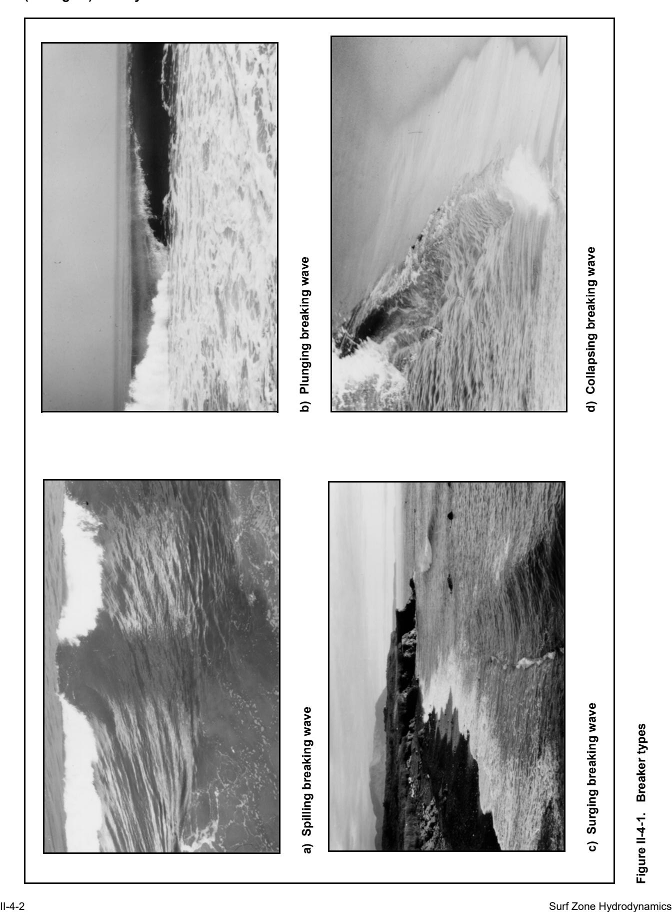

```math
\text{Surging/collapsing} \quad \xi_o > 3.3 \\
\text{Plunging} \quad 0.5 < \xi_o < 3.3 \\
\text{Spilling} \quad \xi_o < 0.5 \tag{II-4-2}
```

- (c) As expressed in Equation II-4-2, spilling breakers tend to occur for high-steepness waves on gently sloping beaches. Plunging breakers occur on steeper beaches with intermediately steep waves, and surging and collapsing breakers occur for low steepness waves on steep beaches. Extremely low steepness waves may not break, but instead reflect from the beach, forming a standing wave (see Part II-3 for discussion of reflection and Part II-5 for discussion of tsunamis).
- (d) Spilling breakers differ little in fluid motion from unbroken waves (Divoky, Le Méhauté, and Lin 1970) and generate less turbulence near the bottom and thus tend to be less effective in suspending sediment than plunging or collapsing breakers. The most intense local fluid motions are produced by a plunging breaker. As it breaks, the crest of the plunging wave acts as a free-falling jet that may scour a trough into the bottom. The transition from one breaker type to another is gradual and without distinct dividing lines. Direction and magnitude of the local wind can affect breaker type. Douglass (1990) showed that onshore winds cause waves to break in deeper depths and spill, whereas offshore winds cause waves to break in shallower depths and plunge.
- (2) Breaker criteria. Many studies have been performed to develop relationships to predict the wave height at incipient breaking $H_{b}.$ The term breaker index is used to describe nondimensional breaker height. Two common indices are the breaker depth index

```math
\gamma_b = \frac{H_b}{d_b} \tag{II-4-3}
```

in which $d_{b}$ is the depth at breaking, and the breaker height index

```math
\Omega_b = \frac{H_b}{H_o} \tag{II-4-4}
```

Incipient breaking can be defined several ways (Singamsetti and Wind 1980). The most common definition is the point that wave height is maximum. Other definitions are the point where the front face of the wave becomes vertical (plunging breakers) and the point just prior to appearance of foam on the wave crest (spilling breakers). Commonly used expressions for calculating breaker indices follow.
- (3) Regular waves.
- (a) Early studies on breaker indices were conducted using solitary waves. McCowan (1891) theoretically determined the breaker depth index as $γ_{b}$ = 0.78 for a solitary wave traveling over a horizontal bottom. This value is commonly used in engineering practice as a first estimate of the breaker index. Munk (1949) derived the expression Ω b = $0.3(H_{o}$ / $L_{o})^{-1/3}$ for the breaker height index of a solitary wave. Subsequent studies, based on periodic waves, by Iversen (1952), Goda (1970), Weggel (1972), Singamsetti and Wind (1980), Sunamura (1980), Smith and Kraus (1991), and others have established that the breaker indices depend on beach slope and incident wave steepness.
- (b) From laboratory data on monochromatic waves breaking on smooth, plane slopes, Weggel (1972) derived the following expression for the breaker depth index

```math
\gamma_b = b - a \frac{H_b}{g T^2} \tag{II-4-5}
```

for \tan \beta \le 0.1 and H_o/L_o \le 0.06 , where T is wave period, g is gravitational acceleration, and H_o is equivalent unrefracted deepwater wave height. The parameters a and b are empirically determined functions of beach slope, given by

```math
a = 43.8 \left(1 - e^{-19\tan\beta}\right) \tag{II-4-6}
```

and

```math
b = \frac{1.56}{\left(1 + e^{-19.5 \tan \beta}\right)} \tag{II-4-7}
```

- (c) The breaking wave height H_b is contained on both sides of Equation II-4-5, so the equation must be solved iteratively. Figure II-4-2 shows how the breaker depth index depends on wave steepness and bottom slope. For low steepness waves, the breaker index (Equation II-4-5) is bounded by the theoretical value of 0.78, as the beach slope approaches zero, and twice the theoretical value (sum of the incident and perfectly reflected component), or 1.56, as the beach slope approaches infinity. For nonuniform beach slopes, the average bottom slope from the break point to a point one wavelength offshore should be used.
- (d) Komar and Gaughan (1973) derived a semi-empirical relationship for the breaker height index from linear wave theory

```math
\Omega_b = 0.56 \left(\frac{H_o}{L_o}\right)^{-\frac{1}{5}} \tag{II-4-8}
```

- (e) The coefficient 0.56 was determined empirically from laboratory and field data.
- (4) Irregular waves. In irregular seas (see Part II-1 for a general discussion of irregular waves), incipient breaking may occur over a wide zone as individual waves of different heights and periods reach their steepness limits. In the saturated breaking zone for irregular waves (the zone where essentially all waves are breaking), wave height may be related to the local depth d as

```math
H_{rms,b} = 0.42 d \tag{II-4-9}
```

for root-mean-square (rms) wave height (Thornton and Guza 1983) or, approximately,

```math
H_{mo,b} = 0.6 d \tag{II-4-10}
```

for zero-moment wave height (see Part II-1). Some variability in H_{rms,b} and H_{mo,b} with wave steepness and beach slope is expected; however, no definitive study has been performed. The numerical spectral wave transformation model STWAVE (Smith et al. 2001) uses a modified Miche Criterion (Miche 1951).

```math
H_{mo,b} = 0.1 \text{ L tan h } kd \tag{II-4-11}
```

to represent both depth- and steepness-induced wave breaking.

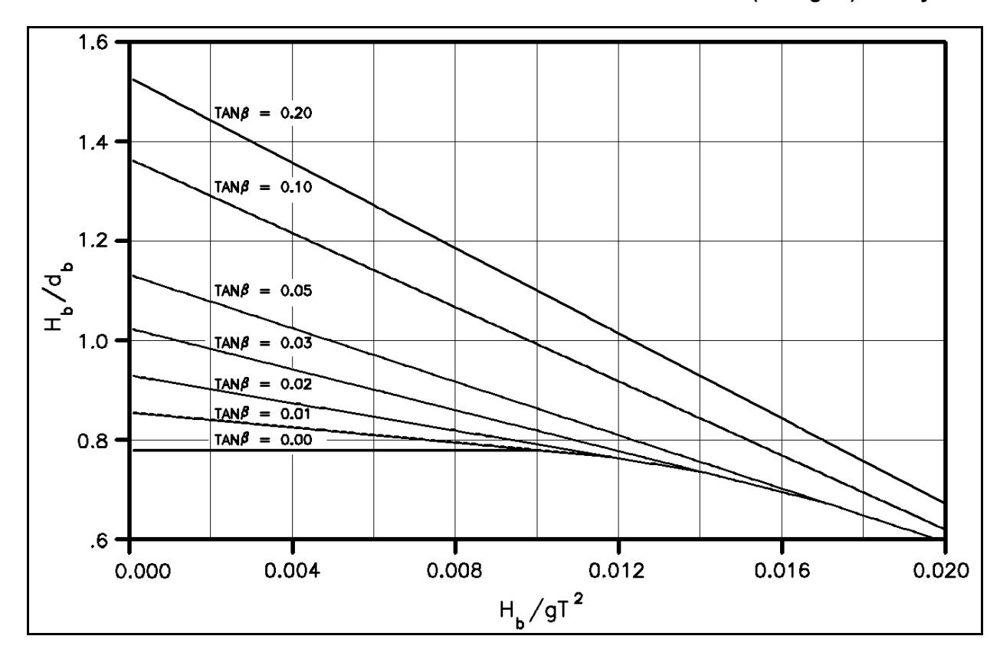

*Figure II-4-2. Breaker depth index as a function of $H_{b}/(gT^{2})$ (Weggel 1972)*

- b. Wave transformation in the surf zone . Following incipient wave breaking, the wave shape changes rapidly to resemble a bore (Svendsen 1984). The wave profile becomes sawtooth in shape with the leading edge of the wave crest becoming nearly vertical (Figure II-4-3). The wave may continue to dissipate energy to the shoreline or, if the water depth again increases as in the case of a barred beach profile, the wave may cease breaking, re-form, and break again on the shore. The transformation of wave height through the surf zone impacts wave setup, runup, nearshore currents, and sediment transport.
- (1) Similarity method. The simplest method for predicting wave height through the surf zone, an extension of Equation II-4-3 shoreward of incipient breaking conditions, is to assume a constant height-todepth ratio from the break point to shore

```math
H_b = \gamma_b \ d_b \tag{II-4-12}
```

This method, also referred to as saturated breaking, has been used successfully by Longuet-Higgins and Stewart (1963) to calculate setup, and by Bowen (1969a), Longuet-Higgins (1970a,b), and Thornton (1970) to calculate longshore currents. The similarity method is applicable only for monotonically decreasing water depth through the surf zone and gives best results for a beach slope of approximately 1/30. On steeper slopes, Equation II-4-12 tends to underestimate the wave height. On gentler slopes or barred topography, it tends to overestimate the wave height. Equation II-4-12 is based on the assumption that wave height is zero at the mean shoreline (see Part II-4-3 for discussion of mean versus still-water shoreline). Camfield (1991) shows that a conservative estimate of wave height at the still-water shoreline is 0.20 $H_{b}$ for 0.01 # tan β # 0.1.

## EXAMPLE PROBLEM II-4-1

## FIND:

Wave height and water depth at incipient breaking.

## GIVEN:

A beach with a 1 on 100 slope, deepwater wave height $H_{o}$ = 2 m, and period T = 10 sec. Assume that a refraction analysis (Part II-3) gives a refraction coefficient $K_{R}$ = 1.05 at the point where breaking is expected to occur.

## SOLUTION:

The equivalent unrefracted deepwater wave height Ho can be found from the refraction coefficient (see Part II-3, Equation II-3-14)

```math
H_o = K_R H_o = 1.05 (2.0) = 2.1 \text{ m}
```

and the deepwater wavelength $L_{o}$ is given by (Part II-1)

```math
L_o = g T^2/(2\pi) = 9.81 (10^2)/(2\pi) = 156 \text{ m}
```

Estimate the breaker height from Equation II-4-8

```math
\Omega_b = 0.56 (H_o'/L_o)^{-1/5} = 0.56 (2.1/156.)^{-1/5} = 1.3, \quad H_b (\text{estimated}) = \Omega_b H_o' = 2.7 \text{ m}
```

From Equations II-4-6 and II-4-7, determine a and b used in Equation II-4-5, tan β = 1/100

```math
a = 43.8(1 - e^{-19 (1/100)}) = 7.58 \\
b = 1.56 / (1 + e^{-19.5 (1/100)}) = 0.86
```

```math
\gamma_b = b - a H_b / (gT^2) = 0.86 - 7.58(2.7)/(9.81 \times 10^2) = 0.84, \quad d_b = H_b / \gamma_b = 2.7/0.84 = 3.2 \text{ m}
```

Breaker height is approximately 2.7 m and breaker depth is 3.2 m. The initial value selected for the refraction coefficient would now be checked to determine if it is correct for the actual breaker location. If necessary, a corrected refraction coefficient should be used to recompute breaker height and depth.
- (2) Energy flux method.
- (a) A more general method for predicting wave height through the surf zone for a long, straight coast is to solve the steady-state energy balance equation

```math
\frac{d(EC_g)}{dx} = -\delta \tag{II-4-13}
```

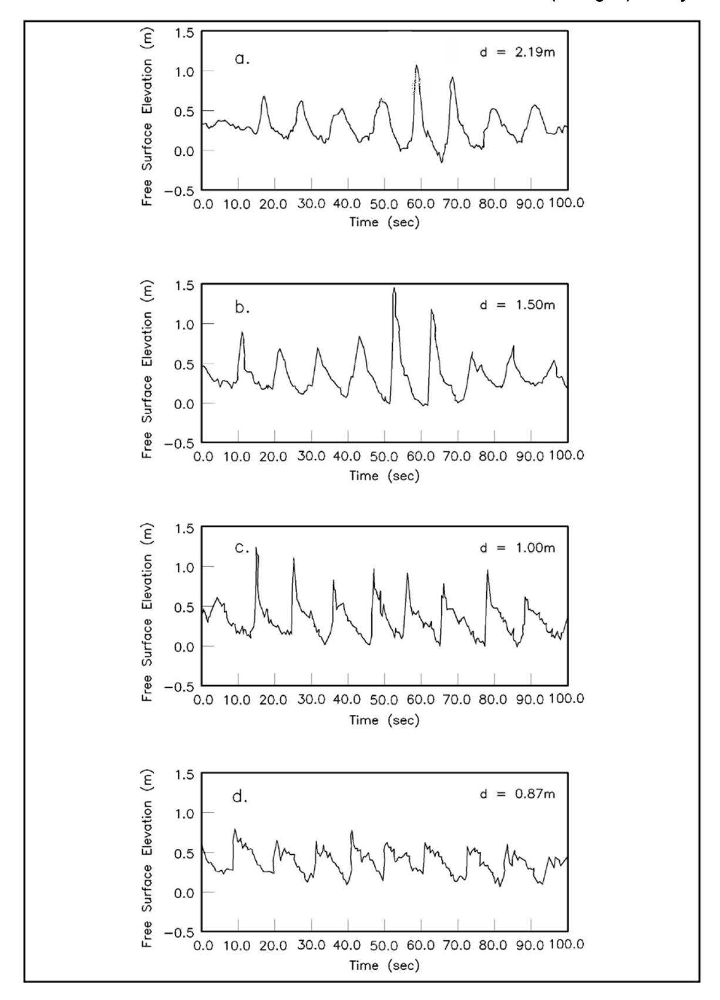

*Figure II-4-3. Change in wave profile shape from outside the surf zone (a,b) to inside the surf zone (c,d). Measurements from Duck, NC (Ebersole 1987)*

where E is the wave energy per unit surface area, C_g is the wave group speed, and \delta is the energy dissipation rate per unit surface area due to wave breaking. The wave energy flux EC_g may be specified from linear or higher order wave theory. Le Méhauté (1962) approximated a breaking wave as a hydraulic jump and substituted the dissipation of a hydraulic jump for \delta in Equation II-4-13 (see also Divoky, Le Méhauté, and Lin 1970; Hwang and Divoky 1970; Svendsen, Madsen, and Hansen 1978).
(b) Dally, Dean, and Dalrymple (1985) modeled the dissipation rate as

```math
\delta = \frac{\kappa}{d} \left( E C_g - E C_{g,s} \right) \tag{II-4-14}
```

where \kappa is an empirical decay coefficient, found to have the value 0.15, and EC_{g,s} is the energy flux associated with a stable wave height

```math
H_{stable} = \Gamma d \tag{II-4-15}
```

(c) The quantity \Gamma is an empirical coefficient with a value of approximately 0.4. The stable wave height is the height at which a wave stops breaking and re-forms. As indicated, this approach is based on the assumption that energy dissipation is proportional to the difference between local energy flux and stable energy flux. Applying linear, shallow-water theory, the Dally, Dean, and Dalrymple model reduces to

```math
\frac{d(H^2 d^{1/2})}{dx} = -\frac{\kappa}{d}\left( H^{2}d^{1/2}-\Gamma^{2}d^{5/2}\right) \quad \text{for} \quad H > H_{\mathrm{stable}} \\
= 0 \quad \text{for} \quad H < H_{\mathrm{stable}} \tag{II-4-16}
```

This approach has been successful in modeling wave transformation over irregular beach profiles, including bars (e.g., Ebersole (1987), Larson and Kraus (1991), Dally (1992)).
- (3) Irregular waves.
- (a) Transformation of irregular waves through the surf zone may be analyzed or modeled with either a statistical (individual wave or wave height distribution) or a spectral (parametric spectral shape) approach. Part II-1 gives background on wave statistics, wave height distributions, and parametric spectral shapes.
- (b) The most straightforward statistical approach is transformation of individual waves through the surf zone. Individual waves seaward of breaking may be measured directly, randomly chosen from a Rayleigh distribution, or chosen to represent wave height classes in the Rayleigh distribution. Then the individual waves are independently transformed through the surf zone using Equation II-4-13. Wave height distribution can be calculated at any point across the surf zone by recombining individual wave heights into a distribution to calculate wave height statistics (e.g., H_{1/10} , H_{1/3} , H_{rms} ). This method does not make a priori assumptions about wave height distribution in the surf zone. The individual wave method has been applied and verified with field measurements by Dally (1990), Larson and Kraus (1991), and Dally (1992). Figure II-4-4 shows the nearshore transformation of H_{rms} with depth based on the individual wave approach and the Dally, Dean, and Dalrymple (1985) model for deepwater wave steepness ( H_{rmso} / L_o ) of 0.005 to 0.05 and plane beach slopes of 1/100 and 1/30.
- (c) A numerical model called NMLONG (Numerical Model of the LONGshore current) (Larson and Kraus 1991) calculates wave breaking and decay by the individual wave approach applying the Dally, Dean,

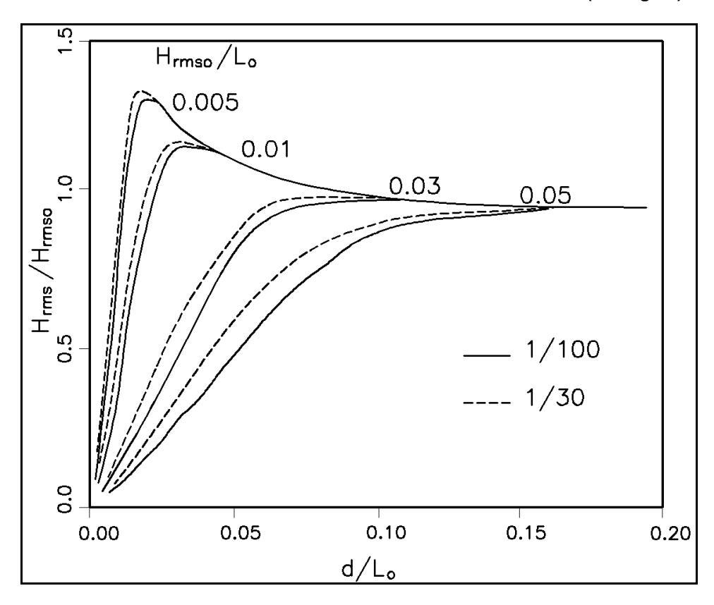

*Figure II-4-4. Transformation of $H_{rms}$ with depth based on the individual wave approach and the Dally, Dean, and Dalrymple (1985) model*

and Dalrymple (1985) wave decay model (monochromatic or irregular waves). The main assumption underlying the model is uniformity of waves and bathymetry alongshore, but the beach profile can be irregular across the shore (e.g., longshore bars and nonuniform slopes). NMLONG uses a single wave period and direction and applies a Rayleigh distribution wave heights outside the surf zone. The model runs on a personal computer and has a convenient graphical interface. NMLONG calculates both wave transformation and longshore current (which will be discussed in a later section) for arbitrary offshore (input) wave conditions and provides a plot of results. Figure II-4-5 gives an example NMLONG calculation and a comparison of wave breaking field measurements reported by Thornton and Guza (1986).
(d) A second statistical approach is based on assuming a wave height distribution in the surf zone. The Rayleigh distribution is a reliable measure of the wave height distribution in deep water and at finite depths. In the surf zone, depth-induced breaking acts to limit the highest waves in the distribution, contrary to the Rayleigh distribution, which is unbounded. The surf zone wave height distribution has generally been represented as a truncated Rayleigh distribution (e.g., Collins (1970), Battjes (1972), Kuo and Kuo (1974), Goda 1975). Battjes and Janssen (1978) and Thornton and Guza (1983) base the distribution of wave heights at any point in the surf zone on a Rayleigh distribution or a truncated Rayleigh distribution (truncated above a maximum wave height for the given water depth). A percentage of waves in the distribution is designated as broken, and energy dissipation from these broken waves is calculated from Equation II-4-13 through a model of dissipation similar to a periodic bore. Battjes and Janssen (1978) define the energy dissipation as

```math
\delta = 0.25 \rho g Q_b f_m (H_{\text{max}})^2 \tag{II-4-17}
```

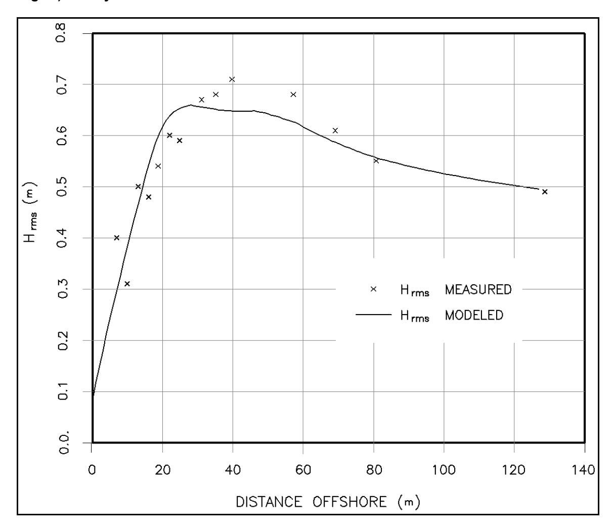

*Figure II-4-5. NMLONG simulation of wave height transformation (Leadbetter Beach, Santa Barbara, California, 3 Feb 1980 (Thornton and Guza 1986))*

where $Q_{b}$ is the percentage of waves breaking, $f_{m}$ is the mean wave frequency, and the maximum wave height is based on the Miche (1951) criterion

```math
H_{\text{max}} = 0.14L \tanh(kd) \tag{II-4-18}
```

where k is wave number. Battjes and Janssen base the percentage of waves breaking on a Rayleigh distribution truncated at $H_{max}.$ Baldock et al. (1998) show improved results and reduced computational time by basing $Q_{b}$ on the full Rayleigh distribution (Smith 2001). Goda (2002) documented that although the wave height distribution in the midsurf zone is narrower than the Rayleigh distribution, in the outer surf zone and near the shoreline the distribution is nearly Rayleigh. This method has been validated with laboratory and field data (e.g., Battjes and Janssen 1978; Thornton and Guza 1983) and implemented in numerical models (e.g., Booij 1999). Specification of the maximum wave height in terms of the Miche criterion (Equation II-4- 18) has the advantage of providing reasonable results for steepness-limited breaking (e.g., waves breaking on a current) as well as depth-limited breaking (Smith et al. 1997).

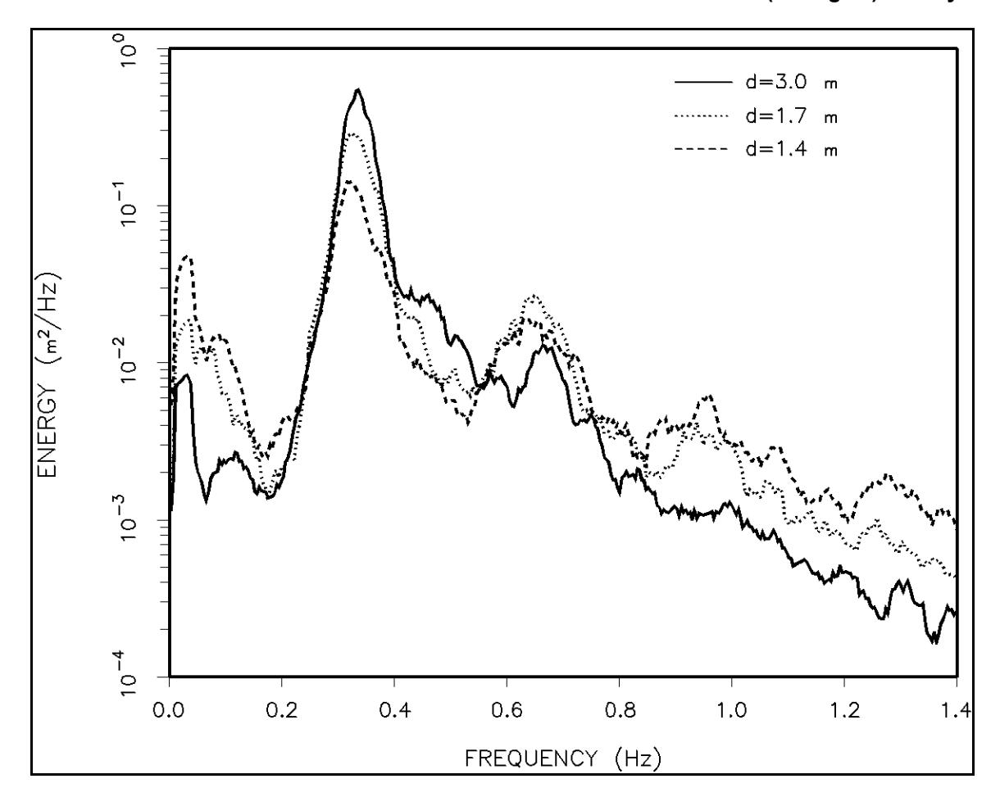

*Figure II-4-6. Shallow-water transformation of wave spectra (solid line - incident, d = 3.0m; dotted line - incident breaking zone, d = 1.7m; dashed line - surf zone, d = 1.4m)*

- (e) In shallow water, the shape of the wave spectrum is influenced by nonlinear transfers of wave energy from the peak frequency to higher frequencies and lower frequencies (Freilich and Guza 1984; Freilich, Guza, and Elgar 1990). Near incipient breaking higher harmonics (energy peaks at integer multiples of the peak frequency) appear in the spectrum as well as a general increase in the energy level above the peak frequency as illustrated in Figure II-4-6. Low-frequency energy peaks (subharmonics) are also generated in the surf (Figure II-4-6, also see Part II-4-5). Figure II-4-6 shows three wave spectra measured in a large wave flume with a sloping sand beach. The solid curve is the incident spectrum ( d = 3.0 m), the dotted curve is the spectrum at the zone of incipient breaking ( d = 1.7 m), and the dashed curve is within the surf zone ( d = 1.4 m). Presently, no formulation is available for the dissipation rate based on spectral parameters for use in Equation II-4-13. Therefore, the energy in the spectrum is often limited using the similarity method. Smith and Vincent (2002) found that in the inner surf zone, wave spectra evolve to a similar, single-peaked shape regardless of the complexity of the shape outside the surf zone (e.g., multipeaked spectra evolve to a single peak). It is postulated that the spectral shape evolves from the strong nonlinear interactions in the surf zone.
- (4) Waves over reefs. Many tropical coastal regions are fronted by coral reefs. These reefs offer protection to the coast because waves break on the reefs, so the waves reaching the shore are less energetic. Reefs typically have steep seaward slopes with broad, flat reef tops and a deeper lagoon shoreward of the reef. Transformation of waves across steep reef faces and nearly flat reef tops cannot be modeled by simple wave breaking relationships such as Equation II-4-12. Generally, waves refract and shoal on the steep reef face,

break, and then reform on the reef flat. Irregular transformation models based on Equation II-4-13 give reasonable results for reef applications (Young 1989), even though assumptions of gentle slopes are violated at the reef face. Wave reflection from coral reefs has been shown to be surprisingly low (Young 1989; Hardy and Young 1991). Although the dominant dissipation mechanism is depth-limited wave breaking, inclusion of an additional wave dissipation term in Equation II-4-13 to represent bottom friction on rough coral improves wave estimates. General guidance on reef bottom friction coefficients is not available, site-specific field measurements are recommended to estimate bottom friction coefficients.
(5) Advanced modeling of surf zone waves. Numerical models based on the Boussinesq equations have been extended to the surf zone by empirically implementing breaking. In time-domain Boussinesq models, a surface roller (Schäffer et al. 1993) or a variable eddy viscosity (Nwogu 1996; Kennedy et al. 2000) is used to represent breaking induced mixing and energy dissipation. Incipient breaking for individual waves is initiated based on velocity at the wave crest or slope of the water surface. These models accurately represent the time-varying, nonlinear wave profile (including vertical and horizontal wave asymmetry) and depthaveraged current. Boussinesq models also include the generation of low-frequency waves in the surf zone (surf beat and shear waves) (e.g., Madsen, Sprengen, and Schäffer 1997; Kirby and Chen 2002). Wave runup on beaches and interaction with coastal structures are also included in some models. Although Boussinesq models are computationally intensive, they are now being used for many engineering applications (e.g., Nwogu and Demirbilek 2002). The one-dimensional nonlinear shallow-water equations have also been used to calculate time-domain irregular wave transformation in the surf zone (Kobayashi and Wurjanto 1992). This approach has been successful in predicting the oscillatory and steady fluid motions in the surf and swash zones (Raubenheimer et al. 1994). Reynolds Averaged Navier Stokes (e.g., Lin and Liu 1998) and Large Eddy Simulation (Watanabe and Saeki 1999; Christensen and Deigaard 2001) models have been developed to study the turbulent 3-D flow fields generated by breaking waves. These models can represent obliquely descending eddies generated by breaking waves (Nadaoka, Hino, and Koyano 1989) which increase the turbulent intensity, eddy viscosity, and near-bottom shear stress (Okayasu et al. 2002). Results from these models may help explain the difference in sediment transport patterns under plunging and spilling breakers (Wang, Smith, and Ebersole 2002). These detailed large-scale turbulence models are still research tools requiring large computational resources for short simulations. However, results from the models are providing insights to surf zone turbulent processes that are difficult to measure in the laboratory or field.

## II-4-3. Wave Setup

a. Wave setup is the superelevation of mean water level caused by wave action (additional changes in water level may include wind setup or tide, see Part II-5). Total water depth is a sum of still-water depth and setup

```math
d = h + \overline{\eta} \tag{II-4-19}
```

where
h = still-water depth
& η = mean water surface elevation about still-water level
b. Wave setup balances the gradient in the cross-shore directed radiation stress, i.e., the pressure gradient of the mean sloping water surface balances the gradient of the incoming momentum. Derivation of radiation stress is given in Part II-1.
c. Mean water level is governed by the cross-shore balance of momentum

```math
\frac{d\overline{\eta}}{dx} = -\frac{1}{\rho g d} \frac{dS_{xx}}{dx} \tag{II-4-20}
```

where S_{xx} is the cross-shore component of the cross-shore directed radiation stress, for longshore homogeneous waves and bathymetry (see Equations II-4-34 through II-4-36 for general equations). Radiation stress both raises and lowers ( setdown ) the mean water level across shore in the nearshore region (Figure II-4-7).
d. Seaward of the breaker zone, Longuet-Higgins and Stewart (1963) obtained setdown for regular waves from the integration of Equation II-4-20 as

```math
\overline{\eta} = -\frac{1}{8} \frac{H^2 \frac{2\pi}{L}}{\sinh\left(\frac{4\pi}{L} d\right)} \tag{II-4-21}
```

assuming linear wave theory, normally incident waves, and \overline{\eta} = 0 in deep water. The maximum lowering of the water level, setdown, occurs near the break point \overline{\eta}_b .
e. In the surf zone, \overline{\eta} increases between the break point and the shoreline (Figure II-4-7). The gradient, assuming linear theory ( S_{xx} = 3/16 \rho g H^2 ), is given by

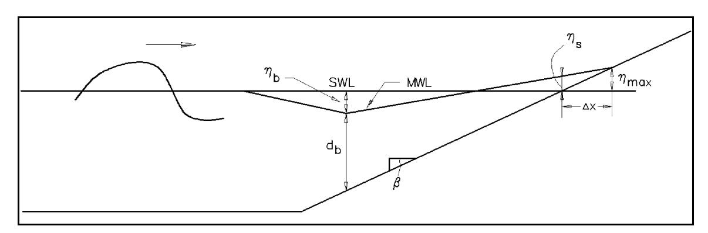

*Figure II-4-7. Definition sketch for wave setup*

```math
\frac{d\overline{\eta}}{dx} = -\frac{3}{16} \frac{1}{h + \overline{\eta}} \frac{d(H^2)}{dx} \tag{II-4-22}
```

where the shallow-water value of S_{xx} = 3/16 \rho g d H^2 has been substituted into Equation II-4-20. The value of \overline{\eta} depends on wave decay through the surf zone. Applying the saturated breaker assumption of linear wave height decay on a plane beach, Equation II-4-22 reduces to

```math
\frac{d\bar{\eta}}{dx} = \frac{1}{1 + \frac{8}{3\gamma_b^2}} \tan\beta \tag{II-4-23}
```

f. Combining Equations II-4-21 and II-4-23, setup at the still-water shoreline \overline{\eta}_s is given by

```math
\overline{\eta}_s = \overline{\eta}_b + \left[ \frac{1}{1 + \frac{8}{3\gamma_b^2}} \right] h_b \tag{II-4-24}
```

g. The first term in Equation II-4-24 is setdown at the break point and the second term is setup across the surf zone. The setup increases linearly through the surf zone for a plane beach. For a breaker depth index of 0.8, \overline{\eta_s} \approx 0.15 \ d_b . Note that, for higher breaking waves, d_b will be greater and thus setup will be greater. Equation II-4-24 gives setup at the still-water shoreline; to calculate maximum setup and position of the mean shoreline, the point of intersection between the setup and beach slope must be found. This can be done by trial and error, or, for a plane beach, estimated as

```math
\Delta x = \frac{\overline{\eta}_s}{\tan\beta - \frac{d\overline{\eta}}{dx}} \tag{II-4-25}
```

```math
\bar{\eta}_{\max} = \bar{\eta}_s + \frac{d\bar{\eta}}{dx}\Delta x
```

where \Delta x is the shoreward displacement of the shoreline and \overline{\eta}_{max} is the setup at the mean shoreline.
- h. Wave setup and the variation of setup with distance on irregular (non-planar) beach profiles can be calculated based on Equations II-4-21 and II-4-22 (e.g., McDougal and Hudspeth 1983, Larson and Kraus 1991). NMLONG calculates mean water level across the nearshore under the assumptions previously discussed.
- i. Setup for irregular waves should be calculated from decay of the wave height parameter H_{rms} . Wave setup produced by irregular waves is somewhat different than that produced by regular waves (Equation II-4-22) because long waves with periods of 30 sec to several minutes, called infragravity waves , may produce a slowly varying mean water level. See Part II-4-5 for discussion of magnitude and generation of infragravity waves. Figures II-4-8 and II-4-9 show irregular wave setup, nondimensionalized by H_{rmso} , for plane slopes of 1/100 and 1/30, respectively. Setup in these figures is calculated from the decay of H_{rms} given by the irregular wave application of the Dally, Dean, and Dalrymple (1985) wave decay model (see Figure II-4-4). Nondimensional wave setup increases with decreasing deepwater wave steepness. Note that beach slope is predicted to have a relatively small influence on setup for irregular waves.

#### II-4-4. Wave Runup on Beaches

Runup is the maximum elevation of wave uprush above still-water level (Figure II-4-11). Wave uprush consists of two components: superelevation of the mean water level due to wave action (setup) and fluctuations about that mean (swash). Runup, R, is defined in Figure II-4-12 as a local maximum or peak in the instantaneous water elevation, \eta , at the shoreline. The upper limit of runup is an important parameter for determining the active portion of the beach profile.
At present, theoretical approaches for calculating runup on beaches are not viable for coastal design. Difficulties inherent in runup prediction include nonlinear wave transformation, wave reflection, three-dimensional effects (bathymetry, infragravity waves), porosity, roughness, permeability, and groundwater elevation. Wave runup on structures is discussed in Chapter VI-2.

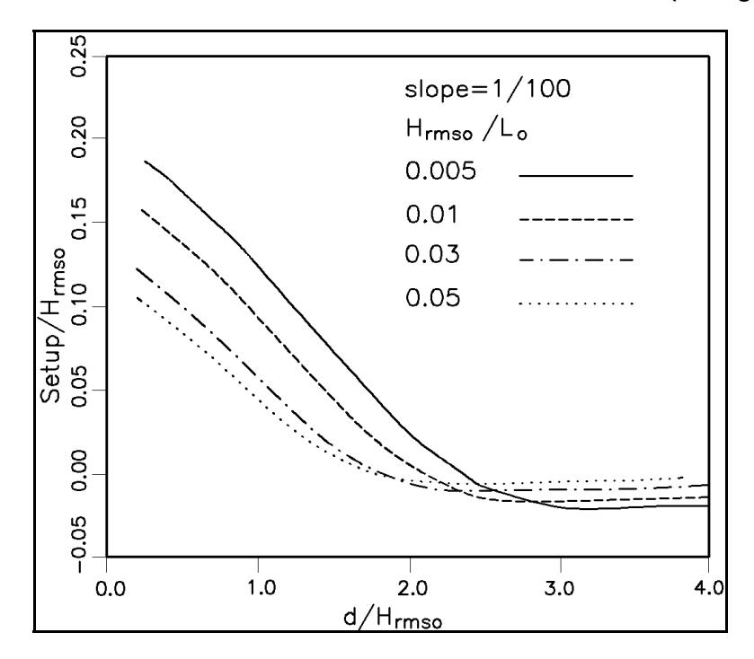

*Figure II-4-8. Irregular wave setup for plane slope of 1/100*

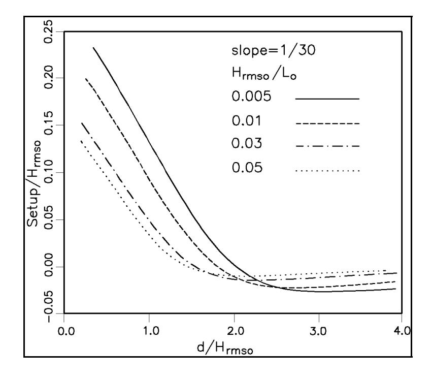

*Figure II-4-9. Irregular wave setup for plane slope of 1/30*

#### EXAMPLE PROBLEM II-4-2

FIND:
Setup across the surf zone.

#### GIVEN:

A plane beach having a 1 on 100 slope, and normally incident waves with deepwater height of 2 m and period of 10 sec (see Example Problem II-4-1).

#### SOLUTION:

The incipient breaker height and depth were determined in Example Problem II-4-1 as 2.7 m and 3.2 m, respectively. The breaker index is 0.84, based on Equation II-4-5.
Setdown at the breaker point is determined from Equation II-4-21. At breaking, Equation II-4-21 simplifies to & η b = - 1/16 γ b 2 $d_{b},$ (sinh 2 π d/L . 2 π d/L , and $H_{b}$ = γ b db ), thus

```math
\overline { { \eta _ { b } } } = - 1 / 1 6 \left( 0 . 8 4 \right) ^ { 2 } ( 3 . 2 ) = - 0 . 1 4 \mathrm { m }
```

Setup at the still-water shoreline is determined from Equation II-4-24

```math
\overline { { \eta _ { s } } } = - 0 . 1 4 + ( 3 . 2 + 0 . 1 4 ) + 1 / ( 1 + 8 / ( 3 \, ( . 8 4 ) ^ { 2 } ) ) = 0 . 5 6 \, \mathrm { m }
```

The gradient in the setup is determined from Equation II-4-23 as

```math
d\overline{\eta}/dx = 1/(1 + 8/(3(0.84)^2))(1/100) = 0.0021
```

and from Equation II-4-25, ∆ x = (0.56)/(1/100 - 0.0021) = 70.9 m, and

```math
\overline{\eta}_{max} = 0.56 + 0.0021(64.6) = 0.65 \text{ m}
```

For the simplified case of a plane beach with the assumption of linear wave height decay, the gradient in the setup is constant through the surf zone. Setup may be calculated anywhere in the surf zone from the relation & η = & η b + (d & η /dx)(xb - x) , where $x_{b}$ is the surf zone width and x = 0 at the shoreline ( x is positive offshore).

| x, m | h, m | &η , m |
| --- | --- | --- |
| 334 | 3.3 | -0.14 |
| 167 | 1.7 | 0.21 |
| 0 | 0.0 | 0.56 |
| -71 | -0.7 | 0.71 |

Setdown at breaking is - 0.14 m, net setup at the still-water shoreline is 0.56 m, the gradient in the setup is 0.0021 m/m, the mean shoreline is located 71 m shoreward of the still-water shoreline, and maximum setup is 0.71 m (Figure II-4-10).

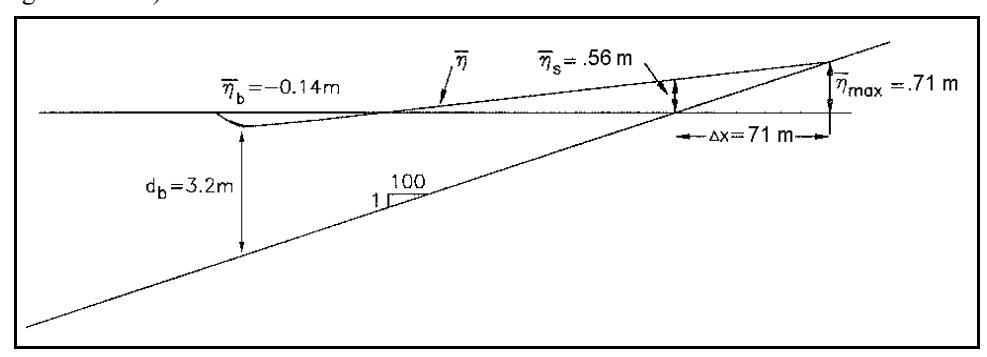

*Figure II-4-10. Example problem II-4-2*

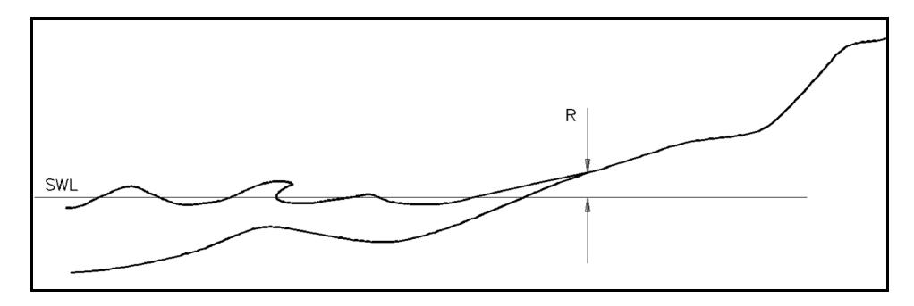

*Figure II-4-11. Definition sketch for wave runup*

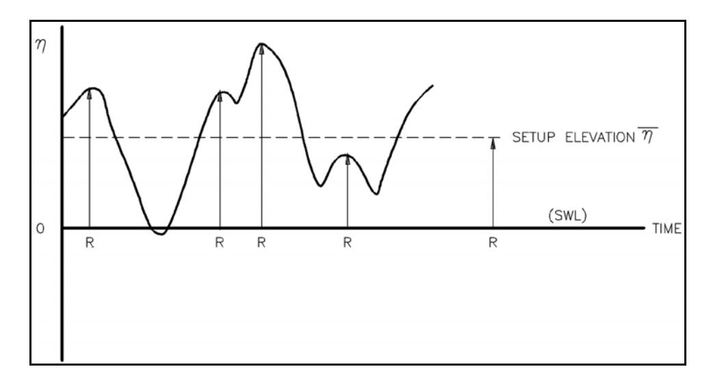

*Figure II-4-12. Definition of runup as local maximum in elevation*

- a. Regular waves.
- (1) For breaking waves, Hunt (1959) empirically determined runup as a function of beach slope, incident wave height, and wave steepness based on laboratory data. Hunt's formula, given in nondimensional form (Battjes 1974), is

```math
\frac{R}{H_o} = \xi_o \quad \text{for } 0.1 < \xi_o < 2.3 \tag{II-4-26}
```

for uniform, smooth, impermeable slopes, where \xi_o is the surf similarity parameter defined in Equation II-4-1. Walton et al. (1989) modified Equation II-4-26 to extend the application to steep slopes by replacing \tan \beta in the surf similarity parameter, which becomes infinite as \beta approaches \pi/2 , with \sin \beta . The modified Hunt formula was verified with laboratory data from Saville (1956) and Savage (1958) for slopes of 1/10 to vertical.
(2) The nonbreaking upper limit of runup on a uniform slope is given by

```math
\frac{R}{H_o} = (2\pi)^{\frac{1}{2}} \left(\frac{\pi}{2\beta}\right)^{\frac{1}{4}} \tag{II-4-27}
```

based on criteria developed by Miche (1951) and Keller (1961) (Walton et al. 1989).

#### b. Irregular waves.

- (1) Irregular wave runup has also been found to be a function of the surf similarity parameter (Holman and Sallenger 1985, Mase 1989, Nielsen and Hanslow 1991), but differs from regular wave runup due to the interaction between individual runup bores. Uprush may be halted by a large backrush from the previous wave or uprush may be overtaken by a subsequent large bore. The ratio of the number of runup crests to the number of incident waves increases with increased surf similarity parameter (ratios range from 0.2 to 1.0 for \xi_o of 0.15 to 3.0) (Mase 1989, Holman 1986). Thus, low-frequency (infragravity) energy dominates runup for low values of \xi_o . See Section II-4-5 for a discussion of infragravity waves.
- (2) Mase (1989) presents predictive equations for irregular runup on plane, impermeable beaches (slopes 1/5 to 1/30) based on laboratory data. Mase's expressions for the maximum runup ( R_{max} ), the runup exceeded by 2 percent of the runup crests ( R_{2\%} ), the average of the highest 1/10 of the runups ( R_{1/10} ), the average of the highest 1/3 of the runups ( R_{1/3} ), and the mean runup ( \overline{R} ) are given by

```math
\frac { R _ { \mathrm { m a x } } } { H _ { o } } \, = \, 2 . 3 2 \, \xi _ { o } ^ { \, 0 . 7 7 } \tag{II-4-28}
```

```math
\frac{R_{2\%}}{H_o} = 1.86 \, \xi_o^{0.71} \tag{II-4-29}
```

```math
\frac{R_{1/10}}{H_o} = 1.70 \, \xi_o^{0.71} \tag{II-4-30}
```

```math
\frac{R_{1/3}}{H_o} = 1.38 \, \xi_o^{0.70} \tag{II-4-31}
```

```math
\frac{\overline{R}}{H_o} = 0.88 \, \xi_o^{0.69} \tag{II-4-32}
```

for 1/30 \le \tan \beta \le 1/5 and H_o/L_o \ge 0.007 , where H_o is the significant deepwater wave height and \xi_o is calculated from the deepwater significant wave height and length. The appropriate slope for natural beaches is the slope of the beach face (Holman 1986, Mase 1989). Wave setup is included in Equations II-4-28 through II-4-32. The effects of tide and wind setup must be calculated independently. Walton (1992) extended Mase's (1989) analysis to predict runup statistics for any percent exceedence under the assumption that runup follows the Rayleigh probability distribution.
(3) Field measurements of runup (Holman 1986, Nielsen and Hanslow 1991) are consistently lower than predictions by Equations II-4-28 through II-4-32. Equation II-4-29 overpredicts the best fit to R_{2\%} by a factor of two for Holman's data (with the slope defined as the beach face slope), but is roughly an upper envelope of the data scatter. Differences between laboratory and field results (porosity, permeability, nonuniform slope, wave reformation across bar-trough bathymetry, wave directionality) have not been quantified. Mase (1989) found that wave groupiness (see Part II-1 for a discussion of wave groups) had little impact on runup for gentle slopes.

## EXAMPLE PROBLEM II-4-3

## FIND:

Maximum and significant runup.

## GIVEN:

A plane beach having a 1 on 80 slope, and normally incident waves with deepwater height of 4.0 m and period of 9 sec.

## SOLUTION:

Calculation of runup requires determining deepwater wavelength

```math
L_o = g T^2/(2\pi) = 9.81 (9^2)/(2\pi) = 126 \text{ m}
```

and, from Equation II-4-1, the surf similarity parameter

```math
\xi_o = \tan \beta \ (H_o/L_o)^{-1/2} = (1/80) \ (4.0/126.)^{-1/2} = 0.070
```

Maximum runup is calculated from Equation II-4-28

```math
R_{max} = 2.32 H_o \xi_o^{0.77} = 2.32 (4.0)(0.070)^{0.77} = 1.2 \text{ m}
```

Significant runup is calculated from Equation II-4-31

```math
R_{1/3} = 1.38 H_o \xi_o^{0.70} = 1.38 (4.0)(0.070)^{0.70} = 0.86 \text{ m}
```

Maximum runup is 1.2 m and significant runup is 0.86 m.

## II-4-5. Infragravity Waves

- a. Long wave motions with periods of 30 sec to several minutes often contribute a substantial portion of the surf zone energy. These motions are termed infragravity waves . Swash at wind wave frequencies (period of 1-20 sec) dominates on reflective beaches (steep beach slopes, typically with plunging or surging breakers), and infragravity frequency swash dominates on dissipative beaches (gentle beach slopes, typically with spilling breakers) (see Wright and Short (1984) for description of dissipative versus reflective beach types).
- b. Infragravity waves fall into three categories: a) bounded long waves, b) edge waves, and c) leaky waves. Bounded long waves are generated by gradients in radiation stress found in wave groups, causing a lowering of the mean water level under high waves and a raising under low waves (Longuet-Higgins and Stewart 1962). The bounded wave travels at the group speed of the wind waves, hence is bound to the wave group. Edge waves are freely propagating long waves which reflect from the shoreline and are trapped along shore by refraction. Long waves may be progressive or stand along the shore. Edge waves travel alongshore with an antinode at the shoreline, and the amplitude decays exponentially offshore. Leaky waves are also freely propagating long waves or standing waves, but they reflect from the shoreline to deep water and are not trapped by the bathymetry. Proposed generation mechanisms for the freely propagating long waves include time-varying break point of groupy waves (Symonds, Huntley, and Bowen 1982), release of bounded waves through wave breaking (Longuet-Higgins and Stewart 1964), and nonlinear wave-wave interactions (Gallagher 1971).

c. Field studies have clearly identified bounded long waves and edge waves in the nearshore (see discussion by Oltman-Shay and Hathaway (1989)). The relative amount of infragravity energy and incident wind wave energy is a function of the surf similarity parameter (Holman and Sallenger 1985, Holman 1986), with infragravity energy dominating for low values of the surf similarity parameters ( \xi_o < 1.5 ). For low values, the energy spectrum at incident frequencies is generally saturated (the spectral energy density is independent of the offshore wave height, due to wave breaking), but at infragravity frequencies, the energy density increases linearly with increasing offshore wave height (Guza and Thornton 1982, Mase 1988). Storm conditions with high steepness waves tend to have low-valued surf similarity parameters, so infragravity waves are prevalent in storms. Velocities and runup heights associated with infragravity waves have strong implications for nearshore sediment transport, beach morphology evolution, structural stability, harbor oscillation, and energy transmission through structures, as well as amplification or damping of infragravity waves by the local morphology or structure configuration. Presently, practical questions of how to predict infragravity waves and design for their effects have not been answered.

#### II-4-6. Nearshore Currents

- a. Introduction.
- (1) The current in the surf zone is composed of motions at many scales, forced by several processes. Schematically, the total current u can be expressed as a superposition of these interrelated components

```math
u = u_w + u_t + u_a + u_o + u_i \tag{II-4-33}
```

where u_w is the steady current driven by breaking waves, u_i is the tidal current, u_a is the wind-driven current, and u_o and u_i are the oscillatory flows due to wind waves and infragravity waves. Figure II-4-13 shows long-shore and cross-shore currents measured in the surf zone at the Field Research Facility in Duck, NC. The mean value of the current in the figure is the steady current driven by breaking waves and wind, the long period oscillation is due to infragravity waves, and the short-period oscillation is the wind-wave orbital motion.
- (2) Currents generated by the breaking of obliquely incident wind waves generally dominate in and near the surf zone on open coasts. Strong local winds can also drive significant nearshore currents (Hubertz 1986). Wave- and wind-driven currents are important in the transport and dispersal of sediment and pollutants in the nearshore. These currents also transport sediments mobilized by waves. Tidal currents, which may dominate in bays, estuaries, and coastal inlets, are discussed in Parts II-5 and II-7.
- (3) Figure II-4-14 shows typical nearshore current patterns: a) an alongshore system (occurring under oblique wave approach), b) a symmetric cellular system, with longshore currents contributing equally to seaward-flowing rip currents (occurring under shore-normal wave approach), and c) an asymmetric cellular system, with longshore currents contributing unequally to rip currents (Harris 1969). The beach topography is often molded by the current pattern, but the current pattern also responds to the topography.
- (4) Nearshore currents are calculated from the equations of momentum (Equations II-4-34 and II-4-35) and continuity (Equation II-4-36):

```math
U\frac{\partial U}{\partial x} + V\frac{\partial U}{\partial y} = -g\frac{\partial \overline{\eta}}{\partial x} + F_{bx} + L_x + R_{bx} + R_{sx} \tag{II-4-34}
```

```math
U\frac{\partial V}{\partial x} + V\frac{\partial V}{\partial y} = -g\frac{\partial \overline{\eta}}{\partial y} + F_{by} + L_y + R_{by} + R_{sy} \tag{II-4-35}
```

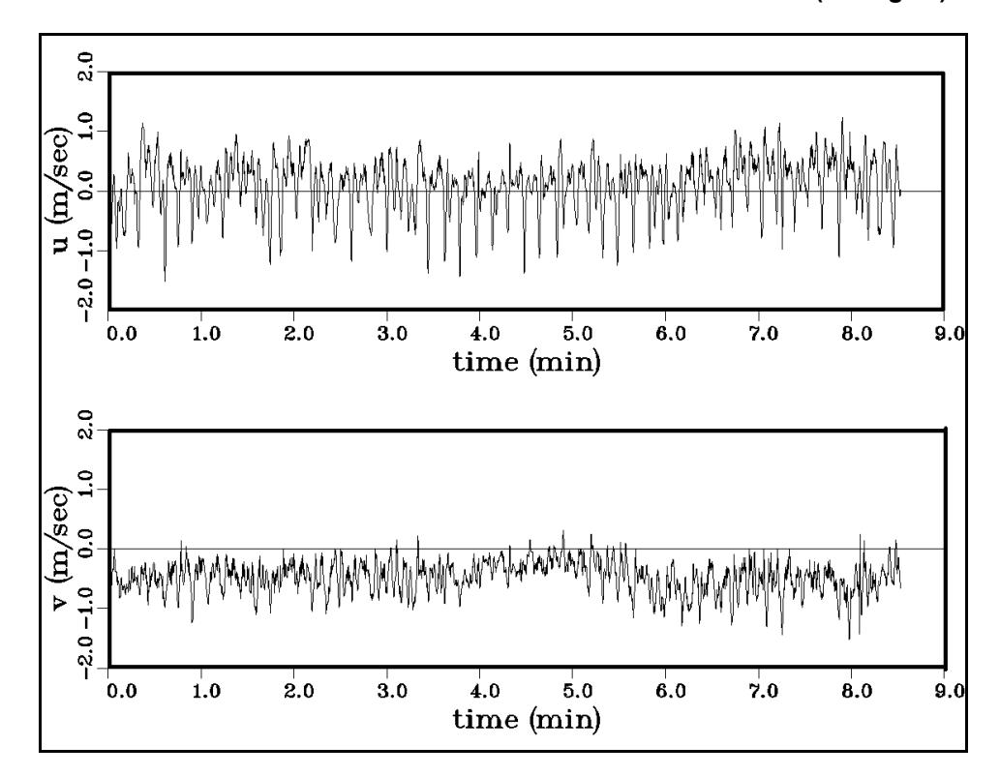

*Figure II-4-13. Measured cross-shore and longshore flow velocities*

```math
\frac{\partial(Ud)}{\partial x} + \frac{\partial(Vd)}{\partial y} = 0 \tag{II-4-36}
```

where
U =time- and depth-averaged cross-shore current
V = time- and depth-averaged longshore current
F_{bx} , F_{by} = cross-shore and longshore components of bottom friction
L_x , L_v = cross-shore and longshore components of lateral mixing
R_{bx} , R_{by} = cross-shore and longshore components of wave forcing
R_{sx} , R_{sy} = cross-shore and longshore components of wind forcing
(5) These equations include wave and wind forcing, pressure gradients due to mean water level variations, bottom friction due to waves and currents, and lateral mixing of the current. The primary driving force is the momentum flux of breaking waves (radiation stress), which induces currents in both the longshore and cross-shore directions. Radiation stress is proportional to wave height squared, so the forcing that generates currents is greatest in regions of steep wave height decay gradients. Bottom friction is the resisting force to the currents. Bottom roughness and wave and current velocities determine bottom friction. Lateral mixing is the exchange of momentum caused by turbulent eddies which tend to "spread out" the effect of wave forcing beyond the region of steep gradients in wave decay. Longshore, cross-shore, and rip current components of nearshore circulation are discussed in the following sections.

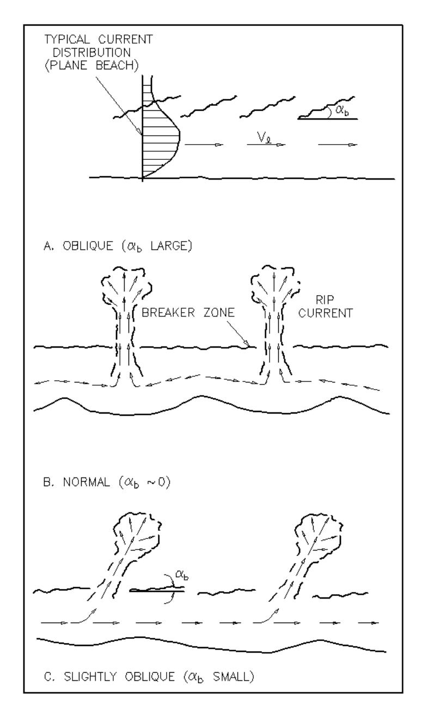

*Figure II-4-14. Nearshore circulation systems*

## b. Longshore current .

- (1) Wave- and wind-induced longshore currents flow parallel to the shoreline and are strongest in the surf zone, decaying rapidly seaward of the breakers. These currents are generated by gradients in momentum flux (radiation stress) due to the decay of obliquely incident waves and the longshore component of the wind. Typically, longshore currents have mean values of 0.3 m/sec or less, but values exceeding 1 m/sec can occur in storms. The velocities are relatively constant over depth (Visser 1991).
- (2) The concept of radiation stress was first applied to the generation of longshore currents by Bowen (1969a), Longuet-Higgins (1970a,b), and Thornton (1970). These studies were based on the assumptions of longshore homogeneity (Figure II-4-14a) and no wind forcing, reducing Equation II-4-35 to a balance
between the wave forcing, bottom friction, and lateral mixing. The wave driving force for the longshore current is the cross-shore gradient in the radiation stress component S_{xy} ,

```math
R_{by} = -\frac{1}{\rho d} \frac{\partial S_{xy}}{\partial x} \tag{II-4-37}
```

where, using linear wave theory,

```math
S_{xy} = \frac{n}{8} \rho g H^2 \cos \alpha \sin \alpha \tag{II-4-38}
```

where n is the ratio of wave group speed and phase speed. The variables determining wave-induced longshore current, as seen in the driving force given in Equations II-4-37 and II-4-38, are the angle between the wave crest and bottom contours, and wave height. Wave height affects not only longshore velocity, but also the total volume rate of flow by determining the width of the surf zone.
(3) A simple analytical solution for the wave-induced longshore current was given by Longuet-Higgins (1970a,b) under the assumptions of longshore homogeneity in bathymetry and wave height, linear wave theory, small breaking wave angle, uniformly sloping beach, no lateral mixing, and saturated wave breaking (H = \gamma_b d) through the surf zone. Under these assumptions, the longshore current in the surf zone is given by:

```math
V = \frac{5\pi}{16} \cdot \frac{\tan\beta^*}{C_f} \cdot \gamma_b \cdot \sqrt{gd} \cdot \sin\alpha \cdot \cos\alpha \tag{II-4-39}
```

where
V =longshore current speed
\tan \beta^* = \text{beach slope modified for wave setup} = \tan \beta/(1 + (3\gamma_b^2/8))
- C_f = bottom friction coefficient
- \alpha = wave crest angle relative to the bottom contours
- (4) The modified beach slope \tan \beta^* accounts for the change in water depth produced by wave setup. The bottom friction coefficient C_f has typical values in the range 0.005 to 0.01, but is dependent on bottom roughness. This parameter is often used to calibrate the predictive equation, if measurements are available. The cross-shore distribution of the longshore current given by Equation II-4-39 is triangular in shape with a maximum at the breaker line and zero at the shoreline (Figure II-4-15) and seaward of the breaker line. Inclusion of lateral mixing smooths the current profile as shown by the dotted lines in Figure II-4-15. The parameter V_o in Figure II-4-15 is the maximum current for the case without lateral mixing, and it is used to nondimensionalize the longshore current.
- (5) Komar and Inman (1970) obtained an expression for the longshore current at the mid-surf zone V_{mid} based on relationships for evaluating longshore sand transport rates which is given by Komar (1979):

```math
V _ { m i d } \, = \, 1 . 1 7 \, \sqrt { g \, H _ { r m s , b } } \, \sin { \, \alpha _ { b } } \, \cos { \, \alpha _ { b } } \tag{II-4-40}
```

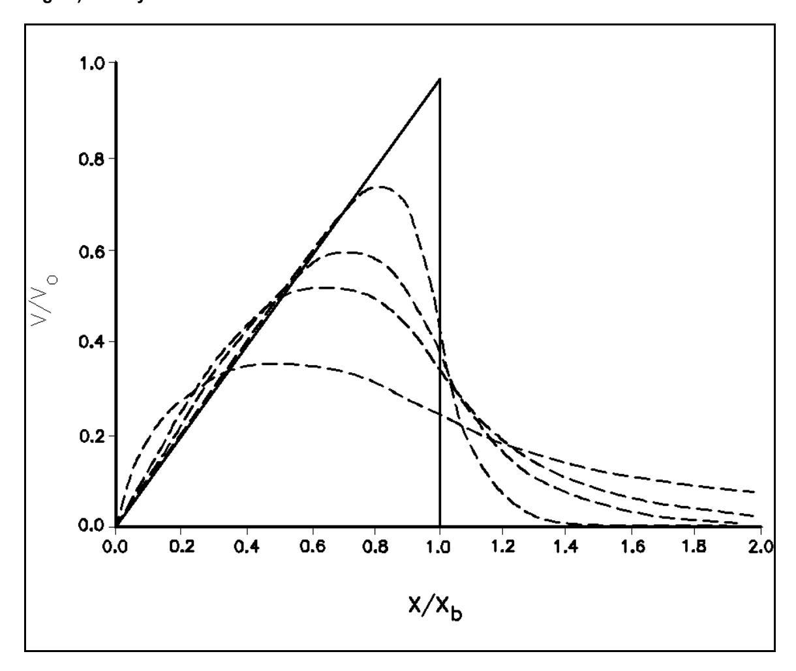

*Figure II-4-15. Longshore current profiles (solid line - no lateral mixing; dashed lines - with lateral mixing)*

(6) Equation II-4-40 shows good agreement with available longshore current data (Figure II-4-16). Although Equations II-4-39 and II-4-40 are similar in form, Equation II-4-4037 is independent of beach slope, which implies that tan $β/C_{f}$ is constant in Equation II-4-39. The interdependence of tan β and $C_{f}$ may result from the direct relationship of both parameters to grain size or an apparent dependence due to beach-slope effects on mixing (which is not included in Equation II-4-39) (Komar 1979, Huntley 1976, Komar and Oltman-Shay 1990).
(7) Longshore current, eliminating many simplifying assumptions used in Equation II-4-39, is solved numerically by the model NMLONG (Larson and Kraus 1991) for longshore-homogenous applications. NMLONG, which was briefly discussed for the simulation of breaking waves, calculates wave and windinduced longshore current, wave and wind-induced setup, and wave height across the shore. Figure II-4-17 gives an example NMLONG calculation and comparison to field measurements of wave breaking and longshore current reported by Thornton and Guza (1986). The two-dimensional equations (Equations II-4-34 through II-4-36) are solved numerically by Noda (1974), Birkemeier and Dalrymple (1975), Ebersole and Dalrymple (1980), Vemulakonda (1984), and Wind and Vreugdenhil (1986).

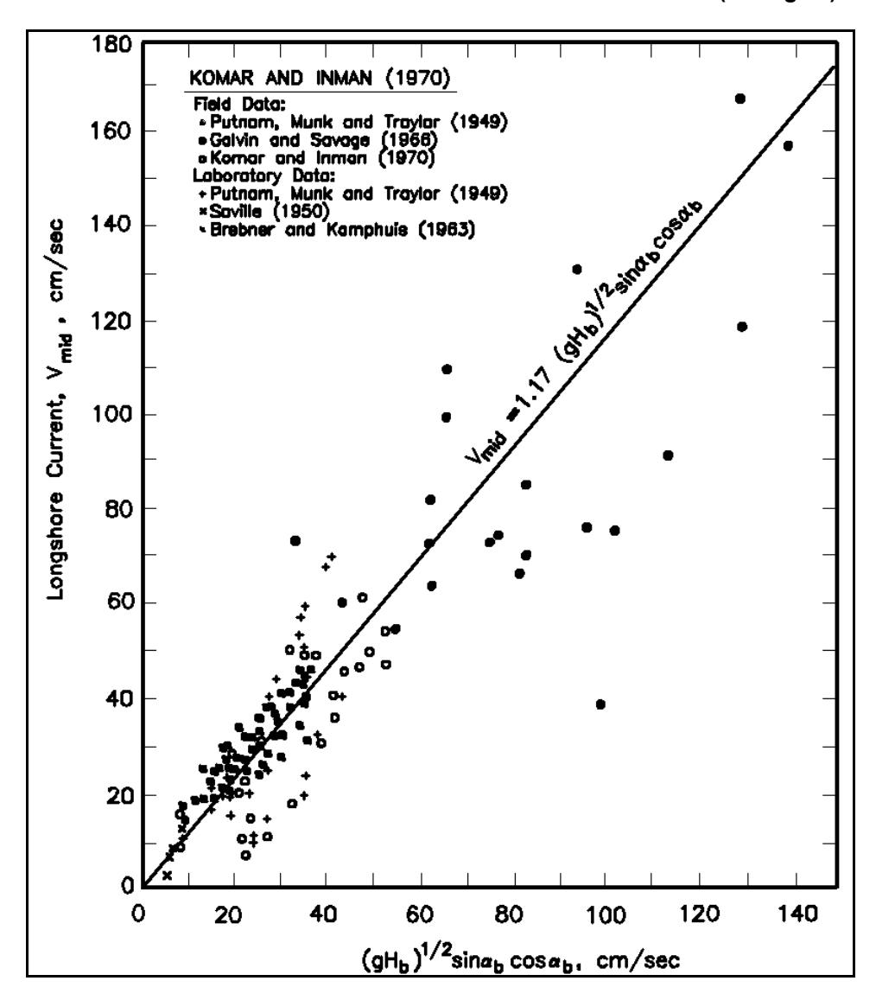

*Figure II-4-16. Equation II-4-37 compared with field and laboratory data (Komar 1979)*

c. Cross-shore current . Unlike longshore currents, the cross-shore current is not constant over depth. The mass transport carried toward the beach due to waves (see Part II-1) is concentrated between the wave trough and crest elevations. Because there is no net mass flux through the beach, the wave-induced mass transport above the trough is largely balanced by a reverse flow or undertow below the trough. Figure II-4-18 shows field measurements of the cross-shore flow below trough level on a barred profile. The undertow current may be relatively strong, generally 8-10 percent of %& g & d near the bottom. The vertical profile of the undertow is determined as a balance between radiation stresses, the pressure gradient from the sloping mean water surface, and vertical mixing. The first quantitative analysis of undertow was given by Dyhr-Nielsen and Sorensen (1970). The undertow profile is solved by Dally and Dean (1984), Hansen and Svendsen (1984), Stive and Wind (1986), and Svendsen, Schäffer, and Hansen (1987).

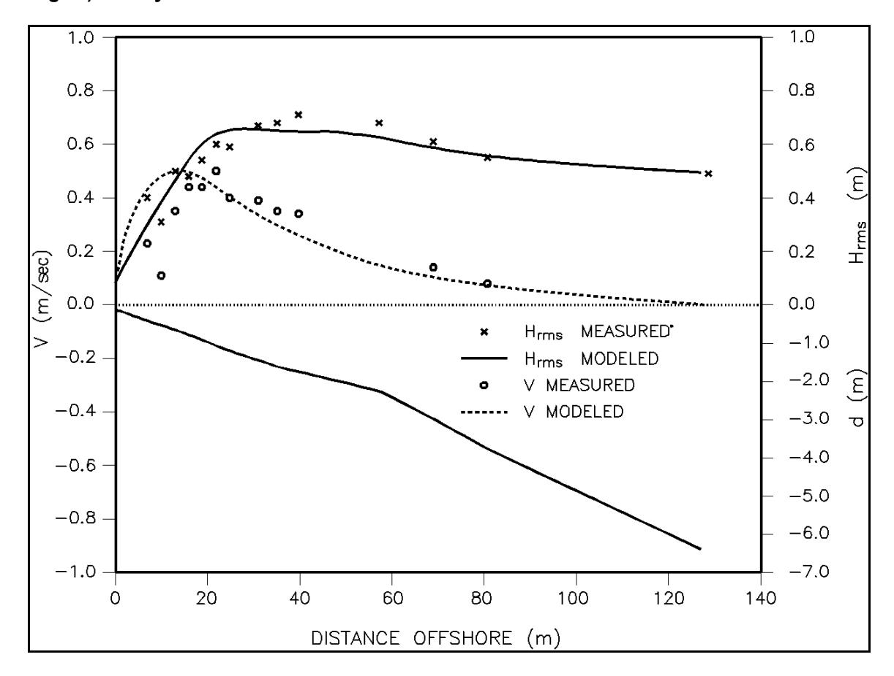

*Figure II-4-17. NMLONG simulation of longshore current (Leadbetter Beach, Santa Barbara, California, 3 Feb 1989 (Thornton and Guza 1986))*

## d. Rip currents .

(1) The previous sections on longshore current, cross-shore current, and wave setup focused on processes that are two-dimensional, with waves, currents, and water levels changing only in the cross-shore and vertical directions, but homogeneous alongshore. Rip currents , strong, narrow currents that flow seaward from the surf zone, are features of highly three-dimensional current patterns. Rip currents are fed by longshoredirected surf zone currents, which increase from zero between two neighboring rips, to a maximum just before turning seaward to form a rip current. Rip currents often occur periodically along the beach, forming circulation cells (Figure II-4-14b,c). High offshore-directed flows in rip currents can cause scour of the bottom and be a hazard for swimmers.
(2) Rip currents and cell circulation can be generated by longshore variations in wave setup. Breaking wave height and wave setup are directly related; thus ,a longshore variation in wave height causes a longshore variation in setup. The longshore gradient in setup generates longshore flows from the position of highest waves and setup toward the position of the lowest waves and setup (Bowen 1969b). This effect can be seen in the term M& η / M y in the longshore momentum equation (Equation II-4-35). The longshore variation in wave setup may be caused by convergence or divergence of waves transforming across bottom topography (Sonu 1972, Noda 1974) or the sheltering effect of headlands, jetties, or detached breakwaters (Gourley 1974, 1976; Sasaki 1975; and Mei and Liu 1977). Edge waves can interact with incident waves to produce a regular variation in the breaker height alongshore, and thus generate regularly spaced rip currents (Bowen 1969b, Bowen and Inman 1969). Interaction of two intersecting wave trains can similarly generate regularly spaced rip currents (Dalrymple 1975).

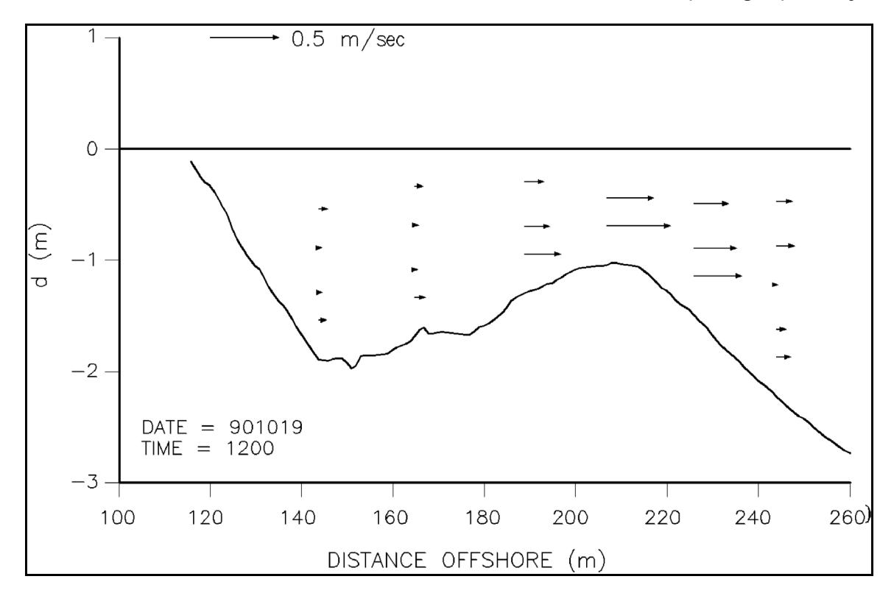

*Figure II-4-18. Field measurement of cross-shore flow on a barred profile (Duck, North Carolina, October 1990)*

- (3) An alternate hypothesis for the generation of cell circulation is hydrodynamic instability (Hino 1974, LeBlond and Tang 1974, Miller and Barcilon 1978). Instability models are based on small, periodic perturbations in the setup and currents, with feedback between the currents and incident waves, to produce regular patterns of nearshore circulation.
- (4) Several generation mechanisms for rip currents and cell circulation have been proposed. On a given beach, one or more of these mechanisms may drive the circulation pattern. Circulation patterns are dynamic, changing spatially and temporally. Presently, there is no proven method to predict rip current generation or the spacing between rips.

## II-4-7. References

## Baldock et al. 1998

Baldock, T. E., Holmes, P., Bunker, S., and Van Weert, P. 1998. "Cross-shore Hydrodynamics within an Unsaturated Surf Zone," Coastal Engineering , 34, pp 173-196.

## Battjes 1972

Battjes, J. A. 1972. "Set-up Due to Irregular Waves," Proceedings of the 13th Coastal Engineering Conference , American Society of Civil Engineers, pp 1993-2004.

## Battjes 1974

Battjes, J. A. 1974. "Surf Similarity," Proceedings of the 14th Coastal Engineering Conference , American Society of Civil Engineers, pp 466-480.

## Battjes and Janssen 1978

Battjes, J. A., and Janssen, J. P. F. M. 1978. "Energy Loss and Setup due to Breaking of Random Waves," Proceedings of the 16th Coastal Engineering Conference , American Society of Civil Engineers, pp 569-587.

## Birkemeier and Dalrymple 1975

Birkemeier, W. A., and Dalrymple, R. A. 1975. "Nearshore Water Circulation Induced by Wind and Waves," Proceedings of Modeling '75 Conference , American Society of Civil Engineers, pp 1062-1081.

## Booij, Ris, and Holthuijsen 1999

Booij, N., Ris, R. C., and Holthuijsen, L. H. 1999. "A Third-Generation Wave Model for Coastal Regions 1. Model Description and Validation," Journal of Geophysical Research , 104(C4), pp 7649-7666.

## Bowen 1969a

Bowen, A. J. 1969a. "The Generation of Longshore Currents on a Plane Beach," Journal of Marine Research , Vol 27, No. 1, pp 206-215.

## Bowen 1969b

Bowen, A. J. 1969b. "Rip Currents, 1: Theoretical Investigations," Journal of Geophysical Research , Vol 74, No. 23, pp 5467-5478.

## Bowen and Inman 1969

Bowen, A. J., and Inman, D. L. 1969. "Rip Currents, 2: Laboratory and Field Observation," Journal of Geophysical Research , Vol 74, No. 23, pp 5479-5490.

## Camfield 1991

Camfield, F. E. 1991. "Wave Forces on Wall," Journal of Waterway, Port, Coastal, and Ocean Engineering , Vol 117, No. 1, pp 76-79.

## Christensen and Deigaard 2001

Christensen, E. D., and Deigaard, R. 2001. "Large Eddy Simulation of Breaking Waves," Coastal Engineering , 42, pp 53-86.

## Collins 1970

Collins, J. I. 1970. "Probabilities of Breaking Wave Characteristics," Proceedings of the 12th Coastal Engineering Conference , American Society of Civil Engineers, pp 1993-2004.

## Dally 1990

Dally, W. R. 1990. "Random Breaking Waves: A Closed-Form Solution for Planar Beaches," Coastal Engineering , Vol 14, No. 3, pp 233-263.

## Dally 1992

Dally, W. R. 1992. "Random Breaking Waves: Field Verification of a Wave-by-Wave Algorithm for Engineering Application," Coastal Engineering , Vol 16, pp 369-397.

## Dally and Dean 1984

Dally, W. R., and Dean, R. G. 1984. "Suspended Sediment Transport and Beach Profile Evolution," Journal of Waterway, Port, Coastal, and Ocean Engineering , Vol 110, No. 1, pp 15-33.

## Dally, Dean, and Dalrymple 1985

Dally, W. R., Dean, R. G., and Dalrymple, R. A. 1985. "Wave Height Variation Across Beaches of Arbitrary Profile," Journal of Geophysical Research , Vol 90, No. C6, pp 11917-11927.

## Dalrymple 1975

Dalrymple, R. A. 1975. "A Mechanism for Rip Current Generation on an Open Coast," Journal of Geophysical Research , Vol 80, No. 24, pp 3485-3487.

## Divoky, LeMéhauté, and Lin 1970

Divoky, D., LeMéhauté, B., and Lin, A. 1970. "Breaking Waves on Gentle Slopes," Journal of Geophysical Research , Vol 75, No. 9, pp 1681-1692.

## Douglass 1990

Douglass, S. L. 1990. "Influence of Wind on Breaking Waves," Journal of Waterway, Port, Coastal, and Ocean Engineering , Vol 116, No. 6, pp 651-663.

## Dyhr-Nielsen, and Sorensen 1970

Dyhr-Nielsen, M., and Sorensen, T. 1970. "Some Sand Transport Phenomena on Coasts with Bars," Proceedings of the 12th Coastal Engineering Conference , American Society of Civil Engineers, pp 1993- 2004.

## Ebersole 1987

Ebersole, B. A. 1987. "Measurement and Prediction of Wave Height Decay in the Surf Zone," Proceedings of Coastal Hydrodynamics , American Society of Civil Engineers, pp 1-16.

## Ebersole and Dalrymple 1980

Ebersole, B. A., and Dalrymple, R. A. 1980. "Numerical Modelling of Nearshore Circulation," Proceedings of the 17th Coastal Engineering Conference , American Society of Civil Engineers, pp 2710-2725.

## Freilich and Guza 1984

Freilich, M. H., and Guza, R. T. 1984. "Nonlinear Effects on Shoaling Surface Gravity Waves," Philosophical Transactions , Royal Society of London, A311, pp 1-41.

## Freilich, Guza, and Elgar 1990

Freilich, M. H., Guza, R. T., and Elgar, S. L. 1990. "Observations of Nonlinear Effects in Directional Spectra of Shoaling Gravity Waves," Journal of Geophysical Research , Vol 95, No. C6, pp 9645-9656.

## Gallagher 1971

Gallagher, B. 1971. "Generation of Surf Beat by Non-Linear Wave Interaction," Journal of Fluid Mechanics , Vol 49, Part 1, pp 1-20.

## Galvin 1968

Galvin, C. J. 1968. "Breaker Type Classification on Three Laboratory Beaches," Journal of Geophysical Research , Vol 73, No. 12, pp 3651-3659.

## Goda 1970

Goda, Y. 1970. "A Synthesis of Breaker Indices," Transactions of the Japan Society of Civil Engineers , Vol 2, Part 2, pp 227-230.

## Goda 1975

Goda, Y. 1975. "Irregular Wave Deformation in the Surf Zone," Coastal Engineering in Japan , Vol 18, pp 13-26.

## Goda 2002

Goda, Y. 2002. "A Fast Numerical Scheme for Unsaturated Random Breaking Waves in 3-D Bathymetry," Proceedings , 28th International Conference on Coastal Engineering. World Scientific , pp 508-520.

## Gourley 1974

Gourley, M. R. 1974. "Wave Set-Up and Wave Generated Currents in the Lee of a Breakwater or Headland," Proceedings of the 14th Coastal Engineering Conference , American Society of Civil Engineers, pp 1976-1995.

## Gourley 1976

Gourley, M. R. 1976. "Non-Uniform Alongshore Currents," Proceedings of the 15th Coastal Engineering Conference , American Society of Civil Engineers, pp 701-720.

## Guza and Thornton 1982

Guza, R. T., and Thornton, E. G. 1982. "Swash Oscillations on a Natural Beach," Journal of Geophysical Research , Vol 87, No. C1, pp 483-491.

## Hansen and Svendsen 1984

Hansen, J. B., and Svendsen, I. A. 1984. "A Theoretical and Experimental Study of Undertow," Proceedings of the 19th Coastal Engineering Conference , American Society of Civil Engineers, pp 2246-2262.

## Hardy and Young 1991

Hardy, T. A., and Young, I. R. 1991. "Modelling Spectral Wave Transformation on a Coral Reef Flat," Proceedings of the Australasian Conference on Coastal and Ocean Engineering , pp 345-350.

## Harris 1969

Harris, T. F. W. 1969. "Nearshore Circulations; Field Observation and Experimental Investigations of an Underlying Cause in Wave Tanks," Proceedings of Symposium on Coastal Engineering , Stellenbosch, South Africa, 11 pp.

## Hino 1974

Hino, M. 1974. "Theory on Formation of Rip-Current and Cuspidal Coast," Proceedings of the 14th Coastal Engineering Conference , American Society of Civil Engineers, pp 901-919.

## Holman 1986

Holman, R. A. 1986. "Extreme Value Statistics for Wave Run-up on a Natural Beach," Coastal Engineering , Vol 9, No. 6, pp 527-544.

## Holman and Sallenger 1985

Holman, R. A., and Sallenger, A. H. 1985. "Setup and Swash on a Natural Beach," Journal of Geophysical Research , Vol 90, No. C1, pp 945-953.

## Hubertz 1986

Hubertz, J. M. 1986. "Observations of Local Wind Effects on Longshore Currents," Coastal Engineering , Vol 10, No. 3, pp 275-288.

## Hunt 1959

Hunt, I. A. 1959. "Design of Seawalls and Breakwaters," Journal of the Waterways and Harbors Division , Vol 85, No. WW3, pp 123-152.

## Huntley 1976

Huntley, D. A. 1976. "Long-Period Waves on a Natural Beach," Journal of Geophysical Research , Vol 81, No. 36, pp 6441-6449.

## Hwang and Divoky 1970

Hwang, L., and Divoky, D. 1970. "Breaking Wave Setup and Decay on Gentle Slope," Proceedings of the 12th Coastal Engineering Conference , American Society of Civil Engineers, pp 377-389.

## Iversen 1952

Iversen, H. W. 1952. "Waves and Breakers in Shoaling Water," Proceedings of the 3rd Coastal Engineering Conference , American Society of Civil Engineers, pp 1-12.

## Keller 1961

Keller, J. B. 1961. "Tsunamis -- Water Waves Produced by Earthquakes," Proceedings of the Tsunami Meetings Associated with the 10th Pacific Science Congress , International Union of Geodesy and Geophysics, pp 154-166.

## Kennedy et al. 2000

Kennedy, A. B., Chen, Q., Kirby, J. T., and Dalrymple, R. A. 2000. "Boussinesq Modeling of Wave Transformation, Breaking and Runup. I: 1D," Journal of Waterway, Port, Coastal and Ocean Engineering, Vol 126, pp 39-47.

## Kirby and Chen 2002

Kirby, J. T., and Chen, Q. 2002. "Examining the Low Frequency Predictions of a Boussinesq Wave Model," Proceedings , 28th International Conference on Coastal Engineering. World Scientific, pp 1075-1087.

## Kobayashi and Wurjanto 1992

Kobayashi, N., and Wurjanto, A. 1992. "Irregular Wave Setup and Run-Up on Beaches," Journal of Waterway, Port, Coastal, and Ocean Engineering , Vol 118, No. 4, pp 368-386.

## Komar 1979

Komar, P. D. 1979. "Beach-Slope Dependence of Longshore Currents," Journal of Waterway, Port, Coastal, and Ocean Division , Vol 105, No. WW4, pp 460-464.

## Komar and Gaughan 1973

Komar, P. D., and Gaughan, M. K. 1973. "Airy Wave Theory and Breaker Height Prediction," Proceedings of the 13th Coastal Engineering Conference , American Society of Civil Engineers, pp 405-418.

## Komar and Inman 1970

Komar, P. D., and Inman, D. L. 1970. "Longshore Sand Transport on Beaches," Journal of Geophysical Research , Vol 75, No. 30, pp 5914-5927.

## Komar and Oltman-Shay 1990

Komar, P. D., and Oltman-Shay, J. 1990. "Nearshore Currents," Handbook of Coastal and Ocean Engineering , Vol. 2, J. Herbich, ed., Gulf Publishing Co., Houston, TX, pp 651-680.

## Kuo and Kuo 1974

Kuo, C. T., and Kuo, S. T. 1974. "Effect of Wave Breaking on Statistical Distribution of Wave Heights," Proceedings of Civil Engineering Oceans , pp 1211-1231.

## Larson and Kraus 1991

Larson, M., and Kraus, N. C. 1991. "Numerical Model of Longshore Current for Bar and Trough Beaches," Journal of Waterway, Port, Coastal, and Ocean Engineering , Vol 117, No. 4, pp 326-347.

## Le Méhauté 1962

Le Méhauté, B. 1962. "On the Nonsaturated Breaker Theory and the Wave Run Up," Proceedings of the 8th Coastal Engineering Conference , American Society of Civil Engineers, pp 77-92.

## LeBlond and Tang 1974

LeBlond, P. H., and Tang, C. L. 1974. "On Energy Coupling Between Waves and Rip Currents," Journal of Geophysical Research , Vol 79, No. 6, pp 811-816.

## Lin and Liu 1998

Lin, P., and Liu, P. L.-F. 1998. "A Numerical Study of Breaking Waves in the Surf Zone," Journal of Fluid Mechanics , Vol 359, pp 239-264.

## Longuet-Higgins 1970a

Longuet-Higgins, M. S. 1970a. "Longshore Currents Generated by Obliquely Incident Sea Waves, 1," Journal of Geophysical Research , Vol 75, No. 33, pp 6778-6789.

## Longuet-Higgins 1970b

Longuet-Higgins, M. S. 1970b. "Longshore Currents Generated by Obliquely Incident Sea Waves, 2," Journal of Geophysical Research , Vol 75, No. 33, pp 6790-6801.

## Longuet-Higgins and Stewart 1962

Longuet-Higgins, M. S., and Stewart, R. W. 1962. "Radiation Stress and Mass Transport in Gravity Waves, with Application to 'Surf Beats'," Journal of Fluid Mechanics , Vol 13, No. 4, pp 481-504.

## Longuet-Higgins and Stewart 1963

Longuet-Higgins, M. S., and Stewart, R. W. 1963. "A Note on Wave Setup," Journal of Marine Research , Vol 21, No. 1, pp 4-10.

## Longuet-Higgins and Stewart 1964

Longuet-Higgins, M. S., and Stewart, R. W. 1964. "Radiation Stresses in Water Waves: A Physical Discussion with Applications," Deep Sea Research , Vol 11, pp 529-562.

## Madsen, Sørensen, and Schäffer 1997

Madsen, P. A., Sørensen, O. R., and Schäffer, H. A. 1997. "Surf Zone Dynamics Simulated by a Boussinesq Type Model; Part II: Surf Beat and Swash Oscillations for Wave Groups and Irregular Waves," Coastal Engineering , Vol 32, pp 289-319.

## Mase 1988

Mase, H. 1988. "Spectral Characteristics of Random Wave Runup," Coastal Engineering , Vol 12, No. 2, pp 175-189.

## Mase 1989

Mase, H. 1989. "Random Wave Runup Height on Gentle Slope," Journal of Waterway, Port, Coastal, and Ocean Engineering , Vol 115, No. 5, pp 649-661.

## McCowan 1891

McCowan, J. 1891. "On the Solitary Wave," Philosophical Magazine , 5th Series, Vol 36, pp 430-437.

## McDougal and Hudspeth 1983

McDougal, W. G., and Hudspeth, R. T. 1983. "Wave Setup/Setdown and Longshore Current on Non-Planar Beaches," Coastal Engineering , Vol 7, No. 2, pp 103-117.

## Mei and Liu 1977

Mei, C. C., and Liu, P. L.-F. 1977. "Effects of Topography on the Circulation in and Near the Surf Zone - Linear Theory," Journal of Estuary and Coastal Marine Science , Vol 5, pp 25-37.

## Miche 1951

Miche, M. 1951. "Le Pouvoir Réfléchissant des Ouvrages Maritimes Exposés à l'Action de la Houle," Annals des Ponts et Chaussess , 121e Annee, pp 285-319 (translated by Lincoln and Chevron, University of California, Berkeley, Wave Research Laboratory, Series 3, Issue 363, June 1954).

## Miller and Barcilon 1978

Miller, C., and Barcilon, A. 1978. "Hydrodynamic Instability in the Surf Zone as a Mechanism for the Formation of Horizontal Gyres," Journal of Geophysical Research , Vol 83, No. C8, pp 4107-4116.

## Munk 1949

Munk, W. H. 1949. "The Solitary Wave Theory and Its Applications to Surf Problems," Annals of the New York Academy of Sciences , Vol 51, pp 376-462.

## Nadaoka, Hino, and Koyano 1989

Nadaoka, K., Hino, M., Koyano, Y. 1989. "Structure of the Turbulent Flow Field Under Breaking Waves in the Surf Zone," Journal of Fluid Mechanics , Vol 204, pp 359-387.

## Nielsen and Hanslow 1991

Nielsen, P., and Hanslow, D. J. 1991. "Wave Runup Distributions on Natural Beaches," Journal of Coastal Research , Vol 7, No. 4, pp 1139-1152.

## Noda 1974

Noda, E. K. 1974. "Wave-Induced Nearshore Circulation," Journal of Geophysical Research , Vol 79, No. 27, pp 4097-4106.

## Nwogu 1996

Nwogu, O. G. 1996. "Numerical Prediction of Breaking Waves and Currents with a Boussinesq Model," Proceedings , 25th International Conference on Coastal Engineering, American Society of Civil Engineers, pp 4807-4820.

## Nwogu and Demirbilek 2001

Nwogu, O.G., and Demirbilek, Z. 2001. "BOUSS-2D: A Boussinesq Wave Model for Coastal Regions and Harbors," ERDC/CHL TR-01-25. US Army Engineer Research and Development Center, Vicksburg, MS, 90 p.

## Okayasu et al. 2002

Okayasu, A., Katayama, H., Tsuruga, H., and Iwasawa, H. 2002. "A Laboratory Experiment on Velocity Field Near Bottom Due to Obliquely Descending Eddies," Proceedings , International Conference on Coastal Engineering. World Scientific, pp 521-531.

## Oltman-Shay and Hathaway 1989

Oltman-Shay, J., and Hathaway, K. K. 1989. "Infragravity Energy and its Implications in Nearshore Sediment Transport and Sandbar Dynamics," Technical Report CERC-89-8, U.S. Army Engineer Waterways Experiment Station, Coastal Engineering Research Center, Vicksburg, MS.

## Raubenheimer et al. 1994

Raubenheimer, B., Guza, R.T., Elgar, S., and Kobayashi, N. 1994. "Swash on a Gently Sloping Beach," Journal of Geophysical Research , Vol 100, No. C5, pp 8751-8760.

## Sasaki 1975

Sasaki, T. 1975. "Simulation on Shoreline and Nearshore Current," Proceedings of Civil Engineering in the Oceans, III , American Society of Civil Engineers, pp 179-196.

## Savage 1958

Savage, R. P. 1958. "Wave Run-Up on Roughened and Permeable Slopes," Journal of the Waterways and Harbors Division , American Society of Civil Engineers, Vol 84, No. WW3, Paper 1640.

## Saville 1956

Saville, T., Jr. 1956. "Wave Runup on Shore Structures," Journal of the Waterways and Harbors Division , American Society of Civil Engineers, Vol 82, No. WW2, Paper 925.

## Schäffer, Madsen, and Deigaard 1993

Schäffer, H.A., Madsen, P.A., and Deigaard, R. 1993. "A Boussinesq Model for Waves Breaking in Shallow Water," Coastal Engineering , Vol 20, pp 185-202.

## Singamsetti and Wind 1980

Singamsetti, S. R., and Wind, H. G. 1980. "Characteristics of Breaking and Shoaling Periodic Waves Normally Incident on to Plane Beaches of Constant Slope," Report M1371, Delft Hydraulic Laboratory, Delft, The Netherlands.

## Smith and Kraus 1991

Smith, E. R., and Kraus, N. C. 1991. "Laboratory Study of Wave-Breaking Over Bars and Artificial Reefs," Journal of Waterway, Port, Coastal, and Ocean Engineering , Vol 117, No. 4, pp 307-325.

## Smith, Resio, and Vincent 1997

Smith. J. M., Resio, D. T., and Vincent, C. L. 1997. "Current-Induced Breaking at an Idealized Inlet," Proceedings, Coastal Dynamics'97. American Society of Civil Engineers, pp 993-1002.

## Smith 2001

Smith, J. M. 2001. "Breaking in a Spectral Wave Model," Proceedings , Waves 2001, American Society of Civil Engineers, pp 1022-1031.

## Smith, Sherlock, and Resio 2001

Smith, J. M., Sherlock, A. R., and Resio, D. T. 2001. "STWAVE: Steady-State Spectral Wave Model User's Guide for STWAVE Version 3.0," ERDC/CHL SR-01-01, U.S. Army Engineer Research and Development Center, Vicksburg, MS, 80 pp.

## Smith and Vincent 2002

Smith, J. M., and Vincent, C. L. 2002. "Application of Spectral Equilibrium Ranges in the Surf Zone," Proceedings , 28th International Conference on Coastal Engineering. World Scientific , pp 508-520.

## Sonu 1972

Sonu, C. J. 1972. "Field Observation of Nearshore Circulation and Meandering Currents," Journal of Geophysical Research , Vol 77, No. 18, pp 3232-3247.

## Stive and Wind 1986

Stive, M. J. F., and Wind, H. F. 1986. "Cross-shore Mean Flow in the Surf Zone," Coastal Engineering , Vol 10, No. 4, pp 325-340.

## Sunamura 1980

Sunamura, T. 1980. "A Laboratory Study of Offshore Transport of Sediment and a Model for Eroding Beaches," Proceedings of the 17th Coastal Engineering Conference , American Society of Civil Engineers, pp 1051-1070.

## Svendsen 1984

Svendsen, I. A. 1984. "Wave Heights and Setup in a Surf Zone," Coastal Engineering , Vol 8, No. 4, pp 303- 329.

## Svendsen, Madsen, and Hansen 1978

Svendsen, I. A., Madsen, P. A., and Hansen, J. B. 1978. "Wave Characteristics in the Surf Zone," Proceedings of the 16th Coastal Engineering Conference , American Society of Civil Engineers, pp 520-539.

## Svendsen, Schäffer, and Hansen 1987

Svendsen, I. A., Schäffer, H. A., and Hansen, J. B. 1987. "The Interaction Between the Undertow and the Boundary Layer Flow on a Beach," Journal of Geophysical Research , Vol 92, No. C11, pp 11845-11856.

## Symonds, Huntley, and Bowen 1982

Symonds, G., Huntley, D. A., and Bowen, A. J. 1982. "Two-Dimensional Surf Beat: Long Wave Generation by a Time-Varying Breakpoint," Journal of Geophysical Research , Vol 87, No. C1, pp 492-498.

## Thornton 1970

Thornton, E. B. 1970. "Variation of Longshore Current Across the Surf Zone," Proceedings of the 12th Coastal Engineering Conference , American Society of Civil Engineers, pp 291-308.

## Thornton and Guza 1983

Thornton, E. B., and Guza, R. T. 1983. "Transformation of Wave Height Distribution," Journal of Geophysical Research , Vol 88, No. C10, pp 5925-5938.

## Thornton and Guza 1986

Thornton, E. B., and Guza, R. T. 1986. "Surf Zone Longshore Currents and Random Waves: Field Data and Models," Journal of Physical Oceanography , Vol 16, pp 1165-1178.

## Vemulakonda 1984

Vemulakonda, S. R. 1984. "Erosion Control of Scour During Construction: Report 7, CURRENT -- a Wave-Induced Current Model," Technical Report HL-80-3, U.S. Army Engineer Waterways Experiment Station, Vicksburg, MS.

## Wisser 1991

Visser, P. J. 1991. "Laboratory Measurements of Uniform Longshore Currents," Coastal Engineering , Vol 15, No. 5, pp 563-593.

## Walton 1992

Walton, T. L., Jr. 1992. "Interim Guidance for Prediction of Wave Run-up on Beaches," Ocean Engineering , Vol 19, No. 2, pp 199-207.

## Walton et al. 1989

Walton, T. L., Jr., Ahrens, J. P., Truitt, C. L., and Dean, R. G. 1989. "Criteria for Evaluating Coastal Flood-Protection Structures," Technical Report CERC-89-15, U.S. Army Engineer Waterways Experiment Station, Coastal Engineering Research Center, Vicksburg, MS.

## Wang, Smith, and Ebersole 2002

Wang, P., Smith, E. R., and Ebersole. B. A. 2002. "Large-Scale Laboratory Measurements of Longshore Sediment Transport Under Spilling and Plunging Breakers," Journal of Coastal Research , Vol 18, No. 1, pp 118-135.

## Watanabe and Saeki 1999

Watanabe, Y. and Saeki, H. 1999. "Three-Dimensional Large Eddy Simulation of Breaking Waves," Coastal Engineering in Japan , Vol 41, pp 281-301.

## Weggel 1972

Weggel, J. R. 1972. "Maximum Breaker Height," Journal of the Waterways, Harbors and Coastal Engineering Division , Vol 98, No. WW4, pp 529-548.

## Wind and Vreugdenhil 1986

Wind, H. G., and Vreugdenhil, C. B. 1986. "Rip-Current Generation Near Structures," Journal of Fluid Mechanics , Vol 171, pp 459-476.

## Wright and Short 1984

Wright, L. D., and Short, A.D. 1984. "Morphodynamic Variability of Surf Zones and Beaches: A Synthesis," Marine Geology , Vol 56, pp 93-118.

## Young 1989

Young, I. R. 1989. "Wave Transformation Over Coral Reefs," Journal of Geophysical Research , Vol 94, No. C7, pp 9779-9789.

## II-4-8. Definitions of Symbols

| Symbol | Definition |
|---|---|
| α | Wave crest angle relative to bottom contours [deg] |
| β | Beach slope (tan β = length-rise/length-run) |
| β | * Beach slope (tan β = length-rise/length-run) modified for wave setup |
| Γ | Empirical coefficient (= 0.4) (Equation II-4-14) |
| γ | b Breaker depth index (Equation II-4-3) [dimensionless] |
| δ | Energy dissipation rate per unit surface area due to wave breaking |
| ∆x | Shoreward displacement of the shoreline (Equation II-4-22) [length] |
| η | Mean water surface elevation about the still-water level [length] |
| η | Setdown at the breaker point [length] |
| b |  |
| η | max Setup at the mean shoreline (Equation II-4-22) [length] |
| η | s Setup at the still-water shoreline (Equation II-4-21) [length] |
| κ | Empirical decay coefficient (= 0.15) [dimensionless] |
| ξ | Surf similarity parameter (Equation II-4-1) |
| π | Constant (= 3.14159) |
| ρ | Mass density of water (salt water = 1,025 $kg/m^{3}$ or 2.0 $slugs/ft^{3};$ fresh water = \$1,000kg/m^{3}$ or 1.94 slugs/ft 3 ) [force-time 2 /length 4 ] |
| Ω | b Breaker height index (Equation II-4-4) [dimensionless] |
| a, | b Empirically determined dimensionless functions of beach slope (Equations II-4-6 and II-4-7) |
| C | f Bottom friction coefficient with typical values in the range 0.005 to 0.01 |
| C | g Wave group velocity [length/time] |
| d | Water depth [length] |
| d | b Water depth at breaking [length] |
| E | Wave energy per unit surface area $[length-force/length^{2}]$ |
| F | , F Cross-shore and longshore components of bottom friction $[length/time^{2}]$ |
| bx | by |
| f | Mean wave frequency (Equation II-4-17) $[time^{-1}]$ |
| m |  |
| g | Gravitational acceleration $[length/time^{2}]$ |
| h | Water depth [length] |
| H | Wave height [length] |
| Surf | Zone Hydrodynamics II-4-37 |
| (Change | 1) 31 July 2003 |
| H | 1/10 Average of the highest 1/10 wave heights [length] |
| H | 1/3 Significant wave height [length] |
| H | b Wave height at incipient breaking [length] |
| H | m0,b Zero-moment wave height at breaking (Equation II-4-10) [length] |
| H | max Maximum wave height (Equation II-4-17) [length] |
| H | rms Root-mean-square of all measured wave heights [length] |
| H | rms,b Root-mean-square wave height at breaking (Equation II-4-9) [length] |
| H | ! 0 Equivalent unrefracted deepwater wave height [length] |
| K | r Refraction coefficient [dimensionless] |
| L | Wave length [length] |
| L | , L Cross-shore and longshore components of lateral mixing $[length/time^{2}]$ |
| x | y |
| n | Ratio of wave group speed and phase speed |
| Q | b Percentage of waves breaking (Equation II-4-17) |
| R | Wave runup above the mean water level [length] |
| R | Mean runup [length] |
| R | 1/10 Average of the highest 1/10 of the runups [length] |
| R | 1/3 Average of the highest 1/3 of the runups [length] |
| R | 2% Runup exceeded by 2 percent of the runup crests [length] |
| R | , R Cross-shore and longshore components of wave forcing $[length/time^{2}]$ |
| bx | by |
| R | max Maximum wave runup [length] |
| R | , R Cross-shore and longshore components of wind forcing $[length/time^{2}]$ |
| sx | sy |
| S | xx Cross-shore component of the cross-shore directed radiation stress [force/length] |
| S | xy Radiation stress component [force/length] |
| T | Wave period [time] |
| u | Total current in the surf zone (Equation II-4-30) [length/time] |
| U | Time- and depth-averaged cross-shore current [length/time] |
| u | a Wind-driven current [length/time] |
| u | i Oscillatory flow due to infragravity waves [length/time] |
| u | o Oscillatory flow due to wind waves [length/time] |

## II-4-9. Acknowledgments

Author of Chapter II-4, "Surf Zone Hydrodynamics:"
Jane M. Smith, Ph.D., Coastal and Hydraulics Laboratory, Engineer Research and Development Center (CHL), Vicksburg, Mississippi.

## Reviewers:

William R. Dally, Ph.D., Florida Institute of Technology, Melbourne, Florida, (currently private consultant).
Zeki Demirbilek, Ph.D., CHL.
Lee E. Harris, Ph.D., Department of Marine and Environmental Systems, Florida Institute of Technology, Melbourne, Florida.
Todd K. Holland, Ph.D., Naval Research Laboratory, Stennis Space Center, Mississippi.
Robert A. Holman, Ph.D., College of Oceanic & Atmospheric Sciences, Oregon State University, Corvallis, Oregon.
Bradley D. Johnson, CHL
Nicholas C. Kraus, Ph.D., CHL
Okey G. Nwogu, University of Michigan
Joan Pope, CHL.
Edward F. Thompson, Ph.D., CHL
Greg L. Williams, Ph.D., U.S. Army Engineer District, Wilmington, North Carolina.
C. Linwood Vincent, Ph.D., Office of Naval Research, Arlington, Virginia.
