## Chapter 6 EM 1110-2-1100 HYDRODYNAMICS OF TIDAL INLETS (Part II)

1 August 2008 (Change 2)

### Table of Contents

- II-6-1. Introduction to Inlet Hydrodynamic Processes
  - a. Inlet functions
  - b. Inlet characteristics
  - c. Inlet variables
  - d. Inlet flow patterns
- II-6-2. Inlet Hydrodynamics
  - a. Introduction
  - b. Inlet currents and tidal elevations
  - c. Tidal prism
  - d. Determining important inlet parameters
    - (1) Cross-sectional area
    - (2) Bay area
    - (3) Friction factor
    - (4) Inlet length
    - (5) Hydraulic radius
  - e. Evaluating inlet hydraulics with Keulegan K
    - (1) Introduction
    - (2) Jarrett’s classification
      - (a) Class I: Keulegan K < 0.3
      - (b) Class II: Keulegan K > 0.80
      - (c) Class III: 0.3 < K < 0.8
  - f. Effect of freshwater inflow
  - g. Bay superelevation
  - h. The inlet as a filter, flow dominance, and net effect on sedimentation processes
    - (1) Introduction
    - (2) Tidal constituents
    - (3) Flow dominance
  - i. Multiple inlets
  - j. Tidal jets
  - k. Tidal dispersion and mixing
  - l. Wave-current interaction
    - (1) Wave-current interaction
    - (2) Current-channel interaction
  - m. Other methods of inlet analysis
    - (1) Automated Coastal Engineering System (ACES)
    - (2) DYNLET1
    - (3) Coastal Modeling System (CMS)
      - (a) WIFM
      - (b) CLHYD
    - (4) Other models
    - (5) Physical models
- II-6-3. Hydrodynamic and Sediment Interaction at Tidal Inlets
  - a. Introduction
  - b. Tidal prism - channel area relationship
  - c. Inlet stability analysis
  - d. Scour hole problems
  - e. Methods to predict channel shoaling
    - (1) Introduction
    - (2) Procedure
    - (3) Phase I: Daily littoral materials transport volumes
    - (4) Phase II: Channel sedimentation
    - (5) Phase III: Regression analysis
    - (6) Normalized, independent filling index
    - (7) Ebb tidal energy flux
    - (8) Hoerls special function distribution
  - f. Inlet weir jetty hydraulic and sediment interaction
    - (1) Weir location
    - (2) Weir length
- II-6-4. References
- II-6-5. Definitions of Symbols
- II-6-6. Acknowledgments

### List of Tables

- Table II-6-1. Hydraulic Characteristics of Tidal Inlets by Cubature Method
- Table II-6-2. Semidiurnal and Shallow-Water Tidal Constituents and Harmonic Frequencies
- Table II-6-3. Tidal Prism-Minimum Channel Cross-sectional Area Relationships
- Table II-6-4. Inlet Stability Ratings

# List of Figures

- Figure II-6-1. Typical structured and unstructured inlet
- Figure II-6-2. Typical ebb-tidal delta morphology (Hayes 1980)
- Figure II-6-3. Channel parameter measurement (Vincent and Corson 1980)
- Figure II-6-4. Ebb delta area measurement (Vincent and Corson 1980)
- Figure II-6-5. Minimum width cross-sectional area of channel $A_{mw}$ versus channel length $L_{mw}$ (Vincent and Corson 1980)
- Figure II-6-6. $A_{mw}$ versus ebb-tidal delta area (AED) (Vincent and Corson 1980)
- Figure II-6-7. $A_{mw}$ versus maximum channel depth at minimum width section DMX (Vincent and Corson 1980)
- Figure II-6-8. $A_{mw}$ versus minimum controlling channel depth DCC (Vincent and Corson 1980)
- Figure II-6-9. Tidal prism-inlet area relationship
- Figure II-6-10. Schematic diagram of flood and ebb currents outside an inlet (O'Brien 1969)
- Figure II-6-11. Wave refraction pattern in the vicinity of Merrimack River Estuary entrance just south of the Merrimack Inlet (from Hayes (1971))
- Figure II-6-12. Ebb and flood flow patterns from a model study of Masonboro Inlet, North Carolina
- Figure II-6-13. Tidal current plus wave-generated currents approaching jettied inlet, measured in physical model study
- Figure II-6-14. Sediment transport gyres associated with both updrift and downdrift portions of the delta at Essex River Inlet, Massachusetts (Note different arrow types to denote wave or tide-generated sediment transportation (Smith 1991))
- Figure II-6-15. Inlet bay system
- Figure II-6-16. Variation of dimensionless parameters with Keulegan’s repletion coefficient K
- Figure II-6-17. Sample tides and currents for an ocean-inlet-bay system that satisfy the Keulegan assumptions (Keulegan 1967)
- Figure II-6-18. Ratio of bay to sea tidal amplitude versus $K_{1}$ and K2

# Chapter II-6 Hydrodynamics of Tidal Inlets

### II-6-1. Introduction to Inlet Hydrodynamic Processes

- a. Inlet functions.
- (1) Inlets provide both man and nature with a means of access between the ocean and a bay. Commercial and recreational vessels need a navigable channel for safe transit to interior harbors. The flow of currents into and out of a bay through an inlet provides natural flushing to maintain good water quality and reasonable salinity levels. The migration of fish, fish larvae, and other sea life through the inlet conduit is also an important function of an inlet. Successful engineering of inlets requires knowledge of water and sediment movement in and adjacent to the inlet.
- (2) Hydrodynamic conditions at tidal inlets can vary from a relatively simple ebb-and-flood tidal system to a very complex one in which tide, wind stress, freshwater influx, and wind waves (4- to 25-s periods) have significant forcing effects on the system. Figure II-6-1 shows a structured and an unstructured inlet with waves breaking on a shallow ebb shoal nearly surrounding the inlet itself. Flow enters the bay (or lagoon) through a constricted entrance, which is a relatively deep notch (usually 4 to 20 m at the deepest point). Entrance occurs after flow has traversed over a shallow shoal region where the flow pattern may be very complex due to the combined interaction of the tidal-generated current, currents due to waves breaking on the shallow shoal areas, wind-stress currents, and currents approaching the inlet due to wave breaking on adjacent beaches. The inlet acts to interrupt longshore current, which either reinforces or interferes with tidal currents, dependent on the time in the tidal cycle. The longshore current also is variable, dependent on wave conditions. Particularly during stormy conditions with strong winds, flow patterns may be highly complex. Also, the complicated two-dimensional flow pattern is further confounded because currents transverse to the coast tend to influence the propagation of waves, in some cases blocking them and causing them to break. The inlet has a complex shoal pattern that would cause odd refraction patterns and breaking regions, even if tidal flows were weak . Final complications are structures such as jetties, which cause wave diffraction patterns and reflections.
- (3) In inlets with large open bays and small tidal amplitudes, flows can be dominated by wind stress (Smith 1977). In such cases, ebb conditions can last for days when winds pile up water near the bay side of the inlet, or long floods can occur when winds force bay water away from the inlet. Most inlet bays, however, are small and some are highly vegetated, so wind stress is not a dominant feature, except under storm conditions (this chapter will emphasize tidal components of the system; Part II-5 provides approaches for considering storm surges and seiche). Though not forced by tides, inlets on large lakes may have significant currents due to seiching (Seelig and Sorensen 1977), and may be studied by the methods in this chapter. Although many bays do not receive much fresh water relative to the volume of tidal flow, substantial freshwater input due to river flow can sometimes create vertically stratified flows through a tidal inlet. Typically, however, well-mixed conditions exist for most inlets. Neither the effects of wind on the bay nor stratified flows will be examined in this chapter; however, the gross effect of freshwater flow on inlet hydraulics will be discussed.
This chapter also provides simplified methods for estimating tidal hydraulics. In general, the inlet problem requires complex, complicated analyses, and reference will be made to such techniques.

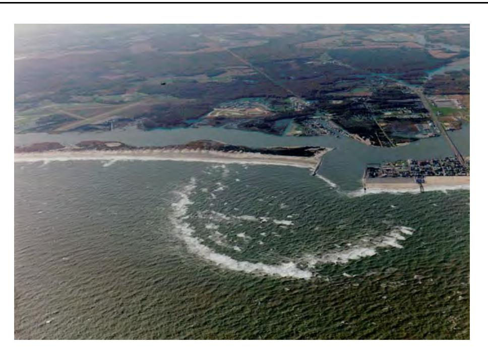

*Ocean City Inlet, Maryland*

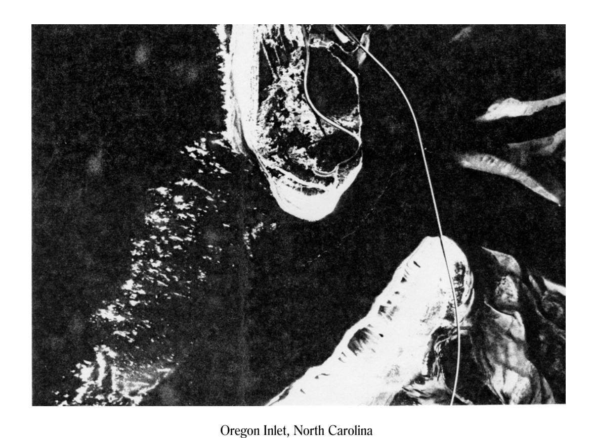

*Figure II-6-1. Typical structured and unstructured inlet*

### b. Inlet characteristics.

(1) Tidal inlets generally have a short, narrow channel passing between two sandy barrier islands (Figure II-6-1) and connect the ocean (or sea) to a bay. Some bays are small enough (on the order of tens of kilometers or less) for the water surface to rise and fall uniformly (co-oscillate) in response to the forcing ocean tide. Larger estuaries sometimes have broader junctions with the sea and may be long enough (hundreds of kilometers) to contain nearly an entire tidal wave length, thus having a variable water level at a given instant of time throughout the bay. Most methods discussed in this chapter apply to inlets that are closer to having a co-oscillating tide, but can be applied to most inlet systems as long as the tidal period is long compared to the time required for a shallow-water wave to propagate from the inlet to the farthest point in the bay, i.e.,

```math
T >> \frac{L_b}{\sqrt{gd_b}} \tag{II-6-1}
```

where $L_{b}$ is the distance to the farthest point, $d_{b}$ is average bay depth, and T is typically taken as 12.42 hrs × 60 min/hr × 60 sec/min or 44,712 sec (for locations with semidiurnal or twice daily tides) or 89,424 sec for once-daily tides.
- (2) The configuration of an individual inlet can vary significantly over time. Often the configuration is highly influenced by geology or peculiarities of the site, rather than a simple equilibrium of sediment and hydrodynamics. Convergence of flows from several directions at either side of the inlet can create strong turbulence that scours the channel deeply through the narrowest part of the inlet, called the inlet gorge, and silts in the channel on the bay and ocean sides. Maximum depths generally in the range of 4-15 m may occur in such channels, whereas seaward channel depths may diminish to 1.5-3 m where the flow has diffused and wave-driven sediment transport is important. Inside the inlet, water may diverge into one or more channels among shoal areas created by the deposition of sand from the ocean beaches. The resulting bathymetry can be a complex pattern of bars, shoals, and channels. Hayes (1980) shows the ocean-side ebb-tidal delta morphology for an unstructured inlet (Figure II-6-2).
- c. Inlet variables. Although inlet systems can be quite complex, for the purpose of simple hydraulic analysis, the immediate inlet region can be approximated by key parameters which, although simplified, permit an analytical treatment of its hydraulics and a useful analysis of inlet systems. Analysis by Vincent and Corson (1980, 1981) shows the range of size of a number of inlet parameters based on 67 inlets that had been subjected to little or no human intervention. Figure II-6-3 defines an oceanside channel length $L_{mw}$ (used for their particular study, and not to be confused with channel length defined later), depth at the crest of the outer bar in the channel (DCC), and location of inlet minimum width $A_{mw}.$ Figure II-6-4 defines the area of the ebb tidal delta, AED, bounded by the depth contour of DCC (until it parallels the shoreline), the line joining this location and the shoreline and the line across the inlet minimum width. Cross-sectional area at the minimum inlet width $(A_{mw})$ is plotted against channel length $(L_{mw})$ in Figure II-6-5, against ebb tidal delta area (AED) in Figure II-6-6, against maximum channel depth (DMX) measured at minimum width section in Figure II-6-7, and against channel-controlling depth (DCC), the minimum depth across the outer bar, in Figure II-6-8. All parameters vary in log-linear relation to $A_{mw}$ over several orders of magnitude. The 95-percent confidence bands are also plotted. O'Brien's (1931) observed that there is a direct relationship between the inlet's minimum cross-sectional flow area A (this is the minimum area $A_{c},$ not necessarily the area at the location of the minimum width), and the tidal prism ( P ) filling the bay (Figure II-6-9). This relationship will aid in defining the stability of inlet channels. The tidal prism in this case is defined as the volume of water entering through the inlet on a spring tide. Detailed methods to define inlet parameters will be discussed later.

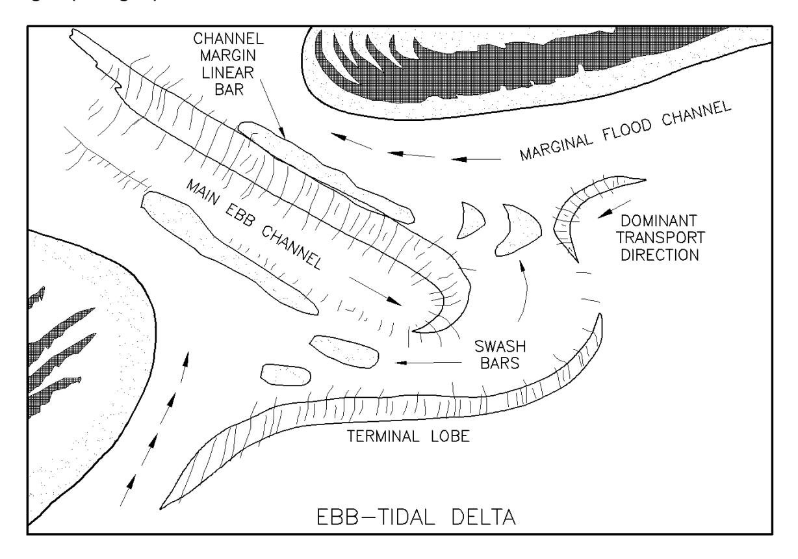

*Figure II-6-2. Typical ebb-tidal delta morphology (Hayes 1980)*

### d. Inlet flow patterns.

- (1) An inlet has a "gorge" where flows converge before they expand again on the opposite side. Shoal (shallow) areas that extend bayward and oceanward from the gorge depend on inlet hydraulics, wave conditions, and general geomorphology. All these interact to determine flow patterns in and around the inlet and locations where flow channels occur.
- (2) Typical flood and ebb current patterns on the ocean side of a tidal inlet are shown in Figure II-6-10. The important aspect of this general circulation pattern is that currents usually flow toward the inlet near the shoreline (in the flood channels), even on ebb tide. The reason for this seeming paradox is the effect of wavedriven currents, (on the downdrift side of the inlet, breaking waves are turned toward the inlet due to refraction over the outer bar and on breaking, create currents toward the inlet). Further downdrift, currents are directed away from the inlet (an example of this is given in Figure II-6-11) and the effect of the ebb jet convecting or entraining ocean water as it exits the inlet creates an alongshore current at the base of the ebb jet. The "sink" flood flow pattern of the previous flood tide flow's momentum also helps sustain this flow pattern. Figure II-6-12 shows ebb and flood flow patterns from a model study of Masonboro Inlet, North Carolina, for both pre- and post-jetty conditions. Figure II-6-13 shows strength and direction of wavegenerated currents plus tidal currents approaching a jetty at an inlet as measured in a physical model study. Figure II-6-14 shows the complexity of sediment flow patterns at an inlet as resolved by a field study at Essex River Inlet, Massachusetts (Smith 1991). Ebb and flood flow patterns are discussed in detail in Part II-6-2, paragraph j , Tidal jets.

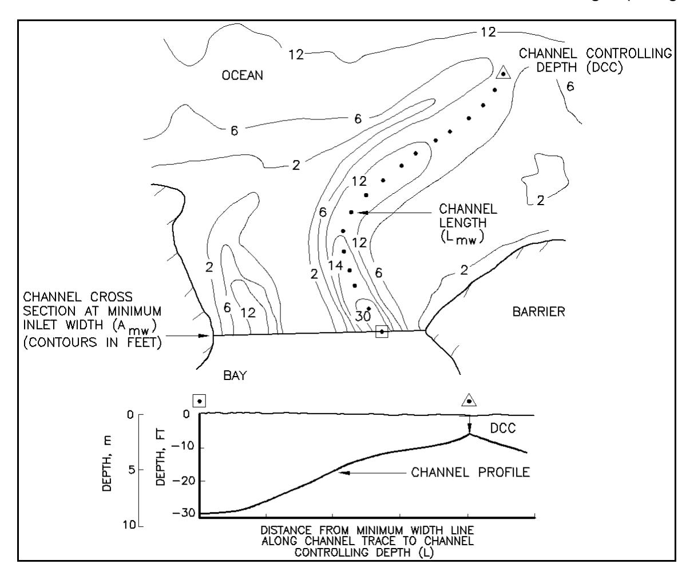

*Figure II-6-3. Channel parameter measurement (Vincent and Corson 1980)*

### II-6-2. Inlet Hydrodynamics

- a. Introduction.
- (1) Many approaches are available to evaluate inlet hydrodynamics. Analytic expressions, numerical models, and physical models can be used. This section will present some simple analytic techniques to determine average velocities in a channel cross section due to the ocean tide and tidal elevation change in the bay. This section also will aid in understanding inlet response with regard to important parameters such as size of bay or channel area and length. Tidal inlet hydrodynamics are summarized by van de Kreeke (1988) and by Mehta and Joshi (1984). (2) To characterize the development of inlet currents, COL E. I. Brown (1928) wrote the following:
To trace the characteristics of the flow of the tides through an inlet, assume the case of an inland bay being formed by the prolongation of a sandspit. It is quite evident that in the earlier stages of the growth of the spit the tide will rise and fall in the bay equally and simultaneously with its rise and fall in the surrounding ocean, and that a tidal current will be practically negligible. This state of affairs will continue for a long time, as long as the full and free propagation of the tidal wave is

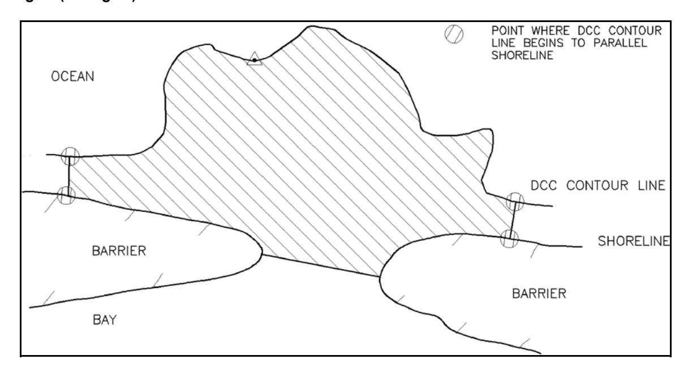

*Figure II-6-4. Ebb delta area measurement (Vincent and Corson 1980)*

unimpeded by the continually narrowing opening. When it does begin to be so impeded and the entrance acts as a barrier to the incoming tide, a delay in the advance of the tide will be caused, and a difference of head will occur between the water outside the inlet and that inside. This will create a hydraulic current into the bay, in addition to such movement as may be due solely to tidal wave propagation.
It is clear that as long as the inlet is wide and deep in proportion to the area of the bay, hydraulic currents will be small and tidal wave propagation will predominate. Tidal waves in the shallow waters near the shore will be essentially waves of translation, that is, the whole body of water moves with practically the same velocity horizontally. Now, if the size of the inlet becomes very small with respect to the bay area, tidal wave propagation will be negligible, the flow through the inlet will be hydraulic, that is, the water surface through the inlet will have a slope, causing a flow, and it can be considered mathematically in accordance with known hydraulic laws.
(3) With this in mind, early development of inlet hydraulics achieved reasonable results by using simplified approaches of steady-flow hydraulics to understand inlet currents and response of the bay (or lagoon) tide (Brown 1928). Keulegan (1951, 1967) solved the one-dimensional, depth-averaged shallow water wave equation for flow analytically. Others since have formulated a variety of analytical solutions for inlets (including van deKreeke (1967), Mota Oliveira (1970), Shemdin and Forney (1970), King (1974), Mehta and Özsöy (1978), Escoffier and Walton (1979), and DiLorenzo (1988)). Paralleling analytical development, physical models were used for detailed studies of inlet design (see below). More recently, numerical models have provided greater refinements and details using one-, two- and three-dimensional longwave equations of motion (including developments by Harris and Bodine (1977), Butler (1980), and Amein and Kraus (1991)). Some analytical models for inlets will be examined here to provide understanding of the inlet system and because they actually produce usable information with minimal effort. Application of the techniques of this chapter would include use of numerical models (e.g., Automated Coastal Engineering System (ACES); Leenknecht et al. 1992). ACES includes a spatially integrated one-dimensional numerical model. Additional information about ACES and other available models is provided in Part II-6-2, paragraph m, "Other methods for inlet analysis."

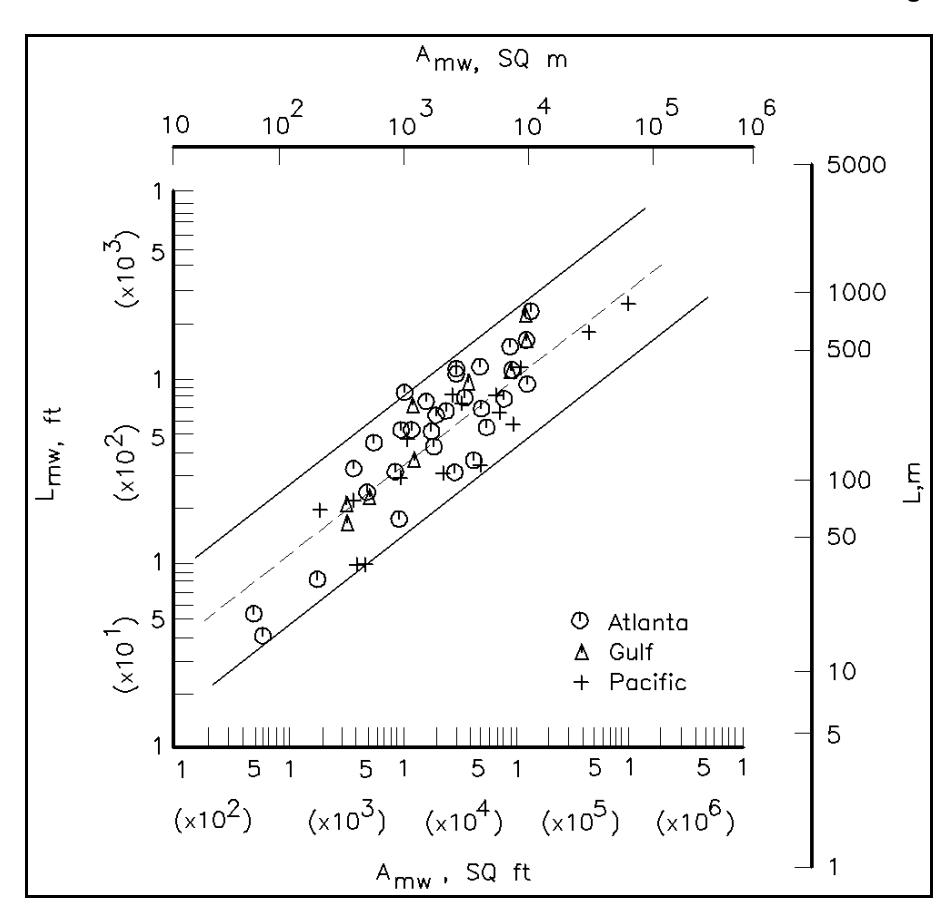

*Figure II-6-5. Minimum width cross-sectional area of channel $A_{mw}$ versus channel length $L_{mw}$ (Vincent and Corson 1980)*

- b. Inlet currents and tidal elevations.
- (1) A simple introduction to inlet hydraulics will consider applying the one-dimensional equation of motion and the continuity equation. We want to find the maximum inlet current, the tide range of the bay and the phase lag of the bay tide relative to the tide in the ocean in terms of parameters which can be easily measured or determined, including inlet cross-sectional area, bay surface area, ocean tide amplitude and period, length of channel, and head loss coefficients. The simplified inlet system is shown in Figure II-6-15. Keulegan's assumptions (1967) were as follows: (a) Walls of the bay are vertical. (b) There is no inflow from streams. (c) No density currents are present. (d) Tidal fluctuations are sinusoidal. (e) Bay water level rises uniformly.

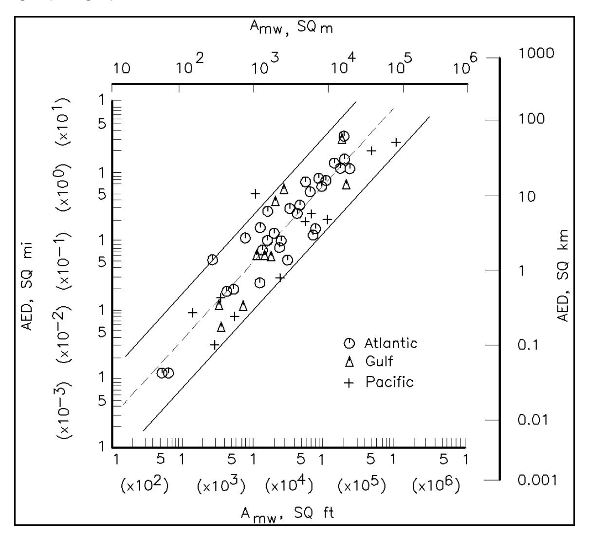

*Figure II-6-6. $A_{mw}$ versus ebb-tidal delta area (AED) (Vincent and Corson 1980)*

- (f) Inlet channel flow area is constant.
- (g) Inertia of the mass of the water in the channel is negligible.
- (2) Some assumptions may seem stringent (e.g., assumption (e), which essentially assumes a frictionless bay). This could be a problem if the entire bay is composed of very shallow tidal flats with no significant channelization. Also, in assumption (f), a relatively large tidal range compared to channel depth might occur. However, reasonable results can be determined for most cases. For more complex inlet systems, more sophisticated modeling should be performed, as discussed earlier. (3) The one-dimensional equation of motion for flow in the channel is:

```math
\frac { \partial V } { \partial t } \: + \: V \frac { \partial V } { \partial x } = - g \frac { \partial h } { \partial x } - \: \frac { f } { 8 R } V \lvert V \lvert \tag{II-6-2}
```

where
- V = average velocity in channel
- h = channel water surface elevation
- f = Darcy - Weisbach friction term
- R = hydraulic radius
- g = acceleration due to gravity
(4) Keulegan neglected local acceleration (the first term in Equation II-6-2) and integrated the equation over the length of the inlet. Using the equation of continuity for flow through the inlet into the bay:

```math
VA_{avg} = A_b \frac{dh_b}{dt} \tag{II-6-3}
```

where
- $A_{avg}$ = average area over the channel length
- Ab = surface area of bay
$dh_{b}/dt$ = change of bay elevation with time
(5) Combining Equations II-6-2 and II-6-3, Keulegan developed a solution for velocity and resulting bay tide which contained the dimensionless parameter K, known as the coefficient of repletion, or filling, which is defined as

```math
K = \frac{TA_{avg}}{2\pi A_b} \sqrt{\frac{2g}{a_o \left[k_{en} + k_{ex} + \frac{fL}{4R}\right]}} \tag{II-6-4}
```

where $A_{avg},$ AB , g, f, and R are as defined above, and
- T = tidal period
- aO = ocean tide amplitude (one-half the ocean tide range)
- ken = entrance energy loss coefficient
- kex = exit energy loss coefficient
- L = inlet length
- R = inlet hydraulic radius (see Equation II-6-18)

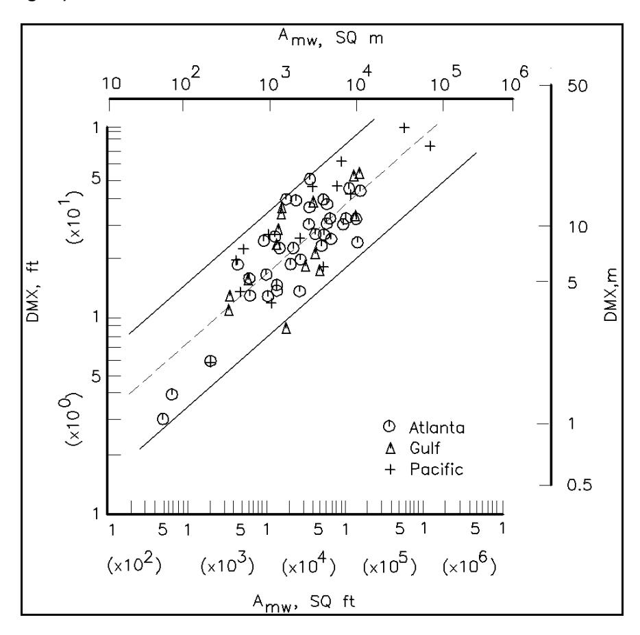

*Figure II-6-7. $A_{mw}$ versus maximum channel depth at minimum width section DMX (Vincent and Corson 1980)*

- (6) Keulegan's assumptions of prismatic channel cross section and vertical bay walls greatly simplify prototype conditions, because natural inlets generally have a complex morphology, making accurate determination of effective hydraulic radius, channel length, cross-sectional area, and bay area difficult. Considerable subjectivity is required to determine these values from bathymetric charts. Some aid is provided later in determining this information. Figure II-6-16 shows the variation of bay tide amplitude $(a_{b})$ to that of the ocean $(a_{o})$ and the phase lag (ε) for various values of the coefficient of filling K . Figure II-6-17 defines phase lag and provides a sample of output that can be determined from simple analytical models. Approximate values for ken, $k_{ex},$ and f are given in Example Problem II-6-1. For flow entering an inlet channel, $K_{en}$ is usually taken between 0.005 and 0.25. For natural inlets, which are rounded at the entrance, Ken • 0.05 or less. For inlets with jetties and flow bending sharply as it enters the inlet channel, $K_{en}$ = 0.25 may be appropriate. The exit flow is usually taken near unity, meaning kinetic head is fully lost. If there is significant flow inertia, as in a very channelized bag, $K_{ex}$ may be less than 1.0.
- (7) King (1974) solved the same equations but included the effect of inertia (first term of Equation II-6- 2). If inertia effect is important, then at times when the tide curves of ocean and bay intersect, there still would be a flow into the bay, e.g., on flood flow there would still be movement of the water mass into the bay, even as the bay elevation dropped below that of the ocean. This would be likely to occur when L is large (channel is long, and therefore a large mass of water moving through the inlet has significant inertia to move against an opposing head difference). Also the possibility exists that the inlet system could have a Helmholtz frequency (or pumping mode, where the basin oscillates uniformly) that is tuned to the forcing

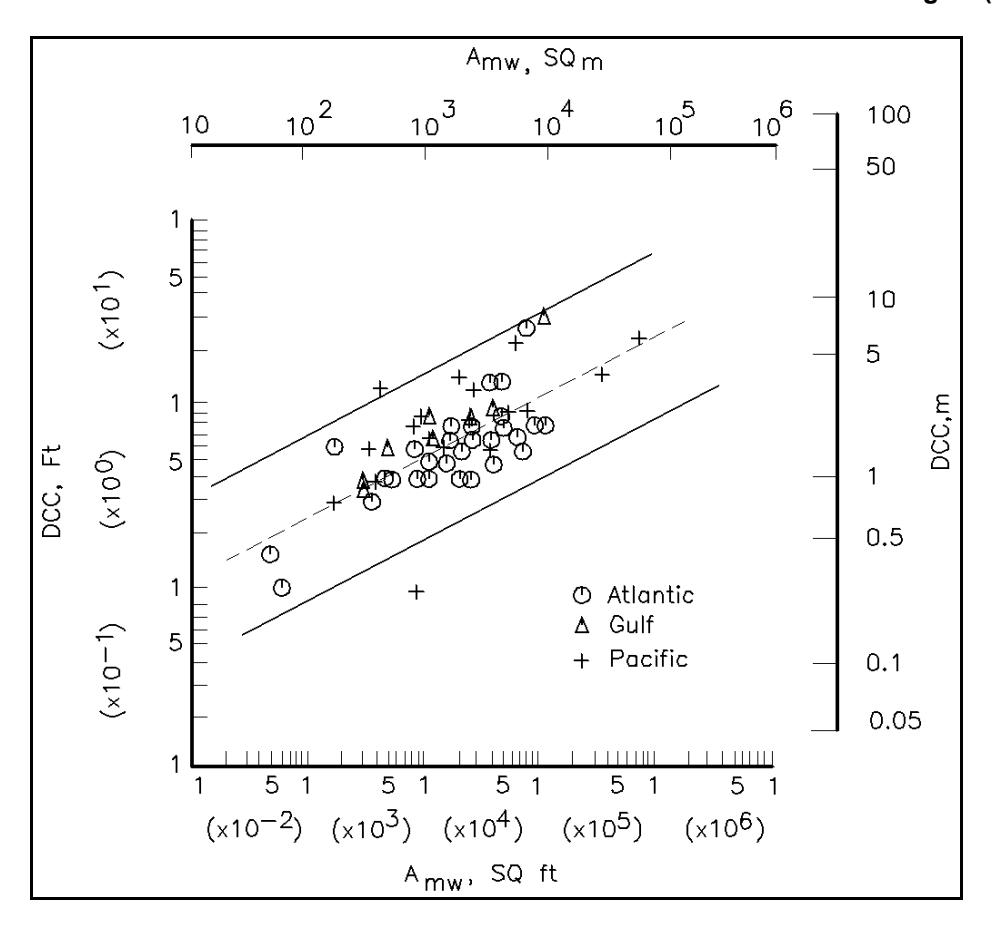

*Figure II-6-8. $A_{mw}$ versus minimum controlling channel depth DCC (Vincent and Corson 1980)*

ocean tide and amplification of the bay tide could occur. This will be seen in King's solution also (and can be noted in Figure II-6-18 where the bay-ocean tide ratio is greater than one). King defines the dimensionless velocity as:

```math
V _ { \ m } ^ { \prime } \ = \ { \frac { A _ { \omega v g } T V _ { m } } { 2 \pi a _ { o } A _ { b } } } \tag{II-6-5}
```

where $V_{m}$ is the maximum cross-sectionally averaged velocity during a tidal cycle. (To determine $V_{m}$ , use Equation II-6-5 and refer to Figure II-6-19.) Two parameters are calculated with the variables defined previously.

```math
K_1 = \frac{a_o A_b F}{2L A_{avg}} \tag{II-6-6}
```

```math
K_2 = \frac{2\pi}{T} \sqrt{\frac{LA_b}{gA_{avg}}} \tag{II-6-7}
```

where F is defined as

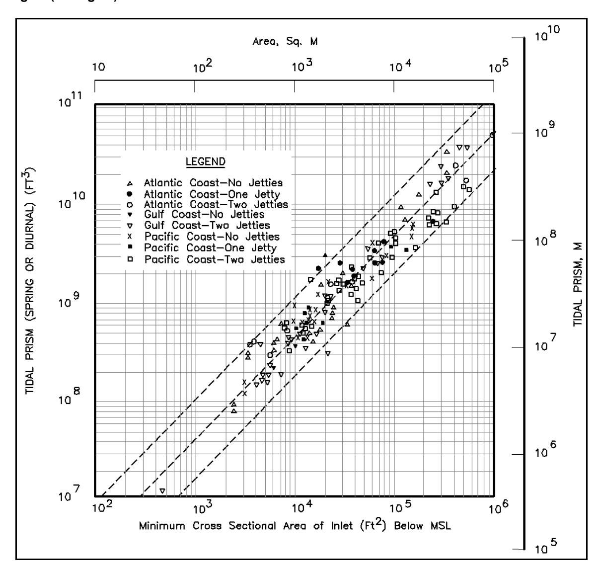

*Figure II-6-9. Tidal prism-inlet area relationship*

```math
F = k_{en} + k_{ex} + \frac{fL}{4R} \tag{II-6-8}
```

- (8) Figures II-6-18 through II-6-20 provide a means to determine the bay tide range and phase and velocity in the channel. A sample problem is presented in Part II-6-2, paragraph d , where determining important parameters is discussed.
- (9) Since channel resistance is nonlinear, channel velocity and bay tide will not be sinusoidal (Keulegan 1967). Other effects such as a relatively large tidal amplitude-to-depth ratio through the channel and nonvertical walls in the channel and bay may be important in causing nonsinusoidal bay tides (Boon and Byrne 1981, Speer and Aubrey 1985, Friedrichs and Aubrey 1988). However, for a first approximation, channel velocity over time is represented as

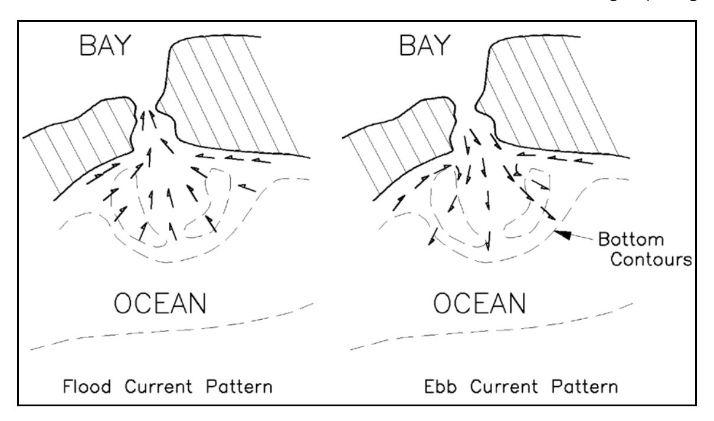

*Figure II-6-10. Schematic diagram of flood and ebb currents outside an inlet (O'Brien 1969)*

```math
V \approx \ V _ { _ { m } } \ { \mathrm { s i n } } \ { \frac { 2 \pi t } { T } } \tag{II-6-9}
```

and bay tide can be represented as (see Figure II-6-17)

```math
h _ { b } \approx a _ { b } \cos \left( \frac { 2 \pi t } { T } \mathrm { \, - \, } \epsilon \right) \tag{II-6-10}
```

where g is phase lag, $a_{b}$ is bay tide amplitude (one-half the bay tide range), T is tide period, and t is time of interest during the tide cycle. Also King's K1 and $K_{2}$ are related to the Keulegan repletion coefficient K by

```math
K = \frac { 1 } { K _ { 2 } } \sqrt { \frac { 1 } { K _ { 1 } } } \tag{II-6-11}
```

c. Tidal prism.
(1) The volume of water that enters through the inlet channel during flood flow and then exits during ebb flow is known as the tidal prism. If the hydraulic analysis as described above is used, then tidal prism P can be calculated as

```math
P = 2 \ a _ { b } \ A _ { b } \tag{II-6-12}
```

(2) Another technique for prism estimation can use observed velocity (or discharge Q ) data. Assuming a sinusoidal discharge in the channel and integrating over the flood or ebb portion of the tidal cycle

```math
P = \frac{TQ_{\text{max}}}{\pi} \equiv P = \frac{TV_m A_{avg}}{\pi} \tag{II-6-13}
```

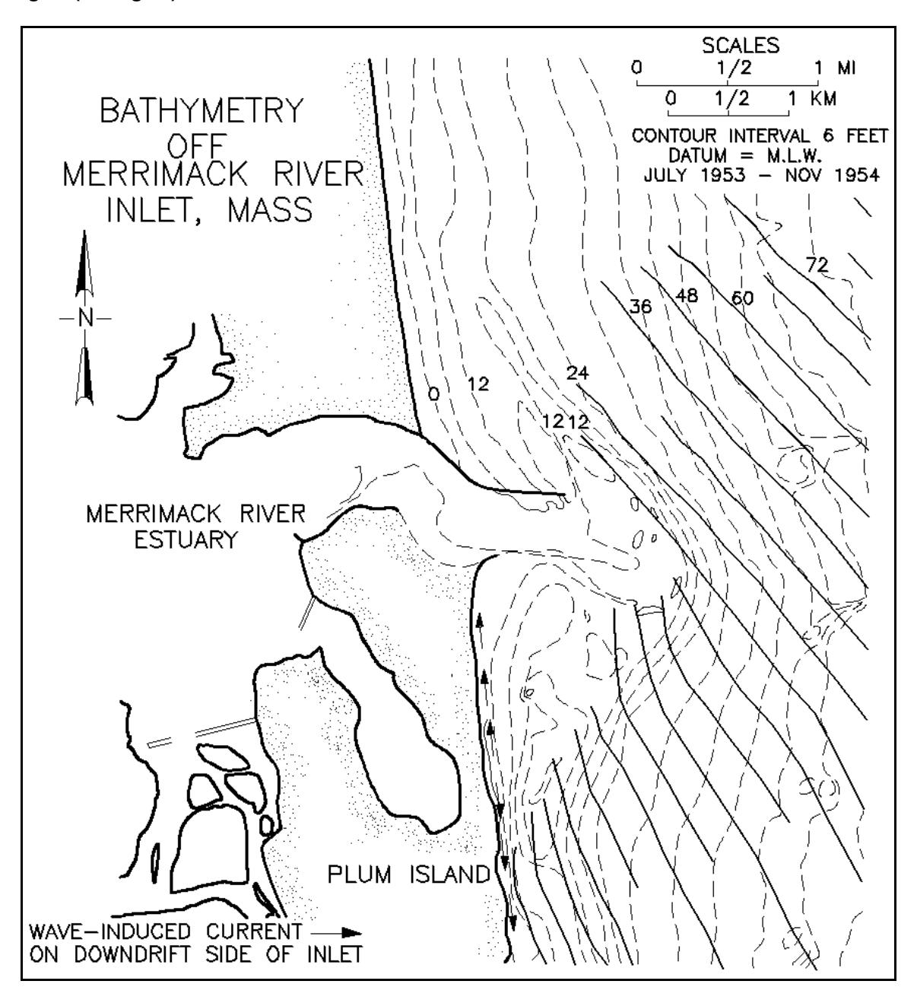

*Figure II-6-11. Wave refraction pattern in the vicinity of the Merrimack River Estuary entrance, just south of the Merrimack Inlet (from Hayes (1971))*

(3) To account for a non-sinusoidal character of the prototype flow, Keulegan determined

```math
P = \frac{TQ_{\text{max}}}{\pi C} \equiv P = \frac{TV_m A_{avg}}{\pi C} \tag{II-6-14}
```

and found C varying between 0.81 and 1.0 for K , the filling coefficient, varying between 0.1 and 100. For practical application, if 0.1 < K < 1.8, use C = 0.86, and for K > 1.8, use C = 1.0.

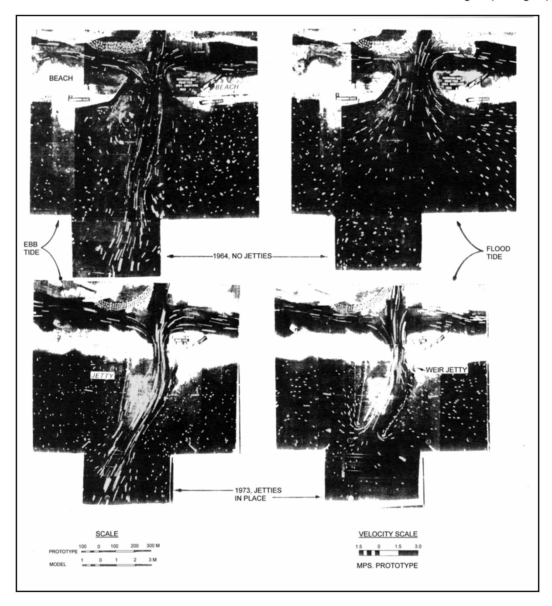

*Figure II-6-12. Ebb and flood flow patterns from a model study of Masonboro Inlet, North Carolina (Seabergh 1975)*

(4) A more precise method of prism determination includes the cubature method (Jarrett 1976), which takes into account the time required for a tide to propagate through a bay and segments the bay into subareas rather than assuming a uniform rise and fall of the bay tide. Jarrett (1976) also recommends ways to relate point measurements of maximum velocity in the center of the channel (as can be obtained from NOS current tables) to velocities representative of the entire inlet, using

```math
\frac{V_{avg}}{V_{meas}} = \left(\frac{R}{D}\right)^{\frac{2}{3}} \tag{II-6-15}
```

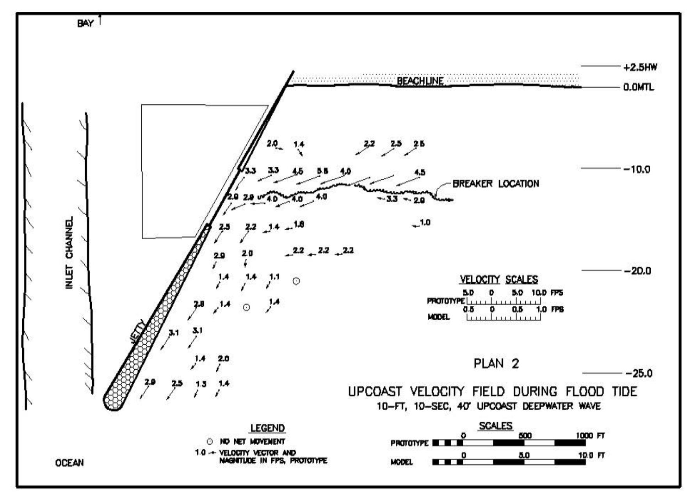

*Figure II-6-13. Tidal current plus wave-generated currents approaching jettied inlet, measured in physical model study*

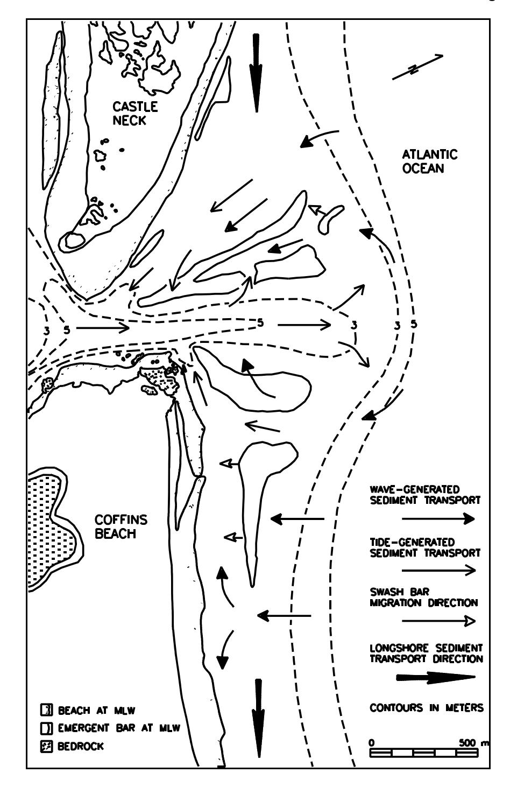

*Figure II-6-14. Sediment transport gyres associated with both updrift and downdrift portions of the delta at Essex River Inlet, Massachusetts. (Note different arrow types to denote wave or tide-generated sediment transportation (Smith 1991)*

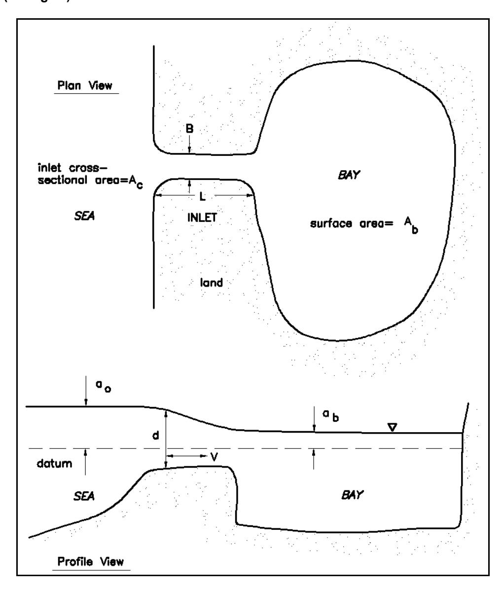

*Figure II-6-15. Inlet bay system*

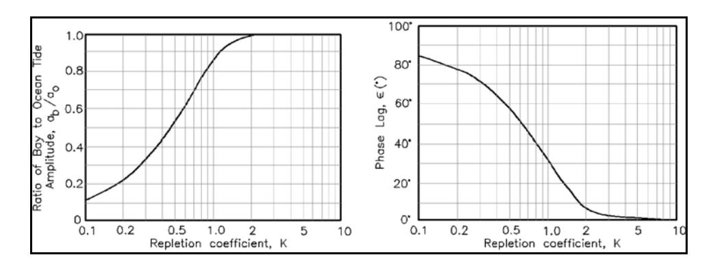

*Figure II-6-16. Variation of dimensionless parameters with Keulegan's repletion coefficient, K*

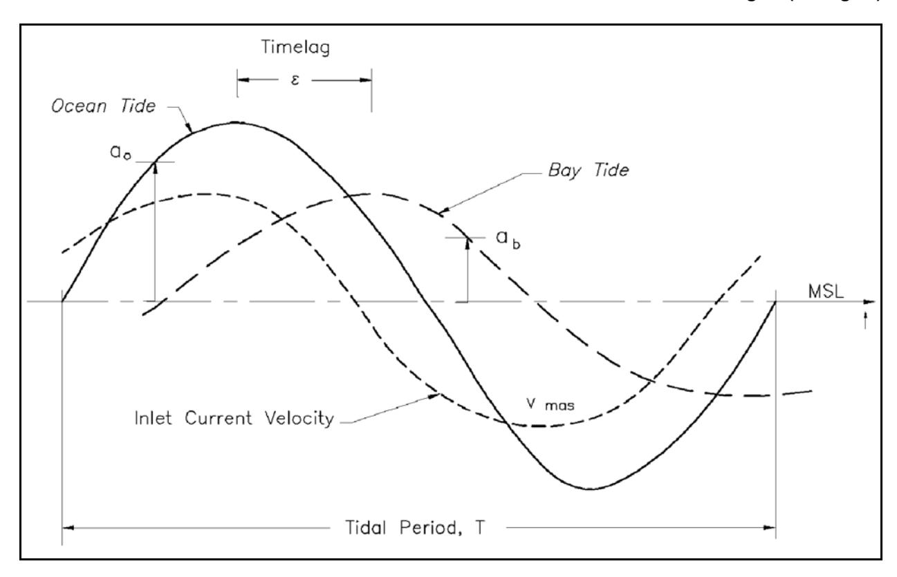

*Figure II-6-17. Sample tides and currents for an ocean-inlet-bay system that satisfy the Keulegan assumptions (Keulegan 1967)*

where
- $V_{avg}$ = maximum velocity averaged over entire cross section
- $V_{meas}$ = point measurement of maximum velocity
- R = hydraulic radius of entire cross section
- D = depth of water at current meter location
The $V_{avg}$ value then can be used in Equation II-6-13.
- d. Determining important inlet parameters. Graphs can easily be used to determine inlet hydraulics; however, evaluation of important parameters requires some effort. Mason (1975) determined appropriate techniques for defining cross-sectional area, bay area, inlet (channel) length, hydraulic radius, friction factor and exit and entrance loss coefficients. The following offers guidance in the evaluation of parameters.
- (1) Cross-sectional area. Problems in defining location and magnitude of the cross-sectional area result in greatest variability in computed values of the repletion coefficient. To reduce such variability, the cross section should be determined in the following manner:

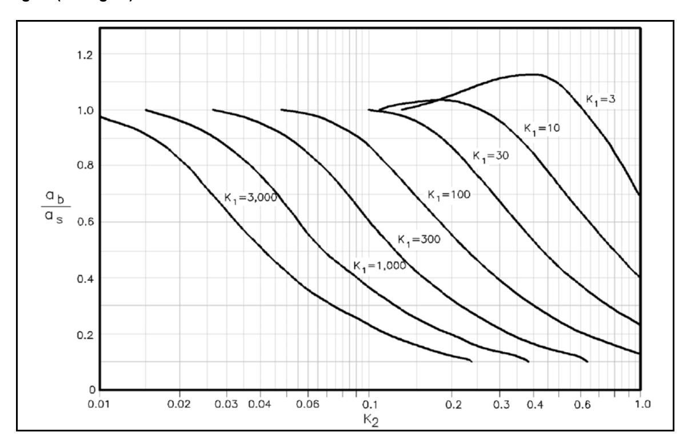

*Figure II-6-18. Ratio of bay to sea tidal amplitude versus $K_{1}$ and K2*

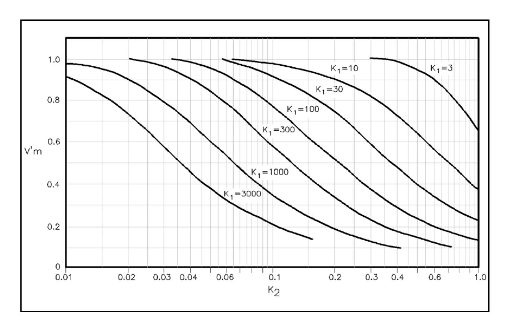

*Figure II-6-19. Dimensionless maximum velocity versus K1 and K2*

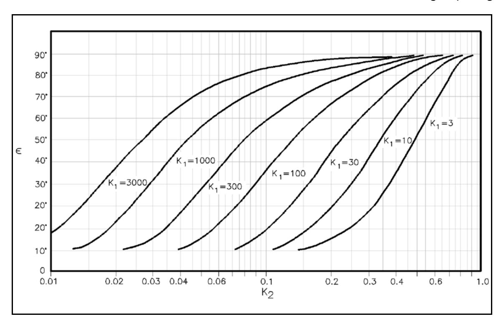

*Figure II-6-20. Bay tidal phase lag versus K1 and K2*

From a detailed bathymetric chart of the inlet, sketch lines that best approximate flood flow lines through the inlet as shown in Figure II-6-21. Establish 10 equally spaced cross-section ranges perpendicular to these flow lines, extending from MSL (mean sea level) on one side of the channel to MSL on the other (i.e. from one side of the inlet to the other). Measure cross-sectional area below MSL of each range and determine average area. Depths on most navigation charts are referenced to mean low or mean lower low water, and a correction factor should be added to these depths to determine the area below MSL.
- (2) Bay area. Typically the problem is to define the extent of the inlet's influence throughout the bay. To do this, the following are recommended:
- (a) Examine any existing tide records from stations located throughout the bay to define limit of the inlet's influence.
- (b) Examine bathymetry of the bay to determine presence of natural sills, narrows, or shoal areas which can preclude significant tidal exchange.
- (c) Locate any areas of heavy shoaling at points distant from the inlet, particularly in waterways connecting the bay of interest with more remote bodies of water, and define these sites as the effective bay limits.
- (d) The surface area of the bay is usually varying to some degree, but for an initial iteration, the mean water line could be chosen (as well as it can be delineated). (3) Friction factor.
- (a) "f" is a dimensionless parameter that is a function of hydraulic radius R and Manning's roughness coefficient n :

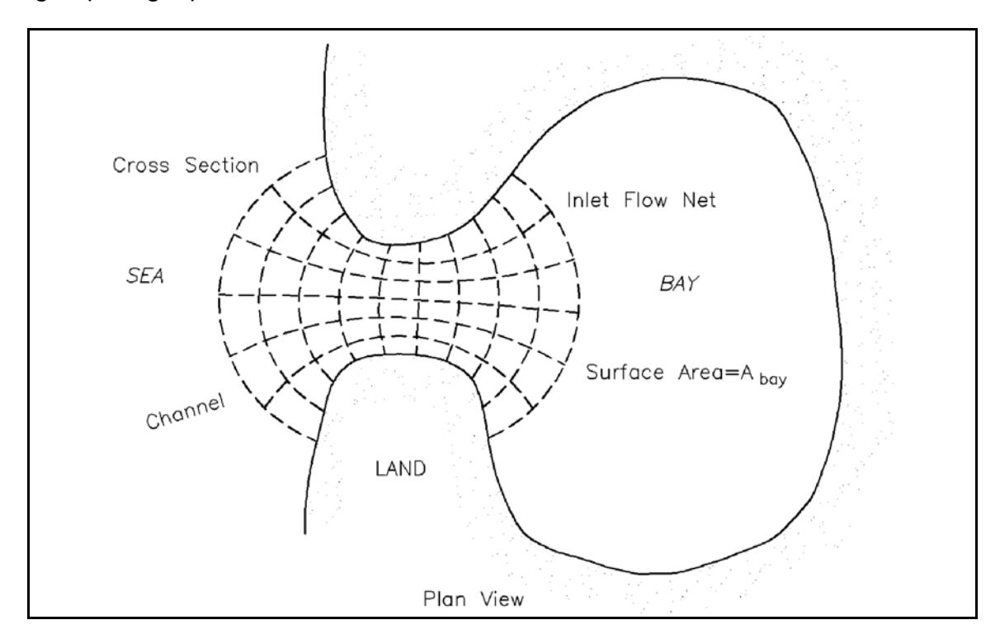

*Figure II-6-21. Inlet flow net*

```math
f = \frac{116n^2}{R^{1/3}} \tag{II-6-16}
```

(b) It seems reasonable to assume a constant n for an inlet in sand rather than a uniform f value. For open channels in hard-packed smooth sand, Chow (1959) recommends an n value of 0.020 (in English units, or 0.016 in SI). Since inlets often have rippled or duned bottoms, which generally increase frictional resistance, a higher n value might be expected, for instance between 0.025 and 0.030 (English units or 0.021 and 0.025, SI). Using an estimated value of n = 0.0275 (English units or 0.0225 SI), a friction factor defined by f = $0.088/R^{1/3}$ (English units, R in feet, or $0.059/R^{1/3},$ SI, R in meters) is recommended for use in the equation for K .
Jarrett (1975) examined the friction aspect of Keulagan K (Equation II-6-4) and defined F , inlet impedance, as

```math
F = k_{en} + k_{ex} + \frac{fL}{4R} \tag{II-6-17}
```

with $k_{en},$ kex, f, and L as defined earlier, and hydraulic radius R measured at the minimum cross section of the inlet. Figure II-6-22 plots inlet impedance against the ratio of inlet length to the 4/3 power of hydraulic radius for four ratios of minimum cross-section inlet width to hydraulic radius. These curves can be used for determining F .
(4) Inlet length. Inlet length is one of the more difficult parameters to define. The following standardized method is recommended to determine inlet length. On a detailed bathymetric chart, beginning in deep water just offshore from the inlet, mark the points of maximum depth moving across the bar, through the inlet, and into the bay. The bayward end point should be seaward of any major division of the inlet

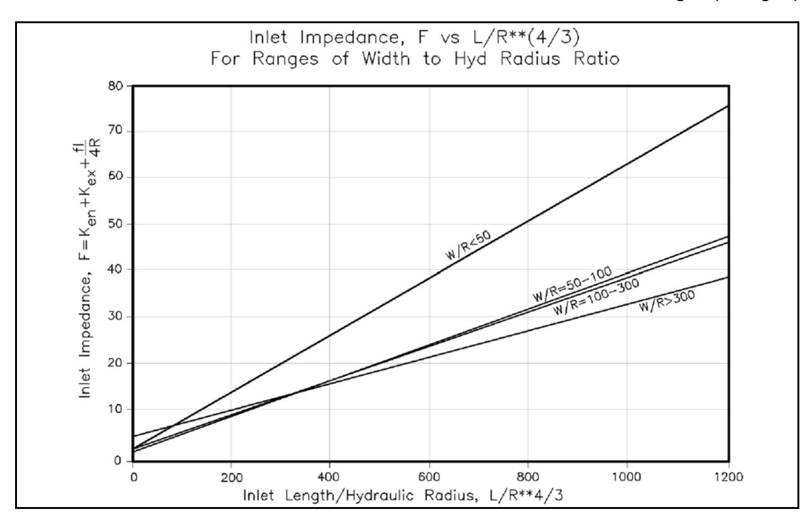

*Figure II-6-22. Inlet impedance ( F ) versus the ratio of inlet length to inlet hydraulic radius to the 4/3 power $(l/R^{4/3})$ for various inlet width to inlet hydraulic radius ratios, W/R*

channel. Connect these points of maximum depth with a series of straight lines to define the thalweg of the channel. Construct a plot of depth versus distance from the oceanward point along the thalweg. Define inlet length as the distance between the depth minimum oceanward of the deepest part of the inlet and the depth minimum bayward of the deepest part. Where the channel does not shoal near either end, the limit of the inlet must be estimated by considering the relationship of the inlet to adjacent beaches, i.e., draw a line perpendicular to the thalweg from MSL on one shoulder of the inlet to MSL on the other, and assume its intersection with the thalweg defines the channel end.
(5) Hydraulic radius. For a given cross-section area, the corresponding value of R should be computed from

```math
R = \frac{A_{avg}}{\text{Average Wetted Perimeter}} \approx \frac{A_{avg}}{\text{Average Width}} \tag{II-6-18}
```

These methods are intended to provide a simplified approach to understanding inlet hydraulics in a rapid manner. If possible, field data should be examined to correlate with existing condition calculations, adjustments made to various controlling parameters, and calculations reiterated until reasonable results are achieved. Then calculations may proceed to evaluate design changes. It must be remembered that for extreme events, when wind and wave breaking may be significant factors influencing the hydrodynamics of the inlet system, more sophisticated approaches will be needed. Even a relatively well-behaved inlet is only approximately represented by these approaches, but much insight can be gained by these techniques.

#### EXAMPLE PROBLEM II-6-1

Find:
If a channel has a depth below MSL of 3.7 m (12.1 ft) and a width of 180 m (590 ft), what are the maximum flow velocity, maximum discharge bay tidal range, and the volume of water flowing into and out of the bay on a tidal cycle (tidal prism) for a tide having the spring range?
Given:
A bay with a surface area of 1.9 × $10^{7}$ m2 (2.0 × 108 $ft^{2})$ and an average depth of 6.0 m (19.7 ft) is located on the Atlantic coast. The tide is semidiurnal ( T = 12.42 hr), with a spring range of 1.30 m (4.3 ft), as given by the National Ocean Survey Tide Tables (U.S. Department of Commerce 1989). An inlet channel, that will be the only entrance to the bay, is to be constructed across the barrier beach that separates the bay from the ocean. The inlet is to provide a navigation passage for small vessels, dilution water to control both salinity and pollution levels, and a channel for fish migration. The channel is to have a design length of 1,100.0 m (3,609 ft) with a pair of vertical sheet-pile jetties that will extend the full length of the channel.
Solution:
Using King's method, assume $k_{en}$ = 0.1, $k_{ex}$ = 1.0, and f = 0.03: B = 180 m and d = 3.7 m.

```math
A_c = Bd = 180 (3.7) = 666 \text{ m}^2 (7166 \text{ ft}^2)
```

```math
R \, = \, \frac { A _ { c } } { ( B \, + \, 2 d ) } \, = \, \frac { 6 6 6 . } { ( 1 8 0 \, + \, 2 ( 3 . 7 ) ) } \, = \, 3 . 5 5 \, \mathrm { m } \, ( 1 1 . 5 4 \, \mathrm { f t } )
```

```math
F = k_{en} + k_{ex} + \frac{fL}{4R} = 1.0 + 0.1 + \frac{0.03 (1100)}{4 (3.55)} = 3.42
```

```math
K_1 = \frac{a_o A_b F}{2 L A_c} = \frac{(1.30/2) (1.9) (10^7) (3.42)}{2 (1100) (666)} = 28.8
```

```math
K _ { 2 } \ = \ { \frac { 2 \pi } { T } } \ \sqrt { \frac { L \ A _ { b } } { g \ A _ { c } } } \ = \ { \frac { 2 \pi } { 1 2 . 4 \ ( 6 0 \ ( 6 0 ) } } \ \sqrt { \frac { 1 1 0 0 \ ( 1 . 9 ) \ 1 0 ^ { 7 } } { 9 . 8 \ ( 6 6 6 ) } } \ = \ 0 . 2 5
```

From Figures II-6-18, II-6-19, and II-6-20 with the above values of $K_{1}$ and K2

```math
\frac { a _ { b } } { a _ { s } } \, = \, 0 . 7 8
```

```math
V_m' = 0.66
```

```math
\epsilon \: = \: 5 3 ^ { o }
```

(Continued)
Example Problem II-6-1 (Concluded)
Therefore, from Equation II-6-5

```math
V_m = \frac{V_m' 2\pi \ a_s \ A_b}{A_c \ T}
```

```math
V_m = \frac{0.66 (2) (3.14) (0.65) (1.9) 10^7}{666 (12.42) (3,600)} = 1.72 \text{ m/s} (5.64 \text{ ft/s})
```

```math
Q_m = V_m A_c = (1.72) (666) = 1145 \text{ m}^3/\text{s} (40,430 \text{ ft}^3/\text{s})
```

Since $a_{b}/a_{s}$ = 0.78, $a_{b}$ = 0.78 (0.65) = 0.51 m (1.67 ft) and the bay tidal range is 0.51 (2) or 1.02 m (3.35 ft).
The tidal prism is

```math
2 a_b A_b = 2 (0.51) (1.90) (10^7) = 1.94 \times (10^7) \text{ m}^3 \qquad (6.27 \times 10^8 \text{ ft}^3)
```

If the average depth of the bay is 6.0 m and the distance to the farthest point in the bay is 6.0 km, the time $t_{*}$ it will take for the tide wave to propagate to that point is

```math
t _ { * } \, = \, { \frac { L _ { b } } { \sqrt { g d _ { b } } } } \, = \, { \frac { 6 0 0 0 } { \sqrt { 9 . 8 \, ( 6 . 0 ) } } } \, = \, 7 8 2 \, \mathrm { s e c \, o r \, } 0 . 2 2 \, \mathrm { h r }
```

Since this time is significantly less than 12.42 hr, the assumption that the bay surface remains horizontal is quite satisfactory.

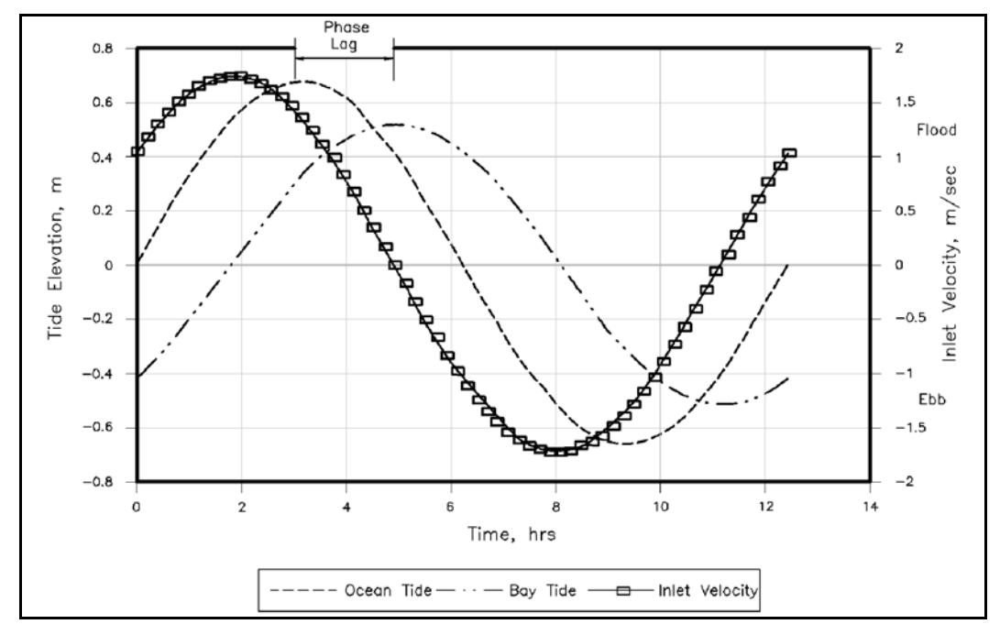

*Figure II-6-23. Results from Example Problem II-6-1*

- e. Evaluating inlet hydraulics with Keulegan K.
- (1) Introduction. The Keulegan K value can be used to understand effects of gross geometric variations on inlet hydraulics. Figure II-6-24 shows ocean and bay tide curves and velocity in the channel during a tidal cycle. Three K values are represented. The lower the K or filling coefficient, the lower the tide range in the basin and the greater the phase lag (or time difference between high water (low water) in the ocean and high water (low water) in the bay. Also noted from the velocity curve, maximum current occurs during maximum head difference between ocean and bay tides and as K decreases, maximum ebb and flood currents shift from occurrence at a mid-tide level to tidal elevation extremes. For K = 0.2, maximum flood currents occur near high water and maximum ebb currents occur during low water. Therefore for low K inlets, flood flow occurs when depths in the channel and over tidal deltas are greatest (near high water), and flow is more broadly distributed. During ebb flow, depths are shallower (approaching low water) and flow is likely to be more channelized. As K increases, and the bay fills more completely, peak ebb and flood flows tend to occur near the same tide level. These variations can have implications with regard to sediment transport. Mota Oliveira (1970) found that, using an analysis similar to Keulegan but with variable entrance cross-sectional area, when 0.6 < K < 0.8, the inlet had maximum sediment flushing ability. When K > 0.8, there was flood dominance in sediment transport capability, meaning net bayward transport and when K < 0.6, there was ebb dominance of sediment transport capability. Also when a variable bay surface area was considered, ebb sediment transport was enhanced to the detriment of flood transport. Part II-6-2, paragraph h contains more information on flow dominance.
- (2) Jarrett's classification. Jarrett (1975) performed a "hydraulic classification" of inlets based on Keulegan's K after determining tidal characteristics of a large number of U.S. inlets (see Table II-6-1). The classification is as follows:
- (a) Class I: Keulegan K < 0.3. Phase angle (ε) equal to or greater than 70 deg. For a semidiurnal tide, the phase lag between the ocean tidal extreme and slack water is equal to or greater than 2 hr 25 min. For the most part, bays associated with inlets in this class are open and relatively shallow with only one relatively small inlet (i.e., small ratio $A_{c}/A_{b}$ connecting the ocean with the bay. This class also could include relatively long estuaries that are actually long-wave embayments.
- (b) Class II: Keulegan K > 0.80. Phase angle (ε) equal to or less than 40 deg. For a semidiurnal tide, the phase lag would be equal to or less than 1 hr 25 min. Bays associated with this class are either short or consist of a system of relatively deep channels (Note: by virtue of the long tidal period in the Gulf of Mexico most Gulf Coast inlets fall into this class irrespective of bay shape). The ratio $A_{c}/A_{b}$ is relatively large for these inlets.
- (c) Class III: 0.3 < K < 0.8. Phase angle lies between 40 and 70 deg. Characteristics are intermediate to classes I and II. Analysis by Mota Oliveira (1970) indicated that the natural flushing ability of a vertical bank lagoon reaches a maximum for K values of 0.6 to 0.8. f. Effect of freshwater inflow.
- (1) If a significant amount of fresh water is introduced into the bay relative to the tidal prism of the inlet, there will be significant changes in bay tide range and velocity through the inlet. King (1974) included freshwater inflow into a Keulegan type model (which did not include the inertial term in the 1-D equation of motion). He defined a dimensionless variable

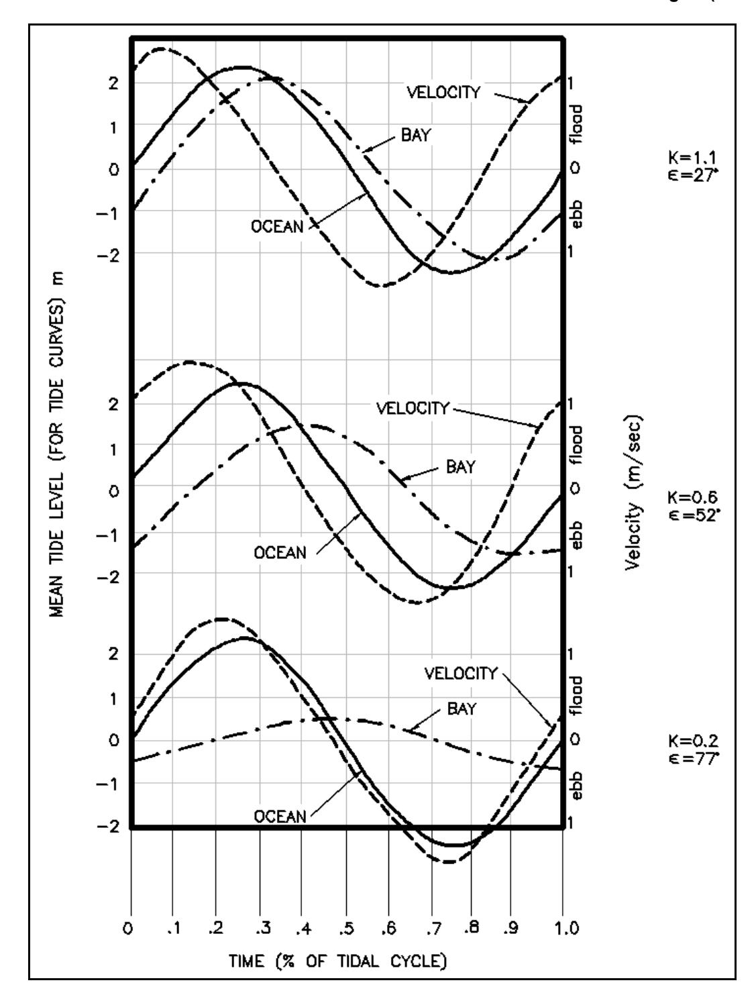

*Figure II-6-24. Hydraulic response of inlet and bay tide phasing and bay tide amplitude for various Keulegan K values*

*Table II-6-1 Hydraulic Characteristics of Tidal Inlets by Cubature Method*

**Table II-6-1. Hydraulic Characteristics of Tidal Inlets by Cubature Method**

|  | Mean | Tidal | Bay |  | Surface | Avg Phase Range | Ocean Tidal |  |  | , |
| --- | --- | --- | --- | --- | --- | --- | --- | --- | --- | --- |
| Inlet | Prism | P, ft3 | Area |  | Ab, ft2 Atlantic | in Bay, 2ab Coast | Range 2ao | ab/ao | K | deg |
| Shinnecock | 1.82 x | 108 | 3.65 | x | 108 | 0.50 | 2.90 | 0.17 | 0.15 | 80 |
| Fire Island | 1.59 x | 109 | 2.69 | x | 109 | 0.59 | 4.10 | 0.14 | 0.14 | 83 |
| Jones | 7.89 x | 108 | 4.48 | x | 108 | 1.76 | 4.50 | 0.39 | 0.35 | 67 |
| East Rockaway | 4.03 x | 108 | 1.06 | x | 108 | 3.80 | 4.50 | 0.84 | 0.95 | 33 |
| Rockaway | 2.24 x | 109 | 4.64 | x | 108 | 4.83 | 4.70 | 1.03 | -- | -- |
| Manasquan | 1.40 x | 108 | 4.91 | x | 107 | 2.85 | 4.30 | 0.66 | 0.65 | 49 |
| Barnegat | 4.91 x | 108 | 1.34 | x | 109 | 0.37 | 4.20 | 0.09 | 0.09 | 85 |
| Indian River | 4.00 x | 108 | 4.20 | x | 108 | 1.02 | 4.10 | 0.25 | 0.22 | 75 |
| Beaufort | 4.20 x | 109 | 2.56 | x | 109 | 1.64 | 3.60 | 0.46 | 0.41 | 63 |
| New River | 1.59 x | 108 | 5.31 | x | 108 | 0.30 | 3.60 | 0.08 | 0.08 | 86 |
| Winyah Bay | 2.47 x | 109 | 9.14 | x | 108 | 2.70 | 4.60 | 0.59 | 0.56 | 54 |
| Port Royal Sd | 1.25 x | 1010 | 2.40 | x | 109 | 5.22 | 6.60 | 0.78 | 0.82 | 40 |
| Calibogue Sd | 3.05 x | 109 | 5.28 | x | 108 | 5.78 | 6.60 | 0.88 | 1.07 | 28 |
| Wassaw Sd | 3.34 x | 109 | 5.84 | x | 108 | 5.72 | 6.90 | 0.83 | 0.95 | 33 |
| Ossabaw Sd | 5.82 x | 109 | 1.17 | x | 109 | 4.98 | 7.20 | 0.69 | 0.70 | 46 |
| Sapelo Sd | 6.36 x | 109 | 9.66 | x | 108 | 6.59 | 6.90 | 0.94 | 1.30 | 20 |

```math
Q _ { r } ^ { \prime } = \frac { Q _ { r } T } { 2 \pi a _ { o } A _ { b } } \tag{II-6-19}
```

with $Q_{r}$ being the river or freshwater inflow to the bay, and $a_{0},$ Ab, and T as defined previously. Figures II-6-25 and II-6-26 give high (or maximum) and low (minimum) dimensionless ratio water levels for values of $Q_{r}N$ and K (Equation II-6-4). Using Figures II-6-27 and II-6-28, maximum average ebb and flood currents can be found and Figure II-6-29 is used to determine ocean high water to bay high water phase lag.

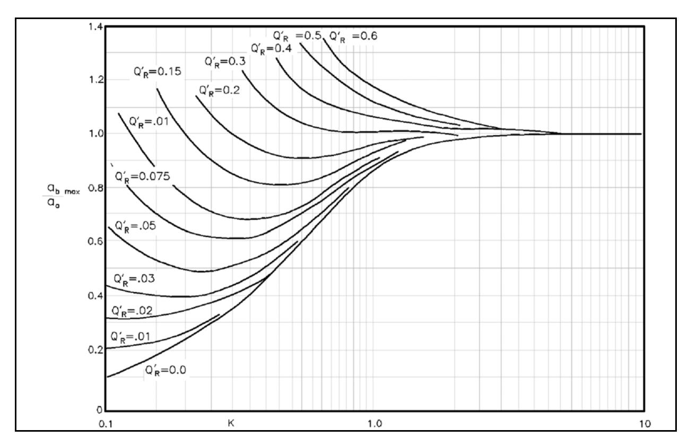

*Figure II-6-25. ab max/ao versus K for values of Qr (river discharge model)*

(2) The above analysis assumes that waters in the inlet are well-mixed at the inlet minimum crosssection, where the salinity variation over a vertical section varies only a small fraction from the local mean salinity. As freshwater influence increases, it approaches a completely stratified flow, i.e., a flow that has a well-defined interface between fresh and saline waters, and in which flow may be simultaneously bidirectional (Wicker 1965). More sophisticated techniques should be used for such cases.

### g. Bay superelevation.

(1) A superelevation of the bay means that the average level of the bay is greater than the average elevation of the ocean over a given time period. An obvious cause of this effect is the introduction of fresh water into the bay from local rivers and streams. The effect of long-term (months or years) rise in sea level causing a long-term rise in bay level is not included in this definition of bay superelevation, since both sea and bay are responding simultaneously. The bay may not rise at the same rate as the sea due to possible circulation effects if multiple inlets connect the bay to the ocean.

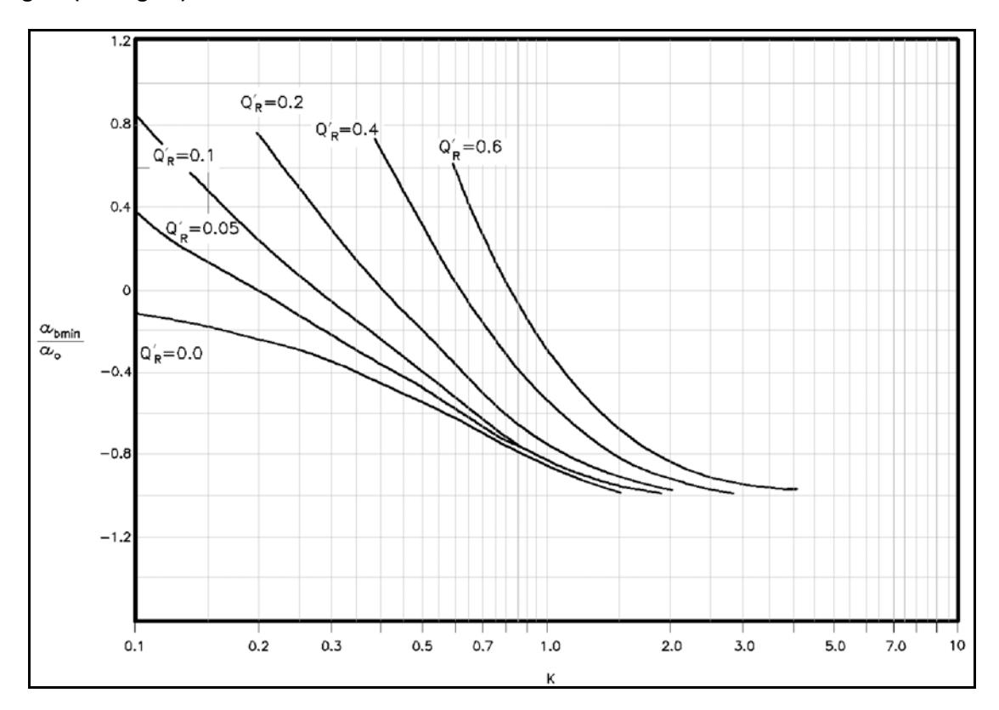

*Figure II-6-26. ab min/ao versus K for values of Qr (river discharge model)*

- (2) Laboratory and numerical studies (Mayor-Mora 1973; Mota Oliveira 1970) have indicated that there is an increasing bay superelevation as the coefficient K decreases (Figure II-6-30) and approaches nearly 20 percent of the ocean tide range. This basic cause of setup is due to increased frictional dissipation of ebb flow in comparison to flood flow as K decreases, with peak ebb flows in the channel occurring during lower water levels for inlets with low K values. This increased tractive stress for ebb flow relative to flood flow creates the setup, or increased head, necessary to preserve continuity and drive out the same tidal prism that entered the inlet.
- (3) Model studies (Mayor-Mora 1973) show that as K decreases (and superelevation increases) the duration of ebb flow increases relative to flood flow in the inlet channel. Keulegan (1967) determined a relation between inflow duration and bay superelevation (due to any reason) given by

```math
\frac{\Delta}{a_o} = \frac{\sin\left(\frac{2\pi t_i}{T}\right)}{1 - \cos\left(\frac{2\pi t_i}{T}\right)} \tag{II-6-20}
```

where
) = superelevation
ao = tidal amplitude in ocean

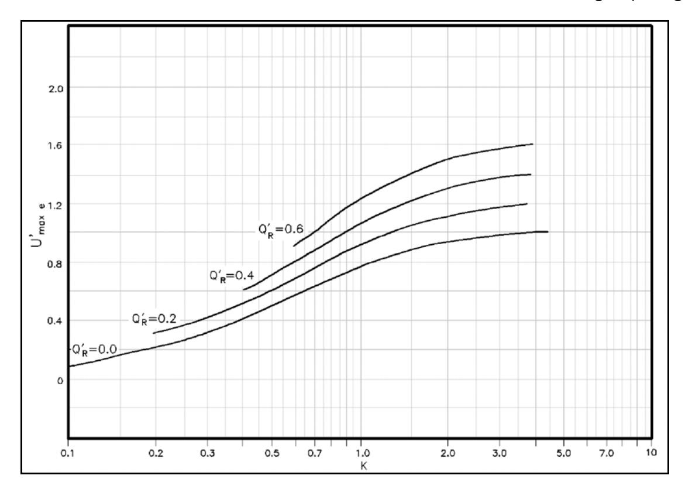

*Figure II-6-27. $uN_{max}$ e versus K for values of Qr (river discharge model)*

- T = tidal period
- ti = duration of inflow
(4) Figure II-6-31 illustrates this. Mehta (1990) determined that superelevation due to varying entrance channel cross section (by itself only) is

```math
\frac{\Delta}{a_o} = 1 - \frac{\left(\frac{a_b}{a_o}\right)^2}{4\left(\frac{d}{a_o}\right)} - \frac{a_o}{mW} \left[\frac{1}{2} - \left(\frac{a_b}{a_o}\right)\cos\epsilon - \frac{3}{2}\left(\frac{a_b}{a_o}\right)^2 + 4\left(\frac{d}{a_o}\right)^2\right] \tag{II-6-21}
```

where
) = superelevation
- ao = sea tide amplitude
- ab = bay tide amplitude
- d = mean water depth in channel

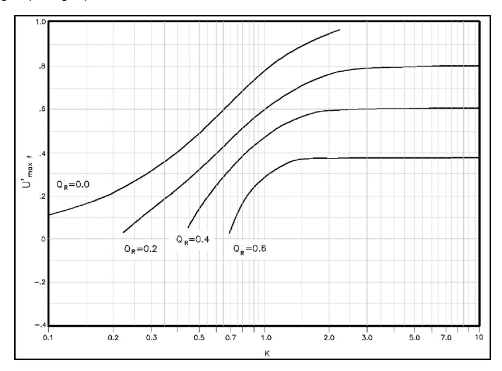

*Figure II-6-28. u' max f versus K for values of Qr (river discharge model)*

- m = bank slope
- W = channel width corresponding to mean water depth in channel
, = phase lag between sea tide and bay tide
h. The inlet as a filter, flow dominance, and net effect on sedimentation processes.
- (1) Introduction. As shown previously, an inlet filters some part of the ocean tide as it translates into the bay, depending on the characteristic inlet parameters defined earlier. Keulegan and King's analytical models, discussed earlier, assumed a sinusoidal ocean tide, and due to the nonlinear friction term (containing $u^{2}),$ solutions of bay tide response implicitly contained higher-order harmonics (i.e., frequencies higher than that of the basic ocean tide). Other studies have shown that if a variable inlet cross section or variable bay surface area is considered, this will introduce higher-order harmonics. The forcing ocean tide, of course, is composed of many different frequency constituents (Part II-5), so there is interest in using this information to provide more accurate results. Also, investigators have shown that higher harmonics of current velocity (resulting from the forcing tides) are important in relation to sediment transport and its net movement through the inlet (King 1974; Aubrey 1986; DiLorenzo 1988). These effects are important due to the relationship of sediment transport to velocity raised to some power, e.g., $V^{5}$ (Costa and Isaacs 1977).
- (2) Tidal constituents. Boon (1988) suggests that the seven tidal constituents in Table II-6-2 adequately represent shallow-water tide distortion in inlet-basin systems. Aubrey and Friedrichs (1988) and DiLorenzo (1988) used the amplitude of the ratio of M4 to M2 constituent amplitudes as a measure of nonlinear distortion. Variability in the spring-neap cycle, as well as seasonal mean water level changes, cause characteristic fluctuations in M4/M2.

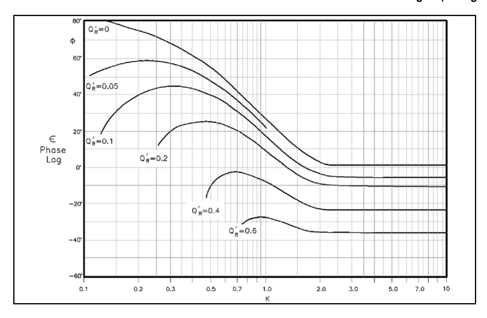

*Figure II-6-29. ε versus K for values of Qr (river discharge model)*

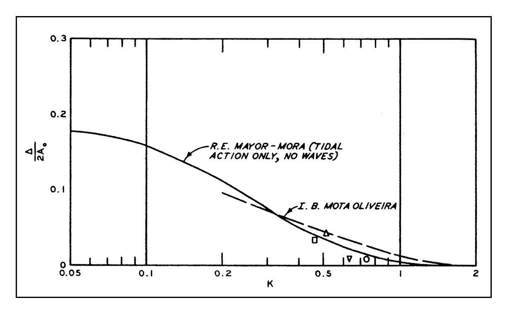

*Figure II-6-30. Ratio of bay superelevation to ocean tide range as a function of the coefficient of repletion K*

#### EXAMPLE PROBLEM II-6-2

#### Given:

Using the same inlet system discussed in Example Problem II-6-1, consider the effect of a constant river discharge of 350 $m^{3}/s$ (12,360 $ft^{3}/s).$

#### Find:

What are the effects of river discharge on high-water and low-water elevations in the bay, bay tide range, and maximum flood and ebb velocities, the maximum flood and ebb discharges, and the bay tide phase lag.

#### Solution:

Using Equation II-6-19 for dimensionless variable $Q_{r}N$ with $a_{o},$ Ab , and T from Example Problem 1 and Qr given above

```math
Q_r' = \frac{Q_r T}{2\pi a_o A_b}
```

```math
Q _ { r } ^ { \prime } \ = \ \frac { 3 5 0 \ ( 4 4 7 1 2 ) } { 2 ( 3 . 1 4 ) \ ( 1 . 3 0 / 2 ) \ ( 1 . 9 0 \ x \ 1 0 ^ { 7 } ) } \ = \ 0 . 2 0
```

Using Equation II-6-11, find the Keulegan K , knowing $K_{1}$ and $K_{2},$ as calculated in Example Problem 1.

```math
K = \frac{1}{k_2} \sqrt{\frac{1}{K_1}}
```

```math
K = { \frac { 1 } { 0 . 2 5 } } \, { \sqrt { \frac { 1 } { 2 8 . 8 } } } \, = \, 0 . 7 5
```

(or calculate Keulegan K from Equation II-6-4).
With K = 0.75 and $Q_{r}N$ = 0.20, bay tidal response is determined from Figure II-6-25

```math
\frac{a_{b \text{ max}}}{a} = 0.92
```

and from Figure II-6-26

```math
\frac{a_{b \text{ min}}}{a} = -0.56
```

(Continued)

#### Example Problem II-6-2 (Concluded)

Bay tide range is 0.96 m and is not symmetric about mean sea level, due to river flow.
Maximum channel velocities are determined from Figure II-6-27 (maximum ebb velocity)

```math
U_{maxe}' = 0.80
```

Using Equation II-6-5, and substituting $UN_{maxe}$ for $VN_{m}$ and $U_{maxe}$ for $V_{m}$ , and solving for $U_{maxe}$

```math
U_{maxe} = \frac{U'_{maxe} 2\pi \ a_o A_b}{A_{avg} T} = \frac{0.80 \ (2) \ (3.14) \ (0.65) \ (1.90) \ 10^7}{666 \ (12.42) \ (3600)} = 2.08 \ \text{m/s}
```

From Figure II-6-28 (maximum flood velocity)

```math
U_{maxf}' = 0.50
```

and in a manner similar to solving for ebb velocity, flood velocity is determined by

```math
U_{maxf} = \frac{U'_{maxf} 2\pi a_o A_b}{A_{avg} T} = \frac{0.50 (2) (3.14) (0.65) (1.90) 10^7}{666 (12.42) (3600)} = 1.30 \text{ m/s}
```

Maximum discharges are determined from

```math
Q_{maxe} = U_{maxe} A_c = 2.08 (666) = 1385 \text{ m}^3/\text{s}
```

```math
Q_{maxf} = U_{maxf} A_c = 1.30 (666) = 866 \text{ m}^3/\text{s}
```

River flow increases maximum ebb discharge and decreases maximum flood discharge, as one would expect. The values are nearly balanced around the no-river-discharge value of 1,145 $m^{3}/s$ of Example 1.
Using Figure II-6-29, the value of ε (phase lag of bay tide relative to ocean tide) is determined to be 19 deg, indicating high water occurs earlier than for the non-river-inflow condition of Example 1.

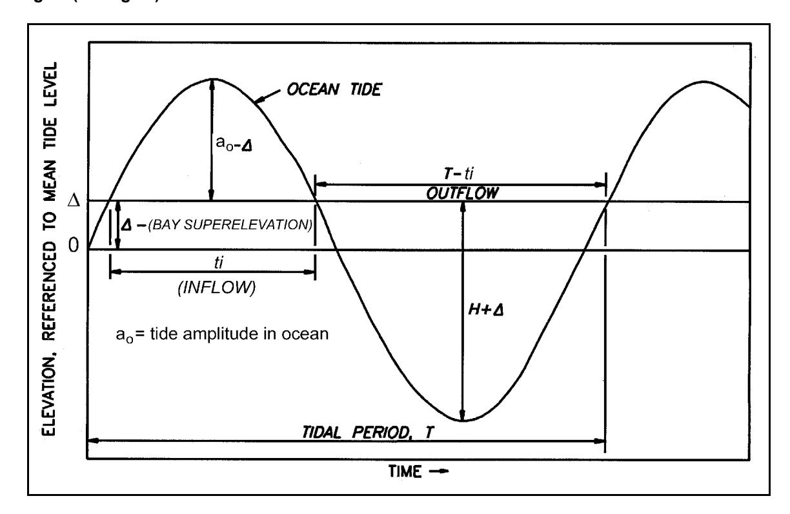

*Figure II-6-31. Duration of outflow relative to bay superelevation*

| Constituent | Frequency | Degrees/hr | Designation |  |
| --- | --- | --- | --- | --- |
| M2 | a1 | 28.9841 | Lunar semidiurnal |  |
| S2 | a2 | 30.0000 | Solar semidiurnal |  |
| N2 | a3 | 28.4397 | Lunar elliptic |  |
| M4 | 2a1 | 57.9682 | Lunar quarter-diurnal |  |
| S4 | 2a2 | 60.0000 | Solar quarter-diurnal |  |
| MS4 | a1+a2 | 58.9841 | Compound harmonic |  |
| MN4 | a1+a3 | 57.4238 | Compound harmonic |  |
| MSf | a2-a1 | 1.0159 | Lunar long-period |  |

(3) Flow dominance. Entrance area and bay surface area variation impacts flow conditions at the inlet in terms of the continuity equation (Equation II-6-3), which indicates that

```math
\frac{dh_b}{dt} \propto \frac{A_{avg}}{A_b} \tag{II-6-22}
```

The rate of change of bay elevation is directly proportional to channel area and inversely proportional to surface area of the bay. If $A_{avg}$ is held constant while $A_{b}$ increases with the rising tide, then the rate of rise decreases, while the rate of fall increases over time. This means there is a longer rise and faster fall, indicating greater ebb velocity peaks (assuming the same amount of water enters and leaves the bay), which means currents are ebb-dominant when considering only the effect of variable bay area. Similar reasoning
shows that variable entrance area increases the rate of rise of flood tide and decreases the rate fall, causing higher maximum flood velocities than ebb, creating a flood-dominant inlet. These conditions are important to help interpret the movement of sediment through inlets and the locations where shoals form.

### i. Multiple inlets.

- (1) Often a lagoon is connected to the ocean by more than one inlet. The basic simplified hydraulics can be determined by methods introduced previously or may be numerically modeled for more detailed effects such as residual currents and net circulation (van de Kreeke 1976, 1978). Multiple inlets with a common bay can impact inlet stability if an inlet changes or if an inlet is added (Ward 1982). Changes to a multiple inlet system may be gradual (for example, one inlet gradually lengthens as littoral transport creates shoal regions in the inlet), or change may be rapid (e.g., a hurricane cuts a channel through a barrier beach and begins to rapidly expand in size, capturing a significant portion of the tidal prism from a previously existing inlet connected to the same bay). (2) For an existing system of multiple inlets, the K values may be added together

```math
K_{\text{inlet 1}} + K_{\text{inlet 2}} + \dots K_{\text{inlet n}} = K_{\text{all inlets}} \tag{II-6-23}
```

to determine the total K for the system, from which the bay tide amplitude and phase lag may be determined (Figures II-6-18 and II-6-20). A total maximum discharge (for the total of all inlets) from the $V_{max}$ determined from Figure II-6-19 is

```math
Q_{\text{max}} = \frac{2\pi}{T} a_o A_b V_{\text{max}} \tag{II-6-24}
```

(3) This total maximum discharge then may be apportioned between all inlets

```math
Q_{\text{max}} = Q_{1\text{max}} + Q_{2\text{max}} + Q_{3\text{max}} + \dots \tag{II-6-25}
```

with the above equation knowing that, for example, for three inlets

```math
Q_{1\text{max}} = \frac{Q_{\text{max}}}{1 + \frac{K_2}{K_1} + \frac{K_3}{K_1}} \tag{II-6-26}
```

$Q_{2max}$ and $Q_{3max}$ may be determined by placement of the appropriate K values in the denominator in the same relative positions as in the above equation.
- (4) For the case of an inlet connected to a bay that is segmented into separate internal bays connected by narrow openings, reference is made to Dean (1971) and Mota Oliveira (1970).
- j. Tidal jets. Some analytical approaches to flow patterns at inlets treat parameters affecting the "plume" of water exiting the inlet (i.e., ebb flow). Joshi (1982) examined the effect of bottom friction, bathymetric changes, and lateral entrainment of water due to turbulent mixing. Generally, as bottom friction increases, the plume becomes wider and water velocity along the center line decreases. As bottom slope increases, the plume contracts. Özsöy (1977) and Özsöy and Ünlüata (1982) developed relationships to determine plume expansion and center-line velocity, as shown in Figures II-6-32 and II-6-33. Example

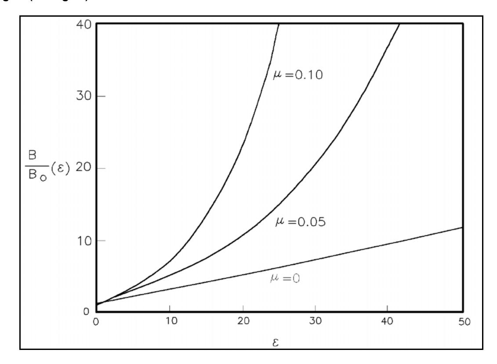

*Figure II-6-32. Plume expansion*

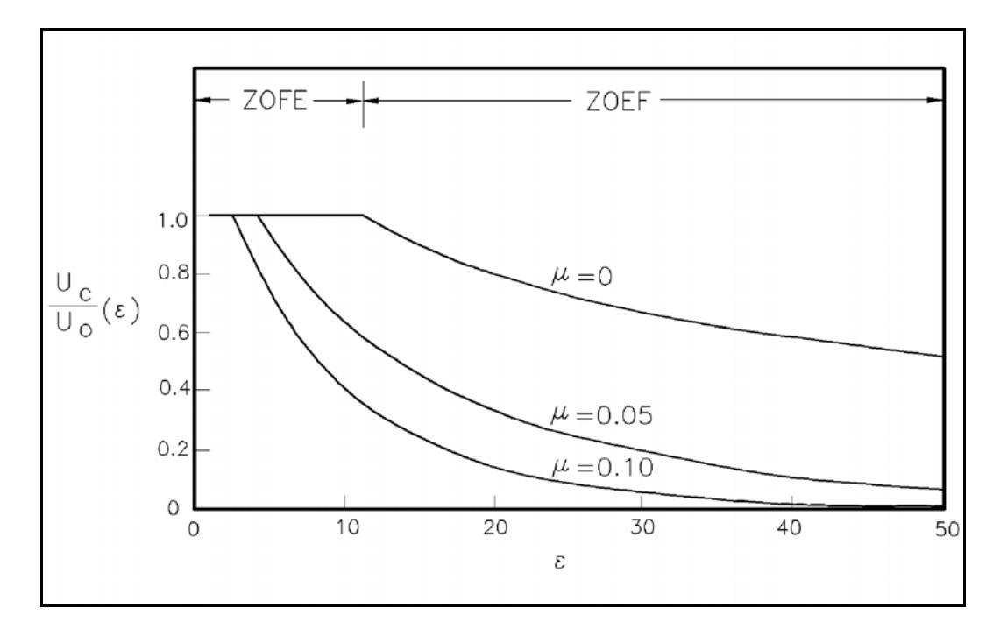

*Figure II-6-33. Center-line velocity*

Problem II-6-2 shows the effects of a flat bottom with friction. Özsöy and Ünlüata provide additional information for sloping bottoms and the effect of a longshore current approaching perpendicular to the ebb jet, deflecting it downcoast. Joshi and Taylor (1983) examined the alongshore circulation created by tidal jets and predicted that currents toward the inlet along the shoreline (induced by the ebb tidal jet or plume) can range from 0.01 to 0.1 m/s within 10 half-widths (of the minimum inlet width) of the natural inlet entrance. With a jetty in place, the range of induced currents along the shoreline is reduced, finally becoming zero at the junction of the shoreline and jetty. The above work is based on a simplified bathymetry and does not include wave-induced longshore currents, which can be an order of magnitude larger than jet-induced longshore currents. Ismail and Wiegel (1983) found that waves increased the rate of ebb jet spread.

### k. Tidal dispersion and mixing.

- (1) Flow through inlets can play an important role in the exchange processes and flushing of the bay, both of which impact water quality and bay ecology. Tidal currents, along with wind-driven currents and in some cases density-driven circulation, can drive dispersion processes in the bay where particles of water (or other substances, e.g., pollutants) are scattered or diluted. Tidal dispersion and its role in flushing of bays has been studied by many investigators including Geyer and Signell (1992), Zimmerman (1988), van der Kreeke (1983), Dyer and Taylor (1973), and Sanford, Boicourt, and Rives (1992). There is typically a broad variance in the dispersion coefficient values that can be determined for the processes causing dispersion over a large area. Therefore, analytic techniques to determine flushing of a bay are limited to small basins, and assume complete internal mixing, with detailed numerical simulations required for larger bays. Tidal dispersion is important in regions where flow separations occur; e.g., in regions of abrupt geometric change, with the inlet entrance channel a prime example. The extent of dispersive influence is limited to the tidal excursion in the bay (the distance covered by a particle entering the bay at the start of flood tide until the end of flood tide). For tidal dispersion to influence large spatial scales, spacing between major topographic features must be less than the tidal excursion distance (Geyer and Signell 1992).
- (2) For small basins, where it is assumed that waters in the basin are completely mixed at all times, van de Kreeke (1983) defined residence time as the average time for a particle to enter, then leave the basin, with this average based on many particles. For small basins, and with the following relationship met

```math
10 > \frac{\langle V \rangle}{\epsilon P} > 1.5 \tag{II-6-27}
```

where <V> is the average volume of the bay over the tidal cycle, ε is the fraction of new water entering the bay from the sea each tidal cycle, and P is the tidal prism. A value of ε = 0.5 is often used when there is no other basis for estimation of this factor. Then residence time can be calculated by

```math
\frac { \tau _ { r } } { T } = \frac { \left. V \right. } { \epsilon P } \tag{II-6-28}
```

with τr residence time and T tidal period. The time to reduce the mass of a substance's concentration by a factor of "e" (2.7183) is equal to τr and to reduce it a factor of 10 is $2.3J_{r}.$
- l. Wave-current interaction. The region where the navigation channel intersects and/or passes through the outer ebb shoal can be a region of intense wave-current interaction. Wave-current interaction can produce difficult navigation and dredge operation conditions. Also, interaction of waves, currents, and local bathymetry/channel typically produces the most severe channel shoaling problems at inlets. These interactions will be discussed in various combinations. (1) Wave-current interaction.
(a) Horizontal currents can modify surface gravity waves by stretching or shrinking features of a wave train. This distortion can produce a "Doppler Shift" in wave period. Wave orthogonal, crest, and ray directions are modified (see Part II-1 for definitions). Also, a current modifies surface waves by causing an exchange of energy between wave and current. The pressure field accompanying the wave also is modified. Predicting current-modified wave energy, heights, directions, and pressures is typically a complex procedure still under research; however, a graphical method presented by Herchenroder (1981) based on work by Jonsson et al. (1970), can be used to estimate the effect of current on wave height $H_{A},$ where this is wave height without current.
Using the equation:

```math
H = (R_H)H_A \tag{II-6-29}
```

(b) Figure II-6-34 may be used to determine $R_{H},$ the wave height factor, which depends on:

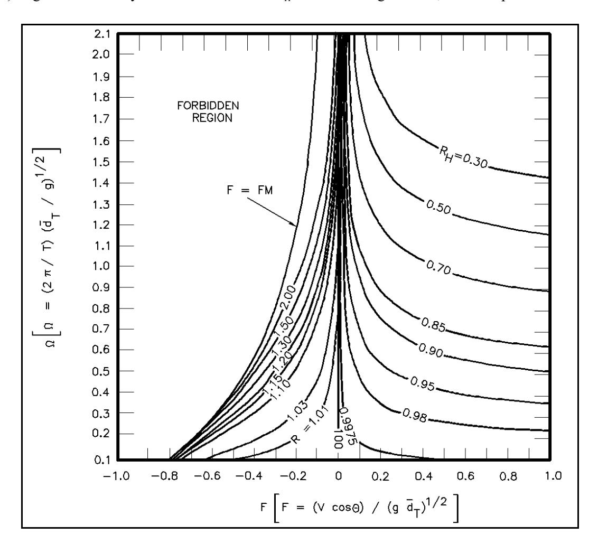

*Figure II-6-34. Contours of dimensionless wave height factor $R_{H}$ given by Equation II-6-29. Waves cannot propagate for values of F and Ω lying in the forbidden region (boundary line F = FM)*

#### EXAMPLE PROBLEM II-6-3

FIND:
The width of the ebb jet and its maximum velocity along the centerline 2,000 m seaward from shore.
GIVEN:
The inlet channel width where the ebb jet exits the inlet is 200 m and the channel depth is 8 m. A flat bottom and Mannings n = 0.02 are assumed. The maximum average velocity in the channel is 1.5 m/sec.
SOLUTION:
The friction factor μ (from Özsöy and Ünlüata (1982)) is calculated as

```math
\mu = \frac{gb_o n^2}{h_o^{0.75}} = \frac{(9.8) (100) (0.02)^2}{(8)^{0.75}} = 0.08
```

where $b_{o}$ = half-width of channel = 200 m / 2 = 100 m and the dimensionless distance offshore parameter is

```math
\xi = \frac{x}{b_o}
```

with x, the distance offshore, equal to 2000 m. Calculating these parameters, μ = 0.08 and ξ = 20. Using Figures II-6-32 and II-6-33, and interpolating for μ, the results are

```math
\frac { b } { b _ { o } } \big ( \xi \big ) = 1 8 . 5 \Rightarrow b = 1 0 0 ( 1 8 . 5 ) = 1 8 5 0 \mathrm { \, m \, }
```

and

```math
\frac{u_c}{u_o}
```

Therefore, for a flat bottom, the half-width of the jet expands from 200 m to 1,850 m and the center-line velocity of the jet decreases from 1.5 m/s at the inlet to 0.3 m/s 2,000 m from shore.

### EXAMPLE PROBLEM II-6-4

Find:
Determine the wave height in an inlet channel that is 5.0 m (16.4 ft) deep.
Given:
A 5.0-sec, 1.0-m (3.28-ft) wave is entering an inlet having a 1.0 m/s (3.3 ft/s) ebb current. The angle between current and wave orthogonal is 180 deg.
Solution:

```math
\Omega = (2\pi/T) (d_T/g)^{1/2}
```

```math
F = (V \cos \theta)/(g\bar{\mathbf{d}}_{\mathrm{T}})^{1/2}
```

- T = wave period = 5 s
- dT = time-averaged water depth = 5.0 m
- g = 9.8 $m/s^{2}$
- V = horizontal current speed = 1.0 m/s
2 = angle between horizontal velocity vector and horizontal wave vector = $180^{\circ}$
Therefore:

```math
\Omega = \left(\frac{2 (3.14)}{5.0}\right) \left(\frac{5}{9.8}\right)^{1/2} = 0.90
```

```math
F = \frac{1.0 (\cos 180)}{(9.8 \cdot (5))^{1/2}} = -0.14
```

From Figure II-6-34, $R_{H}$ = 1.35
Wave height $H_{A},$ originally 1 m, is modified by the current to a wave height of:

```math
H = (R_H) H_A = 1.35 (1.0) = 1.35 \text{ m}
```

```math
F = \frac{V \cos \theta}{\left(g d_T\right)^{\frac{1}{2}}} \tag{II-6-30}
```

and

```math
\Omega = \left(\frac{2\pi}{T}\right) \left(\frac{d_T}{g}\right)^{\frac{1}{2}} \tag{II-6-31}
```

where
- T = wave period
- dT = channel depth
2 = angle wave orthogonal makes with current
V = velocity in channel
- (2) Current-channel interaction. As flow converges on an inlet entrance, the angle at which flow approaches a dredged channel can be important with regard to change in current direction and can ultimately relate to channel shoaling. The direction of current approach will depend on bottom configuration and structure(s) location. Boer (1985) developed a mathematical model to study currents in a dredged channel. He found that a current approaching obliquely to a channel is refracted within the channel and the streamlines contract within the channel causing a velocity increase (Figure II-6-35). This effect becomes relatively small for angles larger than 60° (angle between channel axis and current direction). This effect is largest near the bed and smallest near the surface. Due to continuity, depending on the relative depth of the channel to the surrounding depths, there is a decrease factor because of increased depth in the channel.
- m . Other methods of inlet analysis. As mentioned in Part II-6-2, paragraph a, follow-up studies using techniques presented in previous sections and numerical and/or physical models, can be conducted after an initial examination of the inlet. Some available tools are discussed below.
- (1) Automated Coastal Engineering System (ACES). ACES (Leenknecht et al. 1992) contains an inlet model that operates in the PC environment and estimates inlet velocities, discharges, and bay levels as a function of time. This model is designed for cases where the bay water level fluctuates uniformly. Seaward boundary conditions are specified as water level fluctuations associated with astronomical tides, storm surges, seiches, and tsunamis. Figure II-6-36 shows a flow net and Figure II-6-37 is a typical cross section indicating that the model can handle up to two inlet entrances to a single bay and that the entrance channel(s) can be divided into sub-channels to accommodate change in depth across the inlet. The model will permit up to seven sub-channels and up to sixteen cross sections of the flownet. Figures II-6-38 and II-6-39 show sample output from the program.

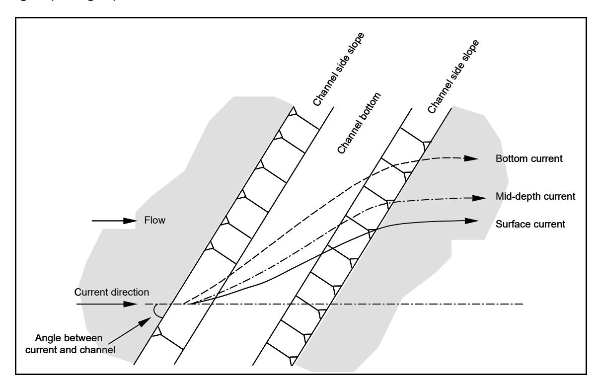

*Figure II-6-35. Refraction of currents by channel*

- (2) DYNLET1. This model (Amein and Kraus 1991) is a one-dimensional PC model that can predict flow conditions in channels with varied geometry, and accepts varying friction factors across an inlet channel. Values of water surface elevation and average velocity are computed at locations across and along inlet channels. The inlet to be modeled may consist of a single channel connecting the sea to the bay, or it may be a system of interconnected channels, with or without bays.
- (3) Coastal Modeling System (CMS). The CMS (Cialone et al. 1991) contains two hydrodynamic programs applicable to inlets. This modeling system is a supercomputer-based system of models and supporting software packages. Two models applicable to inlet studies are:
- (a) WIFM. This model is a two-dimensional, time-dependent, long-wave model for solving the vertically integrated Navier-Stokes equations in a stretched Cartesian coordinate system. The model simulates shallowwater long-wave hydrodynamics such as tidal circulation, storm surges, and tsunami propagation. WIFM contains many useful features for studying these phenomena such as moving boundaries to simulate flooding/drying of low-lying areas and subgrid flow boundaries to simulate small barrier islands, jetties, dunes, or other structural features. Model output includes vertically integrated water velocities and water surface elevations.

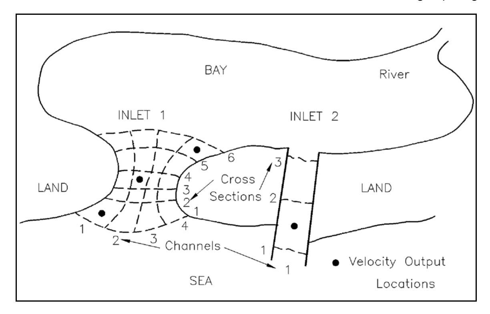

*Figure II-6-36. Typical inlet flow nets*

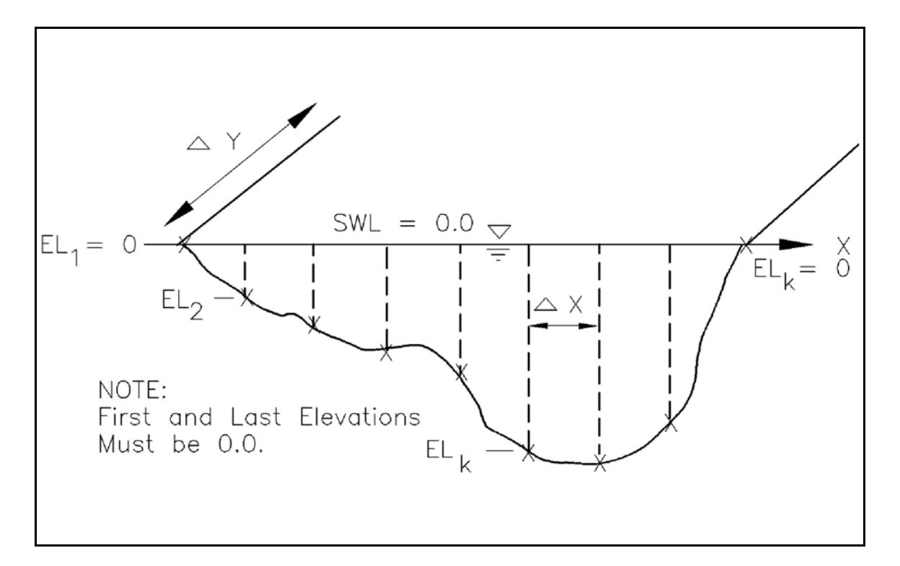

*Figure II-6-37. Typical inlet cross section*

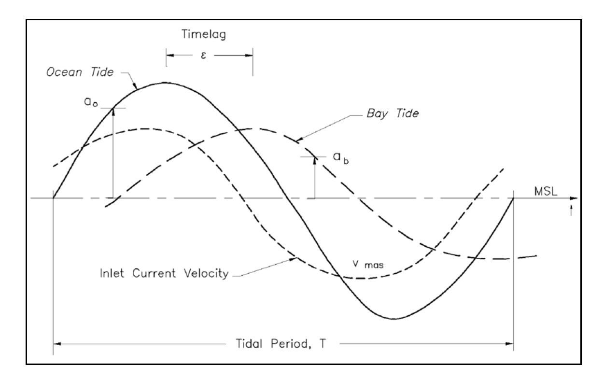

*Figure II-6-38. Sea and bay water elevations at inlet 1*

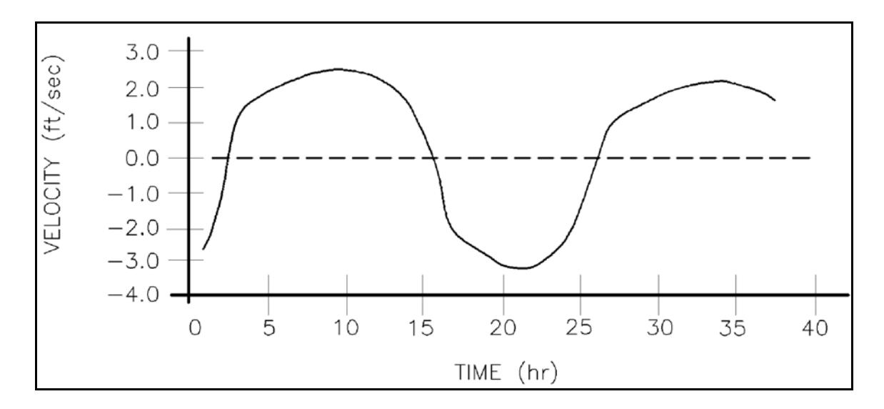

*Figure II-6-39. Average velocity at minimum cross section*

(b) CLHYD. This model simulates shallow-water, long-wave hydrodynamics such as tidal circulation and storm surge propagation. It can simulate flow fields induced by wind fields, river inflows/outflows, and tidal forcing. CLHYD is similar to WIFM, with the added feature of operating on a boundary-fitted (curvilinear) grid system. However, CLHYD cannot simulate flooding/drying of low-lying areas, as WIFM can. Model output includes vertically integrated water velocities and water surface elevations.
- (4) Other models. Other more sophisticated models that require considerable expertise to use already exist or are being developed. The reader is advised to consult current technical literature for details. Part II-5-7, "Numerical Modeling of Long Wave Hydrodynamics," discusses two such sophisticated models, CH3D and ADCIRC.
- (5) Physical models. Physical models have also been used for both the hydraulic and sedimentation aspects of inlet studies, but numerical models usually have been used in recent years due to the expense of constructing the large bay system of an inlet and the need to examine processes difficult to reproduce in a physical model, such as storm surge, which would need to include wind effects. However, physical models are appropriate and cost-effective for examining structures and detailed flow patterns in the immediate vicinity of the inlet entrance (sample references include Bottin (1978, 1982), Seabergh (1975), Seabergh and Lane (1977), and Seabergh and McCoy (1982)).

### II-6-3. Hydrodynamic and Sediment Interaction at Tidal Inlets

a. Introduction. Waves, currents, and sediment interact at tidal inlets over a large physical area, with varying effects over a tidal cycle (Smith 1991). At the throat or minimum cross-sectional area of the inlet and bayward, tidal currents are the predominant forcing agent interacting with sediments. However, moving seaward and alongshore away from the inlet, the effect of waves increases. Wave energy on the edges of the inlet channel can contribute sediment from adjoining beaches, with the flood tidal currents tending to move bayward to a flood tidal shoal (or middle-ground shoal), or the ebb currents jetting sediment seaward to settle on the ebb shoal. Sediment may again be moved to adjoining beaches by the combination of waves and currents, thus "bypassing" the inlet. The interaction of tidal currents, waves, and wave-generated currents is a complex process.

### b. Tidal prism - channel area relationship.

(1) Initial research focused on the relationship to flow through the inlet and the minimum cross-sectional area that could be sustained by that flow. O'Brien (1931, 1969) originally determined a relationship between minimum throat cross-sectional area of an inlet below mean tide level and the tidal prism (i.e., the volume of water entering or exiting the inlet on ebb and flood tide) at spring tide (Figure II-6-40). This relationship was predominantly for Pacific coast inlets, where a mixed tidal pattern is observed and there typically is a strong ebb flow between higher-high water and lower-low water. Jarrett (1976) continued the analysis and performed regression analysis for various coastal areas with different tidal characteristics. A regression equation is given for each of the Atlantic, Pacific, and Gulf coasts. Jarrett also recommended using O'Brien's equation for dual-jettied inlets. The equations, in metric and English units, are given in Table II-6-3.

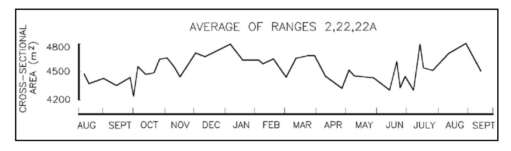

*Figure II-6-40. Variations in cross-sectional area for Wachapreaque Inlet (Byrne, De Alteris, and Bullock 1974)*

*Table II-6-3 Tidal Prism-Minimum Channel Cross-sectional Area Relationships*

**Table II-6-3. Tidal Prism-Minimum Channel Cross-sectional Area Relationships**

| Location | Metric Units |  | English | Units |  |  |
| --- | --- | --- | --- | --- | --- | --- |
| Atlantic Coast | Ac = 3.039 | x $10^{-5}$ P1.05 | Ac = 7.75 | x | 10-6 | P1.05 |
| Gulf Coast | Ac = 9.311 | x $10^{-4}$ P0.84 | Ac = 5.02 | x | 10-4 | P0.84 |
| Pacific Coast | Ac = 2.833 | x $10^{-4}$ P0.91 | Ac = 1.19 | x | 10-4 | P0.91 |
| Dual-Jettied Inlets (O'Brien) | Ac = 7.489 | x $10^{-4}$ P0.86 | Ac = 3.76 | x | 10-4 | P0.86 |

Ac is the minimum cross-sectional area in square meters (square feet) and P is the tidal prism in cubic meters (cubic feet).
- (2) Inlet tidal prisms versus minimum cross-sectional area for Jarrett's data is plotted in Figure II-6-9.
- (3) Work by Byrne et al. (1980) indicated that for inlets with minimum cross sections less than 100 m2 (1,076 $ft^{2}),$ there was a departure from the relationships developed above. They studied small inlets on the Atlantic Coast in Chesapeake Bay. Their relationship for area and tidal prism is

```math
A_c = 9.902 \times 10^{-3} p^{0.61} \tag{II-6-32}
```

- (4) Jarrett's (1976) work pertains to equilibrium minimum cross-sectional areas at tidal channels from one survey at a given date. Byrne, DeAlteres, and Bullock (1974) have shown that inlet cross section can change on the order of ± 10 percent in very short time periods (see Figure II-6-40). This, of course, is due to the variability in tidal currents and wave energy. A storm may bring a large amount of sediment to an inlet region, since the inlet tends to act as a sink for sediment and the tidal current may require a certain time period to return the minimum cross-sectional area to some quasi-equilibrium state. Brown (1928) notes that for Absecon Inlet, New Jersey, "a single northeaster has been observed to push as much as 100,000 cubic yards of sand in a single day into the channel on the outer bar, by the elongation of the northeast shoal, resulting in a decrease in depth on the centerline of the channel by 6 to 7 feet." Sediment changes such as this will affect the hydraulics of the inlet system, which in turn will remodify channel depth and location of sediment shoaling.
- (5) Adding jetty structures to natural inlets modifies the inlet's morphology. Careful engineering design can reduce the amount of induced change. For example, jetties are placed so that the minimum crosssectional area of the inlet is maintained, leaving the volume of water exchanged over a tidal cycle (i.e., the tidal prism) unchanged from the natural state. During design of inlet training structures, the question of appropriate spacing must be answered so that excessive scour does not occur and cause settling or displacement of the structures. Using O'Brien's formula for jettied inlets, the minimum distance between jetties can be calculated. Figure II-6-41 shows lines of average depth expected for given jetty spacing and tidal prism. The data points plotted on Figure II-6-41 describe actual field conditions for 44 inlets. No attempt was made to analyze or judge whether problems existed at a particular project. For example, a very large tidal prism with very narrow jetty spacing may develop problems of erosion along one of the jetties or very high velocities might exist, producing navigational difficulties. Also, if spacing of the jetties is too wide, the channel thalweg may meander in a sinuous manner, making navigation more difficult and reducing efficiency, so as to increase shoaling and lead to possible closure. If the same minimum area is maintained between the entrance channel's jetties that existed for the natural inlet, the tidal prism will be the same, and tides will flush out the bay behind the inlet as well as they did in the natural state. Actually, a more hydraulically efficient channel usually will exist at a jettied inlet because sediment influx is reduced and there are fewer shoals.

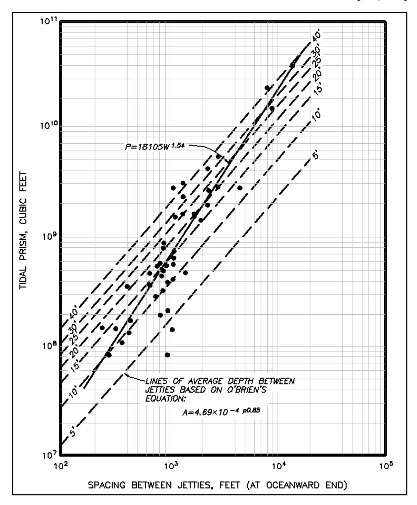

*Figure II-6-41. Tidal prism ( P ) versus jetty spacing ( W )*

- c. Inlet stability analysis.
- (1) Dean (1971) equated the expression for tidal prism, P = TVmAC/π to O'Brien's (1931) original tidal prism, inlet area relationship ( P = 5 ×104 $A_{c})$ and determined that for a tidal period of 44,640 sec, $V_{m}$ for the inlet is about 1 m/sec. In other words, 1 m/sec might be interpreted as a level of velocity necessary to maintain an equilibrium flow area. Therefore, as wave action supplies sand to the inlet channel and tends to
reduce the cross-sectional area, the inlet flow will scour out any depositions that reduce the channel cross section below its equilibrium value. This concept was first developed analytically by Escoffier (1940, 1977). He proposed a diagram for inlet stability analysis in which two curves are initially plotted. The first is the velocity versus the inlet's cross-sectional flow area $A_{c}.$ A single hydraulic stability curve represents changing inlet conditions when ocean tide parameters and bay and inlet plan geometry remain relatively fixed. As area approaches zero, velocity approaches zero due to increasing frictional forces, which are inversely proportional to channel area. As channel area increases, friction forces are reduced but, on the far right side of the curve, velocities decrease as the tidal prism has reached a maximum, and any area increases just decrease velocity as determined by the continuity equation. This curve can be constructed by calculating velocity $V_{m}$ by varying channel area $A_{c}.$ Vm can be determined by an analytical or numerical model, remembering that, if using Keulegan or King models, an average maximum velocity is determined. The continuity equation $V_{avg}$ A = $V_{m}$ Ac must be used to determine maximum velocity at the minimum cross section. The other curve plotted as $V_{E}$ is a stability criterion curve such as O'Brien and Jarrett's tidal prism versus cross-section area relationship. Escoffier (1940) originally proposed a constant critical velocity (e.g., 1 m/sec, which would plot as a straight horizontal line. If a P versus $A_{c}$ relationship is used, the appropriate equation (Table II-6-3) can be used to relate $V_{m}$ to tidal prism. The two curves are shown in Figure II-6-42. The possibilities of intersection of the two curves could possibly intersect at two locations or one location (a tangent), or there could be no intersection at all. In the first case, point b (see Figure II-6-42) is a stable root in that any deviation in area returns movement along the stability curve to its starting point. If channel area increases (move right on curve from point b) velocity will fall and more sediment can fill in the channel to bring it back to "equilibrium." If area decreases, velocity will increase scouring back to the equilibrium point. Point c is an unstable root, where if the area decreases, velocities decrease until the inlet closes. Moving to the right of point c, as velocity increases, area increases until the velocity starts falling and the stable root at point b is reached. If the stability curve falls tangent to or below the stability criterion curve, the inlet will close. Thus, if the inlet area is to the right of the unstable equilibrium point, and a storm occurs that provides a large sediment input to the inlet region, the inlet area could shift to the left of that point, and the inlet would close. van de Kreeke (1992) presents useful commentary on application of Escoffier's analysis where he notes that separation of stable and unstable inlets is not determined by the maximum in the maximum velocity curve (sometimes called the closure curve) of Figure II-6-42, but point c of that curve. Van de Kreeke emphasizes the integral use of O'Brien-type stability correlations with Esscofier's curve, rather than the use of stability equations alone.
- (2) Escoffier (1977) presented work similar to the above, except the Keulegan K value was determined for the abscissa of the plot in place of the area. For a given set of parameters for a particular inlet, $A_{c}$ is varied and K is determined to define the $V_{m}$ curve. Note: If King's curves are used, K is related to $K_{1}$ and $K_{2}$ by Equation II-6-11. Figure II-6-43 shows an example diagram. The $V_{E}$ curve then is determined by selecting an appropriate tidal-prism versus-area relationship and by determining $V_{max}$ for various A values .
- (3) A technique by O'Brien and Dean (1972) has also been used to calculate the stability of an inlet affected by deposition. The stability index ß is defined to represent the capacity of an inlet to resist closure under conditions of deposition. It incorporates a buffer storage area available in the inlet cross section, prior to deposition and includes the capability of the inlet to transport excess sand from its throat.

```math
\beta = \int_{a_C}^{a_E} (V_{\text{max}} - V_T)^3 dA_c \tag{II-6-33}
```

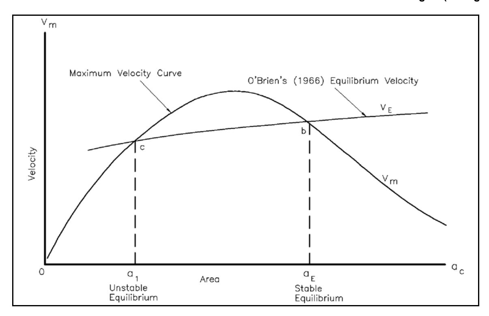

*Figure II-6-42. Escoffier (1940) diagram, maximum velocity and equilibrium velocity versus inlet cross sectional area*

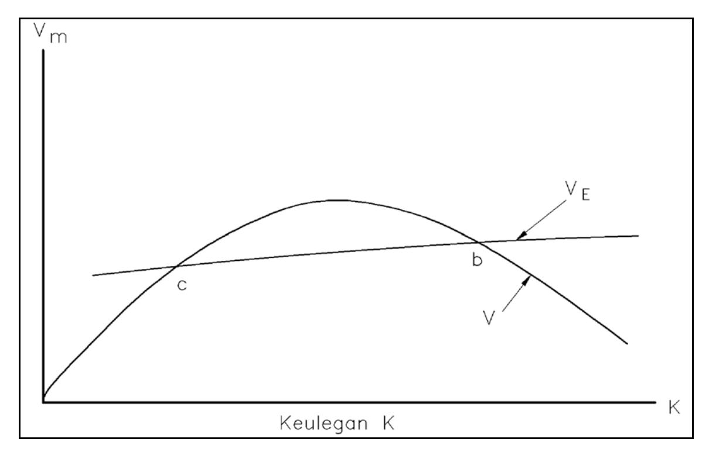

*Figure II-6-43. Another version of Escoffier's (1977) diagram, maximum velocity and equilibrium velocity versus Keulegan repletion coefficient K*

where
$ = stability index (units of $length^{5}/time^{3})$
- aE = equilibrium cross-sectional area of throat
- $V_{max}$ = maximum velocity in the throat
- VT = threshold velocity for sand transport
- ac = critical cross-sectional area (as from Figure II-6-42)
(4) Czerniak (1977) applied this technique successfully at Moriches Inlet, New York. Bruun and Gerritsen (1960) and Bruun, Mehta, and Jonsson (1978) developed an overall stability criteria for tidal inlets. They based their relationships on a ratio P/M, where P is the tidal prism and M is the total annual littoral drift (typical values for M and their determination are discussed in Part III). The stability of an inlet is rated good, fair, or poor as given in Table II-6-4.

**Table II-6-4. **

| P/Mtot | $ 150 | Conditions are relatively good, little bar and good flushing |  |
| --- | --- | --- | --- |
| 100 # | $P/M_{tot}$ # 150 | Conditions become less satisfactory, and offshore bar formation becomes pronounced | more |
| 50 # | $P/M_{tot}$ # 100 | Entrance bar may be rather large, but there is usually a channel through | the bar |
| 20 # | P/Mtot < 50 | All inlets are typical “bar-bypassers” |  |
| P/Mtot | # 20 | Descriptive of cases where the entrances become unstable “overflow than permanent inlets | channels” rather |

(5) Another aspect of inlet stability was discussed by Vincent, Corson, and Gingench (1991) in which inlet channel geographical location and horizontal topology were studied from aerial photography. They defined four stability indices, including minimum inlet width W , channel length L , change in geographical position N , and orientation variability of inlet channel E . Figure II-6-44 shows types of geographic channel instability. Figure II-6-45 shows the Little River Inlet, South Carolina, geographical variability. A stability limit was chosen so as to classify an inlet as stable or unstable. These limits were based on rate of change of width, length, position, and orientation. Records of 51 inlets over various time periods were examined and a change of 100 ft/month was selected as a reasonable arbitrary limit for stability in length and width of W and L . The 100-ft/month value was also selected as a divider between stable and unstable channel position. Most values examined were below the 100 ft/month rate.

### d. Scour hole problems.

- (1) Scour hole problems can occur at a variety of inlet locations and much remains to be understood about the mechanisms causing scour. Scour holes form as a result of the interaction of tidal currents, waves, wave-generated currents, sediment and adjacent structures (usually jetties). Scour holes have been observed at the tips of jetties, on the outside of the jetty trunk, and along the inner section of a jetty. Lillycrop and Hughes (1993) review scour problems at Corps projects.
- (2) Scour at jetty tips (Figure II-6-47) can be caused by flow separation during flood flow, when turbulent eddies are generated. Ebb currents traversing through this region of scour also might contribute

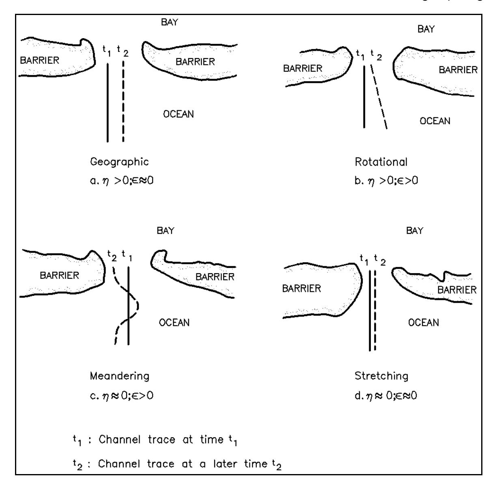

*Figure II-6-44. Examples of channel geographic instability*

to maintaining a scour hole if channelization in the shoreward portion of the inlet throat directs ebb currents toward the scour hole.
- (3) Scour along the inside of jetties can occur as the bathymetry of a newly constructed jetty system adjusts. Little River Inlet (Chasten and Seabergh 1992) had an initial scour hole that was a remnant of the construction process. After the conclusion of construction, scour increased in this area, but as the inlet adjusted, velocities in that scour region decreased. e. Methods to predict channel shoaling.
- (1) Introduction. Entrance channel infill rates can be calculated by a variety of methods (U.S. Army Corps of Engineers 1984). One method is presented to show the parameters involved. A method to determine entrance channel infill rates is called the "Oregon Inlet Method." It is an analytic/empirical approach documented in a U.S. Army Engineer District, Wilmington (1980) report concerning the dredging

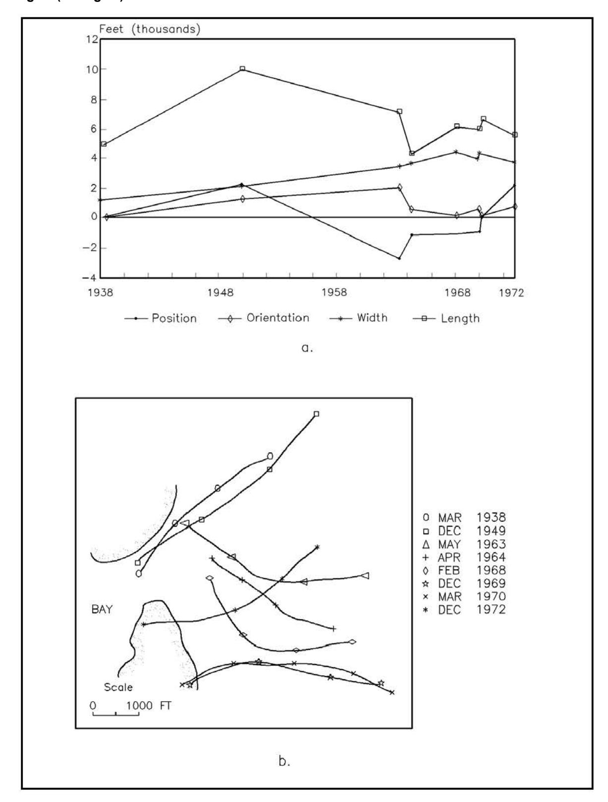

*Figure II-6-45. Little River Inlet geographical variability*

#### EXAMPLE PROBLEM II-6-5

#### FIND:

Using the information provided in Example Problem 1, find the potential stability of the proposed channel cross section. Remember the channel has vertical sheet-pile walls, so its cross section can only change in the vertical.

#### SOLUTION:

By varying the cross-sectional area of the channel $A_{C}$ , assuming that the channel width B remains constant and varying the channel depth d and recalculating the tidal prism as described above, the effect of channel area on the bay tidal prism can be evaluated and compared with the appropriate equation from Table II-6-3 (dual jettied inlets, $A_{C}$ = 7.489 × $10^{-4}$ p0.86). This is done graphically in Figure II-6-46, which shows a plot of P versus $A_{C}$ from the hydraulic response calculations and from the stability equation. The intersection of the two curves on the right side is the stable solution. It yields a channel cross-sectional area of 1,440 $m^{2}$ or a depth of 8 m. This shows that the 180-m by 3.7-m design channel would be unstable, with a strong tendency to erode.
Where the hydraulic response curve lies above the stability curve (as in the example) the tidal prism is too large for the inlet channel area and erosion will likely occur until a stable channel develops. If the hydraulic response curve crosses the stability curve twice, the lower point is an unstable equilibrium point from which the channel can either close or scour to the upper stability point. If the hydraulic response curve is substantially below the stability curve at all points, a stable inlet channel is unlikely to develop and the channel should eventually close.

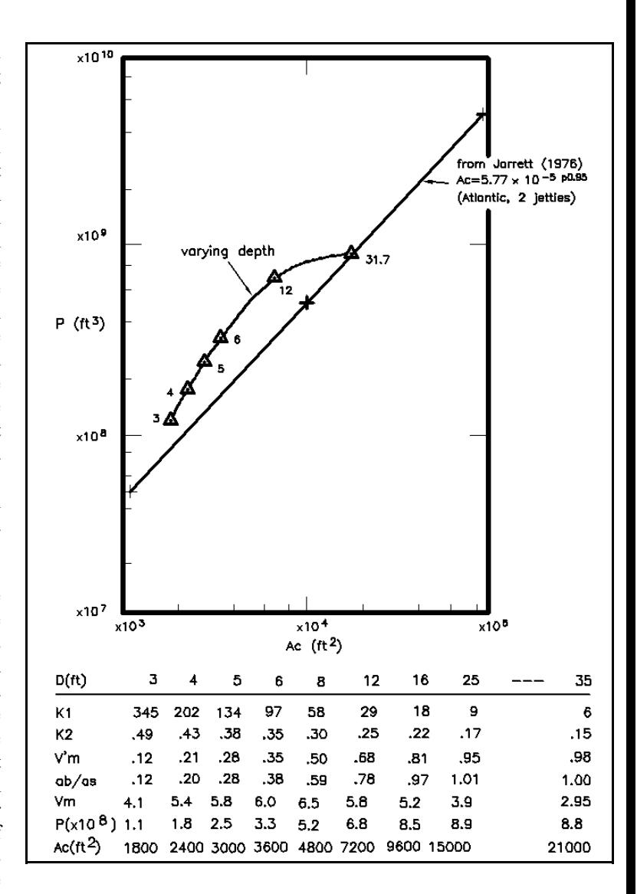

*Figure II-6-46. Example Problem II-6-4. Plot of P versus $A_{C}$ from the hydraulic response calculations and from the stability equation*

The stable inlet cross-sectional area depends on other factors (e.g., wave climate, monthly tidal range variations, surface runoff) besides the spring or diurnal tidal prism. As a result, the tidal prism-inlet area equations given in Table II-6-3 only serve as an indication of the approximate stable cross-sectional area. The analysis performed in the example demonstrates that the design channel is very likely to erode to a greater depth; however, that depth, which will fluctuate with time, can vary substantially from the indicated depth of 8 m.

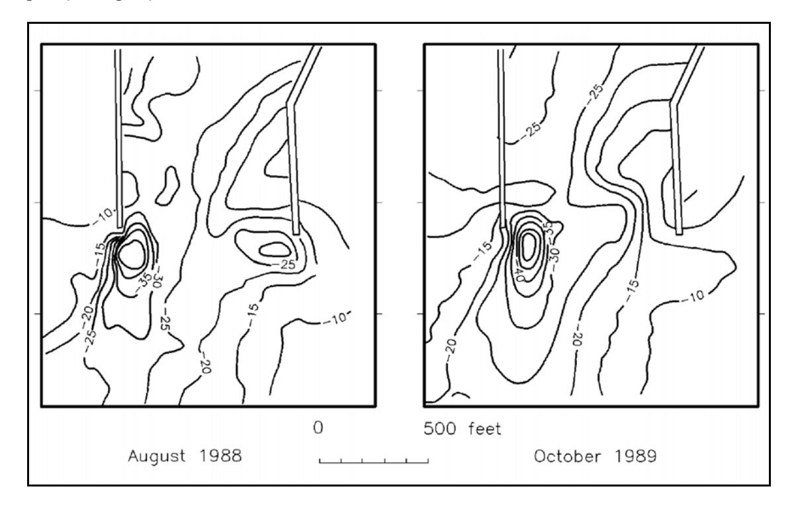

*Figure II-6-47. 1988 and 1989 bathymetry of Moriches Inlet*

of Oregon Inlet, North Carolina. It is based on the premise that the natural geometry of an inlet's ebb tide delta on the ocean bar results from the integrated effects of tidal currents, wave action, and associated sediment transport and deposition. Of particular importance is the natural elevation of the ocean bar, which represents both the limiting elevation of sediment accumulation resulting from the influx of littoral materials from adjacent shores and the level below which littoral sediments will collect if the ocean bar is dredged to provide a navigation channel. Sediment accumulation should increase with increasing channel depth until it becomes so deep that the channel traps all sediment crossing the inlet.
- (2) Procedure. In order to develop a day-by-day simulation of siltation processes and dredging effects, a procedure consisting of three main phases was developed. The phases are (a) daily littoral materials transport volumes, (b) channel sedimentation, and (c) regression analysis.
- (3) Phase I: Daily littoral materials transport volumes. It is assumed that the relative magnitude of alongshore sediment transport can be estimated simply on the basis of wave height squared in accordance with the relationship

```math
Q_i = Q_g \left( \frac{H_i^2}{\sum_{i=1}^n H_i^2} \right) \tag{II-6-34}
```

where
- i = number of the day during the year
- Qi = littoral transport occurring on day i $[L^{3}]$

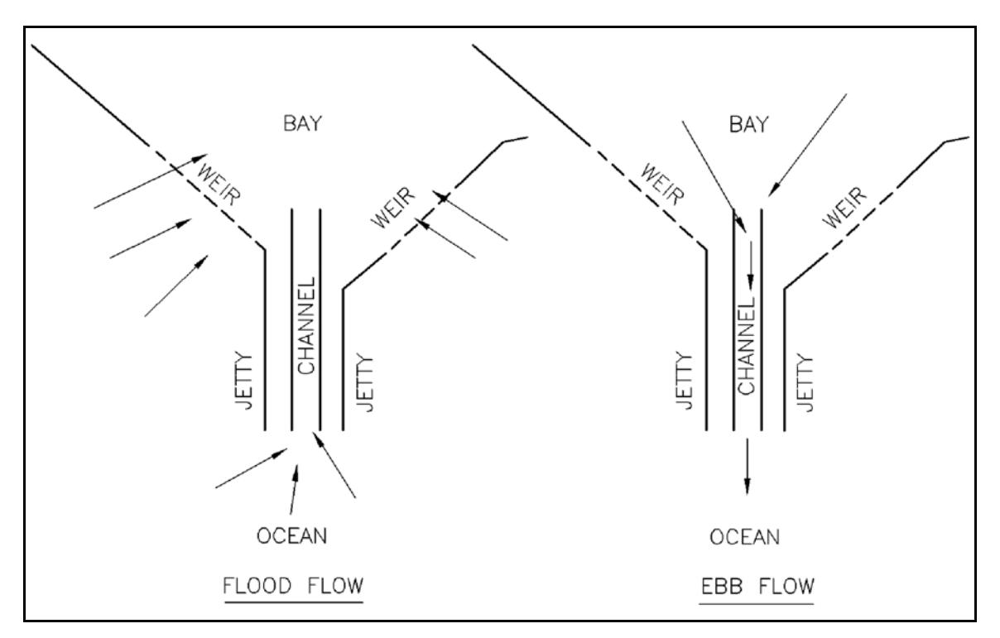

*Figure II-6-48. Weir jetty flow patterns*

- Qg = total volume of alongshore sediment transport to the inlet each year $[L^{3}]$
- Hi = average wave height for the $i^{th}$ day of the year [L]
- n = total number of days during the year [T]
(4) Phase II: Channel sedimentation. The first portion of the channel sedimentation procedure is

```math
\left(\frac{d_1}{d_2}\right)^{\frac{5}{2}} \tag{II-6-35}
```

where the transport ratio equals the ratio of the sediment transport potential in the dredged cut to the sediment transport on the bar before dredging and
- d1 = depth before dredging [L]
- d2 = depth after dredging [L]
On a daily basis, the amount of material that would be retained in the ocean bar channel of the inlet is given by:

```math
\text{Daily shoal volume} = C Q_{g} \left( \frac{H_{i}^{2}}{\sum_{i=1}^{n} H_{i}^{2}} \right) \left[ 1 - \left( \frac{d_{1}}{d_{2}} \right)^{\frac{5}{2}} \right] [L^3] \tag{II-6-36}
```

in which all terms have been previously defined except for " C ," which is termed the "potential shoaling factor." As stated previously, the quantity of material entering and depositing in the channel increases with the depth of the cut. However, until sufficient channel depth is attained to intercept all materials moving into the inlet, some material continues to bypass the inlet via the sloping face of the ocean bar below the bottom of the channel cut. Accordingly, C is defined as the portion of the total alongshore transport to the inlet entering the domain of the channel. In order to determine C , a regression analysis was conducted to correlate the inlet bar siltation with those factors judged to be most influential in the filling and flushing of such channels.
- (5) Phase III: Regression analysis. The following three factors were selected as dominant in influencing the magnitude of shoaling at a particular inlet site having a dredge-maintained ocean bar channel. These factors are described as follows:
- (a) Ebb tide flow is the primary factor acting to flush intrusive littoral materials from the inlet environment. Its influence in the analysis is represented by the symbol EΔT , which is the difference between the mean ebb tide flow energy flux across the ocean bar at its natural elevation and the mean ebb tide flow energy flux through the cross section of the excavated ocean bar navigation channel. It is assumed that the tidal discharge is not significantly altered from one condition to the other. A basic concept in the tidal energy flux difference is that the tidal flow velocities directed seaward over the ocean bar at its natural elevation, in combination with wave agitation, are rapid enough to prevent accumulation of sediments above the natural bar depth. If a section of the ocean bar is deepened by a navigation channel, the related average local flow velocity is diminished and sediment deposition is initiated.
- (b) Wave energy reaching the littoral zones adjacent to the inlet is the primary factor controlling the quantity of littoral material moving toward the inlet and, as such, determines the shoaling characteristics of an ocean bar navigation channel. In the analysis, the unrefracted wave energy flux per unit width of wave crest offshore of the area of interest, designated $E_{w}$ , is the basic measure of sediment transport toward the inlet.
- (c) The depth of an ocean bar channel determines the degree to which a channel will trap the littoral sediments entering the inlet environment. In the analysis, the amount of channel entrenchment, and hence the measure of sediment entrapment potential, is taken as the ratio $D_{R}$ of the depth of the channel to the depth at which the seaward slope of the ocean bar meets the sea bottom. Each of these depths is measured from the natural elevation of the ocean bar; therefore, the ratio $D_{R}$ represents the extent to which the ocean bar's seaward slope has been incised by the channel.
- (6) Normalized, independent filling index. The channel sedimentation potential increases or decreases as each of the three factors EΔT, Ew, and $D_{R}$ increases or decreases, respectively. The factors were combined as follows to establish a normalized, independent variable $F_{I}$ (filling index) for the regression analysis.

```math
F_{I} = \frac{(E_{\Delta T} \cdot E_{W} \cdot D_{R})}{10^{14}} \quad \left[\frac{ML^{2}}{T^{2}}\right] \tag{II-6-37}
```

The normalized, dependent variable selected for the analysis was the ratio of the volume of channel infill to the computed volume of the total alongshore sediment influx to the inlet multiplied by 100. This percentage value $V_{R}$ is referred to as the "volume ratio." The regression analysis was based on data from four dredgedmaintained inlets within the boundaries of the Wilmington District: Oregon, Beaufort, Masonboro, and Lockwoods Folly Inlets. Information available consisted of: (a) measured tidal discharges or inlet throat cross-sectional areas, which permitted tidal discharge computations by means of tidal prism-inlet area relations, (b) site wave statistics representing one or more years of wave gauge records, (c) detailed
alongshore sediment transport analyses for the shorelines adjacent to each of the inlets, and (d) one or more sets of inlet hydrographic surveys, each set consisting of two surveys taken at different times, thereby allowing measurement of the volume of sediment filling within the navigation channels in the time periods between surveys.
(7) Ebb tidal energy flux. For each inlet selected, the parameter EΔT , representing the change of ebb tidal energy flux across the ocean bar between natural and channel conditions, was computed and fixed as constant for the given inlet using the following equation:

```math
E_{\Delta T} = \frac{4T}{3\pi} q_{\text{max}}^3 \frac{d_2^2 - d_1^2}{d_1^2 d_2^2} \tag{II-6-38}
```

where
- T = tidal wave period [T]
- $q_{max}$ = maximum instantaneous ebb tide discharge per unit width $[L^{3}/T/L]$
- d2 = depth of navigation channel [L]
- d1 = natural depth of ocean bar [L]
The next parameter is $E_{w}$ , the average daily wave energy flux per unit width of wave crest, offshore of the site of interest. This parameter represents the intensity of sediment transport from the adjacent beaches to the inlet environment. Daily wave energy flux can be expressed as

```math
E_W = K \times 10^6 \ (H_0)^2 \ T \quad \left[\frac{ML^2}{T^2}\right] \tag{II-6-39}
```

where
- K = constant (K = 1.769 slugs/sec in English engineering units or 0.121 Kg/sec) [M/T]
- Ho = deepwater wave height equivalent to observed shallow-water wave, if unaffected by refraction and friction [L]
- T = wave period [T]
The last parameter is a depth ratio $D_{R},$ which is given as

```math
D _ { R } \ = \ { \frac { d _ { 2 } \ - \ d _ { 1 } } { d _ { 3 } \ - \ d _ { 1 } } } \tag{II-6-40}
```

where
d3 = water depth where seaward tip of ocean bar meets offshore sea bottom [L]
(8) Hoerls special function distribution. Tests of several regression equations and related curves revealed that the best fit of the data from the four inlets was attained by a "Hoerls" special function distribution, given in general form by:

```math
V_R = a F_I^b e^{cF} I \tag{II-6-41}
```

where a , b , and c are the best-fit coefficients. The regression equation was solved for filling index $F_{I}$ values corresponding to various channel depths, which allows for the proper " C " value to be used in the "daily shoal volume" equation developed in Phase II of this method.
- f. Inlet weir jetty hydraulic and sediment interaction. The subject of weir jetty design is dealt with in detail by Seabergh (1983) and Weggel (1981), who discuss several hydraulic and sedimentary aspects including flow over the weir and its elevation, location, length, jetty alignment and orientation, as well as the shoreward end of the weir. The function of the weir jetty is to ideally collect the net sediment movement behind the weir section, where it can then be handled in protected waters and bypassed. A sedimentation benefit may occur in that sediment-laden longshore currents are kept away from the channel. Also, the ebb currents may be hydraulically enhanced, as seen in Figure II-6-48, creating ebb dominance of channel currents, which can aid in flushing sediment seaward.
- (1) Weir location. With respect to tidal currents within the jetty system, the farther the weir is from the navigation channel, the less likely it is to capture channel ebb currents that are directed seaward. This can depend on the location of the predominant ebb channels and their orientation. Care must be taken in evaluation of ebb flow direction because once the jetty system is constructed, the channel orientation may change due to removal of wave effects and consequent sediment movement, which, for example, may have deflected the ebb channel downcoast.
- (2) Weir length. Primary transport over the weir exists at its intersection with the shoreline. If the wave climate is mild, the weir should only be as long as necessary to prevent a chance of closure, something that has not yet been noted to occur in existing weir jetty systems. The length to prevent closure would need to be evaluated based on wave conditions, beach slope, orientation of the structure, etc. (Weggel 1981). If the wave climate is highly variable, the weir should probably extend further oceanward so as to include a large percentage of the breaker zone since heavy transport over the weir will occur at the breaker location for larger wave conditions; otherwise, the sediment will move offshore along the jetty. Another factor influencing weir length will be consideration of the amount of flow that is desired in the system. If a design objective is to obtain high ebb dominance of flow in the navigation channel, then the weir should be longer, if this would not interfere with other constraints, such as placement of a portion of the weir too close to the channel. The complete hydraulic flow situation must be considered to determine whether the additional flow provided by a wider weir will substantially augment ebb flow predominance and provide additional scouring ability in the entrance channel (see Seabergh (1983)).

### II-6-4. References

### Amein and Kraus 1991

Amein, A., and Kraus, N. C. 1991. "DYNLET1: Dynamic Implicit Numerical Model of One-Dimensional Tidal Flow Thought Inlets," Technical Report CERC-91-10, U.S. Army Engineer Waterways Experiment Station, Vicksburg, MS.

### Aubrey 1986

Aubrey, D. G. 1986. Hydrodynamic Controls on Sediment Transport in Well-mixed Bays and Estuaries," J. van de Kreeke, ed., Physics of Shallow Estuaries and Bays , Springer-Verlag, New York.

### Aubrey and Friedrichs 1988

Aubrey, D. G., and Friedrichs, C. T. 1988. "Seasonal Climatology of Tidal Non-Linearities on a Shallow Estuary," Lecture Notes on Coastal and Estuarine Studies, Vol 29, D. G. Aubrey and L. Weishar, eds., Springer-Verlag, New York.

### Boer 1985

Boer, S. 1985. "The Flow Across Trenches at Oblique Angles to the Flow," Report 5490 Delft Hydraulics Laboratory, Delft, The Netherlands.

### Boon 1988

Boon, J. D. 1988. "Temporal Varication of Shallow Water Tides in Basin-Inlet Systems," Lecture Notes on Coastal and Estuarine Studies, Vol 29, D. G. Aubrey and L. Weishar, eds., Hydrodynamics and Sediment Dynamics of Tidal Inlets , Springer-Verlag, New York.

### Boon and Byrne 1981

Boon, J. D., and Byrne, R. J. 1981. "On Basin Hypsometry and the Morphodynamic Response of Coastal Inlet Systems," Marine Geology , Vol 40, pp 27-48.

### Bottin 1978

Bottin, R. R. 1978. "Design for Harbor Entrance Improvements, Wells Harbor, Maine, Hydraulic Model Investigation," Technical Report H-78-18, U.S. Army Engineer Waterways Experiment Station, Vicksburg, MS.

## Bottin 1982

Bottin, R. R. 1982. "Design for the Prevention of Shoaling, Flood Control, and Wave Protection, Rogue River, Oregon, Hydraulic Model Investigation," Technical Report HL-82-18, U.S. Army Engineer Waterways Experiment Station, Vicksburg, MS.

### Brown 1928

Brown, E. I. 1928. "Inlets on Sandy Coasts," Proceedings of the American Society of Civil Engineers , Vol 54, Part I, pp 505-523.

# Bruun 1967

Bruun, P. 1967. "Tidal Inlets Housekeeping," Journal of the Hydraulic Division , American Society of Civil Engineers, Vol 93, pp 167-184.

### Bruun and Gerritsen 1960

Bruun, P., and Gerritsen, F. 1960. Stability of Coastal Inlets , North Holland Publishing Co., Amsterdam, The Netherlands.

### Bruun, Mehta, and Jonsson 1978

Bruun, P., Mehta, A. J., and Jonsson, I. G. 1978. Stability of Tidal Inlets: Theory and Engineering , Elsevier Scientific Publishing Co., Amsterdam, The Netherlands.

### Butler 1980

Butler, H. L. 1980. "Evolution of a Numerical Model for Simulating Long-Period Wave Behavior in Ocean Estuarine Systems," Estuarine and Wetland Processes: With Emphasis on Modeling; Marine Science, Vol 11, Plenum Press, New York.

### Byrne, DeAlteris, and Bullock 1974

Byrne, R. J., DeAlteris, J. R., and Bullock, P. A. 1974. "Channel Stability in Tidal Inlets: A Case Study," Proceedings, 14th Coastal Engineering Conference , American Society of Civil Engineers, New York, pp 1585-1604.

### Byrne, Gammisch and Thomas 1980

Byrne, R. J., Gammisch, R. A., and Thomas, G. R. 1980. "Tidal Prism-Inlet Area Relations for Small Tidal Inlets," Proceedings of the Seventeenth Coastal Engineering Conference , American Society of Civil Engineers, Sydney, Australia, Vol III, Ch 151, pp 23-28.

### Chasten and Seabergh 1992

Chasten, M. A., and Seabergh, W. C. 1992. "Engineering Assessment of Hydrodynamics and Jetty Scour at Little River Inlet North and South Carolina," Miscellaneous Paper CERC-92-10, U.S. Army Engineer Waterways Experiment Station, Vicksburg, MS.

# Chow 1959

Chow, V. T. 1959. The Open-Channel Hydraulics , McGraw-Hill Book Company, New York.

### Cialone et al. 1991

Cialone, M. A., Mark, D. J., Chou, L. W., Leenknecht, D. A., Davis, J. A., Lillycrop. L. S., Jensen, R. E., Thompson, E., Gravens, M. B., Rosati, J. D., Wise, R. A., Kraus, N. C., and Larson, P. M. 1991. "Coastal Modeling System (CMS) User's Manual," Instruction Report CERC-91-1, U.S. Army Engineer Waterways Experiment Station, Vicksburg, MS.

### Costa and Isaacs 1977

Costa, S. L., and Isaacs, J. D. 1977. "The Modification of Sand Transport in Tidal Inlet Inlets," Coastal Sediments 77, Fifth Symposium of the Waterway, Port Coastal and Ocean Division, American Society of Civil Engineers, Nov 2-4, Charleston, SC.

### Czerniak 1977

Czerniak, M. T. 1977. "Inlet Interaction and Stability Theory Verification," Coastal Sediments 77 , American Society of Civil Engineers, Charleston, SC.

### Dean 1971

Dean, R. G. 1971. "Hydraulics of Inlets," COEL/UFL-71/019, Department of Coastal and Oceanographic Engineering, University of Florida, Gainsville.

### DiLorenzo 1988

DiLorenzo, J. L. 1988. "The Overtide and Filtering Response of Small Inlet/Bay Systems," Lecture Notes on Coastal and Estuarine Studies, Vol 29, D. G. Aubrey and L. Weishar, eds., Springer-Verlag, New York.

### Dyer and Taylor 1973

Dyer, K. R., and Taylor, P. A. 1973. "A Simple Segmented Prism Model of Tidal Mixing in Well-Mixed Estuaries," Estuarine and Coastal Marine Science , Vol 1, pp 411-418.

### Escoffier 1940

Escoffier, F. F. 1940. "The Stability of Tidal Inlets," Shore and Beach , Vol 8, No. 4, pp 114-115.

### Escoffier 1977

Escoffier, F. F. 1977. "Hydraulics and Stability of Tidal Inlets," GITI Report 13, U.S. Army Engineer Waterways Experiment Station, Vicksburg, MS.

### Escoffier and Walton 1979

Escoffier, F. F., and Walton, T. L. 1979. "Inlet Stability Solutions for Tributary Inflow," Journal of the Waterway, Port, Coastal and Ocean Division , American Society of Civil Engineers, Vol 105, No. WW4, Proc. Paper 14964, pp 341-355.

### Fischer, List, Koh, Imberger and Brooks 1979

Fischer, H. B., List, E. J., Koh, R. C. Y., Imberger, J., and Brooks, N. H. 1979. Mixing in Inland and Coastal Waters , Academic Press, New York.

### French 1960

French, J. L. 1960. "Tidal Flow in Entrances," Technical Bulletin No. 3, U.S. Army Engineer Waterways Experiment Station, Committee on Tidal Hydraulics, Vicksburg, MS.

### Friedrichs and Aubrey 1988

Friedrichs, C. T., and Aubrey, D. G. 1988. "Non-Linear Tidal Distortion in Shallow Well-Mixed Estuaries: A Synthesis," Estuarine, Coastal and Shelf Science , Vol 27, pp 521-545.

### Friedrichs, Lynch, and Aubrey 1992

Friedrichs, C. T., Lynch, D. R., and Aubrey, D. G. 1992. "Velocity Asymmetries in Frictionally Dominated Tidal Embayments: Longitudinal and Lateral Variability," Dynamics and Exchanges in Estuaries and the Coastal Zone, Coastal and Estuarine Studies , D. Prandle, ed., American Geophysical Union, Washington, DC, Vol 40, pp 277-312.

### Galvin 1971

Galvin, C. J., Jr. 1971. "Wave Climate and Coastal Processes," Water Environments and Human Needs , A. T. Ippen, ed., M.I.T. Parsons Laboratory for Water Resources and Hydrodynamics, Cambridge, MA, pp 48-78.

### Geyer and Signell 1992

Geyer, W. R., and Signell, R. P. 1992. "A Reassessment of the Role of Tidal Dispersion in Estuaries and Bays," Estuaries , Vol 15, pp 97-108.

### Harris and Bodine 1977

Harris, D. L., and Bodine, B. R. 1977. "Comparison of Numerical and Physical Hydraulic Models, Masonboro Inlet, North Carolina," GITI Report 6, U.S. Army Engineer Waterways Experiment Station, Vicksburg, MS.

### Hayes 1971

Hayes, M. O. 1971. "Lecture Notes for Course on Inlet Mechanics and Design (unpublished)," 10-20 May 1971, Ft. Belvoir, VA, Coastal Engineering Research Center.

## Hayes 1980

Hayes, M. O. 1980. "General Morphology and Sediment Patterns in Tidal Inlets," Sedimentary Geology , Vol 26, pp 139-156.

### Herchenroder 1981

Herchenroder, B. E. 1981. "Effects of Currents on Waves," Coastal Engineering Technical Aid No. 81-14, October 1981, U.S. Army Engineer Waterways Experiment Station, Vicksburg, MS.

### Ismail and Wiegel 1983

Ismail, N. M., and Wiegel, R. L. 1983. "Opposing Wave Effect on Momentum Jet Spreading Rate," Journal of the Waterway Port, Coastal and Ocean Division , American Society of Civil Engineers, Vol 109, No. WW4, pp 465-487.

### Jarrett 1975

Jarrett, J. T. 1975. "Analyses of the Hydraulic Characteristics of Tidal Inlets," Unpublished memorandum for record, U.S. Army Engineer Waterways Experiment Station, Vicksburg, MS.

## Jarrett 1976

Jarrett, J. T. 1976. "Tidal Prism-Inlet Area Relationships, GITI Report 3, U.S. Army Engineer Waterways Experiment Station, Vicksburg, MS.

### Jonsson, Skovgaard, and Wang 1970

Jonsson, I. G., Skovgaard, C., and Wang, J. D. 1970. "Interaction Between Waves and Currents," Proceedings of the 12th Conference on Coastal Engineering, American Society of Civil Engineers, Vol 1, pp 489-509.

# Joshi 1982

Joshi, P. B. 1982. "Hydromechanics of Tidal Jets," Journal of the Waterway, Port, Coastal and Ocean Division , American Society of Civil Engineers, Vol 108, No. WW3, Proc. Paper 17294, pp 239-253.

## Joshi and Taylor 1983

Joshi, P. B., and Taylor, R. B. 1983. "Circulation Induced by Tidal Jets," Journal of the Waterway, Port, Coastal and Ocean Division , American Society of Civil Engineers, Vol 109, No. WW4.

### Keulegan 1951

Keulegan, G. H. 1951. "Third Progress Report on Tidal Flow in Entrances, Water Level Fluctuations of Basins in Communication with Seas," Report No. 1146, National Bureau of Standards, Washington, DC.

### Keulegan 1967

Keulegan, G. H. 1967. "Tidal Flow in Entrances Water-Level Fluctuations of Basins in Communications with Seas," Technical Bulletin No. 14, Committee on Tidal Hydraulics, U.S. Army Engineer Waterways Experiment Station, Vicksburg, MS.

## King 1974

King, D. B. 1974. "The Dynamics of Inlets and Bays," Technical Report No. 2, Coastal and Oceanographic Engineering Laboratory, University of Florida, Gainesville.

### Leenknecht, Szuwalski, and Sherlock 1992

Leenknecht, D. A., Szuwalski, A., and Sherlock, A. R. 1992. "Automated Coastal Engineering System User Guide and Technical Reference, Version 1.07," U.S. Army Engineer Waterways Experiment Station, Vicksburg, MS.

### Lillycrop and Hughes 1993

Lillycrop, W. J., and Hughes, S. A. 1993. "Scour Hole Problems Experienced by the Corps of Engineers; Data Presentation and Summary," Miscellaneous Paper CERC-93-2, U.S. Army Engineer Waterways Experiment Station, Vicksburg, MS.

### Mason 1975

Mason, C. 1975. "Tidal Inlet Repletion Coefficient Variability," unpublished report, copy available at Coastal and Hydraulics Laboratory, U.S. Army Engineer Waterways Experiment Station, Vicksburg, MS.

### Mayor-Mora 1973

Mayor-Mora, R. E. 1973. "Hydraulics of Tidal Inlets on Sandy Coasts," HEL-24-16, Hydraulic Engineering Laboratory, University of California, Berkeley.

## Mehta 1990

Mehta, A. J. 1990. "Significance of Bay Superelevation in Measurement of Sea Level Change," Journal of Coastal Research , Vol 6, No. 4, pp 801-813.

### Mehta and Joshi 1984

Mehta, A. J., and Joshi, P. B. 1984. "Review of Tidal Inlet Hydraulics UFL/COBL - TR/054," Coastal and Oceanographic Engineering Department, University of Florida, Gainsville.

## Mehta and Özsöy 1978

Mehta, A. J., and Özsöy, E. 1978. "Inlet Hydraulics," Stability of Tidal Inlets: Theory and Engineering , P. Bruun, Elsevier Scientific Publishing Co., Amsterdam, The Netherlands, pp 83-161.

### Mota Oliveira 1970

Mota Oliveira, I. B. 1970. "Natural Flushing Ability in Tidal Inlets," Proceedings of the Twelfth Coastal Engineering Conference , American Society of Civil Engineers, Washington, DC, Vol 3, Ch. 111, pp 1827- 1845.

# O'Brien 1931

O'Brien, M. P. 1931. "Estuary Tidal Prisms Related to Entrance Areas," Civil Engineering , pp 738-739.

### O'Brien 1969

O'Brien, M. P. 1969. "Equilibrium Flow Areas of Inlets on Sandy Coasts," Journal of the Waterways and Harbors Division , American Society of Civil Engineers, No. WWI, pp 43-52.

### O'Brien and Clark 1974

O'Brien, M. P., and Clark, R. R. 1974. "Hydraulic Constants of Tidal Entrances," Proceedings of the Fourteenth Coastal Engineering Conference , American Society of Civil Engineers, Copenhagen, Denmark, Vol 2, Ch. 90, pp 1546-1565.

### O'Brien and Dean 1972

O'Brien, M. L., and Dean, R. G. 1972. "Hydraulics and Sedimentary Stability of Coastal Inlets," Proceedings of the Thirteenth Coastal Engineering Conference, American Society of Civil Engineers, Vancouver, Canada.

# Özsöy 1977

Özsöy, E. 1977. "Flow and Mass Transport in the Vicinity of Tidal Inlets," Technical Report No. TR-036, Coastal and Oceanographic Engineering Laboratory, University of Florida, Gainesville.

### Özsöy and Ünlüata 1982

Özsöy, E., and Ünlüata, E. 1982. "Ebb-Tidal Flow Characteristics Near Inlets," Estuarine, Coastal and Shelf Science , Vol 14, No. 3, pp 251-263.

### Seabergh 1975

Seabergh, W. C. 1975. "Improvement for Masonboro Inlet, North Carolina, Hydraulic Model Investigation, Vols I and II," Technical Report H-76-4, U.S. Army Engineer Waterways Experiment Station, Vicksburg, MS.

### Seabergh 1983

Seabergh, W. C. 1983. "Weir Jetty Performance: Hydraulic and Sedimentary Considerations, Hydraulic Model Investigation," Technical Report HL-83-5, U.S. Army Engineer Waterways Experiment Station, Vicksburg, MS.

### Seabergh and Lane 1977

Seabergh, W. C., and Lane, E. F. 1977. "Improvements for Little River Inlet, South Carolina, Hydraulic Model Investigation," Technical Report H-77-21, U.S. Army Engineer Waterways Experiment Station, Vicksburg, MS.

### Seabergh and McCoy 1982

Seabergh, W. C., and McCoy, J. W. 1982. "Design for Prevention of Shoaling at Little Lake Harbor, Michigan, Hydraulic Model Investigation," Technical Report HL-82-16, U.S. Army Engineer Waterways Experiment Station, Vicksburg, MS.

### Seelig and Sorensen 1977

Seelig, W. N., and Sorensen, R. M. 1977. "Hydraulics of Great Lakes Inlets," Technical Paper No. 77-8, U.S. Army Engineer Waterways Experiment Station, Vicksburg, MS.

### Shemdin and Forney 1970

Shemdin, O. H., and Forney, R. M. 1970. "Tidal Motion in Bays," Proceedings of the Twelfth Coastal Engineering Conference , American Society of Civil Engineers, Washington, DC, Vol 3, Ch. 134, pp 2225- 2242.

### Smith 1977

Smith, N. P. 1977. "Meteorological and Tidal Exchanges Between Corpus Christi Bay, Texas, and Northwestern Gulf of Mexico," Estuarine and Coastal Marine Science , Vol 5, pp 511-520.

### Smith 1991

Smith, J. B. 1991. "Morphodynamics and Stratigraphy of Essex River Ebb-Tidal Delta: Massachusetts," Technical Report CERC-91-11, U.S. Army Engineer Waterways Experiment Station, Vicksburg, MS.

### Sorensen 1977

Sorensen, R. M. 1977. "Procedures for Preliminary Analysis of Tidal Inlet Hydraulics and Stability," Coastal Engineering Technical Aid 77-8, U.S. Army Engineer Waterways Experiment Station, Vicksburg, MS.

### Sorensen 1980

Sorensen, R. M. 1980. "The Corps of Engineer's General Investigation of Tidal Inlets," Proceedings of the Seventeenth Coastal Engineering Conference , American Society of Civil Engineers, Sydney, Australia, Vol III, Ch. 154, pp 2565-2580.

### Sorensen and Seelig 1976

Sorensen, R. M., and Seelig, W. N. 1976. "Hydraulics of Great Lakes Inlet-Harbor Systems," Proceedings of the Fifteenth Coastal Engineering Conference , American Society of Civil Engineers, Honolulu, HI, Vol 2, Ch. 96, pp 1646-1665.

### Speer and Aubrey 1985

Speer, P. E., and Aubrey, D. G. 1985. "A Study of Non-Linear Tidal Propagation in Shallow Inlet/Estuarine Systems; Part II: Theory," Estuarine, Coastal and Shelf Science , Vol 21, pp 207-224.

### Taylor and Dean 1974

Taylor, R. B., and Dean, R. G. 1974. "Exchange Characteristics of Tidal Inlets," Proceedings of the Fourteenth Coastal Engineering Conference , American Society of Civil Engineers, Copenhagen, Denmark, Vol 3, Ch. 132, pp 2268-2289.

### U. S. Army Corps of Engineers 1984

U.S. Army Corps of Engineers. 1984. "Entrance Channel Infill Rates," Engineer Technical Letter No. 1110-2-293, March 1984, Washington, DC.

### U. S. Army Engineer District, Wilmington 1980

U.S. Army Engineer District, Wilmington. 1980. "Manteo (Shallowbag) Bay, North Carolina," General Design Memorandum, Phase II, Appendix 5, Wilmington, NC.

### Ünlüata and Özsöy 1977

Ünlüata, U. A., and Özsöy, E. 1977. "Tidal Jet Flows Near Inlets," Proceedings of the Hydraulics in the Coastal Zone Conference , American Society of Civil Engineers, Texas A&M University, College Station, TX, pp 90-98.

### van de Kreeke 1967

van de Kreeke, J. 1967. "Water Level Fluctuations and Flows in Tidal Inlets," Journal of the Waterways, Harbors and Coastal Engineering Division , American Society of Civil Engineers, Vol 93, No. WW4, Proc. Paper 5575, pp 97-106.

# van de Kreeke 1976

van de Kreeke, J. 1976. "Increasing the Mean Current in Coastal Channels." Journal of the Waterways Harbors and Coastal Engineering Division , American Society of Civil Engineers, Vol 102, No. WW2, pp 222-234.

### van de Kreeke 1978

van de Kreeke, J. 1978. "Mass Transport in a Coastal Channel, Marco River, Florida," Estuarine and Coastal Marine Science, No. 7, pp 203-214.

### van de Kreeke 1983

van de Kreeke, J. 1983. "Residence Time: Application to Small Boat Basins," Journal of Waterway, Port, Coastal and Ocean Engineering , American Society of Civil Engineers, Vol 109, pp 416-428.

### van de Kreeke 1988

van de Kreeke, J. 1988. "Hydrodynamics of Tidal Inlets," Lecture Notes on Coastal and Estuarine Studies, Vol 29, Hydrodynamic and Sediment Dynamics of Tidal Inlets, Springer-Verlag, New York, pp 1-23.

### Vincent and Corson 1980

Vincent, C. L., and Corson, W. D. 1980. "The Geometry of Selected US Tidal Inlets," GITI Report 20, U.S. Army Corps of Engineers, Washington, DC.

### Vincent and Corson 1981

Vincent, C. L., and Corson, W. D. 1981. "Geometry of Tidal Inlets: Empirical Equations," Journal of the Waterway, Port, Coastal and Ocean Division , American Society of Civil Engineers, Vol 107, No. WW1, Proc. Paper 16032, pp 1-9.

### Vincent, Corson, and Gingerich 1991

Vincent, C. L., Corson, W. D., and Gingerich, K. J. 1991. "Stability of Selected United States Tidal Inlets," General Investigation of Tidal Inlets (GITI) Report 21, U.S. Army Engineer Waterways Experiment Station, Vicksburg, MS.

### Walton and Escoffier 1981

Walton, T. L., and Escoffier, F. F. 1981. "Linearized Solution to Inlet Equation with Inertia," Journal of the Waterway, Port, Coastal and Ocean Division , Paper 16414, Vol 105, No. WW4, pp 191-195.

### Ward 1982

Ward, G. H., Jr. 1982. "Pass Cavallo, Texas: Case Study of Tidal-Prism Capture, Journal of the Waterway Port Coastal and Ocean Division , American Society of Civil Engineers, Vol 108, No. WW4, pp 513-525.

## Watson and Behrens 1976

Watson, R. L., and Behrens, E. W. 1976. "Hydraulics and Dynamics of New Corpus Christi Pass, Texas: A Case History, 1973-1975," GITI Report 9, U.S. Army Engineer Waterways Experiment Station, Vicksburg, MS.

## Weggel 1981

Weggel, J. R. 1981. "Weir Sand-Bypassing Systems," Special Report No. 8 , U.S. Army Engineer Waterways Experiment Station, Vicksburg, MS.

### Wicker 1965

Wicker, C. F., ed. 1965. "Evaluation of Present State of Knowledge of Factors Affecting Tidal Hydraulics and Related Phenomena," Committee on Tidal Hydraulics, Report No. 3, U.S. Army Corps of Engineers, Washington, DC.

### Zimmerman 1988

Zimmerman, J. T. F. 1988. "Estuarine Residence Times," Hydrodynamics of Estuaries ; Vol 1: Estuarine Physics, B. Kjerfve, ed., CRC Press, Boca Raton, FL, pp 75-84.

## II-6-5. Definitions of Symbols

| Symbol | Definition |
|---|---|
| β | Stability index of an inlet (Equation II-6-33) $[length^{5}/time^{3}]$ |
| Δ | Bay superelevation (Equations II-6-20 and II-6-21) [length] |
| ε | Fraction of new water entering the bay from the sea each tidal cycle [dimensionless] |
| ε | Phase lag between sea tide and bay tide [deg] |
| θ | Angle wave orthogonal makes with current entering an inlet [deg] |
| μ | Friction factor |
| ξ | Dimensionless distance offshore parameter |
| τ | r Residence time (Equation II-6-28) |
| a | 0 Ocean tide amplitude (one-half the ocean tide range) [length] |
| A | Average area over a channel length $[length^{2}]$ |
| avg |  |
| a | b Bay tide amplitude (one-half the bay tide range) [length] |
| A | Surface area of a bay or basin $[length^{2}]$ |
| b |  |
| a | Critical cross-sectional area $[length^{2}]$ |
| c |  |
| A | Channel cross-sectional flow area of an inlet $[length^{2}]$ |
| c |  |
| a | Equilibrium cross-sectional area of inlet throat $[length^{2}]$ |
| E |  |
| A | Cross-sectional area of an inlet at the minimum inlet width $[length^{2}]$ |
| mw |  |
| B | Channel width between jetties [length] |
| C | Potential shoaling factor (Equation II-6-36) |
| d | Mean water depth in channel [length] |
| D | Depth of water at current meter location [length] |
| d | 1 , d 2 , d 3 Natural depth of ocean bar, depth of navigation channel, and water depth where seaward tip of ocean bar meets offshore sea bottom [length] |
| d | b Average bay depth [length] |
| D | R Ratio of depth of the channel to the depth at which the seaward slope of the ocean bar meets the sea bottom (Equation II-6-40) |
| d | T Channel depth [length] |
| E | Δ T Difference between the mean ebb tide flow energy flux across the ocean bar at its natural elevation and the mean ebb tide flow energy flux through the cross section of the excavated ocean bar navigation channel (Equation II-6-38) |
| E | W Average daily wave energy flux per unit width of wave crest, offshore of the site of interest (Equation II-6-39) |
| f | Darcy - Weisbach friction term |
| f | Dimensionless parameter that is a function of the hydraulic radius R and Manning’s roughness coefficient n (Equation II-6-16) |
| F | Inlet impedance (Equation II-6-17) [dimensionless] |
| F | I Filling index (Equation II-6-37) |
| g | Gravitational acceleration $[length/time^{2}]$ |
| h | Inlet channel water surface elevation [length] |
| H | A Wave height entering inlet [length] |
| H | i Average wave height for the $i^{th}$ day of the year [length] |
| K | Keulegan repletion coefficient [dimensionless] |
| K | Keulegan’s dimensionless coefficient of repletion or filling (Equation II-6-4) |
| K | 1 , K 2 King’s inlet friction coefficient (Equation II-6-6) and King’s inlet frequency coefficient (Equation II-6-7) [dimensionless] |
| k | en , k ex Inlet entrance and exit energy loss coefficient [dimensionless] |
| L | Inlet length [length] |
| L | b Distance from a inlet to the farthest pint in the bay [length] |
| L | mw Oceanside inlet channel length [length] |
| m | Bank slope [length-rise/length-run] |
| M | Total annual littoral drift $[length^{3}/year]$ |
| n | Manning’s roughness coeeficient |
| n | Total number of days during the year |
| P | Tidal prism filling the bay (Equation II-6-12) $[length^{3}]$ |
| Q | Inlet discharge $[length^{3}/time]$ |
| Q | Total volume of alongshore sediment transport to the inlet each year $[length^{3}]$ |
| g |  |
| Q | i Littoral transport occurring on day i (Equation II-6-34) $[length^{3}]$ |
| q | Maximum instantaneous ebb tide discharge per unit width $[length^{3}/time-length]$ |
| max |  |
| Q | River or freshwater inflow to a bay $[length^{3}/time]$ |
| r |  |
| Q | r ! King’s dimensionless variable (Equation II-6-19) |
| Hydrodynamics | of Tidal Inlets II-6-71 |
| R | Inlet hydraulic radius [length] |
| R | H Inlet current wave height factor (Figure II-6-34) [dimensionless] |
| T | Tidal period [time] |
| t | i Duration of inflow [time] |
| U | max f ,U max e Maximum channel flood and ebb velocity [length/time] |
| U | ! max f ,U ! max e Dimensionless maximum channel flood and ebb velocity |
| V | Inlet channel velocity [length/time] |
| V | avg Maximum velocity averaged over entire inlet cross section [length/time] |
| V | m Maximum cross-sectionally averaged velocity during a tidal cycle [length/time] |
| V | max Maximum velocity in the inlet throat [length/time] |
| V | meas Point measurement of maximum velocity [length/time] |
| V | R Hoerls special function distribution (Equation II-6-41) |
| V | T Threshold velocity for sand transport [length/time] |
| V | ! m King’s dimensionless velocity (Equation II-6-5) |
| W | Channel width corresponding to mean water depth in channel [length] |
