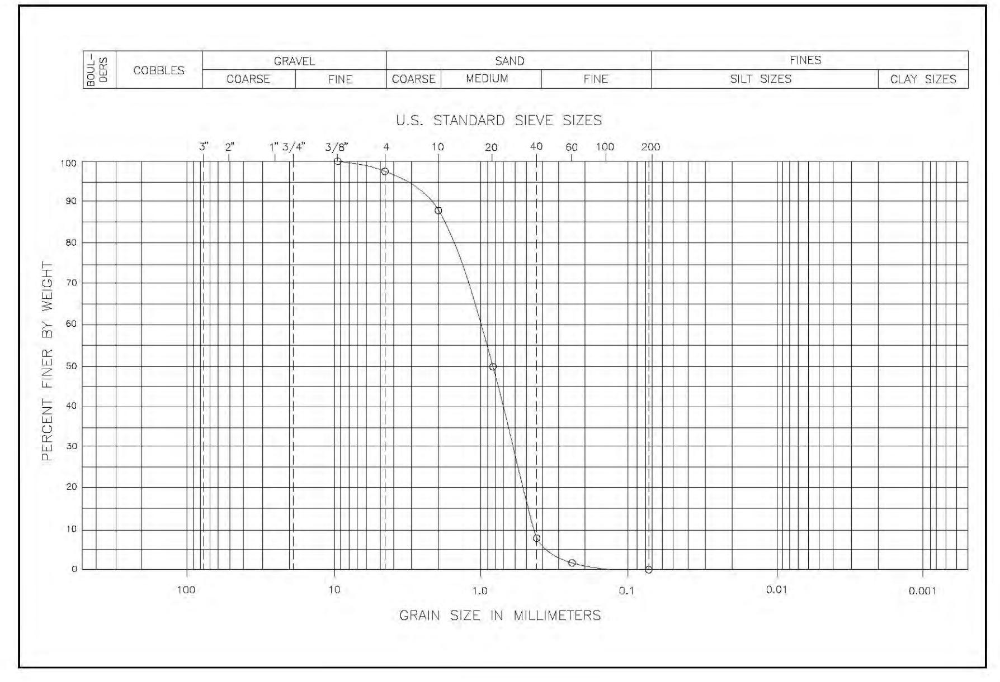
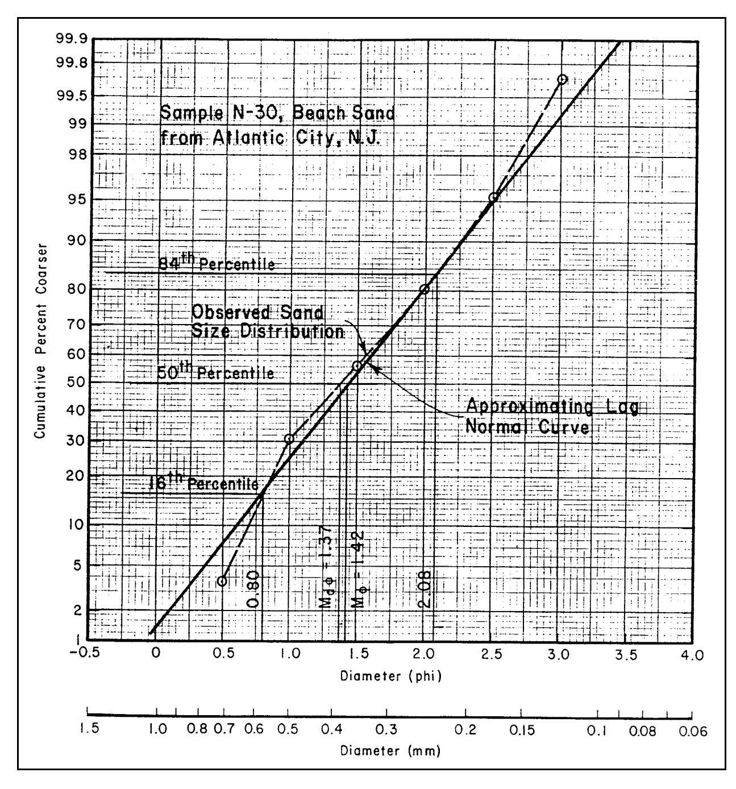
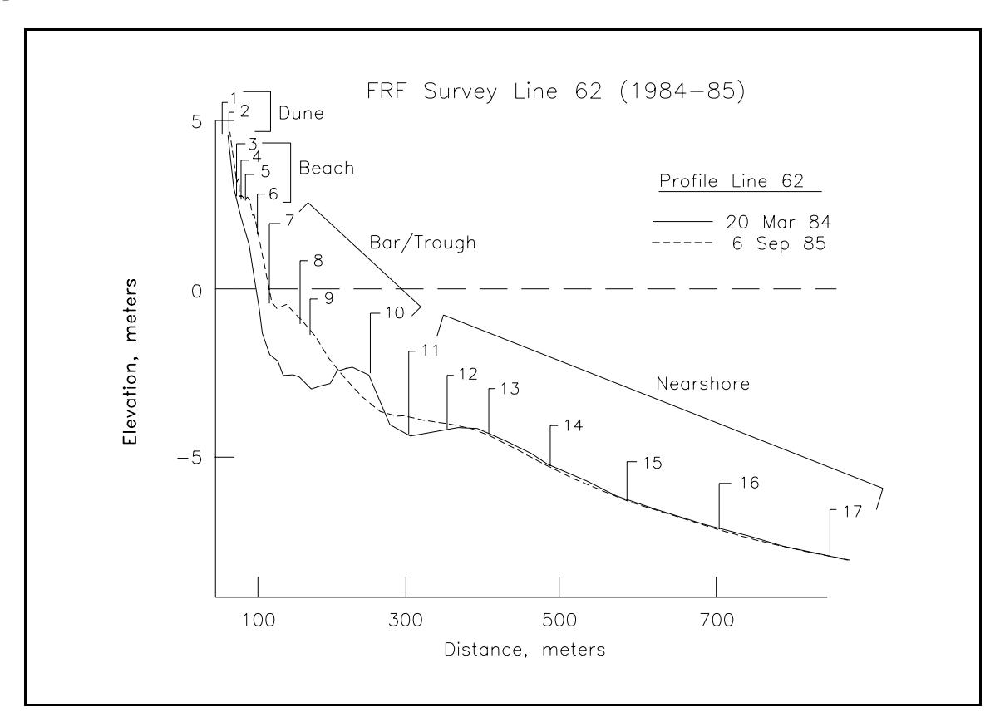
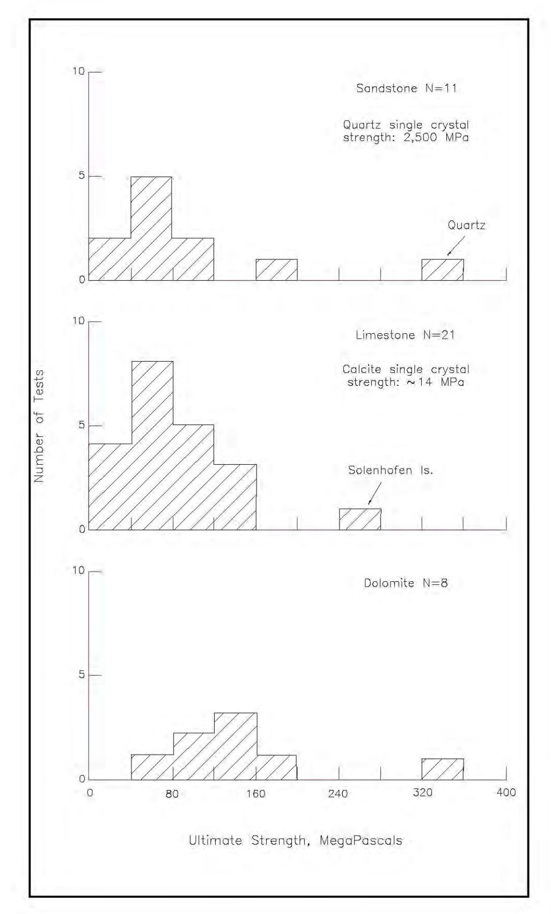
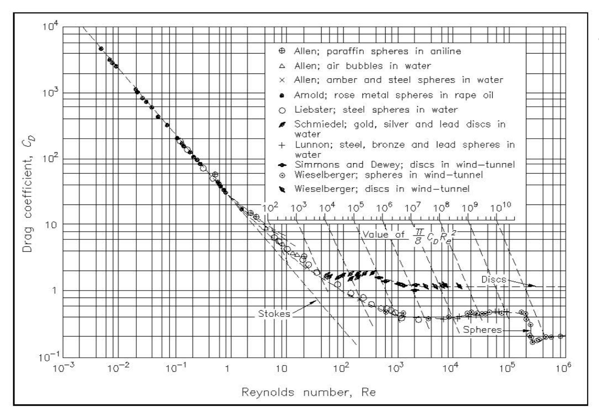
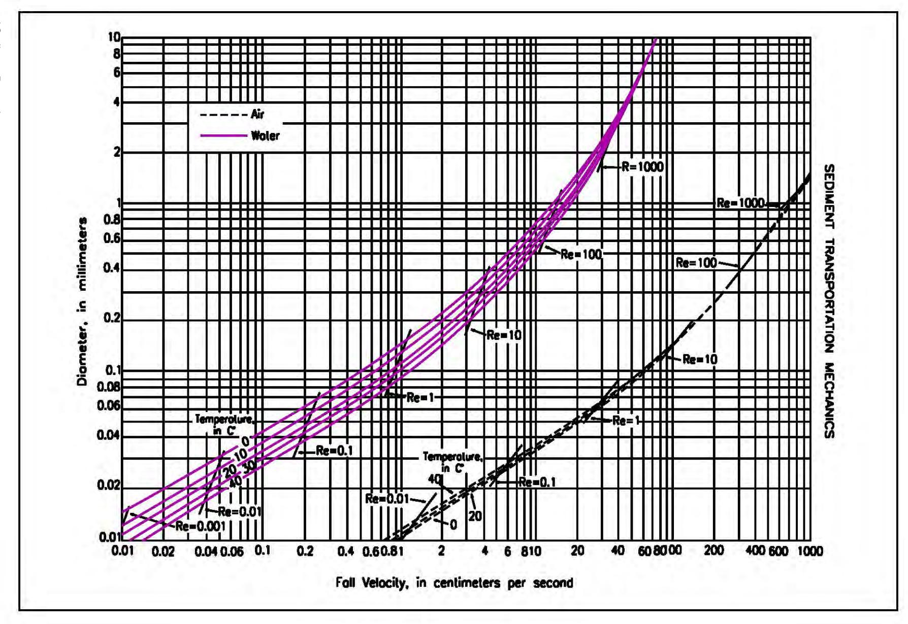

## Chapter 1 EM 1110-2-1100 COASTAL SEDIMENT PROPERTIES (Part III)

30 April 2002

# Table of Contents

- III-1-1. Introduction
  - a. Bases of sediment classification
  - b. Sediment properties important for coastal engineering
    - (1) Properties important in dredging
    - (2) Properties important in environmental questions
    - (3) Properties important in beach fills
    - (4) Properties important in scour protection
    - (5) Properties important in sediment transport studies
- III-1-2. Classification of Sediment by Size
  - a. Particle diameter
  - b. Sediment size classifications
  - c. Units of sediment size
  - d. Median and mean grain sizes
  - e. Higher order moments
  - f. Uses of distributions
  - g. Sediment sampling procedures
  - h. Laboratory procedures
- III-1-3. Compositional Properties
  - a. Minerals
  - b. Density
  - c. Specific weight and specific gravity
  - d. Strength
  - e. Grain shape and abrasion
- III-1-4. Fall Velocity
  - a. General equation
  - b. Effect of density
  - c. Effect of temperature
  - d. Effect of particle shape
  - e. Other factors
- III-1-5. Bulk Properties
  - a. Porosity
  - b. Bulk density
  - c. Permeability
  - d. Angle of repose
  - e. Bulk properties of different sediments
    - (1) Clays, silts, and muds
    - (2) Organically bound sediment
    - (3) Sand and gravel
    - (4) Cobbles, boulders, and bedrock
- III-1-6. References
- III-1-7. Definition of Symbols
- III-1-8. Acknowledgments

## List of Tables

- Page
- Table III-1-1 Relations Among Three Classifications for Two Types of Sediment III-1-1
- Table III-1-2 Sediment Particle Sizes III-1-8
- Table III-1-3 Qualitative Sediment Distribution Ranges for Standard Deviation, Skewness, and Kurtosis III-1-11
- Table III-1-4 Densities of Common Coastal Sediments III-1-16
- Table III-1-5 Average Densities of Rocks Commonly Encountered in Coastal Engineering III-1-16
- Table III-1-6 Soil Densities Useful for Coastal Engineering Computations III-1-30 Coastal Sediment Properties III-1-iii

## List of Figures

- Figure III-1-1. Example of sediment distribution using semilog paper; sample 21c - foreshore at Virginia Beach
- Figure III-1-2. Example of sediment distribution using log-normal paper
- Figure III-1-3. Suggested composite sediment sample groups on a typical profile - example from CHL Field Research Facility, Duck, NC
- Figure III-1-4. Unconfined ultimate strength of three rock types (Hardin 1966)
- Figure III-1-5. Drag coefficient as a function of Reynolds Number (Vanoni 1975)
- Figure III-1-6. Fall velocity of quartz spheres in air and water (Vanoni 1975)

# Chapter III-1 Coastal Sediment Properties

#### III-1-1. Introduction

- a. Bases of sediment classification .
- (1) Several properties of sediments are important in coastal engineering. Most of these properties can be placed into one of three groups: the size of the particles making up the sediment, the composition of the sediment, or bulk characteristics of the sediment mass.
- (2) In some cases (in clay, for example) there are strong correlations among the three classification groups. A clay particle is, in the compositional sense, a mineral whose molecules are arranged in sheets that feature orderly arrays of silicon, oxygen, aluminum, and other elements (Lambe and Whitman 1969). Clay particles are small and platey. They are small in part because they originate from the chemical modification and disintegration of relatively small pre-existing mineral grains and because the sheet-like minerals are not strong enough to persist in large pieces. The geologist's size classification defines a particle as clay if it is less than 0.0039 mm. Because a clay particle is so small, it has a large surface area compared to its volume. This surface area is chemically active and, especially when wet, the aggregate of clay surfaces produces the cohesive, plastic, and slippery characteristics of its bulk form. Thus, the three classifications each identify the same material when describing "clay."
- (3) On the other hand, most grains of beach sand are quartz, a simpler and chemically more inert material than clay minerals. In the geologist's size classification, sand grains are at least 16 times larger and may be more than 500 times larger in diameter than the largest clay particle (4,000 to more than 100 million times larger in volume). At this size, the force of gravity acting on individual sand grains dwarfs the surface forces exerted by those sand grains, so the surface properties of sand are far less important than surface properties of clay particles. Because sand grains do not stick together, a handful of pure dry sand cannot be picked up in one piece like a chunk of clay. Several differences between clay and sand are summarized on Table III-1-1. More inclusive discussions of sediment sizes, compositions, and bulk properties are given later in this chapter.

*Table III-1-1 Relations Among Three Classifications for Two Types of Sediment*

**Table III-1-1. Relations Among Three Classifications for Two Types of Sediment**

| Name of Sediment | Usual Composition | Size Range, Wentworth | Bulk Properties |
| --- | --- | --- | --- |
| Clay | Clay Minerals (sheets of silicates) | Less than 0.0039 mm | Cohesive Plastic under stress Slippery Impermeable |
| Sand | Quartz (SiO2) | Between 0.0625 mm and 2.00 mm | Noncohesive Rigid under stress Gritty Permeable |

b. Sediment properties important for coastal engineering . Sediment properties of material existing at the project site, or that might be imported to the site, have important implications for the coastal engineering project. The following sections briefly discuss several examples of ways that sediment properties affect coastal engineering projects and illustrate their importance.
- (1) Properties important in dredging.
- (a) A hydraulic dredge needs to entrain sediment from the bottom and pump it through a pipe. The entrainment and the pumping are both affected by the properties of the sediment to be dredged. The subject is briefly treated in the following paragraphs, but more details on dredging practice can be obtained from books by Turner (1984) and Huston (1970). Other information is available through the Dredging Research Program of the U.S. Army Corps of Engineers.
- (b) Sediment can be classified for entrainment by a hydraulic dredge as fluid, loose, firm, or hard. Fluid muds and loose silt or sand can be entrained relatively easily by dragheads. Firm sand, stiff clay, and organically bound sediment may require a cutterhead dredge to loosen the sediment. Usually, hard material such as rock or coral is not suitable for hydraulic dredging unless the material has previously been well broken.
- (c) Sediment can be classified for pumping by a hydraulic dredge as cohesive, noncohesive, or mitigated (Turner 1984). Cohesive sediments get transported through the pipe as lumps and nodules whereas noncohesive sediments disperse as a slurry, which is more easily pumped through the pipe. Mitigated sediments consist mainly of noncohesive sediments with a small amount of clay, which increases the transport efficiency of the pipe.
- (d) The diameter of the pipe and the size of the pump limit the size of the material which can be pumped. Usually, oversize material is prevented from entering the pipeline of a suction dredge by a grid placed across the draghead, or the cutterhead reduces material entering the pipeline to adequate size.
- (e) Another property of the sediment important in dredging is the degree of its cohesiveness that allows the sediment to stand in near-vertical banks while being dredged. A dredge works more efficiently if the material will maintain such a steep "face" during the dredging process. Muds and loose sands that flow like liquids lack this property.
- (f) The above statements apply to those dredging systems that remove material from the bottom through a pipeline by a pump. Such hydraulic dredges are not always the most feasible dredging system to use because of space constraints, navigation requirements, dredging depth, sediment properties, or disposal options. Under some conditions, mechanical dredges, which include a grab bucket operated from a derrick, or a dipper dredge (power shovel) on a barge (Huston 1970), may be more desirable. When mechanical dredges are used, looser sediments are usually dredged with a bucket and harder sediments with a dipper. (2) Properties important in environmental questions.
- (a) Recently, environmental problems associated with the handling and deposition of sediment have received increased attention. These concerns most frequently arise from dredging operations, but can occur anytime sediment is introduced into the marine environment. The usual issues involve the burial of bottomdwelling organisms, the blockage of light to bottom-dwelling and water-column organisms, and the toxicity of the sediments.
- (b) The sediment property of most environmental consequence is size. Turbidity in the water column depends on the fall velocity of the sediment particles, which is a strong function of the grain size. Turbid waters can be carried by currents away from the immediate project site, blocking the light to organisms over a wide area and, as the sediments settle out, blanketing the bottom at a rate faster than the organisms can accommodate. Fine sediments (silts and clays) get greater scrutiny under environmental regulation because they produce greater and longer-lasting turbidity, which will impact larger areas of the seafloor than will
coarser, sand-sized material. The dredging of sand usually encounters less severe environmental objection, provided that there are few fines mixed with it and that the site has no prior toxic chemical history.
- (c) Environmental regulation is changing, and many regulatory questions are outside the usual experience of coastal engineers. However, a basic coastal engineering contribution to facilitating the progress of a project through regulatory review is the early collection of relevant sediment samples from the site and obtaining accurate data on their size, composition, and toxicity. (3) Properties important in beach fills.
- (a) Beach fills have two primary functions: to provide temporary protection to upland property, and to increase temporarily the recreational space along the shore. Neither function can be well satisfied with sediment finer than sand. Because the recreational function is inhibited by material coarser than sand, and because fill coarser than sand is frequently less available, the primary beach fill material is usually sand.
- (b) The source sediment for a beach fill is known as the borrow material, and the sediment on the beach prior to the fill is known as the native material. The sediment property most important for design is the size distribution of the borrow and native sands. The art of beach fill design consists of calculating the volume of borrow with a given size distribution that will produce a required volume of beach fill.
- (c) Ideally, the median size of the borrow sand should not be less than the median size of the native sand, and the spread of the sizes in the borrow size distribution should not exceed the spread of sizes in the native sand. Often it is impossible to meet these ideal conditions because suitable borrow material does not exist in adequate volume at a reasonable cost. Further, on severely eroded beaches, the native sand may be skewed to coarser size ranges because the fines have eroded out, producing unrealistic requirements for borrow sand size distribution.
- (d) Beach fill design aims to compensate for the differences between borrow sand and native sand, usually by overfilling with borrow sand and assuming preferential loss of the fine fractions. A favorable feature of beach fill technology is the accidental, partial loss of the fine fraction during the dredging and handling between borrow and beach. There have been cases (mostly anecdotal) where such handling losses have produced sand fill on the beach that is coarser than the borrow sand from which the fill was derived.
- (e) The shore protection and the recreational qualities of a beach fill conflict when coarser sediment sizes are used. Usually, a beach provides more protection against erosion when its particles are coarser (also when they are more angular and more easily compacted). However, fill material larger than sand size (about 2.0 mm) will lessen the recreational value of the beach. Also odor and color of beach fill may be objectional to recreational users; but usually, if the grain size of the material is adequate, the objectional odor and color are temporary. (4) Properties important in scour protection.
- (a) Scour, the localized removal of bed material below its natural elevation, usually occurs near (and is usually caused by) marine structures such as jetties, seawalls, bridge pilings, etc. These types of structures can accelerate tidal currents, focus wave energy, and increase turbulence in the water column.
- (b) To prevent scour, it is usual to place a layer of less erodible material on the surface of the sediment that is subject to erosion. Such a layer is called a revetment or scour blanket. A typical revetment consists of broken rock, known as riprap, which is essentially a sediment consisting of large rock particles. The sedimentary properties of riprap which are important as scour protection include its size distribution, density of the rock material, and the porosity and permeability of the material as placed. The riprap must be heavy
enough to resist movement under design currents, the porosity and thickness of the riprap must be adequate to dissipate fluid energy before it reaches the underlying material being protected, and the permeability must be adequate to satisfactorily relieve pressure buildup at the seafloor-revetment interface.
- (c) For long-term protection, riprap must consist of dense, durable material of blocky shape. Porous carbonate rocks such as coral and some limestones are not satisfactory, and thin slabs of material of any composition (such as shale) are usually more mobile than blocky shapes having the same weight. However, in any situation, economics and available materials may make it advantageous to use materials that depart from the ideal.
- (d) It should be recognized that scour protection in coastal engineering differs from scour protection encountered in typical transportation projects both in the magnitude of the forces and in their reversing directions. Though scour protection design for highways is a well-developed art with extensive documentation, the direct transferal of highway riprap experience to coastal problems is usually unsatisfactory. (5) Properties important in sediment transport studies.
- (a) The underlying physics of how water moves sediment is not well understood. This is, perhaps, one reason for the large number of formulas (often conflicting) which have been proposed to predict transport rates. These formulas are usually functions of fluid properties, flow condition properties, and sediment properties. Sediment properties commonly used include: grain size, grain density, fall velocity, angle of repose, and volume concentration. Sediment size distribution and grain shape are also important.
- (b) One method used to study sediment transport is to follow the movement of marked (tracer) particles in the nearshore environment. Ideally, tracers should react to coastal processes that move sediment in a manner identical to the native sand, yet provide some signal to the investigator that will distinguish the tracer from the native material. In the last two decades, the most common tracer has been dyed native sand grains. Typically representative samples of sand taken from the site are dyed with a fluorescent dye and then reintroduced to their environment. Care must be taken to ensure that the dying process does not significantly alter the sediment size or density. Transport of these tracers is then monitored by sampling. Because of their dilute distribution, tracers are a very labor-intensive means of studying sediment movement.
- (c) Native sand tracers (trace minerals, heavy minerals) have been used to interpret sediment movement, but usually these tracers have a size and density that differ from the majority of grains on the beach. The problem becomes more complicated as beach fills become more common, and inadvertently introduce non-native tracer grains. See Galvin (1987) for a more thorough discussion of this topic.
- (d) Recently, a few sensors have become available that can measure the concentration of moving sediment. These sensors are generally quite sensitive to grain size and require calibration using sediments obtained onsite. See, for example, a discussion of an optical backscatter sensor (Downing, Sternberg, and Lister 1981).

#### III-1-2. Classification of Sediment by Size

- a. Particle diameter .
- (1) One of the most important characteristics of sediment is the size of the particles. The range of grain sizes of practical interest to coastal engineers is enormous, covering about seven orders of magnitude, from clay particles to large breakwater armor stone blocks. A particle's size is usually defined in terms of its diameter. However, since grains are irregularly shaped, the term diameter can be ambiguous. Diameter is
normally determined by the mesh size of a sieve that will just allow the grain to pass. This is defined as a particle's sieve diameter. When performed in a standard manner, sieving provides repeatable results, although there is some uncertainty about how the size of a sieve opening relates to the physical size of the particle passing through the opening. (See page 58 of Blatt, Middleton, and Murray (1980) for further discussion.)
- (2) Another way to define a grain's diameter is by its fall velocity. A grain's sedimentation diameter is the diameter of a sphere having the same density and fall velocity. This definition has the advantage of relating a grain's diameter to its fluid behavior, which is the usual ultimate reason for needing to determine the diameter. However, a settling tube analysis is somewhat less reproducible than a sieve analysis, and testing procedures have not been standardized. Other diameter definitions that have been occasionally used include the nominal diameter, the diameter of a sphere having the same volume as the particle; and the axial diameter, the length of one of the grain's principal axes, or some combination of these axes.
- (3) For nearly spherical particles, as many sand grains are (but most shell and shell fragments are not), there is little difference in these definitions. When reporting the results of an analysis, it is always appropriate to define the diameter (or describe the measurement procedure), particularly if the sieve diameter is not being used.
- (4) Usually, there is a need to characterize an appropriate diameter for an aggregation of particles, rather than the diameter of a single particle. Even the best-sorted natural sediments have a range of grain sizes. Most sediment samples found in nature have a few relatively large particles covering a wide range of diameters and many small particles within a small range of diameters. That is, most natural sediment samples have a highly skewed distribution, in an absolute sense. However, if size classes are based upon a logarithmic (power of 2) scale and if the contents of each size fraction are considered by weight (not by the number of particles), then most typical sediment samples will have a distribution that is near Gaussian (or normal). When such sediment samples are plotted as a percentage of the total weight of the sample being sieved, the sediment size distribution that results usually approximates a straight line on a log-normal graph. This line is known as the log-normal distribution. Meaningful descriptions of the distributions of this type of data can be made using standard statistical parameters.
- (5) Sediment size data normally come from the weight of sediment that accumulates on each sieve in a nest of graduated sieves. This can be plotted on semilog paper as shown in Figure III-1-1 (ENG form 2087) or on log-normal paper as shown in Figure III-1-2. b. Sediment size classifications.
- (1) The division of sediment sizes into classes such as cobbles, sand, silt, etc., is arbitrary, and many schemes have been proposed. However, two classification systems are in general use today by coastal engineers. Both have been adopted from other fields.
- (2) The first is the Modified Wentworth Classification, which is generally used in geologic work. Geologists have been particularly active in sediment size research because they have long been interested in interpreting slight differences in size as indicating particular processes or events in the geologic past. A summary of geological work applicable to coastal engineering is found in Chapter 3 of the book by Blatt, Middleton, and Murray (2nd ed., 1980).



*Figure III-1-1. Example of sediment distribution using semilog paper; sample 21c - foreshore at Virginia Beach*



*Figure III-1-2. Example of sediment distribution using log-normal paper*

- (3) The other is the Unified Soils Classification or the ASTM Classification, which various American engineering groups have developed. These groups have been more concerned with standardizing ways to obtain repeatable results in the analyses of sediment. The definitive source for such information is Volume 4.08 of the Standards published by the American Society for Testing and Materials (ASTM). These standards are published annually, with revisions as needed. In what follows, reference to ASTM standards will be to the 1994 edition of Volume 4.08, which deals with soil, as defined by engineers.
- (4) These two systems are compared in Table III-1-2. Note that there are differences in the category limits. For example, sand in the engineer's classification is between 0.074 and 4.76 mm, while in the

**Table III-1-2. Note that there are differences in the category limits. For example, sand in the engineer's classification is between 0.074 and 4.76 mm, while in the**

| ASTM (Unified) $Classification^{1}$ | U.S. Std. $Sieve^{2}$ | Size in mm | Phi Size | Wentworth $Classification^{3}$ |
| --- | --- | --- | --- | --- |
| Boulder |  | 4096. | -12.0 |  |
|  |  | 1024. | -10.0 | Boulder |
|  | 12 in. (300 mm) | 256. | -8.0 |  |
| Cobble |  | 128. | -7.0 | Large Cobble |
|  |  | 107.64 | -6.75 |  |
|  |  | 90.51 | -6.5 | Small Cobble |
|  | 3 in. (75 mm) | 76.11 | -6.25 |  |
|  |  | 64.00 | -6.0 |  |
|  |  | 53.82 | -5.75 |  |
|  |  | 45.26 | -5.5 | Very Large Pebble |
| Coarse Gravel |  | 38.05 | -5.25 |  |
|  |  | 32.00 | -5.0 |  |
|  |  | 26.91 | -4.75 |  |
|  |  | 22.63 | -4.5 | Large Pebble |
|  | 3/4 in. (19 mm) | 19.03 | -4.25 |  |
|  |  | 16.00 | -4.0 |  |
|  |  | 13.45 | -3.75 |  |
|  |  | 11.31 | -3.5 | Medium Pebble |
|  |  | 9.51 | -3.25 |  |
| Fine Gravel | 2.5 | 8.00 | -3.0 |  |
|  | 3 | 6.73 | -2.75 |  |
|  | 3.5 | 5.66 | -2.5 | Small Pebble |
|  | 4 (4.75 mm) | 4.76 | -2.25 |  |
|  | 5 | 4.00 | -2.0 |  |
| Coarse Sand | 6 | 3.36 | -1.75 |  |
|  | 7 | 2.83 | -1.5 | Granule |
|  | 8 | 2.38 | -1.25 |  |
|  | 10 (2.0 mm) | 2.00 | -1.0 |  |
|  | 12 | 1.68 | -0.75 |  |
|  | 14 | 1.41 | -0.5 | Very Coarse Sand |
|  | 16 | 1.19 | -0.25 |  |
| Medium Sand | 18 | 1.00 | 0.0 |  |
|  | 20 | 0.84 | 0.25 |  |
|  | 25 | 0.71 | 0.5 | Coarse Sand |
|  | 30 | 0.59 | 0.75 |  |
|  | 35 | 0.50 | 1.0 |  |
|  | 40 (0.425 mm) | 0.420 | 1.25 |  |
|  | 45 | 0.354 | 1.5 | Medium Sand |
|  | 50 | 0.297 | 1.75 |  |
|  | 60 | 0.250 | 2.0 |  |
| Fine Sand | 70 | 0.210 | 2.25 |  |
|  | 80 | 0.177 | 2.5 | Fine Sand |
|  | 100 | 0.149 | 2.75 |  |
|  | 120 | 0.125 | 3.0 |  |
|  | 140 | 0.105 | 3.25 |  |
|  | 170 | 0.088 | 3.5 | Very Fine Sand |
|  | 200 (0.075 mm) | 0.074 | 3.75 |  |
| Fine-grained Soil: | 230 | 0.0625 | 4.0 |  |
|  | 270 | 0.0526 | 4.25 |  |
| Clay if PI $ 4 and plot of PI vs. LL is | 325 | 0.0442 | 4.5 | Coarse Silt |
| on or above "A" line and the presence | 400 | 0.0372 | 4.75 |  |
| of organic matter does not influence |  | 0.0312 | 5.0 | Medium Silt |
| LL. |  | 0.0156 | 6.0 | Fine Silt |
|  |  | 0.0078 | 7.0 | Very Fine Silt |
|  |  | 0.0039 | 8.0 | Coarse Clay |
| Silt if PI < 4 and plot of PI vs. LL is |  | 0.00195 | 9.0 |  |
| below "A" line and the presence of |  | 0.00098 | 10.0 | Medium Clay Fine Clay |
| organic matter does not influence LL. |  | 0.00049 | 11.0 |  |
|  |  | 0.00024 | 12.0 |  |
| (PI = plasticity limit; LL = liquid limit) |  | 0.00012 | 13.0 | Colloids |
|  |  | 0.000061 | 14.0 |  |

*1 ASTM Standard D 2487-92. This is the ASTM version of the Unified Soil Classification System. Both systems are similar (from ASTM (1994)).*

*Note that British Standard, French, and German DIN mesh sizes and classifications are different.*

*Wentworth sizes (in mm) cited in Krumbein and Sloss (1963).*

geologist's classification, sand is between 0.0625 and 2.0 mm. In describing a sediment, it is necessary to say which classification system is being utilized.

#### c. Units of sediment size .

(1) Table III-1-2 lists three ways to specify the size of a sediment particle: U.S. Standard sieve numbers, millimeters, and phi units. A sieve number is approximately the number of square openings per inch, measured along a wire in the wire screen cloth (Tyler 1991). Available sieve sizes can be obtained from catalogs on construction materials testing such as Soiltest (1983). The millimeter dimension is the length of the inside of the square opening in the screen cloth. This square side dimension is not necessarily the maximum dimension of the particle which can get through the opening, so these millimeter sizes must be understood as nominal approximations to sediment size. Table III-1-2 shows that the Wentworth scale has divisions that are whole powers of 2 mm. For example, medium sands are those with diameters between 2-2 mm and $2^{-1}$ mm. This property of powers of 2-mm class limits led Krumbein (1936) to propose a phi unit scale based on the definition:

```math
\varphi = -\log_2 D \tag{III-1-1a}
```

where D is the grain diameter in millimeters. Phi diameters are indicated by writing φ after the numerical value. That is, a 2.0-φ sand grain has a diameter of 0.25 mm. To convert from phi units to millimeters, the inverse equation is used:

```math
D = 2^{-\varphi} \tag{III-1-1b}
```

(2) The benefits of the phi unit include: (a) it has whole numbers at the limits of sediment classes in the Wentworth scale; and (b) it allows comparison of different size distributions because it is dimensionless. Disadvantages of this phi unit are: (a) the unit gets larger as the sediment size gets smaller, which is both counterintuitive and ambiguous; (b) it is difficult to physically interpret size in phi units without considerable experience; and (c) because it is a dimensionless unit, it cannot represent a unit of length in physical expressions such as fall velocity or Reynolds number.

#### d. Median and mean grain sizes .

- (1) All natural sediment samples contain grains having a range of sizes. However, it is frequently necessary to characterize the sample using a single typical grain diameter as a measure of the central tendency of the distribution. The median grain diameter $M_{d}$ is the sample characteristic most often chosen. The definition of $M_{d}$ is that, by weight, half the particles in the sample will have a larger diameter and half will have a smaller. This quantity is easily obtained graphically, if the sample is sorted by sieving or other method, and the weight of the size fractions are plotted, as seen in Figures III-1-1 and III-1-2.
- (2) The median diameter is also written as $D_{50}.$ Other size fractions are similarly indicated. For example, D 90 is the diameter for which 90 percent of the sediment, by weight, has a smaller diameter. An equivalent definition holds for the median of the phi-size distribution $φ_{50}$ or for any other size fraction in the phi scale.
- (3) Another measure of the central tendency of a sediment sample is the mean grain size . Several formulas have been proposed to compute this quantity, given a cumulative size distribution plot of the sample (Otto 1939, Inman 1952, Folk and Ward 1957, McCammon 1962). These formulas are averages of 2, 3, 5, or more symmetrically selected percentiles of the phi frequency distribution. Following Folk (1974):

```math
M_{\varphi} = \frac{\varphi_{16} + \varphi_{50} + \varphi_{84}}{3} \tag{III-1-2}
```

where M_{\phi} is the estimated mean grain size of the sample in phi units. This can be converted to a linear diameter using Equation 1-1b. The median and mean grain sizes are usually quite similar for most beach sediments. For example, a study of 465 sand samples from three New Jersey beaches, the mean averaged only 0.01 mm smaller than the median for sands having an average median diameter of 0.30 mm (1.74 phi) (Ramsey and Galvin 1977). If the grain sizes in a sample are log-normally distributed, the two measures are identical. Since the median is easier to determine and the mean does not have a universally accepted definition, the median is normally used in coastal engineering to characterize the central tendency of a sediment sample.
- e. Higher order moments.
- (1) Additional statistics of the sediment distribution can be used to describe how the sample varies from a log-normal distribution. The standard deviation is a measure of the degree to which the sample spreads out around the mean (i.e., its sorting). Following Folk (1974), the standard deviation can be approximated by:

```math
\sigma_{\varphi} = \frac{(\varphi_{84} - \varphi_{16})}{4} + \frac{(\varphi_{95} - \varphi_{5})}{6} \tag{III-1-3}
```

where \sigma_{\varphi} is the estimated standard deviation of the sample in phi units. For a completely uniform sediment \varphi_{05} , \varphi_{16} , \varphi_{84} , and \varphi_{95} are all the same, and thus, the standard deviation is zero. There are also qualitative descriptions of the standard deviation. A sediment is described as well-sorted if all particles have sizes that are close to the typical size (small standard deviation). If the particle sizes are distributed evenly over a wide range of sizes, then the sample is said to be well-graded. A well-graded sample is poorly sorted; a well-sorted sample is poorly graded.
(2) The degree by which the distribution departs from symmetry is measured by the phi coefficient of skewness \alpha_{\phi} defined in Folk (1974) as:

```math
\alpha_{\varphi} = \frac{\varphi_{16} + \varphi_{84} - 2(\varphi_{50})}{2(\varphi_{84} - \varphi_{16})} + \frac{\varphi_{5} + \varphi_{95} - 2(\varphi_{50})}{2(\varphi_{95} - \varphi_{5})} \tag{III-1-4}
```

- (3) For a perfectly symmetric distribution, the skewness is zero. A positive skewness indicates there is a tailing out toward the fine sediments, and conversely, a negative value indicates more outliers in the coarser sediments.
- (4) The phi coefficient of kurtosis \beta_{\phi} is a measure of the peakedness of the distribution; that is, the proportion of the sediment in the middle of the distribution relative to the amount in both tails. Following Folk (1974), it is defined as:

```math
\beta_{\varphi} = \frac{\varphi_{95} - \varphi_{5}}{2.44 \ (\varphi_{75} - \varphi_{25})} \tag{III-1-5}
```

Values for the mean and median grain sizes are frequently converted from phi units to linear measures. However, the standard deviation, skewness, and kurtosis should remain in phi units because they have no corresponding dimensional equivalents. If these terms are used in equations, they are used in their dimensionless phi form. Relative relationships are given for ranges of standard deviation, skewness, and kurtosis in Table III-1-3.

*Table III-1-3 Qualitative Sediment Distribution Ranges for Standard Deviation, Skewness, and Kurtosis*

**Table III-1-3. Qualitative Sediment Distribution Ranges for Standard Deviation, Skewness, and Kurtosis**

| Phi Range | Description |
| --- | --- |
| <0.35 | Very well sorted |
| 0.35-0.50 | Well sorted |
| 0.50-0.71 | Moderately well sorted |
| 0.71-1.00 | Moderately sorted |
| 1.00-2.00 | Poorly sorted |
| 2.00-4.00 | Very poorly sorted |
| >4.00 | Extremely poorly sorted Coefficient of Skewness |
| <-0.3 | Very coarse-skewed |
| - 0.3 to - 0.1 | Coarse-skewed |
| - 0.1 to +0.1 | Near-symmetrical |
| +0.1 to +0.3 | Fine-skewed |
| >+0.3 | Very fine-skewed Coefficient of Kurtosis |
| <0.65 | Very platykurtic (flat) |
| 0.65-0.90 | Platykurtic |
| 0.90-1.11 | Mesokurtic (normal peakedness) |
| 1.11-1.50 | Leptokurtic (peaked) |
| 1.50-3.00 | Very leptokurtic |
| >3.00 | Extremely leptokurtic |

f. Uses of distributions . The median grain size is the most commonly used sediment size characteristic, and it has wide application in coastal engineering practice. The standard deviation of sediment samples has been used in several ways, including beach-fill design (see Hobson (1977), Ch. 5, Sec. III,3) and sediment permeability (Krumbein and Monk 1942). When a set of samples are taken from a single project site, they will frequently show little or no consistent variation in median diameter. In this case, various higher order moments are usually used to distinguish different depositional environments. There is an extensive literature on the potential application of the measures of size distribution; see, for example, Inman (1957), Folk and Ward (1957), McCammon (1962), Folk (1965, 1966), Griffiths (1967), and Stauble and Hoel (1986).

### g. Sediment sampling procedures .

- (1) Although a beach can only be composed of the available sediments, grain size distributions change in time and space. In winter, beach distributions are typically coarser and more poorly sorted than in summer. Also, typically, there is more variability in the foreshore and the bar/trough regions than in the dunes and the nearshore.
- (2) While a single sample is occasionally sufficient to grossly characterize the sediments at a site, usually a set of samples is obtained. Combining samples from across the beach can reduce the high variability in spacial grain size distributions on beaches (Hobson 1977). Composite samples are created by either physically combining several samples before sieving or by mathematically combining the individual sample
weights. The set of samples obtained can be fairly small if the intent is only to characterize the beach as a whole. However, if the intent is to compare and contrast different portions of the same beach, many more samples are needed. In this case it is usually necessary to develop a sampling scheme prior to fieldwork.
- (3) In the cross-shore it is recommended that samples be collected at all major changes in morphology along the profile, such as dune base, mid-berm, mean high water, mid-tide, mean low water, trough, bar crest, and then at 3-m intervals to the depth of closure (Stauble and Hoel 1986). In the longshore direction, sediment sampling should coincide with survey profile lines so that the samples can be spatially located and related to morphology and hydrodynamic zones. Shoreline variability and engineering structures should be considered in choosing sampling locations. A suggested rule of thumb is that a sampling line be spaced every half mile, but engineering judgment is required to define adequate project coverage.
- (4) Samples collected along profile sub-environments can be combined into composite groups of similar depositional energy levels as seen in Figure III-1-3. Intertidal and subaerial beach samples have been found to be the most usable composites to characterize the beach and nearshore environment. Stauble and Hoel (1986) found that a composite containing the mean high water, mid-tide, and mean low water gave the best representation of the foreshore beach.



*Figure III-1-3. Suggested composite sediment sample groups on a typical profile - example from Field Research Facility, Duck, NC*

#### EXAMPLE PROBLEM III-1-1

#### FIND:

The statistics of the sediment size distribution shown in Figure III-1-2 and their qualitative descriptions.

#### GIVEN:

The needed phi values are: $φ_{05}$ = 0.56, $φ_{16}$ = 0.80, $φ_{25}$ = 0.93, $φ_{50}$ = 1.37, $φ_{75}$ = 1.87, $φ_{84}$ = 2.08, and $φ_{95}$ = 2.48.

#### SOLUTION:

In phi units, the median grain size is given as:

```math
\varphi_{50} = M_{d\varphi} = 1.37\varphi
```

From Equation 1-1b, the median grain size in millimeters is found as:

```math
M_\mathrm{d} = 2^{-1.37} = 0.39 \text{ mm}
```

From Equation 1-2, the mean grain size is found in phi units as:

```math
M_{\varphi} = (0.80 + 1.37 + 2.08) / 3 = 1.42 \varphi
```

From Equation 1-1b, this is converted to millimeters as:

```math
D = 2^{-1.42} = 0.37 \text{ mm}
```

From Equation 1-3, the standard deviation is found as:

```math
\sigma_{\phi} = (2.08 - 0.80)/4 + (2.48 - 0.56)/6.0 = 0.32 + 0.32 = 0.64 \ \phi
```

From Equation 1-4, the coefficient of skewness is found as:

```math
\alpha_{\phi} = 0.055 + 0.078 = 0.13
```

From Equation 1-5, the coefficient of kurtosis is found as:

```math
\beta_{\varphi} = 1.92 / 2.29 = 0.84
```

Thus, using Tables III-1-2 and III-1-3, the sediment is a medium sand (Wentworth classification), it is moderately well sorted, and the distribution is fine-skewed and platykurtic.
- h. Laboratory procedures .
- (1) Several techniques are available to analyze the size of beach materials, and each technique is restricted to a range of sediment sizes. Pebbles and coarser material are usually directly measured with calipers. However, this is not practical for sediments smaller than about 8 mm. Coarse sieves can also be used for material up to about 75 mm.
- (2) Sand-sized particles (medium gravels through coarse silt) are usually analyzed using sieves. This requires an ordered stack of sieves of square-mesh woven-wire cloth. Each sieve in the stack differs from the adjacent sieves by having a nominal opening less than the opening of the sieve above it and greater than the opening of the sieve below it. A pan is placed below the bottom sieve. The sample is poured into the top sieve, a lid is placed on top, and the stack is placed on a shaker, usually for about 15 min. The different grains fall through the stack of sieves until each reaches a sieve that is too fine for it to pass. Then the amount of sediment in each sieve is weighed. ASTM Standard D422-63 (Reapproved 1990) is the basic standard for particle size analysis of soils, including sieving sedimentary materials of interest to coastal engineers. The application of D422 requires sample preparation described in Standard D421-85 (Reapproved 1993). The wire cloth sieves should meet ASTM Specification E-11.
- (3) Sieves are graduated in size of opening according to the U.S. standard series or according to phi sizes. U.S. standard sieve sizes are listed in Table III-1-2, and the most commonly used sieves are shown in Figure III-1-1. Phi sized sieve openings vary by a factor of 1.19 from one sieve size to the next (by the fourth root of 2, or 0.25 phi units); e.g., 0.25, 0.30, 0.35, 0.42, and 0.50 mm.
- (4) The range of sieve openings must span the range of sediment sizes to be sieved. Typically, about 6 full-height sieves or 13 half-height sieves plus a bottom pan are used in the analysis of a particular sediment. If 6 sieves are used, each usually varies in size from its adjacent neighbors by a half phi; if 13 sieves are used, each usually varies by a quarter phi. Normally, about 40 grams of sediment is sieved. More is needed if there are large size fractions (see ASTM Standard D2487-94).
- (5) Determination of sediment size fractions for silts and clays is usually not necessary. Rather it is normally noted that a certain percentage of the material are fines with diameters smaller than the smallest sieve. When measurements are needed, the pipette method or the hygrometer method is usually used. Both of these methods are based upon determining the amount of time that different size fractions remain in suspension. These are discussed in Vanoni (1975). Coulter counters have also been used occasionally.

#### III-1-3. Compositional Properties

- a. Minerals .
- (1) Because of its resistance to physical and chemical changes and its common occurrence in terrestrial rocks, quartz is the mineral most commonly found in littoral materials. On temperate latitude beaches, quartz and feldspar grains commonly account for more than 90 percent of the material (Krumbein and Sloss 1963, p.134), and quartz, on average, accounts for about 70 percent of beach sand. However, it is important to realize that on individual beaches the percentage of quartz grains (or any other mineral) can range from essentially zero to 100 percent. Though feldspars are more common on the surface of the earth as a whole, comprising approximately 50 percent of all crustal rocks to quartz's approximately 12 percent (Ritter 1986), feldspars are more subject to chemical weathering, which converts them to clay minerals, quartz, and solutions. Since quartz is so inert, it accumulates during weathering processes. Thus, feldspars and related silicates are more commonly encountered in coastal sediment close to sources of igneous and metamorphic rocks, especially mountainous and glaciated coasts where streams and ice carry unweathered sediment
immediately to the shore. Quartz sand and clay are more common on shores far from mountains where weathering has had more time to reduce the relative proportions of feldspars and related silicates.
- (2) Most carbonate sands owe their formation to organisms (both animal and vegetable) that precipitate calcium carbonate by modifying the very local chemical environment of the organism to favor carbonate deposition. Calcium carbonate may be deposited as calcite or aragonite, but aragonite is unstable and changes with time to either calcite or solutions. Calcite or limestone, the rock made from calcite, may, under some conditions, be altered to dolomite by the partial replacement of the calcium with magnesium. Carbonate sands can contribute up to 100 percent of the beach material, particularly in situations where it is produced in the local marine environment and there are limited terrestrial sediment supplies, such as reef-fringed, tropical island beaches. These sands are generally composed of a combination of shell and shell fragments, oolites, coral fragments, and algal fragments (Halimeda, foraminiferans, etc.). When carbonate shell is mixed with quartz sand, it may be necessary to dissolve out the shell to get a meaningful representation of each size fraction. ASTM Standard 4373 describes how to determine the calcium carbonate content of a beach.
- (3) Other minerals that frequently form a small percentage of beach sands are normally referred to as heavy minerals, because their specific gravities are usually greater than 2.87. These minerals are frequently black or reddish and may, in sufficient concentrations, color the entire beach. The most common of these minerals (from Pettijohn (1957)) are andalusite, apatite, augite, biotite, chlorite, diopside, epidote, garnet, hornblende, hypersthene-enstatite, ilmenite, kyanite, leucoxene, magnetite, muscovite, rutile, sphene, staurolite, tourmaline, zircon, and zoisite. Their relative abundance is a function of their distribution in the source rocks of the littoral sediments and the weathering process. Heavy minerals have been occasionally used as natural tracers to identify sediment pathways from the parent rocks (Trask 1952; McMaster 1954; Giles and Pilkey 1965; Judge 1970).
In coastal engineering work, knowledge of the sediment composition is not normally important in its own right, but it is closely related to other important parameters such as sediment density and fall velocity.

#### b. Density.

- (1) Density is the mass per unit volume of a material, which, in SI units, is measured in kilograms per cubic meter $(kg/m^{3}).$ Sediment density is a function of its composition. Minerals commonly encountered in coastal engineering include quartz, feldspar, clay minerals, and carbonates. Densities for these minerals are given in Table III-1-4.
- (2) Quartz is composed of the mineral silicon dioxide. Feldspar refers to a closely related group of metal aluminium silicate minerals. The most common clay minerals are illinite, montmorillonite, and kaolinite. Common carbonate minerals include calcite, aragonite, and dolomite. However, carbonate sands are usually not simple, dense solids; but rather the complex products of organisms which produce gaps, pores, and holes within the structure, all of which tend to lower the effective density of carbonate sand grains. Thus, carbonate sands frequently have densities less than quartz.
- (3) The density of a sediment sample may be calculated by adding a known weight of dry sediment to a known volume of water. The change in volume is measured; this is the volume of the sediment. The sediment mass (= weight / acceleration of gravity) divided by its volume is the density. A complicating factor is that small pockets of air will stay in the pores and cling to the surfaces of almost all sediments. To obtain an accurate volume reading, this air must be removed by drawing a strong vacuum over the sand-water mixture. ASTM Volume 4.08 gives standards for measuring the density of soils and rocks, respectively (ASTM 1994).

| Table III-1-4 |
| --- |
| Densities of Common Coastal Sediments |

|  |  |  |
| --- | --- | --- |
| Mineral | Density $kg/m^{3}$ |  |
| Quartz | 2,648 |  |
| Feldspar | 2,560 - 2,650 |  |
| Illite | 2,660 |  |
| Montmorillonite | 2,608 |  |
| Kaolinite | 2,594 |  |
| Calcite | 2,716 |  |
| Aragonite | 2,931 |  |
| Dolomite | 2,866 |  |

Above sand size, sediments encountered in coastal engineering are usually composites of several minerals, that is, rocks. Table III-1-5 lists densities of rocks commonly encountered. These rocks are also used for riprap, which are large sedimentary particles. Lines 5 and 6 of Table III-1-5 deal with carbonate rocks, the dolomites and limestones. Note 3 of Table III-1-5 suggests that typical dolomites are denser, less porous, and geologically older than typical limestones.

*Table III-1-5 Average Densities of Rocks Commonly Encountered in Coastal Engineering*

**Table III-1-5. Average Densities of Rocks Commonly Encountered in Coastal Engineering**

| Number | Rock Type | Number of Samples | Mass Density, $kg/m^{3}$ |
| --- | --- | --- | --- |
| 1 | Basalt | 323 | 2,740 |
| 2 | Dolerite-Diabase | 224 | 2,890 |
| 3 | Granite | 334 | 2,660 |
| 4 | Sandstone | 107 | 2,220 |
| 5 | Dolomite | 127 | 2,770 |
| 6 | Limestone | 182 | 2,540 |
| Notes: |  |  |  |

#### Notes:

c. Specific weight and specific gravity . The specific weight of a material is its density times the acceleration of gravity g. In SI units, the acceleration of gravity is 9.807 $m/s^{2},$ and thus, specific weight is measured in kilograms per meter squared per second squared $(kg/(m^{2}$ * $s^{2})).$ The specific gravity of a material is its density divided by the density of water at $4^{\circ}$ C, which is 1000.0 $kg/m^{3}.$ Specific gravity is a dimensionless quantity.

#### d. Strength .

(1) The material strength of a particle is the maximum stress which the particle can resist without failing, for a given type of loading. The SI unit of stress is the Pascal, and the convenient Pascal multiple is 1 million Pascals, or 1 mega Pascal (MPa). "Strength" in this section is unconfined ultimate strength in compression,

*1 Basalt and dolerite (or diabase) in lines 1 and 2 are fine-grained dark igneous rock often classed together as trap rock for engineering purposes.*

*Lines 1, 2, 3, 4 from Table 5 of Johnson and Olhoeft (1984). Lines 5, 6 from Table 4-4 of Daly, Manger, and Clark (1966).*

*Line 5 is the average of 127 samples from 3 dolomites or dolomitic limestones. Line 6 is the average of 182 samples from 5 limestones. The rocks in line 5 are denser and older than those in line 6. Average porosity of rocks in line 5 # 3.0%; in line 6 average porosity is between 3% and 17%. Rocks in line 5 are older than Carboniferous.*

which is equivalent to crushing strength. Tensile strength, which is significantly less than compressive strength, is not discussed here, but tensile strength is usually proportional to compressive strength.
- (2) The most commonly encountered material in coastal engineering is the quartz sand grain, which is very strong indeed. A single crystal of quartz has a strength on the order of 2,500 MPa. However, a sandstone, which is a composite of many sand grains, is surprisingly weak (top histogram on Figure III-1-4), being typically less than 100 MPa, or less than 4 percent of the strength of the single crystal. For this reason, sandstone is rarely used in coastal engineering construction.
- (3) The difference in strength between quartz crystal and composite sandstone is due to weak intergranular cement and to flaws such as grain boundaries, bedding planes, cleavage, and joints that have a higher probability of being present in larger pieces. The data on Figure III-1-4 are excerpted from the extensive tabulation of Handin (1966), using all samples which were tested at room temperature and zero confining pressure.
- (4) For calcium carbonate, strength varies with size in a direction opposite to that of quartz. Single crystals of calcite are weak (~14 MPa, depending on orientation) compared to single crystals of quartz (~2,500 MPa). But limestone rocks, made from interlocking calcium carbonate crystals, are much stronger than single crystals of calcium carbonate, and even somewhat stronger than sandstones, as shown by comparing the top two histograms on Figure III-1-4.
- (5) The weaker rocks on the left end of the histograms of Figure III-1-4 are those with macroscopic flaws such as bedding planes, rather than flaws in single grains. The high-strength outliers on the right end of the sandstone and limestone histograms of Figure III-1-4 are special cases. The sandstone outlier is a quartzite, a metamorphosed sandstone recrystallized with silica cement. The limestone outlier is Solnhofen limestone, which is a dense, fine-grained, uniform limestone.
- (6) Dolomite is a carbonate rock allied to limestone in which about half of the calcium of calcite has been replaced by magnesium (both the mineral and the rock are called dolomite). On average, dolomite and dolomitic limestones make better riprap than limestone and sandstone, as suggested by comparison of the histograms on Figure III-1-4.
- (7) Where available, rocks classified commercially as trap rock (dense basalt, diorite, and related rocks) or granite (including rhyolite and dense gneiss) make even better riprap, with strength typically on the order of 140 to 200 MPa under conditions comparable to those in Figure III-1-4.
- (8) A typical specification for rock used as riprap in coastal engineering, extracted from "Low Cost Shore Protection," Report on Section 54, U.S. Army Corps of Engineers (1981, p. 785), is as follows:
The stone shall be free of cracks, seams, and other defects that would tend to increase unduly its deterioration from natural causes or breakage in handling or dumping. The stone shall weigh, when dry, not less than 150 pounds per cubic foot.* The inclusion of objectionable quantities of sand, dirt, clay, and rock fines will not be permitted. Selected granite and quartzite, rhyolite, traprock and certain dolomitic limestones generally meet the requirements of these specifications.
*150 PCF is equivalent to 2,400 $kg/m^{3}.$



*Figure III-1-4. Unconfined ultimate strength of three rock types (after Handin (1966))*

#### EXAMPLE PROBLEM III-1-2

#### FIND:

The density, specific weight, and specific gravity of a sediment sample.

### GIVEN:

18.1 grams of the sample of dry beach sand exactly fills a small container having a volume of 10.0 $cm^{3}$ after the filled container is strongly vibrated. When this amount of sand is poured into 50.0 ml of water which is subjected to a strong vacuum, the volume of the sand-water mixture is 56.8 ml.

#### SOLUTION:

It is important to recognize the difference in the volume of the grains themselves, which is 6.8 $cm^{3}$ (= 56.8 - 50) (a milliliter is a cubic centimeter), and the volume of the aggregate (the grains plus the void spaces), which is 10 $cm^{3}.$
Density is the sediment mass divided by its volume:

```math
\rho_s = 18.1 \text{ gm} / 6.8 \text{ cm}^3 = 2.66 \text{ gm/cm}^3 = 2,660 \text{ kg/m}^3
```

If this problem were in English units rather than metric, the sediment weight (in pounds force) would probably be given, rather than the mass. To obtain the mass, the weight would need to be divided by the acceleration of gravity (32.2 $ft/sec^{2})$ (mass = weight / g). After dividing by the volume (in $ft^{3}),$ the density would be obtained in $slugs/ft^{3}.$
The specific weight of the sand grains themselves is the density times the acceleration of gravity:

```math
\text{Sp wt of the grains} = 2.66 \, \text{gm/cm}^3 * 980 \, \text{cm/sec}^2 = 2,610 \, \text{gm/(cm}^2 * \text{sec}^2) = 26,100 \, \text{kg/(m}^2 * \text{sec}^2)
```

The specific gravity of a material has the same value as its density when measured in $gm/cm^{3},$ because the density of water at $4^{\circ}$ C is 1.00 $gm/cm^{3}:$

#### Specific Gravity = 2.66

- e. Grain shape and abrasion .
- (1) Grain shape is primarily a function of grain composition, grain size, original shape, and weathering history. The shape of littoral material ranges from nearly spherical (e.g. quartz grains) to nearly disklike (e.g. shell fragments, mica flakes) to concave arcs (e.g. shells). Much of the early work on classifying sediment particle shape divided the problem into three size scales; the sphericity or overall shape of a particle, the roundness or the amount of abrasion of the corners, and the microtexture or the very fine scale roughness. These differences can be illustrated by noting that a dodecahedron has high sphericity but low roundness, while a thin oval has low sphericity but high roundness. A tennis ball has greater micro-texture than a baseball. More recent approaches to the quantification of grain shape have avoided the artificial division of shape into sphericity, roundness, and microtexture by characterizing all the wavelengths of the grain's
irregularities in one procedure using fractal geometry types of analysis. See Ehrlich and Weinberg (1970), and Frisch, Evans, Hudson, and Boon (1987).
- (2) Grain shape is important to coastal engineers because it affects several other properties, particularly when the grains are far from spherical, which is the usual assumption. These include fall velocity, sieve analysis, initiation of motion, and also certain bulk properties, such as porosity and angle of repose. One particular area of interest to coastal engineers is in the design of man-made interlocking armor units on breakwaters that have high stability, even when stacked at a high angle of repose. Grain shape has also been used to indicate residence time in the littoral environment. See Krinsley and Doornkamp (1973) and Margolis (1969).
- (3) However, most littoral grain shapes are close enough to spheres that a detailed study of their shape is not warranted. Frequently, a qualitative description of roundness is sufficient. This can be done by comparing the grains in a sample to photographs of standardized grains (see Krumbein 1941; Powers 1953; Shepard and Young 1961).
- (4) Among the earliest research studies in coastal engineering were investigations of sand grain abrasion, done because of the worry that abrasion of beach sand contributes to beach erosion. These investigations found that abrasion of the typical quartz beach sand is rarely significant. In general, recent information lends further support to the conclusion of Mason (1942) that
On sandy beaches the loss of material ascribable to abrasion occurs at rates so low as to be of no practical importance in shore protection problems .
- (5) To achieve the high stress required for quartz to abrade (to fail locally), very large impact forces are needed. These forces are developed by sudden changes in momentum, the product of mass and velocity. Given the small mass of a sand grain, large forces can be achieved only by grains moving at high velocities. But the drag on a sand grain moving in water increases as the square of its velocity, which limits sand grain velocity to a low multiple of its fall velocity. Because fall velocities are only a few centimeters per second, it is extremely difficult to achieve a stress between impacting grains that is anywhere near the strength of quartz. Thus, the rounding of the corners of angular quartz grains in riverine or littoral environments is a very lengthy process. Sands, silts, and clays found in the coastal environment can generally be considered as some of the stable end results of the weathering process of rocks so long as they remain on or near the surface of the earth.
- (6) However, abrasion is common in large particles such as boulders and riprap subject to wave action. The mass of a particle increases with the cube of its diameter, so a minimum-size boulder (300 mm on Table III-1-2) compared to a minimum-size coarse sand grain (2 mm) (ASTM classification) will have $(300/2)^{3}$ = 3.375 million times more mass. If that boulder was a perfect sphere in shape, and this rock sphere rested with a point contact on the plane surface of another rock, then merely the weight of the boulder would crush the point contact of the sphere until the area of contact increased enough to reduce the pressure of the contact to below the crushing strength of the boulder (say 120 MPa, based on Figure III-1-4). The material crushed at this contact is abraded from the boulder. This process of stress concentration at points of contact is considered quantitatively by Galvin and Alexander (1981). If the boulder moves, say, with the rocking motion imparted by the arrival of a wave crest, the slight velocity of the boulder mass provides a momentum which can produce impact forces in excess of crushing strength at points of contact between a boulder and its neighbors, thus abrading the rock.
- (7) Because it is probable that a large rock will break along surfaces of weakness, the resulting pieces after breakage will usually be stronger than the rock from which the pieces are broken. Thus, abraded gravel
pieces on a wave-washed shingle beach are apt to have greater strength than the bulk strength of the rock from which the gravel was derived.

#### III-1-4. Fall Velocity

When a particle falls through water (or air), it accelerates until it reaches its fall or settling velocity. This is the terminal velocity that a particle reaches when the (retarding) drag force on the particle just equals the (downward) gravitational force. This quantity figures prominently in many coastal engineering problems. While simple in concept, its precise calculation is usually not. A particle's fall velocity is a function of its size, shape, and density; as well as the fluid density, and viscosity, and several other parameters.
- a. General equation.
- (1) For a single sphere falling in an infinite still fluid, the balance between the drag force and the gravitational force is:

```math
C_D \frac{\pi D^2}{4} \frac{\rho W_f^2}{2} = \frac{\pi D^3}{6} (\rho_s - \rho) g \tag{III-1-6}
```

or, solving for the velocity:

```math
W_f = \left(\frac{4}{3} \frac{gD}{C_D} \left[\frac{\rho_s}{\rho} - 1\right]\right)^{\frac{1}{2}} \tag{III-1-7}
```

where
- W_f = fall velocity
- C_D = dimensionless drag coefficient
- D = grain diameter
- \rho = density of water
- \rho_s = density of the sediment
- (2) The units of the fall velocity will be the same as the units of (gD)^{\%} . The problem now usually becomes one of determining the appropriate drag coefficient. Figure III-1-5, which is based upon extensive laboratory data of Rouse and many others, shows how the drag coefficient C_D varies as a function of the Reynolds number (Re = W_f D/v) , where v is the kinematic viscosity) for spherical particles. Re is dimensionless, but W_f , D, and v must have common units of length and time.
- (3) The plot in Figure III-1-5 can be divided into three regions. In the first region, Re is less than about 0.5, and the drag coefficient decreases linearly with Reynolds number. This is the region of small, light grains gently falling at slow velocities. The drag on the grain is dominated by viscous forces, rather than inertia forces, and the fluid flow past the particle is entirely laminar. The intermediate range is from about



*Figure III-1-5. Drag coefficient as a function of Reynolds Number (Vanoni 1975)*

Re > 400 to Re < 200,000. Here the drag coefficient has the approximately constant value of 0.4 to 0.6. In this range the particles are larger and denser, and the fall velocity is faster. The physical reason for this change in the behavior of C_D is that inertial drag forces have become predominant over the viscous forces, and the wake behind the particle has become turbulent. At about Re = 200,000 the drag coefficient decreases abruptly. This is the region of very large particles at high fall velocities. Here, not only is the wake turbulent, but the flow in the boundary layer around the particle is turbulent as well.
(4) In the first region, Stokes found the analytical solution for C_D as:

```math
c_D = \frac{24}{Re} = \frac{24 \text{ v}}{W_f D} \tag{III-1-8}
```

(5) This line is labeled "Stokes" in Figure III-1-5. Substituting Equation 1-8 into Equation 1-7 gives the fall velocity in this region:

```math
W_f = \frac{g D^2}{18 v} \left( \frac{\rho_s}{\rho} - 1 \right) \tag{III-1-9}
```

- (6) Note that in this region the velocity increases as the square of the grain diameter, and is dependent upon the kinematic viscosity. (7) For the region of 400 < Re < 200,000, the approximation C_D \sim 0.5 is used in Equation 1-7 to obtain:

```math
W_f = 1.6 \left( g D \left[ \frac{\rho_s}{\rho} - 1 \right] \right)^{\frac{1}{2}} \tag{III-1-10}
```

- (8) Here it is seen that the fall velocity varies as the square root of the grain diameter and is independent of the kinematic viscosity. (9) Similarly, in the region Re > 200,000, the approximation C_D \sim 0.2 is used in Equation 1-7 to obtain:

```math
\mathbf{w}_f = 2.6 \left( g D \left[ \frac{\rho_s}{\rho} - 1 \right] \right)^{\frac{1}{2}} \tag{III-1-11}
```

(10) There is a large transition region between the first two regimes (between 0.5 < Re < 400). For quartz spheres falling in water, these Reynolds numbers correspond to grain sizes between about 0.08 mm and 1.9 mm. Unfortunately, this closely corresponds to all sand particles, as seen in Table III-1-2. Thus, for very small particles (silts and clays), the fall velocity is proportional to D^2 and can be calculated from Equation 1-9. For gravel size particles the fall velocity is proportional to D^{1/2} and can be calculated from Equation 1-10. However, for sand, the size of most interest to coastal engineers, no simple formula is available. The fall velocity is in a transition region between a D^2 dependence and a D^{1/2} dependence. In this size range, it is easiest to obtain a fall velocity value from plots such as Figure III-1-6, which show the fall velocity as a function of grain diameter and water temperature for quartz spheres falling in both water and air. The vertical and horizontal axes are grain diameter and fall velocity, in millimeters and centimeters per second, respectively. The short straight lines crossing the curves obliquely are various values of Re.
- (11) The transition between the second and third regime corresponds to approximately 90-mm quartz spheres (cobbles, as shown on Table III-1-2) falling in water.
- (12) Generally for grain sizes outside the range shown in Figure III-1-6 or for spheres with a density other than quartz, or fluids other than air or water, Equation 1-7 can be used with a value of $C_{D}$ obtained from Figure III-1-5. However, this is an iterative procedure involving repeated calculations of fall velocity and Reynolds number. Instead, Equation 1-7 can be rearranged to yield:

```math
\frac{\pi}{8} C_D Re^2 = \frac{\pi D^3 \left(\frac{\rho_s}{\rho} - 1\right) g}{6 v^2} \tag{III-1-12}
```

This quantity, π /8 $C_{D}$ Re2 , can be used in Figure III-1-5 to obtain a value of $C_{D}$ or Re , either of which can then be used to calculate the fall velocity.
- b. Effect of density . Equation 1-7 shows that fall velocity depends on (( ρ s / ρ )-1)½ . For quartz sand grains in fresh water, this factor is about 1.28. For quartz grains in ocean water, this factor reduces to about 1.25 because of the slight increase in density of salt water. For quartz grains in very turbid (muddy) water, the factor will decrease somewhat more. If the suspended mud is present in a concentration of 10 percent by mass, (( ρ s / ρ )-1)½ becomes 1.19. Thus, natural increases in water density encountered in coastal engineering will decrease the fall velocity of quartz by not much more than (1.28 - 1.19) / 1.28 = 0.07, or on the order of 7 percent.
- c. Effect of temperature . Temperature has an effect on the density of water; however, this is very small compared to its effect on the coefficient of viscosity. Changes in the fluid viscosity affect the fall velocity for small particles but not for large. (Equation 1-8 contains a viscosity term while Equations 1-9 and 1-10 do not.) Figure III-1-6 has separate lines labeled with temperatures of 0E, 10E, 20E, 30E, and 40 EC, and these lines are reversed for the two fluids. A grain will fall faster in warmer water, but slower in warmer air, compared to its fall velocities at lower temperatures. This difference is the direct result of how viscosity varies with temperature in the two fluids. d. Effect of particle shape .
- (1) Grain shape affects the fall velocity of large particles (those larger than Re about 10 or D about 0.125 mm in water) but has a negligible effect on small particles. For large grains of a given nominal diameter, the less spherical the particle, the slower the fall velocity. In Figure III-1-5 it is seen that at large Reynolds numbers, discs have higher $C_{D}$ values, and thus lower fall velocities than spheres.
- (2) Mehta, Lee, and Christensen (1980) investigated the fall velocity of natural shells (unbroken bivalve halves). For Re in the range of 1,000-5,000, they found that if the shells rocked but did not spin as they fell, CD values ranged from about 0.7 to 1.0 depending upon a shape factor. The less spherical, the greater the drag. If the shells spun while falling, the drag coefficient increased to the range of 1.0 to 1.5. For large particles that are far from spherical, it is usually best to determine their fall velocity experimentally.



*Figure III-1-6. Fall velocity of quartz spheres in air and water (Vanoni 1975)*

- e. Other factors .
- (1) Several other factors affect the fall velocity. A tight clump of grains in an otherwise clear fluid will fall faster than a single grain because the adjacent fluid is partially entrained and thus the drag on each particle decreases. However, if the grains are uniformly distributed in the fluid, each will fall slower because, as each grain falls, replacement fluid must flow upward and this flow impedes the other grains. Likewise, an adjacent wall will decrease the fall velocity. These effects must be considered in the design and calibration of a settling tube used to measure the relationship between grain diameter and fall velocity. Theoretical calculations have shown that an increase in turbulence levels in the fluid should reduce the fall velocity for large particles. However, this has not been shown experimentally. These and other effects are hard to measure and parameterize. However, taken together, they are probably of minor importance and only serve to somewhat decrease the accuracy of fall velocity predictions.
- (2) There are no ASTM standards for estimating sand size from fall velocity (see ASTM volume 4.08), and equipment to measure such fall velocity is not usually offered by the construction materials testing industry (Soiltest 1983). However, the fall velocity of grains is an essential parameter in coastal engineering research on sediment transport. Where large grain sizes are of importance and where shell material makes up a large percentage of the sample, fall velocity may be a preferable way to characterize the material as opposed to sieve size.

## III-1-5. Bulk Properties

- a. Porosity .
- (1) Porosity, bulk density, and permeability are related bulk properties that arise from the fact that aggregations of sediments have void spaces around each grain. The porosity P is defined as the ratio of pore space, or voids, to the whole volume. It is related to the volume concentration N , which is the ratio of the solid volume to the whole volume; and to the voids ratio e , which is the ratio of pore space to solid space; by the equation:

```math
e = \frac{P}{N} \tag{III-1-13a}
```

```math
N = 1 - P = \frac{1}{1 + e} \tag{III-1-13b}
```

- (2) Porosity is a function of how tightly the grains are packed together, and thus, is not a constant for a given sediment. As a grain settles to the bed, the greater the effects of gravity relative to the effects of the lateral fluid stresses over the bed, the lower the volume concentration. That is, the grains have less opportunity to roll around and find a position of maximum stability (= most tightly packed position). Thus, grains in the surf zone are typically compacted to near their maximum volume concentration while this is not the case in many quiet estuaries.
- (3) In natural sands, volume concentration is essentially independent of grain size within the sand size range. However, the volume concentration is complicated by the irregular shape and nonuniform size of the grains. In general, an increase in nonuniformity of grain sizes increases the volume concentration (decreases the porosity) because small grains can fit into the pore spaces of the large grains. In engineering terms,
porosity decreases as the sand becomes better graded. An increase in the irregularity of the grain shapes tends to decrease the volume concentration. That is, an irregular grain of longest dimension D usually occupies almost as much space as a sphere of the same diameter D .
- (4) For uniform spheres the loosest packing arrangement is cubic, yielding P = 0.476 , while the densest is rhombohedral, yielding P = 0.260 . Natural sands have porosities in the range 0.25 < P < .0.50 . Blatt, Middleton, and Murray (1980, Chapter 12) and Terzaghi and Peck (1967) showed that for laboratory studies of sands with gaussian size distributions, porosity decreased from 42.4 percent for extremely well-sorted sands to 27.9 percent for very poorly sorted sands, with no clay matrix. Chamberlain (1960) and Dill (1964) measured volume concentration of the fine sand on the beach and around the head of Scripps Canyon in Southern California. When compacted by vibration to its densest packing, the sand had a porosity of 0.40. In situ measurements from the beach yielded P = 0.42 , while measurements from offshore near the canyon head yielded P = 0.50 , and some micaceous (very irregular) sands from the canyon yielded P = 0.62 .
- (5) Good porosity data are not often available. The standard assumption in longshore transport computations is that sand has a porosity of 0.40, although there are likely to be significant variations from that figure, as discussed by Galvin (1979).
- b. Bulk density . Density was defined in Part III-1-3-b as relating to a particle itself. Bulk density refers to a group of particles. Dry bulk density is the mass of an aggregation of grains divided by the volume of the grains (solids) plus the volume of the pore spaces. That is:

```math
\text{Dry Bulk Density} = N \rho_s \tag{III-1-14}
```

Saturated bulk density is the mass of an aggregation of grains plus the mass of the interstitial water divided by the volume of the sample. That is:

```math
S a t u r a t e d \, B u l k \, D e n s i t y \, = \, ( N \, \rho _ { s } ) \, + \, ( P \, \rho ) \tag{III-1-15}
```

The dry bulk density is never greater than the grain density, and the saturated bulk density is only greater than the grain density if the interstitial fluid is more dense than the grains (if the grains float). Table III-1-6 lists typical bulk quantities for several sediments that are useful for coastal engineering computations. Table III-1- 6 contains three parts: A – typical engineering data; B – saturated densities of naturally occurring surficial soils, along with porosity information; and C – dry densities of synthetic laboratory soils. Comparison of the two columns of data in Part C of Table III-1-6 gives an idea of the consolidation to be expected from settling, and a minimum estimate of the "bulking" of newly placed dry material.
c. Permeability . Permeability is the ability of water to flow through a sediment bed, and is largely a function of the size and shape of the pore spaces. Several aspects of this flow are of interest to coastal engineers. Flow into and out of the bed is one source of energy dissipation for waves traveling in shallow water (see Reid and Kajiura (1957), Packwood and Peregrine (1980)). Permeability is also a major factor in determining the steepness of the foreshore. Sediment is carried shoreward during the wave uprush in the swash zone. The permeability of the swash zone helps control how much of this water returns to the sea on the surface (above the bed) and how much returns through the bed. The surface backrush will transport sediment seaward, decreasing the equilibrium foreshore slope (Savage 1958; McLean and Kirk 1969; Packwood 1983). Just seaward of the breaker zone recent studies have suggested that even small amounts of wave-induced flow into and out of the bed have a major effect on the bottom boundary layer and the resulting sediment transport (Conley and Inman 1992).

#### EXAMPLE PROBLEM III-1-3

#### FIND:

Estimate W_t , Re, and C_D for the following particles falling through 20°C fluids.
- a) 0.2-mm (=0.02-cm) quartz grain in fresh water
- b) 0.2-mm quartz grain in salt water
- c) 0.2-mm quartz grain in air
- d) 0.001-mm-(=0.0001-cm-) diam kaolinite clay particle (unflocculated) in fresh water
- e) 4.5-mm (=0.45-cm) steel BB pellet in air
- f) 6-1/2-(=16.5-cm-) diam pine sphere in fresh water

#### GIVEN:

\begin{split} g &= 980 \text{ cm/sec}^2 \\ v_{water} &= 0.011 \text{ cm}^2/\text{sec} \\ v_{air} &= 0.15 \text{ cm}^2/\text{sec} \\ \rho_{fresh \ water} &= 1.00 \text{ gm/cm}^3 \\ \rho_{salt \ water} &= 1.03 \text{ gm/cm}^3 \\ \rho_{air} &= 0.0012 \text{ gm/cm}^3 \\ \rho_{quartz} &= 2648 \text{ kg/m}^3 \text{ from Table III-1-4 (=2.648 gm/cm}^3)} \\ \rho_{kaolinite} &= 2594 \text{ kg/m}^3 \text{ from Table III-1-4 (=2.594 gm/cm}^3)} \\ \rho_{steel} &= 7800 \text{ kg/m}^3 \text{ (=7.8 gm/cm}^3)} \\ \rho_{pine} &= 480 \text{ kg/m}^3 \text{ (=0.48 gm/cm}^3)} \end{split}

#### SOLUTION:

For convenience, all calculations will be done in the cgs (centimeters, grams, seconds) system.
a) The fall velocity is read from Figure III-1-6 as 2.3 cm/sec. Re is calculated from its definition as:

```math
Re = (2.3 * 0.02)/0.011 = 4.2
```

C_D can be found from Equation III-1-7 when rearranged as:

```math
C_D = (4/3) * 980*0.02/(2.3)^2 * ((2.65/1) - 1) = 8.1
```

This agrees reasonably well with Figure III-1-5.
b) From section III-1-4-b, the fall velocity should be decreased from its value in part (a) by the factor 1.25/1.28 = 0.977, thus:

```math
W_f=2.3*0.977=2.2\text{ cm/sec}\quad Re=(2.2*0.02)/0.011=4.0\quad C_D=\frac{4}{3}*980*0.02/(2.2)^2*(2.65/1-1)=8.9
```

#### Example Problem III-1-3 (Concluded)

c) The fall velocity is read from Figure III-1-6 as 150 cm/sec. Re is calculated from its definition as:

```math
Re = (150 * 0.02)/0.15 = 20
```

C_D is calculated from 1-7 as:

```math
C_D = 4/3 * 980*0.02/(150)^2 * ((2.65/0.0012)-1) = 2.5
```

This agrees reasonably well with Figure III-1-5.
d) Expecting to find Re < 0.5, Equation 1-9 can be used to find W_f : W_f = 980/18 (0.0001)^2/0.011 (2.594/1-1) = 7.9 \times 10^{-5} \text{ cm/sec}
From its definition:

```math
R e = 7 . 9 \mathrm { { x } 1 0 ^ { - 5 } * 0 . 0 0 0 1 / 0 . 0 1 1 = 7 . 2 \mathrm { { x } 1 0 ^ { - 7 } } }
```

Thus, use of Equation 1-9 is well justified. From Equation 1-8:

```math
C_D = 24/(7.2 \times 10^{-7}) = 3.3 \times 10^{7}
```

e) Estimating that Re will be in the range 400 < Re < 200,000, Equation 1-10 can be used to find an estimate of W_f .

```math
W_f = 1.6 \left(980 * 0.45 \left(\frac{7.8}{0.0012} - 1\right)\right)^{1/2} = 2,700 \text{ cm/sec}
```

```math
Re = .45 * 2700 / 0.15 = 8100
```

Thus, use of Equation 1-10 is justified. From Figure III-1-5, it is seen that a C_D value of 0.4 is better than the value of 0.5 used in Equation III-1-10. Iterating using this value in Equation 1-7 yields:

```math
W_f = \left(\frac{4}{3} * 980 * 0.45/0.4 * (7.8/0.0012-1)\right)^{1/2} = 3,100 \text{ cm/sec},\quad Re = .45 * 3,100 / 0.15 = 9,300
```

Alternatively, Equation III-1-12 could have been used to obtain:

```math
\pi/8 C_D Re^2 = 3.14*(0.45)^3*(7.8/0.0012-1)*980/(6*(0.15)^2)=1.3x10^7
```

Using Figure III-1-5, this yields similar values of 12,000 and 0.4 for Re and C_D , respectively.
f) It is important to realize that this particle is lighter than water and its direction of motion will be upward. This is implied in the result by the fall velocity having a negative value. Estimating that Re will be in the range Re > 200,000, Equation 1-11 can be used to find an estimate of W_f .

```math
W_f = 2.6 (980 * 16.5 ((0.48/1)-1))^{1/2} = -240 \text{ cm/sec}
```

Thus, use of Equation 1-11 is justified. Alternatively, Equation 1-12 could have been used to obtain: \pi/8 \ C_D Re^2 = 3.14*(16.5)^3*(0.48/1-1)*980/(6*(0.011)^2)=(-)9.9x10^9
Using Figure III-1-5, this yields similar values of 4\times10^5 and 0.2 for Re and C_D , respectively.
Coastal Sediment Properties

*Table III-1-6 Soil Densities Useful for Coastal Engineering Computations*

**Table III-1-6. Soil Densities Useful for Coastal Engineering Computations**

|  | A. Typical Engineering Values (from Terzaghi and Peck (1967), Table 6.3) |  |
| --- | --- | --- |
| Material | Dry Bulk Density, $kg/m^{3}$ | Saturated Bulk Density, $kg/m^{3}$ |
| Uniform Sand |  |  |
| Loose | 1,430 | 1,890 |
| Dense | 1,750 | 2,090 |
| Mixed Sand |  |  |
| Loose | 1,590 | 1,990 |
| Dense | 1,860 | 2,160 |
| Clay |  |  |
| Stiff glacial | 2,070 |  |
| Soft, very organic | 1,430 |  |

B. Natural Surface Soils (from Daly, Manger, and Clark (1966), Table 4-4)

**Table III-1-6. Soil Densities Useful for Coastal Engineering Computations**

|  |  |  |  |
| --- | --- | --- | --- |
| No. of Samples | Mean Porosity, % | Saturated Bulk Density, $kg/m^{3}$ | Locality |
| 12 | 38.9 | 1930 | Cape May sand spits |
| 3 | 61.2 | 1610 | Idaho |
| 54 | 46.2 | 1930 | CA seafloor |
| 15 | 47.7 | 1920 | CA seafloor |
| 3 | 74.7 | 1440 | CA seafloor |
|  |  |  |  |

C. Laboratory Soils (from Johnson and Olhoeft (1984), Table 4)

| Material | Dry Bulk Density "fluffed" kg/m3 | Dry Bulk Density "tapped", kg/m3 |
| --- | --- | --- |
| Gravelly Soil | 1,660 | 1,770 |
| Sandy Soil | 1,440 | 1,560 |
| Dune Sand | 1,610 | 1,760 |
| Loess | 990 | 1,090 |
| Peat | 270 | 320 |
| Muck | 800 | 850 |

Note: Data for loess in Parts B and C are representative of silty material.

### d. Angle of repose .

- (1) When a dry sand-size sediment is poured onto a flat surface, it will form a cone-shaped mound. The slope of the surface of the cone (or dune) at the moment of avalanching is called the angle of repose. The angle of repose concept is of interest to coastal engineers for several reasons, including the stability of rubblemound breakwaters and the modeling of sediment transport.
- (2) The angle of repose is a function of grain shape; it increases with increasing grain irregularity. This is easy to see in the extreme case: a pile of jacks (or interlocking breakwater armor units) will stack at a much steeper angle than a pile of ball bearings. Several workers, including Lane (1955), Simons and Albertson (1960), Allen (1970), Cornforth (1973), Statham (1974), and Simons and Senturk (1977) have looked at the variation of the angle of repose in relationship to various sediment characteristics.
- (3) Bagnold used the relationship between the shear forces, the normal forces, and the angle of repose to develop his energetics-based sediment transport model. He reasoned that the amount of sediment by weight at the top of a bed that can be supported in an elevated state and then be transported is related to the applied shear stress of the overlying (moving) fluid by the tangent of the angle of repose. Bagnold's concept forms the basis of many of the sediment transport models most frequently used by coastal engineers. For further discussion, see Bagnold (1963), (1966), Bailard and Inman (1979), and Bailard (1981).
- e. Bulk properties of different sediments .
- (1) Clays, silts, and muds.
- (a) Coastal engineers typically encounter clay as a foundation material or as a material to be dredged. The flat topography of coastal plains and the quiet waters of bays and lagoons are often underlain by clay. Some older clays are consolidated and can stand with near-vertical slopes when eroded. For example, the deepest parts of tidal inlets may have steep sides cut into stiff clay. Many eroding coastal flats contain much clay. Revetments laid on these clays, or sheet piles driven into them, need particular attention; such design may require the advice of a geotechnical engineer.
- (b) A silt-sized particle is intermediate between sand and clay. Most silt is produced by the gradual chemical weathering of rocks, but some silt is rock flour ground out by glaciers. Sediments consisting mostly of silt are common in deltas, estuaries, and glacial lakes, but are relatively uncommon on beaches where waves drive the dominant processes. Silt remains in suspension far longer than sand grains, so it is easily removed from any shore where wave action is moderate or severe. A mass of pure silt differs from a mass of clay in that, when dry, the silt has very little cohesion and will easily fall apart, whereas clay will cohere like a brick.
- (c) Muds are watery mixtures of clay and silt, typically in approximately equal proportions, often with minor amounts of sand and organic material. Muds act more as a viscous fluid than as a cohesive solid. They have coastal engineering importance because muds often accumulate in dredged channels where the upper and lower boundaries of the mud layer can be difficult to determine. Maintenance dredging of channels that accumulate mud requires particular attention, especially a clear definition of the material to be dredged.
- (d) Some deposits of mud lie offshore of the coast, where the mud is believed to modify the transmission of water waves. See, for example, Jiang and Zhao (1989); Shen, Isobe, and Watanabe (1994); and deWit, Kranenburg, and Batljes (1994) for introduction to recent work. Such mud deposits have been reported at the mouth of most large Asian rivers, off the Gulf Coast of Louisiana, northeast of the mouth of the Amazon River, and seaward of the Kerala district in India. These mud deposits are believed to oscillate with the passage of water waves above them, absorbing energy from the waves and reducing their height. (2) Organically bound sediment.
- (a) Marsh grasses growing in back bays and other tidal wetlands bind sands, silts, and clays with their root systems to form an organically bound sediment, sometimes called peat (typically, organic silt in the engineer's soil classification). These sediments are very compressible; when overlain by a barrier island, field evidence indicates that the compression of organic matter by the weight of the sand results in subsidence of the barrier island. Cores illustrating the vertical sequence of organic sediment overlain by barrier island sands have been shown in many geological studies (e.g., Figures 9 and 15 of Kraft et al. (1979)). Shore erosion can expose the organically bound sediment to ocean waves. Erosion by ocean waves produces pillow- or cobble-shaped fragments of organically bound sediment, often found on barrier island coasts after storms.

#### EXAMPLE PROBLEM III-1-4

#### FIND:

The volume concentration, the porosity, the voids ratio, the dry bulk density, and the saturated bulk density of the densely packed aggregate given in example problem III-1-2.

#### GIVEN:

18.1 grams of dry beach sand exactly fills a small container having a volume of 10.0 $cm^{3}$ after the filled container is strongly vibrated. When this amount of sand is poured into 50.0 ml of water that is subjected to a strong vacuum, the volume of the sand-water mixture is 56.8 ml.

### SOLUTION:

It is important to recognize the difference in the volume of the grains themselves, 6.8 $cm^{3}$ (= 56.8 - 50) (a milliliter is a cubic centimeter), and the volume of the aggregate (the grains plus the void spaces), 10 $cm^{3}.$
The volume concentration is the ratio of solid volume to total volume:

```math
N = 6.8 \text{ cm}^3 / 10.0 \text{ cm}^3 = 0.68
```

The porosity is the ratio of void space to total volume, which, from Equation 1-13 is:

```math
P = 1 - N = 1 - 0.68 = 0.32
```

The voids ratio is the ratio of pore space to solid space, which, from Equation 1-13 is:

```math
e = P/N = 0.32/0.68 = 0.47
```

The dry bulk density from Equation 1-14 is:

```math
\text{Dry Bulk Density} = 0.68 * 2,660 \, \text{kg/m}^3 = 1,800 \, \text{kg/m}^3
```

The saturated bulk density from Equation 1-15 is:
Saturated Bulk Density = (0.68*2,660) +(0.32*1,000) $kg/m^{3}$ = 2,100 $kg/m^{3}$ These bulk density values are within the expected range as shown in Table III-1-6A.
- (b) Where they are present at coastal engineering projects, such organic sediments must be considered. Pile foundations bearing significant loads must penetrate the organic material. It may be required to remove the compressible sediment before construction. (3) Sand and gravel.
- (a) Ocean beaches of the world consist of sand and some gravel. The typical temperate zone ocean beach is made of quartz sand whose median diameter $D_{50}$ is in the range 0.15 # $D_{50}$ # 0.40 mm. In colder latitudes where geologically recent glacial action has affected sediment supply and the wave climate is more severe, the composition of the beach material becomes more varied and size tends to increase. See, for example, Figure 89 of Davies (1980). In these glacier-affected latitudes, sand grains include silicate and oxide compositions (heavy minerals) as noticeable components along with the quartz, and coarse pebbles (gravel or "shingle") may locally dominate the sediment.
- (b) In tropical latitudes, quartz beach sand may give way to calcium carbonate sand produced from shelly organisms, algae, or coral. See, for example, Figure 92 of Davies (1980) derived from earlier work of Hayes. Carbonate sands differ from quartz sand in two important ways: carbonates are chemically more active than quartz, making carbonate grains subject to local cementation or sometimes dissolution, and individual carbonate grains are structurally weaker than single quartz grains so that they may be crushed by traffic and often have sharper edges.
- (c) Oolites are a particular variety of carbonate sands locally abundant in the Bahamas and other semi-tropical lands. Oolites are sands whose grains are ellipsoidal in shape, consisting of thin smooth concretionary layers of calcium carbonate. There is a very large literature on this subject, mainly by geologists; section 13.3 of Blatt, Middleton, and Murray (1980) is a good starting point.
- (d) Beaches in bays and estuaries often differ from ocean beaches at the same latitudes. Often the beach material along interior shores is coarser and much more limited in volume than along ocean shores, possibly because limited wave action on interior waters has not eroded enough material to produce extensive sand beaches.
- (4) Cobbles, boulders, and bedrock. Glaciated lands, tectonically active areas, and hilly or mountainous shorelines often have shores with abundant cobbles, boulders, and bedrock. Such shores result from enhanced supplies of rock produced by glaciers, by stream erosion of mountainous terrain, or by enhanced wave erosion at the downwind end of long fetches.

### III-1-6. References

#### Allen 1970

Allen, J. R. L. 1970. "The Avalanching of Granular Solids on Dune and Similar Slopes," Journal of Geology , Vol 78, pp 326-351.

#### American Society for Testing Materials 1994

American Society for Testing Materials. 1994. Volume 04.08, Soil and Rock (1): D420 – D4914, American Society for Testing and Materials, Philadelphia, PA.

#### Bagnold 1963

Bagnold, R. A. 1963. "Beach and Nearshore Processes; Part I: Mechanics of Marine Sedimentation," The Sea: Ideas and Observations , M. N. Hill, ed., Interscience, New York, Vol 3, pp 507-528.

### Bagnold 1966

Bagnold, R. A. 1966. "An Approach to the Sediment Transport Problem from General Physics," U. S. Geological Survey Professional Paper 422-I, U. S. Department of the Interior.

### Bailard 1981

Bailard, J. A. 1981. "An Energetics Total Load Sediment Transport Model for a Plane Sloping Beach," Journal of Geophysical Research , Vol 86, No. C11, pp 10938-10954.

#### Bailard and Inman 1979

Bailard, J. A., and Inman, D. L. 1979. "A Reexamination of Bagnold's Granular Fluid Model and Bed Load Transport," Journal of Geophysical Research , Vol 84, No. C12, pp 7827-7833.

#### Blatt, Middleton, and Murray 1980

Blatt, H., Middleton, G., and Murray, R. 1980. Origin of Sedimentary Rocks , 2nd ed., Prentice–Hall, Englewood Cliffs, NJ.

#### Chamberlain 1960

Chamberlain, T. K. 1960. "Mechanics of Mass Sediment Transport in Scripps Submarine Canyon," Ph.D. diss., Scripps Institution of Oceanography, Univ. California, San Diego.

#### Conley and Inman 1992

Conley, D. C., and Inman, D. L. 1992. "Field Observations of the Fluid-Granular Boundary Layer Under Near-Breaking Waves," Journal of Geophysical Research , Vol 97, No. C6, pp 9631-9643.

#### Cornforth 1973

Cornforth, D. H. 1973. "Prediction of Drained Strength of Sands from Relative Density Measurements," American Society for Testing and Materials, Spec. Tech. Pub. 523, pp 281-303.

#### Daly, Manger, and Clark 1966

Daly, R. A., Manger, G. E., and Clark, S. P., Jr. 1966. "Density of Rocks," Handbook of Physical Constants , S. P. Clark, Jr., ed., revised edition, pp 19-26.

#### Davies 1980

Davies, J. L. 1980. Geographical Variation in Coastal Development , 2nd ed., Longman, London.

#### deWit, Kranenburg, and Batljes 1994

deWit, P. J., Kranenburg, C., and Batljes, J. A. 1994. "Liquefaction and erosion of mud due to waves and current," International Conference on Coastal Engineering , Book of Abstracts, Paper 115, Kobe, pp 278-9.

#### Dill 1964

Dill, R.F. 1964. "Sedimentation and Erosion in Scripps Submarine Canyon Head," Papers in Marine Geology , Shepard Commemorative Volume, R.I. Miller, ed., Macmillian & Co., NY, pp 23-41.

#### Downing, Sternberg, and Lister 1981

Downing, J. P., Sternberg, R. W., and Lister, C. R. B. 1981. "New Instrumentation for the Investigation of Sediment Suspension Processes in the Shallow Marine Environment," Marine Geology , Vol 42, pp 19-34.

#### Ehrlich and Weinberg 1970

Ehrlich, R., and Weinberg, B. 1970. "An Exact Method for Characterization of Grain Shape," Journal Sed. Pet ., Vol 40, pp 205-212.

#### Folk 1965

Folk, R. L. 1965. Petrology of Sedimentary Rocks , Hemphill Publishing Company, Austin, TX.

#### Folk 1966

Folk, R. L. 1966. "A Review of Grain-size Parameters," Sedimentology , Vol 6, pp 73-93.

#### Folk 1974

Folk, R. L. 1974. Petrology of Sedimentary Rock, Hemphill Publishing Company, Austin, TX.

#### Folk and Ward 1957

Folk, R. L. and Ward, W. C. 1957. "Brazos River Bar. A Study in the Significances of Grain Size Parameters," Journal of Sedimentary Petrology , Vol 27, pp 3-26.

#### Frisch, Evans, Hudson, and Boon 1987

Frisch, A. A., Evans, D. A., Hudson, J. P., and Boon, J. 1987. "Shape Discrimination of Sand Samples using the Fractal Dimension," Proc. Coastal Sediments '87 , American Society of Civil Engineers, New Orleans, Louisiana, May 12-14, pp 138-153.

#### Galvin 1979

Galvin, C. 1979. "Relation Between Immersed Weight and Volume Rates of Longshore Transport," Technical Paper 79-1, Coastal Engineering Research Center, U.S. Army Engineer Waterways Experiment Station, Vicksburg, MS.

#### Galvin 1987

Galvin, C. 1987. "Vertical Profile of Littoral Sand Tracers from a Distribution of Waiting Times," Coastal Sediment '87 , Vol 1, pp 436–451.

#### Galvin and Alexander 1981

Galvin, C., and Alexander, D. F. 1981. "Armor Unit Abrasion and Dolos Breakage by Wave-Induced Stress Concentrations," American Society of Civil Engineers Preprint 81-172.

#### Giles and Pilkey 1965

Giles, G. T. and Pilkey, O. H. 1965. "Atlantic Beach and Dune Sediments of the Southern United States," Journal of Sedimentary Petrology , Vol 35, No. 4, pp 900-910.

#### Griffiths 1967

Griffiths, J. C. 1967. Scientific Method in Analysis of Sediments , McGraw-Hill, New York.

#### Handin 1966

Handin, J. 1966. "Strength and Ductility," Handbook of Physical Constants , S. P. Clark, Jr., ed., Geological Society of America, Memoir 97, pp 223–289.

## Hobson 1977

Hobson, R. D. 1977. "Review of Design Elements for Beach-Fill Evaluation," TP 77-6, Coastal Engineering Research Center, U.S. Army Engineer Waterways Experiment Station, Vicksburg, MS.

#### Huston 1970

Huston, J. 1970. Hydraulic Dredging . Cornell Maritime Press, Cambridge, MD.

#### Inman 1952

Inman, D. L. 1952. "Measures for Describing the Size Distribution," pp 125-145.

#### Inman 1957

Inman, D. L. 1957. "Wave Generated Ripples in Nearshore Sands," Technical Memorandum 100, Beach Erosion Board, U.S. Army Corps of Engineers.

#### Jiang and Zhao 1989

Jiang, L., and Zhao, Z. 1989. "Viscous Damping of Solitary Waves over Fluid-Mud Seabeds," Journal Waterway, Port, Coastal, and Ocean Engineering , American Society of Civil Engineers, Vol 115, No. 3, pp 345-362.

#### Johnson and Olhoeft 1984

Johnson, G. R., and Olhoeft, G. R. 1984. "Density of Rocks and Minerals," Handbook of Physical Properties of Rocks , Vol III, R. S. Carmichael, ed., CRC Press, Inc., pp 1-28.

#### Judge 1970

Judge, C. W. 1970. "Heavy Minerals in Beach and Stream Sediments as Indicators of Shore Processes between Monterey and Los Angeles, California," TM-33, Coastal Engineering Research Center, U.S. Army Engineer Waterways Experiment Station, Vicksburg, MS.

#### Kraft, Allen, Belknap, John, and Maurmeyer 1979

Kraft, J. C., Allen, E. A., Belknap, D. F., John, D. J., and Maurmeyer, E. M. 1979. "Processes and Morphologic Evolution of an Estuarine and Coastal Barrier System," Barrier Islands , S. P. Leatherman, ed., Academic Press, New York, pp 149-183.

#### Krinsley and Doornkamp 1973

Krinsley, D. H., and Doornkamp, J. C. 1973. "Atlas of Quartz Sand Surface Textures," Cambridge University Press, Cambridge.

#### Krumbein 1936

Krumbein, W. C. 1936. "Application of Logarithmic Moments to Size Frequency Distribution of Sediments," Journal of Sedimentary Petrology , Vol 6, No. 1, pp 35-47.

#### Krumbein 1941

Krumbein, W. C. 1941. "Measurement and Geological Significance of Shape and Roundness of Sedimentary Particles," Journal of Sedimentary Petrology , Vol 11, No. 2, pp 64-72.

#### Krumbein and Monk 1942

Krumbein, W. C., and Monk, G. D. "Permeability as a Function of the Size Parameters of Unconsolidated Sand, American Institute Mining and Metallurgy Engineering," Technical Publication No. 1492, Petroleum Technology, pp1-11.

#### Krumbein and Sloss 1963

Krumbein, W. C., and Sloss, L. L. 1963. "Stratigraphy and Sedimentation," Ch. 4, Properties of Sedimentary Rocks , W. H. Freeman & Company, pp 93-149.

#### Lambe and Whitman 1969

Lambe, T. W., and Whitman, R. V. 1969. Soil Mechanics , John Wiley, New York.

#### Lane 1955

Lane, E. W. 1955. "Design of Stable Channels," Transactions, American Society of Civil Engineers, Vol 120, pp 1234-1279.

#### Margolis 1969

Margolis, S. V. 1969. "Electron Microscopy of Chemical Solution and Mechanical Abrasion Features on Quartz Sand Grains," Sedimentary Geology , Vol 2, pp 243-256.

### Mason 1942

Mason, M. A. 1942. "Abrasion of Beach Sands," TM-2, U.S. Army Corps of Engineers, Beach Erosion Board, Washington, DC.

#### McCammon 1962

McCammon, R. B. 1962. "Efficiencies of Percentile Measures for Describing the Mean Size and Sorting of Sedimentary Particles," Journal of Geology , Vol 70, pp 453-465.

#### McLean and Kirk 1969

McLean, R. F., and Kirk, R. M. 1969. "Relationship Between Grain Size, Size-sorting, and Foreshore Slope on Mixed Sandy-Shingle Beaches," N. Z. J. Geol. and Geophys ., Vol 12, pp 128-155.

#### McMaster 1954

McMaster, R. L. 1954. "Petrography and Genesis of the N.J. Beach Sands," Geology Series , Vol 63, New Jersey Department of Conservation & Economic Development.

#### Mehta, Lee, and Christensen 1980

Mehta, A. J., Lee, J., and Christensen, B. A. 1980. "Fall Velocity of Shells as Coastal Sediment," Journal of the Hydraulics Division , American Society of Civil Engineers, Vol 106, No. HY 11, pp 1727-1744.

#### Otto 1939

Otto, G. H. 1939. "A Modified Logarithmic Probability Graph for the Interpretation of Mechanical Analyses of Sediments," Journal of Sedimentary Petrology , Vol 9, pp 62-76.

#### Packwood 1983

Packwood, A. R. 1983. "The Influence of Beach Porosity on Wave Uprush and Backwash," Coastal Engineering , Vol 7, pp 29-40.

#### Packwood and Peregrine 1980

Packwood, A. R., and Peregrine, D. H. 1980. "The Propagation of Solitary Waves and Bores over a Porous Bed," Coastal Engineering , Vol 3, pp 221-242.

#### Pettijohn 1957

Pettijohn, F. J. 1957. Sedimentary Rocks , Harper and Brothers, New York, p 117.

#### Powers 1953

Powers, M. C. 1953. "A New Roundness Scale for Sedimentary Particles," Journal Sed. Pet ., Vol 23, pp 117-119.

### Ramsey and Galvin 1977

Ramsey, M. D., and Galvin, C. 1977. "Size Analyses of Sand Samples from Southern New Jersey Beaches," Miscellaneous Paper 77-3, Coastal Engineering Research Center, U.S. Army Engineer Waterways Experiment Station, Vicksburg, MS.

### Reid and Kajiura 1957

Reid, R. O., and Kajiura, K. 1957. "On the Damping of Gravity Waves Over a Permeable Sea Bed," Trans. Amer. Geophys. Union , Vol 38, No. 5 (October), pp 662-666.

### Ritter 1986

Ritter, D. F. 1986. Process Geomorphology , 2nd ed., Wm. C. Brown, Dubuque, IA.

#### Savage 1958

Savage, R. P. 1958. "Wave Run-Up on Roughened and Permeable Slopes," Journal of the Waterways and Harbors Division , American Society of Civil Engineers, Vol 84, No. WW3, Paper 1640.

#### Shen, Isobe, and Watanabe 1994

Shen, D., Isobe, M., and Watanabe, A. 1994. "Mud Transport and Muddy Bottom Deformation Due to Waves," Book of Abstracts, Paper 30, International Conference on Coastal Engineering , Kobe, pp 106-107.

#### Shepard and Young 1961

Shepard, F. P., and Young, R. 1961. "Distinguishing Between Beach and Dune Sands," Journal Sed. Pet ., Vol 31, No. 2, pp 196-214.

#### Simons and Albertson 1960

Simons, D. B., and Albertson, M. L. 1960. "Uniform Water Conveyance Channels in Alluvial Material," Journal Hydraulic Division , American Society of Civil Engineers, Vol 86, No. HY5, pp 33-99.

#### Simons and Senturk 1977

Simons, D. B., and Senturk, F. 1977. Sediment Transport Technology , Water Res. Pub., Fort Collins, CO.

#### Soiltest 1983

Soiltest. 1983. Soiltest Catalog , Evanston, IL.

## Statham 1974

Statham, I. 1974. Ground Water Hydrology , John Wiley & Sons, New York.

#### Stauble and Hoel 1986

Stauble, D. K., and Hoel, J. 1986. "Guidelines for Beach Restoration Projects, Part II -Engineering," Report SGR-77, Florida Sea Grant, University of Florida, Gainesville.

### Terzaghi and Peck 1967

Terzaghi, K., and Peck, R. B. 1967. Soil Mechanics in Engineering Practice , 2nd ed., John Wiley, New York.

# Trask 1952

Trask, P. D. 1952. "Source of Beach Sand at Santa Barbara, California, as Indicated by Mineral Grain Studies," Tech. Memo. No. 28, U. S. Army Corps of Engineers, Beach Erosion Board.

#### Turner 1984

Turner, T. M. 1984. Fundamentals of Hydraulic Dredging , Cornell Maritime Press, Centreville, MD.

#### Tyler 1991

Tyler, W. S. 1991. Testing Sieves and Their Uses , Handbook 53, LP9-91.

### U. S. Army Corps of Engineers 1981

U. S. Army Corps of Engineers. 1981. Low-cost Shore Protection , Final Rept on Shoreline Erosion Control Demonstration Program (Section 54).

### Vanoni 1975

Vanoni, V. A. 1975. Sedimentation Engineering , American Society of Civil Engineers, Manual No. 54.

## III-1-7. Definition of Symbols

| Symbol | Definition |
|---|---|
| αn | Phi coefficient of skewness (Equation III-1-4) |
| βn | Phi coefficient of kurtosis (Equation III-1-5) |
| ν | Kinematic viscosity $[length^{2}/time]$ |
| ρ | Mass density of water (salt water = 1,025 $kg/m^{3}$ or 2.0 $slugs/ft^{3};$ fresh water = \$1,000kg/m^{3}$ or 1.94 $slugs/ft^{3})$ [force-time2/length4] |
| ρs | Mass density of sediment grains $[force-time^{2}/length^{4}]$ |
| σn | Standard deviation of a sediment sample (Equation III-1-3) [phi units] |
| n | Sediment grain diameter in phi units (n = $-\log_{2}$ D, where D is the sediment grain diameter in millimeters) |
| CD | Drag coefficient [dimensionless] |
| D | Sediment grain diameter [length - generally millimeters] |
| Dx | Sediment grain diameter for which x-percent of the sediment, by weight, has a smaller diameter |
| e | Voids ratio of a sediment sample - ratio of pore space to solid space (Equation III- 1-13a) |
| g | Gravitational acceleration (32.17 $ft/sec^{2},$ 9.807m/sec2) $[length/time^{2}]$ |
| Md | Median grain diameter - half the particles in the sample will have a larger diameter and half will have a smaller diameter [length] |
| Mn | Estimated mean grain size of a sediment sample (Equation (III-1-2) [phi units] |
| N | Volume concentration of a sediment sample - ratio of the solid volume to the whole volume (Equation III-1-13b) |
| P | Porosity - ratio of pore space, or voids, to the whole volume |
| Re | Reynolds number [dimensionless] |
| Wf | Sediment fall velocity [length/time] |

## III-1-8. Acknowledgments

Authors of Chapter III-1, "Coastal Sediment Properties:"
David B. King, Ph.D., Coastal and Hydraulics Laboratory (CHL), Engineer Research and Development Center, Vicksburg, Mississippi.
Cyril J. Galvin, Coastal Engineer, Springfield, Virginia.

#### Reviewers:

Andrew Morang, Ph.D., CHL Joan Pope, CHL Todd L. Walton, Ph.D., CHL
