# Chapter 3 CROSS-SHORE SEDIMENT EM 1110-2-1100

TRANSPORT PROCESSES (Part III) 1 August 2008 (Change 2)

## Table of Contents

- III-3-1. Introduction
  - a. Overview/purpose
  - b. Scope of chapter
- III-3-2. General Characteristics of Natural and Altered Profiles
  - a. Forces acting in the nearshore
  - b. Equilibrium beach profile characteristics
  - c. Interaction of structures with cross-shore sediment transport
  - d. Methods of measuring beach profiles
  - (1) Introduction
    - (a) Fathometer
    - (b) CRAB
    - (c) Sea sled
    - (d) Hydrostatic profiler
  - (2) Summary
  - Transport
  - a. Introduction
  - b. Limits of cross-shore sand transport in the onshore and offshore directions
  - c. Quantitative description of equilibrium beach profiles
  - d. Computation of equilibrium beach profiles
  - e. Application of equilibrium profile methods to nourished beaches
  - f. Quantitative relationships for nourished profiles
  - g. Longshore bar formation and seasonal shoreline changes
  - h. Static models for shoreline response to sea level rise and/or storm effects
  - i. Computational models for dynamic response to storm effects
  - (1) Introduction
  - (2) Numerical and analytical models
  - (3) General description of numerical models
    - (a) Conservation equation
    - (b) Transport relationships
    - (c) Closed loop transport relationships
    - (d) Open loop transport relationships
  - (4) General description of analytical models
  - j. Example application of an analytical model
  - k. Examples of numerical models
  - l. Physical modeling of beach profile response
- III-3-4. References
- III-3-5. Definition of Symbols
- III-3-6. Acknowledgments

## List of Tables

- Page
- Table III-3-1 Constructive and Destructive Cross-shore "Forces" in Terms of Induced Bottom Shear Stresses III-3-11
- Table III-3-2 Summary of Field Evaluation of Various Nearshore Survey Systems (Based on Clausner, Birkemeier, and Clark (1986)) III-3-18
- Table III-3-3 Summary of Recommended A Values (Units of A Parameter are $m^{1/3})$ III-3-24

## List of Figures

- Figure III-3-1. Longshore $(q_{x})$ and cross-shore $(q_{y})$ sediment transport components
- Figure III-3-2. Problems and processes in which cross-shore sediment transport is relevant
- Figure III-3-3. Definition sketch
- Figure III-3-4. Variation with time of the bottom shear stress under a breaking nonlinear wave. H = 0.78 m, h= 1.0 m, T = 8.0 s, and D = 0.2 mm
- Figure III-3-5. Isolines of nondimensional average bottom shear stress $J_{b}$ versus relative depth and wave steepness (Dean 1987a). Note that bottom shear stresses are directed landward
- Figure III-3-6. Distribution over depth of the flux of the onshore component of momentum
- Figure III-3-7. Bottom stresses caused by surface winds
- Figure III-3-8. Velocity distributions inside and outside the surf zone for no surface wind stress and cases of no overtopping and full overtop- ping both inside and outside the surf zone
- Figure III-3-9. Effects of varying wave energy flux (a) on: (b) shoreline position, and (c) foreshore beach slope (dots are shoreline position in (b) and (c), solid curve is trend line in (b), foreshore slope in (c)) (Katoh and Yanagishima 1988)
- Figure III-3-10. Examples of two offshore bar profiles
- Figure III-3-11. Variation in shoreline and bar crest positions, Duck, NC (Lee and Birkemeier 1993)
- Figure III-3-12. Definition of offshore bar characteristics (Keulegan 1945)
- Figure III-3-13. Nondimensional geometries of natural bars compared with those produced in the laboratory (Keulegan 1948)
- Figure III-3-14. Profiles extending across the continental shelf for three locations along the East and Gulf coastlines of the United States (Dean 1987a)
- Figure III-3-15. Comparison of response of natural and seawalled profiles to Hurricane Elena, September, 1985 (Kriebel 1987)

## Chapter III-3 Cross-Shore Sediment Transport Processes

#### III-3-1. Introduction

- a. Overview/purpose.
- (1) Sediment transport at a point in the nearshore zone is a vector with both longshore and cross-shore components (see Figure III-3-1). It appears that under a number of coastal engineering scenarios of interest, transport is dominated by either the longshore or cross-shore component and this, in part, has led to a history of separate investigative efforts for each of these two components. The subject of total longshore sediment transport has been studied for approximately five decades. There is still considerable uncertainty regarding certain aspects of this transport component including the effects of grain size, barred topography, and the cross-shore distribution of longshore transport. A focus on cross-shore sediment transport is relatively recent, having commenced approximately one decade ago and uncertainty in prediction capability (including the effects of all variables) may be considerably greater. In some cases the limitations on prediction accuracy of both components may be due as much to a lack of good wave data as to an inadequate understanding of transport processes.

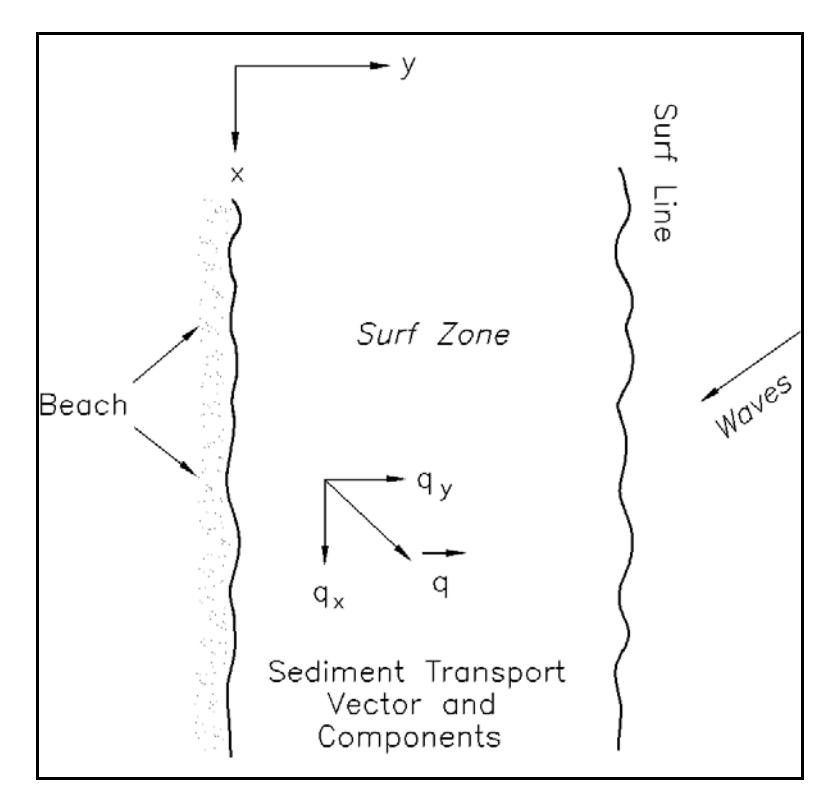

*Figure III-3-1. Longshore $(q_{x})$ and cross-shore $(q_{y})$ sediment transport components*

(2) Cross-shore sediment transport encompasses both offshore transport, such as occurs during storms, and onshore transport, which dominates during mild wave activity. Transport in these two directions appears to occur in significantly distinct modes and with markedly disparate time scales; as a result, the difficulties in predictive capabilities differ substantially. Offshore transport is the simpler of the two and tends to occur
with greater rapidity and as a more regular process with transport more or less in phase over the entire active profile. This is fortunate since there is considerably greater engineering relevance and interest in offshore transport due to the potential for damage to structures and loss of land. Onshore sediment transport within the region delineated by the offshore bar often occurs in "wave-like" motions referred to as "ridge-and-runnel" systems in which individual packets of sand move toward, merge onto, and widen the dry beach. A complete understanding of cross-shore sediment transport is complicated by the contributions of both bed and suspended load transport. Partitioning between the two components depends in an unknown way on grain size, local wave energy, and other variables.
(3) Cross-shore sediment transport is relevant to a number of coastal engineering problems, including: (a) beach and dune response to storms, (b) the equilibration of a beach nourishment project that is placed at slopes steeper than equilibrium, (c) so-called "profile nourishment" in which the sand is placed in the nearshore with the expectation that it will move landward nourishing the beach (this involves the more difficult problem of onshore transport), (d) shoreline response to sea level rise, (e) seasonal changes of shoreline positions, which can amount to 30 to 40 m, (f) overwash, the process of landward transport due to overtopping of the normal land mass due to high tides and waves, (g) scour immediately seaward of shoreparallel structures, and (h) the three-dimensional flow of sand around coastal structures in which the steeper and milder slopes on the updrift and downdrift sides of the structure induce seaward and landward components, respectively. These problems are schematized in Figure III-3-2.

#### b. Scope of chapter.

- (1) This chapter consists of two additional sections. The first section describes the general characteristics of equilibrium beach profiles and cross-shore sediment transport. This section commences with a qualitative description of the forces acting within the nearshore zone, the characteristics of an equilibrium beach profile, and a discussion of conditions of equilibrium when the forces are balanced, as well as the ensuing sediment transport when conditions change, causing an imbalance. The general profile characteristics across the continental shelf are reviewed with special emphasis on the more active nearshore zone. Bar morphology and short- and long-term changes of beach profiles due to storms and sea level rise are examined, along with effects of various parameters on the profile characteristics, including wave climate and sediment characteristics. Survey capabilities to quantify the profiles are reviewed.
- (2) The second section deals with quantitative aspects of cross-shore sediment transport with special emphasis on engineering applications and the prediction of beach profile change. First, the general shape of the equilibrium beach profile is quantified in terms of sediment grain size and basic wave parameters. Equilibrium profile methods are then used to develop analytical solutions to several problems of interest in beach nourishment design. Similar analytical solutions are developed for the steady-state beach profile response to elevated water levels, including both the long-term response to sea level rise and the short-term response to storm surge. For simplified cases, analytical methods are then presented for estimating the dynamic profile response during storms. For more general applications, numerical modelling approaches are required and these are briefly reviewed.

### III-3-2. General Characteristics of Natural and Altered Profiles

- a. Forces acting in the nearshore.
- (1) There are several identifiable forces that occur within the nearshore active zone that affect sediment motion and beach profile response. The magnitudes of these forces can be markedly different inside and

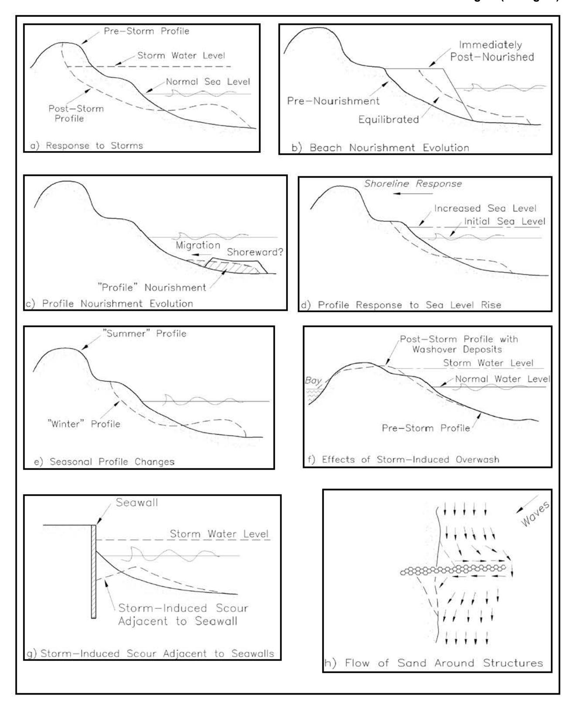

*Figure III-3-2. Problems and processes in which cross-shore sediment transport is relevant*

outside the surf zone. Under equilibrium conditions, these forces are in balance and although there is motion of the individual sand grains under even low wave activity, the profile remains more or less static. Cross-shore sediment transport occurs when hydrodynamic conditions within the nearshore zone change, thereby modifying one or more of the forces resulting in an imbalance and thus causing transport gradients and profile change. Established terminology is that onshore- and offshore-directed forces are referred to as "constructive" and "destructive," respectively. These two types of forces are briefly reviewed below; however, as will be noted, the term "forces" is used in the generic sense. Moreover it will be evident that some forces could behave as constructive under certain conditions and destructive under others.
(2) As noted, constructive forces are those that tend to cause onshore sediment transport. For classic nonlinear wave theories (Stokes, Cnoidal, Solitary, Stream Function, etc.), the wave crests are higher and of shorter duration than are the troughs. This feature is most pronounced just outside the breaking point and also applies to the water particle velocities. For oscillatory water particle velocities expressed as a sum of phaselocked sinusoids such as for the Stokes or Stream Function wave theories, even though the time mean of the water particle velocity is zero, the average of the bottom shear stress τb expressed as

```math
\overline{\tau_b} = \rho \frac{f}{8} \overline{|\nu_b| \nu_b} \tag{III-3-1}
```

can be shown to be directed onshore. In the above, ρ is the mass density of water, f is the Darcy-Weisbach friction coefficient which, for purposes here is considered constant over a wave period, and $v_{b}$ is the instantaneous wave-induced water particle velocity at the bottom. A definition sketch is provided in Figure III-3-3. An example of the time-varying shear stress due to a nonlinear (Stream Function) wave is shown in Figure III-3-4. Dean (1987a) has developed the average bottom shear stress based on the Stream Function wave theory and presented the results in the nondimensional form shown in Figure III-3-5.

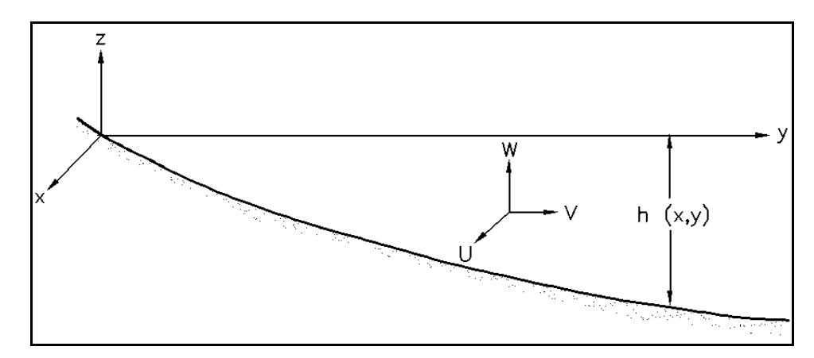

*Figure III-3-3. Definition sketch*

(3) A second constructive force originates within the bottom boundary layer, causing a net mean velocity in the direction of propagating water waves. This streaming motion was first observed in the laboratory by Bagnold (1940) and has been quantified by Longuet-Higgins (1953) as due to the local transfer of momentum associated with energy losses by friction. For the case of laminar flows, the maximum (over depth) value of this steady velocity $v_{s}$ is surprisingly independent of the value of the viscosity and is given by

```math
\nu _ { _ { S } } \, = \, - \, { \frac { 3 \sigma k H ^ { 2 } } { 1 6 \, \sinh ^ { 2 } k h } } \tag{III-3-2}
```

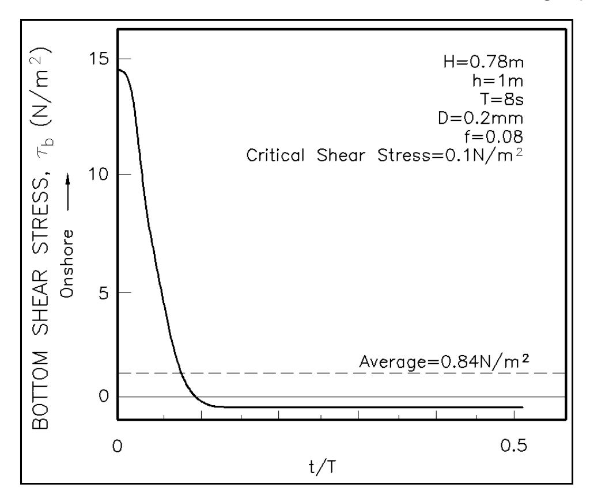

*Figure III-3-4. Variation with time of the bottom shear stress under a breaking nonlinear wave. H = 0.78 m, h= 1.0 m, T = 8.0 s, and D = 0.2 mm*

which, for the case of shallow water and a wave height proportional to the breaking depth, will be shown to be 1.5 times the average of the return flow due to the mass transport. In Equation 3-2, σ is the wave angular frequency, k is the wave number, and H the wave height. Although the maximum velocity is independent of the viscosity, the bottom shear stress τbs induced by the streaming velocity is not and is given by

```math
\tau _ { b s } \ = \ - \ \frac { \rho \ \epsilon ^ { \frac { 1 } { 2 } } \sigma ^ { \frac { 3 } { 2 } } H ^ { 2 } \ k } { 8 \ \sqrt { 2 } \ \sinh ^ { 2 } k h } \tag{III-3-3}
```

in which ε is the eddy viscosity.
(4) Within the surf zone, cross-shore transport may be predominantly due to sediment in suspension. If the suspension is intermittent, occurring each wave period, the average water particle velocity during the period that the particle is suspended determines the direction of cross-shore transport. Although this cause of sediment transport is not a true force, it does represent a contributing mechanism. Turbulence, although also not a true force, can be effective in mobilizing sediment and dependent on whether the net forces are shoreward or seaward at the time of mobilization, can be constructive or destructive, respectively. Dean (1973) noted that suspended sediment can move either onshore (constructive) or offshore (destructive), depending on how high a sand grain is suspended off the bottom. Under the wave crest, if the sediment particle is suspended a distance above the bottom proportional to the wave height H , and if the particle has a fall velocity w , then the time required for the grain to fall back to the bottom would be proportional to H / w . If this fall time is less than one-half of the wave period, then the particle should experience net onshore

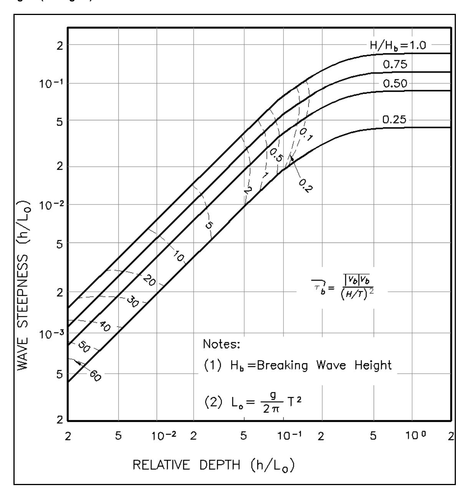

*Figure III-3-5. Isolines of nondimensional average bottom shear stress τb versus relative depth and wave steepness (Dean 1987a). Note that bottom shear stresses are directed landward*

motion, whereas the particle should move offshore if the fall time is greater than one-half the wave period. While such an approach is overly simplistic, and does not include the effects of mean cross-shore currents, it has been shown that net onshore or offshore sediment transport can be correlated to the so-called fall time parameter H / wT, which will be discussed later in this chapter.
(5) Gravity is the most obvious destructive force, acting downslope and in a generally seaward direction for a monotonic profile. However, for the case of a barred profile, gravity can act in the shoreward direction over portions of the profile. Gravity tends to "smooth" any irregularities that occur in the profile. If gravity were the only force acting, the only possible equilibrium profile would be horizontal and sandy beaches as we know them would not exist. It should be recognized, however, that gravity may also serve as a stabilizing force, since sediment particles cannot be mobilized from the bed unless: (a) upward-directed forces
associated with fluid turbulence can exceed the submerged weight of the sediment, and/or (b) slope-parallel fluid shear forces can exceed the frictional resistance of sediment. Also, as noted, gravity causes suspended sediment to settle out of the water column, with fall velocity w , which may cause suspended sediment to move shoreward if not suspended too high in the water column.
(6) Other destructive forces are generally related to the vertical structure of the cross-shore currents. The undertow, the seaward return flow of wave mass transport, induces a seaward stress on the bottom sediment particles. For linear waves, the time-averaged seaward discharge due to the return flow of shoreward mass transport Q is (Dean and Dalrymple 1991)

```math
Q = \frac{E}{\rho C} \tag{III-3-4}
```

where E is the wave energy density and C is the wave celerity. If the return flow due to mass transport were distributed uniformly over the water depth, it can be shown from linear shallow-water wave theory that the mean velocity would be

```math
\overline{V} = \frac{\sqrt{g} \ H^2}{8 \ h^{3/2}} \tag{III-3-5}
```

which, as noted for shallow water, is two-thirds of the maximum streaming velocity. Within the surf zone, the wave height can be considered to be proportional to the local depth, as H = κ h , so that the mean velocity further simplifies to 0.08 $(gh)^{1/2}$ for κ . 0.78 where $(gh)^{1/2}$ is the wave celerity in shallow water. In storm events where there is overtopping of the barrier island, a portion or all of the potential return flow due to mass transport can be relieved through strong landward flows, thereby eliminating this destructive force and resulting instead in constructive forces.
- (7) It is well-known that associated with wave propagation toward shore is a shoreward flux of linear momentum (Longuet-Higgins and Stewart 1964). When waves break, the momentum is transferred to the water column, resulting in a shoreward-directed thrust and thus a wave-induced setup within the surf zone, the gradient of which is proportional to the local bottom slope. This momentum is distributed over depth, as shown in Figure III-3-6. In shallow water, linear water wave theory predicts that one-third of the momentum flux originates between the trough and crest levels and has its centroid at the mean water level. The remaining two-thirds originates between the bottom and the mean water level, is uniformly distributed over this dimension, and thus has its centroid at the mid-depth of the water column. Because of the contribution at the free surface, breaking waves induce an equivalent shear force on the water surface which will be quantified later. This causes a seaward bottom shear stress within the breaking zone. The bottom shear stress is dependent on the rate of energy dissipation. This effective shear force due to momentum transfer must be balanced by the bottom shear stress and the pressure forces due to the slope of the water surface.
- (8) Often during major storm events, strong onshore winds will be present in the vicinity of the shoreline. These winds cause a shoreward-directed surface flow and a seaward-directed bottom flow, as shown in Figure III-3-7. Of course, seaward-directed winds would cause shoreward-directed bottom velocities and thus constructive forces. Thus, landward- and seaward-directed winds result in destructive and constructive forces, respectively.

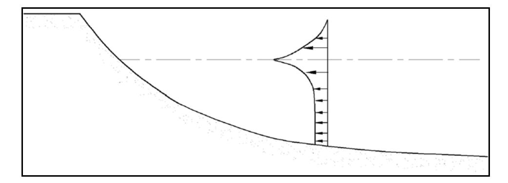

*Figure III-3-6. Distribution over depth of the flux of the onshore component of momentum*

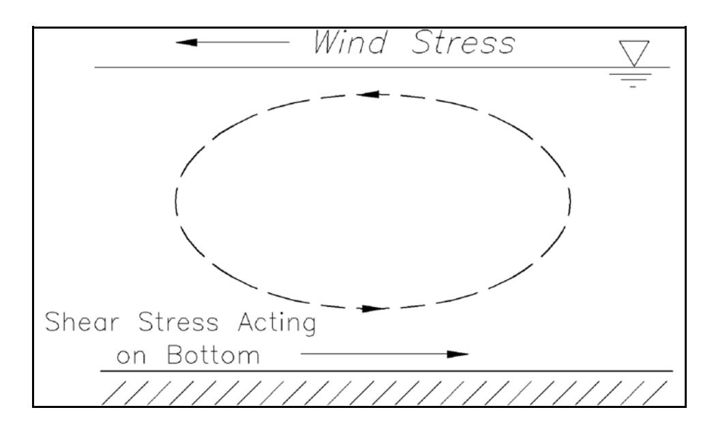

*Figure III-3-7. Bottom stresses caused by surface winds*

(9) Considering linear wave theory, and a linear shear stress relationship with eddy viscosity ε, the distribution of the mean velocity over depth for the case of return of mass transport (no overtopping) and without including the contribution of bottom streaming can be shown to be (Dean and Dalrymple 2000)

```math
\nu ( z ) \, = \, \frac { h } { \rho \epsilon } \left[ 2 \tau _ { \eta } \, - \, \frac { \partial E } { \partial y } \right] \left[ \frac { 3 } { 8 } \, \left( \frac { z } { h } \right) ^ { 2 } \, + \, \frac { 1 } { 2 } \, \left( \frac { z } { h } \right) \, + \, \frac { 1 } { 8 } \right] \, + \, \frac { 3 } { 2 } \, \frac { Q } { h } \left[ 1 \, - \, \left( \frac { z } { h } \right) ^ { 2 } \right] \tag{III-3-6}
```

In this expression, the first term is associated with the surface wind stress τη. The second term is associated with the vertical gradient of momentum flux and is expressed as a function of the cross-shore gradient in wave energy M E /M y . It is noted that this term is zero outside the breakpoint and contributes only inside the surf zone where energy is dissipated. The third term is associated with the seaward return flow of mass transport, where Q represents the net seaward discharge over the water column as given by Equation 3-4.
(10) For the three effects considered in Equation 3-6, the shear stress associated with the vertical velocity distribution may be computed for any elevation z as

```math
\tau = \rho \epsilon \frac{\partial v}{\partial z} \tag{III-3-7}
```

where ε is the turbulent eddy viscosity. The resulting seaward-directed shear stress at the bottom ( z = - h ) is then given by

```math
\tau_b = \frac{1}{4} \frac{\partial E}{\partial v} - \frac{\tau_\eta}{2} + 3 \frac{\epsilon E}{Ch^2} \tag{III-3-8}
```

- (11) Velocity distributions and shear stress distributions inside and outside the surf zone based on Equations III-3-6 and III-3-7 are shown in Figure III-3-8 for a condition of no surface wind stress and for cases of no overtopping and full overtopping both inside and outside the breakpoint. Profile conditions assumed for this example are shown in the figure caption and assume an equilibrium beach profile where wave breaking is assumed to occur at a depth of 1 m. For the case with no overtopping, most of the seaward velocity shown in Figure III-3-8 is due to the return flow required to balance the shoreward flows near the surface. This is further illustrated in the cases with overtopping where it is assumed that the shoreward flows overtop the profile so that there is no net return flow due to mass transport.
- (12) Table III-3-1 summarizes the mechanisms identified as contributing to constructive and/or destructive forces and, where possible, provides an estimate of their magnitudes. For purposes of these calculations, the following conditions have been considered: an equilibrium beach profile with a grain size of D = 0.2 mm, h = 1 m, H = 0.78 m, T = 8 s, ε = 0.04 $m^{2}/s,$ wind speed = 20 m/s. It is seen that of the bottom stresses that can be quantified, those associated with undertow due to mass transport and momentum flux transfer are dominant. b. Equilibrium beach profile characteristics.
- (1) In considerations of cross-shore sediment transport, it is useful to first examine the case of equilibrium in which there is no net cross-shore sediment transport. The competing forces elucidated in the previous section can be fairly substantial, exerting tendencies for both onshore and offshore transport. A change will bring about a disequilibrium that causes cross-shore sediment transport. The concept of an equilibrium beach profile has been criticized, since in nature the forces affecting equilibrium are always changing with the varying tides, waves, currents, and winds. Although this is true, the concept of an equilibrium profile is one of the coastal engineer's most valuable tools in providing a framework to consider disequilibrium and thus cross-shore sediment transport. Also, many useful and powerful conceptual and design relationships are based on profiles of equilibrium.
- (2) When applying equilibrium profile concepts to problems requiring an estimate of profile retreat or advance, a related concept of importance is the principle of conservation of sand across the profile. Under conditions where no longshore gradients exist in the longshore transport, onshore-offshore transport causes a redistribution of sand across the profile but does not lead to net gain or loss of sediment. Most engineering methods applied to the prediction of profile change ensure that the total sand volume is conserved in the active profile, so that erosion of the exposed beach face requires a compensating deposition offshore, while deposition on the exposed beach face must be accompanied by erosion of sediment in the surf zone. For cases where longshore gradients in longshore transport do exist, it is then common to assume that the profile

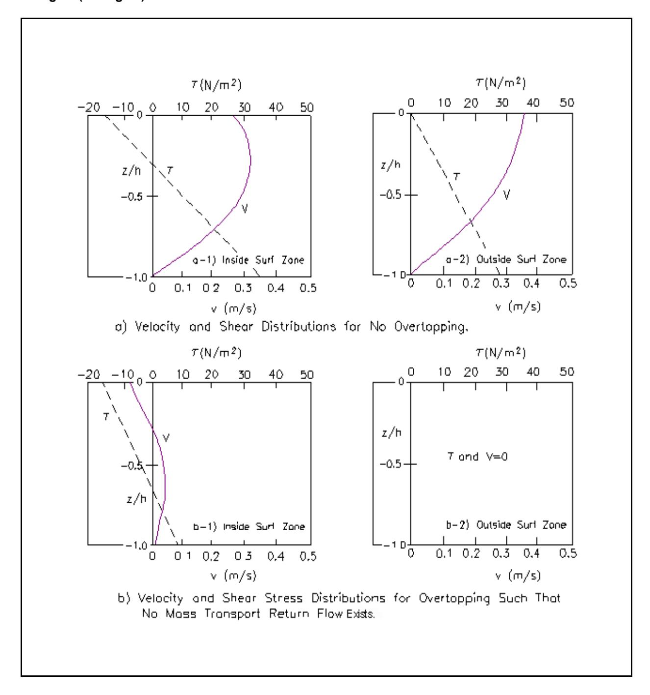

*Figure III-3-8. Velocity distributions inside and outside the surf zone for no surface wind stress and cases of no overtopping and full overtopping both inside and outside the surf zone*

advances or retreats uniformly at all active elevations while maintaining its shape across the profile. In this way, sediment volume can be added or removed from the profile without changing the shape of the active profile. As a result, most methods for predicting beach profile change treat the longshore and cross-shore components separately so that the final profile form and location are determined by superposition.

*Table III-3-1 Constructive and Destructive Cross-shore "Forces" in Terms of Induced Bottom Shear Stresses*

**Table III-3-1. Constructive and Destructive Cross-shore "Forces" in Terms of Induced Bottom Shear Stresses**

| Constructive or | Description | Magnitude of Force (N/m2 ) |  |
| --- | --- | --- | --- |
| Destructive | of Force | Breaking Waves | Nonbreaking Waves |
|  | Average Bottom Shear Stress Due to Nonlinear $Waves^{1}$ | 0.84 | 0.84 |
| Constructive | Streaming $Velocities^{2}$ | 28.9 | 28.9 |
|  | Overtopping | 28.6 | 28.6 |
|  | Gravity3 | 0.046 | 0.046 |
| Destructive | Undertow Due to Mass Transport | 28.6 | 28.6 |
|  | Undertow Due to Momentum Flux Transfer | 7.9 | 0 |
| Constructive or | Intermittent Suspension | ? | ? |
| Destructive | Turbulence | Relatively Large | Relatively Small |
|  | Wind $Effects^{4}$ | 0.95 | 0.95 |

#### Notes:

For the calculations resulting in the values in this table: H = 0.78 m, h = 1.0 m, T = 8 s.
- (3) Generally observed properties of equilibrium profiles are as follows: (a) they tend to be concave upward, (b) the slopes are milder when composed of finer sediments, (c) the slopes tend to be flatter for steeper waves, and (d) the sediments tend to be sorted with the coarser and finer sediments residing in the shallower and deeper waters, respectively. The effects of changes that induce cross-shore sediment transport can be deduced from these known general characteristics. For example, an increase in water level will cause a disequilibrium, as can be seen by noting that due to the concave upward nature of the profile, the depth at a particular reference distance from the new shoreline is now greater than it was before the increased water level. If the equilibrium profile had been planar, then the increase in water level would not change the depth at a distance from the new shoreline and there would be no disequilibrium. It will be shown that without the introduction of additional sediment into the system, the only way in which the profile can reattain equilibrium is to recede, thus providing sediment to fill the bottom to a depth consistent with the equilibrium profile and the new (elevated) water level.
- (4) Since profiles are generally flatter for steeper waves, an increase or decrease in wave steepness will also induce seaward or landward sediment flows, respectively. Naturally, onshore and offshore winds will cause seaward and landward sediment transport, respectively. As an example of the shoreline response to storms, Figure III-3-9 presents results from Katoh and Yanagishima (1988) in which the offshore waves, shoreline position, and beach face slope were measured over a period of approximately 7 months. It is seen that the shoreline retreats abruptly during the higher wave events and advances more gradually during periods of milder wave activity. The beach slope and shoreline changes, of course, correlate with the slope becoming milder during periods of shoreline retreat. The authors also found it of interest that the rate of shoreline advancement during the recovery phase was almost constant at 0.68 m/day.
- (5) Many beaches in nature have one or more longshore bars present. At some locations, these bars are seasonal and at some they are more or less permanent. Figure III-3-10a presents a profile from

*f = 0.08*

*2 , = 0.04 $m^{2}/s$*

*3 Equilibrium profile with D = 0.2 mm*

*4 Wind speed = 20 m/s.*

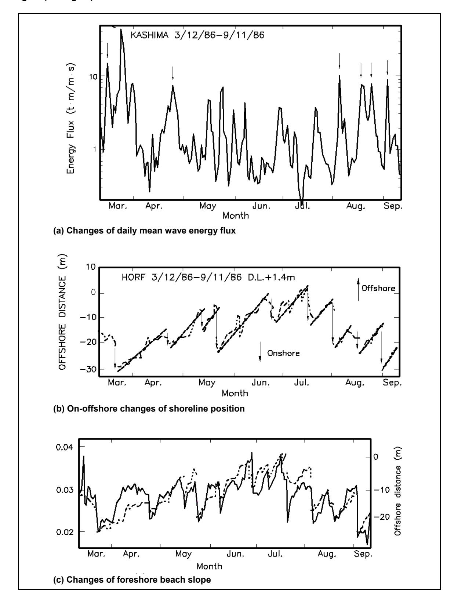

*Figure III-3-9. Effects of varying wave energy flux (a) on: (b) shoreline position, and (c) foreshore beach slope (dots are shoreline position in (b) and (c), solid curve is trend line in (b), foreshore slope in (c)) (Katoh and Yanagishima 1988)*

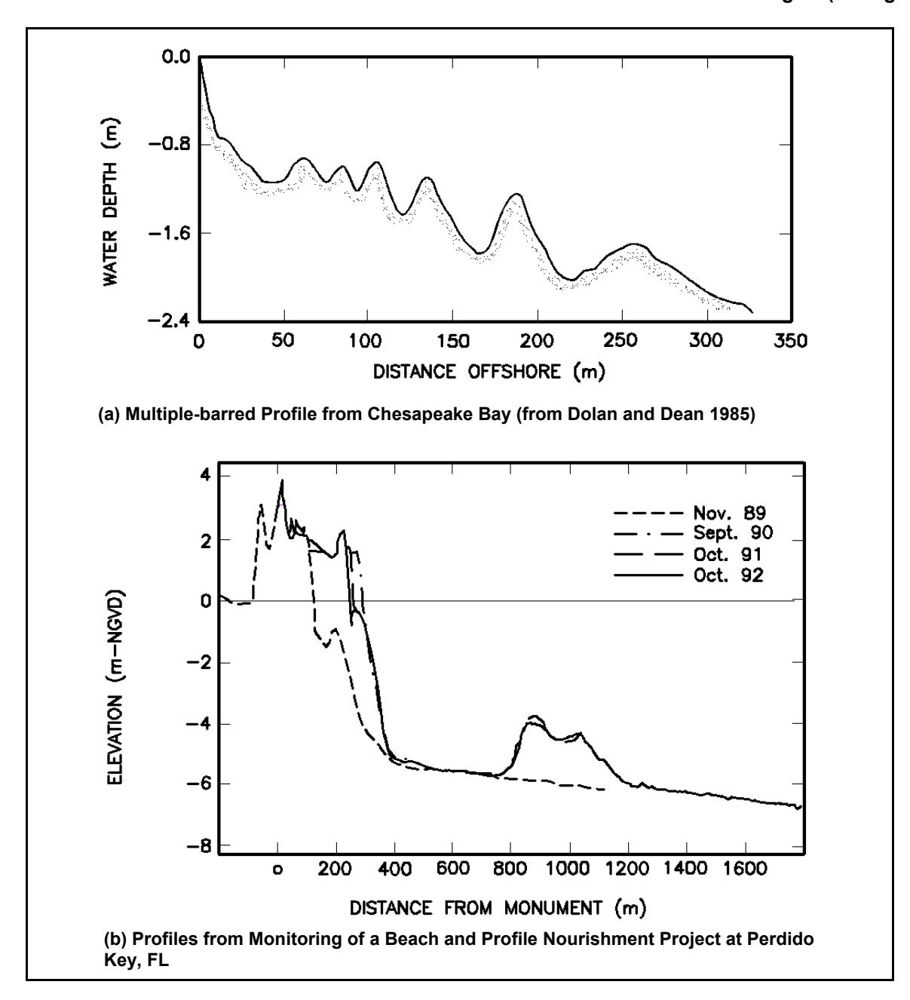

*Figure III-3-10. Examples of two offshore bar profiles*

Chesapeake Bay in which at least six bars are evident and Figure III-3-10b shows profiles measured in a monitoring program to document the evolution of a beach nourishment project at Perdido Key, FL. This project included both beach nourishment in the form of a large seaward buildup of the berm and foreshore and profile nourishment in the form of a large offshore mound. As seen from Figure III-3-10b, a bar was present before nourishment and gradually re-formed in depths of less than 1 m as the profile equilibrated during the 2-year period shown in Figure III-3-10b.
(6) It will be shown later that the presence of bars depends on wave and sediment conditions and at a particular beach, bars may form or move farther seaward during storms. It appears that the outer bars on some profiles are relict and may have been caused by a past large storm which deposited the sand in water too deep
for fair- weather conditions to return the sand to shore. At some beaches with more than one bar, the inner bar will exhibit more rapid response to changing wave conditions than those farther offshore. Figure III-3-11 presents results from Duck, NC, in which profile surveys were conducted over a period of approximately 11 years. It is seen in this case that both the outer and inner bars undergo significant changes in position whereas the shoreline remains relatively fixed, possibly due to coarser sediment in shallow water and at the shoreline. As an example of the potential rates of change of bar position, Birkemeier (1984) shows examples of offshore migration of the outer bar at Duck, NC, during three successive storms in the fall of 1981 averaging almost 4 m/day while onshore migration of the outer bar following the storm season averaged almost 0.5 m/day.

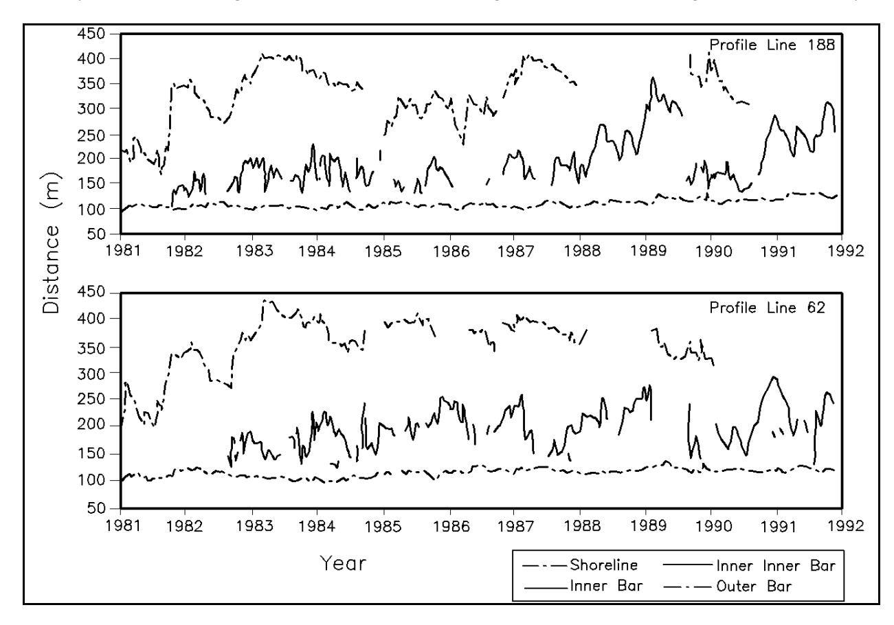

*Figure III-3-11. Variation in shoreline and bar crest positions, Duck, NC (Lee and Birkemeier 1993)*

(7) Keulegan (1945, 1948) reported on studies which included both laboratory and field data to determine relationships for bar formation. A focus of these studies was the geometric characteristics of the longshore bars. In examining bars from nature, an attempt was made to select sites with small tidal effects. The bar geometry was defined in terms of the depth over the bar crest $h_{CR}$ the depth of the bar trough $h_{T}$ and the depth to the bar base $h_{D}$ at the position of the bar crest. These definitions are shown in Figure III-3-12. Keulegan found that the ratio of depths of bar crest to bar base $h_{CR}/h_{D}$ was approximately 0.58 for both the laboratory and field cases. The ratio of depths of trough to crest $h_{T}/h_{CR}$ ranged from 1.6 to 1.8. It was also found that bars in nature are considerably broader than those produced in the laboratory. This is probably due to varying wave heights in nature and, to a lesser extent, to varying water levels. Figure III-3-13 compares laboratory and field bar geometries. The field bar is approximately twice as wide as the bar produced in the laboratory.

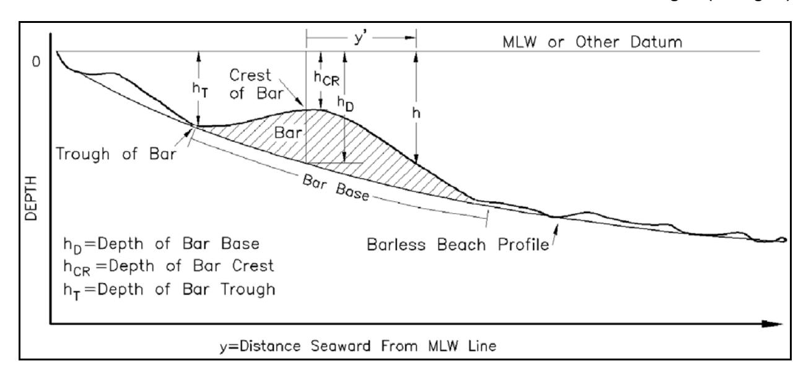

*Figure III-3-12. Definition of offshore bar characteristics (Keulegan 1945)*

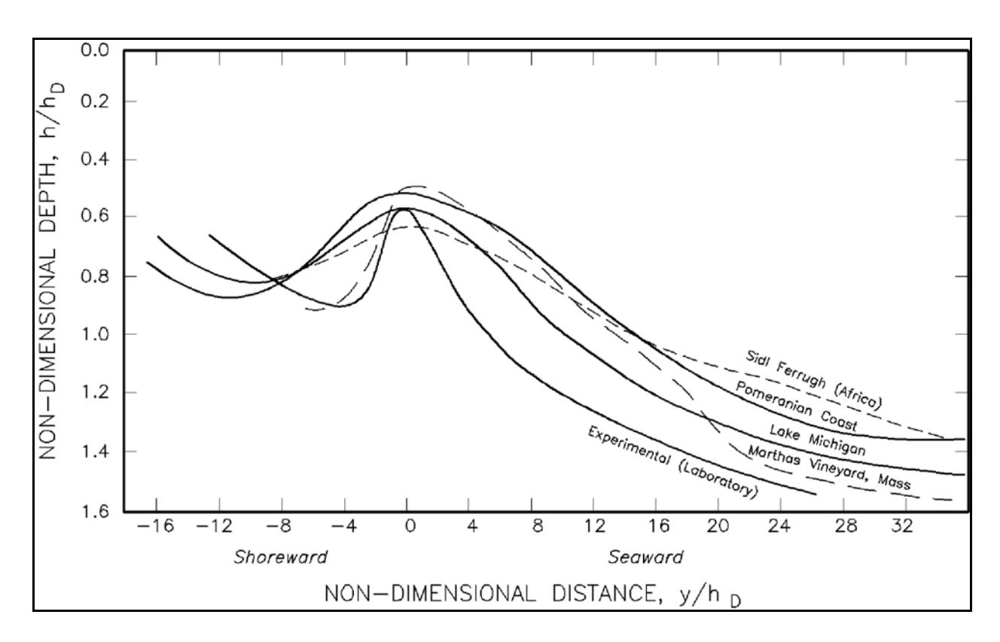

*Figure III-3-13. Nondimensional geometries of natural bars compared with those produced in the laboratory (Keulegan 1948)*

(8) The shapes of profiles across the continental shelf are less predictable than those within the more active zone of generally greater engineering interest. This may be due to the presence of bottom material different than sand (including rock and peat outcrops), the much greater time constants required for equilibration in these greater depths, the greater role of currents in shaping the profile and the effects of past sea level variations. In general, the slopes seaward of the more active zone are quite small if the bottom is composed of sand or smaller-sized materials. Figure III-3-14 presents three examples of profiles extending off the East and Gulf coasts of Florida. It is seen that at this scale, the profile may be approximated by a nearshore slope that extends to 5 to 18 m and milder seaward slopes, which are on the order of 1/2,000 to 1/10,000.

## c. Interaction of structures with cross-shore sediment transport.

The structure that interacts most frequently with cross-shore sediment transport is a shore-parallel structure such as a seawall or revetment. During storm events, a characteristic profile fronting a shore-parallel structure is one with a trough at its base, as shown in Figure III-3-15, from Kriebel (1987) for a profile affected by Hurricane Elena in Pinellas County, Florida, in September 1985. This trough is due to large transport gradients immediately seaward of the structure. Although the hydrodynamic cause of this scour is not well-known, it has been suggested that it is due to a standing wave system with an antinode at the structure. A second, more heuristic explanation is that sand removal is prevented behind the seawall and the transport system removes sand from as near as possible to where removal would normally occur. Barnett and Wang (1988) have reported on a model study to evaluate the interaction of a seawall with the profile and have found that the additional volume represented by the scour trough is approximately 62 percent of what would have been removed landward of the seawall if it had not been present. During mild wave activity, it appears that the profile recovers nearly as it would have if the seawall had not been present. The reader is referred to the comprehensive review by Kraus (1988) for additional information on shore-parallel structures and their effects on the shoreline.

#### d. Methods of measuring beach profiles.

- (1) Introduction. Changes in beach and nearshore profiles are a result of cross-shore and longshore sediment transport. If the longshore gradients in the longshore component can be considered small, it is possible, through the continuity equation, to infer the volumetric cross-shore transport from two successive profile surveys.
- (2) Clausner, Birkemeier, and Clark (1986) have carried out a comprehensive field test of four nearshore survey systems, including: (a) the standard fathometer system, (b) the CRAB, which is a self-propelled platform on which a survey prism is mounted, (c) a sea sled, which also carries a prism but is towed by a boat or a cable from shore, and (d) a hydrostatic profiler, which utilizes a cable for towing and an oil-filled tube to sense the elevation difference between the shore and the location of the point being surveyed. Each of these systems is reviewed briefly below and their performance characteristics are described and summarized in Table III-3-2.
- (a) Fathometer. This method of measuring nearshore profiles requires knowledge of the water level as a reference datum. To provide a complete description of the active profile, fathometer surveys must be complemented with surveys of the shallow-water and above-water portions of the profile. In the field tests, the fathometer was mounted on a 47-ft vessel and the surveys were conducted under favorable wave conditions, which should result in a lower estimate of the error. Characteristics of this system and results obtained from the field measurements are presented in Table III-3-2.

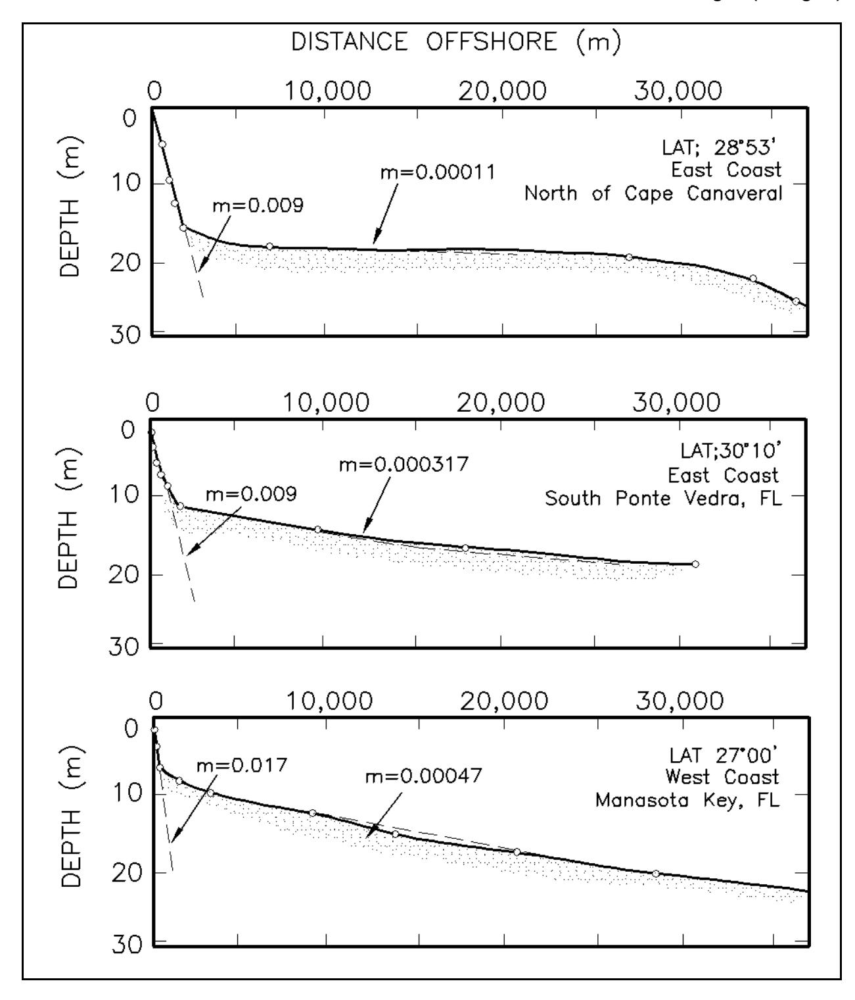

*Figure III-3-14. Profiles extending across the continental shelf for three locations along the East and Gulf coastlines of the United States (Dean 1987a)*

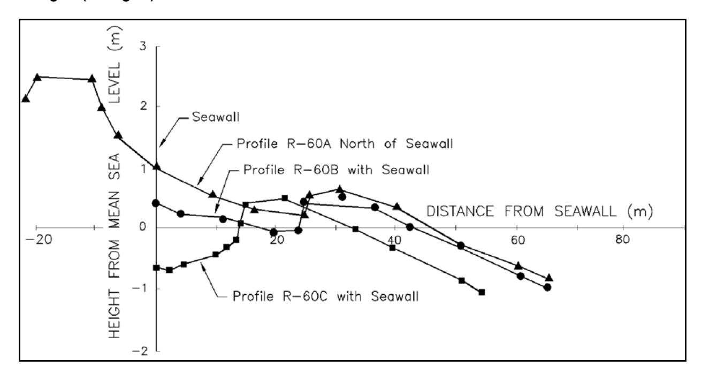

*Figure III-3-15. Comparison of response of natural and seawalled profiles to Hurricane Elena, September 1985 (after Kriebel (1987))*

*Table III-3-2 Summary of Field Evaluation of Various Nearshore Survey Systems (Based on Clausner, Birkemeier, and Clark (1986))*

**Table III-3-2. Summary of Field Evaluation of Various Nearshore Survey Systems (Based on Clausner, Birkemeier, and Clark (1986))**

|  | Requirements Personnel | Wave Heights | Number of Profiles | Field Profiles per | Performance Characteristics Vertical Average Difference From Mean | Accuracy Average Vertical Envelope | Horizontal Accuracy Average Distance Off Line |
| --- | --- | --- | --- | --- | --- | --- | --- |
| System | Required | (m) | Measured | Day | (cm) | (cm) | (m) |
| Fathometer | 4 | < 1 | 6 $(5)^{1}$ | 16 | 9 $(6)^{1}$ | 31 $(20)^{1}$ | 1.3 |
| CRAB | 2 | < 2 | 5 | 7 | 2 | 5 | 0.4 |
| Sea Sled | 3 - 4 | < 1 | 5 | 9 | 1 | 3 | 1.6 |
| Hydrostatic | 2 - 3 | < 1 | 4 | 3 | 3 | 7 | 3.6 |
| Profiler |  |  |  |  |  |  |  |
| Based on the | smoothed analog records. | All other | fathometer data | based on digital | records. |  | 1 |

*Based on the smoothed analog records. All other fathometer data based on digital records.*

(b) CRAB. The CRAB (Coastal Research Amphibious Buggy) is a self-propelled vehicle that has a survey prism mounted on it and is used in conjunction with a laser survey system. At the time of the Clausner report (Clausner, Birkemeier, and Clark 1986), it was necessary to stop the CRAB to take a reading. More recently, the system has been upgraded to an automatic self-tracking mode such that the CRAB can be moved continuously and readings taken at predetermined time increments. Since the CRAB avoids the need for a water level datum, the vertical accuracy is inherently superior to that of fathometer measurements.
- (c) Sea sled. The sea sled incorporates many of the inherent survey advantages of the CRAB, since dependency on the water level is avoided. The major difference is that the CRAB is self-propelled whereas the sea sled is towed by either a boat or a truck on the shore. Since the sea sled is dependent on some vehicle to transport it through the surf zone and this vehicle is usually a boat, it will be more limited by wave conditions than the CRAB, which can operate in sea states of 2 m.
- (d) Hydrostatic profiler. The hydrostatic profiler was developed by Seymour and Boothman (1984) and consists of a long (about 600 m) oil-filled tube extending from the shoreline to a small weighted sled at the measurement location. A pressure sensor at the sled "weighs" the vertical column of oil from the shore to the sled location which can be interpreted as the associated elevation difference. In general, the hydrostatic profiler has not been widely used due to inherent limitations in its performance, related to sensitivity to pressure surges and to longshore currents.
- (2) Summary. In summary, referring to Table III-3-2, the CRAB emerges as the overall best system. The sea sled provides slightly better overall vertical accuracy; however, as noted, the CRAB now utilizes an automatic tracking mode, which should reduce possibility of human-induced error. The main disadvantages of the CRAB system are the limited availability of such systems and the difficulties of transporting from one site to another. The reader is referred to the report by Clausner, Birkemeier, and Clark (1986) for additional details of the four systems and the results of the field tests.

## III-3-3. Engineering Aspects of Beach Profiles and Cross-shore Sediment Transport

- a. Introduction. Previous sections have discussed the natural characteristics of beach profiles in equilibrium, the effects that cause disequilibrium, and the associated profile changes. Also shown in Figure III-3-2 were the numerous possible engineering applications of equilibrium beach profiles. This section presents some of the applications, illustrates these with examples, and investigates approaches to calculation of cross-shore sediment transport and the associated profile changes. b. Limits of cross-shore sand transport in the onshore and offshore directions.
- (1) The long-term and short-term limits of cross-shore sediment transport are important in engineering considerations of profile response. During short-term erosional events, elevated water levels and high waves are usually present and the seaward limit of interest is that to which significant quantities of sand-sized sediments are transported and deposited. It is important to note that sediment particles are in motion to considerably greater depths than those to which significant profile readjustment occurs. This readjustment occurs most rapidly in the shallow portions of the profile and, during erosion, transport and deposition from these areas cause the leading edge of the deposition to advance into deeper water. This is illustrated in Figure III-3-16 from Vellinga (1983), in which it is seen that with progressively increasing time, the evolving profile advances into deeper and deeper water. It is also evident from this figure that the rate of profile evolution is decreasing consistent with an approach to equilibrium. For predicting cross-shore profile change, the depth of limiting motion is not that to which the sediment particles are disturbed but rather these award limit to which the depositional front has advanced. Vellinga recommends that this depth be 0.75 $H_{s}$ in which $H_{s}$ is the deepwater significant wave height computed from the breaking wave height using linear water wave theory. In general, the limit of effective transport for short-term (storm) events is commonly taken as the breaking depth $h_{b}$ based on the significant wave height.
- (2) The onshore limit of profile response is also of interest as it represents the maximum elevation and landward limit of sediment transport. During normal erosion/accretion cycles, the upper limit of significant beach profile change coincides with the wave runup limit. Under constructive conditions, as the beach face builds seaward, this upper limit of sediment deposition is usually well-defined in the form of a depositional
beach berm. During erosion conditions, the berm may retreat more or less uniformly. In some cases, the berm may be so high that runup never reaches its crest, in which case an erosion scarp will form above the runup limit. This is also evident in the case of eroding dunes, which are not overtopped by wave runup. In these cases, the slope of the eroding scarp may be quite steep, approaching vertical in some cases. A common assumption is that the eroding scarp will form at more or less the angle of repose of the sediment. Vellinga (1983), based on results shown in Figure III-3-16, suggests adopting a 1:1 slope for this erosion scarp. In other cases, the berm may be significantly overtopped by either the water level (storm surge) or by the wave runup. If overwash occurs, the landward limit may be controlled by the extent to which the individual uprush and overwash events are competent to transport sediment. Often this distance is determined by loss of transporting power due to percolation into the beach or by water impounded by the overwash event itself. In the latter case, the landward depositional front will advance at more or less the angle of repose into the impounded water.
(3) The seaward limit of effective profile fluctuation over long-term (seasonal or multi-year) time scales is a useful engineering concept and is referred to as the "closure depth," denoted by $h_{c}.$ Based on laboratory and field data, Hallermeier (1978, 1981) developed the first rational approach to the determination of closure depth. He defined two depths, the shallowest of which delineates the limit of intense bed activity and the deepest seaward of which there is expected to be little sand transport due to waves. The shallower of the two appears to be of the greatest engineering relevance and will be discussed here. Based on correlations with the Shields parameter, Hallermeier defined a condition for sediment motion resulting from wave conditions that are relatively rare. Effective significant wave height $H_{e}$ and effective wave period $T_{e}$ were based on conditions exceeded only 12 hr per year; i.e., 0.14 percent of the time. The resulting approximate equation for the depth of closure was determined to be

```math
h_c = 2.28 H_e - 68.5 \left( \frac{H_e^2}{g T_e^2} \right) \tag{III-3-9}
```

in which $H_{e}$ can be determined from the annual mean significant wave height H 6 and the standard deviation of significant wave height σH as

```math
H _ { e } \ = \ \overline { { H } } \ + \ 5 . 6 \sigma _ { H } \tag{III-3-10}
```

(4) Based on this relationship, Hallermeier also proposed a form of Equation 3-9 that did not depend on the effective wave period in the form

```math
h_c = 2\bar{H} + 11\,\sigma_H \tag{III-3-11}
```

(5) Birkemeier (1985) evaluated Hallermeier's relationship using high-quality field measurements from Duck, NC, and found that the following simplified approximation to the effective depth of closure provided nearly as good a fit to the data

```math
h_c = 1.57 H_e \tag{III-3-12}
```

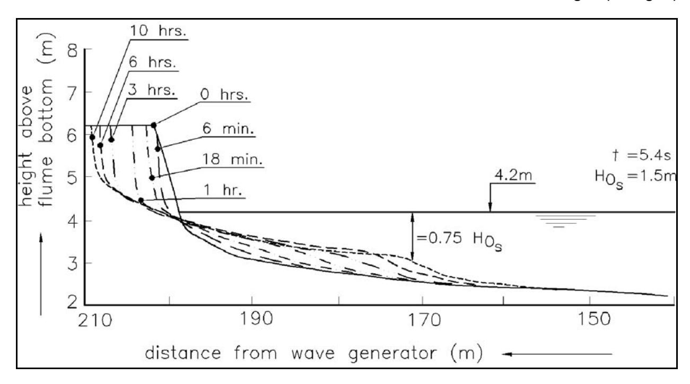

*Figure III-3-16. Erosional profile evolution, large wave tank results (Vellinga 1983)*

- (6) In the applications to follow, it will be assumed that $h_{c}$ is an appropriate representation of the closure depth for profile equilibration and for significant beach profile change over long time scales. This quantity will be denoted as $h_{*}$ in most of the examples presented when applied to beach nourishment problems. For short-term profile changes such as those that occur during a storm, the breaking depth $h_{b}$ will be assumed to delineate the active profile. It should be noted that other approaches to "channel depth" are discussed in the literature (Hands 1983). c. Quantitative description of equilibrium beach profiles.
- (1) Various models have been proposed for representing equilibrium beach profiles (EBP). Some of these models are based on examination of the geometric characteristics of profiles in nature and some attempt to represent in a gross manner the forces active in shaping the profile. One approach that has been utilized is to recognize the presence of the constructive forces and to hypothesize the dominance of various destructive forces. This approach can lead to simple algebraic forms for the profiles for testing against profile data.
- (2) Dean (1977) has examined the forms of the EBPs that would result if the dominant destructive forces were one of the following: (a) Wave energy dissipation per unit water volume. (b) Wave energy dissipation per unit surface area.
- (c) Uniform average longshore shear stress across the surf zone. It was found that for all three of these destructive forces, by using linear wave theory and a simple wave breaking model, the EBP could be represented by the following simple algebraic form

```math
h = A y^n \tag{III-3-13}
```

in which A , representing a sediment scale parameter, depends on the sediment size D . This form with an exponent n equal to 2/3 had been found earlier by Bruun (1954) based on an examination of beach profiles in Denmark and in Monterey Bay, CA. Dean (1977) found the theoretical value of the exponent n to be 2/3 for the case of wave energy dissipation per unit volume as the dominant force and 0.4 for the other two cases. Comparison of Equation 3-13 with approximately 500 profiles from the east coast and Gulf shorelines of the United States showed that, although there was a reasonably wide spread of the exponents n for the individual profiles, a value of 2/3 provided the best overall fit to the data. As a result, the following expression is recommended for use in describing equilibrium beach profiles

```math
h = Ay^{\frac{2}{3}} \tag{III-3-14}
```

This allows the appealing interpretation that the wave energy dissipation per unit water volume causes destabilization of the sediment particles through the turbulence associated with the breaking waves. Thus dynamic equilibrium results when the level of destabilizing and constructive forces are balanced.
(3) The sediment scale parameter A and the equilibrium wave energy dissipation per unit volume $D_{*}$ are related by (Dean 1991)

```math
A = \left[ \frac{24}{5} \frac{D_*}{\rho g \sqrt{g} \kappa^2} \right]^{\frac{2}{3}} \tag{III-3-15}
```

- (4) Moore (1982) and Dean (1987b) have provided empirical correlations between the sediment scale parameter A as a function of sediment size D and fall velocity $w_{f}$ as shown in Figure III-3-17. These results are based on a least-squares fit of Equation 3-14 to measured beach profiles. Figure III-3-18 presents an expanded version of the A versus D relationship for grain sizes more typical of beach sands and Table III-3-3 provides a tabulation of A values over the size range D = 0.10 mm to D = 1.09 mm. Although Table III-3-3 provides A values to four decimal places at diameter increments of 0.01 mm, this should not be interpreted as signifying that understanding of EBP justifies this level of quantification. Rather the values are presented for consistency by different users and possibly for use in sensitivity tests.
- (5) The equilibrium profile parameter A may also be correlated to sediment fall velocity. In Figure III-3-17, a relationship is suggested between A and $w_{f}$ that is valid over the entire range of sediment sizes shown. Kriebel, Kraus, and Larson (1991) developed a similar correlation over a range of typical sand grain sizes from D = 0.1 mm to D = 0.4 mm and found the following relationship

```math
A = 2.25 \left(\frac{w_f^2}{g}\right)^{\frac{1}{3}} \tag{III-3-16}
```

(6) This dependence of A on fall velocity to the two-thirds power has also been suggested by Hughes (1994) based on dimensional analysis.

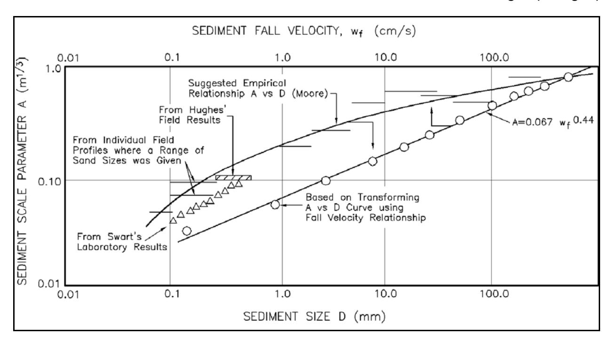

*Figure III-3-17. Variation of sediment scale parameter A with sediment size D and fall velocity $w_{f}$ (Dean 1987b)*

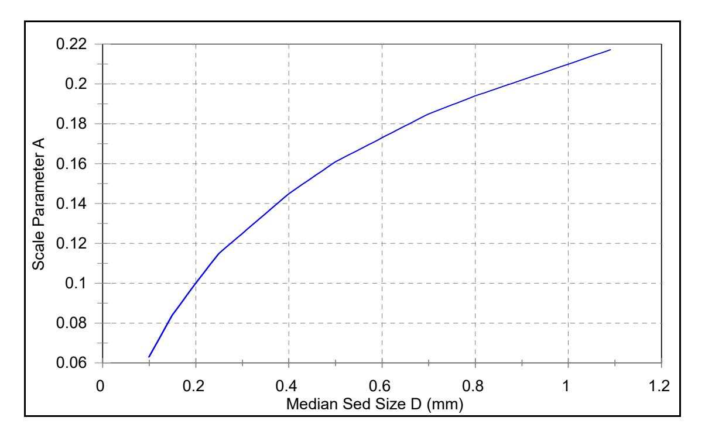

*Figure III-3-18. Variation of sediment scale parameter A ( D ) with sediment size D for beach sand sizes (based on Dean 1978b, values recomputed by Dean, June 2001)*

*Table III-3-3 Summary of Recommended A Values (Units of A Parameter are $m^{1/3})$*

**Table III-3-3. Summary of Recommended A Values (Units of A Parameter are $m^{1/3})$**

| D(mm) | 0.00 | 0.01 | 0.02 | 0.03 | 0.04 | 0.05 | 0.06 | 0.07 | 0.08 | 0.09 |
| --- | --- | --- | --- | --- | --- | --- | --- | --- | --- | --- |
| 0.1 | 0.063 | 0.0672 | 0.0714 | 0.0756 | 0.0798 | 0.084 | 0.0872 | 0.0904 | 0.0936 | 0.0968 |
| 0.2 | 0.100 | 0.103 | 0.106 | 0.109 | 0.112 | 0.115 | 0.117 | 0.119 | 0.121 | 0.123 |
| 0.3 | 0.125 | 0.127 | 0.129 | 0.131 | 0.133 | 0.135 | 0.137 | 0.139 | 0.141 | 0.143 |
| 0.4 | 0.145 | 0.1466 | 0.1482 | 0.1498 | 0.1514 | 0.153 | 0.1546 | 0.1562 | 0.1578 | 0.1594 |
| 0.5 | 0.161 | 0.1622 | 0.1634 | 0.1646 | 0.1658 | 0.167 | 0.1682 | 0.1694 | 0.1706 | 0.1718 |
| 0.6 | 0.173 | 0.1742 | 0.1754 | 0.1766 | 0.1778 | 0.179 | 0.1802 | 0.1814 | 0.1826 | 0.1838 |
| 0.7 | 0.185 | 0.1859 | 0.1868 | 0.1877 | 0.1886 | 0.1895 | 0.1904 | 0.1913 | 0.1922 | 0.1931 |
| 0.8 | 0.194 | 0.1948 | 0.1956 | 0.1964 | 0.1972 | 0.198 | 0.1988 | 0.1996 | 0.2004 | 0.2012 |
| 0.9 | 0.202 | 0.2028 | 0.2036 | 0.2044 | 0.2052 | 0.206 | 0.2068 | 0.2076 | 0.2084 | 0.2092 |
| 1.0 | 0.210 | 0.2108 | 0.2116 | 0.2124 | 0.2132 | 0.2140 | 0.2148 | 0.2156 | 0.2164 | 0.2172 |
| Notes: |  |  |  |  |  |  |  |  |  |  |

Notes:
(7) There are two inherent limitations of Equation 3-14. First, the slope of the beach profile at the water line (y=0) is infinite. Second, the beach profile form is monotonic; i.e., it cannot represent bars. It has been shown that the first limitation can be overcome by recognizing gravity as a significant destabilizing force when the profile becomes steep. In this case with the beach face slope denoted as $m_{o},$ the form is

```math
y = \frac{h}{m_o} + \left(\frac{h}{A}\right)^{\frac{3}{2}} \tag{III-3-17}
```

which, unfortunately, is significantly more cumbersome to apply. Larson (1988) and Larson and Kraus (1989) have shown that an EBP of the form of Equation 3-17 results by replacing the simple breaking wave model leading to Equation 3-14 by the more complex breaking model of Dally et al. (1985). Bodge (1992) and Komar and McDougal (1994) have each proposed slightly different forms of an exponential beach profile. The form proposed by Bodge is

```math
h(y) = h_o(1 - e^{-ky}) \tag{III-3-18}
```

in which $h_{o}$ is the asymptotic depth at a great offshore distance, and k is a decay constant. The form suggested by Komar and McDougal is quite similar with $h_{o}$ = $m_{o}/k$ in which $m_{o}$ is the beach face slope. Bodge fit his profile to the averages of the ten data sets provided by Dean (1977) and found that the majority (about 80 percent) fit the exponential form better than the $Ay^{2/3}$ expression. The exponential forms have two free constants which are determined to provide the best fit and thus should agree better than for the case in which n is constrained to the 2/3 value. Since the exponential profile form requires determination of the two free parameters from the individual profile being represented, it can be applied in a diagnostic manner but not prognostically. In another approach Inman, Elwany, and Jenkins (1993) discuss the fitting of compound beach profile to a number of beaches. The curve-fitting approach requires up to seven free parameters and appears to require subjectivity in parameter choice. This method cannot be applied in a prognostic manner.

*(1) The A values above, some to four places, are not intended to suggest that they are known to that accuracy, but rather are presented for consistency and sensitivity tests of the effects of variation in grain size.*

*(2) As an example of use of the values in the table, the A value for a median sand size of 0.24 mm is: A = 0.112 $m^{1/3}.$ To convert A values to $feet^{1/3}$ units, multiply by $(3.28)^{1/3}$ = 1.49.*

d. Computation of equilibrium beach profiles. The most simple application is the calculation of equilibrium beach profiles for various grain sizes, assumed uniform across the profile. This application is illustrated by the following example.
The extension of the equilibrium profile form to cases where the grain size varies across the profile is discussed in Dean (1991).
- e. Application of equilibrium profile methods to nourished beaches.
- (1) In the design of beach nourishment projects, it is important to estimate the dry beach width after profile equilibration. Most profiles are placed at slopes considerably steeper than equilibrium and the equilibration process, consisting of a redistribution of the fill sand across the active profile out to the depth of closure, occurs over a period of several years. In general, the performance of a beach fill, in terms of the resulting gain in dry beach width relative to the volume of sand placed on the beach, is a function of the compatibility of the fill sand with the native sand. Based on equilibrium beach profile concepts, it should be evident that since profiles composed of coarser sediments assume steeper profiles, beach fills using coarser sand will require less sediment to provide the same equilibrium dry beach width Δy than fills using sediment that is finer than the native sand.
- (2) It can be shown that three types of nourished profiles are possible, depending on the volumes added and on whether the nourishment is coarser or finer than that originally present on the beach. These profiles are termed "intersecting," "nonintersecting," and "submerged," respectively, and are shown in Figure III-3- 20. It can be shown that an intersecting profile requires the added sand to be coarser than the native sand, although this condition does not guarantee intersecting profiles, since the intersection may be at a depth in excess of the depth of closure. Nonintersecting or submerged profiles always occur if the sediment is of the same diameter or finer than the native sand.
- (3) Several more general examples will assist in understanding the significance of the sand and volume characteristics. Denoting the sediment scale parameters for the native and fill sediments as $A_{N}$ and AF, respectively, Figure III-3-21 presents the variation in dry beach width for a native sand size of 0.20 mm and various fill diameters ranging from 0.15 mm to 0.40 mm. These results are illustrated for a closure depth h* of 6 m, a berm height B of 2 m, and a volumetric addition per unit beach length of 340 $m^{3}/m.$ In the upper panel, the fill sediment is coarser than the native sand and the profiles are intersecting, resulting in an equilibrium additional dry beach width of 92.4 m. In the second panel, the fill sand is of the same size as the native (nonintersecting profiles) and the added beach width is 45.3 m. The third and fourth panels illustrate the effects of further decreases in sediment sizes with an incipient submerged profile in the last panel. These examples have considered the effects only of cross-shore equilibration. In design of beach nourishment projects, the additional effects of more rapid spreading out of the nourishment project due to longshore sediment transport due to fine sediments should also be considered. The next generic example, presented in Figure III-3-22, illustrates the effects of adding greater amounts of sediment that are finer than the native. For small amounts, the profile is totally submerged. However, as greater and greater amounts are added, the landward extremity of the nourished profile advances toward land, and ultimately the profile becomes emergent.

### EXAMPLE PROBLEM III-3-1

#### FIND:

The equilibrium beach profiles.

## GIVEN:

Consider grain sizes of 0.3 mm and 0.66 mm.

## SOLUTION:

From Figure III-3-18 and/or Table III-3-3, the associated A values are 0.125 $m^{1/3}$ and 0.18 $m^{1/3}$, respectively. Applying Equation 3-14, the two profiles are computed and are presented in Figure III-3-19. The profile composed of the coarser sand is considerably steeper than that for the finer material.

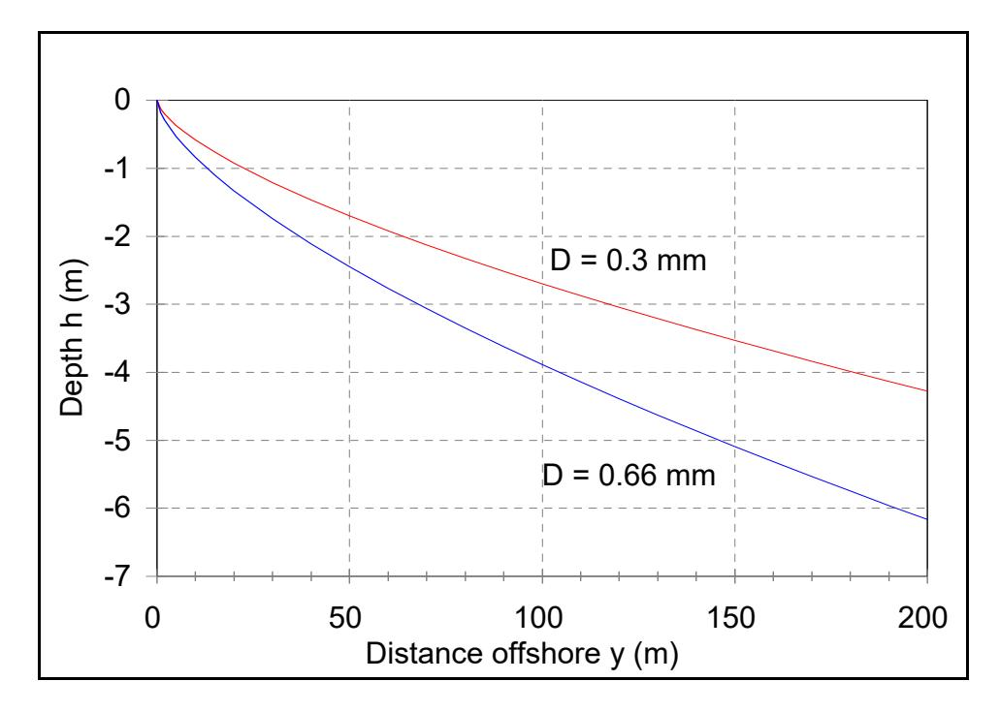

*Figure III-3-19. Equilibrium beach profiles for sand sizes of 0.3 mm and 0.66 mm A(D = 0.3 mm) = 0.125 $m^{1/3},$ A(D = 0.66 mm) = 0.18 $m^{1/3}$*

#### f. Quantitative relationships for nourished profiles .

(1) In order to investigate the conditions of profile type occurrence and additional quantitative aspects, it is useful to define the following nondimensional quantities: A N= $A_{F}$ / AN , ΔyN = Δy/W*, B N= B / h *, and V N= V /( B W *), where the symbol V denotes added volume per unit beach length, B is the berm height, and $h_{*}$ is the depth to which the nourished profile will equilibrate as shown in Figure III-3-21. In general, this will be considered to be the closure depth. It is important to note that the width $W_{*}$ is based on the native sediment scale parameter $A_{N}$ as given by

```math
W_* = \left(\frac{h_*}{A_N}\right)^{\frac{3}{2}} \tag{III-3-19}
```

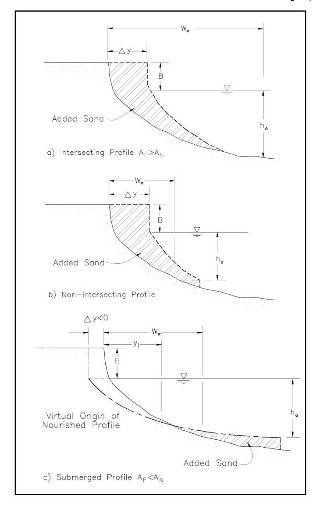

*Figure III-3-20. Three generic types of nourished profiles. (a) intersecting, (b) nonintersecting, and (c) submerged profiles (Dean 1991)*

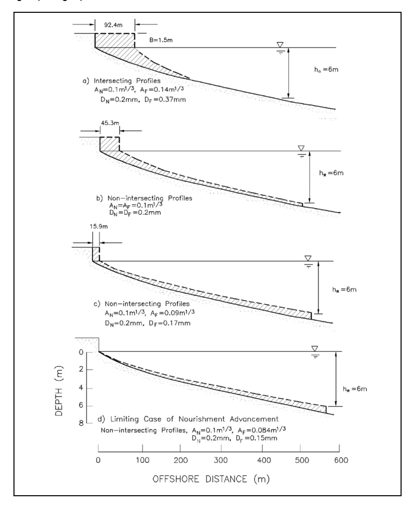

*Figure III-3-21. Effect of nourishment material scale parameter $A_{F}$ on width of resulting dry beach. Four examples of decreasing $A_{F}$ with same added volume per unit beach length (Dean 1991)*

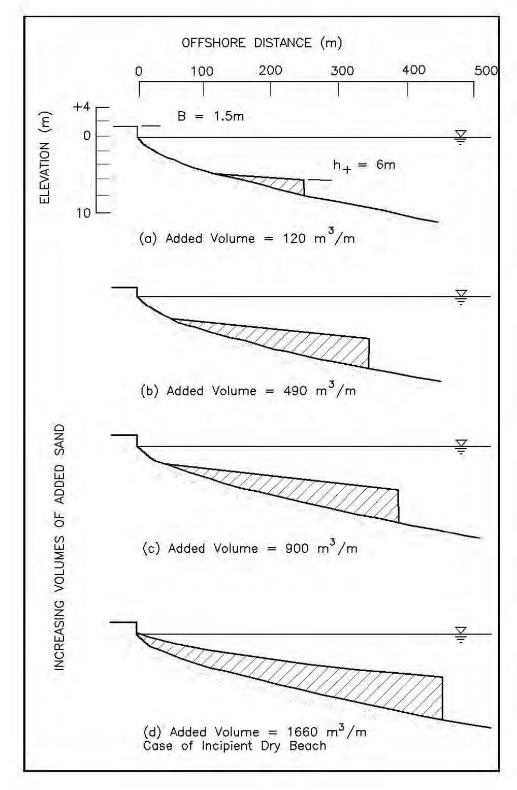

*Figure III-3-22. Effect of increasing volume of sand added on resulting beach profile. A_F=0.1~{\rm m}^{1/3},\,A_N=0.2~{\rm m}^{1/3},\,h.=6.0~{\rm m},\,B=1.5~{\rm m} (Dean 1991)*

It is possible to show that the nondimensional equilibrium dry beach width ΔyN can be presented in terms of three nondimensional quantities

```math
\Delta y ^ { \prime } = f ( B ^ { \prime } , V ^ { \prime } , A ^ { \prime } ) \tag{III-3-20}
```

(2) The relationships governing the conditions for intersecting/nonintersecting profiles are

```math
\Delta y' + \left(\frac{1}{A'}\right)^{\frac{3}{2}} = 1 \tag{III-3-21}
```

given that the fill sediment scale parameter is greater than or equal to the native sediment scale parameter.
The critical volume of sand delineating intersecting and nonintersecting profiles is

```math
(V')_{cI} = \left(1 + \frac{3}{5B'}\right) \left[1 - \left(\frac{1}{A'}\right)^{\frac{3}{2}}\right] \tag{III-3-22}
```

which applies only for A N>1, since for A N<1, the profiles will always be nonintersecting although it should be recognized that nonintersecting profiles can also exist for A N>1. If A N>1, but V N > $V_{c1},$ then the profile will be nonintersecting. Also of interest is the critical volume of sand $V_{c2}$ that will just yield a finite shoreline displacement for the case of sand that is finer than the native ( A N<1)

```math
(V')_{c2} = \frac{3}{5B'} \left(\frac{1}{A'}\right)^{\frac{3}{2}} \left(\frac{1}{A'} - 1\right) \tag{III-3-23}
```

- (3) Figure III-3-23 presents these two critical volumes versus the scale parameter A N for the special case B N=0.25. (4) For intersecting profiles, the nondimensional volume required to yield an advancement ΔyN is

```math
V_{1}^{'} = \Delta y' + \frac{3}{5B'} \left(\Delta y'\right)^{\frac{5}{3}} \frac{1}{\left[1 - \left(\frac{1}{A'}\right)^{\frac{3}{2}}\right]^{\frac{2}{3}}} \tag{III-3-24}
```

This equation would apply for the example in Figure III-3-20a.
(5) For nonintersecting but emergent profiles, the corresponding volume V 2 N is

```math
V_{2}^{'} = \Delta y' + \frac{3}{5B'} \left\{ \left[ \Delta y' + \left( \frac{1}{A'} \right)^{\frac{3}{2}} \right]^{\frac{5}{3}} - \left( \frac{1}{A'} \right)^{\frac{3}{2}} \right\} \tag{III-3-25}
```

This equation would apply for Figure III-3-20b.

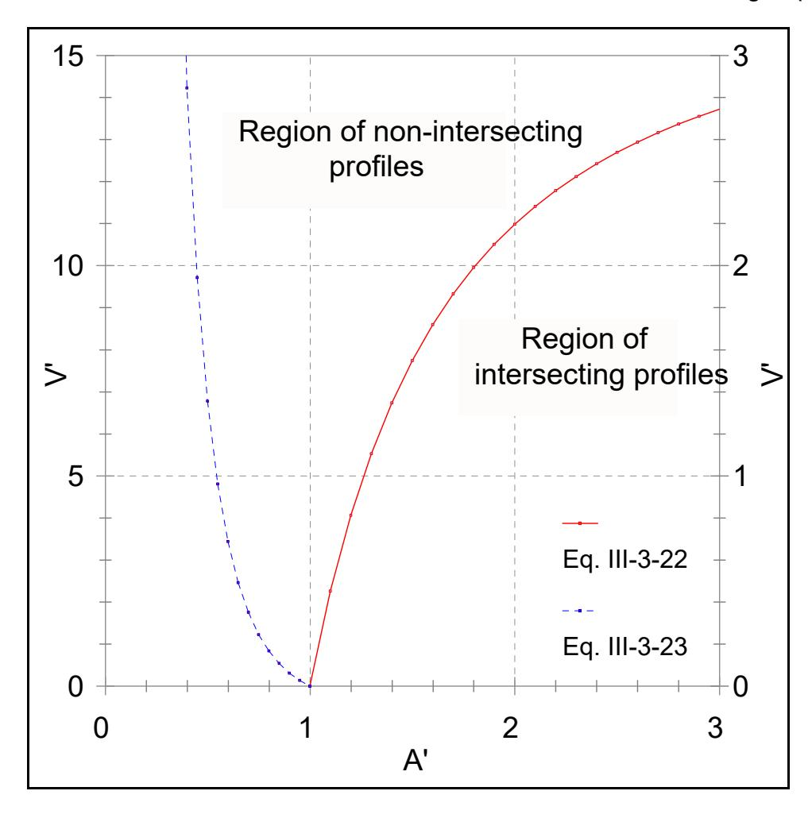

*Figure III-3-23. (1) Volumetric requirement for finite shoreline advancement (Equa tion 3-23); (2) Volumetric requirement for intersecting profiles (Equation 3-22). Results presented for special case B N = 0.25*

(6) For submerged profiles, referring to Figure III-3-20c, it can be shown that

```math
\frac { \Delta y } { y _ { I } } \, = \, 1 \, - \, \left( \frac { \, 1 } { A ^ { \prime } } \right) ^ { \, \frac { 3 } { 2 } } \tag{III-3-26}
```

where ΔyN<0, A N < 1, and the nondimensional volume of sediment can be expressed as

```math
V_{4}^{'} = \frac{3}{5B'} \left\{ \left[ \Delta y' + \left( \frac{1}{A'} \right)^{\frac{3}{2}} \right]^{\frac{5}{3}} + \frac{\left( -\Delta y' \right)^{\frac{5}{3}}}{\left[ \left( \frac{1}{A'} \right)^{\frac{3}{2}} - 1 \right]^{\frac{2}{3}}} - \left( \frac{1}{A'} \right)^{\frac{3}{2}} \right\} \tag{III-3-27}
```

```math
\left(\frac{1}{A'}\right)^{3/2} \ge |\Delta y'|
```

This equation would apply for Figure III-3-20c but is of limited value since no beach width would be added.
- (7) Equations 3-24 and 3-25 can be displayed in a useful form for calculating the volume required for a particular equilibrium additional dry beach width. However, as is evident from Equation 3-20, there are three independent variables: B N, A N, and V N. Thus, since only two independent variables can be displayed on a single plot, it is necessary to have a series of plots. Three are presented here, one each for B N = 0.5 (Figure III-3-24) B N = 0.333 (Figure III-325) and B N = 0.25 (Figure III-3-26). The information contained in these plots will be discussed by reference to Figure III-3-24.
- (8) The vertical axis is the nondimensional added beach width ΔyN, the horizontal axis is the nondimensional sediment scale parameter A N, and the isolines are the nondimensional volumes V N. For a given A N and V N, the value of ΔyN is readily determined. It is seen that ΔyN increases with increasing V N and A N. The heavy dashed line delineates the regions of intersecting and nonintersecting profiles (Equation 3-23). With decreasing A N and constant V N, the value of ΔyN decreases to the asymptotes for a submerged profile. Several examples will be presented illustrating the application of Figures III-3-24, III-3-25, and III-3-26. g. Longshore bar formation and seasonal shoreline changes.
- (1) Longshore bars were discussed briefly in Part III-3-2. They are elongated mounds more or less parallel to the shoreline and are known to be more prevalent for storm conditions and for finer sediments. Bars may be present as single features or may occur as a series (Figure III-3-10). Additionally, bars can be seasonal or perennial. In most locations where bars are seasonal, their formation is associated with a seaward transport of sediment and a retreat of the shoreline. At a particular location, the amount of seasonal fluctuation depends on the number and intensity of storms during a particular year. Figure III-3-30 shows results of measurements by Dewall and Richter (1977) from Jupiter Island, Florida, where the seasonal fluctuations appear to be on the order of 15 m. Figure III-3-31, from Dewall (1979) shows shoreline and volume changes (above mean sea level) from Westhampton, Long Island, New York, where the seasonal changes may be on the order of 20 to 40 m.
- (2) Although the prediction of bar geometry and the associated shoreline changes have not advanced to a reliable stage, parameters have been proposed and correlated successfully with conditions for which bars form. Based on field observations, Dean (1973) hypothesized that sediment was suspended during the crest phase position and that if the fall time were less or greater than one-half the wave period, the net transport would be landward or seaward, respectively, resulting in bar formation in the latter case. This mechanism would be consistent with the wave-breaking cause. Further rationalizing that the suspension height would be proportional to the wave height resulted in identification of the so-called fall velocity parameter $H_{b}/w_{f}T.$ Although there is no agreement on the cause of longshore bar formation, it appears to result from wave breaking, with edge waves and other phenomena proposed as possible causes.
- (3) Examination of small-scale laboratory data for which the deep water reference wave height Ho values were available led to the following relationship (Dean 1973) for offshore sediment transport leading to bar formation

```math
\frac { H _ { o } } { w _ { f } T } \geq 0 . 8 5 \tag{III-3-28}
```

(4) Later, Kriebel, Dally, and Dean (1986) examined only prototype and large-scale laboratory data and found a constant of approximately 2.8 rather than 0.85 as in Equation 3-28. Kraus, Larson, and Kriebel (1991) examined only large wave tank data and proposed the following two relationships for bar formation

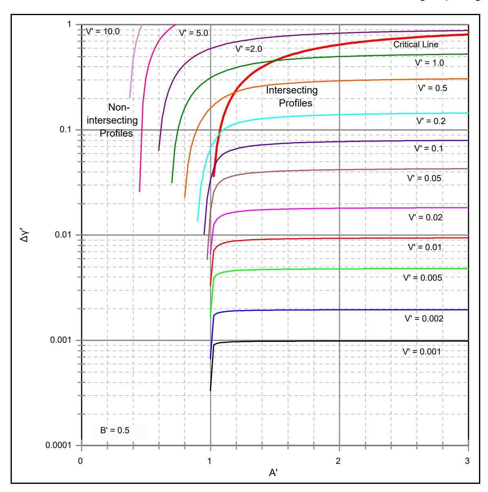

*Figure III-3-24. Variation of nondimensional shoreline advancement Δy/W*, with A N and V. Results shown for $H_{*}/B$ = 2.0 (B N = 0.5) (based on Dean (1991), values recomputed by Dean, May 2001). Intersecting and non-intersecting profiles divided by critical line; definition sketches shown in Figure III-3-20.*

```math
\frac { H _ { o } } { L _ { o } } \geq 1 1 5 \left( \frac { \pi w _ { f } } { g T } \right) ^ { \frac { 3 } { 2 } } \tag{III-3-29}
```

and

```math
\frac { H _ { o } } { L _ { o } } \ \leq \ 0 . 0 0 0 7 \left( \frac { H _ { o } } { w _ { f } \ T } \right) ^ { 3 } \tag{III-3-30}
```

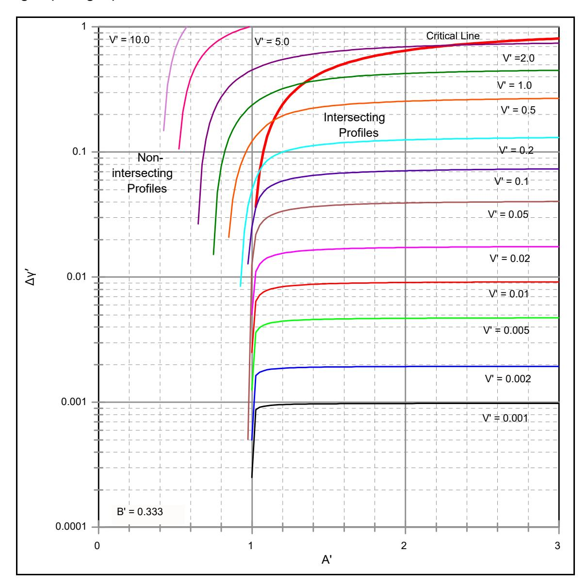

*Figure III-3-25. Variation of nondimensional shoreline advancement Δy/W*, with A N and V. Results shown for $H_{*}/B$ = 3.0 (B N = 0.333) (based on Dean (1991), values recomputed by Dean, May 2001). Intersecting and non-intersecting profiles divided by critical line; definition sketches shown in Figure III-3-20.*

in which $H_{o}$ is the average deepwater wave height. For field data in which the significant deepwater wave height was used, the constant in Equation 3-30 was modified to

```math
\frac { H _ { o _ { s } } } { L _ { o } } \ \leq \ 0 . 0 0 0 2 7 \left( \frac { H _ { o _ { s } } } { w _ { f } \ T } \right) ^ { 3 } \tag{III-3-31}
```

(5) It is interesting that Equation 3-30 provides a better fit to the laboratory data than a fixed value of the fall velocity parameter; however, for field data, a fixed value of the fall velocity parameter provides a

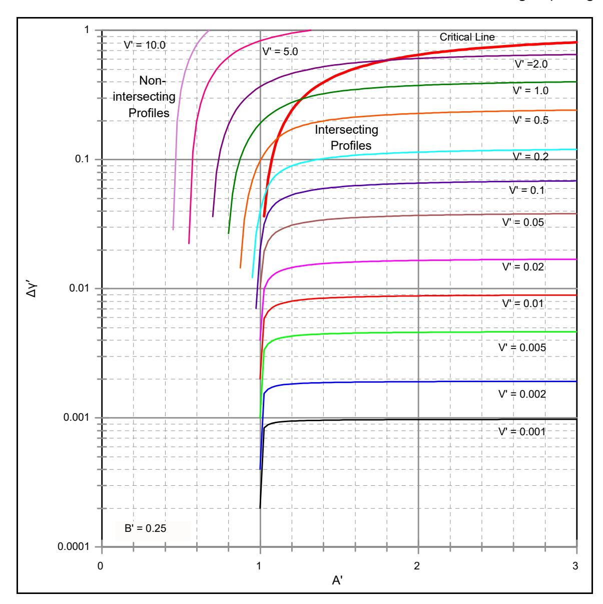

*Figure III-3-26. Variation of nondimensional shoreline advancement Δy/W*, with A N and V. Results shown for $H_{*}/B$ = 4.0 (B N = 0.25), based on Dean (1991), values recomputed by Dean, May 2001). Intersecting and non-intersecting profiles divided by critical line; definition sketches shown in Figure III-3-20.*

better fit than Equation 3-30 (Kraus, Larson, and Kriebel 1991). Dalrymple (1992) has shown that Equations 3-29 and 3-30 can be represented in terms of a single profile parameter P where

```math
P = \frac{gH_o^2}{w_f^3 T} \tag{III-3-32}
```

and that the criterion for bar formation is that P exceeds about 10,000.

## EXAMPLE PROBLEM III-3-2

FIND:
The equilibrated additional dry beach width Δy due to cross-shore transport.
GIVEN:
DN = 0.2 mm, $D_{F}$ = 0.24 mm, B = 2 m, V = 400 $m^{3}/m.$ H 6 = 1.5 m, σH = 0.64 m as provided in WES and CEDRS databases discussed in Part II-8.

#### SOLUTION:

Based on the above, the sediment scale parameters are determined from Figure III-3-18 and/or Table III-3-3 to be: $A_{N}$ = 0.1 $m^{1/3},$ AF = 0.11 $m^{1/3}.$ The effective wave height $H_{e}$ is determined from Equation 3-10 as:

```math
H_e = \overline{H} + 5.6 \ \sigma_H = 1.5 + (5.6)(0.64) \approx 5.1 \ \text{m}
```

The closure depth $h_{*}$ is determined from Equation 3-12 as:

```math
h_* = h_C = 1.57 \text{ H}_e = (1.57) (5.11) \approx 8 \text{ m}
```

The reference width of effective motion $W_{*}$ is based on Equation 3-19

```math
W_* = \left(\frac{h_*}{A_N}\right)^{\frac{3}{2}} = \left(\frac{8}{0.1}\right)^{\frac{3}{2}} \approx 716 \text{ m}
```

With this information, it is possible to determine the following nondimensional quantities:

```math
B' = B/h_* = 2/8 = 0.25, \quad A' = A_F/A_N = 0.11/0.1 = 1.1, \quad V' = V/(BW_*) = 400/(2)(716) \approx 0.28
```

Since B N = 0.25, Figure III-3-26 is applicable and for A N = 1.1 and V N = 0.28, it is found that ΔyN = 0.092. Thus Δy = (0.092)(716) – 65.9 m. Also, it is seen from Figure III-3-26 that this solution is near the boundary of the intersecting/nonintersecting profiles.The native and nourished profiles are shown in Figure III-3-27. The solution is next carried out with the appropriate equations for comparison with the graphical procedure. Applying Equation 3-22 to determine whether the profiles will be intersecting or nonintersecting

```math
(V')_{cI} = \left(1 + \frac{3}{5B'}\right) \left[1 - \left(\frac{1}{A'}\right)^{\frac{3}{2}}\right]
```

```math
= \left( 1 + \ { \frac { 3 } { ( 5 ) ( 0 . 2 5 ) } } \right) \ \left[ 1 - \ \left( { \frac { 1 } { 1 . 1 } } \right) ^ { \frac { 3 } { 2 } } \right] \simeq \ 0 . 4 5
```

compared with the applied V N of 0.28. Thus since $VN<(VN)_{c1}$ the solution is an intersecting profile. Applying Equation 3-24 requires an iterative solution for ΔyN. This equation can be reduced to

```math
0.28 = \Delta y' + 9.20(\Delta y')^{5/3}
```

the solution to which yields ΔyN = 0.0955 or Δy = 68.4 m
(Continued)

## Example Problem III-3-2 (Concluded)

Thus, for this example, the graphical solution is reasonable. The calculated intersection distance for the two profiles $y_{I}$ is determined from

```math
h_I = A_N y_I^{\frac{2}{3}} = A_F (y_I - \Delta y)^{\frac{2}{3}}
```

or

```math
y_I = \frac{\Delta y \left(\frac{A_F}{A_N}\right)^{\frac{3}{2}}}{\left(\frac{A_F}{A_N}\right)^{\frac{3}{2}} - 1} = \frac{68.4(1.1)^{\frac{3}{2}}}{(1.1)^{\frac{3}{2}} - 1} = 513 \text{ m}
```

and

```math
h_I = A_N y_I^{\frac{2}{3}} \cong 6.4 \,\mathrm{m}
```

By comparison, the corresponding values from the graphical solution are $y_{I}$ = 495 m and $h_{I}$ = 6.25 m. Figure III-3-27 presents the results of the graphical solution.

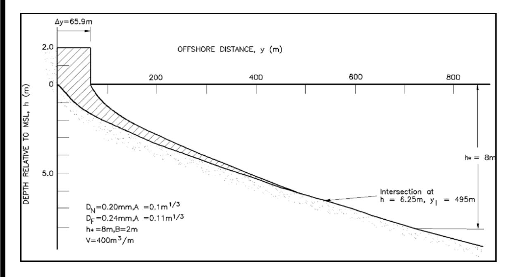

*Figure III-3-27. Nourishment with coarser sand than native (intersecting profiles)*

## EXAMPLE PROBLEM III-3-3

FIND:
V , the volume of sand necessary to achieve the additional dry beach width Δy of 50 m.
GIVEN:

```math
B=2 \text{ m}, D_N = D_F = 0.25 \text{ mm}, \Delta y = 50 \text{ m}, \text{ where } \overline{H} = 1.5 \text{ m}, \sigma_H = 0.4 \text{ m}.
```

SOLUTION:
The value of $h_{*}$ is computed as:

```math
h_* = 1.57 (\overline{H} + 5.6 \sigma_H) = 1.57 [1.5 + (5.6)(0.4)] \approx 5.9 \text{ m}
```

For these values, the associated A values are determined from Figure III-3-18 and/or Table III-3-3 to be: $A_{N}$ = $A_{F}$ = 0.115 $m^{1/3}.$ The reference width of active motion $W_{*}$ is

```math
W_* = \left(\frac{h_*}{A_N}\right)^{\frac{3}{2}} \cong 367 \text{ m}
```

and the required nondimensional quantities are:

```math
\Delta y/W_* \cong 50/367 \cong 0.136, B' = B/h_* \cong 0.34, A' = A_F/A_N = 0.115/0.115 = 1.0
```

Since the value of B N lies between the two values represented in Figures III-3-24 and III-3-26, it is necessary to interpolate. The values from these two figures are: V N( B N = 0.25) = 0.75, V N( B N = 0.5) = 0.35. Interpolating linearly, V N is found to be 0.606 for the desired B N value of 0.34, from which the volume V is determined as V = V N B $W_{*}$ = (0.606) (2) (367) – 445 $m^{3}/m.$ Since the fill and native sediments are of the same size, it is clear that the two profiles will be nonintersecting and that Equation 3-25 can be used to compute the nondimensional volume directly

```math
V' = \Delta y' + \frac{3}{5B'} \left\{ \left[ \Delta y' + \left( \frac{1}{A'} \right)^{\frac{3}{2}} \right]^{\frac{5}{3}} - \left( \frac{1}{A'} \right)^{\frac{3}{2}} \right\}
```

```math
= 0.136 + \frac{3}{(5)(0.34)} \{ [0.136 + 1]^{\frac{5}{3}} - 1 \} \approx 0.554
```

(Continued)

## Example Problem III-3-3 (Concluded)

which yields a volume of sand, V = V N B $W_{*}$ = (0.554)(2)(367) = 407 $m^{3}/m,$ which is about 9 percent less than the value determined by interpolating between the values from the two figures. Since in this particular case, the two sand sizes are the same and thus every contour must be displaced by the same amount, an approximate equation for the required volume density is the product of the contour displacement (50 m) and the full depth of active motion: V = (Δy)(h* + B ) = (50)(5.9 + 2) = 395 $m^{3}/m.$ This result differs slightly from the values determined above because a small wedge-shaped sand volume has been neglected near the depth of closure. The native and nourished profiles are plotted in Figure III-3-28.

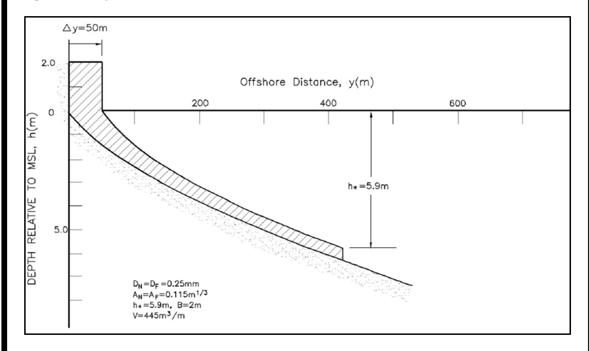

*Figure III-3-28. Example III-3-3. Nourishment with same-sized sand as native (nonintersecting profiles)*

#### EXAMPLE PROBLEM III-3-4

#### FIND:

The variation in equilibrated dry beach width with volume added for three candidate fill sand sizes.

## GIVEN:

Three candidate borrow sites with representative sand sizes: = 0.15 mm, = 0.2 mm and = 0.25 mm. The native sand size, $D_{N}$ = 0.2 mm. The berm height B = 1.5 m and $h_{*}$ = 6 m.

## SOLUTION:

The associated values of the sediment scale parameters are determined from Figure III-3-18 and/or Table III-3-3: $A_{N}$ = 0.1 $m^{1/3},$ = 0.084 $m^{1/3},$ = 0.1 $m^{1/3},$ and = 0.115 $m^{1/3},$ respectively.
The procedures illustrated in Example Problems III-3-2 and III-3-3 produce the results shown in Figure III-3-29. It is seen that there is a nearly linear relationship for the sand that is of the same size as the native in accordance with: V =(Δy)(h* + B ). For the fill sand, which is coarser than the native, for volumes less than approximately 450 $m^{3}/m,$ the increase in dry beach width for each volume added is greater than for the same-sized sand. For this region, the profiles are intersecting. For greater volumes, the profiles are nonintersecting and the slope of the relationship is nearly the same as for $A_{F}/A_{N}$ = 1.0. For the sand smaller than the native, the profiles are submerged for the smaller volumes and later become emergent in accordance with Equation 3-23. For larger volumes, the relationship has approximately the same slope as that for sand the same size as the native. The explanation for this is that once the profiles become emergent and nonintersecting, additional volumes of sand added simply displace the profile with all contours moving the same distance over the active depth. Thus the slope in Figure III-3-29 for this situation is nearly independent of the grain size.

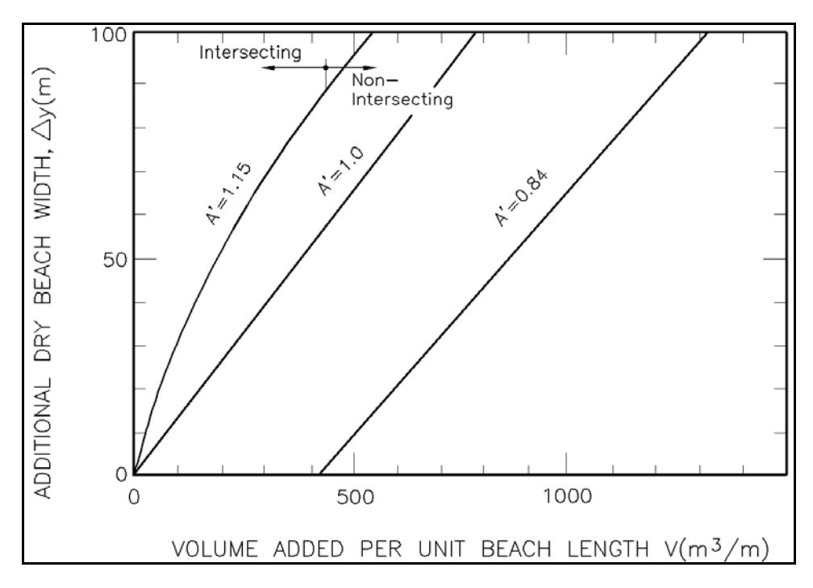

*Figure III-2-29. Illustration of effect of volume added V and fill sediment scale parameter $A_{F}$ on additional dry beach width Δy. Example conditions: B = 1.5 $m,h_{*}$ = 6 $m,A_{N}$ = 0.1 $m^{1/3}$*

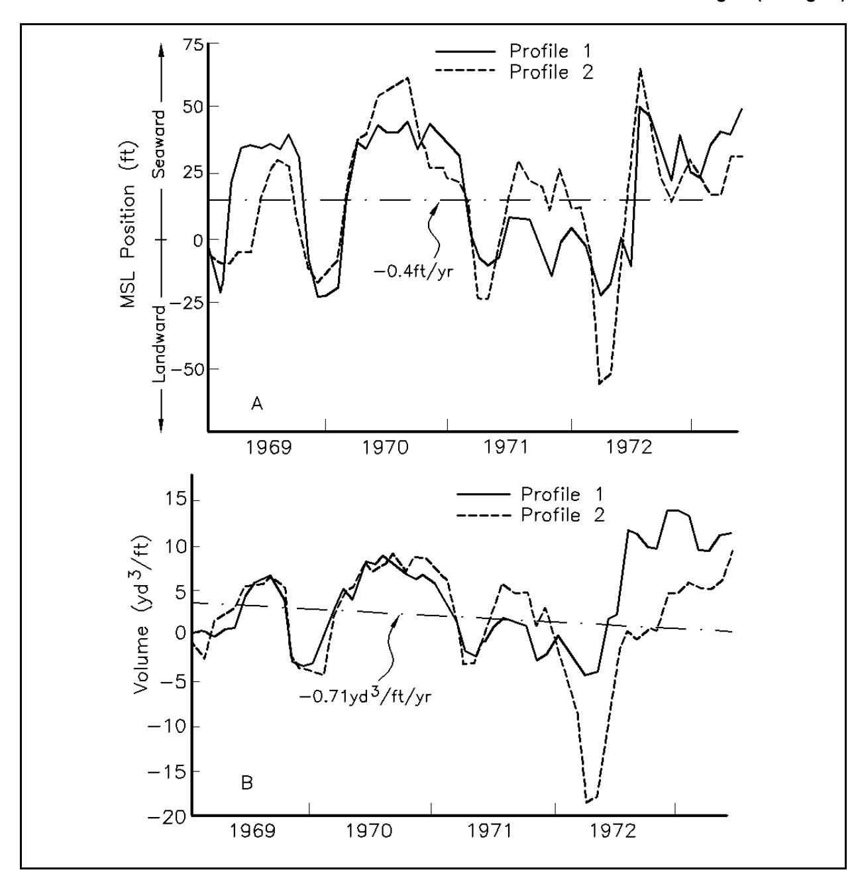

*Figure III-3-30. Mean monthly shoreline position (A) and unit volume (B) at Jupiter Island, FL, referenced to first survey (Dewall and Richter 1977)*

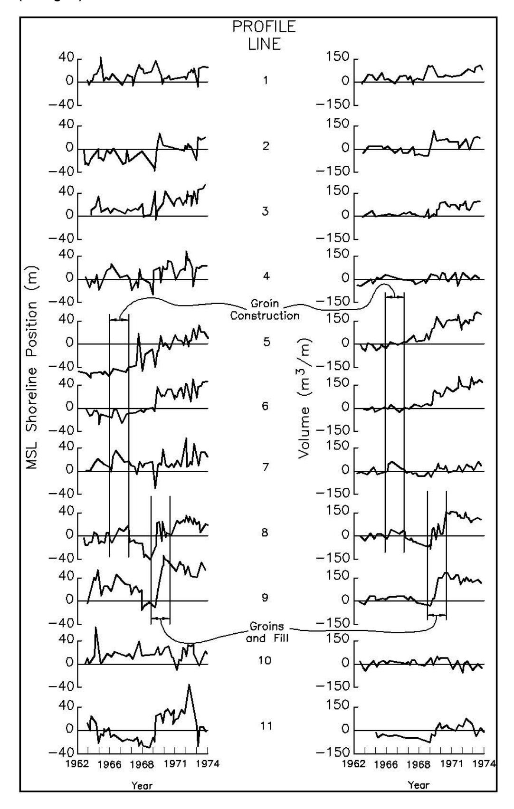

*Figure III-3-31. Changes in shoreline position and unit volume at Westhampton Beach, New York (Dewall 1979)*

- h. Static models for shoreline response to sea level rise and/or storm effects.
- (1) As water level and/or wave conditions change, the profile will respond toward a new equilibrium. If the conditions change very slowly, the profile changes will nearly maintain pace with the changed conditions and static models are applicable. However, rapidly changing conditions require dynamic models that account for the time scales of response of the profile. This section presents several useful static models for profile response.
- (2) First, consider the long-term profile response to sea level rise. On a worldwide basis, the average sea level has risen approximately 12 cm during the last century. However, the relative sea level changes (difference between absolute sea level rise and vertical land movements) at a particular location can differ substantially from the average, ranging from locations at which the relative sea level (RSL) change is a rise of four times the average (Louisiana (Penland, Suter, and McBride 1987)) and locations where the RSL change is decreasing at a rate of almost 1 m per century (Alaska (Hicks, Debaugh, and Hickman 1983)). Human-induced activities can cause considerable subsidence, primarily from extraction of ground fluids and the consequent reduction of pore pressures (National Research Council 1984), and can be a reason for relative sea level changes higher than average. Uplifting due to tectonic activity is the typical reason for relative sea level changes lower than average. As noted previously, any rise in mean water level on a beach profile that is otherwise in equilibrium must result in a redistribution of sand with erosion of the foreshore and with deposition of sand offshore near the depth of closure to maintain the profile shape relative to the rising water level. In the following discussion, equilibrium profile methods are applied to determine analytical solutions for the shoreline recession, here denoted by the symbol R , which will be more convenient notation than negative values of y .
- (3) Bruun (1962) proposed the following relationship for equilibrium shoreline response $R_{4}$ to sea level rise S

```math
R _ { \infty } = S \ \frac { L _ { * } } { h _ { * } + B } \tag{III-3-33}
```

in which $L_{*}$ and $(h_{*}+B)$ are the width and vertical extent of the active profile and the subscript "4" indicates a static response. The basis for this equation is seen in Figure III-3-32 in which the two components of the response are: (1) a retreat of the shoreline $R_{4},$ which produces a sediment "yield" R 4( h * + B ), and (2) an increase in elevation of the equilibrium profile by an amount of the sea level rise S , which causes a sediment "demand" equal to $SL_{*}.$ Equating the demand and the yield results in Equation 3-33, which is known as the "Bruun Rule." It is noted that the Bruun Rule does not depend on the particular profile shape.
- (4) The Bruun Rule has been modified to account for several features of natural beaches that were not accounted for in the original development. Bruun (1988), for example, shows that Equation 3-33 may be modified to account for loss or "winnowing" of fine sediment out of the profile or for loss of sediment to deepwater canyons or other "sinks" in the offshore. Similar corrections may be made to account for unbalanced sediment flux into or out of the beach profile due to gradients in the net longshore sediment transport, as shown, for example, by Everts (1985).
- (5) Despite these modifications, several aspects of the Bruun Rule have remained problematic. For example, the upper limit of the active profile is not clearly defined in Figure III-3-32 so that it is difficult to establish a realistic profile width $L_{*}$ in Equation 3-33. Dean and Maurmeyer (1983) later extended Bruun's result to apply to the case of a barrier island in the form

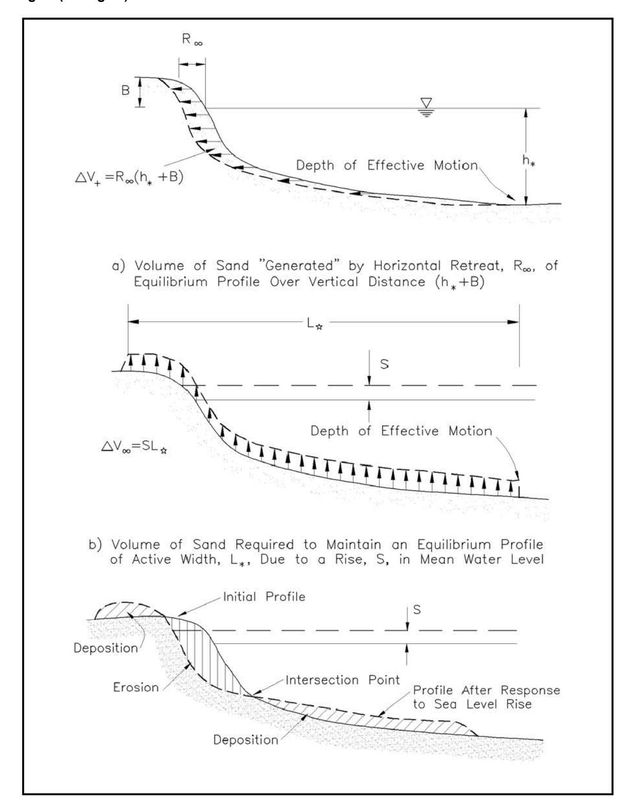

*Figure III-3-32. Components of sand volume balance due to sea level rise and associated profile retreat according to the Bruun Rule*

```math
R_{\infty} = S \frac{L_* + L_W + L_L}{h_* - h_L} \tag{III-3-34}
```

and the various terms are explained in Figure III-3-33. In general, the shoreline retreat is some 50 to 200 times the sea level rise with the greater factors associated with the milder beach slopes and more energetic wave conditions (i.e., greater $h_{*}).$ These factors for the case of a barrier island would be considerably greater due to the difference term in the denominator (Equation 3-34). Situations where the region behind the island is deep may explain the geological evidence for some barrier islands which are believed to have "drowned in place" rather than to have migrated landward.

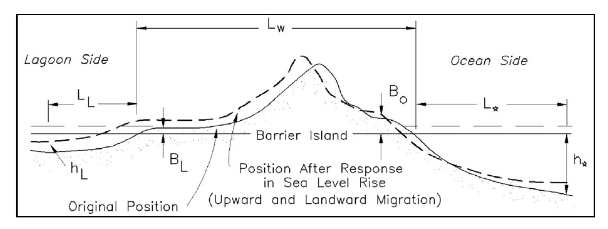

*Figure III-3-33. The Bruun Rule generalized for the case of a barrier island that maintains its form relative to the adjacent ocean and lagoon (Dean and Maurmeyer 1983)*

- (6) The Bruun Rule has been subjected to verifications both in the laboratory and in the field. Hands (1983), evaluated the Bruun Rule in Lake Michigan using 25 beach profiles over a 50-km length of shoreline subjected to a 0.2-m water level rise over a 7-year period from 1969 to 1976. The on- and offshore limits of profile response were determined directly from measured beach profiles. Thus, the depth of closure was identified as the maximum depth of significant profile change observed from beach surveys. Likewise, the upper limit of profile change was selected as the natural vegetation line in the foredunes. With these empirical input parameters, calculated profile retreat over the 7-year period then agreed to within 10 percent of measured values. Over shorter periods of time for example, over a 3-year period, Hands found that the Bruun Rule initially over-estimated the profile response due to the time lag between elevated water levels and the profile response. Storm processes were then identified as being responsible for causing rapid equilibration of the profiles and for causing the profiles to "catch up" or equilibrate relative to the water level.
- (7) Edelman (1972) modified the Bruun Rule to make it more appropriate for larger values of increased water levels and for time-varying storm surges. It was assumed that the profile maintained pace with the rising sea level and thus, at each time, the following equation is valid

```math
\frac{dR}{dt} = \frac{dS}{dt} \left[ \frac{W_b}{h_b + B(t)} \right] \tag{III-3-35}
```

where now B ( t ) represents the instantaneous total height of the active profile above the current water level. As shown in Figure III-3-34, $B(t)=B_{o}-S(t)$ where $B_{o}$ is the original berm height. For application to storm events, Edelman also adopted the breaking depth $h_{b}$ (and surf zone width $W_{b})$ rather than the offshore depth of closure $h_{*}$ (and corresponding $W_{*})$ as would be appropriate for long-term sea level rise. Substituting Equation 3-35 and integrating gives

```math
R(t) = W_b \quad \ln \left[ \frac{h_b + B_o}{h_b + B_o - S(t)} \right] \tag{III-3-36}
```

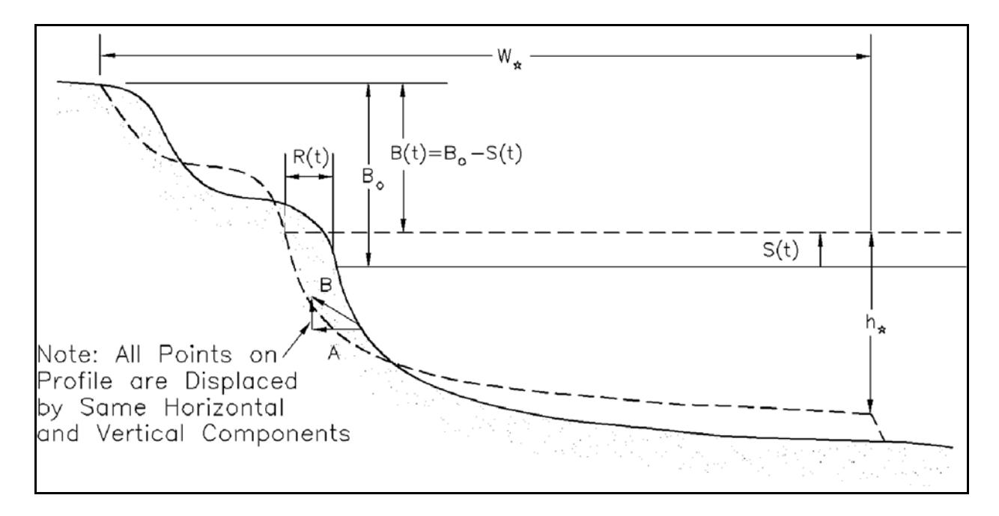

*Figure III-3-34. Elements of the Edelman model*

- (8) Using the small argument approximation for the natural logarithm, it is readily shown that to the first approximation, Edelman's equation is equivalent to the Bruun Rule.
- (9) Dean (1991) derived similar solutions for storm-induced berm retreat based on theoretical pre- and post-storm profile forms given by the equilibrium profile in Equation 3-14. Because pre- and post-storm profiles were defined by an analytical form, the equilibrium beach response could be obtained by integrating the areas (volume per unit length) between the initial and final equilibrium profiles and by equating the resulting eroded and deposited areas. Solutions were obtained for both the case of a uniform water level rise and for the case where breaking waves create a distribution of wave setup across the surf zone. One interesting result is the case where water levels are elevated by both a storm surge and by breaking-induced wave setup. For this case, an approximate solution for the steady-state erosion is given as

```math
R_{\infty} = (S + 0.068 H_b) \frac{W_b}{B + h_b} \tag{III-3-37}
```

where $W_{b}$ is the width of the surf zone, defined for the equilibrium profile as $W_{b}$ = $(h_{b}/A)^{3/2}.$ The solution for erosion due to combined storm surge and wave setup is similar in form to the Bruun Rule in Equation 3-33. In this case, wave setup causes a general rise in water level in the surf zone so that it functions much like
storm surge. It is noted, however, that storm surge has a much larger effect than wave setup. For this reason, the other analytical solutions that follow do not include wave setup effects and, instead, assume that beach response is driven primarily by storm surge.
(10) Kriebel and Dean (1993) considered both profiles with a vertical face at the water line as shown in Figure III-3-35a and profiles with a sloping beach face as shown in Figure III-3-35b. They showed that by accounting for the small wedge-shaped sand volume offshore of the breaking depth, somewhat improved expressions could be developed for the potential beach recession due to elevated water levels. The beach profile with a vertical face is a special limiting case of the profile with a sloping beach face, thus only the results for the sloping beach face are given here. As shown by Kriebel and Dean (1993), the general result for equilibrium berm recession due to a storm surge level S is given as

```math
R_{\infty} = S \frac{W_b - \frac{h_b}{m_o}}{B + h_b - \frac{S}{2}} \tag{III-3-38}
```

where m_o is the slope of the beach profile at the waterline. This slope is joined to the concave equilibrium profile at a depth where the slope of the equilibrium profile is equal to m_o . As a result, the surf zone width can be shown to be equal to

```math
W_b = y_o + \left(\frac{h_b}{A}\right)^{\frac{3}{2}} \tag{III-3-39}
```

where y_o is a small offset of the shoreline between the sloping beach face and the imaginary or virtual origin of the equilibrium profile, given by y_o = (4A^3)/(27m_o^3) . For most conditions, this offset is negligible and can be neglected when estimating the surf zone width, as will be illustrated in Example Problem III-3-6. For engineering application, it is also of interest to compute the volume of sand eroded between the initial and final profiles per unit length of beach. For the case with a sloping beach face, the volume eroded from the berm above the initial still-water level due to a storm surge level S is given by

```math
V _ { _ \infty } = R _ { _ \infty } B + { \frac { S ^ { 2 } } { 2 m _ { o } } } - { \frac { 2 } { 5 } } { \frac { S ^ { \frac { 5 } { 2 } } } { 4 ^ { \frac { 3 } { 2 } } } } \tag{III-3-40}
```

(11) When the beach face slope becomes infinite, the solutions from Equation 3-38 for the vertical beach face depicted in Figure III-3-35a are similar to those obtained by the Bruun Rule in Equation 3-33 or by Dean (1991) in Equation 3-37. The major difference is the term S/2 in the denominator of Equation 3-38, which is the result of considering the small wedge-shaped volume of sand near the breakpoint. For more realistic beach face slopes, the results in Equation 3-38 will yield smaller estimates of the potential berm recession than the Bruun or Dean solutions, since a portion of the rise in water level is accommodated by shifting the shoreline higher on the sloping beach face and less berm retreat is then required. Kriebel and Dean (1993) also provide analytical solutions for cases where the beach profile has a distinct dune on top of the berm.

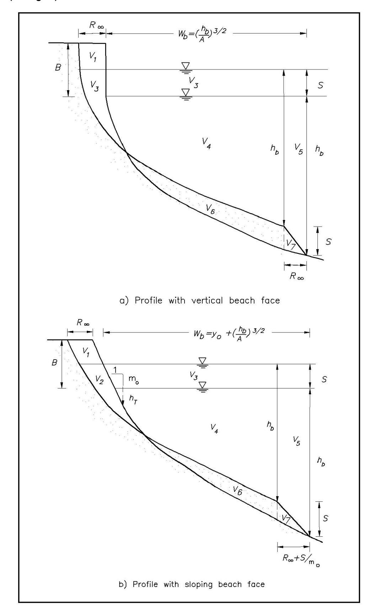

*Figure III-3-35. Profile forms considered by Kriebel and Dean (1993)*

## EXAMPLE PROBLEM III-3-5

FIND:
The rate of shoreline retreat, according to the Bruun Rule, then find the rate at which beach nourishment would be required to maintain the shoreline position.
GIVEN:

```math
h_{*} = 6\text{ m}, B = 2\text{ m}, D = 0.2\text{ mm}, \frac{dS}{dt} = 0.003\text{ m/year}.
```

#### SOLUTION:

The sediment scale parameter is determined from Figure III-3-18 and/or Table III-3-3 as A = 0.1 $m^{1/3}.$ The width $W_{*}$ of the active nearshore zone is determined from Equation 3-19 as

```math
W_* = \left(\frac{h_*}{A}\right)^{\frac{3}{2}} \approx 465 \text{ m}
```

and from Equation 3-33, assuming the berm stays at a constant elevation, the rate of shoreline retreat is given by

```math
\frac{dR_{\infty}}{dt} = \frac{dS}{dt} \cdot \frac{W_*}{h_*+B} \approx 0.17 \text{ m/yr}
```

so that the ratio of shoreline retreat to sea level rise is about 58.
When considering sea level rise and beach nourishment, from Equation 3-42, the rate at which sand must be added to offset the erosion due to sea level rise is

```math
\frac{dV}{dt} = W_* \frac{dS}{dt} = (465\text{m}) (0.003\text{m/year}) \approx 1.4\text{m}^3/\text{m/year}
```

## EXAMPLE PROBLEM III-3-6

#### FIND:

The potential berm retreat, along with the volume of sand eroded from above the mean sea level, for the storm conditions given below.

#### GIVEN:

Equilibrium beach profile with sand grain size D = 0.25 mm, beach face slope $m_{o}$ = 0.05, and berm height B = 2 m. Storm conditions with a peak surge level S = 2 m and a breaking depth $h_{b}$ = 3.0 m.

#### SOLUTION:

The equilibrium berm retreat may be determined from Equation 3-38, which first requires knowledge of the breaking depth $h_{b}$ and the surf zone width $W_{b,}$ which, from Equation 3-39, are given by Wb = yo +( hb / A ) 3/2. From Table III-3-3, the so-called A parameter for the equilibrium beach profile is found to be A = 0.115 $m^{1/3}$ based on the grain size of 0.25 mm.
In calculating the surf zone width, the term $(h_{b}/A)^{3/2}$ is equal to $(3.0m/0.115m^{1/3})^{3/2}$ = 133.2 m while the small shoreline offset is given by $y_{o}$ = $(4A^{3})/(27m_{o}$ 3 ) = 1.8 m. The total surf zone width is then Wb = 1.8 m + 133.2 m = 135.0 m. As noted, however, the offset is negligible and could be neglected for simplicity.
From Equation 3-38, the potential berm retreat is now determined as

```math
R_{\infty} = \frac{S\left(W_b - \frac{h_b}{m_o}\right)}{B + h_b - \frac{S}{2}} = 2\left(135.0 - \frac{3.0}{0.05}\right) = 37.5 \text{ m}
```

From Equation 3-40, the potential volume eroded from above the mean sea level datum is given by

```math
V_{\infty} = R_{\infty} B + \frac{S^2}{2m_o} - \frac{2 S^{\frac{5}{2}}}{5 A^{\frac{3}{2}}}
```

```math
= ( 3 7 . 5 ) ( 2 ) + { \frac { ( 2 ) ^ { 2 } } { 2 \left( 0 . 0 5 \right) } } - { \frac { 2 \left( 2 \right) ^ { \frac { 5 } { 2 } } } { 5 \left( 0 . 1 1 5 \right) ^ { \frac { 3 } { 2 } } } } = 5 7 . 0 \mathrm { { m } ^ { 3 } / \mathrm { { m } } }
```

These solutions are known to generally overestimate erosion associated with severe storms. For example, Chiu (1977) compared both the Edelman and Dean methods to erosion measured after Hurricane Eloise on the Florida coast and found that both methods gave erosion estimates that were as much as a factor of 5 higher than observed. The reason for this overprediction is that these methods assume the profile responds instantly to changes in water level while they neglect the transient or time-dependent approach to equilibrium. Such equilibrium solutions are still useful from an engineering perspective since they place a conservative upper bound on the actual beach response.
(12) While these idealized analytical solutions are useful, such computations of the maximum potential response can also be performed numerically for a measured (surveyed) beach and dune profile. In this case,
it may be assumed that the existing profile is in a stable equilibrium configuration, possibly with an offshore bar. The solution for the profile response to a water level rise would then be carried out by shifting the measured profile form upward and landward until a mass balance is achieved between the sand eroded from the berm and dune and the sand deposited offshore near the breakpoint.
(13) The problem of shoreline stabilization through beach nourishment with compatible sands in an era of sea level rise may be treated by combining the two effects. The rate of shoreline retreat is given as

```math
\frac { d R _ { \infty } } { d t } = \frac { d S } { d t } \ \frac { W _ { * } } { h _ { * } + B } - \ \frac { 1 } { ( h _ { * } + B ) } \ \frac { d V } { d t } \tag{III-3-41}
```

in which dV/dt is the rate at which sand is added per unit length of beach. In order for the shoreline retreat due to sea level rise to be offset by the advancement due to nourishment, $(dR_{4}/dt$ = 0)

```math
\frac { d V } { d t } = \ W _ { * } \ \frac { d S } { d t } \tag{III-3-42}
```

which can be interpreted as adding sufficient sand to just fill the active profile of width $W_{*}$ at the rate of sea level rise. This result could have been foreseen by referring to Figure III-3-32.
- i. Computational models for dynamic response to storm effects.
- (1) Introduction. Dynamic computational models are distinguished from the static models discussed earlier by accounting for the transient nature of the profile adjustment. As an illustration, for Example III-3-2, if the initial placement of nourished sand was different (usually steeper) than the equilibrium profile in Figure III-3-27, it is possible to determine from the equation of continuity (conservation of sand) the total cross-shore volumetric transport; however, it is not possible to determine the rate at which the sand was transported to reach equilibrium. The equilibration process could have required 1 year or a decade. In many problems of coastal engineering interest, the rates are extremely important. As examples, it will be shown that a rapidly moving storm may cause only a fraction of its erosion potential due to the relatively long time scales of the sediment transport processes and to the relatively short duration of the more energetic conditions caused by the storm. A second problem in which the time scales are of interest is that of profile equilibration of a beach nourishment project. Although it is accepted that equilibration occurs within 1 to 5 years, and certainly depends on the frequency of energetic storms, the economic value of that portion of added dry beach width associated with disequilibrium during evolution can be substantial.
- (2) Numerical and analytical models. More than a dozen numerical models and at least two analytical models have been developed to represent dynamic cross-shore sediment transport processes. These models require a continuity equation and a transport (or dynamic) equation (or equivalent) that governs the rate at which the processes occur. The conservation equation balances the differences between inflows and outflows from a region as predicted by the transport equation. In addition, boundary conditions must be employed at the landward and seaward ends of the active region. These boundary conditions can usually be expressed in terms of a maximum limiting slope such that if the slope is exceeded, adjustment of the profile will occur, a condition sometimes referred to as "avalanching." The locations of the seaward and landward boundaries are usually taken at the limits of wave breaking and wave runup, respectively. Examples of numerical models for which computer codes are available include those of Kriebel and Dean (1985), Kriebel (1986), Larson (1988), and Larson and Kraus (1989, 1990). Analytical models have been published by Kobayashi (1987), and Kriebel and Dean (1993).
- (3) General description of numerical models. In numerical modelling, two representations of the physical domain have been considered as shown in Figure III-3-36. In the first type, shown in
Figure III-3-36a, the cells are finite increments of the distance variable y . Thus the distance is the independent variable and the dependent variable is depth, which varies with time. In the second type shown in Figure III-3-36b, the computational cells are formed by finite increments of the depth h . In this case, the independent variable is h and y varies with time for each h value. There is an inherent advantage of the first type since the presence of bars can be represented with no difficulties. All dynamic models require a continuity equation and a transport (dynamic) equation.
(a) Conservation equation. The conservation equation is very straightforward and for the computational cell type in Figure III-3-36a is given by

```math
\frac { \partial h } { \partial t } \ = \ \frac { \partial { { q } _ { y } } } { \partial y } \tag{III-3-43}
```

in which y and t are the independent variables. If h and t are regarded as the independent variables as in Figure III-3-36b, the conservation equation is

```math
\frac { \partial y ( h ) } { \partial t } \ = \ - \ \frac { \partial q _ { y } } { \partial h } \tag{III-3-44}
```

in which it is noted that for each depth value ( h ), there is an associated distance value ( y ).
- (b) Transport relationships. Sediment transport relationships fall within the categories of "closed loop," which converge to a target profile and "open loop," which are not a priori constrained to the final (equilibrium) profile. Transport relationships of the "closed loop" type will be reviewed first.
- (c) Closed loop transport relationships. One of the first closed loop transport relationships was that proposed by Kriebel and Dean (1985). Recalling that the equilibrium beach profile (EBP) represented by Equation 3-14 is consistent with uniform wave energy dissipation per unit water volume $D_{*},$ Kriebel and Dean adopted a simple transport relationship in the form

```math
q_{v} = K'(D - D_{*}) \tag{III-3-45}
```

such that at equilibrium $D=D_{*},$ and an equilibrium profile results. The parameter K N is then used to calibrate the model by correlating the sediment transport rate to the excess energy dissipation. The transport relationship above may be modified to be consistent with a profile with beach face slope mo

```math
{ q } _ { y } = K ^ { \prime \prime } ( D - D _ { * } ) + \epsilon \frac { \partial h } { \partial y } \tag{III-3-46}
```

where ε is an additional model parameter as suggested by Larson and Kraus (1989). In this expression, the calibration parameter K NN differs from that used in Equation 3-45, since the additional gravitational effects, represented by the slope term, assist in moving sediment offshore.
(d) Open loop transport relationships. These transport relationships depend on the detailed hydrodynamics and attempt to incorporate the actual processes more faithfully than the closed loop variety. Usually both bed load and suspended load transport components are represented based on the hydrodynamic properties averaged over a wave period. Open loop models will not be considered further in this chapter; however, an excellent review of open loop models is given by Roelvink and Broker (1993). In general, these models can be grouped according to the physical processes that are assumed to be dominant for cross-shore

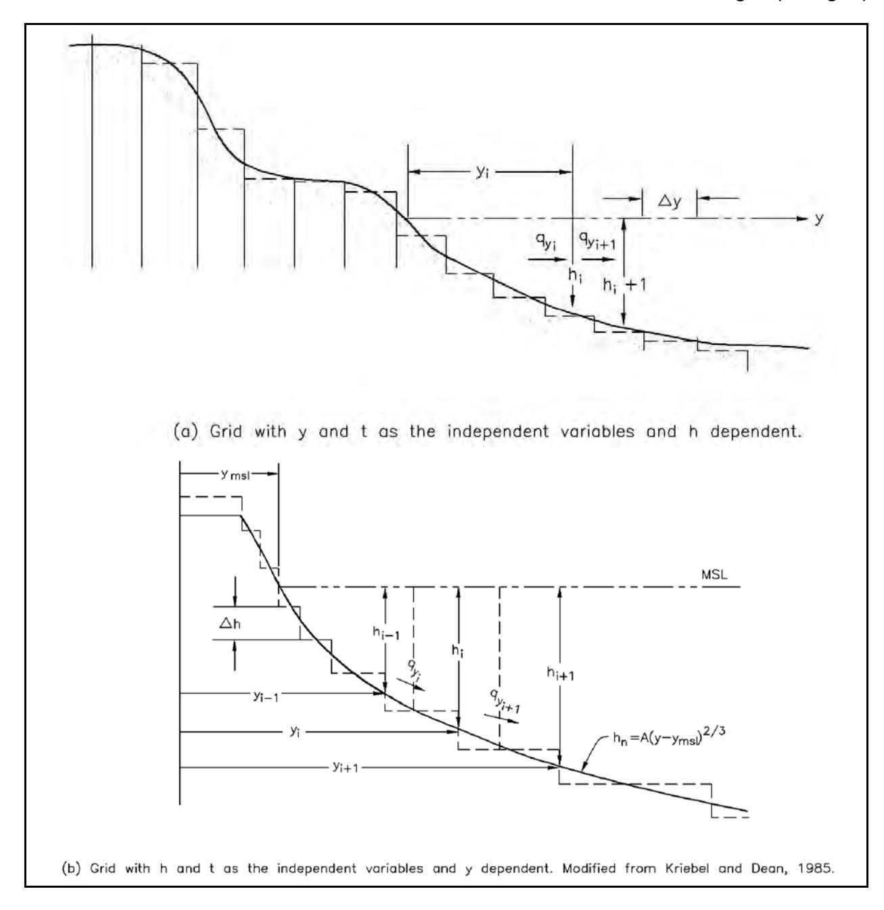

*Figure III-3-36. Two types of grids employed in numerical modelling of cross-shore sediment transport and profile evolution*

sediment transport. Several models compute transport rates by vertically integrating the distributions of suspended sediment concentration and cross-shore currents. Examples of such models include those of Dally and Dean (1984), Stive and Battjes (1984), and Broker-Hedegaard, Deigaard, and Fredsoe (1991). Other models consider instead that bed shear stress is the dominant forcing mechanism. An example is the model by Watanabe et al. (1980). A third widely used approach has been to compute the combined bed and suspended load transport first, based on the energetics approach proposed by Bagnold (1966). Examples of models based on this approach include those of Roelvink and Stive (1989) and Nairn and Southgate (1993).
- (4) General description of analytical models.
- (a) The analytical model of profile evolution by Kobayashi (1987) incorporates the conservation and transport relationships (Equations 3-41 and 3-43). The transport equation is linearized such that a diffusion equation results. The landward and seaward receding and advancing limits of the evolving profile are treated as moving boundary conditions. Kobayashi (1987) presents an analytical solution for the case of a constant elevated water level in the form of fairly complex error functions. For more complete water level scenarios, a numerical scheme must be used. As presented, the model does not lend itself readily to engineering applications.
- (b) A simpler analytical model for predicting dynamic profile response during storms is the so-called Convolution Method of Kriebel and Dean (1993). This method is based on the observation that beaches tend to respond toward a new equilibrium exponentially over time. For laboratory conditions, where a beach is suddenly subjected to steady wave action, the time-dependent shoreline response R(t) may be approximated by the form

```math
R(t) = R_{\infty} \left( 1 - e^{-\frac{t}{T_S}} \right) \tag{III-3-47}
```

where $R_{4}$ is the equilibrium beach response and $T_{S}$ is the characteristic time-scale of the system. An exponential response of this kind has been observed in wave tank experiments by Swart (1974), Dette and Uliczka (1987), and Larson and Kraus (1989).
(c) A more general result for the dynamic erosion response may be obtained by noting that Equation 3-47 suggests that the rate of profile response is proportional to the difference between the instantaneous profile form and the ultimate equilibrium form. An approximate differential equation governing the profile response to time-dependent variations in water level may be assumed in the form

```math
\frac { d R ( t ) } { d t } = \frac { 1 } { T _ { S } } \left[ R _ { \infty } f ( t ) - R ( t ) \right] \tag{III-3-48}
```

where f(t) represents a unit-amplitude function of time that describes the storm surge hydrograph, while R 4represents the equilibrium beach response for the peak water level. The general solution to this system may be expressed as a convolution integral as

```math
R(t) = \frac{R_{\infty}}{T_S} \int_0^t f(\tau) e^{-\frac{(t-\tau)}{T_S}} d\tau \tag{III-3-49}
```

(d) As a result, several important characteristics of dynamic beach profile response are evident. First, a beach has a certain "memory," so that the beach response at any one time is dependent on the forcing conditions applied over some preceding time period. As a result, the beach response will lag behind the erosion forcing. In addition, because of the exponential response characteristics of the beach system, the beach response will be damped so that the actual maximum response will be less than the erosion potential of the system.
- j. Example application of an analytical model .
- (1) Of the two analytical models, the Kriebel and Dean (1993) analytical model is simpler to apply and thus will be discussed and illustrated by several examples herein.
- (2) A useful application of the convolution method is to analyze the erosion associated with an idealized storm surge hydrograph. Consider the case where the storm surge is approximated by the function

```math
S(t) = S\sin^2(\sigma t) = Sf(t) \tag{III-3-50}
```

with σ= π/TD and where $T_{D}$ is the total storm surge duration. The maximum storm surge level S would be used to determine the maximum potential erosion $R_{4}$ according to Equation 3-38 or one of the other expressions for static profile response developed in the preceding section. As shown by Kriebel and Dean (1993), solution of the convolution integral in Equation 3-49, with the unit-amplitude forcing term f(t) equal to the sine-squared function, gives the following time-dependent erosion response

```math
\frac{R(t)}{R_{\infty}} = \frac{1}{2} \left\{ 1 - \frac{\beta^2}{1 + \beta^2} \exp\left(-\frac{2\sigma t}{\beta}\right) - \frac{1}{1 + \beta^2} \left[\cos(2\sigma t) + \beta\sin(2\sigma t)\right] \right\} \tag{III-3-51}
```

where β is the ratio of the erosion time scale to the storm duration, which is given as β=2πTS/TD. The predicted beach response is shown in Figure III-3-37 for two different values of β, corresponding approximately to a short-duration hurricane (β = 10.6) and to a long-duration northeaster (β = 0.76). The examples illustrate the role of storm duration in determining the maximum erosion response such that shortduration storms may only achieve a small percentage of their potential equilibrium response.
- (3) The magnitude of the beach response from the sine-squared storm surge can be summarized in terms of the expected maximum dynamic erosion relative to the potential static or equilibrium response. This may be shown to be a function of β, as illustrated in Figure III-3-38. In general, short-duration storms fall to the right of this curve such that the predicted maximum erosion may be only 20 to 40 percent of the maximum erosion potential. For long-duration storms, the maximum erosion may be from 40 to 90 percent of the maximum erosion potential. When the storm duration is equal to the erosion time scale, (β = 2π), the dynamic erosion response is only 36 percent of the static response.
- (4) The time scale of dynamic profile response $T_{S}$ has not been as widely considered in coastal engineering as the equilibrium erosion $R_{4}$ and, thus far, the time scale has not been derived analytically. As a result, empirical descriptions of the time scale are required. These have been developed from results of the numerical erosion model of Kriebel (1986, 1990) for various combinations of profile geometry and breaking wave conditions. From these numerical tests, it was found that the time scale was approximately independent of the storm surge level, but varied strongly with sediment size (through the A parameter) and breaking wave height, and varied less significantly as a function of beach profile geometry. Numerical results were analyzed by dimensional analysis to arrive at the following empirical relationship

```math
T_{S} = 320 \frac{H_{b}^{\frac{3}{2}}}{g^{1/2}A^{3}} \left(1 + \frac{h_{b}}{B} + \frac{m_{o}W_{b}}{h_{b}}\right)^{-1} \tag{III-3-52}
```

(5) In Figure III-3-39, the numerically generated values of the erosion time scale are plotted as a function of the expression on the right-hand side of the equation (above). In general, beaches composed of

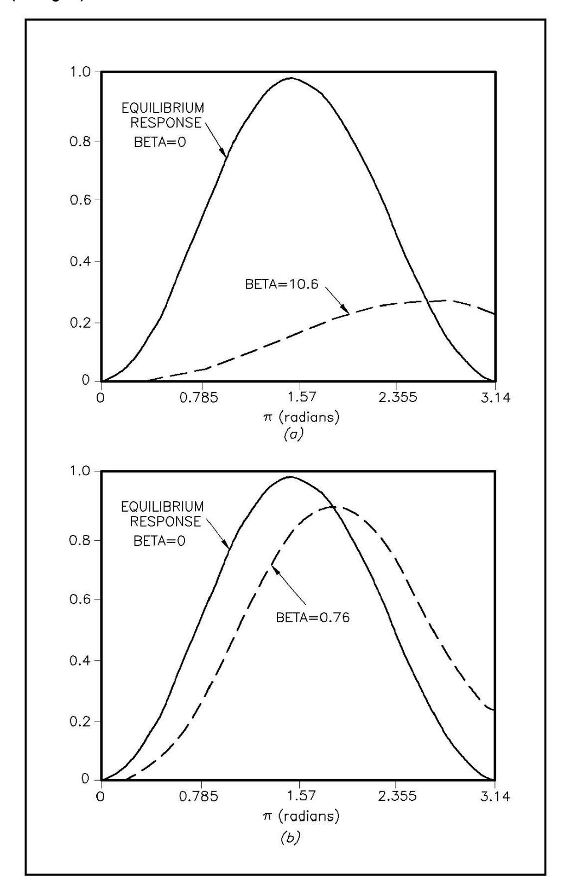

*Figure III-3-37. Examples of profile response to idealized sine-squared storm surge: (a) Short-duration hurricane, and (b) Long-duration northeaster (Kriebel and Dean 1993)*

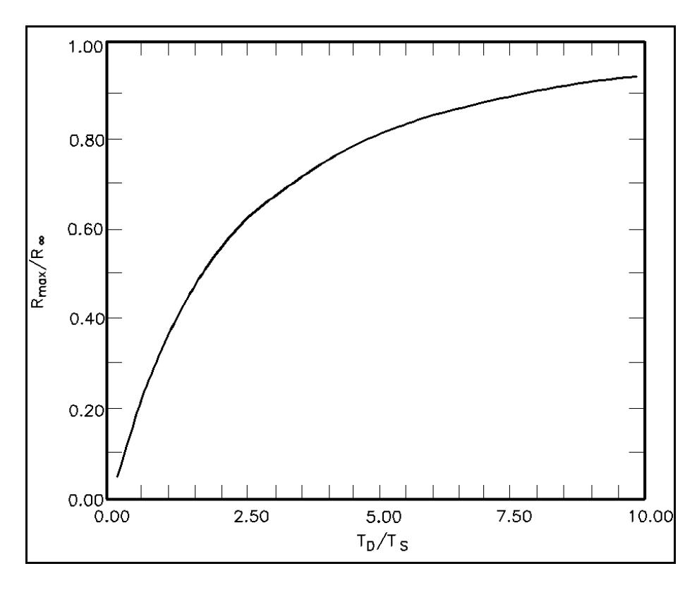

*Figure III-3-38. Maximum relative erosion versus ratio of storm duration to profile time scale, $T_{D}/T_{S}$*

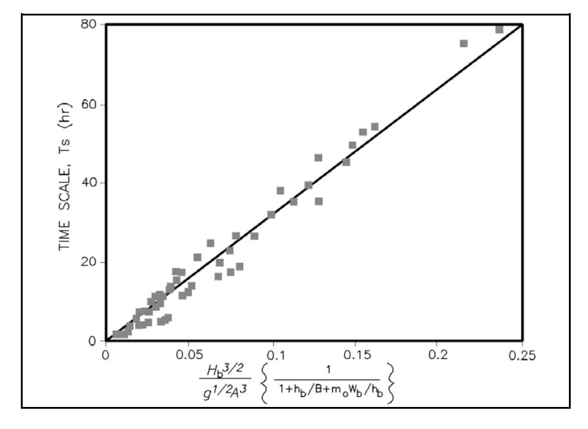

*Figure III-3-39. Empirical relationship for determination of erosion time scale, Ts*

## EXAMPLE PROBLEM III-3-7

FIND:
The shoreline recession, R ( t ), as a function of time and quantify the maximum erosion, $R_{max}.$
GIVEN:

```math
H _ { b } = 3 \mathrm { \, m } , h _ { b } = 3 . 8 5 \mathrm { m } , D = 0 . 2 \mathrm { \, m m } , B = 2 \mathrm { \, m } , m _ { o } = 1 : 1 0 , T _ { D } = 1 0 \mathrm { \, h r } , \mathrm { a n d } S _ { \scriptscriptstyle m a x } = 1 . 5 \mathrm { \, m } .
```

SOLUTION:
As in previous examples, the value of the profile scale parameter is determined from Figure III-3-18 and/or Table III-3-3 as 0.1 $m^{1/3}.$ The active width of the surf zone $W_{b}$ is calculated from Equation 3-19 as

```math
W_b = \left(\frac{h_b}{A}\right)^{3/2} = \left(\frac{3.85}{0.1}\right)^{3/2} = 238.9 \text{ m}
```

The equilibrium value of the shoreline response based on the maximum water level $S_{max}$ is determined from Equation 3-38 as

```math
R_{\infty} = \frac{S\left(W_b - \frac{h_b}{m_o}\right)}{B + h_b - \frac{S}{2}}
```

```math
= { \frac { 1 . 5 \left( 2 3 8 . 9 \, - \, { \frac { 3 . 8 5 } { 0 . 1 } } \right) } { 2 \, + \, 3 . 8 5 \, - \, { \frac { 1 . 5 } { 2 } } } } = 5 8 . 9 \, { \mathrm { m } }
```

The morphological time scale $T_{s}$ is determined from Figure III-3-39 by calculating the value of the abscissa in Figure III-3-39 as

```math
\approx 0.053
```

```math
\frac { 3 ^ { 3 / 2 } } { ( 9 . 8 ) ^ { 1 / 2 } ( 0 . 1 ) ^ { 3 } } \left( \frac { 1 } { 1 \, + \, \frac { 3 . 8 5 } { 2 } \, + \, \frac { ( 0 . 1 ) ( 2 3 8 . 9 ) } { 3 . 8 5 } } \right)
```

```math
= \ 1 8 1 . 8 \sec \ \simeq \ 0 . 0 5 3 \ \mathrm { h r }
```

(Continued)

## Example Problem III-3-7 (Concluded)

The morphological time scale is determined from Figure III-3-39 to be approximately 17.0 hr. The timevarying shoreline recession is determined from Equation 3-49 and is presented in Figure III-3-40. The maximum erosion can be determined from Equation 3-49 or directly from Figure III-3-40 as $R_{max}/R_{4}$ = 0.236 or $R_{max}$ = 13.9 m.

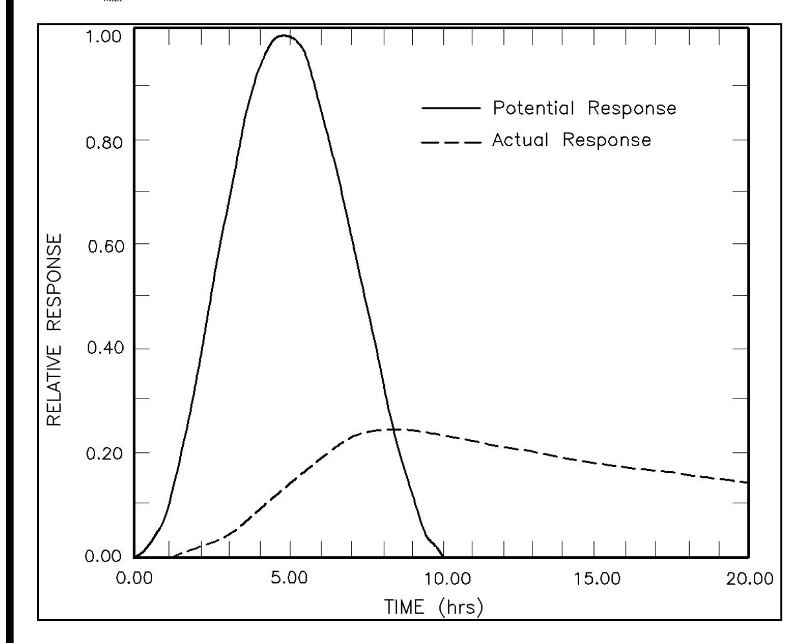

*Figure III-3-40. Potential and actual shoreline response based on Kriebel and Dean (1993) model*

very fine sand, subjected to very large breaking wave heights, have extremely long time scales such that they will experience only a small percentage of their equilibrium erosion potential during a typical storm.
- k. Examples of numerical models .
- (1) The numerical model described by Kriebel and Dean (1985) and later Kriebel (1986, 1990), was the first widely used numerical model developed to simulate storm-induced erosion based on equilibrium beach profile concepts. This model assumes that a beach profile will evolve toward an equilibrium form in response
to changing water levels and wave conditions and that the sediment transport rate is proportional to the "disequilibrium" existing between the profile at any instant in time and the equilibrium profile form.
This is quantified in terms of the "excess" energy dissipation per unit volume in the surf zone, as given by Equation 3-45. The energy dissipation per unit volume at any location in the surf zone is given by

```math
D_* = \frac{1}{h} \frac{\partial (EC_g)}{\partial y} \approx \frac{5}{16} \rho g^{\frac{3}{2}} \kappa^2 h^{\frac{1}{2}} \frac{\partial h}{\partial y} \tag{III-3-53}
```

where the last form is based on the assumption of shallow-water breaking waves. Based on the equilibrium beach profile given by Equation 3-14, the equilibrium energy dissipation per unit volume is given by

```math
D_* = \frac{5}{24} \rho g^{\frac{3}{2}} \kappa^2 A^{\frac{3}{2}} \tag{III-3-54}
```

where the equilibrium profile parameter A is determined either from the sediment grain size, as suggested in Table III-3-3 or from a best-fit of the equilibrium profile equation h = $Ay^{2/3}$ to the measured beach profile.
- (2) The numerical solution for profile response is based on a finite difference solution to the sediment conservation equation given in Equation 3-44. In this case, the profile is gridded in a "stair-step" form as shown in Figure III-3-36(b) so that erosion or accretion (retreat or advance) of each elevation contour is determined by vertical gradients in the sediment transport rate. At each time-step, the local depth h in Equation 3-53 is the depth to the sand bed below the time-varying storm surge. As a result, beach profile change is driven primarily by changes in water level associated with storm surge. Breaking waves are treated very simply by shallow-water, spilling-breaker assumptions and, as a result, have a secondary effect on profile response. In effect, the breakpoint serves to separate the two main computational domains in the model: the offshore region, where the sediment transport rate is assumed to equal zero, and the surf zone, where the transport rate is given by Equation III-3-45.
- (3) In this model, an increase in water level due to storm surge allows waves to break closer to shore, thus temporarily decreasing the width of the surf zone and increasing the energy dissipation per unit volume above the equilibrium level. According to Equation III-3-45, this leads to offshore directed sediment transport, the gradients of which cause erosion of the foreshore, deposition near the breakpoint, and an overall widening of the profile toward a new equilibrium form. At each time-step in the finite-difference solution, the profile responds toward equilibrium, but this is rarely, if ever, achieved due to the limited storm durations.
- (4) The transport relationship used in the Kriebel and Dean model, given by Equation 3-45, requires calibration of a single empirical parameter K N. Kriebel (1986) first determined this parameter from numerical simulations of both large wave tank tests and hurricane-induced beach profile change as observed in Hurricane Eloise on the Gulf Coast of Florida. Figure III-3-41 shows numerical profile development along with results of large wave tank tests of Saville (1957). This illustrates the time-dependent profile development. It is noted that in the offshore region near the breakpoint, numerical results appear reasonable; however, the model does not simulate bar and trough features. For the Hurricane Eloise data, one profile was calibrated and the calibrated model was then applied to 20 additional profiles. Overall results showed that the model was capable of predicting the volume eroded from the dune to within about 25 to 40 percent, with little bias toward either under- or overestimating the volume eroded. Figure III-3-42 shows numerical model simulation of a long-duration extra-tropical storm from Point Pleasant, New Jersey. In these cases, measured

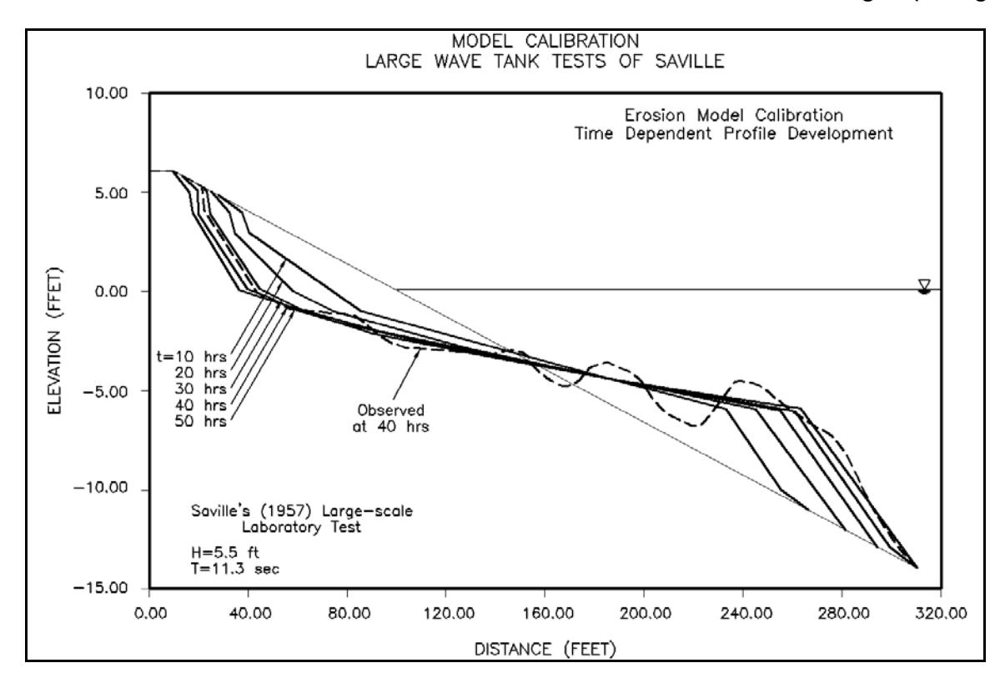

*Figure III-3-41. Example of Kriebel and Dean erosion model calibration using large-wave tank data of Saville (1957) (from Kriebel 1990)*

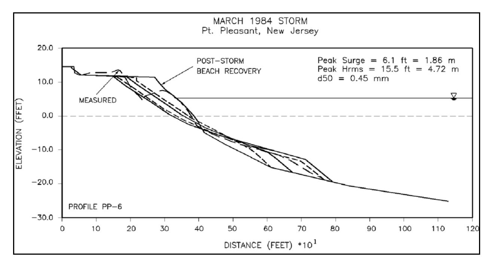

*Figure III-3-42. Comparison of Kriebel and Dean erosion model to measured profiles from northeast storm at Point Pleasant, NJ (from Kriebel 1990)*

post-storm profiles show evidence of post-storm beach recovery, which is not predicted in the numerical model.
An earlier version of the Kriebel and Dean model is provided in the ACES software package (Leenknecht, Szuwalski, and Sherlock 1992).
- (5) The numerical model by Larson (1988) and Larson and Kraus (1989, 1990), SBEACH, is conceptually similar to the model of Kriebel and Dean (1985) but contains a more detailed description of breaking wave transformation and sediment transport across the beach profile, especially near the breakpoint. This model approximates the equation for conservation of sand in Equation 3-43 in finite difference form based on the profile gridding depicted in Figure III-3-36(a). Thus, vertical changes in water depth are determined by horizontal gradients in sediment transport rate. In contrast to the Kriebel and Dean model, this allows simulation of breakpoint bar formation and evolution.
- (6) In the Larson and Kraus model, sediment transport rates in the surf zone are generally determined by Equation 3-46 in terms of excess energy dissipation, but with an additional effect of the local bottom slope. Because of this additional term, Equation 3-46 requires calibration through adjustment of two parameters, $K^{NN}$ and ε. The breaking wave model employed in the Larson and Kraus model is more sophisticated than that used by Kriebel and Dean, and is based on the breaking wave model of Dally, Dean, and Dalrymple (1985). This breaking wave model introduces gradients in the breaking wave height and energy dissipation that, in turn, lead naturally to gradients in sediment transport that produce bar/trough formations. Because of this improved breaking wave model, beach profile changes can be driven by changes in wave conditions, in addition to changes in water level.
- (7) The computational domain used in the Larson and Kraus model is divided into four regions across the beach profile and the exact sediment transport relationship is adjusted somewhat for each of the four regions. In the surf zone, which is the major region for cross-shore sediment transport in the model, transport directions are first determined from the following critical value of wave steepness

```math
\frac{H_o}{L_o} > \text{ or } < 0.0007 \left(\frac{H_o}{w_f T}\right)^3 \tag{III-3-55}
```

which is recognized as Equation 3-30 presented earlier. At each time-step in the solution, if the actual value of wave steepness exceeds the critical value given above, then transport is directed offshore over the entire active profile. Transport is then onshore if wave steepness is smaller than this critical value. Transport magnitudes in the surf zone are then determined by Equation 3-44, although the transport is "turned off" if the wave energy dissipation is below a critical value since this might cause a reversal in transport direction in conflict with the transport direction determined from wave steepness. It is noted, however, that the relationship determining transport direction (Equation 3-53) does not include any of the profile characteristics. In some cases where the profile is very steep, as may occur after beach nourishment, for example, the transport direction utilized in the model may be onshore based on wave and sediment characteristics whereas the actual transport would likely be offshore, even under mild wave conditions, due to the artificially high profile slope.
(8) The Larson and Kraus model has been compared with laboratory and field data as shown in Figures III-3-43 and III-3-44. Figure III-3-43 presents results for the two sets of available large-scale wave tank data. The upper panel shows a comparison from the Saville (1957) data and the comparisons include calculations at various times and the measured profile at 40 hr. The lower panel is for data from the Japan large tank and presents calculations at various times and the measured profile at 30-1/2 hr. The calculations

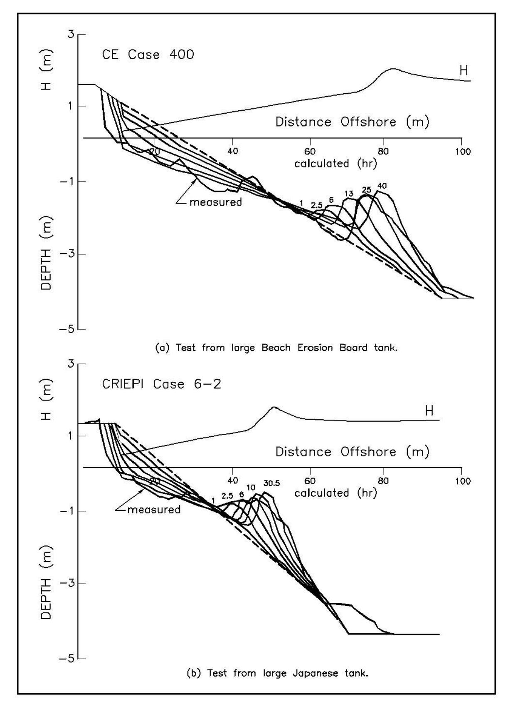

*Figure III-3-43. SBEACH compared to two tests from large-scale wave tanks (Larson and Kraus 1989)*

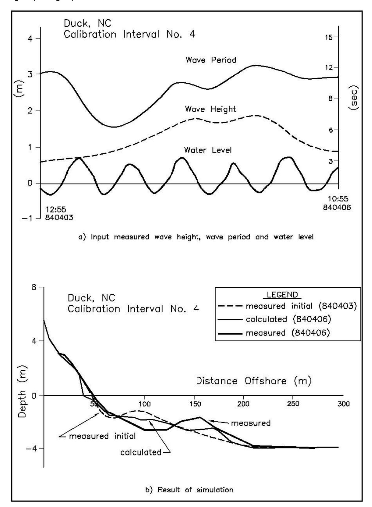

*Figure III-3-44. SBEACH tested against profile evolution data from Duck, NC (Larson and Kraus 1989)*

are in quite good agreement with the data. The regular waves used in these tests were monochromatic, which tend to favor the well-developed and concentrated bars that are simulated quite well by the numerical model. Figure III-3-44, from Duck, NC, compares the evolution of a profile over a 3-day period in which the wave heights were on the order of 1.5 m. The initial profile included a bar located approximately 40 m from shore. During the period of interest, the bar migrated seaward approximately 65 m. The simulations provide a reasonable qualitative representation of the evolution. The bar becomes more subdued at its initial location, but in contrast to measurements, is still present at the final time. Also, the bar had started to emerge slightly seaward of the measured location. The calculations showed substantially greater erosion at the shoreline than measured. This example demonstrates the extreme difficulty in simulating an actual event in nature. In the SBEACH model, sediment transport rates from Equation 3-46 require calibration through adjustment of two parameters, K' and \epsilon .
- l. Physical modeling of beach profile response.
- (1) Physical modeling of beach profile response is carried out with the model being a scaled version of the prototype. In recent years, physical modelling of profiles has been employed predominantly as a research method to understand transport processes rather than as a means to investigate profile response to a particular scenario of water level and wave conditions. The ratio of quantities in the model to those in the prototype is termed the "scale ratio" and will be designated here by a subscript "r." For example, the length and wave period ratios would be L_r and T_r , respectively. In some models, it is appropriate to utilize a distorted model in which the vertical scale ratio is different from that of the horizontal scale. Modelling of cross-shore sediment transport requires the determination of the appropriate scaling relationships for both the waves and sediments. Hughes (1994) presents a complete discussion of scaling laws as applied to predicting cross-shore sediment transport.
- (2) Noda (1972) carried out a study of profile modelling and has found that distorted models were appropriate. The horizontal and vertical scale ratios were recommended as

```math
D_r (S_r)^{1.85} = h_r^{0.55} \tag{III-3-56}
```

```math
l_r = h_r^{1.32} S^{-0.386} \tag{III-3-57}
```

in which D_r is the grain size ratio, s_r is the submerged specific weight ratio, s_r = ((\rho_s - \rho)/\rho)_r in which \rho_s and \rho are the mass density of sediment and water, respectively, l_r is the horizontal length scale, and h_r is the vertical length ratio. Figure III-3-45 presents Noda's recommended scaling relationships. Usually sand is the common material in both the model and prototype, \rho_s = 2650 \text{ kg/m}^3 , and Equation III-3-56 and III-3-57 become

```math
D_r = h_r^{0.55} \tag{III-3-58}
```

and

```math
l_r = h_r^{1.32} \tag{III-3-59}
```

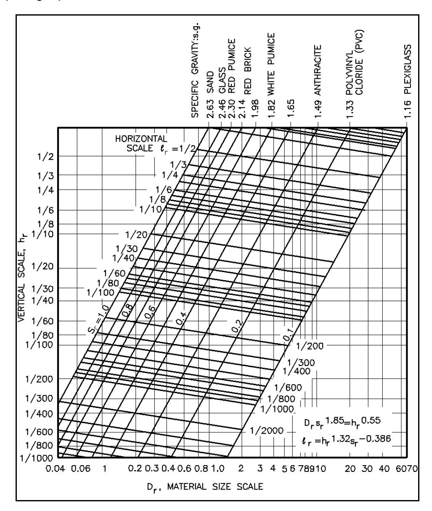

*Figure III-3-45. Noda's recommendation for profile modeling (Noda 1972)*

- (3) Thus, according to Noda's relationships, the diameter would be scaled in accordance with the depth ratio; however, the scaling factor for diameter would be closer to unity than that for the depth ratio and the length ratio would be smaller than the depth ratio. This type of distortion is common for hydraulic models in which it is necessary to represent a large horizontal extent.
- (4) Dean (1973) carried out a study of conditions that would lead to bar formation and suggested that the fall time of a sediment particle suspended at the wave crest phase position relative to the wave period would be relevant in modelling applications. This led Dean (1973, 1985) to identify the following combination of parameters which should be maintained the same in model and prototype

```math
\frac { H } { w _ { f } T } \tag{III-3-60}
```

(5) This combination of terms will be termed herein as the "Fall Velocity Parameter" (FVP). It was further suggested that an appropriate model for cross-shore sediment transport is one based on undistorted Froude modelling for the wave characteristics and one that maintains the FVP the same in the model and prototype. This simple approach leads to the following requirement for scaling the sediment fall velocity wf

```math
( w _ { f } ) _ { r } = \sqrt { L _ { r } } \tag{III-3-61}
```

which is the standard relationship for velocity scaling for a Froude model.
(6) Evaluation of cross-shore modelling according to the FVP has been carried out by Vellinga (1983), Kriebel, Dally, and Dean (1986) and Hughes and Fowler (1990). Each of these studies concluded that the FVP was effective in scaling the erosion process. Figures III-3-46 and III-3-47, from Kriebel, Dally, and Dean (1986) and Hughes and Fowler (1990), compare different scales while maintaining the same FVP in model and prototype. Considering the FVP as valid leads to the following valuable transport relationship for numerical models

```math
q_r = L_r^{\frac{3}{2}} \tag{III-3-62}
```

(7) One limitation for scaling by the FVP is that the length ratio $L_{r}$ and the prototype diameter can result in designated model sediments so small that cohesive forces would be significant. Although there are no strict guidelines for a minimum sediment size, values smaller than approximately 0.08 to 0.09 mm should be avoided.

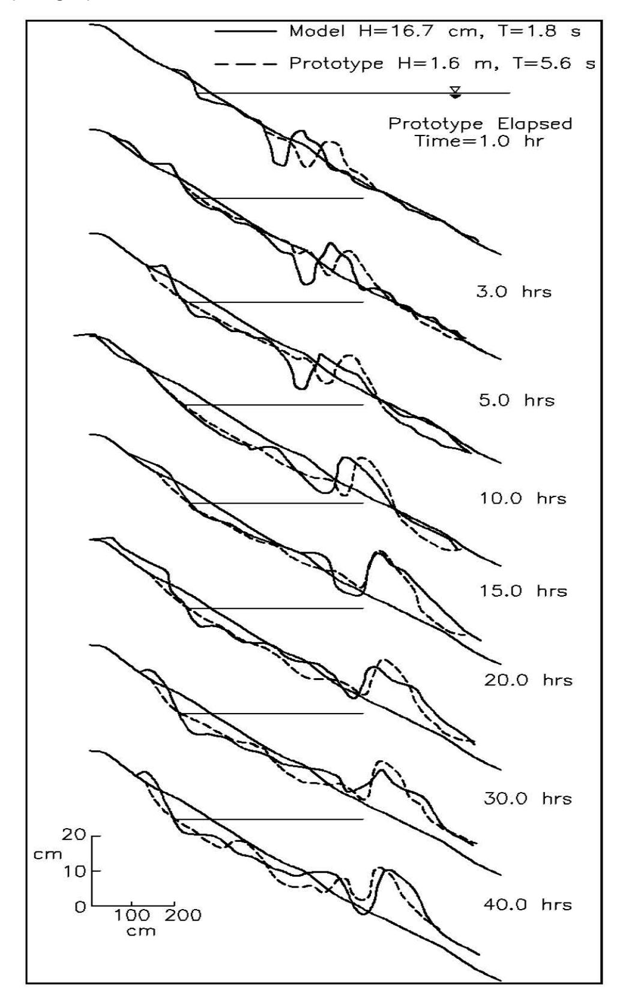

*Figure III-3-46. Profile evolution by small- and large-scale wave tank tests. Based on maintaining the same fall velocity parameter. Length ratio = 1:9.6 (Kriebel, Dally, and Dean 1986)*

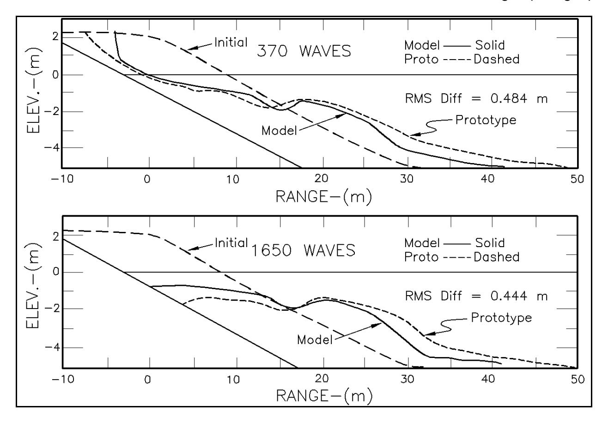

*Figure III-3-47. Profile evolution by small- and large-scale wave tank tests. Case of sloping seawall. Based on maintaining the same fall velocity parameter. Length ratio = 1:7.5 (Hughes and Fowler 1990)*

## III-3-4. References

#### Bagnold 1940

Bagnold, R. A. 1940. "Beach Formation by Waves: Some Model Experiments in a Wave Tank," Journal of the Institution of Civil Engineers, Vol 15, pp 27-52.

#### Bagnold 1966

Bagnold, R. A. 1966. "An Approach to the Sediment Transport Problem from General Physics," U.S. Geological Survey Professional Paper 422-I, U. S. Dept of Interior.

#### Bailard 1981

Bailard, J. A. 1981. "An Energetics Total Load Sediment Transport Model for a Plane Sloping Beach," Journal of Geophysical Research , Vol 86, No. C11, pp 10938-10954.

#### Barnett and Wang 1988

Barnett, M., and Wang, H. 1988. "Effects of a Vertical Seawall on Profile Response," American Society of Civil Engineers, Proceedings of the Twenty-first International Conference on Coastal Engineering, Chapter 111, pp 1493-1507.

#### Birkemeier 1984

Birkemeier, W. A. 1984. "Time Scales of Nearshore Profile Change," Proceedings, 19th International Conference on Coastal Engineering, Chapter 102, pp 1501-1521.

#### Birkemeier 1985

Birkemeier, W. A. 1985. "Field Data on Seaward Limit of Profile Change," Journal of the Waterways, Port Coastal and Ocean Engineering, American Society of Civil Engineers, Vol 111, No. 3, pp 598-602.

### Bodge 1992

Bodge, K. R. 1992. "Representing Equilibrium Beach Profiles with an Exponential Expression," Journal of Coastal Research, Vol 8, No. 1, pp 47-55.

## Broker-Hedegaard, Deigaard, and Fredsoe 1991

Broker-Hedegaard, I., Deigaard, R., and Fredsoe, J. 1991. "Onshore/Offshore Sediment Transport and Morphological Modelling of Coastal Profiles," Proceedings Coastal Sediments '91 Conference , pp 643-657.

#### Bruun 1954

Bruun, P. 1954. "Coast Erosion and the Development of Beach Profiles," Beach Erosion Board Technical Memorandum No. 44, U.S. Army Engineer Waterways Experiment Station, Vicksburg, MS.

#### Bruun 1962

Brunn, P. 1962. "Sea-Level Rise as a Cause of Shore Erosion," Journal of Waterways and Harbor Division, American Society of Civil Engineers, Vol 88, pp 117-130.

#### Bruun 1988

Bruun, P. 1988. "The Bruun Rule of Erosion by Sea Level Rise: A Discussion on Large-Scale Two- and Three-Dimensional Usages," Journal of Coastal Research , Vol 4, No. 4, pp 627-648.

## Chiu 1977

Chiu, T. Y. 1977. "Beach and Dune Response to Hurricane Eloise of September 1975. Proceedings of Coastal Sediments '77, pp 116-134.

#### Clausner, Birkemeier, and Clark 1986

Clausner, J. E., Birkemeier, W. A., and Clark, G. R. 1986. "Field Comparison of Four Nearshore Survey Systems," Miscellaneous Paper CERC-86-6, U.S. Army Engineer Waterways Experiment Station, Vicksburg, MS.

#### Dally and Dean 1984

Dally, W. R., and Dean, R. G. 1984. "Suspended Sediment Transport and Beach Profile Evolution," Journal of Waterway, Port, Coastal, and Ocean Engineering , Vol 110, No. 1, pp 15-33.

## Dally, Dean, and Dalrymple 1985

Dally, W. R., Dean, R. G., and Dalrymple, R. G. 1985. "Wave Height Variation Across Beaches of Arbitrary Profile," Journal of Geophysical Research , Vol 90, No. C6, pp 11917-11927.

#### Dalrymple 1992

Dalrymple, R. A. 1992. "Prediction of Storm/Normal Beach Profiles," Journal of Waterways, Port, Coastal and Ocean Engineering, American Society of Civil Engineers, Vol 118, No. 2, pp 193-200.

### Dean 1973

Dean, R. G. 1973. "Heuristic Models of Sand Transport in the Surf Zone," Proceedings, Conference on Engineering Dynamics in the Surf Zone, Sydney, Australia.

#### Dean 1977

Dean, R. G. 1977. "Equilibrium Beach Profiles: U.S. Atlantic and Gulf Coasts," Department of Civil Engineering, Ocean Engineering Report No. 12, University of Delaware, Newark, DE.

### Dean 1985

Dean, R. G. 1985. "Physical Modelling of Littoral Processes," Physical Modelling in Coastal Engineering, R. A. Dalrymple, ed., A. A. Balkema, pp 119-139.

#### Dean 1987a

Dean, R. G. 1987a. "Additional Sediment Input into the Nearshore Region," Shore and Beach, Vol 55, Nos. 3-4, pp 76-81.

#### Dean 1987b

Dean, R. G. 1987b. "Coastal Sediment Processes: Toward Engineering Solutions," Coastal Sediments '87, American Society of Civil Engineers, New Orleans, LA, Vol 1, pp 1-24.

#### Dean 1991

Dean, R. G. 1991. "Equilibrium Beach Profiles: Characteristics and Applications," Journal of Coastal Research, Vol 7, No. 1, pp 53-84.

#### Dean and Dalrymple 1991

Dean, R. G., and Dalrymple, R. A. 1991. Water Wave Mechanics for Engineers and Scientists , World Scientific Pub. Co., Teaneck, NJ.

#### Dean and Dalrymple 2001

Dean, R. G., and Dalrymple, R. A. 2001. Coastal Processes with Engineering Applications, Cambridge University Press, New York.

#### Dean and Maurmeyer 1983

Dean, R. G., and Maurmeyer, E. M. 1983. "Models for Beach Profile Response," CRC Handbook on Beach Erosion and Coastal Processes, P. D. Komar, ed., Chapter 7, pp 151-166.

#### Dette and Uliczka 1987

Dette, H., and Uliczka, K. 1987. "Prototype Investigation on Time-Dependent Dune Recession and Beach Erosion," Proceedings Coastal Sediments '87, New Orleans, pp 1430-1444.

#### Dewall 1979

Dewall, A. E. 1979. "Beach Changes at Westhampton Beach, New York," MR 79-5, Coastal Engineering Research Center, U.S. Army Engineer Waterways Experiment Station, Vicksburg, MS.

#### Dewall and Richter 1977

Dewall, A. E., and Richter, J. J. 1977. "Beach and Nearshore Processes in Southeastern Florida," Coastal Sediments'77, pp 425-443.

#### Dolan and Dean 1985

Dolan, T., and Dean, R. G. 1985. "Multiple Longshore Sand Bars in the Upper Chesapeake Bay," Estuarine Coastal & Shelf Science , Vol 21, pp 727-743.

## Edelman 1972

Edelman, T. 1972. "Dune Erosion During Storm Conditions," Proceedings of the Thirteenth International Conference on Coastal Engineering, pp 1305-1312.

#### Everts 1985

Everts, C. H. 1985. "Sea Level Rise Effects on Shoreline Position," Journal of Waterway, Port, and Coastal Engineering , Vol 111, No. 6, pp 985-999.

#### Hallermeier 1978

Hallermeier, R. J. 1978. "Uses for a Calculated Limit Depth to Beach Erosion," Proceedings of the 16th International Conference on Coastal Engineering, American Society of Civil Engineers, Hamburg, pp 1493- 1512.

#### Hallermeier 1981

Hallermeier, R. J. 1981. "A Profile Zonation for Seasonal Sand Beaches from Wave Climate," Coastal Engineering, Vol 4, pp 253-277.

#### Hands 1983

Hands, E. 1983. "Erosion of the Great Lakes Due to Changes in the Water Level," CRC Handbook of Coastal Processes and Erosion , P. D. Komar, ed., CRC Press, pp 167-189.

## Hicks, Debaugh, and Hickman 1983

Hicks, S. D., Debaugh, H. A., Jr., and Hickman, E. 1983. "Sea Level Variations for the United States, 1955- 1980," National Ocean Service, National Oceanic and Atmospheric Administration.

#### Hughes 1994

Hughes, S. A. 1994. Physical Models and Laboratory Techniques in Coastal Engineering. World Scientific, River Edge, NJ.

## Hughes and Fowler 1990

Hughes, S. A., and Fowler, J. E. 1990. "Validation of Movable-Bed Modeling Guidance," Proceedings of the 22nd International Conference on Coastal Engineering, American Society of Civil Engineers, Chapter 186, pp 2457-2470.

#### Inman, Elwany, and Jenkkins 1993

Inman, D. L., Elwany, M. H. S., and Jenkkins, S. A. 1993. "Shoreline and Bar-Berm Profiles on Ocean Beaches," Journal of Geophysical Research , Vol 98, No. C10, pp 18,181 - 18,199.

#### Katoh and Yanagishima 1988

Katoh, K., and Yanagishima, S. 1988. "Predictive Model for Daily Changes of Shoreline," Proceedings of the Twenty-First International Conference on Coastal Engineering, American Society of Civil Engineers, Hamburg, Chapter 93, pp 1253-1264.

## Keulegan 1945

Keulegan, G. H. 1945. "Depths of Offshore Bars," Engineering Notes No. 8, Beach Erosion Board, U.S. Army Engineer Waterways Experiment Station, Vicksburg, MS.

#### Keulegan 1948

Keulegan, G. H. 1948. "An Experimental Study of Submarine Sand Bars," Technical Report No. 8, Beach Erosion Board, U.S. Army Engineer Waterways Experiment Station, Vicksburg, MS.

### Kobayashi 1987

Kobayashi, N. 1987. "Analytical Solutions for Dune Erosion by Storms," Journal of the Waterway, Coastal and Ocean Engineering, American Society of Civil Engineers, Vol 113, No. 4, pp 401-418.

#### Komar and McDougal 1994

Komar, P. D., and McDougal, W. G. 1994. "The Analysis of Exponential Beach Profiles," Journal of Coastal Research, Vol 10, pp 59-69.

#### Kraus 1988

Kraus, N. C. 1988. "The Effects of Seawalls on the Beach: An Extended Literature Review," Journal of Coastal Research , Special Issue No. 4, pp 1-28.

## Kraus, Larson, and Kriebel 1991

Kraus, N. C., Larson, M., and Kriebel, D. L. 1991. "Evaluation of Beach Erosion and Accretion Predictors," Proceedings of Conference on Coastal Sediments '91, American Society of Civil Engineers, pp 572-587.

#### Kriebel 1986

Kriebel, D. L. 1986. "Verification Study of a Dune Erosion Model," Shore and Beach, Vol 54, No. 3, pp 13-20.

## Kriebel 1987

Kriebel, D. L. 1987. "Beach Recovery Following Hurricane Elena," Proceedings of Conference on Coastal Sediments '87, American Society of Civil Engineers, pp 990-1005.

#### Kriebel 1990

Kriebel, D. L. 1990. "Advances in Numerical Modeling of Dune Erosion," 22nd Intl. Conf. on Coastal Engineering, American Society of Civil Engineers, pp 2304-2317.

#### Kriebel and Dean 1985

Kriebel, D. L., and Dean, R. G. 1985. "Numerical Simulation of Time-Dependent Beach and Dune Erosion," Coastal Engineering, Vol 9, pp 221-245.

#### Kriebel and Dean 1993

Kriebel, D. L., and Dean, R. G. 1993. "Convolution Method for Time-Dependent Beach-Profile Response," Journal of Waterway, Port, Coastal and Ocean Engineering, American Society of Civil Engineers, Vol 119, No. 2, pp 204-227.

#### Kriebel, Dally, and Dean 1986

Kriebel, D. L., Dally, W. R., and Dean, R. G. 1986. "Undistorted Froude Model for Surf Zone Sediment Transport," Proceedings of the Twentieth International Conference on Coastal Engineering, American Society of Civil Engineers, pp 1296-1310.

### Kriebel, Kraus, and Larson 1991

Kriebel, D. L., Kraus, N. C., and Larson, M. 1991. "Engineering Methods for Predicting Beach Profile Response," Proceedings of Conference on Coastal Sediments '91, American Society of Civil Engineers, pp 557-571.

#### Larson 1988

Larson, M. 1988. "Quantification of Beach Profile Change," Report No. 1008, Department of Water Resources and Engineering, University of Lund, Lund, Sweden.

### Larson and Kraus 1989

Larson, M., and Kraus, N. C. 1989. "SBEACH: Numerical Model for Simulating Storm-induced Beach Change; Report 1: Empirical Foundation and Model Development," Technical Report CERC-89-9, U.S. Army Engineer Waterways Experiment Station, Vicksburg, MS.

## Larson and Kraus 1990

Larson, M., and Kraus, N. C. 1990. "SBEACH: Numerical Model for Simulating Storm-induced Beach Change; Report 2: Numerical Formulation and Model Tests," Technical Report CERC-89-9, U.S. Army Engineer Waterways Experiment Station, Vicksburg, MS.

#### Lee and Birkemeier 1993

Lee, G. H., and Birkemeier, W. A. 1993. "Beach and Nearshore Survey Data: 1985-1991 CERC Field Research Facility," Technical Report CERC-93-3, U.S. Army Engineer Waterways Experiment Station, Vicksburg, MS.

#### Leenknecht, Szuwalski, and Sherlock 1992

Leenknecht, D. A., Szuwalski, A., and Sherlock, A. R. 1992. "Automated Coastal Engineering System, User Guide and Technical Reference, Version 1.07," U.S. Army Engineer Waterways Experiment Station, Vicksburg, MS.

#### Longuet-Higgins 1953

Longuet-Higgins, M. S. 1953. "Mass Transport in Water Waves," Philosophical Transactions of the Royal Society of London, Ser A, Vol 245, pp 535-581.

### Longuet-Higgins and Stewart 1964

Longuet-Higgins, M. S., and Stewart, R. W. 1964. "Radiation Stresses in Water Waves: A Physical Discussion with Applications," Deep Sea Research , Vol 2, pp 529-562.

#### Moore 1982

Moore, B. D. 1982. "Beach Profile Evolution in Response to Changes to Water Level and Wave Height," M.S. thesis, Department of Civil Engineering, University of Delaware, Newark.

### Nairn and Southgate 1993

Nairn, R. B., and Southgate, H. N. 1993. "Deterministic Profile Modelling of Nearshore Processes; Part 2, Sediment Transport and Beach Profile Development," Coastal Engineering , Vol 19, pp 57-96.

#### National Research Council 1984

National Research Council. 1984. "Responding to Changes in Sea Level: Engineering Implications," National Research Council Committee on Engineering Implication of Change in Relative Sea Level.

#### Noda 1972

Noda, E. K. 1972. "Equilibrium Beach Profile Scale Model Relationships," Journal of Waterway, Harbors and Coastal Engineering, American Society of Civil Engineers, Vol 98, No. 4, pp 511-528.

#### Penland, Suter, and McBride 1987

Penland, S., Suter, J. R., and McBride, R. A. 1987. "Delta Plain Development and Sea Level History in Terrebonne Coastal Region, Louisiana," Proceedings of Conference on Coastal Sediments '87, American Society of Civil Engineers, pp 1689-1705.

## Roelvink and Broker 1993

Roelvink, J. A., and Broker, I. 1993. "Cross-Shore Profile Models," Coastal Engineering , Vol 21, pp 163- 191.

#### Roelvink and Stive 1989

Roelvink, J. A., and Stive, M. J. F. 1989. "Bar Generating Cross-Shore Flow Mechanisms on a Beach," Journal of Geophysical Research , Vol 94, No. C4, pp 4785-4800.

#### Saville 1957

Saville, T. 1957. "Scale Effects in Two-Dimensional Beach Studies," Transactions of the Seventh General Meeting of the International Association of Hydraulic Research, Vol 1, pp A3.1 - A3.10.

#### Seymour and Boothman 1984

Seymour, R. J., and Boothman, D. P. 1984. "A Hydrostatic Profiler for Nearshore Surveying," Journal of Coastal Engineering, Vol 8, pp 1-14.

#### Stive and Battjes 1984

Stive, M. J. F., and Battjes, J. A. 1984. "A Model for Offshore Sediment Transport," Proceedings 19th Intl. Conf. on Coastal Engineering , pp 1420-1436.

#### Swart 1974

Swart, D. H. 1974. "Offshore Sediment Transport and Equilibrium Beach Profiles,'' Publ. No. 131, Delft Hydraulics Lab, Delft, The Netherlands.

## Vellinga 1983

Vellinga, P. 1983. "Predictive Computational Model for Beach and Dune Erosion During Storm Surges," Proceedings, American Society of Civil Engineers Specialty Conference on Coastal Structures' 83, pp 806- 819.

#### Watanabe, Riho, and Horikawa 1980

Watanabe, A., Riho, Y., and Horikawa, K. 1980. "Beach Profile and On-Offshore Sediment Transport," Proceedings 17th International Conference on Coastal Engineering , pp 1106-1121.

## III-3-5. Definition of Symbols

| Symbol | Definition |
|---|---|
| )y | Equilibrium dry beach width [length] |
| )yN | Non-dimensional equilibrium dry beach width |
| g | Parameter suggested by Larson & Kraus to calibrate a sediment transport model [dimensionless] |
| g | Eddy viscosity $[length^{2}/time]$ |
| <b | Instantaneous wave-induced water particle velocity at the bottom [length/time] |
| <s | Steady wave-induced water particle velocity [length/time] |
| D | Mass density of water (salt water = 1,025 $kg/m^{3}$ or 2.0 $slugs/ft^{3};$ fresh water = \$1,000kg/m^{3}$ or 1.94 $slugs/ft^{3})$ [force-time2/length4] |
| F | Angular frequency (= 2B/T) $[time^{-1}]$ |
| FH | Standard deviation of significant wave height [length] |
| J&b | Average bottom shear stress $[force/length^{2}]$ |
| J&bs | Bottom shear stress $[force/length^{2}]$ |
| J0 | Surface wind stress $[force/length^{2}]$ |
| Jb | Seaward-directed shear stress at the bottom $[force/length^{2}]$ |
| A | Sediment scale or equilibrium profile parameter (Table III-3-3) $[length^{1/3}]$ |
| AF | Nourishment material scale parameter $[length^{1/3}]$ |
| AN | Native sediment scale parameter $[length^{1/3}]$ |
| AN | Parameter for nourished beach calculations ( = $A_{F}$ / $A_{N}$ ) [dimensionless] |
| B | Berm height [length] |
| B(t) | Instantaneous total height of the active profile above the current water level [length] |
| B0 | Original berm height [length] |
| BN | Parameter for nourished beach calculations [dimensionless] |
| C | Wave speed [length/time] |
| D | Sediment grain diameter [length - generally millimeters] |
| D* | Excess energy dissipation per unit volume in the surf zone |
| DF | Sediment grain diameter of beach fill material [length - generally millimeters] |
| DN | Sediment grain diameter of native beach [length] - generally millimeters |
| Dr | Model to prototype sediment grain size scale ratio |
| E | Total wave energy in one wavelength per unit crest width [length-force/length] |
| f | Darcy-Weisbach friction coefficient [dimensionless] |
| g | Gravitational acceleration (32.17 $ft/sec^{2},$ 9.807m/sec2) $[length/time^{2}]$ |
| h | Equilibrium beach profile depth (Equation III-3-13) [length] |
| h | Water depth [length] |
| H | Wave height [length] |
| h* | Depth to which nourished profile will equilibrate or closure depth [length] |
| H& | Annual mean significant wave height [length] |
| h0 | Asymptotic beach profile depth [length] |
| H0 | Deepwater wave height [length] |
| hb | Breaking depth [length] |
| hc | Closure depth [length] |
| hCR | Depth over bar crest [length] |
| hD | Depth to the bar base [length] |
| He | Effective significant wave height [length] |
| hr | Model to prototype vertical length scale ratio |
| Hs | Deepwater significant wave height [length] |
| hT | Depth over bar trough [length] |
| k | Decay constant [dimensionless] |
| k | Wave number (= 2B/L = 2B/CT) $[length^{-1}]$ |
| KN | Parameter used to calibrate the Kriebel & Dean simple transport relationship [dimensionless] |
| KNN | Parameter used to calibrate a sediment transport model [dimensionless] |
| L* | Width of active profile [length] |
| L0 | Deepwater wave length [length] |
| lr | Model to prototype horizontal length scale ratio |
| Lr | Model to prototype length scale ratio |
| m0 | Beach slope [length-rise/length-run] |
| n | Empirical exponent used in the equilibrium beach profile equation [dimensionless] |
| P | Single profile parameter (Equation III-3-32) [dimensionless] |
| Q | Time-averaged seaward discharge due to the return flow of shoreward mass transport |
| Cross-Shore | Sediment Transport Processes III-3-77 |
| qy | Kriebel & Dean simple transport relationship (Equation III-3-45) |
| R | Shoreline recession [length] |
| Rmax | Maximum shoreline recession [length] |
| R4 | Equilibrium berm recession due to a storm surge (Equation III-3-38) [length] |
| S | Storm surge level [length] |
| S | Sea level rise [length] |
| sr | Model to prototype submerged specific weight scale ratio |
| T | Wave period [time] |
| TD | Total storm surge duration [time] |
| Te | Effective wave period [time] |
| Tr | Model to prototype wave period scale ratio |
| TS | Time-scale of the equilibrium beach response system (Equation III-3-52) [time] |
| V | Added volume per unit beach length $[length^{3}$ /length] |
| V4 | Volume of sand eroded from the berm above the initial still-water level due to a storm surge level S $[length^{3}/length]$ |
| VN | Parameter for nourished beach calculations ( = V/(B $W_{*})$ ) [dimensionless] |
| VNc2 | Critical volume of sand that will just yield a finite shoreline displacement for the case of sand that is finer than the native (Equation III-3-23) [dimensionless] |
| VNcl | Critical volume of sand delineating intersecting and nonintersecting profiles (Equation III-3-22) [dimensionless] |
| w | Sediment fall velocity [length/time] |
| W* | Width of active nearshore zone (Equation III-3-19) [length] |
| Wb | Width of the surf zone [length] |
| wf | Sediment fall velocity [length/time] |
| y | Equilibrium beach profile distance offshore (Equation III-3-13) [length] |
| y | Distance seaward from mean low water [length] |
| y0 | Offset of the shoreline between the sloping beach face and the imaginary or virtual origin of the equilibrium profile [length] |
| z | Elevation [length] |

## III-3-6. Acknowledgments

Authors of Chapter III-3, "Cross-Shore Sediment Transport Processes:"
Robert G. Dean, Ph.D., Coastal & Oceanographic Engineering, University of Florida, Gainesville, Florida. David L. Kriebel, Ph.D., Department of Ocean Engineering, United States Naval Academy, Annapolis, Maryland.
Todd L. Walton, Ph.D., Coastal and Hydraulics Laboratory, Engineer Research and Development Center, Vicksburg, Mississippi.

#### Reviewers:

Kevin Bodge, Ph.D., Olsen Associates, Jacksonville, Florida.
James R. Houston, Ph.D., Engineer Research and Development Center, Vicksburg, Mississippi.
Paul A. Work, Ph.D., School of Civil and Environmental Engineering, Georgia Institute of Technology, Atlanta, Georgia.
