## Table of Contents

- V-5-1. Project Assessment and Alternative Selection
  - a. Introduction
    - (1) Purpose
    - (2) Contents
    - (3) Relationship to other chapters and parts
  - b. Port and harbor facility issues
    - (1) Motivation
    - (2) Deep- versus shallow-draft projects
    - (3) Organizations related to navigation projects
    - (4) Trends in port and harbor development
  - c. Preliminary planning and design elements
  - d. Policy considerations
- V-5-2. Defining Vessel Requirements
  - a. Deep-draft ships and shallow-draft vessels
    - (1) Vessel dimensions
    - (2) Cargo capacity
    - (3) Restrictions
    - (4) Vessel characteristics
    - (5) Form coefficients
    - (6) Ship speed
    - (7) Maneuverability
  - b. Vessel operations
    - (1) Navigation system
    - (2) Typical operations
    - (3) Shallow water, restricted channels
    - (4) Ice navigation
  - c. Design considerations
    - (1) Design vessel
    - (2) Design transit and mooring area conditions
- V-5-3. Data Needs and Sources (Pre-project)
  - a. Introduction
  - b. Currents
  - c. Water levels
  - d. Wind
  - e. Waves
  - f. Water quality
  - g. Sediments
  - h. Bathymetry and sediment transport processes
  - i. Ecological processes
  - j. Local coordination
    - (1) Pilot interviews
    - (2) U.S. Coast Guard
    - (3) Accident records
- V-5-4. Economic Analysis
- V-5-5. Channel Depth
  - a. Introduction
  - b. Effect of fresh water
  - c. Vessel motion from waves
  - d. Vessel squat
  - e. Trim
  - f. Shallow-water effects
  - g. Safety clearance
  - h. Advance maintenance
  - i. Dredging tolerance
  - j. Tidal shoals and ship transit concerns example
- V-5-6. Channel Alignment and Width
  - a. Alignment
  - b. Inner channels (protected waters and harbor areas)
    - (1) Width
    - (2) Berthing areas
    - (3) Special considerations due to ice
  - c. Entrance channels
  - d. Turns and bends
- V-5-7. Other Project Features
  - a. Turning basins
  - b. Moorage/anchorage areas
  - c. Basin flushing and water quality
  - d. Navigation structures
    - (1) Breakwaters
    - (2) Jetties
    - (3) Training dikes
    - (4) Wave absorbers
    - (5) Revetments, seawalls, and bulkheads
- V-5-8. Aids to Navigation
- V-5-9. Operation, Monitoring, and Maintenance
- V-5-10. Model and Specialized Field Studies
  - a. Harbor modeling
    - (1) Physical modeling as a design tool
    - (2) Example: Dana Point Harbor, California
    - (3) Numerical modeling as a design tool
      - (a) Wind waves, swell, and harbor oscillations
      - (b) Example: Kikiaola Harbor, Kauai, Hawaii
      - (c) Flushing and circulation
      - (d) Example: Maalaea Harbor, Maui, Hawaii
      - (e) Shore response
  - b. Navigation modeling
    - (1) Physical models
      - (a) Example: Barbers Point Harbor, Oahu, Hawaii
      - (b) Additional Information
    - (2) Ship simulations
      - (a) Example: Alafia River Harbor, Florida
      - (b) Example: San Juan Harbor, Commonwealth of Puerto Rico
  - c. Specialized field studies
    - (1) Harbors
      - (a) Example: Kahului Harbor, Maui, Hawaii
      - (b) Data
    - (2) Ship tracking
- V-5-11. References
- V-5-12. Definitions of Symbols
- V-5-13. Acknowledgments

# List of Figures

- Figure V-5-1. Foreign waterborne imports and exports
- Figure V-5-2. Ship length definitions
- Figure V-5-3. Midship-section molded-form definitions
- Figure V-5-4. Block coefficient definition
- Figure V-5-5. Example ship track, Alafia Channel, Florida
- Figure V-5-6. Ship wave and flow pattern in a canal
- Figure V-5-7. Ship-limiting speed in a canal
- Figure V-5-8. Cold regions of the world
- Figure V-5-9. Fog over frozen waterway
- Figure V-5-10. Deep-Draft navigation benefit evaluation procedure
- Figure V-5-11. Definition of channel types
- Figure V-5-12. Channel depth allowances
- Figure V-5-13. Ship motion definitions
- Figure V-5-14. Ship motion response, mouth of Columbia River
- Figure V-5-15. Squat analysis definition
- Figure V-5-16. Example channel cross sections
- Figure V-5-17. Trench channel definitions
- Figure V-5-18. Example squat calculations
- Figure V-5-19. Hypothetical route to a port at head of an estuary
- Figure V-5-20. Hypothetical distribution of depths for Shoal 2
- Figure V-5-21. Range of water levels in the Fraser River, British Columbia
- Figure V-5-22. Components of a ship transit simulation program
- Figure V-5-23. Ship simulation of deep-draft entrance channel, San Juan Harbor, Commonwealth of Puerto Rico

# List of Tables

- Table V-5-1. Organization Acronyms Related to Navigation Projects
- Table V-5-2. Acronyms Commonly Used to Describe Ship Size and Function
- Table V-5-3. Canal Restrictions on Ship Size
- Table V-5-4. Characteristics of Large Ships
- Table V-5-5. Large Tanker Classes
- Table V-5-6. Depth Allowance for Freshwater Effect
- Table V-5-7. Squat Allowance for Small Recreational Craft
- Table V-5-8. Safety Clearance
- Table V-5-9. Traditional Criteria for Deep-draft Channel Width Design
- Table V-5-10. One-way Ship Traffic Channel Width Design Criteria
- Table V-5-11. Two-way Ship Traffic Channel Width Design Criteria
- Table V-5-12. Recommended Deep-Draft Channel Turn Configurations
- Table V-5-13. Typical Physical Model Scales for Harbors
- Table V-5-14. Simple Criteria for Assessing Operational Impact of Harbor Oscillations
- Table V-5-15. Design Ship Dimensions for Barbers Point Harbor Studies

# Chapter V-5 Navigation Projects

# V-5-1. Project Assessment and Alternative Selection

#### a. Introduction

(1) Purpose. The purpose of this chapter is to present information and procedures that help in coastal navigation project planning and design. Both deep-draft ports and small boat harbors are included. Navigation channels, turning basins, anchorage areas, and related structures are discussed. Other areas of port and harbor design, such as docks, facilities, terminals, and other land-side requirements, are not included. These areas are generally nonfederal concerns.
Guidance for navigation projects has traditionally been focused on deep-draft project requirements. Modified guidance based on experience has evolved for shallow-draft projects. This chapter follows a similar philosophy, focusing on deep-draft projects with supplementary material for shallow-draft projects, as appropriate. The chapter provides fairly comprehensive coverage, but it is intended to complement, rather than replace, Engineer Manuals 1110-2-1613, "Hydraulic Design Guidance for Deep-Draft Navigation Projects" (USACE 1998), and 1110-2-1615, "Hydraulic Design of Small Boat Harbors" (USACE 1984).
- (2) Contents. This section gives an overview of issues and considerations important in assessing navigation projects and in defining and selecting project alternatives. Since navigation projects are designed to satisfy requirements of a target group of vessels, an understanding of vessel types and behavior is given in Part V-5-2. Determination of design vessel and transit conditions is also discussed. Data needs and sources are reviewed in Part V-5-3, with appropriate reference to other CEM chapters. Part V-5-4 is devoted to a brief discussion of economic analysis, which is crucial to every navigation project. Development of navigation project features is addressed in Parts V-5-5 through V-5-8. Features included are channel depth, width, and alignment, turning basins, anchorage areas, navigation-related structures, and aids to navigation. Post-project activities are discussed in Part V-5-9, including operation, monitoring, and maintenance. Part V-5-10 gives a description of physical and numerical modeling tools and specialized field studies which can assist in planning and designing effective navigation projects. A number of specific project examples are presented to illustrate the capabilities and applications of model and field studies. References are given in Part V-5-11.
- (3) Relationship to other chapters and parts. Part V provides general guidance on the Planning and Design Process (Part V-1) and Site Characterization (Part V-2), including data needs and sources and monitoring. Part V also contains chapters with more detailed guidance on particular project types frequently encountered in the U.S. Army Corps of Engineers (USACE). This chapter addresses navigation projects. Part V-6, Sediment Management at Inlets/Harbors, is an important complement to this chapter. It deals with sediment processes in the vicinity of inlets and harbor entrances, engineering methods for managing sediment processes to prevent negative project impacts and/or achieve positive benefits, and project experience and lessons learned. Other chapters of particular relevance are Part II-6, Hydrodynamics of Tidal Inlets; Part II-7, Harbor Hydrodynamics (including a section on vessel interactions); and Part VI, Design of Coastal Project Elements, which provides guidance for the detailed structural design needed for navigation and other coastal projects.
- b. Port and harbor facility issues
- (1) Motivation. Ports and harbors are vital to the nation. Since ports handle about half of U.S. overseas trade by value and nearly all by weight, waterborne commerce directly affects prosperity and richness of life in the United States. Ports and harbors are also vital for military applications because a large percentage of military goods are transported by ship. Finally, harbors provide launching and berthing facilities for commercial fishing boats and a large number of recreational boaters.
- (a) The term harbor describes a relatively protected area accessible to vessels. The term port indicates a location where ships can transfer cargo. A port may be located in a protected harbor or it may be exposed, such as single-point mooring facilities used for petroleum products.
- (b) Ports and harbors must be located so that vessels can penetrate coastal waters and interface with land. Ideally, vessels have a relatively short travel distance between port/harbor areas and open water. Vessels must have sufficient water depth and protection to safely enter and exit the harbor/port area. Thus, a wellmaintained, clearly identified channel through any shallow areas is needed.
- (c) The requirements for access and protection in harbors and ports often lead to dredged channels and engineered structures, such as jetties and breakwaters. These project features can impact dynamic coastal processes and lead to a range of coastal engineering concerns.
- (2) Deep- versus shallow-draft projects. The terms deep-draft and shallow-draft are often used to distinguish between major commercial port projects and recreational or other small boat harbor projects. USACE definitions for these terms are based on authorized navigation project depth: Deep draft Channel depth greater than 4.6 m (15 ft) Shallow draft Channel depth less than 4.6 m (15 ft)
Defining depth for a deep-draft harbor can vary with context. For example, Federal cost-sharing rules are based on a 6.1-m (20-ft) minimum depth for deep-draft projects. The harbor maintenance tax system is applied to projects with depth greater than 4.3 m (14 ft), while inland fuel taxes apply in shallower-depth projects, excluding entrance channels. Deep-draft U.S. ports serve commercial seagoing ships, Great Lakes freighters, Navy warships, and Army prepositioning ships. Shallow-draft harbors typically serve pleasure craft and fishing boats. The term small craft is often used synonymously with shallow draft . As part of its mission, USACE has had responsibility for maintaining over 200 deep-draft coastal ports and over 600 shallow-draft harbors. Issues involved in shallow-draft navigation projects have similarities but also significant differences from those in deep-draft projects. For example, shallow-draft boats are typically small and are strongly influenced by wind waves and swell. Thus, wave criteria for safe transit of entrance channels and safe mooring areas are more demanding than for deep-draft vessels. However, large ships typically maneuver with difficulty in confined areas, and channel width is a critical component of deep-draft channels. Deep-draft harbors are more prone to harbor oscillation concerns because resonant periods of moored ship response are typically in the same range as harbor oscillation periods. Flushing is an important issue in many shallow-draft harbors, where numerous users in a confined area can potentially lead to deterioration of water quality. Flushing is usually less critical in deep-draft projects, which require wider entrances and more careful monitoring of vessel discharges. These issues are addressed later in the chapter.
(3) Organizations related to navigation projects. USACE navigation projects involve other organizations, as well. For example, the U.S. Coast Guard is responsible for installing and maintaining the aids to navigation needed to mark Federal channels. Often state and local organizations, such as port authorities, are
part of a navigation project team. Some organizations and acronyms often encountered in navigation projects as team members or information resources are listed in Table V-5-1.

**Table V-5-1. **

| Acronym | Organization |  |
| --- | --- | --- |
| AAPA | American Association | of Port Authorities |
| ABS | American Bureau of | Shipping |
| ASCE | American Society of | Civil Engineers |
| EPA | U.S. Environmental | Protection Agency |
| NAVFAC | U.S. Naval Facilities | Engineering Command |
| NOAA | U.S. National Oceanic | and Atmospheric Administration |
| PIANC | International Navigation Congresses) | Association (formerly, Permanent International Association of Navigation |
| USACE | U.S. Army Corps of | Engineers |
| USCG | U.S. Coast Guard |  |

- (4) Trends in port and harbor development. Demand for harbor and port facilities continues to increase while coastal population and other utilization of the coast increases. These competing interests intensify pressures to find mutually agreeable solutions to coastal land and water use. Annual foreign waterborne tonnage (between U.S. and foreign ports) during the years 1987-1996 indicates a clearly increasing trend (Figure V-5-1). Major U.S. ports continue to increase in size and serve larger ships. Dramatic increases in container traffic and a recent trend for container ships to exceed Panama Canal size constraints have helped fuel the need for deeper ports and expanded, modernized terminals. Open terminals and offshore ports have helped accommodate large tankers and bulk carriers, in some markets.
- (a) With pressure to serve larger ships, many U.S. ports are faced with costly infrastructure upgrades. Deeper and wider channels, turning basins, and berthing areas are needed. Disposal of large quantities of dredged material, which is often contaminated after many years of harbor operations, can be a major and expensive problem. Dock bulkheads often need to be rebuilt to maintain structural strength in deeper water and with likely higher design loads from ship berthing and apron cargo handling. Landside infrastructure must be capable of efficiently handling cargo from larger ships. This requirement often leads to bigger gantry cranes, single-purpose terminals, larger stockpiling areas, new rail facilities, etc.
- (b) Demand for small-craft berthing space is also increasing, mainly to serve recreational boaters. Thus, there is a continuing economic incentive for expansion of existing small-craft harbors and development of new harbors.

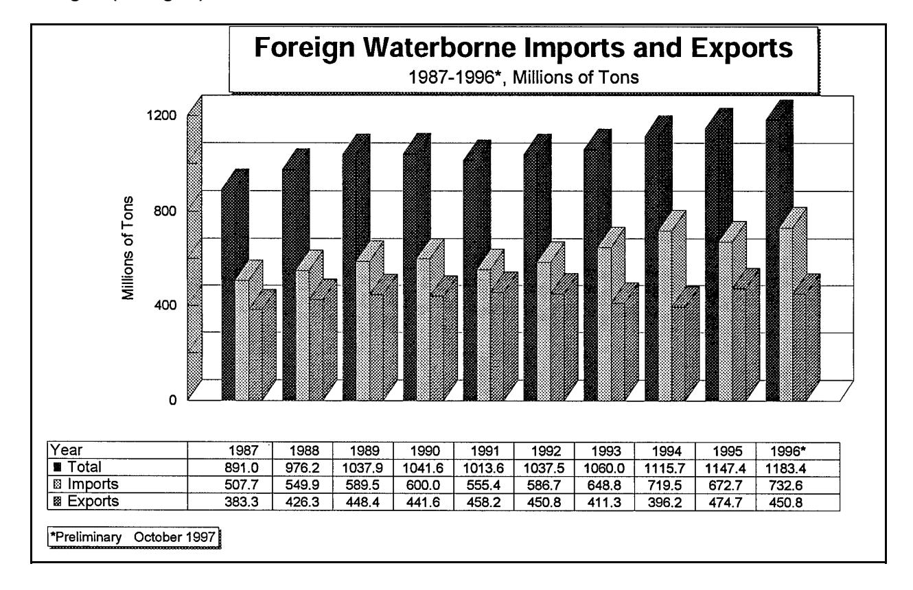

*Figure V-5-1. Foreign waterborne imports and exports (USACE Waterborne Commerce Statistics Center)*

- c. Preliminary planning and design elements .
- (1) Federal coastal navigation projects are focused on channels and maneuvering areas to allow vessels to transit confined nearshore areas and use ports or harbors. Structures needed to accomplish navigation objectives are also included. Preliminary planning and design may include the following considerations, most of which are discussed in subsequent sections of this chapter: (a) Site characterization. (b) Design criteria. (c) Defining vessel requirements. (d) Entrance channel configuration. (e) Inner harbor configuration. (f) Navigation structures. (g) Harbor and channel sedimentation and maintenance. (h) Physical and numerical modeling.
- (2) Helpful supplementary references for deep-draft projects include McBride, Smallman, and Huntington (1998); PIANC (1997a, 1997b, 1995); Tsinker (1997); Gaythwaite (1990); Turner (1984); Quinn (1972); and U.S. Navy design manuals. For small-craft projects, references include ASCE (1994), Tobiasson and Kollmeyer (1991), State of California (1980), and Dunham and Finn (1974). References with coverage of both deep-draft and small-craft harbors include Herbich (1992) and Bruun (1990). U.S. Army guidance for military ports is given by USACE (1983).
- d. Policy considerations. Federal cost-sharing guidelines are a key concern in U.S. navigation projects. Prior to 1986, the Federal Government paid 100 percent of costs for navigation channel deepening and widening. Under present guidelines for commercial harbors, the nonfederal share of general navigation feature construction costs is 10 percent for project depth not exceeding 6.1 m (20 ft), 25 percent for project depth greater than 6.1 m (20 ft) but not exceeding 13.7 m (45 ft), and 50 percent for project depth exceeding 13.7 m (45 ft). The nonfederal sponsor must also pay: (1) an additional 10 percent of construction costs that are cost-shared, and (2) for project depths greater than 13.7 m (45 ft), 50 percent of operation and maintenance costs associated with general navigation features. For recreational navigation projects or separable recreational elements of commercial navigation projects, the nonfederal share is 50 percent of construction costs and 100 percent of operation and maintenance costs. Partnering between commercial, recreational, and military interests should always be examined. Cost-sharing guidelines are fully described by USACE (1996).

## V-5-2. Defining Vessel Requirements

- a. Deep-draft ships and shallow-draft vessels .
- (1) Vessel dimensions. Navigation projects are designed to accommodate vessels of a desired size. Key vessel dimensions are length, beam (width), and draft. These dimensions are defined in several different ways to characterize the curved, three-dimensional vessel form. Vessel dimensions, especially for commercial ships, are often presented in terms of standard acronyms defined in Table V-5-2. Terms are explained in the following paragraphs.
- (a) The shape of a typical commercial ship is depicted in Figure V-5-2. The LOA is an important measure of length for evaluating ship clearances in confined navigation project areas. For example, a turning basin would be sized based on the design ship LOA. The LBP is a more meaningful measure of the effective length for concerns such as ship displacement and cargo capacity.
- (b) Definitions of design draft, freeboard, and beam are illustrated in Figure V-5-3. Molded beam is the maximum width to the outer edges of the ship hull, measured at the maximum cross section (usually at the ship waterline at midship). Design draft is the distance from the design waterline to the bottom of the keel. Ship depth is a vertical dimension of the hull, as shown in the figure, and it should not be confused with ship draft .
- (c) Draft may not be uniform along the vessel bottom for both deep- and shallow-draft vessels. For example, draft near the vessel stern (aft) is often greater than near the bow (fore). Two useful indicators of such variations are:
trim - difference in draft fore and aft
list - difference in draft side to side

*Table V-5-2 Acronyms Commonly Used to Describe Ship Size and Function*

**Table V-5-2. Acronyms Commonly Used to Describe Ship Size and Function**

| Acronym | Explanation |  |  |  |
| --- | --- | --- | --- | --- |
| LOA | Length overall |  |  |  |
| LBP | Length between | perpendiculars |  | (measured at DWL) |
| LWL | Length along | waterline | (usually similar | to LBP) |
| DWL | Design waterline | (usually | represents | full load condition) |
| B | Beam (maximum | width of | ship cross | section) |
| D | Draft |  |  |  |
| Ds | Depth of vessel’s | hull |  |  |
| FB | Freeboard $(=D_{s}$ - | D) |  |  |
| DT | Displacement | tonnage (fully | loaded) |  |
| l.t. | Long ton; = 1016 | kg (2240 | pounds) |  |
| m.t. | Metric ton: = 1000 | kg (2205 | pounds); | . 1 l.t. |
| LWT | Lightship weight | (empty) |  |  |
| DWT | Dead weight tonnage | (= | DT - LWT) |  |

- (d) Maximum navigational draft (the extreme projection of the vessel below waterline when fully loaded) is needed for navigation channel depth; mean draft is preferred for hydrostatic calculations. Waterline beam (width of the vessel at the design or fully loaded condition) is needed for navigation channel width.
- (e) Maximum dimensions of the above-water part of a vessel are also critical to ensure adequate clearance. Maximum beam is the extreme width of the vessel. For a vessel such as an aircraft carrier, maximum beam is much larger than waterline beam. Lightly loaded draft is the minimum vessel draft for stability purposes, from which vertical clearance requirements, such as clearance under bridges, can be determined.
- (2) Cargo capacity. Cargo capacity of commercial ships is generally indicated by DWT or, in the special case of container ships, by TEU. Units of measure for weight are usually long tons or metric tons (Table V-5-3). Cargo capacity also provides a convenient indicator of ship size, since ship dimensions for a particular type of ship (e.g. tanker) are usually closely correlated with capacity.
- (a) Port duties and shipping costs are often figured in terms of register tons, a measure of volume . The GRT indicates total internal volume of the ship; NRT indicates volume available for cargo. The GRT is equal to NRT plus volume of space devoted to fuel, water, machinery, living space, etc. The terms GRT and NRT are currently used for older ships, but the terms GT and NT are favored for newer ships. The LWT

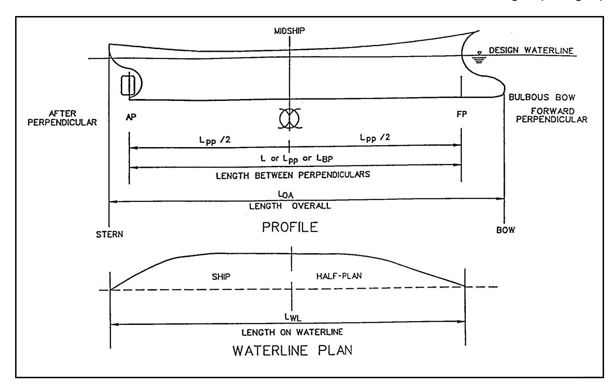

*Figure V-5-2. Ship length definitions*

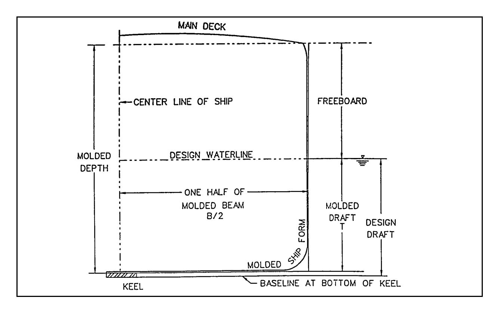

*Figure V-5-3. Midship-section molded-form definitions*

is the minimum weight a ship can have, such as the weight to be supported in dry dock. In operation, even unloaded ships rarely reach the LWT, as they often take on water, or ballast , to increase stability.
(3) Restrictions. Canal and lock sizes can impose distinct restrictions on ship size. The Panama Canal and Suez Canal are the two most critical for oceangoing traffic (Table V-5-3). Ships sized to meet the Panama Canal restrictions are known as Panamax vessels. They constitute an important vessel class for navigation projects because many commercial ships fit within the confines of the Panama Canal. Economics associated with some cargos, most notably crude oil, have resulted in ships that cannot pass through the canal. These ships are sometimes referred to as Post-Panamax vessels.

*Table V-5-3 Canal Restrictions on Ship Size*

**Table V-5-3. Canal Restrictions on Ship Size**

| Canal | Draft | Beam | Length |
| --- | --- | --- | --- |
| Panama | 12.0 m (39.5 ft) | 32.2 m (105.75 ft) | 289.6 m (950.0 ft) |
| Suez | 16.2 m (53.0 ft) | 64.0 m (210 ft) | No restriction |

- (4) Vessel characteristics. Vessels cover a wide range of sizes and shapes. Deep-draft vessels, especially the larger ships that typically dictate navigation project dimensions, may represent a small number of specific ship designs to serve specialized needs and routes. Therefore, deep-draft vessel characteristics are usually presented as a sampling of individual, named vessels. Characteristics of some representative large ships from the world merchant fleet are given in Table V-5-4. Most U.S. ports have controlling depths between 10.7 m (35 ft) and 12 m (40 ft). The deeper ports can accommodate Panamax vessels, but access by larger ships is limited. Common vessel types are briefly reviewed in the following paragraphs. In contrast to deep-draft projects, shallow-draft vessels are usually numerous and their characteristics can be discussed in statistical terms. Also, other factors besides individual vessel characteristics, such as volume of traffic, may be critical to a shallow-draft navigation project.
- (a) Tankers carry liquid bulk products. Crude oil is by far the most common liquid bulk cargo. Economies of scale have strongly affected tanker design because of the volume and uniformity of product and consistent level of demand. Large tankers are often classified by size (Table V-5-5). The larger vessels far exceed Panamax size, but most can use the Suez Canal in ballast. Loaded tankers less than about 50,000 DWT require a draft of 12 m (40 ft) or less and can enter many U.S. harbors. Supertankers can use partial loading and/or tidal advantage to access U.S. harbors. Navigation projects in the United States generally cannot accomodate the drafts of loaded VLCC and ULCC class tankers. The largest tankers, too big to enter any of the major world ports, ply dedicated trade routes between offshore port facilities.
- (b) Liquid Natural Gas (LNG) and Liquid Propane Gas (LPG) carriers have a highly volatile cargo at very low temperature. They require highly specialized terminals and special safety considerations.
- (c) Dry bulk carriers carry a wide range of cargoes such as ore, coal, and grain. Size is generally less than 150,000 DWT.
- (d) Combination bulk carriers are specially configured to carry both liquid and dry bulk cargo. The most common combination is ore/bulk/oil, or OBO . Vessel size ranges from 50,000 DWT to 250,000 DWT.
- (e) General cargo ships carry a wide variety of cargoes packaged in the form of pallets, bales, crates, containers, etc. Break-bulk cargo refers to individually packaged items that are stowed individually in the ship. Size is typically 12,000 to 25,000 DWT.

*Table V-5-4 Characteristics of Large Ships*

**Table V-5-4. Characteristics of Large Ships**

|  | Dead-weight | Length |  | Beam |  | Draft |  |
| --- | --- | --- | --- | --- | --- | --- | --- |
| Name | Tonnage | m Tankers | ft | m | ft | m | ft |
| Pierre Guillaumat | 546,265 | 414.23 | 1,359.00 | 62.99 | 206.67 | 28.60 | 93.83 |
| Nisseki Maru | 366,812 | 347.02 | 1,138.50 | 54.56 | 179.00 | 27.08 | 88.83 |
| Idemitsu Maru | 206,000 | 341.99 | 1,122.00 | 49.81 | 163.42 | 17.65 | 57.92 |
| Universe Apollo | 114,300 | 289.49 | 949.75 | 41.28 | 135.42 | 14.71 | 48.25 |
| Waneta | 54,335 | 232.24 | 761.92 | 31.70 | 104.00 | 12.22 | 40.08 |
| Olympic Torch | 41,683 | 214.76 Ore Carriers | 704.58 | 26.92 | 88.33 | 12.09 | 39.67 |
| Kohjusan Maru | 165,048 | 294.97 | 967.75 | 47.02 | 154.25 | 17.58 | 57.67 |
| San Juan Exporter | 104,653 | 262.00 | 859.58 | 38.05 | 124.83 | 15.44 | 50.67 |
| Shigeo Nagano | 80,815 | 250.02 Ore/Oil Carriers | 820.25 | 36.86 | 120.92 | 13.23 | 43.42 |
| Svealand | 278,000 | 338.18 | 1,109.50 | 54.56 | 179.00 | 21.85 | 71.67 |
| Cedros | 146,218 | 303.51 | 995.75 | 43.38 | 142.33 | 16.74 | 54.92 |

**Table V-5-4. Characteristics of Large Ships**

|  | Dead-weight | Length |  | Beam |  | Draft |  |
| --- | --- | --- | --- | --- | --- | --- | --- |
| Name | Tonnage | m Tankers | ft | m | ft | m | ft |
| Pierre Guillaumat | 546,265 | 414.23 | 1,359.00 | 62.99 | 206.67 | 28.60 | 93.83 |
| Nisseki Maru | 366,812 | 347.02 | 1,138.50 | 54.56 | 179.00 | 27.08 | 88.83 |
| Idemitsu Maru | 206,000 | 341.99 | 1,122.00 | 49.81 | 163.42 | 17.65 | 57.92 |
| Universe Apollo | 114,300 | 289.49 | 949.75 | 41.28 | 135.42 | 14.71 | 48.25 |
| Waneta | 54,335 | 232.24 | 761.92 | 31.70 | 104.00 | 12.22 | 40.08 |
| Olympic Torch | 41,683 | 214.76 Ore Carriers | 704.58 | 26.92 | 88.33 | 12.09 | 39.67 |
| Kohjusan Maru | 165,048 | 294.97 | 967.75 | 47.02 | 154.25 | 17.58 | 57.67 |
| San Juan Exporter | 104,653 | 262.00 | 859.58 | 38.05 | 124.83 | 15.44 | 50.67 |
| Shigeo Nagano | 80,815 | 250.02 Ore/Oil Carriers | 820.25 | 36.86 | 120.92 | 13.23 | 43.42 |
| Svealand | 278,000 | 338.18 | 1,109.50 | 54.56 | 179.00 | 21.85 | 71.67 |
| Cedros | 146,218 | 303.51 | 995.75 | 43.38 | 142.33 | 16.74 | 54.92 |

**Table V-5-4. Characteristics of Large Ships**

|  | Dead-weight | Length |  | Beam |  | Draft |  |
| --- | --- | --- | --- | --- | --- | --- | --- |
| Name | Tonnage | m Tankers | ft | m | ft | m | ft |
| Pierre Guillaumat | 546,265 | 414.23 | 1,359.00 | 62.99 | 206.67 | 28.60 | 93.83 |
| Nisseki Maru | 366,812 | 347.02 | 1,138.50 | 54.56 | 179.00 | 27.08 | 88.83 |
| Idemitsu Maru | 206,000 | 341.99 | 1,122.00 | 49.81 | 163.42 | 17.65 | 57.92 |
| Universe Apollo | 114,300 | 289.49 | 949.75 | 41.28 | 135.42 | 14.71 | 48.25 |
| Waneta | 54,335 | 232.24 | 761.92 | 31.70 | 104.00 | 12.22 | 40.08 |
| Olympic Torch | 41,683 | 214.76 Ore Carriers | 704.58 | 26.92 | 88.33 | 12.09 | 39.67 |
| Kohjusan Maru | 165,048 | 294.97 | 967.75 | 47.02 | 154.25 | 17.58 | 57.67 |
| San Juan Exporter | 104,653 | 262.00 | 859.58 | 38.05 | 124.83 | 15.44 | 50.67 |
| Shigeo Nagano | 80,815 | 250.02 Ore/Oil Carriers | 820.25 | 36.86 | 120.92 | 13.23 | 43.42 |
| Svealand | 278,000 | 338.18 | 1,109.50 | 54.56 | 179.00 | 21.85 | 71.67 |
| Cedros | 146,218 | 303.51 | 995.75 | 43.38 | 142.33 | 16.74 | 54.92 |

*Table V-5-5 Large Tanker Classes*

**Table V-5-5. Large Tanker Classes**

| Approximate Size Approximate | Name Draft |
| --- | --- |
| 50,000-150,000 DWT 11-18 m | Supertanker (35-60 ft) |
| 150,000-300,000 DWT 18-24 m | Very Large Crude Carrier (VLCC) (60-80 ft) |
| Greater than 300,000 DWT 24-30 m | Ultra Large Crude Carrier (ULCC) (80-100 ft) |

- (f) Container ships are designed to carry cargo packaged in standardized steel container boxes. These ships, increasingly dominant in world trade, travel at high speed, and rely on fast turnaround times at port. Container ship speed and size are correlated. The larger container ships cruise at speeds of 46 km/hr (25 knots). Capacity is expressed in twenty-foot equivalent units (TEU), the number of 20-ft-long containers that can be carried. Ships with 4,000-TEU capacity reach loaded drafts of about 12 m (40 ft). Until fairly recently, container ship sizes were constrained by the Panamax limit. Since economics of shipping and terminal facilities have favored a Post-Panamax size, container ships have rapidly increased in scale. The largest container ships in present operation exceed 8,000 TEU, and have limited access to U.S. ports. Vessels of 15,000 TEU are under consideration. These Post-Panamax ships have necessitated new, longer-reach gantry cranes and other new or updated terminal facilities to handle the longer, wider ships and large volumes of cargo.
- (g) Other vessel types include: LASH (Lighter Aboard Ship), SEABEE , and BARCAT vessels, designed to transport barges; Ro/Ro (Roll on/Roll off) carriers, essentially large, oceangoing ferries that load and unload wheeled cargo (trailers and/or vehicles) via ramps extending from the vessel; conventional ferries; passenger vessels; barges; etc. The Integrated Tug/Barge (ITB) is a special adaptation of barge design in which the barge resembles a vessel hull and a tug can be linked to the barge stern to form, in effect, a single vessel. ITB applications are usually dry and liquid bulk cargo transport.
- (h) U.S. military vessels generally have maximum drafts of less than 12 m (40 ft). Nimitz class aircraft carriers have maximum draft of 12.5 m (41 ft). U.S. Navy vessel characteristics are available on the Internet (http://www.nvr.navy.mil) and in the NAVFAC Ships Characteristics Database soon to be on the Internet.
- (i) Shallow-draft vessels are typically recreational or small fishing vessels. Recreational boats in the United States can range in length from about 3.6 m to 60 m (12 ft to 200 ft), but they are commonly 9-14 m (30-45 ft) in length with beams of 4.6 m (15 ft) or less. Recreational boats often have features protruding from the bow or stern. Although such features may not be included in the nominal boat length, they should be considered as needed in sizing harbor channel and dock clearances. Shallow-draft vessels may be driven by either engine power or sail. In comparison to powerboats, sailboats have narrow beam and require large maneuvering space when under sail.
(5) Form coefficients. Vessel shape is conveniently represented in terms of simple parameters known as form coefficients . The most important of these is the block coefficient , defined and illustrated in Figure V-5-4. This coefficient usually represents the fully loaded ship. Values of the block coefficient can normally range from around 0.4 for tapered-form, high-speed ships, such as container ships and passenger ferries, to 0.9 for box-shaped, slow-speed ships, such as tankers and bulk carriers. Small craft, sailboats, and power boats, respectively, represent forms with relatively low and high block coefficient.

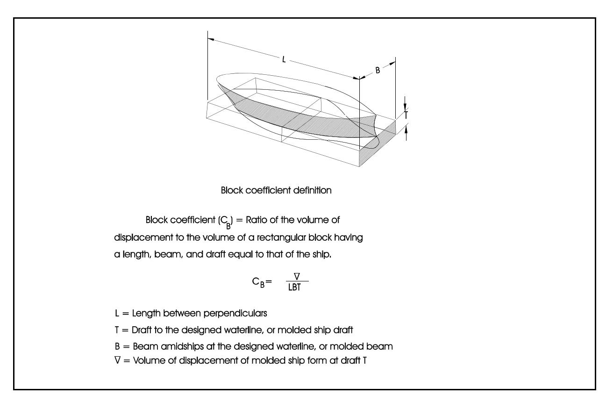

*Figure V-5-4. Block coefficient definition*

- (6) Ship speed. Typical transit speeds in deep-draft channels are between 9 and 18 km/hr (5 and 10 knots). Vessel speed in navigation projects often represents a balance between several important considerations, as follows: (a) Considerations favoring higher vessel speed: Economics . Vessel productivity increases when transits are faster; loaded vessels may be able to use high tide levels to advantage. Vessel control . Vessel control in the presence of wind, waves, and/or currents improves when vessel speed is higher. Convenience . Particularly for small craft, operators and passengers usually prefer quick transits.
- (b) Considerations favoring lower vessel speed:
- Wake effects . Vessel wakes, directly related to vessel speed, can endanger other vessels and operations and erode banks.
- Reduction of bank and bottom effects, ship resistance, ship-ship interactions . Vessels may need to limit speed to avoid creating dangerous, speed-induced pressure differences. The effects are due to constricted clearance between the vessel and other obstacles, such as the bottom, side banks, another vessel in transit, and moored vessels.
- Safety . As long as vessels maintain adequate control, lower speeds are generally safer. Typically, vessel speed relative to the water must be at least 4 knots for both deep-draft vessels and small craft.
- (7) Maneuverability. Commercial ships are designed primarily for optimum operation in the open ocean. Many of them maneuver poorly in confined areas. A successful navigation project must accommodate the ships using it. Ships are controlled by propellers and rudders at the stern. Some ships are also equipped with bow thrusters or bow and stern thrusters, which aid in control, especially at low speeds. Often, one or more tugs are needed to assist ships in some phases of entering and leaving a port. Control is especially crucial when ships slow to turn, dock, or attach tugs. A navigation project objective is to design ports and approach channels so ships can maintain adequate speed and control and navigate under their own power as much as reasonably possible. Small craft generally respond to engine, sail, and rudder control much more readily than deep-draft vessels. However, as with deep-draft vessels, small craft can encounter conditions in which control is difficult. Factors contributing to loss of control include slow vessel speed, following currents, waves, and cross-wind. Sailboats traveling under sail require extra maneuvering space.
- b. Vessel operations . Deep-draft navigation projects are built or improved to enhance safety, efficiency, and productivity of waterborne commerce in U.S. ports and harbors. Shallow-draft projects embody similar concerns and often public recreational access as well. An understanding of vessel operations is critical to successful navigation project design.
- (1) Navigation system. Port and harbor operations can be viewed as a system with three main components, as follows: Waterway engineering: Navigation channels, environmental factors, dredging and mapping services, shore docking facilities. Marine traffic: Operational rules, aids to navigation, pilot and tug service, communications, and vessel traffic services. Vessel hydrodynamics: Vessel design, maneuverability and controllability, human factors, navigation equipment.
- (a) These components are closely interrelated in a navigation project. Tradeoffs between investment in the components are normal procedure, particularly in deep-draft projects. Thus, for example, channel design is strongly influenced by ship sizes and available accuracy of aids to navigation.
- (b) Overall economic optimization of a navigation system can be a complex process. It typically involves crucial tradeoffs between initial investment (e.g. channel dimensions), maintenance, and operational use. For example, a channel that is wide enough for two-way traffic will cost more to dredge and, possibly, to maintain than a one-way channel of the same depth. However, the two-way channel may significantly reduce the amount of time ships must queue while waiting for access to the channel.
- (2) Typical operations. Methods of operation must be considered in developing a navigation project. For deep-draft ships, operations depend on interactions between a pilot, captain, crew, and, often, one or more tug captains. On arrival at the entrance to a port, a ship typically is met by a local pilot. The pilot boards the ship near the seaward end of the entrance channel. Boarding is usually accomplished by pulling a small pilot boat next to the ship long enough for the pilot to mount a rope ladder and climb up to the ship deck, a potentially hazardous maneuver during high waves. Local tug services are contacted if needed, and plans finalized for the ship transit. Many tug companies also provide a tug pilot to accompany the local pilot and assist in the tug-aided final phase of transit and docking.
- (a) The pilot is stationed on the ship bridge. The pilot effectively takes control of the ship during transit, issuing rudder and engine commands as well as course orders. Transit to a port generally follows a series of straight segments connected by turns. Turn angles greater than about 30 deg require special care because they involve varying currents and changing ship speed and position relative to banks and prevailing wind. Port entrance channels can be especially troublesome due to crosscurrents, waves, shoaling, and wind effects.
- (b) A large ship in a confined channel can be difficult to control because ships do not respond quickly to rudder and engine commands. Turning may be sluggish. Bank effects and encounters with passing ships can introduce forces to turn the ship away from the intended travel direction. Such factors, along with human and environmental variability, result in variations in a ship's swept path (the envelope of all positions in the channel over which some part of the ship has passed). The swept path is illustrated by a ship simulator study example of ship position at short time increments during transit around a turn, up a channel, and through a turning basin to a dock (see Part V-5-10b for additional discussion of this simulation study) (Figure V-5-5).
- (c) The ship must slow down well before approaching the berth or terminal, usually with the assistance of tugs when ship control is lost (at speeds below 6-7 km/hr or 3-4 knots). Often, the ship must pass other port facilities at very slow speed to prevent waves and moored vessel damage. As the ship approaches its berth, tugs typically take full control and push the ship against the dock face while mooring lines are made fast. When the ship departs, operations during a typical outbound run are similar to the inbound run, except in reverse sequence.
- (d) Pilots and captains take care to avoid contact between the ship and bottom. However, ship motions and bottom conditions are not entirely predictable, and bottom contact occasionally occurs. Typical consequences are hull abrasion and propeller and rudder damage. Propeller/rudder damage reduces or removes ship control, leaving the ship vulnerable to further damage. It is also costly to repair. Therefore, pilots tend to be very protective of the ship stern when maneuvering in confined channels and turning basins.
- (e) Ships may transit in fully loaded, partially loaded, or in ballast condition. The loading condition influences operational concerns. A fully loaded ship has a relatively large fraction of its volume submerged. Hence it is susceptible to currents, shoals, and other bottom influences. A ship in ballast generally has generous bottom clearance, but has a relatively large exposure to wind forces. Some types, including container ships, ferries, and Ro/Ro vessels, have large wind exposure, even in a loaded state.
- (f) Sometimes ships approach port with loaded drafts greater than the channel depth, stop in an anchorage area, and offload to smaller vessels ( lighters ). Ships may fully unload to lighters or partially unload to reach an acceptable draft, after which they continue into port.

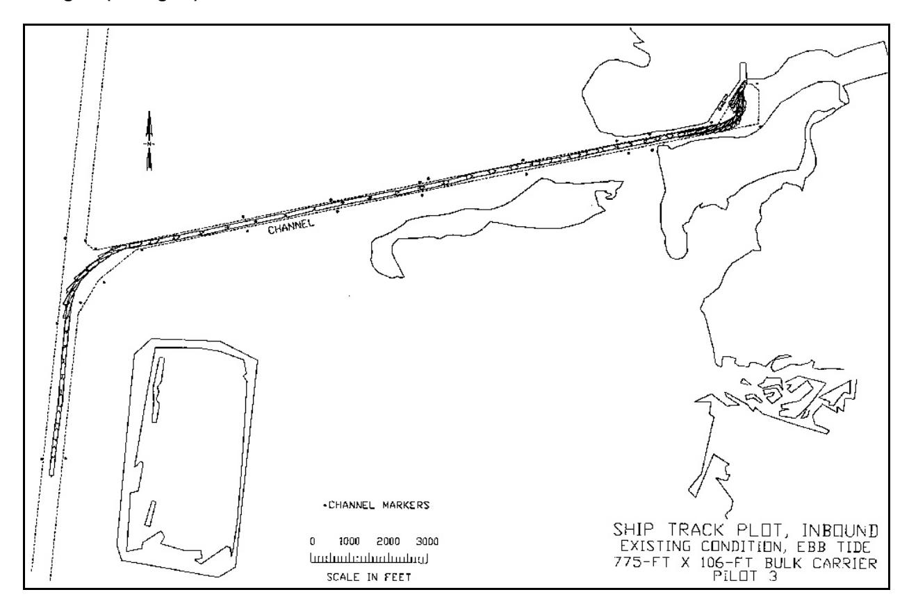

*Figure V-5-5. Example ship track, Alafia Channel, Florida*

- (g) Deep-draft entrance and interior channels are designed for either one-way or two-way traffic. When a ship is entering a port with a one-way channel, any outbound ships must wait until the channel is clear. Two-way channels may accommodate inbound and outbound traffic simultaneously. They may also provide generous horizontal clearance for single ships when passing ships are absent.
- (h) For small craft, operational concerns can vary significantly depending on the type of harbor. Small craft travel under their own power, controlled by an operator whose level of expertise and experience can range from novice to seasoned professional. Power boats are typically driven by one or two engines. Sailboats may be equipped with small auxiliary engines for transiting congested harbor areas and for emergency use, but they usually travel under wind power. Depending on wind speed and direction relative to desired travel direction, sailboat operators often must follow a zig-zag course. Small craft operators may take advantage of bays and other protected areas for fishing, sailing, etc., when available, especially if waves along the open coast are rough.
- (i) Small craft typically exit the harbor for fishing and/or recreation and return to the same harbor, often on the same day. The number of vessels concurrently using a small-craft harbor during high traffic times can be greater than for deep-draft ports. Level of usage is often affected by holidays, weather, fishing or charter schedules, work schedules, etc. For example, a recreational harbor can be expected to have a higher volume of traffic during fair weather and weekend or holiday times. These same conditions are likely to result in a greater percentage of inexperienced operators and, possibly, a lower level of attention to navigation safety.
- (3) Shallow-water, restricted channels. Vessels operating in restricted navigation channels can experience a variety of effects (Figure V-5-6). Large, loaded ships can block much of the channel cross section

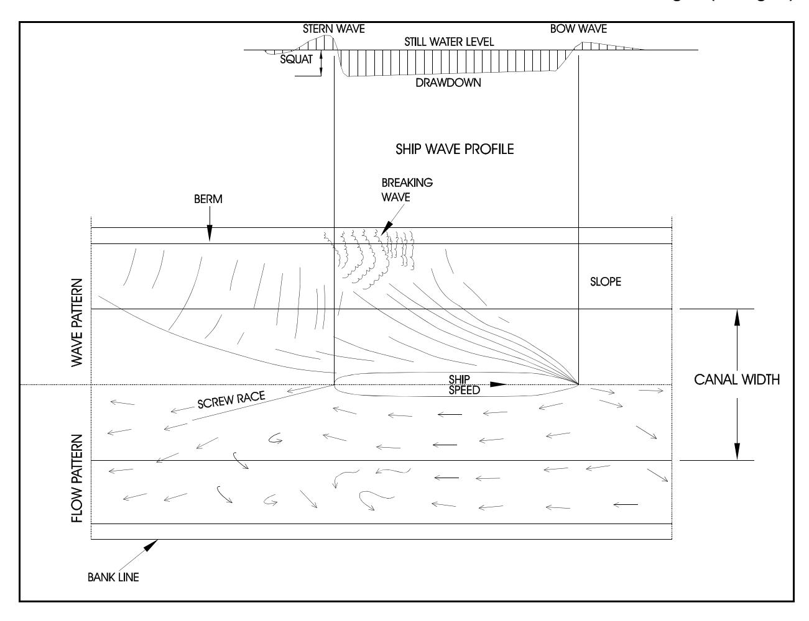

*Figure V-5-6. Ship wave and flow pattern in a canal*

and encounter very significant hydrodynamic resistance. Much of the water in the channel cross section must flow around the passing ship through highly confined space under the hull and between the hull and channel side slopes. Also, the ship experiences resistance due to the waves it creates as it moves forward.
- (a) A moving vessel in a shallow waterway drops in the water relative to its at-rest level. The drop, referred to as squat , is due to a reduction in pressure exerted by water flowing around the moving vessel. Squat includes an overall lowering of the vessel (sinkage ) and a motion-induced trim. Squat further reduces clearance between the vessel hull and the bottom.
- (b) The maximum speed a vessel can attain in shallow water is significantly reduced from the typical deepwater speed. An important parameter governing shallow-water effects on a moving vessel (both deepand shallow-draft vessels) is the depth Froude number

```math
F _ { h } = { \frac { V } { \sqrt { g h } } } \tag{V-5-1}
```

where
= channel depth Froude number
- V = vessel speed
- h = depth of channel or shallow-water area
- g = acceleration due to gravity; = 9.80 $m/sec^{2}$ (32.2 $ft/sec^{2})$
- (c) Consistent units must be used for V , h , and g in the equation. Vessel resistance becomes very high as $F_{h}$ approaches unity. In practice, a normally self-propelled merchant ship would never operate at $F_{h}$ greater than about 0.6.
- (d) The effect of a restricted, shallow channel configuration is to further increase wave effects, squat, and vessel resistance. Relative channel restriction is characterized by the channel blockage ratio

```math
B_R = \frac{A_C}{A_S} \tag{V-5-2}
```

where
- BR = channel blockage ratio
- AC = channel cross-section area
- AS = vessel submerged cross-section area, = BT
- B = vessel beam at midship
- T = vessel draft
- (e) The channel blockage ratio is illustrated in Figure V-5-7 for the extreme case of a canal with vertical sides. In this case, $A_{C}$ = Wh , where W is channel width. The limiting ship speed for self-propelled vessels in a canal, represented as $F_{h},$ is shown as a function of $B_{R}$ in Figure V-5-7. Typical $B_{R}$ values range from 2 for very restricted cases to 20 or more for open channels, giving $F_{h}$ values between 0.2 and 0.7. This effect significantly limits vessel speed in restricted channels. The limit is known as the Schijf limiting speed . For example, with $B_{R}$ = 3 at a 12-m (40-ft) water depth, the maximum ship speed is 11.9 km/hr (6.4 knots). In practice, a ship's engine would not have enough power to drive the ship at the Schijf limiting speed.
- (f) Bank effects in a channel can make ship control more difficult by creating suction and/or higher pressures along vessel hulls when vessels are off the channel center line. Forces may differentially affect vessel bow and stern and act to turn the vessel toward a potentially hazardous crosswise position relative to the channel. Bank effects become stronger as channel overbank depths (water depth of the natural bottom adjacent to the channel) decrease. Pilots sometimes take advantage of bank effects to assist in turning. Similar differential pressure effects arise when ships pass in a channel and when a ship passes a moored ship adjacent to the channel.

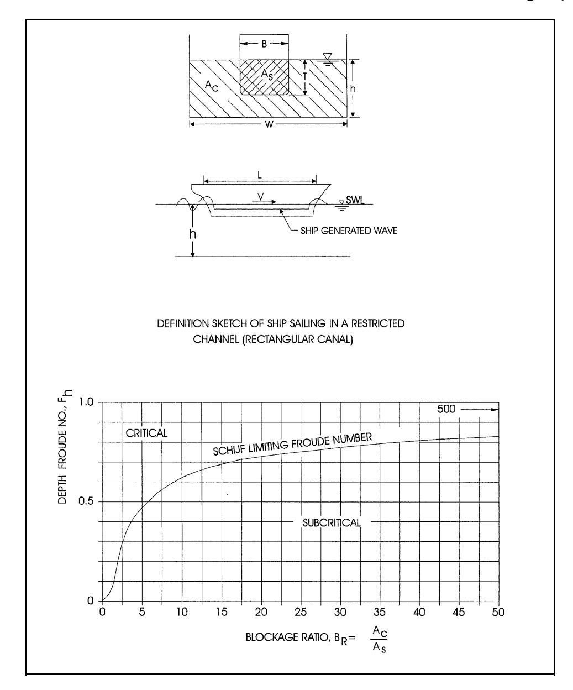

*Figure V-5-7. Ship-limiting speed in a canal*

- (4) Ice navigation. Winter conditions along northern sea coasts, estuaries, and large lakes can cause ice to be an occasional, if not chronic, concern for safe and efficient navigation (PIANC 1984, USACE 1990a). About 42 percent of the earth experiences temperatures below freezing during the coldest month of any year (Figure V-5-8). The presence of ice is accompanied by longer nights and increased fog and precipitation (Figure V-5-9). Shipboard mechanical equipment, instruments, and communications apparatus are less efficient and more prone to failure in cold temperatures. Aids to navigation become less effective, and maneuvering in ice is much more difficult. Navigation projects in northern areas should be designed with consideration of these difficult conditions.
- (a) Sea ice nomenclature and map notation symbols are defined by the World Meteorological Organization (WMO 1970). Ice thickness and structure are key concerns. Multi-year ice , sea ice more than 1 year in age, can be over 3 m thick, but it is found only in the Arctic Ocean and its marginal seas and near Antarctica.

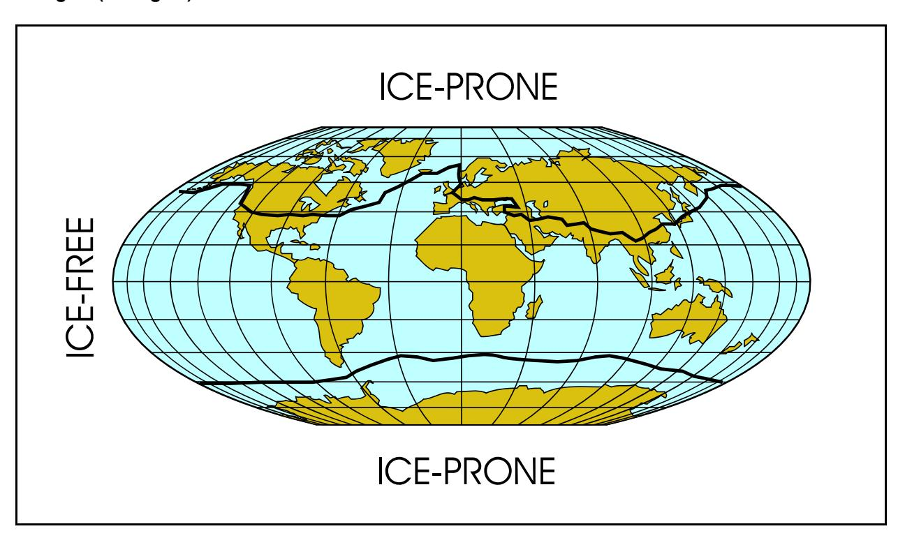

*Figure V-5-8. Cold regions of the world*

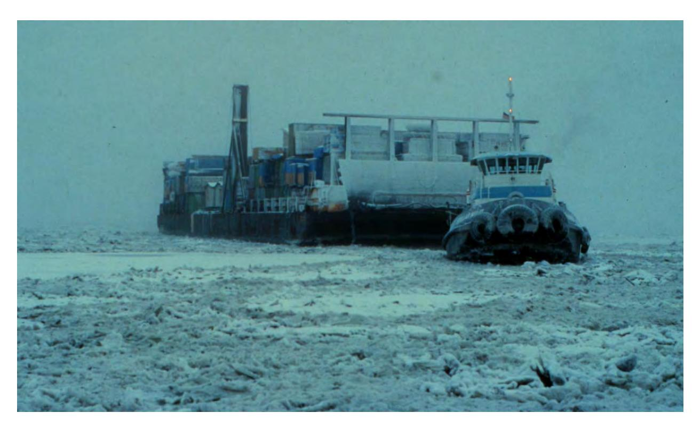

*Figure V-5-9. Fog over frozen waterway (photograph, courtesy of Orson P. Smith, University of Alaska, Anchorage, Alaska)*

First-year ice is generally classified as young ice (0-10 cm), thin (10-30 cm), medium (30-70 cm), or thick (70-120 cm).
- (b) Ships that regularly navigate icy waters must have exceptional structural strength and propulsion power for safety of the crew, equipment, cargo, and environment. Special hull, propeller, and rudder designs reduce resistance and help clear lanes. Icebreakers may be needed to escort ice-strengthened cargo vessels or to periodically clear shipping routes. Shallow- and deep-draft ice-strengthened ships are in service around the world, classified for ice navigation by the ABS or several other agencies in Canada, Russia, and Europe. (c) Factors to be considered for ship operation in ice rather than temperate conditions are: Ship maneuverability is retarded. Ice forces can divert ships from their intended course. Darkness is more common. Low visibility is more common (fog and precipitation). Winds can be very strong. Visual aids to navigation are less effective. Shipboard instruments are more prone to malfunction. Assistance or rescue by tugs is more difficult. Crews are more strained and fatigued in the face of these challenges.
- c. Design considerations. Deep-draft navigation projects are typically formulated to provide safe and efficient passage for a selected ship under specified transit conditions. The design ship and transit conditions may be selected to represent the "maximum credible adverse situation," the worst combination of conditions under which the project would be expected to maintain normal operations. A project that successfully accommodates this situation can be expected to perform well with a full range of smaller ships and less difficult transit conditions. If future needs require it, the project may also accommodate ships larger than the design ship under milder transit conditions than the design scenario. Shallow-draft navigation projects are designed to safely accommodate the variety of small craft anticipated during the project design life, typically around 50 years.
- (1) Design vessel. For deep-draft projects, the design ship or ships are selected on the basis of economic studies of the types and sizes of the ship fleet expected to use the proposed channel over the project life. The design vessel or vessels are chosen as the maximum or near maximum size ships in the forecast fleet based on the characteristics (length, beam, draft) of the ships being most representative of the potential economic advantage to be found in the forecast ship fleet.
- (a) For small craft projects, the design vessel or vessels are selected from comprehensive studies of the various types and sizes of vessels expected to use the project during its design life. Often, different design vessels are used for various project features. For example, sailboats, with relatively deep draft, may determine channel depth design; and fishing boats, with relatively wide beam, may dictate channel width design.
- (2) Design transit and mooring area conditions. Operational conditions selected for design can strongly affect a navigation project. A deep-draft project should be designed to allow the design ship to pass safely under design transit conditions. Normally, extreme events are not considered in specifying design transit conditions. Ship operators can usually suspend operations during these rare events without undue hardship. Some important exceptions for which extreme events may need to be considered include ships under construction or in repair facilities, inactive vessels, and USCG vessels. (a) Operational factors to be specified for design transit include: Wind, wave, and current conditions. Visibility (day, night, fog, and haze). Water level, including possible use of tidal advantage for additional water depth. Traffic conditions (one- or two-way, pushtows, cross traffic). Speed restrictions. Tug assistance. Underkeel clearance. Ice.
- (b) The use of tidal advantage in specifying design transit conditions allows for reduced channel depth, since the design ship would be constrained to transit during a high tide level. Channel length and vessel speed determine vessel transit time. The channel must provide the necessary water depth during at least the transit time period. If tidal advantage is included in design, the optimum design depth may be based on an analysis of water level probabilities, costs (vessel delays, dredging and disposal, etc.), and benefits.
- (c) Normal operational conditions are strongly influenced by individual, local pilot, and pilot association rules and practices. For example, pilots usually guide a transit only when conditions allow adequate tug assistance. There may be operational wind, wave, or current limitations on the ability to safely moor a ship at a terminal or berth. Turning operations and maneuvering into a side finger slip may be limited by tide level and current conditions, including river outflow. Energetic wave conditions at the seaward end of the entrance channel may prohibit pilots from safely transferring between the pilot boat and ship. Such operational limitations may well be controlling factors in determining whether or not a safe transit is possible, and navigation project design should be consistent with these limitations.
- (d) Design transit conditions for small-craft projects include vessel maneuverability (particularly if parts of the project will accommodate vessels under sail), traffic congestion, wind, waves, water levels, and currents. Design wave criteria are usually expressed as significant wave height, in probabilistic terms, for the entrance and access channels and mooring areas. Typical criteria are: Mooring areas: Significant wave height will not exceed 0.3 m (1 ft) more than 10 percent of the time. Access channels: Significant wave height will not exceed 0.6 m (2 ft) more than 10 percent of the time.
- (e) Final design criteria for small-craft projects should be determined on the basis of economic optimization of the complete project (Part V-5-4).

## V-5-3. Data Needs and Sources

- a. Introduction. Planning and design of a navigation project are based on a wide range of information about the project area. The necessary data and sources are briefly reviewed in this section. More detailed information about data types and sources is given in Part V-2, "Site Characterization," and Part II-8, "Hydrodynamic Analysis and Design Conditions."
- b. Currents . Currents in navigation channels and other project features can strongly affect vessels. Currents may also be important in navigation structure design. Currents of concern are usually tidal circulations or river flows.
- c. Water levels . Water levels are essential for determining design depth in channels and other navigation areas. Water level variations are usually due to tides, river discharge, or lake levels. NOAA predicts tides and tidal currents at primary reference stations by the method of harmonic analysis. Phase and amplitude corrections to reference station predictions are available for many other secondary stations (NOAA Tide Tables and Tidal Current Tables , annual). Interpolation between secondary stations is often practical, if no major constrictions or confluences are present. Commercial software is available that can predict tides at hourly intervals at secondary stations. A similar analysis can be performed by applying the methods of Harris (1981).
- d. Wind. Wind forces can strongly influence both vessels under way and moored vessels. Often an airport wind station located in the general area of a project can be used as a source of representative wind data.
- e. Waves . Waves can have a major impact on navigation in exposed channels, particularly vertical excursions of the vessel and channel depth requirements. Deep-draft vessels respond to wave periods typically found in exposed ocean and Gulf of Mexico waters. Small craft respond to a wide range of wave periods, and waves can be especially troublesome if they break in the channel. Waves are also important for navigation structure design and for predicting channel shoaling.
- f. Water quality. Water quality and potential changes in water quality may become issues for projects creating more enclosed harbor areas, where circulation and flushing may be reduced as a result of the project.
- g. Sediments. Sediment characteristics in project and adjacent areas are needed. Bottom materials in any areas to be dredged are especially important. Sediment quality can dictate disposal options and costs ranging from beneficial uses such as beach fill to confined or capped disposal of contaminated material.
- h. Bathymetry and sediment transport processes. Bathymetry and sediment transport processes are needed to determine baseline conditions, optimum project location, initial dredging quantities, channel shoaling rate and maintenance needs, and potential project impact on adjacent shorelines. Methods for predicting channel sedimentation are reviewed by Irish (1997).
- i. Ecological processes. Navigation projects can have an impact on ecological processes. Baseline conditions may need to be established.
- j. Local coordination. Local people familiar with the project area and/or using an existing project regularly can provide valuable insight about present conditions and impact of any modifications.
- (1) Pilot interviews. Deep-draft navigation project planners/designers should develop strong coordination with local pilot groups. Pilot interviews can be used to determine users' opinions about existing
channel navigation safety, suitability of design transit conditions, and feasibility and safety of proposed channel design alternatives.
- (2) U.S. Coast Guard. The local USCG office should also be contacted early in the project development to solicit their views on channel dimensions and alignment for safe navigation. They can also provide guidance on placement of aids to navigation.
- (3) Accident records. Marine accident records are available from the USCG annual compilation of casualty statistics in an automated system called Coast Guard Automated Main Casualty Data Base (CASMAIN). Accident data on existing navigation channel projects proposed for enlargement or improvement should be studied. USCG and National Transportation Safety Board special investigation reports are available for some accidents, which can provide insight on navigation problems.

#### V-5-4. Economic Analysis

- a. A number of alternatives can usually be defined to meet navigation design requirements. Alternatives should generally include a range of channel depths, since depth is one of the major cost-determining parameters. For example, a proposed navigation channel may suffice for the design ship and design transit, but lead to undesirable ship delays and queueing because of heavy ship traffic and limited channel capacity. The adaptability of each alternative for meeting future navigation requirements should also be considered. The final design is usually selected from among the alternatives to maximize economic benefits. USACE navigation project evaluation procedures are described by USACE (1990b).
- b. A complete design approach includes consideration and optimization of the full navigation system described in Part V-5-2.b. The comprehensive design process, beyond the scope of this chapter, is discussed by PIANC (1997a).
- c. For economic optimization, the cost of each alternative design is estimated. Costs associated with all the elements of developing and maintaining the project should be included. Normally, several alternative channel alignments and widths, as well as depths, are represented. Navigation structures may also be part of some or all alternatives. Costs include initial construction (dredging, dredged material disposal, aids to navigation, breakwaters, jetties, etc.), replacement cost, and operation and maintenance.
- d. Benefits for deep-draft projects are determined by transportation savings, considering ship trip time (including loading/unloading time, which may include lightering), cargo capacity, and delays due to project limitations. Benefits are evaluated by determining the transportation costs per ton of commodity for each increment of channel depth. Transportation costs are based on ship annual operating cost for each type of ship, including fixed cost and annual operating expenses. Data on ship operating costs are periodically compiled by the USACE Water Resources Support Center. Benefits may result from: (1) Use of larger ships. (2) More efficient use of large ships. (3) More efficient use of present ships. (4) Reductions in transit or delay times. (5) Lower cargo handling costs.
- (6) Lower tug assistance costs.
- (7) Reduced insurance, interest, and storage costs.
- (8) Use of water rather than land transport mode.
- (9) Reduction of accident rate and cost of damage.
- e. The USACE evaluation procedure to estimate navigation benefits includes nine individual steps (Figure V-5-10). Accurate projection of commodity movements over the proposed alternative project design (steps 3 and 7) is key to evaluation. Details of the procedure are given by USACE (1990b).

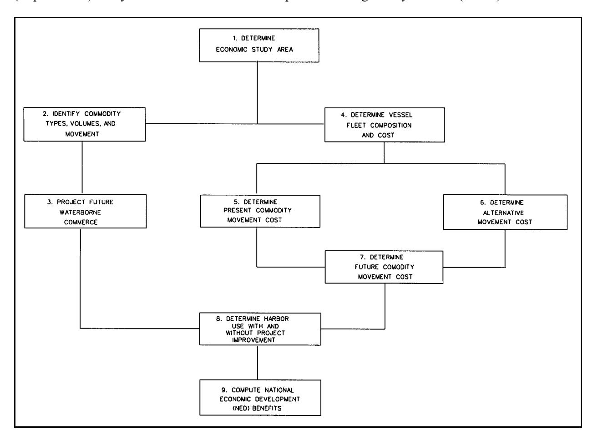

*Figure V-5-10. Deep-draft navigation benefit evaluation procedure*

f. Small-craft harbor projects follow a similar economic optimization procedure. Generally, several entrance channel and basin configurations are identified as alternatives. The alternatives should provide varying protection and accommodations so an optimal alternative can be selected. The cost for each alternative is estimated, including initial cost, maintenance cost, and social and environmental aspects. Benefits are also estimated. The alternative that maximizes net benefits (difference between benefits and cost) is usually the preferred project plan. After the alternative with optimal level of protection and size has been determined, then the most economical way of providing that protection and size should be developed.

## V-5-5. Channel Depth

- a. Introduction . Channel depth is a key factor in the cost and usability of a navigation project. It should be adequate to accommodate present and expected traffic. Typically it is chosen on the basis of economic optimization. The design channel depth need not be constant throughout the project. It can, and often does, vary in segments as needed to allow the design vessel or vessels to make safe and efficient transits in a costeffective project.
- (1) Vessels navigating in shallow water encounter a variety of channel cross sections over the length of a navigation project. Since channel cross section can significantly affect natural processes and vessel behavior, it is useful to define characteristic types (Figure V-5-11). A canal has an enclosed cross section with exposed land adjacent to both sides of the channel. A trench is a deepened passage with submerged overbanks on either side. A fairway is a passage with no lateral constraints.

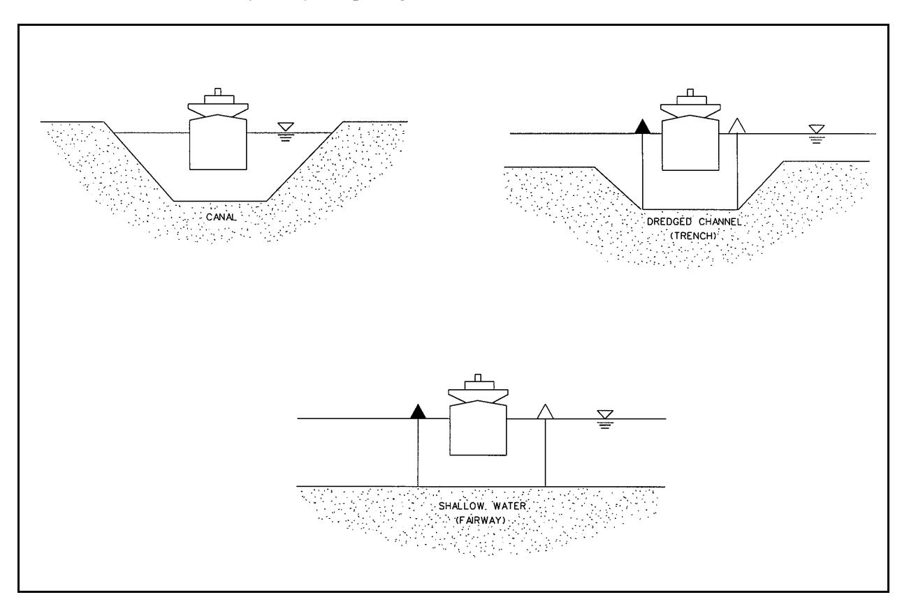

*Figure V-5-11. Definition of channel types*

(2) Channel depth for both deep- and shallow-draft navigation projects may be determined by figuring a depth increment for each of the important factors affecting vessel underkeel clearance requirements and adding those to the design vessel draft (Figure V-5-12). This depth, required for safe vessel passage, provides a basis for Congressional authorization of Federal channel depth, referred to as the authorized channel depth . The dredged channel depth, or contract depth , generally exceeds the authorized depth to accommodate potential sedimentation and maintain navigability. In some projects, consideration must also be given to the permitted depth , the extreme dredging depth permitted by regulators. The same factors generally apply for both deep- and shallow-draft projects, but their relative importance and estimation procedures differ somewhat, as discussed in the following paragraphs.
b. Effect of fresh water . The nominal draft of seagoing ships usually represents the seawater environment. When ships enter channels and ports in brackish or fresh water, ship draft increases due to the lower water density. The draft increase between ocean and fresh water is 2.6 percent. In USACE practice, a maximum depth allowance of 0.3 m (1 ft) may be included for this effect (Table V-5-6) (see Figure V-5-12). This maximum allowance corresponds to the draft increase between ocean and fresh water for a vessel with an 11.6-m (38-ft) draft. The freshwater effect is generally not considered in small craft navigation projects.

*Table V-5-6 Depth Allowance for Freshwater Effect*

**Table V-5-6. Depth Allowance for Freshwater Effect**

|  | Allowance |  |
| --- | --- | --- |
| Port Location | m (ft) | Percent |
| Brackish water | 0.15 (0.5) | 1.3 |
| Fresh water | 0.3 (1.0) | 2.6 |

- c. Vessel motion from waves . Vessel vertical motion in response to waves must be considered in design of channel depth at exposed locations (see Figure V-5-12). Entrance channel design depth is typically greater than interior harbor channel depth because of the need to accommodate wave-induced vertical vessel motions. Wave effects tend to increase as wave height increases and decrease with longer vessel length. Maximum vessel response occurs with wavelengths approximately equal to vessel length. Most deep-draft ships are relatively unaffected by very short-period waves but respond when periods are longer than around 6-8 sec.
- (1) Vessel motions that affect channel depth are roll, pitch, and heave (Figure V-5-13). Roll is most important when waves are perpendicular to the vessel travel direction ( beam seas ). Pitch and heave are most important when the vessel and wave travel directions are colinear ( head sea or following sea ). These motions can have a large impact on deep-draft channel depth requirements. For example, a pitch angle of 1 deg increases the extreme excursion of a 300-m- (1000-ft-) long ship by 2.7 m (9 ft). A 5-deg roll of a ship with a 46-m (150-ft) beam can increase extreme excursion by 2.1 m (7 ft). (2) Vessel response to waves depends on the combined effects of: (a) Wave height, period, wavelength, and propagation speed. (b) Wave direction relative to vessel. (c) Vessel length and beam. (d) Vessel speed. (e) Natural periods of vessel roll, pitch, and heave. (f) Vessel draft and underkeel clearance. (g) Channel depth and overbank depth. (h) Wind and currents (speed and direction relative to vessel). (i) Pilot strategy.

*Figure V-5-12. Channel depth allowances*

Navigation Projects

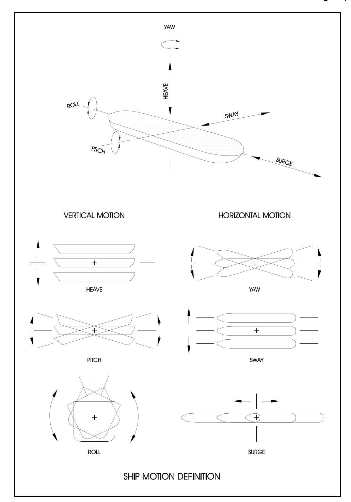

*Figure V-5-13. Ship motion definitions*

- (3) Many of these factors, most notably wave height, vary as a vessel transits a channel. The net effect of these factors on a vessel is difficult to estimate analytically. The design objective is to achieve a channel depth that allows the design vessel to transit the project with a very low probability for any damaging contact with the channel bottom.
- (4) For deep-draft projects, the depth allowance needed to accommodate wave-induced ship motions is a major concern for which no easy, accurate solutions are available. Because of the magnitude of depth allowance for waves in many exposed entrance channels and because waves are highly variable, even within a specified sea state, it is prudent for final design to review existing data for similar ships and, in many cases, to conduct studies to develop realistic estimates. Options include (Part V-5-10): (a) Analytic studies, using strip theory or other theoretical calculation methods as developed by naval architects. (b) Interactive, real-time ship simulator studies. (c) Physical model studies, using radio-controlled, free-running scaled ship models with wave response measurements. (d) Direct, onboard ship measurements while transiting through the entrance channel.
- (5) An example of physical model studies to aid in probabilistic navigation channel design is presented in Section V-5-10.b.(1).
- (6) Direct field measurements of ship motion are a valuable addition to channel design studies, but extreme conditions controlling design are not easily captured. Field measurements are dependent on available ships and environmental conditions during the limited duration of the measurement program. Figure V-5-14 provides an example of results from a large field measurement program in a high-wave-energy entrance channel. Data were collected over a 2-year period at the mouth of the Columbia River, at the Oregon/Washington border (Wang et al. 1980). The average ratio of ship bow/stern response amplitude to wave amplitude on each transit varied between about 0.5 and 2.0 over 29 instrumented voyages.
- (7) Simple general guidelines for minimum depth clearance requirements in channels influenced by waves are given by PIANC (1997) as

```math
\frac{\text{Water depth}}{\text{Ship draft}} \geq 1.3 \quad \text{when } H \leq 1 \text{m (3.3 ft)}
```

```math
\frac{\text{Water depth}}{\text{Ship draft}} \geq 1.5 \quad \text{when } H > 1 \text{m (3.3 ft)} \text{ and wave periods and directions are unfavorable}
```

where H = wave height

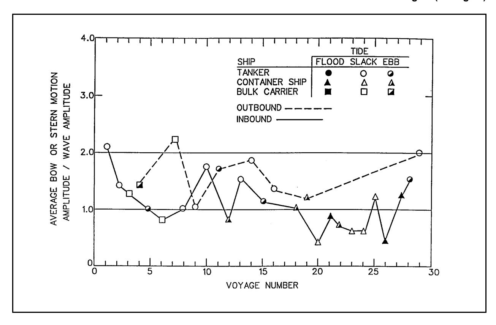

*Figure V-5-14. Ship motion response, mouth of Columbia River*

- (8) For small recreational craft, a depth allowance for waves is also important but difficult to estimate accurately. As with deep-draft vessels, model and measurement studies may be conducted; but such projectspecific studies are usually impractical for small-craft channel design. Small craft length and beam are often small relative to wavelengths important for design. It is realistic to consider the maximum vertical drop experienced by a small boat in a wave to occur when the boat is fully contained in the wave trough. The magnitude of this drop below the Swl is then the wave amplitude H /2. In practical design, typically one-half the design significant wave height is used.
- d. Vessel squat . A depth allowance for squat experienced by vessels under way is included in channel depth design (see Figure V-5-12). The amount of squat experienced by a vessel depends strongly on speed and relative blockage of the channel cross section by the vessel. A small, fast-moving boat in a small channel may experience as much or more squat than a large, slower-moving ship. Squat increases when ships meet and pass in a channel because the total blockage is increased. Squat is an important consideration in both deep- and shallow-draft navigation projects. As with vertical vessel motion due to waves, squat is difficult to estimate accurately and is a subject of present research.
- (1) Simplified methods for estimating squat are available. The method presented here is based on equations for squat in fairway and canal channel configurations, with a simple interpolation between these limiting cases to accommodate trench configurations (USACE 1998). A definition sketch of parameters is given in Figure V-5-15.

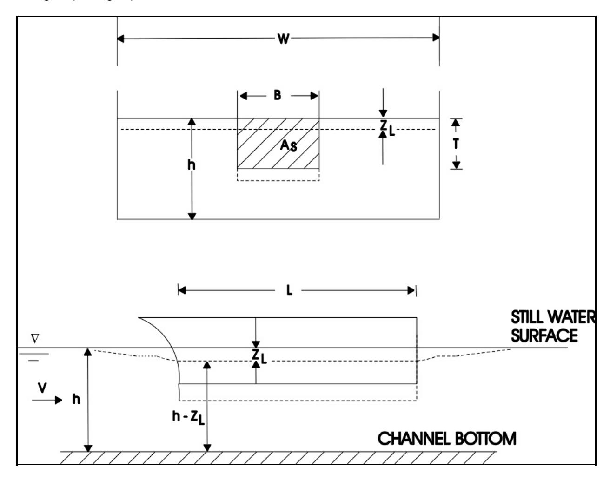

*Figure V-5-15. Squat analysis definition*

(2) Squat in a fairway can be estimated as (Norrbin 1986)

```math
Z = 0.2125 C_B \frac{B}{L} \frac{T}{h} V^2 \qquad V \text{ in knots}, Z \text{ in ft} \tag{V-5-3}
```

where
- Z = maximum ship squat
- CB = block coefficient (Figure V-5-4)
- B = ship beam at midship (Figure V-5-15)
- T = ship draft (Figure V-5-15)
- L = ship length (Figure V-5-15)
- h = depth of shallow-water area (Figure V-5-15)
- V = ship speed
This equation is applicable when Froude numbers are less than 0.4.
(3) Squat in a rectangular canal can be related to the Schijf limiting Froude number, which corresponds to the Schijf limiting speed (Part V-5-2-b-(3)). The limiting Froude number is given by (Huval 1980)

```math
F_L = \frac{V_L}{\sqrt{gh}} \tag{V-5-4}
```

where
- FL = Schijf limiting Froude number
- VL = Schijf limiting ship speed in squat analysis
- g = acceleration due to gravity; = 9.80 $m/sec^{2}$ (32.2 $ft/sec^{2})$
- h = depth of canal (Figure V-5-15)
- BR = channel blockage ratio (Equation V-5-2 and Figure V-5-7)
(4) Maximum ship squat at the Schijf limiting Froude number is given by

```math
Z_L = h \left[ \frac{F_L^2}{2} \left( F_L^{1/3} - 1 \right) \right] \qquad \text{(rectangular canal)} \tag{V-5-5}
```

where
ZL = maximum squat at Schijf limiting Froude number
An approximate analysis for nonrectangular canal cross sections can be made by replacing the channel depth by a cross-section mean depth.
(5) Trench channels can assume a variety of shapes, including asymmetric overbank depths and different lane depths in two-way channels (Figure V-5-16). The trench configuration is intermediate between the fully

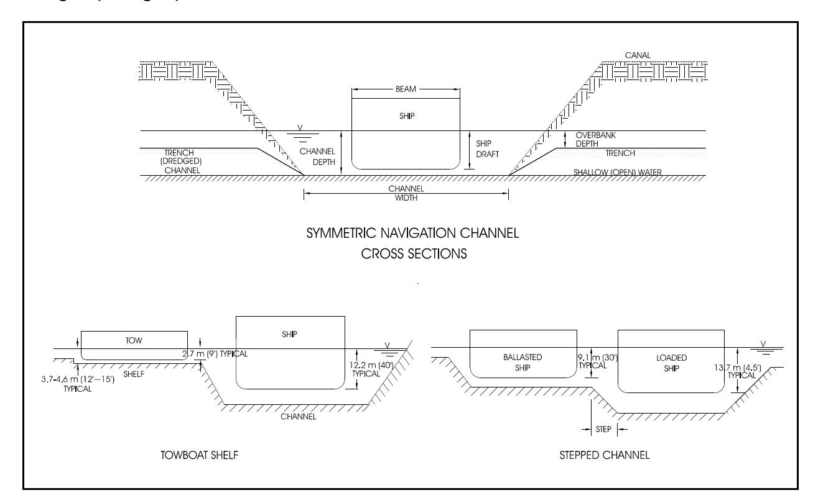

*Figure V-5-16. Example channel cross sections*

open fairway and fully restricted canal configurations. A first approximation to squat may be made by interpolating between those two extremes, based on the ratio of average overbank depth-to-channel depth (Figure V-5-17)

```math
Z_T = \left( \frac{h_1 + h_2}{2h} \right) Z + \left( 1 - \frac{h_1 + h_2}{2h} \right) Z_L \quad (\text{trench}) \tag{V-5-6}
```

where
ZT = maximum squat in a trench channel
$h_{1},h_{2}$ = overbank depths
Computational results from a computerized version of this model illustrate squat variation with ship speed and channel type (Figure V-5-18) (Huval 1993). The figure illustrates how a narrow, confined channel can significantly increase squat and, hence, required channel depth.
(6) Squat for small recreational craft is generally less critical than for large displacement, deep-draft ships. However, it should be included in channel design. The usual procedure is to use a fixed depth allowance for squat in entrance channels, where boat speed is relatively high, and a smaller fixed allowance for interior areas, where boat speed is generally low (Table V-5-7).

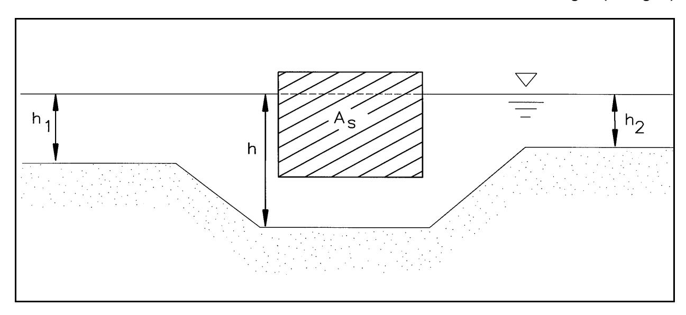

*Figure V-5-17. Trench channel definitions*

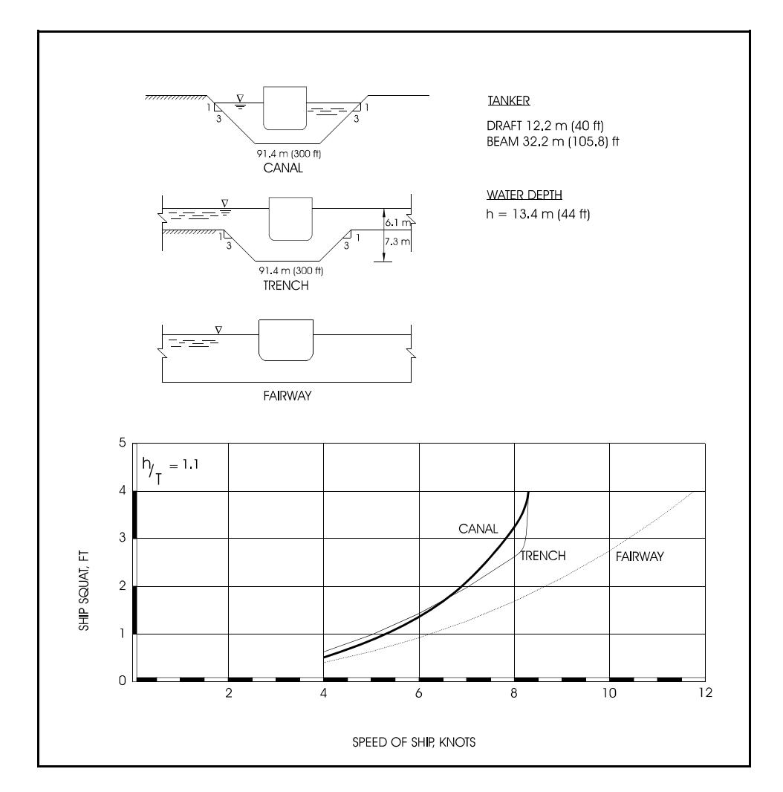

*Figure V-5-18. Example squat calculations*

| Table V-5-7 |  |
| --- | --- |
| Squat Allowance for Small Recreational Craft |  |

| Location | Allowance |
| --- | --- |
| Entrance channels | 0.3 m (1.0 ft) |
| Interior channels, moorage areas, turning basins | 0.15 m (0.5 ft) |

- e. Trim . Deep-draft ships often operate with trim for a variety of reasons. For example, ships may be loaded or ballasted to lower the stern a small amount deeper than the bow, which can improve maneuverability. Ships under way tend to change from the static trim. Small craft in motion can experience significant trim, with the bow rising high and stern dropping low in the water. Because vessel trim conditions are mainly determined by operational decisions, a channel depth allowance for trim is not included.
- f. Shallow-water effects . Even when deep-draft ships have sufficient channel depth to avoid hitting bottom, they may experience adverse safety and efficiency effects due to small underkeel clearance. Steering and turning become significantly more difficult, more power is required to maintain speed, and potential for bottom scour and bank failure increases considerably as propeller speed is augmented. Ship cooling systems may ingest benthic organisms or sediment if intakes are too near the bottom. Although these effects can be significant, no depth allowance is included in general channel design to lessen their impact. In some cases, it may be prudent to quantify the location and size of cooling system intakes, evaluate the impacts of small clearances, and perhaps impose a minimum clearance as an added constraint on project design. For example, the U.S. Navy requires a 1.5-m (5-ft) clearance beneath aircraft carrier intakes.
- g. Safety clearance . To protect vessel hull, propellers, and rudders from bottom irregularities and debris, a channel depth allowance for safety is included (Table V-5-8). A larger clearance is needed when the channel bottom is hard, such as rock, consolidated sand, or clay (see Figure V-5-12).

*Table V-5-8 Safety Clearance*

**Table V-5-8. Safety Clearance**

| Bottom Type | Minimum Safety Clearance |
| --- | --- |
| Soft | 0.6 m (2 ft) |
| Hard | 0.9 m (3 ft) |

- h. Advance maintenance . An additional increment beyond the channel design depth is added to maintain reliable navigable depth between dredge events. This depth increment is to provide for accumulation and storage of sediment. The depth allowance for advance maintenance should be determined by considering several different increments and choosing that which minimizes total channel maintenance cost. Dredge mobilization costs and safety concerns must be balanced against the tendency for a deeper channel to shoal more rapidly. A sediment trap near the entrance may be an economic alternative to reduce advance maintenance requirements in the channel. Depth increments of 0.6-0.9 m (2-3 ft) are normal advance maintenance allowances (see Figure V-5-12).
- i. Dredging tolerance . Another depth increment is added beyond the design channel depth to compensate for the inherent mechanical inaccuracies of dredges working in the hostile environment of adverse currents, fluctuating water surface, and non-homogeneous bottom material. A dredging tolerance of 0.3-0.9 m (1-3 ft) is typical (see Figure V-5-12).
- j. Tidal shoals and ship transit concerns example . Coastal entrances, bays, and river estuaries typically have meandering natural channels and intermittent shoals. When deeper ship drafts are anticipated, the impact of tidal shoals on schedules and/or margin of safety must be evaluated. Increasing design channel depth over the shoals may eliminate tidal constraints altogether or just improve access to a more economical level. The question, "How deep is deep enough?" must be answered by weighing transportation cost savings against the cost of channel excavation and maintenance. The following example illustrates considerations involved in answering this question and developing an optimum design channel depth.
- (1) The example port is located in an estuary, 35 km from the ocean entrance (Figure V-5-19). At a distance of 30 km from port, ships must pass over a shoal with controlling depth of 8 m below mllw ( Shoal 1 ). At a distance of 10 km from port, ships encounter another shoal with controlling depth of 7 m below mllw ( Shoal 2 ). The port itself has 13 m depth mllw, which is about the average depth available between the two shoals. The diurnal tidal range between mllw and mhhw in this example is amplified from 3 m at the ocean entrance to 4 m at the port, which might correspond to tides in a gradually narrowing bay. Conversely, friction in narrow river estuaries often results in reduced tidal ranges upstream. Tidal datums (e.g., mllw and mhhw) also change as the tidal wave is transformed by the waterway.

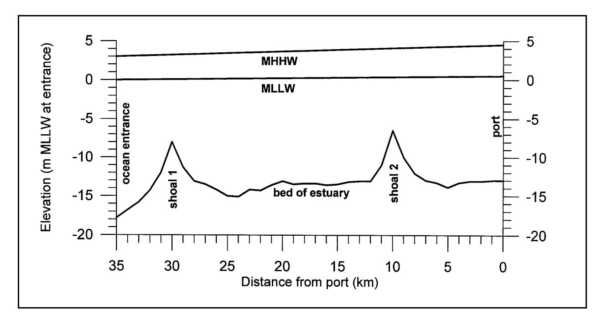

*Figure V-5-19. Hypothetical route to a port at the head of an estuary (cross section along channel center line)*

- (2) The distribution of tidal water levels is estimated by using NOAA primary and secondary tide station data (Part V-5-3). Interpolation between secondary stations is often practical, as needed, if no major constrictions or confluences are present. Figure V-5-20 illustrates the predicted distribution of hourly depths for 1 year at the shallower shoal, Shoal 2. A similar analysis can be performed by applying the methods of Harris (1981).
- (3) River discharges and wind-induced water level changes affect water depth over the shoals. Waterway confluences or constrictions and hydrodynamic effects of the shoal itself affect water levels in the vicinity. Seasonal or storm-related changes in elevation of the shoal crest can also affect the depth available to ships. These complications may call for a program of site-specific water level measurements. Numerical modeling

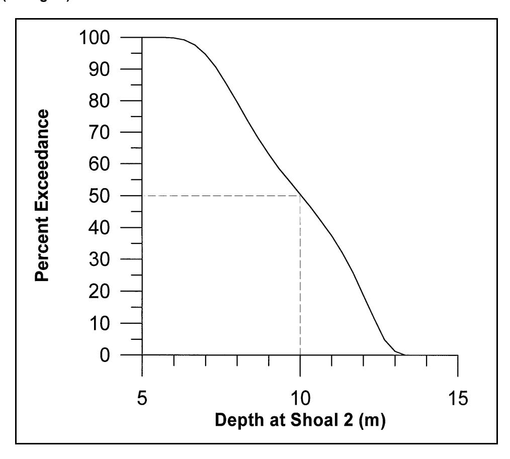

*Figure V-5-20. Hypothetical distribution of depths for Shoal 2*

of historical conditions (hindcasting) may also be effective for precisely describing water level changes. Figure V-5-21 illustrates water level variations on the main branch of the lower Fraser River near Vancouver, British Columbia, Canada, including tidal and river discharge variations (Ferguson 1991). The transect begins at the river mouth at Sand Heads and continues 35 km up the estuary to New Westminster. Shaded areas show the impact of river outflow on water level for two tide levels (high and low tide). River outflow has little impact on water level at the mouth, but significant impact up into the estuary, especially at low tide. River outflow can add up to 2 m to low tide water depth along this channel. It also affects current. With high river outflow, water level at New Westminster becomes nearly constant over the tidal cycle. Similar processes may need to be considered at the example port.
- (4) Figure V-5-20 indicates that ships approaching the example port with draft and keel clearance requirements for a minimum 10-m depth must wait until the upper half of the tidal cycle to cross Shoal 2. Since ships generally arrive on schedules independent of the tide, roughly half the ships of this draft will be delayed. Time spent waiting for the tide, or more likely spent at slow speed offshore, will vary from one arrival to another. Time will also be lost on departure, since ships loaded and ready to depart will have to wait for favorable tide. Deeper ships will lose more time. The shoals of the example are about an hour's sailing apart, so the dangerous possibility exists of crossing one shoal on ebb tide only to find insufficient depth at the second.
- (5) The variability of arrival and departure times, ship draft and speed, and water depths is difficult to resolve by multi-variate probability analysis based only on recorded port data. Port arrival and departure times and drafts are usually recorded, but details of shoal-related delays are not. Historical and future delays

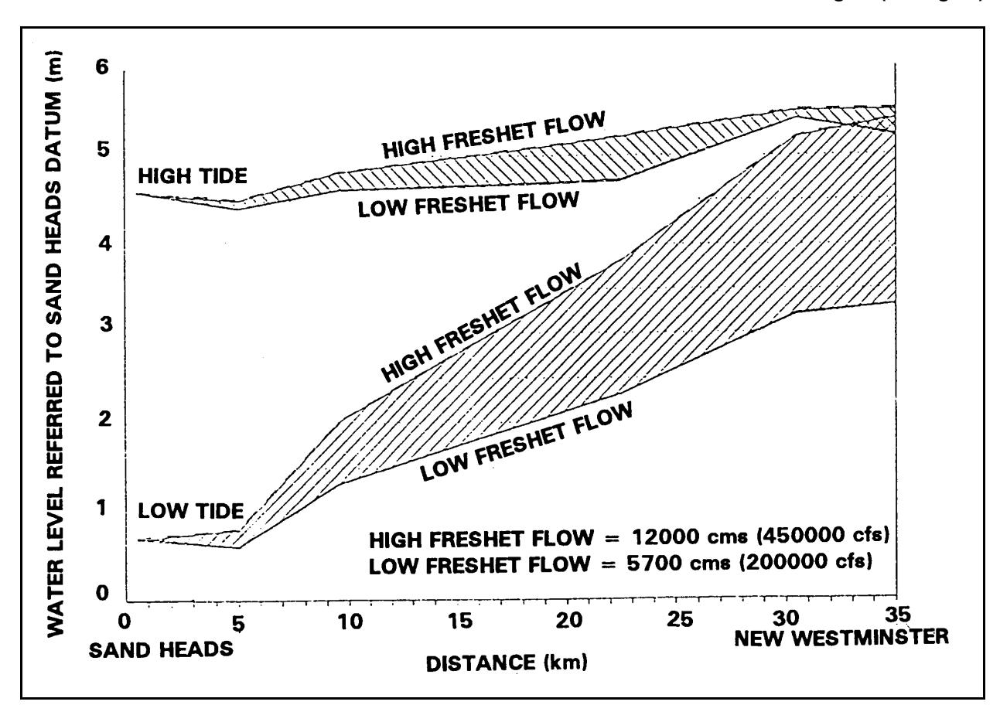

*Figure V-5-21. Range of water levels in Fraser River, British Columbia (after Ferguson 1991)*

can often be estimated more accurately with numerical simulations. For example, a risk-based system for evaluating channel depth requirements (and for evaluating operational transit safety when coupled with realtime field environmental measurements) is discussed by Silver (1992) and Silver and Dalzell (1997).
- (6) Figure V-5-22 illustrates the conceptual approach of a computer program for time-and-motion simulations which applies predicted tides and tidal currents, historical or projected ship cargoes, drafts, and arrival times at the ocean entrance, and cargo transfer rates at port. The same model can simulate ship transit times with various dredged channel geometries. Waiting times are computed as the difference between transit time simulated across the shoals and transit time without shoal restrictions.
- (7) Randomly occurring combinations of variables affecting transit times, such as strong winds, river discharge- and wind-induced depth changes, high waves, low visibility, and ice conditions can be added using a Monte Carlo approach. This method requires enough repeated simulations of the same input variables with random values of stochastic variables to encounter the full range of combined extremes. Statistics of transit time, waiting time, and associated costs can be computed from these data. A more complete discussion of vessel traffic flow simulation models is given by PIANC (1997a).
- (8) Ship costs are generally proportional to operating time, either under way or at berth. Reductions in time navigating the port approach, at the dock, and departing translate into cost savings. Other cost factors include impacts of ship arrivals on longshoremen, mechanical equipment, and cargo staging at the port. Transportation costs without channel improvement must be estimated as a baseline against which to measure cost-effective optimization of channel excavation. The savings realized by a range of excavation depths and

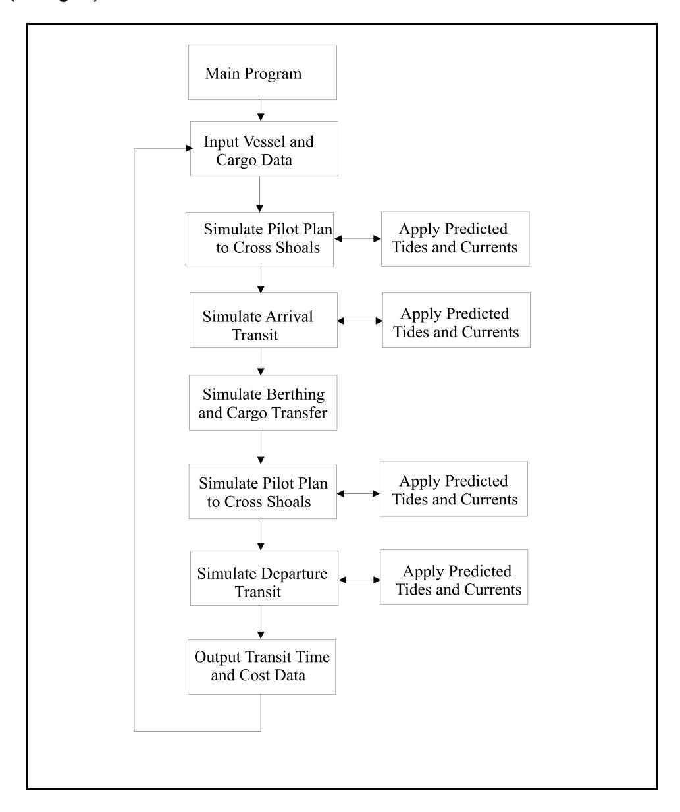

*Figure V-5-22. Components of a ship transit simulation program*

channel configurations should be compared with corresponding dredging and disposal costs. The ideal optimum will achieve the maximum net savings, but environmental quality effects, financial capabilities, and user preferences can affect the final project design.

#### V-5-6. Channel Alignment and Width

a. Alignment. Navigation channels are normally aligned as much as possible with natural channels in the pre-project bottom contours. This approach has several important advantages: initial and maintenance dredging are usually minimized; and currents typically take this path in line with the channel, a preferred condition for navigation. The effect of predominant winds and waves, as well as currents, on navigation should be considered. A channel oriented in line with these forces typically serves navigation best.
- (1) A straight channel is preferred over a channel with bends. If turning is required, straight reaches with turns between channel segments are preferred over curved alignments. This type of alignment allows the channel to be clearly marked with aids to navigation. Straight segments in a deep-draft channel should be at least five times the length of the design ship. Few turns and small turning angles are best for navigation. Typically, the number of turns introduced in the channel alignment must be balanced against the turning angles to achieve an optimum alignment for navigation purposes. Both deep- and shallow-draft channels should be aligned so that vessels can maintain speed and controllability through areas where they are exposed to potentially damaging winds, waves, and currents. This consideration generally precludes sharp turns in exposed areas.
- (2) The entrance channel to San Juan Harbor, Commonwealth of Puerto Rico, helps illustrate the difficulty of turning large ships in design transit conditions (Figure V-5-23). The exposed entrance, or "bar," channel makes a 57-deg turn into Anegado Channel just inside the harbor entrance. A ship simulator was used to model navigation channels in the harbor (Webb 1993). Local pilots from San Juan Harbor conducted simulation runs with two design ships, a tanker and a container ship. Ship tracks from inbound runs with the tanker are shown, where the ship hull outline is plotted at short intervals along each run. The variability of ship track and differences in pilot strategy for making the turn are evident in the figure. Ship track plots such as this clearly show the ship's swept path relative to channel boundaries. The envelope of multiple ship tracks gives valuable information about the navigability of the channel being simulated.
- (3) Channel alignment option studies should consist of selecting several alternate routes when viable alternatives are available. Construction and maintenance costs are developed for each alternative. A comparison of annual project costs and benefits then determines the optimum channel alignment. b. Inner channels (protected waters and harbor areas) .
- (1) Width. Harbor access channels leading from the bar or entrance channel to the port or harbor area are referred to as interior channels . For straight deep-draft channels, the required channel width is based on the following factors, listed in decreasing order of importance: (a) Traffic pattern (one-way or two-way). (b) Design ship beam and length. (c) Channel cross-section shape. (d) Current speed and direction. (e) Quality and accuracy of aids to navigation. (f) Variability of channel and currents. Design channel width is defined as the width measured at the bottom of the side slopes on each side of the channel at the design depth. For one-way deep-draft channels, channel width has traditionally been figured as the sum of a maneuvering lane width and bank clearance increments on either side (Figure V-5-24). For two-way channels, an additional maneuvering lane and a ship clearance lane dividing the two lanes of traffic are added. The required width for each increment was given as a factor applied to the design ship beam (Table V-5-9). Factors vary with ship controllability and judgment. Special judgment is required when vessels are exposed to yawing forces.

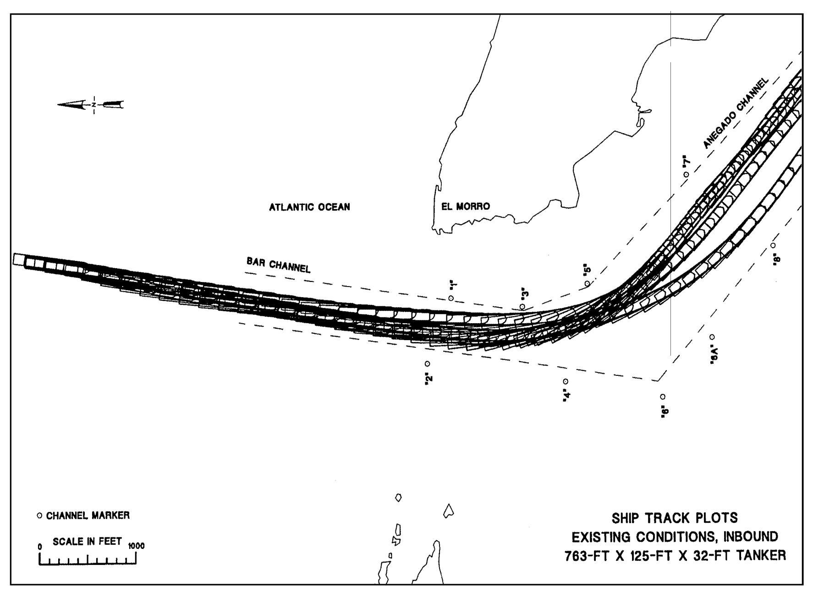

*Figure V-5-23. Ship simulation of deep-draft entrance channel, San Juan Harbor, Commonwealth of Puerto Rico*

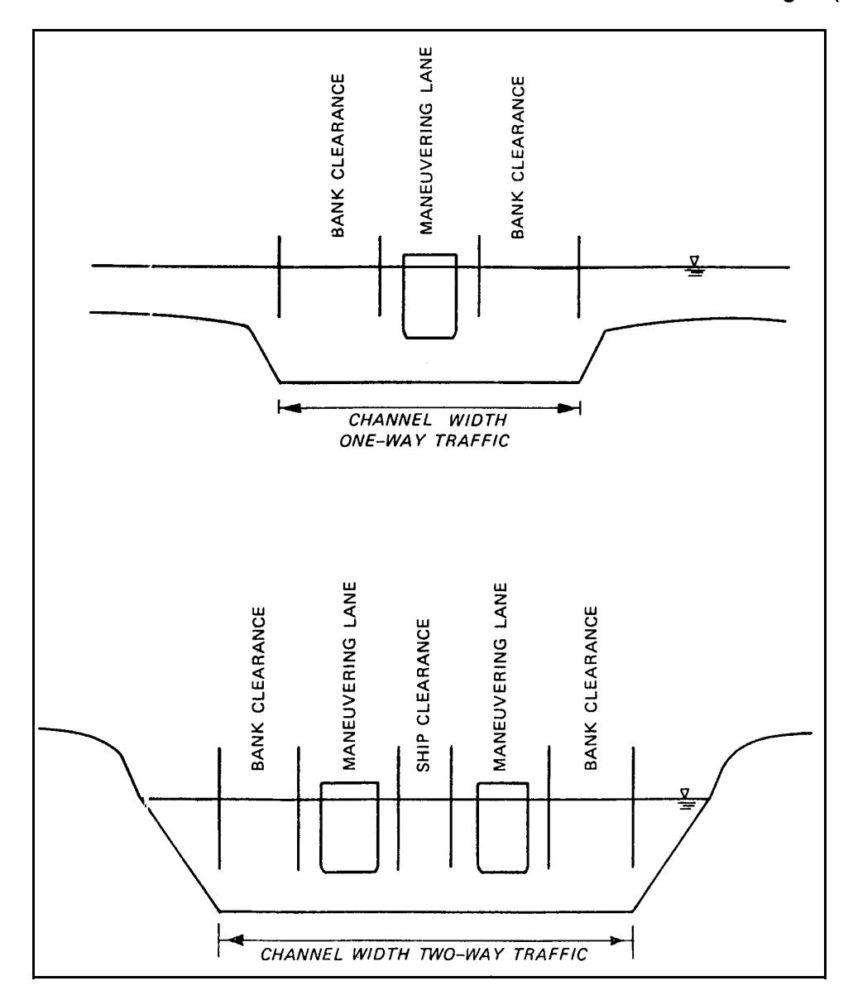

*Figure V-5-24. Traditional interior channel width elements*

*Table V-5-9 Traditional Criteria for Deep-Draft Channel Width $Design^{1}$*

**Table V-5-9. Traditional Criteria for Deep-Draft Channel Width $Design^{1}$**

|  |  | Vessel | Controllability |  |  |
| --- | --- | --- | --- | --- | --- |
| Location |  | Very Good | Good | Poor | Channels with Yawing Forces |
| Maneuvering | lane, straight channel | 1.60 | 1.80 | 2.00 | Judgment2 |
| Bend, 26-deg | turn | 3.25 | 3.70 | 4.15 | Judgment2 |
| Bend, 40-deg | turn | 3.85 | 4.40 | 4.90 | Judgment2 |
| Ship clearance |  | 0.80 | 0.80 | 0.80 | 1.00 but not less than 30 m (100 ft) |
| Bank clearance |  | 0.60 | 0.60+ | 0.60+ | 1.50 |
| 1 Criteria | expressed as multipliers of the | design ship | beam; i.e., W = | (factor from | table) × B |
| 2 Judgment is | based on local conditions | at each project. |  |  |  |
| Navigation Projects |  |  |  |  | V-5-41 |

*Criteria expressed as multipliers of the design ship beam; i.e., W = (factor from table) × B*

*Judgment is based on local conditions at each project.*

• Professional pilots control ships in a way that makes the traditional channel width divisions illogical. For example, they routinely move the ship off center line to use bank effects as a cue in determining ship position. Also, they sometimes use bank effects to assist in turning. Guidance for deep-draft channel width is best expressed as a total channel width based on the design ship beam (e.g., Figure V-5-25). The quality of aids to navigation, type of channel cross section, and current strength impact the required width. Experience with ship simulator studies has indicated that traditional channel width design criteria are overly conservative. Interim guidelines have been developed based on simulator studies (USACE 1998) (Tables V-5-10 and V-5-11). If current speeds are greater than 2.9 m/sec (3.0 knots), design channel width should be developed with the assistance of a ship simulator study (Part V-5-10).

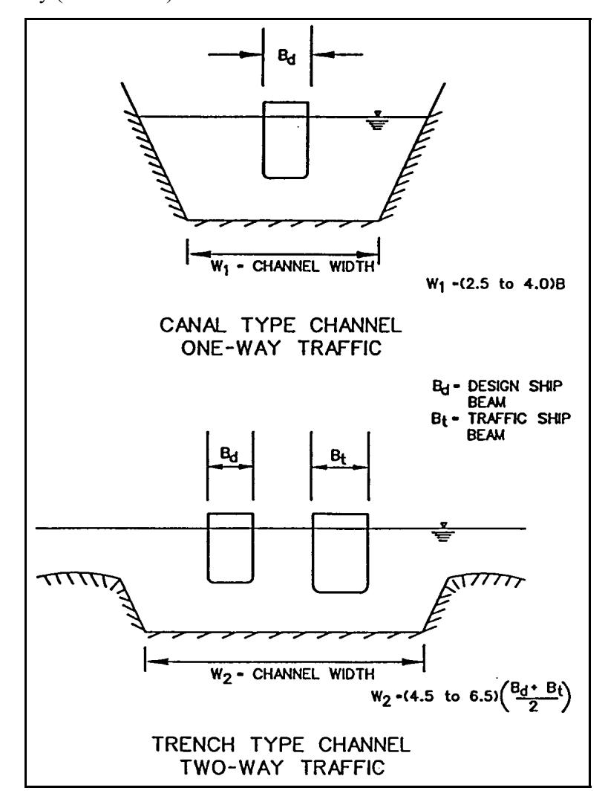

*Figure V-5-25. Interior channel design width*

• Navigation is more difficult when channel cross section (overbank depths, channel depth and width) varies significantly. Bank effects and currents become less predictable and extra care is needed for vessel control. Table V-5-10 gives channel width factors for a somewhat challenging navigation scenario, with variable cross section and average aids to navigation, and for an ideal scenario with constant cross section and excellent aids to navigation. These two scenarios bracket most channel design projects likely to be encountered in the United States.

*Table V-5-10 One-Way Ship Traffic Channel Width Design $Criteria^{1}$*

**Table V-5-10. One-Way Ship Traffic Channel Width Design $Criteria^{1}$**

| Channel |  | 0.0 to | 0.3 | m/sec |  | 0.3 to | 0.8 m/sec | 0.8 to 1.5 m/sec |
| --- | --- | --- | --- | --- | --- | --- | --- | --- |
| Cross Section |  | (0.0 to | 0.5 | knots) Constant | Cross Section, | (0.5 to Best | 1.5 knots) Aids to Navigation | (1.5 to 3.0 knots) |
| Shallow |  | 3.0 |  |  |  | 4.0 |  | 5.0 |
| Canal |  | 2.5 |  |  |  | 3.0 |  | 3.5 |
| Trench |  | 2.75 |  | Variable | Cross Section, | 3.25 Average | Aids to Navigation | 4.0 |
| Shallow |  | 3.5 |  |  |  | 4.5 |  | 5.5 |
| Canal |  | 3.0 |  |  |  | 3.5 |  | 4.0 |
| Trench |  | 3.5 |  |  |  | 4.0 |  | 5.0 |
| 1 Criteria expressed | as | multipliers | of the | design | ship beam; i.e., | W = | (factor from table) × B |  |
| Table V-5-11 |  |  |  |  |  |  |  |  |
| Two-Way Ship | Traffic | Channel | Width | Design | Criteria1 |  | Maximum Current |  |
| Channel |  | 0.0 to | 0.3 | m/sec |  | 0.3 to | 0.8 m/sec | 0.8 to 1.5 m/sec |
| Cross Section |  | (0.0 to | 0.5 | knots) Constant | Cross Section, | (0.5 to Best | 1.5 knots) Aids to Navigation | (1.5 to 3.0 knots) |
| Shallow |  | 5.0 |  |  |  | 6.0 |  | 8.0 |
| Canal |  | 4.0 |  |  |  | 4.5 |  | 5.5 |
| Trench |  | 4.5 |  |  |  | 5.5 |  | 6.5 |
| 1 Criteria expressed | as | multipliers | of the | design | ship beam; i.e., | W = | (factor from table) × B |  |

*Table V-5-11 Two-Way Ship Traffic Channel Width Design $Criteria^{1}$*

**Table V-5-11. Two-Way Ship Traffic Channel Width Design $Criteria^{1}$**

| Channel | 0.0 to 0.3 m/sec | 0.3 to | 0.8 m/sec | 0.8 to 1.5 m/sec |
| --- | --- | --- | --- | --- |
| Cross Section | (0.0 to 0.5 knots) Constant Cross Section, | (0.5 to Best | 1.5 knots) Aids to Navigation | (1.5 to 3.0 knots) |
| Shallow | 5.0 | 6.0 |  | 8.0 |
| Canal | 4.0 | 4.5 |  | 5.5 |
| Trench | 4.5 | 5.5 |  | 6.5 |
| 1 Criteria expressed as | multipliers of the design ship beam; i.e., | W = | (factor from table) × B |  |

• Shallow-draft interior channels should be designed to safely handle the expected volume of two-way traffic. Traditional guidance for channel width is the same as for deep-draft channels (Table V-5-9). However, an approach that takes account of the traffic congestion may be preferable. Small-craft channel design guidance is being reevaluated in present research studies. Present recommended simple guidance is a minimum width, generally based on average vessel beam, and an additional width increment based on the number of boats using the project (ASCE 1994, Dunham and Finn 1974)

```math
W = W_{\mathrm{min}} + 0.10 \ N_B \qquad \text{in feet} \tag{V-5-7}
```

where
- W = design small-craft channel width
- $W_{min}$ = minimum width; = 5 B or 15 m (50 ft), whichever is greater
- B = average beam
- NB = number of boats using the project
Thus, an interior channel serving 500 small boats with average beam of 5 m would have a minimum width of 5*5 + 0.03*500 = 40 m.
- (2) Berthing areas. Although entrance and interior harbor channels and turning basins are usually part of federal navigation projects, berthing areas are typically nonfederal concerns except in military harbors. Normally, a berthing area must have sufficient depth to accommodate the design vessel to be using the berths, which may be smaller than the design vessel for sizing harbor channels, under all or nearly all expected water levels. Typically the design water level for berthing areas is extreme low water. Berthing areas must have sufficient space for safe maneuvering of the appropriate design vessel, often with tug assistance in deep-draft facilities. Guidance for sizing berthing areas to provide adequate access may be found in other references (e.g., Tsinker (1997), Gaythwaite (1990), and U.S. Navy (1981) for deep-draft ports; ASCE (1994), Tobiasson and Kollmeyer (1991), Dunham and Finn (1974), and State of California (1980) for small-craft harbors).
- (3) Special considerations due to ice. Increased navigation difficulties in areas with ice may introduce special considerations for channel depth and width. Policies of pilot associations, shipping companies, or vessel insurance underwriters may call for additional keel and bank clearances beyond those allowed in temperate ice-free conditions. These groups and other marine interests, such as the USCG, NOAA, and military operators, should be solicited in the planning process for their views on these matters.
- (a) The magnitude and direction of ice forces on ships are random in nature. These forces are combinations of impacts and frictional resistance. Impacts of wind- or current-driven ice forces can be oblique to the course of the ship, causing a sudden diversion. Ship response to such a diversion is slowed by additional oblique impacts and frictional resistance.
- (b) Design width for a channel that will be navigated with ice should be increased by as much as 50 to 100 percent over the conventional width. Design depth may also need to be increased. The conventional icefree design depth including either a standard wave allowance or an additional 0.5-m depth increment, whichever is greater, should be used. Wave allowance can be neglected in ice navigation because ice usually suppresses waves.
- c. Entrance channels . Entrance channels are generally wider than interior channels because of many factors complicating navigation at entrances, particularly waves and currents. Intensified waves and currents at entrances make navigation difficult, but they also result in potentially treacherous sediment movement and dynamic shoaling patterns. Often vessels navigate this difficult environment in close proximity to rock or concrete breakwater or jetty structures. Loss of control can result in disastrous collision with these solid structures.
- (a) Because of the complexity of processes and vessel responses in entrance channels, experience at the project site or related sites can be an especially helpful guide to determining an acceptable channel width. The traditional simple design approach is to use the guidance in Table V-5-9, choosing factors for a level of
vessel controllability appropriate to the difficulty of the particular entrance channel. Deep-draft entrance channel width design can benefit significantly from comprehensive physical model studies, navigation simulation studies, and field measurements of ship motions (Part V-5-10).
- (b) For small-craft harbors, entrance channel width should be a minimum of 23 m (75 ft) (ASCE 1994). Guidance in Table V-5-9 has traditionally been applied. These factors typically exceed those for interior channels, leading to a widened entrance channel design. Small-craft harbor entrance channel design is the subject of a present research study.
- (c) USACE practice in southern California, where sailboat usage is accommodated in design, is a minimum width of 90 m (300 ft). Consideration is also given to the number of boats using the project. USACE practice is to increase channel width over the 90-m (300-ft) minimum if the number of boats exceeds 1,000.

```math
W = 90 + 0.03 (N_B - 1000) \tag{V-5-8}
```

Thus, an entrance channel serving 2,000 small boats would have a minimum width of 90 + 0.03*(2,000- 1,000) = 120 m (300 + 0.1*(2,000-1,000) = 400 ft), based on practice in southern California.
d. Turns and bends . Channels with turns and bends are more difficult to navigate than straight channels. Vessel control is reduced and width of the vessel swept path (the envelope around ship hull positions in the horizontal plane) is naturally increased when turning. Therefore, additional width is required in turns and bends for large vessels. Key parameters in a turn are defined in Figure V-5-26. The recommended configuration for widening a turn in a deep-draft channel depends on the deflection angle (Figure V-5-27 and Table V-5-12). Bank conditions, not included in the simple guidance presented here, are important in turn design since pilots often use them to assist in turning.

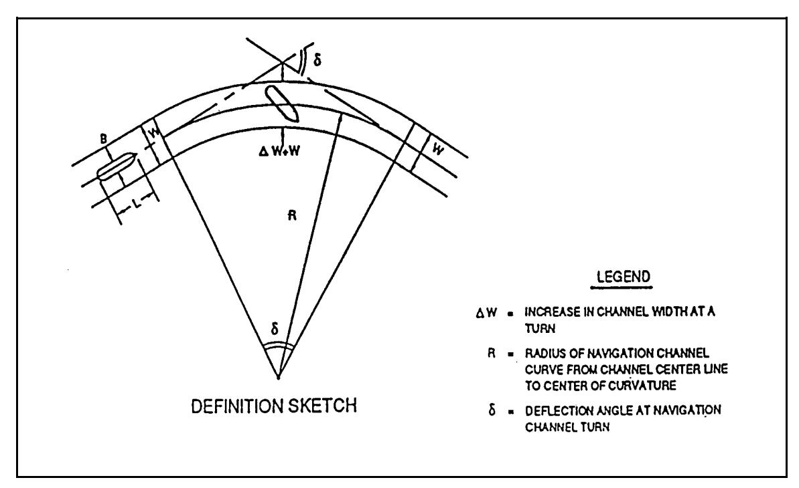

*Figure V-5-26. Definition of parameters in channel turn*

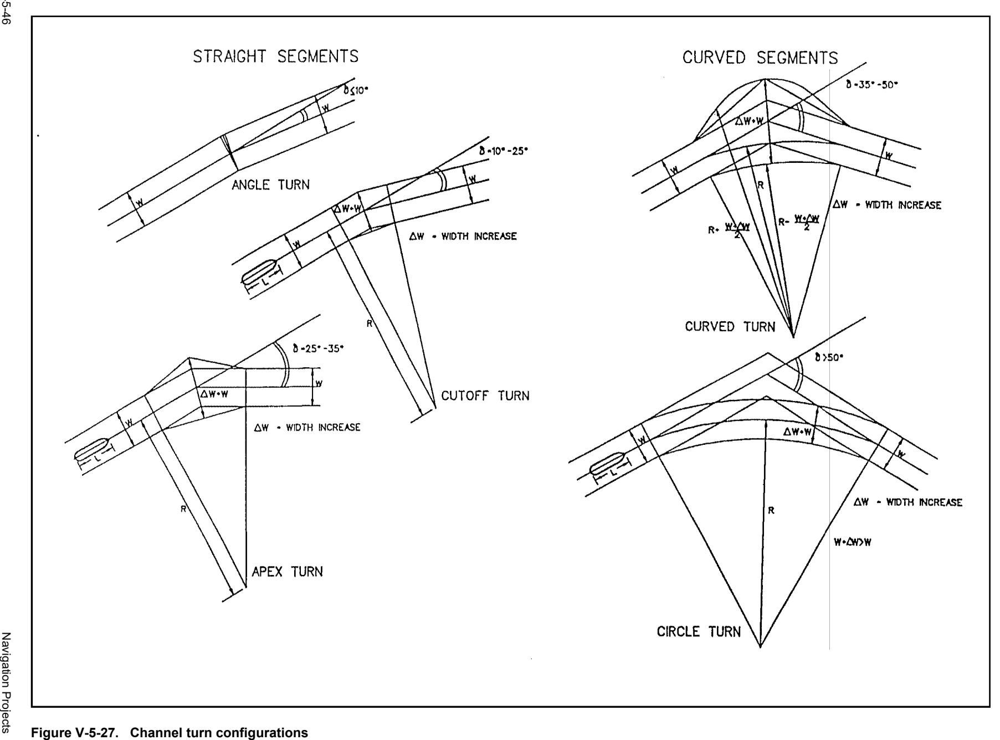

*Table V-5-12 Recommended Deep-Draft Channel Turn Configurations*

**Table V-5-12. Recommended Deep-Draft Channel Turn Configurations**

| Turn Angle, deg |  | R/L1 | Turn Width Increase $Factor^{2}$ | Turn Type |
| --- | --- | --- | --- | --- |
| 0-10 |  | 0 | 0 | Angle |
| 10-25 |  | 3-5 | 2.0-1.0 | Cutoff |
| 25-35 |  | 5-7 | 1.0-0.7 | Apex |
| 35-50 |  | 7-10 | 0.7-0.5 | Curved |
| >50 |  | >10 | 0.5 | Circle |
| 1 R = curve radius; | L = design | ship length (see Figure | V-5-26). |  |
| 2 Expressed as | a multiplier of | the design ship beam; | i.e., ΔW = (factor from table) × B |  |

*R = curve radius; L = design ship length (see Figure V-5-26).*

- (1) Apex or cutoff configurations are commonly used because they are simple, easily defined shapes that serve most channel turn requirements. They are easiest to control for dredging, easiest to mark with aids to navigation (usually with two range marker pairs and buoys), and easiest to monitor for maintenance. Some dimensions that are useful for computer drafting are included in Figure V-5-28. Turns should be placed, when possible, in locations easily visible for range markers. A drawback to the apex and cutoff methods is that they can produce difficult current patterns for navigation. In high current areas and/or canals, turns with parallel circular arcs gradually transitioning from straight channel segments into the turn may be warranted.
- (2) The impact of channel turns on currents and shoaling and vessel response to wind and waves can be significant. The navigability of a turn design and its shoaling tendencies may merit study with numerical models and a navigation simulator.
- (3) Small craft are sufficiently maneuverable that extra channel width in turns is generally not as critical as for deep-draft ships. For large turn angles in the presence of difficult conditions, extra maneuvering space should be provided. A typical situation would be a sharp turn in an exposed entrance channel.

### V-5-7. Other Project Features

- a. Turning basins . Turning basins are generally provided to allow vessels to reverse direction without having to go backward for long distances. Turning basins provide the extra width needed to comfortably turn. Turning basins are usually located at the upstream end of interior access channels. In long channels accommodating many dock facilities, an extra turning basin may be placed at the upstream end of each group of docks. In normal operations, larger ships turn with pilot and tug assistance.
- (1) The minimum turning basin size should allow a turning circle with diameter of 1.2 L , where L is the design ship length (Figure V-5-29). Turning difficulty increases significantly when currents are present. If current speed exceeds 0.5 m/sec (0.5 knot), turning basin diameter should be increased as indicated in the figure. If current speed exceeds 0.8 m/sec (1.5 knot), a circular shape no longer suffices. The turning circle should be elongated in the current flow direction, as shown in the figure. Dimensions of the high-current turning basin configuration should be determined with a ship simulator (Part V-5-10). If turning operations will include ships with high sail areas and design wind speeds of greater than 12.9 m/sec (25 knots), a ship simulator design study is also needed.

*2 Expressed as a multiplier of the design ship beam; i.e., ΔW = (factor from table) × B*

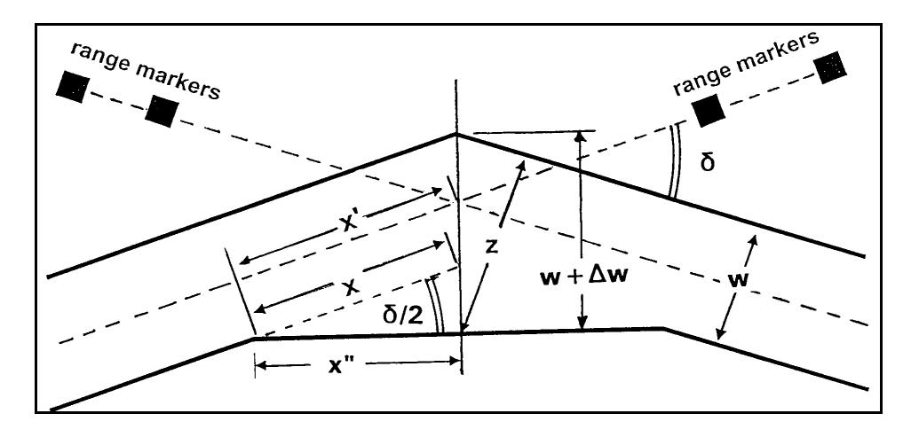

*Figure V-5-28. Layout of apex-style turn*

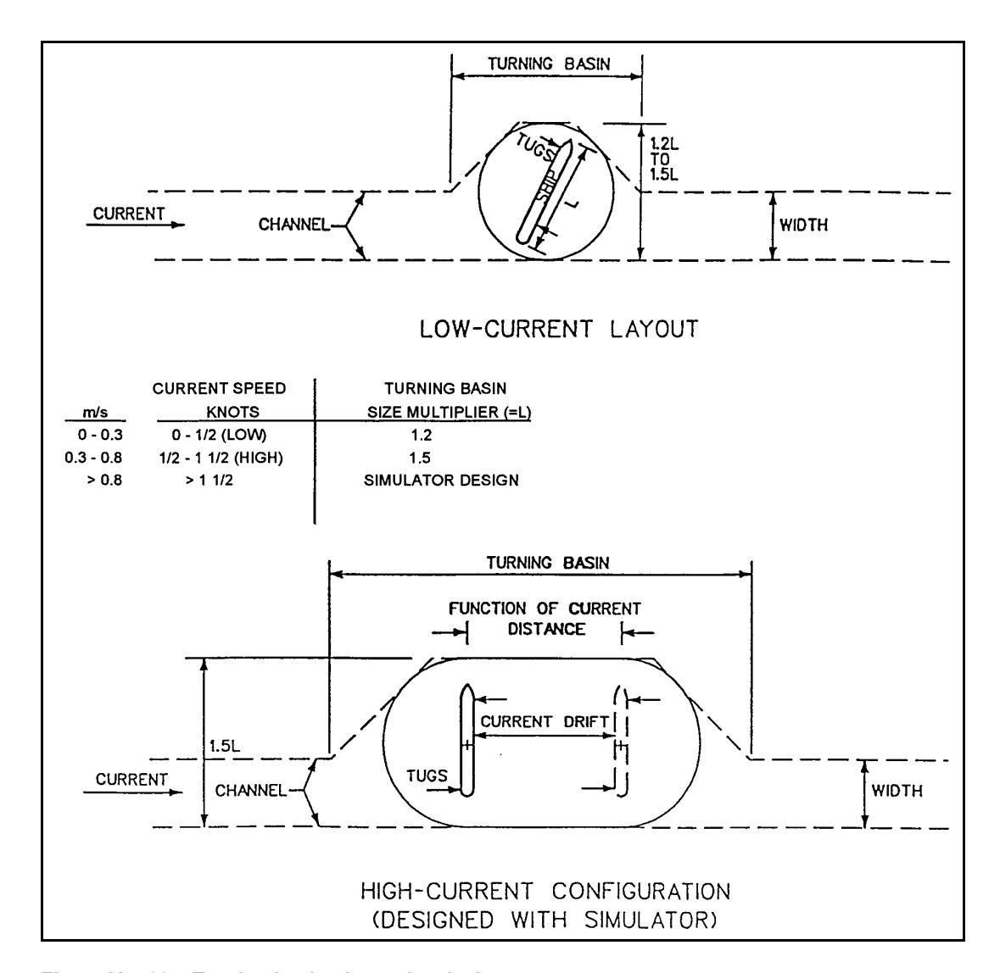

*Figure V-5-29. Turning basin alternative designs*

- (2) Turning space for small boats should be sufficient to allow turning without backing or assistance. The required space depends on the types of boat using the project, but the design channel width usually accommodates turning.
- (3) Turning basin design depth normally matches the adjacent channel depth. Turning basins tend to trap sediment because they are wider and typically have lower currents than the navigation channel. Also, being located at the upstream end of the navigation channel, the turning basin is often the first dredged area to intercept river-borne sediment. The potential shoaling problem may be reduced by careful choice of turning basin location and shape to reduce sediment availability and promote flushing.
- b. Moorage/anchorage areas . Anchorage areas are provided in some deep-draft ports, typically near the entrance, to accommodate ships awaiting berthing space, undergoing repairs, receiving supplies and crews, awaiting inspection, and lightering off cargo. Anchorage areas may also serve as a refuge for ships during severe storms, since most facilities are designed with the assumption that no ships will be in port during a hurricane or typhoon. Ships may be anchored at the bow and allowed to swing freely or be moored against fixed dolphins. Design guidance is given in Figure V-5-30. Guidance for free-swinging anchorage is approximate, based on a 15-m (50-ft) depth and design ship length of 213 to 305 m (700 to 1,000 ft). The fixed mooring alternative requires a much smaller area for each ship than the free-swinging alternative. If available space is limited or dredging is required, fixed mooring may be the preferred design. Design guidance is available from the U.S. Navy (1998).
- c. Basin flushing and water quality . Water quality within a harbor is often a concern with local, state, and Federal agencies. Water quality in a harbor depends on three key factors: quality outside the harbor, substances introduced into the water inside the harbor, and exchange of water between the inside and outside. Although outside water quality is typically beyond the scope of a navigation project, harbor design and operation can have a major impact on the other key factors. Contaminants introduced inside a harbor may include sewage discharge, shower/dishwashing water, bottom paint leaching, fuel and oil spillage, and deck and hull washing. Persistent contaminants may affect bottom sediments as well as water quality, which can increase future dredging costs.
- (1) Water movement within a harbor is often restricted by the perimeter design. The extent to which the basin is enclosed, placement of the opening(s), and basin shape all affect water movement in the harbor. Tide, wind, and river flows can help promote circulation in a harbor and exchange between harbor and outside water. For example, a large tidal prism combined with a small low-tide volume gives excellent flushing in a harbor. Flushing processes in harbors are discussed in Part II-7.
- (2) Many harbors are located in areas where natural water movement is relatively weak, a desirable condition for navigation but a potential problem for basin flushing. For example, when outside water has a high content of treated sewage, a typical concern, then water should not remain trapped anywhere in the harbor for many days. Methods to promote flushing and prevent stagnation include gaps between perimeter structures and shore, openings within the perimeter structure itself (e.g., segments, baffles, culverts), overlapping wave protective structures to act as scoops to passing water flow, and mechanical agitation. A harbor entrance centrally located along the perimeter is usually preferred over an entrance at one end, which may lead to stagnation at the opposite end.
- (3) The flushing characteristics and water quality in a harbor can be predicted with physical and numerical models, as discussed in Part II-7. Both water exchange rates and oxygen or other chemical constituent reactions and replenishment rates should typically be addressed.

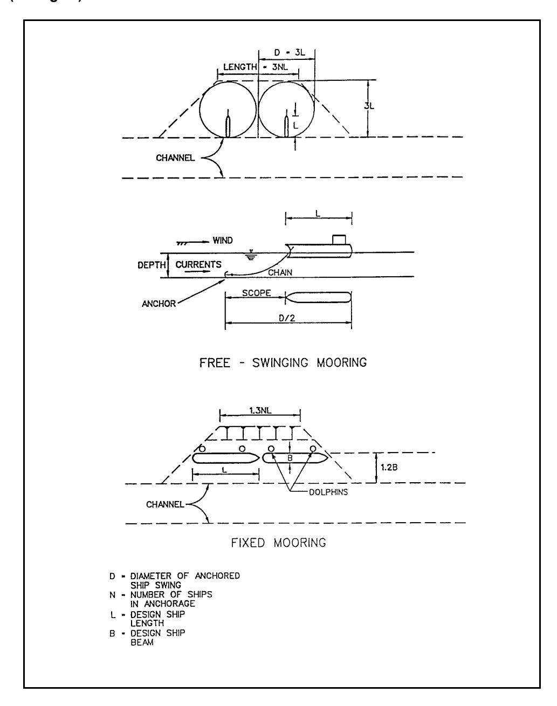

*Figure V-5-30. Alternative anchorage designs*

- d. Navigation structures . Often a navigation project requires one or more engineered structures to accomplish its objectives. Structures can serve a variety of purposes. However, their presence also establishes a major hazard for vessels. Hence, a navigation structure must be designed with regard to several functional concerns. Basic types of structures and functions involved in navigation projects are briefly discussed in this section. Sediment processes and management at inlets and harbors are discussed in Part V-6. Detailed guidance on structure design is given in Part VI.
- (1) Breakwaters. Breakwaters are used to protect a harbor, anchorage, basin, or area of shoreline from waves. Breakwaters reflect or dissipate wave energy and thus prevent or reduce wave action in the protected area. Breakwaters must be designed to effectively serve competing requirements for wave blockage and safe vessel passage from fully exposed waters through a constricted entrance into tranquil harbor waters.
(1) For navigation projects, breakwaters are frequently shore-connected and constructed to provide calm waters in a harbor (Figure V-5-31). Shore-connected breakwaters allow access from land for construction, operation, and maintenance, but may have an adverse impact on water quality or sediment movement along the coast.

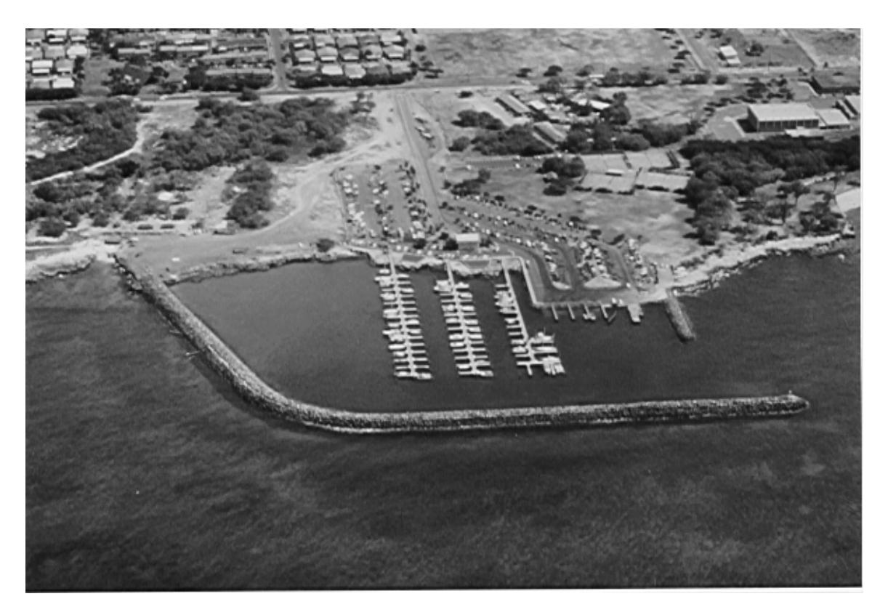

*Figure V-5-31. Harbor with shore-connected breakwater, Waianae Small Boat Harbor, Oahu, Hawaii (June 1980)*

- (2) If the harbor to be protected is on the open coast and predominant wave crests approach parallel to the coast, a detached offshore breakwater may be a good option. Water quality is preserved with this type structure, but access for construction and maintenance is more difficult than for a shore-connected structure. Offshore structures are sometimes used to provide protection to existing harbor entrances (Figure V-5-32). Accumulation of sediment in the lee of an offshore breakwater must be considered in design (Part V-6).
- (3) Many breakwater systems utilize a combination of breakwater types to protect anchorage or mooring areas, such as a shore-connected and a detached structures (Figure V-5-33). Some structures have been constructed with arrowhead entrance configurations, but experience has shown them to be of questionable benefit, and some have been modified to improve performance. The cellular arrowhead breakwater configuration in Figure V-5-33 was modified by adding an overlapping rubble-mound extension to the seaward end of the shore-connected breakwater. In some cases, the primary breakwaters do not provide sufficient protection, and interior breakwaters are needed (Figure V-5-34).
- (4) Most breakwaters built on open coasts of the United States are of rubble-mound construction. It is important for harbor tranquility to design such structures to be high enough to prevent excessive wave overtopping and sufficiently impermeable to deter wave transmission through the structure. However, some wave overtopping and/or transmission may be beneficial for harbor flushing. Other structural types include

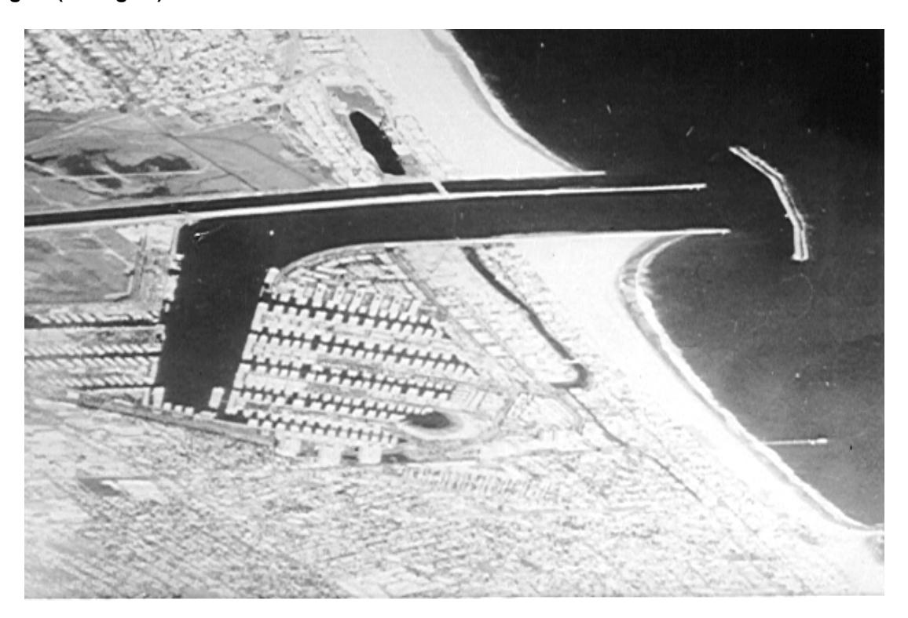

*Figure V-5-32. View of offshore detached breakwater used to protect harbor entrance, Marina del Rey, California (August 1966)*

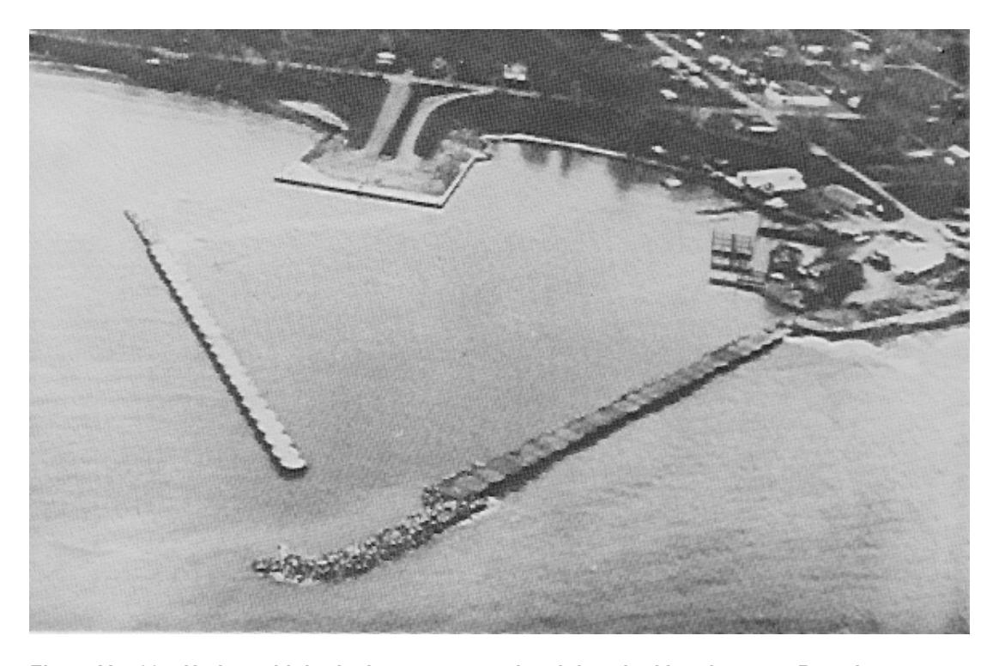

*Figure V-5-33. Harbor with both shore-connected and detached breakwaters, Barcelona Harbor, New York (April 1986)*

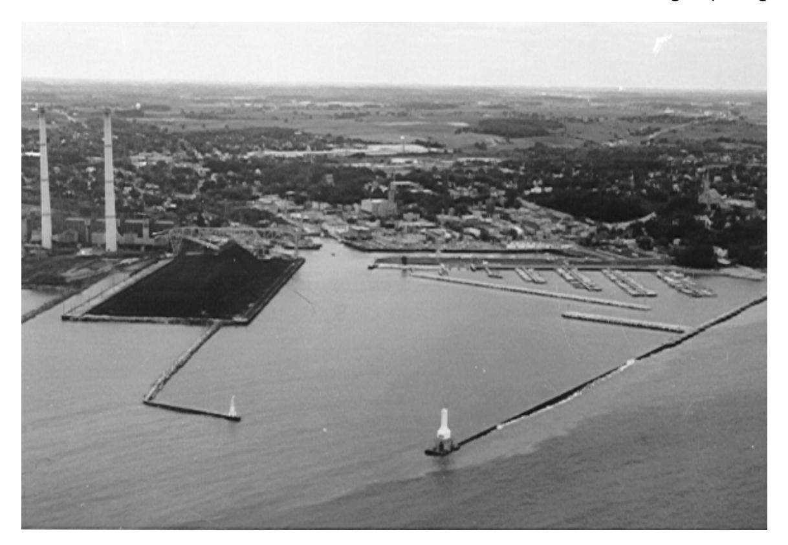

*Figure V-5-34. Inner breakwater provides protection to small-craft mooring area, Port Washington Harbor, Wisconsin (September 1983)*

concrete caisson, timber crib, sheet pile, cellular steel sheet pile, composite (rubble-mound with concrete cap for stability, etc.), and floating.
- (5) The optimum layout of breakwaters for harbor protection is difficult to determine because of the complex conditions typically involved. Waves refract on approaching the entrance, often in the presence of shoals as well as a navigation channel. Wave energy propagates through the entrance, diffracts, and reflects from inner harbor structures. Currents are usually present due to tides, wind, waves, and river flows.
- (6) Because they can accurately reproduce many of the complex, interacting hydrodynamic effects on a harbor, physical models provide the most reliable method for optimizing breakwater layout (Part V-5-10). Physical modeling and subsequent monitoring of prototype performance has led to general guidance relative to harbor layout (Bottin 1992). Lessons learned relative to navigation entrance channel and mooring area protection in small boat harbors are: (a) Align entrances toward a perpendicular to the incoming wave crests. It is very dangerous for small craft to travel parallel to high incoming wave crests ( beam seas ). Harbors should be designed to minimize the chance of this condition.
- (b) Block wave energy from the harbor . It is preferable to prevent wave energy from entering a harbor than to try to dissipate excessive wave energy once inside. Energy entering a harbor can be minimized by using overlapping breakwaters at the entrance, reducing entrance width, minimizing breakwater overtopping, and using impermeable breakwater cores. Breakwaters seaward of the entrance may also be incorporated into a design. If the harbor is at a river mouth, care must be taken to prevent upstream flooding due to flow restriction and/or ice jamming in the harbor.
- (c) Absorb wave energy inside the harbor if necessary . When physical limitations or costs prevent blocking sufficient wave energy out of the harbor, some energy can be absorbed inside the harbor with judiciously placed rubble slopes and/or spending beaches. Concrete absorber units (e.g. igloos ) can also be helpful. For long-period wave energy, absorbers installed along harbor slips are essentially ineffective.
- (d) Anticipate Cross Currents on Reefs . Waves breaking across reefs generally result in very strong currents alongshore. These currents may be hazardous to small craft entering and navigating channels cut through the reef and into harbors. Breakwaters may be used to deflect these currents offshore away from the entrance (Figure V-5-35). Currents also tend to enter the harbor through the entrance. These currents can be used to advantage by laying out interior channels to promote circulation and flushing, as was done with the aid of physical modeling for Agana Small Boat Harbor, Territory of Guam.

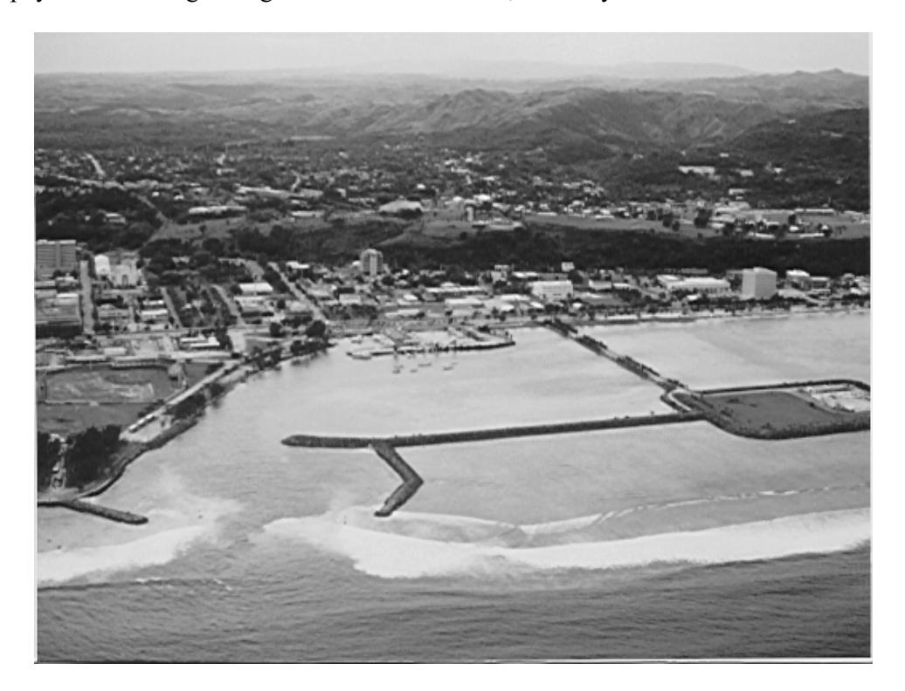

*Figure V-5-35. Breakwaters protecting small boat harbor from waves and wave generated crosscurrents on reef, Agana, territory of Guam (May 1978)*

- (e) Locate Harbor Facilities and/or Boat Ramps Away from the Entrance Opening . Wave energy propagating through and diffracting around entrance structures can affect nearby facilities. Facilities can be given further protection by including interior breakwater structures or revetted moles. Although these structures can be very effective, they are expensive and can limit future expansion.
- (f) Avoid vertical walls in high-energy areas of the harbor . Vertical wall breakwaters and harbor structures are highly reflective. Waves reflecting off entrance structures can result in very confused and hazardous navigation conditions. Reflections inside harbors can cause hazardous anchorage and mooring conditions. Reflected waves from vertical structures have also been found to induce erosion.
- (g) Orient entrances away from the direction of predominant longshore transport . It is very desirable to promote natural sand bypassing of the harbor entrance. Entrances facing the predominant longshore transport direction are likely to serve as a sediment trap. A typical successful design consists of an outer curved breakwater that overlaps a short shore-connected structure (e.g. Figure V-5-31). The shorter
downcoast structure helps to prevent sediment moving along the shoreline opposite to the dominant direction from coming into the entrance.
- (h) Consider Using Segmented Structures. Segmented breakwaters are effective in providing wave protection while still allowing tidal circulation through the breakwater openings. They can be effective substitutes for floating or baffled breakwaters. Segmented rubble absorbers inside a harbor, as opposed to a continuous absorber, also have proven to be effective in terms of both performance and cost.
- (2) Jetties. A jetty is a shore-connected structure, generally built perpendicular to shore, extending into a body of water to direct and confine a stream or tidal flow to a selected channel and to prevent or reduce shoaling of that channel. Jetties at the entrance to a bay or a river also serve to protect the entrance channel from storm waves and crosscurrents. When located at inlets through barrier beaches, jetties help to stabilize the inlet.
- (a) Jetties are usually built in pairs, one on either side of an entrance (Figure V-5-36). Sometimes, jetties are used in combination with a breakwater (Figure V-5-32). A single jetty may also be used, located on the updrift side of the entrance. A disadvantage of the single jetty is that the navigation channel is unconfined and will likely migrate. A typical single jetty problem is the case of an impermeable jetty where the navigation channel migrates to a position immediately beside the jetty, with consequent threats of passing vessels colliding with the structure and undermining of the structure itself. Some jetties have been designed with a low-crested weir section near shore to pass sediment into a deposition basin (Part V-6). The semiprotected waters of the deposition basin are then periodically dredged and sediment is bypassed to the downdrift beach.

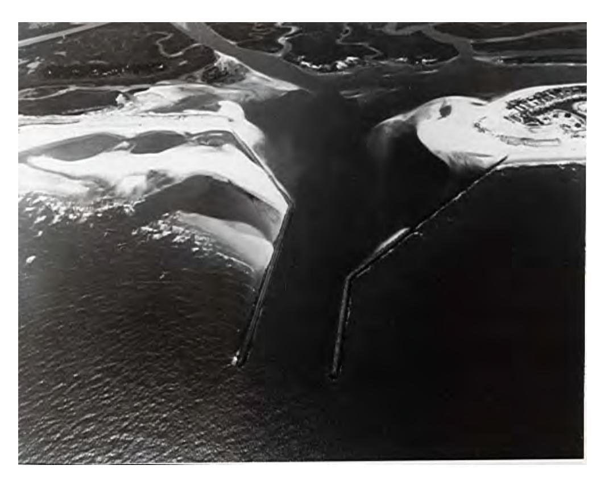

*Figure V-5-36. Dual jetty configuration at a tidal inlet, Murrells Inlet, South Carolina (March 1982)*

- (b) Though jetties have a different function than breakwaters, jetty structural design is similar to breakwaters. Most jetties built on open U.S. coasts are rubble-mound structures. Materials used for jetty construction include stone, concrete, steel, and timber. Unlike breakwaters, jetties are usually designed to allow some wave overtopping. Also, jetty cores may be lower and more permeable than breakwater cores, provided the jetty sufficiently blocks passage of sediment into the navigation channel.
- (c) Jetties should be designed to use available construction materials efficiently and effectively to accomplish functional objectives without adversely impacting other physical processes or the environment. Jetties at river or creek mouths, not considering tidal effects, should be spaced close enough together to allow normal river currents to maintain required navigation depths, yet far enough apart to prevent backwater effects and flooding upstream during high river flows. In cold regions, jetties should be oriented to avoid contributing to ice jamming in the entrance, which could cause upstream flooding. In some cases, overlapping jetties have proven to contribute to natural sand bypassing, and they reduce wave energy entering the mouth and lower reaches of the stream. If large quantities of sediment are moving in the area, sand bypassing schemes should be included in the design (Part V-6).
- (d) Jetty layout in tidal areas is much more difficult. Interaction of wave-induced currents and tidal currents, sometimes with freshwater discharges, through an inlet connecting the ocean with an embayment, is very complex. A fairly uniform distribution of flow across the entrance is one objective. Dual jetties of equal length usually serve best. The jetties should be parallel if practical; otherwise training dikes or spurs should be added to divert or concentrate flow through the desired channel alignment. If jetty spacing is too wide, shoaling and channel meandering are likely to occur. If jetty spacing is too narrow, structure toes may be undercut and hazardous navigation conditions may occur.
- (e) Parallel jetties tend to confine flood and ebb flow, raising flow velocities and providing adequate sediment flushing into the flood and ebb deltas. Arrowhead jetties frequently allow channel shoaling and meandering because ebb flow is not confined enough to produce nondepositional velocities in the widest area between jetties. Barnegat Inlet, New Jersey, is an example where both jetty configurations have been used (Sager and Hollyfield 1974; Seabergh, Cialone, and Stauble 1996) (Figure V-5-37). Arrowhead jetties were built in 1939, and a new south jetty, nearly parallel to the north jetty, was built in 1991. As another general alternative for jetty layout, curved jetties may be designed to produce nondepositional velocities, but flow concentrations on the outside of the curve may cause jetty undermining and a difficult channel alignment for navigation (McCartney, Hermann, and Simmons 1991).
- (f) Jetties should be long enough to prevent littoral transport around the jetty ends and into the navigation channel. Jetty orientation for navigation purposes should ensure that the channel is approximately aligned with the approach direction of the more severe waves. Typically, a jetty alignment perpendicular to shore serves this purpose. The ideal jetty alignment for navigation is often a poor alignment for sheltering interior areas from waves. However, waves lose a significant amount of energy in traveling between parallel jetties (energy loss increases with jetty length) or passing through an entrance gap between breakwaters or jetties (Part II-7). The height of waves traveling between parallel jetties may be estimated by treating the jetty entrance as a breakwater gap (Melo and Guza 1991). The inter-jetty propagation distance corresponds to the normal interior distance from the gap and wave height can be estimated from height diffraction contours as given in Part II-7.
- (g) Spacing between dual jetties should be determined with consideration of tidal processes, wave protection requirements, river flood discharge requirements, and safe navigation requirements. Jetty spacing for tidal concerns depends on the tidal prism volume or the actual tidal flow exchange through the inlet. Relationships between minimum cross sectional area required at inlet throats as well as detailed design of jettied entrances are presented in Part II-6. Wave protection requirements of interior shorelines and facilities

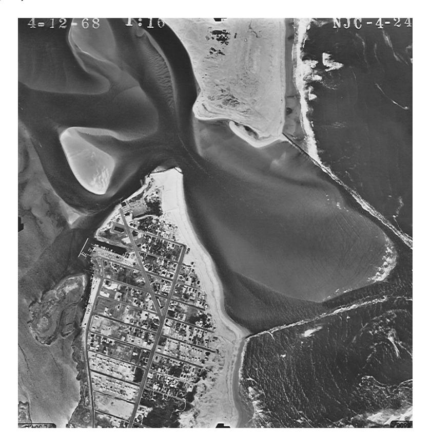

*(a) Arrowhead jetties (November-December 1965)*

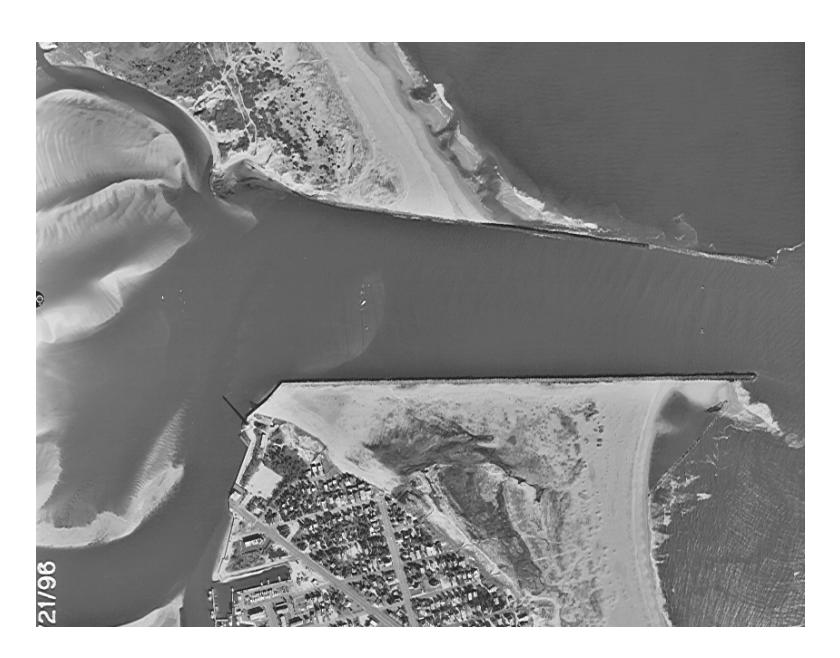

*(b) Parallel jetties (June 1996)*

*Figure V-5-37. Jetty types, Barnegat Inlet, New Jersey*

are specific to each project. A rule of thumb for safe deep-draft navigation is that an entrance width equal to the design ship length is satisfactory for two-way traffic. An overbank area between the channel and jetty is needed to protect the structure toes.
- (3) Training dikes. Training dikes serve to direct current flow in a desired path. A common application is the use of training dikes interior to a jettied inlet to confine currents to the navigation channel and help prevent channel shoaling and erosion of nearby banks and shores. Dikes are usually constructed of stone, timber pile clusters, or piling with stone fill.
- (4) Wave absorbers. Wave energy that penetrates into small boat harbors through entrances or by transmission or overtopping of breakwaters may create serious problems for navigation in interior channels, moored boats, and bank erosion. Excessive wave energy in deep-draft ports can cause similar problems. Wave absorbers are sometimes constructed inside harbors to dissipate this short-period wave energy. Absorbers are generally placed in harbor areas with high concentrations of wave energy.
- (a) Beaches are the most effective wave absorbers. Beach slopes dissipate most wind wave and swell energy and reflect very little energy. However, beaches also occupy a relatively large area and may not be practical. More commonly, rubble slopes serve as wave absorbers in navigation projects. For best efficiency, a stone wave absorber should have a rock layer thickness equal to three times the representative diameter of individual rocks used and porosity should be about 30 percent (LeMéhauté 1965).
- (b) Sometimes rubble slope absorbers are integrated into a dock to provide wave dissipation without interfering with harbor use. Typical applications are an armored slope under a pile-supported dock face or an absorbing quay wall (PIANC 1997b) (Figure V-5-38). Another approach is a perforated wall along the dock face with a vertical solid-wall fill some distance behind the dock face (Figure V-5-39). The optimum porosity for the perforated wall should be around 30 percent and the optimum set-back of the solid wall should be about one tenth of the wave length to be absorbed (LeMéhauté 1965). Molded concrete wave absorber units may also be used along a vertical dock face. Such units have proven effective in model tests for a Great Lakes site (Bottin 1976) (Figure V-5-40), but have not been used in U.S. harbors.

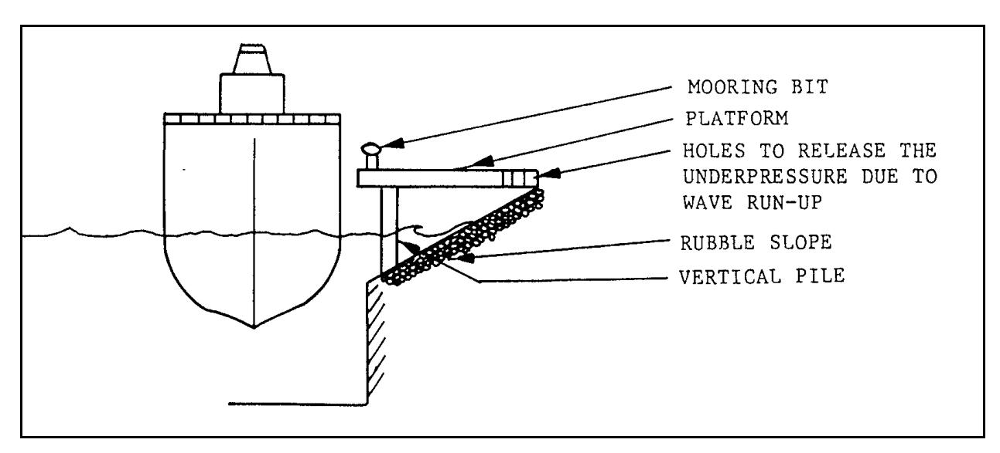

*Figure V-5-38. Rubble wave absorber at a dock*

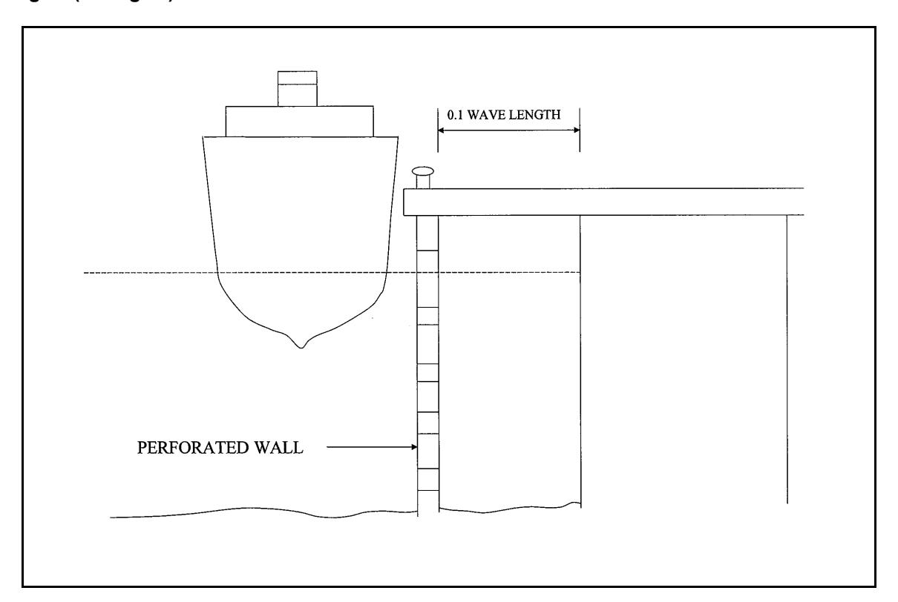

*Figure V-5-39. Perforated wall wave absorber at a dock*

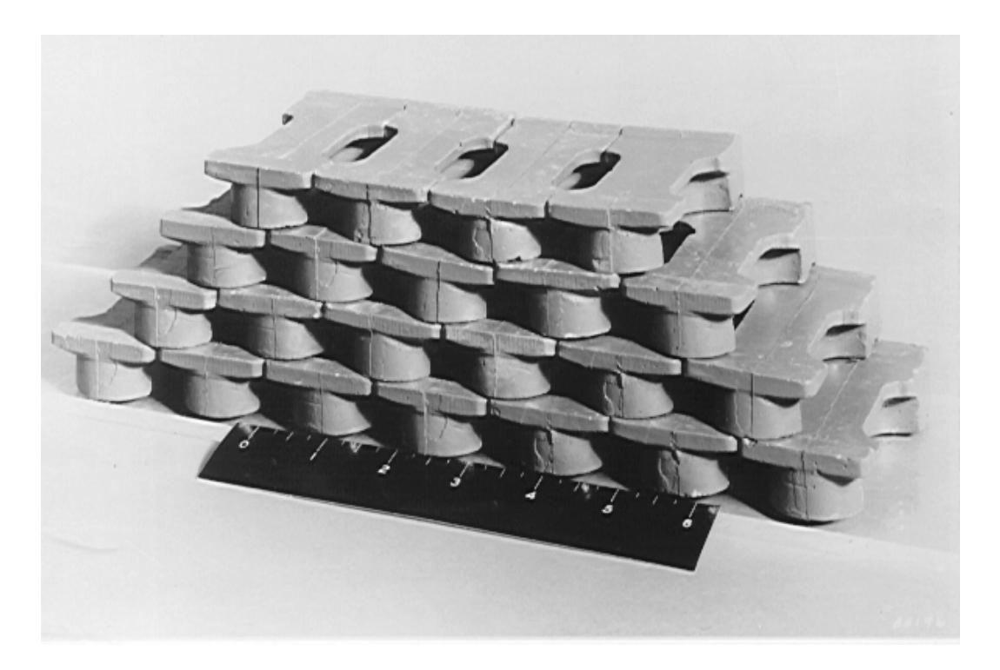

*Figure V-5-40. Stacked Igloo model wave absorber units*

- (5) Revetments, seawalls, and bulkheads. Though not actually navigation structures, revetments, seawalls, and bulkheads are included in, or adjacent to, most harbors. They are briefly reviewed here and discussed in detail in Parts V-3, VI-2, and VI-7. In general, vertical structures are classified as either seawalls or bulkheads, according to their function, while protective materials laid on slopes are called revetments. A seawall is a massive structure that is designed primarily to reduce wave energy and provide wave protection along coastal property. Bulkheads are retaining walls whose primary purpose is to hold or prevent backfill from sliding while providing protection against light-to-moderate wave action.
- (a) Revetments, seawalls, and bulkheads are structures placed parallel, or nearly parallel, to the shoreline to separate a land area from a water area. The purpose of the structure dictates which type is used. In harbors, these structures may improve or worsen wave conditions and land access to beaches, depending on the location and design.
- (b) Vertical structures (seawalls and bulkheads) are useful as quay walls or docking/mooring areas. Because of potential wave reflection problems, bulkheads to provide vessels with direct access to shore should only be placed in areas with little exposure to wave energy. Wave reflection from vertical structures may create hazardous conditions for small craft, erosion of adjacent shorelines, and beach profile changes.
- (c) Revetments are typically less reflective than vertical structures. Rubble revetments may be effective wave absorbers but may hinder access to a beach. Smooth revetments built with concrete blocks generally present little difficulty to pedestrians, but are more reflective than rubble revetments.
- (d) On seawalls and bulkheads, convex-curved face and smooth slopes are least effective in reducing wave runup and overtopping. Concave-curved face structures are most effective for reducing wave overtopping when onshore winds are light. Where the structure crest is to be used as a road, promenade, or other such purpose, concave-curved may be the best shape for protecting the crest and reducing spray. If onshore winds occur with high waves, a rubble slope should be considered to reduce runup and overtopping. A stepped-face wall provides the easiest access to beach areas from protected areas, and reduces the scouring of wave backwash. Some seawalls and bulkheads may create access problems and may require the building of stairs.

#### V-5-8. Aids to Navigation

- (1) Aids to navigation are the markers and signals vessels require to safely use a navigation project. The navigation safety of a project is directly related to the clarity and visibility of aids to navigation. Channel design must be planned so that the layout, dimensions, and alignment facilitate clear marking. A reduced width may be possible in a well-marked channel as compared to a poorly marked channel, so a tradeoff between channel widening cost and aids to navigation cost should be considered in design.
- (2) The U.S. Coast Guard is responsible for the design, establishment, and maintenance of all aids to navigation in Federal interstate waters (U.S. Coast Guard 1981, 1988a, 1988b). Figure V-5-41 gives two examples of typical devices used to mark U.S. navigation channels. They are uniquely identified by color, shape, and number or letter. They may also include lights, sound, radar reflectors, and electronic signals. Beacons are fixed structures, generally on pilings in shallow water up to about the 5-m (15-ft) depth. Buoys are floating, anchored to the bottom with a chain connected to a concrete block. They mark channel boundaries, hazards, and channel curves or turns, especially in areas where water depth makes beacons impractical. Height above the water, and hence visibility, is more limited for buoys than for beacons. Another limitation of buoys is that their location relative to the channel is imprecise. It can vary over a small distance because buoys are free to move about the anchor point in response to environmental forces.

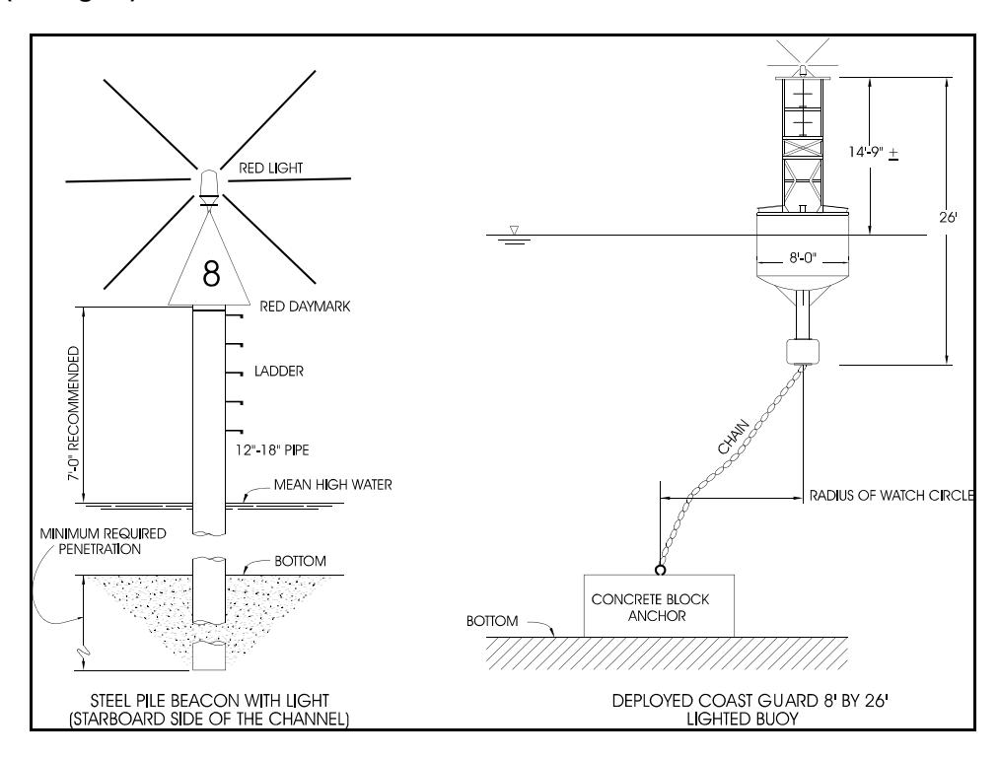

*Figure V-5-41. Examples of aids to navigation*

- (3) Occasionally, buoy/anchor systems are completely moved out of position by strong environmental forces or by vessel impacts. Buoys are also susceptible to sinkage or drifting if mooring connections are lost.
- (4) The channel marking system used in U.S. Federal waters is nearly standardized. Conventions for color, shape, numbers/letters, and light characteristics are well-established. Left and right channel sides are relative to an inbound vessel coming from open water into a harbor. Basically, the left side of the channel is signified by green (paint color and/or lights), squares, and odd numbers (Figure V-5-42). The right side is signified by red, triangles, and even numbers. Numbering begins at the seaward end of the channel.
- (5) Ranges are pairs of fixed structures usually aligned with the channel center line at one or both ends of straight reaches. They are usually on shore or in very shallow water. The rear marker is always higher than the front marker. They are typically marked with rectangular signs, designated by letters, high-intensity lights, and red and white vertical stripes, as indicated in Figure V-5-42. By observing the placement of front and rear markers relative to each other, mariners can determine vessel position relative to the channel center line (Figure V-5-43).
- (6) Additional important aids to navigation along the seacoast include major lights and sea buoys. One or more major lights are located near each harbor entrance. The high-intensity, well-maintained lights are located on fixed structures or towers at heights of up to 60 m (200 ft), sufficient to be visible over a long distance. Electronic aids to navigation are often collocated with major lights. Sea buoys are large, easily visible buoys marking the ocean end of most deep-draft harbor entrance channels. A typical sea buoy is 12 m (40 ft) in diameter and 9 m (30 ft) or more in height, with high-intensity light, electronic aids, and a sound signal. Sea buoys are usually located in deep water on the channel center line extended 2 to 4 km (1 to 2 miles) seaward beyond the channel's seaward end. Often the sea buoy marks an area where inbound ships await local pilot assistance.

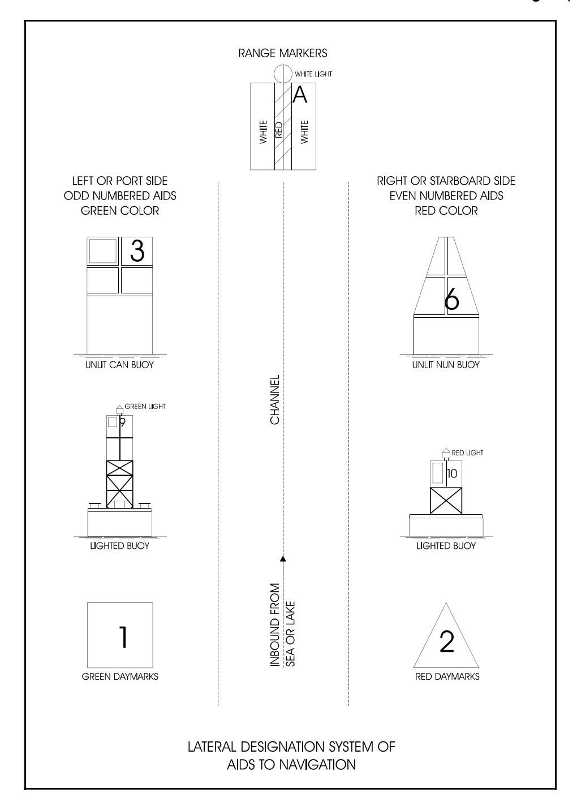

*Figure V-5-42. Designation system of aids to navigation*

(7) Aids to navigation are normally placed along straight channel reaches so that at least two on either side are always visible. This consideration leads to a practical maximum spacing of about 2.3 km (1.25 n.m.). Range markers must be visible along the entire reach. Practical limitations on range marker height, visibility through fog, and earth curvature effect on line of sight dictate that straight channel reaches should be no longer than about 8 to 10 km (5 to 6 miles). It is good practice to have redundant aids to navigation, such as both range markers and side channel markers, to ensure that failure of a marker will not create a navigation crisis.

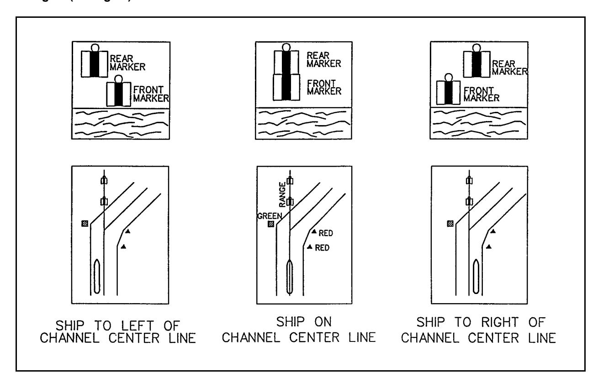

*Figure V-5-43. Use of ranges for channel position*

(8) An example deep-draft navigation channel at Brunswick Harbor, Georgia, is shown in Figure V-5-44 (Huval and Lynch 1998). The entrance channel begins near a sea buoy in exposed Atlantic Ocean waters, passes between St. Simons and Jekyll Islands, makes a severe turn to pass behind Jekyll Island, and continues with additional turns up the Brunswick River to port facilities at Brunswick. The channel also passes under the Sidney Lanier Bridge. Navigation buoys and range markers are shown.

#### V-5-9. Operation, Monitoring, and Maintenance

- a. After a navigation project has been designed and constructed, operation and maintenance are required to sustain safe and efficient use of the project. Operation and maintenance requirements and costs can be substantial. They are typically estimated with care and optimized against initial construction costs in planning and designing a navigation project. Anticipated maintenance costs are based on predictions of physical changes after the project is constructed.
- b. A completed navigation project must be monitored to ensure safe operation and to plan for maintenance activities as needed (see Part V-2-17). Monitoring typically includes hydrographic surveys, beach profile surveys, tide and wave data collection, and navigation structure condition surveys. Surveys are typically done on a planned schedule, such as annually, and before and after periods of maintenance and repair. Surveys should be analyzed comparatively to determine rates of erosion, shoaling, and structure deterioration.
- c. Often, periodic dredging to maintain project depths is the major maintenance need. Maintenance dredging intervals depend on factors such as shoaling rate, dredge availability, and dredge mobilization costs.

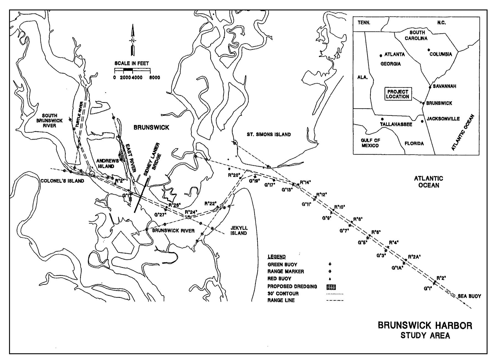

*Figure V-5-44. Deep-draft navigation channel, Brunswick Harbor, Georgia*

- d. Typical maintenance intervals are on the order of 1-3 years at some projects, but maintenance needs are often strongly influenced by storm events. However, environmental forces impacting a navigation project are highly variable. The number and intensity of storms affecting a project each year can only be predicted in terms of probabilities. A single severe storm can cause major shoaling and structure damage. Consequently, monitoring and maintenance activities may occasionally need to respond quickly to maintain project integrity.
- e. Project performance should be assessed, based on monitoring data. Actual project performance should be evaluated relative to project expectations during original design. In particular, actual maintenance costs should be compared to those originally predicted. Coordination with local interests, including boaters, pilots, port authorities, etc., should also be part of project performance assessment. Monitoring, maintenance, and performance assessment should continue at an appropriate level for the life of the project.

## V-5-10. Model and Specialized Field Studies

- a. Harbor modeling . Physical and numerical harbor models are important design tools that can help the designer: Locate the project to ensure maximum wave protection; locate and design breakwaters and/or jetties to provide adequate protection and maintain entrance navigation channels; and locate, orient, and dimension navigation openings to provide vessels safe and easy passage into and out of a harbor without sacrificing wave protection; position spending beaches and other forms of wave absorbers inside the project area. Physical and numerical modeling tools are helpful in developing and optimizing harbor designs. When compounded with problems caused by nearby or adjacent rivers, and/or shoaling problems resulting from littoral transport, and/or harbor oscillation problems relative to long-period wave energy, the designer encounters difficulty in obtaining adequate answers strictly by analytical means. One or both of these tools should be applied when a study has large economic consequences. Even small harbor studies generally benefit from model studies.
- (1) Physical modeling as a design tool. Hydraulic scale models are commonly used to plan harbors and to design and lay out breakwaters, jetties, groins, absorbers, etc., to obtain optimum harbor protection and verify suitable project performance. A detailed description of physical modeling related to coastal ports and harbors is given by Hudson et al. (1979). Physical hydraulic model studies may be used to study the following: The most economical breakwater and/or jetty configurations that will provide adequate wave protection and navigation channel control for vessels using the harbor. Wave heights in the harbor. Undesirable wave and current conditions in the harbor entrance. Proposals to provide for harbor circulation and/or flushing. Qualitative information on the effects of structures on the littoral processes. Flood and ice flow conditions. Shoaling conditions at harbor entrances. River flow and sediment movement in rivers that may enter in or adjacent to the harbor.
- Long-period oscillations (Part II-7).
- Tidal currents or seiche-generated currents in the harbor (Part II-7).
- Inlet entrances.
- Remedial plans for alleviation of undesirable conditions as found necessary.
- Possible design modifications to significantly reduce construction costs and still provide adequate harbor protection.
- (a) To ensure accurate reproduction of short-period wave and current patterns (i.e., simultaneous reproduction of both wave refraction and wave diffraction), undistorted models (i.e., vertical and horizontal scales are the same) are necessary for harbor studies. Physical hydraulic models are designed and operated in accordance with Froude's model law (Stevens et al. 1942). Scale relations commonly used for undistorted physical models are shown in Table V-5-13. A scale of 1:100 is used for illustrative purposes.

**Table V-5-13. A scale of 1:100 is used for illustrative purposes.**

| Characteristic | Dimension1 |  | Scale |  | Relations |
| --- | --- | --- | --- | --- | --- |
| Length | L | Lr | = | 1:100 |  |
| Area | L2 | Ar | = | Lr 2 = | 1:10,000 |
| Volume | L3 | œr | = | Lr 3 = | 1:1,000,000 |
| Time | T | Tr | = | Lr 1/2 | = 1:10 |
| Velocity | L/T | Vr | = | Lr 1/2 | = 1:10 |
| Roughness (Manning’s coefficient, | L1/6 | nr | = | Lr 1/6 | = 1:2,154 |
| n) |  |  |  |  |  |
| Discharge | L3/T | Qr | = | Lr 5/2 | = 1:100,000 |
| Force (fresh water) | F | Fr | = | Lr 3(r | = 1:1,000,000 |
| Force (salt water) | F | Fr | = | Lr 3(r | = 1:1,025,641 |
| 1 Dimensions are in terms of length | (L), time (T), and force (F). |  |  |  |  |

**Table V-5-13. A scale of 1:100 is used for illustrative purposes.**

| Characteristic | Dimension1 |  | Scale |  | Relations |
| --- | --- | --- | --- | --- | --- |
| Length | L | Lr | = | 1:100 |  |
| Area | L2 | Ar | = | Lr 2 = | 1:10,000 |
| Volume | L3 | œr | = | Lr 3 = | 1:1,000,000 |
| Time | T | Tr | = | Lr 1/2 | = 1:10 |
| Velocity | L/T | Vr | = | Lr 1/2 | = 1:10 |
| Roughness (Manning’s coefficient, | L1/6 | nr | = | Lr 1/6 | = 1:2,154 |
| n) |  |  |  |  |  |
| Discharge | L3/T | Qr | = | Lr 5/2 | = 1:100,000 |
| Force (fresh water) | F | Fr | = | Lr 3(r | = 1:1,000,000 |
| Force (salt water) | F | Fr | = | Lr 3(r | = 1:1,025,641 |
| 1 Dimensions are in terms of length | (L), time (T), and force (F). |  |  |  |  |

- Dimensions are in terms of length (L), time (T), and force (F).
- (b) Selection of a suitable model scale is an important step in model design. It involves a trade-off between scale effects and construction costs. For short-period wave studies, the model area generally includes enough offshore area and bathymetry to allow waves to refract properly on approaching the harbor and enough upcoast/downcoast area to allow the littoral current to form. Model waves must be large enough to be free from excessive friction and surface tension and to be measured with reasonable accuracy. Typical scales are between 1:75 and 1:150. For long-period wave studies (periods longer than about 25 sec), larger prototype areas are generally needed to include relevant interactions with bay or coastal shelf bathymetry. Also, long-period waves tend to reflect from model basin boundaries and the model harbor should be far from these boundaries. Long-period wave studies usually require distorted-scale models, with unequal horizontal and vertical scales. For example, a USACE model of Los Angeles/Long Beach Harbor, in use since the 1970's has a vertical scale of 1:100 and a horizontal scale of 1:400.
- (c) Small-scale models must be constructed very accurately to reproduce conditions in the prototype. The model should reproduce underwater contours to model wave transformation. Shoreline details and irregularities also are important to simulate diffraction, runup, and reflection. The model bed should be as
smooth as possible to minimize viscous scale effects. However, models involving estuary tidal flows and/or river flows typically require the addition of bottom roughness in those areas to correctly simulate flow conditions. When a model involves breakwater or jetty structures, model armor and underlayer stone sizes are adjusted, based on previous research and experience, to reproduce prototype transmission and reflection characteristics. Structure stability is generally not reproduced in harbor models.
- (d) The reproduction of river discharges and steady-state tidal flows often is required in wave action model studies. These flows generally are reproduced using circulation systems (i.e., for a river discharge, water is normally withdrawn from the perimeter of the model pit area and discharged in a stilling basin that empties into the upper reaches of the river and flows downstream in the model).
- (e) Reproducing the movement of sediment in small-scale coastal model investigations is very difficult (Hudson et al. 1979). Ideally, quantitative, movable-bed models best determine the effectiveness of various project plans with regard to the erosion and accretion of sediment. This type of investigation, however, is difficult and expensive to conduct and entails extensive computations and prototype data. In view of these complexities and due to time and funding constraints, most models are molded in cement mortar (fixed-bed) and a tracer material is selected to qualitatively determine the degree of movement and deposition of sediments in the study area. In past investigations, tracer was chosen in accordance with the scaling relations of Noda (1972), which indicates a relation or model law among the four basic scale ratios: horizontal scale, vertical scale, sediment size ratio $(d_{50}$ model tracer material divided by $d_{50}$ prototype sediment), and relative specific weight ratio. These relations were determined experimentally using a wide range of wave conditions and bottom materials, and they are valid mainly for the breaker zone. This procedure was initiated in the mid-1970's, and has been successful in reproducing aspects of prototype sediment movement as evidenced by the performance of completed projects that have been studied (Bottin 1992). Currently, research is being performed to better understand aspects of sediment movement and improve methods to model it, and scaling relations have been developed for mid-scale, two-dimensional model tests (Hughes and Fowler 1990).
- (f) After model construction, representative test conditions must be selected. Wave height and period characteristics, direction of wave approach, and frequency of occurrence are typically needed. Refraction analyses are normally required to transform deepwater waves to shallow water at the location of the model wave generator. From this point, model bathymetry will transform the waves to the harbor area. Still-water levels (swl's) are also important test conditions. Normally more wave energy reaches a harbor with the higher swl's. Lower swl's may result in more seaward movement of longshore sediment (i.e. around a jetty head), since the breaker zone would be moved farther offshore. Dominant movement of wave-induced currents and sediment transport patterns are required for verification of the model. River discharge and/or tidal flow information is also required, if applicable to the study.
- (g) Data collected in a physical model include time series measurements at selected points of water surface elevation and, when needed, current. Spatial current patterns and velocities can be estimated by timing the progress of weighted floats over known distances on the model floor. Photographs and videotapes of experiments in progress provide valuable visual documentation of wave transformation patterns, wave breaking, sediment movement, etc.
- (2) Example: Dana Point Harbor, California . Dana Point Harbor, located on the southern California coast about 64 km (40 miles) southeast of the Los Angeles/Long Beach Harbors, is an example of a small craft harbor designed with the aid of physical modeling (Figure V-5-45). The harbor occupies a small cove in the lee of Dana Point. The harbor consists of a 1,676-m- (5,500-ft-) long west breakwater, a 686-m- (2,250-ft-) long east breakwater, and inner harbor berthing areas partially enclosed by the shoreline and mole sections. The harbor encloses an area of about 0.85 sq km (210 acres) and provides berthing facilities for about 2,150 small boats.

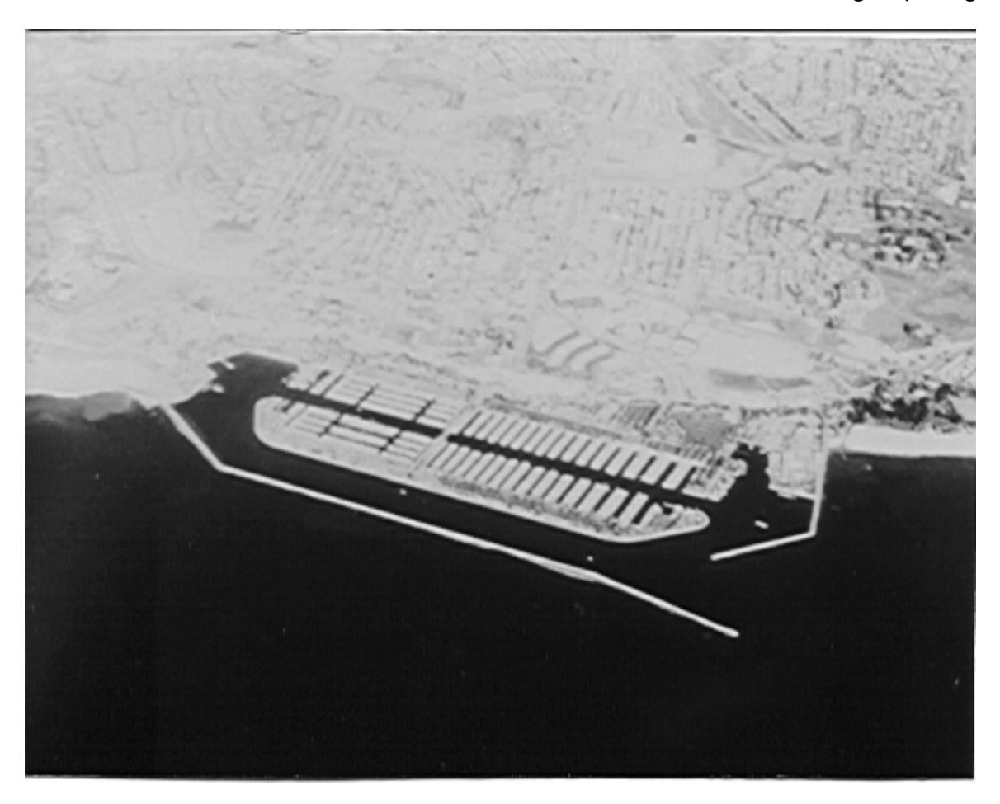

*Figure V-5-45. Dana Point Harbor, California (May 1969)*

- (a) The area is exposed to storm waves from directions ranging from southwest counterclockwise to south-southeast and to ocean swells from the south. Damaging wave energy may reach the berthing areas by passing through the outer navigation entrance and by overtopping and/or passing through the rubblemound breakwaters.
- (b) As part of the original design effort, a 1:100-scale hydraulic model investigation was conducted to determine the optimum breakwater plan and location and size of the navigation opening that would provide adequate protection for mooring areas during storms (Wilson 1966). Waves with periods ranging from 9 to 18 sec and heights ranging from 2.4 to 5.5 m (8 to 18 ft) were generated from eight deepwater directions using an swl of +2.0 m (+6.7 ft) mllw. A wave height acceptance criterion of 0.46 m (1.5 ft) was established in the harbor berthing areas by the sponsor and waves in the fairway were not to exceed 1.2 to 1.5 m (4 to 5 ft).
- (c) Experiments were conducted for existing conditions and 13 plans. Results for existing conditions indicated rough and turbulent conditions in the area even for low-magnitude storm waves. The proposed improvement plan involved construction of outer breakwaters and inner-harbor development consisting of east and west basin berthing areas partially enclosed by the shoreline on the north and a mole section on the south, southeast, and southwest (Figure V-5-46).

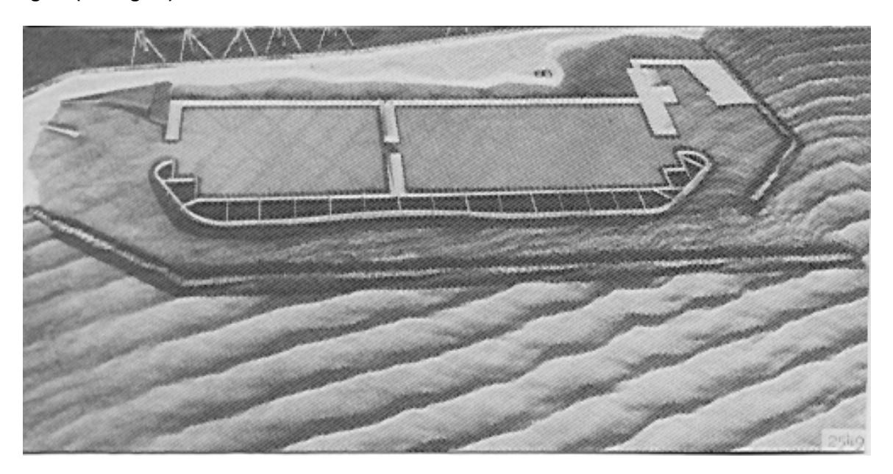

*Figure V-5-46. Physical model view of Dana Point Harbor, California, under storm wave attack*

- (d) Experimental results indicated that wave conditions in the berthing areas were acceptable; however, wave heights in the fairway were about 2.0 m (6.5 ft) for severe storm wave conditions. It was noted that these conditions were due to a standing wave system caused by reflected waves from the mole slopes. Experimental results revealed that modifying the mole slope flanking the fairway, to include a berm, would reduce wave action considerably in the fairway.
- (e) The harbor was constructed in accordance with recommendations from the physical model investigation. Post-construction monitoring has shown the harbor is performing as predicted. Mooring areas have experienced no wave problems. The outer west breakwater is overtopped by storm waves, which propagate across the interior channel to the outer revetted mole slope. Vessels in mooring areas behind the moles remain protected. The harbor has successfully endured intense storms, when other southern California small- craft harbor facilities have been severely damaged.
- (3) Numerical modeling as a design tool. Numerical modeling requires computerized solution of equations that approximate harbor response to imposed natural forces. Numerical models and computer technology have evolved to the point where useful modeling of actual harbors can often be conveniently done on microcomputers. Numerical models are helpful in harbor studies, even for relatively simple harbor shapes. A combination of physical and numerical modeling is usually preferred for investigating the full range of conditions in a harbor. Numerical modeling related to harbors is best discussed in terms of the natural phenomenon to be modeled, such as waves, circulation, and shore response. Each model's equations and input/output forms are developed for application to particular phenomena. Model systems are now available that provide convenient access to a variety of modeling options under a single user-friendly interface (e.g. SMS 1994).
- (a) Wind waves, swell, and harbor oscillations. Numerical wave models can be effectively applied to wave periods ranging from wind waves to long-period harbor oscillations. Numerical models have been useful for: Very long-period wave studies; initial evaluations of harbor conditions; comparative studies of harbor alternatives; and revisiting harbors documented previously with field and/or physical model data.
- For example, numerical models have been used effectively to select locations for field wave gauges (to achieve adequate exposure and avoid oscillation nodes) and to identify from many alternatives a few promising harbor modification plans for fine-tuning in physical model tests. Lillycrop et al. (1993) suggested that numerical modeling is preferable to physical modeling for oscillation periods longer than 400 sec. Both modeling tools can be used effectively for shorter period oscillations.
- Numerical wave modeling concerns are discussed in the following paragraphs, followed by an illustrative example. Additional information on numerical modeling of waves in harbors is available from a number of sources (e.g., Panchang, Xu, and Demirbilek (1998)).
- An initial step in modeling a harbor is to define the area to be covered and required horizontal resolution in the model grid. The coverage area should include the harbor and an area seaward encompassing bathymetry important for waves approaching the harbor. The seaward boundary should be a minimum of several wavelengths away from the harbor entrance, based on the longest wave periods to be modeled. Horizontal resolution is determined by the wavelength of the shortest wave period to be modeled. Typical resolution requirements are between L /6 and L /15 as the maximum grid element width. If grid elements are uniform in size over the entire grid, L should be based on the shallowest depths of interest. Depending on the particular study and grid-building software available, it may be preferable to build a grid with element sizes varying according to water depth, but still satisfying the wavelength-based maximum size criterion. Computer demands (memory, processing time, storage) in running a harbor model are directly linked to the total number of grid elements. Most harbor studies require a trade-off between coverage area and grid resolution to achieve a workable grid.
- Numerical models applied to harbors are usually based on a form of either the mild slope equation (MSE) or Boussinesq equations. Development of the equations is given by Dingemans (1997), Mei (1983), and others. MSE models are typically steady-state. The MSE model calculates an amplification factor (ratio of local wave height to incident wave height) and phase (relative to the incident wave) for every node in the grid. The MSE does not incorporate spectral processes. Typically, MSE models are run with a representative set of wave height, period, and direction combinations, based on knowledge of incident wave climate. If the MSE is linear, a single wave height for each period/direction combination will suffice. For wind wave and swell applications, regular wave results from the MSE model may be linearly combined, with appropriate weightings, to simulate harbor response to directional wave spectra.
- Boussinesq models are nonlinear and time-dependent. They are forced with an incident wave time series on the seaward boundary and produce a time series of wave response at each node in the grid. The time series may represent regular or irregular wave conditions. Boussinesq models are capable of more accurate representation of harbor wave response than MSE models, at the price of considerably greater computational demands. They are warranted in some practical studies and, with continuing intensive research and development, are likely to become a more workable option in the near future.
- Results from numerical harbor models are in the form of information at selected points or over the entire grid. Point information from Boussinesq models is comparable to time series from field or physical model wave gauges and may be analyzed in similar ways. Spatial information from Boussinesq models can provide animated displays of waves approaching, entering, and interacting with the harbor. Snapshots of waveforms over the harbor at selected times can easily be extracted for still displays. Spatial information from MSE models is in the form of snapshots of amplification factor and phase over the harbor area. Animated displays can be created by expanding amplification factor and phase information into sinusoidal wave time series, if desired.
- (b) Example: Kikiaola Harbor, Kauai, Hawaii . Kikiaola Harbor is a small, shallow-draft harbor, located along the western part of the Kauai's south shore (Figure V-5-47). The original harbor consisted of west and east breakwaters. The harbor experienced excessive waves, resulting in the addition of inner and outer stub extensions to the east breakwater and a short inner breakwater. A wharf and boat ramp are located along the north boundary of the harbor, east of the inner breakwater. Prevailing northeast tradewinds result in a strong predominance of winds from the northeast, east, and southeast at the harbor. Typical wind speeds are 5 to 10 m/sec (10 to 20 mph). Winter storms can generate strong winds from the south. The harbor is exposed to waves approaching from a sector between the 134- and 278-deg azimuths, though the small island of Niihau creates some sheltering in the western exposure. Southern swell, generated by storms in the southern Pacific and Indian Oceans, is a significant part of the wave climate. Also, waves generated by storms in the North Pacific can wrap around the western side of Kauai and affect Kikiaola Harbor. Hurricanes can attack the harbor, which is important for structure design; but they are rare and do not impact operational concerns. Use of the existing harbor is limited by two primary factors. First, the harbor is quite shallow. Sediment movement along the local coast, predominantly from east to west, has resulted in shoaling of the entrance and inner harbor. Second, the existing entrance experiences breaking wave conditions that are hazardous to navigation. These two factors are interrelated. Breaking waves are more likely in the existing, shoaled entrance than they would be in a deeper, maintained entrance channel. Two plans for modifying the breakwater structures and navigation channels were defined, as follows (Figure V-5-48): Plan 1 . Remove outer stub of east breakwater; remove and reconstruct inner stub of east breakwater a small distance further east; raise crest elevation of exposed portions of east breakwater by 1 m (3-4 ft) and flatten seaward slope to 1:2; widen outer 67 m (220 ft) of west breakwater; dredge 221-m- (725-ft-) long entrance channel with width varying from 32 to 62 m (105 to 205 ft) and maneuvering area to facilitate a 90-deg turn into access channel; dredge 98-m- (320-ft-) long access channel varying in width from 21 to 32 m (70 to 105 ft). Plan 6 . Remove outer and inner stubs of east breakwater; raise crest elevation of exposed portions of east breakwater by 1 m (3-4 ft) and flatten seaward slope to 1:2; extend east breakwater further west to a distance of 33 m (100 ft) past the existing west breakwater location; shorten west breakwater to allow space for access channel; dredge entrance and access channels comparable to those in Plan 1. A numerical model study was initiated to investigate wave conditions in the proposed plans relative to the existing harbor and to USACE criteria for channels and berthing areas (Thompson et al. 1998b). An MSE-based numerical model was used to analyze the harbor area (Chen and Houston 1987). Because water depths are shallow (on the order of 1 m in the existing harbor) and the shortest wave period to be modeled was 6 sec, a dense grid was required. To maintain a workable grid size for the model being used, the offshore extent of the grid was significantly limited and could not reach deep water.

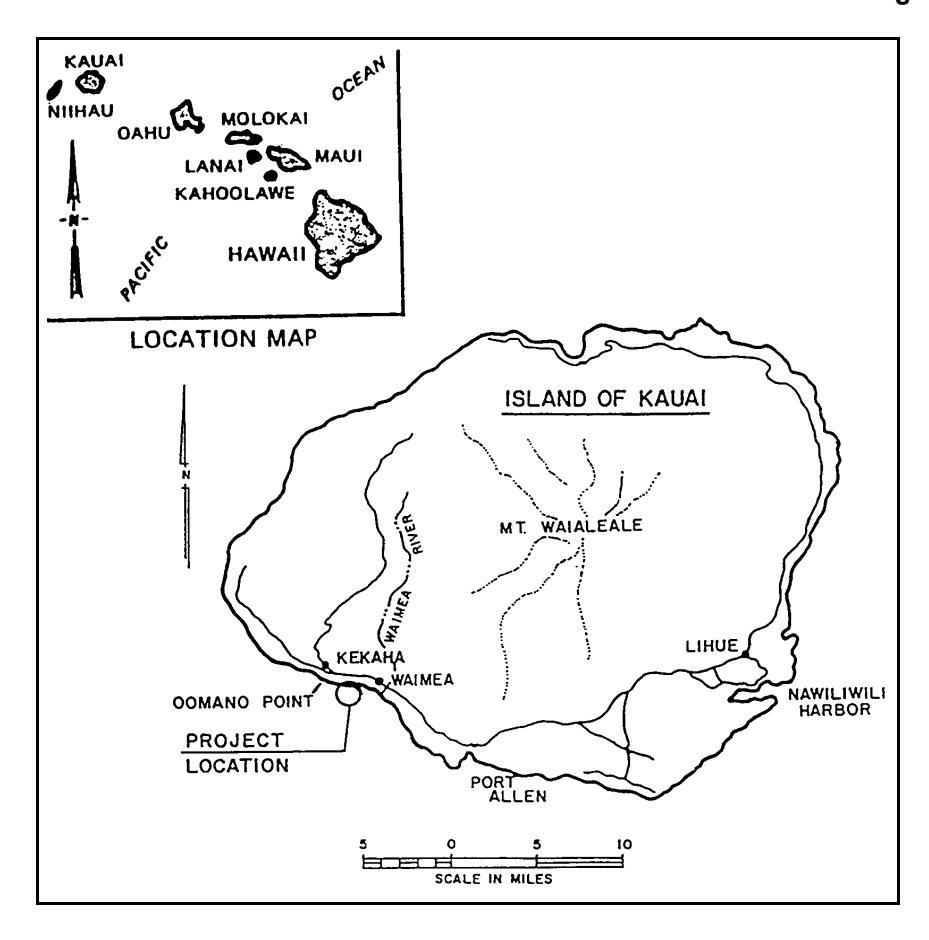

#### (a) Location map

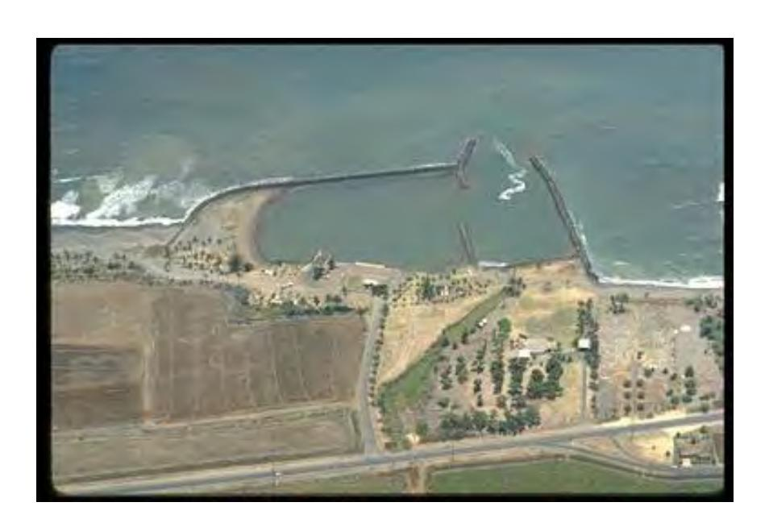

(b) Photograph (1998)

*Figure V-5-47. Kikiaola Harbor, Kauai, Hawaii*

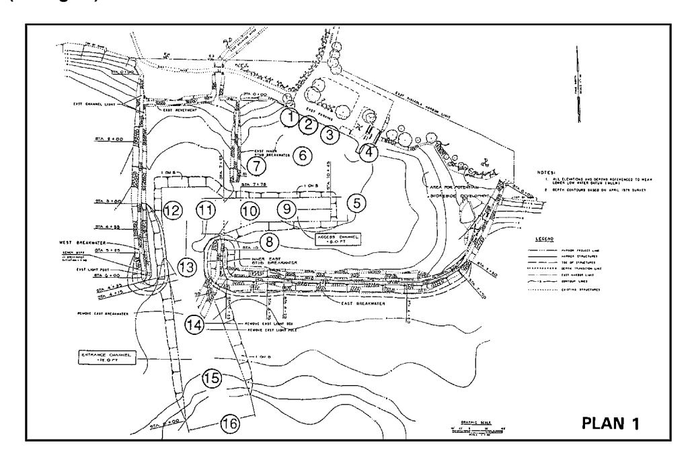

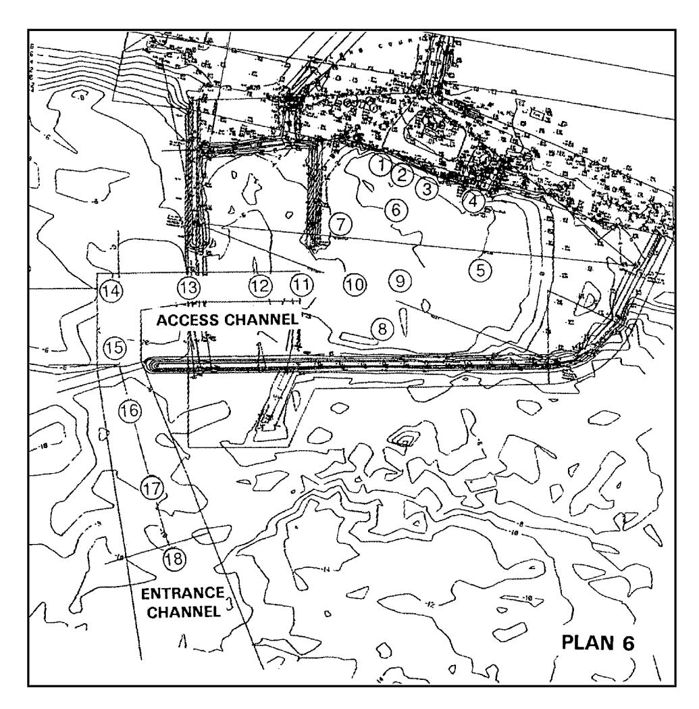

*Figure V-5-48. Kikiaola Harbor alternative plans and model stations*

- Wave climate at the seaward boundary of the harbor model grid was developed from updated WIS hindcasts in the Pacific OceanAugust 7, 2000. An additional modeling step accounted for sheltering by the islands of Kauai and Niihau as waves approach the harbor. Deepwater wave information was estimated at a point 1.6 km (1 mile) offshore from Kikiaola Harbor. Then, a shallow water transformation model was used to provide wave estimates at the seaward harbor model boundary, at about the 4-m (13-ft) water depth.
- The harbor model grid for the existing harbor consisted of 24,227 elements and 12,461 nodes. Model parameters, including boundary reflection coefficients and bottom friction, were set appropriate to the harbor configuration and model requirements. The tide range at Kikiaola Harbor is about 0.3 m (1 ft). Since harbor response is unlikely to vary much with water level over this small range, a water level of +0.3 m (+1 ft) mllw was used in all runs, representing a high tide condition.
- Wind wave and swell cases were periods ranging from 6 to 22 sec, in 1-sec increments, and approach directions of 164-, 184-, and 204-deg azimuths, representing the range of incident wave directions and entrance exposures. A linear form of the model was used (bottom friction set to zero), so a nominal 0.3-m (1-ft) wave height with each period/direction combination was sufficient. Thus, a total of (17 periods)x(3 directions) = 51 cases was run in the harbor model. Spectral results for each Tp and θp needed to represent the incident wave climate were simulated by linearly combining the 51 cases with appropriate weightings based on a JONSWAP spectrum with $\cos^{2s}$ directional spreading.
- Snapshots of amplification factor and phase for one incident wave condition illustrate harbor response (Figure V-5-49). A nonspectral condition is shown so that phases can be presented. The amplification factor increases over shoal areas just west of the entrance channel and then steadily decreases as the waves progress through the entrance and into the inner harbor. Plans 1 and 6 provide more shelter to the inner harbor than does the existing plan. Phase lines in the figure show the alignment of wave crests. They give a visual representation of diffraction and shoaling effects on wave direction and length as the 12-sec waves interact with harbor structures and bathymetry.
- Standard operational criteria used by USACE for wind waves and swell in small-craft harbors are:
- Hs in berthing areas will not exceed 0.3 m (1 ft) more than 10 percent of the time.
- Hs in access channels and turning basins will not exceed 0.6 m (2 ft) more than 10 percent of the time.
- To compare with USACE wave criteria, between 15 and 18 stations were selected in each plan, to include the wharf area, berthing area, access channel, and entrance channel (Figure V-5-48). Stations in the existing plan are identical to those shown for Plan 1 except the entrance channel stations are shifted appropriately. Spectral amplification factors were computed and applied to each incident Hs to give a wave climate at each station. The value of $H_{s}$ exceeded 10 percent of the time was computed at each station. Results for Stations 1-9 are compared to the USACE berthing area criterion and the remaining stations to the USACE access channel criterion (Figure V-5-50). All plans, including the existing, satisfied the berthing criterion at all stations. The inner channel satisfies the channel criterion in all plans. The existing entrance channel does not meet the criterion; and the seaward portions of the Plan 1 and Plan 6 entrance channels slightly exceed the criterion. In conjunction with the increased width of the outer part of the plan entrance channels, the small exceedance of the USACE channel criterion is unlikely to interfere with safe navigation.

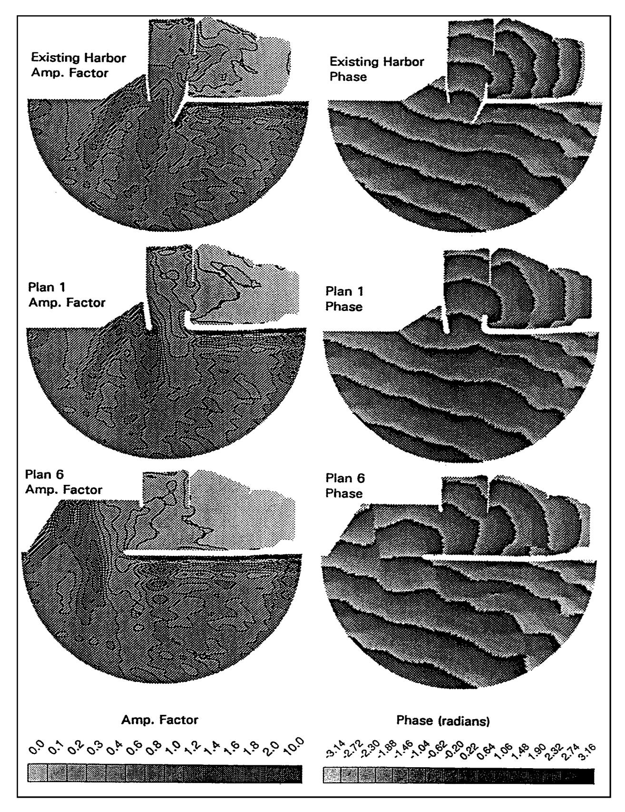

*Figure V-5-49. Amplification factor and phase contours, 12-sec wave period, 200-deg azimuth approach direction, Kikiaola Harbor*

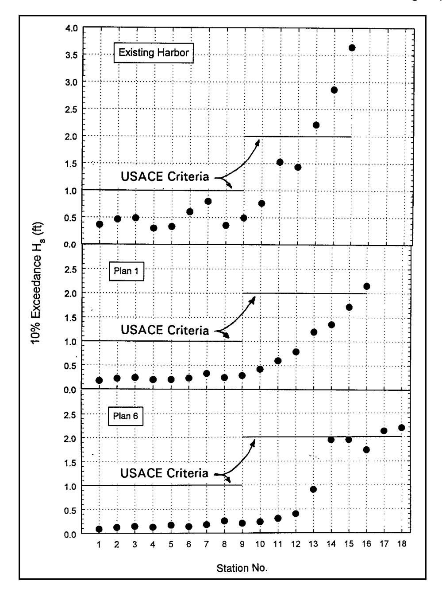

*Figure V-5-50. Comparison of $H_{s}$ exceeded 10 percent of the time, Kikiaola Harbor*

• Harbor oscillation characteristics of the existing and plan harbors were also investigated to ensure the plans would not have operational problems due to oscillations. Model parameters were changed to give constant, nonzero bottom friction and full reflection from harbor boundaries. A total of 451 long-wave periods were run, ranging from 25 to 500 sec. The frequency increment between periods was 0.0001 Hz up to a period of 80 sec and 0.00006 Hz for longer periods. Fine resolution in frequency is needed to ensure that resonant peaks are captured. One long wave height is used, representing a moderately energetic long wave case, based on measurements at another Hawaiian harbor. One long wave direction, directly approaching the harbor entrance, is used, since past studies have indicated that harbor response is relatively insensitive to incident long wave direction.
• A snapshot of amplification factors in the existing harbor for a long-period resonance at a period of 150.6 sec represents a simple oscillation between the outer harbor and the east part of the inner harbor (Figure V-5-51). A node (indicated by very low amplification factor) is located a little east of the inner harbor entrance. Considering the most active areas of operational concern, amplification factors at the boat ramp (sta 4) and in the outer harbor (sta 12) were 2 and 3, respectively. A simple basis for judging the operational importance of harbor oscillation amplification factors is given in Table V-5-14 (Thompson, Boc, and Nunes 1998). Thus, the 150.6-sec resonance is not expected to be a problem in operational areas for boats. All amplification factors in all plans across the full range of long-wave periods were significantly less than 5, indicating that harbor oscillations are not a problem in the plan harbors. Additional information on numerical modeling of harbor oscillations is presented in Part II-7-5-f.

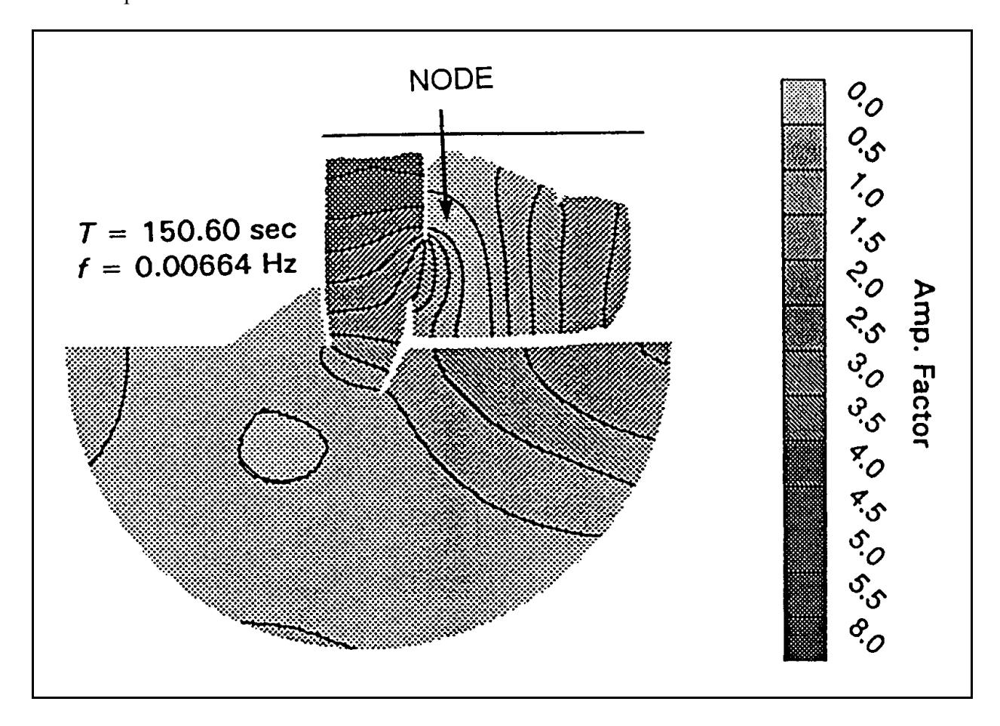

*Figure V-5-51. Resonant long wave amplification factor contours, existing Kikiaola Harbor*

**Table V-5-14. (Thompson, Boc, and Nunes 1998). Thus, the 150.6-sec resonance is not expected to be a problem in operational areas for boats. All amplification factors in all plans across the full range of long-wave periods were significantly less than 5, indicating that harbor oscillations are not a problem in the plan harbors. Additional information on numerical modeling of harbor oscillations is presented in Part II-7-5-f.**

| Amplification Factor | Operational Impact |
| --- | --- |
| > 5 | Some problems |
| > 10 | Major problems V-5-78 Navigation Projects |

- (c) Flushing and circulation. Numerical models are effective for evaluating flushing and circulation in harbors and entrances due to forces such as tides and wind. This application is discussed in Part II-7. Numerical models also provide detailed currents along navigation channels needed in ship simulations.
- (d) Example: Maalaea Harbor, Maui, Hawaii. Maalaea Harbor is a south-facing small-craft harbor located on the southwest coast of the Island of Maui (Figure V-5-52). The harbor facility consists of a 27-m- (90-ft-) wide, 3.7-m- (12-ft-) deep entrance channel and a 0.05-sq-km (11.3-acre) dredged basin. The harbor is protected by a 30-m- (100-ft-) long, 27-m- (90-ft-) wide breakwater on the south side and a 265-m- (870-ft-) long breakwater on the east side. A 91-m- (300-ft-) long paved wharf is located at the shore opposite the entrance. The west and central parts of the harbor are small-craft berthing areas.

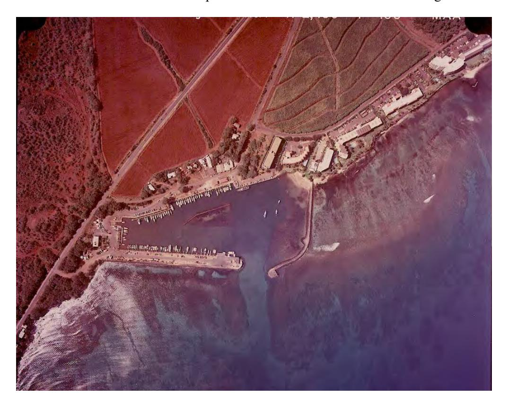

*Figure V-5-52. Maalaea Harbor, Maui, Harbor (from Air Survey Hawaii, March 1984)*

- • In response to needs for increased berthing space and better protection during severe wave conditions, the U.S. Army Engineer Division, Pacific Ocean, conducted studies to develop and evaluate harbor modification plans. To evaluate potential impacts on water quality in the harbor, a numerical model circulation and flushing study was conducted for the existing harbor and two proposed plans (Wang and Cialone 1995).
- • Circulation in Maalaea Harbor is forced by tide and persistent, often strong winds from the north and northeast. Prototype data were collected over a 9-day period, including currents at two locations and tide. Concurrent wind measurements were available from a nearby airport.
• The numerical model used a curvilinear boundary-fitted coordinate system to generate a computational grid with two vertical layers. It provides current vectors over the harbor and a larger area outside the harbor (Figure V-5-53). The average horizontal grid cell size is 15 m (50 ft). The model is time-dependent, driven with time series of surface elevation along the seaward boundary and wind over the grid surface. Prototype data were used to calibrate the model. Parameters adjusted during calibration include friction, drag, and mixing coefficients.

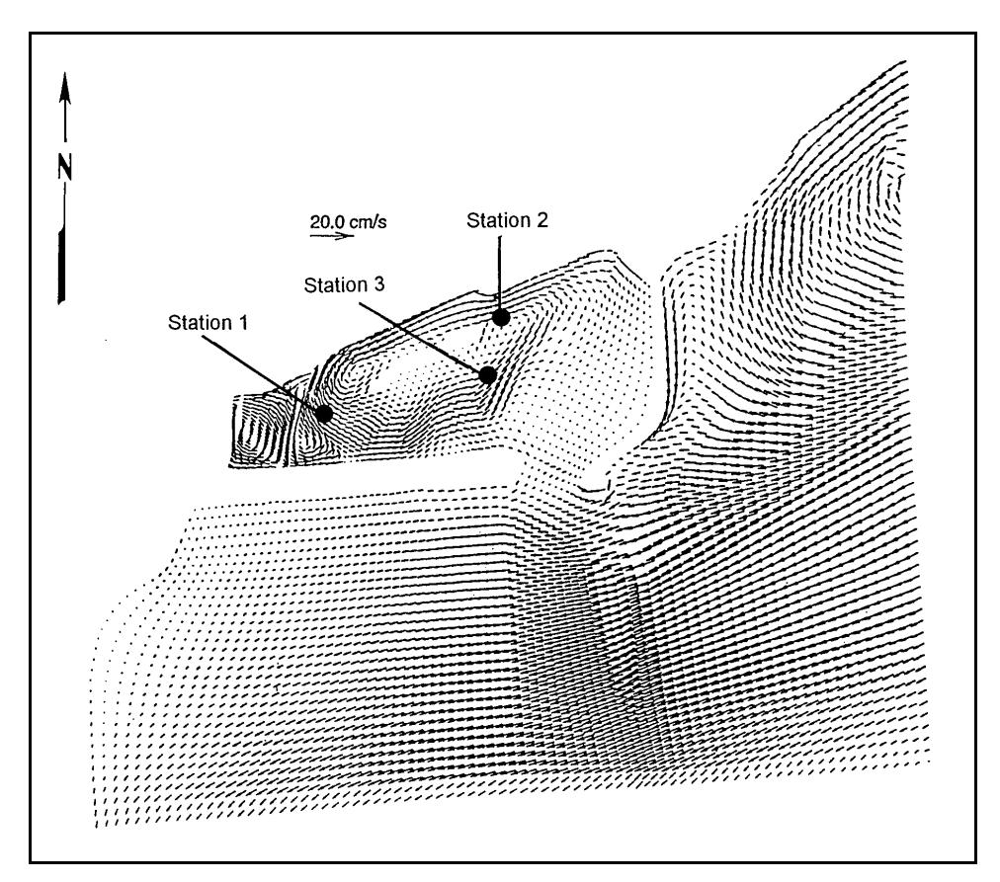

*Figure V-5-53. Station locations and surface layer circulation snapshot at Day 3, Maalaea Harbor, existing plan*

- • Flushing time was defined as the time required for a conservative tracer to decrease to 36.8 percent (1/ e , e = 2.71828) of its initial concentration. This time was evaluated in each plan by beginning a simulation with constant concentration of 100 ppt (parts per thousand) in the harbor and 0 ppt outside the harbor, running the simulation for multiple days, and extracting a concentration time series at three interior harbor stations (Figure V-5-53). Flushing time in the existing harbor was longest at sta 1, in the west part of the harbor and most distant from the entrance (Figure V-5-54). The 2.9-day flushing time was considered acceptable, based on flushing times of 2-4 days as acceptable for design, 4-10 days as marginal, and greater than 10 days as unacceptable (Clark 1983).
- (e) Shore response. Possible changes in adjacent shoreline configuration and nearshore bathymetry in response to navigation structures and channel dredging are often a significant concern in navigation projects. Shoreline evolution with and without the project in place can be predicted and analyzed with numerical modeling tools. Guidance on sediment processes at inlets and harbors and numerical modeling options is given in Parts III-2 and V-6.

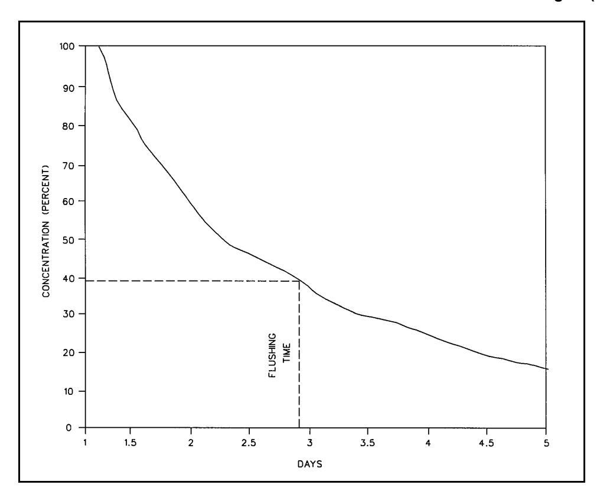

*Figure V-5-54. Time series of conservative tracer concentration at sta 1, Maalaea Harbor, existing plan*

#### b. Navigation modeling.

- (1) Physical models. Physical models have been used for a variety of navigation studies, with vessel controls such as autopilot, human pilot steering, and free-running vessels with remote control. Physical models are particularly useful for evaluating the behavior of a vessel in the presence of intense, interacting forces, typically involving an entrance channel with ocean waves and possibly harbor or alongshore crosscurrents. Waves and human control decisions are statistical processes. Free-running vessel motions in response to many samplings of those processes provide valuable design information about channel depth, width, layout, etc. Vessel position is tracked with high precision relative to channel boundaries in the model. The use of physical models for designing navigation projects is illustrated in the following example.
- (a) Example: Barbers Point Harbor, Oahu, Hawaii . Barbers Point Harbor is a deep-draft commercial harbor located near the southwest corner of the Island of Oahu, Hawaii (Figures V-5-55 and V-5-56). The harbor was constructed along a previously uninterrupted coastline in 1982. The harbor complex includes a barge basin and small craft marina in addition to the deep-draft basin. The design ship was a general cargo vessel 219 m (720 ft) long with a beam of 29 m (95 ft) and a loaded draft of 10.4 m (34 ft). The entrance channel, designed for one-way traffic, is a constant 137 m (450 ft) in width and 12.8 m (42 ft) mllw in depth over its full length. Just past the coastline, channel depth transitions to 11.6 m (38 ft) mllw, the design depth of the inner channel and deep-draft harbor. The deep-draft basin is approximately 671 m x 610 m (2,200 ft x 2,000 ft) in size, covering an area of 0.37 sq km (92 acres).

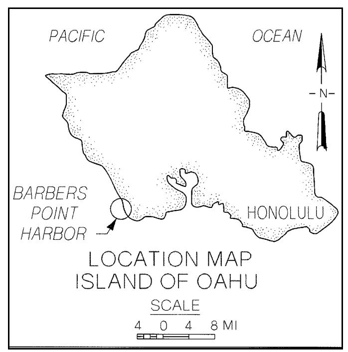

*Figure V-5-55. Barbers Point Harbor, Oahu, Hawaii, location map*

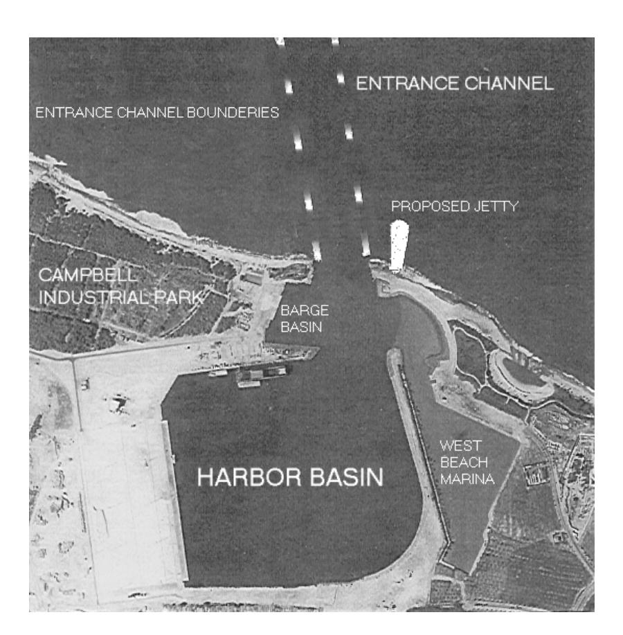

*Figure V-5-56. Barbers Point Harbor, Oahu, Hawaii (August 1994)*

- Changing economic conditions have created a need for the harbor to serve larger ships. In response to this need, the State of Hawaii and the U.S. Army Engineer Division, Pacific Ocean, sponsored physical and numerical model studies to assist in designing harbor modifications (Briggs et al. 1994, Harkins and Dorrell 1998). The primary study task was to evaluate the navigability of proposed channel and harbor configurations for a larger design ship unaided by tugs.
- A physical model of the harbor complex and adjacent coastal areas was constructed (Figure V-5-57). The model scale, 1:75 undistorted, was selected for proper reproduction of important harbor features, storm waves and longshore currents, and the design ship. Model bathymetry extended to the 30-m (100-ft) mllw bottom contour and a distance of about 1,067 m (3,500 ft) along the coast on either side of the entrance channel. Total area covered by the model was over 1,000 sq m (3,500 sq ft). A directional spectral wave maker was placed seaward of the modeled bathymetry. Longshore currents, which affect navigation in the existing harbor, were created in the model with a system of PVC pipe extending along each lateral boundary (with diffuser ports) and meeting at a pump station located behind the model, landward of the coastline. Pump controls allowed generation of longshore currents in either direction. Diffuser ports were open or plugged as needed to achieve desired current patterns.

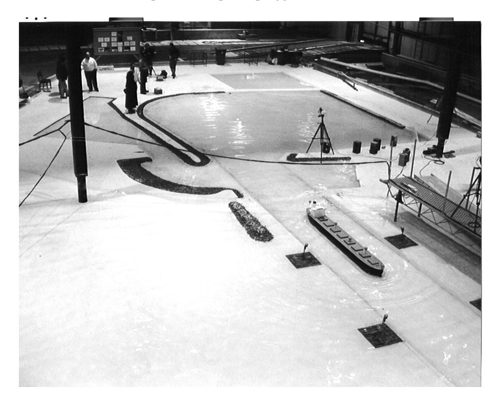

*Figure V-5-57. Physical model of Barbers Point Harbor*

• Two design ships were identified, based on anticipated use of the harbor for container and bulk coal traffic. Existing ships were selected as representative of future harbor traffic, the President Lincoln , a C9 container ship with capacity of 2,900 TEU operated by American President Lines, and the Bunga Saga Empat , a bulk carrier (Figure V-5-58). The design bulk carrier was a modified version of the Bunga Saga Empat , with length increased by 30 m (100 ft). Design ship dimensions are summarized in Table V-5-15.

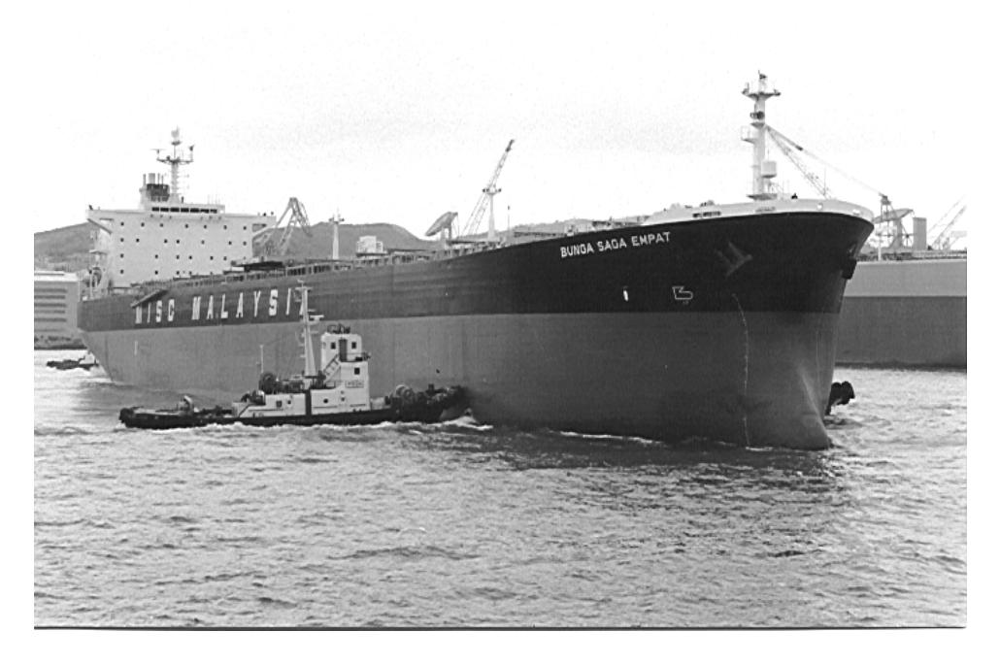

*Figure V-5-58. Bulk carrier Bunga Saga Empat*

| Table V-5-15 |
| --- |
| Design Ship Dimensions for Barbers Point Harbor Studies |

|  | Prototype Ship Dimensions |  |  |
| --- | --- | --- | --- |
|  | Container Ship | Bulk Carrier |  |
| Length Overall | 262 m (860 ft) | 259 m (850 ft) |  |
| Beam | 32 m (106 ft) | 32 m (106 ft) |  |
| Fully Loaded Draft | 11.9 m (39 ft) | 13.7 m (45 ft) |  |

- Model ships were constructed to match the harbor model scale, 1:75 (Figures V-5-59 and V-5-60). Model ships were self-powered by onboard batteries. Forward and reverse speeds, rudder angle, and, for the container ship, bow thruster direction and speed were remote-controlled.
- A set of design transit conditions was selected for simulation. Prototype measurements of waves and currents near the harbor entrance were available. Wave data were collected over a period of approximately 4 years; currents were collected over a 65-day period. For harbor plan evaluation, the following conditions were used. The highest measured $H_{s}$ values and a representative range of $T_{p}$ and θp were selected, a total of eight wave conditions. The range of $H_{s}$ and $T_{p}$ values was 2.1 to 3.0 m (7.0 to 10.0 ft) and 6 to 18 sec, respectively. Longshore currents were selected to represent average, normal, and extreme conditions from both directions. Extreme currents were 0.41 m/sec (0.80 knot) from the north and 0.33 m/sec (0.65 knot) from the south. Based on data from a nearby airport, severe wind speeds of 10.3, 12.9, and 20.6 m/sec (20, 25, and 40 knots) were selected.

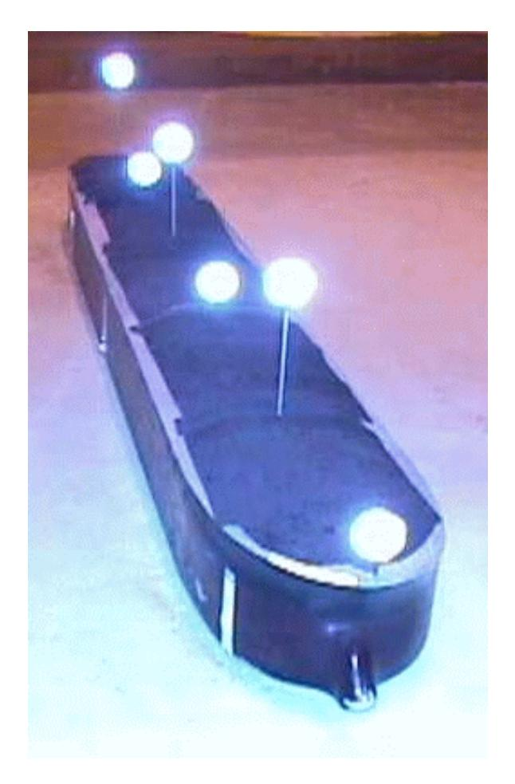

*Figure V-5-59. Model bulk carrier*

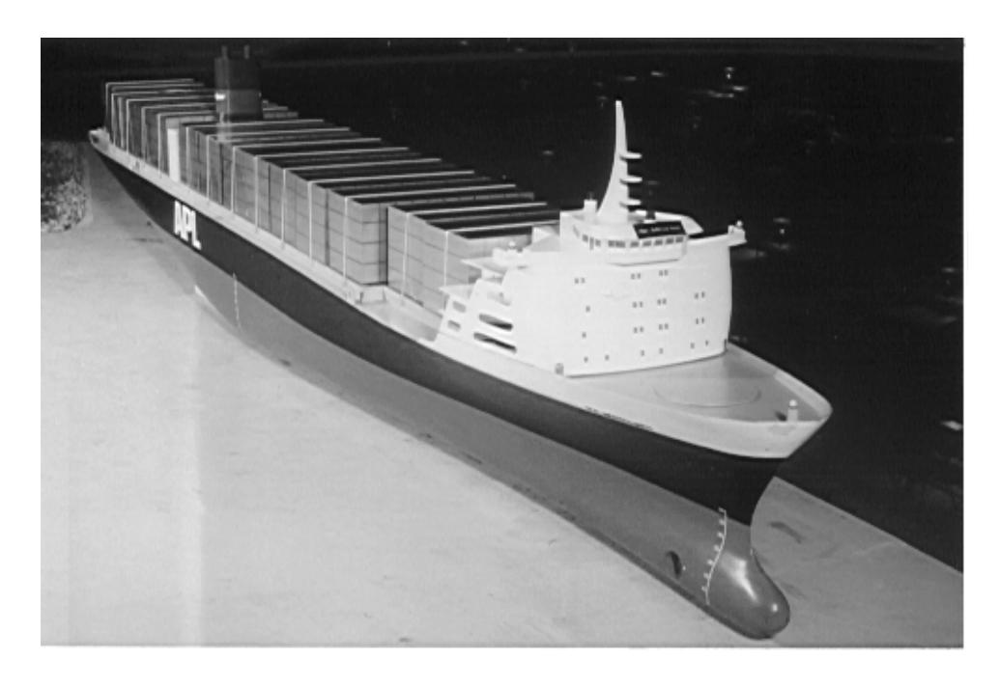

*Figure V-5-60. Model container ship*

- Six harbor plans were studied with varying combinations of the waves, current, and wind, as selected for design transit conditions. Wind forces were simulated with a ship-mounted fan. Model ships were guided by remote control between deep water and the protected harbor. Both inbound and outbound runs were made. Two experienced local pilots assisted in verifying the model setup and conducting some of the runs. Inbound runs were significantly more difficult than outbound runs. The ship must slow in approaching the entrance and it becomes more difficult to control. Typical inbound ship speeds are 13.0 km/hr (7 knots) at the seaward end of the entrance channel, 7.4-9.3 km/hr (4-5 knots) in the vicinity of the coastline, and 3.7-5.6 km/hr (2-3 knots) in the harbor. After a recommended harbor plan was identified, a number of channel/harbor depth variations were studied to optimize design depths. A total of nearly 2,000 runs were made, of which the majority were inbound.
- Navigability was evaluated by several methods during the course of the model studies. Ship operators recorded their observations after each run, with particular attention to any difficulties during the run. An overhead video camera recorded each run. A commercial motion analysis system was used to collect and analyze model ship motions. The system uses digital cameras and strobes to track reflecting balls. Six balls were mounted on the model ship (e.g., Figure V-5-59) and four were placed at fixed locations around the channel. After processing, the system provides a time series of clearance between ship hull and bottom.
- Physical model data on ship horizontal and vertical clearance in the channel were evaluated in a probabilistic assessment of channel design. The design then includes a consideration of the natural variability of wave, current, wind, ship track, and ship response, which is crucial in realistically assessing the probability of a momentary grounding event during ship transit. Thus risk of design ship contact with channel sides or bottom can be incorporated into the design process. The expected time interval between C9 container ship grounding events as a function of number of transits per year illustrates risk information available for design (Figure V-5-61). Since several different methods for estimating probabilities were applied to the physical model tests, the average from all methods is shown, bracketed by best and worst expected performance based on variability in the methods. Additional details are given by Briggs, Bratteland, and Borgman (2000).
- The recommended plan differs from the existing harbor in the following ways:
- Entrance channel is deepened and flares out at the seaward end to allow ships more maneuvering space during initial approach.
- Transition from entrance channel depth to harbor depth is moved from the coastline to the inner harbor basin opening. This change moves the transition to a lower wave energy environment and gives pilots more space to correct when vessel shear occurs at the depth discontinuity.
- Harbor is deepened and expanded in size by excavation in the east part of the harbor.
- (b) Additional information, based on numerical model studies of Barbers Point Harbor oscillation characteristics, is available in Part II-7.
- (2) Ship simulations. Increasingly, deep-draft channels are being designed using ship simulators. For example, the USAERDC ship simulator is schematized in Figure V-5-62. Ship simulations typically have pilots operate the steering wheel and ship controls and navigate a realistic course in real time. Pilots give verbal commands for tug assistance as needed, and an assistant operates tug controls. Pilots are drawn from professional pilot associations serving the project area. Their experience and intuition aids in evaluating existing projects as well as refining and studying new alternatives for safe and optimum channels and/or

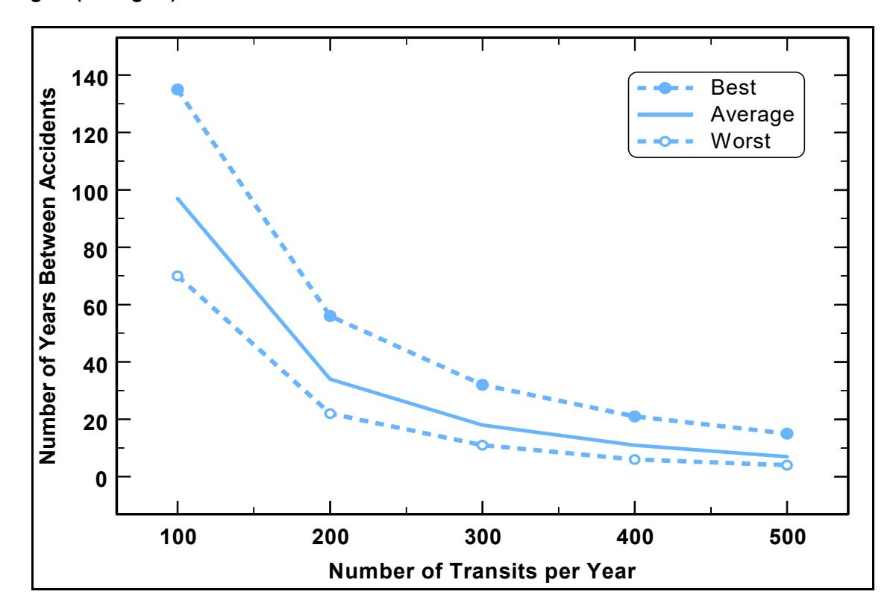

*Figure V-5-61. Probability assessment for C9 container ship navigating recommended entrance channel, Barbers Point Harbor*

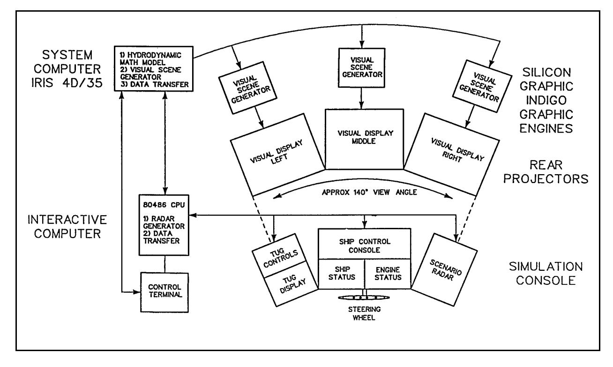

*Figure V-5-62. USAERDC ship simulator system*

turning basins. At some levels of project design, simulators may be used advantageously for fast-time runs with either autopilot or human control instead of a more comprehensive and costly real-time pilot evaluation program.
• Simulators are special numerical models involving representations of a ship, navigation channel, currents, wind, visual scene (including view over the ship, aids to navigation, bridges, docks, and other visual features needed for piloting cues and adequate realism), radar image, tugs and thrusters, ship bridge controls, and typical bridge instruments. Simulated forces and effects are depicted in Figure V-5-63. The ship model(s) experiences these forces and effects in ways similar to the prototype ship(s).

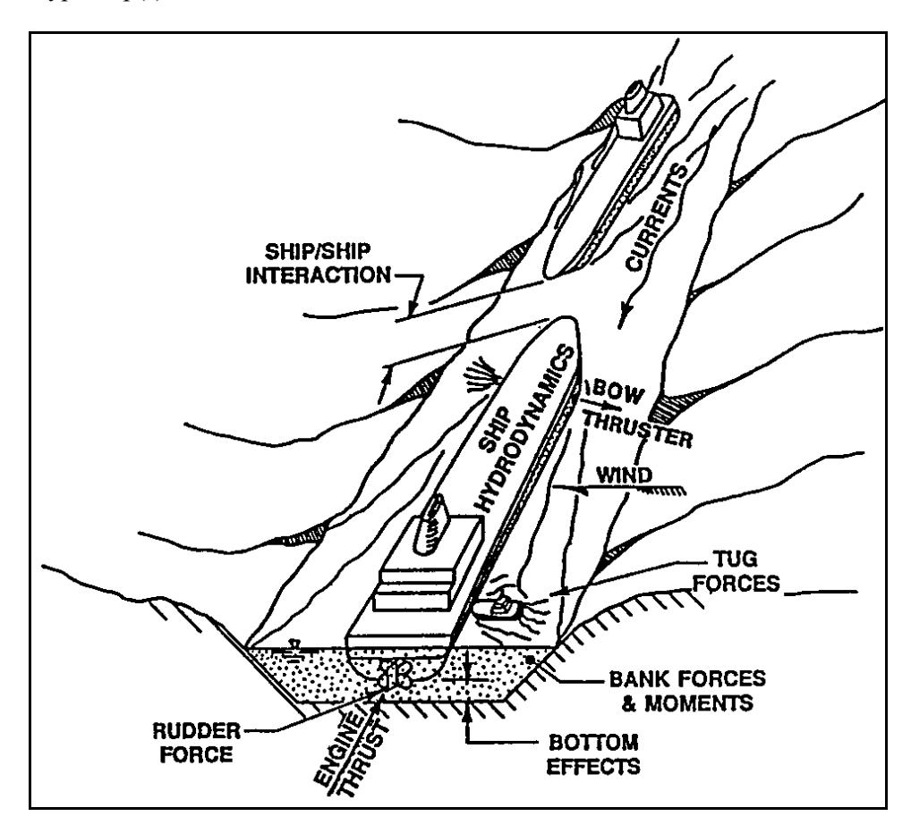

*Figure V-5-63. Ship simulator forces and effects*

- The key steps in a real-time simulation are shown in Figure V-5-64. Output information saved at selected short time intervals during a simulation includes ship position, engine and rudder settings, ship movement information (speed, heading, rate of turn, drift angle), and minimum clearance relative to channel boundaries. If tugs are used, information on tug forces imposed on the ship may also be saved.
- Two example ship simulator studies are discussed in the following paragraphs. More information on ship simulators is available from USACE (1998), Webb (1994), and PIANC (1997a).
- (a) Example: Alafia River Harbor, Florida . The Alafia River Harbor is located along the eastern shore of Hillsborough Bay, about 13 km (8 miles) southeast of Tampa, Florida (Figure V-5-65). The

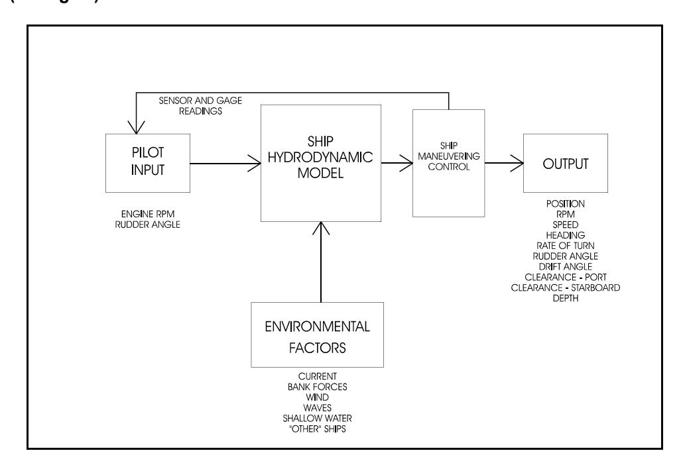

*Figure V-5-64. Real-time simulation*

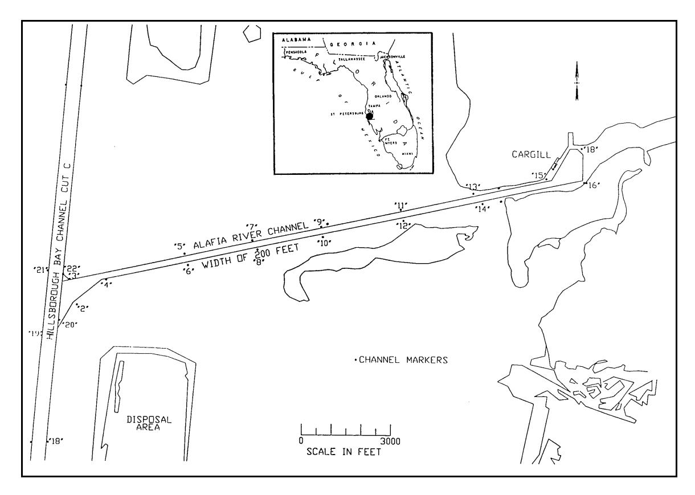

*Figure V-5-65. Existing Alafia River Channel and turning basin*

existing federally maintained project consists of a turning basin adjacent to the dock facilities and a channel connecting the turning basin to Hillsborough Bay Channel Cut C, the primary north-south shipping channel in Hillsborough Bay. Total length of the federal project is 5.8 km (3.6 miles). Channel depth is 9.1 m (30 ft) mllw. Channel width is 61 m (200 ft). The turning basin is 213 m (700 ft) wide and 366 m (1,200 ft) long.
- Alafia River Harbor is used mainly to ship phosphate rock and bulk phosphate products. Ships typically enter the harbor in ballast and load bulk materials until the ship draft reaches the limit allowed in Alafia River Channel or until the ship is fully loaded. Ships turn in the turning basin at the start of the outbound run, in a loaded condition.
- The U.S. Army Engineer District, Jacksonville, funded ERDC to conduct a ship navigation simulation study to investigate performance of two proposed plans for upgrading the Alafia River Channel and turning basin to accommodate larger ships. A notable part of the study is the detailed visual scene developed to provide pilots with realistic visual cues. The cues are a crucial part of slowing the ship on approach to the turning basin, approaching the dock, and turning the ship for the outbound run. Figure V-5-66 shows two pilots operating a bulk carrier. One pilot is guiding the ship, the other is operating tug controls on command. The ship has just entered the turning basin and turned toward the dock. The view direction (which is easily selected by the pilot) is to starboard, with the ship bow visible at the right side of the scene. The Alafia Channel heading out to Hillsborough Bay is visible at the left side, including a channel marker in the foreground. The dock and dock-side loading facilities are just to the left of the ship bow. Further left are numerous small trees and a line of rail cars. This scene adjusts continuously as ship position or pilot view direction change. Additional details of the study are given by Thompson et al. (1998a).

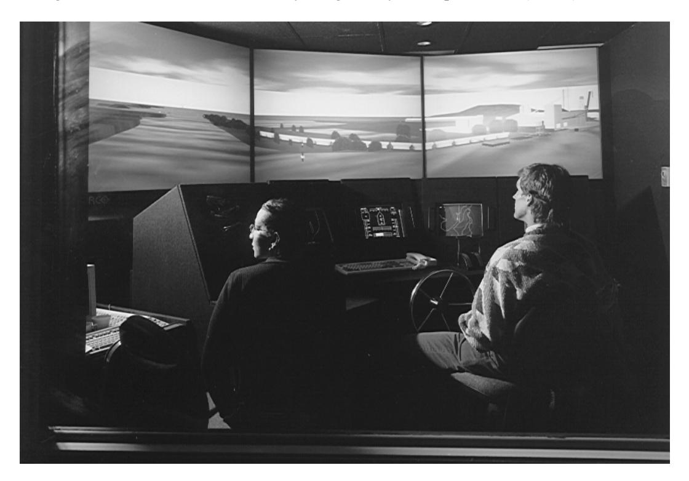

*Figure V-5-66. Visual scene of Alfia River Harbor ship simulation study, inbound bulk carrier approaching dock*

(b) Example: San Juan Harbor, Commonwealth of Puerto Rico . San Juan Harbor is located on the north coast of Puerto Rico, with open exposure to the Atlantic Ocean (Figure V-5-67). It is the largest port in Puerto Rico and a major container port. Noncontainerized cargo, such as petroleum products, lumber, grain, automobiles, and steel, is also imported to the island by sea. Rum, Puerto Rico's principal export, is shipped in containers. Cruise vessels frequently call on San Juan Harbor.

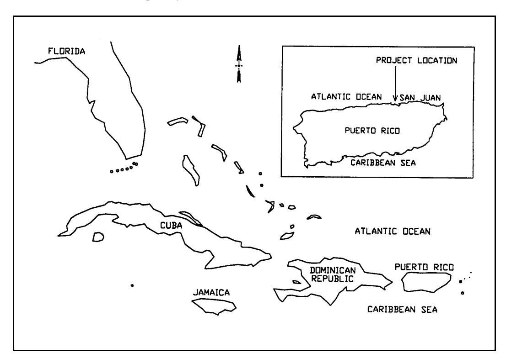

*Figure V-5-67. San Juan Harbor, Commonwealth of Puerto Rico, location map*

- Federally maintained channels include an entrance channel (Bar Channel), a main interior approach channel to the harbor complex (Anegado Channel), and three interior channels forming a triangular path accessing the principal dock areas (Army Terminal, Puerto Nuevo, and Graving Dock Channels) (Figure V-5-68). Design depth of the outer Bar Channel is 13.7 m (45 ft). The deepest approach to the harbor is the S-shaped path along Bar, Anegado, and Army Terminal Channels, with a controlling depth of 11.0 m (36 ft). Puerto Nuevo and Graving Dock Channels have design depths of 9.8 and 9.1 m (32 and 30 ft), respectively. Bar and Anegado Channel widths are 152 and 305-366 m (500 and 1,000-1,200 ft), respectively. The other three channels have design widths of between 91 and 122 m (300 and 400 ft).
- Wind and waves strongly affect the harbor entrance. Winds are usually steady and are described as being between 8 and 10 m/sec (15 and 20 knots) predominantly from the east and northeast. Waves typically approach the entrance from the north, northeast, and east, with significant heights up to 6-7 m (20-22 ft) during severe events.
- Pilots typically board inbound ships when they are 4.8 km (3 miles) from the harbor entrance. The entrance channel can be difficult to navigate in the presence of wind and wave conditions. Ships must maintain speed in the entrance channel for control, yet they must slow to make the relatively sharp turn into Anegado Channel. All documented accidents in recent years are groundings that have occurred on the south side of this turn. The turn is difficult for outbound ships, too, because of the

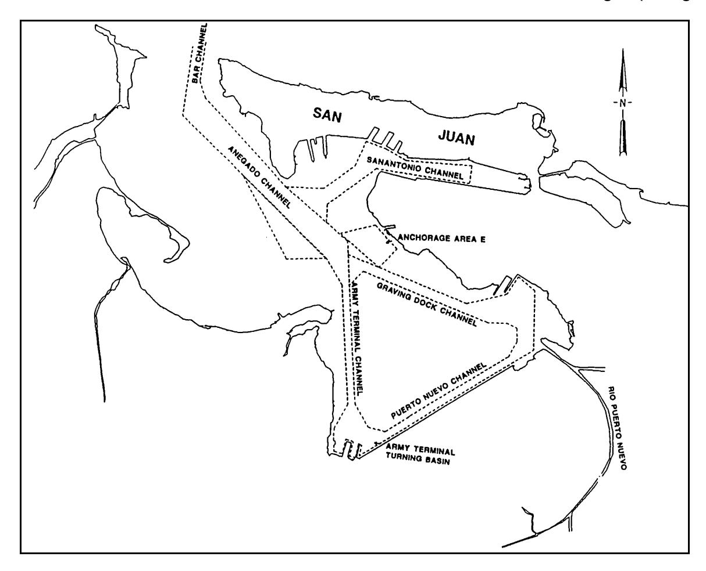

*Figure V-5-68. San Juan Harbor channels*

relatively narrow entrance channel. Sharp turns associated with the relatively narrow interior channels can also be difficult to navigate.
- The U.S. Army Engineer District, Jacksonville, funded a real-time ship simulator study of existing and two proposed alternative plans to address navigation concerns in San Juan Harbor channels and to allow access to deeper draft ships (Webb 1993). Controlling depth in the proposed plans is 11.9 m (39 ft) in Anegado, Army Terminal, and Puerto Nuevo Channels and 11.0 m (36 ft) in Graving Dock Channel. The purposes of the simulator study were to determine effects of the proposed improvements on navigation, to optimize channel width and alignment for safe and efficient navigation, and to determine necessary depths in Bar and Anegado Channel sections affected by waves.
- Design transit conditions were developed. A wind from the northeast was used with a speed of 10.3 m/sec (20 knots) in the outer entrance. Wind speed was decreased to between 0 and 7.7 m/sec (15 knots) in interior areas sheltered by bluffs and/or tall buildings. Wave information from a 20-year hindcast was used to define incident wave conditions for moderate and heavy seas. A numerical model transformed the selected incident wave conditions to the harbor and through the entrance, giving wave estimates along the channel. For simulation, incident $H_{s}$ was 4.6 m (15 ft), coming from the northeast. This $H_{s}$ is about the practical upper limit for ships to enter the harbor. The $H_{s}$ progressively decreased along Bar Channel to 1.2 m (4 ft) and then to 0 after the turn into Anegado Channel. Tidal currents in the channels were determined with a numerical model of the
harbor embayment. Currents are very small. Since flood tide tends to reduce control of ships entering the harbor, flood tide currents were used with all simulations. A wave-driven cross-current of 0.3 m/sec was added in the more exposed section of the Bar Channel, based on pilot comments.
- Two design ships were used, a tanker 232.6 m (763 ft) in length (LBP) with a 38.1-m (125-ft) beam and a container ship 246.9 m in length (LBP) with a 32.3-m (106-ft) beam. The inbound tanker draft (loaded) was 9.8 m (32 ft) for the existing channels and 11.0 m (36 ft) for proposed channels. The outbound tanker draft (in ballast) was 7.9 m (26 ft). For both inbound and outbound runs, the container ship draft was the same as the inbound loaded tanker draft.
- The simulation was validated with the assistance of two pilots from the San Juan Harbor Pilots Association. Simulations were conducted in three 1-week periods. A total of six licensed San Juan Harbor pilots conducted the simulations (two per week), giving a representative range of experience and piloting strategies. Pilots completed a written questionnaire immediately after each run, including a rating scale of key project features. Some desirable modifications to the proposed plans emerged after the first week of simulations. The plans were adjusted to improve navigation in localized areas with difficult clearance and/or to reduce dredging in areas not needed for navigation.
- Design depths for the wave-influenced Bar and outer Anegado Channels were developed in a separate study component. A range of wave conditions and ship speeds were considered. The sum of vertical ship motion and squat was used to define the required underkeel clearance to be added to the 11.0-m (36-ft) ship draft. Because wave height decreases along the Bar Channel, a stepped design depth was recommended, with depth of 16.8 m (55 ft) at the seaward end of Bar Channel progressively decreasing in three steps to 13.7 m (45 ft) through the turn into Anegado Channel.
- Results from the simulations were summarized to evaluate proposed plans. For example, average pilot ratings for inbound container ship runs indicate the plans will significantly improve harbor access, especially in Puerto Nuevo Channel and at the turn separating it from Army Terminal Channel (Figure V-5-69). The wider entrance channel in the plans gives a significant improvement. Ship track plots from all runs show how the increased width and gentler turn would be used in navigation (Figure V-5-70). An unused area on the outside of the proposed turn is defined by the envelope of ship tracks. Simulations indicated that a ship could not enter this area and still turn safely. Therefore, one study recommendation was that the unused area be deleted from the plan, reducing dredging requirements. Complete results, conclusions, and recommendations are given by Webb (1993).
- c. Specialized field studies .
- (1) Harbors. As field measurement and data collection techniques have advanced, field studies have become powerful and reliable for documenting the behavior of existing harbors. However, the cost for comprehensive field studies is significant, and such studies are generally practical only for large projects with high economic impact. Typically, field data are used for calibration and validation in physical and numerical model studies. Field data helpful for harbor studies include incident directional waves, water levels, waves and currents at several interior locations, and winds. The data provide valuable information about harbor response to wind waves and swell, entrance channel wave conditions, harbor oscillations, and circulation and flushing. A representative, but extensive, field data collection program in the massive Los Angeles and Long Beach, California, harbor complex is described by Seabergh, Vemulakonda, and Rosati (1992). The program was aimed at enhancing physical and numerical models used in harbor planning.
- (a) Example: Kahului Harbor, Maui, Hawaii . Kahului Harbor, located on the north shore of the Island of Maui, is the island's only deep-draft harbor and the busiest port in Hawaii outside of the Island of Oahu

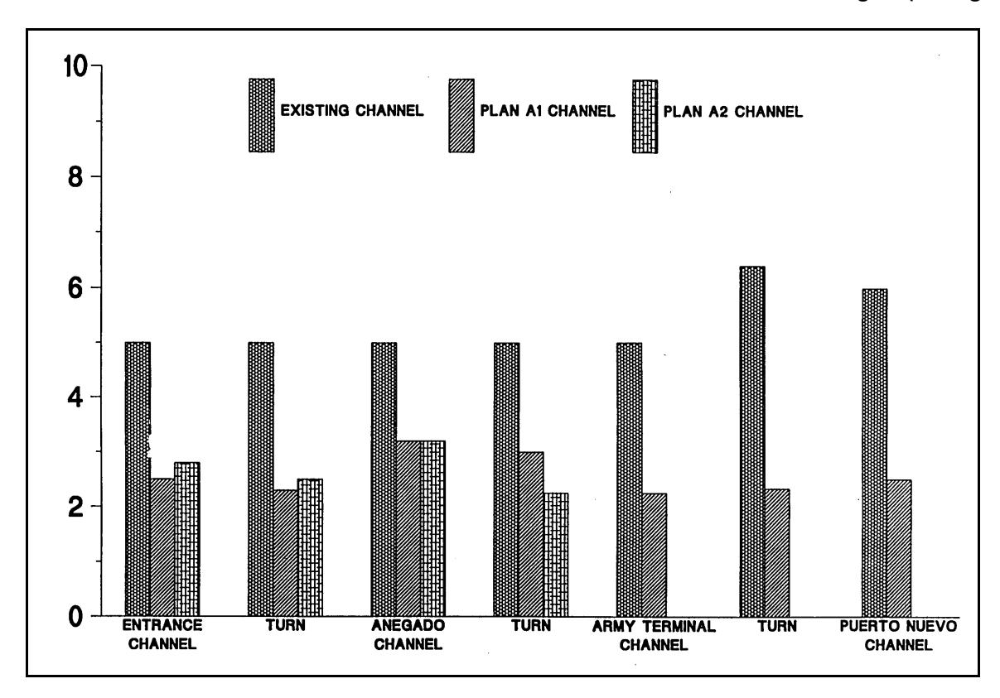

*Figure V-5-69. Pilot degree of difficulty ratings, inbound container ship, San Juan Harbor*

(Figure V-5-71). Commercial piers are presently on the east side of the harbor. In conjunction with longterm planning for expanded harbor usage, a field wave data collection program was established in the harbor. The program included an offshore directional array to measure incident waves and four pressure gauges in the harbor interior (Figure V-5-72). Interior gauge locations were determined with the assistance of a preliminary numerical model study of harbor wave response (Okihiro et al. 1994).
- (b) Data from more than 1 year were collected and proved to be very helpful in subsequent harbor wave response, modeling, and planning studies (Thompson et al. 1996, Okihiro and Guza 1996).
- (2) Ship tracking. The optimum depth and width of proposed navigation channel improvements may be determined with increased accuracy by measuring actual ship motions. The measurement program should encompass a significant number of transits of the route during adverse conditions. Availability of differential Global Positioning System (DGPS) apparatus for recording accurate ship fixes (±3 m) at a rapid rate (0.2 Hz or faster) makes this an affordable component of feasibility studies. Commercial software is available for data recording and display in formats applicable to channel design. These systems use standard DGPS receivers compatible with the U.S. Coast Guard network of DGPS radio beacons, as illustrated in Figure V-5-73. A time series of fixes is recorded with concurrent gyrocompass headings and other data, such as engine rpm, rudder angle, and relative wind speed and direction.
- (a) Commercial gyrocompasses aboard seagoing cargo vessels usually provide heading accuracy of ±0.3 deg or better. Concurrent time series of position and heading define the swept path of the vessel. Comparison of ship tracks with tidal currents, winds, waves, water levels, visibility conditions, and other environmental conditions present at the time of recording, provide channel designers with realistic parameters for width computations.

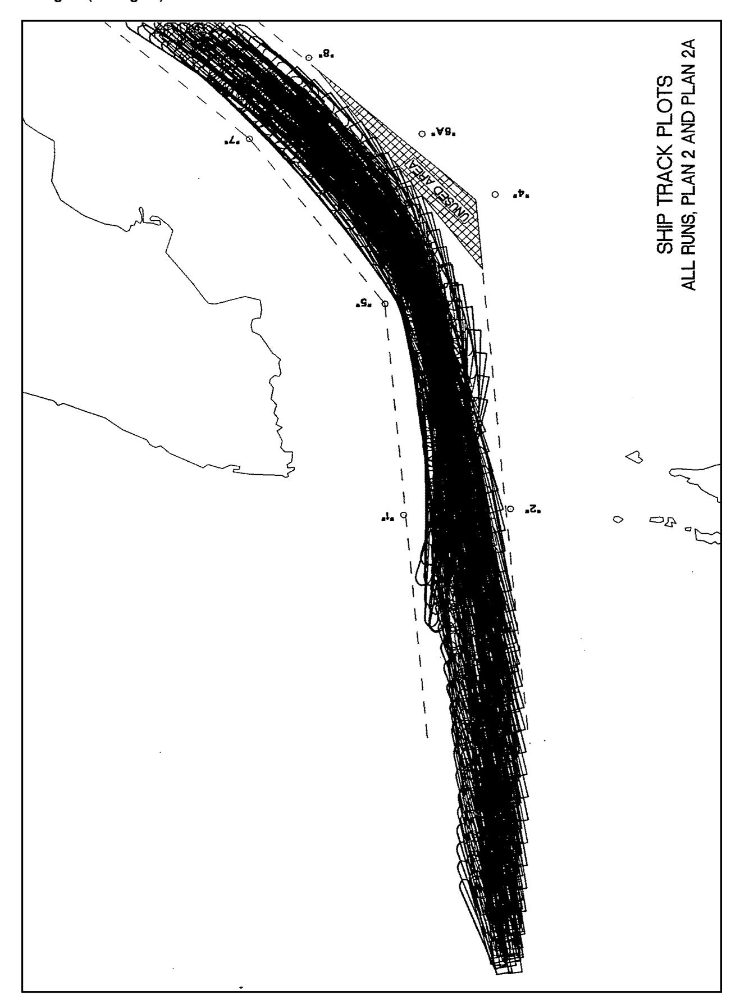

*Figure V-5-70. Ship tracks, proposed Bar Channel and turn into Anegado Channel, San Juan Harbor*

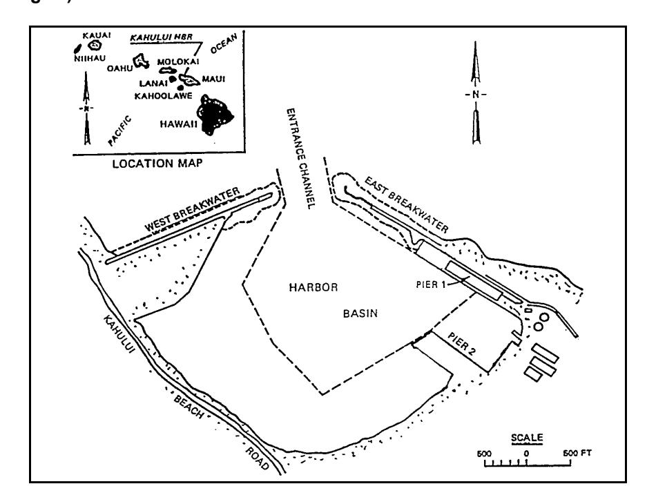

*Figure V-5-71. Kahului Harbor, Maui, Hawaii, location map*

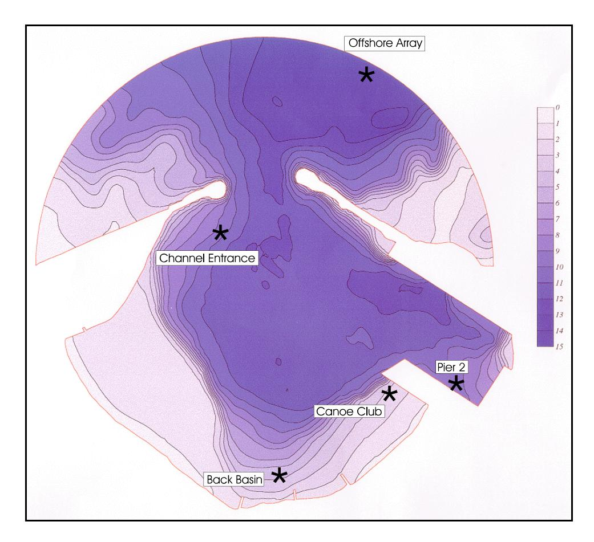

*Figure V-5-72. Field gauge locations and bathymetry, Kahului Harbor*

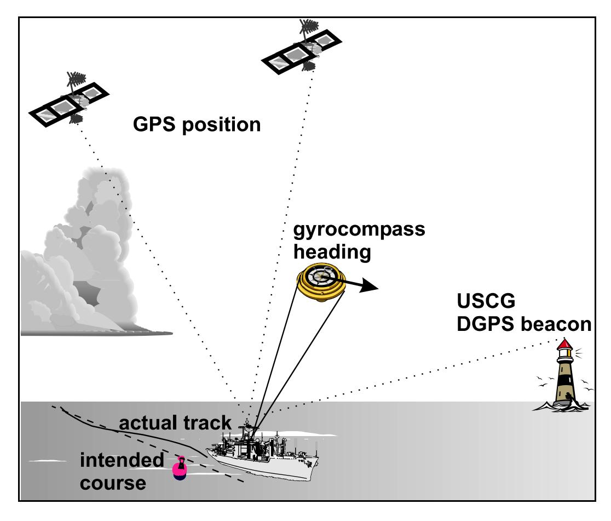

*Figure V-5-73. Components of ship track measurements*

(b) A dual-frequency DGPS system that measured horizontal and vertical location of ship bow and stern with 1 cm accuracy is described by Webb and Wooley (1998). The data, along with concurrent measurements of current and water level, provided direct calculation of ship squat. The data are useful for evaluating existing navigation conditions, designing modifications, and/or validating ship simulation models to study proposed conditions.

## V-5-11. References

# EM 1110-2-1615

EM 1110-2-1615, "Hydraulic Design of Small Boat Harbors"

#### EM 1110-8-1

EM 1110-8-1, "Winter Navigation on Inland Waterways"

## EM 1110-2-1613

EM 1110-2-1613, "Hydraulic Design Guidance for Deep-Draft Navigation Projects"

#### ER 1105-2-100

ER 1105-2-100, "Guidance for Conducting Civil Works Planning Studies"

#### EP 1165-2-1

EP 1165-2-1, "Digest of Water Resources Policies and Authorities"

#### American Society of Civil Engineers 1994

American Society of Civil Engineers (ASCE). 1994. Planning and Design Guidelines for Small Craft Harbors , ASCE Manual and Reports on Engineering Practice No. 50, New York, NY.

#### Bottin 1976

Bottin, R. R., Jr. 1976. "Igloo Wave Absorber Tests for Port Washington Harbor, Wisconsin; Hydraulic Model Investigation," Miscellaneous Paper H-76-22, U.S. Army Engineer Waterways Experiment Station, Vicksburg, MS.

#### Bottin 1992

Bottin, R. R., Jr. 1992. "Physical Modeling of Small-Boat Harbors: Design Experience, Lessons Learned, and Modeling Guidelines," Technical Report CERC-92-12, U.S. Army Engineer Waterways Experiment Station, Vicksburg, MS.

#### Briggs, Bratteland, and Borgman 2000

Briggs, M. J., Bratteland, E., and Borgman, L. E. 2000. "Probability Assessment of Deep Draft Navigation Channel Design," submitted to Coastal Engineering Journal , Elsevier Science, The Netherlands.

#### Briggs et al. 1994

Briggs, M. J., Lillycrop, L. S., Harkins, G. S., Thompson, E. F., and Green, D. R. 1994. "Physical and Numerical Model Studies of Barbers Point Harbor, Oahu, Hawaii," Technical Report CERC-94-14, U.S. Army Engineer Waterways Experiment Station, Vicksburg, MS.

## Bruun 1990

Bruun, P. 1990. Port Engineering , Fourth Edition (2 Vols.), Gulf Publishing, Houston, TX.

#### Chen and Houston 1987

Chen, H. S., and Houston, J. R. 1987. "Calculation of Water Oscillation in Coastal Harbors: HARBS and HARBD User's Manual," Instruction Report CERC-87-2, U.S. Army Engineer Waterways Experiment Station, Vicksburg, MS.

#### Clark 1983

Clark, J. R. 1983. Coastal Ecosystem Management: A Technical Manual for the Conservation of Coastal Zone Resources , John Wiley & Sons, New York, NY.

#### Dingemans 1997

Dingemans, M. W. 1997. Water Wave Propagation over Uneven Bottoms , 2 vols., World Scientific, Singapore.

## Dunham and Finn 1974

Dunham, J. W., and Finn, A. A. 1974. "Small-Craft Harbors: Design, Construction, and Operation," Special Report No. 2, U.S. Army Engineer Research and Development Center, Coastal and Hydraulics Laboratory, Vicksburg, MS.

#### Ferguson 1991

Ferguson, A. 1991. "Navigation, Dredging and Environment in the Fraser River Estuary," Navigation and Dredging Workgroup Report, Fraser River Estuary Management Program, British Columbia, Canada.

#### Gaythwaite 1990

Gaythwaite, J. W. 1990. Design of Marine Facilities for the Berthing, Mooring, and Repair of Vessels , Van Nostrand Reinhold, New York, NY.

## Harkins and Dorrell 2000

Harkins, G. S., and Dorrell, C. C. 2000. "Barbers Point Harbor Physical Model Navigation Study," Technical Report ERDC/CHL TR-00-2, U.S. Army Engineer Waterways Experiment Station, Vicksburg, MS.

### Harris 1981

Harris, D. L. 1981. "Tides and Tidal Datums in the United States," Special Report No. 7, U.S. Army Engineer Waterways Experiment Station, Vicksburg, MS.

#### Herbich 1992

Herbich, J. B. 1992. Handbook of Coastal and Ocean Engineering, Vol. 3, Harbors, Navigational Channels, Estuaries, Environmental Effects , Gulf Publishing, Houston, TX.

#### Hudson et al. 1979

Hudson, R. Y., Herrmann, F. A., Jr., Sager, R. A., Whalin, R. W., Keulegan, G. H., Chatham, C. E., Jr., and Hales, L. Z. 1979. "Coastal Hydraulic Models," Special Report SR-5, U.S. Army Engineer Research and Development Center, Coastal and Hydraulics Laboratory, Vicksburg, MS.

#### Hughes and Fowler 1990

Hughes, S. A., and Fowler, J. E. 1990. "Midscale Physical Model Verification for Scour at Coastal Structures," Technical Report CERC-90-8, U.S. Army Engineer Waterways Experiment Station, Vicksburg, MS.

## Huval 1980

Huval, C. J. 1980. "Lock Approach Canal Surge and Tow Squat at Lock and Dam 17, Arkansas River Project; Mathematical Model Investigation," Technical Report HL-80-17, U.S. Army Engineer Waterways Experiment Station, Vicksburg, MS.

#### Huval 1993

Huval, C. J., ed. 1993. "Planning, Design, and Maintenance of Deep Draft Navigation Channels," PROSPECT Training Course Notes, U.S. Army Engineer Waterways Experiment Station, Vicksburg, MS.

## Huval and Lynch 1998

Huval, C. J., and Lynch, G. C. 1998. "Ship Navigation Simulation Study, Brunswick Harbor, Georgia," Technical Report CHL-98-18, U.S. Army Engineer Waterways Experiment Station, Vicksburg, MS.

#### Irish 1997

Irish, J. L. 1997. "Sensitivity of Channel Sedimentation Prediction to Wave-field Characterization," Bulletin No. 95, PIANC, Brussels, Belgium, pp 5-19.

## LeMéhauté 1965

LeMéhauté, B. 1965. "Wave Absorbers in Harbors," Contract Report No. 2-122, U.S. Army Engineer Waterways Experiment Station, Vicksburg, MS, prepared for National Engineering Science Company, Pasadena, CA, under Contract No. DA-22-079-CIVENG-64-81.

#### Lillycrop et al. 1993

Lillycrop, L. S., Briggs, M. J., Harkins, G. S., Boc, S. J., and Okihiro, M. S. 1993. "Barbers Point Harbor, Oahu, Hawaii, Monitoring Study," Technical Report CERC-93-18, U.S. Army Engineer Waterways Experiment Station, Vicksburg, MS.

#### McBride, Smallman, and Huntington 1998

McBride, M. W., Smallman, J. V., and Huntington, S. W. 1998. "Guidelines for Design of Approach Channels," Proceedings, PORTS '98 , ASCE, pp 1315-1324.

#### McCartney, Hermann, and Simmons 1991

McCartney, B. L., Hermann, F. A., Jr., and Simmons, H. B. 1991. "Estuary Waterway Projects - Lessons Learned," Journal of Waterway, Port, Coastal, and Ocean Engineering 117(4), American Society of Civil Engineers, pp 409-421.

#### Mei 1983

Mei, C. C. 1983. The Applied Dynamics of Ocean Surface Waves , John Wiley & Sons, New York, NY.

### Melo and Guza 1991

Melo, E., and Guza, R. T. 1991. "Wave Propagation in Jettied Entrance Channels. II: Observations," Journal of Waterway, Port, Coastal, and Ocean Engineering 117(5), pp 493-510.

#### NOAA (Annual)

National Oceanic and Atmospheric Administration (NOAA). (Annual). Tide Tables and Tidal Current Tables , Rockville, MD.

## Noda 1972

Noda, E. K. 1972. "Equilibrium Beach Profile Scale-Model Relationship," Journal of the Waterways, Harbors, and Coastal Engineering Division 98(WW4), ASCE, pp 511-528.

#### Norrbin 1986

Norrbin, N. H. 1986. "Fairway Design with Respect to Ship Dynamics and Operational Requirements," SSPA Research Report No. 102, SSPA Maritime Consulting, Gothenburg, Sweden.

## Okihiro and Guza 1996

Okihiro, M. S., and Guza, R. T. 1996. "Observations of Seiche Forcing and Amplification in Three Small Harbors," Journal of Waterway, Port, Coastal, and Ocean Engineering 122(5), ASCE, 232-238.

#### Okihiro et al. 1994

Okihiro, M. S., Guza, R. T., O'Reilly, W. C., and McGehee, D. D. 1994. "Selecting Wave Gauge Sites for Monitoring Harbor Oscillations: A Case Study for Kahului Harbor, Hawaii," Miscellaneous Paper CERC-94- 10, U.S. Army Engineer Waterways Experiment Station, Vicksburg, MS.

#### Panchang, Xu, and Demirbilek 1998

Panchang, V. G., Xu, B., and Demirbilek, Z. 1998. "Wave Models for Coastal Applications," Handbook of Coastal Engineering , J. B. Herbich, ed., Vol. 4 (to be published).

#### PIANC 1984

PIANC. 1984. "Ice Navigation," Supplement to Bulletin No. 46, Permanent International Association of Navigation Congresses, Brussels.

#### PIANC 1995

PIANC. 1995. "Approach Channels, Preliminary Guidelines," First Report of the Joint PIANC-IAPH Working Group II-30, Permanent International Association of Navigation Congresses, Brussels, Belgium.

### PIANC 1997a

PIANC. 1997a. "Approach Channels, a Guide for Design," Supplement to Bulletin No. 95, Permanent International Association of Navigation Congresses, Brussels, Belgium.

### PIANC 1997b

PIANC. 1997b. "Guidelines for the Design of Armoured Slopes Under Open Piled Quay Walls," Supplement to Bulletin No. 96, Permanent International Association of Navigation Congresses, Brussels, Belgium.

### Quinn 1972

Quinn, A. D. 1972. Design & Construction of Ports & Marine Structures , McGraw-Hill.

#### Sager and Hollyfield 1974

Sager, R. A., and Hollyfield, N. W. 1974. "Navigation Channel Improvements, Barnegat Inlet, New Jersey," Technical Report H-74-1, U.S. Army Engineer Waterways Experiment Station, Vicksburg, MS.

#### Seabergh, Cialone, and Stauble 1996

Seabergh, W. C., Cialone, M. A., and Stauble, D. K. 1996. "Impacts of Inlet Structures on Channel Location," Proceedings, 25th International Conference on Coastal Engineering , ASCE, pp 4531-4544.

#### Seabergh, Vemulakonda, and Rosati 1992

Seabergh, W. C., Vemulakonda, S. R., and Rosati, J., III. 1992. "Los Angeles-Long Beach Harbors Model Enhancement Program," Proceedings, PORTS '92 , ASCE, pp 884-897.

# Silver 1992

Silver, A. L. 1992. "Environmental Monitoring and Operator Guidance System (EMOGS) for Shallow Water Ports," Proceedings, PORTS '92 , ASCE, pp 535-547.

#### Silver and Dalzell 1997

Silver, A. L., and Dalzell, J. F. 1997. "Risk Based Decisions for Entrance Channel Operation and Design," Proceedings, 7th International Offshore and Polar Engineering Conference , International Society of Offshore and Polar Engineers, pp 815-822.

#### SMS 1994

SMS. 1994. "Surface-Water Modeling System," developed by Brigham Young University and USACE, updated periodically.

## State of California 1980

State of California. 1980. "Layout and Design Guidelines for Small Craft Berthing Facilities," Department of Boating and Waterways.

# Stevens et al. 1942

Stevens, J. C., Bardsley, C. E., Lane, E. W., Straub, L. G., Wright, C. A., Tiffany, J. A., and Warnock, J. E. 1942. Hydraulic Models , Manuals of Engineering Practice, No. 25, American Society of Civil Engineers, New York, NY.

## Thompson, Boc, and Nunes 1998

Thompson, E. F., Boc, S. J., Jr., and Nunes, F. S. 1998. "Evaluating Operational Impact of Waves Along Proposed Harbor Piers," Proceedings, PORTS '98 , ASCE, pp 860-869.

### Thompson et al. 1996

Thompson, E. F., Hadley, L. L., Brandon, W. A., McGehee, D. D., and Hubertz, J. M. 1996. "Wave Response of Kahului Harbor, Maui, Hawaii," Technical Report CERC-96-11, U.S. Army Engineer Waterways Experiment Station, Vicksburg, MS.

#### Thompson et al. 1998a

Thompson, E. F., Fong, M. T., Van Norman, P. S., and Brown, B. 1998a. "Ship Navigation Simulation Study, Alafia River, Tampa Bay, Florida," Technical Report CHL-98-13, U.S. Army Engineer Waterways Experiment Station, Vicksburg, MS.

#### Thompson et al. 1998b

Thompson, E. F., Lin, L., Hadley, L. L., and Hubertz, J. M. 1998b. "Wave Response of Kikiaola Harbor, Kauai, Hawaii," Miscellaneous Paper CHL-98-5, U.S. Army Engineer Waterways Experiment Station, Vicksburg, MS.

#### Tobiasson and Kollmeyer 1991

Tobiasson, B. O., and Kollmeyer, R. C. 1991. Marinas and Small-Craft Harbors , Van Nostrand Reinhold, New York, NY.

#### Tsinker 1997

Tsinker, G. P. 1997. Handbook of Port and Harbor Engineering , Chapman & Hall, New York, NY.

## Turner 1984

Turner, H. O., Jr. 1984. "Dimensions for Safe and Efficient Deep-Draft Navigation Channels," Technical Report HL-84-10, U.S. Army Engineer Waterways Experiment Station, Vicksburg, MS.

#### USACE 1983

U.S. Army Corps of Engineers. 1983. "Engineering and Design of Military Ports," Technical Manual TM 5-850-1, Headquarters, Department of the Army, Washington, DC.

## U.S. Coast Guard 1981

U.S. Coast Guard. 1981. "Aids to Navigation Manual - Administration," COMDTINST M16500.7, U.S. Coast Guard, Washington, DC.

#### U.S. Coast Guard 1988a

U.S. Coast Guard. 1988a. "Aids to Navigation Manual - Seamanship," CG-222.2, U.S. Coast Guard, Washington, DC.

## U.S. Coast Guard 1988b

U.S. Coast Guard. 1988b. "Aids to Navigation Manual - Technical," COMDTINST M16500.3, U.S. Coast Guard, Washington, DC.

#### U.S. Navy 1981

U.S. Navy. 1981. "Harbors," Design Manual 26.1, Naval Facilities Engineering Command, Alexandria, VA.

#### U.S. Navy 1998

U.S. Navy. 1998. "Handbook for Mooring Design," MIL-HDBK 1026/4, Naval Facilities Engineering Command, Alexandria, VA.

#### Wang and Cialone 1995

Wang, H. V., and Cialone, A. 1995. "Numerical Hydrodynamic Modeling and Flushing Study at Maalaea Harbor, Maui, Hawaii," Miscellaneous Paper CERC-95-8, U.S. Army Engineer Waterways Experiment Station, Vicksburg, MS.

## Wang et al. 1980

Wang, S., Butcher, C., Kimble, M., and Cox, G. D. 1980. "Columbia River Entrance Channel Deep-Draft Vessel Motion Study," Tetra Tech Report No. TC-3925, U.S. Army Engineer District, Portland, OR.

### Webb 1993

Webb, D. W. 1993. "Ship Navigation Simulation Study, San Juan Harbor, San Juan, Puerto Rico," Technical Report HL-93-17, U.S. Army Engineer Waterways Experiment Station, Vicksburg, MS.

#### Webb 1994

Webb, D. W. 1994. "Navigation Channel Design Using Real-Time Marine Simulator," Proceedings, Dredging '94 , ASCE, pp 1081-1090.

#### Webb and Wooley 1998

Webb, D. W., and Wooley, R. T. 1998. "Using DGPS Ship Transit Data for Navigation Channel Design," Proceedings, PORTS '98 , ASCE, pp 1325-1332.

## Wilson 1966

Wilson, H. B. 1966. "Design for Optimum Wave Conditions, Dana Point Harbor, Dana Point, California; Hydraulic Model Investigation," Technical Report 2-724, U.S. Army Engineer Waterways Experiment Station, Vicksburg, MS.

#### WMO 1970

World Meteorological Organization (WMO). 1970. "WMO Sea-ice Nomenclature," WMO/OMM/BMO-No.259.TP.145, as amended, Geneva, Switzerland.

## V-5-12. Definitions of Symbols

| Symbol | Definition |
|---|---|
| "b | Breaking wave angle [deg] |
| AC | Channel cross-section area $[length^{2}]$ |
| B | Vessel beam at midships [length] |
| CB | Block coefficient (Figure V-5-4) [dimensionless] |
| Fh | Channel depth Froude number [dimensionless] |
| FL | Schijf limiting Froude number (Equation V-5-7) [dimensionless] |
| g | Gravitational acceleration $[length/time^{2}]$ |
| h | Depth of channel [length] |
| h1, | h2 Overbank depths [length] |
| L | Ship length [length] |
| NB | Number of boats using the project |
| T | Vessel draft [length] |
| V | Vessel speed [length/time] |
| VL | Schijf limiting ship speed in squat analysis [length/time] |
| W | Width of channel [length] |
| Z | Maximum ship squat [length] |
| ZL | Maximum ship squat at Schijf limiting Froud number (Equation V-5-8) [length] |
| ZT | Maximum squat in a trench channel (Equation V-5-9) [length] |

## V-5-13. Acknowledgments

Authors of Chapter V-5, "Navigation Projects:"
Edward F. Thompson, Ph.D., Coastal and Hydraulics Laboratory (CHL), U.S. Army Engineer Research and Development Center, Vicksburg, Mississippi.
Carl J. Huval, CHL (retired)
Ray R. Bottin, CHL
Orson P. Smith, Ph.D., U.S. Army Engineer District, Alaska, Anchorage, Alaska, (retired)

#### Reviewers:

David Curfman, Naval Facilities Engineering Command, Norfolk, Virginia
Lee E. Harris, Ph.D., Department of Marine and Environmental Systems, Florida Institute of Technology, Melbourne, Florida
Mona King, U.S. Army Engineer District, Seattle, Seattle, Washington
John H. Lockhart, Headquarters, U.S. Army Corps of Engineers, Washington, DC, (retired)
J. Richard Weggel, Ph.D., Department of Civil and Architectural Engineering, Drexel University, Philadelphia, Pennsylvania
