# Chapter 6
SEDIMENT MANAGEMENT AT INLETS

## Table of Contents

- V-6-1. Introduction
  - a. Overview
  - b. Definitions
  - c. Background
  - d. Summary
- V-6-2. Regional Sediment Management and Coastal Inlet Processes
  - a. Overview
  - b. Regional sediment management
    - (1) Overview
    - (2) Critical role of inlets
    - (3) Coastal inlet processes
  - c. Inlet operation and maintenance activities
  - d. Inlet modifications of longshore transport
  - e. Alongshore extent of inlet influence
  - f. Estimating alongshore extent of inlet influence
  - g. Inlet interactions with adjacent beaches
    - (1) General
    - (2) Detection
- V-6-3. Inlet and Adjacent Beach Sediment Budgets
  - a. Overview
  - b. Introduction
  - c. Theory
  - d. Project applications
  - e. History of and procedure for sediment budget formulation
  - f. Data required
  - g. Sediment budget methods and tools
- V-6-4. Engineering Approaches
  - a. General considerations
  - b. Application of sediment budget to design
  - c. Principles of sand bypassing and backpassing
- V-6-5. Engineering Methods
  - a. Jetty sand-tightening
  - b. Sand transfer plants
    - (1) Fixed systems
    - (2) Mobile systems
    - (3) Semimobile systems
    - (4) Equipment for sediment extraction
    - (5) Equipment for discharge
  - c. Sediment traps, deposition basins, and inlet sediment sources
    - (1) Introduction
    - (2) Weirs and weir jetties
    - (3) Sediment traps
    - (4) Channel wideners
    - (5) Flood shoals
    - (6) Ebb shoals
  - d. Bypass system capacity
    - (1) Dredges, jet pumps, and other pumps
    - (2) Excavation craters
    - (3) Productivity
    - (4) Weir jetty systems
  - e. Placement of material
    - (1) Alongshore location
    - (2) Nearshore disposal
  - f. Costs
- V-6-6. Project Experience
  - a. Overview of existing prototype systems
    - (1) Santa Cruz Harbor, California
    - (2) Santa Barbara Harbor, California
    - (3) Port Hueneme, Channel Islands Harbor, and Ventura marina, California
    - (4) Oceanside Harbor, California
    - (5) Indian River Inlet, Delaware
    - (6) Rudee Inlet, Virginia
    - (7) Masonboro Inlet, North Carolina
    - (8) Ponce de Leon Inlet, Florida
    - (9) Port Canaveral Entrance, Florida
    - (10) South Lake Worth Inlet, Florida
    - (11) Boca Raton Inlet, Florida
    - (12) Hillsboro Inlet, Florida
    - (13) Port Sanilac, Michigan
    - (14) Viareggio Harbor and Marina di Carrara, Italy
    - (15) Nerang River Entrance, Queensland, Austraila
    - (16) Other projects
  - b. Lessons learned
- V-6-7. References
- V-6-7. Definition of Symbols
- V-6-8. Acknowledgments

## List of Figures

- Figure V-6-1a. Conceptual illustration of unstabilized inlet
- Figure V-6-1b. Conceptual illustration of stabilized inlet
- Figure V-6-1c. Example of stabilized inlet: Shinnecock Inlet, Long Island, New York (22 April 1997)
- Figure V-6-1d. Example of entrance: Port Canaveral, Florida, (date unknown)
- Figure V-6-1e. Example of harbor: Oceanside, California, (12 February 1999, photograph by Eagle Aerial)
- Figure V-6-2. Conceptual illustration of regions
- Figure V-6-3. Idealized sediment transport pathways for an unstabilized inlet
- Figure V-6-4. Idealized sediment transport pathways for stabilized inlet
- Figure V-6-5. Unstabilized tidal inlets for which (a) longshore current effects dominate, and (b) tidal current effects dominate (adapted from Oertel 1988)
- Figure V-6-6. Idealized wave-induced bypassing along the ebb tidal shoal (“bypass bar”) for (a) unstabilized and (b) stabilized inlets
- Figure V-6-7. Idealized wave and tidal current bypassing for (a) unstabilized and (b) stabilized inlets
- Figure V-6-8. Idealized bypassing through migration and welding of bars for an unstabilized inlet (increasing numbers indicate time sequence)
- Figure V-6-9. Flood and ebb tidal flow in a weir jetty system
- Figure V-6-10. Example of inlet-adjacent shore erosion associated with (a) a fully-bypassing inlet, and (b) an inlet that is a complete littoral sink
- Figure V-6-11. Illustration of longshore sediment transport potential computed for three wave conditions incident to inlet’s ebb shoal plateau (depths in meters)
- Figure V-6-12. Solutions of Equation (from Bodge 1994b)
- Figure V-6-13. Solution of Equation
- Figure V-6-14. Shoreline change as a function of distance from inlet
- Figure V-6-15. Even-odd analysis for Example Problem
- Figure V-6-16. Even-odd analysis for Example Problem
- Figure V-6-17. Sketch of numerical model results for Example Problem

#### List of Tables

- Table V-6-1. Updrift Volume Change
- Table V-6-2. Downdrift Volume Change
- Table V-6-3. Calculations for Impoundment and Sand Loss Effects at Inlet
- Table V-6-4. Volume Change Calculations North and South of Inlet
- Table V-6-5. Data and Calculations for Even-Odd Analysis
- Table V-6-6. Data and Calculations for Even-Odd Analysis and Net Volume Change
- Table V-6-7. Numerical Model Results for Longshore Transport Potential Calculations
- Table V-6-8. Potential Longshore Transport Rate Information for Fine Grid Columns
- Table V-6-9. Measured Shoreline Changes and Calculations for Net Sink Effect
- Table V-6-10. Calculations for Cumulative Volume Change West of Inlet
- Table V-6-11. Rates of Volume Change for Shinnecock Inlet Sediment Budget, 1938 to 1979
- Table V-6-12. Results from Wave Refraction and Transport Rate, Analysis
- Table Sediment Budget Example Solutions
- Table Method to Determine $D_{r}N,$ DbN, and DLN
- Table V-6-15. Example Calculations for Evaluating Dredging Requirements
- Table V-6-16. Typical Hydrocyclone Capacities
- Table V-6-17. Deepwater Wave Data and Calculations to Determine Berm Stability
- Table V-6-18. Calculations of Maximum Nearbed Orbital Velocity
- Table V-6-19. Examples of Inlet Sand Bypassing Costs

## Chapter V-6 Sediment Management at Inlets

#### V-6-1. Introduction

a. Overview. The U.S. Army Corps of Engineers (USACE) has a mission to provide military and civil works engineering to the nation. Congress authorized the navigation part of this mission in 1824, when USACE was directed to remove sandbars and snags from major navigable rivers. Today, USACE's dredging program involves the planning, design, construction, operation, and maintenance of riverine, estuarine, and coastal passages to meet navigation needs. The most dynamic of these waterways are inlets, entrances, and harbors on oceans, bays, and lakefronts, at which wind waves and tides or seiching of water may combine to transport sediment. The foremost navigation goal is to provide safe passage in these channels for vessels of a given design draft at the least cost. In fiscal year (FY) 1999, USACE dredged approximately 360 million cu m from Federal channels. Maintenance dredging accounted for an average of 85 percent of this volume while new work and emergency dredging made up the remainder. The most efficient means of managing sediment that enters these navigable waterways is the subject of this chapter.

#### b. Definitions.

- (1) For convenience, the term "inlets" will be used herein to encompass all these navigation passages. Inlet generally refers to a short, narrow waterway that connects a lagoon or bay with a larger parent body of water (i.e., ocean or lake), and experiences the inflow and outflow of water due to tidal or seiching. Inlets may be stabilized with shore-perpendicular structures at the mouth, called jetties. Waves and currents at an inlet combine to form ebb- and flood-tidal shoals (Figures V-6-1a, b, and c).
- (2) An entrance is the opening to a navigation channel (Figure V-6-1d). A harbor refers to any protected body of water that affords a place of safety for vessels (Figure V-6-1e). Well-situated harbors do not experience significant currents due to tides or seiching and therefore do not have notable ebb- or flood-tidal shoals.
- (3) The term "sediment" includes all types of minerals or organic materials that have been deposited by water, wind, or ice. Many navigation channels shoal because of the inflow of sand and finer-grained sediments. If this material impedes navigation, it may be dredged to provide safe passage through the inlet. Littoral pertains to a lake, sea, or ocean. As applied herein, the term "littoral material" refers to sediments (sand, silt, clay, gravel, etc.) that are transported by waves and currents along or near the coast. Note that wind-blown, or eolian, sediment may also contribute to shoaling in navigable waterways. Beach-quality sediment generally refers to sand that is of a sufficient size, color, and composition to be placed on the beach or nearshore. Nonbeach-quality materials can be used in other ways to benefit the coastal zone, e.g., creating wetlands and environmental habitat.

#### c. Background.

(1) The need to create navigable passage is a direct consequence of the dynamic nature of inlets. As an illustration, imagine a new inlet that is breached from the ocean side of a barrier island during a storm. Waves, an elevated ocean water level, and tidal currents scour sediments from the barrier to form the new inlet. The material is carried landward and seaward to form incipient flood- and ebb-tidal shoals. As tidal cycles pass, a channel is incised into the former barrier bed, thereby establishing the inlet as a coastal feature. Sand and other sediments moving alongshore are entrained by inlet ebb and flood currents, and

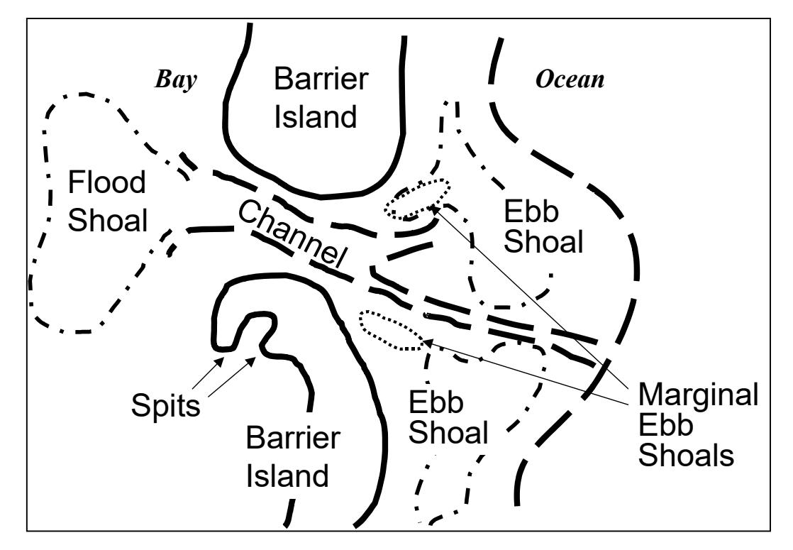

*Figure V-6-1a. Conceptual illustration of unstabilized inlet*

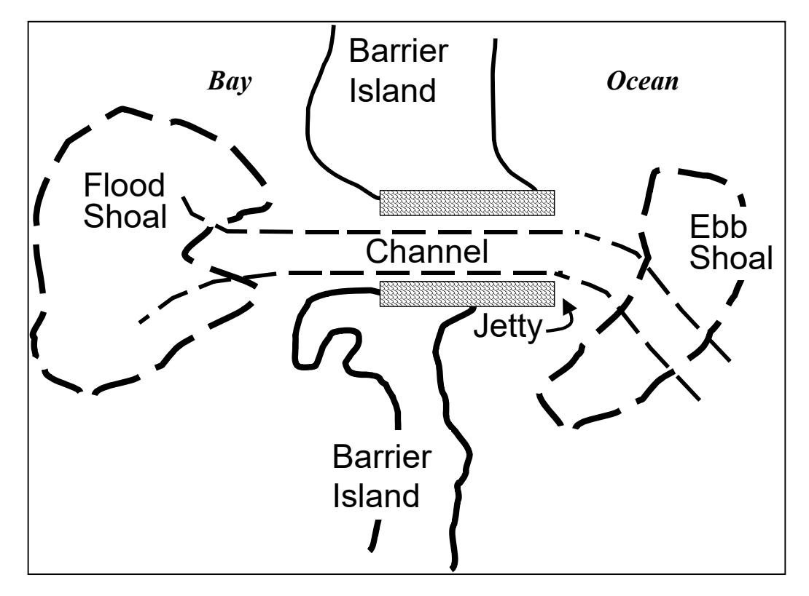

*Figure V-6-1b. Conceptual illustration of stabilized inlet*

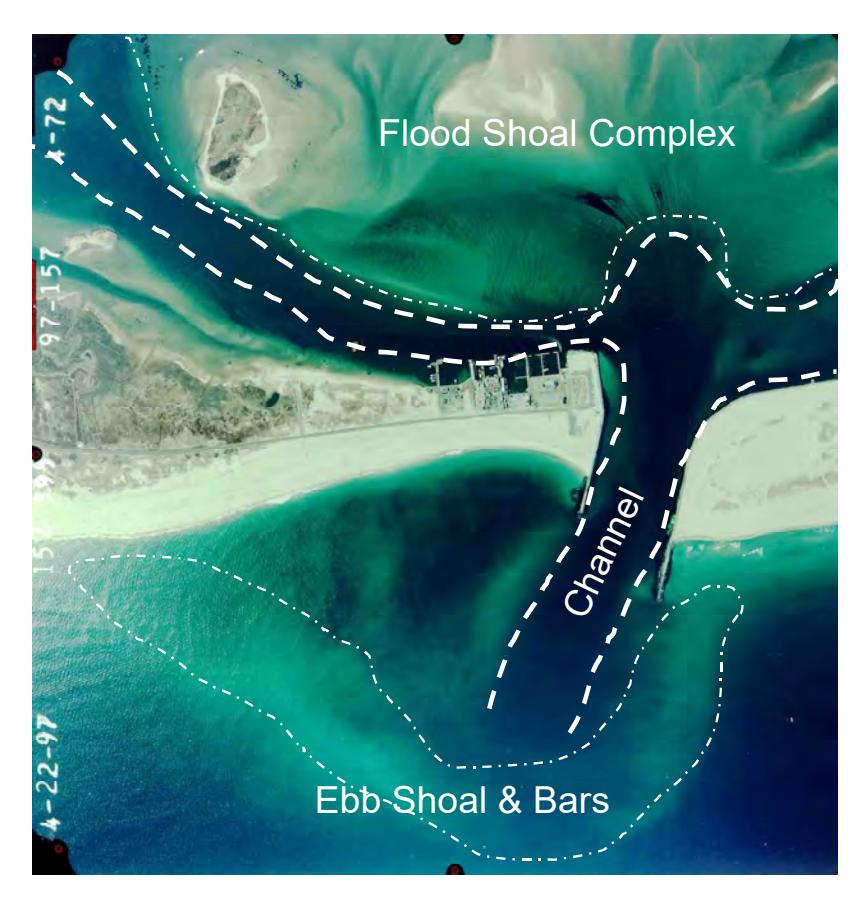

*Figure V-6-1c. Example of stabilized inlet: Shinnecock Inlet, Long Island, New York (22 April 1997)*

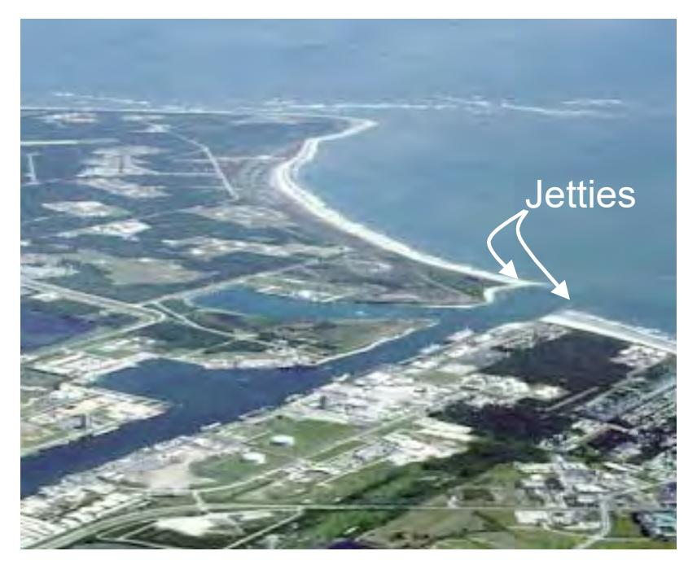

*Figure V-6-1d. Example of entrance: Port Canaveral, Forida, (date unknown)*

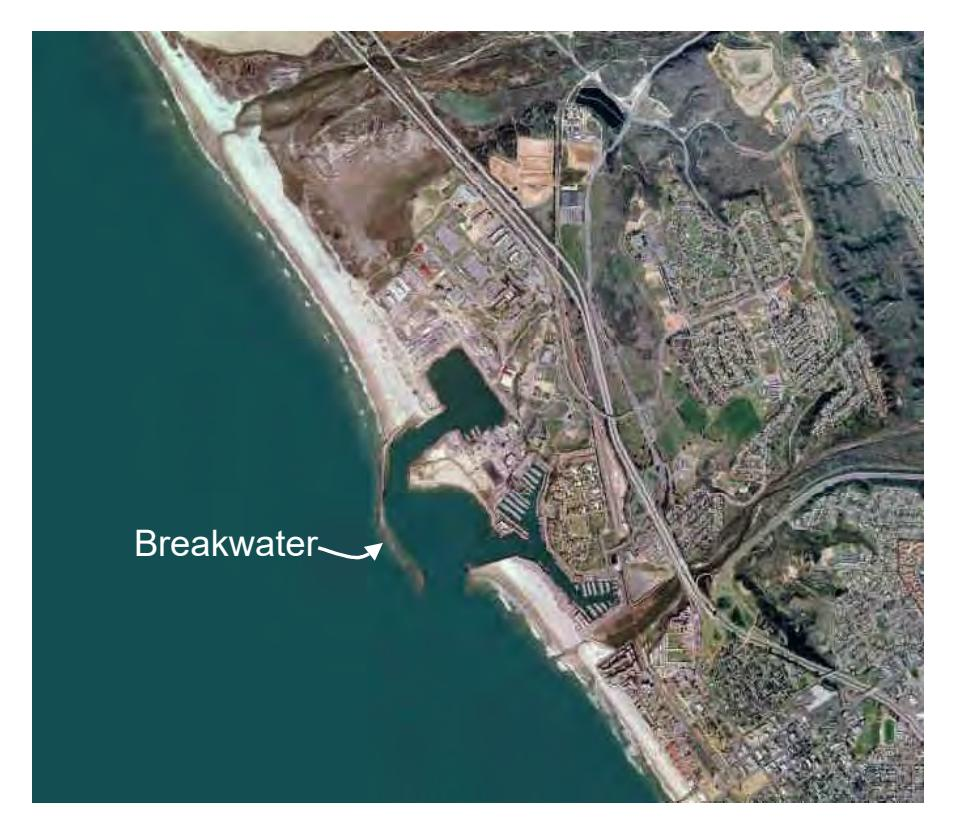

*Figure V-6-1e. Example of harbor: Oceanside, California, (12 February 1999, photograph by Eagle Aerial)*

may be deposited in the inlet channels. The sediment may remain in the channels or may be jetted to the ebb- and flood-tidal shoals. As the inlet matures, the adjacent beaches may advance and retreat due to the changing waves, currents, and bathymetry in the vicinity of the opening. Volumetrically, the effect of this new inlet is a net loss to the adjacent beach system. Navigability of this new inlet is typically treacherous. Channels may meander and their depths may vary rapidly. Waves may break due to shoaling and due to current-induced wave steepening during ebb flows. Depending on the coastal processes and geologic constrictions, the inlet may migrate alongshore.
- (2) The construction of jetties and dredging of channels are navigation controls that seek to promote safe passage through the inlet while minimizing construction and maintenance costs. Jetties stabilize the inlet's location and confine the tidal currents within the channel. In addition, the constricted currents help to clean the channel of shoaled sediment. Dredging improves channel navigability by increasing the depth as required to meet the needs of the design vessel, and straightening channel meanders that make passage through the inlet dangerous. However, the effective removal and disposal of sediment that is removed from the channel and the ebb- and flood-tidal shoals present an ongoing challenge.
- (3) The goals of inlet sediment management are multifaceted: (a) Through design of inlet structures, channels, and other controls (e.g., bypassing plants), to minimize the volume of sediment that accumulates within the navigable waterway.
- (b) To remove shoaled sediment and morphologic features that inhibit safety at least cost.
- (c) To optimize channel depth such that dredging frequency is reduced while the stability of inlet structures and adjacent beaches are not compromised.
- (d) To keep the beach-quality dredged material within the nearshore beach system, effectively bypassing sand around the inlet.
- (e) To place beach-quality material within the nearshore system and on adjacent beaches such that it does not cycle back into the inlet.
- (f) To assist with other missions of USACE as appropriate, such as using dredged material to enhance environmental habitat, provide flood and storm damage protection, and establish or restore wetlands.
- d. Summary. The purpose of this chapter is to discuss engineering works directed towards effective inlet sediment management and review analytical methods that can be applied in the design and evaluation of these projects. Experiences at several sites are reviewed to illustrate approaches to evaluating sediment management problems, the solutions that were implemented, and their performance.

#### V-6-2. Regional Sediment Management and Coastal Inlet Processes

- a. Overview. This section discusses the effects that sediment management activities at inlets have both in the vicinity of the inlet and regionally (on the scale of tens of kilometers along the coast). First, regional sediment management is defined. The relationship between local, inlet-specific activities, and the response of other features within the region is discussed. Next, sediment transport processes at natural and engineered inlets are reviewed, with reference to material contained in Parts II-6 and IV-3.
- b. Regional sediment management.
- (1) Overview. Regional sediment management refers to the use of littoral, estuarine, and riverine sediment resources in an environmentally beneficial and economical manner. Regional sediment management strives to maintain or enhance the natural exchange of sediment within the boundaries of the physical system. A region may include a variety of geologic features, uplands, beaches, inlets, rivers, estuaries, and bays, and is defined by the sediment transport paths within this physical system (Figure V-6-2). Implementation of regional sediment management recognizes that the physical system and embedded ecosystems are modified and may respond to natural forcing and engineering activities beyond the formal dimensions and time frames of individual projects.
- (a) USACE has a central role in the implementation of regional sediment management. The mission areas of USACE include navigation, environmental restoration, storm-damage reduction, and flood reduction. In particular, the mission area ensuring the navigability of our nation's waterways involves removing, transporting, and placing sediment. Some of this material can be used to achieve goals in other mission areas. As opposed to individual homeowners, county and state governments, and other Federal agencies, USACE's role spans both political and geographic boundaries. Although the term "regional sediment management" is new, recognition of the regional nature of coastal processes and the regional

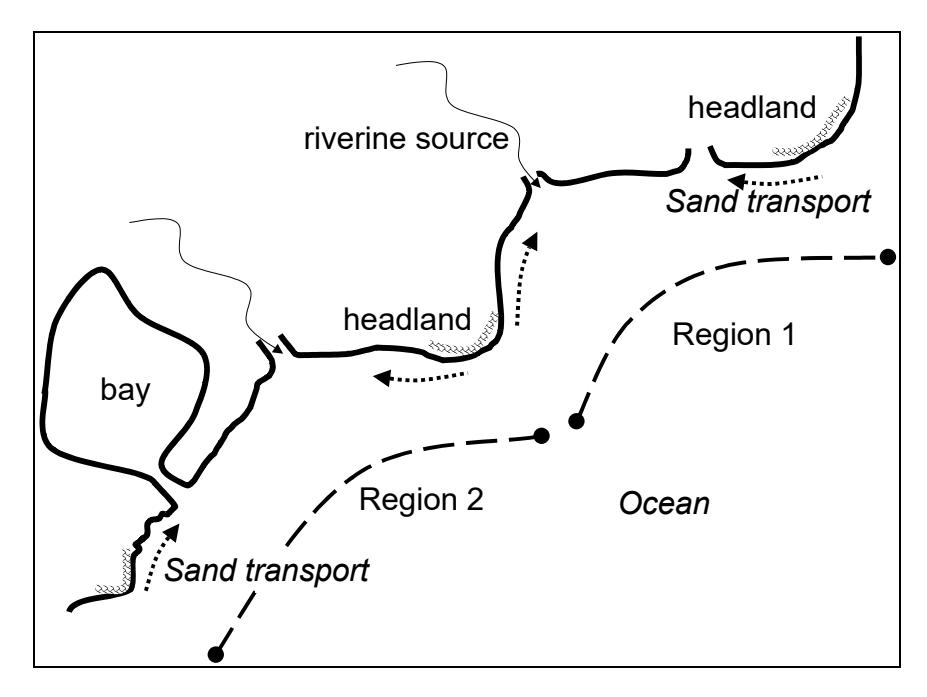

*Figure V-6-2. Conceptual illustration of regions*

influence of engineering works is not. The interrelationship between coastal navigation projects and contiguous beaches became a Federal interest at least as early as the 1930s (Brooke 1934). The first sand bypassing systems at navigation projects, designed to reinstate net longshore sand transport to downdrift beaches, were put into operation in the mid-1930s at Santa Barbara, California (mobile plant) (Penfield 1960) and South Lake Worth Inlet, Florida (fixed plant) (Caldwell 1951).
- (b) Today, USACE is pursuing regional sediment management by collaborating with local and state governments to manage sediments over regions encompassing multiple projects. Schmidt and Schwichtenberg (2000) describe the Jacksonville District's application of regional sediment management principles for proposed improvements to Port Everglades, a deep-draft port on the east coast of Florida. These improvements include widening and deepening existing channels and turning basins, and creating a new turning basin to accommodate larger container ships. Federal shore protection projects along the adjacent three counties will require almost 59 million cu m of beach-quality sand. The District is working with county and state agencies to satisfy the navigational goals at Port Everglades while using the dredged sediments to nourish the adjacent beaches and restore environmental habitat. It is envisioned that beachquality dredged material can be identified prior to dredging and placed directly on the beach. For mixed sediments, a temporary deposition site on an adjacent beach has been considered. After the dredged slurry has been deposited on the beach, hydrocyclones could separate fine sediments from beach quality sand. The beach-quality sand would be trucked to adjacent beaches, and the silt could be placed and vegetated to build natural berms and dunes.
- (2) Critical role of inlets. Inlets are significant elements in controlling sediment movement and its distribution within local and regional domains. They may serve as a source if they funnel riverine, estuarine, and bay sediments to the open coastline. They may also act as a sink by diverting littoral material into the inlet and its bay, harbor, and estuaries. In a manner analogous to water flow through a tidal inlet (see Part II- 6), littoral material may be transported into the inlet on the flood (rising) tide and out of the inlet on the ebb (falling) tide. Flood or ebb dominance of water flow through an inlet, however, does not necessarily determine the net sediment transport direction through the inlet (Stauble et al. 1988; see also Part IV-3-4, or along the adjacent beaches. An inlet in a state of "dynamic equilibrium" indicates
that there is a net long-term (years to decades and longer) balance between water flow through the inlet and sediment transport to and from the inlet. The net, long-term effect is a hydrodynamic field that is sufficient to maintain flow through the inlet and maintain an approximate balance of sediment volume on the beaches to either side of the inlet. In the short term (days to years), cyclical events such as seasonal changes in waves and currents or storms may temporarily disturb the balance. Therefore, although an inlet may be in a state of dynamic equilibrium, it may require dredging to maintain navigability. Inlets that are not in a state of dynamic equilibrium include those that: migrate alongshore, are closing because of shoaling of the channels (either from an upland or ocean source of sediment), and are widening or scouring due to an increasing tidal prism or unstable geologic substrate. For an inlet to remain open, sediment entering the inlet must be diverted from the inlet's principal channels, or the channels must move. If sediment is not bypassed across the inlet, it must be transported by waves or currents away from the inlet throat and into interior shoals, exterior shoals, or beach impoundments; or, it must be removed by dredging. The following section describes hydrodynamic and sediment transport processes at inlets.
- (3) Coastal inlet processes.
- (a) Inlet features. The following is an overview of principal inlet flow fields and sedimentary features. Parts II-6-1 and IV-3-4 present more detailed descriptions of inlet hydrodynamics and sediment transport/morphology. Typical elements of nonstabilized and stabilized tidal inlets are illustrated in Figures V-6-1a and b, respectively. An inlet connects a larger, open-water body (the ocean, sea, lake, etc.) with a generally smaller, protected water body (a bay, lagoon, estuary, or river) through a land body such as a barrier spit. The inlet technically includes the entire seabed between the banks of the adjacent barrier shores, measured from the seaward edge of the ebb shoal to the landward edge of the flood shoal (discussed in the following paragraph). The inlet throat is the region with the smallest cross-sectional flow area and highest velocities. The channel (geologically known as a gorge or thalweg) defines the deepest parts of the inlet. There may be several channels in a natural inlet, which may migrate, vanish, or alternate in dominance. The navigable channel is the one that is deepest at a given time or is maintained for navigation by dredging. A tidal inlet (also known as a lagoonal inlet) connects a tidal water body with the bay, and features significant flow directed both into and out of the inlet throat as a function of water level fluctuations in the ocean and bay. (Riverine mouths or fluvial inlets are dominated by river discharge and minimally affected by flood tide flow). During flood tide, currents are funneled toward the inlet mouth from the ocean (Figures V-6-3a and V-6-4a). In the absence of high, impermeable jetties (Figure V-6-3a), the flood flow is typically most dominant along the ocean shorelines of the adjacent barrier islands, sometimes creating and/or following marginal flood channels. The flood flow converges and accelerates in the throat. Upon its discharge, the flood flow diverges and decelerates beyond the inlet's bayside mouth, depositing sediment in a flood shoal. The flow reverses during ebb current, although rarely symmetrically (Figures V-6-3b and V-6-4b). The ebb flow sweeps sediment from the flood shoal and inlet channels and carries it through the inlet throat. The ebb flow discharges from the inlet's ocean mouth similarly to a free jet, depositing its sediment load in an ebb shoal. The ebb shoal may protrude significantly into the deeper ocean, forming the ebb shoal plateau or terminal lobe. The coast in the direction from which the majority of offshore wave energy arrives is termed the updrift shoreline (top barrier island in Figures V-6-3c and V-6-4c). The opposite coast is the

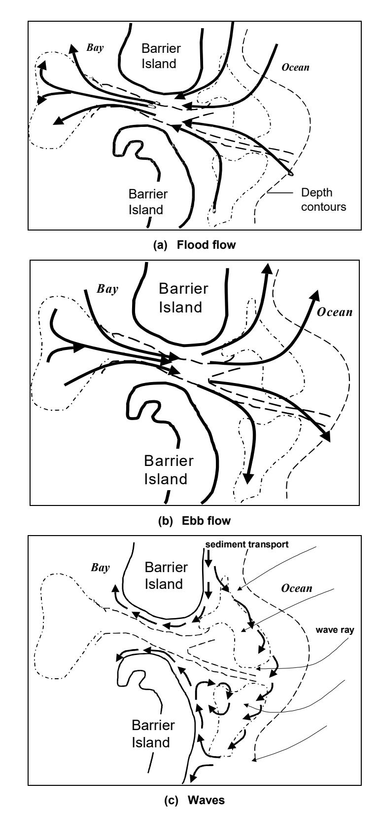

*Figure V-6-3. Idealized sediment transport pathways for unstabilized inlet*

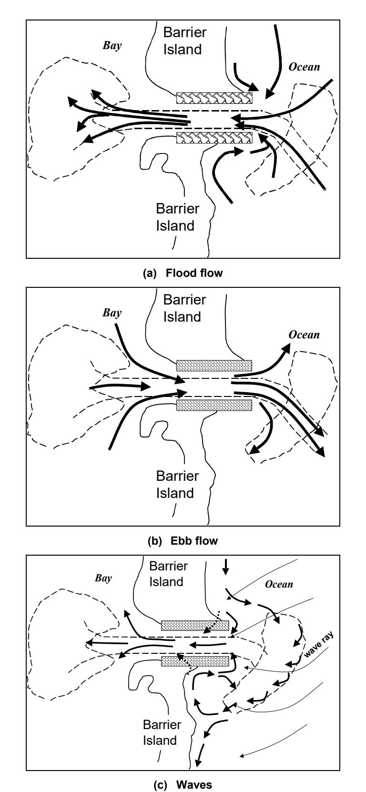

*Figure V-6-4. Idealized sediment transport pathways for stabilized inlet*

downdrift shoreline. Along the updrift shoreline, obliquely incident waves transport sediment alongshore and directed toward the inlet. Across the inlet mouth, the waves breaking upon the ebb shoal transport sediment both toward (into) the inlet and toward the downdrift shoreline. The ebb shoal may, in turn, be skewed toward or elongated beyond the downdrift shoreline. Downdrift of the inlet (a distance of anywhere between one-half and 10 km), wave refraction across the ebb plateau decreases the obliquity of the wave's angle and the associated magnitude of the downdrift-directed transport. Closest to the inlet, transport along the shoreline (leeward of the ebb shoal) may even be reversed, so that transport is directed toward the inlet from the downdrift shoreline. This transport is augmented by diffraction currents (resulting from decreased wave energy and water level setup) directed toward the inlet along the immediate downdrift shoreline. The sediment transported toward the inlet from the downdrift shore may be carried into the inlet and/or diverted toward the ebb shoal by gyres or eddies (circular currents) associated with the inlet's tidal currents. If the jetties are not sand-tight, sediment may be transported over or through these structures (dotted lines in Figure V-6-4c).
• As illustrated in Figure V-6-5a, inlets where longshore currents dominate are more likely to form an ebb shoal with a shallow, arcuate form across the mouth. If tidal currents dominate littoral transport processes (Figure V-6-5b), marginal ebb shoals (also known as linear bars) are likely, aligned with and bordering the inlet channels. Mixtures of both types of shoals are not uncommon. These characteristics are typically observed at unstabilized inlets.

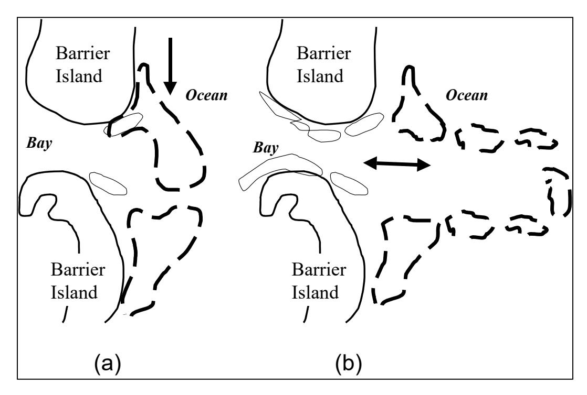

*Figure V-6-5. Unstabilized tidal inlets for which (a) longshore current effects dominate, and (b) tidal current effects dominate (adapted from Oertel 1988)*

• Other sedimentary features include interior spits and channel shoals (see Figure V-6-1a). Spits are emergent landforms that result from the deposition of littoral drift from the adjacent shores. Channel shoals are submerged deposits that encroach upon or cover parts of the inlet seafloor. Spits and channel shoals are usually attached to the barrier island at, or just landward of, the point at which the transport spills from the shoreline into the inlet.
- Processes other than just tidal-induced currents and waves can heavily influence inlet dynamics and morphology. These include wind, salinity differences between the ocean and bay waters, wave-current interactions, river discharge, underlying geology, and inlet orientation. These concepts are outlined in Parts II-6 and IV-3.
- (b) Bypassing processes. Sediment may be trapped at an inlet or it may also be bypassed by a variety of natural forces. Bruun and Gerritsen (1959) described three principal mechanisms of bypassing for unstabilized inlets: Wave-induced transport along the ebb tidal shoal (bypass bar). Transport into and out of the inlet by tidal currents. Migration and welding of sandbars. Figure V-6-6 illustrates wave-induced transport along the ebb tidal shoal (termed, in this case, a bypassing bar). Waves transport sand (littoral drift) from the updrift shoreline toward the inlet. Some of the sand is transported (ramped) directly to the ebb shoal (or bar). This sand is temporarily or permanently stored in the shoal, or is transported downdrift by waves. Once outside the principal influence of the inlet's ebb flow, waves transport the sand both landward and further downdrift, where it can rejoin the downdrift shoreline and littoral stream.

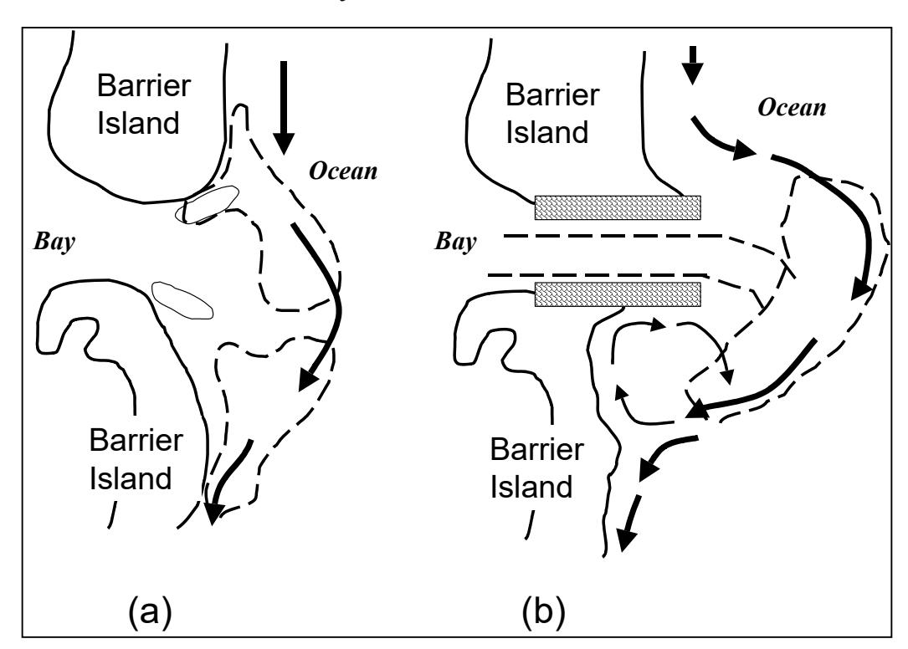

*Figure V-6-6. Idealized wave-induced bypassing along the ebb tidal shoal ("bypass bar") for (a) unstabilized and (b) stabilized inlets*

• Figure V-6-7 illustrates idealized wave and current bypassing. A portion of the littoral drift from the updrift shore may be transported toward the inlet mouth. There, it may be temporarily or permanently stored as part of the updrift beach, creating a bulbous shoreline shape or a shallow plateau at the shoreline's toe, or it may be impounded at the updrift jetty. Or, waves and marginal flood currents may transport the sediment directly into the inlet. Flood currents sweep sand bayward from the inlet's ebb shoals, channels, and interior shoals, and deposit the sand on the flood shoal and along shoals and spits which line the inlet's interior shoreline. Ebb currents, in turn, sweep sand seaward from the flood shoal (and the channels and interior shoals) and deposit it in the ebb shoal. There, the sand may be again swept bayward by flood currents and returned by ebb currents, or may be transported along the ebb shoal by waves, where it can eventually rejoin the downdrift shoreline as previously described.

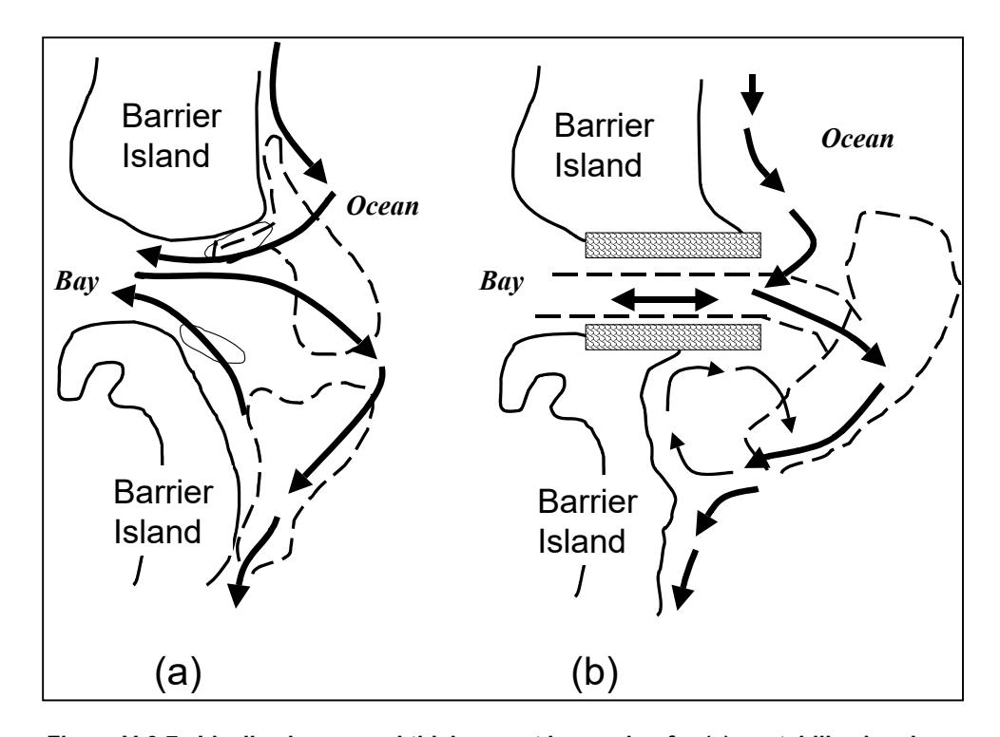

*Figure V-6-7. Idealized wave and tidal current bypassing for (a) unstabilized and (b) stabilized inlets*

- Sand can also be bypassed directly across the ebb shoal in a zig-zag pattern by the combined action of waves and tidal currents. During transport reversals (when the waves approach from the opposite direction), the bypassing pattern can reverse; however, the methods and efficiency of the bypassing are rarely identical, particularly if the inlet and ebb shoal morphology is not symmetrical about the inlet center line. (Lack of symmetry is frequently encountered when one direction of transport dominates). These bypassing mechanisms are generally considered to be a more-or-less steady process, modulated in intensity by periods of increased littoral transport (storms, high waves, etc.).
- In Figure V-6-8, increasing numbers indicate the time sequence of bypassing through migration and welding of bars. This process may occur to some degree at stabilized inlets, but it is more common for unstabilized inlets. Waves again transport sand from the updrift shore toward the inlet. Large shoals then form at the edge of the shoreline and the inlet, and/or a spit may develop

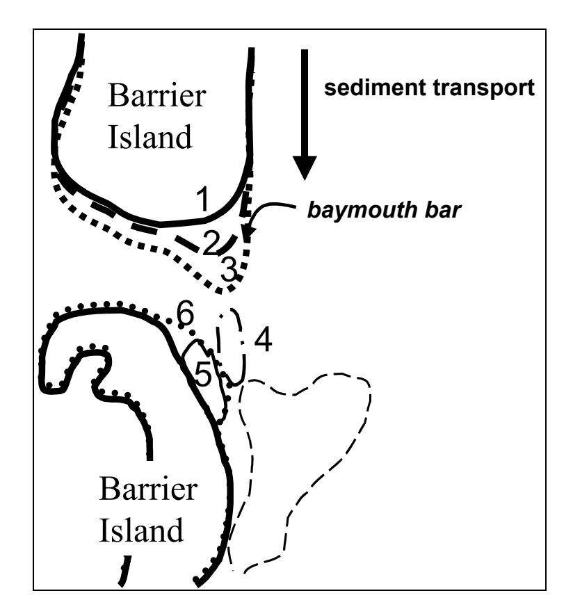

*Figure V-6-8. Idealized bypassing through migration and welding of bars for an unstabilized inlet (increasing numbers indicate time sequence)*

across the inlet throat (a baymouth bar). Growth of the shoals and spit force the inlet channel to, migrate downdrift. This, in turn leads to channel encroachment upon the downdrift shoreline and conesquent beach erosion. Eventually, the channel's hydraulic efficiency becomes sufficiently poor such that the inlet will close, or the channel will breach the shoals or spit (usually during a storm or flood) near the channel's original location. The shoals or spit, now severed from their direct updrift sediment source, become subject to downdrift-directed transport by waves. These sand bodies, thus, migrate downdrift and shoreward where they eventually weld onto the downdrift shoreline, nourishing the beach which was previously eroded by the inlet channel's earlier migration.
- In this way, sand can be naturally bypassed in a cyclical manner, by which the updrift and downdrift shorelines retreat and advance in periodic cycles. The channel shoals and spits are the means of the bypassing mechanism. Their creation, severance, and downdrift attachment can be gradual (quasisteady) or episodic. Time scales of the cycle may range anywhere from 3 to 50 years (FitzGerald 1984, 1988; Fenster and Dolan 1996; Gaudiano and Kana 2001).
- In a variation of this pattern for unstabilized inlets (not shown in Figures V-6-6 through V-6-8), waves transport sand from both adjacent shorelines toward the inlet mouth. Strong ebb and flood currents transport the sand into and out of the mouth. The sand is deposited in the ebb tidal plateau as well as large marginal ebb shoals that line the inlet channel. The emerging marginal shoals are ultimately subject to the landward-directed transport of wave action, and eventually migrate toward shore and weld to the beach. The result is a pattern of erosion and deposition along barrier islands marked by the formation of large intertidal bars along the inlet channel, and
apparently little (or at least, uncertain) net sediment bypassing. FitzGerald (1984) and Gaudiano and Kana (2001) described this process as controlling South Carolina's barrier island/inlet shorelines, noting cycles of ebb-tide delta growth and decay (15 to 20 percent changes in volume) which last from 4 to 8 years. Further elaboration of these processes is presented by FitzGerald (1988) and in Part IV-3 and Part IV-4.
- Inlets, particularly unstabilized ones, can bypass sand through a combination of the bypassing mechanisms. As part of the bypassing process, unstabilized inlets may migrate, usually in the net downdrift direction, but they can also migrate updrift (see Aubrey and Speer (1984) and Douglass (1991), among others).
- Inlets' natural bypassing processes also serve to illustrate the dynamic nature of the shorelines adjacent to an inlet. Roughly, the scale of the bypassing features (and therefore of the directly affected shoreline lengths) can range from 1/2 km updrift and 1-2 km downdrift for a small inlet (for example, 200 m wide), to several kilometers updrift and tens of kilometers downdrift for a large inlet (for example, >1,000 m wide) (The alongshore extent of inlets' influence is discussed in Part V-6) Beach erosion is often manifest if upland development is sited within an inlet's zone of migration or cyclical accretion/erosion associated with natural bypassing and ebb delta fluctuation. This inopportune timing of oceanfront development refers to the platting of land or establishment of construction setback lines, along the oceanfront or the inlet's interior shorefront, at times when the shoreline is at an anomalously advanced location associated with the inlet's cycle.
- c. Inlet operation and maintenance activities . To maintain navigable waterways, USACE as well as state and local agencies construct jetties and dredged channels. These activities may change inlet processes (see also Part IV-4).
- (1) Dredging of shoals or channels within an inlet, whether with or without structural (jetty) improvements, can increase the inlet's potential to act as a sediment sink. Most simply, the response is analogous to the natural tendency for a depression in the seabed to fill with sediment from the surrounding seabed and the active littoral system. If sand dredged from the inlet during the initial work or its subsequent maintenance is not placed upon the adjacent beaches or otherwise within the active littoral system, then the net long-term effect is expected to be erosion of the adjacent beach on one or both sides of the inlet.
- (a) Inlet dredging may also increase the inlet's flow velocities or its tidal prism (the volume of water that flows into or out of the inlet in one-half tide cycle). (See Part II-6.) This may result in enlargement of the inlet shoals, and seaward displacement of the ebb shoal. Enlargement of shoals will remove sediment from the open coast to the inlet channels and on to the flood and ebb shoals. Seaward displacement of the ebb shoal is expected to reduce bypassing capacity of the inlet.
- (b) An example of this effect is the 1892 creation of St. Lucie Inlet, Florida, by local residents, who, desiring a convenient channel between Indian River and the Atlantic Ocean, dredged through the sandy barrier island (Sargent 1988). Beach sand was rapidly diverted from the adjacent shores to form large ebb and flood tidal shoals. Within 37 years after the initial cut, the updrift shoreline (Hutchinson Island to the north) retreated up to 540 m from its preinlet location, and the downdrift beach (Jupiter Island) retreated over 650 m (USAED, Jacksonville, 1973). The construction of a 1,010 m-long north jetty in 1929 partially restored the north shoreline's location over the next 30 years by impounding littoral drift, but not before millions of cubic meters of sand had been (mostly irretrievably) diverted from the littoral system (Olsen Associates, Inc. 1995). A 490-m jetty was constructed at the south side in 1980, but does not nearly extend to that shoreline's preinlet location.
- (2) Dredging a channel through the ebb tidal platform can also change bypassing mechanisms via the ebb shoal. Initially, portions of the shoal adjacent to the channel are subject to shoreward-directed transport by waves and can simultaneously be deflated by wave- and current-induced erosion. These portions of the shoal may migrate landward and weld to the up- or downdrift shore, resulting in significant accretion of the beach. The welded shoal and its seaward plateau, severed from its bypassingrelated sand source, eventually erode and cause the beach to recede from its artificially advanced position. An example of this process may include Bald Head Island, North Carolina, located directly east of the Cape Fear River entrance. The initial stabilization and deepening of the Cape Fear River entrance channel beginning in the 1870s, by dredging, is thought to have severed the inlet's large outer bypassing plateau. The eastern lobe of the ebb shoal (totaling about 4.6 million cu m) migrated shoreward and resulted in a 370- to 600-m advance of the Bald Head Island shoreline directly east of the inlet between 1890 and 1920. The shoreline position then remained relatively stable for about 50 years. At the same time, however, the submerged toe of the severed shoal, which had welded to the shoreline, steadily eroded. Resort and residential development along the accreted, quasi-stable shoreline began in the early 1970s. But by 1974, the shoreline began to rapidly erode toward its earlier location, receding at an average rate of 20 to 30 m/year (Cleary and Hosier 1988; Olsen Associates, Inc. 1989; Jarrett 1990). Similar examples of deflation and landward migration of severed ebb tidal deltas are described for inlet improvement projects at Murrell's Inlet, South Carolina, and Little River Inlet on the North Carolina/ South Carolina border (Douglass 1987; Hansen and Knowles 1988; Chasten 1992).
- (3) Structural stabilization of an inlet channel by jetties can have numerous consequences to the sediment-sharing system and adjacent shorelines. Sand-tight jetties may perform much like groins and impound littoral material. Sand may accrete the beach on the updrift shore and, during reversals in longshore transport direction, to a lesser degree on the downdrift beach. If the ebb shoal connects to the beach, construction of the jetty may extend through the bypassing platform, thereby interrupting this bypassing mechanism. Or, jetties may block the formation of bypassing spits and shoals that would otherwise cyclically grow from the updrift shoreline and migrate to the downdrift shoreline.
- (a) Jetties can also transport littoral material seaward via offshore-directed (rip) currents that can develop along their updrift face. In some cases, the diverted sand may deposit in the ebb shoal, and it may or may not ever return to the downdrift beach through natural mechanisms.
- (b) Jetties displace an ebb shoal seaward as a function of their length and the degree to which they increase the inlet's tidal prism and velocity. For example, the construction of the 3.2-km-long jetties at St. Mary's entrance in the late 1800s is estimated to have caused the net deposition of 92 million cu m of sand across an ebb tidal platform. This platform has been displaced about 4,000 m seaward of the original shoal (Olsen 1977; USAEWES 1995).
- (c) Weir jetties, or structures that are low or porous, may increase the degree to which sand is diverted from the adjacent shores. Weir jetties constrict flood currents toward the shoreline, increasing the flow velocity and sediment transport directed into the inlet (Figure V-6-9). The subsequent ebb flow is minimally reduced by the weir's presence and transports the sediment seaward beyond the limit of the weir and jetty structure. (This process can be minimized if the sand falls into a sediment trap and is regularly bypassed by mechanical means to the adjacent shores.) Similarly, low or porous jetties allow flood flow to transport sediment into the inlet from the adjacent seabed, but then act to transport the sediment further seaward during ebb flow by their jetting action upon the ebb current. Dean (1988) has described the latter phenomenon at St. Mary's entrance.

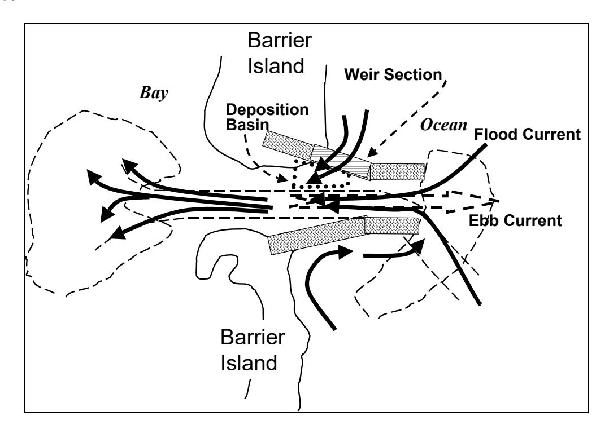

*Figure V-6-9. Flood and ebb tidal flow in a weir jetty system*

- (d) Jetties also influence the littoral transport pattern along adjacent shorelines by developing shadow zones in which the refracted wave field is modified (see Figure V-6-4c). On the downdrift side of a jetty (or in the downdrift lee of an ebb shoal modified by the jetty's presence), sand transport is generally directed into the shadow (i.e., toward the jetty) from the adjacent shoreline by: Refraction and diffraction of waves about the structure's seaward end. Diffraction currents associated with a decrease in wave energy within the shadow zone.
The processes can cause a leeward impoundment fillet against the jetty.
- d. Inlet modifications of longshore transport. (1) As discussed in Part III-2, coastal engineering analyses often involve two types of longshore transport rates. (Note that the discussion herein defines rates as positive quantities; the presentation in Part III-2-2(a) applies an alternate definition.) The net longshore transport rate is defined as the difference between the right-directed and left-directed longshore transport over a specified time interval for a seaward-facing observer:

```math
Q_{net} = Q_R - Q_L \tag{V-6-1}
```

where the leftward-directed transport rate $Q_{L}$ and rightward-directed rate $Q_{R}$ are taken as positive.
(2) The gross longshore transport rate is defined as the sum of the right-directed and left-directed transport rates over a specified time interval for a seaward-facing observer:

```math
Q_{gross} = Q_R + Q_L \tag{V-6-2}
```

Inlets can trap longshore sediment transport from both directions, resulting in a greater amount of transport interruption than simply the net transport rate. That is, inlets are a potential sink to the gross longshore sediment transport in the region. Additionally, tidal currents, ebb-shoal bathymetry, and shoreline morphology can each increase the gross transport directed toward the inlet, increasing the inlet's diversion of littoral drift from the adjacent system. Examples are described in the following paragraphs.
(3) Figure V-6-10(a) depicts a fully-bypassing, equilibrated inlet in which 100 units and 40 units of longshore transport, respectively, are directed toward the inlet from the updrift and downdrift coastlines. The net and gross transport quantities are thus 60 units and 140 units, respectively. As the inlet is assumed to be fully bypassing, there is no net change to the adjacent shorelines.

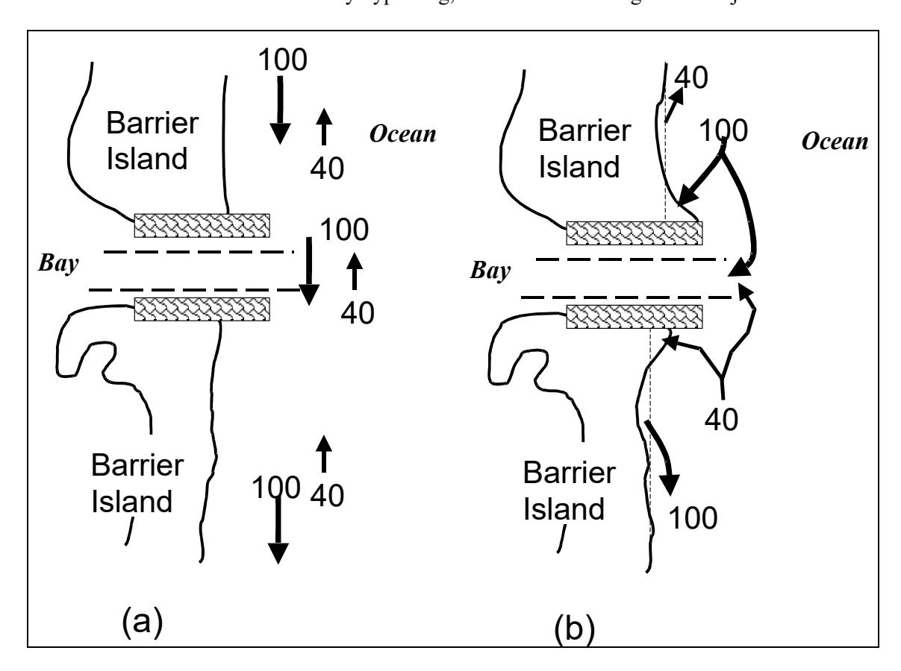

*Figure V-6-10. Example of inlet-adjacent shore erosion associated with (a) a fully-bypassing inlet, and (b) an inlet that is a complete littoral sink*

(4) Figure V-6-10(b) depicts an inlet which is a complete littoral sink under the same transport conditions as previously described. An inlet may be a complete littoral sink immediately after formation; as it matures, bypassing via the shoal system increases. In Figure V-6-10(b), the incident, updrift transport (100 units) is assumed to be diverted to an updrift impoundment fillet, the inlet channel, and/or shoals. The downdrift shoreline, beyond the jetty's wave shadow and deprived of the 100 units of incident transport, must yield 100 units of beach material in response to the longshore transport potential. During transport reversals, the incident transport (40 units) is likewise assumed to be diverted to a minor impoundment fillet on the other side of the inlet, the
inlet channel, and shoals. If the updrift impoundment fillet is wholly located in the jetty shadow of the reversal waves, or otherwise removed from the littoral stream by refraction effects, then the updrift shoreline, beyond the shadow, must yield 40 units of beach material in response to the longshore transport potential. If impoundment fillets form, the inlet will not shoal and the net effect is the same as the net longshore transport rate: 60 units of accretion (updrift) and erosion (downdrift). However, if no impoundment fillets form, or if the impoundments are already at capacity, the inlet channel and/or shoals may capture the gross transport (140 units), with 40 units of erosion (updrift) and 100 units of erosion (downdrift).
- (5) In Figure V-6-10(b), the potential for net updrift erosion associated with the inlet is counterintuitive. Its ultimate manifestation depends upon the degree to which the updrift impoundment fillet is capable of yielding sand to the adjacent shore during transport reversals. In the limit, when there is no impoundment at the updrift jetty and when all of the updrift transport directed toward the inlet is lost therein (and there is no bypassing from the downdrift shoreline), the potential for updrift inlet-related erosion is totally realized.
- (6) Wave refraction across the ebb shoal plateau may locally increase the rate of longshore transport directed toward the inlet mouth. Inlet-directed transport may likewise be induced from diffraction currents that result from gradients in breaking wave energy within the wave-shadow of the ebb shoal plateau. Additionally, a shoreline that is curved toward the inlet's mouth, such as that which results from local beach erosion, further exaggerates the local rate of inlet-directed longshore transport. The latter is a result of the increased angle with which waves break along the shoreline. Each of these phenomena can potentially increase the rate at which sand is transported toward the inlet and mouth.
- (7) Figure V-6-11 illustrates potential alteration of the pattern of longshore transport by an ebb shoal. Waves 1.0 m in height and 8 sec in period were refracted from deep water across the bathymetry illustrated in the bottom graphic. The incident wave conditions were: From the left (+23 deg), 40 percent annually; from shore-normal (0 deg), 35 percent annually; from the right (-23 deg), 25 percent annually.
- (8) The bathymetry is idealized, but is representative of an inlet for which littoral drift dominates tidal flow and for which the net longshore transport direction is from left to right. The upper graphic depicts the potential longshore transport rate computed from each of the three refracted wave cases. The middle graphic depicts the total right-directed, left-directed, and net transport rates that result from the weighted superposition of the individual transport curves. The component transport rates (upper graphic) are normalized by the maximum transport value among the three cases. In the middle graphic, the transport values are normalized by the maximum value of the net transport rate. Only the effect of obliquely incident waves is considered, and transport induced by alongshore gradients in wave height (diffraction currents) and tidal currents are omitted. The methods employed to compute these transport rates are described in Part III-2-2, and, later in this chapter.
- (9) In this example, waves from each of the three offshore directions result in transport directed toward the inlet mouth within the alongshore reach of the ebb shoal's refractive influence. Within this region (indicated by asterisks in the middle graphic), no transport is directed away from the inlet. Additionally, the transport magnitude increases significantly beyond that of the ambient transport (i.e., the transport associated with obliquely incident waves outside of the shoal's refractive influence). The result is an increase in transport toward the inlet mouth – with

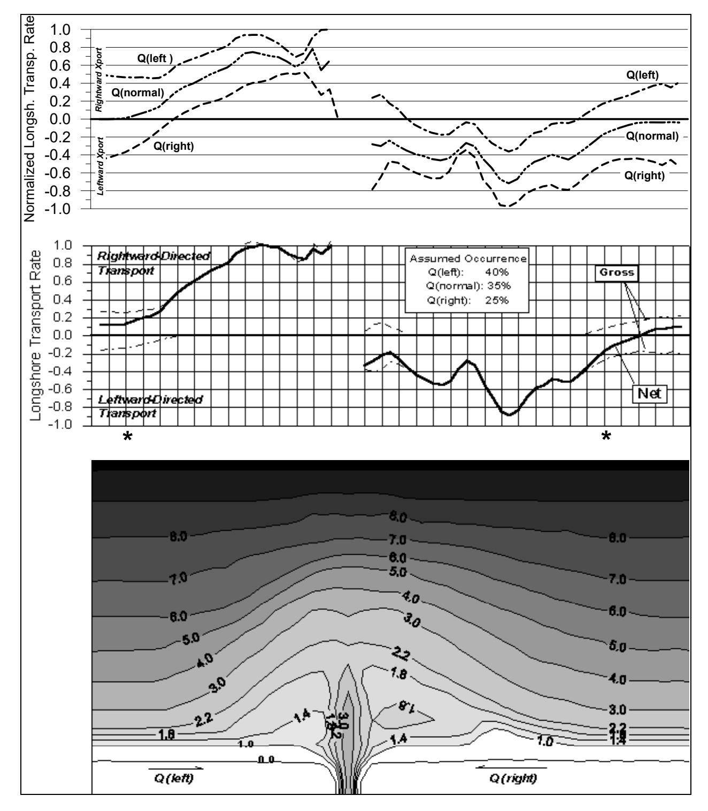

*Figure V-6-11. Illustration of longshore sediment transport potential computed for three wave conditions incident to inlet's ebb shoal plateau (depths in meters)*

#### EXAMPLE PROBLEM V-6-1

#### GIVEN:

The right- and left-directed volume transport rates (volume per unit of time) entering and leaving sections of shoreline upcoast and downcoast of an inlet induced by obliquely incident waves and currents are shown in the following tabulation for each section and for the inlet. Assume the inlet is a total littoral barrier (i.e., no bypassing; material can move into the inlet, but material cannot move out of the inlet).

| A B C D Inlet E F G | H | I |
| --- | --- | --- |
| 100 100 120 125 125 0 0 0 | 30 80 | 100 |
|  |  |  |
| 30 30 10 0 0 60 40 50 | 40 | 30 30 |
|  |  |  |

#### FIND:

The potential volume rate of change at shoreline sections A through I associated with these transport rates, and the total net volume rate of change on the left (updrift) and right (downdrift) sides of the inlet. Material transported into a section is positive (accretion = +) and material transported out of a section is negative (erosion = -).

#### SOLUTION:

The volume rate of change at each section A through I is equal to the algebraic sum of all volume transport rates entering and leaving each section. For example, at section C, the volume rate of change is the difference between what goes into section C (+120 + 0 = +120) and what comes out of section C (-125 + (-10) = -135). The algebraic sum of these two numbers (+120 + (-135) = -15) is the volume change per unit of time at section C.

| Table V-6-1 Updrift Volume Change |  | Table V-6-2 Downdrift Volume Change |  |
| --- | --- | --- | --- |
| Updrift | Vol. Change | Downdrift | Vol. Change |
|  |  | E | -20 |
| A | 0 | F | +10 |
| B | -40 | G | -40 |
| C | -15 | H | -60 |
| D | 0 | I | -20 |
| Subtotal | -55 | Subtotal | -130 |
| Inlet | +125 | Inlet | +60 |
| Total | +70 | Total | -70 |

The total volume rate of transport on the left (updrift) side of the inlet (sections A through D) is equal to the volume rate of material transport entering and leaving through the left face of section A (+100 + (-30) = + 70) plus the volume rate of material transport entering and leaving through the right face of section D (-125 + 0 = -125). The algebraic sum of these two values (+70 + (-125) = -55) is the subtotal of all the changes occurring on the updrift side of the inlet (stations A through D). Thus, the left side of the inlet is eroding at a rate of -55 per unit of time.

#### EXAMPLE PROBEM V-6-1 (Concluded)

The total volume rate of transport on the right (downdrift) side of the inlet (sections E through I) is equal to the volume rate of material transport entering and leaving through the left face of section E (+0 + (-60) = -60) plus the volume rate of material transport entering and leaving through the right face of section I (-100 + (+30) = -70). The algebraic sum of these two values (-60 + (-70) = -130) is the subtotal of all the changes occurring on the downdrift side of the inlet (sections E through I). Thus, the right side of the inlet is also eroding, but at a rate of -130 per unit of time.
The total volumetric rate of change across the shoreline from sections A through I equals that material entering and leaving the left face of section A (+100 + (-30) = +70) plus that material entering and leaving the right face of section I (-100 + (+30) = -70. Thus, the total volumetric rate of change across sections A through I equals zero since the net amount of material entering the left face of section A is equal to the net amount of material leaving the right face of section I. However, the left (updrift) side of the inlet is eroding at a rate of -55 per unit of time, and the right (downdrift) side of the inlet is eroding at a rate of -130 per unit of time. Since the total erosion rate across sections A through I equals (-55 + (-130) = -185 per unit of time), and the net material rate entering the left face of section A is equal to the net material rate leaving the right face of section I, the material being eroded from the sections to the left and right of the inlet must be accumulating in the inlet. And, indeed, this is the amount of material rate passing through the right face of section D (+125) into the inlet (no material leaves the inlet), plus the amount of material rate passing through the left face of section E (+60) into the inlet (again, no material leaves the inlet), for a total of +185 per unit of time accumulating in the inlet.
no mechanism for reversal. The larger transport gradient erodes sand from the beach and transports it toward the inlet. An inlet's total potential effect is therefore equal to the sum of the ambient gross transport plus additional transport locally directed toward the inlet that is induced by the perturbation caused by the inlet on the local geometry.
- e. Alongshore extent of inlet influence.
- (1) The length of coastline directly influenced by an inlet is manifest, in large part, by alongshore changes in the nearshore bathymetry (and associated wave field), and alongshore changes in the beach profile shape and magnitudes of historical shoreline fluctuation. The ultimate degree to which an inlet modifies adjacent shores is a function of the volume of sand contained in its other features (Fitzgerald 1988; Bodge 1994b; Fenster and Dolan 1996); that is: impounded by jetties and other structures; captured in the flood and ebb tidal shoals; dredged; placed on adjacent beaches (e.g., dredged material or other source of fill).
- (2) Absolute distances of inlet influence remain a subject of study, but may extend further than were previously thought. Shoreline response immediately adjacent to an inlet is typically obvious and erroneously led earlier investigators to conclude that the extent of inlet improvements' influence was limited to short reaches downdrift; usually some multiple (about 3 to 10) of the jetty length away from the inlet. Many, if not most, estimates in the literature of the length of inlet influence were truncated by the limited extent of coast that the investigators examined (Bruun 1995).
- (3) Based upon analysis of shoreline change rates, Fenster and Dolan (1996) report the spatial influence for natural inlets along the wave-dominated North Carolina coast as up to 13.0 km, and up to 6.1 km along the mixed-energy, tide-dominated Virginia barrier islands. Dean and Work (1993) report downdrift inlet influence for inlets along Florida's central and southern Atlantic coastlines as at least 2 km
to more than 6 km; however, their analysis was limited to 6 km or less. The erosive effect of the entrance to Lagos, Nigeria, may extend at least 40 to 50 km downdrift (Bruun 1995). Migniot and Granbaulan (1985) report inlet-influenced erosion reaching 50 to 80 km downdrift of river entrances on the southwest coast of France. Bruun (1995) describes inlet-attributable erosion occurring 30 to 35 km downdrift of the Hirtshals navigation works on the North Sea coast of Denmark, 20 to 25 years after the construction of entrance breakwaters and dredging increases. Inlet-adjacent erosion may be particularly severe when the beaches are restricted by geological features, such as pocket beaches on the United States Pacific coast, but this hypothesis needs further research. Terich and Komar (1974) and Komar (1976) describe this effect at the entrance to Tillamook Bay, Oregon.
(4) Outside of the direct influence area (i.e., within the shadow of bypassing bars, jetties, etc.), an inlet's influence appears to decrease exponentially away from the inlet. One example is Port Canaveral Entrance (Bodge 1994a). This effect is also predicted by analytic shoreline-change models, including, for example, the one-line model of Pelnard-Considére (1956) described in Part III-2-2. According to Pelnard-Considére's solution for shoreline change adjacent to a sediment-trapping structure, the shoreline recession y at a distance x downdrift of the structure, at the time t_f at which the structure becomes filled to capacity and begins to bypass sand, is:

```math
\frac{y}{Y} = \left[ \exp(-u^2) - \sqrt{\pi}u \ erfc(u) \right] \tag{V-6-3}
```

where

```math
u = \frac{x}{y} \frac{1}{\sqrt{\pi}} \tan \alpha_b \tag{V-6-4}
```

and

```math
t_f = \pi Y^2 / 4g \tan^2(\alpha_b) \tag{V-6-5}
```

(5) The parameter Y is the structure length, erfc() the error function complement, and \alpha is the angle of the breaking wave crests relative to the shoreline (assumed to be quasi-steady). Both y and Y are measured relative to the no-structure shoreline. The longshore diffusivity, \varepsilon ,

```math
\varepsilon = \frac{K H_b^{2.5} \sqrt{g/\kappa}}{8(s-1)(1-n)(h_* + B)} \tag{V-6-6}
```

is a measure of the tendency of wave action to spread out a shoreline perturbation, where K is an empirical coefficient from the longshore transport Equation III-2-5 (of order 1), H_b is the breaking wave height, g is the acceleration of gravity, \kappa is the ratio of local breaking wave height to local depth (about 0.8), g is the ratio of sediment to water specific gravity (about 2.65), and g is sediment porosity (about 0.4). The value g is the depth of active sediment transport (depth of closure) and g is the beach berm height, where g and g are positive values above and below the water level, respectively.
(6) Figure V-6-12 presents solutions to Equation V-6-3 for various wave breaking angles. For typical angles on the order of 2 to 8 deg, shoreline recession on the order of 5 percent of the structure's length is predicted between 15 and 50 jetty lengths downdrift. In the case of a 200-m-long jetty, this corresponds to 10 m of recession at locations between 3 and 12 km downdrift of the jetty.

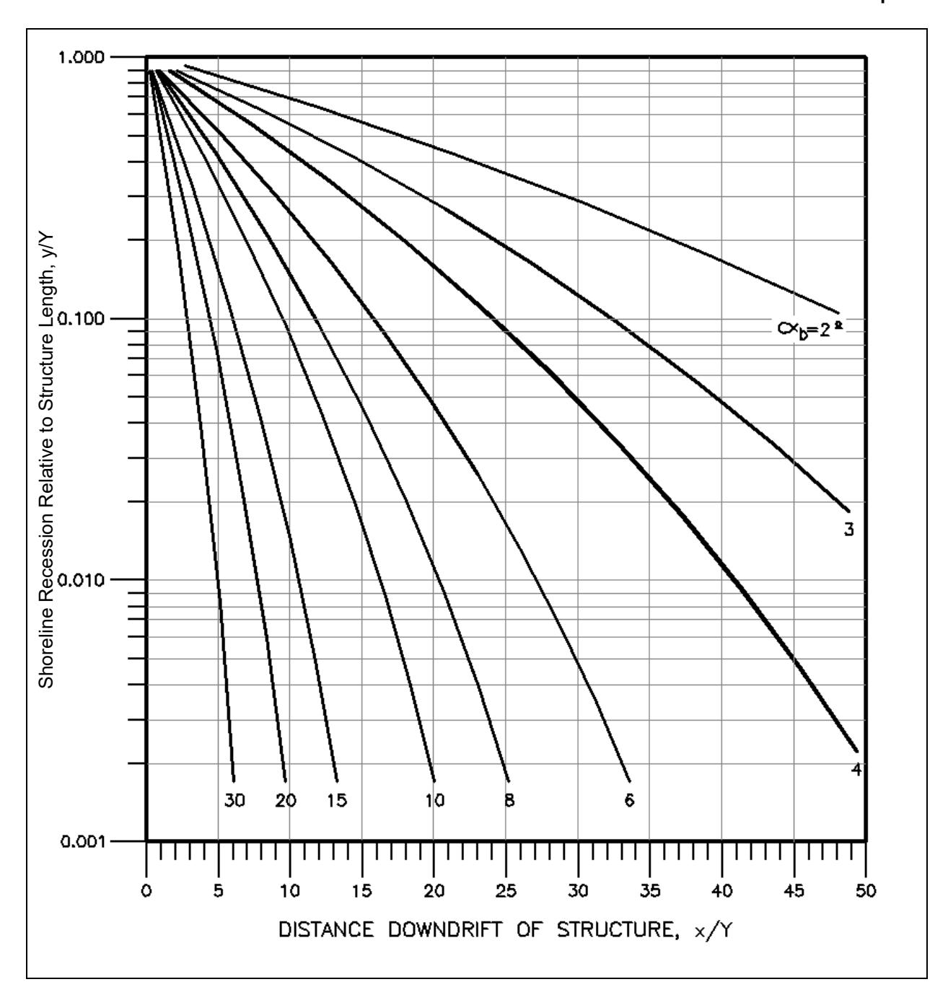

*Figure V-6-12. Solutions of Equation V-6-3 (from Bodge 1994b)*

(7) Dean and Work (1993) present a solution for Pelnard-Considère's equation for the case where sand is removed from the system at a rate Q_I at the inlet location x = 0:

```math
y(x,t) = \frac{2p Q_I \sqrt{t}}{(h_* + B)\sqrt{\pi \varepsilon}} y' \tag{V-6-7}
```

where p describes the degree to which the inlet's sand removal alters each of the inlet's two adjacent shorelines; i.e.,

```math
p = \frac{\text{(sand lost to inlet from shoreline of interest)}}{\text{(sand lost to inlet from both shorelines)}} \tag{V-6-8}
```

```math
y' = \left\lceil \sqrt{\pi} \, v \, erfc \left( v \right) - \exp\left( -\left( v^2 \right) \right) \right\rceil \tag{V-6-9}
```

```math
v = \frac{|x|}{\sqrt{4gt}} \quad ; \quad |x| = v\sqrt{4gt} \tag{V-6-10}
```

- (8) In Equation V-6-8, a value of p = 0.5 implies that the inlet's sink effect (Q_l) is evenly distributed between the two adjacent shorelines; whereas a value of p = 1.0 implies that all of the inlet's sink effect occurs from the shoreline of interest. As another example, p = 0.3 implies that 30 percent of the inlet's sink effect occurs from the shoreline of interest (whereas the other 70 percent occurs as sand losses from the other shoreline).
- (9) Figure V-6-13 shows nondimensional solutions of Equation V-6-9. Additional examples and applications of Pelnard-Considère's shoreline change solution are presented in Part III-2-2. As described in that chapter, solutions for y(x,t) can also be linearly added to yield the combined response of shoreline perturbations.
- (10) Although Equations V-6-3 and V-6-7 provide useful theoretical insight to the potential response of a shoreline near an inlet, they are generally of limited practical value in assessing real world response. The equations do not readily account for alongshore variabilities in breaking wave angle nor sand impoundment adjacent to inlet jetties. Likewise, cross-shore transport and seasonal reversals in longshore transport direction are not taken into account. Nonetheless, these equations can be examined for order-of-magnitude effects which might be expected for a given inlet situation.
- (11) From the Pelnard-Considère equations, Dean (1993) likewise presents solutions of shoreline change adjacent to an inlet for the case where sand is directed toward a dredged inlet by transport induced by ambient oblique waves and by the inlet's perturbative effect to the local shoreline. Dean observes that in the absence of effective jetties, the rate of sand that enters the inlet decreases with the reciprocal square root of time (i.e., 1/T_d^{1/2} ); however, the cumulative amount of sand entering the inlet over time from the adjacent shorelines is infinite. Dean also notes that the equations predict that the location of maximum shore erosion migrates with time away from the inlet. That is, measurements taken at one fixed point along the shoreline would first demonstrate no inlet erosion effect, then a rapid rate of erosion, then a decreasing rate as the shoreline asymptotically approaches an equilibrium, eroded position. Alternately stated, the peak erosion zone would migrate like a wave away from the inlet, and the magnitude of this peak rate would decrease with time.
- (12) Bruun (1995) describes numerous examples where erosion downdrift of an inlet appears as an obvious near field effect and as a less obvious, but faster-migrating, far field effect. Bruun concluded that the downdrift shoreline development at a littoral drift barrier may in general, but not always, be described by a short (near field) effect as well as a long distance (far field) effect, both of which move downdrift at various rates. The short distance influence occurs first. After it develops to a certain extent, the long distance effect may appear, gradually moving downdrift faster than the short distance but fading out with distance. The short distance peak of the erosion occurs close to the littoral drift barrier, and moves downdrift at a rate of about 0.3 to 0.5 km/year compared to a rate of 1 to 1.5 km/year for the long distance erosional front. Bruun suggests that the short-distance effect is a coastal geomorphological feature, whereas the long-distance effect is a materials-deficit feature.

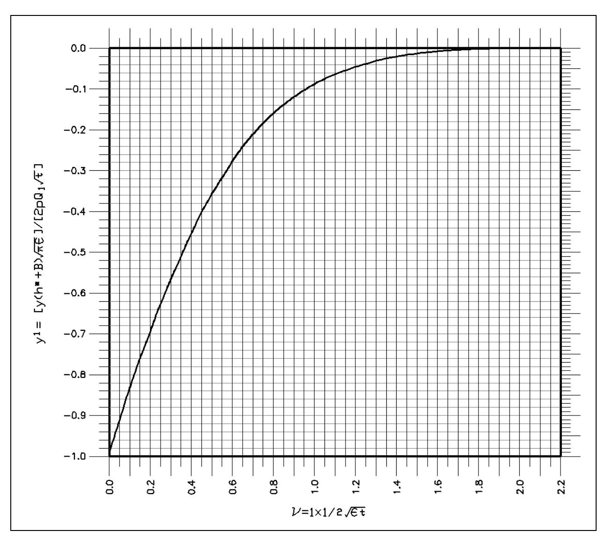

*Figure V-6-13. Solution of Equation V-6-9*

- f. Estimating alongshore extent of inlet influence. Five methods to estimate the alongshore extent of inlet influence are as follows: Examination of historical shoreline changes; even-odd analysis; alongshore variations in beach morphology; wave refraction analysis; examination of inlet's net sink effect.
- (1) Of these, Methods 1 and 2 (and to a lesser extent, 5) rely principally upon shoreline change data. Methods 3 and 4 (and, principally 5) rely upon data that are mostly distinct from shoreline change or location data. Methods 2, 3, and 4 typically yield only estimates of direct inlet effect; whereas Methods 1 and 5 potentially yield estimates of both direct and indirect (near field and far field) inlet effects. Method 5 may be the most powerful approach because it first assesses the inlet's littoral impact within the inlet, and then attempts to identify the adjacent shoreline length along which the inlet's volumetric impact is manifest. In practice, some combination of all five methods is typically necessary to assess the volumetric and lineal extent of an inlet's effect upon the adjacent shores.

#### EXAMPLE PROBLEM V-6-2

<u>GIVEN</u>: An inlet's north jetty is 240 m long (Y). It is estimated that 90 percent (p) of the inlet's net shoaling rate of 55,000 m<sup>3</sup>/year ( Q_I ) is attributable to sand losses from the nonjettied downdrift shoreline. The inlet was created at time t=0 year, at which time the shoreline was initially straight and in equuilibrium. Assume a beach of typical quartz sand of specific gravity S=2.65, and with berm elevation B=+2 m and a depth of closure h_*=6 m, both relative to the same datum. The average breaking wave height H_b=0.8 m. Assume the ratio of local breaking wave height to local depth to be \kappa=0.8 , and the constant from the longshore transport Equation III-2-5 is K=0.5. Assume also that the breaking wave crests typically approach with an angle of breaking \infty_b=4 deg relative to the shoreline, directed to the south.
<u>FIND</u>: The theoretical shoreline response downdrift of this inlet at the time the updrift jetty initially begins to bypass sand. This response consists of two parts: the impoundment effect, and the sand loss effect. These two components are computed separately and added to determine the total shore recession.
<u>SOLUTION</u>: The maximum recession downdrift of the inlet which is stabilized only by one jetty on the updrift side of the inlet will exist at the time t_f when bypassing begins to occur around the jetty. To determine t_f , the diffusity, \epsilon , must first be obtained from Equation V-6-6:

```math
\varepsilon = \frac{KH_b^{2.5} (g/\kappa)^{0.5}}{(8)(S-1)(1-n)(h_*+B)}
```

where the gravitational constant g = 9.81 m/sec<sup>-2</sup> and the sediment porosity n = 0.4 (a typically representative value).

```math
\varepsilon = \frac{(0.5)(0.8m)^{2.5}(9.81m \sec^{-2}/0.8)^{0.5}}{(8)(2.65-1)(1-0.4)(6m+2m)}
```

```math
\varepsilon = 0.0158m^2 / \sec = 498,600m^2 / year
```

The time at which bypassing is expected to begin can now be determined by Equation V-6-5:

```math
t_f = \pi Y^2 / 4\varepsilon (\tan \alpha_b)^2
```

```math
t_f = \frac{(3.1416)(240m)^2}{(4)(0.0158m^2/\sec)(\tan 4.0)^2}
```

```math
t _ { { \scriptscriptstyle f } } = 5 . 8 5 \mathrm { \, x \, } 1 0 ^ { 8 } s { \mathrm { e c } } = 1 8 . 5 y e a r s
```

First, compute the erosion due to the impoundment effect. Erosion downcoast of the inlet will be a maximum at the inlet and occur at the time that sand begins to pass around the jetty of length Y = 240 m. This erosion will become asymptotic to the original downcoast shoreline. For convenience, arbitrary multiples of the jetty length in a downcoast x-direction are considered (i.e., x/Y = 1, 2.5, 5, 10,  —  , 40 times the jetty length, Y). These computations are tabulated in column 1 of Table V-6-3.

#### EXAMPLE PROBLEM V-6-2

**Table V-6-3. **

| Table | V-6-8. | Potential Longshore | Transport | Rate | Information | for Fine Grid Columns.................V-6-48 |
| --- | --- | --- | --- | --- | --- | --- |
| Table | V-6-9. | Measured Shoreline | Changes | and | Calculations | for Net Sink Effect..........................V-6-52 |
| Table | V-6-10. | Calculations for | Cumulative | Volume | Change | West of Inlet .....................................V-6-54 |

**Table V-6-3. **

| Table | V-6-8. | Potential Longshore | Transport | Rate | Information | for Fine Grid Columns.................V-6-48 |
| --- | --- | --- | --- | --- | --- | --- |
| Table | V-6-9. | Measured Shoreline | Changes | and | Calculations | for Net Sink Effect..........................V-6-52 |
| Table | V-6-10. | Calculations for | Cumulative | Volume | Change | West of Inlet .....................................V-6-54 |

For the arbitrary values of x/Y of column 1, the corresponding values of y/Y for \infty_b = 4 deg are determined from Figure V-6-8. Here y is the impoundment effect component of the total recession. The appropriate y/Y values for the arbitrary x/Y values with \infty_b = 4 deg are shown in column 2. Column 3 shows the x-distances downcoast for the arbitrary x/Y values of column 1. Next, the Impoundment Effect, y, is obtained by multiplying the y/Y values of column 2 by Y = 240 m, and these results are shown in column 4.
It is now necessary to compute the erosion recession distance associated with the sand loss effect from the downdrift shoreline into the inlet over the 18.5-year period during which the updrift impoundment fillet formed. This erosion distance is a function of two additional parameters (v and y') which must first be determined.
The parameter v is defined by Equation V-6-8 as:

```math
\nu = \frac{\left| x \right|}{(4\varepsilon t_{f})^{0.5}} = \frac{\left| x \right|m}{\left[ (4)(0.0158m^2/sec)(5.85 \times 10^8 sec) \right]^{0.5}} = \frac{\left| x \right|}{6080}
```

#### EXAMPLE PROBLEM V-6-2 (Concluded)

For each of the values of x in column 3, and for the time t_f = 18.5 years (5.85 x 10^8 sec), the corresponding dimensionless value of v is computed, and displayed in column 5.
The parameter y' can be determined from Equation V-6-7 or from Figure V-6-9, for each of the values of v from column 5. These values of y' are shown in column 6.
For each of the y' values shown in column 6, the corresponding value of y due to the sand loss effect can be determined from Equation V-6-7:

```math
y(x,t) = \frac{2p Q_I(t)^{0.5} y'}{(h_* + B)(\pi \varepsilon)^{0.5}}
```

At t = t_f = 18.5 years, and for each y' value which is also a function of distance x,

```math
y = \frac{(2)(0.9)(55,000m^3 / year)(18.5 years)^{0.5} y'}{(6m + 2m)[(3.1416)(498,600m^2 / year)]^{0.5}}
```

```math
y = 42.5y'(m)
```

Thus, for each y' value computed at the alongshore distances x of column 3, the corrresponding recession due to the sand loss effect has been determined, and is shown in column 7.
The total recession at an alongshore location from the inlet, x, is the sum of the recession due to the impoundment effect (column 4) plus the recession due to the sand loss effect (column 7). These total recession values are shown in column 8. For example, at location x = 1,200 m downdrift of the inlet (here x/Y = 5, since Y = 240 m), the shoreline recession is predicted to be -168 m + (-30 m) = -198 m.
- (2) The practical utility of the methods that rely upon shoreline change data can be significantly degraded by the limitations of historical shoreline data. Shoreline change data contain temporal and/or survey noise; or, may be biased by artificial manipulation; or, may not adequately characterize the beach profile's behavior as a whole. Three precautions are thus warranted when using adjacent shoreline change data to ensure the best quality conclusions:
- (a) Identify the season and/or storm events that characterize the survey data. Shoreline locations developed from surveys, charts, or photographs that contain the record of a particular wave event (such as a storm or a period of reversed transport) may not represent the net long-term behavior of the local coastline. If a time series of shoreline positions is available, this problem is often obvious as an anomalous advance of the shoreline followed immediately by a more or less equivalent retreat (or vice versa). Remediation of this problem often requires deleting of the suspect data set.
- (b) Identify the effect of seawalls, beach nourishment, and other artificial manipulations upon the data. Seawalls or other structures bias data by maintaining the shoreline at more or less constant location. This is often evidenced by an anomalously low (or zero) rate of shoreline change amidst an otherwise erosional coastline. The placement of beach fill by nourishment or bypassing obviously results in a large
initial advance of the shoreline. Less obvious, however, is the fact that shoreline change rates measured within 1 or 2 years after such activity will be anomalously high because of profile equilibration. Failure to recognize the effects of seawalls and beach-fill placement will result in gross overestimation of shoreline stability. Also, failure to recognize the accelerated rate of profile adjustment after beach-fill placement will result in gross overestimation of erosion. Remediation of this problem generally requires deleting (or adjusting) those data that are artificially biased. In the case of beach fill, the estimated effect of the fill's presence can be subtracted from the data; or better, if profile data are available, changes in total beach volume should be considered instead of shoreline location (see the following paragraph).
- (c) Determine the degree to which the elevation selected as the shoreline characterizes the profile behavior as a whole. The translation of a discrete elevation at which the shoreline is identified may not accurately represent the overall profile's behavior. For example, lower elevations (such as the mean low water line) typically exhibit seaward advance if a profile erodes because of profile flattening. The flatter slopes of lower elevations are highly sensitive to profile change when computing the horizontal location at a given elevation. The mean high water line (mhwl) is typically selected to represent shoreline changes. Particularly along coasts that feature high bluffs or dunes, however, mhwl changes may not reflect beach erosion manifest by dune retreat. For example, 36 percent of the State of Florida's historical beach profiles examined along two of that state's east coast counties exhibited retreat of the dune face and concurrent advancement of the mhwl. For another 36 percent of the profiles, both the dune face and the mhwl exhibited retreat, but in two-thirds of those cases, the rate of dune face recession was over twice as great as that of the mhwl (Savage 1990).
- (3) If local shoreline change is not representative of the profile change as a whole, net changes in beach volume should be considered instead of shoreline location. Here, volume changes above the depth of closure (or other sufficiently deep elevation) should be considered; i.e., the volume change per unit alongshore length of shoreline (cu m/m or cu yd/ft, etc.). Alternately, where shoreline change must be specified, as in the case of one-line analytic or numerical models, the local volume change can be converted to an equivalent, artificial shoreline change. This is computed by dividing the volume change (volume/alongshore length) by a specified profile depth (height), where the latter is usually taken as the vertical distance between the berm elevation, B , and the depth of closure, $h_{*}.$ Precautions regarding the transformation of shoreline changes to volume changes are discussed in the following paragraphs (see Methods 3 and 5).
- (a) Method 1: Examination of historical shoreline changes . In this method, temporal fluctuations in shoreline location adjacent to an inlet are quantified by comparing (overlaying) historical charts, aerial photographs, profile surveys, etc. Specifically, the cross-shore location of a specific beach elevation (mean high water, etc.) is identified at constant locations along the coast for each time at which data are available. The rates of shoreline change at each location, and between consecutive data sets, are then computed. (Alternately, the change in beach volume above a certain elevation can be quantified at each location for each data set.) Using these methods, Fenster and Dolan (1996) describe three criteria to identify the spatial extent of inlet processes on adjacent shorelines: The cessation of abrupt changes in the rates of change alongshore, and/or the reduction in variability of these rates alongshore. Rate-of-change values are deemed no longer abrupt if: The difference in rate values between adjacent transects over an X-meter-long reach does not increase or decrease by more than x meters per year (where X and x may be on the order of about 100- to 500 m and 0.2- to 0.3 m, respectively, depending upon the general coastline of interest). The standard deviation of a subset of along-the-shore values (neglecting the transects nearest the inlet) is minimized.
- The slope of a regression line drawn through a subset of along-the-shore values (neglecting transects nearest the inlet) most closely equals zero.
- Changes in the sign of the rate value from erosion to accretion (or vice versa).
- A change from less erosional to more erosional (or vice versa); or, from less accretionary to more accretionary (or vice versa).
- A change in slope of the cumulative shoreline change or volume change computer along the shoreline.
- For natural inlets located on the wave-dominated North Carolina coast and the mixed-energy, tide-dominated Virginia barrier coast, Fenster and Dolan (1996) found that the first criterion revealed the greatest lineal extent of inlet-related shoreline impact (≤6.1 km). The second criterion generally yielded the next greatest degree of impact (≤5.2 km), and third criterion yielded the most conservative estimate (≤4.3 km). Paraphrasing their results, Fenster and Dolan concluded that there are zones in which inlet-related processes dominate shoreline trends (estimated from the third criterion), and where inlet-related processes influence shoreline trends (estimated from the first criterion). The second criterion yields estimates between the two zones.
- The fourth criterion is a potentially useful synthesis of the first three, particularly where shoreline change data are noisy. In this approach, the shoreline change (or more meaningfully, the local volume change (volume per unit alongshore beach width)), is integrated along the shoreline, starting at the inlet ( x = 0). The process of integration smoothes fluctuations between adjacent profiles. This allows improved visualization of large-scale trends and easier discrimination of the data points that are dominating the data set. Integrating away from the inlet (and for a positivevalued shoreline axis), positive slopes in the cumulative curve represent shoreline accretion while negative slopes represent erosion.
- (b) Method 2: Even-odd analysis . Dean and Work (1993) describe the application of the so-called "even-odd" analysis of profile change data (Berek and Dean 1982) for shoreline changes adjacent to inlets in Florida. The total shoreline (or volume) change y at an alongshore distance x from the inlet is considered to be composed of an even (symmetric) component, $y_{E}(x),$ and an odd (antisymmetric) component, $y_{O}(x):$

```math
y ( x ) = y _ { \mathit { \Pi } _ { E } } ( x ) + y _ { o } ( x ) \tag{V-6-11}
```

where $y_{E}(x)$ = $y_{E}(-x),$ and $y_{O}(x)$ = $-y_{O}(-x).$ The even and odd components are extracted from the total (measured) shoreline (or volume) change signal by

```math
y_E(x) = [y(x) + y(-x)]/2 \tag{V-6-12a}
```

```math
y_o(x) = [y(x) - y(-x)]/2 \tag{V-6-12b}
```

• The even component is a change that is symmetric about the inlet center line ( x = 0). Physically, it is interpreted as an ambient, or background change that is common to both shorelines adjacent to the inlet (e.g., storm erosion, relative sea level change), equal placement of fill on both sides of the inlet, or equal transport from the two shorelines into the inlet.

#### EXAMPLE PROBLEM V-6-3

#### GIVEN:

Historical charts from 1927 and 1956, sampled at 250-m intervals (x), were used to develop mean high water shoreline changes (y) both north and south of an inlet. These data are shown in columns 1 and 2, respectively, in the following table for directions both north and south of the inlet. Positive values reflect shoreline seaward advance (accretion = +), and negative values reflect shoreline retreat (erosion = -). North of the inlet, the profile's active vertical height $h_{*}$ + B = 8.0 m. Within 1,500 m south of the inlet, $h_{*}$ + B = 6.5 m. Further south, $h_{*}$ + B = 7.5 m. These data are shown in column 3. Here $h_{*}$ is the depth of profile closure, and B is the berm thickness. The sum of $h_{*}$ + B is the thickness of sand movement.

|  |  |  | North of Inlet |  |  |  |  |  | South of Inlet |  |  |
| --- | --- | --- | --- | --- | --- | --- | --- | --- | --- | --- | --- |
|  | Given Data |  |  | Find (compute) |  |  | Given Data |  |  | Find (compute) |  |
| 1 | 2 | 3 | 4 | 5 | 6 | 1 | 2 | 3 | 4 | 5 | 6 |
| Station x (m) | y (m) | h*+B (m) | ∆V cu m/m | x ∆V 1000's of cu m | ∑ x∆V | Station x (m) | y (m) | h*+B (m) | ∆V cu m/m | x ∆V 1000's of cu m | ∑ x∆V |
| 2+50 | +75.3 |  | 602 | 150.6 | 150.6 | 2+50 | -8 |  | -52 | -13.0 | -13.0 |
| 5+00 | +56.2 |  | 450 | 112.5 | 263.1 | 5+00 | -86 |  | -559 | -139.8 | -152.8 |
| 7+50 | +55.0 |  | 440 | 110.0 | 373.1 | 7+50 | -99 |  | -643.5 | -160.9 | -313.7 |
| 10+00 | +28.5 |  | 228 | 57.0 | 430.1 | 10+00 | -66 | 6.5 | -429 | -107.3 | -421.0 |
| 12+50 | +17.5 |  | 140 | 35.0 | 465.1 | 12+50 | -42 |  | -273 | -68.3 | -489.3 |
| 15+00 | +21.2 |  | 170 | 42.4 | 507.5 | 15+00 | -9 |  | -58.5 | -14.6 | -503.9 |
| 17+50 | +25.6 | 8.0 | 205 | 51.2 | 558.7 | 17+50 | +3.4 |  | 25.5 | 6.4 | -497.5 |
| 20+00 | +5.4 |  | 43.2 | 10.8 | 569.5 | 20+00 | -10. |  | -75 | -18.8 | -516.3 |
| 22+50 | +7.4 |  | 59.2 | 14.8 | 584.3 | 22+50 | -12 |  | -90 | -22.5 | -538.8 |
| 25+00 | +2.1 |  | 16.8 | 4.2 | 588.5 | 25+00 | -27 | 7.5 | -202.5 | -50.6 | -589.4 |
| 27+50 | -4.4 |  | -35 | -8.8 | 655 | 27+50 | -27 |  | -202.5 | -50.6 | -640.0 |
| 30+00 | +2.0 |  | 16 | 4 | 659 | 30+00 | -16 |  | -120 | -30.0 | -670.0 |
| 32+50 | +3.2 |  | 25.6 | -6.4 | 653 | 32+50 | -24 |  | -180 | -45.0 | -715.0 |
| 35+00 | -7.5 |  | -60 | -15 | 638 | 35+00 | -18 |  | -135 | -33.8 | -748.8 |
| 37+50 | -4.5 |  | -36 | -9 | 629 | 37+50 | -12 |  | -90 | -22.5 | -771.3 |

#### FIND:

The updrift and downdrift limits of inlet influence upon the adjacent shoreline based upon these historical shoreline change data. Identify the total net volume gained or lost from each adjacent shoreline.

#### SOLUTION:

The updrift and downdrift inlet effects on the adjacent shorelines are apparent from the data of columns 1 and 2. Here are shown distances alongshore from the inlet, and the corresponding mean high water shoreline changes.
The volume of material V either gained or lost per beach cross section taken at 250-m intervals can be estimated by approximating the cross-sectional area A at each interval and multiplying by the interval distance alongshore x. The cross-sectional area A at a beach section can be approximated as the product of the mean horizontal high water change (y, from column 2) and the section profile's active vertical height $(h_{*}$ + B , from column 3), such that A = $y(h_{*}$ + B) , shown in the Figure V-6-14. When multiplied by x = 1 m alongshore, the resulting volume ∆V is the amount of material being gained or lost per meter of shoreline in the vicinity of that particular beach cross section, and is shown in column 4. When the cross-sectional A is multiplied by the interval distance alongshore ( x , from column 1), the resulting volume V is the amount of material being gained or lost between the adjacent cross sections, and is shown in column 5. The summation of the volume of material on both the north and south sides of the inlet are shown in column 6, and these volumes are in Figure V-6-14.

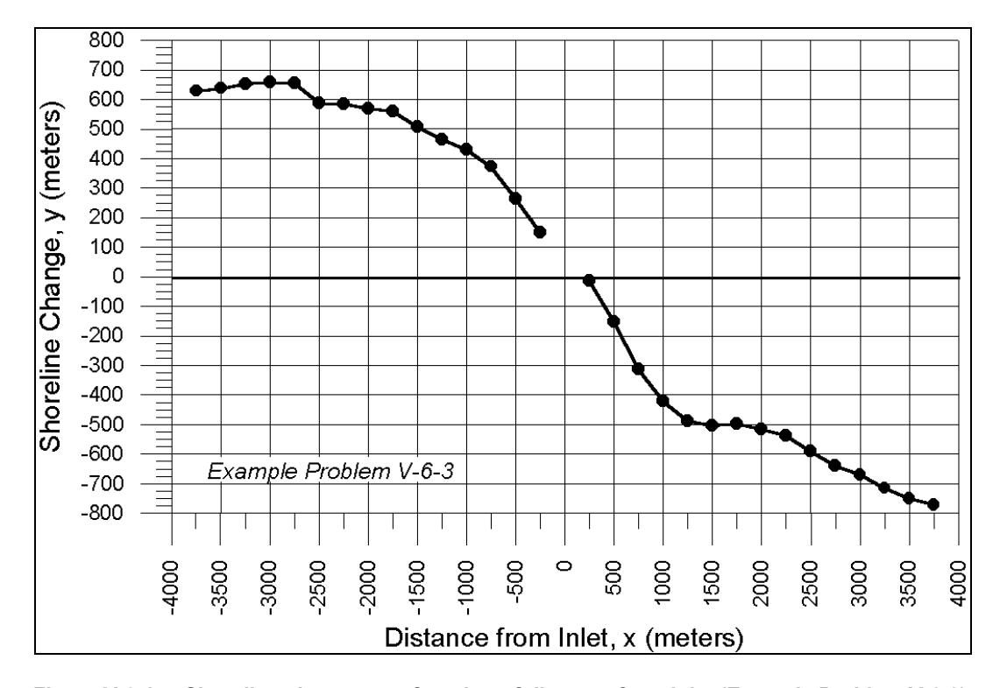

*Figure V-6-14. Shoreline change as a function of distance from inlet (Example Problem V-6-3)*

## EXAMPLE PROBLEM V-6-3 (Concluded)

From this graph, it can be seen that the limit of direct inlet influence is about 2,500 to 2,700 m north of the inlet, and totals about 660,000 cu m of impoundment. Over the period of record, this equates to 660,000 cu m/29 years = 22,800 cu m/year, on average. There is a primary (near field) inlet effect within about 1,500 to 1,700 m south of the inlet, totaling about 500,000 cu m of erosion. There is an apparent far field inlet effect beginning about 2,000 m south of the inlet and extending beyond the 3,750-m limit of data. Within the limit of data, the net volume change downdrift of the inlet is 774,000 cu m of erosion, or about 26,700 cu m/year, on average. The actual downdrift deficit may be greater, as the inlet's influence apparently extends beyond the data limit (indicated by the continuing downward slope of the cumulative-volume curve at the right end of the graph). The fact that the downdrift erosion is greater than the updrift accretion (-774,000 cu m vs. +660,000 cu m) suggests that sand is being lost from the downdrift side by both interruption of the net southerlydirected transport and losses of northerly-directed transport from the south shoreline into the inlet.
- The odd component is antisymmetric about the inlet center line. It can be interpreted as the inlet's interruption effect upon the net littoral drift (e.g., impoundment along the updrift shoreline and erosion along the downdrift shoreline), placement of fill on one side of the inlet, accretion of the shoreline due to an attachment of the ebb tidal shoal, etc. Again, volume change (instead of shoreline change) is as aptly used in these equations. Likewise, the difference in shoreline or volume changes before and after a given event in time can be considered by this approach. In this case, the given event may be the creation of, or some modification of, the inlet.
- By its nature, the even-odd analysis assumes that shoreline changes (and transport processes) are symmetric/antisymmetric across the inlet center line. Accordingly, the degree to which results from the even-odd analysis accurately reflect actual inlet processes depends upon the degree to which the inlet-adjacent processes are, indeed, symmetric. Imbalances of volume change across the inlet are inherently spread across the inlet (i.e., split between the two shorelines) by the evenodd analysis. In Example ProblemV-6-4, the impoundment effect of both sides of the inlet is equal, while in Example Problem V-6-5, erosion of the downdrift shoreline greatly exceeds the accretion (impoundment) of the updrift shoreline. The result is a significant net deficit of sand in the system.
- In Example Problem V-6-5, the total, net value of the inlet's effect is correct for the shoreline lengths considered (at least for the assumed background erosion rate); however, the distribution of the inlet's computed effect may not be correct. That is, the computed distribution assumes that the net inlet-induced loss from the littoral system (-995,000 cu m) is evenly divided between the updrift and downdrift shores. In reality, the net inlet-induced loss from the system may be much greater for one shore than for the other.
- The fact that neither the odd- nor even-components tend to zero at the limits of the measurements reveals the net volume deficit in the system. The non-zero values at the analysis' limits also illustrate that the inlet's sediment influence extends beyond the ±4,000-m distance considered in the analysis.
- The odd-component is often (incorrectly) assumed to solely represent the inlet's effect. Note, however, that even if the odd-component vanished to zero at the limits of the analysis, the fact that the even-component does not tend to zero indicates that the inlet effect may extend beyond the limits of the analysis. (This is easily demonstrated in this example by setting the measured shoreline change at +4,000 m equal to the shoreline change value at -4,000 m.)
- (c) Method 3: Alongshore variations in beach morphology. Changes in the beach profile shape and sediment texture may provide evidence of the extent of the inlet's direct effect. For example, in order that adjacent beach profiles close at a common depth across a littoral barrier, accretional shorelines updrift of the barrier must be steeper than erosional shorelines downdrift. The limit of inlet's direct effect may be marked by the point at which variations in the profile shape (steepness) decrease, or when the profile reaches a shape or steepness similar to the remainder of the shore far from the inlet. In practice, profile steepness can be simply expressed as the horizontal length between two fixed elevations on the profile (usually measured from the berm to a depth between the beachface and closure), relative to the fixed elevation difference. A useful way to compare profile similarity is to compute, for each profile station, the relationship between the change in profile volume and the change in shoreline locations (for some fixed elevation):

```math
G_p = \frac{\Delta V}{\Delta y} = \frac{\text{volume change per unit shoreline length}}{\text{change of shoreline location}} \tag{V-6-13}
```

- The S.I. units of G_p are cu m/m of shoreline change per meter along the shore; cu m/m/m = m. If the profile shape remains identical as the shoreline advances or retreats, G_p is equal to the height of the active profile; i.e., the vertical height between the top of the berm and the depth of profile closure, (B + h_*) . As previously noted, however, profiles steepen as sand is impounded updrift of a barrier (such as a jetty), and flatten as the shoreline recedes due to sediment deficits or the inlet's sink effect. The value of G_p is typically greater for impoundment-type shorelines, and lesser for receding-type shorelines.
- The overall practical value of this method is limited because it identifies only the inlet's direct influence. It therefore yields a conservative (short) estimate of inlet effect. Moreover, natural changes in beach morphology, wave climate, or sediment type may obscure those variations that are attributable to the inlet.
- (d) Method 4: Wave refraction analysis. An inlet's perturbative effect upon nearshore bathymetry strongly influences the transformation (refraction, shoaling, diffraction, etc.) of waves as they approach and break along the shoreline. This, in turn, influences the littoral drift patterns. (See, for example, Figure V-6-11.) Wave refraction analysis is a useful means by which to investigate this effect. Chapter II-3-2 describes methods to compute wave transformation. Of central importance in the current application is the computation, along the shore, of the wave height and angle at the point of incipient breaking (i.e., immediately at the breakpoint), and the associated longshore sediment transport potential. Use of a grid-based wave refraction model (such as RCPWAVE) is assumed. In order to capture the effect of the inlet's ebb shoals, it is important that the wave transformation be computed all the way to the shoreline or final wave breaking point. That is, computation of breaking wave conditions at the shoreline from the wave conditions at some nearshore reference depth that is along the seaward edge of the ebb shoal plateau will greatly underestimate the inlet's perturbative effect on the wave field (Bodge, Creed, and Raichle 1996).

#### EXAMPLE PROBLEM V-6-4

#### GIVEN:

Shoreline surveys spaced 500 m apart both north (+x) and south (-x) of a small inlet were used to identify changes in the location of the mean high water shoreline between 1976 and 1980. These data are shown in columns 1 and 2, respectively, of the table below. Background erosion (i.e., outside the inlet's influence) is thought to be about 0.33 m (1 ft) over this period.

| 1 | 2 | 3 | 4 | 5 | 6 | 7 | 8 |
| --- | --- | --- | --- | --- | --- | --- | --- |
| x (m) | y measured | yE even | yO odd | y background | y erosion | y impoundment | y net inlet effect |
| -4000 | -4 | -3.5 | -0.5 | -0.33 | -3.17 | -0.5 | -3.67 |
| -3500 | -5 | -3.5 | -1.5 | -0.33 | -3.17 | -1.5 | -4.67 |
| -3000 | -5 | -3.5 | -1.5 | -0.33 | -3.17 | -1.5 | -4.67 |
| -2500 | -1 | -6 | 5 | -0.33 | -5.67 | 5 | -0.67 |
| -2000 | 5 | -2 | 7 | -0.33 | -1.67 | 7 | 5.33 |
| -1500 | 22 | -2 | 24 | -0.33 | -1.67 | 24 | 22.33 |
| -1000 | 35 | 2 | 33 | -0.33 | 2.33 | 33 | 35.33 |
| -500 | 50 | 10 | 40 | -0.33 | 10.33 | 40 | 50.33 |
| -1 | 45 | 11.5 | 33.5 | -0.33 | 11.83 | 33.5 | 45.33 |
| 1 | -22 | 11.5 | -33.5 | -0.33 | 11.83 | -33.5 | -21.67 |
| 500 | -30 | 10 | -40 | -0.33 | 10.33 | -40 | -29.67 |
| 1000 | -31 | 2 | -33 | -0.33 | 2.33 | -33 | -30.67 |
| 1500 | -26 | -2 | -24 | -0.33 | -1.67 | -24 | -25.67 |
| 2000 | -9 | -2 | -7 | -0.33 | -1.67 | -7 | -8.67 |
| 2500 | -11 | -6 | -5 | -0.33 | -5.67 | -5 | -10.67 |
| 3000 | -2 | -3.5 | 1.5 | -0.33 | -3.17 | 1.5 | -1.67 |
| 3500 | -2 | -3.5 | 1.5 | -0.33 | -3.17 | 1.5 | -1.67 |
| 4000 | -3 | -3.5 | 0.5 | -0.33 | -3.17 | 0.5 | -2.67 |
| Net vol. change (1000's of cu m) |  |  |  |  |  |  |  |
| Vol (-x) | 358.5 | -8.5 | 367 | -8.5 | 0 | 367 | 367 |
| Vol (+x) | -375 | -8.5 | -367 | -8.5 | 0 | -367 | -367 |
| Vol (tot.) | -17 | -17 | 0 | -17 | 0 | 0 | 0 |

#### FIND:

The even- and odd-components of the shoreline change signals adjacent to this inlet, and the net effect of the inlet along the shoreline beyond ambient (background) changes.

#### SOLUTION:

In this example, the even-odd analysis is applied under the assumption that shoreline changes (and transport processes) are symmetric across the inlet center line (i.e., it assumes the shoreline on one side of the inlet is a reverse mirror image of the other side). Therefore, shoreline change data should be obtained at the same corresponding distances on both sides of the inlet to apply the even-odd analysis (i.e., data should be compiled at distance +x on one side of the inlet and -x on the other side of the inlet).
The even and odd components of the shoreline change can be determined by Equations V-6-12a and V-6-12b, respectively, and from the data of columns 1 and 2.

```math
y _ { \mathit { \Pi } _ { E } } ( x ) = { \frac { y ( x ) + y ( - x ) } { 2 } }
```

```math
y_O(x) = \frac{y(x) - y(-x)}{2}
```

For example, at x = 2,000 m:

```math
y_E(2,000) = \frac{(-9) + (5)}{2} = -2
```

```math
y_o(2,000) = \frac{(-9) - (5)}{2} = -7
```

At x = -2,000 m:

```math
y_E(-2,000) = \frac{(5) + (-9)}{2} = -2
```

```math
y_o(-2,000) = \frac{(5) - (-9)}{2} = 7
```

The even and odd components for all the x-stations are shown in columns 3 and 4, plotted in Figure V-6-15.

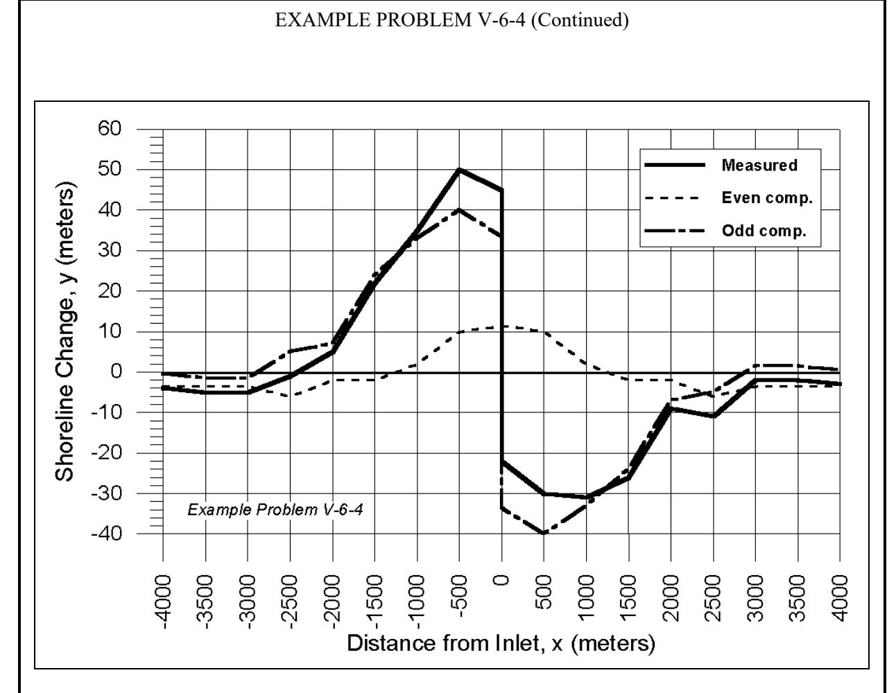

*Figure V-6-15. Even-odd analysis for Example Problem V-6-4*

From this graph, the positive portion of the even components suggests that there is transport directed towards the inlet within –1,250 to +1,250 m. The odd component reveals the presence of an impoundmnet fillet north of the inlet and a corresponding sediment deficit south of the inlet.

#### EXAMPLE PROBLEM V-6-4 (Concluded)

The estimated effect of sand transport direct toward the inlet along both shorelines (column 6) is computed as the even component (column 3) minus the estimated background signal of -0.33 m (column 5). For example, at x = +2,000 m, this effect is -2.0 - (-0.33) = - 1.67 m. Values for all the stations are listed in column 6. The estimated impoundment effect of the inlet is simply equal to the odd component (column 4), and is listed again in column 7.
The total net inlet effect relative to the estimated background signal (column 8) is computed as the measured shoreline change (column 2) minus the background signal of -0.33 m (column 5). For example, at x = +2,000 m, the total net inlet-induced effect is -9 - (-0.33) = -8.67 m. Values for all the stations are listed in column 8.
The volume changes associated with the shoreline change data are computed as the shoreline change value multiplied by the active profile depth (6.0 m) multiplied by the alongshore length of beach represented by each station. For example, the measured volume change estimated for the -x stations is:

```math
[(-4 - 5 - 5 - 1 + 5 + 22 + 35 + 50)(500) + (45)(250)](6) = 358,500 \text{ cu m}
```

The net volume changes are listed at the bottom of each column for the updrift (-x) and downdrift (+x) shorelines, and for the sum of both.
In this example, the total net measured change across both shorelines (-17,000 cu m) is attributed to the area's background erosion rate (column 5). No net erosional effect is computed from transport toward the inlet (column 6), although there is a redistribution of 55,700 cu m of sand from the zone further than 1,000 m away from the inlet to the area within 1,000 m of the inlet. (This volume is computed as the sum of the changes in column 6 within +/-1,000 m of the inlet.) The net volume of the inlet's impoundment effect is computed to be 367,000 cu m (column 7). Neglecting the redistribution of sand caused by inlet-induced transport (column 6), and neglecting any net accumulation of sand within the inlet's shoals which is not manifest as shoreline erosion within the +/-4-km study area, the inlet's net downdrift deficit beyond background erosion is therefore 367,000 cu m. This effect appears to extend about 3,000 m south of the inlet.

#### EXAMPLE PROBLEM V-6-5

#### GIVEN:

Shoreline surveys spaced 500 m apart both north (+x) and south (-x) of a small inlet document changes in the location of the mean high water shoreline between July 1956 and December 1968 (12.5 years). These data are shown in columns 1 and 2 of Table V-6-6. Background retreat (outside of the inlet's influence) is assumed to be 0.8 m/year over this time period, for a total retreat of 10 m.

**Table V-6-6. Background retreat (outside of the inlet's influence) is assumed to be 0.8 m/year over this time period, for a total retreat of 10 m.**

| Table | V-6-8. | Potential Longshore Transport Rate Information for Fine | Grid Columns.................V-6-48 |
| --- | --- | --- | --- |
| Table | V-6-9. | Measured Shoreline Changes and Calculations for Net Sink | Effect..........................V-6-52 |
| Table | V-6-10. | Calculations for Cumulative Volume Change West of Inlet | .....................................V-6-54 |

#### FIND:

The even- and odd-components of the shoreline change signals adjacent to the inlet, and the net effect of the inlet beyond ambient (background) shoreline change.

#### SOLUTION:

As stated earlier, the degree to which results from the even-odd analysis accurately reflect actual inlet processes depends upon the degree to which inlet and adjacent processes are, indeed, symmetric. In this example, retreat of the downdrift shoreline greatly exceeds the advance due to impoundment of the updrift shoreline. The result is a significant deficit of sand in the system.
The even and odd components of the shoreline change are again determined by Equations V-6-12a and V-6-12b, respectively, and from the data of columns 1 and 2.

```math
y_E(x) = \frac{y(x) + y(-x)}{2}
```

```math
y_O(x) = \frac{y(x) - y(-x)}{2}
```

For example, at x = 2,000 m:

```math
y_E(2,000) = \frac{(-75) + (-2)}{2} = -38.5
```

```math
y_{O}(2000) = \frac{-75 - (-2)}{2} = -36.5
```

At x = -2,000 m:

```math
y_E(-2,000) = \frac{(-2) + (-75)}{2} = -38.5
```

```math
y_o(-2,000) = \frac{(-2) - (-75)}{2} = 36.5
```

#### EXAMPLE PROBLEM V-6-5 (Concluded)

The even and odd components for all the x-stations are shown in columns 3 and 4, and plotted in Figure V-6-15.

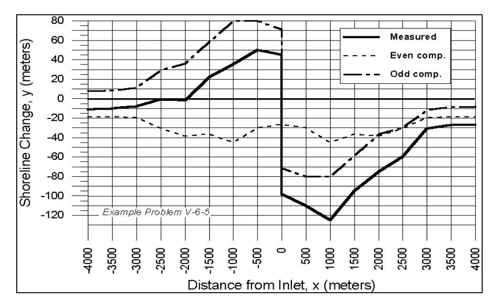

*Figure V-6-16. Even-odd analysis for Example Problem V-6-5*

The background erosion rate is 0.8 m/year x 12.5 years = 10 m. This value (column 5) is subtracted from the even component (column 3) since this component represents the common (symmetric) signal across both shorelines. The result is listed in column 6.
The even component, adjusted for background erosion effects, suggests that there is transport directed toward the inlet and lost therein. The net effect of this loss is computed as -497,000 cu m from each shoreline, for a total of -995,000 cu m (column 6). The odd component reflects the inlet's gross impoundment effect and the associated downdrift deficit associated with the impoundment's interruption of net littoral drift. This value is computed as -1,045,000 cu m (column 7).
Of the total net volume change estimated from the measured shoreline change data, -1,505,000 cu m (column 2), the -10 m background change accounts for -510,000 cu m (column 5). The balance is the inlet's net effect, -995,000 cu m (column 8). The even-odd analysis distributes this net deficit even across the inlet (i.e., -497,000 cu m for each shoreline, column 6). When added to the impoundment effect, the computed net result is 548,000 cu m of net accretion along the updrift shoreline and -1,542,000 cu m of net erosion along the downdrift shoreline (column 8).
• For each alongshore column of the refraction grid, and for each case of interest, the shoreward-most occurrence of a nonbroken wave is identified; i.e., where the wave height H is less than \kappa times the water depth, h. The breaking index \kappa is typically equal to about 0.8, or as otherwise specified in the refraction model. Assuming shallow water wave conditions, the breaking wave height H_b and \alpha_b can be estimated from:

```math
H_b \sim \frac{A_I}{I - \frac{1}{5} A_I A_2} \tag{V-6-14}
```

```math
\alpha_b = \sin^{-1} \left[ \frac{\sin \hat{\alpha}}{C} \sqrt{g H_b / \kappa} \right] \tag{V-6-15}
```

where

```math
A_1 = (\kappa / g)^{1/5} H^{4/5} (C_g \cos \hat{\alpha})^{2/5} \tag{V-6-16a}
```

```math
A_2 = g(\sin \hat{\alpha})^2 / C^2 \tag{V-6-16b}
```

• The values C and C_g are the wave celerity and group celerity, respectively, at the reference (non-broken wave) location. The value \hat{\alpha} is the wave angle at the reference location measured relative to the local shoreline orientation:

```math
\hat{\alpha} = \alpha - \beta \tag{V-6-17}
```

where \alpha is the wave angle relative to the grid at the reference location (i.e., the value output by the wave refraction analysis) and \beta is the shoreline angle relative to the grid at the alongshore column of interest.
• From Part III-2-2, the potential longshore transport rate is computed for each column, and for each wave case, from

```math
Q = K' H_b^{5/2} \sin(2\alpha_b) \tag{V-6-18}
```

where Q has units of volume per time; and where

```math
K' = \frac{K\sqrt{g}}{16(s-1)(1-n)} \tag{V-6-19}
```

and K is the dimensionless coefficient from the CERC Formula (Equation III-2-5).

#### EXAMPLE PROBLEM V-6-6

#### GIVEN:

Local water depths, wave heights, and angles were computed by a numerical wave transformation model for five grid elements of one column of a numerical computational grid. The wave period T is 9.0-sec, and the shoreline angle (β) at this column is +2.0 deg relative to the grid. The numerical model's breaking index is κ = $H_{b}/h_{b}$ = 0.8, where $H_{b}$ is the wave height at breaking and $h_{b}$ is the water depth where the 9.0 sec wave breaks. Assume the sand specific gravity S = 2.65, the in-place sediment porosity n = 0.4, and the imprecise dimensionless coefficient from the CERC Formula (Equation III-2-18) is taken to be K = 0.5.

| Table V-6-7 Calculations | Numerical Model Results for Longshore Transport Potential |  |  |  |
| --- | --- | --- | --- | --- |
|  |  | GIVEN: Numerical Model Results |  | Compute |
| Grid Row # | Depth h (m) | Wave Ht H (m) | Angle α (deg) | κ = H/h |
| 1 | 0 | 0 | 0 |  |
| 2 | 0.3 | 0.24 | 3.5 | 0.8 |
| 3 | 0.7 | 0.56 | 5.4 | 0.8 |
| 4 | 1.7 | 0.57 | 5.6 | 0.34 |
| 5 | 2.9 | 0.52 | 5.8 | 0.18 |

#### FIND:

The incipient breaking wave height and angle, and the longshore transport potential from nearshore wave conditions computed across this numerical wave transformation grid.

#### SOLUTION:

The incipient breaking wave height and angle occur in the grid row closest to the shoreline where the breaking index \kappa = H/h is less than 0.8. Here H is the wave height and h is the water depth at a particular cell of the grid. Hence, it is necessary to compute \kappa for each row of this column of cells, starting at the shoreline and working seaward. At grid row 1, the water depth is 0.0, and H/h is undefined. At grid row 2, H/h = 0.24/0.3 = 0.8 (a broken wave). At grid row 3, H/h = 0.56/0.7 = 0.8 (also a broken wave). At grid row 4, H/h = 0.57/1.7 = 0.34 (a non-broken wave). Thus, the shoreward-most occurrence of a non-breaking wave is at grid row 4 where the water depth is 1.7 m. (Note: The wave height and angle in the above table for grid row 4 are not breaking wave characteristics. Breaking, however, does occur somewhere within grid row 4. Grid row 4 becomes the reference location from which breaking conditions, H<sub>b</sub> and \alpha_b , will be computed.) Here this 9.0 sec wave has a non-broken wave height H = 0.57 m and a non-broken wave angle \alpha = 5.6 deg relative to the grid. A definition sketch of the layout of the grid relative to the shoreline and approaching wave crests is presented in Figure V-6-17.

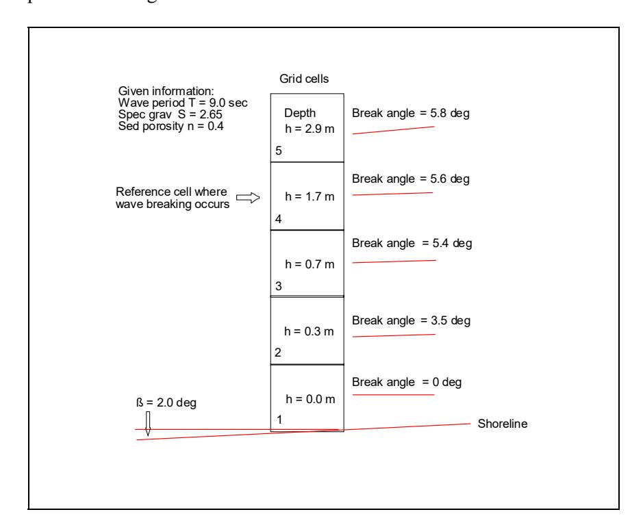

*Figure V-6-17. Sketch of numerical model results for Example Problem V-6-6*

The value \hat{\alpha} is the wave angle at the reference location measured relative to the local shoreline orientation. From Equation V-6-17:

```math
\hat{\alpha} = \alpha - \beta
```

where \alpha is the wave angle relative to the grid at the reference location (i.e., the output value from the numerical wave transformation model), and \beta is the shoreline angle relative to the grid at the grid column of interest.
Assuming shallow-water wave conditions, the breaking wave height ( H_b ) and breaking wave angle \alpha_b can be estimated from Equations V-6-14 and V-6-15, respectively:

```math
H_b = \frac{A_1}{1 - \frac{A_1 A_2}{5}}
```

```math
\alpha_b = \sin^{-1} \left[ \frac{\sin \hat{\alpha}}{C} (gH_b / \kappa)^{0.5} \right]
```

A_1 and A_2 are defined by Equations V-6-16a and V-6-16b, respectively.
where

```math
A_1 = (\kappa/g)^{0.2} H^{0.8} (C_g \cos \hat{\alpha})^{0.4}
```

and

```math
A_2 = \frac{g(\sin \hat{\alpha})^2}{C^2}
```

The acceleration due to gravity is g = 9.81 \text{ m/sec}^2 . The values C and C_g are the wave celerity and group celerity, respectively, at the reference (nonbreaking) location where the wave period T = 9.0 sec and the water depth h = 1.7 m. From Equation II-1-7:

```math
C = L/T
```

where L is the local wavelength. Hence, it becomes necessary to determine the local wavelength L at this location. From Equation II-1-10:

```math
L = \frac{gT^2}{2\pi} \tanh\left(\frac{2\pi h}{L}\right)
```

The solution of this expression for the local wavelength L involves some difficulty because L occurs on both sides of the equation. There are, however, a number of ways to solve this equation. It can be solved by iteration, or from tabulated values of L and C by Goda (1985), or from tabulated values of h/L_0 and h/L by Wiegel (1954), or by the procedure of Fenton and McKee (1990), or by use of Figure II-1-5 (Part II). From either of these methods, with T=9 sec and h=1.7 m, it can be determined that L=36.27 m. Applying the CEM method (for example), L_0=gT^2/2\pi=9.81(9)^2/2\pi=126.46 m. Thus, h/L_0=1.7/126.46=0.01344 . From Figure II-1-5 at h/L_0=0.01344 , it can be determined that sinh(2\pi d/L)=0.2988 , from which 2\pi d/L=0.2945 , and from which L=36.27. Because C=L/T, C=36.27 m/9 sec = 4.03 m/sec.
By Equation II-1-49:

```math
C_g = \frac{1}{2} \frac{L}{T} \left[ 1 + \frac{\frac{4\pi h}{L}}{\sinh \frac{4\pi h}{L}} \right]
```

```math
C_g = \frac{1}{2} \frac{36.27m}{9 \text{ sec}} \left[ 1 + \frac{\frac{(4)(\pi)(1.7m)}{36.27m}}{\sinh \frac{(4)(\pi)(1.7m)}{36.27m}} \right]
```

```math
C_g = 3.91 \, m / \sec
```

Angle \alpha = 5.6 deg (the wave angle relative to the grid), and was determined by the numerical model output at grid row 4. Angle \beta = 2.0 deg (the shoreline angle relative to the gird) was given. Hence:

```math
\hat{\alpha} = \alpha - \beta = 5.6 \deg - 2.0 \deg = 3.6 \deg
```

```math
A _ { 1 } = ( \kappa / g ) ^ { 0 . 2 } H ^ { 0 . 8 } ( C _ { g } \cos \hat { \alpha } ) ^ { 0 . 4 }
```

Here \kappa is the model's breaking wave index, \kappa = H_b/h_b = 0.8 .

```math
A_{1} = (0.8/9.81m \sec^{-2})^{0.2} (0.57m)^{0.8} (3.91m \sec^{-1} \cos 3.6 \deg)^{0.4}
```

```math
A _ { 1 } = 0 . 6 7 7 m
```

```math
A _ { 2 } = g ( \sin \hat { \alpha } ) ^ { 2 } / C ^ { 2 }
```

## EXAMPLE PROBLEM V-6-6 (Concluded)

```math
A_2 = 9.81 m \,\mathrm{sec}^{-2} (\sin 3.6 \,\mathrm{deg})^2 / (4.03 m \,\mathrm{sec}^{-1})^2
```

```math
A_2 = 0.00238 \ m^{-1}
```

```math
H_b = \frac{A_1}{1 - \frac{A_1 A_2}{5}} = \frac{0.0667m}{1 - \frac{(0.667m)(0.00238m^{-1})}{5}}
```

```math
H_b = 0.067 \ m
```

```math
\alpha_b = \sin^{-1} \left[ \frac{\sin \hat{\alpha}}{C} (gH_b / \kappa)^{0.5} \right]
```

```math
\alpha_b = \sin^{-1} \left( \sin 3.6 \deg / 4.03 m \sec^{-1} \right) \left[ (9.81 m \sec^{-2}) (0.67 m) / 0.8 \right]^{0.5}
```

```math
\alpha_b = 2.56 deg
```

The potential longshore sediment transport rate can now be determined by Eq. V-6-16:

```math
Q = K' H_b^{2.5} \sin(2\alpha_b)
```

where

```math
K' = \frac{Kg^{0.5}}{16(S-1)(1-n)}
```

```math
K' = \frac{(0.5)(9.81m \sec^{-2})^{0.5}}{(16)(2.65-1)(1-0.4)}
```

```math
K' = 0.099m^{0.5} \text{ sec}^{-1}
```

from which

```math
Q = (0.099m^{0.5} \text{ sec}^{-1})(0.67m)^{2.5} [\sin(2)(2.56 \text{ deg})]
```

```math
Q = 0.0033m^3 \text{ sec}^{-1}
```

#### EXAMPLE PROBLEM V-6-7

#### GIVEN:

The potential longshore transport rate (Q, in units of volume per time) for each of five alongshore columns of a refraction grid, and for three different wave conditions each during the time period of interest, are presented as lines 1-3 in the Table V-6-8. The percentages of occurrence (P) of the three wave conditions are 22, 25, and 16 percent. There were no waves (calm) during 37 percent of the time period of interest. These percentages of occurrence are shown as lines 4-6 in the table.

*Table V-6-8 Potential Longshore Transport Rate Information for Fire Grid Columns*

**Table V-6-8. Potential Longshore Transport Rate Information for Fire Grid Columns**

|  | Parameter | 1 | 2 | 3 | 4 | Line 5 |
| --- | --- | --- | --- | --- | --- | --- |
| 1 | Q1 (cu m/hr) | 2.9 | 3.3 | 5.2 | 6.4 | 6.2 |
| 2 | Q2 (cu m/hr) | -0.7 | -0.4 | 1.6 | 1.8 | 2.1 |
| 3 | Q3 (cu m/hr) | -6.8 | -6.5 | -1.5 | 0.8 | 0.2 |
| 4 | P1 (%) | 0.22 | 0.22 | 0.22 | 0.22 | 0.22 |
| 5 | P2 (%) | 0.25 | 0.25 | 0.25 | 0.25 | 0.25 |
| 6 | P3 (%) | 0.16 | 0.16 | 0.16 | 0.16 | 0.16 |
| 7 | $P_{1}Q_{1}$ (cu m/hr) | 0.64 | 0.73 | 1.14 | 1.41 | 1.36 |
| 8 | $P_{2}Q_{2}$ (cu m/hr) | -0.18 | -0.10 | 0.40 | 0.45 | 0.53 |
| 9 | $P_{3}Q_{3}$ (cu m/hr) | -1.09 | -1.04 | -0.24 | 0.13 | 0.03 |
| 10 | QR (cu m/hr) | 0.64 | 0.73 | 1.54 | 1.99 | 1.92 |
| 11 | QL (cu m/hr) | -1.27 | -1.14 | -0.2 | 0 | 0 |
| 12 | $Q_{(NET)}$ (cu m/hr) | -0.63 | -0.41 | 1.30 | 1.99 | 1.92 |
| 13 | QRN (cu m/hr) | 0.32 | 0.37 | 0.77 | 1.00 | 0.96 |
| 14 | QLN (cu m/hr) | -0.64 | -0.57 | -0.12 | 0 | 0 |
| 15 | $Q_{(NET)N}$ (cu m/hr) | -0.32 | -0.21 | 0.65 | 1.00 | 0.96 |
| FIND: |  |  |  |  |  |  |

#### FIND:

The total rates of right-directed (+), left-directed (-), and net transport potential for the five grid columns along this shoreline. Normalize the results by the net transport maxima.

## SOLUTION:

The potential longshore transport rate ( Q ) can be expressed as some function of the breaking wave height $(H_{b})$ and the breaking wave angle $(α_{b}),$ as given by Equation V-6-18,

```math
Q = K' H_b^{2.5} \sin(2\alpha_b)
```

with units of volume per time (e.g., cu m/hr).

#### EXAMPLE PROBLEM V-6-7 (Concluded)

A numerical simulation wave refraction model was used to determine the breaking wave height $(H_{b})$ and breaking wave angle $(α_{b})$ for each of the five columns of the refraction grid. Equations V-6-14 through V-6-19 were then used to determine the potential longshore transport rate Q (cu m/hr) for these conditions, and these are GIVEN values shown as lines 1-3. The expression for the potential longshore transport rate Q (cu m/hr) (Equation V-6-18) inherently assumes there is an unlimited supply of sand available for movement. The total amount of sand moved during the time interval of interest is, therefore, the product of the rate of movement Q (cu m/hr) multiplied by the time interval (which may be more or less than 1 hr). The three wave conditions under consideration here existed for $P_{1}$ = 22 percent, $P_{2}$ = 25 percent, and $P_{3}$ = 16 percent of an hour, respectively. These percentages of occurrence are presented as lines 4-6.
The rate of actual material movement per hour by a particular wave climate is determined as the product of the potential longshore transport Q (cu m/hr) and the percentage of occurrence of that particular wave. Hence, the rates of actual material movement are shown as P 1 Q 1, P 2 Q 2, and $P_{3}Q_{3}$ on lines 7-9, respectively. These are the weighted values of actual (potential) transport rate, weighted based on the percent of time (hour) that a particular wave climate actually existed.
The weighted sum of the actual (potential) transport rates for each column is the sum of all components of transport moving to the right (+), and to the left (-). These values are shown as lines 10 and 11, respectively. For example, for column 1, the weighted sum of the three transports produced by the three different wave climates are 0.64, -0.18, and -1.09 cu m/hr (Lines 7-9 of column 1). The transport to the right $Q_{R}$ (+) is the only positive value of the three (0.64 cu m/hr), shown as Line 7. The transport to the left $Q_{L}$ (-) is the sum of the two negative transports (-0.18 and -1.09 cu m/hr), shown as lines 8 and 9. The weighted sum of the actual (potential) transport rates for the five columns of the numerical grid are shown as lines 10 and 11, for right transport $Q_{R}$ and left transport $Q_{L},$ respectively. The weighted net transport $Q_{(NET)}$ is the algebraic sum of the right transport $Q_{R}$ and the left transport $Q_{L}$ , and is shown as line 12.
The weighted sums of the actual (potential) longshore transports are then normalized by the maximum value of $Q_{(NET)}$ for all columns as shown in line 12. This maximum value occurs at column 4 (1.99 cu m/hr). All values of lines 10-12 are normalized (divided) by this value, and these right normalized values $Q_{RN},$ left normalized values $Q_{LN},$ and net normalized values $Q_{(NET)N}$ are shown as lines 13-15, respectively. These values indicate the relative actual (potential) longshore transport quantities per column of the numerical grid with respect to the maximum value of these parameters occurring within the region of interest.
• The total right-directed and left-directed potential transport rates at a given alongshore column are, respectively, the weighted sum of the positive-valued and negative-valued transport estimates for that column:

```math
Q_R = \sum p_i Q_i \quad \text{for} \quad Q_i \ge 0 \tag{V-6-20}
```

```math
Q_L = \sum p_i Q_i \quad for \quad Q_i \le 0 \tag{V-6-21}
```

where $p_{i}$ is the fractional occurrence of each wave case i . Likewise, the net transport potential is the weighted sum of all transport values at a given column:

```math
Q_{NET} = \Sigma(p_i Q_i) = Q_R + Q_L \tag{V-6-22}
```

- The net, right- and left-directed potential transport rates for each grid column along the shore can then be examined or plotted to assess the alongshore extent and nature of the inlet's influence upon the refracted wave field and the associated littoral transport patterns (see, as an example, Figure V-6-11). The results are also useful in elucidating the inlet's sand transport pathways and for subsequent development of the sediment budget.
- This approach is limited in that it does not address transport induced by tidal currents or gradients in wave height. Likewise, it addresses only the inlet's direct effect upon the shoreline and does not reveal far field erosion caused by the inlet's sink effect upon the littoral transport.
- (e) Method 5: Examination of inlet's net sink effect. Whereas methods 1, 2, and 3 discern an inlet's effect through examination of shoreline change, this method primarily relies upon changes measured at and within the inlet. This is potentially advantageous because shoreline position data are often ambiguous and may reflect engineering activities such as dredged material placement, while, in some cases, the inlet's impoundment of sand adjacent to and within the inlet is more readily discerned (usually with some level of quantifiable uncertainty). Additionally, the assessment of the inlet's impacts is not a priori biased (limited) by the length of shoreline selected for examination. An inlet's net sink effect is defined as the quantity of material that the inlet has taken from the littoral system. In most cases, natural and stabilized inlets remove sand from the littoral system through accretion of adjacent shores, shoaling in channels, and accretion of ebb- and flood-tidal shoals. However, inlets with riverine input may be the source of littoral material for the coast (e.g., Columbia River, Washington/Oregon). The net sink effect, or volumetric impact, is first computed by adding: The volume (or rate) of impoundment adjacent to the inlet entrance; the volume (or rate) of net sand accumulation within the inlet's channels and shoals; the volume (or rate) of sand removed from the littoral system by dredging and offshore (or out-of-system) disposal. (If dredged material is placed on the adjacent beaches, it remains within the adjacent littoral system and thus is not added to the total). Then, the following is subtracted from this total: The volume (or rate) of riverine (or other upland) sedimentary input; the volume (or rate) of barrier removed due to creation (through dredging or breach) of the inlet (if this event is within the time period of consideration). The resulting value is the volume (or rate) of sand which has been removed from the adjacent shores' littoral systems over the period of examination. Inlet-adjacent volume changes are then examined to discern the minimum distance away from the inlet along which this volumetric impact is manifest.

#### EXAMPLE PROBLEM V-6-8

#### GIVEN:

Measured shoreline changes adjacent to an inlet are presented in columns 1 and 2 of Table V-6-9 for the period 1975-1989. Surveys from 1980 and 1988 suggest that the inlet's ebb and interior shoals outside the limits of dredging accreted by 152,000 cu m \pm 48,000 cu m. The correlation G_p between profile volume change per unit of shoreline length (alongshore) and cross-shore beach width change is estimated to be:
- a. Updrift (east) of the inlet: 7.5 cu m/m of shoreline length per meter of cross-shore beach width change (7.5 cu m/m/m).
- b. Downdrift (west) of the inlet: 7.2 cu m/m of shoreline length per meter of cross-shore beach width change) (7.2 cu m/m/m).
Profile erosion between 1.5 and 3.5 km downdrift of the inlet is restricted by the presence of seawalls. An average of about 192,000 cu m is dredged from the inlet's entrance channel every 3 years, all of which is disposed in deep water offshore. In 1987, 360,000 cu m of beach fill were placed between 0 and 4.5 km downdrift (west) of the inlet from an offshore sand source. Neglect riverine input of sand. Assume that erosion induced by the inlet along the updrift shoreline is negligible. The total rate at which the inlet removes sand from the littoral system is the sum of:
- a. The updrift impoundment rate.
- b. The inlet's net shoaling rate (after dredging).
- c. The rate at which maintenance-dredging sand is disposed outside the littoral system.

#### FIND:

The lineal and volumetric extent for which the inlet's net sink effect can be attributed to measured shoreline erosion.

#### SOLUTION:

The natural inlet and shoreline processes are assumed to be similar over the entire period of interest (1975-1989). The change in shoreline volume per unit of shoreline length (alongshore) \Delta V (m<sup>3</sup>/m), per unit of change of cross-shore beach width change \Delta y (m), is denoted by Equation V-6-11:

```math
G_p = \frac{\Delta V \text{ (volume change per unit of shoreline length alongshore)}}{\Delta y \text{ (cross - shore beach width change)}}
```

This relationship G_p was previously estimated to be 7.5 m<sup>3</sup>/m of shoreline length (alongshore) per meter of cross-shore beach width for the coastal segment immediately updrift of the inlet, and 7.2 m<sup>3</sup>/m of shoreline length (alongshore) per meter of cross-shore beach width for the coastal segment immediately downdrift of the inlet. The average annual cross-shore shoreline change data of column 2 with units of m/year can be converted to average annual local volume change data with units of m<sup>3</sup>/m/year by using Equation V-6-11.
EXAMPLE PROBLEM V-6-8 (Continued)

|  | Measured Shoreline Changes and Calculations for Net Sink Effect GIVEN |  |  | COMPUTE |  |
| --- | --- | --- | --- | --- | --- |
| 1 | 2 | 3 | 4 | 5 | 6 |
| Distance from inlet, x (km) | Avg. ann'l shoreline change, dy/dt 1975-89 (m/year) | Avg. annual local vol. change, dV/dt (cu m/m/year) | Reach Length (m) | Avg. annual reach vol. change (cu m/year) | Cum. vol. change - average annual (cu m/year) |
| 7 | -0.1 | -0.75 | 1,000 | -750 | 46,825 |
| 6 | 0.2 | 1.5 | 1,000 | 1,500 | 47,575 |
| 5 | -0.2 | -1.5 | 1,000 | -1,500 | 46,075 |
| 4 | 0.5 | 3.8 | 1,000 | 3,800 | 47,575 |
| 3 | 1.2 | 9 | 1,000 | 9,000 | 43,775 |
| 2 | 1.5 | 11.3 | 1,000 | 11,300 | 34,775 |
| 1 | 2.0 | 15 | 750 | 11,250 | 23,475 |
| 0.5 | 2.3 | 17.3 | 500 | 8,650 | 12,225 |
| 0 (east) | 1.9 | 14.3 | 250 | 3,575 | 3,575 |
| 0 (west) | -6.2 | -44.6 | 250 | -11,150 | -11,150 |
| -0.5 | -5.3 | -38.2 | 500 | -19,100 | -30,250 |
| -1 | -2.4 | -17.3 | 500 | -8,650 | -38,900 |
| -1.5 | 0 | 0 | 500 | 0 | -38,900 |
| -2 | 0 | 0 | 500 | 0 | -38,900 |
| -2.5 | 1.7 | 12.2 | 500 | 6,100 | -32,800 |
| -3 | 3.9 | 28.1 | 750 | 21,075 | -11,725 |
| -4 | 2.1 | 15.1 | 1,000 | 15,100 | 3,375 |
| -5 | 0.3 | 2.2 | 1,000 | 2,200 | 5,575 |
| -6 | -1 | -7.2 | 1,000 | -7,200 | -1,625 |
| -7 | -1.7 | -12.2 | 1,000 | -12,200 | -13,825 |
| -8 | -1.9 | -13.7 | 1,000 | -13,700 | -27,525 |
| -9 | -1.3 | -9.4 | 1,000 | -9,400 | -36,925 |
| -10 | -0.6 | -4.3 | 1,000 | -4,300 | -41,225 |
| -11 | -0.3 | -2.2 | 1,000 | -2,200 | -43,425 |
| -12 | -0.4 | -2.9 | 1,000 | -2,900 | -46,325 |
| -13 | -0.5 | -3.6 | 1,000 | -3,600 | -49,925 |

```math
\text{EXAMPLE PROBLEM V-6-8 (Continued)}
```

```math
G_p = \frac{\Delta V}{\Delta y} m^3 / m / m
```

```math
\left(G_p \ m^3 / m / m\right) \left(\frac{\Delta y}{\Delta t} \ m / year\right) = m^3 / m / year
```

For example, at x = +7 km,

```math
(7.5 \text{ m}^3/\text{m/m})(-0.1 \text{ m/year}) = -0.75 \text{ m}^3/\text{m/year}
```

These equivalent average annual local volume change data are shown in column 3.
The effective shoreline reaches for each section updrift and downdrift of the inlet are shown in column 4. Next, the total rate of change along each reach of shoreline was determined by the simple trapezoidal rule (i.e., by multiplying the local volume change rate (column 3) by the local effective shoreline reach (column 4)). For example, the volume change at x = +7 km is

```math
(-0.75 \text{ m}^3/\text{m/yr})(1,000 \text{ m}) = -750 \text{ m}^3/\text{year}
```

These results are shown in column 5. Then the cumulative volume changes along the updrift (east) and downdrift (west) shorelines were determined, starting at the inlet for each direction. These results are shown in column 6. From examination of column 6, the updrift impoundment appears to extend about 4 km east of the inlet, and totals about 47,000 m<sup>3</sup>/year (updrift impoundment rate).
The inlet's net shoaling rate between 1980 and 1988 was transformed to an annual average rate as (152,000 \text{ m}^3 \pm 48,000 \text{ m}^3)/8 \text{ year} = 19,000 \pm 6,000 \text{ m}^3/\text{year} (inlet net shoaling rate).
The rate of dredging and out-of-system disposal is annualized as 192,000 \text{ m}^3/3 \text{ year} = 64,000 \text{ m}^3/\text{year} (maintenance dredging).
Again, the total rate at which the inlet removes sand from the littoral system is the sum of: the updrift impoundment rate; the inlet's net shoaling rate (after dredging); and the rate at which maintenance-dredging sand is disposed outside the littoral system.
Hence, the total rate at which the inlet removes sand from the littoral system is:
47,000 \text{ cu m/year} + (19,000 \pm 6,000) \text{ cu m/year} + 64,000 \text{ cu m/year} = 124,000 \text{ to } 130,000 \text{ cu m/year}
Hence, in the absence of the beach nourishment project, the downdrift beach is expected to exhibit a loss of between 124,000 and 136,000 cu m/year. Instead, primarily due to the 360,000-cu m-fill, the downdrift beach exhibited a net measured loss of only 49,925 cu m/year along the 13-km reach for which data are given.
To more carefully assess the inlet's actual impact, the beach fill must be included in the analysis. This fill, which was placed on the shore between 0 and 4.5 km downdrift of the inlet, was also removed (eroded) from the beach; therefore, it must be included in the total amount of material removed from the beach. This analysis is performed in the following table. Only the downdrift (west) shoreline is listed in the table since it is only this shoreline that is affected by the beach fill.
The average annual cumulative volume change downdrift of the inlet (column 6) has been converted to the equivalent total cumulative volume change over the 14-year period between the 1975 and 1989 survey period by multiplying column 6 by 14 years. These data are shown in column 7.
The placed beach fill was also removed (eroded) from the beach. We assume that the 360,000 cu m of beach fill was uniformly distributed over the 4.5-km placement area (i.e., 80 cu m/m of shoreline. Column 8 shows the corresponding fill volume placed within each reach (between each station). From these results, the cumulative alongshore fill volume was computed, and is shown in column 9 as the cumulative placed fill volume along the beach downdrift of the inlet.
The cumulative alongshore volume change over the 14-year survey period, with the beach fill considered, was computed by adding the cumulative placed beach fill volume (column 9) to the cumulative measured beach fill volume change (column 7). These sums are shown in column 10 as the cumulative total volume change. The equivalent average annual cumulative total volume change is computed by dividing these values (column 10) by the survey interval (14 years). These results are shown in column 11. The cumulative updrift and downdrift volume changes, with and without consideration of the fill, are shown in Figure V-6-18.

| From previous table |  |  |  |  |  | Downdrift volume change with beach fill considered (included) |  |
| --- | --- | --- | --- | --- | --- | --- | --- |
| 1 | 4 | 6 | 7 | 8 | 9 | 10 | 11 |
| Distance from inlet, x (km) | Reach length (m) | Cum. vol. change - average annual (m3 /year) | Cum. vol. Change 1975- 1989 (m3 ) | Fill vol. placed in reach (m3 ) [assumed] | Cum. Placed fill vol. (m3 ) | Cum. total vol. change with fill considered; 1975-1989 (m3 ) | Cum. total vol. change with fill considered; avg. annual (m3 /year) |
| 0 (west) | -6.2 | -11,150 | -156,100 | 20,000 | 20,000 | -176,100 | -12,580 |
| -0.5 | -5.3 | -30,250 | -423,500 | 40,000 | 60,000 | -483,500 | -34,540 |
| -1 | -2.4 | -38,900 | -544,600 | 40,000 | 100,000 | -644,600 | -46,040 |
| -1.5 | 0 | -38,900 | -544,600 | 40,000 | 140,000 | -684,600 | -48,900 |
| -2 | 0 | -38,900 | -544,600 | 40,000 | 180,000 | -724,600 | -51,760 |
| -2.5 | 1.7 | -32,800 | -459,200 | 40,000 | 220,000 | -679,200 | -48,510 |
| -3 | 3.9 | -11,725 | -164,150 | 60,000 | 280,000 | -444,150 | -31,725 |
| -4 | 2.1 | 3,375 | 47,250 | 80,000 | 360,000 | -312,750 | -22,340 |
| -5 | 0.3 | 5,575 | 78,050 | 0 | 360,000 | -281,950 | -20,140 |
| -6 | -1.0 | -1,625 | -22,750 | 0 | 360,000 | -382,750 | -27,340 |
| -7 | -1.7 | -13,825 | -193,550 | 0 | 360,000 | -553,550 | -39,540 |
| -8 | -1.9 | -27,525 | -385,350 | 0 | 360,000 | -745,350 | -53,240 |
| -9 | -1.3 | -36,925 | -516,950 | 0 | 360,000 | -876,950 | -62,640 |
| -10 | -0.6 | -41,225 | -577,150 | 0 | 360,000 | -937,150 | -66,940 |
| -11 | -0.3 | -43,425 | -607,950 | 0 | 360,000 | -967,950 | -69,140 |
| -12 | -0.4 | -46,325 | -648,550 | 0 | 360,000 | -1,008,550 | -72,040 |
| -13 | -0.5 | -49,925 | -698,950 | 0 | 360,000 | -1,058,950 | -75,640 |

## EXAMPLE PROBLEM V-6-8 (Concluded)

With the effect of the fill included (column 11), the downdrift volume change within the 13-km limit of data equals -75,640 cu m/year. This value is only about 56 to 61 percent of the total net impact (124,000 to 136,000 cu m/year) estimated from the inlet's diversion of sand from the littoral system (i.e., via updrift impoundment, net shoal growth, and out-of-system maintenance dredging disposal). Neglecting any inlet-induced erosion updrift of the inlet, the remaining 39 to 44 percent of the inlet's impact (48,360 to 60,360 cu m/year) must therefore occur further downdrift than 13 km.

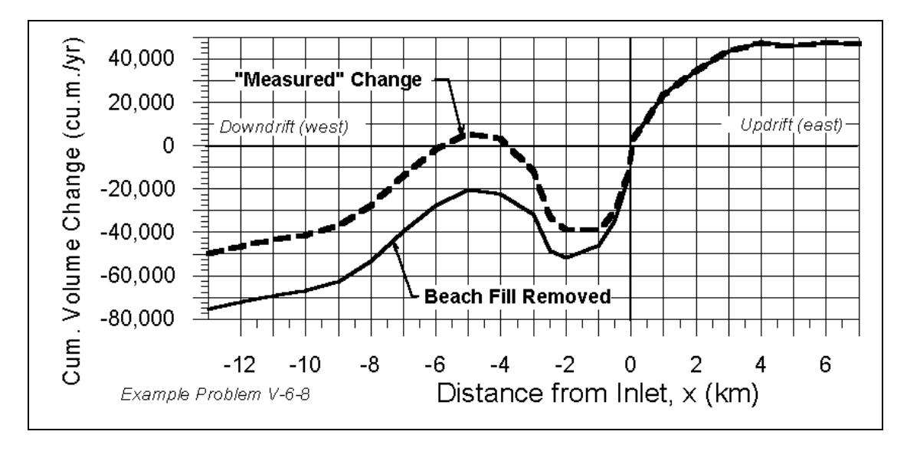

*Figure V-6-18. Cumulative volume change with and without beach fill (Example Problem V-6-8)*

In summary, the inlet's volumetric impact to the adjacent shorelines is estimated to range from 124,000 to 136,000 cu m/year. About 56 to 61 percent of this quantity (about 75,640 cu m/year) is manifest as erosion within 13 km downdrift (west) of the inlet. The total littoral impact, therefore, extends beyond 13 km from this inlet.
- In applying this method, it must be realized that both natural and stabilized inlets have a net volumetric impact. The tendency is to assume that the volumetric impact of a stabilized inlet is entirely due to its stabilization and engineering activities. However, the same inlet in its natural state would also have an impact. The equivalent value for a natural inlet can be estimated by examining volumetric changes at a natural inlet with similar longshore transport rates, tidal range, and wave climate. Then, the volumetric change due to stabilization and engineering activities of the study site can be estimated by subtracting the two volumes.
- In practice, the volume of sand impounded at the inlet's entrance (usually by jetties) can be estimated from profile surveys or shoreline-change data using the along-the-shore cumulative approach described above in method 1, criterion No. 4. (See Example Problem V-6-3.) The net volume of sand retained within the inlet shoals is estimated through comparison of bathymetric survey data; or at worse, through comparison of aerial photography with an assumed rate of vertical shoal thickness or accumulation. The volume of sand removed by dredging is estimated from records. Care should be taken to: Avoid double-counting of shoaling volumes and dredging volumes; exclude dredging quantities for new work associated with first-time construction or harbor deepening; exclude nonlittoral fractions (i.e., silt, clay, rock) from the dredging quantities.
- Account for dredging quantities placed upon the adjacent shorelines from inlet/harbor maintenance and new work, or offshore sources.
- In this fairly typical example, the downdrift shoreline changes, by themselves, do not reveal a clear picture of the inlet's signature. Methods 1 and 2 would therefore be of little value in this example, and methods 3 and 4 would not likely reveal the complete extent of the inlet's influence.
- g. Inlet interactions with adjacent beaches.
- (1) General.
Sediment may accumulate outside and inside an inlet. Sand storage exterior to the inlet is observed in the form of impoundment fillets along the shorelines adjacent to the inlet entrance. Also, a mature inlet with a well-developed ebb tidal shoal may bypass sand via the ebb shoal, resulting in an attachment zone, or bulge, on the downdrift beach. Interior sand storage occurs in the form of shoals, spits, and shoaling in channels. Mechanisms for this interior storage include (a) leakage of sand over, through, and around the inlet's terminal structures (jetties), and (b) wave- and current-driven transport to the inlet shoals. The effect of inlet-related bathymetry upon the wave field and sediment transport patterns can be observed through examination of wave refraction (discussed in the previous section), and by bathymetric and shoreline influences upon tidal currents.
Understanding the interaction of the inlet with its adjacent beaches is based upon:
- (a) The degree to which the inlet's jetties impound, leak, or bypass sand.
- (b) The direction, distribution and relative strength of the inlet's tidal currents.
- (c) The effect of the inlet's ebb shoal plateau and adjacent bathymetry upon wave transformation (refraction) and littoral transport potential.
- (d) The pattern in which shoals form within the inlet.
- (e) The location and frequency of maintenance dredging of littoral sediments, and the placement history (location and frequency) and quality (e.g., sediment type and size) of this material.
Methods by which these factors may be examined are outlined in the following paragraphs.
- Site observations and data.
- There is no substitute for site visits and hours spent observing, walking, and wading along the inlet and its adjacent beaches. Observations should be preferably made during both strong ebb flow and flood flow, and at least once during energetic wave conditions from each of the principal directions of offshore incidence. Site visits should be initiated before commencing detailed studies to better identify those processes and data sources that bear examination. During or after the office analysis, additional site visits are necessary to assess the applicability of the analysis' results and to identify processes that require further study.
- Important sources of historical data include:
- Aerial photography.
- Bathymetric surveys and charts.
- Beach profiles and historical shoreline maps.
- Dredging records.
- Discussions with dredging contractors experienced with the inlet's shoaling patterns.
- History of man's improvements and alterations.
- History of storm events.
- Existing reports and anecdotal histories of the inlet and adjacent shores.
- If adequate data are not already available, researchers should consider the following new data:
- Controlled, rectified aerial photography.
- Shoreline location survey.
- Bank-to-bank bathymetric survey of the inlet throat, entire flood and ebb shoals, marginal shoals, and nearshore seabed.
- Beach profiles for characterizing the shape of the existing beach as a function of distance from the inlet, and direct comparison to previously collected beach profile data.
- Physical surveys of existing inlet structures (topography, elevations, permeability, etc.).
- Tidal current data focusing upon the horizontal distribution of principal flows and gyres on both the ebb flow and flood flow (dye injections into the water with concomitant aerial photography can be useful in this regard).
- Dye studies to discern jetty leakage (if not otherwise obvious).
- Directional wave data for a meaningful time period (includes hindcast data).
- Jet-probing, vibracore, core-boring, surface grab samples, periodic samples from the dredge plant, and other geotechnical means by which to discern those portions of the inlet's shoals and channels which contain littoral sediments derived from the adjacent shorelines.
- Environmental studies necessary to determine possible effects of disturbing portions of the inlet system for sand management (not discussed herein).
To the greatest extent practical, bathymetric surveys and beach profile surveys should be planned so as to facilitate comparison with existing, historical data. EM 1110-2-1810, "Coastal Geology," lists sources of geographic data in the United States. Other summaries of inlet-related data sources include Barwis (1975, 1976), Weishar and Fields (1985), and Chu, Lund, and Camfield (1987). The local sponsor (in the case of a Federal navigation project) or local interest(s) responsible for managing an inlet, and their private-sector contractors often hold the greatest repository of data specific to a given inlet, most of which is otherwise unavailable.

#### (2) Detection.

Approaches by which to discern how an inlet interacts with the adjacent beaches are described in the following paragraphs.
(a) Impoundment fillets and attachments. The degree to which sand is stored at an inlet's jetties can be detected by the shoreline signature (anomalous accretion) or the profile shape (anomalous steepness). Identification of these signals is described in Part V-6-2, methods 1, 2, and 3. Impoundment can occur on
either or both sides of a stabilized inlet. Sand may also be stored in the attachment zone, the region in which the inlet bypasses sand via the ebb-tidal shoal. This can be observed through a bulge in the shoreline and an extension of the ebb shoal towards the downdrift beach.
- (b) Jetty leakage. Three elements demonstrate a jetty's permeability: its elevation relative to the adjacent beach and seabed; its length relative to the adjacent beach planform; and its porosity. Elevation. The elevation of most old jetties is typically less than a meter above high water. Jetty crests below the elevation of the berm on the adjacent beach (usually more than 1 to 2 m above high water) allow wave runup to transport sand over the structure and into the inlet. This is typically shown by a high-water shoreline, berm shoreline, or dune line that curves landward immediately adjacent to the inlet (see Figure V-6-19). This local curvature is the result of a sluice that forms between the beach and the jetty. Because the jetty is lower than the beach, a downhill gradient exists from the beach toward the jetty. This promotes return flow of wave runup from the beach toward the jetty, which, in turn, accelerates sand transport from the beach into the inlet beyond that which would be normally transported by tidal currents and oblique incident waves. Length. In the limit, beach profiles for which the closure depth (the limiting depth of sediment transport) falls seaward of the jetty's end will experience transport from the beach, around the jetty, and into the inlet. Field observation suggests that this effect becomes particularly significant when the beach profile adjacent to the jetty has accreted to the point where the average-annual, low-tide breaking depth (i.e., h = $H_{avg}/κ,$ low-water datum) is at or seaward of the end of the jetty. In such a condition, it is likely that most, if not all, of the littoral drift that reaches the jetty passes around it. In this instance, the jetty is considered to be saturated. At the same time, even in the saturated-jetty case, some fraction of the incident littoral drift may still be impounded further updrift of the jetty by the existing impoundment fillet. In this instance, the impoundment fillet continues to grow in a planform shape that may be similar to a backwater curve in classical hydraulics. This signature is sometimes evident in the shoreline's planform, and is predicted by analytic models such as Pelnard-Considère (1956) (see Part III- 2).
- (c) Porosity. Jetty porosity is defined by sand transport through the structure. For bulkhead-type jetties, porosity results from cracks, corrosion, nonsealed joints, deterioration of backing (filter) cloth, or other sources of seepage. For rock or other armor-and-core structures, porosity results from insufficient chinking of stable, small rock within the voids between the large rocks or armor units. While this effect may be present within the structure's core, it is most commonly encountered near the top (waterline) of the structure. Here, there is generally minimal or no core, and small stones may have been washed out of the structure. Jetty porosity should be suspected for all rock structures that are low in elevation and/or narrow in profile (i.e., less than three or four armor units' width at the high waterline). Jetty porosity is also demonstrated by the transmission of waves or current, however small, through the structure. Where transmission is uncertain, dye can be injected on the upwave or upcurrent side of the structure and observed. Porosity may also be evidenced by the occurrence of shoals immediately adjacent to the downwave / downcurrent side of the structure. Similarity between the shoal sediment and that of the adjacent beach is additional evidence of porosity. In addition to the three factors previously listed, the appearance and growth rate of shoals and spits within the inlet is additional evidence of jetty permeability. This is discussed in item (e) in the following paragraphs.

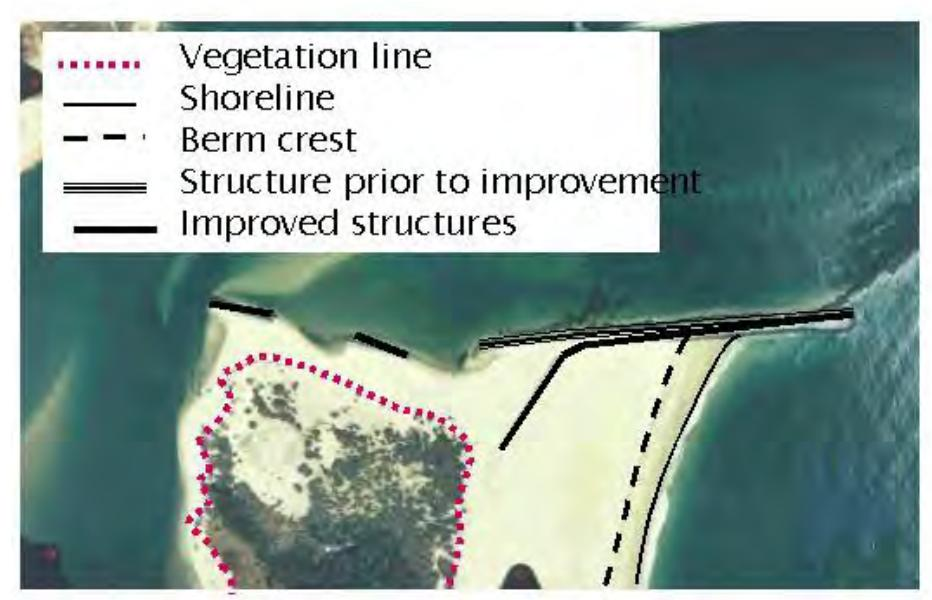

*Figure V-6-19. Aerial photograph of Ocean City Inlet, MD, showing high-water shoreline, berm shoreline, and duneline*

- (d) Jetty rips. Offshore-directed rip currents can form along the upwave side of shore-perpendicular structures (such as jetties). These rip currents divert sand from the beach offshore, where the sand may or may not be transported to or along the inlet's ebb shoal. Rips are visually evident by a seaward-directed flow of water and the steepening of waves that encounter the rip. A modest sluice within 5 to 50 m adjacent to the structure may be visible at low tide. Lifeguards and surfers familiar with the area can be useful sources of data regarding local current and wave patterns.
- (e) Inlet bathymetry and shoaling patterns. The location, rate of growth, and direction of movement of inlet shoals and spits, as well as the inlet's overall bathymetry, are excellent indicators of an inlet's sediment transport pathways. Use of bathymetry and shoaling patterns as a diagnostic tool requires, at a minimum, a bank-to-bank bathymetric survey of the inlet throat, flood shoal(s), and entire ebb shoal plateau. The latter should ideally extend outward and alongshore from the inlet entrance to capture the apparent point at which the ebb shoal attaches to the adjacent shorelines (if at all). Diagnostic ability is greatly improved when multiple, comparative surveys collected over time are available. Whenever possible, navigation channel condition surveys should be expanded to include bank-to-bank coverage of the inlet and as much of the inlet's shoals as possible . Pre-dredging, condition surveys are ideal because the shoals have had maximum opportunity to form prior to their removal by dredging. Reliance upon condition surveys that only include the navigation channel risks missing critical elements of the system's sediment transport pathways. Charts and surveys of the inlet should be contoured at frequent depth intervals in order to illuminate shoaling patterns. Even using traditional, coarse-resolution nautical charts (for which only limited contours are routinely plotted), this technique can offer an enlightening view of the inlet's transport patterns. In the United States, the original National Ocean Service "T-sheets," upon which the printed nautical charts are based, provide additional data. The location and shape of shoals can reveal the potential source of the shoals' sand and the apparent direction of transport. The location of deep areas (outside of dredged areas) indicates apparent, preferred orientation of flow; and, in turn, areas where current-induced erosional stress may be exercised upon the adjacent shore. Figure V-6-20 illustrates an example of an off-the-shelf nautical chart of an inlet, before and after the addition of higher-resolution depth contours.
- A particularly effective approach is to digitize, contour, and color-enhance the bathymetric data to more clearly reveal shoaling patterns. Pertinent upland features (jetties, shoreline, channel markers, etc.) should be added to the graphic to allow better visual correlation between the shoals, channels, and the inlet improvements. A prototype example is shown in Figure V-6-21, where lighter shading corresponds to shoals. Shading-enhanced depth contours readily show the leakage of sand through and around both jetties, the subsequent transport of the sand toward the flood shoal, and transport from the flood shoal toward the inlet entrance.
- The location, growth, and chronic reappearance of shoals can highlight the paths by which sand enters an inlet. Shoals located near a jetty's seaward end indicate a saturated jetty or jetty rip currents. Shoals near a jetty's landward end suggest a structure that is porous or too low. Shoals and spits that form by sand transport through and over the jetty's landward section are most generally displaced well landward of the adjacent shoreline. These shoals are subject to landward-directed transported by incident waves that sweep along the inlet's interior shorelines. An emergent, sandy shoreline along the inlet's interior, connecting the jetty to the interior shoals, is further evidence of transport through or over the landward section of the jetty, or around the end of a short, saturated jetty. The possibility should also be considered that interior shoals may have been created (or enhanced) by riverine sand that enters the inlet and settles in quiescent water.
- Figure V-6-22 illustrates an example in which the chronic reappearance of four distinct shoals along the inlet channel clearly reflects jetty leakage. The seaward two shoals correspond to known transport around the ends of the jetties. The landward two shoals correspond to transport through and over the jetties along the adjacent beaches' shorelines. Diving inspection, core boring, and dredging confirmed that the sediment from all four shoals is distinct from the silts and clays of the channel, but closely matches the adjacent beach sand.
- Comparisons of ebb and flood shoal surveys are necessary to estimate the net growth rate of these features. The degree to which these shoals contain nonlittoral material (e.g., silts and clays from rivers) should be considered so that the contributions from the riverine and coastal sources can be properly attributed. Identifying material type is typically based on examining samples from coreboring, dredged material, box-cores, or recovery methods. If only surface samples are available, care should be taken to consider whether silts and clays overlay sandy shoals that originated from the adjacent beaches.
- In some locations, sand from shoals (particularly interior shoals) has historically been dredged for upland use. This practice, infrequently recorded or quantified – may have removed significant quantities of sand from many inlet systems (sand which originated from adjacent beaches). Evidence of interior shoal dredging may be offered by the increase of adjacent landfills (readily noted in historical aerial photography) and anecdotal information.
- (f) Dredging records. Dredging records may be available from the inlet's managing agency or local sponsor, USACE district offices, and dredging contractors. The date(s), locations of dredging and disposal, purpose (maintenance or new work), and quantity are of central importance. The quantity of dredged littoral (sand) material vs. nonlittoral (silt-clay) material must be identified to differentiate coastal versus upland or riverine origin. Shoaling records (condition surveys) combined with geotechnical data (USAEWES 1995) and/or discussions with dredging contractors and contract managers can be employed for this purpose. Additionally, the location of, and cross-sectional shape of, the shoaling pattern are strong indicators of the source. Shoals that form near shallow, sandy portions of the ambient seabed (such as the ebb shoal) are more likely to be of littoral origin. Shoals that form against one side of the channel, as opposed to those that form uniformly across the channel bottom, are also more likely to be of littoral (beach) origin.

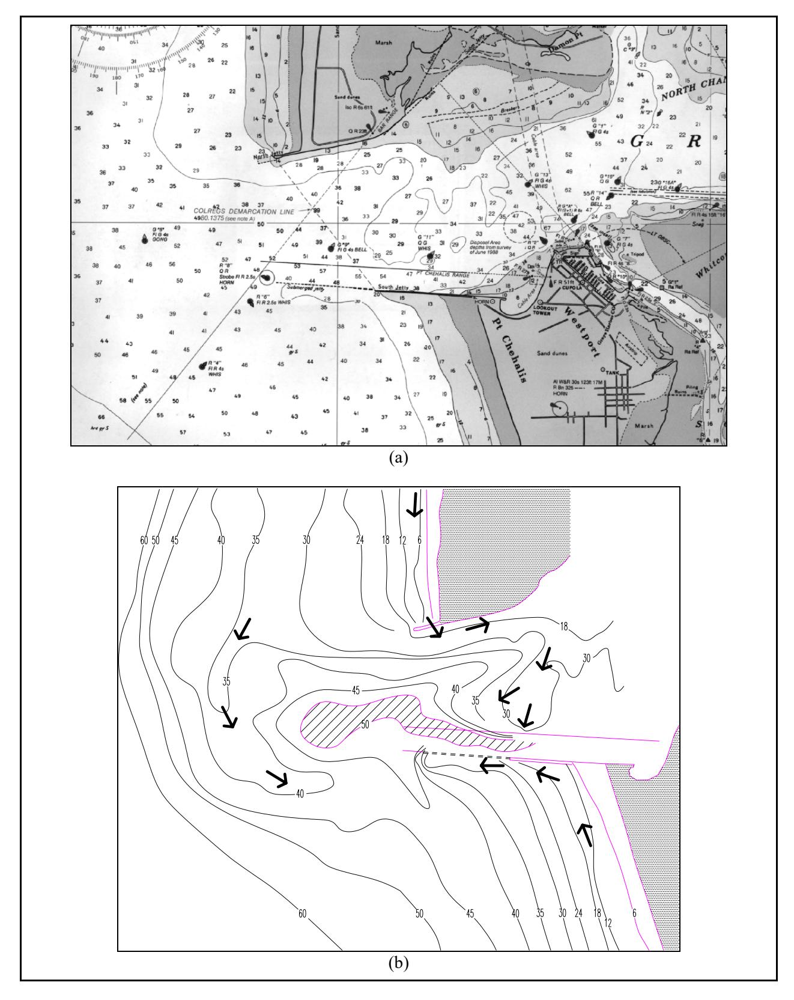

*Figure V-6-20. Nautical chart with and without addition of higher-resolution contours. Arrows indicate sediment transport paths suggested by bathymetry*

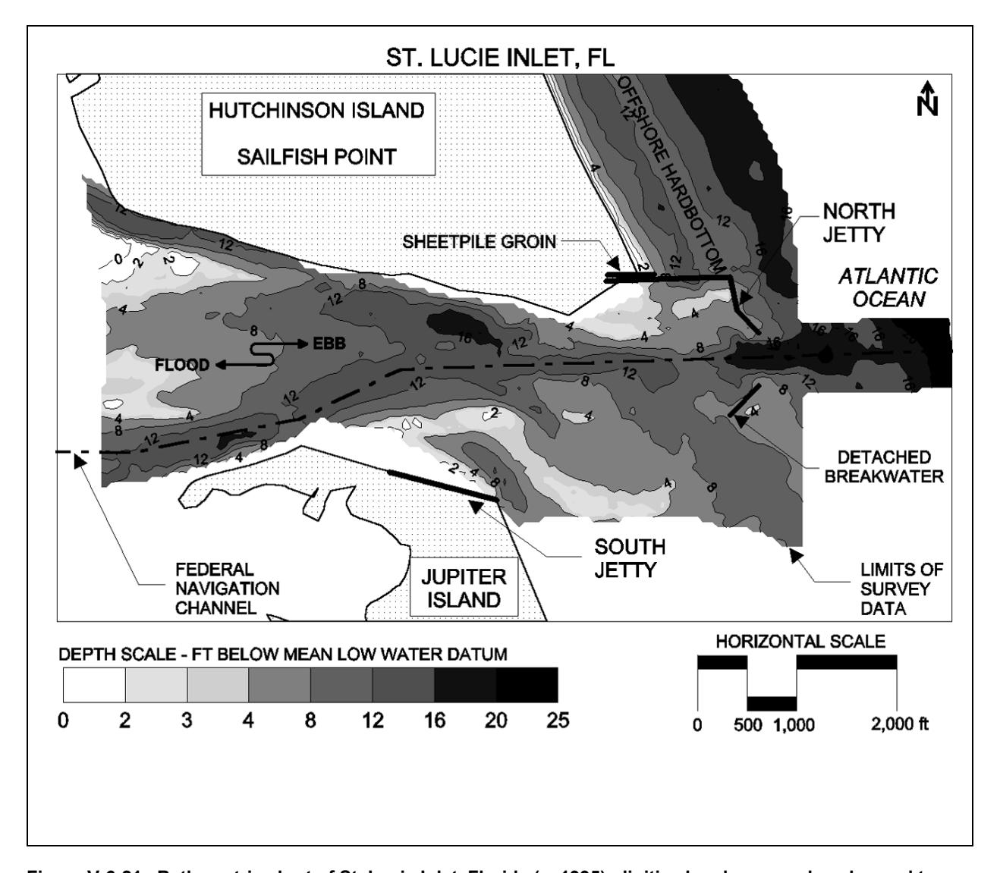

*Figure V-6-21. Bathymetric chart of St. Lucie Inlet, Florida (c. 1995), digitized and gray-scale enhanced to better define the presence of shoals and channels*

- Figure V-6-23 illustrates a classic example of such shoaling signatures. The bar cut of the Brunswick Harbor Federal navigation channel is maintained at a depth of about 10 m (mlw) through an ambient seabed that was historically only 1 to 5 m deep. Material dredged from along the north bank and channel center line in the vicinity of Section A is typically beach-quality sand originating from the area's net southerly littoral drift. Material from the vicinity of Section B is typically silt and clay that settles into the deep channel from the surrounding seabed (slumping), riverine transport (terrigenous source), and oceanic deposition (pelagic settling).
- We should note that not all of the littorally-supplied material at an inlet is necessarily sand. Some fraction of the dredged material may consist of silt, clay, gravel or organics of littoral origin. If this material is deposited offshore, it still represents removal of littoral material from the system, and must be included in computations of the inlet's littoral impact.

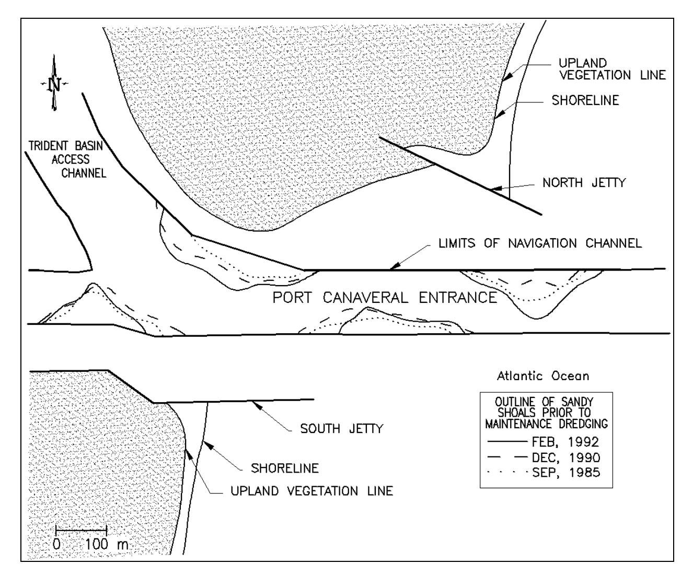

*Figure V-6-22. Historical locations of sandy shoals within Port Canaveral Entrance, Florida prior to implementation of jetty/inlet improvements (Adapted from Bodge 1994a)*

- Dredging for new work (increased channel or harbor dimensions) is typically not included in inlet impact analysis because the material that is dredged is considered to have been a static part of the littoral system. In reality, this exclusion underestimates inlet impacts because some portion of the requisite dredging usually involves removal of beach sand that sloughs into the new channel during initial construction. However, the portion of advance maintenance dredging which features littoral material is included in the inlet impact analysis.
- The degree to which increased channel dimensions or other inlet modifications alter dredging requirements can also reveal the degree to which the inlet diverts sand from the littoral system. This, again, requires discrimination of that part of the dredging quantity that was of littoral (beach sand) origin and undertaken for maintenance. Plotting the average-annual or cumulative quantity of maintenance-dredged littoral material as a function of time, and noting those times at which inlet modifications were undertaken, is a potentially useful technique to examine this effect (see Figure V-6-24).

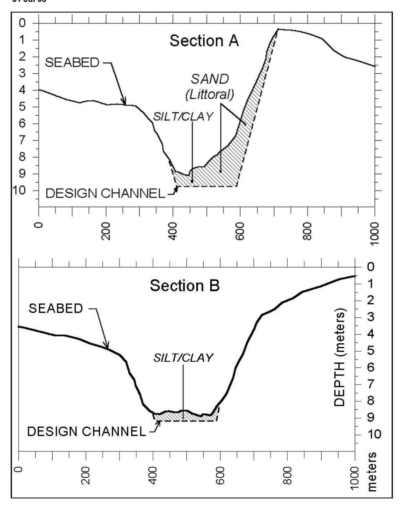

*Figure V-6-23. Bathymetric contours and typical channel sections at Brunswick Harbor Federal Navigation Project, Glynn County, Georgia*

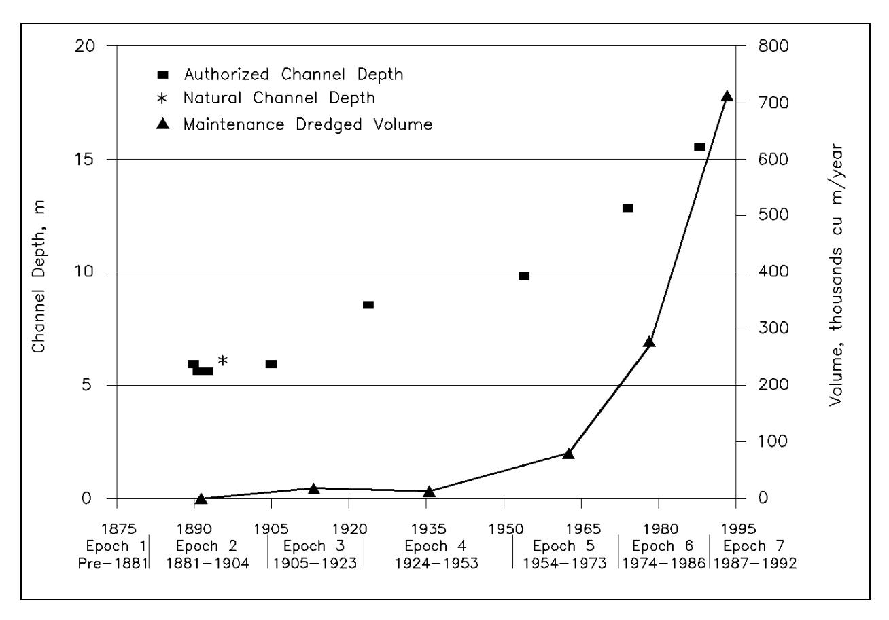

*Figure V-6-24. Average annual volume of maintenance dredging at St. Mary's Entrance Channel and authorized channel depths; 1870 to 1992 (from USAEWES 1995)*

h. Conclusion. This part of Chapter V-6 has discussed inlet processes and engineering activities at inlets. Inlets and associated engineering activities not only interact with local beaches and morphology, but also have the potential to alter sediment transport patterns and rates over the regional scale, especially over periods of many years. Methods discussed herein allow the coastal researcher to evaluate the impacts of these processes on the inlet morphology and adjacent beaches. These evaluations, together with inlet and adjacent beach sediment budgets (discussed in Chapter V-6-3), will improve the general understanding of the specific inlet's operation, and allow the engineer to optimize the timing and scope of engineering activities at the inlet and along the adjacent beaches.

#### V-6-3. Inlet and Adjacent Beach Sediment Budgets

a. Overview. This chapter discusses sediment budgets at inlets and their adjacent beaches. First, a history of sediment budgets is provided, followed by the theory of sediment budgets and required data sets to develop an inlet and adjacent beach sediment budget. Examples of previous sediment budgets are presented, and a series of example problems are given. The chapter concludes with a description of recent sediment budget methodologies.

#### b. Introduction.

- (1) A sediment budget is an accounting or tabulation of the inflows and outflows of sediment together with the change in sediment volume within specified boundaries and for the time interval covered by the data. It is similar to a home budget that balances income (source of money), expenses (sinks of money), savings (positive amount), and debts (negative amount). Formulation of a realistic inlet and adjacent beach sediment budget is an essential prerequisite to the development of a successful inlet sand management strategy. Because an inlet's effect upon the adjacent shorelines is a function of the gross transport rates (not just the net rate), it is important to include both right- and left-directed transport in the sediment budget, as well as local, inlet-induced transport. In those cases where transport reversals occur at some time during the period of consideration (i.e., the majority of practical cases), inclusion of only the net transport rate will result in a potentially serious misinterpretation of the inlet's sediment transport pathways and associated volumetric rates of change.
- (2) Development of the sediment budget requires that the rates and directions of sand transport adjacent to, within, and through the inlet be "deconvolved" from measured rates of volumetric change within the inlet system; specifically, the updrift and downdrift shorelines, the inlet shoals, and the channels. Allowances for the effects of dredging, beach fill, and other engineering of the inlet features must also be made. Development of the sediment budget is complicated by uncertainties in alongshore sand transport rates, typically incomplete or "noisy" volume-change data, and the fact that the number of transport rates for which values are unknown is greater than the number of equations which define the transport paths. The latter point means that the equations for an inlet sediment budget are almost always underconstrained. Accordingly, a unique solution is rarely possible. The goal, instead, is to develop a suite of possible solutions that is based upon reasonable assumptions of the inlet's processes. In this way, estimates of the practical ranges (or limiting values) of the rates at which sand is transported into or across the inlet from each shoreline can be made for various assumptions of the incident, alongshore transport rate or other physical parameters.

#### c. Theory.

- (1) Since the 1950s, sediment budgets have been created to define the magnitudes and direction of sediment transport within a defined region and to understand, for example, inlet channel sedimentation and patterns of erosion and accretion along the coast. A balanced sediment budget yields an integrated picture of sediment (typically sand) motion, associated beach change, dredging and infilling of navigation channels at inlets, and other engineering activities within the reach covered by the analysis. Typically, the more reliable data form the foundation for the sediment budget, and lesser-known or more uncertain parameters are calculated to balance the budget by applying the principle of conservation of mass of sand (converted to volume or volumetric rate). A balanced sediment budget is a valuable tool for investigating observed coastal change and for forecasting the overall future state of the coast and consequences of management alternatives. Examination of an unbalanced sediment budget provides basic and useful information about the coastal system. An unbalanced budget may indicate a deficiency in the data set forming the budget (Dolan et al. 1987), reveal a misunderstanding in certain physical processes and assumptions (Inman 1991), or give bounds on the uncertainty range for the data sets. Whether or not formally developed, the sediment budget concept is fundamental to coastal engineering and science, usually providing the backdrop by which processes and projects are evaluated and alternatives considered. For additional background discussion, see Komar (1996, 1998).
- (2) A sediment budget is a tallying of sediment gains and losses, or sources and sinks, within a specified control volume (or cell), or series of connecting cells, over a given time. There are numerous ways of formulating a sediment budget (e.g., Jarrett 1991; Bodge 1999). The difference between the sediment sources and the sinks in each cell, hence, for the entire sediment budget, must equal the rate of
change in sediment volume occurring within that region, accounting for pertinent engineering activities. The sediment budget equation can be expressed as,

```math
\sum Q_{source} - \sum Q_{sink} - \Delta V + P - R = \text{Residual} \tag{V-6-23}
```

in which all terms are expressed consistently as a volume or as a volumetric change rate, $Q_{source}$ and $Q_{sink}$ are the sources and sinks to the control volume (expressed as positive values), respectively, D V is the net measured change in volume within the cell, P and R are the amounts of material placed in and removed from the cell, respectively, and Residual represents the degree to which the cell is balanced. For a balanced cell, the residual is zero. Note that the notation for $Q_{source}$ and $Q_{sink}$ due to Longshore Sand Transport (LST) may differ, depending on the application. In Equation V-6-23, $Q_{source}$ and $Q_{sink}$ are expressed as positive values (this differs from that specified in Longshore Sand Transport discussion of Part III-2-2).
(3) Figure V-6-25 schematically illustrates the parameters appearing in Equation V-6-23. For a reach of coast consisting of many contiguous cells, the budget for each cell must balance in achieving a balanced budget for the entire reach.

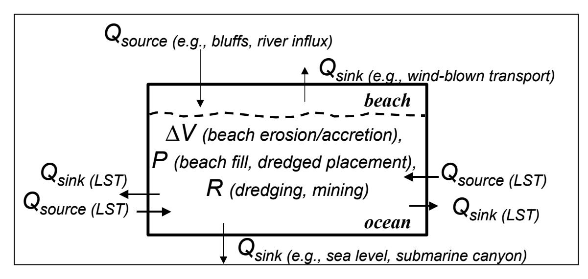

*Figure V-6-25. Sediment budget parameters as may enter Equation V-6-23*

(4) As noted in Figure V-6-25, sources to the sediment budget include longshore sediment transport, erosion of bluffs, transport of sediment to the coast by rivers, erosion of the beach, beach fill and dredged material placement, and a decrease in relative sea level. Examples of sediment budget sinks are longshore sediment transport, accretion of the beach, dredging and mining of the beach or nearshore, relative sea level rise, and losses to a submarine canyon. If inlets are located within the domain of a coastal sediment budget, they present significant challenges because inlets and the adjacent beaches are connected. Inlets increase the complexity of sediment budgets for several reasons. First, sediment-transport magnitudes and pathways are difficult to define at inlets even in a relative sense. Flood and ebb currents, combined waves and currents, wave refraction and diffraction over complex bathymetry, and engineering activities complicate transport rate directions and may increase or decrease their magnitudes. Because the pathways of sediment movement in the vicinity of an inlet can be circuitous, equations describing the sediment budget of regions directly adjacent to the inlet are not unique (that is, different formulations are possible).
- (5) An inlet channel has the potential to capture the left- and right-directed components of the gross longshore transport of sediment, and the inlet system may bypass left- and right-directed longshore transport. Thus, knowledge of the net and gross transport rates, as well as the potential behavior of the inlet with respect to the transport pathways, may be required to correctly represent transport conditions within the vicinity of inlets, as emphasized by Bodge (1993). d. Project applications. (1) Sediment budgets can enter at any of four stages in project development:
- (a) Existing condition. A sediment budget for the existing condition is the most common type considered. This budget forms the basis for evaluating the impacts of future engineering activities and the natural evolution of the inlet or coast.
- (b) Historical (pre-engineering activity) condition. This budget is typically constructed for comparison with the existing-condition budget. A common application using the two budgets is to estimate shore erosion on adjacent beaches attributable to the impacts of inlet-related engineering activities that may warrant mitigation.
- (c) Forecast future condition. Adapting and extrapolating the existing-condition sediment budget can assess the potential response to future projects or modifications.
- (d) Intermediate condition. Sediment budgets representing other periods create a model of inlet or coastal evolution through time, which may lend insight to interpreting present or future evolution. As examples, intermediate-condition sediment budgets may document evolution of the inlet from initial formation to a quasi-equilibrium state, or may provide a picture of long-term natural bypassing through a cycle of channel migration and welding of a portion of the ebb-tidal shoal to the adjacent beach. e. History of and procedure for sediment budget formulation.
- (1) Consider a regional approach.
- (a) For accurate representation of a local project area, especially in the vicinity of inlets, a sediment budget is formulated with its lateral boundaries located well beyond the apparent (expected) local project boundaries. A regional sediment budget might include multiple barrier islands, several inlets or several headlands and pocket beaches to fully capture the past and potential future changes in the sediment transport rate magnitude and direction.
- (b) Inlets that have been stabilized by jetties for periods ranging from decades to centuries have the potential to influence the transport of sediment on the adjacent beaches for many kilometers, a distance that may extend well beyond what is considered the direct area of the inlet. Thus, a regional sediment budget that incorporates adjacent barrier islands, bay regions, underlying geology, estuarine and riverine impacts, and perhaps several inlets, may be required to assess the impacts of past and future projects. Engineering activities at navigable inlets and other data required for an inlet sediment budget have a high degree of uncertainty. Examples of these data include dredging quantity, location, and littoral quality; adjacent beach-fill volumes, initial cross-shore and longshore adjustment, and littoral quality; limited ebb-and (more commonly) flood-tidal shoal bathymetric coverage; and assessing the degree to which structures block, reduce, and modify the sediment transport pathways and magnitudes (Kraus and Rosati 1998a, 1999).

#### EXAMPLE PROBLEM V-6-9

Given:
Referring to figure V-6-26, balance the sediment budget equation given that Q_{1 \text{ source}} = 250 , Q_{1 \text{ sink}} = 100 , Q_{2 \text{ source}} = 100 , Q_{2 \text{ sink}} = 200 , Q_{4 \text{ source}} = Q_{4 \text{ sink}} = 0 , \Delta V = -70 , P = 130, and R = 250 (all units are thousands of cu m/year).

#### Find:

Find the value of Q_{3 sink} that balances the sediment budget (see Equation V-6-23 and Figure V-6-26).

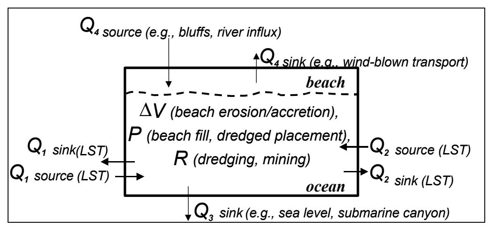

*Figure V-6-26. Sediment budget for Example V-6-9*

Substituting into Equation V-6-23 gives

```math
\sum Q_{source} - \sum Q_{sink} - \Delta V + P - R = Residual \\
(250+100) - (100+200+Q_{3 sink}) - (-70) + (130) - 220 = 0 \\
Q_{3 sink} = 30
```

The value of Q_{3 \text{ sink}} indicates that 30,000 cu m/year are transported out of the littoral cell, in the offshore direction.
(c) In one of the earliest works that may be considered a regional sediment budget, Caldwell (1966) summarizes a study performed in the 1950s by the U.S. Army Engineer District, New York, for the north New Jersey coast (USACE, 1957, 1958). The budget, formulated by examining changes in shoreline position, served as a field laboratory of shore processes with the objective of examining alternatives to mitigate for erosion. This celebrated study deduced a regional divergent nodal point in net longshore transport direction at Mantoloking, located just north of Dover Township. Net longshore transport to the north increased with distance north from Mantoloking because of the sheltering by Long
Island, New York. The budget considered net and gross longshore sand transport for this 190-km reach including 10 inlets over time intervals of 50 to 115 years.
- (d) Another example of a regional sediment budget is that of Jarrett (1977, 1991) for the North Carolina shoreline, including three barrier islands and two inlets. Mann (1993) discussed use of a near field versus regional sediment budget. The near field sediment budget represents local (project area) sediment sources, sinks, and pathways. The regional sediment budget combines the near field budget with the sediment-transport processes occurring on the adjacent shorelines. For development of inlet sand management strategies (and estimating the inlet's littoral impacts), Mann recommends consideration of a regional sediment budget so that interactions of the inlet (and any proposed modifications) on the adjacent shorelines can be assessed. Although it may be difficult to define and balance all sources, sinks, and sediment transport pathways within a regional context, this comprehensive approach may allow the practitioner to recognize a source or sink of sediment hundreds of kilometers away that has a potential significance to the project area (Komar 1998).
- (2) Develop a conceptual budget. Kana and Stevens (1992) introduced a conceptual sediment budget, which they recommend developing in the planning stage prior to making detailed calculations of individual sources and sinks. The conceptual sediment budget is a qualitative model giving a regional perspective of the inlet interaction with beach processes, containing the effects of offshore bathymetry (particularly shoals and, therefore, wave-driven sources and sinks), and incorporating natural morphologic indicators of net (and gross) sand transport. The conceptual model may be put together in part by adopting sediment budgets developed for other sites in similar settings, and incorporates all sediment sinks, sources, and pathways. The conceptual model should be developed initially, perhaps based upon a reconnaissance study at the site as part of the initial data set. Once the conceptual sediment budget has been completed, data are assimilated to validate the model rather than to develop the model.
- (3) Ensure compatibility of temporal and spatial scales. In a discussion of the planning process for coastal projects, Kraus (1989) advocated the concept that the temporal and spatial scales of data used to develop and drive a model (whether a numerical, analytical, physical, or conceptual model) must be commensurate with these scales of the model itself. For example, a sediment budget developed based on pre- and post-storm data representing a day-to-month-length temporal scale within the immediate vicinity of the inlet should not be extrapolated to forecast to temporal scales of years and decades for a region extending over several barrier islands. Similarly, a sediment budget developed based on a 50-year period cannot adequately bracket the seasonal fluctuation observed locally at the project site. Sediment budgets are commonly required to represent periods of engineering and geomorphic significance, from 3-5 years (dredging cycle at inlets) to 30-50 years (project life span; time scale for cyclic ebb shoal welding). Data sets reflecting the longer durations are required to develop the sediment budget for spatial scales reflecting a regional approach. However, seasonal and year-to-year variability should be considered and can contribute to the uncertainty in a sediment budget, or form the basis for a sensitivity analysis.
- (4) Delineate littoral cells. A littoral cell (or control volume) defines the boundaries for each sediment budget calculation, and denotes the existence of a complete self-contained sediment budget within its boundaries (Dolan et al. 1987). Bowen and Inman (1966) introduced the concept of littoral cells (Inman and Frautschy 1966) within a sediment budget. The southern California coast lends itself to this concept, with evident sources (river influx, sea cliff erosion), sinks (submarine canyons), and coastal geology (rocky headlands) defining semicontained littoral cells and subcells (Komar 1996, 1998). A littoral cell can also be defined to represent a region bounded by assumed or better-known transport conditions, or natural and engineered features such as the average location of a nodal region (zone in which $Q_{net}$ ~ 0 ) in net longshore transport direction or a long jetty.
- (5) Consider net and gross transport rates. For cells of the regional budget that may capture a portion of the left- or right-directed transport, both of these components must enter in the formulation. Examples include submarine canyons and inlet channels that capture both left- and right-directed transport; inlet weirs which may trap a portion of the left- or right-transport rate; and initial beach response at a long groin or headland feature, which may indicate accretion associated with left- and right-directed transport. Caldwell (1966) considered the gross transport rate as a potential indicator of shoaling for inlets in the vicinity of Cape May, New Jersey. Jarrett (1977, 1991) balanced potential longshore energy flux calculations with measured beach and tidal inlet change to solve for net and gross rates of longshore sand transport. Bodge (1993) focussed on the inlet and its adjacent beaches, and emphasized the importance of considering the gross components of longshore sediment transport, especially for inlets that act as sediment sinks. The gross transport rate can also provide an upper limit for the net, left-, and rightdirected rates. (6) Assign values and uncertainties.
- (a) Known, estimated, or easily-obtained values and their associated uncertainties are assigned to source, sinks, and engineering activities within the sediment budget. This step should represent a low level of effort to quickly assess the integrity of the macrobudget (discussed in the following paragraphs) and to flush out any problems before detailed analysis begins.
- (b) Every measurement has limitations in accuracy and contains a certain error. For coastal and inlet processes, typically direct measurement of many quantities cannot be made, such as the long-term longshore sand transport rate or the amount of material bypassing a jetty. Values of such quantities are obtained with predictive formulas or through estimates based on experience and judgement, which integrate over the system. Therefore, measured or estimated values entering a sediment budget can be considered as consisting of two terms, expressed schematically as

```math
R e p o r t e d V a l u e = B e s t E s t i m a t e \pm U n c e r t a i n t y \tag{V-6-24}
```

Uncertainty, in turn, consists of error and true uncertainty. A general source of error is limitation in the measurement process or instrument. True uncertainty is the error contributed by unknowns that may not be directly related to the measurement process. Significant contributors to true uncertainty enter through natural variability and unknowns in the measurement process. These include temporal variability (daily, seasonal, and annual beach change); spatial variability (longshore and across shore); definitions (e.g., shoreline orientation, direction of random seas); and inability to quantify a process, such as the volume of material pumped to a beach, or the sediment pathways at an inlet. Other unknowns can enter, such as grain size and porosity of the sediment (especially true in placement of dredged material).
(c) As an example, suppose the variable X is a sum or difference of several independent parameters as X = x + y – z +…, then the two common estimates for the uncertainty are:

```math
\delta X_{\text{max}} = \delta x + \delta y + \delta z + \dots \tag{V-6-25a}
```

and

```math
\delta X_{\text{best}} = \sqrt{(\delta x)^2 + (\delta y)^2 + (\delta z)^2 + \dots} \tag{V-6-25b}
```

In both expressions, the errors add, whether or not the variables enter the quantity being reported as a sum or difference. Equation V-6-25a represents an extreme bound for the plausible error. Equation V-6-25b is the root-mean-square (rms) error, and the validity of this expression rests on the assumptions that the
individual uncertainties are independent and random. The rms error accounts for the uncertainty in uncertainty by giving a value that is not an extreme, such as \delta X_{\text{max}} .
(d) Suppose the quantity entering the budget is expressed as a product or quotient of independent variables as X = xyz or as xy/z. In either case, the uncertainty in X is:

```math
\left(\frac{\delta X}{X}\right)_{\text{max}} = \frac{\delta x}{x} + \frac{\delta y}{y} + \frac{\delta z}{z} \tag{V-6-26a}
```

and

```math
\left(\frac{\delta X}{X}\right)_{\text{best}} = \sqrt{\left(\frac{\delta x}{x}\right)^2 + \left(\frac{\delta y}{y}\right)^2 + \left(\frac{\delta z}{z}\right)^2} \tag{V-6-26b}
```

and it is seen that the errors are additive whether a variable enters as a product or quotient. These equations state that the relative uncertainty of a product or quotient is equal to the sum of relative uncertainties of each term forming the product or quotient. Kraus and Rosati (1998a, 1999) further discuss uncertainty in coastal-sediment budgets.
- (7) Formulate a macrobudget. A macro-budget is a quantitative balance of sediment inflows, outflows, volume changes, and engineering activities within the regional conceptual budget. Essentially, the macrobudget solves the budget with one large cell (perhaps by temporarily combining many interior cells) that encompass the entire longshore and cross-shore extents of interest. Balancing the macrobudget reduces the possibility of inadvertently including potential inconsistencies in a detailed or full budget (Kraus and Rosati 1999).
- (8) Refine estimated values and uncertainties. Once the macrobudget has been balanced, detailed analysis for all inflows, outflows, volume changes, and engineering activities pertaining to each individual cell may commence. Originally estimated values used in formulating the macrobudget are used to provide reasonable ranges for each quantity.
- (9) Use residuals to balance individual cells. As presented in Equation V-6-23, both a balanced sediment budget cell and the macrobudget have the sum of all sources, sinks, and engineering activities equal to zero. Inman (1991) discussed recording an unbalanced sediment budget cell (a cell with a non-zero residual in Equation V-6-23) as a region requiring more definition and investigation of the unknown processes. Knowledge of the residual may also be useful to bracket the uncertainty range for the data sets (Kraus and Rosati 1999).
- (10) Conduct sensitivity testing. Once a sediment budget has been formulated, it can be copied and modified to evaluate the impact of any assumptions on the final sediment budget. Different data sets for the same project site can be applied to evaluate seasonal variations in beach change and transport rate direction and magnitude. A balanced budget representing a historical time period can be copied and altered to represent a potential future with-project condition.
- f. Data required. The types of data sets that are available for refining sediment budget quantities are discussed in the following paragraphs. This section supplements the data required for inlet analysis described in Section V-6-2(f).
- (1) Aerial photography. Interpretation of aerial photographs offers the best means of obtaining broad qualitative understanding of the site. As examples, photographs of sites with relatively clear water can identify the planform shape of the flood-tidal shoal to estimate its volume if more quantitative data are unavailable. The pattern of wave breaking over the ebb-tidal shoal indicates the planform shape of this feature, which might lend qualitative understanding of its interaction with adjacent beaches and of sediment pathways. Overwash fans on adjacent barrier islands indicate pathways for loss of sediment to the coastal littoral system, from which quantification of volumes might proceed. Shoals adjacent to jetties might indicate sediment-transport over and through the structure as a potential sediment transport pathway. In a more quantitative analysis, controlled and rectified aerial photographs are commonly interpreted to identify the berm or high-water line (HWL) shoreline position (Kraus and Rosati 1998b).
- (2) Beach-profile surveys. Volume change, D V, in the beach can be obtained accurately through repetitive surveys of the beach profile. The volume change for a given profile is typically assumed to represent the region of beach of length D x between adjacent profile lines. Both the elevations B of the berm and of the profile closure depth $D_{C}$ can be estimated from beach-profile surveys if the profile data are sufficiently accurate and well controlled. The active berm crest is a discernible morphologic feature on the profile representing the upward limit reached by the water under normal tide and water-level conditions. The profile may have two berm crests if the beach has recently accreted, and the elevation of the seaward-most feature should be noted. The depth of closure is located where no significant depth changes occur over times of engineering significance (typically, 10 to 50 years) (see Hallermeier 1978; Birkemeier 1985; Wise 1998). Kraus, Larson, and Wise (1999) discuss the depth of closure in detail and extend its definition to cover varied conditions as encountered in engineering practice. Profile surveys performed near structures may indicate their condition. For example, a jetty that allows sediment transport over and through it might be indicated by a berm-crest elevation adjacent to the structure that is comparatively lower than the berm crest further away from the structure. Similarly, surveys close to structures reveal whether the profile deviates from the average shape far from the structures, improving estimates of sand volume. The investigator should be cautious in interpreting beach-profile data near the inlet because of migrating shoal features that may affect the profile shape.
- (3) Shoreline-position data. Shoreline-position data may be obtained from analysis of topographic and HWL surveys, aerial photographs, beach-profile surveys, and bathymetric data (Anders and Byrnes 1991; Byrnes and Hiland 1995). In a qualitative manner, beach morphology indicated by shoreline position may imply sediment-transport pathways or controls. As examples, a salient or bulge-type feature in the shoreline downdrift of an inlet may represent the location for ebb shoal bypassing to the adjacent beach. Rocky headlands and outcroppings indicate geologic controls on sediment-transport pathways.
- (a) As quantified in a sediment budget, the change in shoreline position D y averaged over a given longshore distance D x can be converted to a volume change by assuming that the shoreline translates parallel to itself over an active depth $D_{A},$ given by

```math
D_A = B + D_C \tag{V-6-27}
```

in which B is the elevation of the seaward-most active berm relative to a datum, and D_C is the depth of closure measured from the same datum. The volume change ^1 \Delta V over a time interval \Delta t is given by

```math
\Delta V = \frac{\Delta y \Delta x D_A}{\Delta t} \tag{V-6-28}
```

- (b) If available, the impoundment rate at a shore-perpendicular structure such as a groin or jetty that is sand tight gives an estimate of the longshore sediment-transport rate.
- (4) Bathymetry. Historical and recent bathymetric data sets are a valuable resource for determining the rate of volume change in the inlet channel and on the ebb and flood-tidal shoals. If coverage is sufficient, differences in bathymetric surfaces give the subaqueous volume change on the adjacent beaches and channel and ebb- and flood-tidal shoals. It is noted that, in the past, typical bathymetric coverage has been limited to the inlet channel. However, the benefits of increasing the survey area to include the ebb- and flood-tidal shoals far outweigh the additional costs, particularly in view of reductions in the cost of bathymetric surveys (e.g., SHOALS bathymetric survey system, Parson and Lillycrop 1998). Bathymetric data can also indicate sediment-transport pathways. As examples, a finger shoal extending from the tip of a jetty likely indicates a dominant sediment transport pathway, and the morphologic form of an ebb-tidal shoal that connects to the adjacent beaches may indicate inlet bypassing. Aerial photography of flood-tidal shoals at different, but known tidal elevations can be referenced to create a contour map of the shoals, and thereby to estimate a shoal volume. (5) Engineering history.
- (a) Engineering activities of significance to a sediment budget fall into two categories those that are of a descriptive nature and must be quantified within the sediment budget; and those that are a priori quantified. Rehabilitation of a jetty is an example of a descriptive activity that requires quantification. The morphology of the inlet and adjacent beach before and after structure rehabilitation, as well as the type of rehabilitation (e.g., raising the jetty crest elevation, inserting a sand-tight core, adding armor stone), and other pertinent data sets indicate the effectiveness of the structure. Consideration should be given as to the degree of sediment transport through, over, and around the structure before and after rehabilitation. Another example of descriptive data is the grain size of dredged material placed on the adjacent beaches. From this information, the engineer must estimate percentage of material that would remain in the active littoral zone.
- (b) Engineering activities that are a priori quantified (although sometimes only partially) include the following: volumes, locations, and times of dredged and placed material; volume of material mined from ebb- and flood-tidal shoals, the locations and times of mining; configuration of the placement; volume of fill on adjacent beaches and its placement location and time period of placement; and records of mechanical bypassing (volume, placement location, and time periods). These quantities will enter the sediment budget calculations by adjusting measured volume changes to account for either the removal or placement of material through engineering activities. The adjustment of an initial beach fill can be used to infer rates of longshore and cross-shore sediment transport.
_

*& lt;sup>1</sup> Comparison of a shoreline position derived from aerial photography with a shoreline position derived from beach-profile surveys should account for possible differences in the vertical datums to which each is referenced. For example, it is likely that an aerially-derived shoreline position represents a berm crest or HWL position, whereas a beach-profile shoreline may represent a zero elevation relative to a standard datum (e.g., National Geodetic Vertical Datum, or Mean Sea Level). See Kraus and Rosati 1998b or CEM, Part II, Chapter 5.*

- (6) Coastal processes. Data on the acting coastal processes are a resource for understanding and quantifying inlet- and sediment-transport pathways and quantitites. Examples are discussed here.
- (a) Net, left-, and right-directed potential longshore sand-transport rates can be calculated from wave gauge, Wave Information Study (WIS), and Littoral Environment Observation (LEO, see Schneider (1980)) wave height, period, and direction data. Gravens (1989) discusses the methodology for calculating net potential longshore sand-transport rates from WIS data. The components of the net transport, directed to the left or right as noted by a shore-based observer, can be calculated by using the left- or right-directed waves, respectively, with the methodology as outlined in Gravens (1989). Often the magnitudes of the calculated net, left-, and right-directed potential longshore sand transport rates do not agree with accepted values for the site. However, the relative magnitude between the left- and right-directed transport can be applied in a sediment budget with an accepted value for net longshore sediment transport to adjust the magnitudes. Wave height, period, and direction data allow construction of wave rays or orthogonals as indicators of pathways of sediment transport.
- (b) Inlet flow speed and direction data as indicated by current meters or drogue movement give the relative magnitude of sand-transport rates and pathways. For example, measurements of the current from Ocean City Inlet, Maryland, indicated that the flow to the northern part of the bay was considerably greater than that to the southern part (Dean, Perlin, and Dally 1978). This information can be adapted to proportion the relative magnitude of the bay-directed sand transport to different parts of the bay.
- (c) The rate of relative sea-level rise may represent a contributing factor to the observed beach change. The long-term beach loss \Delta y_{sl} because of an increase S in relative sea level is (Bruun 1962; 1988; Komar 1998).

```math
\Delta y_{sl} = \frac{L_c}{B + D_c} S \tag{V-6-29}
```

for which L_c is the cross-shore distance from datum to the long-term depth of closure D_c .
- (d) Other types of coastal process data useful for formulation of a sediment budget include:
- River-flow speed, fluvial sediment grain size and sediment availability as a possible sediment source to the coastal environment.
- Wind speed and direction, sediment grain size and availability as a potential aeolian sediment source to or a sink from the coastal environment.
- Sediment characteristics (e.g., median size, size distribution, mineral content) as natural tracers for sediment movement.
- g. Sediment budget methods and tools. This section discusses sediment budget methods and tools available for inlets and regional studies. The discussion is organized with the simpler methods presented first, followed by the more complex.

#### EXAMPLE PROBLEM V-6-10

#### GIVEN:

Develop a conceptual sediment budget for the period 1938 to 1979 for the regional littoral system in the vicinity of Shinnecock Inlet, Long Island, New York. This region extends east of Shinnecock Inlet to Montauk Point and west of Shinnecock Inlet to Moriches Inlet.

#### BACKGROUND INFORMATION:

Shinnecock Inlet, located on the south shore of Long Island, New York, was formed during a hurricane in September 1938 (Figure V-6-27). The west jetty was initially constructed by New York State in 1947 and was extended from 1953 to 1955, and the east jetty was constructed from 1952 to 1953. Shinnecock Inlet's littoral system is bounded to the east by Montauk Point, a location at which net longshore sediment transport is negligible because of its shoreline orientation and fetch distance from the mid-Atlantic Coast. West of Montauk Point, 10- to 21-m-high bluffs extend for 8 km and are a source of sediment roughly estimated as 35,000 cu m/year based on analysis of profile data. The U.S. Army Engineer District, New York, formulated a sediment budget for the inlet (USAED, New York, 1987). Estimates are available for the net longshore sand-transport rate 1 km east of the inlet (230,000 cu m/year), the ebb-shoal volume change (77,000 cu m/year), the flood-shoal volume change (15,000 cu m/year), and the net longshore sand-transport 1.8 km west of the inlet (189,000 cu m/year).
Nersesian and Bocamazo (1992) developed a preliminary sediment budget in which the net transport east of Shinnecock was 281,000 cu m/year, the ebb and flood shoal captured 77,000 and 15,000 cu m/year, respectively; and transport west of the inlet was 189,000 cu m/year. Kana (1995) estimated net transport rates 3 km east and 2 km west of Shinnecock Inlet as 219,000 and 104,000 cu m/year, respectively. A seaward bulge located approximately 2 km downdrift of Shinnecock Inlet is apparent in the 1979 shoreline position, indicating a possible region of sediment exchange between the ebbtidal shoal and the downdrift beach. West of Shinnecock Inlet, the Westhampton barrier island extends for 25 km to Moriches Inlet. Moriches Inlet was formed in March 1931 and migrated 1,200 m to the west before it closed naturally in May 1951. Jetties were constructed in 1952 to 1953 at the position of the former inlet, and through dredging and a minor storm, the inlet reopened. Taney (1961a,b) estimated net transport rates at Moriches Inlet as 229,000 cu m/year.

#### (Continued)

#### (1) SBAS2000.

(a) Overview. The Sediment Budget Analysis System (SBAS2000) is a PC-based program that utilizes a graphic-based interface to apply Equation V-6-23. The SBAS was developed to allow the engineer and scientist to formulate sediment budgets in areas with complex sediment pathways, such as at inlet entrances, and over a wide regional extent that might encompass several inlets with beaches and infrastructure in between. SBAS can zoom out to reveal a large regional extent, and combine (collapse) sediment budget cells for a macroscale interpretation of sand transport along the coastlines and through rivers. For project-level sediment budgets, SBAS can zoom in to the site-specific area and

#### EXAMPLE PROBLEM V-6-10 (Concluded)

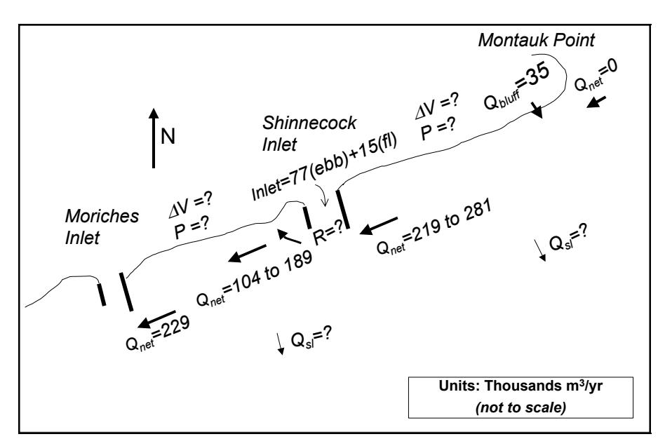

*Figure V-6-27. Conceptual sediment budget for Shinnecock Inlet, New York*

#### CONCEPTUAL SEDIMENT BUDGET:

Figure V-6-27 shows the conceptual sediment budget developed from the information presented. Applying this information with Equation V-6-23 indicates that the beaches between Shinnecock Inlet and Montauk Point and between Moriches and Shinnecock Inlets most likely have eroded during the subject period, unless a significant quantity of beach fill was placed. Some volumes are not quantified (e.g., beach losses because of relative sea level rise Q_{sl} ; beach-fill placement rate P; dredging (removal) rate R), but are represented for completeness.
reinstate (explode) sediment budget cells. Through SBAS, numerous sediment budgets can be established, copied, and modified for different project or forcing conditions with internal checks provided by the system. Although SBAS was developed to support regional coastal sediment management, its algorithmic structure and commercial-grade PC interface are independent of application. For example, SBAS can be applied to inland navigation projects or as a general ledger to track funds or products in multiple interactive accounts. Data entry can be accomplished visually or through a spreadsheet, and results can be displayed graphically in a number of ways or as lists, depending on the background and needs of the viewer (management review; engineering detail; overviews to sponsors). Because of the intuitive interface, SBAS can be operated with just a few minutes of training. The system also includes ways to estimate uncertainty, to consider "what if" questions easily, to cut-and-paste graphics, and to obtain hard copy reports.

#### EXAMPLE PROBLEM V-6-11

#### GIVEN:

Refine the conceptual budget for Shinnecock Inlet and the beaches \pm 3.2 km east and west of the inlet. For this example, uncertainty in the sediment budget will be omitted (refer to Equation V-6-25 and V-6-26 for estimating uncertainty within a sediment budget).

#### BACKGROUND INFORMATION:

The refined conceptual budget is shown in Figure V-6-28, and details of its formulation are presented here. At 3.2 km east of the inlet, wave refraction modeling indicated that the ratio of Q_R to Q_L was approximately 1.9. The same ratio west of the inlet, also estimated from wave refraction modeling, was 1.8. These ratios indicate a westerly directed net transport that is slightly greater at the eastern boundary as compared with the western boundary. Based on profile-survey data, the berm-crest level was 3.5 m relative to National Geodetic Vertical Datum (NGVD), and the depth of closure was 7.0 m NGVD. The average shoreline change rate \Delta y \Delta / t for Adjacent Beach 1 (from inlet to 3.2 km east, hereafter noted as A1) was 1.40 m/year, and the same quantity for Adjacent Beach 2 (from inlet to 3.2 km west, noted as A2) was -1.43 m/year. Beach-fill placements for A1 and A2 were 13,000 and 25,000 cu m/year, respectively. The rate of relative sea-level rise was 0.003 m/year, and the distance from datum to the depth of closure L_c was approximately 760 m for A1 and A2. The inlet channel and shoals had a net volume change of 111,000 cu m/year, with dredging averaging 2,400 cu m/year (Moffatt and Nichol Engineers and URS Consultants 1999).

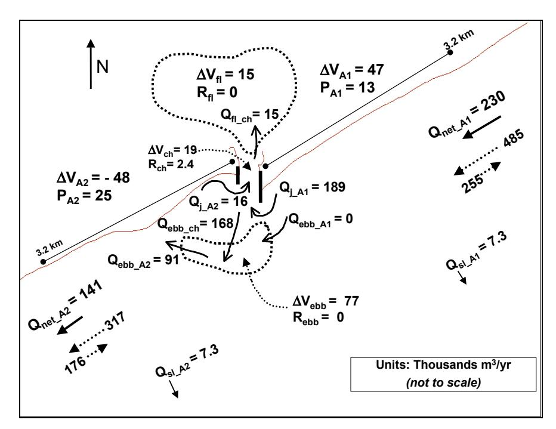

*Figure V-6-28. Refined sediment budget for Shinnecock Inlet, New York*

#### CALCULATIONS:

Applying Equation V-6-27 gives an active depth for A1 and A2,

```math
D_A = B + D_C = 3.5 + 7.0 = 10.5 \text{ m}
```

The rate of volume change for A1 and A2 can be calculated with Equation V-6-28,

```math
\Delta V_{A1} = \frac{\Delta y \Delta x D_A}{\Delta t} = (1.40 \text{ m/year}) (3,200 \text{ m}) (10.5 \text{ m}) = 47,000 \text{ cu m/year}
```

```math
\Delta V_{A2} = \frac{\Delta y \Delta x D_A}{\Delta t} = (-1.43 \text{ m/year}) (3,200 \text{ m}) (10.5 \text{ m}) = -48,000 \text{ cu m/year}
```

Losses due to relative sea-level rise can be estimated by Equation V-6-29,

```math
\Delta y _ { s l \_ A 1 } = \Delta y _ { s l \_ A 2 } = { \frac { L _ { c } } { B \ + \ D _ { c } } } S = { \frac { 7 6 0 } { 3 \ + \ 7 . 5 } } ( 0 . 0 0 3 ) = 0 . 2 2 \mathrm { m / y e a r }
```

```math
Q_{sl\_A1} = Q_{sl\_A2} = (\Delta y_{sl\_A1} \text{ or } \Delta y_{sl\_A2})(\Delta x)(D_A) = (0.22 \text{ m/year}) (3,200 \text{ m}) (10.5 \text{ m}) \sim 7,300 \text{ cu m/year}
```

The total change in volume for the inlet channel and shoals was given as 111,000 cu m/year. To fully develop the inlet sediment budget, this quantity will be proportioned between the ebb shoal, inlet channel, and flood shoal following the conceptual budget as guidance. Table V-6-11 lists the rate of measured volume change \Delta V , beach fill placed P, dredging (removal) R, and losses because of relative sea-level rise Q_{sl} , for A1, each region of the inlet, and A2.

**Table V-6-11. lists the rate of measured volume change \Delta V , beach fill placed P, dredging (removal) R, and losses because of relative sea-level rise Q_{sl} , for A1, each region of the inlet, and A2.**

|  | Control Volume | ∆V | P | R | Qsl |
| --- | --- | --- | --- | --- | --- |
| A1 | (Adjacent Beach 1) | 47 | 13 | 0 | 7.3 |
| Inlet: | Ebb Shoal | 77 | 0 | 0 | 0 |
| Inlet: | Channel | 19 | 0 | 2.4 | 0 |
| Inlet: | Flood Shoal | 15 | 0 | 0 | 0 |
| A2 | (Adjacent Beach 2) | -48 (Continued) | 25 | 0 | 7.3 |
| Management | at Inlets |  |  |  | Sediment V-6-79 |

#### REFINING CONCEPTUAL SEDIMENT BUDGET:

To formulate the inlet sediment budget, one can assume a rate of net transport at the updrift boundary, Q_{net\_Al} = 230,000 cu m/year. This value is within the range identified in the conceptual sediment budget. In a more expanded analysis than presented here, a range of values for Q_{net\_Al} can be applied in the sediment budget to examine fully the sensitivity of the inlet sediment-transport magnitudes and pathways to this parameter. The ratio of Q_R and Q_L was given as 1.9, and entering this value into Equation V-6-23 gives,

```math
Q_{net\_A1} = Q_{R\_A1} - Q_{L\_A1} = 1.9 \ Q_{L\_A1} - Q_{L\_A1} = 0.9 \ Q_{L\_A1}
```

```math
2 3 0 = 0 . 9 \, Q _ { L _ { - } A 1 }
```

```math
Q_{L\_A1} = 255 \text{ and } Q_{R\_A1} = 485
```

Considering the entire reach as the control volume forms a macrobudget. Applying Equation V-6-23 gives,

```math
\sum Q_{source} - \sum Q_{sink} - \sum \Delta V + \sum P - \sum R = Residual = 0
```

```math
(Q_{net\_A1})-(Q_{sl\_A1}+Q_{sl\_A2}+Q_{net\_A2})-(\Delta V_{A1}+\Delta V_{A2}+\Delta V_f+\Delta V_{ch}+\Delta V_{ebb})+(P_{A1}+P_{A2})-(R_{fl}+R_{ch}+R_{e\,bb})=0
```

```math
\left( 2 3 0 \right) - \left( 7 . 3 + 7 . 3 + { Q _ { n e t } } _ { - } . 4 2 \right) - \left( 4 7 + - 4 8 + 1 5 + 1 9 + 7 7 \right) + \left( 1 3 + 2 5 \right) - \left( 0 \, + \, 2 . 4 + 0 \right) = 0
```

```math
Q _ { n e t \_ A 2 } = 1 4 1
```

Applying Equation V-6-23 at the western boundary gives,

```math
Q_{net\_A2} = Q_{R\_A2} - Q_{L\_A2}
```

```math
1 4 1 = 1 . 8 \, Q _ { L \_ A 2 } - Q _ { L \_ A 2 }
```

```math
Q _ { L _ { - } A 2 } = 1 7 6 \quad a n d \quad Q _ { R _ { - } A 2 } = 3 1 7
```

Now, the control volume A1 can be considered. There are two unknowns, the rate of sediment transport around the east jetty, Q_{j\_Al} , and sediment transport from A1 to the ebb-tidal shoal, Q_{ebb\_Al} . Inspection of bathymetric charts and aerial photography shows no evidence of morphologic pathways (e.g., shoal features) from A1 to the ebb-tidal shoal. Thus, one can assume that Q_{ebb\_Al} \sim 0 and solve for Q_{j\_Al} in Equation V-6-23,

```math
\sum Q_{source} - \sum Q_{\sin k} - \sum \Delta V + \sum P - \sum R = \text{Residual} = 0
```

```math
\left( Q _ { n e t \_ A 1 } \right) - \left( Q _ { s l \_ A 1 } + Q _ { j \_ A 1 } + Q _ { e b b \_ A 1 } \right) \ - \ \left( \Delta V _ { A 1 } \right) + \ \left( P _ { A 1 } \right) = 0
```

```math
\left( 2 3 0 \right) - \left( 7 . 3 + Q _ { j \_ A 1 } + 0 \right) \ - \left( 4 7 \right) \ + \left( 1 3 \right) = 0
```

```math
Q _ { j _ { - } A 1 } = 1 8 9
```

gives,

```math
\sum Q_{\text{source}} - \sum Q_{\text{sink}} - \sum \Delta V + \sum P - \sum R = Residual = 0
```

```math
\left(Q_{\textit{net}\_\textit{A}1}\right) - \left(Q_{\textit{sl}\_\textit{A}1} + Q_{\textit{sl}\_\textit{A}2} + Q_{\textit{net}\_\textit{A}2}\right) - \left(\Delta V_{\textit{A}1} + \Delta V_{\textit{A}2} + \Delta V_{\textit{fl}} + \Delta V_{\textit{ch}} + \Delta V_{\textit{ebb}}\right) + \left(P_{\textit{A}1} + P_{\textit{A}2}\right) - \left(R_{\textit{fl}} + R_{\textit{ch}} + R_{\textit{e}bb}\right) = 0
```

```math
(230) - (7.3 + 7.3 + Q_{net\_A2}) - (47 + -48 + 15 + 19 + 77) + (13 + 25) - (0 + 2.4 + 0) = 0
```

```math
Q_{net\_A2} = 141
```

Next a control volume for A2 is formulated, excluding the ebb-tidal shoal. There are also two unknowns for this control volume, the rate of sediment transport around the west jetty, Q_{j\_A2} , and the rate of sediment transport bypassed from the ebb-tidal shoal to A2, Q_{ebb\_A2} . A more detailed analysis of the shoreline position and beach-fill placement records for A2 indicates that \Delta V - P = -16 for the region east of the bulge in the 1979 shoreline position, and \Delta V - P = -58 for the region west of the bulge. As a first estimate, one can set Q_{j\_A2} = 16 , implying that all sediment lost from the region east of the bulge moved around the west jetty. This assumption also implies that this morphologic feature represents a long-term nodal zone for net longshore sand transport. Using Equation V-6-23 to solve for Q_{ebb\_A2} gives,

```math
\sum Q_{source} - \sum Q_{sink} - \sum \Delta V + \sum P - \sum R = Residual = 0
```

```math
\left( Q _ { e b b \_ A 2 } \right) - \left( Q _ { n e t \_ A 2 } + Q _ { j \_ A 2 } + Q _ { s l \_ A 2 } \right) - \left( \Delta V _ { A 2 } \right) + \left( P _ { A 2 } \right) = 0
```

```math
\left( Q _ { e b b \_ A 2 } \right) - \left( 1 4 1 + 1 6 + 7 . 3 \right) - \left( - 4 8 \right) + \left( 2 5 \right) = 0
```

```math
Q _ { e b b \_ A 2 } = 9 1
```

in units of thousands of cubic meters.
The control volume for the ebb-tidal shoal now has one unknown, the rate of sediment transport from the channel to the ebb-tidal shoal, Q_{ebb\_ch} . Applying Equation V-6-23 gives,

```math
\sum Q_{source} - \sum Q_{sink} - \sum \Delta V + \sum P - \sum R = Residual = 0
```

```math
\left( Q _ { e b b \_ A 1 } + Q _ { e b b \_ c h } \right) - \left( Q _ { e b b \_ A 2 } \right) \ - \left( \Delta V _ { e b b } \right) = 0
```

```math
\left( 0 + \, Q _ { e b b \_ c h } \right) - \left( 9 1 \right) \, - \left( 7 7 \right) = 0
```

```math
Q _ { e b b \_ c h } = 1 6 8
```

#### EXAMPLE PROBLEM V-6-11 (Concluded)

The final unknown is the rate of sediment transport from the channel to the flood-tidal shoal, Q_{fl\_ch} . Equation V-6-23 applied to the inlet channel control volume gives,

```math
\sum Q_{source} - \sum Q_{sink} - \sum \Delta V + \sum P - \sum R = Residual = 0
```

```math
(Q_{j\_A1} + Q_{j\_A2}) - (Q_{ebb\_ch} + Q_{fl\_ch}) - (\Delta V_{ch}) - (R_{ch}) = 0
```

```math
(189+16)-(168+Q_{fl-ch})-(19)-(2.4)=0
```

```math
Q_{fl\ ch} = 15.6 \sim 15
```

The calculated value of Q_{fl\_ch} = 15.6 approximately agrees with the assumed change in volume for the flood-tidal shoal, \Delta V_{fl} = 15 , indicating that there are no other significant sediment sources contributing to the growth of the flood-tidal shoal.

#### DISCUSSION OF EXAMPLES.

These example problems illustrate one approach that can be taken for formulating a sediment budget. The following assumptions entered:
- The net longshore sand transport rate at the updrift boundary of the control volume was assumed to be 230,000 cu m/year.
- The rate of sediment transport from A1 to the ebb-tidal shoal was assumed to be negligible.
- The rate of sediment transport from A2 around the west jetty was assumed to be 16,000 cu m/year.
- Volume change rates for the ebb-tidal shoal, inlet channel, and flood-tidal shoal were assumed to be 77,000, 19,000, and 15,000 cu m/year, respectively.
- Uncertainties in quantities forming the sediment budget were omitted for this example problem.
(b) Operation. SBAS has been designed to organize the user's work space and facilitate visualization of sediment budget alternatives. Within the right-hand side of the screen, called the Topology Window, SBAS formulates a sediment budget by allowing the user to create a series of cells and arrows representing sources and sinks that characterize the budget. The user selects items from the upper tool bar to generate elements of the sediment budget. The lower tool bar allows the user to import georeferenced images and data into a desired coordinate system and viewed with the sediment budget in the Topology Window. The user can zoom in to show a detailed area, and zoom out to view the regional sediment
budget. The left-hand side of the screen organizes alternatives within a particular project. Alternatives may represent various time periods, different boundary conditions for the same time period, or modifications to assumptions within the budget reflecting a sensitivity analysis. Once a sediment budget alternative has been defined, and the user has created sediment budget cells with sources and sinks, values can then be assigned to the various components of the sediment-budget topology. Figure V-6-29a shows a screen capture with a georeferenced image of the regional project area, and Figure V-6-29b shows a zoom-in image of a local sediment budget. As shown in Figure V-6-29b, the SBAS indicates by colorcoding whether a cell is balanced or not.

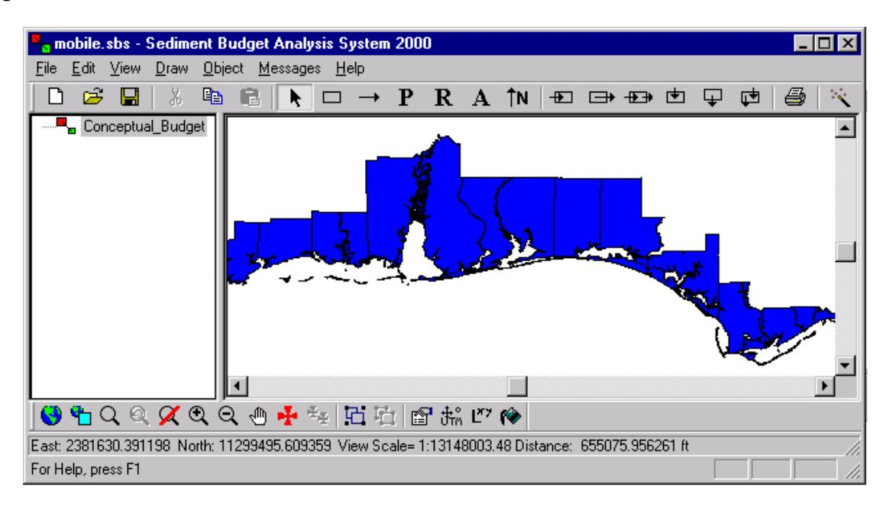

*Figure V-6-29a. SBAS Alternative Window (left) and Topology Window (right)*

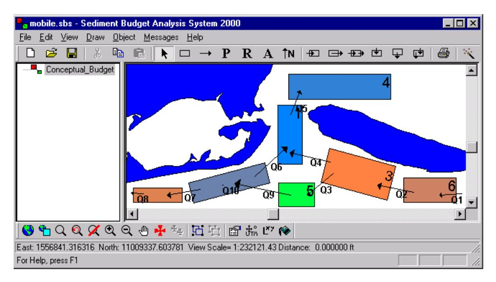

*Figure V-6-29b. Zoom-in showing sediment budget cells. Color coding indicates varying degrees of imbalance*

• The lower tool bar allows the import of georeferenced images and data into a desired coordinate system (Figure V-6-30) and viewed with the sediment budget in the Topology Window. The user can zoom out to view the regional sediment budget (see Figure V-6-31, which shows the Gulf of Mexico shore of Alabama and Florida panhandle), and zoom in to show a detailed area (Figure V-6-32). By dragging the cursor over any combination of cells, sediment budget cells can be combined (collapsed), as shown in Figure V-6-32. Collapsed cells are useful for regional views of a sediment budget. For local, project-level applications, selecting the collapsed cell and choosing an icon from the bottom tool bar will reinstate (explode) the collapsed cell (Figure V-6-33).

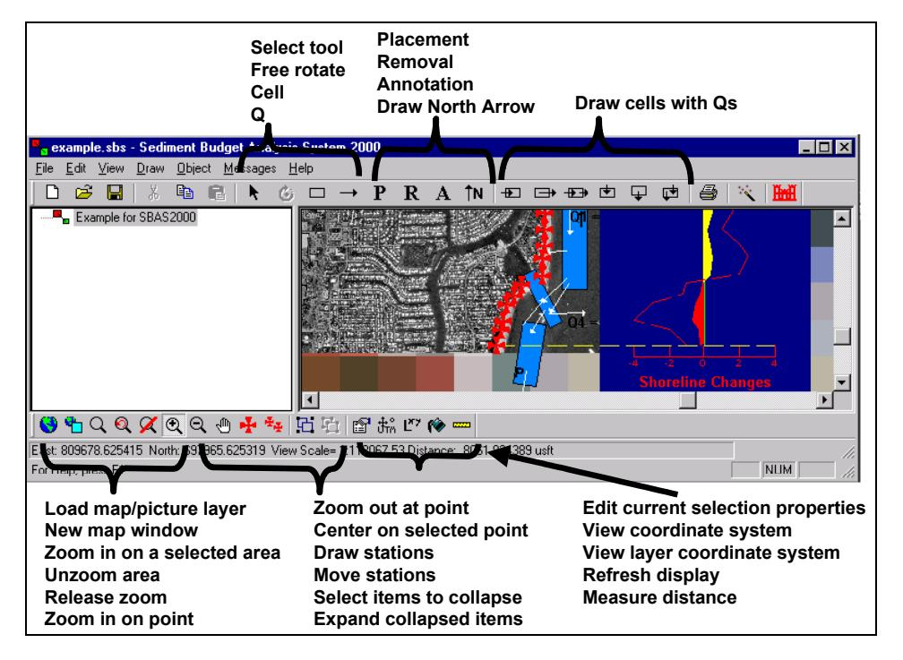

*Figure V-6-30. SBAS tool bars and button functions*

SBAS can also display data on shoreline change and the rate of volume change associated with stations located along the coast, bay, or river (Figure V-6-34). Location of stations and associated data may be entered directly into SBAS's spreadsheet (Figure V-6-35), or data may be imported using a user-specified format.
- Georeferenced images can be imported into SBAS by means of the Load map/picture layer on the bottom tool bar. This menu (Figure V-6-36) allows the user to indicate the coordinate system (group, system, datum, and linear unit) in which the sediment budget project will be defined. Next, the maps to be imported are selected, and their coordinate system is selected. SBAS converts the map's coordinate system to the project coordinate system. Multiple images (maps, aerial photographs, contour maps, etc.) can be layered in the sediment budget. SBAS allows for 55 different map coordinate systems.
- A demonstration that guides the user through the operation and features of SBAS Version 1.02 available for viewing on the PC, as described in a later section.

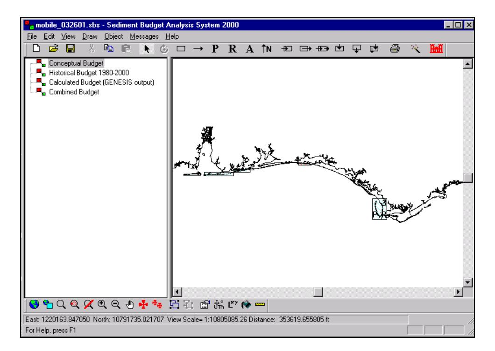

*Figure V-6-31. Regional view of a sediment budget (zoom-out), with four alternatives*

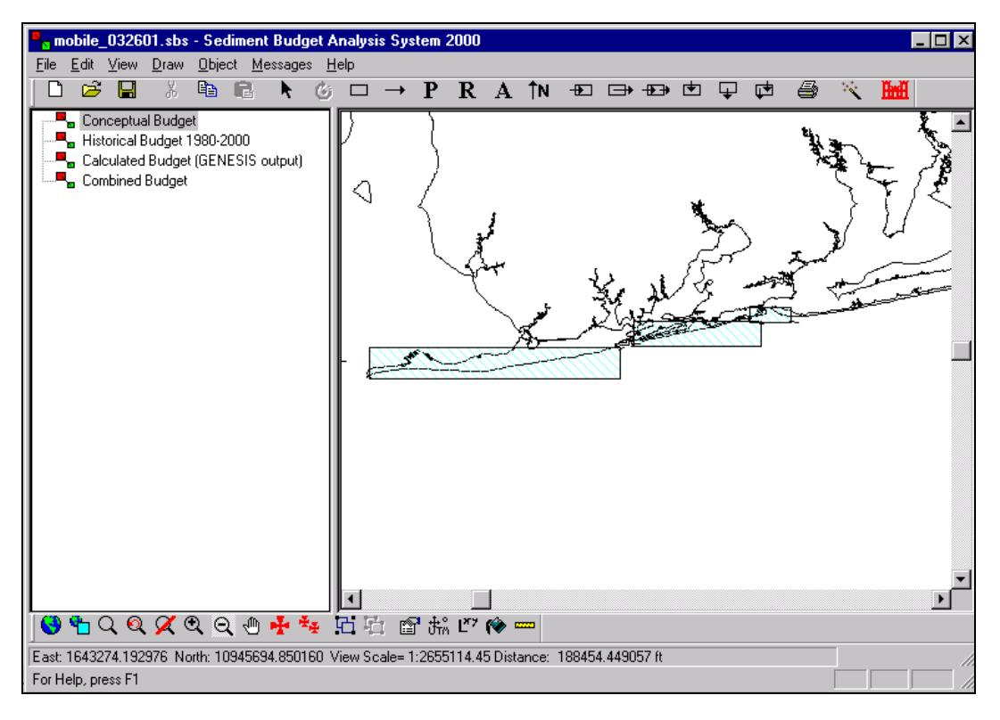

*Figure V-6-32. Local view of a sediment budget (zoom-in) showing combined (collapsed) sediment budget cells*

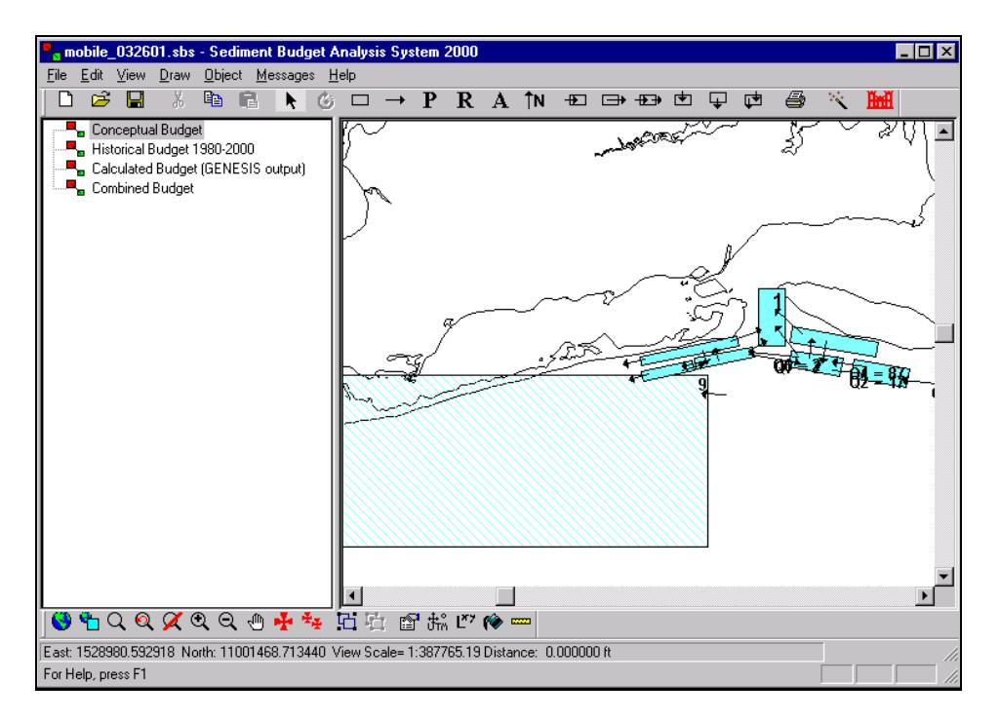

*Figure V-6-33. Sediment budget with reinstated (exploded) cells*

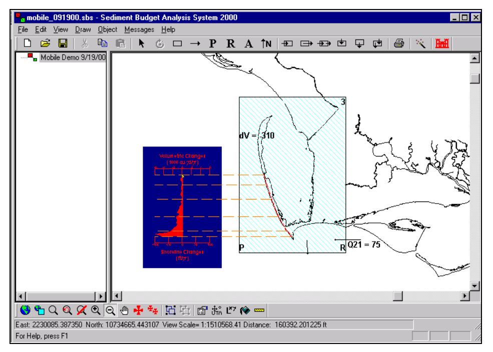

*Figure V-6-34. Rate graph feature of SBAS*

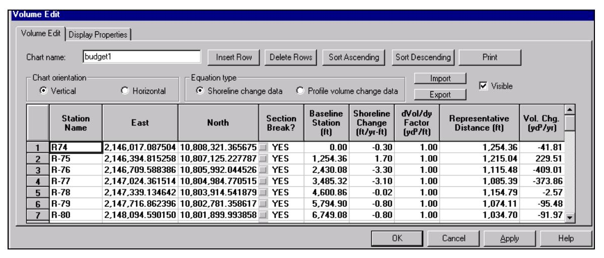

*Figure V-6-35. Volume Edit spreadsheet in SBAS*

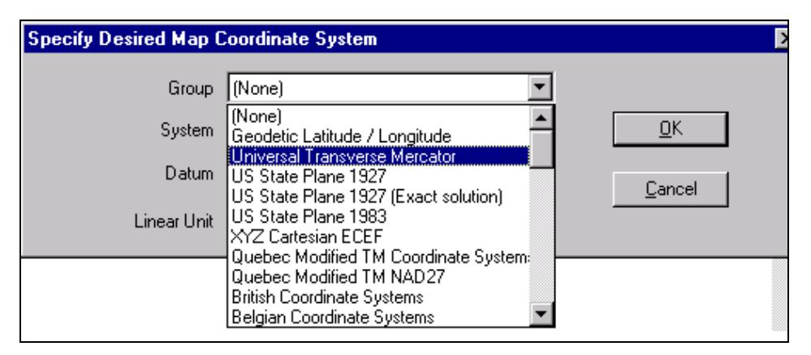

*Figure V-6-36. Entering project coordinate system with the Load map/picture layer feature on the bottom tool bar*

## EXAMPLE PROBLEM V-6-12

#### EXAMPLE:

The SBAS installation includes an example file with georeferenced images, a sediment budget, and rate graph. The following example problem guides the use of these files.
Step 1: Activate SBAS and enter information to the Document Properties Menu . Information such as the manager of the project, keywords, units, and type of uncertainty calculation are entered into this menu (see Kraus and Rosati 1998a, for details about the uncertainty calculation). Note: the user should choose the same project coordinate system and consistent units for the transport rate or volume change (e.g., if the project coordinate system will be in U.S. Customary Units, rates should be expressed as cu yd/year and volume as cu yd).

## EXAMPLE PROBLEM V-6-12

Step 2: Import georeferenced images. To import the map provided in the installation, activate the Topology Window (right side of the screen) by clicking in this area. Choose the globe on the bottom tool bar. The user first defines the desired project coordinate system as follows:
Group: US State Plane 1927 System: Florida East 901
Datum: NAD 27 Units: USFEET Select OK
Then load the map provided in the installation with the Connect Map Layer menu. Select the following files:
Conus12.tif (image) and Conus12.tab (reference file)
On the next menu, indicate that these files are in
Group: Geodetic Latitude/Longitude
System: Latitude/Longitude
Datum: WGS84
(If the image is not visible, select release zoom on the bottom tool bar.)
Step 3: Import a photograph. Choose the globe on the bottom tool bar and import another map layer. Select the following files:
Br21-38.tif (image) and Br21-38.tfw (reference file) (photograph of Hillsboro Inlet, Florida and associated world file)
On the next menu, indicate that these files are in the following coordinate system (same as the project coordinate system):
Group: US State Plane 1927 System: Florida East 901
Datum: NAD27 Units: USFEET
The coordinate system for the layers that have been loaded can be viewed by choosing the Edit Current Selection Properties button on the bottom tool bar.
Step 4: Create a sediment budget for Hillsboro Inlet. Accessing the top toolbar, select the cell button and drag and pull sediment budget cells. Cells may be rotated to better represent different areas of the budget (the channel, for instance) by choosing the rotate button on the top tool bar and rotating a corner of a selected cell. Placement and removal in cells may be indicated by choosing the P and R buttons on the top tool bar, respectively, then clicking on the cell that has the engineering activity. Sediment sources and sinks to and from each cell may be indicated by selecting the arrow button on the top tool bar, and dragging arrows into and out of each cell as appropriate. Double clicking on a cell will bring up the Cell Properties menu, and values for each sediment budget element can be entered.
Cells can be collapsed by selecting the Select Items to be Collapsed button on the bottom tool bar, and dragging the cursor over the items to be combined. The cells may be reinstated by selecting the collapsed cell, then choosing the Expand Collapsed Items on the bottom tool bar. Note: colors of cell balance, gain, and loss, arrows, and other sediment budget elements may be changed by selecting the Object-Colors button at the top tool bar.
Hillsboro Inlet Sediment Budget . The sediment budget can be formulated with three cells: updrift, channel, and downdrift. The following text summarizes the sediment budget (Personal Communication, Thomas D. Smith, April 2001, U.S. Army Engineer District, Jacksonville), which has been conceptualized as shown in Figure V-6-37.
Updrift Cell . Net longshore sand transport entering the north boundary of the updrift cell is approximately 120,000 cu yd/year. Sinks from this cell include accretion of the updrift beach at a rate of 6,000 cu yd/year, 54,000 cu yd/year transported over the north jetty weir section to the channel cell, and 60,000 cu yd/year moving around the jetty into the channel cell.
Channel Cell . The source of sediment to this cell is 30,000 cu yd/year moving into the channel from the downdrift cell. Sinks from this cell include 4,000 cu yd/year transported to deep water on ebb flow, 110,000 cu yd/year dredged from the channel and placed within the downdrift cell, and 30,000 cu yd/year which is naturally bypassed from the channel to the downdrift cell.
Downdrift Cell. Dredged material placement into this cell is 110,000 cu yd/year, which is also the value of net longshore transport exiting this cell.

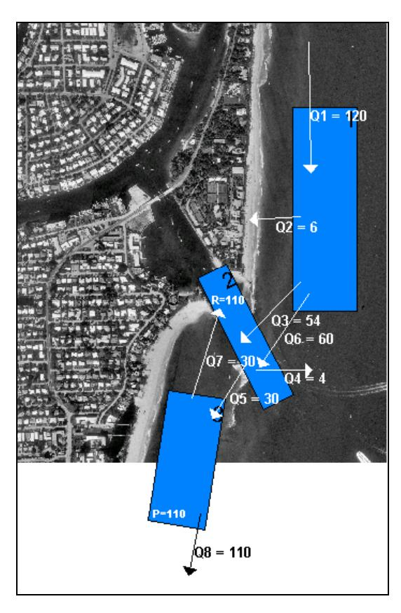

*Figure V-6-37. Sediment budget for Hillsboro Inlet, Florida (Continued)*

## EXAMPLE PROBLEM V-6-12 (Concluded)

Step 5: Enter shoreline change rate data for Hillsboro Inlet. Select the Draw Stations button on the bottom tool bar, and visually place benchmarks for shoreline data on the photograph. (If you have a pre-existing file with data, these station locations may also be imported to the SBAS Rate Graph spreadsheet). Once all stations have been entered, choose the View-Rate Graph button on the top tool bar, select the rate graph (named Untitled at this point), and choose Edit . Shoreline change (or volume change) data may be entered for each benchmark position. SBAS automatically plots these data in the rate graph. Selecting and dragging will move the graph, and deselecting the graph after clicking the View-Rate Graph button on the top tool bar can turn it off. An example is shown in Figure V-6-38.

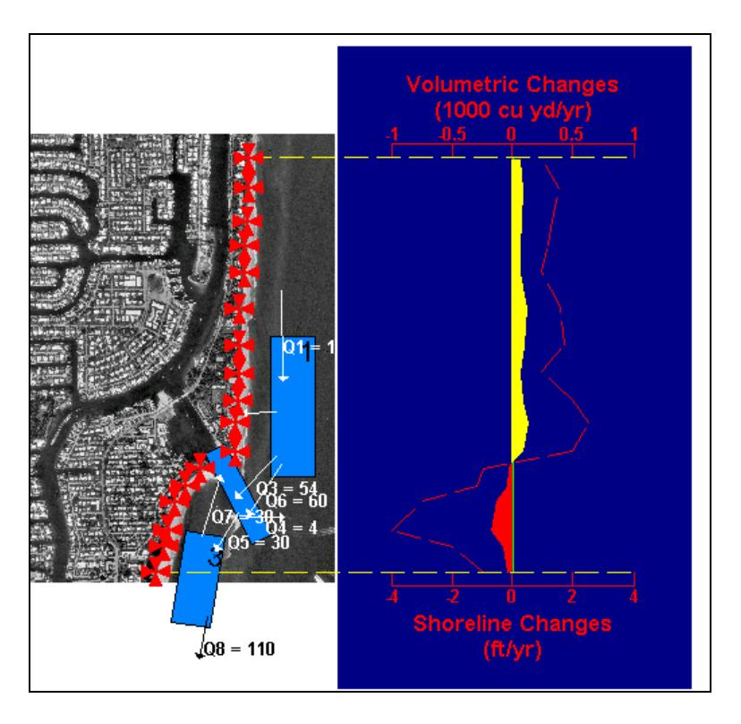

*Figure V-6-38. Hypothetical shoreline change data for beaches adjacent to Hillsboro Inlet*

- SBAS2000 may be obtained by contacting the Coastal and Hydraulics Laboratory, U.S. Army Engineer Research and Development Center, Vicksburg, MS.
- (2) Reservoir Model (Kraus 2000)
- (a) Kraus developed a time-dependent model of inlet morphology that is mathematically analogous to a reservoir system with known (or estimated) equilibrium volumes for each reservoir and defined transfer rates between reservoirs. The reservoirs represent morphologic features, including the ebb-tidal
shoal, bypassing bar, attachment bar, and flood tidal shoal (Figure V-6-39). Once calibrated, the model predicts a time-dependent sediment budget based on the equilibrium volume of each morphologic feature, and the longshore sand transport characteristics in the region. The following discussion is summarized from Kraus (2000).

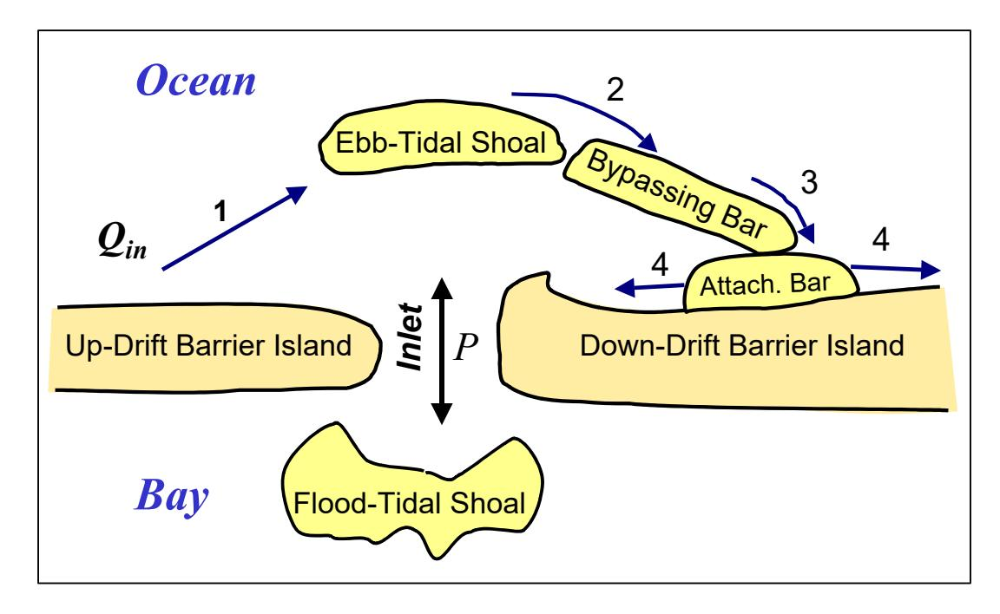

*Figure V-6-39. Definition sketch for inlet morphology*

- (b) The time-dependent Reservoir Model operates on the temporal and spatial scales associated with the entire (aggregated) morphological form of an ebb-tidal shoal. Five assumptions are invoked to arrive at the model: Mass (sand volume) is conserved. Morphological forms and the sediment pathways among them can be identified, and the morphologic forms evolve while preserving identity. Stable equilibrium of the individual aggregate morphologic form(s) exist. Changes in mesomorphological and macromorphological forms are reasonably smooth. Material composing the ebb-tidal shoal is predominately transported to and from it through longshore transport.
- (a) The ebb-shoal complex is defined as consisting of the ebb shoal proper, one or two ebb-shoal bypassing bars (depending on the balance between left- and right-directed longshore transport), and one or two attachment bars. These features are shown schematically in Figure V-6-39 and the pattern of wave breaking on the crescentic ebb-shoal complex at Ocean City Inlet, Maryland, is shown in Figure V-6-40.

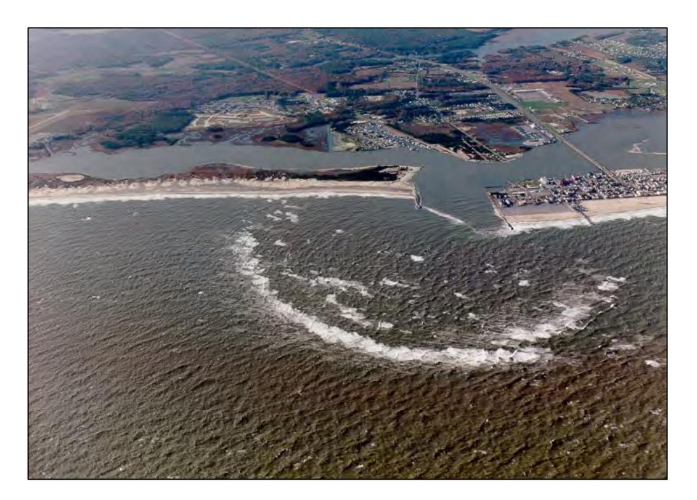

*Figure V-6-40. Pattern of wave breaking on ebb shoal and bar, Ocean City Inlet, Maryland, November 1991*

The model distinguishes between ebb-tidal shoal proper (hereafter, ebb shoal), typically located in the confine of the ebb-tidal jet, and the ebb-shoal bypassing bar (hereafter, bypassing bar) that grows toward shore from the ebb shoal, principally by the transport of sediment alongshore by wave action. The bar may shelter the leeward beach from incident waves so that a salient might form – similar to the functioning of a detached breakwater (Pope and Dean 1986), initiating creation of the attachment bar.
- (b) Previous authors have combined the ebb shoal and the bar(s) protruding from it into one feature referred to as the ebb shoal. Here, the shoal and bypassing bars are distinguished because of the different balance of processes. When a new inlet is formed, the shoal first becomes apparent within the confine of the inlet ebb jet, and bypassing bars have not yet emerged. Bypassing bars are formed by sediment transported off the ebb shoal through the action of breaking waves and the wave-induced longshore current (tidal and wind-induced currents can also play a role). A bar cannot form without an available sediment source, similar to the growth of a spit (as modeled mathematically by Kraus 1999). In this sense, bypassing bars are analogous to the spit platform concept of Meistrell (1972) in which a subaqueous sediment platform develops from the sediment source prior to the visually observed subaerial spit. Bypassing bars grow in the direction of predominant transport as do spits. At inlets with nearly equal left- and right-directed longshore transport or with a small tidal prism, two bars can emerge from the ebb shoal creating a nearly concentric halo about the inlet entrance. As the bypassing bar merges with the shore, an attachment bar is created, thereby transporting sand to the beach. At this point in evolution of the ebb-shoal complex, substantial bypassing of sand can occur from the updrift side of the inlet to the downdrift side.
- (c) In this conceptualization, if an inlet is created along a coast, the littoral drift is intercepted to deposit sand first in the channel and ebb shoal. This material joins that volume initially jetted offshore when the barrier island or landmass was breached. Over time, a bar emerges from the shoal and grows in
the predominant direction of drift. After many years, as controlled by the morphologic or aggregate scale of the particular inlet, an attachment bar may form on the downdrift shore. At this stage, significant sand bypassing of the inlet can occur, re-establishing in great part the transport downdrift that existed prior to formation of the inlet. The following model can describe the evolution of an ebb-shoal complex from initial cutting of the inlet, as well as changes in morphologic features and sand bypassing resulting from engineering actions such as mining or from time-dependent changes in wave climate (for example, seasonal shifts).
- (f) Reservoir aggregate model. The conceptual model of the ebb-shoal complex described in the preceding section is represented mathematically by analogy to a reservoir system, as shown in Figure V-6-41. It is assumed that sand is brought to the ebb shoal at a rate q_{in} , and the volume v_e in the ebb shoal at any time increases while possibly leaking or bypassing some amount of sand to create a downdrift bypassing bar. The input rate q_{in} typically is the sum of left- and right-directed longshore sand transport. For the analytic model presented, a predominant (unidirectional) rate is taken, but this constraint is not necessary and is relaxed in a numerical example in the following paragraphs.
- (g) The volume V_E of sand in the shoal can increase until it reaches an equilibrium volume V_{Ee} (the subscript e denoting equilibrium) according to the hydrodynamic conditions such as given by Walton and Adams (1976). As equilibrium is approached, most sand brought to the ebb shoal is bypassed in the direction of predominant transport. Similarly, the bypassing bar volume V_B grows as it is supplied with sediment by the littoral drift and the ebb shoal, with some of its material leaking to (bypassing to) the attachment bar. As the bypassing bar approaches equilibrium volume V_{Be} , most sand supplied to it is passed to the attachment bar V_A . The attachment bar transfers sand to the adjacent beaches. When it reaches its equilibrium volume V_{Ae} , all sand supplied to it by the bar is bypassed to the downdrift beach. The model thus requires values of the input and output rates of transport from each feature, and their respective equilibrium volumes.
- (h) Analytical model. Simplified conditions are considered here to obtain a closed-form solution that reveals the parameters controlling the aggregated morphologic ebb-shoal complex. In the absence of data and for convenience in arriving at an analytical solution, a linear form of bypassing is assumed. The amount of material bypassed from any of the morphological forms is assumed to vary in direct proportion to the volume of the form (amount of material in a given reservoir) at the particular time. Therefore, the rate of sand leaving or bypassing the ebb shoal, (Q_E)_{out} , is specified as:

```math
(Q_E)_{out} = \frac{V_E}{V_{Ee}} Q_{in} \tag{V-6-30}
```

in which Q_{in} is taken to be constant (average annual rate), although this is not necessary.
• The continuity equation governing change in V_E can be expressed as:

```math
\frac{dV_E}{dt} = Q_{in} - (Q_E)_{out} \tag{V-6-31}
```

where t = time. For the present situation with Equation V-6-30, it becomes:

```math
\frac{dV_E}{dt} = Q_{in} \left( 1 - \frac{V_E}{V_{Ee}} \right) \tag{V-6-32}
```

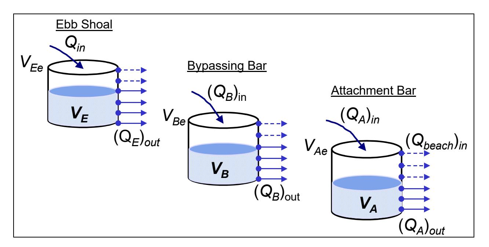

*Figure V-6-41. Conceptual design for reservoir model*

• With the initial condition V_E(0) = 0 , the solution of Equation V-6-32 is:

```math
V_E = V_{Ee} \left( 1 - e^{-\alpha t} \right) \tag{V-6-33}
```

in which

```math
\alpha = \frac{Q_{in}}{V_{Ee}} \tag{V-6-34}
```

- The parameter \alpha defines a characteristic time scale for the ebb shoal. For example, if Q_{in} = 1 \times 10^5 cu m/year and V_{Ee} = 2 \times 10^6 cu m, which are representative values for a small inlet on a moderate-wave coast, then 1/\alpha = 20 years. The shoal is predicted to reach 50 and 95 percent of its equilibrium volume after 14 and 60 years, respectively, under the constant imposed transport rate. These time frames are on the order of those associated with development of inlet ebb shoals.
- The characteristic time scale given by α has a physical interpretation by analogy to the well-known model of bar bypassing introduced by Bruun and Gerritsen (1960) and reviewed by Bruun, Mehta, and Johnsson (1978). Bruun and Gerritsen (1959; 1960); introduced the ratio r as

```math
r = \frac{P}{M_{tot}} \tag{V-6-35}
```

in which P = tidal prism, and M_{tot} = \text{average annual littoral sediment brought to the inlet} . Inlets with a value of r > 150 (approximate) tend to have stable, deep channels and are poor bar bypassers from updrift to downdrift, whereas inlets with r < 50 (approximate) tend toward closure and are good bar bypassers.
Because the equilibrium volume of the ebb-tidal shoal is approximately linearly proportional to the tidal prism, V_{Ee} \propto P (Walton and Adams 1976), \alpha is proportional to 1/r. The reservoir aggregate model therefore contains at its center a concept widely accepted by engineers and geomorphologists. Established here through the continuity equation, the reservoir model gives theoretical justification for the Bruun and Gerritsen ratio by the appearance of \alpha .
• The volume of sediment (V_E)_{out} that has bypassed the shoal from inception of the inlet to time t is the difference between the amount that arrived at the shoal and that remaining on the shoal:

```math
(V_E)_{out} = Q_{in}t - V_E \tag{V-6-36}
```

• The rate of sand arriving at the bypassing bar (Q_B)_{in} equals the rate of that leaving the shoal (Q_E)_{out} = d(V_E)_{out}/dt , or

```math
(Q_B)_{in} = (Q_E)_{out} = Q_{in} - \frac{dV_E}{dt} = \frac{V_E}{V_{Ee}} Q_{in} \tag{V-6-37}
```

which recovers (1) by volume balance. The right side of Equation V-6-37 can be expressed as \alpha V_E , again showing the central role of the parameter \alpha .
• Continuing in this fashion, the reservoir aggregate model yields the following equations for the volume of the bypassing bar,

```math
V_B = V_{Be} \left( 1 - e^{-\beta t'} \right), \qquad \beta = \frac{Q_{in}}{V_{Be}}, \qquad t' = t - \frac{V_E}{Q_{in}} \tag{V-6-38}
```

and for the volume of the attachment bar,

```math
V_A = V_{AE} \left( 1 - e^{-\gamma t''} \right), \qquad \gamma = \frac{Q_{in}}{V_{AE}}, \qquad t'' = t' - \frac{V_B}{Q_{in}} \tag{V-6-39}
```

- The quantities \beta and \gamma are analogous to \alpha in representing time scales for the bypassing bar and attachment bar, respectively.
- The quantities t' and t'' in Equation V-6-38 and V-6-39 can be interpreted as lag times that delay development of the bar and attachment, respectively. To see this explicitly, Taylor expansions for small relative time give t' \approx \alpha t^2 / 2 and t'' \approx \alpha^2 \beta t^4 / 8 , as compared to growth of the ebb shoal given by \alpha t .
- The interpretation is that after creation of an inlet, a certain time is required for the bypassing bar to receive a significant amount of sand from the shoal and a longer time for the attachment bar or beach to receive sand. Similarly, modification of, say, the ebb shoal as through sand mining will not be observed immediately in the bypassing at the beach because of the time lags in the system.
• A unique crossover time t_c occurs when the volume of material leaving the shoal equals the volume retained, (V_E)_{out} = V_E . After the crossover time, the shoal bypasses more sediment than it retains, characterizing the time evolution of the ebb shoal and its bypassing functioning. The crossover time is determined from Equation V-6-36 to be:

```math
t_c = \frac{1.59}{\alpha} \tag{V-6-40}
```

• Finally, by analogy to (8), the following equations are obtained for the bypassing rate of the bar (Q_B)_{out} , which is equal to the input of the attachment (Q_A)_{in} , and the bypassing rate of the attachment (Q_A)_{out} , which is also the bypassing rate or input to the beach, (Q_{beach})_{in} :

```math
\left( Q _ { B } \right) _ { o u t } = \frac { V _ { E } } { V _ { E e } } \frac { V _ { B } } { V _ { B e } } Q _ { i n } = \left( Q _ { A } \right) _ { i n } \tag{V-6-41}
```

```math
\left( Q _ { A } \right) _ { o u t } = \frac { V _ { E } } { V _ { E e } } \frac { V _ { B } } { V _ { B e } } \frac { V _ { A } } { V _ { A e } } Q _ { i n } = \left( Q _ { b e a c h } \right) _ { i n } \tag{V-6-42}
```

- The quantity (Q_A)_{out} describes the time dependence of the amount of sand reaching the downdrift beach and is, therefore, a central quantity in beach nourishment and shore-protection design.
- (i) Validation of model for Ocean City, Maryland. Calculations are compared with observations of the growth in the ebb shoal at Ocean City Inlet, Maryland. Ocean City Inlet was opened by a hurricane in August 1933. Stabilization of the inlet began 1 month later by placement of jetties (Dean and Perlin 1977), with the south and north jetties constructed during 1934 and 1935. Rosati and Ebersole (1996) estimated that between 4.3 \times 10^5 and 9.7 \times 10^5 cu m of sediment were released during the island breach. This material would be apportioned to the flood shoal, ebb shoal, and adjacent beaches. Assateague Island, located to the south and downdrift, began to erode in a catastrophic manner because of interruption of sediment formerly transported from the beaches of Ocean City. Erosion of Assateague Island and growth of the ebb shoal have been well documented (e.g., Dean and Perlin 1977; Leatherman 1984; Underwood and Hiland 1995; Rosati and Ebersole 1996; Stauble 1997). The location and shape of the ebb shoal and bar at Ocean City can be inferred from the locations of wave breaking, as shown in Figure V-6-40. Numerous bathymetry surveys (Underwood and Hiland 1995; Stauble 1997) confirm this inference. The bypassing bar is skewed to the south and has continued to move to the south (Underwood and Hiland 1995). Several independent authors have noted that much of the longshore sand transport moving to the south along Ocean City is diverted to the ebb shoal. Dean and Perlin (1977) concluded that the north jetty area was fully impounded, and the U.S. Army Engineer District, Baltimore (Personal Communication 1999, G. Bass, Senior Engineer, U.S. Army Engineer District, Baltimore, noted that recent growth of the northern edge of the ebb shoal may be composed of beach fill material placed on Ocean City beaches. Dean and Perlin (1977) estimated the long-term net (southward) longshore sand transport rate as between approximately 1.15\times10^5 and 1.50\times10^5 cu m/year, based on impoundment at the north jetty. Underwood and Hiland (1995) estimated the equilibrium volume of the ebb-shoal complex as between 5.8\times10^6 and 7.2\times10^6 m<sup>3</sup> based on the tidal prism of 2.3\times10^7 cu m given by Dean and Perlin (1977) and calculation methods given in Walton and Adams (1976). With M_{tot} estimated
by the upper value of net transport, one finds r ≅ 150, consistent with lack of a bar across the entrance channel and good navigation. In fact, the entrance channel is rarely dredged.
- Bathymetry survey data were available to this study for the dates of 1929/1933 to define the preinlet condition, 1937, 1961/1962, 1977/1978, 1990, and a composite of various surveys conducted in 1995. Underwood and Hiland (1995) developed data sets prior to 1995, and Stauble (1997) assembled the 1995 data set from various sources for the Baltimore District. As part of the present work, the raw data sets were reviewed and vertical datums made consistent.
- The seaward boundary of lines unambiguously defining depositional features (ebb shoal, bypassing bar, and attachment bar) were found to be located at the 6-to 7-m National Geodetic Vertical Datum (NGVD) depth contour. Contours lying deeper than 7 m exhibited randomness and loss of identity of the particular feature. Here, to avoid the necessity of employing color to denote relatively complex contours, the landward portions of the bypassing bar and attachment bar polygons are defined by the zone of deposition as given by comparisons of bathymetry change. The lateral and landward boundaries of the ebb shoal polygons are defined by deposition from 1937 to 1962, and by a combination of deposition and depth contours for later time periods. This procedure accounts for the observation that the ebb shoal was fully developed by 1962, whereas changes were observed for the bypassing bar and attachment bar. Based on inspection of several depth contours and the differences in bathymetric surfaces, the ebb shoal was defined as a polygon within the area occupied by the 1962 shoal. As shown in Figure V-6-42a, the 1937 survey revealed a small ebb shoal, evidently located within the confines of the ebb-tidal jet. By 1962, a bypassing bar had formed that emanated southward from the ebb shoal.
- The bypassing bar was defined by a polygon located to the south of the ebb shoal, and the attachment bar was defined by the position of the high-water shoreline in the later data sets. By this means, volume change could be calculated for the distinct morphological features as differences between successive surveys, and the evolution of these features is plotted in Figure V-6-42b. Limited data sets were available for the attachment bar. Figure 4b also shows accretion of the shoreline near the south jetty, promoted by sand tightening of the jetty in 1985. In both Figure V-6-42a and V-6-42b, no notable growth to the north of a bypassing bar is evident.
- For evaluation of the analytic model, input values were specified based on coastal-processes information from the aforementioned studies, with no optimization of parameters made. The four required parameters were specified as $Q_{in}$ = $1.50×10^{5}$ cu m/year corresponding to the upper limit of expected net longshore transport to the south, $V_{Ee}$ = $3×10^{6}$ cu m, $V_{Be}$ = $7×10^{6}$ cu m, and $V_{Ae}$ = $5×10^{5}$ cu m.
- The value of $V_{Ae}$ was arbitrarily assigned as an order-of-magnitude estimate. Calculations were made for the 100-year interval 1933-2032.
- The measured and calculated volumes of the ebb shoal are plotted in Figure V-6-43, with the dashed lines calculated for values of α for $Q_{in}$ ± 50,000 cu m/year to demonstrate sensitivity of the solution to α and to estimate the range of predictions that may be reasonably possible. The trend in the data is well reproduced by Equation V-6-33. Although the $Q_{in}-value$ chosen is at the upper range for the net transport rate, this value must also account for sediment sources other than the net drift to the south. In particular, prior to 1985 when the south jetty was tightened, some sand moving north could pass through it and into the navigation channel (Dean and Perlin 1977), where a portion would be jetted offshore.

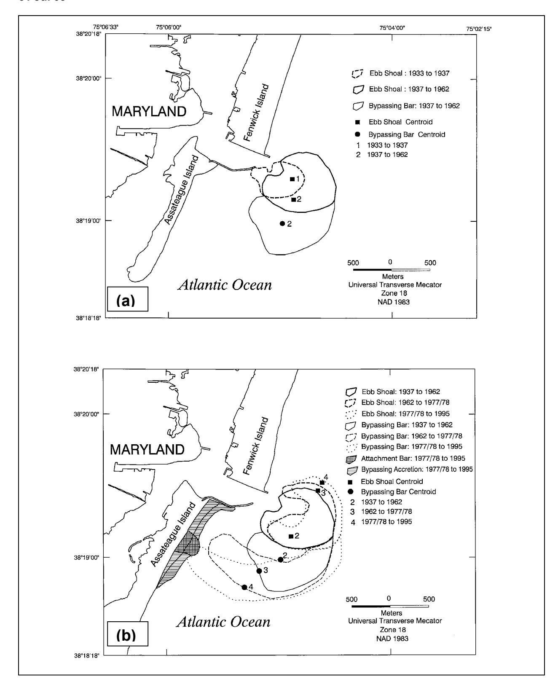

*Figure V-6-42. Ebb-shoal planform determined from interpretation of 7-m contour, Ocean City Inlet*

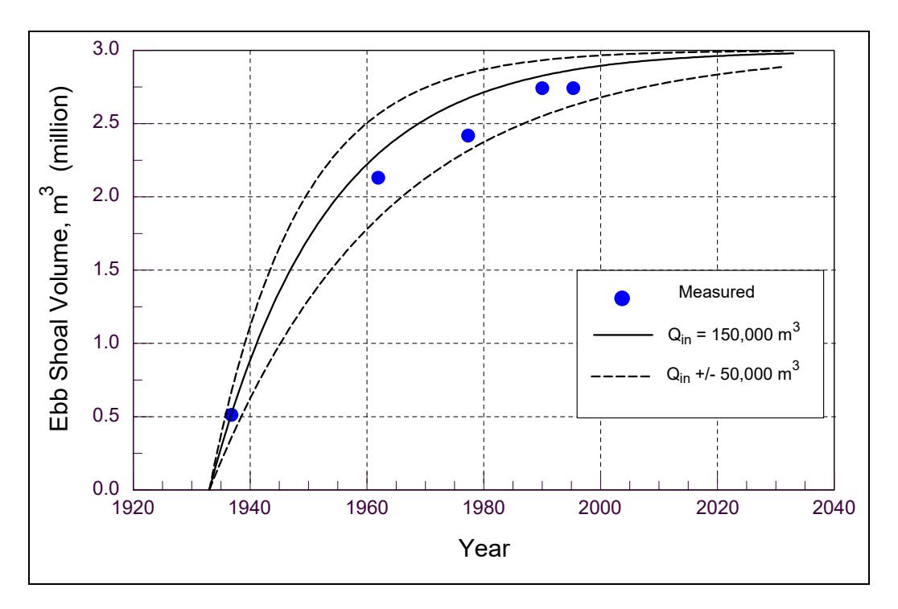

*Figure V-6-43. Volume of ebb shoal, Ocean City Inlet*

- Calculated and measured volumes of the ebb shoal, bypassing bar, and attachment bar are plotted in Figure V-6-44. The calculations exhibit lags in development of the bypassing bar and attachment bar. Based on examination of aerial photographs, Underwood and Hiland (1995) concluded that the attachment had occurred by 1980, when a distinct bulge in the shoreline was seen. The data and model indicate that, although the ebb shoal has achieved equilibrium, the bypassing bar is continuing to grow, so that natural bar bypassing from north to south has not achieved its full potential for sand storage. Bypassing rates calculated with the model, normalized by $Q_{in},$ are plotted in Figure V-6-45 and indicate the approach to full potential.
- The calculations show a substantial lag in sand reaching the bypassing and attachment bars. The bypassing rate at the attachment equals the rate of sand reaching the downdrift beach. Its magnitude as shown in Figure V-6-45 should be interpreted with caution, because the equilibrium volume of the attachment is not presently known. Under the given model input parameters, it appears that in 1999 approximately 60 percent of the net transport is reaching northern Assateague Island. With the stated values, as a simple estimate one can define an effective α for Ocean City through the sum of the ebb shoal and bypassing bar equilibrium volumes. Then the crossover time at which the shoal and bar are predicted to bypass more volume than they retain is tc = 77 years or in the year 2000, in accord with the 60 percent estimate of bypassing.
- (j) Discussion. This section explores sensitivity of the reservoir model to selection of the input and initial conditions, and its extension by numerical solution.

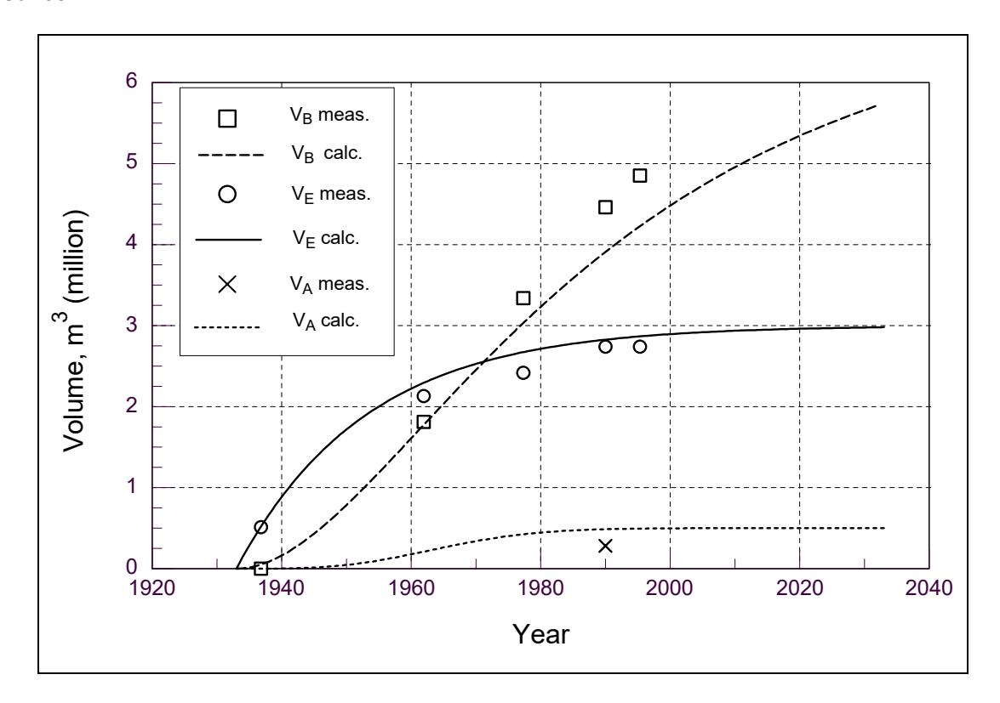

*Figure V-6-44. Volumes of ebb shoal, bypassing bar, and attachment bar, Ocean City Inlet*

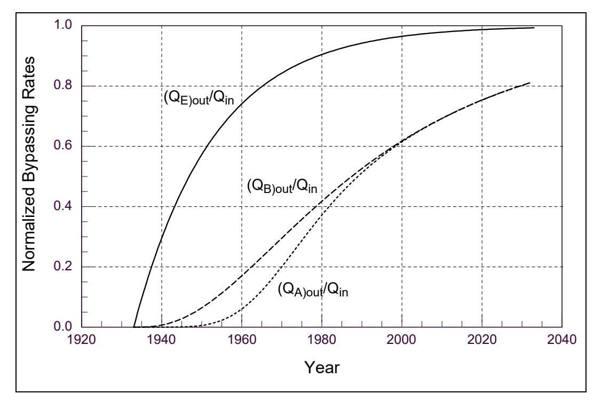

*Figure V-6-45. Calculated bypassing rates, Ocean City Inlet*

- Sensitivity to $Q_{out}$ specification.
- The manner in which the equilibrium volume of an ebb shoal is approached depends upon $Q_{out}.$ Choices other than the linear form of Equation V-6-30 might be made, leading to consideration of the sensitivity of the solution on $Q_{out}.$ As a possible alternative for a quadratic dependence as $Q_{out}$ = ( VE / VEe ) 2 Qin can be specified. Then one finds:

```math
V_E = V_{Ee} \tanh(\alpha t) \tag{V-6-43}
```

- Equations V-6-33 and V-6-43 are compared in dimensionless form in Figure V-6-46. The quadratic dependence version of $Q_{out}$ produces a more rapid approach to equilibrium. However, the general forms of the solutions are similar, indicating that a substantial change in the manner in which the shoal bypasses sand does not cause a notable change in approach of the shoal to equilibrium. There appear to be no data available to distinguish among such solutions, but specification of $Q_{out}$ is available for improving simulations of all the inlet morphologic forms once adequate observations are made.

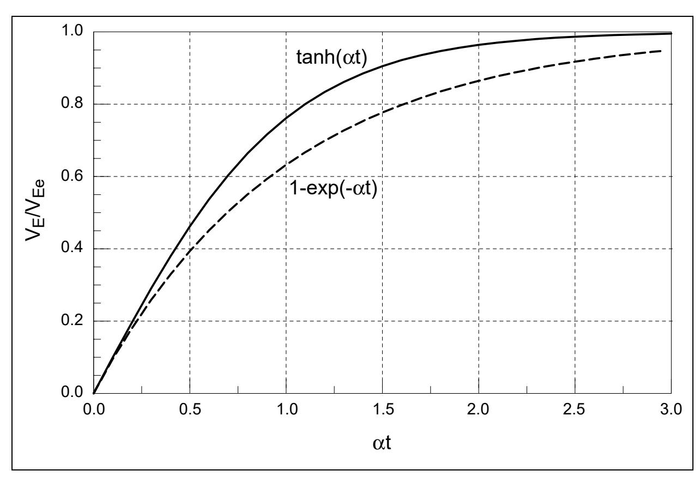

*Figure V-6-46. Solutions based on linear and quadratic forms for $Q_{out}$*

- Initial breach volume.
- At the initial breach of an inlet, tidal and littoral currents will distribute the released material to adjacent beaches and form a flood shoal and an ebb shoal. Distribution of material among these three areas will depend on the strength and asymmetry of the tidal current and on the incident
wave height and direction, among other factors. The time over which the initial distribution occurs is expected to be much shorter than the time scale 1/\alpha and can be approximated by an initial ebb-shoal volume V_{E0} at t=0. With this initial condition, Equations V-6-30 and V-6-31 yield:

```math
V_E = V_{Ee} (1 - e^{-\alpha t}) + V_{E0} e^{-\alpha t} \tag{V-6-44}
```

- For a probable overestimate such as V_{E0} \approx 0.1 V_{Ee} , inclusion of an initial ebb-shoal volume from the initial breach does not significantly alter the trend of evolution of the shoal, especially considering survey accuracy and temporal and spatial variability in the morphologic system that would obscure minor changes.
- Numerical solution.
- The governing equations, such as Equation V-6-31 and related initial condition, can be solved numerically to represent an arbitrary initial condition and time-varying forcing by Q_{in} . For example, assuming Q_{in} is time dependent, a second-order accurate, unconditionally stable solution of Equation V-6-31 is:

```math
V _ { _ { E } } ^ { ^ { \prime } } = \frac { \Delta t } { 2 \left( 1 + \frac { \Delta t } { 2 V _ { _ { E e } } } Q _ { i n } ^ { ^ { \prime } } \right) ^ { 2 } } \left[ Q _ { i n } ^ { ^ { \prime } } + Q _ { i n } + \left( 1 - \frac { \Delta t } { 2 V _ { _ { E e } } } Q _ { i n } \right) V _ { _ { E } } \right] \tag{V-6-45}
```

where quantities denoted with a prime indicate values at the next time-step, and \Delta t = time-step. To validate the solution method, Equation V-6-45 was implemented for Ocean City Inlet. With \Delta t = 0.1 year, the analytical and numerical solutions plotted on top of one another. In exploration of the solution scheme, reasonable accuracy was maintained with \Delta t = 5 years for the constant input transport rate.
- As an example, engineering application of the numerical model, recovery of the ebb-tidal shoal and alteration of bypassing rates at Ocean City Inlet are calculated in response to hypothetical mining of the bypassing bar. Limited quantitative work has been done to estimate the consequences of ebb-shoal mining (e.g., Mehta, Dombrowski, and Devine 1996; Cialone and Stauble 1998). Walther and Douglas (1993) reviewed the literature and applied an analytical model to three inlets in Florida to estimate recovery time of the shoal and bypassing rates. No time lag was included in their model, however, which yields different responses depending upon depth and location of the mining, factors not included in the present aggregate model.
- For the present example, 750,000 cu m were removed from the bypassing bar in the year 2000, which will be about 25 percent of the material comprising the bar at that time. Figure V-6-47 shows plots of the evolution of bar volume and bypassing rates from the bar and from the attachment bar to the beach. The volume was normalized by V_{Be} , and the bypassing rates by Q_{in} . Mining at the year 2000 stage of development is predicted to effectively translate the bar growth and bypassing rates approximately 20 years back in time, with the bypassing rate to the beach moving from about 0.6 to 0.45 of the potential maximum value of Q_{in} . This example with simplified conditions is not adequate for design, but it does indicate possible applicability of the model in comparison of alternative mining plans. More rigor could be introduced through inclusion of a time-dependent Q_{in} in the present model and estimation of the consequences of ranges of variability in the governing parameters.

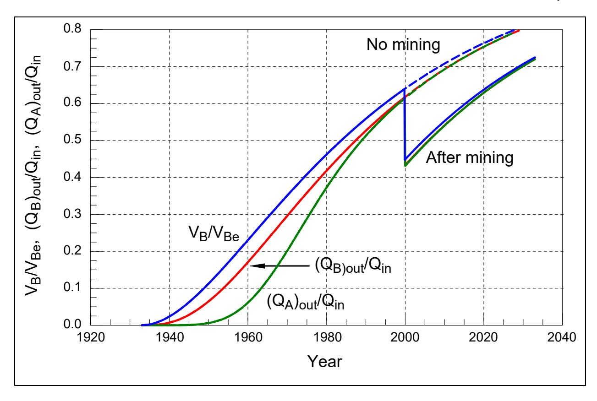

*Figure V-6-47. Bypassing bar volume and bypassing rates with/without mining*

- Finally, an example involving idealized bidirectional longshore transport is presented. To interpret results readily, the equilibrium volumes of the ebb shoal, bypassing bar, and the attachment bar were set at $V_{e}$ = $1×10^{6}$ cu m, and the magnitude Q the input longshore transport rate was one-tenth of this amount, whether from directed to the right or to the left. Starting from an initial condition of no inlet features, the transport was directed to the right for 25 years and then to the left for 25 years. Time evolution of the normalized volumes and bypassing rates are shown in Figure V-6-48a and V-6-48b, respectively, where subscripts "R" and "L" denote quantities associated with right- and left-directed transport.
- Under the stated condition of equal magnitude but opposite transport, the volume of the ebb shoal grows without discontinuity, because the shoal accepts sand from either direction. With transport directed to the right, the volume of the bypassing bar $V_{BR}$ and of the attachment bar $V_{AR}$ grow while experiencing the characteristic time lag. These features would emerge on the right side of the ebb shoal, for a viewer standing on the shore and facing the water. When the transport rate shifts after 25 years, the volumes $V_{BL}$ and $V_{AL}$ of features on the left side of the ebb shoal begin to grow, but the bypassing bar on the left experiences no time lag because the ebb shoal has a sand supply to contribute immediately. The attachment bar on the left experiences a shorter time lag as compared to its counterpart on the right because transported sand is delayed only by formation of its (left side) bypassing bar and not by the ebb shoal. The bypassing rates show behavior similar to the volumes. In particular, the left-directed bypassing rate on the ebb shoal starts at a large value because of the existence of the shoal created by the right-directed transport. Also, the bypassing rate from the left bypassing bar begins immediately after the switch in transport direction, and the attachment shoal on the left experiences a much shorter lag in receiving sand to bypass than did the attachment shoal on the right.

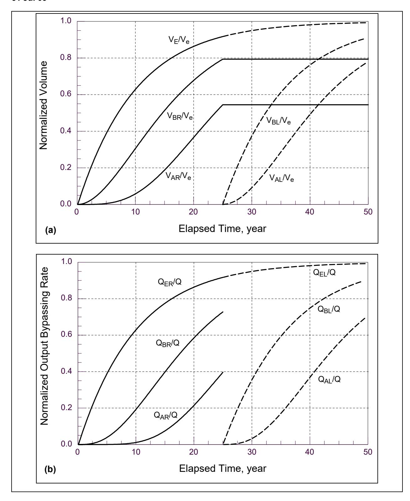

*Figure V-6-48. Bypassing rates for simple bidirectional transport*

- (k) Conclusions. A reservoir model was introduced for describing changes in volume and bypassing rates of morphological components of ebb-tidal shoals. Required inputs for this aggregate model are compatible with the amount and quality of data typically available in engineering and science studies. The model requires estimates of the longshore transport rate, which may be the net or gross rate depending on the inlet configuration; equilibrium volume of the ebb shoal, bypassing bar, and attachment bar; and qualitative understanding of sediment pathways at the particular inlet. The reservoir model is robust in that solutions are bounded. The ratio of the input longshore transport rate and the equilibrium volume of the morphological feature is the main parameter governing volume change and bypassing rates. This parameter is directly related to the widely accepted Bruun and Gerritsen ratio. The reservoir model predicts a delay in sand bypassing to the downdrift beach according to the properties of the morphologic system and longshore transport rate. The reservoir method requires apportionment of material between the ebb shoal and the bypassing bar, although a simplified version of the model can combine these two sand bodies. A distinction between the shoal and the bypassing bar adds conceptual and quantitative resolution by allowing bypassing bars to develop and evolve according to the properties of the predominant transporting mechanism as either waves (longshore sediment transport) or tidal prism. With constant inputs, the analytic model takes about 1 sec to execute on a standard PC for 100 years of simulation time, allowing numerous runs to be made. The numerical model is also rapid, even if time-dependent rates are involved. The model as described here does not account for sediment exchange between the inlet channel and flood shoal. However, it can be readily extended both analytically and numerically to include these and similar interactions. The model appears capable of substantial generalization and incorporation of more detailed, processed-based data. In this regard, the reservoir model may serve as a source for preliminary design and provide a framework for generating questions about inlet morphology, sediment pathways, and the fundamental mechanisms of the collective behavior of sand bodies. (3) Wave energy flux method (Jarrett 1977, 1991).
- (a) Jarrett applied sediment budget analysis techniques together with estimates of wave energy flux (derived from wave refraction analysis) to infer longshore sand transport rates for the North Carolina coast (Jarrett 1977, 1991). Data required to apply the method include incident wave climatology, shoreline positions and/or beach profiles, inlet bathymetry, and engineering activities (dredging and placement volumes, beach-fill placement, and sand bypassing rates) for a common time period. Jarrett recommends that the best time period for analysis is one that is free from significant storm events. Storms have the potential to bias the sediment budget, whether it is to reverse the long-term sediment transport direction or cause short-term transport of sediment offshore. The procedure is as follows: Analyze basic data sets. Calculate volume change associated with the shoreline position, profile, inlet bathymetry, and engineering activity data sets. (see Sections (e) and (f)). Identify sediment budget cells. Based on the volume changes for each inlet and beach system, identify regions of the study area that appear to behave differently. Potential longshore transport rates will be determined for the boundaries of each of these cells. Jarrett recommends extending inlet cell boundaries several thousand feet up- and downdrift from the inlet to incorporate the effects of the inlet ebb tidal delta and tidal currents within the inlet cell. Natural bypassing across the inlet is left as an unknown that is determined through solving the sediment budget.
• Determine the longshore component of wave energy flux in the surf zone. The longshore component of wave energy flux, P_l , is proportional to the amount of sand being transported along the coast through a factor, \beta , as shown in Equation V-6-46. This quantity can be calculated by transforming incident waves over offshore bathymetry until wave breaking. Then P_l is related to the breaking wave height, depth at breaking, and breaking wave angle (see Part III-3). Longshore energy flux should be calculated for the entire study area both for left- and right-directed transport. Representative values of left- and right-directed P_l for each cell boundary should be determined.

```math
Q = \beta P_{\ell} \tag{V-6-46}
```

Formulate equations between volume change and P_l . For each cell, equations can be written to solve for the relationship between the forcing (longshore energy flux, P_l ), and the resulting sediment transport gradient (net volume change within the cell, considering all engineering activities within that cell). Jarrett relates the correlation as follows (notation has been adjusted to be consistent within this chapter):

```math
\Delta V - P + R = \beta P_{\ell} \tag{V-6-47}
```

where \beta is the unknown constant, and \Delta V , P, and R are as defined previously.
- Solve for β in the vicinity of the inlets. At the inlet cells, there are three unknowns: bypassing to the updrift beach (during periods of reversal), bypassing to the downdrift beach, and the constant β. Three independent equations can be formulated considering the cell immediately updrift of the inlet, the cell downdrift of the inlet, and the inlet cell. After solving these three cells, a value for the parameter β is obtained which is then used to estimate sand transport between the other cells in the study area.
- Optimize the parameter \beta to best represent volume changes for all cells. Adjustments to the parameter \beta may be required to develop a balanced sediment budget for the entire region.
- The following example for the North Carolina coast is summarized from Jarrett (1991). Figure V-6-49 shows the study reach with the sediment budget cells identified in bold lettering.

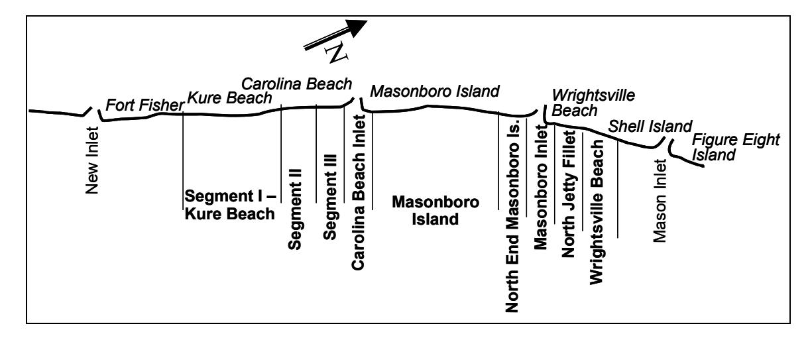

*Figure V-6-49. Study reach for sediment budget (not to scale, adapted from Jarrett 1991)*

- Segments of the study shoreline with similar trends, as determined from shoreline change data, were defined as sediment budget cells. Cell boundaries in the vicinity of inlets were located several thousand feet from the interior shoreline of the inlet. The inlet boundaries were set so that sediment transport within the inlet cell reflected the combined forcing of waves and tidal currents, with waves having been influenced by the ebb-tidal shoal. Within each shoreline cell, profile and shoreline change data were used to determine the rate of volume change. Sources of sediment, such as beach nourishment or sand bypassing operations, and sinks of sediment, such as inlets and capes, were determined from review of the engineering history, hydrographic surveys, and dredging records. The volume rate of material naturally bypassing each inlet in both the upcoast and downcoast directions were set as unknowns.
- A longshore energy flux analysis was conducted using wave information offshore of the study site, and transforming the waves over the offshore and nearshore bathymetry. Values of the longshore energy flux factor were related to both the left- and right-directed longshore transport rates using Equation V-6-46. These values are shown above each longshore transport rate arrow in Figure V-6-50. Once the transport potential was determined between the various cells, computations using Equation V-6-47 were used to solve for β. As calculations proceeded from cell-to-cell, some adjustments in the computed values of the longshore transport rate were required to develop a completely balanced sediment budget for the study area. The final sediment budget is shown in Figure V-6-50, with the calculated transport rates shown below each arrow.

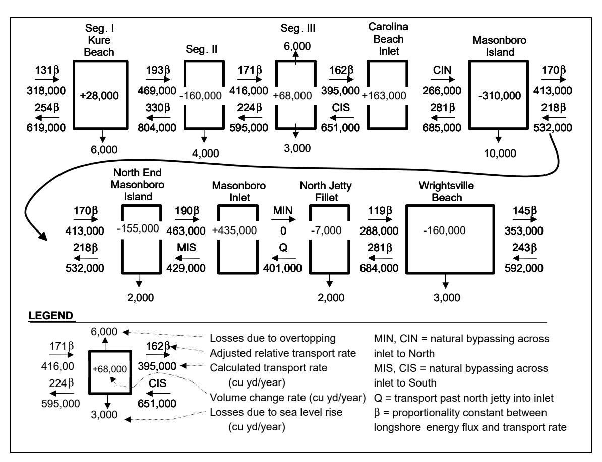

*Figure V-6-50. Sediment budget from Kure Beach (south end of study) to Wrightsville Beach (north end of study), North Carolina, using the wave energy flux method (adapted from Jarrett 1991). Note that the Masonboro Island cell connects to the north end of Masonboro Island cell*

- (4) Bodge's method (1999).
- (a) Bodge's approach is an extension of those described by Bruun (1966), Weggel (1981), as well as early case studies by Johnson (1959), Jarrett (1977), among others. Figure V-6-51 illustrates the sediment transport pathways at an idealized inlet for right- and left-directed incident transport, and mechanical transport (dredging and bypassing). Except as noted, all right-directed transport is positive-valued. All left-directed transport is negative-valued. Right- and left-directions are based upon an observer standing at the inlet, facing seaward. The study area boundaries are selected as locations outside of the inlet's direct influence on wave refraction and tidal currents.

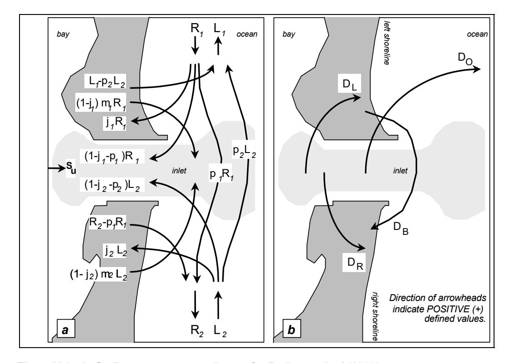

*Figure V-6-51. Sediment transport pathways for Bodge method (1999)*

- (b) In Figure V-6-51a, each transport component is defined as a fraction or multiple of the right- and left-directed longshore transport rates at the boundaries. The subscript "1" refers to transport directed rightward from the left shore, and the subscript "2" refers to transport directed leftward from the right shore. In Figure V-6-51a and V-6-51b, the terms illustrated in the sediment transport pathways are as follows: R, L = rightward- and leftward-directed incident transport values at the study area's boundaries j_1, j_2 = fraction of incident transport (R or L) impounded by the inlet's jetties ( j_1 = left jetty; j_2 = right jetty; 0.0 = transparent jetty; 1.0 = impermeable jetty) p_1, p_2 = fraction of incident transport (R or L) naturally bypassed across the inlet ( p_1 = from the left, p_2 = from the right; 0.0 = no bypassing; 1.0 = perfect bypassing) m_1 = local inlet-induced transport from the left shoreline into the inlet (expressed as a fraction or multiple of the right-directed incident transport, R_1 )
- m_2 = local inlet-induced transport from the right shoreline into the inlet (expressed as a fraction or multiple of the left-directed incident transport, L_2 )
- S_u = transport of littoral material into the inlet from upland sources (positive value)
D_L , D_R = mechanical transfer of sand from the inlet to the left and right shorelines, respectively
- D_B = mechanical transfer of sand from the left shoreline to the right shoreline (defined as positive from left to right; negative from right to left)
- D_O = maintenance dredging and out-of-system disposal from the inlet (positive-valued; includes only material of littoral origin; includes deepwater (offshore) and upland disposal; excludes new work)
(c) The transport terms (R, L, Q, S_u, D_L, D_R, D_O) can be expressed as either volume quantities or volumetric rates, so long as the units of each term are consistent with one another. The ratio of left-to right-directed transport magnitude at the study area's boundaries is defined as:

```math
r_1 = -L_1 / R_1 \text{ and } r_2 = -L_2 / R_2 \tag{V-6-48}
```

• By definition,

```math
0 \leq j_1 \leq 1 \quad 0 \leq p_1 \leq 1 \quad 0 \leq p_1 + j_1 \leq 1 \quad m_1 \geq 0 \quad 0 \leq j_2 \leq 1 \quad 0 \leq p_2 \leq 1 \quad 0 \leq p_2 + j_2 \leq 1 \quad m_2 \geq 0 \tag{V-6-49}
```

• The net volume changes of the left and right shorelines are, respectively,

```math
\Delta V_L = (j_1 + j_1 m_1 - m_1) R_1 + L_1 - p_2 L_2 - D_B + D_L \tag{V-6-50}
```

```math
\Delta V_R = (m_2 - j_2 m_2 - j_2) L_2 - R_2 + p_1 R_1 + D_B + D_R \tag{V-6-51}
```

where positive \Delta V values imply net accretion and negative values imply net erosion. The gross volume of sand that enters the inlet, prior to maintenance dredging, is

```math
\Delta V_G = (1 - j_1 - p_1 + m_1 - j_1 m_1) R_1 - (1 - j_2 - p_2 + m_2 - j_2 m_2) L_2 \tag{V-6-52}
```

• The inlet's net volume change after dredging, and neglecting upland/offshore input, is

```math
\Delta V_N = \Delta V_G - D_L - D_R - D_O - S_U = (1 - j_i - p_1 + j_1 - j_1 m_1) \tag{V-6-53}
```

• Combining Equations V-6-50 through V-6-53 yields:

```math
\Delta V _ { L } = \mathbf{\nabla } - ( \Delta V _ { R } + D _ { O } + ( \Delta V _ { N } - S _ { u } { \nabla } ) ) + \Delta R + \Delta L \tag{V-6-54}
```

```math
\Delta V _ { R } = \mathbf{\nabla } - ( \Delta V _ { L } + D _ { O } + ( \Delta V _ { N } - S _ { u } { \nabla } ) ) + \Delta R + \Delta L \tag{V-6-55}
```

where \Delta R = R_1 - R_2 and \Delta L = L_1 - L_2 .
- Physically, if the incident transport rates are identical on both sides of the inlet (that is, ∆ R = ∆ L = 0), Equations V-6-50 and V-6-55 demonstrate that the net volume change of an inlet-adjacent shoreline is the negative sum of the other shoreline's net volume change (e.g., impoundment); the volume of sand removed from the inlet by maintenance dredging and out-of-system disposal; and the net growth of the inlet shoal volumes (minus upland/offshore input). This simple and significant result states that an inlet's net volumetric effect to the downdrift shoreline is the sum of: the updrift impoundment; maintenance dredging and out-of-system disposal; and net shoal growth beyond that attributed to upland input. In this way, the global volumetric impact of the inlet to the downdrift shoreline (minus any impoundment fillet, or dead storage on the downdrift side) can be computed without reference to, or assumption of, measured downdrift shoreline changes, ambient longshore transport rates, or detailed mechanics of the inlet's transport pathways. While these data are ultimately useful, Equations (V-6-54) and (V-6-55) demonstrate that such data are not fundamentally required to assess the inlet's downdrift, volumetric impact, at least so long as differences in the ambient transport potential across the inlet are small or known.
- Equations V-6-50 through V-6-52 can be solved for $p_{1}$ and $p_{2}$ and combined to yield two coupled equations containing the volume change terms ∆ VL , ∆ VR , or $∆V_{G}.$ In practice, as previously noted, the net volume change of the downdrift beach is often most uncertain or suspect because of the effects of armoring or beach nourishment, or because the length of shoreline to consider is not known a priori. Accordingly, it is advantageous to remove the downdrift volume change term from the coupled equations, and to solve in terms of the volume changes of the updrift beach and the inlet.
- If the RIGHT shoreline is downdrift (or of less certain volume change), then from Equations V-6- 50, V-6-51, and V-6-52:

```math
p_1 = 1 - j_1 (1 + m_1) + m_1 - (L_2/R_1)(1 - j_2 (1 + m_2) + m_2 - p_2) - \Delta V_G/R_1 \tag{V-6-56a}
```

```math
p_2 = [(j_1 (1 + m_1) - m_1) R_1 + L_1 - \Delta V_L + D_L - D_B] / L_2 \tag{V-6-56b}
```

and the corresponding, computed volume change of the right shoreline is:

```math
\Delta V_R = (m_2 - j_2 m_2 - j_2) L_2 + p_1 R_1 - R_2 + D_R + D_B \tag{V-6-57}
```

• If the LEFT shoreline is downdrift (or of less certain volume change), then from Equations V-6- 50, V-6-51, and V-6-52:

```math
p_1 = [(j_2 (1 + m_2) - m_2) L_2 + R_2 + \Delta V_R - D_R - D_B] / R_1 \tag{V-6-58a}
```

```math
p_2 = 1 - j_2 (1 + m_2) + m_2 - (R_1/L_2) (1 - j_1 (1 + m_1) + m_1 - p_1) + \Delta V_G/L_2 \tag{V-6-58b}
```

and the corresponding, computed volume change of the left shoreline is:

```math
\Delta V_L = (j_1 - m_1 + j_1 m_1) R_1 + L_1 - p_2 L_2 + D_L - D \tag{V-6-59}
```

• To solve for the inlet sediment budget, a family of solutions is developed from either Equation V-6-56a,b or V-6-58a,b. Specifically, input values are identified for the updrift volume change $(∆V_{L}$ or $∆V_{R})$ and the gross inlet volume change $(∆V_{G})$ and for the dredging/bypassing quantities $(D_{O},$ DL , DR , DB ) and for upland/offshore inlet volume influx $(S_{U}).$ A range of physically plausible values for the other transport parameters are additionally identified; i.e., the jetties' impermeability ( j 1, j 2 (between 0 and 1)), the local inlet-induced transport ( m 1, m 2), the tendency for natural bypassing $(p_{1}$ and $p_{2}$ (between 0 and 1)), and the incident transport components ( R and L ). In application, three incident transport components are required: R 1, R 2, and $L_{1}$ for Equation V-6-56, and L 1, L 2, and $R_{1}$ for Equation V-6-58.
• Candidate values for the various parameters, within their identified plausible ranges, are input to Equations V-6-56 or V-6-58. Those combinations of parameters that yield values of $p_{1}$ and p 2 within the allowed range of $p_{1}$ and $p_{2}$ (or, at least, values between 0 and 1), and which likewise satisfy

```math
0 \leq j _ { 1 } + p _ { 1 } \leq 1 \mathrm { a n d } 0 \leq j _ { 2 } + p _ { 2 } \leq 1 \tag{V-6-60}
```

are retained as viable discrete solutions of the sediment budget. The set of all such viable, discrete solutions represents the sediment budget's family of solutions.
• The family of solutions can be conveniently plotted and inspected in the following way. For each discrete solution, values are computed for the incident (updrift) net transport Q , the natural net bypassing P , and the gross volume that shoals the inlet from the left and right shorelines, $S_{LEFT}$ and $S_{RIGHT},$ respectively. If Equation V-6-56 is used, where the RIGHT shoreline is downdrift, then

```math
Q = Q_1 = R_1 + L_1 \tag{V-6-61a}
```

or if Equation V-6-58 is used, where the LEFT shoreline is downdrift, then

```math
Q = Q_2 = R_2 + L_2 \tag{V-6-61b}
```

• The net natural bypassing and left- and right- gross inlet shoaling volumes are, respectively,

```math
P = p_1 R_1 + p_2 L_2 \tag{V-6-62a}
```

```math
S_{\text{LEFT}} = \Delta V_G - S_U - S_{\text{RIGHT}} = (1 - j_1 - p_1 + m_1 - j_1 m_1) R_1 \tag{V-6-62b}
```

```math
S_{\text{RIGHT}} = \Delta V_G - S_U - S_{\text{LEFT}} = -(1 - j_2 - p_2 + m_2 - j_2 m_2) L_2 \tag{V-6-62c}
```

- The family of solutions can be narrowed by imposing additional constraints; e.g., requiring that the direction of any net natural bypassing, P , be coincident with the incident net transport rate, Q ; or, that the jetties' impermeability values $(j_{1}$ and $j_{2})$ be similar to one another; or, that the shoaling from one side or the other be a minimum percentage of the inlet's total shoaling rate; etc. Or, families of solutions from different time periods can be overlaid, retaining only those subsets of solutions for which the incident transport, Q , solves the sediment budget for both time periods, etc.
- Methods to identify the sediment budget's parameters include the following. The volume change of the updrift shoreline $(∆V_{L}$ or $∆V_{R})$ can be estimated from the cumulative volume change updrift of the inlet as in Figure V-6-18, where background changes are retained. The gross volume change of the inlet $(∆V_{G})$ can be estimated from surveys and dredging histories, where care is taken to exclude changes due to new-work dredging, datum shifts, etc. The dredging and mechanical bypassing terms ( DR , DL , DO , DB ) are estimated from dredging records. The volume influx from upland or offshore sources $(S_{U})$ requires some insight as to the inlet's overall geology and/or the influence of, for example, episodic fluvial input, but in many cases can be neglected. A convenient method to identify ranges of values for the incident transport ( R and L ) is to consider the right- and left-directed transport potential from offshore (hindcast, etc.) wave data. The computed transport rates can be used directly (with ranges bound by some percentage or by standard deviation, etc.). It is additionally useful to compute the ratio of left- to right-directed
transport, r , from Equation V-6-48. In solving the sediment budget equations, this ratio can be held constant, so that the value of L remains a computed, fixed fraction of specified values of R that will be considered. The values of R to be considered should be such that the net incident transport, Q = R + L , or Q = (1- r ) R , are within a range of physically plausible values, perhaps defined by the range of values of Q for the inlet suggested by prior investigators.
- Plausible values for the jetties' impermeabilities $(j_{1}$ and $j_{2})$ are made from aerial photography, surveyed shoaling patterns, and physical inspection; or, in the limit, can be left to the default uncertainty range of 0 (permeable) to 1 (impermeable). Values for the inlet's net natural bypassing tendency $(p_{1}$ and $p_{2})$ are typically most uncertain and can be left to the default range of 0 (no bypassing) to 1 (full bypassing). In many cases, however, it might be accepted that an improved inlet is an imperfect bypassing system ( p < 1) or a complete littoral barrier ( p =0), etc.
- Values for the local, inlet-induced transport $(m_{1}$ and $m_{2})$ can be estimated from inspection of computed increases in the inlet-directed longshore transport potential near the inlet mouth. This can be discerned from wave refraction investigation whereby the longshore transport potential is computed from incipient breaking conditions along the shoreline developed for each of several representative offshore wave cases.
- The transport potential can be computed by the CERC formula with arbitrary coefficient. For example, an increase in the transport potential, $R_{1},$ for example from 0.5 to 0.7 (arbitrary units), induced by refraction across the inlet's ebb shoal, represents a 40 percent inlet-induced increase in local right-directed transport, suggesting a value of $m_{1}$ = 0.4. Additionally, the parameters m 1 and $m_{2}$ can be used to account for inlet-directed transport from the adjacent shorelines induced by tidal currents.
- Many other discrete solutions can, of course, be developed from the family of solutions presented in Figures V-6-53 and V-6-54. Those from the latter, narrowed family are more physically plausible, based upon general examination of the inlet. Although even this narrowed family appears broad, one will find that there are not extraordinarily significant differences between discrete solutions within the family, particularly after plotting the results as shown in Figure V-6-55. In particular, there are very modest differences between those solutions that define the central 50 percent of the narrowed family as a whole; i.e., the dark-shaded area in Figure V-6-54.
- The methodology described allows the coastal engineer a framework by which to:
- Investigate the volumetric and lineal extent of an inlet's impact upon adjacent shorelines.
- To develop a framework for a conceptual inlet sediment budget based upon ranges of physically plausible input values. The latter results in a family of solutions which bounds those solutions that can mathematically and reasonably solve an inlet sediment budget. This family of solutions inherently accounts for the underconstrained nature of an inlet sediment budget calculation; i.e., where there are more variables than known values. While it allows flexibility of solutions, it provides useful boundaries to the solution. These boundaries can be narrowed, or studied, to the degree that the investigator wishes to prescribe physical constraints to the inlet's transport patterns. The statistics of the values within the family of solutions can be examined to discern the occurrence with which various values of the inlet's transport parameters can solve the sediment budget. This can help to establish the degree to which a given discrete solution lies within the central or outer parts of the most likely (or at least, modal) solutions.

#### EXAMPLE PROBLEM V-6-13

To illustrate the method's application and utility, an example application at St. Lucie Inlet, Florida, is presented. St. Lucie Inlet is located on Florida's south-central east coast, on the Atlantic Ocean. The inlet was artificially opened in the 1920s, and jetties were later constructed on the north (left) and south (right) shorelines. The north jetty extends across most of the typical surf zone, but is low and permeable. The south jetty is sand-tight, but is very short, and sand is transported around its seaward end. The net incident drift is acknowledged to be from north to south, and is plausibly between 40,000 and 260,000 cu m/year (50,000 to 340,000 cu yd/year). The downdrift (south, or right) shoreline has experienced chronic erosion along a great distance (10's of km), and is it is generally acknowledged that the inlet exhibits some, but far less than perfect, natural sand bypassing.
Values of volume changes and typical dredging practices were identified over a period of 6 to 10 years in the late 1980s, and converted to equivalent annual rates (ATM 1992; USAED, Jacksonville, 1999). These included an updrift (left) shoreline change of $∆V_{L}$ = -16,000cu m/year (net erosion); gross inlet shoaling of $∆V_{G}$ = 156,000 cu m/year; maintenance dredging and out-of-system disposal of $D_{O}$ = 33,000 cu m/year; and maintenance dredging and placement to the downdrift (right) shoreline or nearshore of $D_{R}$ = 60,000 cu m/year. Upland/offshore influx to the inlet shoals is assumed to be neglible; i.e., $S_{U}$ = 0. From Equation V-6-53, the net inlet shoaling rate is $∆V_{N}$ = 63,000cu m/year, representing the estimated net rate of accretion across the inlet's ebb and flood shoals and/or losses to the offshore.
Relevant results of a wave refraction and littoral transport analysis at the inlet (Browder 1996, conducted for USAED, Jacksonville, 1999) are illustrated in Figure V-6-52. Representative wave conditions from various offshore directions were refracted/diffracted to the point of incipient breaking, from which the longshore transport potential was computed. The results were weighted by each wave condition's hindcast occurrence and summed to develop an alongshore estimate of the right- and left-directed transport potential. The values in the figure are normalized by the maximum value of the computed transport potential. Source wave data were WIS Phase II hindcast, 1956-95 (Corson et al. 1982).

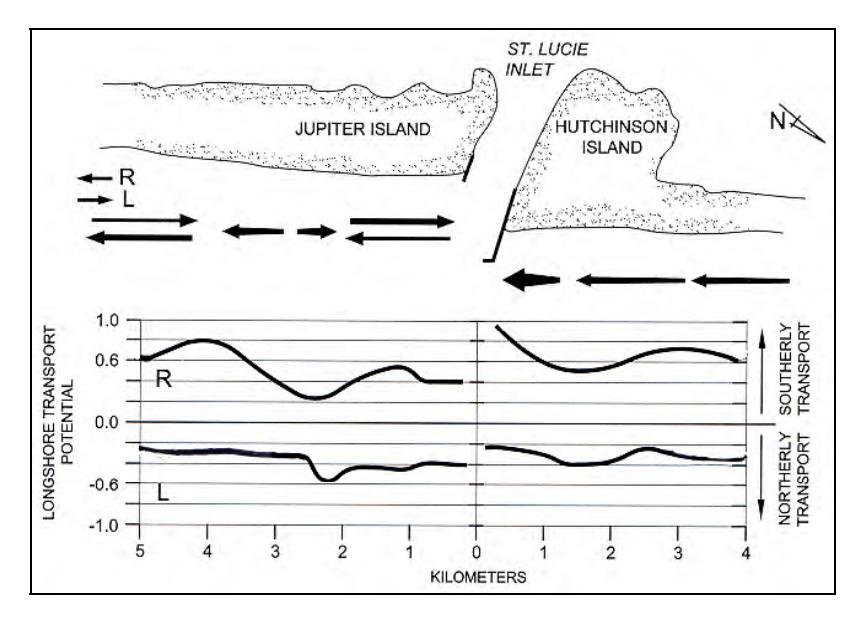

*Figure V-6-52. Longshore transport potential in vicinity of St. Lucie Inlet, Florida (after Browder 1996)*

From Figure V-6-52, the ratio of left-to-right-directed transport at the updrift (left) boundary is about r = - L / R = 0.45. For an assumed range of net incident transport, Q = 40,000 to 260,000 cu m/year, this implies a range of considered values for the incident, right-directed transport of

```math
R_1 = Q/(1-r) = (40,000)/(1-0.45) \text{ to } (260,000)/(1-0.45) = 72,700 \text{ to } 472,700 \text{ cu m/year}
```

and corresponding incident, left-directed transport of

```math
L_1 = -r R_1 = (-0.45)(72,700) \text{ to } (-0.45)(472,700) = 32,700 \text{ to } 212,700 \text{ cu m/year}
```

Left-directed transport at the downdrift (right) boundary is approximately 90 percent of that at the updrift (left) boundary; hence, it will be presumed that $L_{2}$ = 0.9 $L_{1}.$ Due particularly to shoal and reef features near the inlet mouth, the transport potential directed toward the inlet is computed to increase by about 30 to 50 percent in the immediate vicinity of the inlet. Local transport directed toward the inlet is likewise augmented by tidal (flood) currents, the contributions of which are not included in the figure. It is thus reasonably assumed that the local, inlet-induced increases in right- and left-directed transport, $m_{1}$ and $m_{2},$ are each in the range of at least 0.3 to 0.5, more or less.
For the sake of generality, no presumptions will be made regarding the jetties' impermeability values $(j_{1}$ and $j_{2})$ or the natural bypassing tendency $(p_{1}$ and $p_{2}).$ These values, at least initially, will be allowed to range from 0 to 1.
As the right shoreline is downdrift (and of uncertain volume change), Equations V-6-56a and V-6-56b are solved for $p_{1}$ and $p_{2}$ for the ranges of values described; viz.,

```math
p_1 = 1 - j_1 (1 + m_1) + m_1 - (L_2/R_1)(1 - j_2(1+m_2) + m_2 - p_2) - (156000)/R_1
```

```math
p_2 = [(j_1 (1 + m_1) - m_1) R_1 + L_1 - (-16000) + 0 - 0] / L_2
```

where 0 ≤ $j_{1}$ ≤ 1; 0≤ $j_{2}$ ≤ 1; 0.3 ≤ $m_{1}$ ≤ 0.5; 0.3 ≤ m 2≤ 0.5; 72700 ≤ $R_{`}$ ≤ 472,700; and, $L_{1}$ = 0.45 R 1; and $L_{2}$ = $L_{1}.$ Only those combinations of values for which 0 ≤ $p_{1}$ ≤ 1 and 0 ≤ $p_{2}$ ≤ 1, and for which 0 ≤ p 1 + $j_{1}$ ≤ 1 and 0 ≤ $p_{2}$ + $j_{2}$ ≤ 1, are retained as viable solutions. For each of these, the net incident transport, shoaling volume from the left and right shorelines, and the net bypassing volume, are computed from Equations V-6-61a, V-6-62a, V-6-62b, and V-6-62c, respectively.
Figure V-6-53 illustrates the results of these computations; i.e., the general family of solutions. Any point within this family (the shaded area) can solve the sediment budget. The solutions lie along lines of constant net incident transport value $(Q_{1}).$ The size of the solution family decreases as the local inlet-induced transport term ( m 1, m 2) increases. This is indicated by the truncation of the family along its lower right-hand side as $m_{1}$ and $m_{2}$ increase from 0.3 to 0.5.

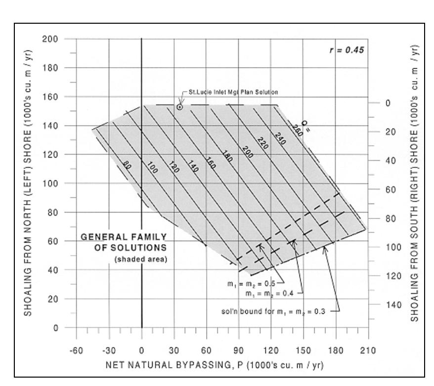

*Figure V-6-53. General family of solutions for St. Lucie Inlet, Florida, sediment budget*

From Figure V-6-53, it is noted that the minimum net incident transport $(Q_{1})$ is about 80,000 cu m/ year in order to solve the sediment budget. A numeric scan of the results demonstrates that the updrift jetty must be at least 25 percent impermeable but not more than 60 percent impermeable (0.25 < $j_{1}$ < 0.6) to solve the sediment budget; and that the modal impermeability value is about 46 percent $(j_{1}$ = 0.46). Values for the downdrift jetty's impermeability ranged from 0 to 1, though 90 percent of the values were less than 0.7. Likewise, natural bypassing of the right-directed transport must be less than 69 percent $(p_{1}$ < 0.69) to solve the sediment budget. A solution proposed in the St. Lucie Inlet Management Plan, prepared for the State of Florida, plots at the top edge of the family. While mathematically viable, it appears as an outlier relative to the bulk of the solution, and was ultimately not adopted by the state.
The family of solutions can be readily narrowed by imposing additional physical constraints, developed through observation of the inlet. For illustration, these shall include:
- 1. Direction of any net natural bypassing to coincide with the net drift ( P > 0).
- 2. Net natural bypassing is not greater than two-thirds of the net incident rate ( P < 0.67 $Q_{1}).$
- 3. Shoaling from the right comprises at least one-third of the total inlet shoaling $(S_{RIGHT}$ > 0.33 $∆V_{G}).$
- 4. The downdrift, right jetty is not more than 70 percent impermeable $(j_{2}$ ≤ 0.7).
The resulting, narrowed family is plotted in Figure V-6-54. Requirements No. 1, 2, and 3, respectively, truncated the general solution's left, right, and top boundaries; while No. 4 had little effect in this case, as expected, given that 90 percent of j 2's values were naturally less than 0.7. The bounds of this narrowed family are identical for values of $m_{1}$ and $m_{2}$ from 0.3 to 0.5. The maximum net, incident transport rate must be less than 250,000 cu m/year in order to solve the sediment budget.

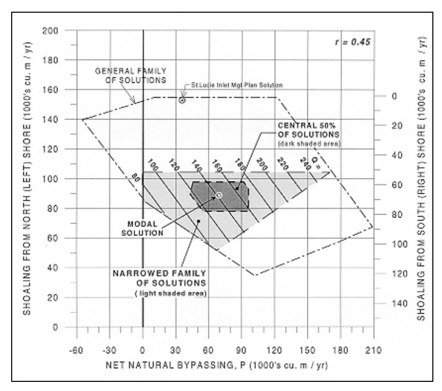

*Figure V-6-54. Narrowed family of solutions, per requirements 1-4*

A numeric scan of the narrowed family's results reveals the frequency with which values of the various transport parameters can solve the sediment budget for fixed increments of the input values j 1, j 2, and $R_{1}$ (or $Q_{1}).$ For example, the modal (most frequent) value of shoaling from the left shore is 88,600 cu m/year, or 56 percent of the total gross shoaling rate, with half of all of the solutions falling within values of 44,000 cu m/year (28 percent of gross shoaling) to 96,000 cu m/year (62 percent). The modal value of the net incident transport rate is $Q_{1}$ = 147,000 cu m/year, with half of all of the solutions defined by values between about 120,000 and 170,000 cu m/year. The modal value of the updrift jetty impermeability is $j_{1}$ = 0.47, with half of all solutions described by $j_{1}$ = 0.43 to 0.53. The modal value of the downdrift jetty impermeability is $j_{1}$ = 0.26, with half of all solutions described by $j_{1}$ = 0.13 to 0.43. This suggests that the updrift jetty is about twice as impermeable as the downdrift jetty, a notion that is physically reasonable.
The dark shaded area in Figure V-6-54 is a subset of solutions that represents the central 50 percent of the narrowed family. That is, it comprises those 50 percent of the solutions distributed about the inletparameter values that most frequently solve the sediment budget. Formally, it represents that half of the viable inlet solutions that occur most frequently. The modal solution in the middle indicates the narrowed solutions' weighted average value of computed net bypassing, P, and shoaling, $S_{LEFT}$ and S RIGHT.
As an example, a discrete solution is selected from the family and exploded to develop the corresponding sediment transport pathways. The modal solution is chosen as an illustration, where the most frequently occurring values of the transport parameters are selected as a discrete solution; viz., $Q_{1}$ = 142,000 cu m/year ( R = 258,200 cu m/year, and L = -116,200 cu m/year); P = 69,400 cu m/year; $S_{LEFT}$ = 88,600 cu m/year, and $j_{1}$ = 0.47. The family of solutions is scanned for these discrete conditions (or, a discrete solution can be computed directly for these values). For nominal values of $m_{1}$ = $m_{2}$ = 0.4, the parameters that correspond to these conditions are $j_{2}$ = 0.31, $p_{1}$ = 0.40, and $p_{2}$ = 0.32. For each of these values, and recalling that $L_{2}$ = 0.9 $L_{1},$ the transport pathways attendant to the inlet are computed with reference to the definition sketch, Figure V-6-51a,b. The results are plotted in Figure V-6-55.

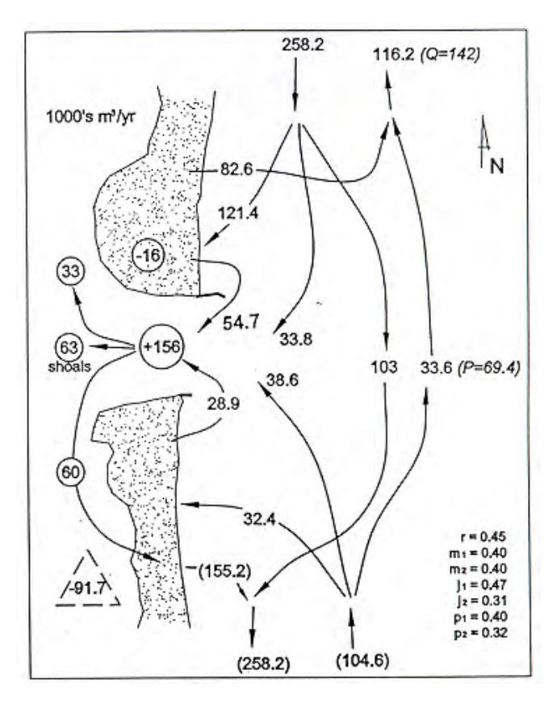

*Figure V-6-55. Sediment transport rates (1000s cu m/year) computed for modal solution, St. Lucie Inlet, Florida (figure not to scale)*

From Equation V-6-57, the volume change of the downdrift shoreline is also computed. This requires presumption of the rightward transport, $R_{2},$ directed away from the inlet on the downdrift side, not otherwise needed up to this point. In the present example, and by reference to Figure V-6-51a,b, it is presumed that $R_{1}$ = $R_{2}$ =258,200 cu m/year. This suggests that the downdrift shoreline exhibits an erosion potential of 91,700 cu m/year. From Equation V-6-57, this is the sum of net inlet shoaling (63,000 cu m/year) and out-of-system dredge disposal (33,000 cu m/year) minus net change of the updrift shoreline (-15,900 cu m/year, computed), and accounting for a presumed decrease in the leftdirected transport potential across the inlet (11,600 cu m/year).
Measurements of net downdrift volume change vary widely, particularly because of fairly frequent beach nourishment and nearshore (dredge) sand placement of uncertain success. With sand placement to the downdrift shoreline, the observed net volume change is between +67,000 cu m/year to -139,000 cu m/year. (These are the values to which to compare the computed net downdrift volume change, above, $∆V_{R}$ = -91,700 cu m/year.) After subracting sand placement, net downdrift erosion is reported on the order of 160,000 to 367,000 cu m/year along 9 km south of the inlet (USAED, Jacksonville, 1999). The great uncertainty in these values is not atypical for downdrift shorelines.
The modal solution depicted presumes a net incident transport rate of 142,000 cu m/year. Prior studies by the Corps estimate this value as about 175,000 cu m/year (USAED, Jacksonville, 1999). The solution, suggests that the transport rates into the inlet from the north and south shorelines are about 88,500 and 67,500 cu m/year, respectively. Corresponding values estimated in USAED, Jacksonville (1999) are about 103,000 and 56,000 cu m/year.

#### V-6-4. Engineering Approaches

a. General considerations. Development of the inlet sediment budget allows estimation of the degree to which an inlet has historically impacted the adjacent shorelines' littoral system, and is presently bypassing sediment. Mitigation of the first approach may be possible by restoring sand to the affected shores from the inlet's sediment (shoal) resources, although this may aggravate inlet impacts if done improperly or may be otherwise limited by other concerns. Mitigation of the second approach requires that the inlet be improved to decrease its littoral impact as a sediment sink. To the extent that these mitigative approaches are limited, additional mitigation may be required in the form of beach nourishment (or alternate shore protection methods) from sources external to the inlet. In developing mitigative and/or inlet management strategies, the designer must be aware of social and environmental constraints, as well as physical (site) constraints, that can ultimately limit these strategies' feasibility. These include, for example, the presence of natural or historical resources that limit borrowing/sand transfer from inlet shoals; upland property owners' ability to block sand transfer operations that are perceived to remove sand from updrift beaches; questions as to which entity "owns" the sand resource to

#### EXAMPLE PROBLEM V-6-14

#### FIND:

The family of solutions that describes an improved inlet's sediment transport pathways.

#### GIVEN:

The apparent net transport direction across the inlet is from left-to-right. The net volume changes within the inlet's shoals, and along 6 km of the apparent, updrift shoreline, were estimated from survey data for a common period and averaged to annualized rates. Dredging and sand-bypass records are available for the same period. The volume change of the updrift (left) shoreline is -15,000 cu m/year (erosion). Prior to any dredging, the flood shoal accreted at a rate of 237,000 cu m/year and the ebb shoal accreted at a rate of 80,000 cu m/year. An average of about 55,000 cu m/year are dredged from the inlet and disposed of in deep water, offshore. Another 86,000 cu m/year are dredged from the flood shoals, on average, and placed upon the downdrift (right) shoreline. The inlet includes jetties on both shorelines, each of which appears to impound some, but not all, of the incident drift; 0.1 < j < 0.6, for example. There is a bypassing bar across the inlet mouth that attaches to both shorelines within about 3 to 4 km of the entrance. Results of a wave refraction / transport rate analysis, based upon hindcast wave data, are shown in Table V-6-12. The values of the transport rate potential are normalized by the maximum value of the computed net transport rate. The actual magnitude of the average, net incident drift rate is uncertain, but is thought to be toward the right and on the order of 150,000 to 250,000 cu m/year.

**Table V-6-12. The values of the transport rate potential are normalized by the maximum value of the computed net transport rate. The actual magnitude of the average, net incident drift rate is uncertain, but is thought to be toward the right and on the order of 150,000 to 250,000 cu m/year.**

| from | Right-Directed | Left-Directed | Net | Right-Directed | Left-Directed | Distance Net |
| --- | --- | --- | --- | --- | --- | --- |
| (km) | Transport Left | Transport (updrift) shoreline | Transport | Transport Right | Transport (downdrift) shoreline | Inlet Transport |
| 7 | 0.85 | -0.28 | 0.57 | 0.84 | -0.28 | 0.56 |
| 6 | 0.82 | -0.28 | 0.54 | 0.85 | -0.29 | 0.56 |
| 5 | 0.86 | -0.30 | 0.56 | 0.82 | -0.27 | 0.55 |
| 4 | 0.92 | -0.20 | 0.72 | 0.70 | -0.30 | 0.40 |
| 3 | 0.97 | -0.11 | 0.86 | 0.59 | -0.39 | 0.20 |
| 2 | 1.03 | -0.08 | 0.95 | 0.33 | -0.42 | -0.09 |
| 1 | 1.03 | -0.03 | 1.00 | 0.21 | -0.41 | -0.20 |
| 0.1 | 1.00 | -0.00 | 1.00 | 0.15 | -0.43 | -0.28 SOLUTION: |

#### SOLUTION:

Step 1. From Table V-6-11 of computed, potential transport rates, the right- and left-directed transport appear to be fairly stable and uniform at 6- to 7-km distance from the inlet. From the given values in the table and Equation V-6-48, the ratio of the right- and left-directed transport potential is about

```math
r = -(-0.28) / (0.85) = 0.33
```

- Step 2. From the given data, the range of incident transport rate to be considered shall be Q = 150 to 250, where units of 1,000's of cubic meters per year are assumed throughout.
- Step 3. The range of jetty impermeabilities to be considered shall be 0.1 < $j_{1}$ < 0.6 and 0.1 < $j_{2}$ < 0.6.
- Step 4. From the table, the right-directed transport rate potential increases from about 0.85 to about 1.0 along the left shoreline adjacent to the inlet. This increase is assumed to reflect the local, inlet-induced transport associated with the term $m_{1}.$ This represents a localized increase of 0.15 (normalized) units above the incident value of 0.85. Thus,

```math
m_I \approx 0.15 / 0.85 = 0.18
```

Likewise, from the table, the left-directed transport rate potential increases from about -0.29 to -0.42 along the right shoreline adjacent to the inlet. This increase is assumed to reflect the local, inletinduced transport associated with the term $m_{2}.$ This is a localized increase of -0.13 units above the incident value of -0.29. Thus,

```math
m_2 \approx -0.13 / -0.29 = 0.45
```

- Step 5. From the given data, $D_{O}$ = 55, $D_{R}$ = 86, $D_{L}$ = 0, and $D_{B}$ = 0, where units of 1000's of cu m/year are assumed. Riverine sediment input is assumed to be zero; $S_{U}$ = 0.
- Step 6. From the given data, the inlet's shoal complex accreted by 237 + 80 = 317 (1000's of cu m/year). The net change in inlet shoal volume, subsequent to maintenance dredging, is

```math
\Delta V _ { N } = 3 1 7 - 5 5 - 8 6 = 1 7 6 ( 1 , 0 0 0 ^ { \circ } { \mathrm { s \, o f \, c u \, m / y e a r } } )
```

- Step 7. Given the right-to-left net transport, the LEFT shoreline is the updrift shoreline, where ∆ VL = -15 (1000's of cu m/year).
- Step 8. For simplicity, require only that 0 < $p_{1}$ < 1, and 0 < $p_{2}$ < 1.
- Step 9 10. Develop expressions for $p_{1}$ and $p_{2}$ for the values previously described. From Equations V-6-56a and V-6-56b), respectively,

```math
p_1 = 1 + (0.33)(0.45 - j_2) - ((1-0.33)/Q) (0+86+55+(-15)+176-0) = 1.15 - 0.33j_2 - \frac{202.3}{Q}
```

```math
p_2 = 1 + (1/0.33)[0.18 - j_1 + ((1-0.33)/Q)(-15+0-0)] = 1.55 - 3.03j_1 - 30.45/Q
```

greater than 1; or, if the sum of $(p_{1}$ + $j_{1})$ and/or $(p_{2}$ + $j_{2})$ is less than zero or greater than 1, then the result is unreasonable and is excluded as a possible solution. For example, for the combination of values: Q = 200, $j_{1}$ = 0.3, and $j_{2}$ = 0.2,

```math
p_1 = 1.15 - 0.33 (0.2) - 202.3/200 = 0.073
```

```math
p_2 = 1.55 - 3.03 (0.3) - 30.45/200 = 0.489
```

Compute the values of $p_{1}$ and $p_{2}$ for discrete values of Q between 150 and 250 (1000's of cu m/year), and for values of $j_{1}$ and $j_{2}$ between 0.1 and 0.6. If the the result yields a value of $p_{1}$ or $p_{2}$ that is less than 0 or
such that

```math
p_1 + j_1 = (0.073 + 0.3) = 0.373
```

```math
p_2 + j_2 = (0.489 + 0.2) = 0.689
```

This represents a potentially valid solution.
For another example, for the combination of values: Q = 200, $j_{1}$ = 0.3, and $j_{2}$ = 0.5,

```math
p_1 = 1.15 - 0.33 (0.5) - 202.3/200 = -0.0265
```

```math
p_2 = 1.55 - 3.03 (0.3) - 30.45/200 = 0.489
```

which is an invalid solution because $p_{1}$ < 0.
Similarly, for the combination of values: Q = 150, $j_{1}$ = 0.1, and $j_{2}$ = 0.5,

```math
p_1 = 1.15 - 0.33 (0.1) - 202.3/150 = -0.232
```

```math
p_2 = 1.55 - 3.03 (0.5) - 30.45/150 = -0.168
```

which is an invalid solution because both $p_{1}$ and $p_{2}$ are less than zero. In fact, for this case of Q =150, no reasonable value of $j_{1}$ can yield a value of $p_{1}$ greater than zero; hence, the value of Q =150 is generally invalid and excluded from the family of solutions. An abbreviated list of additional example solutions is shown in the Table V-6-13.

**Table V-6-13. **

| Table | V-6-14 | Method to Determine | DrN, $D_{b}N,$ and $D_{L}N...................................................................V-6-127$ |
| --- | --- | --- | --- |
| Table | V-6-15. | Example Calculations | for Evaluating Dredging Requirements ...............................V-6-128 |
| Table | V-6-16. | Typical Hydrocyclone | Capacities............................................................................V-6-143 |

Step 11. For each valid solution, compute total shoaling quantities from the left shoreline, $S_{LEFT},$ from the right shoreline, $S_{RIGHT};$ and the net natural bypassing quantities, P . Use Equations V-6-62a), V-6-62b, and V-6-62c, respectively. As an example, for the values listed on the last row of Table V-6-12:

```math
S_{LEFT} = (0.18 + 1 - 0.25 - 0.221) \left( \frac{230}{1-0.33} \right) = 243.4, \quad S_{RIGHT} = (0.45 + 1 - 0.15 - 0.660) \left( \frac{(0.33)(230)}{1-.33} \right) = 72.5, \quad P = \left( \frac{230}{1-0.33} \right) (0.221 - (0.33)(0.660)) = 1.1
```

each with units of 1,000's of cu m/year. Compute these values for all of the valid solutions and plot, as shown in Figure V-6-56.
The shaded area in the graph represents the general family of solutions; i.e., all potentially valid solutions. The range of solutions can be narrowed by introducing additional physical restrictions. These might include, for example, requirements that
- (1) the direction of net natural bypassing across the inlet be the same as the net incident transport (i.e., from left-to-right, or P > 0).
- (2) The jetties' impermeabilities are relatively similar (e.g., $j_{1}$ and $j_{2}$ differ by no more than 50 percent).
- (3) The tendency for natural bypassing of incident transport is similar for both shorelines (e.g., p1 and $p_{2}$ differ by no more than 50 percent).
For these example assumptions, the family of solutions is narrowed to the smaller, cross-hatched area in Figure V-6-56

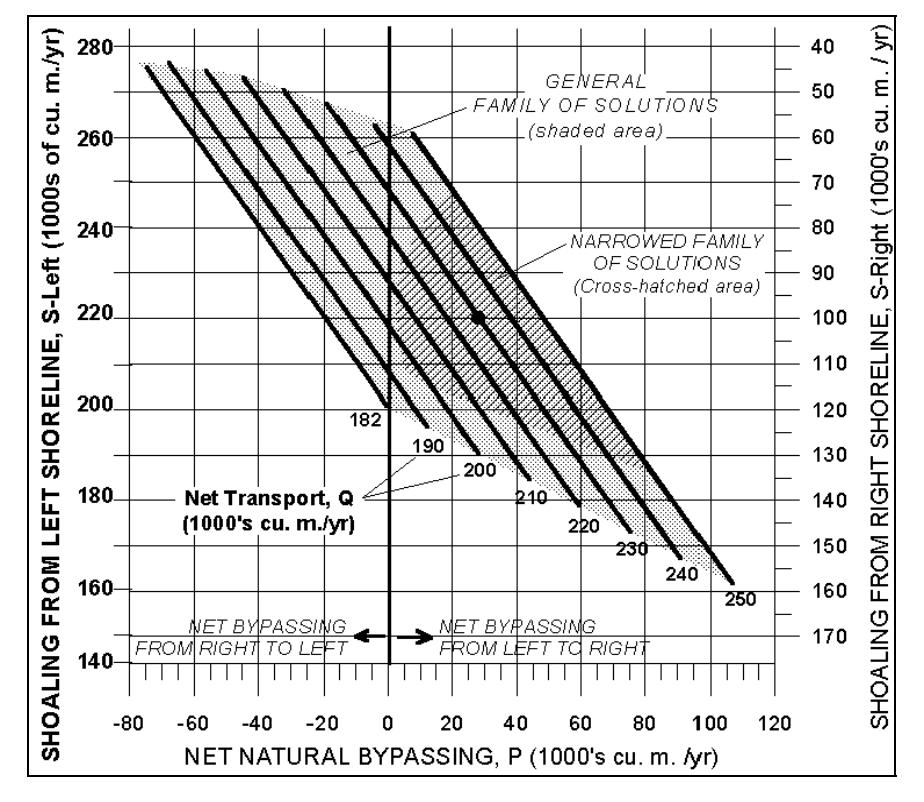

*Figure V-6-56. Family of solutions for Example Problem V-6-14*

While any point within this family of solutions is potentially valid (i.e., can satisfy the inlet's sediment budget), it is useful to develop one or more discrete solutions. An example, discrete solution is developed using the values from the approximate center of the narrowed family of solutions (indicated by the bold dot in Figure V-6-56, see Figure V-6-57).
The discrete solution indicated in the figure approximately represents Q = 230, $S_{LEFT}$ = 216, $S_{RIGHT}$ = 100, and P =28.6. Scanning the computed family of solutions for values of $j_{1},$ j2, $p_{1},$ and $p_{2}$ that result in these quantities yields $j_{1}$ = 0.425, $j_{2}$ = 0.438, $p_{1}$ = 0.126, and $p_{2}$ = 0.130. (While these values can be developed algebraically, it is simpler to scan the spreadsheets or other computations in order to identify the combination of input parameters that yield the desired, discrete solution.) For this solution, the components of the sediment transport pathways about the inlet are computed as follows:
Incident, right-directed transport, R (Equation V-6-48 and V-6-61a): R = (230) / (1-0.33) = 343.3
Incident, left-directed transport, L (Equation V-6-48 and V-6-61a):
L = (-0.33) (230) / (1-0.33) = -113.3
Inlet-induced transport from left shoreline, ( m1 R ): m1 R = (0.18) (343.3) = 61.8
Inlet-induced transport from right shoreline, ( m2 L ): m2 L = (0.45) (-113.3) = -51.0
Transport impounded by left jetty, ( j1 R ): j1 R = (0.425) (343.3) = 145.9
Transport impounded by right jetty, ( j2 L ): j2 L = (0.438) (-113.3) = -49.6
Right-directed transport naturally bypassed, ( p1 R ): p1 R = (0.126) (343.3) = 43.3
Left-directed transport naturally bypassed, ( p2 L ): p2 L = (0.130) (-113.3) = -14.7
where units of 1000's of cu m/year are assumed throughout. The sediment transport pathways, including the given dredging practices, are illustrated in Figure V-6-57. In this example solution, the fraction of the net, incident transport that is naturally bypassed across the inlet is:

```math
P / Q = 2 8 . 6 / 2 3 0 = 0 . 1 2 4 ( 1 2 . 4 \mathrm { p e r c e n t } ) .
```

For the method's assumption that the magnitudes of the left- and right-directed transport are equal at the updrift and downdrift boundaries of the study area, the predicted net volume change on the downdrift (right) side of the inlet is, from Equation V-6-55,

```math
\Delta V_R = [(0.437)(0.33)-(0.45)(0.33)-1+0.126)(230/(1-0.33)] + 0 + 86 = -215.5(1000's \text{ cu m/year})
```

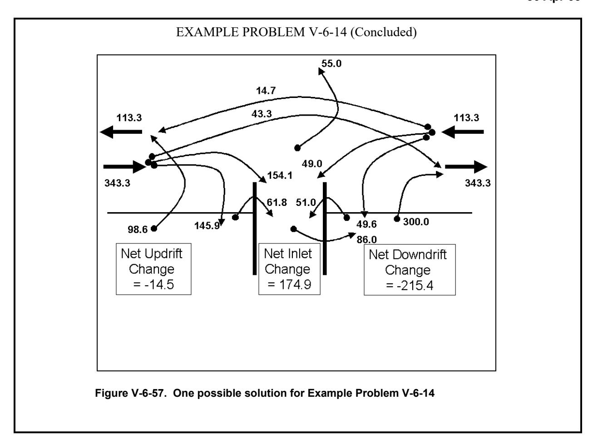

be transferred; seasonal restrictions upon dredging activity imposed by marine turtle or bird nesting, storms, tourism, etc.; impacts to surfing and other recreation; inclusion of contaminated sediments; noise and aesthetic impact of sand transfer activity; limited upland access for sand-transfer operations (pipeline, maintenance, pumping stations, etc.); among others. The designer must also consider the ultimate (initial and annual) cost of implementing the proposed sand management strategy versus that of mitigating beach erosion by conventional nourishment from sand sources external to the inlet, assuming that authorization for the latter can be successfully sought and maintained.
- b. Application of sediment budget to design . The sediment budget prepared for existing or historical conditions can be utilized to examine potential effects of modifications to the inlet system. The following example illustrates application of the Bodge method (Bodge 1999; see Part V-6-3) to estimate the optimum combination of jetty sand-tightening and mechanical bypassing. This application minimizes the total volume of sand that must be mechanically transferred in order to theoretically yield no net changes to the adjacent shorelines. The same approach can be used to examine the quantities and directions of mechanical sand transfer necessary for any given combination of jetty sand-tightening alternatives.
- (1) In the limit, a jetty which is completely sand-tight ( j = 1) will theoretically allow no transfer of sand past the jetty by either natural bypassing or local, inlet-induced transport; in which case, p = 0 and m = 0. If it is assumed that the degree to which the sand transfer past a jetty decreases linearly from its present state (0 < j < 1) to a completely sand-tightened state ( j = 1), then the parameters p and m become:

```math
p_{I'} = \left(\frac{p_I}{I - j_I}\right) (I - j_{I'}) = a (I - j_{I'}) \tag{V-6-63}
```

```math
p_{2'} = \left( \frac{p_2}{1 - j_2} \right) (1 - j_{2'}) = b (1 - j_{2'}) \tag{V-6-64}
```

```math
m_{I'} = \left(\frac{m_I}{I - j_I}\right) (I - j_{I'}) = c (I - j_{I'}) \tag{V-6-65}
```

```math
m_{2'} = \left(\frac{m_2}{1 - j_2}\right) (1 - j_{2'}) = d(1 - j_{2'}) \tag{V-6-66}
```

where p_1 ', p_2 ', m_1 ', and m_2 ' are the natural bypassing coefficients and local, inlet-induced transport coefficients for the modified jetty-impoundment coefficients j_1 ' and j_2 '. The nonprimed values of p, m, and j represent the existing (or nonmodified) condition, as determined from measured data and as described in the previous section.
(2) If it is required that there be no net volume change along the left and right shorelines, then from Equations (V-6-50), (V-6-51), and (V-6-63) through (V-6-66), bypass and dredging/beach disposal requirements are:

```math
D_{B}' - D_{L}' = [Q/(1-r)][(1+c)j_{1}' + (r(b-1)-c) - b r j_{2}'] \tag{V-6-67}
```

```math
D_{B}' + D_{R}' = [Q/(1-r)] [a j_{1}' + (1-a+rd) - (r+rd) j_{2}'] \tag{V-6-68}
```

where, from Equations V-6-42 through V-6-45

```math
a = p_1 / (1-j_1) \tag{V-6-69a}
```

```math
b = p_2 / (1-j_2) \tag{V-6-69b}
```

```math
c = m_1 / (1 - j_1) \tag{V-6-69c}
```

```math
d = m_2 / (1 - j_2) \tag{V-6-69d}
```

- (3) While this approach prescribes that there be no net volumetric change to each shoreline, there may be local changes (accretion and erosion) caused by redistribution of sand within each shoreline cell.
- (4) If D_B' D_L' > 0 , then the net requirement is to transfer sand to the right; hence, any interim transfer to the left shoreline (D_L') would be superfluous. In that event, D_L' = 0 . Likewise, if D_R' + D_B' < 0 , then the net requirement is to transfer sand to the left; hence, any interim transfer to the right shoreline (D_R') would be superfluous. In that event, D_R' = 0 . Finally, if D_B' D_L' < 0 and D_R' + D_B' > 0 , then both shorelines require placement of sand and, hence, any interim bypassing from one to the other (D_B') would be superflous. In that event, D_B' = 0 . Concisely,

```math
\text{For } D_B' - D_L' \geq 0 \quad \text{then} \; D_L' = 0 \\
\text{For } D_R' + D_B' \leq 0 \quad \text{then} \; D_R' = 0 \\
\text{For } D_B' - D_L' \leq 0 \;\; \text{and} \;\; D_R' + D_B' \geq 0 \quad \text{then} \; D_B' = 0 \tag{V-6-70}
```

#### EXAMPLE PROBLEM V-6-15

#### FIND:

The requisite, total sand transfer quantities for zero net littoral impact to the adjacent shorelines for the inlet condition in Example Problem V-6-14 for the case of: (a) existing conditions, (b) complete and-tightening of both jetties, and (c) optimum sand-tightening to yield the theoretical, minimum sand transfer quantity.

## GIVEN:

Same data as for Problem V-6-14. Assume existing conditions are represented by $j_{1}$ = 0.425, $j_{2}$ = 0.438, $m_{1}$ = 0.18, $m_{2}$ = 0.45, and r = 0.33 with an incident net drift value of Q = 230,000 cu m/year.

#### SOLUTION:

For the given values (see Example Problem V-6-14), $p_{1}$ = 0.126 and $p_{2}$ = 0.130. From Equation (V-6-69),

```math
a = p_1 / (1-j_1) = (0.126) / (1-0.425) = 0.219
```

```math
b = p _ { 2 } / ( 1 - j _ { 2 } ) = ( 0 . 1 3 0 ) / \left( 1 { - } 0 . 4 3 8 \right) = 0 . 2 3 1
```

```math
c = m _ { 1 } / ( 1 { - } j _ { 1 } ) = ( 0 . 1 8 ) / \left( 1 { - } 0 . 4 2 5 \right) = 0 . 3 1 3
```

```math
d = m _ { 2 } / ( 1 { - } j _ { 2 } ) = ( 0 . 4 5 ) / \left( 1 { - } 0 . 4 3 8 \right) = 0 . 8 0 1
```

From Equations (V-6-67), (V-6-68) and (V-6-71), where quantities of 1000's of cu m/year are assumed,

```math
D_{B'} - D_{L'} = A = [230/(1-0.33)] [(1+0.313)j_1' + (0.33(0.231-1)-0.313) - (0.231)(0.33)j_2'] = A = 450.7j_1' - 26.2j_2' - 194.6
```

```math
D_{B'} + D_{R'} = B = [230/(1-0.33)]\left[0.219j_1' + (1-0.219+(0.33)(0.801)) - (0.33+(0.33)(0.801))j_2'\right] = B = 75.2j_1' - 204.0j_2' + 358.9
```

(a) For the case of existing conditions (no jetty sand-tightening), j1' = 0.425 and j2' = 0.438:

```math
D_{B'} - D_{L'} = A = (450.7)(0.425) - (26.2)(0.438) - 194.6 = -14.5 \quad \text{and} \quad D_{B'} + D_{R'} = B = (75.2)(0.425) - (204.0)(0.438) + 358.9 = 301.5
```

From Table V-6-14, DB' = 0. Thus, DL' = 14.5 and DR' = 301.5. That is, 14,500 cu m/year should be dredged from the inlet and placed upon the updrift (left) shoreline; and, 301,500 cu m/year should be dredged from the inlet and placed upon the downdrift (right) shoreline.

**Table V-6-14. , DB' = 0. Thus, DL' = 14.5 and DR' = 301.5. That is, 14,500 cu m/year should be dredged from the inlet and placed upon the updrift (left) shoreline; and, 301,500 cu m/year should be dredged from the inlet and placed upon the downdrift (right) shoreline.**

| + | + | 0 | B-A | A |
| --- | --- | --- | --- | --- |
| - | + | -A | B | 0 |
| + | - | invalid solution |  |  |
| - | - | B-A | 0 | B |
| Sediment Management at Inlets |  |  |  | V-6-127 |

(b) For the case of total jetty sand-tightening, j 1' = 1.0 and j 2' = 1.0. Therefore,

```math
D_{B'} - D_{L'} = A = (450.7)(1.0) - (26.2)(1.0) - 194.6 = 230
```

```math
D_B' + D_R' = B = (75.2)(1.0) - (204.0)(1.0) + 358.9 = 230
```

From Table V-6-14, DL' = 0. Thus, DB' = 230 and DR' = 0. That is, 230,000 cu m/year should be bypassed across the inlet from left-to-right. This is, as expected, equal to the net incident transport rate.
(c) Neglecting costs of jetty improvements, the optimum (theoretical) jetty sand-tightening alternative is that which minimizes the total quantity of material that must be mechanically transferred across the inlet, and/or from within the inlet to the adjacent shorelines. To investigate this, the dredging quantities ( DB' - DL' ) and ( DB' + DR' ) are solved for a variety of combinations of j 1 ' and j 2 ' . For each, the total requisite dredging quantity ( DB' + DL' + DR' ) is recorded. An abbreviated list of example calculations is shown in Table V-6-15.

**Table V-6-15. **

| j1 | j2 | DB’ - DL’ DB’ | + DR’ | DB’ | DL’ | DR’ | DB’+DL’+DR’ |
| --- | --- | --- | --- | --- | --- | --- | --- |
| 0.40 | 0.6 | -30.0 | 266.6 | 0.0 | 30.0 | 266.6 | 296.6 |
| 0.40 | 0.8 | -35.3 | 225.8 | 0.0 | 35.3 | 225.8 | 261.1 |
| 0.40 | 1.0 | -40.5 | 185.0 | 0.0 | 40.5 | 185.0 | 225.5 |
| 0.45 | 0.6 | -7.5 | 270.3 | 0.0 | 7.5 | 270.3 | 277.8 |
| 0.45 | 0.8 | -12.7 | 229.5 | 0.0 | 12.7 | 229.5 | 242.3 |
| 0.45 | 1.0 | -18.0 | 188.7 | 0.0 | 18.0 | 188.7 | 206.7 |
| 0.50 | 0.6 | 15.0 | 274.1 | 15.0 | 0.0 | 259.1 | 274.1 |
| 0.50 | 0.8 | 9.8 | 233.3 | 9.8 | 0.0 | 223.5 | 233.3 |
| 0.50 | 1.0 | 4.6 | 192.5 | 4.6 | 0.0 | 188.0 | 192.5 |
| 0.60 | 0.6 | 60.1 | 281.6 | 60.1 | 0.0 | 221.5 | 281.6 |
| 0.60 | 0.8 | 54.9 | 240.8 | 54.9 | 0.0 | 186.0 | 240.8 |
| 0.60 | 1.0 | 49.6 | 200.0 | 49.6 | 0.0 | 150.4 | 200.0 |
| 0.70 | 0.6 | 105.2 | 289.1 | 105.2 | 0.0 | 184.0 | 289.1 |
| 0.70 | 0.8 | 99.9 | 248.3 | 99.9 | 0.0 | 148.4 | 248.3 |
| 0.70 | 1.0 | 94.7 | 207.5 | 94.7 (Continued) | 0.0 | 112.9 | 207.5 |

## EXAMPLE PROBLEM V-6-15 (Concluded)

The total requisite dredging quantity ( DB ' + DL ' + DR ') is the value in the last column of the table. This quantity is plotted as a function of the jetties' sand-tightening coefficients on the following graph.
From Figure V-6-58, the minimum dredging quantity is computed at or about j1' = 0.49 and j2' = 1.0. From Equations V-6-67, V-6-68 and V-6-71

```math
{ D _ { B } } ^ { \prime } - { D _ { L } } ^ { \prime } = A = ( 4 5 0 . 7 ) ( 0 . 4 9 ) - ( 2 6 . 2 ) ( 1 . 0 ) - 1 9 4 . 6 = 0
```

```math
D_B' + D_R' = B = (75.2)(0.49) - (204.0)(1.0) + 358.9 = 191.7
```

This implies 100 percent sand-tightening of the right (downdrift) jetty, and minor sand-tightening of the left (updrift) jetty. There would be a theoretical requirement for the placement of 191,700 cu m/year from the inlet to the right shoreline.

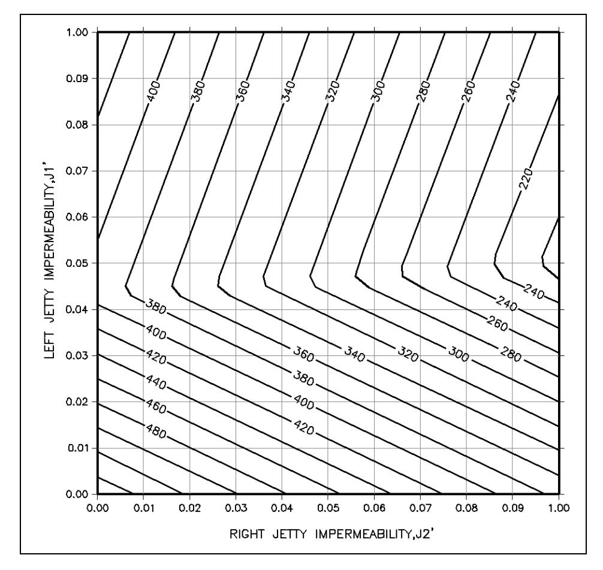

*Figure V-6-58. Solution for Example Problem V-6-15*

(Note that DB' - DL' ≥ 0 and DR' + DB' ≤ 0 is an invalid solution.) From Equation V-6-70, values of the sand transfer requirements DL', DR', and DB' , for a selected pair of jetty-tightening coefficients, j1' and j2' , can be computed from Table V-6-14, where

```math
A = { D _ { B } } ^ { \prime } - { D _ { L } } ^ { \prime } \mathrm { a n d } B = { D _ { R } } ^ { \prime } + { D _ { B } } ^ { \prime } \tag{V-6-71}
```

and where a positive (+) value implies a result that is greater than or equal to zero (≥0).
- c. Principles of sand bypassing and backpassing. Sand bypassing and backpassing refers to the mechanical transfer of littoral material between the inlet and/or adjacent shorelines to minimize the inlet's erosive impact to the adjacent beaches. Generally, bypassing is a transfer of sediment from the updrift shoreline or inlet shoals to the downdrift beach, and also represents a primary means by which to alleviate shoaling within the inlet. Backpassing is a transfer of sediment from the inlet shoals (or some portion of the shoreline) to the shoreline from whence the sediment came. The need for either bypassing or backpassing can be identified by the methods previously presented. The majority of sand bypassing/ backpassing operations do not involve, nor require, fixed sand transfer plants; instead, they involve more intelligent dredge disposal practice and/or modification of the inlet's structures and channels.
- (1) For proper engineering design of an inlet improvement and bypassing/backpassing plan, it is necessary to: (a) Define the problem (e.g., through inspection and sediment budget approaches). (b) Determine the need, if any, for jetty improvements or other structure/channel modifications. (c) Define the requisite quantities and expected seasonal/annual variations thereof, if any. (d) Define the appropriate physical method(s) for the work. (e) Define the location(s) of sediment removal. (f) Define the appropriate location(s) for sediment placement.
The latter four requirements are, ultimately, interrelated.
- (2) General classes of bypass/backpass operations include: (a) Interior vs. exterior traps (i.e., temporary sediment storage within the inlet vs. sediment interception or storage within an updrift or downdrift jetty-fillet). (b) Periodic vs. continuous (i.e., periodic dredging vs. use of a dedicated plant). (c) Fixed vs. mobile plant (i.e., fixed plant vs. a conventional, trestle-mounted, or vehicle-mounted dredge plant).
- (3) Selection of the most appropriate approach is a function of the unique cirumstances of each inlet. In all cases, however, it is of paramount importance to maintain control of the sediment that enters the inlet system. Sediment can only be transferred if it can be recovered. Examples of transport pathways that, practically speaking, result in a permanent loss of sediment resources include: sediment that is deposited in a thin veneer across the seabed, lost to interior shoals which cannot be dredged for environmental reasons (e.g., high silt content, contaminants, sea grass beds, bird rookeries, etc.),
impounded along shorelines for which dredging cannot be undertaken, dumped offshore in deep water, or dumped nearshore in water depths or configurations that do not promote landward drift. Sand bypassing and backpassing can mitigate inlet impacts to adjacent shorelines only to the degree that sand can be practically recovered from the inlet and transferred. Accordingly, design of inlet and dredging practice that seeks to maximize the degree to which sediment can be intercepted or recovered is central to the development of an effective inlet/harbor sand management plan.

#### V-6-5. Engineering Methods

- a. Jetty sand-tightening. As described in Part V-6-4(b), "Application of Sediment Budget to Design," an inlet's erosive impact to the adjacent shorelines can be reduced, and the requisite sand transfer quantities likewise reduced, with improvements to the terminal structures (jetties) that separate the shorelines and the inlet entrance. Example Problem V-6-15 illustrated the importance of sand-tightening the downdrift jetty in particular. Jetty sand-tightening involves raising the crest elevation, decreasing the porosity, and/or lengthening the structure. (See also Part V-6-3.) Common methods for sand-tightening include: (1) Overbuilding the structure (i.e., adding armor and/or chinking rock to raise the crest elevation and/or decrease porosity. (2) Injecting grout into the structure to decrease porosity. (3) Capping the structure with grout/concrete/asphalt and/or armor units (to increase crest elevation and decrease porosity). (4) Constructing sheet pile or other bulkhead adjacent to the structure, or placing impermeable barriers within the structure (to increase crest elevation and decrease porosity); and/or (5) Lengthening the structure.
Specific implementation of these methods is described in Part VI.
- b. Sand transfer plants. Selection of methods for sand transfer is described in EM 1110-2-1616, and in Richardson (1990) and Richardson and McNair (1981). The following is a brief overview of equipment and design considerations for facilitating sand transfer.
- (1) Fixed systems. Fixed systems are essentially stationary dredging systems designed, built and operated for a specific location (Figure V-6-59). In this case, the sand mover (dredge pump, jet pump, etc.) operates without mobility. System components include the pump and pump motor; a housing to protect the pump and pump motor from waves, spray, and surge; a boom or brace that supports the intake(s); the dredge crater (created by the intake); a discharge pipeline; and booster pumps (depending upon the requisite diameter and length of the discharge pipeline and capacity of the pump). Fixed systems typically employ a conventional suction pump, jet pumps or eductors, submersible pumps, or dedicated dragline. Fluidizers, fixed to the intake or buried in the seabed, can also be employed to increase the sand intake capability. The pumps (or dragline) are generally stationed along the updrift jetty or a trestle immediately updrift of the inlet. Use of fixed systems typically implies the requirement for continuous or high-frequency sand transfer.
(2) Mobile systems. Mobile systems include floating dredge plants, and shore-based plants mounted upon a vehicle. (Figure V-6-60). Use of floating plants typically allows for transfer of greater quantities of sediment and maximum mobility; however, it requires that the area to be dredged is reasonably protected from waves and can be accessed by the plant. Use of shore-based equipment typically involves transfer of smaller quantities, requires that beach access be available, and is limited to sand transfer from along the shore. At the same time, shore-based systems demand less requirement for protected waters and calm weather.

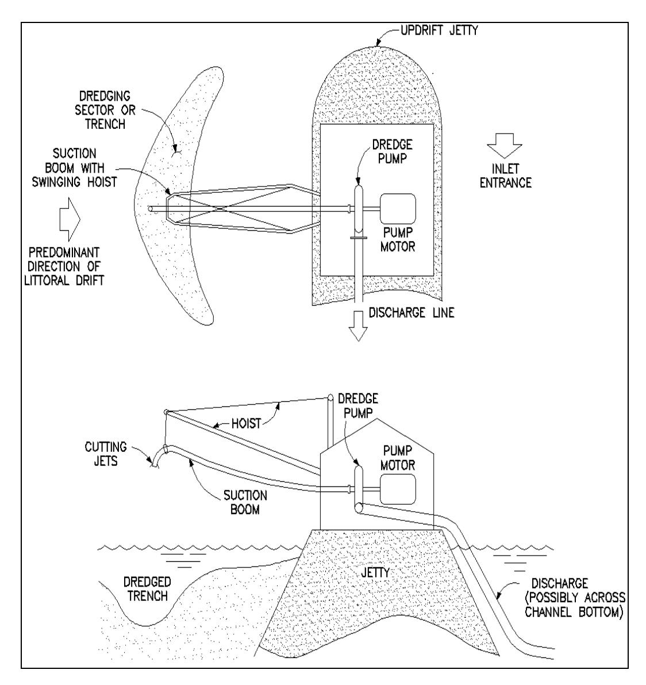

*Figure V-6-59. Plan and section view of simple fixed bypassing plant (from EM 1110-2-1616)*

(3) Semimobile systems. Semimobile systems include pumps or eductors that are deployed at one location in the inlet for some length of time, then moved to another location. Movement is by barge, truck, boat, etc. Components of mobile and semimobile systems include the dredging equipment (practically unlimited by type) and a temporary or dedicated pipeline or other means to discharge the sand. Use of mobile systems can be considered for either continuous or periodic sand transfer. The dredging equipment can be either contracted for periodic work or purchased (dedicated). The latter is usually considered when the requisite dredging frequency is high or the transfer quantity is modest.

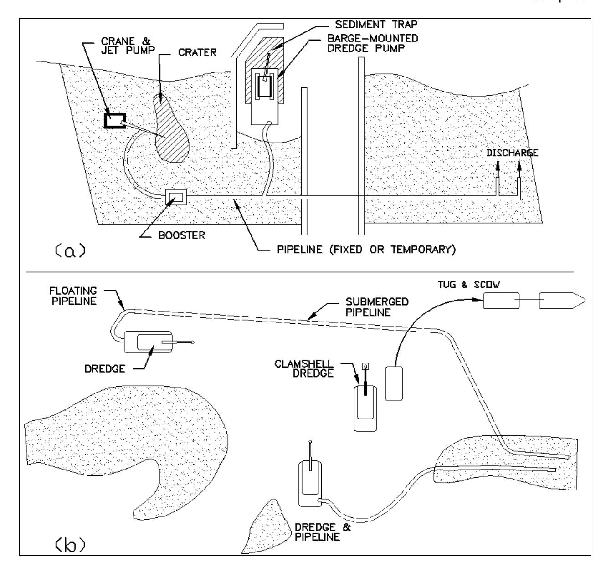

*Figure V-6-60. Examples of (a) semimobile and (b) mobile bypassing systems*

- (4) Equipment for sediment extraction. Equipment most typically used to extract sediment for transfer includes the following systems.
- (a) Dredges. Summaries of conventional dredge equipment and their use are presented in McKnight (1966); Bruun (1981); Herbich (1975, 2000); Herbich and Snider (1969); Richardson (1976, 1990); Huston (1970, 1986); and Turner (1984). Mechanical dredges include clamshell (or grapple) buckets, ladder buckets, dipper dredge, and dragline. The dredged material is placed in a hopper, barge or other storage area and is then transported autonomously to the disposal site. Hydraulic (suction) dredges include centrifugal pumps, trash pumps and other suction devices that intake and discharge a slurry mix of sand and water. The discharge is routed to a hopper or scow (from which it is transported to the disposal site) or through a pipeiline to the disposal site. Conventional dredge equipment (mechanical or hydraulic) can be mounted on trucks, trailer, skids, or barges, and are available in a wide variety of sizes and capabilities. As such, they can be incorporated to either fixed or mobile, continuous or periodic,
bypassing strategies. Clark (1983) presents a summary description of commercially available portable hydraulic dredges. Trade magazines (e.g., WODCON) offer monthly reviews of the dredging industry, equipment and technical consultation.
Hopper dredges recover sediment from the seabed through hydraulic means and store it in an onboard hopper for subsequent disposal. Most hopper dredges continuously move as they dredge, working along the channel axis or dredge area. Traditional, large hopper dredges are infrequently suitable for dredging small areas, and often mix littoral material from sandy deposits with silt and clay that is unsuitable for beach/nearshore disposal (Figure V-6-61 ) . Shallow-draft hopper dredges feature loaded drafts of about 3.5 to 4.3 m (11 to 14 ft) with 45- to 60-m (150- to 200-ft) lengths and capacities of about 1,000 to 1,600 cu m (1,300 to 2,000 cu yd). Shallow-draft dredges are more maneuverable than traditional, large hopper dredges, and can work in wave heights of up to about 1.5 m (5 ft) (Bruun 1993).
- (b) Jet pumps and eductors. Jet pumps (also known as eductors, ejectors, or injectors), are hydraulically powered pumps with no moving parts (Figure V-6-62). In a simple jet pump, a stream of high-velocity clear water from a supply pump (the motive flow) is forced through a reduction nozzle to create a high-velocity (low-pressure) jet. Upon exiting the nozzle, the jet entrains the surrounding fluid and forces the mixture through a mixing chamber and diffuser, then through the discharge line. When the nozzle/suction opening is buried in the sand, a sand-water (slurry) mixture is drawn into the discharge line. A conventional dredge pump (booster) downstream of the jet pump can be used to help move the slurry through the discharge pipe. Fluidizers are also typically employed near the suction intake to mobilize the seabed sediment and facilitate uptake. Typical jet pump capacities range from 75 to 300 cu m/hr (100 to 400 cu yd/hr), and feature suction intakes of 10 to 15 cm (4 to 6 in.), although larger pumps have been produced. Use of jet pumps may be ideal where there is a need for continuous or high-frequency bypassing of mostly modest quantities, littoral transport and/or sediment impoundment occurs over a limited (small) area, there are suitable locations for clear-water intake, the area is mostly free of debris, and the material to be moved is free of consolidated cohesive sediment. Clogging by debris is probably the greatest potential limitation of jet pump systems. Like conventional hydraulic (suction) dredges, jet pumps and their discharge pipelines also risk clogging by sediment, usually by excessive solids. Williams, Clausner, and Neilang (1994) and Clausner et al. (1994) provide additional guidance regarding use of jet pumps for sand bypassing. Jet pumps can be incorporated to either fixed or mobile sand bypass systems. Examples of the latter include jet pumps mounted upon a shore-based crane derrick, deployed from barges, and hauled about by lines and truck-mounted winches. Unlike jet pumps used in mobile systems, which are generally inherently capable of withdrawal from the seabed, jet pumps used in fixed systems should include a mechanism by which to raise the jet pump for purposes of maintenance and/or to remove debris that collects in the suction crater and clogs the intake.
- (c) Submersible pumps. Submersible pumps are electrically or hydraulically driven pumps lowered directly into the material to be transferred (Figure V-6-63). In addition to the agitating action of the impeller, submersible pumps can be fitted with jetting rings and/or cutterheads to increase sand flow in compacted material. Most pumps are relatively small (order of 1 m) and weigh between 100 to 1,000 kg (220 to 2,200 lb). Because of their small size, submersible pumps can be deployed with a minimum of support equipment. Performance is comparable to jet pumps, with potential capacities of 40 to 320 cu m/hr (50 to 400 cu yd/hr) in fine to medium sand. Submersible pumps often require a booster pump for discharge distances of greater than about 600 m (2,000 ft). (EM 1110-2-1616). Submersible pumps offer the potential to pump material at higher solids contents than jet pumps or conventional dredges, and require neither a clear water intake, supply pump nor supply lines. On the other hand,

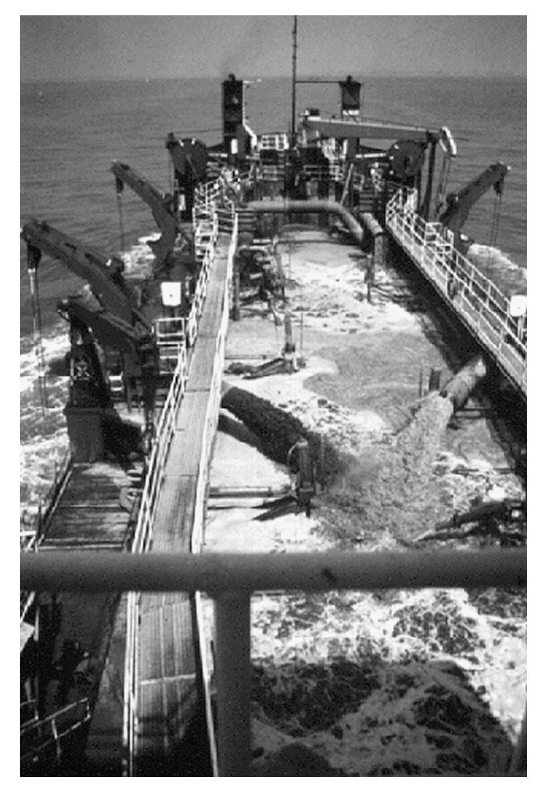

*Figure V-6-61. Hopper dredge McFarland at Brunswick Harbor entrance, Georgia. Lightly colored sandy sediment (right-side intake) is mixed with dark colored silt and clay (left-side intake) during dredging*

the degree to which debris cloggage and rapid wear of the impellers will impede their use is uncertain. Wide prototype experience with submersible pumps for purposes of inlet sand bypassing is limited. Like jet pumps and eductors, submersible pumps are potentially appropriate for either fixed or mobile bypassing systems. The risk of clogging the discharge line is fairly high with submersible pumps due to the high solids-content slurries they are capable of producing. The Punaise is a submersible pump developed

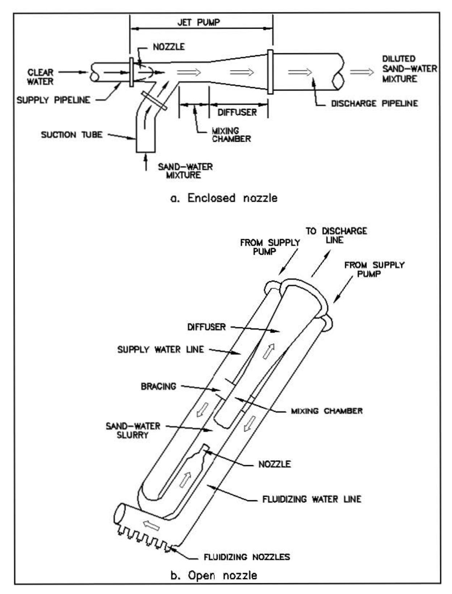

*Figure V-6-62. Center-drive jet pumps (educators): (a) enclosed nozzle, (b) open nozzle (from EM 1110-2-1616)*

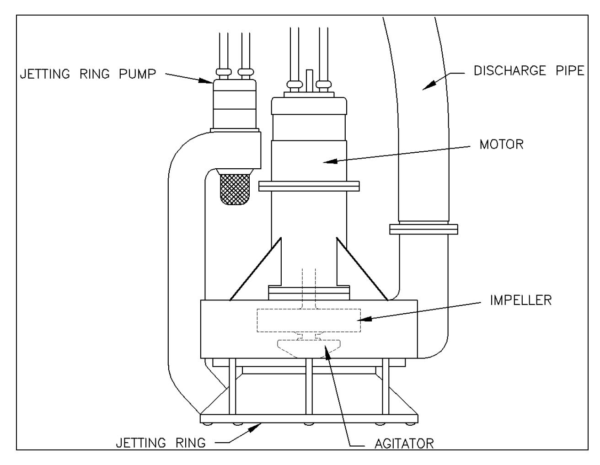

*Figure V-6-63. Typical submersible pump (from EM 1110-2-1616)*

by the Dutch for pit-dredging of the seabed (Figure V-6-64). Through the use of remotely operated flotation cells, it is designed to be both self-burying and self-emergent. The pump head digs a crater within the seabed and relies upon sediment to be gravity-driven down the crater slopes toward the pump. It is connected to shore or barge by a flexible pipeline (Brouwer, van Berk, and Visser 1992).
(d) Fluidizers. Fluidizers can be used in conjunction with any of the previously mentioned dredging systems to increase the mobility of the seabed sediments, and potentially increase the uptake and production rate of the bypass system (Figure V-6-65). Fluidizers inject clear water near or within the seabed in the vicinity of the suction intake. The fluidizer consists of one or more single jets directed at or around the intake; or, a manifold (a pipe with holes) that slopes downward toward the suction intake. In the former case, their use is intended to agitate, loosen and/or suspend the seabed sediments to facilitate their uptake. In the latter case, the clear-water flow from the fluidizer pipes is intended to mobilize the seabed sediments along each pipe and to induce a gravity flow toward the suction intake. In this way, fluidizers can increase the effective size of the suction crater. The practical benefits of fluidizers mounted directly at the suction intake is well established. On the other hand, long-term prototype experience with

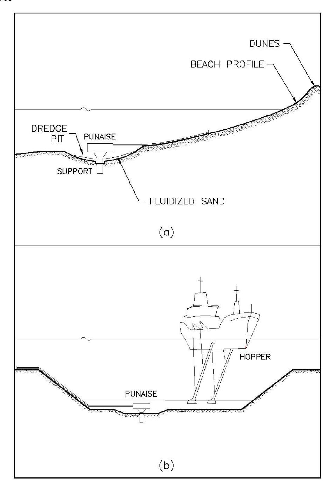

*Figure V-6-64. Examples of the Punaise dredging system: (a) in the surf zone of a sandy coast, and (b) in a harbor with a trailing suction hopper dredge (after Brouwer, van Berk, and Visser 1992)*

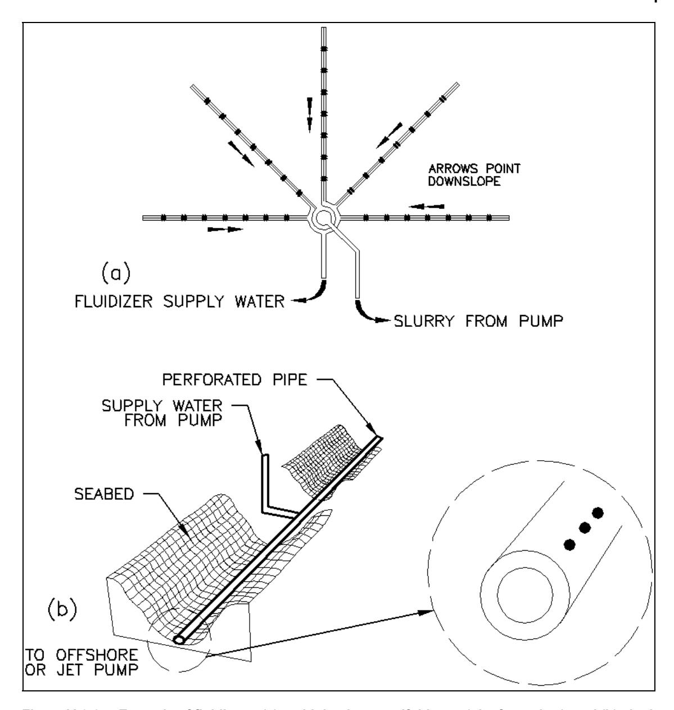

*Figure V-6-65. Example of fluidizers: (a) multiple-pipe, manifold-type (planform view), and (b) single pipe (seabed view). Adapted from EM 1110-2-1616)*

manifold-type, seabed-imbedded fluidizers is limited; and there are problems regarding clogging of the fluidizer pipes (Bisher and West 1993). Practical guidance for the use of fluidizers for sand management is presented in Weisman, Lennon, and Clausner (1992, 1996). Methods to minimize clogging of manifold-type fluidizers can also be developed through reference to standard sewage treatment (aeration) equipment, where aerating manifolds, similar in dimension to fluidizers, consist of perforated pipes covered with elastomer membranes. Typical design values for fluidizer pipes include 1/8-in. holes at 2 in. spacing, horizontally opposed, with pipe slopes of about 1:100. To initiate and maintain fluidization, respectively, flow rates of 18 gpm/ft and 11 gpm are indicated (EM 1110-2-1616).
(5) Equipment for discharge. Equipment available for the transport and discharge of the sediment include the following classes.
- (a) Hydraulic (pipeline) discharge. For modest transport distances (usually less than 8 km (5 miles), depending upon pump size and capacity), direct hydraulic transfer by fixed, temporary, floating, or submerged pipeline can be used. Sediment recovered by hydraulic means (dredge, jet pump, submersible pump, etc.) can be directly transferred from the intake to the discharge by pipeline, although booster pumps may be necessary en route. Sediment recovered by mechanical means, or otherwise stored in an upland stockpile, barge or scow, can be placed in a hopper, fluidized with clear water, and pumped through a pipeline to the discharge point.
- (b) Mechanical, land-based discharge. Sediment recovered by hydraulic or mechanical means can be rehandled by truck transport, assuming that adequate roads and beach access locations are available. Because of its potential impact to roadways, traffic, safety, and noise pollution, this approach is generally suitable only for infrequent operations involving modest quanitites of material (e.g., less than 100,000 cu m (130,000 cu yd)); and typically, should be considered as a method of last resort.
- (c) Hopper dredges, barges and scows. Hopper dredges, barges and scows are either closed-hull (also called fixed hull) or open-hull (also called split-hull, bottom-dump, doored, etc.). Closed-hull means that the hopper, barge, or scow can be loaded and emptied only from the top (Figure V-6-66a). Open-hull means that the hopper, barge, or scow can be opened from the bottom, by splitting the hull, opening trap doors on the bottom, or similar means, in order to drop the sediment to the seabed (Figure V-6-66b,c). Sediment recovered in closed-hull vessels must be pumped out or mechanically transferred (rehandled) for either nearshore or beach disposal. Sediment recovered in open-hull vessels can be dropped directly to the seafloor in water depths that accomodate the vessels' draft (bottom-dumping), or discharged to the beach or shallow waters by pump-out or mechanical transfer. Bottom dumping includes nearshore (berm) disposal, discussed in the following paragraphs. In pump-out systems, the sediment is fluidized by clear water and pumped from the vessel via pipeline. For beach disposal, the pipeline (and requisite boosters) are typically fixed, and the hopper/barge/scow ties up to the pipeline's seaward end to discharge its load (Figure V-6-66d). For open-coast pump-out, the pipeline is temporarily secured at the site. Alternately, for pump-out from protected waters, such as within an inlet entrance, harbor or bay, the pipeline might be permanently established (Figure V-6-66e).
- (d) Offloaders and rainbow dredges. Offloaders are hydraulic (pump and pipeline) or mechanical (belt-conveyor) systems integral to the hopper, barge, or scow, that are capable of transferring the sediment to the nearshore or beach. Offloader systems vary widely by capacity and mechanism, and can often be customized for a particular application. Up-to-date information regarding such systems is available from the dredging industry, industry consultants and trade magazine (e.g., WODCON). Rainbow dredge discharge (also called over-the-bow discharge) is a hydraulic offloading system whereby a shallow-water hopper dredge offloads sediment by a bow-mounted pipeline that discharges a jet of slurry in an arc toward the shoreline (Bruun and Willekes 1992). (See Figure V-6-66f.) This theoretically enables placement in very shallow depths without need for pipeline or booster placement, but requires that the vessel can maneuver within 50 to 100 m (160 to 330 ft) of the desired placement area. The discharge distance can be theoretically extended with pontoon-floated pipeline deployed from the vessel's bow. To date, typically mild beach slopes combined with relatively deep drafts of existing U.S. hopper dredges greatly limited the application of this method in the United States.

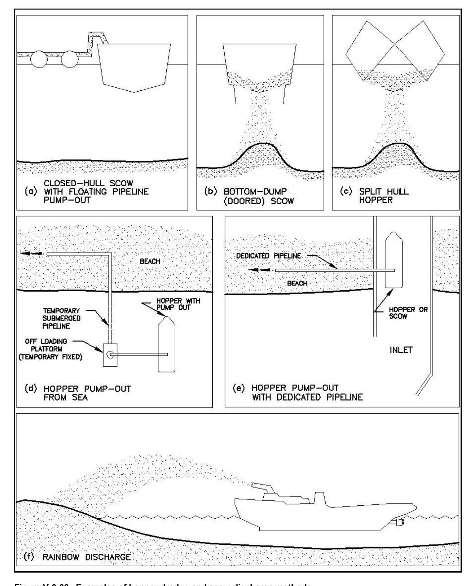

*Figure V-6-66. Examples of hopper dredge and scow discharge methods*

(e) Hydrocyclones. A hydrocyclone separates coarse- and fine-grained particles within a slurry (Figure V-6-67). It has no moving parts, but instead, uses centrifugal force. The sediment-water slurry is pumped from the dredge or hopper into the hydrocyclone so as to create a vortex within. As the slurry spins within the hydrocyclone chamber, liquid and smaller-grained (lighter) particles migrate toward the inner, air core of the vortex and exit vertically upward as the overflow. Coarser-grained (heavier) particles crowd to the outer wall and exit at the bottom of the chamber as the underflow. Typical operating capacities of a single hydrocyclone are summarized in Table V-6-13. Potential applications of the hydrocyclone in inlet sediment management is to isolate coarser-grained, beach-compatible sediment from unsuitable sediments (silt and clay) dredged during maintenance or expansion of waterways. While widely applied in mining, their protoype use in coastal engineering is, thus far, mostly untested. In practice, their relatively modest capacities reasonably require the use of multiple hydrocyclones, connected in parallel. Limitations on operating pressures usually require use of a gravity-driven slurry supply (as opposed to direct connection to a dredge pump).

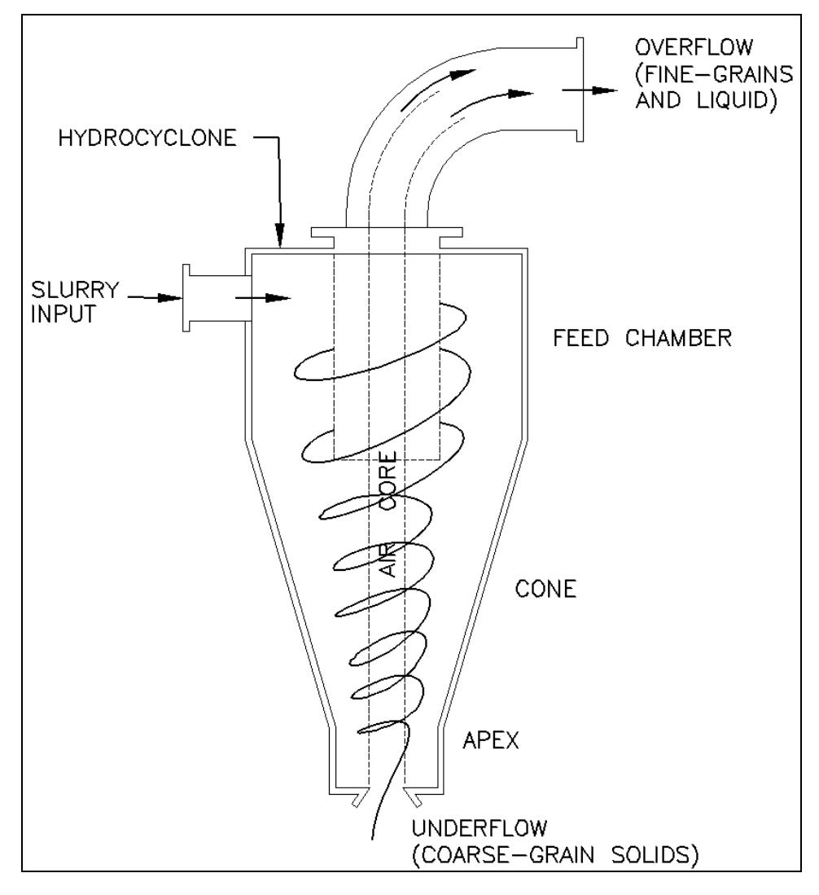

*Figure V-6-67. Schematic of a typical hydrocyclone*

*Table V-6-16 Typical Hydrocyclone Capacities**

**Table V-6-16. Typical Hydrocyclone Capacities***

|  |  |  | Operating | Pressure |  |  |  |  |  |  |
| --- | --- | --- | --- | --- | --- | --- | --- | --- | --- | --- |
| Capacity | (gpm) |  | (lb/sq in.) |  | Separation |  |  |  |  | Size (in.) |
| 3 | 5 | - | 35 | 10 - | 70 | 10 | to | 40 |  | micron |
| 4 | 20 | - | 90 | 10 - | 60 | 10 | to | 40 |  | micron |
| 6 | 40 | - | 200 | 10 - | 50 | 15 | to | 40 |  | micron |
| 8 | 90 | - | 300 | 5 - | 40 | 20 | to | 44 |  | micron |
| 12 | 200 | - | 800 | 5 - | 30 | 30 | to | 44 |  | micron |
| 18 | 300 | - | 1500 | 5 - | 26 | 200 | to | 325 |  | mesh |
| 24 | 800 | - | 2400 | 5 - | 25 | 150 | to | 250 |  | mesh |
| 30 | 800 | - | 3500 | 5 - | 25 | 100 | to | 150 |  | mesh |

** Actual values depend upon suspended ratio and specific gravity of solids in slurry feed, among other factors. Data from Met Pro Refrax lined cyclones; Met Pro Supply, Inc., Bartow, Florida.*

- c. Sediment traps, deposition basins, and inlet sediment sources.
- (1) Introduction. Sediment for bypassing and/or backpassing must be intercepted or temporarily stored to facilitate its extraction and subsequent transfer. Natural sediment traps include the ebb and flood tidal shoals, jetty-adjacent impoundment fillets, and inlet-interior spits. These traps can be augmented or created artificially through the construction of weir jetties, breakwaters, and deposition basins. Such artificial sand traps, if constructed properly and maintained frequently, localize the deposition of drift material and allow a more efficient dredging and/or bypassing operation to be planned. Deposition basins (or sediment traps) are located in regions where the wave climate is mild and the working environment is well suited for dredge or pumping operations; and, where the deposited drift is less likely to interfere with navigation (through shoaling or during dredging) or to be dispersed elsewhere within the inlet. Improperly constructed or maintained traps, on the other hand, can accelerate the inlet's sink effect upon the littoral transport. Sediment can be intercepted interior or exterior to the inlet. Interior traps include the flood shoals, channels, spits, and deposition basins within the jetties. Exterior traps include updrift impoundment fillets, the ebb tidal shoal; and, deposition basins, pumps, dredges, etc. constructed or operated on the outside (beach side) of the jetties. The decision of whether to use interior or exterior traps varies with each inlet; particularly, the size and morphology of the inlet entrance. The design capacity of a deposition basin or bypassing system is described in Part V-6-6.
- (2) Weirs and weir jetties. A weir sand-bypassing system is typified by a low section of the updrift jetty (a weir jetty), or a low section of a similar structure built updrift of the updrift jetty (a sand weir or weir groin). A deposition basin, or sand trap, is located downdrift of the weir, from which sand is periodically excavated and then backpassed or bypassed. For wide inlets, the weir and deposition basin can be integral to the jetty and interior to the inlet (Figure V-6-68a). For narrower inlets, at which the deposition basin would interfere with navigation, the weir and deposition basin are located exterior to the inlet (Figure V-6-68b). The purpose of the weir is to: define a restricted area (the trap) into which sediment is transported and held until extracted by dredging or pumping, keep the trap area and sediment accumulation separated from the navigation channel, and ensure that the trap area is protected from waves to facilitate dredging and pumping. The weir also allows flood currents to enter the inlet during rising tide with subsequent channeling of the ebb current during falling tide. While this is intended to improve tidal flushing of the inlet channel, it likewise augments the inlet's sink effect upon the littoral system. That is, additional sediment is swept into the inlet from the adjacent shorelines during flood flow, and subsequently jetted seaward during ebb flow.

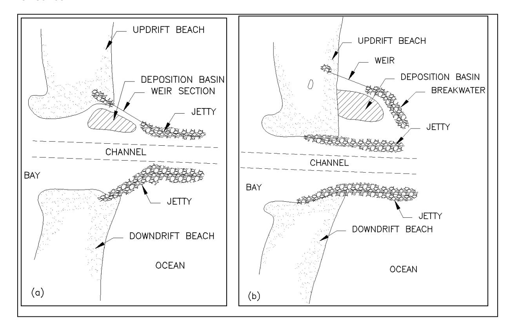

*Figure V-6-68. Weir jetties, weir-groins, and weir deposition basins (a) interior to inlet, and (b) exterior to inlet*

- (a) Weggel (1981) and Seabergh (1983) describe important, specific design principles for weir jetty systems. In general, the weir is designed to allow a quantity of sediment ranging between the total incident sediment transport from the updrift direction and the net littoral drift to deposit in a semiprotected basin in which a dredge or other mechanical byapssing system can operate. Early weirs were constructed with vertical, smooth walls that often included adjustable-height panels. These materials are no longer recommended because of the associated wave reflection and the practical difficulty in adjusting the panels' height. Rubble-mound structures are preferred for weir sections.
- (b) Weggel (1981) recommends that weir elevations be set near mean low water for tide ranges less than 0.6 m (2 ft); and, at mean tide level for tide ranges of 0.6 to 1.5 m (2 to 5 ft). Weir performance is poor for greater tide ranges, and weirs are not recommended for tide ranges greater than about 3.6 m (12 ft). Seabergh (1983) describes the effect of lower weir elevations as a function of an inlet's Keulegan "K" repletion coefficient. Weir sections lower than the adjacent beach induce inlet-directed transport, at all stages of the tide, because of the hydaulic gradient that is developed between the energetic, sandy beach outside of the weir and the less-energetic water inside of the weir. The design elevation of a weir should also consider the desired profile of the updrift beach, as the weir will more or less act as a template for that beach.
- (c) The majority of sand transported over weirs occurs in the narrow region where the weir, beach, and waterline intersect (Weggel and Vitale 1981; Seabergh 1983). A much smaller portion of the drift moves over the weir as suspended material near the breaker zone. Current guidance is to establish the seaward end of the weir seaward of the normal breaker line (or offshore bars, if applicable), at low tide. This may, however, result in an exceptionally long weir that unintentionally accelerates inlet-directed transport from the updrfit beach via flood currents over the weir. The landward end of the weir is
established at the point where the updrift profile is to be approximately maintained. The landward weir profile should follow the updrift beach profile estimated from existing profiles measured far enough away so as not to be influenced by the inlet. Early weir lengths often extended longer than 350 m (1,000 ft) to account for the possibility of "sanding in" of shorter sectons during severe storms or elevated transport. Weggel (1981) reports instead that this has not occurred and, in fact, the shoreline of the updrfit beach has not typically extended beyond the landward section of the weir. Weir sections which are inappropriately long or low or close to the shoreline can induce anomalously high transport from the updrift beach toward the inlet resulting in net erosion of the updrift shoreline and accelerated shoaling rates and overflow of the deposition basin.
- (d) Weir orientation with respect to the updrift shoreline and navigation channel is often determined by individual inlet characteristics and land availability. Weir trapping efficiency is generally independent of the weir orientation relative to the updrift shoreline. From model tests, Seabergh (1983) reported that updrift storage was greatest for weir angles, $θ_{w},$ of 90 deg (perpendicular to shore); became progressively less for angles of 60 and 45 deg to shore; and was least for an angle of 30 deg to shore. Likewise, offshore losses were least for 90 deg and greatest for 30 deg. The capability for the updrift storage to move back up the beach during drift reversals was greatest for the 30-deg angle and least for the 90-deg angle. Seabergh's (1983) results suggest that the ideal orientation is a weir section angled 30 to 60 deg from the shoreline, with the seaward ends of the jetties parallel to one another (Figure V-6-68a). It is recommended that the largest (widest and/or deepest) part of the deposition basin be landward of the weir-shoreline connection.
- (e) Design of storage capacity is addressed in Part V-6-5, and in Weggel (1981). Likewise, methods to compute the flood tidal flow and wave transmission across the weir are specifically presented in Weggel (1981). Case histories and additional information on weir jetties are presented in Rayner and Magnuson (1966); Snetzer (1969); Magnuson (1967); Purpura (1974, 1977); Parker (1979); Weggel and Vitale (1981), among others. Coastal Tech (1997) describes measured and numerically-modeled flow over a low-weir section at St. Lucie Inlet, Florida.
- (3) Sediment traps. Specific areas of an inlet system can be designated, designed, or dredged to serve as deposition basins (sediment traps or sand traps), with or without weir jetties. Examples are illustrated in Figure V-6-69. These "traps" serve as temporary repositories of sediment that enter the inlet. They should be located in areas where natural wave and current processes will readily transport sediment into the trap (but not out of it), in semiprotected waters suitable for periodic operation of a dredge or bypass pump, and so as not to impede navigation. Traps can be located on the downdrift side of a weir section (as described previously), or at other locations where chronic shoaling is observed (e.g., at the seaward ends of jetties, at interior spits, across the flood shoals, etc.), or at locations where shoaling is induced by the construction of breakwaters or other structures. Traps can be located within the inlet (interior traps) or outside the inlet jetties (exterior traps).
- (a) Sediment traps can be an overdredged area (or dredge pit) into which sediment is deposited by waves and currents (Figure V-6-69a). Once sediment fills the trap to near the level of the adjacent seabed or channel, the trap must be dredged so as to preclude loss of additional sediment that enters the inlet. The seaward edge of flood shoals, and the interior seabed adjacent to the jetties shoreward ends, are typical locations of overdredged traps. A less typical example is an updrift, exterior trap (also called a nearshore borrow area), which is a pit dredged along the shoreline updrift of an inlet (Figure V-6-69b).
- (b) Sediment traps can also be created by breakwaters located near the inlet entrance. Sediment is deposited in the lee of the breakwater and is removed by a dredge or pumps working in the protected waters of the breakwater (Figure V-6-68c).

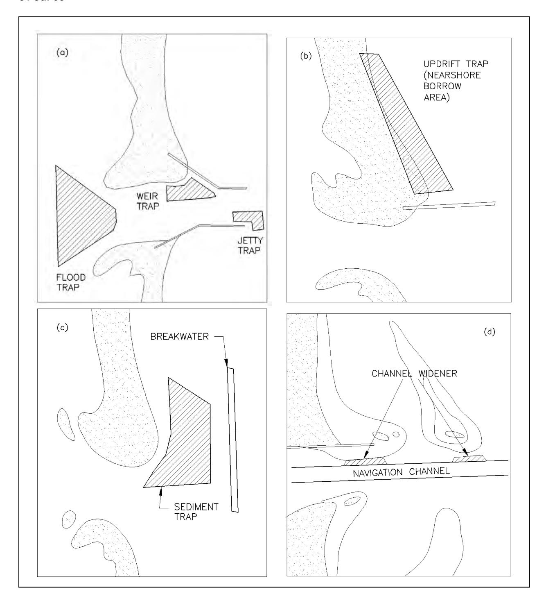

*Figure V-6-69. Inlet sediment traps*

(4) Channel wideners. The navigation channel can be widened along those areas where chronic shoaling by littoral drift is experienced (Figure V-6-69d). This variation of the sediment trap concept can also be termed advance maintenance, which presents possibilities for funding through Operations and Maintenance (O&M) monies. Channel wideners serve four purposes: they decrease the frequency of requisite maintenance dredging (which, in turn, reduces dredging costs by reducing the number of dredge
mobilizations); they improve the reliability of safe navigation; they provide a designated basin into which littoral sediment can deposit and be less likely to mix with non-beach-compatible sediments of the channel; and they increase the quantity of littoral sediments available for a given dredge job (thereby improving the economic viability of more expensive, beach disposal dredging practices). Methods to estimate the degree to which channel modifications (widening, deepening, etc.) will affect shoaling rates are approximate, at best. Some approaches are presented in O'Conner and Lean (1977); Lean (1980); Trawle (1981); and Galvin (1982). Application of sophisticated, three-dimensional numerical models which estimate sediment transport and shoaling rates from wave, tide and current effects are described in Vemulakonda et al. (1988).
- (5) Flood shoals. Interior (flood) shoals present opportunities as a sand source for inlet-adjacent beach nourishment. Practically, however, their use may be limited by the shoal sediments' grain size (typically finer than the native beach sediments) and by the presence of environmentally sensitive resources such as seagrass beds, shellfish beds, or the presence of adjacent aquatic preserves in which dredge-related turbidity is restricted. As in the investigation of all sand borrow sources, core-borings of the flood shoals are critical to define the beach-compatibility and vertical extent of the sediment. Many flood shoals are thin, widespread deposits that overlay lagoonal clays and silts unsuitable for beach placement. The ability of conventional dredge equipment to excavate thin layers of material (i.e., less than 1.3 to 2 m (4 to 6 ft)) is limited, and may instead require the use of small, suction-dredge or jet-pump equipment. Extensive removal of interior shoals will likely increase the inlet's hydraulic efficiency and can be expected to increase the rate of interior shoaling. This may not be problematic so long as the geometry of the shoal borrow area is designed so as to act as a trap (in which the increased flux of sediment can be captured for bypassing/backpassing); and, is designed so as not to undercut or otherwise draw sand directly from the inlet-adjacent beaches. Increases of inlet hydraulic efficiency may also require examination of the hydrologic and biologic effects of increased encroachment of ocean (flood) waters to interior bays and aquifiers.
- (6) Ebb shoals. Inlet ebb shoals likewise present attractive, potential opportunities as sand sources for inlet-adjacent beach nourishment. Like the use of flood shoals, borrowing from the ebb shoal for these purposes can be viewed as mitigation for historical inlet impacts. Such retroactive sand bypassing/backpassing is particularly relevant for those cases in which inlet shoal volumes increased as a result of the inlet modifications' erosional effect upon the adjacent beaches.
- (a) For those inlets where natural bypassing occurs quasicontinuously via transport along the ebb shoal, care must be taken so as not to overdredge, sever, or otherwise compromise the ebb shoal's ability to transport sand across the inlet's mouth. Improper borrowing would result in a short-term nourishment of the filled beach, followed by an acceleration of erosion, probably on both sides of the inlet, as the ebb shoal and bypassing bar recovers from the dredging event. In these instances, it may be prudent to limit ebb shoal dredging to the outer (seaward) edge of the plateau (Figure V-6-70a).
- (b) For those inlets where natural bypassing occurs episodically through the migration of ebb shoals, spits, and baymouth bars, dredging and downdrift placement may simply speed the inlet's natural processes. This is a desirable outcome in those cases where the downdrift erosion stress is so high that the attendant development cannot withstand the time required for the inlet shoals to migrate naturally. The resulting dredge project usually acts to relocate the channel (which is otherwise compromised or forced downdrift by the migrating shoals), and thus results in at least an initial improvement of the inlet's navigability and hydraulic efficiency (Figure V-6-70b).
- (c) The potential effect of ebb shoal bypassing to the wave refraction, current and associated littoral transport patterns along the inlet mouth and adjacent shorelines should be evaluated as part of the borrow

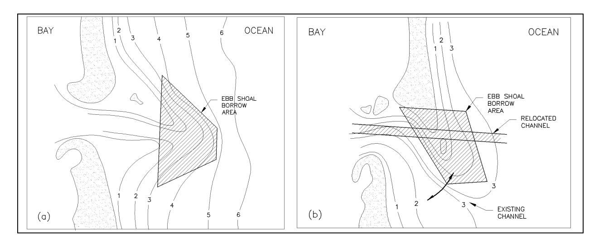

*Figure V-6-70. Sediment borrowing from ebb shoal of an inlet*

area design. Existing conditions should be compared to simulated post-borrow conditions. It is recommended that the wave height or wave energy density (H or $H^{2},$ respectively), be compared at each point across the refraction grid, for various incident wave conditions, to assess the degree to which the borrow activity may locally affect navigation. Likewise, the computed breaking wave energy density and littoral transport potential should be computed at each column of the grid along the adjacent shorelines, for various incident wave conditions, to discern possible changes in the local sediment transport patterns. The approach described in Part V, Chapter 6-2(d), method 4, is applicable in this regard. Like flood shoal borrowing, extensive removal of the ebb shoal may be expected to increase the trapping (shoaling) behavior and hydraulic efficiency of the inlet. Methods to estimate shoaling behavior are similar to those described for channel widening. Methods to examine inlet hydraulic efficiency are described in Part II- 6. Assessment of changes in tidal currents and associated sediment transport patterns is briefly described in Part II-7, and Part II-9.
- (d) In the design of projects where ebb shoal dredging may result in channel relocation, it is essential to first understand the natural shoaling and channel-migration cycles of the inlet. Examinations of timesequences of aerial photographs and bathymetric surveys, supplemented by anecdotal accounts, are valuable means by which to predict the degree to which the dredge project will advance, stagnate, or retard the inlet's natural patterns of sediment transport.
- d. Bypass system capacity. Sizing of the requisite pumping equipment and geometry, sediment traps, and weir sections is a function of the gross bypassing requirements and the frequency with which bypassing will be undertaken. Sizing should also consider the potential effect of seasonal fluctuations and storms. Methods to determine the requisite bypass/backpass quantities are described in Part V-6-4 and Part V-6-5.
- (1) Dredges, jet pumps, and other pumps. Specific guidance for the selection, layout and design of jet-pump systems is presented in Richardson and McNair (1981) and in EM 1110-2-1616. Introductions to the sizing and selection of conventional dredge equipment are presented in McKnight (1966); Bruun (1981); Herbich (1975, 2000); Herbich and Snider (1969); Richardson (1976, 1990); Huston (1970, 1986); and Turner (1984). Technical consultation is advised early in the design process. The Corps of Engineers' Marine Design Center, as well as industry consultants, are available in this regard.
(2) Excavation craters. Craters created by pumps or fixed dredge systems will remain empty until significant wave activity causes sufficient transport to fill them. Experience demonstrates that those craters located closest to shore fill fastest. For the purposes of intercepting the littoral drift, the apparent dominance of transport at the shoreline and in the swash zone is illustrated by the distribution of pumping hours from the Nerang River fixed bypassing plant in Queensland, Australia (Figure V-6-71). The theoretical yield volume V_{\rm C} of a typical dredge crater, excluding use of fluidizers, can be estimated as

```math
V_{C} = L_{c}d_{c}\left(b + \frac{d_{c}}{m}\right) + \pi d_{c}\left(\frac{b^{2}}{4} + \frac{f d_{c}}{2m} + \frac{d_{c}^{2}}{3m^{2}}\right) \tag{V-6-72}
```

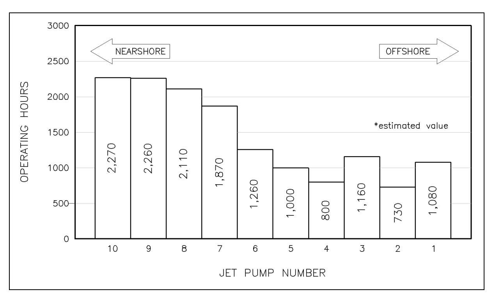

*Figure V-6-71. Jet pump operating hours from May 1986 to February 1988; Nerang River bypassing plant; Queensland, Australia (data from Clausner 1988; figure adapted from Bodge 1993)*

where L_c is the length (or arc-length) of the crater, d_c is the crater depth below the ambient seabed level, b is the width of the crater at the bottom, and m is the crater side slope as defined in Figure V-6-72. For medium to fine-grained beach sand, and for crater depths of about 1.5 to 2.75 m (5 to 9 ft), m is about 0.5, and b is between 6 and 9 times the diameter of the suction intake. For a circular crater (i.e., that made by a fixed pump), L_c = 0 .
(3) Productivity. A single jet pump or eductor is typically capable of transferring between 50 and 250 cu m/hr when operating; or, between 50,000 and 150,000 cu m/year. However, average hourly and annual productivity is greatly influenced by mechanical/pipeline limitations, shoaling behavior at the crater, physical mobility of the intake(s), interference by marine debris, etc. considerations. A system's net productivity at any given site is therefore highly dependent upon the physical conditions specific to the site. Example considerations are described in the following paragraphs. See also Richardson and McNair (1981), EM 1110-2-1616, and Clausner et al. (1994).

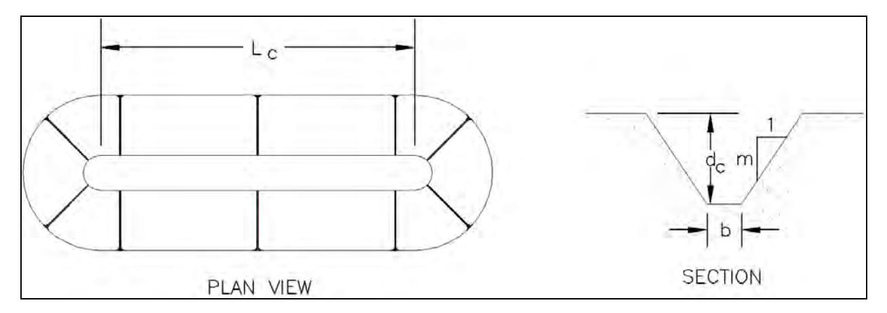

*Figure V-6-72. Geometry of a dredge crater (definition sketch)*

(a) A bypassing system's ultimate productivity is a function not only of the pumps' mechanical capacity, but also of the time required for the dredged crater(s) to refill. For example, Bodge (1993) observed that the bypass capacity of the fixed sand transfer plant at South Lake Worth Inlet, Florida, is more typically limited by the crater's shoaling rate than by the existing plant's capacity. The time required to excavate the crater, if full, is

```math
T_E = V_C / (E - S) \tag{V-6-73}
```

where S is the average volumetric shoaling rate of the crater (volume/time) during and after a given dredging event, and E is the net volumetric capacity of the pump (volume/time) after consideration of all mechanical limitations, shutdown times, etc. The rate at which crater refills, S, will exceed the effective bypass capacity of the plant, E, if

```math
S > \frac{1}{2}E\left[1 + \sqrt{1 - \frac{4V_C}{ET_B}}\right] \tag{V-6-74}
```

where T_B is the elapsed time between the start of subsequent dredging events, For example, for daily operation, T_B = 24 hr. The (+) root implies that pumping continues throughout the interval T_B until the crater is completely emptied. The (-) root implies that pumping is discontinued the first time that the crater is completely emptied during the interval T_B . Undefined values of the radical (i.e., 4 V_C > E T_B ) indicate that the system is limited by the pump's volumetric capacity over the interval T_B , not by the crater volume.
(b) The distribution of crater shoaling rates can be approximated by a Rayleigh distribution centered about the site's mean shoaling rate – at least for the lower 90 percent of the distribution (Bodge 1993). (The Rayleigh distribution likely underestimates the occurrence of the largest 10 percent of the actual shoaling events.) The mean shoaling rate at the inlet can be approximated from existing bypass plant data (i.e., the average value of the volume bypassed divided by the time preceding each bypass event); or, approximated as the gross drift rate at the crater location minus the rate of natural (or other) bypassing around the crater's location. Values for the latter can be estimated from the inlet's sediment budget.
- (c) The percentage of time for which Equation V-6-74 holds true, as derived from the distribution of the site's shoaling rates, indicates the percentage of time for which the plant's configuration is limited by mechanical capacity; i.e., that percentage of operating time for which the crater has completely refilled prior to the next start-up of the bypass plant. Alternately stated, the percentage of time for which Equation V-6-74 is false indicates the percentage of operating time for which the crater has not yet refilled by the time the bypass plant is ready to start up again. For those times, increases in mechanical capacity of the plant are of no net value to overall productivity.
- (d) Where sand transfer is limited by crater shoaling rates, net increases in inlet bypassing require that single pumps be moved during the day; or, that multiple pumps be used. Moving a pump implies that the pump assembly is to be physically lifted to another location; or, the pump's intake is mounted on a moveable support (e.g., along a trestle track, from a swinging or articulated boom, etc.) The intent is to increase the crater volume, $V_{C}$ (precisely, so as to increase b, $L_{c}$ and/or $d_{c}$ in Equation V-6-72). It is also noted that the operation of fixed pumps tends to armor the crater's side slopes with coarser material over time, resulting in steeper slopes and smaller crater volumes.
- (e) Sediment traps and channel wideners. For the typical case where sediment within a trap is not intended to feed the adjacent shorelines during transport reversals, the capacity of a sediment trap should be sized to accommodate all of the drift incident to that part of the inlet where the trap is located for the entire duration anticipated between bypass events. Accomodation for variations in the annual and/or seasonal transport rates must be made. At a minimum, this should be done by examing the statistical variation of the gross transport rate about the mean, as developed from hindcast wave data. Furthermore, it should not be assumed that deposition within the trap will occur uniformly. That is, accommodation must be made for varying vertical rates of deposition within the trap. Proper use of a sediment trap for effective inlet/harbor sediment management requires that the sediment trap be excavated at or before the time at which it reaches capacity. Accordingly, it is essential that the trap be sized large enough to accommodate periods of elevated transport and/or delays in bypassing operations.
- (f) Figure V-6-73 illustrates an example of the temporal fluctuation of bypassing at a fixed sand transfer plant. The plant (South Lake Worth Inlet, Florida) operates whenever there is any sand within the crater and when waves are incident from the north. The record of the plant's bypassing operations is fairly well correlated with the southerly-directed longshore transport rate potential, where the latter was computed from hindcast wave data (Creed 1996).
- (g) The ultimate design of a trap's capacity is determined by balancing the decreased cost of bypassing operations associated with larger traps and less frequent equipment mobilization, the increased initial cost of trap construction (if any), the availability of areas within the inlet area(s) in which to create a trap, the uncertainty as to shoaling rates, and in the case of channel wideners and advance nourishment, the decreased costs associated with requisite maintenance dredging to ensure safe navigation. Stochastic methods regarding the latter two issues are presented in Lund (1990).
- (4) Weir jetty systems. Weggel (1981) describes the optimum weir-jetty system as one where only the net incident transport $(Q_{NET}$ = $Q_{R}$ + $Q_{L})$ enters the deposition basin for ultimate bypassing to the net downdrift beach (see Figure V-6-74). Neglecting local, inlet-induced transport, and assuming net transport directed to the right, the amount of sand carried to the weir from the updrift side is $Q_{R}.$ An amount of sand equal to $(Q_{R}$ - $Q_{NET})$ must be therefore retained in temporary (active) storage on the updrift beach to replace the material trapped by the downdrift jetty and inlet shoals during transport reversals (i.e., an amount equal to $Q_{L}).$

#### EXAMPLE PROBLEM V-6-16

#### FIND:

The potential net increase in bypassing productivity if a jet pump is changed from a fixed mount to a swinging-boom mount, and/or if the pump's operating schedule is revised.

## GIVEN:

An inlet's small, existing 6-in. jet pump bypasses 25,000 cu m/year, operating for about 1,200 hr/year at a fixed location with maximum crater depth of $d_{c}$ = 2.6 m below the seabed (limited by a clay layer). The plant is operated between 8 a.m. and 5 p.m., each day, as needed, but only when the crater is mostly full. At the beginning of one-quarter of those days for which bypassing is undertaken, the crater has been refilled to capacity overnight after having been mostly excavated the previous day. The proposed system would mount the jet pump at the end of a 5-m-long boom capable of swinging through a horizontal arc of 105 deg.

#### SOLUTION:

The plant's effective mechanical capacity is:

```math
E = (25,000 \text{ cu m/year}) / (1,200 \text{ hr/year}) = 20.8 \text{ cu m/hr}
```

In SI units, the 6-in. pump diameter is 0.15 m. The crater's base width, b , is six to nine times this diameter, or 0.9 to 1.4 m; for example, if b = 1.2 m. Assume a crater side slope of 1 (vert) : 2 (horiz), or m = 0.5. From Equation V-6-72, and for $d_{c}$ = 2.6 m and $L_{c}$ = 0, the crater volume of the existing plant is:

```math
V_C = \pi (2.6 \text{ m}) [(1.2 \text{ m})^2 / 4 + (1.2 \text{ m})(2.6 \text{ m}) / (2)(0.5) + (1/3)(2.6 \text{ m} / 0.5)^2) = 102 \text{ cu m}
```

For those events when the crater fills to capacity overnight (from 5 p.m. to 8 a.m., or 15 hr), the crater shoaling rate is at least 102 cu m / 15 hr = 6.8 cu m/hr. From the given data, this represents the $25^{th}$ percentile of the shoaling rate for those days when bypassing is undertaken. From the Rayleigh distribution (Equation II-1-131), the probability, p , that a value S will exceed some value $S_{p}$ is:

```math
p(S > S_p) = \exp(-(S_p / S_m)^2)
```

where $S_{m}$ is the mean value. Taking the natural logarithm of each side and rearranging yields:

```math
S_m = [-S_p^2 / \ln (p(S_p))]^{1/2}
```

so that

```math
S_m = [-(6.8 \text{ cu m/hr})^2 / \ln (0.25)]^{1/2} = 5.8 \text{ cu m/hr}
```

From Equation V-6-74, assuming that bypassing is undertaken only when the crater is mostly full, the theoretical rate of shoaling which exceeds the existing pump system's capability, based upon no more than 9 hr of operation every 24 hr, is

```math
S > (0.5)(20.8 \text{ cu m/hr}) \{ 1 - [1 - (4)(102 \text{ cu m}) / (24 \text{ hr})(20.8 \text{ cu m/hr})]^{1/2} \} = 6.0 \text{ cu m/hr}
```

From Equation V-6-73, this rate of shoaling would require (102 cu m ) / (20.8 cu m/hr – 6.0 cu m/hr) = 6.9 hr to excavate the crater. From the Rayleigh distribution, and based upon an assumed mean value of $S_{m}$ = 5.8 cu m/hr, the probability of shoaling rates exceeding 6.0 cu m/hr is

```math
p(S > 6.0 \text{ cu m/hr}) = \exp(-(6.0 / 5.8)^2) = 0.34 = 34 \text{ percent}
```

Therefore, for operations limited to 9 hr per day, the bypassing quantity could be theoretically increased for 34 percent of the bypassing events by increasing the crater capacity. Note that increases to the pump capacity, E , would not result in a net improvement.
Further, note that the positive (+) root of Equation V-6-74 yields 14.8 cu m/hr. From Equation V-6- 73, that rate of shoaling would require (102 cu m) / (20.8 cu m/hr – 14.8 cu m/hr) = 17 hr to excavate the crater. That value exceeds the 9-hr operating window of the plant. On the other hand, if operation beyond 9 hr per day was adopted, the probability of shoaling rates exceeding 14.8 cu m/hr is only

```math
p(S > 14.8 \text{ cu m/hr}) = \exp(-(14.8 / 5.8)^2) = 0.001 = 0.1 \text{ percent}
```

Therefore, adopting bypassing operations beyond the existing 8 a.m. to 5 p.m. window would theoretically increase the bypassing quantity of the existing system without hardware improvements, but only for a small percentage of those days for which bypassing is undertaken.
The proposed hardware improvements (swing-boom) would create an arcuate crater shape of length

```math
L_c = (60^{\circ})/(360^{\circ}) \ 2 \ \pi \ (5 \ m) = 5.2 \ m
```

From Equation V-6-72, the associated crater volume would be

```math
V_C = (5.2 \text{ m}) (2.6 \text{ m}) (1.2 \text{ m} + (2.6 \text{ m}) / (0.5)) + 102 \text{ cu m} = 189 \text{ cu m}
```

## EXAMPLE PROBLEM V-6-16 (Concluded)

From Equation V-6-74,
S > (0.5)(20.8 cu m/hr) { 1-[1-(4)(189 cu m/hr) / (24 hr)(20.8 cu $m/hr)]^{1/2}$ } = (10.4 cu m/hr)( 1- √- 0.5}
for which the square root is undefined. Thus, with the proposed enlargement of the crater, the system's capacity would be theoretically limited by the pump capacity, E, instead of the crater volume, VC .
While the crater volume for the proposed improvement is (189 / 102) = 1.85 times larger than the existing system, the improvements would not yield a 1.85-times increase in bypass capacity. This is because the existing system's bypass performance is limited in only 25 to 34 percent of the existing bypassing events. That is, only some fraction of the 85 percent increased crater capacity would be utilized for only 25 percent to 34 percent of the current bypassing events. Hence, the net increase in bypass quantity provided by the hardware improvements would be, at most, (0.25 to 0.34) x (0.85) = 21 to 29 percent. The decision to improve the plant's hardware or to periodically extend the operating hours (as needed), is a function of economic and other site-specific issues.
- (a) Volumetric capacity requirements for the ideal system can be estimated from a mass curve. The mass curve is developed from a plot of the cumulative longshore transport rate versus time (Figure V-6- 75). The active storage requirement of the updrift beach is the maximum vertical difference of the cumulative transport curve, as shown in the figure. The minimum storage requirement of the deposition basin is the vertical height of the curve's average slope calculated over the dredging interval of interest.
- (b) Allowance on the updrift beach must be made for "dead" storage (Figure V-6-74). This is the impoundment fillet that forms immediately updrift of the weir from which sediment is not transported during reversals. The shape and volume of this dead storage can be approximated from analytic models such as Pelnard-Considère (See Part III-2-2) or numerical models such as GENESIS (See Part III-2-2). In all, the geometry of the weir section should be ideally designed so as to ensure that the requisite active storage will be developed in addition to the dead storage, and so as to ensure that the deposition basin leeward of the weir can be sufficiently sized.
- e. Placement of material . In order of priority, placement of bypassed/backpassed sediment should be: upon the beach and beach face; within the typical surf zone (so-called near-nearshore placement); and within the active depth of the beach profile (nearshore disposal). The alongshore placement should be outside of the inlet's direct influence; i.e., so as to minimze the potential for the sediment to return to the inlet and maximize its potential for return to the active littoral system external of the inlet.
- (1) Alongshore location. The minimum distance from the inlet for sediment placement can be determined from refraction/transport analysis such as is described in Part V-6-2(c), method 4, in particular, and by Kana and Stevens (1992). Alternately, shoreline change models such as the one-line model of Perlin and Dean (1983) and GENESIS (Hanson and Kraus 1989; see also Part III-2-2, can be employed. Again, the principal objective is to define that distance at which the locally induced transport potential toward the inlet is diminished.

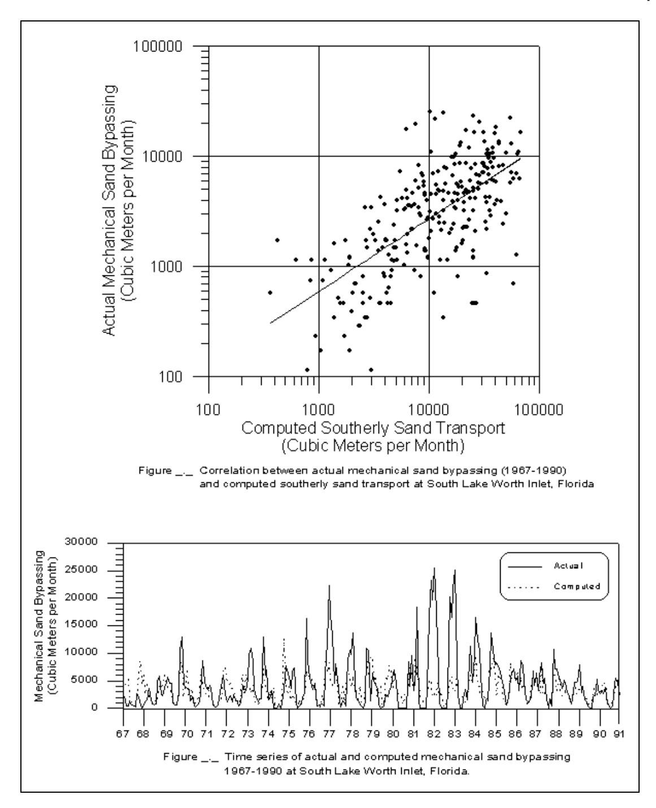

*Figure V-6-73. Measured sand bypass rates from the South Lake Worth Inlet, Florida, fixed transfer plant: (a) correlated with hindcast longshore transport potential, and (b) depicted as a time-series. "Actual" refers to monthly bypass volumes estimated from plant records. "Computed" refers to the southerly-directed transport potential as computed from hindcast WIS data for the same 24-year period of record, where the mean value of the computed transport potential was set equal to the mean value of the actual bypass volume over the period of record (Creed 1996)*

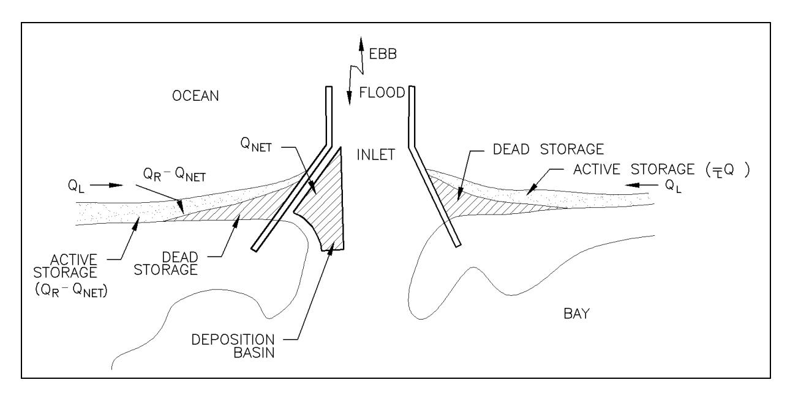

*Figure V-6-74. Active and dead sediment storage on a beach adjacent to a weir jetty system (adapted from Weggel 1981)*

- (2) Nearshore disposal. When placement of the bypassed/backpassed sediment directly on the beach or within very shallow depths is not possible, nearshore disposal (also called nearshore berm disposal) may be considered. In inlet/harbor sediment management, the principal goal is to create an active berm from which the placed sediment will migrate shoreward and return to the shorelines' active littoral system. (A less preferable alternative is to create a stable berm which is intended to provide shore protection through dimunition of wave energy (Zwamborn et al. 1970). The tangible benefits of this strategy are unproven; and, some field studies suggest that nearshore, submerged mounds and structures can induce beach erosion in their lee (USACE 1950; Browder 1995)).
- (a) Hands and Allison (1991) present an analytic method by which to predict the seabed placement depth which separates active (shoreward-migrating) from stable berms. In this method, the nonexceedance probability of the maximum nearbed wave-orbital velocity, u<sub>m</sub>, is computed and plotted for a given depth, using hindcast wave data for the site of interest. The probability distribution of such plots distinguish stable from active berms (see Figure V-6-76). Most briefly, Hands and Allison (1991) conclude that if the 75-percentile velocity far exceeds 40 cm/sec, or the 95-percentile velocity far exceeds 70 cm/sec, then sand berms should not be expected to remain stable, regardless of the depth or sand size. If the computed velocities are considerably less than these values, a stable sand berm is expected under all but unusual circumstances. (b) From Equation II-1-22, the maximum nearbed horizontal wave orbital velocity is computed as

```math
u_m = \pi \frac{H}{T} \frac{1}{\sinh(2\pi h/L)} \tag{V-6-75}
```

where T is the (spectral peak) wave period, and H and L are the significant wave height and the wavelength, respectively, in the proposed water depth for berm disposal, h. In practice, nearshore or offshore wave data are transformed (refracted and shoaled) to some specified water depth, h; the velocity

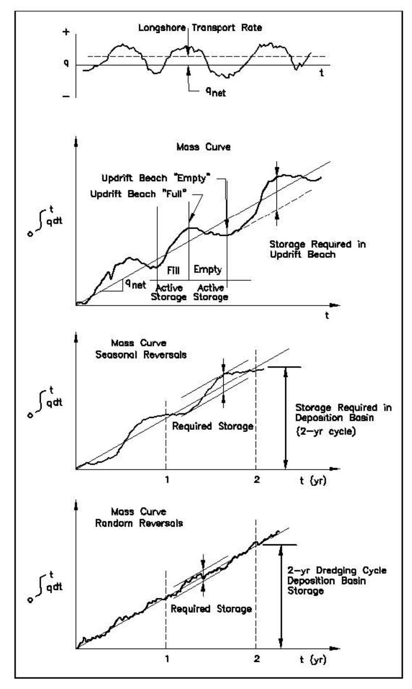

*Figure V-6-75. Use of mass curve to predict volumetric capacities required for updrift beach and deposition basins (from Weggel 1981)*

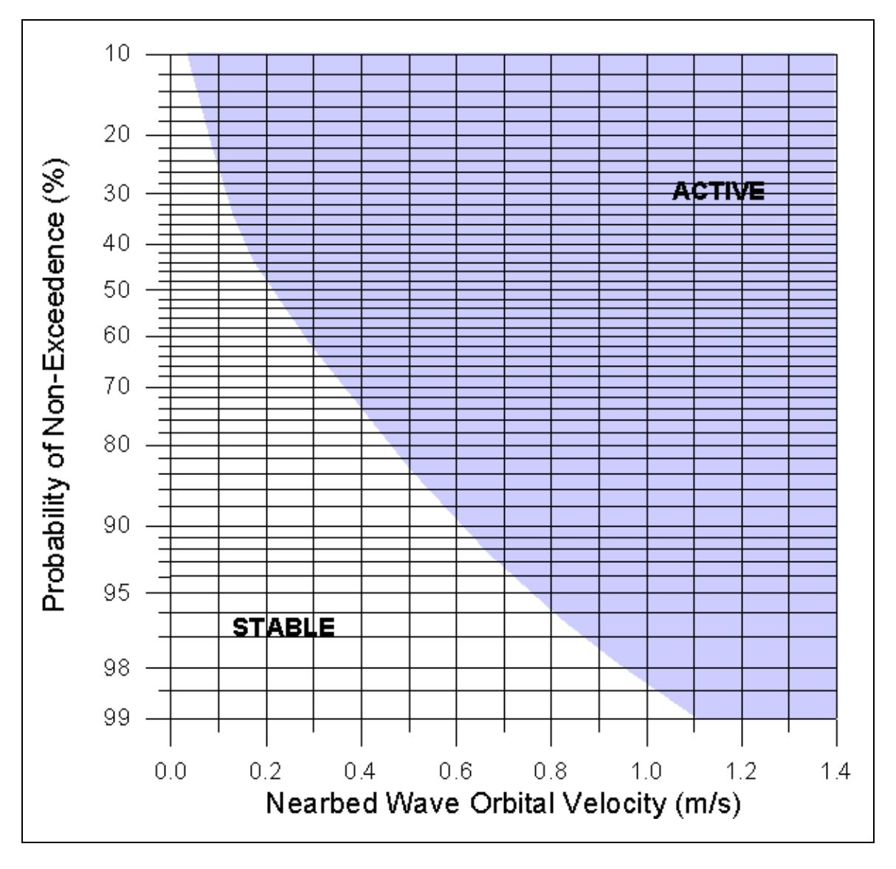

*Figure V-6-76. Method to predict whether sediment placed in a nearshore berm will be active (move landward) or stable (after Hands and Allison 1991)*

um is computed for each transformed wave condition, and the percent-occurrence of each velocity value noted. The velocity values are then ranked, and the percent of nonexceedence computed for each and plotted on a copy of Figure V-6-76. (The nonexceedence is simply the percent occurrence for which the computed velocity values are less than some given value.) If the plotted distribution falls mostly within the active half of the graph, then the berm can be expected to be active; i.e., to migrate shoreward. If not, then a shallower water depth, h , should be considered and the computation repeated, etc., until the distribution falls within the active half of the graph. The depth at which the distribution falls generally between the active and stable halves of the graph denotes the maximum seaward depth at which nearshore disposal can be undertaken so as to yield any detectable shoreward migration.

#### EXAMPLE PROBLEM V-6-17

#### FIND:

Predict whether a nearshore berm will be stable or active.

#### GIVEN:

Hindcast, deepwater wave data offshore of a proposed nearshore berm site are given in Table V-6-14. Only onshore-directed waves are tabulated (offshore-directed waves are included under calms). The seabed depth at the proposed berm site is 4 m.

**Table V-6-14. Only onshore-directed waves are tabulated (offshore-directed waves are included under calms). The seabed depth at the proposed berm site is 4 m.**

| + | + | 0 | B-A | A |
| --- | --- | --- | --- | --- |
| - | + | -A | B | 0 |
| + | - | invalid solution |  |  |
| - | - | B-A | 0 | B |
| Sediment Management at Inlets |  |  |  | V-6-127 |

To emulate the empirical results of Hands and Allison (in which the probability of u_m = 0 is 0 percent), calm events are excluded. The occurrence of each wave condition is recomputed neglecting calms. For the first noncalm entry in the table:
Percent occurrence excluding calms = (13.1 percent) / (100 percent - 32.4 percent) = 19.4 percent
The wavelength at the reference (hindcast) site is computed for each wave condition. The median height and period values within the ranges given for wave condition are assumed. The wave data are given as deepwater values; hence, from Equation II-1-15, and for the first noncalm entry in the table:

```math
L_o = 1.56 (T^2) = 1.56 (6.0)^2 = 56.2 \text{ m}
```

The wavelength, L, at the placement depth of h = 4.0 m, is computed from linear theory (see Example Problem Equation II-1-1). The corresponding wave height, H, is computed from Equation V-6-76. For the first noncalm entry in the table:

```math
H = (0.5 \text{ m}) (34.8 \text{ m} / 56.2 \text{ m})^{3/4} = 0.35 \text{ m}
```

#### EXAMPLE PROBLEM V-6-17 (Concluded)

From Equation V-6-75, for the first noncalm entry in the table:

```math
u_m = (3.14) (0.35 \text{ m} / 6 \text{ sec}) / [\sinh \{(2)(3.14)(4 \text{ m})/(34.8 \text{ m})\}] = (0.183 \text{ m/sec}) / (0.7862) = 0.23 \text{ m/sec}
```

Rank the values of u_m in ascending order, and list the percent-occurrence for each (first two columns in TableV-6-15). Compute the cumulative occurrence for each event (last column in table), which is the same as the probability of nonexceedence. Plot the results atop Figure V-6-77. The plotted curve falls mostly well within the active (shaded) area, suggesting that the proposed berm is more likely to migrate landward than to remain stable.

| u m , m/sec | Occ., percent | Cumulative Occ., percent |
| --- | --- | --- |
| 0.21 | 38.3 | 38.3 |
| 0.23 | 19.4 | 57.7 |
| 0.62 | 10.7 | 68.4 |
| 0.70 | 14.1 | 82.5 |
| 0.92 | 7.2 | 89.7 |
| 1.03 | 8.1 | 97.8 |
| .28 | 1.6 | 99.4 |

(c) In developing the empirical result illustrated in Figure V-6-76, Hands and Allison (1991) used the wave height transformation:

```math
H = H * \left(\frac{L}{L*}\right)^{3/4} \tag{V-6-76}
```

where H^* and L^* are the wave height and length at some given water depth (such as the hindcast location), and where the standard dispersion relationship for linear waves was used to compute wavelength (Equation II-1-10).
- (d) The propensity for shoreward migration increases with shallower water depths for disposal, and higher, better-defined berm elevations. A principal shortcoming of the Hands and Allison technique (Figure V-6-76) is that it does not consider the crest elevation or width of the berm. The more complicated method of Douglass (1995) demonstrates the importance of these two elements, particularly the former.
- (e) Burke and Allison (1992) and Hands and Resio (1994) present additional guidelines on berm disposal geometries and depths, respectively. Douglass (1995) and Sheffner (1996) present analytic methods by which to predict postplacement migration of nearshore berms. Other Corps of Engineers' PC-based numerical methods to predict the fate of disposed dredged material include DIFID, DIFCD, DIFHD, ST-FATE and LT-FATE; described elsewhere. USACE (1950); Uda, Naito, and Kunda (1991); Johnson et al. (1994); Bodge (1994a); Foster, Mealy, and Delange (1996); Mesa (1996), among many others, describe case histories of nearshore berm stability and migration.

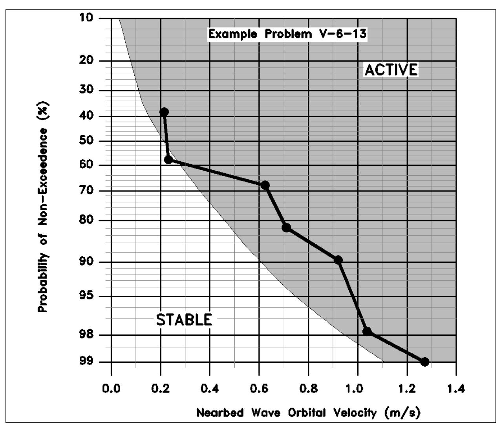

*Figure V-6-77. Results for Example Problem V-6-17*

- (f) The profile zonation technique of Hallermeier (1981), and as described in the Shore Protection Manual (1984), generally overpredicts the water depths in which active berms are expected, and results in a wide buffer zone in which berm performance is uncertain (Hands and Allison 1991). The use of the Hallermeier Inner Limits and Outer Limits (HIL and HOL), and the annual seaward limiting depth of the littoral zone, are not recommended for design of nearshore berm disposal criteria.
- (g) McLellan and Kraus (1991) present an alternative method by which to predict whether a berm will be active or stable. The work is an extension of onshore/offshore transport predictors employed for beach profile response in the surf zone (see also, Kraus, Larson, and Kriebel 1991); and, as such, may be less appropriate for berms placed in deeper water toward the outer limit of the profiles' active depths. Nonetheless, the application of these transport predictors to berm depths may illuminate the relative degree to which shoreward transport may be anticipated. The simplest such predictor is the so-called "fall-velocity" or "Dean" parameter, N_0

```math
N_o = \frac{H_o}{wT} \tag{V-6-77}
```

where $H_{o}$ is the offshore wave height, w is the sediment's median fall-velocity, and T is the wave period. Concisely, for $N_{o}$ < 2.4, shoreward movement is highly probable; for $N_{o}$ < 3.2, shoreward movement is probable; for $N_{o}$ > 3.2, seaward movement is probable; and for $N_{o}$ > 4.0, seaward movement is highly probable. The utility of this predictor for nearshore berm stability is diminished, as the water depth of the berm placement or crest elevation is not explicitly specified.
f. Costs. Overviews of inlet sand bypassing costs are presented in Jones and Mehta (1977, 1980); EM 1110-2-1616; Bruun (1993), among others. Table V-6-19 presents a brief summary of costs for various inlet sand bypassing projects. It is noted that project costs will vary widely in the prototype as a function of the quantity and complexity of the work, and the potential to combine projects for which similar equipment can be utilized. By far, the greatest economies are to be gained where sediment management strategies (bypassing and backpassing) can be combined with requisite maintance dredging of the inlet/harbor, and can be combined between nearby project sites. Comparative economic analysis is required in those cases where the quantites of sediment bypass/backpass can be minimized by the construction of additional inlet structures, jetty improvements, or channel relocations. Specifically, the short-term (capital) costs of these works must be considered against the long-term reduction in costs associated with decreased dredging requirements. In all cases, the cost of improving inlet/harbor sediment management so as to minimize the erosive impacts to adjacent shorelines should be weighed against the cost of mitigating the erosion through separate beach nourishment projects, and/or the costs of accepting the increased storm damage, legal actions, and loss of recreation, revenue, and habitat should the erosion be left unabated.

#### V-6-6. Project Experience

- a. Overview of existing prototype systems. The methods, mechanical equipment, and success of existing inlet sand management / bypassing systems vary widely, and are dictated by physical, environmental, and social considerations specific to each inlet site. Designers of potential sand management / bypassing systems are urged to consider the history and monitored performance of previous systems; and, whenever possible, to directly consult those engineers and operators that are intimately familiar with these systems' performance. Several prototype systems are summarized. Additional summary descriptions are presented in EM 1110-2-1616.
- (1) Santa Cruz Harbor, California. Santa Cruz Harbor is located on the northern coast of Monterey Bay on the Pacific Ocean south of San Francisco (Figure V-6-78). During the project's design in the 1960s, the net longshore transport rate was believed to be less than 230,000 cu m/year, but subsequent studies in 1978 concluded that the rate is between 230,000 and 383,000 cu m/year (Moffatt and Nichol 1978). Within 2-1/2 years after the channel and jetties were constructed in 1962-63, the updrift (west) shoreline had impounded 400,000 cu m of sand, the channel experienced severe shoaling, and the downdrift beach had eroded. Annual channel dredging, usually by 30 cm (12-in.) hydraulic dredge, was begun in 1965 but could not maintain a clear channel against the significant and rapid shoaling experienced in winter. Between 1976-78, an experimental jet-pump system was tested using four mobile pumps and one fixed pump. The severe wave climate and rapid sand shoaling rates buried the jet pumps' supply and discharge lines. This hampered the pumps' mobility and also required frequent backflushing of the supply water lines to clear them of sand. Debris also presented severe problems to the jet pumps. Annual contract dredging was continued, as before, through the mid-1980s; and the channel continued to shoal and mostly close during winter.

| $30K per year **Aust.$ 6.3M $ 0.00 (no added cost above $ 0 (inc. in basebid) $1.7M** $ 800K $ 543K $ 310K $ 750K $ 132K $ 164K $ 342K (1986) maint. offshore disposal) + * < $ 0.25 $ 4.20 $ 2.76 $ 2.06 $ 2.20 $ 1.98 $ 4.16 $ 7.56 $ 1.62 $ 1.20 \$ 2.97 Fixed plant w/ suction dredge Hopper dredge (Atchafalaya) Clamshell dredge and 2,500 Clamshell dredge and dump Hopper dredge w/ pumpout 27"- to 30"-pipeline dredge. Mobile crane and jet pump Fixed pier w/ 10 jet pumps Shallow-draft hopper; or and 5,000-ft pipeline 30"-pipeline dredge 24"-pipeline dredge cu yd dump scow 30" hyd. dredge pipeline dredge scow Beach w/in 1 to 2 miles downdrift Hempstead Beach; 1- to 2-miles Beach w/in 700 ft south of inlet Nearshore Berm; -16-ft depth, Beach w/in 2 miles downdrift Beach disposal: 0 to 2 miles Nearshore Berm; -20 ft mlw, -16 ft mlw, 6 miles downdrift Beach w/in 1 mile downdrift Beach disposal: w/in 2- to 3- miles updrift and downdrift Beach imm. south of inlet Beach imm. north of inlet Nearshore Berm; -10 to 6 miles downdrift 1 mile downdrift downdrift away Updrift beach; -4 Int. Sand Trap Updrift Weir & Updrift Weir & Internal Sand Updrift beach Updrift beach Updrift beach Nav. channel Nav. channel to -16 ft mlw) Dep. Basin Dep. Basin Channel Channel Nav. Nav. Trap cont. cont. cont. 2-3 6 1 1 4 3 2 2 2 < 200,000 900,000 200,000 696,000 517,000 320,000 180,000 380,000 600,000 97,000 70,000 1.5 M Canaveral Harbor, Canaveral Harbor, Canaveral Harbor, Perdido Pass, AL Indian River Inlet, Masonboro Inlet, Channel Is., CA So. Lake Worth Carolina Beach Jones Inlet, NY Nerang River, E. Rockaway Inlet, NC Inlet, NY Australia Inlet, FL NC DE FL FL FL | Project | Volume (cu yd) | quency Fre- (yr) | Source | Placement | Method | UnitCost ($/cu yd) | Mob/Demob ($) | Cost ($/cu yd) Total Unit |
| --- | --- | --- | --- | --- | --- | --- | --- | --- | --- |
|  |  |  |  |  |  |  |  |  | $ 5.10 |
|  |  |  |  |  |  |  |  |  | $ 0.00 |
|  |  |  |  |  |  |  |  |  | < $0.25 |
|  |  |  |  |  |  |  |  |  | $ 3.54 |
|  |  |  |  |  |  |  |  |  | $ 2.66 |
|  |  |  |  |  |  |  |  |  | $ 2.70 |
|  |  |  |  |  |  |  |  |  | $ 2.39 |
|  |  |  |  |  |  |  |  |  | $ 5.07 |
|  |  |  |  |  |  |  |  |  | $ 8.46 |
|  |  |  |  |  |  |  |  |  | $ 4.98** |
|  |  |  |  |  |  |  |  |  | $ 3.24** |
|  |  |  |  |  |  |  |  |  | $ 3.40 |

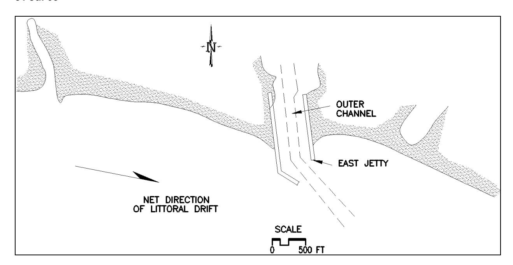

*Figure V-6-78. Santa Cruz, California*

In 1986, the Santa Cruz Port District obtained its own 40-cm (16-in.) hydraulic dredge. The \$2.8 million purchase was 78 percent cost-shared by the Federal government. The dredge bypassed 176,000 cu m to the downdrift (east) beach in its first operational year (1986-87). Subsequently, the harbor has remained open almost continuously. The dredge operates primarily with a jet nozzle suction head and practices pothole dredging, wherein a series of discrete, deep craters is pumped (as opposed to continuous dredge cuts). Significant downtime has been reported due to debris blockage of the pump. Continuing maintenance and operational expenses have also proven to be a problem for the Port District (Walker and Lesnik 1990; EM 1110-2-1616).
(2) Santa Barbara Harbor, California. Santa Barbara Harbor is located on the Pacific Ocean northwest of Los Angeles (Figure V-6-79). The net and gross longshore transport rates are believed to be about 205,000 cu m/year and 282,000 cu m/year, respectively. The harbor's original 550-m-long offshore breakwater, constructed in 1927, was left detached from the coastline in the mistaken belief that this would allow littoral drift to pass through the harbor. The harbor immediately shoaled with sand and the downdrift (east) beach eroded. In 1930, the breakwater was extended 180 m in order to connect it to shore. Sand immediately impounded updrift of the new structure (advancing the beach over 300 m) while the downdrift beach retreated by over 120 m. Sand then bypassed the breakwater and impoundment fillet and shoaled the harbor. In 1935, 154,400 cu m of sand were hopper-dredged and placed in about 7-m water depth offshore of the downdrift beach, but surveys showed little shoreward movement of the sand. Beginning in 1938, hydraulic dredge and pipeline were employed. By 1952, an average of about 488,700 cu m of sand were bypassed every 2 years to the downdrift beach, representing about two-thirds of the area's estimated net littoral drift since the harbor's construction in 1927. In 1966, harbor dredging and sand bypass, by conventional hydraulic dredge and pipeline, became an annual operation. The quantity averages about 267,600 cu m/year or less (Bailard and Jenkins 1982; Walker and Lesnik 1990).

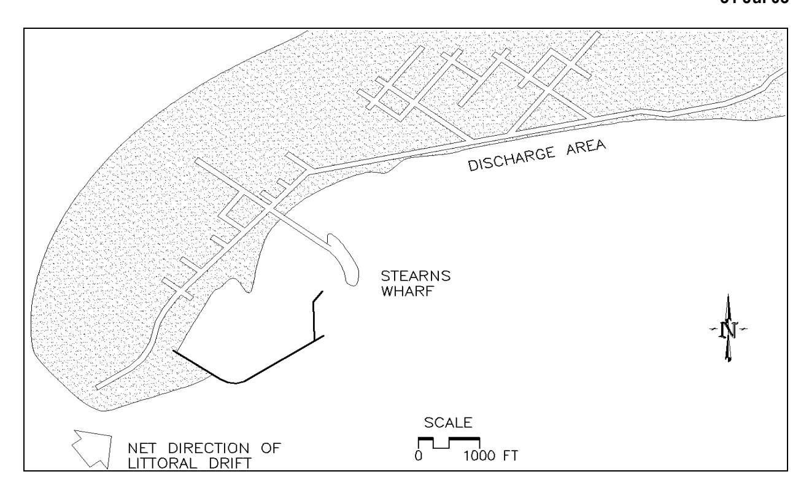

*Figure V-6-79. Santa Barbara, California*

- (3) Port Hueneme, Channel Islands Harbor, and Ventura Marina, California. Port Hueneme is located about 70 km southeast of Santa Barbara Harbor on the Pacific Ocean (Figure V-6-80). The net longshore transport rate is estimated as 612,000 to 920,000 cu m/year. Port Hueneme's ocean entrance was dredged and stabilized by arrowhead jetties in 1938 at the head of the Hueneme submarine canyon. Despite placement of over 2 million cu m of dredged sand to the downdrift (east) shoreline during project construction, these beaches were completely cut off from the net littoral drift and retreated over 210 m within 20 years. Sand was impounded updrift of the inlet's jetties and diverted offshore into the submarine canyon. Coastal sand supply was simultaneously decreased by the construction of upriver dams and additionally by the interruption of littoral drift at Santa Barbara Harbor to the northwest. Between 1953 and 1960, hydraulic dredging of the updrift impoundment fillet and the navigation channel placed about 400,000 cu m to the downdrift beaches, primarily via submerged pipeline; but there remained a 16 million-cu m deficit. In bypassing the updrift impoundment fillet in 1953, the dredge cut into the shoreline and left a narrow barrier of sand seaward in order to provide a temporary wave shelter to the dredge plant. The narrow barrier was then dredged and bypassed at the end of the job.
- (a) In 1960, Channel Islands Harbor was constructed about 1 mile northwest (updrift) of Port Hueneme entrance (Figure V-6-80). One intent of the project was to create a sand trap that would reduce losses to Hueneme Canyon and expedite mechanical bypassing to the downdrift beaches. The project consists of two jetties and an offshore, detached 700-m long breakwater, originally constructed in 9-m water depth, which shelter the harbor entrance. The littoral drift that deposits in the lee of the breakwater (i.e., in the trap) is hydraulically dredged by a conventional plant and pipeline and bypassed to the downdrift beach (principally south of Port Hueneme entrance). The equivalent, annual bypass rate has been about 990,000 cu m/year. To save on mobilization costs, bypassing typically takes place every other year (Herron and Harris 1967; Walker and Lesnik 1990).

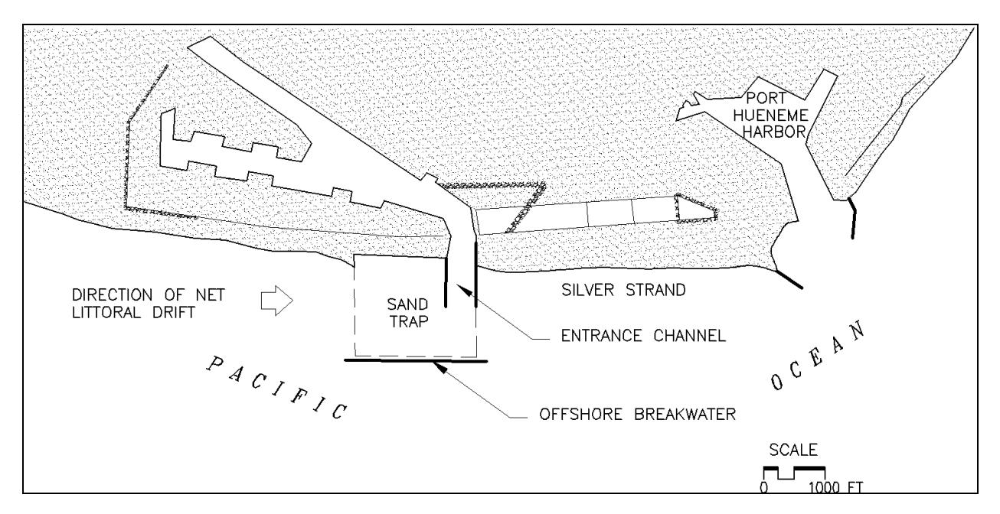

*Figure V-6-80. Channel Islands and Port Hueneme Harbors, California*

- (b) Ventura Marina, located a few kilometers north of Channel Islands Harbor, was constructed by local authorities in 1962-63. Its design included features from the Channel Islands project (dual jetties, offshore breakwater, and leeward sand trap); but failed to recognize the area's high rate of littoral drift and did not plan for sand bypassing. In part because of the deficient length of the jetties and breakwater, sediment accumulates so rapidly that the entrance channel must be frequently dredged, often well before the sand trap is full. There are no measures to control the summer reversal in drift direction, and the resultant transport of sand around the south jetty and into the channel can be significant. While sand has been succesfully dredged from the project and placed upon the adjacent beaches, inlet navigation chronically suffers from rapid channel shoaling and wave inundation.
- (4) Oceanside Harbor, California. Oceanside is located on the Pacific Ocean, about 50 km northwest of San Diego (Figure V-6-81). The estimated net littoral drift is small (75,000 to 190,000 cu m/year to the south) relative to the gross drift (on the order of 920,000 cu m/year). The Del Mar boat basin was constructed at the beginning of the 1940s and jetties were constructed in 1942. Shoaling of the entrance channel, updrift impoundment and downdrift erosion rapidly ensued. The north jetty was extended in 1958 and again in 1994. The Oceanside small craft harbor and its south jetty were constructed in the 1960s. Since 1957, the sand dredged from the harbor has been placed on downdrift beaches (about 230,000 cu m/year, on average); nonetheless, downdrift beach erosion continued to be a problem due to the inlet's historical impact to the littoral system and continuing losses associated with the shoreline's large gross transport rate. Mining of the impounded sand updrift (north) of, and between the two harbors, for purposes of bypassing and downdrift placement, was rejected by local interests. In 1982-83, an experimental sand bypass system was proposed consisting of the phased introduction and testing of fixed and mobile jet pumps. The latter, attached to a barge, would operate from locations along the north and south jetties, depending upon wave and sand transport conditions. A dedicated 35-cm pipeline and a shore-based booster station (used for bypassing from the north jetty location) would transport and discharge the sand to the downdrift shoreline.

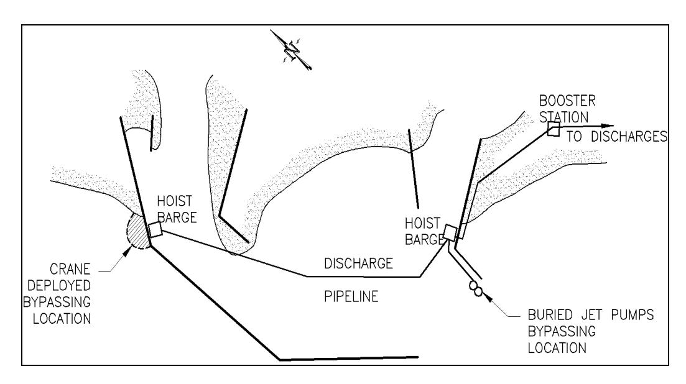

*Figure V-6-81. Oceanside Harbor, California*

- (a) In 1989-90, the system's Phase I evaluation included 3-weeks' testing of a single crane-deployed jet pump operating at the north jetty fillet from upon the barge; and, 11 months' operation of two 4 in. x 4 in. x 6 in. Pekor jet pumps submerged in the entrance channel at the south jetty. Sand was pumped for 305 hr over this period, during which the production rate averaged 48 cu m/hr. The design value was about 150 cu m/hr. Principal difficulties involved continual clogging of the jet pumps (kelp root balls, rope, etc.) and the limited size and infilling rate of each pump's crater (about 4.6 m deep and 25-m diam).
- (b) In 1991-92, Phase II evaluation included the addition of a single, pile-supported seabed fluidizer angled downward at about a 1:100 slope toward each of the two fixed jet pump's craters. The two fluidizers were 46 to 61 m in length and 20 to 25-cm diam. During a 13-month period, 81,000 cu m were bypassed with an average production rate of 73 cu m/hr. While the fluidizers appeared to improve productivity, the system exhibited difficulties from continual filling of the fluidizers with sand when the system was not operating. This required backflushing of the fluidizers prior to initiating sand transfer by the jet pumps. Productivity is predicted to improve if a separate fluidizer pump were provided, and if sand entry to the fluidizers could be minimized (Clausner, Patterson, and Rambo 1990; Walker and Lesnik 1990; Patterson, Bisher, and Brodeen 1991; Bottin 1992; Weisman, Lennon, and Clausner 1996).
- (5) Indian River Inlet, Delaware. Indian River Inlet is located on the Atlantic Ocean approximately 16 km north of Ocean City, Maryland. The net littoral drift is estimated to be about 84,000 cu m/year to the north. The inlet was improved by dredging and the construction of jetties between 1938 and 1940. This resulted in immediate accretion of the updrift (south) beach and the inlet's ebb and flood shoals, and erosion of the downdrift (north) beach. In 1990, a dedicated, semimobile sand bypassing plant was installed at the inlet. The system consists of a jet pump deployed (suspended) by a 135-ton crawler crane with 37-m boom. The Genflo jet pump has a 6.4-cm nozzle with 15-cm mixing chamber, rated at 152 cu m/hr capacity. Discharge from the jet pump is through a 28-cm HDPE pipe to a booster pump, then through a dedicated pipeline across the inlet with discharge onto the beach at adjustable locations up to 460 m north of the inlet. Both the supply and booster pumps are stationed in a pump house adjacent to the south jetty. The system draws clear water from the inlet and powers the jet pump with a 340-hp supply pump supplying 415 ft of head and 2,500 gpm through a 25-cm supply line. The crane, jet pump, and crater geometry are similar to that shown in Figure V-6-60(a), and the jet pump is as shown in Figure V-6-62.
- (a) The system is operated on a 4 day/week schedule with a three-person crew. To start bypassing from a fresh crater, the jet pump is jetted down to about -2.7 m (mlw) within the swash zone and allowed to create a small crater to provide a ready source of clear water to wash out the discharge line in the event of a potential line plug. The jet pump is then lowered to about -5.4 m (mlw), just above an existing clay layer, and kept at that depth for the remainder of the day. During calm surf or falling tide, the pump is raised and laterally moved about 4 m every 15 to 30 min to maximize productivity. Otherwise, little movement is required as wave action continually feeds sand to the crater. The craters produced by the operation are typically 5.5 m deep with 1:1.5 side slopes such that the beach surface diameter is approximately 15 m, and the nominal volume is about 300 cu m. The crane is able to excavate a trench about 3 diam long without moving.
- (b) During the nonsummer (energetic) months, the jet pump operates from between 30 and 120 m south of the south jetty. This provides an area available for bypassing of approximately 3,700 cu m. Operation is limited by recreational activity, particularly during the summer months, and by potential nesting of endangered shore birds (piping plover) along the discharge area from March through August. The latter restricts sand discharge from within about 100 m of any observed nest. Productivity is limited by the amount of sand that is naturally transported to the 90-m-long stretch of beach utilized by the crane. Sheltering of this area by the inlet's ebb delta reduces the local rate of transport and the crater infilling rate during periods of low wave energy.
- (c) In its first 11 months of operation, the system bypassed 85,500 cu m of sand, thus achieving its design objective. After gaining experience with the system, hourly productivity averaged 280 cu yd/hr. A remote production meter mounted in the crane's cab improved productivity by allowing the operator to monitor the effect of adjusting the pump position. Impacts to the south beach (narrowing) were limited to the area of bypass operation. Final cost of the system, including 610 m of discharge pipeline, was \$1.7 million, with estimated annual O&M costs of \$210,000/year (1990 dollars) (Rambo, Clausner, and Henry 1991; Clausner et al. 1991; Gebert, Watson, and Rambo 1992).
- (6) Rudee Inlet, Virginia. Rudee Inlet, immediately south of Virginia Beach, was essentially nonnavigable until 1952 when two short jetties were built and a channel was dredged. The channel immediately began to shoal with sand, and erosion occurred on the downdrift beaches. A fixed bypassing plant with a small capacity was installed in 1955 with little effect, and a floating pipeline dredge was added in 1956. The fixed plant was destroyed by a storm in 1962 and the inlet essentially closed, whereupon sand bypass resumed naturally. In 1968, the inlet was again improved with the construction of a jetty and a breakwater connected to the shore by a sand weir, similar to the geometry shown in Figure V-6-68(b). The weir jetty impoundment basin was never fully dredged initially, and the 25-cm dredge operations were hampered by wave action. From 1968 to 1972, sand bypassing was achieved by dredging sand from the channel and back bay and pumping it to the downdrift beaches. In 1972, 76,000 cu m of sand were removed from the impoundment basin. By 1975, the basin refilled with sand, and bypassing from the basin was repeated by the 25-cm dredge.
- (a) Also in 1975, a semimobile jet pump system was added to the impoundment basin. The system consisted of two jet pumps (eductors) attached by flexible rubble hoses to fixed steel pipes. The steel pipes were connected to a pump house equipped with two centrifugal pumps having a combined nominal capacity of 115 cu m/hr. Discharge to the downdrift (north) beach was through a dedicated 20-cm steel pipe. During the system's first 6 months of operation, 60,400 cu m of sand were bypassed by the jet pumps and approximately 23,000 cu m were bypassed from the channel and impoundment basin by the floating dredge.
- (b) Since late 1975, the system has been owned and operated by the city of Virginia Beach. Original estimates of pumping capacity were about 38 cu m/hr with effective pumping time of about 113 hr/month.
By 1980, only a single jet pump (eductor) was operated. At that time, it was moved within the impoundment basin by winching and redeploying via a steel cable operated from a truck (Richardson 1977; Dean et al. 1987).
(7) Masonboro Inlet, North Carolina. Masonboro Inlet is located near Wilmington, North Carolina, on the Atlantic Ocean (Figure V-6-82). Net littoral drift is southerly and in excess of 220,000 cu m/year. This natural inlet was first dredged in 1959 and the north (updrift) jetty was constructed in 1965-66. The jetty included a 305-m weir section built of concrete sheet piles with crest elevation at mean tide level. A deposition basin with a 283,000-cu m capacity was dredged along the interior of the weir. Because no south jetty was constructed, the area's strong reversal drift shoaled the inlet from the south and forced the navigation channel northward, undermining the north jetty and cutting through the deposition basin.

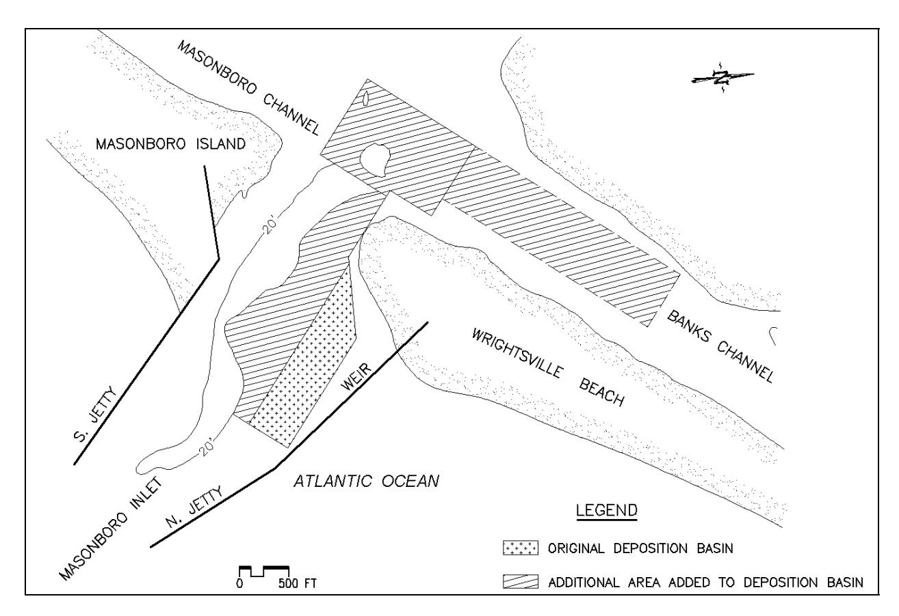

*Figure V-6-82. Masonboro Inlet, North Carolina*

- (a) The south jetty was constructed in 1979-80, at which time 918,000 cu m were dredged from the inlet and placed on the north beach by pipeline. In 1981, dredging centered the channel between the two jetties. Since that time the inlet bathymetry has stabilized, and the need for a proposed training wall (separating the impoundment basin from the channel) has been eliminated. Additionally, the area of deposition expanded considerably to include the original basin, part of the inlet throat, and the inlet interior area. Transport over the weir is principally along the shoreline interface, and deposition is greatest at that area and landward thereof.
- (b) Lack of available land along the updrift beach required that the weir-jetty be oriented at about 85 deg from the shoreline (i.e., almost perpendicularly), instead of at the recommended angle of about 60 deg. The latter would have provided greater deposition basin area along the shoreline interface of the
weir, thus improving its capacity and reducing the proclivity of shoaling across the inlet throat and flood shoals. The expanded deposition basin area is typically dredged about every 4 years by contracted floating plant. The dredged material, on the order of 920,000 cu m per event, is bypassed to the south beach and/or backpassed to the north beach depending upon these beaches' conditions. The expansion of the deposition area has proven to be beneficial from the standpoints of both cost (reduced dredging frequency) and the ability to better capture sand within the inlet for purposes of bypassing and backpassing (Rayner and Magnuson 1966; Magnuson 1967; Vallianos 1973).
(8) Ponce de Leon Inlet, Florida. Ponce de Leon Inlet is located near Daytona Beach along eastcentral Florida's Atlantic coastline (Figure V-6-83). The net littoral drift was originally thought to be southerly-directed. Inlet improvements undertaken between 1968 and 1972 consisted of two jetties (the north jetty being a weir jetty), and the dredging of a navigation channel and an impoundment basin adjacent to the interior of the north weir. The weir was constructed of concrete panels that were to be adjusted in height between king-piles. This was never practicable as loose panels chattered and chipped between the piles, and/or the piles could not be aligned properly to allow adjustment. The impoundment basin adjacent to the weir has never been dredged. Instead, sand rapidly impounded against the south jetty and then created a large, chronic shoal within the inlet interior along the south jetty. The inlet's bypassing scheme was therefore altered. The entrance channel was dredged by hopper and the material placed in an offshore spoil area in about 6-m depth north of the inlet. The south shoal, adjacent to the jetty, was dredged by cutterhead and discharged via pipeline to the north beach. The continued growth of the south shoal forced the channel to migrate northward through the impoundment basin, rendering the basin ineffective and simultaneously acting to undermine the north jetty. The latter effect is exacerbated by the alignment of the north jetty, as the inlet's natural tidal and riverine flow is directed at and against the north jetty. The north jetty's weir section was closed in the 1980s (Partheniades and Purpura 1972; Parker 1979; Jones and Mehta 1980).

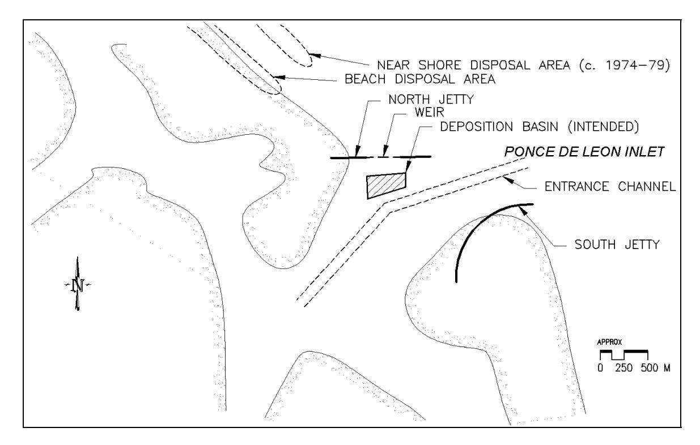

*Figure V-6-83. Ponce de Leon Inlet, Florida*

- (9) Port Canaveral Entrance, Florida. The Canaveral Harbor Federal Navigation Project is located south of the Kennedy Space Center, at Cape Canaveral, along east-central Florida's Atlantic coastline. The net littoral drift is about 152,000 cu m/year to the south. The inlet was artificially created in 1950-52 and stabilized by two rock jetties. The inlet and harbor have always been hydraulically isolated from the interior waters. Tidal flow through the inlet is therefore minimal and there are no ebb or flood tidal shoals. It is estimated that the creation and maintenance dredging of the inlet have resulted in 6 million cu m of updrift impoundment (beyond historical conditions) plus deepwater disposal of another 6 million cu m of littoral material.
- (a) Prior to inlet improvements and sand bypassing, sand shoaled the channel in four distinct areas at the seaward and landward ends of the inlet's short, low jetties (Figure V-6-84). The sand from these shoals (typically totaling about 150,000 cu m/year), mixed with up to another 500,000 cu m/year of silt and clay, were annually removed by hopper-dredging and disposed of in deep water, offshore. Beginning in 1992, barge-based clamshell dredging was required in lieu of hopper dredging in order to avoid impacts to marine turtles that loaf at the channel seabed. The mechanically-dredged material, usually placed in 900 to 1,300-cu m scows, was identified in terms of its sand content. Those scow loads containing suitably sandy material (generally less than 10 to 15 percent silt/clay) were placed in a nearshore disposal area about 11 km south (downdrift) of the inlet in 5.5 to 6.5-m water depth (msl). Between 1992 and 1997, about 500,000 cu m of sand were placed in the nearshore disposal area. Attempts to place the material in shallower depths (3.6 to 4.6 m depth) have, to date, been unsuccessful because of the danger and seabed impacts posed to the tugs that tow the scows.
- (b) Sand transport over, through, and around the south (downdrift) jetty is estimated to have contributed up to about one-third of the inlet's shoaling and downdrift erosional effects. In 1993, the landward half of the jetty (about 145 m; or, to about -0.5 m, mlw) was temporarily sand-tightened by 1.8-m diam sand-filled geotextile tubes. This resulted in halting about 30,000 cu m/year (about one-third) of the sand transport through the south jetty. In 1995, the south jetty was permanently sand-tightened, raised, and lengthened by driving steel sheet pile immediately adjacent to, and seaward of, the original jetty, and then armoring the sheet pile with boulders. In 1998, the north jetty was sand-tightened by a sand-filled geotextile tube and monitored.
- (c) Also in 1995, regular sand bypassing commenced whereby every 6 years, 690,000 cu m (or, 115,000 cu m/year) is dredged by a conventional hydraulic plant and discharged by temporary, submerged pipeline along 3.2 km of shoreline immediately south of the inlet. The dredge area is within the updrift impoundment fillet, along 2.6 km of shoreline immediately north of the inlet, between the mean high waterline and the -5 m-depth contour. The inaugural 1995 operation dredged material from between -1.2 and -5 m (mean sea level) and bypassed very fine sand relative to the native beach (overfill ratio > 2). Monitoring surveys indicate that the 1995 borrow area recovered at a rate equal to or greater than the proposed bypass rate, and that the grain size of the recovering sand is equal to, and sorts itself by depth similarly to, the predredged area. In the first 3 years subsequent to the 1995 bypassing operation and jetty tightening, shoaling of the inlet channel by littoral material appears to have been mostly stopped, and the downdrift beach began to recover toward its preinlet condition (Bodge 1994a, 1994b; Bodge and Hodgens 1997).
- (10) South Lake Worth Inlet, Florida. South Lake Worth Inlet (a.k.a. Boynton Inlet) is located on southeast Florida's Atlantic coastline, about 16 km south of Palm Beach. It was opened artificially and stabilized by jetties in 1927 to provide increased flushing of Lake Worth. The net longshore transport rate is about 135,000 cu m/year to the south. By 1932, downdrift erosion prompted local property owners to construct seawalls and groins. By 1936, updrift impoundment saturated the north jetty and led to significant shoaling of the inlet and interior lake. In 1937, a fixed sand transfer plant was constructed atop the north jetty with a dedicated 365-m pipeline discharging sand to the south beach. Between 1937
and 1941, the 15-cm suction intake and 65-hp centrifugal pump bypassed about 55 cu yd/hr; or, 50,400 cu yd/year, on average. The plant was not operated from 1942 through 1945 due to wartime fuel shortages, and the inlet essentially closed. The plant was restarted in 1945 and upgraded in 1948 to a 25-cm suction intake mounted on a swinging boom with 9-m radius, a 20-cm 300-hp centrifugal pump, and 20-cm discharge pipe. The plant's bypassing capacity increased to 76 cu yd/hr. Overall bypassing was also increased by a floating hydraulic dredge that transferred sand from the interior (flood) shoals to the downdrift beach. In 1967, the north and south jetties were extended by 125 m and 20 m, respectively; and, the fixed sand transfer plant was shifted 36 m seaward and increased to a 25-cm pump with 400-hp motor. Portions of the north jetty were sealed in 1971.
- (a) The present plant consists of a 30.5-cm suction intake and 25-cm discharge line driven by a 400 hp diesel engine rated to pump 4,000 gpm with up to 20 percent suspended solids. The plant is similar in appearance to that shown in Figure V-6-59. Productivity estimates vary from 95 to 122 cu m/hr. Palm Beach County operates the plant. Local (updrift) interests require that the plant be operated only during wave/transport events from the northeast. Productivity is limited by the crater's size (about 460 cu m) and its sand-infilling rate. The plant's annual bypassing rate averages about 50,000 cu m/year. Of the net incident littoral drift, it is estimated that about 45 percent is naturally bypassed across the ebb-delta plateau, 35 percent is bypassed by the fixed plant, 2 percent is bypassed by periodic hydraulic dredging of the interior (flood) sand trap. The remaining 18 percent is diverted from the littoral system by updrift impoundment and transport to the ebb shoal. It is predicted that the bypassing plant's capacity could be significantly improved by increasing the length of the boom upon which the suction intake is mounted, and by mounting the plant on a mobile platform atop the jetty or adding one or more jet pumps near the jetty's seaward end (Jones and Mehta 1977; Olsen Associates, Inc. 1990).
- (b) A similarly-sized, electrically-powered plant operated from the north jetty of Lake Worth Inlet, to the north, from 1957 through the early 1980s. Between 1967 and 1978, the plant is estimated to have bypassed about 102,000 cu m/year (Jones and Mehta 1977).
- (11) Boca Raton Inlet, Florida. Boca Raton Inlet is located about 25 km north of Fort Lauderdale on southeast Florida's Atlantic coastline (Figure V-6-84). The net longshore transport rate is estimated as about 124,000 cu m/year to the south. This natural inlet was improved by dredging in 1925-26. Jetties were constructed in 1930-31 and repaired in 1952. These works resulted in erosion of the downdrift (south) beach and promoted the growth of a large ebb shoal that threatened navigation through the inlet. In 1975, the city of Boca Raton undertook a 55-m extension of the north jetty and 165-m sand-tightening of the south jetty. In 1980, a 20-m weir was cut into the north (updrift) jetty to allow sand to enter the inlet throat to facilitate bypassing by the city-owned dredge.
- (a) It is estimated that about 36,000 cu m/year enters the inlet through the weir and around the jetty from the north (updrift) shoreline, and that about 4,300 cu m/year enters the inlet from the south (downdrift) shoreline, for a total of 40,300 cu m/year. On average, the city's dedicated, floating hydraulic dredge bypasses this quantity, working mostly year-round, to the south shoreline. In addition, about 176,000 cu m of sand is removed by hydraulic, cutterhead pipeline dredge from the ebb shoal about once every 10 years, and is placed along 1.2 km of shoreline south of the inlet.
- (b) Of the 124,000 cu m of net incident drift (approximate), it is estimated that about 30 percent is bypassed by the dedicated floating dredge, 50 percent is naturally bypassed across the ebb-tidal shoal, and 20 percent is diverted to the ebb shoal or offshore. The periodic (10-year) dredging of the ebb shoal is intended to capture at least a portion of the latter quantity for bypassing to the south (Jones and Mehta 1980; Coastal Planning and Engineering 1996; Olsen Associates, Inc. 1997).


*Figure V-6-84. Historical locations of sandy shoals within Port Canaveral Entrance, Florida (prior to implementation of inlet/jetty improvements). Adapted from Bodge 1994a*

(12) Hillsboro Inlet, Florida. Hillsboro Inlet, about 9 km south of Boca Raton Inlet, or 16 km north of Ft. Lauderdale, is located on southeast Florida's Atlantic coastline. The net incident littoral drift is estimated as 92,000 cu m/year to the south. This inlet features a natural reef that forms its northern (updrift) boundary. This reef acts as a sand weir; and, in fact, the modern concept of an inlet weir originated at this inlet (Hodges 1955). Sand transported over this reef/weir and around the inlet's two jetties, amounting to about 74,700 cu m/year in total, is bypassed to the south (downdrift) shoreline via a dedicated 20-cm hydraulic dredge and pipeline owned and operated by the inlet's local authority. Of the incident net drift, it is estimated that about 14.5 percent is impounded updrift of the inlet, 64 percent is transported into the inlet (and bypassed by dredging), 18.5 percent is naturally bypassed across the ebb tidal shoal, and 3 percent is lost offshore. Of the net 74,700 cu m dredged and bypassed from the inlet each year, about 78 percent is estimated to originate from the updrift (north) shoreline, while the other 22 percent is sand that returns from the downdrift (south) shoreline into the inlet. Improvements to the south jetty and extending the discharge distance further downdrift of the inlet is predicted to improve sand management at the inlet (Jones and Mehta 1980; Coastal Planning and Engineering 1991; Olsen Associates, Inc. 1997).

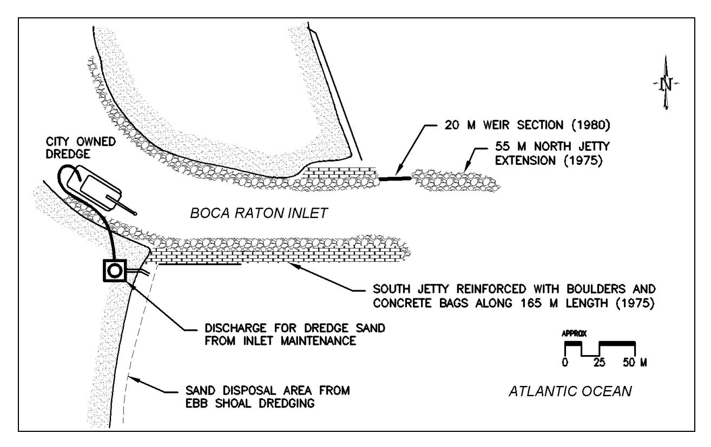

*Figure V-6-85. Boca Raton Inlet, Florida*

- (13) Port Sanilac, Michigan. Port Sanilac is a small-craft harbor on Lake Huron, about 100 km north of Detroit. In the later 1970s, a portable, truck-mounted jet pump system was built by the U. S. Army Waterways Experiment Station (currently the U.S. Army Engineer Research and Development Center) and tested at the harbor for sand bypassing. A 12-m flatbed trailer was outfitted with a fuel tank, generator, air compressor, control room, and water supply and booster pumps with diesel engine drives. The jet pump water supply and slurry discharge lines were supported by foam floats designed to allow the jet pump to sink into the seabed while dredging. To raise the jet pump, air was pumped through the water supply line to a flotation unit attached to the jet pump. The jet pump was steered in the water by diverting water from the supply line through two nozzles attached to the sides of the pump. The system was designed to be driven onto an accretion fillet where the jet pump could be deployed and operated near the shoreline. Discharge from the pump was carried by pipeline along the harbor bottom to the downdrift beach. System technicians reported that the system worked extremely well for its designed purpose. However, resistance by updrift property owners often precluded bypassing operations from the accretion fillet. The system was used mainly as a rehandling device for material released by hopper dredges. For this purpose it was driven onto a barge and operated as a floating dredge. The system was surplused by the U.S. Army Engineer District, Detroit, in 1980, and acquired by the state of Michigan in July 1988 (EM 1110-2-1616).
- (14) Viareggio Harbor and Marina di Carrara, Italy. The harbors of Viareggio and Marina di Carrara are located on the northwest coast of Italy on the Mediterranean Sea. The former is about 22 km south of the latter. The net littoral drift at Viareggio is about 200,000 cu m/year toward the north, while the net drift at Marina de Carrara is toward the south.

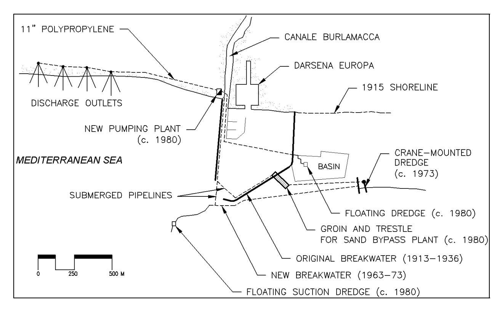

*Figure V-6-86. Viareggio Harbor, Italy*

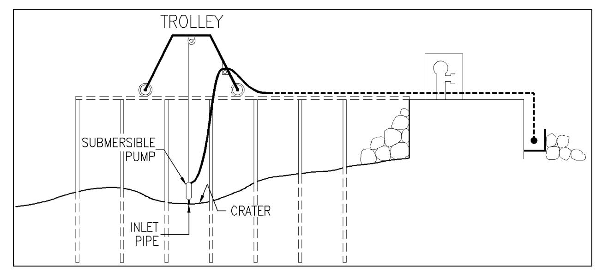

*Figure V-6-87. Original sand bypassing plant at Viareggio Harbor, Italy*

(a) Navigational improvements at Viareggio date from the Roman Empire. In 1913, an outer harbor was created by the construction of a shore-attached breakwater (Figure V-6-86). As a result, the updrift (south) beach accreted about 20 m/year, the harbor shoaled, and the downdrift beach eroded dramatically. In 1936, 220,000 cu m were dredged from the outer harbor and discharged to the downdrift (north) beach via 60 cm (24 in.) pipeline. This represented the first application of sand bypassing, and artificial beach nourishment, in Italy. In the early 1950s, a spur groin was built along the south breakwater in an

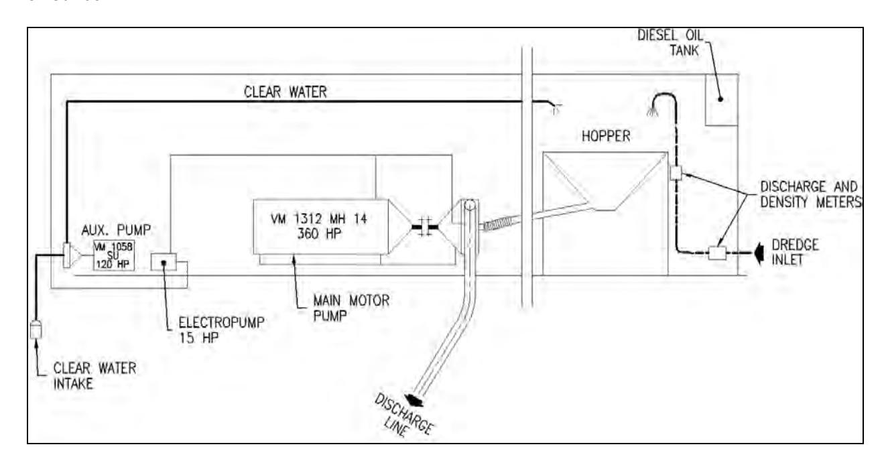

*Figure V-6-88. Existing sand bypass pump system at Viareggio Harbor, Italy*

attempt to arrest sand transport along the breakwater. A trestle-mounted sand bypassing plant was subsequently built atop this spur groin (Figure V-6-87). The plant consisted of an immersed pump body mounted upon a trolley that ran along tracks. The dredged material was discharged at the root of the north jetty via a 18-cm (7-in.) pipeline. The pump dredged a series of "holes" underneath the installation to serve as traps for the sand. These holes quickly filled with debris and seaweed, and interfered with the plant's intended operation. At the same time, the groin tended to push the sand offshore along a bypassing bar and reduced the rate at which sand reached the plant.
- (b) In the early 1970s, a new breakwater was constructed seaward of the original breakwater, and a new basin was excavated into the beach that had been accumulated against the structure. The original sand bypassing plant, now within the uplands of the new breakwater, was relocated to the south. The trolley system was replaced by a crane that would allow sand to be removed from a larger area (i.e., greater potential crater size). The old works were transformed to a booster pump plant. The relocated, crane-mounted bypass plant was never put into operation, however, as the harbor's new authority suspended its operation and the new breakwater caused the updrift beach to rapidly overtake the new plant's location.
- (c) In 1980, Viareggio Harbor's existing bypassing system was installed. It is based upon a flexible, mobile scheme to ensure bypassing productivity. Material can be dredged by floating suction dredges from the outer harbor, the new large basin, the updrift beach, or outside the harbor entrance. Suitable dredged material is pumped via submerged pipeline toward the principal pumping station located at the root of the north jetty. The new pumping plant was designed to receive variable sediment discharges and densities, transforming them into suitable slurries for beach discharge. Water-cooled diesel engines are used. An auxiliary plant is used to control the supply of material to the bypassing plant by pumping water into a hopper to compensate for periods when discharge from the dredge platforms is insufficient (i.e., when only one dredge is operating). (See Figure V-6-88). Recent improvements to the plant (combining the discharge from the two dredge platforms) allow up to 1,100 cu m/hr of slurry with 20 percent solids volume. From 1980 to 1985, 380,415 cu m of sand were bypassed over 3,623 operating hours, for an average sand discharge rate of 105 cu m/hr.

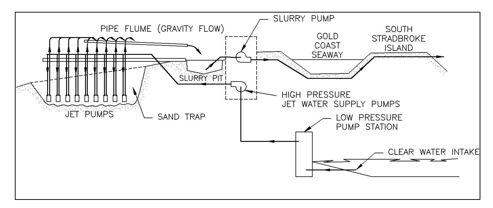

*Figure V-6-89. Sand bypassing system at Nerang River entrance (schematic)*

- (d) Marina di Carrara is similar in geometry to Viareggio Harbor. A pilot bypassing plant was installed in 1965-66 using a floating dredge inside the harbor and five slurry booster pumps onshore along a 6-km-long 14-cm- (5.5-in.) discharge pipeline with multiple outlets. While the system's components reportedly worked well, net productivity was limited, and the material dredged from the harbor was mostly silt and fine sand that was poorly suited for beach placement.
- (e) A second bypassing plant was installed in 1967-68. A fixed plant was installed updrift of the harbor entrance, as at Viareggio, but this time a mobile crane could operate on a large-diameter platform in order to reach a wide area far from the platform's foundation piles. After initial success in 1969, productivity declined as the dredged craters filled with debris, and the sand in-filling rate was dependent upon storm conditions. Operation was suspended when the platform collapsed after a ship collision (Fiorentino, Franco, and Noli 1985).
- (15) Nerang River Entrance, Queensland, Australia. The Nerang River entrance is located on Queensland's Gold Coast, along Australia's central eastern coastline on the Pacific Ocean. The northerly longshore transport rate is large and dominant (580,000 cu m/year) compared to the southerly transport (84,000 cu m/year). In 1984-85, the inlet entrance, which naturally migrated northward at an average rate of over 36 m/year, was relocated southward by dredging a new navigation channel stabilized by dual rock jetties. In 1985-86, construction of a fixed sand bypassing plant was completed. The plant consists of a 490-m-long pier/trestle located 250 m updrift, and parallel to, the south jetty. Ten jet pumps are spaced approximately every 30 m along the outer 270 m of the pier. The 9-cm (3.5 in.) Genflo "Sand Bug" jet pumps, each rated at 103 cu m/hr (135 cu yd/hr), are attached to wide flange steel beams that slide down a second set of steel support beams attached to the pier's concrete piles. Stops on the beams prevent the pumps from penetrating below their design depth of -10 m (msl).
- (a) Supply water to the jet pumps is drawn from the inlet interior via a 122-cm (4-ft) concrete pipe using two low-pressure pumps, each rated at 250 hp and 10,300 gpm (see Figure V-6-89). Water from these pumps flows through a 61-cm (2-ft), 700-m-long pipeline to the main pump house, where it feeds dual 450-hp supply pumps (10,200 gpm each). High pressure water from the supply pumps flows from the pump house through a 36-cm (14-in.) pipeline to the jet pumps. Solenoid-actuated valves control the flow of water to the 15-cm (6-in.) lines that feed each jet pump. Supply water can also be directed to fluidizers on each jet pump. These are used during installation and removal, and to improve transfer capacity when debris has collected around a jet pump. The jet pumps' slurry is discharged through 24-cm
- (9-in.) pipes into an elevated pipe flume. The 58-cm- (23-in.-) diam flume, 370 m long and sloped at 2.5 deg, allows gravity flow of the slurry to a conical, 145 cu m-buffering hopper. The flume and hopper were intended to allow the incoming slurry to vary widely in solids content and volume. Make-up water for the flume and hopper, when necessary, can be supplied by clear water from a jet pump. A 950-hp (6,500 gpm) centrifugal booster pump transfers the slurry from the hopper, via pipeline under the inlet entrance, to three discharge points along the uninhabited, downdrift (north) shoreline.
- (b) The system is computer controlled, allowing unattended bypassing operations at night to take advantage of lower electric rates. During the day, two full-time employees perform maintenance operations and program the system for the evening's operation as a function of the level of sand within each pump's crater. Should the percent solids fall below a preset value, the computer enables a new series of jet pumps to operate. If a major problem is sensed, the computer telephones an operator at home.
- (c) In normal operation, the system bypasses sand at 333 cu m/hr (435 cu yd/hr) at 30.6 percent solids, for a discharge pipeline flow of 6,250 gpm. Under peak conditions, the system bypasses sand at 570 cu m/hr at 40 percent solids. The system was designed for an average yearly transport of about 500,000 cu m, a peak yearly transport of about 750,000 cu m, and maximum 5-day transport of about 100,000 cu m. During the first 22 months after commencing operation, the system bypassed approximately 1 million cu m of sand. The nearshore jet pumps bypass the great majority of the sand volume (see Figure V-6-71). The craters' infilling rate, and therefore overall productivity, is a function of incident wave energy.
- (d) Principal problems with the system have included wear on the jet pump nozzles and debris within the craters. Nozzle replacement and periodic debris clearing requires use of a 20-ton crane to remove the jet pumps from their trestle support. In 1987-88, a large-diameter, 23-cm (9-in.) jet pump was introduced to dredge and bypass the debris that chronically collects at the bottom of the craters. This pump is intended for periodic operation at each of the jet pump's craters. Its large size requires the entire output from the supply pump. Experience has suggested that an alternate to the slurry's flume design, and variable (flexible) spacing of the jet pumps along the pier, would improve productivity (Polglase 1987; Pound and Witt 1987; Clausner 1988; Coughlan and Robinson 1990).
- (16) Other projects. Numerous other sand bypassing systems have been attempted or incorporated at other tidal inlets that were not described. In the United States these include, among others, Fire Island Inlet, New York; Carolina Beach Inlet, South Carolina; Murrells Inlet, South Carolina; Little River Inlet, South Carolina; Carolina Beach Inlet, North Carolina; Cape Fear River Entrance, North Carolina; St. Marys River entrance, Florida; St. Johns River entrance, Florida; Sebastian Inlet, Florida; Jupiter Inlet, Florida; St. Lucie Inlet, Florida; Mexico Beach, Florida; East Pass, Florida; Perdido Pass, Alabama; and the Colorado River mouth, Texas.

#### b. Lessons learned.

(1) Inlet shoaling and its impact to navigation is intimately linked to beach response adjacent to inlets. Project planning that fails to recognize and take advantage of this link, that is, planning which isolates the objectives of navigation from those of shore protection, is less likely to develop an inlet sediment management program that is physically, economically, or environmentally optimal. Sand management at inlets is apt to be most successful when inlet improvements are viewed from a holistic approach that examines the inlet's sediment transport pathways, channel alignments and requirements, and adjacent beach processes as an integrated system. This implies that piecewise justification of proposed inlet / navigation project improvements (i.e., benefits based singularly upon navigation benefits or decreased dredging costs or oceanfront storm protection, etc.) should be discouraged in favor of system-wide benefits analysis.
- (2) Failure to appreciate the direction, magnitude, and variability of a site's littoral drift, both gross and net, is central to many, if not most, problems of inlet shoaling and inlet-related beach erosion. Realistic evaluation of an inlet improvement project's potential performance requires that the site's transport portfolio be accurately understood. This includes an appreciation of how the littoral drift rates vary in the immediate vicinity of the inlet, particularly due to perturbations associated with the inlet's shoals and other nuances of the nearshore bathymetry. Development of an inlet sediment budget is an important step in determining requisite sand bypassing/backpassing requirements. Measurements of downdrift beach changes, by themselves, may not accurately reflect the magnitude of requisite bypassing. This is because shoreline and volume changes along downdrift beaches, especially those that have suffered chronic erosion, are usually obfuscated by shoreline armoring and beach nourishment projects; and, downdrift impacts may extend much further than expected in alongshore magnitudes that are difficult to perceive from periodic surveys. Beyond knowledge of the global, incident transport rates at an inlet site, understanding the specific transport pathways through and around an inlet, particularly at an improved inlet, is a prerequisite to identifying the most economically and physically effective system for sediment management. In many instances, project designers have failed to recognize the most obvious routes by which sand enters and is dispersed through the inlet and/or by which the adjacent shoreline erodes. Repeated visitation to the site during various wave regimes, discussions with local individuals knowledgeable of the inlet, and scrutiny of surveys that depict the patterns of sedimentation within the inlet are all elementary, but invaluable, means by which to preliminarily accomplish, or verify, this understanding.
- (3) Historically, insufficient attention has been given to the height, length and porosity of downdrift jetties. Problems of both shoaling and beach erosion on the downdrift beaches can almost always be improved by sand-tightening the downdrift jetty. Sand-tightening of the updrift jetty, by improving crest elevation, length, and/or impermeability, may also be warranted unless transport through or past the jetty is desired for purposes of interior trapping. In improving an updrift jetty, however, it is important to ensure that updrift impoundment will not result along properties from which the sediment cannot be dredged (recovered) and will not result in an offshore diversion of the sediment.
- (4) For sediment management systems that rely upon deposition traps, it is essential that the traps' capacities are large enough to stably contain the material between economically-optimal dredging events; the traps be dredged (downloaded) when they become full or near-full; the geometry and orientation of the traps be configured to intercept the inlet's specific transport pathways; and the traps be located outside of tidal- and wave-induced currents that will move material out of the traps. Poor performance of inlet weir systems, which must include one or more deposition basins (traps) to function properly, can almost always be attributed to a failure to achieve one or more of these four requirements. When a weir system is used, it must include a deposition basin of particularly large capacity, particularly at and landward of the shoreline/weir interface. Provisions must be likewise made to ensure reliable, safe dredging of the basin on a routine basis. In some cases (e.g., Ponce de Leon Inlet, Florida; East Pass, Florida), weirs have been constructed on the incorrect side of the inlet due to a lack of appreciation of the local sediment transport patterns that result from conditions particular to the inlet site.
- (5) The productivity of bypassing systems that utilize fixed or semifixed pumps is most typically limited by the rate of crater infilling and debris problems. In most cases, the mechanical or hydraulic capacity of the pumps has not typically limited production; instead, productivity is often ultimately limited by the rate and reliability with which littoral material refills the pumps' dredged craters. Likewise, productivity decreases, and operating expense increases, with the amount of time and effort spent clearing debris from the pumps' craters. Success of these systems requires that that there are sufficiently large dredging areas which the pumps can access, and that these areas are within the zones of highest littoral drift, and that there is a means by which to limit (or remove) the influx of debris. Fluidizers mounted at the pumps' nozzles (intakes) agitate and suspend the seabed sediment. These are of
proven success in improving productivity. Fluidizers constructed across the seabed which are sloped toward the pumps' intake, intended to augment delivery of sediment to the pumps, may be of benefit in increasing the craters' effective size. However, such fluidizers have demonstrated some limitations due to sediment intrusion (blockage) and their use is still considered experimental. Where fluidizers, debrisclearing pumps, and other ancillary devices are used in conjunction with the bypassing pumps, experience demonstrates that there can be a significant net benefit in providing pumps and engines dedicated to these devices; i.e., separate from those used to supply and power the bypassing pumps. Reliable and economic means to lift, remove, and redeploy fixed pumps, for servicing and debris removal, should likewise be considered. Corrosion and wear of the pumps' elements should be given additional consideration beyond normal marine concerns, particularly those elements at and near the sediment intakes.
- (6) At most inlets with long-term prototype sand bypassing experience, and at most new sites with dedicated plants, the systems have evolved toward, or have recommended for, increased mobility and flexibility. Because of the dynamic nature of the sediment transport pathways (and the bypassing systems' effects thereupon), and in view of earlier systems' chronic problems with unreliable infilling of dredge craters, modern systems are moving toward multiple pumping locations and/or pumps and dredges mounted on mobile devices. The former includes deployment of jet pumps or similar devices across a variety of areas within the inlet system, with the capability to bypass from one or more of these devices at different times of the year. The latter includes jet pumps or similar devices mounted on mobile cranes, trestles, barges or trucks; or, the use of a dedicated or contracted dredge to intercept sediment across a large (and potentially variable) area.
- (7) Other problems encountered with fixed, semifixed, or other dedicated bypassing pumps have included operational limitations imposed by the presence of environmental resources, social (recreational) considerations, and/or upland property owners that protest the transfer of sand. An additional, frequent problem has been the physical reliability and dedication of the operation; i.e., lack of long-term funding, manpower, and/or commitment to operate the system. System interruptions are especially problematic for those plants that have difficulty starting up after extended layoffs or heavy sedimentation.
- (8) Where littoral and nonlittoral material mix within an inlet, benefit can be derived by identifying structural means or dredging techniques to separate the material. This includes, for example, training structures that isolate littoral deposition from the influence of ambient silts and clays; or, selective use of smaller or mechanical dredges that can recover the littoral material (in lieu of hopper dredges that mix the material).
- (9) The benefit of nearshore disposal of suitable, dredged material is maximized with increasingly shallow depths of placement. Poorly-controlled placement across large seabed areas, and/or in water depths predicted to result in stable berms, do not yield readily discernible benefits to the adjacent shorelines.
- (10) The nature and grain sizes of the bypassed material and the adjacent beaches should be examined for compatibility. Sediment intercepted at deeper areas within the inlet system, or from potentially contaminated areas, may not be suitable for beach placement or may not fully represent a one-to-one transfer (bypass) of sediment across the inlet.
- (11) As each tidal inlet is more or less unique unto itself, the most appropriate sediment management strategy at a given inlet is unique. A system that is successful at one inlet will not necessarily be viable or successful at another. Often, a combination of structural improvements, dredging equipment and changes in dredging practices will be required, rather than a single modification. Existing or historical practices may require significant revision or abandonment. Such improvements can often be the most difficult to
implement because of resistance to change and/or the perception that such changes are untested, more costly, or inconsistent with policy.
(12) Most generally, successful sediment management at inlets requires that the incident sediment be intercepted for purposes of subsequent handling. Uncontrolled deposition of sediment, or deposition within areas from which recovery is not feasible, is contrary to effective sediment management. When littoral material is transported across a large or dynamic area of the inlet, it is more likely to be mixed with unsuitable material, lost offshore, deposited in thin veneers that are not physically suited to dredging, and/or to interfere with navigation. There are also many areas within inlet systems from which dredging is severely limited. These include areas of environmental sensitivity (seagrass beds, shellfish areas, aquatic preserves, contaminated seabeds, etc.) and areas where upland property owners control or block local dredging activity. If deposition traps are not used to intercept the sediment within or before the inlet, then pumps or other dredging equipment must be positioned so as to reliably intercept, or to move and intercept, the material before it is lost to the inlet. This better ensures that the material will not contribute to navigation problems within the inlet, and that the sediment can be ultimately restored to the littoral system.

## V-6-7. References

#### EM 1110-2-1616

EM 1110-2-1616, "Sand Bypassing System Selection"

## EM 1110-2-1810

EM 1110-2-1810, "Coastal Geology"

#### Anders and Byrnes 1991

Anders, F. J., and Byrnes, M. R. 1991. "Accuracy of Shoreline Change Rates as Determined from Maps and Aerial Photographs," Shore and Beach , Vol 59, No. 1, pp 17-26.

#### Applied Technology Management, Inc. 1992

Applied Technology Management, Inc. (ATM). 1992. "St. Lucie Inlet Management Plan, Comprehensive Master Plan." (Report prepared for Board of County Commissioners, Martin County, Florida, 242 pp.)

#### Aubrey and Speer 1984

Aubrey, D. G., and Speer, P. E. 1984. "Updrift Migration of Tidal Inlets," Journal of Geology , Vol 92, pp 531-545.

#### Bailard and Jenkins 1982

Bailard, J. A., and Jenkins, S. A. 1982. "City of Carpenteria Beach Erosion and Pier Study," Report prepared for the City of Carpenteria, CA.

#### Barwis 1975

Barwis, J. H. 1975. "Catalog of Tidal Inlet Aerial Photography," U.S. Army Corps of Engineers, GITI Report 75-2, June 1975.

## Barwis 1976

Barwis, J. H. 1976. "Annotated Bibliography on the Geologic, Hydraulic, and Engineering Aspects of Tidal Inlets," U.S. Army Corps of Engineers, GITI Report 4, Jan. 1976.

#### Berek and Dean 1982

Berek, E. P., and Dean, R. G. 1982. "Field Investigation of Longshore Transport Distribution." Proceedings of the 18th International Conference on Coastal Engineering. American Society of Civil Engineers, New York, pp 1620-39.

#### Birkemeier 1985

Birkemeier, W. A. 1985. "Field Data on Seaward Limit of Profile Change," Journal of Waterway, Port, Coastal and Ocean Engineering , ASCE, Vol 111, No. 3, pp 598-602.

#### Bisher and West 1993

Bisher, D. R., and West, F. W. 1993. "Jet Pumps and Fluidizers Working Together: The Oceanside Experimental Sand Bypass System," Proceedings of the Beach Preservation Technology. Florida Shore and Beach Preservation Association, Tallahassee, FL, pp 207-222.

#### Bodge 1993

Bodge, K. R. 1993. "Gross Transport Effects and Sand Management Strategy at Inlets," Journal of Coastal Research, Special Issue 18, Fall 1993, pp 111-124.

#### Bodge 1994a

Bodge, K. R. 1994a. "Performance of Nearshore Berm Disposal at Port Canaveral, Florida." Proceedings of Dredging '94. ASCE, New York.

#### Bodge 1994b

Bodge, K. R. 1994b. "The Extent of Inlet Impacts upon Adjacent Shorelines," Proceedings of the 24th International Conference on Coastal Engineering , ASCE, New York, pp 2943-57.

#### Bodge 1999

Bodge, K. R. 1999. "Inlet Impacts and Families of Solutions for Inlet Sediment Budgets." Proceedings, Coastal Sediments '99. ASCE, Reston, VA, pp 703-718.

#### Bodge, Creed, and Raichle 1996

Bodge, K. R., Creed, C. G., and Raichle, A. W. 1996. "Improving Input Wave Data for Use with Shoreline Change Models," Vol 122, No. 5, ASCE, New York.

#### Bodge and Hodgens 1997

Bodge, K. R., and Hodgens, E. 1997. "Recovery of a Nearshore Borrow Area for Inlet Sand Bypassing." Proceedings of the Conference on Beach Preservation Technology '97. Florida Shore and Beach Preservation Association, Tallahassee, FL.

#### Bottin 1992

Bottin, R. R. 1992. "Oceanside Harbor, California: Design for Harbor Improvements," Technical Report CERC-92-14, U.S. Army Engineer Waterways Experiment Station, Vicksburg, MS.

#### Bowen and Inman 1966

Bowen, A. J., and Inman, D. L. 1966. "Budget of Littoral Sand in the Vicinity of Point Arguello, California," Technical Memorandum No. 19, U.S. Army Coastal Engineering Research Center, 56 pp.

## Brooke 1934

Brooke, M. M. 1934. "Shore Preservation in Florida," with discussion, Shore and Beach , Vol 2, No. 4, pp 151-154.

#### Brouwer, van Berk, and Visser 1992

Brouwer, J., van Berk, H., and Visser, K. G. 1992. "The Construction and Nearshore Use of the Punaise: A Flexible Submersible Dredging System," Proceedings of the XIIIth World Dredging Congress , Bombay, India, April 1992.

#### Browder 1995

Browder, A. E. 1995. "Wave Transmission and Current Patterns Associated with Narrow-Crested Submerged Breakwaters." Proceedings of the Beach Preservation Technology '95. Florida Shore and Beach Preservation Association, Tallahassee, FL, pp 348-364.

## Browder 1996

Browder, A. E. 1996. "Wave Refraction and Littoral Transport Modeling of St. Lucie Inlet, FL." Olsen Associates, Inc., Jacksonville, FL, December, 1996.

#### Bruun 1962

Bruun, P. 1962. "Sea Level Rise as a Cause of Shore Erosion," Journal of Waterways and Harbors Division , ASCE, Vol 88, pp 117-130.

#### Bruun 1966

Bruun, P. 1966. "Tidal Inlets and Littoral Drift," Stability of Coastal Inlets. Vol 2, 193 pp. (Published by the author, copies available from Coastal Engineering Archives, Weil Hall, University of Florida, Gainesville, FL).

#### Bruun 1981

Bruun, P. 1981. Port Engineering . 3rd ed., Gulf Publishing Co., Houston, TX.

## Bruun 1988

Bruun, P. 1988. "The Bruun Rule of Erosion by Sea-Level Rise: A Discussion of Large-Scale Two- and Three-Dimensional Usages," Journal of Coastal Research , Vol 4, pp 627-648.

#### Bruun 1993

Bruun, P. 1993. "An Update on Sand Bypassing Procedures and Prices," Journal of Coastal Research , Special Issue 18, Fall 1993, pp 277-284.

#### Bruun 1995

Bruun, P. 1995. "The Development of Downdrift Erosion," Journal of Coastal Research , Vol 11, No. 4, Fall 1995, pp 1242-57.

## Bruun and Gerritsen 1959

Bruun, P., and Gerritsen, F. 1959. "Natural Bypassing of Sand at Coastal Inlets," J. Waterways and Harbors Division ASCE, Vol 85, No. 4, pp 75-107.

#### Bruun and Gerritsen 1960

Bruun, P., and Gerritsen, F. 1960. Stability of Coastal Inlets . North-Holland, Amsterdam, 140 pp.

#### Bruun, Mehta, and Johnsson 1978

Bruun, P., Mehta, A. J., and Johnsson, I. G. 1978. Stability of Tidal Inlets . Developments in Geotechnical Engineering, Vol 23, Elsevier, New York, 510 pp.

#### Bruun and Willikes 1992

Bruun, P., and Willikes, G. 1992. "Bypassing and Backpassing at Harbors, Navigation Channels, and Tidal Entrances: Use of Shallow-Water Draft Hopper Dredgers with Pump-Out Capabilities," Journal of Coastal Research , Vol 8, No. 4, pp 972-977.

#### Burke and Allison 1992

Burke, C. E., Allison, M. C. 1992. "Design Guidance for Nearshore Berms: Crest Length and End Slope Considerations," Proceedings of the 1992 National Conference on Beach Preservation Technology , Florida Shore and Beach Preservation Association, Tallahassee, FL, pp 180-193.

#### Byrnes and Hiland 1994

Byrnes, M. R., and Hiland, M. W. 1994. "Compilation and Analysis for Shoreline and Bathymetry Data (Appendix B)," In: N. C. Kraus, L. T. Gorman, and J. Pope (ed.) "Kings Bay Coastal and Estuarine Monitoring and Evaluation Program: Coastal Studies," Technical Report CERC-94-09, Coastal Engineering Research Center, Vicksburg, MS, B1-B90.

#### Caldwell 1951

Caldwell, J. M. 1951. "By-passing Sand at South Lake Worth Inlet, Florida." Proceedings, First Conference on Coastal Engineering. Long Beach, California, October 1950, J. W. Johnson, ed., Council on Wave Research, The Engineering Foundation, pp 320-325.

#### Caldwell 1966

Caldwell, J. M. 1966. "Coastal Processes and Beach Erosion," Journal of the Society of Civil Engineers , Vol 53, No. 2, pp 142-157.

#### Chasten 1992

Chasten, M. A. 1992. "Coastal Response to a Dual Jetty System at Little River Inlet, North and South Carolina," Miscellaneous Paper CERC-92-2, U.S. Army Engineer Waterways Experiment Station, Vicksburg, MS.

#### Chu, Lund, and Camfield 1987

Chu, Y.-H., Lund, R. B., and Camfield, F. E. 1987. "Sources of Coastal Engineering Information," TR-CERC-87-1, Coastal Engineering Research Center, U.S. Army Engineer Waterways Experiment Station, Vicksburg, MS.

#### Cialone and Stauble 1998

Cialone, M. A., and Stauble, D. K. 1998. "Historic Findings on Ebb Shoal Mining," J. Coastal Res. , Vol 14, No. 2, pp 537-563.

#### Clark 1983

Clark, G. R. 1983. "Survey of Portable Hydraulic Dredges," Technical Report HL-83-4, U.S. Army Engineer Waterways Experiment Station, Vicksburg, MS.

#### Clausner 1988

Clausner, J. E. 1988. "Jet Pump Sand Bypassing at the Nerang River Entrance, Queensland, Australia." Proceedings of the Beach Preservation Technology '88. Florida Shore and Beach Preservation Association, Tallahassee, FL, pp 345-55.

## Clausner, Patterson, and Rambo 1990

Clausner, J. E., Patterson, D. R., and Rambo, A. T. 1990. "Fixed Sand Bypassing Plants -- An Update." Proceedings of the 1990 National Conference on Beach Preservation Technology. Florida Shore and Beach Preservation Association, Tallahassee, FL, pp 249-264.

#### Clausner, Geber, Rambo, and Watson 1991

Clausner, J. E., Gebert, J. A., Rambo, A. T., and Watson, K. D. 1991. "Sand Bypassing at Indian River Inlet, Delaware." Proceedings of Coastal Sediments '91. ASCE, New York, pp 1177-1190.

#### Clausner, Neilans, Welp, and Bishop 1994

Clausner, J. E., Neilans, P. J., Welp, T. L., and Bishop, D. D. 1994. "Controlled Tests of Eductors and Submersible Pumps," Technical Report DRP-94-2, Dredging Research Program, U.S. Army Engineer Waterways Experiment Station, Vicksburg, MS.

#### Cleary and Hosier 1988

Cleary, W. J., and Hosier, P. E. 1988. "Geomorphology and Shoreline History, Bald Head Island, NC," University of North Carolina, Wilmington, Wilmington, NC.

#### Coastal Planning and Engineering, Inc. 1991

Coastal Planning and Engineering, Inc. 1991. "Hillsboro Inlet, FL, Inlet Management Plan," Coastal Planning and Engineering, Inc., Boca Raton, FL.

#### Coastal Planning and Engineering, Inc. 1996

Coastal Planning and Engineering, Inc. 1996. "1995 Monitoring Report of the Boca Raton Inlet and Adjacent Beaches," Report submitted to the city of Boca Raton, FL, Coastal Planning and Engineering, Inc., Boca Raton, FL.

## Coastal Tech 1997

Coastal Tech. 1997. "St. Lucie Inlet Hydrodynamic Monitoring and Modeling Study," Coastal Technology Corporation, Vero Beach, FL. Report prepared for Martin County, Stuart, FL.

#### Corson et al. 1982

Corson, W. D., Resio, D. T., Brooks, R. M., Ebersole, B. A., Jensen, R. E., Ragsdale, D. S., and Tracy, B. A. 1982. "Atlantic Coast Hindcast, Phase II Wave Information," WIS Report 6, Waterways Experiment Station, Vicksburg, MS.

#### Couglan and Robinson 1990

Couglan, P. M., and Robinson, D. A. 1990. "The Gold Seaway, Queensland, Austrailia," Shore and Beach, Vol 58, No. 1, ASBPA, January 1990, pp 9-16.

#### Creed 1996

Creed, C. G. 1996. "Modelling Inlet Sand Bypassing." Proceedings, 25th International Conference on Coastal Engineering. ASCE, New York.

#### Dean et al. 1987

Dean, R. G., Berek, E. P., Bodge, K. R., Gable, C. G. 1987. "NSTS Measurements of Total Longshore Transport." Proceedings, Coastal Sediments '87. ASCE, pp. 652-667.

#### Dean 1988

Dean, R. G. 1988. "Sediment Interaction at Modified Coastal Inlets: Processes and Policies," Lecture notes on coastal and estuarine studies. Symposium on Hydrodynamics and Sediment Dynamics of Tidal Inlets . D. G. Aubrey and L. Weishar, ed., Springer-Verlag, New York.

#### Dean 1993

Dean, R. G. 1993. "Terminal Structures at Ends of Littoral Systems," Journal of Coastal Research , Special Issue 18, Fall 1993, pp 195-210.

#### Dean and Perlin 1977

Dean, R. G., and Perlin, M. 1977. "Coastal Engineering Study of Ocean City Inlet, Maryland," Coastal Sediments '77. ASCE, pp 520-540.

### Dean, Perlin, and Dally 1978

Dean, R. G., Perlin, M., and Dally, W. 1978. "A Coastal Engineering Study of Shoaling in Ocean City Inlet," Prepared for U.S. Army Engineer District, Baltimore, under contract with the University of Delaware, Newark, DE, 135 pp.

#### Dean and Work 1993

Dean, R. G., and Work, P. A. 1993. "Interaction of Navigational Entrances with Adjacent Shorelines," Journal of Coastal Research , Special Issue 18, Fall 1993, pp 91-110.

#### Dolan, Castens, Sonu, and Egense 1987

Dolan, T. J., Castens, P. G., Sonu, C. J., and Egense, A. K. 1987. "Review of Sediment Budget Methodology: Oceanside Littoral Cell, California," Proceedings, Coastal Sediments '87. ASCE, Reston, VA, pp 1289-1304.

#### Douglass 1987

Douglass, S. L. 1987. "Coastal Response to Navigation Structures at Murrells Inlet, South Carolina," Technical Report CERC-87-2, U.S. Army Engineer Waterways Experiment Station, Vicksburg, MS.

#### Douglass 1991

Douglass, S. L. 1991. "Simple Conceptual Explanation of Down-Drift Offset Inlets," Journal of Waterway, Port, Coastal and Ocean Engineering , March/April 1991, pp 44-59.

#### Douglass 1995

Douglass, S. L. 1995. "Estimating Landward Migration of Nearshore Constructed Sand Mounds," Journal of Waterway, Port, Coastal and Ocean Engineering , Vol 121, No. 5, ASCE, New York, pp 247- 250.

#### Fenster and Dolan 1996

Fenster, M., and Dolan, R. 1996. "Assessing the Impact of Tidal Inlets on Adjacent Barrier Island Shorelines," Journal of Coastal Research , Vol 12, No. 1, Winter 1996, pp 294-310.

#### Fenton and McKee 1990

Fenton, J. D., and McKee, W. D. 1990. "On Calculating the Lengths of Water Waves," Coastal Engineering . Vol. 14, Amsterdam, The Netherlands, pp 499-513.

#### Fiorentino, Franco, and Noli 1985

Fiorentino, A., Franco, L., and Noli, A. 1985. "Sand Bypassing Plant at Viareggio, Italy." Proceedings of the Australian Conference on Coastal and Ocean Engineering. December 1985, Institute of Engineers, Australia.

#### FitzGerald 1984

FitzGerald, D. M. 1984. "Interactions Between the Ebb-Tidal Delta and the Landward Shoreline: Price Inlet, SC," Journal of Sedimentary Petrology , Vol 54, pp 1303-1318.

#### FitzGerald 1988

FitzGerald, D. M. 1988. "Shoreline Erosional-Depositional Processes Associated with Tidal Inlets," Hydrodynamics and Sediment Dynamics of Tidal Inlets , Vol 29, Lecture Notes on Coastal and Estuarine Studies, D. G. Aubrey and L. Weishar, ed., Springer-Verlag, New York, pp 186-225.

#### Foster, Healy, and De Lange 1996

Foster, G. A., Healy, T. R., and De Lange, W. P. 1996. "Presaging Beach Renourishment from a Nearshore Dredge Dump Mound, Mt. Maunganui Beach, New Zealand," Journal of Coastal Research , Vol 12, No. 2, pp 395-405.

#### Galvin 1982

Galvin, C. 1982. "Shoaling with Bypassing for Channels at Tidal Inlets," Proceedings of the 18th International Conference on Coastal Engineering. ASCE, New York, pp 1496-1513.

#### Gaudiano and Kana 2001

Gaudiano, D. J., and Kana, T. W. 2001. "Shoal Bypassing in Mixed Energy Inlets: Geomorphic Variables and Empirical Predictions for Nine South Carolina Inlets," Journal of Coastal Research , Vol 17, No. 2, pp 280-291.

#### Gebert, Watson, and Rambo 1992

Gebert, J. A., Watson, K. D., and Rambo, A. T. 1992. "57 Years of Coastal Engineering Practice at a Problem Inlet: Indian River Inlet, Delaware." Proceedings of Coastal Engineering Practice '92. ASCE, New York, pp 503-519.

#### Goda 1985

Goda, Yashimi. 1985. Random Seas and Design of Maritime Structures. University of Tokyo Press, Tokyo, Japan.

#### Gravens 1989

Gravens, M. B. 1989. "Bolsa Bay, California, Proposed Ocean Entrance System Study, Report 2: Comprehensive Shoreline Response Computer Simulation, Bolsa Bay, California," Miscellaneous Paper CERC-98-17, prepared for the State of California, State Land Commission, U.S. Army Engineer Waterways Experiment Station.

#### Hallermeier 1978

Hallermeier, R. J. 1978. "Uses for a Calculated Limit Depth to Beach Erosion." Proceedings, $16^{th}$ International Conference on Coastal Engineering. ASCE, Hamburg, 1493-1512.

## Hallermeier 1981

Hallermeier, R. J. 1981. "A Profile Zonation for Seasonal Sand Beaches from Wave Climate," Coastal Engineering , Vol 4, pp 253-277.

#### Hands and Allison 1991

Hands, E. B., and Allison, M. C. 1991. "Mound Migration in Deeper Waters and Methods of Categorizing Active and Stable Depths." Proceedings of Coastal Sediments '91. ASCE, New York, pp 1985-99.

#### Hands and Resio 1994

Hands, E. B., and Resio, D. T. 1994. "Empirical Guidance for Siting Berms to Promote Stability or Nourishment Benefits." Proceeding of Dredging '94. ASCE, New York.

#### Hansen and Knowles 1988

Hansen, M., and Knowles, S.C. 1988. "Ebb-tidal Response to Jetty Construction at Three South Carolina Inlets," Hydrodynamics and Sediment Dynamics of Tidal Inlets, Vol 29, D. G. Aubrey and L. Weishar, ed., Lecture Notes on Coastal and Estuarine Studies, Springer-Verlag, New York, pp 364-381.

#### Hanson and Kraus 1989

Hanson, H., and Kraus, N. C. 1989. "GENESIS: Generalized Numerical Modeling System for Simulating Shoreline Change, Report 1, Technical Reference Manual," Technical Report CERC-89-19, Coastal Engineering Research Center, U.S. Army Engineer Waterways Experiment Station, Vicksburg, MS.

#### Herbich 1975

Herbich, J. B. 1975. Coastal and Deep Ocean Dredging. Gulf Publishing Co., Houston, TX, 1975.

#### Herbich 2000

Herbich, J. B. 2000. Handbook of Dredging Engineering. $2^{nd}$ ed., McGraw-Hill, New York.

## Herbich and Snider 1969

Herbich, J. B., and Snider, R. H. 1969. "Bibliography on Dredging," Report 112-CDS, Texas A&M University, College Station, TX.

#### Herron and Harris 1967

Herron, W. J., and Harris, R. L. 1967. "Littoral Bypassing and Beach Restoration in the Vicinity of Point Hueneme, CA." Proceedings of the 10th Conference on Coastal Engineering. ASCE, New York, pp 651- 75.

#### Hodges 1955

Hodges, T. K. 1955. "Sand Bypassing at Hillsboro Inlet, FL," The Bulletin, Beach Erosion Board , Vol 9, No. 2, Corps of Engineers, Washington, DC, April 1955.

#### Huston 1970

Huston, J. 1970. Hydraulic Dredging, Theoretical and Applied. Cornell Maritime Press, Inc., Cambridge, MD, ISBN 0-87033-142-6, 330 pp.

#### Huston 1986

Huston, J. 1986. Hydraulic Dredging: Principles, Equipment, Procedures, Methods . John Huston, Inc., Corpus Christi, TX, ISBN 0-9616260-0-3, 418 pp.

## Inman 1991

Inman D. L. 1991. "Budget of Sediment and Prediction of the Future State of the Coast," State of the Coast Report, San Diego Region, Vol 1, Main Report, Chapter 9, 105 pp.

#### Inman and Frautschy 1966

Inman, D. L., and Frautschy, J. D. 1966. "Littoral Processes and the Development of Shorelines." Proceedings, Coastal Engineering Specialty Conference. ASCE, Reston, VA, 511-536.

#### Jarrett 1977

Jarrett, J. T. 1977. "Sediment Budget Analysis: Wrightsville Beach to Kore Beach, NC." Proceedings of Coastal Sediments '77. ASCE, New York, 1977.

#### Jarrett 1990

Jarrett, T. 1990. "Wilmington Harbor - Bald Head Island, Evaluation Report, Sec. 933, PL99-662," U.S. Army Engineer District, Wilmington, NC, June 1990, 44 pp plus appendices.

#### Jarrett 1991

Jarrett, J. T. 1991. "Coastal Sediment Budget Analysis Techniques." Proceedings, Coastal Sediments '91. ASCE, Reston, VA, pp 2223-2233.

#### Johnson 1959

Johnson, J. W. 1959. "The Supply and Loss of Sand to the Coast," Journal of Waterways and Harbors Division, Vol 85, No. WW3, ASCE, New York, September 1959, pp 227-251.

#### Johnson et al. 1994

Johnson, B. H., Scheffner, N. W., Teeter, A. M., Hands, E. B., and Moritz, H. R. 1994. "Analysis of Dredged Material Placed in Open Water." Proceedings of the 22nd International Conference on Dredging and Dredged Material Placement, Dredging '94. ASCE, New York.

#### Jones and Mehta 1977

Jones, C. P., and Mehta, A. J. 1977. "A Comparative Review of Sand Transfer Systems at Florida's Tidal Entrances." Proceedings of Coastal Sediments ' 77. ASCE, New York, pp 49-66.

#### Jones and Mehta 1980

Jones, C. P., and Mehta, A. J. 1980. "Inlet Sand Bypassing Systems in Florida," Shore and Beach , Vol 48, No. 1, January 1980, pp 25-33.

#### Kana 1995

Kana, T. W. 1995. "A Mesoscale Sediment Budget for Long Island, New York, Marine Geology , Vol 126, pp 87-110.

#### Kana and Stevens 1992

Kana, T. W., and Stevens, F. D. 1992. "Coastal Geomorphology and Sand Budgets Applied to Beach Nourishment." Proceedings of Coastal Engineering Practice '92. ASCE, New York, pp 29-44.

#### Komar 1976

Komar, P. D. 1976. Beach Processes and Sedimentation. Prentice-Hall, Inc., Englewood Cliffs, New Jersey, 429 pp.

#### Komar 1996

Komar, P. D. 1996. "The Budget of Littoral Sediments, Concepts and Applications," Shore and Beach . Vol 64, No. 3, pp 18-26.

#### Komar 1998

Komar, P. D. 1998. Beach Processes and Sedimentation . Prentice-Hall, Inc., Simon and Schuster, Upper Saddle River, NJ, pp 66-72.

#### Kraus 1989

Kraus, N. C. 1989. "Beach Change Modeling and the Coastal Planning Process." Proceedings, Coastal Zone '89 , ASCE, pp 553-567.

#### Kraus 1999

Kraus, N. C. 1999. "Analytical Model to Spit Evolution at Inlets." Proc, Coastal Sediments '99. ASCE, Reston, VA, pp 1739-1754.

#### Kraus 2000

Kraus, N. C. 2000. "Reservoir Model of Ebb-Tidal Shoal Evolution and Sand Bypassing," Journal of Waterway, Port, Coastal, and Ocean Engineering , Vol 126, No. 6, pp 305-313.

#### Kraus, Larson, and Kriebel 1991

Kraus, N. C., Larson, M., and Kriebel, D. L. 1991. "Evaluation of Beach Erosion and Accretion Predictors," Coastal Sediments '91 , ASCE, New York, pp 572-87.

#### Kraus, Larson, and Wise 1999

Kraus, N. C., Larson, M., and Wise, R. A. 1999. "Depth of Closure in Beach-Fill Design." Proceedings, $12^{th}$ National Conference on Beach Preservation. Tallahassee, FL, pp 271-286.

#### Kraus and Rosati 1998a

Kraus, N. C., and Rosati, J. D. 1998a. "Estimation of Uncertainty in Coastal-Sediment Budgets at Inlets," Coastal Engineering Technical Note CETN-IV-16, U.S. Army Engineer Waterways Experiment Station, Vicksburg, MS.

#### Kraus and Rosati 1998b

Kraus, N. C., and Rosati, J. D. 1998b. "Interpretation of Shoreline-Position Data for Coastal Engineering Analysis," Coastal Engineering Technical Note CETN-II-39, U.S. Army Engineer Waterways Experiment Station, Vicksburg, MS.

#### Kraus and Rosati 1999

Kraus, N. C., and Rosati, J. D. 1999. "Estimating Uncertainty in Coastal Inlet Sediment Budgets." Proceedings, $12^{th}$ Annual National Conference on Beach Preservation Technology. Florida Shore and Beach Preservation Association, Tallahassee, FL, pp 287-302.

#### Lean 1980

Lean, G. H. 1980. "Estimation for Maintenance Dredging for Navigation Channels." Hydraulics Research Station, Wallingford, Oxon, Crown Copyright, 73 pp.

#### Leatherman 1984

Leatherman, S. P. 1984. "Shoreline Evolution of North Assateague Island, Maryland, Shore and Beach , Vol 52, No. 3, pp 3-10.

## Lund 1990

Lund, J. 1990. "Scheduling Maintenance Dredging in a Single Reach with Uncertainty," Journal of Waterway, Port, Coastal and Ocean Engineering , Vol 116, No. 2, ASCE, New York, pp 211-231.

#### Magnuson 1967

Magnuson, N. C. 1967. "Planning and Design of a Low-Weir Section Jetty (Masonboro Inlet, N.C.)," Journal of Waterway and Harbors Division , ASCE, New York, pp 27-40, 1967.

#### Mann 1993

Mann, D. W. 1993. "A Note on Littoral Budgets and Sand Management at Inlets," Journal of Coastal Research , Special Issue No. 18: 301-308.

#### McKnight 1966

McKnight, A. L. 1966. "Dredging - past - present and future." Proceedings of the Coastal Engineering Specialty Conference, Dredging. ASCE, New York, pp 727-747.

#### McLellan and Kraus 1991

McLellan, T. N., and Kraus, N. C. 1991. "Design Guidance for Nearshore Berm Construction." Proceedings of Coastal Sediments '91. ASCE, New York, pp 2000-2011.

#### Mehta, Dombrowski, and Devine 1996

Mehta, A. J., Dombrowski, M. R., and Devine, P. T. 1996. "Role of Waves in Inlet Ebb Delta Growth and Some Research Needs Related to Site Selection for Delta Mining," J. Coastal Res. , Vol SI 18, pp 121-136.

#### Meistrell 1972

Meistrell, F. J. 1972. "The Spit-Platform Concept: Laboratory Observation of Spit Development." In: Spits and Bars. M. L Schwartz, ed., Dowden, Hutchison, and Ross, Stroudsberg, PA, pp 225-283.

#### Mesa 1996

Mesa, C. "Nearshore Berm Performance at Newport Beach, CA." Proceedings of the $25^{th}$ International Conference on Coastal Engineering. ASCE, New York, pp 4636-4649.

#### Migniot and Granboulan 1985

Migniot, C., and Granboulan J. 1985." Travaux de Genie Civil de Long des Cotes Cablonneuses," PIANC, S II-3, pp 47-68.

#### Moffatt and Nichol Engineers 1978

Moffatt and Nichol Engineers. 1978. "Santa Cruz Harbor Shoaling Study," Moffatt and Nichol Engineers, Prepared for U.S. Army Engineer District, San Francisco, June 1978, Long Beach, CA.

#### Moffatt and Nichol Engineers and URS Consultants, Inc. 1999

Moffatt and Nichol Engineers and URS Consultants, Inc. 1999. "Storm Damage Reduction Reformulation Study Inlet Dynamics-Existing Conditions," Prepared for U.S. Army Engineer District, New York.

#### Nersesian and Bocamazo 1992

Nersesian, G. K., and Bocamazo, L. M. 1992. "Design and Construction of Shinnecock Inlets, New York." Proceedings, Coastal Engineering Practice '92. ASCE, pp 554-570.

#### O'Conner and Lean 1977

O'Conner, B.A., and Lean, G. H. 1977. "Estimation of Siltation in Dredged Channels in Open Situations." Proceedings of the 24th International Nav. Cong. P.I.A.N.C., Section II, Subject 2, pp 163- 177.

#### Oertel 1988

Oertel, G.F. 1988. "Processes of Sediment Exchange Between Tidal Inlets, Ebb Deltas, and Barrier Islands," Hydrodynamics and Sediment Dynamics of Tidal Inlets 29. Lecture notes on coastal and estuarine studies, D. G. Aubrey and L. Weishar, ed, Springer-Verlag, New York, pp 297-318.

#### Olsen 1977

Olsen, E. J. 1977. "A Study of the Effects of Inlet Stabilization at St. Mary's Entrance, Florida." Proceedings, Coastal Sediments '77. ASCE, pp 311-329.

#### Olsen Associates, Inc. 1989

Olsen Associates, Inc. 1989. "Feasibility Study of Beach Restoration at Bald Head Island, NC," Report prepared for the village of Bald Head Island, NC, Olsen Associates, Inc., Jacksonville, FL, April 1989, 112 pp plus appendices.

#### Olsen Associates, Inc. 1990

Olsen Associates, Inc. 1990. "South Lake Worth Inlet Sand Management Plan," Report prepared for Palm Beach County, Board of County Commissioners, 31 December 1990, 183 pp plus appendices, Olsen Associates, Inc., Jacksonville, FL.

#### Olsen Associates, Inc. 1995

Olsen Associates, Inc. 1995. "Sailfish Point Shoreline Stabilization Project, Analysis and Conceptual Design," Report prepared for Sailfish Point Property Owners' Association, November 1995, Olsen Associates, Inc., Jacksonville, FL.

#### Olsen Associates, Inc. 1997

Olsen Associates, Inc. 1997. "Feasibility Study of Structural Stabilization of Beach Fill in Broward County," Report prepared for Broward County, Department of Environmental Resource Protection, Ft. Lauderdale, FL, December 1997, Olsen Associates, Inc., Jacksonville, FL.

#### Parker 1979

Parker, N. E. 1979. "Weir Jetties - Their Continuing Evolution," Shore and Beach , Vol 47, No. 4 , October 1979, pp 15-19.

#### Parson and Lillycrop 1998

Parson, L. E., and Lillycrop, W. J. 1998. "The SHOALS System: A Comprehensive Survey Tool," Coastal Engineering Technical Note CETN VI-31, U.S. Army Engineer Waterways Experiment Station, Vicksburg, MS.

#### Partheniades and Purpura 1972

Partheniades, E., and Purpura, J. A. 1972. "Coastline Changes Near a Tidal Inlet." Proceedings of the 13th Conference on Coastal Engineering. ASCE, New York, pp 843-864.

#### Patterson, Bisher, and Brodeen 1991

Patterson, D. R., Bisher, D. R., and Brodeen, M. R. 1991. "The Oceanside Experimental Sand Bypass System." Proceedings of Coastal Sediments '91. ASCE, New York, pp 1165-76.

#### Pelnard-Considére 1956

Pelnard-Considére, R. 1956. "Essai de Th'eorie de l'Evolution des Forms de Rivages en Plage de Sable et de Galets," 4 th Journees de l'Hydralique , les Energies de la Mer, Question III, Rapport No. 1, pp 289- 298.

#### Penfield 1960

Penfield, W. C. 1960. "The Oldest Periodic Beach Nourishment Project," Shore and Beach , Vol 28, No. 1, April, pp 9-15.

#### Perlin and Dean 1983

Perlin, M., and Dean, R. G. 1983 "A Numerical Model to Simulate Sediment Transport in the Vicinity of Coastal Structures," Miscellaneous Report No. 83-10, Coastal Engineer Research Center, U.S. Army Engineer Waterways Experiment Station, Vicksburg, MS.

#### Polglase 1987

Polglase, R. H. 1987. "The Nerang River Entrance Sand Bypassing System." Proceedings of the 8th Australian Conference on Coastal and Ocean Engineering. November 1987.

#### Pope and Dean 1986

Pope, J., and Dean, J. L. 1986. "Development of Design Criteria for Segmented Breakwaters." Proceedings, 20th Int'l Coastal Engr. Conference . Taipei, Taiwan. ASCE, pp 2144-2158.

#### Pound and Witt 1987

Pound, M. D., and Witt, R. W. 1987. "Nerang River Entrance Sand Bypassing System." Proceedings of the 8th Australian Conference on Coastal and Ocean Engineering. November 1987, pp 222-226.

#### Purpura 1974

Purpura, J. A. 1974. "Performance of a Jetty-Weir Inlet Improvement Plan." Proceedings of the Fourteenth International Conference on Coastal Engineering. ASCE, New York, pp 1470-1490.

#### Purpura 1977

Purpura, J. A. 1977. "Performance of a Jetty-Weir Inlet Improvement Plan." Proceedings of Coastal Sediments '77. ASCE, New York, pp 330-349.

#### Rambo, Clausner, and Henry 1991

Rambo, A., Clausner, J., and Henry, R. 1991. "Sand Bypass Plant: Indian River Inlet, Delaware." Proceedings of the Conference on Beach Preservation Technology '91. Florida Shore and Beach Preservation Association, Tallahassee, FL.

#### Rayner and Magnuson 1966

Rayner, A. C., and Magnuson, N. C. 1966. "Stabilization of Masonboro Inlet," Shore and Beach , Vol 34, No. 2, October 1966, pp 36-41.

#### Richardson 1976

Richardson, T. W. 1976. "Beach Nourishment Techniques, Report 1," Technical Report H-76-13, U.S. Army Engineer Waterways Experiment Station, Vicksburg, MS.

#### Richardson 1977

Richardson, T. W. 1977. "Systems for Bypassing Sand at Coastal Inlets." Proceedings of the Fifth Symposium of the Waterway, Port, Coastal, and Ocean Division. ASCE, New York, November 1977, pp 67-84.

## Richardson 1990

Richardson, T. W. 1990. "Sand Bypassing," Handbook on Coastal and Ocean Engineering . J. B. Herbich, ed., Gulf Publishing Company, Houston, TX.

#### Richardson and McNair 1981

Richardson, T. W., and McNair, E. C. 1981. "A Guide to the Planning and Hydraulic Design of Jet Pump Remedial Sand Bypassing Systems," Instruction Report HL-81-1, Hydraulics Laboratory, U.S. Army Engineer Waterways Experiment Station, Vicksburg, MS.

#### Rosati and Ebersole 1996

Rosati, J. D., and Ebersole, B. A. 1996. "Littoral Impact of Ocean City Inlet, Maryland, USA." Proc, $25^{th}$ Coastal Eng. Conf . ASCE, Reston, VA, pp 2779-2792.

#### Sargent 1988

Sargent, F. E. 1988. "Case Histories of Corps Breakwater and Jetty Structures, Report 2, South Atlantic Division," Technical Report REMR-CO-3, U.S. Army Engineer Waterways Experiment Station, Vicksburg, MS.

#### Savage 1990

Savage, R. 1990. "A Comparison of Mean High Water Shoreline Change and Bluff Movement." Proceedings of the 1990 National Conference on Beach Preservation Technology. Florida Shore and Beach Preservation Association, Tallahassee, FL, pp 324-338.

#### Schmidt and Schwichtenberg 2000

Schmidt, D. E., and Schwichtenberg, B. R. 2000. "Regional Sediment Management in Action, Multi-Purpose Project At Post Everglades." Proceedings, Nat'l Conf. on Beach Preservation Technology. Florida Shore and Beach Preservation Association, pp 17-24.

#### Scheffner 1996

Scheffner, N. W. 1996. "Systematic Analysis of Long-Term Fate of Disposed Dredged Material," Journal of Waterway, Port, Coastal and Ocean Engineering , Vol 122, No. 3, ASCE, New York, pp 127- 133.

#### Schneider 1980

Schneider, C. 1980. "The Littoral Environment Observation (LEO) Data Collection Program," CETA 80, U.S. Army Engineer Waterways Experiment Station, Vicksburg, MS.

#### Seabergh 1983

Seabergh, W. C. 1983. "Weir Jetty Performance: Hydraulic and Sedimentary Considerations," Technical Report HL-83-5, U.S. Army Engineer Waterways Experiment Station, Vicksburg, MS.

#### Shore Protection Manual 1984

Shore protection manual . (1984). $4^{th}$ ed., 2 Vol, U.S. Army Engineer Waterways Experiment Station, U.S. Government Printing Office, Washington, DC.

#### Snetzer 1969

Snetzer, R. E. 1969. "Jetty-Weir Systems at Inlets in the Mobile Engineer District," Shore and Beach , Vol 37, No. 1 , April 1969, pp 28-32.

#### Stauble 1997

Stauble, D. K. 1997. "Appendix A: Ebb and Flood Shoal Evolution," In: "Ocean City, Maryland, and Vicinity Water Resources Study, Draft Integrated Feasibility Report and Environmental Impact Statement," U.S. Army Engineer District, Baltimore, Baltimore, MD.

#### Stauble et al. 1988

Stauble, D. K., Da Costa, S. L., Monroe, K. L., and Bhogal, V. K. 1988. "Inlet Flood Tidal Delta Development Through Sediment Transport Processes," Hydrodynamics and Sediment Dynamics of Tidal Inlets. Vol 29, Lecture Notes on Coastal and Estuarine Studies, D. G. Aubry and L. Weishar, ed, Springer-Verlag, New York, pp 319-47.

#### Taney 1961a

Taney, N. E. 1961a. "Geomophology of the South Shore of Long Island, New York," Technical Memorandum 128, U.S. Army Corps of Engineers, Beach Erosion Board, Washington. DC, 97 pp.

#### Taney 1961b

Taney, N. E. 1961b. "Littoral Materials of the South Shore of Long Island, NewYork," Technical Memorandum 129, U.S. Army Corps of Engineers, Beach Erosion Board, Washington. DC, 97 pp.

#### Terich and Komar 1974

Terich, T. A., and Komar, P. D. 1974. "Bayocean Spit, Oregon: History of Development and Erosional Destruction," Shore and Beach , Vol 42, No. 2, pp 3-10.

#### Trawle 1981

Trawle, M. J. 1981. "Effects of Depth on Dredging Frequency," Technical Report H-78-5, Report 2, U.S. Army Engineer Waterways Experiment Station, Vicksburg, MS.

#### Turner 1984

Turner, T. M. 1984. Fundamentals of Hydraulic Dredging. Cornell Maritime Press, Centerville, MD.

#### Uda, Naito, and Kanda 1991

Uda, T., Naito, K., and Kanda, Y. 1991. "Field Experiment on Sand Bypass off the Iioka Coast (Japan)," Coastal Engineering in Japan , Vol 34, No. 2, pp 205-221.

#### Underwood and Hiland 1995

Underwood, S. G., and Hiland, M. W. 1995. "Historical Development of Ocean City Inlet Ebb Shoal and Its Effect on Northern Assateague Island," Report prepared for U.S. Army Engineer Waterways Experiment Station, Coastal Engineering Research Center, Vicksburg, MS.

#### U.S. Army Corps of Engineers 1950

U.S. Army Corps of Engineers. 1950. "Test of Nourishment of the Shore by Offshore Deposition of Sand, Long Branch, NJ," U.S. Army Corps of Engineers, Beach Erosion Board, Technical Memorandum No. 17, June 1950, 32 pp.

#### U.S. Army Corps of Engineers 1957

U.S. Army Corps of Engineers. 1957. "Shore of New Jersey from Sandy Hook to Barnegat Inlet, Beach Erosion Control Study," Letter from Secretary of Army, House Document No. 361, 84<sup>th</sup> Congress, 2<sup>nd</sup> Session, U.S. Government Printing Office, Washington, DC.

## U.S. Army Corps of Engineers 1958

U.S. Army Corps of Engineers. 1958. Shore of New Jersey from Sandy Hook to Bernegat Inlet, Beach Erosion Control Study. Letter from the Secretary of the Army, House Document No. 362, 85<sup>th</sup> Congress, 2<sup>nd</sup> Session, U.S. Government Printing Office, Washington, DC.

#### U.S. Army Engineer District, Jacksonville, 1973

U.S. Army Engineer District, Jacksonville. 1973. "Survey Review Report on St. Lucie Inlet," U.S. Army Engineer District, Jacksonville, Jacksonville, FL.

#### U.S. Army Engineer District, New York 1987

U.S. Army Engineer District, New York. 1987. "General Design Memorandum – Shinnecock Inlet, Long Island, new York," 2 VOL, revised 1988, New York.

#### U.S. Army Engineer Waterways Experiment Station 1995

U.S. Army Engineer Waterways Experiment Station. 1995. "Kings Bay Coastal and Estuarine Physical Monitoring and Evaluation Program: Coastal Studies," Technical Report CERC-94-9, Coastal Engineering Research Center, U.S. Army Engineer Waterways Experiment Station, Vicksburg, MS, January 1995.

#### U.S. Army Engineer District, Jacksonville, 1999

U.S. Army Engineer District, Jacksonville. 1999. "St. Lucie Inlet, FL, Navigation Project, General Design Memorandum," U.S. Army Engineer District, Jacksonville, FL. Rev., March 1999.

#### Vallianos 1973

Vallianos, L. 1973. "A Recent History of Masonboro Inlet, North Carolina." Proceedings of the 2nd International Estuarine Research Conference. ASCE, Columbia, SC.

#### Vemulakonda 1988

Vemulakonda, S. 1988. "Kings Bay Coastal Processes Numerical Model," Technical Report CERC-88- 3, Coastal Engineering Research Center, U.S. Army Engineer Waterways Experiment Station, Vicksburg, MS.

## Walker and Lesnik 1990

Walker, J. R., and Lesnik, J. R. 1990. "Impacts of Ocean Entrances on Beaches in Southern California." Proceedings of the 1990 National Conference on Beach Preservation Technology. FSBPA, Tallahassee, FL, pp 203-217.

#### Walther and Douglas 1993

Walther, M. P., and Douglas, B. D. 1993. "Ebb Shoal Borrow Area Recovery," Journal of Coastal Research , Vol SI 17, pp 211-223.

#### Walton and Adams 1976

Walton, T. L., and Adams, W. D. 1976. "Capacity of Inlet Outer Bars to Store Sand." Proceedings of the $15^{th}$ Coastal Engineering Conference. ASCE, New York, pp 1919-1937.

#### Weggel 1981

Weggel, J. R. 1981. "Weir Sand-Bypassing Systems," Special Report No. 8, Coastal Engineering Research Center, U.S. Army Engineer Waterways Experiment Station, Vicksburg, MS.

#### Weggel and Vitale 1981

Weggel, J. R., and Vitale, P. 1981. "Sand Transport over Weir Jetties and Low Groins," Symposium on Coastal Physical Modeling, University of Delaware, Newark, DE, pp 163-197.

## Weishar and Fields 1985

Weishar, L. L., and Fields, M. L. 1985. "Annotated Bibliography of Sediment Transport Occurring over Ebb-Tidal Deltas," Miscellaneous Paper CERC-85-11, Coastal Engineering Research Center, U.S. Army Engineer Waterways Experiment Station, Vicksburg, MS.

#### Weisman, Lennon, and Clausner 1992

Weisman, R. N., Lennon, G. P., and Clausner, J. E. 1992. "A Design Manual for Coastal Fluidization Systems," Proceeding of Coastal Engineering Practice '92. ASCE, New York, pp 862-878.

#### Weisman, Lennon, and Clausner 1996

Weisman, R. N., Lennon, G. P., and Clausner, J. E. 1996. "A Guide to the Planning and Hydraulic Design of Fluidizer Systems for Sand Management in the Coastal Environment," Technical Report DRP-96, Dredging Research Program, U.S. Army Engineer Waterways Experiment Station, Vicksburg, MS.

## Wiegel 1954

Wiegel, R. L. 1954. Gravity Waves, Tables of Functions. University of California, Council on Wave Research, The Engineering Foundation, Berkeley, CA.

#### Williams, Clausner, and Neilans 1994

Williams, G. L., Clausner, J. E., and Neilans, P. J. 1994. "Improved Eductors for Sand Bypassing," Program Technical Report DRP-94-6, U.S. Army Engineer Waterways Experiment Station, Dredging Research November 1994, 36 pp.

#### Wise 1998

Wise, R. A. 1998. "Depth of Closure in Beach-Fill Design," Coastal Engineering Technical Note, CETN II-40, U.S. Army Engineer Waterways Experiment Station, Vicksburg, MS.

#### Zwamborn, Fromme, and Fitzpatrick 1970

Zwamborn, J. A., Fromme, C. A. W., and Fitzpatrick, J. B. 1970. "Underwater Mound for the Protection of Durban's Beaches." Proceedings of the 12th Coastal Engineering Conference. ASCE, New York, pp 975-994.

#### V-6-7. Definition of Symbols

| Symbol | Definition |
|---|---|
| α | Wave angle relative to the grid at the reference point [deg] |
| αb | Angle of the breaking wave crests relative to the shoreline [deg] |
| β | Shoreline angle relative to the grid at the alongshore column of interest [deg] |
| ε | Longshore diffusivity (Equation V-6-6) $[length^{2}/time]$ |
| κ | Ratio of local breaking wave height to local depth [dimensionless] |
| b | Width of a dredge crater at the bottom [length] |
| B | Beach berm height [length] |
| C | Wave celerity [length/time] |
| Cg | Wave group velocity [length/time] |
| DA | Active shoreline depth [length] |
| DB | Mechanical transfer of sand from the left shoreline to the right shoreline [length3/time] |
| dc | Dredge crater depth below the ambient seabed level [length] |
| DC | Profile closure depth [length] |
| DL, | DR Mechanical transfer of sand from the inlet to the left and right shoreline [length3/time] |
| DO | Maintenance dredging and out-of-system disposal from the inlet $[length^{3}/time]$ |
| E | Net volumetric capacity of a dredge pump $[length^{3}/time]$ |
| erfc() | Error function complement |
| g | Gravitational acceleration $[length/time^{2}]$ |
| h | t Depth of active sediment transport (depth of closure) [length] |
| h | Water depth [length] |
| H | Wave height [length] |
| Hb | Breaking wave height [length] |
| HO | Offshore wave height [length] |
| j1, | j2 Fraction of incident transport impounded by the inlet=s jetties $[length^{3}/time]$ |
| K | Empirical coefficient from the longshore transport Equation III-2-5 (of order 1) [dimensionless] |
| L | Wavelength [length] |
| L | Leftward-directed incident transport values at the study area’s boundaries [length3/time] |
| Lc | Length (or arc-length) of a dredge crater [length] |
| Lc | Cross-shore distance from datum to the long-term depth of closure [length] |
| m | Dredge crater side slope (Figure V-6-72) |
| m1, | m2 Local inlet-induced transport from the left and right shoreline into the inlet [dimensionless] |
| Mtot | Average annual littoral brought to the inlet $[length^{3}]$ |
| n | Sediment porosity (about 0.4) [dimensionless] |
| NO | Fall-velocity or Dean parameter (Equation V-6-77) [dimensionless] |
| p | Describes the degree to which the inlet=s sand removal alters each of the inlet=s two adjacent shorelines (Equation V-6-8) |
| P | Tidal prism $[length^{3}]$ |
| P | Beach fill or dredged placement $[length^{3}]$ |
| P | Natural net bypassing $[length^{3}/time]$ |
| p1, | p2 Fraction of incident transport naturally bypassed across the inlet $[length^{3}/time]$ |
| Pl | Longshore component of wave energy flux |
| Q | Longshore transport rate $[length^{3}/time]$ |
| Q | Incident (updrift) net transport $[length^{3}/time]$ |
| Q | R Annual longshore transport to the right (looking seaward) $[length^{3}/time]$ |
| Q | NET Net annual longshore transport $[length^{3}/time]$ |
| Q | GROSS Gross annual longshore transport $[length^{3}/time]$ |
| Q | L Annual longshore transport to the left (looking seaward) $[length^{3}/time]$ |
| QAout | Bypassing rate of the attachment $[length^{3}/time]$ |
| QBout | Bypassing rate of the bar $[length^{3}/time]$ |
| QEout | Rate of sand bypassing the ebb shoal $[length^{3}/time]$ |
| R | Material removed from a sediment budget cell $[length^{3}]$ |
| R | Rightward-directed incident transport values at the study area’s boundaries [length3/time] |
| s | Ratio of sediment to water specific gravity (about 2.65) [dimensionless] |
| S | Average volumetric shoaling rate of a dredge crater $[length^{3}/time]$ |
| Sediment | Management at Inlets V-6-199 |
| S | Sea level change [length] |
| Su | Transport of littoral material into the inlet from upland sources $[length^{3}/time]$ |
| T | Wave period [time] |
| TB | Elapsed time between the start of subsequent dredging events |
| tc | Crossover time [time] |
| TE | Time required to excavate a dredge crater (Equation V-6-73) |
| tf | Time at which the structure becomes filled to capacity and begins to bypass [time] |
| t! | Lag time that delays development of the bar |
| t!! | Lag time that delays development of the attachment |
| um | Maximum nearbed horizontal wave orbital velocity [length/time] |
| VA | Volume of attachment bar $[length^{3}]$ |
| VB | Bypassing bar volume $[length^{3}]$ |
| Vc | Theoretical yield volume of a dredge crater $[length^{3}/time]$ |
| VE | Volume of sand in the shoal $[length^{3}]$ |
| LV | Sediment volume change $[length^{3}]$ |
| w | Sediment=s median fall velocity [length/time] |
| x | Distance downdrift of structure [length] |
| y | Shoreline recession [length] |
| Y | Structure length [length] |
| ∆yst | Long-term beach loss because of an increase S in relative sea level |

## V-6-8. Acknowledgments

Authors of Chapter V-6, "Sediment Management at Inlets and Harbors:"
Kevin R. Bodge, Ph.D., Olsen Associates, Jacksonville, Florida. Julie D. Rosati, Coastal and Hydraulics Laboratory (CHL), U.S. Army Engineer Research and Development Center, Vicksburg, Mississippi.

#### Reviewers:

Lyndell Z. Hales, Ph.D., CHL Nicholas C. Kraus, Ph.D., CHL Andrew Morang, Ph.D., CHL Gregory L. Williams, U.S. Army Engineer District, Wilmington, North Carolina
