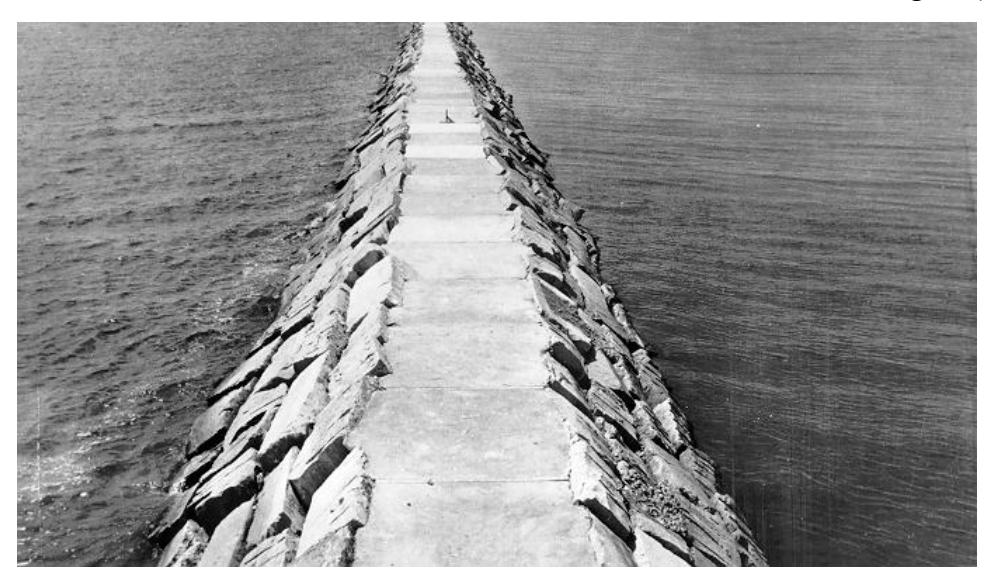
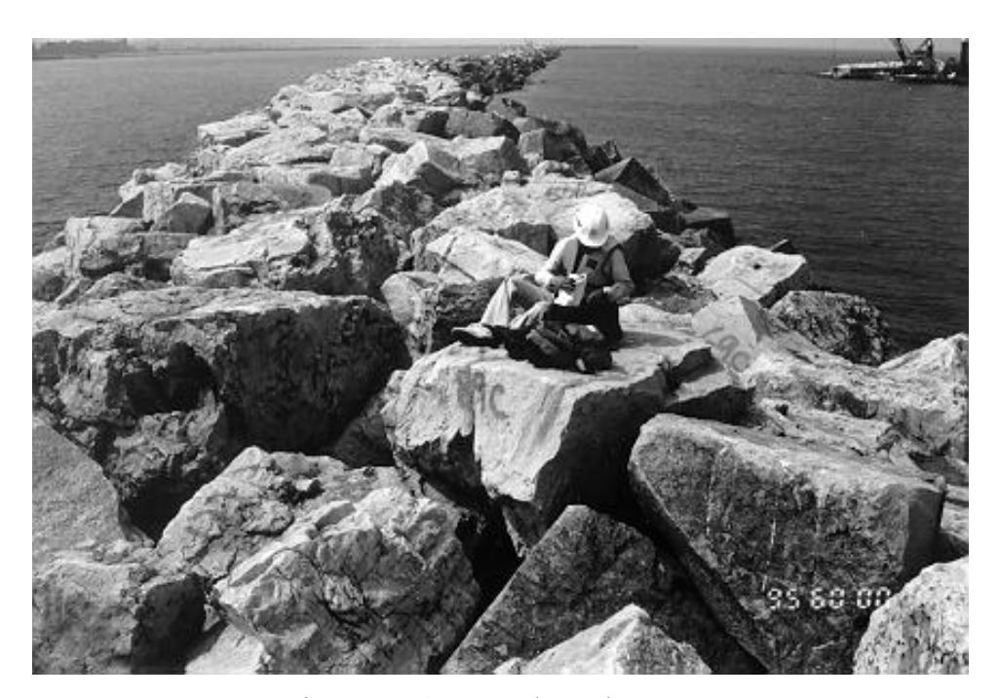
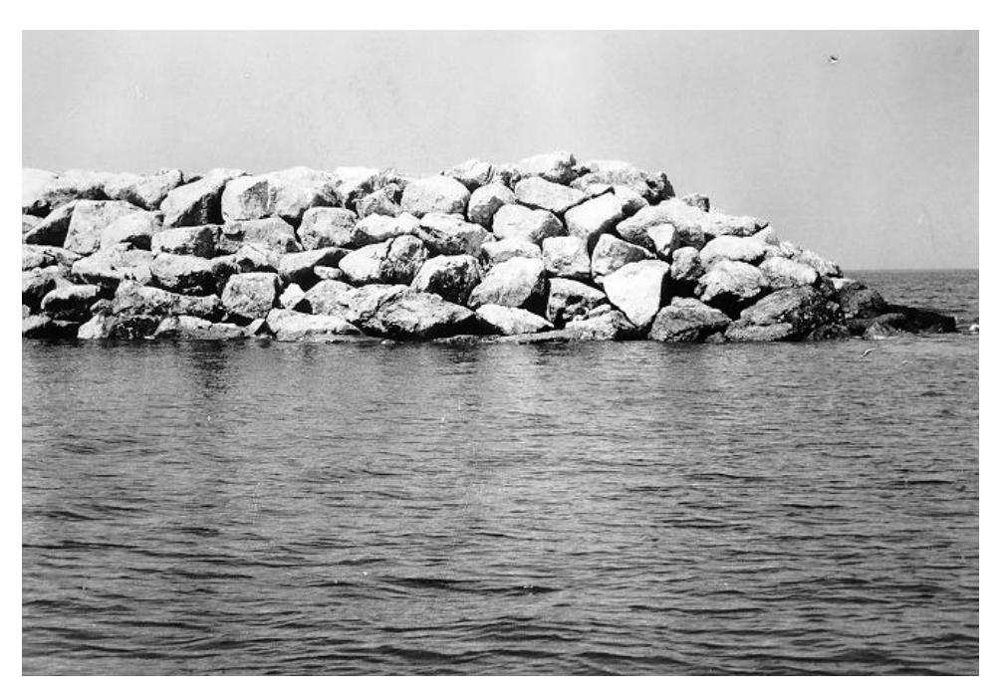
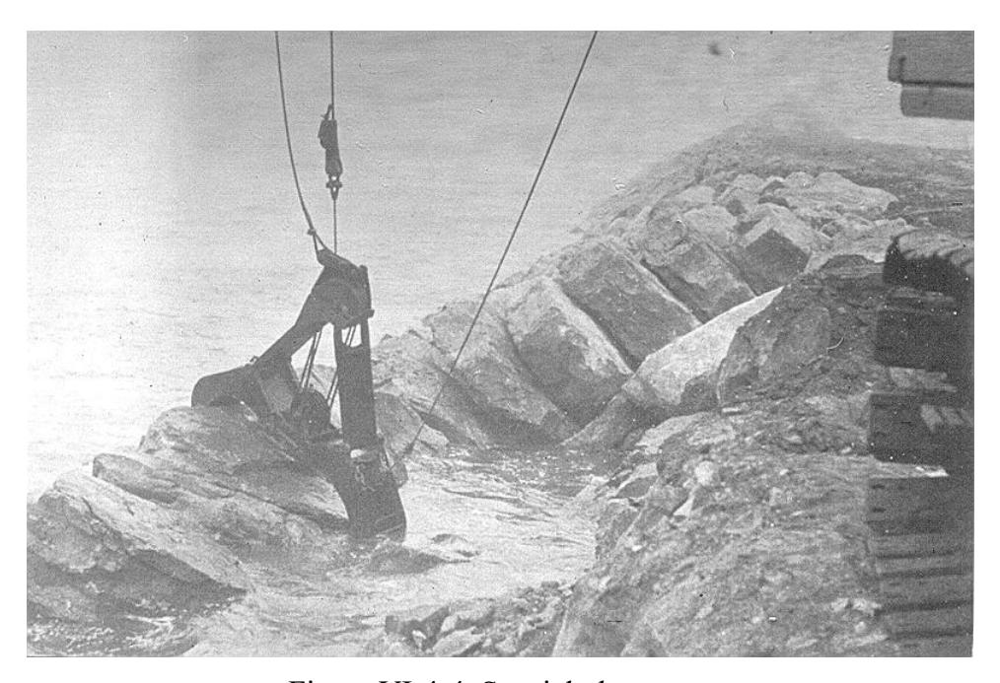
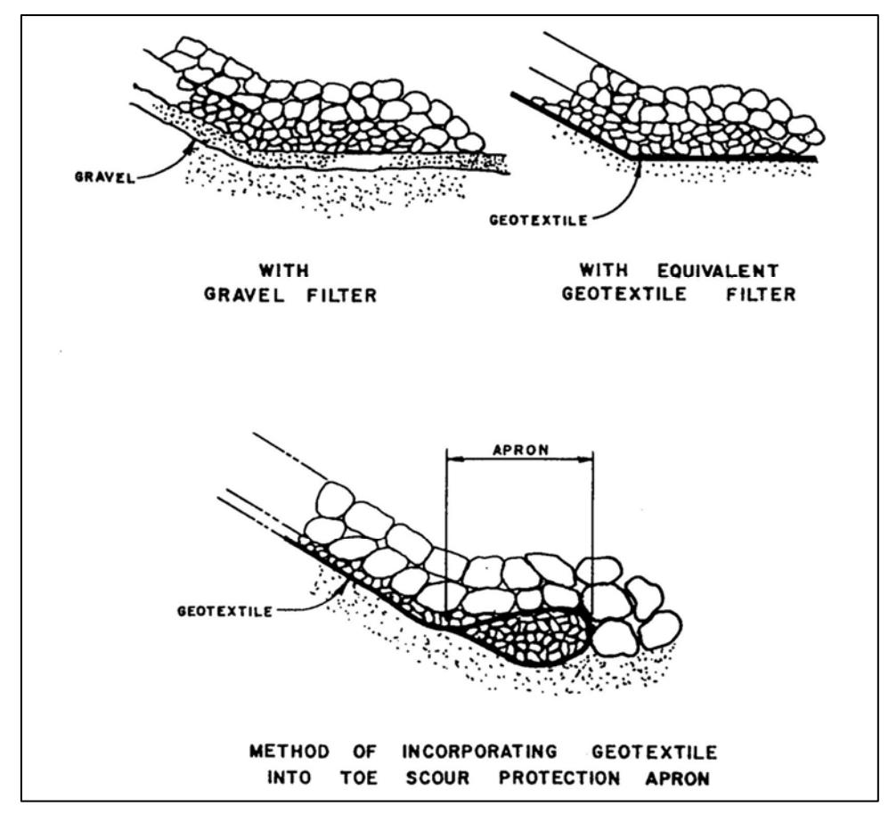

#### CHAPTER 4

#### Materials and Construction Aspects

#### TABLE OF CONTENTS

- VI-4-1. Material Requirements
  - a. Material properties and strength
  - b. Material durability
  - c. Material adaptability
  - d. Material costs
  - e. Material availability
  - f. Material handling requirements
  - g. Material maintenance requirements
  - h. Material environmental impacts
- VI-4-2. Earth and Sand
  - a. Uses of earth and sand in coastal construction
  - b. Physical and mechanical properties of earth and sand
  - c. Placement considerations for earth and sand
  - d. Environmental effects on earth and sand
- VI-4-3. Stone
  - a. Use of stone in coastal construction
  - b. Physical and mechanical properties of rock
  - c. Quarrystone procurement and inspection guidelines
  - d. Placement considerations for stone
  - e. Environmental effects on stone
- VI-4-4. Portland Cement Concrete and Bituminous Concrete
  - a. Use of concrete and asphalt in coastal construction
  - b. Physical and mechanical properties of concrete
  - c. Physical and mechanical properties of asphalt
  - d. Concrete construction practices
  - e. Concrete for armor units
  - f. Environmental effects on concrete and asphalt
- VI-4-5. Steel and Other Metals
  - a. Use of metal in coastal construction
  - b. Physical and mechanical properties of metals
  - c. Design values for structural metals
  - d. Metal protective treatments
  - e. Metal fasteners and connections
  - f. Environmental effects on metal
- VI-4-6. Wood
  - a. Use of wood in coastal construction
  - b. Physical and mechanical properties of wood
  - c. Design values for structural lumber
  - d. Wood preservatives and treatment
  - e. Wood fasteners and connectors
  - f. Environmental effects on wood
- VI-4-7. Geotextiles and Plastics
  - a. Use of plastics in coastal construction
  - b. Physical and mechanical properties of plastics
  - c. Design requirements for geotextile fabrics
  - d. Geotextile installation considerations
  - e. Environmental effects on geotextiles and plastics
- VI-4-8. References
- VI-4-9. Acknowledgements
- VI-4-10. Symbols

#### List of Figures

- Figure VI-4-1. Uniform placement
- Figure VI-4-2. Random placement
- Figure Selective placement
- Figure Special placement
- Figure Typical use of geotextile fabric in coastal revetment

## List of Tables

- Table VI-4-1. Soil Density Parameters
- Table VI-4-2. Typical Soil Permeability Coefficients
- Table VI-4-3. Engineering Characteristics of Unweathered Common Rocks
- Table VI-4-4. Durability Ranking for Common Stone
- Table VI-4-5. Approximate Criteria for Evaluating Stone
- Table VI-4-6. Typical Compressive Strengths of Concrete
- Table VI-4-7. Concrete Compressive Strength for Different Water-Cement Ratios
- Table VI-4-8. Recommended Concrete Slump for Various Types of Construction
- Table VI-4-9. Average Unit Weight of Fresh Concrete
- Table VI-4-10. Specifications and Applications for Steel Suitable for Marine Service
- Table VI-4-11. Galvanic Series in Flowing Seawater at Ambient Temperature
- Table VI-4-12. Tensile Stress Limits for Selected Metals and Alloys
- Table VI-4-13. General Characteristics of Common Wood
- Table VI-4-14. Comparative Properties of Geotextile Materials
- Table VI-4-15. Minimum Geotextile Fabric Physical Property Requirements
- Table VI-4-16. Determination of EOS and POA for Geotextiles
- Table VI-4-17. Construction Limitations: Quarrystone Revetment
- Table VI-4-18. Construction Limitations: Block Revetments and Subaqueous Applications Materials and Construction Aspects

#### CHAPTER VI-4

#### Materials and Construction Aspects

- VI-4-1. Material Requirements. Materials used to construct coastal engineering projects are critically important to the success and longevity of the project. Selected construction materials often must withstand the rigors of relentless wave pounding in a corrosive environment that may undergo freeze-thaw cycles. Primary material selection criteria are physical properties and strength, durability, adaptability, cost, availability, handling requirements, maintenance requirements, and environmental impact. Knowledge of past material performance on similar coastal projects is an important consideration for the design engineer. Much of the information presented in the following sections was condensed from a comprehensive Special Report entitled A Construction Materials for Coastal Structures @ by Moffatt and Nichol (1983).
- a. Material properties and strength. In practically all cases, common materials having well- documented physical properties and strengths are used in construction of coastal project elements. Sections in this chapter, beginning with Part VI-4-2, give properties for widely used construction materials. General aspects of key material physical properties are listed below.
- (1) Specific gravity. Specific gravity is a fundamental property for all coastal construction materials. Coastal structures, such as breakwaters, rely on self-weight of the structure to resist applied loads. Thus, materials with high specific gravity, like rock and concrete, are ideally suited for these types of applications, particularly for submerged portions where water buoyancy decreases effective structure weight. Specific gravity is also important for structures such as surge barriers and piers, which must be designed to support the weight of the component structural members. Materials with lower specific gravities, such as wood and plastics, also have uses in coastal construction. Beach renourishment projects function best if the placed beach fill material has a specific gravity the same as, or greater than, the native beach sand.
- (2) Strength. Depending on the application, materials used in coastal construction may need to resist tension, compression, and flexure stresses. Material strength properties help determine the size, shape, and stability of component structural members. Structures built of stone, earth, concrete, and asphalt are capable of withstanding compression, shear, and impact loading; but they generally cannot resist tensile loads. Tensile loads in concrete structures can be tolerated provided there is sufficient steel reinforcing or prestressing of the member to carry the tensile stress. Geosynthetics add tensile strength to the soil mass.
- (a) Steel, and most other metals, can accommodate high levels of tensile, compressive and torsional stresses and impact. Often steel structural members undergo considerable flexing or displacement when subjected to bending moments, and this displacement must be considered in the design. Metals also expand and contract with temperature change, which can introduce additional stress into the structure.
- (b) Wood also exhibits good tensile and compressive strengths, but wood is not isotropic and its strength depends on orientation of the wood grain relative to the applied loads. Wood components can tolerate significant deflection and movement without failing.
- (c) Geotextile fabrics are subjected mainly to tension, impacts, flexing, and fatigue. Synthetic structural components can resist compression, tension, shear, and torsion to varying degrees depending on the particular synthetic. Some plastics will undergo enormous deflection before yielding, whereas some plastics have very little elongation prior to failure. Strength characteristics of some synthetic materials will decrease in time due to ultraviolet radiation or other environmental factors, and precautions must be taken when using these materials. Also plastics can experience a slow, permanent deformation under constant load.
- (3) Resistance to cyclic, impact, and seismic loads. Coastal engineering project elements are often exposed to continual cyclic wave loading, impact loading from waves or vessels, and occasionally accelerations due to seismic activity. Surviving these load conditions may require that portions of rigid structures be able to absorb the load without exceeding the elastic yield limit of the materials. Stone or earth structures resist these types of loads by providing stress relief through differential settlement, nesting of stone layers, or local areas of damage.
- (4) Flexibility. Flexibility is the property of a material that allows it to bend without breaking. Materials with good flexibility will help absorb cyclic and impact loads, but continual flexing might eventually lead to fatigue failure, plastic deformation, and crack formation. Material flexibility is a relative term, and it depends on both the material and the shape of the structural member. For example, steel columns and beams can be designed for little deformation whereas steel rods and cables can be highly flexible. Generally, concrete and stone are considered to have little flexibility, followed by the more flexible steel and wood. Rubber and some synthetic materials are highly flexible. Flexibility can also be used to describe the response of coastal projects. For instance, the individual armor stones on a jetty have no flexibility, but the entire armor layer is capable of movement and settlement to a new position without undue loss of functionality, thus making it a "flexible" structure. Likewise, beach fills can be termed flexible structures even though the individual sand grains are rigid.
- (5) Compatibility. Many projects combine different materials, and compatibility problems may arise due to differences in material physical or chemical properties. The constituent materials in composites such as concrete and asphalt must be compatible to attain adequate strength. Rigidly combining structural components of different flexibilities or different expansion coefficients may induce additional stresses or component failure. Different materials (or materials in which properties vary) undergo abrasion at different rates. For example, armor stones of different hardness may degrade at different rates, which may lead to weak spots in the armor layer. Contact between different types of metals in the marine environment can cause a galvanic reaction and rapid corrosion. Corrosion can also stem from contact with chemicals. For example, materials used to contain contaminated sediment must be able to withstand any chemical reactions that may result from direct contact with the contaminant.
- b. Material durability. Durability is a relative term describing how well a material withstands the rigors of the environment into which it is placed. The durability of a particular coastal project element is a combination of the durability of the construction materials and the capability of the project to continue functioning at an acceptable level even after the construction material has begun to degrade. Therefore, material durability needs to be considered in terms of the project's design life, first costs, and projected maintenance expenses. Projects with short
design lives can tolerate less durable materials at a reduced cost. Factors that affect a material's durability include its ability to resist abrasion, chemical attack and corrosion, marine biodegradation, wet/dry cycles, freeze/thaw cycles, and temperature extremes.
- (1) Earth and sand. Earth is generally considered durable unless changes in water content or chemistry reduce grain size to the range of silts and clays. Quartz sand is very durable, but sand mixtures with high carbonate content from shell material will be more vulnerable to chemical attack if the water is acidic. Also shell particles are not as hard as quartz and are more susceptible to abrasion.
- (2) Stone. Igneous rock is considered to be the most durable, but this depends partially on the geology of the rock. Sedimentary rock is usually stratified and subject to failure through shear stress, impact, chemical deterioration, or changes in water content. Sedimentary armor stones generally are more easily worn down by abrasion. Any armor stone that develops small cracks may eventually fracture due to freeze/thaw cycles, irrespective of the type of rock.
- (3) Concrete and asphalt. Concrete is considered to be durable and is usually expected to last throughout the lifetime of most coastal projects, provided the concrete is not exposed to adverse chemicals or excessive abrasion, and loads are within design limits. Cracks in concrete may lead to spalling of the surface and exposure of steel reinforcement, which will immediately begin to rust. Rough handling of individual concrete armor units during placement may result in chipping or cracking of slender members. Asphalt it not considered to be a durable material because it has low strength in both compression and tension, it is subject to chemical reaction, its stiffness changes with temperature, and it is not resistant to impact or abrasion.
- (4) Steel. Standard grade steel is considered very durable if properly protected from rust and corrosion throughout the project lifetime. Bare steel will rapidly deteriorate in the corrosive coastal environment. Sacrificial anodes should be provided to protect steel exposed to seawater. Abrasion of steel components by sand, particularly near the seabed, is also a problem. Stainless steel is more durable, but this advantage is often offset by increased cost.
- (5) Wood. Although wood is considered less durable than concrete, lengthy service life can be obtained for wood components. Wood durability depends on the characteristics of the wood, its usage and exposure to the elements, and project maintenance. Wood is an organic material that can be attacked by plants and marine animals if precautions are not taken. Fasteners and connectors, such as bolts, nails, etc., must also be protected from corrosion to assure wood structure longevity. Dry wood is the least fire-resistant material commonly used in coastal projects.
- (6) Geotextiles and plastics. Geotextiles and many plastics are generally resistant to chemical and biological attack, but will deteriorate when exposed to ultraviolet radiation. The rate of deterioration can be reduced by adding UV inhibitors, coatings, or by covering the geosynthetic with soil, sand, water, or even algal growth. Use of synthetic materials in coastal construction projects is relatively new, thus long-term durability of some synthetic materials in the coastal environment has yet to be determined. Some synthetic materials are vulnerable to fire and can generate toxic fumes when ignited. For these reasons and other functional requirements, geotextiles are generally covered with soil.
- c. Material adaptability. Non-rigid mound-type stone and earthen structures can be constructed in a variety of shapes and sizes, and these structures can accommodate changes in foundation elevation and structure slope without losing functionality and structural stability. Stone and earth can be used in most weather conditions and temperature extremes without significant consequences.
- (1) Concrete is very adaptable for use in coastal projects; however, cost often limits its usage to applications that cannot be effectively constructed using less expensive materials such as stone. For example, concrete vertical caisson breakwaters are used when water depths are too great for conventional rubble-mound structures or when mooring facilities are needed adjacent to the structure. Concrete is also viable for use as rubble-mound structure armor units, piles, and sheetpiling.
- (2) Steel is very adaptable for complex structures, support frameworks, structures with movable parts, floating structures, and structure components. Except in the above cases, costs generally limit steel usage to piles, sheetpiling, and beams.
- (3) Wood is considered to be fairly adaptable for use in smaller structures and as structure components, and it is easily stored and handled during construction. Synthetic materials usually have specific functions determined by their hydraulic and strength properties, such as geotechnical filter, separation of soil reinforcement. Geotextile tubes are finding a variety of uses due to their capability to retain fine-grained material.
- d. Material costs. Because of the large quantities of material needed for most coastal projects, material cost is an important design consideration. Historically, coastal structures have been built using common, readily available materials that were obtained locally at low cost. When evaluating material costs, the cost of transporting the material to the job site must be included. If the material is not locally available, transportation costs could equal or exceed material costs per unit volume. Consequently, a more expensive local source may be preferable to a less expensive alternative located further away from the project site. Any material selection based on cost must include consideration of further maintenance expenses associated with the selection. For example, selecting a local source of lesser-quality stone for a breakwater may result in initial construction cost savings, but this choice may result in increased maintenance expense due to stone fracturing and stone abrasion. At every juncture of the design process, the coastal engineer should evaluate the costs associated with material specification. Significant cost savings can be realized for bulk materials because of the vast quantities required. However, practical choices are somewhat limited for most coastal projects. Any project design that requires fabricated components should attempt to specify common "off-the-shelf" items rather than custom-made parts. When feasible, this will result in both cost and time savings. Finally, consider the costs associated with any special material handling requirements (see below). These costs may more than offset any material cost savings.
- e. Material availability. Availability of suitable materials for coastal project construction and future maintenance is an important design consideration. Lack of viable local sources for primary construction materials may limit design options or significantly increase construction costs and time of construction. For example, use of concrete in remote locations may not be feasible unless good quality sand and aggregate are locally available for onsite
mixing. The projected rate of material usage must be matched with the rate that material can be supplied. It may be necessary to stockpile material onsite to compensate for an intermittent supply and to avoid slack work periods (Thomas and Hall 1992). If plans call for future project replacement, modification, or maintenance, sufficient sources of similar (or required) materials should be determined a priori. (See Part VI-3-7, "Construction Considerations," for site-specific design factors related to material availability.)
- (1) Earth and sand. In most locations an adequate local source of earth exists for use in dikes, fills, and foundations. Exceptions include areas characterized by deltaic deposits of silts and clay and some rocky coastal regions. Less common are local sources of high-quality beach sand for use in placed beach fills.
- (2) Stone. Stone is generally abundant in most regions of the continental United States. However, some locations, such as the coastline of the Gulf of Mexico and South Atlantic, can be as far as 250 km or more from stone sources. Other locations may have huge quantities of stone, but the quality may not be adequate for coastal projects because of low density or low strength. An example is volcanic rock on Pacific islands. Along high wave energy coasts, coastal projects may require huge stones that are difficult to produce from local quarries.
- (3) Concrete and asphalt. Cement, stone aggregate, and sand suitable for use in concrete mixtures are available in all coastal regions in the United States. Concrete materials may have to be transported to some remote locations, such as some of the smaller Pacific islands. Also, difficult local access to material sources in remote regions may make importation of concrete materials economically feasible. Generally, asphalt is available at most project sites in the United States, but use of asphalt at other locations depends on availability of the asphalt components and handling equipment.
- (4) Steel. Standard grades of steel in common cross sections and stock lengths are generally available for coastal projects. Special cross sections or less-common steel specifications (such as high strength steel or even stainless steel) are less likely to be available locally and may require substantial transportation costs between the mill and construction site. Availability of prefabricated steel components depends largely on the project's proximity to qualified steel fabrication yard.
- (5) Wood. In the past, wood was one of the most available materials for construction of coastal projects. However, in recent years certain types and sizes of durable hardwoods have become more difficult to obtain. This has resulted in fewer coastal projects in the United States being constructed with wood as the primary construction material. Where available locally, hardwood often compares favorably in terms of cost and utility to other construction materials for projects such as bulkheads and piers.
- (6) Geotextiles and plastics. It is unlikely that most coastal project sites will have a local source of manufactured geotextiles and plastics. However, these materials are economically transported to all regions of the United States. Availability of large quantities of synthetics may require special orders to the factory with plenty of lead time to assure ontime delivery.
- f. Material handling requirements. A substantial portion of project construction cost involves material handling. Included in handling costs are transportation of materials to the construction site, onsite storage of materials, onsite material mixing and component fabrication, and placement of materials to build the project. Projects in isolated locations must consider site access and availability of equipment to handle materials. Conversely, projects in urbanized coastal regions must consider impacts of large-sized material transport vehicles on congested streets and space requirements for onsite material storage. Most materials can be transported by conventional methods such as rail, barge, truck, or ship. Special allowances are needed for oversized loads and loads exceeding usual United States highway load limits of 180-215 kN (20- 24 tons) per truck. Another important transportation consideration is projected future site access for bringing in materials needed for long-term maintenance or rehabilitation. Just as important is the ease with which materials can be handled either by hand or with conventional equipment. Materials that are awkward to handle, require special handling techniques and equipment, or require particular labor skills and specialized training add to project costs.
- (1) Earth and sand. Earth is easily handled with conventional earth-moving equipment and transportation methods. The availability of earth compaction equipment will determine how earth fills will be compacted, which in turn factors into design load bearing capacity. If earth handling results in formation of dust clouds, workers must wear some sort of breathing filters. Sand from land-based sources is handled similarly to earth. However, sand obtained from offshore sources must be dredged and pumped or transported to the project site. In these cases, material handling will be a substantial portion of the project cost. Cost of earth and sand will increase if sorting into acceptable grain size ranges is required.
- (2) Stone. Stone handling limitations arise primarily with large armor stone sizes. Availability of adequate handling equipment at quarries is a critical factor, as well as the cost of quarrying and transporting large armor stones. Some quarries have equipment capable of handling stones larger than allowed on public highways. Road weight limitations not only influence armor layer design, but careful planning is also required to maximize usage of trucks or rail transportation. Equipment must be available for handling of large armor stones at the project site. Cranes must have sufficient lift capacity and must be able to reach outward sufficient distances to place armor stones accurately at the toe of the structure. Approach roads and staging areas must be able to support the heavy truck loads.
- (3) Concrete and asphalt. Handling requirements for concrete and asphalt beyond normal batch processing, truck hauling, and truck placement are a function of the particular structure design. Some designs may require special handling equipment, such as cranes with buckets, pumps, or roller compaction equipment. Availability of this equipment may influence the structural design. Air or water temperature and underwater placement may have an impact on concrete and asphalt handling requirements. Forms are needed to cast concrete armor units, and special equipment is needed to fabricate reinforced or prestressed concrete piles. Consideration should be given to whether special equipment, such as concrete forms, is reusable. Time should be allowed for concrete armor units to cure before placing them on the structure.
- (4) Steel. Conventional steel members and framework can be fabricated for easy transport and handling using conventional equipment; however, some site assembly may be
required. Unusual steel fabrications, or very heavy steel components, may require specially designed or modified handling equipment.
- (5) Wood. Typical wooden structural components present no difficulty in transporting and handling. Application of chemical preservatives may require special equipment to assure sufficient wood penetration.
- (6) Geotextiles and plastics. Most synthetic materials can be transported by conventional means. Special handling equipment and techniques may be required to place geotextile fabrics, particularly in underwater applications. If the geotextile has specific weight less than water, provisions must be made to hold the fabric in place until it is overlain with denser material. Similarly, in above-water applications wind can lift sections of geotextile fabric unless it is weighted.
- g. Material maintenance requirements. Project maintenance requirements depend in part on how selected materials deteriorate over time due to physical and chemical processes.
- (1) Earth and sand. It is not necessary to protect earth and sand used in coastal projects from physical or chemical deterioration, but it is necessary to prevent or retard removal of material by wind or water erosion. The only maintenance costs will be associated with replacing eroded material, and this cost will be affected by access to the earth and/or sand portions of the project.
- (2) Stone. The main concern with stone is reduction in size through abrasion and splitting. Armor stones broken into smaller pieces can be removed from a structure by wave action. Maintenance consists of replacing damaged or missing stones, which can entail significant mobilization costs. Preservation of stone material is generally not feasible.
- (3) Concrete and asphalt. Concrete quality is determined by the quality of its component materials and the method of mixing and placement. Like stone, the main maintenance requirement is periodically taking steps to prevent deterioration, or mending portions that have cracked, broken, spalled, etc. Protective coatings can be applied to exposed concrete surfaces to help prevent flaking and to seal cracks that might allow water to penetrate the surface and cause corrosion of steel reinforcement. Some concrete sealants may become less effective when exposed to certain chemicals that react with the sealant. Broken concrete armor units should be replaced with new units. Care must be taken to assure replacement armor units are interlocked into the armor layer rather than simply placed on top. During original construction, future maintenance costs can be reduced by casting a suitable number of replacement armor units and stockpiling them onsite. Maintenance of asphalt structures consists primarily of patching or replacing damaged areas. Underlying earth materials may shift and settle, opening large cracks in the asphalt cover layer. These cracks must be repaired before the fill material erodes. Also, repeated cycles of large temperature change may open significant cracks in the asphalt. Continuous maintenance of asphalt roadway surfaces is required to avoid damage to vehicles and equipment.
- (4) Steel. Steel must be protected from chemical and galvanic corrosion, unless it is made of special alloys such as stainless steel. Exposed steel surfaces corrode very rapidly in coastal
settings, especially in the wet-dry regions and at the sandline where sand particles continually abrade the paint and protective rust. Most steel maintenance involves reapplying protective coatings like paint, replacing corroded structural members and fasteners, and servicing the cathodic protection system by replacing sacrificial anodes. Steel structural members damaged by vessel impacts or debris should be replaced as soon as possible if the damage is severe enough to threaten structural integrity. For example, a buckled steel strut could result in failure of adjacent members at loads considerably below design values. Cosmetic damage, such as dents, can be addressed during scheduled maintenance.
- (5) Wood. Wood structure components are susceptible to biological attack at all places except below the mud line. Most wood deterioration occurs in the wet and dry tidal range. Wood maintenance consists of reapplying protective surface coatings such as paint and replacing deteriorated wood portions with new material. It is usually not practical to re-treat deteriorated pressure-treated, chemical-impregnated wood. These members should be replaced. Surface coatings consist of antifouling paints or coating materials that resist borer penetration, such as a 0.5-mm-thick coating of epoxy. Maintenance of wood structures also involves replacement of wood members damaged by vessel or wave impacts, fire, or exposure to harmful chemicals. Broken structural members should be immediately replaced to avoid additional damage to adjacent structure components. Pollutants in some harbors may be harmful to wood, but a side benefit is the almost complete absence of marine life harmful to wood structures.
- (6) Geotextiles and plastics. Maintenance requirements of synthetic materials vary widely, depending on the material and its application. Maintenance of geotextiles may be warranted if the fabric is exposed for a period of time. For example, loss of armor stone and underlayer stone might expose the geotextile filter cloth, which could then be damaged by debris or sunlight. Geotextiles used in sand-filled bags can usually withstand ultraviolet radiation, but the bags can be torn or vandalized, requiring immediate repair. Repair can be accomplished by sewing, overlapping, or gluing a patch to the damaged geotextile. Plastics can withstand practically all naturally occurring chemicals found in coastal regions. However, pollutants or spilled fuels may react with some plastics, causing rapid deterioration or change in the material's characteristics. Plastics can be physically damaged by impacts and by fatigue brought about by cyclic loading. Determining whether or not broken plastic components is needed will depend upon the importance of the plastic component to overall structural integrity.
- h. Material environmental impacts. Long-term project success relies on the ability of the selected construction materials to resist attacks from the surrounding environment by such diverse factors as force loadings, corrosive chemicals, marine organisms, abrasion, fire, wet/dry cycles, freeze/thaw cycles, etc. Equally important is minimizing effects that construction materials may have on the natural environment in which they are placed. Strong justification is needed to use any construction material that introduces adverse chemicals into the environment that might impact plant and animal life in the immediate project vicinity. Coastal construction can produce nonchemical adverse impacts such as high levels of turbidity from earth and sand placement or from foundation dredging. Impacts also arise from burying or displacing species during construction, although many mobile animal species simply migrate out of the area temporarily. Completed coastal projects often provide viable habitat, thus offsetting somewhat the negative environmental consequences of construction. An evaluation of potential
environmental impacts of a project should consider future impacts that could arise from project deterioration, vandalism, and subsequent repair or maintenance. Environmental impacts may be reduced during repair and rehabilitation if materials from the original construction can be reused. Finally, present and future visual impacts of the project definitely should not be ignored.

#### VI-4-2. Earth and Sand.

- a. Uses of earth and sand in coastal construction. Coastal projects tend to be fairly large and require a significant volume of construction materials. When feasible, structures are designed to use earth or sand as an economical filler material, and in many cases the mechanical strength properties of the soil are an integral part of the design. Below are some of the common uses of earth and sand in coastal construction:
- (1) Rubble-mound breakwaters. Sand may be used as core material to provide a structure with a nearly impervious core, although sand-only cores are not common practice. The sand can contain clays, but cohesive clay-like materials alone are unsuitable for breakwater cores. Sand cores must be protected by geotextile or gravel filters and successively larger stone layers to prevent loss of sand due to piping under wave and current action.
- (2) Caissons. Sand or soil is used to fill the compartments of concrete caissons and "cell-type" structures made of steel sheetpiles. Sand is preferred if the filler material is expected to support road works. Fill material must be protected from wave action that could wash away the soil.
- (3) Bulkheads and vertical-front seawalls. Sand and soil are most often used as backfill or as foundation material for bulkheads and seawalls. The backfill usually is compacted to provide supportive soil pressure to resist wave loads and hydrostatic pressures. Soil may be needed to level the working area for foundations, or in weak soil conditions, to replace unsatisfactory in situ soil. Some circumstances may require coarser backfill material to promote rapid draining.
- (4) Dikes. Earthen dikes constructed of sand, clay, or a combination of both, are used as dredged material containment structures and as storm protection structures. Dikes exposed to wave action need to be protected against erosion, i.e., armored like a revetment.
- (5) Beach and dune restoration. Beach-quality sand from either land or offshore sources is the key ingredient for successful beach nourishment and dune restoration projects. Constructed sand dunes can be temporarily stabilized using snow fencing while dune vegetation is being established. Useful guidelines on stabilizing dunes with vegetation were given by Woodhouse (1978).
- (6) Land reclamation. Construction of coastal facilities such as harbors and marinas often involves creation of new above-water land areas. Earth and sand used in these projects may come from dredging or from inland sources. Soils used in most reclamation projects are expected to have some degree of load- bearing capacity, depending on project requirements.
- (7) Construction roads. Access to coastal projects may require construction of temporary or permanent roads using earth, sand, and gravel. Initial construction or major rehabilitation of shore-connected rubble-mound structures requires a roadway along the structure crest capable of supporting a crane and heavy trucks. If a permanent crest road is not part of the structure design, a temporary gravel road can be constructed that will eventually be washed away by storm waves.
- (8) Concrete aggregate. Sand and gravel are essential ingredients in concrete and grouts used in coastal construction.
- b. Physical and mechanical properties of earth and sand. Part III-1 (Coastal Sediment Properties) provides a thorough overview of sand composition, properties, and engineering applications. The following sections cover a broader range of soils.
- (1) General soil properties and classification. The terms "earth" and "soil" are used to describe mixtures of a large assortment of materials comprised of various size particles. Soils are classified according to grain size into groups that share similar engineering characteristics. One such system is the widely used Unified Soil Classification System (USCS) as presented in Table III-1-2 of Part III-1, "Coastal Sediment Properties." This classification system spans the particle size range that includes boulders, cobbles, gravels, sands, silts, and clays. Listed below are some general engineering characteristics of soils classified according to the USCS (Eckert and Callender 1987):
- (a) Boulders and cobbles . "Boulders" and "cobbles" are rounded to angular, bulky, hard rock particles. Boulders have an average diameter greater than 300 mm, whereas cobbles have diameters spanning the range between 75 and 300 mm. Boulders and cobbles are very stable components for fill and for stabilizing slopes, particularly when the particles are angular. Including these larger particles as aggregates in finer grained soils helps improve the soil capacity to support foundation loads.
- (b) Gravels and sands . Gravels and sands are rounded to angular bulky, hard, rock particles that can be naturally occurring or made by crushing larger stones. Gravels span the range of grain diameters from 4.76 to 75 mm, and sands cover grain sizes in the range from 0.074 to 4.75 mm. Within each category there are further divisions such as "coarse" and "fine." Gravel and sand have essentially the same engineering properties; they differ mainly in degree. They are easily compacted, little affected by moisture content, and unaffected by frost. Gravels are more permeable than sands, and they are generally more resistant to erosion and piping. Stability of sands and gravels generally decreases as the grain-size distribution becomes narrower.
- (c) Silts and clays . Soil particles with diameters less than 0.074 mm are silts or clays, and the distinction between the two arises from its behavior under certain conditions. Silts are inherently unstable, particularly when moisture content is increased, and they may reach a "quick" state when saturated. Silts are difficult to compact, highly susceptible to frost heave, and are easily eroded. Clays exhibit plastic behavior and have cohesive strength, which increases as moisture content decreases. Clays have low permeability, are difficult to compact when wet, and are difficult to drain. Clays resist erosion and piping when compacted, and they are not susceptible to frost heave. However, clays do expand and contract with changes in moisture
content. In general, highly expansive clays should not be used to backfill coastal structures. The most important engineering properties of soils are density, shear strength, compressibility, and permeability. These properties are used to estimate slope stability, bearing capacity, settlement, and erosion rate. Some of the basic soil properties can be determined using field and laboratory tests. For other properties it is necessary to correlate the soil parameters with results from previous experience. In the sections that follow, several key soil parameters are discussed. More detailed information on these and other soil properties such as water content and grain-size distribution are given in Eckert and Callender (1987) or in any geotechnical engineering textbook.
(2) Soil density. Soil is a multiphase mixture composed of solid particles and void spaces that are filled with water and/or gas. Consequently, in soil mechanics the term " density " describes the overall soil density as a function of particle density and the relative proportion of solids and voids in the sample. Table VI-4-1 shows a number of density-related parameters commonly used by geotechnical engineers. Note that specific gravity G is determined using the unit weight of fresh water. Typically, G ranges between 2.5 and 2.8 with preliminary calculation "default" values of 2.65 for sand and 2.70 for clays. Void ratio and porosity are indicators of soil compressibility and permeability. Geotechnical engineers prefer using void ratio because the volume of solids remains constant during any soil volume change. Void ratio can range from 0.15 for well-compacted soils having a wide grain-size distribution to 4.0 for very loose clays with high organic material content. Densely packed uniform spheres have a minimum void ratio of 0.35. Table III-1-4 in Part III-1 gives typical density values for common coastal sediments.

**Table VI-4-1. shows a number of density-related parameters commonly used by geotechnical engineers. Note that specific gravity G is determined using the unit weight of fresh water. Typically, G ranges between 2.5 and 2.8 with preliminary calculation "default" values of 2.65 for sand and 2.70 for clays. Void ratio and porosity are indicators of soil compressibility and permeability. Geotechnical engineers prefer using void ratio because the volume of solids remains constant during any soil volume change. Void ratio can range from 0.15 for well-compacted soils having a wide grain-size distribution to 4.0 for very loose clays with high organic material content. Densely packed uniform spheres have a minimum void ratio of 0.35. Table III-1-4 in Part III-1 gives typical density values for common coastal sediments.**

| Table | VI-4-2. | Typical Soil Permeability |  | Coefficients | .................................................. | VI-4-14 |
| --- | --- | --- | --- | --- | --- | --- |
| Table | VI-4-3. | Engineering Characteristics | of |  | Unweathered Common Rocks ............... | VI-4-18 |
| Table | VI-4-4. | Durability Ranking for | Common |  | Stone .................................................. | VI-4-21 |
| Table | VI-4-5. | Approximate Criteria | for Evaluating |  | Stone ............................................ | VI-4-22 |
| Table | VI-4-6. | Typical Compressive | Strengths | of | Concrete .......................................... | VI-4-31 |
| Table | VI-4-7. | Concrete Compressive Ratios | Strength | for | Different Water-Cement ...................................................................................................... | VI-4-32 |
| Table | VI-4-8. | Recommended Concrete Construction | Slump | for | Various Types of ............................................................................................ | VI-4-34 |
| Table | VI-4-9. | Average Unit Weight | of Fresh | Concrete | ................................................ | VI-4-35 |
| Table | VI-4-10. | Specifications and Service | Applications | for | Steel Suitable for Marine .................................................................................................... | VI-4-42 |

**Table VI-4-1. shows a number of density-related parameters commonly used by geotechnical engineers. Note that specific gravity G is determined using the unit weight of fresh water. Typically, G ranges between 2.5 and 2.8 with preliminary calculation "default" values of 2.65 for sand and 2.70 for clays. Void ratio and porosity are indicators of soil compressibility and permeability. Geotechnical engineers prefer using void ratio because the volume of solids remains constant during any soil volume change. Void ratio can range from 0.15 for well-compacted soils having a wide grain-size distribution to 4.0 for very loose clays with high organic material content. Densely packed uniform spheres have a minimum void ratio of 0.35. Table III-1-4 in Part III-1 gives typical density values for common coastal sediments.**

| Table | VI-4-2. | Typical Soil Permeability |  | Coefficients | .................................................. | VI-4-14 |
| --- | --- | --- | --- | --- | --- | --- |
| Table | VI-4-3. | Engineering Characteristics | of |  | Unweathered Common Rocks ............... | VI-4-18 |
| Table | VI-4-4. | Durability Ranking for | Common |  | Stone .................................................. | VI-4-21 |
| Table | VI-4-5. | Approximate Criteria | for Evaluating |  | Stone ............................................ | VI-4-22 |
| Table | VI-4-6. | Typical Compressive | Strengths | of | Concrete .......................................... | VI-4-31 |
| Table | VI-4-7. | Concrete Compressive Ratios | Strength | for | Different Water-Cement ...................................................................................................... | VI-4-32 |
| Table | VI-4-8. | Recommended Concrete Construction | Slump | for | Various Types of ............................................................................................ | VI-4-34 |
| Table | VI-4-9. | Average Unit Weight | of Fresh | Concrete | ................................................ | VI-4-35 |
| Table | VI-4-10. | Specifications and Service | Applications | for | Steel Suitable for Marine .................................................................................................... | VI-4-42 |

- (3) Soil relative density and relative compaction. These two parameters give a measure of a soil's in situ density relative to the range of possibilities for that particular soil. (a) Relative density is used for noncohesive sands, and it is defined as the percentage given by the expression

```math
D_r = \frac{e_{\max} - e}{e_{\max} - e_{\min}} \times 100\% \tag{VI-4-1}
```

where the numerator is "the difference between the void ratio of a cohesionless soil in the loosest state (e<sub>max</sub>) to any given void ratio, e," and the denominator is "the difference between void ratios in the loosest and densest (e<sub>min</sub>) states." Relative density provides a measure of the compactness of granular materials used in coastal projects such as sand backfill or dike cores. In the field, relative density is found using standard penetration tests or Dutch cone penetration tests. Actual estimation of relative density should follow the American Society for Testing and Materials (ASTM) Standards (ASTM D-4254 1994) or EM 1110-2-1906 (Department of the Army 1986). However, because of the difficulty in establishing the loosest and densest states of cohesionless soils, significant variations occur in determination of relative density, and correlations with other soil engineering properties should be avoided except for use in preliminary calculations.
(b) Relative compaction describes the relative density of compacted soils, and it is defined as "the ratio of the unit dry weight of an in situ material ( \gamma_d ) to the unit dry weight of the soil when compacted to its maximum density ( \gamma_{dmax} )," or

```math
R_c = \frac{\gamma_d}{\gamma_{d_{\text{max}}}} \times 100\% \tag{VI-4-2}
```

The Standard Proctor Method, given in EM 1110-2-1906 (Department of the Army 1986) is recommended for determining maximum unit dry weight for coastal fills and embankment applications. Relative compaction is normally used to describe cohesive soils (placed or pre-existing) that have been stabilized or improved using compaction techniques.
(4) Soil shear strength. Soil fails when shear displacement occurs along a plane on which soil stress limit is exceeded. For all but preliminary design, soil strength should be determined using appropriate in situ or laboratory testing procedures as described in EM 1110-2-1906 (Department of the Army 1986) or ASTM Standards. Commonly performed tests are the Unconsolidated-Undrained triaxial test, Consolidated-Undrained triaxial test, and the Consolidated-Drained triaxial test. These tests produce stress-strain curves for the tested loading condition, and the shear strength is defined as the first maximum that occurs on the curve. The
tests also reveal conditions of failure for the soil. Soil strength is usually presented in terms of Mohr circles and Mohr failure envelopes. This allows shear strength to be expressed in terms of cohesion, maximum stress, and the angle of internal friction. Noncohesive, granular soils (i.e. sand) resist shearing through two mechanisms: (a) the frictional resistance between particles due to the normal force acting at the point of contact; and (b) the interlocking of particles as they attempt to shift past one another during strain. Frictional resistance is the principal source of soil strength, and it is a function of the soil confining stress. Soil shear strength increases with increases in confining stress. Highly compacted soils with low void ratios have increased strength due to particle interlocking. The shear strength of placed or backfilled cohesive soil will depend to a large extent on the moisture content (pore-pressure) and the compaction the soil receives. Tests should be conducted after compaction to verify that design strength levels have been achieved or surpassed. Shear strength of in situ cohesive soils depends on the method of original deposition and the past overburden history. Undisturbed clays may be overconsolidated, normally consolidated, or under-consolidated. Shear strength is determined using the triaxial tests mentioned above.
- (5) Soil compressibility. Soil compressibility is an indication of settlement that will occur over time due to a given load condition or a change in groundwater level. Compressibility of noncohesive materials is governed by the relative density of the soil, and estimates of soil settlement are straightforward. Consolidation of cohesive soils is more complex and occurs in three stages. Immediate settlement is compression of the soil matrix without any dissipation of pore pressure or water expulsion. Some immediate settlement may be due to compression of trapped gases in the soil. Primary consolidation occurs over time as increased pore pressures force water from the soil voids. This process continues until all the excess pore pressure is relieved. The rate of consolidation depends on soil permeability and the drainage characteristics of the adjacent soil. After primary consolidation, Secondary compression can occur in soils having higher plasticity or significant organic content, such as soft marine or estuarine deposits. Consolidation tests are used to establish the coefficients necessary to estimate settlement of silts and clays. Eckert and Callender (1987) describe the test and analysis methods, and they provide an example application.
- (6) Soil permeability. Permeability is a soil parameter related to laminar (viscous) flow of water through the soil under the influence of gravity. Coastal geotechnical problems affected by soil permeability include seepage through beach sand, consolidation of backfills and hydraulically placed fills, and settlement of foundations. Viscous flow through soils is calculated with an empirical relationship known as Darcy's Law, which is applicable for soils from clays and silts up to coarse sands. In its simplest form, Darcy=s equation for steady flow through uniform soil is

```math
Q = K A \frac{\Delta h}{L} \tag{VI-4-3}
```

where
- Q = discharge
- A = flow cross-sectional area
- L = length of flow path
Δ h = head difference over the flow length
The empirical coefficient K in Darcy's equation is called the coefficient of permeability , and it is a function of both the soil and the pore fluid. Soil particle size and gradation have the largest influence on the coefficient of permeability. Soil permeability is best determined in the field using pumping tests (see Eckert and Callender (1987) for an overview and references). Less accurate permeability coefficients can be obtained with laboratory tests using falling- or constant-head permeameters as described in EM 1110-2-1906 (Department of the Army 1986) or ASTM Standards. Many empirical equations have been proposed to relate permeability to characteristics of the soil such as effective grain size. However, these equations are generally suited only for compacted, clean, coarse soils, whereas naturally occurring soils will exhibit significant variation. Table VI-4-2 gives typical coefficients of permeability for common soils. These values are suitable for use in preliminary design calculations.

**Table VI-4-2. gives typical coefficients of permeability for common soils. These values are suitable for use in preliminary design calculations.**

| Table | VI-4-3. | Engineering Characteristics | of |  | Unweathered Common Rocks ............... | VI-4-18 |
| --- | --- | --- | --- | --- | --- | --- |
| Table | VI-4-4. | Durability Ranking for | Common |  | Stone .................................................. | VI-4-21 |
| Table | VI-4-5. | Approximate Criteria | for Evaluating |  | Stone ............................................ | VI-4-22 |
| Table | VI-4-6. | Typical Compressive | Strengths | of | Concrete .......................................... | VI-4-31 |
| Table | VI-4-7. | Concrete Compressive Ratios | Strength | for | Different Water-Cement ...................................................................................................... | VI-4-32 |
| Table | VI-4-8. | Recommended Concrete Construction | Slump | for | Various Types of ............................................................................................ | VI-4-34 |
| Table | VI-4-9. | Average Unit Weight | of Fresh | Concrete | ................................................ | VI-4-35 |
| Table | VI-4-10. | Specifications and Service | Applications | for | Steel Suitable for Marine .................................................................................................... | VI-4-42 |
| Table | VI-4-11. | Galvanic Series in | Flowing | Seawater | at Ambient Temperature ............. | VI-4-44 |

(7) Soil mixtures. Depending on the borrow source, backfill material may be composed of a mixture containing some fraction of gravel, sand, silt, or clay, along with a significant percentage of organic materials such as vegetable matter or shell fragments. Soil properties of soil mixtures containing a wide range of components will vary tremendously, and the soil should be tested to assure compliance with specified strength and density requirements. Soil mixtures containing organic materials are usually considered detrimental and should not be used because they tend to be more compressible and have lower shear strengths.
- c. Placement considerations for earth and sand. The method chosen for earth placement depends on such factors as location of material borrow source (land or offshore), type of fill, availability of suitable equipment, environmental impacts of the method, and project economics.
- (1) Dumped placement. Earth or sand obtained from upland sources or dredged from the sea bottom can be transported to the construction site and dumped into place. For land-based construction the mode of transport can be trucks, scrapers, conveyor belts, or other means, depending on the transport distance. Typical land-based projects include backfilling seawalls and bulkheads, placing foundation material, and placing the cores of shore-connected rubble-mound structures. Offshore earth and sand can be placed by dumping from barges or by using draglines and buckets for more precision. Dumped material that is not compacted will have low relative densities, and settlement should be expected to occur over time. Barge dumping at sea creates turbulence that will segregate material by grain size as it falls and increase turbidity as fine particles are suspended in the water column.
- (2) Hydraulic placement. Soils dredged from the sea or lake bottom can be transported and placed hydraulically by moving the material as a slurry through a pipeline. The pipeline may extend directly from the dredge to the project site, as in the case of some beach nourishment projects; or barges that bring the material to the construction site can be emptied with hydraulic pumping. Hydraulic placement offers greater accuracy than dumping for offshore applications such as the cores of rubble-mound structures. Material placed underwater, either hydraulically or by dumping, may be moved by waves and currents before it can be adequately protected with overlying filters and armor layers. Land placement of earth and sand by hydraulic means involves a large amount of wash water runoff that can erode sediment along the drainage path or leave segregated pockets of fine-grained sediment that have engineering characteristics vastly different from the rest of the fill.
- (3) Compaction. Above water, earth and sand fills can be compacted by a number of methods depending on the degree of compaction necessary to reach the specified soil parameters. Construction documents should specify the required density, moisture limits, and lift thickness. In situ testing is needed to verify that the compacted fill meets specifications. Mechanical compaction of soils placed underwater is not practical; however, in some situations cyclic wave loading will help compact placed sand.
- d. Environmental effects on earth and sand.
- (1) Effects of soils on the environment. Polluted soils should not be used in coastal projects because contaminants may be released in coastal waters either by leeching out of the placed fill material or through project damage and erosion of the fill material during storms. Potential soil contaminants include industrial wastes such as toxic heavy metals (mercury, cadmium, lead, and arsenic), chlorinated organic chemicals (DDT and PCB=s), and pathogens (bacteria, viruses, and parasites) (Eckert and Callender 1987). Use of dredged materials in coastal construction must be limited to good quality materials free of toxic wastes. See Engineer Manual 1110-2-1204 (Department of the Army 1989) and Engineer Manual 1110-2-5025 (Department of the Army 1998) for related design guidance. Also examine recent Federal and state environmental regulations pertaining to use of dredged material.
(2) Effects of the environment on soils. The particles comprising mixtures of earth and sand are generally unaffected by the natural environment over the project life span. However, structural components constructed using earth and sand are subject to natural forces that can degrade the performance and functionality of the project. Erosion of materials and subsequent decrease in fill volume can be caused by wind, rain, ice, currents, waves, burrowing animals, or human activities. This may reduce the capacity of the soil to resist applied loads and result in project damage. For example, vertical seawall designs often rely on the backfilled soil to help resist wave impacts and water pressures. Unconsolidated sands and silts are most susceptible to erosion. Gravel is more stable against erosion due to the size of the particles, and clays are more stable because of tractive forces between particles. Liquefaction of submerged loose fine sand and silts can occur in areas of high seismic activity or high wave action.

### VI-4-3. Stone.

- a. Use of stone in coastal construction. In the context of coastal engineering, "stone" refers to individual blocks, or to fragments that have been broken or quarried from bedrock exposures or obtained from boulders and cobbles in alluvium (Moffatt and Nichol 1983). Commercial-grade stone can be classified according to size, shape, size distribution, and various physical properties of the material. Stone is used extensively to construct coastal structures, and it is by far the most common material used in the United States for breakwaters, jetties, groins, revetments, and seawalls. Larger projects may contain more than a million tonnes of stone; 80 percent in the core and 20 percent in the armor layers (CIRIA/CUR 1991). Stone used as aggregate and riprap is crushed, broken, or alluvial stone in which the shape of individual stones has not been specified and the size distributions are fairly wide. Quarrystones are larger rock pieces that are "blocky" in shape rather than elongated or "slabby." A principal use of quarrystone is in the armor layer of rubble-mound structures. Below are listed the major uses of stone in coastal construction. Undoubtedly there are additional uses not mentioned. For example, quarrystones make great gifts for your geologist friends.
- (1) Rubble-mound structures . Large quarrystone with specified weight, density, and durability are used for the primary armor layer of most rubble-mound structures. Underlayers are composed of progressively smaller stone sizes; and in many cases, the rubble-mound core material may be riprap or " quarry-run " stone. Quarry stone is also used to construct the base of " composite structures " where a monolithic, vertical-front structure is placed on a rubble-mound base.
- (2) Riprap structures . Riprap is used more for shore and bank protection structures that are not exposed to high waves or strong currents. The wider size distribution of riprap provides a less uniform armor layer that is more susceptible to damage by strong waves and currents. Riprap is less expensive than uniform stone, and placement on the slope is usually less precise (e.g., dumping from trucks).
- (3) Toe protection . Graded stone is used to protect the toes of sloping- and vertical-front structures from undermining by scour. Stable stone sizes are selected based on the anticipated maximum waves or currents.
- (4) Scour blankets . Stone blankets are placed on the seafloor in areas subject to scour by waves and/or currents. Often the scour blanket is a remediation response to scour that was not anticipated in the original project design. Protection of bridge and pier pilings with scour blankets is a routine application.
- (5) Stone fill . Stone is used as a filler material for coastal structures such as cribs, caissons, and gabions. (Gabions are steel wire cages filled with small stones that can be stacked to form steep revetments and bank protection.)
- (6) Filter layers . Smaller stones are used for filter layers over the foundation soil or in drainage applications. Placement is usually by dumping. Selection of stone for a particular project depends on the purpose of the project, design loads, and local availability of suitable stone. In some cases, it may be necessary to evaluate the benefits of using inferior locally available stone as opposed to transporting higher-quality stone from a distant source.
- b. Physical and mechanical properties of rock. The paragraphs below provide an overview of rock properties crucial for coastal engineering applications. These and other rock properties are covered in much greater detail in the Manual on the Use of Rock in Coastal and Shoreline Engineering (CIRIA/CUR 1991).
- (1) Types of rock. Rock, as it occurs in nature, is classified into three distinct groups. Igneous rocks are formed by crystallization and solidification of molten silicate magma. Sedimentary rocks are formed by sedimentation (usually underwater) and subsequent lithification of mineral grains. Metamorphic rocks are transformed igneous or sedimentary rocks in which textures and minerals have been altered by heat and pressure over geological time periods (CIRIA/CUR 1991). Within each major rock category are additional subdivisions based mainly on composition and texture (Table VI-4-3). Some of the more common stone types are described below:
- (a) Granite is a term applied to medium- and coarse-grained igneous rocks consisting mainly of feldspar and quartz. Mica may also exist in small quantities, but large amounts of mica may result in fracture planes within the rock. Most granites are dense, hard, strong, have low porosity, and are resistant to abrasion and impacts. These characteristics make granite a good choice for riprap and armor stone.
- (b) Basalt is a term applied to various dense, fine-grained, volcanic rocks (dacite, andesite, trachyte, latite, basalt). Basaltic rock was formed by cooling lava, and it is composed primarily of feldspar and ferromagnesian minerals. Some basalts may not be suitable for concrete aggregates if they contain reactive substances in the pores. Basalts are generally very dense, hard, tough, and durable, and they are good choices for aggregates, riprap, and armor stone.

**Table VI-4-3. ). Some of the more common stone types are described below:**

|  | Rock Specific | Unconfined Compressive | Water |  |
| --- | --- | --- | --- | --- |
| Rock Group | Weight | Strength | Absorption | Porosity |
| Name | (kN/m3) | (MPa) x 108 Igneous | (%) | (%) |
| Granite | 24.5-27.5 | 160-260 | 0.2-2.0 | 0.4-2.4 |
| Diorite | 25.5-30.4 | 160-260 | --- | 0.3-2.7 |
| Gabbro | 27.5-31.4 | 180-280 | 0.2-2.5 | 0.3-2.7 |
| Rhyolite | 22.6-27.5 | 100-260 | 0.2-5.0 | 0.4-6.0 |
| Andesite | 23.5-29.4 | 160-260 | 0.2-10 | 0.1-10 |
| Basalt | 24.5-30.4 | 160-280 Sedimentary | 0.1-1.0 | 0.1-1.0 |
| Quartzite | 25.5-27.5 | 220-260 | 0.1-0.5 | 0.1-0.5 |
| Sandstone | 22.6-27.5 | 15-220 | 1.0-15 | 5-20 |
| Siltstone | 22.6-27.5 | 60-100 | 1.0-10 | 5-10 |
| Shale | 22.6-26.5 | 15-60 | 1.0-10 | 5-30 |
| Limestone | 22.6-26.5 | 30-120 | 0.2-5.0 | 0.5-20 |
| Chalks | 14.7-22.6 | 5-30 Metamorphic | 2.0-30 | 20-30 |
| Phyllite | 22.6-26.5 | 60-90 | 0.5-6.0 | 5-10 |
| Schist | 26.5-31.4 | 70-120 | 0.4-5.0 | 5-10 |
| Gneiss | 25.5-27.5 | 150-260 | 0.5-1.5 | 0.5-1.5 |
| Marble | 26.5-27.5 | 130-240 | 0.5-2.0 | 0.5-2.0 |
| Slate | 26.5-27.5 | 70-120 | 0.5-5.0 | 0.5-5.0 |

- (c) Carbonate is a broad term applied to limestone, dolomite, and marble. These rocks contain varying amounts of calcite and span the range from fine-grained to very coarse-grained. Often a high percentage of clays make some carbonate rock unsuitable for use as stone in coastal construction. Conversely, high sand or silica content may harden carbonates. Marble is limestone or dolomite transformed by metamorphic processes into a harder, more crystalline structure. Carbonate stone that is physically sound, dense, tough, and strong is suitable for concrete aggregate, riprap, and armor stone.
- (d) Sandstone is sedimentary rock composed of small (0.25-6.0 mm) particles cemented together. Strength and durability of sandstone varies greatly depending on the cementing material. Rock cemented by silica or calcite is suitable for use as crushed and broken stone, whereas rock cemented with clay or iron oxide is inadequate for most applications. Sandstone is more porous than granite and basalt. Other less common rocks may be available for use in coastal construction, and many types have attributes necessary for use as armor stone and riprap. Moffatt and Nichol (1983) and CIRIA/CUR (1991) describe several additional rock types.
- (2) Specific weight. Most coastal applications of stone require that the stones remain stable and stationary under all imposed wave and current forces. For structures in which the armor layer stones are not bound together by concrete or asphalt, stability is achieved through the relatively high specific weight of stone, assisted to some degree by the friction and mechanical interlocking that occurs between adjacent stones. Table VI-4-3 includes typical ranges of specific weight for common stone. Stones with high specific weight are best for primary layer armor units, but less dense stones can be used successfully. Specific weight is not as important for core material and underlayer stones, which are held in place by the primary armor layer. Design methods used to calculate stable armor stone weight depend on stone specific weight. Therefore, once the design is complete and stone specific weight has been specified, it is important to ensure stones used in the project meet or exceed the assumed specific weight used in design. Armor stones are usually purchased by weight, whereas core and secondary layer stones may be specified according to volume.
- (3) Stone size and distribution. Quarries produce crushed and broken stone in sizes ranging from small gravel to huge blocks that cannot be handled and transported without special equipment. A rough estimate of stone size for a somewhat round stone is given as the diameter of an equivalent-volume sphere, i.e.,

```math
D_s = 1.24 \left(\frac{W_s}{\gamma_s}\right)^{1/3} \tag{VI-4-4}
```

where
W_s = stone weight
\gamma_s =stone specific weight in compatible units
Quarry output can be categorized according to median stone diameter and size distribution about the median. Categories of stone based on size and gradation include the following:
- (a) Armor stones are selected by weight and density to resist wave loads. Ideally, all armor stones are blocky in shape and nearly uniform in size. The largest stone dimension on an individual stone should be no more than three times the shortest dimension.
- (b) Underlayer stones are smaller stones randomly placed in a layer to support the primary armor layer. The size distribution of underlayer stone can be reasonably wide, provided the smallest stones in the distribution are still too large to pass through voids in the covering layer of larger stones.
- (c) Quarry-run or quarry-waste materials are often used for cores of rubble-mound breakwaters and jetties. Generally the material should be sound and reasonably well-graded with no more than 10 percent fines. Smaller median sizes and wider distributions produce less porous structures.
- (d) Riprap is comprised of heavy irregular stone fragments having a fairly wide size distribution. Riprap is used to protect slopes from erosion in less severe wave conditions. Riprap is also used in emergency repairs because sufficient quantities are usually readily available.
- (e) Bedding and filter layer stones are typically smaller stones with narrow gradations. These layers prevent piping loss of underlying soils.
The above stone classifications are general. Specific guidance on median sizes and allowable size distributions for stone used in coastal structures is given in Part VI-5-2, "Wave/Structure Interactions" and Part VI-7, "Design of Specific Project Elements."
- (4) Stone shape. Stone shape is an important factor in stability of armor stones. Angular, blocky stones are preferred for armor layers because they wedge and interlock well with adjacent stones when placed randomly, they can be placed on steeper slopes, and they provide a more porous armor layer that more effectively dissipates wave energy. Well-rounded armor stones are less stable, cannot be placed on steep slopes, and are more difficult to handle than angular stones. In addition, dislodged round stones will tend to roll downslope to the structure toe, whereas angular stones are more likely to find a new resting place on the armor slope. Quarry-produced stones are typically angular, whereas stones from glacial deposits and alluvial sources are usually rounded. Stones mined from older coastal structures could have become more rounded from years of service and weathering. Examples of stone shape and classification are given in CIRIA/CUR (1991). Many examples exist of coastal structures constructed of closely fitted blocky stones that resemble the work of stone masons. Gaps between stones can be grouted to provide a more impervious structure; however, sufficient openings must be left in the armor layer to relieve hydrostatic uplift pressures. Underlayers also should have sufficient angularity to be stable on the slope during construction. Underlayer stone angularity helps lessen the discontinuity between armor and underlayer. Highly angular stones placed directly on geotextile fabric are more likely to puncture the fabric during placement or subsequent movement.
- (5) Durability. Stone durability is a qualitative measure of the stone's ability to retain its physical and mechanical properties throughout its service in an engineering project. Stone durability is related to properties of the basic rock from which the stones were produced (texture, structure, mineral composition, etc.), method of quarrying (blasting or cutting), handling of the stone prior to final placement, environmental conditions to which the stone is exposed, and loads applied to the stone (Magoon and Baird 1991). Generally, stone that is dense or fine-textured, hard, and tough is the most durable. Durability of stone placed in a coastal structure is a very important design consideration. However, stone durability is not well understood, and best durability estimates for stones from a particular quarry may come from past performance of stone from the same quarry that was placed in similar environments. Stone degradation by cracking or chipping reduces the average weight and angularity of armor stone resulting in a less stable armor layer. Stones that are expected to degrade rapidly lead to higher maintenance costs and may necessitate initial overdesign of armor stone size and placement on milder slopes. Economics may dictate using higher-quality stone from a distant site if local stone is not sufficiently durable. Useful information on stone durability experience in the United States was presented at the specialty conference Durability of Stone for Rubble Mound Breakwaters
(Magoon and Baird 1991). Papers in this conference covered theoretical and laboratory analysis of stone durability, engineering and design practices, quarry and construction topics, and case histories of stone durability. In one of the conference papers, Lutton (1991) gave the relative stone durability rankings shown on Table VI-4-4 for use in preliminary planning. Lutton also presented "approximate" criteria for evaluating stone durability shown on Table VI-4-5 (also given in Department of the Army (1990)). Descriptions of various tests used to quantify durability characteristics of stone are beyond the scope of the manual. See CIRIA/CUR (1991), Department of the Army (1990), Latham (1991), and Lienhart (1991) for information on these testing procedures. These sources also cite applicable testing standards of the American Society for Testing and Materials.

# TableVI-4-4 Durability Ranking for Common Stone

### Most Durable to Least Durable

- 1. Granite
- 2. Quartzite
- 3. Basalt
- 4. Limestone and Dolomite
- 5. Rhyolite and Dacite
- 6. Andesite
- 7. Sandstone
- 8. Breccia and Conglomerate
- (6) Strength. Stone used in coastal projects is usually selected according to its specific weight, durability, and shape properties. Seldom are there any tensile or compressive strength requirements. Generally, stones must be sufficiently strong in compression to support the load of any overlying stone or structure without crushing. Table VI-4-3 gives compressive strength ranges for the listed stone. Generally, high density stone is also very strong in compression. Fittings such as ringbolts can be epoxied into holes drilled into stone, and usually the tensile stone strength is sufficient to withstand substantial loads on the fitting.
- (7) Porosity and water absorption. Stone porosity is the volume of voids contained in a unit volume of stone. This term should not be confused with bulk porosity of a stone armor layer (which is related to the volume of voids between stones). Water absorption is the mass of water absorbed per unit of dry stone mass at atmospheric pressure, and it will be less than the absorption that would occur if all the voids of the stone were saturated. Values of stone porosity and water absorption are listed in Table VI-4-3. Stone water absorption is the single most important indicator of stone durability, particularly in applications where the stones undergo cyclic stresses caused by freeze/thaw cycles. Primary armor layer stones should have low values of water absorption to help ensure good weathering characteristics and less stone breakage. A limit of 1 percent absorption is considered reasonable (Department of the Army 1990).

**Table VI-4-3. Stone water absorption is the single most important indicator of stone durability, particularly in applications where the stones undergo cyclic stresses caused by freeze/thaw cycles. Primary armor layer stones should have low values of water absorption to help ensure good weathering characteristics and less stone breakage. A limit of 1 percent absorption is considered reasonable (Department of the Army 1990).**

|  | Rock Specific | Unconfined Compressive | Water |  |
| --- | --- | --- | --- | --- |
| Rock Group | Weight | Strength | Absorption | Porosity |
| Name | (kN/m3) | (MPa) x 108 Igneous | (%) | (%) |
| Granite | 24.5-27.5 | 160-260 | 0.2-2.0 | 0.4-2.4 |
| Diorite | 25.5-30.4 | 160-260 | --- | 0.3-2.7 |
| Gabbro | 27.5-31.4 | 180-280 | 0.2-2.5 | 0.3-2.7 |
| Rhyolite | 22.6-27.5 | 100-260 | 0.2-5.0 | 0.4-6.0 |
| Andesite | 23.5-29.4 | 160-260 | 0.2-10 | 0.1-10 |
| Basalt | 24.5-30.4 | 160-280 Sedimentary | 0.1-1.0 | 0.1-1.0 |
| Quartzite | 25.5-27.5 | 220-260 | 0.1-0.5 | 0.1-0.5 |
| Sandstone | 22.6-27.5 | 15-220 | 1.0-15 | 5-20 |
| Siltstone | 22.6-27.5 | 60-100 | 1.0-10 | 5-10 |
| Shale | 22.6-26.5 | 15-60 | 1.0-10 | 5-30 |
| Limestone | 22.6-26.5 | 30-120 | 0.2-5.0 | 0.5-20 |
| Chalks | 14.7-22.6 | 5-30 Metamorphic | 2.0-30 | 20-30 |
| Phyllite | 22.6-26.5 | 60-90 | 0.5-6.0 | 5-10 |
| Schist | 26.5-31.4 | 70-120 | 0.4-5.0 | 5-10 |
| Gneiss | 25.5-27.5 | 150-260 | 0.5-1.5 | 0.5-1.5 |
| Marble | 26.5-27.5 | 130-240 | 0.5-2.0 | 0.5-2.0 |
| Slate | 26.5-27.5 | 70-120 | 0.5-5.0 | 0.5-5.0 |

*Criteria are broad generalizations useful for preliminary judgment only rather than being reflective of any official standard.*

- (8) Abrasion and soundness. Resistance to abrasion is an important stone property for materials handled in bulk such as core material, riprap, filter stone, etc. Weaker stones will break into smaller pieces as the materials are loaded into trucks, dumped, and rehandled onsite. This could result in changed size distributions by the time the stone is placed. Waterborne sand and cobbles can slowly wear away at weak armor stone, but this is not an overriding design concern. Dynamic armor layers that are reshaped by wave action should be constructed using abrasionresistant stone. Stone soundness depends on the amount of fissures, fractures, laminations, and other discontinuities in the stone. Some stone fissures may be the result of blasting in the quarry, other weaknesses may develop with multiple handling and stockpiling of larger stones.
- c. Quarrystone procurement and inspection guidelines. The following are suggested general guidelines for specifying and inspecting quarrystone for coastal projects. It will be necessary to supplement these guidelines on a case-by-case basis. Additional guidance is provided in EM 1110-2-2301 (Department of the Army 1994), CIRIA/CUR (1991), and Moffatt and Nichol (1983).
- (1) Contractor bids should be reviewed to ensure bid items are not underpriced in anticipation of potential claims for extra payments.
- (2) Any environmental, historic preservation, and biologic constraints on quarrying must be resolved by obtaining all relevant Federal, state, and local permits.

*2 Coarse aggregate sizes.*

- (3) Inspection visits to the quarry during production are needed to ensure adequate stone quality and gradation.
- (4) Over-blasting, which may lead to unacceptable fracturing of armor stones, should be avoided.
- (5) Well-trained inspectors familiar with blasting procedures, stone quality, and stone inspection techniques should be employed.
- (6) A record of stone quality from known quarries should be maintained for reference. Quarries with records of producing unsatisfactory stone should be disqualified up front.
- (7) Qualified personnel (e.g., a geologist) should identify specific areas of unacceptable in situ stone within the quarry and make the inspector aware of its location. This prevents the manufacture of potentially unsuitable stone.
- (8) Stones representing the approved rock type in several different weights should be set aside and clearly marked for visual reference by the inspector and contractor.
- (9) Stones should be spread out in the quarry for inspection prior to loading for transport. Armor stones should be rotated to inspect all sides.
- (10) Weights of delivered stone should be checked periodically to ensure contract compliance, and an adequate supply of stone across the specified gradation should be maintained at the construction site.
- d. Placement considerations for stone. The success of any coastal project built using stone depends critically on careful stone placement conforming to design specifications. Structures in which stones are carelessly placed will inevitably suffer damage at loads below design levels. The following stone placement guidelines (condensed from Moffatt and Nichol (1983)) are based on Corps of Engineers' experience in building rubble structures. These guidelines are intended to be general in nature with the recognition that Corps Districts and other entities may prefer their own specifications based on past experience and local knowledge.
- (1) General placement considerations. On slopes, stone placement should begin at the toe and proceed upslope to produce a layer with maximum interlocking of stones and minimum voids. Larger stones that are individually placed should be oriented so the longest axis is approximately perpendicular to the structure slope. Armor stones should be "seated" on the underlayer stones to avoid slipping, rocking, or displacement under wave action or weight of overlying stones. Some settlement of the armor layer is expected, but ideally this will be a tightening of the matrix without significant lateral stone movements. Controlled stone placement provides improved armor layer stability, but it depends on skilled and experienced equipment operators and personnel. Typical extreme tolerances for rubble slopes are 30 cm (12 in.) from the design finished surface for underwater placement, and 15 cm (6 in.) for above-water portions. Underlayer and bedding layer tolerances may be as tight as 8 cm (3 in.), whereas up to 45 cm (18 in.) may be allowed for large armor stones. Rubble-mound structures exposed to wave action during construction should be completed and armored in short sections to minimize
damage risk from storms. Structures built through the surf zone may require stone blankets placed in advance of construction to reduce scour effects. Toe protection armor should be evenly distributed over the area with a minimum percentage of voids.
- (2) Filters, bedding, and core materials. Stone used for rubble-mound cores, filter layers, and bedding layers should be handled and placed in a manner that minimizes segregation of the material size distribution. Material placed by clamshell, dragline, or similar equipment should not be dropped distances greater than 0.6 m (2 ft) above the bottom or previously placed stone. Self-unloading vessels like bottom dump scows (when permitted) should proceed along lines directly over the final dumping location and parallel to the structure center line. Placing bedding material over soft and organic bottom materials should force the soft material outward toward the edges of the bedding layer. When finished, filter and bedding layers should be free of mounds and windrows and coverage should be complete.
- (3) Underlayer stone. Underlayer stone should be placed to full underlayer thickness in a manner that does not displace underlying materials or soil as construction progresses from the toe up the slope. The goal is to achieve an even distribution of the graded material with minimum voids in the underlayer. For smaller structures like revetments, unsegregated stone may be lowered in buckets and placed directly on the underlying material. Placing stone in any manner that results in stone segregation is not permitted. Drop heights for underlayer stone generally cannot exceed 0.6 m (2 ft).
- (4) Armor layer stone. Armor layer stone can be placed uniformly, randomly, and by a special placement method.
- (a) Uniform placement is used only for cut or dressed stones that are uniform in size and shape. Uniform stones are placed in an orderly pattern or arrangement in which the stones are closely spaced. Such arrangements make it more difficult for individual stones to be dislodged, but it also provides a less permeable structure with more runup and overtopping. This is the most expensive method of armor placement. Figure VI-4-1 illustrates uniform placement.
- (b) Random placement covers a range of placement techniques from careful placement of individual angular quarrystones in a random pattern to underwater dumping of stones from barges. In the case of armor stones, significant variations in stability are likely to occur between underwater and above-water placement even when placement is by crane. Furthermore, the degree of armor interlocking achieved varies between crane operators, and even between structures constructed by the same crane operator. Figure VI-4-2 illustrates random placement. Placing individual armor stones should not displace underlayer stones and should not result in any armor damage other than minor chipping. Stone armor layers are at least two stones in thickness, and the layer should be constructed to this thickness as armoring progresses up the slope from the toe. This provides better interlocking than placing first one layer of stone and then covering it with a second layer. Placed armor stone should be stable, keyed, and interlocked with neighboring stones. " Floater " stones having minimal contact or not wedged against adjacent stones are more likely to be dislodged during storms. During construction, the crane operator should be able to select the best sized stone for a particular position from a number of armor stones stockpiled nearby. Smaller stones in the allowed size distribution should be used to fill



*Figure VI-4-1. Uniform placement*



*Figure VI-4-2. Random placement*

gaps between larger stones. In this way skilled operators are able to build " tight " armor layers. Equipment used for placing armor stones should be capable of positioning the stones to their final position before release (even at the toe), and the crane should be able to pick up and reposition stones after initial placement. Dropping stones more than 30 cm (1 ft) or pushing stones downslope should not be permitted. Final shaping of the armor layer slope to design grade should be achieved during stone placement.
(c) Selective placement is used by some Corps of Engineer field offices to increase structure stability. Selective placement is the careful selection and placement of individual armor stones to achieve a higher degree of interlocking. Although careful selective placement increases armor layer stability, the variation expected between projects does not warrant increasing the values of stability coefficients. In some respects selective placement is simply carefully constructed random placement. Figure VI-4-3 illustrates selective placement.



*Figure VI-4-3. Selective placement*

(d) Special placement applies only to parallelepiped-shaped stones, and this method of placement requires special efforts to align the longest axis of parallelepiped-shaped stones perpendicular to the structure slope. Special placement also requires careful supervision during construction with clear communication to the contractor about proper placement procedures. If feasible, construction supervisors with previous special placement experience should be employed. Special placement requires more time for selection, handling, and placement of the armor, along with increased costs of construction. Figure VI-4-4 illustrates special placement. Construction techniques for special placement have been suggested to supplement the recommendations given above for random placement. The lowest tier of armor stones should be keyed into the seafloor or bedding layer. Subsequent tiers should be placed in the saddle points of the next lower tier. Construction should proceed upslope and diagonally toward the crane operator. Spotters should be used to help direct placement and ensure grade line is maintained. Each stone should be oriented so the heavier end of the parallelepiped-shaped stone is closer to the underlayer, and stones should be keyed and fitted so there are at least three points of contact with adjacent stones. All capstone should be placed closely together. The top tier of armor stones on the seaward side should extend slightly above the level of the capstone to protect the cap from wave forces, whereas on the lee side the top tier should be slightly lower than the capstone. No stone should protrude out of the armor face more than one fifth of its major dimension. This is
particularly important for single layer construction. Armor gradation should be fairly uniform, and stone on the landward face of breakwaters should not be reduced in size because wave transmission through permeable structures may dislodge leeside armor stones. In general, turbid water conditions do not allow special placement below the water level. Stones placed on underwater portions of the structure must be placed by "feel," and this results in a more random placement. Stones must be carefully fitted at the transition between random and special placement (around the low water level). In addition, care must be taken with special placement around the waterline because damage by breaking waves is more likely to occur in this region.



*Figure VI-4-4. Special placement*

- (5) Riprap. Placement of riprap is less precise than armor stone, but the basic objectives are similar. Placement should not disturb underlying materials or damage geotextile fabric, and dumping should not segregate the riprap distribution. Dumping into chutes is likely to produce unacceptable segregation, and this practice should not be allowed. Riprap placement should be to full layer thickness in one operation; placing in multiple layers should not be permitted. After placement the riprap gradation should be similar throughout the structure with no obvious weak spots, with even distribution of larger stones, and with a minimum of voids. Rearrangement of individual stones with equipment or by hand may be needed to provide a reasonable gradation of stone sizes or to reinforce layer weaknesses. Pushing riprap up or down the slope is not allowed because it segregates the material and may damage the underlayer. Chink stones should be forced into voids in the riprap layer by rodding, spading, or similar methods.
- e. Environmental effects on stone. Stone selected for use in coastal structures is very durable and is little affected by the natural environment.
- (1) Wave action. Hydrodynamic forces caused by wave action on stone structures generally do not damage individual stones. However, waves which cause stone movement and
impacts between stones can lead to chipping and breakage. Waves also carry abrasive particles that can deteriorate weak stone over long time periods.
- (2) Temperature and fire. Stone expands and contracts with temperature change, but most stone has reasonable tolerance to normal environmental temperature changes. Stone will be damaged to some degree by high temperatures caused by fire, and granite is particularly vulnerable to cracking and spalling caused by unequal expansion of differentially heated stone. This is due to its irregular crystalline structure and mineral composition. At temperatures greater than 100C limestones start to decompose. Sandstones and other sedimentary stone will tend to crack along lamination planes after an extreme heating and cooling cycle.
- (3) Freezing and thawing. Water that freezes in stone cracks produces stresses that may lead to stone breakage or spalling after a number of cycles. This problem increases with the porosity of the stone.
- (4) Chemical attack. Calcareous stones are subject to decomposition by acids that may be formed by the combination of moisture and naturally occurring gases such as sulfur dioxide. This may cause disintegration of sandstones, which are cemented by calcium carbonate (Moffatt and Nichol 1983).
- VI-4-4. Portland Cement Concrete and Bituminous Concrete. The sections below are intended to give a brief overview of portland cement concrete, and to a much lesser extent bituminous concrete, with emphasis on those characteristics important to coastal projects. Following common usage, the term "concrete" will be used to denote portland cement concrete, and "asphalt" will be used to denote bituminous concrete. Additional information is available in any of the literally hundreds of textbooks and design manuals that cover nearly all aspects of concrete and asphalt and their use as a construction material.
- a. Use of concrete and asphalt in coastal construction.
- (1) Concrete. Concrete is one of the most common and adaptable materials used in coastal construction. Suitable aggregates and sand for mixing concrete are usually available near coastal project sites, and the widespread use of concrete in conventional land-based construction usually assures a nearby source for cement and steel reinforcement. Concrete components of coastal projects can consist of: (a) huge cast-in-place gravity structures, such as re-curved seawalls and roadways; (b) large components that are cast and then moved into position, such as caissons that are floated into position and sunk; (c) smaller components that are assembled into a larger coastal structure, such as armor layers constructed of concrete armor units or revetment blocks; and (e) prestressed beams, columns, and piles. Some of the more important coastal applications of concrete include the following:
- (a) Seawalls, Revetments, Bulkheads. Massive cast-in-place concrete seawalls have survived many decades with need of only minor repair. Solid vertical-faced, recurved, or stepped concrete seawalls provide excellent protection of upland property from severe wave action. Specially shaped concrete blocks can be placed as an armor layer on sloping revetments. The interlocking block layer can tolerate minor movement without damage. Poured concrete cover layers can only be used for above-water revetments or when the slope has been dewatered.
Bulkheads can be constructed in numerous configurations using poured concrete or concrete sheet-piles.
- (b) Jetties and Breakwaters. Concrete can be used as a grout in rubble-mound structures to reduce permeability or as a binder to hold stones together. Concrete is often used to construct rib caps for jetties. In milder wave climates, cellular jetties and breakwaters can be constructed of concrete, filled with earth or rocks, and capped with concrete. Weir sections in jetties can be constructed of prestressed concrete sheet piles.
- (c) Groins. Groins can be constructed using prestressed concrete sheet piles or keyed kingpiles supporting concrete panels. A cast-in-place concrete cap ties the prestressed components together. Concrete-filled bags are also used as groins in low-wave climates.
- (d) Caissons. In deeper water, concrete caissons are used as breakwaters and jetties. The caissons are placed either directly on the seafloor foundation or atop a rubble-mound base structure. Concrete is used to cap the filled caissons and to build additional structural features such as parapet walls or mooring and port facilities.
- (e) Concrete Armor Units. Concrete is used to fabricate reinforced and unreinforced armor units of various sizes and shapes. Concrete armor units are used when suitably sized stone is unavailable or when the higher stability offered by many concrete armor units is needed to resist high wave loads.
- (f) Piles. Reinforced or prestressed concrete piles are used for piers and wharfs and to support the foundations of other coastal structures such as concrete seawalls placed on soil with low bearing capacity. Concrete piles exceed 36 m (118 ft) in length, and typically the piles have round, square, octagonal, or hollow cross sections (Moffatt and Nichol 1983).
- (g) Floating Structures. Concrete pontoons are used for floating pontoon bridges, floating breakwaters in short-wave environments, wharfs, boat slips, and floating dry docks. In these applications, the individual units often are linked together to form the structure.
- (h) Other Applications. Concrete is used extensively in construction of conventional land-based facilities that may be part of a coastal project. This may include roadways, bridges, foundations, drainage ponds, pipelines, ocean outfalls, and discharge structures. Concrete is also used to encase wooden or steel structural components to provide protection against biological and corrosive agents in seawater.
- (2) Asphalt. Bituminous concrete (referred to as " asphalt " because asphalt is a primary ingredient) can be used in coastal construction as a binder or filler to stabilize rubble mounds or soils, as a sealer to reduce or prevent water flow, or as a wearing surface that can be repaired easily. Asphalt is also used as a preservative treatment or coating to protect wood and metal. Typical project elements that may use asphalt include the following:
- (a) Dikes . Although asphalt is not widely used in the United States for coastal protection structures, the Dutch have made good use of asphalt to protect the slopes of earthen dikes.
- (b) Jetties and Breakwaters . In the United States asphalt is used only as a binder or filler for rubble-mound structures, or as part of the crest roadway.
- (c) Revetments . Asphalt can be used to bind revetment riprap together to form a stronger, impermeable armor layer. When wave action is slight, an asphalt layer alone is adequate to protect the revetment slope.
- (d) Roadways and Slope Protection . Bituminous concrete is used extensively for road construction and surfaces supporting vehicular traffic, such as surfaces on wharfs and quays. Asphalt may be suitable for protecting eroding mild slopes against erosion or for lining drainage ponds and ditches.
- b. Physical and mechanical properties of concrete. Portland cement concrete exists in a semi-liquid state while being mixed, transported, and placed into forms. The concrete then undergoes irreversible hardening into a durable form having excellent compressive strength properties and resistance to the harsh coastal environment. The materials used to manufacture concrete are reasonably inexpensive and exist in relative abundance throughout the world. Concrete has two main ingredients: aggregates, which comprise between 60 and 80 percent of the concrete volume; and paste, which makes up most of the remaining volume. Coarse aggregates (e.g., gravel) have diameters greater than 6 mm, whereas fine aggregates (e.g., sand) have diameters usually much less than 6 mm. The relative proportions of fine and coarse aggregates help determine concrete properties. Cement paste is portland cement and water mixed in proportions that relate directly to strength. Entrained air or special additives may occupy up to 8 percent of the volume of a concrete mixture. Aggregates should be hard, nonporous materials; and the water used in mixing should be reasonably clean and nearly free of silts or harmful chemicals, such as sulfates and alkalies. Seawater can be used if no freshwater source is available and no steel reinforcement is used in the concrete. However, concrete made with seawater has less strength than equivalent concrete made with fresh water. Several important concrete properties are listed below. Generally, the design engineer will not specify concrete mixture proportions, additives, etc.; but instead will request certain properties and minimum strengths, and the contractor will provide an appropriate concrete. Field tests and tests on sample cylinders are used to verify concrete compliance with specifications.
- (1) Strength. Concrete strength is based on its capability to withstand compressive stresses. Concrete has only minor resistance to tensile stress (ranging between 7 and 10 percent of the compressive strength), and any structural member subjected to bending moments must contain steel reinforcement to resist tensile stresses. Usually the steel reinforcement is designed with the assumption that the concrete will not carry any of the applied tensile load. What little tensile strength concrete has is useful in reducing cracks that form due to shrinkage. For a particular type of portland cement, concrete strength is largely determined by the ratio of water to cement (by weight) used in mixing. Generally, concrete strength increases as water content decreases. Variations in strength for a given water-to-cement mixture are caused by aggregate properties such as maximum size, grading, shape, and strength; by entrained air content; and by types of concrete additives (called admixtures). Compressive strength is best determined by testing sample cylinders of the proposed concrete mixture, and most experienced concrete suppliers can provide accurate test results for their standard concrete mixtures. Five types of
Portland cement are available for use in coastal projects. They have the following general characteristics, as specified by ASTM Standard C-150 (ASTM C-150 1994). Other, more exotic types of concrete are available for specialized purposes.
- (a) Type I . Cement used for ordinary structural concrete for foundations, roads, and foundations not subject to freezing/thawing conditions or marine exposure. Type IA concrete specifies air entrainment for freezing conditions.
- (b) Type II . Mild sulphate-resisting cement that can be used in nonfreezing marine environments. Not as durable as Type V cement in seawater. Air entrainment in Type IIA concrete helps it tolerate freezing conditions.
- (c) Type III . This cement provides high strength earlier in the curing process. After 7 days, Type III concrete reaches the same strength as Type I after 28 days. Type III should NOT be used for marine construction.
- (d) Type IV . Provides low heat of hydration for use in structures such as dams or where heat buildup is undesirable.
- (e) Type V . This cement has the greatest resistance to sulfates and should be used in all marine environments. Air entrainment is essential in freezing environments.
Typical compressive strengths of the above five types of concrete are shown on Table VI-4-6. Use of the tabulated values should be limited to preliminary design calculations, because actual strengths will vary greatly with materials, proportions, and curing conditions.

**Table VI-4-6. Use of the tabulated values should be limited to preliminary design calculations, because actual strengths will vary greatly with materials, proportions, and curing conditions.**

|  |  | Ratios |  |  | ...................................................................................................... | VI-4-32 |
| --- | --- | --- | --- | --- | --- | --- |
| Table | VI-4-8. | Recommended Construction | Concrete Slump | for | Various Types of ............................................................................................ | VI-4-34 |
| Table | VI-4-9. | Average Unit Weight | of Fresh | Concrete | ................................................ | VI-4-35 |
| Table | VI-4-10. | Specifications and Service | Applications | for | Steel Suitable for Marine .................................................................................................... | VI-4-42 |
| Table | VI-4-11. | Galvanic Series in | Flowing | Seawater | at Ambient Temperature ............. | VI-4-44 |
| Table | VI-4-12. | Tensile Stress Limits | for Selected |  | Metals and Alloys ............................ | VI-4-45 |
| Table | VI-4-13. | General Characteristics | of Common |  | Wood ............................................ | VI-4-51 |
| Table | VI-4-14. | Comparative Properties | of Geotextile |  | Materials .................................... | VI-4-56 |
| Table | VI-4-15. | Minimum Geotextile | Fabric | Physical | Property Requirements ............... | VI-4-59 |

As mentioned, water content in concrete mixtures is an important factor in concrete compressive strength. Table VI-4-7 presents the American Concrete Institute's (ACI 1986) suggested
maximum permissible water-to-cement ratios for concrete when strength data from field experience or trial mixes are unavailable.

**Table VI-4-7. presents the American Concrete Institute's (ACI 1986) suggested**

| Compressive | Strength |  |  |
| --- | --- | --- | --- |
| (at 28 | days) | Water-Cement Ratio | (by weight) |
| (MPa) | (lb/in.2) | Non-Air-Entrained Concrete | Air-Entrained Concrete |
| 41.4 | 6,000 | 0.41 | ------ |
| 34.5 | 5,000 | 0.48 | 0.40 |
| 27.6 | 4,000 | 0.57 | 0.48 |
| 20.7 | 3,000 | 0.68 | 0.59 |
| 13.8 | 2,000 | 0.82 | 0.74 |

**Table VI-4-7. presents the American Concrete Institute's (ACI 1986) suggested**

| Compressive | Strength |  |  |
| --- | --- | --- | --- |
| (at 28 | days) | Water-Cement Ratio | (by weight) |
| (MPa) | (lb/in.2) | Non-Air-Entrained Concrete | Air-Entrained Concrete |
| 41.4 | 6,000 | 0.41 | ------ |
| 34.5 | 5,000 | 0.48 | 0.40 |
| 27.6 | 4,000 | 0.57 | 0.48 |
| 20.7 | 3,000 | 0.68 | 0.59 |
| 13.8 | 2,000 | 0.82 | 0.74 |

Concrete modulus of elasticity $E_{c},$ used in calculating compressive stresses due to bending, can be estimated by the following empirical formula (ACI 1986)

```math
E _ { c } = 3 3 \left( w _ { c } \right) ^ { 3 / 2 } \left( f _ { _ c } \right) ^ { 1 / 2 } \qquad \mathrm { E n g l i s h U n i t s } \tag{VI-4-5}
```

where
- wc = specific weight of concrete in $lb/ft^{3}$ (must be in the range 90-150 $lb/ft^{3})$
- fc = compressive strength of concrete in $lb/in.^{2}$
- Ec = modulus of elasticity in $lb/in.^{2}$
A metric equivalent of this nonhomogeneous equation is

```math
E_{cm} = 1392 \left(w_{cm}\right)^{3/2} \left(f_{cm}\right)^{1/2} \tag{VI-4-6}
```

where
- wcm = specific weight of concrete (must be in the range 14-24 $kN/m^{3})$
- fcm = compressive strength of concrete in kPa
- Ecm = modulus of elasticity in kPa
The modulus of elasticity for non-prestressed steel reinforcement is generally equal to 200,000 MPa (29,000,000 lb/sq in.). In addition to portland cement, there are compounds known as blended hydraulic cements that are covered by the Standard Specification for Blended Hydraulic Cements (ASTM C-595, 1997). Blended cements in commercial production in the United States are Type IS, which contains 30 to 65 percent rapidly cooled, finely pulverized, blast-furnace slag, and Type IP, which contains 15 to 30 percent fine pozzolan (Mehta 1991). Blended cements have lower heat of hydration (resistance to thermal cracking), lower rate of strength development, and better chemical resistance than ordinary portland cement. However,
Mehta (1991) noted that these characteristics can be obtained by using ground granulated blastfurnace slag or pozzolan as a mineral admixture into portland cement mixtures. Another attraction of blended cements is lower cost.
- (2) Durability. Durability is the capability of concrete to withstand the deteriorating effects of the environment without loss of functionality. The primary factors causing deterioration of concrete are weathering, chemical action, and wear.
- (a) Damage by weathering is caused mainly by freeze/thaw cycles and by restrained expansion and contraction due to wetting and drying and temperature changes. Weathering resistance is better for air-entrained concrete because the air pockets relieve pressures developed by expanding water. High-density concrete with low permeability also has better weathering resistance.
- (b) Chemical reactions between alkalies in cement and mineral constituents of concrete aggregates can cause large-scale random cracking, excessive expansion, and formation of large cracks. Concrete is also affected by acids, sulfates, chlorides, salt brine at high temperatures, and hot distilled water. Steel reinforcement will rust if cracks in the covering concrete allow water and oxygen to reach the steel. Steel corrosion is particularly problematic if exposed to salt water, often causing spalling of the concrete and exposure of the reinforcement.
- (c) Wearing away of concrete is caused primarily by flow cavitation, abrasion by particles in flowing water, traffic, wind blasting, and floating ice impacts (Department of the Interior 1975). Low pressure areas can develop on concrete exposed to high-velocity flows, leading to cavitation erosion of the concrete surface. Even the highest strength concretes can succumb to cavitation, and the only solution is to avoid abrupt transitions adjacent to rapid flows.
Portions of concrete structures in proximity to active sand transport are susceptible to wear by abrasion. Wind-blown sand can also erode concrete, but this process occurs slowly. Impacts by floating ice, vessels, debris, or even waves can chip concrete surfaces, possibly weakening the structure or exposing steel reinforcement. Wear resistance against abrasion and impacts increases proportionally with compressive strength. Also, wear resistance increases with curing age up to 28 days, and special precautions may be needed to protect concrete while it is curing. Some special situations might require protecting the concrete surface with a layer of a less erosive material or a material more capable of absorbing impacts. Wear resistance is not appreciably affected by hydrated lime or inert powdered admixtures up to 20 percent of the concrete volume (La Londe and Janes 1961). Mehta (1991) provides a thorough overview of factors causing deterioration of concrete in the marine environment.
(3) Consistency. Water content in wet concrete is a key factor in how well the concrete flows when being poured into formwork. Other factors include aggregate angularity, size, and texture. Increasing water content produces concrete that flows easier and is less likely to leave voids in the concrete. However, the ease of handling is offset by reduced compressive strength and the potential for aggregate segregation during placement. Concrete consistency is judged by its " slump ." Wet concrete is placed in a special container which is then upturned and removed, leaving a free-standing mass of concrete. Slump is the vertical distance between the original
height of the container and the final resting height of the concrete pile. Large slump values correspond to wetter concrete mixtures and larger aggregates. The American Concrete Association recommends the minimum and maximum slump values shown in Table VI-4-8.

**Table VI-4-8. **

|  |  | Construction |  |  | ............................................................................................ | VI-4-34 |
| --- | --- | --- | --- | --- | --- | --- |
| Table | VI-4-9. | Average Unit Weight |  | of Fresh Concrete | ................................................ | VI-4-35 |
| Table | VI-4-10. | Specifications and Service |  | Applications for Steel .................................................................................................... | Suitable for Marine | VI-4-42 |
| Table | VI-4-11. | Galvanic Series in |  | Flowing Seawater at | Ambient Temperature ............. | VI-4-44 |
| Table | VI-4-12. | Tensile Stress Limits |  | for Selected Metals | and Alloys ............................ | VI-4-45 |
| Table | VI-4-13. | General Characteristics |  | of Common Wood | ............................................ | VI-4-51 |
| Table | VI-4-14. | Comparative Properties |  | of Geotextile | Materials .................................... | VI-4-56 |
| Table | VI-4-15. | Minimum Geotextile |  | Fabric Physical | Property Requirements ............... | VI-4-59 |
| Table | VI-4-16. | Determination of | EOS | and POA for | Geotextiles .................................... | VI-4-60 |
| Table | VI-4-17. | Construction | Limitations: | Quarrystone | Revetment ................................ | VI-4-62 |

**Table VI-4-8. **

|  |  | Construction |  |  | ............................................................................................ | VI-4-34 |
| --- | --- | --- | --- | --- | --- | --- |
| Table | VI-4-9. | Average Unit Weight |  | of Fresh Concrete | ................................................ | VI-4-35 |
| Table | VI-4-10. | Specifications and Service |  | Applications for Steel .................................................................................................... | Suitable for Marine | VI-4-42 |
| Table | VI-4-11. | Galvanic Series in |  | Flowing Seawater at | Ambient Temperature ............. | VI-4-44 |
| Table | VI-4-12. | Tensile Stress Limits |  | for Selected Metals | and Alloys ............................ | VI-4-45 |
| Table | VI-4-13. | General Characteristics |  | of Common Wood | ............................................ | VI-4-51 |
| Table | VI-4-14. | Comparative Properties |  | of Geotextile | Materials .................................... | VI-4-56 |
| Table | VI-4-15. | Minimum Geotextile |  | Fabric Physical | Property Requirements ............... | VI-4-59 |
| Table | VI-4-16. | Determination of | EOS | and POA for | Geotextiles .................................... | VI-4-60 |
| Table | VI-4-17. | Construction | Limitations: | Quarrystone | Revetment ................................ | VI-4-62 |

- (4) Workability. Concrete "workability" is a qualitative term used to describe a mixture's capability to be handled, transported, placed, and properly finished without any harmful segregation of the aggregates. Concrete plasticity and uniformity have much influence on the functionality and appearance of the finished structural component. The type of structure and concrete placement requirements determine to some extent what workability is needed. Heavily reinforced structures require a mixture that will totally encase the reinforcement when worked using conventional techniques (e.g., vibrated). Workability is influenced by properties of the aggregate (grading, shape, proportions), amount of cement, entrained air, admixtures, and consistency (Moffatt and Nichol 1983). Practical field experience is paramount in judging concrete workability.
- (5) Watertightness. As concrete cures, small voids are created by water evaporation and by shrinkage of the cement paste. Additional cavities are present in air-entrained concretes. These tiny voids may be sufficiently interlinked to allow water to pass through under capillary action or hydrostatic pressure. Concrete can be made to be virtually impervious by exercising care in mixing and placement. Aggregates must be nonporous and surrounded by impervious cement paste, and the mixture must have a low water-to-cement ratio and have no purposely entrained air. During placement, the concrete should be worked thoroughly to eliminate any pockets of entrapped air. Care should be taken to avoid contaminating the concrete with foreign matter such as dirt clods, dry leaves, or discarded trash. Concrete becomes more impervious if it cures at a slow rate. Normal concrete should be kept moist for at least 7 days, and high-early-strength concrete should be wetted for at least 3 days to assure watertightness (La Londe and Janes 1961). Admixtures are available to enhance structure watertightness.
- (6) Specific weight. The specific weight of typical concrete mixtures varies between 22-25 kN/m³ (140-160 lb/ft³). Reinforced concrete has a nominal specific weight of 23.6 kN/m³ (150 lb/ft³), stone concrete is 22 kN/m³ (140 lb/ft³), and cinder concrete is about 15.7 kN/m³ (100 lb/ft³). Specific weights of concretes made with lightweight aggregates depend on the weight and proportion of lightweight aggregate. Table VI-4-9 (Department of the Interior 1975)
shows average specific weights of normal fresh concrete for given water content and aggregate size and specific gravity. English units are provided in the top table, and metric equivalents (direct conversion of English unit values) are provided on the lower table.

**Table VI-4-9. (Department of the Interior 1975)**

| Table | VI-4-10. | Specifications and Service | Applications for Steel Suitable for Marine .................................................................................................... | VI-4-42 |
| --- | --- | --- | --- | --- |
| Table | VI-4-11. | Galvanic Series in | Flowing Seawater at Ambient Temperature ............. | VI-4-44 |
| Table | VI-4-12. | Tensile Stress Limits | for Selected Metals and Alloys ............................ | VI-4-45 |
| Table | VI-4-13. | General Characteristics | of Common Wood ............................................ | VI-4-51 |
| Table | VI-4-14. | Comparative Properties | of Geotextile Materials .................................... | VI-4-56 |
| Table | VI-4-15. | Minimum Geotextile | Fabric Physical Property Requirements ............... | VI-4-59 |
| Table | VI-4-16. | Determination of EOS | and POA for Geotextiles .................................... | VI-4-60 |
| Table | VI-4-17. | Construction Limitations: | Quarrystone Revetment ................................ | VI-4-62 |
| Table | VI-4-18. | Construction Limitations: Applications | Block Revetments and Subaqueous ............................................................................................ | VI-4-63 |

- (7) Volume change. Concrete shrinks as it cures and hardens, and it also expands and contracts with temperature and moisture content. Generally, expansion is not too serious a problem because it induces compressive stresses. However, overall expansion must be considered for structural components like constrained slender beams and slabs, which could buckle unless some allowance is made for excessive expansion. Contraction of concrete is a more serious problem because of the material's low tolerance of tensile stresses. Contraction cracks form in the surface, allowing water to penetrate the concrete. If water between the cracks freezes, the cracks are enlarged and damage occurs. Steel reinforcement helps distribute the concrete contraction more uniformly, resulting in smaller cracks. Most shrinkage occurs as new concrete cures because of the large amount of water in the paste. Shrinkage increases with increases in initial water content and entrained air and with compressibility of the aggregates. A 1-percent increase in water quantity increases shrinkage by 2 percent (La Londe and Janes 1961). Shrinkage that occurs in average concrete while curing to complete dryness is about equivalent to the shrinkage that would occur due to a temperature drop of 56C (100F).
- c. Physical and mechanical properties of asphalt. Combining asphalt cement with various types of aggregates in different proportions can produce a wide range of bituminous concretes exhibiting different characteristics. This versatility makes Aasphalt@ a useful construction material for coastal projects. Usually, the aggregates used in bituminous concrete are durable, so the physical properties of the mixture stem largely from the properties of the asphalt cement. Asphalt is not affected by most chemicals, with the notable exception of other
petroleum-based products that can act as solvents. The flexibility of asphalt allows bituminous concrete to conform to uneven surfaces and to adjust to differential movements. Asphalt mixtures can be made to be porous or impervious when placed. Impervious mixtures are often used to line drainage ditches or to waterproof structures. Asphalt mixtures have both plastic and elastic properties that are mainly a function of temperature. Asphalt mixes must be designed to achieve project objectives at an economical cost. Some of the factors considered when blending asphalt and aggregates include the following:
- (1) There must be sufficient quantities of asphalt cement to ensure mixture durability under design load conditions.
- (2) Proper type and size distribution of aggregates is needed to ensure a bituminous concrete that can tolerate loads without excessive deformation.
- (3) Sufficient voids in the mixture are necessary to allow for a slight amount of additional compaction without loss of stability and without loss of impermeability.
- (4) Good workability of the initial heated mixture allows easy placement of the asphalt compound without segregation of the aggregates.
Moffatt and Nichol (1983) provide additional descriptions of bituminous concrete and asphaltic compounds. Specific design guidance for various types of asphalt mixtures can be found in publications from the Asphalt Institute or from local asphalt contractors.
- d. Concrete construction practices. An important and essential reference for the design and construction of concrete structures is the American Concrete Institute's Manual of Concrete Practice (ACI 1986), which is revised annually. Standard ACI 318 in the ACI manual provides building code requirements, along with a detailed commentary on code provisions.
- (1) Transport and placement. Concrete can be mixed onsite or batched offsite and transported to the site by a number of different means including revolving drum trucks, barges, rail cars, conveyor belts, and pipelines. In all cases the objective is deliver the mix to the site without significantly altering the concrete's water-cement ratio, slump, air content, and distribution of aggregates.
- (a) Concrete placement should strive to achieve the same objectives as stated above for transportation, and handling equipment should be chosen accordingly. Transport and placing capacity must allow the concrete to be kept plastic and free of cold joints while it is being placed in forms. Horizontal layers should not exceed 0.6 m (2 ft) in depth; and for monolithic structures, successive layers should be placed while the underlayer can still be vibrated to join the layers together, thus avoiding cold joints. When possible, concrete should be placed directly into the forms with minimum lateral movement, as the lateral movement tends to segregate the aggregates. Placement on sloping surfaces should begin at the toe and proceed upslope.
- (b) Placement techniques should avoid high-velocity discharge or long drops, both of which contribute to aggregate segregation. Requests for addition of water to assist concrete flow down the chute should not be routinely granted without an assessment of how the concrete
strength will be affected. Water should not be added to concrete that retains good workability and can be properly consolidated in place. Concrete with slump in excess of specifications should be rejected by the supervising engineer. Contractors should provide handling equipment sufficient to place concrete of specified consistency.
- (c) Consolidation by screeding and vibrating removes air bubbles that are entrapped during placement. Vibrating also provides a more uniform distribution of solids and water in the concrete. (However, it is possible to over-vibrate concrete, which could result in a less homogeneous mixture.)
- (d) Floor surfaces are more durable if steel troweling machines are used to finish the concrete as it sets. Troweling produces a low-maintenance, dense surface layer free of surface voids. Good vibrating adjacent to forms helps assure reasonably smooth surface finishes for nonhorizontal surfaces.
- (2) Curing and formwork removal.
- (a) Proper curing is essential for concrete to reach its design strength. Rapid loss of moisture must be prevented because water is needed for cement hydration, and the temperature should be controlled to assure the concrete attains its mature strength. In above-freezing conditions, water can be ponded on horizontal surfaces, and structural members such as columns can be covered with wet burlap or kept under constant "misting" with water. Where ambient temperatures are below freezing, fresh concrete must be protected from freezing with insulating blankets and cured with steam or electrically heated forms or infrared lamps (Mehta 1991). An alternate method is to raise the temperature of the mixture by heating the water and aggregates. Seawater should not be used to cure reinforced concrete; however, high-strength concrete can be exposed to seawater after 3 days of curing because by this time it is considered impermeable.
- (b) Formwork should not be removed until the concrete has cured sufficiently to support the dead load and any live load that may be imposed during subsequent construction. To prevent damage to the surface, formwork should have been properly oiled or treated, and the concrete should be hard before forms are removed. Form removal may expose warm concrete to chilly winds that may cause cracks to form as contraction occurs.
- (3) Reinforcement cover thickness. The Manual of Concrete Practice (ACI 1986) specifies minimum cover thicknesses for conventional and prestressed concrete structural elements. For coastal and offshore structures, steel reinforcing bars should have a minimum concrete cover of 50 mm (2 in.) for portions submerged or exposed to the atmosphere. The cover should be increased to 65 mm (2.5 in.) for portions of the structure in the splash zone or exposed to salt spray. Submerged prestressed members should have 75 mm (3 in.) of minimum cover, and 90 mm (3.5 in.) of cover in the splash zone. Stirrups may have 13 mm (0.5 in.) less cover than the minimums for reinforcement.
- (4) Joints and sealants. Most concrete structural elements contain construction joints to compensate for volume changes, to allow for construction sequence, or to serve some other design purpose.
- (a) Contraction Joints are control joints used to control the amount of cracking that occurs during contraction of the concrete. They are most commonly used to subdivide large, thin members like slabs into smaller units. The intent is for cracking to occur at the joint which can later be sealed with a flexible sealant.
- (b) Expansion Joints are placed between concrete members to allow for expansion, thus avoiding crushing, buckling, or warping of slender members. Expansion joints also serve to isolate adjacent members so loads are not transferred between structural components, allowing differential movement between members. The joint is typically a clear space between member cross sections with keyways or dowels sometimes used to prevent lateral displacements of components. The joint can be sealed with a flexible sealant.
- (c) Construction Joints are predetermined discontinuities in concrete to facilitate construction sequence. They can resemble either expansion or contraction joints. When continuous structural integrity is required, reinforcement is carried through the joint and efforts are made to bond adjacent components at the joint. Sealing of joints, particularly contraction joints, may be necessary to prevent water from entering the concrete and causing deterioration. In other cases, joint sealing is necessary to help retain backfill soil, contain a liquid, or prevent ice from forming in the joint. A variety of sealants are available for use in joints and cracks. These include sand grout, epoxies, oil-based mastics, bituminous compounds, metallic materials, thermoplastics, and others. Moffatt and Nichol (1983) give an overview of common sealants and their properties.
- (5) Repairs. Post-construction repairs may be needed to seal curing cracks that are excessively wide or to repair damage incurred during form removal. Cracks can be filled with an appropriate epoxy, and surface voids left by entrapped air can be filled using concrete grout or mortar. Repair of deteriorating concrete structures is covered in Part VI-8, "Monitoring, Maintenance, and Repair of Coastal Projects."
- e. Concrete for armor units. A unique application of concrete in coastal structures is artificial armor units placed as protection on rubble-mound structures in lieu of stone. Concrete armor units are cast in a variety of sizes and shapes (see Part VI-2-3, "Main Types of Armor Units." Because concrete armor units are usually unreinforced, they become vulnerable to tension breakage above a certain size, depending on type of unit (slender versus bulky) and other parameters. Steel reinforcement has been used in the past, but the cost of reinforcement is high. Large, slender, unreinforced concrete armor units have low reserve strength in tension beyond simply supporting their own self-weight, and any movement of placed units could cause breakage. Consequently, engineers strive to design the armor unit layer for no movement of the units after placement. High-strength concrete helps lower the risk of breakage, and methods are now available to access stress probabilities in terms of concrete strength (see Part VI-5-3-c, "Structural Integrity of Concrete Armor Units." Special precautions should be followed to ensure uniform, high-quality concrete is used in casting concrete armor units. The concrete should be properly vibrated to remove all voids which could substantially weaken the armor unit. Units must be cured properly before placing them on the armor layer. In particular, it is important to avoid formation of thermal cracks due to rapid curing. Any means to reduce high temperature
gradients in the curing concrete will help reduce crack formation. Special equipment will be needed to handle, transport, and place the armor units.
- f. Environmental effects on concrete and asphalt.
- (1) Pollutants. Some pollutants may contain chemicals (sulfates and acids) in sufficient quantities to damage concrete. The chemicals must be in solution form to do harm. Naturally occurring sulfates may be present in soil or dissolved in groundwater adjacent to concrete structures. In general, concrete is not significantly affected by most pollutants found in the coastal zone. Bituminous asphalt is resistant to most chemicals with the exception of petroleum solvents, which can cause deterioration of the asphalt.
- (2) Water penetration. Water itself is not harmful to concrete, but it may carry sulfates or acids in solution that can have a detrimental effect. Salt water that penetrates to steel reinforcement causes the steel to corrode, weakening the structure. Also, the products of corrosion can expand and cause spalling. Periodic wetting and drying may cause cracks to form. Asphalt is usually considered to be impermeable and resistant to water penetration.
- (3) Waves and currents. Concrete structures designed under correct loading assumptions will not be affected by waves and currents. High flow velocities at abrupt transitions may cause flow cavitation, which can lead to deterioration of the concrete surface. Asphalt is not affected by waves and currents unless the waves are large enough to damage the asphalt layer directly or carry floating bodies that impact the asphalt.
- (4) Ice and temperature changes. Ice can damage concrete structures in two ways. Water that freezes in cracks will enlarge the cracks and eventually damage the concrete through spalling or outright fracturing. Impacts by floating ice or stresses induced by ice riding up on a structure can also damage concrete. Temperature changes cause expansion and contraction, but these effects are countered by proper design. Temperature control is a critical aspect of the curing process in order to obtain specified strength. Exposure of asphalt to temperatures above 163C causes solvents to dissipate, resulting in deterioration. Ice does not cause problems with asphalt other than damage caused by floating ice. However, cold temperatures cause asphalt to become brittle.
- (5) Marine organisms. Concrete is one of the toughest materials used in coastal construction and has no food value for marine organisms. Neither marine organisms nor larger land animals have any effect on good concrete made with strong aggregates. Barnacles and marine plants can attach to concrete surfaces, but they have little effect outside of causing additional drag resistance to flows. The softness of bituminous asphalt makes it susceptible to damage from crustaceous organisms; but because asphalt is petroleum-based, it has no attraction for other animals.
- (6) Abrasion. Hard particles carried by wind and water can wear down concrete surfaces over time, but this process is so slow that it usually is inconsequential over the life of the structure. Bituminous asphalt resists wearing by small waterborne particles quite well; however, impacts by larger particles can cause damage.
- (7) Seismic activity. Accelerations from earthquakes can be detrimental to concrete structures through direct inducement of stresses in the structure or through differential settlement caused by foundation damage. The Manual of Concrete Practice (ACI 1986) describes special provisions for the design of earthquake- resistant structures. The plasticity of asphalt allows it to flex and deform with earthquake motions rather than resisting through a rigid structure. This flexibility helps reduce damage to the asphalt project elements.
- (8) Other effects. Concrete is not affected by sunlight, and it has good resistance to fire or extremely high temperatures. Human activity has little effect on the performance of concrete structures, and concrete is difficult to damage through vandalism. However, coastal structures provide ample canvas for graffiti artists, which may cause noticeable visual pollution. Fire is a real hazard for bituminous asphalt because it is petroleum-based. Usually there is not enough solvent in the asphalt binder to sustain fire; but in the presence of other combustible materials, asphalt will burn.

#### VI-4-5. Steel and Other Metals.

a. Use of metal in coastal construction. Many components of coastal projects are wellsuited for fabrication using common metals. Construction requirements such as strength, availability, ease of construction, durability, and adaptability can often be met with metals such as steel, aluminum, copper, or various metal alloys. Consideration should be given to the economic benefits of yard fabrication of structural components as opposed to site fabrication.

#### (1) Steel.

- (a) Steel has been used in marine construction since the late 1800s. Perhaps the most common use of steel is as concrete reinforcement in such structures as caissons, seawalls and bulkheads, paved working surfaces and roadways, and pretensioned piles. Steel reinforcement should be placed to provide adequate concrete coverage to protect it from the corrosive effects of water. (see Part VI-4-4-d-(3), "Reinforcement Cover Thickness").
- (b) Another important marine application of steel is pilings. Pipe piles and H-piles are used to support foundations or as supports for coastal structures or fendering systems. Steel H-piles can be driven into hard strata or through soils containing obstructions such as rocks. Site-welding steel H-piles end to end allows deep penetration through soft soils down to bedrock. Pilings are sometimes encased in concrete to prevent corrosion. Steel sheet piles are used extensively in port and harbor facilities to construct seawalls and wharfs.
- (c) Conventional steel framing is used for building construction in the marine environment in the same manner as inland; however, more attention is given to preventing corrosion. Steel is also used for fabricating specialty components such as fendering and mooring system components, structural framework, supports for navigation aids, chains, flow control gates, and storm surge barriers. Steel wire is used to construct wire cages for gabions and chain-link fencing. Steel bolts, plates, and fasteners are used to connect structure components of similar or different materials. Steel rods are used as bracing and as vertical retaining wall tiebacks. Steel wire rope is used to lash batter piles and for other purposes.
- (d) In special applications, high-strength steel may be specified; but the cost will be greater, and there may be restrictions regarding onsite modification with cutting torches, which could weaken the steel. Drilling holes will also be more difficult. Stainless steel is not used in great quantities, but it is an important material for components that are openly exposed to salt water and must remain free of corrosion. Cast iron is used to fabricate special shapes such as mooring bollards.
- (2) Aluminum alloys. Many aluminum alloys are resistant to corrosion, which makes them ideally suited for low-maintenance applications in exposed coastal regions. These applications include door and window frames in buildings, building roofing and siding, tread plates, decking, catwalks, railings, support framework, and architectural trim such as gutters and downpipes, facia, etc. Aluminum fasteners can be used in corrosive environments, but consideration must be given to aluminum's reduced strength capacity and fatigue characteristics when compared to steel. Aluminum alloys are also used as electrical conductors and in constructing specialty components, where light weight is an important criterion.
- (3) Other metals and metal alloys. Other metals and alloys are used to a much lesser extent in coastal construction. Copper is used in electrical wiring and buses and for piping and sheathing. Because of its relatively noncorrosive nature, brass (copper and zinc) is used for hardware fittings and fasteners and often as survey monument marker plates. More exotic metals and alloys, such as monel (nickel-copper) and titanium are found only in project components that require the unique capabilities offered by these materials.
- b. Physical and mechanical properties of metals. Much of the versatility of metals stems from their strength, durability, "workability," and competitive cost. Metals have a crystalline structure that results in a very homogeneous material with consistent strength properties throughout. During manufacture, metal can be formed into a variety of shapes and sizes, and a wide assortment of metal "stock" is available for design. Depending on the metal, its manufacture, and its shape, metal properties vary from rigid to flexible, ductile to brittle, soft to hard, and weak to strong. Undoubtedly, metals offer numerous options as design materials.
- (1) Steel. Steel is the most commonly used metal, and it is available in a wide assortment of grades and sizes. Steel is an ideal material for construction because is can be easily joined, has high tensile strength, good ductility, and good toughness. Physical and mechanical properties of steel are well-documented in material handbooks, standards from the ASTM, and the Manual of Steel Construction (AISC 1980). Table VI-4-10, is an abbreviated list of steel specifications used in the United States along with typical applications for each grade of steel. Each ASTM specification sets out manufacturing guidelines such as steel ingredients and quantities, manufacturing processes, quality control, etc. Other countries may have similar steel specifications or have adopted those of the ASTM.

*Table VI-4-10 Specifications and Applications for Steel Suitable for Marine Service (from Moffatt and Nichol (1983))*

**Table VI-4-10. Specifications and Applications for Steel Suitable for Marine Service (from Moffatt and Nichol (1983))**

|  |  | Service | .................................................................................................... | VI-4-42 |
| --- | --- | --- | --- | --- |
| Table | VI-4-11. | Galvanic Series in | Flowing Seawater at Ambient Temperature ............. | VI-4-44 |
| Table | VI-4-12. | Tensile Stress Limits | for Selected Metals and Alloys ............................ | VI-4-45 |
| Table | VI-4-13. | General Characteristics | of Common Wood ............................................ | VI-4-51 |
| Table | VI-4-14. | Comparative Properties | of Geotextile Materials .................................... | VI-4-56 |
| Table | VI-4-15. | Minimum Geotextile | Fabric Physical Property Requirements ............... | VI-4-59 |
| Table | VI-4-16. | Determination of EOS | and POA for Geotextiles .................................... | VI-4-60 |
| Table | VI-4-17. | Construction Limitations: | Quarrystone Revetment ................................ | VI-4-62 |
| Table | VI-4-18. | Construction Limitations: Applications | Block Revetments and Subaqueous ............................................................................................ | VI-4-63 |

- (2) Aluminum alloys. Pure aluminum is soft and ductile and does not have sufficient strength for most commercial applications. Other metal elements are added to aluminum to create alloys having a variety of physical properties. Many alloys of aluminum have high corrosion resistance to marine atmosphere as well as good strength-to-weight ratios. Aluminum alloys are identified by numbers that are grouped together according to alloy components and manufacturing process.
- (a) 1000 Series . This series contains alloys that contain at least 99 percent aluminum. These alloys have high thermal and electrical conductivity, excellent corrosion resistance and workability, but they have the lowest structural strength. These alloys can only be hardened by cold working. Aluminum alloy 1350 is used for electrical wiring.
- (b) 2000 Series . This group contains alloys in which copper is the major alloying element. These alloys have less corrosion resistance than most other aluminum alloys.
- (c) 3000 Series . Alloys in which manganese is the major alloying element are in this series. These alloys generally cannot be heat-treated, but they can be hardened by cold working. Roofing and siding are usually 3004 aluminum.
- (d) 4000 Series . This group contains alloys in which silicon is the major alloying element. These alloys have a lower melting point, and thus they are used in welding and brazing wire to weld other aluminum alloys.
- (e) 5000 Series . This series contains alloys in which magnesium is the major alloying element. These alloys have moderate to high strength, good corrosion resistance in marine environments, and good welding characteristics.
- (f) 6000 Series . Aluminum alloys containing silicon and magnesium in about equal proportion comprise this group. These alloys are heat-treatable, have medium strength, and have good corrosion resistance. Windows, door frames, and lampposts are usually 6063 aluminum. Tread plate is usually heat-treated 6061 aluminum.
- (g) 7000 Series . This group contains alloys in which zinc is the major alloying element. These are heat-treatable alloys that have very high strength.
Aluminum alloys 5083, 5086, 5052, and 6061 are commonly used in marine environments. Although the 5000 series has best corrosion resistance, alloys from the 1000, 3000, and 6000 series are also used in coastal applications. Aluminum alloys can be used in the splash zone, but they are not recommended for continuous immersion. In addition to the numerical series specification, aluminum alloy designations also have a letter indicating the method of tempering.
- (3) Other metals and metal alloys. Copper has high electrical and thermal conductivity, excellent corrosion resistance under normal atmospheric conditions, and it has good workability. Copper can be alloyed with other metals to improve strength, and to provide better corrosion and creep resistance. Well- known copper alloys include brass and monel. Best corrosion resistance in seawater comes from copper alloys that form thin corrosion films that protect the metal from further corrosion, even in flowing water. Metals and metal alloys other than those mentioned above are not commonly used in coastal engineering projects, but may appear in special applications.
- (4) Galvanic reactions. When two dissimilar metals in electrical contact are placed in salt water, an electric potential is established and a process occurs that is referred to as "galvanic corrosion." The more galvanically active metal (anode) will corrode at a faster rate than it would by itself. The more noble metal of the pair (cathode) is protected from corrosion by the galvanic coupling. Table VI-4-11 lists common metals and alloys in a " galvanic series " for flowing seawater at ambient temperature. In the table, the most active metal is at the top and the entries are in decreasing order to the least active metal at the bottom. If two dissimilar metals must come in contract, several steps can be taken to reduce galvanic corrosion: (a) choose metals close together in Table VI-4-11; (b) electrically insulate the two metals at the point of contact; (c) coat the anode metal (higher in the galvanic series); and (d) place a more active third metal in electrical contact with the other two metals to provide cathodic protection via a sacrificial anode. Zinc is commonly used for sacrificial anodes. Periodically inspecting and replacing sacrificial anodes will extend the working life of components that have potential for galvanic corrosion.
- c. Design values for structural metals. Industry adherence to uniform quality standards in the manufacture of metals and metal alloys has led to reliable design values. Table VI-4-12 presents recommended allowable tensile strengths and yield strengths for some grades of steel, aluminum, and other metals. Values for metals not listed in the table can usually be found in the ASTM Standards or in design manuals prepared by industry associations. Most designs utilize metal fabricated into standard cross sections, such as I-beams, H-beams, box sections, angles,
pipe sections, etc. These "standard sections" have allowable design loads associated with particular loading conditions. For example, unbraced slender columns will fail in buckling before allowable compressive strength is exceeded. Design handbooks are available covering most of the standard structural cross sections. For structural steel, the Manual of Steel Construction , produced by the American Institute of Steel Construction (AISC (1980 or more recent edition)) is widely used by engineers in the United States.

#### Table VI-4-11

Galvanic Series in Flowing Seawater (2.4 TO 4.0 m/s) at Ambient Temperature (from Moffatt and Nichol (1983))
Magnesium
Zinc
Aluminum alloys
Calcium
Carbon steel
Cast iron
Austenitic nickel cast iron
Copper - nickel alloys
Ferritin and mortensitic stainless steel (passive)
Nickel copper alloys, 400, K-500
Austenitic stainless steels (passive)
Alloy 20
Ni - Cr - Mo alloy C
Titanium
Graphite
Platinum

| Table VI-4-12 |
| --- |
| Tensile Stress Limits for Selected Metals and Alloys |

|  |  |  |  |
| --- | --- | --- | --- |
| Name or ASTM Code | Grade | Min. Yield Stress MPa (ksi) | Tensile Strength MPa (ksi) |
|  |  |  |  |
|  | Steel |  |  |
| A36 |  | 250 (36) | 400-550 (58-80) |
| A252 | 1 | 205 (30) | 345 (50) |
|  | 2 | 240 (35) | 414 (60) |
|  | 3 | 310 (45) | 455 (66) |
| A328 |  | 270 (39) | 485 (70) |
| A573 | 58 | 220 (32) | 400-490 (58-71) |
|  | 65 | 240 (35) | 450-530 (65-77) |
|  | 70 | 290 (42) | 485-620 (70-90) |
| A690 |  | 345 (50) | 485 (70) |
| A709 | 36 | 250 (36) | 400-550 (58-80) |
|  | 50 | 345 (50) | 450 (65) |
|  | 50W | 345 (50) | 485 (70) |
|  | 70W | 485 (70) | 620-760 (90-110) |
|  | 100-100W | 620-690 (90-100) | 690-895 (100-130) |
|  | Aluminum Alloys |  |  |
| B209 | 3004-0 | 55 (8) | 145-193 (21-28) |
|  | 5052-0 | 65.5 (9.5) | 172-214 (25-31) |
|  | 5083-0 | 124 (18) | 276-352 (40-51) |
|  | 5086-0 | 97 (14) | 241-304 (35-44) |
|  | 6061-0 | 83 (12) | 138 (20) |
| B241 | 6063-0 | (18) | (19) |
| Copper Alloys |  |  |  |
| Copper, B152, B124, B133 | Annealed | 69 (10) | 221 (32) |
|  | Cold-drawn | 276 (40) | 310 (45) |
| Yellow Brass, B36, B134, B135 | Annealed | 124 (18) | 331 (48) |
|  | Cold-drawn | 379 (55) | 483 (70) |
| Naval Brass, B21 | Annealed | 152 (22) | 386 (56) |
|  | Cold-drawn | 276 (40) | 448 (65) |
| Alum. Bronze, B169, B124, B150 | Annealed | 172 (25) | 483 (70) |
|  | Hard | 448 (65) | 724 (105) |
| Nickel Alloys |  |  |  |
| Cast Nickel | As cast | 172 (25) | 393 (57) |
| A Nickel, B160, B161, B162 | Annealed | 138 (20) | 483 (70) |
|  | Cold-drawn | 483 (70) | 655 (95) |
| K Monel | Annealed | 310 (45) | 690 (100) |
|  | Spring | 965 (140) | 1034 (150) |
|  |  |  |  |

- d. Metal protective treatments. Corrosion is the primary cause of steel deterioration in the coastal zone. Other metals suffer corrosion to a lesser extent. If steel corrosion is allowed to continue, structural steel will eventually weaken to a point where allowable stresses will be exceeded and the structure may fail. Exposed steel must be covered with a protective coating; and as the Navy is well aware, painting (and regular repainting) will help fight steel corrosion by seawater and salt air. In extreme cases, a thick coating of tar may provide adequate protection. Other protection methods include encasing the steel in concrete, such as in pier pilings; protecting the steel with a plastic coating, such as used for chain-link fencing; and applying a protective layer such as galvanizing or chrome plating. Abrasion by sand particles or vessel contact will strip away protective metal coatings with time, necessitating field maintenance where feasible or replacement in situations where the protective coating is factory-applied and cannot be mended in the field. Aluminum alloys can be "anodized" to provide greater corrosion resistance and some degree of galvanic protection when placed in contact with other metals. Copper, brass, and some other metals and metal alloys provide their own corrosion protection by forming a thin layer of corroded material. For example, brass will tarnish to a dull finish without losing any structural functionality.
- e. Metal fasteners and connections. Metal structural components are usually fitted together in the factory or at the project site using a variety of methods including machine screws, bolts and bolted connector plates, electric arc welding, and brazing.

#### (1) Rivets and Bolts.

- (a) Advances in welding and high-strength bolts have lessened the use of riveting in steel structure connections during the construction phase. However, riveting is an important option during the manufacturing of structural components. The ASTM Standards (ASTM A-502 (1994)) provide guidelines for the use of steel structural rivets in fabrication. Riveting is more common for joining aluminum structural components, particularly for heat-treated alloys, which could be weakened by welding. Aluminum riveting requires less skill than welding and it is a relatively fast method for making connections. Rivets are particularly useful for connecting dissimilar metals.
- (b) Bolts are typically used in construction when welding is impractical or when the connections may need to be disassembled for maintenance or replacement. Less skill is needed to make bolted connections than for welding. Common practice is to oversize bolts exposed to corrosive marine environments to compensate for excessive corrosion. Bolts are made of carbon structural steel or high strength steel. Resistance of high- strength bolts to atmospheric corrosion is about twice that of carbon structural steel, which is an advantage in coastal construction. Allowable stresses for standard and high-strength bolts are given in the Manual of Steel Construction (AISC 1980) or other appropriate design manuals.
- (2) Welding. Factory and onsite welding of metals is usually accomplished using either gas welding or arc welding. Oxyacetylene is suitable for welding carbon and alloy steel, cast iron, copper, nickel, aluminum, and zinc alloys. Hydrogen, methane, or propane gases are used to weld metal with lower melting temperatures such as aluminum, magnesium, zinc, and lead. Welding flux is needed for oxyacetylene welding of stainless steel, cast iron, and most nonferrous metals. Arc welding provides strong connections for structural carbon steel; and for
critical connections, welding quality can be checked using x-ray techniques. Underwater arc welding is feasible, but not recommended except in emergency situations or for temporary repairs. Underwater welds in mild steel develop about 80 percent of the strength of comparable dry welds, but they are only half as ductile. Underwater welding surfaces must be free of marine growth, rust, mill scale, and paint to assure high-quality welds.
- f. Environmental effects on metal. Metals and metal alloys are very durable and stand up reasonably well to the coastal environment. Most metals are unaffected by ultraviolet radiation; however, sunlight may contribute to stress corrosion cracking in stainless steel. Toughness of carbon steel and some steel alloys decreases as temperature decreases; and in regions of extreme temperature change, design allowances for expansion and contraction must be made. Although metal is fire-resistant, yield strength is reduced as temperature rises, which may result in structure collapse.
- (1) Abrasion. Metals can suffer abrasion by sand particles carried by water or wind. Although loss of metal through abrasion will be minor, a more critical problem is stripping of protective coatings or corrosion films down to bare metal, which then leads to rapid corrosion.
- (2) Corrosion. Metal corrosion due to freshwater and saltwater exposure is a primary concern in coastal designs. Corrosiveness of water is dependent on water acidity, electrical conductivity, and most importantly, oxygen content. Fresh water polluted with acidic compounds may be more corrosive to carbon steel than seawater. Salt ions in seawater cause localized destruction of the protective oxide films (e.g., rust), thus reducing the corrosion resistance of the metal. Corrosion rates for carbon steel exposed to the air at the shoreline are 10 times greater than rates at locations 500 m inland from the shoreline. Pilings located in the splash zone can achieve two to three times the corrosion resistance of carbon steel if they are fabricated of high-copper-bearing, high-strength, low-alloy steel conforming to ASTM Standards (ASTM A-690 (1994)).
- (3) Marine fouling. Fouling of immersed metal by marine plants and animals increases corrosion rates in some metals, such as carbon steel, stainless steel, and aluminum. In addition, marine growth may increase flow resistance, which induces greater loads on the structure. Copper and copper-nickel alloys have the best resistance to biofouling, and brass and bronze have good resistance. Biofouling can be decreased by application of antifouling paints. Metal placed in contact with soil can suffer corrosion due to either anaerobic or aerobic bacteria in the soil.
- (4) Seismic effects. Properly designed metal structures can withstand seismic accelerations with little damage. Structural steel is well-suited for seismic designs because of its high tensile strength, good ductility, and consistent yield stress properties when loaded in tension, shear, and compression.

#### VI-4-6. Wood.

a. Use of wood in coastal construction. Wood can be used in coastal projects such as seawalls, revetments, bulkheads, piers, wharfs, sand fences, and floating platforms. Wood is also used for temporary constructions such as formwork, bracing, blocking, etc.
- (1) Untreated lumber. Stock untreated lumber is typically used only during project construction or when the wooden components are expected to survive for only a few months. Typical short-term applications include concrete formwork, temporary bracing, machinery supports, and dunnage. Untreated lumber can be used as a permanent part of a project provided it is protected by a covering (e.g., interior framework) or painted and maintained for the life of the project. However, untreated wood will rapidly decay if it comes into direct contact with soil or seawater.
- (2) Treated lumber. Stock treated lumber is used in situations where the wood comes into direct contact with the ground or water. Contact with soil leads to rot, fungus, or insect attack. A typical wood pressure treatment consists of chromated copper arsenate, but local project conditions and intended application may dictate a different treatment to prolong project life. Lumber submerged or periodically immersed in seawater should be pressure-treated with coal-tar creosote or a similar protective treatment.
- (3) Piles and poles. Wood piles are frequently used in coastal construction in applications such as pile dolphins (clusters of wood piles lashed together), guide piles for floating structures, piles for channel markers, pile-supported seawalls and bulkheads, building foundations, piers, wharfs, fendering systems, trestles, jetties, and groins. Practically all wood piles are pressuretreated with coal-tar creosote to resist insects, marine borers, limnoria, rot, and fungus. Untreated wood piles are used only as temporary supports or to carry electric power and communication lines to the project site.
- (4) Beams and stringers. Treated lumber beams and stringers are used to build loadbearing structures such as groins, bulkheads, jetties, pier decks, wharfs, bracing, and other structures related to shipborne commerce. Untreated beams are used only as support members within protected areas (e.g., buildings), when protected by paint, or as temporary support members.
- (5) Plywood and laminated wood.
- (a) Practically all plywood used in coastal projects is designed to withstand the effects of humidity and water immersion. Wet-use plywood can be used as building flooring and sheathing, wood-frame gusset plates, concrete forms, and sign boards. Special plywood treatment is needed in extreme conditions like saltwater immersion.
- (b) Glued laminated wood provides stronger load-bearing structural members because of better quality control and ability to size members to a specific need. Laminated structural members may be suitable as columns, beams, and trusses, particularly in larger sizes and lengths that are difficult to find in stock lumber. Laminating glue must be waterproof and the wood must be treated with preservatives except in protected or sheltered applications.
- b. Physical and mechanical properties of wood. Trees are classified either as hardwoods or softwoods. Hardwoods are typically broad-leafed trees which shed their leaves in the fall; whereas most softwoods are evergreens, which have needles or scale-like leaves. The physical and mechanical properties of wood vary significantly between different tree species. Solid wood substance has a specific gravity of about 1.5 regardless of species. However, part of the volume
of dry wood consists of air-filled cavities, giving variation to the density of wood construction materials. In general, wood strength increases with density. The Timber Construction Manual (AITC 1985) provides tables listing unit weight and specific gravity for commercial lumber species at different moisture contents.
- (1) Directional strength characteristics. Mechanical properties of wood are specified according to three principal axes: (a) longitudinal axis (parallel to the grain), (b) tangential axis (perpendicular to the grain and tangential to the growth rings), and (c) radial axis (perpendicular to the grain and growth rings). For design purposes, stresses are usually determined parallel to and perpendicular to the grain because there is little difference between tangential and radial stress properties.
- (2) Loading configurations. Because wood strength differs along each of its three principal axes, structural design of load-bearing members must consider grain orientation when determining appropriate member dimensions necessary to resist the applied loads. Wood has the greatest strength when loaded so as to produce tension or compression parallel to the grain. The following stress conditions are likely to occur in wood structures:
- (a) Tension and compression parallel to grain. Wood structures are commonly designed so the primary force loadings produce tension or compression parallel to the wood grain in structural members. Columns, piles, struts, and beams typically have the grain parallel to the longest dimension. The strength capacity will be reduced if the load is applied at an angle to the grain or if knots are present in the wood.
- (b) Tension and compression perpendicular to grain. Wood has the least strength in resisting loads that induce tension stresses perpendicular to the wood grain. This type of loading should be avoided for all load-bearing members. Compression forces perpendicular to the wood grain tend to compress the wood at the surface, but generally this can be tolerated provided the displacement of adjoining members does not cause difficulties.
- (c) Shear parallel to grain. Wood has the capacity to resist shearing forces parallel to the wood grain, but this capacity is greatly reduced by shakes, checks, and splits that may occur in wood members as they dry. Consequently, allowable shear stress design limits are reduced to compensate for the likelihood of imperfections in the wood.
- (d) Shear perpendicular to grain. Solid wood components can withstand substantial shear stresses when loads are applied perpendicular to the grain. In most loading configurations, safe stress limits will be exceeded by compression perpendicular to the grain well before shear perpendicular to the grain becomes critical.
- (3) Temperature and moisture effects. Wood does expand and contract with changes in temperature, but in most cases this expansion is not sufficient to create significant stresses. Wood shrinks as it dries and swells as moisture content increases. The amount of shrinkage or swelling is different in the radial, tangential, and longitudinal directions relative to the wood grain, with the most shrinkage occurring in the tangential direction. Generally, dimensional changes due to moisture content are greater for hardwoods than for softwoods. Allowances for swelling should be made when using kiln-dried lumber for project components that will usually
be saturated with water. Average shrinkage in the three principal axes for various wood species when kiln-dried is given in the Timber Construction Manual (AITC 1985).
c. Design values for structural lumber. Structural lumber is classified according to wood species, size, and intended use. Dimension lumber refers to rectangular-shaped pieces of smaller dimensions typically used as framing materials, joists, planks, etc. Dimension lumber is usually graded for strength in bending edgewise or flatwise, but it is also used in applications requiring tensile or compressive strength. Beams and stringers are larger rectangular cross-section pieces used primarily in construction that is more robust than simple house framing. Nominal crosssection dimensions are greater than 150 mm, and the members are graded for strength in bending in the widest dimension. Posts and timbers have square or nearly square cross sections with dimensions greater than 150 by 150 mm. Grading is based on the intended use as columns and posts with compression as the primary loading condition. Structural lumber design parameters are based on the natural strength of the wood species along with reductions to account for factors such as knots and their location, grain slope, location of checks and splits, and seasoning. Most lumber is visually graded according to specifications set forth by the American Society for Testing and Materials (ASTM D-2555 (1994) and ASTM D-245 (1994)). The National Design Specification for Wood Construction (National Forest Products Association 1991) is the principal reference for determining lumber engineering parameters for use in design. The Timber Construction Manual (AITC 1985) provides comprehensive guidance for designing wooden structures and structural components. Allowable working stresses for timber in coastal projects should be those for wood that is continuously wet or damp. Table VI-4-13 lists some general engineering characteristics for the more common softwoods and hardwoods found in the United States.

**Table VI-4-13. lists some general engineering characteristics for the more common softwoods and hardwoods found in the United States.**

| Table | VI-4-14. | Comparative Properties of | Geotextile Materials .................................... | VI-4-56 |
| --- | --- | --- | --- | --- |
| Table | VI-4-15. | Minimum Geotextile Fabric | Physical Property Requirements ............... | VI-4-59 |
| Table | VI-4-16. | Determination of EOS and | POA for Geotextiles .................................... | VI-4-60 |
| Table | VI-4-17. | Construction Limitations: | Quarrystone Revetment ................................ | VI-4-62 |
| Table | VI-4-18. | Construction Limitations: Applications | Block Revetments and Subaqueous ............................................................................................ VI-4-iv | VI-4-63 |

d. Wood preservatives and treatment. Wood that has been correctly treated with preservative can increase the service life of the wood member by a factor of four to five over untreated wood. Wood treatment is practical and highly recommended for coastal projects, particularly in regions populated by marine borers and other natural enemies of wood. The most effective injected wood preservative for timber exposed to seawater or in direct contact with the ground appears to be creosote oil with a high phenolic content. Piles subject to marine-borer attack need a maximum creosote penetration and retention, and coal-tar solutions are recommended. If the borer infestation is severe, it may also be necessary to treat the pile with a waterborne salt preservative. Thorough descriptions of wood preservative treatments and standards are given in the Wood Preservers' Book of Standards (American Wood Preservers' Association 1984) and in Moffatt and Nichol (1983). Untreated timber piles should not be used unless the piles are protected from exposure to marine-borer attack. In some applications, untreated piles can be encased in a protective armor such as gunite. Field boring and cutting of treated lumber or piles should be avoided if possible. When unavoidable, cut surfaces should receive a careful field treatment of similar preservative to prevent (or at least retard) the onset of dry rot.
12.95 (dry)
12.26 (dry)
14.36 (dry)
e. Wood fasteners and connectors. Except in rare occasions, wood structures in the coastal zone are held together by either metal fasteners and connectors or by adhesives.
- (1) The most common metal connectors are nails, spikes, and bolts which are often used in conjunction with metal plates and brackets. Metal is also used for spike grids and split ring connectors to increase shear capacity at joints, and for miscellaneous components like bearing plates and straps. Chain, wire rope, and metal rods are sometimes used to secure and brace wood construction or to anchor wood portions to other parts of the structure. Metal connectors and fasteners are subject to rapid corrosion by water and damp air. Some metals will experience galvanic corrosion if placed in seawater. Protecting metal fasteners used in wood construction requires the same precautionary steps as detailed in Part VI-4-5, "Steel and Other Metals." Abrasion by sand particles or floating debris and chafing by objects such as mooring lines can quickly strip away protective coatings applied to corrodible metals. The process of selecting a protection system must consider these factors and recognize that any metal protection has a limited life in the marine environment. Periodic inspection and maintenance of metal fasteners and connectors is recommended, particularly for critical connections.
- (2) Field use of adhesives in coastal wood construction is limited primarily to framework and sheathing for house-like structures in which the adhesive is protected from the harsh environment. Field application of adhesives to exposed wood construction should be limited to secondary joints where failure would not be catastrophic. Wooden components, such as plywood and laminated beams, use adhesives which are applied during manufacture in controlled factory settings. This assures well-mated surfaces, uniform adhesive application, and proper curing of the glued surfaces. Factory-fabricated wood components should use waterproof glue if the piece is expected to be immersed in water. Additional information on application and use of wood adhesives is given in Moffatt and Nichol (1983) and in several standards from the American Society for Testing and Materials (ASTM D-2559 (1994)).
- f. Environmental effects on wood. Wood reacts to a number of environmental conditions encountered in the coastal zone.
- (1) Water will penetrate wood and cause swelling with a corresponding strength reduction, and extended immersion will soften the wood fibers. Periodic wetting and drying causes uneven drying and may lead to development of cracks or provide conditions favorable to fungi that cause dry rot. Strong acids will hydrolyze wood and severely impact strength, but exposure to strong acids is rare and limited to accidental spills in places such as cargo handling areas.
- (2) Water pollution may help preserve wood structures by reducing the oxygen that supports wood-attacking marine biota.
- (3) Marine organisms are the principal cause of wood destruction for immersed timbers and piles, and the concentration of damaging biota will vary with location. Application of proper preservatives is essential for longer service life in these conditions. Marine plants also grow on immersed wood, but flora growth does not seem to harm the strength characteristics of the wood. However, slippery marine growth on wood decking may be hazardous to pedestrians.
- (4) Dry wood can catch fire, but larger structural wood members will retain a substantial portion of their strength for a period of time as fire slowly chars the wood inward from the surface.
- (5) Abrasion of wood by wind and sand can eventually lead to a reduction in strength due to a decrease in cross section; however, this process takes a long time to occur. Rubbing of wood surfaces by a harder material, such as a steel vessel, will also wear down the wood. Although such wear eventually damages the wood, the relative softness of wood compared to other materials is a beneficial design feature in some applications.
- (6) The resilience of wood allows wood structures and structural members to absorb impact energy and rebound better than more rigid structures. This flexibility helps wood structures withstand wave and vessel impact loads and seismic accelerations.
- (7) Many wood structures are constructed to serve human activities such as harbor facilities, wharfs, piers, etc. Eventually wood will begin to show wear from human and vehicular traffic, accidental impacts, vandalism, and other causes. Periodic monitoring is needed to assure that normal wear from human activities does not weaken a structure beyond a safe level. Immediate inspection is needed after any accident that may have caused structural damage.

#### VI-4-7. Geotextiles and Plastics.

- a. Use of plastics in coastal construction. The term "plastic" is a generic label for a large number of synthetic materials composed of chainlike molecules called polymers. Plastics can be easily molded into shapes during manufacture. The most common use for plastic in coastal construction is in the form of geotechnical fabrics, which are the main focus of this section.
- (1) Geotextile fabrics. Plastic filaments or fibers can be woven or needlepunched into strong fabrics called "geotextiles" that are often used as filter cloth beneath hard armor systems. Other names for these types of fabrics include filter fabrics, construction fabrics, plastic filter cloth, engineering fabrics, and geotechnical fabrics. The most frequent use of geotextiles in coastal construction is as a filter between fine granular sands or soils and overlying gravel or small stone that forms the first underlayer of a coastal structure such as a revetment. The purpose of the geotextile is to retain the soil while permitting flow of water through the fabric. Figure VI-4-5 illustrates typical usage of a geotextile fabric in coastal construction. Geotextile filters have several general advantages over conventional gravel filters (Barrett 1966):
- (a) Filtering characteristics are uniform and factory controlled.
- (b) Geotextile filter fabrics can withstand tensile stresses.
- (c) Geotextile placement is more easily controlled, and underwater placement is likely to be more successful than comparable gravel filters.
- (d) Inspection and quality control are quick and accurate.
- (e) Local availability of filter materials is not a cost consideration, and often substantial savings can be realized.



*Figure VI-4-5. Typical use of geotextile fabric in coastal revetment (from Moffatt and Nichol (1983))*

- (2) Some potential disadvantages of geotextile filter fabrics are the following: (1) it is difficult to repair damaged fabric that underlays several layers of stone, (2) if improperly designed, some fabrics can be relatively impervious to rapid hydraulic transients, which could lead to uplift pressures over the fabric surface, and (3) the fabric is susceptible to undermining at the structure toe if not properly anchored. Coastal application of woven geotextile fabric began in the mid-1950s. In the United States geotextiles were first used as a filter for an ocean-front concrete block revetment in 1958. Dutch coastal engineers first used geotextiles in 1956, and they continued development of geotextiles as work began on the massive Delta Works Scheme (John 1987). During the 1960s, geotextiles became well-established as replacements for granular filters due in part to extensive use in the Delta Works Scheme. It is estimated that over 10 million cu m of geotextile were used in the Dutch flood protection project. Initially, use of geotextiles was not cost-effective, and applications were limited to sites that lacked local sources of good granular fill material. Presently, the use of geosynthetics has become more widespread. Although the most common geotextile application is to serve as a filter, these fabrics can also serve the following functions:
- (a) Separate different soil layers.
- (b) Reinforce soil banks against lateral movement.
- (c) Control erosion of banks.
- (d) Provide drainage.
- (e) Cap and/or contain contaminated dredged material.
Generally, geotextile filter fabrics should allow water to flow through while retaining the soil. Other coastal applications, such as bank reinforcement, rely on high fabric tensile strength. Examples of geotextile use in coastal construction can be found in Barrett (1966), Dunham and Barrett (1974), Koerner and Welsh (1980), and John (1987).
- (3) Other forms of plastic. High-strength plastic fabric such as nylon has been used successfully as flexible forms for concrete. Two layers of cloth are injection-filled with concrete or grout to form a mattress-like structure for slope protection. Similarly, grout-filled plastic tubes have been used in various shore protection schemes. Examples of the above applications are given by Koerner and Welsh (1980) and by Moffatt and Nichol (1983). Impervious plastic sheets made of polyethylene, vinyl, or rubber compounds are used as liners and covers to control water seepage or to contain pollutants. During construction, plastic sheets can be used to shield unprotected metal components from corrosive effects of salt air and rainwater or to keep lumber (or other construction materials) dry. Highly porous plastic mesh can be used as dune fencing to trap windblown sediment. High-strength plastics can be molded into almost any shape for specialized applications. For example, high- density polyethylene is often used for mooring fenders and guards because it has low surface friction, good toughness, and it resists abrasion and impact damage. Plastic is also used to line and protect pilings from corrosion and from attack by marine borers. Special fiber-reinforced polyester pipe can replace steel pipe in some applications, but at a greater cost. Standard polyvinyl chloride (PVC) pipe up to 25 cm in diameter can be used for applications such as electrical conduit, water supply, and drainage. Finally, epoxy resins can be used to affix bolts in concrete or stone, or the resin can be mixed with sand to produce a chemical grout for patching concrete.
- b. Physical and mechanical properties of plastics.
- (1) General characteristics. Most plastics are synthetic, carbon-based products of a chemical reaction that alters the characteristics of the original component materials. The resulting plastics are high polymers composed of monomer atoms joined together in molecular aggregations. During some stage of production, plastics are soft and can be formed into shapes by application of heat, pressure, or both.
- (a) Thermoplastics can be repeatedly softened (up to melting) and hardened again by heating and cooling without changing the plastic properties. At low temperatures the material becomes brittle. Included in the thermoplastics group are polyethylene, polyvinyl chloride, acrylics, nylon, and polystyrene.
- (b) Thermosets are plastics that go through a soft, pliable stage only once before irreversibly transforming to a permanently hardened material. Heating thermosets breaks down the plastic. Polyesters, epoxies, silicones, phenol-formaldehydes, and melamine-formaldehydes are examples of thermosetting plastics.
Physical characteristics of some plastics can be modified by combining various additives such as plasticizers and stabilizers with the plastic during manufacture. Plasticizers make plastics that are rigid or brittle at normal temperatures softer and more pliable. Stabilizers help to decrease the deteriorating effects of weather and ultraviolet light on plastics. Different plastics can be combined during manufacture to form copolymers that exhibit some of the beneficial properties of both components. Most structural plastic components are copolymers. Plastics can also be reinforced with high-strength fibers to attain greater yield strength. Plastic is a good construction material because it can be shaped into practically any form. In addition, there are several other characteristics that make plastic a good construction material. These are its corrosion, wear, and impact resistance; its light weight; its flexibility and energy absorption capability; and its electrical and thermal insulating qualities. Some properties vary greatly over the range of commonly available plastics.
(2) Geotextiles. Most geotextiles are made from one of the four main polymer families: polyester, polyamide, polypropylene, or polyethylene. Polyethylene has one of the simplest molecular structures, and its main attractions include low cost and chemical resistance. Polyamides (e.g., nylon) are roughly three times more expensive than polyethylene, and they exhibit moderate strength and chemical resistance characteristics. Polypropylenes are low cost and currently comprise the most widely used group of geotextiles (John 1987). Polyesters have the best tensile strength characteristics, the least long-term creep and high inherent ultraviolet light resistance, but these attributes come at a high cost. The relative differences between the four polymer families in terms of important physical properties are shown Table VI-4-14. Within each main group there are many subgroups that can have significantly different characteristics than those attributed to the group as a whole. In particular, strength properties vary with manufacturing method.

**Table VI-4-14. Within each main group there are many subgroups that can have significantly different characteristics than those attributed to the group as a whole. In particular, strength properties vary with manufacturing method.**

| Table | VI-4-15. | Minimum Geotextile Fabric | Physical Property Requirements ............... | VI-4-59 |
| --- | --- | --- | --- | --- |
| Table | VI-4-16. | Determination of EOS and | POA for Geotextiles .................................... | VI-4-60 |
| Table | VI-4-17. | Construction Limitations: | Quarrystone Revetment ................................ | VI-4-62 |
| Table | VI-4-18. | Construction Limitations: Applications | Block Revetments and Subaqueous ............................................................................................ VI-4-iv | VI-4-63 |

Engineering properties and overall suitability of geotextiles for specific applications depend as much on the fabric manufacture as the properties of the polymer. Fabrics are either woven, nonwoven, or a combination of the two. Several weaving methods are used in the manufacture of geotextiles, and each method achieves different results in the fabric. Fabrics made of monofilament yarns have relatively regular and uniform pore sizes and are more reliable for critical filtration applications where the higher cost is justified. Nonwoven geotextiles are made of discrete fibers bonded together by some method that often allows for a somewhat thicker porous fabric. Porosity may be achieved by punching holes in the fabric with needles to attain a more uniform filtering capability. Both woven and nonwoven fabrics have been used in coastal applications, but woven monofilament geotextiles are overwhelmingly preferred for coastal structures.
- c. Design requirements for geotextile fabrics.
- (1) General design requirements. Use of a geotextile as a filter cloth requires that the fabric be permeable to water without allowing passage of retained soil particles or clogging. Flow of water through the geotextile must be at a rate that prevents excessive head loss or buildup of hydrostatic pressure. An effective filter requires a geotextile suited to the retained soil grain size and slope, groundwater, wave and water level loading, and particulars of the overlying stone layers. Selection of a geotextile may be difficult because of the wide range of fabrics available from a number of manufacturers; however, the specification should be based on properties such as transmissivity, porosity, etc. It may help to examine past performance of particular geotextiles in similar projects. Some combination of the factors listed below may influence the selection of a suitable geotextile fabric (Moffatt and Nichol 1983).
- (a) Tensile strength . Fabric tensile strength is needed to resist tearing when subjected to dynamic loads from waves, currents, and constant movement of structure underlayers. For rubble structures, strong fabrics allow placement of larger stones directly on the geotextile, thus reducing the overall structure thickness. However, if large voids occur in the overlying structure layers, soil pressure and/or hydrostatic pressure may rupture the fabric. Fabrics that have sufficient Aburst strength@ will continue to retain the soil, thus reducing rehabilitation costs.
- (b) Elongation at failure . Excessive elongation will distort and enlarge the pores, changing the filtering characteristics and perhaps resulting in soil loss.
- (c) Puncture resistance . Geotextiles need good puncture resistance to survive placement of materials over the fabric during construction. The fabric also needs to resist puncturing due to movement of armor stone and underlayer stone as the structure settles or as it responds dynamically to wave action.
- (d) Abrasion resistance . Constant wave action on a coastal structure causes movement of materials adjacent to the geotextile, and the fabric must withstand this abrasion over the life of the structure. Special care must be taken during construction to avoid fabric abrasion as materials are placed on the geotextile.
- (e) Durability . Geotextiles must perform consistently over the life of the structure. Durability depends on the chemical composition and construction of the fabric, physical
properties of the finished fabric, exposure to deteriorating environmental conditions, and physical abuse experienced during service.
- (f) Site-specific factors . Some coastal applications may subject geotextile fabrics to freeze/thaw conditions or to high or low temperatures. It may be necessary to test the geotextile for survivability under these conditions. Also, fabric selection should account for any anticipated exposure to chemicals, acids, alkalis, or fuels.
- (g) Construction factors . Placement of geotextiles in severe wave environments may be difficult, and fabric may be damaged or severely abraded during placement attempts. Excessive movement of underlayer materials by waves may severely damage the fabric before more stable armor layers can be placed. Construction methods may need to be modified to minimize adverse wave exposure.
- (2) Recommended minimum geotextile physical properties. Moffatt and Nichol (1983) presented recommended minimum values for various geotextile engineering parameters under three different loading conditions for coastal projects. These recommendations are reproduced in Table VI-4-15. "Severe dynamic loading" refers to continued abrasive movement of materials adjacent to the fabric due to wave action. "Dynamic and static loading" results from more restrictive placement procedures that limit abrasion. "Stringent placement and drainage" refers to applications where placement and service life are nearly free of any abrasive movement of adjacent materials. Design values for specific candidate geotextiles should be determined according to test procedures given in the referenced ASTM standards in Table VI-4-15 (also summarized in Moffatt and Nichol (1983)).
- (3) Design properties of commercial geotextile fabrics. There are numerous commercial manufacturers of geotextiles, and each manufacturer produces a variety of fabrics having differing engineering properties. The best listing of currently available geotechnical fabrics and their associated design properties is the annual Specifier's Guide of the Geotechnical Fabrics Report published by the Industrial Fabrics Association International. The annual Specifier's Guide details property specifications of over 500 geosynthetic products from more than 50 international producers. Some textbooks and manuals also list commercial products. For example, Koerner (1986) provides tables from the 1985 Geotechnical Fabrics Report , and Ingold and Miller (1988) provide addresses, distributors, product lines, and design parameters for European-based producers of geotechnical fabric.
- (4) Geotextile filtering and clogging criteria. Geotextile filters in coastal structures may be exposed to rapid flow fluctuations including turbulent flows, high hydrodynamic pressure differentials, and sudden or periodic runup and rundown. The selected geotextile must be able to retain the soil, yet have openings large enough to permit rapid drainage without clogging. Calhoun (1972) conducted extensive tests to develop engineering criteria for geotextile fabrics, and these criteria have been verified through numerous field applications. The capability of a geotextile to retain soil while allowing water to pass is termed the " piping resistance. " Calhoun developed a procedure for determining the piping resistance based on the size of the retained soil and the equivalent opening size (EOS) of the geotextile. He also developed clogging criteria based on the fabric " percent of open area " (POA). Values of EOS and POA are determined using the procedures described in Table VI-4-16.

*Table VI-4-15 Minimum Geotextile Fabric Physical Property Requirements (from Moffatt & Nichol (1983))*

**Table VI-4-15. Minimum Geotextile Fabric Physical Property Requirements (from Moffatt & Nichol (1983))**

| Table | VI-4-16. | Determination of EOS and | POA for Geotextiles .................................... | VI-4-60 |
| --- | --- | --- | --- | --- |
| Table | VI-4-17. | Construction Limitations: | Quarrystone Revetment ................................ | VI-4-62 |
| Table | VI-4-18. | Construction Limitations: Applications | Block Revetments and Subaqueous ............................................................................................ VI-4-iv | VI-4-63 |

*& lt;sup>1</sup>SPD = Stronger principal direction.

<sup>2</sup>BPD = Both principal directions.

<sup>3</sup>WPD = Weaker principal direction.

<sup>4</sup>In accordance with the specifications for the tests for these properties, these forces are applied over a width of 25.4 mm (1 in.).*

#### Table VI-4-16

#### Determination of EOS and POA for Geotextiles (from Moffatt and Nichol (1983))

#### Equivalent Opening Size (EOS)

Based on the Calhoun (1972) method, five unaged samples shall be tested. Obtain about 150 gm of each of the following fractions of a sand composed of sound, rounded-to-subrounded particles:

#### U.S. Standard Sieve Numbers

Sample 1. Passing #10 and Retained on #20
Sample 2. Passing #20 and Retained on #30
Sample 3. Passing #30 and Retained on #40
Sample 4. Passing #40 and Retained on #50
Sample 5. Passing #50 and Retained on #70
Sample 6. Passing #70 and Retained on #100
Sample 7. Passing #100 and Retained on #120
The cloth shall be affixed to a standard sieve having openings larger than the coarsest sand used, in such a manner that no sand can pass between the cloth and the sieve wall. The sand shall be oven-dried. Shaking of the sample will continue for 20 min. Determine by sieving (using successively coarser fractions) that fraction of sand of which 5 percent or less by weight passes the cloth. The equivalent opening size of the cloth sample is the Aretained on@ U.S. Standard Sieve number of this fraction.

#### Percent of Open Area (POA)

Each of five unaged samples should be placed separately in a 50- x 50-mm (2- x 2-in.) glass slide holder and the image projected with a slide projector on a screen. Select a block of 25 openings near the center of the image and measure to the nearest 25.4 microns (0.001 in.) the length and width of each of the 25 openings and the widths of two fibers adjacent to each opening. The percent open area is determined by dividing the sum of the open areas of the 25 openings by the sum of the total area of the 25 openings and their adjacent fibers.
For retention of coarse-grained soils containing 50 percent or less by weight of particles passing U.S. No. 200 sieve (0.074 mm diameter), the piping resistance (PR) for woven geotextile fabric is given by

```math
PR = \frac{D_{85} of \ protected \ soil}{EOS} \tag{VI-4-7}
```

where $D_{85}$ is the effective grain size (in mm) for which 85 percent of the soil (by weight) has smaller grain size. (Note EOS is expressed in millimeters.) Ideally, the value of the piping resistance should be unity or slightly greater to promote drainage and prevent clogging. As values of PR increase, flow resistance through the fabric also increases. Adequate clogging resistance is provided by geotextiles having an effective POA equal to or greater than 4 percent. If a percentage of the geotextile's surface is covered by flat smooth materials (e.g., patio-type blocks) without an intervening gravel layer, the necessary fabric POA must be increased
proportionately. For example if one third of the fabric is to be covered by flat blocks, then the necessary geotextile POA must be increased by a factor of 3 to 12 percent to give an effective POA of 4 percent. Geotextiles adjacent to finer soils in which more than 50 percent of the grains (by weight) pass through the U.S. No. 200 sieve should have an EOS no larger than a U.S. No. 70 sieve (0.210 mm). Geotextiles with an EOS smaller than a U.S. No. 100 sieve (0.149 mm) should not be used as filter in coastal projects.
- d. Geotextile installation considerations. Practical experience with geotextile filters in coastal projects has provided general guidelines for geotextile installation and maintenance. However, unique site conditions may dictate alternate techniques.
- (1) Geotextile placement. Successful use of geotextiles in coastal projects depends critically on initial placement of the fabric. The sequence of geotextile placement is determined somewhat by the specific project and application, but in general the following guidelines should be followed.
- (a) Geotextiles should be laid loosely, free of wrinkles, creases, and folds. This allows the fabric to conform to irregularities in the soil when heavier materials are placed on the fabric. Placing the geotextile in a stretched condition under tensile stress should be avoided.
- (b) Fabric placement on slopes subjected to wave action should begin at the slope toe and proceed upslope with the upslope panel overlapping the downslope panel. For slopes subjected to along-structure currents, upstream panels should overlap downstream panels.
- (c) When the slope continues beyond the protective armor layers, the filter should be keyed into a trench at the upper portion of the structure. Similar termination of the filter can be used at the structure toe as illustrated in Figure VI-4-5.
- (d) Horizontal underwater fabric placement should start at the shoreward end and proceed seaward. For scour protection the placement should start adjacent to the protected structure and proceed to the outer limit of the protection.
- (e) Any overlying gravel layers must have sufficient permeability so as not to reduce flow through the geotextile.
- (f) Steel securing pins (when needed) should be 5 mm (3/16 in.) in diameter and have a head capable of retaining a steel washer having a 3.8-cm outside diameter. Pin length should be a minimum of 45 cm (1.5 ft) for medium to high density soil, and longer for looser soils. Pins should be placed at the overlap mid-point. Pin spacing along the overlap should be a maximum of 0.6 m (2 ft) for slopes steeper than 1-on-3, 1.0 m (3 ft) for slopes between 1-on-3 and 1-on-4, and 1.5 m (5 ft) for slopes flatter than 1-on-4. Additional pins should be used as necessary to prevent geotextile slippage.
- (g) Placement of overlying stones should begin at the toe and proceed upslope. Some projects may require stone placement in conjunction with geotextile placement to hold the fabric against wave or current action.
(h) Care must be exercised in placing the overlying stone layers to avoid puncturing the geotextile. Tables VI-4-17 and VI-4-18 provide construction drop height limitations for quarrystone revetments, block revetments, and subaqueous applications. Loading conditions are the same as described for Table VI-4-15. No stones over 440 N (100 lb) should be rolled downslope over the fabric.

**Table VI-4-15. No stones over 440 N (100 lb) should be rolled downslope over the fabric.**

| Table | VI-4-16. | Determination of EOS and | POA for Geotextiles .................................... | VI-4-60 |
| --- | --- | --- | --- | --- |
| Table | VI-4-17. | Construction Limitations: | Quarrystone Revetment ................................ | VI-4-62 |
| Table | VI-4-18. | Construction Limitations: Applications | Block Revetments and Subaqueous ............................................................................................ VI-4-iv | VI-4-63 |

#### NOTE:

*a. Stronger principal direction (SPD) and seams of the geotextile should be perpendicular to the shoreline.*

*b. There is no limit to the number of underlayers between the armor and the geotextile.*

*& lt;sup>1</sup> This table may also be used for sand core breakwaters (a jetty, groin, or breakwater in which the core material consists of sand rather than stone).*

*& lt;sup>2</sup> Not applicable.*

*& lt;sup>3</sup> Weight of quarrystone armor units of nearly uniform size.*

*& lt;sup>4</sup> Weight limits of riprap, quarrystone well-graded within wide size limits.*

*Table VI-4-18 Construction Limitations: Block Revetments and Subaqueous Applications (from Moffatt and Nichol (1983))*

**Table VI-4-18. Construction Limitations: Block Revetments and Subaqueous Applications (from Moffatt and Nichol (1983))**

|  | (from Moffatt Block $Revetment^{1}$ Precast | and Nichol (1983)) A Cellular $Block^{2}$ |  | Category B | C |
| --- | --- | --- | --- | --- | --- |
| Steepest slope |  |  |  |  |  |
| Individual | blocks | 1V on 2H | 1V on | 3H | NA3 |
| Cabled | blocks4 | 1V on 1.5H | 1V on | 2H | NA |
| Max. block | weight Interlocking | >3.1 kPa Concrete $Block^{2}$ | 3.1 kPa |  | NA |
| Steepest slope |  | NA | 1V on | 2H | 1V on 2.5H |
| Min. gravel | thickness above filter | NA | 15.2 cm |  | 15.2 cm |
| Max. block | weight Subaqueous | NA Applications5 | >3.1 | kPa | 3.1 kPa |
| Steepest slope |  | 1V on 15H | 1V on | 15H | 1V on 15H |
| Stone adjacent | to geotextile: |  |  |  |  |
| Max. stone | weight | 8.9 kN | 8.9 kN |  | 3.3 kN |
| Min. drop | through water | 1.5 m | 1.5 m |  | 1.5 m |
| Max. stone | weight | >13.3 kN | >13.3 | kN | >3.3 kN |
| Max. drop | height | placed | placed |  | placed |
| Subsequent | stone layer (s) |  |  |  |  |
| Max. stone | weight | No limit | No limit |  | No limit |
| Max. drop | height | NCP6 | NCP |  | NCP |

*& lt;sup>1</sup> Stronger principal direction (SPD) and seams of the geotextile should be perpendicular to the shoreline.*

(2) Geotextile seams and joins. Geotextiles can be obtained in fairly long lengths, but width is limited by practical considerations related to manufacture and transportation. Wider panels reduce the number of fabric overlaps (which is the most probable cause of error during placement). Overlaps that are not subjected to tensile loading should be at least 45 cm (1.5 ft) and staggered in above water applications where placement can be well-controlled. Underwater geotextile overlaps should be at least 1 m (3 ft). Geotextile panels can be joined before or during placement by either sewing or cementing the panels together at the seams. Generally, sewing is preferred for onsite joins. The most appropriate guidance on field joining of specific geotextile fabrics should be available from the manufacturer. More general guidance is given in various geotextile textbooks (e.g., Ingold and Miller (1988), John (1987)).

*& lt;sup>2</sup> With flat base.*

*& lt;sup>3</sup> Not applicable.*

*& lt;sup>4</sup> Precast cellular blocks cabled together in a horizontal plane.*

*& lt;sup>5</sup> No limit to the number of underlayers between the armor and the geotextile.*

*& lt;sup>6</sup> As in normal construction practice: the geotextile does not require special limitations in these layers.*

- (3) Geotextile repairs. Construction damage to geotextile filters is easily repaired by trimming out the damaged section and replacing it with a section of fabric that provides a minimum of 0.6 m (2 ft) overlap in all directions. The edges of the replacement fabric should be placed under the undamaged geotextile. If damage occurs to geotextile panels in which the fabric tensile strength is needed to reinforce soil slopes, the entire fabric panel should be replaced. Repairing damaged fabric underlying a rubble-mound structure is more difficult because the overlying stone layers must first be removed to expose the damaged filter cloth.
- e. Environmental effects on geotextiles and plastics.
- (1) Chemical and biological effects. Plastics are generally considered not biodegradable, and they are relatively unaffected by chemicals found in normal concentrations in the coastal zone. However, some chemicals, such as alkalis and fuel products, can rapidly destroy some plastic compounds. Although plastics are impervious to biological attack, marine growth on plastic structure components may induce additional drag forces or hinder smooth operation of moving parts. Bacterial activity in the interstices of geotextiles can clog the fabric and increase its piping resistance.
- (2) Ultraviolet radiation. Unless stabilizers have been added during manufacture, plastics will deteriorate when exposed to ultraviolet (UV) radiation. For most coastal structure filtering applications, geotextiles are exposed to sunlight for only a short period during construction before placement of overlayers, and the effects of UV radiation are minor. In some cases, it may be prudent to sequence construction to minimize exposure of geotextile fabric to sunlight. Geotextiles can be exposed to UV radiation if the armor layer is relatively thin, allowing sunlight to penetrate through voids in the armor layer. Similarly, precast armoring blocks may have holes that allow light penetration. Storm damage to structure armor layers can expose geotextile filters to sunlight for extended periods before repairs can be initiated. In the above situations, UV radiation will ultimately destroy the geotextile unless the fabric has been stabilized. The relative ultraviolet radiation resistance of untreated polymer types is shown in Table VI-4-14.
- (3) Fire. Plastics will burn or disintegrate if exposed to fire or high temperatures, often releasing very poisonous gases. Some plastics will burn easily, some slowly, and others with great difficulty. Flame-retardant chemicals can be combined into the molecular structure of the plastic materials. Temperatures above the polymer's melting point will alter the filtering characteristics of geotextile fabrics.
- (4) Other factors. Abrasion by overlying material (or debris in the case of exposed fabric) can tear fibers in geotextiles, weakening the fabric. Impact loading by waves, vessels, or other objects may puncture geotextile fabric, and ice formation may induce tensile stresses exceeding the material yield strength. Excessive ground motion accelerations due to seismic events may cause differential shifting of the armor layer or soil slope, resulting in tension failure of the geotextile filter. Finally, exposed geotextile or high- strength fabrics may be damaged by vandalism.

#### VI-4-8. References.

EM 1110-2-1204
Environmental Engineering for Coastal Shore Protection
EM 1110-2-1601
Hydraulic Design of Flood Control Channels
EM 1110-2-1612
Ice Engineering
EM 1110-2-1906
Laboratory Soils Testing
EM 1110-2-2301
Test Quarries and Test Fills
EM 1110-2-2302
Construction with Large Stone
EM 1110-2-5025
Dredging & Dredged Material Disposal
ACI 1986
American Concrete Institute. 1986 (revised annually). Manual of Concrete Practice , Part 3, Detroit, MI.
AISC 1980
American Institute of Steel Construction, Inc. 1980. Manual of Steel Construction , 8th ed., Chicago, IL.
AITC 1985
American Institute of Timber Construction. 1985. Timber Construction Manual , John Wiley and Sons, New York.
American Wood Preservers' Association 1984
American Wood Preservers' Association. 1984. Book of Standards , Stevensville, Maryland.
ASTM C-150
American Society for Testing and Materials. 1994. "Standard Specification for Portland Cement," ASTM C-150, Annual Book of ASTM Standards , Philadelphia, PA, Vol. 04.01, pp 125- 129.
ASTM C-595
American Society for Testing and Materials. 1997. "Standard Specification for Blended Hydraulic Cement," ASTM C-595, Annual Book of ASTM Standards , Philadelphia, PA, Vol. 04.01, pp 301-306.

### ASTM D-245

American Society for Testing and Materials. 1994. "Practice for Establishing Structural Grades and Related Allowable Properties for Visually Graded Lumber," ASTM D-245, Annual Book of ASTM Standards , Philadelphia, PA, Vol. 04.10, pp 88-105.

#### ASTM D-502

American Society for Testing and Materials. 1994. "Specification for Steel Structural Rivets," ASTM D-503, Annual Book of ASTM Standards , Philadelphia, PA, Vol. 15.08, pp 113-115.

#### ASTM D-690

American Society for Testing and Materials. 1994. "Specification for High-Strength Low-Alloy Steel H-Piles and Sheet Piling for Use in Marine Environments," ASTM D-690, Annual Book of ASTM Standards , Philadelphia, PA, Vol. 01.04, pp 349-350.

#### ASTM D-2555

American Society for Testing and Materials. 1994. "Standard Test Methods for Establishing Clear Wood Strength Values," ASTM D-2550, Annual Book of ASTM Standards , Philadelphia, PA, Vol. 04.10, pp 371-384.

#### ASTM D-2559

American Society for Testing and Materials. 1994. "Specification for Adhesives for Structural Laminated Wood Products for Use Under Exterior (Wet Use) Exposure Conditions," ASTM D-2559, Annual Book of ASTM Standards , Philadelphia, PA, Vol. 15.06, pp 154-158.

#### ASTM D-4254

American Society for Testing and Materials. 1994. "Test Method for Minimum Index Density and Unit Weight of Soils and Calculation of Relative Density," ASTM D-4254, Annual Book of ASTM Standards , Philadelphia, PA, Vol. 04.08, pp 543-550.

#### Barrett 1966

Barrett, R. J. 1966. "Use of Plastic Filters in Coastal Structures," Proceedings of the 10th International Conference on Coastal Engineering , American Society of Civil Engineers, Vol. 2, pp 1048-1067.

## Calhoun 1972

Calhoun, C. C., Jr. 1972. "Development of Design Criteria and Acceptance Specifications for Plastic Filter Cloth," Technical Report S-72-7, U.S. Army Engineer Waterways Experiment Station, Vicksburg, MS.

### CIRIA/CUR 1991

Construction Industry Research and Information Association (CIRIA) and Centre for Civil Engineering Research and Codes (CUR). 1991. "Manual on the Use of Rock in Coastal and Shoreline Engineering," CIRIA Special Publication 83/CUR Report 154, CIRIA, London and CUR, The Netherlands.

#### CRC 1976

Chemical Rubber Company. 1976. Handbook of Tables for Applied Engineering Science , 2nd ed., CRC Press, Cleveland, OH.

#### Department of the Interior 1975

Bureau of Reclamation. 1975. Concrete Manual, A Manual for the Control of Concrete Construction , 8th ed., U.S. Government Printing Office, Washington, DC.

#### Dunham and Barrett 1974

Dunham, J. W, and Barrett, R. J. 1974. "Woven Plastic Cloth Filters for Stone Seawalls," Journal of the Waterways, Harbors, and Coastal Engineering Division , American Society of Civil Engineers, Vol. 100, No. WW1, pp 13-22.

### Eckert and Callender 1987

Eckert, J., and Callender, G. 1987. "Geotechnical Engineering in the Coastal Zone," Instruction Report CERC-87-1, U.S. Army Engineer Waterways Experiment Station, Coastal Engineering Research Center, Vicksburg, MS.

#### Ingold and Miller 1988

Ingold, T. S., and Miller, K. S. 1988. Geotextiles Handbook , Thomas Telford, Limited, London.

#### John 1987

John, N. W. 1987. Geotextiles , Blackie and Sons, Ltd., London.

#### Koerner 1986

Koerner, R. M. 1986. Designing with Geosynthetics , Prentice-Hall, Englewood Cliffs, NJ.

#### Koerner and Welsh 1980

Koerner, R. M., and Welsh, J. P. 1980. Construction and Geotechnical Engineering Using Synthetic Fabrics , John Wiley and Sons, New York.

#### La Londe and Janes 1961

La Londe, W. S., Jr., and Janes, M. F. 1961. Concrete Engineering Handbook , McGraw-Hill Book Company, New York.

#### Latham 1991

Latham, J. P. 1991. "In-Service Durability Evaluation of Armourstone," Durability of Stone for Rubble Mound Breakwaters , O. T. Magoon and W. F. Baird, eds., American Society of Civil Engineers, pp 6-18.

# Lienhart 1991

Lienhart, D. A. 1991. "Laboratory Testing of Stone for Rubble Mound Breakwaters: An Evaluation," Durability of Stone for Rubble Mound Breakwaters , O. T. Magoon and W. F. Baird, eds., American Society of Civil Engineers, pp 19-33.
Lutton 1991
Lutton, R. J. 1991. "U.S. Experience with Armor-Stone Quality and Performance," Durability of Stone for Rubble Mound Breakwaters , O. T. Magoon and W. F. Baird, eds., American Society of Civil Engineers, pp 40-55.

#### Magoon and Baird 1991

Magoon, O. T., and Baird, W. F. 1991. "Durability of Armor Stone for Rubble Mound Coastal Structures," Durability of Stone for Rubble Mound Breakwaters , O. T. Magoon and W. F. Baird, eds., American Society of Civil Engineers, pp 3-4.
Mehta 1991
Mehta, P. K. 1991. Concrete in the Marine Environment , Elsevier Science Publishers, Ltd., London, England.
Moffatt and Nichol 1983
Moffatt and Nichol, Engineers. 1983. "Construction Materials for Coastal Structures," Special Report SR-10, U.S. Army Engineer Waterways Experiment Station, Coastal Engineering Research Center, Vicksburg, MS.
National Forest Products Association 1991
National Forest Products Association. 1991. National Design Specification for Wood Construction: Structural Lumber, Glued Laminated Timber, Timber Piles, Connections; Recommended Practice , Washington, DC.
Thomas and Hall 1992
Thomas, R. S., and Hall, B. 1992. Seawall Design , Butterworth-Heinemann, Ltd., Oxford.
Woodhouse 1978
Woodhouse, W. W., Jr. 1978. "Dune Building and Stabilization with Vegetation," Special Report SR-3, U.S. Army Engineer Waterways Experiment Station, Coastal Engineering Research Center, Vicksburg, MS.

#### VI-4-9. Acknowledgments.

Author: Dr. Steven A. Hughes, Coastal and hydraulics Laboratory (CHL), U.S. Army Engineer Research and development Center, Vicksburg, MS.
Reviewers: Dr. Hans F. Burcharth, Department of Civil Engineering, Aalborg University, Aalborg, Denmark; Douglas A. Gaffney, private consultant; Han Ligteringen, Delft University of Technology, The Netherlands; John H. Lockhart, Headquarters, U.S. Army Corps of Engineers, Washington, DC (retired); and Charlie Johnson, U.S. Army Engineer District, Chicago, Chicago, IL (retired).

#### VI-4-10. Symbols.

| γd | Unit dry weight of an in situ material $(force/length^{3})$ |
| --- | --- |
| γs | Specific weight of stone $(force/length^{3})$ |
| A | Cross-sectional area $(length^{2})$ |
| D85 | Effective grain size for which 85 percent of the soil (by weight) has a smaller grain size (length) |
| Dr | Relative density of noncohesive sands (Equation VI-4-1) |
| Ds | Diameter of an equivalent-volume sphere (Equation VI-4-4) |
| e | Void ratio of a cohesionless soil |
| Ec | Concrete modulus of elasticity $(force/length^{2})$ |
| fc | Compressive strength of concrete (force/length) |
| Δh | Head difference over the flow length (length) |
| K | Empirical coefficient of permeability (length/time) |
| L | Length of flow path (length) |
| PR | Piping resistance (Equation VI-4-7) |
| Q | Discharge through a uniform soil (Equation IV-4-3) $(length^{3}/time)$ |
| Rc | Relative soil compaction (Equation VI-4-2) |
| wc | Specific weight of concrete, $(force/length^{3})$ |
| Ws | Stone weight (force) |
